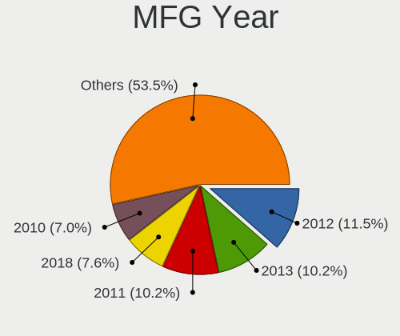
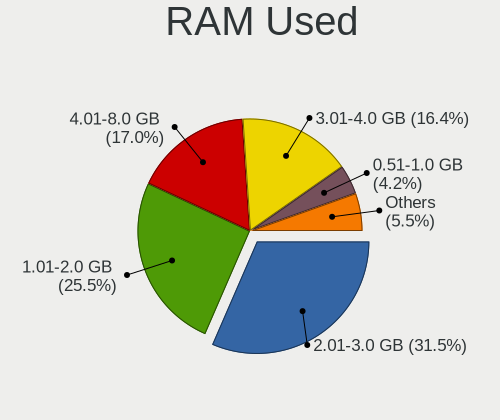
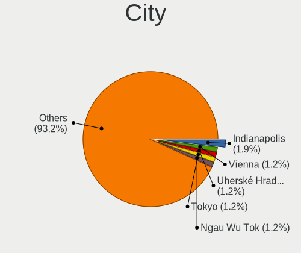
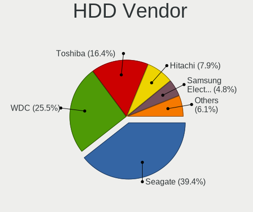
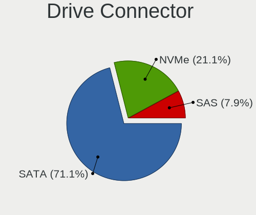
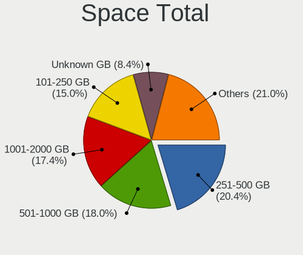
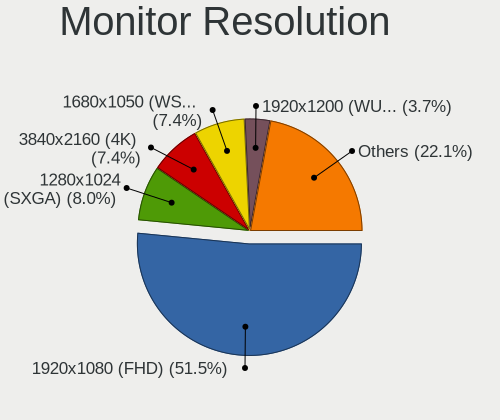
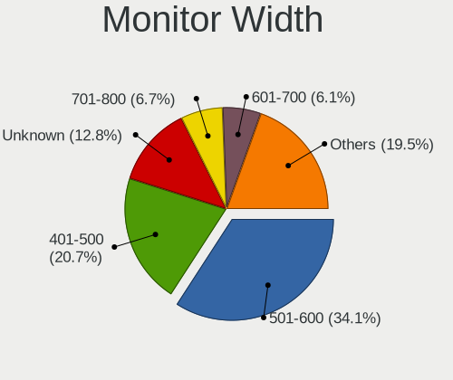
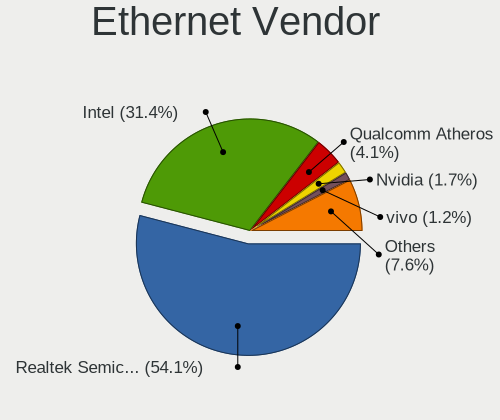
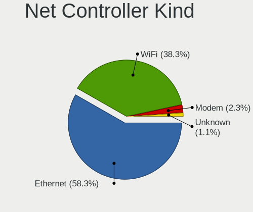

Parrot - Tested Hardware & Statistics (Desktops)
------------------------------------------------

A project to collect tested hardware configurations for Parrot.

Anyone can contribute to this report by the [hw-probe](https://github.com/linuxhw/hw-probe) tool:

    sudo -E hw-probe -all -upload

Please contribute! Especially if your hardware is rare.

Contents
--------

* [ Test Cases ](#test-cases)

* [ System ](#system)
  - [ OS                       ](#os)
  - [ OS Family                ](#os-family)
  - [ Kernel                   ](#kernel)
  - [ Kernel Family            ](#kernel-family)
  - [ Kernel Major Ver.        ](#kernel-major-ver)
  - [ Arch                     ](#arch)
  - [ DE                       ](#de)
  - [ Display Server           ](#display-server)
  - [ Display Manager          ](#display-manager)
  - [ OS Lang                  ](#os-lang)
  - [ Boot Mode                ](#boot-mode)
  - [ Filesystem               ](#filesystem)
  - [ Part. scheme             ](#part-scheme)
  - [ Dual Boot with Linux/BSD ](#dual-boot-with-linuxbsd)
  - [ Dual Boot (Win)          ](#dual-boot-win)

* [ Board ](#board)
  - [ Vendor                   ](#vendor)
  - [ Model                    ](#model)
  - [ Model Family             ](#model-family)
  - [ MFG Year                 ](#mfg-year)
  - [ Form Factor              ](#form-factor)
  - [ Secure Boot              ](#secure-boot)
  - [ Coreboot                 ](#coreboot)
  - [ RAM Size                 ](#ram-size)
  - [ RAM Used                 ](#ram-used)
  - [ Total Drives             ](#total-drives)
  - [ Has CD-ROM               ](#has-cd-rom)
  - [ Has Ethernet             ](#has-ethernet)
  - [ Has WiFi                 ](#has-wifi)
  - [ Has Bluetooth            ](#has-bluetooth)

* [ Location ](#location)
  - [ Country                  ](#country)
  - [ City                     ](#city)

* [ Drives ](#drives)
  - [ Drive Vendor             ](#drive-vendor)
  - [ Drive Model              ](#drive-model)
  - [ HDD Vendor               ](#hdd-vendor)
  - [ SSD Vendor               ](#ssd-vendor)
  - [ Drive Kind               ](#drive-kind)
  - [ Drive Connector          ](#drive-connector)
  - [ Drive Size               ](#drive-size)
  - [ Space Total              ](#space-total)
  - [ Space Used               ](#space-used)
  - [ Malfunc. Drives          ](#malfunc-drives)
  - [ Malfunc. Drive Vendor    ](#malfunc-drive-vendor)
  - [ Malfunc. HDD Vendor      ](#malfunc-hdd-vendor)
  - [ Malfunc. Drive Kind      ](#malfunc-drive-kind)
  - [ Failed Drives            ](#failed-drives)
  - [ Failed Drive Vendor      ](#failed-drive-vendor)
  - [ Drive Status             ](#drive-status)

* [ Storage controller ](#storage-controller)
  - [ Storage Vendor           ](#storage-vendor)
  - [ Storage Model            ](#storage-model)
  - [ Storage Kind             ](#storage-kind)

* [ Processor ](#processor)
  - [ CPU Vendor               ](#cpu-vendor)
  - [ CPU Model                ](#cpu-model)
  - [ CPU Model Family         ](#cpu-model-family)
  - [ CPU Cores                ](#cpu-cores)
  - [ CPU Sockets              ](#cpu-sockets)
  - [ CPU Threads              ](#cpu-threads)
  - [ CPU Op-Modes             ](#cpu-op-modes)
  - [ CPU Microcode            ](#cpu-microcode)
  - [ CPU Microarch            ](#cpu-microarch)

* [ Graphics ](#graphics)
  - [ GPU Vendor               ](#gpu-vendor)
  - [ GPU Model                ](#gpu-model)
  - [ GPU Combo                ](#gpu-combo)
  - [ GPU Driver               ](#gpu-driver)
  - [ GPU Memory               ](#gpu-memory)

* [ Monitor ](#monitor)
  - [ Monitor Vendor           ](#monitor-vendor)
  - [ Monitor Model            ](#monitor-model)
  - [ Monitor Resolution       ](#monitor-resolution)
  - [ Monitor Diagonal         ](#monitor-diagonal)
  - [ Monitor Width            ](#monitor-width)
  - [ Aspect Ratio             ](#aspect-ratio)
  - [ Monitor Area             ](#monitor-area)
  - [ Pixel Density            ](#pixel-density)
  - [ Multiple Monitors        ](#multiple-monitors)

* [ Network ](#network)
  - [ Net Controller Vendor    ](#net-controller-vendor)
  - [ Net Controller Model     ](#net-controller-model)
  - [ Wireless Vendor          ](#wireless-vendor)
  - [ Wireless Model           ](#wireless-model)
  - [ Ethernet Vendor          ](#ethernet-vendor)
  - [ Ethernet Model           ](#ethernet-model)
  - [ Net Controller Kind      ](#net-controller-kind)
  - [ Used Controller          ](#used-controller)
  - [ NICs                     ](#nics)
  - [ IPv6                     ](#ipv6)

* [ Bluetooth ](#bluetooth)
  - [ Bluetooth Vendor         ](#bluetooth-vendor)
  - [ Bluetooth Model          ](#bluetooth-model)

* [ Sound ](#sound)
  - [ Sound Vendor             ](#sound-vendor)
  - [ Sound Model              ](#sound-model)

* [ Memory ](#memory)
  - [ Memory Vendor            ](#memory-vendor)
  - [ Memory Model             ](#memory-model)
  - [ Memory Kind              ](#memory-kind)
  - [ Memory Form Factor       ](#memory-form-factor)
  - [ Memory Size              ](#memory-size)
  - [ Memory Speed             ](#memory-speed)

* [ Printers & scanners ](#printers--scanners)
  - [ Printer Vendor           ](#printer-vendor)
  - [ Printer Model            ](#printer-model)
  - [ Scanner Vendor           ](#scanner-vendor)
  - [ Scanner Model            ](#scanner-model)

* [ Camera ](#camera)
  - [ Camera Vendor            ](#camera-vendor)
  - [ Camera Model             ](#camera-model)

* [ Security ](#security)
  - [ Fingerprint Vendor       ](#fingerprint-vendor)
  - [ Fingerprint Model        ](#fingerprint-model)
  - [ Chipcard Vendor          ](#chipcard-vendor)
  - [ Chipcard Model           ](#chipcard-model)

* [ Unsupported ](#unsupported)
  - [ Unsupported Devices      ](#unsupported-devices)
  - [ Unsupported Device Types ](#unsupported-device-types)

Test Cases
----------

Total: 226

| Vendor        | Model                       | Probe                                                      | Date         |
|---------------|-----------------------------|------------------------------------------------------------|--------------|
| ASRock        | B550M-HDV                   | [6ce988b582](https://linux-hardware.org/?probe=6ce988b582) | Jan 04, 2025 |
| HP            | 0AA8h                       | [5f76cb932b](https://linux-hardware.org/?probe=5f76cb932b) | Dec 23, 2024 |
| HP            | 0AA8h                       | [8a22af001d](https://linux-hardware.org/?probe=8a22af001d) | Dec 23, 2024 |
| HP            | 1587h                       | [0c955e88ce](https://linux-hardware.org/?probe=0c955e88ce) | Dec 13, 2024 |
| HP            | 1587h                       | [85205e402a](https://linux-hardware.org/?probe=85205e402a) | Dec 12, 2024 |
| ASUSTek       | M5A97 R2.0                  | [2ca4532a01](https://linux-hardware.org/?probe=2ca4532a01) | Nov 27, 2024 |
| Fujitsu       | D3061-A1 S26361-D3061-A1    | [2397b52715](https://linux-hardware.org/?probe=2397b52715) | Nov 27, 2024 |
| MSI           | PRO B760-VC WIFI 7 BULK     | [e51990975e](https://linux-hardware.org/?probe=e51990975e) | Nov 25, 2024 |
| ASUSTek       | ProArt X670E-CREATOR WIF... | [d8aeb9e84d](https://linux-hardware.org/?probe=d8aeb9e84d) | Nov 13, 2024 |
| ASUSTek       | ProArt X670E-CREATOR WIF... | [aceb94369e](https://linux-hardware.org/?probe=aceb94369e) | Nov 13, 2024 |
| MSI           | MPG B550 GAMING CARBON W... | [b31e3a00d3](https://linux-hardware.org/?probe=b31e3a00d3) | Nov 02, 2024 |
| ASUSTek       | H81M-C                      | [f7228f91c2](https://linux-hardware.org/?probe=f7228f91c2) | Nov 01, 2024 |
| Unknown       | Unknown                     | [3a8dff97c1](https://linux-hardware.org/?probe=3a8dff97c1) | Oct 23, 2024 |
| Gigabyte      | GA-78LMT-USB3 SEx           | [b1209b5d81](https://linux-hardware.org/?probe=b1209b5d81) | Oct 18, 2024 |
| Foxconn       | 2ABF                        | [a154274724](https://linux-hardware.org/?probe=a154274724) | Oct 15, 2024 |
| MSI           | PRO Z690-A DDR4             | [ba1ef8f0ae](https://linux-hardware.org/?probe=ba1ef8f0ae) | Sep 25, 2024 |
| MSI           | PRO Z690-A DDR4             | [da7400591d](https://linux-hardware.org/?probe=da7400591d) | Sep 25, 2024 |
| ASUSTek       | PRIME A320M-K               | [b73138fbf5](https://linux-hardware.org/?probe=b73138fbf5) | Sep 23, 2024 |
| ASUSTek       | M5A97 R2.0                  | [ba2f866270](https://linux-hardware.org/?probe=ba2f866270) | Sep 07, 2024 |
| Gigabyte      | B660M AORUS PRO DDR4        | [293134b0b9](https://linux-hardware.org/?probe=293134b0b9) | Sep 03, 2024 |
| Dell          | 0WMJ54 A01                  | [d877099204](https://linux-hardware.org/?probe=d877099204) | Aug 14, 2024 |
| Gigabyte      | X99-SLI-CF                  | [2b28fed015](https://linux-hardware.org/?probe=2b28fed015) | Aug 06, 2024 |
| Foxconn       | 2AB1 DVT                    | [610048cdd2](https://linux-hardware.org/?probe=610048cdd2) | Jul 16, 2024 |
| Foxconn       | 2AB1 DVT                    | [855e1bd72f](https://linux-hardware.org/?probe=855e1bd72f) | Jul 16, 2024 |
| HC Technol... | HCAR5000-MI                 | [ee1ab4ebe8](https://linux-hardware.org/?probe=ee1ab4ebe8) | Jun 27, 2024 |
| ASUSTek       | M5A97 R2.0                  | [7da90462ec](https://linux-hardware.org/?probe=7da90462ec) | Jun 22, 2024 |
| HP            | 18E7                        | [42046a0b95](https://linux-hardware.org/?probe=42046a0b95) | May 27, 2024 |
| ASUSTek       | H110M-R                     | [473b7a412c](https://linux-hardware.org/?probe=473b7a412c) | Apr 10, 2024 |
| ASUSTek       | H110M-R                     | [d8c6b0c73f](https://linux-hardware.org/?probe=d8c6b0c73f) | Apr 10, 2024 |
| Biostar       | H410MH                      | [b8034503cb](https://linux-hardware.org/?probe=b8034503cb) | Apr 04, 2024 |
| ASUSTek       | PRIME X570-P                | [8928a51f78](https://linux-hardware.org/?probe=8928a51f78) | Mar 22, 2024 |
| Gigabyte      | H81M-DS2                    | [db79be4310](https://linux-hardware.org/?probe=db79be4310) | Mar 09, 2024 |
| MSI           | Z97 GAMING 7                | [be7cf8b3fc](https://linux-hardware.org/?probe=be7cf8b3fc) | Mar 01, 2024 |
| ASUSTek       | ROG STRIX B350-F GAMING     | [0a1087fdad](https://linux-hardware.org/?probe=0a1087fdad) | Jan 29, 2024 |
| ASUSTek       | PRIME A320M-K               | [b7fff52e41](https://linux-hardware.org/?probe=b7fff52e41) | Jan 29, 2024 |
| ASRock        | Z77M                        | [f3bd1cdf2c](https://linux-hardware.org/?probe=f3bd1cdf2c) | Jan 19, 2024 |
| ASRock        | 970 Pro3 R2.0               | [ca8734dc63](https://linux-hardware.org/?probe=ca8734dc63) | Jan 11, 2024 |
| MSI           | B550 GAMING GEN3            | [02163b04b7](https://linux-hardware.org/?probe=02163b04b7) | Dec 30, 2023 |
| Gigabyte      | B550M AORUS ELITE           | [404320e4d7](https://linux-hardware.org/?probe=404320e4d7) | Dec 28, 2023 |
| MSI           | MPG Z490 GAMING EDGE WIF... | [d90c13f9c6](https://linux-hardware.org/?probe=d90c13f9c6) | Dec 12, 2023 |
| Gateway       | TBGM01                      | [3ca4695541](https://linux-hardware.org/?probe=3ca4695541) | Nov 07, 2023 |
| Dell          | 0V8WGR A00                  | [9b13411bc8](https://linux-hardware.org/?probe=9b13411bc8) | Nov 05, 2023 |
| ASUSTek       | M5A78L-M/USB3               | [4ce8997d5a](https://linux-hardware.org/?probe=4ce8997d5a) | Nov 05, 2023 |
| ASUSTek       | Maximus VII HERO            | [3c959b9af8](https://linux-hardware.org/?probe=3c959b9af8) | Oct 25, 2023 |
| ASUSTek       | Maximus VII HERO            | [e3540cf969](https://linux-hardware.org/?probe=e3540cf969) | Oct 23, 2023 |
| ASUSTek       | M5A99X EVO                  | [a13621c5d3](https://linux-hardware.org/?probe=a13621c5d3) | Oct 04, 2023 |
| ASUSTek       | M5A99X EVO                  | [144cbc70d0](https://linux-hardware.org/?probe=144cbc70d0) | Oct 03, 2023 |
| HP            | 8619                        | [d631850d2f](https://linux-hardware.org/?probe=d631850d2f) | Sep 28, 2023 |
| ASUSTek       | M5A99X EVO                  | [34e34036d7](https://linux-hardware.org/?probe=34e34036d7) | Sep 27, 2023 |
| HP            | 8714                        | [235d6bd11b](https://linux-hardware.org/?probe=235d6bd11b) | Sep 24, 2023 |
| ASUSTek       | Maximus V FORMULA           | [e10f21c5c5](https://linux-hardware.org/?probe=e10f21c5c5) | Sep 22, 2023 |
| ASUSTek       | M5A99X EVO                  | [648ac87a81](https://linux-hardware.org/?probe=648ac87a81) | Sep 21, 2023 |
| Shenzhen M... | F7BAA                       | [10d32d6284](https://linux-hardware.org/?probe=10d32d6284) | Sep 17, 2023 |
| Dell          | 0HD5W2 A01                  | [faf0bfe427](https://linux-hardware.org/?probe=faf0bfe427) | Sep 17, 2023 |
| Dell          | 0HD5W2 A01                  | [e59c5b4fda](https://linux-hardware.org/?probe=e59c5b4fda) | Sep 10, 2023 |
| ASUSTek       | Maximus V FORMULA           | [694ffed41f](https://linux-hardware.org/?probe=694ffed41f) | Sep 06, 2023 |
| ASUSTek       | Maximus V FORMULA           | [039aa353eb](https://linux-hardware.org/?probe=039aa353eb) | Sep 06, 2023 |
| Pegatron      | 2A94h                       | [e9816ab65b](https://linux-hardware.org/?probe=e9816ab65b) | Aug 19, 2023 |
| MSI           | 3666h                       | [d3f51a2bf0](https://linux-hardware.org/?probe=d3f51a2bf0) | Aug 15, 2023 |
| Dell          | 0100P6 A01                  | [2cf993001c](https://linux-hardware.org/?probe=2cf993001c) | Aug 13, 2023 |
| MSI           | MAG B550 TOMAHAWK           | [b76b1bf00a](https://linux-hardware.org/?probe=b76b1bf00a) | Aug 08, 2023 |
| MSI           | MAG B550 TOMAHAWK           | [63665fca24](https://linux-hardware.org/?probe=63665fca24) | Aug 08, 2023 |
| MSI           | PRO H610M-B DDR4            | [1b3c788790](https://linux-hardware.org/?probe=1b3c788790) | Aug 06, 2023 |
| ASUSTek       | PRIME X570-P                | [48ec623298](https://linux-hardware.org/?probe=48ec623298) | Aug 06, 2023 |
| ASUSTek       | TUF Gaming B660-PLUS WIF... | [7979e7ce95](https://linux-hardware.org/?probe=7979e7ce95) | Aug 05, 2023 |
| Dell          | 0RY007                      | [8317045335](https://linux-hardware.org/?probe=8317045335) | Aug 01, 2023 |
| MSI           | PRO Z790-P WIFI             | [b4d959d91f](https://linux-hardware.org/?probe=b4d959d91f) | Jul 02, 2023 |
| ASUSTek       | Maximus V FORMULA           | [190d408bc2](https://linux-hardware.org/?probe=190d408bc2) | Jun 23, 2023 |
| ASUSTek       | Maximus V FORMULA           | [fa49028492](https://linux-hardware.org/?probe=fa49028492) | Jun 23, 2023 |
| MSI           | B450 GAMING PRO CARBON A... | [11161fa30c](https://linux-hardware.org/?probe=11161fa30c) | Jun 18, 2023 |
| HP            | 339A                        | [d1fa07d03f](https://linux-hardware.org/?probe=d1fa07d03f) | Jun 10, 2023 |
| HP            | 339A                        | [f2147ed11b](https://linux-hardware.org/?probe=f2147ed11b) | Jun 05, 2023 |
| HP            | 1495                        | [32cfd162b8](https://linux-hardware.org/?probe=32cfd162b8) | Jun 05, 2023 |
| HP            | 1495                        | [f6c9f689ec](https://linux-hardware.org/?probe=f6c9f689ec) | Jun 05, 2023 |
| ASUSTek       | P8Z68-V                     | [59e64db8de](https://linux-hardware.org/?probe=59e64db8de) | Jun 02, 2023 |
| ASUSTek       | ROG STRIX X570-E GAMING ... | [15b23b6779](https://linux-hardware.org/?probe=15b23b6779) | May 30, 2023 |
| Gigabyte      | H61M-HD2                    | [7c57f43d4a](https://linux-hardware.org/?probe=7c57f43d4a) | May 29, 2023 |
| ASUSTek       | PRIME Z690-P WIFI D4        | [922428b203](https://linux-hardware.org/?probe=922428b203) | May 25, 2023 |
| Gigabyte      | B85M-DS3H-A                 | [d2ddb8221f](https://linux-hardware.org/?probe=d2ddb8221f) | May 23, 2023 |
| Gigabyte      | Z97X-UD3H-CF                | [719fbbd5a5](https://linux-hardware.org/?probe=719fbbd5a5) | May 23, 2023 |
| MSI           | MAG Z690 TOMAHAWK WIFI D... | [64b9ba417c](https://linux-hardware.org/?probe=64b9ba417c) | May 19, 2023 |
| MSI           | MAG Z690 TOMAHAWK WIFI D... | [5c07806ab1](https://linux-hardware.org/?probe=5c07806ab1) | May 19, 2023 |
| ASUSTek       | PRIME X399-A                | [b4861cf35c](https://linux-hardware.org/?probe=b4861cf35c) | Apr 23, 2023 |
| MSI           | Z97 GAMING 5                | [2f61bfa5a5](https://linux-hardware.org/?probe=2f61bfa5a5) | Apr 04, 2023 |
| MSI           | Z97 GAMING 5                | [1e81e330e1](https://linux-hardware.org/?probe=1e81e330e1) | Apr 04, 2023 |
| MSI           | 760GM-P33                   | [4145a32920](https://linux-hardware.org/?probe=4145a32920) | Apr 03, 2023 |
| Gigabyte      | B450 AORUS ELITE            | [9edda5f374](https://linux-hardware.org/?probe=9edda5f374) | Mar 28, 2023 |
| Gigabyte      | B450 AORUS ELITE            | [c25f99afed](https://linux-hardware.org/?probe=c25f99afed) | Mar 28, 2023 |
| Gigabyte      | H61M-S2PV                   | [6752797fe9](https://linux-hardware.org/?probe=6752797fe9) | Mar 14, 2023 |
| Gigabyte      | H61M-S2PV                   | [2e0019e450](https://linux-hardware.org/?probe=2e0019e450) | Mar 14, 2023 |
| ASRock        | B560M-C                     | [a93d64aa2c](https://linux-hardware.org/?probe=a93d64aa2c) | Feb 28, 2023 |
| ASRock        | B560M-C                     | [cbbd0a63d4](https://linux-hardware.org/?probe=cbbd0a63d4) | Feb 28, 2023 |
| Pegatron      | 2ACB                        | [13355a7d07](https://linux-hardware.org/?probe=13355a7d07) | Feb 26, 2023 |
| Dell          | 0C1R19 A02                  | [42ff2c0844](https://linux-hardware.org/?probe=42ff2c0844) | Feb 22, 2023 |
| ASRock        | B560M-C                     | [0641c704e9](https://linux-hardware.org/?probe=0641c704e9) | Feb 20, 2023 |
| Biostar       | B450MH                      | [963e90387d](https://linux-hardware.org/?probe=963e90387d) | Feb 17, 2023 |
| Dell          | 0WMJ54 A01                  | [bfb29a2d13](https://linux-hardware.org/?probe=bfb29a2d13) | Feb 04, 2023 |
| ASRock        | Z87M Extreme4               | [8821f128c8](https://linux-hardware.org/?probe=8821f128c8) | Feb 03, 2023 |
| ASUSTek       | PRIME Z270-P                | [15644c39de](https://linux-hardware.org/?probe=15644c39de) | Jan 25, 2023 |
| Gigabyte      | GA-880GMA-USB3              | [eb10e25652](https://linux-hardware.org/?probe=eb10e25652) | Jan 23, 2023 |
| Gigabyte      | GA-880GMA-USB3              | [6552c7b8b3](https://linux-hardware.org/?probe=6552c7b8b3) | Jan 22, 2023 |
| Gigabyte      | GA-880GMA-USB3              | [64164ef7df](https://linux-hardware.org/?probe=64164ef7df) | Jan 20, 2023 |
| Gigabyte      | GA-880GMA-USB3              | [46befb7112](https://linux-hardware.org/?probe=46befb7112) | Jan 20, 2023 |
| HP            | 3397                        | [33ba62be32](https://linux-hardware.org/?probe=33ba62be32) | Dec 10, 2022 |
| ASUSTek       | PRIME B450M-K               | [0e7586e771](https://linux-hardware.org/?probe=0e7586e771) | Dec 06, 2022 |
| ASUSTek       | Z170-DELUXE                 | [7928d11567](https://linux-hardware.org/?probe=7928d11567) | Nov 19, 2022 |
| Dell          | 0C1R19 A02                  | [514ae17aa9](https://linux-hardware.org/?probe=514ae17aa9) | Nov 06, 2022 |
| HP            | 89B5 A                      | [1b04604c98](https://linux-hardware.org/?probe=1b04604c98) | Nov 03, 2022 |
| Gigabyte      | Z97N-WIFI                   | [dd5c78f136](https://linux-hardware.org/?probe=dd5c78f136) | Oct 24, 2022 |
| Gigabyte      | Z97N-WIFI                   | [10d8d16b6c](https://linux-hardware.org/?probe=10d8d16b6c) | Oct 24, 2022 |
| ASUSTek       | P5G41T-M LX                 | [7c046d1ba8](https://linux-hardware.org/?probe=7c046d1ba8) | Oct 23, 2022 |
| Gigabyte      | M61SME-S2                   | [6595a0b531](https://linux-hardware.org/?probe=6595a0b531) | Oct 19, 2022 |
| ASUSTek       | P6X58D-E                    | [d84fc5ce81](https://linux-hardware.org/?probe=d84fc5ce81) | Oct 13, 2022 |
| ASUSTek       | P6X58D-E                    | [2a896ec4f6](https://linux-hardware.org/?probe=2a896ec4f6) | Oct 13, 2022 |
| Gigabyte      | H110M-H DDR3-CF             | [8169fe8dbd](https://linux-hardware.org/?probe=8169fe8dbd) | Oct 01, 2022 |
| Gigabyte      | H61M-S2PT                   | [b7e6228017](https://linux-hardware.org/?probe=b7e6228017) | Aug 22, 2022 |
| Gateway       | SX2855                      | [a896e3b0f7](https://linux-hardware.org/?probe=a896e3b0f7) | Jul 30, 2022 |
| ASUSTek       | H110M-K                     | [9e9ca5b39a](https://linux-hardware.org/?probe=9e9ca5b39a) | Jul 19, 2022 |
| ASUSTek       | CROSSHAIR V FORMULA-Z       | [0539efedb2](https://linux-hardware.org/?probe=0539efedb2) | Jul 18, 2022 |
| ASUSTek       | H110M-K                     | [0e0a7a2fbc](https://linux-hardware.org/?probe=0e0a7a2fbc) | Jul 16, 2022 |
| ASUSTek       | PRIME B550-PLUS             | [3ba50e78b9](https://linux-hardware.org/?probe=3ba50e78b9) | Jun 29, 2022 |
| ASUSTek       | PRIME B550-PLUS             | [f33854651b](https://linux-hardware.org/?probe=f33854651b) | Jun 29, 2022 |
| ASUSTek       | H110M-K                     | [d1b8d3ff84](https://linux-hardware.org/?probe=d1b8d3ff84) | Jun 27, 2022 |
| ASUSTek       | H110M-K                     | [656a452bc6](https://linux-hardware.org/?probe=656a452bc6) | Jun 21, 2022 |
| Gigabyte      | H61M-USB3H                  | [6b9dcbd952](https://linux-hardware.org/?probe=6b9dcbd952) | Jun 20, 2022 |
| Unknown       | TB-4000                     | [c268e7111b](https://linux-hardware.org/?probe=c268e7111b) | Jun 07, 2022 |
| Lenovo        | 31900058 STD                | [cb4959b996](https://linux-hardware.org/?probe=cb4959b996) | May 21, 2022 |
| Gigabyte      | B450M DS3H-CF               | [fb7cb376e9](https://linux-hardware.org/?probe=fb7cb376e9) | May 21, 2022 |
| MSI           | G31M3-L V2                  | [29d45c64bb](https://linux-hardware.org/?probe=29d45c64bb) | May 11, 2022 |
| HP            | 1495                        | [c845f7b657](https://linux-hardware.org/?probe=c845f7b657) | May 05, 2022 |
| Unknown       | TB-4000                     | [99911022e9](https://linux-hardware.org/?probe=99911022e9) | Apr 26, 2022 |
| ASUSTek       | PRIME H310M-D R2.0          | [9c06485301](https://linux-hardware.org/?probe=9c06485301) | Apr 21, 2022 |
| HP            | 18E7                        | [1b6db66cc1](https://linux-hardware.org/?probe=1b6db66cc1) | Apr 19, 2022 |
| ASUSTek       | B85M-E                      | [b68f986aaf](https://linux-hardware.org/?probe=b68f986aaf) | Apr 17, 2022 |
| ASUSTek       | B85M-E                      | [93306ff9ee](https://linux-hardware.org/?probe=93306ff9ee) | Apr 17, 2022 |
| MSI           | B350 TOMAHAWK               | [b1a322fa38](https://linux-hardware.org/?probe=b1a322fa38) | Apr 11, 2022 |
| ECS           | Nettle2                     | [4939d60e6d](https://linux-hardware.org/?probe=4939d60e6d) | Mar 27, 2022 |
| HP            | 18E7                        | [d8d1c3d468](https://linux-hardware.org/?probe=d8d1c3d468) | Mar 26, 2022 |
| Lenovo        | SHARKBAY 31900058 STD       | [85260f6ed1](https://linux-hardware.org/?probe=85260f6ed1) | Mar 20, 2022 |
| Lenovo        | SHARKBAY 31900058 STD       | [e849ec3916](https://linux-hardware.org/?probe=e849ec3916) | Mar 20, 2022 |
| ASUSTek       | B85M-E                      | [b0769dffdd](https://linux-hardware.org/?probe=b0769dffdd) | Mar 19, 2022 |
| ASUSTek       | ROG CROSSHAIR VIII HERO     | [2c1ca9145b](https://linux-hardware.org/?probe=2c1ca9145b) | Mar 18, 2022 |
| ASUSTek       | H170M-E D3                  | [167928d6e9](https://linux-hardware.org/?probe=167928d6e9) | Mar 17, 2022 |
| Wistron       | JIG31B3                     | [a360eaf501](https://linux-hardware.org/?probe=a360eaf501) | Mar 15, 2022 |
| ASUSTek       | H170M-E D3                  | [937c0097ca](https://linux-hardware.org/?probe=937c0097ca) | Mar 14, 2022 |
| ASUSTek       | F2A85-M                     | [36d17e4fdb](https://linux-hardware.org/?probe=36d17e4fdb) | Mar 13, 2022 |
| ASUSTek       | F2A85-M                     | [453d0816b3](https://linux-hardware.org/?probe=453d0816b3) | Mar 13, 2022 |
| ASRock        | Z87M Extreme4               | [dba57ee1b3](https://linux-hardware.org/?probe=dba57ee1b3) | Mar 12, 2022 |
| MSI           | G31M3-L V2                  | [4c15ba6fb9](https://linux-hardware.org/?probe=4c15ba6fb9) | Mar 10, 2022 |
| ASUSTek       | B85M-E                      | [161eda858b](https://linux-hardware.org/?probe=161eda858b) | Mar 10, 2022 |
| ASUSTek       | B85M-E                      | [36bada67c8](https://linux-hardware.org/?probe=36bada67c8) | Mar 08, 2022 |
| Unknown       | TB-4000                     | [d92c05a18a](https://linux-hardware.org/?probe=d92c05a18a) | Mar 03, 2022 |
| Daewoo Luc... | Solo Top                    | [7f7b20688f](https://linux-hardware.org/?probe=7f7b20688f) | Mar 03, 2022 |
| Unknown       | TB-4000                     | [dc43686a5a](https://linux-hardware.org/?probe=dc43686a5a) | Feb 27, 2022 |
| Dell          | 0GXM1W A02                  | [044a00e086](https://linux-hardware.org/?probe=044a00e086) | Feb 25, 2022 |
| ASUSTek       | Benicia                     | [aceee2d932](https://linux-hardware.org/?probe=aceee2d932) | Feb 12, 2022 |
| Unknown       | TB-4000                     | [225e399fc1](https://linux-hardware.org/?probe=225e399fc1) | Feb 03, 2022 |
| Unknown       | Unknown                     | [bccc675fea](https://linux-hardware.org/?probe=bccc675fea) | Jan 08, 2022 |
| ASUSTek       | ROG STRIX B450-F GAMING     | [f75ebfbbc8](https://linux-hardware.org/?probe=f75ebfbbc8) | Jan 01, 2022 |
| Dell          | 04YP6J A01                  | [680408ec06](https://linux-hardware.org/?probe=680408ec06) | Jan 01, 2022 |
| Dell          | 04YP6J A01                  | [623d384766](https://linux-hardware.org/?probe=623d384766) | Jan 01, 2022 |
| Gigabyte      | A320M-S2H-CF                | [4ec2105ead](https://linux-hardware.org/?probe=4ec2105ead) | Jan 01, 2022 |
| ASUSTek       | M5A99X EVO                  | [5c55046f50](https://linux-hardware.org/?probe=5c55046f50) | Dec 13, 2021 |
| Alienware     | 0PGRP5 A02                  | [aeacaefd26](https://linux-hardware.org/?probe=aeacaefd26) | Nov 14, 2021 |
| ASRock        | Z87 Killer                  | [0aafc0d981](https://linux-hardware.org/?probe=0aafc0d981) | Nov 13, 2021 |
| Acer          | Aspire TC-780               | [f6de1ed637](https://linux-hardware.org/?probe=f6de1ed637) | Nov 04, 2021 |
| Dell          | 0T2HR0 A00                  | [dc55f173fe](https://linux-hardware.org/?probe=dc55f173fe) | Oct 05, 2021 |
| ASUSTek       | P8H67-M PRO                 | [7dcd6067ac](https://linux-hardware.org/?probe=7dcd6067ac) | Oct 04, 2021 |
| Gigabyte      | A320M-S2H-CF                | [d0cd1577c7](https://linux-hardware.org/?probe=d0cd1577c7) | Oct 04, 2021 |
| Gigabyte      | A320M-S2H-CF                | [b733e7fac1](https://linux-hardware.org/?probe=b733e7fac1) | Sep 23, 2021 |
| MSI           | B450 TOMAHAWK MAX           | [b741d2ab2b](https://linux-hardware.org/?probe=b741d2ab2b) | Aug 12, 2021 |
| Gigabyte      | A320M-S2H-CF                | [3ba02ffef3](https://linux-hardware.org/?probe=3ba02ffef3) | Aug 10, 2021 |
| ZOTAC         | Unknown                     | [0324aff0a3](https://linux-hardware.org/?probe=0324aff0a3) | Aug 03, 2021 |
| ZOTAC         | Unknown                     | [c1a9e01bd7](https://linux-hardware.org/?probe=c1a9e01bd7) | Aug 03, 2021 |
| HP            | 1850                        | [687c780f5c](https://linux-hardware.org/?probe=687c780f5c) | Jul 19, 2021 |
| Dell          | 0T10XW A02                  | [57a4116288](https://linux-hardware.org/?probe=57a4116288) | Jul 17, 2021 |
| HP            | 1850                        | [3bde7e8e11](https://linux-hardware.org/?probe=3bde7e8e11) | May 27, 2021 |
| Dell          | 0C1R19 A02                  | [ff5bb2ee2a](https://linux-hardware.org/?probe=ff5bb2ee2a) | May 03, 2021 |
| ASUSTek       | PRIME X399-A                | [4dd4f28ca7](https://linux-hardware.org/?probe=4dd4f28ca7) | Apr 11, 2021 |
| Acer          | Predator PO3-600 V:1.1      | [6ea75bdbb5](https://linux-hardware.org/?probe=6ea75bdbb5) | Mar 26, 2021 |
| ASUSTek       | M5A78L-M/USB3               | [6b26a69326](https://linux-hardware.org/?probe=6b26a69326) | Mar 21, 2021 |
| HP            | 339A                        | [b105e94284](https://linux-hardware.org/?probe=b105e94284) | Feb 20, 2021 |
| HP            | 339A                        | [3dfdd6aa5e](https://linux-hardware.org/?probe=3dfdd6aa5e) | Feb 20, 2021 |
| MSI           | B250M MORTAR                | [be8a65f362](https://linux-hardware.org/?probe=be8a65f362) | Feb 02, 2021 |
| Dell          | 0CU409                      | [64c8a84081](https://linux-hardware.org/?probe=64c8a84081) | Jan 29, 2021 |
| Acer          | Aspire X3990                | [a3e9301c7f](https://linux-hardware.org/?probe=a3e9301c7f) | Jan 16, 2021 |
| Acer          | Aspire X3990                | [1660d13b44](https://linux-hardware.org/?probe=1660d13b44) | Jan 12, 2021 |
| HP            | 3047h                       | [8b50e12296](https://linux-hardware.org/?probe=8b50e12296) | Jan 07, 2021 |
| Medion        | MS-7621                     | [74c49730d1](https://linux-hardware.org/?probe=74c49730d1) | Dec 27, 2020 |
| Positivo      | POS-PIG43BC                 | [146c7d86bb](https://linux-hardware.org/?probe=146c7d86bb) | Dec 27, 2020 |
| HP            | 3047h                       | [b65caab721](https://linux-hardware.org/?probe=b65caab721) | Nov 24, 2020 |
| Foxconn       | 45CMX/45GMX/45CMX-K         | [7918687a8b](https://linux-hardware.org/?probe=7918687a8b) | Nov 07, 2020 |
| ASUSTek       | Maximus VIII HERO           | [f95c24897c](https://linux-hardware.org/?probe=f95c24897c) | Oct 30, 2020 |
| ASUSTek       | M5A99X EVO                  | [f7a2b660d8](https://linux-hardware.org/?probe=f7a2b660d8) | Oct 29, 2020 |
| ASUSTek       | M5A99X EVO                  | [c687805b04](https://linux-hardware.org/?probe=c687805b04) | Oct 29, 2020 |
| ECS           | A740GM-M                    | [423f49affd](https://linux-hardware.org/?probe=423f49affd) | Oct 25, 2020 |
| ASUSTek       | Z170 PRO GAMING             | [2bc8fbe372](https://linux-hardware.org/?probe=2bc8fbe372) | Sep 27, 2020 |
| Gigabyte      | H370M DS3H-CF               | [affb4f7587](https://linux-hardware.org/?probe=affb4f7587) | Aug 29, 2020 |
| Apple         | Mac-F221BEC8                | [1d8d1db67e](https://linux-hardware.org/?probe=1d8d1db67e) | Jul 04, 2020 |
| Dell          | 0D6H9T A00                  | [06e9599063](https://linux-hardware.org/?probe=06e9599063) | Jul 04, 2020 |
| Gigabyte      | 970A-DS3P                   | [dda8536e62](https://linux-hardware.org/?probe=dda8536e62) | Jun 11, 2020 |
| Biostar       | H77MU3                      | [048ffba01b](https://linux-hardware.org/?probe=048ffba01b) | May 24, 2020 |
| ASUSTek       | A68HM-PLUS                  | [7c05b67968](https://linux-hardware.org/?probe=7c05b67968) | May 22, 2020 |
| ASUSTek       | A68HM-PLUS                  | [fc8bf8a5a6](https://linux-hardware.org/?probe=fc8bf8a5a6) | May 22, 2020 |
| ASUSTek       | H110I-PLUS                  | [8e55010bac](https://linux-hardware.org/?probe=8e55010bac) | May 22, 2020 |
| ASUSTek       | H110I-PLUS                  | [26293feb91](https://linux-hardware.org/?probe=26293feb91) | May 21, 2020 |
| Dell          | 0VYXHD A00                  | [5e5d0a24f3](https://linux-hardware.org/?probe=5e5d0a24f3) | May 15, 2020 |
| Dell          | 0VYXHD A00                  | [5a56c30293](https://linux-hardware.org/?probe=5a56c30293) | May 06, 2020 |
| Dell          | 05DN3X A00                  | [7424c0caba](https://linux-hardware.org/?probe=7424c0caba) | May 02, 2020 |
| ASUSTek       | A68HM-PLUS                  | [3dc6534b5f](https://linux-hardware.org/?probe=3dc6534b5f) | May 01, 2020 |
| ASUSTek       | A68HM-PLUS                  | [6835f4fe95](https://linux-hardware.org/?probe=6835f4fe95) | Apr 28, 2020 |
| Foxconn       | 2A8C                        | [6e636c5fd2](https://linux-hardware.org/?probe=6e636c5fd2) | Apr 27, 2020 |
| Foxconn       | 2A8C                        | [d19700bc2d](https://linux-hardware.org/?probe=d19700bc2d) | Apr 27, 2020 |
| ASUSTek       | M2N68-AM Plus               | [72dcfa02ca](https://linux-hardware.org/?probe=72dcfa02ca) | Apr 26, 2020 |
| Foxconn       | 2A8C                        | [37c314650f](https://linux-hardware.org/?probe=37c314650f) | Apr 26, 2020 |
| Foxconn       | 2A8C                        | [9a9b368a7c](https://linux-hardware.org/?probe=9a9b368a7c) | Apr 26, 2020 |
| ASUSTek       | K31CD-K                     | [b4ad316fa2](https://linux-hardware.org/?probe=b4ad316fa2) | Apr 14, 2020 |
| Dell          | 0CU409                      | [661761d2ca](https://linux-hardware.org/?probe=661761d2ca) | Apr 14, 2020 |
| Dell          | 0CU409                      | [5512733c4a](https://linux-hardware.org/?probe=5512733c4a) | Apr 14, 2020 |
| Gigabyte      | GA-880GM-D2H                | [93da68c7fb](https://linux-hardware.org/?probe=93da68c7fb) | Apr 12, 2020 |
| ASRock        | FM2A68M-DG3+                | [05f8c8eef4](https://linux-hardware.org/?probe=05f8c8eef4) | Feb 29, 2020 |
| Gigabyte      | AX370-Gaming-CF se1         | [2bfc7eae61](https://linux-hardware.org/?probe=2bfc7eae61) | Feb 06, 2020 |
| Gigabyte      | AX370-Gaming-CF se1         | [1e8ccbe5b9](https://linux-hardware.org/?probe=1e8ccbe5b9) | Feb 04, 2020 |
| Foxconn       | 2A8C                        | [38658290e2](https://linux-hardware.org/?probe=38658290e2) | Jan 19, 2020 |
| Foxconn       | 2A8C                        | [05e5552eea](https://linux-hardware.org/?probe=05e5552eea) | Jan 19, 2020 |
| ASUSTek       | M5A78L-M/USB3               | [51389e5c4a](https://linux-hardware.org/?probe=51389e5c4a) | Dec 07, 2019 |

System
------

OS
--

Installed operating systems

| Name        | Desktops | Percent |
|-------------|----------|---------|
| Parrot 5.3  | 31       | 18.9%   |
| Parrot 5.0  | 27       | 16.46%  |
| Parrot 4.11 | 23       | 14.02%  |
| Parrot 6.2  | 17       | 10.37%  |
| Parrot 4.10 | 14       | 8.54%   |
| Parrot 5.1  | 13       | 7.93%   |
| Parrot 6.0  | 9        | 5.49%   |
| Parrot 4.9  | 9        | 5.49%   |
| Parrot 5.2  | 8        | 4.88%   |
| Parrot 4.8  | 6        | 3.66%   |
| Parrot 6.1  | 4        | 2.44%   |
| Parrot 4.7  | 3        | 1.83%   |

OS Family
---------

OS without a version

| Name   | Desktops | Percent |
|--------|----------|---------|
| Parrot | 157      | 100%    |

Kernel
------

Version of the Linux kernel

| Version                  | Desktops | Percent |
|--------------------------|----------|---------|
| 6.1.0-1parrot1-amd64     | 31       | 18.67%  |
| 6.0.0-12parrot1-amd64    | 14       | 8.43%   |
| 5.16.0-12parrot1-amd64   | 14       | 8.43%   |
| 5.14.0-9parrot1-amd64    | 14       | 8.43%   |
| 5.5.0-1parrot1-amd64     | 12       | 7.23%   |
| 6.10.11-amd64            | 10       | 6.02%   |
| 6.5.0-13parrot1-amd64    | 9        | 5.42%   |
| 6.0.0-2parrot1-amd64     | 7        | 4.22%   |
| 6.9.7-amd64              | 6        | 3.61%   |
| 5.7.0-2parrot2-amd64     | 6        | 3.61%   |
| 5.15.0-15parrot1-amd64   | 6        | 3.61%   |
| 5.10.0-6parrot1-amd64    | 6        | 3.61%   |
| 5.8.0-2parrot1-amd64     | 3        | 1.81%   |
| 5.4.0-4parrot1-amd64     | 3        | 1.81%   |
| 5.10.0-8parrot1-amd64    | 3        | 1.81%   |
| 5.9.0-2parrot1-amd64     | 2        | 1.2%    |
| 5.4.0-2parrot1-amd64     | 2        | 1.2%    |
| 5.3.0-3parrot3-amd64     | 2        | 1.2%    |
| 5.18.0-1parrot1-amd64    | 2        | 1.2%    |
| 5.18.0-14parrot1-amd64   | 2        | 1.2%    |
| 5.14.0-2parrot1-amd64    | 2        | 1.2%    |
| 5.10.0-3parrot1-amd64    | 2        | 1.2%    |
| 6.6.13+bpo-amd64         | 1        | 0.6%    |
| 6.5.0-kali3-amd64        | 1        | 0.6%    |
| 6.11+parrot-amd64        | 1        | 0.6%    |
| 5.8.0-1parrot1-amd64     | 1        | 0.6%    |
| 5.6.0-2parrot1-amd64     | 1        | 0.6%    |
| 5.4.0-3parrot1-amd64     | 1        | 0.6%    |
| 5.16.0-12parrot1-686-pae | 1        | 0.6%    |
| 5.10.0-5parrot1-amd64    | 1        | 0.6%    |

Kernel Family
-------------

Linux kernel without a distro release

| Version | Desktops | Percent |
|---------|----------|---------|
| 6.1.0   | 31       | 18.9%   |
| 6.0.0   | 20       | 12.2%   |
| 5.16.0  | 15       | 9.15%   |
| 5.14.0  | 15       | 9.15%   |
| 5.5.0   | 12       | 7.32%   |
| 5.10.0  | 12       | 7.32%   |
| 6.5.0   | 10       | 6.1%    |
| 6.10.11 | 10       | 6.1%    |
| 6.9.7   | 6        | 3.66%   |
| 5.7.0   | 6        | 3.66%   |
| 5.4.0   | 6        | 3.66%   |
| 5.15.0  | 6        | 3.66%   |
| 5.8.0   | 4        | 2.44%   |
| 5.18.0  | 4        | 2.44%   |
| 5.9.0   | 2        | 1.22%   |
| 5.3.0   | 2        | 1.22%   |
| 6.6.13  | 1        | 0.61%   |
| 6.11    | 1        | 0.61%   |
| 5.6.0   | 1        | 0.61%   |

Kernel Major Ver.
-----------------

Linux kernel major version

| Version | Desktops | Percent |
|---------|----------|---------|
| 6.1     | 31       | 18.9%   |
| 6.0     | 20       | 12.2%   |
| 5.16    | 15       | 9.15%   |
| 5.14    | 15       | 9.15%   |
| 5.5     | 12       | 7.32%   |
| 5.10    | 12       | 7.32%   |
| 6.5     | 10       | 6.1%    |
| 6.10    | 10       | 6.1%    |
| 6.9     | 6        | 3.66%   |
| 5.7     | 6        | 3.66%   |
| 5.4     | 6        | 3.66%   |
| 5.15    | 6        | 3.66%   |
| 5.8     | 4        | 2.44%   |
| 5.18    | 4        | 2.44%   |
| 5.9     | 2        | 1.22%   |
| 5.3     | 2        | 1.22%   |
| 6.6     | 1        | 0.61%   |
| 6       | 1        | 0.61%   |
| 5.6     | 1        | 0.61%   |

Arch
----

OS architecture (x86_64, i586, etc.)

| Name   | Desktops | Percent |
|--------|----------|---------|
| x86_64 | 156      | 99.36%  |
| i686   | 1        | 0.64%   |

DE
--

Desktop Environment

| Name    | Desktops | Percent |
|---------|----------|---------|
| MATE    | 122      | 75.31%  |
| KDE5    | 15       | 9.26%   |
| XFCE    | 7        | 4.32%   |
| KDE     | 7        | 4.32%   |
| GNOME   | 7        | 4.32%   |
| Unknown | 3        | 1.85%   |
| bspwm   | 1        | 0.62%   |

Display Server
--------------

X11 or Wayland

| Name    | Desktops | Percent |
|---------|----------|---------|
| X11     | 150      | 95.54%  |
| Wayland | 5        | 3.18%   |
| Tty     | 1        | 0.64%   |
| Unknown | 1        | 0.64%   |

Display Manager
---------------

SDDM, LightDM, etc.

| Name    | Desktops | Percent |
|---------|----------|---------|
| LightDM | 77       | 47.53%  |
| Unknown | 56       | 34.57%  |
| TDM     | 18       | 11.11%  |
| SDDM    | 7        | 4.32%   |
| GDM     | 3        | 1.85%   |
| GDM3    | 1        | 0.62%   |

OS Lang
-------

Language

| Lang  | Desktops | Percent |
|-------|----------|---------|
| en_US | 82       | 51.9%   |
| es_ES | 8        | 5.06%   |
| ru_RU | 7        | 4.43%   |
| fr_FR | 6        | 3.8%    |
| de_DE | 6        | 3.8%    |
| pt_BR | 5        | 3.16%   |
| en_IN | 5        | 3.16%   |
| pl_PL | 4        | 2.53%   |
| en_AU | 4        | 2.53%   |
| it_IT | 3        | 1.9%    |
| es_MX | 3        | 1.9%    |
| en_ZA | 3        | 1.9%    |
| en_GB | 3        | 1.9%    |
| en_HK | 2        | 1.27%   |
| cs_CZ | 2        | 1.27%   |
| ru_UA | 1        | 0.63%   |
| mk_MK | 1        | 0.63%   |
| id_ID | 1        | 0.63%   |
| hr_HR | 1        | 0.63%   |
| es_US | 1        | 0.63%   |
| es_PE | 1        | 0.63%   |
| es_CO | 1        | 0.63%   |
| en_SG | 1        | 0.63%   |
| en_NZ | 1        | 0.63%   |
| en_IE | 1        | 0.63%   |
| en_DK | 1        | 0.63%   |
| en_CA | 1        | 0.63%   |
| de_AT | 1        | 0.63%   |
| C     | 1        | 0.63%   |
| an_ES | 1        | 0.63%   |

Boot Mode
---------

EFI or BIOS

| Mode | Desktops | Percent |
|------|----------|---------|
| BIOS | 117      | 73.13%  |
| EFI  | 43       | 26.88%  |

Filesystem
----------

Type of filesystem

| Type    | Desktops | Percent |
|---------|----------|---------|
| Btrfs   | 118      | 74.21%  |
| Ext4    | 24       | 15.09%  |
| Tmpfs   | 8        | 5.03%   |
| Overlay | 5        | 3.14%   |
| Xfs     | 4        | 2.52%   |

Part. scheme
------------

Scheme of partitioning

| Type    | Desktops | Percent |
|---------|----------|---------|
| Unknown | 73       | 45.06%  |
| GPT     | 58       | 35.8%   |
| MBR     | 31       | 19.14%  |

Dual Boot with Linux/BSD
------------------------

Hosting more than one Linux/BSD

| Dual boot | Desktops | Percent |
|-----------|----------|---------|
| No        | 129      | 80.63%  |
| Yes       | 31       | 19.38%  |

Dual Boot (Win)
---------------

Hosting Linux and Windows

| Dual boot | Desktops | Percent |
|-----------|----------|---------|
| No        | 91       | 57.59%  |
| Yes       | 67       | 42.41%  |

Board
-----

Vendor
------

Motherboard manufacturer

| Name                                 | Desktops | Percent |
|--------------------------------------|----------|---------|
| ASUSTek Computer                     | 47       | 29.94%  |
| Gigabyte Technology                  | 23       | 14.65%  |
| MSI                                  | 18       | 11.46%  |
| Dell                                 | 16       | 10.19%  |
| Hewlett-Packard                      | 15       | 9.55%   |
| ASRock                               | 7        | 4.46%   |
| Foxconn                              | 5        | 3.18%   |
| Biostar                              | 3        | 1.91%   |
| Acer                                 | 3        | 1.91%   |
| Unknown                              | 3        | 1.91%   |
| Pegatron                             | 2        | 1.27%   |
| Lenovo                               | 2        | 1.27%   |
| Gateway                              | 2        | 1.27%   |
| ECS                                  | 2        | 1.27%   |
| ZOTAC                                | 1        | 0.64%   |
| Wistron                              | 1        | 0.64%   |
| Shenzhen Meigao Electronic Equipment | 1        | 0.64%   |
| Positivo                             | 1        | 0.64%   |
| HC Technology.                       | 1        | 0.64%   |
| Fujitsu                              | 1        | 0.64%   |
| Daewoo Lucoms                        | 1        | 0.64%   |
| Apple                                | 1        | 0.64%   |
| Alienware                            | 1        | 0.64%   |

Model
-----

Motherboard model

| Name                                       | Desktops | Percent |
|--------------------------------------------|----------|---------|
| Unknown                                    | 4        | 2.55%   |
| HP ProDesk 600 G1 SFF                      | 3        | 1.91%   |
| Dell OptiPlex 3020                         | 3        | 1.91%   |
| ASUS M5A78L-M/USB3                         | 3        | 1.91%   |
| HP Compaq 8200 Elite SFF PC                | 2        | 1.27%   |
| Gigabyte AX370-Gaming                      | 2        | 1.27%   |
| Foxconn s5710t                             | 2        | 1.27%   |
| Dell OptiPlex 7010                         | 2        | 1.27%   |
| Dell Inspiron 5676                         | 2        | 1.27%   |
| ASUS PRIME X570-P                          | 2        | 1.27%   |
| ASUS PRIME X399-A                          | 2        | 1.27%   |
| ASUS M5A99X EVO                            | 2        | 1.27%   |
| ASUS M5A97 R2.0                            | 2        | 1.27%   |
| ASUS H110I-PLUS                            | 2        | 1.27%   |
| ASUS Basic 3221BM                          | 2        | 1.27%   |
| ASUS All Series                            | 2        | 1.27%   |
| Wistron FMVDD2A0H0                         | 1        | 0.64%   |
| Shenzhen Meigao Electronic Equipment HX99G | 1        | 0.64%   |
| Positivo POS-PIG43BC                       | 1        | 0.64%   |
| Pegatron Pro 3010 Microtower PC            | 1        | 0.64%   |
| Pegatron 520-1030a                         | 1        | 0.64%   |
| MSI US Desktop Aegis R2                    | 1        | 0.64%   |
| MSI Pro 2000/2080                          | 1        | 0.64%   |
| MSI MS-7E06                                | 1        | 0.64%   |
| MSI MS-7D46                                | 1        | 0.64%   |
| MSI MS-7D32                                | 1        | 0.64%   |
| MSI MS-7D25                                | 1        | 0.64%   |
| MSI MS-7C91                                | 1        | 0.64%   |
| MSI MS-7C90                                | 1        | 0.64%   |
| MSI MS-7C79                                | 1        | 0.64%   |
| MSI MS-7C02                                | 1        | 0.64%   |
| MSI MS-7B86                                | 1        | 0.64%   |
| MSI MS-7B85                                | 1        | 0.64%   |
| MSI MS-7A69                                | 1        | 0.64%   |
| MSI MS-7A34                                | 1        | 0.64%   |
| MSI MS-7917                                | 1        | 0.64%   |
| MSI MS-7916                                | 1        | 0.64%   |
| MSI MS-7623                                | 1        | 0.64%   |
| MSI MS-7529                                | 1        | 0.64%   |
| Lenovo H535 10117                          | 1        | 0.64%   |

Model Family
------------

Motherboard model prefix

| Name                                       | Desktops | Percent |
|--------------------------------------------|----------|---------|
| Dell OptiPlex                              | 10       | 6.37%   |
| ASUS PRIME                                 | 10       | 6.37%   |
| HP Compaq                                  | 8        | 5.1%    |
| HP ProDesk                                 | 4        | 2.55%   |
| ASUS ROG                                   | 4        | 2.55%   |
| Unknown                                    | 4        | 2.55%   |
| Dell Inspiron                              | 3        | 1.91%   |
| ASUS M5A78L-M                              | 3        | 1.91%   |
| Gigabyte AX370-Gaming                      | 2        | 1.27%   |
| Foxconn s5710t                             | 2        | 1.27%   |
| ASUS Maximus                               | 2        | 1.27%   |
| ASUS M5A99X                                | 2        | 1.27%   |
| ASUS M5A97                                 | 2        | 1.27%   |
| ASUS H110I-PLUS                            | 2        | 1.27%   |
| ASUS Basic                                 | 2        | 1.27%   |
| ASUS All                                   | 2        | 1.27%   |
| Acer Aspire                                | 2        | 1.27%   |
| Wistron FMVDD2A0H0                         | 1        | 0.64%   |
| Shenzhen Meigao Electronic Equipment HX99G | 1        | 0.64%   |
| Positivo POS-PIG43BC                       | 1        | 0.64%   |
| Pegatron Pro                               | 1        | 0.64%   |
| Pegatron 520-1030a                         | 1        | 0.64%   |
| MSI US                                     | 1        | 0.64%   |
| MSI Pro                                    | 1        | 0.64%   |
| MSI MS-7E06                                | 1        | 0.64%   |
| MSI MS-7D46                                | 1        | 0.64%   |
| MSI MS-7D32                                | 1        | 0.64%   |
| MSI MS-7D25                                | 1        | 0.64%   |
| MSI MS-7C91                                | 1        | 0.64%   |
| MSI MS-7C90                                | 1        | 0.64%   |
| MSI MS-7C79                                | 1        | 0.64%   |
| MSI MS-7C02                                | 1        | 0.64%   |
| MSI MS-7B86                                | 1        | 0.64%   |
| MSI MS-7B85                                | 1        | 0.64%   |
| MSI MS-7A69                                | 1        | 0.64%   |
| MSI MS-7A34                                | 1        | 0.64%   |
| MSI MS-7917                                | 1        | 0.64%   |
| MSI MS-7916                                | 1        | 0.64%   |
| MSI MS-7623                                | 1        | 0.64%   |
| MSI MS-7529                                | 1        | 0.64%   |

MFG Year
--------

Motherboard manufacture year

| Year | Desktops | Percent |
|------|----------|---------|
| 2012 | 18       | 11.46%  |
| 2013 | 16       | 10.19%  |
| 2011 | 16       | 10.19%  |
| 2018 | 12       | 7.64%   |
| 2010 | 11       | 7.01%   |
| 2021 | 10       | 6.37%   |
| 2017 | 10       | 6.37%   |
| 2016 | 10       | 6.37%   |
| 2020 | 9        | 5.73%   |
| 2014 | 9        | 5.73%   |
| 2015 | 8        | 5.1%    |
| 2007 | 7        | 4.46%   |
| 2022 | 6        | 3.82%   |
| 2019 | 5        | 3.18%   |
| 2009 | 5        | 3.18%   |
| 2023 | 2        | 1.27%   |
| 2008 | 2        | 1.27%   |
| 2024 | 1        | 0.64%   |

Form Factor
-----------

Physical design of the computer

| Name    | Desktops | Percent |
|---------|----------|---------|
| Desktop | 157      | 100%    |

Secure Boot
-----------

Enabled or disabled

| State    | Desktops | Percent |
|----------|----------|---------|
| Disabled | 157      | 100%    |

Coreboot
--------

Have coreboot on board

| Used | Desktops | Percent |
|------|----------|---------|
| No   | 157      | 100%    |

RAM Size
--------

Total RAM memory

| Size in GB  | Desktops | Percent |
|-------------|----------|---------|
| 16.01-24.0  | 46       | 28.57%  |
| 8.01-16.0   | 32       | 19.88%  |
| 32.01-64.0  | 28       | 17.39%  |
| 4.01-8.0    | 25       | 15.53%  |
| 3.01-4.0    | 18       | 11.18%  |
| 64.01-256.0 | 6        | 3.73%   |
| 24.01-32.0  | 3        | 1.86%   |
| 1.01-2.0    | 3        | 1.86%   |

RAM Used
--------

Used RAM memory

| Used GB    | Desktops | Percent |
|------------|----------|---------|
| 2.01-3.0   | 52       | 31.52%  |
| 1.01-2.0   | 42       | 25.45%  |
| 4.01-8.0   | 28       | 16.97%  |
| 3.01-4.0   | 27       | 16.36%  |
| 0.51-1.0   | 7        | 4.24%   |
| 8.01-16.0  | 6        | 3.64%   |
| 32.01-64.0 | 1        | 0.61%   |
| 24.01-32.0 | 1        | 0.61%   |
| 0.01-0.5   | 1        | 0.61%   |

Total Drives
------------

Number of drives on board

| Drives | Desktops | Percent |
|--------|----------|---------|
| 1      | 58       | 35.37%  |
| 2      | 56       | 34.15%  |
| 3      | 24       | 14.63%  |
| 4      | 16       | 9.76%   |
| 5      | 6        | 3.66%   |
| 6      | 3        | 1.83%   |
| 0      | 1        | 0.61%   |

Has CD-ROM
----------

Has CD-ROM on board

| Presented | Desktops | Percent |
|-----------|----------|---------|
| No        | 111      | 68.94%  |
| Yes       | 50       | 31.06%  |

Has Ethernet
------------

Has Ethernet on board

| Presented | Desktops | Percent |
|-----------|----------|---------|
| Yes       | 155      | 98.73%  |
| No        | 2        | 1.27%   |

Has WiFi
--------

Has WiFi module

| Presented | Desktops | Percent |
|-----------|----------|---------|
| Yes       | 102      | 63.75%  |
| No        | 58       | 36.25%  |

Has Bluetooth
-------------

Has Bluetooth module

| Presented | Desktops | Percent |
|-----------|----------|---------|
| No        | 106      | 66.67%  |
| Yes       | 53       | 33.33%  |

Location
--------

Country
-------

Geographic location (country)

| Country         | Desktops | Percent |
|-----------------|----------|---------|
| USA             | 53       | 33.33%  |
| Germany         | 12       | 7.55%   |
| Spain           | 8        | 5.03%   |
| Brazil          | 8        | 5.03%   |
| India           | 6        | 3.77%   |
| Russia          | 5        | 3.14%   |
| France          | 5        | 3.14%   |
| Netherlands     | 4        | 2.52%   |
| Mexico          | 4        | 2.52%   |
| Italy           | 4        | 2.52%   |
| Canada          | 4        | 2.52%   |
| Poland          | 3        | 1.89%   |
| Australia       | 3        | 1.89%   |
| UK              | 2        | 1.26%   |
| Sweden          | 2        | 1.26%   |
| South Africa    | 2        | 1.26%   |
| Peru            | 2        | 1.26%   |
| Japan           | 2        | 1.26%   |
| Hong Kong       | 2        | 1.26%   |
| Greece          | 2        | 1.26%   |
| Czechia         | 2        | 1.26%   |
| Austria         | 2        | 1.26%   |
| Algeria         | 2        | 1.26%   |
| Vietnam         | 1        | 0.63%   |
| Ukraine         | 1        | 0.63%   |
| Turkey          | 1        | 0.63%   |
| Romania         | 1        | 0.63%   |
| Philippines     | 1        | 0.63%   |
| Pakistan        | 1        | 0.63%   |
| North Macedonia | 1        | 0.63%   |
| Nicaragua       | 1        | 0.63%   |
| New Zealand     | 1        | 0.63%   |
| Morocco         | 1        | 0.63%   |
| Mongolia        | 1        | 0.63%   |
| Malaysia        | 1        | 0.63%   |
| Ireland         | 1        | 0.63%   |
| Indonesia       | 1        | 0.63%   |
| Egypt           | 1        | 0.63%   |
| Denmark         | 1        | 0.63%   |
| Colombia        | 1        | 0.63%   |

City
----

Geographic location (city)

| City                | Desktops | Percent |
|---------------------|----------|---------|
| Indianapolis        | 3        | 1.85%   |
| Vienna              | 2        | 1.23%   |
| Uhersk Hradit | 2        | 1.23%   |
| Tokyo               | 2        | 1.23%   |
| Ngau Wu Tok         | 2        | 1.23%   |
| Newburgh            | 2        | 1.23%   |
| Morelia             | 2        | 1.23%   |
| Madrid              | 2        | 1.23%   |
| Los Angeles         | 2        | 1.23%   |
| Lima                | 2        | 1.23%   |
| Johannesburg        | 2        | 1.23%   |
| Eugene              | 2        | 1.23%   |
| Barcelona           | 2        | 1.23%   |
| Atlanta             | 2        | 1.23%   |
| Athens              | 2        | 1.23%   |
| Wichita             | 1        | 0.62%   |
| Wellington          | 1        | 0.62%   |
| Warsaw              | 1        | 0.62%   |
| Walla Walla         | 1        | 0.62%   |
| Viroflay            | 1        | 0.62%   |
| Viby J              | 1        | 0.62%   |
| Velbert             | 1        | 0.62%   |
| Vapi                | 1        | 0.62%   |
| Vancouver           | 1        | 0.62%   |
| Valencia            | 1        | 0.62%   |
| Ulan Bator          | 1        | 0.62%   |
| Terrace             | 1        | 0.62%   |
| Tel'mana            | 1        | 0.62%   |
| Tangier             | 1        | 0.62%   |
| Sydney              | 1        | 0.62%   |
| Stockton            | 1        | 0.62%   |
| St Louis            | 1        | 0.62%   |
| Springfield         | 1        | 0.62%   |
| Spring              | 1        | 0.62%   |
| Sorocaba            | 1        | 0.62%   |
| Sofia               | 1        | 0.62%   |
| Skopje              | 1        | 0.62%   |
| Skikda              | 1        | 0.62%   |
| Seremban            | 1        | 0.62%   |
| Sarajevo            | 1        | 0.62%   |

Drives
------

Drive Vendor
------------

Hard drive vendors

| Vendor                       | Desktops | Drives | Percent |
|------------------------------|----------|--------|---------|
| Seagate                      | 66       | 97     | 22.92%  |
| WDC                          | 51       | 70     | 17.71%  |
| Samsung Electronics          | 36       | 53     | 12.5%   |
| Toshiba                      | 27       | 30     | 9.38%   |
| Kingston                     | 16       | 20     | 5.56%   |
| SanDisk                      | 14       | 19     | 4.86%   |
| Hitachi                      | 13       | 18     | 4.51%   |
| Crucial                      | 7        | 7      | 2.43%   |
| SPCC                         | 4        | 4      | 1.39%   |
| SK hynix                     | 4        | 6      | 1.39%   |
| A-DATA Technology            | 4        | 4      | 1.39%   |
| Unknown                      | 3        | 3      | 1.04%   |
| Team                         | 3        | 4      | 1.04%   |
| Silicon Motion               | 3        | 3      | 1.04%   |
| Phison                       | 3        | 3      | 1.04%   |
| JMicron Technology           | 3        | 3      | 1.04%   |
| HGST                         | 3        | 3      | 1.04%   |
| Micron Technology            | 2        | 2      | 0.69%   |
| LITEONIT                     | 2        | 2      | 0.69%   |
| Intenso                      | 2        | 2      | 0.69%   |
| Fujitsu                      | 2        | 2      | 0.69%   |
| China                        | 2        | 5      | 0.69%   |
| WALRAM                       | 1        | 1      | 0.35%   |
| Shenzhen Longsys Electronics | 1        | 1      | 0.35%   |
| PNY USB                      | 1        | 1      | 0.35%   |
| PNY                          | 1        | 1      | 0.35%   |
| Plextor                      | 1        | 1      | 0.35%   |
| OCZ                          | 1        | 1      | 0.35%   |
| Micron/Crucial Technology    | 1        | 2      | 0.35%   |
| Kingston Technology Company  | 1        | 1      | 0.35%   |
| Intel                        | 1        | 1      | 0.35%   |
| GOODRAM                      | 1        | 1      | 0.35%   |
| FORESEE                      | 1        | 1      | 0.35%   |
| Fanxiang                     | 1        | 1      | 0.35%   |
| Corsair                      | 1        | 1      | 0.35%   |
| CLOVER                       | 1        | 1      | 0.35%   |
| Apple                        | 1        | 1      | 0.35%   |
| Apacer                       | 1        | 1      | 0.35%   |
| AMD                          | 1        | 1      | 0.35%   |
| ADATA Technology             | 1        | 1      | 0.35%   |

Drive Model
-----------

Hard drive models

| Model                              | Desktops | Percent |
|------------------------------------|----------|---------|
| Toshiba DT01ACA200 2TB             | 6        | 1.79%   |
| Toshiba DT01ACA100 1TB             | 5        | 1.49%   |
| Seagate ST31000528AS 1TB           | 5        | 1.49%   |
| Seagate ST1000DM010-2EP102 1TB     | 5        | 1.49%   |
| Seagate Expansion 1TB              | 5        | 1.49%   |
| Samsung SSD 860 EVO 500GB          | 5        | 1.49%   |
| Kingston SA400S37480G 480GB SSD    | 5        | 1.49%   |
| Toshiba DT01ACA050 500GB           | 4        | 1.19%   |
| Seagate ST2000DM008-2FR102 2TB     | 4        | 1.19%   |
| WDC WD5000AADS-00S9B0 500GB        | 3        | 0.89%   |
| Seagate ST250DM000-1BD141 250GB    | 3        | 0.89%   |
| Seagate ST2000LM003 HN-M201RAD 2TB | 3        | 0.89%   |
| Seagate ST2000DM006-2DM164 2TB     | 3        | 0.89%   |
| Seagate ST1000LM024 HN-M101MBB 1TB | 3        | 0.89%   |
| Samsung SSD 860 EVO 250GB          | 3        | 0.89%   |
| Kingston SA400S37240G 240GB SSD    | 3        | 0.89%   |
| JMicron Generic 500GB              | 3        | 0.89%   |
| WDC WDS500G2B0B-00YS70 500GB SSD   | 2        | 0.6%    |
| WDC WD2500JS-75MHB0 250GB          | 2        | 0.6%    |
| WDC WD2500AAKX-753CA1 250GB        | 2        | 0.6%    |
| WDC WD10EZRX-00L4HB0 1TB           | 2        | 0.6%    |
| WDC WD10EZEX-00BN5A0 1TB           | 2        | 0.6%    |
| WDC WD10EARS-00Y5B1 1TB            | 2        | 0.6%    |
| WDC WD1003FZEX-00MK2A0 1TB         | 2        | 0.6%    |
| Unknown SD/MMC/MS PRO 128GB        | 2        | 0.6%    |
| Toshiba HDWD110 1TB                | 2        | 0.6%    |
| Toshiba DT01ACA300 3TB             | 2        | 0.6%    |
| Seagate ST500VT000-1DK142 500GB    | 2        | 0.6%    |
| Seagate ST500LM000-SSHD-8GB        | 2        | 0.6%    |
| Seagate ST3250310AS 250GB          | 2        | 0.6%    |
| Seagate ST1000DM003-1CH162 1TB     | 2        | 0.6%    |
| Seagate BUP Slim SL 2TB            | 2        | 0.6%    |
| SanDisk SD6SF1M128G1022I 128GB SSD | 2        | 0.6%    |
| SanDisk NVMe SSD Drive 2TB         | 2        | 0.6%    |
| Samsung SSD 980 1TB                | 2        | 0.6%    |
| Samsung SSD 970 EVO Plus 1TB       | 2        | 0.6%    |
| Samsung SSD 850 EVO 250GB          | 2        | 0.6%    |
| Samsung SSD 840 Series 250GB       | 2        | 0.6%    |
| Samsung Portable SSD T5 500GB      | 2        | 0.6%    |
| Samsung HD161HJ 160GB              | 2        | 0.6%    |

HDD Vendor
----------

Hard disk drive vendors

| Vendor              | Desktops | Drives | Percent |
|---------------------|----------|--------|---------|
| Seagate             | 65       | 96     | 39.39%  |
| WDC                 | 42       | 60     | 25.45%  |
| Toshiba             | 27       | 30     | 16.36%  |
| Hitachi             | 13       | 18     | 7.88%   |
| Samsung Electronics | 8        | 10     | 4.85%   |
| JMicron Technology  | 3        | 3      | 1.82%   |
| HGST                | 3        | 3      | 1.82%   |
| Unknown             | 2        | 2      | 1.21%   |
| CLOVER              | 1        | 1      | 0.61%   |
| Apple               | 1        | 1      | 0.61%   |

SSD Vendor
----------

Solid state drive vendors

| Vendor              | Desktops | Drives | Percent |
|---------------------|----------|--------|---------|
| Samsung Electronics | 18       | 28     | 21.95%  |
| Kingston            | 14       | 17     | 17.07%  |
| WDC                 | 7        | 7      | 8.54%   |
| SanDisk             | 7        | 8      | 8.54%   |
| Crucial             | 6        | 6      | 7.32%   |
| SPCC                | 3        | 3      | 3.66%   |
| A-DATA Technology   | 3        | 3      | 3.66%   |
| Team                | 2        | 3      | 2.44%   |
| LITEONIT            | 2        | 2      | 2.44%   |
| Intenso             | 2        | 2      | 2.44%   |
| Fujitsu             | 2        | 2      | 2.44%   |
| China               | 2        | 5      | 2.44%   |
| WALRAM              | 1        | 1      | 1.22%   |
| Unknown             | 1        | 1      | 1.22%   |
| Seagate             | 1        | 1      | 1.22%   |
| PNY USB             | 1        | 1      | 1.22%   |
| PNY                 | 1        | 1      | 1.22%   |
| Plextor             | 1        | 1      | 1.22%   |
| OCZ                 | 1        | 1      | 1.22%   |
| Micron Technology   | 1        | 1      | 1.22%   |
| GOODRAM             | 1        | 1      | 1.22%   |
| FORESEE             | 1        | 1      | 1.22%   |
| Fanxiang            | 1        | 1      | 1.22%   |
| Corsair             | 1        | 1      | 1.22%   |
| Apacer              | 1        | 1      | 1.22%   |
| AMD                 | 1        | 1      | 1.22%   |

Drive Kind
----------

HDD or SSD

| Kind | Desktops | Drives | Percent |
|------|----------|--------|---------|
| HDD  | 120      | 224    | 52.17%  |
| SSD  | 70       | 100    | 30.43%  |
| NVMe | 40       | 55     | 17.39%  |

Drive Connector
---------------

SATA, SAS, NVMe, etc.

| Type | Desktops | Drives | Percent |
|------|----------|--------|---------|
| SATA | 135      | 308    | 71.05%  |
| NVMe | 40       | 55     | 21.05%  |
| SAS  | 15       | 16     | 7.89%   |

Drive Size
----------

Size of hard drive

| Size in TB | Desktops | Drives | Percent |
|------------|----------|--------|---------|
| 0.01-0.5   | 99       | 179    | 47.37%  |
| 0.51-1.0   | 66       | 89     | 31.58%  |
| 1.01-2.0   | 30       | 37     | 14.35%  |
| 3.01-4.0   | 7        | 9      | 3.35%   |
| 2.01-3.0   | 5        | 7      | 2.39%   |
| 10.01-20.0 | 1        | 2      | 0.48%   |
| 4.01-10.0  | 1        | 1      | 0.48%   |

Space Total
-----------

Amount of disk space available on the file system

| Size in GB     | Desktops | Percent |
|----------------|----------|---------|
| 251-500        | 34       | 20.36%  |
| 501-1000       | 30       | 17.96%  |
| 1001-2000      | 29       | 17.37%  |
| 101-250        | 25       | 14.97%  |
| Unknown        | 14       | 8.38%   |
| More than 3000 | 13       | 7.78%   |
| 51-100         | 8        | 4.79%   |
| 2001-3000      | 6        | 3.59%   |
| 21-50          | 4        | 2.4%    |
| 1-20           | 4        | 2.4%    |

Space Used
----------

Amount of used disk space

| Used GB        | Desktops | Percent |
|----------------|----------|---------|
| 21-50          | 46       | 27.22%  |
| 101-250        | 30       | 17.75%  |
| 1-20           | 23       | 13.61%  |
| 51-100         | 23       | 13.61%  |
| Unknown        | 14       | 8.28%   |
| 251-500        | 12       | 7.1%    |
| 501-1000       | 10       | 5.92%   |
| 1001-2000      | 9        | 5.33%   |
| More than 3000 | 2        | 1.18%   |

Malfunc. Drives
---------------

Drive models with a malfunction

| Model                                        | Desktops | Drives | Percent |
|----------------------------------------------|----------|--------|---------|
| Seagate ST1000DM010-2EP102 1TB               | 2        | 2      | 4.65%   |
| SanDisk SD6SF1M128G1022I 128GB SSD           | 2        | 3      | 4.65%   |
| WDC WD5000AAKS-75V0A0 500GB                  | 1        | 1      | 2.33%   |
| WDC WD5000AADS-00S9B0 500GB                  | 1        | 1      | 2.33%   |
| WDC WD3200AVJS-63B6A0 320GB                  | 1        | 1      | 2.33%   |
| WDC WD2003FZEX-00Z4SA0 2TB                   | 1        | 1      | 2.33%   |
| WDC WD10JUCX-63WPNY0 1TB                     | 1        | 1      | 2.33%   |
| WDC WD10EZRX-00L4HB0 1TB                     | 1        | 1      | 2.33%   |
| WDC WD10EADS-22M2B0 1TB                      | 1        | 1      | 2.33%   |
| Toshiba HDWD110 1TB                          | 1        | 1      | 2.33%   |
| Toshiba DT01ACA050 500GB                     | 1        | 1      | 2.33%   |
| SPCC M.2 PCIe SSD 256GB                      | 1        | 1      | 2.33%   |
| Seagate ST9500325AS 500GB                    | 1        | 1      | 2.33%   |
| Seagate ST940210AS 40GB                      | 1        | 1      | 2.33%   |
| Seagate ST9250410AS 250GB                    | 1        | 1      | 2.33%   |
| Seagate ST500NM0011 500GB                    | 1        | 1      | 2.33%   |
| Seagate ST380215AS 80GB                      | 1        | 1      | 2.33%   |
| Seagate ST3802110A 80GB                      | 1        | 1      | 2.33%   |
| Seagate ST3500413AS 500GB                    | 1        | 1      | 2.33%   |
| Seagate ST3320418AS 320GB                    | 1        | 1      | 2.33%   |
| Seagate ST3250824AS 250GB                    | 1        | 1      | 2.33%   |
| Seagate ST320LT007-9ZV142 320GB              | 1        | 1      | 2.33%   |
| Seagate ST3160215AS 160GB                    | 1        | 1      | 2.33%   |
| Seagate ST31000528AS 1TB                     | 1        | 1      | 2.33%   |
| Seagate ST250DM000-1BD141 250GB              | 1        | 1      | 2.33%   |
| Seagate ST2000LM003 HN-M201RAD 2TB           | 1        | 2      | 2.33%   |
| SanDisk SSD PLUS 480GB                       | 1        | 1      | 2.33%   |
| SanDisk SSD PLUS 1000GB                      | 1        | 1      | 2.33%   |
| Samsung Electronics SSD 840 PRO Series 128GB | 1        | 2      | 2.33%   |
| Samsung Electronics HM500JI 500GB            | 1        | 1      | 2.33%   |
| Samsung Electronics HD642JJ 640GB            | 1        | 1      | 2.33%   |
| Samsung Electronics HD161HJ 160GB            | 1        | 1      | 2.33%   |
| Samsung Electronics HD154UI 1TB              | 1        | 1      | 2.33%   |
| Plextor PX-512M6Pro 512GB SSD                | 1        | 1      | 2.33%   |
| Kingston SV300S37A60G 64GB SSD               | 1        | 2      | 2.33%   |
| Intenso SSD Sata III 256GB                   | 1        | 1      | 2.33%   |
| Hitachi HUA722020ALA331 2TB                  | 1        | 1      | 2.33%   |
| Hitachi HUA722010ALA330 1TB                  | 1        | 2      | 2.33%   |
| Hitachi HDT722525DLA380 41N3150LEN 250GB     | 1        | 1      | 2.33%   |
| CLOVER CM161GI 160GB                         | 1        | 1      | 2.33%   |

Malfunc. Drive Vendor
---------------------

Vendors of faulty drives

| Vendor              | Desktops | Drives | Percent |
|---------------------|----------|--------|---------|
| Seagate             | 13       | 17     | 32.5%   |
| WDC                 | 7        | 7      | 17.5%   |
| Samsung Electronics | 5        | 6      | 12.5%   |
| SanDisk             | 4        | 5      | 10%     |
| Hitachi             | 3        | 4      | 7.5%    |
| Toshiba             | 2        | 2      | 5%      |
| SPCC                | 1        | 1      | 2.5%    |
| Plextor             | 1        | 1      | 2.5%    |
| Kingston            | 1        | 2      | 2.5%    |
| Intenso             | 1        | 1      | 2.5%    |
| CLOVER              | 1        | 1      | 2.5%    |
| A-DATA Technology   | 1        | 1      | 2.5%    |

Malfunc. HDD Vendor
-------------------

Vendors of faulty HDD drives

| Vendor              | Desktops | Drives | Percent |
|---------------------|----------|--------|---------|
| Seagate             | 13       | 17     | 43.33%  |
| WDC                 | 7        | 7      | 23.33%  |
| Samsung Electronics | 4        | 4      | 13.33%  |
| Hitachi             | 3        | 4      | 10%     |
| Toshiba             | 2        | 2      | 6.67%   |
| CLOVER              | 1        | 1      | 3.33%   |

Malfunc. Drive Kind
-------------------

Kinds of faulty drives

| Kind | Desktops | Drives | Percent |
|------|----------|--------|---------|
| HDD  | 24       | 35     | 70.59%  |
| SSD  | 8        | 11     | 23.53%  |
| NVMe | 2        | 2      | 5.88%   |

Failed Drives
-------------

Failed drive models

| Model                       | Desktops | Drives | Percent |
|-----------------------------|----------|--------|---------|
| WDC WD5000AADS-00S9B0 500GB | 1        | 1      | 50%     |
| Intenso SSD SATAIII 512GB   | 1        | 1      | 50%     |

Failed Drive Vendor
-------------------

Failed drive vendors

| Vendor  | Desktops | Drives | Percent |
|---------|----------|--------|---------|
| WDC     | 1        | 1      | 50%     |
| Intenso | 1        | 1      | 50%     |

Drive Status
------------

Number of failed and malfunc. drives

| Status   | Desktops | Drives | Percent |
|----------|----------|--------|---------|
| Detected | 91       | 201    | 46.67%  |
| Works    | 72       | 128    | 36.92%  |
| Malfunc  | 30       | 48     | 15.38%  |
| Failed   | 2        | 2      | 1.03%   |

Storage controller
------------------

Storage Vendor
--------------

Storage controller vendors

| Vendor                       | Desktops | Percent |
|------------------------------|----------|---------|
| Intel                        | 97       | 46.19%  |
| AMD                          | 54       | 25.71%  |
| Samsung Electronics          | 13       | 6.19%   |
| SanDisk                      | 10       | 4.76%   |
| ASMedia Technology           | 7        | 3.33%   |
| SK hynix                     | 4        | 1.9%    |
| JMicron Technology           | 4        | 1.9%    |
| Silicon Motion               | 3        | 1.43%   |
| Phison Electronics           | 3        | 1.43%   |
| Nvidia                       | 3        | 1.43%   |
| Kingston Technology Company  | 3        | 1.43%   |
| Realtek Semiconductor        | 2        | 0.95%   |
| Micron/Crucial Technology    | 2        | 0.95%   |
| VIA Technologies             | 1        | 0.48%   |
| Shenzhen Longsys Electronics | 1        | 0.48%   |
| Micron Technology            | 1        | 0.48%   |
| Marvell Technology Group     | 1        | 0.48%   |
| ADATA Technology             | 1        | 0.48%   |

Storage Model
-------------

Storage controller models

| Model                                                                                   | Desktops | Percent |
|-----------------------------------------------------------------------------------------|----------|---------|
| AMD FCH SATA Controller [AHCI mode]                                                     | 28       | 10.57%  |
| Intel 8 Series/C220 Series Chipset Family 6-port SATA Controller 1 [AHCI mode]          | 13       | 4.91%   |
| Intel Q170/Q150/B150/H170/H110/Z170/CM236 Chipset SATA Controller [AHCI Mode]           | 12       | 4.53%   |
| AMD SB7x0/SB8x0/SB9x0 SATA Controller [AHCI mode]                                       | 11       | 4.15%   |
| AMD SB7x0/SB8x0/SB9x0 IDE Controller                                                    | 10       | 3.77%   |
| Intel NM10/ICH7 Family SATA Controller [IDE mode]                                       | 8        | 3.02%   |
| Intel Alder Lake-S PCH SATA Controller [AHCI Mode]                                      | 8        | 3.02%   |
| Intel 7 Series/C210 Series Chipset Family 6-port SATA Controller [AHCI mode]            | 7        | 2.64%   |
| Intel 6 Series/C200 Series Chipset Family 6 port Desktop SATA AHCI Controller           | 7        | 2.64%   |
| ASMedia ASM1061/ASM1062 Serial ATA Controller                                           | 7        | 2.64%   |
| AMD 400 Series Chipset SATA Controller                                                  | 7        | 2.64%   |
| Samsung NVMe SSD Controller SM981/PM981/PM983                                           | 6        | 2.26%   |
| Intel 6 Series/C200 Series Chipset Family Desktop SATA Controller (IDE mode, ports 4-5) | 6        | 2.26%   |
| Intel 6 Series/C200 Series Chipset Family Desktop SATA Controller (IDE mode, ports 0-3) | 6        | 2.26%   |
| AMD SB7x0/SB8x0/SB9x0 SATA Controller [IDE mode]                                        | 6        | 2.26%   |
| AMD 500 Series Chipset SATA Controller                                                  | 6        | 2.26%   |
| Intel 9 Series Chipset Family SATA Controller [AHCI Mode]                               | 5        | 1.89%   |
| Intel 82801G (ICH7 Family) IDE Controller                                               | 5        | 1.89%   |
| Samsung NVMe SSD Controller 980 (DRAM-less)                                             | 4        | 1.51%   |
| Intel SATA Controller [RAID mode]                                                       | 4        | 1.51%   |
| Intel 82801JI (ICH10 Family) SATA AHCI Controller                                       | 4        | 1.51%   |
| AMD X370 Series Chipset SATA Controller                                                 | 4        | 1.51%   |
| SanDisk WD Black SN770 / PC SN740 256GB / PC SN560 (DRAM-less) NVMe SSD                 | 3        | 1.13%   |
| Nvidia MCP61 SATA Controller                                                            | 3        | 1.13%   |
| Nvidia MCP61 IDE                                                                        | 3        | 1.13%   |
| JMicron JMB362 SATA Controller                                                          | 3        | 1.13%   |
| Intel Volume Management Device NVMe RAID Controller                                     | 3        | 1.13%   |
| Intel Cannon Lake PCH SATA AHCI Controller                                              | 3        | 1.13%   |
| Intel 200 Series PCH SATA controller [AHCI mode]                                        | 3        | 1.13%   |
| AMD A320 Chipset SATA Controller [AHCI mode]                                            | 3        | 1.13%   |
| Silicon Motion SM2263EN/SM2263XT (DRAM-less) NVMe SSD Controllers                       | 2        | 0.75%   |
| SanDisk Ultra 3D / WD PC SN530, IX SN530, Blue SN550 NVMe SSD (DRAM-less)               | 2        | 0.75%   |
| Realtek RTS5762 NVMe SSD Controller                                                     | 2        | 0.75%   |
| Phison E16 PCIe4 NVMe Controller                                                        | 2        | 0.75%   |
| Intel Raptor Lake SATA AHCI Controller                                                  | 2        | 0.75%   |
| Intel Comet Lake SATA AHCI Controller                                                   | 2        | 0.75%   |
| Intel 82801JI (ICH10 Family) 4 port SATA IDE Controller #1                              | 2        | 0.75%   |
| Intel 82801JI (ICH10 Family) 2 port SATA IDE Controller #2                              | 2        | 0.75%   |
| Intel 82801IR/IO/IH (ICH9R/DO/DH) 4 port SATA Controller [IDE mode]                     | 2        | 0.75%   |
| Intel 82801I (ICH9 Family) 2 port SATA Controller [IDE mode]                            | 2        | 0.75%   |

Storage Kind
------------

Kind of storage controller (IDE, SATA, NVMe, SAS, ...)

| Kind | Desktops | Percent |
|------|----------|---------|
| SATA | 126      | 60%     |
| NVMe | 40       | 19.05%  |
| IDE  | 35       | 16.67%  |
| RAID | 9        | 4.29%   |

Processor
---------

CPU Vendor
----------

Processor vendors

| Vendor | Desktops | Percent |
|--------|----------|---------|
| Intel  | 98       | 62.42%  |
| AMD    | 59       | 37.58%  |

CPU Model
---------

Processor models

| Model                                       | Desktops | Percent |
|---------------------------------------------|----------|---------|
| Intel Core i7-2600 CPU @ 3.40GHz            | 5        | 3.18%   |
| AMD FX-6300 Six-Core Processor              | 5        | 3.18%   |
| Intel Core i5-7400 CPU @ 3.00GHz            | 4        | 2.55%   |
| Intel Core i5-4690K CPU @ 3.50GHz           | 4        | 2.55%   |
| AMD FX-8350 Eight-Core Processor            | 4        | 2.55%   |
| Intel Core i7-4790 CPU @ 3.60GHz            | 3        | 1.91%   |
| Intel Core i5-3470 CPU @ 3.20GHz            | 3        | 1.91%   |
| Intel Core i3-2120 CPU @ 3.30GHz            | 3        | 1.91%   |
| Intel Core 2 Duo CPU E8400 @ 3.00GHz        | 3        | 1.91%   |
| Intel Xeon CPU E3-1246 v3 @ 3.50GHz         | 2        | 1.27%   |
| Intel Pentium Dual-Core CPU E5800 @ 3.20GHz | 2        | 1.27%   |
| Intel Pentium CPU G3260 @ 3.30GHz           | 2        | 1.27%   |
| Intel Core i7 CPU 920 @ 2.67GHz             | 2        | 1.27%   |
| Intel Core i5-6400 CPU @ 2.70GHz            | 2        | 1.27%   |
| Intel Core i5-2400 CPU @ 3.10GHz            | 2        | 1.27%   |
| Intel Core i3-7100 CPU @ 3.90GHz            | 2        | 1.27%   |
| Intel Core i3-4130 CPU @ 3.40GHz            | 2        | 1.27%   |
| Intel Core i3-2100 CPU @ 3.10GHz            | 2        | 1.27%   |
| Intel Core 2 Duo CPU E6550 @ 2.33GHz        | 2        | 1.27%   |
| Intel 12th Gen Core i7-12700F               | 2        | 1.27%   |
| AMD Ryzen 7 2700 Eight-Core Processor       | 2        | 1.27%   |
| AMD Ryzen 7 1700X Eight-Core Processor      | 2        | 1.27%   |
| AMD Ryzen 5 5600X 6-Core Processor          | 2        | 1.27%   |
| AMD Ryzen 5 5600G with Radeon Graphics      | 2        | 1.27%   |
| AMD Ryzen 5 3400G with Radeon Vega Graphics | 2        | 1.27%   |
| Intel Xeon CPU X5460 @ 3.16GHz              | 1        | 0.64%   |
| Intel Xeon CPU E5620 @ 2.40GHz              | 1        | 0.64%   |
| Intel Xeon CPU E5450 @ 3.00GHz              | 1        | 0.64%   |
| Intel Pentium Dual-Core CPU E5700 @ 3.00GHz | 1        | 0.64%   |
| Intel Pentium Dual-Core CPU E5500 @ 2.80GHz | 1        | 0.64%   |
| Intel Pentium Dual-Core CPU E5300 @ 2.60GHz | 1        | 0.64%   |
| Intel Pentium Dual CPU E2200 @ 2.20GHz      | 1        | 0.64%   |
| Intel Pentium CPU G630 @ 2.70GHz            | 1        | 0.64%   |
| Intel Pentium CPU G620 @ 2.60GHz            | 1        | 0.64%   |
| Intel Pentium CPU G3220 @ 3.00GHz           | 1        | 0.64%   |
| Intel Core M-5Y10c CPU @ 0.80GHz            | 1        | 0.64%   |
| Intel Core i9-14900F                        | 1        | 0.64%   |
| Intel Core i9-10900F CPU @ 2.80GHz          | 1        | 0.64%   |
| Intel Core i7-9700 CPU @ 3.00GHz            | 1        | 0.64%   |
| Intel Core i7-8700 CPU @ 3.20GHz            | 1        | 0.64%   |

CPU Model Family
----------------

Processor model prefix

| Model                   | Desktops | Percent |
|-------------------------|----------|---------|
| Intel Core i5           | 27       | 17.2%   |
| Intel Core i7           | 23       | 14.65%  |
| Intel Core i3           | 13       | 8.28%   |
| AMD Ryzen 5             | 13       | 8.28%   |
| Other                   | 11       | 7.01%   |
| AMD Ryzen 7             | 10       | 6.37%   |
| AMD FX                  | 10       | 6.37%   |
| Intel Xeon              | 5        | 3.18%   |
| Intel Pentium Dual-Core | 5        | 3.18%   |
| Intel Pentium           | 5        | 3.18%   |
| Intel Core 2 Duo        | 5        | 3.18%   |
| AMD Ryzen 9             | 4        | 2.55%   |
| AMD Phenom II X4        | 3        | 1.91%   |
| Intel Core i9           | 2        | 1.27%   |
| AMD Ryzen Threadripper  | 2        | 1.27%   |
| AMD Ryzen 3             | 2        | 1.27%   |
| AMD Athlon II X2        | 2        | 1.27%   |
| AMD A8                  | 2        | 1.27%   |
| AMD A6                  | 2        | 1.27%   |
| AMD A10                 | 2        | 1.27%   |
| Intel Pentium Dual      | 1        | 0.64%   |
| Intel Core M            | 1        | 0.64%   |
| Intel Core 2 Quad       | 1        | 0.64%   |
| AMD Sempron             | 1        | 0.64%   |
| AMD Ryzen 5 PRO         | 1        | 0.64%   |
| AMD Phenom              | 1        | 0.64%   |
| AMD Athlon 64 X2        | 1        | 0.64%   |
| AMD Athlon 64           | 1        | 0.64%   |
| AMD A4                  | 1        | 0.64%   |

CPU Cores
---------

Number of processor cores

| Number | Desktops | Percent |
|--------|----------|---------|
| 4      | 64       | 40.76%  |
| 2      | 37       | 23.57%  |
| 6      | 19       | 12.1%   |
| 8      | 14       | 8.92%   |
| 12     | 7        | 4.46%   |
| 3      | 4        | 2.55%   |
| 1      | 4        | 2.55%   |
| 16     | 3        | 1.91%   |
| 10     | 3        | 1.91%   |
| 24     | 2        | 1.27%   |

CPU Sockets
-----------

Number of sockets

| Number | Desktops | Percent |
|--------|----------|---------|
| 1      | 155      | 98.73%  |
| 2      | 2        | 1.27%   |

CPU Threads
-----------

Threads per core (Hyper-Threading)

| Number | Desktops | Percent |
|--------|----------|---------|
| 2      | 86       | 54.78%  |
| 1      | 71       | 45.22%  |

CPU Op-Modes
------------

CPU Operation Modes (32-bit, 64-bit)

| Op mode        | Desktops | Percent |
|----------------|----------|---------|
| 32-bit, 64-bit | 157      | 100%    |

CPU Microcode
-------------

Microcode number

| Number     | Desktops | Percent |
|------------|----------|---------|
| Unknown    | 97       | 60.25%  |
| 0x206a7    | 6        | 3.73%   |
| 0x906e9    | 5        | 3.11%   |
| 0x306c3    | 5        | 3.11%   |
| 0x06000852 | 5        | 3.11%   |
| 0x306a9    | 4        | 2.48%   |
| 0x08108109 | 4        | 2.48%   |
| 0x90672    | 3        | 1.86%   |
| 0x1067a    | 3        | 1.86%   |
| 0x010000c8 | 3        | 1.86%   |
| 0xb0671    | 2        | 1.24%   |
| 0x0a50000c | 2        | 1.24%   |
| 0x0a20120a | 2        | 1.24%   |
| 0x08701021 | 2        | 1.24%   |
| 0x08001138 | 2        | 1.24%   |
| 0xa0671    | 1        | 0.62%   |
| 0xa0655    | 1        | 0.62%   |
| 0x906ed    | 1        | 0.62%   |
| 0x906ea    | 1        | 0.62%   |
| 0x90675    | 1        | 0.62%   |
| 0x106a5    | 1        | 0.62%   |
| 0x0a404102 | 1        | 0.62%   |
| 0x0a201204 | 1        | 0.62%   |
| 0x0a201016 | 1        | 0.62%   |
| 0x08701030 | 1        | 0.62%   |
| 0x08701013 | 1        | 0.62%   |
| 0x0800820d | 1        | 0.62%   |
| 0x0600111f | 1        | 0.62%   |
| 0x06001119 | 1        | 0.62%   |
| 0x010000db | 1        | 0.62%   |
| 0x01000095 | 1        | 0.62%   |

CPU Microarch
-------------

Microarchitecture

| Name             | Desktops | Percent |
|------------------|----------|---------|
| Haswell          | 20       | 12.74%  |
| KabyLake         | 16       | 10.19%  |
| SandyBridge      | 15       | 9.55%   |
| Piledriver       | 14       | 8.92%   |
| Penryn           | 10       | 6.37%   |
| Zen+             | 9        | 5.73%   |
| K10              | 8        | 5.1%    |
| IvyBridge        | 8        | 5.1%    |
| Zen 3            | 7        | 4.46%   |
| Zen 2            | 7        | 4.46%   |
| Alderlake Hybrid | 7        | 4.46%   |
| Zen              | 6        | 3.82%   |
| Unknown          | 6        | 3.82%   |
| Skylake          | 5        | 3.18%   |
| Core             | 4        | 2.55%   |
| Nehalem          | 3        | 1.91%   |
| CometLake        | 3        | 1.91%   |
| K8 Hammer        | 2        | 1.27%   |
| Broadwell        | 2        | 1.27%   |
| Westmere         | 1        | 0.64%   |
| Steamroller      | 1        | 0.64%   |
| K10 Llano        | 1        | 0.64%   |
| Icelake          | 1        | 0.64%   |
| Excavator        | 1        | 0.64%   |

Graphics
--------

GPU Vendor
----------

Vendors of graphics cards

| Vendor           | Desktops | Percent |
|------------------|----------|---------|
| Nvidia           | 68       | 37.78%  |
| AMD              | 56       | 31.11%  |
| Intel            | 55       | 30.56%  |
| ATI Technologies | 1        | 0.56%   |

GPU Model
---------

Graphics card models

| Model                                                                       | Desktops | Percent |
|-----------------------------------------------------------------------------|----------|---------|
| Intel Xeon E3-1200 v3/4th Gen Core Processor Integrated Graphics Controller | 11       | 6.04%   |
| Intel 2nd Generation Core Processor Family Integrated Graphics Controller   | 8        | 4.4%    |
| AMD Ellesmere [Radeon RX 470/480/570/570X/580/580X/590]                     | 7        | 3.85%   |
| Nvidia GP107 [GeForce GTX 1050 Ti]                                          | 5        | 2.75%   |
| Intel Xeon E3-1200 v2/3rd Gen Core processor Graphics Controller            | 4        | 2.2%    |
| Intel HD Graphics 630                                                       | 4        | 2.2%    |
| Intel 4th Generation Core Processor Family Integrated Graphics Controller   | 4        | 2.2%    |
| AMD RS780L [Radeon 3000]                                                    | 4        | 2.2%    |
| AMD Picasso/Raven 2 [Radeon Vega Series / Radeon Vega Mobile Series]        | 4        | 2.2%    |
| Nvidia GM107 [GeForce GTX 750]                                              | 3        | 1.65%   |
| Nvidia GK208B [GeForce GT 730]                                              | 3        | 1.65%   |
| Nvidia GA106 [GeForce RTX 3060 Lite Hash Rate]                              | 3        | 1.65%   |
| Nvidia GA104 [GeForce RTX 3070]                                             | 3        | 1.65%   |
| Nvidia GA104 [GeForce RTX 3060 Ti Lite Hash Rate]                           | 3        | 1.65%   |
| Intel CoffeeLake-S GT2 [UHD Graphics 630]                                   | 3        | 1.65%   |
| Intel 82G33/G31 Express Integrated Graphics Controller                      | 3        | 1.65%   |
| AMD Cedar [Radeon HD 5000/6000/7350/8350 Series]                            | 3        | 1.65%   |
| AMD Caicos XT [Radeon HD 7470/8470 / R5 235/310 OEM]                        | 3        | 1.65%   |
| AMD Baffin [Radeon RX 550 640SP / RX 560/560X]                              | 3        | 1.65%   |
| Nvidia TU116 [GeForce GTX 1660]                                             | 2        | 1.1%    |
| Nvidia TU116 [GeForce GTX 1660 SUPER]                                       | 2        | 1.1%    |
| Nvidia GP104 [GeForce GTX 1080]                                             | 2        | 1.1%    |
| Nvidia GF106 [GeForce GTS 450]                                              | 2        | 1.1%    |
| Intel Raptor Lake-S GT1 [UHD Graphics 770]                                  | 2        | 1.1%    |
| Intel IvyBridge GT2 [HD Graphics 4000]                                      | 2        | 1.1%    |
| Intel HD Graphics 530                                                       | 2        | 1.1%    |
| Intel AlderLake-S GT1                                                       | 2        | 1.1%    |
| AMD RS880 [Radeon HD 4250]                                                  | 2        | 1.1%    |
| AMD Navi 23 [Radeon RX 6600/6600 XT/6600M]                                  | 2        | 1.1%    |
| AMD Curacao PRO [Radeon R7 370 / R9 270/370 OEM]                            | 2        | 1.1%    |
| AMD Caicos [Radeon HD 6450/7450/8450 / R5 230 OEM]                          | 2        | 1.1%    |
| Nvidia TU117 [GeForce GTX 1650]                                             | 1        | 0.55%   |
| Nvidia TU116 [GeForce GTX 1650]                                             | 1        | 0.55%   |
| Nvidia TU106 [GeForce RTX 2060 SUPER]                                       | 1        | 0.55%   |
| Nvidia TU104 [GeForce RTX 2080 Rev. A]                                      | 1        | 0.55%   |
| Nvidia TU104 [GeForce RTX 2060]                                             | 1        | 0.55%   |
| Nvidia NV43 [GeForce 6600 GT]                                               | 1        | 0.55%   |
| Nvidia GT218 [GeForce 210]                                                  | 1        | 0.55%   |
| Nvidia GT215 [GeForce GT 240]                                               | 1        | 0.55%   |
| Nvidia GP106 [GeForce GTX 1060 6GB]                                         | 1        | 0.55%   |

GPU Combo
---------

Combinations of graphics cards

| Name           | Desktops | Percent |
|----------------|----------|---------|
| 1 x Nvidia     | 60       | 37.97%  |
| 1 x AMD        | 50       | 31.65%  |
| 1 x Intel      | 35       | 22.15%  |
| Intel + Nvidia | 5        | 3.16%   |
| AMD + Nvidia   | 3        | 1.9%    |
| 2 x AMD        | 2        | 1.27%   |
| Intel + AMD    | 2        | 1.27%   |
| 2 x Intel      | 1        | 0.63%   |

GPU Driver
----------

Free vs proprietary

| Driver      | Desktops | Percent |
|-------------|----------|---------|
| Free        | 122      | 77.22%  |
| Proprietary | 28       | 17.72%  |
| Unknown     | 8        | 5.06%   |

GPU Memory
----------

Total video memory

| Size in GB | Desktops | Percent |
|------------|----------|---------|
| Unknown    | 92       | 57.14%  |
| 1.01-2.0   | 15       | 9.32%   |
| 7.01-8.0   | 14       | 8.7%    |
| 3.01-4.0   | 13       | 8.07%   |
| 0.51-1.0   | 10       | 6.21%   |
| 0.01-0.5   | 6        | 3.73%   |
| 5.01-6.0   | 5        | 3.11%   |
| 8.01-16.0  | 4        | 2.48%   |
| 2.01-3.0   | 1        | 0.62%   |
| 16.01-24.0 | 1        | 0.62%   |

Monitor
-------

Monitor Vendor
--------------

Monitor vendors

| Vendor               | Desktops | Percent |
|----------------------|----------|---------|
| Samsung Electronics  | 33       | 19.08%  |
| Dell                 | 21       | 12.14%  |
| Acer                 | 15       | 8.67%   |
| Hewlett-Packard      | 12       | 6.94%   |
| Goldstar             | 12       | 6.94%   |
| BenQ                 | 10       | 5.78%   |
| AOC                  | 8        | 4.62%   |
| Ancor Communications | 8        | 4.62%   |
| Unknown              | 6        | 3.47%   |
| Philips              | 6        | 3.47%   |
| ViewSonic            | 4        | 2.31%   |
| Toshiba              | 3        | 1.73%   |
| Iiyama               | 3        | 1.73%   |
| AUS                  | 3        | 1.73%   |
| Vizio                | 2        | 1.16%   |
| Sony                 | 2        | 1.16%   |
| Panasonic            | 2        | 1.16%   |
| NEC Computers        | 2        | 1.16%   |
| Insignia             | 2        | 1.16%   |
| ASUSTek Computer     | 2        | 1.16%   |
| ___                  | 1        | 0.58%   |
| VOR                  | 1        | 0.58%   |
| STD                  | 1        | 0.58%   |
| Sceptre Tech         | 1        | 0.58%   |
| Sceptre              | 1        | 0.58%   |
| RIS                  | 1        | 0.58%   |
| Plain Tree Systems   | 1        | 0.58%   |
| MStar                | 1        | 0.58%   |
| LG Electronics       | 1        | 0.58%   |
| Lenovo               | 1        | 0.58%   |
| KON                  | 1        | 0.58%   |
| GDH                  | 1        | 0.58%   |
| Eizo                 | 1        | 0.58%   |
| Compal               | 1        | 0.58%   |
| BBY                  | 1        | 0.58%   |
| Ativa                | 1        | 0.58%   |
| AGO                  | 1        | 0.58%   |

Monitor Model
-------------

Monitor models

| Model                                                                | Desktops | Percent |
|----------------------------------------------------------------------|----------|---------|
| Unknown LCD Monitor XMD Mi TV 1360x768                               | 2        | 1.08%   |
| Toshiba TV TSB0105 1920x1080 708x398mm 32.0-inch                     | 2        | 1.08%   |
| Samsung Electronics C27F390 SAM0D32 1920x1080 600x340mm 27.2-inch    | 2        | 1.08%   |
| Panasonic TV MEIA08F 1920x540                                        | 2        | 1.08%   |
| NEC Computers EA243WM NEC6864 1920x1200 519x324mm 24.1-inch          | 2        | 1.08%   |
| Hewlett-Packard w2207 HWP26A9 1680x1050 473x296mm 22.0-inch          | 2        | 1.08%   |
| Hewlett-Packard LE1901w HWP2842 1440x900 410x256mm 19.0-inch         | 2        | 1.08%   |
| Dell P2412H DELA07D 1920x1080 531x299mm 24.0-inch                    | 2        | 1.08%   |
| Dell 1907FP DEL4015 1280x1024 376x301mm 19.0-inch                    | 2        | 1.08%   |
| BenQ GW2760 BNQ78C6 1920x1080 598x336mm 27.0-inch                    | 2        | 1.08%   |
| BenQ EL2870U BNQ7949 3840x2160 621x341mm 27.9-inch                   | 2        | 1.08%   |
| AUS LCD Monitor VG245 1920x1080                                      | 2        | 1.08%   |
| Acer X223W ACR0011 1680x1050 470x300mm 22.0-inch                     | 2        | 1.08%   |
| ___ LCD TV ___9000 1360x768                                          | 1        | 0.54%   |
| VOR LED21300 VOR2150 1920x1080 476x268mm 21.5-inch                   | 1        | 0.54%   |
| Vizio VO32LFHDTV10A VIZ0043 1920x1080 700x390mm 31.5-inch            | 1        | 0.54%   |
| Vizio E421VO VIZ0070 1920x1080 930x523mm 42.0-inch                   | 1        | 0.54%   |
| ViewSonic VX2703 SERIES VSCF62B 1920x1080 597x336mm 27.0-inch        | 1        | 0.54%   |
| ViewSonic VX2250 SERIES VSCCB25 1920x1080 477x268mm 21.5-inch        | 1        | 0.54%   |
| ViewSonic VA3456-WQHD VSCFC3A 3440x1440 800x335mm 34.1-inch          | 1        | 0.54%   |
| ViewSonic VA3209-QHD VSCA93D 2560x1440 698x393mm 31.5-inch           | 1        | 0.54%   |
| Unknown PHILCO 9000 1360x768 1600x900mm 72.3-inch                    | 1        | 0.54%   |
| Unknown LCD Monitor SAMSUNG 3840x1080                                | 1        | 0.54%   |
| Unknown LCD Monitor SAMSUNG 1600x900                                 | 1        | 0.54%   |
| Unknown LCD Monitor HRX 32H4030 1920x1080                            | 1        | 0.54%   |
| Toshiba TSB-TV TSB0205 1920x1080 708x398mm 32.0-inch                 | 1        | 0.54%   |
| STD LED STD0001 1920x1080 480x260mm 21.5-inch                        | 1        | 0.54%   |
| Sony SDM-HX73 SNY2870 1280x1024 338x270mm 17.0-inch                  | 1        | 0.54%   |
| Sony LCD Monitor TV 1920x1080                                        | 1        | 0.54%   |
| Sceptre Tech Sceptre M27 SPT0ACD 1920x1080 598x336mm 27.0-inch       | 1        | 0.54%   |
| Sceptre LCD Monitor P30 2560x1080                                    | 1        | 0.54%   |
| Samsung Electronics U28E590 SAM0C4E 3840x2160 608x345mm 27.5-inch    | 1        | 0.54%   |
| Samsung Electronics U28E590 SAM0C4D 3840x2160 607x345mm 27.5-inch    | 1        | 0.54%   |
| Samsung Electronics SyncMaster SAM064F 1920x1080 510x290mm 23.1-inch | 1        | 0.54%   |
| Samsung Electronics SyncMaster SAM060D 1920x1080                     | 1        | 0.54%   |
| Samsung Electronics SyncMaster SAM0524 1920x1080 477x268mm 21.5-inch | 1        | 0.54%   |
| Samsung Electronics SyncMaster SAM043F 1920x1200 518x324mm 24.1-inch | 1        | 0.54%   |
| Samsung Electronics SyncMaster SAM0376 1680x1050 494x320mm 23.2-inch | 1        | 0.54%   |
| Samsung Electronics SyncMaster SAM0304 1680x1050 494x320mm 23.2-inch | 1        | 0.54%   |
| Samsung Electronics SyncMaster SAM027E 1680x1050 474x296mm 22.0-inch | 1        | 0.54%   |

Monitor Resolution
------------------

Monitor screen resolution

| Resolution         | Desktops | Percent |
|--------------------|----------|---------|
| 1920x1080 (FHD)    | 84       | 51.53%  |
| 1280x1024 (SXGA)   | 13       | 7.98%   |
| 3840x2160 (4K)     | 12       | 7.36%   |
| 1680x1050 (WSXGA+) | 12       | 7.36%   |
| 1920x1200 (WUXGA)  | 6        | 3.68%   |
| 2560x1440 (QHD)    | 5        | 3.07%   |
| 1360x768           | 5        | 3.07%   |
| 3440x1440          | 4        | 2.45%   |
| 2560x1080          | 4        | 2.45%   |
| 1440x900 (WXGA+)   | 3        | 1.84%   |
| Unknown            | 3        | 1.84%   |
| 1920x540           | 2        | 1.23%   |
| 1600x900 (HD+)     | 2        | 1.23%   |
| 1366x768 (WXGA)    | 2        | 1.23%   |
| 1280x720 (HD)      | 2        | 1.23%   |
| 5200x1080          | 1        | 0.61%   |
| 3840x1080          | 1        | 0.61%   |
| 3200x1080          | 1        | 0.61%   |
| 1600x1200          | 1        | 0.61%   |

Monitor Diagonal
----------------

Diagonal size in inches

| Inches  | Desktops | Percent |
|---------|----------|---------|
| 24      | 29       | 16.76%  |
| 27      | 21       | 12.14%  |
| Unknown | 21       | 12.14%  |
| 21      | 17       | 9.83%   |
| 23      | 15       | 8.67%   |
| 22      | 10       | 5.78%   |
| 31      | 8        | 4.62%   |
| 19      | 8        | 4.62%   |
| 17      | 7        | 4.05%   |
| 34      | 6        | 3.47%   |
| 40      | 4        | 2.31%   |
| 32      | 3        | 1.73%   |
| 20      | 3        | 1.73%   |
| 84      | 2        | 1.16%   |
| 72      | 2        | 1.16%   |
| 54      | 2        | 1.16%   |
| 47      | 2        | 1.16%   |
| 36      | 2        | 1.16%   |
| 18      | 2        | 1.16%   |
| 58      | 1        | 0.58%   |
| 52      | 1        | 0.58%   |
| 46      | 1        | 0.58%   |
| 43      | 1        | 0.58%   |
| 42      | 1        | 0.58%   |
| 41      | 1        | 0.58%   |
| 25      | 1        | 0.58%   |
| 15      | 1        | 0.58%   |
| 12      | 1        | 0.58%   |

Monitor Width
-------------

Physical width

| Width in mm | Desktops | Percent |
|-------------|----------|---------|
| 501-600     | 56       | 34.15%  |
| 401-500     | 34       | 20.73%  |
| Unknown     | 21       | 12.8%   |
| 701-800     | 11       | 6.71%   |
| 601-700     | 10       | 6.1%    |
| 301-350     | 8        | 4.88%   |
| 1001-1500   | 7        | 4.27%   |
| 351-400     | 5        | 3.05%   |
| 801-900     | 4        | 2.44%   |
| 1501-2000   | 4        | 2.44%   |
| 901-1000    | 3        | 1.83%   |
| 201-300     | 1        | 0.61%   |

Aspect Ratio
------------

Proportional relationship between the width and the height

| Ratio   | Desktops | Percent |
|---------|----------|---------|
| 16/9    | 96       | 61.94%  |
| 16/10   | 18       | 11.61%  |
| Unknown | 16       | 10.32%  |
| 5/4     | 11       | 7.1%    |
| 21/9    | 6        | 3.87%   |
| 4/3     | 4        | 2.58%   |
| 32/9    | 2        | 1.29%   |
| 3/2     | 2        | 1.29%   |

Monitor Area
------------

Area in inch

| Area in inch | Desktops | Percent |
|----------------|----------|---------|
| 201-250        | 55       | 32.16%  |
| 301-350        | 21       | 12.28%  |
| Unknown        | 21       | 12.28%  |
| 351-500        | 17       | 9.94%   |
| 151-200        | 17       | 9.94%   |
| 501-1000       | 11       | 6.43%   |
| 251-300        | 10       | 5.85%   |
| 141-150        | 9        | 5.26%   |
| More than 1000 | 8        | 4.68%   |
| 71-80          | 1        | 0.58%   |
| 111-120        | 1        | 0.58%   |

Pixel Density
-------------

Pixels per inch

| Density | Desktops | Percent |
|---------|----------|---------|
| 51-100  | 94       | 59.12%  |
| 101-120 | 24       | 15.09%  |
| Unknown | 21       | 13.21%  |
| 1-50    | 11       | 6.92%   |
| 121-160 | 6        | 3.77%   |
| 161-240 | 3        | 1.89%   |

Multiple Monitors
-----------------

Total monitors connected

| Total | Desktops | Percent |
|-------|----------|---------|
| 1     | 110      | 67.48%  |
| 2     | 39       | 23.93%  |
| 0     | 8        | 4.91%   |
| 3     | 6        | 3.68%   |

Network
-------

Net Controller Vendor
---------------------

Controller vendors

| Vendor                          | Desktops | Percent |
|---------------------------------|----------|---------|
| Realtek Semiconductor           | 102      | 37.92%  |
| Intel                           | 61       | 22.68%  |
| Ralink Technology               | 17       | 6.32%   |
| Qualcomm Atheros                | 15       | 5.58%   |
| Broadcom                        | 10       | 3.72%   |
| TP-Link                         | 9        | 3.35%   |
| Ralink                          | 7        | 2.6%    |
| Samsung Electronics             | 5        | 1.86%   |
| MediaTek                        | 5        | 1.86%   |
| NetGear                         | 4        | 1.49%   |
| Microsoft                       | 4        | 1.49%   |
| Qualcomm Atheros Communications | 3        | 1.12%   |
| Nvidia                          | 3        | 1.12%   |
| D-Link System                   | 3        | 1.12%   |
| vivo                            | 2        | 0.74%   |
| OnePlus Technology (Shenzhen)   | 2        | 0.74%   |
| Mercucys                        | 2        | 0.74%   |
| Broadcom Limited                | 2        | 0.74%   |
| ASUSTek Computer                | 2        | 0.74%   |
| Xiaomi                          | 1        | 0.37%   |
| Microchip Technology            | 1        | 0.37%   |
| Marvell Technology Group        | 1        | 0.37%   |
| Linksys                         | 1        | 0.37%   |
| Lenovo                          | 1        | 0.37%   |
| ICS Advent                      | 1        | 0.37%   |
| Huawei Technologies             | 1        | 0.37%   |
| Gemtek                          | 1        | 0.37%   |
| D-Link                          | 1        | 0.37%   |
| ASIX Electronics                | 1        | 0.37%   |
| Aquantia                        | 1        | 0.37%   |

Net Controller Model
--------------------

Controller models

| Model                                                                  | Desktops | Percent |
|------------------------------------------------------------------------|----------|---------|
| Realtek RTL8111/8168/8211/8411 PCI Express Gigabit Ethernet Controller | 80       | 25.81%  |
| Intel 82579LM Gigabit Network Connection (Lewisville)                  | 9        | 2.9%    |
| Intel I211 Gigabit Network Connection                                  | 8        | 2.58%   |
| Realtek RTL8125 2.5GbE Controller                                      | 7        | 2.26%   |
| Ralink RT2870/RT3070 Wireless Adapter                                  | 7        | 2.26%   |
| Realtek RTL88x2bu [AC1200 Techkey]                                     | 6        | 1.94%   |
| Realtek RTL8188FTV 802.11b/g/n 1T1R 2.4G WLAN Adapter                  | 6        | 1.94%   |
| Intel Ethernet Controller I225-V                                       | 6        | 1.94%   |
| Samsung GT-I9070 (network tethering, USB debugging enabled)            | 5        | 1.61%   |
| Realtek RTL810xE PCI Express Fast Ethernet controller                  | 5        | 1.61%   |
| Ralink MT7601U Wireless Adapter                                        | 5        | 1.61%   |
| Intel 82579V Gigabit Network Connection                                | 5        | 1.61%   |
| Qualcomm Atheros QCA9377 802.11ac Wireless Network Adapter             | 4        | 1.29%   |
| Intel Wi-Fi 6E(802.11ax) AX210/AX1675* 2x2 [Typhoon Peak]              | 4        | 1.29%   |
| Intel Ethernet Connection (2) I219-V                                   | 4        | 1.29%   |
| Intel Alder Lake-S PCH CNVi WiFi                                       | 4        | 1.29%   |
| Broadcom BCM4360 802.11ac Dual Band Wireless Network Adapter           | 4        | 1.29%   |
| TP-Link Archer T4U ver.3                                               | 3        | 0.97%   |
| Realtek RTL8814AU 802.11a/b/g/n/ac Wireless Adapter                    | 3        | 0.97%   |
| Realtek RTL8812AU 802.11a/b/g/n/ac 2T2R DB WLAN Adapter                | 3        | 0.97%   |
| Qualcomm Atheros Killer E220x Gigabit Ethernet Controller              | 3        | 0.97%   |
| Qualcomm Atheros AR9271 802.11n                                        | 3        | 0.97%   |
| Nvidia MCP61 Ethernet                                                  | 3        | 0.97%   |
| Intel Ethernet Connection I217-V                                       | 3        | 0.97%   |
| Intel Ethernet Connection I217-LM                                      | 3        | 0.97%   |
| TP-Link TL-WN722N v2/v3 [Realtek RTL8188EUS]                           | 2        | 0.65%   |
| TP-Link Archer T3U [Realtek RTL8812BU]                                 | 2        | 0.65%   |
| Realtek RTL8812AE 802.11ac PCIe Wireless Network Adapter               | 2        | 0.65%   |
| Realtek RTL8811AU 802.11a/b/g/n/ac WLAN Adapter                        | 2        | 0.65%   |
| Realtek RTL-8100/8101L/8139 PCI Fast Ethernet Adapter                  | 2        | 0.65%   |
| Ralink RT5572 Wireless Adapter                                         | 2        | 0.65%   |
| Ralink RT3090 Wireless 802.11n 1T/1R PCIe                              | 2        | 0.65%   |
| Ralink RT3060 Wireless 802.11n 1T/1R                                   | 2        | 0.65%   |
| Qualcomm Atheros AR9462 Wireless Network Adapter                       | 2        | 0.65%   |
| Qualcomm Atheros AR8131 Gigabit Ethernet                               | 2        | 0.65%   |
| OnePlus (Shenzhen) BE2029                                              | 2        | 0.65%   |
| Microsoft Xbox 360 Wireless Adapter                                    | 2        | 0.65%   |
| Mercucys 802.11n NIC                                                   | 2        | 0.65%   |
| MediaTek MT7921K (RZ608) Wi-Fi 6E 80MHz                                | 2        | 0.65%   |
| Intel Wireless 7265                                                    | 2        | 0.65%   |

Wireless Vendor
---------------

Wireless vendors

| Vendor                          | Desktops | Percent |
|---------------------------------|----------|---------|
| Realtek Semiconductor           | 31       | 25.41%  |
| Intel                           | 18       | 14.75%  |
| Ralink Technology               | 17       | 13.93%  |
| TP-Link                         | 9        | 7.38%   |
| Qualcomm Atheros                | 9        | 7.38%   |
| Broadcom                        | 8        | 6.56%   |
| Ralink                          | 7        | 5.74%   |
| NetGear                         | 4        | 3.28%   |
| Microsoft                       | 4        | 3.28%   |
| Qualcomm Atheros Communications | 3        | 2.46%   |
| MediaTek                        | 3        | 2.46%   |
| Mercucys                        | 2        | 1.64%   |
| ASUSTek Computer                | 2        | 1.64%   |
| Linksys                         | 1        | 0.82%   |
| Gemtek                          | 1        | 0.82%   |
| D-Link System                   | 1        | 0.82%   |
| D-Link                          | 1        | 0.82%   |
| Broadcom Limited                | 1        | 0.82%   |

Wireless Model
--------------

Wireless models

| Model                                                              | Desktops | Percent |
|--------------------------------------------------------------------|----------|---------|
| Ralink RT2870/RT3070 Wireless Adapter                              | 7        | 5.6%    |
| Realtek RTL88x2bu [AC1200 Techkey]                                 | 6        | 4.8%    |
| Realtek RTL8188FTV 802.11b/g/n 1T1R 2.4G WLAN Adapter              | 6        | 4.8%    |
| Ralink MT7601U Wireless Adapter                                    | 5        | 4%      |
| Qualcomm Atheros QCA9377 802.11ac Wireless Network Adapter         | 4        | 3.2%    |
| Intel Wi-Fi 6E(802.11ax) AX210/AX1675* 2x2 [Typhoon Peak]          | 4        | 3.2%    |
| Intel Alder Lake-S PCH CNVi WiFi                                   | 4        | 3.2%    |
| Broadcom BCM4360 802.11ac Dual Band Wireless Network Adapter       | 4        | 3.2%    |
| TP-Link Archer T4U ver.3                                           | 3        | 2.4%    |
| Realtek RTL8814AU 802.11a/b/g/n/ac Wireless Adapter                | 3        | 2.4%    |
| Realtek RTL8812AU 802.11a/b/g/n/ac 2T2R DB WLAN Adapter            | 3        | 2.4%    |
| Qualcomm Atheros AR9271 802.11n                                    | 3        | 2.4%    |
| TP-Link TL-WN722N v2/v3 [Realtek RTL8188EUS]                       | 2        | 1.6%    |
| TP-Link Archer T3U [Realtek RTL8812BU]                             | 2        | 1.6%    |
| Realtek RTL8812AE 802.11ac PCIe Wireless Network Adapter           | 2        | 1.6%    |
| Realtek RTL8811AU 802.11a/b/g/n/ac WLAN Adapter                    | 2        | 1.6%    |
| Ralink RT5572 Wireless Adapter                                     | 2        | 1.6%    |
| Ralink RT3090 Wireless 802.11n 1T/1R PCIe                          | 2        | 1.6%    |
| Ralink RT3060 Wireless 802.11n 1T/1R                               | 2        | 1.6%    |
| Qualcomm Atheros AR9462 Wireless Network Adapter                   | 2        | 1.6%    |
| Microsoft Xbox 360 Wireless Adapter                                | 2        | 1.6%    |
| Mercucys 802.11n NIC                                               | 2        | 1.6%    |
| MediaTek MT7921K (RZ608) Wi-Fi 6E 80MHz                            | 2        | 1.6%    |
| Intel Wireless 7265                                                | 2        | 1.6%    |
| Intel Wi-Fi 6 AX200                                                | 2        | 1.6%    |
| ASUS USB-N13 802.11n Network Adapter (rev. B1) [Realtek RTL8192CU] | 2        | 1.6%    |
| TP-Link TL-WN822N Version 4 RTL8192EU                              | 1        | 0.8%    |
| TP-Link AC600 wireless Realtek RTL8811AU [Archer T2U Nano]         | 1        | 0.8%    |
| Realtek RTL8852BE PCIe 802.11ax Wireless Network Controller        | 1        | 0.8%    |
| Realtek RTL8852AE 802.11ax PCIe Wireless Network Adapter           | 1        | 0.8%    |
| Realtek RTL8812AU-VS 802.11a/b/g/n/ac 2T2R DB WLAN Adapter         | 1        | 0.8%    |
| Realtek RTL8723BE PCIe Wireless Network Adapter                    | 1        | 0.8%    |
| Realtek RTL8192EE PCIe Wireless Network Adapter                    | 1        | 0.8%    |
| Realtek RTL8192CE PCIe Wireless Network Adapter                    | 1        | 0.8%    |
| Realtek RTL8188GU 802.11n WLAN Adapter (After Modeswitch)          | 1        | 0.8%    |
| Realtek RTL8188EUS 802.11n Wireless Network Adapter                | 1        | 0.8%    |
| Realtek RTL8188ETV Wireless LAN 802.11n Network Adapter            | 1        | 0.8%    |
| Realtek RTL8188EE Wireless Network Adapter                         | 1        | 0.8%    |
| Ralink RT5372 Wireless Adapter                                     | 1        | 0.8%    |
| Ralink RT5370 Wireless Adapter                                     | 1        | 0.8%    |

Ethernet Vendor
---------------

Ethernet vendors

| Vendor                   | Desktops | Percent |
|--------------------------|----------|---------|
| Realtek Semiconductor    | 93       | 54.07%  |
| Intel                    | 54       | 31.4%   |
| Qualcomm Atheros         | 7        | 4.07%   |
| Nvidia                   | 3        | 1.74%   |
| vivo                     | 2        | 1.16%   |
| MediaTek                 | 2        | 1.16%   |
| D-Link System            | 2        | 1.16%   |
| Broadcom                 | 2        | 1.16%   |
| Xiaomi                   | 1        | 0.58%   |
| Marvell Technology Group | 1        | 0.58%   |
| Lenovo                   | 1        | 0.58%   |
| ICS Advent               | 1        | 0.58%   |
| Broadcom Limited         | 1        | 0.58%   |
| ASIX Electronics         | 1        | 0.58%   |
| Aquantia                 | 1        | 0.58%   |

Ethernet Model
--------------

Ethernet models

| Model                                                                  | Desktops | Percent |
|------------------------------------------------------------------------|----------|---------|
| Realtek RTL8111/8168/8211/8411 PCI Express Gigabit Ethernet Controller | 80       | 45.45%  |
| Intel 82579LM Gigabit Network Connection (Lewisville)                  | 9        | 5.11%   |
| Intel I211 Gigabit Network Connection                                  | 8        | 4.55%   |
| Realtek RTL8125 2.5GbE Controller                                      | 7        | 3.98%   |
| Intel Ethernet Controller I225-V                                       | 6        | 3.41%   |
| Realtek RTL810xE PCI Express Fast Ethernet controller                  | 5        | 2.84%   |
| Intel 82579V Gigabit Network Connection                                | 5        | 2.84%   |
| Intel Ethernet Connection (2) I219-V                                   | 4        | 2.27%   |
| Qualcomm Atheros Killer E220x Gigabit Ethernet Controller              | 3        | 1.7%    |
| Nvidia MCP61 Ethernet                                                  | 3        | 1.7%    |
| Intel Ethernet Connection I217-V                                       | 3        | 1.7%    |
| Intel Ethernet Connection I217-LM                                      | 3        | 1.7%    |
| Realtek RTL-8100/8101L/8139 PCI Fast Ethernet Adapter                  | 2        | 1.14%   |
| Qualcomm Atheros AR8131 Gigabit Ethernet                               | 2        | 1.14%   |
| Intel Ethernet Controller I226-V                                       | 2        | 1.14%   |
| Intel Ethernet Connection (2) I218-V                                   | 2        | 1.14%   |
| D-Link System DGE-528T Gigabit Ethernet Adapter                        | 2        | 1.14%   |
| Xiaomi Mi/Redmi series (RNDIS)                                         | 1        | 0.57%   |
| vivo 1906                                                              | 1        | 0.57%   |
| vivo 1820                                                              | 1        | 0.57%   |
| Realtek RTL8153 Gigabit Ethernet Adapter                               | 1        | 0.57%   |
| Realtek RTL8111/8168/8411 PCI Express Gigabit Ethernet Controller      | 1        | 0.57%   |
| Qualcomm Atheros Killer E2400 Gigabit Ethernet Controller              | 1        | 0.57%   |
| Qualcomm Atheros AR8161 Gigabit Ethernet                               | 1        | 0.57%   |
| MediaTek TANK2                                                         | 1        | 0.57%   |
| MediaTek MT7922 802.11ax PCI Express Wireless Network Adapter          | 1        | 0.57%   |
| Marvell Group 88E8056 PCI-E Gigabit Ethernet Controller                | 1        | 0.57%   |
| Lenovo TB-X606F                                                        | 1        | 0.57%   |
| Intel Ethernet Connection (7) I219-V                                   | 1        | 0.57%   |
| Intel Ethernet Connection (7) I219-LM                                  | 1        | 0.57%   |
| Intel Ethernet Connection (2) I219-LM                                  | 1        | 0.57%   |
| Intel Ethernet Connection (17) I219-V                                  | 1        | 0.57%   |
| Intel Ethernet Connection (17) I219-LM                                 | 1        | 0.57%   |
| Intel Ethernet Connection (11) I219-V                                  | 1        | 0.57%   |
| Intel Ethernet Connection (11) I219-LM                                 | 1        | 0.57%   |
| Intel 82583V Gigabit Network Connection                                | 1        | 0.57%   |
| Intel 82574L Gigabit Network Connection                                | 1        | 0.57%   |
| Intel 82571EB Gigabit Ethernet Controller                              | 1        | 0.57%   |
| Intel 82567LF-2 Gigabit Network Connection                             | 1        | 0.57%   |
| Intel 82566DM-2 Gigabit Network Connection                             | 1        | 0.57%   |

Net Controller Kind
-------------------

Ethernet, WiFi or modem

| Kind     | Desktops | Percent |
|----------|----------|---------|
| Ethernet | 155      | 58.27%  |
| WiFi     | 102      | 38.35%  |
| Modem    | 6        | 2.26%   |
| Unknown  | 3        | 1.13%   |

Used Controller
---------------

Currently used network controller

| Kind     | Desktops | Percent |
|----------|----------|---------|
| Ethernet | 106      | 62.72%  |
| WiFi     | 62       | 36.69%  |
| Unknown  | 1        | 0.59%   |

NICs
----

Total network controllers on board

| Total | Desktops | Percent |
|-------|----------|---------|
| 1     | 98       | 61.64%  |
| 2     | 49       | 30.82%  |
| 3     | 8        | 5.03%   |
| 0     | 2        | 1.26%   |
| 5     | 1        | 0.63%   |
| 4     | 1        | 0.63%   |

IPv6
----

IPv6 vs IPv4

| Used | Desktops | Percent |
|------|----------|---------|
| No   | 122      | 76.25%  |
| Yes  | 38       | 23.75%  |

Bluetooth
---------

Bluetooth Vendor
----------------

Controller vendors

| Vendor                          | Desktops | Percent |
|---------------------------------|----------|---------|
| Intel                           | 16       | 29.09%  |
| Cambridge Silicon Radio         | 12       | 21.82%  |
| Realtek Semiconductor           | 5        | 9.09%   |
| Qualcomm Atheros Communications | 4        | 7.27%   |
| ASUSTek Computer                | 4        | 7.27%   |
| MediaTek                        | 2        | 3.64%   |
| IMC Networks                    | 2        | 3.64%   |
| Foxconn / Hon Hai               | 2        | 3.64%   |
| TP-Link                         | 1        | 1.82%   |
| Toshiba                         | 1        | 1.82%   |
| Realtek                         | 1        | 1.82%   |
| Logitech                        | 1        | 1.82%   |
| Dynex                           | 1        | 1.82%   |
| Dell                            | 1        | 1.82%   |
| Broadcom                        | 1        | 1.82%   |
| Apple                           | 1        | 1.82%   |

Bluetooth Model
---------------

Controller models

| Model                                                    | Desktops | Percent |
|----------------------------------------------------------|----------|---------|
| Cambridge Silicon Radio Bluetooth Dongle (HCI mode)      | 12       | 21.43%  |
| Realtek Bluetooth Radio                                  | 5        | 8.93%   |
| Qualcomm Atheros  Bluetooth Device                       | 4        | 7.14%   |
| Intel Bluetooth wireless interface                       | 4        | 7.14%   |
| Intel AX211 Bluetooth                                    | 3        | 5.36%   |
| Intel AX210 Bluetooth                                    | 3        | 5.36%   |
| Intel AX201 Bluetooth                                    | 3        | 5.36%   |
| MediaTek Wireless_Device                                 | 2        | 3.57%   |
| Intel AX200 Bluetooth                                    | 2        | 3.57%   |
| IMC Networks Bluetooth Device                            | 2        | 3.57%   |
| TP-Link TP-Link Bluetooth USB Adapter                    | 1        | 1.79%   |
| Toshiba Atheros AR3012 Bluetooth                         | 1        | 1.79%   |
| Realtek Bluetooth Radio                                  | 1        | 1.79%   |
| Logitech BT Mini-Receiver (HCI mode)                     | 1        | 1.79%   |
| Intel Wireless-AC 9260 Bluetooth Adapter                 | 1        | 1.79%   |
| Intel Wireless-AC 3168 Bluetooth                         | 1        | 1.79%   |
| Foxconn / Hon Hai Wireless_Device                        | 1        | 1.79%   |
| Foxconn / Hon Hai Bluetooth Device                       | 1        | 1.79%   |
| Dynex Bluetooth 4.0 Adapter [Broadcom, 1.12, BCM20702A0] | 1        | 1.79%   |
| Dell Broadcom BCM20702A0 Bluetooth                       | 1        | 1.79%   |
| Broadcom BCM2045 Bluetooth                               | 1        | 1.79%   |
| ASUS Broadcom BCM20702 Single-Chip Bluetooth 4.0 + LE    | 1        | 1.79%   |
| ASUS Bluetooth Adapter                                   | 1        | 1.79%   |
| ASUS BCM20702A0                                          | 1        | 1.79%   |
| ASUS ASUS USB-BT500                                      | 1        | 1.79%   |
| Apple Built-in Bluetooth 2.0+EDR HCI                     | 1        | 1.79%   |

Sound
-----

Sound Vendor
------------

Sound card vendors

| Vendor                   | Desktops | Percent |
|--------------------------|----------|---------|
| Intel                    | 97       | 36.19%  |
| AMD                      | 76       | 28.36%  |
| Nvidia                   | 63       | 23.51%  |
| C-Media Electronics      | 9        | 3.36%   |
| Tenx Technology          | 2        | 0.75%   |
| Logitech                 | 2        | 0.75%   |
| Creative Labs            | 2        | 0.75%   |
| Corsair                  | 2        | 0.75%   |
| Yamaha                   | 1        | 0.37%   |
| SteelSeries ApS          | 1        | 0.37%   |
| Samson Technologies      | 1        | 0.37%   |
| Razer USA                | 1        | 0.37%   |
| Micro Star International | 1        | 0.37%   |
| Kingston Technology      | 1        | 0.37%   |
| JMTek                    | 1        | 0.37%   |
| GYROCOM C&C              | 1        | 0.37%   |
| GS3                      | 1        | 0.37%   |
| GN Netcom                | 1        | 0.37%   |
| Generalplus Technology   | 1        | 0.37%   |
| fifine Microphones       | 1        | 0.37%   |
| DEXP BK-20               | 1        | 0.37%   |
| Cambridge Silicon Radio  | 1        | 0.37%   |
| ATI Technologies         | 1        | 0.37%   |

Sound Model
-----------

Sound card models

| Model                                                                             | Desktops | Percent |
|-----------------------------------------------------------------------------------|----------|---------|
| AMD SBx00 Azalia (Intel HDA)                                                      | 17       | 5.25%   |
| Intel Xeon E3-1200 v3/4th Gen Core Processor HD Audio Controller                  | 16       | 4.94%   |
| Intel 8 Series/C220 Series Chipset High Definition Audio Controller               | 15       | 4.63%   |
| Intel 6 Series/C200 Series Chipset Family High Definition Audio Controller        | 15       | 4.63%   |
| Intel 100 Series/C230 Series Chipset Family HD Audio Controller                   | 12       | 3.7%    |
| AMD Family 17h/19h/1ah HD Audio Controller                                        | 12       | 3.7%    |
| AMD Starship/Matisse HD Audio Controller                                          | 10       | 3.09%   |
| AMD Family 17h (Models 00h-0fh) HD Audio Controller                               | 10       | 3.09%   |
| Intel Alder Lake-S HD Audio Controller                                            | 8        | 2.47%   |
| Intel 7 Series/C216 Chipset Family High Definition Audio Controller               | 8        | 2.47%   |
| AMD Ellesmere HDMI Audio [Radeon RX 470/480 / 570/580/590]                        | 8        | 2.47%   |
| Nvidia GA104 High Definition Audio Controller                                     | 7        | 2.16%   |
| Intel NM10/ICH7 Family High Definition Audio Controller                           | 7        | 2.16%   |
| AMD Oland/Hainan/Cape Verde/Pitcairn HDMI Audio [Radeon HD 7000 Series]           | 7        | 2.16%   |
| Intel 82801JI (ICH10 Family) HD Audio Controller                                  | 6        | 1.85%   |
| AMD FCH Azalia Controller                                                         | 6        | 1.85%   |
| AMD Caicos HDMI Audio [Radeon HD 6450 / 7450/8450/8490 OEM / R5 230/235/235X OEM] | 6        | 1.85%   |
| Nvidia TU116 High Definition Audio Controller                                     | 5        | 1.54%   |
| Nvidia GP107GL High Definition Audio Controller                                   | 5        | 1.54%   |
| Nvidia GA106 High Definition Audio Controller                                     | 5        | 1.54%   |
| Intel 9 Series Chipset Family HD Audio Controller                                 | 5        | 1.54%   |
| AMD Renoir Radeon High Definition Audio Controller                                | 5        | 1.54%   |
| Nvidia GM107 High Definition Audio Controller [GeForce 940MX]                     | 4        | 1.23%   |
| Nvidia GK208 HDMI/DP Audio Controller                                             | 4        | 1.23%   |
| Intel 82801I (ICH9 Family) HD Audio Controller                                    | 4        | 1.23%   |
| Intel 200 Series PCH HD Audio                                                     | 4        | 1.23%   |
| AMD Baffin HDMI/DP Audio [Radeon RX 550 640SP / RX 560/560X]                      | 4        | 1.23%   |
| Nvidia MCP61 High Definition Audio                                                | 3        | 0.93%   |
| Nvidia GP104 High Definition Audio Controller                                     | 3        | 0.93%   |
| Nvidia GK104 HDMI Audio Controller                                                | 3        | 0.93%   |
| Nvidia GF108 High Definition Audio Controller                                     | 3        | 0.93%   |
| Intel Cannon Lake PCH cAVS                                                        | 3        | 0.93%   |
| AMD RS880 HDMI Audio [Radeon HD 4200 Series]                                      | 3        | 0.93%   |
| AMD RS780 HDMI Audio [Radeon 3000/3100 / HD 3200/3300]                            | 3        | 0.93%   |
| AMD Raven/Raven2/Fenghuang HDMI/DP Audio Controller                               | 3        | 0.93%   |
| AMD Navi 21/23 HDMI/DP Audio Controller                                           | 3        | 0.93%   |
| AMD Cedar HDMI Audio [Radeon HD 5400/6300/7300 Series]                            | 3        | 0.93%   |
| Tenx Technology USB AUDIO                                                         | 2        | 0.62%   |
| Nvidia TU104 HD Audio Controller                                                  | 2        | 0.62%   |
| Nvidia GP106 High Definition Audio Controller                                     | 2        | 0.62%   |

Memory
------

Memory Vendor
-------------

Memory module vendors

| Vendor              | Desktops | Percent |
|---------------------|----------|---------|
| Unknown             | 17       | 17.17%  |
| Kingston            | 16       | 16.16%  |
| Corsair             | 15       | 15.15%  |
| Crucial             | 10       | 10.1%   |
| SK hynix            | 8        | 8.08%   |
| Samsung Electronics | 5        | 5.05%   |
| G.Skill             | 5        | 5.05%   |
| Micron Technology   | 4        | 4.04%   |
| Team                | 3        | 3.03%   |
| A-DATA Technology   | 3        | 3.03%   |
| Unknown             | 3        | 3.03%   |
| Unifosa             | 1        | 1.01%   |
| Silicon Power       | 1        | 1.01%   |
| S                   | 1        | 1.01%   |
| Ramos Technology    | 1        | 1.01%   |
| PNY                 | 1        | 1.01%   |
| Patriot             | 1        | 1.01%   |
| Nanya Technology    | 1        | 1.01%   |
| Elpida              | 1        | 1.01%   |
| Asgard              | 1        | 1.01%   |
| AMD                 | 1        | 1.01%   |

Memory Model
------------

Memory module models

| Model                                                      | Desktops | Percent |
|------------------------------------------------------------|----------|---------|
| Corsair RAM CMK16GX4M2B3200C16 8GB DIMM DDR4 3600MT/s      | 3        | 2.83%   |
| Unknown                                                    | 3        | 2.83%   |
| Unknown RAM Module 4GB DIMM DDR3 1600MT/s                  | 2        | 1.89%   |
| Unknown RAM Module 4GB DIMM DDR3 1333MT/s                  | 2        | 1.89%   |
| Kingston RAM KF3200C16D4/8GX 8GB DIMM DDR4 3600MT/s        | 2        | 1.89%   |
| Crucial RAM BLS8G3D1609DS1S00. 8GB DIMM DDR3 1800MT/s      | 2        | 1.89%   |
| Corsair RAM CML8GX3M2A1600C9 4GB DIMM DDR3 1867MT/s        | 2        | 1.89%   |
| Unknown RAM Module 8GB DIMM DDR3 1600MT/s                  | 1        | 0.94%   |
| Unknown RAM Module 8GB DIMM 667MT/s                        | 1        | 0.94%   |
| Unknown RAM Module 8GB DIMM 1600MT/s                       | 1        | 0.94%   |
| Unknown RAM Module 8192MB DIMM DDR3 1600MT/s               | 1        | 0.94%   |
| Unknown RAM Module 4GB DIMM DDR3 1067MT/s                  | 1        | 0.94%   |
| Unknown RAM Module 4GB DIMM 800MT/s                        | 1        | 0.94%   |
| Unknown RAM Module 4GB DIMM 1600MT/s                       | 1        | 0.94%   |
| Unknown RAM Module 4GB DIMM 1066MT/s                       | 1        | 0.94%   |
| Unknown RAM Module 2GB DIMM SDRAM                          | 1        | 0.94%   |
| Unknown RAM Module 2GB DIMM 800MT/s                        | 1        | 0.94%   |
| Unknown RAM Module 2GB DIMM 1333MT/s                       | 1        | 0.94%   |
| Unknown RAM Module 2GB DIMM                                | 1        | 0.94%   |
| Unknown RAM Module 2048MB DIMM DDR2 400MT/s                | 1        | 0.94%   |
| Unknown RAM Module 2048MB DIMM DDR2                        | 1        | 0.94%   |
| Unknown RAM 3600 C20 Series 32GB DIMM DDR4 3666MT/s        | 1        | 0.94%   |
| Unifosa RAM Module 2GB DIMM DDR3 1333MT/s                  | 1        | 0.94%   |
| Team RAM UD5-5600 16GB DIMM DDR5 12800MT/s                 | 1        | 0.94%   |
| Team RAM TEAMGROUP-UD4-3200 8GB DIMM DDR4 3800MT/s         | 1        | 0.94%   |
| Team RAM TEAMGROUP-UD4-3000 8GB DIMM DDR4 3200MT/s         | 1        | 0.94%   |
| SK hynix RAM Module 8GB SODIMM DDR4 2667MT/s               | 1        | 0.94%   |
| SK hynix RAM Module 8GB DIMM DDR4 3200MT/s                 | 1        | 0.94%   |
| SK hynix RAM HYMP512U64CP8-Y5 1GB DIMM                     | 1        | 0.94%   |
| SK hynix RAM HYMP112U64CP8-S6 1GB DIMM DDR2 800MT/s        | 1        | 0.94%   |
| SK hynix RAM HMT451U6BFR8C-PB 4GB DIMM DDR3 1600MT/s       | 1        | 0.94%   |
| SK hynix RAM HMT351U6EFR8C-PB 4GB DIMM DDR3 1600MT/s       | 1        | 0.94%   |
| SK hynix RAM HMCG88MEBSA092N 32GB SODIMM DDR5 4800MT/s     | 1        | 0.94%   |
| SK hynix RAM HMCG78AGBUA084N 16GB DIMM DDR5 5600MT/s       | 1        | 0.94%   |
| SK hynix RAM HMA81GU6AFR8N-UH 8GB DIMM DDR4 2400MT/s       | 1        | 0.94%   |
| Silicon Power RAM SP016GBLFU266B02 16GB DIMM DDR4 2667MT/s | 1        | 0.94%   |
| Samsung RAM M378B5773DH0-CK0 2GB DIMM DDR3 1600MT/s        | 1        | 0.94%   |
| Samsung RAM M378B5773DH0-CH9 2048MB DIMM DDR3 1333MT/s     | 1        | 0.94%   |
| Samsung RAM M378B5773CH0-CH9 2GB DIMM DDR3 1867MT/s        | 1        | 0.94%   |
| Samsung RAM M378B5673FH0-CH9 2GB DIMM DDR3 1600MT/s        | 1        | 0.94%   |

Memory Kind
-----------

Memory module kinds

| Kind    | Desktops | Percent |
|---------|----------|---------|
| DDR4    | 35       | 39.33%  |
| DDR3    | 32       | 35.96%  |
| Unknown | 9        | 10.11%  |
| DDR5    | 5        | 5.62%   |
| SDRAM   | 4        | 4.49%   |
| DDR2    | 4        | 4.49%   |

Memory Form Factor
------------------

Physical design of the memory module

| Name   | Desktops | Percent |
|--------|----------|---------|
| DIMM   | 79       | 92.94%  |
| SODIMM | 6        | 7.06%   |

Memory Size
-----------

Memory module size

| Size  | Desktops | Percent |
|-------|----------|---------|
| 8192  | 36       | 37.5%   |
| 4096  | 21       | 21.88%  |
| 16384 | 14       | 14.58%  |
| 2048  | 14       | 14.58%  |
| 32768 | 7        | 7.29%   |
| 1024  | 4        | 4.17%   |

Memory Speed
------------

Memory module speed

| Speed   | Desktops | Percent |
|---------|----------|---------|
| 1600    | 16       | 16.16%  |
| 3600    | 11       | 11.11%  |
| 1333    | 9        | 9.09%   |
| 3200    | 7        | 7.07%   |
| 2400    | 6        | 6.06%   |
| 2667    | 5        | 5.05%   |
| 1867    | 5        | 5.05%   |
| 1800    | 4        | 4.04%   |
| 3800    | 3        | 3.03%   |
| 2133    | 3        | 3.03%   |
| 800     | 3        | 3.03%   |
| Unknown | 3        | 3.03%   |
| 5600    | 2        | 2.02%   |
| 4800    | 2        | 2.02%   |
| 1866    | 2        | 2.02%   |
| 1067    | 2        | 2.02%   |
| 12800   | 1        | 1.01%   |
| 6800    | 1        | 1.01%   |
| 4000    | 1        | 1.01%   |
| 3866    | 1        | 1.01%   |
| 3733    | 1        | 1.01%   |
| 3666    | 1        | 1.01%   |
| 3534    | 1        | 1.01%   |
| 3100    | 1        | 1.01%   |
| 3000    | 1        | 1.01%   |
| 2933    | 1        | 1.01%   |
| 2666    | 1        | 1.01%   |
| 2200    | 1        | 1.01%   |
| 1227    | 1        | 1.01%   |
| 1066    | 1        | 1.01%   |
| 667     | 1        | 1.01%   |
| 400     | 1        | 1.01%   |

Printers & scanners
-------------------

Printer Vendor
--------------

Printer device vendors

| Vendor              | Desktops | Percent |
|---------------------|----------|---------|
| Seiko Epson         | 1        | 25%     |
| Samsung Electronics | 1        | 25%     |
| Hewlett-Packard     | 1        | 25%     |
| Dymo-CoStar         | 1        | 25%     |

Printer Model
-------------

Printer device models

| Model                        | Desktops | Percent |
|------------------------------|----------|---------|
| Seiko Epson L120 Series      | 1        | 25%     |
| Samsung ML-2850 Series       | 1        | 25%     |
| HP OfficeJet Pro 7720 series | 1        | 25%     |
| Dymo-CoStar LabelWriter 450  | 1        | 25%     |

Scanner Vendor
--------------

Scanner device vendors

Zero info for selected period =(

Scanner Model
-------------

Scanner device models

Zero info for selected period =(

Camera
------

Camera Vendor
-------------

Camera device vendors

| Vendor                 | Desktops | Percent |
|------------------------|----------|---------|
| Logitech               | 7        | 24.14%  |
| Microdia               | 6        | 20.69%  |
| Generalplus Technology | 2        | 6.9%    |
| Creative Technology    | 2        | 6.9%    |
| Apple                  | 2        | 6.9%    |
| Teslong Camera         | 1        | 3.45%   |
| SunplusIT              | 1        | 3.45%   |
| Razer USA              | 1        | 3.45%   |
| LG Electronics         | 1        | 3.45%   |
| Jieli Technology       | 1        | 3.45%   |
| IMC Networks           | 1        | 3.45%   |
| GEMBIRD                | 1        | 3.45%   |
| Chicony Electronics    | 1        | 3.45%   |
| Canon                  | 1        | 3.45%   |
| ARC International      | 1        | 3.45%   |

Camera Model
------------

Camera device models

| Model                                                 | Desktops | Percent |
|-------------------------------------------------------|----------|---------|
| Microdia USB 2.0 Camera                               | 2        | 6.9%    |
| Logitech HD Webcam C615                               | 2        | 6.9%    |
| Generalplus GENERAL WEBCAM                            | 2        | 6.9%    |
| Creative Live! Cam Sync HD [VF0770]                   | 2        | 6.9%    |
| Apple iPhone 5/5C/5S/6/SE/7/8/X/XR                    | 2        | 6.9%    |
| Teslong Camera                                        | 1        | 3.45%   |
| SunplusIT USB camera                                  | 1        | 3.45%   |
| Razer USA Gaming Webcam [Kiyo]                        | 1        | 3.45%   |
| Microdia Webcam Vitade AF                             | 1        | 3.45%   |
| Microdia Sonix USB 2.0 Camera                         | 1        | 3.45%   |
| Microdia PC Microscope camera                         | 1        | 3.45%   |
| Microdia Defender G-Lens 2577 HD720p Camera           | 1        | 3.45%   |
| Logitech Webcam C270                                  | 1        | 3.45%   |
| Logitech Logitech Webcam C925e                        | 1        | 3.45%   |
| Logitech HD Pro Webcam C920                           | 1        | 3.45%   |
| Logitech C922 Pro Stream Webcam                       | 1        | 3.45%   |
| Logitech Brio 95                                      | 1        | 3.45%   |
| LG LM-X420xxx/G2/G3 Android Phone (MTP/download mode) | 1        | 3.45%   |
| Jieli USB PHY 2.0                                     | 1        | 3.45%   |
| IMC Networks HD Camera                                | 1        | 3.45%   |
| GEMBIRD Generic UVC 1.00 camera [AppoTech AX2311]     | 1        | 3.45%   |
| Chicony HP High Definition 1MP Webcam                 | 1        | 3.45%   |
| Canon Digital Camera                                  | 1        | 3.45%   |
| ARC International Camera                              | 1        | 3.45%   |

Security
--------

Fingerprint Vendor
------------------

Fingerprint sensor vendors

Zero info for selected period =(

Fingerprint Model
-----------------

Fingerprint sensor models

Zero info for selected period =(

Chipcard Vendor
---------------

Chipcard module vendors

| Vendor           | Desktops | Percent |
|------------------|----------|---------|
| SCM Microsystems | 1        | 100%    |

Chipcard Model
--------------

Chipcard module models

| Model                                                  | Desktops | Percent |
|--------------------------------------------------------|----------|---------|
| SCM Microsystems SCR331-LC1 / SCR3310 SmartCard Reader | 1        | 100%    |

Unsupported
-----------

Unsupported Devices
-------------------

Total unsupported devices on board

| Total | Desktops | Percent |
|-------|----------|---------|
| 0     | 121      | 75.63%  |
| 1     | 33       | 20.63%  |
| 2     | 6        | 3.75%   |

Unsupported Device Types
------------------------

Types of unsupported devices

| Type                     | Desktops | Percent |
|--------------------------|----------|---------|
| Net/wireless             | 17       | 39.53%  |
| Graphics card            | 13       | 30.23%  |
| Net/ethernet             | 3        | 6.98%   |
| Communication controller | 3        | 6.98%   |
| Dvb card                 | 2        | 4.65%   |
| Camera                   | 2        | 4.65%   |
| Unassigned class         | 1        | 2.33%   |
| Storage/raid             | 1        | 2.33%   |
| Multimedia controller    | 1        | 2.33%   |

