Parrot - Tested Hardware & Statistics (Notebooks)
-------------------------------------------------

A project to collect tested hardware configurations for Parrot.

Anyone can contribute to this report by the [hw-probe](https://github.com/linuxhw/hw-probe) tool:

    sudo -E hw-probe -all -upload

Please contribute! Especially if your hardware is rare.

Contents
--------

* [ Test Cases ](#test-cases)

* [ System ](#system)
  - [ OS                       ](#os)
  - [ OS Family                ](#os-family)
  - [ Kernel                   ](#kernel)
  - [ Kernel Family            ](#kernel-family)
  - [ Kernel Major Ver.        ](#kernel-major-ver)
  - [ Arch                     ](#arch)
  - [ DE                       ](#de)
  - [ Display Server           ](#display-server)
  - [ Display Manager          ](#display-manager)
  - [ OS Lang                  ](#os-lang)
  - [ Boot Mode                ](#boot-mode)
  - [ Filesystem               ](#filesystem)
  - [ Part. scheme             ](#part-scheme)
  - [ Dual Boot with Linux/BSD ](#dual-boot-with-linuxbsd)
  - [ Dual Boot (Win)          ](#dual-boot-win)

* [ Board ](#board)
  - [ Vendor                   ](#vendor)
  - [ Model                    ](#model)
  - [ Model Family             ](#model-family)
  - [ MFG Year                 ](#mfg-year)
  - [ Form Factor              ](#form-factor)
  - [ Secure Boot              ](#secure-boot)
  - [ Coreboot                 ](#coreboot)
  - [ RAM Size                 ](#ram-size)
  - [ RAM Used                 ](#ram-used)
  - [ Total Drives             ](#total-drives)
  - [ Has CD-ROM               ](#has-cd-rom)
  - [ Has Ethernet             ](#has-ethernet)
  - [ Has WiFi                 ](#has-wifi)
  - [ Has Bluetooth            ](#has-bluetooth)

* [ Location ](#location)
  - [ Country                  ](#country)
  - [ City                     ](#city)

* [ Drives ](#drives)
  - [ Drive Vendor             ](#drive-vendor)
  - [ Drive Model              ](#drive-model)
  - [ HDD Vendor               ](#hdd-vendor)
  - [ SSD Vendor               ](#ssd-vendor)
  - [ Drive Kind               ](#drive-kind)
  - [ Drive Connector          ](#drive-connector)
  - [ Drive Size               ](#drive-size)
  - [ Space Total              ](#space-total)
  - [ Space Used               ](#space-used)
  - [ Malfunc. Drives          ](#malfunc-drives)
  - [ Malfunc. Drive Vendor    ](#malfunc-drive-vendor)
  - [ Malfunc. HDD Vendor      ](#malfunc-hdd-vendor)
  - [ Malfunc. Drive Kind      ](#malfunc-drive-kind)
  - [ Failed Drives            ](#failed-drives)
  - [ Failed Drive Vendor      ](#failed-drive-vendor)
  - [ Drive Status             ](#drive-status)

* [ Storage controller ](#storage-controller)
  - [ Storage Vendor           ](#storage-vendor)
  - [ Storage Model            ](#storage-model)
  - [ Storage Kind             ](#storage-kind)

* [ Processor ](#processor)
  - [ CPU Vendor               ](#cpu-vendor)
  - [ CPU Model                ](#cpu-model)
  - [ CPU Model Family         ](#cpu-model-family)
  - [ CPU Cores                ](#cpu-cores)
  - [ CPU Sockets              ](#cpu-sockets)
  - [ CPU Threads              ](#cpu-threads)
  - [ CPU Op-Modes             ](#cpu-op-modes)
  - [ CPU Microcode            ](#cpu-microcode)
  - [ CPU Microarch            ](#cpu-microarch)

* [ Graphics ](#graphics)
  - [ GPU Vendor               ](#gpu-vendor)
  - [ GPU Model                ](#gpu-model)
  - [ GPU Combo                ](#gpu-combo)
  - [ GPU Driver               ](#gpu-driver)
  - [ GPU Memory               ](#gpu-memory)

* [ Monitor ](#monitor)
  - [ Monitor Vendor           ](#monitor-vendor)
  - [ Monitor Model            ](#monitor-model)
  - [ Monitor Resolution       ](#monitor-resolution)
  - [ Monitor Diagonal         ](#monitor-diagonal)
  - [ Monitor Width            ](#monitor-width)
  - [ Aspect Ratio             ](#aspect-ratio)
  - [ Monitor Area             ](#monitor-area)
  - [ Pixel Density            ](#pixel-density)
  - [ Multiple Monitors        ](#multiple-monitors)

* [ Network ](#network)
  - [ Net Controller Vendor    ](#net-controller-vendor)
  - [ Net Controller Model     ](#net-controller-model)
  - [ Wireless Vendor          ](#wireless-vendor)
  - [ Wireless Model           ](#wireless-model)
  - [ Ethernet Vendor          ](#ethernet-vendor)
  - [ Ethernet Model           ](#ethernet-model)
  - [ Net Controller Kind      ](#net-controller-kind)
  - [ Used Controller          ](#used-controller)
  - [ NICs                     ](#nics)
  - [ IPv6                     ](#ipv6)

* [ Bluetooth ](#bluetooth)
  - [ Bluetooth Vendor         ](#bluetooth-vendor)
  - [ Bluetooth Model          ](#bluetooth-model)

* [ Sound ](#sound)
  - [ Sound Vendor             ](#sound-vendor)
  - [ Sound Model              ](#sound-model)

* [ Memory ](#memory)
  - [ Memory Vendor            ](#memory-vendor)
  - [ Memory Model             ](#memory-model)
  - [ Memory Kind              ](#memory-kind)
  - [ Memory Form Factor       ](#memory-form-factor)
  - [ Memory Size              ](#memory-size)
  - [ Memory Speed             ](#memory-speed)

* [ Printers & scanners ](#printers--scanners)
  - [ Printer Vendor           ](#printer-vendor)
  - [ Printer Model            ](#printer-model)
  - [ Scanner Vendor           ](#scanner-vendor)
  - [ Scanner Model            ](#scanner-model)

* [ Camera ](#camera)
  - [ Camera Vendor            ](#camera-vendor)
  - [ Camera Model             ](#camera-model)

* [ Security ](#security)
  - [ Fingerprint Vendor       ](#fingerprint-vendor)
  - [ Fingerprint Model        ](#fingerprint-model)
  - [ Chipcard Vendor          ](#chipcard-vendor)
  - [ Chipcard Model           ](#chipcard-model)

* [ Unsupported ](#unsupported)
  - [ Unsupported Devices      ](#unsupported-devices)
  - [ Unsupported Device Types ](#unsupported-device-types)

Test Cases
----------

Total: 367

| Vendor        | Model                       | Probe                                                      | Date         |
|---------------|-----------------------------|------------------------------------------------------------|--------------|
| Unknown       | Unknown                     | [1e55cad727](https://linux-hardware.org/?probe=1e55cad727) | Dec 25, 2022 |
| Lenovo        | ThinkPad X1 Carbon 7th 2... | [aaac67afbe](https://linux-hardware.org/?probe=aaac67afbe) | Dec 23, 2022 |
| ASUSTek       | Zenbook UX3402ZA_UX3402Z... | [5bbf457036](https://linux-hardware.org/?probe=5bbf457036) | Dec 22, 2022 |
| ASUSTek       | Zenbook UX3402ZA_UX3402Z... | [be01b942ed](https://linux-hardware.org/?probe=be01b942ed) | Dec 22, 2022 |
| HP            | Victus by Laptop 16-e0xx... | [4fc06d2c89](https://linux-hardware.org/?probe=4fc06d2c89) | Dec 22, 2022 |
| HP            | Victus by Laptop 16-e0xx... | [3c22afd21b](https://linux-hardware.org/?probe=3c22afd21b) | Dec 22, 2022 |
| HUAWEI        | BOD-WXX9                    | [7895ac3dc1](https://linux-hardware.org/?probe=7895ac3dc1) | Dec 17, 2022 |
| Lenovo        | ThinkPad X230 Tablet 343... | [30f6db8749](https://linux-hardware.org/?probe=30f6db8749) | Dec 17, 2022 |
| Dell          | G3 3500                     | [5b23644904](https://linux-hardware.org/?probe=5b23644904) | Dec 05, 2022 |
| ASUSTek       | ASUS TUF Gaming A17 FA70... | [90db11aeba](https://linux-hardware.org/?probe=90db11aeba) | Dec 04, 2022 |
| ASUSTek       | ASUS TUF Gaming A17 FA70... | [6c74973e99](https://linux-hardware.org/?probe=6c74973e99) | Dec 04, 2022 |
| Intel Clie... | LAPBC510                    | [e903f5edea](https://linux-hardware.org/?probe=e903f5edea) | Dec 02, 2022 |
| MSI           | GT60                        | [07557bed1b](https://linux-hardware.org/?probe=07557bed1b) | Nov 29, 2022 |
| Quanta        | TW9/SW9                     | [5bfeb648aa](https://linux-hardware.org/?probe=5bfeb648aa) | Nov 28, 2022 |
| Quanta        | TW9/SW9                     | [ba75780c3e](https://linux-hardware.org/?probe=ba75780c3e) | Nov 28, 2022 |
| Intel Clie... | LAPBC510                    | [f58ff7b6fa](https://linux-hardware.org/?probe=f58ff7b6fa) | Nov 27, 2022 |
| Lenovo        | Legion 5 15ACH6H 82JU       | [3050d57edc](https://linux-hardware.org/?probe=3050d57edc) | Nov 17, 2022 |
| HP            | Laptop 15-bs0xx             | [b152ccfb56](https://linux-hardware.org/?probe=b152ccfb56) | Nov 14, 2022 |
| ASUSTek       | ASUS TUF Gaming F15 FX50... | [104fb805bd](https://linux-hardware.org/?probe=104fb805bd) | Nov 09, 2022 |
| ASUSTek       | ZenBook UX482EA_UX482EA     | [a65efa454e](https://linux-hardware.org/?probe=a65efa454e) | Nov 01, 2022 |
| ASUSTek       | ZenBook UX482EA_UX482EA     | [3380dfae20](https://linux-hardware.org/?probe=3380dfae20) | Nov 01, 2022 |
| HP            | Victus by Laptop 16-d1xx... | [f141a6cddf](https://linux-hardware.org/?probe=f141a6cddf) | Oct 31, 2022 |
| HP            | Victus by Laptop 16-d1xx... | [b9890126af](https://linux-hardware.org/?probe=b9890126af) | Oct 31, 2022 |
| Dell          | Latitude 3350               | [e545da88bf](https://linux-hardware.org/?probe=e545da88bf) | Oct 28, 2022 |
| Lenovo        | IdeaPad 3 15IGL05 81WQ      | [afd2f21c66](https://linux-hardware.org/?probe=afd2f21c66) | Oct 26, 2022 |
| Acer          | Aspire ES1-111M             | [ebff9e2fa5](https://linux-hardware.org/?probe=ebff9e2fa5) | Oct 25, 2022 |
| Dell          | Latitude E5500              | [10cb5545fd](https://linux-hardware.org/?probe=10cb5545fd) | Oct 24, 2022 |
| Dell          | Inspiron 13-7378            | [fbd3c71f34](https://linux-hardware.org/?probe=fbd3c71f34) | Oct 23, 2022 |
| Lenovo        | ThinkPad X220 Tablet 429... | [6a85eb0ff4](https://linux-hardware.org/?probe=6a85eb0ff4) | Oct 14, 2022 |
| Clevo         | W25xHPx                     | [04196b2306](https://linux-hardware.org/?probe=04196b2306) | Oct 13, 2022 |
| Irbis         | NB121                       | [04f312f46b](https://linux-hardware.org/?probe=04f312f46b) | Oct 13, 2022 |
| Irbis         | NB121                       | [ff99468633](https://linux-hardware.org/?probe=ff99468633) | Oct 13, 2022 |
| Toshiba       | Satellite C75D-B            | [7ba818df9e](https://linux-hardware.org/?probe=7ba818df9e) | Oct 11, 2022 |
| Alienware     | m15 R7                      | [79aa2b2dd4](https://linux-hardware.org/?probe=79aa2b2dd4) | Oct 10, 2022 |
| Lenovo        | LEGIONC7 82EH               | [880c4773fd](https://linux-hardware.org/?probe=880c4773fd) | Oct 06, 2022 |
| ASUSTek       | ASUSPRO P1440FAC_P1440FA    | [f02e3f9e3b](https://linux-hardware.org/?probe=f02e3f9e3b) | Oct 04, 2022 |
| Lenovo        | ThinkPad E570 20H5009MUS    | [5b3df02ed5](https://linux-hardware.org/?probe=5b3df02ed5) | Oct 03, 2022 |
| HP            | Unknown                     | [0a6433c4fe](https://linux-hardware.org/?probe=0a6433c4fe) | Oct 03, 2022 |
| Lenovo        | ThinkPad E570 20H5009MUS    | [70451644fc](https://linux-hardware.org/?probe=70451644fc) | Oct 03, 2022 |
| BANGHO        | GAMER GM-X 15s              | [d3e2d5452a](https://linux-hardware.org/?probe=d3e2d5452a) | Oct 03, 2022 |
| HP            | Presario CQ58               | [4bb50cd19d](https://linux-hardware.org/?probe=4bb50cd19d) | Sep 28, 2022 |
| Lenovo        | ThinkPad E15 Gen 3 20YGC... | [9616464154](https://linux-hardware.org/?probe=9616464154) | Sep 26, 2022 |
| Dell          | Latitude 3350               | [62c380dcd0](https://linux-hardware.org/?probe=62c380dcd0) | Sep 22, 2022 |
| MSI           | Katana GF66 12UD            | [c0c6c57498](https://linux-hardware.org/?probe=c0c6c57498) | Sep 17, 2022 |
| HUAWEI        | BOHB-WAX9                   | [5dc824a596](https://linux-hardware.org/?probe=5dc824a596) | Sep 16, 2022 |
| Toshiba       | Satellite C855D             | [bae94a45be](https://linux-hardware.org/?probe=bae94a45be) | Sep 13, 2022 |
| HP            | Laptop 15s-eq1xxx           | [f8de7730b6](https://linux-hardware.org/?probe=f8de7730b6) | Sep 11, 2022 |
| Dell          | Inspiron 14 5410            | [315af016c7](https://linux-hardware.org/?probe=315af016c7) | Sep 09, 2022 |
| Dell          | Latitude E6400              | [1de889aa64](https://linux-hardware.org/?probe=1de889aa64) | Sep 05, 2022 |
| HP            | EliteBook 840 G7 Noteboo... | [b50b1adb0f](https://linux-hardware.org/?probe=b50b1adb0f) | Sep 01, 2022 |
| Acer          | Predator PT516-51s          | [5739f0b1a0](https://linux-hardware.org/?probe=5739f0b1a0) | Aug 28, 2022 |
| Acer          | Aspire A517-52              | [b61f6861a6](https://linux-hardware.org/?probe=b61f6861a6) | Aug 21, 2022 |
| Standard      | Unknown                     | [782f229d6c](https://linux-hardware.org/?probe=782f229d6c) | Aug 17, 2022 |
| Panasonic     | CF-31JBGNNDM                | [008621e9e0](https://linux-hardware.org/?probe=008621e9e0) | Aug 14, 2022 |
| Lenovo        | ThinkPad T420 4180MNU       | [437387fdc3](https://linux-hardware.org/?probe=437387fdc3) | Aug 10, 2022 |
| Lenovo        | ThinkPad X230 Tablet 343... | [47608d95ea](https://linux-hardware.org/?probe=47608d95ea) | Aug 10, 2022 |
| Lenovo        | ThinkPad X230 Tablet 343... | [0bd14e553d](https://linux-hardware.org/?probe=0bd14e553d) | Aug 10, 2022 |
| Lenovo        | ThinkPad T420 4180MNU       | [dae7cc7b69](https://linux-hardware.org/?probe=dae7cc7b69) | Aug 08, 2022 |
| Dell          | Inspiron 13-7359            | [1a13c37dce](https://linux-hardware.org/?probe=1a13c37dce) | Aug 08, 2022 |
| HP            | Laptop 15-dy2xxx            | [a7e9a050ea](https://linux-hardware.org/?probe=a7e9a050ea) | Aug 02, 2022 |
| HP            | EliteBook 850 G6            | [1dca756b58](https://linux-hardware.org/?probe=1dca756b58) | Jul 31, 2022 |
| Dell          | Latitude E6420              | [a6b2ee6088](https://linux-hardware.org/?probe=a6b2ee6088) | Jul 30, 2022 |
| HP            | 250 G2                      | [5650fd3dd6](https://linux-hardware.org/?probe=5650fd3dd6) | Jul 28, 2022 |
| Fujitsu       | LIFEBOOK AH532/G21          | [99fd83f85d](https://linux-hardware.org/?probe=99fd83f85d) | Jul 28, 2022 |
| Fujitsu       | LIFEBOOK AH532/G21          | [e64903db3d](https://linux-hardware.org/?probe=e64903db3d) | Jul 28, 2022 |
| Acer          | Nitro AN515-57              | [26be63e8a0](https://linux-hardware.org/?probe=26be63e8a0) | Jul 25, 2022 |
| Acer          | Nitro AN515-57              | [0bacf44374](https://linux-hardware.org/?probe=0bacf44374) | Jul 23, 2022 |
| Sony          | VPCSB1C5E                   | [184e5b179e](https://linux-hardware.org/?probe=184e5b179e) | Jul 23, 2022 |
| Acer          | Nitro AN515-57              | [4d3cf557ba](https://linux-hardware.org/?probe=4d3cf557ba) | Jul 23, 2022 |
| Lenovo        | Z40-70 80E6                 | [e77b84e593](https://linux-hardware.org/?probe=e77b84e593) | Jul 22, 2022 |
| Acer          | Predator PT516-51s          | [8337c958e2](https://linux-hardware.org/?probe=8337c958e2) | Jul 22, 2022 |
| Lenovo        | IdeaPad 3 15IIL05 81WE      | [90cf247d2d](https://linux-hardware.org/?probe=90cf247d2d) | Jul 20, 2022 |
| HP            | Laptop 15-dy2xxx            | [2d31c995c8](https://linux-hardware.org/?probe=2d31c995c8) | Jul 19, 2022 |
| HP            | Laptop 15-dy2xxx            | [2c55e11e85](https://linux-hardware.org/?probe=2c55e11e85) | Jul 18, 2022 |
| Unknown       | Unknown                     | [a7de2e1421](https://linux-hardware.org/?probe=a7de2e1421) | Jul 14, 2022 |
| ASUSTek       | ASUS TUF Gaming A17 FA70... | [713bd9f4b0](https://linux-hardware.org/?probe=713bd9f4b0) | Jul 14, 2022 |
| Dell          | Inspiron MM061              | [49e71e9dc1](https://linux-hardware.org/?probe=49e71e9dc1) | Jul 13, 2022 |
| ASUSTek       | TUF Gaming FX504GD_FX80G... | [2ffa772ac9](https://linux-hardware.org/?probe=2ffa772ac9) | Jul 10, 2022 |
| Apple         | MacBookPro5,1               | [fd79c5481a](https://linux-hardware.org/?probe=fd79c5481a) | Jul 09, 2022 |
| Lenovo        | ThinkPad L430 2465C32       | [f088c4ae11](https://linux-hardware.org/?probe=f088c4ae11) | Jul 09, 2022 |
| ASUSTek       | TUF Gaming FX504GD_FX80G... | [48aa7eac9f](https://linux-hardware.org/?probe=48aa7eac9f) | Jul 09, 2022 |
| Lenovo        | ThinkBook 15 G2 ARE 20VG    | [8a96de43eb](https://linux-hardware.org/?probe=8a96de43eb) | Jul 08, 2022 |
| Acer          | Predator PT516-51s          | [9309da8b72](https://linux-hardware.org/?probe=9309da8b72) | Jul 05, 2022 |
| HP            | Laptop 15-bs2xx             | [fc35a0726c](https://linux-hardware.org/?probe=fc35a0726c) | Jul 03, 2022 |
| HP            | Pavilion dv6                | [ff3ebff8ff](https://linux-hardware.org/?probe=ff3ebff8ff) | Jun 27, 2022 |
| Lenovo        | ThinkPad X1 Carbon 7th 2... | [86c0fc94e6](https://linux-hardware.org/?probe=86c0fc94e6) | Jun 23, 2022 |
| HP            | ProBook 440 G5              | [2969400046](https://linux-hardware.org/?probe=2969400046) | Jun 20, 2022 |
| Toshiba       | Satellite-L845              | [d617282ee0](https://linux-hardware.org/?probe=d617282ee0) | Jun 18, 2022 |
| Lenovo        | IdeaPad 3 15IIL05 81WE      | [4cafd85b65](https://linux-hardware.org/?probe=4cafd85b65) | Jun 15, 2022 |
| Lenovo        | IdeaPad 3 15IIL05 81WE      | [2a3c65eda7](https://linux-hardware.org/?probe=2a3c65eda7) | Jun 10, 2022 |
| Lenovo        | ThinkPad T470p 20J7S0CF0... | [e2efffbd81](https://linux-hardware.org/?probe=e2efffbd81) | Jun 07, 2022 |
| Lenovo        | ThinkPad T470p 20J7S0CF0... | [c509b12c63](https://linux-hardware.org/?probe=c509b12c63) | Jun 07, 2022 |
| Dell          | Inspiron 15-3567            | [fd246079ad](https://linux-hardware.org/?probe=fd246079ad) | Jun 04, 2022 |
| HUAWEI        | BOHK-WAX9X                  | [c4468417e9](https://linux-hardware.org/?probe=c4468417e9) | Jun 01, 2022 |
| Lenovo        | ThinkPad X230 2325N66       | [2061351dbc](https://linux-hardware.org/?probe=2061351dbc) | May 28, 2022 |
| Dell          | Latitude E6540              | [9171fd4d35](https://linux-hardware.org/?probe=9171fd4d35) | May 26, 2022 |
| Dell          | Latitude E6540              | [e7a078f1a1](https://linux-hardware.org/?probe=e7a078f1a1) | May 26, 2022 |
| Lenovo        | Legion 5 15ACH6 82JW        | [dbf37b46f6](https://linux-hardware.org/?probe=dbf37b46f6) | May 25, 2022 |
| Lenovo        | Legion 5 15ACH6 82JW        | [9fcb918138](https://linux-hardware.org/?probe=9fcb918138) | May 25, 2022 |
| Dell          | Latitude 5400               | [fdfa7356be](https://linux-hardware.org/?probe=fdfa7356be) | May 23, 2022 |
| Lenovo        | IdeaPad 320S-14IKB 80X4     | [aa6aefb86a](https://linux-hardware.org/?probe=aa6aefb86a) | May 21, 2022 |
| Dell          | Latitude E6410              | [b098a84988](https://linux-hardware.org/?probe=b098a84988) | May 20, 2022 |
| MSI           | GE62 6QE                    | [6a3161d4ee](https://linux-hardware.org/?probe=6a3161d4ee) | May 09, 2022 |
| Timi          | TM1613                      | [114752ffeb](https://linux-hardware.org/?probe=114752ffeb) | May 08, 2022 |
| Timi          | TM1613                      | [b714f7dbd8](https://linux-hardware.org/?probe=b714f7dbd8) | May 08, 2022 |
| Lenovo        | V330-15IKB 81AX             | [60a636868c](https://linux-hardware.org/?probe=60a636868c) | Apr 30, 2022 |
| ASUSTek       | ROG Strix G733ZX_G733ZX     | [032acaf88c](https://linux-hardware.org/?probe=032acaf88c) | Apr 25, 2022 |
| HUAWEI        | HVY-WXX9                    | [56d949b3bb](https://linux-hardware.org/?probe=56d949b3bb) | Apr 23, 2022 |
| HP            | EliteBook 8470p             | [0ee15f97fd](https://linux-hardware.org/?probe=0ee15f97fd) | Apr 23, 2022 |
| Dell          | Inspiron 15 5510            | [73a8933099](https://linux-hardware.org/?probe=73a8933099) | Apr 22, 2022 |
| Lenovo        | IdeaPad L340-17API 81LY     | [4d911b0d94](https://linux-hardware.org/?probe=4d911b0d94) | Apr 22, 2022 |
| MSI           | Modern 15 A5M               | [7e03ed9f70](https://linux-hardware.org/?probe=7e03ed9f70) | Apr 13, 2022 |
| Apple         | MacBookPro15,1              | [b9187e8521](https://linux-hardware.org/?probe=b9187e8521) | Apr 13, 2022 |
| MSI           | Modern 15 A5M               | [bdccad7bf9](https://linux-hardware.org/?probe=bdccad7bf9) | Apr 12, 2022 |
| Razer         | Blade 15 Base Model (Ear... | [0832404b40](https://linux-hardware.org/?probe=0832404b40) | Apr 11, 2022 |
| ASUSTek       | X540SAA                     | [b670324e44](https://linux-hardware.org/?probe=b670324e44) | Apr 10, 2022 |
| Lenovo        | IdeaPad L340-17API 81LY     | [8cb4405c5f](https://linux-hardware.org/?probe=8cb4405c5f) | Apr 09, 2022 |
| Toshiba       | Satellite Click 2 L35W-B    | [f992f9305a](https://linux-hardware.org/?probe=f992f9305a) | Apr 07, 2022 |
| MSI           | Modern 15 A5M               | [e422a0e166](https://linux-hardware.org/?probe=e422a0e166) | Apr 05, 2022 |
| MSI           | Modern 15 A5M               | [b96e97fa2b](https://linux-hardware.org/?probe=b96e97fa2b) | Apr 04, 2022 |
| MSI           | Modern 15 A5M               | [401792c28e](https://linux-hardware.org/?probe=401792c28e) | Apr 01, 2022 |
| Alienware     | M14xR1                      | [f3ea3f497c](https://linux-hardware.org/?probe=f3ea3f497c) | Apr 01, 2022 |
| HP            | Notebook                    | [313ca81d16](https://linux-hardware.org/?probe=313ca81d16) | Mar 27, 2022 |
| ASUSTek       | X540SAA                     | [988b4570ed](https://linux-hardware.org/?probe=988b4570ed) | Mar 24, 2022 |
| Lenovo        | ThinkPad E15 20RD0086UE     | [f26a636b1b](https://linux-hardware.org/?probe=f26a636b1b) | Mar 24, 2022 |
| MSI           | Modern 15 A5M               | [72245fe662](https://linux-hardware.org/?probe=72245fe662) | Mar 22, 2022 |
| Toshiba       | Satellite L775D             | [3d09dbe623](https://linux-hardware.org/?probe=3d09dbe623) | Mar 14, 2022 |
| Positivo      | Q232A                       | [87c79b8f05](https://linux-hardware.org/?probe=87c79b8f05) | Mar 13, 2022 |
| ASUSTek       | X75VC                       | [3973070120](https://linux-hardware.org/?probe=3973070120) | Mar 12, 2022 |
| Jumper        | EZbook                      | [c374bd5058](https://linux-hardware.org/?probe=c374bd5058) | Mar 11, 2022 |
| Apple         | MacBookAir3,1               | [320f9e6841](https://linux-hardware.org/?probe=320f9e6841) | Mar 11, 2022 |
| Metabox       | Edge-Pro NS50MU             | [1371afa6ac](https://linux-hardware.org/?probe=1371afa6ac) | Mar 11, 2022 |
| Apple         | MacBookPro11,4              | [b27d8c8724](https://linux-hardware.org/?probe=b27d8c8724) | Mar 10, 2022 |
| Dell          | Inspiron 5570               | [e77116d171](https://linux-hardware.org/?probe=e77116d171) | Mar 10, 2022 |
| Dell          | Latitude XT2                | [ff6a48346f](https://linux-hardware.org/?probe=ff6a48346f) | Mar 07, 2022 |
| Lenovo        | IdeaPad 5 14ITL05 82FE      | [f9c159a911](https://linux-hardware.org/?probe=f9c159a911) | Mar 06, 2022 |
| Lenovo        | IdeaPad 5 14ITL05 82FE      | [ec13383aff](https://linux-hardware.org/?probe=ec13383aff) | Mar 06, 2022 |
| Jumper        | EZbook                      | [09544efb61](https://linux-hardware.org/?probe=09544efb61) | Mar 05, 2022 |
| Apple         | MacBookPro11,4              | [fb03915a3e](https://linux-hardware.org/?probe=fb03915a3e) | Mar 03, 2022 |
| Jumper        | EZbook                      | [de9a14c4ec](https://linux-hardware.org/?probe=de9a14c4ec) | Mar 02, 2022 |
| Chuwi         | GemiBook                    | [bb9f45273a](https://linux-hardware.org/?probe=bb9f45273a) | Mar 01, 2022 |
| Samsung       | 550P5C/550P7C               | [f14f73025f](https://linux-hardware.org/?probe=f14f73025f) | Feb 27, 2022 |
| Toshiba       | Satellite C75D-B            | [952057ee2b](https://linux-hardware.org/?probe=952057ee2b) | Feb 24, 2022 |
| Acer          | Nitro AN517-41              | [47b906a661](https://linux-hardware.org/?probe=47b906a661) | Feb 23, 2022 |
| Chuwi         | GemiBook                    | [25f5f358cb](https://linux-hardware.org/?probe=25f5f358cb) | Feb 17, 2022 |
| Acer          | Nitro AN515-54              | [f83ccc9cce](https://linux-hardware.org/?probe=f83ccc9cce) | Feb 15, 2022 |
| Sony          | SVP1321L1EBI                | [b35a3fbfec](https://linux-hardware.org/?probe=b35a3fbfec) | Feb 13, 2022 |
| HP            | ProBook 4535s               | [0d0cd13f8b](https://linux-hardware.org/?probe=0d0cd13f8b) | Feb 12, 2022 |
| ASUSTek       | VivoBook 15_ASUS Laptop ... | [0df06bcae3](https://linux-hardware.org/?probe=0df06bcae3) | Feb 11, 2022 |
| HP            | Notebook                    | [1f47143486](https://linux-hardware.org/?probe=1f47143486) | Feb 06, 2022 |
| Apple         | MacBook7,1                  | [9f4f77f51d](https://linux-hardware.org/?probe=9f4f77f51d) | Feb 06, 2022 |
| Apple         | MacBook7,1                  | [b6d5344f4e](https://linux-hardware.org/?probe=b6d5344f4e) | Feb 04, 2022 |
| Dell          | Inspiron N5110              | [5aa1140ad5](https://linux-hardware.org/?probe=5aa1140ad5) | Feb 02, 2022 |
| Lenovo        | ThinkPad T480 20L6SCYP00    | [d69eb6fc3e](https://linux-hardware.org/?probe=d69eb6fc3e) | Jan 30, 2022 |
| GPU Compan... | GWTN141-10                  | [89835cd678](https://linux-hardware.org/?probe=89835cd678) | Jan 30, 2022 |
| Acer          | Aspire A315-21              | [880cca4c8f](https://linux-hardware.org/?probe=880cca4c8f) | Jan 24, 2022 |
| Dell          | Latitude 7480               | [e184163da5](https://linux-hardware.org/?probe=e184163da5) | Jan 19, 2022 |
| HP            | Pavilion Laptop 14-ec0xx... | [9901f0a14a](https://linux-hardware.org/?probe=9901f0a14a) | Jan 18, 2022 |
| HP            | Pavilion Laptop 14-ec0xx... | [3837c06ca1](https://linux-hardware.org/?probe=3837c06ca1) | Jan 18, 2022 |
| Dell          | Inspiron 5580               | [a8e7059c51](https://linux-hardware.org/?probe=a8e7059c51) | Jan 17, 2022 |
| Lenovo        | ThinkPad E14 20RA0016GE     | [46eeb2d4b8](https://linux-hardware.org/?probe=46eeb2d4b8) | Jan 14, 2022 |
| Lenovo        | ThinkPad X1 Extreme Gen ... | [4e45161acc](https://linux-hardware.org/?probe=4e45161acc) | Jan 12, 2022 |
| Lenovo        | ThinkPad X1 Carbon 5th 2... | [4c04661023](https://linux-hardware.org/?probe=4c04661023) | Jan 12, 2022 |
| HP            | EliteBook 8470p             | [d0c5b453db](https://linux-hardware.org/?probe=d0c5b453db) | Dec 31, 2021 |
| Lenovo        | IdeaPad Y580                | [cbb37b3b6a](https://linux-hardware.org/?probe=cbb37b3b6a) | Dec 20, 2021 |
| Lenovo        | IdeaPad Y580                | [48d92517e3](https://linux-hardware.org/?probe=48d92517e3) | Dec 11, 2021 |
| Dell          | Precision M4600             | [f386251b14](https://linux-hardware.org/?probe=f386251b14) | Nov 30, 2021 |
| Alienware     | m15 R6                      | [487678d2e5](https://linux-hardware.org/?probe=487678d2e5) | Nov 27, 2021 |
| Lenovo        | IdeaPad 3 15IIL05 81WE      | [550ad36300](https://linux-hardware.org/?probe=550ad36300) | Nov 26, 2021 |
| Lenovo        | IdeaPad 3 15IIL05 81WE      | [db67630cee](https://linux-hardware.org/?probe=db67630cee) | Nov 26, 2021 |
| Toxic         | GM7MQ8P                     | [deb5cbd490](https://linux-hardware.org/?probe=deb5cbd490) | Nov 24, 2021 |
| MSI           | Creator Z16 Hiroshi F A1... | [40f615079d](https://linux-hardware.org/?probe=40f615079d) | Nov 23, 2021 |
| HP            | ZBook Firefly 14 G7 Mobi... | [0dc4672364](https://linux-hardware.org/?probe=0dc4672364) | Nov 21, 2021 |
| Toshiba       | Satellite L655              | [e41f3dd777](https://linux-hardware.org/?probe=e41f3dd777) | Nov 12, 2021 |
| Dell          | Latitude E6410              | [2f9b89dbb4](https://linux-hardware.org/?probe=2f9b89dbb4) | Nov 09, 2021 |
| HP            | EliteBook 840 G8 Noteboo... | [6ef3dbe032](https://linux-hardware.org/?probe=6ef3dbe032) | Nov 09, 2021 |
| Dell          | Latitude E6410              | [099708f286](https://linux-hardware.org/?probe=099708f286) | Nov 07, 2021 |
| Acer          | TravelMate 5720             | [8e19effec8](https://linux-hardware.org/?probe=8e19effec8) | Nov 06, 2021 |
| HP            | Pavilion g7                 | [c1b5449516](https://linux-hardware.org/?probe=c1b5449516) | Nov 05, 2021 |
| Lenovo        | Yoga S740-14IIL 81RS        | [833500916c](https://linux-hardware.org/?probe=833500916c) | Nov 03, 2021 |
| Lenovo        | B50-80 80EW                 | [37a983c1e7](https://linux-hardware.org/?probe=37a983c1e7) | Oct 26, 2021 |
| Lenovo        | B50-80 80EW                 | [ca3a74943a](https://linux-hardware.org/?probe=ca3a74943a) | Oct 25, 2021 |
| Dell          | Latitude E7450              | [2d94d751ff](https://linux-hardware.org/?probe=2d94d751ff) | Oct 22, 2021 |
| Dell          | Latitude E7450              | [a2b09ead76](https://linux-hardware.org/?probe=a2b09ead76) | Oct 22, 2021 |
| MSI           | GT60 2OC/2OD                | [56c85806e2](https://linux-hardware.org/?probe=56c85806e2) | Oct 20, 2021 |
| HP            | Laptop 15q-dy0xxx           | [aa4c6c2a25](https://linux-hardware.org/?probe=aa4c6c2a25) | Oct 18, 2021 |
| Dell          | Inspiron MM061              | [5b16f69a60](https://linux-hardware.org/?probe=5b16f69a60) | Oct 17, 2021 |
| Dell          | Inspiron MM061              | [caa2855c26](https://linux-hardware.org/?probe=caa2855c26) | Oct 17, 2021 |
| HP            | Pavilion g7                 | [7e80ec4599](https://linux-hardware.org/?probe=7e80ec4599) | Oct 11, 2021 |
| HP            | Pavilion g7                 | [cd8ce3be30](https://linux-hardware.org/?probe=cd8ce3be30) | Oct 10, 2021 |
| HP            | Pavilion g7                 | [dd3f8159e0](https://linux-hardware.org/?probe=dd3f8159e0) | Oct 10, 2021 |
| MSI           | GT60 2OC/2OD                | [79e12d69ec](https://linux-hardware.org/?probe=79e12d69ec) | Oct 08, 2021 |
| HP            | EliteBook 840 G3            | [fb11994deb](https://linux-hardware.org/?probe=fb11994deb) | Oct 04, 2021 |
| Dell          | Inspiron 7501               | [1d532e72c0](https://linux-hardware.org/?probe=1d532e72c0) | Oct 02, 2021 |
| HP            | 250 G7 Notebook PC          | [b33c31b0cf](https://linux-hardware.org/?probe=b33c31b0cf) | Oct 02, 2021 |
| Lenovo        | ThinkPad X1 Carbon 5th 2... | [eafc16e86f](https://linux-hardware.org/?probe=eafc16e86f) | Sep 24, 2021 |
| Lenovo        | ThinkPad X1 Carbon 5th 2... | [3eac62e012](https://linux-hardware.org/?probe=3eac62e012) | Sep 24, 2021 |
| Lenovo        | B50-80 80EW                 | [493f8d65cb](https://linux-hardware.org/?probe=493f8d65cb) | Sep 18, 2021 |
| Lenovo        | Y520-15IKBN 80WK            | [09b7566e74](https://linux-hardware.org/?probe=09b7566e74) | Sep 14, 2021 |
| Acer          | TravelMate 5720             | [b08ac328d1](https://linux-hardware.org/?probe=b08ac328d1) | Sep 14, 2021 |
| Eluktronic... | MAG-15u                     | [f931222022](https://linux-hardware.org/?probe=f931222022) | Sep 13, 2021 |
| Acer          | Swift SF114-33              | [31bc470f08](https://linux-hardware.org/?probe=31bc470f08) | Sep 11, 2021 |
| Lenovo        | ThinkPad X250 20CL001GZA    | [e732588a09](https://linux-hardware.org/?probe=e732588a09) | Sep 05, 2021 |
| HP            | Laptop 15s-eq1xxx           | [ede284a3a3](https://linux-hardware.org/?probe=ede284a3a3) | Aug 30, 2021 |
| ASUSTek       | VivoBook_ASUSLaptop X412... | [03676f1856](https://linux-hardware.org/?probe=03676f1856) | Aug 28, 2021 |
| Samsung       | 350V5C/351V5C/3540VC/344... | [41663f4fb2](https://linux-hardware.org/?probe=41663f4fb2) | Aug 26, 2021 |
| Samsung       | 350V5C/351V5C/3540VC/344... | [0460f1a29b](https://linux-hardware.org/?probe=0460f1a29b) | Aug 24, 2021 |
| HP            | ProBook 650 G1              | [2ef0cf3a18](https://linux-hardware.org/?probe=2ef0cf3a18) | Aug 16, 2021 |
| Dell          | Inspiron 5593               | [340be8f7fb](https://linux-hardware.org/?probe=340be8f7fb) | Aug 15, 2021 |
| Lenovo        | B50-80 80EW                 | [bd70ed892a](https://linux-hardware.org/?probe=bd70ed892a) | Aug 14, 2021 |
| HP            | Pavilion dv6700             | [8714c1e6ab](https://linux-hardware.org/?probe=8714c1e6ab) | Aug 10, 2021 |
| MSI           | GT60 2OC/2OD                | [5ff69797f3](https://linux-hardware.org/?probe=5ff69797f3) | Aug 09, 2021 |
| ASUSTek       | X75VB                       | [bc26a9b439](https://linux-hardware.org/?probe=bc26a9b439) | Aug 07, 2021 |
| HP            | Pavilion 15                 | [f0f33cb33a](https://linux-hardware.org/?probe=f0f33cb33a) | Aug 06, 2021 |
| Dell          | Latitude E6420              | [9e72687dd4](https://linux-hardware.org/?probe=9e72687dd4) | Aug 05, 2021 |
| HP            | Pavilion dv7                | [5d8cfc9c95](https://linux-hardware.org/?probe=5d8cfc9c95) | Aug 04, 2021 |
| HP            | Pavilion dv7                | [1d2d7a30f9](https://linux-hardware.org/?probe=1d2d7a30f9) | Aug 04, 2021 |
| ASUSTek       | G74Sx                       | [fb80932ddd](https://linux-hardware.org/?probe=fb80932ddd) | Jul 23, 2021 |
| Dell          | Latitude E7440              | [3a22179f3b](https://linux-hardware.org/?probe=3a22179f3b) | Jul 18, 2021 |
| ASUSTek       | X450EA                      | [91a0ff32e1](https://linux-hardware.org/?probe=91a0ff32e1) | Jul 06, 2021 |
| ASUSTek       | X450EA                      | [e4dc18ebf9](https://linux-hardware.org/?probe=e4dc18ebf9) | Jul 06, 2021 |
| Dell          | Precision M6400             | [7f2245c976](https://linux-hardware.org/?probe=7f2245c976) | Jun 24, 2021 |
| ASUSTek       | Q524UQ                      | [33d61b2077](https://linux-hardware.org/?probe=33d61b2077) | Jun 17, 2021 |
| Apple         | MacBookPro8,1               | [2a633bc008](https://linux-hardware.org/?probe=2a633bc008) | Jun 14, 2021 |
| Apple         | MacBookPro8,1               | [e3bb48a049](https://linux-hardware.org/?probe=e3bb48a049) | Jun 14, 2021 |
| HP            | Laptop 15-dw0xxx            | [fa4061e79f](https://linux-hardware.org/?probe=fa4061e79f) | Jun 09, 2021 |
| Gateway       | MP8708                      | [ba382202c2](https://linux-hardware.org/?probe=ba382202c2) | Jun 04, 2021 |
| HP            | ZBook 15 G5                 | [462531aabd](https://linux-hardware.org/?probe=462531aabd) | Jun 03, 2021 |
| ASUSTek       | Q524UQ                      | [b510297404](https://linux-hardware.org/?probe=b510297404) | Jun 03, 2021 |
| Dell          | Inspiron 5558               | [91fdca7228](https://linux-hardware.org/?probe=91fdca7228) | May 31, 2021 |
| MSI           | GE73 Raider RGB 8RE         | [5aedb75ad8](https://linux-hardware.org/?probe=5aedb75ad8) | May 21, 2021 |
| Fujitsu       | LIFEBOOK T731               | [1cb3267b57](https://linux-hardware.org/?probe=1cb3267b57) | May 21, 2021 |
| Dell          | Inspiron 5420               | [dc6bc48c4d](https://linux-hardware.org/?probe=dc6bc48c4d) | May 18, 2021 |
| Lenovo        | ThinkPad X260 20F5S5QT00    | [a84514b117](https://linux-hardware.org/?probe=a84514b117) | May 14, 2021 |
| Apple         | MacBookPro11,1              | [aa4c3ffed1](https://linux-hardware.org/?probe=aa4c3ffed1) | May 13, 2021 |
| HP            | ProBook 650 G1              | [605367d5d4](https://linux-hardware.org/?probe=605367d5d4) | May 13, 2021 |
| HP            | Pavilion dv4                | [250773011b](https://linux-hardware.org/?probe=250773011b) | May 07, 2021 |
| HP            | HDX PREMIUM SERIES          | [47374d1b5f](https://linux-hardware.org/?probe=47374d1b5f) | Apr 27, 2021 |
| HP            | HDX PREMIUM SERIES          | [58b0d9473e](https://linux-hardware.org/?probe=58b0d9473e) | Apr 27, 2021 |
| Acer          | Aspire E1-571G              | [ee1ba6ee04](https://linux-hardware.org/?probe=ee1ba6ee04) | Apr 01, 2021 |
| PC Special... | N150CU                      | [39136d47f7](https://linux-hardware.org/?probe=39136d47f7) | Apr 01, 2021 |
| MSI           | GE75 Raider 10SF            | [d15c48b6a1](https://linux-hardware.org/?probe=d15c48b6a1) | Mar 29, 2021 |
| Dell          | Inspiron 5420               | [78663f1468](https://linux-hardware.org/?probe=78663f1468) | Mar 25, 2021 |
| MSI           | GE63 Raider RGB 8RE         | [de917105cd](https://linux-hardware.org/?probe=de917105cd) | Mar 22, 2021 |
| Samsung       | 300E4C/300E5C/300E7C        | [01ab712b94](https://linux-hardware.org/?probe=01ab712b94) | Mar 22, 2021 |
| HP            | Pavilion Notebook           | [67ed2b4e7f](https://linux-hardware.org/?probe=67ed2b4e7f) | Mar 22, 2021 |
| HP            | Pavilion Notebook           | [acda849408](https://linux-hardware.org/?probe=acda849408) | Mar 22, 2021 |
| Wortmann      | TERRA_MOBILE_1542           | [76f7963d8a](https://linux-hardware.org/?probe=76f7963d8a) | Mar 21, 2021 |
| Wortmann      | TERRA_MOBILE_1542           | [12fb4cc711](https://linux-hardware.org/?probe=12fb4cc711) | Mar 21, 2021 |
| Acer          | Nitro AN515-54              | [a4bf4bb64c](https://linux-hardware.org/?probe=a4bf4bb64c) | Mar 17, 2021 |
| HP            | Pavilion dv6                | [06b3024017](https://linux-hardware.org/?probe=06b3024017) | Mar 14, 2021 |
| Dell          | Inspiron 5420               | [11a466e06d](https://linux-hardware.org/?probe=11a466e06d) | Mar 05, 2021 |
| Apple         | MacBookPro8,1               | [89174dda21](https://linux-hardware.org/?probe=89174dda21) | Feb 27, 2021 |
| Dell          | Inspiron 5420               | [489ed0f996](https://linux-hardware.org/?probe=489ed0f996) | Feb 26, 2021 |
| Dell          | Inspiron 5420               | [a357eb71e0](https://linux-hardware.org/?probe=a357eb71e0) | Feb 22, 2021 |
| Lenovo        | IdeaPad 110-14ISK 80UC      | [2cf1bfd6c6](https://linux-hardware.org/?probe=2cf1bfd6c6) | Feb 16, 2021 |
| HP            | Laptop 15-db0xxx            | [c337c59497](https://linux-hardware.org/?probe=c337c59497) | Feb 13, 2021 |
| HP            | ProBook 450 G1              | [284fd25f3e](https://linux-hardware.org/?probe=284fd25f3e) | Feb 11, 2021 |
| HP            | ENVY 15                     | [c39474b63f](https://linux-hardware.org/?probe=c39474b63f) | Jan 23, 2021 |
| Positivo B... | VJFE51F11X-B0111H           | [ea1a80dc34](https://linux-hardware.org/?probe=ea1a80dc34) | Jan 21, 2021 |
| Positivo B... | VJFE51F11X-B0111H           | [80dc10f323](https://linux-hardware.org/?probe=80dc10f323) | Jan 21, 2021 |
| Dell          | Latitude 7390               | [0ef9ffc535](https://linux-hardware.org/?probe=0ef9ffc535) | Dec 27, 2020 |
| ASUSTek       | X555LAB                     | [ab17ca4eef](https://linux-hardware.org/?probe=ab17ca4eef) | Dec 25, 2020 |
| Lenovo        | ThinkPad T490 20N2S04000    | [4f02aacb6d](https://linux-hardware.org/?probe=4f02aacb6d) | Dec 21, 2020 |
| HP            | EliteBook 8470p             | [33960a08de](https://linux-hardware.org/?probe=33960a08de) | Dec 20, 2020 |
| Toshiba       | Satellite L750              | [748a6b0b09](https://linux-hardware.org/?probe=748a6b0b09) | Dec 16, 2020 |
| Dell          | Latitude E5440              | [7befb8e28b](https://linux-hardware.org/?probe=7befb8e28b) | Nov 29, 2020 |
| Dell          | Latitude E5440              | [3064211887](https://linux-hardware.org/?probe=3064211887) | Nov 28, 2020 |
| Lenovo        | ThinkPad X220 42912XG       | [ce89f09531](https://linux-hardware.org/?probe=ce89f09531) | Nov 26, 2020 |
| Acer          | Aspire 5250                 | [11f670b6b1](https://linux-hardware.org/?probe=11f670b6b1) | Nov 23, 2020 |
| HP            | Compaq Presario C700        | [82be91a50a](https://linux-hardware.org/?probe=82be91a50a) | Nov 20, 2020 |
| HP            | Compaq Presario C700        | [f86087eece](https://linux-hardware.org/?probe=f86087eece) | Nov 20, 2020 |
| Lenovo        | IdeaPad Y700-15ISK 80NV     | [458ab52080](https://linux-hardware.org/?probe=458ab52080) | Nov 17, 2020 |
| Lenovo        | IdeaPad Y700-15ISK 80NV     | [6608936515](https://linux-hardware.org/?probe=6608936515) | Nov 10, 2020 |
| ASUSTek       | VivoBook_ASUSLaptop X512... | [c110de3643](https://linux-hardware.org/?probe=c110de3643) | Oct 31, 2020 |
| ASUSTek       | X540YA                      | [501ca10eeb](https://linux-hardware.org/?probe=501ca10eeb) | Oct 25, 2020 |
| Dell          | Vostro 3558                 | [8f4f321359](https://linux-hardware.org/?probe=8f4f321359) | Oct 18, 2020 |
| ASUSTek       | TUF Gaming FX705GD          | [8ce3caa35a](https://linux-hardware.org/?probe=8ce3caa35a) | Oct 15, 2020 |
| ASUSTek       | TUF Gaming FX705GD          | [b2d5b6eb69](https://linux-hardware.org/?probe=b2d5b6eb69) | Oct 15, 2020 |
| Lenovo        | ThinkPad T420s 4174W2P      | [c8eacff838](https://linux-hardware.org/?probe=c8eacff838) | Oct 10, 2020 |
| HP            | Pavilion 17                 | [2a0d11caf1](https://linux-hardware.org/?probe=2a0d11caf1) | Oct 09, 2020 |
| Lenovo        | ThinkPad S1 Yoga 12 20DK... | [f06ac6483c](https://linux-hardware.org/?probe=f06ac6483c) | Oct 06, 2020 |
| Razer         | Blade Stealth               | [564265e066](https://linux-hardware.org/?probe=564265e066) | Oct 01, 2020 |
| Acer          | Predator PH317-53           | [16cddb4fce](https://linux-hardware.org/?probe=16cddb4fce) | Sep 29, 2020 |
| Toshiba       | Satellite L750              | [74a0ca3614](https://linux-hardware.org/?probe=74a0ca3614) | Sep 25, 2020 |
| HP            | EliteBook Folio 9480m       | [bb1615dd63](https://linux-hardware.org/?probe=bb1615dd63) | Sep 24, 2020 |
| System76      | Gazelle                     | [d96d5e60ae](https://linux-hardware.org/?probe=d96d5e60ae) | Sep 20, 2020 |
| Alienware     | 17 R4                       | [d58b082d72](https://linux-hardware.org/?probe=d58b082d72) | Sep 19, 2020 |
| HP            | Pavilion Gaming Laptop 1... | [d77bb0aa31](https://linux-hardware.org/?probe=d77bb0aa31) | Sep 18, 2020 |
| HP            | Pavilion Gaming Laptop 1... | [951e2d1aa6](https://linux-hardware.org/?probe=951e2d1aa6) | Sep 18, 2020 |
| Dell          | Latitude 3400               | [f7d1872e51](https://linux-hardware.org/?probe=f7d1872e51) | Sep 13, 2020 |
| ASUSTek       | VivoBook_ASUSLaptop X512... | [090d50eec1](https://linux-hardware.org/?probe=090d50eec1) | Sep 12, 2020 |
| Lenovo        | E41-25 81FS                 | [1e512df642](https://linux-hardware.org/?probe=1e512df642) | Sep 12, 2020 |
| Toshiba       | Satellite L750              | [091facc59a](https://linux-hardware.org/?probe=091facc59a) | Sep 12, 2020 |
| Dell          | Latitude 3400               | [825d226ad5](https://linux-hardware.org/?probe=825d226ad5) | Sep 10, 2020 |
| Apple         | MacBookPro8,1               | [fc23c05e20](https://linux-hardware.org/?probe=fc23c05e20) | Sep 04, 2020 |
| Lenovo        | ThinkPad X240 20AMS4MH00    | [3e6177e73c](https://linux-hardware.org/?probe=3e6177e73c) | Sep 01, 2020 |
| Lenovo        | IdeaPad 3 15IIL05 81WE      | [dbf4ca0908](https://linux-hardware.org/?probe=dbf4ca0908) | Aug 10, 2020 |
| Sony          | VPCCB15FG                   | [4d93dfd9c0](https://linux-hardware.org/?probe=4d93dfd9c0) | Aug 09, 2020 |
| Dell          | System Inspiron N7110       | [c4ba9dc0dc](https://linux-hardware.org/?probe=c4ba9dc0dc) | Aug 05, 2020 |
| HP            | Notebook                    | [989b6b7d5d](https://linux-hardware.org/?probe=989b6b7d5d) | Aug 04, 2020 |
| Acer          | Aspire ES1-111M             | [359a7266e5](https://linux-hardware.org/?probe=359a7266e5) | Aug 03, 2020 |
| Lenovo        | G480 20149                  | [bfffb28472](https://linux-hardware.org/?probe=bfffb28472) | Jul 27, 2020 |
| Lenovo        | G480 20149                  | [53b70e68df](https://linux-hardware.org/?probe=53b70e68df) | Jul 27, 2020 |
| Lenovo        | IdeaPad L340-15IRH Gamin... | [f032f63f3a](https://linux-hardware.org/?probe=f032f63f3a) | Jul 26, 2020 |
| HP            | Notebook                    | [ee51b68070](https://linux-hardware.org/?probe=ee51b68070) | Jul 23, 2020 |
| HP            | Notebook                    | [87cfa4c37e](https://linux-hardware.org/?probe=87cfa4c37e) | Jul 23, 2020 |
| Dell          | System Inspiron N7110       | [3177a50194](https://linux-hardware.org/?probe=3177a50194) | Jul 22, 2020 |
| HP            | Pavilion Laptop 15-cw0xx... | [f77f8a2639](https://linux-hardware.org/?probe=f77f8a2639) | Jul 15, 2020 |
| HP            | Pavilion Laptop 15-cw0xx... | [4afe4f5961](https://linux-hardware.org/?probe=4afe4f5961) | Jul 15, 2020 |
| Acer          | Aspire V5-122P              | [a362dee702](https://linux-hardware.org/?probe=a362dee702) | Jul 10, 2020 |
| Dell          | Latitude 7480               | [aab5a5b50a](https://linux-hardware.org/?probe=aab5a5b50a) | Jul 07, 2020 |
| eMachines     | eME728                      | [3f409bf927](https://linux-hardware.org/?probe=3f409bf927) | Jul 05, 2020 |
| Lenovo        | IdeaPad 110-15IBR 80T7      | [3c48dbb383](https://linux-hardware.org/?probe=3c48dbb383) | Jul 05, 2020 |
| Dell          | G7 7790                     | [506d29b806](https://linux-hardware.org/?probe=506d29b806) | Jun 02, 2020 |
| Dell          | G7 7790                     | [0551762cbb](https://linux-hardware.org/?probe=0551762cbb) | Jun 02, 2020 |
| Google        | Celes                       | [d417dd63dd](https://linux-hardware.org/?probe=d417dd63dd) | May 22, 2020 |
| Google        | Celes                       | [88d722fa1b](https://linux-hardware.org/?probe=88d722fa1b) | May 22, 2020 |
| ASUSTek       | X75VB                       | [f41d9b003f](https://linux-hardware.org/?probe=f41d9b003f) | May 22, 2020 |
| Fujitsu       | LIFEBOOK A532               | [96ec25db7c](https://linux-hardware.org/?probe=96ec25db7c) | May 21, 2020 |
| Fujitsu       | LIFEBOOK A532               | [b2ecb833ba](https://linux-hardware.org/?probe=b2ecb833ba) | May 21, 2020 |
| Dell          | Inspiron MM061              | [a6bb0bfd0b](https://linux-hardware.org/?probe=a6bb0bfd0b) | May 21, 2020 |
| ASUSTek       | N56VZ                       | [69ee412460](https://linux-hardware.org/?probe=69ee412460) | May 14, 2020 |
| Dell          | Inspiron MM061              | [0d48c76bfd](https://linux-hardware.org/?probe=0d48c76bfd) | May 11, 2020 |
| Lenovo        | V110-15ISK 80TL             | [d64b4a56e0](https://linux-hardware.org/?probe=d64b4a56e0) | May 08, 2020 |
| ASUSTek       | X442URR                     | [7595f05acd](https://linux-hardware.org/?probe=7595f05acd) | May 04, 2020 |
| HP            | ProBook 6475b               | [c9ee4e6614](https://linux-hardware.org/?probe=c9ee4e6614) | May 03, 2020 |
| HP            | ProBook 6475b               | [06da2207cd](https://linux-hardware.org/?probe=06da2207cd) | May 02, 2020 |
| HP            | ProBook 6475b               | [b2ff4072ce](https://linux-hardware.org/?probe=b2ff4072ce) | May 02, 2020 |
| Toshiba       | Satellite L300D             | [5a320c4b78](https://linux-hardware.org/?probe=5a320c4b78) | May 02, 2020 |
| Dell          | Latitude E6420              | [ae3ade27d7](https://linux-hardware.org/?probe=ae3ade27d7) | Apr 29, 2020 |
| Dell          | Latitude E6420              | [83380135bc](https://linux-hardware.org/?probe=83380135bc) | Apr 27, 2020 |
| Dell          | Latitude E6420              | [12c77f16d5](https://linux-hardware.org/?probe=12c77f16d5) | Apr 27, 2020 |
| Dell          | XPS 12-9Q33                 | [f831495ef5](https://linux-hardware.org/?probe=f831495ef5) | Apr 25, 2020 |
| Lenovo        | ThinkPad E595 20NFCTO1WW    | [6bf9d537a8](https://linux-hardware.org/?probe=6bf9d537a8) | Apr 21, 2020 |
| Lenovo        | V110-15ISK 80TL             | [2dec0ef690](https://linux-hardware.org/?probe=2dec0ef690) | Apr 18, 2020 |
| HP            | Pavilion g6                 | [c54d518ca7](https://linux-hardware.org/?probe=c54d518ca7) | Apr 15, 2020 |
| Acer          | Aspire 5250                 | [100d4bacdc](https://linux-hardware.org/?probe=100d4bacdc) | Apr 14, 2020 |
| Dell          | Inspiron 5721               | [23d5dff3bd](https://linux-hardware.org/?probe=23d5dff3bd) | Apr 11, 2020 |
| Dell          | Inspiron 3458               | [d9c91be81b](https://linux-hardware.org/?probe=d9c91be81b) | Apr 06, 2020 |
| Dell          | Inspiron 3458               | [a10080482e](https://linux-hardware.org/?probe=a10080482e) | Apr 05, 2020 |
| Dell          | Inspiron 3458               | [cfb5a6d57c](https://linux-hardware.org/?probe=cfb5a6d57c) | Apr 05, 2020 |
| ASUSTek       | N56VZ                       | [249176d47f](https://linux-hardware.org/?probe=249176d47f) | Apr 01, 2020 |
| Samsung       | RV415/RV515                 | [3b9248b95f](https://linux-hardware.org/?probe=3b9248b95f) | Mar 31, 2020 |
| Lenovo        | ThinkPad T440s 20ARS01C0... | [aa9f421079](https://linux-hardware.org/?probe=aa9f421079) | Mar 23, 2020 |
| HP            | Laptop 17-by0xxx            | [21c7ac4323](https://linux-hardware.org/?probe=21c7ac4323) | Feb 17, 2020 |
| Lenovo        | ThinkPad E14 20RA0016GE     | [dd543cf29b](https://linux-hardware.org/?probe=dd543cf29b) | Feb 09, 2020 |
| Notebook      | W510TU                      | [987d9232fe](https://linux-hardware.org/?probe=987d9232fe) | Jan 31, 2020 |
| Notebook      | W510TU                      | [4556eb747b](https://linux-hardware.org/?probe=4556eb747b) | Jan 31, 2020 |
| HP            | EliteBook 8460p             | [8b7c621317](https://linux-hardware.org/?probe=8b7c621317) | Jan 26, 2020 |
| HUAWEI        | WRT-WX9                     | [375040e90b](https://linux-hardware.org/?probe=375040e90b) | Jan 05, 2020 |
| Notebook      | W510TU                      | [aa2e59fd60](https://linux-hardware.org/?probe=aa2e59fd60) | Dec 25, 2019 |
| Apple         | MacBookAir7,2               | [1a26d7b485](https://linux-hardware.org/?probe=1a26d7b485) | Dec 21, 2019 |
| Notebook      | W510TU                      | [f2102dfe5b](https://linux-hardware.org/?probe=f2102dfe5b) | Dec 09, 2019 |
| Apple         | MacBookAir7,2               | [73a28279bc](https://linux-hardware.org/?probe=73a28279bc) | Dec 05, 2019 |
| HP            | Pavilion Laptop 15-cs0xx... | [7bc298d7af](https://linux-hardware.org/?probe=7bc298d7af) | Nov 10, 2019 |
| HP            | 630                         | [687ccfe3b1](https://linux-hardware.org/?probe=687ccfe3b1) | Sep 28, 2019 |
| Acer          | Aspire E5-475               | [3e3fad10fe](https://linux-hardware.org/?probe=3e3fad10fe) | Aug 18, 2019 |
| Gateway       | NE-522                      | [d562b598e5](https://linux-hardware.org/?probe=d562b598e5) | Aug 10, 2019 |
| Lenovo        | Y50-70 Touch 20349          | [c0c73d01ba](https://linux-hardware.org/?probe=c0c73d01ba) | Jun 08, 2019 |
| Apple         | MacBookPro11,4              | [49a28f87b9](https://linux-hardware.org/?probe=49a28f87b9) | May 21, 2019 |
| Acer          | Swift SF314-54              | [89013e65ec](https://linux-hardware.org/?probe=89013e65ec) | Apr 26, 2019 |
| ASUSTek       | X510UQ                      | [74e81c78ab](https://linux-hardware.org/?probe=74e81c78ab) | Feb 16, 2019 |
| ASUSTek       | X510UQ                      | [50fc8650ad](https://linux-hardware.org/?probe=50fc8650ad) | Feb 16, 2019 |
| Dell          | Latitude E7440              | [ce392df9c0](https://linux-hardware.org/?probe=ce392df9c0) | Dec 26, 2018 |
| HP            | Pavilion 15                 | [921bec751d](https://linux-hardware.org/?probe=921bec751d) | Oct 13, 2018 |
| Digma         | CITI E401 ET4007EW          | [597e65c2a4](https://linux-hardware.org/?probe=597e65c2a4) | Jan 07, 2018 |

System
------

OS
--

Installed operating systems

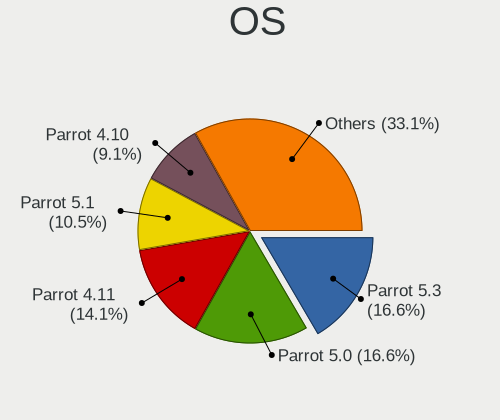

| Name         | Notebooks | Percent |
|--------------|-----------|---------|
| Parrot 5.0   | 81        | 29.67%  |
| Parrot 4.11  | 63        | 23.08%  |
| Parrot 4.10  | 45        | 16.48%  |
| Parrot 5.1   | 40        | 14.65%  |
| Parrot 4.8   | 15        | 5.49%   |
| Parrot 4.9   | 13        | 4.76%   |
| Parrot 4.7   | 10        | 3.66%   |
| Parrot 4.6   | 2         | 0.73%   |
| Parrot 4.5   | 1         | 0.37%   |
| Parrot 4.4   | 1         | 0.37%   |
| Parrot 4.2.2 | 1         | 0.37%   |
| Parrot 3.10  | 1         | 0.37%   |

OS Family
---------

OS without a version

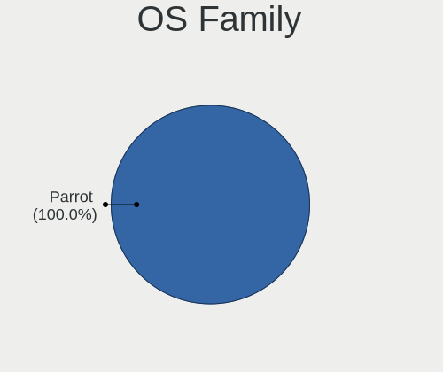

| Name   | Notebooks | Percent |
|--------|-----------|---------|
| Parrot | 259       | 100%    |

Kernel
------

Version of the Linux kernel

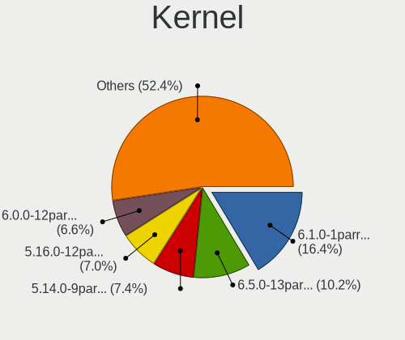

| Version                  | Notebooks | Percent |
|--------------------------|-----------|---------|
| 5.14.0-9parrot1-amd64    | 36        | 12.95%  |
| 5.16.0-12parrot1-amd64   | 34        | 12.23%  |
| 5.7.0-2parrot2-amd64     | 26        | 9.35%   |
| 5.18.0-14parrot1-amd64   | 26        | 9.35%   |
| 5.10.0-6parrot1-amd64    | 24        | 8.63%   |
| 6.0.0-2parrot1-amd64     | 14        | 5.04%   |
| 5.18.0-1parrot1-amd64    | 14        | 5.04%   |
| 5.10.0-8parrot1-amd64    | 14        | 5.04%   |
| 5.5.0-1parrot1-amd64     | 12        | 4.32%   |
| 5.4.0-4parrot1-amd64     | 11        | 3.96%   |
| 5.6.0-2parrot1-amd64     | 9         | 3.24%   |
| 5.14.0-2parrot1-amd64    | 9         | 3.24%   |
| 5.9.0-2parrot1-amd64     | 7         | 2.52%   |
| 5.15.0-15parrot1-amd64   | 5         | 1.8%    |
| 5.8.0-2parrot1-amd64     | 3         | 1.08%   |
| 5.4.0-2parrot1-amd64     | 3         | 1.08%   |
| 5.2.0-2parrot1-amd64     | 3         | 1.08%   |
| 5.10.0-5parrot1-amd64    | 3         | 1.08%   |
| 5.10.0-3parrot1-amd64    | 3         | 1.08%   |
| 4.19.0-parrot4-28t-amd64 | 3         | 1.08%   |
| 5.8.0-1parrot1-amd64     | 2         | 0.72%   |
| 5.4.0-3parrot1-amd64     | 2         | 0.72%   |
| 4.18.0-parrot10-amd64    | 2         | 0.72%   |
| 5.7.0-rc6-galliumos      | 1         | 0.36%   |
| 5.4.0-2parrot1-686-pae   | 1         | 0.36%   |
| 5.4.0-1parrot1-amd64     | 1         | 0.36%   |
| 5.3.0-3parrot3-amd64     | 1         | 0.36%   |
| 5.3.0-3parrot3-686-pae   | 1         | 0.36%   |
| 5.3.0-1parrot1-amd64     | 1         | 0.36%   |
| 5.15.0-5parrot1-amd64    | 1         | 0.36%   |
| 5.10.0-kali6-amd64       | 1         | 0.36%   |
| 5.10.0-6parrot1-rt-amd64 | 1         | 0.36%   |
| 5.1.0-parrot1-3t-amd64   | 1         | 0.36%   |
| 4.19.0-parrot1-13t-amd64 | 1         | 0.36%   |
| 4.14.0-parrot7-amd64     | 1         | 0.36%   |
| Unknown                  | 1         | 0.36%   |

Kernel Family
-------------

Linux kernel without a distro release

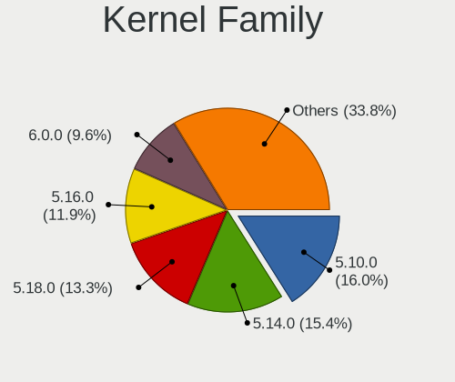

| Version | Notebooks | Percent |
|---------|-----------|---------|
| 5.10.0  | 46        | 16.67%  |
| 5.14.0  | 44        | 15.94%  |
| 5.18.0  | 39        | 14.13%  |
| 5.16.0  | 34        | 12.32%  |
| 5.7.0   | 27        | 9.78%   |
| 5.4.0   | 18        | 6.52%   |
| 6.0.0   | 14        | 5.07%   |
| 5.5.0   | 12        | 4.35%   |
| 5.6.0   | 9         | 3.26%   |
| 5.9.0   | 7         | 2.54%   |
| 5.15.0  | 6         | 2.17%   |
| 5.8.0   | 5         | 1.81%   |
| 4.19.0  | 4         | 1.45%   |
| 5.3.0   | 3         | 1.09%   |
| 5.2.0   | 3         | 1.09%   |
| 4.18.0  | 2         | 0.72%   |
| 5.1.0   | 1         | 0.36%   |
| 4.14.0  | 1         | 0.36%   |
| Unknown | 1         | 0.36%   |

Kernel Major Ver.
-----------------

Linux kernel major version

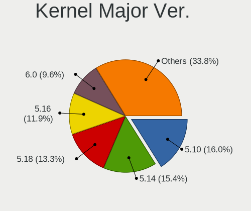

| Version | Notebooks | Percent |
|---------|-----------|---------|
| 5.10    | 46        | 16.67%  |
| 5.14    | 44        | 15.94%  |
| 5.18    | 39        | 14.13%  |
| 5.16    | 34        | 12.32%  |
| 5.7     | 27        | 9.78%   |
| 5.4     | 18        | 6.52%   |
| 6.0     | 14        | 5.07%   |
| 5.5     | 12        | 4.35%   |
| 5.6     | 9         | 3.26%   |
| 5.9     | 7         | 2.54%   |
| 5.15    | 6         | 2.17%   |
| 5.8     | 5         | 1.81%   |
| 4.19    | 4         | 1.45%   |
| 5.3     | 3         | 1.09%   |
| 5.2     | 3         | 1.09%   |
| 4.18    | 2         | 0.72%   |
| 5.1     | 1         | 0.36%   |
| 4.14    | 1         | 0.36%   |
| Unknown | 1         | 0.36%   |

Arch
----

OS architecture (x86_64, i586, etc.)

| Name   | Notebooks | Percent |
|--------|-----------|---------|
| x86_64 | 258       | 99.61%  |
| i686   | 1         | 0.39%   |

DE
--

Desktop Environment

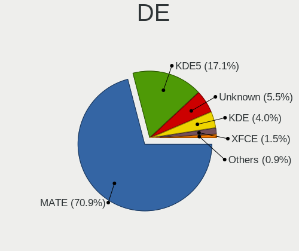

| Name          | Notebooks | Percent |
|---------------|-----------|---------|
| MATE          | 177       | 67.05%  |
| KDE5          | 49        | 18.56%  |
| Unknown       | 18        | 6.82%   |
| KDE           | 13        | 4.92%   |
| XFCE          | 5         | 1.89%   |
| LXDE          | 1         | 0.38%   |
| GNOME Classic | 1         | 0.38%   |

Display Server
--------------

X11 or Wayland

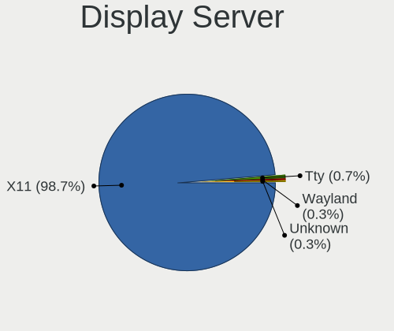

| Name    | Notebooks | Percent |
|---------|-----------|---------|
| X11     | 255       | 98.46%  |
| Tty     | 2         | 0.77%   |
| Wayland | 1         | 0.39%   |
| Unknown | 1         | 0.39%   |

Display Manager
---------------

SDDM, LightDM, etc.

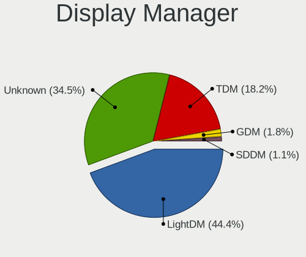

| Name    | Notebooks | Percent |
|---------|-----------|---------|
| LightDM | 114       | 43.02%  |
| Unknown | 93        | 35.09%  |
| TDM     | 50        | 18.87%  |
| GDM     | 5         | 1.89%   |
| SDDM    | 3         | 1.13%   |

OS Lang
-------

Language

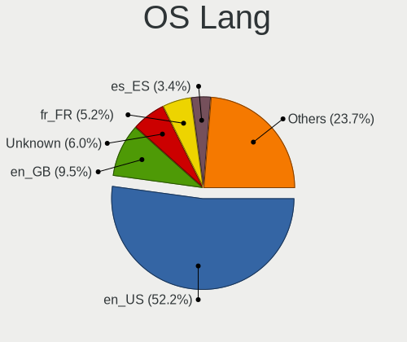

| Lang    | Notebooks | Percent |
|---------|-----------|---------|
| en_US   | 133       | 51.15%  |
| en_GB   | 23        | 8.85%   |
| fr_FR   | 16        | 6.15%   |
| Unknown | 14        | 5.38%   |
| ru_RU   | 9         | 3.46%   |
| es_ES   | 9         | 3.46%   |
| pl_PL   | 7         | 2.69%   |
| pt_BR   | 6         | 2.31%   |
| de_DE   | 6         | 2.31%   |
| it_IT   | 5         | 1.92%   |
| en_IN   | 5         | 1.92%   |
| en_AU   | 5         | 1.92%   |
| es_AR   | 2         | 0.77%   |
| en_CA   | 2         | 0.77%   |
| tr_TR   | 1         | 0.38%   |
| pt_PT   | 1         | 0.38%   |
| nl_BE   | 1         | 0.38%   |
| id_ID   | 1         | 0.38%   |
| fr_CA   | 1         | 0.38%   |
| fi_FI   | 1         | 0.38%   |
| es_PE   | 1         | 0.38%   |
| es_MX   | 1         | 0.38%   |
| es_CO   | 1         | 0.38%   |
| es_CL   | 1         | 0.38%   |
| en_ZW   | 1         | 0.38%   |
| en_ZA   | 1         | 0.38%   |
| en_NZ   | 1         | 0.38%   |
| en_NG   | 1         | 0.38%   |
| en_DK   | 1         | 0.38%   |
| cs_CZ   | 1         | 0.38%   |
| C       | 1         | 0.38%   |
| arn_CL  | 1         | 0.38%   |

Boot Mode
---------

EFI or BIOS

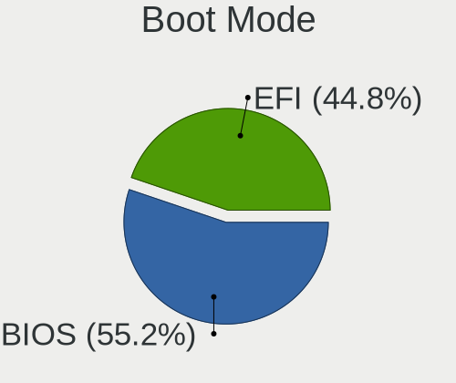

| Mode | Notebooks | Percent |
|------|-----------|---------|
| BIOS | 157       | 59.92%  |
| EFI  | 105       | 40.08%  |

Filesystem
----------

Type of filesystem

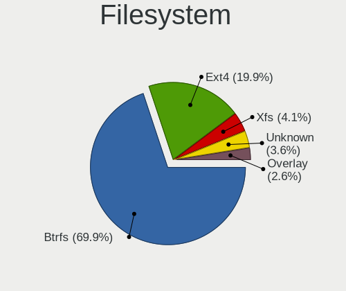

| Type    | Notebooks | Percent |
|---------|-----------|---------|
| Btrfs   | 201       | 76.43%  |
| Ext4    | 41        | 15.59%  |
| Xfs     | 8         | 3.04%   |
| Unknown | 7         | 2.66%   |
| Overlay | 6         | 2.28%   |

Part. scheme
------------

Scheme of partitioning

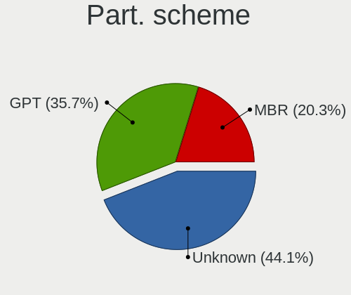

| Type    | Notebooks | Percent |
|---------|-----------|---------|
| Unknown | 108       | 41.06%  |
| GPT     | 103       | 39.16%  |
| MBR     | 52        | 19.77%  |

Dual Boot with Linux/BSD
------------------------

Hosting more than one Linux/BSD

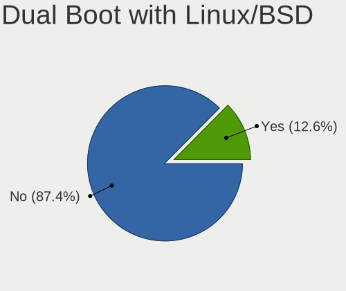

| Dual boot | Notebooks | Percent |
|-----------|-----------|---------|
| No        | 230       | 87.79%  |
| Yes       | 32        | 12.21%  |

Dual Boot (Win)
---------------

Hosting Linux and Windows

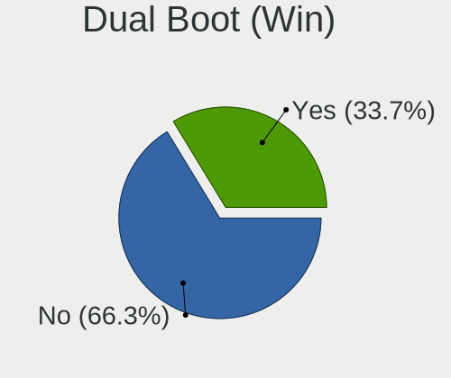

| Dual boot | Notebooks | Percent |
|-----------|-----------|---------|
| No        | 173       | 66.03%  |
| Yes       | 89        | 33.97%  |

Board
-----

Vendor
------

Motherboard manufacturer

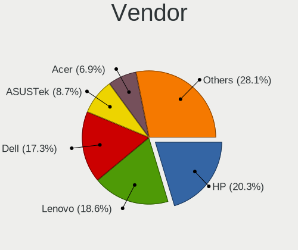

| Name                  | Notebooks | Percent |
|-----------------------|-----------|---------|
| Hewlett-Packard       | 51        | 19.69%  |
| Lenovo                | 50        | 19.31%  |
| Dell                  | 42        | 16.22%  |
| ASUSTek Computer      | 25        | 9.65%   |
| Acer                  | 17        | 6.56%   |
| MSI                   | 11        | 4.25%   |
| Apple                 | 9         | 3.47%   |
| Toshiba               | 8         | 3.09%   |
| HUAWEI                | 5         | 1.93%   |
| Samsung Electronics   | 4         | 1.54%   |
| Sony                  | 3         | 1.16%   |
| Fujitsu               | 3         | 1.16%   |
| Alienware             | 3         | 1.16%   |
| Razer                 | 2         | 0.77%   |
| Gateway               | 2         | 0.77%   |
| Unknown               | 2         | 0.77%   |
| Wortmann AG           | 1         | 0.39%   |
| Toxic                 | 1         | 0.39%   |
| Timi                  | 1         | 0.39%   |
| System76              | 1         | 0.39%   |
| Standard              | 1         | 0.39%   |
| Quanta                | 1         | 0.39%   |
| Positivo Bahia - VAIO | 1         | 0.39%   |
| Positivo              | 1         | 0.39%   |
| Panasonic             | 1         | 0.39%   |
| Notebook              | 1         | 0.39%   |
| Metabox               | 1         | 0.39%   |
| Jumper                | 1         | 0.39%   |
| Irbis                 | 1         | 0.39%   |
| Intel Client Systems  | 1         | 0.39%   |
| GPU Company           | 1         | 0.39%   |
| Google                | 1         | 0.39%   |
| eMachines             | 1         | 0.39%   |
| Eluktronics           | 1         | 0.39%   |
| Digma                 | 1         | 0.39%   |
| Clevo                 | 1         | 0.39%   |
| Chuwi                 | 1         | 0.39%   |
| BANGHO                | 1         | 0.39%   |

Model
-----

Motherboard model

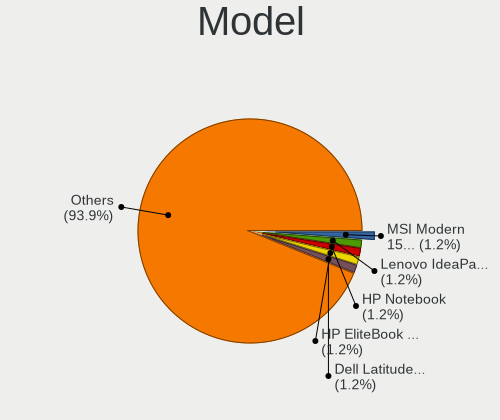

| Name                                               | Notebooks | Percent |
|----------------------------------------------------|-----------|---------|
| Unknown                                            | 4         | 1.54%   |
| MSI Modern 15 A5M                                  | 3         | 1.16%   |
| Lenovo IdeaPad 3 15IIL05 81WE                      | 3         | 1.16%   |
| HP Notebook                                        | 3         | 1.16%   |
| HP EliteBook 8470p                                 | 3         | 1.16%   |
| Dell Latitude E6420                                | 3         | 1.16%   |
| Dell Inspiron MM061                                | 3         | 1.16%   |
| HP ProBook 650 G1                                  | 2         | 0.77%   |
| HP Pavilion dv6                                    | 2         | 0.77%   |
| HP Pavilion 15                                     | 2         | 0.77%   |
| Dell Latitude E7440                                | 2         | 0.77%   |
| Dell Latitude E6410                                | 2         | 0.77%   |
| ASUS Q524UQ                                        | 2         | 0.77%   |
| Apple MacBookPro8,1                                | 2         | 0.77%   |
| Acer Nitro AN515-54                                | 2         | 0.77%   |
| Acer Aspire ES1-111M                               | 2         | 0.77%   |
| Wortmann AG TERRA_MOBILE_1542                      | 1         | 0.39%   |
| Toxic GM7MQ8P                                      | 1         | 0.39%   |
| Toshiba Satellite-L845                             | 1         | 0.39%   |
| Toshiba Satellite L775D                            | 1         | 0.39%   |
| Toshiba Satellite L750                             | 1         | 0.39%   |
| Toshiba Satellite L655                             | 1         | 0.39%   |
| Toshiba Satellite L300D                            | 1         | 0.39%   |
| Toshiba Satellite Click 2 L35W-B                   | 1         | 0.39%   |
| Toshiba Satellite C855D                            | 1         | 0.39%   |
| Toshiba Satellite C75D-B                           | 1         | 0.39%   |
| Timi TM1613                                        | 1         | 0.39%   |
| System76 Gazelle                                   | 1         | 0.39%   |
| Sony VPCSB1C5E                                     | 1         | 0.39%   |
| Sony VPCCB15FG                                     | 1         | 0.39%   |
| Sony SVP1321L1EBI                                  | 1         | 0.39%   |
| Samsung RV415/RV515                                | 1         | 0.39%   |
| Samsung 550P5C/550P7C                              | 1         | 0.39%   |
| Samsung 350V5C/351V5C/3540VC/3440VC                | 1         | 0.39%   |
| Samsung 300E4C/300E5C/300E7C                       | 1         | 0.39%   |
| Razer Blade Stealth                                | 1         | 0.39%   |
| Razer Blade 15 Base Model (Early 2020) - RZ09-0328 | 1         | 0.39%   |
| Quanta TW9/SW9                                     | 1         | 0.39%   |
| Positivo Q232A                                     | 1         | 0.39%   |
| Positivo Bahia - VAIO VJFE51F11X-B0111H            | 1         | 0.39%   |

Model Family
------------

Motherboard model prefix

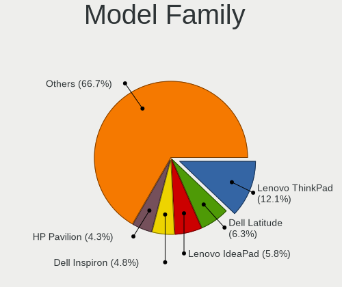

| Name                   | Notebooks | Percent |
|------------------------|-----------|---------|
| Lenovo ThinkPad        | 25        | 9.65%   |
| Dell Latitude          | 18        | 6.95%   |
| Dell Inspiron          | 17        | 6.56%   |
| HP Pavilion            | 14        | 5.41%   |
| Lenovo IdeaPad         | 12        | 4.63%   |
| HP EliteBook           | 9         | 3.47%   |
| HP Laptop              | 8         | 3.09%   |
| Acer Aspire            | 8         | 3.09%   |
| Toshiba Satellite      | 7         | 2.7%    |
| HP ProBook             | 5         | 1.93%   |
| ASUS VivoBook          | 4         | 1.54%   |
| Acer Nitro             | 4         | 1.54%   |
| Unknown                | 4         | 1.54%   |
| MSI Modern             | 3         | 1.16%   |
| HP Notebook            | 3         | 1.16%   |
| Fujitsu LIFEBOOK       | 3         | 1.16%   |
| ASUS ASUS              | 3         | 1.16%   |
| Razer Blade            | 2         | 0.77%   |
| MSI GT60               | 2         | 0.77%   |
| Lenovo Legion          | 2         | 0.77%   |
| HP ZBook               | 2         | 0.77%   |
| HP Victus              | 2         | 0.77%   |
| HP 250                 | 2         | 0.77%   |
| Dell Precision         | 2         | 0.77%   |
| ASUS Zenbook           | 2         | 0.77%   |
| ASUS TUF               | 2         | 0.77%   |
| ASUS Q524UQ            | 2         | 0.77%   |
| Apple MacBookPro8      | 2         | 0.77%   |
| Apple MacBookPro11     | 2         | 0.77%   |
| Alienware m15          | 2         | 0.77%   |
| Acer Swift             | 2         | 0.77%   |
| Acer Predator          | 2         | 0.77%   |
| Wortmann AG TERRA      | 1         | 0.39%   |
| Toxic GM7MQ8P          | 1         | 0.39%   |
| Toshiba Satellite-L845 | 1         | 0.39%   |
| Timi TM1613            | 1         | 0.39%   |
| System76 Gazelle       | 1         | 0.39%   |
| Sony VPCSB1C5E         | 1         | 0.39%   |
| Sony VPCCB15FG         | 1         | 0.39%   |
| Sony SVP1321L1EBI      | 1         | 0.39%   |

MFG Year
--------

Motherboard manufacture year

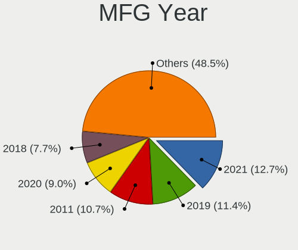

| Year | Notebooks | Percent |
|------|-----------|---------|
| 2019 | 31        | 11.97%  |
| 2021 | 30        | 11.58%  |
| 2011 | 30        | 11.58%  |
| 2020 | 24        | 9.27%   |
| 2013 | 22        | 8.49%   |
| 2018 | 21        | 8.11%   |
| 2012 | 19        | 7.34%   |
| 2016 | 17        | 6.56%   |
| 2017 | 14        | 5.41%   |
| 2014 | 14        | 5.41%   |
| 2010 | 9         | 3.47%   |
| 2015 | 7         | 2.7%    |
| 2008 | 7         | 2.7%    |
| 2022 | 5         | 1.93%   |
| 2006 | 4         | 1.54%   |
| 2007 | 3         | 1.16%   |
| 2009 | 2         | 0.77%   |

Form Factor
-----------

Physical design of the computer

| Name     | Notebooks | Percent |
|----------|-----------|---------|
| Notebook | 259       | 100%    |

Secure Boot
-----------

Enabled or disabled

| State    | Notebooks | Percent |
|----------|-----------|---------|
| Disabled | 259       | 100%    |

Coreboot
--------

Have coreboot on board

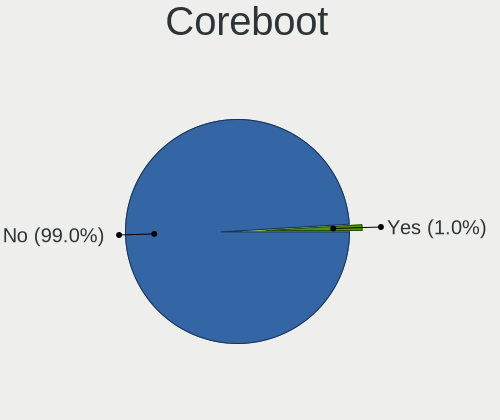

| Used | Notebooks | Percent |
|------|-----------|---------|
| No   | 258       | 99.61%  |
| Yes  | 1         | 0.39%   |

RAM Size
--------

Total RAM memory

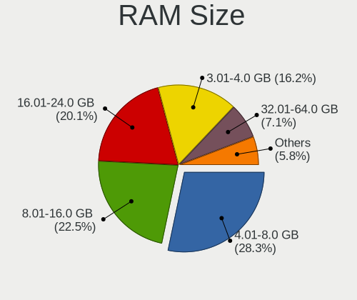

| Size in GB  | Notebooks | Percent |
|-------------|-----------|---------|
| 4.01-8.0    | 66        | 25.38%  |
| 8.01-16.0   | 61        | 23.46%  |
| 16.01-24.0  | 51        | 19.62%  |
| 3.01-4.0    | 49        | 18.85%  |
| 32.01-64.0  | 16        | 6.15%   |
| 1.01-2.0    | 7         | 2.69%   |
| 64.01-256.0 | 4         | 1.54%   |
| 24.01-32.0  | 3         | 1.15%   |
| 2.01-3.0    | 3         | 1.15%   |

RAM Used
--------

Used RAM memory

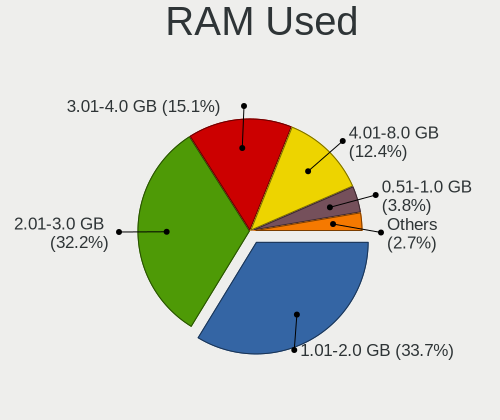

| Used GB   | Notebooks | Percent |
|-----------|-----------|---------|
| 1.01-2.0  | 98        | 35.9%   |
| 2.01-3.0  | 86        | 31.5%   |
| 3.01-4.0  | 44        | 16.12%  |
| 4.01-8.0  | 28        | 10.26%  |
| 0.51-1.0  | 11        | 4.03%   |
| 8.01-16.0 | 5         | 1.83%   |
| 0.01-0.5  | 1         | 0.37%   |

Total Drives
------------

Number of drives on board

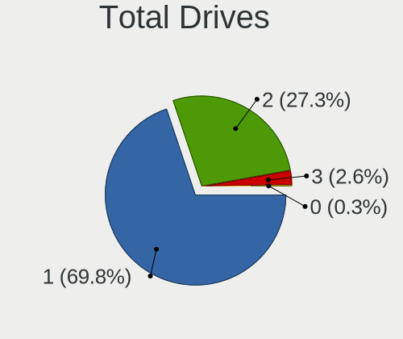

| Drives | Notebooks | Percent |
|--------|-----------|---------|
| 1      | 178       | 67.94%  |
| 2      | 75        | 28.63%  |
| 3      | 8         | 3.05%   |
| 0      | 1         | 0.38%   |

Has CD-ROM
----------

Has CD-ROM on board

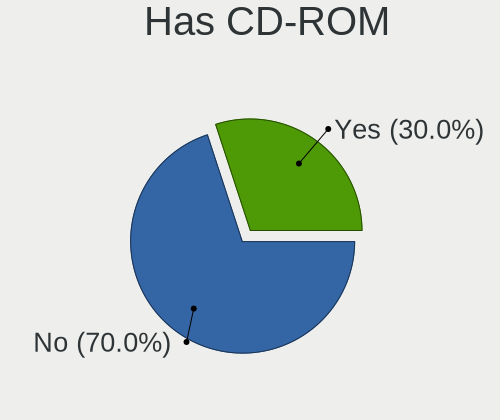

| Presented | Notebooks | Percent |
|-----------|-----------|---------|
| No        | 173       | 66.54%  |
| Yes       | 87        | 33.46%  |

Has Ethernet
------------

Has Ethernet on board

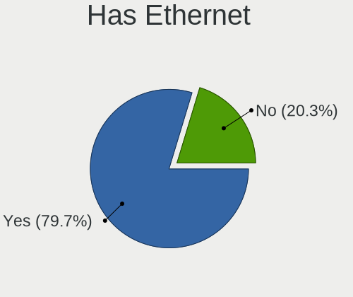

| Presented | Notebooks | Percent |
|-----------|-----------|---------|
| Yes       | 210       | 80.77%  |
| No        | 50        | 19.23%  |

Has WiFi
--------

Has WiFi module

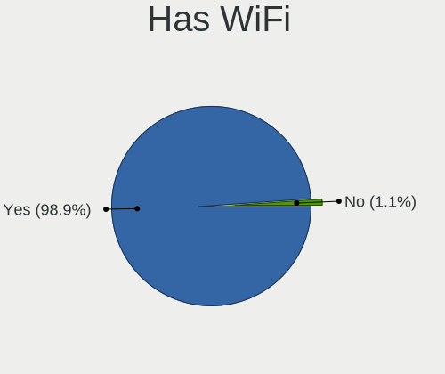

| Presented | Notebooks | Percent |
|-----------|-----------|---------|
| Yes       | 256       | 98.84%  |
| No        | 3         | 1.16%   |

Has Bluetooth
-------------

Has Bluetooth module

| Presented | Notebooks | Percent |
|-----------|-----------|---------|
| Yes       | 206       | 78.33%  |
| No        | 57        | 21.67%  |

Location
--------

Country
-------

Geographic location (country)

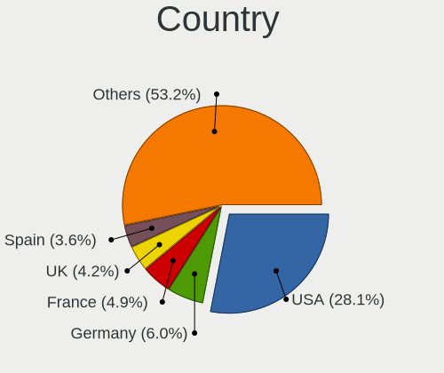

| Country      | Notebooks | Percent |
|--------------|-----------|---------|
| USA          | 80        | 30.65%  |
| France       | 17        | 6.51%   |
| Germany      | 14        | 5.36%   |
| Spain        | 12        | 4.6%    |
| UK           | 11        | 4.21%   |
| Russia       | 10        | 3.83%   |
| Netherlands  | 8         | 3.07%   |
| Brazil       | 8         | 3.07%   |
| Italy        | 7         | 2.68%   |
| Kenya        | 6         | 2.3%    |
| India        | 6         | 2.3%    |
| Canada       | 5         | 1.92%   |
| Australia    | 5         | 1.92%   |
| Sweden       | 4         | 1.53%   |
| Indonesia    | 4         | 1.53%   |
| South Africa | 3         | 1.15%   |
| Poland       | 3         | 1.15%   |
| Mexico       | 3         | 1.15%   |
| Iraq         | 3         | 1.15%   |
| Denmark      | 3         | 1.15%   |
| Czechia      | 3         | 1.15%   |
| Bangladesh   | 3         | 1.15%   |
| Turkey       | 2         | 0.77%   |
| Switzerland  | 2         | 0.77%   |
| Puerto Rico  | 2         | 0.77%   |
| Portugal     | 2         | 0.77%   |
| Nepal        | 2         | 0.77%   |
| Finland      | 2         | 0.77%   |
| Chile        | 2         | 0.77%   |
| Argentina    | 2         | 0.77%   |
| Zimbabwe     | 1         | 0.38%   |
| Saudi Arabia | 1         | 0.38%   |
| Peru         | 1         | 0.38%   |
| Pakistan     | 1         | 0.38%   |
| Nigeria      | 1         | 0.38%   |
| New Zealand  | 1         | 0.38%   |
| Namibia      | 1         | 0.38%   |
| Myanmar      | 1         | 0.38%   |
| Morocco      | 1         | 0.38%   |
| Mongolia     | 1         | 0.38%   |

City
----

Geographic location (city)

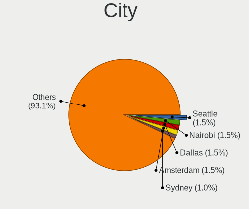

| City              | Notebooks | Percent |
|-------------------|-----------|---------|
| Nairobi           | 5         | 1.82%   |
| Moscow            | 4         | 1.45%   |
| Dallas            | 4         | 1.45%   |
| Amsterdam         | 4         | 1.45%   |
| Seattle           | 3         | 1.09%   |
| Paris             | 3         | 1.09%   |
| Melbourne         | 3         | 1.09%   |
| Lyon              | 3         | 1.09%   |
| London            | 3         | 1.09%   |
| Houston           | 3         | 1.09%   |
| Dhaka             | 3         | 1.09%   |
| Chicago           | 3         | 1.09%   |
| Zurich            | 2         | 0.73%   |
| Sydney            | 2         | 0.73%   |
| Stockholm         | 2         | 0.73%   |
| St Petersburg     | 2         | 0.73%   |
| San Juan          | 2         | 0.73%   |
| Ruskin            | 2         | 0.73%   |
| Rome              | 2         | 0.73%   |
| Pretoria          | 2         | 0.73%   |
| Prague            | 2         | 0.73%   |
| New York          | 2         | 0.73%   |
| Mostoles          | 2         | 0.73%   |
| Madrid            | 2         | 0.73%   |
| Dublin            | 2         | 0.73%   |
| Dresden           | 2         | 0.73%   |
| Camden            | 2         | 0.73%   |
| Berlin            | 2         | 0.73%   |
| Barcelona         | 2         | 0.73%   |
| Baghdad           | 2         | 0.73%   |
| Zagreb            | 1         | 0.36%   |
| West Jordan       | 1         | 0.36%   |
| Washington        | 1         | 0.36%   |
| Warsaw            | 1         | 0.36%   |
| Volgograd         | 1         | 0.36%   |
| Visalia           | 1         | 0.36%   |
| Villa Carlos Paz  | 1         | 0.36%   |
| Vila Nova de Gaia | 1         | 0.36%   |
| Vienna            | 1         | 0.36%   |
| Veitsbronn        | 1         | 0.36%   |

Drives
------

Drive Vendor
------------

Hard drive vendors

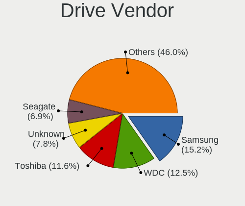

| Vendor              | Notebooks | Drives | Percent |
|---------------------|-----------|--------|---------|
| Samsung Electronics | 51        | 61     | 15.45%  |
| WDC                 | 42        | 50     | 12.73%  |
| Toshiba             | 41        | 46     | 12.42%  |
| Unknown             | 27        | 29     | 8.18%   |
| Seagate             | 24        | 24     | 7.27%   |
| Kingston            | 20        | 20     | 6.06%   |
| SanDisk             | 15        | 18     | 4.55%   |
| Hitachi             | 12        | 14     | 3.64%   |
| Crucial             | 11        | 16     | 3.33%   |
| Micron Technology   | 10        | 10     | 3.03%   |
| SK hynix            | 9         | 9      | 2.73%   |
| HGST                | 8         | 11     | 2.42%   |
| Intel               | 6         | 10     | 1.82%   |
| China               | 6         | 6      | 1.82%   |
| Apple               | 5         | 5      | 1.52%   |
| A-DATA Technology   | 5         | 5      | 1.52%   |
| YMTC                | 3         | 3      | 0.91%   |
| LITEON              | 3         | 3      | 0.91%   |
| Team                | 2         | 2      | 0.61%   |
| PNY                 | 2         | 2      | 0.61%   |
| KIOXIA              | 2         | 3      | 0.61%   |
| HUAWEI              | 2         | 2      | 0.61%   |
| BR                  | 2         | 2      | 0.61%   |
| Unknown             | 2         | 2      | 0.61%   |
| W800SH              | 1         | 1      | 0.3%    |
| Transcend           | 1         | 1      | 0.3%    |
| Silicon Motion      | 1         | 1      | 0.3%    |
| S3+                 | 1         | 1      | 0.3%    |
| RZX                 | 1         | 1      | 0.3%    |
| Phison              | 1         | 1      | 0.3%    |
| Patriot             | 1         | 1      | 0.3%    |
| Netac               | 1         | 1      | 0.3%    |
| LITEONIT            | 1         | 1      | 0.3%    |
| Lexar               | 1         | 1      | 0.3%    |
| KingSpec            | 1         | 2      | 0.3%    |
| KingFast            | 1         | 2      | 0.3%    |
| Intenso             | 1         | 2      | 0.3%    |
| HS-SSD-C100         | 1         | 1      | 0.3%    |
| Hikvision           | 1         | 1      | 0.3%    |
| Fujitsu             | 1         | 1      | 0.3%    |

Drive Model
-----------

Hard drive models

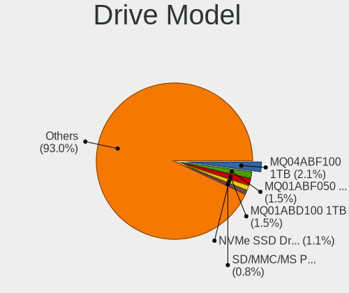

| Model                              | Notebooks | Percent |
|------------------------------------|-----------|---------|
| Toshiba MQ04ABF100 1TB             | 10        | 2.88%   |
| Toshiba MQ01ABF050 500GB           | 7         | 2.02%   |
| Toshiba MQ01ABD100 1TB             | 6         | 1.73%   |
| Kingston NVMe SSD Drive 512GB      | 5         | 1.44%   |
| Unknown SD/MMC/MS PRO 64GB         | 4         | 1.15%   |
| Unknown MMC Card  32GB             | 4         | 1.15%   |
| Seagate ST1000LM035-1RK172 1TB     | 4         | 1.15%   |
| Samsung SSD 860 EVO 500GB          | 4         | 1.15%   |
| WDC WD10SPZX-75Z10T2 1TB           | 3         | 0.86%   |
| Toshiba MQ01ABD075 752GB           | 3         | 0.86%   |
| Seagate ST2000LM003 HN-M201RAD 2TB | 3         | 0.86%   |
| SanDisk SSD PLUS 1000GB            | 3         | 0.86%   |
| SanDisk NVMe SSD Drive 1TB         | 3         | 0.86%   |
| Samsung SSD 850 EVO 250GB          | 3         | 0.86%   |
| HGST HTS721010A9E630 1TB           | 3         | 0.86%   |
| HGST HTS541010A9E680 1TB           | 3         | 0.86%   |
| YMTC PC005 256GB                   | 2         | 0.58%   |
| WDC WDS240G2G0B-00EPW0 240GB SSD   | 2         | 0.58%   |
| WDC WD5000LPCX-24C6HT0 500GB       | 2         | 0.58%   |
| WDC WD10SPZX-60Z10T0 1TB           | 2         | 0.58%   |
| Unknown MMC Card  64GB             | 2         | 0.58%   |
| Team TM8PS7512G 512GB SSD          | 2         | 0.58%   |
| Seagate ST9250315AS 250GB          | 2         | 0.58%   |
| Seagate ST500LT012-1DG142 500GB    | 2         | 0.58%   |
| Seagate ST320LT007-9ZV142 320GB    | 2         | 0.58%   |
| SanDisk NVMe SSD Drive 256GB       | 2         | 0.58%   |
| Samsung SSD 980 1TB                | 2         | 0.58%   |
| Samsung SSD 970 EVO Plus 500GB     | 2         | 0.58%   |
| Samsung NVMe SSD Drive 512GB       | 2         | 0.58%   |
| Samsung NVMe SSD Drive 1024GB      | 2         | 0.58%   |
| Samsung HM500JI 500GB              | 2         | 0.58%   |
| Kingston SV300S37A240G 240GB SSD   | 2         | 0.58%   |
| Kingston SV300S37A120G 120GB SSD   | 2         | 0.58%   |
| Kingston SA400S37240G 240GB SSD    | 2         | 0.58%   |
| Crucial CT500MX500SSD1 500GB       | 2         | 0.58%   |
| Crucial CT1000MX500SSD1 1TB        | 2         | 0.58%   |
| China SATA SSD 120GB               | 2         | 0.58%   |
| BR SSD 60GB                        | 2         | 0.58%   |
| Apple SSD SM0256G 256GB            | 2         | 0.58%   |
| Unknown                            | 2         | 0.58%   |

HDD Vendor
----------

Hard disk drive vendors

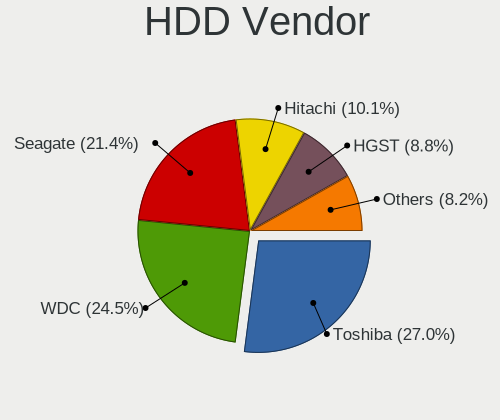

| Vendor              | Notebooks | Drives | Percent |
|---------------------|-----------|--------|---------|
| Toshiba             | 33        | 37     | 27.97%  |
| WDC                 | 30        | 34     | 25.42%  |
| Seagate             | 24        | 24     | 20.34%  |
| Hitachi             | 12        | 14     | 10.17%  |
| HGST                | 8         | 11     | 6.78%   |
| Samsung Electronics | 5         | 5      | 4.24%   |
| Unknown             | 4         | 5      | 3.39%   |
| Fujitsu             | 1         | 1      | 0.85%   |
| ASMedia             | 1         | 1      | 0.85%   |

SSD Vendor
----------

Solid state drive vendors

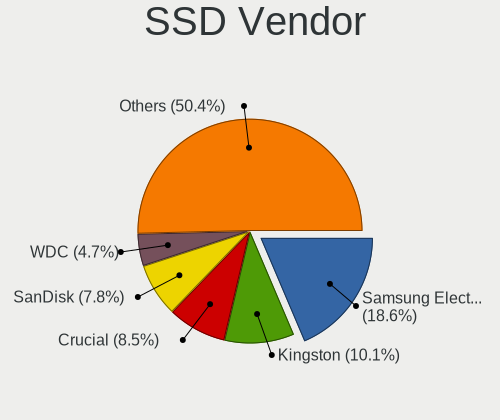

| Vendor              | Notebooks | Drives | Percent |
|---------------------|-----------|--------|---------|
| Samsung Electronics | 21        | 24     | 20.59%  |
| Crucial             | 10        | 15     | 9.8%    |
| Kingston            | 9         | 9      | 8.82%   |
| SanDisk             | 8         | 9      | 7.84%   |
| WDC                 | 6         | 7      | 5.88%   |
| China               | 6         | 6      | 5.88%   |
| Toshiba             | 4         | 5      | 3.92%   |
| Micron Technology   | 4         | 4      | 3.92%   |
| Apple               | 4         | 4      | 3.92%   |
| LITEON              | 3         | 3      | 2.94%   |
| Team                | 2         | 2      | 1.96%   |
| PNY                 | 2         | 2      | 1.96%   |
| Intel               | 2         | 2      | 1.96%   |
| BR                  | 2         | 2      | 1.96%   |
| A-DATA Technology   | 2         | 2      | 1.96%   |
| W800SH              | 1         | 1      | 0.98%   |
| Unknown             | 1         | 1      | 0.98%   |
| Transcend           | 1         | 1      | 0.98%   |
| SK hynix            | 1         | 1      | 0.98%   |
| S3+                 | 1         | 1      | 0.98%   |
| RZX                 | 1         | 1      | 0.98%   |
| Patriot             | 1         | 1      | 0.98%   |
| Netac               | 1         | 1      | 0.98%   |
| LITEONIT            | 1         | 1      | 0.98%   |
| KingSpec            | 1         | 2      | 0.98%   |
| KingFast            | 1         | 1      | 0.98%   |
| Intenso             | 1         | 2      | 0.98%   |
| HS-SSD-C100         | 1         | 1      | 0.98%   |
| Corsair             | 1         | 2      | 0.98%   |
| BHT                 | 1         | 1      | 0.98%   |
| ASMT                | 1         | 1      | 0.98%   |
| Unknown             | 1         | 1      | 0.98%   |

Drive Kind
----------

HDD or SSD

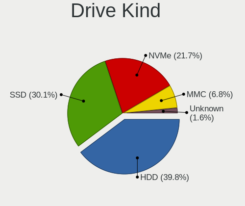

| Kind    | Notebooks | Drives | Percent |
|---------|-----------|--------|---------|
| HDD     | 115       | 132    | 36.28%  |
| SSD     | 94        | 116    | 29.65%  |
| NVMe    | 83        | 101    | 26.18%  |
| MMC     | 21        | 24     | 6.62%   |
| Unknown | 4         | 4      | 1.26%   |

Drive Connector
---------------

SATA, SAS, NVMe, etc.

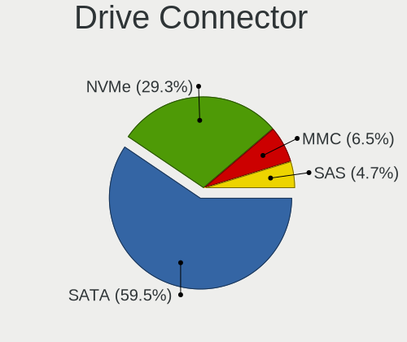

| Type | Notebooks | Drives | Percent |
|------|-----------|--------|---------|
| SATA | 189       | 237    | 61.56%  |
| NVMe | 83        | 101    | 27.04%  |
| MMC  | 21        | 24     | 6.84%   |
| SAS  | 14        | 15     | 4.56%   |

Drive Size
----------

Size of hard drive

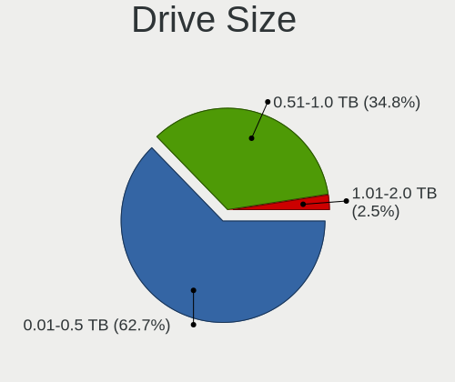

| Size in TB | Notebooks | Drives | Percent |
|------------|-----------|--------|---------|
| 0.01-0.5   | 133       | 166    | 63.94%  |
| 0.51-1.0   | 70        | 76     | 33.65%  |
| 1.01-2.0   | 5         | 6      | 2.4%    |

Space Total
-----------

Amount of disk space available on the file system

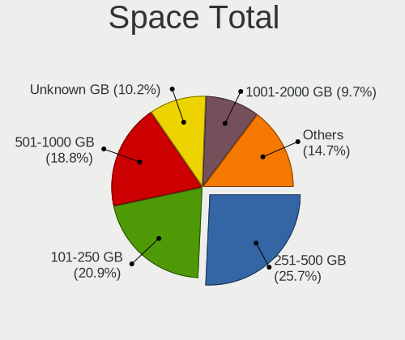

| Size in GB     | Notebooks | Percent |
|----------------|-----------|---------|
| 251-500        | 67        | 25.48%  |
| 101-250        | 57        | 21.67%  |
| 501-1000       | 45        | 17.11%  |
| Unknown        | 27        | 10.27%  |
| 1001-2000      | 26        | 9.89%   |
| 51-100         | 16        | 6.08%   |
| 21-50          | 13        | 4.94%   |
| 1-20           | 5         | 1.9%    |
| 2001-3000      | 4         | 1.52%   |
| More than 3000 | 3         | 1.14%   |

Space Used
----------

Amount of used disk space

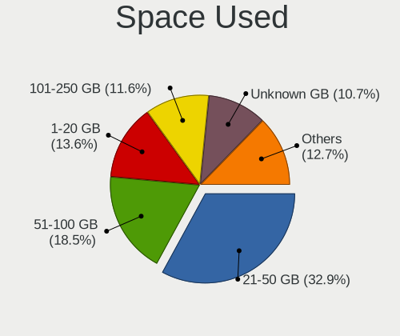

| Used GB        | Notebooks | Percent |
|----------------|-----------|---------|
| 21-50          | 84        | 31.11%  |
| 51-100         | 50        | 18.52%  |
| 1-20           | 40        | 14.81%  |
| 101-250        | 32        | 11.85%  |
| Unknown        | 27        | 10%     |
| 251-500        | 26        | 9.63%   |
| 501-1000       | 8         | 2.96%   |
| More than 3000 | 1         | 0.37%   |
| 1001-2000      | 1         | 0.37%   |
| 0              | 1         | 0.37%   |

Malfunc. Drives
---------------

Drive models with a malfunction

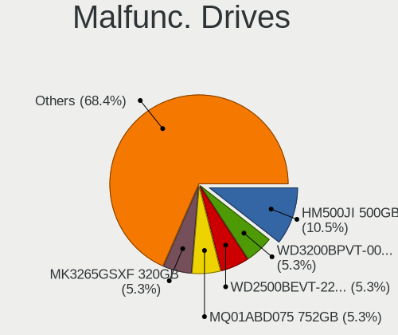

| Model                                               | Notebooks | Drives | Percent |
|-----------------------------------------------------|-----------|--------|---------|
| Toshiba MQ01ABD100 1TB                              | 2         | 2      | 7.41%   |
| Samsung Electronics HM500JI 500GB                   | 2         | 2      | 7.41%   |
| WDC WD3200BPVT-00JJ5T0 320GB                        | 1         | 1      | 3.7%    |
| WDC WD3200BEKT-75PVMT1 320GB                        | 1         | 1      | 3.7%    |
| WDC WD2500BEVT-22A23T0 250GB                        | 1         | 1      | 3.7%    |
| Toshiba MQ01ABD075 752GB                            | 1         | 1      | 3.7%    |
| Toshiba MK3265GSXF 320GB                            | 1         | 1      | 3.7%    |
| Seagate ST320LM001 HN-M320MBB 320GB                 | 1         | 1      | 3.7%    |
| Seagate ST2000LM007-1R8174 2TB                      | 1         | 1      | 3.7%    |
| Seagate ST1000LM035-1RK172 1TB                      | 1         | 1      | 3.7%    |
| SanDisk SD8SBAT256G1122 256GB SSD                   | 1         | 1      | 3.7%    |
| Samsung Electronics MZNLH128HBHQ-000H1 128GB SSD    | 1         | 1      | 3.7%    |
| Samsung Electronics HM160HI 160GB                   | 1         | 1      | 3.7%    |
| Micron Technology MTFDDAK128MAY-1AH1ZABHA 128GB SSD | 1         | 1      | 3.7%    |
| LITEON CV8-8E128-HP 128GB SSD                       | 1         | 1      | 3.7%    |
| Intel HBRPEKNX0202AHO 32GB                          | 1         | 1      | 3.7%    |
| Hitachi HTS725050A9A360 500GB                       | 1         | 1      | 3.7%    |
| Hitachi HTS725032A9A364 320GB                       | 1         | 1      | 3.7%    |
| Hitachi HTS723216L9SA60 160GB                       | 1         | 1      | 3.7%    |
| Hitachi HTS542512K9SA00 120GB                       | 1         | 1      | 3.7%    |
| HGST HTS721010A9E630 1TB                            | 1         | 1      | 3.7%    |
| Fujitsu MHY2160BH 160GB                             | 1         | 1      | 3.7%    |
| Crucial CT525MX300SSD1 528GB                        | 1         | 1      | 3.7%    |
| A-DATA Technology SX6000LNP 1TB                     | 1         | 1      | 3.7%    |
| A-DATA Technology SU700 120GB SSD                   | 1         | 1      | 3.7%    |

Malfunc. Drive Vendor
---------------------

Vendors of faulty drives

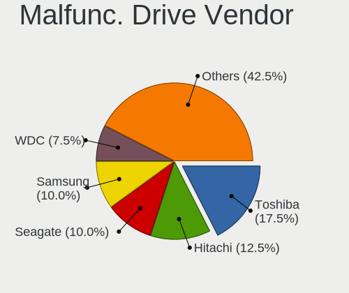

| Vendor              | Notebooks | Drives | Percent |
|---------------------|-----------|--------|---------|
| Toshiba             | 4         | 4      | 14.81%  |
| Samsung Electronics | 4         | 4      | 14.81%  |
| Hitachi             | 4         | 4      | 14.81%  |
| WDC                 | 3         | 3      | 11.11%  |
| Seagate             | 3         | 3      | 11.11%  |
| A-DATA Technology   | 2         | 2      | 7.41%   |
| SanDisk             | 1         | 1      | 3.7%    |
| Micron Technology   | 1         | 1      | 3.7%    |
| LITEON              | 1         | 1      | 3.7%    |
| Intel               | 1         | 1      | 3.7%    |
| HGST                | 1         | 1      | 3.7%    |
| Fujitsu             | 1         | 1      | 3.7%    |
| Crucial             | 1         | 1      | 3.7%    |

Malfunc. HDD Vendor
-------------------

Vendors of faulty HDD drives

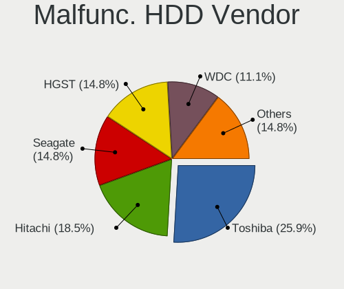

| Vendor              | Notebooks | Drives | Percent |
|---------------------|-----------|--------|---------|
| Toshiba             | 4         | 4      | 21.05%  |
| Hitachi             | 4         | 4      | 21.05%  |
| WDC                 | 3         | 3      | 15.79%  |
| Seagate             | 3         | 3      | 15.79%  |
| Samsung Electronics | 3         | 3      | 15.79%  |
| HGST                | 1         | 1      | 5.26%   |
| Fujitsu             | 1         | 1      | 5.26%   |

Malfunc. Drive Kind
-------------------

Kinds of faulty drives

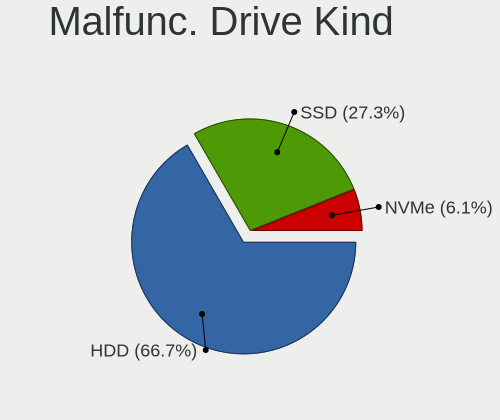

| Kind | Notebooks | Drives | Percent |
|------|-----------|--------|---------|
| HDD  | 19        | 19     | 70.37%  |
| SSD  | 6         | 6      | 22.22%  |
| NVMe | 2         | 2      | 7.41%   |

Failed Drives
-------------

Failed drive models

Zero info for selected period =(

Failed Drive Vendor
-------------------

Failed drive vendors

Zero info for selected period =(

Drive Status
------------

Number of failed and malfunc. drives

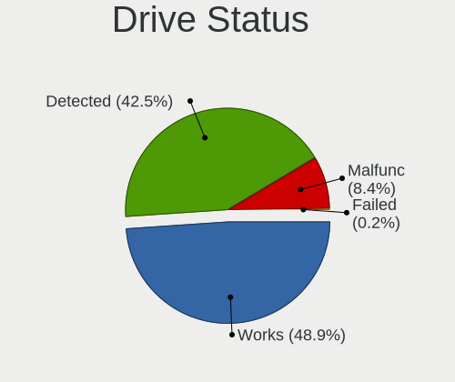

| Status   | Notebooks | Drives | Percent |
|----------|-----------|--------|---------|
| Works    | 135       | 166    | 47.04%  |
| Detected | 126       | 184    | 43.9%   |
| Malfunc  | 26        | 27     | 9.06%   |

Storage controller
------------------

Storage Vendor
--------------

Storage controller vendors

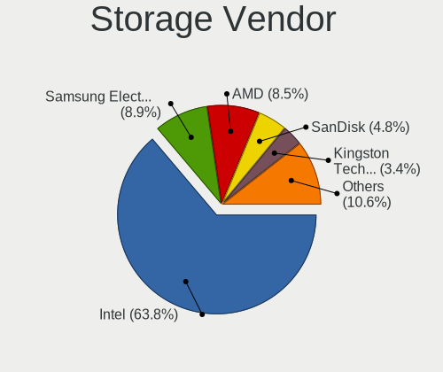

| Vendor                       | Notebooks | Percent |
|------------------------------|-----------|---------|
| Intel                        | 194       | 62.38%  |
| Samsung Electronics          | 29        | 9.32%   |
| AMD                          | 27        | 8.68%   |
| SanDisk                      | 15        | 4.82%   |
| Kingston Technology Company  | 11        | 3.54%   |
| SK hynix                     | 8         | 2.57%   |
| Micron Technology            | 6         | 1.93%   |
| Yangtze Memory Technologies  | 3         | 0.96%   |
| Toshiba America Info Systems | 3         | 0.96%   |
| Silicon Motion               | 3         | 0.96%   |
| Nvidia                       | 3         | 0.96%   |
| KIOXIA                       | 3         | 0.96%   |
| ADATA Technology             | 2         | 0.64%   |
| Realtek Semiconductor        | 1         | 0.32%   |
| Phison Electronics           | 1         | 0.32%   |
| Micron/Crucial Technology    | 1         | 0.32%   |
| Apple                        | 1         | 0.32%   |

Storage Model
-------------

Storage controller models

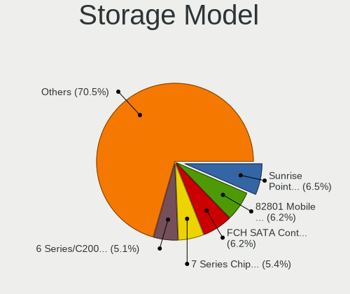

| Model                                                                                  | Notebooks | Percent |
|----------------------------------------------------------------------------------------|-----------|---------|
| Intel Sunrise Point-LP SATA Controller [AHCI mode]                                     | 23        | 6.8%    |
| AMD FCH SATA Controller [AHCI mode]                                                    | 22        | 6.51%   |
| Intel 82801 Mobile SATA Controller [RAID mode]                                         | 20        | 5.92%   |
| Intel 7 Series Chipset Family 6-port SATA Controller [AHCI mode]                       | 19        | 5.62%   |
| Intel 6 Series/C200 Series Chipset Family 6 port Mobile SATA AHCI Controller           | 18        | 5.33%   |
| Samsung NVMe SSD Controller SM981/PM981/PM983                                          | 15        | 4.44%   |
| Intel Volume Management Device NVMe RAID Controller                                    | 11        | 3.25%   |
| Intel 8 Series SATA Controller 1 [AHCI mode]                                           | 11        | 3.25%   |
| Intel Cannon Lake Mobile PCH SATA AHCI Controller                                      | 10        | 2.96%   |
| Intel Wildcat Point-LP SATA Controller [AHCI Mode]                                     | 9         | 2.66%   |
| Intel Celeron/Pentium Silver Processor SATA Controller                                 | 8         | 2.37%   |
| SanDisk WD Blue SN550 NVMe SSD                                                         | 6         | 1.78%   |
| Samsung NVMe SSD Controller 980                                                        | 6         | 1.78%   |
| Micron Non-Volatile memory controller                                                  | 6         | 1.78%   |
| Intel 6 Series/C200 Series Chipset Family Mobile SATA Controller (IDE mode, ports 0-3) | 6         | 1.78%   |
| Intel 400 Series Chipset Family SATA AHCI Controller                                   | 6         | 1.78%   |
| Kingston Company Company Non-Volatile memory controller                                | 5         | 1.48%   |
| Intel 7 Series Chipset Family 4-port SATA Controller [IDE mode]                        | 5         | 1.48%   |
| Intel 7 Series Chipset Family 2-port SATA Controller [IDE mode]                        | 5         | 1.48%   |
| Intel 6 Series/C200 Series Chipset Family Mobile SATA Controller (IDE mode, ports 4-5) | 5         | 1.48%   |
| SK hynix Gold P31/PC711 NVMe Solid State Drive                                         | 4         | 1.18%   |
| SanDisk WD Black SN750 / PC SN730 NVMe SSD                                             | 4         | 1.18%   |
| Samsung NVMe SSD Controller PM9A1/PM9A3/980PRO                                         | 4         | 1.18%   |
| Intel Ice Lake-LP SATA Controller [AHCI mode]                                          | 4         | 1.18%   |
| Intel HM170/QM170 Chipset SATA Controller [AHCI Mode]                                  | 4         | 1.18%   |
| Intel Comet Lake SATA AHCI Controller                                                  | 4         | 1.18%   |
| Intel Cannon Point-LP SATA Controller [AHCI Mode]                                      | 4         | 1.18%   |
| Yangtze Memory Non-Volatile memory controller                                          | 3         | 0.89%   |
| SK hynix BC511                                                                         | 3         | 0.89%   |
| Silicon Motion SM2263EN/SM2263XT SSD Controller                                        | 3         | 0.89%   |
| SanDisk Non-Volatile memory controller                                                 | 3         | 0.89%   |
| KIOXIA NVMe SSD Controller BG4                                                         | 3         | 0.89%   |
| Intel Atom Processor E3800 Series SATA AHCI Controller                                 | 3         | 0.89%   |
| Intel 82801IBM/IEM (ICH9M/ICH9M-E) 4 port SATA Controller [AHCI mode]                  | 3         | 0.89%   |
| Intel 82801HM/HEM (ICH8M/ICH8M-E) SATA Controller [AHCI mode]                          | 3         | 0.89%   |
| Intel 82801HM/HEM (ICH8M/ICH8M-E) IDE Controller                                       | 3         | 0.89%   |
| Intel 82801GBM/GHM (ICH7-M Family) SATA Controller [IDE mode]                          | 3         | 0.89%   |
| Intel 8 Series/C220 Series Chipset Family 6-port SATA Controller 1 [AHCI mode]         | 3         | 0.89%   |
| AMD SB7x0/SB8x0/SB9x0 SATA Controller [AHCI mode]                                      | 3         | 0.89%   |
| Toshiba America Info Systems XG5 NVMe SSD Controller                                   | 2         | 0.59%   |

Storage Kind
------------

Kind of storage controller (IDE, SATA, NVMe, SAS, ...)

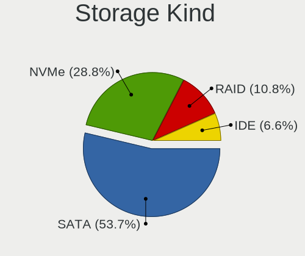

| Kind | Notebooks | Percent |
|------|-----------|---------|
| SATA | 178       | 55.8%   |
| NVMe | 83        | 26.02%  |
| RAID | 33        | 10.34%  |
| IDE  | 25        | 7.84%   |

Processor
---------

CPU Vendor
----------

Processor vendors

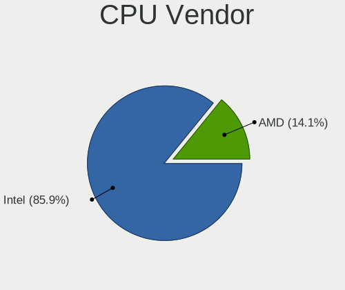

| Vendor | Notebooks | Percent |
|--------|-----------|---------|
| Intel  | 222       | 85.71%  |
| AMD    | 37        | 14.29%  |

CPU Model
---------

Processor models

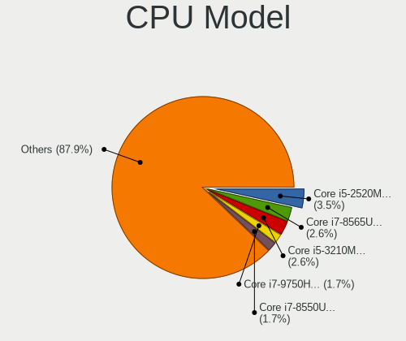

| Model                                   | Notebooks | Percent |
|-----------------------------------------|-----------|---------|
| Intel Core i5-2520M CPU @ 2.50GHz       | 9         | 3.47%   |
| Intel Core i7-8565U CPU @ 1.80GHz       | 6         | 2.32%   |
| Intel Core i5-3210M CPU @ 2.50GHz       | 6         | 2.32%   |
| Intel 11th Gen Core i5-1135G7 @ 2.40GHz | 5         | 1.93%   |
| Intel Core i7-9750H CPU @ 2.60GHz       | 4         | 1.54%   |
| Intel Core i7-8550U CPU @ 1.80GHz       | 4         | 1.54%   |
| Intel Core i7-6500U CPU @ 2.50GHz       | 4         | 1.54%   |
| Intel Core i7-10750H CPU @ 2.60GHz      | 4         | 1.54%   |
| Intel Core i5-8265U CPU @ 1.60GHz       | 4         | 1.54%   |
| Intel Core i5-6200U CPU @ 2.30GHz       | 4         | 1.54%   |
| Intel Core i5-3320M CPU @ 2.60GHz       | 4         | 1.54%   |
| Intel Core i3-5005U CPU @ 2.00GHz       | 4         | 1.54%   |
| Intel Core i7-8750H CPU @ 2.20GHz       | 3         | 1.16%   |
| Intel Core i5-8250U CPU @ 1.60GHz       | 3         | 1.16%   |
| Intel Core i5-7200U CPU @ 2.50GHz       | 3         | 1.16%   |
| Intel Core i5-3230M CPU @ 2.60GHz       | 3         | 1.16%   |
| Intel Core i5-2450M CPU @ 2.50GHz       | 3         | 1.16%   |
| Intel Core i5-2430M CPU @ 2.40GHz       | 3         | 1.16%   |
| Intel Core i3-6006U CPU @ 2.00GHz       | 3         | 1.16%   |
| Intel Core i3-1005G1 CPU @ 1.20GHz      | 3         | 1.16%   |
| Intel Core 2 CPU T5600 @ 1.83GHz        | 3         | 1.16%   |
| Intel Celeron J4125 CPU @ 2.00GHz       | 3         | 1.16%   |
| Intel Celeron CPU N3060 @ 1.60GHz       | 3         | 1.16%   |
| Intel 11th Gen Core i7-11800H @ 2.30GHz | 3         | 1.16%   |
| Intel 11th Gen Core i7-1165G7 @ 2.80GHz | 3         | 1.16%   |
| AMD Ryzen 7 5800H with Radeon Graphics  | 3         | 1.16%   |
| AMD Ryzen 7 5700U with Radeon Graphics  | 3         | 1.16%   |
| Intel Core i7-8850H CPU @ 2.60GHz       | 2         | 0.77%   |
| Intel Core i7-7700HQ CPU @ 2.80GHz      | 2         | 0.77%   |
| Intel Core i7-6700HQ CPU @ 2.60GHz      | 2         | 0.77%   |
| Intel Core i7-4600U CPU @ 2.10GHz       | 2         | 0.77%   |
| Intel Core i7-4510U CPU @ 2.00GHz       | 2         | 0.77%   |
| Intel Core i7-3630QM CPU @ 2.40GHz      | 2         | 0.77%   |
| Intel Core i7-3610QM CPU @ 2.30GHz      | 2         | 0.77%   |
| Intel Core i7-3520M CPU @ 2.90GHz       | 2         | 0.77%   |
| Intel Core i7-2670QM CPU @ 2.20GHz      | 2         | 0.77%   |
| Intel Core i7-2620M CPU @ 2.70GHz       | 2         | 0.77%   |
| Intel Core i7-10875H CPU @ 2.30GHz      | 2         | 0.77%   |
| Intel Core i7-10510U CPU @ 1.80GHz      | 2         | 0.77%   |
| Intel Core i5-8300H CPU @ 2.30GHz       | 2         | 0.77%   |

CPU Model Family
----------------

Processor model prefix

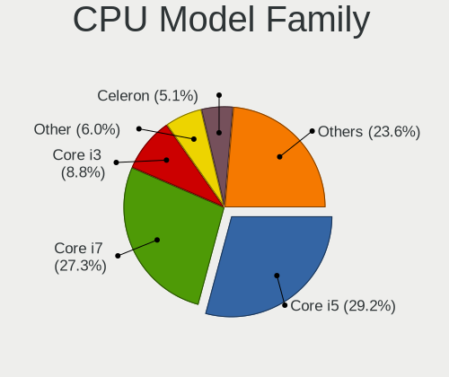

| Model                   | Notebooks | Percent |
|-------------------------|-----------|---------|
| Intel Core i5           | 70        | 27.03%  |
| Intel Core i7           | 68        | 26.25%  |
| Intel Core i3           | 24        | 9.27%   |
| Other                   | 23        | 8.88%   |
| Intel Celeron           | 16        | 6.18%   |
| AMD Ryzen 7             | 11        | 4.25%   |
| Intel Core 2 Duo        | 9         | 3.47%   |
| AMD Ryzen 5             | 7         | 2.7%    |
| AMD A6                  | 6         | 2.32%   |
| Intel Core 2            | 4         | 1.54%   |
| Intel Pentium           | 3         | 1.16%   |
| AMD E1                  | 3         | 1.16%   |
| Intel Pentium Silver    | 2         | 0.77%   |
| Intel Atom              | 2         | 0.77%   |
| AMD Ryzen 3             | 2         | 0.77%   |
| AMD A4                  | 2         | 0.77%   |
| Intel Pentium Dual-Core | 1         | 0.39%   |
| Intel Core 2 Quad       | 1         | 0.39%   |
| Intel Core 2 Extreme    | 1         | 0.39%   |
| AMD E2                  | 1         | 0.39%   |
| AMD E                   | 1         | 0.39%   |
| AMD C-50                | 1         | 0.39%   |
| AMD Athlon X2           | 1         | 0.39%   |

CPU Cores
---------

Number of processor cores

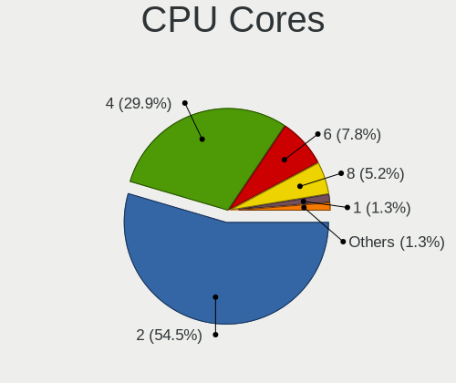

| Number | Notebooks | Percent |
|--------|-----------|---------|
| 2      | 138       | 53.28%  |
| 4      | 77        | 29.73%  |
| 6      | 21        | 8.11%   |
| 8      | 14        | 5.41%   |
| 14     | 3         | 1.16%   |
| 12     | 3         | 1.16%   |
| 1      | 3         | 1.16%   |

CPU Sockets
-----------

Number of sockets

| Number | Notebooks | Percent |
|--------|-----------|---------|
| 1      | 259       | 100%    |

CPU Threads
-----------

Threads per core (Hyper-Threading)

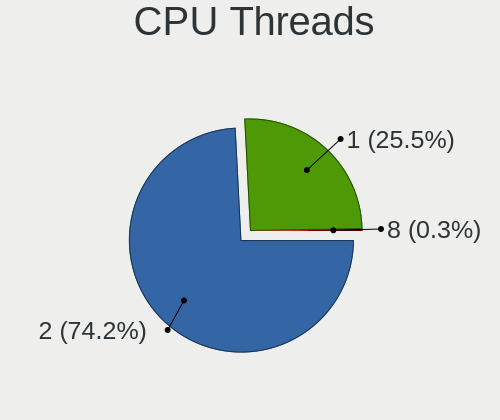

| Number | Notebooks | Percent |
|--------|-----------|---------|
| 2      | 196       | 75.68%  |
| 1      | 63        | 24.32%  |

CPU Op-Modes
------------

CPU Operation Modes (32-bit, 64-bit)

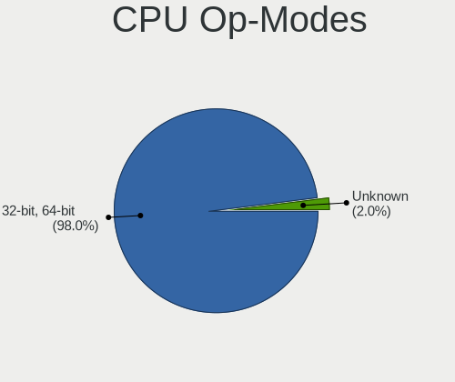

| Op mode        | Notebooks | Percent |
|----------------|-----------|---------|
| 32-bit, 64-bit | 254       | 98.07%  |
| Unknown        | 5         | 1.93%   |

CPU Microcode
-------------

Microcode number

| Number     | Notebooks | Percent |
|------------|-----------|---------|
| Unknown    | 112       | 42.26%  |
| 0x206a7    | 19        | 7.17%   |
| 0x306a9    | 12        | 4.53%   |
| 0x806ec    | 10        | 3.77%   |
| 0x806e9    | 8         | 3.02%   |
| 0xa0652    | 7         | 2.64%   |
| 0x906ea    | 7         | 2.64%   |
| 0x406e3    | 7         | 2.64%   |
| 0x906a3    | 6         | 2.26%   |
| 0x806c1    | 6         | 2.26%   |
| 0x706a8    | 6         | 2.26%   |
| 0x806ea    | 5         | 1.89%   |
| 0x40651    | 5         | 1.89%   |
| 0x706e5    | 4         | 1.51%   |
| 0x6f6      | 4         | 1.51%   |
| 0x306c3    | 4         | 1.51%   |
| 0x1067a    | 4         | 1.51%   |
| 0x08600106 | 3         | 1.13%   |
| 0x07030105 | 3         | 1.13%   |
| 0x906e9    | 2         | 0.75%   |
| 0x806d1    | 2         | 0.75%   |
| 0x6fd      | 2         | 0.75%   |
| 0x406c4    | 2         | 0.75%   |
| 0x306d4    | 2         | 0.75%   |
| 0x08108109 | 2         | 0.75%   |
| 0x06006705 | 2         | 0.75%   |
| 0x03000027 | 2         | 0.75%   |
| 0xa0660    | 1         | 0.38%   |
| 0x906ed    | 1         | 0.38%   |
| 0x806eb    | 1         | 0.38%   |
| 0x806c2    | 1         | 0.38%   |
| 0x706a1    | 1         | 0.38%   |
| 0x506e3    | 1         | 0.38%   |
| 0x506c9    | 1         | 0.38%   |
| 0x40661    | 1         | 0.38%   |
| 0x30678    | 1         | 0.38%   |
| 0x20655    | 1         | 0.38%   |
| 0x106e5    | 1         | 0.38%   |
| 0x0a50000c | 1         | 0.38%   |
| 0x08608103 | 1         | 0.38%   |

CPU Microarch
-------------

Microarchitecture

| Name             | Notebooks | Percent |
|------------------|-----------|---------|
| KabyLake         | 50        | 19.31%  |
| SandyBridge      | 29        | 11.2%   |
| IvyBridge        | 21        | 8.11%   |
| Haswell          | 20        | 7.72%   |
| Skylake          | 15        | 5.79%   |
| TigerLake        | 11        | 4.25%   |
| Broadwell        | 11        | 4.25%   |
| Penryn           | 10        | 3.86%   |
| CometLake        | 10        | 3.86%   |
| Silvermont       | 9         | 3.47%   |
| Goldmont plus    | 8         | 3.09%   |
| Unknown          | 8         | 3.09%   |
| Icelake          | 7         | 2.7%    |
| Core             | 7         | 2.7%    |
| Zen+             | 5         | 1.93%   |
| Zen 2            | 5         | 1.93%   |
| Alderlake Hybrid | 5         | 1.93%   |
| Zen 3            | 4         | 1.54%   |
| Westmere         | 4         | 1.54%   |
| Excavator        | 4         | 1.54%   |
| Puma             | 3         | 1.16%   |
| Jaguar           | 3         | 1.16%   |
| Piledriver       | 2         | 0.77%   |
| K10 Llano        | 2         | 0.77%   |
| Bobcat           | 2         | 0.77%   |
| Zen              | 1         | 0.39%   |
| Nehalem          | 1         | 0.39%   |
| K8 & K10 hybrid  | 1         | 0.39%   |
| Goldmont         | 1         | 0.39%   |

Graphics
--------

GPU Vendor
----------

Vendors of graphics cards

| Vendor | Notebooks | Percent |
|--------|-----------|---------|
| Intel  | 205       | 59.25%  |
| Nvidia | 84        | 24.28%  |
| AMD    | 57        | 16.47%  |

GPU Model
---------

Graphics card models

| Model                                                                                    | Notebooks | Percent |
|------------------------------------------------------------------------------------------|-----------|---------|
| Intel 2nd Generation Core Processor Family Integrated Graphics Controller                | 26        | 7.39%   |
| Intel 3rd Gen Core processor Graphics Controller                                         | 19        | 5.4%    |
| Intel Haswell-ULT Integrated Graphics Controller                                         | 14        | 3.98%   |
| Intel WhiskeyLake-U GT2 [UHD Graphics 620]                                               | 11        | 3.13%   |
| Intel TigerLake-LP GT2 [Iris Xe Graphics]                                                | 11        | 3.13%   |
| Intel Skylake GT2 [HD Graphics 520]                                                      | 11        | 3.13%   |
| Intel HD Graphics 5500                                                                   | 10        | 2.84%   |
| Intel CoffeeLake-H GT2 [UHD Graphics 630]                                                | 10        | 2.84%   |
| Intel UHD Graphics 620                                                                   | 9         | 2.56%   |
| Intel CometLake-H GT2 [UHD Graphics]                                                     | 9         | 2.56%   |
| Intel HD Graphics 620                                                                    | 8         | 2.27%   |
| Intel GeminiLake [UHD Graphics 600]                                                      | 6         | 1.7%    |
| Intel CometLake-U GT2 [UHD Graphics]                                                     | 6         | 1.7%    |
| Intel Alder Lake-P Integrated Graphics Controller                                        | 6         | 1.7%    |
| Nvidia GA106M [GeForce RTX 3060 Mobile / Max-Q]                                          | 5         | 1.42%   |
| Intel Atom/Celeron/Pentium Processor x5-E8000/J3xxx/N3xxx Integrated Graphics Controller | 5         | 1.42%   |
| Intel 4th Gen Core Processor Integrated Graphics Controller                              | 5         | 1.42%   |
| AMD Seymour [Radeon HD 6400M/7400M Series]                                               | 5         | 1.42%   |
| AMD Renoir                                                                               | 5         | 1.42%   |
| AMD Picasso/Raven 2 [Radeon Vega Series / Radeon Vega Mobile Series]                     | 5         | 1.42%   |
| AMD Lucienne                                                                             | 5         | 1.42%   |
| Nvidia TU106M [GeForce RTX 2060 Mobile]                                                  | 4         | 1.14%   |
| Nvidia GM108M [GeForce 940MX]                                                            | 4         | 1.14%   |
| Nvidia GF117M [GeForce 610M/710M/810M/820M / GT 620M/625M/630M/720M]                     | 4         | 1.14%   |
| Intel TigerLake-H GT1 [UHD Graphics]                                                     | 4         | 1.14%   |
| Intel Mobile 4 Series Chipset Integrated Graphics Controller                             | 4         | 1.14%   |
| Intel Iris Plus Graphics G1 (Ice Lake)                                                   | 4         | 1.14%   |
| Intel Core Processor Integrated Graphics Controller                                      | 4         | 1.14%   |
| Intel Atom Processor Z36xxx/Z37xxx Series Graphics & Display                             | 4         | 1.14%   |
| AMD Stoney [Radeon R2/R3/R4/R5 Graphics]                                                 | 4         | 1.14%   |
| AMD Cezanne [Radeon Vega Series / Radeon Vega Mobile Series]                             | 4         | 1.14%   |
| Nvidia TU116M [GeForce GTX 1660 Ti Mobile]                                               | 3         | 0.85%   |
| Nvidia GP108M [GeForce MX150]                                                            | 3         | 0.85%   |
| Nvidia GP107M [GeForce GTX 1050 Mobile]                                                  | 3         | 0.85%   |
| Nvidia GA107M [GeForce RTX 3050 Ti Mobile]                                               | 3         | 0.85%   |
| Intel Mobile GM965/GL960 Integrated Graphics Controller (secondary)                      | 3         | 0.85%   |
| Intel Mobile GM965/GL960 Integrated Graphics Controller (primary)                        | 3         | 0.85%   |
| Intel HD Graphics 630                                                                    | 3         | 0.85%   |
| Intel HD Graphics 530                                                                    | 3         | 0.85%   |
| AMD RV515/M54 [Mobility Radeon X1400]                                                    | 3         | 0.85%   |

GPU Combo
---------

Combinations of graphics cards

| Name           | Notebooks | Percent |
|----------------|-----------|---------|
| 1 x Intel      | 124       | 47.88%  |
| Intel + Nvidia | 68        | 26.25%  |
| 1 x AMD        | 37        | 14.29%  |
| Intel + AMD    | 13        | 5.02%   |
| 1 x Nvidia     | 9         | 3.47%   |
| AMD + Nvidia   | 6         | 2.32%   |
| 2 x Nvidia     | 1         | 0.39%   |
| 2 x AMD        | 1         | 0.39%   |

GPU Driver
----------

Free vs proprietary

| Driver      | Notebooks | Percent |
|-------------|-----------|---------|
| Free        | 231       | 89.19%  |
| Proprietary | 26        | 10.04%  |
| Unknown     | 2         | 0.77%   |

GPU Memory
----------

Total video memory

| Size in GB | Notebooks | Percent |
|------------|-----------|---------|
| Unknown    | 205       | 78.54%  |
| 1.01-2.0   | 18        | 6.9%    |
| 0.01-0.5   | 14        | 5.36%   |
| 0.51-1.0   | 12        | 4.6%    |
| 3.01-4.0   | 7         | 2.68%   |
| 5.01-6.0   | 2         | 0.77%   |
| 2.01-3.0   | 2         | 0.77%   |
| 7.01-8.0   | 1         | 0.38%   |

Monitor
-------

Monitor Vendor
--------------

Monitor vendors

| Vendor                  | Notebooks | Percent |
|-------------------------|-----------|---------|
| AU Optronics            | 65        | 22.41%  |
| LG Display              | 51        | 17.59%  |
| BOE                     | 48        | 16.55%  |
| Chimei Innolux          | 35        | 12.07%  |
| Samsung Electronics     | 28        | 9.66%   |
| Apple                   | 10        | 3.45%   |
| Chi Mei Optoelectronics | 7         | 2.41%   |
| Sharp                   | 4         | 1.38%   |
| PANDA                   | 4         | 1.38%   |
| Lenovo                  | 4         | 1.38%   |
| Dell                    | 4         | 1.38%   |
| Acer                    | 3         | 1.03%   |
| Sceptre Tech            | 2         | 0.69%   |
| Hewlett-Packard         | 2         | 0.69%   |
| Eizo                    | 2         | 0.69%   |
| Ancor Communications    | 2         | 0.69%   |
| ___                     | 1         | 0.34%   |
| ViewSonic               | 1         | 0.34%   |
| Unknown (AAA)           | 1         | 0.34%   |
| Unknown                 | 1         | 0.34%   |
| STD                     | 1         | 0.34%   |
| STA                     | 1         | 0.34%   |
| SANYO                   | 1         | 0.34%   |
| Planar                  | 1         | 0.34%   |
| Philips                 | 1         | 0.34%   |
| Panasonic               | 1         | 0.34%   |
| ONN                     | 1         | 0.34%   |
| NEC Computers           | 1         | 0.34%   |
| LG Philips              | 1         | 0.34%   |
| Kogan                   | 1         | 0.34%   |
| InfoVision              | 1         | 0.34%   |
| Goldstar                | 1         | 0.34%   |
| CSO                     | 1         | 0.34%   |
| BenQ                    | 1         | 0.34%   |
| AOC                     | 1         | 0.34%   |

Monitor Model
-------------

Monitor models

| Model                                                                | Notebooks | Percent |
|----------------------------------------------------------------------|-----------|---------|
| LG Display LCD Monitor LGD02D8 1366x768 277x156mm 12.5-inch          | 4         | 1.38%   |
| PANDA LCD Monitor NCP004D 1920x1080 344x194mm 15.5-inch              | 3         | 1.03%   |
| LG Display LCD Monitor LGD046F 1920x1080 344x194mm 15.5-inch         | 3         | 1.03%   |
| Chimei Innolux LCD Monitor CMN15E6 1366x768 344x193mm 15.5-inch      | 3         | 1.03%   |
| Chimei Innolux LCD Monitor CMN15DB 1366x768 344x193mm 15.5-inch      | 3         | 1.03%   |
| AU Optronics LCD Monitor AUO2E8D 1920x1080 344x194mm 15.5-inch       | 3         | 1.03%   |
| AU Optronics LCD Monitor AUO235C 1366x768 256x144mm 11.6-inch        | 3         | 1.03%   |
| AU Optronics LCD Monitor AUO133D 1920x1080 309x173mm 13.9-inch       | 3         | 1.03%   |
| Samsung Electronics LCD Monitor SEC544B 1600x900 382x214mm 17.2-inch | 2         | 0.69%   |
| Samsung Electronics LCD Monitor SEC4D45 1280x800 331x207mm 15.4-inch | 2         | 0.69%   |
| Samsung Electronics LCD Monitor SDC4951 1366x768 344x194mm 15.5-inch | 2         | 0.69%   |
| LG Display LCD Monitor LGD0390 1600x900 382x215mm 17.3-inch          | 2         | 0.69%   |
| LG Display LCD Monitor LGD0259 1920x1080 345x194mm 15.6-inch         | 2         | 0.69%   |
| LG Display LCD Monitor LGD01E9 1920x1080 345x194mm 15.6-inch         | 2         | 0.69%   |
| Chimei Innolux P130ZFA-BA1 CMN8201 2160x1440 275x183mm 13.0-inch     | 2         | 0.69%   |
| Chimei Innolux LCD Monitor CMN15F5 1920x1080 344x193mm 15.5-inch     | 2         | 0.69%   |
| Chimei Innolux LCD Monitor CMN15DC 1366x768 344x193mm 15.5-inch      | 2         | 0.69%   |
| BOE LCD Monitor BOE08BE 1920x1080 382x215mm 17.3-inch                | 2         | 0.69%   |
| BOE LCD Monitor BOE0872 1920x1080 344x194mm 15.5-inch                | 2         | 0.69%   |
| BOE LCD Monitor BOE07C9 1920x1080 309x173mm 13.9-inch                | 2         | 0.69%   |
| AU Optronics LCD Monitor AUOAF90 1920x1080 344x193mm 15.5-inch       | 2         | 0.69%   |
| AU Optronics LCD Monitor AUO38ED 1920x1080 344x193mm 15.5-inch       | 2         | 0.69%   |
| AU Optronics LCD Monitor AUO313C 1366x768 309x173mm 13.9-inch        | 2         | 0.69%   |
| AU Optronics LCD Monitor AUO26EC 1366x768 344x193mm 15.5-inch        | 2         | 0.69%   |
| AU Optronics LCD Monitor AUO21EC 1366x768 344x193mm 15.5-inch        | 2         | 0.69%   |
| ___ LCDTV16 ___9000 1360x768                                         | 1         | 0.34%   |
| ViewSonic VA2718-FHD VSCD839 1920x1080 598x336mm 27.0-inch           | 1         | 0.34%   |
| Unknown LCD TV 9000 1360x768 1600x900mm 72.3-inch                    | 1         | 0.34%   |
| Unknown (AAA) LCDTV AAA0042 1360x768 890x500mm 40.2-inch             | 1         | 0.34%   |
| STD HDMI TV STD00C7 1680x1050 698x392mm 31.5-inch                    | 1         | 0.34%   |
| STA XR140EA1T STA0450 1366x768 310x174mm 14.0-inch                   | 1         | 0.34%   |
| Sharp LCD Monitor SHP1542 1920x1080 309x174mm 14.0-inch              | 1         | 0.34%   |
| Sharp LCD Monitor SHP14B8 1920x1080 294x165mm 13.3-inch              | 1         | 0.34%   |
| Sharp LCD Monitor SHP1447 1920x1080 294x165mm 13.3-inch              | 1         | 0.34%   |
| Sharp LCD Monitor SHP143A 3840x2160 346x194mm 15.6-inch              | 1         | 0.34%   |
| Sceptre Tech Sceptre F24 SPT09AB 1920x1080 530x290mm 23.8-inch       | 1         | 0.34%   |
| Sceptre Tech Sceptre B30 SPT0BC2 2560x1080 690x291mm 29.5-inch       | 1         | 0.34%   |
| SANYO LCD SAN0B51 1920x540                                           | 1         | 0.34%   |
| Samsung Electronics SyncMaster SAM0589 1920x1080 521x293mm 23.5-inch | 1         | 0.34%   |
| Samsung Electronics SMT24A550 SAM07B5 1920x1080 530x300mm 24.0-inch  | 1         | 0.34%   |

Monitor Resolution
------------------

Monitor screen resolution

| Resolution         | Notebooks | Percent |
|--------------------|-----------|---------|
| 1920x1080 (FHD)    | 118       | 43.07%  |
| 1366x768 (WXGA)    | 96        | 35.04%  |
| 1600x900 (HD+)     | 16        | 5.84%   |
| 1280x800 (WXGA)    | 11        | 4.01%   |
| 1440x900 (WXGA+)   | 6         | 2.19%   |
| 3840x2160 (4K)     | 4         | 1.46%   |
| 1680x1050 (WSXGA+) | 4         | 1.46%   |
| 2880x1800          | 3         | 1.09%   |
| 2560x1600          | 3         | 1.09%   |
| 2560x1440 (QHD)    | 2         | 0.73%   |
| 2160x1440          | 2         | 0.73%   |
| 1920x1200 (WUXGA)  | 2         | 0.73%   |
| 1024x768 (XGA)     | 2         | 0.73%   |
| 2560x1080          | 1         | 0.36%   |
| 1920x540           | 1         | 0.36%   |
| 1920x515           | 1         | 0.36%   |
| 1360x768           | 1         | 0.36%   |
| 1280x1024 (SXGA)   | 1         | 0.36%   |

Monitor Diagonal
----------------

Diagonal size in inches

| Inches  | Notebooks | Percent |
|---------|-----------|---------|
| 15      | 121       | 42.01%  |
| 14      | 41        | 14.24%  |
| 13      | 36        | 12.5%   |
| 17      | 25        | 8.68%   |
| 12      | 12        | 4.17%   |
| 27      | 7         | 2.43%   |
| 24      | 7         | 2.43%   |
| 11      | 7         | 2.43%   |
| 16      | 5         | 1.74%   |
| 31      | 4         | 1.39%   |
| 21      | 4         | 1.39%   |
| 23      | 3         | 1.04%   |
| 22      | 3         | 1.04%   |
| Unknown | 3         | 1.04%   |
| 19      | 2         | 0.69%   |
| 18      | 2         | 0.69%   |
| 72      | 1         | 0.35%   |
| 54      | 1         | 0.35%   |
| 48      | 1         | 0.35%   |
| 40      | 1         | 0.35%   |
| 32      | 1         | 0.35%   |
| 29      | 1         | 0.35%   |

Monitor Width
-------------

Physical width

| Width in mm | Notebooks | Percent |
|-------------|-----------|---------|
| 301-350     | 185       | 64.46%  |
| 201-300     | 32        | 11.15%  |
| 351-400     | 31        | 10.8%   |
| 501-600     | 17        | 5.92%   |
| 401-500     | 9         | 3.14%   |
| 601-700     | 5         | 1.74%   |
| Unknown     | 3         | 1.05%   |
| 1001-1500   | 2         | 0.7%    |
| 801-900     | 1         | 0.35%   |
| 701-800     | 1         | 0.35%   |
| 1501-2000   | 1         | 0.35%   |

Aspect Ratio
------------

Proportional relationship between the width and the height

| Ratio | Notebooks | Percent |
|-------|-----------|---------|
| 16/9  | 227       | 86.31%  |
| 16/10 | 28        | 10.65%  |
| 4/3   | 2         | 0.76%   |
| 3/2   | 2         | 0.76%   |
| 6/5   | 1         | 0.38%   |
| 32/9  | 1         | 0.38%   |
| 3.73  | 1         | 0.38%   |
| 21/9  | 1         | 0.38%   |

Monitor Area
------------

Area in inch²

| Area in inch² | Notebooks | Percent |
|----------------|-----------|---------|
| 101-110        | 124       | 43.06%  |
| 81-90          | 66        | 22.92%  |
| 121-130        | 22        | 7.64%   |
| 201-250        | 15        | 5.21%   |
| 61-70          | 12        | 4.17%   |
| 71-80          | 11        | 3.82%   |
| 301-350        | 8         | 2.78%   |
| 51-60          | 7         | 2.43%   |
| 351-500        | 5         | 1.74%   |
| More than 1000 | 3         | 1.04%   |
| 131-140        | 3         | 1.04%   |
| Unknown        | 3         | 1.04%   |
| 251-300        | 2         | 0.69%   |
| 151-200        | 2         | 0.69%   |
| 141-150        | 2         | 0.69%   |
| 111-120        | 2         | 0.69%   |
| 501-1000       | 1         | 0.35%   |

Pixel Density
-------------

Pixels per inch

| Density       | Notebooks | Percent |
|---------------|-----------|---------|
| 121-160       | 124       | 43.36%  |
| 101-120       | 95        | 33.22%  |
| 51-100        | 41        | 14.34%  |
| 161-240       | 15        | 5.24%   |
| More than 240 | 4         | 1.4%    |
| 1-50          | 4         | 1.4%    |
| Unknown       | 3         | 1.05%   |

Multiple Monitors
-----------------

Total monitors connected

| Total | Notebooks | Percent |
|-------|-----------|---------|
| 1     | 220       | 84.29%  |
| 2     | 34        | 13.03%  |
| 3     | 5         | 1.92%   |
| 0     | 2         | 0.77%   |

Network
-------

Net Controller Vendor
---------------------

Controller vendors

| Vendor                                 | Notebooks | Percent |
|----------------------------------------|-----------|---------|
| Intel                                  | 151       | 34.63%  |
| Realtek Semiconductor                  | 138       | 31.65%  |
| Qualcomm Atheros                       | 53        | 12.16%  |
| Broadcom                               | 24        | 5.5%    |
| MediaTek                               | 9         | 2.06%   |
| Broadcom Limited                       | 8         | 1.83%   |
| TP-Link                                | 7         | 1.61%   |
| Samsung Electronics                    | 7         | 1.61%   |
| Xiaomi                                 | 4         | 0.92%   |
| Qualcomm Atheros Communications        | 4         | 0.92%   |
| Huawei Technologies                    | 4         | 0.92%   |
| Ralink Technology                      | 3         | 0.69%   |
| NetGear                                | 3         | 0.69%   |
| ASUSTek Computer                       | 3         | 0.69%   |
| Nvidia                                 | 2         | 0.46%   |
| ASIX Electronics                       | 2         | 0.46%   |
| Apple                                  | 2         | 0.46%   |
| ZyXEL Communications                   | 1         | 0.23%   |
| Sony Ericsson Mobile Communications AB | 1         | 0.23%   |
| Sagem                                  | 1         | 0.23%   |
| Ralink                                 | 1         | 0.23%   |
| Linksys                                | 1         | 0.23%   |
| Lenovo                                 | 1         | 0.23%   |
| JMicron Technology                     | 1         | 0.23%   |
| Ericsson Business Mobile Networks      | 1         | 0.23%   |
| DisplayLink                            | 1         | 0.23%   |
| D-Link                                 | 1         | 0.23%   |
| Belkin Components                      | 1         | 0.23%   |
| Arduino SA                             | 1         | 0.23%   |

Net Controller Model
--------------------

Controller models

| Model                                                             | Notebooks | Percent |
|-------------------------------------------------------------------|-----------|---------|
| Realtek RTL8111/8168/8411 PCI Express Gigabit Ethernet Controller | 74        | 14.1%   |
| Realtek RTL810xE PCI Express Fast Ethernet controller             | 29        | 5.52%   |
| Intel 82579LM Gigabit Network Connection (Lewisville)             | 16        | 3.05%   |
| Intel Centrino Advanced-N 6205 [Taylor Peak]                      | 14        | 2.67%   |
| Qualcomm Atheros QCA9565 / AR9565 Wireless Network Adapter        | 10        | 1.9%    |
| Intel Wireless 8265 / 8275                                        | 9         | 1.71%   |
| Intel Wireless 7260                                               | 9         | 1.71%   |
| Intel Wi-Fi 6 AX200                                               | 9         | 1.71%   |
| Qualcomm Atheros AR9485 Wireless Network Adapter                  | 8         | 1.52%   |
| Intel Wireless 7265                                               | 8         | 1.52%   |
| Intel Wi-Fi 6 AX201                                               | 8         | 1.52%   |
| Intel Comet Lake PCH CNVi WiFi                                    | 8         | 1.52%   |
| Intel Cannon Point-LP CNVi [Wireless-AC]                          | 8         | 1.52%   |
| Realtek RTL8821CE 802.11ac PCIe Wireless Network Adapter          | 7         | 1.33%   |
| Realtek RTL8153 Gigabit Ethernet Adapter                          | 7         | 1.33%   |
| Qualcomm Atheros QCA9377 802.11ac Wireless Network Adapter        | 7         | 1.33%   |
| Qualcomm Atheros AR9285 Wireless Network Adapter (PCI-Express)    | 7         | 1.33%   |
| Intel Comet Lake PCH-LP CNVi WiFi                                 | 7         | 1.33%   |
| Samsung Galaxy series, misc. (tethering mode)                     | 6         | 1.14%   |
| Intel Wireless 3165                                               | 6         | 1.14%   |
| Intel Ethernet Connection I218-LM                                 | 6         | 1.14%   |
| Intel Cannon Lake PCH CNVi WiFi                                   | 6         | 1.14%   |
| Realtek RTL8852AE 802.11ax PCIe Wireless Network Adapter          | 5         | 0.95%   |
| Realtek RTL8822CE 802.11ac PCIe Wireless Network Adapter          | 5         | 0.95%   |
| Realtek 802.11ac NIC                                              | 5         | 0.95%   |
| Qualcomm Atheros Killer E2500 Gigabit Ethernet Controller         | 5         | 0.95%   |
| Intel Alder Lake-P PCH CNVi WiFi                                  | 5         | 0.95%   |
| Realtek RTL8812AU 802.11a/b/g/n/ac 2T2R DB WLAN Adapter           | 4         | 0.76%   |
| Realtek RTL8723BE PCIe Wireless Network Adapter                   | 4         | 0.76%   |
| Qualcomm Atheros AR9271 802.11n                                   | 4         | 0.76%   |
| Qualcomm Atheros AR8161 Gigabit Ethernet                          | 4         | 0.76%   |
| MediaTek MT7921 802.11ax PCI Express Wireless Network Adapter     | 4         | 0.76%   |
| Intel Wireless 8260                                               | 4         | 0.76%   |
| Intel Wireless 3160                                               | 4         | 0.76%   |
| Intel Ice Lake-LP PCH CNVi WiFi                                   | 4         | 0.76%   |
| Intel Dual Band Wireless-AC 3165 Plus Bluetooth                   | 4         | 0.76%   |
| Intel Centrino Advanced-N 6235                                    | 4         | 0.76%   |
| Broadcom BCM43142 802.11b/g/n                                     | 4         | 0.76%   |
| Xiaomi Mi/Redmi series (RNDIS)                                    | 3         | 0.57%   |
| TP-Link TL-WN722N v2/v3 [Realtek RTL8188EUS]                      | 3         | 0.57%   |

Wireless Vendor
---------------

Wireless vendors

| Vendor                          | Notebooks | Percent |
|---------------------------------|-----------|---------|
| Intel                           | 147       | 49.49%  |
| Realtek Semiconductor           | 52        | 17.51%  |
| Qualcomm Atheros                | 39        | 13.13%  |
| Broadcom                        | 20        | 6.73%   |
| TP-Link                         | 7         | 2.36%   |
| MediaTek                        | 7         | 2.36%   |
| Broadcom Limited                | 6         | 2.02%   |
| Qualcomm Atheros Communications | 4         | 1.35%   |
| Ralink Technology               | 3         | 1.01%   |
| NetGear                         | 3         | 1.01%   |
| ASUSTek Computer                | 3         | 1.01%   |
| ZyXEL Communications            | 1         | 0.34%   |
| Sagem                           | 1         | 0.34%   |
| Ralink                          | 1         | 0.34%   |
| Linksys                         | 1         | 0.34%   |
| D-Link                          | 1         | 0.34%   |
| Belkin Components               | 1         | 0.34%   |

Wireless Model
--------------

Wireless models

| Model                                                          | Notebooks | Percent |
|----------------------------------------------------------------|-----------|---------|
| Intel Centrino Advanced-N 6205 [Taylor Peak]                   | 14        | 4.71%   |
| Qualcomm Atheros QCA9565 / AR9565 Wireless Network Adapter     | 10        | 3.37%   |
| Intel Wireless 8265 / 8275                                     | 9         | 3.03%   |
| Intel Wireless 7260                                            | 9         | 3.03%   |
| Intel Wi-Fi 6 AX200                                            | 9         | 3.03%   |
| Qualcomm Atheros AR9485 Wireless Network Adapter               | 8         | 2.69%   |
| Intel Wireless 7265                                            | 8         | 2.69%   |
| Intel Wi-Fi 6 AX201                                            | 8         | 2.69%   |
| Intel Comet Lake PCH CNVi WiFi                                 | 8         | 2.69%   |
| Intel Cannon Point-LP CNVi [Wireless-AC]                       | 8         | 2.69%   |
| Realtek RTL8821CE 802.11ac PCIe Wireless Network Adapter       | 7         | 2.36%   |
| Qualcomm Atheros QCA9377 802.11ac Wireless Network Adapter     | 7         | 2.36%   |
| Qualcomm Atheros AR9285 Wireless Network Adapter (PCI-Express) | 7         | 2.36%   |
| Intel Comet Lake PCH-LP CNVi WiFi                              | 7         | 2.36%   |
| Intel Wireless 3165                                            | 6         | 2.02%   |
| Intel Cannon Lake PCH CNVi WiFi                                | 6         | 2.02%   |
| Realtek RTL8852AE 802.11ax PCIe Wireless Network Adapter       | 5         | 1.68%   |
| Realtek RTL8822CE 802.11ac PCIe Wireless Network Adapter       | 5         | 1.68%   |
| Realtek 802.11ac NIC                                           | 5         | 1.68%   |
| Intel Alder Lake-P PCH CNVi WiFi                               | 5         | 1.68%   |
| Realtek RTL8812AU 802.11a/b/g/n/ac 2T2R DB WLAN Adapter        | 4         | 1.35%   |
| Realtek RTL8723BE PCIe Wireless Network Adapter                | 4         | 1.35%   |
| Qualcomm Atheros AR9271 802.11n                                | 4         | 1.35%   |
| MediaTek MT7921 802.11ax PCI Express Wireless Network Adapter  | 4         | 1.35%   |
| Intel Wireless 8260                                            | 4         | 1.35%   |
| Intel Wireless 3160                                            | 4         | 1.35%   |
| Intel Ice Lake-LP PCH CNVi WiFi                                | 4         | 1.35%   |
| Intel Dual Band Wireless-AC 3165 Plus Bluetooth                | 4         | 1.35%   |
| Intel Centrino Advanced-N 6235                                 | 4         | 1.35%   |
| Broadcom BCM43142 802.11b/g/n                                  | 4         | 1.35%   |
| TP-Link TL-WN722N v2/v3 [Realtek RTL8188EUS]                   | 3         | 1.01%   |
| Realtek RTL8188CE 802.11b/g/n WiFi Adapter                     | 3         | 1.01%   |
| MediaTek MT7921K (RZ608) Wi-Fi 6E 80MHz                        | 3         | 1.01%   |
| Intel Tiger Lake PCH CNVi WiFi                                 | 3         | 1.01%   |
| Intel Dual Band Wireless-AC 3168NGW [Stone Peak]               | 3         | 1.01%   |
| Intel Centrino Wireless-N 2230                                 | 3         | 1.01%   |
| Intel Centrino Wireless-N 1030 [Rainbow Peak]                  | 3         | 1.01%   |
| Broadcom BCM43228 802.11a/b/g/n                                | 3         | 1.01%   |
| Broadcom BCM4313 802.11bgn Wireless Network Adapter            | 3         | 1.01%   |
| TP-Link AC600 wireless Realtek RTL8811AU [Archer T2U Nano]     | 2         | 0.67%   |

Ethernet Vendor
---------------

Ethernet vendors

| Vendor                | Notebooks | Percent |
|-----------------------|-----------|---------|
| Realtek Semiconductor | 119       | 54.34%  |
| Intel                 | 45        | 20.55%  |
| Qualcomm Atheros      | 22        | 10.05%  |
| Broadcom              | 8         | 3.65%   |
| Samsung Electronics   | 7         | 3.2%    |
| Xiaomi                | 4         | 1.83%   |
| Nvidia                | 2         | 0.91%   |
| MediaTek              | 2         | 0.91%   |
| Broadcom Limited      | 2         | 0.91%   |
| ASIX Electronics      | 2         | 0.91%   |
| Apple                 | 2         | 0.91%   |
| Lenovo                | 1         | 0.46%   |
| JMicron Technology    | 1         | 0.46%   |
| Huawei Technologies   | 1         | 0.46%   |
| DisplayLink           | 1         | 0.46%   |

Ethernet Model
--------------

Ethernet models

| Model                                                             | Notebooks | Percent |
|-------------------------------------------------------------------|-----------|---------|
| Realtek RTL8111/8168/8411 PCI Express Gigabit Ethernet Controller | 74        | 33.33%  |
| Realtek RTL810xE PCI Express Fast Ethernet controller             | 29        | 13.06%  |
| Intel 82579LM Gigabit Network Connection (Lewisville)             | 16        | 7.21%   |
| Realtek RTL8153 Gigabit Ethernet Adapter                          | 7         | 3.15%   |
| Samsung Galaxy series, misc. (tethering mode)                     | 6         | 2.7%    |
| Intel Ethernet Connection I218-LM                                 | 6         | 2.7%    |
| Qualcomm Atheros Killer E2500 Gigabit Ethernet Controller         | 5         | 2.25%   |
| Qualcomm Atheros AR8161 Gigabit Ethernet                          | 4         | 1.8%    |
| Xiaomi Mi/Redmi series (RNDIS)                                    | 3         | 1.35%   |
| Realtek Killer E2600 Gigabit Ethernet Controller                  | 3         | 1.35%   |
| Qualcomm Atheros AR8162 Fast Ethernet                             | 3         | 1.35%   |
| Qualcomm Atheros AR8152 v2.0 Fast Ethernet                        | 3         | 1.35%   |
| Intel Ethernet Connection (6) I219-V                              | 3         | 1.35%   |
| Intel Ethernet Connection (4) I219-LM                             | 3         | 1.35%   |
| Broadcom BCM4401-B0 100Base-TX                                    | 3         | 1.35%   |
| Realtek RTL8152 Fast Ethernet Adapter                             | 2         | 0.9%    |
| Realtek RTL8125 2.5GbE Controller                                 | 2         | 0.9%    |
| Realtek Killer E3000 2.5GbE Controller                            | 2         | 0.9%    |
| Realtek Killer E2500 Gigabit Ethernet Controller                  | 2         | 0.9%    |
| Qualcomm Atheros Killer E220x Gigabit Ethernet Controller         | 2         | 0.9%    |
| Qualcomm Atheros AR8131 Gigabit Ethernet                          | 2         | 0.9%    |
| MediaTek Infinix NOTE 11                                          | 2         | 0.9%    |
| Intel Ethernet Connection I217-V                                  | 2         | 0.9%    |
| Intel Ethernet Connection (3) I218-LM                             | 2         | 0.9%    |
| Intel 82577LM Gigabit Network Connection                          | 2         | 0.9%    |
| Intel 82567LM Gigabit Network Connection                          | 2         | 0.9%    |
| Broadcom NetXtreme BCM57765 Gigabit Ethernet PCIe                 | 2         | 0.9%    |
| Xiaomi Mi/Redmi series (RNDIS + ADB)                              | 1         | 0.45%   |
| Samsung GT-I9070 (network tethering, USB debugging enabled)       | 1         | 0.45%   |
| Realtek RTL-8100/8101L/8139 PCI Fast Ethernet Adapter             | 1         | 0.45%   |
| Qualcomm Atheros QCA8171 Gigabit Ethernet                         | 1         | 0.45%   |
| Qualcomm Atheros Killer E2400 Gigabit Ethernet Controller         | 1         | 0.45%   |
| Qualcomm Atheros AR8151 v2.0 Gigabit Ethernet                     | 1         | 0.45%   |
| Nvidia MCP89 Ethernet                                             | 1         | 0.45%   |
| Nvidia MCP79 Ethernet                                             | 1         | 0.45%   |
| Lenovo ThinkPad TBT 3 Dock                                        | 1         | 0.45%   |
| JMicron JMC250 PCI Express Gigabit Ethernet Controller            | 1         | 0.45%   |
| Intel PRO/100 VE Network Connection                               | 1         | 0.45%   |
| Intel Ethernet Connection I219-V                                  | 1         | 0.45%   |
| Intel Ethernet Connection I219-LM                                 | 1         | 0.45%   |

Net Controller Kind
-------------------

Ethernet, WiFi or modem

| Kind     | Notebooks | Percent |
|----------|-----------|---------|
| WiFi     | 257       | 54.45%  |
| Ethernet | 209       | 44.28%  |
| Modem    | 5         | 1.06%   |
| Unknown  | 1         | 0.21%   |

Used Controller
---------------

Currently used network controller

| Kind     | Notebooks | Percent |
|----------|-----------|---------|
| WiFi     | 211       | 77.01%  |
| Ethernet | 62        | 22.63%  |
| Unknown  | 1         | 0.36%   |

NICs
----

Total network controllers on board

| Total | Notebooks | Percent |
|-------|-----------|---------|
| 2     | 186       | 71.81%  |
| 1     | 65        | 25.1%   |
| 0     | 5         | 1.93%   |
| 3     | 3         | 1.16%   |

IPv6
----

IPv6 vs IPv4

| Used    | Notebooks | Percent |
|---------|-----------|---------|
| No      | 215       | 81.75%  |
| Yes     | 47        | 17.87%  |
| Unknown | 1         | 0.38%   |

Bluetooth
---------

Bluetooth Vendor
----------------

Controller vendors

| Vendor                          | Notebooks | Percent |
|---------------------------------|-----------|---------|
| Intel                           | 106       | 50.96%  |
| Qualcomm Atheros Communications | 22        | 10.58%  |
| Realtek Semiconductor           | 20        | 9.62%   |
| Broadcom                        | 15        | 7.21%   |
| Lite-On Technology              | 7         | 3.37%   |
| IMC Networks                    | 7         | 3.37%   |
| Foxconn / Hon Hai               | 7         | 3.37%   |
| Apple                           | 7         | 3.37%   |
| Cambridge Silicon Radio         | 4         | 1.92%   |
| MediaTek                        | 3         | 1.44%   |
| Dell                            | 3         | 1.44%   |
| Toshiba                         | 2         | 0.96%   |
| TP-Link                         | 1         | 0.48%   |
| Realtek                         | 1         | 0.48%   |
| Ralink                          | 1         | 0.48%   |
| Dynex                           | 1         | 0.48%   |
| Alps Electric                   | 1         | 0.48%   |

Bluetooth Model
---------------

Controller models

| Model                                                                               | Notebooks | Percent |
|-------------------------------------------------------------------------------------|-----------|---------|
| Intel Bluetooth wireless interface                                                  | 38        | 18.27%  |
| Intel AX201 Bluetooth                                                               | 25        | 12.02%  |
| Intel Bluetooth 9460/9560 Jefferson Peak (JfP)                                      | 22        | 10.58%  |
| Realtek Bluetooth Radio                                                             | 13        | 6.25%   |
| Qualcomm Atheros  Bluetooth Device                                                  | 9         | 4.33%   |
| Intel AX200 Bluetooth                                                               | 8         | 3.85%   |
| Realtek  Bluetooth 4.2 Adapter                                                      | 5         | 2.4%    |
| Apple Bluetooth Host Controller                                                     | 5         | 2.4%    |
| Qualcomm Atheros AR3012 Bluetooth 4.0                                               | 4         | 1.92%   |
| Intel Centrino Bluetooth Wireless Transceiver                                       | 4         | 1.92%   |
| Cambridge Silicon Radio Bluetooth Dongle (HCI mode)                                 | 4         | 1.92%   |
| Broadcom HP Portable SoftSailing                                                    | 4         | 1.92%   |
| Qualcomm Atheros Bluetooth                                                          | 3         | 1.44%   |
| MediaTek Wireless_Device                                                            | 3         | 1.44%   |
| Intel Wireless-AC 3168 Bluetooth                                                    | 3         | 1.44%   |
| IMC Networks Bluetooth Radio                                                        | 3         | 1.44%   |
| Dell DW375 Bluetooth Module                                                         | 3         | 1.44%   |
| Broadcom BCM43142A0 Bluetooth Device                                                | 3         | 1.44%   |
| Broadcom BCM2045B (BDC-2.1)                                                         | 3         | 1.44%   |
| Realtek RTL8821A Bluetooth                                                          | 2         | 0.96%   |
| Qualcomm Atheros Bluetooth USB Host Controller                                      | 2         | 0.96%   |
| Qualcomm Atheros AR3011 Bluetooth                                                   | 2         | 0.96%   |
| Lite-On Wireless_Device                                                             | 2         | 0.96%   |
| Lite-On Qualcomm Atheros QCA9377 Bluetooth                                          | 2         | 0.96%   |
| Intel Centrino Advanced-N 6230 Bluetooth adapter                                    | 2         | 0.96%   |
| Intel Bluetooth Device                                                              | 2         | 0.96%   |
| IMC Networks Wireless_Device                                                        | 2         | 0.96%   |
| IMC Networks Bluetooth Device                                                       | 2         | 0.96%   |
| Foxconn / Hon Hai Foxconn T77H114 BCM2070 [Single-Chip Bluetooth 2.1 + EDR Adapter] | 2         | 0.96%   |
| Foxconn / Hon Hai Bluetooth Device                                                  | 2         | 0.96%   |
| Foxconn / Hon Hai BCM20702A0                                                        | 2         | 0.96%   |
| Broadcom BCM2070 Bluetooth 2.1 + EDR                                                | 2         | 0.96%   |
| Apple Bluetooth USB Host Controller                                                 | 2         | 0.96%   |
| TP-Link UB500 Adapter                                                               | 1         | 0.48%   |
| Toshiba Bluetooth USB Host Controller                                               | 1         | 0.48%   |
| Toshiba BCM43142A0                                                                  | 1         | 0.48%   |
| Realtek Bluetooth Radio                                                             | 1         | 0.48%   |
| Ralink RT3290 Bluetooth                                                             | 1         | 0.48%   |
| Qualcomm Atheros QCA61x4 Bluetooth 4.0                                              | 1         | 0.48%   |
| Qualcomm Atheros AR9462 Bluetooth                                                   | 1         | 0.48%   |

Sound
-----

Sound Vendor
------------

Sound card vendors

| Vendor    | Notebooks | Percent |
|-----------|-----------|---------|
| Intel     | 216       | 69.23%  |
| Nvidia    | 50        | 16.03%  |
| AMD       | 41        | 13.14%  |
| Lenovo    | 1         | 0.32%   |
| JMTek     | 1         | 0.32%   |
| Guillemot | 1         | 0.32%   |
| GN Netcom | 1         | 0.32%   |
| Apple     | 1         | 0.32%   |

Sound Model
-----------

Sound card models

| Model                                                                                             | Notebooks | Percent |
|---------------------------------------------------------------------------------------------------|-----------|---------|
| Intel Sunrise Point-LP HD Audio                                                                   | 30        | 8%      |
| Intel 6 Series/C200 Series Chipset Family High Definition Audio Controller                        | 26        | 6.93%   |
| Intel 7 Series/C216 Chipset Family High Definition Audio Controller                               | 24        | 6.4%    |
| AMD Family 17h/19h HD Audio Controller                                                            | 19        | 5.07%   |
| Intel Haswell-ULT HD Audio Controller                                                             | 14        | 3.73%   |
| Intel 8 Series HD Audio Controller                                                                | 14        | 3.73%   |
| Intel Wildcat Point-LP High Definition Audio Controller                                           | 11        | 2.93%   |
| Intel Tiger Lake-LP Smart Sound Technology Audio Controller                                       | 11        | 2.93%   |
| Intel Cannon Point-LP High Definition Audio Controller                                            | 11        | 2.93%   |
| Intel Cannon Lake PCH cAVS                                                                        | 11        | 2.93%   |
| Intel Broadwell-U Audio Controller                                                                | 11        | 2.93%   |
| AMD Renoir Radeon High Definition Audio Controller                                                | 11        | 2.93%   |
| AMD FCH Azalia Controller                                                                         | 10        | 2.67%   |
| Intel Comet Lake PCH cAVS                                                                         | 9         | 2.4%    |
| Intel Celeron/Pentium Silver Processor High Definition Audio                                      | 8         | 2.13%   |
| Intel Comet Lake PCH-LP cAVS                                                                      | 7         | 1.87%   |
| Intel 82801I (ICH9 Family) HD Audio Controller                                                    | 7         | 1.87%   |
| Nvidia TU107 GeForce GTX 1650 High Definition Audio Controller                                    | 6         | 1.6%    |
| Nvidia TU106 High Definition Audio Controller                                                     | 6         | 1.6%    |
| Intel Alder Lake PCH-P High Definition Audio Controller                                           | 6         | 1.6%    |
| Intel 8 Series/C220 Series Chipset High Definition Audio Controller                               | 6         | 1.6%    |
| AMD Raven/Raven2/Fenghuang HDMI/DP Audio Controller                                               | 6         | 1.6%    |
| AMD Kabini HDMI/DP Audio                                                                          | 6         | 1.6%    |
| Nvidia GP107GL High Definition Audio Controller                                                   | 5         | 1.33%   |
| Nvidia GA106 High Definition Audio Controller                                                     | 5         | 1.33%   |
| Intel Xeon E3-1200 v3/4th Gen Core Processor HD Audio Controller                                  | 5         | 1.33%   |
| Intel Ice Lake-LP Smart Sound Technology Audio Controller                                         | 5         | 1.33%   |
| Intel 5 Series/3400 Series Chipset High Definition Audio                                          | 5         | 1.33%   |
| Nvidia Audio device                                                                               | 4         | 1.07%   |
| Intel Tiger Lake-H HD Audio Controller                                                            | 4         | 1.07%   |
| Intel NM10/ICH7 Family High Definition Audio Controller                                           | 4         | 1.07%   |
| Intel Atom Processor Z36xxx/Z37xxx Series High Definition Audio Controller                        | 4         | 1.07%   |
| AMD High Definition Audio Controller                                                              | 4         | 1.07%   |
| AMD Family 15h (Models 60h-6fh) Audio Controller                                                  | 4         | 1.07%   |
| Nvidia TU116 High Definition Audio Controller                                                     | 3         | 0.8%    |
| Nvidia GF108 High Definition Audio Controller                                                     | 3         | 0.8%    |
| Intel CM238 HD Audio Controller                                                                   | 3         | 0.8%    |
| Intel Atom/Celeron/Pentium Processor x5-E8000/J3xxx/N3xxx Series High Definition Audio Controller | 3         | 0.8%    |
| Intel 82801H (ICH8 Family) HD Audio Controller                                                    | 3         | 0.8%    |
| Intel 100 Series/C230 Series Chipset Family HD Audio Controller                                   | 3         | 0.8%    |

Memory
------

Memory Vendor
-------------

Memory module vendors

| Vendor              | Notebooks | Percent |
|---------------------|-----------|---------|
| Samsung Electronics | 59        | 29.65%  |
| SK hynix            | 35        | 17.59%  |
| Micron Technology   | 35        | 17.59%  |
| Crucial             | 12        | 6.03%   |
| Kingston            | 11        | 5.53%   |
| Unknown             | 8         | 4.02%   |
| Ramaxel Technology  | 7         | 3.52%   |
| Elpida              | 7         | 3.52%   |
| Unknown (ABCD)      | 5         | 2.51%   |
| Nanya Technology    | 4         | 2.01%   |
| Corsair             | 3         | 1.51%   |
| A-DATA Technology   | 3         | 1.51%   |
| Team                | 2         | 1.01%   |
| G.Skill             | 2         | 1.01%   |
| Timetec             | 1         | 0.5%    |
| Teikon              | 1         | 0.5%    |
| Smart               | 1         | 0.5%    |
| Saikano             | 1         | 0.5%    |
| PNY                 | 1         | 0.5%    |
| ChangXin Memory     | 1         | 0.5%    |

Memory Model
------------

Memory module models

| Model                                                            | Notebooks | Percent |
|------------------------------------------------------------------|-----------|---------|
| Samsung RAM M471B5273DH0-CH9 4096MB SODIMM DDR3 1334MT/s         | 6         | 2.88%   |
| Samsung RAM M471B5173DB0-YK0 4GB SODIMM DDR3 1600MT/s            | 6         | 2.88%   |
| Unknown (ABCD) RAM 123456789012345678 2GB SODIMM LPDDR4 2400MT/s | 5         | 2.4%    |
| SK hynix RAM HMT351S6CFR8C-PB 4GB SODIMM DDR3 1600MT/s           | 4         | 1.92%   |
| SK hynix RAM HMT41GS6AFR8A-PB 8GB SODIMM DDR3 1600MT/s           | 3         | 1.44%   |
| SK hynix RAM HMA851S6AFR6N-UH 2GB SODIMM LPDDR4 2667MT/s         | 3         | 1.44%   |
| SK hynix RAM HMA81GS6CJR8N-VK 8GB SODIMM DDR4 2667MT/s           | 3         | 1.44%   |
| Samsung RAM M471A5244CB0-CWE 4GB SODIMM DDR4 3200MT/s            | 3         | 1.44%   |
| Samsung RAM M471A5244CB0-CTD 4GB SODIMM DDR4 3266MT/s            | 3         | 1.44%   |
| Samsung RAM M471A1K43CB1-CTD 8GB SODIMM DDR4 2667MT/s            | 3         | 1.44%   |
| Micron RAM 8ATF1G64HZ-2G6E1 8GB SODIMM DDR4 2667MT/s             | 3         | 1.44%   |
| Micron RAM 16KTF51264HZ-1G6M1 4GB SODIMM DDR3 1600MT/s           | 3         | 1.44%   |
| Unknown RAM Module 8GB SODIMM DDR3 1600MT/s                      | 2         | 0.96%   |
| SK hynix RAM Module 8GB Row Of Chips LPDDR3 2133MT/s             | 2         | 0.96%   |
| SK hynix RAM HMAA1GS6CJR6N-XN 8GB SODIMM DDR4 3200MT/s           | 2         | 0.96%   |
| SK hynix RAM HMA851S6DJR6N-XN 4GB SODIMM DDR4 3200MT/s           | 2         | 0.96%   |
| Samsung RAM M471B1G73DB0-YK0 8GB SODIMM DDR3 1600MT/s            | 2         | 0.96%   |
| Samsung RAM M471A5244CB0-CTD 4GB Row Of Chips DDR4 2667MT/s      | 2         | 0.96%   |
| Samsung RAM M471A1K43EB1-CWE 8GB SODIMM DDR4 3200MT/s            | 2         | 0.96%   |
| Samsung RAM M471A1K43DB1-CWE 8GB SODIMM DDR4 3200MT/s            | 2         | 0.96%   |
| Samsung RAM M471A1K43CB1-CRC 8GB SODIMM DDR4 2667MT/s            | 2         | 0.96%   |
| Samsung RAM M471A1K43BB1-CRC 8192MB SODIMM DDR4 2667MT/s         | 2         | 0.96%   |
| Samsung RAM M4 70T2953CZ3-CE6 1GB SODIMM DDR 667MT/s             | 2         | 0.96%   |
| Nanya RAM NT2GC64B88B0NS-CG 2GB SODIMM DDR3 1334MT/s             | 2         | 0.96%   |
| Micron RAM 8ATF1G64HZ-3G2J1 8GB SODIMM DDR4 3200MT/s             | 2         | 0.96%   |
| Micron RAM 4ATF51264HZ-2G6E1 4GB SODIMM DDR4 2667MT/s            | 2         | 0.96%   |
| Micron RAM 4ATF1G64HZ-3G2E1 8GB SODIMM DDR4 3200MT/s             | 2         | 0.96%   |
| Micron RAM 4ATF1G64HZ-3G2E1 8GB Row Of Chips DDR4 3200MT/s       | 2         | 0.96%   |
| Micron RAM 16JSF51264HZ-1G4D1 4096MB SODIMM DDR3 1334MT/s        | 2         | 0.96%   |
| Elpida RAM Module 4GB SODIMM DDR3 1600MT/s                       | 2         | 0.96%   |
| Crucial RAM CT102464BF160B.C16 8GB SODIMM DDR3 1600MT/s          | 2         | 0.96%   |
| Unknown RAM Module 4GB SODIMM DDR3 1600MT/s                      | 1         | 0.48%   |
| Unknown RAM Module 4096MB SODIMM DDR3                            | 1         | 0.48%   |
| Unknown RAM Module 4096MB SODIMM 1066MT/s                        | 1         | 0.48%   |
| Unknown RAM Module 2GB SODIMM DDR3                               | 1         | 0.48%   |
| Unknown RAM Module 2048MB SODIMM DDR2 667MT/s                    | 1         | 0.48%   |
| Unknown RAM Module 1GB SODIMM DDR2 533MT/s                       | 1         | 0.48%   |
| Unknown RAM Module 1024MB SODIMM DDR2 667MT/s                    | 1         | 0.48%   |
| Timetec RAM SD3-1333 8192MB SODIMM DDR3 1333MT/s                 | 1         | 0.48%   |
| Teikon RAM TMT451S6BFR8A-PBHJ 4GB SODIMM DDR3 1600MT/s           | 1         | 0.48%   |

Memory Kind
-----------

Memory module kinds

| Kind    | Notebooks | Percent |
|---------|-----------|---------|
| DDR4    | 74        | 43.53%  |
| DDR3    | 65        | 38.24%  |
| LPDDR4  | 13        | 7.65%   |
| LPDDR3  | 6         | 3.53%   |
| DDR2    | 5         | 2.94%   |
| DDR5    | 3         | 1.76%   |
| SDRAM   | 1         | 0.59%   |
| LPDDR5  | 1         | 0.59%   |
| DDR     | 1         | 0.59%   |
| Unknown | 1         | 0.59%   |

Memory Form Factor
------------------

Physical design of the memory module

| Name         | Notebooks | Percent |
|--------------|-----------|---------|
| SODIMM       | 152       | 89.41%  |
| Row Of Chips | 16        | 9.41%   |
| Chip         | 1         | 0.59%   |
| Unknown      | 1         | 0.59%   |

Memory Size
-----------

Memory module size

| Size  | Notebooks | Percent |
|-------|-----------|---------|
| 8192  | 69        | 37.91%  |
| 4096  | 64        | 35.16%  |
| 16384 | 21        | 11.54%  |
| 2048  | 18        | 9.89%   |
| 1024  | 8         | 4.4%    |
| 32768 | 2         | 1.1%    |

Memory Speed
------------

Memory module speed

| Speed   | Notebooks | Percent |
|---------|-----------|---------|
| 2667    | 42        | 22.58%  |
| 1600    | 42        | 22.58%  |
| 3200    | 26        | 13.98%  |
| 2400    | 16        | 8.6%    |
| 1334    | 14        | 7.53%   |
| 2133    | 8         | 4.3%    |
| 1333    | 8         | 4.3%    |
| 1867    | 4         | 2.15%   |
| 4800    | 3         | 1.61%   |
| 3266    | 3         | 1.61%   |
| 1067    | 3         | 1.61%   |
| 1066    | 3         | 1.61%   |
| 667     | 3         | 1.61%   |
| 4267    | 2         | 1.08%   |
| Unknown | 2         | 1.08%   |
| 8400    | 1         | 0.54%   |
| 6400    | 1         | 0.54%   |
| 3733    | 1         | 0.54%   |
| 2048    | 1         | 0.54%   |
| 975     | 1         | 0.54%   |
| 800     | 1         | 0.54%   |
| 533     | 1         | 0.54%   |

Printers & scanners
-------------------

Printer Vendor
--------------

Printer device vendors

| Vendor             | Notebooks | Percent |
|--------------------|-----------|---------|
| Brother Industries | 1         | 100%    |

Printer Model
-------------

Printer device models

| Model                   | Notebooks | Percent |
|-------------------------|-----------|---------|
| Brother HL-1210W series | 1         | 100%    |

Scanner Vendor
--------------

Scanner device vendors

| Vendor | Notebooks | Percent |
|--------|-----------|---------|
| Canon  | 1         | 100%    |

Scanner Model
-------------

Scanner device models

| Model                         | Notebooks | Percent |
|-------------------------------|-----------|---------|
| Canon CanoScan N1240U/LiDE 30 | 1         | 100%    |

Camera
------

Camera Vendor
-------------

Camera device vendors

| Vendor                                 | Notebooks | Percent |
|----------------------------------------|-----------|---------|
| Chicony Electronics                    | 66        | 28.57%  |
| IMC Networks                           | 24        | 10.39%  |
| Acer                                   | 24        | 10.39%  |
| Microdia                               | 19        | 8.23%   |
| Sunplus Innovation Technology          | 14        | 6.06%   |
| Realtek Semiconductor                  | 12        | 5.19%   |
| Quanta                                 | 11        | 4.76%   |
| Apple                                  | 9         | 3.9%    |
| Cheng Uei Precision Industry (Foxlink) | 7         | 3.03%   |
| Syntek                                 | 6         | 2.6%    |
| Ricoh                                  | 5         | 2.16%   |
| Suyin                                  | 4         | 1.73%   |
| Samsung Electronics                    | 4         | 1.73%   |
| Luxvisions Innotech Limited            | 4         | 1.73%   |
| Silicon Motion                         | 3         | 1.3%    |
| Lite-On Technology                     | 3         | 1.3%    |
| Alcor Micro                            | 3         | 1.3%    |
| USB Camera                             | 2         | 0.87%   |
| Sonix Technology                       | 2         | 0.87%   |
| Importek                               | 2         | 0.87%   |
| USB Camera CS                          | 1         | 0.43%   |
| Primax Electronics                     | 1         | 0.43%   |
| Logitech                               | 1         | 0.43%   |
| LG Electronics                         | 1         | 0.43%   |
| Goertek Electronics                    | 1         | 0.43%   |
| DJJHFA1BIF5595                         | 1         | 0.43%   |
| ALi                                    | 1         | 0.43%   |

Camera Model
------------

Camera device models

| Model                                                | Notebooks | Percent |
|------------------------------------------------------|-----------|---------|
| Chicony integrated camera                            | 9         | 3.9%    |
| IMC Networks USB2.0 HD UVC WebCam                    | 8         | 3.46%   |
| Realtek Integrated_Webcam_HD                         | 7         | 3.03%   |
| Acer HD Webcam                                       | 7         | 3.03%   |
| IMC Networks Integrated Camera                       | 6         | 2.6%    |
| Chicony HD Webcam                                    | 6         | 2.6%    |
| Chicony HD User Facing                               | 6         | 2.6%    |
| Syntek Integrated Camera                             | 5         | 2.16%   |
| Microdia Integrated_Webcam_HD                        | 5         | 2.16%   |
| Chicony USB2.0 Camera                                | 5         | 2.16%   |
| Chicony HP Truevision HD                             | 5         | 2.16%   |
| Sunplus Integrated_Webcam_HD                         | 4         | 1.73%   |
| Samsung Galaxy A5 (MTP)                              | 4         | 1.73%   |
| Acer EasyCamera                                      | 4         | 1.73%   |
| Quanta HP TrueVision HD Camera                       | 3         | 1.3%    |
| Microdia Webcam Vitade AF                            | 3         | 1.3%    |
| Microdia Integrated Webcam                           | 3         | 1.3%    |
| IMC Networks HD Camera                               | 3         | 1.3%    |
| Chicony USB2.0 HD UVC WebCam                         | 3         | 1.3%    |
| Apple iPhone5/5C/5S/6                                | 3         | 1.3%    |
| Alcor Micro USB 2.0 Camera                           | 3         | 1.3%    |
| Acer SunplusIT Integrated Camera                     | 3         | 1.3%    |
| Acer Integrated Camera                               | 3         | 1.3%    |
| USB Camera USB Camera                                | 2         | 0.87%   |
| Sunplus HD WebCam                                    | 2         | 0.87%   |
| Realtek Integrated Webcam                            | 2         | 0.87%   |
| Quanta HD User Facing                                | 2         | 0.87%   |
| Microdia PC Microscope camera                        | 2         | 0.87%   |
| Microdia Laptop_Integrated_Webcam_HD                 | 2         | 0.87%   |
| Luxvisions Innotech Limited HP Wide Vision HD Camera | 2         | 0.87%   |
| Luxvisions Innotech Limited HP TrueVision HD Camera  | 2         | 0.87%   |
| Lite-On HP Wide Vision HD Camera                     | 2         | 0.87%   |
| IMC Networks USB2.0 VGA UVC WebCam                   | 2         | 0.87%   |
| Chicony USB2.0 VGA UVC WebCam                        | 2         | 0.87%   |
| Chicony TOSHIBA Web Camera - HD                      | 2         | 0.87%   |
| Chicony Lenovo Integrated Camera (0.3MP)             | 2         | 0.87%   |
| Chicony Integrated HP HD Webcam                      | 2         | 0.87%   |
| Chicony Integrated Camera [ThinkPad]                 | 2         | 0.87%   |
| Chicony Integrated Camera (1280x720@30)              | 2         | 0.87%   |
| Chicony HP HD Webcam [Fixed]                         | 2         | 0.87%   |

Security
--------

Fingerprint Vendor
------------------

Fingerprint sensor vendors

| Vendor                     | Notebooks | Percent |
|----------------------------|-----------|---------|
| Validity Sensors           | 18        | 41.86%  |
| Synaptics                  | 10        | 23.26%  |
| Shenzhen Goodix Technology | 6         | 13.95%  |
| Elan Microelectronics      | 3         | 6.98%   |
| Upek                       | 2         | 4.65%   |
| LighTuning Technology      | 2         | 4.65%   |
| AuthenTec                  | 2         | 4.65%   |

Fingerprint Model
-----------------

Fingerprint sensor models

| Model                                                                      | Notebooks | Percent |
|----------------------------------------------------------------------------|-----------|---------|
| Shenzhen Goodix  Fingerprint Device                                        | 5         | 11.63%  |
| Synaptics Prometheus MIS Touch Fingerprint Reader                          | 4         | 9.3%    |
| Validity Sensors VFS495 Fingerprint Reader                                 | 3         | 6.98%   |
| Validity Sensors VFS471 Fingerprint Reader                                 | 3         | 6.98%   |
| Validity Sensors Fingerprint scanner                                       | 3         | 6.98%   |
| Validity Sensors VFS491                                                    | 2         | 4.65%   |
| Validity Sensors VFS 5011 fingerprint sensor                               | 2         | 4.65%   |
| Validity Sensors Synaptics WBDI                                            | 2         | 4.65%   |
| Upek Biometric Touchchip/Touchstrip Fingerprint Sensor                     | 2         | 4.65%   |
| Synaptics  FS7604 Touch Fingerprint Sensor with PurePrint                  | 2         | 4.65%   |
| Elan ELAN:Fingerprint                                                      | 2         | 4.65%   |
| Validity Sensors VFS5011 Fingerprint Reader                                | 1         | 2.33%   |
| Validity Sensors VFS101 Fingerprint Reader                                 | 1         | 2.33%   |
| Validity Sensors Synaptics VFS7552 Touch Fingerprint Sensor with PurePrint | 1         | 2.33%   |
| Synaptics  WBDI                                                            | 1         | 2.33%   |
| Synaptics  VFS7552 Touch Fingerprint Sensor with PurePrint                 | 1         | 2.33%   |
| Synaptics Metallica MIS Touch Fingerprint Reader                           | 1         | 2.33%   |
| Shenzhen Goodix Fingerprint Reader                                         | 1         | 2.33%   |
| LighTuning ES603 Swipe Fingerprint Sensor                                  | 1         | 2.33%   |
| LighTuning EgisTec Touch Fingerprint Sensor                                | 1         | 2.33%   |
| Elan ELAN:ARM-M4                                                           | 1         | 2.33%   |
| AuthenTec Fingerprint Sensor                                               | 1         | 2.33%   |
| AuthenTec AES1660 Fingerprint Sensor                                       | 1         | 2.33%   |
| Unknown                                                                    | 1         | 2.33%   |

Chipcard Vendor
---------------

Chipcard module vendors

| Vendor      | Notebooks | Percent |
|-------------|-----------|---------|
| Broadcom    | 10        | 62.5%   |
| Alcor Micro | 4         | 25%     |
| OmniKey     | 1         | 6.25%   |
| O2 Micro    | 1         | 6.25%   |

Chipcard Model
--------------

Chipcard module models

| Model                                                                        | Notebooks | Percent |
|------------------------------------------------------------------------------|-----------|---------|
| Broadcom BCM5880 Secure Applications Processor                               | 6         | 37.5%   |
| Alcor Micro AU9540 Smartcard Reader                                          | 4         | 25%     |
| Broadcom BCM5880 Secure Applications Processor with fingerprint swipe sensor | 3         | 18.75%  |
| OmniKey CardMan Smart@Link                                                   | 1         | 6.25%   |
| O2 Micro OZ776 CCID Smartcard Reader                                         | 1         | 6.25%   |
| Broadcom 5880                                                                | 1         | 6.25%   |

Unsupported
-----------

Unsupported Devices
-------------------

Total unsupported devices on board

| Total | Notebooks | Percent |
|-------|-----------|---------|
| 0     | 160       | 60.84%  |
| 1     | 82        | 31.18%  |
| 2     | 19        | 7.22%   |
| 3     | 2         | 0.76%   |

Unsupported Device Types
------------------------

Types of unsupported devices

| Type                  | Notebooks | Percent |
|-----------------------|-----------|---------|
| Fingerprint reader    | 44        | 36.36%  |
| Graphics card         | 18        | 14.88%  |
| Chipcard              | 15        | 12.4%   |
| Net/wireless          | 14        | 11.57%  |
| Multimedia controller | 12        | 9.92%   |
| Camera                | 7         | 5.79%   |
| Storage               | 5         | 4.13%   |
| Network               | 3         | 2.48%   |
| Modem                 | 1         | 0.83%   |
| Card reader           | 1         | 0.83%   |
| Bluetooth             | 1         | 0.83%   |

