Parrot - Tested Hardware & Statistics (Notebooks)
-------------------------------------------------

A project to collect tested hardware configurations for Parrot.

Anyone can contribute to this report by the [hw-probe](https://github.com/linuxhw/hw-probe) tool:

    sudo -E hw-probe -all -upload

Please contribute! Especially if your hardware is rare.

Contents
--------

* [ Test Cases ](#test-cases)

* [ System ](#system)
  - [ OS                       ](#os)
  - [ OS Family                ](#os-family)
  - [ Kernel                   ](#kernel)
  - [ Kernel Family            ](#kernel-family)
  - [ Kernel Major Ver.        ](#kernel-major-ver)
  - [ Arch                     ](#arch)
  - [ DE                       ](#de)
  - [ Display Server           ](#display-server)
  - [ Display Manager          ](#display-manager)
  - [ OS Lang                  ](#os-lang)
  - [ Boot Mode                ](#boot-mode)
  - [ Filesystem               ](#filesystem)
  - [ Part. scheme             ](#part-scheme)
  - [ Dual Boot with Linux/BSD ](#dual-boot-with-linuxbsd)
  - [ Dual Boot (Win)          ](#dual-boot-win)

* [ Board ](#board)
  - [ Vendor                   ](#vendor)
  - [ Model                    ](#model)
  - [ Model Family             ](#model-family)
  - [ MFG Year                 ](#mfg-year)
  - [ Form Factor              ](#form-factor)
  - [ Secure Boot              ](#secure-boot)
  - [ Coreboot                 ](#coreboot)
  - [ RAM Size                 ](#ram-size)
  - [ RAM Used                 ](#ram-used)
  - [ Total Drives             ](#total-drives)
  - [ Has CD-ROM               ](#has-cd-rom)
  - [ Has Ethernet             ](#has-ethernet)
  - [ Has WiFi                 ](#has-wifi)
  - [ Has Bluetooth            ](#has-bluetooth)

* [ Location ](#location)
  - [ Country                  ](#country)
  - [ City                     ](#city)

* [ Drives ](#drives)
  - [ Drive Vendor             ](#drive-vendor)
  - [ Drive Model              ](#drive-model)
  - [ HDD Vendor               ](#hdd-vendor)
  - [ SSD Vendor               ](#ssd-vendor)
  - [ Drive Kind               ](#drive-kind)
  - [ Drive Connector          ](#drive-connector)
  - [ Drive Size               ](#drive-size)
  - [ Space Total              ](#space-total)
  - [ Space Used               ](#space-used)
  - [ Malfunc. Drives          ](#malfunc-drives)
  - [ Malfunc. Drive Vendor    ](#malfunc-drive-vendor)
  - [ Malfunc. HDD Vendor      ](#malfunc-hdd-vendor)
  - [ Malfunc. Drive Kind      ](#malfunc-drive-kind)
  - [ Failed Drives            ](#failed-drives)
  - [ Failed Drive Vendor      ](#failed-drive-vendor)
  - [ Drive Status             ](#drive-status)

* [ Storage controller ](#storage-controller)
  - [ Storage Vendor           ](#storage-vendor)
  - [ Storage Model            ](#storage-model)
  - [ Storage Kind             ](#storage-kind)

* [ Processor ](#processor)
  - [ CPU Vendor               ](#cpu-vendor)
  - [ CPU Model                ](#cpu-model)
  - [ CPU Model Family         ](#cpu-model-family)
  - [ CPU Cores                ](#cpu-cores)
  - [ CPU Sockets              ](#cpu-sockets)
  - [ CPU Threads              ](#cpu-threads)
  - [ CPU Op-Modes             ](#cpu-op-modes)
  - [ CPU Microcode            ](#cpu-microcode)
  - [ CPU Microarch            ](#cpu-microarch)

* [ Graphics ](#graphics)
  - [ GPU Vendor               ](#gpu-vendor)
  - [ GPU Model                ](#gpu-model)
  - [ GPU Combo                ](#gpu-combo)
  - [ GPU Driver               ](#gpu-driver)
  - [ GPU Memory               ](#gpu-memory)

* [ Monitor ](#monitor)
  - [ Monitor Vendor           ](#monitor-vendor)
  - [ Monitor Model            ](#monitor-model)
  - [ Monitor Resolution       ](#monitor-resolution)
  - [ Monitor Diagonal         ](#monitor-diagonal)
  - [ Monitor Width            ](#monitor-width)
  - [ Aspect Ratio             ](#aspect-ratio)
  - [ Monitor Area             ](#monitor-area)
  - [ Pixel Density            ](#pixel-density)
  - [ Multiple Monitors        ](#multiple-monitors)

* [ Network ](#network)
  - [ Net Controller Vendor    ](#net-controller-vendor)
  - [ Net Controller Model     ](#net-controller-model)
  - [ Wireless Vendor          ](#wireless-vendor)
  - [ Wireless Model           ](#wireless-model)
  - [ Ethernet Vendor          ](#ethernet-vendor)
  - [ Ethernet Model           ](#ethernet-model)
  - [ Net Controller Kind      ](#net-controller-kind)
  - [ Used Controller          ](#used-controller)
  - [ NICs                     ](#nics)
  - [ IPv6                     ](#ipv6)

* [ Bluetooth ](#bluetooth)
  - [ Bluetooth Vendor         ](#bluetooth-vendor)
  - [ Bluetooth Model          ](#bluetooth-model)

* [ Sound ](#sound)
  - [ Sound Vendor             ](#sound-vendor)
  - [ Sound Model              ](#sound-model)

* [ Memory ](#memory)
  - [ Memory Vendor            ](#memory-vendor)
  - [ Memory Model             ](#memory-model)
  - [ Memory Kind              ](#memory-kind)
  - [ Memory Form Factor       ](#memory-form-factor)
  - [ Memory Size              ](#memory-size)
  - [ Memory Speed             ](#memory-speed)

* [ Printers & scanners ](#printers--scanners)
  - [ Printer Vendor           ](#printer-vendor)
  - [ Printer Model            ](#printer-model)
  - [ Scanner Vendor           ](#scanner-vendor)
  - [ Scanner Model            ](#scanner-model)

* [ Camera ](#camera)
  - [ Camera Vendor            ](#camera-vendor)
  - [ Camera Model             ](#camera-model)

* [ Security ](#security)
  - [ Fingerprint Vendor       ](#fingerprint-vendor)
  - [ Fingerprint Model        ](#fingerprint-model)
  - [ Chipcard Vendor          ](#chipcard-vendor)
  - [ Chipcard Model           ](#chipcard-model)

* [ Unsupported ](#unsupported)
  - [ Unsupported Devices      ](#unsupported-devices)
  - [ Unsupported Device Types ](#unsupported-device-types)

Test Cases
----------

Total: 746

| Vendor        | Model                       | Probe                                                      | Date         |
|---------------|-----------------------------|------------------------------------------------------------|--------------|
| ASUSTek       | VivoBook_ASUSLaptop X513... | [744913d110](https://linux-hardware.org/?probe=744913d110) | Dec 30, 2025 |
| Acer          | Aspire A715-51G             | [505005da4e](https://linux-hardware.org/?probe=505005da4e) | Dec 26, 2025 |
| Acer          | Aspire A715-75G             | [e2184f09c9](https://linux-hardware.org/?probe=e2184f09c9) | Dec 21, 2025 |
| Samsung       | 340XAA/350XAA/550XAA        | [70b7496265](https://linux-hardware.org/?probe=70b7496265) | Dec 20, 2025 |
| ASUSTek       | Vivobook Go E1504FA_E150... | [ee94d47e48](https://linux-hardware.org/?probe=ee94d47e48) | Dec 09, 2025 |
| HP            | 250 G2                      | [bcdae6c7a8](https://linux-hardware.org/?probe=bcdae6c7a8) | Nov 16, 2025 |
| Lenovo        | ThinkPad T14s Gen 4 21F8... | [7b6b56eeaa](https://linux-hardware.org/?probe=7b6b56eeaa) | Oct 22, 2025 |
| Lenovo        | ThinkPad X13 Gen 1 20T3S... | [466fbf7b8e](https://linux-hardware.org/?probe=466fbf7b8e) | Oct 18, 2025 |
| Dell          | Latitude 5480               | [2cd49ec30a](https://linux-hardware.org/?probe=2cd49ec30a) | Oct 16, 2025 |
| Apple         | MacBookPro11,2              | [ff5905b503](https://linux-hardware.org/?probe=ff5905b503) | Oct 02, 2025 |
| Lenovo        | ThinkBook 15 G3 ACL 21A4    | [7bddf7d521](https://linux-hardware.org/?probe=7bddf7d521) | Sep 19, 2025 |
| Apple         | MacBookPro11,2              | [4cf21a84b4](https://linux-hardware.org/?probe=4cf21a84b4) | Sep 19, 2025 |
| HP            | Pavilion g7                 | [02e6f41fef](https://linux-hardware.org/?probe=02e6f41fef) | Sep 18, 2025 |
| MSI           | GF63 Thin 11SC              | [873715915b](https://linux-hardware.org/?probe=873715915b) | Sep 16, 2025 |
| Acer          | Aspire A715-51G             | [5f352f5ec2](https://linux-hardware.org/?probe=5f352f5ec2) | Sep 15, 2025 |
| Acer          | Aspire A715-51G             | [c327e2d1f7](https://linux-hardware.org/?probe=c327e2d1f7) | Sep 15, 2025 |
| Google        | Cyan                        | [4a76020090](https://linux-hardware.org/?probe=4a76020090) | Sep 14, 2025 |
| Lenovo        | ThinkPad X230 2325SR3       | [7b07ede8af](https://linux-hardware.org/?probe=7b07ede8af) | Sep 13, 2025 |
| Acer          | Nitro AN515-55              | [7d73867673](https://linux-hardware.org/?probe=7d73867673) | Sep 13, 2025 |
| Google        | Cyan                        | [91676d204f](https://linux-hardware.org/?probe=91676d204f) | Sep 12, 2025 |
| Lenovo        | ThinkBook 15 G3 ACL 21A4    | [70c7076ab2](https://linux-hardware.org/?probe=70c7076ab2) | Sep 10, 2025 |
| Acer          | Nitro AN515-55              | [e0551ee901](https://linux-hardware.org/?probe=e0551ee901) | Sep 09, 2025 |
| Lenovo        | ThinkBook 15 G3 ACL 21A4    | [23f1fd286a](https://linux-hardware.org/?probe=23f1fd286a) | Sep 04, 2025 |
| HP            | Pavilion Gaming Laptop 1... | [3f6f5a491f](https://linux-hardware.org/?probe=3f6f5a491f) | Aug 21, 2025 |
| Dell          | Latitude E6420              | [eaf14256e5](https://linux-hardware.org/?probe=eaf14256e5) | Aug 14, 2025 |
| Alienware     | m15 R4                      | [8de61d6444](https://linux-hardware.org/?probe=8de61d6444) | Aug 04, 2025 |
| ASUSTek       | VivoBook_ASUSLaptop X515... | [d6976bf82a](https://linux-hardware.org/?probe=d6976bf82a) | Aug 04, 2025 |
| Apple         | MacBookPro11,2              | [fd1d2331a9](https://linux-hardware.org/?probe=fd1d2331a9) | Aug 03, 2025 |
| ASUSTek       | ROG Zephyrus M16 GU603ZM... | [8305a624c8](https://linux-hardware.org/?probe=8305a624c8) | Jul 29, 2025 |
| Dell          | Latitude 5289               | [cee903145e](https://linux-hardware.org/?probe=cee903145e) | Jul 13, 2025 |
| Dell          | Latitude 5540               | [c7fb8843f0](https://linux-hardware.org/?probe=c7fb8843f0) | Jul 11, 2025 |
| Lenovo        | VersaPro Type VB 20F5000... | [0a05f8b17f](https://linux-hardware.org/?probe=0a05f8b17f) | Jul 06, 2025 |
| Lenovo        | IdeaPad S340-14API 81NB     | [6ef3913344](https://linux-hardware.org/?probe=6ef3913344) | Jun 23, 2025 |
| Lenovo        | IdeaPad S340-14API 81NB     | [f93213d03b](https://linux-hardware.org/?probe=f93213d03b) | Jun 23, 2025 |
| ASUSTek       | VivoBook_ASUSLaptop X513... | [f84a315a87](https://linux-hardware.org/?probe=f84a315a87) | Jun 09, 2025 |
| Dell          | Latitude E5250              | [d6946cbb78](https://linux-hardware.org/?probe=d6946cbb78) | May 29, 2025 |
| Dell          | Latitude 5310               | [6220db7cc7](https://linux-hardware.org/?probe=6220db7cc7) | May 29, 2025 |
| Lenovo        | Y50-70 20378                | [5b76e0b9e8](https://linux-hardware.org/?probe=5b76e0b9e8) | May 28, 2025 |
| ASUSTek       | GL553VD                     | [4a044c2e72](https://linux-hardware.org/?probe=4a044c2e72) | May 25, 2025 |
| MSI           | Summit E13 AI Evo A1MTG     | [bf2eb29374](https://linux-hardware.org/?probe=bf2eb29374) | May 23, 2025 |
| Dell          | Latitude 5320               | [7a34b99885](https://linux-hardware.org/?probe=7a34b99885) | May 16, 2025 |
| MSI           | Thin 15 B12UCX              | [0149065484](https://linux-hardware.org/?probe=0149065484) | May 15, 2025 |
| Acer          | Nitro AN515-55              | [ef6312509f](https://linux-hardware.org/?probe=ef6312509f) | May 13, 2025 |
| HP            | EliteBook 830 G6            | [593a3dd9eb](https://linux-hardware.org/?probe=593a3dd9eb) | May 06, 2025 |
| Acer          | Nitro AN515-55              | [fb5899c78a](https://linux-hardware.org/?probe=fb5899c78a) | May 05, 2025 |
| Wortmann      | 1220571_1470066             | [4b08fc4ff4](https://linux-hardware.org/?probe=4b08fc4ff4) | May 04, 2025 |
| Toshiba       | Satellite L750              | [16e2788551](https://linux-hardware.org/?probe=16e2788551) | May 04, 2025 |
| Dell          | Latitude 5320               | [ae25a92124](https://linux-hardware.org/?probe=ae25a92124) | Apr 30, 2025 |
| Lenovo        | ThinkPad L580 20LXS4K01T    | [92fe8ad34f](https://linux-hardware.org/?probe=92fe8ad34f) | Apr 26, 2025 |
| HP            | EliteBook 830 G6            | [a217cf929b](https://linux-hardware.org/?probe=a217cf929b) | Apr 26, 2025 |
| ASUSTek       | G75VW                       | [48fb9c18bd](https://linux-hardware.org/?probe=48fb9c18bd) | Apr 25, 2025 |
| ASUSTek       | G75VW                       | [dfd21655e2](https://linux-hardware.org/?probe=dfd21655e2) | Apr 24, 2025 |
| Dell          | Latitude 5540               | [98cd6b73bd](https://linux-hardware.org/?probe=98cd6b73bd) | Apr 24, 2025 |
| Fujitsu       | LIFEBOOK U7311              | [c67ef08569](https://linux-hardware.org/?probe=c67ef08569) | Apr 23, 2025 |
| Lenovo        | ThinkBook 15 G3 ACL 21A4    | [6377d14004](https://linux-hardware.org/?probe=6377d14004) | Apr 16, 2025 |
| Lenovo        | ThinkBook 15 G3 ACL 21A4    | [f9d5eeacd5](https://linux-hardware.org/?probe=f9d5eeacd5) | Apr 10, 2025 |
| HP            | EliteBook 830 G6            | [1653ef90a2](https://linux-hardware.org/?probe=1653ef90a2) | Apr 09, 2025 |
| HP            | EliteBook 820 G3            | [f980f38a0c](https://linux-hardware.org/?probe=f980f38a0c) | Apr 09, 2025 |
| Toshiba       | Satellite L750              | [56d38de9fa](https://linux-hardware.org/?probe=56d38de9fa) | Apr 07, 2025 |
| Samsung       | 750XGK                      | [ce93e99625](https://linux-hardware.org/?probe=ce93e99625) | Apr 03, 2025 |
| Lenovo        | ThinkPad X390 20Q1S2SA00    | [654cf2f499](https://linux-hardware.org/?probe=654cf2f499) | Mar 30, 2025 |
| Acer          | Nitro ANV15-51              | [ed3711c5a9](https://linux-hardware.org/?probe=ed3711c5a9) | Mar 26, 2025 |
| Lenovo        | ThinkPad X250 20CLA15GCD    | [a3eef98464](https://linux-hardware.org/?probe=a3eef98464) | Mar 25, 2025 |
| Lenovo        | ThinkPad T14s Gen 2a 20X... | [606b10b6dd](https://linux-hardware.org/?probe=606b10b6dd) | Mar 24, 2025 |
| Dell          | Inspiron 5570               | [0826cacd1c](https://linux-hardware.org/?probe=0826cacd1c) | Mar 24, 2025 |
| Lenovo        | ThinkPad T14s Gen 2a 20X... | [031d5da69c](https://linux-hardware.org/?probe=031d5da69c) | Mar 23, 2025 |
| MSI           | GF65 Thin 10UE              | [4c79bba223](https://linux-hardware.org/?probe=4c79bba223) | Mar 23, 2025 |
| Acer          | Nitro AN17-41               | [45ba9bff84](https://linux-hardware.org/?probe=45ba9bff84) | Mar 19, 2025 |
| Lenovo        | Yoga Slim 6 14IAP8 83C7     | [347246bfd8](https://linux-hardware.org/?probe=347246bfd8) | Mar 19, 2025 |
| Lenovo        | Yoga Slim 6 14IAP8 83C7     | [b459d6f900](https://linux-hardware.org/?probe=b459d6f900) | Mar 19, 2025 |
| Dell          | Inspiron 5570               | [5db1ab546e](https://linux-hardware.org/?probe=5db1ab546e) | Mar 19, 2025 |
| ASUSTek       | VivoBook_ASUSLaptop M150... | [9b71f53122](https://linux-hardware.org/?probe=9b71f53122) | Mar 14, 2025 |
| Toshiba       | Satellite L750              | [d5c8babf81](https://linux-hardware.org/?probe=d5c8babf81) | Mar 10, 2025 |
| ASUSTek       | VivoBook_ASUSLaptop X435... | [c168f6e2f3](https://linux-hardware.org/?probe=c168f6e2f3) | Feb 28, 2025 |
| Toshiba       | Satellite L750              | [e122ba0efb](https://linux-hardware.org/?probe=e122ba0efb) | Feb 27, 2025 |
| Maibenben     | MaiBook X series            | [eb682062bf](https://linux-hardware.org/?probe=eb682062bf) | Feb 24, 2025 |
| Samsung       | 300E4C/300E5C/300E7C        | [f4e74128aa](https://linux-hardware.org/?probe=f4e74128aa) | Feb 21, 2025 |
| Acer          | Aspire A315-24PT            | [4f36954228](https://linux-hardware.org/?probe=4f36954228) | Feb 18, 2025 |
| ASUSTek       | Vivobook Go E1504FA_E150... | [525b50d759](https://linux-hardware.org/?probe=525b50d759) | Feb 14, 2025 |
| Acer          | Aspire A515-41G             | [73bc9f01ba](https://linux-hardware.org/?probe=73bc9f01ba) | Feb 09, 2025 |
| HP            | Laptop 15-dy2xxx            | [8d734380d1](https://linux-hardware.org/?probe=8d734380d1) | Feb 04, 2025 |
| HP            | ZBook 17 G6                 | [d18a524ac7](https://linux-hardware.org/?probe=d18a524ac7) | Feb 01, 2025 |
| Lenovo        | IdeaPad 3 14ALC6 82KT       | [25accf5d71](https://linux-hardware.org/?probe=25accf5d71) | Jan 29, 2025 |
| Acer          | Nitro AN517-52              | [5c97d8274c](https://linux-hardware.org/?probe=5c97d8274c) | Jan 26, 2025 |
| ASUSTek       | Zenbook UM3402YA_UM3402Y... | [f8b4df4a1a](https://linux-hardware.org/?probe=f8b4df4a1a) | Jan 20, 2025 |
| Dell          | XPS 13 9305                 | [5b06a32fea](https://linux-hardware.org/?probe=5b06a32fea) | Jan 06, 2025 |
| Acer          | Nitro AN515-55              | [87f960a021](https://linux-hardware.org/?probe=87f960a021) | Jan 05, 2025 |
| HP            | Laptop 17-cn0xxx            | [63b427416a](https://linux-hardware.org/?probe=63b427416a) | Jan 02, 2025 |
| Acer          | Aspire A315-510P            | [f3fd803275](https://linux-hardware.org/?probe=f3fd803275) | Jan 01, 2025 |
| Acer          | Aspire A315-510P            | [b079131625](https://linux-hardware.org/?probe=b079131625) | Dec 30, 2024 |
| Acer          | Aspire A315-510P            | [ede893e1e1](https://linux-hardware.org/?probe=ede893e1e1) | Dec 30, 2024 |
| HP            | Laptop 17-cn0xxx            | [f1382538df](https://linux-hardware.org/?probe=f1382538df) | Dec 28, 2024 |
| HP            | ProBook 440 G7              | [205f2940e7](https://linux-hardware.org/?probe=205f2940e7) | Dec 24, 2024 |
| ASUSTek       | S400CA                      | [a076c3dca9](https://linux-hardware.org/?probe=a076c3dca9) | Dec 20, 2024 |
| HP            | EliteBook Folio 9480m       | [7d0e5bbe48](https://linux-hardware.org/?probe=7d0e5bbe48) | Dec 14, 2024 |
| HP            | Laptop 15-fd0xxx            | [e96ccf6429](https://linux-hardware.org/?probe=e96ccf6429) | Dec 10, 2024 |
| MSI           | Katana GF66 11UE            | [b74e19bf4f](https://linux-hardware.org/?probe=b74e19bf4f) | Dec 10, 2024 |
| ASUSTek       | ASUS TUF Gaming F17 FX70... | [cb5e7488d1](https://linux-hardware.org/?probe=cb5e7488d1) | Dec 07, 2024 |
| Apple         | MacBookPro9,2               | [bd90895fef](https://linux-hardware.org/?probe=bd90895fef) | Dec 07, 2024 |
| ASUSTek       | S400CA                      | [6b626eb981](https://linux-hardware.org/?probe=6b626eb981) | Dec 01, 2024 |
| Lenovo        | ThinkPad T14 Gen 3 21AJS... | [8a363e4242](https://linux-hardware.org/?probe=8a363e4242) | Nov 29, 2024 |
| HP            | EliteBook 845 G7 Noteboo... | [e55906c344](https://linux-hardware.org/?probe=e55906c344) | Nov 28, 2024 |
| Lenovo        | ThinkPad T14s Gen 1 20T1... | [fd5c871a74](https://linux-hardware.org/?probe=fd5c871a74) | Nov 27, 2024 |
| Lenovo        | ThinkPad X1 Carbon Gen 1... | [4da22094eb](https://linux-hardware.org/?probe=4da22094eb) | Nov 25, 2024 |
| Google        | Caroline                    | [3783098457](https://linux-hardware.org/?probe=3783098457) | Nov 23, 2024 |
| Dell          | Latitude 7490               | [47d677a13e](https://linux-hardware.org/?probe=47d677a13e) | Nov 22, 2024 |
| HP            | EliteBook 2560p             | [84d5a17ce2](https://linux-hardware.org/?probe=84d5a17ce2) | Nov 12, 2024 |
| Panasonic     | FZ55-2                      | [72e6f447fd](https://linux-hardware.org/?probe=72e6f447fd) | Nov 09, 2024 |
| HP            | 250 G7 Notebook PC          | [a3e0d131dc](https://linux-hardware.org/?probe=a3e0d131dc) | Nov 01, 2024 |
| Lenovo        | ThinkPad X260 20F5A13P00    | [4ac4d50f73](https://linux-hardware.org/?probe=4ac4d50f73) | Oct 17, 2024 |
| Lenovo        | IdeaPad 3 14ALC6 82KT       | [5a97215ee3](https://linux-hardware.org/?probe=5a97215ee3) | Oct 15, 2024 |
| HP            | Pavilion Laptop 15-cc5xx    | [7cdb58b80e](https://linux-hardware.org/?probe=7cdb58b80e) | Oct 10, 2024 |
| Acer          | Aspire A515-51G             | [020774040e](https://linux-hardware.org/?probe=020774040e) | Oct 10, 2024 |
| ASUSTek       | VivoBook_ASUSLaptop X412... | [38d2b1b15c](https://linux-hardware.org/?probe=38d2b1b15c) | Oct 05, 2024 |
| Lenovo        | ThinkPad E14 Gen 6 21M70... | [d52e4fc3c0](https://linux-hardware.org/?probe=d52e4fc3c0) | Oct 02, 2024 |
| ASUSTek       | VivoBook_ASUSLaptop X412... | [cb3a3420ad](https://linux-hardware.org/?probe=cb3a3420ad) | Oct 01, 2024 |
| ASUSTek       | VivoBook_ASUSLaptop X140... | [a0adceb41d](https://linux-hardware.org/?probe=a0adceb41d) | Sep 26, 2024 |
| Apple         | MacBookPro11,1              | [22961f031e](https://linux-hardware.org/?probe=22961f031e) | Sep 24, 2024 |
| HP            | Laptop 15-dw2xxx            | [08230cbafb](https://linux-hardware.org/?probe=08230cbafb) | Sep 03, 2024 |
| Lenovo        | ThinkPad T450s 20BX001EU... | [fd7ece1b23](https://linux-hardware.org/?probe=fd7ece1b23) | Sep 01, 2024 |
| Panasonic     | CF-31-5                     | [3dc2b9bef7](https://linux-hardware.org/?probe=3dc2b9bef7) | Aug 30, 2024 |
| Panasonic     | CF-31-5                     | [15b61b0ba5](https://linux-hardware.org/?probe=15b61b0ba5) | Aug 30, 2024 |
| HP            | ProBook 650 G8 Notebook ... | [faf752e7d5](https://linux-hardware.org/?probe=faf752e7d5) | Aug 27, 2024 |
| HP            | ProBook 650 G8 Notebook ... | [4870c26466](https://linux-hardware.org/?probe=4870c26466) | Aug 27, 2024 |
| HP            | EliteBook 830 G6            | [453f8f7b00](https://linux-hardware.org/?probe=453f8f7b00) | Aug 25, 2024 |
| HP            | EliteBook 830 G6            | [082baba5be](https://linux-hardware.org/?probe=082baba5be) | Aug 25, 2024 |
| Lenovo        | ThinkPad P53 20QNS00X00     | [a10bc8baff](https://linux-hardware.org/?probe=a10bc8baff) | Aug 23, 2024 |
| Dell          | Inspiron 7559               | [1b8c70c653](https://linux-hardware.org/?probe=1b8c70c653) | Aug 18, 2024 |
| ASUSTek       | VivoBook_ASUSLaptop X512... | [752156b44a](https://linux-hardware.org/?probe=752156b44a) | Aug 16, 2024 |
| Acer          | Aspire ES1-431              | [7dd0a748d7](https://linux-hardware.org/?probe=7dd0a748d7) | Aug 14, 2024 |
| Lenovo        | ThinkPad P17 Gen 1 20SQS... | [f01ca35d63](https://linux-hardware.org/?probe=f01ca35d63) | Aug 05, 2024 |
| HP            | Victus by Gaming Laptop ... | [22c0d405de](https://linux-hardware.org/?probe=22c0d405de) | Aug 01, 2024 |
| Acer          | Predator PT314-51s          | [8eda2b6d8a](https://linux-hardware.org/?probe=8eda2b6d8a) | Jul 28, 2024 |
| HP            | 250 G7 Notebook PC          | [154385f06a](https://linux-hardware.org/?probe=154385f06a) | Jul 23, 2024 |
| ASUSTek       | VivoBook_ASUSLaptop X160... | [224fdf8c28](https://linux-hardware.org/?probe=224fdf8c28) | Jul 23, 2024 |
| HP            | EliteBook 850 G3            | [5a3d8f3ce0](https://linux-hardware.org/?probe=5a3d8f3ce0) | Jul 23, 2024 |
| Lenovo        | IdeaPad 330-15IKB 81DE      | [34fa837cb3](https://linux-hardware.org/?probe=34fa837cb3) | Jul 18, 2024 |
| Dell          | Latitude 5511               | [6094708e32](https://linux-hardware.org/?probe=6094708e32) | Jul 14, 2024 |
| MSI           | Prestige 13 AI Evo A1MG     | [f201feeb20](https://linux-hardware.org/?probe=f201feeb20) | Jul 14, 2024 |
| HUAWEI        | HVY-WXX9                    | [6ad8913d16](https://linux-hardware.org/?probe=6ad8913d16) | Jul 09, 2024 |
| HUAWEI        | HVY-WXX9                    | [4d4543ae64](https://linux-hardware.org/?probe=4d4543ae64) | Jul 09, 2024 |
| HP            | 250 G7 Notebook PC          | [38b439c526](https://linux-hardware.org/?probe=38b439c526) | Jul 06, 2024 |
| Lenovo        | E50-80 80J2                 | [6ef0c878e3](https://linux-hardware.org/?probe=6ef0c878e3) | Jul 06, 2024 |
| Lenovo        | ThinkPad P53 20QNS00X00     | [290e8e87d1](https://linux-hardware.org/?probe=290e8e87d1) | Jun 28, 2024 |
| Razer         | Blade 15 (2022) - RZ09-0... | [c22d1433bf](https://linux-hardware.org/?probe=c22d1433bf) | Jun 15, 2024 |
| ASUSTek       | VivoBook_ASUSLaptop X512... | [e570948d49](https://linux-hardware.org/?probe=e570948d49) | Jun 10, 2024 |
| HP            | Laptop 15-dy2xxx            | [d5de03918b](https://linux-hardware.org/?probe=d5de03918b) | Jun 05, 2024 |
| Lenovo        | ThinkPad E15 Gen 3 20YG0... | [93ed456d67](https://linux-hardware.org/?probe=93ed456d67) | Jun 02, 2024 |
| Lenovo        | Legion Pro 5 16IRX8 82WK    | [3779586782](https://linux-hardware.org/?probe=3779586782) | May 25, 2024 |
| ASUSTek       | ASUS TUF Gaming F15 FX50... | [7642e68170](https://linux-hardware.org/?probe=7642e68170) | May 16, 2024 |
| Lenovo        | ThinkPad T410 2537VXX       | [a5aa605397](https://linux-hardware.org/?probe=a5aa605397) | May 10, 2024 |
| Toshiba       | Satellite E55-A             | [b77667e33a](https://linux-hardware.org/?probe=b77667e33a) | May 08, 2024 |
| HP            | 2000                        | [71d3942f81](https://linux-hardware.org/?probe=71d3942f81) | May 06, 2024 |
| Acer          | Aspire E1-522               | [b1c41ef5a0](https://linux-hardware.org/?probe=b1c41ef5a0) | May 04, 2024 |
| Dell          | Latitude E6430              | [3ea51c9416](https://linux-hardware.org/?probe=3ea51c9416) | May 04, 2024 |
| Dell          | Latitude E6430              | [0e3b2e7c55](https://linux-hardware.org/?probe=0e3b2e7c55) | May 04, 2024 |
| Toshiba       | Satellite E55-A             | [66fc7bf95a](https://linux-hardware.org/?probe=66fc7bf95a) | Apr 30, 2024 |
| Acidanther... | MacBookAir9,1               | [ba60edeb99](https://linux-hardware.org/?probe=ba60edeb99) | Apr 25, 2024 |
| MSI           | GL75 9SEK                   | [3d679e4ec2](https://linux-hardware.org/?probe=3d679e4ec2) | Apr 17, 2024 |
| MSI           | GL75 9SEK                   | [b2d528d9b4](https://linux-hardware.org/?probe=b2d528d9b4) | Apr 16, 2024 |
| ASUSTek       | ROG Zephyrus G14 GA402XV... | [6291093e82](https://linux-hardware.org/?probe=6291093e82) | Apr 16, 2024 |
| Lenovo        | E41-25 81FS                 | [ee47604b55](https://linux-hardware.org/?probe=ee47604b55) | Apr 13, 2024 |
| HP            | Laptop 14-cf2xxx            | [bc17e5113b](https://linux-hardware.org/?probe=bc17e5113b) | Apr 13, 2024 |
| HP            | Laptop 14-cf2xxx            | [bef6cb8975](https://linux-hardware.org/?probe=bef6cb8975) | Apr 13, 2024 |
| Lenovo        | Z50-70 20354                | [4469cb6e76](https://linux-hardware.org/?probe=4469cb6e76) | Apr 10, 2024 |
| ASUSTek       | ROG Strix G513QR_G513QR     | [2c23a28e81](https://linux-hardware.org/?probe=2c23a28e81) | Apr 08, 2024 |
| ASUSTek       | ASUS TUF Gaming A15 FA50... | [c737a816f3](https://linux-hardware.org/?probe=c737a816f3) | Apr 04, 2024 |
| ASUSTek       | ROG Zephyrus G14 GA402XV... | [d0eac00952](https://linux-hardware.org/?probe=d0eac00952) | Apr 02, 2024 |
| ASUSTek       | ZenBook UX325EA_UX325EA     | [c498cd96d4](https://linux-hardware.org/?probe=c498cd96d4) | Mar 31, 2024 |
| Razer         | Blade 15 - RZ09-0485        | [24980909b2](https://linux-hardware.org/?probe=24980909b2) | Mar 26, 2024 |
| HP            | EliteBook 830 G6            | [955e65cc0f](https://linux-hardware.org/?probe=955e65cc0f) | Mar 22, 2024 |
| HP            | EliteBook 830 G6            | [c5ada253ab](https://linux-hardware.org/?probe=c5ada253ab) | Mar 22, 2024 |
| HP            | EliteBook 830 G6            | [2ab6329c32](https://linux-hardware.org/?probe=2ab6329c32) | Mar 22, 2024 |
| Acer          | Extensa 5230                | [790672cb92](https://linux-hardware.org/?probe=790672cb92) | Mar 22, 2024 |
| Lenovo        | Legion 5 15ACH6 82JW        | [700d8c6016](https://linux-hardware.org/?probe=700d8c6016) | Mar 18, 2024 |
| Lenovo        | ThinkPad T480 20L6S69X08    | [63c84de71e](https://linux-hardware.org/?probe=63c84de71e) | Mar 15, 2024 |
| Dell          | Latitude 5420 Rugged        | [f9c7c915c9](https://linux-hardware.org/?probe=f9c7c915c9) | Mar 08, 2024 |
| Apple         | MacBookAir7,2               | [58e64cec89](https://linux-hardware.org/?probe=58e64cec89) | Mar 06, 2024 |
| Apple         | MacBookAir7,2               | [74faba00a3](https://linux-hardware.org/?probe=74faba00a3) | Mar 05, 2024 |
| Lenovo        | ThinkPad T480 20L6S69X08    | [16326b521f](https://linux-hardware.org/?probe=16326b521f) | Mar 01, 2024 |
| Dell          | XPS 13 9370                 | [086a1782c7](https://linux-hardware.org/?probe=086a1782c7) | Feb 22, 2024 |
| Lenovo        | IdeaPad S145-14API 81UV     | [da65aaff1d](https://linux-hardware.org/?probe=da65aaff1d) | Feb 20, 2024 |
| Samsung       | 750XDA                      | [0aed547d08](https://linux-hardware.org/?probe=0aed547d08) | Feb 18, 2024 |
| HP            | Pavilion dv4                | [20e9de9ad8](https://linux-hardware.org/?probe=20e9de9ad8) | Feb 08, 2024 |
| ASUSTek       | UX430UAR                    | [cc89a20253](https://linux-hardware.org/?probe=cc89a20253) | Feb 04, 2024 |
| Apple         | MacBookPro11,1              | [fcabd4a1f4](https://linux-hardware.org/?probe=fcabd4a1f4) | Feb 01, 2024 |
| Apple         | MacBookPro11,1              | [b31d7d9323](https://linux-hardware.org/?probe=b31d7d9323) | Feb 01, 2024 |
| Lenovo        | ThinkPad T480s 20L70028U... | [7acd38748f](https://linux-hardware.org/?probe=7acd38748f) | Jan 30, 2024 |
| Apple         | MacBookPro11,1              | [7c4514376b](https://linux-hardware.org/?probe=7c4514376b) | Jan 27, 2024 |
| Apple         | MacBookPro11,1              | [f1117537a5](https://linux-hardware.org/?probe=f1117537a5) | Jan 27, 2024 |
| Acer          | Aspire A715-51G             | [fad23c2b03](https://linux-hardware.org/?probe=fad23c2b03) | Jan 27, 2024 |
| Dell          | XPS 13 9350                 | [fb1c7c4cab](https://linux-hardware.org/?probe=fb1c7c4cab) | Jan 26, 2024 |
| Lenovo        | ThinkPad T460s 20FAS2JW0... | [59d637113b](https://linux-hardware.org/?probe=59d637113b) | Jan 26, 2024 |
| Acer          | Aspire E1-522               | [a43c97b66c](https://linux-hardware.org/?probe=a43c97b66c) | Jan 26, 2024 |
| HP            | ProBook 455 G4              | [6490d02d72](https://linux-hardware.org/?probe=6490d02d72) | Jan 22, 2024 |
| Lenovo        | IdeaPad 1 15IAU7 82QD       | [bb5610a4f5](https://linux-hardware.org/?probe=bb5610a4f5) | Jan 17, 2024 |
| Acer          | Aspire E1-522               | [538c5ee96f](https://linux-hardware.org/?probe=538c5ee96f) | Jan 16, 2024 |
| HP            | Victus by Gaming Laptop ... | [feaf3edd58](https://linux-hardware.org/?probe=feaf3edd58) | Jan 10, 2024 |
| Acer          | Aspire A715-51G             | [2a3ea77b7a](https://linux-hardware.org/?probe=2a3ea77b7a) | Jan 10, 2024 |
| Lenovo        | ThinkPad T490 20N20023US    | [ce82358c06](https://linux-hardware.org/?probe=ce82358c06) | Jan 04, 2024 |
| Lenovo        | ThinkPad T490 20N20023US    | [ffe96991b4](https://linux-hardware.org/?probe=ffe96991b4) | Jan 04, 2024 |
| HP            | ProBook 450 G5              | [b80a7c9287](https://linux-hardware.org/?probe=b80a7c9287) | Jan 02, 2024 |
| ASUSTek       | ROG Strix G513IC_G513IC     | [1f44330bcf](https://linux-hardware.org/?probe=1f44330bcf) | Dec 31, 2023 |
| Lenovo        | ThinkPad T490 20N3S4PX02    | [0afd47e9fc](https://linux-hardware.org/?probe=0afd47e9fc) | Dec 31, 2023 |
| Google        | Blorb                       | [4e0c068a82](https://linux-hardware.org/?probe=4e0c068a82) | Dec 30, 2023 |
| HP            | Pavilion g6                 | [62a002d063](https://linux-hardware.org/?probe=62a002d063) | Dec 26, 2023 |
| Apple         | MacBookAir5,1               | [5c7029f981](https://linux-hardware.org/?probe=5c7029f981) | Dec 23, 2023 |
| Lenovo        | IdeaPad 1 11ADA05 82GV      | [980280224f](https://linux-hardware.org/?probe=980280224f) | Dec 18, 2023 |
| Lenovo        | IdeaPad 1 11ADA05 82GV      | [41f03f0699](https://linux-hardware.org/?probe=41f03f0699) | Dec 18, 2023 |
| Toshiba       | PORTEGE R930                | [e341599417](https://linux-hardware.org/?probe=e341599417) | Dec 14, 2023 |
| HP            | EliteBook 850 G3            | [baf21dcbce](https://linux-hardware.org/?probe=baf21dcbce) | Dec 06, 2023 |
| ASUSTek       | X540SAA                     | [86295630b8](https://linux-hardware.org/?probe=86295630b8) | Dec 06, 2023 |
| Alienware     | 17 R5                       | [e0fdc679e3](https://linux-hardware.org/?probe=e0fdc679e3) | Dec 04, 2023 |
| Alienware     | 17 R5                       | [1e44992982](https://linux-hardware.org/?probe=1e44992982) | Dec 04, 2023 |
| Lenovo        | ThinkPad X1 Carbon Gen 1... | [30c19ab13f](https://linux-hardware.org/?probe=30c19ab13f) | Dec 04, 2023 |
| Lenovo        | IdeaPad 300-15ISK 80Q7      | [d416d62cf1](https://linux-hardware.org/?probe=d416d62cf1) | Nov 29, 2023 |
| Acer          | Nitro AN517-55              | [91df918363](https://linux-hardware.org/?probe=91df918363) | Nov 28, 2023 |
| Lenovo        | ThinkPad T480s 20L70028U... | [a54c387b5f](https://linux-hardware.org/?probe=a54c387b5f) | Nov 27, 2023 |
| Apple         | MacBookAir6,1               | [e22c72e9d4](https://linux-hardware.org/?probe=e22c72e9d4) | Nov 26, 2023 |
| Apple         | MacBookAir6,1               | [dfa296fd96](https://linux-hardware.org/?probe=dfa296fd96) | Nov 25, 2023 |
| Lenovo        | Flex 2-15 20405             | [8ad2369936](https://linux-hardware.org/?probe=8ad2369936) | Nov 21, 2023 |
| Lenovo        | IdeaPad 320-15IKB 80YH      | [a8e951e3b6](https://linux-hardware.org/?probe=a8e951e3b6) | Nov 20, 2023 |
| Lenovo        | ThinkPad L13 Gen 3 21B30... | [5685f17122](https://linux-hardware.org/?probe=5685f17122) | Nov 19, 2023 |
| Acer          | TravelMate 5760             | [f90be838c9](https://linux-hardware.org/?probe=f90be838c9) | Nov 18, 2023 |
| Acer          | TravelMate 5760             | [db234d226d](https://linux-hardware.org/?probe=db234d226d) | Nov 18, 2023 |
| Dell          | Latitude E6530              | [f43bd72db4](https://linux-hardware.org/?probe=f43bd72db4) | Nov 16, 2023 |
| Lenovo        | Legion Pro 5 16IRX8 82WK    | [20394838bd](https://linux-hardware.org/?probe=20394838bd) | Nov 11, 2023 |
| Toshiba       | Satellite L50-A-1DL         | [e7b5bfa0b4](https://linux-hardware.org/?probe=e7b5bfa0b4) | Nov 06, 2023 |
| Unknown       | Unknown                     | [2c2d291f54](https://linux-hardware.org/?probe=2c2d291f54) | Nov 05, 2023 |
| MSI           | Prestige 14Evo A12M         | [98e32e98bf](https://linux-hardware.org/?probe=98e32e98bf) | Oct 31, 2023 |
| HP            | EliteBook 850 G3            | [be57c0ce22](https://linux-hardware.org/?probe=be57c0ce22) | Oct 29, 2023 |
| Google        | Reef                        | [819e00dd76](https://linux-hardware.org/?probe=819e00dd76) | Oct 22, 2023 |
| Acer          | Extensa 215-54              | [4e2a3f7606](https://linux-hardware.org/?probe=4e2a3f7606) | Oct 15, 2023 |
| Acer          | Extensa 215-54              | [94d47a3e29](https://linux-hardware.org/?probe=94d47a3e29) | Oct 15, 2023 |
| HP            | ENVY m6 Notebook            | [fb0b3ea9e7](https://linux-hardware.org/?probe=fb0b3ea9e7) | Oct 12, 2023 |
| Lenovo        | Legion 5 15IAH7H 82RB       | [30b0879baa](https://linux-hardware.org/?probe=30b0879baa) | Oct 07, 2023 |
| Dell          | XPS 15 9500                 | [ee251b10d4](https://linux-hardware.org/?probe=ee251b10d4) | Oct 07, 2023 |
| Samsung       | 550XBE/350XBE               | [442ef4b7be](https://linux-hardware.org/?probe=442ef4b7be) | Oct 04, 2023 |
| Samsung       | 550XBE/350XBE               | [3185dde146](https://linux-hardware.org/?probe=3185dde146) | Oct 04, 2023 |
| HP            | ENVY m6 Notebook            | [5ef983c393](https://linux-hardware.org/?probe=5ef983c393) | Oct 01, 2023 |
| Lenovo        | Z51-70 80K6                 | [167d2e893e](https://linux-hardware.org/?probe=167d2e893e) | Sep 27, 2023 |
| Lenovo        | IdeaPad 3 15IAU7 82RK       | [37ecdee3d3](https://linux-hardware.org/?probe=37ecdee3d3) | Sep 24, 2023 |
| Lenovo        | IdeaPad 3 15IAU7 82RK       | [ecc0e92fb0](https://linux-hardware.org/?probe=ecc0e92fb0) | Sep 24, 2023 |
| HP            | Laptop 15-dy2xxx            | [faa9a71ce1](https://linux-hardware.org/?probe=faa9a71ce1) | Sep 17, 2023 |
| MSI           | Stealth 15M B12UE           | [2f99528572](https://linux-hardware.org/?probe=2f99528572) | Sep 16, 2023 |
| HP            | Laptop 17-cn0xxx            | [6495df6735](https://linux-hardware.org/?probe=6495df6735) | Sep 15, 2023 |
| ASUSTek       | S550CB                      | [dbf2770e09](https://linux-hardware.org/?probe=dbf2770e09) | Sep 10, 2023 |
| Toshiba       | Satellite L775D             | [681dab0969](https://linux-hardware.org/?probe=681dab0969) | Sep 09, 2023 |
| Dell          | Latitude 7280               | [3cf6ec76b5](https://linux-hardware.org/?probe=3cf6ec76b5) | Sep 05, 2023 |
| HP            | EliteBook 840 14 inch G9... | [ec33c11aa1](https://linux-hardware.org/?probe=ec33c11aa1) | Aug 31, 2023 |
| Lenovo        | ThinkPad T14s Gen 2i 20W... | [101a39c37a](https://linux-hardware.org/?probe=101a39c37a) | Aug 28, 2023 |
| ASUSTek       | Zenbook UM3402YAR_UM3402... | [da3ab01b3a](https://linux-hardware.org/?probe=da3ab01b3a) | Aug 25, 2023 |
| MSI           | Katana 15 B13VGK            | [e92e058288](https://linux-hardware.org/?probe=e92e058288) | Aug 20, 2023 |
| Lenovo        | IdeaPad Slim 1-11AST-05 ... | [30c7051967](https://linux-hardware.org/?probe=30c7051967) | Aug 11, 2023 |
| MSI           | Summit E14Evo A12M          | [b83d821361](https://linux-hardware.org/?probe=b83d821361) | Aug 11, 2023 |
| Lenovo        | ThinkPad T480s 20L70028U... | [324819c88d](https://linux-hardware.org/?probe=324819c88d) | Aug 08, 2023 |
| Acer          | Aspire 4810T                | [aaf9cdefc0](https://linux-hardware.org/?probe=aaf9cdefc0) | Aug 07, 2023 |
| Lenovo        | IdeaPad L340-15IRH Gamin... | [d3999a626a](https://linux-hardware.org/?probe=d3999a626a) | Aug 07, 2023 |
| Dell          | Precision 7730              | [1ed1a60e50](https://linux-hardware.org/?probe=1ed1a60e50) | Aug 06, 2023 |
| HP            | EliteBook 850 G3            | [ad4e7cf4ad](https://linux-hardware.org/?probe=ad4e7cf4ad) | Aug 01, 2023 |
| HP            | EliteBook 850 G3            | [36d9df3244](https://linux-hardware.org/?probe=36d9df3244) | Jul 31, 2023 |
| MSI           | Katana 17 B13VFK            | [8bc597da6e](https://linux-hardware.org/?probe=8bc597da6e) | Jul 29, 2023 |
| MSI           | Katana GF66 11UE            | [78e12df29a](https://linux-hardware.org/?probe=78e12df29a) | Jul 28, 2023 |
| HP            | ProBook 650 G2              | [cea811cc5f](https://linux-hardware.org/?probe=cea811cc5f) | Jul 25, 2023 |
| HP            | Laptop 15-dy2xxx            | [d047b35269](https://linux-hardware.org/?probe=d047b35269) | Jul 25, 2023 |
| HP            | ProBook 650 G2              | [affdd0a6f9](https://linux-hardware.org/?probe=affdd0a6f9) | Jul 25, 2023 |
| Lenovo        | ThinkPad T480s 20L70028U... | [af539103c5](https://linux-hardware.org/?probe=af539103c5) | Jul 21, 2023 |
| Lenovo        | IdeaPad Gaming 3 15IMH05... | [58882ecdfe](https://linux-hardware.org/?probe=58882ecdfe) | Jul 20, 2023 |
| Lenovo        | IdeaPad L340-15IRH Gamin... | [8abec746f7](https://linux-hardware.org/?probe=8abec746f7) | Jul 19, 2023 |
| HP            | Laptop 15-dy2xxx            | [3e6412c30b](https://linux-hardware.org/?probe=3e6412c30b) | Jul 19, 2023 |
| Lenovo        | IdeaPad L340-15IRH Gamin... | [8e533f69a9](https://linux-hardware.org/?probe=8e533f69a9) | Jul 19, 2023 |
| Lenovo        | IdeaPad 330S-15IKB 81F5     | [c4b019ee7f](https://linux-hardware.org/?probe=c4b019ee7f) | Jul 18, 2023 |
| Lenovo        | IdeaPad Gaming 3 15ACH6 ... | [d7c21e7889](https://linux-hardware.org/?probe=d7c21e7889) | Jul 13, 2023 |
| Acer          | Aspire A515-47              | [10d3da2824](https://linux-hardware.org/?probe=10d3da2824) | Jul 12, 2023 |
| HP            | Pavilion Laptop 14-dv1xx... | [37bc760339](https://linux-hardware.org/?probe=37bc760339) | Jul 11, 2023 |
| Acer          | Aspire A315-23              | [b5a021ae8a](https://linux-hardware.org/?probe=b5a021ae8a) | Jul 10, 2023 |
| Samsung       | 750XED                      | [412a36c3f1](https://linux-hardware.org/?probe=412a36c3f1) | Jul 08, 2023 |
| Dell          | Latitude 3410               | [da609df435](https://linux-hardware.org/?probe=da609df435) | Jul 03, 2023 |
| HP            | EliteBook 860 16 inch G9... | [4a4b49a909](https://linux-hardware.org/?probe=4a4b49a909) | Jul 03, 2023 |
| HP            | Laptop 15-dy2xxx            | [12871de62d](https://linux-hardware.org/?probe=12871de62d) | Jun 30, 2023 |
| HP            | Laptop 15-dy2xxx            | [ea4a5ccb1a](https://linux-hardware.org/?probe=ea4a5ccb1a) | Jun 29, 2023 |
| Lenovo        | ThinkPad P53 20QNS00X00     | [a4b38b88cc](https://linux-hardware.org/?probe=a4b38b88cc) | Jun 27, 2023 |
| Lenovo        | ThinkPad P53 20QNS00X00     | [e28a0d43ed](https://linux-hardware.org/?probe=e28a0d43ed) | Jun 27, 2023 |
| HP            | ENVY m6 Notebook            | [ee31bf4efe](https://linux-hardware.org/?probe=ee31bf4efe) | Jun 26, 2023 |
| Unknown       | Unknown                     | [9c8513ff31](https://linux-hardware.org/?probe=9c8513ff31) | Jun 25, 2023 |
| HONOR         | BMH-WCX9                    | [f40cb826de](https://linux-hardware.org/?probe=f40cb826de) | Jun 25, 2023 |
| Samsung       | 530XBB                      | [51007aebd3](https://linux-hardware.org/?probe=51007aebd3) | Jun 24, 2023 |
| HP            | EliteBook 850 G3            | [3055046330](https://linux-hardware.org/?probe=3055046330) | Jun 20, 2023 |
| Lenovo        | ThinkPad L490 20Q5001YMX    | [c04ebf8de3](https://linux-hardware.org/?probe=c04ebf8de3) | Jun 20, 2023 |
| HP            | EliteBook 850 G3            | [2102fc8523](https://linux-hardware.org/?probe=2102fc8523) | Jun 19, 2023 |
| HP            | ENVY m6 Notebook            | [464db6c1df](https://linux-hardware.org/?probe=464db6c1df) | Jun 18, 2023 |
| Lenovo        | ThinkPad L520 78595GJ       | [52faa96ad0](https://linux-hardware.org/?probe=52faa96ad0) | Jun 17, 2023 |
| Dell          | Latitude 7430               | [e25ec87b40](https://linux-hardware.org/?probe=e25ec87b40) | Jun 17, 2023 |
| Dell          | Latitude 7430               | [35c6e2b80e](https://linux-hardware.org/?probe=35c6e2b80e) | Jun 17, 2023 |
| ASUSTek       | X550CL                      | [20a66afa75](https://linux-hardware.org/?probe=20a66afa75) | Jun 14, 2023 |
| Dell          | Vostro 3550                 | [3d8862fe69](https://linux-hardware.org/?probe=3d8862fe69) | Jun 13, 2023 |
| HP            | ENVY m6 Notebook            | [dbf4a1d57c](https://linux-hardware.org/?probe=dbf4a1d57c) | Jun 12, 2023 |
| Lenovo        | ThinkPad X1 Carbon 7th 2... | [3de2e4c6f9](https://linux-hardware.org/?probe=3de2e4c6f9) | Jun 10, 2023 |
| Onda TLC      | ONDA Oliver                 | [80a06d821b](https://linux-hardware.org/?probe=80a06d821b) | Jun 09, 2023 |
| HP            | ENVY m6 Notebook            | [f72410be27](https://linux-hardware.org/?probe=f72410be27) | Jun 08, 2023 |
| HP            | Laptop 15-dy2xxx            | [f0e52437a7](https://linux-hardware.org/?probe=f0e52437a7) | Jun 04, 2023 |
| Dell          | XPS 13 9370                 | [c359b173f6](https://linux-hardware.org/?probe=c359b173f6) | Jun 04, 2023 |
| Dell          | XPS 13 9370                 | [a0efed7ee2](https://linux-hardware.org/?probe=a0efed7ee2) | Jun 04, 2023 |
| Acer          | Nitro AN515-42              | [0acaadb3d1](https://linux-hardware.org/?probe=0acaadb3d1) | Jun 01, 2023 |
| HP            | Laptop 15s-fq1xxx           | [743741a477](https://linux-hardware.org/?probe=743741a477) | May 31, 2023 |
| HP            | Laptop 15s-fq1xxx           | [4c7348e8b3](https://linux-hardware.org/?probe=4c7348e8b3) | May 31, 2023 |
| Lenovo        | ThinkPad X230 2325UYW       | [c2165f9183](https://linux-hardware.org/?probe=c2165f9183) | May 29, 2023 |
| ASUSTek       | ROG Strix G513QR_G513QR     | [76a373f9dd](https://linux-hardware.org/?probe=76a373f9dd) | May 26, 2023 |
| Dell          | Latitude 7370               | [4c3bfe7a9d](https://linux-hardware.org/?probe=4c3bfe7a9d) | May 26, 2023 |
| Dell          | Latitude 7280               | [c9a41b2795](https://linux-hardware.org/?probe=c9a41b2795) | May 24, 2023 |
| Dell          | Latitude 7280               | [215bef2144](https://linux-hardware.org/?probe=215bef2144) | May 23, 2023 |
| ASUSTek       | X551MA                      | [7a302f637c](https://linux-hardware.org/?probe=7a302f637c) | May 22, 2023 |
| ASUSTek       | X551MA                      | [d0466f101a](https://linux-hardware.org/?probe=d0466f101a) | May 22, 2023 |
| HP            | ProBook 4540s               | [1ea4f5cce0](https://linux-hardware.org/?probe=1ea4f5cce0) | May 18, 2023 |
| HP            | EliteBook 8760w             | [4b60a3d942](https://linux-hardware.org/?probe=4b60a3d942) | May 15, 2023 |
| Lenovo        | ThinkPad E14 20RA0059VA     | [72280fb1c5](https://linux-hardware.org/?probe=72280fb1c5) | May 14, 2023 |
| Dell          | Latitude 7370               | [78654593c7](https://linux-hardware.org/?probe=78654593c7) | May 10, 2023 |
| Acer          | Extensa 215-54              | [c2392e1f40](https://linux-hardware.org/?probe=c2392e1f40) | May 10, 2023 |
| Acer          | Extensa 215-54              | [4dc1934f7b](https://linux-hardware.org/?probe=4dc1934f7b) | May 09, 2023 |
| Dell          | Latitude 7370               | [4ea44288b5](https://linux-hardware.org/?probe=4ea44288b5) | May 08, 2023 |
| Lenovo        | Legion 5 15ARH05 82B5       | [4ad69aea88](https://linux-hardware.org/?probe=4ad69aea88) | May 05, 2023 |
| Dell          | Precision 7720              | [b6c3392263](https://linux-hardware.org/?probe=b6c3392263) | May 05, 2023 |
| HP            | Notebook                    | [a34031954a](https://linux-hardware.org/?probe=a34031954a) | May 05, 2023 |
| ASUSTek       | K42Jc                       | [ba4b9c97f9](https://linux-hardware.org/?probe=ba4b9c97f9) | May 05, 2023 |
| MSI           | GF63 Thin 11UC              | [e9c446ce66](https://linux-hardware.org/?probe=e9c446ce66) | May 03, 2023 |
| Lenovo        | ThinkPad T14s Gen 3 21BR... | [4fbbf7e453](https://linux-hardware.org/?probe=4fbbf7e453) | May 02, 2023 |
| Lenovo        | ThinkPad T14s Gen 3 21BR... | [cfe1d4ffab](https://linux-hardware.org/?probe=cfe1d4ffab) | May 02, 2023 |
| Notebook      | NV4XMB,ME,MZ                | [f3b5a181df](https://linux-hardware.org/?probe=f3b5a181df) | May 02, 2023 |
| Dell          | Inspiron N5110              | [85df1ec917](https://linux-hardware.org/?probe=85df1ec917) | Apr 29, 2023 |
| Dell          | XPS 13 9350                 | [9d6905e35d](https://linux-hardware.org/?probe=9d6905e35d) | Apr 28, 2023 |
| ASUSTek       | ASUS TUF Gaming A15 FA50... | [7ba933a829](https://linux-hardware.org/?probe=7ba933a829) | Apr 28, 2023 |
| Acer          | Nitro AN515-57              | [d2ed10f8b1](https://linux-hardware.org/?probe=d2ed10f8b1) | Apr 27, 2023 |
| Dell          | Vostro 1550                 | [d7951530f0](https://linux-hardware.org/?probe=d7951530f0) | Apr 26, 2023 |
| HP            | ProBook 4540s               | [ac831756d0](https://linux-hardware.org/?probe=ac831756d0) | Apr 26, 2023 |
| Dell          | Inspiron 14 5410            | [89017780fa](https://linux-hardware.org/?probe=89017780fa) | Apr 25, 2023 |
| HP            | ProBook 4540s               | [db866a1036](https://linux-hardware.org/?probe=db866a1036) | Apr 24, 2023 |
| Lenovo        | ThinkPad L15 Gen 3 21C3C... | [b37a4411c5](https://linux-hardware.org/?probe=b37a4411c5) | Apr 22, 2023 |
| Lenovo        | ThinkPad E460 20ETA05KAU    | [a8090f51bc](https://linux-hardware.org/?probe=a8090f51bc) | Apr 09, 2023 |
| ASUSTek       | ROG Zephyrus M15 GU502LV... | [fc68164465](https://linux-hardware.org/?probe=fc68164465) | Apr 08, 2023 |
| ASUSTek       | ROG Zephyrus M15 GU502LV... | [1dcab8aee7](https://linux-hardware.org/?probe=1dcab8aee7) | Apr 08, 2023 |
| Gigabyte      | AORUS 15P KD                | [0b53411753](https://linux-hardware.org/?probe=0b53411753) | Apr 07, 2023 |
| Lenovo        | ThinkPad P14s Gen 3 21AK... | [04c16989b3](https://linux-hardware.org/?probe=04c16989b3) | Apr 06, 2023 |
| ASUSTek       | VivoBook_ASUSLaptop X712... | [b307524661](https://linux-hardware.org/?probe=b307524661) | Apr 06, 2023 |
| Acer          | Extensa 215-54              | [60a8537172](https://linux-hardware.org/?probe=60a8537172) | Apr 05, 2023 |
| ASUSTek       | VivoBook_ASUSLaptop X515... | [7a61d16701](https://linux-hardware.org/?probe=7a61d16701) | Apr 04, 2023 |
| Google        | Lillipup                    | [09292890c9](https://linux-hardware.org/?probe=09292890c9) | Mar 30, 2023 |
| Lenovo        | Legion 5 15ACH6 82JW        | [0180776452](https://linux-hardware.org/?probe=0180776452) | Mar 26, 2023 |
| ASUSTek       | X510UAR                     | [728805785d](https://linux-hardware.org/?probe=728805785d) | Mar 25, 2023 |
| HP            | ZBook Firefly 14 inch G9... | [35030027f5](https://linux-hardware.org/?probe=35030027f5) | Mar 21, 2023 |
| Lenovo        | ThinkPad P15v Gen 3 21D8... | [0927eb4ba9](https://linux-hardware.org/?probe=0927eb4ba9) | Mar 17, 2023 |
| MSI           | Katana GF66 12UC            | [8307fbf791](https://linux-hardware.org/?probe=8307fbf791) | Mar 14, 2023 |
| Lenovo        | IdeaPad 5 15IAL7 82SF       | [b5d8bdc57d](https://linux-hardware.org/?probe=b5d8bdc57d) | Mar 12, 2023 |
| Lenovo        | IdeaPad 5 15IAL7 82SF       | [4525fa2931](https://linux-hardware.org/?probe=4525fa2931) | Mar 12, 2023 |
| HP            | ZBook Firefly 15.6 inch ... | [47f7858a60](https://linux-hardware.org/?probe=47f7858a60) | Mar 07, 2023 |
| Acer          | Aspire E5-575               | [143b06f2d6](https://linux-hardware.org/?probe=143b06f2d6) | Mar 06, 2023 |
| Lenovo        | Legion 5 15ACH6 82JW        | [fe287f85c8](https://linux-hardware.org/?probe=fe287f85c8) | Mar 05, 2023 |
| Lenovo        | Legion 5 15ACH6 82JW        | [d3bb7ff642](https://linux-hardware.org/?probe=d3bb7ff642) | Mar 05, 2023 |
| HP            | Pavilion 15                 | [3a06e7e211](https://linux-hardware.org/?probe=3a06e7e211) | Mar 05, 2023 |
| Lenovo        | ThinkPad E15 Gen 4 21ED0... | [85bc55a850](https://linux-hardware.org/?probe=85bc55a850) | Feb 26, 2023 |
| Lenovo        | ThinkPad X230 23253Z5       | [1237b75ae4](https://linux-hardware.org/?probe=1237b75ae4) | Feb 24, 2023 |
| Dell          | Inspiron 3421               | [fd899aea79](https://linux-hardware.org/?probe=fd899aea79) | Feb 22, 2023 |
| Alienware     | 17 R5                       | [1d234f85b4](https://linux-hardware.org/?probe=1d234f85b4) | Feb 22, 2023 |
| Alienware     | 17 R5                       | [5b6b8eee92](https://linux-hardware.org/?probe=5b6b8eee92) | Feb 22, 2023 |
| Google        | Robo360                     | [e7c85b2410](https://linux-hardware.org/?probe=e7c85b2410) | Feb 09, 2023 |
| Apple         | MacBookPro9,2               | [725e7248ee](https://linux-hardware.org/?probe=725e7248ee) | Feb 04, 2023 |
| Acer          | Swift SFX14-51G             | [9f67df0760](https://linux-hardware.org/?probe=9f67df0760) | Feb 03, 2023 |
| Lenovo        | ThinkPad T460 20FMS2J300    | [741b347456](https://linux-hardware.org/?probe=741b347456) | Feb 02, 2023 |
| ASUSTek       | ASUS TUF Gaming F15 FX50... | [d800b8a4b9](https://linux-hardware.org/?probe=d800b8a4b9) | Jan 30, 2023 |
| Apple         | MacBookAir7,2               | [91e33f05ed](https://linux-hardware.org/?probe=91e33f05ed) | Jan 24, 2023 |
| MSI           | Katana GF66 12UC            | [543136f475](https://linux-hardware.org/?probe=543136f475) | Jan 20, 2023 |
| HP            | Laptop 15-dy1xxx            | [4b76c154f3](https://linux-hardware.org/?probe=4b76c154f3) | Jan 20, 2023 |
| Quanta        | TW9/SW9                     | [4a196739f5](https://linux-hardware.org/?probe=4a196739f5) | Jan 18, 2023 |
| Lenovo        | ThinkPad E590 20NB0003AD    | [fe3de007e1](https://linux-hardware.org/?probe=fe3de007e1) | Jan 16, 2023 |
| Intel Clie... | LAPBC510                    | [493f0e9608](https://linux-hardware.org/?probe=493f0e9608) | Jan 13, 2023 |
| Intel Clie... | LAPBC510                    | [ac0b81bf2e](https://linux-hardware.org/?probe=ac0b81bf2e) | Jan 13, 2023 |
| Dell          | XPS 13 9380                 | [d8ab62070c](https://linux-hardware.org/?probe=d8ab62070c) | Jan 11, 2023 |
| Dell          | Latitude E6520              | [96679022de](https://linux-hardware.org/?probe=96679022de) | Jan 06, 2023 |
| Acer          | Aspire A315-58              | [3629e42dc4](https://linux-hardware.org/?probe=3629e42dc4) | Jan 04, 2023 |
| Lenovo        | ThinkPad E15 Gen 3 20YG0... | [0df48a29e1](https://linux-hardware.org/?probe=0df48a29e1) | Jan 03, 2023 |
| Unknown       | Unknown                     | [1e55cad727](https://linux-hardware.org/?probe=1e55cad727) | Dec 25, 2022 |
| Lenovo        | ThinkPad X1 Carbon 7th 2... | [aaac67afbe](https://linux-hardware.org/?probe=aaac67afbe) | Dec 23, 2022 |
| ASUSTek       | Zenbook UX3402ZA_UX3402Z... | [5bbf457036](https://linux-hardware.org/?probe=5bbf457036) | Dec 22, 2022 |
| ASUSTek       | Zenbook UX3402ZA_UX3402Z... | [be01b942ed](https://linux-hardware.org/?probe=be01b942ed) | Dec 22, 2022 |
| HP            | Victus by Laptop 16-e0xx... | [4fc06d2c89](https://linux-hardware.org/?probe=4fc06d2c89) | Dec 22, 2022 |
| HP            | Victus by Laptop 16-e0xx... | [3c22afd21b](https://linux-hardware.org/?probe=3c22afd21b) | Dec 22, 2022 |
| HUAWEI        | BOD-WXX9                    | [7895ac3dc1](https://linux-hardware.org/?probe=7895ac3dc1) | Dec 17, 2022 |
| Lenovo        | ThinkPad X230 Tablet 343... | [30f6db8749](https://linux-hardware.org/?probe=30f6db8749) | Dec 17, 2022 |
| Dell          | G3 3500                     | [5b23644904](https://linux-hardware.org/?probe=5b23644904) | Dec 05, 2022 |
| ASUSTek       | ASUS TUF Gaming A17 FA70... | [90db11aeba](https://linux-hardware.org/?probe=90db11aeba) | Dec 04, 2022 |
| ASUSTek       | ASUS TUF Gaming A17 FA70... | [6c74973e99](https://linux-hardware.org/?probe=6c74973e99) | Dec 04, 2022 |
| Intel Clie... | LAPBC510                    | [e903f5edea](https://linux-hardware.org/?probe=e903f5edea) | Dec 02, 2022 |
| MSI           | GT60                        | [07557bed1b](https://linux-hardware.org/?probe=07557bed1b) | Nov 29, 2022 |
| Quanta        | TW9/SW9                     | [5bfeb648aa](https://linux-hardware.org/?probe=5bfeb648aa) | Nov 28, 2022 |
| Quanta        | TW9/SW9                     | [ba75780c3e](https://linux-hardware.org/?probe=ba75780c3e) | Nov 28, 2022 |
| Intel Clie... | LAPBC510                    | [f58ff7b6fa](https://linux-hardware.org/?probe=f58ff7b6fa) | Nov 27, 2022 |
| Lenovo        | Legion 5 15ACH6H 82JU       | [3050d57edc](https://linux-hardware.org/?probe=3050d57edc) | Nov 17, 2022 |
| HP            | Laptop 15-bs0xx             | [b152ccfb56](https://linux-hardware.org/?probe=b152ccfb56) | Nov 14, 2022 |
| ASUSTek       | ASUS TUF Gaming F15 FX50... | [104fb805bd](https://linux-hardware.org/?probe=104fb805bd) | Nov 09, 2022 |
| ASUSTek       | ZenBook UX482EA_UX482EA     | [a65efa454e](https://linux-hardware.org/?probe=a65efa454e) | Nov 01, 2022 |
| ASUSTek       | ZenBook UX482EA_UX482EA     | [3380dfae20](https://linux-hardware.org/?probe=3380dfae20) | Nov 01, 2022 |
| HP            | Victus by Laptop 16-d1xx... | [f141a6cddf](https://linux-hardware.org/?probe=f141a6cddf) | Oct 31, 2022 |
| HP            | Victus by Laptop 16-d1xx... | [b9890126af](https://linux-hardware.org/?probe=b9890126af) | Oct 31, 2022 |
| Dell          | Latitude 3350               | [e545da88bf](https://linux-hardware.org/?probe=e545da88bf) | Oct 28, 2022 |
| Lenovo        | IdeaPad 3 15IGL05 81WQ      | [afd2f21c66](https://linux-hardware.org/?probe=afd2f21c66) | Oct 26, 2022 |
| Acer          | Aspire ES1-111M             | [ebff9e2fa5](https://linux-hardware.org/?probe=ebff9e2fa5) | Oct 25, 2022 |
| Dell          | Latitude E5500              | [10cb5545fd](https://linux-hardware.org/?probe=10cb5545fd) | Oct 24, 2022 |
| Dell          | Inspiron 13-7378            | [fbd3c71f34](https://linux-hardware.org/?probe=fbd3c71f34) | Oct 23, 2022 |
| Lenovo        | ThinkPad X220 Tablet 429... | [6a85eb0ff4](https://linux-hardware.org/?probe=6a85eb0ff4) | Oct 14, 2022 |
| Clevo         | W25xHPx                     | [04196b2306](https://linux-hardware.org/?probe=04196b2306) | Oct 13, 2022 |
| Irbis         | NB121                       | [04f312f46b](https://linux-hardware.org/?probe=04f312f46b) | Oct 13, 2022 |
| Irbis         | NB121                       | [ff99468633](https://linux-hardware.org/?probe=ff99468633) | Oct 13, 2022 |
| Toshiba       | Satellite C75D-B            | [7ba818df9e](https://linux-hardware.org/?probe=7ba818df9e) | Oct 11, 2022 |
| Alienware     | m15 R7                      | [79aa2b2dd4](https://linux-hardware.org/?probe=79aa2b2dd4) | Oct 10, 2022 |
| Lenovo        | LEGIONC7 82EH               | [880c4773fd](https://linux-hardware.org/?probe=880c4773fd) | Oct 06, 2022 |
| ASUSTek       | ASUSPRO P1440FAC_P1440FA    | [f02e3f9e3b](https://linux-hardware.org/?probe=f02e3f9e3b) | Oct 04, 2022 |
| Lenovo        | ThinkPad E570 20H5009MUS    | [5b3df02ed5](https://linux-hardware.org/?probe=5b3df02ed5) | Oct 03, 2022 |
| HP            | Unknown                     | [0a6433c4fe](https://linux-hardware.org/?probe=0a6433c4fe) | Oct 03, 2022 |
| Lenovo        | ThinkPad E570 20H5009MUS    | [70451644fc](https://linux-hardware.org/?probe=70451644fc) | Oct 03, 2022 |
| BANGHO        | GAMER GM-X 15s              | [d3e2d5452a](https://linux-hardware.org/?probe=d3e2d5452a) | Oct 03, 2022 |
| HP            | Presario CQ58               | [4bb50cd19d](https://linux-hardware.org/?probe=4bb50cd19d) | Sep 28, 2022 |
| Lenovo        | ThinkPad E15 Gen 3 20YGC... | [9616464154](https://linux-hardware.org/?probe=9616464154) | Sep 26, 2022 |
| Dell          | Latitude 3350               | [62c380dcd0](https://linux-hardware.org/?probe=62c380dcd0) | Sep 22, 2022 |
| MSI           | Katana GF66 12UD            | [c0c6c57498](https://linux-hardware.org/?probe=c0c6c57498) | Sep 17, 2022 |
| HUAWEI        | BOHB-WAX9                   | [5dc824a596](https://linux-hardware.org/?probe=5dc824a596) | Sep 16, 2022 |
| Toshiba       | Satellite C855D             | [bae94a45be](https://linux-hardware.org/?probe=bae94a45be) | Sep 13, 2022 |
| HP            | Laptop 15s-eq1xxx           | [f8de7730b6](https://linux-hardware.org/?probe=f8de7730b6) | Sep 11, 2022 |
| Dell          | Inspiron 14 5410            | [315af016c7](https://linux-hardware.org/?probe=315af016c7) | Sep 09, 2022 |
| Dell          | Latitude E6400              | [1de889aa64](https://linux-hardware.org/?probe=1de889aa64) | Sep 05, 2022 |
| HP            | EliteBook 840 G7 Noteboo... | [b50b1adb0f](https://linux-hardware.org/?probe=b50b1adb0f) | Sep 01, 2022 |
| Acer          | Predator PT516-51s          | [5739f0b1a0](https://linux-hardware.org/?probe=5739f0b1a0) | Aug 28, 2022 |
| Acer          | Aspire A517-52              | [b61f6861a6](https://linux-hardware.org/?probe=b61f6861a6) | Aug 21, 2022 |
| Standard      | Unknown                     | [782f229d6c](https://linux-hardware.org/?probe=782f229d6c) | Aug 17, 2022 |
| Panasonic     | CF-31JBGNNDM                | [008621e9e0](https://linux-hardware.org/?probe=008621e9e0) | Aug 14, 2022 |
| Lenovo        | ThinkPad T420 4180MNU       | [437387fdc3](https://linux-hardware.org/?probe=437387fdc3) | Aug 10, 2022 |
| Lenovo        | ThinkPad X230 Tablet 343... | [47608d95ea](https://linux-hardware.org/?probe=47608d95ea) | Aug 10, 2022 |
| Lenovo        | ThinkPad X230 Tablet 343... | [0bd14e553d](https://linux-hardware.org/?probe=0bd14e553d) | Aug 10, 2022 |
| Lenovo        | ThinkPad T420 4180MNU       | [dae7cc7b69](https://linux-hardware.org/?probe=dae7cc7b69) | Aug 08, 2022 |
| Dell          | Inspiron 13-7359            | [1a13c37dce](https://linux-hardware.org/?probe=1a13c37dce) | Aug 08, 2022 |
| HP            | Laptop 15-dy2xxx            | [a7e9a050ea](https://linux-hardware.org/?probe=a7e9a050ea) | Aug 02, 2022 |
| HP            | EliteBook 850 G6            | [1dca756b58](https://linux-hardware.org/?probe=1dca756b58) | Jul 31, 2022 |
| Dell          | Latitude E6420              | [a6b2ee6088](https://linux-hardware.org/?probe=a6b2ee6088) | Jul 30, 2022 |
| HP            | 250 G2                      | [5650fd3dd6](https://linux-hardware.org/?probe=5650fd3dd6) | Jul 28, 2022 |
| Fujitsu       | LIFEBOOK AH532/G21          | [99fd83f85d](https://linux-hardware.org/?probe=99fd83f85d) | Jul 28, 2022 |
| Fujitsu       | LIFEBOOK AH532/G21          | [e64903db3d](https://linux-hardware.org/?probe=e64903db3d) | Jul 28, 2022 |
| Acer          | Nitro AN515-57              | [26be63e8a0](https://linux-hardware.org/?probe=26be63e8a0) | Jul 25, 2022 |
| Acer          | Nitro AN515-57              | [0bacf44374](https://linux-hardware.org/?probe=0bacf44374) | Jul 23, 2022 |
| Sony          | VPCSB1C5E                   | [184e5b179e](https://linux-hardware.org/?probe=184e5b179e) | Jul 23, 2022 |
| Acer          | Nitro AN515-57              | [4d3cf557ba](https://linux-hardware.org/?probe=4d3cf557ba) | Jul 23, 2022 |
| Lenovo        | Z40-70 80E6                 | [e77b84e593](https://linux-hardware.org/?probe=e77b84e593) | Jul 22, 2022 |
| Acer          | Predator PT516-51s          | [8337c958e2](https://linux-hardware.org/?probe=8337c958e2) | Jul 22, 2022 |
| Lenovo        | IdeaPad 3 15IIL05 81WE      | [90cf247d2d](https://linux-hardware.org/?probe=90cf247d2d) | Jul 20, 2022 |
| HP            | Laptop 15-dy2xxx            | [2d31c995c8](https://linux-hardware.org/?probe=2d31c995c8) | Jul 19, 2022 |
| HP            | Laptop 15-dy2xxx            | [2c55e11e85](https://linux-hardware.org/?probe=2c55e11e85) | Jul 18, 2022 |
| Unknown       | Unknown                     | [a7de2e1421](https://linux-hardware.org/?probe=a7de2e1421) | Jul 14, 2022 |
| ASUSTek       | ASUS TUF Gaming A17 FA70... | [713bd9f4b0](https://linux-hardware.org/?probe=713bd9f4b0) | Jul 14, 2022 |
| Dell          | Inspiron MM061              | [49e71e9dc1](https://linux-hardware.org/?probe=49e71e9dc1) | Jul 13, 2022 |
| ASUSTek       | TUF Gaming FX504GD_FX80G... | [2ffa772ac9](https://linux-hardware.org/?probe=2ffa772ac9) | Jul 10, 2022 |
| Apple         | MacBookPro5,1               | [fd79c5481a](https://linux-hardware.org/?probe=fd79c5481a) | Jul 09, 2022 |
| Lenovo        | ThinkPad L430 2465C32       | [f088c4ae11](https://linux-hardware.org/?probe=f088c4ae11) | Jul 09, 2022 |
| ASUSTek       | TUF Gaming FX504GD_FX80G... | [48aa7eac9f](https://linux-hardware.org/?probe=48aa7eac9f) | Jul 09, 2022 |
| Lenovo        | ThinkBook 15 G2 ARE 20VG    | [8a96de43eb](https://linux-hardware.org/?probe=8a96de43eb) | Jul 08, 2022 |
| Acer          | Predator PT516-51s          | [9309da8b72](https://linux-hardware.org/?probe=9309da8b72) | Jul 05, 2022 |
| HP            | Laptop 15-bs2xx             | [fc35a0726c](https://linux-hardware.org/?probe=fc35a0726c) | Jul 03, 2022 |
| HP            | Pavilion dv6                | [ff3ebff8ff](https://linux-hardware.org/?probe=ff3ebff8ff) | Jun 27, 2022 |
| Lenovo        | ThinkPad X1 Carbon 7th 2... | [86c0fc94e6](https://linux-hardware.org/?probe=86c0fc94e6) | Jun 23, 2022 |
| HP            | ProBook 440 G5              | [2969400046](https://linux-hardware.org/?probe=2969400046) | Jun 20, 2022 |
| Toshiba       | Satellite-L845              | [d617282ee0](https://linux-hardware.org/?probe=d617282ee0) | Jun 18, 2022 |
| Lenovo        | IdeaPad 3 15IIL05 81WE      | [4cafd85b65](https://linux-hardware.org/?probe=4cafd85b65) | Jun 15, 2022 |
| Lenovo        | IdeaPad 3 15IIL05 81WE      | [2a3c65eda7](https://linux-hardware.org/?probe=2a3c65eda7) | Jun 10, 2022 |
| Lenovo        | ThinkPad T470p 20J7S0CF0... | [e2efffbd81](https://linux-hardware.org/?probe=e2efffbd81) | Jun 07, 2022 |
| Lenovo        | ThinkPad T470p 20J7S0CF0... | [c509b12c63](https://linux-hardware.org/?probe=c509b12c63) | Jun 07, 2022 |
| Dell          | Inspiron 15-3567            | [fd246079ad](https://linux-hardware.org/?probe=fd246079ad) | Jun 04, 2022 |
| HUAWEI        | BOHK-WAX9X                  | [c4468417e9](https://linux-hardware.org/?probe=c4468417e9) | Jun 01, 2022 |
| Lenovo        | ThinkPad X230 2325N66       | [2061351dbc](https://linux-hardware.org/?probe=2061351dbc) | May 28, 2022 |
| Dell          | Latitude E6540              | [9171fd4d35](https://linux-hardware.org/?probe=9171fd4d35) | May 26, 2022 |
| Dell          | Latitude E6540              | [e7a078f1a1](https://linux-hardware.org/?probe=e7a078f1a1) | May 26, 2022 |
| Lenovo        | Legion 5 15ACH6 82JW        | [dbf37b46f6](https://linux-hardware.org/?probe=dbf37b46f6) | May 25, 2022 |
| Lenovo        | Legion 5 15ACH6 82JW        | [9fcb918138](https://linux-hardware.org/?probe=9fcb918138) | May 25, 2022 |
| Dell          | Latitude 5400               | [fdfa7356be](https://linux-hardware.org/?probe=fdfa7356be) | May 23, 2022 |
| Lenovo        | IdeaPad 320S-14IKB 80X4     | [aa6aefb86a](https://linux-hardware.org/?probe=aa6aefb86a) | May 21, 2022 |
| Dell          | Latitude E6410              | [b098a84988](https://linux-hardware.org/?probe=b098a84988) | May 20, 2022 |
| MSI           | GE62 6QE                    | [6a3161d4ee](https://linux-hardware.org/?probe=6a3161d4ee) | May 09, 2022 |
| Timi          | TM1613                      | [114752ffeb](https://linux-hardware.org/?probe=114752ffeb) | May 08, 2022 |
| Timi          | TM1613                      | [b714f7dbd8](https://linux-hardware.org/?probe=b714f7dbd8) | May 08, 2022 |
| Lenovo        | V330-15IKB 81AX             | [60a636868c](https://linux-hardware.org/?probe=60a636868c) | Apr 30, 2022 |
| ASUSTek       | ROG Strix G733ZX_G733ZX     | [032acaf88c](https://linux-hardware.org/?probe=032acaf88c) | Apr 25, 2022 |
| HUAWEI        | HVY-WXX9                    | [56d949b3bb](https://linux-hardware.org/?probe=56d949b3bb) | Apr 23, 2022 |
| HP            | EliteBook 8470p             | [0ee15f97fd](https://linux-hardware.org/?probe=0ee15f97fd) | Apr 23, 2022 |
| Dell          | Inspiron 15 5510            | [73a8933099](https://linux-hardware.org/?probe=73a8933099) | Apr 22, 2022 |
| Lenovo        | IdeaPad L340-17API 81LY     | [4d911b0d94](https://linux-hardware.org/?probe=4d911b0d94) | Apr 22, 2022 |
| MSI           | Modern 15 A5M               | [7e03ed9f70](https://linux-hardware.org/?probe=7e03ed9f70) | Apr 13, 2022 |
| Apple         | MacBookPro15,1              | [b9187e8521](https://linux-hardware.org/?probe=b9187e8521) | Apr 13, 2022 |
| MSI           | Modern 15 A5M               | [bdccad7bf9](https://linux-hardware.org/?probe=bdccad7bf9) | Apr 12, 2022 |
| Razer         | Blade 15 Base Model (Ear... | [0832404b40](https://linux-hardware.org/?probe=0832404b40) | Apr 11, 2022 |
| ASUSTek       | X540SAA                     | [b670324e44](https://linux-hardware.org/?probe=b670324e44) | Apr 10, 2022 |
| Lenovo        | IdeaPad L340-17API 81LY     | [8cb4405c5f](https://linux-hardware.org/?probe=8cb4405c5f) | Apr 09, 2022 |
| Toshiba       | Satellite Click 2 L35W-B    | [f992f9305a](https://linux-hardware.org/?probe=f992f9305a) | Apr 07, 2022 |
| MSI           | Modern 15 A5M               | [e422a0e166](https://linux-hardware.org/?probe=e422a0e166) | Apr 05, 2022 |
| MSI           | Modern 15 A5M               | [b96e97fa2b](https://linux-hardware.org/?probe=b96e97fa2b) | Apr 04, 2022 |
| MSI           | Modern 15 A5M               | [401792c28e](https://linux-hardware.org/?probe=401792c28e) | Apr 01, 2022 |
| Alienware     | M14xR1                      | [f3ea3f497c](https://linux-hardware.org/?probe=f3ea3f497c) | Apr 01, 2022 |
| HP            | Notebook                    | [313ca81d16](https://linux-hardware.org/?probe=313ca81d16) | Mar 27, 2022 |
| ASUSTek       | X540SAA                     | [988b4570ed](https://linux-hardware.org/?probe=988b4570ed) | Mar 24, 2022 |
| Lenovo        | ThinkPad E15 20RD0086UE     | [f26a636b1b](https://linux-hardware.org/?probe=f26a636b1b) | Mar 24, 2022 |
| MSI           | Modern 15 A5M               | [72245fe662](https://linux-hardware.org/?probe=72245fe662) | Mar 22, 2022 |
| Toshiba       | Satellite L775D             | [3d09dbe623](https://linux-hardware.org/?probe=3d09dbe623) | Mar 14, 2022 |
| Positivo      | Q232A                       | [87c79b8f05](https://linux-hardware.org/?probe=87c79b8f05) | Mar 13, 2022 |
| ASUSTek       | X75VC                       | [3973070120](https://linux-hardware.org/?probe=3973070120) | Mar 12, 2022 |
| Jumper        | EZbook                      | [c374bd5058](https://linux-hardware.org/?probe=c374bd5058) | Mar 11, 2022 |
| Apple         | MacBookAir3,1               | [320f9e6841](https://linux-hardware.org/?probe=320f9e6841) | Mar 11, 2022 |
| Metabox       | Edge-Pro NS50MU             | [1371afa6ac](https://linux-hardware.org/?probe=1371afa6ac) | Mar 11, 2022 |
| Apple         | MacBookPro11,4              | [b27d8c8724](https://linux-hardware.org/?probe=b27d8c8724) | Mar 10, 2022 |
| Dell          | Inspiron 5570               | [e77116d171](https://linux-hardware.org/?probe=e77116d171) | Mar 10, 2022 |
| Dell          | Latitude XT2                | [ff6a48346f](https://linux-hardware.org/?probe=ff6a48346f) | Mar 07, 2022 |
| Lenovo        | IdeaPad 5 14ITL05 82FE      | [f9c159a911](https://linux-hardware.org/?probe=f9c159a911) | Mar 06, 2022 |
| Lenovo        | IdeaPad 5 14ITL05 82FE      | [ec13383aff](https://linux-hardware.org/?probe=ec13383aff) | Mar 06, 2022 |
| Jumper        | EZbook                      | [09544efb61](https://linux-hardware.org/?probe=09544efb61) | Mar 05, 2022 |
| Apple         | MacBookPro11,4              | [fb03915a3e](https://linux-hardware.org/?probe=fb03915a3e) | Mar 03, 2022 |
| Jumper        | EZbook                      | [de9a14c4ec](https://linux-hardware.org/?probe=de9a14c4ec) | Mar 02, 2022 |
| Chuwi         | GemiBook                    | [bb9f45273a](https://linux-hardware.org/?probe=bb9f45273a) | Mar 01, 2022 |
| Samsung       | 550P5C/550P7C               | [f14f73025f](https://linux-hardware.org/?probe=f14f73025f) | Feb 27, 2022 |
| Toshiba       | Satellite C75D-B            | [952057ee2b](https://linux-hardware.org/?probe=952057ee2b) | Feb 24, 2022 |
| Acer          | Nitro AN517-41              | [47b906a661](https://linux-hardware.org/?probe=47b906a661) | Feb 23, 2022 |
| Chuwi         | GemiBook                    | [25f5f358cb](https://linux-hardware.org/?probe=25f5f358cb) | Feb 17, 2022 |
| Acer          | Nitro AN515-54              | [f83ccc9cce](https://linux-hardware.org/?probe=f83ccc9cce) | Feb 15, 2022 |
| Sony          | SVP1321L1EBI                | [b35a3fbfec](https://linux-hardware.org/?probe=b35a3fbfec) | Feb 13, 2022 |
| HP            | ProBook 4535s               | [0d0cd13f8b](https://linux-hardware.org/?probe=0d0cd13f8b) | Feb 12, 2022 |
| ASUSTek       | VivoBook 15_ASUS Laptop ... | [0df06bcae3](https://linux-hardware.org/?probe=0df06bcae3) | Feb 11, 2022 |
| HP            | Notebook                    | [1f47143486](https://linux-hardware.org/?probe=1f47143486) | Feb 06, 2022 |
| Apple         | MacBook7,1                  | [9f4f77f51d](https://linux-hardware.org/?probe=9f4f77f51d) | Feb 06, 2022 |
| Apple         | MacBook7,1                  | [b6d5344f4e](https://linux-hardware.org/?probe=b6d5344f4e) | Feb 04, 2022 |
| Dell          | Inspiron N5110              | [5aa1140ad5](https://linux-hardware.org/?probe=5aa1140ad5) | Feb 02, 2022 |
| Lenovo        | ThinkPad T480 20L6SCYP00    | [d69eb6fc3e](https://linux-hardware.org/?probe=d69eb6fc3e) | Jan 30, 2022 |
| GPU Compan... | GWTN141-10                  | [89835cd678](https://linux-hardware.org/?probe=89835cd678) | Jan 30, 2022 |
| Acer          | Aspire A315-21              | [880cca4c8f](https://linux-hardware.org/?probe=880cca4c8f) | Jan 24, 2022 |
| Dell          | Latitude 7480               | [e184163da5](https://linux-hardware.org/?probe=e184163da5) | Jan 19, 2022 |
| HP            | Pavilion Laptop 14-ec0xx... | [9901f0a14a](https://linux-hardware.org/?probe=9901f0a14a) | Jan 18, 2022 |
| HP            | Pavilion Laptop 14-ec0xx... | [3837c06ca1](https://linux-hardware.org/?probe=3837c06ca1) | Jan 18, 2022 |
| Dell          | Inspiron 5580               | [a8e7059c51](https://linux-hardware.org/?probe=a8e7059c51) | Jan 17, 2022 |
| Lenovo        | ThinkPad E14 20RA0016GE     | [46eeb2d4b8](https://linux-hardware.org/?probe=46eeb2d4b8) | Jan 14, 2022 |
| Lenovo        | ThinkPad X1 Extreme Gen ... | [4e45161acc](https://linux-hardware.org/?probe=4e45161acc) | Jan 12, 2022 |
| Lenovo        | ThinkPad X1 Carbon 5th 2... | [4c04661023](https://linux-hardware.org/?probe=4c04661023) | Jan 12, 2022 |
| HP            | EliteBook 8470p             | [d0c5b453db](https://linux-hardware.org/?probe=d0c5b453db) | Dec 31, 2021 |
| Lenovo        | IdeaPad Y580                | [cbb37b3b6a](https://linux-hardware.org/?probe=cbb37b3b6a) | Dec 20, 2021 |
| Lenovo        | IdeaPad Y580                | [48d92517e3](https://linux-hardware.org/?probe=48d92517e3) | Dec 11, 2021 |
| Dell          | Precision M4600             | [f386251b14](https://linux-hardware.org/?probe=f386251b14) | Nov 30, 2021 |
| Alienware     | m15 R6                      | [487678d2e5](https://linux-hardware.org/?probe=487678d2e5) | Nov 27, 2021 |
| Lenovo        | IdeaPad 3 15IIL05 81WE      | [550ad36300](https://linux-hardware.org/?probe=550ad36300) | Nov 26, 2021 |
| Lenovo        | IdeaPad 3 15IIL05 81WE      | [db67630cee](https://linux-hardware.org/?probe=db67630cee) | Nov 26, 2021 |
| Toxic         | GM7MQ8P                     | [deb5cbd490](https://linux-hardware.org/?probe=deb5cbd490) | Nov 24, 2021 |
| MSI           | Creator Z16 Hiroshi F A1... | [40f615079d](https://linux-hardware.org/?probe=40f615079d) | Nov 23, 2021 |
| HP            | ZBook Firefly 14 G7 Mobi... | [0dc4672364](https://linux-hardware.org/?probe=0dc4672364) | Nov 21, 2021 |
| Toshiba       | Satellite L655              | [e41f3dd777](https://linux-hardware.org/?probe=e41f3dd777) | Nov 12, 2021 |
| Dell          | Latitude E6410              | [2f9b89dbb4](https://linux-hardware.org/?probe=2f9b89dbb4) | Nov 09, 2021 |
| HP            | EliteBook 840 G8 Noteboo... | [6ef3dbe032](https://linux-hardware.org/?probe=6ef3dbe032) | Nov 09, 2021 |
| Dell          | Latitude E6410              | [099708f286](https://linux-hardware.org/?probe=099708f286) | Nov 07, 2021 |
| Acer          | TravelMate 5720             | [8e19effec8](https://linux-hardware.org/?probe=8e19effec8) | Nov 06, 2021 |
| HP            | Pavilion g7                 | [c1b5449516](https://linux-hardware.org/?probe=c1b5449516) | Nov 05, 2021 |
| Lenovo        | Yoga S740-14IIL 81RS        | [833500916c](https://linux-hardware.org/?probe=833500916c) | Nov 03, 2021 |
| Lenovo        | B50-80 80EW                 | [37a983c1e7](https://linux-hardware.org/?probe=37a983c1e7) | Oct 26, 2021 |
| Lenovo        | B50-80 80EW                 | [ca3a74943a](https://linux-hardware.org/?probe=ca3a74943a) | Oct 25, 2021 |
| Dell          | Latitude E7450              | [2d94d751ff](https://linux-hardware.org/?probe=2d94d751ff) | Oct 22, 2021 |
| Dell          | Latitude E7450              | [a2b09ead76](https://linux-hardware.org/?probe=a2b09ead76) | Oct 22, 2021 |
| MSI           | GT60 2OC/2OD                | [56c85806e2](https://linux-hardware.org/?probe=56c85806e2) | Oct 20, 2021 |
| HP            | Laptop 15q-dy0xxx           | [aa4c6c2a25](https://linux-hardware.org/?probe=aa4c6c2a25) | Oct 18, 2021 |
| Dell          | Inspiron MM061              | [5b16f69a60](https://linux-hardware.org/?probe=5b16f69a60) | Oct 17, 2021 |
| Dell          | Inspiron MM061              | [caa2855c26](https://linux-hardware.org/?probe=caa2855c26) | Oct 17, 2021 |
| HP            | Pavilion g7                 | [7e80ec4599](https://linux-hardware.org/?probe=7e80ec4599) | Oct 11, 2021 |
| HP            | Pavilion g7                 | [cd8ce3be30](https://linux-hardware.org/?probe=cd8ce3be30) | Oct 10, 2021 |
| HP            | Pavilion g7                 | [dd3f8159e0](https://linux-hardware.org/?probe=dd3f8159e0) | Oct 10, 2021 |
| MSI           | GT60 2OC/2OD                | [79e12d69ec](https://linux-hardware.org/?probe=79e12d69ec) | Oct 08, 2021 |
| HP            | EliteBook 840 G3            | [fb11994deb](https://linux-hardware.org/?probe=fb11994deb) | Oct 04, 2021 |
| Dell          | Inspiron 7501               | [1d532e72c0](https://linux-hardware.org/?probe=1d532e72c0) | Oct 02, 2021 |
| HP            | 250 G7 Notebook PC          | [b33c31b0cf](https://linux-hardware.org/?probe=b33c31b0cf) | Oct 02, 2021 |
| Lenovo        | ThinkPad X1 Carbon 5th 2... | [eafc16e86f](https://linux-hardware.org/?probe=eafc16e86f) | Sep 24, 2021 |
| Lenovo        | ThinkPad X1 Carbon 5th 2... | [3eac62e012](https://linux-hardware.org/?probe=3eac62e012) | Sep 24, 2021 |
| Lenovo        | B50-80 80EW                 | [493f8d65cb](https://linux-hardware.org/?probe=493f8d65cb) | Sep 18, 2021 |
| Lenovo        | Y520-15IKBN 80WK            | [09b7566e74](https://linux-hardware.org/?probe=09b7566e74) | Sep 14, 2021 |
| Acer          | TravelMate 5720             | [b08ac328d1](https://linux-hardware.org/?probe=b08ac328d1) | Sep 14, 2021 |
| Eluktronic... | MAG-15u                     | [f931222022](https://linux-hardware.org/?probe=f931222022) | Sep 13, 2021 |
| Acer          | Swift SF114-33              | [31bc470f08](https://linux-hardware.org/?probe=31bc470f08) | Sep 11, 2021 |
| Lenovo        | ThinkPad X250 20CL001GZA    | [e732588a09](https://linux-hardware.org/?probe=e732588a09) | Sep 05, 2021 |
| HP            | Laptop 15s-eq1xxx           | [ede284a3a3](https://linux-hardware.org/?probe=ede284a3a3) | Aug 30, 2021 |
| ASUSTek       | VivoBook_ASUSLaptop X412... | [03676f1856](https://linux-hardware.org/?probe=03676f1856) | Aug 28, 2021 |
| Samsung       | 350V5C/351V5C/3540VC/344... | [41663f4fb2](https://linux-hardware.org/?probe=41663f4fb2) | Aug 26, 2021 |
| Samsung       | 350V5C/351V5C/3540VC/344... | [0460f1a29b](https://linux-hardware.org/?probe=0460f1a29b) | Aug 24, 2021 |
| HP            | ProBook 650 G1              | [2ef0cf3a18](https://linux-hardware.org/?probe=2ef0cf3a18) | Aug 16, 2021 |
| Dell          | Inspiron 5593               | [340be8f7fb](https://linux-hardware.org/?probe=340be8f7fb) | Aug 15, 2021 |
| Lenovo        | B50-80 80EW                 | [bd70ed892a](https://linux-hardware.org/?probe=bd70ed892a) | Aug 14, 2021 |
| HP            | Pavilion dv6700             | [8714c1e6ab](https://linux-hardware.org/?probe=8714c1e6ab) | Aug 10, 2021 |
| MSI           | GT60 2OC/2OD                | [5ff69797f3](https://linux-hardware.org/?probe=5ff69797f3) | Aug 09, 2021 |
| ASUSTek       | X75VB                       | [bc26a9b439](https://linux-hardware.org/?probe=bc26a9b439) | Aug 07, 2021 |
| HP            | Pavilion 15                 | [f0f33cb33a](https://linux-hardware.org/?probe=f0f33cb33a) | Aug 06, 2021 |
| Dell          | Latitude E6420              | [9e72687dd4](https://linux-hardware.org/?probe=9e72687dd4) | Aug 05, 2021 |
| HP            | Pavilion dv7                | [5d8cfc9c95](https://linux-hardware.org/?probe=5d8cfc9c95) | Aug 04, 2021 |
| HP            | Pavilion dv7                | [1d2d7a30f9](https://linux-hardware.org/?probe=1d2d7a30f9) | Aug 04, 2021 |
| ASUSTek       | G74Sx                       | [fb80932ddd](https://linux-hardware.org/?probe=fb80932ddd) | Jul 23, 2021 |
| Dell          | Latitude E7440              | [3a22179f3b](https://linux-hardware.org/?probe=3a22179f3b) | Jul 18, 2021 |
| ASUSTek       | X450EA                      | [91a0ff32e1](https://linux-hardware.org/?probe=91a0ff32e1) | Jul 06, 2021 |
| ASUSTek       | X450EA                      | [e4dc18ebf9](https://linux-hardware.org/?probe=e4dc18ebf9) | Jul 06, 2021 |
| Dell          | Precision M6400             | [7f2245c976](https://linux-hardware.org/?probe=7f2245c976) | Jun 24, 2021 |
| ASUSTek       | Q524UQ                      | [33d61b2077](https://linux-hardware.org/?probe=33d61b2077) | Jun 17, 2021 |
| Apple         | MacBookPro8,1               | [2a633bc008](https://linux-hardware.org/?probe=2a633bc008) | Jun 14, 2021 |
| Apple         | MacBookPro8,1               | [e3bb48a049](https://linux-hardware.org/?probe=e3bb48a049) | Jun 14, 2021 |
| HP            | Laptop 15-dw0xxx            | [fa4061e79f](https://linux-hardware.org/?probe=fa4061e79f) | Jun 09, 2021 |
| Gateway       | MP8708                      | [ba382202c2](https://linux-hardware.org/?probe=ba382202c2) | Jun 04, 2021 |
| HP            | ZBook 15 G5                 | [462531aabd](https://linux-hardware.org/?probe=462531aabd) | Jun 03, 2021 |
| ASUSTek       | Q524UQ                      | [b510297404](https://linux-hardware.org/?probe=b510297404) | Jun 03, 2021 |
| Dell          | Inspiron 5558               | [91fdca7228](https://linux-hardware.org/?probe=91fdca7228) | May 31, 2021 |
| MSI           | GE73 Raider RGB 8RE         | [5aedb75ad8](https://linux-hardware.org/?probe=5aedb75ad8) | May 21, 2021 |
| Fujitsu       | LIFEBOOK T731               | [1cb3267b57](https://linux-hardware.org/?probe=1cb3267b57) | May 21, 2021 |
| Dell          | Inspiron 5420               | [dc6bc48c4d](https://linux-hardware.org/?probe=dc6bc48c4d) | May 18, 2021 |
| Lenovo        | ThinkPad X260 20F5S5QT00    | [a84514b117](https://linux-hardware.org/?probe=a84514b117) | May 14, 2021 |
| Apple         | MacBookPro11,1              | [aa4c3ffed1](https://linux-hardware.org/?probe=aa4c3ffed1) | May 13, 2021 |
| HP            | ProBook 650 G1              | [605367d5d4](https://linux-hardware.org/?probe=605367d5d4) | May 13, 2021 |
| HP            | Pavilion dv4                | [250773011b](https://linux-hardware.org/?probe=250773011b) | May 07, 2021 |
| HP            | HDX PREMIUM SERIES          | [47374d1b5f](https://linux-hardware.org/?probe=47374d1b5f) | Apr 27, 2021 |
| HP            | HDX PREMIUM SERIES          | [58b0d9473e](https://linux-hardware.org/?probe=58b0d9473e) | Apr 27, 2021 |
| Acer          | Aspire E1-571G              | [ee1ba6ee04](https://linux-hardware.org/?probe=ee1ba6ee04) | Apr 01, 2021 |
| PC Special... | N150CU                      | [39136d47f7](https://linux-hardware.org/?probe=39136d47f7) | Apr 01, 2021 |
| MSI           | GE75 Raider 10SF            | [d15c48b6a1](https://linux-hardware.org/?probe=d15c48b6a1) | Mar 29, 2021 |
| Dell          | Inspiron 5420               | [78663f1468](https://linux-hardware.org/?probe=78663f1468) | Mar 25, 2021 |
| MSI           | GE63 Raider RGB 8RE         | [de917105cd](https://linux-hardware.org/?probe=de917105cd) | Mar 22, 2021 |
| Samsung       | 300E4C/300E5C/300E7C        | [01ab712b94](https://linux-hardware.org/?probe=01ab712b94) | Mar 22, 2021 |
| HP            | Pavilion Notebook           | [67ed2b4e7f](https://linux-hardware.org/?probe=67ed2b4e7f) | Mar 22, 2021 |
| HP            | Pavilion Notebook           | [acda849408](https://linux-hardware.org/?probe=acda849408) | Mar 22, 2021 |
| Wortmann      | TERRA_MOBILE_1542           | [76f7963d8a](https://linux-hardware.org/?probe=76f7963d8a) | Mar 21, 2021 |
| Wortmann      | TERRA_MOBILE_1542           | [12fb4cc711](https://linux-hardware.org/?probe=12fb4cc711) | Mar 21, 2021 |
| Acer          | Nitro AN515-54              | [a4bf4bb64c](https://linux-hardware.org/?probe=a4bf4bb64c) | Mar 17, 2021 |
| HP            | Pavilion dv6                | [06b3024017](https://linux-hardware.org/?probe=06b3024017) | Mar 14, 2021 |
| Dell          | Inspiron 5420               | [11a466e06d](https://linux-hardware.org/?probe=11a466e06d) | Mar 05, 2021 |
| Apple         | MacBookPro8,1               | [89174dda21](https://linux-hardware.org/?probe=89174dda21) | Feb 27, 2021 |
| Dell          | Inspiron 5420               | [489ed0f996](https://linux-hardware.org/?probe=489ed0f996) | Feb 26, 2021 |
| Dell          | Inspiron 5420               | [a357eb71e0](https://linux-hardware.org/?probe=a357eb71e0) | Feb 22, 2021 |
| Lenovo        | IdeaPad 110-14ISK 80UC      | [2cf1bfd6c6](https://linux-hardware.org/?probe=2cf1bfd6c6) | Feb 16, 2021 |
| HP            | Laptop 15-db0xxx            | [c337c59497](https://linux-hardware.org/?probe=c337c59497) | Feb 13, 2021 |
| HP            | ProBook 450 G1              | [284fd25f3e](https://linux-hardware.org/?probe=284fd25f3e) | Feb 11, 2021 |
| HP            | ENVY 15                     | [c39474b63f](https://linux-hardware.org/?probe=c39474b63f) | Jan 23, 2021 |
| Positivo B... | VJFE51F11X-B0111H           | [ea1a80dc34](https://linux-hardware.org/?probe=ea1a80dc34) | Jan 21, 2021 |
| Positivo B... | VJFE51F11X-B0111H           | [80dc10f323](https://linux-hardware.org/?probe=80dc10f323) | Jan 21, 2021 |
| Dell          | Latitude 7390               | [0ef9ffc535](https://linux-hardware.org/?probe=0ef9ffc535) | Dec 27, 2020 |
| ASUSTek       | X555LAB                     | [ab17ca4eef](https://linux-hardware.org/?probe=ab17ca4eef) | Dec 25, 2020 |
| Lenovo        | ThinkPad T490 20N2S04000    | [4f02aacb6d](https://linux-hardware.org/?probe=4f02aacb6d) | Dec 21, 2020 |
| HP            | EliteBook 8470p             | [33960a08de](https://linux-hardware.org/?probe=33960a08de) | Dec 20, 2020 |
| Toshiba       | Satellite L750              | [748a6b0b09](https://linux-hardware.org/?probe=748a6b0b09) | Dec 16, 2020 |
| Dell          | Latitude E5440              | [7befb8e28b](https://linux-hardware.org/?probe=7befb8e28b) | Nov 29, 2020 |
| Dell          | Latitude E5440              | [3064211887](https://linux-hardware.org/?probe=3064211887) | Nov 28, 2020 |
| Lenovo        | ThinkPad X220 42912XG       | [ce89f09531](https://linux-hardware.org/?probe=ce89f09531) | Nov 26, 2020 |
| Acer          | Aspire 5250                 | [11f670b6b1](https://linux-hardware.org/?probe=11f670b6b1) | Nov 23, 2020 |
| HP            | Compaq Presario C700        | [82be91a50a](https://linux-hardware.org/?probe=82be91a50a) | Nov 20, 2020 |
| HP            | Compaq Presario C700        | [f86087eece](https://linux-hardware.org/?probe=f86087eece) | Nov 20, 2020 |
| Lenovo        | IdeaPad Y700-15ISK 80NV     | [458ab52080](https://linux-hardware.org/?probe=458ab52080) | Nov 17, 2020 |
| Lenovo        | IdeaPad Y700-15ISK 80NV     | [6608936515](https://linux-hardware.org/?probe=6608936515) | Nov 10, 2020 |
| ASUSTek       | VivoBook_ASUSLaptop X512... | [c110de3643](https://linux-hardware.org/?probe=c110de3643) | Oct 31, 2020 |
| ASUSTek       | X540YA                      | [501ca10eeb](https://linux-hardware.org/?probe=501ca10eeb) | Oct 25, 2020 |
| Dell          | Vostro 3558                 | [8f4f321359](https://linux-hardware.org/?probe=8f4f321359) | Oct 18, 2020 |
| ASUSTek       | TUF Gaming FX705GD          | [8ce3caa35a](https://linux-hardware.org/?probe=8ce3caa35a) | Oct 15, 2020 |
| ASUSTek       | TUF Gaming FX705GD          | [b2d5b6eb69](https://linux-hardware.org/?probe=b2d5b6eb69) | Oct 15, 2020 |
| Lenovo        | ThinkPad T420s 4174W2P      | [c8eacff838](https://linux-hardware.org/?probe=c8eacff838) | Oct 10, 2020 |
| HP            | Pavilion 17                 | [2a0d11caf1](https://linux-hardware.org/?probe=2a0d11caf1) | Oct 09, 2020 |
| Lenovo        | ThinkPad S1 Yoga 12 20DK... | [f06ac6483c](https://linux-hardware.org/?probe=f06ac6483c) | Oct 06, 2020 |
| Razer         | Blade Stealth               | [564265e066](https://linux-hardware.org/?probe=564265e066) | Oct 01, 2020 |
| Acer          | Predator PH317-53           | [16cddb4fce](https://linux-hardware.org/?probe=16cddb4fce) | Sep 29, 2020 |
| Toshiba       | Satellite L750              | [74a0ca3614](https://linux-hardware.org/?probe=74a0ca3614) | Sep 25, 2020 |
| HP            | EliteBook Folio 9480m       | [bb1615dd63](https://linux-hardware.org/?probe=bb1615dd63) | Sep 24, 2020 |
| System76      | Gazelle                     | [d96d5e60ae](https://linux-hardware.org/?probe=d96d5e60ae) | Sep 20, 2020 |
| Alienware     | 17 R4                       | [d58b082d72](https://linux-hardware.org/?probe=d58b082d72) | Sep 19, 2020 |
| HP            | Pavilion Gaming Laptop 1... | [d77bb0aa31](https://linux-hardware.org/?probe=d77bb0aa31) | Sep 18, 2020 |
| HP            | Pavilion Gaming Laptop 1... | [951e2d1aa6](https://linux-hardware.org/?probe=951e2d1aa6) | Sep 18, 2020 |
| Dell          | Latitude 3400               | [f7d1872e51](https://linux-hardware.org/?probe=f7d1872e51) | Sep 13, 2020 |
| ASUSTek       | VivoBook_ASUSLaptop X512... | [090d50eec1](https://linux-hardware.org/?probe=090d50eec1) | Sep 12, 2020 |
| Lenovo        | E41-25 81FS                 | [1e512df642](https://linux-hardware.org/?probe=1e512df642) | Sep 12, 2020 |
| Toshiba       | Satellite L750              | [091facc59a](https://linux-hardware.org/?probe=091facc59a) | Sep 12, 2020 |
| Dell          | Latitude 3400               | [825d226ad5](https://linux-hardware.org/?probe=825d226ad5) | Sep 10, 2020 |
| Apple         | MacBookPro8,1               | [fc23c05e20](https://linux-hardware.org/?probe=fc23c05e20) | Sep 04, 2020 |
| Lenovo        | ThinkPad X240 20AMS4MH00    | [3e6177e73c](https://linux-hardware.org/?probe=3e6177e73c) | Sep 01, 2020 |
| Lenovo        | IdeaPad 3 15IIL05 81WE      | [dbf4ca0908](https://linux-hardware.org/?probe=dbf4ca0908) | Aug 10, 2020 |
| Sony          | VPCCB15FG                   | [4d93dfd9c0](https://linux-hardware.org/?probe=4d93dfd9c0) | Aug 09, 2020 |
| Dell          | System Inspiron N7110       | [c4ba9dc0dc](https://linux-hardware.org/?probe=c4ba9dc0dc) | Aug 05, 2020 |
| HP            | Notebook                    | [989b6b7d5d](https://linux-hardware.org/?probe=989b6b7d5d) | Aug 04, 2020 |
| Acer          | Aspire ES1-111M             | [359a7266e5](https://linux-hardware.org/?probe=359a7266e5) | Aug 03, 2020 |
| Lenovo        | G480 20149                  | [bfffb28472](https://linux-hardware.org/?probe=bfffb28472) | Jul 27, 2020 |
| Lenovo        | G480 20149                  | [53b70e68df](https://linux-hardware.org/?probe=53b70e68df) | Jul 27, 2020 |
| Lenovo        | IdeaPad L340-15IRH Gamin... | [f032f63f3a](https://linux-hardware.org/?probe=f032f63f3a) | Jul 26, 2020 |
| HP            | Notebook                    | [ee51b68070](https://linux-hardware.org/?probe=ee51b68070) | Jul 23, 2020 |
| HP            | Notebook                    | [87cfa4c37e](https://linux-hardware.org/?probe=87cfa4c37e) | Jul 23, 2020 |
| Dell          | System Inspiron N7110       | [3177a50194](https://linux-hardware.org/?probe=3177a50194) | Jul 22, 2020 |
| HP            | Pavilion Laptop 15-cw0xx... | [f77f8a2639](https://linux-hardware.org/?probe=f77f8a2639) | Jul 15, 2020 |
| HP            | Pavilion Laptop 15-cw0xx... | [4afe4f5961](https://linux-hardware.org/?probe=4afe4f5961) | Jul 15, 2020 |
| Acer          | Aspire V5-122P              | [a362dee702](https://linux-hardware.org/?probe=a362dee702) | Jul 10, 2020 |
| Dell          | Latitude 7480               | [aab5a5b50a](https://linux-hardware.org/?probe=aab5a5b50a) | Jul 07, 2020 |
| eMachines     | eME728                      | [3f409bf927](https://linux-hardware.org/?probe=3f409bf927) | Jul 05, 2020 |
| Lenovo        | IdeaPad 110-15IBR 80T7      | [3c48dbb383](https://linux-hardware.org/?probe=3c48dbb383) | Jul 05, 2020 |
| Dell          | G7 7790                     | [506d29b806](https://linux-hardware.org/?probe=506d29b806) | Jun 02, 2020 |
| Dell          | G7 7790                     | [0551762cbb](https://linux-hardware.org/?probe=0551762cbb) | Jun 02, 2020 |
| Google        | Celes                       | [d417dd63dd](https://linux-hardware.org/?probe=d417dd63dd) | May 22, 2020 |
| Google        | Celes                       | [88d722fa1b](https://linux-hardware.org/?probe=88d722fa1b) | May 22, 2020 |
| ASUSTek       | X75VB                       | [f41d9b003f](https://linux-hardware.org/?probe=f41d9b003f) | May 22, 2020 |
| Fujitsu       | LIFEBOOK A532               | [96ec25db7c](https://linux-hardware.org/?probe=96ec25db7c) | May 21, 2020 |
| Fujitsu       | LIFEBOOK A532               | [b2ecb833ba](https://linux-hardware.org/?probe=b2ecb833ba) | May 21, 2020 |
| Dell          | Inspiron MM061              | [a6bb0bfd0b](https://linux-hardware.org/?probe=a6bb0bfd0b) | May 21, 2020 |
| ASUSTek       | N56VZ                       | [69ee412460](https://linux-hardware.org/?probe=69ee412460) | May 14, 2020 |
| Dell          | Inspiron MM061              | [0d48c76bfd](https://linux-hardware.org/?probe=0d48c76bfd) | May 11, 2020 |
| Lenovo        | V110-15ISK 80TL             | [d64b4a56e0](https://linux-hardware.org/?probe=d64b4a56e0) | May 08, 2020 |
| ASUSTek       | X442URR                     | [7595f05acd](https://linux-hardware.org/?probe=7595f05acd) | May 04, 2020 |
| HP            | ProBook 6475b               | [c9ee4e6614](https://linux-hardware.org/?probe=c9ee4e6614) | May 03, 2020 |
| HP            | ProBook 6475b               | [06da2207cd](https://linux-hardware.org/?probe=06da2207cd) | May 02, 2020 |
| HP            | ProBook 6475b               | [b2ff4072ce](https://linux-hardware.org/?probe=b2ff4072ce) | May 02, 2020 |
| Toshiba       | Satellite L300D             | [5a320c4b78](https://linux-hardware.org/?probe=5a320c4b78) | May 02, 2020 |
| Dell          | Latitude E6420              | [ae3ade27d7](https://linux-hardware.org/?probe=ae3ade27d7) | Apr 29, 2020 |
| Dell          | Latitude E6420              | [83380135bc](https://linux-hardware.org/?probe=83380135bc) | Apr 27, 2020 |
| Dell          | Latitude E6420              | [12c77f16d5](https://linux-hardware.org/?probe=12c77f16d5) | Apr 27, 2020 |
| Dell          | XPS 12-9Q33                 | [f831495ef5](https://linux-hardware.org/?probe=f831495ef5) | Apr 25, 2020 |
| Lenovo        | ThinkPad E595 20NFCTO1WW    | [6bf9d537a8](https://linux-hardware.org/?probe=6bf9d537a8) | Apr 21, 2020 |
| Lenovo        | V110-15ISK 80TL             | [2dec0ef690](https://linux-hardware.org/?probe=2dec0ef690) | Apr 18, 2020 |
| HP            | Pavilion g6                 | [c54d518ca7](https://linux-hardware.org/?probe=c54d518ca7) | Apr 15, 2020 |
| Acer          | Aspire 5250                 | [100d4bacdc](https://linux-hardware.org/?probe=100d4bacdc) | Apr 14, 2020 |
| Dell          | Inspiron 5721               | [23d5dff3bd](https://linux-hardware.org/?probe=23d5dff3bd) | Apr 11, 2020 |
| Dell          | Inspiron 3458               | [d9c91be81b](https://linux-hardware.org/?probe=d9c91be81b) | Apr 06, 2020 |
| Dell          | Inspiron 3458               | [a10080482e](https://linux-hardware.org/?probe=a10080482e) | Apr 05, 2020 |
| Dell          | Inspiron 3458               | [cfb5a6d57c](https://linux-hardware.org/?probe=cfb5a6d57c) | Apr 05, 2020 |
| ASUSTek       | N56VZ                       | [249176d47f](https://linux-hardware.org/?probe=249176d47f) | Apr 01, 2020 |
| Samsung       | RV415/RV515                 | [3b9248b95f](https://linux-hardware.org/?probe=3b9248b95f) | Mar 31, 2020 |
| Lenovo        | ThinkPad T440s 20ARS01C0... | [aa9f421079](https://linux-hardware.org/?probe=aa9f421079) | Mar 23, 2020 |
| HP            | Laptop 17-by0xxx            | [21c7ac4323](https://linux-hardware.org/?probe=21c7ac4323) | Feb 17, 2020 |
| Lenovo        | ThinkPad E14 20RA0016GE     | [dd543cf29b](https://linux-hardware.org/?probe=dd543cf29b) | Feb 09, 2020 |
| Notebook      | W510TU                      | [987d9232fe](https://linux-hardware.org/?probe=987d9232fe) | Jan 31, 2020 |
| Notebook      | W510TU                      | [4556eb747b](https://linux-hardware.org/?probe=4556eb747b) | Jan 31, 2020 |
| HP            | EliteBook 8460p             | [8b7c621317](https://linux-hardware.org/?probe=8b7c621317) | Jan 26, 2020 |
| HUAWEI        | WRT-WX9                     | [375040e90b](https://linux-hardware.org/?probe=375040e90b) | Jan 05, 2020 |
| Notebook      | W510TU                      | [aa2e59fd60](https://linux-hardware.org/?probe=aa2e59fd60) | Dec 25, 2019 |
| Apple         | MacBookAir7,2               | [1a26d7b485](https://linux-hardware.org/?probe=1a26d7b485) | Dec 21, 2019 |
| Notebook      | W510TU                      | [f2102dfe5b](https://linux-hardware.org/?probe=f2102dfe5b) | Dec 09, 2019 |
| Apple         | MacBookAir7,2               | [73a28279bc](https://linux-hardware.org/?probe=73a28279bc) | Dec 05, 2019 |
| HP            | Pavilion Laptop 15-cs0xx... | [7bc298d7af](https://linux-hardware.org/?probe=7bc298d7af) | Nov 10, 2019 |
| HP            | 630                         | [687ccfe3b1](https://linux-hardware.org/?probe=687ccfe3b1) | Sep 28, 2019 |
| Acer          | Aspire E5-475               | [3e3fad10fe](https://linux-hardware.org/?probe=3e3fad10fe) | Aug 18, 2019 |
| Gateway       | NE-522                      | [d562b598e5](https://linux-hardware.org/?probe=d562b598e5) | Aug 10, 2019 |
| Lenovo        | Y50-70 Touch 20349          | [c0c73d01ba](https://linux-hardware.org/?probe=c0c73d01ba) | Jun 08, 2019 |
| Apple         | MacBookPro11,4              | [49a28f87b9](https://linux-hardware.org/?probe=49a28f87b9) | May 21, 2019 |
| Acer          | Swift SF314-54              | [89013e65ec](https://linux-hardware.org/?probe=89013e65ec) | Apr 26, 2019 |
| ASUSTek       | X510UQ                      | [74e81c78ab](https://linux-hardware.org/?probe=74e81c78ab) | Feb 16, 2019 |
| ASUSTek       | X510UQ                      | [50fc8650ad](https://linux-hardware.org/?probe=50fc8650ad) | Feb 16, 2019 |
| Dell          | Latitude E7440              | [ce392df9c0](https://linux-hardware.org/?probe=ce392df9c0) | Dec 26, 2018 |
| HP            | Pavilion 15                 | [921bec751d](https://linux-hardware.org/?probe=921bec751d) | Oct 13, 2018 |
| Digma         | CITI E401 ET4007EW          | [597e65c2a4](https://linux-hardware.org/?probe=597e65c2a4) | Jan 07, 2018 |

...

See full list of test cases in the file [Test_Cases.md](</Dist/Parrot/Notebook/Test_Cases.md>).

System
------

OS
--

Installed operating systems

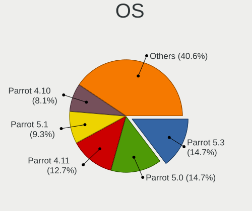

| Name         | Notebooks | Percent |
|--------------|-----------|---------|
| Parrot 5.3   | 82        | 14.67%  |
| Parrot 5.0   | 82        | 14.67%  |
| Parrot 4.11  | 71        | 12.7%   |
| Parrot 5.1   | 52        | 9.3%    |
| Parrot 4.10  | 45        | 8.05%   |
| Parrot 6.0   | 39        | 6.98%   |
| Parrot 6.3   | 38        | 6.8%    |
| Parrot 6.2   | 34        | 6.08%   |
| Parrot 5.2   | 26        | 4.65%   |
| Parrot 6.4   | 22        | 3.94%   |
| Parrot 6.1   | 22        | 3.94%   |
| Parrot 4.8   | 15        | 2.68%   |
| Parrot 4.9   | 14        | 2.5%    |
| Parrot 4.7   | 10        | 1.79%   |
| Parrot 4.6   | 2         | 0.36%   |
| Parrot 7.0   | 1         | 0.18%   |
| Parrot 4.5   | 1         | 0.18%   |
| Parrot 4.4   | 1         | 0.18%   |
| Parrot 4.2.2 | 1         | 0.18%   |
| Parrot 3.10  | 1         | 0.18%   |

OS Family
---------

OS without a version

| Name   | Notebooks | Percent |
|--------|-----------|---------|
| Parrot | 527       | 100%    |

Kernel
------

Version of the Linux kernel

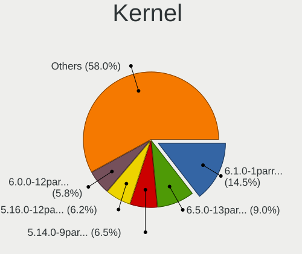

| Version                   | Notebooks | Percent |
|---------------------------|-----------|---------|
| 6.1.0-1parrot1-amd64      | 82        | 14.49%  |
| 6.5.0-13parrot1-amd64     | 51        | 9.01%   |
| 5.14.0-9parrot1-amd64     | 37        | 6.54%   |
| 5.16.0-12parrot1-amd64    | 35        | 6.18%   |
| 6.0.0-12parrot1-amd64     | 33        | 5.83%   |
| 5.18.0-14parrot1-amd64    | 28        | 4.95%   |
| 5.7.0-2parrot2-amd64      | 26        | 4.59%   |
| 5.10.0-6parrot1-amd64     | 26        | 4.59%   |
| 6.12.12-amd64             | 24        | 4.24%   |
| 6.0.0-2parrot1-amd64      | 23        | 4.06%   |
| 6.12.32-amd64             | 21        | 3.71%   |
| 6.10.11-amd64             | 20        | 3.53%   |
| 6.11+parrot-amd64         | 16        | 2.83%   |
| 6.9.7-amd64               | 15        | 2.65%   |
| 5.18.0-1parrot1-amd64     | 14        | 2.47%   |
| 5.10.0-8parrot1-amd64     | 14        | 2.47%   |
| 5.5.0-1parrot1-amd64      | 13        | 2.3%    |
| 5.4.0-4parrot1-amd64      | 11        | 1.94%   |
| 5.6.0-2parrot1-amd64      | 9         | 1.59%   |
| 5.14.0-2parrot1-amd64     | 9         | 1.59%   |
| 5.9.0-2parrot1-amd64      | 7         | 1.24%   |
| 6.5.0-3parrot1-amd64      | 5         | 0.88%   |
| 5.15.0-15parrot1-amd64    | 5         | 0.88%   |
| 5.8.0-2parrot1-amd64      | 3         | 0.53%   |
| 5.4.0-2parrot1-amd64      | 3         | 0.53%   |
| 5.2.0-2parrot1-amd64      | 3         | 0.53%   |
| 5.10.0-5parrot1-amd64     | 3         | 0.53%   |
| 5.10.0-3parrot1-amd64     | 3         | 0.53%   |
| 4.19.0-parrot4-28t-amd64  | 3         | 0.53%   |
| 5.8.0-1parrot1-amd64      | 2         | 0.35%   |
| 5.4.0-3parrot1-amd64      | 2         | 0.35%   |
| 4.18.0-parrot10-amd64     | 2         | 0.35%   |
| 6.12.57+deb13-amd64       | 1         | 0.18%   |
| 6.11.5+bpo-amd64          | 1         | 0.18%   |
| 6.1.27chrultrabook-fixups | 1         | 0.18%   |
| 6.1.0-32-amd64            | 1         | 0.18%   |
| 6.1.0-0.deb11.5-amd64     | 1         | 0.18%   |
| 5.7.0-rc6-galliumos       | 1         | 0.18%   |
| 5.4.0-2parrot1-686-pae    | 1         | 0.18%   |
| 5.4.0-1parrot1-amd64      | 1         | 0.18%   |

Kernel Family
-------------

Linux kernel without a distro release

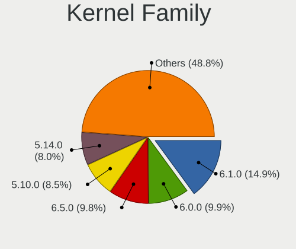

| Version | Notebooks | Percent |
|---------|-----------|---------|
| 6.1.0   | 84        | 14.92%  |
| 6.0.0   | 56        | 9.95%   |
| 6.5.0   | 55        | 9.77%   |
| 5.10.0  | 48        | 8.53%   |
| 5.14.0  | 45        | 7.99%   |
| 5.18.0  | 41        | 7.28%   |
| 5.16.0  | 35        | 6.22%   |
| 5.7.0   | 27        | 4.8%    |
| 6.12.12 | 24        | 4.26%   |
| 6.12.32 | 21        | 3.73%   |
| 6.10.11 | 20        | 3.55%   |
| 5.4.0   | 18        | 3.2%    |
| 6.11    | 16        | 2.84%   |
| 6.9.7   | 15        | 2.66%   |
| 5.5.0   | 13        | 2.31%   |
| 5.6.0   | 9         | 1.6%    |
| 5.9.0   | 7         | 1.24%   |
| 5.15.0  | 6         | 1.07%   |
| 5.8.0   | 5         | 0.89%   |
| 4.19.0  | 4         | 0.71%   |
| 5.3.0   | 3         | 0.53%   |
| 5.2.0   | 3         | 0.53%   |
| 4.18.0  | 2         | 0.36%   |
| 6.12.57 | 1         | 0.18%   |
| 6.11.5  | 1         | 0.18%   |
| 6.1.27  | 1         | 0.18%   |
| 5.1.0   | 1         | 0.18%   |
| 4.14.0  | 1         | 0.18%   |
| Unknown | 1         | 0.18%   |

Kernel Major Ver.
-----------------

Linux kernel major version

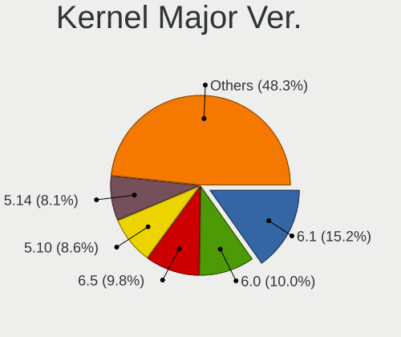

| Version | Notebooks | Percent |
|---------|-----------|---------|
| 6.1     | 85        | 15.21%  |
| 6.0     | 56        | 10.02%  |
| 6.5     | 55        | 9.84%   |
| 5.10    | 48        | 8.59%   |
| 5.14    | 45        | 8.05%   |
| 6.12    | 42        | 7.51%   |
| 5.18    | 41        | 7.33%   |
| 5.16    | 35        | 6.26%   |
| 5.7     | 27        | 4.83%   |
| 6.10    | 20        | 3.58%   |
| 5.4     | 18        | 3.22%   |
| 6       | 16        | 2.86%   |
| 6.9     | 15        | 2.68%   |
| 5.5     | 13        | 2.33%   |
| 5.6     | 9         | 1.61%   |
| 5.9     | 7         | 1.25%   |
| 5.15    | 6         | 1.07%   |
| 5.8     | 5         | 0.89%   |
| 4.19    | 4         | 0.72%   |
| 5.3     | 3         | 0.54%   |
| 5.2     | 3         | 0.54%   |
| 4.18    | 2         | 0.36%   |
| 6.11    | 1         | 0.18%   |
| 5.1     | 1         | 0.18%   |
| 4.14    | 1         | 0.18%   |
| Unknown | 1         | 0.18%   |

Arch
----

OS architecture (x86_64, i586, etc.)

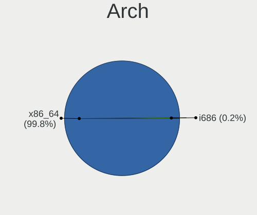

| Name   | Notebooks | Percent |
|--------|-----------|---------|
| x86_64 | 526       | 99.81%  |
| i686   | 1         | 0.19%   |

DE
--

Desktop Environment

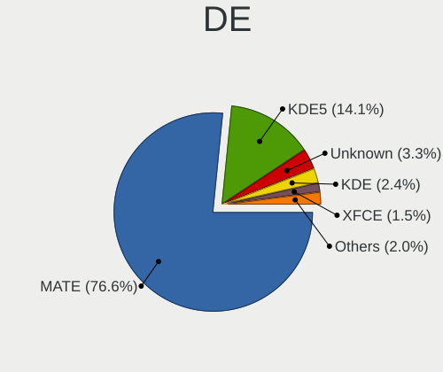

| Name          | Notebooks | Percent |
|---------------|-----------|---------|
| MATE          | 412       | 76.58%  |
| KDE5          | 76        | 14.13%  |
| Unknown       | 18        | 3.35%   |
| KDE           | 13        | 2.42%   |
| XFCE          | 8         | 1.49%   |
| GNOME         | 4         | 0.74%   |
| X-Cinnamon    | 3         | 0.56%   |
| LXDE          | 1         | 0.19%   |
| KDE6          | 1         | 0.19%   |
| GNOME Classic | 1         | 0.19%   |
| Budgie        | 1         | 0.19%   |

Display Server
--------------

X11 or Wayland

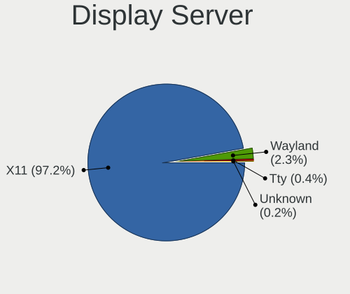

| Name    | Notebooks | Percent |
|---------|-----------|---------|
| X11     | 512       | 97.15%  |
| Wayland | 12        | 2.28%   |
| Tty     | 2         | 0.38%   |
| Unknown | 1         | 0.19%   |

Display Manager
---------------

SDDM, LightDM, etc.

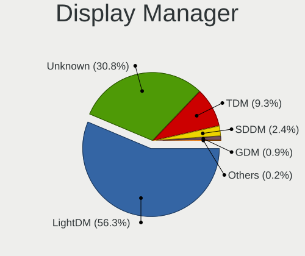

| Name    | Notebooks | Percent |
|---------|-----------|---------|
| LightDM | 302       | 56.34%  |
| Unknown | 165       | 30.78%  |
| TDM     | 50        | 9.33%   |
| SDDM    | 13        | 2.43%   |
| GDM     | 5         | 0.93%   |
| GDM3    | 1         | 0.19%   |

OS Lang
-------

Language

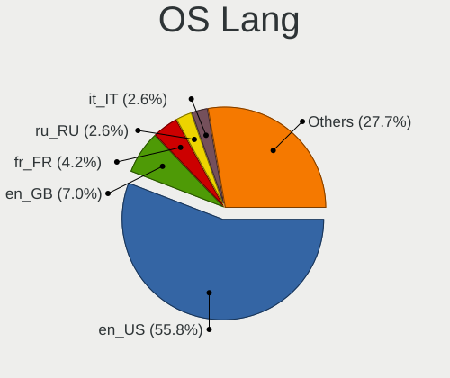

| Lang    | Notebooks | Percent |
|---------|-----------|---------|
| en_US   | 296       | 55.85%  |
| en_GB   | 37        | 6.98%   |
| fr_FR   | 22        | 4.15%   |
| ru_RU   | 14        | 2.64%   |
| it_IT   | 14        | 2.64%   |
| Unknown | 14        | 2.64%   |
| pt_BR   | 13        | 2.45%   |
| en_IN   | 13        | 2.45%   |
| de_DE   | 13        | 2.45%   |
| es_ES   | 11        | 2.08%   |
| en_CA   | 10        | 1.89%   |
| pl_PL   | 9         | 1.7%    |
| es_MX   | 9         | 1.7%    |
| en_AU   | 9         | 1.7%    |
| cs_CZ   | 5         | 0.94%   |
| tr_TR   | 3         | 0.57%   |
| es_CO   | 3         | 0.57%   |
| es_AR   | 3         | 0.57%   |
| ja_JP   | 2         | 0.38%   |
| fr_CA   | 2         | 0.38%   |
| es_PE   | 2         | 0.38%   |
| es_CL   | 2         | 0.38%   |
| en_NG   | 2         | 0.38%   |
| en_IE   | 2         | 0.38%   |
| de_CH   | 2         | 0.38%   |
| sk_SK   | 1         | 0.19%   |
| pt_PT   | 1         | 0.19%   |
| nl_NL   | 1         | 0.19%   |
| nl_BE   | 1         | 0.19%   |
| nb_NO   | 1         | 0.19%   |
| lt_LT   | 1         | 0.19%   |
| id_ID   | 1         | 0.19%   |
| fr_CH   | 1         | 0.19%   |
| fi_FI   | 1         | 0.19%   |
| es_PA   | 1         | 0.19%   |
| en_ZW   | 1         | 0.19%   |
| en_ZM   | 1         | 0.19%   |
| en_ZA   | 1         | 0.19%   |
| en_NZ   | 1         | 0.19%   |
| en_DK   | 1         | 0.19%   |

Boot Mode
---------

EFI or BIOS

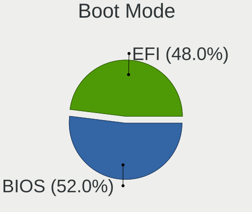

| Mode | Notebooks | Percent |
|------|-----------|---------|
| BIOS | 278       | 51.96%  |
| EFI  | 257       | 48.04%  |

Filesystem
----------

Type of filesystem

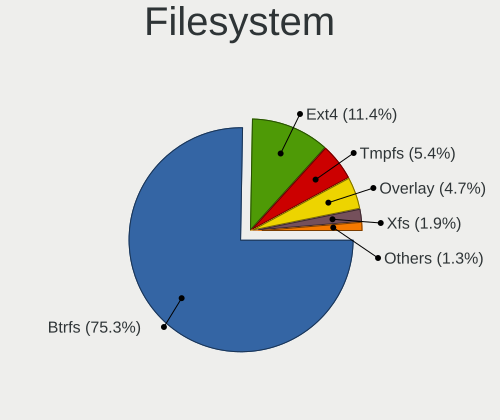

| Type    | Notebooks | Percent |
|---------|-----------|---------|
| Btrfs   | 402       | 75.28%  |
| Ext4    | 61        | 11.42%  |
| Tmpfs   | 29        | 5.43%   |
| Overlay | 25        | 4.68%   |
| Xfs     | 10        | 1.87%   |
| Unknown | 7         | 1.31%   |

Part. scheme
------------

Scheme of partitioning

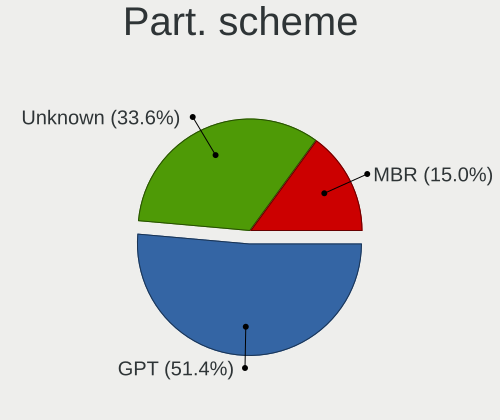

| Type    | Notebooks | Percent |
|---------|-----------|---------|
| GPT     | 275       | 51.4%   |
| Unknown | 180       | 33.64%  |
| MBR     | 80        | 14.95%  |

Dual Boot with Linux/BSD
------------------------

Hosting more than one Linux/BSD

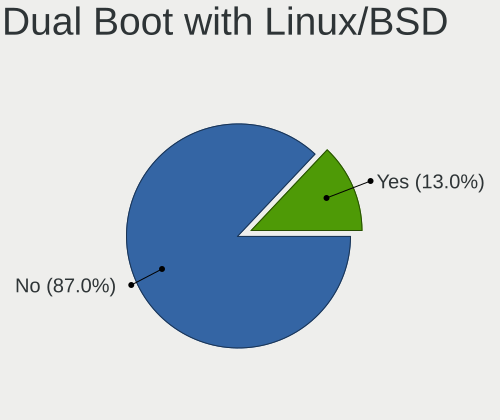

| Dual boot | Notebooks | Percent |
|-----------|-----------|---------|
| No        | 463       | 87.03%  |
| Yes       | 69        | 12.97%  |

Dual Boot (Win)
---------------

Hosting Linux and Windows

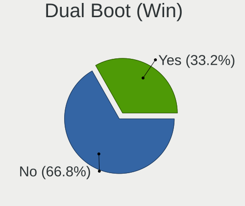

| Dual boot | Notebooks | Percent |
|-----------|-----------|---------|
| No        | 356       | 66.79%  |
| Yes       | 177       | 33.21%  |

Board
-----

Vendor
------

Motherboard manufacturer

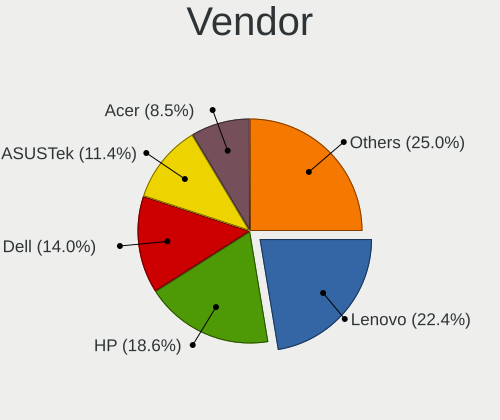

| Name                  | Notebooks | Percent |
|-----------------------|-----------|---------|
| Lenovo                | 118       | 22.39%  |
| Hewlett-Packard       | 98        | 18.6%   |
| Dell                  | 74        | 14.04%  |
| ASUSTek Computer      | 60        | 11.39%  |
| Acer                  | 45        | 8.54%   |
| MSI                   | 27        | 5.12%   |
| Apple                 | 17        | 3.23%   |
| Toshiba               | 13        | 2.47%   |
| Samsung Electronics   | 11        | 2.09%   |
| HUAWEI                | 6         | 1.14%   |
| Google                | 6         | 1.14%   |
| Alienware             | 5         | 0.95%   |
| Fujitsu               | 4         | 0.76%   |
| Unknown               | 4         | 0.76%   |
| Sony                  | 3         | 0.57%   |
| Razer                 | 3         | 0.57%   |
| Panasonic             | 3         | 0.57%   |
| Wortmann AG           | 2         | 0.38%   |
| Quanta                | 2         | 0.38%   |
| Notebook              | 2         | 0.38%   |
| Gateway               | 2         | 0.38%   |
| Toxic                 | 1         | 0.19%   |
| Timi                  | 1         | 0.19%   |
| System76              | 1         | 0.19%   |
| Standard              | 1         | 0.19%   |
| Positivo Bahia - VAIO | 1         | 0.19%   |
| Positivo              | 1         | 0.19%   |
| Onda TLC              | 1         | 0.19%   |
| Metabox               | 1         | 0.19%   |
| Maibenben             | 1         | 0.19%   |
| Jumper                | 1         | 0.19%   |
| Irbis                 | 1         | 0.19%   |
| Intel Client Systems  | 1         | 0.19%   |
| HONOR                 | 1         | 0.19%   |
| GPU Company           | 1         | 0.19%   |
| Gigabyte Technology   | 1         | 0.19%   |
| eMachines             | 1         | 0.19%   |
| Eluktronics           | 1         | 0.19%   |
| Digma                 | 1         | 0.19%   |
| Clevo                 | 1         | 0.19%   |

Model
-----

Motherboard model

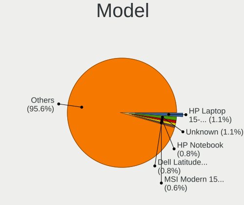

| Name                                    | Notebooks | Percent |
|-----------------------------------------|-----------|---------|
| HP Laptop 15-dy2xxx                     | 6         | 1.14%   |
| Unknown                                 | 6         | 1.14%   |
| HP Notebook                             | 4         | 0.76%   |
| Dell Latitude E6420                     | 4         | 0.76%   |
| MSI Modern 15 A5M                       | 3         | 0.57%   |
| Lenovo IdeaPad 3 15IIL05 81WE           | 3         | 0.57%   |
| HP Pavilion 15                          | 3         | 0.57%   |
| HP EliteBook 8470p                      | 3         | 0.57%   |
| HP EliteBook 830 G6                     | 3         | 0.57%   |
| HP 250 G7 Notebook PC                   | 3         | 0.57%   |
| Dell Inspiron MM061                     | 3         | 0.57%   |
| Apple MacBookAir7,2                     | 3         | 0.57%   |
| Toshiba Satellite L775D                 | 2         | 0.38%   |
| Toshiba Satellite L750                  | 2         | 0.38%   |
| Samsung 300E4C/300E5C/300E7C            | 2         | 0.38%   |
| Quanta TW9/SW9                          | 2         | 0.38%   |
| MSI Katana GF66 12UC                    | 2         | 0.38%   |
| MSI Katana GF66 11UE                    | 2         | 0.38%   |
| Lenovo ThinkPad E15 Gen 3 20YG0041MX    | 2         | 0.38%   |
| Lenovo Legion Pro 5 16IRX8 82WK         | 2         | 0.38%   |
| Lenovo E41-25 81FS                      | 2         | 0.38%   |
| HUAWEI HVY-WXX9                         | 2         | 0.38%   |
| HP ProBook 650 G1                       | 2         | 0.38%   |
| HP Pavilion g7                          | 2         | 0.38%   |
| HP Pavilion g6                          | 2         | 0.38%   |
| HP Pavilion dv6                         | 2         | 0.38%   |
| HP Pavilion dv4                         | 2         | 0.38%   |
| HP Laptop 17-cn0xxx                     | 2         | 0.38%   |
| HP EliteBook Folio 9480m                | 2         | 0.38%   |
| HP 250 G2                               | 2         | 0.38%   |
| Dell XPS 13 9350                        | 2         | 0.38%   |
| Dell Latitude E7440                     | 2         | 0.38%   |
| Dell Latitude E6410                     | 2         | 0.38%   |
| Dell Latitude 7280                      | 2         | 0.38%   |
| Dell Latitude 5540                      | 2         | 0.38%   |
| Dell Inspiron N5110                     | 2         | 0.38%   |
| Dell Inspiron 5570                      | 2         | 0.38%   |
| ASUS VivoBook_ASUSLaptop X412DAP_F412DA | 2         | 0.38%   |
| ASUS Vivobook Go E1504FA_E1504FA        | 2         | 0.38%   |
| ASUS ROG Strix G513QR_G513QR            | 2         | 0.38%   |

Model Family
------------

Motherboard model prefix

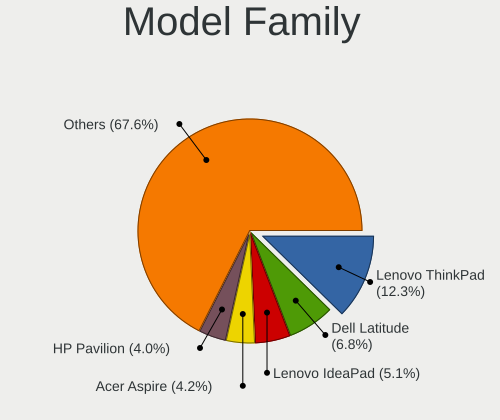

| Name               | Notebooks | Percent |
|--------------------|-----------|---------|
| Lenovo ThinkPad    | 65        | 12.33%  |
| Dell Latitude      | 36        | 6.83%   |
| Lenovo IdeaPad     | 27        | 5.12%   |
| Acer Aspire        | 22        | 4.17%   |
| HP Pavilion        | 21        | 3.98%   |
| Dell Inspiron      | 21        | 3.98%   |
| HP Laptop          | 20        | 3.8%    |
| HP EliteBook       | 20        | 3.8%    |
| ASUS VivoBook      | 16        | 3.04%   |
| Acer Nitro         | 12        | 2.28%   |
| Toshiba Satellite  | 11        | 2.09%   |
| HP ProBook         | 11        | 2.09%   |
| ASUS ASUS          | 8         | 1.52%   |
| MSI Katana         | 7         | 1.33%   |
| Dell XPS           | 7         | 1.33%   |
| ASUS ROG           | 7         | 1.33%   |
| Lenovo Legion      | 6         | 1.14%   |
| Unknown            | 6         | 1.14%   |
| HP ZBook           | 5         | 0.95%   |
| HP 250             | 5         | 0.95%   |
| ASUS Zenbook       | 5         | 0.95%   |
| HP Victus          | 4         | 0.76%   |
| HP Notebook        | 4         | 0.76%   |
| Fujitsu LIFEBOOK   | 4         | 0.76%   |
| Dell Precision     | 4         | 0.76%   |
| Apple MacBookPro11 | 4         | 0.76%   |
| Razer Blade        | 3         | 0.57%   |
| MSI Modern         | 3         | 0.57%   |
| Dell Vostro        | 3         | 0.57%   |
| Apple MacBookAir7  | 3         | 0.57%   |
| Alienware m15      | 3         | 0.57%   |
| Acer Swift         | 3         | 0.57%   |
| Acer Predator      | 3         | 0.57%   |
| Acer Extensa       | 3         | 0.57%   |
| Samsung 300E4C     | 2         | 0.38%   |
| Quanta TW9         | 2         | 0.38%   |
| MSI Summit         | 2         | 0.38%   |
| MSI Prestige       | 2         | 0.38%   |
| MSI GT60           | 2         | 0.38%   |
| MSI GF63           | 2         | 0.38%   |

MFG Year
--------

Motherboard manufacture year

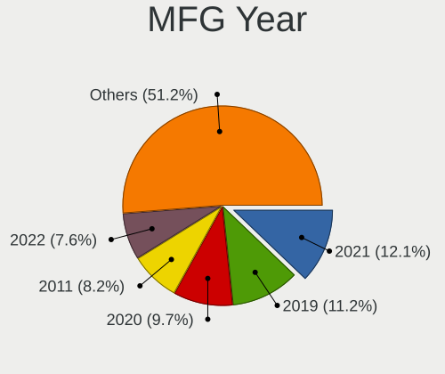

| Year | Notebooks | Percent |
|------|-----------|---------|
| 2021 | 64        | 12.14%  |
| 2019 | 59        | 11.2%   |
| 2020 | 51        | 9.68%   |
| 2011 | 43        | 8.16%   |
| 2022 | 40        | 7.59%   |
| 2012 | 37        | 7.02%   |
| 2017 | 35        | 6.64%   |
| 2018 | 34        | 6.45%   |
| 2016 | 29        | 5.5%    |
| 2013 | 28        | 5.31%   |
| 2014 | 24        | 4.55%   |
| 2023 | 21        | 3.98%   |
| 2015 | 18        | 3.42%   |
| 2008 | 13        | 2.47%   |
| 2010 | 11        | 2.09%   |
| 2006 | 7         | 1.33%   |
| 2024 | 5         | 0.95%   |
| 2009 | 4         | 0.76%   |
| 2007 | 3         | 0.57%   |
| 2025 | 1         | 0.19%   |

Form Factor
-----------

Physical design of the computer

| Name     | Notebooks | Percent |
|----------|-----------|---------|
| Notebook | 527       | 100%    |

Secure Boot
-----------

Enabled or disabled

| State    | Notebooks | Percent |
|----------|-----------|---------|
| Disabled | 527       | 100%    |

Coreboot
--------

Have coreboot on board

| Used | Notebooks | Percent |
|------|-----------|---------|
| No   | 521       | 98.86%  |
| Yes  | 6         | 1.14%   |

RAM Size
--------

Total RAM memory

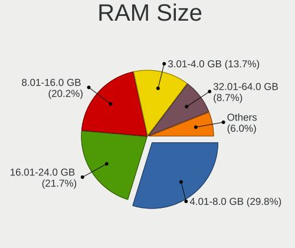

| Size in GB  | Notebooks | Percent |
|-------------|-----------|---------|
| 4.01-8.0    | 158       | 29.76%  |
| 16.01-24.0  | 115       | 21.66%  |
| 8.01-16.0   | 107       | 20.15%  |
| 3.01-4.0    | 73        | 13.75%  |
| 32.01-64.0  | 46        | 8.66%   |
| 24.01-32.0  | 11        | 2.07%   |
| 64.01-256.0 | 9         | 1.69%   |
| 1.01-2.0    | 9         | 1.69%   |
| 2.01-3.0    | 3         | 0.56%   |

RAM Used
--------

Used RAM memory

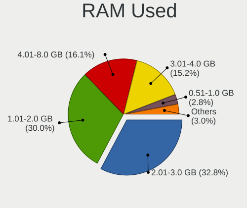

| Used GB    | Notebooks | Percent |
|------------|-----------|---------|
| 2.01-3.0   | 185       | 32.8%   |
| 1.01-2.0   | 169       | 29.96%  |
| 4.01-8.0   | 91        | 16.13%  |
| 3.01-4.0   | 86        | 15.25%  |
| 0.51-1.0   | 16        | 2.84%   |
| 8.01-16.0  | 13        | 2.3%    |
| 16.01-24.0 | 3         | 0.53%   |
| 0.01-0.5   | 1         | 0.18%   |

Total Drives
------------

Number of drives on board

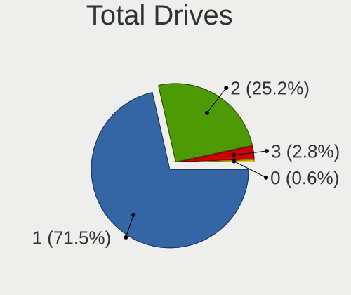

| Drives | Notebooks | Percent |
|--------|-----------|---------|
| 1      | 383       | 71.46%  |
| 2      | 135       | 25.19%  |
| 3      | 15        | 2.8%    |
| 0      | 3         | 0.56%   |

Has CD-ROM
----------

Has CD-ROM on board

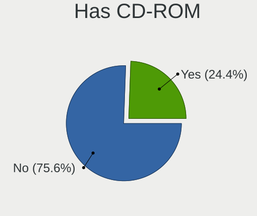

| Presented | Notebooks | Percent |
|-----------|-----------|---------|
| No        | 399       | 75.57%  |
| Yes       | 129       | 24.43%  |

Has Ethernet
------------

Has Ethernet on board

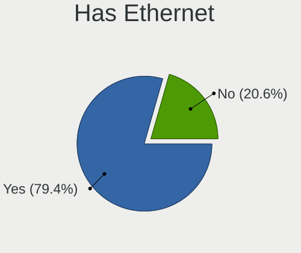

| Presented | Notebooks | Percent |
|-----------|-----------|---------|
| Yes       | 421       | 79.43%  |
| No        | 109       | 20.57%  |

Has WiFi
--------

Has WiFi module

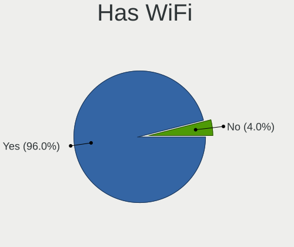

| Presented | Notebooks | Percent |
|-----------|-----------|---------|
| Yes       | 506       | 96.02%  |
| No        | 21        | 3.98%   |

Has Bluetooth
-------------

Has Bluetooth module

| Presented | Notebooks | Percent |
|-----------|-----------|---------|
| Yes       | 442       | 82.93%  |
| No        | 91        | 17.07%  |

Location
--------

Country
-------

Geographic location (country)

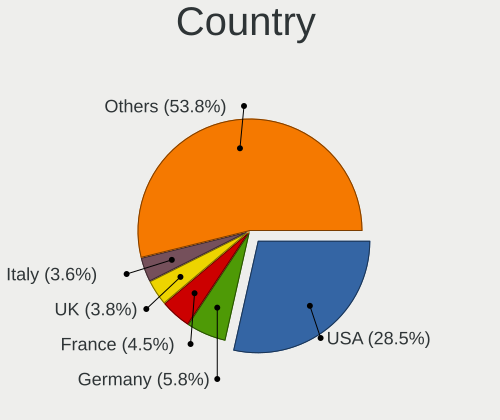

| Country      | Notebooks | Percent |
|--------------|-----------|---------|
| USA          | 152       | 28.52%  |
| Germany      | 31        | 5.82%   |
| France       | 24        | 4.5%    |
| UK           | 20        | 3.75%   |
| Italy        | 19        | 3.56%   |
| Russia       | 18        | 3.38%   |
| India        | 17        | 3.19%   |
| Brazil       | 17        | 3.19%   |
| Spain        | 15        | 2.81%   |
| Netherlands  | 15        | 2.81%   |
| Canada       | 13        | 2.44%   |
| Mexico       | 11        | 2.06%   |
| Kenya        | 9         | 1.69%   |
| Australia    | 9         | 1.69%   |
| Poland       | 8         | 1.5%    |
| Sweden       | 7         | 1.31%   |
| Indonesia    | 7         | 1.31%   |
| Czechia      | 7         | 1.31%   |
| Switzerland  | 6         | 1.13%   |
| Portugal     | 5         | 0.94%   |
| Finland      | 5         | 0.94%   |
| Egypt        | 5         | 0.94%   |
| Colombia     | 5         | 0.94%   |
| Turkey       | 4         | 0.75%   |
| Peru         | 4         | 0.75%   |
| Denmark      | 4         | 0.75%   |
| Argentina    | 4         | 0.75%   |
| UAE          | 3         | 0.56%   |
| South Africa | 3         | 0.56%   |
| Norway       | 3         | 0.56%   |
| Nigeria      | 3         | 0.56%   |
| Nepal        | 3         | 0.56%   |
| Namibia      | 3         | 0.56%   |
| Iraq         | 3         | 0.56%   |
| Chile        | 3         | 0.56%   |
| Bulgaria     | 3         | 0.56%   |
| Belgium      | 3         | 0.56%   |
| Bangladesh   | 3         | 0.56%   |
| Algeria      | 3         | 0.56%   |
| Slovakia     | 2         | 0.38%   |

City
----

Geographic location (city)

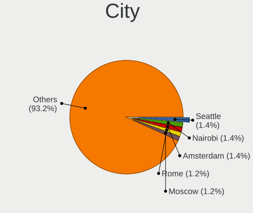

| City              | Notebooks | Percent |
|-------------------|-----------|---------|
| Seattle           | 8         | 1.43%   |
| Nairobi           | 8         | 1.43%   |
| Amsterdam         | 8         | 1.43%   |
| Rome              | 7         | 1.25%   |
| Moscow            | 7         | 1.25%   |
| Houston           | 6         | 1.07%   |
| Berlin            | 6         | 1.07%   |
| Paris             | 5         | 0.89%   |
| Melbourne         | 5         | 0.89%   |
| Los Angeles       | 5         | 0.89%   |
| Dallas            | 5         | 0.89%   |
| San Antonio       | 4         | 0.71%   |
| Saint Paul        | 4         | 0.71%   |
| Prague            | 4         | 0.71%   |
| New York          | 4         | 0.71%   |
| London            | 4         | 0.71%   |
| Helsinki          | 4         | 0.71%   |
| Dublin            | 4         | 0.71%   |
| Barcelona         | 4         | 0.71%   |
| Alexandria        | 4         | 0.71%   |
| Zurich            | 3         | 0.53%   |
| Toronto           | 3         | 0.53%   |
| Sydney            | 3         | 0.53%   |
| Stockholm         | 3         | 0.53%   |
| San José         | 3         | 0.53%   |
| Phoenix           | 3         | 0.53%   |
| Minneapolis       | 3         | 0.53%   |
| Lyon              | 3         | 0.53%   |
| Lima              | 3         | 0.53%   |
| Frankfurt am Main | 3         | 0.53%   |
| Dhaka             | 3         | 0.53%   |
| Chicago           | 3         | 0.53%   |
| Cairo             | 3         | 0.53%   |
| Windhoek          | 2         | 0.36%   |
| Warsaw            | 2         | 0.36%   |
| Visalia           | 2         | 0.36%   |
| Viereth-Trunstadt | 2         | 0.36%   |
| Ulan Bator        | 2         | 0.36%   |
| St Petersburg     | 2         | 0.36%   |
| Santiago          | 2         | 0.36%   |

Drives
------

Drive Vendor
------------

Hard drive vendors

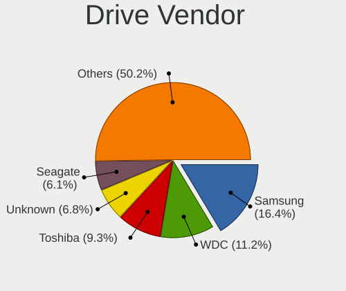

| Vendor                      | Notebooks | Drives | Percent |
|-----------------------------|-----------|--------|---------|
| Samsung Electronics         | 108       | 139    | 16.39%  |
| WDC                         | 74        | 90     | 11.23%  |
| Toshiba                     | 61        | 69     | 9.26%   |
| Unknown                     | 45        | 49     | 6.83%   |
| Seagate                     | 40        | 42     | 6.07%   |
| SanDisk                     | 38        | 44     | 5.77%   |
| Kingston                    | 35        | 35     | 5.31%   |
| SK hynix                    | 33        | 42     | 5.01%   |
| Micron Technology           | 27        | 28     | 4.1%    |
| Crucial                     | 21        | 27     | 3.19%   |
| Intel                       | 17        | 25     | 2.58%   |
| Hitachi                     | 16        | 18     | 2.43%   |
| HGST                        | 14        | 17     | 2.12%   |
| KIOXIA                      | 13        | 15     | 1.97%   |
| China                       | 11        | 11     | 1.67%   |
| A-DATA Technology           | 11        | 11     | 1.67%   |
| Apple                       | 10        | 12     | 1.52%   |
| Team                        | 6         | 7      | 0.91%   |
| PNY                         | 5         | 5      | 0.76%   |
| LITEON                      | 5         | 5      | 0.76%   |
| Kingston Technology Company | 5         | 7      | 0.76%   |
| YMTC                        | 3         | 3      | 0.46%   |
| KingFast                    | 3         | 4      | 0.46%   |
| Unknown                     | 3         | 3      | 0.46%   |
| Silicon Motion              | 2         | 2      | 0.3%    |
| Phison                      | 2         | 2      | 0.3%    |
| Netac                       | 2         | 2      | 0.3%    |
| Lexar                       | 2         | 2      | 0.3%    |
| JMicron Technology          | 2         | 2      | 0.3%    |
| HUAWEI                      | 2         | 2      | 0.3%    |
| Corsair                     | 2         | 3      | 0.3%    |
| BR                          | 2         | 2      | 0.3%    |
| Zheino                      | 1         | 1      | 0.15%   |
| XUM                         | 1         | 1      | 0.15%   |
| Wdxsky                      | 1         | 1      | 0.15%   |
| W800SH                      | 1         | 1      | 0.15%   |
| USB                         | 1         | 1      | 0.15%   |
| Unknown (583)               | 1         | 1      | 0.15%   |
| Union Memory (Shenzhen)     | 1         | 1      | 0.15%   |
| Union Memory                | 1         | 2      | 0.15%   |

Drive Model
-----------

Hard drive models

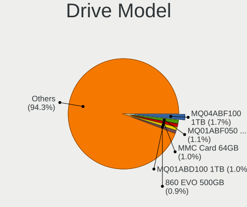

| Model                                              | Notebooks | Percent |
|----------------------------------------------------|-----------|---------|
| Toshiba MQ04ABF100 1TB                             | 12        | 1.72%   |
| Toshiba MQ01ABF050 500GB                           | 8         | 1.15%   |
| Unknown MMC Card  64GB                             | 7         | 1.01%   |
| Toshiba MQ01ABD100 1TB                             | 7         | 1.01%   |
| Samsung SSD 860 EVO 500GB                          | 6         | 0.86%   |
| Unknown MMC Card  32GB                             | 5         | 0.72%   |
| Toshiba MQ01ABD075 752GB                           | 5         | 0.72%   |
| Seagate ST1000LM035-1RK172 1TB                     | 5         | 0.72%   |
| SanDisk NVMe SSD Drive 512GB                       | 5         | 0.72%   |
| SanDisk NVMe SSD Drive 1TB                         | 5         | 0.72%   |
| Samsung NVMe SSD Controller SM981/PM981/PM983 1TB  | 5         | 0.72%   |
| Micron 2400_MTFDKBA512QFM 512GB                    | 5         | 0.72%   |
| Kingston SA400S37240G 240GB SSD                    | 5         | 0.72%   |
| Kingston NVMe SSD Drive 512GB                      | 5         | 0.72%   |
| Intel SSDPEKNU512GZ 512GB                          | 5         | 0.72%   |
| Crucial CT1000MX500SSD1 1TB                        | 5         | 0.72%   |
| Unknown SD/MMC/MS PRO 2GB                          | 4         | 0.57%   |
| Seagate ST500LM012 HN-M500MBB 500GB                | 4         | 0.57%   |
| SanDisk NVMe SSD Drive 256GB                       | 4         | 0.57%   |
| Kingston OM8PCP3512F-AB 512GB                      | 4         | 0.57%   |
| HGST HTS721010A9E630 1TB                           | 4         | 0.57%   |
| HGST HTS541010A9E680 1TB                           | 4         | 0.57%   |
| Crucial CT500MX500SSD1 500GB                       | 4         | 0.57%   |
| WDC WD10SPZX-75Z10T2 1TB                           | 3         | 0.43%   |
| WDC WD10SPZX-60Z10T0 1TB                           | 3         | 0.43%   |
| Unknown MMC Card  128GB                            | 3         | 0.43%   |
| Toshiba KXG6AZNV256G 256GB                         | 3         | 0.43%   |
| SK hynix BC711 HFM256GD3JX013N 256GB               | 3         | 0.43%   |
| Seagate ST320LT007-9ZV142 320GB                    | 3         | 0.43%   |
| Seagate ST2000LM003 HN-M201RAD 2TB                 | 3         | 0.43%   |
| Seagate ST1000LM048-2E7172 1TB                     | 3         | 0.43%   |
| Seagate ST1000LM024 HN-M101MBB 1TB                 | 3         | 0.43%   |
| SanDisk SSD PLUS 1000GB                            | 3         | 0.43%   |
| Samsung SSD 980 PRO 1TB                            | 3         | 0.43%   |
| Samsung SSD 980 1TB                                | 3         | 0.43%   |
| Samsung SSD 970 EVO Plus 1TB                       | 3         | 0.43%   |
| Samsung SSD 850 EVO 250GB                          | 3         | 0.43%   |
| Samsung NVMe SSD Controller PM9A1/PM9A3/980PRO 1TB | 3         | 0.43%   |
| Samsung MZVL21T0HCLR-00B00 1TB                     | 3         | 0.43%   |
| Micron 2450_MTFDKBA512TFK 512GB                    | 3         | 0.43%   |

HDD Vendor
----------

Hard disk drive vendors

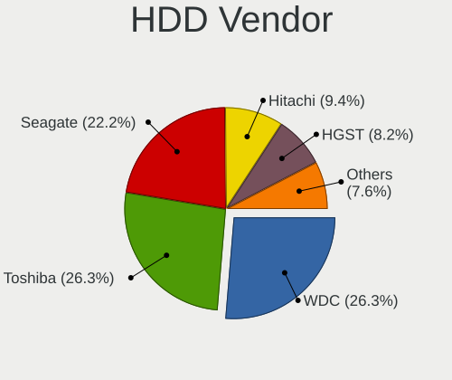

| Vendor              | Notebooks | Drives | Percent |
|---------------------|-----------|--------|---------|
| WDC                 | 45        | 53     | 26.32%  |
| Toshiba             | 45        | 51     | 26.32%  |
| Seagate             | 38        | 40     | 22.22%  |
| Hitachi             | 16        | 18     | 9.36%   |
| HGST                | 14        | 17     | 8.19%   |
| Samsung Electronics | 5         | 5      | 2.92%   |
| Unknown             | 4         | 5      | 2.34%   |
| TO Exter            | 1         | 1      | 0.58%   |
| JMicron Technology  | 1         | 1      | 0.58%   |
| Fujitsu             | 1         | 1      | 0.58%   |
| ASMedia             | 1         | 1      | 0.58%   |

SSD Vendor
----------

Solid state drive vendors

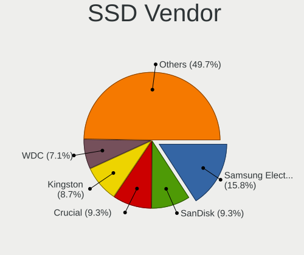

| Vendor              | Notebooks | Drives | Percent |
|---------------------|-----------|--------|---------|
| Samsung Electronics | 29        | 42     | 15.85%  |
| SanDisk             | 17        | 19     | 9.29%   |
| Crucial             | 17        | 22     | 9.29%   |
| Kingston            | 16        | 16     | 8.74%   |
| WDC                 | 13        | 15     | 7.1%    |
| China               | 11        | 11     | 6.01%   |
| Apple               | 9         | 11     | 4.92%   |
| Toshiba             | 5         | 6      | 2.73%   |
| SK hynix            | 5         | 5      | 2.73%   |
| PNY                 | 5         | 5      | 2.73%   |
| LITEON              | 5         | 5      | 2.73%   |
| Micron Technology   | 4         | 4      | 2.19%   |
| Team                | 3         | 4      | 1.64%   |
| KingFast            | 3         | 3      | 1.64%   |
| Intel               | 3         | 3      | 1.64%   |
| A-DATA Technology   | 3         | 3      | 1.64%   |
| Seagate             | 2         | 2      | 1.09%   |
| BR                  | 2         | 2      | 1.09%   |
| Unknown             | 2         | 2      | 1.09%   |
| Zheino              | 1         | 1      | 0.55%   |
| XUM                 | 1         | 1      | 0.55%   |
| Wdxsky              | 1         | 1      | 0.55%   |
| W800SH              | 1         | 1      | 0.55%   |
| Unknown             | 1         | 1      | 0.55%   |
| TSA 256G            | 1         | 1      | 0.55%   |
| Transcend           | 1         | 1      | 0.55%   |
| Teclast             | 1         | 1      | 0.55%   |
| SCY                 | 1         | 1      | 0.55%   |
| S3+                 | 1         | 1      | 0.55%   |
| RZX                 | 1         | 1      | 0.55%   |
| Rogueware           | 1         | 1      | 0.55%   |
| Patriot             | 1         | 1      | 0.55%   |
| Netac               | 1         | 1      | 0.55%   |
| LITEONIT            | 1         | 1      | 0.55%   |
| Lexar               | 1         | 1      | 0.55%   |
| KingSpec            | 1         | 2      | 0.55%   |
| Kingmax             | 1         | 1      | 0.55%   |
| Intenso             | 1         | 2      | 0.55%   |
| HS-SSD-C100         | 1         | 1      | 0.55%   |
| Hewlett-Packard     | 1         | 1      | 0.55%   |

Drive Kind
----------

HDD or SSD

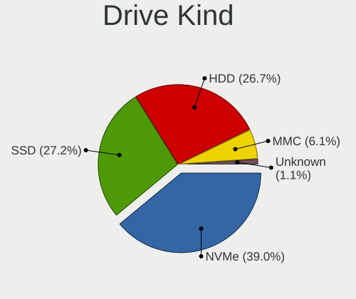

| Kind    | Notebooks | Drives | Percent |
|---------|-----------|--------|---------|
| NVMe    | 244       | 313    | 38.98%  |
| SSD     | 170       | 213    | 27.16%  |
| HDD     | 167       | 193    | 26.68%  |
| MMC     | 38        | 43     | 6.07%   |
| Unknown | 7         | 7      | 1.12%   |

Drive Connector
---------------

SATA, SAS, NVMe, etc.

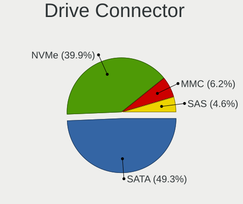

| Type | Notebooks | Drives | Percent |
|------|-----------|--------|---------|
| SATA | 302       | 385    | 49.35%  |
| NVMe | 244       | 312    | 39.87%  |
| MMC  | 38        | 43     | 6.21%   |
| SAS  | 28        | 29     | 4.58%   |

Drive Size
----------

Size of hard drive

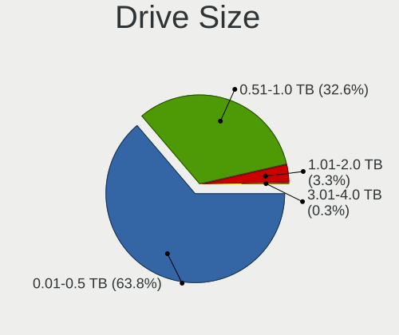

| Size in TB | Notebooks | Drives | Percent |
|------------|-----------|--------|---------|
| 0.01-0.5   | 213       | 263    | 63.77%  |
| 0.51-1.0   | 109       | 130    | 32.63%  |
| 1.01-2.0   | 11        | 12     | 3.29%   |
| 3.01-4.0   | 1         | 1      | 0.3%    |

Space Total
-----------

Amount of disk space available on the file system

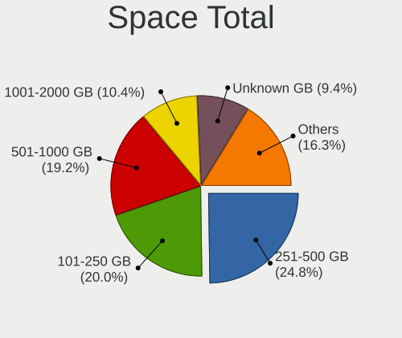

| Size in GB     | Notebooks | Percent |
|----------------|-----------|---------|
| 251-500        | 134       | 24.77%  |
| 101-250        | 108       | 19.96%  |
| 501-1000       | 104       | 19.22%  |
| 1001-2000      | 56        | 10.35%  |
| Unknown        | 51        | 9.43%   |
| 51-100         | 31        | 5.73%   |
| 1-20           | 24        | 4.44%   |
| 21-50          | 18        | 3.33%   |
| More than 3000 | 10        | 1.85%   |
| 2001-3000      | 5         | 0.92%   |

Space Used
----------

Amount of used disk space

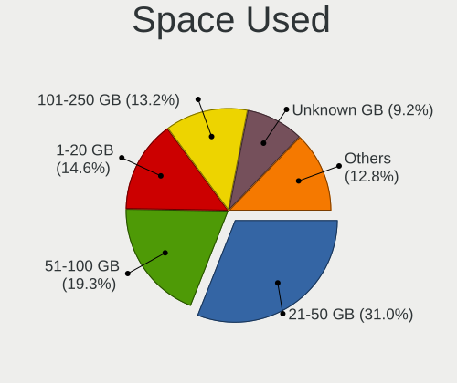

| Used GB        | Notebooks | Percent |
|----------------|-----------|---------|
| 21-50          | 172       | 30.99%  |
| 51-100         | 107       | 19.28%  |
| 1-20           | 81        | 14.59%  |
| 101-250        | 73        | 13.15%  |
| Unknown        | 51        | 9.19%   |
| 251-500        | 46        | 8.29%   |
| 501-1000       | 14        | 2.52%   |
| 1001-2000      | 5         | 0.9%    |
| 0              | 4         | 0.72%   |
| More than 3000 | 1         | 0.18%   |
| 2001-3000      | 1         | 0.18%   |

Malfunc. Drives
---------------

Drive models with a malfunction

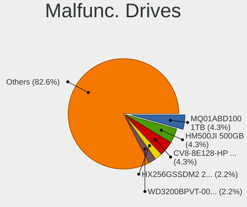

| Model                                               | Notebooks | Drives | Percent |
|-----------------------------------------------------|-----------|--------|---------|
| Toshiba MQ01ABD100 1TB                              | 2         | 2      | 4.35%   |
| Samsung Electronics HM500JI 500GB                   | 2         | 2      | 4.35%   |
| LITEON CV8-8E128-HP 128GB SSD                       | 2         | 2      | 4.35%   |
| XUM HX256GSSDM2 256GB                               | 1         | 1      | 2.17%   |
| WDC WD3200BPVT-00JJ5T0 320GB                        | 1         | 1      | 2.17%   |
| WDC WD3200BEKT-75PVMT1 320GB                        | 1         | 1      | 2.17%   |
| WDC WD2500BEVT-22A23T0 250GB                        | 1         | 1      | 2.17%   |
| Toshiba MQ01ABD075 752GB                            | 1         | 1      | 2.17%   |
| Toshiba MK6475GSX 640GB                             | 1         | 1      | 2.17%   |
| Toshiba MK5059GSXP 500GB                            | 1         | 1      | 2.17%   |
| Toshiba MK3265GSXF 320GB                            | 1         | 1      | 2.17%   |
| Toshiba MK3261GSYN 320GB                            | 1         | 1      | 2.17%   |
| SK hynix PC711 HFS256GDE9X073N 256GB                | 1         | 1      | 2.17%   |
| Seagate ST500LM012 HN-M500MBB 500GB                 | 1         | 1      | 2.17%   |
| Seagate ST320LM001 HN-M320MBB 320GB                 | 1         | 1      | 2.17%   |
| Seagate ST2000LM007-1R8174 2TB                      | 1         | 1      | 2.17%   |
| Seagate ST1000LM035-1RK172 1TB                      | 1         | 1      | 2.17%   |
| SanDisk SSD U110 16GB                               | 1         | 1      | 2.17%   |
| SanDisk SSD U100 24GB                               | 1         | 1      | 2.17%   |
| SanDisk SD9SN8W-128G-1006 128GB SSD                 | 1         | 1      | 2.17%   |
| SanDisk SD8SBAT256G1122 256GB SSD                   | 1         | 1      | 2.17%   |
| Samsung Electronics MZNLH128HBHQ-000H1 128GB SSD    | 1         | 1      | 2.17%   |
| Samsung Electronics HM160HI 160GB                   | 1         | 1      | 2.17%   |
| Micron Technology MTFDDAK128MAY-1AH1ZABHA 128GB SSD | 1         | 1      | 2.17%   |
| Kingston SUV400S37480G 480GB SSD                    | 1         | 1      | 2.17%   |
| Intel SSDSC2KF512H6 SATA 512GB                      | 1         | 1      | 2.17%   |
| Intel HBRPEKNX0202AHO 32GB                          | 1         | 1      | 2.17%   |
| Hitachi HTS725050A9A364 500GB                       | 1         | 1      | 2.17%   |
| Hitachi HTS725050A9A360 500GB                       | 1         | 1      | 2.17%   |
| Hitachi HTS725032A9A364 320GB                       | 1         | 1      | 2.17%   |
| Hitachi HTS723216L9SA60 160GB                       | 1         | 1      | 2.17%   |
| Hitachi HTS542512K9SA00 120GB                       | 1         | 1      | 2.17%   |
| HGST HTS725032A7E630 320GB                          | 1         | 1      | 2.17%   |
| HGST HTS721010A9E630 1TB                            | 1         | 1      | 2.17%   |
| HGST HTS545050A7E680 500GB                          | 1         | 1      | 2.17%   |
| HGST HTS541010A9E680 1TB                            | 1         | 1      | 2.17%   |
| Hewlett-Packard SSD S700 Pro 1TB                    | 1         | 1      | 2.17%   |
| Fujitsu MHY2160BH 160GB                             | 1         | 1      | 2.17%   |
| Crucial CT525MX300SSD1 528GB                        | 1         | 1      | 2.17%   |
| China SSD 120GB                                     | 1         | 1      | 2.17%   |

Malfunc. Drive Vendor
---------------------

Vendors of faulty drives

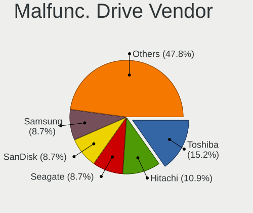

| Vendor              | Notebooks | Drives | Percent |
|---------------------|-----------|--------|---------|
| Toshiba             | 7         | 7      | 15.22%  |
| Hitachi             | 5         | 5      | 10.87%  |
| Seagate             | 4         | 4      | 8.7%    |
| SanDisk             | 4         | 4      | 8.7%    |
| Samsung Electronics | 4         | 4      | 8.7%    |
| HGST                | 4         | 4      | 8.7%    |
| WDC                 | 3         | 3      | 6.52%   |
| LITEON              | 2         | 2      | 4.35%   |
| Intel               | 2         | 2      | 4.35%   |
| A-DATA Technology   | 2         | 2      | 4.35%   |
| XUM                 | 1         | 1      | 2.17%   |
| SK hynix            | 1         | 1      | 2.17%   |
| Micron Technology   | 1         | 1      | 2.17%   |
| Kingston            | 1         | 1      | 2.17%   |
| Hewlett-Packard     | 1         | 1      | 2.17%   |
| Fujitsu             | 1         | 1      | 2.17%   |
| Crucial             | 1         | 1      | 2.17%   |
| China               | 1         | 1      | 2.17%   |
| Unknown             | 1         | 1      | 2.17%   |

Malfunc. HDD Vendor
-------------------

Vendors of faulty HDD drives

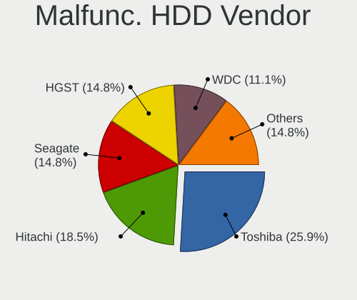

| Vendor              | Notebooks | Drives | Percent |
|---------------------|-----------|--------|---------|
| Toshiba             | 7         | 7      | 25.93%  |
| Hitachi             | 5         | 5      | 18.52%  |
| Seagate             | 4         | 4      | 14.81%  |
| HGST                | 4         | 4      | 14.81%  |
| WDC                 | 3         | 3      | 11.11%  |
| Samsung Electronics | 3         | 3      | 11.11%  |
| Fujitsu             | 1         | 1      | 3.7%    |

Malfunc. Drive Kind
-------------------

Kinds of faulty drives

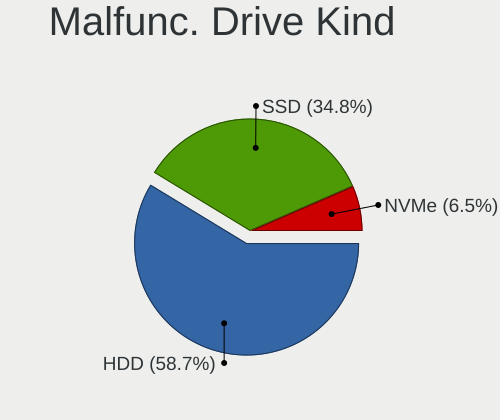

| Kind | Notebooks | Drives | Percent |
|------|-----------|--------|---------|
| HDD  | 27        | 27     | 58.7%   |
| SSD  | 16        | 16     | 34.78%  |
| NVMe | 3         | 3      | 6.52%   |

Failed Drives
-------------

Failed drive models

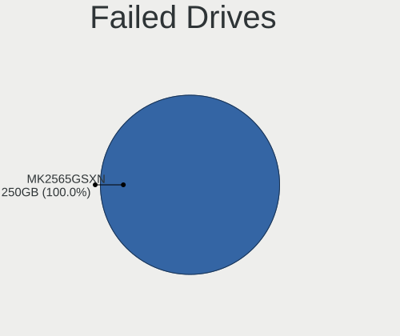

| Model                    | Notebooks | Drives | Percent |
|--------------------------|-----------|--------|---------|
| Toshiba MK2565GSXN 250GB | 1         | 1      | 100%    |

Failed Drive Vendor
-------------------

Failed drive vendors

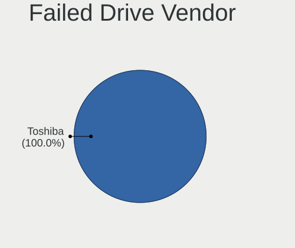

| Vendor  | Notebooks | Drives | Percent |
|---------|-----------|--------|---------|
| Toshiba | 1         | 1      | 100%    |

Drive Status
------------

Number of failed and malfunc. drives

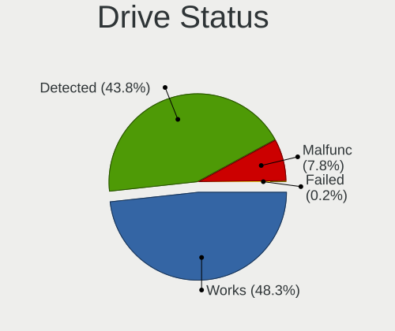

| Status   | Notebooks | Drives | Percent |
|----------|-----------|--------|---------|
| Works    | 280       | 356    | 48.28%  |
| Detected | 254       | 366    | 43.79%  |
| Malfunc  | 45        | 46     | 7.76%   |
| Failed   | 1         | 1      | 0.17%   |

Storage controller
------------------

Storage Vendor
--------------

Storage controller vendors

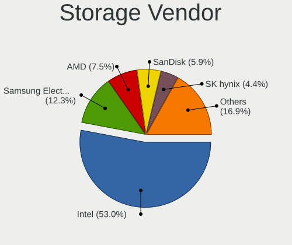

| Vendor                         | Notebooks | Percent |
|--------------------------------|-----------|---------|
| Intel                          | 348       | 52.97%  |
| Samsung Electronics            | 81        | 12.33%  |
| AMD                            | 49        | 7.46%   |
| SanDisk                        | 39        | 5.94%   |
| SK hynix                       | 29        | 4.41%   |
| Kingston Technology Company    | 24        | 3.65%   |
| Micron Technology              | 23        | 3.5%    |
| KIOXIA                         | 14        | 2.13%   |
| Toshiba America Info Systems   | 10        | 1.52%   |
| ADATA Technology               | 8         | 1.22%   |
| Silicon Motion                 | 5         | 0.76%   |
| Phison Electronics             | 5         | 0.76%   |
| Micron/Crucial Technology      | 4         | 0.61%   |
| Yangtze Memory Technologies    | 3         | 0.46%   |
| Realtek Semiconductor          | 3         | 0.46%   |
| Nvidia                         | 3         | 0.46%   |
| Union Memory (Shenzhen)        | 2         | 0.3%    |
| Solidigm                       | 2         | 0.3%    |
| Solid State Storage Technology | 1         | 0.15%   |
| Netac Technology               | 1         | 0.15%   |
| Marvell Technology Group       | 1         | 0.15%   |
| Hosin Global Electronics       | 1         | 0.15%   |
| Apple                          | 1         | 0.15%   |

Storage Model
-------------

Storage controller models

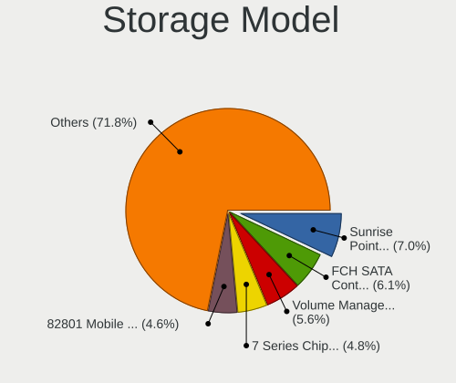

| Model                                                                                  | Notebooks | Percent |
|----------------------------------------------------------------------------------------|-----------|---------|
| Intel Sunrise Point-LP SATA Controller [AHCI mode]                                     | 50        | 7.04%   |
| AMD FCH SATA Controller [AHCI mode]                                                    | 43        | 6.06%   |
| Intel Volume Management Device NVMe RAID Controller                                    | 40        | 5.63%   |
| Intel 7 Series Chipset Family 6-port SATA Controller [AHCI mode]                       | 34        | 4.79%   |
| Intel 82801 Mobile SATA Controller [RAID mode]                                         | 33        | 4.65%   |
| Samsung NVMe SSD Controller SM981/PM981/PM983                                          | 27        | 3.8%    |
| Intel 6 Series/C200 Series Chipset Family 6 port Mobile SATA AHCI Controller           | 25        | 3.52%   |
| Samsung NVMe SSD Controller PM9A1/PM9A3/980PRO                                         | 17        | 2.39%   |
| Samsung NVMe SSD Controller 980 (DRAM-less)                                            | 17        | 2.39%   |
| Intel 8 Series SATA Controller 1 [AHCI mode]                                           | 16        | 2.25%   |
| SK hynix Gold P31/BC711/PC711 NVMe Solid State Drive                                   | 15        | 2.11%   |
| Intel Wildcat Point-LP SATA Controller [AHCI Mode]                                     | 15        | 2.11%   |
| Intel Cannon Lake Mobile PCH SATA AHCI Controller                                      | 14        | 1.97%   |
| SanDisk Ultra 3D / WD PC SN530, IX SN530, Blue SN550 NVMe SSD (DRAM-less)              | 11        | 1.55%   |
| Intel Celeron/Pentium Silver Processor SATA Controller                                 | 11        | 1.55%   |
| Intel 400 Series Chipset Family SATA AHCI Controller                                   | 10        | 1.41%   |
| Intel Alder Lake-P SATA AHCI Controller                                                | 9         | 1.27%   |
| KIOXIA NVMe SSD Controller BG4 (DRAM-less)                                             | 8         | 1.13%   |
| Kingston Company OM8PCP Design-In PCIe 3 NVMe SSD (DRAM-less)                          | 8         | 1.13%   |
| Intel Tiger Lake-LP SATA Controller                                                    | 8         | 1.13%   |
| Intel Comet Lake SATA AHCI Controller                                                  | 8         | 1.13%   |
| SanDisk WD SN560/SN740/SN770/SN5000 NVMe SSD                                           | 7         | 0.99%   |
| SanDisk Extreme Pro / WD Black SN750 / PC SN730 / Red SN700 NVMe SSD                   | 7         | 0.99%   |
| Micron 2450 NVMe SSD [HendrixV] (DRAM-less)                                            | 7         | 0.99%   |
| Intel Tiger Lake SATA AHCI Controller                                                  | 7         | 0.99%   |
| Intel 7 Series Chipset Family 4-port SATA Controller [IDE mode]                        | 7         | 0.99%   |
| Intel 7 Series Chipset Family 2-port SATA Controller [IDE mode]                        | 7         | 0.99%   |
| Intel 6 Series/C200 Series Chipset Family Mobile SATA Controller (IDE mode, ports 0-3) | 7         | 0.99%   |
| Samsung NVMe SSD Controller PM9B1 (DRAM-less)                                          | 6         | 0.85%   |
| Kingston Company OM3PDP3 NVMe SSD                                                      | 6         | 0.85%   |
| Intel SSD 670p Series [Keystone Harbor]                                                | 6         | 0.85%   |
| Intel HM170/QM170 Chipset SATA Controller [AHCI Mode]                                  | 6         | 0.85%   |
| Intel Cannon Point-LP SATA Controller [AHCI Mode]                                      | 6         | 0.85%   |
| Intel 6 Series/C200 Series Chipset Family Mobile SATA Controller (IDE mode, ports 4-5) | 6         | 0.85%   |
| Samsung S4LN058A01[SSUBX] AHCI SSD Controller (Apple slot)                             | 5         | 0.7%    |
| Micron 2400 NVMe SSD (DRAM-less)                                                       | 5         | 0.7%    |
| Micron 2210 NVMe SSD [Cobain]                                                          | 5         | 0.7%    |
| KIOXIA NVMe SSD Controller BG5 (DRAM-less)                                             | 5         | 0.7%    |
| Intel Ice Lake-LP SATA Controller [AHCI mode]                                          | 5         | 0.7%    |
| Intel 82801IBM/IEM (ICH9M/ICH9M-E) 4 port SATA Controller [AHCI mode]                  | 5         | 0.7%    |

Storage Kind
------------

Kind of storage controller (IDE, SATA, NVMe, SAS, ...)

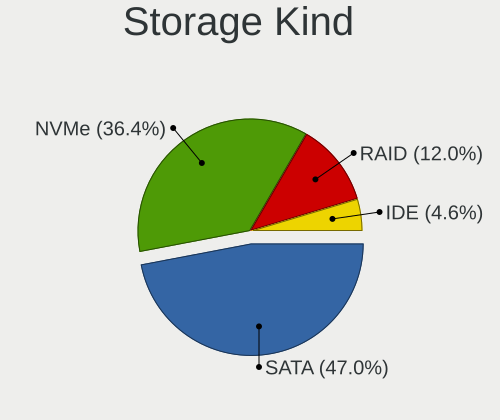

| Kind | Notebooks | Percent |
|------|-----------|---------|
| SATA | 314       | 47.01%  |
| NVMe | 243       | 36.38%  |
| RAID | 80        | 11.98%  |
| IDE  | 31        | 4.64%   |

Processor
---------

CPU Vendor
----------

Processor vendors

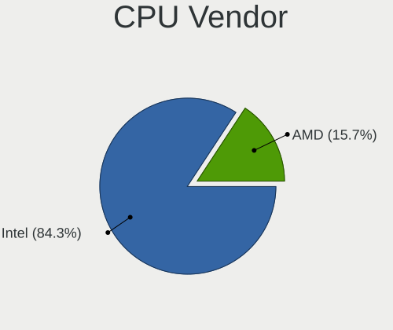

| Vendor | Notebooks | Percent |
|--------|-----------|---------|
| Intel  | 444       | 84.25%  |
| AMD    | 83        | 15.75%  |

CPU Model
---------

Processor models

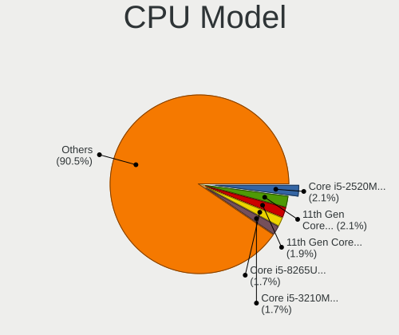

| Model                                         | Notebooks | Percent |
|-----------------------------------------------|-----------|---------|
| Intel Core i5-2520M CPU @ 2.50GHz             | 11        | 2.09%   |
| Intel 11th Gen Core i5-1135G7 @ 2.40GHz       | 11        | 2.09%   |
| Intel 11th Gen Core i7-1165G7 @ 2.80GHz       | 10        | 1.9%    |
| Intel Core i5-8265U CPU @ 1.60GHz             | 9         | 1.71%   |
| Intel Core i5-3210M CPU @ 2.50GHz             | 9         | 1.71%   |
| Intel Core i5-8250U CPU @ 1.60GHz             | 8         | 1.52%   |
| Intel 11th Gen Core i3-1115G4 @ 3.00GHz       | 8         | 1.52%   |
| Intel Core i7-9750H CPU @ 2.60GHz             | 7         | 1.33%   |
| Intel Core i7-8565U CPU @ 1.80GHz             | 7         | 1.33%   |
| Intel Core i7-10750H CPU @ 2.60GHz            | 7         | 1.33%   |
| Intel Core i5-6200U CPU @ 2.30GHz             | 7         | 1.33%   |
| Intel Core i5-10300H CPU @ 2.50GHz            | 7         | 1.33%   |
| Intel 11th Gen Core i5-11400H @ 2.70GHz       | 7         | 1.33%   |
| Intel Core i5-3320M CPU @ 2.60GHz             | 6         | 1.14%   |
| Intel Core i5-10210U CPU @ 1.60GHz            | 6         | 1.14%   |
| Intel Core i3-1005G1 CPU @ 1.20GHz            | 6         | 1.14%   |
| Intel 12th Gen Core i7-12700H                 | 6         | 1.14%   |
| Intel Core i7-8550U CPU @ 1.80GHz             | 5         | 0.95%   |
| Intel Core i7-6500U CPU @ 2.50GHz             | 5         | 0.95%   |
| Intel Core i5-8365U CPU @ 1.60GHz             | 5         | 0.95%   |
| Intel Core i5-2450M CPU @ 2.50GHz             | 5         | 0.95%   |
| Intel Core i3-5005U CPU @ 2.00GHz             | 5         | 0.95%   |
| Intel 12th Gen Core i5-12500H                 | 5         | 0.95%   |
| Intel 12th Gen Core i5-1235U                  | 5         | 0.95%   |
| Intel 11th Gen Core i7-11800H @ 2.30GHz       | 5         | 0.95%   |
| AMD Ryzen 7 5800H with Radeon Graphics        | 5         | 0.95%   |
| AMD Ryzen 7 5700U with Radeon Graphics        | 5         | 0.95%   |
| Intel Core i7-8750H CPU @ 2.20GHz             | 4         | 0.76%   |
| Intel Core i7-7700HQ CPU @ 2.80GHz            | 4         | 0.76%   |
| Intel Core i7-7500U CPU @ 2.70GHz             | 4         | 0.76%   |
| Intel Core i5-8350U CPU @ 1.70GHz             | 4         | 0.76%   |
| Intel Core i5-5300U CPU @ 2.30GHz             | 4         | 0.76%   |
| Intel Core i5-2430M CPU @ 2.40GHz             | 4         | 0.76%   |
| Intel Core i5-1035G1 CPU @ 1.00GHz            | 4         | 0.76%   |
| Intel Core i3-6100U CPU @ 2.30GHz             | 4         | 0.76%   |
| Intel 12th Gen Core i7-1260P                  | 4         | 0.76%   |
| AMD Ryzen 7 4800H with Radeon Graphics        | 4         | 0.76%   |
| AMD Ryzen 7 3700U with Radeon Vega Mobile Gfx | 4         | 0.76%   |
| AMD Ryzen 5 5600H with Radeon Graphics        | 4         | 0.76%   |
| AMD Ryzen 5 3500U with Radeon Vega Mobile Gfx | 4         | 0.76%   |

CPU Model Family
----------------

Processor model prefix

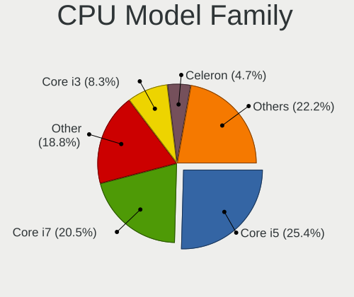

| Model                   | Notebooks | Percent |
|-------------------------|-----------|---------|
| Intel Core i5           | 134       | 25.43%  |
| Intel Core i7           | 108       | 20.49%  |
| Other                   | 99        | 18.79%  |
| Intel Core i3           | 44        | 8.35%   |
| Intel Celeron           | 25        | 4.74%   |
| AMD Ryzen 7             | 25        | 4.74%   |
| AMD Ryzen 5             | 21        | 3.98%   |
| Intel Core 2 Duo        | 11        | 2.09%   |
| AMD A6                  | 8         | 1.52%   |
| AMD Ryzen 3             | 6         | 1.14%   |
| Intel Pentium           | 5         | 0.95%   |
| AMD A4                  | 5         | 0.95%   |
| Intel Core 2            | 4         | 0.76%   |
| Intel Core              | 4         | 0.76%   |
| Intel Pentium Silver    | 3         | 0.57%   |
| AMD E1                  | 3         | 0.57%   |
| Intel Core i9           | 2         | 0.38%   |
| Intel Atom              | 2         | 0.38%   |
| AMD Ryzen 7 PRO         | 2         | 0.38%   |
| AMD E                   | 2         | 0.38%   |
| Intel Pentium Dual-Core | 1         | 0.19%   |
| Intel Genuine           | 1         | 0.19%   |
| Intel Core m5           | 1         | 0.19%   |
| Intel Core m3           | 1         | 0.19%   |
| Intel Core 2 Quad       | 1         | 0.19%   |
| Intel Core 2 Extreme    | 1         | 0.19%   |
| AMD Ryzen 9             | 1         | 0.19%   |
| AMD Ryzen 5 PRO         | 1         | 0.19%   |
| AMD FX                  | 1         | 0.19%   |
| AMD E2                  | 1         | 0.19%   |
| AMD C-50                | 1         | 0.19%   |
| AMD Athlon X2           | 1         | 0.19%   |
| AMD Athlon              | 1         | 0.19%   |
| AMD A12                 | 1         | 0.19%   |

CPU Cores
---------

Number of processor cores

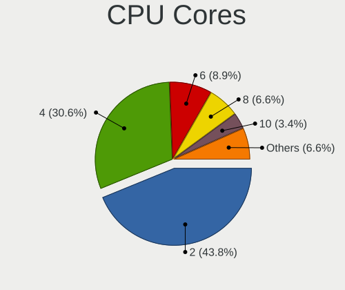

| Number | Notebooks | Percent |
|--------|-----------|---------|
| 2      | 231       | 43.83%  |
| 4      | 161       | 30.55%  |
| 6      | 47        | 8.92%   |
| 8      | 35        | 6.64%   |
| 10     | 18        | 3.42%   |
| 12     | 14        | 2.66%   |
| 14     | 13        | 2.47%   |
| 16     | 4         | 0.76%   |
| 1      | 4         | 0.76%   |

CPU Sockets
-----------

Number of sockets

| Number | Notebooks | Percent |
|--------|-----------|---------|
| 1      | 527       | 100%    |

CPU Threads
-----------

Threads per core (Hyper-Threading)

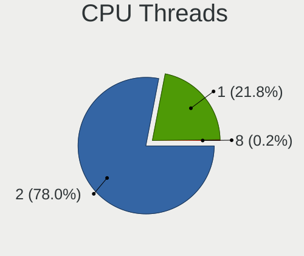

| Number | Notebooks | Percent |
|--------|-----------|---------|
| 2      | 412       | 78.03%  |
| 1      | 115       | 21.78%  |
| 8      | 1         | 0.19%   |

CPU Op-Modes
------------

CPU Operation Modes (32-bit, 64-bit)

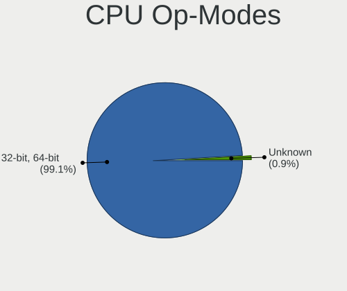

| Op mode        | Notebooks | Percent |
|----------------|-----------|---------|
| 32-bit, 64-bit | 522       | 99.05%  |
| Unknown        | 5         | 0.95%   |

CPU Microcode
-------------

Microcode number

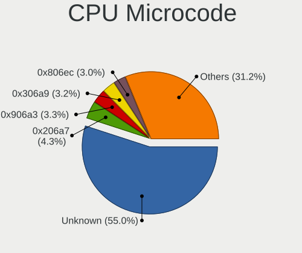

| Number     | Notebooks | Percent |
|------------|-----------|---------|
| Unknown    | 296       | 55.02%  |
| 0x206a7    | 23        | 4.28%   |
| 0x906a3    | 18        | 3.35%   |
| 0x306a9    | 17        | 3.16%   |
| 0x806ec    | 16        | 2.97%   |
| 0x806c1    | 13        | 2.42%   |
| 0x406e3    | 13        | 2.42%   |
| 0xa0652    | 10        | 1.86%   |
| 0x906ea    | 9         | 1.67%   |
| 0x806e9    | 9         | 1.67%   |
| 0x906a4    | 8         | 1.49%   |
| 0x806ea    | 7         | 1.3%    |
| 0x706a8    | 7         | 1.3%    |
| 0x806d1    | 6         | 1.12%   |
| 0x706e5    | 5         | 0.93%   |
| 0x40651    | 5         | 0.93%   |
| 0x08608103 | 5         | 0.93%   |
| 0x08600106 | 5         | 0.93%   |
| 0x6f6      | 4         | 0.74%   |
| 0x306d4    | 4         | 0.74%   |
| 0x306c3    | 4         | 0.74%   |
| 0x1067a    | 4         | 0.74%   |
| 0x0a50000c | 4         | 0.74%   |
| 0x06006705 | 4         | 0.74%   |
| 0x08108109 | 3         | 0.56%   |
| 0x07030105 | 3         | 0.56%   |
| 0x03000027 | 3         | 0.56%   |
| 0xb06a2    | 2         | 0.37%   |
| 0x906e9    | 2         | 0.37%   |
| 0x806eb    | 2         | 0.37%   |
| 0x806c2    | 2         | 0.37%   |
| 0x706a1    | 2         | 0.37%   |
| 0x6fd      | 2         | 0.37%   |
| 0x506c9    | 2         | 0.37%   |
| 0x406c4    | 2         | 0.37%   |
| 0x30678    | 2         | 0.37%   |
| 0x08108102 | 2         | 0.37%   |
| 0xb06f2    | 1         | 0.19%   |
| 0xa0660    | 1         | 0.19%   |
| 0x906ed    | 1         | 0.19%   |

CPU Microarch
-------------

Microarchitecture

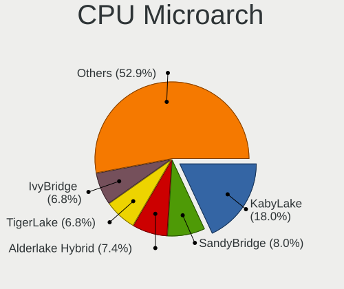

| Name              | Notebooks | Percent |
|-------------------|-----------|---------|
| KabyLake          | 95        | 18.03%  |
| SandyBridge       | 42        | 7.97%   |
| Alderlake Hybrid  | 39        | 7.4%    |
| TigerLake         | 36        | 6.83%   |
| IvyBridge         | 36        | 6.83%   |
| Unknown           | 33        | 6.26%   |
| Skylake           | 31        | 5.88%   |
| Haswell           | 30        | 5.69%   |
| CometLake         | 22        | 4.17%   |
| Broadwell         | 19        | 3.61%   |
| Icelake           | 18        | 3.42%   |
| Zen 3             | 15        | 2.85%   |
| Silvermont        | 13        | 2.47%   |
| Goldmont plus     | 13        | 2.47%   |
| Penryn            | 12        | 2.28%   |
| Zen+              | 11        | 2.09%   |
| Zen 2             | 10        | 1.9%    |
| Excavator         | 9         | 1.71%   |
| Core              | 8         | 1.52%   |
| Westmere          | 7         | 1.33%   |
| Meteorlake Hybrid | 4         | 0.76%   |
| K10 Llano         | 4         | 0.76%   |
| Jaguar            | 4         | 0.76%   |
| Zen               | 3         | 0.57%   |
| Puma              | 3         | 0.57%   |
| Goldmont          | 3         | 0.57%   |
| Bobcat            | 3         | 0.57%   |
| Piledriver        | 2         | 0.38%   |
| Nehalem           | 1         | 0.19%   |
| K8 & K10 hybrid   | 1         | 0.19%   |

Graphics
--------

GPU Vendor
----------

Vendors of graphics cards

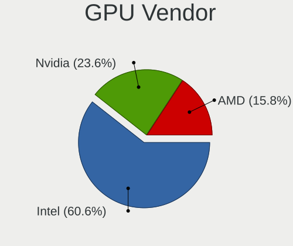

| Vendor | Notebooks | Percent |
|--------|-----------|---------|
| Intel  | 423       | 60.6%   |
| Nvidia | 165       | 23.64%  |
| AMD    | 110       | 15.76%  |

GPU Model
---------

Graphics card models

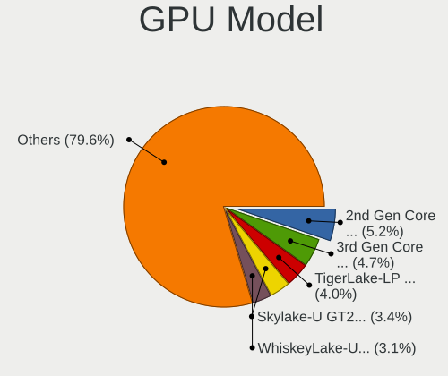

| Model                                                                                    | Notebooks | Percent |
|------------------------------------------------------------------------------------------|-----------|---------|
| Intel 2nd Generation Core Processor Family Integrated Graphics Controller                | 37        | 5.23%   |
| Intel 3rd Gen Core processor Graphics Controller                                         | 33        | 4.67%   |
| Intel TigerLake-LP GT2 [Iris Xe Graphics]                                                | 28        | 3.96%   |
| Intel Skylake-U GT2 [HD Graphics 520]                                                    | 24        | 3.39%   |
| Intel WhiskeyLake-U GT2 [UHD Graphics 620]                                               | 22        | 3.11%   |
| Intel Haswell-ULT Integrated Graphics Controller                                         | 21        | 2.97%   |
| Intel CometLake-H GT2 [UHD Graphics]                                                     | 21        | 2.97%   |
| Intel Kaby Lake-R GT2 [UHD Graphics 620]                                                 | 20        | 2.83%   |
| Intel Alder Lake-P GT2 [Iris Xe Graphics]                                                | 20        | 2.83%   |
| Intel Kaby Lake-U GT2 [HD Graphics 620]                                                  | 16        | 2.26%   |
| Intel CoffeeLake-H GT2 [UHD Graphics 630]                                                | 16        | 2.26%   |
| Intel Broadwell-U GT2 [HD Graphics 5500]                                                 | 16        | 2.26%   |
| Intel CometLake-U GT2 [UHD Graphics]                                                     | 13        | 1.84%   |
| Nvidia GA106M [GeForce RTX 3060 Mobile / Max-Q]                                          | 12        | 1.7%    |
| Intel TigerLake-H GT1 [UHD Graphics]                                                     | 12        | 1.7%    |
| AMD Picasso/Raven 2 [Radeon Vega Series / Radeon Vega Mobile Series]                     | 12        | 1.7%    |
| Nvidia GA107M [GeForce RTX 3050 Mobile]                                                  | 11        | 1.56%   |
| AMD Lucienne                                                                             | 11        | 1.56%   |
| Intel Iris Plus Graphics G1 (Ice Lake)                                                   | 10        | 1.41%   |
| Intel GeminiLake [UHD Graphics 600]                                                      | 10        | 1.41%   |
| AMD Renoir [Radeon Vega Series / Radeon Vega Mobile Series]                              | 10        | 1.41%   |
| AMD Cezanne [Radeon Vega Series / Radeon Vega Mobile Series]                             | 10        | 1.41%   |
| Nvidia TU117M [GeForce GTX 1650 Mobile / Max-Q]                                          | 9         | 1.27%   |
| Nvidia TU117M [GeForce GTX 1650 Ti Mobile]                                               | 8         | 1.13%   |
| Intel Tiger Lake-LP GT2 [UHD Graphics G4]                                                | 8         | 1.13%   |
| Intel Atom/Celeron/Pentium Processor x5-E8000/J3xxx/N3xxx Integrated Graphics Controller | 8         | 1.13%   |
| Intel Alder Lake-UP3 GT2 [Iris Xe Graphics]                                              | 8         | 1.13%   |
| Nvidia GF117M [GeForce 610M/710M/810M/820M / GT 620M/625M/630M/720M]                     | 7         | 0.99%   |
| Intel Mobile 4 Series Chipset Integrated Graphics Controller                             | 7         | 0.99%   |
| Intel Core Processor Integrated Graphics Controller                                      | 7         | 0.99%   |
| Intel 4th Gen Core Processor Integrated Graphics Controller                              | 7         | 0.99%   |
| AMD Stoney [Radeon R2/R3/R4/R5 Graphics]                                                 | 7         | 0.99%   |
| Nvidia TU106M [GeForce RTX 2060 Mobile]                                                  | 6         | 0.85%   |
| Nvidia GM108M [GeForce 940MX]                                                            | 6         | 0.85%   |
| Nvidia GA107M [GeForce RTX 3050 Ti Mobile]                                               | 6         | 0.85%   |
| Nvidia AD107M [GeForce RTX 4060 Max-Q / Mobile]                                          | 5         | 0.71%   |
| Intel Kaby Lake-H GT2 [HD Graphics 630]                                                  | 5         | 0.71%   |
| Intel Atom Processor Z36xxx/Z37xxx Series Graphics & Display                             | 5         | 0.71%   |
| AMD Seymour [Radeon HD 6400M/7400M Series]                                               | 5         | 0.71%   |
| AMD Barcelo                                                                              | 5         | 0.71%   |

GPU Combo
---------

Combinations of graphics cards

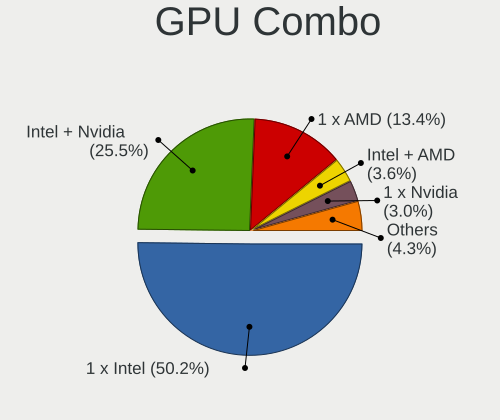

| Name           | Notebooks | Percent |
|----------------|-----------|---------|
| 1 x Intel      | 266       | 50.19%  |
| Intel + Nvidia | 135       | 25.47%  |
| 1 x AMD        | 71        | 13.4%   |
| Intel + AMD    | 19        | 3.58%   |
| 1 x Nvidia     | 16        | 3.02%   |
| AMD + Nvidia   | 16        | 3.02%   |
| 2 x AMD        | 4         | 0.75%   |
| Other          | 1         | 0.19%   |
| 2 x Nvidia     | 1         | 0.19%   |
| 2 x Intel      | 1         | 0.19%   |

GPU Driver
----------

Free vs proprietary

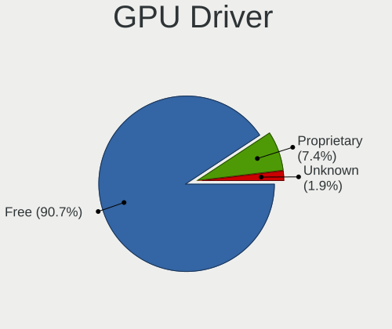

| Driver      | Notebooks | Percent |
|-------------|-----------|---------|
| Free        | 479       | 90.72%  |
| Proprietary | 39        | 7.39%   |
| Unknown     | 10        | 1.89%   |

GPU Memory
----------

Total video memory

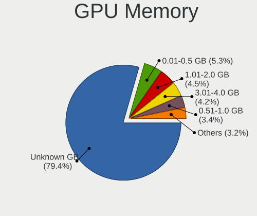

| Size in GB | Notebooks | Percent |
|------------|-----------|---------|
| Unknown    | 421       | 79.43%  |
| 0.01-0.5   | 28        | 5.28%   |
| 1.01-2.0   | 24        | 4.53%   |
| 3.01-4.0   | 22        | 4.15%   |
| 0.51-1.0   | 18        | 3.4%    |
| 5.01-6.0   | 11        | 2.08%   |
| 7.01-8.0   | 4         | 0.75%   |
| 2.01-3.0   | 2         | 0.38%   |

Monitor
-------

Monitor Vendor
--------------

Monitor vendors

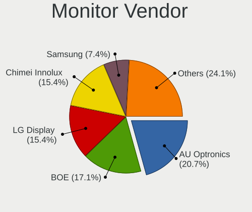

| Vendor                  | Notebooks | Percent |
|-------------------------|-----------|---------|
| AU Optronics            | 121       | 20.68%  |
| BOE                     | 100       | 17.09%  |
| LG Display              | 90        | 15.38%  |
| Chimei Innolux          | 90        | 15.38%  |
| Samsung Electronics     | 43        | 7.35%   |
| Sharp                   | 18        | 3.08%   |
| Apple                   | 18        | 3.08%   |
| Chi Mei Optoelectronics | 12        | 2.05%   |
| PANDA                   | 10        | 1.71%   |
| InfoVision              | 7         | 1.2%    |
| Dell                    | 7         | 1.2%    |
| Goldstar                | 6         | 1.03%   |
| Lenovo                  | 5         | 0.85%   |
| CSO                     | 5         | 0.85%   |
| Hewlett-Packard         | 4         | 0.68%   |
| Acer                    | 4         | 0.68%   |
| Sony                    | 3         | 0.51%   |
| Sceptre Tech            | 3         | 0.51%   |
| STA                     | 2         | 0.34%   |
| Pixio                   | 2         | 0.34%   |
| Philips                 | 2         | 0.34%   |
| Eizo                    | 2         | 0.34%   |
| BenQ                    | 2         | 0.34%   |
| AOC                     | 2         | 0.34%   |
| Ancor Communications    | 2         | 0.34%   |
| Unknown                 | 2         | 0.34%   |
| ___                     | 1         | 0.17%   |
| Vizio                   | 1         | 0.17%   |
| VIZ                     | 1         | 0.17%   |
| ViewSonic               | 1         | 0.17%   |
| Unknown (AAA)           | 1         | 0.17%   |
| Unknown                 | 1         | 0.17%   |
| TMX                     | 1         | 0.17%   |
| STD                     | 1         | 0.17%   |
| SANYO                   | 1         | 0.17%   |
| Planar                  | 1         | 0.17%   |
| Panasonic               | 1         | 0.17%   |
| ONN                     | 1         | 0.17%   |
| Olidata                 | 1         | 0.17%   |
| Olevia                  | 1         | 0.17%   |

Monitor Model
-------------

Monitor models

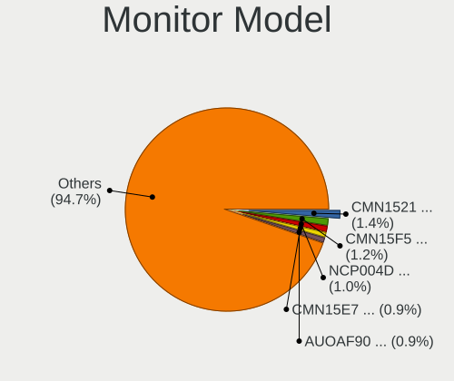

| Model                                                                 | Notebooks | Percent |
|-----------------------------------------------------------------------|-----------|---------|
| Chimei Innolux LCD Monitor CMN1521 1920x1080 344x193mm 15.5-inch      | 8         | 1.37%   |
| Chimei Innolux LCD Monitor CMN15F5 1920x1080 344x193mm 15.5-inch      | 7         | 1.19%   |
| PANDA LCD Monitor NCP004D 1920x1080 344x194mm 15.5-inch               | 6         | 1.02%   |
| Chimei Innolux LCD Monitor CMN15E7 1920x1080 344x193mm 15.5-inch      | 5         | 0.85%   |
| AU Optronics LCD Monitor AUOAF90 1920x1080 344x193mm 15.5-inch        | 5         | 0.85%   |
| AU Optronics LCD Monitor AUO106C 1366x768 276x155mm 12.5-inch         | 5         | 0.85%   |
| LG Display LCD Monitor LGD046F 1920x1080 344x194mm 15.5-inch          | 4         | 0.68%   |
| LG Display LCD Monitor LGD02D8 1366x768 277x156mm 12.5-inch           | 4         | 0.68%   |
| Chimei Innolux LCD Monitor CMN15E6 1366x768 344x193mm 15.5-inch       | 4         | 0.68%   |
| Chimei Innolux LCD Monitor CMN15DB 1366x768 344x193mm 15.5-inch       | 4         | 0.68%   |
| BOE LCD Monitor BOE0897 1366x768 344x194mm 15.5-inch                  | 4         | 0.68%   |
| AU Optronics LCD Monitor AUO2E8D 1920x1080 344x194mm 15.5-inch        | 4         | 0.68%   |
| Sony TV SNYF301 1920x1080                                             | 3         | 0.51%   |
| Samsung Electronics LCD Monitor SEC544B 1600x900 382x214mm 17.2-inch  | 3         | 0.51%   |
| Samsung Electronics LCD Monitor SDC4171 2880x1800 302x189mm 14.0-inch | 3         | 0.51%   |
| Chimei Innolux LCD Monitor CMN14D4 1920x1080 309x173mm 13.9-inch      | 3         | 0.51%   |
| BOE LCD Monitor BOE07C9 1920x1080 309x173mm 13.9-inch                 | 3         | 0.51%   |
| AU Optronics LCD Monitor AUO61ED 1920x1080 344x194mm 15.5-inch        | 3         | 0.51%   |
| AU Optronics LCD Monitor AUO38ED 1920x1080 344x193mm 15.5-inch        | 3         | 0.51%   |
| AU Optronics LCD Monitor AUO235C 1366x768 256x144mm 11.6-inch         | 3         | 0.51%   |
| AU Optronics LCD Monitor AUO22EC 1366x768 344x193mm 15.5-inch         | 3         | 0.51%   |
| AU Optronics LCD Monitor AUO20EC 1366x768 344x193mm 15.5-inch         | 3         | 0.51%   |
| AU Optronics LCD Monitor AUO133D 1920x1080 309x173mm 13.9-inch        | 3         | 0.51%   |
| Apple Color LCD APP9CDF 1440x900 286x179mm 13.3-inch                  | 3         | 0.51%   |
| Apple Color LCD APP9CC7 1280x800 286x179mm 13.3-inch                  | 3         | 0.51%   |
| Sharp LQ156M1JW25 SHP152C 1920x1080 344x194mm 15.5-inch               | 2         | 0.34%   |
| Samsung Electronics LCD Monitor SEC4D45 1280x800 331x207mm 15.4-inch  | 2         | 0.34%   |
| Samsung Electronics LCD Monitor SEC4D42 1280x800 303x190mm 14.1-inch  | 2         | 0.34%   |
| Samsung Electronics LCD Monitor SEC3150 1366x768 344x193mm 15.5-inch  | 2         | 0.34%   |
| Samsung Electronics LCD Monitor SDC4951 1366x768 344x194mm 15.5-inch  | 2         | 0.34%   |
| LG Display LCD Monitor LGD06E4 1920x1080 344x194mm 15.5-inch          | 2         | 0.34%   |
| LG Display LCD Monitor LGD0484 1366x768 344x194mm 15.5-inch           | 2         | 0.34%   |
| LG Display LCD Monitor LGD03CD 1366x768 277x156mm 12.5-inch           | 2         | 0.34%   |
| LG Display LCD Monitor LGD03A3 1366x768 277x156mm 12.5-inch           | 2         | 0.34%   |
| LG Display LCD Monitor LGD0390 1600x900 382x215mm 17.3-inch           | 2         | 0.34%   |
| LG Display LCD Monitor LGD02F1 1366x768 344x194mm 15.5-inch           | 2         | 0.34%   |
| LG Display LCD Monitor LGD02E3 1366x768 344x194mm 15.5-inch           | 2         | 0.34%   |
| LG Display LCD Monitor LGD0259 1920x1080 345x194mm 15.6-inch          | 2         | 0.34%   |
| LG Display LCD Monitor LGD01E9 1920x1080 345x194mm 15.6-inch          | 2         | 0.34%   |
| InfoVision LCD Monitor IVO857D 1920x1080 294x165mm 13.3-inch          | 2         | 0.34%   |

Monitor Resolution
------------------

Monitor screen resolution

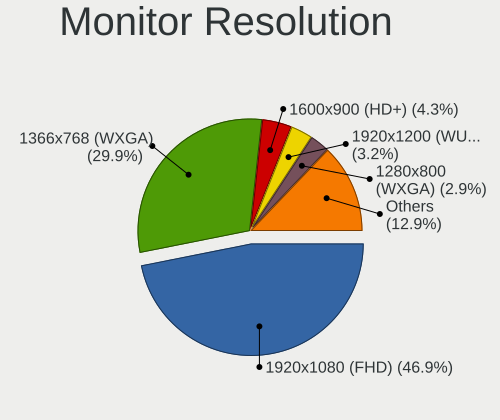

| Resolution         | Notebooks | Percent |
|--------------------|-----------|---------|
| 1920x1080 (FHD)    | 262       | 46.87%  |
| 1366x768 (WXGA)    | 167       | 29.87%  |
| 1600x900 (HD+)     | 24        | 4.29%   |
| 1920x1200 (WUXGA)  | 18        | 3.22%   |
| 1280x800 (WXGA)    | 16        | 2.86%   |
| 3840x2160 (4K)     | 15        | 2.68%   |
| 2560x1440 (QHD)    | 10        | 1.79%   |
| 1440x900 (WXGA+)   | 8         | 1.43%   |
| 2560x1600          | 7         | 1.25%   |
| 2880x1800          | 6         | 1.07%   |
| 1680x1050 (WSXGA+) | 4         | 0.72%   |
| 2560x1080          | 3         | 0.54%   |
| 3840x2400          | 2         | 0.36%   |
| 2240x1400          | 2         | 0.36%   |
| 2160x1440          | 2         | 0.36%   |
| 1920x540           | 2         | 0.36%   |
| 1024x768 (XGA)     | 2         | 0.36%   |
| 3200x1800 (QHD+)   | 1         | 0.18%   |
| 3200x1080          | 1         | 0.18%   |
| 2944x1080          | 1         | 0.18%   |
| 2880x1620          | 1         | 0.18%   |
| 2400x1600          | 1         | 0.18%   |
| 1920x515           | 1         | 0.18%   |
| 1360x768           | 1         | 0.18%   |
| 1280x1024 (SXGA)   | 1         | 0.18%   |
| Unknown            | 1         | 0.18%   |

Monitor Diagonal
----------------

Diagonal size in inches

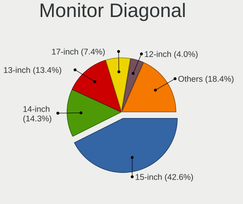

| Inches  | Notebooks | Percent |
|---------|-----------|---------|
| 15      | 248       | 42.61%  |
| 14      | 83        | 14.26%  |
| 13      | 78        | 13.4%   |
| 17      | 43        | 7.39%   |
| 12      | 23        | 3.95%   |
| 11      | 13        | 2.23%   |
| 16      | 12        | 2.06%   |
| 27      | 11        | 1.89%   |
| 24      | 11        | 1.89%   |
| 31      | 10        | 1.72%   |
| 23      | 8         | 1.37%   |
| 21      | 7         | 1.2%    |
| Unknown | 6         | 1.03%   |
| 72      | 4         | 0.69%   |
| 26      | 3         | 0.52%   |
| 22      | 3         | 0.52%   |
| 19      | 3         | 0.52%   |
| 18      | 3         | 0.52%   |
| 84      | 2         | 0.34%   |
| 40      | 2         | 0.34%   |
| 32      | 2         | 0.34%   |
| 29      | 2         | 0.34%   |
| 74      | 1         | 0.17%   |
| 63      | 1         | 0.17%   |
| 54      | 1         | 0.17%   |
| 48      | 1         | 0.17%   |
| 46      | 1         | 0.17%   |

Monitor Width
-------------

Physical width

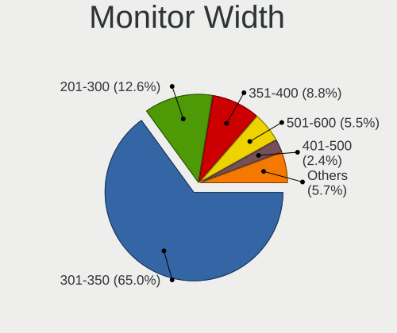

| Width in mm | Notebooks | Percent |
|-------------|-----------|---------|
| 301-350     | 377       | 65%     |
| 201-300     | 73        | 12.59%  |
| 351-400     | 51        | 8.79%   |
| 501-600     | 32        | 5.52%   |
| 401-500     | 14        | 2.41%   |
| 601-700     | 12        | 2.07%   |
| 1501-2000   | 7         | 1.21%   |
| Unknown     | 6         | 1.03%   |
| 1001-1500   | 4         | 0.69%   |
| 801-900     | 2         | 0.34%   |
| 701-800     | 2         | 0.34%   |

Aspect Ratio
------------

Proportional relationship between the width and the height

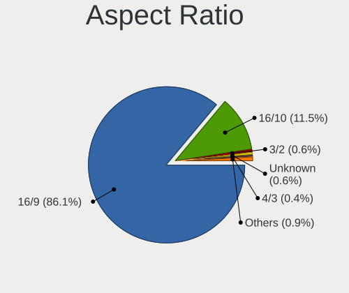

| Ratio   | Notebooks | Percent |
|---------|-----------|---------|
| 16/9    | 458       | 86.09%  |
| 16/10   | 61        | 11.47%  |
| 3/2     | 3         | 0.56%   |
| Unknown | 3         | 0.56%   |
| 4/3     | 2         | 0.38%   |
| 21/9    | 2         | 0.38%   |
| 6/5     | 1         | 0.19%   |
| 32/9    | 1         | 0.19%   |
| 3.73    | 1         | 0.19%   |

Monitor Area
------------

Area in inch²

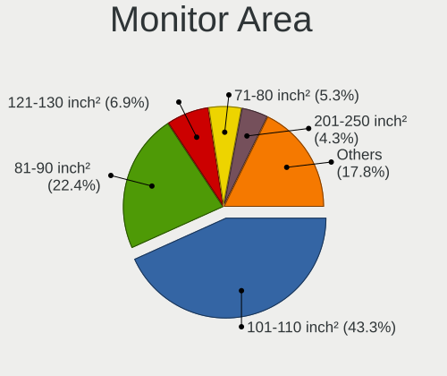

| Area in inch² | Notebooks | Percent |
|----------------|-----------|---------|
| 101-110        | 251       | 43.28%  |
| 81-90          | 130       | 22.41%  |
| 121-130        | 40        | 6.9%    |
| 71-80          | 31        | 5.34%   |
| 201-250        | 25        | 4.31%   |
| 61-70          | 23        | 3.97%   |
| 301-350        | 14        | 2.41%   |
| 51-60          | 13        | 2.24%   |
| 351-500        | 12        | 2.07%   |
| More than 1000 | 10        | 1.72%   |
| 111-120        | 9         | 1.55%   |
| Unknown        | 6         | 1.03%   |
| 251-300        | 4         | 0.69%   |
| 151-200        | 3         | 0.52%   |
| 141-150        | 3         | 0.52%   |
| 131-140        | 3         | 0.52%   |
| 501-1000       | 3         | 0.52%   |

Pixel Density
-------------

Pixels per inch

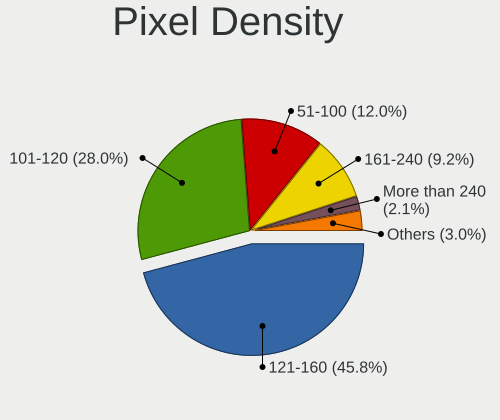

| Density       | Notebooks | Percent |
|---------------|-----------|---------|
| 121-160       | 264       | 45.83%  |
| 101-120       | 161       | 27.95%  |
| 51-100        | 69        | 11.98%  |
| 161-240       | 53        | 9.2%    |
| More than 240 | 12        | 2.08%   |
| 1-50          | 11        | 1.91%   |
| Unknown       | 6         | 1.04%   |

Multiple Monitors
-----------------

Total monitors connected

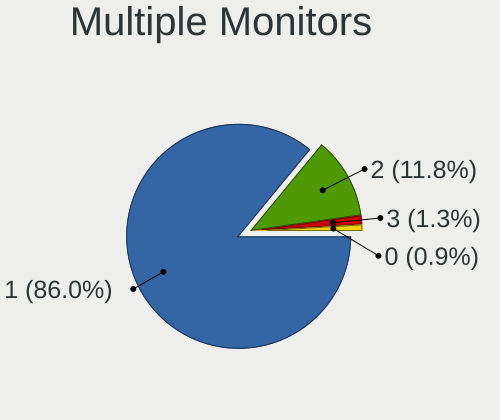

| Total | Notebooks | Percent |
|-------|-----------|---------|
| 1     | 460       | 85.98%  |
| 2     | 63        | 11.78%  |
| 3     | 7         | 1.31%   |
| 0     | 5         | 0.93%   |

Network
-------

Net Controller Vendor
---------------------

Controller vendors

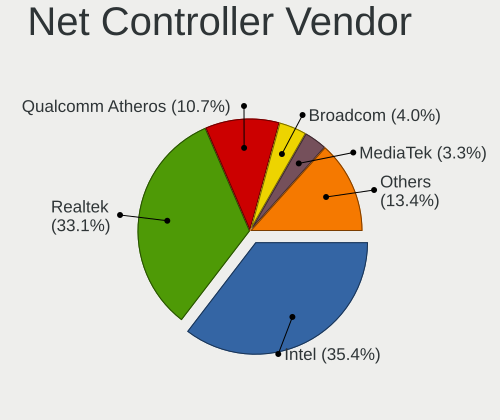

| Vendor                                 | Notebooks | Percent |
|----------------------------------------|-----------|---------|
| Intel                                  | 307       | 35.41%  |
| Realtek Semiconductor                  | 287       | 33.1%   |
| Qualcomm Atheros                       | 93        | 10.73%  |
| Broadcom                               | 35        | 4.04%   |
| MediaTek                               | 29        | 3.34%   |
| TP-Link                                | 13        | 1.5%    |
| Broadcom Limited                       | 13        | 1.5%    |
| Samsung Electronics                    | 10        | 1.15%   |
| Xiaomi                                 | 8         | 0.92%   |
| Ralink Technology                      | 7         | 0.81%   |
| ASIX Electronics                       | 7         | 0.81%   |
| Qualcomm Atheros Communications        | 4         | 0.46%   |
| Qualcomm                               | 4         | 0.46%   |
| NetGear                                | 4         | 0.46%   |
| Huawei Technologies                    | 4         | 0.46%   |
| Shenzhen Goodix Technology             | 3         | 0.35%   |
| Ralink                                 | 3         | 0.35%   |
| OPPO Electronics                       | 3         | 0.35%   |
| Lenovo                                 | 3         | 0.35%   |
| ASUSTek Computer                       | 3         | 0.35%   |
| Sony Ericsson Mobile Communications AB | 2         | 0.23%   |
| Sierra Wireless                        | 2         | 0.23%   |
| Nvidia                                 | 2         | 0.23%   |
| Linksys                                | 2         | 0.23%   |
| JMicron Technology                     | 2         | 0.23%   |
| Google                                 | 2         | 0.23%   |
| Ericsson Business Mobile Networks      | 2         | 0.23%   |
| Apple                                  | 2         | 0.23%   |
| ZyXEL Communications                   | 1         | 0.12%   |
| U-Blox                                 | 1         | 0.12%   |
| Sagem                                  | 1         | 0.12%   |
| Mercucys                               | 1         | 0.12%   |
| ICS Advent                             | 1         | 0.12%   |
| Hewlett-Packard                        | 1         | 0.12%   |
| DisplayLink                            | 1         | 0.12%   |
| Dell                                   | 1         | 0.12%   |
| D-Link                                 | 1         | 0.12%   |
| Belkin Components                      | 1         | 0.12%   |
| Arduino SA                             | 1         | 0.12%   |

Net Controller Model
--------------------

Controller models

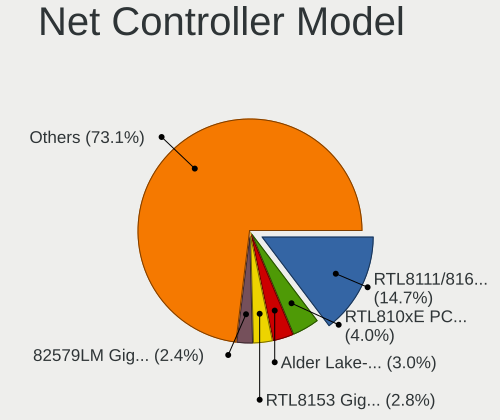

| Model                                                                  | Notebooks | Percent |
|------------------------------------------------------------------------|-----------|---------|
| Realtek RTL8111/8168/8211/8411 PCI Express Gigabit Ethernet Controller | 155       | 14.71%  |
| Realtek RTL810xE PCI Express Fast Ethernet controller                  | 42        | 3.98%   |
| Intel Alder Lake-P PCH CNVi WiFi                                       | 32        | 3.04%   |
| Realtek RTL8153 Gigabit Ethernet Adapter                               | 30        | 2.85%   |
| Intel 82579LM Gigabit Network Connection (Lewisville)                  | 25        | 2.37%   |
| Intel Wi-Fi 6 AX201                                                    | 23        | 2.18%   |
| Intel Wi-Fi 6 AX200                                                    | 22        | 2.09%   |
| Realtek RTL8821CE 802.11ac PCIe Wireless Network Adapter               | 21        | 1.99%   |
| Intel Wireless 8265 / 8275                                             | 21        | 1.99%   |
| Intel Centrino Advanced-N 6205 [Taylor Peak]                           | 21        | 1.99%   |
| Qualcomm Atheros QCA9377 802.11ac Wireless Network Adapter             | 20        | 1.9%    |
| Qualcomm Atheros QCA9565 / AR9565 Wireless Network Adapter             | 18        | 1.71%   |
| Intel Comet Lake PCH CNVi WiFi                                         | 18        | 1.71%   |
| Intel Wireless 7265                                                    | 17        | 1.61%   |
| Qualcomm Atheros AR9485 Wireless Network Adapter                       | 13        | 1.23%   |
| Intel Comet Lake PCH-LP CNVi WiFi                                      | 13        | 1.23%   |
| Realtek RTL8822CE 802.11ac PCIe Wireless Network Adapter               | 12        | 1.14%   |
| MediaTek MT7921 802.11ax PCIe Wireless Network Adapter [Filogic 330]   | 12        | 1.14%   |
| Intel Wireless 7260                                                    | 12        | 1.14%   |
| Intel Cannon Point-LP CNVi [Wireless-AC]                               | 12        | 1.14%   |
| Intel Wireless 8260                                                    | 11        | 1.04%   |
| Intel Ethernet Connection (4) I219-LM                                  | 11        | 1.04%   |
| Realtek RTL8852AE 802.11ax PCIe Wireless Network Adapter               | 10        | 0.95%   |
| Qualcomm Atheros AR9285 Wireless Network Adapter (PCI-Express)         | 10        | 0.95%   |
| Realtek Killer E2600 GbE Controller                                    | 9         | 0.85%   |
| Realtek 802.11ac NIC                                                   | 9         | 0.85%   |
| Intel Wireless 3165                                                    | 9         | 0.85%   |
| Samsung Galaxy series, misc. (tethering mode)                          | 8         | 0.76%   |
| Qualcomm Atheros QCA6174 802.11ac Wireless Network Adapter             | 8         | 0.76%   |
| Intel Tiger Lake PCH CNVi WiFi                                         | 8         | 0.76%   |
| Intel Ethernet Connection I218-LM                                      | 8         | 0.76%   |
| Intel Raptor Lake PCH CNVi WiFi                                        | 7         | 0.66%   |
| Intel Ethernet Connection I219-LM                                      | 7         | 0.66%   |
| Intel Cannon Lake PCH CNVi WiFi                                        | 7         | 0.66%   |
| Realtek RTL8723BE PCIe Wireless Network Adapter                        | 6         | 0.57%   |
| Realtek RTL8188EUS 802.11n Wireless Network Adapter                    | 6         | 0.57%   |
| Qualcomm Atheros Killer E2500 Gigabit Ethernet Controller              | 6         | 0.57%   |
| MediaTek MT7922 802.11ax PCI Express Wireless Network Adapter          | 6         | 0.57%   |
| Intel Ethernet Connection (6) I219-V                                   | 6         | 0.57%   |
| Intel Ethernet Connection (6) I219-LM                                  | 6         | 0.57%   |

Wireless Vendor
---------------

Wireless vendors

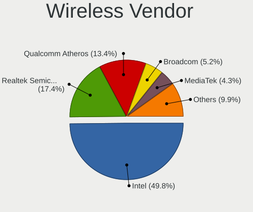

| Vendor                          | Notebooks | Percent |
|---------------------------------|-----------|---------|
| Intel                           | 287       | 49.83%  |
| Realtek Semiconductor           | 100       | 17.36%  |
| Qualcomm Atheros                | 77        | 13.37%  |
| Broadcom                        | 30        | 5.21%   |
| MediaTek                        | 25        | 4.34%   |
| TP-Link                         | 13        | 2.26%   |
| Broadcom Limited                | 11        | 1.91%   |
| Ralink Technology               | 7         | 1.22%   |
| Qualcomm Atheros Communications | 4         | 0.69%   |
| NetGear                         | 4         | 0.69%   |
| Ralink                          | 3         | 0.52%   |
| ASUSTek Computer                | 3         | 0.52%   |
| Sierra Wireless                 | 2         | 0.35%   |
| Qualcomm                        | 2         | 0.35%   |
| Linksys                         | 2         | 0.35%   |
| ZyXEL Communications            | 1         | 0.17%   |
| Sagem                           | 1         | 0.17%   |
| Mercucys                        | 1         | 0.17%   |
| Dell                            | 1         | 0.17%   |
| D-Link                          | 1         | 0.17%   |
| Belkin Components               | 1         | 0.17%   |

Wireless Model
--------------

Wireless models

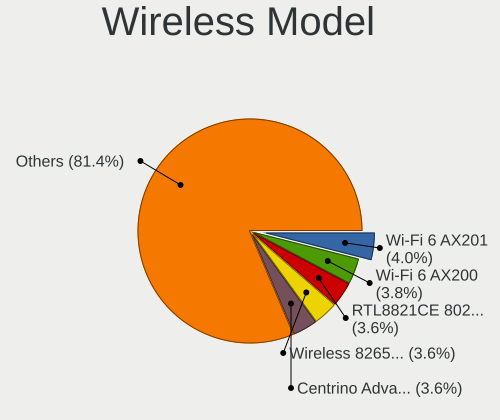

| Model                                                                | Notebooks | Percent |
|----------------------------------------------------------------------|-----------|---------|
| Intel Wi-Fi 6 AX201                                                  | 23        | 3.97%   |
| Intel Wi-Fi 6 AX200                                                  | 22        | 3.79%   |
| Realtek RTL8821CE 802.11ac PCIe Wireless Network Adapter             | 21        | 3.62%   |
| Intel Wireless 8265 / 8275                                           | 21        | 3.62%   |
| Intel Centrino Advanced-N 6205 [Taylor Peak]                         | 21        | 3.62%   |
| Qualcomm Atheros QCA9377 802.11ac Wireless Network Adapter           | 20        | 3.45%   |
| Qualcomm Atheros QCA9565 / AR9565 Wireless Network Adapter           | 18        | 3.1%    |
| Intel Comet Lake PCH CNVi WiFi                                       | 18        | 3.1%    |
| Intel Alder Lake-P PCH CNVi WiFi                                     | 18        | 3.1%    |
| Intel Wireless 7265                                                  | 17        | 2.93%   |
| Qualcomm Atheros AR9485 Wireless Network Adapter                     | 13        | 2.24%   |
| Intel Comet Lake PCH-LP CNVi WiFi                                    | 13        | 2.24%   |
| Realtek RTL8822CE 802.11ac PCIe Wireless Network Adapter             | 12        | 2.07%   |
| MediaTek MT7921 802.11ax PCIe Wireless Network Adapter [Filogic 330] | 12        | 2.07%   |
| Intel Wireless 7260                                                  | 12        | 2.07%   |
| Intel Cannon Point-LP CNVi [Wireless-AC]                             | 12        | 2.07%   |
| Intel Wireless 8260                                                  | 11        | 1.9%    |
| Realtek RTL8852AE 802.11ax PCIe Wireless Network Adapter             | 10        | 1.72%   |
| Qualcomm Atheros AR9285 Wireless Network Adapter (PCI-Express)       | 10        | 1.72%   |
| Realtek 802.11ac NIC                                                 | 9         | 1.55%   |
| Intel Wireless 3165                                                  | 9         | 1.55%   |
| Qualcomm Atheros QCA6174 802.11ac Wireless Network Adapter           | 8         | 1.38%   |
| Intel Tiger Lake PCH CNVi WiFi                                       | 8         | 1.38%   |
| Intel Cannon Lake PCH CNVi WiFi                                      | 7         | 1.21%   |
| Realtek RTL8723BE PCIe Wireless Network Adapter                      | 6         | 1.03%   |
| Realtek RTL8188EUS 802.11n Wireless Network Adapter                  | 6         | 1.03%   |
| Intel Raptor Lake PCH CNVi WiFi                                      | 6         | 1.03%   |
| Broadcom Limited BCM4360 802.11ac Dual Band Wireless Network Adapter | 6         | 1.03%   |
| Broadcom BCM43142 802.11b/g/n                                        | 6         | 1.03%   |
| TP-Link TL-WN722N v2/v3 [Realtek RTL8188EUS]                         | 5         | 0.86%   |
| Intel Ice Lake-LP PCH CNVi WiFi                                      | 5         | 0.86%   |
| Intel Dual Band Wireless-AC 3168NGW [Stone Peak]                     | 5         | 0.86%   |
| Intel Dual Band Wireless-AC 3165 Plus Bluetooth                      | 5         | 0.86%   |
| Intel Centrino Advanced-N 6235                                       | 5         | 0.86%   |
| Realtek RTL8812AU 802.11a/b/g/n/ac 2T2R DB WLAN Adapter              | 4         | 0.69%   |
| Realtek RTL8188CE 802.11b/g/n WiFi Adapter                           | 4         | 0.69%   |
| Qualcomm Atheros AR9271 802.11n                                      | 4         | 0.69%   |
| MediaTek MT7922 802.11ax PCI Express Wireless Network Adapter        | 4         | 0.69%   |
| MediaTek MT7921K (RZ608) Wi-Fi 6E 80MHz                              | 4         | 0.69%   |
| MediaTek MT7902 802.11ax PCIe Wireless Network Adapter [Filogic 310] | 4         | 0.69%   |

Ethernet Vendor
---------------

Ethernet vendors

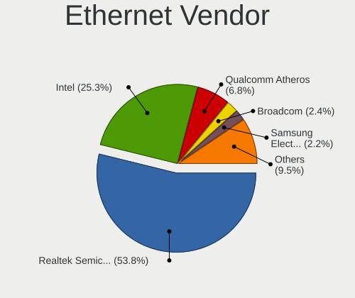

| Vendor                                 | Notebooks | Percent |
|----------------------------------------|-----------|---------|
| Realtek Semiconductor                  | 245       | 53.85%  |
| Intel                                  | 115       | 25.27%  |
| Qualcomm Atheros                       | 31        | 6.81%   |
| Broadcom                               | 11        | 2.42%   |
| Samsung Electronics                    | 10        | 2.2%    |
| Xiaomi                                 | 8         | 1.76%   |
| ASIX Electronics                       | 7         | 1.54%   |
| MediaTek                               | 4         | 0.88%   |
| OPPO Electronics                       | 3         | 0.66%   |
| Lenovo                                 | 3         | 0.66%   |
| Sony Ericsson Mobile Communications AB | 2         | 0.44%   |
| Qualcomm                               | 2         | 0.44%   |
| Nvidia                                 | 2         | 0.44%   |
| JMicron Technology                     | 2         | 0.44%   |
| Google                                 | 2         | 0.44%   |
| Broadcom Limited                       | 2         | 0.44%   |
| Apple                                  | 2         | 0.44%   |
| ICS Advent                             | 1         | 0.22%   |
| Huawei Technologies                    | 1         | 0.22%   |
| Hewlett-Packard                        | 1         | 0.22%   |
| DisplayLink                            | 1         | 0.22%   |

Ethernet Model
--------------

Ethernet models

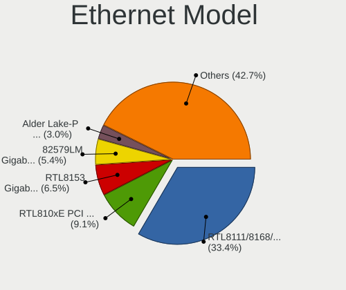

| Model                                                                  | Notebooks | Percent |
|------------------------------------------------------------------------|-----------|---------|
| Realtek RTL8111/8168/8211/8411 PCI Express Gigabit Ethernet Controller | 155       | 33.41%  |
| Realtek RTL810xE PCI Express Fast Ethernet controller                  | 42        | 9.05%   |
| Realtek RTL8153 Gigabit Ethernet Adapter                               | 30        | 6.47%   |
| Intel 82579LM Gigabit Network Connection (Lewisville)                  | 25        | 5.39%   |
| Intel Alder Lake-P PCH CNVi WiFi                                       | 14        | 3.02%   |
| Intel Ethernet Connection (4) I219-LM                                  | 11        | 2.37%   |
| Realtek Killer E2600 GbE Controller                                    | 9         | 1.94%   |
| Samsung Galaxy series, misc. (tethering mode)                          | 8         | 1.72%   |
| Intel Ethernet Connection I218-LM                                      | 8         | 1.72%   |
| Intel Ethernet Connection I219-LM                                      | 7         | 1.51%   |
| Qualcomm Atheros Killer E2500 Gigabit Ethernet Controller              | 6         | 1.29%   |
| Intel Ethernet Connection (6) I219-V                                   | 6         | 1.29%   |
| Intel Ethernet Connection (6) I219-LM                                  | 6         | 1.29%   |
| Xiaomi Mi/Redmi series (RNDIS)                                         | 5         | 1.08%   |
| Realtek RTL8125 2.5GbE Controller                                      | 5         | 1.08%   |
| Qualcomm Atheros AR8161 Gigabit Ethernet                               | 5         | 1.08%   |
| ASIX AX88179 Gigabit Ethernet                                          | 5         | 1.08%   |
| Qualcomm Atheros AR8151 v2.0 Gigabit Ethernet                          | 4         | 0.86%   |
| Qualcomm Atheros AR8131 Gigabit Ethernet                               | 4         | 0.86%   |
| Intel Ethernet Connection (3) I218-LM                                  | 4         | 0.86%   |
| Broadcom NetXtreme BCM57765 Gigabit Ethernet PCIe                      | 4         | 0.86%   |
| Xiaomi Mi/Redmi series (RNDIS + ADB)                                   | 3         | 0.65%   |
| Realtek RTL8152 Fast Ethernet Adapter                                  | 3         | 0.65%   |
| Qualcomm Atheros QCA8171 Gigabit Ethernet                              | 3         | 0.65%   |
| Qualcomm Atheros AR8162 Fast Ethernet                                  | 3         | 0.65%   |
| Qualcomm Atheros AR8152 v2.0 Fast Ethernet                             | 3         | 0.65%   |
| Intel Ethernet Connection I219-V                                       | 3         | 0.65%   |
| Intel Ethernet Connection (16) I219-V                                  | 3         | 0.65%   |
| Broadcom BCM4401-B0 100Base-TX                                         | 3         | 0.65%   |
| Samsung GT-I9070 (network tethering, USB debugging enabled)            | 2         | 0.43%   |
| Realtek Killer E3000 2.5GbE Controller                                 | 2         | 0.43%   |
| Realtek Killer E2500 Gigabit Ethernet Controller                       | 2         | 0.43%   |
| Qualcomm Atheros Killer E220x Gigabit Ethernet Controller              | 2         | 0.43%   |
| OPPO RMX3741                                                           | 2         | 0.43%   |
| MediaTek MT7922 802.11ax PCI Express Wireless Network Adapter          | 2         | 0.43%   |
| MediaTek Infinix HOT 50i                                               | 2         | 0.43%   |
| JMicron JMC250 PCI Express Gigabit Ethernet Controller                 | 2         | 0.43%   |
| Intel Ethernet Connection I217-V                                       | 2         | 0.43%   |
| Intel Ethernet Connection (7) I219-LM                                  | 2         | 0.43%   |
| Intel Ethernet Connection (5) I219-LM                                  | 2         | 0.43%   |

Net Controller Kind
-------------------

Ethernet, WiFi or modem

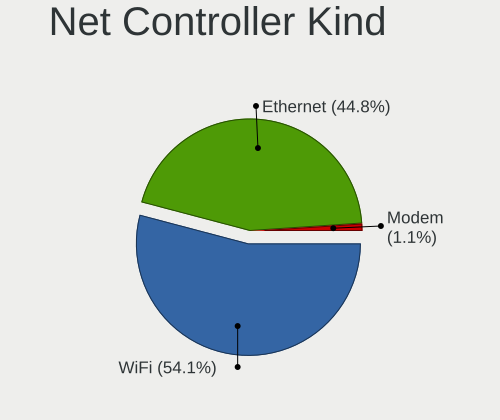

| Kind     | Notebooks | Percent |
|----------|-----------|---------|
| WiFi     | 507       | 54.11%  |
| Ethernet | 420       | 44.82%  |
| Modem    | 10        | 1.07%   |

Used Controller
---------------

Currently used network controller

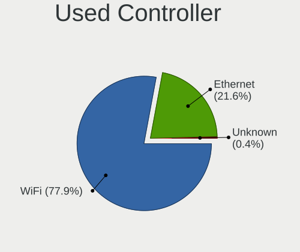

| Kind     | Notebooks | Percent |
|----------|-----------|---------|
| WiFi     | 417       | 76.37%  |
| Ethernet | 129       | 23.63%  |

NICs
----

Total network controllers on board

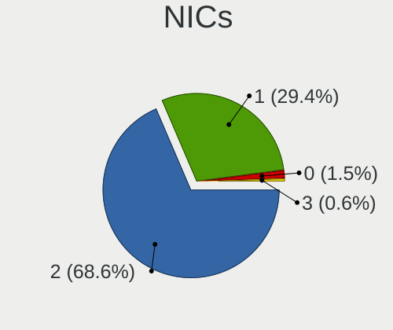

| Total | Notebooks | Percent |
|-------|-----------|---------|
| 2     | 362       | 68.56%  |
| 1     | 155       | 29.36%  |
| 0     | 8         | 1.52%   |
| 3     | 3         | 0.57%   |

IPv6
----

IPv6 vs IPv4

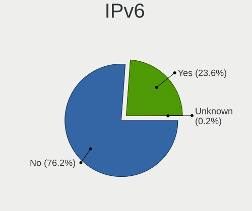

| Used    | Notebooks | Percent |
|---------|-----------|---------|
| No      | 409       | 76.16%  |
| Yes     | 127       | 23.65%  |
| Unknown | 1         | 0.19%   |

Bluetooth
---------

Bluetooth Vendor
----------------

Controller vendors

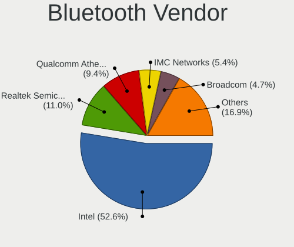

| Vendor                          | Notebooks | Percent |
|---------------------------------|-----------|---------|
| Intel                           | 234       | 52.58%  |
| Realtek Semiconductor           | 49        | 11.01%  |
| Qualcomm Atheros Communications | 42        | 9.44%   |
| IMC Networks                    | 24        | 5.39%   |
| Broadcom                        | 21        | 4.72%   |
| Lite-On Technology              | 17        | 3.82%   |
| Foxconn / Hon Hai               | 16        | 3.6%    |
| Apple                           | 15        | 3.37%   |
| MediaTek                        | 4         | 0.9%    |
| Dell                            | 4         | 0.9%    |
| Cambridge Silicon Radio         | 4         | 0.9%    |
| Toshiba                         | 2         | 0.45%   |
| Realtek                         | 2         | 0.45%   |
| Ralink                          | 2         | 0.45%   |
| Hewlett-Packard                 | 2         | 0.45%   |
| ASUSTek Computer                | 2         | 0.45%   |
| USI                             | 1         | 0.22%   |
| TP-Link                         | 1         | 0.22%   |
| Dynex                           | 1         | 0.22%   |
| Alps Electric                   | 1         | 0.22%   |
| Unknown                         | 1         | 0.22%   |

Bluetooth Model
---------------

Controller models

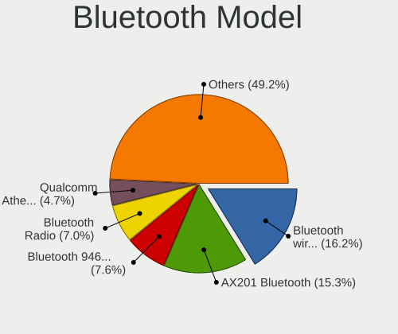

| Model                                               | Notebooks | Percent |
|-----------------------------------------------------|-----------|---------|
| Intel Bluetooth wireless interface                  | 72        | 16.18%  |
| Intel AX201 Bluetooth                               | 68        | 15.28%  |
| Intel Bluetooth 9460/9560 Jefferson Peak (JfP)      | 34        | 7.64%   |
| Realtek Bluetooth Radio                             | 31        | 6.97%   |
| Qualcomm Atheros  Bluetooth Device                  | 21        | 4.72%   |
| Intel Bluetooth Device                              | 20        | 4.49%   |
| Intel AX200 Bluetooth                               | 20        | 4.49%   |
| Realtek  Bluetooth 4.2 Adapter                      | 13        | 2.92%   |
| IMC Networks Wireless_Device                        | 13        | 2.92%   |
| Apple Bluetooth USB Host Controller                 | 7         | 1.57%   |
| Apple Bluetooth Host Controller                     | 7         | 1.57%   |
| Qualcomm Atheros AR3012 Bluetooth 4.0               | 6         | 1.35%   |
| Foxconn / Hon Hai Bluetooth Device                  | 6         | 1.35%   |
| Lite-On Qualcomm Atheros QCA9377 Bluetooth          | 5         | 1.12%   |
| Intel Wireless-AC 3168 Bluetooth                    | 5         | 1.12%   |
| Intel Centrino Bluetooth Wireless Transceiver       | 5         | 1.12%   |
| Intel AX210 Bluetooth                               | 5         | 1.12%   |
| IMC Networks Bluetooth Radio                        | 5         | 1.12%   |
| Qualcomm Atheros AR3011 Bluetooth                   | 4         | 0.9%    |
| MediaTek Wireless_Device                            | 4         | 0.9%    |
| Lite-On Wireless_Device                             | 4         | 0.9%    |
| IMC Networks Bluetooth Device                       | 4         | 0.9%    |
| Foxconn / Hon Hai Wireless_Device                   | 4         | 0.9%    |
| Dell DW375 Bluetooth Module                         | 4         | 0.9%    |
| Cambridge Silicon Radio Bluetooth Dongle (HCI mode) | 4         | 0.9%    |
| Broadcom HP Portable SoftSailing                    | 4         | 0.9%    |
| Realtek RTL8821A Bluetooth                          | 3         | 0.67%   |
| Qualcomm Atheros QCA61x4 Bluetooth 4.0              | 3         | 0.67%   |
| Qualcomm Atheros Bluetooth USB Host Controller      | 3         | 0.67%   |
| Qualcomm Atheros Bluetooth                          | 3         | 0.67%   |
| Intel Wireless-AC 9260 Bluetooth Adapter            | 3         | 0.67%   |
| Broadcom BCM43142A0 Bluetooth Device                | 3         | 0.67%   |
| Broadcom BCM2045B (BDC-2.1)                         | 3         | 0.67%   |
| Realtek Bluetooth Radio                             | 2         | 0.45%   |
| Ralink RT3290 Bluetooth                             | 2         | 0.45%   |
| Qualcomm Atheros AR9462 Bluetooth                   | 2         | 0.45%   |
| Lite-On Broadcom BCM43142A0 Bluetooth Device        | 2         | 0.45%   |
| Lite-On Bluetooth Radio                             | 2         | 0.45%   |
| Lite-On Atheros AR3012 Bluetooth                    | 2         | 0.45%   |
| Intel Centrino Advanced-N 6230 Bluetooth adapter    | 2         | 0.45%   |

Sound
-----

Sound Vendor
------------

Sound card vendors

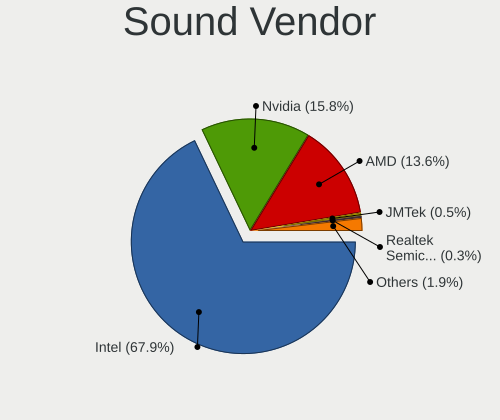

| Vendor                 | Notebooks | Percent |
|------------------------|-----------|---------|
| Intel                  | 438       | 67.91%  |
| Nvidia                 | 102       | 15.81%  |
| AMD                    | 88        | 13.64%  |
| JMTek                  | 3         | 0.47%   |
| Realtek Semiconductor  | 2         | 0.31%   |
| Razer USA              | 2         | 0.31%   |
| GN Netcom              | 2         | 0.31%   |
| Texas Instruments      | 1         | 0.16%   |
| Logitech               | 1         | 0.16%   |
| Lenovo                 | 1         | 0.16%   |
| Guillemot              | 1         | 0.16%   |
| Generalplus Technology | 1         | 0.16%   |
| Conexant Systems       | 1         | 0.16%   |
| Apple                  | 1         | 0.16%   |
| Anker                  | 1         | 0.16%   |

Sound Model
-----------

Sound card models

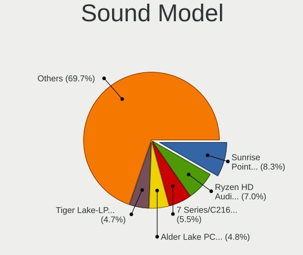

| Model                                                                                             | Notebooks | Percent |
|---------------------------------------------------------------------------------------------------|-----------|---------|
| Intel Sunrise Point-LP HD Audio                                                                   | 64        | 8.32%   |
| AMD Ryzen HD Audio Controller                                                                     | 54        | 7.02%   |
| Intel 7 Series/C216 Chipset Family High Definition Audio Controller                               | 42        | 5.46%   |
| Intel Alder Lake PCH-P High Definition Audio Controller                                           | 37        | 4.81%   |
| Intel Tiger Lake-LP Smart Sound Technology Audio Controller                                       | 36        | 4.68%   |
| Intel 6 Series/C200 Series Chipset Family High Definition Audio Controller                        | 36        | 4.68%   |
| AMD Renoir/Cezanne HDMI/DP Audio Controller                                                       | 32        | 4.16%   |
| Intel Cannon Point-LP High Definition Audio Controller                                            | 22        | 2.86%   |
| Intel Haswell-ULT HD Audio Controller                                                             | 21        | 2.73%   |
| Intel Comet Lake PCH cAVS                                                                         | 21        | 2.73%   |
| Intel 8 Series HD Audio Controller                                                                | 21        | 2.73%   |
| Intel Wildcat Point-LP High Definition Audio Controller                                           | 19        | 2.47%   |
| Intel Broadwell-U Audio Controller                                                                | 19        | 2.47%   |
| Intel Cannon Lake PCH cAVS                                                                        | 17        | 2.21%   |
| Nvidia TU107 GeForce GTX 1650 High Definition Audio Controller                                    | 14        | 1.82%   |
| Intel Comet Lake PCH-LP cAVS                                                                      | 14        | 1.82%   |
| AMD Raven/Raven2/Fenghuang HDMI/DP Audio Controller                                               | 14        | 1.82%   |
| Nvidia GA107 High Definition Audio Controller                                                     | 13        | 1.69%   |
| Nvidia GA106 High Definition Audio Controller                                                     | 13        | 1.69%   |
| Intel Celeron/Pentium Silver Processor High Definition Audio                                      | 13        | 1.69%   |
| AMD FCH Azalia Controller                                                                         | 13        | 1.69%   |
| Intel Tiger Lake-H HD Audio Controller                                                            | 12        | 1.56%   |
| Intel Ice Lake-LP Smart Sound Technology Audio Controller                                         | 11        | 1.43%   |
| Nvidia TU106 High Definition Audio Controller                                                     | 10        | 1.3%    |
| Intel 82801I (ICH9 Family) HD Audio Controller                                                    | 10        | 1.3%    |
| AMD Kabini HDMI/DP Audio                                                                          | 9         | 1.17%   |
| AMD Family 15h (Models 60h-6fh) Audio Controller                                                  | 9         | 1.17%   |
| Intel Raptor Lake-P/U/H cAVS                                                                      | 8         | 1.04%   |
| Intel 8 Series/C220 Series Chipset High Definition Audio Controller                               | 8         | 1.04%   |
| Intel 5 Series/3400 Series Chipset High Definition Audio                                          | 8         | 1.04%   |
| Nvidia AD107 High Definition Audio Controller                                                     | 7         | 0.91%   |
| Intel Xeon E3-1200 v3/4th Gen Core Processor HD Audio Controller                                  | 7         | 0.91%   |
| AMD Radeon High Definition Audio Controller                                                       | 7         | 0.91%   |
| AMD High Definition Audio Controller                                                              | 7         | 0.91%   |
| Intel Atom/Celeron/Pentium Processor x5-E8000/J3xxx/N3xxx Series High Definition Audio Controller | 6         | 0.78%   |
| Nvidia GP107GL High Definition Audio Controller                                                   | 5         | 0.65%   |
| Nvidia GF108 High Definition Audio Controller                                                     | 5         | 0.65%   |
| Nvidia GA104 High Definition Audio Controller                                                     | 5         | 0.65%   |
| Intel CM238 HD Audio Controller                                                                   | 5         | 0.65%   |
| Intel Atom Processor Z36xxx/Z37xxx Series High Definition Audio Controller                        | 5         | 0.65%   |

Memory
------

Memory Vendor
-------------

Memory module vendors

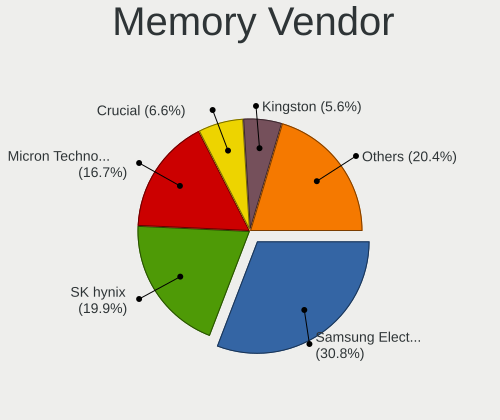

| Vendor              | Notebooks | Percent |
|---------------------|-----------|---------|
| Samsung Electronics | 127       | 30.83%  |
| SK hynix            | 82        | 19.9%   |
| Micron Technology   | 69        | 16.75%  |
| Crucial             | 27        | 6.55%   |
| Kingston            | 23        | 5.58%   |
| Unknown             | 11        | 2.67%   |
| Ramaxel Technology  | 11        | 2.67%   |
| Elpida              | 11        | 2.67%   |
| A-DATA Technology   | 10        | 2.43%   |
| Unknown (ABCD)      | 7         | 1.7%    |
| Nanya Technology    | 5         | 1.21%   |
| Team                | 4         | 0.97%   |
| PNY                 | 4         | 0.97%   |
| Corsair             | 4         | 0.97%   |
| Smart               | 3         | 0.73%   |
| Transcend           | 2         | 0.49%   |
| G.Skill             | 2         | 0.49%   |
| Unknown             | 2         | 0.49%   |
| Unknown (0x0080)    | 1         | 0.24%   |
| Timetec             | 1         | 0.24%   |
| Teikon              | 1         | 0.24%   |
| Saikano             | 1         | 0.24%   |
| Lexar Co Limited    | 1         | 0.24%   |
| fef5                | 1         | 0.24%   |
| ChangXin Memory     | 1         | 0.24%   |
| Avant               | 1         | 0.24%   |

Memory Model
------------

Memory module models

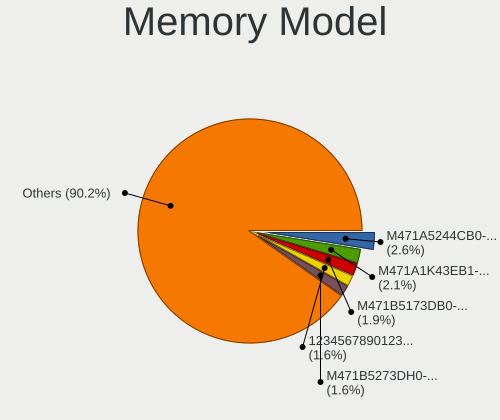

| Model                                                            | Notebooks | Percent |
|------------------------------------------------------------------|-----------|---------|
| Samsung RAM M471A5244CB0-CWE 4GB SODIMM DDR4 3200MT/s            | 11        | 2.56%   |
| Samsung RAM M471A1K43EB1-CWE 8GB SODIMM DDR4 3200MT/s            | 9         | 2.09%   |
| Samsung RAM M471B5173DB0-YK0 4GB SODIMM DDR3 1600MT/s            | 8         | 1.86%   |
| Unknown (ABCD) RAM 123456789012345678 2GB SODIMM LPDDR4 2400MT/s | 7         | 1.63%   |
| Samsung RAM M471B5273DH0-CH9 4GB SODIMM DDR3 1600MT/s            | 7         | 1.63%   |
| Samsung RAM M471A1K43CB1-CTD 8GB SODIMM DDR4 3200MT/s            | 5         | 1.16%   |
| Micron RAM 4ATF1G64HZ-3G2E1 8GB SODIMM DDR4 3200MT/s             | 5         | 1.16%   |
| SK hynix RAM HMT351S6CFR8C-PB 4GB SODIMM DDR3 1600MT/s           | 4         | 0.93%   |
| SK hynix RAM HMAA1GS6CJR6N-XN 8GB SODIMM DDR4 3200MT/s           | 4         | 0.93%   |
| Samsung RAM M471A1K43DB1-CWE 8GB SODIMM DDR4 3200MT/s            | 4         | 0.93%   |
| Samsung RAM M471A1K43DB1-CTD 8GB SODIMM DDR4 2667MT/s            | 4         | 0.93%   |
| Micron RAM 8ATF1G64HZ-2G6E1 8GB SODIMM DDR4 2667MT/s             | 4         | 0.93%   |
| Crucial RAM CT102464BF160B.C16 8GB SODIMM DDR3 1600MT/s          | 4         | 0.93%   |
| SK hynix RAM HMT451S6BFR8A-PB 4GB SODIMM DDR3 1600MT/s           | 3         | 0.7%    |
| SK hynix RAM HMA851S6DJR6N-XN 4GB SODIMM DDR4 3200MT/s           | 3         | 0.7%    |
| SK hynix RAM HMA851S6AFR6N-UH 4GB SODIMM DDR4 2667MT/s           | 3         | 0.7%    |
| SK hynix RAM HMA81GS6DJR8N-XN 8GB SODIMM DDR4 3200MT/s           | 3         | 0.7%    |
| SK hynix RAM HMA81GS6CJR8N-VK 8GB SODIMM DDR4 2667MT/s           | 3         | 0.7%    |
| Samsung RAM M471B1G73DB0-YK0 8GB SODIMM DDR3 1600MT/s            | 3         | 0.7%    |
| Samsung RAM M471A5244CB0-CTD 4GB SODIMM DDR4 3266MT/s            | 3         | 0.7%    |
| Samsung RAM M471A1K43CB1-CRC 8GB SODIMM DDR4 8400MT/s            | 3         | 0.7%    |
| Samsung RAM M471A1G44AB0-CWE 8GiB SODIMM DDR4 3200MT/s           | 3         | 0.7%    |
| Samsung RAM M425R1GB4BB0-CWMOD 8GB SODIMM DDR5 5600MT/s          | 3         | 0.7%    |
| Micron RAM 8ATF1G64HZ-3G2J1 8GB SODIMM DDR4 3200MT/s             | 3         | 0.7%    |
| Micron RAM 4ATF51264HZ-2G6E1 4GB SODIMM DDR4 2667MT/s            | 3         | 0.7%    |
| Micron RAM 16KTF51264HZ-1G6M1 4GB SODIMM DDR3 1600MT/s           | 3         | 0.7%    |
| Crucial RAM CT8G4SFRA32A.M4FE 8GB SODIMM DDR4 3200MT/s           | 3         | 0.7%    |
| Unknown RAM Module 8GB SODIMM DDR3 1600MT/s                      | 2         | 0.47%   |
| Transcend RAM JM1333KSN-4G 4GB SODIMM DDR3 1334MT/s              | 2         | 0.47%   |
| Team RAM TEAMGROUP-SD4-3200 16GB SODIMM DDR4 3200MT/s            | 2         | 0.47%   |
| Smart RAM SH564128FJ8NWRNSQG 4GB SODIMM DDR3 1600MT/s            | 2         | 0.47%   |
| SK hynix RAM Module 8GB Row Of Chips LPDDR3 2133MT/s             | 2         | 0.47%   |
| SK hynix RAM Module 4GB SODIMM DDR3 1600MT/s                     | 2         | 0.47%   |
| SK hynix RAM HMT451S6AFR8A-PB 4GB SODIMM DDR3 1600MT/s           | 2         | 0.47%   |
| SK hynix RAM HMT41GS6BFR8A-PB 8GB SODIMM DDR3 1600MT/s           | 2         | 0.47%   |
| SK hynix RAM HMT41GS6AFR8A-PB 8GiB SODIMM DDR3 2667MT/s          | 2         | 0.47%   |
| SK hynix RAM HMT41GS6AFR8A-PB 8GB SODIMM DDR3 1600MT/s           | 2         | 0.47%   |
| SK hynix RAM HMT325S6CFR8C-PB 2GB SODIMM DDR3 1600MT/s           | 2         | 0.47%   |
| SK hynix RAM HMA851S6JJR6N-VK 4GB SODIMM DDR4 2667MT/s           | 2         | 0.47%   |
| SK hynix RAM HMA81GS6AFR8N-UH 8GB SODIMM DDR4 2667MT/s           | 2         | 0.47%   |

Memory Kind
-----------

Memory module kinds

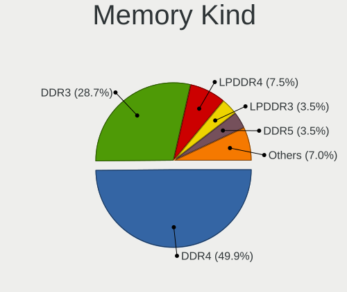

| Kind    | Notebooks | Percent |
|---------|-----------|---------|
| DDR4    | 172       | 49.86%  |
| DDR3    | 99        | 28.7%   |
| LPDDR4  | 26        | 7.54%   |
| LPDDR3  | 12        | 3.48%   |
| DDR5    | 12        | 3.48%   |
| LPDDR5  | 11        | 3.19%   |
| DDR2    | 5         | 1.45%   |
| Unknown | 5         | 1.45%   |
| SDRAM   | 2         | 0.58%   |
| DDR     | 1         | 0.29%   |

Memory Form Factor
------------------

Physical design of the memory module

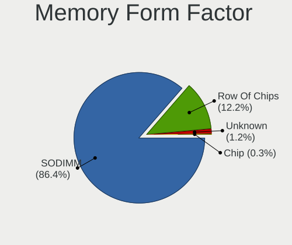

| Name         | Notebooks | Percent |
|--------------|-----------|---------|
| SODIMM       | 298       | 86.38%  |
| Row Of Chips | 42        | 12.17%  |
| Unknown      | 4         | 1.16%   |
| Chip         | 1         | 0.29%   |

Memory Size
-----------

Memory module size

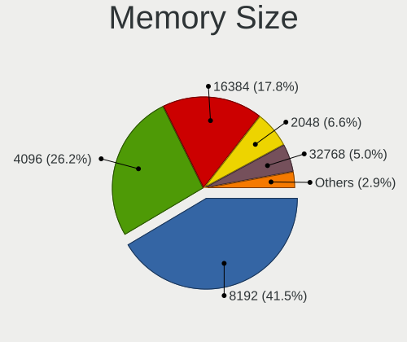

| Size  | Notebooks | Percent |
|-------|-----------|---------|
| 8192  | 158       | 41.47%  |
| 4096  | 100       | 26.25%  |
| 16384 | 68        | 17.85%  |
| 2048  | 25        | 6.56%   |
| 32768 | 19        | 4.99%   |
| 1024  | 11        | 2.89%   |

Memory Speed
------------

Memory module speed

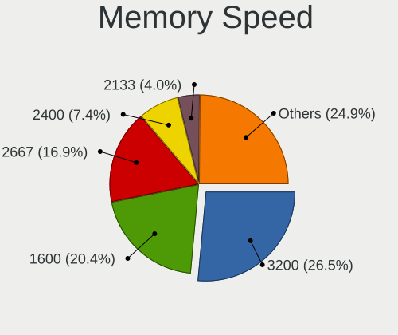

| Speed   | Notebooks | Percent |
|---------|-----------|---------|
| 3200    | 100       | 26.46%  |
| 1600    | 77        | 20.37%  |
| 2667    | 64        | 16.93%  |
| 2400    | 28        | 7.41%   |
| 2133    | 15        | 3.97%   |
| 1334    | 15        | 3.97%   |
| 4800    | 11        | 2.91%   |
| 6400    | 10        | 2.65%   |
| 4267    | 8         | 2.12%   |
| 1333    | 8         | 2.12%   |
| 1867    | 6         | 1.59%   |
| 5600    | 5         | 1.32%   |
| 8400    | 4         | 1.06%   |
| 1067    | 4         | 1.06%   |
| 1066    | 4         | 1.06%   |
| 3266    | 3         | 0.79%   |
| 667     | 3         | 0.79%   |
| 4266    | 2         | 0.53%   |
| 3733    | 2         | 0.53%   |
| Unknown | 2         | 0.53%   |
| 7500    | 1         | 0.26%   |
| 2048    | 1         | 0.26%   |
| 1866    | 1         | 0.26%   |
| 1639    | 1         | 0.26%   |
| 975     | 1         | 0.26%   |
| 800     | 1         | 0.26%   |
| 533     | 1         | 0.26%   |

Printers & scanners
-------------------

Printer Vendor
--------------

Printer device vendors

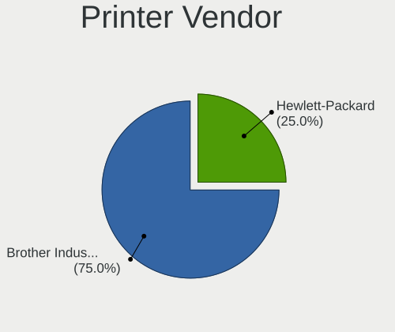

| Vendor             | Notebooks | Percent |
|--------------------|-----------|---------|
| Brother Industries | 3         | 75%     |
| Hewlett-Packard    | 1         | 25%     |

Printer Model
-------------

Printer device models

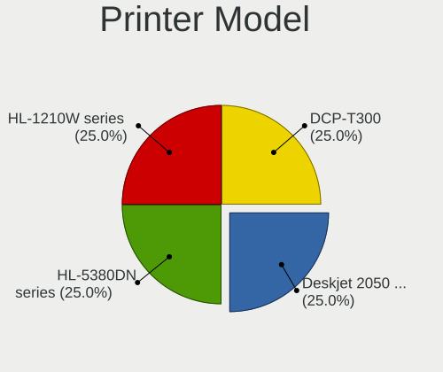

| Model                    | Notebooks | Percent |
|--------------------------|-----------|---------|
| HP Deskjet 2050 J510     | 1         | 25%     |
| Brother HL-5380DN series | 1         | 25%     |
| Brother HL-1210W series  | 1         | 25%     |
| Brother DCP-T300         | 1         | 25%     |

Scanner Vendor
--------------

Scanner device vendors

| Vendor | Notebooks | Percent |
|--------|-----------|---------|
| Canon  | 1         | 100%    |

Scanner Model
-------------

Scanner device models

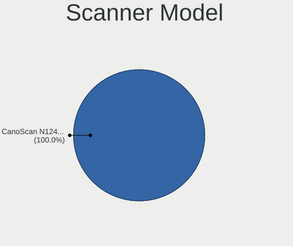

| Model                         | Notebooks | Percent |
|-------------------------------|-----------|---------|
| Canon CanoScan N1240U/LiDE 30 | 1         | 100%    |

Camera
------

Camera Vendor
-------------

Camera device vendors

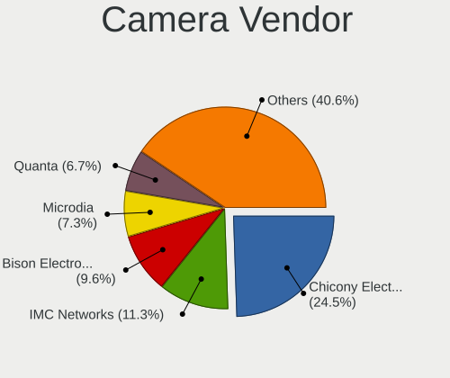

| Vendor                                 | Notebooks | Percent |
|----------------------------------------|-----------|---------|
| Chicony Electronics                    | 117       | 24.48%  |
| IMC Networks                           | 54        | 11.3%   |
| Bison Electronics                      | 46        | 9.62%   |
| Microdia                               | 35        | 7.32%   |
| Quanta                                 | 32        | 6.69%   |
| Realtek Semiconductor                  | 28        | 5.86%   |
| Sunplus Innovation Technology          | 25        | 5.23%   |
| Luxvisions Innotech Limited            | 18        | 3.77%   |
| Syntek                                 | 15        | 3.14%   |
| Cheng Uei Precision Industry (Foxlink) | 14        | 2.93%   |
| Apple                                  | 14        | 2.93%   |
| Lite-On Technology                     | 11        | 2.3%    |
| Suyin                                  | 8         | 1.67%   |
| Silicon Motion                         | 8         | 1.67%   |
| Sonix Technology                       | 7         | 1.46%   |
| Samsung Electronics                    | 7         | 1.46%   |
| Ricoh                                  | 6         | 1.26%   |
| ShineTech                              | 4         | 0.84%   |
| icSpring                               | 4         | 0.84%   |
| Alcor Micro                            | 4         | 0.84%   |
| Logitech                               | 3         | 0.63%   |
| SunplusIT                              | 2         | 0.42%   |
| Primax Electronics                     | 2         | 0.42%   |
| Importek                               | 2         | 0.42%   |
| Acer                                   | 2         | 0.42%   |
| USB Camera CS                          | 1         | 0.21%   |
| Tobii Technology AB                    | 1         | 0.21%   |
| Motorola PCS                           | 1         | 0.21%   |
| LG Electronics                         | 1         | 0.21%   |
| Lenovo                                 | 1         | 0.21%   |
| Jiangxi Shinetech Optical              | 1         | 0.21%   |
| Goertek Electronics                    | 1         | 0.21%   |
| Genesys Logic                          | 1         | 0.21%   |
| AVerMedia Technologies                 | 1         | 0.21%   |
| ALi                                    | 1         | 0.21%   |

Camera Model
------------

Camera device models

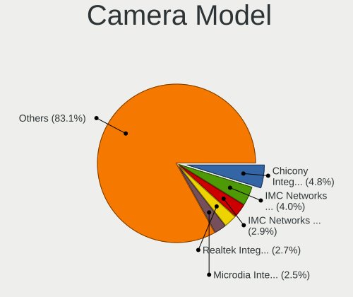

| Model                                                | Notebooks | Percent |
|------------------------------------------------------|-----------|---------|
| Chicony Integrated Camera                            | 23        | 4.8%    |
| IMC Networks USB2.0 HD UVC WebCam                    | 19        | 3.97%   |
| IMC Networks Integrated Camera                       | 14        | 2.92%   |
| Realtek Integrated_Webcam_HD                         | 13        | 2.71%   |
| Microdia Integrated_Webcam_HD                        | 12        | 2.51%   |
| Bison HD Webcam                                      | 12        | 2.51%   |
| Syntek Integrated Camera                             | 9         | 1.88%   |
| Quanta HD User Facing                                | 9         | 1.88%   |
| Luxvisions Innotech Limited HP TrueVision HD Camera  | 8         | 1.67%   |
| Chicony HD WebCam                                    | 8         | 1.67%   |
| Chicony HD User Facing                               | 8         | 1.67%   |
| Bison Integrated Camera                              | 8         | 1.67%   |
| Samsung Galaxy series, misc. (MTP mode)              | 7         | 1.46%   |
| Chicony HP HD Camera                                 | 7         | 1.46%   |
| Sunplus Integrated_Webcam_HD                         | 6         | 1.25%   |
| Quanta HD Webcam                                     | 6         | 1.25%   |
| Chicony HP Truevision HD                             | 6         | 1.25%   |
| Bison SunplusIT Integrated Camera                    | 6         | 1.25%   |
| Apple iPhone 5/5C/5S/6/SE/7/8/X                      | 6         | 1.25%   |
| Realtek Integrated Webcam HD                         | 5         | 1.04%   |
| Quanta HP TrueVision HD Camera                       | 5         | 1.04%   |
| Syntek Lenovo EasyCamera                             | 4         | 0.84%   |
| Sonix USB2.0 HD UVC WebCam                           | 4         | 0.84%   |
| ShineTech USB2.0 HD UVC WebCam                       | 4         | 0.84%   |
| Quanta HP HD Camera                                  | 4         | 0.84%   |
| Luxvisions Innotech Limited HP Wide Vision HD Camera | 4         | 0.84%   |
| Lite-On Integrated Camera                            | 4         | 0.84%   |
| IMC Networks USB2.0 VGA UVC WebCam                   | 4         | 0.84%   |
| icSpring camera                                      | 4         | 0.84%   |
| Chicony USB2.0 HD UVC WebCam                         | 4         | 0.84%   |
| Chicony Integrated Camera (1280x720@30)              | 4         | 0.84%   |
| Chicony Chicony USB2.0 Camera                        | 4         | 0.84%   |
| Bison EasyCamera                                     | 4         | 0.84%   |
| Apple FaceTime HD Camera                             | 4         | 0.84%   |
| Sunplus ASUS Webcam                                  | 3         | 0.63%   |
| Sonix USB2.0 FHD UVC WebCam                          | 3         | 0.63%   |
| Silicon Motion Web Camera                            | 3         | 0.63%   |
| Microdia Webcam Vitade AF                            | 3         | 0.63%   |
| Microdia Laptop_Integrated_Webcam_HD                 | 3         | 0.63%   |
| Microdia Integrated_Webcam_FHD                       | 3         | 0.63%   |

Security
--------

Fingerprint Vendor
------------------

Fingerprint sensor vendors

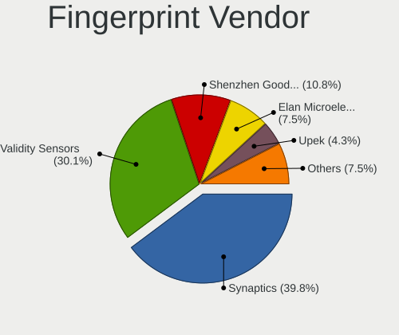

| Vendor                     | Notebooks | Percent |
|----------------------------|-----------|---------|
| Synaptics                  | 37        | 39.78%  |
| Validity Sensors           | 28        | 30.11%  |
| Shenzhen Goodix Technology | 10        | 10.75%  |
| Elan Microelectronics      | 7         | 7.53%   |
| Upek                       | 4         | 4.3%    |
| AuthenTec                  | 3         | 3.23%   |
| LighTuning Technology      | 2         | 2.15%   |
| Samsung Electronics        | 1         | 1.08%   |
| HOLTEK                     | 1         | 1.08%   |

Fingerprint Model
-----------------

Fingerprint sensor models

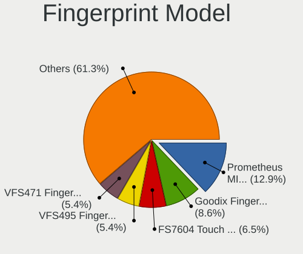

| Model                                                                      | Notebooks | Percent |
|----------------------------------------------------------------------------|-----------|---------|
| Synaptics Prometheus MIS Touch Fingerprint Reader                          | 12        | 12.9%   |
| Shenzhen Goodix  Fingerprint Device                                        | 8         | 8.6%    |
| Synaptics FS7604 Touch Fingerprint Sensor with PurePrint                   | 6         | 6.45%   |
| Validity Sensors VFS495 Fingerprint Reader                                 | 5         | 5.38%   |
| Validity Sensors VFS471 Fingerprint Reader                                 | 5         | 5.38%   |
| Synaptics Fingerprint reader [HP G6]                                       | 5         | 5.38%   |
| Elan ELAN:Fingerprint                                                      | 5         | 5.38%   |
| Validity Sensors VFS 5011 fingerprint sensor                               | 4         | 4.3%    |
| Upek Biometric Touchchip/Touchstrip Fingerprint Sensor                     | 4         | 4.3%    |
| Synaptics UWP WBDI Device                                                  | 4         | 4.3%    |
| Validity Sensors VFS5011 Fingerprint Reader                                | 3         | 3.23%   |
| Validity Sensors VFS491                                                    | 3         | 3.23%   |
| Validity Sensors Fingerprint scanner                                       | 3         | 3.23%   |
| Synaptics Metallica MIS Touch Fingerprint Reader                           | 3         | 3.23%   |
| Validity Sensors Synaptics WBDI                                            | 2         | 2.15%   |
| Synaptics  FS7604 Touch Fingerprint Sensor with PurePrint                  | 2         | 2.15%   |
| Elan ELAN:ARM-M4                                                           | 2         | 2.15%   |
| AuthenTec Fingerprint Sensor                                               | 2         | 2.15%   |
| Validity Sensors VFS101 Fingerprint Reader                                 | 1         | 1.08%   |
| Validity Sensors VFS Fingerprint sensor                                    | 1         | 1.08%   |
| Validity Sensors Synaptics VFS7552 Touch Fingerprint Sensor with PurePrint | 1         | 1.08%   |
| Synaptics WBDI Fingerprint Reader USB 086                                  | 1         | 1.08%   |
| Synaptics WBDI                                                             | 1         | 1.08%   |
| Synaptics  WBDI                                                            | 1         | 1.08%   |
| Synaptics Prometheus Fingerprint Reader                                    | 1         | 1.08%   |
| Synaptics Metallica MOH Touch Fingerprint Reader                           | 1         | 1.08%   |
| Shenzhen Goodix Fingerprint Reader                                         | 1         | 1.08%   |
| Shenzhen Goodix FingerPrint                                                | 1         | 1.08%   |
| Samsung Fingerprint Device                                                 | 1         | 1.08%   |
| LighTuning ES603 Swipe Fingerprint Sensor                                  | 1         | 1.08%   |
| LighTuning EgisTec Touch Fingerprint Sensor                                | 1         | 1.08%   |
| HOLTEK FocalTech Fingerprint Device                                        | 1         | 1.08%   |
| AuthenTec AES1660 Fingerprint Sensor                                       | 1         | 1.08%   |

Chipcard Vendor
---------------

Chipcard module vendors

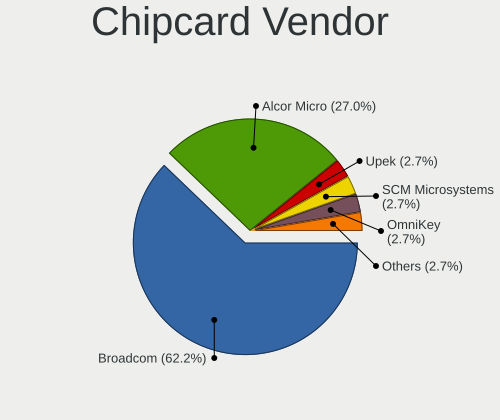

| Vendor           | Notebooks | Percent |
|------------------|-----------|---------|
| Broadcom         | 23        | 62.16%  |
| Alcor Micro      | 10        | 27.03%  |
| Upek             | 1         | 2.7%    |
| SCM Microsystems | 1         | 2.7%    |
| OmniKey          | 1         | 2.7%    |
| O2 Micro         | 1         | 2.7%    |

Chipcard Model
--------------

Chipcard module models

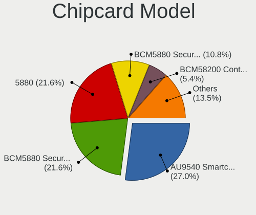

| Model                                                                        | Notebooks | Percent |
|------------------------------------------------------------------------------|-----------|---------|
| Alcor Micro AU9540 Smartcard Reader                                          | 10        | 27.03%  |
| Broadcom BCM5880 Secure Applications Processor                               | 8         | 21.62%  |
| Broadcom 5880                                                                | 8         | 21.62%  |
| Broadcom BCM5880 Secure Applications Processor with fingerprint swipe sensor | 4         | 10.81%  |
| Broadcom BCM58200 ControlVault 3 (FingerPrint sensor + Contacted SmartCard)  | 2         | 5.41%   |
| Upek TouchChip Fingerprint Coprocessor (WBF advanced mode)                   | 1         | 2.7%    |
| SCM Microsystems SCR35xx Smart Card Reader                                   | 1         | 2.7%    |
| OmniKey CardMan Smart@Link                                                   | 1         | 2.7%    |
| O2 Micro OZ776 CCID Smartcard Reader                                         | 1         | 2.7%    |
| Broadcom 58200                                                               | 1         | 2.7%    |

Unsupported
-----------

Unsupported Devices
-------------------

Total unsupported devices on board

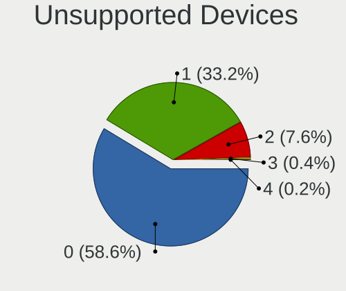

| Total | Notebooks | Percent |
|-------|-----------|---------|
| 0     | 316       | 58.63%  |
| 1     | 179       | 33.21%  |
| 2     | 41        | 7.61%   |
| 3     | 2         | 0.37%   |
| 4     | 1         | 0.19%   |

Unsupported Device Types
------------------------

Types of unsupported devices

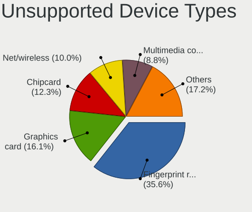

| Type                  | Notebooks | Percent |
|-----------------------|-----------|---------|
| Fingerprint reader    | 93        | 35.63%  |
| Graphics card         | 42        | 16.09%  |
| Chipcard              | 32        | 12.26%  |
| Net/wireless          | 26        | 9.96%   |
| Multimedia controller | 23        | 8.81%   |
| Net/ethernet          | 13        | 4.98%   |
| Camera                | 12        | 4.6%    |
| Storage               | 7         | 2.68%   |
| Bluetooth             | 5         | 1.92%   |
| Network               | 4         | 1.53%   |
| Sound                 | 2         | 0.77%   |
| Modem                 | 1         | 0.38%   |
| Card reader           | 1         | 0.38%   |

