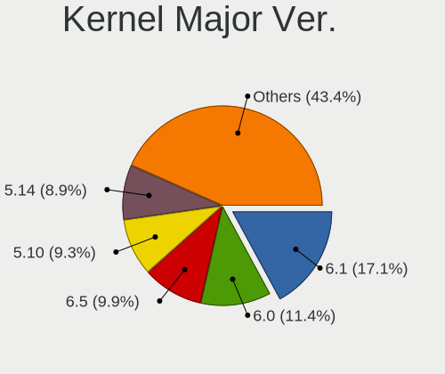
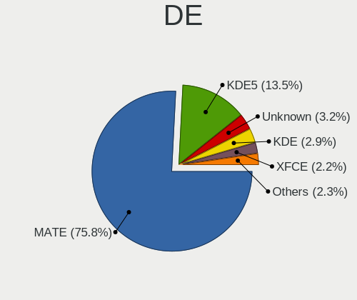
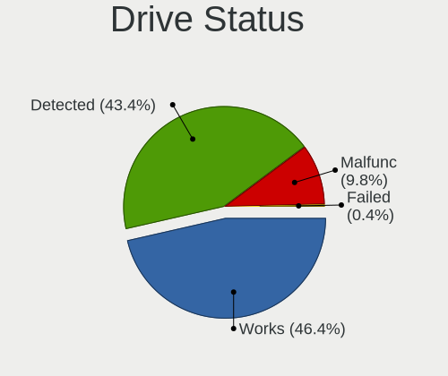
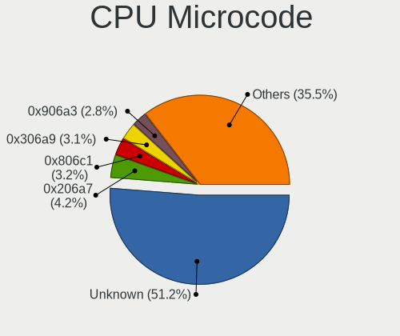
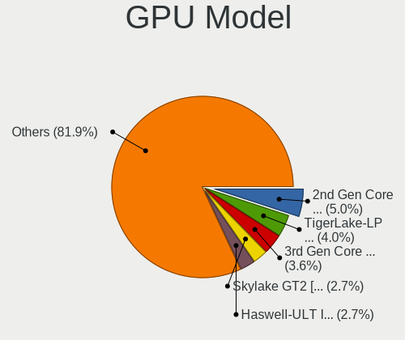
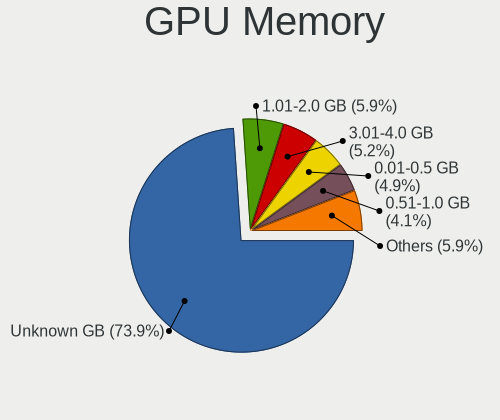
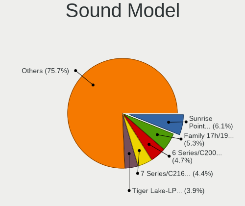
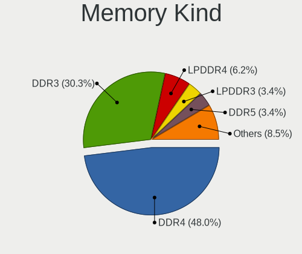

Parrot - Tested Hardware & Statistics
-------------------------------------

A project to collect tested hardware configurations for Parrot.

Anyone can contribute to this report by the [hw-probe](https://github.com/linuxhw/hw-probe) tool:

    sudo -E hw-probe -all -upload

Please contribute! Especially if your hardware is rare.

This is a report for all computer types. See also reports for [desktops](/Dist/Parrot/Desktop/README.md) and [notebooks](/Dist/Parrot/Notebook/README.md).

Contents
--------

* [ Test Cases ](#test-cases)

* [ System ](#system)
  - [ OS                       ](#os)
  - [ OS Family                ](#os-family)
  - [ Kernel                   ](#kernel)
  - [ Kernel Family            ](#kernel-family)
  - [ Kernel Major Ver.        ](#kernel-major-ver)
  - [ Arch                     ](#arch)
  - [ DE                       ](#de)
  - [ Display Server           ](#display-server)
  - [ Display Manager          ](#display-manager)
  - [ OS Lang                  ](#os-lang)
  - [ Boot Mode                ](#boot-mode)
  - [ Filesystem               ](#filesystem)
  - [ Part. scheme             ](#part-scheme)
  - [ Dual Boot with Linux/BSD ](#dual-boot-with-linuxbsd)
  - [ Dual Boot (Win)          ](#dual-boot-win)

* [ Board ](#board)
  - [ Vendor                   ](#vendor)
  - [ Model                    ](#model)
  - [ Model Family             ](#model-family)
  - [ MFG Year                 ](#mfg-year)
  - [ Form Factor              ](#form-factor)
  - [ Secure Boot              ](#secure-boot)
  - [ Coreboot                 ](#coreboot)
  - [ RAM Size                 ](#ram-size)
  - [ RAM Used                 ](#ram-used)
  - [ Total Drives             ](#total-drives)
  - [ Has CD-ROM               ](#has-cd-rom)
  - [ Has Ethernet             ](#has-ethernet)
  - [ Has WiFi                 ](#has-wifi)
  - [ Has Bluetooth            ](#has-bluetooth)

* [ Location ](#location)
  - [ Country                  ](#country)
  - [ City                     ](#city)

* [ Drives ](#drives)
  - [ Drive Vendor             ](#drive-vendor)
  - [ Drive Model              ](#drive-model)
  - [ HDD Vendor               ](#hdd-vendor)
  - [ SSD Vendor               ](#ssd-vendor)
  - [ Drive Kind               ](#drive-kind)
  - [ Drive Connector          ](#drive-connector)
  - [ Drive Size               ](#drive-size)
  - [ Space Total              ](#space-total)
  - [ Space Used               ](#space-used)
  - [ Malfunc. Drives          ](#malfunc-drives)
  - [ Malfunc. Drive Vendor    ](#malfunc-drive-vendor)
  - [ Malfunc. HDD Vendor      ](#malfunc-hdd-vendor)
  - [ Malfunc. Drive Kind      ](#malfunc-drive-kind)
  - [ Failed Drives            ](#failed-drives)
  - [ Failed Drive Vendor      ](#failed-drive-vendor)
  - [ Drive Status             ](#drive-status)

* [ Storage controller ](#storage-controller)
  - [ Storage Vendor           ](#storage-vendor)
  - [ Storage Model            ](#storage-model)
  - [ Storage Kind             ](#storage-kind)

* [ Processor ](#processor)
  - [ CPU Vendor               ](#cpu-vendor)
  - [ CPU Model                ](#cpu-model)
  - [ CPU Model Family         ](#cpu-model-family)
  - [ CPU Cores                ](#cpu-cores)
  - [ CPU Sockets              ](#cpu-sockets)
  - [ CPU Threads              ](#cpu-threads)
  - [ CPU Op-Modes             ](#cpu-op-modes)
  - [ CPU Microcode            ](#cpu-microcode)
  - [ CPU Microarch            ](#cpu-microarch)

* [ Graphics ](#graphics)
  - [ GPU Vendor               ](#gpu-vendor)
  - [ GPU Model                ](#gpu-model)
  - [ GPU Combo                ](#gpu-combo)
  - [ GPU Driver               ](#gpu-driver)
  - [ GPU Memory               ](#gpu-memory)

* [ Monitor ](#monitor)
  - [ Monitor Vendor           ](#monitor-vendor)
  - [ Monitor Model            ](#monitor-model)
  - [ Monitor Resolution       ](#monitor-resolution)
  - [ Monitor Diagonal         ](#monitor-diagonal)
  - [ Monitor Width            ](#monitor-width)
  - [ Aspect Ratio             ](#aspect-ratio)
  - [ Monitor Area             ](#monitor-area)
  - [ Pixel Density            ](#pixel-density)
  - [ Multiple Monitors        ](#multiple-monitors)

* [ Network ](#network)
  - [ Net Controller Vendor    ](#net-controller-vendor)
  - [ Net Controller Model     ](#net-controller-model)
  - [ Wireless Vendor          ](#wireless-vendor)
  - [ Wireless Model           ](#wireless-model)
  - [ Ethernet Vendor          ](#ethernet-vendor)
  - [ Ethernet Model           ](#ethernet-model)
  - [ Net Controller Kind      ](#net-controller-kind)
  - [ Used Controller          ](#used-controller)
  - [ NICs                     ](#nics)
  - [ IPv6                     ](#ipv6)

* [ Bluetooth ](#bluetooth)
  - [ Bluetooth Vendor         ](#bluetooth-vendor)
  - [ Bluetooth Model          ](#bluetooth-model)

* [ Sound ](#sound)
  - [ Sound Vendor             ](#sound-vendor)
  - [ Sound Model              ](#sound-model)

* [ Memory ](#memory)
  - [ Memory Vendor            ](#memory-vendor)
  - [ Memory Model             ](#memory-model)
  - [ Memory Kind              ](#memory-kind)
  - [ Memory Form Factor       ](#memory-form-factor)
  - [ Memory Size              ](#memory-size)
  - [ Memory Speed             ](#memory-speed)

* [ Printers & scanners ](#printers--scanners)
  - [ Printer Vendor           ](#printer-vendor)
  - [ Printer Model            ](#printer-model)
  - [ Scanner Vendor           ](#scanner-vendor)
  - [ Scanner Model            ](#scanner-model)

* [ Camera ](#camera)
  - [ Camera Vendor            ](#camera-vendor)
  - [ Camera Model             ](#camera-model)

* [ Security ](#security)
  - [ Fingerprint Vendor       ](#fingerprint-vendor)
  - [ Fingerprint Model        ](#fingerprint-model)
  - [ Chipcard Vendor          ](#chipcard-vendor)
  - [ Chipcard Model           ](#chipcard-model)

* [ Unsupported ](#unsupported)
  - [ Unsupported Devices      ](#unsupported-devices)
  - [ Unsupported Device Types ](#unsupported-device-types)

Test Cases
----------

Total: 388

| Vendor        | Model                       | Form-Factor | Probe                                                      | Date         |
|---------------|-----------------------------|-------------|------------------------------------------------------------|--------------|
| Lenovo        | V330-15IKB 81AX             | Notebook    | [60a636868c](https://linux-hardware.org/?probe=60a636868c) | Apr 30, 2022 |
| SLIMBOOK      | ONE-AMD-M4                  | Desktop     | [99911022e9](https://linux-hardware.org/?probe=99911022e9) | Apr 26, 2022 |
| ASUSTek       | ROG Strix G733ZX_G733ZX     | Notebook    | [032acaf88c](https://linux-hardware.org/?probe=032acaf88c) | Apr 25, 2022 |
| HUAWEI        | HVY-WXX9                    | Notebook    | [56d949b3bb](https://linux-hardware.org/?probe=56d949b3bb) | Apr 23, 2022 |
| HP            | EliteBook 8470p             | Notebook    | [0ee15f97fd](https://linux-hardware.org/?probe=0ee15f97fd) | Apr 23, 2022 |
| Dell          | Inspiron 15 5510            | Notebook    | [73a8933099](https://linux-hardware.org/?probe=73a8933099) | Apr 22, 2022 |
| Lenovo        | IdeaPad L340-17API 81LY     | Notebook    | [4d911b0d94](https://linux-hardware.org/?probe=4d911b0d94) | Apr 22, 2022 |
| Lenovo        | IdeaPad L340-17API 81LY     | Notebook    | [aa854e0ae2](https://linux-hardware.org/?probe=aa854e0ae2) | Apr 22, 2022 |
| ASUSTek       | PRIME H310M-D R2.0          | Desktop     | [9c06485301](https://linux-hardware.org/?probe=9c06485301) | Apr 21, 2022 |
| HP            | 18E7                        | Desktop     | [1b6db66cc1](https://linux-hardware.org/?probe=1b6db66cc1) | Apr 19, 2022 |
| ASUSTek       | B85M-E                      | Desktop     | [b68f986aaf](https://linux-hardware.org/?probe=b68f986aaf) | Apr 17, 2022 |
| ASUSTek       | B85M-E                      | Desktop     | [93306ff9ee](https://linux-hardware.org/?probe=93306ff9ee) | Apr 17, 2022 |
| MSI           | Modern 15 A5M               | Notebook    | [7e03ed9f70](https://linux-hardware.org/?probe=7e03ed9f70) | Apr 13, 2022 |
| Apple         | MacBookPro15,1              | Notebook    | [b9187e8521](https://linux-hardware.org/?probe=b9187e8521) | Apr 13, 2022 |
| MSI           | Modern 15 A5M               | Notebook    | [bdccad7bf9](https://linux-hardware.org/?probe=bdccad7bf9) | Apr 12, 2022 |
| HP            | ENVY x360 Convertible 13... | Convertible | [cee28f4953](https://linux-hardware.org/?probe=cee28f4953) | Apr 12, 2022 |
| Razer         | Blade 15 Base Model (Ear... | Notebook    | [0832404b40](https://linux-hardware.org/?probe=0832404b40) | Apr 11, 2022 |
| MSI           | B350 TOMAHAWK               | Desktop     | [b1a322fa38](https://linux-hardware.org/?probe=b1a322fa38) | Apr 11, 2022 |
| HP            | ENVY x360 Convertible 13... | Convertible | [b3afe4ff08](https://linux-hardware.org/?probe=b3afe4ff08) | Apr 11, 2022 |
| ASUSTek       | X540SAA                     | Notebook    | [b670324e44](https://linux-hardware.org/?probe=b670324e44) | Apr 10, 2022 |
| Lenovo        | IdeaPad L340-17API 81LY     | Notebook    | [8cb4405c5f](https://linux-hardware.org/?probe=8cb4405c5f) | Apr 09, 2022 |
| HP            | Pavilion x360 Convertibl... | Convertible | [320ae25dbf](https://linux-hardware.org/?probe=320ae25dbf) | Apr 09, 2022 |
| Toshiba       | Satellite Click 2 L35W-B    | Notebook    | [f992f9305a](https://linux-hardware.org/?probe=f992f9305a) | Apr 07, 2022 |
| MSI           | Modern 15 A5M               | Notebook    | [e422a0e166](https://linux-hardware.org/?probe=e422a0e166) | Apr 05, 2022 |
| MSI           | Modern 15 A5M               | Notebook    | [b96e97fa2b](https://linux-hardware.org/?probe=b96e97fa2b) | Apr 04, 2022 |
| MSI           | Modern 15 A5M               | Notebook    | [401792c28e](https://linux-hardware.org/?probe=401792c28e) | Apr 01, 2022 |
| Alienware     | M14xR1                      | Notebook    | [f3ea3f497c](https://linux-hardware.org/?probe=f3ea3f497c) | Apr 01, 2022 |
| HP            | Notebook                    | Notebook    | [313ca81d16](https://linux-hardware.org/?probe=313ca81d16) | Mar 27, 2022 |
| ECS           | Nettle2                     | Desktop     | [4939d60e6d](https://linux-hardware.org/?probe=4939d60e6d) | Mar 27, 2022 |
| HP            | 18E7                        | Desktop     | [d8d1c3d468](https://linux-hardware.org/?probe=d8d1c3d468) | Mar 26, 2022 |
| ASUSTek       | X540SAA                     | Notebook    | [988b4570ed](https://linux-hardware.org/?probe=988b4570ed) | Mar 24, 2022 |
| Lenovo        | ThinkPad E15 20RD0086UE     | Notebook    | [f26a636b1b](https://linux-hardware.org/?probe=f26a636b1b) | Mar 24, 2022 |
| MSI           | Modern 15 A5M               | Notebook    | [72245fe662](https://linux-hardware.org/?probe=72245fe662) | Mar 22, 2022 |
| Lenovo        | SHARKBAY 31900058 STD       | Desktop     | [85260f6ed1](https://linux-hardware.org/?probe=85260f6ed1) | Mar 20, 2022 |
| Lenovo        | SHARKBAY 31900058 STD       | Desktop     | [e849ec3916](https://linux-hardware.org/?probe=e849ec3916) | Mar 20, 2022 |
| ASUSTek       | B85M-E                      | Desktop     | [b0769dffdd](https://linux-hardware.org/?probe=b0769dffdd) | Mar 19, 2022 |
| ASUSTek       | ROG CROSSHAIR VIII HERO     | Desktop     | [2c1ca9145b](https://linux-hardware.org/?probe=2c1ca9145b) | Mar 18, 2022 |
| ASUSTek       | H170M-E D3                  | Desktop     | [167928d6e9](https://linux-hardware.org/?probe=167928d6e9) | Mar 17, 2022 |
| Wistron       | JIG31B3                     | Desktop     | [a360eaf501](https://linux-hardware.org/?probe=a360eaf501) | Mar 15, 2022 |
| ASUSTek       | H170M-E D3                  | Desktop     | [937c0097ca](https://linux-hardware.org/?probe=937c0097ca) | Mar 14, 2022 |
| Toshiba       | Satellite L775D             | Notebook    | [3d09dbe623](https://linux-hardware.org/?probe=3d09dbe623) | Mar 14, 2022 |
| Positivo      | Q232A                       | Notebook    | [87c79b8f05](https://linux-hardware.org/?probe=87c79b8f05) | Mar 13, 2022 |
| ASUSTek       | F2A85-M                     | Desktop     | [36d17e4fdb](https://linux-hardware.org/?probe=36d17e4fdb) | Mar 13, 2022 |
| ASUSTek       | F2A85-M                     | Desktop     | [453d0816b3](https://linux-hardware.org/?probe=453d0816b3) | Mar 13, 2022 |
| ASRock        | Z87M Extreme4               | Desktop     | [dba57ee1b3](https://linux-hardware.org/?probe=dba57ee1b3) | Mar 12, 2022 |
| ASUSTek       | X75VC                       | Notebook    | [3973070120](https://linux-hardware.org/?probe=3973070120) | Mar 12, 2022 |
| Jumper        | EZbook                      | Notebook    | [c374bd5058](https://linux-hardware.org/?probe=c374bd5058) | Mar 11, 2022 |
| Apple         | MacBookAir3,1               | Notebook    | [320f9e6841](https://linux-hardware.org/?probe=320f9e6841) | Mar 11, 2022 |
| Metabox       | Edge-Pro NS50MU             | Notebook    | [1371afa6ac](https://linux-hardware.org/?probe=1371afa6ac) | Mar 11, 2022 |
| MSI           | G31M3-L V2                  | Desktop     | [4c15ba6fb9](https://linux-hardware.org/?probe=4c15ba6fb9) | Mar 10, 2022 |
| Apple         | MacBookPro11,4              | Notebook    | [b27d8c8724](https://linux-hardware.org/?probe=b27d8c8724) | Mar 10, 2022 |
| Dell          | Inspiron 5570               | Notebook    | [e77116d171](https://linux-hardware.org/?probe=e77116d171) | Mar 10, 2022 |
| ASUSTek       | B85M-E                      | Desktop     | [161eda858b](https://linux-hardware.org/?probe=161eda858b) | Mar 10, 2022 |
| ASUSTek       | B85M-E                      | Desktop     | [36bada67c8](https://linux-hardware.org/?probe=36bada67c8) | Mar 08, 2022 |
| Dell          | Latitude XT2                | Notebook    | [ff6a48346f](https://linux-hardware.org/?probe=ff6a48346f) | Mar 07, 2022 |
| Lenovo        | IdeaPad 5 14ITL05 82FE      | Notebook    | [f9c159a911](https://linux-hardware.org/?probe=f9c159a911) | Mar 06, 2022 |
| Lenovo        | IdeaPad 5 14ITL05 82FE      | Notebook    | [ec13383aff](https://linux-hardware.org/?probe=ec13383aff) | Mar 06, 2022 |
| Jumper        | EZbook                      | Notebook    | [09544efb61](https://linux-hardware.org/?probe=09544efb61) | Mar 05, 2022 |
| Apple         | MacBookPro11,4              | Notebook    | [fb03915a3e](https://linux-hardware.org/?probe=fb03915a3e) | Mar 03, 2022 |
| SLIMBOOK      | ONE-AMD-M4                  | Desktop     | [d92c05a18a](https://linux-hardware.org/?probe=d92c05a18a) | Mar 03, 2022 |
| Daewoo Luc... | Solo Top                    | Desktop     | [7f7b20688f](https://linux-hardware.org/?probe=7f7b20688f) | Mar 03, 2022 |
| Jumper        | EZbook                      | Notebook    | [de9a14c4ec](https://linux-hardware.org/?probe=de9a14c4ec) | Mar 02, 2022 |
| Chuwi         | GemiBook                    | Notebook    | [bb9f45273a](https://linux-hardware.org/?probe=bb9f45273a) | Mar 01, 2022 |
| SLIMBOOK      | ONE-AMD-M4                  | Desktop     | [dc43686a5a](https://linux-hardware.org/?probe=dc43686a5a) | Feb 27, 2022 |
| Samsung       | 550P5C/550P7C               | Notebook    | [f14f73025f](https://linux-hardware.org/?probe=f14f73025f) | Feb 27, 2022 |
| Dell          | 0GXM1W A02                  | Desktop     | [044a00e086](https://linux-hardware.org/?probe=044a00e086) | Feb 25, 2022 |
| Toshiba       | Satellite C75D-B            | Notebook    | [952057ee2b](https://linux-hardware.org/?probe=952057ee2b) | Feb 24, 2022 |
| Acer          | Nitro AN517-41              | Notebook    | [47b906a661](https://linux-hardware.org/?probe=47b906a661) | Feb 23, 2022 |
| Chuwi         | GemiBook                    | Notebook    | [25f5f358cb](https://linux-hardware.org/?probe=25f5f358cb) | Feb 17, 2022 |
| Acer          | Nitro AN515-54              | Notebook    | [f83ccc9cce](https://linux-hardware.org/?probe=f83ccc9cce) | Feb 15, 2022 |
| Sony          | SVP1321L1EBI                | Notebook    | [b35a3fbfec](https://linux-hardware.org/?probe=b35a3fbfec) | Feb 13, 2022 |
| HP            | ProBook 4535s               | Notebook    | [0d0cd13f8b](https://linux-hardware.org/?probe=0d0cd13f8b) | Feb 12, 2022 |
| ASUSTek       | Benicia                     | Desktop     | [aceee2d932](https://linux-hardware.org/?probe=aceee2d932) | Feb 12, 2022 |
| ASUSTek       | VivoBook 15_ASUS Laptop ... | Notebook    | [0df06bcae3](https://linux-hardware.org/?probe=0df06bcae3) | Feb 11, 2022 |
| HP            | Notebook                    | Notebook    | [1f47143486](https://linux-hardware.org/?probe=1f47143486) | Feb 06, 2022 |
| Apple         | MacBook7,1                  | Notebook    | [9f4f77f51d](https://linux-hardware.org/?probe=9f4f77f51d) | Feb 06, 2022 |
| Apple         | MacBook7,1                  | Notebook    | [b6d5344f4e](https://linux-hardware.org/?probe=b6d5344f4e) | Feb 04, 2022 |
| SLIMBOOK      | ONE-AMD-M4                  | Desktop     | [225e399fc1](https://linux-hardware.org/?probe=225e399fc1) | Feb 03, 2022 |
| Dell          | Inspiron N5110              | Notebook    | [5aa1140ad5](https://linux-hardware.org/?probe=5aa1140ad5) | Feb 02, 2022 |
| Lenovo        | ThinkPad T480 20L6SCYP00    | Notebook    | [d69eb6fc3e](https://linux-hardware.org/?probe=d69eb6fc3e) | Jan 30, 2022 |
| GPU Compan... | GWTN141-10                  | Notebook    | [89835cd678](https://linux-hardware.org/?probe=89835cd678) | Jan 30, 2022 |
| Acer          | Aspire A315-21              | Notebook    | [880cca4c8f](https://linux-hardware.org/?probe=880cca4c8f) | Jan 24, 2022 |
| Microsoft     | Surface Book                | Tablet      | [327a2ec07f](https://linux-hardware.org/?probe=327a2ec07f) | Jan 22, 2022 |
| Lenovo        | Yoga C930-13IKB 81C4        | Convertible | [1e5331da8c](https://linux-hardware.org/?probe=1e5331da8c) | Jan 21, 2022 |
| Dell          | Latitude 7480               | Notebook    | [e184163da5](https://linux-hardware.org/?probe=e184163da5) | Jan 19, 2022 |
| Lenovo        | ThinkPad E14 20RA0016GE     | Notebook    | [46eeb2d4b8](https://linux-hardware.org/?probe=46eeb2d4b8) | Jan 14, 2022 |
| Lenovo        | ThinkPad X1 Extreme Gen ... | Notebook    | [4e45161acc](https://linux-hardware.org/?probe=4e45161acc) | Jan 12, 2022 |
| ASUSTek       | ROG STRIX B450-F GAMING     | Desktop     | [f75ebfbbc8](https://linux-hardware.org/?probe=f75ebfbbc8) | Jan 01, 2022 |
| Dell          | 04YP6J A01                  | Desktop     | [680408ec06](https://linux-hardware.org/?probe=680408ec06) | Jan 01, 2022 |
| Dell          | 04YP6J A01                  | Desktop     | [623d384766](https://linux-hardware.org/?probe=623d384766) | Jan 01, 2022 |
| Gigabyte      | A320M-S2H-CF                | Desktop     | [4ec2105ead](https://linux-hardware.org/?probe=4ec2105ead) | Jan 01, 2022 |
| HP            | EliteBook 8470p             | Notebook    | [d0c5b453db](https://linux-hardware.org/?probe=d0c5b453db) | Dec 31, 2021 |
| Lenovo        | IdeaPad Y580                | Notebook    | [cbb37b3b6a](https://linux-hardware.org/?probe=cbb37b3b6a) | Dec 20, 2021 |
| ASUSTek       | M5A99X EVO                  | Desktop     | [5c55046f50](https://linux-hardware.org/?probe=5c55046f50) | Dec 13, 2021 |
| Lenovo        | IdeaPad Y580                | Notebook    | [48d92517e3](https://linux-hardware.org/?probe=48d92517e3) | Dec 11, 2021 |
| Dell          | Precision M4600             | Notebook    | [f386251b14](https://linux-hardware.org/?probe=f386251b14) | Nov 30, 2021 |
| Alienware     | m15 R6                      | Notebook    | [487678d2e5](https://linux-hardware.org/?probe=487678d2e5) | Nov 27, 2021 |
| Toxic         | GM7MQ8P                     | Notebook    | [deb5cbd490](https://linux-hardware.org/?probe=deb5cbd490) | Nov 24, 2021 |
| Alienware     | 0PGRP5 A02                  | Desktop     | [aeacaefd26](https://linux-hardware.org/?probe=aeacaefd26) | Nov 14, 2021 |
| ASRock        | Z87 Killer                  | Desktop     | [0aafc0d981](https://linux-hardware.org/?probe=0aafc0d981) | Nov 13, 2021 |
| Toshiba       | Satellite L655              | Notebook    | [e41f3dd777](https://linux-hardware.org/?probe=e41f3dd777) | Nov 12, 2021 |
| Dell          | Latitude E6410              | Notebook    | [2f9b89dbb4](https://linux-hardware.org/?probe=2f9b89dbb4) | Nov 09, 2021 |
| HP            | EliteBook 840 G8 Noteboo... | Notebook    | [6ef3dbe032](https://linux-hardware.org/?probe=6ef3dbe032) | Nov 09, 2021 |
| Dell          | Latitude E6410              | Notebook    | [099708f286](https://linux-hardware.org/?probe=099708f286) | Nov 07, 2021 |
| Acer          | TravelMate 5720             | Notebook    | [8e19effec8](https://linux-hardware.org/?probe=8e19effec8) | Nov 06, 2021 |
| HP            | Pavilion g7                 | Notebook    | [c1b5449516](https://linux-hardware.org/?probe=c1b5449516) | Nov 05, 2021 |
| Acer          | Aspire TC-780               | Desktop     | [f6de1ed637](https://linux-hardware.org/?probe=f6de1ed637) | Nov 04, 2021 |
| Lenovo        | Yoga S740-14IIL 81RS        | Notebook    | [833500916c](https://linux-hardware.org/?probe=833500916c) | Nov 03, 2021 |
| HP            | Pavilion g7                 | Notebook    | [d27bb0d31e](https://linux-hardware.org/?probe=d27bb0d31e) | Oct 31, 2021 |
| Lenovo        | B50-80 80EW                 | Notebook    | [37a983c1e7](https://linux-hardware.org/?probe=37a983c1e7) | Oct 26, 2021 |
| Lenovo        | B50-80 80EW                 | Notebook    | [ca3a74943a](https://linux-hardware.org/?probe=ca3a74943a) | Oct 25, 2021 |
| HP            | Pavilion g7                 | Notebook    | [b386e97faa](https://linux-hardware.org/?probe=b386e97faa) | Oct 25, 2021 |
| Dell          | Latitude E7450              | Notebook    | [2d94d751ff](https://linux-hardware.org/?probe=2d94d751ff) | Oct 22, 2021 |
| Dell          | Latitude E7450              | Notebook    | [a2b09ead76](https://linux-hardware.org/?probe=a2b09ead76) | Oct 22, 2021 |
| MSI           | GT60 2OC/2OD                | Notebook    | [56c85806e2](https://linux-hardware.org/?probe=56c85806e2) | Oct 20, 2021 |
| HP            | Laptop 15q-dy0xxx           | Notebook    | [aa4c6c2a25](https://linux-hardware.org/?probe=aa4c6c2a25) | Oct 18, 2021 |
| Dell          | Inspiron MM061              | Notebook    | [5b16f69a60](https://linux-hardware.org/?probe=5b16f69a60) | Oct 17, 2021 |
| Dell          | Inspiron MM061              | Notebook    | [caa2855c26](https://linux-hardware.org/?probe=caa2855c26) | Oct 17, 2021 |
| HP            | Pavilion g7                 | Notebook    | [7e80ec4599](https://linux-hardware.org/?probe=7e80ec4599) | Oct 11, 2021 |
| HP            | Pavilion g7                 | Notebook    | [cd8ce3be30](https://linux-hardware.org/?probe=cd8ce3be30) | Oct 10, 2021 |
| HP            | Pavilion g7                 | Notebook    | [dd3f8159e0](https://linux-hardware.org/?probe=dd3f8159e0) | Oct 10, 2021 |
| MSI           | GT60 2OC/2OD                | Notebook    | [79e12d69ec](https://linux-hardware.org/?probe=79e12d69ec) | Oct 08, 2021 |
| MSI           | GT60 2OC/2OD                | Notebook    | [5347580c37](https://linux-hardware.org/?probe=5347580c37) | Oct 08, 2021 |
| Dell          | 0T2HR0 A00                  | Desktop     | [dc55f173fe](https://linux-hardware.org/?probe=dc55f173fe) | Oct 05, 2021 |
| ASUSTek       | P8H67-M PRO                 | Desktop     | [7dcd6067ac](https://linux-hardware.org/?probe=7dcd6067ac) | Oct 04, 2021 |
| Gigabyte      | A320M-S2H-CF                | Desktop     | [d0cd1577c7](https://linux-hardware.org/?probe=d0cd1577c7) | Oct 04, 2021 |
| HP            | EliteBook 840 G3            | Notebook    | [fb11994deb](https://linux-hardware.org/?probe=fb11994deb) | Oct 04, 2021 |
| Dell          | Inspiron 7501               | Notebook    | [1d532e72c0](https://linux-hardware.org/?probe=1d532e72c0) | Oct 02, 2021 |
| HP            | 250 G7 Notebook PC          | Notebook    | [b33c31b0cf](https://linux-hardware.org/?probe=b33c31b0cf) | Oct 02, 2021 |
| Lenovo        | ThinkPad X1 Carbon 5th 2... | Notebook    | [eafc16e86f](https://linux-hardware.org/?probe=eafc16e86f) | Sep 24, 2021 |
| Lenovo        | ThinkPad X1 Carbon 5th 2... | Notebook    | [3eac62e012](https://linux-hardware.org/?probe=3eac62e012) | Sep 24, 2021 |
| Gigabyte      | A320M-S2H-CF                | Desktop     | [b733e7fac1](https://linux-hardware.org/?probe=b733e7fac1) | Sep 23, 2021 |
| MSI           | GS66 Stealth 10UG           | Notebook    | [c57bcaa35d](https://linux-hardware.org/?probe=c57bcaa35d) | Sep 19, 2021 |
| Lenovo        | B50-80 80EW                 | Notebook    | [493f8d65cb](https://linux-hardware.org/?probe=493f8d65cb) | Sep 18, 2021 |
| Lenovo        | Y520-15IKBN 80WK            | Notebook    | [09b7566e74](https://linux-hardware.org/?probe=09b7566e74) | Sep 14, 2021 |
| Acer          | TravelMate 5720             | Notebook    | [b08ac328d1](https://linux-hardware.org/?probe=b08ac328d1) | Sep 14, 2021 |
| Eluktronic... | MAG-15u                     | Notebook    | [f931222022](https://linux-hardware.org/?probe=f931222022) | Sep 13, 2021 |
| Acer          | Swift SF114-33              | Notebook    | [31bc470f08](https://linux-hardware.org/?probe=31bc470f08) | Sep 11, 2021 |
| Lenovo        | ThinkPad X250 20CL001GZA    | Notebook    | [e732588a09](https://linux-hardware.org/?probe=e732588a09) | Sep 05, 2021 |
| HP            | Laptop 15s-eq1xxx           | Notebook    | [ede284a3a3](https://linux-hardware.org/?probe=ede284a3a3) | Aug 30, 2021 |
| ASUSTek       | VivoBook_ASUSLaptop X412... | Notebook    | [03676f1856](https://linux-hardware.org/?probe=03676f1856) | Aug 28, 2021 |
| Samsung       | 350V5C/351V5C/3540VC/344... | Notebook    | [41663f4fb2](https://linux-hardware.org/?probe=41663f4fb2) | Aug 26, 2021 |
| Lenovo        | B50-80 80EW                 | Notebook    | [e3fd336b60](https://linux-hardware.org/?probe=e3fd336b60) | Aug 24, 2021 |
| Samsung       | 350V5C/351V5C/3540VC/344... | Notebook    | [0460f1a29b](https://linux-hardware.org/?probe=0460f1a29b) | Aug 24, 2021 |
| Gigabyte      | A320M-S2H-CF                | Desktop     | [6647d75cdb](https://linux-hardware.org/?probe=6647d75cdb) | Aug 20, 2021 |
| HP            | ProBook 650 G1              | Notebook    | [2ef0cf3a18](https://linux-hardware.org/?probe=2ef0cf3a18) | Aug 16, 2021 |
| Dell          | Inspiron 5593               | Notebook    | [340be8f7fb](https://linux-hardware.org/?probe=340be8f7fb) | Aug 15, 2021 |
| Lenovo        | B50-80 80EW                 | Notebook    | [bd70ed892a](https://linux-hardware.org/?probe=bd70ed892a) | Aug 14, 2021 |
| MSI           | B450 TOMAHAWK MAX           | Desktop     | [b741d2ab2b](https://linux-hardware.org/?probe=b741d2ab2b) | Aug 12, 2021 |
| Gigabyte      | A320M-S2H-CF                | Desktop     | [5363cc3efd](https://linux-hardware.org/?probe=5363cc3efd) | Aug 12, 2021 |
| Gigabyte      | A320M-S2H-CF                | Desktop     | [3ba02ffef3](https://linux-hardware.org/?probe=3ba02ffef3) | Aug 10, 2021 |
| HP            | Pavilion dv6700             | Notebook    | [8714c1e6ab](https://linux-hardware.org/?probe=8714c1e6ab) | Aug 10, 2021 |
| MSI           | GT60 2OC/2OD                | Notebook    | [5ff69797f3](https://linux-hardware.org/?probe=5ff69797f3) | Aug 09, 2021 |
| ASUSTek       | X75VB                       | Notebook    | [bc26a9b439](https://linux-hardware.org/?probe=bc26a9b439) | Aug 07, 2021 |
| HP            | Pavilion 15                 | Notebook    | [f0f33cb33a](https://linux-hardware.org/?probe=f0f33cb33a) | Aug 06, 2021 |
| Dell          | Latitude E6420              | Notebook    | [9e72687dd4](https://linux-hardware.org/?probe=9e72687dd4) | Aug 05, 2021 |
| Microsoft     | Surface Pro 3               | Tablet      | [57037eb714](https://linux-hardware.org/?probe=57037eb714) | Aug 05, 2021 |
| Microsoft     | Surface Pro 3               | Tablet      | [89852ab731](https://linux-hardware.org/?probe=89852ab731) | Aug 05, 2021 |
| HP            | Pavilion dv7                | Notebook    | [5d8cfc9c95](https://linux-hardware.org/?probe=5d8cfc9c95) | Aug 04, 2021 |
| HP            | Pavilion dv7                | Notebook    | [1d2d7a30f9](https://linux-hardware.org/?probe=1d2d7a30f9) | Aug 04, 2021 |
| ZOTAC         | Unknown                     | Desktop     | [0324aff0a3](https://linux-hardware.org/?probe=0324aff0a3) | Aug 03, 2021 |
| ZOTAC         | Unknown                     | Desktop     | [c1a9e01bd7](https://linux-hardware.org/?probe=c1a9e01bd7) | Aug 03, 2021 |
| ASUSTek       | G74Sx                       | Notebook    | [fb80932ddd](https://linux-hardware.org/?probe=fb80932ddd) | Jul 23, 2021 |
| HP            | 1850                        | Desktop     | [687c780f5c](https://linux-hardware.org/?probe=687c780f5c) | Jul 19, 2021 |
| Dell          | Latitude E7440              | Notebook    | [3a22179f3b](https://linux-hardware.org/?probe=3a22179f3b) | Jul 18, 2021 |
| Dell          | 0T10XW A02                  | Desktop     | [57a4116288](https://linux-hardware.org/?probe=57a4116288) | Jul 17, 2021 |
| ASUSTek       | X450EA                      | Notebook    | [91a0ff32e1](https://linux-hardware.org/?probe=91a0ff32e1) | Jul 06, 2021 |
| ASUSTek       | X450EA                      | Notebook    | [e4dc18ebf9](https://linux-hardware.org/?probe=e4dc18ebf9) | Jul 06, 2021 |
| Dell          | Precision M6400             | Notebook    | [7f2245c976](https://linux-hardware.org/?probe=7f2245c976) | Jun 24, 2021 |
| ASUSTek       | Q524UQ                      | Notebook    | [33d61b2077](https://linux-hardware.org/?probe=33d61b2077) | Jun 17, 2021 |
| Apple         | MacBookPro8,1               | Notebook    | [2a633bc008](https://linux-hardware.org/?probe=2a633bc008) | Jun 14, 2021 |
| Apple         | MacBookPro8,1               | Notebook    | [e3bb48a049](https://linux-hardware.org/?probe=e3bb48a049) | Jun 14, 2021 |
| HP            | Laptop 15-dw0xxx            | Notebook    | [fa4061e79f](https://linux-hardware.org/?probe=fa4061e79f) | Jun 09, 2021 |
| Gateway       | MP8708                      | Notebook    | [ba382202c2](https://linux-hardware.org/?probe=ba382202c2) | Jun 04, 2021 |
| HP            | ZBook 15 G5                 | Notebook    | [462531aabd](https://linux-hardware.org/?probe=462531aabd) | Jun 03, 2021 |
| ASUSTek       | Q524UQ                      | Notebook    | [b510297404](https://linux-hardware.org/?probe=b510297404) | Jun 03, 2021 |
| Dell          | Inspiron 5558               | Notebook    | [91fdca7228](https://linux-hardware.org/?probe=91fdca7228) | May 31, 2021 |
| HP            | 1850                        | Desktop     | [3bde7e8e11](https://linux-hardware.org/?probe=3bde7e8e11) | May 27, 2021 |
| MSI           | GE73 Raider RGB 8RE         | Notebook    | [5aedb75ad8](https://linux-hardware.org/?probe=5aedb75ad8) | May 21, 2021 |
| Fujitsu       | LIFEBOOK T731               | Notebook    | [1cb3267b57](https://linux-hardware.org/?probe=1cb3267b57) | May 21, 2021 |
| Dell          | Inspiron 5420               | Notebook    | [dc6bc48c4d](https://linux-hardware.org/?probe=dc6bc48c4d) | May 18, 2021 |
| Lenovo        | ThinkPad X260 20F5S5QT00    | Notebook    | [a84514b117](https://linux-hardware.org/?probe=a84514b117) | May 14, 2021 |
| Intel         | NUC8i7HVB J68196-601        | Mini pc     | [d186af4ee3](https://linux-hardware.org/?probe=d186af4ee3) | May 14, 2021 |
| Apple         | MacBookPro11,1              | Notebook    | [aa4c3ffed1](https://linux-hardware.org/?probe=aa4c3ffed1) | May 13, 2021 |
| HP            | ProBook 650 G1              | Notebook    | [605367d5d4](https://linux-hardware.org/?probe=605367d5d4) | May 13, 2021 |
| HP            | Pavilion dv4                | Notebook    | [250773011b](https://linux-hardware.org/?probe=250773011b) | May 07, 2021 |
| Dell          | 0C1R19 A02                  | Desktop     | [ff5bb2ee2a](https://linux-hardware.org/?probe=ff5bb2ee2a) | May 03, 2021 |
| Quanta        | 3610D                       | Notebook    | [47374d1b5f](https://linux-hardware.org/?probe=47374d1b5f) | Apr 27, 2021 |
| Quanta        | 3610D                       | Notebook    | [58b0d9473e](https://linux-hardware.org/?probe=58b0d9473e) | Apr 27, 2021 |
| HP            | 8430 1000                   | All in one  | [5c5adcc248](https://linux-hardware.org/?probe=5c5adcc248) | Apr 24, 2021 |
| ASUSTek       | PRIME X399-A                | Desktop     | [4dd4f28ca7](https://linux-hardware.org/?probe=4dd4f28ca7) | Apr 11, 2021 |
| Acer          | Aspire E1-571G              | Notebook    | [ee1ba6ee04](https://linux-hardware.org/?probe=ee1ba6ee04) | Apr 01, 2021 |
| PC Special... | N150CU                      | Notebook    | [39136d47f7](https://linux-hardware.org/?probe=39136d47f7) | Apr 01, 2021 |
| MSI           | GE75 Raider 10SF            | Notebook    | [d15c48b6a1](https://linux-hardware.org/?probe=d15c48b6a1) | Mar 29, 2021 |
| Acer          | Predator PO3-600 V:1.1      | Desktop     | [6ea75bdbb5](https://linux-hardware.org/?probe=6ea75bdbb5) | Mar 26, 2021 |
| Dell          | Inspiron 5420               | Notebook    | [78663f1468](https://linux-hardware.org/?probe=78663f1468) | Mar 25, 2021 |
| MSI           | GE63 Raider RGB 8RE         | Notebook    | [de917105cd](https://linux-hardware.org/?probe=de917105cd) | Mar 22, 2021 |
| Samsung       | 300E4C/300E5C/300E7C        | Notebook    | [01ab712b94](https://linux-hardware.org/?probe=01ab712b94) | Mar 22, 2021 |
| HP            | Pavilion Notebook           | Notebook    | [67ed2b4e7f](https://linux-hardware.org/?probe=67ed2b4e7f) | Mar 22, 2021 |
| HP            | Pavilion Notebook           | Notebook    | [acda849408](https://linux-hardware.org/?probe=acda849408) | Mar 22, 2021 |
| Wortmann      | TERRA_MOBILE_1542           | Notebook    | [76f7963d8a](https://linux-hardware.org/?probe=76f7963d8a) | Mar 21, 2021 |
| Wortmann      | TERRA_MOBILE_1542           | Notebook    | [12fb4cc711](https://linux-hardware.org/?probe=12fb4cc711) | Mar 21, 2021 |
| ASUSTek       | M5A78L-M/USB3               | Desktop     | [6b26a69326](https://linux-hardware.org/?probe=6b26a69326) | Mar 21, 2021 |
| Acer          | Nitro AN515-54              | Notebook    | [a4bf4bb64c](https://linux-hardware.org/?probe=a4bf4bb64c) | Mar 17, 2021 |
| HP            | Pavilion dv6                | Notebook    | [06b3024017](https://linux-hardware.org/?probe=06b3024017) | Mar 14, 2021 |
| Dell          | Inspiron 5420               | Notebook    | [11a466e06d](https://linux-hardware.org/?probe=11a466e06d) | Mar 05, 2021 |
| Apple         | MacBookPro8,1               | Notebook    | [89174dda21](https://linux-hardware.org/?probe=89174dda21) | Feb 27, 2021 |
| Dell          | Inspiron 5420               | Notebook    | [489ed0f996](https://linux-hardware.org/?probe=489ed0f996) | Feb 26, 2021 |
| Dell          | Inspiron 5420               | Notebook    | [a357eb71e0](https://linux-hardware.org/?probe=a357eb71e0) | Feb 22, 2021 |
| HP            | 339A                        | Desktop     | [b105e94284](https://linux-hardware.org/?probe=b105e94284) | Feb 20, 2021 |
| HP            | 339A                        | Desktop     | [3dfdd6aa5e](https://linux-hardware.org/?probe=3dfdd6aa5e) | Feb 20, 2021 |
| Lenovo        | IdeaPad 110-14ISK 80UC      | Notebook    | [2cf1bfd6c6](https://linux-hardware.org/?probe=2cf1bfd6c6) | Feb 16, 2021 |
| HP            | Laptop 15-db0xxx            | Notebook    | [c337c59497](https://linux-hardware.org/?probe=c337c59497) | Feb 13, 2021 |
| HP            | ProBook 450 G1              | Notebook    | [284fd25f3e](https://linux-hardware.org/?probe=284fd25f3e) | Feb 11, 2021 |
| MSI           | B250M MORTAR                | Desktop     | [be8a65f362](https://linux-hardware.org/?probe=be8a65f362) | Feb 02, 2021 |
| Dell          | 0CU409                      | Desktop     | [64c8a84081](https://linux-hardware.org/?probe=64c8a84081) | Jan 29, 2021 |
| HP            | ENVY 15                     | Notebook    | [c39474b63f](https://linux-hardware.org/?probe=c39474b63f) | Jan 23, 2021 |
| Positivo B... | VJFE51F11X-B0111H           | Notebook    | [ea1a80dc34](https://linux-hardware.org/?probe=ea1a80dc34) | Jan 21, 2021 |
| Positivo B... | VJFE51F11X-B0111H           | Notebook    | [80dc10f323](https://linux-hardware.org/?probe=80dc10f323) | Jan 21, 2021 |
| Acer          | Aspire X3990                | Desktop     | [a3e9301c7f](https://linux-hardware.org/?probe=a3e9301c7f) | Jan 16, 2021 |
| Acer          | Aspire X3990                | Desktop     | [1660d13b44](https://linux-hardware.org/?probe=1660d13b44) | Jan 12, 2021 |
| HP            | 3047h                       | Desktop     | [8b50e12296](https://linux-hardware.org/?probe=8b50e12296) | Jan 07, 2021 |
| Dell          | Latitude 7390               | Notebook    | [0ef9ffc535](https://linux-hardware.org/?probe=0ef9ffc535) | Dec 27, 2020 |
| Medion        | MS-7621                     | Desktop     | [74c49730d1](https://linux-hardware.org/?probe=74c49730d1) | Dec 27, 2020 |
| Positivo      | POS-PIG43BC                 | Desktop     | [146c7d86bb](https://linux-hardware.org/?probe=146c7d86bb) | Dec 27, 2020 |
| ASUSTek       | X555LAB                     | Notebook    | [ab17ca4eef](https://linux-hardware.org/?probe=ab17ca4eef) | Dec 25, 2020 |
| Lenovo        | ThinkPad T490 20N2S04000    | Notebook    | [4f02aacb6d](https://linux-hardware.org/?probe=4f02aacb6d) | Dec 21, 2020 |
| HP            | EliteBook 8470p             | Notebook    | [33960a08de](https://linux-hardware.org/?probe=33960a08de) | Dec 20, 2020 |
| Toshiba       | Satellite L750              | Notebook    | [748a6b0b09](https://linux-hardware.org/?probe=748a6b0b09) | Dec 16, 2020 |
| Toshiba       | Satellite L750              | Notebook    | [4846d22260](https://linux-hardware.org/?probe=4846d22260) | Dec 08, 2020 |
| Dell          | Latitude E5440              | Notebook    | [7befb8e28b](https://linux-hardware.org/?probe=7befb8e28b) | Nov 29, 2020 |
| Dell          | Latitude E5440              | Notebook    | [3064211887](https://linux-hardware.org/?probe=3064211887) | Nov 28, 2020 |
| Lenovo        | ThinkPad X220 42912XG       | Notebook    | [ce89f09531](https://linux-hardware.org/?probe=ce89f09531) | Nov 26, 2020 |
| HP            | 3047h                       | Desktop     | [b65caab721](https://linux-hardware.org/?probe=b65caab721) | Nov 24, 2020 |
| Acer          | Aspire 5250                 | Notebook    | [11f670b6b1](https://linux-hardware.org/?probe=11f670b6b1) | Nov 23, 2020 |
| HP            | Compaq Presario C700        | Notebook    | [82be91a50a](https://linux-hardware.org/?probe=82be91a50a) | Nov 20, 2020 |
| HP            | Compaq Presario C700        | Notebook    | [f86087eece](https://linux-hardware.org/?probe=f86087eece) | Nov 20, 2020 |
| Lenovo        | IdeaPad Y700-15ISK 80NV     | Notebook    | [458ab52080](https://linux-hardware.org/?probe=458ab52080) | Nov 17, 2020 |
| Lenovo        | IdeaPad Y700-15ISK 80NV     | Notebook    | [7db1dd5f36](https://linux-hardware.org/?probe=7db1dd5f36) | Nov 17, 2020 |
| Lenovo        | IdeaPad Y700-15ISK 80NV     | Notebook    | [6608936515](https://linux-hardware.org/?probe=6608936515) | Nov 10, 2020 |
| Foxconn       | 45CMX/45GMX/45CMX-K         | Desktop     | [7918687a8b](https://linux-hardware.org/?probe=7918687a8b) | Nov 07, 2020 |
| ASUSTek       | VivoBook_ASUSLaptop X512... | Notebook    | [c110de3643](https://linux-hardware.org/?probe=c110de3643) | Oct 31, 2020 |
| ASUSTek       | Maximus VIII HERO           | Desktop     | [f95c24897c](https://linux-hardware.org/?probe=f95c24897c) | Oct 30, 2020 |
| ASUSTek       | M5A99X EVO                  | Desktop     | [f7a2b660d8](https://linux-hardware.org/?probe=f7a2b660d8) | Oct 29, 2020 |
| ASUSTek       | M5A99X EVO                  | Desktop     | [c687805b04](https://linux-hardware.org/?probe=c687805b04) | Oct 29, 2020 |
| ASUSTek       | X540YA                      | Notebook    | [501ca10eeb](https://linux-hardware.org/?probe=501ca10eeb) | Oct 25, 2020 |
| ECS           | A740GM-M                    | Desktop     | [423f49affd](https://linux-hardware.org/?probe=423f49affd) | Oct 25, 2020 |
| Dell          | Vostro 3558                 | Notebook    | [8f4f321359](https://linux-hardware.org/?probe=8f4f321359) | Oct 18, 2020 |
| ASUSTek       | TUF Gaming FX705GD          | Notebook    | [8ce3caa35a](https://linux-hardware.org/?probe=8ce3caa35a) | Oct 15, 2020 |
| ASUSTek       | TUF Gaming FX705GD          | Notebook    | [b2d5b6eb69](https://linux-hardware.org/?probe=b2d5b6eb69) | Oct 15, 2020 |
| Lenovo        | ThinkPad T420s 4174W2P      | Notebook    | [c8eacff838](https://linux-hardware.org/?probe=c8eacff838) | Oct 10, 2020 |
| HP            | Pavilion 17                 | Notebook    | [2a0d11caf1](https://linux-hardware.org/?probe=2a0d11caf1) | Oct 09, 2020 |
| Toshiba       | Satellite L750              | Notebook    | [06fc27b7e0](https://linux-hardware.org/?probe=06fc27b7e0) | Oct 09, 2020 |
| Lenovo        | ThinkPad S1 Yoga 12 20DK... | Notebook    | [f06ac6483c](https://linux-hardware.org/?probe=f06ac6483c) | Oct 06, 2020 |
| Razer         | Blade Stealth               | Notebook    | [564265e066](https://linux-hardware.org/?probe=564265e066) | Oct 01, 2020 |
| Acer          | Predator PH317-53           | Notebook    | [16cddb4fce](https://linux-hardware.org/?probe=16cddb4fce) | Sep 29, 2020 |
| ASUSTek       | Z170 PRO GAMING             | Desktop     | [2bc8fbe372](https://linux-hardware.org/?probe=2bc8fbe372) | Sep 27, 2020 |
| Toshiba       | Satellite L750              | Notebook    | [74a0ca3614](https://linux-hardware.org/?probe=74a0ca3614) | Sep 25, 2020 |
| HP            | EliteBook Folio 9480m       | Notebook    | [bb1615dd63](https://linux-hardware.org/?probe=bb1615dd63) | Sep 24, 2020 |
| System76      | Gazelle                     | Notebook    | [d96d5e60ae](https://linux-hardware.org/?probe=d96d5e60ae) | Sep 20, 2020 |
| Lenovo        | IdeaPad FLEX 4-1470 80SA    | Convertible | [4ad16b3038](https://linux-hardware.org/?probe=4ad16b3038) | Sep 20, 2020 |
| Alienware     | 17 R4                       | Notebook    | [d58b082d72](https://linux-hardware.org/?probe=d58b082d72) | Sep 19, 2020 |
| HP            | Pavilion Gaming Laptop 1... | Notebook    | [d77bb0aa31](https://linux-hardware.org/?probe=d77bb0aa31) | Sep 18, 2020 |
| HP            | Pavilion Gaming Laptop 1... | Notebook    | [951e2d1aa6](https://linux-hardware.org/?probe=951e2d1aa6) | Sep 18, 2020 |
| Lenovo        | IdeaPad FLEX 4-1470 80SA    | Convertible | [f88025bc71](https://linux-hardware.org/?probe=f88025bc71) | Sep 16, 2020 |
| Toshiba       | Satellite L750              | Notebook    | [04b3b93310](https://linux-hardware.org/?probe=04b3b93310) | Sep 13, 2020 |
| Dell          | Latitude 3400               | Notebook    | [f7d1872e51](https://linux-hardware.org/?probe=f7d1872e51) | Sep 13, 2020 |
| Dell          | Latitude 3400               | Notebook    | [1b631bdd99](https://linux-hardware.org/?probe=1b631bdd99) | Sep 13, 2020 |
| ASUSTek       | VivoBook_ASUSLaptop X512... | Notebook    | [090d50eec1](https://linux-hardware.org/?probe=090d50eec1) | Sep 12, 2020 |
| Lenovo        | E41-25 81FS                 | Notebook    | [1e512df642](https://linux-hardware.org/?probe=1e512df642) | Sep 12, 2020 |
| Toshiba       | Satellite L750              | Notebook    | [091facc59a](https://linux-hardware.org/?probe=091facc59a) | Sep 12, 2020 |
| Dell          | Latitude 3400               | Notebook    | [078297eea5](https://linux-hardware.org/?probe=078297eea5) | Sep 10, 2020 |
| Dell          | Latitude 3400               | Notebook    | [825d226ad5](https://linux-hardware.org/?probe=825d226ad5) | Sep 10, 2020 |
| Lenovo        | IdeaPad FLEX 4-1470 80SA    | Convertible | [bfa0dcffca](https://linux-hardware.org/?probe=bfa0dcffca) | Sep 09, 2020 |
| Lenovo        | IdeaPad FLEX 4-1470 80SA    | Convertible | [afb30592b3](https://linux-hardware.org/?probe=afb30592b3) | Sep 09, 2020 |
| Apple         | MacBookPro8,1               | Notebook    | [fc23c05e20](https://linux-hardware.org/?probe=fc23c05e20) | Sep 04, 2020 |
| Lenovo        | ThinkPad X240 20AMS4MH00    | Notebook    | [3e6177e73c](https://linux-hardware.org/?probe=3e6177e73c) | Sep 01, 2020 |
| Gigabyte      | H370M DS3H-CF               | Desktop     | [affb4f7587](https://linux-hardware.org/?probe=affb4f7587) | Aug 29, 2020 |
| Lenovo        | IdeaPad FLEX 4-1470 80SA    | Convertible | [c87fcab7c7](https://linux-hardware.org/?probe=c87fcab7c7) | Aug 26, 2020 |
| Lenovo        | IdeaPad FLEX 4-1470 80SA    | Convertible | [c362850138](https://linux-hardware.org/?probe=c362850138) | Aug 22, 2020 |
| Lenovo        | IdeaPad FLEX 4-1470 80SA    | Convertible | [608ad8477d](https://linux-hardware.org/?probe=608ad8477d) | Aug 22, 2020 |
| Lenovo        | IdeaPad 3 15IIL05 81WE      | Notebook    | [dbf4ca0908](https://linux-hardware.org/?probe=dbf4ca0908) | Aug 10, 2020 |
| Sony          | VPCCB15FG                   | Notebook    | [4d93dfd9c0](https://linux-hardware.org/?probe=4d93dfd9c0) | Aug 09, 2020 |
| Dell          | Inspiron N7110              | Notebook    | [c4ba9dc0dc](https://linux-hardware.org/?probe=c4ba9dc0dc) | Aug 05, 2020 |
| HP            | Notebook                    | Notebook    | [989b6b7d5d](https://linux-hardware.org/?probe=989b6b7d5d) | Aug 04, 2020 |
| Acer          | Aspire ES1-111M             | Notebook    | [359a7266e5](https://linux-hardware.org/?probe=359a7266e5) | Aug 03, 2020 |
| Lenovo        | G480 20149                  | Notebook    | [bfffb28472](https://linux-hardware.org/?probe=bfffb28472) | Jul 27, 2020 |
| Lenovo        | G480 20149                  | Notebook    | [53b70e68df](https://linux-hardware.org/?probe=53b70e68df) | Jul 27, 2020 |
| Lenovo        | IdeaPad L340-15IRH Gamin... | Notebook    | [f032f63f3a](https://linux-hardware.org/?probe=f032f63f3a) | Jul 26, 2020 |
| HP            | Notebook                    | Notebook    | [ee51b68070](https://linux-hardware.org/?probe=ee51b68070) | Jul 23, 2020 |
| HP            | Notebook                    | Notebook    | [87cfa4c37e](https://linux-hardware.org/?probe=87cfa4c37e) | Jul 23, 2020 |
| Dell          | Inspiron N7110              | Notebook    | [3177a50194](https://linux-hardware.org/?probe=3177a50194) | Jul 22, 2020 |
| HP            | Pavilion Laptop 15-cw0xx... | Notebook    | [f77f8a2639](https://linux-hardware.org/?probe=f77f8a2639) | Jul 15, 2020 |
| HP            | Pavilion Laptop 15-cw0xx... | Notebook    | [4afe4f5961](https://linux-hardware.org/?probe=4afe4f5961) | Jul 15, 2020 |
| Acer          | Aspire V5-122P              | Notebook    | [a362dee702](https://linux-hardware.org/?probe=a362dee702) | Jul 10, 2020 |
| Dell          | Latitude 7480               | Notebook    | [aab5a5b50a](https://linux-hardware.org/?probe=aab5a5b50a) | Jul 07, 2020 |
| eMachines     | eME728                      | Notebook    | [3f409bf927](https://linux-hardware.org/?probe=3f409bf927) | Jul 05, 2020 |
| Lenovo        | IdeaPad 110-15IBR 80T7      | Notebook    | [3c48dbb383](https://linux-hardware.org/?probe=3c48dbb383) | Jul 05, 2020 |
| Apple         | Mac-F221BEC8                | Desktop     | [1d8d1db67e](https://linux-hardware.org/?probe=1d8d1db67e) | Jul 04, 2020 |
| Dell          | 0D6H9T A00                  | Desktop     | [06e9599063](https://linux-hardware.org/?probe=06e9599063) | Jul 04, 2020 |
| Gigabyte      | 970A-DS3P                   | Desktop     | [dda8536e62](https://linux-hardware.org/?probe=dda8536e62) | Jun 11, 2020 |
| Dell          | G7 7790                     | Notebook    | [506d29b806](https://linux-hardware.org/?probe=506d29b806) | Jun 02, 2020 |
| Dell          | G7 7790                     | Notebook    | [0551762cbb](https://linux-hardware.org/?probe=0551762cbb) | Jun 02, 2020 |
| Biostar       | H77MU3                      | Desktop     | [048ffba01b](https://linux-hardware.org/?probe=048ffba01b) | May 24, 2020 |
| ASUSTek       | A68HM-PLUS                  | Desktop     | [7c05b67968](https://linux-hardware.org/?probe=7c05b67968) | May 22, 2020 |
| ASUSTek       | A68HM-PLUS                  | Desktop     | [fc8bf8a5a6](https://linux-hardware.org/?probe=fc8bf8a5a6) | May 22, 2020 |
| ASUSTek       | A68HM-PLUS                  | Desktop     | [e65034291f](https://linux-hardware.org/?probe=e65034291f) | May 22, 2020 |
| Google        | Celes                       | Notebook    | [d417dd63dd](https://linux-hardware.org/?probe=d417dd63dd) | May 22, 2020 |
| Google        | Celes                       | Notebook    | [304bcdfae3](https://linux-hardware.org/?probe=304bcdfae3) | May 22, 2020 |
| Google        | Celes                       | Notebook    | [f0ba91b9f6](https://linux-hardware.org/?probe=f0ba91b9f6) | May 22, 2020 |
| Google        | Celes                       | Notebook    | [88d722fa1b](https://linux-hardware.org/?probe=88d722fa1b) | May 22, 2020 |
| ASUSTek       | X75VB                       | Notebook    | [f41d9b003f](https://linux-hardware.org/?probe=f41d9b003f) | May 22, 2020 |
| ASUSTek       | H110I-PLUS                  | Desktop     | [8e55010bac](https://linux-hardware.org/?probe=8e55010bac) | May 22, 2020 |
| Fujitsu       | LIFEBOOK A532               | Notebook    | [96ec25db7c](https://linux-hardware.org/?probe=96ec25db7c) | May 21, 2020 |
| Fujitsu       | LIFEBOOK A532               | Notebook    | [b2ecb833ba](https://linux-hardware.org/?probe=b2ecb833ba) | May 21, 2020 |
| ASUSTek       | H110I-PLUS                  | Desktop     | [26293feb91](https://linux-hardware.org/?probe=26293feb91) | May 21, 2020 |
| Dell          | Inspiron MM061              | Notebook    | [a6bb0bfd0b](https://linux-hardware.org/?probe=a6bb0bfd0b) | May 21, 2020 |
| Dell          | 0VYXHD A00                  | Desktop     | [5e5d0a24f3](https://linux-hardware.org/?probe=5e5d0a24f3) | May 15, 2020 |
| ASUSTek       | N56VZ                       | Notebook    | [69ee412460](https://linux-hardware.org/?probe=69ee412460) | May 14, 2020 |
| Dell          | Inspiron MM061              | Notebook    | [0d48c76bfd](https://linux-hardware.org/?probe=0d48c76bfd) | May 11, 2020 |
| Lenovo        | V110-15ISK 80TL             | Notebook    | [d64b4a56e0](https://linux-hardware.org/?probe=d64b4a56e0) | May 08, 2020 |
| Dell          | 0VYXHD A00                  | Desktop     | [5a56c30293](https://linux-hardware.org/?probe=5a56c30293) | May 06, 2020 |
| ASUSTek       | X442URR                     | Notebook    | [7595f05acd](https://linux-hardware.org/?probe=7595f05acd) | May 04, 2020 |
| HP            | ProBook 6475b               | Notebook    | [c9ee4e6614](https://linux-hardware.org/?probe=c9ee4e6614) | May 03, 2020 |
| HP            | ProBook 6475b               | Notebook    | [06da2207cd](https://linux-hardware.org/?probe=06da2207cd) | May 02, 2020 |
| HP            | ProBook 6475b               | Notebook    | [b2ff4072ce](https://linux-hardware.org/?probe=b2ff4072ce) | May 02, 2020 |
| Toshiba       | Satellite L300D             | Notebook    | [5a320c4b78](https://linux-hardware.org/?probe=5a320c4b78) | May 02, 2020 |
| Dell          | 05DN3X A00                  | Desktop     | [7424c0caba](https://linux-hardware.org/?probe=7424c0caba) | May 02, 2020 |
| ASUSTek       | A68HM-PLUS                  | Desktop     | [3dc6534b5f](https://linux-hardware.org/?probe=3dc6534b5f) | May 01, 2020 |
| Dell          | Latitude E6420              | Notebook    | [ae3ade27d7](https://linux-hardware.org/?probe=ae3ade27d7) | Apr 29, 2020 |
| ASUSTek       | A68HM-PLUS                  | Desktop     | [6835f4fe95](https://linux-hardware.org/?probe=6835f4fe95) | Apr 28, 2020 |
| Dell          | Latitude E6420              | Notebook    | [83380135bc](https://linux-hardware.org/?probe=83380135bc) | Apr 27, 2020 |
| Dell          | Latitude E6420              | Notebook    | [12c77f16d5](https://linux-hardware.org/?probe=12c77f16d5) | Apr 27, 2020 |
| Foxconn       | 2A8C                        | Desktop     | [6e636c5fd2](https://linux-hardware.org/?probe=6e636c5fd2) | Apr 27, 2020 |
| Foxconn       | 2A8C                        | Desktop     | [d19700bc2d](https://linux-hardware.org/?probe=d19700bc2d) | Apr 27, 2020 |
| ASUSTek       | M2N68-AM Plus               | Desktop     | [72dcfa02ca](https://linux-hardware.org/?probe=72dcfa02ca) | Apr 26, 2020 |
| Foxconn       | 2A8C                        | Desktop     | [37c314650f](https://linux-hardware.org/?probe=37c314650f) | Apr 26, 2020 |
| Foxconn       | 2A8C                        | Desktop     | [9a9b368a7c](https://linux-hardware.org/?probe=9a9b368a7c) | Apr 26, 2020 |
| Dell          | XPS 12-9Q33                 | Notebook    | [f831495ef5](https://linux-hardware.org/?probe=f831495ef5) | Apr 25, 2020 |
| Lenovo        | ThinkPad E595 20NFCTO1WW    | Notebook    | [6bf9d537a8](https://linux-hardware.org/?probe=6bf9d537a8) | Apr 21, 2020 |
| Lenovo        | V110-15ISK 80TL             | Notebook    | [2dec0ef690](https://linux-hardware.org/?probe=2dec0ef690) | Apr 18, 2020 |
| HP            | Pavilion g6                 | Notebook    | [c54d518ca7](https://linux-hardware.org/?probe=c54d518ca7) | Apr 15, 2020 |
| ASUSTek       | K31CD-K                     | Desktop     | [b4ad316fa2](https://linux-hardware.org/?probe=b4ad316fa2) | Apr 14, 2020 |
| Unknown       | Unknown                     | Desktop     | [661761d2ca](https://linux-hardware.org/?probe=661761d2ca) | Apr 14, 2020 |
| Acer          | Aspire 5250                 | Notebook    | [100d4bacdc](https://linux-hardware.org/?probe=100d4bacdc) | Apr 14, 2020 |
| Unknown       | Unknown                     | Desktop     | [5512733c4a](https://linux-hardware.org/?probe=5512733c4a) | Apr 14, 2020 |
| Gigabyte      | GA-880GM-D2H                | Desktop     | [93da68c7fb](https://linux-hardware.org/?probe=93da68c7fb) | Apr 12, 2020 |
| Dell          | Inspiron 5721               | Notebook    | [23d5dff3bd](https://linux-hardware.org/?probe=23d5dff3bd) | Apr 11, 2020 |
| Dell          | Inspiron 3458               | Notebook    | [d9c91be81b](https://linux-hardware.org/?probe=d9c91be81b) | Apr 06, 2020 |
| Dell          | Inspiron 3458               | Notebook    | [a10080482e](https://linux-hardware.org/?probe=a10080482e) | Apr 05, 2020 |
| Dell          | Inspiron 3458               | Notebook    | [98fdaa9d0e](https://linux-hardware.org/?probe=98fdaa9d0e) | Apr 05, 2020 |
| Dell          | Inspiron 3458               | Notebook    | [cfb5a6d57c](https://linux-hardware.org/?probe=cfb5a6d57c) | Apr 05, 2020 |
| ASUSTek       | N56VZ                       | Notebook    | [249176d47f](https://linux-hardware.org/?probe=249176d47f) | Apr 01, 2020 |
| Samsung       | RV415/RV515                 | Notebook    | [3b9248b95f](https://linux-hardware.org/?probe=3b9248b95f) | Mar 31, 2020 |
| ASUSTek       | T101HA                      | Tablet      | [224ebfd9b3](https://linux-hardware.org/?probe=224ebfd9b3) | Mar 30, 2020 |
| ASUSTek       | T101HA                      | Tablet      | [79e98a64cf](https://linux-hardware.org/?probe=79e98a64cf) | Mar 30, 2020 |
| Lenovo        | ThinkPad T440s 20ARS01C0... | Notebook    | [aa9f421079](https://linux-hardware.org/?probe=aa9f421079) | Mar 23, 2020 |
| Dell          | Latitude 7400 2-in-1        | Convertible | [cf7e8cd869](https://linux-hardware.org/?probe=cf7e8cd869) | Mar 16, 2020 |
| ASRock        | FM2A68M-DG3+                | Desktop     | [05f8c8eef4](https://linux-hardware.org/?probe=05f8c8eef4) | Feb 29, 2020 |
| HP            | Laptop 17-by0xxx            | Notebook    | [21c7ac4323](https://linux-hardware.org/?probe=21c7ac4323) | Feb 17, 2020 |
| Lenovo        | ThinkPad E14 20RA0016GE     | Notebook    | [dd543cf29b](https://linux-hardware.org/?probe=dd543cf29b) | Feb 09, 2020 |
| Gigabyte      | AX370-Gaming-CF se1         | Desktop     | [2bfc7eae61](https://linux-hardware.org/?probe=2bfc7eae61) | Feb 06, 2020 |
| Gigabyte      | AX370-Gaming-CF se1         | Desktop     | [1e8ccbe5b9](https://linux-hardware.org/?probe=1e8ccbe5b9) | Feb 04, 2020 |
| Notebook      | W510TU                      | Notebook    | [987d9232fe](https://linux-hardware.org/?probe=987d9232fe) | Jan 31, 2020 |
| Notebook      | W510TU                      | Notebook    | [40cd6b0ccd](https://linux-hardware.org/?probe=40cd6b0ccd) | Jan 31, 2020 |
| Notebook      | W510TU                      | Notebook    | [4556eb747b](https://linux-hardware.org/?probe=4556eb747b) | Jan 31, 2020 |
| HP            | EliteBook 8460p             | Notebook    | [8b7c621317](https://linux-hardware.org/?probe=8b7c621317) | Jan 26, 2020 |
| Foxconn       | 2A8C                        | Desktop     | [38658290e2](https://linux-hardware.org/?probe=38658290e2) | Jan 19, 2020 |
| Foxconn       | 2A8C                        | Desktop     | [e1c6df0bfd](https://linux-hardware.org/?probe=e1c6df0bfd) | Jan 19, 2020 |
| Foxconn       | 2A8C                        | Desktop     | [05e5552eea](https://linux-hardware.org/?probe=05e5552eea) | Jan 19, 2020 |
| HUAWEI        | WRT-WX9                     | Notebook    | [375040e90b](https://linux-hardware.org/?probe=375040e90b) | Jan 05, 2020 |
| Notebook      | W510TU                      | Notebook    | [aa2e59fd60](https://linux-hardware.org/?probe=aa2e59fd60) | Dec 25, 2019 |
| Apple         | MacBookAir7,2               | Notebook    | [1a26d7b485](https://linux-hardware.org/?probe=1a26d7b485) | Dec 21, 2019 |
| Notebook      | W510TU                      | Notebook    | [f2102dfe5b](https://linux-hardware.org/?probe=f2102dfe5b) | Dec 09, 2019 |
| ASUSTek       | M5A78L-M/USB3               | Desktop     | [51389e5c4a](https://linux-hardware.org/?probe=51389e5c4a) | Dec 07, 2019 |
| Apple         | MacBookAir7,2               | Notebook    | [73a28279bc](https://linux-hardware.org/?probe=73a28279bc) | Dec 05, 2019 |
| HP            | Pavilion Laptop 15-cs0xx... | Notebook    | [7bc298d7af](https://linux-hardware.org/?probe=7bc298d7af) | Nov 10, 2019 |
| HP            | 630                         | Notebook    | [687ccfe3b1](https://linux-hardware.org/?probe=687ccfe3b1) | Sep 28, 2019 |
| Acer          | Aspire E5-475               | Notebook    | [3e3fad10fe](https://linux-hardware.org/?probe=3e3fad10fe) | Aug 18, 2019 |
| Gateway       | NE-522                      | Notebook    | [d562b598e5](https://linux-hardware.org/?probe=d562b598e5) | Aug 10, 2019 |
| Lenovo        | Y50-70 Touch 20349          | Notebook    | [c0c73d01ba](https://linux-hardware.org/?probe=c0c73d01ba) | Jun 08, 2019 |
| Apple         | MacBookPro11,4              | Notebook    | [49a28f87b9](https://linux-hardware.org/?probe=49a28f87b9) | May 21, 2019 |
| Acer          | Swift SF314-54              | Notebook    | [89013e65ec](https://linux-hardware.org/?probe=89013e65ec) | Apr 26, 2019 |
| ASUSTek       | X510UQ                      | Notebook    | [74e81c78ab](https://linux-hardware.org/?probe=74e81c78ab) | Feb 16, 2019 |
| ASUSTek       | X510UQ                      | Notebook    | [50fc8650ad](https://linux-hardware.org/?probe=50fc8650ad) | Feb 16, 2019 |
| Dell          | Latitude E7440              | Notebook    | [ce392df9c0](https://linux-hardware.org/?probe=ce392df9c0) | Dec 26, 2018 |
| HP            | Pavilion 15                 | Notebook    | [921bec751d](https://linux-hardware.org/?probe=921bec751d) | Oct 13, 2018 |
| Digma         | CITI E401 ET4007EW          | Notebook    | [597e65c2a4](https://linux-hardware.org/?probe=597e65c2a4) | Jan 07, 2018 |

System
------

OS
--

Installed operating systems

| Name         | Computers | Percent |
|--------------|-----------|---------|
| Parrot 4.11  | 81        | 30.45%  |
| Parrot 5.0   | 62        | 23.31%  |
| Parrot 4.10  | 59        | 22.18%  |
| Parrot 4.8   | 23        | 8.65%   |
| Parrot 4.9   | 22        | 8.27%   |
| Parrot 4.7   | 13        | 4.89%   |
| Parrot 4.6   | 2         | 0.75%   |
| Parrot 4.5   | 1         | 0.38%   |
| Parrot 4.4   | 1         | 0.38%   |
| Parrot 4.2.2 | 1         | 0.38%   |
| Parrot 3.10  | 1         | 0.38%   |

OS Family
---------

OS without a version

| Name   | Computers | Percent |
|--------|-----------|---------|
| Parrot | 254       | 100%    |

Kernel
------

Version of the Linux kernel

| Version                  | Computers | Percent |
|--------------------------|-----------|---------|
| 5.14.0-9parrot1-amd64    | 42        | 15.38%  |
| 5.7.0-2parrot2-amd64     | 33        | 12.09%  |
| 5.10.0-6parrot1-amd64    | 30        | 10.99%  |
| 5.5.0-1parrot1-amd64     | 24        | 8.79%   |
| 5.16.0-12parrot1-amd64   | 22        | 8.06%   |
| 5.10.0-8parrot1-amd64    | 17        | 6.23%   |
| 5.4.0-4parrot1-amd64     | 16        | 5.86%   |
| 5.15.0-15parrot1-amd64   | 11        | 4.03%   |
| 5.6.0-2parrot1-amd64     | 10        | 3.66%   |
| 5.14.0-2parrot1-amd64    | 10        | 3.66%   |
| 5.9.0-2parrot1-amd64     | 9         | 3.3%    |
| 5.8.0-2parrot1-amd64     | 6         | 2.2%    |
| 5.4.0-2parrot1-amd64     | 5         | 1.83%   |
| 5.10.0-3parrot1-amd64    | 5         | 1.83%   |
| 5.10.0-5parrot1-amd64    | 4         | 1.47%   |
| 5.8.0-1parrot1-amd64     | 3         | 1.1%    |
| 5.4.0-3parrot1-amd64     | 3         | 1.1%    |
| 5.3.0-3parrot3-amd64     | 3         | 1.1%    |
| 5.2.0-2parrot1-amd64     | 3         | 1.1%    |
| 4.19.0-parrot4-28t-amd64 | 3         | 1.1%    |
| 4.18.0-parrot10-amd64    | 2         | 0.73%   |
| 5.7.0-rc6-galliumos      | 1         | 0.37%   |
| 5.4.0-2parrot1-686-pae   | 1         | 0.37%   |
| 5.4.0-1parrot1-amd64     | 1         | 0.37%   |
| 5.3.0-3parrot3-686-pae   | 1         | 0.37%   |
| 5.3.0-1parrot1-amd64     | 1         | 0.37%   |
| 5.15.0-5parrot1-amd64    | 1         | 0.37%   |
| 5.10.0-kali6-amd64       | 1         | 0.37%   |
| 5.10.0-6parrot1-rt-amd64 | 1         | 0.37%   |
| 5.1.0-parrot1-3t-amd64   | 1         | 0.37%   |
| 4.19.0-parrot1-13t-amd64 | 1         | 0.37%   |
| 4.14.0-parrot7-amd64     | 1         | 0.37%   |
| Unknown                  | 1         | 0.37%   |

Kernel Family
-------------

Linux kernel without a distro release

| Version | Computers | Percent |
|---------|-----------|---------|
| 5.10.0  | 58        | 21.4%   |
| 5.14.0  | 50        | 18.45%  |
| 5.7.0   | 34        | 12.55%  |
| 5.4.0   | 26        | 9.59%   |
| 5.5.0   | 24        | 8.86%   |
| 5.16.0  | 22        | 8.12%   |
| 5.15.0  | 12        | 4.43%   |
| 5.6.0   | 10        | 3.69%   |
| 5.9.0   | 9         | 3.32%   |
| 5.8.0   | 9         | 3.32%   |
| 5.3.0   | 5         | 1.85%   |
| 4.19.0  | 4         | 1.48%   |
| 5.2.0   | 3         | 1.11%   |
| 4.18.0  | 2         | 0.74%   |
| 5.1.0   | 1         | 0.37%   |
| 4.14.0  | 1         | 0.37%   |
| Unknown | 1         | 0.37%   |

Kernel Major Ver.
-----------------

Linux kernel major version

| Version | Computers | Percent |
|---------|-----------|---------|
| 5.10    | 58        | 21.4%   |
| 5.14    | 50        | 18.45%  |
| 5.7     | 34        | 12.55%  |
| 5.4     | 26        | 9.59%   |
| 5.5     | 24        | 8.86%   |
| 5.16    | 22        | 8.12%   |
| 5.15    | 12        | 4.43%   |
| 5.6     | 10        | 3.69%   |
| 5.9     | 9         | 3.32%   |
| 5.8     | 9         | 3.32%   |
| 5.3     | 5         | 1.85%   |
| 4.19    | 4         | 1.48%   |
| 5.2     | 3         | 1.11%   |
| 4.18    | 2         | 0.74%   |
| 5.1     | 1         | 0.37%   |
| 4.14    | 1         | 0.37%   |
| Unknown | 1         | 0.37%   |

Arch
----

OS architecture (x86_64, i586, etc.)

| Name   | Computers | Percent |
|--------|-----------|---------|
| x86_64 | 253       | 99.61%  |
| i686   | 1         | 0.39%   |

DE
--

Desktop Environment

| Name          | Computers | Percent |
|---------------|-----------|---------|
| MATE          | 160       | 61.78%  |
| KDE5          | 47        | 18.15%  |
| KDE           | 20        | 7.72%   |
| Unknown       | 19        | 7.34%   |
| XFCE          | 8         | 3.09%   |
| GNOME         | 2         | 0.77%   |
| LXDE          | 1         | 0.39%   |
| GNOME Classic | 1         | 0.39%   |
| Cinnamon      | 1         | 0.39%   |

Display Server
--------------

X11 or Wayland

| Name    | Computers | Percent |
|---------|-----------|---------|
| X11     | 251       | 98.82%  |
| Wayland | 2         | 0.79%   |
| Unknown | 1         | 0.39%   |

Display Manager
---------------

SDDM, LightDM, etc.

| Name    | Computers | Percent |
|---------|-----------|---------|
| Unknown | 99        | 37.93%  |
| LightDM | 80        | 30.65%  |
| TDM     | 71        | 27.2%   |
| GDM     | 7         | 2.68%   |
| SDDM    | 4         | 1.53%   |

OS Lang
-------

Language

| Lang    | Computers | Percent |
|---------|-----------|---------|
| en_US   | 130       | 50.98%  |
| en_GB   | 19        | 7.45%   |
| Unknown | 14        | 5.49%   |
| fr_FR   | 12        | 4.71%   |
| ru_RU   | 11        | 4.31%   |
| de_DE   | 9         | 3.53%   |
| pt_BR   | 7         | 2.75%   |
| pl_PL   | 7         | 2.75%   |
| es_ES   | 6         | 2.35%   |
| en_IN   | 6         | 2.35%   |
| en_AU   | 6         | 2.35%   |
| it_IT   | 3         | 1.18%   |
| cs_CZ   | 3         | 1.18%   |
| es_MX   | 2         | 0.78%   |
| en_HK   | 2         | 0.78%   |
| en_DK   | 2         | 0.78%   |
| tr_TR   | 1         | 0.39%   |
| ru_UA   | 1         | 0.39%   |
| nl_BE   | 1         | 0.39%   |
| mk_MK   | 1         | 0.39%   |
| id_ID   | 1         | 0.39%   |
| fr_CA   | 1         | 0.39%   |
| es_PE   | 1         | 0.39%   |
| es_CO   | 1         | 0.39%   |
| es_CL   | 1         | 0.39%   |
| en_ZA   | 1         | 0.39%   |
| en_NZ   | 1         | 0.39%   |
| en_NG   | 1         | 0.39%   |
| en_CA   | 1         | 0.39%   |
| de_AT   | 1         | 0.39%   |
| C       | 1         | 0.39%   |
| an_ES   | 1         | 0.39%   |

Boot Mode
---------

EFI or BIOS

| Mode | Computers | Percent |
|------|-----------|---------|
| BIOS | 175       | 67.83%  |
| EFI  | 83        | 32.17%  |

Filesystem
----------

Type of filesystem

| Type    | Computers | Percent |
|---------|-----------|---------|
| Btrfs   | 184       | 71.04%  |
| Ext4    | 50        | 19.31%  |
| Xfs     | 10        | 3.86%   |
| Overlay | 8         | 3.09%   |
| Unknown | 7         | 2.7%    |

Part. scheme
------------

Scheme of partitioning

| Type    | Computers | Percent |
|---------|-----------|---------|
| Unknown | 123       | 47.67%  |
| GPT     | 85        | 32.95%  |
| MBR     | 50        | 19.38%  |

Dual Boot with Linux/BSD
------------------------

Hosting more than one Linux/BSD

| Dual boot | Computers | Percent |
|-----------|-----------|---------|
| No        | 222       | 86.05%  |
| Yes       | 36        | 13.95%  |

Dual Boot (Win)
---------------

Hosting Linux and Windows

| Dual boot | Computers | Percent |
|-----------|-----------|---------|
| No        | 170       | 66.67%  |
| Yes       | 85        | 33.33%  |

Board
-----

Vendor
------

Motherboard manufacturer

| Name                  | Computers | Percent |
|-----------------------|-----------|---------|
| Hewlett-Packard       | 44        | 17.32%  |
| Dell                  | 40        | 15.75%  |
| ASUSTek Computer      | 39        | 15.35%  |
| Lenovo                | 33        | 12.99%  |
| Acer                  | 16        | 6.3%    |
| MSI                   | 12        | 4.72%   |
| Apple                 | 9         | 3.54%   |
| Toshiba               | 6         | 2.36%   |
| Gigabyte Technology   | 6         | 2.36%   |
| Samsung Electronics   | 4         | 1.57%   |
| Foxconn               | 3         | 1.18%   |
| ASRock                | 3         | 1.18%   |
| Alienware             | 3         | 1.18%   |
| Sony                  | 2         | 0.79%   |
| Razer                 | 2         | 0.79%   |
| Positivo              | 2         | 0.79%   |
| Microsoft             | 2         | 0.79%   |
| HUAWEI                | 2         | 0.79%   |
| Gateway               | 2         | 0.79%   |
| Fujitsu               | 2         | 0.79%   |
| ECS                   | 2         | 0.79%   |
| ZOTAC                 | 1         | 0.39%   |
| Wortmann AG           | 1         | 0.39%   |
| Wistron               | 1         | 0.39%   |
| Toxic                 | 1         | 0.39%   |
| System76              | 1         | 0.39%   |
| SLIMBOOK              | 1         | 0.39%   |
| Quanta                | 1         | 0.39%   |
| Positivo Bahia - VAIO | 1         | 0.39%   |
| Notebook              | 1         | 0.39%   |
| Metabox               | 1         | 0.39%   |
| Jumper                | 1         | 0.39%   |
| Intel                 | 1         | 0.39%   |
| GPU Company           | 1         | 0.39%   |
| Google                | 1         | 0.39%   |
| eMachines             | 1         | 0.39%   |
| Eluktronics           | 1         | 0.39%   |
| Digma                 | 1         | 0.39%   |
| Daewoo Lucoms         | 1         | 0.39%   |
| Chuwi                 | 1         | 0.39%   |
| Biostar               | 1         | 0.39%   |

Model
-----

Motherboard model

| Name                                               | Computers | Percent |
|----------------------------------------------------|-----------|---------|
| MSI Modern 15 A5M                                  | 3         | 1.18%   |
| HP Notebook                                        | 3         | 1.18%   |
| HP EliteBook 8470p                                 | 3         | 1.18%   |
| HP ProDesk 600 G1 SFF                              | 2         | 0.79%   |
| HP ProBook 650 G1                                  | 2         | 0.79%   |
| HP Pavilion 15                                     | 2         | 0.79%   |
| Gigabyte AX370-Gaming                              | 2         | 0.79%   |
| Foxconn s5710t                                     | 2         | 0.79%   |
| Dell Latitude E7440                                | 2         | 0.79%   |
| Dell Latitude E6420                                | 2         | 0.79%   |
| Dell Latitude E6410                                | 2         | 0.79%   |
| Dell Inspiron MM061                                | 2         | 0.79%   |
| Dell Inspiron 5676                                 | 2         | 0.79%   |
| ASUS Q524UQ                                        | 2         | 0.79%   |
| ASUS M5A78L-M/USB3                                 | 2         | 0.79%   |
| ASUS H110I-PLUS                                    | 2         | 0.79%   |
| ASUS Basic 3221BM                                  | 2         | 0.79%   |
| Apple MacBookPro8,1                                | 2         | 0.79%   |
| Acer Nitro AN515-54                                | 2         | 0.79%   |
| Wortmann AG TERRA_MOBILE_1542                      | 1         | 0.39%   |
| Wistron FMVDD2A0H0                                 | 1         | 0.39%   |
| Toxic GM7MQ8P                                      | 1         | 0.39%   |
| Toshiba Satellite L775D                            | 1         | 0.39%   |
| Toshiba Satellite L750                             | 1         | 0.39%   |
| Toshiba Satellite L655                             | 1         | 0.39%   |
| Toshiba Satellite L300D                            | 1         | 0.39%   |
| Toshiba Satellite Click 2 L35W-B                   | 1         | 0.39%   |
| Toshiba Satellite C75D-B                           | 1         | 0.39%   |
| System76 Gazelle                                   | 1         | 0.39%   |
| Sony VPCCB15FG                                     | 1         | 0.39%   |
| Sony SVP1321L1EBI                                  | 1         | 0.39%   |
| SLIMBOOK ONE-AMD-M4                                | 1         | 0.39%   |
| Samsung RV415/RV515                                | 1         | 0.39%   |
| Samsung 550P5C/550P7C                              | 1         | 0.39%   |
| Samsung 350V5C/351V5C/3540VC/3440VC                | 1         | 0.39%   |
| Samsung 300E4C/300E5C/300E7C                       | 1         | 0.39%   |
| Razer Blade Stealth                                | 1         | 0.39%   |
| Razer Blade 15 Base Model (Early 2020) - RZ09-0328 | 1         | 0.39%   |
| Quanta HDX PREMIUM SERIES                          | 1         | 0.39%   |
| Positivo Q232A                                     | 1         | 0.39%   |
| Positivo POS-PIG43BC                               | 1         | 0.39%   |
| Positivo Bahia - VAIO VJFE51F11X-B0111H            | 1         | 0.39%   |
| Notebook W510TU                                    | 1         | 0.39%   |
| MSI MS-7C02                                        | 1         | 0.39%   |
| MSI MS-7A69                                        | 1         | 0.39%   |
| MSI MS-7A34                                        | 1         | 0.39%   |
| MSI MS-7529                                        | 1         | 0.39%   |
| MSI GT60 2OC/2OD                                   | 1         | 0.39%   |
| MSI GS66 Stealth 10UG                              | 1         | 0.39%   |
| MSI GE75 Raider 10SF                               | 1         | 0.39%   |
| MSI GE73 Raider RGB 8RE                            | 1         | 0.39%   |
| MSI GE63 Raider RGB 8RE                            | 1         | 0.39%   |
| Microsoft Surface Pro 3                            | 1         | 0.39%   |
| Microsoft Surface Book                             | 1         | 0.39%   |
| Metabox Edge-Pro NS50MU                            | 1         | 0.39%   |
| Lenovo Yoga S740-14IIL 81RS                        | 1         | 0.39%   |
| Lenovo Yoga C930-13IKB 81C4                        | 1         | 0.39%   |
| Lenovo Y520-15IKBN 80WK                            | 1         | 0.39%   |
| Lenovo Y50-70 Touch 20349                          | 1         | 0.39%   |
| Lenovo V330-15IKB 81AX                             | 1         | 0.39%   |

Model Family
------------

Motherboard model prefix

| Name                                    | Computers | Percent |
|-----------------------------------------|-----------|---------|
| Lenovo ThinkPad                         | 14        | 5.51%   |
| Dell Inspiron                           | 14        | 5.51%   |
| HP Pavilion                             | 13        | 5.12%   |
| Dell Latitude                           | 13        | 5.12%   |
| Lenovo IdeaPad                          | 9         | 3.54%   |
| Acer Aspire                             | 8         | 3.15%   |
| HP EliteBook                            | 7         | 2.76%   |
| Toshiba Satellite                       | 6         | 2.36%   |
| HP Laptop                               | 5         | 1.97%   |
| Dell OptiPlex                           | 5         | 1.97%   |
| HP ProBook                              | 4         | 1.57%   |
| HP Compaq                               | 4         | 1.57%   |
| ASUS VivoBook                           | 4         | 1.57%   |
| MSI Modern                              | 3         | 1.18%   |
| HP Notebook                             | 3         | 1.18%   |
| ASUS ROG                                | 3         | 1.18%   |
| Acer Nitro                              | 3         | 1.18%   |
| Razer Blade                             | 2         | 0.79%   |
| Microsoft Surface                       | 2         | 0.79%   |
| Lenovo Yoga                             | 2         | 0.79%   |
| HP ProDesk                              | 2         | 0.79%   |
| HP ENVY                                 | 2         | 0.79%   |
| Gigabyte AX370-Gaming                   | 2         | 0.79%   |
| Fujitsu LIFEBOOK                        | 2         | 0.79%   |
| Foxconn s5710t                          | 2         | 0.79%   |
| Dell XPS                                | 2         | 0.79%   |
| Dell Vostro                             | 2         | 0.79%   |
| Dell Precision                          | 2         | 0.79%   |
| ASUS Q524UQ                             | 2         | 0.79%   |
| ASUS PRIME                              | 2         | 0.79%   |
| ASUS M5A78L-M                           | 2         | 0.79%   |
| ASUS H110I-PLUS                         | 2         | 0.79%   |
| ASUS Basic                              | 2         | 0.79%   |
| Apple MacBookPro8                       | 2         | 0.79%   |
| Apple MacBookPro11                      | 2         | 0.79%   |
| Acer Swift                              | 2         | 0.79%   |
| Acer Predator                           | 2         | 0.79%   |
| Wortmann AG TERRA                       | 1         | 0.39%   |
| Wistron FMVDD2A0H0                      | 1         | 0.39%   |
| Toxic GM7MQ8P                           | 1         | 0.39%   |
| System76 Gazelle                        | 1         | 0.39%   |
| Sony VPCCB15FG                          | 1         | 0.39%   |
| Sony SVP1321L1EBI                       | 1         | 0.39%   |
| SLIMBOOK ONE-AMD-M4                     | 1         | 0.39%   |
| Samsung RV415                           | 1         | 0.39%   |
| Samsung 550P5C                          | 1         | 0.39%   |
| Samsung 350V5C                          | 1         | 0.39%   |
| Samsung 300E4C                          | 1         | 0.39%   |
| Quanta HDX                              | 1         | 0.39%   |
| Positivo Q232A                          | 1         | 0.39%   |
| Positivo POS-PIG43BC                    | 1         | 0.39%   |
| Positivo Bahia - VAIO VJFE51F11X-B0111H | 1         | 0.39%   |
| Notebook W510TU                         | 1         | 0.39%   |
| MSI MS-7C02                             | 1         | 0.39%   |
| MSI MS-7A69                             | 1         | 0.39%   |
| MSI MS-7A34                             | 1         | 0.39%   |
| MSI MS-7529                             | 1         | 0.39%   |
| MSI GT60                                | 1         | 0.39%   |
| MSI GS66                                | 1         | 0.39%   |
| MSI GE75                                | 1         | 0.39%   |

MFG Year
--------

Motherboard manufacture year

| Year | Computers | Percent |
|------|-----------|---------|
| 2011 | 33        | 12.99%  |
| 2019 | 28        | 11.02%  |
| 2018 | 25        | 9.84%   |
| 2013 | 23        | 9.06%   |
| 2016 | 20        | 7.87%   |
| 2017 | 18        | 7.09%   |
| 2014 | 17        | 6.69%   |
| 2020 | 16        | 6.3%    |
| 2012 | 15        | 5.91%   |
| 2021 | 14        | 5.51%   |
| 2010 | 14        | 5.51%   |
| 2015 | 10        | 3.94%   |
| 2007 | 7         | 2.76%   |
| 2009 | 5         | 1.97%   |
| 2008 | 5         | 1.97%   |
| 2006 | 3         | 1.18%   |
| 2022 | 1         | 0.39%   |

Form Factor
-----------

Physical design of the computer

| Name        | Computers | Percent |
|-------------|-----------|---------|
| Notebook    | 179       | 70.47%  |
| Desktop     | 65        | 25.59%  |
| Convertible | 5         | 1.97%   |
| Tablet      | 3         | 1.18%   |
| Mini pc     | 1         | 0.39%   |
| All in one  | 1         | 0.39%   |

Secure Boot
-----------

Enabled or disabled

| State    | Computers | Percent |
|----------|-----------|---------|
| Disabled | 254       | 100%    |

Coreboot
--------

Have coreboot on board

| Used | Computers | Percent |
|------|-----------|---------|
| No   | 253       | 99.61%  |
| Yes  | 1         | 0.39%   |

RAM Size
--------

Total RAM memory

| Size in GB  | Computers | Percent |
|-------------|-----------|---------|
| 8.01-16.0   | 61        | 23.83%  |
| 4.01-8.0    | 59        | 23.05%  |
| 3.01-4.0    | 48        | 18.75%  |
| 16.01-24.0  | 48        | 18.75%  |
| 32.01-64.0  | 18        | 7.03%   |
| 1.01-2.0    | 10        | 3.91%   |
| 64.01-256.0 | 7         | 2.73%   |
| 2.01-3.0    | 3         | 1.17%   |
| 24.01-32.0  | 2         | 0.78%   |

RAM Used
--------

Used RAM memory

| Used GB    | Computers | Percent |
|------------|-----------|---------|
| 1.01-2.0   | 92        | 34.33%  |
| 2.01-3.0   | 83        | 30.97%  |
| 3.01-4.0   | 38        | 14.18%  |
| 4.01-8.0   | 34        | 12.69%  |
| 0.51-1.0   | 13        | 4.85%   |
| 8.01-16.0  | 6         | 2.24%   |
| 16.01-24.0 | 1         | 0.37%   |
| 0.01-0.5   | 1         | 0.37%   |

Total Drives
------------

Number of drives on board

| Drives | Computers | Percent |
|--------|-----------|---------|
| 1      | 145       | 56.42%  |
| 2      | 83        | 32.3%   |
| 3      | 22        | 8.56%   |
| 5      | 3         | 1.17%   |
| 4      | 3         | 1.17%   |
| 6      | 1         | 0.39%   |

Has CD-ROM
----------

Has CD-ROM on board

| Presented | Computers | Percent |
|-----------|-----------|---------|
| No        | 171       | 67.06%  |
| Yes       | 84        | 32.94%  |

Has Ethernet
------------

Has Ethernet on board

| Presented | Computers | Percent |
|-----------|-----------|---------|
| Yes       | 215       | 84.65%  |
| No        | 39        | 15.35%  |

Has WiFi
--------

Has WiFi module

| Presented | Computers | Percent |
|-----------|-----------|---------|
| Yes       | 233       | 91.02%  |
| No        | 23        | 8.98%   |

Has Bluetooth
-------------

Has Bluetooth module

| Presented | Computers | Percent |
|-----------|-----------|---------|
| Yes       | 172       | 66.67%  |
| No        | 86        | 33.33%  |

Location
--------

Country
-------

Geographic location (country)

| Country         | Computers | Percent |
|-----------------|-----------|---------|
| USA             | 81        | 31.4%   |
| Germany         | 20        | 7.75%   |
| France          | 12        | 4.65%   |
| Netherlands     | 11        | 4.26%   |
| Brazil          | 11        | 4.26%   |
| Spain           | 10        | 3.88%   |
| UK              | 9         | 3.49%   |
| Russia          | 9         | 3.49%   |
| India           | 8         | 3.1%    |
| Mexico          | 6         | 2.33%   |
| Italy           | 5         | 1.94%   |
| Australia       | 5         | 1.94%   |
| Poland          | 4         | 1.55%   |
| Indonesia       | 4         | 1.55%   |
| Denmark         | 4         | 1.55%   |
| Canada          | 4         | 1.55%   |
| Sweden          | 3         | 1.16%   |
| Kenya           | 3         | 1.16%   |
| Iraq            | 3         | 1.16%   |
| Czechia         | 3         | 1.16%   |
| Austria         | 3         | 1.16%   |
| Turkey          | 2         | 0.78%   |
| South Africa    | 2         | 0.78%   |
| Pakistan        | 2         | 0.78%   |
| Morocco         | 2         | 0.78%   |
| Hong Kong       | 2         | 0.78%   |
| Belgium         | 2         | 0.78%   |
| Bangladesh      | 2         | 0.78%   |
| Algeria         | 2         | 0.78%   |
| Vietnam         | 1         | 0.39%   |
| Ukraine         | 1         | 0.39%   |
| Switzerland     | 1         | 0.39%   |
| Romania         | 1         | 0.39%   |
| Puerto Rico     | 1         | 0.39%   |
| Portugal        | 1         | 0.39%   |
| Peru            | 1         | 0.39%   |
| North Macedonia | 1         | 0.39%   |
| Nigeria         | 1         | 0.39%   |
| New Zealand     | 1         | 0.39%   |
| Myanmar         | 1         | 0.39%   |
| Latvia          | 1         | 0.39%   |
| Hungary         | 1         | 0.39%   |
| Greece          | 1         | 0.39%   |
| Georgia         | 1         | 0.39%   |
| Finland         | 1         | 0.39%   |
| Egypt           | 1         | 0.39%   |
| Croatia         | 1         | 0.39%   |
| Costa Rica      | 1         | 0.39%   |
| Colombia        | 1         | 0.39%   |
| Chile           | 1         | 0.39%   |
| Belarus         | 1         | 0.39%   |
| Azerbaijan      | 1         | 0.39%   |
| Unknown         | 1         | 0.39%   |

City
----

Geographic location (city)

| City                | Computers | Percent |
|---------------------|-----------|---------|
| Amsterdam           | 6         | 2.26%   |
| Sao Paulo           | 3         | 1.13%   |
| Paris               | 3         | 1.13%   |
| Nairobi             | 3         | 1.13%   |
| Madrid              | 3         | 1.13%   |
| Indianapolis        | 3         | 1.13%   |
| Eugene              | 3         | 1.13%   |
| Chicago             | 3         | 1.13%   |
| Vienna              | 2         | 0.75%   |
| Uhersk Hradit | 2         | 0.75%   |
| Tangier             | 2         | 0.75%   |
| Secaucus            | 2         | 0.75%   |
| Seattle             | 2         | 0.75%   |
| Nizhniy Novgorod    | 2         | 0.75%   |
| Newburgh            | 2         | 0.75%   |
| Mostoles            | 2         | 0.75%   |
| Melbourne           | 2         | 0.75%   |
| Lyon                | 2         | 0.75%   |
| Los Angeles         | 2         | 0.75%   |
| Houston             | 2         | 0.75%   |
| Dhaka               | 2         | 0.75%   |
| Dallas              | 2         | 0.75%   |
| Central             | 2         | 0.75%   |
| Camden              | 2         | 0.75%   |
| Bussum              | 2         | 0.75%   |
| Berlin              | 2         | 0.75%   |
| Barcelona           | 2         | 0.75%   |
| Baghdad             | 2         | 0.75%   |
| Atlanta             | 2         | 0.75%   |
| Zurich              | 1         | 0.38%   |
| Zagreb              | 1         | 0.38%   |
| Yangon              | 1         | 0.38%   |
| Witbank             | 1         | 0.38%   |
| Wichita             | 1         | 0.38%   |
| West Jordan         | 1         | 0.38%   |
| West Islip          | 1         | 0.38%   |
| Waveland            | 1         | 0.38%   |
| Washington          | 1         | 0.38%   |
| Warsaw              | 1         | 0.38%   |
| Volgograd           | 1         | 0.38%   |
| Visalia             | 1         | 0.38%   |
| Viby J              | 1         | 0.38%   |
| Vapi                | 1         | 0.38%   |
| Tulare              | 1         | 0.38%   |
| Ts'khinvali         | 1         | 0.38%   |
| Traunstein          | 1         | 0.38%   |
| Tottenham           | 1         | 0.38%   |
| Terrace             | 1         | 0.38%   |
| Ternopil            | 1         | 0.38%   |
| Tempe               | 1         | 0.38%   |
| Sydney              | 1         | 0.38%   |
| Surabaya            | 1         | 0.38%   |
| Sun City Center     | 1         | 0.38%   |
| Stockholm           | 1         | 0.38%   |
| St Petersburg       | 1         | 0.38%   |
| Spotsylvania        | 1         | 0.38%   |
| South Hamilton      | 1         | 0.38%   |
| Soro                | 1         | 0.38%   |
| Skopje              | 1         | 0.38%   |
| Skive               | 1         | 0.38%   |

Drives
------

Drive Vendor
------------

Hard drive vendors

| Vendor              | Computers | Drives | Percent |
|---------------------|-----------|--------|---------|
| WDC                 | 56        | 75     | 15.05%  |
| Toshiba             | 48        | 52     | 12.9%   |
| Seagate             | 48        | 58     | 12.9%   |
| Samsung Electronics | 48        | 62     | 12.9%   |
| Unknown             | 24        | 25     | 6.45%   |
| Kingston            | 24        | 25     | 6.45%   |
| SanDisk             | 18        | 22     | 4.84%   |
| Hitachi             | 14        | 17     | 3.76%   |
| Crucial             | 14        | 19     | 3.76%   |
| HGST                | 7         | 9      | 1.88%   |
| SK Hynix            | 6         | 6      | 1.61%   |
| China               | 6         | 9      | 1.61%   |
| Micron Technology   | 5         | 5      | 1.34%   |
| Apple               | 5         | 5      | 1.34%   |
| A-DATA Technology   | 5         | 5      | 1.34%   |
| Intel               | 4         | 6      | 1.08%   |
| LITEONIT            | 3         | 3      | 0.81%   |
| JMicron             | 3         | 3      | 0.81%   |
| Fujitsu             | 3         | 3      | 0.81%   |
| Team                | 2         | 3      | 0.54%   |
| Silicon Motion      | 2         | 2      | 0.54%   |
| PNY                 | 2         | 2      | 0.54%   |
| Phison              | 2         | 2      | 0.54%   |
| LITEON              | 2         | 2      | 0.54%   |
| KIOXIA              | 2         | 2      | 0.54%   |
| Intenso             | 2         | 3      | 0.54%   |
| HUAWEI              | 2         | 2      | 0.54%   |
| YMTC                | 1         | 1      | 0.27%   |
| W800SH              | 1         | 1      | 0.27%   |
| Transcend           | 1         | 1      | 0.27%   |
| SPCC                | 1         | 1      | 0.27%   |
| ROG                 | 1         | 1      | 0.27%   |
| PLEXTOR             | 1         | 1      | 0.27%   |
| Patriot             | 1         | 1      | 0.27%   |
| OCZ                 | 1         | 1      | 0.27%   |
| Netac               | 1         | 1      | 0.27%   |
| Lexar               | 1         | 1      | 0.27%   |
| KingSpec            | 1         | 2      | 0.27%   |
| FORESEE             | 1         | 1      | 0.27%   |
| Corsair             | 1         | 2      | 0.27%   |
| BHT                 | 1         | 1      | 0.27%   |
| ASMedia             | 1         | 1      | 0.27%   |

Drive Model
-----------

Hard drive models

| Model                               | Computers | Percent |
|-------------------------------------|-----------|---------|
| Toshiba MQ04ABF100 1TB              | 8         | 1.98%   |
| Samsung SSD 860 EVO 500GB           | 7         | 1.73%   |
| Toshiba MQ01ABF050 500GB            | 6         | 1.49%   |
| Toshiba DT01ACA200 2TB              | 5         | 1.24%   |
| Seagate ST2000LM003 HN-M201RAD 2TB  | 5         | 1.24%   |
| Unknown SD/MMC/MS PRO 16GB          | 4         | 0.99%   |
| Toshiba MQ01ABD100 1TB              | 4         | 0.99%   |
| SanDisk SSD PLUS 1000GB             | 4         | 0.99%   |
| Kingston NVMe SSD Drive 512GB       | 4         | 0.99%   |
| HGST HTS541010A9E680 1TB            | 4         | 0.99%   |
| Unknown MMC Card  32GB              | 3         | 0.74%   |
| Toshiba MQ01ABD075 752GB            | 3         | 0.74%   |
| Seagate ST320LT007-9ZV142 320GB     | 3         | 0.74%   |
| Seagate ST250DM000-1BD141 250GB     | 3         | 0.74%   |
| Seagate ST1000LM035-1RK172 1TB      | 3         | 0.74%   |
| Seagate ST1000LM024 HN-M101MBB 1TB  | 3         | 0.74%   |
| Seagate Expansion+ 2TB              | 3         | 0.74%   |
| Samsung SSD 860 EVO 250GB           | 3         | 0.74%   |
| Samsung SSD 850 EVO 250GB           | 3         | 0.74%   |
| Samsung HM500JI 500GB               | 3         | 0.74%   |
| Kingston SA400S37480G 480GB SSD     | 3         | 0.74%   |
| Kingston SA400S37240G 240GB SSD     | 3         | 0.74%   |
| JMicron Generic 240GB               | 3         | 0.74%   |
| WDC WDS100T2B0B-00YS70 1TB SSD      | 2         | 0.5%    |
| WDC WD5000LPCX-24C6HT0 500GB        | 2         | 0.5%    |
| WDC WD2500JS-75MHB0 250GB           | 2         | 0.5%    |
| WDC WD2500AAKX-753CA1 250GB         | 2         | 0.5%    |
| WDC WD10SPZX-75Z10T2 1TB            | 2         | 0.5%    |
| WDC WD10SPZX-60Z10T0 1TB            | 2         | 0.5%    |
| WDC WD10EZRX-00L4HB0 1TB            | 2         | 0.5%    |
| WDC WD10EARS-00Y5B1 1TB             | 2         | 0.5%    |
| Toshiba DT01ACA100 1TB              | 2         | 0.5%    |
| Toshiba DT01ACA050 500GB            | 2         | 0.5%    |
| Seagate ST9250315AS 250GB           | 2         | 0.5%    |
| Seagate ST500VT000-1DK142 500GB     | 2         | 0.5%    |
| Seagate ST500LM012 HN-M500MBB 500GB | 2         | 0.5%    |
| Seagate ST500LM000-SSHD-8GB         | 2         | 0.5%    |
| Seagate ST31000528AS 1TB            | 2         | 0.5%    |
| SanDisk SD6SF1M128G1022I 128GB SSD  | 2         | 0.5%    |
| Sandisk NVMe SSD Drive 256GB        | 2         | 0.5%    |
| Samsung SSD 980 1TB                 | 2         | 0.5%    |
| Samsung SSD 840 Series 250GB        | 2         | 0.5%    |
| Samsung MZVLB1T0HBLR-000L2 1TB      | 2         | 0.5%    |
| Kingston SV300S37A240G 240GB SSD    | 2         | 0.5%    |
| Kingston SV300S37A120G 120GB SSD    | 2         | 0.5%    |
| Intenso SSD SATAIII 512GB           | 2         | 0.5%    |
| Hitachi HTS545050B9A300 500GB       | 2         | 0.5%    |
| HGST HTS721010A9E630 1TB            | 2         | 0.5%    |
| Fujitsu F300 480GB                  | 2         | 0.5%    |
| Crucial CT500MX500SSD1 500GB        | 2         | 0.5%    |
| Crucial CT480BX500SSD1 480GB        | 2         | 0.5%    |
| Crucial CT1000MX500SSD1 1TB         | 2         | 0.5%    |
| Apple SSD SM0256G 256GB             | 2         | 0.5%    |
| YMTC PC005 512GB                    | 1         | 0.25%   |
| WDC WDS500G2B0C-00PXH0 500GB        | 1         | 0.25%   |
| WDC WDS500G2B0A-00SM50 500GB SSD    | 1         | 0.25%   |
| WDC WDS240G2G0B-00EPW0 240GB SSD    | 1         | 0.25%   |
| WDC WDS240G2G0A-00JH30 240GB SSD    | 1         | 0.25%   |
| WDC WDS120G2G0A-00JH30 120GB SSD    | 1         | 0.25%   |
| WDC WDS120G1G0B-00RC30 120GB SSD    | 1         | 0.25%   |

HDD Vendor
----------

Hard disk drive vendors

| Vendor              | Computers | Drives | Percent |
|---------------------|-----------|--------|---------|
| Seagate             | 48        | 58     | 28.74%  |
| WDC                 | 44        | 59     | 26.35%  |
| Toshiba             | 41        | 44     | 24.55%  |
| Hitachi             | 14        | 17     | 8.38%   |
| Samsung Electronics | 7         | 8      | 4.19%   |
| HGST                | 7         | 9      | 4.19%   |
| Unknown             | 4         | 4      | 2.4%    |
| Fujitsu             | 1         | 1      | 0.6%    |
| ASMedia             | 1         | 1      | 0.6%    |

SSD Vendor
----------

Solid state drive vendors

| Vendor              | Computers | Drives | Percent |
|---------------------|-----------|--------|---------|
| Samsung Electronics | 27        | 35     | 21.43%  |
| Kingston            | 16        | 17     | 12.7%   |
| Crucial             | 13        | 18     | 10.32%  |
| SanDisk             | 12        | 13     | 9.52%   |
| WDC                 | 9         | 9      | 7.14%   |
| China               | 6         | 9      | 4.76%   |
| Toshiba             | 4         | 5      | 3.17%   |
| Apple               | 4         | 4      | 3.17%   |
| Micron Technology   | 3         | 3      | 2.38%   |
| LITEONIT            | 3         | 3      | 2.38%   |
| JMicron             | 3         | 3      | 2.38%   |
| Team                | 2         | 3      | 1.59%   |
| PNY                 | 2         | 2      | 1.59%   |
| LITEON              | 2         | 2      | 1.59%   |
| Intenso             | 2         | 3      | 1.59%   |
| Intel               | 2         | 2      | 1.59%   |
| Fujitsu             | 2         | 2      | 1.59%   |
| A-DATA Technology   | 2         | 2      | 1.59%   |
| W800SH              | 1         | 1      | 0.79%   |
| Unknown             | 1         | 1      | 0.79%   |
| Transcend           | 1         | 1      | 0.79%   |
| SPCC                | 1         | 1      | 0.79%   |
| PLEXTOR             | 1         | 1      | 0.79%   |
| Patriot             | 1         | 1      | 0.79%   |
| OCZ                 | 1         | 1      | 0.79%   |
| Netac               | 1         | 1      | 0.79%   |
| KingSpec            | 1         | 2      | 0.79%   |
| FORESEE             | 1         | 1      | 0.79%   |
| Corsair             | 1         | 2      | 0.79%   |
| BHT                 | 1         | 1      | 0.79%   |

Drive Kind
----------

HDD or SSD

| Kind    | Computers | Drives | Percent |
|---------|-----------|--------|---------|
| HDD     | 146       | 201    | 43.71%  |
| SSD     | 109       | 149    | 32.63%  |
| NVMe    | 57        | 69     | 17.07%  |
| MMC     | 18        | 21     | 5.39%   |
| Unknown | 4         | 4      | 1.2%    |

Drive Connector
---------------

SATA, SAS, NVMe, etc.

| Type | Computers | Drives | Percent |
|------|-----------|--------|---------|
| SATA | 209       | 333    | 68.98%  |
| NVMe | 57        | 69     | 18.81%  |
| SAS  | 19        | 21     | 6.27%   |
| MMC  | 18        | 21     | 5.94%   |

Drive Size
----------

Size of hard drive

| Size in TB | Computers | Drives | Percent |
|------------|-----------|--------|---------|
| 0.01-0.5   | 154       | 224    | 58.33%  |
| 0.51-1.0   | 87        | 100    | 32.95%  |
| 1.01-2.0   | 18        | 21     | 6.82%   |
| 3.01-4.0   | 3         | 3      | 1.14%   |
| 2.01-3.0   | 1         | 1      | 0.38%   |
| 4.01-10.0  | 1         | 1      | 0.38%   |

Space Total
-----------

Amount of disk space available on the file system

| Size in GB     | Computers | Percent |
|----------------|-----------|---------|
| 251-500        | 68        | 26.15%  |
| 101-250        | 59        | 22.69%  |
| 501-1000       | 41        | 15.77%  |
| 1001-2000      | 31        | 11.92%  |
| Unknown        | 16        | 6.15%   |
| 51-100         | 15        | 5.77%   |
| 21-50          | 13        | 5%      |
| 2001-3000      | 9         | 3.46%   |
| More than 3000 | 4         | 1.54%   |
| 1-20           | 4         | 1.54%   |

Space Used
----------

Amount of used disk space

| Used GB        | Computers | Percent |
|----------------|-----------|---------|
| 21-50          | 76        | 28.46%  |
| 1-20           | 48        | 17.98%  |
| 51-100         | 44        | 16.48%  |
| 101-250        | 39        | 14.61%  |
| 251-500        | 28        | 10.49%  |
| Unknown        | 16        | 5.99%   |
| 501-1000       | 11        | 4.12%   |
| 1001-2000      | 3         | 1.12%   |
| More than 3000 | 2         | 0.75%   |

Malfunc. Drives
---------------

Drive models with a malfunction

| Model                                               | Computers | Drives | Percent |
|-----------------------------------------------------|-----------|--------|---------|
| Samsung Electronics HM500JI 500GB                   | 3         | 3      | 7.69%   |
| SanDisk SD6SF1M128G1022I 128GB SSD                  | 2         | 2      | 5.13%   |
| WDC WD5000AAKS-75V0A0 500GB                         | 1         | 1      | 2.56%   |
| WDC WD2500BEVT-22A23T0 250GB                        | 1         | 1      | 2.56%   |
| WDC WD2003FZEX-00Z4SA0 2TB                          | 1         | 1      | 2.56%   |
| WDC WD10JUCX-63WPNY0 1TB                            | 1         | 1      | 2.56%   |
| WDC WD10EZRX-00L4HB0 1TB                            | 1         | 1      | 2.56%   |
| Toshiba MQ01ABD075 752GB                            | 1         | 1      | 2.56%   |
| Toshiba MK3265GSXF 320GB                            | 1         | 1      | 2.56%   |
| Seagate ST9500325AS 500GB                           | 1         | 1      | 2.56%   |
| Seagate ST9250410AS 250GB                           | 1         | 1      | 2.56%   |
| Seagate ST500NM0011 500GB                           | 1         | 1      | 2.56%   |
| Seagate ST3500413AS 500GB                           | 1         | 1      | 2.56%   |
| Seagate ST320LT007-9ZV142 320GB                     | 1         | 1      | 2.56%   |
| Seagate ST31000528AS 1TB                            | 1         | 1      | 2.56%   |
| Seagate ST250DM000-1BD141 250GB                     | 1         | 1      | 2.56%   |
| Seagate ST2000LM007-1R8174 2TB                      | 1         | 1      | 2.56%   |
| Seagate ST2000LM003 HN-M201RAD 2TB                  | 1         | 1      | 2.56%   |
| Seagate ST1000LM035-1RK172 1TB                      | 1         | 1      | 2.56%   |
| Seagate ST1000DM010-2EP102 1TB                      | 1         | 1      | 2.56%   |
| SanDisk SSD PLUS 480GB                              | 1         | 1      | 2.56%   |
| SanDisk SSD PLUS 1000GB                             | 1         | 1      | 2.56%   |
| Samsung Electronics MZNLH128HBHQ-000H1 128GB SSD    | 1         | 1      | 2.56%   |
| Samsung Electronics HM160HI 160GB                   | 1         | 1      | 2.56%   |
| PLEXTOR PX-512M6Pro 512GB SSD                       | 1         | 1      | 2.56%   |
| Micron Technology MTFDDAK128MAY-1AH1ZABHA 128GB SSD | 1         | 1      | 2.56%   |
| LITEON CV8-8E128-HP 128GB SSD                       | 1         | 1      | 2.56%   |
| Hitachi HUA722020ALA331 2TB                         | 1         | 1      | 2.56%   |
| Hitachi HTS725050A9A360 500GB                       | 1         | 1      | 2.56%   |
| Hitachi HTS725032A9A364 320GB                       | 1         | 1      | 2.56%   |
| Hitachi HTS542512K9SA00 120GB                       | 1         | 1      | 2.56%   |
| HGST HTS721010A9E630 1TB                            | 1         | 1      | 2.56%   |
| Fujitsu MHY2160BH 160GB                             | 1         | 1      | 2.56%   |
| A-DATA Technology SX7000NP 128GB                    | 1         | 1      | 2.56%   |
| A-DATA Technology SX6000LNP 1TB                     | 1         | 1      | 2.56%   |
| A-DATA Technology SU700 120GB SSD                   | 1         | 1      | 2.56%   |

Malfunc. Drive Vendor
---------------------

Vendors of faulty drives

| Vendor              | Computers | Drives | Percent |
|---------------------|-----------|--------|---------|
| Seagate             | 9         | 11     | 24.32%  |
| WDC                 | 5         | 5      | 13.51%  |
| Samsung Electronics | 5         | 5      | 13.51%  |
| SanDisk             | 4         | 4      | 10.81%  |
| Hitachi             | 4         | 4      | 10.81%  |
| A-DATA Technology   | 3         | 3      | 8.11%   |
| Toshiba             | 2         | 2      | 5.41%   |
| PLEXTOR             | 1         | 1      | 2.7%    |
| Micron Technology   | 1         | 1      | 2.7%    |
| LITEON              | 1         | 1      | 2.7%    |
| HGST                | 1         | 1      | 2.7%    |
| Fujitsu             | 1         | 1      | 2.7%    |

Malfunc. HDD Vendor
-------------------

Vendors of faulty HDD drives

| Vendor              | Computers | Drives | Percent |
|---------------------|-----------|--------|---------|
| Seagate             | 9         | 11     | 34.62%  |
| WDC                 | 5         | 5      | 19.23%  |
| Samsung Electronics | 4         | 4      | 15.38%  |
| Hitachi             | 4         | 4      | 15.38%  |
| Toshiba             | 2         | 2      | 7.69%   |
| HGST                | 1         | 1      | 3.85%   |
| Fujitsu             | 1         | 1      | 3.85%   |

Malfunc. Drive Kind
-------------------

Kinds of faulty drives

| Kind | Computers | Drives | Percent |
|------|-----------|--------|---------|
| HDD  | 24        | 28     | 68.57%  |
| SSD  | 9         | 9      | 25.71%  |
| NVMe | 2         | 2      | 5.71%   |

Failed Drives
-------------

Failed drive models

| Model                     | Computers | Drives | Percent |
|---------------------------|-----------|--------|---------|
| Intenso SSD SATAIII 512GB | 1         | 1      | 100%    |

Failed Drive Vendor
-------------------

Failed drive vendors

| Vendor  | Computers | Drives | Percent |
|---------|-----------|--------|---------|
| Intenso | 1         | 1      | 100%    |

Drive Status
------------

Number of failed and malfunc. drives

| Status   | Computers | Drives | Percent |
|----------|-----------|--------|---------|
| Detected | 142       | 243    | 48.3%   |
| Works    | 120       | 161    | 40.82%  |
| Malfunc  | 31        | 39     | 10.54%  |
| Failed   | 1         | 1      | 0.34%   |

Storage controller
------------------

Storage Vendor
--------------

Storage controller vendors

| Vendor                       | Computers | Percent |
|------------------------------|-----------|---------|
| Intel                        | 178       | 61.59%  |
| AMD                          | 44        | 15.22%  |
| Samsung Electronics          | 18        | 6.23%   |
| Sandisk                      | 11        | 3.81%   |
| Kingston Technology Company  | 8         | 2.77%   |
| SK Hynix                     | 6         | 2.08%   |
| Nvidia                       | 4         | 1.38%   |
| Toshiba America Info Systems | 3         | 1.04%   |
| Silicon Motion               | 3         | 1.04%   |
| Phison Electronics           | 2         | 0.69%   |
| Micron Technology            | 2         | 0.69%   |
| KIOXIA                       | 2         | 0.69%   |
| Yangtze Memory Technologies  | 1         | 0.35%   |
| VIA Technologies             | 1         | 0.35%   |
| Realtek Semiconductor        | 1         | 0.35%   |
| Micron/Crucial Technology    | 1         | 0.35%   |
| JMicron Technology           | 1         | 0.35%   |
| ASMedia Technology           | 1         | 0.35%   |
| Apple                        | 1         | 0.35%   |
| ADATA Technology             | 1         | 0.35%   |

Storage Model
-------------

Storage controller models

| Model                                                                                  | Computers | Percent |
|----------------------------------------------------------------------------------------|-----------|---------|
| AMD FCH SATA Controller [AHCI mode]                                                    | 31        | 9.37%   |
| Intel Sunrise Point-LP SATA Controller [AHCI mode]                                     | 17        | 5.14%   |
| Intel 82801 Mobile SATA Controller [RAID mode]                                         | 17        | 5.14%   |
| Intel 6 Series/C200 Series Chipset Family 6 port Mobile SATA AHCI Controller           | 15        | 4.53%   |
| Intel 7 Series Chipset Family 6-port SATA Controller [AHCI mode]                       | 12        | 3.63%   |
| Samsung NVMe SSD Controller SM981/PM981/PM983                                          | 11        | 3.32%   |
| Intel 8 Series/C220 Series Chipset Family 6-port SATA Controller 1 [AHCI mode]         | 10        | 3.02%   |
| Intel 8 Series SATA Controller 1 [AHCI mode]                                           | 10        | 3.02%   |
| Intel Wildcat Point-LP SATA Controller [AHCI Mode]                                     | 9         | 2.72%   |
| Intel Cannon Lake Mobile PCH SATA AHCI Controller                                      | 9         | 2.72%   |
| Intel Q170/Q150/B150/H170/H110/Z170/CM236 Chipset SATA Controller [AHCI Mode]          | 8         | 2.42%   |
| AMD SB7x0/SB8x0/SB9x0 SATA Controller [AHCI mode]                                      | 8         | 2.42%   |
| Intel NM10/ICH7 Family SATA Controller [IDE mode]                                      | 6         | 1.81%   |
| Intel 82801G (ICH7 Family) IDE Controller                                              | 6         | 1.81%   |
| AMD SB7x0/SB8x0/SB9x0 IDE Controller                                                   | 6         | 1.81%   |
| Sandisk WD Blue SN550 NVMe SSD                                                         | 5         | 1.51%   |
| SK Hynix BC511                                                                         | 4         | 1.21%   |
| Intel 400 Series Chipset Family SATA AHCI Controller                                   | 4         | 1.21%   |
| AMD X370 Series Chipset SATA Controller                                                | 4         | 1.21%   |
| Sandisk WD Black 2018/SN750 / PC SN720 NVMe SSD                                        | 3         | 0.91%   |
| Samsung NVMe SSD Controller 980                                                        | 3         | 0.91%   |
| Kingston Company Company Non-Volatile memory controller                                | 3         | 0.91%   |
| Intel Volume Management Device NVMe RAID Controller                                    | 3         | 0.91%   |
| Intel HM170/QM170 Chipset SATA Controller [AHCI Mode]                                  | 3         | 0.91%   |
| Intel Celeron/Pentium Silver Processor SATA Controller                                 | 3         | 0.91%   |
| Intel Cannon Lake PCH SATA AHCI Controller                                             | 3         | 0.91%   |
| Intel 82801IBM/IEM (ICH9M/ICH9M-E) 4 port SATA Controller [AHCI mode]                  | 3         | 0.91%   |
| Intel 82801HM/HEM (ICH8M/ICH8M-E) SATA Controller [AHCI mode]                          | 3         | 0.91%   |
| Intel 82801HM/HEM (ICH8M/ICH8M-E) IDE Controller                                       | 3         | 0.91%   |
| Intel 7 Series/C210 Series Chipset Family 6-port SATA Controller [AHCI mode]           | 3         | 0.91%   |
| Intel 7 Series Chipset Family 4-port SATA Controller [IDE mode]                        | 3         | 0.91%   |
| Intel 7 Series Chipset Family 2-port SATA Controller [IDE mode]                        | 3         | 0.91%   |
| Intel 6 Series/C200 Series Chipset Family Mobile SATA Controller (IDE mode, ports 0-3) | 3         | 0.91%   |
| Toshiba America Info Systems Toshiba America Info Non-Volatile memory controller       | 2         | 0.6%    |
| Silicon Motion SM2263EN/SM2263XT SSD Controller                                        | 2         | 0.6%    |
| Sandisk WD Black SN750 / PC SN730 NVMe SSD                                             | 2         | 0.6%    |
| Samsung Electronics SATA controller                                                    | 2         | 0.6%    |
| Nvidia MCP61 SATA Controller                                                           | 2         | 0.6%    |
| Nvidia MCP61 IDE                                                                       | 2         | 0.6%    |
| Micron Non-Volatile memory controller                                                  | 2         | 0.6%    |
| KIOXIA Non-Volatile memory controller                                                  | 2         | 0.6%    |
| Kingston Company U-SNS8154P3 NVMe SSD                                                  | 2         | 0.6%    |
| Kingston Company A2000 NVMe SSD                                                        | 2         | 0.6%    |
| Intel SATA Controller [RAID mode]                                                      | 2         | 0.6%    |
| Intel Ice Lake-LP SATA Controller [AHCI mode]                                          | 2         | 0.6%    |
| Intel Comet Lake SATA AHCI Controller                                                  | 2         | 0.6%    |
| Intel Cannon Point-LP SATA Controller [AHCI Mode]                                      | 2         | 0.6%    |
| Intel Atom/Celeron/Pentium Processor x5-E8000/J3xxx/N3xxx Series SATA Controller       | 2         | 0.6%    |
| Intel Atom Processor E3800 Series SATA AHCI Controller                                 | 2         | 0.6%    |
| Intel 82801JI (ICH10 Family) SATA AHCI Controller                                      | 2         | 0.6%    |
| Intel 82801GBM/GHM (ICH7-M Family) SATA Controller [IDE mode]                          | 2         | 0.6%    |
| Intel 6 Series/C200 Series Chipset Family Mobile SATA Controller (IDE mode, ports 4-5) | 2         | 0.6%    |
| Intel 6 Series/C200 Series Chipset Family 6 port Desktop SATA AHCI Controller          | 2         | 0.6%    |
| Intel 200 Series PCH SATA controller [AHCI mode]                                       | 2         | 0.6%    |
| AMD SB7x0/SB8x0/SB9x0 SATA Controller [IDE mode]                                       | 2         | 0.6%    |
| AMD FCH SATA Controller [IDE mode]                                                     | 2         | 0.6%    |
| Yangtze Memory Non-Volatile memory controller                                          | 1         | 0.3%    |
| VIA VT6415 PATA IDE Host Controller                                                    | 1         | 0.3%    |
| Toshiba America Info Systems XG6 NVMe SSD Controller                                   | 1         | 0.3%    |
| SK Hynix Non-Volatile memory controller                                                | 1         | 0.3%    |

Storage Kind
------------

Kind of storage controller (IDE, SATA, NVMe, SAS, ...)

| Kind | Computers | Percent |
|------|-----------|---------|
| SATA | 182       | 60.87%  |
| NVMe | 57        | 19.06%  |
| IDE  | 35        | 11.71%  |
| RAID | 25        | 8.36%   |

Processor
---------

CPU Vendor
----------

Processor vendors

| Vendor | Computers | Percent |
|--------|-----------|---------|
| Intel  | 202       | 79.53%  |
| AMD    | 52        | 20.47%  |

CPU Model
---------

Processor models

| Model                                         | Computers | Percent |
|-----------------------------------------------|-----------|---------|
| Intel Core i5-3210M CPU @ 2.50GHz             | 5         | 1.97%   |
| Intel Core i5-2520M CPU @ 2.50GHz             | 5         | 1.97%   |
| Intel Core i7-9750H CPU @ 2.60GHz             | 4         | 1.57%   |
| Intel Core i7-8565U CPU @ 1.80GHz             | 4         | 1.57%   |
| Intel Core i7-8550U CPU @ 1.80GHz             | 4         | 1.57%   |
| Intel Core i5-7200U CPU @ 2.50GHz             | 4         | 1.57%   |
| Intel Core i5-6200U CPU @ 2.30GHz             | 4         | 1.57%   |
| Intel Core i3-5005U CPU @ 2.00GHz             | 4         | 1.57%   |
| Intel Core i7-8750H CPU @ 2.20GHz             | 3         | 1.18%   |
| Intel Core i7-10750H CPU @ 2.60GHz            | 3         | 1.18%   |
| Intel Core i5-8265U CPU @ 1.60GHz             | 3         | 1.18%   |
| Intel Core i5-8250U CPU @ 1.60GHz             | 3         | 1.18%   |
| Intel Core i5-7400 CPU @ 3.00GHz              | 3         | 1.18%   |
| Intel Core i5-3230M CPU @ 2.60GHz             | 3         | 1.18%   |
| Intel Core i5-2430M CPU @ 2.40GHz             | 3         | 1.18%   |
| Intel Celeron CPU N3060 @ 1.60GHz             | 3         | 1.18%   |
| Intel Atom x5-Z8350 CPU @ 1.44GHz             | 3         | 1.18%   |
| Intel 11th Gen Core i7-1165G7 @ 2.80GHz       | 3         | 1.18%   |
| AMD Ryzen 7 5700U with Radeon Graphics        | 3         | 1.18%   |
| Intel Xeon CPU E3-1246 v3 @ 3.50GHz           | 2         | 0.79%   |
| Intel Pentium Dual-Core CPU E5800 @ 3.20GHz   | 2         | 0.79%   |
| Intel Pentium CPU G3260 @ 3.30GHz             | 2         | 0.79%   |
| Intel Core i7-8850H CPU @ 2.60GHz             | 2         | 0.79%   |
| Intel Core i7-6500U CPU @ 2.50GHz             | 2         | 0.79%   |
| Intel Core i7-4600U CPU @ 2.10GHz             | 2         | 0.79%   |
| Intel Core i7-4510U CPU @ 2.00GHz             | 2         | 0.79%   |
| Intel Core i7-3630QM CPU @ 2.40GHz            | 2         | 0.79%   |
| Intel Core i7-2670QM CPU @ 2.20GHz            | 2         | 0.79%   |
| Intel Core i7-2620M CPU @ 2.70GHz             | 2         | 0.79%   |
| Intel Core i5-6400 CPU @ 2.70GHz              | 2         | 0.79%   |
| Intel Core i5-5300U CPU @ 2.30GHz             | 2         | 0.79%   |
| Intel Core i5-4310U CPU @ 2.00GHz             | 2         | 0.79%   |
| Intel Core i5-4200U CPU @ 1.60GHz             | 2         | 0.79%   |
| Intel Core i5-3470 CPU @ 3.20GHz              | 2         | 0.79%   |
| Intel Core i5-3320M CPU @ 2.60GHz             | 2         | 0.79%   |
| Intel Core i5-2450M CPU @ 2.50GHz             | 2         | 0.79%   |
| Intel Core i5-2410M CPU @ 2.30GHz             | 2         | 0.79%   |
| Intel Core i5 CPU M 520 @ 2.40GHz             | 2         | 0.79%   |
| Intel Core i3-4130 CPU @ 3.40GHz              | 2         | 0.79%   |
| Intel Core 2 Duo CPU E8400 @ 3.00GHz          | 2         | 0.79%   |
| Intel Core 2 CPU T5600 @ 1.83GHz              | 2         | 0.79%   |
| AMD Ryzen 7 3700U with Radeon Vega Mobile Gfx | 2         | 0.79%   |
| AMD Ryzen 7 2700 Eight-Core Processor         | 2         | 0.79%   |
| AMD Ryzen 7 1700X Eight-Core Processor        | 2         | 0.79%   |
| AMD E1-2500 APU with Radeon HD Graphics       | 2         | 0.79%   |
| AMD A6-9225 RADEON R4, 5 COMPUTE CORES 2C+3G  | 2         | 0.79%   |
| Intel Xeon CPU X5460 @ 3.16GHz                | 1         | 0.39%   |
| Intel Xeon CPU E5620 @ 2.40GHz                | 1         | 0.39%   |
| Intel Pentium Silver N5030 CPU @ 1.10GHz      | 1         | 0.39%   |
| Intel Pentium Silver N5000 CPU @ 1.10GHz      | 1         | 0.39%   |
| Intel Pentium Dual-Core CPU T4300 @ 2.10GHz   | 1         | 0.39%   |
| Intel Pentium Dual-Core CPU E5500 @ 2.80GHz   | 1         | 0.39%   |
| Intel Pentium Dual CPU E2200 @ 2.20GHz        | 1         | 0.39%   |
| Intel Pentium CPU N3530 @ 2.16GHz             | 1         | 0.39%   |
| Intel Pentium CPU G630 @ 2.70GHz              | 1         | 0.39%   |
| Intel Pentium CPU B960 @ 2.20GHz              | 1         | 0.39%   |
| Intel Core M-5Y10c CPU @ 0.80GHz              | 1         | 0.39%   |
| Intel Core i7-9700 CPU @ 3.00GHz              | 1         | 0.39%   |
| Intel Core i7-8809G CPU @ 3.10GHz             | 1         | 0.39%   |
| Intel Core i7-8700 CPU @ 3.20GHz              | 1         | 0.39%   |

CPU Model Family
----------------

Processor model prefix

| Model                   | Computers | Percent |
|-------------------------|-----------|---------|
| Intel Core i5           | 72        | 28.35%  |
| Intel Core i7           | 61        | 24.02%  |
| Intel Core i3           | 18        | 7.09%   |
| AMD Ryzen 7             | 12        | 4.72%   |
| Other                   | 10        | 3.94%   |
| Intel Core 2 Duo        | 9         | 3.54%   |
| Intel Celeron           | 8         | 3.15%   |
| AMD A6                  | 6         | 2.36%   |
| Intel Pentium           | 5         | 1.97%   |
| AMD Ryzen 5             | 5         | 1.97%   |
| Intel Xeon              | 4         | 1.57%   |
| Intel Pentium Dual-Core | 4         | 1.57%   |
| Intel Core 2            | 3         | 1.18%   |
| Intel Atom              | 3         | 1.18%   |
| AMD Ryzen 3             | 3         | 1.18%   |
| AMD FX                  | 3         | 1.18%   |
| AMD E1                  | 3         | 1.18%   |
| AMD A4                  | 3         | 1.18%   |
| Intel Pentium Silver    | 2         | 0.79%   |
| Intel Core 2 Quad       | 2         | 0.79%   |
| AMD Athlon II X2        | 2         | 0.79%   |
| AMD A10                 | 2         | 0.79%   |
| Intel Pentium Dual      | 1         | 0.39%   |
| Intel Core M            | 1         | 0.39%   |
| Intel Core 2 Extreme    | 1         | 0.39%   |
| AMD Ryzen Threadripper  | 1         | 0.39%   |
| AMD Ryzen 9             | 1         | 0.39%   |
| AMD Phenom II X4        | 1         | 0.39%   |
| AMD Phenom              | 1         | 0.39%   |
| AMD E2                  | 1         | 0.39%   |
| AMD E                   | 1         | 0.39%   |
| AMD C-50                | 1         | 0.39%   |
| AMD Athlon X2           | 1         | 0.39%   |
| AMD Athlon 64 X2        | 1         | 0.39%   |
| AMD Athlon 64           | 1         | 0.39%   |
| AMD A8                  | 1         | 0.39%   |

CPU Cores
---------

Number of processor cores

| Number | Computers | Percent |
|--------|-----------|---------|
| 2      | 126       | 49.61%  |
| 4      | 84        | 33.07%  |
| 6      | 20        | 7.87%   |
| 8      | 15        | 5.91%   |
| 1      | 4         | 1.57%   |
| 12     | 2         | 0.79%   |
| 3      | 2         | 0.79%   |
| 14     | 1         | 0.39%   |

CPU Sockets
-----------

Number of sockets

| Number | Computers | Percent |
|--------|-----------|---------|
| 1      | 253       | 99.61%  |
| 2      | 1         | 0.39%   |

CPU Threads
-----------

Threads per core (Hyper-Threading)

| Number | Computers | Percent |
|--------|-----------|---------|
| 2      | 172       | 67.72%  |
| 1      | 82        | 32.28%  |

CPU Op-Modes
------------

CPU Operation Modes (32-bit, 64-bit)

| Op mode        | Computers | Percent |
|----------------|-----------|---------|
| 32-bit, 64-bit | 249       | 98.03%  |
| Unknown        | 5         | 1.97%   |

CPU Microcode
-------------

Microcode number

| Number     | Computers | Percent |
|------------|-----------|---------|
| Unknown    | 130       | 49.81%  |
| 0x206a7    | 16        | 6.13%   |
| 0x306a9    | 9         | 3.45%   |
| 0x906ea    | 7         | 2.68%   |
| 0x806e9    | 7         | 2.68%   |
| 0x806ea    | 6         | 2.3%    |
| 0x306c3    | 6         | 2.3%    |
| 0x1067a    | 6         | 2.3%    |
| 0xa0652    | 5         | 1.92%   |
| 0x806ec    | 5         | 1.92%   |
| 0x906e9    | 4         | 1.53%   |
| 0x806c1    | 4         | 1.53%   |
| 0x406e3    | 4         | 1.53%   |
| 0x40651    | 4         | 1.53%   |
| 0x6f6      | 3         | 1.15%   |
| 0x406c4    | 3         | 1.15%   |
| 0x07030105 | 3         | 1.15%   |
| 0x06006705 | 3         | 1.15%   |
| 0x906ed    | 2         | 0.77%   |
| 0x706e5    | 2         | 0.77%   |
| 0x706a8    | 2         | 0.77%   |
| 0x306d4    | 2         | 0.77%   |
| 0x08701021 | 2         | 0.77%   |
| 0x08600106 | 2         | 0.77%   |
| 0x06000852 | 2         | 0.77%   |
| 0x03000027 | 2         | 0.77%   |
| 0x906a3    | 1         | 0.38%   |
| 0x806d1    | 1         | 0.38%   |
| 0x806c2    | 1         | 0.38%   |
| 0x706a1    | 1         | 0.38%   |
| 0x6fd      | 1         | 0.38%   |
| 0x506e3    | 1         | 0.38%   |
| 0x506c9    | 1         | 0.38%   |
| 0x40661    | 1         | 0.38%   |
| 0x20655    | 1         | 0.38%   |
| 0x106a5    | 1         | 0.38%   |
| 0x0a201016 | 1         | 0.38%   |
| 0x08108109 | 1         | 0.38%   |
| 0x08108102 | 1         | 0.38%   |
| 0x0810100b | 1         | 0.38%   |
| 0x0800820d | 1         | 0.38%   |
| 0x08001138 | 1         | 0.38%   |
| 0x0600111f | 1         | 0.38%   |
| 0x06001119 | 1         | 0.38%   |
| 0x05000029 | 1         | 0.38%   |
| 0x01000095 | 1         | 0.38%   |

CPU Microarch
-------------

Microarchitecture

| Name             | Computers | Percent |
|------------------|-----------|---------|
| KabyLake         | 49        | 19.29%  |
| Haswell          | 27        | 10.63%  |
| SandyBridge      | 23        | 9.06%   |
| IvyBridge        | 18        | 7.09%   |
| Skylake          | 15        | 5.91%   |
| Penryn           | 14        | 5.51%   |
| Broadwell        | 11        | 4.33%   |
| Silvermont       | 9         | 3.54%   |
| Core             | 8         | 3.15%   |
| Piledriver       | 7         | 2.76%   |
| CometLake        | 7         | 2.76%   |
| Zen+             | 6         | 2.36%   |
| Zen              | 6         | 2.36%   |
| TigerLake        | 6         | 2.36%   |
| Zen 2            | 5         | 1.97%   |
| Westmere         | 5         | 1.97%   |
| Excavator        | 5         | 1.97%   |
| K10              | 4         | 1.57%   |
| IceLake          | 4         | 1.57%   |
| Puma             | 3         | 1.18%   |
| Jaguar           | 3         | 1.18%   |
| Goldmont plus    | 3         | 1.18%   |
| Unknown          | 3         | 1.18%   |
| Zen 3            | 2         | 0.79%   |
| K8 Hammer        | 2         | 0.79%   |
| K10 Llano        | 2         | 0.79%   |
| Bobcat           | 2         | 0.79%   |
| Steamroller      | 1         | 0.39%   |
| Nehalem          | 1         | 0.39%   |
| K8 & K10 hybrid  | 1         | 0.39%   |
| Goldmont         | 1         | 0.39%   |
| Alderlake Hybrid | 1         | 0.39%   |

Graphics
--------

GPU Vendor
----------

Vendors of graphics cards

| Vendor | Computers | Percent |
|--------|-----------|---------|
| Intel  | 169       | 52.48%  |
| Nvidia | 83        | 25.78%  |
| AMD    | 70        | 21.74%  |

GPU Model
---------

Graphics card models

| Model                                                                                    | Computers | Percent |
|------------------------------------------------------------------------------------------|-----------|---------|
| Intel 2nd Generation Core Processor Family Integrated Graphics Controller                | 17        | 5.2%    |
| Intel Haswell-ULT Integrated Graphics Controller                                         | 13        | 3.98%   |
| Intel 3rd Gen Core processor Graphics Controller                                         | 13        | 3.98%   |
| Intel UHD Graphics 620                                                                   | 9         | 2.75%   |
| Intel HD Graphics 5500                                                                   | 9         | 2.75%   |
| Intel CoffeeLake-H GT2 [UHD Graphics 630]                                                | 9         | 2.75%   |
| Intel WhiskeyLake-U GT2 [UHD Graphics 620]                                               | 8         | 2.45%   |
| Intel Skylake GT2 [HD Graphics 520]                                                      | 8         | 2.45%   |
| Intel HD Graphics 620                                                                    | 8         | 2.45%   |
| Intel CometLake-H GT2 [UHD Graphics]                                                     | 7         | 2.14%   |
| Intel TigerLake-LP GT2 [Iris Xe Graphics]                                                | 6         | 1.83%   |
| Intel Atom/Celeron/Pentium Processor x5-E8000/J3xxx/N3xxx Integrated Graphics Controller | 6         | 1.83%   |
| AMD Stoney [Radeon R2/R3/R4/R5 Graphics]                                                 | 5         | 1.53%   |
| AMD Seymour [Radeon HD 6400M/7400M Series]                                               | 5         | 1.53%   |
| AMD Ellesmere [Radeon RX 470/480/570/570X/580/580X/590]                                  | 5         | 1.53%   |
| Nvidia GP107 [GeForce GTX 1050 Ti]                                                       | 4         | 1.22%   |
| Nvidia GF117M [GeForce 610M/710M/810M/820M / GT 620M/625M/630M/720M]                     | 4         | 1.22%   |
| Intel Xeon E3-1200 v3/4th Gen Core Processor Integrated Graphics Controller              | 4         | 1.22%   |
| Intel HD Graphics 630                                                                    | 4         | 1.22%   |
| Intel Core Processor Integrated Graphics Controller                                      | 4         | 1.22%   |
| Intel 4th Gen Core Processor Integrated Graphics Controller                              | 4         | 1.22%   |
| AMD Picasso/Raven 2 [Radeon Vega Series / Radeon Vega Mobile Series]                     | 4         | 1.22%   |
| Nvidia TU106M [GeForce RTX 2060 Mobile]                                                  | 3         | 0.92%   |
| Nvidia GM107 [GeForce GTX 750]                                                           | 3         | 0.92%   |
| Intel Mobile GM965/GL960 Integrated Graphics Controller (secondary)                      | 3         | 0.92%   |
| Intel Mobile GM965/GL960 Integrated Graphics Controller (primary)                        | 3         | 0.92%   |
| Intel Mobile 4 Series Chipset Integrated Graphics Controller                             | 3         | 0.92%   |
| Intel HD Graphics 530                                                                    | 3         | 0.92%   |
| Intel CoffeeLake-S GT2 [UHD Graphics 630]                                                | 3         | 0.92%   |
| Intel Atom Processor Z36xxx/Z37xxx Series Graphics & Display                             | 3         | 0.92%   |
| AMD Sun XT [Radeon HD 8670A/8670M/8690M / R5 M330 / M430 / Radeon 520 Mobile]            | 3         | 0.92%   |
| AMD Renoir                                                                               | 3         | 0.92%   |
| AMD Lucienne                                                                             | 3         | 0.92%   |
| AMD Cedar [Radeon HD 5000/6000/7350/8350 Series]                                         | 3         | 0.92%   |
| Nvidia TU117M [GeForce GTX 1650 Ti Mobile]                                               | 2         | 0.61%   |
| Nvidia MCP89 [GeForce 320M]                                                              | 2         | 0.61%   |
| Nvidia GP108M [GeForce MX150]                                                            | 2         | 0.61%   |
| Nvidia GP107M [GeForce GTX 1050 Ti Mobile]                                               | 2         | 0.61%   |
| Nvidia GP106M [GeForce GTX 1060 Mobile]                                                  | 2         | 0.61%   |
| Nvidia GM107 [GeForce 940MX]                                                             | 2         | 0.61%   |
| Nvidia GK107M [GeForce GT 650M]                                                          | 2         | 0.61%   |
| Nvidia GF106 [GeForce GTS 450]                                                           | 2         | 0.61%   |
| Nvidia GA104M [GeForce RTX 3070 Mobile / Max-Q]                                          | 2         | 0.61%   |
| Intel Xeon E3-1200 v2/3rd Gen Core processor Graphics Controller                         | 2         | 0.61%   |
| Intel Iris Plus Graphics G1 (Ice Lake)                                                   | 2         | 0.61%   |
| Intel GeminiLake [UHD Graphics 605]                                                      | 2         | 0.61%   |
| Intel CometLake-U GT2 [UHD Graphics]                                                     | 2         | 0.61%   |
| Intel 82G33/G31 Express Integrated Graphics Controller                                   | 2         | 0.61%   |
| Intel 4th Generation Core Processor Family Integrated Graphics Controller                | 2         | 0.61%   |
| AMD Thames [Radeon HD 7550M/7570M/7650M]                                                 | 2         | 0.61%   |
| AMD Sumo [Radeon HD 6520G]                                                               | 2         | 0.61%   |
| AMD RV515/M54 [Mobility Radeon X1400]                                                    | 2         | 0.61%   |
| AMD RS780L [Radeon 3000]                                                                 | 2         | 0.61%   |
| AMD Kabini [Radeon HD 8240 / R3 Series]                                                  | 2         | 0.61%   |
| AMD Curacao PRO [Radeon R7 370 / R9 270/370 OEM]                                         | 2         | 0.61%   |
| AMD Caicos XT [Radeon HD 7470/8470 / R5 235/310 OEM]                                     | 2         | 0.61%   |
| Nvidia TU117M [GeForce MX450]                                                            | 1         | 0.31%   |
| Nvidia TU117M [GeForce GTX 1650 Mobile / Max-Q]                                          | 1         | 0.31%   |
| Nvidia TU117M                                                                            | 1         | 0.31%   |
| Nvidia TU117 [GeForce GTX 1650]                                                          | 1         | 0.31%   |

GPU Combo
---------

Combinations of graphics cards

| Name           | Computers | Percent |
|----------------|-----------|---------|
| 1 x Intel      | 104       | 40.94%  |
| 1 x AMD        | 54        | 21.26%  |
| Intel + Nvidia | 46        | 18.11%  |
| 1 x Nvidia     | 34        | 13.39%  |
| Intel + AMD    | 12        | 4.72%   |
| AMD + Nvidia   | 3         | 1.18%   |
| 2 x AMD        | 1         | 0.39%   |

GPU Driver
----------

Free vs proprietary

| Driver      | Computers | Percent |
|-------------|-----------|---------|
| Free        | 226       | 88.63%  |
| Proprietary | 26        | 10.2%   |
| Unknown     | 3         | 1.18%   |

GPU Memory
----------

Total video memory

| Size in GB | Computers | Percent |
|------------|-----------|---------|
| Unknown    | 185       | 71.43%  |
| 1.01-2.0   | 20        | 7.72%   |
| 0.51-1.0   | 16        | 6.18%   |
| 0.01-0.5   | 15        | 5.79%   |
| 3.01-4.0   | 14        | 5.41%   |
| 7.01-8.0   | 5         | 1.93%   |
| 5.01-6.0   | 3         | 1.16%   |
| 2.01-3.0   | 1         | 0.39%   |

Monitor
-------

Monitor Vendor
--------------

Monitor vendors

| Vendor                  | Computers | Percent |
|-------------------------|-----------|---------|
| AU Optronics            | 44        | 15.77%  |
| LG Display              | 39        | 13.98%  |
| Samsung Electronics     | 31        | 11.11%  |
| Chimei Innolux          | 30        | 10.75%  |
| BOE                     | 25        | 8.96%   |
| Dell                    | 11        | 3.94%   |
| Apple                   | 9         | 3.23%   |
| Chi Mei Optoelectronics | 7         | 2.51%   |
| Acer                    | 7         | 2.51%   |
| Philips                 | 6         | 2.15%   |
| Goldstar                | 6         | 2.15%   |
| Unknown                 | 5         | 1.79%   |
| Hewlett-Packard         | 5         | 1.79%   |
| BenQ                    | 5         | 1.79%   |
| Panasonic               | 4         | 1.43%   |
| AOC                     | 4         | 1.43%   |
| Ancor Communications    | 4         | 1.43%   |
| Sharp                   | 3         | 1.08%   |
| PANDA                   | 3         | 1.08%   |
| Lenovo                  | 3         | 1.08%   |
| AUS                     | 3         | 1.08%   |
| ViewSonic               | 2         | 0.72%   |
| Toshiba                 | 2         | 0.72%   |
| NEC Computers           | 2         | 0.72%   |
| Eizo                    | 2         | 0.72%   |
| ___                     | 1         | 0.36%   |
| Vizio                   | 1         | 0.36%   |
| Unknown (AAA)           | 1         | 0.36%   |
| STD                     | 1         | 0.36%   |
| STA                     | 1         | 0.36%   |
| Sony                    | 1         | 0.36%   |
| Sceptre                 | 1         | 0.36%   |
| Sanyo                   | 1         | 0.36%   |
| RIS                     | 1         | 0.36%   |
| ONN                     | 1         | 0.36%   |
| Kogan                   | 1         | 0.36%   |
| Insignia                | 1         | 0.36%   |
| InfoVision              | 1         | 0.36%   |
| Iiyama                  | 1         | 0.36%   |
| CSO                     | 1         | 0.36%   |
| Ativa                   | 1         | 0.36%   |
| AGO                     | 1         | 0.36%   |

Monitor Model
-------------

Monitor models

| Model                                                                 | Computers | Percent |
|-----------------------------------------------------------------------|-----------|---------|
| Chimei Innolux LCD Monitor CMN15DB 1366x768 344x193mm 15.5-inch       | 3         | 1.06%   |
| AU Optronics LCD Monitor AUO2E8D 1920x1080 344x194mm 15.5-inch        | 3         | 1.06%   |
| AU Optronics LCD Monitor AUO133D 1920x1080 309x173mm 13.9-inch        | 3         | 1.06%   |
| Unknown LCD Monitor XMD Mi TV 1360x768                                | 2         | 0.71%   |
| Toshiba TV TSB0105 1920x1080 708x398mm 32.0-inch                      | 2         | 0.71%   |
| Samsung Electronics LCD Monitor SEC544B 1600x900 382x214mm 17.2-inch  | 2         | 0.71%   |
| Samsung Electronics LCD Monitor SEC4D45 1280x800 331x207mm 15.4-inch  | 2         | 0.71%   |
| Samsung Electronics LCD Monitor SDC4951 1366x768 344x194mm 15.5-inch  | 2         | 0.71%   |
| Samsung Electronics C27F390 SAM0D32 1920x1080 598x336mm 27.0-inch     | 2         | 0.71%   |
| Philips PHL 276E9Q PHLC17B 1920x1080 598x336mm 27.0-inch              | 2         | 0.71%   |
| PANDA LCD Monitor NCP004D 1920x1080 344x194mm 15.5-inch               | 2         | 0.71%   |
| Panasonic TV MEIA08F 1920x540                                         | 2         | 0.71%   |
| Panasonic LCD Monitor MEI96A2 2560x1440 309x173mm 13.9-inch           | 2         | 0.71%   |
| NEC Computers EA243WM NEC6864 1920x1200 519x324mm 24.1-inch           | 2         | 0.71%   |
| LG Display LCD Monitor LGD046F 1920x1080 344x194mm 15.5-inch          | 2         | 0.71%   |
| LG Display LCD Monitor LGD0390 1600x900 382x215mm 17.3-inch           | 2         | 0.71%   |
| LG Display LCD Monitor LGD01E9 1920x1080 345x194mm 15.6-inch          | 2         | 0.71%   |
| Hewlett-Packard LE1901w HWP2842 1440x900 410x256mm 19.0-inch          | 2         | 0.71%   |
| Chimei Innolux P130ZFA-BA1 CMN8201 2160x1440 275x183mm 13.0-inch      | 2         | 0.71%   |
| Chimei Innolux LCD Monitor CMN15F5 1920x1080 344x193mm 15.5-inch      | 2         | 0.71%   |
| Chimei Innolux LCD Monitor CMN15E6 1366x768 344x193mm 15.5-inch       | 2         | 0.71%   |
| Chimei Innolux LCD Monitor CMN15DC 1366x768 344x193mm 15.5-inch       | 2         | 0.71%   |
| BOE LCD Monitor BOE07C9 1920x1080 309x173mm 13.9-inch                 | 2         | 0.71%   |
| BenQ GW2760 BNQ78C6 1920x1080 598x336mm 27.0-inch                     | 2         | 0.71%   |
| AUS LCD Monitor VG245 1920x1080                                       | 2         | 0.71%   |
| AU Optronics LCD Monitor AUO313C 1366x768 310x170mm 13.9-inch         | 2         | 0.71%   |
| AU Optronics LCD Monitor AUO26EC 1366x768 344x193mm 15.5-inch         | 2         | 0.71%   |
| Acer X223W ACR0011 1680x1050 473x296mm 22.0-inch                      | 2         | 0.71%   |
| ___ LCDTV16 ___9000 1360x768                                          | 1         | 0.35%   |
| Vizio E420VO VIZ0070 1920x1080 930x523mm 42.0-inch                    | 1         | 0.35%   |
| ViewSonic VX2703 SERIES VSCF62B 1920x1080 597x336mm 27.0-inch         | 1         | 0.35%   |
| ViewSonic VA2446 SERIES VSC732E 1920x1080 521x293mm 23.5-inch         | 1         | 0.35%   |
| Unknown PHILCO 9000 1360x768 1600x900mm 72.3-inch                     | 1         | 0.35%   |
| Unknown LCD Monitor SAMSUNG 3840x1080                                 | 1         | 0.35%   |
| Unknown LCD Monitor HRX 32H4030 1920x1080                             | 1         | 0.35%   |
| Unknown (AAA) LCDTV AAA0042 1360x768 890x500mm 40.2-inch              | 1         | 0.35%   |
| STD Monitor STD0001 1920x1080                                         | 1         | 0.35%   |
| STA XR140EA1T STA0450 1366x768 310x174mm 14.0-inch                    | 1         | 0.35%   |
| Sony SDM-HX73 SNY2870 1280x1024 338x270mm 17.0-inch                   | 1         | 0.35%   |
| Sharp LCD Monitor SHP14B8 1920x1080 294x165mm 13.3-inch               | 1         | 0.35%   |
| Sharp LCD Monitor SHP14A2 1920x1080 309x174mm 14.0-inch               | 1         | 0.35%   |
| Sharp LCD Monitor SHP143A 3840x2160 346x194mm 15.6-inch               | 1         | 0.35%   |
| Sceptre LCD Monitor P30 2560x1080                                     | 1         | 0.35%   |
| Sanyo LCD SAN0B51 1920x540                                            | 1         | 0.35%   |
| Samsung Electronics U28E590 SAM0C4E 3840x2160 608x345mm 27.5-inch     | 1         | 0.35%   |
| Samsung Electronics SyncMaster SAM064F 1920x1080 510x290mm 23.1-inch  | 1         | 0.35%   |
| Samsung Electronics SyncMaster SAM0589 1920x1080 521x293mm 23.5-inch  | 1         | 0.35%   |
| Samsung Electronics SyncMaster SAM0304 1680x1050 490x320mm 23.0-inch  | 1         | 0.35%   |
| Samsung Electronics SyncMaster SAM027E 1680x1050 474x296mm 22.0-inch  | 1         | 0.35%   |
| Samsung Electronics S27E510 SAM0C5F 1920x1080 600x340mm 27.2-inch     | 1         | 0.35%   |
| Samsung Electronics LCD Monitor SyncMaster                            | 1         | 0.35%   |
| Samsung Electronics LCD Monitor SEC5448 1920x1080 410x230mm 18.5-inch | 1         | 0.35%   |
| Samsung Electronics LCD Monitor SEC5441 1366x768 309x174mm 14.0-inch  | 1         | 0.35%   |
| Samsung Electronics LCD Monitor SEC4D42 1280x800 303x190mm 14.1-inch  | 1         | 0.35%   |
| Samsung Electronics LCD Monitor SEC3942 1366x768 309x174mm 14.0-inch  | 1         | 0.35%   |
| Samsung Electronics LCD Monitor SEC3847 1440x900 367x230mm 17.1-inch  | 1         | 0.35%   |
| Samsung Electronics LCD Monitor SEC3542 2160x1440 254x169mm 12.0-inch | 1         | 0.35%   |
| Samsung Electronics LCD Monitor SEC345A 1366x768 309x174mm 14.0-inch  | 1         | 0.35%   |
| Samsung Electronics LCD Monitor SEC314A 1920x1080 408x230mm 18.4-inch | 1         | 0.35%   |
| Samsung Electronics LCD Monitor SDC3652 1366x768 344x194mm 15.5-inch  | 1         | 0.35%   |

Monitor Resolution
------------------

Monitor screen resolution

| Resolution         | Computers | Percent |
|--------------------|-----------|---------|
| 1920x1080 (FHD)    | 117       | 43.33%  |
| 1366x768 (WXGA)    | 67        | 24.81%  |
| 1600x900 (HD+)     | 16        | 5.93%   |
| 1680x1050 (WSXGA+) | 10        | 3.7%    |
| 1280x800 (WXGA)    | 10        | 3.7%    |
| 3840x2160 (4K)     | 7         | 2.59%   |
| 1440x900 (WXGA+)   | 7         | 2.59%   |
| 1280x1024 (SXGA)   | 7         | 2.59%   |
| 1360x768           | 5         | 1.85%   |
| 1920x1200 (WUXGA)  | 4         | 1.48%   |
| 2160x1440          | 3         | 1.11%   |
| 1920x540           | 3         | 1.11%   |
| 3840x1080          | 2         | 0.74%   |
| 2880x1800          | 2         | 0.74%   |
| 2560x1440 (QHD)    | 2         | 0.74%   |
| 2560x1080          | 2         | 0.74%   |
| Unknown            | 2         | 0.74%   |
| 3200x1080          | 1         | 0.37%   |
| 2560x1600          | 1         | 0.37%   |
| 1280x720 (HD)      | 1         | 0.37%   |
| 1024x768 (XGA)     | 1         | 0.37%   |

Monitor Diagonal
----------------

Diagonal size in inches

| Inches  | Computers | Percent |
|---------|-----------|---------|
| 15      | 82        | 29.39%  |
| 14      | 30        | 10.75%  |
| 13      | 29        | 10.39%  |
| 17      | 27        | 9.68%   |
| Unknown | 16        | 5.73%   |
| 27      | 14        | 5.02%   |
| 24      | 14        | 5.02%   |
| 23      | 12        | 4.3%    |
| 12      | 9         | 3.23%   |
| 22      | 8         | 2.87%   |
| 31      | 7         | 2.51%   |
| 21      | 7         | 2.51%   |
| 19      | 6         | 2.15%   |
| 11      | 4         | 1.43%   |
| 40      | 2         | 0.72%   |
| 32      | 2         | 0.72%   |
| 18      | 2         | 0.72%   |
| 72      | 1         | 0.36%   |
| 52      | 1         | 0.36%   |
| 48      | 1         | 0.36%   |
| 42      | 1         | 0.36%   |
| 34      | 1         | 0.36%   |
| 25      | 1         | 0.36%   |
| 20      | 1         | 0.36%   |
| 16      | 1         | 0.36%   |

Monitor Width
-------------

Physical width

| Width in mm | Computers | Percent |
|-------------|-----------|---------|
| 301-350     | 134       | 48.73%  |
| 501-600     | 36        | 13.09%  |
| 351-400     | 28        | 10.18%  |
| 201-300     | 23        | 8.36%   |
| 401-500     | 21        | 7.64%   |
| Unknown     | 16        | 5.82%   |
| 601-700     | 8         | 2.91%   |
| 701-800     | 3         | 1.09%   |
| 801-900     | 2         | 0.73%   |
| 1001-1500   | 2         | 0.73%   |
| 1501-2000   | 1         | 0.36%   |
| 901-1000    | 1         | 0.36%   |

Aspect Ratio
------------

Proportional relationship between the width and the height

| Ratio   | Computers | Percent |
|---------|-----------|---------|
| 16/9    | 200       | 77.22%  |
| 16/10   | 31        | 11.97%  |
| Unknown | 11        | 4.25%   |
| 5/4     | 6         | 2.32%   |
| 32/9    | 4         | 1.54%   |
| 3/2     | 3         | 1.16%   |
| 4/3     | 2         | 0.77%   |
| 6/5     | 1         | 0.39%   |
| 21/9    | 1         | 0.39%   |

Monitor Area
------------

Area in inch

| Area in inch | Computers | Percent |
|----------------|-----------|---------|
| 101-110        | 83        | 29.86%  |
| 81-90          | 51        | 18.35%  |
| 201-250        | 32        | 11.51%  |
| 121-130        | 20        | 7.19%   |
| Unknown        | 16        | 5.76%   |
| 301-350        | 14        | 5.04%   |
| 351-500        | 10        | 3.6%    |
| 151-200        | 10        | 3.6%    |
| 71-80          | 9         | 3.24%   |
| 61-70          | 8         | 2.88%   |
| 251-300        | 6         | 2.16%   |
| 141-150        | 6         | 2.16%   |
| 51-60          | 4         | 1.44%   |
| 501-1000       | 4         | 1.44%   |
| 131-140        | 3         | 1.08%   |
| More than 1000 | 2         | 0.72%   |

Pixel Density
-------------

Pixels per inch

| Density       | Computers | Percent |
|---------------|-----------|---------|
| 121-160       | 84        | 31.34%  |
| 101-120       | 75        | 27.99%  |
| 51-100        | 68        | 25.37%  |
| Unknown       | 16        | 5.97%   |
| 161-240       | 13        | 4.85%   |
| 1-50          | 7         | 2.61%   |
| More than 240 | 5         | 1.87%   |

Multiple Monitors
-----------------

Total monitors connected

| Total | Computers | Percent |
|-------|-----------|---------|
| 1     | 211       | 82.1%   |
| 2     | 39        | 15.18%  |
| 0     | 4         | 1.56%   |
| 3     | 3         | 1.17%   |

Network
-------

Net Controller Vendor
---------------------

Controller vendors

| Vendor                                 | Computers | Percent |
|----------------------------------------|-----------|---------|
| Realtek Semiconductor                  | 146       | 33.49%  |
| Intel                                  | 122       | 27.98%  |
| Qualcomm Atheros                       | 48        | 11.01%  |
| Broadcom                               | 28        | 6.42%   |
| Ralink Technology                      | 12        | 2.75%   |
| Broadcom Limited                       | 9         | 2.06%   |
| Qualcomm Atheros Communications        | 7         | 1.61%   |
| MEDIATEK                               | 7         | 1.61%   |
| Samsung Electronics                    | 6         | 1.38%   |
| TP-Link                                | 5         | 1.15%   |
| Huawei Technologies                    | 5         | 1.15%   |
| Netgear                                | 4         | 0.92%   |
| ASUSTek Computer                       | 4         | 0.92%   |
| Xiaomi                                 | 3         | 0.69%   |
| Ralink                                 | 3         | 0.69%   |
| Nvidia                                 | 3         | 0.69%   |
| Microsoft                              | 3         | 0.69%   |
| D-Link System                          | 3         | 0.69%   |
| OnePlus                                | 2         | 0.46%   |
| Marvell Technology Group               | 2         | 0.46%   |
| Linksys                                | 2         | 0.46%   |
| ASIX Electronics                       | 2         | 0.46%   |
| ZyXEL Communications                   | 1         | 0.23%   |
| Sony Ericsson Mobile Communications AB | 1         | 0.23%   |
| Sagem                                  | 1         | 0.23%   |
| ICS Advent                             | 1         | 0.23%   |
| Gemtek                                 | 1         | 0.23%   |
| Ericsson Business Mobile Networks      | 1         | 0.23%   |
| Davicom Semiconductor                  | 1         | 0.23%   |
| D-Link                                 | 1         | 0.23%   |
| Arduino SA                             | 1         | 0.23%   |
| Apple                                  | 1         | 0.23%   |

Net Controller Model
--------------------

Controller models

| Model                                                              | Computers | Percent |
|--------------------------------------------------------------------|-----------|---------|
| Realtek RTL8111/8168/8411 PCI Express Gigabit Ethernet Controller  | 85        | 16.44%  |
| Realtek RTL810xE PCI Express Fast Ethernet controller              | 29        | 5.61%   |
| Intel 82579LM Gigabit Network Connection (Lewisville)              | 12        | 2.32%   |
| Qualcomm Atheros QCA9377 802.11ac Wireless Network Adapter         | 11        | 2.13%   |
| Realtek RTL8153 Gigabit Ethernet Adapter                           | 8         | 1.55%   |
| Intel Wireless 7265                                                | 8         | 1.55%   |
| Qualcomm Atheros AR9271 802.11n                                    | 7         | 1.35%   |
| Qualcomm Atheros AR9285 Wireless Network Adapter (PCI-Express)     | 7         | 1.35%   |
| Intel Wireless 8265 / 8275                                         | 7         | 1.35%   |
| Intel Wireless 7260                                                | 7         | 1.35%   |
| Intel Comet Lake PCH CNVi WiFi                                     | 7         | 1.35%   |
| Intel Centrino Advanced-N 6205 [Taylor Peak]                       | 7         | 1.35%   |
| Realtek RTL8821CE 802.11ac PCIe Wireless Network Adapter           | 6         | 1.16%   |
| Ralink RT2870/RT3070 Wireless Adapter                              | 6         | 1.16%   |
| Qualcomm Atheros AR9485 Wireless Network Adapter                   | 6         | 1.16%   |
| Intel Wi-Fi 6 AX201                                                | 6         | 1.16%   |
| Intel Wi-Fi 6 AX200                                                | 6         | 1.16%   |
| Intel Ethernet Connection I218-LM                                  | 6         | 1.16%   |
| Intel Cannon Point-LP CNVi [Wireless-AC]                           | 6         | 1.16%   |
| TP-Link TL-WN722N v2/v3 [Realtek RTL8188EUS]                       | 5         | 0.97%   |
| Realtek RTL88x2bu [AC1200 Techkey]                                 | 5         | 0.97%   |
| Realtek RTL8188FTV 802.11b/g/n 1T1R 2.4G WLAN Adapter              | 5         | 0.97%   |
| Qualcomm Atheros QCA9565 / AR9565 Wireless Network Adapter         | 5         | 0.97%   |
| Qualcomm Atheros Killer E2500 Gigabit Ethernet Controller          | 5         | 0.97%   |
| Intel Wireless 3160                                                | 5         | 0.97%   |
| Intel Cannon Lake PCH CNVi WiFi                                    | 5         | 0.97%   |
| Samsung Galaxy series, misc. (tethering mode)                      | 4         | 0.77%   |
| Realtek RTL8723BE PCIe Wireless Network Adapter                    | 4         | 0.77%   |
| Ralink MT7601U Wireless Adapter                                    | 4         | 0.77%   |
| Qualcomm Atheros AR8161 Gigabit Ethernet                           | 4         | 0.77%   |
| Intel Wireless 8260                                                | 4         | 0.77%   |
| Intel Wireless 3165                                                | 4         | 0.77%   |
| Intel Ethernet Connection (2) I219-V                               | 4         | 0.77%   |
| Intel Dual Band Wireless-AC 3165 Plus Bluetooth                    | 4         | 0.77%   |
| Broadcom BCM43142 802.11b/g/n                                      | 4         | 0.77%   |
| Realtek RTL8814AU 802.11a/b/g/n/ac Wireless Adapter                | 3         | 0.58%   |
| Realtek RTL8812AU 802.11a/b/g/n/ac 2T2R DB WLAN Adapter            | 3         | 0.58%   |
| Realtek RTL8811AU 802.11a/b/g/n/ac WLAN Adapter                    | 3         | 0.58%   |
| Realtek RTL8723DE Wireless Network Adapter                         | 3         | 0.58%   |
| Realtek RTL8188EUS 802.11n Wireless Network Adapter                | 3         | 0.58%   |
| Realtek RTL8188CE 802.11b/g/n WiFi Adapter                         | 3         | 0.58%   |
| Realtek 802.11ac NIC                                               | 3         | 0.58%   |
| MEDIATEK RZ608 Wi-Fi 6E 80MHz                                      | 3         | 0.58%   |
| Intel I211 Gigabit Network Connection                              | 3         | 0.58%   |
| Intel Ethernet Connection I217-V                                   | 3         | 0.58%   |
| Intel Ethernet Connection (4) I219-LM                              | 3         | 0.58%   |
| Intel Centrino Advanced-N 6235                                     | 3         | 0.58%   |
| Broadcom BCM43228 802.11a/b/g/n                                    | 3         | 0.58%   |
| Broadcom BCM4313 802.11bgn Wireless Network Adapter                | 3         | 0.58%   |
| ASUS USB-N13 802.11n Network Adapter (rev. B1) [Realtek RTL8192CU] | 3         | 0.58%   |
| Xiaomi Mi/Redmi series (RNDIS)                                     | 2         | 0.39%   |
| Samsung GT-I9070 (network tethering, USB debugging enabled)        | 2         | 0.39%   |
| Realtek RTL8822CE 802.11ac PCIe Wireless Network Adapter           | 2         | 0.39%   |
| Realtek RTL8822BE 802.11a/b/g/n/ac WiFi adapter                    | 2         | 0.39%   |
| Realtek RTL8821AE 802.11ac PCIe Wireless Network Adapter           | 2         | 0.39%   |
| Realtek RTL8188EE Wireless Network Adapter                         | 2         | 0.39%   |
| Realtek RTL8187 Wireless Adapter                                   | 2         | 0.39%   |
| Realtek RTL8152 Fast Ethernet Adapter                              | 2         | 0.39%   |
| Realtek RTL8125 2.5GbE Controller                                  | 2         | 0.39%   |
| Realtek RTL-8100/8101L/8139 PCI Fast Ethernet Adapter              | 2         | 0.39%   |

Wireless Vendor
---------------

Wireless vendors

| Vendor                          | Computers | Percent |
|---------------------------------|-----------|---------|
| Intel                           | 103       | 37.73%  |
| Realtek Semiconductor           | 53        | 19.41%  |
| Qualcomm Atheros                | 36        | 13.19%  |
| Broadcom                        | 23        | 8.42%   |
| Ralink Technology               | 12        | 4.4%    |
| Qualcomm Atheros Communications | 7         | 2.56%   |
| Broadcom Limited                | 7         | 2.56%   |
| TP-Link                         | 5         | 1.83%   |
| NetGear                         | 4         | 1.47%   |
| MEDIATEK                        | 4         | 1.47%   |
| ASUSTek Computer                | 4         | 1.47%   |
| Ralink                          | 3         | 1.1%    |
| Microsoft                       | 3         | 1.1%    |
| Marvell Technology Group        | 2         | 0.73%   |
| Linksys                         | 2         | 0.73%   |
| ZyXEL Communications            | 1         | 0.37%   |
| Sagem                           | 1         | 0.37%   |
| Gemtek                          | 1         | 0.37%   |
| D-Link System                   | 1         | 0.37%   |
| D-Link                          | 1         | 0.37%   |

Wireless Model
--------------

Wireless models

| Model                                                                   | Computers | Percent |
|-------------------------------------------------------------------------|-----------|---------|
| Qualcomm Atheros QCA9377 802.11ac Wireless Network Adapter              | 11        | 4.01%   |
| Intel Wireless 7265                                                     | 8         | 2.92%   |
| Qualcomm Atheros AR9271 802.11n                                         | 7         | 2.55%   |
| Qualcomm Atheros AR9285 Wireless Network Adapter (PCI-Express)          | 7         | 2.55%   |
| Intel Wireless 8265 / 8275                                              | 7         | 2.55%   |
| Intel Wireless 7260                                                     | 7         | 2.55%   |
| Intel Comet Lake PCH CNVi WiFi                                          | 7         | 2.55%   |
| Intel Centrino Advanced-N 6205 [Taylor Peak]                            | 7         | 2.55%   |
| Realtek RTL8821CE 802.11ac PCIe Wireless Network Adapter                | 6         | 2.19%   |
| Ralink RT2870/RT3070 Wireless Adapter                                   | 6         | 2.19%   |
| Qualcomm Atheros AR9485 Wireless Network Adapter                        | 6         | 2.19%   |
| Intel Wi-Fi 6 AX201                                                     | 6         | 2.19%   |
| Intel Wi-Fi 6 AX200                                                     | 6         | 2.19%   |
| Intel Cannon Point-LP CNVi [Wireless-AC]                                | 6         | 2.19%   |
| TP-Link TL-WN722N v2/v3 [Realtek RTL8188EUS]                            | 5         | 1.82%   |
| Realtek RTL88x2bu [AC1200 Techkey]                                      | 5         | 1.82%   |
| Realtek RTL8188FTV 802.11b/g/n 1T1R 2.4G WLAN Adapter                   | 5         | 1.82%   |
| Qualcomm Atheros QCA9565 / AR9565 Wireless Network Adapter              | 5         | 1.82%   |
| Intel Wireless 3160                                                     | 5         | 1.82%   |
| Intel Cannon Lake PCH CNVi WiFi                                         | 5         | 1.82%   |
| Realtek RTL8723BE PCIe Wireless Network Adapter                         | 4         | 1.46%   |
| Ralink MT7601U Wireless Adapter                                         | 4         | 1.46%   |
| Intel Wireless 8260                                                     | 4         | 1.46%   |
| Intel Wireless 3165                                                     | 4         | 1.46%   |
| Intel Dual Band Wireless-AC 3165 Plus Bluetooth                         | 4         | 1.46%   |
| Broadcom BCM43142 802.11b/g/n                                           | 4         | 1.46%   |
| Realtek RTL8814AU 802.11a/b/g/n/ac Wireless Adapter                     | 3         | 1.09%   |
| Realtek RTL8812AU 802.11a/b/g/n/ac 2T2R DB WLAN Adapter                 | 3         | 1.09%   |
| Realtek RTL8811AU 802.11a/b/g/n/ac WLAN Adapter                         | 3         | 1.09%   |
| Realtek RTL8723DE Wireless Network Adapter                              | 3         | 1.09%   |
| Realtek RTL8188EUS 802.11n Wireless Network Adapter                     | 3         | 1.09%   |
| Realtek RTL8188CE 802.11b/g/n WiFi Adapter                              | 3         | 1.09%   |
| Realtek 802.11ac NIC                                                    | 3         | 1.09%   |
| MEDIATEK RZ608 Wi-Fi 6E 80MHz                                           | 3         | 1.09%   |
| Intel Centrino Advanced-N 6235                                          | 3         | 1.09%   |
| Broadcom BCM43228 802.11a/b/g/n                                         | 3         | 1.09%   |
| Broadcom BCM4313 802.11bgn Wireless Network Adapter                     | 3         | 1.09%   |
| ASUS USB-N13 802.11n Network Adapter (rev. B1) [Realtek RTL8192CU]      | 3         | 1.09%   |
| Realtek RTL8822CE 802.11ac PCIe Wireless Network Adapter                | 2         | 0.73%   |
| Realtek RTL8822BE 802.11a/b/g/n/ac WiFi adapter                         | 2         | 0.73%   |
| Realtek RTL8821AE 802.11ac PCIe Wireless Network Adapter                | 2         | 0.73%   |
| Realtek RTL8188EE Wireless Network Adapter                              | 2         | 0.73%   |
| Realtek RTL8187 Wireless Adapter                                        | 2         | 0.73%   |
| Qualcomm Atheros QCA6174 802.11ac Wireless Network Adapter              | 2         | 0.73%   |
| Qualcomm Atheros AR9462 Wireless Network Adapter                        | 2         | 0.73%   |
| Qualcomm Atheros AR242x / AR542x Wireless Network Adapter (PCI-Express) | 2         | 0.73%   |
| Microsoft Xbox 360 Wireless Adapter                                     | 2         | 0.73%   |
| Marvell Group 88W8897 [AVASTAR] 802.11ac Wireless                       | 2         | 0.73%   |
| Intel Wireless-AC 9260                                                  | 2         | 0.73%   |
| Intel Ultimate N WiFi Link 5300                                         | 2         | 0.73%   |
| Intel Ice Lake-LP PCH CNVi WiFi                                         | 2         | 0.73%   |
| Intel Dual Band Wireless-AC 3168NGW [Stone Peak]                        | 2         | 0.73%   |
| Intel Comet Lake PCH-LP CNVi WiFi                                       | 2         | 0.73%   |
| Intel Centrino Wireless-N 2230                                          | 2         | 0.73%   |
| Intel Centrino Wireless-N 1030 [Rainbow Peak]                           | 2         | 0.73%   |
| Intel Centrino Advanced-N 6200                                          | 2         | 0.73%   |
| Broadcom Limited BCM4360 802.11ac Wireless Network Adapter              | 2         | 0.73%   |
| Broadcom Limited BCM4352 802.11ac Wireless Network Adapter              | 2         | 0.73%   |
| Broadcom BCM4360 802.11ac Wireless Network Adapter                      | 2         | 0.73%   |
| Broadcom BCM4331 802.11a/b/g/n                                          | 2         | 0.73%   |

Ethernet Vendor
---------------

Ethernet vendors

| Vendor                | Computers | Percent |
|-----------------------|-----------|---------|
| Realtek Semiconductor | 128       | 55.65%  |
| Intel                 | 49        | 21.3%   |
| Qualcomm Atheros      | 19        | 8.26%   |
| Broadcom              | 9         | 3.91%   |
| Samsung Electronics   | 6         | 2.61%   |
| Xiaomi                | 3         | 1.3%    |
| Nvidia                | 3         | 1.3%    |
| MediaTek              | 3         | 1.3%    |
| D-Link System         | 2         | 0.87%   |
| Broadcom Limited      | 2         | 0.87%   |
| ASIX Electronics      | 2         | 0.87%   |
| ICS Advent            | 1         | 0.43%   |
| Huawei Technologies   | 1         | 0.43%   |
| Davicom Semiconductor | 1         | 0.43%   |
| Apple                 | 1         | 0.43%   |

Ethernet Model
--------------

Ethernet models

| Model                                                             | Computers | Percent |
|-------------------------------------------------------------------|-----------|---------|
| Realtek RTL8111/8168/8411 PCI Express Gigabit Ethernet Controller | 85        | 36.32%  |
| Realtek RTL810xE PCI Express Fast Ethernet controller             | 29        | 12.39%  |
| Intel 82579LM Gigabit Network Connection (Lewisville)             | 12        | 5.13%   |
| Realtek RTL8153 Gigabit Ethernet Adapter                          | 8         | 3.42%   |
| Intel Ethernet Connection I218-LM                                 | 6         | 2.56%   |
| Qualcomm Atheros Killer E2500 Gigabit Ethernet Controller         | 5         | 2.14%   |
| Samsung Galaxy series, misc. (tethering mode)                     | 4         | 1.71%   |
| Qualcomm Atheros AR8161 Gigabit Ethernet                          | 4         | 1.71%   |
| Intel Ethernet Connection (2) I219-V                              | 4         | 1.71%   |
| Intel I211 Gigabit Network Connection                             | 3         | 1.28%   |
| Intel Ethernet Connection I217-V                                  | 3         | 1.28%   |
| Intel Ethernet Connection (4) I219-LM                             | 3         | 1.28%   |
| Xiaomi Mi/Redmi series (RNDIS)                                    | 2         | 0.85%   |
| Samsung GT-I9070 (network tethering, USB debugging enabled)       | 2         | 0.85%   |
| Realtek RTL8152 Fast Ethernet Adapter                             | 2         | 0.85%   |
| Realtek RTL8125 2.5GbE Controller                                 | 2         | 0.85%   |
| Realtek RTL-8100/8101L/8139 PCI Fast Ethernet Adapter             | 2         | 0.85%   |
| Realtek Killer E2600 Gigabit Ethernet Controller                  | 2         | 0.85%   |
| Qualcomm Atheros Killer E220x Gigabit Ethernet Controller         | 2         | 0.85%   |
| Qualcomm Atheros AR8162 Fast Ethernet                             | 2         | 0.85%   |
| Qualcomm Atheros AR8152 v2.0 Fast Ethernet                        | 2         | 0.85%   |
| Nvidia MCP61 Ethernet                                             | 2         | 0.85%   |
| Intel Ethernet Connection I217-LM                                 | 2         | 0.85%   |
| Intel Ethernet Connection (3) I218-LM                             | 2         | 0.85%   |
| Intel 82577LM Gigabit Network Connection                          | 2         | 0.85%   |
| D-Link System DGE-528T Gigabit Ethernet Adapter                   | 2         | 0.85%   |
| Broadcom NetXtreme BCM57765 Gigabit Ethernet PCIe                 | 2         | 0.85%   |
| Broadcom BCM4401-B0 100Base-TX                                    | 2         | 0.85%   |
| Xiaomi Mi/Redmi series (RNDIS + ADB)                              | 1         | 0.43%   |
| Realtek Killer E2500 Gigabit Ethernet Controller                  | 1         | 0.43%   |
| Qualcomm Atheros QCA8171 Gigabit Ethernet                         | 1         | 0.43%   |
| Qualcomm Atheros Killer E2400 Gigabit Ethernet Controller         | 1         | 0.43%   |
| Qualcomm Atheros AR8151 v2.0 Gigabit Ethernet                     | 1         | 0.43%   |
| Qualcomm Atheros AR8131 Gigabit Ethernet                          | 1         | 0.43%   |
| Nvidia MCP89 Ethernet                                             | 1         | 0.43%   |
| MediaTek WP7                                                      | 1         | 0.43%   |
| MediaTek vivo                                                     | 1         | 0.43%   |
| MediaTek NOA N2                                                   | 1         | 0.43%   |
| Intel PRO/100 VE Network Connection                               | 1         | 0.43%   |
| Intel I210 Gigabit Network Connection                             | 1         | 0.43%   |
| Intel Ethernet controller                                         | 1         | 0.43%   |
| Intel Ethernet Connection I219-V                                  | 1         | 0.43%   |
| Intel Ethernet Connection I219-LM                                 | 1         | 0.43%   |
| Intel Ethernet Connection (7) I219-V                              | 1         | 0.43%   |
| Intel Ethernet Connection (7) I219-LM                             | 1         | 0.43%   |
| Intel Ethernet Connection (6) I219-V                              | 1         | 0.43%   |
| Intel Ethernet Connection (4) I219-V                              | 1         | 0.43%   |
| Intel Ethernet Connection (2) I219-LM                             | 1         | 0.43%   |
| Intel 82579V Gigabit Network Connection                           | 1         | 0.43%   |
| Intel 82574L Gigabit Network Connection                           | 1         | 0.43%   |
| Intel 82567LM Gigabit Network Connection                          | 1         | 0.43%   |
| ICS Advent USB 10/100 LAN                                         | 1         | 0.43%   |
| Huawei JNY-LX1                                                    | 1         | 0.43%   |
| Davicom DM9621A USB To FastEther                                  | 1         | 0.43%   |
| Broadcom NetXtreme BCM57762 Gigabit Ethernet PCIe                 | 1         | 0.43%   |
| Broadcom NetXtreme BCM5761 Gigabit Ethernet PCIe                  | 1         | 0.43%   |
| Broadcom NetLink BCM5787M Gigabit Ethernet PCI Express            | 1         | 0.43%   |
| Broadcom NetLink BCM5786 Gigabit Ethernet PCI Express             | 1         | 0.43%   |
| Broadcom NetLink BCM57785 Gigabit Ethernet PCIe                   | 1         | 0.43%   |
| Broadcom Limited NetXtreme BCM5761e Gigabit Ethernet PCIe         | 1         | 0.43%   |

Net Controller Kind
-------------------

Ethernet, WiFi or modem

| Kind     | Computers | Percent |
|----------|-----------|---------|
| WiFi     | 234       | 51.2%   |
| Ethernet | 214       | 46.83%  |
| Modem    | 5         | 1.09%   |
| Unknown  | 4         | 0.88%   |

Used Controller
---------------

Currently used network controller

| Kind     | Computers | Percent |
|----------|-----------|---------|
| WiFi     | 192       | 61.34%  |
| Ethernet | 119       | 38.02%  |
| Unknown  | 2         | 0.64%   |

NICs
----

Total network controllers on board

| Total | Computers | Percent |
|-------|-----------|---------|
| 2     | 152       | 59.84%  |
| 1     | 93        | 36.61%  |
| 3     | 5         | 1.97%   |
| 0     | 4         | 1.57%   |

IPv6
----

IPv6 vs IPv4

| Used    | Computers | Percent |
|---------|-----------|---------|
| No      | 217       | 84.11%  |
| Yes     | 40        | 15.5%   |
| Unknown | 1         | 0.39%   |

Bluetooth
---------

Bluetooth Vendor
----------------

Controller vendors

| Vendor                          | Computers | Percent |
|---------------------------------|-----------|---------|
| Intel                           | 80        | 46.51%  |
| Realtek Semiconductor           | 17        | 9.88%   |
| Qualcomm Atheros Communications | 17        | 9.88%   |
| Broadcom                        | 13        | 7.56%   |
| Cambridge Silicon Radio         | 10        | 5.81%   |
| Apple                           | 7         | 4.07%   |
| Lite-On Technology              | 6         | 3.49%   |
| Foxconn / Hon Hai               | 6         | 3.49%   |
| IMC Networks                    | 5         | 2.91%   |
| MediaTek                        | 3         | 1.74%   |
| Dell                            | 3         | 1.74%   |
| Marvell Semiconductor           | 2         | 1.16%   |
| Toshiba                         | 1         | 0.58%   |
| Ralink                          | 1         | 0.58%   |
| Dynex                           | 1         | 0.58%   |

Bluetooth Model
---------------

Controller models

| Model                                                                               | Computers | Percent |
|-------------------------------------------------------------------------------------|-----------|---------|
| Intel Bluetooth wireless interface                                                  | 35        | 20.35%  |
| Intel Bluetooth Device                                                              | 15        | 8.72%   |
| Intel Bluetooth 9460/9560 Jefferson Peak (JfP)                                      | 14        | 8.14%   |
| Cambridge Silicon Radio Bluetooth Dongle (HCI mode)                                 | 10        | 5.81%   |
| Qualcomm Atheros  Bluetooth Device                                                  | 9         | 5.23%   |
| Realtek  Bluetooth 4.2 Adapter                                                      | 7         | 4.07%   |
| Realtek Bluetooth Radio                                                             | 7         | 4.07%   |
| Intel AX200 Bluetooth                                                               | 6         | 3.49%   |
| Intel Centrino Bluetooth Wireless Transceiver                                       | 4         | 2.33%   |
| IMC Networks Bluetooth Device                                                       | 4         | 2.33%   |
| Broadcom HP Portable SoftSailing                                                    | 4         | 2.33%   |
| Qualcomm Atheros Bluetooth USB Host Controller                                      | 3         | 1.74%   |
| MediaTek Wireless_Device                                                            | 3         | 1.74%   |
| Broadcom BCM43142A0 Bluetooth Device                                                | 3         | 1.74%   |
| Apple Bluetooth USB Host Controller                                                 | 3         | 1.74%   |
| Apple Bluetooth Host Controller                                                     | 3         | 1.74%   |
| Realtek RTL8821A Bluetooth                                                          | 2         | 1.16%   |
| Qualcomm Atheros AR3012 Bluetooth 4.0                                               | 2         | 1.16%   |
| Qualcomm Atheros AR3011 Bluetooth                                                   | 2         | 1.16%   |
| Lite-On Bluetooth Device                                                            | 2         | 1.16%   |
| Intel Wireless-AC 9260 Bluetooth Adapter                                            | 2         | 1.16%   |
| Intel Wireless-AC 3168 Bluetooth                                                    | 2         | 1.16%   |
| Intel Centrino Advanced-N 6230 Bluetooth adapter                                    | 2         | 1.16%   |
| Foxconn / Hon Hai Bluetooth Device                                                  | 2         | 1.16%   |
| Foxconn / Hon Hai BCM20702A0                                                        | 2         | 1.16%   |
| Dell DW375 Bluetooth Module                                                         | 2         | 1.16%   |
| Broadcom BCM2070 Bluetooth 2.1 + EDR                                                | 2         | 1.16%   |
| Toshiba BCM43142A0                                                                  | 1         | 0.58%   |
| Realtek RTL8822BE Bluetooth 4.2 Adapter                                             | 1         | 0.58%   |
| Ralink RT3290 Bluetooth                                                             | 1         | 0.58%   |
| Qualcomm Atheros QCA61x4 Bluetooth 4.0                                              | 1         | 0.58%   |
| Marvell Bluetooth and Wireless LAN Composite Device                                 | 1         | 0.58%   |
| Marvell Bluetooth and Wireless LAN Composite                                        | 1         | 0.58%   |
| Lite-On Wireless_Device                                                             | 1         | 0.58%   |
| Lite-On Broadcom BCM43142A0 Bluetooth Device                                        | 1         | 0.58%   |
| Lite-On Bluetooth Radio                                                             | 1         | 0.58%   |
| Lite-On Atheros AR3012 Bluetooth                                                    | 1         | 0.58%   |
| IMC Networks Bluetooth Radio                                                        | 1         | 0.58%   |
| Foxconn / Hon Hai Foxconn T77H114 BCM2070 [Single-Chip Bluetooth 2.1 + EDR Adapter] | 1         | 0.58%   |
| Foxconn / Hon Hai Broadcom BCM20702 Bluetooth                                       | 1         | 0.58%   |
| Dynex Bluetooth 4.0 Adapter [Broadcom, 1.12, BCM20702A0]                            | 1         | 0.58%   |
| Dell Broadcom BCM20702A0 Bluetooth                                                  | 1         | 0.58%   |
| Broadcom HP Portable Bumble Bee                                                     | 1         | 0.58%   |
| Broadcom BCM20702A0 Bluetooth 4.0                                                   | 1         | 0.58%   |
| Broadcom BCM20702A0                                                                 | 1         | 0.58%   |
| Broadcom BCM2045B (BDC-2.1)                                                         | 1         | 0.58%   |
| Apple Built-in Bluetooth 2.0+EDR HCI                                                | 1         | 0.58%   |

Sound
-----

Sound Vendor
------------

Sound card vendors

| Vendor                 | Computers | Percent |
|------------------------|-----------|---------|
| Intel                  | 195       | 59.63%  |
| AMD                    | 65        | 19.88%  |
| Nvidia                 | 57        | 17.43%  |
| C-Media Electronics    | 3         | 0.92%   |
| Yamaha                 | 1         | 0.31%   |
| Logitech               | 1         | 0.31%   |
| GYROCOM C&C            | 1         | 0.31%   |
| Guillemot              | 1         | 0.31%   |
| GN Netcom              | 1         | 0.31%   |
| Generalplus Technology | 1         | 0.31%   |
| Apple                  | 1         | 0.31%   |

Sound Model
-----------

Sound card models

| Model                                                                                             | Computers | Percent |
|---------------------------------------------------------------------------------------------------|-----------|---------|
| Intel Sunrise Point-LP HD Audio                                                                   | 26        | 6.44%   |
| Intel 6 Series/C200 Series Chipset Family High Definition Audio Controller                        | 23        | 5.69%   |
| Intel 7 Series/C216 Chipset Family High Definition Audio Controller                               | 18        | 4.46%   |
| Intel 8 Series/C220 Series Chipset High Definition Audio Controller                               | 14        | 3.47%   |
| Intel Haswell-ULT HD Audio Controller                                                             | 13        | 3.22%   |
| Intel Cannon Lake PCH cAVS                                                                        | 13        | 3.22%   |
| Intel 8 Series HD Audio Controller                                                                | 13        | 3.22%   |
| AMD FCH Azalia Controller                                                                         | 13        | 3.22%   |
| AMD Family 17h/19h HD Audio Controller                                                            | 12        | 2.97%   |
| Intel Xeon E3-1200 v3/4th Gen Core Processor HD Audio Controller                                  | 11        | 2.72%   |
| Intel Wildcat Point-LP High Definition Audio Controller                                           | 11        | 2.72%   |
| Intel Broadwell-U Audio Controller                                                                | 11        | 2.72%   |
| AMD SBx00 Azalia (Intel HDA)                                                                      | 10        | 2.48%   |
| Intel 100 Series/C230 Series Chipset Family HD Audio Controller                                   | 9         | 2.23%   |
| Nvidia GP107GL High Definition Audio Controller                                                   | 8         | 1.98%   |
| Intel NM10/ICH7 Family High Definition Audio Controller                                           | 8         | 1.98%   |
| Intel Cannon Point-LP High Definition Audio Controller                                            | 8         | 1.98%   |
| Intel Comet Lake PCH cAVS                                                                         | 7         | 1.73%   |
| Intel 82801I (ICH9 Family) HD Audio Controller                                                    | 7         | 1.73%   |
| Nvidia GM107 High Definition Audio Controller [GeForce 940MX]                                     | 6         | 1.49%   |
| Intel Tiger Lake-LP Smart Sound Technology Audio Controller                                       | 6         | 1.49%   |
| AMD Renoir Radeon High Definition Audio Controller                                                | 6         | 1.49%   |
| AMD Kabini HDMI/DP Audio                                                                          | 6         | 1.49%   |
| AMD Family 17h (Models 00h-0fh) HD Audio Controller                                               | 6         | 1.49%   |
| Nvidia TU107 GeForce GTX 1650 High Definition Audio Controller                                    | 5         | 1.24%   |
| Nvidia TU106 High Definition Audio Controller                                                     | 5         | 1.24%   |
| AMD Raven/Raven2/Fenghuang HDMI/DP Audio Controller                                               | 5         | 1.24%   |
| AMD Oland/Hainan/Cape Verde/Pitcairn HDMI Audio [Radeon HD 7000 Series]                           | 5         | 1.24%   |
| AMD High Definition Audio Controller                                                              | 5         | 1.24%   |
| AMD Family 15h (Models 60h-6fh) Audio Controller                                                  | 5         | 1.24%   |
| AMD Ellesmere HDMI Audio [Radeon RX 470/480 / 570/580/590]                                        | 5         | 1.24%   |
| Intel 5 Series/3400 Series Chipset High Definition Audio                                          | 4         | 0.99%   |
| Nvidia GF119 HDMI Audio Controller                                                                | 3         | 0.74%   |
| Nvidia GA104 High Definition Audio Controller                                                     | 3         | 0.74%   |
| Intel Ice Lake-LP Smart Sound Technology Audio Controller                                         | 3         | 0.74%   |
| Intel Celeron/Pentium Silver Processor High Definition Audio                                      | 3         | 0.74%   |
| Intel Atom/Celeron/Pentium Processor x5-E8000/J3xxx/N3xxx Series High Definition Audio Controller | 3         | 0.74%   |
| Intel Atom Processor Z36xxx/Z37xxx Series High Definition Audio Controller                        | 3         | 0.74%   |
| Intel 82801JI (ICH10 Family) HD Audio Controller                                                  | 3         | 0.74%   |
| Intel 82801H (ICH8 Family) HD Audio Controller                                                    | 3         | 0.74%   |
| Intel 200 Series PCH HD Audio                                                                     | 3         | 0.74%   |
| AMD Turks HDMI Audio [Radeon HD 6500/6600 / 6700M Series]                                         | 3         | 0.74%   |
| AMD Starship/Matisse HD Audio Controller                                                          | 3         | 0.74%   |
| AMD Cedar HDMI Audio [Radeon HD 5400/6300/7300 Series]                                            | 3         | 0.74%   |
| Nvidia TU116 High Definition Audio Controller                                                     | 2         | 0.5%    |
| Nvidia MCP89 High Definition Audio                                                                | 2         | 0.5%    |
| Nvidia MCP61 High Definition Audio                                                                | 2         | 0.5%    |
| Nvidia High Definition Audio Controller                                                           | 2         | 0.5%    |
| Nvidia GP106 High Definition Audio Controller                                                     | 2         | 0.5%    |
| Nvidia GP104 High Definition Audio Controller                                                     | 2         | 0.5%    |
| Nvidia GK107 HDMI Audio Controller                                                                | 2         | 0.5%    |
| Nvidia GK104 HDMI Audio Controller                                                                | 2         | 0.5%    |
| Nvidia GF116 High Definition Audio Controller                                                     | 2         | 0.5%    |
| Nvidia GF106 High Definition Audio Controller                                                     | 2         | 0.5%    |
| Nvidia Audio device                                                                               | 2         | 0.5%    |
| Intel USB PnP Sound Device                                                                        | 2         | 0.5%    |
| Intel Comet Lake PCH-LP cAVS                                                                      | 2         | 0.5%    |
| Intel CM238 HD Audio Controller                                                                   | 2         | 0.5%    |
| C-Media Electronics CMI8738/CMI8768 PCI Audio                                                     | 2         | 0.5%    |
| C-Media Electronics CM108 Audio Controller                                                        | 2         | 0.5%    |

Memory
------

Memory Vendor
-------------

Memory module vendors

| Vendor              | Computers | Percent |
|---------------------|-----------|---------|
| Samsung Electronics | 51        | 28.81%  |
| SK Hynix            | 26        | 14.69%  |
| Micron Technology   | 23        | 12.99%  |
| Unknown             | 18        | 10.17%  |
| Crucial             | 14        | 7.91%   |
| Kingston            | 12        | 6.78%   |
| Corsair             | 7         | 3.95%   |
| Ramaxel Technology  | 6         | 3.39%   |
| Elpida              | 6         | 3.39%   |
| G.Skill             | 4         | 2.26%   |
| Nanya Technology    | 3         | 1.69%   |
| Unknown (ABCD)      | 2         | 1.13%   |
| A-DATA Technology   | 2         | 1.13%   |
| Team                | 1         | 0.56%   |
| Silicon Power       | 1         | 0.56%   |
| S                   | 1         | 0.56%   |

Memory Model
------------

Memory module models

| Model                                                               | Computers | Percent |
|---------------------------------------------------------------------|-----------|---------|
| Samsung RAM M471B5273DH0-CH9 4096MB SODIMM DDR3 1334MT/s            | 6         | 3.26%   |
| Samsung RAM M471B5173DB0-YK0 4096MB SODIMM DDR3 1600MT/s            | 6         | 3.26%   |
| SK Hynix RAM HMT351S6CFR8C-PB 4GB SODIMM DDR3 1600MT/s              | 3         | 1.63%   |
| Samsung RAM M471A5244CB0-CTD 4096MB SODIMM DDR4 3266MT/s            | 3         | 1.63%   |
| Samsung RAM M471A1K43CB1-CTD 8192MB SODIMM DDR4 2667MT/s            | 3         | 1.63%   |
| Unknown RAM Module 4GB DIMM DDR3 1600MT/s                           | 2         | 1.09%   |
| Unknown (ABCD) RAM 123456789012345678 3GB SODIMM LPDDR4 2400MT/s    | 2         | 1.09%   |
| SK Hynix RAM HMA851S6AFR6N-UH 4096MB SODIMM DDR4 2667MT/s           | 2         | 1.09%   |
| SK Hynix RAM HMA81GS6CJR8N-VK 8192MB SODIMM DDR4 2667MT/s           | 2         | 1.09%   |
| Samsung RAM M471A1K43CB1-CRC 8GB SODIMM DDR4 2667MT/s               | 2         | 1.09%   |
| Samsung RAM M471A1K43BB1-CTD 8192MB SODIMM DDR4 2667MT/s            | 2         | 1.09%   |
| Samsung RAM M4 70T2953CZ3-CE6 1024MB SODIMM DDR 667MT/s             | 2         | 1.09%   |
| Micron RAM 8ATF1G64HZ-2G6E1 8GB SODIMM DDR4 2667MT/s                | 2         | 1.09%   |
| Micron RAM 4ATF1G64HZ-3G2E1 8GB Row Of Chips DDR4 3200MT/s          | 2         | 1.09%   |
| Micron RAM 16KTF51264HZ-1G6M1 4096MB SODIMM DDR3 1600MT/s           | 2         | 1.09%   |
| Micron RAM 16JSF51264HZ-1G4D1 4GB SODIMM DDR3 1334MT/s              | 2         | 1.09%   |
| Elpida RAM Module 4GB SODIMM DDR3 1600MT/s                          | 2         | 1.09%   |
| Crucial RAM BLS8G3D1609DS1S00. 8192MB DIMM DDR3 1600MT/s            | 2         | 1.09%   |
| Unknown RAM Module 8GB SODIMM DDR3 1600MT/s                         | 1         | 0.54%   |
| Unknown RAM Module 8GB DIMM DDR3 1600MT/s                           | 1         | 0.54%   |
| Unknown RAM Module 8192MB DIMM DDR3 1600MT/s                        | 1         | 0.54%   |
| Unknown RAM Module 4GB SODIMM DDR3 1600MT/s                         | 1         | 0.54%   |
| Unknown RAM Module 4GB DIMM DDR3 1333MT/s                           | 1         | 0.54%   |
| Unknown RAM Module 4GB DIMM DDR3 1067MT/s                           | 1         | 0.54%   |
| Unknown RAM Module 4GB DIMM 1600MT/s                                | 1         | 0.54%   |
| Unknown RAM Module 4096MB SODIMM DDR3 1600MT/s                      | 1         | 0.54%   |
| Unknown RAM Module 4096MB SODIMM DDR3                               | 1         | 0.54%   |
| Unknown RAM Module 4096MB SODIMM 1066MT/s                           | 1         | 0.54%   |
| Unknown RAM Module 2GB SODIMM DDR3                                  | 1         | 0.54%   |
| Unknown RAM Module 2GB DIMM SDRAM                                   | 1         | 0.54%   |
| Unknown RAM Module 2GB DIMM                                         | 1         | 0.54%   |
| Unknown RAM Module 2048MB SODIMM DDR2 667MT/s                       | 1         | 0.54%   |
| Unknown RAM Module 2048MB DIMM DDR2 400MT/s                         | 1         | 0.54%   |
| Unknown RAM Module 2048MB DIMM DDR2                                 | 1         | 0.54%   |
| Unknown RAM Module 1GB SODIMM DDR2 533MT/s                          | 1         | 0.54%   |
| Unknown RAM Module 1024MB SODIMM DDR2 667MT/s                       | 1         | 0.54%   |
| Team RAM TEAMGROUP-SD4-2666 8GB SODIMM DDR4 2667MT/s                | 1         | 0.54%   |
| SK Hynix RAM Module 4GB SODIMM DDR3 1600MT/s                        | 1         | 0.54%   |
| SK Hynix RAM Module 4096MB SODIMM DDR3 1066MT/s                     | 1         | 0.54%   |
| SK Hynix RAM Module 2GB SODIMM DDR3 1066MT/s                        | 1         | 0.54%   |
| SK Hynix RAM HYMP512U64CP8-Y5 1GB DIMM                              | 1         | 0.54%   |
| SK Hynix RAM HYMP112U64CP8-S6 1GB DIMM DDR2 800MT/s                 | 1         | 0.54%   |
| SK Hynix RAM HMT851S6AMR6R-PB 4096MB SODIMM DDR3 1600MT/s           | 1         | 0.54%   |
| SK Hynix RAM HMT851S6AMR6A-PB 4GB Chip DDR3 1600MT/s                | 1         | 0.54%   |
| SK Hynix RAM HMT451S6CFR6A-PB 4GB SODIMM DDR3 1600MT/s              | 1         | 0.54%   |
| SK Hynix RAM HMT451S6BFR8A-PB 4096MB SODIMM DDR3 1600MT/s           | 1         | 0.54%   |
| SK Hynix RAM HMT41GS6AFR8A-PB 8GB SODIMM DDR3 1600MT/s              | 1         | 0.54%   |
| SK Hynix RAM HMT41GS6AFR8A-PB 8192MB SODIMM DDR3 1600MT/s           | 1         | 0.54%   |
| SK Hynix RAM HMT351S6BFR8C-H9 4GB SODIMM DDR3 1334MT/s              | 1         | 0.54%   |
| SK Hynix RAM HMT325S6CFR8C-PB 2GB SODIMM DDR3 1600MT/s              | 1         | 0.54%   |
| SK Hynix RAM HMT325S6BFR8C-H9 2GB SODIMM DDR3 1600MT/s              | 1         | 0.54%   |
| SK Hynix RAM HMA851S6JJR6N-VK 4GB SODIMM DDR4 2667MT/s              | 1         | 0.54%   |
| SK Hynix RAM HMA82GS6AFR8N-UH 16384MB SODIMM DDR4 2667MT/s          | 1         | 0.54%   |
| SK Hynix RAM HMA81GU6AFR8N-UH 8192MB DIMM DDR4 2400MT/s             | 1         | 0.54%   |
| SK Hynix RAM HMA81GS6JJR8N-VK 8GB SODIMM DDR4 2667MT/s              | 1         | 0.54%   |
| SK Hynix RAM HMA81GS6AFR8N-UH 8GB SODIMM DDR4 2667MT/s              | 1         | 0.54%   |
| SK Hynix RAM H9HCNNNBKMALHR-NEE 4096MB Row Of Chips LPDDR4 4267MT/s | 1         | 0.54%   |
| Silicon Power RAM SP016GBLFU266B02 16GB DIMM DDR4 2667MT/s          | 1         | 0.54%   |
| Samsung RAM Module 4GB Row Of Chips LPDDR3 1867MT/s                 | 1         | 0.54%   |
| Samsung RAM Module 2GB SODIMM LPDDR4 2400MT/s                       | 1         | 0.54%   |

Memory Kind
-----------

Memory module kinds

| Kind    | Computers | Percent |
|---------|-----------|---------|
| DDR3    | 65        | 43.05%  |
| DDR4    | 60        | 39.74%  |
| LPDDR4  | 7         | 4.64%   |
| DDR2    | 7         | 4.64%   |
| LPDDR3  | 6         | 3.97%   |
| Unknown | 4         | 2.65%   |
| SDRAM   | 1         | 0.66%   |
| DDR     | 1         | 0.66%   |

Memory Form Factor
------------------

Physical design of the memory module

| Name         | Computers | Percent |
|--------------|-----------|---------|
| SODIMM       | 111       | 74%     |
| DIMM         | 28        | 18.67%  |
| Row Of Chips | 9         | 6%      |
| Chip         | 1         | 0.67%   |
| Unknown      | 1         | 0.67%   |

Memory Size
-----------

Memory module size

| Size  | Computers | Percent |
|-------|-----------|---------|
| 4096  | 65        | 39.63%  |
| 8192  | 52        | 31.71%  |
| 2048  | 18        | 10.98%  |
| 16384 | 16        | 9.76%   |
| 1024  | 9         | 5.49%   |
| 32768 | 4         | 2.44%   |

Memory Speed
------------

Memory module speed

| Speed   | Computers | Percent |
|---------|-----------|---------|
| 1600    | 42        | 25.61%  |
| 2667    | 34        | 20.73%  |
| 3200    | 14        | 8.54%   |
| 2400    | 14        | 8.54%   |
| 1334    | 13        | 7.93%   |
| 2133    | 8         | 4.88%   |
| 1333    | 6         | 3.66%   |
| Unknown | 5         | 3.05%   |
| 1067    | 4         | 2.44%   |
| 3266    | 3         | 1.83%   |
| 1867    | 3         | 1.83%   |
| 1066    | 3         | 1.83%   |
| 667     | 3         | 1.83%   |
| 3600    | 2         | 1.22%   |
| 1866    | 2         | 1.22%   |
| 800     | 2         | 1.22%   |
| 4800    | 1         | 0.61%   |
| 4267    | 1         | 0.61%   |
| 3466    | 1         | 0.61%   |
| 2666    | 1         | 0.61%   |
| 533     | 1         | 0.61%   |
| 400     | 1         | 0.61%   |

Printers & scanners
-------------------

Printer Vendor
--------------

Printer device vendors

| Vendor             | Computers | Percent |
|--------------------|-----------|---------|
| Hewlett-Packard    | 1         | 50%     |
| Brother Industries | 1         | 50%     |

Printer Model
-------------

Printer device models

| Model                        | Computers | Percent |
|------------------------------|-----------|---------|
| HP OfficeJet Pro 7720 series | 1         | 50%     |
| Brother HL-1210W series      | 1         | 50%     |

Scanner Vendor
--------------

Scanner device vendors

| Vendor | Computers | Percent |
|--------|-----------|---------|
| Canon  | 1         | 100%    |

Scanner Model
-------------

Scanner device models

| Model                         | Computers | Percent |
|-------------------------------|-----------|---------|
| Canon CanoScan N1240U/LiDE 30 | 1         | 100%    |

Camera
------

Camera Vendor
-------------

Camera device vendors

| Vendor                                 | Computers | Percent |
|----------------------------------------|-----------|---------|
| Chicony Electronics                    | 50        | 27.32%  |
| Acer                                   | 22        | 12.02%  |
| Microdia                               | 17        | 9.29%   |
| IMC Networks                           | 15        | 8.2%    |
| Sunplus Innovation Technology          | 12        | 6.56%   |
| Realtek Semiconductor                  | 9         | 4.92%   |
| Apple                                  | 8         | 4.37%   |
| Quanta                                 | 7         | 3.83%   |
| Cheng Uei Precision Industry (Foxlink) | 6         | 3.28%   |
| Ricoh                                  | 5         | 2.73%   |
| Suyin                                  | 3         | 1.64%   |
| Silicon Motion                         | 3         | 1.64%   |
| Samsung Electronics                    | 3         | 1.64%   |
| Logitech                               | 3         | 1.64%   |
| Alcor Micro                            | 3         | 1.64%   |
| Luxvisions Innotech Limited            | 2         | 1.09%   |
| Lite-On Technology                     | 2         | 1.09%   |
| LG Electronics                         | 2         | 1.09%   |
| Creative Technology                    | 2         | 1.09%   |
| Teslong Camera                         | 1         | 0.55%   |
| Syntek                                 | 1         | 0.55%   |
| Razer USA                              | 1         | 0.55%   |
| Primax Electronics                     | 1         | 0.55%   |
| Microsoft                              | 1         | 0.55%   |
| Jieli Technology                       | 1         | 0.55%   |
| Importek                               | 1         | 0.55%   |
| Goertek Electronics                    | 1         | 0.55%   |
| ALi                                    | 1         | 0.55%   |

Camera Model
------------

Camera device models

| Model                                               | Computers | Percent |
|-----------------------------------------------------|-----------|---------|
| Chicony Integrated Camera                           | 7         | 3.8%    |
| Acer HD Webcam                                      | 6         | 3.26%   |
| Realtek Integrated_Webcam_HD                        | 5         | 2.72%   |
| Chicony HD Webcam                                   | 5         | 2.72%   |
| Sunplus Integrated_Webcam_HD                        | 4         | 2.17%   |
| Microdia Webcam Vitade AF                           | 4         | 2.17%   |
| IMC Networks USB2.0 HD UVC WebCam                   | 4         | 2.17%   |
| Chicony HP TrueVision HD                            | 4         | 2.17%   |
| Chicony HD User Facing                              | 4         | 2.17%   |
| Acer EasyCamera                                     | 4         | 2.17%   |
| Samsung Galaxy A5 (MTP)                             | 3         | 1.63%   |
| Microdia PC Microscope camera                       | 3         | 1.63%   |
| IMC Networks Integrated Camera                      | 3         | 1.63%   |
| Chicony USB2.0 HD UVC WebCam                        | 3         | 1.63%   |
| Chicony USB2.0 Camera                               | 3         | 1.63%   |
| Apple iPhone 5/5C/5S/6/SE                           | 3         | 1.63%   |
| Alcor Micro USB 2.0 Web Camera                      | 3         | 1.63%   |
| Acer SunplusIT Integrated Camera                    | 3         | 1.63%   |
| Acer Integrated Camera                              | 3         | 1.63%   |
| Sunplus HD WebCam                                   | 2         | 1.09%   |
| Realtek Integrated Webcam                           | 2         | 1.09%   |
| Quanta HP TrueVision HD Camera                      | 2         | 1.09%   |
| Microdia Integrated_Webcam_HD                       | 2         | 1.09%   |
| Microdia Integrated Webcam                          | 2         | 1.09%   |
| Luxvisions Innotech Limited HP TrueVision HD Camera | 2         | 1.09%   |
| Lite-On HP Wide Vision HD Camera                    | 2         | 1.09%   |
| IMC Networks HD Camera                              | 2         | 1.09%   |
| Creative Live! Cam Sync HD [VF0770]                 | 2         | 1.09%   |
| Chicony USB2.0 VGA UVC WebCam                       | 2         | 1.09%   |
| Chicony Integrated HP HD Webcam                     | 2         | 1.09%   |
| Chicony Integrated Camera (1280x720@30)             | 2         | 1.09%   |
| Chicony HP HD Webcam [Fixed]                        | 2         | 1.09%   |
| Chicony EasyCamera                                  | 2         | 1.09%   |
| Apple FaceTime HD Camera                            | 2         | 1.09%   |
| Acer Lenovo EasyCamera                              | 2         | 1.09%   |
| Teslong Camera                                      | 1         | 0.54%   |
| Syntek Integrated Camera                            | 1         | 0.54%   |
| Suyin Integrated_Webcam_HD                          | 1         | 0.54%   |
| Suyin HP Truevision HD                              | 1         | 0.54%   |
| Suyin Acer CrystalEye Webcam                        | 1         | 0.54%   |
| Sunplus Laptop_Integrated_Webcam_HD                 | 1         | 0.54%   |
| Sunplus Laptop_Integrated_Webcam_FHD                | 1         | 0.54%   |
| Sunplus Laptop Integrated Webcam FHD                | 1         | 0.54%   |
| Sunplus Integrated Camera                           | 1         | 0.54%   |
| Sunplus HP HD Webcam [Fixed]                        | 1         | 0.54%   |
| Sunplus Asus Webcam                                 | 1         | 0.54%   |
| Silicon Motion WebCam SCB-0385N                     | 1         | 0.54%   |
| Silicon Motion WebCam SC-13HDL11939N                | 1         | 0.54%   |
| Silicon Motion WebCam SC-03FFL11939N                | 1         | 0.54%   |
| Ricoh USB2.0 Camera                                 | 1         | 0.54%   |
| Ricoh Pavilion Webcam                               | 1         | 0.54%   |
| Ricoh Laptop_Integrated_Webcam_FHD                  | 1         | 0.54%   |
| Ricoh Integrated Webcam                             | 1         | 0.54%   |
| Ricoh HD Webcam                                     | 1         | 0.54%   |
| Realtek Integrated Webcam HD                        | 1         | 0.54%   |
| Realtek HP Wide Vision HD Camera                    | 1         | 0.54%   |
| Razer USA Gaming Webcam [Kiyo]                      | 1         | 0.54%   |
| Quanta VGA WebCam                                   | 1         | 0.54%   |
| Quanta HP Webcam                                    | 1         | 0.54%   |
| Quanta HP High Definition 1MP Webcam                | 1         | 0.54%   |

Security
--------

Fingerprint Vendor
------------------

Fingerprint sensor vendors

| Vendor                     | Computers | Percent |
|----------------------------|-----------|---------|
| Validity Sensors           | 14        | 51.85%  |
| Synaptics                  | 7         | 25.93%  |
| LighTuning Technology      | 2         | 7.41%   |
| Elan Microelectronics      | 2         | 7.41%   |
| Shenzhen Goodix Technology | 1         | 3.7%    |
| AuthenTec                  | 1         | 3.7%    |

Fingerprint Model
-----------------

Fingerprint sensor models

| Model                                                                      | Computers | Percent |
|----------------------------------------------------------------------------|-----------|---------|
| Validity Sensors VFS471 Fingerprint Reader                                 | 3         | 11.11%  |
| Validity Sensors VFS491                                                    | 2         | 7.41%   |
| Validity Sensors VFS 5011 fingerprint sensor                               | 2         | 7.41%   |
| Validity Sensors Fingerprint scanner                                       | 2         | 7.41%   |
| Synaptics  WBDI                                                            | 2         | 7.41%   |
| Synaptics Prometheus MIS Touch Fingerprint Reader                          | 2         | 7.41%   |
| Elan ELAN:Fingerprint                                                      | 2         | 7.41%   |
| Unknown                                                                    | 2         | 7.41%   |
| Validity Sensors VFS5011 Fingerprint Reader                                | 1         | 3.7%    |
| Validity Sensors VFS495 Fingerprint Reader                                 | 1         | 3.7%    |
| Validity Sensors VFS101 Fingerprint Reader                                 | 1         | 3.7%    |
| Validity Sensors Synaptics WBDI                                            | 1         | 3.7%    |
| Validity Sensors Synaptics VFS7552 Touch Fingerprint Sensor with PurePrint | 1         | 3.7%    |
| Synaptics Metallica MIS Touch Fingerprint Reader                           | 1         | 3.7%    |
| Shenzhen Goodix  Fingerprint Device                                        | 1         | 3.7%    |
| LighTuning ES603 Swipe Fingerprint Sensor                                  | 1         | 3.7%    |
| LighTuning EgisTec Touch Fingerprint Sensor                                | 1         | 3.7%    |
| AuthenTec Fingerprint Sensor                                               | 1         | 3.7%    |

Chipcard Vendor
---------------

Chipcard module vendors

| Vendor      | Computers | Percent |
|-------------|-----------|---------|
| Broadcom    | 8         | 57.14%  |
| Alcor Micro | 4         | 28.57%  |
| OmniKey     | 1         | 7.14%   |
| O2 Micro    | 1         | 7.14%   |

Chipcard Model
--------------

Chipcard module models

| Model                                                                        | Computers | Percent |
|------------------------------------------------------------------------------|-----------|---------|
| Broadcom BCM5880 Secure Applications Processor                               | 5         | 35.71%  |
| Alcor Micro AU9540 Smartcard Reader                                          | 4         | 28.57%  |
| Broadcom BCM5880 Secure Applications Processor with fingerprint swipe sensor | 2         | 14.29%  |
| OmniKey CardMan Smart@Link                                                   | 1         | 7.14%   |
| O2 Micro OZ776 CCID Smartcard Reader                                         | 1         | 7.14%   |
| Broadcom 5880                                                                | 1         | 7.14%   |

Unsupported
-----------

Unsupported Devices
-------------------

Total unsupported devices on board

| Total | Computers | Percent |
|-------|-----------|---------|
| 0     | 161       | 62.16%  |
| 1     | 79        | 30.5%   |
| 2     | 18        | 6.95%   |
| 3     | 1         | 0.39%   |

Unsupported Device Types
------------------------

Types of unsupported devices

| Type                     | Computers | Percent |
|--------------------------|-----------|---------|
| Fingerprint reader       | 28        | 25.23%  |
| Net/wireless             | 21        | 18.92%  |
| Graphics card            | 18        | 16.22%  |
| Chipcard                 | 13        | 11.71%  |
| Multimedia controller    | 11        | 9.91%   |
| Camera                   | 7         | 6.31%   |
| Storage                  | 4         | 3.6%    |
| Network                  | 2         | 1.8%    |
| Bluetooth                | 2         | 1.8%    |
| Storage/raid             | 1         | 0.9%    |
| Net/ethernet             | 1         | 0.9%    |
| Modem                    | 1         | 0.9%    |
| Communication controller | 1         | 0.9%    |
| Card reader              | 1         | 0.9%    |

