Parrot 4.11 - Tested Hardware & Statistics
------------------------------------------

A project to collect tested hardware configurations for Parrot 4.11.

Anyone can contribute to this report by the [hw-probe](https://github.com/linuxhw/hw-probe) tool:

    sudo -E hw-probe -all -upload

Please submit a probe of your configuration if it's not presented on the page or is rare.

This is a report for all computer types. See also reports for [desktops](/Dist/Parrot_4.11/Desktop/README.md) and [notebooks](/Dist/Parrot_4.11/Notebook/README.md).

Full-feature report is available here: https://linux-hardware.org/?view=trends&rel=parrot-4.11

Contents
--------

* [ Test Cases ](#test-cases)

* [ System ](#system)
  - [ Kernel                   ](#kernel)
  - [ Kernel Family            ](#kernel-family)
  - [ Kernel Major Ver.        ](#kernel-major-ver)
  - [ Arch                     ](#arch)
  - [ DE                       ](#de)
  - [ Display Server           ](#display-server)
  - [ Display Manager          ](#display-manager)
  - [ OS Lang                  ](#os-lang)
  - [ Boot Mode                ](#boot-mode)
  - [ Filesystem               ](#filesystem)
  - [ Part. scheme             ](#part-scheme)
  - [ Dual Boot with Linux/BSD ](#dual-boot-with-linuxbsd)
  - [ Dual Boot (Win)          ](#dual-boot-win)

* [ Board ](#board)
  - [ Vendor                   ](#vendor)
  - [ Model                    ](#model)
  - [ Model Family             ](#model-family)
  - [ MFG Year                 ](#mfg-year)
  - [ Form Factor              ](#form-factor)
  - [ Secure Boot              ](#secure-boot)
  - [ Coreboot                 ](#coreboot)
  - [ RAM Size                 ](#ram-size)
  - [ RAM Used                 ](#ram-used)
  - [ Total Drives             ](#total-drives)
  - [ Has CD-ROM               ](#has-cd-rom)
  - [ Has Ethernet             ](#has-ethernet)
  - [ Has WiFi                 ](#has-wifi)
  - [ Has Bluetooth            ](#has-bluetooth)

* [ Location ](#location)
  - [ Country                  ](#country)
  - [ City                     ](#city)

* [ Drives ](#drives)
  - [ Drive Vendor             ](#drive-vendor)
  - [ Drive Model              ](#drive-model)
  - [ HDD Vendor               ](#hdd-vendor)
  - [ SSD Vendor               ](#ssd-vendor)
  - [ Drive Kind               ](#drive-kind)
  - [ Drive Connector          ](#drive-connector)
  - [ Drive Size               ](#drive-size)
  - [ Space Total              ](#space-total)
  - [ Space Used               ](#space-used)
  - [ Malfunc. Drives          ](#malfunc-drives)
  - [ Malfunc. Drive Vendor    ](#malfunc-drive-vendor)
  - [ Malfunc. HDD Vendor      ](#malfunc-hdd-vendor)
  - [ Malfunc. Drive Kind      ](#malfunc-drive-kind)
  - [ Failed Drives            ](#failed-drives)
  - [ Failed Drive Vendor      ](#failed-drive-vendor)
  - [ Drive Status             ](#drive-status)

* [ Storage controller ](#storage-controller)
  - [ Storage Vendor           ](#storage-vendor)
  - [ Storage Model            ](#storage-model)
  - [ Storage Kind             ](#storage-kind)

* [ Processor ](#processor)
  - [ CPU Vendor               ](#cpu-vendor)
  - [ CPU Model                ](#cpu-model)
  - [ CPU Model Family         ](#cpu-model-family)
  - [ CPU Cores                ](#cpu-cores)
  - [ CPU Sockets              ](#cpu-sockets)
  - [ CPU Threads              ](#cpu-threads)
  - [ CPU Op-Modes             ](#cpu-op-modes)
  - [ CPU Microcode            ](#cpu-microcode)
  - [ CPU Microarch            ](#cpu-microarch)

* [ Graphics ](#graphics)
  - [ GPU Vendor               ](#gpu-vendor)
  - [ GPU Model                ](#gpu-model)
  - [ GPU Combo                ](#gpu-combo)
  - [ GPU Driver               ](#gpu-driver)
  - [ GPU Memory               ](#gpu-memory)

* [ Monitor ](#monitor)
  - [ Monitor Vendor           ](#monitor-vendor)
  - [ Monitor Model            ](#monitor-model)
  - [ Monitor Resolution       ](#monitor-resolution)
  - [ Monitor Diagonal         ](#monitor-diagonal)
  - [ Monitor Width            ](#monitor-width)
  - [ Aspect Ratio             ](#aspect-ratio)
  - [ Monitor Area             ](#monitor-area)
  - [ Pixel Density            ](#pixel-density)
  - [ Multiple Monitors        ](#multiple-monitors)

* [ Network ](#network)
  - [ Net Controller Vendor    ](#net-controller-vendor)
  - [ Net Controller Model     ](#net-controller-model)
  - [ Wireless Vendor          ](#wireless-vendor)
  - [ Wireless Model           ](#wireless-model)
  - [ Ethernet Vendor          ](#ethernet-vendor)
  - [ Ethernet Model           ](#ethernet-model)
  - [ Net Controller Kind      ](#net-controller-kind)
  - [ Used Controller          ](#used-controller)
  - [ NICs                     ](#nics)
  - [ IPv6                     ](#ipv6)

* [ Bluetooth ](#bluetooth)
  - [ Bluetooth Vendor         ](#bluetooth-vendor)
  - [ Bluetooth Model          ](#bluetooth-model)

* [ Sound ](#sound)
  - [ Sound Vendor             ](#sound-vendor)
  - [ Sound Model              ](#sound-model)

* [ Memory ](#memory)
  - [ Memory Vendor            ](#memory-vendor)
  - [ Memory Model             ](#memory-model)
  - [ Memory Kind              ](#memory-kind)
  - [ Memory Form Factor       ](#memory-form-factor)
  - [ Memory Size              ](#memory-size)
  - [ Memory Speed             ](#memory-speed)

* [ Printers & scanners ](#printers--scanners)
  - [ Printer Vendor           ](#printer-vendor)
  - [ Printer Model            ](#printer-model)
  - [ Scanner Vendor           ](#scanner-vendor)
  - [ Scanner Model            ](#scanner-model)

* [ Camera ](#camera)
  - [ Camera Vendor            ](#camera-vendor)
  - [ Camera Model             ](#camera-model)

* [ Security ](#security)
  - [ Fingerprint Vendor       ](#fingerprint-vendor)
  - [ Fingerprint Model        ](#fingerprint-model)
  - [ Chipcard Vendor          ](#chipcard-vendor)
  - [ Chipcard Model           ](#chipcard-model)

* [ Unsupported ](#unsupported)
  - [ Unsupported Devices      ](#unsupported-devices)
  - [ Unsupported Device Types ](#unsupported-device-types)

Test Cases
----------

| Vendor        | Model                       | Form-Factor | Probe                                                      | Date         |
|---------------|-----------------------------|-------------|------------------------------------------------------------|--------------|
| MSI           | GT60 2OC/2OD                | Notebook    | [56c85806e2](https://linux-hardware.org/?probe=56c85806e2) | Oct 20, 2021 |
| Dell          | Inspiron MM061              | Notebook    | [5b16f69a60](https://linux-hardware.org/?probe=5b16f69a60) | Oct 17, 2021 |
| Dell          | Inspiron MM061              | Notebook    | [caa2855c26](https://linux-hardware.org/?probe=caa2855c26) | Oct 17, 2021 |
| MSI           | GT60 2OC/2OD                | Notebook    | [79e12d69ec](https://linux-hardware.org/?probe=79e12d69ec) | Oct 08, 2021 |
| MSI           | GT60 2OC/2OD                | Notebook    | [5347580c37](https://linux-hardware.org/?probe=5347580c37) | Oct 08, 2021 |
| Dell          | 0T2HR0 A00                  | Desktop     | [dc55f173fe](https://linux-hardware.org/?probe=dc55f173fe) | Oct 05, 2021 |
| ASUSTek       | P8H67-M PRO                 | Desktop     | [7dcd6067ac](https://linux-hardware.org/?probe=7dcd6067ac) | Oct 04, 2021 |
| Dell          | Inspiron 7501               | Notebook    | [1d532e72c0](https://linux-hardware.org/?probe=1d532e72c0) | Oct 02, 2021 |
| HP            | 250 G7 Notebook PC          | Notebook    | [b33c31b0cf](https://linux-hardware.org/?probe=b33c31b0cf) | Oct 02, 2021 |
| Gigabyte      | A320M-S2H-CF                | Desktop     | [b733e7fac1](https://linux-hardware.org/?probe=b733e7fac1) | Sep 23, 2021 |
| MSI           | GS66 Stealth 10UG           | Notebook    | [c57bcaa35d](https://linux-hardware.org/?probe=c57bcaa35d) | Sep 19, 2021 |
| Lenovo        | B50-80 80EW                 | Notebook    | [493f8d65cb](https://linux-hardware.org/?probe=493f8d65cb) | Sep 18, 2021 |
| Lenovo        | Y520-15IKBN 80WK            | Notebook    | [09b7566e74](https://linux-hardware.org/?probe=09b7566e74) | Sep 14, 2021 |
| Acer          | TravelMate 5720             | Notebook    | [b08ac328d1](https://linux-hardware.org/?probe=b08ac328d1) | Sep 14, 2021 |
| Eluktronic... | MAG-15u                     | Notebook    | [f931222022](https://linux-hardware.org/?probe=f931222022) | Sep 13, 2021 |
| Acer          | Swift SF114-33              | Notebook    | [31bc470f08](https://linux-hardware.org/?probe=31bc470f08) | Sep 11, 2021 |
| Lenovo        | ThinkPad X250 20CL001GZA    | Notebook    | [e732588a09](https://linux-hardware.org/?probe=e732588a09) | Sep 05, 2021 |
| HP            | Laptop 15s-eq1xxx           | Notebook    | [ede284a3a3](https://linux-hardware.org/?probe=ede284a3a3) | Aug 30, 2021 |
| ASUSTek       | VivoBook_ASUSLaptop X412... | Notebook    | [03676f1856](https://linux-hardware.org/?probe=03676f1856) | Aug 28, 2021 |
| Samsung       | 350V5C/351V5C/3540VC/344... | Notebook    | [41663f4fb2](https://linux-hardware.org/?probe=41663f4fb2) | Aug 26, 2021 |
| Lenovo        | B50-80 80EW                 | Notebook    | [e3fd336b60](https://linux-hardware.org/?probe=e3fd336b60) | Aug 24, 2021 |
| Samsung       | 350V5C/351V5C/3540VC/344... | Notebook    | [0460f1a29b](https://linux-hardware.org/?probe=0460f1a29b) | Aug 24, 2021 |
| Gigabyte      | A320M-S2H-CF                | Desktop     | [6647d75cdb](https://linux-hardware.org/?probe=6647d75cdb) | Aug 20, 2021 |
| HP            | ProBook 650 G1              | Notebook    | [2ef0cf3a18](https://linux-hardware.org/?probe=2ef0cf3a18) | Aug 16, 2021 |
| Dell          | Inspiron 5593               | Notebook    | [340be8f7fb](https://linux-hardware.org/?probe=340be8f7fb) | Aug 15, 2021 |
| Lenovo        | B50-80 80EW                 | Notebook    | [bd70ed892a](https://linux-hardware.org/?probe=bd70ed892a) | Aug 14, 2021 |
| Gigabyte      | A320M-S2H-CF                | Desktop     | [5363cc3efd](https://linux-hardware.org/?probe=5363cc3efd) | Aug 12, 2021 |
| Gigabyte      | A320M-S2H-CF                | Desktop     | [3ba02ffef3](https://linux-hardware.org/?probe=3ba02ffef3) | Aug 10, 2021 |
| HP            | Pavilion dv6700             | Notebook    | [8714c1e6ab](https://linux-hardware.org/?probe=8714c1e6ab) | Aug 10, 2021 |
| MSI           | GT60 2OC/2OD                | Notebook    | [5ff69797f3](https://linux-hardware.org/?probe=5ff69797f3) | Aug 09, 2021 |
| ASUSTek       | X75VB                       | Notebook    | [bc26a9b439](https://linux-hardware.org/?probe=bc26a9b439) | Aug 07, 2021 |
| Dell          | Latitude E6420              | Notebook    | [9e72687dd4](https://linux-hardware.org/?probe=9e72687dd4) | Aug 05, 2021 |
| Microsoft     | Surface Pro 3               | Tablet      | [57037eb714](https://linux-hardware.org/?probe=57037eb714) | Aug 05, 2021 |
| Microsoft     | Surface Pro 3               | Tablet      | [89852ab731](https://linux-hardware.org/?probe=89852ab731) | Aug 05, 2021 |
| HP            | Pavilion dv7                | Notebook    | [5d8cfc9c95](https://linux-hardware.org/?probe=5d8cfc9c95) | Aug 04, 2021 |
| HP            | Pavilion dv7                | Notebook    | [1d2d7a30f9](https://linux-hardware.org/?probe=1d2d7a30f9) | Aug 04, 2021 |
| ZOTAC         | Unknown                     | Desktop     | [0324aff0a3](https://linux-hardware.org/?probe=0324aff0a3) | Aug 03, 2021 |
| ZOTAC         | Unknown                     | Desktop     | [c1a9e01bd7](https://linux-hardware.org/?probe=c1a9e01bd7) | Aug 03, 2021 |
| ASUSTek       | G74Sx                       | Notebook    | [fb80932ddd](https://linux-hardware.org/?probe=fb80932ddd) | Jul 23, 2021 |
| HP            | 1850                        | Desktop     | [687c780f5c](https://linux-hardware.org/?probe=687c780f5c) | Jul 19, 2021 |
| Dell          | Latitude E7440              | Notebook    | [3a22179f3b](https://linux-hardware.org/?probe=3a22179f3b) | Jul 18, 2021 |
| Dell          | 0T10XW A02                  | Desktop     | [57a4116288](https://linux-hardware.org/?probe=57a4116288) | Jul 17, 2021 |
| ASUSTek       | X450EA                      | Notebook    | [91a0ff32e1](https://linux-hardware.org/?probe=91a0ff32e1) | Jul 06, 2021 |
| ASUSTek       | X450EA                      | Notebook    | [e4dc18ebf9](https://linux-hardware.org/?probe=e4dc18ebf9) | Jul 06, 2021 |
| ASUSTek       | Q524UQ                      | Notebook    | [33d61b2077](https://linux-hardware.org/?probe=33d61b2077) | Jun 17, 2021 |
| Apple         | MacBookPro8,1               | Notebook    | [2a633bc008](https://linux-hardware.org/?probe=2a633bc008) | Jun 14, 2021 |
| Apple         | MacBookPro8,1               | Notebook    | [e3bb48a049](https://linux-hardware.org/?probe=e3bb48a049) | Jun 14, 2021 |
| HP            | Laptop 15-dw0xxx            | Notebook    | [fa4061e79f](https://linux-hardware.org/?probe=fa4061e79f) | Jun 09, 2021 |
| Gateway       | MP8708                      | Notebook    | [ba382202c2](https://linux-hardware.org/?probe=ba382202c2) | Jun 04, 2021 |
| HP            | ZBook 15 G5                 | Notebook    | [462531aabd](https://linux-hardware.org/?probe=462531aabd) | Jun 03, 2021 |
| ASUSTek       | Q524UQ                      | Notebook    | [b510297404](https://linux-hardware.org/?probe=b510297404) | Jun 03, 2021 |
| Dell          | Inspiron 5558               | Notebook    | [91fdca7228](https://linux-hardware.org/?probe=91fdca7228) | May 31, 2021 |
| HP            | 1850                        | Desktop     | [3bde7e8e11](https://linux-hardware.org/?probe=3bde7e8e11) | May 27, 2021 |
| MSI           | GE73 Raider RGB 8RE         | Notebook    | [5aedb75ad8](https://linux-hardware.org/?probe=5aedb75ad8) | May 21, 2021 |
| Fujitsu       | LIFEBOOK T731               | Notebook    | [1cb3267b57](https://linux-hardware.org/?probe=1cb3267b57) | May 21, 2021 |
| Dell          | Inspiron 5420               | Notebook    | [dc6bc48c4d](https://linux-hardware.org/?probe=dc6bc48c4d) | May 18, 2021 |
| Lenovo        | ThinkPad X260 20F5S5QT00    | Notebook    | [a84514b117](https://linux-hardware.org/?probe=a84514b117) | May 14, 2021 |
| Intel         | NUC8i7HVB J68196-601        | Mini pc     | [d186af4ee3](https://linux-hardware.org/?probe=d186af4ee3) | May 14, 2021 |
| Apple         | MacBookPro11,1              | Notebook    | [aa4c3ffed1](https://linux-hardware.org/?probe=aa4c3ffed1) | May 13, 2021 |
| HP            | ProBook 650 G1              | Notebook    | [605367d5d4](https://linux-hardware.org/?probe=605367d5d4) | May 13, 2021 |
| HP            | Pavilion dv4                | Notebook    | [250773011b](https://linux-hardware.org/?probe=250773011b) | May 07, 2021 |
| Dell          | 0C1R19 A02                  | Desktop     | [ff5bb2ee2a](https://linux-hardware.org/?probe=ff5bb2ee2a) | May 03, 2021 |
| Quanta        | 3610D                       | Notebook    | [47374d1b5f](https://linux-hardware.org/?probe=47374d1b5f) | Apr 27, 2021 |
| Quanta        | 3610D                       | Notebook    | [58b0d9473e](https://linux-hardware.org/?probe=58b0d9473e) | Apr 27, 2021 |
| HP            | 8430 1000                   | All in one  | [5c5adcc248](https://linux-hardware.org/?probe=5c5adcc248) | Apr 24, 2021 |
| ASUSTek       | PRIME X399-A                | Desktop     | [4dd4f28ca7](https://linux-hardware.org/?probe=4dd4f28ca7) | Apr 11, 2021 |
| Acer          | Aspire E1-571G              | Notebook    | [ee1ba6ee04](https://linux-hardware.org/?probe=ee1ba6ee04) | Apr 01, 2021 |
| PC Special... | N150CU                      | Notebook    | [39136d47f7](https://linux-hardware.org/?probe=39136d47f7) | Apr 01, 2021 |
| MSI           | GE75 Raider 10SF            | Notebook    | [d15c48b6a1](https://linux-hardware.org/?probe=d15c48b6a1) | Mar 29, 2021 |
| Acer          | Predator PO3-600 V:1.1      | Desktop     | [6ea75bdbb5](https://linux-hardware.org/?probe=6ea75bdbb5) | Mar 26, 2021 |
| Dell          | Inspiron 5420               | Notebook    | [78663f1468](https://linux-hardware.org/?probe=78663f1468) | Mar 25, 2021 |
| MSI           | GE63 Raider RGB 8RE         | Notebook    | [de917105cd](https://linux-hardware.org/?probe=de917105cd) | Mar 22, 2021 |
| Samsung       | 300E4C/300E5C/300E7C        | Notebook    | [01ab712b94](https://linux-hardware.org/?probe=01ab712b94) | Mar 22, 2021 |
| HP            | Pavilion Notebook           | Notebook    | [67ed2b4e7f](https://linux-hardware.org/?probe=67ed2b4e7f) | Mar 22, 2021 |
| HP            | Pavilion Notebook           | Notebook    | [acda849408](https://linux-hardware.org/?probe=acda849408) | Mar 22, 2021 |
| Wortmann      | TERRA_MOBILE_1542           | Notebook    | [76f7963d8a](https://linux-hardware.org/?probe=76f7963d8a) | Mar 21, 2021 |
| Wortmann      | TERRA_MOBILE_1542           | Notebook    | [12fb4cc711](https://linux-hardware.org/?probe=12fb4cc711) | Mar 21, 2021 |
| ASUSTek       | M5A78L-M/USB3               | Desktop     | [6b26a69326](https://linux-hardware.org/?probe=6b26a69326) | Mar 21, 2021 |
| HP            | Pavilion dv6                | Notebook    | [06b3024017](https://linux-hardware.org/?probe=06b3024017) | Mar 14, 2021 |

System
------

Kernel
------

Version of the Linux kernel

| Version                  | Computers | Percent |
|--------------------------|-----------|---------|
| 5.10.0-6parrot1-amd64    | 24        | 41.38%  |
| 5.10.0-8parrot1-amd64    | 17        | 29.31%  |
| 5.10.0-3parrot1-amd64    | 5         | 8.62%   |
| 5.7.0-2parrot2-amd64     | 4         | 6.9%    |
| 5.10.0-5parrot1-amd64    | 4         | 6.9%    |
| 5.14.0-2parrot1-amd64    | 2         | 3.45%   |
| 5.10.0-6parrot1-rt-amd64 | 1         | 1.72%   |
| Unknown                  | 1         | 1.72%   |

Kernel Family
-------------

Linux kernel without a distro release

| Version | Computers | Percent |
|---------|-----------|---------|
| 5.10.0  | 51        | 87.93%  |
| 5.7.0   | 4         | 6.9%    |
| 5.14.0  | 2         | 3.45%   |
| Unknown | 1         | 1.72%   |

Kernel Major Ver.
-----------------

Linux kernel major version

| Version | Computers | Percent |
|---------|-----------|---------|
| 5.10    | 51        | 87.93%  |
| 5.7     | 4         | 6.9%    |
| 5.14    | 2         | 3.45%   |
| Unknown | 1         | 1.72%   |

Arch
----

OS architecture (x86_64, i586, etc.)

| Name   | Computers | Percent |
|--------|-----------|---------|
| x86_64 | 57        | 100%    |

DE
--

Desktop Environment

| Name    | Computers | Percent |
|---------|-----------|---------|
| MATE    | 30        | 51.72%  |
| KDE5    | 13        | 22.41%  |
| KDE     | 7         | 12.07%  |
| Unknown | 4         | 6.9%    |
| XFCE    | 3         | 5.17%   |
| LXDE    | 1         | 1.72%   |

Display Server
--------------

X11 or Wayland

| Name | Computers | Percent |
|------|-----------|---------|
| X11  | 57        | 100%    |

Display Manager
---------------

SDDM, LightDM, etc.

| Name    | Computers | Percent |
|---------|-----------|---------|
| Unknown | 25        | 42.37%  |
| TDM     | 23        | 38.98%  |
| LightDM | 10        | 16.95%  |
| SDDM    | 1         | 1.69%   |

OS Lang
-------

Language

| Lang    | Computers | Percent |
|---------|-----------|---------|
| en_US   | 25        | 43.86%  |
| fr_FR   | 5         | 8.77%   |
| ru_RU   | 4         | 7.02%   |
| pt_BR   | 4         | 7.02%   |
| en_GB   | 4         | 7.02%   |
| en_AU   | 4         | 7.02%   |
| Unknown | 3         | 5.26%   |
| es_ES   | 2         | 3.51%   |
| ru_UA   | 1         | 1.75%   |
| nl_BE   | 1         | 1.75%   |
| id_ID   | 1         | 1.75%   |
| es_CO   | 1         | 1.75%   |
| de_DE   | 1         | 1.75%   |
| cs_CZ   | 1         | 1.75%   |

Boot Mode
---------

EFI or BIOS

| Mode | Computers | Percent |
|------|-----------|---------|
| BIOS | 39        | 66.1%   |
| EFI  | 20        | 33.9%   |

Filesystem
----------

Type of filesystem

| Type  | Computers | Percent |
|-------|-----------|---------|
| Btrfs | 46        | 80.7%   |
| Ext4  | 7         | 12.28%  |
| Xfs   | 4         | 7.02%   |

Part. scheme
------------

Scheme of partitioning

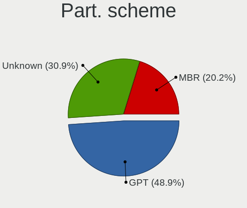

| Type    | Computers | Percent |
|---------|-----------|---------|
| GPT     | 23        | 39.66%  |
| Unknown | 22        | 37.93%  |
| MBR     | 13        | 22.41%  |

Dual Boot with Linux/BSD
------------------------

Hosting more than one Linux/BSD

| Dual boot | Computers | Percent |
|-----------|-----------|---------|
| No        | 49        | 84.48%  |
| Yes       | 9         | 15.52%  |

Dual Boot (Win)
---------------

Hosting Linux and Windows

| Dual boot | Computers | Percent |
|-----------|-----------|---------|
| No        | 40        | 70.18%  |
| Yes       | 17        | 29.82%  |

Board
-----

Vendor
------

Motherboard manufacturer

| Name                | Computers | Percent |
|---------------------|-----------|---------|
| Hewlett-Packard     | 13        | 22.81%  |
| Dell                | 9         | 15.79%  |
| ASUSTek Computer    | 9         | 15.79%  |
| MSI                 | 5         | 8.77%   |
| Lenovo              | 4         | 7.02%   |
| Acer                | 4         | 7.02%   |
| Samsung Electronics | 2         | 3.51%   |
| Apple               | 2         | 3.51%   |
| ZOTAC               | 1         | 1.75%   |
| Wortmann AG         | 1         | 1.75%   |
| Quanta              | 1         | 1.75%   |
| Microsoft           | 1         | 1.75%   |
| Intel               | 1         | 1.75%   |
| Gigabyte Technology | 1         | 1.75%   |
| Gateway             | 1         | 1.75%   |
| Fujitsu             | 1         | 1.75%   |
| Eluktronics         | 1         | 1.75%   |

Model
-----

Motherboard model

| Name                                    | Computers | Percent |
|-----------------------------------------|-----------|---------|
| HP ProBook 650 G1                       | 2         | 3.51%   |
| ASUS Q524UQ                             | 2         | 3.51%   |
| Wortmann AG TERRA_MOBILE_1542           | 1         | 1.75%   |
| Samsung 350V5C/351V5C/3540VC/3440VC     | 1         | 1.75%   |
| Samsung 300E4C/300E5C/300E7C            | 1         | 1.75%   |
| Quanta HDX PREMIUM SERIES               | 1         | 1.75%   |
| MSI GT60 2OC/2OD                        | 1         | 1.75%   |
| MSI GS66 Stealth 10UG                   | 1         | 1.75%   |
| MSI GE75 Raider 10SF                    | 1         | 1.75%   |
| MSI GE73 Raider RGB 8RE                 | 1         | 1.75%   |
| MSI GE63 Raider RGB 8RE                 | 1         | 1.75%   |
| Microsoft Surface Pro 3                 | 1         | 1.75%   |
| Lenovo Y520-15IKBN 80WK                 | 1         | 1.75%   |
| Lenovo ThinkPad X260 20F5S5QT00         | 1         | 1.75%   |
| Lenovo ThinkPad X250 20CL001GZA         | 1         | 1.75%   |
| Lenovo B50-80 80EW                      | 1         | 1.75%   |
| Intel NUC8i7HVK                         | 1         | 1.75%   |
| HP ZBook 15 G5                          | 1         | 1.75%   |
| HP Pavilion Notebook                    | 1         | 1.75%   |
| HP Pavilion dv7                         | 1         | 1.75%   |
| HP Pavilion dv6700                      | 1         | 1.75%   |
| HP Pavilion dv6                         | 1         | 1.75%   |
| HP Pavilion dv4                         | 1         | 1.75%   |
| HP Laptop 15s-eq1xxx                    | 1         | 1.75%   |
| HP Laptop 15-dw0xxx                     | 1         | 1.75%   |
| HP Compaq Pro 6305 MT                   | 1         | 1.75%   |
| HP All-in-One 24-f0xx                   | 1         | 1.75%   |
| HP 250 G7 Notebook PC                   | 1         | 1.75%   |
| Gigabyte A320M-S2H                      | 1         | 1.75%   |
| Gateway MP8708                          | 1         | 1.75%   |
| Fujitsu LIFEBOOK T731                   | 1         | 1.75%   |
| Eluktronics MAG-15u                     | 1         | 1.75%   |
| Dell XPS 8930                           | 1         | 1.75%   |
| Dell OptiPlex 7070                      | 1         | 1.75%   |
| Dell OptiPlex 3010                      | 1         | 1.75%   |
| Dell Latitude E7440                     | 1         | 1.75%   |
| Dell Latitude E6420                     | 1         | 1.75%   |
| Dell Inspiron 7501                      | 1         | 1.75%   |
| Dell Inspiron 5593                      | 1         | 1.75%   |
| Dell Inspiron 5558                      | 1         | 1.75%   |
| Dell Inspiron 5420                      | 1         | 1.75%   |
| ASUS X75VB                              | 1         | 1.75%   |
| ASUS X450EA                             | 1         | 1.75%   |
| ASUS VivoBook_ASUSLaptop X412DAP_F412DA | 1         | 1.75%   |
| ASUS PRIME X399-A                       | 1         | 1.75%   |
| ASUS P8H67-M PRO                        | 1         | 1.75%   |
| ASUS M5A78L-M/USB3                      | 1         | 1.75%   |
| ASUS G74Sx                              | 1         | 1.75%   |
| Apple MacBookPro8,1                     | 1         | 1.75%   |
| Apple MacBookPro11,1                    | 1         | 1.75%   |
| Acer TravelMate 5720                    | 1         | 1.75%   |
| Acer Swift SF114-33                     | 1         | 1.75%   |
| Acer Predator PO3-600                   | 1         | 1.75%   |
| Acer Aspire E1-571G                     | 1         | 1.75%   |
| Unknown                                 | 1         | 1.75%   |

Model Family
------------

Motherboard model prefix

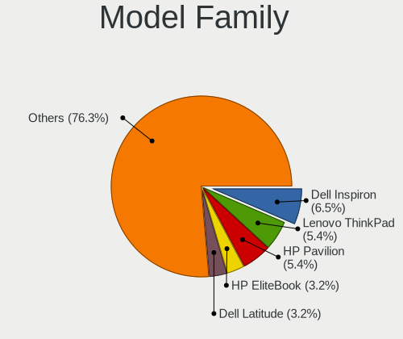

| Name                | Computers | Percent |
|---------------------|-----------|---------|
| HP Pavilion         | 5         | 8.77%   |
| Dell Inspiron       | 4         | 7.02%   |
| Lenovo ThinkPad     | 2         | 3.51%   |
| HP ProBook          | 2         | 3.51%   |
| HP Laptop           | 2         | 3.51%   |
| Dell OptiPlex       | 2         | 3.51%   |
| Dell Latitude       | 2         | 3.51%   |
| ASUS Q524UQ         | 2         | 3.51%   |
| Wortmann AG TERRA   | 1         | 1.75%   |
| Samsung 350V5C      | 1         | 1.75%   |
| Samsung 300E4C      | 1         | 1.75%   |
| Quanta HDX          | 1         | 1.75%   |
| MSI GT60            | 1         | 1.75%   |
| MSI GS66            | 1         | 1.75%   |
| MSI GE75            | 1         | 1.75%   |
| MSI GE73            | 1         | 1.75%   |
| MSI GE63            | 1         | 1.75%   |
| Microsoft Surface   | 1         | 1.75%   |
| Lenovo Y520-15IKBN  | 1         | 1.75%   |
| Lenovo B50-80       | 1         | 1.75%   |
| Intel NUC8i7HVK     | 1         | 1.75%   |
| HP ZBook            | 1         | 1.75%   |
| HP Compaq           | 1         | 1.75%   |
| HP All-in-One       | 1         | 1.75%   |
| HP 250              | 1         | 1.75%   |
| Gigabyte A320M-S2H  | 1         | 1.75%   |
| Gateway MP8708      | 1         | 1.75%   |
| Fujitsu LIFEBOOK    | 1         | 1.75%   |
| Eluktronics MAG-15u | 1         | 1.75%   |
| Dell XPS            | 1         | 1.75%   |
| ASUS X75VB          | 1         | 1.75%   |
| ASUS X450EA         | 1         | 1.75%   |
| ASUS VivoBook       | 1         | 1.75%   |
| ASUS PRIME          | 1         | 1.75%   |
| ASUS P8H67-M        | 1         | 1.75%   |
| ASUS M5A78L-M       | 1         | 1.75%   |
| ASUS G74Sx          | 1         | 1.75%   |
| Apple MacBookPro8   | 1         | 1.75%   |
| Apple MacBookPro11  | 1         | 1.75%   |
| Acer TravelMate     | 1         | 1.75%   |
| Acer Swift          | 1         | 1.75%   |
| Acer Predator       | 1         | 1.75%   |
| Acer Aspire         | 1         | 1.75%   |
| Unknown             | 1         | 1.75%   |

MFG Year
--------

Motherboard manufacture year

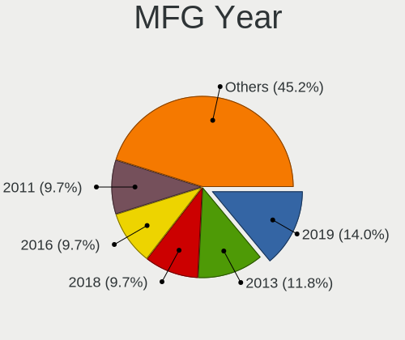

| Year | Computers | Percent |
|------|-----------|---------|
| 2020 | 10        | 17.54%  |
| 2019 | 10        | 17.54%  |
| 2018 | 7         | 12.28%  |
| 2013 | 7         | 12.28%  |
| 2021 | 4         | 7.02%   |
| 2016 | 4         | 7.02%   |
| 2015 | 3         | 5.26%   |
| 2012 | 3         | 5.26%   |
| 2011 | 2         | 3.51%   |
| 2010 | 2         | 3.51%   |
| 2008 | 2         | 3.51%   |
| 2017 | 1         | 1.75%   |
| 2014 | 1         | 1.75%   |
| 2006 | 1         | 1.75%   |

Form Factor
-----------

Physical design of the computer

| Name       | Computers | Percent |
|------------|-----------|---------|
| Notebook   | 44        | 77.19%  |
| Desktop    | 10        | 17.54%  |
| Tablet     | 1         | 1.75%   |
| Mini pc    | 1         | 1.75%   |
| All in one | 1         | 1.75%   |

Secure Boot
-----------

Enabled or disabled

| State    | Computers | Percent |
|----------|-----------|---------|
| Disabled | 57        | 100%    |

Coreboot
--------

Have coreboot on board

| Used | Computers | Percent |
|------|-----------|---------|
| No   | 57        | 100%    |

RAM Size
--------

Total RAM memory

| Size in GB  | Computers | Percent |
|-------------|-----------|---------|
| 4.01-8.0    | 18        | 31.58%  |
| 8.01-16.0   | 14        | 24.56%  |
| 3.01-4.0    | 9         | 15.79%  |
| 16.01-24.0  | 8         | 14.04%  |
| 64.01-256.0 | 3         | 5.26%   |
| 32.01-64.0  | 2         | 3.51%   |
| 24.01-32.0  | 1         | 1.75%   |
| 2.01-3.0    | 1         | 1.75%   |
| 1.01-2.0    | 1         | 1.75%   |

RAM Used
--------

Used RAM memory

| Used GB   | Computers | Percent |
|-----------|-----------|---------|
| 2.01-3.0  | 22        | 37.29%  |
| 1.01-2.0  | 21        | 35.59%  |
| 4.01-8.0  | 8         | 13.56%  |
| 3.01-4.0  | 7         | 11.86%  |
| 8.01-16.0 | 1         | 1.69%   |

Total Drives
------------

Number of drives on board

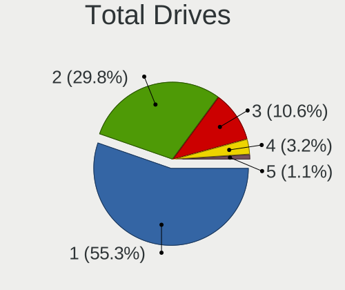

| Drives | Computers | Percent |
|--------|-----------|---------|
| 1      | 29        | 50.88%  |
| 2      | 19        | 33.33%  |
| 3      | 8         | 14.04%  |
| 4      | 1         | 1.75%   |

Has CD-ROM
----------

Has CD-ROM on board

| Presented | Computers | Percent |
|-----------|-----------|---------|
| No        | 37        | 64.91%  |
| Yes       | 20        | 35.09%  |

Has Ethernet
------------

Has Ethernet on board

| Presented | Computers | Percent |
|-----------|-----------|---------|
| Yes       | 48        | 84.21%  |
| No        | 9         | 15.79%  |

Has WiFi
--------

Has WiFi module

| Presented | Computers | Percent |
|-----------|-----------|---------|
| Yes       | 54        | 93.1%   |
| No        | 4         | 6.9%    |

Has Bluetooth
-------------

Has Bluetooth module

| Presented | Computers | Percent |
|-----------|-----------|---------|
| Yes       | 40        | 70.18%  |
| No        | 17        | 29.82%  |

Location
--------

Country
-------

Geographic location (country)

| Country      | Computers | Percent |
|--------------|-----------|---------|
| USA          | 17        | 29.82%  |
| Spain        | 4         | 7.02%   |
| Germany      | 4         | 7.02%   |
| France       | 4         | 7.02%   |
| Russia       | 3         | 5.26%   |
| Brazil       | 3         | 5.26%   |
| Australia    | 3         | 5.26%   |
| UK           | 2         | 3.51%   |
| Ukraine      | 1         | 1.75%   |
| Sweden       | 1         | 1.75%   |
| South Africa | 1         | 1.75%   |
| Puerto Rico  | 1         | 1.75%   |
| Netherlands  | 1         | 1.75%   |
| Mexico       | 1         | 1.75%   |
| Kenya        | 1         | 1.75%   |
| Iraq         | 1         | 1.75%   |
| Indonesia    | 1         | 1.75%   |
| Hungary      | 1         | 1.75%   |
| Czechia      | 1         | 1.75%   |
| Colombia     | 1         | 1.75%   |
| Canada       | 1         | 1.75%   |
| Belgium      | 1         | 1.75%   |
| Bangladesh   | 1         | 1.75%   |
| Azerbaijan   | 1         | 1.75%   |
| Algeria      | 1         | 1.75%   |

City
----

Geographic location (city)

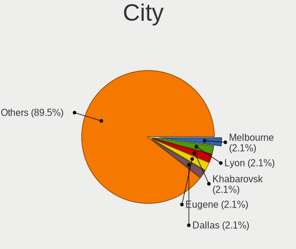

| City                     | Computers | Percent |
|--------------------------|-----------|---------|
| Lyon                     | 2         | 3.39%   |
| Chicago                  | 2         | 3.39%   |
| Witbank                  | 1         | 1.69%   |
| West Jordan              | 1         | 1.69%   |
| Visalia                  | 1         | 1.69%   |
| Ternopil                 | 1         | 1.69%   |
| Stockholm                | 1         | 1.69%   |
| Sinntal                  | 1         | 1.69%   |
| Sheffield                | 1         | 1.69%   |
| Secaucus                 | 1         | 1.69%   |
| S??o Paulo               | 1         | 1.69%   |
| Santo André             | 1         | 1.69%   |
| Sannois                  | 1         | 1.69%   |
| Regensburg               | 1         | 1.69%   |
| Prague                   | 1         | 1.69%   |
| Portsmouth               | 1         | 1.69%   |
| Ponce                    | 1         | 1.69%   |
| Oklahoma City            | 1         | 1.69%   |
| Offenbach                | 1         | 1.69%   |
| Nairobi                  | 1         | 1.69%   |
| Mostoles                 | 1         | 1.69%   |
| Melbourne                | 1         | 1.69%   |
| Marietta                 | 1         | 1.69%   |
| Majadahonda              | 1         | 1.69%   |
| Los Mochis               | 1         | 1.69%   |
| Los Angeles              | 1         | 1.69%   |
| Long Beach               | 1         | 1.69%   |
| London                   | 1         | 1.69%   |
| Khabarovsk               | 1         | 1.69%   |
| Kazan?àô                 | 1         | 1.69%   |
| Jihlava                  | 1         | 1.69%   |
| Jaragua                  | 1         | 1.69%   |
| Jakarta                  | 1         | 1.69%   |
| Houston                  | 1         | 1.69%   |
| Frankfurt am Main        | 1         | 1.69%   |
| Fort Lauderdale          | 1         | 1.69%   |
| Eugene                   | 1         | 1.69%   |
| Erbil                    | 1         | 1.69%   |
| Edmonton                 | 1         | 1.69%   |
| East Malvern             | 1         | 1.69%   |
| Dudenhofen               | 1         | 1.69%   |
| Donostia / San Sebastian | 1         | 1.69%   |
| Dhaka                    | 1         | 1.69%   |
| Denham Springs           | 1         | 1.69%   |
| Concord                  | 1         | 1.69%   |
| Budapest                 | 1         | 1.69%   |
| Brunswick                | 1         | 1.69%   |
| Bogot√°                  | 1         | 1.69%   |
| Blagoveshchensk          | 1         | 1.69%   |
| Bay Saint Louis          | 1         | 1.69%   |
| Barcelona                | 1         | 1.69%   |
| Baku                     | 1         | 1.69%   |
| Amsterdam                | 1         | 1.69%   |
| Akbou                    | 1         | 1.69%   |
| Aix-les-Bains            | 1         | 1.69%   |
| Adelaide                 | 1         | 1.69%   |
| Aalst                    | 1         | 1.69%   |

Drives
------

Drive Vendor
------------

Hard drive vendors

| Vendor              | Computers | Drives | Percent |
|---------------------|-----------|--------|---------|
| Seagate             | 11        | 15     | 12.22%  |
| WDC                 | 10        | 13     | 11.11%  |
| Samsung Electronics | 9         | 10     | 10%     |
| Toshiba             | 8         | 9      | 8.89%   |
| Unknown             | 7         | 7      | 7.78%   |
| Crucial             | 7         | 10     | 7.78%   |
| Kingston            | 5         | 5      | 5.56%   |
| Hitachi             | 5         | 6      | 5.56%   |
| SK Hynix            | 4         | 4      | 4.44%   |
| HGST                | 3         | 3      | 3.33%   |
| China               | 3         | 4      | 3.33%   |
| A-DATA Technology   | 3         | 3      | 3.33%   |
| SanDisk             | 2         | 2      | 2.22%   |
| Micron Technology   | 2         | 2      | 2.22%   |
| KIOXIA              | 2         | 2      | 2.22%   |
| SPCC                | 1         | 1      | 1.11%   |
| ROG                 | 1         | 1      | 1.11%   |
| Phison              | 1         | 1      | 1.11%   |
| Patriot             | 1         | 1      | 1.11%   |
| LITEONIT            | 1         | 1      | 1.11%   |
| Intenso             | 1         | 1      | 1.11%   |
| FORESEE             | 1         | 1      | 1.11%   |
| Corsair             | 1         | 1      | 1.11%   |
| Apple               | 1         | 1      | 1.11%   |

Drive Model
-----------

Hard drive models

| Model                                    | Computers | Percent |
|------------------------------------------|-----------|---------|
| WDC WD5000LPCX-24C6HT0 500GB             | 2         | 2.08%   |
| Unknown SD/MMC/MS PRO 128GB              | 2         | 2.08%   |
| Toshiba DT01ACA100 1TB                   | 2         | 2.08%   |
| Seagate ST2000LM003 HN-M201RAD 2TB       | 2         | 2.08%   |
| Kingston SA400S37240G 240GB SSD          | 2         | 2.08%   |
| HGST HTS541010A9E680 1TB                 | 2         | 2.08%   |
| Crucial CT1000MX500SSD1 1TB              | 2         | 2.08%   |
| WDC WDS100T2B0B-00YS70 1TB SSD           | 1         | 1.04%   |
| WDC WDBNCE0010PNC 1TB SSD                | 1         | 1.04%   |
| WDC WD800BEVS-22RST0 80GB                | 1         | 1.04%   |
| WDC WD3200LPVX-60V0TT0 320GB             | 1         | 1.04%   |
| WDC WD3200LPVX-00V0TT0 320GB             | 1         | 1.04%   |
| WDC WD2500BPVT-00JJ5T0 250GB             | 1         | 1.04%   |
| WDC WD10SPZX-17Z10T1 1TB                 | 1         | 1.04%   |
| WDC WD10EARS-00Y5B1 1TB                  | 1         | 1.04%   |
| WDC PC SN730 SDBPNTY-512G-1032 512GB     | 1         | 1.04%   |
| Unknown Y016B  16GB                      | 1         | 1.04%   |
| Unknown xD/SD/M.S.                       | 1         | 1.04%   |
| Unknown SS16G  16GB                      | 1         | 1.04%   |
| Unknown SDU1  64GB                       | 1         | 1.04%   |
| Unknown MMC Card  128GB                  | 1         | 1.04%   |
| Toshiba THNSNF128GMCS 128GB SSD          | 1         | 1.04%   |
| Toshiba Q300. 480GB SSD                  | 1         | 1.04%   |
| Toshiba MQ01ABD100V -63 1TB              | 1         | 1.04%   |
| Toshiba MQ01ABD075 752GB                 | 1         | 1.04%   |
| Toshiba MK7575GSX 752GB                  | 1         | 1.04%   |
| Toshiba MK2552GSX 250GB                  | 1         | 1.04%   |
| SPCC Solid State Disk 120GB              | 1         | 1.04%   |
| SK Hynix PC601 NVMe 256GB                | 1         | 1.04%   |
| SK Hynix NVMe SSD Drive 256GB            | 1         | 1.04%   |
| SK Hynix HFM256GDJTNI-82A0A 256GB        | 1         | 1.04%   |
| SK Hynix BC511 HFM256GDJTNI-82A0A 256GB  | 1         | 1.04%   |
| Seagate ST9500420AS 500GB                | 1         | 1.04%   |
| Seagate ST9250410AS 250GB                | 1         | 1.04%   |
| Seagate ST500NM0011 500GB                | 1         | 1.04%   |
| Seagate ST500LM012 HN-M500MBB 500GB      | 1         | 1.04%   |
| Seagate ST500DM002-1SB10A 500GB          | 1         | 1.04%   |
| Seagate ST4000DM004-2CV104 4TB           | 1         | 1.04%   |
| Seagate ST320LT020-9YG142 320GB          | 1         | 1.04%   |
| Seagate ST31000528AS 1TB                 | 1         | 1.04%   |
| Seagate ST250DM000-1BD141 250GB          | 1         | 1.04%   |
| Seagate ST2000LM007-1R8174 2TB           | 1         | 1.04%   |
| Seagate ST1000LM024 HN-M101MBB 1TB       | 1         | 1.04%   |
| SanDisk SSD PLUS 1000GB                  | 1         | 1.04%   |
| SanDisk Extreme SSD 1TB                  | 1         | 1.04%   |
| Samsung SSD 980 1TB                      | 1         | 1.04%   |
| Samsung SSD 860 EVO M.2 2TB              | 1         | 1.04%   |
| Samsung SSD 860 EVO 500GB                | 1         | 1.04%   |
| Samsung PM963 2.5" NVMe PCIe SSD 512GB   | 1         | 1.04%   |
| Samsung NVMe SSD Drive 1TB               | 1         | 1.04%   |
| Samsung MZVLW256HEHP-00000 256GB         | 1         | 1.04%   |
| Samsung MZVLQ256HAJD-00000 256GB         | 1         | 1.04%   |
| Samsung MZVLB1T0HALR 1TB SSD             | 1         | 1.04%   |
| Samsung MZNLH128HBHQ-000H1 128GB SSD     | 1         | 1.04%   |
| Samsung MZMTE512HMHP-000MV 512GB SSD     | 1         | 1.04%   |
| ROG ESD-S1C 2TB                          | 1         | 1.04%   |
| Phison NVMe SSD Drive 1TB                | 1         | 1.04%   |
| Patriot P210 256GB SSD                   | 1         | 1.04%   |
| Micron MTFDDAK128MAY-1AH1ZABHA 128GB SSD | 1         | 1.04%   |
| Micron 2200_MTFDHBA512TCK 512GB          | 1         | 1.04%   |

HDD Vendor
----------

Hard disk drive vendors

| Vendor  | Computers | Drives | Percent |
|---------|-----------|--------|---------|
| Seagate | 11        | 15     | 31.43%  |
| WDC     | 8         | 10     | 22.86%  |
| Toshiba | 6         | 6      | 17.14%  |
| Hitachi | 5         | 6      | 14.29%  |
| HGST    | 3         | 3      | 8.57%   |
| Unknown | 2         | 2      | 5.71%   |

SSD Vendor
----------

Solid state drive vendors

| Vendor              | Computers | Drives | Percent |
|---------------------|-----------|--------|---------|
| Crucial             | 7         | 10     | 20.59%  |
| Samsung Electronics | 5         | 5      | 14.71%  |
| Kingston            | 4         | 4      | 11.76%  |
| China               | 3         | 4      | 8.82%   |
| WDC                 | 2         | 2      | 5.88%   |
| Toshiba             | 2         | 3      | 5.88%   |
| SanDisk             | 2         | 2      | 5.88%   |
| SPCC                | 1         | 1      | 2.94%   |
| Patriot             | 1         | 1      | 2.94%   |
| Micron Technology   | 1         | 1      | 2.94%   |
| LITEONIT            | 1         | 1      | 2.94%   |
| Intenso             | 1         | 1      | 2.94%   |
| FORESEE             | 1         | 1      | 2.94%   |
| Corsair             | 1         | 1      | 2.94%   |
| Apple               | 1         | 1      | 2.94%   |
| A-DATA Technology   | 1         | 1      | 2.94%   |

Drive Kind
----------

HDD or SSD

| Kind    | Computers | Drives | Percent |
|---------|-----------|--------|---------|
| HDD     | 30        | 42     | 37.04%  |
| SSD     | 29        | 39     | 35.8%   |
| NVMe    | 16        | 17     | 19.75%  |
| MMC     | 4         | 4      | 4.94%   |
| Unknown | 2         | 2      | 2.47%   |

Drive Connector
---------------

SATA, SAS, NVMe, etc.

| Type | Computers | Drives | Percent |
|------|-----------|--------|---------|
| SATA | 48        | 76     | 64.86%  |
| NVMe | 16        | 17     | 21.62%  |
| SAS  | 6         | 7      | 8.11%   |
| MMC  | 4         | 4      | 5.41%   |

Drive Size
----------

Size of hard drive

| Size in TB | Computers | Drives | Percent |
|------------|-----------|--------|---------|
| 0.01-0.5   | 34        | 50     | 54.84%  |
| 0.51-1.0   | 23        | 26     | 37.1%   |
| 1.01-2.0   | 4         | 4      | 6.45%   |
| 3.01-4.0   | 1         | 1      | 1.61%   |

Space Total
-----------

Amount of disk space available on the file system

| Size in GB     | Computers | Percent |
|----------------|-----------|---------|
| 251-500        | 14        | 23.73%  |
| 101-250        | 13        | 22.03%  |
| 1001-2000      | 9         | 15.25%  |
| 501-1000       | 9         | 15.25%  |
| Unknown        | 6         | 10.17%  |
| 2001-3000      | 3         | 5.08%   |
| 51-100         | 3         | 5.08%   |
| More than 3000 | 2         | 3.39%   |

Space Used
----------

Amount of used disk space

| Used GB   | Computers | Percent |
|-----------|-----------|---------|
| 21-50     | 15        | 25%     |
| 51-100    | 14        | 23.33%  |
| 251-500   | 8         | 13.33%  |
| 101-250   | 8         | 13.33%  |
| 1-20      | 6         | 10%     |
| Unknown   | 6         | 10%     |
| 501-1000  | 2         | 3.33%   |
| 1001-2000 | 1         | 1.67%   |

Malfunc. Drives
---------------

Drive models with a malfunction

| Model                                               | Computers | Drives | Percent |
|-----------------------------------------------------|-----------|--------|---------|
| Toshiba MQ01ABD075 752GB                            | 1         | 1      | 11.11%  |
| Seagate ST9250410AS 250GB                           | 1         | 1      | 11.11%  |
| Seagate ST500NM0011 500GB                           | 1         | 1      | 11.11%  |
| Seagate ST31000528AS 1TB                            | 1         | 1      | 11.11%  |
| Seagate ST2000LM007-1R8174 2TB                      | 1         | 1      | 11.11%  |
| Samsung Electronics MZNLH128HBHQ-000H1 128GB SSD    | 1         | 1      | 11.11%  |
| Micron Technology MTFDDAK128MAY-1AH1ZABHA 128GB SSD | 1         | 1      | 11.11%  |
| Hitachi HTS542512K9SA00 120GB                       | 1         | 1      | 11.11%  |
| A-DATA Technology SX6000LNP 1TB                     | 1         | 1      | 11.11%  |

Malfunc. Drive Vendor
---------------------

Vendors of faulty drives

| Vendor              | Computers | Drives | Percent |
|---------------------|-----------|--------|---------|
| Seagate             | 4         | 4      | 44.44%  |
| Toshiba             | 1         | 1      | 11.11%  |
| Samsung Electronics | 1         | 1      | 11.11%  |
| Micron Technology   | 1         | 1      | 11.11%  |
| Hitachi             | 1         | 1      | 11.11%  |
| A-DATA Technology   | 1         | 1      | 11.11%  |

Malfunc. HDD Vendor
-------------------

Vendors of faulty HDD drives

| Vendor  | Computers | Drives | Percent |
|---------|-----------|--------|---------|
| Seagate | 4         | 4      | 66.67%  |
| Toshiba | 1         | 1      | 16.67%  |
| Hitachi | 1         | 1      | 16.67%  |

Malfunc. Drive Kind
-------------------

Kinds of faulty drives

| Kind | Computers | Drives | Percent |
|------|-----------|--------|---------|
| HDD  | 6         | 6      | 66.67%  |
| SSD  | 2         | 2      | 22.22%  |
| NVMe | 1         | 1      | 11.11%  |

Failed Drives
-------------

Failed drive models

| Model                     | Computers | Drives | Percent |
|---------------------------|-----------|--------|---------|
| Intenso SSD SATAIII 120GB | 1         | 1      | 100%    |

Failed Drive Vendor
-------------------

Failed drive vendors

| Vendor  | Computers | Drives | Percent |
|---------|-----------|--------|---------|
| Intenso | 1         | 1      | 100%    |

Drive Status
------------

Number of failed and malfunc. drives

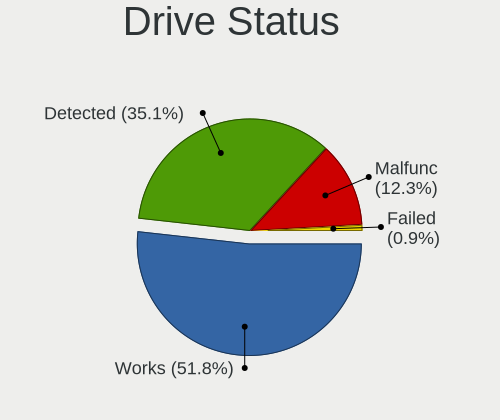

| Status   | Computers | Drives | Percent |
|----------|-----------|--------|---------|
| Works    | 32        | 44     | 45.71%  |
| Detected | 29        | 50     | 41.43%  |
| Malfunc  | 8         | 9      | 11.43%  |
| Failed   | 1         | 1      | 1.43%   |

Storage controller
------------------

Storage Vendor
--------------

Storage controller vendors

| Vendor                      | Computers | Percent |
|-----------------------------|-----------|---------|
| Intel                       | 48        | 65.75%  |
| AMD                         | 7         | 9.59%   |
| Samsung Electronics         | 5         | 6.85%   |
| SK Hynix                    | 4         | 5.48%   |
| KIOXIA                      | 2         | 2.74%   |
| VIA Technologies            | 1         | 1.37%   |
| Sandisk                     | 1         | 1.37%   |
| Realtek Semiconductor       | 1         | 1.37%   |
| Phison Electronics          | 1         | 1.37%   |
| Micron Technology           | 1         | 1.37%   |
| Kingston Technology Company | 1         | 1.37%   |
| ADATA Technology            | 1         | 1.37%   |

Storage Model
-------------

Storage controller models

| Model                                                                                   | Computers | Percent |
|-----------------------------------------------------------------------------------------|-----------|---------|
| Intel 7 Series Chipset Family 6-port SATA Controller [AHCI mode]                        | 5         | 6.1%    |
| Intel 6 Series/C200 Series Chipset Family 6 port Mobile SATA AHCI Controller            | 5         | 6.1%    |
| AMD FCH SATA Controller [AHCI mode]                                                     | 5         | 6.1%    |
| Intel Wildcat Point-LP SATA Controller [AHCI Mode]                                      | 4         | 4.88%   |
| Intel Sunrise Point-LP SATA Controller [AHCI mode]                                      | 4         | 4.88%   |
| SK Hynix BC511                                                                          | 3         | 3.66%   |
| Intel Cannon Lake Mobile PCH SATA AHCI Controller                                       | 3         | 3.66%   |
| Intel 8 Series/C220 Series Chipset Family 6-port SATA Controller 1 [AHCI mode]          | 3         | 3.66%   |
| Samsung NVMe SSD Controller SM981/PM981/PM983                                           | 2         | 2.44%   |
| Samsung NVMe SSD Controller 980                                                         | 2         | 2.44%   |
| KIOXIA Non-Volatile memory controller                                                   | 2         | 2.44%   |
| Intel HM170/QM170 Chipset SATA Controller [AHCI Mode]                                   | 2         | 2.44%   |
| Intel Celeron/Pentium Silver Processor SATA Controller                                  | 2         | 2.44%   |
| Intel Cannon Lake PCH SATA AHCI Controller                                              | 2         | 2.44%   |
| Intel 82801IBM/IEM (ICH9M/ICH9M-E) 4 port SATA Controller [AHCI mode]                   | 2         | 2.44%   |
| Intel 82801HM/HEM (ICH8M/ICH8M-E) SATA Controller [AHCI mode]                           | 2         | 2.44%   |
| Intel 82801HM/HEM (ICH8M/ICH8M-E) IDE Controller                                        | 2         | 2.44%   |
| Intel 82801 Mobile SATA Controller [RAID mode]                                          | 2         | 2.44%   |
| Intel 8 Series SATA Controller 1 [AHCI mode]                                            | 2         | 2.44%   |
| Intel 400 Series Chipset Family SATA AHCI Controller                                    | 2         | 2.44%   |
| VIA VT6415 PATA IDE Host Controller                                                     | 1         | 1.22%   |
| SK Hynix Non-Volatile memory controller                                                 | 1         | 1.22%   |
| Sandisk WD Black SN750 / PC SN730 NVMe SSD                                              | 1         | 1.22%   |
| Samsung NVMe SSD Controller SM961/PM961/SM963                                           | 1         | 1.22%   |
| Samsung Apple PCIe SSD                                                                  | 1         | 1.22%   |
| Realtek RTS5763DL NVMe SSD Controller                                                   | 1         | 1.22%   |
| Phison E16 PCIe4 NVMe Controller                                                        | 1         | 1.22%   |
| Micron Non-Volatile memory controller                                                   | 1         | 1.22%   |
| Kingston Company A2000 NVMe SSD                                                         | 1         | 1.22%   |
| Intel SATA Controller [RAID mode]                                                       | 1         | 1.22%   |
| Intel Q170/Q150/B150/H170/H110/Z170/CM236 Chipset SATA Controller [AHCI Mode]           | 1         | 1.22%   |
| Intel Ice Lake-LP SATA Controller [AHCI mode]                                           | 1         | 1.22%   |
| Intel Cannon Point-LP SATA Controller [AHCI Mode]                                       | 1         | 1.22%   |
| Intel 82801GBM/GHM (ICH7-M Family) SATA Controller [AHCI mode]                          | 1         | 1.22%   |
| Intel 82801G (ICH7 Family) IDE Controller                                               | 1         | 1.22%   |
| Intel 6 Series/C200 Series Chipset Family Mobile SATA Controller (IDE mode, ports 4-5)  | 1         | 1.22%   |
| Intel 6 Series/C200 Series Chipset Family Mobile SATA Controller (IDE mode, ports 0-3)  | 1         | 1.22%   |
| Intel 6 Series/C200 Series Chipset Family Desktop SATA Controller (IDE mode, ports 4-5) | 1         | 1.22%   |
| Intel 6 Series/C200 Series Chipset Family Desktop SATA Controller (IDE mode, ports 0-3) | 1         | 1.22%   |
| Intel 6 Series/C200 Series Chipset Family 6 port Desktop SATA AHCI Controller           | 1         | 1.22%   |
| AMD X399 Series Chipset SATA Controller                                                 | 1         | 1.22%   |
| AMD SB7x0/SB8x0/SB9x0 SATA Controller [AHCI mode]                                       | 1         | 1.22%   |
| AMD SB7x0/SB8x0/SB9x0 IDE Controller                                                    | 1         | 1.22%   |
| AMD FCH SATA Controller [IDE mode]                                                      | 1         | 1.22%   |
| AMD FCH SATA Controller D                                                               | 1         | 1.22%   |
| ADATA Non-Volatile memory controller                                                    | 1         | 1.22%   |

Storage Kind
------------

Kind of storage controller (IDE, SATA, NVMe, SAS, ...)

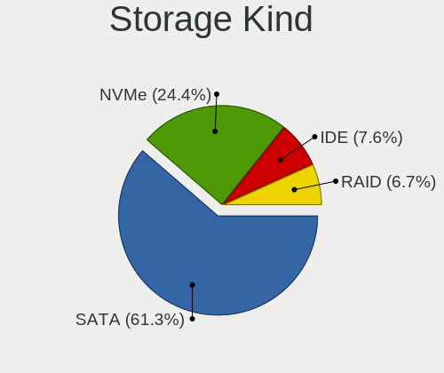

| Kind | Computers | Percent |
|------|-----------|---------|
| SATA | 51        | 67.11%  |
| NVMe | 16        | 21.05%  |
| IDE  | 6         | 7.89%   |
| RAID | 3         | 3.95%   |

Processor
---------

CPU Vendor
----------

Processor vendors

| Vendor | Computers | Percent |
|--------|-----------|---------|
| Intel  | 49        | 85.96%  |
| AMD    | 8         | 14.04%  |

CPU Model
---------

Processor models

| Model                                          | Computers | Percent |
|------------------------------------------------|-----------|---------|
| Intel Core i7-8750H CPU @ 2.20GHz              | 2         | 3.51%   |
| Intel Core i7-6500U CPU @ 2.50GHz              | 2         | 3.51%   |
| Intel Core i7-2670QM CPU @ 2.20GHz             | 2         | 3.51%   |
| Intel Core i5-6200U CPU @ 2.30GHz              | 2         | 3.51%   |
| Intel Core i5-3230M CPU @ 2.60GHz              | 2         | 3.51%   |
| Intel Core i5-3210M CPU @ 2.50GHz              | 2         | 3.51%   |
| Intel Core i5-2520M CPU @ 2.50GHz              | 2         | 3.51%   |
| Intel Core i3-5005U CPU @ 2.00GHz              | 2         | 3.51%   |
| Intel Pentium Silver N5030 CPU @ 1.10GHz       | 1         | 1.75%   |
| Intel Pentium Silver N5000 CPU @ 1.10GHz       | 1         | 1.75%   |
| Intel Pentium Dual-Core CPU T4300 @ 2.10GHz    | 1         | 1.75%   |
| Intel Core M-5Y10c CPU @ 0.80GHz               | 1         | 1.75%   |
| Intel Core i7-8850H CPU @ 2.60GHz              | 1         | 1.75%   |
| Intel Core i7-8809G CPU @ 3.10GHz              | 1         | 1.75%   |
| Intel Core i7-8700 CPU @ 3.20GHz               | 1         | 1.75%   |
| Intel Core i7-8565U CPU @ 1.80GHz              | 1         | 1.75%   |
| Intel Core i7-7700HQ CPU @ 2.80GHz             | 1         | 1.75%   |
| Intel Core i7-4700MQ CPU @ 2.40GHz             | 1         | 1.75%   |
| Intel Core i7-4650U CPU @ 1.70GHz              | 1         | 1.75%   |
| Intel Core i7-4600U CPU @ 2.10GHz              | 1         | 1.75%   |
| Intel Core i7-4558U CPU @ 2.80GHz              | 1         | 1.75%   |
| Intel Core i7-3630QM CPU @ 2.40GHz             | 1         | 1.75%   |
| Intel Core i7-2620M CPU @ 2.70GHz              | 1         | 1.75%   |
| Intel Core i7-2600 CPU @ 3.40GHz               | 1         | 1.75%   |
| Intel Core i7-10870H CPU @ 2.20GHz             | 1         | 1.75%   |
| Intel Core i7-10750H CPU @ 2.60GHz             | 1         | 1.75%   |
| Intel Core i5-9500T CPU @ 2.20GHz              | 1         | 1.75%   |
| Intel Core i5-9400 CPU @ 2.90GHz               | 1         | 1.75%   |
| Intel Core i5-8265U CPU @ 1.60GHz              | 1         | 1.75%   |
| Intel Core i5-6400T CPU @ 2.20GHz              | 1         | 1.75%   |
| Intel Core i5-5300U CPU @ 2.30GHz              | 1         | 1.75%   |
| Intel Core i5-4210M CPU @ 2.60GHz              | 1         | 1.75%   |
| Intel Core i5-4200M CPU @ 2.50GHz              | 1         | 1.75%   |
| Intel Core i5-3470 CPU @ 3.20GHz               | 1         | 1.75%   |
| Intel Core i5-2450M CPU @ 2.50GHz              | 1         | 1.75%   |
| Intel Core i5-1035G1 CPU @ 1.00GHz             | 1         | 1.75%   |
| Intel Core i5-10300H CPU @ 2.50GHz             | 1         | 1.75%   |
| Intel Core 2 Quad CPU Q9100 @ 2.26GHz          | 1         | 1.75%   |
| Intel Core 2 Duo CPU T8100 @ 2.10GHz           | 1         | 1.75%   |
| Intel Core 2 Duo CPU T5550 @ 1.83GHz           | 1         | 1.75%   |
| Intel Core 2 CPU T7200 @ 2.00GHz               | 1         | 1.75%   |
| AMD Ryzen Threadripper 1920X 12-Core Processor | 1         | 1.75%   |
| AMD Ryzen 7 4700U with Radeon Graphics         | 1         | 1.75%   |
| AMD Ryzen 3 3250U with Radeon Graphics         | 1         | 1.75%   |
| AMD Ryzen 3 2200G with Radeon Vega Graphics    | 1         | 1.75%   |
| AMD FX-6300 Six-Core Processor                 | 1         | 1.75%   |
| AMD E1-2500 APU with Radeon HD Graphics        | 1         | 1.75%   |
| AMD A6-9225 RADEON R4, 5 COMPUTE CORES 2C+3G   | 1         | 1.75%   |
| AMD A4-5300B APU with Radeon HD Graphics       | 1         | 1.75%   |

CPU Model Family
----------------

Processor model prefix

| Model                   | Computers | Percent |
|-------------------------|-----------|---------|
| Intel Core i7           | 20        | 35.09%  |
| Intel Core i5           | 19        | 33.33%  |
| Intel Pentium Silver    | 2         | 3.51%   |
| Intel Core i3           | 2         | 3.51%   |
| Intel Core 2 Duo        | 2         | 3.51%   |
| AMD Ryzen 3             | 2         | 3.51%   |
| Intel Pentium Dual-Core | 1         | 1.75%   |
| Intel Core M            | 1         | 1.75%   |
| Intel Core 2 Quad       | 1         | 1.75%   |
| Intel Core 2            | 1         | 1.75%   |
| AMD Ryzen Threadripper  | 1         | 1.75%   |
| AMD Ryzen 7             | 1         | 1.75%   |
| AMD FX                  | 1         | 1.75%   |
| AMD E1                  | 1         | 1.75%   |
| AMD A6                  | 1         | 1.75%   |
| AMD A4                  | 1         | 1.75%   |

CPU Cores
---------

Number of processor cores

| Number | Computers | Percent |
|--------|-----------|---------|
| 2      | 28        | 49.12%  |
| 4      | 17        | 29.82%  |
| 6      | 7         | 12.28%  |
| 8      | 2         | 3.51%   |
| 12     | 1         | 1.75%   |
| 3      | 1         | 1.75%   |
| 1      | 1         | 1.75%   |

CPU Sockets
-----------

Number of sockets

| Number | Computers | Percent |
|--------|-----------|---------|
| 1      | 57        | 100%    |

CPU Threads
-----------

Threads per core (Hyper-Threading)

| Number | Computers | Percent |
|--------|-----------|---------|
| 2      | 41        | 71.93%  |
| 1      | 16        | 28.07%  |

CPU Op-Modes
------------

CPU Operation Modes (32-bit, 64-bit)

| Op mode        | Computers | Percent |
|----------------|-----------|---------|
| 32-bit, 64-bit | 57        | 100%    |

CPU Microcode
-------------

Microcode number

| Number     | Computers | Percent |
|------------|-----------|---------|
| Unknown    | 27        | 45.76%  |
| 0x206a7    | 5         | 8.47%   |
| 0x306c3    | 3         | 5.08%   |
| 0xa0652    | 2         | 3.39%   |
| 0x906e9    | 2         | 3.39%   |
| 0x306d4    | 2         | 3.39%   |
| 0x306a9    | 2         | 3.39%   |
| 0x1067a    | 2         | 3.39%   |
| 0x906ed    | 1         | 1.69%   |
| 0x806ec    | 1         | 1.69%   |
| 0x706e5    | 1         | 1.69%   |
| 0x706a8    | 1         | 1.69%   |
| 0x706a1    | 1         | 1.69%   |
| 0x6fd      | 1         | 1.69%   |
| 0x6f6      | 1         | 1.69%   |
| 0x506e3    | 1         | 1.69%   |
| 0x40651    | 1         | 1.69%   |
| 0x08600106 | 1         | 1.69%   |
| 0x08108109 | 1         | 1.69%   |
| 0x06006705 | 1         | 1.69%   |
| 0x0600111f | 1         | 1.69%   |
| 0x06000852 | 1         | 1.69%   |

CPU Microarch
-------------

Microarchitecture

| Name          | Computers | Percent |
|---------------|-----------|---------|
| KabyLake      | 10        | 17.54%  |
| SandyBridge   | 7         | 12.28%  |
| IvyBridge     | 6         | 10.53%  |
| Haswell       | 6         | 10.53%  |
| Skylake       | 5         | 8.77%   |
| Broadwell     | 4         | 7.02%   |
| Penryn        | 3         | 5.26%   |
| CometLake     | 3         | 5.26%   |
| Zen           | 2         | 3.51%   |
| Piledriver    | 2         | 3.51%   |
| Goldmont plus | 2         | 3.51%   |
| Core          | 2         | 3.51%   |
| Zen+          | 1         | 1.75%   |
| Zen 2         | 1         | 1.75%   |
| Jaguar        | 1         | 1.75%   |
| IceLake       | 1         | 1.75%   |
| Excavator     | 1         | 1.75%   |

Graphics
--------

GPU Vendor
----------

Vendors of graphics cards

| Vendor | Computers | Percent |
|--------|-----------|---------|
| Intel  | 44        | 57.89%  |
| Nvidia | 21        | 27.63%  |
| AMD    | 11        | 14.47%  |

GPU Model
---------

Graphics card models

| Model                                                                         | Computers | Percent |
|-------------------------------------------------------------------------------|-----------|---------|
| Intel 3rd Gen Core processor Graphics Controller                              | 5         | 6.33%   |
| Intel 2nd Generation Core Processor Family Integrated Graphics Controller     | 5         | 6.33%   |
| Intel Skylake GT2 [HD Graphics 520]                                           | 4         | 5.06%   |
| Intel HD Graphics 5500                                                        | 3         | 3.8%    |
| Intel Haswell-ULT Integrated Graphics Controller                              | 3         | 3.8%    |
| Intel CometLake-H GT2 [UHD Graphics]                                          | 3         | 3.8%    |
| Intel 4th Gen Core Processor Integrated Graphics Controller                   | 3         | 3.8%    |
| Nvidia GP106M [GeForce GTX 1060 Mobile]                                       | 2         | 2.53%   |
| Nvidia GM107 [GeForce 940MX]                                                  | 2         | 2.53%   |
| Intel WhiskeyLake-U GT2 [UHD Graphics 620]                                    | 2         | 2.53%   |
| Intel Mobile GM965/GL960 Integrated Graphics Controller (secondary)           | 2         | 2.53%   |
| Intel Mobile GM965/GL960 Integrated Graphics Controller (primary)             | 2         | 2.53%   |
| Intel HD Graphics 630                                                         | 2         | 2.53%   |
| Intel GeminiLake [UHD Graphics 605]                                           | 2         | 2.53%   |
| Intel CoffeeLake-H GT2 [UHD Graphics 630]                                     | 2         | 2.53%   |
| AMD Seymour [Radeon HD 6400M/7400M Series]                                    | 2         | 2.53%   |
| Nvidia TU117M                                                                 | 1         | 1.27%   |
| Nvidia TU117 [GeForce GTX 1650]                                               | 1         | 1.27%   |
| Nvidia TU106M [GeForce RTX 2070 Mobile / Max-Q Refresh]                       | 1         | 1.27%   |
| Nvidia GP108M [GeForce MX250]                                                 | 1         | 1.27%   |
| Nvidia GP107M [GeForce GTX 1050 Ti Mobile]                                    | 1         | 1.27%   |
| Nvidia GP107GLM [Quadro P2000 Mobile]                                         | 1         | 1.27%   |
| Nvidia GM107 [GeForce GTX 750 Ti]                                             | 1         | 1.27%   |
| Nvidia GK208M [GeForce GT 740M]                                               | 1         | 1.27%   |
| Nvidia GK106M [GeForce GTX 770M]                                              | 1         | 1.27%   |
| Nvidia GK104 [GeForce GTX 770]                                                | 1         | 1.27%   |
| Nvidia GF119M [GeForce 610M]                                                  | 1         | 1.27%   |
| Nvidia GF117M [GeForce 610M/710M/810M/820M / GT 620M/625M/630M/720M]          | 1         | 1.27%   |
| Nvidia GF116M [GeForce GT 560M]                                               | 1         | 1.27%   |
| Nvidia GA104M [GeForce RTX 3070 Mobile / Max-Q]                               | 1         | 1.27%   |
| Nvidia GA104 [GeForce RTX 3070]                                               | 1         | 1.27%   |
| Nvidia G96CM [GeForce GT 130M]                                                | 1         | 1.27%   |
| Nvidia G86 [GeForce 8300 GS]                                                  | 1         | 1.27%   |
| Intel Xeon E3-1200 v2/3rd Gen Core processor Graphics Controller              | 1         | 1.27%   |
| Intel Mobile 945GM/GMS/GME, 943/940GML Express Integrated Graphics Controller | 1         | 1.27%   |
| Intel Mobile 945GM/GMS, 943/940GML Express Integrated Graphics Controller     | 1         | 1.27%   |
| Intel Mobile 4 Series Chipset Integrated Graphics Controller                  | 1         | 1.27%   |
| Intel Iris Plus Graphics G1 (Ice Lake)                                        | 1         | 1.27%   |
| Intel HD Graphics 5300                                                        | 1         | 1.27%   |
| Intel HD Graphics 530                                                         | 1         | 1.27%   |
| Intel CometLake-S GT2 [UHD Graphics 630]                                      | 1         | 1.27%   |
| Intel CoffeeLake-S GT2 [UHD Graphics 630]                                     | 1         | 1.27%   |
| AMD Trinity 2 [Radeon HD 7480D]                                               | 1         | 1.27%   |
| AMD Thames [Radeon HD 7500M/7600M Series]                                     | 1         | 1.27%   |
| AMD Stoney [Radeon R2/R3/R4/R5 Graphics]                                      | 1         | 1.27%   |
| AMD RS780L [Radeon 3000]                                                      | 1         | 1.27%   |
| AMD Renoir                                                                    | 1         | 1.27%   |
| AMD Polaris 22 XT [Radeon RX Vega M GH]                                       | 1         | 1.27%   |
| AMD Picasso                                                                   | 1         | 1.27%   |
| AMD Kabini [Radeon HD 8240 / R3 Series]                                       | 1         | 1.27%   |
| AMD Caicos XT [Radeon HD 7470/8470 / R5 235/310 OEM]                          | 1         | 1.27%   |

GPU Combo
---------

Combinations of graphics cards

| Name           | Computers | Percent |
|----------------|-----------|---------|
| 1 x Intel      | 26        | 45.61%  |
| Intel + Nvidia | 13        | 22.81%  |
| 1 x Nvidia     | 7         | 12.28%  |
| 1 x AMD        | 7         | 12.28%  |
| Intel + AMD    | 3         | 5.26%   |
| AMD + Nvidia   | 1         | 1.75%   |

GPU Driver
----------

Free vs proprietary

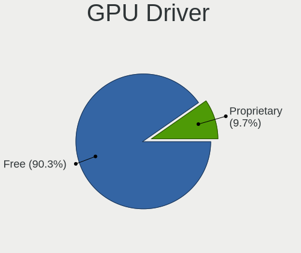

| Driver      | Computers | Percent |
|-------------|-----------|---------|
| Free        | 51        | 89.47%  |
| Proprietary | 6         | 10.53%  |

GPU Memory
----------

Total video memory

| Size in GB | Computers | Percent |
|------------|-----------|---------|
| Unknown    | 41        | 70.69%  |
| 3.01-4.0   | 4         | 6.9%    |
| 1.01-2.0   | 4         | 6.9%    |
| 0.51-1.0   | 4         | 6.9%    |
| 0.01-0.5   | 3         | 5.17%   |
| 7.01-8.0   | 1         | 1.72%   |
| 2.01-3.0   | 1         | 1.72%   |

Monitor
-------

Monitor Vendor
--------------

Monitor vendors

| Vendor                  | Computers | Percent |
|-------------------------|-----------|---------|
| Samsung Electronics     | 9         | 15.25%  |
| AU Optronics            | 9         | 15.25%  |
| LG Display              | 8         | 13.56%  |
| Chimei Innolux          | 8         | 13.56%  |
| BOE                     | 7         | 11.86%  |
| Chi Mei Optoelectronics | 4         | 6.78%   |
| Hewlett-Packard         | 2         | 3.39%   |
| Dell                    | 2         | 3.39%   |
| Apple                   | 2         | 3.39%   |
| AOC                     | 2         | 3.39%   |
| Vizio                   | 1         | 1.69%   |
| Sony                    | 1         | 1.69%   |
| Sceptre                 | 1         | 1.69%   |
| Philips                 | 1         | 1.69%   |
| Goldstar                | 1         | 1.69%   |
| AUS                     | 1         | 1.69%   |

Monitor Model
-------------

Monitor models

| Model                                                                     | Computers | Percent |
|---------------------------------------------------------------------------|-----------|---------|
| LG Display LCD Monitor LGD046F 1920x1080 344x194mm 15.5-inch              | 2         | 3.33%   |
| Vizio M320NV VIZ0070 1920x1080 700x390mm 31.5-inch                        | 1         | 1.67%   |
| Sony SDM-HX73 SNY2870 1280x1024 338x270mm 17.0-inch                       | 1         | 1.67%   |
| Sceptre LCD Monitor P30 2560x1080                                         | 1         | 1.67%   |
| Samsung Electronics LCD Monitor SEC4D45 1280x800 331x207mm 15.4-inch      | 1         | 1.67%   |
| Samsung Electronics LCD Monitor SEC4D42 1280x800 303x190mm 14.1-inch      | 1         | 1.67%   |
| Samsung Electronics LCD Monitor SEC3942 1366x768 309x174mm 14.0-inch      | 1         | 1.67%   |
| Samsung Electronics LCD Monitor SEC3847 1440x900 367x230mm 17.1-inch      | 1         | 1.67%   |
| Samsung Electronics LCD Monitor SEC3542 2160x1440 250x170mm 11.9-inch     | 1         | 1.67%   |
| Samsung Electronics LCD Monitor SEC314A 1920x1080 408x230mm 18.4-inch     | 1         | 1.67%   |
| Samsung Electronics LCD Monitor SDC3652 1366x768 340x190mm 15.3-inch      | 1         | 1.67%   |
| Samsung Electronics LCD Monitor SAM0F3D 1366x768 522x293mm 23.6-inch      | 1         | 1.67%   |
| Samsung Electronics LC32G7xT SAM705A 2560x1440 698x393mm 31.5-inch        | 1         | 1.67%   |
| Samsung Electronics C49RG9x SAM0F9C 3840x1080 1190x340mm 48.7-inch        | 1         | 1.67%   |
| Philips PHL 272E1 PHLC210 1920x1080 598x336mm 27.0-inch                   | 1         | 1.67%   |
| LG Display LCD Monitor LGD05F2 1920x1080 344x194mm 15.5-inch              | 1         | 1.67%   |
| LG Display LCD Monitor LGD0590 1920x1080 344x194mm 15.5-inch              | 1         | 1.67%   |
| LG Display LCD Monitor LGD0503 1366x768 340x190mm 15.3-inch               | 1         | 1.67%   |
| LG Display LCD Monitor LGD03CD 1366x768 277x156mm 12.5-inch               | 1         | 1.67%   |
| LG Display LCD Monitor LGD0390 1600x900 380x210mm 17.1-inch               | 1         | 1.67%   |
| LG Display LCD Monitor LGD0259 1920x1080 350x190mm 15.7-inch              | 1         | 1.67%   |
| Hewlett-Packard P224 HPN361C 1920x1080 480x270mm 21.7-inch                | 1         | 1.67%   |
| Hewlett-Packard ALL-in-One HPN4018 1920x1080 527x297mm 23.8-inch          | 1         | 1.67%   |
| Goldstar 24GM79G GSM5B39 1920x1080 531x298mm 24.0-inch                    | 1         | 1.67%   |
| Dell S2419H DELD0D2 1920x1080 527x296mm 23.8-inch                         | 1         | 1.67%   |
| Dell 1905FP DEL400D 1280x1024 376x301mm 19.0-inch                         | 1         | 1.67%   |
| Chimei Innolux LCD Monitor CMN176E 1920x1080 381x214mm 17.2-inch          | 1         | 1.67%   |
| Chimei Innolux LCD Monitor CMN1747 1920x1080 381x214mm 17.2-inch          | 1         | 1.67%   |
| Chimei Innolux LCD Monitor CMN15F4 1920x1080 344x193mm 15.5-inch          | 1         | 1.67%   |
| Chimei Innolux LCD Monitor CMN15DB 1366x768 344x193mm 15.5-inch           | 1         | 1.67%   |
| Chimei Innolux LCD Monitor CMN15CA 1366x768 340x190mm 15.3-inch           | 1         | 1.67%   |
| Chimei Innolux LCD Monitor CMN15BE 1366x768 340x190mm 15.3-inch           | 1         | 1.67%   |
| Chimei Innolux LCD Monitor CMN15BA 1920x1080 344x194mm 15.5-inch          | 1         | 1.67%   |
| Chimei Innolux LCD Monitor CMN1480 1366x768 310x170mm 13.9-inch           | 1         | 1.67%   |
| Chi Mei Optoelectronics LCD Monitor CMO1726 1920x1080 382x215mm 17.3-inch | 1         | 1.67%   |
| Chi Mei Optoelectronics LCD Monitor CMO15A2 1366x768 344x193mm 15.5-inch  | 1         | 1.67%   |
| Chi Mei Optoelectronics LCD Monitor CMO1464 1366x768 309x174mm 14.0-inch  | 1         | 1.67%   |
| Chi Mei Optoelectronics LCD Monitor CMO1444 1366x768 309x174mm 14.0-inch  | 1         | 1.67%   |
| BOE LCD Monitor BOE094A 1920x1080 344x194mm 15.5-inch                     | 1         | 1.67%   |
| BOE LCD Monitor BOE089B 1280x800 261x163mm 12.1-inch                      | 1         | 1.67%   |
| BOE LCD Monitor BOE07F6 1920x1080 309x174mm 14.0-inch                     | 1         | 1.67%   |
| BOE LCD Monitor BOE07C2 1920x1080 344x193mm 15.5-inch                     | 1         | 1.67%   |
| BOE LCD Monitor BOE076F 1366x768 344x194mm 15.5-inch                      | 1         | 1.67%   |
| BOE LCD Monitor BOE0747 1920x1080 344x194mm 15.5-inch                     | 1         | 1.67%   |
| BOE LCD Monitor BOE06CE 1366x768 277x156mm 12.5-inch                      | 1         | 1.67%   |
| AUS LCD Monitor VG259 1920x1080                                           | 1         | 1.67%   |
| AU Optronics LCD Monitor AUO8174 1280x800 331x207mm 15.4-inch             | 1         | 1.67%   |
| AU Optronics LCD Monitor AUO403D 1920x1080 309x173mm 13.9-inch            | 1         | 1.67%   |
| AU Optronics LCD Monitor AUO34ED 1920x1080 340x190mm 15.3-inch            | 1         | 1.67%   |
| AU Optronics LCD Monitor AUO328E 1920x1080 344x193mm 15.5-inch            | 1         | 1.67%   |
| AU Optronics LCD Monitor AUO303C 1366x768 309x173mm 13.9-inch             | 1         | 1.67%   |
| AU Optronics LCD Monitor AUO21EC 1366x768 340x190mm 15.3-inch             | 1         | 1.67%   |
| AU Optronics LCD Monitor AUO20EC 1366x768 344x193mm 15.5-inch             | 1         | 1.67%   |
| AU Optronics LCD Monitor AUO139E 1600x900 382x214mm 17.2-inch             | 1         | 1.67%   |
| AU Optronics LCD Monitor AUO113D 1920x1080 309x173mm 13.9-inch            | 1         | 1.67%   |
| Apple LCD Monitor APP9CC5 1280x800 286x179mm 13.3-inch                    | 1         | 1.67%   |
| Apple Color LCD APPA018 2560x1600 286x179mm 13.3-inch                     | 1         | 1.67%   |
| AOC LCD Monitor 2217 1680x1050                                            | 1         | 1.67%   |
| AOC 917W AOC1917 1440x900 410x256mm 19.0-inch                             | 1         | 1.67%   |

Monitor Resolution
------------------

Monitor screen resolution

| Resolution         | Computers | Percent |
|--------------------|-----------|---------|
| 1920x1080 (FHD)    | 26        | 44.07%  |
| 1366x768 (WXGA)    | 17        | 28.81%  |
| 1280x800 (WXGA)    | 4         | 6.78%   |
| 1600x900 (HD+)     | 2         | 3.39%   |
| 1440x900 (WXGA+)   | 2         | 3.39%   |
| 1280x1024 (SXGA)   | 2         | 3.39%   |
| 3840x1080          | 1         | 1.69%   |
| 2560x1600          | 1         | 1.69%   |
| 2560x1440 (QHD)    | 1         | 1.69%   |
| 2560x1080          | 1         | 1.69%   |
| 2160x1440          | 1         | 1.69%   |
| 1680x1050 (WSXGA+) | 1         | 1.69%   |

Monitor Diagonal
----------------

Diagonal size in inches

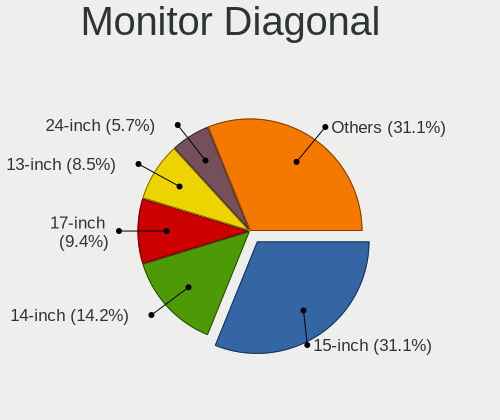

| Inches  | Computers | Percent |
|---------|-----------|---------|
| 15      | 25        | 41.67%  |
| 17      | 7         | 11.67%  |
| 14      | 7         | 11.67%  |
| 13      | 4         | 6.67%   |
| Unknown | 3         | 5%      |
| 31      | 2         | 3.33%   |
| 24      | 2         | 3.33%   |
| 23      | 2         | 3.33%   |
| 19      | 2         | 3.33%   |
| 12      | 2         | 3.33%   |
| 48      | 1         | 1.67%   |
| 42      | 1         | 1.67%   |
| 27      | 1         | 1.67%   |
| 18      | 1         | 1.67%   |

Monitor Width
-------------

Physical width

| Width in mm | Computers | Percent |
|-------------|-----------|---------|
| 301-350     | 35        | 59.32%  |
| 351-400     | 7         | 11.86%  |
| 501-600     | 4         | 6.78%   |
| 201-300     | 4         | 6.78%   |
| Unknown     | 3         | 5.08%   |
| 601-700     | 2         | 3.39%   |
| 401-500     | 2         | 3.39%   |
| 1001-1500   | 1         | 1.69%   |
| 901-1000    | 1         | 1.69%   |

Aspect Ratio
------------

Proportional relationship between the width and the height

| Ratio   | Computers | Percent |
|---------|-----------|---------|
| 16/9    | 45        | 77.59%  |
| 16/10   | 7         | 12.07%  |
| Unknown | 3         | 5.17%   |
| 6/5     | 1         | 1.72%   |
| 5/4     | 1         | 1.72%   |
| 32/9    | 1         | 1.72%   |

Monitor Area
------------

Area in inch²

| Area in inch² | Computers | Percent |
|----------------|-----------|---------|
| 101-110        | 25        | 41.67%  |
| 81-90          | 10        | 16.67%  |
| 121-130        | 5         | 8.33%   |
| 201-250        | 4         | 6.67%   |
| Unknown        | 3         | 5%      |
| 61-70          | 2         | 3.33%   |
| 351-500        | 2         | 3.33%   |
| 151-200        | 2         | 3.33%   |
| 141-150        | 2         | 3.33%   |
| 501-1000       | 2         | 3.33%   |
| 71-80          | 1         | 1.67%   |
| 301-350        | 1         | 1.67%   |
| 131-140        | 1         | 1.67%   |

Pixel Density
-------------

Pixels per inch

| Density | Computers | Percent |
|---------|-----------|---------|
| 121-160 | 21        | 36.21%  |
| 101-120 | 19        | 32.76%  |
| 51-100  | 13        | 22.41%  |
| Unknown | 3         | 5.17%   |
| 1-50    | 1         | 1.72%   |
| 161-240 | 1         | 1.72%   |

Multiple Monitors
-----------------

Total monitors connected

| Total | Computers | Percent |
|-------|-----------|---------|
| 1     | 52        | 91.23%  |
| 2     | 5         | 8.77%   |

Network
-------

Net Controller Vendor
---------------------

Controller vendors

| Vendor                            | Computers | Percent |
|-----------------------------------|-----------|---------|
| Realtek Semiconductor             | 31        | 31.96%  |
| Intel                             | 27        | 27.84%  |
| Qualcomm Atheros                  | 15        | 15.46%  |
| Broadcom                          | 7         | 7.22%   |
| TP-Link                           | 3         | 3.09%   |
| Qualcomm Atheros Communications   | 3         | 3.09%   |
| Ralink Technology                 | 2         | 2.06%   |
| Broadcom Limited                  | 2         | 2.06%   |
| Xiaomi                            | 1         | 1.03%   |
| Samsung Electronics               | 1         | 1.03%   |
| NetGear                           | 1         | 1.03%   |
| Marvell Technology Group          | 1         | 1.03%   |
| Huawei Technologies               | 1         | 1.03%   |
| Ericsson Business Mobile Networks | 1         | 1.03%   |
| D-Link System                     | 1         | 1.03%   |

Net Controller Model
--------------------

Controller models

| Model                                                                     | Computers | Percent |
|---------------------------------------------------------------------------|-----------|---------|
| Realtek RTL8111/8168/8411 PCI Express Gigabit Ethernet Controller         | 19        | 16.24%  |
| Realtek RTL810xE PCI Express Fast Ethernet controller                     | 5         | 4.27%   |
| Qualcomm Atheros AR9485 Wireless Network Adapter                          | 4         | 3.42%   |
| Intel Wireless 7265                                                       | 4         | 3.42%   |
| TP-Link TL-WN722N v2/v3 [Realtek RTL8188EUS]                              | 3         | 2.56%   |
| Realtek RTL8814AU 802.11a/b/g/n/ac Wireless Adapter                       | 3         | 2.56%   |
| Qualcomm Atheros QCA9377 802.11ac Wireless Network Adapter                | 3         | 2.56%   |
| Qualcomm Atheros Killer E2500 Gigabit Ethernet Controller                 | 3         | 2.56%   |
| Qualcomm Atheros AR9271 802.11n                                           | 3         | 2.56%   |
| Intel Wireless 3160                                                       | 3         | 2.56%   |
| Intel Comet Lake PCH CNVi WiFi                                            | 3         | 2.56%   |
| Intel Cannon Lake PCH CNVi WiFi                                           | 3         | 2.56%   |
| Realtek RTL8822CE 802.11ac PCIe Wireless Network Adapter                  | 2         | 1.71%   |
| Realtek RTL8821CE 802.11ac PCIe Wireless Network Adapter                  | 2         | 1.71%   |
| Realtek RTL8153 Gigabit Ethernet Adapter                                  | 2         | 1.71%   |
| Ralink RT2870/RT3070 Wireless Adapter                                     | 2         | 1.71%   |
| Qualcomm Atheros AR9462 Wireless Network Adapter                          | 2         | 1.71%   |
| Intel Wireless 8260                                                       | 2         | 1.71%   |
| Intel Ethernet Connection I217-V                                          | 2         | 1.71%   |
| Intel Centrino Advanced-N 6205 [Taylor Peak]                              | 2         | 1.71%   |
| Broadcom BCM4312 802.11b/g LP-PHY                                         | 2         | 1.71%   |
| Xiaomi Mi/Redmi series (RNDIS)                                            | 1         | 0.85%   |
| Samsung Galaxy series, misc. (tethering mode)                             | 1         | 0.85%   |
| Realtek RTL8822BE 802.11a/b/g/n/ac WiFi adapter                           | 1         | 0.85%   |
| Realtek RTL8188CE 802.11b/g/n WiFi Adapter                                | 1         | 0.85%   |
| Realtek RTL-8100/8101L/8139 PCI Fast Ethernet Adapter                     | 1         | 0.85%   |
| Qualcomm Atheros Killer E2400 Gigabit Ethernet Controller                 | 1         | 0.85%   |
| Qualcomm Atheros Killer E220x Gigabit Ethernet Controller                 | 1         | 0.85%   |
| Qualcomm Atheros AR928X Wireless Network Adapter (PCI-Express)            | 1         | 0.85%   |
| Qualcomm Atheros AR9285 Wireless Network Adapter (PCI-Express)            | 1         | 0.85%   |
| Qualcomm Atheros AR8162 Fast Ethernet                                     | 1         | 0.85%   |
| Qualcomm Atheros AR8161 Gigabit Ethernet                                  | 1         | 0.85%   |
| Qualcomm Atheros AR242x / AR542x Wireless Network Adapter (PCI-Express)   | 1         | 0.85%   |
| NetGear Nighthawk A7000 802.11ac Wireless Adapter AC1900 [Realtek 8814AU] | 1         | 0.85%   |
| Marvell Group 88W8897 [AVASTAR] 802.11ac Wireless                         | 1         | 0.85%   |
| Intel Wireless 8265 / 8275                                                | 1         | 0.85%   |
| Intel Wireless 3165                                                       | 1         | 0.85%   |
| Intel Wi-Fi 6 AX200                                                       | 1         | 0.85%   |
| Intel PRO/Wireless 3945ABG [Golan] Network Connection                     | 1         | 0.85%   |
| Intel PRO/100 VE Network Connection                                       | 1         | 0.85%   |
| Intel I211 Gigabit Network Connection                                     | 1         | 0.85%   |
| Intel I210 Gigabit Network Connection                                     | 1         | 0.85%   |
| Intel Ethernet controller                                                 | 1         | 0.85%   |
| Intel Ethernet Connection I219-V                                          | 1         | 0.85%   |
| Intel Ethernet Connection I218-LM                                         | 1         | 0.85%   |
| Intel Ethernet Connection (7) I219-LM                                     | 1         | 0.85%   |
| Intel Ethernet Connection (3) I218-LM                                     | 1         | 0.85%   |
| Intel Ethernet Connection (2) I219-V                                      | 1         | 0.85%   |
| Intel Ethernet Connection (2) I219-LM                                     | 1         | 0.85%   |
| Intel Centrino Wireless-N 105                                             | 1         | 0.85%   |
| Intel Centrino Advanced-N 6235                                            | 1         | 0.85%   |
| Intel Cannon Point-LP CNVi [Wireless-AC]                                  | 1         | 0.85%   |
| Intel 82579LM Gigabit Network Connection (Lewisville)                     | 1         | 0.85%   |
| Huawei BLA-L29                                                            | 1         | 0.85%   |
| Ericsson Business Mobile Networks N5321 gw                                | 1         | 0.85%   |
| D-Link System DWA-125 Wireless N 150 Adapter(rev.A2) [Ralink RT3070]      | 1         | 0.85%   |
| Broadcom NetXtreme BCM57765 Gigabit Ethernet PCIe                         | 1         | 0.85%   |
| Broadcom NetLink BCM5787M Gigabit Ethernet PCI Express                    | 1         | 0.85%   |
| Broadcom NetLink BCM57785 Gigabit Ethernet PCIe                           | 1         | 0.85%   |
| Broadcom Limited NetXtreme BCM5761 Gigabit Ethernet PCIe                  | 1         | 0.85%   |

Wireless Vendor
---------------

Wireless vendors

| Vendor                          | Computers | Percent |
|---------------------------------|-----------|---------|
| Intel                           | 24        | 38.71%  |
| Qualcomm Atheros                | 12        | 19.35%  |
| Realtek Semiconductor           | 9         | 14.52%  |
| Broadcom                        | 5         | 8.06%   |
| TP-Link                         | 3         | 4.84%   |
| Qualcomm Atheros Communications | 3         | 4.84%   |
| Ralink Technology               | 2         | 3.23%   |
| NetGear                         | 1         | 1.61%   |
| Marvell Technology Group        | 1         | 1.61%   |
| D-Link System                   | 1         | 1.61%   |
| Broadcom Limited                | 1         | 1.61%   |

Wireless Model
--------------

Wireless models

| Model                                                                     | Computers | Percent |
|---------------------------------------------------------------------------|-----------|---------|
| Qualcomm Atheros AR9485 Wireless Network Adapter                          | 4         | 6.45%   |
| Intel Wireless 7265                                                       | 4         | 6.45%   |
| TP-Link TL-WN722N v2/v3 [Realtek RTL8188EUS]                              | 3         | 4.84%   |
| Realtek RTL8814AU 802.11a/b/g/n/ac Wireless Adapter                       | 3         | 4.84%   |
| Qualcomm Atheros QCA9377 802.11ac Wireless Network Adapter                | 3         | 4.84%   |
| Qualcomm Atheros AR9271 802.11n                                           | 3         | 4.84%   |
| Intel Wireless 3160                                                       | 3         | 4.84%   |
| Intel Comet Lake PCH CNVi WiFi                                            | 3         | 4.84%   |
| Intel Cannon Lake PCH CNVi WiFi                                           | 3         | 4.84%   |
| Realtek RTL8822CE 802.11ac PCIe Wireless Network Adapter                  | 2         | 3.23%   |
| Realtek RTL8821CE 802.11ac PCIe Wireless Network Adapter                  | 2         | 3.23%   |
| Ralink RT2870/RT3070 Wireless Adapter                                     | 2         | 3.23%   |
| Qualcomm Atheros AR9462 Wireless Network Adapter                          | 2         | 3.23%   |
| Intel Wireless 8260                                                       | 2         | 3.23%   |
| Intel Centrino Advanced-N 6205 [Taylor Peak]                              | 2         | 3.23%   |
| Broadcom BCM4312 802.11b/g LP-PHY                                         | 2         | 3.23%   |
| Realtek RTL8822BE 802.11a/b/g/n/ac WiFi adapter                           | 1         | 1.61%   |
| Realtek RTL8188CE 802.11b/g/n WiFi Adapter                                | 1         | 1.61%   |
| Qualcomm Atheros AR928X Wireless Network Adapter (PCI-Express)            | 1         | 1.61%   |
| Qualcomm Atheros AR9285 Wireless Network Adapter (PCI-Express)            | 1         | 1.61%   |
| Qualcomm Atheros AR242x / AR542x Wireless Network Adapter (PCI-Express)   | 1         | 1.61%   |
| NetGear Nighthawk A7000 802.11ac Wireless Adapter AC1900 [Realtek 8814AU] | 1         | 1.61%   |
| Marvell Group 88W8897 [AVASTAR] 802.11ac Wireless                         | 1         | 1.61%   |
| Intel Wireless 8265 / 8275                                                | 1         | 1.61%   |
| Intel Wireless 3165                                                       | 1         | 1.61%   |
| Intel Wi-Fi 6 AX200                                                       | 1         | 1.61%   |
| Intel PRO/Wireless 3945ABG [Golan] Network Connection                     | 1         | 1.61%   |
| Intel Centrino Wireless-N 105                                             | 1         | 1.61%   |
| Intel Centrino Advanced-N 6235                                            | 1         | 1.61%   |
| Intel Cannon Point-LP CNVi [Wireless-AC]                                  | 1         | 1.61%   |
| D-Link System DWA-125 Wireless N 150 Adapter(rev.A2) [Ralink RT3070]      | 1         | 1.61%   |
| Broadcom Limited BCM4360 802.11ac Wireless Network Adapter                | 1         | 1.61%   |
| Broadcom BCM4331 802.11a/b/g/n                                            | 1         | 1.61%   |
| Broadcom BCM43228 802.11a/b/g/n                                           | 1         | 1.61%   |
| Broadcom BCM43142 802.11b/g/n                                             | 1         | 1.61%   |

Ethernet Vendor
---------------

Ethernet vendors

| Vendor                | Computers | Percent |
|-----------------------|-----------|---------|
| Realtek Semiconductor | 26        | 50%     |
| Intel                 | 12        | 23.08%  |
| Qualcomm Atheros      | 7         | 13.46%  |
| Broadcom              | 3         | 5.77%   |
| Xiaomi                | 1         | 1.92%   |
| Samsung Electronics   | 1         | 1.92%   |
| Huawei Technologies   | 1         | 1.92%   |
| Broadcom Limited      | 1         | 1.92%   |

Ethernet Model
--------------

Ethernet models

| Model                                                             | Computers | Percent |
|-------------------------------------------------------------------|-----------|---------|
| Realtek RTL8111/8168/8411 PCI Express Gigabit Ethernet Controller | 19        | 35.19%  |
| Realtek RTL810xE PCI Express Fast Ethernet controller             | 5         | 9.26%   |
| Qualcomm Atheros Killer E2500 Gigabit Ethernet Controller         | 3         | 5.56%   |
| Realtek RTL8153 Gigabit Ethernet Adapter                          | 2         | 3.7%    |
| Intel Ethernet Connection I217-V                                  | 2         | 3.7%    |
| Xiaomi Mi/Redmi series (RNDIS)                                    | 1         | 1.85%   |
| Samsung Galaxy series, misc. (tethering mode)                     | 1         | 1.85%   |
| Realtek RTL-8100/8101L/8139 PCI Fast Ethernet Adapter             | 1         | 1.85%   |
| Qualcomm Atheros Killer E2400 Gigabit Ethernet Controller         | 1         | 1.85%   |
| Qualcomm Atheros Killer E220x Gigabit Ethernet Controller         | 1         | 1.85%   |
| Qualcomm Atheros AR8162 Fast Ethernet                             | 1         | 1.85%   |
| Qualcomm Atheros AR8161 Gigabit Ethernet                          | 1         | 1.85%   |
| Intel PRO/100 VE Network Connection                               | 1         | 1.85%   |
| Intel I211 Gigabit Network Connection                             | 1         | 1.85%   |
| Intel I210 Gigabit Network Connection                             | 1         | 1.85%   |
| Intel Ethernet controller                                         | 1         | 1.85%   |
| Intel Ethernet Connection I219-V                                  | 1         | 1.85%   |
| Intel Ethernet Connection I218-LM                                 | 1         | 1.85%   |
| Intel Ethernet Connection (7) I219-LM                             | 1         | 1.85%   |
| Intel Ethernet Connection (3) I218-LM                             | 1         | 1.85%   |
| Intel Ethernet Connection (2) I219-V                              | 1         | 1.85%   |
| Intel Ethernet Connection (2) I219-LM                             | 1         | 1.85%   |
| Intel 82579LM Gigabit Network Connection (Lewisville)             | 1         | 1.85%   |
| Huawei BLA-L29                                                    | 1         | 1.85%   |
| Broadcom NetXtreme BCM57765 Gigabit Ethernet PCIe                 | 1         | 1.85%   |
| Broadcom NetLink BCM5787M Gigabit Ethernet PCI Express            | 1         | 1.85%   |
| Broadcom NetLink BCM57785 Gigabit Ethernet PCIe                   | 1         | 1.85%   |
| Broadcom Limited NetXtreme BCM5761 Gigabit Ethernet PCIe          | 1         | 1.85%   |

Net Controller Kind
-------------------

Ethernet, WiFi or modem

| Kind     | Computers | Percent |
|----------|-----------|---------|
| WiFi     | 54        | 52.43%  |
| Ethernet | 48        | 46.6%   |
| Modem    | 1         | 0.97%   |

Used Controller
---------------

Currently used network controller

| Kind     | Computers | Percent |
|----------|-----------|---------|
| WiFi     | 45        | 63.38%  |
| Ethernet | 26        | 36.62%  |

NICs
----

Total network controllers on board

| Total | Computers | Percent |
|-------|-----------|---------|
| 2     | 38        | 66.67%  |
| 1     | 17        | 29.82%  |
| 3     | 2         | 3.51%   |

IPv6
----

IPv6 vs IPv4

| Used | Computers | Percent |
|------|-----------|---------|
| No   | 44        | 75.86%  |
| Yes  | 14        | 24.14%  |

Bluetooth
---------

Bluetooth Vendor
----------------

Controller vendors

| Vendor                          | Computers | Percent |
|---------------------------------|-----------|---------|
| Intel                           | 19        | 47.5%   |
| Qualcomm Atheros Communications | 8         | 20%     |
| Realtek Semiconductor           | 4         | 10%     |
| Broadcom                        | 3         | 7.5%    |
| Marvell Semiconductor           | 1         | 2.5%    |
| Lite-On Technology              | 1         | 2.5%    |
| Foxconn / Hon Hai               | 1         | 2.5%    |
| Dell                            | 1         | 2.5%    |
| Cambridge Silicon Radio         | 1         | 2.5%    |
| Apple                           | 1         | 2.5%    |

Bluetooth Model
---------------

Controller models

| Model                                               | Computers | Percent |
|-----------------------------------------------------|-----------|---------|
| Intel Bluetooth wireless interface                  | 8         | 20%     |
| Intel Bluetooth 9460/9560 Jefferson Peak (JfP)      | 5         | 12.5%   |
| Qualcomm Atheros  Bluetooth Device                  | 4         | 10%     |
| Intel Bluetooth Device                              | 3         | 7.5%    |
| Realtek  Bluetooth 4.2 Adapter                      | 2         | 5%      |
| Realtek Bluetooth Radio                             | 2         | 5%      |
| Qualcomm Atheros Bluetooth USB Host Controller      | 2         | 5%      |
| Qualcomm Atheros AR3012 Bluetooth 4.0               | 2         | 5%      |
| Intel AX201 Bluetooth                               | 2         | 5%      |
| Marvell Bluetooth and Wireless LAN Composite Device | 1         | 2.5%    |
| Lite-On Bluetooth Radio                             | 1         | 2.5%    |
| Intel AX200 Bluetooth                               | 1         | 2.5%    |
| Foxconn / Hon Hai BCM20702A0                        | 1         | 2.5%    |
| Dell DW375 Bluetooth Module                         | 1         | 2.5%    |
| Cambridge Silicon Radio Bluetooth Dongle (HCI mode) | 1         | 2.5%    |
| Broadcom HP Portable Bumble Bee                     | 1         | 2.5%    |
| Broadcom BCM43142A0 Bluetooth Device                | 1         | 2.5%    |
| Broadcom BCM20702A0 Bluetooth 4.0                   | 1         | 2.5%    |
| Apple Bluetooth Host Controller                     | 1         | 2.5%    |

Sound
-----

Sound Vendor
------------

Sound card vendors

| Vendor              | Computers | Percent |
|---------------------|-----------|---------|
| Intel               | 49        | 66.22%  |
| Nvidia              | 14        | 18.92%  |
| AMD                 | 10        | 13.51%  |
| C-Media Electronics | 1         | 1.35%   |

Sound Model
-----------

Sound card models

| Model                                                                             | Computers | Percent |
|-----------------------------------------------------------------------------------|-----------|---------|
| Intel 6 Series/C200 Series Chipset Family High Definition Audio Controller        | 8         | 8.79%   |
| Intel Cannon Lake PCH cAVS                                                        | 5         | 5.49%   |
| Intel 7 Series/C216 Chipset Family High Definition Audio Controller               | 5         | 5.49%   |
| Intel Wildcat Point-LP High Definition Audio Controller                           | 4         | 4.4%    |
| Intel Sunrise Point-LP HD Audio                                                   | 4         | 4.4%    |
| Intel Broadwell-U Audio Controller                                                | 4         | 4.4%    |
| Nvidia GM107 High Definition Audio Controller [GeForce 940MX]                     | 3         | 3.3%    |
| Intel Xeon E3-1200 v3/4th Gen Core Processor HD Audio Controller                  | 3         | 3.3%    |
| Intel Haswell-ULT HD Audio Controller                                             | 3         | 3.3%    |
| Intel Comet Lake PCH cAVS                                                         | 3         | 3.3%    |
| Intel 8 Series/C220 Series Chipset High Definition Audio Controller               | 3         | 3.3%    |
| Intel 8 Series HD Audio Controller                                                | 3         | 3.3%    |
| AMD Family 17h (Models 10h-1fh) HD Audio Controller                               | 3         | 3.3%    |
| Nvidia TU107 GeForce GTX 1650 High Definition Audio Controller                    | 2         | 2.2%    |
| Nvidia GP106 High Definition Audio Controller                                     | 2         | 2.2%    |
| Nvidia GA104 High Definition Audio Controller                                     | 2         | 2.2%    |
| Intel CM238 HD Audio Controller                                                   | 2         | 2.2%    |
| Intel Celeron/Pentium Silver Processor High Definition Audio                      | 2         | 2.2%    |
| Intel Cannon Point-LP High Definition Audio Controller                            | 2         | 2.2%    |
| Intel 82801I (ICH9 Family) HD Audio Controller                                    | 2         | 2.2%    |
| Intel 82801H (ICH8 Family) HD Audio Controller                                    | 2         | 2.2%    |
| AMD FCH Azalia Controller                                                         | 2         | 2.2%    |
| Nvidia TU106 High Definition Audio Controller                                     | 1         | 1.1%    |
| Nvidia GP107GL High Definition Audio Controller                                   | 1         | 1.1%    |
| Nvidia GK106 HDMI Audio Controller                                                | 1         | 1.1%    |
| Nvidia GK104 HDMI Audio Controller                                                | 1         | 1.1%    |
| Nvidia GF116 High Definition Audio Controller                                     | 1         | 1.1%    |
| Intel USB PnP Sound Device                                                        | 1         | 1.1%    |
| Intel NM10/ICH7 Family High Definition Audio Controller                           | 1         | 1.1%    |
| Intel Ice Lake-LP Smart Sound Technology Audio Controller                         | 1         | 1.1%    |
| Intel 200 Series PCH HD Audio                                                     | 1         | 1.1%    |
| Intel 100 Series/C230 Series Chipset Family HD Audio Controller                   | 1         | 1.1%    |
| C-Media Electronics CM102-A+/102S+ Audio Controller                               | 1         | 1.1%    |
| AMD Trinity HDMI Audio Controller                                                 | 1         | 1.1%    |
| AMD SBx00 Azalia (Intel HDA)                                                      | 1         | 1.1%    |
| AMD RS780 HDMI Audio [Radeon 3000/3100 / HD 3200/3300]                            | 1         | 1.1%    |
| AMD Renoir Radeon High Definition Audio Controller                                | 1         | 1.1%    |
| AMD Raven/Raven2/Fenghuang HDMI/DP Audio Controller                               | 1         | 1.1%    |
| AMD Polaris 22 HDMI Audio                                                         | 1         | 1.1%    |
| AMD Kabini HDMI/DP Audio                                                          | 1         | 1.1%    |
| AMD High Definition Audio Controller                                              | 1         | 1.1%    |
| AMD Family 17h (Models 00h-0fh) HD Audio Controller                               | 1         | 1.1%    |
| AMD Family 15h (Models 60h-6fh) Audio Controller                                  | 1         | 1.1%    |
| AMD Caicos HDMI Audio [Radeon HD 6450 / 7450/8450/8490 OEM / R5 230/235/235X OEM] | 1         | 1.1%    |

Memory
------

Memory Vendor
-------------

Memory module vendors

| Vendor              | Computers | Percent |
|---------------------|-----------|---------|
| Samsung Electronics | 13        | 31.71%  |
| Unknown             | 4         | 9.76%   |
| SK Hynix            | 4         | 9.76%   |
| Crucial             | 4         | 9.76%   |
| Kingston            | 3         | 7.32%   |
| ELPIDA              | 3         | 7.32%   |
| Ramaxel Technology  | 2         | 4.88%   |
| Corsair             | 2         | 4.88%   |
| A-DATA Technology   | 2         | 4.88%   |
| S                   | 1         | 2.44%   |
| Nanya Technology    | 1         | 2.44%   |
| Micron Technology   | 1         | 2.44%   |
| G.Skill             | 1         | 2.44%   |

Memory Model
------------

Memory module models

| Model                                                        | Computers | Percent |
|--------------------------------------------------------------|-----------|---------|
| Samsung RAM M471B5173DB0-YK0 4GB SODIMM DDR3 1600MT/s        | 2         | 4.65%   |
| Samsung RAM M471A5244CB0-CTD 4GB SODIMM DDR4 3266MT/s        | 2         | 4.65%   |
| Unknown RAM Module 8GB SODIMM DDR3 1600MT/s                  | 1         | 2.33%   |
| Unknown RAM Module 4GB DIMM 1600MT/s                         | 1         | 2.33%   |
| Unknown RAM Module 2048MB SODIMM DDR2 667MT/s                | 1         | 2.33%   |
| Unknown RAM Module 1GB SODIMM DDR2 533MT/s                   | 1         | 2.33%   |
| Unknown RAM Module 1024MB SODIMM DDR2 667MT/s                | 1         | 2.33%   |
| SK Hynix RAM Module 4GB SODIMM DDR3 1600MT/s                 | 1         | 2.33%   |
| SK Hynix RAM HMT451S6BFR8A-PB 4GB SODIMM DDR3 1600MT/s       | 1         | 2.33%   |
| SK Hynix RAM HMT351S6CFR8C-PB 4096MB SODIMM DDR3 1600MT/s    | 1         | 2.33%   |
| SK Hynix RAM HMA851S6JJR6N-VK 4096MB SODIMM DDR4 2667MT/s    | 1         | 2.33%   |
| Samsung RAM Module 2GB SODIMM LPDDR4 2400MT/s                | 1         | 2.33%   |
| Samsung RAM M474A4G43MB1-CTD 32GB SODIMM DDR4 2667MT/s       | 1         | 2.33%   |
| Samsung RAM M471B5773DH0-CK0 2GB SODIMM DDR3 1600MT/s        | 1         | 2.33%   |
| Samsung RAM M471B5273DH0-CH9 4GB SODIMM DDR3 1334MT/s        | 1         | 2.33%   |
| Samsung RAM M471B1G73EB0-YK0 8192MB SODIMM DDR3 1600MT/s     | 1         | 2.33%   |
| Samsung RAM M471A5244CB0-CWE 4GB SODIMM DDR4 3200MT/s        | 1         | 2.33%   |
| Samsung RAM M471A4G43MB1-CTD 32GB SODIMM DDR4 2667MT/s       | 1         | 2.33%   |
| Samsung RAM M471A1K43DB1-CWE 8GB SODIMM DDR4 3200MT/s        | 1         | 2.33%   |
| Samsung RAM M471A1K43CB1-CTD 8GB SODIMM DDR4 2667MT/s        | 1         | 2.33%   |
| Samsung RAM M471A1K43CB1-CRC 8GB SODIMM DDR4 2667MT/s        | 1         | 2.33%   |
| S RAM Module 2GB DIMM DDR3 1600MT/s                          | 1         | 2.33%   |
| Ramaxel RAM RMT3170MN68F9F1600 4GB SODIMM DDR3 1600MT/s      | 1         | 2.33%   |
| Ramaxel RAM RMSA3260MH78HAF-2666 8192MB SODIMM DDR4 2667MT/s | 1         | 2.33%   |
| Nanya RAM NT4GC64B88B1NF-DI 4GB DIMM DDR3 1600MT/s           | 1         | 2.33%   |
| Micron RAM 16JSF51264HZ-1G4D1 4096MB SODIMM 1334MT/s         | 1         | 2.33%   |
| Kingston RAM KHX2666C15S4/16G 16GB SODIMM DDR4 2667MT/s      | 1         | 2.33%   |
| Kingston RAM HP26D4S9S8MH-8 8GB SODIMM DDR4 2400MT/s         | 1         | 2.33%   |
| Kingston RAM 99U5469-046.A00LF 4096MB SODIMM DDR3 1333MT/s   | 1         | 2.33%   |
| G.Skill RAM F4-2400C16-16GRS 16GB SODIMM DDR4 2667MT/s       | 1         | 2.33%   |
| Elpida RAM Module 4GB SODIMM DDR3 1600MT/s                   | 1         | 2.33%   |
| Elpida RAM EBJ41UF8BCS0-DJ-F 4096MB SODIMM DDR3 1334MT/s     | 1         | 2.33%   |
| ELPIDA RAM EBJ21UE8BDS0-DJ-F 2GB SODIMM DDR3 1334MT/s        | 1         | 2.33%   |
| Crucial RAM CT8G4SFS8266.C8FE 8GB SODIMM DDR4 2667MT/s       | 1         | 2.33%   |
| Crucial RAM CT32G4SFD8266.C16FE 32GB SODIMM DDR4 2667MT/s    | 1         | 2.33%   |
| Crucial RAM CT102464BA1339.C16 8GB DIMM DDR3 1333MT/s        | 1         | 2.33%   |
| Crucial RAM 99P5471-006.A00DT 4GB SODIMM 1067MT/s            | 1         | 2.33%   |
| Corsair RAM HMA81GU6JJR8N-VK 8GB DIMM DDR4 2666MT/s          | 1         | 2.33%   |
| Corsair RAM CMSO8GX3M1A1600C11 8192MB SODIMM DDR3 1600MT/s   | 1         | 2.33%   |
| A-DATA RAM Module 16GB SODIMM DDR4 2667MT/s                  | 1         | 2.33%   |
| A-DATA RAM AM1P26KC8T1-BAAS 8GB SODIMM DDR4 2667MT/s         | 1         | 2.33%   |

Memory Kind
-----------

Memory module kinds

| Kind    | Computers | Percent |
|---------|-----------|---------|
| DDR3    | 17        | 47.22%  |
| DDR4    | 15        | 41.67%  |
| DDR2    | 2         | 5.56%   |
| LPDDR4  | 1         | 2.78%   |
| Unknown | 1         | 2.78%   |

Memory Form Factor
------------------

Physical design of the memory module

| Name   | Computers | Percent |
|--------|-----------|---------|
| SODIMM | 31        | 86.11%  |
| DIMM   | 5         | 13.89%  |

Memory Size
-----------

Memory module size

| Size  | Computers | Percent |
|-------|-----------|---------|
| 4096  | 16        | 40%     |
| 8192  | 13        | 32.5%   |
| 2048  | 4         | 10%     |
| 16384 | 3         | 7.5%    |
| 32768 | 2         | 5%      |
| 1024  | 2         | 5%      |

Memory Speed
------------

Memory module speed

| Speed | Computers | Percent |
|-------|-----------|---------|
| 1600  | 12        | 32.43%  |
| 2667  | 10        | 27.03%  |
| 1334  | 3         | 8.11%   |
| 3266  | 2         | 5.41%   |
| 3200  | 2         | 5.41%   |
| 2400  | 2         | 5.41%   |
| 1333  | 2         | 5.41%   |
| 2666  | 1         | 2.7%    |
| 1067  | 1         | 2.7%    |
| 667   | 1         | 2.7%    |
| 533   | 1         | 2.7%    |

Printers & scanners
-------------------

Printer Vendor
--------------

Printer device vendors

Zero info for selected period =(

Printer Model
-------------

Printer device models

Zero info for selected period =(

Scanner Vendor
--------------

Scanner device vendors

| Vendor | Computers | Percent |
|--------|-----------|---------|
| Canon  | 1         | 100%    |

Scanner Model
-------------

Scanner device models

| Model                         | Computers | Percent |
|-------------------------------|-----------|---------|
| Canon CanoScan N1240U/LiDE 30 | 1         | 100%    |

Camera
------

Camera Vendor
-------------

Camera device vendors

| Vendor                                 | Computers | Percent |
|----------------------------------------|-----------|---------|
| Chicony Electronics                    | 11        | 27.5%   |
| Acer                                   | 7         | 17.5%   |
| Microdia                               | 4         | 10%     |
| Cheng Uei Precision Industry (Foxlink) | 3         | 7.5%    |
| Sunplus Innovation Technology          | 2         | 5%      |
| Realtek Semiconductor                  | 2         | 5%      |
| Luxvisions Innotech Limited            | 2         | 5%      |
| IMC Networks                           | 2         | 5%      |
| Suyin                                  | 1         | 2.5%    |
| Silicon Motion                         | 1         | 2.5%    |
| Samsung Electronics                    | 1         | 2.5%    |
| Ricoh                                  | 1         | 2.5%    |
| Quanta                                 | 1         | 2.5%    |
| Microsoft                              | 1         | 2.5%    |
| Apple                                  | 1         | 2.5%    |

Camera Model
------------

Camera device models

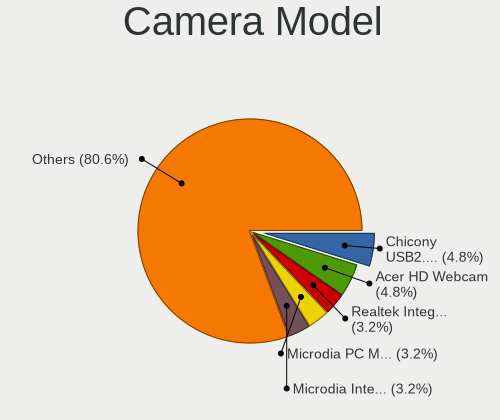

| Model                                                                      | Computers | Percent |
|----------------------------------------------------------------------------|-----------|---------|
| Chicony USB2.0 HD UVC WebCam                                               | 3         | 7.32%   |
| Acer HD Webcam                                                             | 3         | 7.32%   |
| Realtek Integrated_Webcam_HD                                               | 2         | 4.88%   |
| Luxvisions Innotech Limited HP TrueVision HD Camera                        | 2         | 4.88%   |
| Suyin Acer CrystalEye Webcam                                               | 1         | 2.44%   |
| Sunplus Laptop_Integrated_Webcam_FHD                                       | 1         | 2.44%   |
| Sunplus HD WebCam                                                          | 1         | 2.44%   |
| Silicon Motion WebCam SC-03FFL11939N                                       | 1         | 2.44%   |
| Samsung Galaxy A5 (MTP)                                                    | 1         | 2.44%   |
| Ricoh Pavilion Webcam                                                      | 1         | 2.44%   |
| Quanta HP High Definition 1MP Webcam                                       | 1         | 2.44%   |
| Microsoft LifeCam Rear                                                     | 1         | 2.44%   |
| Microsoft LifeCam Front                                                    | 1         | 2.44%   |
| Microdia WebCam SC-13HDL12639P                                             | 1         | 2.44%   |
| Microdia PC Microscope camera                                              | 1         | 2.44%   |
| Microdia Laptop_Integrated_Webcam_HD                                       | 1         | 2.44%   |
| Microdia Integrated Webcam HD                                              | 1         | 2.44%   |
| IMC Networks USB2.0 HD UVC WebCam                                          | 1         | 2.44%   |
| IMC Networks Integrated Webcam                                             | 1         | 2.44%   |
| Chicony UVC 1.00 device HD UVC WebCam                                      | 1         | 2.44%   |
| Chicony USB2.0 Camera                                                      | 1         | 2.44%   |
| Chicony Integrated Camera                                                  | 1         | 2.44%   |
| Chicony HP Webcam                                                          | 1         | 2.44%   |
| Chicony HP TrueVision HD                                                   | 1         | 2.44%   |
| Chicony HD Webcam                                                          | 1         | 2.44%   |
| Chicony HD User Facing                                                     | 1         | 2.44%   |
| Chicony CNF8248                                                            | 1         | 2.44%   |
| Cheng Uei Precision Industry (Foxlink) HP Wide Vision HD integrated webcam | 1         | 2.44%   |
| Cheng Uei Precision Industry (Foxlink) HP TrueVision HD Camera             | 1         | 2.44%   |
| Cheng Uei Precision Industry (Foxlink) HP HD Camera                        | 1         | 2.44%   |
| Apple FaceTime HD Camera                                                   | 1         | 2.44%   |
| Acer Lenovo EasyCamera                                                     | 1         | 2.44%   |
| Acer Integrated Camera                                                     | 1         | 2.44%   |
| Acer HD Camera                                                             | 1         | 2.44%   |
| Acer EasyCamera                                                            | 1         | 2.44%   |

Security
--------

Fingerprint Vendor
------------------

Fingerprint sensor vendors

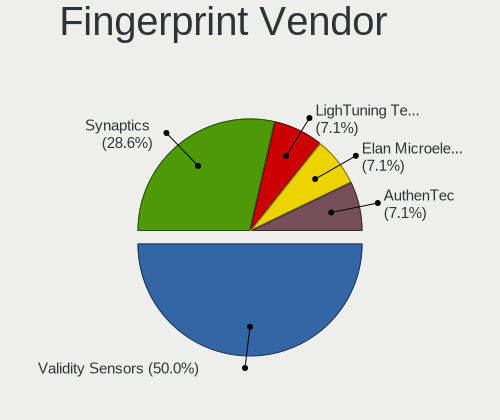

| Vendor                | Computers | Percent |
|-----------------------|-----------|---------|
| Validity Sensors      | 6         | 66.67%  |
| LighTuning Technology | 1         | 11.11%  |
| Elan Microelectronics | 1         | 11.11%  |
| AuthenTec             | 1         | 11.11%  |

Fingerprint Model
-----------------

Fingerprint sensor models

| Model                                                                      | Computers | Percent |
|----------------------------------------------------------------------------|-----------|---------|
| Validity Sensors Fingerprint scanner                                       | 2         | 22.22%  |
| Validity Sensors VFS5011 Fingerprint Reader                                | 1         | 11.11%  |
| Validity Sensors VFS101 Fingerprint Reader                                 | 1         | 11.11%  |
| Validity Sensors VFS 5011 fingerprint sensor                               | 1         | 11.11%  |
| Validity Sensors Synaptics VFS7552 Touch Fingerprint Sensor with PurePrint | 1         | 11.11%  |
| LighTuning ES603 Swipe Fingerprint Sensor                                  | 1         | 11.11%  |
| Elan ELAN:Fingerprint                                                      | 1         | 11.11%  |
| AuthenTec Fingerprint Sensor                                               | 1         | 11.11%  |

Chipcard Vendor
---------------

Chipcard module vendors

| Vendor      | Computers | Percent |
|-------------|-----------|---------|
| Alcor Micro | 2         | 66.67%  |
| Broadcom    | 1         | 33.33%  |

Chipcard Model
--------------

Chipcard module models

| Model                                          | Computers | Percent |
|------------------------------------------------|-----------|---------|
| Alcor Micro AU9540 Smartcard Reader            | 2         | 66.67%  |
| Broadcom BCM5880 Secure Applications Processor | 1         | 33.33%  |

Unsupported
-----------

Unsupported Devices
-------------------

Total unsupported devices on board

| Total | Computers | Percent |
|-------|-----------|---------|
| 0     | 38        | 65.52%  |
| 1     | 13        | 22.41%  |
| 2     | 6         | 10.34%  |
| 3     | 1         | 1.72%   |

Unsupported Device Types
------------------------

Types of unsupported devices

| Type                  | Computers | Percent |
|-----------------------|-----------|---------|
| Fingerprint reader    | 9         | 34.62%  |
| Net/wireless          | 4         | 15.38%  |
| Graphics card         | 3         | 11.54%  |
| Chipcard              | 3         | 11.54%  |
| Storage               | 2         | 7.69%   |
| Multimedia controller | 2         | 7.69%   |
| Modem                 | 1         | 3.85%   |
| Camera                | 1         | 3.85%   |
| Bluetooth             | 1         | 3.85%   |

