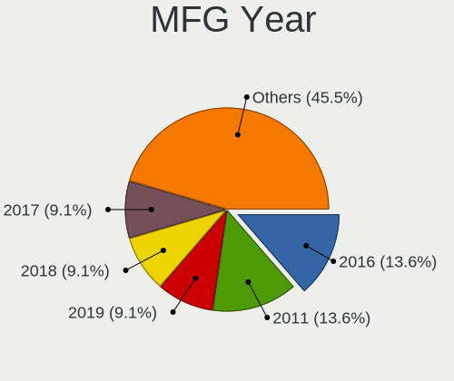
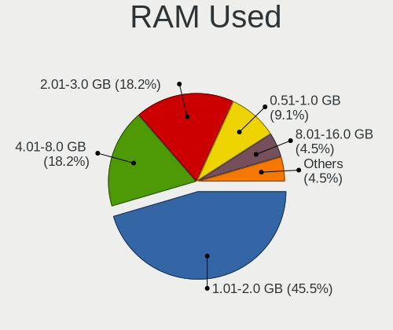
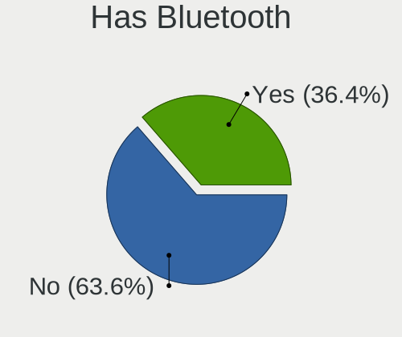
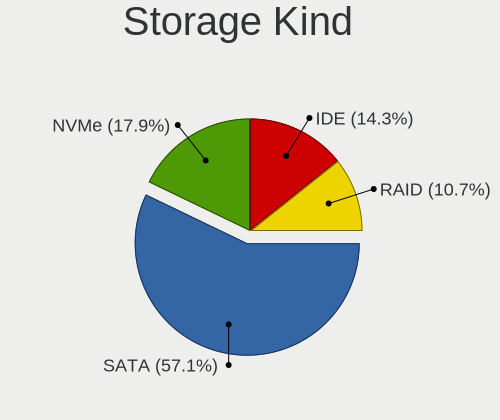
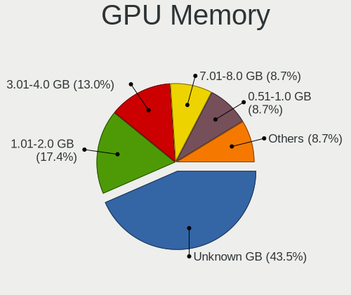

Parrot 4.11 - Tested Hardware & Statistics (Desktops)
-----------------------------------------------------

A project to collect tested hardware configurations for Parrot 4.11.

Anyone can contribute to this report by the [hw-probe](https://github.com/linuxhw/hw-probe) tool:

    sudo -E hw-probe -all -upload

Please submit a probe of your configuration if it's not presented on the page or is rare.

Full-feature report is available here: https://linux-hardware.org/?view=trends

Contents
--------

* [ Test Cases ](#test-cases)

* [ System ](#system)
  - [ Kernel                   ](#kernel)
  - [ Kernel Family            ](#kernel-family)
  - [ Kernel Major Ver.        ](#kernel-major-ver)
  - [ Arch                     ](#arch)
  - [ DE                       ](#de)
  - [ Display Server           ](#display-server)
  - [ Display Manager          ](#display-manager)
  - [ OS Lang                  ](#os-lang)
  - [ Boot Mode                ](#boot-mode)
  - [ Filesystem               ](#filesystem)
  - [ Part. scheme             ](#part-scheme)
  - [ Dual Boot with Linux/BSD ](#dual-boot-with-linuxbsd)
  - [ Dual Boot (Win)          ](#dual-boot-win)

* [ Board ](#board)
  - [ Vendor                   ](#vendor)
  - [ Model                    ](#model)
  - [ Model Family             ](#model-family)
  - [ MFG Year                 ](#mfg-year)
  - [ Form Factor              ](#form-factor)
  - [ Secure Boot              ](#secure-boot)
  - [ Coreboot                 ](#coreboot)
  - [ RAM Size                 ](#ram-size)
  - [ RAM Used                 ](#ram-used)
  - [ Total Drives             ](#total-drives)
  - [ Has CD-ROM               ](#has-cd-rom)
  - [ Has Ethernet             ](#has-ethernet)
  - [ Has WiFi                 ](#has-wifi)
  - [ Has Bluetooth            ](#has-bluetooth)

* [ Location ](#location)
  - [ Country                  ](#country)
  - [ City                     ](#city)

* [ Drives ](#drives)
  - [ Drive Vendor             ](#drive-vendor)
  - [ Drive Model              ](#drive-model)
  - [ HDD Vendor               ](#hdd-vendor)
  - [ SSD Vendor               ](#ssd-vendor)
  - [ Drive Kind               ](#drive-kind)
  - [ Drive Connector          ](#drive-connector)
  - [ Drive Size               ](#drive-size)
  - [ Space Total              ](#space-total)
  - [ Space Used               ](#space-used)
  - [ Malfunc. Drives          ](#malfunc-drives)
  - [ Malfunc. Drive Vendor    ](#malfunc-drive-vendor)
  - [ Malfunc. HDD Vendor      ](#malfunc-hdd-vendor)
  - [ Malfunc. Drive Kind      ](#malfunc-drive-kind)
  - [ Failed Drives            ](#failed-drives)
  - [ Failed Drive Vendor      ](#failed-drive-vendor)
  - [ Drive Status             ](#drive-status)

* [ Storage controller ](#storage-controller)
  - [ Storage Vendor           ](#storage-vendor)
  - [ Storage Model            ](#storage-model)
  - [ Storage Kind             ](#storage-kind)

* [ Processor ](#processor)
  - [ CPU Vendor               ](#cpu-vendor)
  - [ CPU Model                ](#cpu-model)
  - [ CPU Model Family         ](#cpu-model-family)
  - [ CPU Cores                ](#cpu-cores)
  - [ CPU Sockets              ](#cpu-sockets)
  - [ CPU Threads              ](#cpu-threads)
  - [ CPU Op-Modes             ](#cpu-op-modes)
  - [ CPU Microcode            ](#cpu-microcode)
  - [ CPU Microarch            ](#cpu-microarch)

* [ Graphics ](#graphics)
  - [ GPU Vendor               ](#gpu-vendor)
  - [ GPU Model                ](#gpu-model)
  - [ GPU Combo                ](#gpu-combo)
  - [ GPU Driver               ](#gpu-driver)
  - [ GPU Memory               ](#gpu-memory)

* [ Monitor ](#monitor)
  - [ Monitor Vendor           ](#monitor-vendor)
  - [ Monitor Model            ](#monitor-model)
  - [ Monitor Resolution       ](#monitor-resolution)
  - [ Monitor Diagonal         ](#monitor-diagonal)
  - [ Monitor Width            ](#monitor-width)
  - [ Aspect Ratio             ](#aspect-ratio)
  - [ Monitor Area             ](#monitor-area)
  - [ Pixel Density            ](#pixel-density)
  - [ Multiple Monitors        ](#multiple-monitors)

* [ Network ](#network)
  - [ Net Controller Vendor    ](#net-controller-vendor)
  - [ Net Controller Model     ](#net-controller-model)
  - [ Wireless Vendor          ](#wireless-vendor)
  - [ Wireless Model           ](#wireless-model)
  - [ Ethernet Vendor          ](#ethernet-vendor)
  - [ Ethernet Model           ](#ethernet-model)
  - [ Net Controller Kind      ](#net-controller-kind)
  - [ Used Controller          ](#used-controller)
  - [ NICs                     ](#nics)
  - [ IPv6                     ](#ipv6)

* [ Bluetooth ](#bluetooth)
  - [ Bluetooth Vendor         ](#bluetooth-vendor)
  - [ Bluetooth Model          ](#bluetooth-model)

* [ Sound ](#sound)
  - [ Sound Vendor             ](#sound-vendor)
  - [ Sound Model              ](#sound-model)

* [ Memory ](#memory)
  - [ Memory Vendor            ](#memory-vendor)
  - [ Memory Model             ](#memory-model)
  - [ Memory Kind              ](#memory-kind)
  - [ Memory Form Factor       ](#memory-form-factor)
  - [ Memory Size              ](#memory-size)
  - [ Memory Speed             ](#memory-speed)

* [ Printers & scanners ](#printers--scanners)
  - [ Printer Vendor           ](#printer-vendor)
  - [ Printer Model            ](#printer-model)
  - [ Scanner Vendor           ](#scanner-vendor)
  - [ Scanner Model            ](#scanner-model)

* [ Camera ](#camera)
  - [ Camera Vendor            ](#camera-vendor)
  - [ Camera Model             ](#camera-model)

* [ Security ](#security)
  - [ Fingerprint Vendor       ](#fingerprint-vendor)
  - [ Fingerprint Model        ](#fingerprint-model)
  - [ Chipcard Vendor          ](#chipcard-vendor)
  - [ Chipcard Model           ](#chipcard-model)

* [ Unsupported ](#unsupported)
  - [ Unsupported Devices      ](#unsupported-devices)
  - [ Unsupported Device Types ](#unsupported-device-types)

Test Cases
----------

Total: 25

| Vendor    | Model                   | Probe                                                      | Date         |
|-----------|-------------------------|------------------------------------------------------------|--------------|
| Wistron   | JIG31B3                 | [a360eaf501](https://linux-hardware.org/?probe=a360eaf501) | Mar 15, 2022 |
| ASUSTek   | F2A85-M                 | [36d17e4fdb](https://linux-hardware.org/?probe=36d17e4fdb) | Mar 13, 2022 |
| ASUSTek   | F2A85-M                 | [453d0816b3](https://linux-hardware.org/?probe=453d0816b3) | Mar 13, 2022 |
| MSI       | G31M3-L V2              | [4c15ba6fb9](https://linux-hardware.org/?probe=4c15ba6fb9) | Mar 10, 2022 |
| ASUSTek   | Benicia                 | [aceee2d932](https://linux-hardware.org/?probe=aceee2d932) | Feb 12, 2022 |
| ASUSTek   | ROG STRIX B450-F GAMING | [f75ebfbbc8](https://linux-hardware.org/?probe=f75ebfbbc8) | Jan 01, 2022 |
| ASUSTek   | M5A99X EVO              | [5c55046f50](https://linux-hardware.org/?probe=5c55046f50) | Dec 13, 2021 |
| Alienware | 0PGRP5 A02              | [aeacaefd26](https://linux-hardware.org/?probe=aeacaefd26) | Nov 14, 2021 |
| ASRock    | Z87 Killer              | [0aafc0d981](https://linux-hardware.org/?probe=0aafc0d981) | Nov 13, 2021 |
| Acer      | Aspire TC-780           | [f6de1ed637](https://linux-hardware.org/?probe=f6de1ed637) | Nov 04, 2021 |
| Dell      | 0T2HR0 A00              | [dc55f173fe](https://linux-hardware.org/?probe=dc55f173fe) | Oct 05, 2021 |
| ASUSTek   | P8H67-M PRO             | [7dcd6067ac](https://linux-hardware.org/?probe=7dcd6067ac) | Oct 04, 2021 |
| Gigabyte  | A320M-S2H-CF            | [b733e7fac1](https://linux-hardware.org/?probe=b733e7fac1) | Sep 23, 2021 |
| Gigabyte  | A320M-S2H-CF            | [6647d75cdb](https://linux-hardware.org/?probe=6647d75cdb) | Aug 20, 2021 |
| Gigabyte  | A320M-S2H-CF            | [5363cc3efd](https://linux-hardware.org/?probe=5363cc3efd) | Aug 12, 2021 |
| Gigabyte  | A320M-S2H-CF            | [3ba02ffef3](https://linux-hardware.org/?probe=3ba02ffef3) | Aug 10, 2021 |
| ZOTAC     | Unknown                 | [0324aff0a3](https://linux-hardware.org/?probe=0324aff0a3) | Aug 03, 2021 |
| ZOTAC     | Unknown                 | [c1a9e01bd7](https://linux-hardware.org/?probe=c1a9e01bd7) | Aug 03, 2021 |
| HP        | 1850                    | [687c780f5c](https://linux-hardware.org/?probe=687c780f5c) | Jul 19, 2021 |
| Dell      | 0T10XW A02              | [57a4116288](https://linux-hardware.org/?probe=57a4116288) | Jul 17, 2021 |
| HP        | 1850                    | [3bde7e8e11](https://linux-hardware.org/?probe=3bde7e8e11) | May 27, 2021 |
| Dell      | 0C1R19 A02              | [ff5bb2ee2a](https://linux-hardware.org/?probe=ff5bb2ee2a) | May 03, 2021 |
| ASUSTek   | PRIME X399-A            | [4dd4f28ca7](https://linux-hardware.org/?probe=4dd4f28ca7) | Apr 11, 2021 |
| Acer      | Predator PO3-600 V:1.1  | [6ea75bdbb5](https://linux-hardware.org/?probe=6ea75bdbb5) | Mar 26, 2021 |
| ASUSTek   | M5A78L-M/USB3           | [6b26a69326](https://linux-hardware.org/?probe=6b26a69326) | Mar 21, 2021 |

System
------

Kernel
------

Version of the Linux kernel

| Version                | Desktops | Percent |
|------------------------|----------|---------|
| 5.10.0-6parrot1-amd64  | 5        | 26.32%  |
| 5.14.0-9parrot1-amd64  | 4        | 21.05%  |
| 5.10.0-8parrot1-amd64  | 3        | 15.79%  |
| 5.15.0-15parrot1-amd64 | 2        | 10.53%  |
| 5.10.0-3parrot1-amd64  | 2        | 10.53%  |
| 5.7.0-2parrot2-amd64   | 1        | 5.26%   |
| 5.14.0-2parrot1-amd64  | 1        | 5.26%   |
| 5.10.0-5parrot1-amd64  | 1        | 5.26%   |

Kernel Family
-------------

Linux kernel without a distro release

| Version | Desktops | Percent |
|---------|----------|---------|
| 5.10.0  | 11       | 57.89%  |
| 5.14.0  | 5        | 26.32%  |
| 5.15.0  | 2        | 10.53%  |
| 5.7.0   | 1        | 5.26%   |

Kernel Major Ver.
-----------------

Linux kernel major version

| Version | Desktops | Percent |
|---------|----------|---------|
| 5.10    | 11       | 57.89%  |
| 5.14    | 5        | 26.32%  |
| 5.15    | 2        | 10.53%  |
| 5.7     | 1        | 5.26%   |

Arch
----

OS architecture (x86_64, i586, etc.)

| Name   | Desktops | Percent |
|--------|----------|---------|
| x86_64 | 19       | 100%    |

DE
--

Desktop Environment

| Name    | Desktops | Percent |
|---------|----------|---------|
| MATE    | 10       | 50%     |
| KDE5    | 6        | 30%     |
| XFCE    | 2        | 10%     |
| KDE     | 1        | 5%      |
| Unknown | 1        | 5%      |

Display Server
--------------

X11 or Wayland

| Name | Desktops | Percent |
|------|----------|---------|
| X11  | 19       | 100%    |

Display Manager
---------------

SDDM, LightDM, etc.

| Name    | Desktops | Percent |
|---------|----------|---------|
| LightDM | 9        | 45%     |
| Unknown | 8        | 40%     |
| TDM     | 3        | 15%     |

OS Lang
-------

Language

| Lang  | Desktops | Percent |
|-------|----------|---------|
| en_US | 10       | 52.63%  |
| pt_BR | 2        | 10.53%  |
| ru_UA | 1        | 5.26%   |
| ru_RU | 1        | 5.26%   |
| pl_PL | 1        | 5.26%   |
| fr_FR | 1        | 5.26%   |
| en_AU | 1        | 5.26%   |
| de_DE | 1        | 5.26%   |
| an_ES | 1        | 5.26%   |

Boot Mode
---------

EFI or BIOS

| Mode | Desktops | Percent |
|------|----------|---------|
| BIOS | 14       | 70%     |
| EFI  | 6        | 30%     |

Filesystem
----------

Type of filesystem

| Type  | Desktops | Percent |
|-------|----------|---------|
| Btrfs | 15       | 78.95%  |
| Ext4  | 4        | 21.05%  |

Part. scheme
------------

Scheme of partitioning

| Type    | Desktops | Percent |
|---------|----------|---------|
| Unknown | 10       | 50%     |
| GPT     | 8        | 40%     |
| MBR     | 2        | 10%     |

Dual Boot with Linux/BSD
------------------------

Hosting more than one Linux/BSD

| Dual boot | Desktops | Percent |
|-----------|----------|---------|
| No        | 17       | 85%     |
| Yes       | 3        | 15%     |

Dual Boot (Win)
---------------

Hosting Linux and Windows

| Dual boot | Desktops | Percent |
|-----------|----------|---------|
| No        | 10       | 52.63%  |
| Yes       | 9        | 47.37%  |

Board
-----

Vendor
------

Motherboard manufacturer

| Name                | Desktops | Percent |
|---------------------|----------|---------|
| ASUSTek Computer    | 7        | 36.84%  |
| Dell                | 3        | 15.79%  |
| Acer                | 2        | 10.53%  |
| ZOTAC               | 1        | 5.26%   |
| Wistron             | 1        | 5.26%   |
| MSI                 | 1        | 5.26%   |
| Hewlett-Packard     | 1        | 5.26%   |
| Gigabyte Technology | 1        | 5.26%   |
| ASRock              | 1        | 5.26%   |
| Alienware           | 1        | 5.26%   |

Model
-----

Motherboard model

| Name                         | Desktops | Percent |
|------------------------------|----------|---------|
| Wistron FMVDD2A0H0           | 1        | 5.26%   |
| MSI MS-7529                  | 1        | 5.26%   |
| HP Compaq Pro 6305 MT        | 1        | 5.26%   |
| Gigabyte A320M-S2H           | 1        | 5.26%   |
| Dell XPS 8930                | 1        | 5.26%   |
| Dell OptiPlex 7070           | 1        | 5.26%   |
| Dell OptiPlex 3010           | 1        | 5.26%   |
| ASUS ROG STRIX B450-F GAMING | 1        | 5.26%   |
| ASUS PRIME X399-A            | 1        | 5.26%   |
| ASUS P8H67-M PRO             | 1        | 5.26%   |
| ASUS M5A99X EVO              | 1        | 5.26%   |
| ASUS M5A78L-M/USB3           | 1        | 5.26%   |
| ASUS KJ250AA-ABE a6336.es    | 1        | 5.26%   |
| ASUS F2A85-M                 | 1        | 5.26%   |
| ASRock Z87 Killer            | 1        | 5.26%   |
| Alienware X51 R2             | 1        | 5.26%   |
| Acer Predator PO3-600        | 1        | 5.26%   |
| Acer Aspire TC-780           | 1        | 5.26%   |
| Unknown                      | 1        | 5.26%   |

Model Family
------------

Motherboard model prefix

| Name               | Desktops | Percent |
|--------------------|----------|---------|
| Dell OptiPlex      | 2        | 10.53%  |
| Wistron FMVDD2A0H0 | 1        | 5.26%   |
| MSI MS-7529        | 1        | 5.26%   |
| HP Compaq          | 1        | 5.26%   |
| Gigabyte A320M-S2H | 1        | 5.26%   |
| Dell XPS           | 1        | 5.26%   |
| ASUS ROG           | 1        | 5.26%   |
| ASUS PRIME         | 1        | 5.26%   |
| ASUS P8H67-M       | 1        | 5.26%   |
| ASUS M5A99X        | 1        | 5.26%   |
| ASUS M5A78L-M      | 1        | 5.26%   |
| ASUS KJ250AA-ABE   | 1        | 5.26%   |
| ASUS F2A85-M       | 1        | 5.26%   |
| ASRock Z87         | 1        | 5.26%   |
| Alienware X51      | 1        | 5.26%   |
| Acer Predator      | 1        | 5.26%   |
| Acer Aspire        | 1        | 5.26%   |
| Unknown            | 1        | 5.26%   |

MFG Year
--------

Motherboard manufacture year

| Year | Desktops | Percent |
|------|----------|---------|
| 2011 | 3        | 15.79%  |
| 2019 | 2        | 10.53%  |
| 2017 | 2        | 10.53%  |
| 2016 | 2        | 10.53%  |
| 2013 | 2        | 10.53%  |
| 2012 | 2        | 10.53%  |
| 2020 | 1        | 5.26%   |
| 2018 | 1        | 5.26%   |
| 2014 | 1        | 5.26%   |
| 2010 | 1        | 5.26%   |
| 2009 | 1        | 5.26%   |
| 2007 | 1        | 5.26%   |

Form Factor
-----------

Physical design of the computer

| Name    | Desktops | Percent |
|---------|----------|---------|
| Desktop | 19       | 100%    |

Secure Boot
-----------

Enabled or disabled

| State    | Desktops | Percent |
|----------|----------|---------|
| Disabled | 19       | 100%    |

Coreboot
--------

Have coreboot on board

| Used | Desktops | Percent |
|------|----------|---------|
| No   | 19       | 100%    |

RAM Size
--------

Total RAM memory

| Size in GB | Desktops | Percent |
|------------|----------|---------|
| 16.01-24.0 | 5        | 26.32%  |
| 4.01-8.0   | 4        | 21.05%  |
| 8.01-16.0  | 4        | 21.05%  |
| 3.01-4.0   | 2        | 10.53%  |
| 1.01-2.0   | 2        | 10.53%  |
| 32.01-64.0 | 1        | 5.26%   |
| 24.01-32.0 | 1        | 5.26%   |

RAM Used
--------

Used RAM memory

| Used GB   | Desktops | Percent |
|-----------|----------|---------|
| 1.01-2.0  | 9        | 47.37%  |
| 4.01-8.0  | 3        | 15.79%  |
| 2.01-3.0  | 3        | 15.79%  |
| 0.51-1.0  | 2        | 10.53%  |
| 3.01-4.0  | 1        | 5.26%   |
| 8.01-16.0 | 1        | 5.26%   |

Total Drives
------------

Number of drives on board

| Drives | Desktops | Percent |
|--------|----------|---------|
| 2      | 8        | 42.11%  |
| 3      | 5        | 26.32%  |
| 1      | 3        | 15.79%  |
| 4      | 2        | 10.53%  |
| 5      | 1        | 5.26%   |

Has CD-ROM
----------

Has CD-ROM on board

| Presented | Desktops | Percent |
|-----------|----------|---------|
| No        | 13       | 65%     |
| Yes       | 7        | 35%     |

Has Ethernet
------------

Has Ethernet on board

| Presented | Desktops | Percent |
|-----------|----------|---------|
| Yes       | 19       | 100%    |

Has WiFi
--------

Has WiFi module

| Presented | Desktops | Percent |
|-----------|----------|---------|
| Yes       | 15       | 75%     |
| No        | 5        | 25%     |

Has Bluetooth
-------------

Has Bluetooth module

| Presented | Desktops | Percent |
|-----------|----------|---------|
| No        | 11       | 57.89%  |
| Yes       | 8        | 42.11%  |

Location
--------

Country
-------

Geographic location (country)

| Country   | Desktops | Percent |
|-----------|----------|---------|
| USA       | 8        | 42.11%  |
| Germany   | 2        | 10.53%  |
| Brazil    | 2        | 10.53%  |
| Vietnam   | 1        | 5.26%   |
| Ukraine   | 1        | 5.26%   |
| Spain     | 1        | 5.26%   |
| Russia    | 1        | 5.26%   |
| Poland    | 1        | 5.26%   |
| France    | 1        | 5.26%   |
| Australia | 1        | 5.26%   |

City
----

Geographic location (city)

| City         | Desktops | Percent |
|--------------|----------|---------|
| Eugene       | 2        | 10%     |
| Warsaw       | 1        | 5%      |
| Ternopil     | 1        | 5%      |
| Sao Paulo    | 1        | 5%      |
| Santa Maria  | 1        | 5%      |
| Saint Paul   | 1        | 5%      |
| Portsmouth   | 1        | 5%      |
| Orange Park  | 1        | 5%      |
| Offenbach    | 1        | 5%      |
| Nam Định  | 1        | 5%      |
| Melbourne    | 1        | 5%      |
| Lyon         | 1        | 5%      |
| Los Angeles  | 1        | 5%      |
| Lafayette    | 1        | 5%      |
| Khabarovsk   | 1        | 5%      |
| Dudenhofen   | 1        | 5%      |
| Brunswick    | 1        | 5%      |
| Braunschweig | 1        | 5%      |
| Barcelona    | 1        | 5%      |

Drives
------

Drive Vendor
------------

Hard drive vendors

| Vendor              | Desktops | Drives | Percent |
|---------------------|----------|--------|---------|
| Seagate             | 9        | 15     | 21.95%  |
| Samsung Electronics | 6        | 8      | 14.63%  |
| WDC                 | 4        | 5      | 9.76%   |
| Hitachi             | 3        | 4      | 7.32%   |
| Crucial             | 3        | 3      | 7.32%   |
| Unknown             | 2        | 2      | 4.88%   |
| Toshiba             | 2        | 2      | 4.88%   |
| SK Hynix            | 2        | 2      | 4.88%   |
| SanDisk             | 2        | 2      | 4.88%   |
| SPCC                | 1        | 1      | 2.44%   |
| Phison              | 1        | 1      | 2.44%   |
| LITEONIT            | 1        | 1      | 2.44%   |
| Kingston            | 1        | 1      | 2.44%   |
| Intenso             | 1        | 1      | 2.44%   |
| HGST                | 1        | 1      | 2.44%   |
| FORESEE             | 1        | 1      | 2.44%   |
| China               | 1        | 2      | 2.44%   |

Drive Model
-----------

Hard drive models

| Model                                 | Desktops | Percent |
|---------------------------------------|----------|---------|
| Unknown SD/MMC/MS PRO 32GB            | 2        | 4.17%   |
| Seagate Expansion 320GB               | 2        | 4.17%   |
| WDC WDBNCE0010PNC 1TB SSD             | 1        | 2.08%   |
| WDC WD5000AACS-00ZUB0 500GB           | 1        | 2.08%   |
| WDC WD3200LPVX-60V0TT0 320GB          | 1        | 2.08%   |
| WDC WD10EARS-00Y5B1 1TB               | 1        | 2.08%   |
| Toshiba MK2552GSX 250GB               | 1        | 2.08%   |
| Toshiba DT01ACA100 1TB                | 1        | 2.08%   |
| SPCC Solid State Disk 120GB           | 1        | 2.08%   |
| SK Hynix PC601 NVMe 256GB             | 1        | 2.08%   |
| SK Hynix NVMe SSD Drive 256GB         | 1        | 2.08%   |
| Seagate ST98823AS 80GB                | 1        | 2.08%   |
| Seagate ST9250410AS 250GB             | 1        | 2.08%   |
| Seagate ST500NM0011 500GB             | 1        | 2.08%   |
| Seagate ST500LM012 HN-M500MBB 500GB   | 1        | 2.08%   |
| Seagate ST500DM002-1SB10A 500GB       | 1        | 2.08%   |
| Seagate ST4000DM004-2CV104 4TB        | 1        | 2.08%   |
| Seagate ST3500413AS 500GB             | 1        | 2.08%   |
| Seagate ST31000528AS 1TB              | 1        | 2.08%   |
| Seagate ST250DM000-1BD141 250GB       | 1        | 2.08%   |
| Seagate ST2000LM003 HN-M201RAD 2TB    | 1        | 2.08%   |
| Seagate ST1000DM010-2EP102 1TB        | 1        | 2.08%   |
| SanDisk SSD PLUS 1000GB               | 1        | 2.08%   |
| SanDisk SD6SF1M128G1022I 128GB SSD    | 1        | 2.08%   |
| Samsung SSD SM841N 2.5 7mm 256GB      | 1        | 2.08%   |
| Samsung SSD 970 EVO 500GB             | 1        | 2.08%   |
| Samsung SSD 860 EVO 250GB             | 1        | 2.08%   |
| Samsung SSD 840 Series 250GB          | 1        | 2.08%   |
| Samsung NVMe SSD Drive 1TB            | 1        | 2.08%   |
| Samsung HD502HI 500GB                 | 1        | 2.08%   |
| Samsung HD253GJ 250GB                 | 1        | 2.08%   |
| Samsung HD161GJ 160GB                 | 1        | 2.08%   |
| Phison NVMe SSD Drive 1TB             | 1        | 2.08%   |
| LITEONIT LCS-128M6S 2.5 7mm 128GB SSD | 1        | 2.08%   |
| Kingston SV300S37A 120G SSD           | 1        | 2.08%   |
| Intenso SSD SATAIII 512GB             | 1        | 2.08%   |
| Hitachi HUA722020ALA331 2TB           | 1        | 2.08%   |
| Hitachi HTS547564A9E384 640GB         | 1        | 2.08%   |
| Hitachi HTS545050B9A300 500GB         | 1        | 2.08%   |
| Hitachi HDT721010SLA360 1TB           | 1        | 2.08%   |
| HGST HTS541010A9E680 1TB              | 1        | 2.08%   |
| FORESEE 60GB SSD                      | 1        | 2.08%   |
| Crucial CT256MX100SSD1 256GB          | 1        | 2.08%   |
| Crucial CT240BX300SSD1 240GB          | 1        | 2.08%   |
| Crucial CT1000BX500SSD1 1TB           | 1        | 2.08%   |
| China SATA SSD 256GB                  | 1        | 2.08%   |

HDD Vendor
----------

Hard disk drive vendors

| Vendor              | Desktops | Drives | Percent |
|---------------------|----------|--------|---------|
| Seagate             | 9        | 15     | 40.91%  |
| WDC                 | 3        | 4      | 13.64%  |
| Hitachi             | 3        | 4      | 13.64%  |
| Unknown             | 2        | 2      | 9.09%   |
| Toshiba             | 2        | 2      | 9.09%   |
| Samsung Electronics | 2        | 3      | 9.09%   |
| HGST                | 1        | 1      | 4.55%   |

SSD Vendor
----------

Solid state drive vendors

| Vendor              | Desktops | Drives | Percent |
|---------------------|----------|--------|---------|
| Crucial             | 3        | 3      | 21.43%  |
| SanDisk             | 2        | 2      | 14.29%  |
| Samsung Electronics | 2        | 3      | 14.29%  |
| WDC                 | 1        | 1      | 7.14%   |
| SPCC                | 1        | 1      | 7.14%   |
| LITEONIT            | 1        | 1      | 7.14%   |
| Kingston            | 1        | 1      | 7.14%   |
| Intenso             | 1        | 1      | 7.14%   |
| FORESEE             | 1        | 1      | 7.14%   |
| China               | 1        | 2      | 7.14%   |

Drive Kind
----------

HDD or SSD

| Kind | Desktops | Drives | Percent |
|------|----------|--------|---------|
| HDD  | 16       | 31     | 50%     |
| SSD  | 11       | 16     | 34.38%  |
| NVMe | 5        | 5      | 15.63%  |

Drive Connector
---------------

SATA, SAS, NVMe, etc.

| Type | Desktops | Drives | Percent |
|------|----------|--------|---------|
| SATA | 17       | 43     | 68%     |
| NVMe | 5        | 5      | 20%     |
| SAS  | 3        | 4      | 12%     |

Drive Size
----------

Size of hard drive

| Size in TB | Desktops | Drives | Percent |
|------------|----------|--------|---------|
| 0.01-0.5   | 16       | 32     | 55.17%  |
| 0.51-1.0   | 10       | 12     | 34.48%  |
| 1.01-2.0   | 2        | 2      | 6.9%    |
| 3.01-4.0   | 1        | 1      | 3.45%   |

Space Total
-----------

Amount of disk space available on the file system

| Size in GB | Desktops | Percent |
|------------|----------|---------|
| 251-500    | 5        | 23.81%  |
| 101-250    | 5        | 23.81%  |
| 1001-2000  | 4        | 19.05%  |
| 2001-3000  | 2        | 9.52%   |
| 501-1000   | 2        | 9.52%   |
| Unknown    | 2        | 9.52%   |
| 51-100     | 1        | 4.76%   |

Space Used
----------

Amount of used disk space

| Used GB  | Desktops | Percent |
|----------|----------|---------|
| 101-250  | 6        | 28.57%  |
| 21-50    | 5        | 23.81%  |
| 51-100   | 3        | 14.29%  |
| 251-500  | 2        | 9.52%   |
| 1-20     | 2        | 9.52%   |
| Unknown  | 2        | 9.52%   |
| 501-1000 | 1        | 4.76%   |

Malfunc. Drives
---------------

Drive models with a malfunction

| Model                              | Desktops | Drives | Percent |
|------------------------------------|----------|--------|---------|
| Seagate ST9250410AS 250GB          | 1        | 1      | 12.5%   |
| Seagate ST500NM0011 500GB          | 1        | 1      | 12.5%   |
| Seagate ST3500413AS 500GB          | 1        | 1      | 12.5%   |
| Seagate ST31000528AS 1TB           | 1        | 1      | 12.5%   |
| Seagate ST1000DM010-2EP102 1TB     | 1        | 1      | 12.5%   |
| SanDisk SSD PLUS 1000GB            | 1        | 1      | 12.5%   |
| SanDisk SD6SF1M128G1022I 128GB SSD | 1        | 1      | 12.5%   |
| Hitachi HUA722020ALA331 2TB        | 1        | 1      | 12.5%   |

Malfunc. Drive Vendor
---------------------

Vendors of faulty drives

| Vendor  | Desktops | Drives | Percent |
|---------|----------|--------|---------|
| Seagate | 4        | 5      | 57.14%  |
| SanDisk | 2        | 2      | 28.57%  |
| Hitachi | 1        | 1      | 14.29%  |

Malfunc. HDD Vendor
-------------------

Vendors of faulty HDD drives

| Vendor  | Desktops | Drives | Percent |
|---------|----------|--------|---------|
| Seagate | 4        | 5      | 80%     |
| Hitachi | 1        | 1      | 20%     |

Malfunc. Drive Kind
-------------------

Kinds of faulty drives

| Kind | Desktops | Drives | Percent |
|------|----------|--------|---------|
| HDD  | 5        | 6      | 71.43%  |
| SSD  | 2        | 2      | 28.57%  |

Failed Drives
-------------

Failed drive models

| Model                     | Desktops | Drives | Percent |
|---------------------------|----------|--------|---------|
| Intenso SSD SATAIII 512GB | 1        | 1      | 100%    |

Failed Drive Vendor
-------------------

Failed drive vendors

| Vendor  | Desktops | Drives | Percent |
|---------|----------|--------|---------|
| Intenso | 1        | 1      | 100%    |

Drive Status
------------

Number of failed and malfunc. drives

| Status   | Desktops | Drives | Percent |
|----------|----------|--------|---------|
| Detected | 12       | 27     | 40%     |
| Works    | 10       | 16     | 33.33%  |
| Malfunc  | 7        | 8      | 23.33%  |
| Failed   | 1        | 1      | 3.33%   |

Storage controller
------------------

Storage Vendor
--------------

Storage controller vendors

| Vendor              | Desktops | Percent |
|---------------------|----------|---------|
| Intel               | 12       | 46.15%  |
| AMD                 | 7        | 26.92%  |
| SK Hynix            | 2        | 7.69%   |
| Samsung Electronics | 2        | 7.69%   |
| VIA Technologies    | 1        | 3.85%   |
| Phison Electronics  | 1        | 3.85%   |
| JMicron Technology  | 1        | 3.85%   |

Storage Model
-------------

Storage controller models

| Model                                                                                   | Desktops | Percent |
|-----------------------------------------------------------------------------------------|----------|---------|
| AMD FCH SATA Controller [AHCI mode]                                                     | 4        | 12.5%   |
| Samsung NVMe SSD Controller SM981/PM981/PM983                                           | 2        | 6.25%   |
| Intel SATA Controller [RAID mode]                                                       | 2        | 6.25%   |
| Intel NM10/ICH7 Family SATA Controller [IDE mode]                                       | 2        | 6.25%   |
| Intel Cannon Lake PCH SATA AHCI Controller                                              | 2        | 6.25%   |
| Intel 82801G (ICH7 Family) IDE Controller                                               | 2        | 6.25%   |
| AMD SB7x0/SB8x0/SB9x0 SATA Controller [AHCI mode]                                       | 2        | 6.25%   |
| VIA VT6415 PATA IDE Host Controller                                                     | 1        | 3.13%   |
| SK Hynix Non-Volatile memory controller                                                 | 1        | 3.13%   |
| SK Hynix BC511                                                                          | 1        | 3.13%   |
| Phison E16 PCIe4 NVMe Controller                                                        | 1        | 3.13%   |
| JMicron JMB362 SATA Controller                                                          | 1        | 3.13%   |
| Intel Wildcat Point-LP SATA Controller [AHCI Mode]                                      | 1        | 3.13%   |
| Intel Q170/Q150/B150/H170/H110/Z170/CM236 Chipset SATA Controller [AHCI Mode]           | 1        | 3.13%   |
| Intel 82801IR/IO/IH (ICH9R/DO/DH) 6 port SATA Controller [AHCI mode]                    | 1        | 3.13%   |
| Intel 8 Series/C220 Series Chipset Family 6-port SATA Controller 1 [AHCI mode]          | 1        | 3.13%   |
| Intel 6 Series/C200 Series Chipset Family Desktop SATA Controller (IDE mode, ports 4-5) | 1        | 3.13%   |
| Intel 6 Series/C200 Series Chipset Family Desktop SATA Controller (IDE mode, ports 0-3) | 1        | 3.13%   |
| Intel 6 Series/C200 Series Chipset Family 6 port Desktop SATA AHCI Controller           | 1        | 3.13%   |
| AMD X399 Series Chipset SATA Controller                                                 | 1        | 3.13%   |
| AMD SB7x0/SB8x0/SB9x0 IDE Controller                                                    | 1        | 3.13%   |
| AMD FCH SATA Controller D                                                               | 1        | 3.13%   |
| AMD FCH RAID Controller                                                                 | 1        | 3.13%   |

Storage Kind
------------

Kind of storage controller (IDE, SATA, NVMe, SAS, ...)

| Kind | Desktops | Percent |
|------|----------|---------|
| SATA | 13       | 52%     |
| NVMe | 5        | 20%     |
| IDE  | 4        | 16%     |
| RAID | 3        | 12%     |

Processor
---------

CPU Vendor
----------

Processor vendors

| Vendor | Desktops | Percent |
|--------|----------|---------|
| Intel  | 12       | 63.16%  |
| AMD    | 7        | 36.84%  |

CPU Model
---------

Processor models

| Model                                          | Desktops | Percent |
|------------------------------------------------|----------|---------|
| Intel Xeon CPU E3-1246 v3 @ 3.50GHz            | 1        | 5.26%   |
| Intel Pentium Dual CPU E2200 @ 2.20GHz         | 1        | 5.26%   |
| Intel Core M-5Y10c CPU @ 0.80GHz               | 1        | 5.26%   |
| Intel Core i7-8700 CPU @ 3.20GHz               | 1        | 5.26%   |
| Intel Core i7-4790 CPU @ 3.60GHz               | 1        | 5.26%   |
| Intel Core i7-2600 CPU @ 3.40GHz               | 1        | 5.26%   |
| Intel Core i5-9500T CPU @ 2.20GHz              | 1        | 5.26%   |
| Intel Core i5-9400 CPU @ 2.90GHz               | 1        | 5.26%   |
| Intel Core i5-7400 CPU @ 3.00GHz               | 1        | 5.26%   |
| Intel Core i5-3470 CPU @ 3.20GHz               | 1        | 5.26%   |
| Intel Core 2 Quad CPU Q6600 @ 2.40GHz          | 1        | 5.26%   |
| Intel Core 2 Duo CPU E8400 @ 3.00GHz           | 1        | 5.26%   |
| AMD Ryzen Threadripper 1920X 12-Core Processor | 1        | 5.26%   |
| AMD Ryzen 5 5600X 6-Core Processor             | 1        | 5.26%   |
| AMD Ryzen 3 2200G with Radeon Vega Graphics    | 1        | 5.26%   |
| AMD FX-8320 Eight-Core Processor               | 1        | 5.26%   |
| AMD FX-6300 Six-Core Processor                 | 1        | 5.26%   |
| AMD A8-5600K APU with Radeon HD Graphics       | 1        | 5.26%   |
| AMD A4-5300B APU with Radeon HD Graphics       | 1        | 5.26%   |

CPU Model Family
----------------

Processor model prefix

| Model                  | Desktops | Percent |
|------------------------|----------|---------|
| Intel Core i5          | 4        | 21.05%  |
| Intel Core i7          | 3        | 15.79%  |
| AMD FX                 | 2        | 10.53%  |
| Intel Xeon             | 1        | 5.26%   |
| Intel Pentium Dual     | 1        | 5.26%   |
| Intel Core M           | 1        | 5.26%   |
| Intel Core 2 Quad      | 1        | 5.26%   |
| Intel Core 2 Duo       | 1        | 5.26%   |
| AMD Ryzen Threadripper | 1        | 5.26%   |
| AMD Ryzen 5            | 1        | 5.26%   |
| AMD Ryzen 3            | 1        | 5.26%   |
| AMD A8                 | 1        | 5.26%   |
| AMD A4                 | 1        | 5.26%   |

CPU Cores
---------

Number of processor cores

| Number | Desktops | Percent |
|--------|----------|---------|
| 4      | 8        | 42.11%  |
| 6      | 4        | 21.05%  |
| 2      | 4        | 21.05%  |
| 12     | 1        | 5.26%   |
| 3      | 1        | 5.26%   |
| 1      | 1        | 5.26%   |

CPU Sockets
-----------

Number of sockets

| Number | Desktops | Percent |
|--------|----------|---------|
| 1      | 19       | 100%    |

CPU Threads
-----------

Threads per core (Hyper-Threading)

| Number | Desktops | Percent |
|--------|----------|---------|
| 2      | 11       | 57.89%  |
| 1      | 8        | 42.11%  |

CPU Op-Modes
------------

CPU Operation Modes (32-bit, 64-bit)

| Op mode        | Desktops | Percent |
|----------------|----------|---------|
| 32-bit, 64-bit | 19       | 100%    |

CPU Microcode
-------------

Microcode number

| Number     | Desktops | Percent |
|------------|----------|---------|
| Unknown    | 10       | 50%     |
| 0x06000852 | 2        | 10%     |
| 0x906ed    | 1        | 5%      |
| 0x906e9    | 1        | 5%      |
| 0x306c3    | 1        | 5%      |
| 0x306a9    | 1        | 5%      |
| 0x206a7    | 1        | 5%      |
| 0x1067a    | 1        | 5%      |
| 0x0a201016 | 1        | 5%      |
| 0x0600111f | 1        | 5%      |

CPU Microarch
-------------

Microarchitecture

| Name        | Desktops | Percent |
|-------------|----------|---------|
| Piledriver  | 4        | 21.05%  |
| KabyLake    | 4        | 21.05%  |
| Zen         | 2        | 10.53%  |
| Haswell     | 2        | 10.53%  |
| Core        | 2        | 10.53%  |
| Zen 3       | 1        | 5.26%   |
| SandyBridge | 1        | 5.26%   |
| Penryn      | 1        | 5.26%   |
| IvyBridge   | 1        | 5.26%   |
| Broadwell   | 1        | 5.26%   |

Graphics
--------

GPU Vendor
----------

Vendors of graphics cards

| Vendor | Desktops | Percent |
|--------|----------|---------|
| Nvidia | 8        | 36.36%  |
| Intel  | 7        | 31.82%  |
| AMD    | 7        | 31.82%  |

GPU Model
---------

Graphics card models

| Model                                                                       | Desktops | Percent |
|-----------------------------------------------------------------------------|----------|---------|
| Intel CoffeeLake-S GT2 [UHD Graphics 630]                                   | 2        | 9.09%   |
| Intel 82G33/G31 Express Integrated Graphics Controller                      | 2        | 9.09%   |
| Nvidia TU117 [GeForce GTX 1650]                                             | 1        | 4.55%   |
| Nvidia TU106 [GeForce RTX 2060 SUPER]                                       | 1        | 4.55%   |
| Nvidia GP107 [GeForce GTX 1050 Ti]                                          | 1        | 4.55%   |
| Nvidia GM107 [GeForce GTX 750 Ti]                                           | 1        | 4.55%   |
| Nvidia GK104 [GeForce GTX 770]                                              | 1        | 4.55%   |
| Nvidia GA104 [GeForce RTX 3070]                                             | 1        | 4.55%   |
| Nvidia G96C [GeForce 9500 GT]                                               | 1        | 4.55%   |
| Nvidia G86 [GeForce 8300 GS]                                                | 1        | 4.55%   |
| Intel Xeon E3-1200 v3/4th Gen Core Processor Integrated Graphics Controller | 1        | 4.55%   |
| Intel Xeon E3-1200 v2/3rd Gen Core processor Graphics Controller            | 1        | 4.55%   |
| Intel HD Graphics 5300                                                      | 1        | 4.55%   |
| AMD Trinity 2 [Radeon HD 7480D]                                             | 1        | 4.55%   |
| AMD RS780L [Radeon 3000]                                                    | 1        | 4.55%   |
| AMD Oland PRO [Radeon R7 240/340 / Radeon 520]                              | 1        | 4.55%   |
| AMD Ellesmere [Radeon RX 470/480/570/570X/580/580X/590]                     | 1        | 4.55%   |
| AMD Curacao XT / Trinidad XT [Radeon R7 370 / R9 270X/370X]                 | 1        | 4.55%   |
| AMD Curacao PRO [Radeon R7 370 / R9 270/370 OEM]                            | 1        | 4.55%   |
| AMD Caicos XT [Radeon HD 7470/8470 / R5 235/310 OEM]                        | 1        | 4.55%   |

GPU Combo
---------

Combinations of graphics cards

| Name         | Desktops | Percent |
|--------------|----------|---------|
| 1 x Nvidia   | 7        | 36.84%  |
| 1 x Intel    | 5        | 26.32%  |
| 1 x AMD      | 5        | 26.32%  |
| Intel + AMD  | 1        | 5.26%   |
| AMD + Nvidia | 1        | 5.26%   |

GPU Driver
----------

Free vs proprietary

| Driver      | Desktops | Percent |
|-------------|----------|---------|
| Free        | 13       | 68.42%  |
| Proprietary | 6        | 31.58%  |

GPU Memory
----------

Total video memory

| Size in GB | Desktops | Percent |
|------------|----------|---------|
| Unknown    | 10       | 50%     |
| 3.01-4.0   | 3        | 15%     |
| 1.01-2.0   | 3        | 15%     |
| 7.01-8.0   | 2        | 10%     |
| 0.51-1.0   | 1        | 5%      |
| 0.01-0.5   | 1        | 5%      |

Monitor
-------

Monitor Vendor
--------------

Monitor vendors

| Vendor              | Desktops | Percent |
|---------------------|----------|---------|
| Dell                | 5        | 22.73%  |
| Goldstar            | 3        | 13.64%  |
| Hewlett-Packard     | 2        | 9.09%   |
| AOC                 | 2        | 9.09%   |
| Vizio               | 1        | 4.55%   |
| Toshiba             | 1        | 4.55%   |
| Sony                | 1        | 4.55%   |
| Sceptre             | 1        | 4.55%   |
| Samsung Electronics | 1        | 4.55%   |
| Philips             | 1        | 4.55%   |
| NEC Computers       | 1        | 4.55%   |
| Insignia            | 1        | 4.55%   |
| AUS                 | 1        | 4.55%   |
| Acer                | 1        | 4.55%   |

Monitor Model
-------------

Monitor models

| Model                                                       | Desktops | Percent |
|-------------------------------------------------------------|----------|---------|
| Vizio E220VA VIZ0070 1920x1080 476x268mm 21.5-inch          | 1        | 4.55%   |
| Toshiba TV TSB0105 1920x1080 708x398mm 32.0-inch            | 1        | 4.55%   |
| Sony SDM-HX73 SNY2870 1280x1024 338x270mm 17.0-inch         | 1        | 4.55%   |
| Sceptre LCD Monitor P30 2560x1080                           | 1        | 4.55%   |
| Samsung Electronics LCD Monitor SAM03FE 1280x720            | 1        | 4.55%   |
| Philips PHL 272E1 PHLC210 1920x1080 598x336mm 27.0-inch     | 1        | 4.55%   |
| NEC Computers EA243WM NEC6864 1920x1200 519x324mm 24.1-inch | 1        | 4.55%   |
| Insignia NS-L32Q09-10A BBY3210 1360x768 697x392mm 31.5-inch | 1        | 4.55%   |
| Hewlett-Packard w2207 HWP26A9 1680x1050 473x296mm 22.0-inch | 1        | 4.55%   |
| Hewlett-Packard P224 HPN361C 1920x1080 480x270mm 21.7-inch  | 1        | 4.55%   |
| Goldstar L1742 GSM449B 1280x1024 338x270mm 17.0-inch        | 1        | 4.55%   |
| Goldstar HDR WFHD GSM7749 2560x1080 798x334mm 34.1-inch     | 1        | 4.55%   |
| Goldstar 24GM79G GSM5B39 1920x1080 531x298mm 24.0-inch      | 1        | 4.55%   |
| Dell SE2417HGX DELD0F7 1920x1080 521x293mm 23.5-inch        | 1        | 4.55%   |
| Dell S2419H DELD0D2 1920x1080 527x296mm 23.8-inch           | 1        | 4.55%   |
| Dell P2419H DELD0D9 1920x1080 530x300mm 24.0-inch           | 1        | 4.55%   |
| Dell E2318H DELF092 1920x1080 509x286mm 23.0-inch           | 1        | 4.55%   |
| Dell 1907FP DEL4015 1280x1024 376x301mm 19.0-inch           | 1        | 4.55%   |
| AUS LCD Monitor VG259 1920x1080                             | 1        | 4.55%   |
| AOC LCD Monitor 2217 1680x1050                              | 1        | 4.55%   |
| AOC 917W AOC1917 1440x900 410x256mm 19.0-inch               | 1        | 4.55%   |
| Acer VG240Y S ACR0750 1920x1080 527x296mm 23.8-inch         | 1        | 4.55%   |

Monitor Resolution
------------------

Monitor screen resolution

| Resolution         | Desktops | Percent |
|--------------------|----------|---------|
| 1920x1080 (FHD)    | 10       | 47.62%  |
| 1280x1024 (SXGA)   | 3        | 14.29%  |
| 2560x1080          | 2        | 9.52%   |
| 1680x1050 (WSXGA+) | 2        | 9.52%   |
| 1920x1200 (WUXGA)  | 1        | 4.76%   |
| 1440x900 (WXGA+)   | 1        | 4.76%   |
| 1360x768           | 1        | 4.76%   |
| 1280x720 (HD)      | 1        | 4.76%   |

Monitor Diagonal
----------------

Diagonal size in inches

| Inches  | Desktops | Percent |
|---------|----------|---------|
| 24      | 5        | 22.73%  |
| Unknown | 4        | 18.18%  |
| 23      | 3        | 13.64%  |
| 19      | 2        | 9.09%   |
| 17      | 2        | 9.09%   |
| 42      | 1        | 4.55%   |
| 34      | 1        | 4.55%   |
| 32      | 1        | 4.55%   |
| 31      | 1        | 4.55%   |
| 27      | 1        | 4.55%   |
| 22      | 1        | 4.55%   |

Monitor Width
-------------

Physical width

| Width in mm | Desktops | Percent |
|-------------|----------|---------|
| 501-600     | 8        | 38.1%   |
| Unknown     | 4        | 19.05%  |
| 701-800     | 2        | 9.52%   |
| 401-500     | 2        | 9.52%   |
| 301-350     | 2        | 9.52%   |
| 601-700     | 1        | 4.76%   |
| 351-400     | 1        | 4.76%   |
| 901-1000    | 1        | 4.76%   |

Aspect Ratio
------------

Proportional relationship between the width and the height

| Ratio   | Desktops | Percent |
|---------|----------|---------|
| 16/9    | 10       | 50%     |
| 5/4     | 3        | 15%     |
| 16/10   | 3        | 15%     |
| Unknown | 3        | 15%     |
| 21/9    | 1        | 5%      |

Monitor Area
------------

Area in inch²

| Area in inch² | Desktops | Percent |
|----------------|----------|---------|
| 201-250        | 7        | 33.33%  |
| Unknown        | 4        | 19.05%  |
| 351-500        | 3        | 14.29%  |
| 151-200        | 2        | 9.52%   |
| 141-150        | 2        | 9.52%   |
| 301-350        | 1        | 4.76%   |
| 251-300        | 1        | 4.76%   |
| 501-1000       | 1        | 4.76%   |

Pixel Density
-------------

Pixels per inch

| Density | Desktops | Percent |
|---------|----------|---------|
| 51-100  | 13       | 72.22%  |
| Unknown | 4        | 22.22%  |
| 1-50    | 1        | 5.56%   |

Multiple Monitors
-----------------

Total monitors connected

| Total | Desktops | Percent |
|-------|----------|---------|
| 1     | 12       | 63.16%  |
| 2     | 6        | 31.58%  |
| 0     | 1        | 5.26%   |

Network
-------

Net Controller Vendor
---------------------

Controller vendors

| Vendor                          | Desktops | Percent |
|---------------------------------|----------|---------|
| Realtek Semiconductor           | 14       | 42.42%  |
| Intel                           | 5        | 15.15%  |
| Ralink                          | 2        | 6.06%   |
| Qualcomm Atheros Communications | 2        | 6.06%   |
| Qualcomm Atheros                | 2        | 6.06%   |
| Broadcom Limited                | 2        | 6.06%   |
| Broadcom                        | 2        | 6.06%   |
| Ralink Technology               | 1        | 3.03%   |
| Microsoft                       | 1        | 3.03%   |
| D-Link System                   | 1        | 3.03%   |
| D-Link                          | 1        | 3.03%   |

Net Controller Model
--------------------

Controller models

| Model                                                                | Desktops | Percent |
|----------------------------------------------------------------------|----------|---------|
| Realtek RTL8111/8168/8411 PCI Express Gigabit Ethernet Controller    | 11       | 31.43%  |
| Qualcomm Atheros AR9271 802.11n                                      | 2        | 5.71%   |
| Intel I211 Gigabit Network Connection                                | 2        | 5.71%   |
| Realtek RTL8814AU 802.11a/b/g/n/ac Wireless Adapter                  | 1        | 2.86%   |
| Realtek RTL810xE PCI Express Fast Ethernet controller                | 1        | 2.86%   |
| Realtek RTL-8100/8101L/8139 PCI Fast Ethernet Adapter                | 1        | 2.86%   |
| Ralink RT2870/RT3070 Wireless Adapter                                | 1        | 2.86%   |
| Ralink RT3060 Wireless 802.11n 1T/1R                                 | 1        | 2.86%   |
| Ralink RT2500 Wireless 802.11bg                                      | 1        | 2.86%   |
| Qualcomm Atheros QCA9377 802.11ac Wireless Network Adapter           | 1        | 2.86%   |
| Qualcomm Atheros Killer E2400 Gigabit Ethernet Controller            | 1        | 2.86%   |
| Qualcomm Atheros Killer E220x Gigabit Ethernet Controller            | 1        | 2.86%   |
| Microsoft Xbox 360 Wireless Adapter                                  | 1        | 2.86%   |
| Intel Wireless 7265                                                  | 1        | 2.86%   |
| Intel Wireless 3160                                                  | 1        | 2.86%   |
| Intel Ethernet Connection (7) I219-LM                                | 1        | 2.86%   |
| Intel Dual Band Wireless-AC 3168NGW [Stone Peak]                     | 1        | 2.86%   |
| D-Link System DWA-125 Wireless N 150 Adapter(rev.A2) [Ralink RT3070] | 1        | 2.86%   |
| D-Link DWA-123 Wireless N 150 Adapter (rev.D1)                       | 1        | 2.86%   |
| Broadcom NetLink BCM5786 Gigabit Ethernet PCI Express                | 1        | 2.86%   |
| Broadcom Limited NetXtreme BCM5761 Gigabit Ethernet PCIe             | 1        | 2.86%   |
| Broadcom Limited BCM4352 802.11ac Wireless Network Adapter           | 1        | 2.86%   |
| Broadcom BCM4360 802.11ac Wireless Network Adapter                   | 1        | 2.86%   |

Wireless Vendor
---------------

Wireless vendors

| Vendor                          | Desktops | Percent |
|---------------------------------|----------|---------|
| Intel                           | 3        | 20%     |
| Ralink                          | 2        | 13.33%  |
| Qualcomm Atheros Communications | 2        | 13.33%  |
| Realtek Semiconductor           | 1        | 6.67%   |
| Ralink Technology               | 1        | 6.67%   |
| Qualcomm Atheros                | 1        | 6.67%   |
| Microsoft                       | 1        | 6.67%   |
| D-Link System                   | 1        | 6.67%   |
| D-Link                          | 1        | 6.67%   |
| Broadcom Limited                | 1        | 6.67%   |
| Broadcom                        | 1        | 6.67%   |

Wireless Model
--------------

Wireless models

| Model                                                                | Desktops | Percent |
|----------------------------------------------------------------------|----------|---------|
| Qualcomm Atheros AR9271 802.11n                                      | 2        | 13.33%  |
| Realtek RTL8814AU 802.11a/b/g/n/ac Wireless Adapter                  | 1        | 6.67%   |
| Ralink RT2870/RT3070 Wireless Adapter                                | 1        | 6.67%   |
| Ralink RT3060 Wireless 802.11n 1T/1R                                 | 1        | 6.67%   |
| Ralink RT2500 Wireless 802.11bg                                      | 1        | 6.67%   |
| Qualcomm Atheros QCA9377 802.11ac Wireless Network Adapter           | 1        | 6.67%   |
| Microsoft Xbox 360 Wireless Adapter                                  | 1        | 6.67%   |
| Intel Wireless 7265                                                  | 1        | 6.67%   |
| Intel Wireless 3160                                                  | 1        | 6.67%   |
| Intel Dual Band Wireless-AC 3168NGW [Stone Peak]                     | 1        | 6.67%   |
| D-Link System DWA-125 Wireless N 150 Adapter(rev.A2) [Ralink RT3070] | 1        | 6.67%   |
| D-Link DWA-123 Wireless N 150 Adapter (rev.D1)                       | 1        | 6.67%   |
| Broadcom Limited BCM4352 802.11ac Wireless Network Adapter           | 1        | 6.67%   |
| Broadcom BCM4360 802.11ac Wireless Network Adapter                   | 1        | 6.67%   |

Ethernet Vendor
---------------

Ethernet vendors

| Vendor                | Desktops | Percent |
|-----------------------|----------|---------|
| Realtek Semiconductor | 13       | 65%     |
| Intel                 | 3        | 15%     |
| Qualcomm Atheros      | 2        | 10%     |
| Broadcom Limited      | 1        | 5%      |
| Broadcom              | 1        | 5%      |

Ethernet Model
--------------

Ethernet models

| Model                                                             | Desktops | Percent |
|-------------------------------------------------------------------|----------|---------|
| Realtek RTL8111/8168/8411 PCI Express Gigabit Ethernet Controller | 11       | 55%     |
| Intel I211 Gigabit Network Connection                             | 2        | 10%     |
| Realtek RTL810xE PCI Express Fast Ethernet controller             | 1        | 5%      |
| Realtek RTL-8100/8101L/8139 PCI Fast Ethernet Adapter             | 1        | 5%      |
| Qualcomm Atheros Killer E2400 Gigabit Ethernet Controller         | 1        | 5%      |
| Qualcomm Atheros Killer E220x Gigabit Ethernet Controller         | 1        | 5%      |
| Intel Ethernet Connection (7) I219-LM                             | 1        | 5%      |
| Broadcom NetLink BCM5786 Gigabit Ethernet PCI Express             | 1        | 5%      |
| Broadcom Limited NetXtreme BCM5761 Gigabit Ethernet PCIe          | 1        | 5%      |

Net Controller Kind
-------------------

Ethernet, WiFi or modem

| Kind     | Desktops | Percent |
|----------|----------|---------|
| Ethernet | 19       | 55.88%  |
| WiFi     | 15       | 44.12%  |

Used Controller
---------------

Currently used network controller

| Kind     | Desktops | Percent |
|----------|----------|---------|
| Ethernet | 16       | 64%     |
| WiFi     | 9        | 36%     |

NICs
----

Total network controllers on board

| Total | Desktops | Percent |
|-------|----------|---------|
| 1     | 10       | 52.63%  |
| 2     | 8        | 42.11%  |
| 3     | 1        | 5.26%   |

IPv6
----

IPv6 vs IPv4

| Used | Desktops | Percent |
|------|----------|---------|
| No   | 14       | 73.68%  |
| Yes  | 5        | 26.32%  |

Bluetooth
---------

Bluetooth Vendor
----------------

Controller vendors

| Vendor                          | Desktops | Percent |
|---------------------------------|----------|---------|
| Intel                           | 3        | 37.5%   |
| Cambridge Silicon Radio         | 2        | 25%     |
| Realtek Semiconductor           | 1        | 12.5%   |
| Qualcomm Atheros Communications | 1        | 12.5%   |
| Dell                            | 1        | 12.5%   |

Bluetooth Model
---------------

Controller models

| Model                                               | Desktops | Percent |
|-----------------------------------------------------|----------|---------|
| Intel Bluetooth wireless interface                  | 2        | 25%     |
| Cambridge Silicon Radio Bluetooth Dongle (HCI mode) | 2        | 25%     |
| Realtek Bluetooth Radio                             | 1        | 12.5%   |
| Qualcomm Atheros  Bluetooth Device                  | 1        | 12.5%   |
| Intel Wireless-AC 3168 Bluetooth                    | 1        | 12.5%   |
| Dell Broadcom BCM20702A0 Bluetooth                  | 1        | 12.5%   |

Sound
-----

Sound Vendor
------------

Sound card vendors

| Vendor              | Desktops | Percent |
|---------------------|----------|---------|
| Intel               | 12       | 38.71%  |
| AMD                 | 11       | 35.48%  |
| Nvidia              | 6        | 19.35%  |
| GYROCOM C&C         | 1        | 3.23%   |
| C-Media Electronics | 1        | 3.23%   |

Sound Model
-----------

Sound card models

| Model                                                                             | Desktops | Percent |
|-----------------------------------------------------------------------------------|----------|---------|
| AMD Oland/Hainan/Cape Verde/Pitcairn HDMI Audio [Radeon HD 7000 Series]           | 3        | 8.33%   |
| Intel NM10/ICH7 Family High Definition Audio Controller                           | 2        | 5.56%   |
| Intel Cannon Lake PCH cAVS                                                        | 2        | 5.56%   |
| Intel 8 Series/C220 Series Chipset High Definition Audio Controller               | 2        | 5.56%   |
| Intel 6 Series/C200 Series Chipset Family High Definition Audio Controller        | 2        | 5.56%   |
| AMD SBx00 Azalia (Intel HDA)                                                      | 2        | 5.56%   |
| AMD FCH Azalia Controller                                                         | 2        | 5.56%   |
| Nvidia TU107 GeForce GTX 1650 High Definition Audio Controller                    | 1        | 2.78%   |
| Nvidia TU106 High Definition Audio Controller                                     | 1        | 2.78%   |
| Nvidia GP107GL High Definition Audio Controller                                   | 1        | 2.78%   |
| Nvidia GM107 High Definition Audio Controller [GeForce 940MX]                     | 1        | 2.78%   |
| Nvidia GK104 HDMI Audio Controller                                                | 1        | 2.78%   |
| Nvidia GA104 High Definition Audio Controller                                     | 1        | 2.78%   |
| Intel Xeon E3-1200 v3/4th Gen Core Processor HD Audio Controller                  | 1        | 2.78%   |
| Intel Wildcat Point-LP High Definition Audio Controller                           | 1        | 2.78%   |
| Intel Broadwell-U Audio Controller                                                | 1        | 2.78%   |
| Intel 82801I (ICH9 Family) HD Audio Controller                                    | 1        | 2.78%   |
| Intel 200 Series PCH HD Audio                                                     | 1        | 2.78%   |
| Intel 100 Series/C230 Series Chipset Family HD Audio Controller                   | 1        | 2.78%   |
| GYROCOM C&C NuForce µDAC 2 HP                                                  | 1        | 2.78%   |
| C-Media Electronics CM102-A+/102S+ Audio Controller                               | 1        | 2.78%   |
| AMD Trinity HDMI Audio Controller                                                 | 1        | 2.78%   |
| AMD Starship/Matisse HD Audio Controller                                          | 1        | 2.78%   |
| AMD RS780 HDMI Audio [Radeon 3000/3100 / HD 3200/3300]                            | 1        | 2.78%   |
| AMD Family 17h/19h HD Audio Controller                                            | 1        | 2.78%   |
| AMD Family 17h (Models 00h-0fh) HD Audio Controller                               | 1        | 2.78%   |
| AMD Ellesmere HDMI Audio [Radeon RX 470/480 / 570/580/590]                        | 1        | 2.78%   |
| AMD Caicos HDMI Audio [Radeon HD 6450 / 7450/8450/8490 OEM / R5 230/235/235X OEM] | 1        | 2.78%   |

Memory
------

Memory Vendor
-------------

Memory module vendors

| Vendor           | Desktops | Percent |
|------------------|----------|---------|
| Unknown          | 2        | 20%     |
| Crucial          | 2        | 20%     |
| Corsair          | 2        | 20%     |
| SK Hynix         | 1        | 10%     |
| S                | 1        | 10%     |
| Nanya Technology | 1        | 10%     |
| Kingston         | 1        | 10%     |

Memory Model
------------

Memory module models

| Model                                                    | Desktops | Percent |
|----------------------------------------------------------|----------|---------|
| Unknown RAM Module 8GB DIMM DDR3 1600MT/s                | 1        | 9.09%   |
| Unknown RAM Module 4GB DIMM DDR3 1600MT/s                | 1        | 9.09%   |
| Unknown RAM Module 4GB DIMM 1600MT/s                     | 1        | 9.09%   |
| SK Hynix RAM HYMP112U64CP8-S6 1GB DIMM DDR2 800MT/s      | 1        | 9.09%   |
| S RAM Module 2GB DIMM DDR3 1600MT/s                      | 1        | 9.09%   |
| Nanya RAM NT4GC64B88B1NF-DI 4GB DIMM DDR3 1600MT/s       | 1        | 9.09%   |
| Kingston RAM ACR24D4U7S8MB-8 8GB DIMM DDR4 2400MT/s      | 1        | 9.09%   |
| Crucial RAM CT102464BA1339.C16 8GB DIMM DDR3 1333MT/s    | 1        | 9.09%   |
| Crucial RAM BLS8G3D1609DS1S00. 8192MB DIMM DDR3 1600MT/s | 1        | 9.09%   |
| Corsair RAM HMA81GU6JJR8N-VK 8GB DIMM DDR4 2666MT/s      | 1        | 9.09%   |
| Corsair RAM CMK16GX4M2B3200C16 8192MB DIMM DDR4 3600MT/s | 1        | 9.09%   |

Memory Kind
-----------

Memory module kinds

| Kind    | Desktops | Percent |
|---------|----------|---------|
| DDR3    | 5        | 50%     |
| DDR4    | 3        | 30%     |
| DDR2    | 1        | 10%     |
| Unknown | 1        | 10%     |

Memory Form Factor
------------------

Physical design of the memory module

| Name | Desktops | Percent |
|------|----------|---------|
| DIMM | 10       | 100%    |

Memory Size
-----------

Memory module size

| Size | Desktops | Percent |
|------|----------|---------|
| 8192 | 6        | 54.55%  |
| 4096 | 3        | 27.27%  |
| 2048 | 1        | 9.09%   |
| 1024 | 1        | 9.09%   |

Memory Speed
------------

Memory module speed

| Speed | Desktops | Percent |
|-------|----------|---------|
| 1600  | 5        | 50%     |
| 3600  | 1        | 10%     |
| 2666  | 1        | 10%     |
| 2400  | 1        | 10%     |
| 1333  | 1        | 10%     |
| 800   | 1        | 10%     |

Printers & scanners
-------------------

Printer Vendor
--------------

Printer device vendors

Zero info for selected period =(

Printer Model
-------------

Printer device models

Zero info for selected period =(

Scanner Vendor
--------------

Scanner device vendors

Zero info for selected period =(

Scanner Model
-------------

Scanner device models

Zero info for selected period =(

Camera
------

Camera Vendor
-------------

Camera device vendors

| Vendor   | Desktops | Percent |
|----------|----------|---------|
| Microdia | 1        | 50%     |
| Logitech | 1        | 50%     |

Camera Model
------------

Camera device models

| Model                         | Desktops | Percent |
|-------------------------------|----------|---------|
| Microdia PC Microscope camera | 1        | 50%     |
| Logitech HD Webcam C615       | 1        | 50%     |

Security
--------

Fingerprint Vendor
------------------

Fingerprint sensor vendors

Zero info for selected period =(

Fingerprint Model
-----------------

Fingerprint sensor models

Zero info for selected period =(

Chipcard Vendor
---------------

Chipcard module vendors

Zero info for selected period =(

Chipcard Model
--------------

Chipcard module models

Zero info for selected period =(

Unsupported
-----------

Unsupported Devices
-------------------

Total unsupported devices on board

| Total | Desktops | Percent |
|-------|----------|---------|
| 0     | 16       | 84.21%  |
| 1     | 3        | 15.79%  |

Unsupported Device Types
------------------------

Types of unsupported devices

| Type         | Desktops | Percent |
|--------------|----------|---------|
| Net/wireless | 2        | 66.67%  |
| Storage/raid | 1        | 33.33%  |

