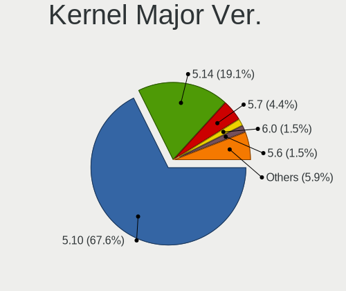
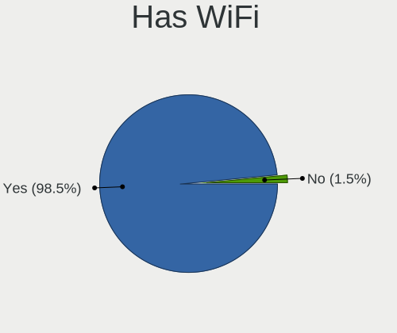
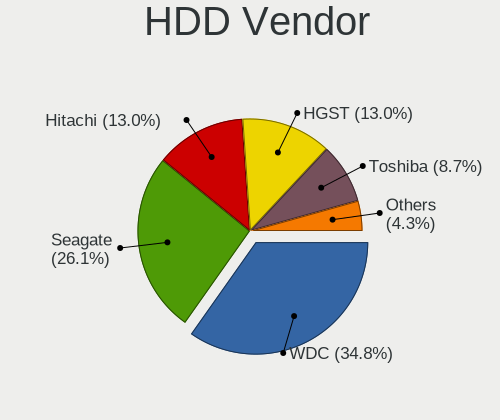
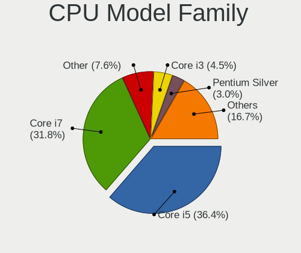
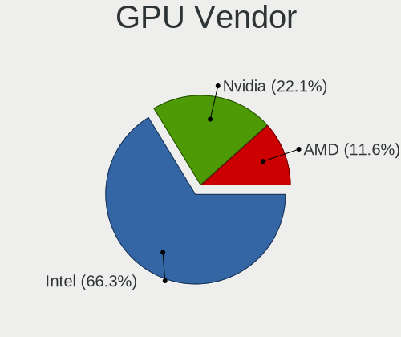
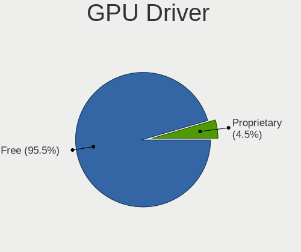
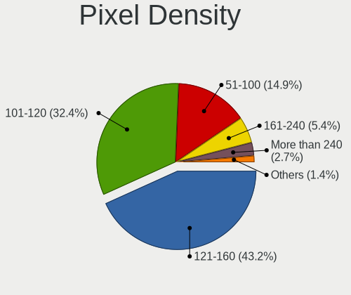
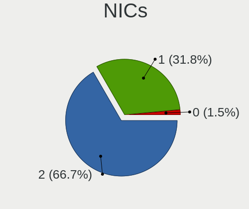
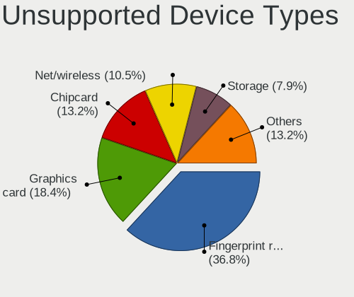

Parrot 4.11 - Tested Hardware & Statistics (Notebooks)
------------------------------------------------------

A project to collect tested hardware configurations for Parrot 4.11.

Anyone can contribute to this report by the [hw-probe](https://github.com/linuxhw/hw-probe) tool:

    sudo -E hw-probe -all -upload

Please submit a probe of your configuration if it's not presented on the page or is rare.

Full-feature report is available here: https://linux-hardware.org/?view=trends&rel=parrot-4.11

Contents
--------

* [ Test Cases ](#test-cases)

* [ System ](#system)
  - [ Kernel                   ](#kernel)
  - [ Kernel Family            ](#kernel-family)
  - [ Kernel Major Ver.        ](#kernel-major-ver)
  - [ Arch                     ](#arch)
  - [ DE                       ](#de)
  - [ Display Server           ](#display-server)
  - [ Display Manager          ](#display-manager)
  - [ OS Lang                  ](#os-lang)
  - [ Boot Mode                ](#boot-mode)
  - [ Filesystem               ](#filesystem)
  - [ Part. scheme             ](#part-scheme)
  - [ Dual Boot with Linux/BSD ](#dual-boot-with-linuxbsd)
  - [ Dual Boot (Win)          ](#dual-boot-win)

* [ Board ](#board)
  - [ Vendor                   ](#vendor)
  - [ Model                    ](#model)
  - [ Model Family             ](#model-family)
  - [ MFG Year                 ](#mfg-year)
  - [ Form Factor              ](#form-factor)
  - [ Secure Boot              ](#secure-boot)
  - [ Coreboot                 ](#coreboot)
  - [ RAM Size                 ](#ram-size)
  - [ RAM Used                 ](#ram-used)
  - [ Total Drives             ](#total-drives)
  - [ Has CD-ROM               ](#has-cd-rom)
  - [ Has Ethernet             ](#has-ethernet)
  - [ Has WiFi                 ](#has-wifi)
  - [ Has Bluetooth            ](#has-bluetooth)

* [ Location ](#location)
  - [ Country                  ](#country)
  - [ City                     ](#city)

* [ Drives ](#drives)
  - [ Drive Vendor             ](#drive-vendor)
  - [ Drive Model              ](#drive-model)
  - [ HDD Vendor               ](#hdd-vendor)
  - [ SSD Vendor               ](#ssd-vendor)
  - [ Drive Kind               ](#drive-kind)
  - [ Drive Connector          ](#drive-connector)
  - [ Drive Size               ](#drive-size)
  - [ Space Total              ](#space-total)
  - [ Space Used               ](#space-used)
  - [ Malfunc. Drives          ](#malfunc-drives)
  - [ Malfunc. Drive Vendor    ](#malfunc-drive-vendor)
  - [ Malfunc. HDD Vendor      ](#malfunc-hdd-vendor)
  - [ Malfunc. Drive Kind      ](#malfunc-drive-kind)
  - [ Failed Drives            ](#failed-drives)
  - [ Failed Drive Vendor      ](#failed-drive-vendor)
  - [ Drive Status             ](#drive-status)

* [ Storage controller ](#storage-controller)
  - [ Storage Vendor           ](#storage-vendor)
  - [ Storage Model            ](#storage-model)
  - [ Storage Kind             ](#storage-kind)

* [ Processor ](#processor)
  - [ CPU Vendor               ](#cpu-vendor)
  - [ CPU Model                ](#cpu-model)
  - [ CPU Model Family         ](#cpu-model-family)
  - [ CPU Cores                ](#cpu-cores)
  - [ CPU Sockets              ](#cpu-sockets)
  - [ CPU Threads              ](#cpu-threads)
  - [ CPU Op-Modes             ](#cpu-op-modes)
  - [ CPU Microcode            ](#cpu-microcode)
  - [ CPU Microarch            ](#cpu-microarch)

* [ Graphics ](#graphics)
  - [ GPU Vendor               ](#gpu-vendor)
  - [ GPU Model                ](#gpu-model)
  - [ GPU Combo                ](#gpu-combo)
  - [ GPU Driver               ](#gpu-driver)
  - [ GPU Memory               ](#gpu-memory)

* [ Monitor ](#monitor)
  - [ Monitor Vendor           ](#monitor-vendor)
  - [ Monitor Model            ](#monitor-model)
  - [ Monitor Resolution       ](#monitor-resolution)
  - [ Monitor Diagonal         ](#monitor-diagonal)
  - [ Monitor Width            ](#monitor-width)
  - [ Aspect Ratio             ](#aspect-ratio)
  - [ Monitor Area             ](#monitor-area)
  - [ Pixel Density            ](#pixel-density)
  - [ Multiple Monitors        ](#multiple-monitors)

* [ Network ](#network)
  - [ Net Controller Vendor    ](#net-controller-vendor)
  - [ Net Controller Model     ](#net-controller-model)
  - [ Wireless Vendor          ](#wireless-vendor)
  - [ Wireless Model           ](#wireless-model)
  - [ Ethernet Vendor          ](#ethernet-vendor)
  - [ Ethernet Model           ](#ethernet-model)
  - [ Net Controller Kind      ](#net-controller-kind)
  - [ Used Controller          ](#used-controller)
  - [ NICs                     ](#nics)
  - [ IPv6                     ](#ipv6)

* [ Bluetooth ](#bluetooth)
  - [ Bluetooth Vendor         ](#bluetooth-vendor)
  - [ Bluetooth Model          ](#bluetooth-model)

* [ Sound ](#sound)
  - [ Sound Vendor             ](#sound-vendor)
  - [ Sound Model              ](#sound-model)

* [ Memory ](#memory)
  - [ Memory Vendor            ](#memory-vendor)
  - [ Memory Model             ](#memory-model)
  - [ Memory Kind              ](#memory-kind)
  - [ Memory Form Factor       ](#memory-form-factor)
  - [ Memory Size              ](#memory-size)
  - [ Memory Speed             ](#memory-speed)

* [ Printers & scanners ](#printers--scanners)
  - [ Printer Vendor           ](#printer-vendor)
  - [ Printer Model            ](#printer-model)
  - [ Scanner Vendor           ](#scanner-vendor)
  - [ Scanner Model            ](#scanner-model)

* [ Camera ](#camera)
  - [ Camera Vendor            ](#camera-vendor)
  - [ Camera Model             ](#camera-model)

* [ Security ](#security)
  - [ Fingerprint Vendor       ](#fingerprint-vendor)
  - [ Fingerprint Model        ](#fingerprint-model)
  - [ Chipcard Vendor          ](#chipcard-vendor)
  - [ Chipcard Model           ](#chipcard-model)

* [ Unsupported ](#unsupported)
  - [ Unsupported Devices      ](#unsupported-devices)
  - [ Unsupported Device Types ](#unsupported-device-types)

Test Cases
----------

| Vendor        | Model                       | Probe                                                      | Date         |
|---------------|-----------------------------|------------------------------------------------------------|--------------|
| Lenovo        | ThinkPad X250 20CL001GZA    | [e732588a09](https://linux-hardware.org/?probe=e732588a09) | Sep 05, 2021 |
| HP            | Laptop 15s-eq1xxx           | [ede284a3a3](https://linux-hardware.org/?probe=ede284a3a3) | Aug 30, 2021 |
| ASUSTek       | VivoBook_ASUSLaptop X412... | [03676f1856](https://linux-hardware.org/?probe=03676f1856) | Aug 28, 2021 |
| Samsung       | 350V5C/351V5C/3540VC/344... | [41663f4fb2](https://linux-hardware.org/?probe=41663f4fb2) | Aug 26, 2021 |
| Lenovo        | B50-80 80EW                 | [e3fd336b60](https://linux-hardware.org/?probe=e3fd336b60) | Aug 24, 2021 |
| Samsung       | 350V5C/351V5C/3540VC/344... | [0460f1a29b](https://linux-hardware.org/?probe=0460f1a29b) | Aug 24, 2021 |
| HP            | ProBook 650 G1              | [2ef0cf3a18](https://linux-hardware.org/?probe=2ef0cf3a18) | Aug 16, 2021 |
| Dell          | Inspiron 5593               | [340be8f7fb](https://linux-hardware.org/?probe=340be8f7fb) | Aug 15, 2021 |
| Lenovo        | B50-80 80EW                 | [bd70ed892a](https://linux-hardware.org/?probe=bd70ed892a) | Aug 14, 2021 |
| HP            | Pavilion dv6700             | [8714c1e6ab](https://linux-hardware.org/?probe=8714c1e6ab) | Aug 10, 2021 |
| MSI           | GT60 2OC/2OD                | [5ff69797f3](https://linux-hardware.org/?probe=5ff69797f3) | Aug 09, 2021 |
| ASUSTek       | X75VB                       | [bc26a9b439](https://linux-hardware.org/?probe=bc26a9b439) | Aug 07, 2021 |
| Dell          | Latitude E6420              | [9e72687dd4](https://linux-hardware.org/?probe=9e72687dd4) | Aug 05, 2021 |
| HP            | Pavilion dv7                | [5d8cfc9c95](https://linux-hardware.org/?probe=5d8cfc9c95) | Aug 04, 2021 |
| HP            | Pavilion dv7                | [1d2d7a30f9](https://linux-hardware.org/?probe=1d2d7a30f9) | Aug 04, 2021 |
| ASUSTek       | G74Sx                       | [fb80932ddd](https://linux-hardware.org/?probe=fb80932ddd) | Jul 23, 2021 |
| Dell          | Latitude E7440              | [3a22179f3b](https://linux-hardware.org/?probe=3a22179f3b) | Jul 18, 2021 |
| ASUSTek       | X450EA                      | [91a0ff32e1](https://linux-hardware.org/?probe=91a0ff32e1) | Jul 06, 2021 |
| ASUSTek       | X450EA                      | [e4dc18ebf9](https://linux-hardware.org/?probe=e4dc18ebf9) | Jul 06, 2021 |
| ASUSTek       | Q524UQ                      | [33d61b2077](https://linux-hardware.org/?probe=33d61b2077) | Jun 17, 2021 |
| Apple         | MacBookPro8,1               | [2a633bc008](https://linux-hardware.org/?probe=2a633bc008) | Jun 14, 2021 |
| Apple         | MacBookPro8,1               | [e3bb48a049](https://linux-hardware.org/?probe=e3bb48a049) | Jun 14, 2021 |
| HP            | Laptop 15-dw0xxx            | [fa4061e79f](https://linux-hardware.org/?probe=fa4061e79f) | Jun 09, 2021 |
| Gateway       | MP8708                      | [ba382202c2](https://linux-hardware.org/?probe=ba382202c2) | Jun 04, 2021 |
| HP            | ZBook 15 G5                 | [462531aabd](https://linux-hardware.org/?probe=462531aabd) | Jun 03, 2021 |
| ASUSTek       | Q524UQ                      | [b510297404](https://linux-hardware.org/?probe=b510297404) | Jun 03, 2021 |
| Dell          | Inspiron 5558               | [91fdca7228](https://linux-hardware.org/?probe=91fdca7228) | May 31, 2021 |
| MSI           | GE73 Raider RGB 8RE         | [5aedb75ad8](https://linux-hardware.org/?probe=5aedb75ad8) | May 21, 2021 |
| Fujitsu       | LIFEBOOK T731               | [1cb3267b57](https://linux-hardware.org/?probe=1cb3267b57) | May 21, 2021 |
| Dell          | Inspiron 5420               | [dc6bc48c4d](https://linux-hardware.org/?probe=dc6bc48c4d) | May 18, 2021 |
| Lenovo        | ThinkPad X260 20F5S5QT00    | [a84514b117](https://linux-hardware.org/?probe=a84514b117) | May 14, 2021 |
| Apple         | MacBookPro11,1              | [aa4c3ffed1](https://linux-hardware.org/?probe=aa4c3ffed1) | May 13, 2021 |
| HP            | ProBook 650 G1              | [605367d5d4](https://linux-hardware.org/?probe=605367d5d4) | May 13, 2021 |
| HP            | Pavilion dv4                | [250773011b](https://linux-hardware.org/?probe=250773011b) | May 07, 2021 |
| Quanta        | 3610D                       | [47374d1b5f](https://linux-hardware.org/?probe=47374d1b5f) | Apr 27, 2021 |
| Quanta        | 3610D                       | [58b0d9473e](https://linux-hardware.org/?probe=58b0d9473e) | Apr 27, 2021 |
| Acer          | Aspire E1-571G              | [ee1ba6ee04](https://linux-hardware.org/?probe=ee1ba6ee04) | Apr 01, 2021 |
| PC Special... | N150CU                      | [39136d47f7](https://linux-hardware.org/?probe=39136d47f7) | Apr 01, 2021 |
| MSI           | GE75 Raider 10SF            | [d15c48b6a1](https://linux-hardware.org/?probe=d15c48b6a1) | Mar 29, 2021 |
| Dell          | Inspiron 5420               | [78663f1468](https://linux-hardware.org/?probe=78663f1468) | Mar 25, 2021 |
| MSI           | GE63 Raider RGB 8RE         | [de917105cd](https://linux-hardware.org/?probe=de917105cd) | Mar 22, 2021 |
| Samsung       | 300E4C/300E5C/300E7C        | [01ab712b94](https://linux-hardware.org/?probe=01ab712b94) | Mar 22, 2021 |
| HP            | Pavilion Notebook           | [67ed2b4e7f](https://linux-hardware.org/?probe=67ed2b4e7f) | Mar 22, 2021 |
| HP            | Pavilion Notebook           | [acda849408](https://linux-hardware.org/?probe=acda849408) | Mar 22, 2021 |
| Wortmann      | TERRA_MOBILE_1542           | [76f7963d8a](https://linux-hardware.org/?probe=76f7963d8a) | Mar 21, 2021 |
| Wortmann      | TERRA_MOBILE_1542           | [12fb4cc711](https://linux-hardware.org/?probe=12fb4cc711) | Mar 21, 2021 |
| HP            | Pavilion dv6                | [06b3024017](https://linux-hardware.org/?probe=06b3024017) | Mar 14, 2021 |

System
------

Kernel
------

Version of the Linux kernel

| Version                  | Notebooks | Percent |
|--------------------------|-----------|---------|
| 5.10.0-6parrot1-amd64    | 16        | 43.24%  |
| 5.10.0-8parrot1-amd64    | 10        | 27.03%  |
| 5.7.0-2parrot2-amd64     | 3         | 8.11%   |
| 5.10.0-5parrot1-amd64    | 3         | 8.11%   |
| 5.10.0-3parrot1-amd64    | 3         | 8.11%   |
| 5.10.0-6parrot1-rt-amd64 | 1         | 2.7%    |
| Unknown                  | 1         | 2.7%    |

Kernel Family
-------------

Linux kernel without a distro release

| Version | Notebooks | Percent |
|---------|-----------|---------|
| 5.10.0  | 33        | 89.19%  |
| 5.7.0   | 3         | 8.11%   |
| Unknown | 1         | 2.7%    |

Kernel Major Ver.
-----------------

Linux kernel major version

| Version | Notebooks | Percent |
|---------|-----------|---------|
| 5.10    | 33        | 89.19%  |
| 5.7     | 3         | 8.11%   |
| Unknown | 1         | 2.7%    |

Arch
----

OS architecture (x86_64, i586, etc.)

| Name   | Notebooks | Percent |
|--------|-----------|---------|
| x86_64 | 37        | 100%    |

DE
--

Desktop Environment

| Name    | Notebooks | Percent |
|---------|-----------|---------|
| MATE    | 20        | 54.05%  |
| KDE5    | 8         | 21.62%  |
| KDE     | 5         | 13.51%  |
| Unknown | 2         | 5.41%   |
| XFCE    | 1         | 2.7%    |
| LXDE    | 1         | 2.7%    |

Display Server
--------------

X11 or Wayland

| Name | Notebooks | Percent |
|------|-----------|---------|
| X11  | 37        | 100%    |

Display Manager
---------------

SDDM, LightDM, etc.

| Name    | Notebooks | Percent |
|---------|-----------|---------|
| TDM     | 17        | 45.95%  |
| Unknown | 17        | 45.95%  |
| LightDM | 2         | 5.41%   |
| SDDM    | 1         | 2.7%    |

OS Lang
-------

Language

| Lang    | Notebooks | Percent |
|---------|-----------|---------|
| en_US   | 17        | 45.95%  |
| ru_RU   | 3         | 8.11%   |
| fr_FR   | 3         | 8.11%   |
| Unknown | 3         | 8.11%   |
| pt_BR   | 2         | 5.41%   |
| en_GB   | 2         | 5.41%   |
| nl_BE   | 1         | 2.7%    |
| id_ID   | 1         | 2.7%    |
| es_ES   | 1         | 2.7%    |
| es_CO   | 1         | 2.7%    |
| en_AU   | 1         | 2.7%    |
| de_DE   | 1         | 2.7%    |
| cs_CZ   | 1         | 2.7%    |

Boot Mode
---------

EFI or BIOS

| Mode | Notebooks | Percent |
|------|-----------|---------|
| BIOS | 28        | 75.68%  |
| EFI  | 9         | 24.32%  |

Filesystem
----------

Type of filesystem

| Type  | Notebooks | Percent |
|-------|-----------|---------|
| Btrfs | 31        | 83.78%  |
| Xfs   | 4         | 10.81%  |
| Ext4  | 2         | 5.41%   |

Part. scheme
------------

Scheme of partitioning

| Type    | Notebooks | Percent |
|---------|-----------|---------|
| Unknown | 15        | 40.54%  |
| MBR     | 12        | 32.43%  |
| GPT     | 10        | 27.03%  |

Dual Boot with Linux/BSD
------------------------

Hosting more than one Linux/BSD

| Dual boot | Notebooks | Percent |
|-----------|-----------|---------|
| No        | 30        | 81.08%  |
| Yes       | 7         | 18.92%  |

Dual Boot (Win)
---------------

Hosting Linux and Windows

| Dual boot | Notebooks | Percent |
|-----------|-----------|---------|
| No        | 26        | 70.27%  |
| Yes       | 11        | 29.73%  |

Board
-----

Vendor
------

Motherboard manufacturer

| Name                | Notebooks | Percent |
|---------------------|-----------|---------|
| Hewlett-Packard     | 10        | 27.03%  |
| ASUSTek Computer    | 6         | 16.22%  |
| Dell                | 5         | 13.51%  |
| MSI                 | 4         | 10.81%  |
| Lenovo              | 3         | 8.11%   |
| Samsung Electronics | 2         | 5.41%   |
| Apple               | 2         | 5.41%   |
| Wortmann AG         | 1         | 2.7%    |
| Quanta              | 1         | 2.7%    |
| Gateway             | 1         | 2.7%    |
| Fujitsu             | 1         | 2.7%    |
| Acer                | 1         | 2.7%    |

Model
-----

Motherboard model

| Name                                    | Notebooks | Percent |
|-----------------------------------------|-----------|---------|
| HP ProBook 650 G1                       | 2         | 5.41%   |
| ASUS Q524UQ                             | 2         | 5.41%   |
| Wortmann AG TERRA_MOBILE_1542           | 1         | 2.7%    |
| Samsung 350V5C/351V5C/3540VC/3440VC     | 1         | 2.7%    |
| Samsung 300E4C/300E5C/300E7C            | 1         | 2.7%    |
| Quanta HDX PREMIUM SERIES               | 1         | 2.7%    |
| MSI GT60 2OC/2OD                        | 1         | 2.7%    |
| MSI GE75 Raider 10SF                    | 1         | 2.7%    |
| MSI GE73 Raider RGB 8RE                 | 1         | 2.7%    |
| MSI GE63 Raider RGB 8RE                 | 1         | 2.7%    |
| Lenovo ThinkPad X260 20F5S5QT00         | 1         | 2.7%    |
| Lenovo ThinkPad X250 20CL001GZA         | 1         | 2.7%    |
| Lenovo B50-80 80EW                      | 1         | 2.7%    |
| HP ZBook 15 G5                          | 1         | 2.7%    |
| HP Pavilion Notebook                    | 1         | 2.7%    |
| HP Pavilion dv7                         | 1         | 2.7%    |
| HP Pavilion dv6700                      | 1         | 2.7%    |
| HP Pavilion dv6                         | 1         | 2.7%    |
| HP Pavilion dv4                         | 1         | 2.7%    |
| HP Laptop 15s-eq1xxx                    | 1         | 2.7%    |
| HP Laptop 15-dw0xxx                     | 1         | 2.7%    |
| Gateway MP8708                          | 1         | 2.7%    |
| Fujitsu LIFEBOOK T731                   | 1         | 2.7%    |
| Dell Latitude E7440                     | 1         | 2.7%    |
| Dell Latitude E6420                     | 1         | 2.7%    |
| Dell Inspiron 5593                      | 1         | 2.7%    |
| Dell Inspiron 5558                      | 1         | 2.7%    |
| Dell Inspiron 5420                      | 1         | 2.7%    |
| ASUS X75VB                              | 1         | 2.7%    |
| ASUS X450EA                             | 1         | 2.7%    |
| ASUS VivoBook_ASUSLaptop X412DAP_F412DA | 1         | 2.7%    |
| ASUS G74Sx                              | 1         | 2.7%    |
| Apple MacBookPro8,1                     | 1         | 2.7%    |
| Apple MacBookPro11,1                    | 1         | 2.7%    |
| Acer Aspire E1-571G                     | 1         | 2.7%    |

Model Family
------------

Motherboard model prefix

| Name               | Notebooks | Percent |
|--------------------|-----------|---------|
| HP Pavilion        | 5         | 13.51%  |
| Dell Inspiron      | 3         | 8.11%   |
| Lenovo ThinkPad    | 2         | 5.41%   |
| HP ProBook         | 2         | 5.41%   |
| HP Laptop          | 2         | 5.41%   |
| Dell Latitude      | 2         | 5.41%   |
| ASUS Q524UQ        | 2         | 5.41%   |
| Wortmann AG TERRA  | 1         | 2.7%    |
| Samsung 350V5C     | 1         | 2.7%    |
| Samsung 300E4C     | 1         | 2.7%    |
| Quanta HDX         | 1         | 2.7%    |
| MSI GT60           | 1         | 2.7%    |
| MSI GE75           | 1         | 2.7%    |
| MSI GE73           | 1         | 2.7%    |
| MSI GE63           | 1         | 2.7%    |
| Lenovo B50-80      | 1         | 2.7%    |
| HP ZBook           | 1         | 2.7%    |
| Gateway MP8708     | 1         | 2.7%    |
| Fujitsu LIFEBOOK   | 1         | 2.7%    |
| ASUS X75VB         | 1         | 2.7%    |
| ASUS X450EA        | 1         | 2.7%    |
| ASUS VivoBook      | 1         | 2.7%    |
| ASUS G74Sx         | 1         | 2.7%    |
| Apple MacBookPro8  | 1         | 2.7%    |
| Apple MacBookPro11 | 1         | 2.7%    |
| Acer Aspire        | 1         | 2.7%    |

MFG Year
--------

Motherboard manufacture year

| Year | Notebooks | Percent |
|------|-----------|---------|
| 2020 | 6         | 16.22%  |
| 2019 | 5         | 13.51%  |
| 2018 | 5         | 13.51%  |
| 2013 | 5         | 13.51%  |
| 2016 | 3         | 8.11%   |
| 2015 | 3         | 8.11%   |
| 2012 | 3         | 8.11%   |
| 2011 | 2         | 5.41%   |
| 2010 | 2         | 5.41%   |
| 2021 | 1         | 2.7%    |
| 2008 | 1         | 2.7%    |
| 2006 | 1         | 2.7%    |

Form Factor
-----------

Physical design of the computer

| Name     | Notebooks | Percent |
|----------|-----------|---------|
| Notebook | 37        | 100%    |

Secure Boot
-----------

Enabled or disabled

| State    | Notebooks | Percent |
|----------|-----------|---------|
| Disabled | 37        | 100%    |

Coreboot
--------

Have coreboot on board

| Used | Notebooks | Percent |
|------|-----------|---------|
| No   | 37        | 100%    |

RAM Size
--------

Total RAM memory

| Size in GB  | Notebooks | Percent |
|-------------|-----------|---------|
| 8.01-16.0   | 11        | 29.73%  |
| 4.01-8.0    | 10        | 27.03%  |
| 3.01-4.0    | 7         | 18.92%  |
| 16.01-24.0  | 4         | 10.81%  |
| 32.01-64.0  | 1         | 2.7%    |
| 24.01-32.0  | 1         | 2.7%    |
| 2.01-3.0    | 1         | 2.7%    |
| 64.01-256.0 | 1         | 2.7%    |
| 1.01-2.0    | 1         | 2.7%    |

RAM Used
--------

Used RAM memory

| Used GB  | Notebooks | Percent |
|----------|-----------|---------|
| 2.01-3.0 | 15        | 39.47%  |
| 1.01-2.0 | 15        | 39.47%  |
| 3.01-4.0 | 5         | 13.16%  |
| 4.01-8.0 | 3         | 7.89%   |

Total Drives
------------

Number of drives on board

| Drives | Notebooks | Percent |
|--------|-----------|---------|
| 1      | 23        | 62.16%  |
| 2      | 11        | 29.73%  |
| 3      | 3         | 8.11%   |

Has CD-ROM
----------

Has CD-ROM on board

| Presented | Notebooks | Percent |
|-----------|-----------|---------|
| Yes       | 20        | 54.05%  |
| No        | 17        | 45.95%  |

Has Ethernet
------------

Has Ethernet on board

| Presented | Notebooks | Percent |
|-----------|-----------|---------|
| Yes       | 30        | 81.08%  |
| No        | 7         | 18.92%  |

Has WiFi
--------

Has WiFi module

| Presented | Notebooks | Percent |
|-----------|-----------|---------|
| Yes       | 36        | 97.3%   |
| No        | 1         | 2.7%    |

Has Bluetooth
-------------

Has Bluetooth module

| Presented | Notebooks | Percent |
|-----------|-----------|---------|
| Yes       | 28        | 75.68%  |
| No        | 9         | 24.32%  |

Location
--------

Country
-------

Geographic location (country)

| Country      | Notebooks | Percent |
|--------------|-----------|---------|
| USA          | 13        | 35.14%  |
| Germany      | 3         | 8.11%   |
| France       | 3         | 8.11%   |
| Spain        | 2         | 5.41%   |
| Russia       | 2         | 5.41%   |
| UK           | 1         | 2.7%    |
| South Africa | 1         | 2.7%    |
| Puerto Rico  | 1         | 2.7%    |
| Mexico       | 1         | 2.7%    |
| Iraq         | 1         | 2.7%    |
| Indonesia    | 1         | 2.7%    |
| Hungary      | 1         | 2.7%    |
| Czechia      | 1         | 2.7%    |
| Colombia     | 1         | 2.7%    |
| Brazil       | 1         | 2.7%    |
| Belgium      | 1         | 2.7%    |
| Bangladesh   | 1         | 2.7%    |
| Azerbaijan   | 1         | 2.7%    |
| Australia    | 1         | 2.7%    |

City
----

Geographic location (city)

| City              | Notebooks | Percent |
|-------------------|-----------|---------|
| Chicago           | 2         | 5.41%   |
| Witbank           | 1         | 2.7%    |
| West Jordan       | 1         | 2.7%    |
| Visalia           | 1         | 2.7%    |
| Sinntal           | 1         | 2.7%    |
| Secaucus          | 1         | 2.7%    |
| Santo André      | 1         | 2.7%    |
| Sannois           | 1         | 2.7%    |
| Regensburg        | 1         | 2.7%    |
| Prague            | 1         | 2.7%    |
| Ponce             | 1         | 2.7%    |
| Oklahoma City     | 1         | 2.7%    |
| Marietta          | 1         | 2.7%    |
| Majadahonda       | 1         | 2.7%    |
| Lyon              | 1         | 2.7%    |
| Los Mochis        | 1         | 2.7%    |
| Long Beach        | 1         | 2.7%    |
| London            | 1         | 2.7%    |
| Kazan?àô          | 1         | 2.7%    |
| Jakarta           | 1         | 2.7%    |
| Houston           | 1         | 2.7%    |
| Frankfurt am Main | 1         | 2.7%    |
| Fort Lauderdale   | 1         | 2.7%    |
| Erbil             | 1         | 2.7%    |
| East Malvern      | 1         | 2.7%    |
| Dhaka             | 1         | 2.7%    |
| Denham Springs    | 1         | 2.7%    |
| Concord           | 1         | 2.7%    |
| Budapest          | 1         | 2.7%    |
| Bogot√°           | 1         | 2.7%    |
| Blagoveshchensk   | 1         | 2.7%    |
| Bay Saint Louis   | 1         | 2.7%    |
| Barcelona         | 1         | 2.7%    |
| Baku              | 1         | 2.7%    |
| Aix-les-Bains     | 1         | 2.7%    |
| Aalst             | 1         | 2.7%    |

Drives
------

Drive Vendor
------------

Hard drive vendors

| Vendor              | Notebooks | Drives | Percent |
|---------------------|-----------|--------|---------|
| WDC                 | 6         | 8      | 11.76%  |
| Seagate             | 6         | 6      | 11.76%  |
| Crucial             | 6         | 7      | 11.76%  |
| Unknown             | 5         | 5      | 9.8%    |
| Samsung Electronics | 5         | 6      | 9.8%    |
| Toshiba             | 4         | 4      | 7.84%   |
| Kingston            | 4         | 4      | 7.84%   |
| A-DATA Technology   | 3         | 3      | 5.88%   |
| Hitachi             | 2         | 2      | 3.92%   |
| HGST                | 2         | 2      | 3.92%   |
| China               | 2         | 2      | 3.92%   |
| SanDisk             | 1         | 1      | 1.96%   |
| Patriot             | 1         | 1      | 1.96%   |
| Micron Technology   | 1         | 1      | 1.96%   |
| KIOXIA              | 1         | 1      | 1.96%   |
| Corsair             | 1         | 1      | 1.96%   |
| Apple               | 1         | 1      | 1.96%   |

Drive Model
-----------

Hard drive models

| Model                                    | Notebooks | Percent |
|------------------------------------------|-----------|---------|
| WDC WD5000LPCX-24C6HT0 500GB             | 2         | 3.7%    |
| Seagate ST2000LM003 HN-M201RAD 2TB       | 2         | 3.7%    |
| Kingston SA400S37240G 240GB SSD          | 2         | 3.7%    |
| Crucial CT1000MX500SSD1 1TB              | 2         | 3.7%    |
| WDC WD800BEVS-22RST0 80GB                | 1         | 1.85%   |
| WDC WD3200LPVX-00V0TT0 320GB             | 1         | 1.85%   |
| WDC WD2500BPVT-00JJ5T0 250GB             | 1         | 1.85%   |
| WDC WD10SPZX-17Z10T1 1TB                 | 1         | 1.85%   |
| WDC PC SN730 SDBPNTY-512G-1032 512GB     | 1         | 1.85%   |
| Unknown Y016B  16GB                      | 1         | 1.85%   |
| Unknown xD/SD/M.S.                       | 1         | 1.85%   |
| Unknown SS16G  16GB                      | 1         | 1.85%   |
| Unknown SDU1  64GB                       | 1         | 1.85%   |
| Unknown MMC Card  128GB                  | 1         | 1.85%   |
| Toshiba THNSNF128GMCS 128GB SSD          | 1         | 1.85%   |
| Toshiba Q300. 480GB SSD                  | 1         | 1.85%   |
| Toshiba MQ01ABD075 752GB                 | 1         | 1.85%   |
| Toshiba MK7575GSX 752GB                  | 1         | 1.85%   |
| Seagate ST9500420AS 500GB                | 1         | 1.85%   |
| Seagate ST320LT020-9YG142 320GB          | 1         | 1.85%   |
| Seagate ST2000LM007-1R8174 2TB           | 1         | 1.85%   |
| Seagate ST1000LM024 HN-M101MBB 1TB       | 1         | 1.85%   |
| SanDisk Extreme SSD 500GB                | 1         | 1.85%   |
| Samsung SSD 980 1TB                      | 1         | 1.85%   |
| Samsung SSD 860 EVO 500GB                | 1         | 1.85%   |
| Samsung NVMe SSD Drive 512GB             | 1         | 1.85%   |
| Samsung MZVLW256HEHP-00000 256GB         | 1         | 1.85%   |
| Samsung MZVLQ256HAJD-00000 256GB         | 1         | 1.85%   |
| Samsung MZNLH128HBHQ-000H1 128GB SSD     | 1         | 1.85%   |
| Patriot P210 256GB SSD                   | 1         | 1.85%   |
| Micron MTFDDAK128MAY-1AH1ZABHA 128GB SSD | 1         | 1.85%   |
| KIOXIA KBG40ZNV256G 256GB                | 1         | 1.85%   |
| Kingston SV300S37A240G 240GB SSD         | 1         | 1.85%   |
| Kingston SKC400S37512G 512GB SSD         | 1         | 1.85%   |
| Hitachi HTS545025A7E380 250GB            | 1         | 1.85%   |
| Hitachi HTS542512K9SA00 120GB            | 1         | 1.85%   |
| HGST HTS721010A9E630 1TB                 | 1         | 1.85%   |
| HGST HTS541010A9E680 1TB                 | 1         | 1.85%   |
| Crucial CT500MX500SSD1 500GB             | 1         | 1.85%   |
| Crucial CT480BX500SSD1 480GB             | 1         | 1.85%   |
| Crucial CT275MX300SSD1 275GB             | 1         | 1.85%   |
| Crucial CT250MX500SSD1 250GB             | 1         | 1.85%   |
| Crucial CT250MX200SSD1 250GB             | 1         | 1.85%   |
| Corsair Force 3 SSD 180GB                | 1         | 1.85%   |
| China SATA SSD 120GB                     | 1         | 1.85%   |
| China MSATA 480GB SSD                    | 1         | 1.85%   |
| Apple SSD SM0512F 500GB                  | 1         | 1.85%   |
| A-DATA SX6000LNP 1TB                     | 1         | 1.85%   |
| A-DATA SU650 120GB SSD                   | 1         | 1.85%   |
| A-DATA IM2P33F3 NVMe 512GB               | 1         | 1.85%   |

HDD Vendor
----------

Hard disk drive vendors

| Vendor  | Notebooks | Drives | Percent |
|---------|-----------|--------|---------|
| WDC     | 6         | 7      | 33.33%  |
| Seagate | 6         | 6      | 33.33%  |
| Toshiba | 2         | 2      | 11.11%  |
| Hitachi | 2         | 2      | 11.11%  |
| HGST    | 2         | 2      | 11.11%  |

SSD Vendor
----------

Solid state drive vendors

| Vendor              | Notebooks | Drives | Percent |
|---------------------|-----------|--------|---------|
| Crucial             | 6         | 7      | 27.27%  |
| Kingston            | 4         | 4      | 18.18%  |
| Toshiba             | 2         | 2      | 9.09%   |
| Samsung Electronics | 2         | 2      | 9.09%   |
| China               | 2         | 2      | 9.09%   |
| SanDisk             | 1         | 1      | 4.55%   |
| Patriot             | 1         | 1      | 4.55%   |
| Micron Technology   | 1         | 1      | 4.55%   |
| Corsair             | 1         | 1      | 4.55%   |
| Apple               | 1         | 1      | 4.55%   |
| A-DATA Technology   | 1         | 1      | 4.55%   |

Drive Kind
----------

HDD or SSD

| Kind    | Notebooks | Drives | Percent |
|---------|-----------|--------|---------|
| SSD     | 18        | 23     | 37.5%   |
| HDD     | 18        | 19     | 37.5%   |
| NVMe    | 7         | 8      | 14.58%  |
| MMC     | 4         | 4      | 8.33%   |
| Unknown | 1         | 1      | 2.08%   |

Drive Connector
---------------

SATA, SAS, NVMe, etc.

| Type | Notebooks | Drives | Percent |
|------|-----------|--------|---------|
| SATA | 34        | 41     | 72.34%  |
| NVMe | 7         | 8      | 14.89%  |
| MMC  | 4         | 4      | 8.51%   |
| SAS  | 2         | 2      | 4.26%   |

Drive Size
----------

Size of hard drive

| Size in TB | Notebooks | Drives | Percent |
|------------|-----------|--------|---------|
| 0.01-0.5   | 24        | 30     | 66.67%  |
| 0.51-1.0   | 9         | 9      | 25%     |
| 1.01-2.0   | 3         | 3      | 8.33%   |

Space Total
-----------

Amount of disk space available on the file system

| Size in GB     | Notebooks | Percent |
|----------------|-----------|---------|
| 251-500        | 8         | 21.62%  |
| 101-250        | 8         | 21.62%  |
| 501-1000       | 7         | 18.92%  |
| Unknown        | 5         | 13.51%  |
| 1001-2000      | 4         | 10.81%  |
| More than 3000 | 2         | 5.41%   |
| 51-100         | 2         | 5.41%   |
| 2001-3000      | 1         | 2.7%    |

Space Used
----------

Amount of used disk space

| Used GB   | Notebooks | Percent |
|-----------|-----------|---------|
| 21-50     | 10        | 27.03%  |
| 51-100    | 10        | 27.03%  |
| Unknown   | 5         | 13.51%  |
| 251-500   | 4         | 10.81%  |
| 1-20      | 4         | 10.81%  |
| 101-250   | 2         | 5.41%   |
| 1001-2000 | 1         | 2.7%    |
| 501-1000  | 1         | 2.7%    |

Malfunc. Drives
---------------

Drive models with a malfunction

| Model                                               | Notebooks | Drives | Percent |
|-----------------------------------------------------|-----------|--------|---------|
| Toshiba MQ01ABD075 752GB                            | 1         | 1      | 16.67%  |
| Seagate ST2000LM007-1R8174 2TB                      | 1         | 1      | 16.67%  |
| Samsung Electronics MZNLH128HBHQ-000H1 128GB SSD    | 1         | 1      | 16.67%  |
| Micron Technology MTFDDAK128MAY-1AH1ZABHA 128GB SSD | 1         | 1      | 16.67%  |
| Hitachi HTS542512K9SA00 120GB                       | 1         | 1      | 16.67%  |
| A-DATA Technology SX6000LNP 1TB                     | 1         | 1      | 16.67%  |

Malfunc. Drive Vendor
---------------------

Vendors of faulty drives

| Vendor              | Notebooks | Drives | Percent |
|---------------------|-----------|--------|---------|
| Toshiba             | 1         | 1      | 16.67%  |
| Seagate             | 1         | 1      | 16.67%  |
| Samsung Electronics | 1         | 1      | 16.67%  |
| Micron Technology   | 1         | 1      | 16.67%  |
| Hitachi             | 1         | 1      | 16.67%  |
| A-DATA Technology   | 1         | 1      | 16.67%  |

Malfunc. HDD Vendor
-------------------

Vendors of faulty HDD drives

| Vendor  | Notebooks | Drives | Percent |
|---------|-----------|--------|---------|
| Toshiba | 1         | 1      | 33.33%  |
| Seagate | 1         | 1      | 33.33%  |
| Hitachi | 1         | 1      | 33.33%  |

Malfunc. Drive Kind
-------------------

Kinds of faulty drives

| Kind | Notebooks | Drives | Percent |
|------|-----------|--------|---------|
| HDD  | 3         | 3      | 50%     |
| SSD  | 2         | 2      | 33.33%  |
| NVMe | 1         | 1      | 16.67%  |

Failed Drives
-------------

Failed drive models

Zero info for selected period =(

Failed Drive Vendor
-------------------

Failed drive vendors

Zero info for selected period =(

Drive Status
------------

Number of failed and malfunc. drives

| Status   | Notebooks | Drives | Percent |
|----------|-----------|--------|---------|
| Detected | 19        | 25     | 45.24%  |
| Works    | 18        | 24     | 42.86%  |
| Malfunc  | 5         | 6      | 11.9%   |

Storage controller
------------------

Storage Vendor
--------------

Storage controller vendors

| Vendor                | Notebooks | Percent |
|-----------------------|-----------|---------|
| Intel                 | 33        | 76.74%  |
| Samsung Electronics   | 4         | 9.3%    |
| AMD                   | 2         | 4.65%   |
| Sandisk               | 1         | 2.33%   |
| Realtek Semiconductor | 1         | 2.33%   |
| KIOXIA                | 1         | 2.33%   |
| ADATA Technology      | 1         | 2.33%   |

Storage Model
-------------

Storage controller models

| Model                                                                                  | Notebooks | Percent |
|----------------------------------------------------------------------------------------|-----------|---------|
| Intel 7 Series Chipset Family 6-port SATA Controller [AHCI mode]                       | 5         | 10.64%  |
| Intel 6 Series/C200 Series Chipset Family 6 port Mobile SATA AHCI Controller           | 5         | 10.64%  |
| Intel Sunrise Point-LP SATA Controller [AHCI mode]                                     | 4         | 8.51%   |
| Intel Wildcat Point-LP SATA Controller [AHCI Mode]                                     | 3         | 6.38%   |
| Intel Cannon Lake Mobile PCH SATA AHCI Controller                                      | 3         | 6.38%   |
| Intel 8 Series/C220 Series Chipset Family 6-port SATA Controller 1 [AHCI mode]         | 3         | 6.38%   |
| Samsung NVMe Controller                                                                | 2         | 4.26%   |
| Intel 82801IBM/IEM (ICH9M/ICH9M-E) 4 port SATA Controller [AHCI mode]                  | 2         | 4.26%   |
| Sandisk WD Black SN750 / PC SN730 NVMe SSD                                             | 1         | 2.13%   |
| Samsung NVMe SSD Controller SM981/PM981/PM983                                          | 1         | 2.13%   |
| Samsung NVMe SSD Controller SM961/PM961/SM963                                          | 1         | 2.13%   |
| Samsung Apple PCIe SSD                                                                 | 1         | 2.13%   |
| Realtek RTS5763DL NVMe SSD Controller                                                  | 1         | 2.13%   |
| KIOXIA Non-Volatile memory controller                                                  | 1         | 2.13%   |
| Intel Q170/Q150/B150/H170/H110/Z170/CM236 Chipset SATA Controller [AHCI Mode]          | 1         | 2.13%   |
| Intel Ice Lake-LP SATA Controller [AHCI mode]                                          | 1         | 2.13%   |
| Intel Celeron/Pentium Silver Processor SATA Controller                                 | 1         | 2.13%   |
| Intel 82801HM/HEM (ICH8M/ICH8M-E) SATA Controller [AHCI mode]                          | 1         | 2.13%   |
| Intel 82801HM/HEM (ICH8M/ICH8M-E) IDE Controller                                       | 1         | 2.13%   |
| Intel 82801GBM/GHM (ICH7-M Family) SATA Controller [AHCI mode]                         | 1         | 2.13%   |
| Intel 82801G (ICH7 Family) IDE Controller                                              | 1         | 2.13%   |
| Intel 8 Series SATA Controller 1 [AHCI mode]                                           | 1         | 2.13%   |
| Intel 6 Series/C200 Series Chipset Family Mobile SATA Controller (IDE mode, ports 4-5) | 1         | 2.13%   |
| Intel 6 Series/C200 Series Chipset Family Mobile SATA Controller (IDE mode, ports 0-3) | 1         | 2.13%   |
| Intel 400 Series Chipset Family SATA AHCI Controller                                   | 1         | 2.13%   |
| AMD FCH SATA Controller [IDE mode]                                                     | 1         | 2.13%   |
| AMD FCH SATA Controller [AHCI mode]                                                    | 1         | 2.13%   |
| ADATA Non-Volatile memory controller                                                   | 1         | 2.13%   |

Storage Kind
------------

Kind of storage controller (IDE, SATA, NVMe, SAS, ...)

| Kind | Notebooks | Percent |
|------|-----------|---------|
| SATA | 35        | 77.78%  |
| NVMe | 7         | 15.56%  |
| IDE  | 3         | 6.67%   |

Processor
---------

CPU Vendor
----------

Processor vendors

| Vendor | Notebooks | Percent |
|--------|-----------|---------|
| Intel  | 34        | 91.89%  |
| AMD    | 3         | 8.11%   |

CPU Model
---------

Processor models

| Model                                       | Notebooks | Percent |
|---------------------------------------------|-----------|---------|
| Intel Core i7-8750H CPU @ 2.20GHz           | 2         | 5.41%   |
| Intel Core i7-6500U CPU @ 2.50GHz           | 2         | 5.41%   |
| Intel Core i7-2670QM CPU @ 2.20GHz          | 2         | 5.41%   |
| Intel Core i5-6200U CPU @ 2.30GHz           | 2         | 5.41%   |
| Intel Core i5-3230M CPU @ 2.60GHz           | 2         | 5.41%   |
| Intel Core i5-3210M CPU @ 2.50GHz           | 2         | 5.41%   |
| Intel Core i5-2520M CPU @ 2.50GHz           | 2         | 5.41%   |
| Intel Core i3-5005U CPU @ 2.00GHz           | 2         | 5.41%   |
| Intel Pentium Silver N5000 CPU @ 1.10GHz    | 1         | 2.7%    |
| Intel Pentium Dual-Core CPU T4300 @ 2.10GHz | 1         | 2.7%    |
| Intel Core i7-8850H CPU @ 2.60GHz           | 1         | 2.7%    |
| Intel Core i7-4700MQ CPU @ 2.40GHz          | 1         | 2.7%    |
| Intel Core i7-4600U CPU @ 2.10GHz           | 1         | 2.7%    |
| Intel Core i7-4558U CPU @ 2.80GHz           | 1         | 2.7%    |
| Intel Core i7-3630QM CPU @ 2.40GHz          | 1         | 2.7%    |
| Intel Core i7-2620M CPU @ 2.70GHz           | 1         | 2.7%    |
| Intel Core i7-10750H CPU @ 2.60GHz          | 1         | 2.7%    |
| Intel Core i5-6400T CPU @ 2.20GHz           | 1         | 2.7%    |
| Intel Core i5-5300U CPU @ 2.30GHz           | 1         | 2.7%    |
| Intel Core i5-4210M CPU @ 2.60GHz           | 1         | 2.7%    |
| Intel Core i5-4200M CPU @ 2.50GHz           | 1         | 2.7%    |
| Intel Core i5-2450M CPU @ 2.50GHz           | 1         | 2.7%    |
| Intel Core i5-1035G1 CPU @ 1.00GHz          | 1         | 2.7%    |
| Intel Core 2 Quad CPU Q9100 @ 2.26GHz       | 1         | 2.7%    |
| Intel Core 2 Duo CPU T5550 @ 1.83GHz        | 1         | 2.7%    |
| Intel Core 2 CPU T7200 @ 2.00GHz            | 1         | 2.7%    |
| AMD Ryzen 7 4700U with Radeon Graphics      | 1         | 2.7%    |
| AMD Ryzen 3 3250U with Radeon Graphics      | 1         | 2.7%    |
| AMD E1-2500 APU with Radeon HD Graphics     | 1         | 2.7%    |

CPU Model Family
----------------

Processor model prefix

| Model                   | Notebooks | Percent |
|-------------------------|-----------|---------|
| Intel Core i5           | 14        | 37.84%  |
| Intel Core i7           | 13        | 35.14%  |
| Intel Core i3           | 2         | 5.41%   |
| Intel Pentium Silver    | 1         | 2.7%    |
| Intel Pentium Dual-Core | 1         | 2.7%    |
| Intel Core 2 Quad       | 1         | 2.7%    |
| Intel Core 2 Duo        | 1         | 2.7%    |
| Intel Core 2            | 1         | 2.7%    |
| AMD Ryzen 7             | 1         | 2.7%    |
| AMD Ryzen 3             | 1         | 2.7%    |
| AMD E1                  | 1         | 2.7%    |

CPU Cores
---------

Number of processor cores

| Number | Notebooks | Percent |
|--------|-----------|---------|
| 2      | 24        | 64.86%  |
| 4      | 8         | 21.62%  |
| 6      | 4         | 10.81%  |
| 8      | 1         | 2.7%    |

CPU Sockets
-----------

Number of sockets

| Number | Notebooks | Percent |
|--------|-----------|---------|
| 1      | 37        | 100%    |

CPU Threads
-----------

Threads per core (Hyper-Threading)

| Number | Notebooks | Percent |
|--------|-----------|---------|
| 2      | 28        | 75.68%  |
| 1      | 9         | 24.32%  |

CPU Op-Modes
------------

CPU Operation Modes (32-bit, 64-bit)

| Op mode        | Notebooks | Percent |
|----------------|-----------|---------|
| 32-bit, 64-bit | 37        | 100%    |

CPU Microcode
-------------

Microcode number

| Number     | Notebooks | Percent |
|------------|-----------|---------|
| Unknown    | 19        | 51.35%  |
| 0x206a7    | 4         | 10.81%  |
| 0x306d4    | 2         | 5.41%   |
| 0x306c3    | 2         | 5.41%   |
| 0x1067a    | 2         | 5.41%   |
| 0x706e5    | 1         | 2.7%    |
| 0x706a1    | 1         | 2.7%    |
| 0x6fd      | 1         | 2.7%    |
| 0x6f6      | 1         | 2.7%    |
| 0x506e3    | 1         | 2.7%    |
| 0x306a9    | 1         | 2.7%    |
| 0x08600106 | 1         | 2.7%    |
| 0x08108109 | 1         | 2.7%    |

CPU Microarch
-------------

Microarchitecture

| Name          | Notebooks | Percent |
|---------------|-----------|---------|
| SandyBridge   | 6         | 16.22%  |
| Skylake       | 5         | 13.51%  |
| IvyBridge     | 5         | 13.51%  |
| Haswell       | 5         | 13.51%  |
| KabyLake      | 3         | 8.11%   |
| Broadwell     | 3         | 8.11%   |
| Penryn        | 2         | 5.41%   |
| Core          | 2         | 5.41%   |
| Zen+          | 1         | 2.7%    |
| Zen 2         | 1         | 2.7%    |
| Jaguar        | 1         | 2.7%    |
| IceLake       | 1         | 2.7%    |
| Goldmont plus | 1         | 2.7%    |
| CometLake     | 1         | 2.7%    |

Graphics
--------

GPU Vendor
----------

Vendors of graphics cards

| Vendor | Notebooks | Percent |
|--------|-----------|---------|
| Intel  | 31        | 63.27%  |
| Nvidia | 12        | 24.49%  |
| AMD    | 6         | 12.24%  |

GPU Model
---------

Graphics card models

| Model                                                                         | Notebooks | Percent |
|-------------------------------------------------------------------------------|-----------|---------|
| Intel 3rd Gen Core processor Graphics Controller                              | 5         | 9.8%    |
| Intel 2nd Generation Core Processor Family Integrated Graphics Controller     | 5         | 9.8%    |
| Intel Skylake GT2 [HD Graphics 520]                                           | 4         | 7.84%   |
| Intel HD Graphics 5500                                                        | 3         | 5.88%   |
| Intel 4th Gen Core Processor Integrated Graphics Controller                   | 3         | 5.88%   |
| Nvidia GP106M [GeForce GTX 1060 Mobile]                                       | 2         | 3.92%   |
| Nvidia GM107 [GeForce 940MX]                                                  | 2         | 3.92%   |
| Intel Haswell-ULT Integrated Graphics Controller                              | 2         | 3.92%   |
| Intel CoffeeLake-H GT2 [UHD Graphics 630]                                     | 2         | 3.92%   |
| AMD Seymour [Radeon HD 6400M/7400M Series]                                    | 2         | 3.92%   |
| Nvidia TU106M [GeForce RTX 2070 Mobile / Max-Q Refresh]                       | 1         | 1.96%   |
| Nvidia GP107GLM [Quadro P2000 Mobile]                                         | 1         | 1.96%   |
| Nvidia GK208M [GeForce GT 740M]                                               | 1         | 1.96%   |
| Nvidia GK106M [GeForce GTX 770M]                                              | 1         | 1.96%   |
| Nvidia GF119M [GeForce 610M]                                                  | 1         | 1.96%   |
| Nvidia GF117M [GeForce 610M/710M/810M/820M / GT 620M/625M/630M/720M]          | 1         | 1.96%   |
| Nvidia GF116M [GeForce GT 560M]                                               | 1         | 1.96%   |
| Nvidia G96CM [GeForce GT 130M]                                                | 1         | 1.96%   |
| Intel Mobile GM965/GL960 Integrated Graphics Controller (secondary)           | 1         | 1.96%   |
| Intel Mobile GM965/GL960 Integrated Graphics Controller (primary)             | 1         | 1.96%   |
| Intel Mobile 945GM/GMS/GME, 943/940GML Express Integrated Graphics Controller | 1         | 1.96%   |
| Intel Mobile 945GM/GMS, 943/940GML Express Integrated Graphics Controller     | 1         | 1.96%   |
| Intel Mobile 4 Series Chipset Integrated Graphics Controller                  | 1         | 1.96%   |
| Intel Iris Plus Graphics G1 (Ice Lake)                                        | 1         | 1.96%   |
| Intel HD Graphics 530                                                         | 1         | 1.96%   |
| Intel GeminiLake [UHD Graphics 605]                                           | 1         | 1.96%   |
| Intel CometLake-H GT2 [UHD Graphics]                                          | 1         | 1.96%   |
| AMD Thames [Radeon HD 7500M/7600M Series]                                     | 1         | 1.96%   |
| AMD Renoir                                                                    | 1         | 1.96%   |
| AMD Picasso                                                                   | 1         | 1.96%   |
| AMD Kabini [Radeon HD 8240 / R3 Series]                                       | 1         | 1.96%   |

GPU Combo
---------

Combinations of graphics cards

| Name           | Notebooks | Percent |
|----------------|-----------|---------|
| 1 x Intel      | 19        | 51.35%  |
| Intel + Nvidia | 9         | 24.32%  |
| 1 x Nvidia     | 3         | 8.11%   |
| Intel + AMD    | 3         | 8.11%   |
| 1 x AMD        | 3         | 8.11%   |

GPU Driver
----------

Free vs proprietary

| Driver      | Notebooks | Percent |
|-------------|-----------|---------|
| Free        | 35        | 94.59%  |
| Proprietary | 2         | 5.41%   |

GPU Memory
----------

Total video memory

| Size in GB | Notebooks | Percent |
|------------|-----------|---------|
| Unknown    | 30        | 81.08%  |
| 0.51-1.0   | 3         | 8.11%   |
| 1.01-2.0   | 2         | 5.41%   |
| 2.01-3.0   | 1         | 2.7%    |
| 0.01-0.5   | 1         | 2.7%    |

Monitor
-------

Monitor Vendor
--------------

Monitor vendors

| Vendor                  | Notebooks | Percent |
|-------------------------|-----------|---------|
| Samsung Electronics     | 7         | 17.95%  |
| LG Display              | 7         | 17.95%  |
| Chimei Innolux          | 7         | 17.95%  |
| AU Optronics            | 6         | 15.38%  |
| BOE                     | 5         | 12.82%  |
| Chi Mei Optoelectronics | 4         | 10.26%  |
| Apple                   | 2         | 5.13%   |
| Dell                    | 1         | 2.56%   |

Monitor Model
-------------

Monitor models

| Model                                                                     | Notebooks | Percent |
|---------------------------------------------------------------------------|-----------|---------|
| LG Display LCD Monitor LGD046F 1920x1080 344x194mm 15.5-inch              | 2         | 5.13%   |
| Samsung Electronics LCD Monitor SEC4D45 1280x800 331x207mm 15.4-inch      | 1         | 2.56%   |
| Samsung Electronics LCD Monitor SEC4D42 1280x800 303x190mm 14.1-inch      | 1         | 2.56%   |
| Samsung Electronics LCD Monitor SEC3942 1366x768 309x174mm 14.0-inch      | 1         | 2.56%   |
| Samsung Electronics LCD Monitor SEC3847 1440x900 367x230mm 17.1-inch      | 1         | 2.56%   |
| Samsung Electronics LCD Monitor SEC314A 1920x1080 408x230mm 18.4-inch     | 1         | 2.56%   |
| Samsung Electronics LCD Monitor SDC3652 1366x768 340x190mm 15.3-inch      | 1         | 2.56%   |
| Samsung Electronics LCD Monitor SAM0F3D 1366x768 522x293mm 23.6-inch      | 1         | 2.56%   |
| LG Display LCD Monitor LGD05F2 1920x1080 344x194mm 15.5-inch              | 1         | 2.56%   |
| LG Display LCD Monitor LGD0503 1366x768 340x190mm 15.3-inch               | 1         | 2.56%   |
| LG Display LCD Monitor LGD03CD 1366x768 277x156mm 12.5-inch               | 1         | 2.56%   |
| LG Display LCD Monitor LGD0390 1600x900 380x210mm 17.1-inch               | 1         | 2.56%   |
| LG Display LCD Monitor LGD0259 1920x1080 350x190mm 15.7-inch              | 1         | 2.56%   |
| Dell 1905FP DEL400D 1280x1024 376x301mm 19.0-inch                         | 1         | 2.56%   |
| Chimei Innolux LCD Monitor CMN176E 1920x1080 381x214mm 17.2-inch          | 1         | 2.56%   |
| Chimei Innolux LCD Monitor CMN1747 1920x1080 381x214mm 17.2-inch          | 1         | 2.56%   |
| Chimei Innolux LCD Monitor CMN15F4 1920x1080 344x193mm 15.5-inch          | 1         | 2.56%   |
| Chimei Innolux LCD Monitor CMN15CA 1366x768 340x190mm 15.3-inch           | 1         | 2.56%   |
| Chimei Innolux LCD Monitor CMN15BE 1366x768 340x190mm 15.3-inch           | 1         | 2.56%   |
| Chimei Innolux LCD Monitor CMN15BA 1920x1080 344x194mm 15.5-inch          | 1         | 2.56%   |
| Chimei Innolux LCD Monitor CMN1480 1366x768 310x170mm 13.9-inch           | 1         | 2.56%   |
| Chi Mei Optoelectronics LCD Monitor CMO1726 1920x1080 382x215mm 17.3-inch | 1         | 2.56%   |
| Chi Mei Optoelectronics LCD Monitor CMO15A2 1366x768 344x193mm 15.5-inch  | 1         | 2.56%   |
| Chi Mei Optoelectronics LCD Monitor CMO1464 1366x768 309x174mm 14.0-inch  | 1         | 2.56%   |
| Chi Mei Optoelectronics LCD Monitor CMO1444 1366x768 309x174mm 14.0-inch  | 1         | 2.56%   |
| BOE LCD Monitor BOE094A 1920x1080 344x194mm 15.5-inch                     | 1         | 2.56%   |
| BOE LCD Monitor BOE07F6 1920x1080 309x174mm 14.0-inch                     | 1         | 2.56%   |
| BOE LCD Monitor BOE07C2 1920x1080 344x193mm 15.5-inch                     | 1         | 2.56%   |
| BOE LCD Monitor BOE076F 1366x768 344x194mm 15.5-inch                      | 1         | 2.56%   |
| BOE LCD Monitor BOE06CE 1366x768 277x156mm 12.5-inch                      | 1         | 2.56%   |
| AU Optronics LCD Monitor AUO34ED 1920x1080 340x190mm 15.3-inch            | 1         | 2.56%   |
| AU Optronics LCD Monitor AUO303C 1366x768 309x173mm 13.9-inch             | 1         | 2.56%   |
| AU Optronics LCD Monitor AUO21EC 1366x768 340x190mm 15.3-inch             | 1         | 2.56%   |
| AU Optronics LCD Monitor AUO20EC 1366x768 344x193mm 15.5-inch             | 1         | 2.56%   |
| AU Optronics LCD Monitor AUO139E 1600x900 382x214mm 17.2-inch             | 1         | 2.56%   |
| AU Optronics LCD Monitor AUO113D 1920x1080 309x173mm 13.9-inch            | 1         | 2.56%   |
| Apple LCD Monitor APP9CC5 1280x800 286x179mm 13.3-inch                    | 1         | 2.56%   |
| Apple Color LCD APPA018 2560x1600 286x179mm 13.3-inch                     | 1         | 2.56%   |

Monitor Resolution
------------------

Monitor screen resolution

| Resolution       | Notebooks | Percent |
|------------------|-----------|---------|
| 1366x768 (WXGA)  | 16        | 41.03%  |
| 1920x1080 (FHD)  | 15        | 38.46%  |
| 1280x800 (WXGA)  | 3         | 7.69%   |
| 1600x900 (HD+)   | 2         | 5.13%   |
| 2560x1600        | 1         | 2.56%   |
| 1440x900 (WXGA+) | 1         | 2.56%   |
| 1280x1024 (SXGA) | 1         | 2.56%   |

Monitor Diagonal
----------------

Diagonal size in inches

| Inches | Notebooks | Percent |
|--------|-----------|---------|
| 15     | 18        | 46.15%  |
| 17     | 6         | 15.38%  |
| 14     | 6         | 15.38%  |
| 13     | 4         | 10.26%  |
| 12     | 2         | 5.13%   |
| 31     | 1         | 2.56%   |
| 19     | 1         | 2.56%   |
| 18     | 1         | 2.56%   |

Monitor Width
-------------

Physical width

| Width in mm | Notebooks | Percent |
|-------------|-----------|---------|
| 301-350     | 26        | 66.67%  |
| 351-400     | 7         | 17.95%  |
| 201-300     | 4         | 10.26%  |
| 601-700     | 1         | 2.56%   |
| 401-500     | 1         | 2.56%   |

Aspect Ratio
------------

Proportional relationship between the width and the height

| Ratio | Notebooks | Percent |
|-------|-----------|---------|
| 16/9  | 32        | 84.21%  |
| 16/10 | 5         | 13.16%  |
| 6/5   | 1         | 2.63%   |

Monitor Area
------------

Area in inch²

| Area in inch² | Notebooks | Percent |
|----------------|-----------|---------|
| 101-110        | 18        | 46.15%  |
| 81-90          | 9         | 23.08%  |
| 121-130        | 5         | 12.82%  |
| 61-70          | 2         | 5.13%   |
| 71-80          | 1         | 2.56%   |
| 351-500        | 1         | 2.56%   |
| 151-200        | 1         | 2.56%   |
| 141-150        | 1         | 2.56%   |
| 131-140        | 1         | 2.56%   |

Pixel Density
-------------

Pixels per inch

| Density | Notebooks | Percent |
|---------|-----------|---------|
| 101-120 | 17        | 43.59%  |
| 121-160 | 16        | 41.03%  |
| 51-100  | 4         | 10.26%  |
| 1-50    | 1         | 2.56%   |
| 161-240 | 1         | 2.56%   |

Multiple Monitors
-----------------

Total monitors connected

| Total | Notebooks | Percent |
|-------|-----------|---------|
| 1     | 35        | 94.59%  |
| 2     | 2         | 5.41%   |

Network
-------

Net Controller Vendor
---------------------

Controller vendors

| Vendor                            | Notebooks | Percent |
|-----------------------------------|-----------|---------|
| Intel                             | 19        | 31.67%  |
| Realtek Semiconductor             | 17        | 28.33%  |
| Qualcomm Atheros                  | 12        | 20%     |
| Broadcom                          | 6         | 10%     |
| TP-Link                           | 2         | 3.33%   |
| Ralink Technology                 | 1         | 1.67%   |
| Qualcomm Atheros Communications   | 1         | 1.67%   |
| Ericsson Business Mobile Networks | 1         | 1.67%   |
| Broadcom Limited                  | 1         | 1.67%   |

Net Controller Model
--------------------

Controller models

| Model                                                             | Notebooks | Percent |
|-------------------------------------------------------------------|-----------|---------|
| Realtek RTL8111/8168/8411 PCI Express Gigabit Ethernet Controller | 9         | 12.33%  |
| Realtek RTL810xE PCI Express Fast Ethernet controller             | 5         | 6.85%   |
| Qualcomm Atheros AR9485 Wireless Network Adapter                  | 4         | 5.48%   |
| Qualcomm Atheros Killer E2500 Gigabit Ethernet Controller         | 3         | 4.11%   |
| Intel Wireless 7265                                               | 3         | 4.11%   |
| Intel Cannon Lake PCH CNVi WiFi                                   | 3         | 4.11%   |
| TP-Link TL-WN722N v2/v3 [Realtek RTL8188EUS]                      | 2         | 2.74%   |
| Realtek RTL8822CE 802.11ac PCIe Wireless Network Adapter          | 2         | 2.74%   |
| Qualcomm Atheros AR9462 Wireless Network Adapter                  | 2         | 2.74%   |
| Intel Wireless 8260                                               | 2         | 2.74%   |
| Intel Wireless 3160                                               | 2         | 2.74%   |
| Intel Ethernet Connection I217-V                                  | 2         | 2.74%   |
| Intel Centrino Advanced-N 6205 [Taylor Peak]                      | 2         | 2.74%   |
| Broadcom BCM4312 802.11b/g LP-PHY                                 | 2         | 2.74%   |
| Realtek RTL8821CE 802.11ac PCIe Wireless Network Adapter          | 1         | 1.37%   |
| Realtek RTL8814AU 802.11a/b/g/n/ac Wireless Adapter               | 1         | 1.37%   |
| Realtek RTL8188CE 802.11b/g/n WiFi Adapter                        | 1         | 1.37%   |
| Realtek RTL8153 Gigabit Ethernet Adapter                          | 1         | 1.37%   |
| Ralink RT2870/RT3070 Wireless Adapter                             | 1         | 1.37%   |
| Qualcomm Atheros QCA9377 802.11ac Wireless Network Adapter        | 1         | 1.37%   |
| Qualcomm Atheros Killer E220x Gigabit Ethernet Controller         | 1         | 1.37%   |
| Qualcomm Atheros AR9271 802.11n                                   | 1         | 1.37%   |
| Qualcomm Atheros AR928X Wireless Network Adapter (PCI-Express)    | 1         | 1.37%   |
| Qualcomm Atheros AR9285 Wireless Network Adapter (PCI-Express)    | 1         | 1.37%   |
| Qualcomm Atheros AR8162 Fast Ethernet                             | 1         | 1.37%   |
| Qualcomm Atheros AR8161 Gigabit Ethernet                          | 1         | 1.37%   |
| Intel Wireless 3165                                               | 1         | 1.37%   |
| Intel PRO/Wireless 3945ABG [Golan] Network Connection             | 1         | 1.37%   |
| Intel PRO/100 VE Network Connection                               | 1         | 1.37%   |
| Intel Ethernet Connection I219-V                                  | 1         | 1.37%   |
| Intel Ethernet Connection I218-LM                                 | 1         | 1.37%   |
| Intel Ethernet Connection (3) I218-LM                             | 1         | 1.37%   |
| Intel Ethernet Connection (2) I219-V                              | 1         | 1.37%   |
| Intel Comet Lake PCH CNVi WiFi                                    | 1         | 1.37%   |
| Intel Centrino Wireless-N 105                                     | 1         | 1.37%   |
| Intel Centrino Advanced-N 6235                                    | 1         | 1.37%   |
| Intel 82579LM Gigabit Network Connection (Lewisville)             | 1         | 1.37%   |
| Ericsson Business Mobile Networks N5321 gw                        | 1         | 1.37%   |
| Broadcom NetXtreme BCM57765 Gigabit Ethernet PCIe                 | 1         | 1.37%   |
| Broadcom NetLink BCM57785 Gigabit Ethernet PCIe                   | 1         | 1.37%   |
| Broadcom Limited BCM4360 802.11ac Wireless Network Adapter        | 1         | 1.37%   |
| Broadcom BCM4331 802.11a/b/g/n                                    | 1         | 1.37%   |
| Broadcom BCM43228 802.11a/b/g/n                                   | 1         | 1.37%   |
| Broadcom BCM43142 802.11b/g/n                                     | 1         | 1.37%   |

Wireless Vendor
---------------

Wireless vendors

| Vendor                          | Notebooks | Percent |
|---------------------------------|-----------|---------|
| Intel                           | 17        | 41.46%  |
| Qualcomm Atheros                | 9         | 21.95%  |
| Realtek Semiconductor           | 5         | 12.2%   |
| Broadcom                        | 5         | 12.2%   |
| TP-Link                         | 2         | 4.88%   |
| Ralink Technology               | 1         | 2.44%   |
| Qualcomm Atheros Communications | 1         | 2.44%   |
| Broadcom Limited                | 1         | 2.44%   |

Wireless Model
--------------

Wireless models

| Model                                                          | Notebooks | Percent |
|----------------------------------------------------------------|-----------|---------|
| Qualcomm Atheros AR9485 Wireless Network Adapter               | 4         | 9.76%   |
| Intel Wireless 7265                                            | 3         | 7.32%   |
| Intel Cannon Lake PCH CNVi WiFi                                | 3         | 7.32%   |
| TP-Link TL-WN722N v2/v3 [Realtek RTL8188EUS]                   | 2         | 4.88%   |
| Realtek RTL8822CE 802.11ac PCIe Wireless Network Adapter       | 2         | 4.88%   |
| Qualcomm Atheros AR9462 Wireless Network Adapter               | 2         | 4.88%   |
| Intel Wireless 8260                                            | 2         | 4.88%   |
| Intel Wireless 3160                                            | 2         | 4.88%   |
| Intel Centrino Advanced-N 6205 [Taylor Peak]                   | 2         | 4.88%   |
| Broadcom BCM4312 802.11b/g LP-PHY                              | 2         | 4.88%   |
| Realtek RTL8821CE 802.11ac PCIe Wireless Network Adapter       | 1         | 2.44%   |
| Realtek RTL8814AU 802.11a/b/g/n/ac Wireless Adapter            | 1         | 2.44%   |
| Realtek RTL8188CE 802.11b/g/n WiFi Adapter                     | 1         | 2.44%   |
| Ralink RT2870/RT3070 Wireless Adapter                          | 1         | 2.44%   |
| Qualcomm Atheros QCA9377 802.11ac Wireless Network Adapter     | 1         | 2.44%   |
| Qualcomm Atheros AR9271 802.11n                                | 1         | 2.44%   |
| Qualcomm Atheros AR928X Wireless Network Adapter (PCI-Express) | 1         | 2.44%   |
| Qualcomm Atheros AR9285 Wireless Network Adapter (PCI-Express) | 1         | 2.44%   |
| Intel Wireless 3165                                            | 1         | 2.44%   |
| Intel PRO/Wireless 3945ABG [Golan] Network Connection          | 1         | 2.44%   |
| Intel Comet Lake PCH CNVi WiFi                                 | 1         | 2.44%   |
| Intel Centrino Wireless-N 105                                  | 1         | 2.44%   |
| Intel Centrino Advanced-N 6235                                 | 1         | 2.44%   |
| Broadcom Limited BCM4360 802.11ac Wireless Network Adapter     | 1         | 2.44%   |
| Broadcom BCM4331 802.11a/b/g/n                                 | 1         | 2.44%   |
| Broadcom BCM43228 802.11a/b/g/n                                | 1         | 2.44%   |
| Broadcom BCM43142 802.11b/g/n                                  | 1         | 2.44%   |

Ethernet Vendor
---------------

Ethernet vendors

| Vendor                | Notebooks | Percent |
|-----------------------|-----------|---------|
| Realtek Semiconductor | 14        | 46.67%  |
| Intel                 | 8         | 26.67%  |
| Qualcomm Atheros      | 6         | 20%     |
| Broadcom              | 2         | 6.67%   |

Ethernet Model
--------------

Ethernet models

| Model                                                             | Notebooks | Percent |
|-------------------------------------------------------------------|-----------|---------|
| Realtek RTL8111/8168/8411 PCI Express Gigabit Ethernet Controller | 9         | 29.03%  |
| Realtek RTL810xE PCI Express Fast Ethernet controller             | 5         | 16.13%  |
| Qualcomm Atheros Killer E2500 Gigabit Ethernet Controller         | 3         | 9.68%   |
| Intel Ethernet Connection I217-V                                  | 2         | 6.45%   |
| Realtek RTL8153 Gigabit Ethernet Adapter                          | 1         | 3.23%   |
| Qualcomm Atheros Killer E220x Gigabit Ethernet Controller         | 1         | 3.23%   |
| Qualcomm Atheros AR8162 Fast Ethernet                             | 1         | 3.23%   |
| Qualcomm Atheros AR8161 Gigabit Ethernet                          | 1         | 3.23%   |
| Intel PRO/100 VE Network Connection                               | 1         | 3.23%   |
| Intel Ethernet Connection I219-V                                  | 1         | 3.23%   |
| Intel Ethernet Connection I218-LM                                 | 1         | 3.23%   |
| Intel Ethernet Connection (3) I218-LM                             | 1         | 3.23%   |
| Intel Ethernet Connection (2) I219-V                              | 1         | 3.23%   |
| Intel 82579LM Gigabit Network Connection (Lewisville)             | 1         | 3.23%   |
| Broadcom NetXtreme BCM57765 Gigabit Ethernet PCIe                 | 1         | 3.23%   |
| Broadcom NetLink BCM57785 Gigabit Ethernet PCIe                   | 1         | 3.23%   |

Net Controller Kind
-------------------

Ethernet, WiFi or modem

| Kind     | Notebooks | Percent |
|----------|-----------|---------|
| WiFi     | 36        | 53.73%  |
| Ethernet | 30        | 44.78%  |
| Modem    | 1         | 1.49%   |

Used Controller
---------------

Currently used network controller

| Kind     | Notebooks | Percent |
|----------|-----------|---------|
| WiFi     | 34        | 72.34%  |
| Ethernet | 13        | 27.66%  |

NICs
----

Total network controllers on board

| Total | Notebooks | Percent |
|-------|-----------|---------|
| 2     | 29        | 78.38%  |
| 1     | 8         | 21.62%  |

IPv6
----

IPv6 vs IPv4

| Used | Notebooks | Percent |
|------|-----------|---------|
| No   | 25        | 67.57%  |
| Yes  | 12        | 32.43%  |

Bluetooth
---------

Bluetooth Vendor
----------------

Controller vendors

| Vendor                          | Notebooks | Percent |
|---------------------------------|-----------|---------|
| Intel                           | 12        | 42.86%  |
| Qualcomm Atheros Communications | 6         | 21.43%  |
| Broadcom                        | 3         | 10.71%  |
| Realtek Semiconductor           | 2         | 7.14%   |
| Lite-On Technology              | 1         | 3.57%   |
| Foxconn / Hon Hai               | 1         | 3.57%   |
| Dell                            | 1         | 3.57%   |
| Cambridge Silicon Radio         | 1         | 3.57%   |
| Apple                           | 1         | 3.57%   |

Bluetooth Model
---------------

Controller models

| Model                                               | Notebooks | Percent |
|-----------------------------------------------------|-----------|---------|
| Intel Bluetooth Device                              | 6         | 21.43%  |
| Intel Bluetooth 9460/9560 Jefferson Peak (JfP)      | 3         | 10.71%  |
| Qualcomm Atheros  Bluetooth Device                  | 2         | 7.14%   |
| Qualcomm Atheros AR3012 Bluetooth 4.0               | 2         | 7.14%   |
| Intel Bluetooth wireless interface                  | 2         | 7.14%   |
| Realtek  Bluetooth 4.2 Adapter                      | 1         | 3.57%   |
| Realtek Bluetooth Radio                             | 1         | 3.57%   |
| Qualcomm Atheros Bluetooth USB Host Controller      | 1         | 3.57%   |
| Qualcomm Atheros Bluetooth                          | 1         | 3.57%   |
| Lite-On Bluetooth Radio                             | 1         | 3.57%   |
| Intel Centrino Bluetooth Wireless Transceiver       | 1         | 3.57%   |
| Foxconn / Hon Hai BCM20702A0                        | 1         | 3.57%   |
| Dell DW375 Bluetooth Module                         | 1         | 3.57%   |
| Cambridge Silicon Radio Bluetooth Dongle (HCI mode) | 1         | 3.57%   |
| Broadcom HP Portable Bumble Bee                     | 1         | 3.57%   |
| Broadcom BCM43142A0 Bluetooth Device                | 1         | 3.57%   |
| Broadcom BCM20702A0 Bluetooth 4.0                   | 1         | 3.57%   |
| Apple Bluetooth Host Controller                     | 1         | 3.57%   |

Sound
-----

Sound Vendor
------------

Sound card vendors

| Vendor | Notebooks | Percent |
|--------|-----------|---------|
| Intel  | 34        | 75.56%  |
| Nvidia | 8         | 17.78%  |
| AMD    | 3         | 6.67%   |

Sound Model
-----------

Sound card models

| Model                                                                      | Notebooks | Percent |
|----------------------------------------------------------------------------|-----------|---------|
| Intel 6 Series/C200 Series Chipset Family High Definition Audio Controller | 6         | 10.53%  |
| Intel 7 Series/C216 Chipset Family High Definition Audio Controller        | 5         | 8.77%   |
| Intel Sunrise Point-LP HD Audio                                            | 4         | 7.02%   |
| Intel Xeon E3-1200 v3/4th Gen Core Processor HD Audio Controller           | 3         | 5.26%   |
| Intel Wildcat Point-LP High Definition Audio Controller                    | 3         | 5.26%   |
| Intel Cannon Lake PCH cAVS                                                 | 3         | 5.26%   |
| Intel Broadwell-U Audio Controller                                         | 3         | 5.26%   |
| Intel 8 Series/C220 Series Chipset High Definition Audio Controller        | 3         | 5.26%   |
| Nvidia GP106 High Definition Audio Controller                              | 2         | 3.51%   |
| Nvidia GM107 High Definition Audio Controller [GeForce 940MX]              | 2         | 3.51%   |
| Intel Haswell-ULT HD Audio Controller                                      | 2         | 3.51%   |
| Intel 82801I (ICH9 Family) HD Audio Controller                             | 2         | 3.51%   |
| Intel 8 Series HD Audio Controller                                         | 2         | 3.51%   |
| AMD Family 17h (Models 10h-1fh) HD Audio Controller                        | 2         | 3.51%   |
| Nvidia TU106 High Definition Audio Controller                              | 1         | 1.75%   |
| Nvidia GP107GL High Definition Audio Controller                            | 1         | 1.75%   |
| Nvidia GK106 HDMI Audio Controller                                         | 1         | 1.75%   |
| Nvidia GF116 High Definition Audio Controller                              | 1         | 1.75%   |
| Intel USB PnP Sound Device                                                 | 1         | 1.75%   |
| Intel NM10/ICH7 Family High Definition Audio Controller                    | 1         | 1.75%   |
| Intel Ice Lake-LP Smart Sound Technology Audio Controller                  | 1         | 1.75%   |
| Intel Comet Lake PCH cAVS                                                  | 1         | 1.75%   |
| Intel Celeron/Pentium Silver Processor High Definition Audio               | 1         | 1.75%   |
| Intel 82801H (ICH8 Family) HD Audio Controller                             | 1         | 1.75%   |
| Intel 100 Series/C230 Series Chipset Family HD Audio Controller            | 1         | 1.75%   |
| AMD Renoir Radeon High Definition Audio Controller                         | 1         | 1.75%   |
| AMD Raven/Raven2/Fenghuang HDMI/DP Audio Controller                        | 1         | 1.75%   |
| AMD Kabini HDMI/DP Audio                                                   | 1         | 1.75%   |
| AMD FCH Azalia Controller                                                  | 1         | 1.75%   |

Memory
------

Memory Vendor
-------------

Memory module vendors

| Vendor              | Notebooks | Percent |
|---------------------|-----------|---------|
| Samsung Electronics | 11        | 39.29%  |
| Unknown             | 3         | 10.71%  |
| SK Hynix            | 3         | 10.71%  |
| Elpida              | 3         | 10.71%  |
| Kingston            | 2         | 7.14%   |
| Ramaxel Technology  | 1         | 3.57%   |
| Micron Technology   | 1         | 3.57%   |
| G.Skill             | 1         | 3.57%   |
| Crucial             | 1         | 3.57%   |
| Corsair             | 1         | 3.57%   |
| A-DATA Technology   | 1         | 3.57%   |

Memory Model
------------

Memory module models

| Model                                                      | Notebooks | Percent |
|------------------------------------------------------------|-----------|---------|
| Samsung RAM M471B5173DB0-YK0 4GB SODIMM DDR3 1600MT/s      | 2         | 6.9%    |
| Samsung RAM M471A5244CB0-CTD 4096MB SODIMM DDR4 2667MT/s   | 2         | 6.9%    |
| Unknown RAM Module 8GB SODIMM DDR3 1600MT/s                | 1         | 3.45%   |
| Unknown RAM Module 2048MB SODIMM DDR2 667MT/s              | 1         | 3.45%   |
| Unknown RAM Module 1GB SODIMM DDR2 533MT/s                 | 1         | 3.45%   |
| Unknown RAM Module 1024MB SODIMM DDR2 667MT/s              | 1         | 3.45%   |
| SK Hynix RAM HMT451S6BFR8A-PB 4GB SODIMM DDR3 1600MT/s     | 1         | 3.45%   |
| SK Hynix RAM HMT351S6CFR8C-PB 4GB SODIMM DDR3 1600MT/s     | 1         | 3.45%   |
| SK Hynix RAM HMA851S6JJR6N-VK 4096MB SODIMM DDR4 2667MT/s  | 1         | 3.45%   |
| Samsung RAM M471B5773DH0-CK0 2GB SODIMM DDR3 1600MT/s      | 1         | 3.45%   |
| Samsung RAM M471B5273DH0-CH9 4096MB SODIMM DDR3 1334MT/s   | 1         | 3.45%   |
| Samsung RAM M471B1G73EB0-YK0 8192MB SODIMM DDR3 1600MT/s   | 1         | 3.45%   |
| Samsung RAM M471A5244CB0-CWE 4096MB SODIMM DDR4 3200MT/s   | 1         | 3.45%   |
| Samsung RAM M471A1K43DB1-CWE 8192MB SODIMM DDR4 3200MT/s   | 1         | 3.45%   |
| Samsung RAM M471A1K43CB1-CTD 8GB SODIMM DDR4 2667MT/s      | 1         | 3.45%   |
| Samsung RAM M471A1K43CB1-CRC 8GB SODIMM DDR4 2667MT/s      | 1         | 3.45%   |
| Ramaxel RAM RMT3170MN68F9F1600 4GB SODIMM DDR3 1600MT/s    | 1         | 3.45%   |
| Micron RAM 16JSF51264HZ-1G4D1 4096MB SODIMM DDR3 1334MT/s  | 1         | 3.45%   |
| Kingston RAM KHX2666C15S4/16G 16GB SODIMM DDR4 2667MT/s    | 1         | 3.45%   |
| Kingston RAM 99U5469-046.A00LF 4096MB SODIMM DDR3 1333MT/s | 1         | 3.45%   |
| G.Skill RAM F4-2400C16-16GRS 16GB SODIMM DDR4 2667MT/s     | 1         | 3.45%   |
| Elpida RAM Module 4GB SODIMM DDR3 1600MT/s                 | 1         | 3.45%   |
| Elpida RAM EBJ41UF8BCS0-DJ-F 4096MB SODIMM DDR3 1334MT/s   | 1         | 3.45%   |
| ELPIDA RAM EBJ21UE8BDS0-DJ-F 2048MB SODIMM DDR3 1334MT/s   | 1         | 3.45%   |
| Crucial RAM 99P5471-006.A00DT 4GB SODIMM 1067MT/s          | 1         | 3.45%   |
| Corsair RAM CMSO8GX3M1A1600C11 8GB SODIMM DDR3 1600MT/s    | 1         | 3.45%   |
| A-DATA RAM Module 16GB SODIMM DDR4 2667MT/s                | 1         | 3.45%   |

Memory Kind
-----------

Memory module kinds

| Kind | Notebooks | Percent |
|------|-----------|---------|
| DDR3 | 13        | 56.52%  |
| DDR4 | 8         | 34.78%  |
| DDR2 | 2         | 8.7%    |

Memory Form Factor
------------------

Physical design of the memory module

| Name   | Notebooks | Percent |
|--------|-----------|---------|
| SODIMM | 23        | 100%    |

Memory Size
-----------

Memory module size

| Size  | Notebooks | Percent |
|-------|-----------|---------|
| 4096  | 13        | 48.15%  |
| 8192  | 7         | 25.93%  |
| 16384 | 3         | 11.11%  |
| 2048  | 2         | 7.41%   |
| 1024  | 2         | 7.41%   |

Memory Speed
------------

Memory module speed

| Speed | Notebooks | Percent |
|-------|-----------|---------|
| 1600  | 8         | 34.78%  |
| 2667  | 6         | 26.09%  |
| 1334  | 3         | 13.04%  |
| 3200  | 2         | 8.7%    |
| 1333  | 1         | 4.35%   |
| 1067  | 1         | 4.35%   |
| 667   | 1         | 4.35%   |
| 533   | 1         | 4.35%   |

Printers & scanners
-------------------

Printer Vendor
--------------

Printer device vendors

Zero info for selected period =(

Printer Model
-------------

Printer device models

Zero info for selected period =(

Scanner Vendor
--------------

Scanner device vendors

Zero info for selected period =(

Scanner Model
-------------

Scanner device models

Zero info for selected period =(

Camera
------

Camera Vendor
-------------

Camera device vendors

| Vendor                                 | Notebooks | Percent |
|----------------------------------------|-----------|---------|
| Chicony Electronics                    | 9         | 30%     |
| Acer                                   | 5         | 16.67%  |
| Microdia                               | 3         | 10%     |
| Sunplus Innovation Technology          | 2         | 6.67%   |
| Luxvisions Innotech Limited            | 2         | 6.67%   |
| IMC Networks                           | 2         | 6.67%   |
| Cheng Uei Precision Industry (Foxlink) | 2         | 6.67%   |
| Silicon Motion                         | 1         | 3.33%   |
| Samsung Electronics                    | 1         | 3.33%   |
| Ricoh                                  | 1         | 3.33%   |
| Realtek Semiconductor                  | 1         | 3.33%   |
| Apple                                  | 1         | 3.33%   |

Camera Model
------------

Camera device models

| Model                                                    | Notebooks | Percent |
|----------------------------------------------------------|-----------|---------|
| Chicony USB2.0 HD UVC WebCam                             | 3         | 10%     |
| Acer HD Webcam                                           | 3         | 10%     |
| Luxvisions Innotech Limited HP TrueVision HD Camera      | 2         | 6.67%   |
| Sunplus Laptop_Integrated_Webcam_FHD                     | 1         | 3.33%   |
| Sunplus HD WebCam                                        | 1         | 3.33%   |
| Silicon Motion WebCam SC-03FFL11939N                     | 1         | 3.33%   |
| Samsung Galaxy A5 (MTP)                                  | 1         | 3.33%   |
| Ricoh Pavilion Webcam                                    | 1         | 3.33%   |
| Realtek Integrated_Webcam_HD                             | 1         | 3.33%   |
| Microdia WebCam SC-13HDL12639P                           | 1         | 3.33%   |
| Microdia Laptop_Integrated_Webcam_E4HD                   | 1         | 3.33%   |
| Microdia Integrated Webcam HD                            | 1         | 3.33%   |
| IMC Networks USB2.0 HD UVC WebCam                        | 1         | 3.33%   |
| IMC Networks Integrated Webcam                           | 1         | 3.33%   |
| Chicony UVC 1.00 device HD UVC WebCam                    | 1         | 3.33%   |
| Chicony USB2.0 Camera                                    | 1         | 3.33%   |
| Chicony Integrated Camera                                | 1         | 3.33%   |
| Chicony HP Webcam                                        | 1         | 3.33%   |
| Chicony HP TrueVision HD                                 | 1         | 3.33%   |
| Chicony CNF8248                                          | 1         | 3.33%   |
| Cheng Uei Precision Industry (Foxlink) Webcam            | 1         | 3.33%   |
| Cheng Uei Precision Industry (Foxlink) HP Wide Vision HD | 1         | 3.33%   |
| Apple FaceTime HD Camera                                 | 1         | 3.33%   |
| Acer Lenovo EasyCamera                                   | 1         | 3.33%   |
| Acer Integrated Camera                                   | 1         | 3.33%   |

Security
--------

Fingerprint Vendor
------------------

Fingerprint sensor vendors

| Vendor                | Notebooks | Percent |
|-----------------------|-----------|---------|
| Validity Sensors      | 6         | 66.67%  |
| LighTuning Technology | 1         | 11.11%  |
| Elan Microelectronics | 1         | 11.11%  |
| AuthenTec             | 1         | 11.11%  |

Fingerprint Model
-----------------

Fingerprint sensor models

| Model                                                                      | Notebooks | Percent |
|----------------------------------------------------------------------------|-----------|---------|
| Validity Sensors Fingerprint scanner                                       | 2         | 22.22%  |
| Validity Sensors VFS5011 Fingerprint Reader                                | 1         | 11.11%  |
| Validity Sensors VFS101 Fingerprint Reader                                 | 1         | 11.11%  |
| Validity Sensors VFS 5011 fingerprint sensor                               | 1         | 11.11%  |
| Validity Sensors Synaptics VFS7552 Touch Fingerprint Sensor with PurePrint | 1         | 11.11%  |
| LighTuning ES603 Swipe Fingerprint Sensor                                  | 1         | 11.11%  |
| Elan ELAN:Fingerprint                                                      | 1         | 11.11%  |
| AuthenTec Fingerprint Sensor                                               | 1         | 11.11%  |

Chipcard Vendor
---------------

Chipcard module vendors

| Vendor      | Notebooks | Percent |
|-------------|-----------|---------|
| Alcor Micro | 2         | 66.67%  |
| Broadcom    | 1         | 33.33%  |

Chipcard Model
--------------

Chipcard module models

| Model                                          | Notebooks | Percent |
|------------------------------------------------|-----------|---------|
| Alcor Micro AU9540 Smartcard Reader            | 2         | 66.67%  |
| Broadcom BCM5880 Secure Applications Processor | 1         | 33.33%  |

Unsupported
-----------

Unsupported Devices
-------------------

Total unsupported devices on board

| Total | Notebooks | Percent |
|-------|-----------|---------|
| 0     | 22        | 59.46%  |
| 1     | 8         | 21.62%  |
| 2     | 6         | 16.22%  |
| 3     | 1         | 2.7%    |

Unsupported Device Types
------------------------

Types of unsupported devices

| Type                  | Notebooks | Percent |
|-----------------------|-----------|---------|
| Fingerprint reader    | 9         | 40.91%  |
| Chipcard              | 3         | 13.64%  |
| Storage               | 2         | 9.09%   |
| Net/wireless          | 2         | 9.09%   |
| Multimedia controller | 2         | 9.09%   |
| Modem                 | 1         | 4.55%   |
| Graphics card         | 1         | 4.55%   |
| Camera                | 1         | 4.55%   |
| Bluetooth             | 1         | 4.55%   |

