Parrot 4.11 - Tested Hardware & Statistics (Notebooks)
------------------------------------------------------

A project to collect tested hardware configurations for Parrot 4.11.

Anyone can contribute to this report by the [hw-probe](https://github.com/linuxhw/hw-probe) tool:

    sudo -E hw-probe -all -upload

Please contribute! Especially if your hardware is rare.

Contents
--------

* [ Test Cases ](#test-cases)

* [ System ](#system)
  - [ Kernel                   ](#kernel)
  - [ Kernel Family            ](#kernel-family)
  - [ Kernel Major Ver.        ](#kernel-major-ver)
  - [ Arch                     ](#arch)
  - [ DE                       ](#de)
  - [ Display Server           ](#display-server)
  - [ Display Manager          ](#display-manager)
  - [ OS Lang                  ](#os-lang)
  - [ Boot Mode                ](#boot-mode)
  - [ Filesystem               ](#filesystem)
  - [ Part. scheme             ](#part-scheme)
  - [ Dual Boot with Linux/BSD ](#dual-boot-with-linuxbsd)
  - [ Dual Boot (Win)          ](#dual-boot-win)

* [ Board ](#board)
  - [ Vendor                   ](#vendor)
  - [ Model                    ](#model)
  - [ Model Family             ](#model-family)
  - [ MFG Year                 ](#mfg-year)
  - [ Form Factor              ](#form-factor)
  - [ Secure Boot              ](#secure-boot)
  - [ Coreboot                 ](#coreboot)
  - [ RAM Size                 ](#ram-size)
  - [ RAM Used                 ](#ram-used)
  - [ Total Drives             ](#total-drives)
  - [ Has CD-ROM               ](#has-cd-rom)
  - [ Has Ethernet             ](#has-ethernet)
  - [ Has WiFi                 ](#has-wifi)
  - [ Has Bluetooth            ](#has-bluetooth)

* [ Location ](#location)
  - [ Country                  ](#country)
  - [ City                     ](#city)

* [ Drives ](#drives)
  - [ Drive Vendor             ](#drive-vendor)
  - [ Drive Model              ](#drive-model)
  - [ HDD Vendor               ](#hdd-vendor)
  - [ SSD Vendor               ](#ssd-vendor)
  - [ Drive Kind               ](#drive-kind)
  - [ Drive Connector          ](#drive-connector)
  - [ Drive Size               ](#drive-size)
  - [ Space Total              ](#space-total)
  - [ Space Used               ](#space-used)
  - [ Malfunc. Drives          ](#malfunc-drives)
  - [ Malfunc. Drive Vendor    ](#malfunc-drive-vendor)
  - [ Malfunc. HDD Vendor      ](#malfunc-hdd-vendor)
  - [ Malfunc. Drive Kind      ](#malfunc-drive-kind)
  - [ Failed Drives            ](#failed-drives)
  - [ Failed Drive Vendor      ](#failed-drive-vendor)
  - [ Drive Status             ](#drive-status)

* [ Storage controller ](#storage-controller)
  - [ Storage Vendor           ](#storage-vendor)
  - [ Storage Model            ](#storage-model)
  - [ Storage Kind             ](#storage-kind)

* [ Processor ](#processor)
  - [ CPU Vendor               ](#cpu-vendor)
  - [ CPU Model                ](#cpu-model)
  - [ CPU Model Family         ](#cpu-model-family)
  - [ CPU Cores                ](#cpu-cores)
  - [ CPU Sockets              ](#cpu-sockets)
  - [ CPU Threads              ](#cpu-threads)
  - [ CPU Op-Modes             ](#cpu-op-modes)
  - [ CPU Microcode            ](#cpu-microcode)
  - [ CPU Microarch            ](#cpu-microarch)

* [ Graphics ](#graphics)
  - [ GPU Vendor               ](#gpu-vendor)
  - [ GPU Model                ](#gpu-model)
  - [ GPU Combo                ](#gpu-combo)
  - [ GPU Driver               ](#gpu-driver)
  - [ GPU Memory               ](#gpu-memory)

* [ Monitor ](#monitor)
  - [ Monitor Vendor           ](#monitor-vendor)
  - [ Monitor Model            ](#monitor-model)
  - [ Monitor Resolution       ](#monitor-resolution)
  - [ Monitor Diagonal         ](#monitor-diagonal)
  - [ Monitor Width            ](#monitor-width)
  - [ Aspect Ratio             ](#aspect-ratio)
  - [ Monitor Area             ](#monitor-area)
  - [ Pixel Density            ](#pixel-density)
  - [ Multiple Monitors        ](#multiple-monitors)

* [ Network ](#network)
  - [ Net Controller Vendor    ](#net-controller-vendor)
  - [ Net Controller Model     ](#net-controller-model)
  - [ Wireless Vendor          ](#wireless-vendor)
  - [ Wireless Model           ](#wireless-model)
  - [ Ethernet Vendor          ](#ethernet-vendor)
  - [ Ethernet Model           ](#ethernet-model)
  - [ Net Controller Kind      ](#net-controller-kind)
  - [ Used Controller          ](#used-controller)
  - [ NICs                     ](#nics)
  - [ IPv6                     ](#ipv6)

* [ Bluetooth ](#bluetooth)
  - [ Bluetooth Vendor         ](#bluetooth-vendor)
  - [ Bluetooth Model          ](#bluetooth-model)

* [ Sound ](#sound)
  - [ Sound Vendor             ](#sound-vendor)
  - [ Sound Model              ](#sound-model)

* [ Memory ](#memory)
  - [ Memory Vendor            ](#memory-vendor)
  - [ Memory Model             ](#memory-model)
  - [ Memory Kind              ](#memory-kind)
  - [ Memory Form Factor       ](#memory-form-factor)
  - [ Memory Size              ](#memory-size)
  - [ Memory Speed             ](#memory-speed)

* [ Printers & scanners ](#printers--scanners)
  - [ Printer Vendor           ](#printer-vendor)
  - [ Printer Model            ](#printer-model)
  - [ Scanner Vendor           ](#scanner-vendor)
  - [ Scanner Model            ](#scanner-model)

* [ Camera ](#camera)
  - [ Camera Vendor            ](#camera-vendor)
  - [ Camera Model             ](#camera-model)

* [ Security ](#security)
  - [ Fingerprint Vendor       ](#fingerprint-vendor)
  - [ Fingerprint Model        ](#fingerprint-model)
  - [ Chipcard Vendor          ](#chipcard-vendor)
  - [ Chipcard Model           ](#chipcard-model)

* [ Unsupported ](#unsupported)
  - [ Unsupported Devices      ](#unsupported-devices)
  - [ Unsupported Device Types ](#unsupported-device-types)

Test Cases
----------

Total: 83

| Vendor        | Model                       | Probe                                                      | Date         |
|---------------|-----------------------------|------------------------------------------------------------|--------------|
| Apple         | MacBookAir7,2               | [91e33f05ed](https://linux-hardware.org/?probe=91e33f05ed) | Jan 24, 2023 |
| Lenovo        | ThinkPad E590 20NB0003AD    | [fe3de007e1](https://linux-hardware.org/?probe=fe3de007e1) | Jan 16, 2023 |
| Dell          | XPS 13 9380                 | [d8ab62070c](https://linux-hardware.org/?probe=d8ab62070c) | Jan 11, 2023 |
| Acer          | Aspire ES1-111M             | [ebff9e2fa5](https://linux-hardware.org/?probe=ebff9e2fa5) | Oct 25, 2022 |
| HP            | Laptop 15s-eq1xxx           | [f8de7730b6](https://linux-hardware.org/?probe=f8de7730b6) | Sep 11, 2022 |
| Dell          | Inspiron 13-7359            | [1a13c37dce](https://linux-hardware.org/?probe=1a13c37dce) | Aug 08, 2022 |
| HP            | EliteBook 850 G6            | [1dca756b58](https://linux-hardware.org/?probe=1dca756b58) | Jul 31, 2022 |
| Lenovo        | ThinkBook 15 G2 ARE 20VG    | [8a96de43eb](https://linux-hardware.org/?probe=8a96de43eb) | Jul 08, 2022 |
| Lenovo        | ThinkPad X1 Carbon 7th 2... | [86c0fc94e6](https://linux-hardware.org/?probe=86c0fc94e6) | Jun 23, 2022 |
| Timi          | TM1613                      | [114752ffeb](https://linux-hardware.org/?probe=114752ffeb) | May 08, 2022 |
| Timi          | TM1613                      | [b714f7dbd8](https://linux-hardware.org/?probe=b714f7dbd8) | May 08, 2022 |
| Dell          | Inspiron 15 5510            | [73a8933099](https://linux-hardware.org/?probe=73a8933099) | Apr 22, 2022 |
| Lenovo        | ThinkPad E15 20RD0086UE     | [f26a636b1b](https://linux-hardware.org/?probe=f26a636b1b) | Mar 24, 2022 |
| Positivo      | Q232A                       | [87c79b8f05](https://linux-hardware.org/?probe=87c79b8f05) | Mar 13, 2022 |
| Lenovo        | IdeaPad 5 14ITL05 82FE      | [f9c159a911](https://linux-hardware.org/?probe=f9c159a911) | Mar 06, 2022 |
| Lenovo        | IdeaPad 5 14ITL05 82FE      | [ec13383aff](https://linux-hardware.org/?probe=ec13383aff) | Mar 06, 2022 |
| Sony          | SVP1321L1EBI                | [b35a3fbfec](https://linux-hardware.org/?probe=b35a3fbfec) | Feb 13, 2022 |
| GPU Compan... | GWTN141-10                  | [89835cd678](https://linux-hardware.org/?probe=89835cd678) | Jan 30, 2022 |
| HP            | EliteBook 8470p             | [d0c5b453db](https://linux-hardware.org/?probe=d0c5b453db) | Dec 31, 2021 |
| Dell          | Precision M4600             | [f386251b14](https://linux-hardware.org/?probe=f386251b14) | Nov 30, 2021 |
| Alienware     | m15 R6                      | [487678d2e5](https://linux-hardware.org/?probe=487678d2e5) | Nov 27, 2021 |
| Toxic         | GM7MQ8P                     | [deb5cbd490](https://linux-hardware.org/?probe=deb5cbd490) | Nov 24, 2021 |
| Toshiba       | Satellite L655              | [e41f3dd777](https://linux-hardware.org/?probe=e41f3dd777) | Nov 12, 2021 |
| HP            | EliteBook 840 G8 Noteboo... | [6ef3dbe032](https://linux-hardware.org/?probe=6ef3dbe032) | Nov 09, 2021 |
| Dell          | Latitude E6410              | [099708f286](https://linux-hardware.org/?probe=099708f286) | Nov 07, 2021 |
| Lenovo        | Yoga S740-14IIL 81RS        | [833500916c](https://linux-hardware.org/?probe=833500916c) | Nov 03, 2021 |
| MSI           | GT60 2OC/2OD                | [56c85806e2](https://linux-hardware.org/?probe=56c85806e2) | Oct 20, 2021 |
| Dell          | Inspiron MM061              | [5b16f69a60](https://linux-hardware.org/?probe=5b16f69a60) | Oct 17, 2021 |
| Dell          | Inspiron MM061              | [caa2855c26](https://linux-hardware.org/?probe=caa2855c26) | Oct 17, 2021 |
| MSI           | GT60 2OC/2OD                | [79e12d69ec](https://linux-hardware.org/?probe=79e12d69ec) | Oct 08, 2021 |
| Dell          | Inspiron 7501               | [1d532e72c0](https://linux-hardware.org/?probe=1d532e72c0) | Oct 02, 2021 |
| HP            | 250 G7 Notebook PC          | [b33c31b0cf](https://linux-hardware.org/?probe=b33c31b0cf) | Oct 02, 2021 |
| Lenovo        | B50-80 80EW                 | [493f8d65cb](https://linux-hardware.org/?probe=493f8d65cb) | Sep 18, 2021 |
| Lenovo        | Y520-15IKBN 80WK            | [09b7566e74](https://linux-hardware.org/?probe=09b7566e74) | Sep 14, 2021 |
| Acer          | TravelMate 5720             | [b08ac328d1](https://linux-hardware.org/?probe=b08ac328d1) | Sep 14, 2021 |
| Eluktronic... | MAG-15u                     | [f931222022](https://linux-hardware.org/?probe=f931222022) | Sep 13, 2021 |
| Acer          | Swift SF114-33              | [31bc470f08](https://linux-hardware.org/?probe=31bc470f08) | Sep 11, 2021 |
| Lenovo        | ThinkPad X250 20CL001GZA    | [e732588a09](https://linux-hardware.org/?probe=e732588a09) | Sep 05, 2021 |
| HP            | Laptop 15s-eq1xxx           | [ede284a3a3](https://linux-hardware.org/?probe=ede284a3a3) | Aug 30, 2021 |
| ASUSTek       | VivoBook_ASUSLaptop X412... | [03676f1856](https://linux-hardware.org/?probe=03676f1856) | Aug 28, 2021 |
| Samsung       | 350V5C/351V5C/3540VC/344... | [41663f4fb2](https://linux-hardware.org/?probe=41663f4fb2) | Aug 26, 2021 |
| Samsung       | 350V5C/351V5C/3540VC/344... | [0460f1a29b](https://linux-hardware.org/?probe=0460f1a29b) | Aug 24, 2021 |
| HP            | ProBook 650 G1              | [2ef0cf3a18](https://linux-hardware.org/?probe=2ef0cf3a18) | Aug 16, 2021 |
| Dell          | Inspiron 5593               | [340be8f7fb](https://linux-hardware.org/?probe=340be8f7fb) | Aug 15, 2021 |
| Lenovo        | B50-80 80EW                 | [bd70ed892a](https://linux-hardware.org/?probe=bd70ed892a) | Aug 14, 2021 |
| HP            | Pavilion dv6700             | [8714c1e6ab](https://linux-hardware.org/?probe=8714c1e6ab) | Aug 10, 2021 |
| MSI           | GT60 2OC/2OD                | [5ff69797f3](https://linux-hardware.org/?probe=5ff69797f3) | Aug 09, 2021 |
| ASUSTek       | X75VB                       | [bc26a9b439](https://linux-hardware.org/?probe=bc26a9b439) | Aug 07, 2021 |
| Dell          | Latitude E6420              | [9e72687dd4](https://linux-hardware.org/?probe=9e72687dd4) | Aug 05, 2021 |
| HP            | Pavilion dv7                | [5d8cfc9c95](https://linux-hardware.org/?probe=5d8cfc9c95) | Aug 04, 2021 |
| HP            | Pavilion dv7                | [1d2d7a30f9](https://linux-hardware.org/?probe=1d2d7a30f9) | Aug 04, 2021 |
| ASUSTek       | G74Sx                       | [fb80932ddd](https://linux-hardware.org/?probe=fb80932ddd) | Jul 23, 2021 |
| Dell          | Latitude E7440              | [3a22179f3b](https://linux-hardware.org/?probe=3a22179f3b) | Jul 18, 2021 |
| ASUSTek       | X450EA                      | [91a0ff32e1](https://linux-hardware.org/?probe=91a0ff32e1) | Jul 06, 2021 |
| ASUSTek       | X450EA                      | [e4dc18ebf9](https://linux-hardware.org/?probe=e4dc18ebf9) | Jul 06, 2021 |
| ASUSTek       | Q524UQ                      | [33d61b2077](https://linux-hardware.org/?probe=33d61b2077) | Jun 17, 2021 |
| Apple         | MacBookPro8,1               | [2a633bc008](https://linux-hardware.org/?probe=2a633bc008) | Jun 14, 2021 |
| Apple         | MacBookPro8,1               | [e3bb48a049](https://linux-hardware.org/?probe=e3bb48a049) | Jun 14, 2021 |
| HP            | Laptop 15-dw0xxx            | [fa4061e79f](https://linux-hardware.org/?probe=fa4061e79f) | Jun 09, 2021 |
| Gateway       | MP8708                      | [ba382202c2](https://linux-hardware.org/?probe=ba382202c2) | Jun 04, 2021 |
| HP            | ZBook 15 G5                 | [462531aabd](https://linux-hardware.org/?probe=462531aabd) | Jun 03, 2021 |
| ASUSTek       | Q524UQ                      | [b510297404](https://linux-hardware.org/?probe=b510297404) | Jun 03, 2021 |
| Dell          | Inspiron 5558               | [91fdca7228](https://linux-hardware.org/?probe=91fdca7228) | May 31, 2021 |
| MSI           | GE73 Raider RGB 8RE         | [5aedb75ad8](https://linux-hardware.org/?probe=5aedb75ad8) | May 21, 2021 |
| Fujitsu       | LIFEBOOK T731               | [1cb3267b57](https://linux-hardware.org/?probe=1cb3267b57) | May 21, 2021 |
| Dell          | Inspiron 5420               | [dc6bc48c4d](https://linux-hardware.org/?probe=dc6bc48c4d) | May 18, 2021 |
| Lenovo        | ThinkPad X260 20F5S5QT00    | [a84514b117](https://linux-hardware.org/?probe=a84514b117) | May 14, 2021 |
| Apple         | MacBookPro11,1              | [aa4c3ffed1](https://linux-hardware.org/?probe=aa4c3ffed1) | May 13, 2021 |
| HP            | ProBook 650 G1              | [605367d5d4](https://linux-hardware.org/?probe=605367d5d4) | May 13, 2021 |
| HP            | Pavilion dv4                | [250773011b](https://linux-hardware.org/?probe=250773011b) | May 07, 2021 |
| HP            | HDX PREMIUM SERIES          | [47374d1b5f](https://linux-hardware.org/?probe=47374d1b5f) | Apr 27, 2021 |
| HP            | HDX PREMIUM SERIES          | [58b0d9473e](https://linux-hardware.org/?probe=58b0d9473e) | Apr 27, 2021 |
| Acer          | Aspire E1-571G              | [ee1ba6ee04](https://linux-hardware.org/?probe=ee1ba6ee04) | Apr 01, 2021 |
| PC Special... | N150CU                      | [39136d47f7](https://linux-hardware.org/?probe=39136d47f7) | Apr 01, 2021 |
| MSI           | GE75 Raider 10SF            | [d15c48b6a1](https://linux-hardware.org/?probe=d15c48b6a1) | Mar 29, 2021 |
| Dell          | Inspiron 5420               | [78663f1468](https://linux-hardware.org/?probe=78663f1468) | Mar 25, 2021 |
| MSI           | GE63 Raider RGB 8RE         | [de917105cd](https://linux-hardware.org/?probe=de917105cd) | Mar 22, 2021 |
| Samsung       | 300E4C/300E5C/300E7C        | [01ab712b94](https://linux-hardware.org/?probe=01ab712b94) | Mar 22, 2021 |
| HP            | Pavilion Notebook           | [67ed2b4e7f](https://linux-hardware.org/?probe=67ed2b4e7f) | Mar 22, 2021 |
| HP            | Pavilion Notebook           | [acda849408](https://linux-hardware.org/?probe=acda849408) | Mar 22, 2021 |
| Wortmann      | TERRA_MOBILE_1542           | [76f7963d8a](https://linux-hardware.org/?probe=76f7963d8a) | Mar 21, 2021 |
| Wortmann      | TERRA_MOBILE_1542           | [12fb4cc711](https://linux-hardware.org/?probe=12fb4cc711) | Mar 21, 2021 |
| HP            | Pavilion dv6                | [06b3024017](https://linux-hardware.org/?probe=06b3024017) | Mar 14, 2021 |

System
------

Kernel
------

Version of the Linux kernel

| Version                  | Notebooks | Percent |
|--------------------------|-----------|---------|
| 5.10.0-6parrot1-amd64    | 25        | 36.76%  |
| 5.10.0-8parrot1-amd64    | 14        | 20.59%  |
| 5.14.0-9parrot1-amd64    | 10        | 14.71%  |
| 5.7.0-2parrot2-amd64     | 3         | 4.41%   |
| 5.14.0-2parrot1-amd64    | 3         | 4.41%   |
| 5.10.0-5parrot1-amd64    | 3         | 4.41%   |
| 5.10.0-3parrot1-amd64    | 3         | 4.41%   |
| 6.0.0-2parrot1-amd64     | 1         | 1.47%   |
| 5.6.0-2parrot1-amd64     | 1         | 1.47%   |
| 5.18.0-14parrot1-amd64   | 1         | 1.47%   |
| 5.16.0-12parrot1-amd64   | 1         | 1.47%   |
| 5.15.0-15parrot1-amd64   | 1         | 1.47%   |
| 5.10.0-6parrot1-rt-amd64 | 1         | 1.47%   |
| Unknown                  | 1         | 1.47%   |

Kernel Family
-------------

Linux kernel without a distro release

| Version | Notebooks | Percent |
|---------|-----------|---------|
| 5.10.0  | 46        | 67.65%  |
| 5.14.0  | 13        | 19.12%  |
| 5.7.0   | 3         | 4.41%   |
| 6.0.0   | 1         | 1.47%   |
| 5.6.0   | 1         | 1.47%   |
| 5.18.0  | 1         | 1.47%   |
| 5.16.0  | 1         | 1.47%   |
| 5.15.0  | 1         | 1.47%   |
| Unknown | 1         | 1.47%   |

Kernel Major Ver.
-----------------

Linux kernel major version

| Version | Notebooks | Percent |
|---------|-----------|---------|
| 5.10    | 46        | 67.65%  |
| 5.14    | 13        | 19.12%  |
| 5.7     | 3         | 4.41%   |
| 6.0     | 1         | 1.47%   |
| 5.6     | 1         | 1.47%   |
| 5.18    | 1         | 1.47%   |
| 5.16    | 1         | 1.47%   |
| 5.15    | 1         | 1.47%   |
| Unknown | 1         | 1.47%   |

Arch
----

OS architecture (x86_64, i586, etc.)

| Name   | Notebooks | Percent |
|--------|-----------|---------|
| x86_64 | 66        | 100%    |

DE
--

Desktop Environment

| Name    | Notebooks | Percent |
|---------|-----------|---------|
| MATE    | 41        | 62.12%  |
| KDE5    | 14        | 21.21%  |
| KDE     | 6         | 9.09%   |
| Unknown | 3         | 4.55%   |
| XFCE    | 1         | 1.52%   |
| LXDE    | 1         | 1.52%   |

Display Server
--------------

X11 or Wayland

| Name | Notebooks | Percent |
|------|-----------|---------|
| X11  | 66        | 100%    |

Display Manager
---------------

SDDM, LightDM, etc.

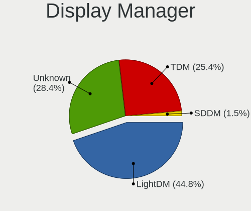

| Name    | Notebooks | Percent |
|---------|-----------|---------|
| LightDM | 30        | 44.78%  |
| Unknown | 19        | 28.36%  |
| TDM     | 17        | 25.37%  |
| SDDM    | 1         | 1.49%   |

OS Lang
-------

Language

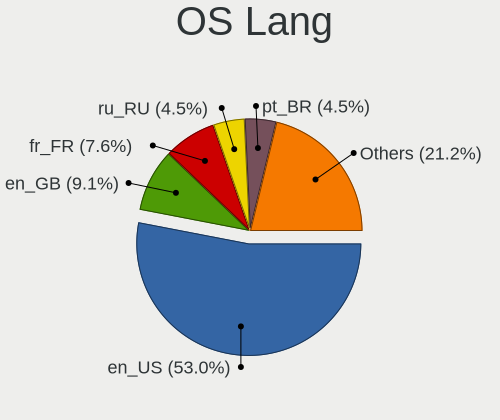

| Lang    | Notebooks | Percent |
|---------|-----------|---------|
| en_US   | 35        | 53.03%  |
| en_GB   | 6         | 9.09%   |
| fr_FR   | 5         | 7.58%   |
| ru_RU   | 3         | 4.55%   |
| pt_BR   | 3         | 4.55%   |
| Unknown | 3         | 4.55%   |
| es_ES   | 2         | 3.03%   |
| de_DE   | 2         | 3.03%   |
| nl_BE   | 1         | 1.52%   |
| id_ID   | 1         | 1.52%   |
| es_CO   | 1         | 1.52%   |
| en_NG   | 1         | 1.52%   |
| en_AU   | 1         | 1.52%   |
| cs_CZ   | 1         | 1.52%   |
| arn_CL  | 1         | 1.52%   |

Boot Mode
---------

EFI or BIOS

| Mode | Notebooks | Percent |
|------|-----------|---------|
| BIOS | 36        | 53.73%  |
| EFI  | 31        | 46.27%  |

Filesystem
----------

Type of filesystem

| Type    | Notebooks | Percent |
|---------|-----------|---------|
| Btrfs   | 51        | 77.27%  |
| Ext4    | 8         | 12.12%  |
| Xfs     | 5         | 7.58%   |
| Overlay | 2         | 3.03%   |

Part. scheme
------------

Scheme of partitioning

| Type    | Notebooks | Percent |
|---------|-----------|---------|
| GPT     | 31        | 46.97%  |
| Unknown | 19        | 28.79%  |
| MBR     | 16        | 24.24%  |

Dual Boot with Linux/BSD
------------------------

Hosting more than one Linux/BSD

| Dual boot | Notebooks | Percent |
|-----------|-----------|---------|
| No        | 52        | 78.79%  |
| Yes       | 14        | 21.21%  |

Dual Boot (Win)
---------------

Hosting Linux and Windows

| Dual boot | Notebooks | Percent |
|-----------|-----------|---------|
| No        | 42        | 63.64%  |
| Yes       | 24        | 36.36%  |

Board
-----

Vendor
------

Motherboard manufacturer

| Name                | Notebooks | Percent |
|---------------------|-----------|---------|
| Hewlett-Packard     | 15        | 22.73%  |
| Dell                | 11        | 16.67%  |
| Lenovo              | 10        | 15.15%  |
| ASUSTek Computer    | 6         | 9.09%   |
| MSI                 | 4         | 6.06%   |
| Acer                | 4         | 6.06%   |
| Apple               | 3         | 4.55%   |
| Samsung Electronics | 2         | 3.03%   |
| Wortmann AG         | 1         | 1.52%   |
| Toxic               | 1         | 1.52%   |
| Toshiba             | 1         | 1.52%   |
| Timi                | 1         | 1.52%   |
| Sony                | 1         | 1.52%   |
| Positivo            | 1         | 1.52%   |
| GPU Company         | 1         | 1.52%   |
| Gateway             | 1         | 1.52%   |
| Fujitsu             | 1         | 1.52%   |
| Eluktronics         | 1         | 1.52%   |
| Alienware           | 1         | 1.52%   |

Model
-----

Motherboard model

| Name                                     | Notebooks | Percent |
|------------------------------------------|-----------|---------|
| HP ProBook 650 G1                        | 2         | 3.03%   |
| ASUS Q524UQ                              | 2         | 3.03%   |
| Wortmann AG TERRA_MOBILE_1542            | 1         | 1.52%   |
| Toxic GM7MQ8P                            | 1         | 1.52%   |
| Toshiba Satellite L655                   | 1         | 1.52%   |
| Timi TM1613                              | 1         | 1.52%   |
| Sony SVP1321L1EBI                        | 1         | 1.52%   |
| Samsung 350V5C/351V5C/3540VC/3440VC      | 1         | 1.52%   |
| Samsung 300E4C/300E5C/300E7C             | 1         | 1.52%   |
| Positivo Q232A                           | 1         | 1.52%   |
| MSI GT60 2OC/2OD                         | 1         | 1.52%   |
| MSI GE75 Raider 10SF                     | 1         | 1.52%   |
| MSI GE73 Raider RGB 8RE                  | 1         | 1.52%   |
| MSI GE63 Raider RGB 8RE                  | 1         | 1.52%   |
| Lenovo Yoga S740-14IIL 81RS              | 1         | 1.52%   |
| Lenovo Y520-15IKBN 80WK                  | 1         | 1.52%   |
| Lenovo ThinkPad X260 20F5S5QT00          | 1         | 1.52%   |
| Lenovo ThinkPad X250 20CL001GZA          | 1         | 1.52%   |
| Lenovo ThinkPad X1 Carbon 7th 20QD003AMC | 1         | 1.52%   |
| Lenovo ThinkPad E590 20NB0003AD          | 1         | 1.52%   |
| Lenovo ThinkPad E15 20RD0086UE           | 1         | 1.52%   |
| Lenovo ThinkBook 15 G2 ARE 20VG          | 1         | 1.52%   |
| Lenovo IdeaPad 5 14ITL05 82FE            | 1         | 1.52%   |
| Lenovo B50-80 80EW                       | 1         | 1.52%   |
| HP ZBook 15 G5                           | 1         | 1.52%   |
| HP Pavilion Notebook                     | 1         | 1.52%   |
| HP Pavilion dv7                          | 1         | 1.52%   |
| HP Pavilion dv6700                       | 1         | 1.52%   |
| HP Pavilion dv6                          | 1         | 1.52%   |
| HP Pavilion dv4                          | 1         | 1.52%   |
| HP Laptop 15s-eq1xxx                     | 1         | 1.52%   |
| HP Laptop 15-dw0xxx                      | 1         | 1.52%   |
| HP HDX PREMIUM SERIES                    | 1         | 1.52%   |
| HP EliteBook 850 G6                      | 1         | 1.52%   |
| HP EliteBook 8470p                       | 1         | 1.52%   |
| HP EliteBook 840 G8 Notebook PC          | 1         | 1.52%   |
| HP 250 G7 Notebook PC                    | 1         | 1.52%   |
| GPU Company GWTN141-10                   | 1         | 1.52%   |
| Gateway MP8708                           | 1         | 1.52%   |
| Fujitsu LIFEBOOK T731                    | 1         | 1.52%   |

Model Family
------------

Motherboard model prefix

| Name                   | Notebooks | Percent |
|------------------------|-----------|---------|
| Dell Inspiron          | 6         | 9.09%   |
| Lenovo ThinkPad        | 5         | 7.58%   |
| HP Pavilion            | 5         | 7.58%   |
| HP EliteBook           | 3         | 4.55%   |
| Dell Latitude          | 3         | 4.55%   |
| HP ProBook             | 2         | 3.03%   |
| HP Laptop              | 2         | 3.03%   |
| ASUS Q524UQ            | 2         | 3.03%   |
| Acer Aspire            | 2         | 3.03%   |
| Wortmann AG TERRA      | 1         | 1.52%   |
| Toxic GM7MQ8P          | 1         | 1.52%   |
| Toshiba Satellite      | 1         | 1.52%   |
| Timi TM1613            | 1         | 1.52%   |
| Sony SVP1321L1EBI      | 1         | 1.52%   |
| Samsung 350V5C         | 1         | 1.52%   |
| Samsung 300E4C         | 1         | 1.52%   |
| Positivo Q232A         | 1         | 1.52%   |
| MSI GT60               | 1         | 1.52%   |
| MSI GE75               | 1         | 1.52%   |
| MSI GE73               | 1         | 1.52%   |
| MSI GE63               | 1         | 1.52%   |
| Lenovo Yoga            | 1         | 1.52%   |
| Lenovo Y520-15IKBN     | 1         | 1.52%   |
| Lenovo ThinkBook       | 1         | 1.52%   |
| Lenovo IdeaPad         | 1         | 1.52%   |
| Lenovo B50-80          | 1         | 1.52%   |
| HP ZBook               | 1         | 1.52%   |
| HP HDX                 | 1         | 1.52%   |
| HP 250                 | 1         | 1.52%   |
| GPU Company GWTN141-10 | 1         | 1.52%   |
| Gateway MP8708         | 1         | 1.52%   |
| Fujitsu LIFEBOOK       | 1         | 1.52%   |
| Eluktronics MAG-15u    | 1         | 1.52%   |
| Dell XPS               | 1         | 1.52%   |
| Dell Precision         | 1         | 1.52%   |
| ASUS X75VB             | 1         | 1.52%   |
| ASUS X450EA            | 1         | 1.52%   |
| ASUS VivoBook          | 1         | 1.52%   |
| ASUS G74Sx             | 1         | 1.52%   |
| Apple MacBookPro8      | 1         | 1.52%   |

MFG Year
--------

Motherboard manufacture year

| Year | Notebooks | Percent |
|------|-----------|---------|
| 2019 | 10        | 15.15%  |
| 2013 | 8         | 12.12%  |
| 2020 | 7         | 10.61%  |
| 2018 | 6         | 9.09%   |
| 2011 | 6         | 9.09%   |
| 2016 | 5         | 7.58%   |
| 2015 | 5         | 7.58%   |
| 2021 | 4         | 6.06%   |
| 2012 | 3         | 4.55%   |
| 2010 | 3         | 4.55%   |
| 2008 | 3         | 4.55%   |
| 2014 | 2         | 3.03%   |
| 2007 | 2         | 3.03%   |
| 2017 | 1         | 1.52%   |
| 2006 | 1         | 1.52%   |

Form Factor
-----------

Physical design of the computer

| Name     | Notebooks | Percent |
|----------|-----------|---------|
| Notebook | 66        | 100%    |

Secure Boot
-----------

Enabled or disabled

| State    | Notebooks | Percent |
|----------|-----------|---------|
| Disabled | 66        | 100%    |

Coreboot
--------

Have coreboot on board

| Used | Notebooks | Percent |
|------|-----------|---------|
| No   | 66        | 100%    |

RAM Size
--------

Total RAM memory

| Size in GB  | Notebooks | Percent |
|-------------|-----------|---------|
| 4.01-8.0    | 17        | 25.76%  |
| 8.01-16.0   | 15        | 22.73%  |
| 16.01-24.0  | 14        | 21.21%  |
| 3.01-4.0    | 12        | 18.18%  |
| 32.01-64.0  | 3         | 4.55%   |
| 1.01-2.0    | 2         | 3.03%   |
| 24.01-32.0  | 1         | 1.52%   |
| 2.01-3.0    | 1         | 1.52%   |
| 64.01-256.0 | 1         | 1.52%   |

RAM Used
--------

Used RAM memory

| Used GB   | Notebooks | Percent |
|-----------|-----------|---------|
| 1.01-2.0  | 26        | 37.68%  |
| 2.01-3.0  | 21        | 30.43%  |
| 3.01-4.0  | 13        | 18.84%  |
| 4.01-8.0  | 7         | 10.14%  |
| 8.01-16.0 | 2         | 2.9%    |

Total Drives
------------

Number of drives on board

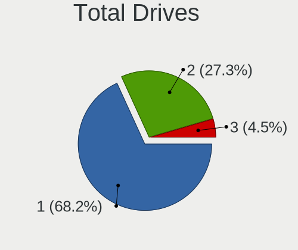

| Drives | Notebooks | Percent |
|--------|-----------|---------|
| 1      | 45        | 68.18%  |
| 2      | 18        | 27.27%  |
| 3      | 3         | 4.55%   |

Has CD-ROM
----------

Has CD-ROM on board

| Presented | Notebooks | Percent |
|-----------|-----------|---------|
| No        | 42        | 63.64%  |
| Yes       | 24        | 36.36%  |

Has Ethernet
------------

Has Ethernet on board

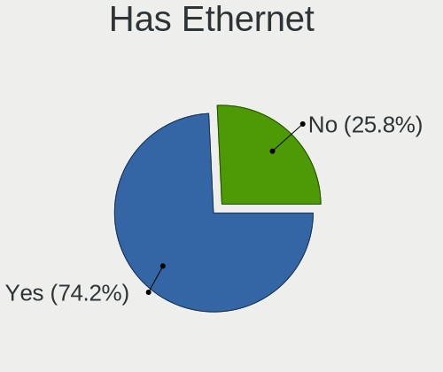

| Presented | Notebooks | Percent |
|-----------|-----------|---------|
| Yes       | 49        | 74.24%  |
| No        | 17        | 25.76%  |

Has WiFi
--------

Has WiFi module

| Presented | Notebooks | Percent |
|-----------|-----------|---------|
| Yes       | 65        | 98.48%  |
| No        | 1         | 1.52%   |

Has Bluetooth
-------------

Has Bluetooth module

| Presented | Notebooks | Percent |
|-----------|-----------|---------|
| Yes       | 50        | 75.76%  |
| No        | 16        | 24.24%  |

Location
--------

Country
-------

Geographic location (country)

| Country      | Notebooks | Percent |
|--------------|-----------|---------|
| USA          | 20        | 30.3%   |
| Germany      | 5         | 7.58%   |
| France       | 5         | 7.58%   |
| Spain        | 4         | 6.06%   |
| UK           | 3         | 4.55%   |
| Russia       | 3         | 4.55%   |
| Brazil       | 3         | 4.55%   |
| Netherlands  | 2         | 3.03%   |
| Iraq         | 2         | 3.03%   |
| Czechia      | 2         | 3.03%   |
| Sweden       | 1         | 1.52%   |
| Sudan        | 1         | 1.52%   |
| South Africa | 1         | 1.52%   |
| Puerto Rico  | 1         | 1.52%   |
| Nigeria      | 1         | 1.52%   |
| Mexico       | 1         | 1.52%   |
| Kenya        | 1         | 1.52%   |
| Indonesia    | 1         | 1.52%   |
| Hungary      | 1         | 1.52%   |
| Ethiopia     | 1         | 1.52%   |
| Colombia     | 1         | 1.52%   |
| Chile        | 1         | 1.52%   |
| Belgium      | 1         | 1.52%   |
| Bangladesh   | 1         | 1.52%   |
| Azerbaijan   | 1         | 1.52%   |
| Austria      | 1         | 1.52%   |
| Australia    | 1         | 1.52%   |

City
----

Geographic location (city)

| City                  | Notebooks | Percent |
|-----------------------|-----------|---------|
| Dallas                | 2         | 2.99%   |
| Chicago               | 2         | 2.99%   |
| West Jordan           | 1         | 1.49%   |
| Visalia               | 1         | 1.49%   |
| Veitsbronn            | 1         | 1.49%   |
| Tangerang             | 1         | 1.49%   |
| Stockholm             | 1         | 1.49%   |
| St Petersburg         | 1         | 1.49%   |
| Sinntal               | 1         | 1.49%   |
| Shelbyville           | 1         | 1.49%   |
| Secaucus              | 1         | 1.49%   |
| Santo André          | 1         | 1.49%   |
| Santiago              | 1         | 1.49%   |
| Sant Boi de Llobregat | 1         | 1.49%   |
| Sannois               | 1         | 1.49%   |
| Rotterdam             | 1         | 1.49%   |
| Rialma                | 1         | 1.49%   |
| Reus                  | 1         | 1.49%   |
| Regensburg            | 1         | 1.49%   |
| Reading               | 1         | 1.49%   |
| Pretoria              | 1         | 1.49%   |
| Prague                | 1         | 1.49%   |
| Ponce                 | 1         | 1.49%   |
| Paris                 | 1         | 1.49%   |
| Omaha                 | 1         | 1.49%   |
| New Orleans           | 1         | 1.49%   |
| Nairobi               | 1         | 1.49%   |
| Munich                | 1         | 1.49%   |
| Melbourne             | 1         | 1.49%   |
| Marietta              | 1         | 1.49%   |
| Manaus                | 1         | 1.49%   |
| Maggie Valley         | 1         | 1.49%   |
| Lyon                  | 1         | 1.49%   |
| Los Mochis            | 1         | 1.49%   |
| Longmont              | 1         | 1.49%   |
| Long Beach            | 1         | 1.49%   |
| London                | 1         | 1.49%   |
| Lancaster             | 1         | 1.49%   |
| Khartoum              | 1         | 1.49%   |
| Khabarovsk            | 1         | 1.49%   |

Drives
------

Drive Vendor
------------

Hard drive vendors

| Vendor              | Notebooks | Drives | Percent |
|---------------------|-----------|--------|---------|
| WDC                 | 11        | 13     | 12.79%  |
| Samsung Electronics | 10        | 11     | 11.63%  |
| Crucial             | 8         | 11     | 9.3%    |
| Unknown             | 7         | 7      | 8.14%   |
| Seagate             | 6         | 6      | 6.98%   |
| Kingston            | 6         | 6      | 6.98%   |
| Toshiba             | 5         | 6      | 5.81%   |
| SanDisk             | 4         | 4      | 4.65%   |
| SK hynix            | 3         | 3      | 3.49%   |
| Micron Technology   | 3         | 3      | 3.49%   |
| Hitachi             | 3         | 3      | 3.49%   |
| HGST                | 3         | 3      | 3.49%   |
| A-DATA Technology   | 3         | 3      | 3.49%   |
| KIOXIA              | 2         | 3      | 2.33%   |
| China               | 2         | 2      | 2.33%   |
| Apple               | 2         | 2      | 2.33%   |
| W800SH              | 1         | 1      | 1.16%   |
| Team                | 1         | 1      | 1.16%   |
| PNY                 | 1         | 1      | 1.16%   |
| Patriot             | 1         | 1      | 1.16%   |
| Lexar               | 1         | 1      | 1.16%   |
| Intel               | 1         | 1      | 1.16%   |
| HS-SSD-C100         | 1         | 1      | 1.16%   |
| Corsair             | 1         | 1      | 1.16%   |

Drive Model
-----------

Hard drive models

| Model                                   | Notebooks | Percent |
|-----------------------------------------|-----------|---------|
| WDC WD5000LPCX-24C6HT0 500GB            | 2         | 2.25%   |
| WDC WD10SPZX-08Z10 1TB                  | 2         | 2.25%   |
| Seagate ST2000LM003 HN-M201RAD 2TB      | 2         | 2.25%   |
| SanDisk SSD PLUS 1000GB                 | 2         | 2.25%   |
| Samsung SSD 860 EVO 500GB               | 2         | 2.25%   |
| Kingston SA400S37240G 240GB SSD         | 2         | 2.25%   |
| HGST HTS541010A9E680 1TB                | 2         | 2.25%   |
| Crucial CT1000P1SSD8 1TB                | 2         | 2.25%   |
| Crucial CT1000MX500SSD1 1TB             | 2         | 2.25%   |
| WDC WDS100T2B0C-00PXH0 1TB              | 1         | 1.12%   |
| WDC WDBNCE2500PNC 250GB SSD             | 1         | 1.12%   |
| WDC WD800BEVS-22RST0 80GB               | 1         | 1.12%   |
| WDC WD3200LPVX-00V0TT0 320GB            | 1         | 1.12%   |
| WDC WD2500BPVT-00JJ5T0 250GB            | 1         | 1.12%   |
| WDC WD10SPZX-17Z10T1 1TB                | 1         | 1.12%   |
| WDC PC SN730 SDBQNTY-512G-1001 512GB    | 1         | 1.12%   |
| WDC PC SN730 SDBPNTY-512G-1032 512GB    | 1         | 1.12%   |
| W800SH 512GB SSD                        | 1         | 1.12%   |
| Unknown Y016B  16GB                     | 1         | 1.12%   |
| Unknown xD/SD/M.S.                      | 1         | 1.12%   |
| Unknown SS16G  16GB                     | 1         | 1.12%   |
| Unknown SS08G  8GB                      | 1         | 1.12%   |
| Unknown SDU1  64GB                      | 1         | 1.12%   |
| Unknown SD/MMC/MS PRO 16GB              | 1         | 1.12%   |
| Unknown MMC Card  128GB                 | 1         | 1.12%   |
| Toshiba THNSNH128G8NT 128GB SSD         | 1         | 1.12%   |
| Toshiba THNSNF128GMCS 128GB SSD         | 1         | 1.12%   |
| Toshiba Q300. 480GB SSD                 | 1         | 1.12%   |
| Toshiba MQ01ABD075 752GB                | 1         | 1.12%   |
| Toshiba MK7575GSX 752GB                 | 1         | 1.12%   |
| Team TM8PS7512G 512GB SSD               | 1         | 1.12%   |
| SK hynix NVMe SSD Drive 512GB           | 1         | 1.12%   |
| SK hynix HFM256GDJTNI-82A0A 256GB       | 1         | 1.12%   |
| SK hynix BC511 HFM256GDJTNI-82A0A 256GB | 1         | 1.12%   |
| Seagate ST9500420AS 500GB               | 1         | 1.12%   |
| Seagate ST320LT020-9YG142 320GB         | 1         | 1.12%   |
| Seagate ST2000LM007-1R8174 2TB          | 1         | 1.12%   |
| Seagate ST1000LM024 HN-M101MBB 1TB      | 1         | 1.12%   |
| SanDisk Extreme SSD 500GB               | 1         | 1.12%   |
| SanDisk DF4032  32GB                    | 1         | 1.12%   |

HDD Vendor
----------

Hard disk drive vendors

| Vendor  | Notebooks | Drives | Percent |
|---------|-----------|--------|---------|
| WDC     | 8         | 9      | 34.78%  |
| Seagate | 6         | 6      | 26.09%  |
| Hitachi | 3         | 3      | 13.04%  |
| HGST    | 3         | 3      | 13.04%  |
| Toshiba | 2         | 2      | 8.7%    |
| Unknown | 1         | 1      | 4.35%   |

SSD Vendor
----------

Solid state drive vendors

| Vendor              | Notebooks | Drives | Percent |
|---------------------|-----------|--------|---------|
| Crucial             | 6         | 9      | 18.18%  |
| Kingston            | 4         | 4      | 12.12%  |
| Toshiba             | 3         | 4      | 9.09%   |
| SanDisk             | 3         | 3      | 9.09%   |
| Samsung Electronics | 3         | 3      | 9.09%   |
| China               | 2         | 2      | 6.06%   |
| Apple               | 2         | 2      | 6.06%   |
| WDC                 | 1         | 1      | 3.03%   |
| W800SH              | 1         | 1      | 3.03%   |
| Team                | 1         | 1      | 3.03%   |
| PNY                 | 1         | 1      | 3.03%   |
| Patriot             | 1         | 1      | 3.03%   |
| Micron Technology   | 1         | 1      | 3.03%   |
| Intel               | 1         | 1      | 3.03%   |
| HS-SSD-C100         | 1         | 1      | 3.03%   |
| Corsair             | 1         | 1      | 3.03%   |
| A-DATA Technology   | 1         | 1      | 3.03%   |

Drive Kind
----------

HDD or SSD

| Kind    | Notebooks | Drives | Percent |
|---------|-----------|--------|---------|
| SSD     | 29        | 37     | 36.25%  |
| NVMe    | 23        | 26     | 28.75%  |
| HDD     | 22        | 24     | 27.5%   |
| MMC     | 5         | 6      | 6.25%   |
| Unknown | 1         | 1      | 1.25%   |

Drive Connector
---------------

SATA, SAS, NVMe, etc.

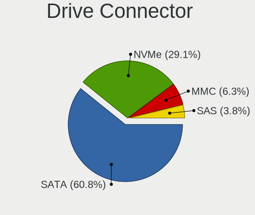

| Type | Notebooks | Drives | Percent |
|------|-----------|--------|---------|
| SATA | 48        | 59     | 60.76%  |
| NVMe | 23        | 26     | 29.11%  |
| MMC  | 5         | 6      | 6.33%   |
| SAS  | 3         | 3      | 3.8%    |

Drive Size
----------

Size of hard drive

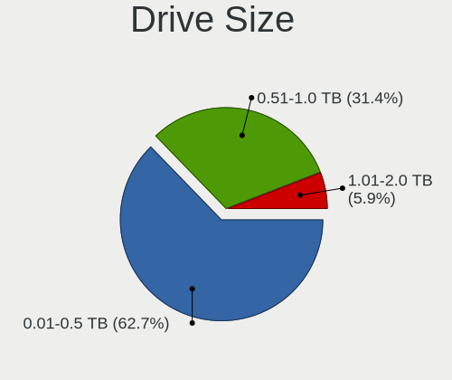

| Size in TB | Notebooks | Drives | Percent |
|------------|-----------|--------|---------|
| 0.01-0.5   | 32        | 41     | 62.75%  |
| 0.51-1.0   | 16        | 17     | 31.37%  |
| 1.01-2.0   | 3         | 3      | 5.88%   |

Space Total
-----------

Amount of disk space available on the file system

| Size in GB     | Notebooks | Percent |
|----------------|-----------|---------|
| 251-500        | 19        | 28.79%  |
| 101-250        | 16        | 24.24%  |
| 501-1000       | 12        | 18.18%  |
| 1001-2000      | 6         | 9.09%   |
| Unknown        | 6         | 9.09%   |
| 51-100         | 3         | 4.55%   |
| More than 3000 | 2         | 3.03%   |
| 21-50          | 1         | 1.52%   |
| 2001-3000      | 1         | 1.52%   |

Space Used
----------

Amount of used disk space

| Used GB   | Notebooks | Percent |
|-----------|-----------|---------|
| 51-100    | 17        | 25.37%  |
| 21-50     | 15        | 22.39%  |
| 101-250   | 9         | 13.43%  |
| 1-20      | 9         | 13.43%  |
| 251-500   | 7         | 10.45%  |
| Unknown   | 6         | 8.96%   |
| 501-1000  | 3         | 4.48%   |
| 1001-2000 | 1         | 1.49%   |

Malfunc. Drives
---------------

Drive models with a malfunction

| Model                                               | Notebooks | Drives | Percent |
|-----------------------------------------------------|-----------|--------|---------|
| Toshiba MQ01ABD075 752GB                            | 1         | 1      | 16.67%  |
| Seagate ST2000LM007-1R8174 2TB                      | 1         | 1      | 16.67%  |
| Samsung Electronics MZNLH128HBHQ-000H1 128GB SSD    | 1         | 1      | 16.67%  |
| Micron Technology MTFDDAK128MAY-1AH1ZABHA 128GB SSD | 1         | 1      | 16.67%  |
| Hitachi HTS542512K9SA00 120GB                       | 1         | 1      | 16.67%  |
| A-DATA Technology SX6000LNP 1TB                     | 1         | 1      | 16.67%  |

Malfunc. Drive Vendor
---------------------

Vendors of faulty drives

| Vendor              | Notebooks | Drives | Percent |
|---------------------|-----------|--------|---------|
| Toshiba             | 1         | 1      | 16.67%  |
| Seagate             | 1         | 1      | 16.67%  |
| Samsung Electronics | 1         | 1      | 16.67%  |
| Micron Technology   | 1         | 1      | 16.67%  |
| Hitachi             | 1         | 1      | 16.67%  |
| A-DATA Technology   | 1         | 1      | 16.67%  |

Malfunc. HDD Vendor
-------------------

Vendors of faulty HDD drives

| Vendor  | Notebooks | Drives | Percent |
|---------|-----------|--------|---------|
| Toshiba | 1         | 1      | 33.33%  |
| Seagate | 1         | 1      | 33.33%  |
| Hitachi | 1         | 1      | 33.33%  |

Malfunc. Drive Kind
-------------------

Kinds of faulty drives

| Kind | Notebooks | Drives | Percent |
|------|-----------|--------|---------|
| HDD  | 3         | 3      | 50%     |
| SSD  | 2         | 2      | 33.33%  |
| NVMe | 1         | 1      | 16.67%  |

Failed Drives
-------------

Failed drive models

Zero info for selected period =(

Failed Drive Vendor
-------------------

Failed drive vendors

Zero info for selected period =(

Drive Status
------------

Number of failed and malfunc. drives

| Status   | Notebooks | Drives | Percent |
|----------|-----------|--------|---------|
| Works    | 42        | 52     | 58.33%  |
| Detected | 25        | 36     | 34.72%  |
| Malfunc  | 5         | 6      | 6.94%   |

Storage controller
------------------

Storage Vendor
--------------

Storage controller vendors

| Vendor                      | Notebooks | Percent |
|-----------------------------|-----------|---------|
| Intel                       | 54        | 65.06%  |
| Samsung Electronics         | 9         | 10.84%  |
| SK hynix                    | 3         | 3.61%   |
| SanDisk                     | 3         | 3.61%   |
| AMD                         | 3         | 3.61%   |
| Micron/Crucial Technology   | 2         | 2.41%   |
| Micron Technology           | 2         | 2.41%   |
| KIOXIA                      | 2         | 2.41%   |
| Kingston Technology Company | 2         | 2.41%   |
| Silicon Motion              | 1         | 1.2%    |
| Realtek Semiconductor       | 1         | 1.2%    |
| ADATA Technology            | 1         | 1.2%    |

Storage Model
-------------

Storage controller models

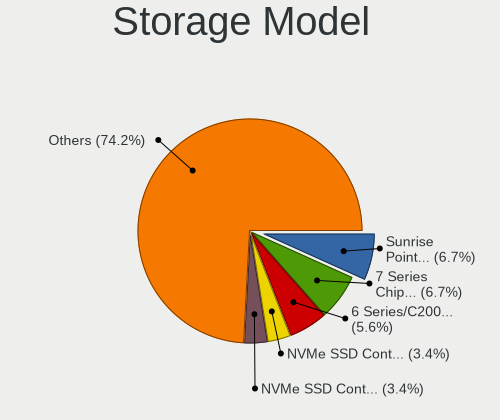

| Model                                                                          | Notebooks | Percent |
|--------------------------------------------------------------------------------|-----------|---------|
| Intel Sunrise Point-LP SATA Controller [AHCI mode]                             | 6         | 6.74%   |
| Intel 7 Series Chipset Family 6-port SATA Controller [AHCI mode]               | 6         | 6.74%   |
| Intel 6 Series/C200 Series Chipset Family 6 port Mobile SATA AHCI Controller   | 5         | 5.62%   |
| Samsung NVMe SSD Controller SM981/PM981/PM983                                  | 3         | 3.37%   |
| Samsung NVMe SSD Controller 980                                                | 3         | 3.37%   |
| Intel Wildcat Point-LP SATA Controller [AHCI Mode]                             | 3         | 3.37%   |
| Intel Cannon Point-LP SATA Controller [AHCI Mode]                              | 3         | 3.37%   |
| Intel Cannon Lake Mobile PCH SATA AHCI Controller                              | 3         | 3.37%   |
| Intel 8 Series/C220 Series Chipset Family 6-port SATA Controller 1 [AHCI mode] | 3         | 3.37%   |
| Intel 400 Series Chipset Family SATA AHCI Controller                           | 3         | 3.37%   |
| SK hynix BC511                                                                 | 2         | 2.25%   |
| SanDisk WD Black SN750 / PC SN730 NVMe SSD                                     | 2         | 2.25%   |
| Micron Non-Volatile memory controller                                          | 2         | 2.25%   |
| KIOXIA NVMe SSD Controller BG4                                                 | 2         | 2.25%   |
| Intel Celeron/Pentium Silver Processor SATA Controller                         | 2         | 2.25%   |
| Intel 82801IBM/IEM (ICH9M/ICH9M-E) 4 port SATA Controller [AHCI mode]          | 2         | 2.25%   |
| Intel 82801HM/HEM (ICH8M/ICH8M-E) SATA Controller [AHCI mode]                  | 2         | 2.25%   |
| Intel 82801HM/HEM (ICH8M/ICH8M-E) IDE Controller                               | 2         | 2.25%   |
| Intel 82801 Mobile SATA Controller [RAID mode]                                 | 2         | 2.25%   |
| Intel 8 Series SATA Controller 1 [AHCI mode]                                   | 2         | 2.25%   |
| AMD FCH SATA Controller [AHCI mode]                                            | 2         | 2.25%   |
| SK hynix Gold P31/PC711 NVMe Solid State Drive                                 | 1         | 1.12%   |
| Silicon Motion SM2263EN/SM2263XT SSD Controller                                | 1         | 1.12%   |
| SanDisk WD Blue SN550 NVMe SSD                                                 | 1         | 1.12%   |
| Samsung NVMe SSD Controller SM961/PM961/SM963                                  | 1         | 1.12%   |
| Samsung NVMe SSD Controller SM951/PM951                                        | 1         | 1.12%   |
| Samsung Electronics SATA controller                                            | 1         | 1.12%   |
| Samsung Apple PCIe SSD                                                         | 1         | 1.12%   |
| Realtek RTS5763DL NVMe SSD Controller                                          | 1         | 1.12%   |
| Micron/Crucial P1 NVMe PCIe SSD                                                | 1         | 1.12%   |
| Micron/Crucial NVMe Controller                                                 | 1         | 1.12%   |
| Kingston Company OM3PDP3 NVMe SSD                                              | 1         | 1.12%   |
| Kingston Company A2000 NVMe SSD                                                | 1         | 1.12%   |
| Intel Volume Management Device NVMe RAID Controller                            | 1         | 1.12%   |
| Intel Tiger Lake-LP SATA Controller                                            | 1         | 1.12%   |
| Intel Q170/Q150/B150/H170/H110/Z170/CM236 Chipset SATA Controller [AHCI Mode]  | 1         | 1.12%   |
| Intel Ice Lake-LP SATA Controller [AHCI mode]                                  | 1         | 1.12%   |
| Intel HM170/QM170 Chipset SATA Controller [AHCI Mode]                          | 1         | 1.12%   |
| Intel Comet Lake SATA AHCI Controller                                          | 1         | 1.12%   |
| Intel Atom Processor E3800 Series SATA AHCI Controller                         | 1         | 1.12%   |

Storage Kind
------------

Kind of storage controller (IDE, SATA, NVMe, SAS, ...)

| Kind | Notebooks | Percent |
|------|-----------|---------|
| SATA | 54        | 63.53%  |
| NVMe | 23        | 27.06%  |
| IDE  | 5         | 5.88%   |
| RAID | 3         | 3.53%   |

Processor
---------

CPU Vendor
----------

Processor vendors

| Vendor | Notebooks | Percent |
|--------|-----------|---------|
| Intel  | 62        | 93.94%  |
| AMD    | 4         | 6.06%   |

CPU Model
---------

Processor models

| Model                                       | Notebooks | Percent |
|---------------------------------------------|-----------|---------|
| Intel Core i7-8565U CPU @ 1.80GHz           | 3         | 4.55%   |
| Intel Core i7-6500U CPU @ 2.50GHz           | 3         | 4.55%   |
| Intel Core i5-6200U CPU @ 2.30GHz           | 3         | 4.55%   |
| Intel Core i7-8750H CPU @ 2.20GHz           | 2         | 3.03%   |
| Intel Core i7-2670QM CPU @ 2.20GHz          | 2         | 3.03%   |
| Intel Core i5-8265U CPU @ 1.60GHz           | 2         | 3.03%   |
| Intel Core i5-3230M CPU @ 2.60GHz           | 2         | 3.03%   |
| Intel Core i5-3210M CPU @ 2.50GHz           | 2         | 3.03%   |
| Intel Core i5-2520M CPU @ 2.50GHz           | 2         | 3.03%   |
| Intel Core i3-5005U CPU @ 2.00GHz           | 2         | 3.03%   |
| Intel Pentium Silver N5030 CPU @ 1.10GHz    | 1         | 1.52%   |
| Intel Pentium Silver N5000 CPU @ 1.10GHz    | 1         | 1.52%   |
| Intel Pentium Dual-Core CPU T4300 @ 2.10GHz | 1         | 1.52%   |
| Intel Core i7-8850H CPU @ 2.60GHz           | 1         | 1.52%   |
| Intel Core i7-7700HQ CPU @ 2.80GHz          | 1         | 1.52%   |
| Intel Core i7-4700MQ CPU @ 2.40GHz          | 1         | 1.52%   |
| Intel Core i7-4600U CPU @ 2.10GHz           | 1         | 1.52%   |
| Intel Core i7-4558U CPU @ 2.80GHz           | 1         | 1.52%   |
| Intel Core i7-3630QM CPU @ 2.40GHz          | 1         | 1.52%   |
| Intel Core i7-2720QM CPU @ 2.20GHz          | 1         | 1.52%   |
| Intel Core i7-2620M CPU @ 2.70GHz           | 1         | 1.52%   |
| Intel Core i7-10875H CPU @ 2.30GHz          | 1         | 1.52%   |
| Intel Core i7-10750H CPU @ 2.60GHz          | 1         | 1.52%   |
| Intel Core i7-10510U CPU @ 1.80GHz          | 1         | 1.52%   |
| Intel Core i5-8365U CPU @ 1.60GHz           | 1         | 1.52%   |
| Intel Core i5-6400T CPU @ 2.20GHz           | 1         | 1.52%   |
| Intel Core i5-5300U CPU @ 2.30GHz           | 1         | 1.52%   |
| Intel Core i5-5250U CPU @ 1.60GHz           | 1         | 1.52%   |
| Intel Core i5-4210M CPU @ 2.60GHz           | 1         | 1.52%   |
| Intel Core i5-4200U CPU @ 1.60GHz           | 1         | 1.52%   |
| Intel Core i5-4200M CPU @ 2.50GHz           | 1         | 1.52%   |
| Intel Core i5-3320M CPU @ 2.60GHz           | 1         | 1.52%   |
| Intel Core i5-2450M CPU @ 2.50GHz           | 1         | 1.52%   |
| Intel Core i5-1035G4 CPU @ 1.10GHz          | 1         | 1.52%   |
| Intel Core i5-1035G1 CPU @ 1.00GHz          | 1         | 1.52%   |
| Intel Core i5-10300H CPU @ 2.50GHz          | 1         | 1.52%   |
| Intel Core i5 CPU M 520 @ 2.40GHz           | 1         | 1.52%   |
| Intel Core i3 CPU M 370 @ 2.40GHz           | 1         | 1.52%   |
| Intel Core 2 Quad CPU Q9100 @ 2.26GHz       | 1         | 1.52%   |
| Intel Core 2 Duo CPU T8100 @ 2.10GHz        | 1         | 1.52%   |

CPU Model Family
----------------

Processor model prefix

| Model                   | Notebooks | Percent |
|-------------------------|-----------|---------|
| Intel Core i5           | 24        | 36.36%  |
| Intel Core i7           | 21        | 31.82%  |
| Other                   | 5         | 7.58%   |
| Intel Core i3           | 3         | 4.55%   |
| Intel Pentium Silver    | 2         | 3.03%   |
| Intel Core 2 Duo        | 2         | 3.03%   |
| Intel Pentium Dual-Core | 1         | 1.52%   |
| Intel Core 2 Quad       | 1         | 1.52%   |
| Intel Core 2            | 1         | 1.52%   |
| Intel Celeron           | 1         | 1.52%   |
| Intel Atom              | 1         | 1.52%   |
| AMD Ryzen 7             | 1         | 1.52%   |
| AMD Ryzen 5             | 1         | 1.52%   |
| AMD Ryzen 3             | 1         | 1.52%   |
| AMD E1                  | 1         | 1.52%   |

CPU Cores
---------

Number of processor cores

| Number | Notebooks | Percent |
|--------|-----------|---------|
| 2      | 33        | 50%     |
| 4      | 25        | 37.88%  |
| 6      | 5         | 7.58%   |
| 8      | 3         | 4.55%   |

CPU Sockets
-----------

Number of sockets

| Number | Notebooks | Percent |
|--------|-----------|---------|
| 1      | 66        | 100%    |

CPU Threads
-----------

Threads per core (Hyper-Threading)

| Number | Notebooks | Percent |
|--------|-----------|---------|
| 2      | 52        | 78.79%  |
| 1      | 14        | 21.21%  |

CPU Op-Modes
------------

CPU Operation Modes (32-bit, 64-bit)

| Op mode        | Notebooks | Percent |
|----------------|-----------|---------|
| 32-bit, 64-bit | 66        | 100%    |

CPU Microcode
-------------

Microcode number

| Number     | Notebooks | Percent |
|------------|-----------|---------|
| Unknown    | 24        | 35.82%  |
| 0x206a7    | 5         | 7.46%   |
| 0x806ec    | 4         | 5.97%   |
| 0x806c1    | 3         | 4.48%   |
| 0x306d4    | 3         | 4.48%   |
| 0x306c3    | 3         | 4.48%   |
| 0xa0652    | 2         | 2.99%   |
| 0x706e5    | 2         | 2.99%   |
| 0x406e3    | 2         | 2.99%   |
| 0x306a9    | 2         | 2.99%   |
| 0x1067a    | 2         | 2.99%   |
| 0x08600106 | 2         | 2.99%   |
| 0x906e9    | 1         | 1.49%   |
| 0x806eb    | 1         | 1.49%   |
| 0x806d1    | 1         | 1.49%   |
| 0x806c2    | 1         | 1.49%   |
| 0x706a8    | 1         | 1.49%   |
| 0x706a1    | 1         | 1.49%   |
| 0x6fd      | 1         | 1.49%   |
| 0x6f6      | 1         | 1.49%   |
| 0x506e3    | 1         | 1.49%   |
| 0x40651    | 1         | 1.49%   |
| 0x30678    | 1         | 1.49%   |
| 0x20655    | 1         | 1.49%   |
| 0x08108109 | 1         | 1.49%   |

CPU Microarch
-------------

Microarchitecture

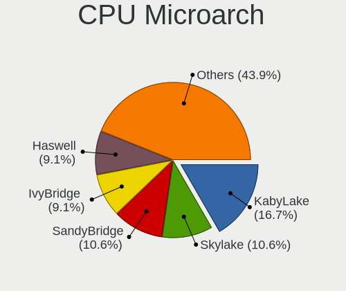

| Name          | Notebooks | Percent |
|---------------|-----------|---------|
| KabyLake      | 11        | 16.67%  |
| Skylake       | 7         | 10.61%  |
| SandyBridge   | 7         | 10.61%  |
| IvyBridge     | 6         | 9.09%   |
| Haswell       | 6         | 9.09%   |
| TigerLake     | 4         | 6.06%   |
| Broadwell     | 4         | 6.06%   |
| Penryn        | 3         | 4.55%   |
| IceLake       | 3         | 4.55%   |
| CometLake     | 3         | 4.55%   |
| Zen 2         | 2         | 3.03%   |
| Westmere      | 2         | 3.03%   |
| Silvermont    | 2         | 3.03%   |
| Goldmont plus | 2         | 3.03%   |
| Core          | 2         | 3.03%   |
| Zen+          | 1         | 1.52%   |
| Jaguar        | 1         | 1.52%   |

Graphics
--------

GPU Vendor
----------

Vendors of graphics cards

| Vendor | Notebooks | Percent |
|--------|-----------|---------|
| Intel  | 57        | 66.28%  |
| Nvidia | 19        | 22.09%  |
| AMD    | 10        | 11.63%  |

GPU Model
---------

Graphics card models

| Model                                                                         | Notebooks | Percent |
|-------------------------------------------------------------------------------|-----------|---------|
| Intel WhiskeyLake-U GT2 [UHD Graphics 620]                                    | 6         | 6.74%   |
| Intel Skylake GT2 [HD Graphics 520]                                           | 6         | 6.74%   |
| Intel 3rd Gen Core processor Graphics Controller                              | 5         | 5.62%   |
| Intel 2nd Generation Core Processor Family Integrated Graphics Controller     | 5         | 5.62%   |
| Intel TigerLake-LP GT2 [Iris Xe Graphics]                                     | 4         | 4.49%   |
| Intel HD Graphics 5500                                                        | 3         | 3.37%   |
| Intel Haswell-ULT Integrated Graphics Controller                              | 3         | 3.37%   |
| Intel CometLake-H GT2 [UHD Graphics]                                          | 3         | 3.37%   |
| Intel 4th Gen Core Processor Integrated Graphics Controller                   | 3         | 3.37%   |
| Nvidia GP106M [GeForce GTX 1060 Mobile]                                       | 2         | 2.25%   |
| Nvidia GM107 [GeForce 940MX]                                                  | 2         | 2.25%   |
| Intel Mobile GM965/GL960 Integrated Graphics Controller (secondary)           | 2         | 2.25%   |
| Intel Mobile GM965/GL960 Integrated Graphics Controller (primary)             | 2         | 2.25%   |
| Intel GeminiLake [UHD Graphics 605]                                           | 2         | 2.25%   |
| Intel Core Processor Integrated Graphics Controller                           | 2         | 2.25%   |
| Intel CoffeeLake-H GT2 [UHD Graphics 630]                                     | 2         | 2.25%   |
| AMD Seymour [Radeon HD 6400M/7400M Series]                                    | 2         | 2.25%   |
| AMD Renoir                                                                    | 2         | 2.25%   |
| Nvidia TU117M [GeForce MX450]                                                 | 1         | 1.12%   |
| Nvidia TU117M                                                                 | 1         | 1.12%   |
| Nvidia TU106M [GeForce RTX 2070 Mobile / Max-Q Refresh]                       | 1         | 1.12%   |
| Nvidia TU104M [GeForce RTX 2080 SUPER Mobile / Max-Q]                         | 1         | 1.12%   |
| Nvidia GP108M [GeForce MX250]                                                 | 1         | 1.12%   |
| Nvidia GP107M [GeForce GTX 1050 Ti Mobile]                                    | 1         | 1.12%   |
| Nvidia GP107GLM [Quadro P2000 Mobile]                                         | 1         | 1.12%   |
| Nvidia GM108M [GeForce 940MX]                                                 | 1         | 1.12%   |
| Nvidia GK208M [GeForce GT 740M]                                               | 1         | 1.12%   |
| Nvidia GK106M [GeForce GTX 770M]                                              | 1         | 1.12%   |
| Nvidia GF119M [GeForce 610M]                                                  | 1         | 1.12%   |
| Nvidia GF117M [GeForce 610M/710M/810M/820M / GT 620M/625M/630M/720M]          | 1         | 1.12%   |
| Nvidia GF116M [GeForce GT 560M]                                               | 1         | 1.12%   |
| Nvidia GA106M [GeForce RTX 3060 Mobile / Max-Q]                               | 1         | 1.12%   |
| Nvidia G96CM [GeForce GT 130M]                                                | 1         | 1.12%   |
| Intel TigerLake-H GT1 [UHD Graphics]                                          | 1         | 1.12%   |
| Intel Mobile 945GM/GMS/GME, 943/940GML Express Integrated Graphics Controller | 1         | 1.12%   |
| Intel Mobile 945GM/GMS, 943/940GML Express Integrated Graphics Controller     | 1         | 1.12%   |
| Intel Mobile 4 Series Chipset Integrated Graphics Controller                  | 1         | 1.12%   |
| Intel Iris Plus Graphics G4 (Ice Lake)                                        | 1         | 1.12%   |
| Intel Iris Plus Graphics G1 (Ice Lake)                                        | 1         | 1.12%   |
| Intel HD Graphics 630                                                         | 1         | 1.12%   |

GPU Combo
---------

Combinations of graphics cards

| Name           | Notebooks | Percent |
|----------------|-----------|---------|
| 1 x Intel      | 37        | 56.06%  |
| Intel + Nvidia | 16        | 24.24%  |
| 1 x AMD        | 6         | 9.09%   |
| Intel + AMD    | 4         | 6.06%   |
| 1 x Nvidia     | 3         | 4.55%   |

GPU Driver
----------

Free vs proprietary

| Driver      | Notebooks | Percent |
|-------------|-----------|---------|
| Free        | 63        | 95.45%  |
| Proprietary | 3         | 4.55%   |

GPU Memory
----------

Total video memory

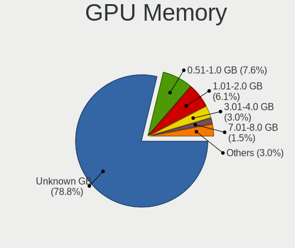

| Size in GB | Notebooks | Percent |
|------------|-----------|---------|
| Unknown    | 52        | 78.79%  |
| 0.51-1.0   | 5         | 7.58%   |
| 1.01-2.0   | 4         | 6.06%   |
| 3.01-4.0   | 2         | 3.03%   |
| 7.01-8.0   | 1         | 1.52%   |
| 2.01-3.0   | 1         | 1.52%   |
| 0.01-0.5   | 1         | 1.52%   |

Monitor
-------

Monitor Vendor
--------------

Monitor vendors

| Vendor                  | Notebooks | Percent |
|-------------------------|-----------|---------|
| LG Display              | 13        | 17.11%  |
| AU Optronics            | 13        | 17.11%  |
| BOE                     | 11        | 14.47%  |
| Samsung Electronics     | 10        | 13.16%  |
| Chimei Innolux          | 10        | 13.16%  |
| Chi Mei Optoelectronics | 4         | 5.26%   |
| Apple                   | 3         | 3.95%   |
| Sharp                   | 2         | 2.63%   |
| Sceptre Tech            | 2         | 2.63%   |
| Dell                    | 2         | 2.63%   |
| STA                     | 1         | 1.32%   |
| Philips                 | 1         | 1.32%   |
| Panasonic               | 1         | 1.32%   |
| Lenovo                  | 1         | 1.32%   |
| Hewlett-Packard         | 1         | 1.32%   |
| Ancor Communications    | 1         | 1.32%   |

Monitor Model
-------------

Monitor models

| Model                                                                 | Notebooks | Percent |
|-----------------------------------------------------------------------|-----------|---------|
| LG Display LCD Monitor LGD046F 1920x1080 344x194mm 15.5-inch          | 2         | 2.63%   |
| STA XR140EA1T STA0450 1366x768 310x174mm 14.0-inch                    | 1         | 1.32%   |
| Sharp LCD Monitor SHP14AD 3840x2160 294x165mm 13.3-inch               | 1         | 1.32%   |
| Sharp LCD Monitor SHP1447 1920x1080 294x165mm 13.3-inch               | 1         | 1.32%   |
| Sceptre Tech Sceptre F24 SPT09AB 1920x1080 521x293mm 23.5-inch        | 1         | 1.32%   |
| Sceptre Tech Sceptre B30 SPT0BC2 2560x1080 690x291mm 29.5-inch        | 1         | 1.32%   |
| Samsung Electronics SyncMaster SAM0589 1920x1080 521x293mm 23.5-inch  | 1         | 1.32%   |
| Samsung Electronics LCD Monitor SEC5448 1920x1080 344x194mm 15.5-inch | 1         | 1.32%   |
| Samsung Electronics LCD Monitor SEC4D45 1280x800 331x207mm 15.4-inch  | 1         | 1.32%   |
| Samsung Electronics LCD Monitor SEC4D42 1280x800 303x190mm 14.1-inch  | 1         | 1.32%   |
| Samsung Electronics LCD Monitor SEC3942 1366x768 309x174mm 14.0-inch  | 1         | 1.32%   |
| Samsung Electronics LCD Monitor SEC3847 1440x900 367x230mm 17.1-inch  | 1         | 1.32%   |
| Samsung Electronics LCD Monitor SEC314A 1920x1080 408x230mm 18.4-inch | 1         | 1.32%   |
| Samsung Electronics LCD Monitor SDC864D 1920x1080 293x165mm 13.2-inch | 1         | 1.32%   |
| Samsung Electronics LCD Monitor SDC3652 1366x768 344x194mm 15.5-inch  | 1         | 1.32%   |
| Samsung Electronics LCD Monitor SAM0F3D 1366x768 522x293mm 23.6-inch  | 1         | 1.32%   |
| Philips PHL 276E9Q PHLC17B 1920x1080 598x336mm 27.0-inch              | 1         | 1.32%   |
| Panasonic VVX14P048M00 MEI96A2 3000x2000 285x190mm 13.5-inch          | 1         | 1.32%   |
| LG Display LP156WH2-TLAA LGD0230 1366x768 344x194mm 15.5-inch         | 1         | 1.32%   |
| LG Display LCD Monitor LGD0690 2560x1440 344x194mm 15.5-inch          | 1         | 1.32%   |
| LG Display LCD Monitor LGD0683 1920x1080 344x194mm 15.5-inch          | 1         | 1.32%   |
| LG Display LCD Monitor LGD066D 1920x1080 344x194mm 15.5-inch          | 1         | 1.32%   |
| LG Display LCD Monitor LGD062E 1920x1080 344x194mm 15.5-inch          | 1         | 1.32%   |
| LG Display LCD Monitor LGD05F2 1920x1080 344x194mm 15.5-inch          | 1         | 1.32%   |
| LG Display LCD Monitor LGD0590 1920x1080 344x194mm 15.5-inch          | 1         | 1.32%   |
| LG Display LCD Monitor LGD0503 1366x768 344x194mm 15.5-inch           | 1         | 1.32%   |
| LG Display LCD Monitor LGD03CD 1366x768 277x156mm 12.5-inch           | 1         | 1.32%   |
| LG Display LCD Monitor LGD0390 1600x900 382x215mm 17.3-inch           | 1         | 1.32%   |
| LG Display LCD Monitor LGD0259 1920x1080 345x194mm 15.6-inch          | 1         | 1.32%   |
| Lenovo LEN T32h-20 LEN61F1 2560x1440 698x393mm 31.5-inch              | 1         | 1.32%   |
| Hewlett-Packard 22cwa HWP3183 1920x1080 476x268mm 21.5-inch           | 1         | 1.32%   |
| Dell S2721NX DEL41FF 1920x1080 598x336mm 27.0-inch                    | 1         | 1.32%   |
| Dell 1905FP DEL400D 1280x1024 376x301mm 19.0-inch                     | 1         | 1.32%   |
| Chimei Innolux LCD Monitor CMN176E 1920x1080 381x214mm 17.2-inch      | 1         | 1.32%   |
| Chimei Innolux LCD Monitor CMN1747 1920x1080 381x214mm 17.2-inch      | 1         | 1.32%   |
| Chimei Innolux LCD Monitor CMN15F5 1920x1080 344x193mm 15.5-inch      | 1         | 1.32%   |
| Chimei Innolux LCD Monitor CMN15F4 1920x1080 344x193mm 15.5-inch      | 1         | 1.32%   |
| Chimei Innolux LCD Monitor CMN15E6 1366x768 344x193mm 15.5-inch       | 1         | 1.32%   |
| Chimei Innolux LCD Monitor CMN15DB 1366x768 344x193mm 15.5-inch       | 1         | 1.32%   |
| Chimei Innolux LCD Monitor CMN15CA 1366x768 344x193mm 15.5-inch       | 1         | 1.32%   |

Monitor Resolution
------------------

Monitor screen resolution

| Resolution         | Notebooks | Percent |
|--------------------|-----------|---------|
| 1920x1080 (FHD)    | 33        | 45.83%  |
| 1366x768 (WXGA)    | 21        | 29.17%  |
| 1280x800 (WXGA)    | 5         | 6.94%   |
| 1600x900 (HD+)     | 3         | 4.17%   |
| 3840x2160 (4K)     | 2         | 2.78%   |
| 2560x1440 (QHD)    | 2         | 2.78%   |
| 1440x900 (WXGA+)   | 2         | 2.78%   |
| 2560x1600          | 1         | 1.39%   |
| 2560x1080          | 1         | 1.39%   |
| 1680x1050 (WSXGA+) | 1         | 1.39%   |
| 1280x1024 (SXGA)   | 1         | 1.39%   |

Monitor Diagonal
----------------

Diagonal size in inches

| Inches | Notebooks | Percent |
|--------|-----------|---------|
| 15     | 30        | 39.47%  |
| 14     | 15        | 19.74%  |
| 13     | 9         | 11.84%  |
| 17     | 8         | 10.53%  |
| 31     | 2         | 2.63%   |
| 27     | 2         | 2.63%   |
| 18     | 2         | 2.63%   |
| 12     | 2         | 2.63%   |
| 32     | 1         | 1.32%   |
| 29     | 1         | 1.32%   |
| 23     | 1         | 1.32%   |
| 22     | 1         | 1.32%   |
| 21     | 1         | 1.32%   |
| 19     | 1         | 1.32%   |

Monitor Width
-------------

Physical width

| Width in mm | Notebooks | Percent |
|-------------|-----------|---------|
| 301-350     | 48        | 64%     |
| 351-400     | 9         | 12%     |
| 201-300     | 8         | 10.67%  |
| 601-700     | 3         | 4%      |
| 501-600     | 3         | 4%      |
| 401-500     | 3         | 4%      |
| 701-800     | 1         | 1.33%   |

Aspect Ratio
------------

Proportional relationship between the width and the height

| Ratio | Notebooks | Percent |
|-------|-----------|---------|
| 16/9  | 58        | 84.06%  |
| 16/10 | 9         | 13.04%  |
| 6/5   | 1         | 1.45%   |
| 21/9  | 1         | 1.45%   |

Monitor Area
------------

Area in inch²

| Area in inch² | Notebooks | Percent |
|----------------|-----------|---------|
| 101-110        | 30        | 39.47%  |
| 81-90          | 19        | 25%     |
| 121-130        | 7         | 9.21%   |
| 71-80          | 5         | 6.58%   |
| 351-500        | 3         | 3.95%   |
| 301-350        | 3         | 3.95%   |
| 201-250        | 3         | 3.95%   |
| 61-70          | 2         | 2.63%   |
| 141-150        | 2         | 2.63%   |
| 151-200        | 1         | 1.32%   |
| 131-140        | 1         | 1.32%   |

Pixel Density
-------------

Pixels per inch

| Density       | Notebooks | Percent |
|---------------|-----------|---------|
| 121-160       | 32        | 42.67%  |
| 101-120       | 25        | 33.33%  |
| 51-100        | 11        | 14.67%  |
| 161-240       | 4         | 5.33%   |
| More than 240 | 2         | 2.67%   |
| 1-50          | 1         | 1.33%   |

Multiple Monitors
-----------------

Total monitors connected

| Total | Notebooks | Percent |
|-------|-----------|---------|
| 1     | 57        | 86.36%  |
| 2     | 7         | 10.61%  |
| 3     | 2         | 3.03%   |

Network
-------

Net Controller Vendor
---------------------

Controller vendors

| Vendor                            | Notebooks | Percent |
|-----------------------------------|-----------|---------|
| Intel                             | 40        | 38.1%   |
| Realtek Semiconductor             | 30        | 28.57%  |
| Qualcomm Atheros                  | 16        | 15.24%  |
| Broadcom                          | 7         | 6.67%   |
| TP-Link                           | 2         | 1.9%    |
| Samsung Electronics               | 2         | 1.9%    |
| Broadcom Limited                  | 2         | 1.9%    |
| Xiaomi                            | 1         | 0.95%   |
| Ralink Technology                 | 1         | 0.95%   |
| Qualcomm Atheros Communications   | 1         | 0.95%   |
| NetGear                           | 1         | 0.95%   |
| Lenovo                            | 1         | 0.95%   |
| Ericsson Business Mobile Networks | 1         | 0.95%   |

Net Controller Model
--------------------

Controller models

| Model                                                             | Notebooks | Percent |
|-------------------------------------------------------------------|-----------|---------|
| Realtek RTL8111/8168/8411 PCI Express Gigabit Ethernet Controller | 17        | 13.6%   |
| Realtek RTL810xE PCI Express Fast Ethernet controller             | 5         | 4%      |
| Qualcomm Atheros AR9485 Wireless Network Adapter                  | 5         | 4%      |
| Intel Wi-Fi 6 AX201                                               | 4         | 3.2%    |
| Realtek RTL8153 Gigabit Ethernet Adapter                          | 3         | 2.4%    |
| Qualcomm Atheros Killer E2500 Gigabit Ethernet Controller         | 3         | 2.4%    |
| Intel Wireless 8260                                               | 3         | 2.4%    |
| Intel Wireless 7265                                               | 3         | 2.4%    |
| Intel Comet Lake PCH CNVi WiFi                                    | 3         | 2.4%    |
| Intel Centrino Advanced-N 6205 [Taylor Peak]                      | 3         | 2.4%    |
| Intel Cannon Lake PCH CNVi WiFi                                   | 3         | 2.4%    |
| Intel 82579LM Gigabit Network Connection (Lewisville)             | 3         | 2.4%    |
| TP-Link TL-WN722N v2/v3 [Realtek RTL8188EUS]                      | 2         | 1.6%    |
| Realtek RTL8822CE 802.11ac PCIe Wireless Network Adapter          | 2         | 1.6%    |
| Realtek RTL8821CE 802.11ac PCIe Wireless Network Adapter          | 2         | 1.6%    |
| Qualcomm Atheros QCA9377 802.11ac Wireless Network Adapter        | 2         | 1.6%    |
| Qualcomm Atheros AR9462 Wireless Network Adapter                  | 2         | 1.6%    |
| Intel Wireless 7260                                               | 2         | 1.6%    |
| Intel Wireless 3165                                               | 2         | 1.6%    |
| Intel Wireless 3160                                               | 2         | 1.6%    |
| Intel Wi-Fi 6 AX200                                               | 2         | 1.6%    |
| Intel Ethernet Connection I217-V                                  | 2         | 1.6%    |
| Intel Cannon Point-LP CNVi [Wireless-AC]                          | 2         | 1.6%    |
| Broadcom Limited BCM4360 802.11ac Wireless Network Adapter        | 2         | 1.6%    |
| Broadcom BCM4312 802.11b/g LP-PHY                                 | 2         | 1.6%    |
| Xiaomi Mi/Redmi series (RNDIS)                                    | 1         | 0.8%    |
| Samsung GT-I9070 (network tethering, USB debugging enabled)       | 1         | 0.8%    |
| Samsung Galaxy series, misc. (tethering mode)                     | 1         | 0.8%    |
| Realtek RTL8852AE 802.11ax PCIe Wireless Network Adapter          | 1         | 0.8%    |
| Realtek RTL8814AU 802.11a/b/g/n/ac Wireless Adapter               | 1         | 0.8%    |
| Realtek RTL8812AU 802.11a/b/g/n/ac 2T2R DB WLAN Adapter           | 1         | 0.8%    |
| Realtek RTL8188FTV 802.11b/g/n 1T1R 2.4G WLAN Adapter             | 1         | 0.8%    |
| Realtek RTL8188CE 802.11b/g/n WiFi Adapter                        | 1         | 0.8%    |
| Realtek Killer E2600 Gigabit Ethernet Controller                  | 1         | 0.8%    |
| Ralink RT2870/RT3070 Wireless Adapter                             | 1         | 0.8%    |
| Qualcomm Atheros QCA6174 802.11ac Wireless Network Adapter        | 1         | 0.8%    |
| Qualcomm Atheros Killer E220x Gigabit Ethernet Controller         | 1         | 0.8%    |
| Qualcomm Atheros AR9271 802.11n                                   | 1         | 0.8%    |
| Qualcomm Atheros AR928X Wireless Network Adapter (PCI-Express)    | 1         | 0.8%    |
| Qualcomm Atheros AR9285 Wireless Network Adapter (PCI-Express)    | 1         | 0.8%    |

Wireless Vendor
---------------

Wireless vendors

| Vendor                            | Notebooks | Percent |
|-----------------------------------|-----------|---------|
| Intel                             | 38        | 52.05%  |
| Qualcomm Atheros                  | 13        | 17.81%  |
| Realtek Semiconductor             | 9         | 12.33%  |
| Broadcom                          | 5         | 6.85%   |
| TP-Link                           | 2         | 2.74%   |
| Broadcom Limited                  | 2         | 2.74%   |
| Ralink Technology                 | 1         | 1.37%   |
| Qualcomm Atheros Communications   | 1         | 1.37%   |
| NetGear                           | 1         | 1.37%   |
| Ericsson Business Mobile Networks | 1         | 1.37%   |

Wireless Model
--------------

Wireless models

| Model                                                                     | Notebooks | Percent |
|---------------------------------------------------------------------------|-----------|---------|
| Qualcomm Atheros AR9485 Wireless Network Adapter                          | 5         | 6.85%   |
| Intel Wi-Fi 6 AX201                                                       | 4         | 5.48%   |
| Intel Wireless 8260                                                       | 3         | 4.11%   |
| Intel Wireless 7265                                                       | 3         | 4.11%   |
| Intel Comet Lake PCH CNVi WiFi                                            | 3         | 4.11%   |
| Intel Centrino Advanced-N 6205 [Taylor Peak]                              | 3         | 4.11%   |
| Intel Cannon Lake PCH CNVi WiFi                                           | 3         | 4.11%   |
| TP-Link TL-WN722N v2/v3 [Realtek RTL8188EUS]                              | 2         | 2.74%   |
| Realtek RTL8822CE 802.11ac PCIe Wireless Network Adapter                  | 2         | 2.74%   |
| Realtek RTL8821CE 802.11ac PCIe Wireless Network Adapter                  | 2         | 2.74%   |
| Qualcomm Atheros QCA9377 802.11ac Wireless Network Adapter                | 2         | 2.74%   |
| Qualcomm Atheros AR9462 Wireless Network Adapter                          | 2         | 2.74%   |
| Intel Wireless 7260                                                       | 2         | 2.74%   |
| Intel Wireless 3165                                                       | 2         | 2.74%   |
| Intel Wireless 3160                                                       | 2         | 2.74%   |
| Intel Wi-Fi 6 AX200                                                       | 2         | 2.74%   |
| Intel Cannon Point-LP CNVi [Wireless-AC]                                  | 2         | 2.74%   |
| Broadcom Limited BCM4360 802.11ac Wireless Network Adapter                | 2         | 2.74%   |
| Broadcom BCM4312 802.11b/g LP-PHY                                         | 2         | 2.74%   |
| Realtek RTL8852AE 802.11ax PCIe Wireless Network Adapter                  | 1         | 1.37%   |
| Realtek RTL8814AU 802.11a/b/g/n/ac Wireless Adapter                       | 1         | 1.37%   |
| Realtek RTL8812AU 802.11a/b/g/n/ac 2T2R DB WLAN Adapter                   | 1         | 1.37%   |
| Realtek RTL8188FTV 802.11b/g/n 1T1R 2.4G WLAN Adapter                     | 1         | 1.37%   |
| Realtek RTL8188CE 802.11b/g/n WiFi Adapter                                | 1         | 1.37%   |
| Ralink RT2870/RT3070 Wireless Adapter                                     | 1         | 1.37%   |
| Qualcomm Atheros QCA6174 802.11ac Wireless Network Adapter                | 1         | 1.37%   |
| Qualcomm Atheros AR9271 802.11n                                           | 1         | 1.37%   |
| Qualcomm Atheros AR928X Wireless Network Adapter (PCI-Express)            | 1         | 1.37%   |
| Qualcomm Atheros AR9285 Wireless Network Adapter (PCI-Express)            | 1         | 1.37%   |
| Qualcomm Atheros AR242x / AR542x Wireless Network Adapter (PCI-Express)   | 1         | 1.37%   |
| NetGear Nighthawk A7000 802.11ac Wireless Adapter AC1900 [Realtek 8814AU] | 1         | 1.37%   |
| Intel Wireless-AC 9260                                                    | 1         | 1.37%   |
| Intel Tiger Lake PCH CNVi WiFi                                            | 1         | 1.37%   |
| Intel PRO/Wireless 3945ABG [Golan] Network Connection                     | 1         | 1.37%   |
| Intel Ice Lake-LP PCH CNVi WiFi                                           | 1         | 1.37%   |
| Intel Comet Lake PCH-LP CNVi WiFi                                         | 1         | 1.37%   |
| Intel Centrino Wireless-N 105                                             | 1         | 1.37%   |
| Intel Centrino Ultimate-N 6300                                            | 1         | 1.37%   |
| Intel Centrino Advanced-N 6235                                            | 1         | 1.37%   |
| Intel Centrino Advanced-N 6200                                            | 1         | 1.37%   |

Ethernet Vendor
---------------

Ethernet vendors

| Vendor                | Notebooks | Percent |
|-----------------------|-----------|---------|
| Realtek Semiconductor | 25        | 49.02%  |
| Intel                 | 13        | 25.49%  |
| Qualcomm Atheros      | 6         | 11.76%  |
| Broadcom              | 3         | 5.88%   |
| Samsung Electronics   | 2         | 3.92%   |
| Xiaomi                | 1         | 1.96%   |
| Lenovo                | 1         | 1.96%   |

Ethernet Model
--------------

Ethernet models

| Model                                                             | Notebooks | Percent |
|-------------------------------------------------------------------|-----------|---------|
| Realtek RTL8111/8168/8411 PCI Express Gigabit Ethernet Controller | 17        | 32.69%  |
| Realtek RTL810xE PCI Express Fast Ethernet controller             | 5         | 9.62%   |
| Realtek RTL8153 Gigabit Ethernet Adapter                          | 3         | 5.77%   |
| Qualcomm Atheros Killer E2500 Gigabit Ethernet Controller         | 3         | 5.77%   |
| Intel 82579LM Gigabit Network Connection (Lewisville)             | 3         | 5.77%   |
| Intel Ethernet Connection I217-V                                  | 2         | 3.85%   |
| Xiaomi Mi/Redmi series (RNDIS)                                    | 1         | 1.92%   |
| Samsung GT-I9070 (network tethering, USB debugging enabled)       | 1         | 1.92%   |
| Samsung Galaxy series, misc. (tethering mode)                     | 1         | 1.92%   |
| Realtek Killer E2600 Gigabit Ethernet Controller                  | 1         | 1.92%   |
| Qualcomm Atheros Killer E220x Gigabit Ethernet Controller         | 1         | 1.92%   |
| Qualcomm Atheros AR8162 Fast Ethernet                             | 1         | 1.92%   |
| Qualcomm Atheros AR8161 Gigabit Ethernet                          | 1         | 1.92%   |
| Lenovo ThinkPad TBT 3 Dock                                        | 1         | 1.92%   |
| Intel PRO/100 VE Network Connection                               | 1         | 1.92%   |
| Intel Ethernet Connection I219-V                                  | 1         | 1.92%   |
| Intel Ethernet Connection I218-LM                                 | 1         | 1.92%   |
| Intel Ethernet Connection (6) I219-V                              | 1         | 1.92%   |
| Intel Ethernet Connection (6) I219-LM                             | 1         | 1.92%   |
| Intel Ethernet Connection (3) I218-LM                             | 1         | 1.92%   |
| Intel Ethernet Connection (2) I219-V                              | 1         | 1.92%   |
| Intel 82577LM Gigabit Network Connection                          | 1         | 1.92%   |
| Broadcom NetXtreme BCM57765 Gigabit Ethernet PCIe                 | 1         | 1.92%   |
| Broadcom NetLink BCM5787M Gigabit Ethernet PCI Express            | 1         | 1.92%   |
| Broadcom NetLink BCM57785 Gigabit Ethernet PCIe                   | 1         | 1.92%   |

Net Controller Kind
-------------------

Ethernet, WiFi or modem

| Kind     | Notebooks | Percent |
|----------|-----------|---------|
| WiFi     | 65        | 57.02%  |
| Ethernet | 49        | 42.98%  |

Used Controller
---------------

Currently used network controller

| Kind     | Notebooks | Percent |
|----------|-----------|---------|
| WiFi     | 54        | 76.06%  |
| Ethernet | 17        | 23.94%  |

NICs
----

Total network controllers on board

| Total | Notebooks | Percent |
|-------|-----------|---------|
| 2     | 44        | 66.67%  |
| 1     | 21        | 31.82%  |
| 0     | 1         | 1.52%   |

IPv6
----

IPv6 vs IPv4

| Used | Notebooks | Percent |
|------|-----------|---------|
| No   | 51        | 76.12%  |
| Yes  | 16        | 23.88%  |

Bluetooth
---------

Bluetooth Vendor
----------------

Controller vendors

| Vendor                          | Notebooks | Percent |
|---------------------------------|-----------|---------|
| Intel                           | 28        | 56%     |
| Qualcomm Atheros Communications | 8         | 16%     |
| Broadcom                        | 4         | 8%      |
| Realtek Semiconductor           | 3         | 6%      |
| Foxconn / Hon Hai               | 2         | 4%      |
| Apple                           | 2         | 4%      |
| Lite-On Technology              | 1         | 2%      |
| Dell                            | 1         | 2%      |
| Cambridge Silicon Radio         | 1         | 2%      |

Bluetooth Model
---------------

Controller models

| Model                                               | Notebooks | Percent |
|-----------------------------------------------------|-----------|---------|
| Intel Bluetooth wireless interface                  | 9         | 18%     |
| Intel AX201 Bluetooth                               | 8         | 16%     |
| Intel Bluetooth 9460/9560 Jefferson Peak (JfP)      | 7         | 14%     |
| Qualcomm Atheros  Bluetooth Device                  | 3         | 6%      |
| Realtek Bluetooth Radio                             | 2         | 4%      |
| Qualcomm Atheros Bluetooth USB Host Controller      | 2         | 4%      |
| Qualcomm Atheros AR3012 Bluetooth 4.0               | 2         | 4%      |
| Intel AX200 Bluetooth                               | 2         | 4%      |
| Realtek  Bluetooth 4.2 Adapter                      | 1         | 2%      |
| Qualcomm Atheros Bluetooth                          | 1         | 2%      |
| Lite-On Bluetooth Radio                             | 1         | 2%      |
| Intel Wireless-AC 9260 Bluetooth Adapter            | 1         | 2%      |
| Intel Centrino Bluetooth Wireless Transceiver       | 1         | 2%      |
| Foxconn / Hon Hai Bluetooth Device                  | 1         | 2%      |
| Foxconn / Hon Hai BCM20702A0                        | 1         | 2%      |
| Dell DW375 Bluetooth Module                         | 1         | 2%      |
| Cambridge Silicon Radio Bluetooth Dongle (HCI mode) | 1         | 2%      |
| Broadcom HP Portable SoftSailing                    | 1         | 2%      |
| Broadcom HP Portable Bumble Bee                     | 1         | 2%      |
| Broadcom BCM43142A0 Bluetooth Device                | 1         | 2%      |
| Broadcom BCM20702A0 Bluetooth 4.0                   | 1         | 2%      |
| Apple Bluetooth USB Host Controller                 | 1         | 2%      |
| Apple Bluetooth Host Controller                     | 1         | 2%      |

Sound
-----

Sound Vendor
------------

Sound card vendors

| Vendor    | Notebooks | Percent |
|-----------|-----------|---------|
| Intel     | 61        | 76.25%  |
| Nvidia    | 11        | 13.75%  |
| AMD       | 6         | 7.5%    |
| Lenovo    | 1         | 1.25%   |
| GN Netcom | 1         | 1.25%   |

Sound Model
-----------

Sound card models

| Model                                                                      | Notebooks | Percent |
|----------------------------------------------------------------------------|-----------|---------|
| Intel 6 Series/C200 Series Chipset Family High Definition Audio Controller | 7         | 7.37%   |
| Intel Sunrise Point-LP HD Audio                                            | 6         | 6.32%   |
| Intel Cannon Point-LP High Definition Audio Controller                     | 6         | 6.32%   |
| Intel 7 Series/C216 Chipset Family High Definition Audio Controller        | 6         | 6.32%   |
| Intel Wildcat Point-LP High Definition Audio Controller                    | 4         | 4.21%   |
| Intel Tiger Lake-LP Smart Sound Technology Audio Controller                | 4         | 4.21%   |
| Intel Broadwell-U Audio Controller                                         | 4         | 4.21%   |
| Intel Xeon E3-1200 v3/4th Gen Core Processor HD Audio Controller           | 3         | 3.16%   |
| Intel Haswell-ULT HD Audio Controller                                      | 3         | 3.16%   |
| Intel Comet Lake PCH cAVS                                                  | 3         | 3.16%   |
| Intel Cannon Lake PCH cAVS                                                 | 3         | 3.16%   |
| Intel 8 Series/C220 Series Chipset High Definition Audio Controller        | 3         | 3.16%   |
| Intel 8 Series HD Audio Controller                                         | 3         | 3.16%   |
| AMD Family 17h/19h HD Audio Controller                                     | 3         | 3.16%   |
| Nvidia GP106 High Definition Audio Controller                              | 2         | 2.11%   |
| Nvidia GM107 High Definition Audio Controller [GeForce 940MX]              | 2         | 2.11%   |
| Intel Ice Lake-LP Smart Sound Technology Audio Controller                  | 2         | 2.11%   |
| Intel Celeron/Pentium Silver Processor High Definition Audio               | 2         | 2.11%   |
| Intel 82801I (ICH9 Family) HD Audio Controller                             | 2         | 2.11%   |
| Intel 82801H (ICH8 Family) HD Audio Controller                             | 2         | 2.11%   |
| Intel 5 Series/3400 Series Chipset High Definition Audio                   | 2         | 2.11%   |
| AMD Turks HDMI Audio [Radeon HD 6500/6600 / 6700M Series]                  | 2         | 2.11%   |
| AMD Renoir Radeon High Definition Audio Controller                         | 2         | 2.11%   |
| Nvidia TU107 GeForce GTX 1650 High Definition Audio Controller             | 1         | 1.05%   |
| Nvidia TU106 High Definition Audio Controller                              | 1         | 1.05%   |
| Nvidia TU104 HD Audio Controller                                           | 1         | 1.05%   |
| Nvidia GP107GL High Definition Audio Controller                            | 1         | 1.05%   |
| Nvidia GK106 HDMI Audio Controller                                         | 1         | 1.05%   |
| Nvidia GF116 High Definition Audio Controller                              | 1         | 1.05%   |
| Nvidia GA106 High Definition Audio Controller                              | 1         | 1.05%   |
| Lenovo ThinkPad Thunderbolt 3 Dock USB Audio                               | 1         | 1.05%   |
| Intel USB PnP Sound Device                                                 | 1         | 1.05%   |
| Intel Tiger Lake-H HD Audio Controller                                     | 1         | 1.05%   |
| Intel NM10/ICH7 Family High Definition Audio Controller                    | 1         | 1.05%   |
| Intel Comet Lake PCH-LP cAVS                                               | 1         | 1.05%   |
| Intel CM238 HD Audio Controller                                            | 1         | 1.05%   |
| Intel Atom Processor Z36xxx/Z37xxx Series High Definition Audio Controller | 1         | 1.05%   |
| Intel 100 Series/C230 Series Chipset Family HD Audio Controller            | 1         | 1.05%   |
| GN Netcom Jabra EVOLVE 65                                                  | 1         | 1.05%   |
| AMD Raven/Raven2/Fenghuang HDMI/DP Audio Controller                        | 1         | 1.05%   |

Memory
------

Memory Vendor
-------------

Memory module vendors

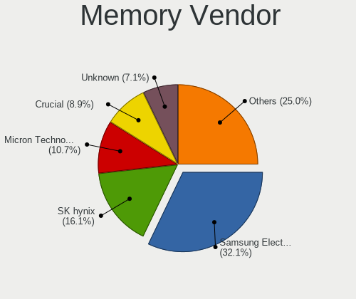

| Vendor              | Notebooks | Percent |
|---------------------|-----------|---------|
| Samsung Electronics | 18        | 32.14%  |
| SK hynix            | 9         | 16.07%  |
| Micron Technology   | 6         | 10.71%  |
| Crucial             | 5         | 8.93%   |
| Unknown             | 4         | 7.14%   |
| Kingston            | 3         | 5.36%   |
| Elpida              | 3         | 5.36%   |
| Team                | 2         | 3.57%   |
| Ramaxel Technology  | 2         | 3.57%   |
| A-DATA Technology   | 2         | 3.57%   |
| G.Skill             | 1         | 1.79%   |
| Corsair             | 1         | 1.79%   |

Memory Model
------------

Memory module models

| Model                                                            | Notebooks | Percent |
|------------------------------------------------------------------|-----------|---------|
| Samsung RAM M471B5173DB0-YK0 4GB SODIMM DDR3 1600MT/s            | 2         | 3.39%   |
| Samsung RAM M471A5244CB0-CTD 4GB SODIMM DDR4 3266MT/s            | 2         | 3.39%   |
| Unknown RAM Module 8GB SODIMM DDR3 1600MT/s                      | 1         | 1.69%   |
| Unknown RAM Module 2GB SODIMM DDR3                               | 1         | 1.69%   |
| Unknown RAM Module 2048MB SODIMM DDR2 667MT/s                    | 1         | 1.69%   |
| Unknown RAM Module 1GB SODIMM DDR2 533MT/s                       | 1         | 1.69%   |
| Unknown RAM Module 1024MB SODIMM DDR2 667MT/s                    | 1         | 1.69%   |
| Team RAM TEAMGROUP-SD4-2666 16GB SODIMM DDR4 2667MT/s            | 1         | 1.69%   |
| Team RAM TEAMGROUP-SD3-1600 8GB SODIMM DDR3 1600MT/s             | 1         | 1.69%   |
| SK hynix RAM Module 8GB Row Of Chips LPDDR3 2133MT/s             | 1         | 1.69%   |
| SK hynix RAM Module 2GB SODIMM DDR3 1066MT/s                     | 1         | 1.69%   |
| SK hynix RAM HMT451S6BFR8A-PB 4GB SODIMM DDR3 1600MT/s           | 1         | 1.69%   |
| SK hynix RAM HMT41GS6AFR8A-PB 8GB SODIMM DDR3 1600MT/s           | 1         | 1.69%   |
| SK hynix RAM HMT351S6CFR8C-PB 4GB SODIMM DDR3 1600MT/s           | 1         | 1.69%   |
| SK hynix RAM HMT351S6BFR8C-H9 4GB SODIMM DDR3 1334MT/s           | 1         | 1.69%   |
| SK hynix RAM HMT325S6BFR8C-H9 2GB SODIMM 1600MT/s                | 1         | 1.69%   |
| SK hynix RAM HMA851S6JJR6N-VK 4GB SODIMM DDR4 2667MT/s           | 1         | 1.69%   |
| SK hynix RAM H9HCNNNBKMALHR-NEE 4GB Row Of Chips LPDDR4 4267MT/s | 1         | 1.69%   |
| SK hynix RAM H9CCNNNCLGALAR-NVD 8GB Row Of Chips LPDDR3 2133MT/s | 1         | 1.69%   |
| Samsung RAM Module 8GB SODIMM DDR4 2667MT/s                      | 1         | 1.69%   |
| Samsung RAM Module 8GB SODIMM DDR4 2400MT/s                      | 1         | 1.69%   |
| Samsung RAM Module 2GB SODIMM LPDDR4 2400MT/s                    | 1         | 1.69%   |
| Samsung RAM Module 2GB SODIMM DDR3 1600MT/s                      | 1         | 1.69%   |
| Samsung RAM Module 16GB SODIMM DDR4 3200MT/s                     | 1         | 1.69%   |
| Samsung RAM M471B5773DH0-CK0 2GB SODIMM DDR3 1600MT/s            | 1         | 1.69%   |
| Samsung RAM M471B5273DH0-CH9 4GB SODIMM DDR3 1334MT/s            | 1         | 1.69%   |
| Samsung RAM M471B1G73EB0-YK0 8192MB SODIMM DDR3 1600MT/s         | 1         | 1.69%   |
| Samsung RAM M471A5244CB0-CWE 4GB SODIMM DDR4 3200MT/s            | 1         | 1.69%   |
| Samsung RAM M471A2K43CB1-CTD 16GB SODIMM DDR4 8400MT/s           | 1         | 1.69%   |
| Samsung RAM M471A1K43EB1-CWE 8GB SODIMM DDR4 3200MT/s            | 1         | 1.69%   |
| Samsung RAM M471A1K43DB1-CWE 8GB SODIMM DDR4 3200MT/s            | 1         | 1.69%   |
| Samsung RAM M471A1K43CB1-CTD 8GB SODIMM DDR4 2667MT/s            | 1         | 1.69%   |
| Samsung RAM M471A1K43CB1-CRC 8GB SODIMM DDR4 2667MT/s            | 1         | 1.69%   |
| Samsung RAM M471A1K43BB0-CPB 8192MB SODIMM DDR4 2133MT/s         | 1         | 1.69%   |
| Ramaxel RAM RMT3170MN68F9F1600 4GB SODIMM DDR3 1600MT/s          | 1         | 1.69%   |
| Ramaxel RAM RMSA3260MH78HAF-2666 8GB SODIMM DDR4 2667MT/s        | 1         | 1.69%   |
| Micron RAM Module 4GB Row Of Chips LPDDR4 3200MT/s               | 1         | 1.69%   |
| Micron RAM 8ATF1G64HZ-2G6E1 8GB SODIMM DDR4 2667MT/s             | 1         | 1.69%   |
| Micron RAM 4ATF1G64HZ-3G2E2 8GB SODIMM DDR4 3200MT/s             | 1         | 1.69%   |
| Micron RAM 4ATF1G64HZ-3G2E1 8GB SODIMM DDR4 3200MT/s             | 1         | 1.69%   |

Memory Kind
-----------

Memory module kinds

| Kind   | Notebooks | Percent |
|--------|-----------|---------|
| DDR4   | 21        | 43.75%  |
| DDR3   | 20        | 41.67%  |
| LPDDR4 | 3         | 6.25%   |
| LPDDR3 | 2         | 4.17%   |
| DDR2   | 2         | 4.17%   |

Memory Form Factor
------------------

Physical design of the memory module

| Name         | Notebooks | Percent |
|--------------|-----------|---------|
| SODIMM       | 43        | 89.58%  |
| Row Of Chips | 5         | 10.42%  |

Memory Size
-----------

Memory module size

| Size  | Notebooks | Percent |
|-------|-----------|---------|
| 8192  | 20        | 37.04%  |
| 4096  | 17        | 31.48%  |
| 16384 | 7         | 12.96%  |
| 2048  | 7         | 12.96%  |
| 1024  | 2         | 3.7%    |
| 32768 | 1         | 1.85%   |

Memory Speed
------------

Memory module speed

| Speed   | Notebooks | Percent |
|---------|-----------|---------|
| 1600    | 14        | 26.42%  |
| 2667    | 12        | 22.64%  |
| 3200    | 8         | 15.09%  |
| 1334    | 4         | 7.55%   |
| 2400    | 3         | 5.66%   |
| 2133    | 3         | 5.66%   |
| 3266    | 2         | 3.77%   |
| 8400    | 1         | 1.89%   |
| 4267    | 1         | 1.89%   |
| 1067    | 1         | 1.89%   |
| 1066    | 1         | 1.89%   |
| 667     | 1         | 1.89%   |
| 533     | 1         | 1.89%   |
| Unknown | 1         | 1.89%   |

Printers & scanners
-------------------

Printer Vendor
--------------

Printer device vendors

Zero info for selected period =(

Printer Model
-------------

Printer device models

Zero info for selected period =(

Scanner Vendor
--------------

Scanner device vendors

| Vendor | Notebooks | Percent |
|--------|-----------|---------|
| Canon  | 1         | 100%    |

Scanner Model
-------------

Scanner device models

| Model                         | Notebooks | Percent |
|-------------------------------|-----------|---------|
| Canon CanoScan N1240U/LiDE 30 | 1         | 100%    |

Camera
------

Camera Vendor
-------------

Camera device vendors

| Vendor                                 | Notebooks | Percent |
|----------------------------------------|-----------|---------|
| Chicony Electronics                    | 17        | 30.91%  |
| Acer                                   | 8         | 14.55%  |
| Microdia                               | 7         | 12.73%  |
| IMC Networks                           | 4         | 7.27%   |
| Sunplus Innovation Technology          | 3         | 5.45%   |
| Cheng Uei Precision Industry (Foxlink) | 3         | 5.45%   |
| Ricoh                                  | 2         | 3.64%   |
| Realtek Semiconductor                  | 2         | 3.64%   |
| Syntek                                 | 1         | 1.82%   |
| Suyin                                  | 1         | 1.82%   |
| Silicon Motion                         | 1         | 1.82%   |
| Samsung Electronics                    | 1         | 1.82%   |
| Quanta                                 | 1         | 1.82%   |
| Luxvisions Innotech Limited            | 1         | 1.82%   |
| DLEQNA19IFK6G2                         | 1         | 1.82%   |
| Apple                                  | 1         | 1.82%   |
| Alcor Micro                            | 1         | 1.82%   |

Camera Model
------------

Camera device models

| Model                                                                      | Notebooks | Percent |
|----------------------------------------------------------------------------|-----------|---------|
| Chicony USB2.0 HD UVC WebCam                                               | 3         | 5.45%   |
| Acer HD Webcam                                                             | 3         | 5.45%   |
| Realtek Integrated_Webcam_HD                                               | 2         | 3.64%   |
| Microdia Integrated_Webcam_HD                                              | 2         | 3.64%   |
| IMC Networks Integrated Camera                                             | 2         | 3.64%   |
| Chicony Integrated Camera                                                  | 2         | 3.64%   |
| Chicony HD Webcam                                                          | 2         | 3.64%   |
| Acer Integrated Camera                                                     | 2         | 3.64%   |
| Syntek Integrated Camera                                                   | 1         | 1.82%   |
| Suyin Acer CrystalEye Webcam                                               | 1         | 1.82%   |
| Sunplus Laptop_Integrated_Webcam_FHD                                       | 1         | 1.82%   |
| Sunplus Integrated_Webcam_HD                                               | 1         | 1.82%   |
| Sunplus HD WebCam                                                          | 1         | 1.82%   |
| Silicon Motion WebCam SC-03FFL11939N                                       | 1         | 1.82%   |
| Samsung Galaxy A5 (MTP)                                                    | 1         | 1.82%   |
| Ricoh Pavilion Webcam                                                      | 1         | 1.82%   |
| Ricoh Laptop_Integrated_Webcam_FHD                                         | 1         | 1.82%   |
| Quanta HP HD Camera                                                        | 1         | 1.82%   |
| Microdia Webcam Vitade AF                                                  | 1         | 1.82%   |
| Microdia WebCam SC-13HDL12639P                                             | 1         | 1.82%   |
| Microdia PC Microscope camera                                              | 1         | 1.82%   |
| Microdia Laptop_Integrated_Webcam_HD                                       | 1         | 1.82%   |
| Microdia Integrated Webcam HD                                              | 1         | 1.82%   |
| Luxvisions Innotech Limited HP TrueVision HD Camera                        | 1         | 1.82%   |
| IMC Networks USB2.0 HD UVC WebCam                                          | 1         | 1.82%   |
| IMC Networks Integrated Webcam                                             | 1         | 1.82%   |
| DLEQNA19IFK6G2 HP TrueVision HD Camera                                     | 1         | 1.82%   |
| Chicony XiaoMi USB 2.0 Webcam                                              | 1         | 1.82%   |
| Chicony UVC 1.00 device HD UVC WebCam                                      | 1         | 1.82%   |
| Chicony USB2.0 Camera                                                      | 1         | 1.82%   |
| Chicony USB 2.0 Camera                                                     | 1         | 1.82%   |
| Chicony HP Webcam                                                          | 1         | 1.82%   |
| Chicony HP TrueVision HD                                                   | 1         | 1.82%   |
| Chicony HP HD Webcam [Fixed]                                               | 1         | 1.82%   |
| Chicony HP HD Camera                                                       | 1         | 1.82%   |
| Chicony HD User Facing                                                     | 1         | 1.82%   |
| Chicony CNF8248                                                            | 1         | 1.82%   |
| Cheng Uei Precision Industry (Foxlink) Webcam                              | 1         | 1.82%   |
| Cheng Uei Precision Industry (Foxlink) HP Wide Vision HD integrated webcam | 1         | 1.82%   |
| Cheng Uei Precision Industry (Foxlink) HP TrueVision HD Camera             | 1         | 1.82%   |

Security
--------

Fingerprint Vendor
------------------

Fingerprint sensor vendors

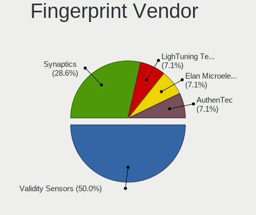

| Vendor                | Notebooks | Percent |
|-----------------------|-----------|---------|
| Validity Sensors      | 7         | 50%     |
| Synaptics             | 4         | 28.57%  |
| LighTuning Technology | 1         | 7.14%   |
| Elan Microelectronics | 1         | 7.14%   |
| AuthenTec             | 1         | 7.14%   |

Fingerprint Model
-----------------

Fingerprint sensor models

| Model                                                                      | Notebooks | Percent |
|----------------------------------------------------------------------------|-----------|---------|
| Validity Sensors Fingerprint scanner                                       | 2         | 14.29%  |
| Validity Sensors VFS5011 Fingerprint Reader                                | 1         | 7.14%   |
| Validity Sensors VFS491                                                    | 1         | 7.14%   |
| Validity Sensors VFS101 Fingerprint Reader                                 | 1         | 7.14%   |
| Validity Sensors VFS 5011 fingerprint sensor                               | 1         | 7.14%   |
| Validity Sensors Synaptics VFS7552 Touch Fingerprint Sensor with PurePrint | 1         | 7.14%   |
| Synaptics  VFS7552 Touch Fingerprint Sensor with PurePrint                 | 1         | 7.14%   |
| Synaptics Prometheus MIS Touch Fingerprint Reader                          | 1         | 7.14%   |
| Synaptics Metallica MOH Touch Fingerprint Reader                           | 1         | 7.14%   |
| LighTuning ES603 Swipe Fingerprint Sensor                                  | 1         | 7.14%   |
| Elan ELAN:Fingerprint                                                      | 1         | 7.14%   |
| AuthenTec Fingerprint Sensor                                               | 1         | 7.14%   |
| Unknown                                                                    | 1         | 7.14%   |

Chipcard Vendor
---------------

Chipcard module vendors

| Vendor      | Notebooks | Percent |
|-------------|-----------|---------|
| Broadcom    | 3         | 60%     |
| Alcor Micro | 2         | 40%     |

Chipcard Model
--------------

Chipcard module models

| Model                                                                        | Notebooks | Percent |
|------------------------------------------------------------------------------|-----------|---------|
| Broadcom BCM5880 Secure Applications Processor                               | 2         | 40%     |
| Alcor Micro AU9540 Smartcard Reader                                          | 2         | 40%     |
| Broadcom BCM5880 Secure Applications Processor with fingerprint swipe sensor | 1         | 20%     |

Unsupported
-----------

Unsupported Devices
-------------------

Total unsupported devices on board

| Total | Notebooks | Percent |
|-------|-----------|---------|
| 0     | 38        | 57.58%  |
| 1     | 19        | 28.79%  |
| 2     | 8         | 12.12%  |
| 3     | 1         | 1.52%   |

Unsupported Device Types
------------------------

Types of unsupported devices

| Type                  | Notebooks | Percent |
|-----------------------|-----------|---------|
| Fingerprint reader    | 14        | 38.89%  |
| Graphics card         | 5         | 13.89%  |
| Chipcard              | 5         | 13.89%  |
| Net/wireless          | 4         | 11.11%  |
| Storage               | 3         | 8.33%   |
| Multimedia controller | 3         | 8.33%   |
| Modem                 | 1         | 2.78%   |
| Camera                | 1         | 2.78%   |

