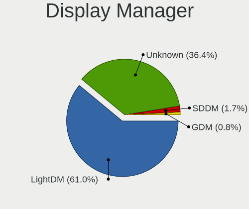
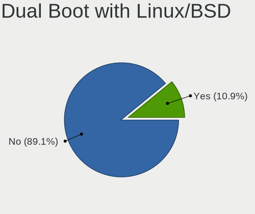
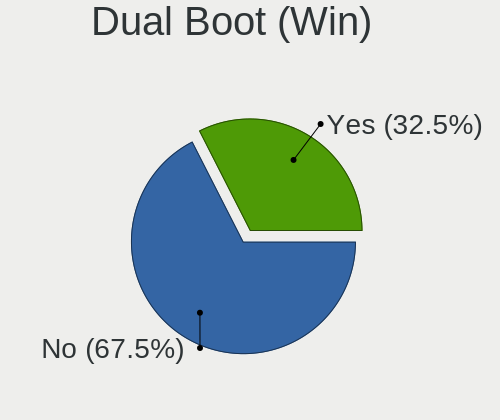
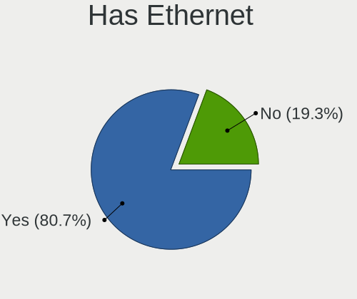
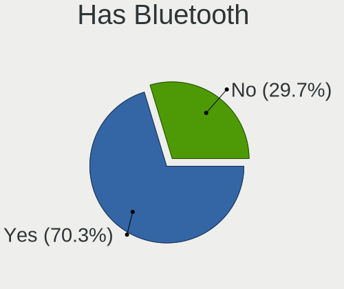
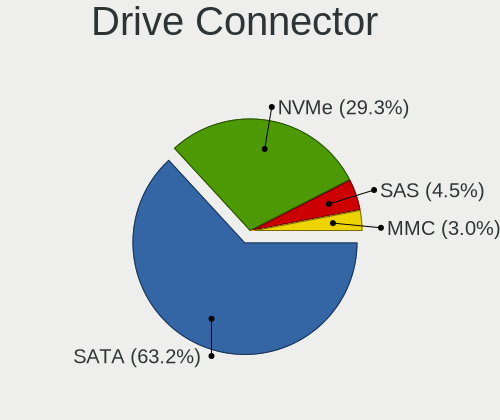
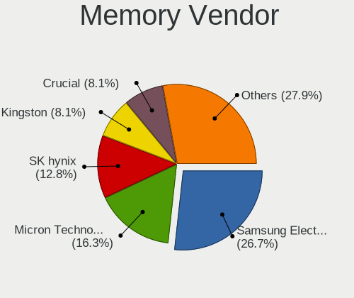
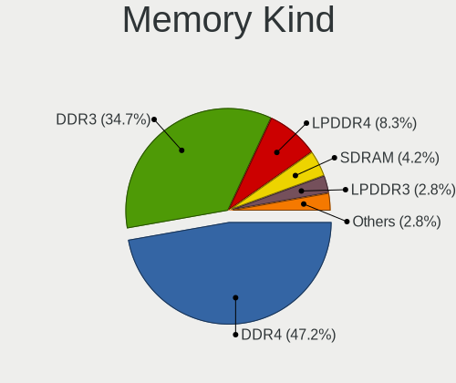
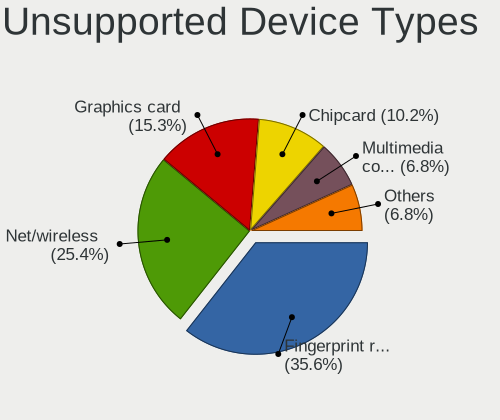

Parrot 5.0 - Tested Hardware & Statistics
-----------------------------------------

A project to collect tested hardware configurations for Parrot 5.0.

Anyone can contribute to this report by the [hw-probe](https://github.com/linuxhw/hw-probe) tool:

    sudo -E hw-probe -all -upload

Please contribute! Especially if your hardware is rare.

This is a report for all computer types. See also reports for [desktops](/Dist/Parrot_5.0/Desktop/README.md) and [notebooks](/Dist/Parrot_5.0/Notebook/README.md).

Contents
--------

* [ Test Cases ](#test-cases)

* [ System ](#system)
  - [ Kernel                   ](#kernel)
  - [ Kernel Family            ](#kernel-family)
  - [ Kernel Major Ver.        ](#kernel-major-ver)
  - [ Arch                     ](#arch)
  - [ DE                       ](#de)
  - [ Display Server           ](#display-server)
  - [ Display Manager          ](#display-manager)
  - [ OS Lang                  ](#os-lang)
  - [ Boot Mode                ](#boot-mode)
  - [ Filesystem               ](#filesystem)
  - [ Part. scheme             ](#part-scheme)
  - [ Dual Boot with Linux/BSD ](#dual-boot-with-linuxbsd)
  - [ Dual Boot (Win)          ](#dual-boot-win)

* [ Board ](#board)
  - [ Vendor                   ](#vendor)
  - [ Model                    ](#model)
  - [ Model Family             ](#model-family)
  - [ MFG Year                 ](#mfg-year)
  - [ Form Factor              ](#form-factor)
  - [ Secure Boot              ](#secure-boot)
  - [ Coreboot                 ](#coreboot)
  - [ RAM Size                 ](#ram-size)
  - [ RAM Used                 ](#ram-used)
  - [ Total Drives             ](#total-drives)
  - [ Has CD-ROM               ](#has-cd-rom)
  - [ Has Ethernet             ](#has-ethernet)
  - [ Has WiFi                 ](#has-wifi)
  - [ Has Bluetooth            ](#has-bluetooth)

* [ Location ](#location)
  - [ Country                  ](#country)
  - [ City                     ](#city)

* [ Drives ](#drives)
  - [ Drive Vendor             ](#drive-vendor)
  - [ Drive Model              ](#drive-model)
  - [ HDD Vendor               ](#hdd-vendor)
  - [ SSD Vendor               ](#ssd-vendor)
  - [ Drive Kind               ](#drive-kind)
  - [ Drive Connector          ](#drive-connector)
  - [ Drive Size               ](#drive-size)
  - [ Space Total              ](#space-total)
  - [ Space Used               ](#space-used)
  - [ Malfunc. Drives          ](#malfunc-drives)
  - [ Malfunc. Drive Vendor    ](#malfunc-drive-vendor)
  - [ Malfunc. HDD Vendor      ](#malfunc-hdd-vendor)
  - [ Malfunc. Drive Kind      ](#malfunc-drive-kind)
  - [ Failed Drives            ](#failed-drives)
  - [ Failed Drive Vendor      ](#failed-drive-vendor)
  - [ Drive Status             ](#drive-status)

* [ Storage controller ](#storage-controller)
  - [ Storage Vendor           ](#storage-vendor)
  - [ Storage Model            ](#storage-model)
  - [ Storage Kind             ](#storage-kind)

* [ Processor ](#processor)
  - [ CPU Vendor               ](#cpu-vendor)
  - [ CPU Model                ](#cpu-model)
  - [ CPU Model Family         ](#cpu-model-family)
  - [ CPU Cores                ](#cpu-cores)
  - [ CPU Sockets              ](#cpu-sockets)
  - [ CPU Threads              ](#cpu-threads)
  - [ CPU Op-Modes             ](#cpu-op-modes)
  - [ CPU Microcode            ](#cpu-microcode)
  - [ CPU Microarch            ](#cpu-microarch)

* [ Graphics ](#graphics)
  - [ GPU Vendor               ](#gpu-vendor)
  - [ GPU Model                ](#gpu-model)
  - [ GPU Combo                ](#gpu-combo)
  - [ GPU Driver               ](#gpu-driver)
  - [ GPU Memory               ](#gpu-memory)

* [ Monitor ](#monitor)
  - [ Monitor Vendor           ](#monitor-vendor)
  - [ Monitor Model            ](#monitor-model)
  - [ Monitor Resolution       ](#monitor-resolution)
  - [ Monitor Diagonal         ](#monitor-diagonal)
  - [ Monitor Width            ](#monitor-width)
  - [ Aspect Ratio             ](#aspect-ratio)
  - [ Monitor Area             ](#monitor-area)
  - [ Pixel Density            ](#pixel-density)
  - [ Multiple Monitors        ](#multiple-monitors)

* [ Network ](#network)
  - [ Net Controller Vendor    ](#net-controller-vendor)
  - [ Net Controller Model     ](#net-controller-model)
  - [ Wireless Vendor          ](#wireless-vendor)
  - [ Wireless Model           ](#wireless-model)
  - [ Ethernet Vendor          ](#ethernet-vendor)
  - [ Ethernet Model           ](#ethernet-model)
  - [ Net Controller Kind      ](#net-controller-kind)
  - [ Used Controller          ](#used-controller)
  - [ NICs                     ](#nics)
  - [ IPv6                     ](#ipv6)

* [ Bluetooth ](#bluetooth)
  - [ Bluetooth Vendor         ](#bluetooth-vendor)
  - [ Bluetooth Model          ](#bluetooth-model)

* [ Sound ](#sound)
  - [ Sound Vendor             ](#sound-vendor)
  - [ Sound Model              ](#sound-model)

* [ Memory ](#memory)
  - [ Memory Vendor            ](#memory-vendor)
  - [ Memory Model             ](#memory-model)
  - [ Memory Kind              ](#memory-kind)
  - [ Memory Form Factor       ](#memory-form-factor)
  - [ Memory Size              ](#memory-size)
  - [ Memory Speed             ](#memory-speed)

* [ Printers & scanners ](#printers--scanners)
  - [ Printer Vendor           ](#printer-vendor)
  - [ Printer Model            ](#printer-model)
  - [ Scanner Vendor           ](#scanner-vendor)
  - [ Scanner Model            ](#scanner-model)

* [ Camera ](#camera)
  - [ Camera Vendor            ](#camera-vendor)
  - [ Camera Model             ](#camera-model)

* [ Security ](#security)
  - [ Fingerprint Vendor       ](#fingerprint-vendor)
  - [ Fingerprint Model        ](#fingerprint-model)
  - [ Chipcard Vendor          ](#chipcard-vendor)
  - [ Chipcard Model           ](#chipcard-model)

* [ Unsupported ](#unsupported)
  - [ Unsupported Devices      ](#unsupported-devices)
  - [ Unsupported Device Types ](#unsupported-device-types)

Test Cases
----------

Total: 93

| Vendor        | Model                       | Form-Factor | Probe                                                      | Date         |
|---------------|-----------------------------|-------------|------------------------------------------------------------|--------------|
| Lenovo        | V330-15IKB 81AX             | Notebook    | [60a636868c](https://linux-hardware.org/?probe=60a636868c) | Apr 30, 2022 |
| SLIMBOOK      | ONE-AMD-M4                  | Desktop     | [99911022e9](https://linux-hardware.org/?probe=99911022e9) | Apr 26, 2022 |
| ASUSTek       | ROG Strix G733ZX_G733ZX     | Notebook    | [032acaf88c](https://linux-hardware.org/?probe=032acaf88c) | Apr 25, 2022 |
| HUAWEI        | HVY-WXX9                    | Notebook    | [56d949b3bb](https://linux-hardware.org/?probe=56d949b3bb) | Apr 23, 2022 |
| HP            | EliteBook 8470p             | Notebook    | [0ee15f97fd](https://linux-hardware.org/?probe=0ee15f97fd) | Apr 23, 2022 |
| Lenovo        | IdeaPad L340-17API 81LY     | Notebook    | [4d911b0d94](https://linux-hardware.org/?probe=4d911b0d94) | Apr 22, 2022 |
| Lenovo        | IdeaPad L340-17API 81LY     | Notebook    | [aa854e0ae2](https://linux-hardware.org/?probe=aa854e0ae2) | Apr 22, 2022 |
| ASUSTek       | PRIME H310M-D R2.0          | Desktop     | [9c06485301](https://linux-hardware.org/?probe=9c06485301) | Apr 21, 2022 |
| HP            | 18E7                        | Desktop     | [1b6db66cc1](https://linux-hardware.org/?probe=1b6db66cc1) | Apr 19, 2022 |
| ASUSTek       | B85M-E                      | Desktop     | [93306ff9ee](https://linux-hardware.org/?probe=93306ff9ee) | Apr 17, 2022 |
| MSI           | Modern 15 A5M               | Notebook    | [7e03ed9f70](https://linux-hardware.org/?probe=7e03ed9f70) | Apr 13, 2022 |
| Apple         | MacBookPro15,1              | Notebook    | [b9187e8521](https://linux-hardware.org/?probe=b9187e8521) | Apr 13, 2022 |
| MSI           | Modern 15 A5M               | Notebook    | [bdccad7bf9](https://linux-hardware.org/?probe=bdccad7bf9) | Apr 12, 2022 |
| HP            | ENVY x360 Convertible 13... | Convertible | [cee28f4953](https://linux-hardware.org/?probe=cee28f4953) | Apr 12, 2022 |
| Razer         | Blade 15 Base Model (Ear... | Notebook    | [0832404b40](https://linux-hardware.org/?probe=0832404b40) | Apr 11, 2022 |
| MSI           | B350 TOMAHAWK               | Desktop     | [b1a322fa38](https://linux-hardware.org/?probe=b1a322fa38) | Apr 11, 2022 |
| HP            | ENVY x360 Convertible 13... | Convertible | [b3afe4ff08](https://linux-hardware.org/?probe=b3afe4ff08) | Apr 11, 2022 |
| ASUSTek       | X540SAA                     | Notebook    | [b670324e44](https://linux-hardware.org/?probe=b670324e44) | Apr 10, 2022 |
| Lenovo        | IdeaPad L340-17API 81LY     | Notebook    | [8cb4405c5f](https://linux-hardware.org/?probe=8cb4405c5f) | Apr 09, 2022 |
| HP            | Pavilion x360 Convertibl... | Convertible | [320ae25dbf](https://linux-hardware.org/?probe=320ae25dbf) | Apr 09, 2022 |
| Toshiba       | Satellite Click 2 L35W-B    | Notebook    | [f992f9305a](https://linux-hardware.org/?probe=f992f9305a) | Apr 07, 2022 |
| MSI           | Modern 15 A5M               | Notebook    | [e422a0e166](https://linux-hardware.org/?probe=e422a0e166) | Apr 05, 2022 |
| MSI           | Modern 15 A5M               | Notebook    | [b96e97fa2b](https://linux-hardware.org/?probe=b96e97fa2b) | Apr 04, 2022 |
| MSI           | Modern 15 A5M               | Notebook    | [401792c28e](https://linux-hardware.org/?probe=401792c28e) | Apr 01, 2022 |
| Alienware     | M14xR1                      | Notebook    | [f3ea3f497c](https://linux-hardware.org/?probe=f3ea3f497c) | Apr 01, 2022 |
| HP            | Notebook                    | Notebook    | [313ca81d16](https://linux-hardware.org/?probe=313ca81d16) | Mar 27, 2022 |
| ECS           | Nettle2                     | Desktop     | [4939d60e6d](https://linux-hardware.org/?probe=4939d60e6d) | Mar 27, 2022 |
| HP            | 18E7                        | Desktop     | [d8d1c3d468](https://linux-hardware.org/?probe=d8d1c3d468) | Mar 26, 2022 |
| ASUSTek       | X540SAA                     | Notebook    | [988b4570ed](https://linux-hardware.org/?probe=988b4570ed) | Mar 24, 2022 |
| MSI           | Modern 15 A5M               | Notebook    | [72245fe662](https://linux-hardware.org/?probe=72245fe662) | Mar 22, 2022 |
| Lenovo        | SHARKBAY 31900058 STD       | Desktop     | [85260f6ed1](https://linux-hardware.org/?probe=85260f6ed1) | Mar 20, 2022 |
| Lenovo        | SHARKBAY 31900058 STD       | Desktop     | [e849ec3916](https://linux-hardware.org/?probe=e849ec3916) | Mar 20, 2022 |
| ASUSTek       | B85M-E                      | Desktop     | [b0769dffdd](https://linux-hardware.org/?probe=b0769dffdd) | Mar 19, 2022 |
| ASUSTek       | ROG CROSSHAIR VIII HERO     | Desktop     | [2c1ca9145b](https://linux-hardware.org/?probe=2c1ca9145b) | Mar 18, 2022 |
| ASUSTek       | H170M-E D3                  | Desktop     | [167928d6e9](https://linux-hardware.org/?probe=167928d6e9) | Mar 17, 2022 |
| ASUSTek       | H170M-E D3                  | Desktop     | [937c0097ca](https://linux-hardware.org/?probe=937c0097ca) | Mar 14, 2022 |
| ASRock        | Z87M Extreme4               | Desktop     | [dba57ee1b3](https://linux-hardware.org/?probe=dba57ee1b3) | Mar 12, 2022 |
| ASUSTek       | X75VC                       | Notebook    | [3973070120](https://linux-hardware.org/?probe=3973070120) | Mar 12, 2022 |
| Jumper        | EZbook                      | Notebook    | [c374bd5058](https://linux-hardware.org/?probe=c374bd5058) | Mar 11, 2022 |
| Apple         | MacBookAir3,1               | Notebook    | [320f9e6841](https://linux-hardware.org/?probe=320f9e6841) | Mar 11, 2022 |
| Metabox       | Edge-Pro NS50MU             | Notebook    | [1371afa6ac](https://linux-hardware.org/?probe=1371afa6ac) | Mar 11, 2022 |
| Apple         | MacBookPro11,4              | Notebook    | [b27d8c8724](https://linux-hardware.org/?probe=b27d8c8724) | Mar 10, 2022 |
| Dell          | Inspiron 5570               | Notebook    | [e77116d171](https://linux-hardware.org/?probe=e77116d171) | Mar 10, 2022 |
| ASUSTek       | B85M-E                      | Desktop     | [161eda858b](https://linux-hardware.org/?probe=161eda858b) | Mar 10, 2022 |
| ASUSTek       | B85M-E                      | Desktop     | [36bada67c8](https://linux-hardware.org/?probe=36bada67c8) | Mar 08, 2022 |
| Dell          | Latitude XT2                | Notebook    | [ff6a48346f](https://linux-hardware.org/?probe=ff6a48346f) | Mar 07, 2022 |
| Jumper        | EZbook                      | Notebook    | [09544efb61](https://linux-hardware.org/?probe=09544efb61) | Mar 05, 2022 |
| Apple         | MacBookPro11,4              | Notebook    | [fb03915a3e](https://linux-hardware.org/?probe=fb03915a3e) | Mar 03, 2022 |
| SLIMBOOK      | ONE-AMD-M4                  | Desktop     | [d92c05a18a](https://linux-hardware.org/?probe=d92c05a18a) | Mar 03, 2022 |
| Daewoo Luc... | Solo Top                    | Desktop     | [7f7b20688f](https://linux-hardware.org/?probe=7f7b20688f) | Mar 03, 2022 |
| Jumper        | EZbook                      | Notebook    | [de9a14c4ec](https://linux-hardware.org/?probe=de9a14c4ec) | Mar 02, 2022 |
| Chuwi         | GemiBook                    | Notebook    | [bb9f45273a](https://linux-hardware.org/?probe=bb9f45273a) | Mar 01, 2022 |
| SLIMBOOK      | ONE-AMD-M4                  | Desktop     | [dc43686a5a](https://linux-hardware.org/?probe=dc43686a5a) | Feb 27, 2022 |
| Samsung       | 550P5C/550P7C               | Notebook    | [f14f73025f](https://linux-hardware.org/?probe=f14f73025f) | Feb 27, 2022 |
| Dell          | 0GXM1W A02                  | Desktop     | [044a00e086](https://linux-hardware.org/?probe=044a00e086) | Feb 25, 2022 |
| Toshiba       | Satellite C75D-B            | Notebook    | [952057ee2b](https://linux-hardware.org/?probe=952057ee2b) | Feb 24, 2022 |
| Acer          | Nitro AN517-41              | Notebook    | [47b906a661](https://linux-hardware.org/?probe=47b906a661) | Feb 23, 2022 |
| Chuwi         | GemiBook                    | Notebook    | [25f5f358cb](https://linux-hardware.org/?probe=25f5f358cb) | Feb 17, 2022 |
| Acer          | Nitro AN515-54              | Notebook    | [f83ccc9cce](https://linux-hardware.org/?probe=f83ccc9cce) | Feb 15, 2022 |
| HP            | ProBook 4535s               | Notebook    | [0d0cd13f8b](https://linux-hardware.org/?probe=0d0cd13f8b) | Feb 12, 2022 |
| ASUSTek       | VivoBook 15_ASUS Laptop ... | Notebook    | [0df06bcae3](https://linux-hardware.org/?probe=0df06bcae3) | Feb 11, 2022 |
| HP            | Notebook                    | Notebook    | [1f47143486](https://linux-hardware.org/?probe=1f47143486) | Feb 06, 2022 |
| Apple         | MacBook7,1                  | Notebook    | [9f4f77f51d](https://linux-hardware.org/?probe=9f4f77f51d) | Feb 06, 2022 |
| Apple         | MacBook7,1                  | Notebook    | [b6d5344f4e](https://linux-hardware.org/?probe=b6d5344f4e) | Feb 04, 2022 |
| SLIMBOOK      | ONE-AMD-M4                  | Desktop     | [225e399fc1](https://linux-hardware.org/?probe=225e399fc1) | Feb 03, 2022 |
| Dell          | Inspiron N5110              | Notebook    | [5aa1140ad5](https://linux-hardware.org/?probe=5aa1140ad5) | Feb 02, 2022 |
| Lenovo        | ThinkPad T480 20L6SCYP00    | Notebook    | [d69eb6fc3e](https://linux-hardware.org/?probe=d69eb6fc3e) | Jan 30, 2022 |
| Acer          | Aspire A315-21              | Notebook    | [880cca4c8f](https://linux-hardware.org/?probe=880cca4c8f) | Jan 24, 2022 |
| Microsoft     | Surface Book                | Tablet      | [327a2ec07f](https://linux-hardware.org/?probe=327a2ec07f) | Jan 22, 2022 |
| Lenovo        | Yoga C930-13IKB 81C4        | Convertible | [1e5331da8c](https://linux-hardware.org/?probe=1e5331da8c) | Jan 21, 2022 |
| Dell          | Latitude 7480               | Notebook    | [e184163da5](https://linux-hardware.org/?probe=e184163da5) | Jan 19, 2022 |
| Lenovo        | ThinkPad E14 20RA0016GE     | Notebook    | [46eeb2d4b8](https://linux-hardware.org/?probe=46eeb2d4b8) | Jan 14, 2022 |
| Lenovo        | ThinkPad X1 Extreme Gen ... | Notebook    | [4e45161acc](https://linux-hardware.org/?probe=4e45161acc) | Jan 12, 2022 |
| Dell          | 04YP6J A01                  | Desktop     | [680408ec06](https://linux-hardware.org/?probe=680408ec06) | Jan 01, 2022 |
| Dell          | 04YP6J A01                  | Desktop     | [623d384766](https://linux-hardware.org/?probe=623d384766) | Jan 01, 2022 |
| Gigabyte      | A320M-S2H-CF                | Desktop     | [4ec2105ead](https://linux-hardware.org/?probe=4ec2105ead) | Jan 01, 2022 |
| Lenovo        | IdeaPad Y580                | Notebook    | [cbb37b3b6a](https://linux-hardware.org/?probe=cbb37b3b6a) | Dec 20, 2021 |
| Lenovo        | IdeaPad Y580                | Notebook    | [48d92517e3](https://linux-hardware.org/?probe=48d92517e3) | Dec 11, 2021 |
| Dell          | Latitude E6410              | Notebook    | [2f9b89dbb4](https://linux-hardware.org/?probe=2f9b89dbb4) | Nov 09, 2021 |
| Acer          | TravelMate 5720             | Notebook    | [8e19effec8](https://linux-hardware.org/?probe=8e19effec8) | Nov 06, 2021 |
| HP            | Pavilion g7                 | Notebook    | [c1b5449516](https://linux-hardware.org/?probe=c1b5449516) | Nov 05, 2021 |
| HP            | Pavilion g7                 | Notebook    | [d27bb0d31e](https://linux-hardware.org/?probe=d27bb0d31e) | Oct 31, 2021 |
| Lenovo        | B50-80 80EW                 | Notebook    | [37a983c1e7](https://linux-hardware.org/?probe=37a983c1e7) | Oct 26, 2021 |
| Lenovo        | B50-80 80EW                 | Notebook    | [ca3a74943a](https://linux-hardware.org/?probe=ca3a74943a) | Oct 25, 2021 |
| HP            | Pavilion g7                 | Notebook    | [b386e97faa](https://linux-hardware.org/?probe=b386e97faa) | Oct 25, 2021 |
| Dell          | Latitude E7450              | Notebook    | [2d94d751ff](https://linux-hardware.org/?probe=2d94d751ff) | Oct 22, 2021 |
| Dell          | Latitude E7450              | Notebook    | [a2b09ead76](https://linux-hardware.org/?probe=a2b09ead76) | Oct 22, 2021 |
| HP            | Laptop 15q-dy0xxx           | Notebook    | [aa4c6c2a25](https://linux-hardware.org/?probe=aa4c6c2a25) | Oct 18, 2021 |
| HP            | Pavilion g7                 | Notebook    | [7e80ec4599](https://linux-hardware.org/?probe=7e80ec4599) | Oct 11, 2021 |
| HP            | Pavilion g7                 | Notebook    | [cd8ce3be30](https://linux-hardware.org/?probe=cd8ce3be30) | Oct 10, 2021 |
| HP            | Pavilion g7                 | Notebook    | [dd3f8159e0](https://linux-hardware.org/?probe=dd3f8159e0) | Oct 10, 2021 |
| Gigabyte      | A320M-S2H-CF                | Desktop     | [d0cd1577c7](https://linux-hardware.org/?probe=d0cd1577c7) | Oct 04, 2021 |
| HP            | EliteBook 840 G3            | Notebook    | [fb11994deb](https://linux-hardware.org/?probe=fb11994deb) | Oct 04, 2021 |

System
------

Kernel
------

Version of the Linux kernel

| Version                | Computers | Percent |
|------------------------|-----------|---------|
| 5.14.0-9parrot1-amd64  | 30        | 45.45%  |
| 5.16.0-12parrot1-amd64 | 21        | 31.82%  |
| 5.15.0-15parrot1-amd64 | 7         | 10.61%  |
| 5.14.0-2parrot1-amd64  | 7         | 10.61%  |
| 5.15.0-5parrot1-amd64  | 1         | 1.52%   |

Kernel Family
-------------

Linux kernel without a distro release

| Version | Computers | Percent |
|---------|-----------|---------|
| 5.14.0  | 35        | 54.69%  |
| 5.16.0  | 21        | 32.81%  |
| 5.15.0  | 8         | 12.5%   |

Kernel Major Ver.
-----------------

Linux kernel major version

| Version | Computers | Percent |
|---------|-----------|---------|
| 5.14    | 35        | 54.69%  |
| 5.16    | 21        | 32.81%  |
| 5.15    | 8         | 12.5%   |

Arch
----

OS architecture (x86_64, i586, etc.)

| Name   | Computers | Percent |
|--------|-----------|---------|
| x86_64 | 62        | 100%    |

DE
--

Desktop Environment

| Name    | Computers | Percent |
|---------|-----------|---------|
| MATE    | 37        | 59.68%  |
| KDE5    | 18        | 29.03%  |
| Unknown | 3         | 4.84%   |
| XFCE    | 2         | 3.23%   |
| KDE     | 1         | 1.61%   |
| GNOME   | 1         | 1.61%   |

Display Server
--------------

X11 or Wayland

| Name    | Computers | Percent |
|---------|-----------|---------|
| X11     | 60        | 96.77%  |
| Wayland | 2         | 3.23%   |

Display Manager
---------------

SDDM, LightDM, etc.

| Name    | Computers | Percent |
|---------|-----------|---------|
| LightDM | 31        | 50%     |
| Unknown | 29        | 46.77%  |
| SDDM    | 1         | 1.61%   |
| GDM     | 1         | 1.61%   |

OS Lang
-------

Language

| Lang  | Computers | Percent |
|-------|-----------|---------|
| en_US | 34        | 54.84%  |
| en_GB | 6         | 9.68%   |
| en_IN | 4         | 6.45%   |
| ru_RU | 3         | 4.84%   |
| pt_BR | 2         | 3.23%   |
| es_ES | 2         | 3.23%   |
| de_DE | 2         | 3.23%   |
| cs_CZ | 2         | 3.23%   |
| pl_PL | 1         | 1.61%   |
| fr_FR | 1         | 1.61%   |
| es_PE | 1         | 1.61%   |
| es_MX | 1         | 1.61%   |
| en_ZA | 1         | 1.61%   |
| en_DK | 1         | 1.61%   |
| en_AU | 1         | 1.61%   |

Boot Mode
---------

EFI or BIOS

| Mode | Computers | Percent |
|------|-----------|---------|
| BIOS | 40        | 64.52%  |
| EFI  | 22        | 35.48%  |

Filesystem
----------

Type of filesystem

| Type    | Computers | Percent |
|---------|-----------|---------|
| Btrfs   | 51        | 82.26%  |
| Ext4    | 7         | 11.29%  |
| Overlay | 4         | 6.45%   |

Part. scheme
------------

Scheme of partitioning

| Type    | Computers | Percent |
|---------|-----------|---------|
| Unknown | 30        | 48.39%  |
| GPT     | 23        | 37.1%   |
| MBR     | 9         | 14.52%  |

Dual Boot with Linux/BSD
------------------------

Hosting more than one Linux/BSD

| Dual boot | Computers | Percent |
|-----------|-----------|---------|
| No        | 54        | 87.1%   |
| Yes       | 8         | 12.9%   |

Dual Boot (Win)
---------------

Hosting Linux and Windows

| Dual boot | Computers | Percent |
|-----------|-----------|---------|
| No        | 43        | 69.35%  |
| Yes       | 19        | 30.65%  |

Board
-----

Vendor
------

Motherboard manufacturer

| Name                | Computers | Percent |
|---------------------|-----------|---------|
| Hewlett-Packard     | 11        | 17.74%  |
| Lenovo              | 9         | 14.52%  |
| Dell                | 8         | 12.9%   |
| ASUSTek Computer    | 8         | 12.9%   |
| MSI                 | 4         | 6.45%   |
| Acer                | 4         | 6.45%   |
| Apple               | 3         | 4.84%   |
| Toshiba             | 2         | 3.23%   |
| SLIMBOOK            | 1         | 1.61%   |
| Samsung Electronics | 1         | 1.61%   |
| Razer               | 1         | 1.61%   |
| Microsoft           | 1         | 1.61%   |
| Metabox             | 1         | 1.61%   |
| Jumper              | 1         | 1.61%   |
| HUAWEI              | 1         | 1.61%   |
| Gigabyte Technology | 1         | 1.61%   |
| ECS                 | 1         | 1.61%   |
| Daewoo Lucoms       | 1         | 1.61%   |
| Chuwi               | 1         | 1.61%   |
| ASRock              | 1         | 1.61%   |
| Alienware           | 1         | 1.61%   |

Model
-----

Motherboard model

| Name                                               | Computers | Percent |
|----------------------------------------------------|-----------|---------|
| MSI Modern 15 A5M                                  | 3         | 4.84%   |
| HP ProDesk 600 G1 SFF                              | 2         | 3.23%   |
| HP Notebook                                        | 2         | 3.23%   |
| Toshiba Satellite Click 2 L35W-B                   | 1         | 1.61%   |
| Toshiba Satellite C75D-B                           | 1         | 1.61%   |
| SLIMBOOK ONE-AMD-M4                                | 1         | 1.61%   |
| Samsung 550P5C/550P7C                              | 1         | 1.61%   |
| Razer Blade 15 Base Model (Early 2020) - RZ09-0328 | 1         | 1.61%   |
| MSI MS-7A34                                        | 1         | 1.61%   |
| Microsoft Surface Book                             | 1         | 1.61%   |
| Metabox Edge-Pro NS50MU                            | 1         | 1.61%   |
| Lenovo Yoga C930-13IKB 81C4                        | 1         | 1.61%   |
| Lenovo V330-15IKB 81AX                             | 1         | 1.61%   |
| Lenovo ThinkPad X1 Extreme Gen 3 20TK001GUS        | 1         | 1.61%   |
| Lenovo ThinkPad T480 20L6SCYP00                    | 1         | 1.61%   |
| Lenovo ThinkPad E14 20RA0016GE                     | 1         | 1.61%   |
| Lenovo IdeaPad Y580                                | 1         | 1.61%   |
| Lenovo IdeaPad L340-17API 81LY                     | 1         | 1.61%   |
| Lenovo H530 10130                                  | 1         | 1.61%   |
| Lenovo B50-80 80EW                                 | 1         | 1.61%   |
| Jumper EZbook                                      | 1         | 1.61%   |
| HUAWEI HVY-WXX9                                    | 1         | 1.61%   |
| HP ProBook 4535s                                   | 1         | 1.61%   |
| HP Pavilion x360 Convertible 14-ba0xx              | 1         | 1.61%   |
| HP Pavilion g7                                     | 1         | 1.61%   |
| HP Laptop 15q-dy0xxx                               | 1         | 1.61%   |
| HP ENVY x360 Convertible 13-bd0xxx                 | 1         | 1.61%   |
| HP EliteBook 8470p                                 | 1         | 1.61%   |
| HP EliteBook 840 G3                                | 1         | 1.61%   |
| Gigabyte A320M-S2H                                 | 1         | 1.61%   |
| ECS GV460AA-ABA a6217c                             | 1         | 1.61%   |
| Dell OptiPlex 7010                                 | 1         | 1.61%   |
| Dell OptiPlex 3020                                 | 1         | 1.61%   |
| Dell Latitude XT2                                  | 1         | 1.61%   |
| Dell Latitude E7450                                | 1         | 1.61%   |
| Dell Latitude E6410                                | 1         | 1.61%   |
| Dell Latitude 7480                                 | 1         | 1.61%   |
| Dell Inspiron N5110                                | 1         | 1.61%   |
| Dell Inspiron 5570                                 | 1         | 1.61%   |
| Daewoo Lucoms OEM                                  | 1         | 1.61%   |
| Chuwi GemiBook                                     | 1         | 1.61%   |
| ASUS X75VC                                         | 1         | 1.61%   |
| ASUS X540SAA                                       | 1         | 1.61%   |
| ASUS VivoBook 15_ASUS Laptop X540UAR               | 1         | 1.61%   |
| ASUS ROG Strix G733ZX_G733ZX                       | 1         | 1.61%   |
| ASUS ROG CROSSHAIR VIII HERO                       | 1         | 1.61%   |
| ASUS PRIME H310M-D R2.0                            | 1         | 1.61%   |
| ASUS H170M-E D3                                    | 1         | 1.61%   |
| ASUS Basic 3221BM                                  | 1         | 1.61%   |
| ASRock Z87M Extreme4                               | 1         | 1.61%   |
| Apple MacBookPro15,1                               | 1         | 1.61%   |
| Apple MacBookAir3,1                                | 1         | 1.61%   |
| Apple MacBook7,1                                   | 1         | 1.61%   |
| Alienware M14xR1                                   | 1         | 1.61%   |
| Acer TravelMate 5720                               | 1         | 1.61%   |
| Acer Nitro AN517-41                                | 1         | 1.61%   |
| Acer Nitro AN515-54                                | 1         | 1.61%   |
| Acer Aspire A315-21                                | 1         | 1.61%   |

Model Family
------------

Motherboard model prefix

| Name                | Computers | Percent |
|---------------------|-----------|---------|
| Dell Latitude       | 4         | 6.45%   |
| MSI Modern          | 3         | 4.84%   |
| Lenovo ThinkPad     | 3         | 4.84%   |
| Toshiba Satellite   | 2         | 3.23%   |
| Lenovo IdeaPad      | 2         | 3.23%   |
| HP ProDesk          | 2         | 3.23%   |
| HP Pavilion         | 2         | 3.23%   |
| HP Notebook         | 2         | 3.23%   |
| HP EliteBook        | 2         | 3.23%   |
| Dell OptiPlex       | 2         | 3.23%   |
| Dell Inspiron       | 2         | 3.23%   |
| ASUS ROG            | 2         | 3.23%   |
| Acer Nitro          | 2         | 3.23%   |
| SLIMBOOK ONE-AMD-M4 | 1         | 1.61%   |
| Samsung 550P5C      | 1         | 1.61%   |
| Razer Blade         | 1         | 1.61%   |
| MSI MS-7A34         | 1         | 1.61%   |
| Microsoft Surface   | 1         | 1.61%   |
| Metabox Edge-Pro    | 1         | 1.61%   |
| Lenovo Yoga         | 1         | 1.61%   |
| Lenovo V330-15IKB   | 1         | 1.61%   |
| Lenovo H530         | 1         | 1.61%   |
| Lenovo B50-80       | 1         | 1.61%   |
| Jumper EZbook       | 1         | 1.61%   |
| HUAWEI HVY-WXX9     | 1         | 1.61%   |
| HP ProBook          | 1         | 1.61%   |
| HP Laptop           | 1         | 1.61%   |
| HP ENVY             | 1         | 1.61%   |
| Gigabyte A320M-S2H  | 1         | 1.61%   |
| ECS GV460AA-ABA     | 1         | 1.61%   |
| Daewoo Lucoms OEM   | 1         | 1.61%   |
| Chuwi GemiBook      | 1         | 1.61%   |
| ASUS X75VC          | 1         | 1.61%   |
| ASUS X540SAA        | 1         | 1.61%   |
| ASUS VivoBook       | 1         | 1.61%   |
| ASUS PRIME          | 1         | 1.61%   |
| ASUS H170M-E        | 1         | 1.61%   |
| ASUS Basic          | 1         | 1.61%   |
| ASRock Z87M         | 1         | 1.61%   |
| Apple MacBookPro15  | 1         | 1.61%   |
| Apple MacBookAir3   | 1         | 1.61%   |
| Apple MacBook7      | 1         | 1.61%   |
| Alienware M14xR1    | 1         | 1.61%   |
| Acer TravelMate     | 1         | 1.61%   |
| Acer Aspire         | 1         | 1.61%   |

MFG Year
--------

Motherboard manufacture year

| Year | Computers | Percent |
|------|-----------|---------|
| 2021 | 10        | 16.13%  |
| 2017 | 7         | 11.29%  |
| 2013 | 6         | 9.68%   |
| 2018 | 5         | 8.06%   |
| 2011 | 5         | 8.06%   |
| 2020 | 4         | 6.45%   |
| 2016 | 4         | 6.45%   |
| 2012 | 4         | 6.45%   |
| 2010 | 4         | 6.45%   |
| 2019 | 3         | 4.84%   |
| 2015 | 3         | 4.84%   |
| 2014 | 3         | 4.84%   |
| 2007 | 2         | 3.23%   |
| 2022 | 1         | 1.61%   |
| 2009 | 1         | 1.61%   |

Form Factor
-----------

Physical design of the computer

| Name        | Computers | Percent |
|-------------|-----------|---------|
| Notebook    | 43        | 69.35%  |
| Desktop     | 15        | 24.19%  |
| Convertible | 3         | 4.84%   |
| Tablet      | 1         | 1.61%   |

Secure Boot
-----------

Enabled or disabled

| State    | Computers | Percent |
|----------|-----------|---------|
| Disabled | 62        | 100%    |

Coreboot
--------

Have coreboot on board

| Used | Computers | Percent |
|------|-----------|---------|
| No   | 62        | 100%    |

RAM Size
--------

Total RAM memory

| Size in GB  | Computers | Percent |
|-------------|-----------|---------|
| 4.01-8.0    | 18        | 28.57%  |
| 8.01-16.0   | 13        | 20.63%  |
| 32.01-64.0  | 10        | 15.87%  |
| 3.01-4.0    | 10        | 15.87%  |
| 16.01-24.0  | 8         | 12.7%   |
| 64.01-256.0 | 3         | 4.76%   |
| 1.01-2.0    | 1         | 1.59%   |

RAM Used
--------

Used RAM memory

| Used GB    | Computers | Percent |
|------------|-----------|---------|
| 2.01-3.0   | 23        | 36.51%  |
| 1.01-2.0   | 18        | 28.57%  |
| 4.01-8.0   | 10        | 15.87%  |
| 3.01-4.0   | 7         | 11.11%  |
| 8.01-16.0  | 2         | 3.17%   |
| 0.51-1.0   | 2         | 3.17%   |
| 16.01-24.0 | 1         | 1.59%   |

Total Drives
------------

Number of drives on board

| Drives | Computers | Percent |
|--------|-----------|---------|
| 1      | 36        | 58.06%  |
| 2      | 22        | 35.48%  |
| 3      | 2         | 3.23%   |
| 6      | 1         | 1.61%   |
| 5      | 1         | 1.61%   |

Has CD-ROM
----------

Has CD-ROM on board

| Presented | Computers | Percent |
|-----------|-----------|---------|
| No        | 44        | 70.97%  |
| Yes       | 18        | 29.03%  |

Has Ethernet
------------

Has Ethernet on board

| Presented | Computers | Percent |
|-----------|-----------|---------|
| Yes       | 51        | 82.26%  |
| No        | 11        | 17.74%  |

Has WiFi
--------

Has WiFi module

| Presented | Computers | Percent |
|-----------|-----------|---------|
| Yes       | 58        | 93.55%  |
| No        | 4         | 6.45%   |

Has Bluetooth
-------------

Has Bluetooth module

| Presented | Computers | Percent |
|-----------|-----------|---------|
| Yes       | 43        | 69.35%  |
| No        | 19        | 30.65%  |

Location
--------

Country
-------

Geographic location (country)

| Country      | Computers | Percent |
|--------------|-----------|---------|
| USA          | 22        | 34.38%  |
| UK           | 4         | 6.25%   |
| India        | 4         | 6.25%   |
| Germany      | 4         | 6.25%   |
| Netherlands  | 3         | 4.69%   |
| Mexico       | 3         | 4.69%   |
| Denmark      | 3         | 4.69%   |
| Spain        | 2         | 3.13%   |
| Russia       | 2         | 3.13%   |
| Morocco      | 2         | 3.13%   |
| Czechia      | 2         | 3.13%   |
| Brazil       | 2         | 3.13%   |
| Austria      | 2         | 3.13%   |
| South Africa | 1         | 1.56%   |
| Romania      | 1         | 1.56%   |
| Peru         | 1         | 1.56%   |
| Georgia      | 1         | 1.56%   |
| France       | 1         | 1.56%   |
| Egypt        | 1         | 1.56%   |
| Canada       | 1         | 1.56%   |
| Australia    | 1         | 1.56%   |
| Algeria      | 1         | 1.56%   |

City
----

Geographic location (city)

| City                 | Computers | Percent |
|----------------------|-----------|---------|
| Vienna               | 2         | 3.13%   |
| Tangier              | 2         | 3.13%   |
| Seattle              | 2         | 3.13%   |
| Camden               | 2         | 3.13%   |
| Amsterdam            | 2         | 3.13%   |
| Viby J               | 1         | 1.56%   |
| Vapi                 | 1         | 1.56%   |
| Uherské Hradiště  | 1         | 1.56%   |
| Ts'khinvali          | 1         | 1.56%   |
| St Petersburg        | 1         | 1.56%   |
| Spotsylvania         | 1         | 1.56%   |
| South Hamilton       | 1         | 1.56%   |
| Skive                | 1         | 1.56%   |
| Sao Paulo            | 1         | 1.56%   |
| Sao Joao de Meriti   | 1         | 1.56%   |
| Saint Clair          | 1         | 1.56%   |
| Ruskin               | 1         | 1.56%   |
| Pretoria             | 1         | 1.56%   |
| Prague               | 1         | 1.56%   |
| Pittsburgh           | 1         | 1.56%   |
| Phoenix              | 1         | 1.56%   |
| Pensacola            | 1         | 1.56%   |
| Orofino              | 1         | 1.56%   |
| Newark               | 1         | 1.56%   |
| Mt. Pleasant         | 1         | 1.56%   |
| Mostoles             | 1         | 1.56%   |
| Milton               | 1         | 1.56%   |
| Melbourne            | 1         | 1.56%   |
| Mazatlán          | 1         | 1.56%   |
| Mangalagiri          | 1         | 1.56%   |
| Los Angeles          | 1         | 1.56%   |
| Leduc                | 1         | 1.56%   |
| La Paz               | 1         | 1.56%   |
| La Magdalena         | 1         | 1.56%   |
| Krasnogorsk          | 1         | 1.56%   |
| Islington            | 1         | 1.56%   |
| Iasi                 | 1         | 1.56%   |
| Houston              | 1         | 1.56%   |
| Herne                | 1         | 1.56%   |
| Haßfurt             | 1         | 1.56%   |
| Grand Junction       | 1         | 1.56%   |
| Eugene               | 1         | 1.56%   |
| Dresden              | 1         | 1.56%   |
| Dillon               | 1         | 1.56%   |
| Dickson              | 1         | 1.56%   |
| Darien               | 1         | 1.56%   |
| Copenhagen           | 1         | 1.56%   |
| City of Saint Peters | 1         | 1.56%   |
| Cannes               | 1         | 1.56%   |
| Bussum               | 1         | 1.56%   |
| Bristol              | 1         | 1.56%   |
| Birmingham           | 1         | 1.56%   |
| Berlin               | 1         | 1.56%   |
| Beri Khas            | 1         | 1.56%   |
| Bengaluru            | 1         | 1.56%   |
| Arequipa             | 1         | 1.56%   |
| Algiers              | 1         | 1.56%   |
| Alexandria           | 1         | 1.56%   |
| Alcalá de Henares | 1         | 1.56%   |

Drives
------

Drive Vendor
------------

Hard drive vendors

| Vendor              | Computers | Drives | Percent |
|---------------------|-----------|--------|---------|
| Seagate             | 13        | 14     | 14.77%  |
| Toshiba             | 12        | 12     | 13.64%  |
| Samsung Electronics | 12        | 18     | 13.64%  |
| WDC                 | 10        | 12     | 11.36%  |
| Kingston            | 8         | 8      | 9.09%   |
| SanDisk             | 5         | 8      | 5.68%   |
| Hitachi             | 3         | 4      | 3.41%   |
| China               | 3         | 4      | 3.41%   |
| Unknown             | 2         | 3      | 2.27%   |
| PNY                 | 2         | 2      | 2.27%   |
| Crucial             | 2         | 2      | 2.27%   |
| Apple               | 2         | 2      | 2.27%   |
| YMTC                | 1         | 1      | 1.14%   |
| Team                | 1         | 1      | 1.14%   |
| Silicon Motion      | 1         | 1      | 1.14%   |
| PLEXTOR             | 1         | 1      | 1.14%   |
| Phison              | 1         | 1      | 1.14%   |
| Netac               | 1         | 1      | 1.14%   |
| KingSpec            | 1         | 1      | 1.14%   |
| Intenso             | 1         | 2      | 1.14%   |
| Intel               | 1         | 3      | 1.14%   |
| HUAWEI              | 1         | 1      | 1.14%   |
| HGST                | 1         | 1      | 1.14%   |
| BHT                 | 1         | 1      | 1.14%   |
| ASMedia             | 1         | 1      | 1.14%   |
| A-DATA Technology   | 1         | 1      | 1.14%   |

Drive Model
-----------

Hard drive models

| Model                                | Computers | Percent |
|--------------------------------------|-----------|---------|
| Toshiba MQ04ABF100 1TB               | 3         | 3.06%   |
| Kingston NVMe SSD Drive 512GB        | 3         | 3.06%   |
| Toshiba MQ01ABD075 752GB             | 2         | 2.04%   |
| Toshiba DT01ACA200 2TB               | 2         | 2.04%   |
| Seagate ST250DM000-1BD141 250GB      | 2         | 2.04%   |
| Seagate ST2000LM003 HN-M201RAD 2TB   | 2         | 2.04%   |
| Kingston SV300S37A120G 120GB SSD     | 2         | 2.04%   |
| YMTC PC005 512GB                     | 1         | 1.02%   |
| WDC WDS500G2B0A-00SM50 500GB SSD     | 1         | 1.02%   |
| WDC WDS240G2G0B-00EPW0 240GB SSD     | 1         | 1.02%   |
| WDC WDS240G2G0A-00JH30 240GB SSD     | 1         | 1.02%   |
| WDC WDBRPG5000ANC-WRSN 500GB         | 1         | 1.02%   |
| WDC WD6400BPVT-75HXZT1 640GB         | 1         | 1.02%   |
| WDC WD2003FZEX-00Z4SA0 2TB           | 1         | 1.02%   |
| WDC WD10SPZX-24Z10 1TB               | 1         | 1.02%   |
| WDC WD10PURX-64E5EY0 1TB             | 1         | 1.02%   |
| WDC WD10EZRX-00L4HB0 1TB             | 1         | 1.02%   |
| WDC WD10EARS-00Y5B1 1TB              | 1         | 1.02%   |
| WDC PC SN720 SDAPNTW-512G-1101 512GB | 1         | 1.02%   |
| Unknown SD  128GB                    | 1         | 1.02%   |
| Unknown MMC Card  32GB               | 1         | 1.02%   |
| Unknown ISOCOM  64GB                 | 1         | 1.02%   |
| Toshiba MQ01ACF050 500GB             | 1         | 1.02%   |
| Toshiba MK2555GSXF 250GB             | 1         | 1.02%   |
| Toshiba MK2533GSGF 250GB             | 1         | 1.02%   |
| Toshiba HDWD105 500GB                | 1         | 1.02%   |
| Toshiba DT01ACA050 500GB             | 1         | 1.02%   |
| Team TM8PS7512G 512GB SSD            | 1         | 1.02%   |
| Silicon Motion NVMe SSD Drive 128GB  | 1         | 1.02%   |
| Seagate ST9500325AS 500GB            | 1         | 1.02%   |
| Seagate ST9250315AS 250GB            | 1         | 1.02%   |
| Seagate ST500LT012-9WS142 500GB      | 1         | 1.02%   |
| Seagate ST500LM030-1RK17D 500GB      | 1         | 1.02%   |
| Seagate ST500LM021-1KJ152 500GB      | 1         | 1.02%   |
| Seagate ST500LM000-SSHD-8GB          | 1         | 1.02%   |
| Seagate ST500DM002-1BD142 500GB      | 1         | 1.02%   |
| Seagate ST3500312CS 500GB            | 1         | 1.02%   |
| Seagate ST1000LM035-1RK172 1TB       | 1         | 1.02%   |
| Seagate ST1000DM003-1SB10C 1TB       | 1         | 1.02%   |
| SanDisk SDSSDH3 2T00 2TB             | 1         | 1.02%   |
| SanDisk SD6SF1M128G1022I 128GB SSD   | 1         | 1.02%   |
| Sandisk NVMe SSD Drive 256GB         | 1         | 1.02%   |
| Sandisk NVMe SSD Drive 250GB         | 1         | 1.02%   |
| Sandisk NVMe SSD Drive 1TB           | 1         | 1.02%   |
| Sandisk NVMe SSD Drive 1024GB        | 1         | 1.02%   |
| Samsung SSD 980 1TB                  | 1         | 1.02%   |
| Samsung SSD 970 EVO Plus 1TB         | 1         | 1.02%   |
| Samsung SSD 860 EVO 500GB            | 1         | 1.02%   |
| Samsung SSD 860 EVO 250GB            | 1         | 1.02%   |
| Samsung SSD 850 EVO 250GB            | 1         | 1.02%   |
| Samsung SSD 840 Series 250GB         | 1         | 1.02%   |
| Samsung NVMe SSD Drive 1024GB        | 1         | 1.02%   |
| Samsung MZVLB512HAJQ-00000 512GB     | 1         | 1.02%   |
| Samsung MZVLB1T0HBLR-000L7 1TB       | 1         | 1.02%   |
| Samsung MZVLB1T0HBLR-000L2 1TB       | 1         | 1.02%   |
| Samsung MZVL22T0HBLB-00B00 2TB       | 1         | 1.02%   |
| Samsung MZNLN256HMHQ-000H1 256GB SSD | 1         | 1.02%   |
| Samsung MZMPC032HBCD-000L1 32GB SSD  | 1         | 1.02%   |
| Samsung MZFLV128HCGR-000MV 128GB     | 1         | 1.02%   |
| Samsung MZ7LN256HAJQ-000L2 256GB SSD | 1         | 1.02%   |

HDD Vendor
----------

Hard disk drive vendors

| Vendor              | Computers | Drives | Percent |
|---------------------|-----------|--------|---------|
| Seagate             | 13        | 14     | 35.14%  |
| Toshiba             | 12        | 12     | 32.43%  |
| WDC                 | 6         | 7      | 16.22%  |
| Hitachi             | 3         | 4      | 8.11%   |
| Samsung Electronics | 1         | 1      | 2.7%    |
| HGST                | 1         | 1      | 2.7%    |
| ASMedia             | 1         | 1      | 2.7%    |

SSD Vendor
----------

Solid state drive vendors

| Vendor              | Computers | Drives | Percent |
|---------------------|-----------|--------|---------|
| Samsung Electronics | 6         | 9      | 20.69%  |
| Kingston            | 4         | 4      | 13.79%  |
| WDC                 | 3         | 3      | 10.34%  |
| China               | 3         | 4      | 10.34%  |
| SanDisk             | 2         | 2      | 6.9%    |
| PNY                 | 2         | 2      | 6.9%    |
| Crucial             | 2         | 2      | 6.9%    |
| Team                | 1         | 1      | 3.45%   |
| PLEXTOR             | 1         | 1      | 3.45%   |
| Netac               | 1         | 1      | 3.45%   |
| KingSpec            | 1         | 1      | 3.45%   |
| Intenso             | 1         | 2      | 3.45%   |
| BHT                 | 1         | 1      | 3.45%   |
| Apple               | 1         | 1      | 3.45%   |

Drive Kind
----------

HDD or SSD

| Kind    | Computers | Drives | Percent |
|---------|-----------|--------|---------|
| HDD     | 31        | 40     | 38.75%  |
| SSD     | 27        | 34     | 33.75%  |
| NVMe    | 19        | 28     | 23.75%  |
| MMC     | 2         | 3      | 2.5%    |
| Unknown | 1         | 1      | 1.25%   |

Drive Connector
---------------

SATA, SAS, NVMe, etc.

| Type | Computers | Drives | Percent |
|------|-----------|--------|---------|
| SATA | 46        | 73     | 66.67%  |
| NVMe | 19        | 28     | 27.54%  |
| SAS  | 2         | 2      | 2.9%    |
| MMC  | 2         | 3      | 2.9%    |

Drive Size
----------

Size of hard drive

| Size in TB | Computers | Drives | Percent |
|------------|-----------|--------|---------|
| 0.01-0.5   | 33        | 47     | 58.93%  |
| 0.51-1.0   | 17        | 20     | 30.36%  |
| 1.01-2.0   | 6         | 7      | 10.71%  |

Space Total
-----------

Amount of disk space available on the file system

| Size in GB | Computers | Percent |
|------------|-----------|---------|
| 101-250    | 17        | 27.42%  |
| 501-1000   | 13        | 20.97%  |
| 1001-2000  | 10        | 16.13%  |
| 251-500    | 7         | 11.29%  |
| Unknown    | 7         | 11.29%  |
| 2001-3000  | 3         | 4.84%   |
| 1-20       | 2         | 3.23%   |
| 51-100     | 2         | 3.23%   |
| 21-50      | 1         | 1.61%   |

Space Used
----------

Amount of used disk space

| Used GB   | Computers | Percent |
|-----------|-----------|---------|
| 21-50     | 22        | 34.38%  |
| 51-100    | 10        | 15.63%  |
| 1-20      | 8         | 12.5%   |
| 101-250   | 7         | 10.94%  |
| Unknown   | 7         | 10.94%  |
| 251-500   | 5         | 7.81%   |
| 501-1000  | 4         | 6.25%   |
| 1001-2000 | 1         | 1.56%   |

Malfunc. Drives
---------------

Drive models with a malfunction

| Model                              | Computers | Drives | Percent |
|------------------------------------|-----------|--------|---------|
| WDC WD2003FZEX-00Z4SA0 2TB         | 1         | 1      | 11.11%  |
| Seagate ST9500325AS 500GB          | 1         | 1      | 11.11%  |
| Seagate ST250DM000-1BD141 250GB    | 1         | 1      | 11.11%  |
| Seagate ST2000LM003 HN-M201RAD 2TB | 1         | 1      | 11.11%  |
| Seagate ST1000LM035-1RK172 1TB     | 1         | 1      | 11.11%  |
| SanDisk SD6SF1M128G1022I 128GB SSD | 1         | 1      | 11.11%  |
| Samsung Electronics HM500JI 500GB  | 1         | 1      | 11.11%  |
| PLEXTOR PX-512M6Pro 512GB SSD      | 1         | 1      | 11.11%  |
| A-DATA Technology SX7000NP 128GB   | 1         | 1      | 11.11%  |

Malfunc. Drive Vendor
---------------------

Vendors of faulty drives

| Vendor              | Computers | Drives | Percent |
|---------------------|-----------|--------|---------|
| Seagate             | 3         | 4      | 37.5%   |
| WDC                 | 1         | 1      | 12.5%   |
| SanDisk             | 1         | 1      | 12.5%   |
| Samsung Electronics | 1         | 1      | 12.5%   |
| PLEXTOR             | 1         | 1      | 12.5%   |
| A-DATA Technology   | 1         | 1      | 12.5%   |

Malfunc. HDD Vendor
-------------------

Vendors of faulty HDD drives

| Vendor              | Computers | Drives | Percent |
|---------------------|-----------|--------|---------|
| Seagate             | 3         | 4      | 60%     |
| WDC                 | 1         | 1      | 20%     |
| Samsung Electronics | 1         | 1      | 20%     |

Malfunc. Drive Kind
-------------------

Kinds of faulty drives

| Kind | Computers | Drives | Percent |
|------|-----------|--------|---------|
| HDD  | 4         | 6      | 57.14%  |
| SSD  | 2         | 2      | 28.57%  |
| NVMe | 1         | 1      | 14.29%  |

Failed Drives
-------------

Failed drive models

Zero info for selected period =(

Failed Drive Vendor
-------------------

Failed drive vendors

Zero info for selected period =(

Drive Status
------------

Number of failed and malfunc. drives

| Status   | Computers | Drives | Percent |
|----------|-----------|--------|---------|
| Detected | 33        | 54     | 47.83%  |
| Works    | 32        | 43     | 46.38%  |
| Malfunc  | 4         | 9      | 5.8%    |

Storage controller
------------------

Storage Vendor
--------------

Storage controller vendors

| Vendor                      | Computers | Percent |
|-----------------------------|-----------|---------|
| Intel                       | 38        | 53.52%  |
| AMD                         | 11        | 15.49%  |
| Samsung Electronics         | 6         | 8.45%   |
| Sandisk                     | 5         | 7.04%   |
| Kingston Technology Company | 4         | 5.63%   |
| Nvidia                      | 3         | 4.23%   |
| Yangtze Memory Technologies | 1         | 1.41%   |
| Silicon Motion              | 1         | 1.41%   |
| Phison Electronics          | 1         | 1.41%   |
| Apple                       | 1         | 1.41%   |

Storage Model
-------------

Storage controller models

| Model                                                                            | Computers | Percent |
|----------------------------------------------------------------------------------|-----------|---------|
| AMD FCH SATA Controller [AHCI mode]                                              | 11        | 13.41%  |
| Intel 82801 Mobile SATA Controller [RAID mode]                                   | 6         | 7.32%   |
| Intel Sunrise Point-LP SATA Controller [AHCI mode]                               | 5         | 6.1%    |
| Intel 8 Series/C220 Series Chipset Family 6-port SATA Controller 1 [AHCI mode]   | 5         | 6.1%    |
| Samsung NVMe SSD Controller SM981/PM981/PM983                                    | 4         | 4.88%   |
| Sandisk WD Blue SN550 NVMe SSD                                                   | 3         | 3.66%   |
| Kingston Company Company Non-Volatile memory controller                          | 3         | 3.66%   |
| Intel 7 Series Chipset Family 4-port SATA Controller [IDE mode]                  | 3         | 3.66%   |
| Intel 7 Series Chipset Family 2-port SATA Controller [IDE mode]                  | 3         | 3.66%   |
| Intel 6 Series/C200 Series Chipset Family 6 port Mobile SATA AHCI Controller     | 3         | 3.66%   |
| Sandisk WD Black 2018/SN750 / PC SN720 NVMe SSD                                  | 2         | 2.44%   |
| Intel Volume Management Device NVMe RAID Controller                              | 2         | 2.44%   |
| Yangtze Memory Non-Volatile memory controller                                    | 1         | 1.22%   |
| Silicon Motion Non-Volatile memory controller                                    | 1         | 1.22%   |
| Sandisk PC SN520 NVMe SSD                                                        | 1         | 1.22%   |
| Samsung NVMe SSD Controller SM951/PM951                                          | 1         | 1.22%   |
| Samsung NVMe SSD Controller PM9A1/PM9A3/980PRO                                   | 1         | 1.22%   |
| Samsung NVMe SSD Controller 980                                                  | 1         | 1.22%   |
| Phison E12 NVMe Controller                                                       | 1         | 1.22%   |
| Nvidia MCP89 SATA Controller (AHCI mode)                                         | 1         | 1.22%   |
| Nvidia MCP89 SATA Controller                                                     | 1         | 1.22%   |
| Nvidia MCP61 SATA Controller                                                     | 1         | 1.22%   |
| Nvidia MCP61 IDE                                                                 | 1         | 1.22%   |
| Kingston Company A2000 NVMe SSD                                                  | 1         | 1.22%   |
| Intel Wildcat Point-LP SATA Controller [AHCI Mode]                               | 1         | 1.22%   |
| Intel Q170/Q150/B150/H170/H110/Z170/CM236 Chipset SATA Controller [AHCI Mode]    | 1         | 1.22%   |
| Intel Non-Volatile memory controller                                             | 1         | 1.22%   |
| Intel NM10/ICH7 Family SATA Controller [IDE mode]                                | 1         | 1.22%   |
| Intel Mobile 4 Series Chipset PT IDER Controller                                 | 1         | 1.22%   |
| Intel Comet Lake SATA AHCI Controller                                            | 1         | 1.22%   |
| Intel Comet Lake PCH-H RAID                                                      | 1         | 1.22%   |
| Intel Celeron/Pentium Silver Processor SATA Controller                           | 1         | 1.22%   |
| Intel Celeron N3350/Pentium N4200/Atom E3900 Series SATA AHCI Controller         | 1         | 1.22%   |
| Intel Atom/Celeron/Pentium Processor x5-E8000/J3xxx/N3xxx Series SATA Controller | 1         | 1.22%   |
| Intel Atom Processor E3800 Series SATA AHCI Controller                           | 1         | 1.22%   |
| Intel 82801HM/HEM (ICH8M/ICH8M-E) SATA Controller [AHCI mode]                    | 1         | 1.22%   |
| Intel 82801HM/HEM (ICH8M/ICH8M-E) IDE Controller                                 | 1         | 1.22%   |
| Intel 8 Series/C220 Series Chipset Family 4-port SATA Controller 1 [IDE mode]    | 1         | 1.22%   |
| Intel 7 Series/C210 Series Chipset Family 6-port SATA Controller [AHCI mode]     | 1         | 1.22%   |
| Intel 7 Series Chipset Family 6-port SATA Controller [AHCI mode]                 | 1         | 1.22%   |
| Intel 200 Series PCH SATA controller [AHCI mode]                                 | 1         | 1.22%   |
| Apple ANS2 NVMe Controller                                                       | 1         | 1.22%   |
| AMD FCH SATA Controller D                                                        | 1         | 1.22%   |
| AMD 300 Series Chipset SATA Controller                                           | 1         | 1.22%   |

Storage Kind
------------

Kind of storage controller (IDE, SATA, NVMe, SAS, ...)

| Kind | Computers | Percent |
|------|-----------|---------|
| SATA | 36        | 49.32%  |
| NVMe | 19        | 26.03%  |
| RAID | 9         | 12.33%  |
| IDE  | 9         | 12.33%  |

Processor
---------

CPU Vendor
----------

Processor vendors

| Vendor | Computers | Percent |
|--------|-----------|---------|
| Intel  | 46        | 74.19%  |
| AMD    | 16        | 25.81%  |

CPU Model
---------

Processor models

| Model                                         | Computers | Percent |
|-----------------------------------------------|-----------|---------|
| AMD Ryzen 7 5700U with Radeon Graphics        | 3         | 4.84%   |
| Intel Core i7-8550U CPU @ 1.80GHz             | 2         | 3.23%   |
| Intel Core i5-7200U CPU @ 2.50GHz             | 2         | 3.23%   |
| Intel Core i5-2430M CPU @ 2.40GHz             | 2         | 3.23%   |
| Intel Core i3-4130 CPU @ 3.40GHz              | 2         | 3.23%   |
| Intel 11th Gen Core i7-1165G7 @ 2.80GHz       | 2         | 3.23%   |
| Intel Xeon CPU E3-1246 v3 @ 3.50GHz           | 1         | 1.61%   |
| Intel Pentium CPU N3530 @ 2.16GHz             | 1         | 1.61%   |
| Intel Pentium CPU G630 @ 2.70GHz              | 1         | 1.61%   |
| Intel Pentium CPU G3260 @ 3.30GHz             | 1         | 1.61%   |
| Intel Core i7-8850H CPU @ 2.60GHz             | 1         | 1.61%   |
| Intel Core i7-8650U CPU @ 1.90GHz             | 1         | 1.61%   |
| Intel Core i7-6600U CPU @ 2.60GHz             | 1         | 1.61%   |
| Intel Core i7-5600U CPU @ 2.60GHz             | 1         | 1.61%   |
| Intel Core i7-3630QM CPU @ 2.40GHz            | 1         | 1.61%   |
| Intel Core i7-3610QM CPU @ 2.30GHz            | 1         | 1.61%   |
| Intel Core i7-3520M CPU @ 2.90GHz             | 1         | 1.61%   |
| Intel Core i7-10850H CPU @ 2.70GHz            | 1         | 1.61%   |
| Intel Core i7-10750H CPU @ 2.60GHz            | 1         | 1.61%   |
| Intel Core i5-9300H CPU @ 2.40GHz             | 1         | 1.61%   |
| Intel Core i5-8250U CPU @ 1.60GHz             | 1         | 1.61%   |
| Intel Core i5-7400 CPU @ 3.00GHz              | 1         | 1.61%   |
| Intel Core i5-7300U CPU @ 2.60GHz             | 1         | 1.61%   |
| Intel Core i5-6300U CPU @ 2.40GHz             | 1         | 1.61%   |
| Intel Core i5-4670S CPU @ 3.10GHz             | 1         | 1.61%   |
| Intel Core i5-4590 CPU @ 3.30GHz              | 1         | 1.61%   |
| Intel Core i5-3230M CPU @ 2.60GHz             | 1         | 1.61%   |
| Intel Core i5-2410M CPU @ 2.30GHz             | 1         | 1.61%   |
| Intel Core i5-10210U CPU @ 1.60GHz            | 1         | 1.61%   |
| Intel Core i5 CPU M 520 @ 2.40GHz             | 1         | 1.61%   |
| Intel Core i3-9100F CPU @ 3.60GHz             | 1         | 1.61%   |
| Intel Core i3-7100U CPU @ 2.40GHz             | 1         | 1.61%   |
| Intel Core i3-5005U CPU @ 2.00GHz             | 1         | 1.61%   |
| Intel Core 2 Duo CPU U9600 @ 1.60GHz          | 1         | 1.61%   |
| Intel Core 2 Duo CPU U9400 @ 1.40GHz          | 1         | 1.61%   |
| Intel Core 2 Duo CPU T8100 @ 2.10GHz          | 1         | 1.61%   |
| Intel Core 2 Duo CPU P8600 @ 2.40GHz          | 1         | 1.61%   |
| Intel Core 2 Duo CPU E8400 @ 3.00GHz          | 1         | 1.61%   |
| Intel Celeron J4125 CPU @ 2.00GHz             | 1         | 1.61%   |
| Intel Celeron CPU N3350 @ 1.10GHz             | 1         | 1.61%   |
| Intel Celeron CPU N3060 @ 1.60GHz             | 1         | 1.61%   |
| Intel 12th Gen Core i9-12900H                 | 1         | 1.61%   |
| AMD Ryzen 9 3900X 12-Core Processor           | 1         | 1.61%   |
| AMD Ryzen 7 5800H with Radeon Graphics        | 1         | 1.61%   |
| AMD Ryzen 7 4800H with Radeon Graphics        | 1         | 1.61%   |
| AMD Ryzen 7 3700U with Radeon Vega Mobile Gfx | 1         | 1.61%   |
| AMD Ryzen 5 4600H with Radeon Graphics        | 1         | 1.61%   |
| AMD Ryzen 5 1600X Six-Core Processor          | 1         | 1.61%   |
| AMD Ryzen 3 2200G with Radeon Vega Graphics   | 1         | 1.61%   |
| AMD E2-7110 APU with AMD Radeon R2 Graphics   | 1         | 1.61%   |
| AMD Athlon 64 X2 Dual Core Processor 4600+    | 1         | 1.61%   |
| AMD A9-9425 RADEON R5, 5 COMPUTE CORES 2C+3G  | 1         | 1.61%   |
| AMD A6-6310 APU with AMD Radeon R4 Graphics   | 1         | 1.61%   |
| AMD A6-3420M APU with Radeon HD Graphics      | 1         | 1.61%   |
| AMD A4-9125 RADEON R3, 4 COMPUTE CORES 2C+2G  | 1         | 1.61%   |

CPU Model Family
----------------

Processor model prefix

| Model            | Computers | Percent |
|------------------|-----------|---------|
| Intel Core i5    | 15        | 24.19%  |
| Intel Core i7    | 11        | 17.74%  |
| AMD Ryzen 7      | 6         | 9.68%   |
| Intel Core i3    | 5         | 8.06%   |
| Intel Core 2 Duo | 5         | 8.06%   |
| Other            | 4         | 6.45%   |
| Intel Pentium    | 3         | 4.84%   |
| Intel Celeron    | 3         | 4.84%   |
| AMD Ryzen 5      | 2         | 3.23%   |
| AMD A6           | 2         | 3.23%   |
| Intel Xeon       | 1         | 1.61%   |
| AMD Ryzen 9      | 1         | 1.61%   |
| AMD Ryzen 3      | 1         | 1.61%   |
| AMD E2           | 1         | 1.61%   |
| AMD Athlon 64 X2 | 1         | 1.61%   |
| AMD A4           | 1         | 1.61%   |

CPU Cores
---------

Number of processor cores

| Number | Computers | Percent |
|--------|-----------|---------|
| 2      | 28        | 45.16%  |
| 4      | 22        | 35.48%  |
| 8      | 5         | 8.06%   |
| 6      | 5         | 8.06%   |
| 14     | 1         | 1.61%   |
| 12     | 1         | 1.61%   |

CPU Sockets
-----------

Number of sockets

| Number | Computers | Percent |
|--------|-----------|---------|
| 1      | 62        | 100%    |

CPU Threads
-----------

Threads per core (Hyper-Threading)

| Number | Computers | Percent |
|--------|-----------|---------|
| 2      | 38        | 61.29%  |
| 1      | 24        | 38.71%  |

CPU Op-Modes
------------

CPU Operation Modes (32-bit, 64-bit)

| Op mode        | Computers | Percent |
|----------------|-----------|---------|
| 32-bit, 64-bit | 62        | 100%    |

CPU Microcode
-------------

Microcode number

| Number     | Computers | Percent |
|------------|-----------|---------|
| Unknown    | 32        | 51.61%  |
| 0x806e9    | 4         | 6.45%   |
| 0x1067a    | 3         | 4.84%   |
| 0xa0652    | 2         | 3.23%   |
| 0x806ea    | 2         | 3.23%   |
| 0x406e3    | 2         | 3.23%   |
| 0x306a9    | 2         | 3.23%   |
| 0x206a7    | 2         | 3.23%   |
| 0x07030105 | 2         | 3.23%   |
| 0x906ed    | 1         | 1.61%   |
| 0x906ea    | 1         | 1.61%   |
| 0x906a3    | 1         | 1.61%   |
| 0x806c1    | 1         | 1.61%   |
| 0x706a8    | 1         | 1.61%   |
| 0x506c9    | 1         | 1.61%   |
| 0x306c3    | 1         | 1.61%   |
| 0x08701021 | 1         | 1.61%   |
| 0x08600106 | 1         | 1.61%   |
| 0x08001138 | 1         | 1.61%   |
| 0x03000027 | 1         | 1.61%   |

CPU Microarch
-------------

Microarchitecture

| Name             | Computers | Percent |
|------------------|-----------|---------|
| KabyLake         | 13        | 20.97%  |
| Haswell          | 6         | 9.68%   |
| Penryn           | 5         | 8.06%   |
| SandyBridge      | 4         | 6.45%   |
| IvyBridge        | 4         | 6.45%   |
| Zen 2            | 3         | 4.84%   |
| Unknown          | 3         | 4.84%   |
| Zen              | 2         | 3.23%   |
| TigerLake        | 2         | 3.23%   |
| Skylake          | 2         | 3.23%   |
| Silvermont       | 2         | 3.23%   |
| Puma             | 2         | 3.23%   |
| Excavator        | 2         | 3.23%   |
| CometLake        | 2         | 3.23%   |
| Broadwell        | 2         | 3.23%   |
| Zen+             | 1         | 1.61%   |
| Zen 3            | 1         | 1.61%   |
| Westmere         | 1         | 1.61%   |
| K8 Hammer        | 1         | 1.61%   |
| K10 Llano        | 1         | 1.61%   |
| Goldmont plus    | 1         | 1.61%   |
| Goldmont         | 1         | 1.61%   |
| Alderlake Hybrid | 1         | 1.61%   |

Graphics
--------

GPU Vendor
----------

Vendors of graphics cards

| Vendor | Computers | Percent |
|--------|-----------|---------|
| Intel  | 41        | 52.56%  |
| AMD    | 20        | 25.64%  |
| Nvidia | 17        | 21.79%  |

GPU Model
---------

Graphics card models

| Model                                                                                    | Computers | Percent |
|------------------------------------------------------------------------------------------|-----------|---------|
| Intel UHD Graphics 620                                                                   | 4         | 5%      |
| Intel HD Graphics 620                                                                    | 4         | 5%      |
| Intel 2nd Generation Core Processor Family Integrated Graphics Controller                | 4         | 5%      |
| Intel Xeon E3-1200 v3/4th Gen Core Processor Integrated Graphics Controller              | 3         | 3.75%   |
| Intel 3rd Gen Core processor Graphics Controller                                         | 3         | 3.75%   |
| AMD Lucienne                                                                             | 3         | 3.75%   |
| Nvidia MCP89 [GeForce 320M]                                                              | 2         | 2.5%    |
| Intel TigerLake-LP GT2 [Iris Xe Graphics]                                                | 2         | 2.5%    |
| Intel Skylake GT2 [HD Graphics 520]                                                      | 2         | 2.5%    |
| Intel HD Graphics 5500                                                                   | 2         | 2.5%    |
| Intel CometLake-H GT2 [UHD Graphics]                                                     | 2         | 2.5%    |
| Intel 4th Generation Core Processor Family Integrated Graphics Controller                | 2         | 2.5%    |
| AMD Stoney [Radeon R2/R3/R4/R5 Graphics]                                                 | 2         | 2.5%    |
| AMD Seymour [Radeon HD 6400M/7400M Series]                                               | 2         | 2.5%    |
| AMD Renoir                                                                               | 2         | 2.5%    |
| Nvidia TU117M [GeForce GTX 1650 Ti Mobile]                                               | 1         | 1.25%   |
| Nvidia TU117M [GeForce GTX 1650 Mobile / Max-Q]                                          | 1         | 1.25%   |
| Nvidia TU106M [GeForce RTX 2060 Mobile]                                                  | 1         | 1.25%   |
| Nvidia GP107 [GeForce GTX 1050 Ti]                                                       | 1         | 1.25%   |
| Nvidia GM107 [GeForce GTX 750 Ti]                                                        | 1         | 1.25%   |
| Nvidia GK208B [GeForce GT 710]                                                           | 1         | 1.25%   |
| Nvidia GK107M [GeForce GTX 660M]                                                         | 1         | 1.25%   |
| Nvidia GK107M [GeForce GT 650M]                                                          | 1         | 1.25%   |
| Nvidia GF119 [GeForce GT 610]                                                            | 1         | 1.25%   |
| Nvidia GF117M [GeForce 610M/710M/810M/820M / GT 620M/625M/630M/720M]                     | 1         | 1.25%   |
| Nvidia GF116M [GeForce GT 555M/635M]                                                     | 1         | 1.25%   |
| Nvidia GF106 [GeForce GTS 450]                                                           | 1         | 1.25%   |
| Nvidia GA104M [GeForce RTX 3070 Mobile / Max-Q]                                          | 1         | 1.25%   |
| Nvidia GA103M [GeForce RTX 3080 Ti Mobile]                                               | 1         | 1.25%   |
| Nvidia C61 [GeForce 6150SE nForce 430]                                                   | 1         | 1.25%   |
| Intel Xeon E3-1200 v3 Processor Integrated Graphics Controller                           | 1         | 1.25%   |
| Intel Mobile GM965/GL960 Integrated Graphics Controller (secondary)                      | 1         | 1.25%   |
| Intel Mobile GM965/GL960 Integrated Graphics Controller (primary)                        | 1         | 1.25%   |
| Intel Mobile 4 Series Chipset Integrated Graphics Controller                             | 1         | 1.25%   |
| Intel HD Graphics 630                                                                    | 1         | 1.25%   |
| Intel HD Graphics 500                                                                    | 1         | 1.25%   |
| Intel GeminiLake [UHD Graphics 600]                                                      | 1         | 1.25%   |
| Intel Core Processor Integrated Graphics Controller                                      | 1         | 1.25%   |
| Intel CometLake-U GT2 [UHD Graphics]                                                     | 1         | 1.25%   |
| Intel CoffeeLake-H GT2 [UHD Graphics 630]                                                | 1         | 1.25%   |
| Intel Atom/Celeron/Pentium Processor x5-E8000/J3xxx/N3xxx Integrated Graphics Controller | 1         | 1.25%   |
| Intel Atom Processor Z36xxx/Z37xxx Series Graphics & Display                             | 1         | 1.25%   |
| Intel Alder Lake-P Integrated Graphics Controller                                        | 1         | 1.25%   |
| Intel 4 Series Chipset Integrated Graphics Controller                                    | 1         | 1.25%   |
| AMD Topaz XT [Radeon R7 M260/M265 / M340/M360 / M440/M445 / 530/535 / 620/625 Mobile]    | 1         | 1.25%   |
| AMD Thames [Radeon HD 7550M/7570M/7650M]                                                 | 1         | 1.25%   |
| AMD Sun XT [Radeon HD 8670A/8670M/8690M / R5 M330 / M430 / Radeon 520 Mobile]            | 1         | 1.25%   |
| AMD Sumo [Radeon HD 6520G]                                                               | 1         | 1.25%   |
| AMD Picasso/Raven 2 [Radeon Vega Series / Radeon Vega Mobile Series]                     | 1         | 1.25%   |
| AMD Mullins [Radeon R4/R5 Graphics]                                                      | 1         | 1.25%   |
| AMD Mullins [Radeon R3 Graphics]                                                         | 1         | 1.25%   |
| AMD Ellesmere [Radeon RX 470/480/570/570X/580/580X/590]                                  | 1         | 1.25%   |
| AMD Curacao PRO [Radeon R7 370 / R9 270/370 OEM]                                         | 1         | 1.25%   |
| AMD Cezanne                                                                              | 1         | 1.25%   |
| AMD Cape Verde XT [Radeon HD 7770/8760 / R7 250X]                                        | 1         | 1.25%   |
| AMD Baffin [Radeon RX 460/560D / Pro 450/455/460/555/555X/560/560X]                      | 1         | 1.25%   |

GPU Combo
---------

Combinations of graphics cards

| Name           | Computers | Percent |
|----------------|-----------|---------|
| 1 x Intel      | 26        | 41.94%  |
| 1 x AMD        | 15        | 24.19%  |
| 1 x Nvidia     | 8         | 12.9%   |
| Intel + Nvidia | 8         | 12.9%   |
| Intel + AMD    | 3         | 4.84%   |
| 2 x AMD        | 1         | 1.61%   |
| AMD + Nvidia   | 1         | 1.61%   |

GPU Driver
----------

Free vs proprietary

| Driver      | Computers | Percent |
|-------------|-----------|---------|
| Free        | 57        | 90.48%  |
| Proprietary | 4         | 6.35%   |
| Unknown     | 2         | 3.17%   |

GPU Memory
----------

Total video memory

| Size in GB | Computers | Percent |
|------------|-----------|---------|
| Unknown    | 46        | 73.02%  |
| 1.01-2.0   | 6         | 9.52%   |
| 0.01-0.5   | 5         | 7.94%   |
| 3.01-4.0   | 3         | 4.76%   |
| 0.51-1.0   | 2         | 3.17%   |
| 7.01-8.0   | 1         | 1.59%   |

Monitor
-------

Monitor Vendor
--------------

Monitor vendors

| Vendor                  | Computers | Percent |
|-------------------------|-----------|---------|
| AU Optronics            | 11        | 16.92%  |
| LG Display              | 9         | 13.85%  |
| BOE                     | 8         | 12.31%  |
| Chimei Innolux          | 6         | 9.23%   |
| Samsung Electronics     | 3         | 4.62%   |
| Chi Mei Optoelectronics | 3         | 4.62%   |
| Apple                   | 3         | 4.62%   |
| Lenovo                  | 2         | 3.08%   |
| Goldstar                | 2         | 3.08%   |
| AOC                     | 2         | 3.08%   |
| Unknown (AAA)           | 1         | 1.54%   |
| Unknown                 | 1         | 1.54%   |
| Toshiba                 | 1         | 1.54%   |
| STD                     | 1         | 1.54%   |
| Philips                 | 1         | 1.54%   |
| PANDA                   | 1         | 1.54%   |
| Panasonic               | 1         | 1.54%   |
| ONN                     | 1         | 1.54%   |
| NEC Computers           | 1         | 1.54%   |
| Kogan                   | 1         | 1.54%   |
| InfoVision              | 1         | 1.54%   |
| Dell                    | 1         | 1.54%   |
| CSO                     | 1         | 1.54%   |
| BenQ                    | 1         | 1.54%   |
| Ativa                   | 1         | 1.54%   |
| Acer                    | 1         | 1.54%   |

Monitor Model
-------------

Monitor models

| Model                                                                    | Computers | Percent |
|--------------------------------------------------------------------------|-----------|---------|
| AU Optronics LCD Monitor AUO2E8D 1920x1080 344x194mm 15.5-inch           | 3         | 4.55%   |
| Unknown LCD Monitor SAMSUNG 3840x1080                                    | 1         | 1.52%   |
| Unknown (AAA) LCDTV AAA0042 1360x768 890x500mm 40.2-inch                 | 1         | 1.52%   |
| Toshiba TV TSB0105 1920x1080 708x398mm 32.0-inch                         | 1         | 1.52%   |
| STD Monitor STD0001 1920x1080                                            | 1         | 1.52%   |
| Samsung Electronics SyncMaster SAM027E 1680x1050 474x296mm 22.0-inch     | 1         | 1.52%   |
| Samsung Electronics S27E510 SAM0C5F 1920x1080 600x340mm 27.2-inch        | 1         | 1.52%   |
| Samsung Electronics LCD Monitor SDC3652 1366x768 344x194mm 15.5-inch     | 1         | 1.52%   |
| Philips PHL 276E9Q PHLC17B 1920x1080 598x336mm 27.0-inch                 | 1         | 1.52%   |
| PANDA LCD Monitor NCP004B 1920x1080 344x194mm 15.5-inch                  | 1         | 1.52%   |
| Panasonic LCD Monitor MEI96A2 2560x1440 309x173mm 13.9-inch              | 1         | 1.52%   |
| ONN 100002487 ONN0101 1920x1080 517x323mm 24.0-inch                      | 1         | 1.52%   |
| NEC Computers EA243WM NEC6864 1920x1200 519x324mm 24.1-inch              | 1         | 1.52%   |
| LG Display LCD Monitor LGD05BC 3840x2160 309x174mm 14.0-inch             | 1         | 1.52%   |
| LG Display LCD Monitor LGD0574 1920x1080 309x175mm 14.0-inch             | 1         | 1.52%   |
| LG Display LCD Monitor LGD0557 1920x1080 309x174mm 14.0-inch             | 1         | 1.52%   |
| LG Display LCD Monitor LGD045A 1366x768 293x165mm 13.2-inch              | 1         | 1.52%   |
| LG Display LCD Monitor LGD0390 1600x900 382x215mm 17.3-inch              | 1         | 1.52%   |
| LG Display LCD Monitor LGD0306 1600x900 310x174mm 14.0-inch              | 1         | 1.52%   |
| LG Display LCD Monitor LGD0292 1366x768 309x174mm 14.0-inch              | 1         | 1.52%   |
| LG Display LCD Monitor LGD0257 1440x900 304x190mm 14.1-inch              | 1         | 1.52%   |
| LG Display LCD Monitor LGD01E9 1920x1080 345x194mm 15.6-inch             | 1         | 1.52%   |
| Lenovo LEN LT2452pwC LEN1144 1920x1200 518x324mm 24.1-inch               | 1         | 1.52%   |
| Lenovo L200pwD LEN1156 1680x1050 433x271mm 20.1-inch                     | 1         | 1.52%   |
| Lenovo D27-30 LEN66B8 1920x1080 597x336mm 27.0-inch                      | 1         | 1.52%   |
| Kogan KAMN27F7TA KGN0270 1920x1080 600x330mm 27.0-inch                   | 1         | 1.52%   |
| InfoVision LCD Monitor IVO8584 1920x1080 294x165mm 13.3-inch             | 1         | 1.52%   |
| Goldstar Ultra HD GSM5B08 3840x2160 600x340mm 27.2-inch                  | 1         | 1.52%   |
| Goldstar TV GSM0002 1920x1080 1150x650mm 52.0-inch                       | 1         | 1.52%   |
| Dell LCD Monitor P2417H                                                  | 1         | 1.52%   |
| CSO LCD Monitor CSO1500 3840x2160 344x194mm 15.5-inch                    | 1         | 1.52%   |
| Chimei Innolux P130ZFA-BA1 CMN8201 2160x1440 275x183mm 13.0-inch         | 1         | 1.52%   |
| Chimei Innolux LCD Monitor CMN1736 1600x900 382x214mm 17.2-inch          | 1         | 1.52%   |
| Chimei Innolux LCD Monitor CMN15DC 1366x768 344x193mm 15.5-inch          | 1         | 1.52%   |
| Chimei Innolux LCD Monitor CMN15DB 1366x768 344x193mm 15.5-inch          | 1         | 1.52%   |
| Chimei Innolux LCD Monitor CMN14C9 1920x1080 309x173mm 13.9-inch         | 1         | 1.52%   |
| Chimei Innolux LCD Monitor CMN1487 1366x768 309x173mm 13.9-inch          | 1         | 1.52%   |
| Chi Mei Optoelectronics LCD Monitor CMO1719 1600x900 382x215mm 17.3-inch | 1         | 1.52%   |
| Chi Mei Optoelectronics LCD Monitor CMO15A4 1366x768 344x194mm 15.5-inch | 1         | 1.52%   |
| Chi Mei Optoelectronics LCD Monitor CMO15A1 1366x768 344x193mm 15.5-inch | 1         | 1.52%   |
| BOE LCD Monitor BOE0878 1920x1080 355x200mm 16.0-inch                    | 1         | 1.52%   |
| BOE LCD Monitor BOE0818 1920x1080 344x194mm 15.5-inch                    | 1         | 1.52%   |
| BOE LCD Monitor BOE07D8 1920x1080 344x194mm 15.5-inch                    | 1         | 1.52%   |
| BOE LCD Monitor BOE07C9 1920x1080 309x173mm 13.9-inch                    | 1         | 1.52%   |
| BOE LCD Monitor BOE06A5 1366x768 344x194mm 15.5-inch                     | 1         | 1.52%   |
| BOE LCD Monitor BOE0685 1600x900 382x215mm 17.3-inch                     | 1         | 1.52%   |
| BOE LCD Monitor BOE0675 1366x768 344x194mm 15.5-inch                     | 1         | 1.52%   |
| BOE LCD Monitor BOE066E 1366x768 344x194mm 15.5-inch                     | 1         | 1.52%   |
| BenQ GW2760 BNQ78C6 1920x1080 598x336mm 27.0-inch                        | 1         | 1.52%   |
| AU Optronics LCD Monitor AUOA114 1280x800 261x163mm 12.1-inch            | 1         | 1.52%   |
| AU Optronics LCD Monitor AUO978F 1920x1080 382x215mm 17.3-inch           | 1         | 1.52%   |
| AU Optronics LCD Monitor AUO8174 1280x800 331x207mm 15.4-inch            | 1         | 1.52%   |
| AU Optronics LCD Monitor AUO70EC 1366x768 344x193mm 15.5-inch            | 1         | 1.52%   |
| AU Optronics LCD Monitor AUO149E 1600x900 382x214mm 17.2-inch            | 1         | 1.52%   |
| AU Optronics LCD Monitor AUO133D 1920x1080 309x173mm 13.9-inch           | 1         | 1.52%   |
| AU Optronics LCD Monitor AUO123D 1920x1080 309x173mm 13.9-inch           | 1         | 1.52%   |
| AU Optronics LCD Monitor AUO10ED 1920x1080 344x193mm 15.5-inch           | 1         | 1.52%   |
| Ativa AT22HZR ATV0100 1920x1080 497x292mm 22.7-inch                      | 1         | 1.52%   |
| Apple Color LCD APPA040 2880x1800 331x207mm 15.4-inch                    | 1         | 1.52%   |
| Apple Color LCD APP9CF3 1366x768 260x140mm 11.6-inch                     | 1         | 1.52%   |

Monitor Resolution
------------------

Monitor screen resolution

| Resolution         | Computers | Percent |
|--------------------|-----------|---------|
| 1920x1080 (FHD)    | 26        | 41.94%  |
| 1366x768 (WXGA)    | 13        | 20.97%  |
| 1600x900 (HD+)     | 6         | 9.68%   |
| 3840x2160 (4K)     | 4         | 6.45%   |
| 1680x1050 (WSXGA+) | 4         | 6.45%   |
| 1280x800 (WXGA)    | 3         | 4.84%   |
| 3840x1080          | 1         | 1.61%   |
| 2880x1800          | 1         | 1.61%   |
| 2160x1440          | 1         | 1.61%   |
| 1920x1200 (WUXGA)  | 1         | 1.61%   |
| 1440x900 (WXGA+)   | 1         | 1.61%   |
| Unknown            | 1         | 1.61%   |

Monitor Diagonal
----------------

Diagonal size in inches

| Inches  | Computers | Percent |
|---------|-----------|---------|
| 15      | 19        | 29.69%  |
| 17      | 7         | 10.94%  |
| 14      | 7         | 10.94%  |
| 13      | 7         | 10.94%  |
| 27      | 5         | 7.81%   |
| 22      | 3         | 4.69%   |
| 24      | 2         | 3.13%   |
| 21      | 2         | 3.13%   |
| 12      | 2         | 3.13%   |
| Unknown | 2         | 3.13%   |
| 52      | 1         | 1.56%   |
| 40      | 1         | 1.56%   |
| 32      | 1         | 1.56%   |
| 31      | 1         | 1.56%   |
| 23      | 1         | 1.56%   |
| 20      | 1         | 1.56%   |
| 16      | 1         | 1.56%   |
| 11      | 1         | 1.56%   |

Monitor Width
-------------

Physical width

| Width in mm | Computers | Percent |
|-------------|-----------|---------|
| 301-350     | 30        | 46.88%  |
| 501-600     | 8         | 12.5%   |
| 351-400     | 8         | 12.5%   |
| 401-500     | 6         | 9.38%   |
| 201-300     | 6         | 9.38%   |
| Unknown     | 2         | 3.13%   |
| 801-900     | 1         | 1.56%   |
| 701-800     | 1         | 1.56%   |
| 601-700     | 1         | 1.56%   |
| 1001-1500   | 1         | 1.56%   |

Aspect Ratio
------------

Proportional relationship between the width and the height

| Ratio   | Computers | Percent |
|---------|-----------|---------|
| 16/9    | 46        | 79.31%  |
| 16/10   | 9         | 15.52%  |
| Unknown | 2         | 3.45%   |
| 3/2     | 1         | 1.72%   |

Monitor Area
------------

Area in inch²

| Area in inch² | Computers | Percent |
|----------------|-----------|---------|
| 101-110        | 20        | 31.25%  |
| 81-90          | 11        | 17.19%  |
| 121-130        | 6         | 9.38%   |
| 301-350        | 5         | 7.81%   |
| 201-250        | 5         | 7.81%   |
| 71-80          | 3         | 4.69%   |
| 61-70          | 2         | 3.13%   |
| 351-500        | 2         | 3.13%   |
| 251-300        | 2         | 3.13%   |
| 151-200        | 2         | 3.13%   |
| Unknown        | 2         | 3.13%   |
| More than 1000 | 1         | 1.56%   |
| 51-60          | 1         | 1.56%   |
| 131-140        | 1         | 1.56%   |
| 501-1000       | 1         | 1.56%   |

Pixel Density
-------------

Pixels per inch

| Density       | Computers | Percent |
|---------------|-----------|---------|
| 121-160       | 20        | 32.26%  |
| 101-120       | 18        | 29.03%  |
| 51-100        | 13        | 20.97%  |
| 161-240       | 4         | 6.45%   |
| More than 240 | 3         | 4.84%   |
| 1-50          | 2         | 3.23%   |
| Unknown       | 2         | 3.23%   |

Multiple Monitors
-----------------

Total monitors connected

| Total | Computers | Percent |
|-------|-----------|---------|
| 1     | 50        | 79.37%  |
| 2     | 9         | 14.29%  |
| 0     | 3         | 4.76%   |
| 3     | 1         | 1.59%   |

Network
-------

Net Controller Vendor
---------------------

Controller vendors

| Vendor                          | Computers | Percent |
|---------------------------------|-----------|---------|
| Realtek Semiconductor           | 38        | 33.33%  |
| Intel                           | 31        | 27.19%  |
| Qualcomm Atheros                | 9         | 7.89%   |
| Broadcom                        | 7         | 6.14%   |
| MEDIATEK                        | 6         | 5.26%   |
| Samsung Electronics             | 2         | 1.75%   |
| Ralink Technology               | 2         | 1.75%   |
| Nvidia                          | 2         | 1.75%   |
| ASUSTek Computer                | 2         | 1.75%   |
| TP-Link                         | 1         | 0.88%   |
| Ralink                          | 1         | 0.88%   |
| Qualcomm Atheros Communications | 1         | 0.88%   |
| OnePlus                         | 1         | 0.88%   |
| NetGear                         | 1         | 0.88%   |
| Microsoft                       | 1         | 0.88%   |
| Marvell Technology Group        | 1         | 0.88%   |
| Linksys                         | 1         | 0.88%   |
| ICS Advent                      | 1         | 0.88%   |
| Huawei Technologies             | 1         | 0.88%   |
| Gemtek                          | 1         | 0.88%   |
| D-Link System                   | 1         | 0.88%   |
| Broadcom Limited                | 1         | 0.88%   |
| ASIX Electronics                | 1         | 0.88%   |
| Apple                           | 1         | 0.88%   |

Net Controller Model
--------------------

Controller models

| Model                                                                   | Computers | Percent |
|-------------------------------------------------------------------------|-----------|---------|
| Realtek RTL8111/8168/8411 PCI Express Gigabit Ethernet Controller       | 19        | 14.39%  |
| Realtek RTL810xE PCI Express Fast Ethernet controller                   | 7         | 5.3%    |
| Realtek RTL8188FTV 802.11b/g/n 1T1R 2.4G WLAN Adapter                   | 4         | 3.03%   |
| Realtek RTL8153 Gigabit Ethernet Adapter                                | 3         | 2.27%   |
| Realtek 802.11ac NIC                                                    | 3         | 2.27%   |
| MEDIATEK RZ608 Wi-Fi 6E 80MHz                                           | 3         | 2.27%   |
| Intel Wireless 3165                                                     | 3         | 2.27%   |
| Intel Wi-Fi 6 AX200                                                     | 3         | 2.27%   |
| Realtek RTL8821CE 802.11ac PCIe Wireless Network Adapter                | 2         | 1.52%   |
| Realtek RTL8812AU 802.11a/b/g/n/ac 2T2R DB WLAN Adapter                 | 2         | 1.52%   |
| Realtek RTL8723DE Wireless Network Adapter                              | 2         | 1.52%   |
| Realtek RTL8125 2.5GbE Controller                                       | 2         | 1.52%   |
| Qualcomm Atheros AR8161 Gigabit Ethernet                                | 2         | 1.52%   |
| Intel Wireless 8265 / 8275                                              | 2         | 1.52%   |
| Intel Wireless 3160                                                     | 2         | 1.52%   |
| Intel Wi-Fi 6 AX201                                                     | 2         | 1.52%   |
| Intel Ethernet Connection I217-LM                                       | 2         | 1.52%   |
| Intel Ethernet Connection (4) I219-LM                                   | 2         | 1.52%   |
| Intel Comet Lake PCH CNVi WiFi                                          | 2         | 1.52%   |
| Intel Centrino Advanced-N 6235                                          | 2         | 1.52%   |
| Intel 82579LM Gigabit Network Connection (Lewisville)                   | 2         | 1.52%   |
| Broadcom BCM43224 802.11a/b/g/n                                         | 2         | 1.52%   |
| TP-Link TL-WN722N v2/v3 [Realtek RTL8188EUS]                            | 1         | 0.76%   |
| Samsung GT-I9070 (network tethering, USB debugging enabled)             | 1         | 0.76%   |
| Samsung Galaxy series, misc. (tethering mode)                           | 1         | 0.76%   |
| Realtek RTL88x2bu [AC1200 Techkey]                                      | 1         | 0.76%   |
| Realtek RTL8723BE PCIe Wireless Network Adapter                         | 1         | 0.76%   |
| Realtek RTL8188EE Wireless Network Adapter                              | 1         | 0.76%   |
| Realtek RTL8152 Fast Ethernet Adapter                                   | 1         | 0.76%   |
| Realtek Killer E2600 Gigabit Ethernet Controller                        | 1         | 0.76%   |
| Ralink RT2870/RT3070 Wireless Adapter                                   | 1         | 0.76%   |
| Ralink MT7601U Wireless Adapter                                         | 1         | 0.76%   |
| Ralink RT3290 Wireless 802.11n 1T/1R PCIe                               | 1         | 0.76%   |
| Qualcomm Atheros QCA9565 / AR9565 Wireless Network Adapter              | 1         | 0.76%   |
| Qualcomm Atheros QCA9377 802.11ac Wireless Network Adapter              | 1         | 0.76%   |
| Qualcomm Atheros QCA6174 802.11ac Wireless Network Adapter              | 1         | 0.76%   |
| Qualcomm Atheros AR9271 802.11n                                         | 1         | 0.76%   |
| Qualcomm Atheros AR9485 Wireless Network Adapter                        | 1         | 0.76%   |
| Qualcomm Atheros AR9285 Wireless Network Adapter (PCI-Express)          | 1         | 0.76%   |
| Qualcomm Atheros AR8151 v2.0 Gigabit Ethernet                           | 1         | 0.76%   |
| Qualcomm Atheros AR242x / AR542x Wireless Network Adapter (PCI-Express) | 1         | 0.76%   |
| OnePlus IN2017                                                          | 1         | 0.76%   |
| Nvidia MCP89 Ethernet                                                   | 1         | 0.76%   |
| Nvidia MCP61 Ethernet                                                   | 1         | 0.76%   |
| NetGear A6210                                                           | 1         | 0.76%   |
| Microsoft Xbox 360 Wireless Adapter                                     | 1         | 0.76%   |
| MediaTek WP7                                                            | 1         | 0.76%   |
| MediaTek vivo                                                           | 1         | 0.76%   |
| MEDIATEK MT7921 802.11ax PCI Express Wireless Network Adapter           | 1         | 0.76%   |
| Marvell Group 88W8897 [AVASTAR] 802.11ac Wireless                       | 1         | 0.76%   |
| Linksys WUSB54G v2 802.11g Adapter [Intersil ISL3887]                   | 1         | 0.76%   |
| Intel Wireless-AC 9260                                                  | 1         | 0.76%   |
| Intel Wireless 8260                                                     | 1         | 0.76%   |
| Intel Ultimate N WiFi Link 5300                                         | 1         | 0.76%   |
| Intel I211 Gigabit Network Connection                                   | 1         | 0.76%   |
| Intel Ethernet Connection I219-LM                                       | 1         | 0.76%   |
| Intel Ethernet Connection I217-V                                        | 1         | 0.76%   |
| Intel Ethernet Connection (3) I218-LM                                   | 1         | 0.76%   |
| Intel Dual Band Wireless-AC 3165 Plus Bluetooth                         | 1         | 0.76%   |
| Intel Comet Lake PCH-LP CNVi WiFi                                       | 1         | 0.76%   |

Wireless Vendor
---------------

Wireless vendors

| Vendor                          | Computers | Percent |
|---------------------------------|-----------|---------|
| Intel                           | 25        | 35.21%  |
| Realtek Semiconductor           | 16        | 22.54%  |
| Qualcomm Atheros                | 6         | 8.45%   |
| Broadcom                        | 6         | 8.45%   |
| MEDIATEK                        | 4         | 5.63%   |
| Ralink Technology               | 2         | 2.82%   |
| ASUSTek Computer                | 2         | 2.82%   |
| TP-Link                         | 1         | 1.41%   |
| Ralink                          | 1         | 1.41%   |
| Qualcomm Atheros Communications | 1         | 1.41%   |
| NetGear                         | 1         | 1.41%   |
| Microsoft                       | 1         | 1.41%   |
| Marvell Technology Group        | 1         | 1.41%   |
| Linksys                         | 1         | 1.41%   |
| Gemtek                          | 1         | 1.41%   |
| D-Link System                   | 1         | 1.41%   |
| Broadcom Limited                | 1         | 1.41%   |

Wireless Model
--------------

Wireless models

| Model                                                                   | Computers | Percent |
|-------------------------------------------------------------------------|-----------|---------|
| Realtek RTL8188FTV 802.11b/g/n 1T1R 2.4G WLAN Adapter                   | 4         | 5.63%   |
| Realtek 802.11ac NIC                                                    | 3         | 4.23%   |
| MEDIATEK RZ608 Wi-Fi 6E 80MHz                                           | 3         | 4.23%   |
| Intel Wireless 3165                                                     | 3         | 4.23%   |
| Intel Wi-Fi 6 AX200                                                     | 3         | 4.23%   |
| Realtek RTL8821CE 802.11ac PCIe Wireless Network Adapter                | 2         | 2.82%   |
| Realtek RTL8812AU 802.11a/b/g/n/ac 2T2R DB WLAN Adapter                 | 2         | 2.82%   |
| Realtek RTL8723DE Wireless Network Adapter                              | 2         | 2.82%   |
| Intel Wireless 8265 / 8275                                              | 2         | 2.82%   |
| Intel Wireless 3160                                                     | 2         | 2.82%   |
| Intel Wi-Fi 6 AX201                                                     | 2         | 2.82%   |
| Intel Comet Lake PCH CNVi WiFi                                          | 2         | 2.82%   |
| Intel Centrino Advanced-N 6235                                          | 2         | 2.82%   |
| Broadcom BCM43224 802.11a/b/g/n                                         | 2         | 2.82%   |
| TP-Link TL-WN722N v2/v3 [Realtek RTL8188EUS]                            | 1         | 1.41%   |
| Realtek RTL88x2bu [AC1200 Techkey]                                      | 1         | 1.41%   |
| Realtek RTL8723BE PCIe Wireless Network Adapter                         | 1         | 1.41%   |
| Realtek RTL8188EE Wireless Network Adapter                              | 1         | 1.41%   |
| Ralink RT2870/RT3070 Wireless Adapter                                   | 1         | 1.41%   |
| Ralink MT7601U Wireless Adapter                                         | 1         | 1.41%   |
| Ralink RT3290 Wireless 802.11n 1T/1R PCIe                               | 1         | 1.41%   |
| Qualcomm Atheros QCA9565 / AR9565 Wireless Network Adapter              | 1         | 1.41%   |
| Qualcomm Atheros QCA9377 802.11ac Wireless Network Adapter              | 1         | 1.41%   |
| Qualcomm Atheros QCA6174 802.11ac Wireless Network Adapter              | 1         | 1.41%   |
| Qualcomm Atheros AR9271 802.11n                                         | 1         | 1.41%   |
| Qualcomm Atheros AR9485 Wireless Network Adapter                        | 1         | 1.41%   |
| Qualcomm Atheros AR9285 Wireless Network Adapter (PCI-Express)          | 1         | 1.41%   |
| Qualcomm Atheros AR242x / AR542x Wireless Network Adapter (PCI-Express) | 1         | 1.41%   |
| NetGear A6210                                                           | 1         | 1.41%   |
| Microsoft Xbox 360 Wireless Adapter                                     | 1         | 1.41%   |
| MEDIATEK MT7921 802.11ax PCI Express Wireless Network Adapter           | 1         | 1.41%   |
| Marvell Group 88W8897 [AVASTAR] 802.11ac Wireless                       | 1         | 1.41%   |
| Linksys WUSB54G v2 802.11g Adapter [Intersil ISL3887]                   | 1         | 1.41%   |
| Intel Wireless-AC 9260                                                  | 1         | 1.41%   |
| Intel Wireless 8260                                                     | 1         | 1.41%   |
| Intel Ultimate N WiFi Link 5300                                         | 1         | 1.41%   |
| Intel Dual Band Wireless-AC 3165 Plus Bluetooth                         | 1         | 1.41%   |
| Intel Comet Lake PCH-LP CNVi WiFi                                       | 1         | 1.41%   |
| Intel Centrino Wireless-N 2200                                          | 1         | 1.41%   |
| Intel Centrino Wireless-N 1030 [Rainbow Peak]                           | 1         | 1.41%   |
| Intel Centrino Advanced-N 6200                                          | 1         | 1.41%   |
| Intel Alder Lake-P PCH CNVi WiFi                                        | 1         | 1.41%   |
| Gemtek WUBR-177G [Ralink RT2571W]                                       | 1         | 1.41%   |
| D-Link System DWA-125 Wireless N 150 Adapter(rev.A2) [Ralink RT3070]    | 1         | 1.41%   |
| Broadcom Limited BCM43228 802.11a/b/g/n                                 | 1         | 1.41%   |
| Broadcom BCM4364 802.11ac Wireless Network Adapter                      | 1         | 1.41%   |
| Broadcom BCM4360 802.11ac Wireless Network Adapter                      | 1         | 1.41%   |
| Broadcom BCM43142 802.11b/g/n                                           | 1         | 1.41%   |
| Broadcom BCM4313 802.11bgn Wireless Network Adapter                     | 1         | 1.41%   |
| ASUS USB-N13 802.11n Network Adapter (rev. B1) [Realtek RTL8192CU]      | 1         | 1.41%   |
| ASUS 802.11ac NIC                                                       | 1         | 1.41%   |

Ethernet Vendor
---------------

Ethernet vendors

| Vendor                | Computers | Percent |
|-----------------------|-----------|---------|
| Realtek Semiconductor | 31        | 54.39%  |
| Intel                 | 12        | 21.05%  |
| Qualcomm Atheros      | 3         | 5.26%   |
| Samsung Electronics   | 2         | 3.51%   |
| Nvidia                | 2         | 3.51%   |
| MediaTek              | 2         | 3.51%   |
| Broadcom              | 2         | 3.51%   |
| ICS Advent            | 1         | 1.75%   |
| ASIX Electronics      | 1         | 1.75%   |
| Apple                 | 1         | 1.75%   |

Ethernet Model
--------------

Ethernet models

| Model                                                             | Computers | Percent |
|-------------------------------------------------------------------|-----------|---------|
| Realtek RTL8111/8168/8411 PCI Express Gigabit Ethernet Controller | 19        | 32.2%   |
| Realtek RTL810xE PCI Express Fast Ethernet controller             | 7         | 11.86%  |
| Realtek RTL8153 Gigabit Ethernet Adapter                          | 3         | 5.08%   |
| Realtek RTL8125 2.5GbE Controller                                 | 2         | 3.39%   |
| Qualcomm Atheros AR8161 Gigabit Ethernet                          | 2         | 3.39%   |
| Intel Ethernet Connection I217-LM                                 | 2         | 3.39%   |
| Intel Ethernet Connection (4) I219-LM                             | 2         | 3.39%   |
| Intel 82579LM Gigabit Network Connection (Lewisville)             | 2         | 3.39%   |
| Samsung GT-I9070 (network tethering, USB debugging enabled)       | 1         | 1.69%   |
| Samsung Galaxy series, misc. (tethering mode)                     | 1         | 1.69%   |
| Realtek RTL8152 Fast Ethernet Adapter                             | 1         | 1.69%   |
| Realtek Killer E2600 Gigabit Ethernet Controller                  | 1         | 1.69%   |
| Qualcomm Atheros AR8151 v2.0 Gigabit Ethernet                     | 1         | 1.69%   |
| Nvidia MCP89 Ethernet                                             | 1         | 1.69%   |
| Nvidia MCP61 Ethernet                                             | 1         | 1.69%   |
| MediaTek WP7                                                      | 1         | 1.69%   |
| MediaTek vivo                                                     | 1         | 1.69%   |
| Intel I211 Gigabit Network Connection                             | 1         | 1.69%   |
| Intel Ethernet Connection I219-LM                                 | 1         | 1.69%   |
| Intel Ethernet Connection I217-V                                  | 1         | 1.69%   |
| Intel Ethernet Connection (3) I218-LM                             | 1         | 1.69%   |
| Intel 82577LM Gigabit Network Connection                          | 1         | 1.69%   |
| Intel 82567LM Gigabit Network Connection                          | 1         | 1.69%   |
| ICS Advent USB 10/100 LAN                                         | 1         | 1.69%   |
| Broadcom NetXtreme BCM57762 Gigabit Ethernet PCIe                 | 1         | 1.69%   |
| Broadcom NetLink BCM5787M Gigabit Ethernet PCI Express            | 1         | 1.69%   |
| ASIX AX88772A Fast Ethernet                                       | 1         | 1.69%   |
| Apple T2 Controller                                               | 1         | 1.69%   |

Net Controller Kind
-------------------

Ethernet, WiFi or modem

| Kind     | Computers | Percent |
|----------|-----------|---------|
| WiFi     | 58        | 52.73%  |
| Ethernet | 50        | 45.45%  |
| Modem    | 1         | 0.91%   |
| Unknown  | 1         | 0.91%   |

Used Controller
---------------

Currently used network controller

| Kind     | Computers | Percent |
|----------|-----------|---------|
| WiFi     | 44        | 60.27%  |
| Ethernet | 29        | 39.73%  |

NICs
----

Total network controllers on board

| Total | Computers | Percent |
|-------|-----------|---------|
| 2     | 35        | 56.45%  |
| 1     | 26        | 41.94%  |
| 3     | 1         | 1.61%   |

IPv6
----

IPv6 vs IPv4

| Used | Computers | Percent |
|------|-----------|---------|
| No   | 45        | 72.58%  |
| Yes  | 17        | 27.42%  |

Bluetooth
---------

Bluetooth Vendor
----------------

Controller vendors

| Vendor                          | Computers | Percent |
|---------------------------------|-----------|---------|
| Intel                           | 21        | 48.84%  |
| Realtek Semiconductor           | 4         | 9.3%    |
| MediaTek                        | 3         | 6.98%   |
| Qualcomm Atheros Communications | 2         | 4.65%   |
| Lite-On Technology              | 2         | 4.65%   |
| IMC Networks                    | 2         | 4.65%   |
| Broadcom                        | 2         | 4.65%   |
| Apple                           | 2         | 4.65%   |
| Toshiba                         | 1         | 2.33%   |
| Ralink                          | 1         | 2.33%   |
| Marvell Semiconductor           | 1         | 2.33%   |
| Foxconn / Hon Hai               | 1         | 2.33%   |
| Cambridge Silicon Radio         | 1         | 2.33%   |

Bluetooth Model
---------------

Controller models

| Model                                               | Computers | Percent |
|-----------------------------------------------------|-----------|---------|
| Intel Bluetooth wireless interface                  | 9         | 20.93%  |
| Intel Bluetooth Device                              | 6         | 13.95%  |
| MediaTek Wireless_Device                            | 3         | 6.98%   |
| Intel AX200 Bluetooth                               | 3         | 6.98%   |
| Realtek  Bluetooth 4.2 Adapter                      | 2         | 4.65%   |
| Realtek Bluetooth Radio                             | 2         | 4.65%   |
| Toshiba BCM43142A0                                  | 1         | 2.33%   |
| Ralink RT3290 Bluetooth                             | 1         | 2.33%   |
| Qualcomm Atheros QCA61x4 Bluetooth 4.0              | 1         | 2.33%   |
| Qualcomm Atheros AR3011 Bluetooth                   | 1         | 2.33%   |
| Marvell Bluetooth and Wireless LAN Composite        | 1         | 2.33%   |
| Lite-On Wireless_Device                             | 1         | 2.33%   |
| Lite-On Bluetooth Device                            | 1         | 2.33%   |
| Intel Wireless-AC 9260 Bluetooth Adapter            | 1         | 2.33%   |
| Intel Centrino Bluetooth Wireless Transceiver       | 1         | 2.33%   |
| Intel Centrino Advanced-N 6230 Bluetooth adapter    | 1         | 2.33%   |
| IMC Networks Bluetooth Radio                        | 1         | 2.33%   |
| IMC Networks Bluetooth Device                       | 1         | 2.33%   |
| Foxconn / Hon Hai Broadcom BCM20702 Bluetooth       | 1         | 2.33%   |
| Cambridge Silicon Radio Bluetooth Dongle (HCI mode) | 1         | 2.33%   |
| Broadcom HP Portable SoftSailing                    | 1         | 2.33%   |
| Broadcom BCM20702A0                                 | 1         | 2.33%   |
| Apple Bluetooth USB Host Controller                 | 1         | 2.33%   |
| Apple Bluetooth Host Controller                     | 1         | 2.33%   |

Sound
-----

Sound Vendor
------------

Sound card vendors

| Vendor                 | Computers | Percent |
|------------------------|-----------|---------|
| Intel                  | 43        | 55.84%  |
| AMD                    | 18        | 23.38%  |
| Nvidia                 | 14        | 18.18%  |
| Generalplus Technology | 1         | 1.3%    |
| Apple                  | 1         | 1.3%    |

Sound Model
-----------

Sound card models

| Model                                                                                             | Computers | Percent |
|---------------------------------------------------------------------------------------------------|-----------|---------|
| Intel Sunrise Point-LP HD Audio                                                                   | 10        | 10.2%   |
| AMD Family 17h/19h HD Audio Controller                                                            | 7         | 7.14%   |
| Intel Xeon E3-1200 v3/4th Gen Core Processor HD Audio Controller                                  | 6         | 6.12%   |
| Intel 8 Series/C220 Series Chipset High Definition Audio Controller                               | 6         | 6.12%   |
| Intel 7 Series/C216 Chipset Family High Definition Audio Controller                               | 5         | 5.1%    |
| AMD Renoir Radeon High Definition Audio Controller                                                | 5         | 5.1%    |
| Intel 6 Series/C200 Series Chipset Family High Definition Audio Controller                        | 3         | 3.06%   |
| AMD FCH Azalia Controller                                                                         | 3         | 3.06%   |
| Nvidia TU107 GeForce GTX 1650 High Definition Audio Controller                                    | 2         | 2.04%   |
| Nvidia MCP89 High Definition Audio                                                                | 2         | 2.04%   |
| Intel Wildcat Point-LP High Definition Audio Controller                                           | 2         | 2.04%   |
| Intel Tiger Lake-LP Smart Sound Technology Audio Controller                                       | 2         | 2.04%   |
| Intel Comet Lake PCH cAVS                                                                         | 2         | 2.04%   |
| Intel Broadwell-U Audio Controller                                                                | 2         | 2.04%   |
| AMD Oland/Hainan/Cape Verde/Pitcairn HDMI Audio [Radeon HD 7000 Series]                           | 2         | 2.04%   |
| AMD Kabini HDMI/DP Audio                                                                          | 2         | 2.04%   |
| AMD High Definition Audio Controller                                                              | 2         | 2.04%   |
| AMD Family 15h (Models 60h-6fh) Audio Controller                                                  | 2         | 2.04%   |
| Nvidia TU106 High Definition Audio Controller                                                     | 1         | 1.02%   |
| Nvidia MCP61 High Definition Audio                                                                | 1         | 1.02%   |
| Nvidia GP107GL High Definition Audio Controller                                                   | 1         | 1.02%   |
| Nvidia GM107 High Definition Audio Controller [GeForce 940MX]                                     | 1         | 1.02%   |
| Nvidia GK208 HDMI/DP Audio Controller                                                             | 1         | 1.02%   |
| Nvidia GF119 HDMI Audio Controller                                                                | 1         | 1.02%   |
| Nvidia GF116 High Definition Audio Controller                                                     | 1         | 1.02%   |
| Nvidia GF106 High Definition Audio Controller                                                     | 1         | 1.02%   |
| Nvidia GA104 High Definition Audio Controller                                                     | 1         | 1.02%   |
| Nvidia Audio device                                                                               | 1         | 1.02%   |
| Intel USB PnP Sound Device                                                                        | 1         | 1.02%   |
| Intel NM10/ICH7 Family High Definition Audio Controller                                           | 1         | 1.02%   |
| Intel Comet Lake PCH-LP cAVS                                                                      | 1         | 1.02%   |
| Intel Celeron/Pentium Silver Processor High Definition Audio                                      | 1         | 1.02%   |
| Intel Celeron N3350/Pentium N4200/Atom E3900 Series Audio Cluster                                 | 1         | 1.02%   |
| Intel Cannon Lake PCH cAVS                                                                        | 1         | 1.02%   |
| Intel Atom/Celeron/Pentium Processor x5-E8000/J3xxx/N3xxx Series High Definition Audio Controller | 1         | 1.02%   |
| Intel Atom Processor Z36xxx/Z37xxx Series High Definition Audio Controller                        | 1         | 1.02%   |
| Intel Alder Lake PCH-P High Definition Audio Controller                                           | 1         | 1.02%   |
| Intel 82801I (ICH9 Family) HD Audio Controller                                                    | 1         | 1.02%   |
| Intel 82801H (ICH8 Family) HD Audio Controller                                                    | 1         | 1.02%   |
| Intel 5 Series/3400 Series Chipset High Definition Audio                                          | 1         | 1.02%   |
| Intel 200 Series PCH HD Audio                                                                     | 1         | 1.02%   |
| Intel 100 Series/C230 Series Chipset Family HD Audio Controller                                   | 1         | 1.02%   |
| Generalplus Technology USB Audio Device                                                           | 1         | 1.02%   |
| Apple Audio Device                                                                                | 1         | 1.02%   |
| AMD Turks HDMI Audio [Radeon HD 6500/6600 / 6700M Series]                                         | 1         | 1.02%   |
| AMD Starship/Matisse HD Audio Controller                                                          | 1         | 1.02%   |
| AMD Raven/Raven2/Fenghuang HDMI/DP Audio Controller                                               | 1         | 1.02%   |
| AMD Family 17h (Models 00h-0fh) HD Audio Controller                                               | 1         | 1.02%   |
| AMD Ellesmere HDMI Audio [Radeon RX 470/480 / 570/580/590]                                        | 1         | 1.02%   |
| AMD BeaverCreek HDMI Audio [Radeon HD 6500D and 6400G-6600G series]                               | 1         | 1.02%   |
| AMD Baffin HDMI/DP Audio [Radeon RX 550 640SP / RX 560/560X]                                      | 1         | 1.02%   |

Memory
------

Memory Vendor
-------------

Memory module vendors

| Vendor              | Computers | Percent |
|---------------------|-----------|---------|
| Samsung Electronics | 13        | 29.55%  |
| Micron Technology   | 7         | 15.91%  |
| Crucial             | 5         | 11.36%  |
| Unknown             | 4         | 9.09%   |
| SK Hynix            | 4         | 9.09%   |
| Kingston            | 3         | 6.82%   |
| Unknown (ABCD)      | 2         | 4.55%   |
| Ramaxel Technology  | 2         | 4.55%   |
| Elpida              | 2         | 4.55%   |
| Silicon Power       | 1         | 2.27%   |
| G.Skill             | 1         | 2.27%   |

Memory Model
------------

Memory module models

| Model                                                            | Computers | Percent |
|------------------------------------------------------------------|-----------|---------|
| Unknown (ABCD) RAM 123456789012345678 3GB SODIMM LPDDR4 2400MT/s | 2         | 4.44%   |
| Samsung RAM M471B5273DH0-CH9 4096MB SODIMM DDR3 1334MT/s         | 2         | 4.44%   |
| Samsung RAM M471B5173DB0-YK0 4096MB SODIMM DDR3 1600MT/s         | 2         | 4.44%   |
| Unknown RAM Module 4GB DIMM DDR3 1600MT/s                        | 1         | 2.22%   |
| Unknown RAM Module 4GB DIMM DDR3 1067MT/s                        | 1         | 2.22%   |
| Unknown RAM Module 2GB DIMM SDRAM                                | 1         | 2.22%   |
| Unknown RAM Module 2GB DIMM                                      | 1         | 2.22%   |
| SK Hynix RAM HYMP512U64CP8-Y5 1GB DIMM                           | 1         | 2.22%   |
| SK Hynix RAM HMT351S6CFR8C-PB 4GB SODIMM DDR3 1600MT/s           | 1         | 2.22%   |
| SK Hynix RAM HMT325S6CFR8C-PB 2GB SODIMM DDR3 1600MT/s           | 1         | 2.22%   |
| SK Hynix RAM HMA851S6AFR6N-UH 4096MB SODIMM DDR4 2667MT/s        | 1         | 2.22%   |
| Silicon Power RAM SP016GBLFU266B02 16GB DIMM DDR4 2667MT/s       | 1         | 2.22%   |
| Samsung RAM Module 4GB Row Of Chips LPDDR3 1867MT/s              | 1         | 2.22%   |
| Samsung RAM M471A5644EB0-CRC 2GB SODIMM DDR4 2400MT/s            | 1         | 2.22%   |
| Samsung RAM M471A5244CB0-CTD 4096MB SODIMM DDR4 3266MT/s         | 1         | 2.22%   |
| Samsung RAM M471A5244CB0-CRC 4GB SODIMM DDR4 2667MT/s            | 1         | 2.22%   |
| Samsung RAM M471A4G43AB1-CWE 32GB SODIMM DDR4 3200MT/s           | 1         | 2.22%   |
| Samsung RAM M471A1K43CB1-CRC 8GB SODIMM DDR4 2667MT/s            | 1         | 2.22%   |
| Samsung RAM M471A1K43BB1-CTD 8192MB SODIMM DDR4 2667MT/s         | 1         | 2.22%   |
| Samsung RAM M378B5173DB0-CK0 4GB DIMM DDR3 1600MT/s              | 1         | 2.22%   |
| Samsung RAM M378B2873CZ0-CF7 1GB SODIMM DDR3 800MT/s             | 1         | 2.22%   |
| Samsung RAM K4AAG165WA-BCWE 8GB SODIMM DDR4 3200MT/s             | 1         | 2.22%   |
| Ramaxel RAM RMT3170EB68F9W1600 4GB SODIMM DDR3 1600MT/s          | 1         | 2.22%   |
| Ramaxel RAM RMSA3270ME86H9F-2666 4GB SODIMM DDR4 2667MT/s        | 1         | 2.22%   |
| Micron RAM MTC8C1084S1SC48BA1 16GB SODIMM 4800MT/s               | 1         | 2.22%   |
| Micron RAM 8JSF25664HZ-1G4D1 2048MB SODIMM DDR3 1334MT/s         | 1         | 2.22%   |
| Micron RAM 8ATF1G64HZ-2G6E1 8GB SODIMM DDR4 2667MT/s             | 1         | 2.22%   |
| Micron RAM 8ATF1G64HZ-2G3H1 8GB SODIMM DDR4 2400MT/s             | 1         | 2.22%   |
| Micron RAM 4ATF51264HZ-2G6E1 4GB SODIMM DDR4 2667MT/s            | 1         | 2.22%   |
| Micron RAM 4ATF1G64HZ-3G2E1 8GB Row Of Chips DDR4 3200MT/s       | 1         | 2.22%   |
| Micron RAM 16KTF1G64HZ-1G6E1 8GB SODIMM DDR3 1600MT/s            | 1         | 2.22%   |
| Kingston RAM KHX1866C10D3/8G 8GB DIMM DDR3 1867MT/s              | 1         | 2.22%   |
| Kingston RAM KF2666C15S4/8G 8GB SODIMM DDR4 2667MT/s             | 1         | 2.22%   |
| Kingston RAM HP24D4S7S8MB-4 4GB SODIMM DDR4 2400MT/s             | 1         | 2.22%   |
| G.Skill RAM F4-3600C16-16GTZNC 16GB DIMM DDR4 3600MT/s           | 1         | 2.22%   |
| Elpida RAM Module 4GB SODIMM DDR3 1600MT/s                       | 1         | 2.22%   |
| Elpida RAM Module 1GB SODIMM DDR3 1067MT/s                       | 1         | 2.22%   |
| Crucial RAM CT8G4SFS8266.M8FD 8192MB SODIMM DDR4 2667MT/s        | 1         | 2.22%   |
| Crucial RAM CT16G4SFRA32A.C8FE 16GB SODIMM DDR4 3200MT/s         | 1         | 2.22%   |
| Crucial RAM CT16G4SFD832A.M16FRS 16GB SODIMM DDR4 3200MT/s       | 1         | 2.22%   |
| Crucial RAM CT102464BF160B.C16 8GB SODIMM DDR3 1600MT/s          | 1         | 2.22%   |
| Crucial RAM BLS8G3D1609DS1S00. 8192MB DIMM DDR3 1600MT/s         | 1         | 2.22%   |

Memory Kind
-----------

Memory module kinds

| Kind    | Computers | Percent |
|---------|-----------|---------|
| DDR4    | 15        | 44.12%  |
| DDR3    | 12        | 35.29%  |
| LPDDR4  | 3         | 8.82%   |
| Unknown | 2         | 5.88%   |
| SDRAM   | 1         | 2.94%   |
| LPDDR3  | 1         | 2.94%   |

Memory Form Factor
------------------

Physical design of the memory module

| Name         | Computers | Percent |
|--------------|-----------|---------|
| SODIMM       | 23        | 69.7%   |
| DIMM         | 8         | 24.24%  |
| Row Of Chips | 2         | 6.06%   |

Memory Size
-----------

Memory module size

| Size  | Computers | Percent |
|-------|-----------|---------|
| 4096  | 15        | 38.46%  |
| 8192  | 10        | 25.64%  |
| 16384 | 5         | 12.82%  |
| 2048  | 5         | 12.82%  |
| 1024  | 3         | 7.69%   |
| 32768 | 1         | 2.56%   |

Memory Speed
------------

Memory module speed

| Speed   | Computers | Percent |
|---------|-----------|---------|
| 2667    | 8         | 21.05%  |
| 1600    | 8         | 21.05%  |
| 3200    | 5         | 13.16%  |
| 2400    | 4         | 10.53%  |
| 1334    | 3         | 7.89%   |
| 1067    | 2         | 5.26%   |
| Unknown | 2         | 5.26%   |
| 4800    | 1         | 2.63%   |
| 3600    | 1         | 2.63%   |
| 3266    | 1         | 2.63%   |
| 2133    | 1         | 2.63%   |
| 1867    | 1         | 2.63%   |
| 800     | 1         | 2.63%   |

Printers & scanners
-------------------

Printer Vendor
--------------

Printer device vendors

| Vendor             | Computers | Percent |
|--------------------|-----------|---------|
| Brother Industries | 1         | 100%    |

Printer Model
-------------

Printer device models

| Model                   | Computers | Percent |
|-------------------------|-----------|---------|
| Brother HL-1210W series | 1         | 100%    |

Scanner Vendor
--------------

Scanner device vendors

| Vendor | Computers | Percent |
|--------|-----------|---------|
| Canon  | 1         | 100%    |

Scanner Model
-------------

Scanner device models

| Model                         | Computers | Percent |
|-------------------------------|-----------|---------|
| Canon CanoScan N1240U/LiDE 30 | 1         | 100%    |

Camera
------

Camera Vendor
-------------

Camera device vendors

| Vendor                                 | Computers | Percent |
|----------------------------------------|-----------|---------|
| Chicony Electronics                    | 8         | 16%     |
| Acer                                   | 7         | 14%     |
| IMC Networks                           | 6         | 12%     |
| Microdia                               | 5         | 10%     |
| Apple                                  | 5         | 10%     |
| Quanta                                 | 3         | 6%      |
| Sunplus Innovation Technology          | 2         | 4%      |
| Realtek Semiconductor                  | 2         | 4%      |
| Teslong Camera                         | 1         | 2%      |
| Suyin                                  | 1         | 2%      |
| Silicon Motion                         | 1         | 2%      |
| Ricoh                                  | 1         | 2%      |
| Primax Electronics                     | 1         | 2%      |
| Logitech                               | 1         | 2%      |
| Jieli Technology                       | 1         | 2%      |
| Importek                               | 1         | 2%      |
| Goertek Electronics                    | 1         | 2%      |
| Creative Technology                    | 1         | 2%      |
| Cheng Uei Precision Industry (Foxlink) | 1         | 2%      |
| Alcor Micro                            | 1         | 2%      |

Camera Model
------------

Camera device models

| Model                                               | Computers | Percent |
|-----------------------------------------------------|-----------|---------|
| Acer HD Webcam                                      | 3         | 6%      |
| Sunplus Integrated_Webcam_HD                        | 2         | 4%      |
| Chicony HP TrueVision HD                            | 2         | 4%      |
| Apple iPhone 5/5C/5S/6/SE                           | 2         | 4%      |
| Acer SunplusIT Integrated Camera                    | 2         | 4%      |
| Teslong Camera                                      | 1         | 2%      |
| Suyin Acer CrystalEye Webcam                        | 1         | 2%      |
| Silicon Motion WebCam SC-13HDL11939N                | 1         | 2%      |
| Ricoh HD Webcam                                     | 1         | 2%      |
| Realtek Integrated Webcam                           | 1         | 2%      |
| Realtek HP Wide Vision HD Camera                    | 1         | 2%      |
| Quanta VGA WebCam                                   | 1         | 2%      |
| Quanta HP TrueVision HD Camera                      | 1         | 2%      |
| Quanta HD User Facing                               | 1         | 2%      |
| Primax HP HD Webcam [Fixed]                         | 1         | 2%      |
| Microdia Webcam Vitade AF                           | 1         | 2%      |
| Microdia PC Microscope camera                       | 1         | 2%      |
| Microdia Laptop_Integrated_Webcam_HD                | 1         | 2%      |
| Microdia Laptop_Integrated_Webcam_2M                | 1         | 2%      |
| Microdia HP Integrated Webcam                       | 1         | 2%      |
| Logitech C922 Pro Stream Webcam                     | 1         | 2%      |
| Jieli USB PHY 2.0                                   | 1         | 2%      |
| Importek TOSHIBA Web Camera - HD                    | 1         | 2%      |
| IMC Networks XHC Camera                             | 1         | 2%      |
| IMC Networks USB2.0 VGA UVC WebCam                  | 1         | 2%      |
| IMC Networks USB Camera                             | 1         | 2%      |
| IMC Networks Lenovo EasyCamera                      | 1         | 2%      |
| IMC Networks Integrated Camera                      | 1         | 2%      |
| IMC Networks HD Camera                              | 1         | 2%      |
| Goertek USB2.0 VGA UVC WebCam                       | 1         | 2%      |
| Creative Live! Cam Sync HD [VF0770]                 | 1         | 2%      |
| Chicony USB2.0 Camera                               | 1         | 2%      |
| Chicony TOSHIBA Web Camera - HD                     | 1         | 2%      |
| Chicony Integrated HP HD Webcam                     | 1         | 2%      |
| Chicony Integrated Camera (1280x720@30)             | 1         | 2%      |
| Chicony Integrated Camera                           | 1         | 2%      |
| Chicony HD User Facing                              | 1         | 2%      |
| Cheng Uei Precision Industry (Foxlink) HP HD Camera | 1         | 2%      |
| Apple FaceTime HD Camera (Built-in)                 | 1         | 2%      |
| Apple FaceTime Camera                               | 1         | 2%      |
| Apple Built-in iSight                               | 1         | 2%      |
| Alcor Micro USB 2.0 Web Camera                      | 1         | 2%      |
| Acer Lenovo EasyCamera                              | 1         | 2%      |
| Acer Integrated Camera                              | 1         | 2%      |

Security
--------

Fingerprint Vendor
------------------

Fingerprint sensor vendors

| Vendor                     | Computers | Percent |
|----------------------------|-----------|---------|
| Synaptics                  | 5         | 55.56%  |
| Validity Sensors           | 3         | 33.33%  |
| Shenzhen Goodix Technology | 1         | 11.11%  |

Fingerprint Model
-----------------

Fingerprint sensor models

| Model                                             | Computers | Percent |
|---------------------------------------------------|-----------|---------|
| Synaptics  WBDI                                   | 2         | 22.22%  |
| Validity Sensors VFS5011 Fingerprint Reader       | 1         | 11.11%  |
| Validity Sensors VFS495 Fingerprint Reader        | 1         | 11.11%  |
| Validity Sensors VFS471 Fingerprint Reader        | 1         | 11.11%  |
| Synaptics Prometheus MIS Touch Fingerprint Reader | 1         | 11.11%  |
| Synaptics Metallica MIS Touch Fingerprint Reader  | 1         | 11.11%  |
| Shenzhen Goodix  Fingerprint Device               | 1         | 11.11%  |
| Unknown                                           | 1         | 11.11%  |

Chipcard Vendor
---------------

Chipcard module vendors

| Vendor      | Computers | Percent |
|-------------|-----------|---------|
| Broadcom    | 3         | 60%     |
| OmniKey     | 1         | 20%     |
| Alcor Micro | 1         | 20%     |

Chipcard Model
--------------

Chipcard module models

| Model                                                                        | Computers | Percent |
|------------------------------------------------------------------------------|-----------|---------|
| OmniKey CardMan Smart@Link                                                   | 1         | 20%     |
| Broadcom BCM5880 Secure Applications Processor with fingerprint swipe sensor | 1         | 20%     |
| Broadcom BCM5880 Secure Applications Processor                               | 1         | 20%     |
| Broadcom 5880                                                                | 1         | 20%     |
| Alcor Micro AU9540 Smartcard Reader                                          | 1         | 20%     |

Unsupported
-----------

Unsupported Devices
-------------------

Total unsupported devices on board

| Total | Computers | Percent |
|-------|-----------|---------|
| 0     | 30        | 47.62%  |
| 1     | 27        | 42.86%  |
| 2     | 6         | 9.52%   |

Unsupported Device Types
------------------------

Types of unsupported devices

| Type                     | Computers | Percent |
|--------------------------|-----------|---------|
| Net/wireless             | 11        | 31.43%  |
| Fingerprint reader       | 9         | 25.71%  |
| Graphics card            | 6         | 17.14%  |
| Chipcard                 | 4         | 11.43%  |
| Multimedia controller    | 3         | 8.57%   |
| Communication controller | 1         | 2.86%   |
| Bluetooth                | 1         | 2.86%   |

