Parrot 5.0 - Tested Hardware & Statistics (Desktops)
----------------------------------------------------

A project to collect tested hardware configurations for Parrot 5.0.

Anyone can contribute to this report by the [hw-probe](https://github.com/linuxhw/hw-probe) tool:

    sudo -E hw-probe -all -upload

Please contribute! Especially if your hardware is rare.

Contents
--------

* [ Test Cases ](#test-cases)

* [ System ](#system)
  - [ Kernel                   ](#kernel)
  - [ Kernel Family            ](#kernel-family)
  - [ Kernel Major Ver.        ](#kernel-major-ver)
  - [ Arch                     ](#arch)
  - [ DE                       ](#de)
  - [ Display Server           ](#display-server)
  - [ Display Manager          ](#display-manager)
  - [ OS Lang                  ](#os-lang)
  - [ Boot Mode                ](#boot-mode)
  - [ Filesystem               ](#filesystem)
  - [ Part. scheme             ](#part-scheme)
  - [ Dual Boot with Linux/BSD ](#dual-boot-with-linuxbsd)
  - [ Dual Boot (Win)          ](#dual-boot-win)

* [ Board ](#board)
  - [ Vendor                   ](#vendor)
  - [ Model                    ](#model)
  - [ Model Family             ](#model-family)
  - [ MFG Year                 ](#mfg-year)
  - [ Form Factor              ](#form-factor)
  - [ Secure Boot              ](#secure-boot)
  - [ Coreboot                 ](#coreboot)
  - [ RAM Size                 ](#ram-size)
  - [ RAM Used                 ](#ram-used)
  - [ Total Drives             ](#total-drives)
  - [ Has CD-ROM               ](#has-cd-rom)
  - [ Has Ethernet             ](#has-ethernet)
  - [ Has WiFi                 ](#has-wifi)
  - [ Has Bluetooth            ](#has-bluetooth)

* [ Location ](#location)
  - [ Country                  ](#country)
  - [ City                     ](#city)

* [ Drives ](#drives)
  - [ Drive Vendor             ](#drive-vendor)
  - [ Drive Model              ](#drive-model)
  - [ HDD Vendor               ](#hdd-vendor)
  - [ SSD Vendor               ](#ssd-vendor)
  - [ Drive Kind               ](#drive-kind)
  - [ Drive Connector          ](#drive-connector)
  - [ Drive Size               ](#drive-size)
  - [ Space Total              ](#space-total)
  - [ Space Used               ](#space-used)
  - [ Malfunc. Drives          ](#malfunc-drives)
  - [ Malfunc. Drive Vendor    ](#malfunc-drive-vendor)
  - [ Malfunc. HDD Vendor      ](#malfunc-hdd-vendor)
  - [ Malfunc. Drive Kind      ](#malfunc-drive-kind)
  - [ Failed Drives            ](#failed-drives)
  - [ Failed Drive Vendor      ](#failed-drive-vendor)
  - [ Drive Status             ](#drive-status)

* [ Storage controller ](#storage-controller)
  - [ Storage Vendor           ](#storage-vendor)
  - [ Storage Model            ](#storage-model)
  - [ Storage Kind             ](#storage-kind)

* [ Processor ](#processor)
  - [ CPU Vendor               ](#cpu-vendor)
  - [ CPU Model                ](#cpu-model)
  - [ CPU Model Family         ](#cpu-model-family)
  - [ CPU Cores                ](#cpu-cores)
  - [ CPU Sockets              ](#cpu-sockets)
  - [ CPU Threads              ](#cpu-threads)
  - [ CPU Op-Modes             ](#cpu-op-modes)
  - [ CPU Microcode            ](#cpu-microcode)
  - [ CPU Microarch            ](#cpu-microarch)

* [ Graphics ](#graphics)
  - [ GPU Vendor               ](#gpu-vendor)
  - [ GPU Model                ](#gpu-model)
  - [ GPU Combo                ](#gpu-combo)
  - [ GPU Driver               ](#gpu-driver)
  - [ GPU Memory               ](#gpu-memory)

* [ Monitor ](#monitor)
  - [ Monitor Vendor           ](#monitor-vendor)
  - [ Monitor Model            ](#monitor-model)
  - [ Monitor Resolution       ](#monitor-resolution)
  - [ Monitor Diagonal         ](#monitor-diagonal)
  - [ Monitor Width            ](#monitor-width)
  - [ Aspect Ratio             ](#aspect-ratio)
  - [ Monitor Area             ](#monitor-area)
  - [ Pixel Density            ](#pixel-density)
  - [ Multiple Monitors        ](#multiple-monitors)

* [ Network ](#network)
  - [ Net Controller Vendor    ](#net-controller-vendor)
  - [ Net Controller Model     ](#net-controller-model)
  - [ Wireless Vendor          ](#wireless-vendor)
  - [ Wireless Model           ](#wireless-model)
  - [ Ethernet Vendor          ](#ethernet-vendor)
  - [ Ethernet Model           ](#ethernet-model)
  - [ Net Controller Kind      ](#net-controller-kind)
  - [ Used Controller          ](#used-controller)
  - [ NICs                     ](#nics)
  - [ IPv6                     ](#ipv6)

* [ Bluetooth ](#bluetooth)
  - [ Bluetooth Vendor         ](#bluetooth-vendor)
  - [ Bluetooth Model          ](#bluetooth-model)

* [ Sound ](#sound)
  - [ Sound Vendor             ](#sound-vendor)
  - [ Sound Model              ](#sound-model)

* [ Memory ](#memory)
  - [ Memory Vendor            ](#memory-vendor)
  - [ Memory Model             ](#memory-model)
  - [ Memory Kind              ](#memory-kind)
  - [ Memory Form Factor       ](#memory-form-factor)
  - [ Memory Size              ](#memory-size)
  - [ Memory Speed             ](#memory-speed)

* [ Printers & scanners ](#printers--scanners)
  - [ Printer Vendor           ](#printer-vendor)
  - [ Printer Model            ](#printer-model)
  - [ Scanner Vendor           ](#scanner-vendor)
  - [ Scanner Model            ](#scanner-model)

* [ Camera ](#camera)
  - [ Camera Vendor            ](#camera-vendor)
  - [ Camera Model             ](#camera-model)

* [ Security ](#security)
  - [ Fingerprint Vendor       ](#fingerprint-vendor)
  - [ Fingerprint Model        ](#fingerprint-model)
  - [ Chipcard Vendor          ](#chipcard-vendor)
  - [ Chipcard Model           ](#chipcard-model)

* [ Unsupported ](#unsupported)
  - [ Unsupported Devices      ](#unsupported-devices)
  - [ Unsupported Device Types ](#unsupported-device-types)

Test Cases
----------

Total: 25

| Vendor        | Model                   | Probe                                                      | Date         |
|---------------|-------------------------|------------------------------------------------------------|--------------|
| SLIMBOOK      | ONE-AMD-M4              | [99911022e9](https://linux-hardware.org/?probe=99911022e9) | Apr 26, 2022 |
| ASUSTek       | PRIME H310M-D R2.0      | [9c06485301](https://linux-hardware.org/?probe=9c06485301) | Apr 21, 2022 |
| HP            | 18E7                    | [1b6db66cc1](https://linux-hardware.org/?probe=1b6db66cc1) | Apr 19, 2022 |
| ASUSTek       | B85M-E                  | [93306ff9ee](https://linux-hardware.org/?probe=93306ff9ee) | Apr 17, 2022 |
| MSI           | B350 TOMAHAWK           | [b1a322fa38](https://linux-hardware.org/?probe=b1a322fa38) | Apr 11, 2022 |
| ECS           | Nettle2                 | [4939d60e6d](https://linux-hardware.org/?probe=4939d60e6d) | Mar 27, 2022 |
| HP            | 18E7                    | [d8d1c3d468](https://linux-hardware.org/?probe=d8d1c3d468) | Mar 26, 2022 |
| Lenovo        | SHARKBAY 31900058 STD   | [85260f6ed1](https://linux-hardware.org/?probe=85260f6ed1) | Mar 20, 2022 |
| Lenovo        | SHARKBAY 31900058 STD   | [e849ec3916](https://linux-hardware.org/?probe=e849ec3916) | Mar 20, 2022 |
| ASUSTek       | B85M-E                  | [b0769dffdd](https://linux-hardware.org/?probe=b0769dffdd) | Mar 19, 2022 |
| ASUSTek       | ROG CROSSHAIR VIII HERO | [2c1ca9145b](https://linux-hardware.org/?probe=2c1ca9145b) | Mar 18, 2022 |
| ASUSTek       | H170M-E D3              | [167928d6e9](https://linux-hardware.org/?probe=167928d6e9) | Mar 17, 2022 |
| ASUSTek       | H170M-E D3              | [937c0097ca](https://linux-hardware.org/?probe=937c0097ca) | Mar 14, 2022 |
| ASRock        | Z87M Extreme4           | [dba57ee1b3](https://linux-hardware.org/?probe=dba57ee1b3) | Mar 12, 2022 |
| ASUSTek       | B85M-E                  | [161eda858b](https://linux-hardware.org/?probe=161eda858b) | Mar 10, 2022 |
| ASUSTek       | B85M-E                  | [36bada67c8](https://linux-hardware.org/?probe=36bada67c8) | Mar 08, 2022 |
| SLIMBOOK      | ONE-AMD-M4              | [d92c05a18a](https://linux-hardware.org/?probe=d92c05a18a) | Mar 03, 2022 |
| Daewoo Luc... | Solo Top                | [7f7b20688f](https://linux-hardware.org/?probe=7f7b20688f) | Mar 03, 2022 |
| SLIMBOOK      | ONE-AMD-M4              | [dc43686a5a](https://linux-hardware.org/?probe=dc43686a5a) | Feb 27, 2022 |
| Dell          | 0GXM1W A02              | [044a00e086](https://linux-hardware.org/?probe=044a00e086) | Feb 25, 2022 |
| SLIMBOOK      | ONE-AMD-M4              | [225e399fc1](https://linux-hardware.org/?probe=225e399fc1) | Feb 03, 2022 |
| Dell          | 04YP6J A01              | [680408ec06](https://linux-hardware.org/?probe=680408ec06) | Jan 01, 2022 |
| Dell          | 04YP6J A01              | [623d384766](https://linux-hardware.org/?probe=623d384766) | Jan 01, 2022 |
| Gigabyte      | A320M-S2H-CF            | [4ec2105ead](https://linux-hardware.org/?probe=4ec2105ead) | Jan 01, 2022 |
| Gigabyte      | A320M-S2H-CF            | [d0cd1577c7](https://linux-hardware.org/?probe=d0cd1577c7) | Oct 04, 2021 |

System
------

Kernel
------

Version of the Linux kernel

| Version                | Desktops | Percent |
|------------------------|----------|---------|
| 5.14.0-9parrot1-amd64  | 8        | 44.44%  |
| 5.16.0-12parrot1-amd64 | 5        | 27.78%  |
| 5.15.0-15parrot1-amd64 | 4        | 22.22%  |
| 5.14.0-2parrot1-amd64  | 1        | 5.56%   |

Kernel Family
-------------

Linux kernel without a distro release

| Version | Desktops | Percent |
|---------|----------|---------|
| 5.14.0  | 8        | 47.06%  |
| 5.16.0  | 5        | 29.41%  |
| 5.15.0  | 4        | 23.53%  |

Kernel Major Ver.
-----------------

Linux kernel major version

| Version | Desktops | Percent |
|---------|----------|---------|
| 5.14    | 8        | 47.06%  |
| 5.16    | 5        | 29.41%  |
| 5.15    | 4        | 23.53%  |

Arch
----

OS architecture (x86_64, i586, etc.)

| Name   | Desktops | Percent |
|--------|----------|---------|
| x86_64 | 15       | 100%    |

DE
--

Desktop Environment

| Name    | Desktops | Percent |
|---------|----------|---------|
| MATE    | 9        | 60%     |
| XFCE    | 2        | 13.33%  |
| KDE5    | 2        | 13.33%  |
| GNOME   | 1        | 6.67%   |
| Unknown | 1        | 6.67%   |

Display Server
--------------

X11 or Wayland

| Name    | Desktops | Percent |
|---------|----------|---------|
| X11     | 13       | 86.67%  |
| Wayland | 2        | 13.33%  |

Display Manager
---------------

SDDM, LightDM, etc.

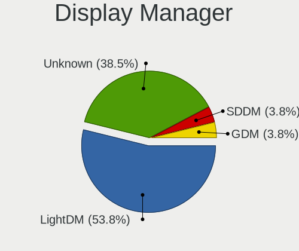

| Name    | Desktops | Percent |
|---------|----------|---------|
| LightDM | 7        | 46.67%  |
| Unknown | 7        | 46.67%  |
| GDM     | 1        | 6.67%   |

OS Lang
-------

Language

| Lang  | Desktops | Percent |
|-------|----------|---------|
| en_US | 7        | 46.67%  |
| pt_BR | 2        | 13.33%  |
| en_IN | 2        | 13.33%  |
| ru_RU | 1        | 6.67%   |
| pl_PL | 1        | 6.67%   |
| en_DK | 1        | 6.67%   |
| cs_CZ | 1        | 6.67%   |

Boot Mode
---------

EFI or BIOS

| Mode | Desktops | Percent |
|------|----------|---------|
| BIOS | 11       | 73.33%  |
| EFI  | 4        | 26.67%  |

Filesystem
----------

Type of filesystem

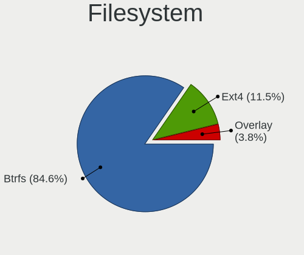

| Type    | Desktops | Percent |
|---------|----------|---------|
| Btrfs   | 12       | 80%     |
| Ext4    | 2        | 13.33%  |
| Overlay | 1        | 6.67%   |

Part. scheme
------------

Scheme of partitioning

| Type    | Desktops | Percent |
|---------|----------|---------|
| Unknown | 7        | 46.67%  |
| GPT     | 6        | 40%     |
| MBR     | 2        | 13.33%  |

Dual Boot with Linux/BSD
------------------------

Hosting more than one Linux/BSD

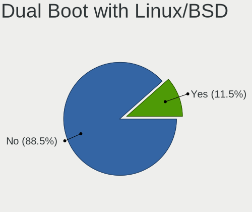

| Dual boot | Desktops | Percent |
|-----------|----------|---------|
| No        | 14       | 93.33%  |
| Yes       | 1        | 6.67%   |

Dual Boot (Win)
---------------

Hosting Linux and Windows

| Dual boot | Desktops | Percent |
|-----------|----------|---------|
| No        | 10       | 66.67%  |
| Yes       | 5        | 33.33%  |

Board
-----

Vendor
------

Motherboard manufacturer

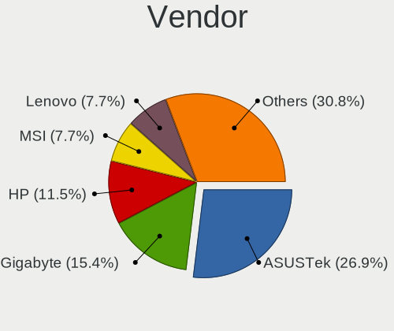

| Name                | Desktops | Percent |
|---------------------|----------|---------|
| ASUSTek Computer    | 4        | 26.67%  |
| Hewlett-Packard     | 2        | 13.33%  |
| Dell                | 2        | 13.33%  |
| SLIMBOOK            | 1        | 6.67%   |
| MSI                 | 1        | 6.67%   |
| Lenovo              | 1        | 6.67%   |
| Gigabyte Technology | 1        | 6.67%   |
| ECS                 | 1        | 6.67%   |
| Daewoo Lucoms       | 1        | 6.67%   |
| ASRock              | 1        | 6.67%   |

Model
-----

Motherboard model

| Name                         | Desktops | Percent |
|------------------------------|----------|---------|
| HP ProDesk 600 G1 SFF        | 2        | 13.33%  |
| SLIMBOOK ONE-AMD-M4          | 1        | 6.67%   |
| MSI MS-7A34                  | 1        | 6.67%   |
| Lenovo H530 10130            | 1        | 6.67%   |
| Gigabyte A320M-S2H           | 1        | 6.67%   |
| ECS GV460AA-ABA a6217c       | 1        | 6.67%   |
| Dell OptiPlex 7010           | 1        | 6.67%   |
| Dell OptiPlex 3020           | 1        | 6.67%   |
| Daewoo Lucoms OEM            | 1        | 6.67%   |
| ASUS ROG CROSSHAIR VIII HERO | 1        | 6.67%   |
| ASUS PRIME H310M-D R2.0      | 1        | 6.67%   |
| ASUS H170M-E D3              | 1        | 6.67%   |
| ASUS Basic 3221BM            | 1        | 6.67%   |
| ASRock Z87M Extreme4         | 1        | 6.67%   |

Model Family
------------

Motherboard model prefix

| Name                | Desktops | Percent |
|---------------------|----------|---------|
| HP ProDesk          | 2        | 13.33%  |
| Dell OptiPlex       | 2        | 13.33%  |
| SLIMBOOK ONE-AMD-M4 | 1        | 6.67%   |
| MSI MS-7A34         | 1        | 6.67%   |
| Lenovo H530         | 1        | 6.67%   |
| Gigabyte A320M-S2H  | 1        | 6.67%   |
| ECS GV460AA-ABA     | 1        | 6.67%   |
| Daewoo Lucoms OEM   | 1        | 6.67%   |
| ASUS ROG            | 1        | 6.67%   |
| ASUS PRIME          | 1        | 6.67%   |
| ASUS H170M-E        | 1        | 6.67%   |
| ASUS Basic          | 1        | 6.67%   |
| ASRock Z87M         | 1        | 6.67%   |

MFG Year
--------

Motherboard manufacture year

| Year | Desktops | Percent |
|------|----------|---------|
| 2013 | 5        | 33.33%  |
| 2021 | 2        | 13.33%  |
| 2017 | 2        | 13.33%  |
| 2015 | 2        | 13.33%  |
| 2018 | 1        | 6.67%   |
| 2012 | 1        | 6.67%   |
| 2010 | 1        | 6.67%   |
| 2007 | 1        | 6.67%   |

Form Factor
-----------

Physical design of the computer

| Name    | Desktops | Percent |
|---------|----------|---------|
| Desktop | 15       | 100%    |

Secure Boot
-----------

Enabled or disabled

| State    | Desktops | Percent |
|----------|----------|---------|
| Disabled | 15       | 100%    |

Coreboot
--------

Have coreboot on board

| Used | Desktops | Percent |
|------|----------|---------|
| No   | 15       | 100%    |

RAM Size
--------

Total RAM memory

| Size in GB | Desktops | Percent |
|------------|----------|---------|
| 4.01-8.0   | 5        | 31.25%  |
| 8.01-16.0  | 4        | 25%     |
| 32.01-64.0 | 3        | 18.75%  |
| 3.01-4.0   | 3        | 18.75%  |
| 16.01-24.0 | 1        | 6.25%   |

RAM Used
--------

Used RAM memory

| Used GB    | Desktops | Percent |
|------------|----------|---------|
| 1.01-2.0   | 6        | 37.5%   |
| 2.01-3.0   | 5        | 31.25%  |
| 4.01-8.0   | 2        | 12.5%   |
| 3.01-4.0   | 1        | 6.25%   |
| 16.01-24.0 | 1        | 6.25%   |
| 0.51-1.0   | 1        | 6.25%   |

Total Drives
------------

Number of drives on board

| Drives | Desktops | Percent |
|--------|----------|---------|
| 2      | 7        | 46.67%  |
| 1      | 5        | 33.33%  |
| 6      | 1        | 6.67%   |
| 5      | 1        | 6.67%   |
| 3      | 1        | 6.67%   |

Has CD-ROM
----------

Has CD-ROM on board

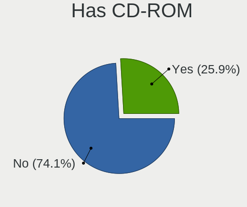

| Presented | Desktops | Percent |
|-----------|----------|---------|
| No        | 13       | 86.67%  |
| Yes       | 2        | 13.33%  |

Has Ethernet
------------

Has Ethernet on board

| Presented | Desktops | Percent |
|-----------|----------|---------|
| Yes       | 15       | 100%    |

Has WiFi
--------

Has WiFi module

| Presented | Desktops | Percent |
|-----------|----------|---------|
| Yes       | 11       | 73.33%  |
| No        | 4        | 26.67%  |

Has Bluetooth
-------------

Has Bluetooth module

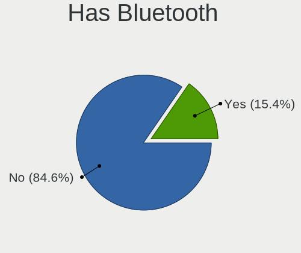

| Presented | Desktops | Percent |
|-----------|----------|---------|
| No        | 13       | 86.67%  |
| Yes       | 2        | 13.33%  |

Location
--------

Country
-------

Geographic location (country)

| Country     | Desktops | Percent |
|-------------|----------|---------|
| USA         | 3        | 18.75%  |
| Netherlands | 2        | 12.5%   |
| India       | 2        | 12.5%   |
| Brazil      | 2        | 12.5%   |
| Russia      | 1        | 6.25%   |
| Romania     | 1        | 6.25%   |
| Morocco     | 1        | 6.25%   |
| Egypt       | 1        | 6.25%   |
| Denmark     | 1        | 6.25%   |
| Czechia     | 1        | 6.25%   |
| Austria     | 1        | 6.25%   |

City
----

Geographic location (city)

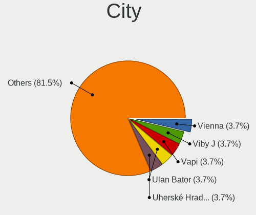

| City                | Desktops | Percent |
|---------------------|----------|---------|
| Vienna              | 1        | 6.25%   |
| Viby J              | 1        | 6.25%   |
| Vapi                | 1        | 6.25%   |
| Uherské Hradiště | 1        | 6.25%   |
| Tangier             | 1        | 6.25%   |
| Sao Paulo           | 1        | 6.25%   |
| Sao Joao de Meriti  | 1        | 6.25%   |
| Newark              | 1        | 6.25%   |
| Milton              | 1        | 6.25%   |
| Krasnogorsk         | 1        | 6.25%   |
| Iasi                | 1        | 6.25%   |
| Darien              | 1        | 6.25%   |
| Bussum              | 1        | 6.25%   |
| Beri Khas           | 1        | 6.25%   |
| Amsterdam           | 1        | 6.25%   |
| Alexandria          | 1        | 6.25%   |

Drives
------

Drive Vendor
------------

Hard drive vendors

| Vendor              | Desktops | Drives | Percent |
|---------------------|----------|--------|---------|
| Seagate             | 8        | 9      | 26.67%  |
| WDC                 | 6        | 7      | 20%     |
| Toshiba             | 4        | 4      | 13.33%  |
| Samsung Electronics | 4        | 9      | 13.33%  |
| Sandisk             | 2        | 4      | 6.67%   |
| Silicon Motion      | 1        | 1      | 3.33%   |
| PNY                 | 1        | 1      | 3.33%   |
| PLEXTOR             | 1        | 1      | 3.33%   |
| Kingston            | 1        | 1      | 3.33%   |
| China               | 1        | 2      | 3.33%   |
| A-DATA Technology   | 1        | 1      | 3.33%   |

Drive Model
-----------

Hard drive models

| Model                               | Desktops | Percent |
|-------------------------------------|----------|---------|
| Toshiba DT01ACA200 2TB              | 2        | 5.88%   |
| Seagate ST250DM000-1BD141 250GB     | 2        | 5.88%   |
| WDC WDS240G2G0A-00JH30 240GB SSD    | 1        | 2.94%   |
| WDC WDBRPG5000ANC-WRSN 500GB        | 1        | 2.94%   |
| WDC WD2003FZEX-00Z4SA0 2TB          | 1        | 2.94%   |
| WDC WD10PURX-64E5EY0 1TB            | 1        | 2.94%   |
| WDC WD10EZRX-00L4HB0 1TB            | 1        | 2.94%   |
| WDC WD10EARS-00Y5B1 1TB             | 1        | 2.94%   |
| Toshiba HDWD105 500GB               | 1        | 2.94%   |
| Toshiba DT01ACA050 500GB            | 1        | 2.94%   |
| Silicon Motion NVMe SSD Drive 128GB | 1        | 2.94%   |
| Seagate ST9500325AS 500GB           | 1        | 2.94%   |
| Seagate ST500LM021-1KJ152 500GB     | 1        | 2.94%   |
| Seagate ST500LM000-SSHD-8GB         | 1        | 2.94%   |
| Seagate ST500DM002-1BD142 500GB     | 1        | 2.94%   |
| Seagate ST3500312CS 500GB           | 1        | 2.94%   |
| Seagate ST2000LM003 HN-M201RAD 2TB  | 1        | 2.94%   |
| Seagate ST1000DM003-1SB10C 1TB      | 1        | 2.94%   |
| SanDisk SD6SF1M128G1022I 128GB SSD  | 1        | 2.94%   |
| Sandisk NVMe SSD Drive 250GB        | 1        | 2.94%   |
| Samsung SSD 970 EVO Plus 1TB        | 1        | 2.94%   |
| Samsung SSD 860 EVO 500GB           | 1        | 2.94%   |
| Samsung SSD 860 EVO 250GB           | 1        | 2.94%   |
| Samsung SSD 850 EVO 250GB           | 1        | 2.94%   |
| Samsung SSD 840 Series 250GB        | 1        | 2.94%   |
| Samsung MZVLB1T0HBLR-000L2 1TB      | 1        | 2.94%   |
| Samsung HM500JI 500GB               | 1        | 2.94%   |
| PNY CS900 120GB SSD                 | 1        | 2.94%   |
| PLEXTOR PX-512M6Pro 512GB SSD       | 1        | 2.94%   |
| Kingston SA400S37480G 480GB SSD     | 1        | 2.94%   |
| China SATA SSD 256GB                | 1        | 2.94%   |
| A-DATA SX7000NP 128GB               | 1        | 2.94%   |

HDD Vendor
----------

Hard disk drive vendors

| Vendor              | Desktops | Drives | Percent |
|---------------------|----------|--------|---------|
| Seagate             | 8        | 9      | 47.06%  |
| WDC                 | 4        | 5      | 23.53%  |
| Toshiba             | 4        | 4      | 23.53%  |
| Samsung Electronics | 1        | 1      | 5.88%   |

SSD Vendor
----------

Solid state drive vendors

| Vendor              | Desktops | Drives | Percent |
|---------------------|----------|--------|---------|
| Samsung Electronics | 3        | 6      | 33.33%  |
| WDC                 | 1        | 1      | 11.11%  |
| SanDisk             | 1        | 1      | 11.11%  |
| PNY                 | 1        | 1      | 11.11%  |
| PLEXTOR             | 1        | 1      | 11.11%  |
| Kingston            | 1        | 1      | 11.11%  |
| China               | 1        | 2      | 11.11%  |

Drive Kind
----------

HDD or SSD

| Kind | Desktops | Drives | Percent |
|------|----------|--------|---------|
| HDD  | 12       | 19     | 50%     |
| SSD  | 8        | 13     | 33.33%  |
| NVMe | 4        | 8      | 16.67%  |

Drive Connector
---------------

SATA, SAS, NVMe, etc.

| Type | Desktops | Drives | Percent |
|------|----------|--------|---------|
| SATA | 13       | 32     | 76.47%  |
| NVMe | 4        | 8      | 23.53%  |

Drive Size
----------

Size of hard drive

| Size in TB | Desktops | Drives | Percent |
|------------|----------|--------|---------|
| 0.01-0.5   | 11       | 22     | 61.11%  |
| 0.51-1.0   | 4        | 6      | 22.22%  |
| 1.01-2.0   | 3        | 4      | 16.67%  |

Space Total
-----------

Amount of disk space available on the file system

| Size in GB | Desktops | Percent |
|------------|----------|---------|
| 501-1000   | 4        | 26.67%  |
| 251-500    | 3        | 20%     |
| 101-250    | 3        | 20%     |
| 1001-2000  | 2        | 13.33%  |
| 2001-3000  | 1        | 6.67%   |
| 51-100     | 1        | 6.67%   |
| Unknown    | 1        | 6.67%   |

Space Used
----------

Amount of used disk space

| Used GB   | Desktops | Percent |
|-----------|----------|---------|
| 21-50     | 5        | 29.41%  |
| 101-250   | 3        | 17.65%  |
| 51-100    | 3        | 17.65%  |
| 501-1000  | 2        | 11.76%  |
| 251-500   | 1        | 5.88%   |
| 1001-2000 | 1        | 5.88%   |
| 1-20      | 1        | 5.88%   |
| Unknown   | 1        | 5.88%   |

Malfunc. Drives
---------------

Drive models with a malfunction

| Model                              | Desktops | Drives | Percent |
|------------------------------------|----------|--------|---------|
| WDC WD2003FZEX-00Z4SA0 2TB         | 1        | 1      | 12.5%   |
| Seagate ST9500325AS 500GB          | 1        | 1      | 12.5%   |
| Seagate ST250DM000-1BD141 250GB    | 1        | 1      | 12.5%   |
| Seagate ST2000LM003 HN-M201RAD 2TB | 1        | 1      | 12.5%   |
| SanDisk SD6SF1M128G1022I 128GB SSD | 1        | 1      | 12.5%   |
| Samsung Electronics HM500JI 500GB  | 1        | 1      | 12.5%   |
| PLEXTOR PX-512M6Pro 512GB SSD      | 1        | 1      | 12.5%   |
| A-DATA Technology SX7000NP 128GB   | 1        | 1      | 12.5%   |

Malfunc. Drive Vendor
---------------------

Vendors of faulty drives

| Vendor              | Desktops | Drives | Percent |
|---------------------|----------|--------|---------|
| Seagate             | 2        | 3      | 28.57%  |
| WDC                 | 1        | 1      | 14.29%  |
| SanDisk             | 1        | 1      | 14.29%  |
| Samsung Electronics | 1        | 1      | 14.29%  |
| PLEXTOR             | 1        | 1      | 14.29%  |
| A-DATA Technology   | 1        | 1      | 14.29%  |

Malfunc. HDD Vendor
-------------------

Vendors of faulty HDD drives

| Vendor              | Desktops | Drives | Percent |
|---------------------|----------|--------|---------|
| Seagate             | 2        | 3      | 50%     |
| WDC                 | 1        | 1      | 25%     |
| Samsung Electronics | 1        | 1      | 25%     |

Malfunc. Drive Kind
-------------------

Kinds of faulty drives

| Kind | Desktops | Drives | Percent |
|------|----------|--------|---------|
| HDD  | 3        | 5      | 50%     |
| SSD  | 2        | 2      | 33.33%  |
| NVMe | 1        | 1      | 16.67%  |

Failed Drives
-------------

Failed drive models

Zero info for selected period =(

Failed Drive Vendor
-------------------

Failed drive vendors

Zero info for selected period =(

Drive Status
------------

Number of failed and malfunc. drives

| Status   | Desktops | Drives | Percent |
|----------|----------|--------|---------|
| Detected | 8        | 20     | 44.44%  |
| Works    | 7        | 12     | 38.89%  |
| Malfunc  | 3        | 8      | 16.67%  |

Storage controller
------------------

Storage Vendor
--------------

Storage controller vendors

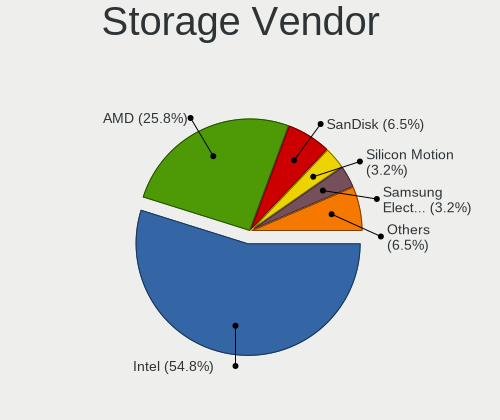

| Vendor              | Desktops | Percent |
|---------------------|----------|---------|
| Intel               | 10       | 52.63%  |
| AMD                 | 4        | 21.05%  |
| Sandisk             | 2        | 10.53%  |
| Silicon Motion      | 1        | 5.26%   |
| Samsung Electronics | 1        | 5.26%   |
| Nvidia              | 1        | 5.26%   |

Storage Model
-------------

Storage controller models

| Model                                                                          | Desktops | Percent |
|--------------------------------------------------------------------------------|----------|---------|
| Intel 8 Series/C220 Series Chipset Family 6-port SATA Controller 1 [AHCI mode] | 5        | 22.73%  |
| AMD FCH SATA Controller [AHCI mode]                                            | 4        | 18.18%  |
| Silicon Motion Non-Volatile memory controller                                  | 1        | 4.55%   |
| Sandisk WD Blue SN550 NVMe SSD                                                 | 1        | 4.55%   |
| Sandisk WD Black 2018/SN750 / PC SN720 NVMe SSD                                | 1        | 4.55%   |
| Samsung NVMe SSD Controller SM981/PM981/PM983                                  | 1        | 4.55%   |
| Nvidia MCP61 SATA Controller                                                   | 1        | 4.55%   |
| Nvidia MCP61 IDE                                                               | 1        | 4.55%   |
| Intel Q170/Q150/B150/H170/H110/Z170/CM236 Chipset SATA Controller [AHCI Mode]  | 1        | 4.55%   |
| Intel NM10/ICH7 Family SATA Controller [IDE mode]                              | 1        | 4.55%   |
| Intel 8 Series/C220 Series Chipset Family 4-port SATA Controller 1 [IDE mode]  | 1        | 4.55%   |
| Intel 7 Series/C210 Series Chipset Family 6-port SATA Controller [AHCI mode]   | 1        | 4.55%   |
| Intel 200 Series PCH SATA controller [AHCI mode]                               | 1        | 4.55%   |
| AMD FCH SATA Controller D                                                      | 1        | 4.55%   |
| AMD 300 Series Chipset SATA Controller                                         | 1        | 4.55%   |

Storage Kind
------------

Kind of storage controller (IDE, SATA, NVMe, SAS, ...)

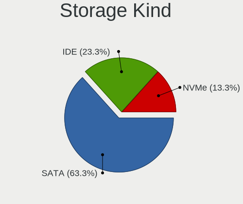

| Kind | Desktops | Percent |
|------|----------|---------|
| SATA | 12       | 63.16%  |
| NVMe | 4        | 21.05%  |
| IDE  | 3        | 15.79%  |

Processor
---------

CPU Vendor
----------

Processor vendors

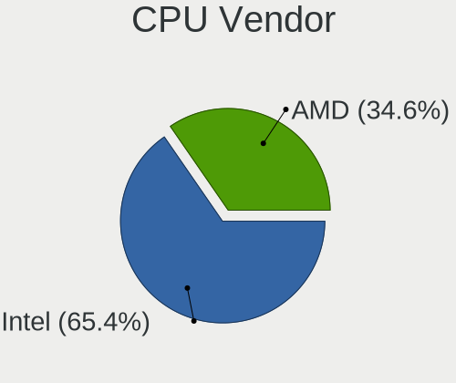

| Vendor | Desktops | Percent |
|--------|----------|---------|
| Intel  | 10       | 66.67%  |
| AMD    | 5        | 33.33%  |

CPU Model
---------

Processor models

| Model                                       | Desktops | Percent |
|---------------------------------------------|----------|---------|
| Intel Core i3-4130 CPU @ 3.40GHz            | 2        | 13.33%  |
| Intel Xeon CPU E3-1246 v3 @ 3.50GHz         | 1        | 6.67%   |
| Intel Pentium CPU G630 @ 2.70GHz            | 1        | 6.67%   |
| Intel Pentium CPU G3260 @ 3.30GHz           | 1        | 6.67%   |
| Intel Core i5-7400 CPU @ 3.00GHz            | 1        | 6.67%   |
| Intel Core i5-4670S CPU @ 3.10GHz           | 1        | 6.67%   |
| Intel Core i5-4590 CPU @ 3.30GHz            | 1        | 6.67%   |
| Intel Core i3-9100F CPU @ 3.60GHz           | 1        | 6.67%   |
| Intel Core 2 Duo CPU E8400 @ 3.00GHz        | 1        | 6.67%   |
| AMD Ryzen 9 3900X 12-Core Processor         | 1        | 6.67%   |
| AMD Ryzen 7 4800H with Radeon Graphics      | 1        | 6.67%   |
| AMD Ryzen 5 1600X Six-Core Processor        | 1        | 6.67%   |
| AMD Ryzen 3 2200G with Radeon Vega Graphics | 1        | 6.67%   |
| AMD Athlon 64 X2 Dual Core Processor 4600+  | 1        | 6.67%   |

CPU Model Family
----------------

Processor model prefix

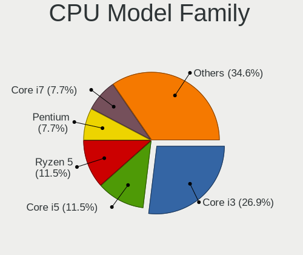

| Model            | Desktops | Percent |
|------------------|----------|---------|
| Intel Core i5    | 3        | 20%     |
| Intel Core i3    | 3        | 20%     |
| Intel Pentium    | 2        | 13.33%  |
| Intel Xeon       | 1        | 6.67%   |
| Intel Core 2 Duo | 1        | 6.67%   |
| AMD Ryzen 9      | 1        | 6.67%   |
| AMD Ryzen 7      | 1        | 6.67%   |
| AMD Ryzen 5      | 1        | 6.67%   |
| AMD Ryzen 3      | 1        | 6.67%   |
| AMD Athlon 64 X2 | 1        | 6.67%   |

CPU Cores
---------

Number of processor cores

| Number | Desktops | Percent |
|--------|----------|---------|
| 4      | 6        | 40%     |
| 2      | 6        | 40%     |
| 12     | 1        | 6.67%   |
| 8      | 1        | 6.67%   |
| 6      | 1        | 6.67%   |

CPU Sockets
-----------

Number of sockets

| Number | Desktops | Percent |
|--------|----------|---------|
| 1      | 15       | 100%    |

CPU Threads
-----------

Threads per core (Hyper-Threading)

| Number | Desktops | Percent |
|--------|----------|---------|
| 1      | 10       | 66.67%  |
| 2      | 5        | 33.33%  |

CPU Op-Modes
------------

CPU Operation Modes (32-bit, 64-bit)

| Op mode        | Desktops | Percent |
|----------------|----------|---------|
| 32-bit, 64-bit | 15       | 100%    |

CPU Microcode
-------------

Microcode number

| Number     | Desktops | Percent |
|------------|----------|---------|
| Unknown    | 10       | 66.67%  |
| 0x306c3    | 1        | 6.67%   |
| 0x206a7    | 1        | 6.67%   |
| 0x1067a    | 1        | 6.67%   |
| 0x08701021 | 1        | 6.67%   |
| 0x08001138 | 1        | 6.67%   |

CPU Microarch
-------------

Microarchitecture

| Name        | Desktops | Percent |
|-------------|----------|---------|
| Haswell     | 6        | 40%     |
| Zen 2       | 2        | 13.33%  |
| Zen         | 2        | 13.33%  |
| KabyLake    | 2        | 13.33%  |
| SandyBridge | 1        | 6.67%   |
| Penryn      | 1        | 6.67%   |
| K8 Hammer   | 1        | 6.67%   |

Graphics
--------

GPU Vendor
----------

Vendors of graphics cards

| Vendor | Desktops | Percent |
|--------|----------|---------|
| Intel  | 9        | 47.37%  |
| Nvidia | 6        | 31.58%  |
| AMD    | 4        | 21.05%  |

GPU Model
---------

Graphics card models

| Model                                                                       | Desktops | Percent |
|-----------------------------------------------------------------------------|----------|---------|
| Intel Xeon E3-1200 v3/4th Gen Core Processor Integrated Graphics Controller | 3        | 15.79%  |
| Intel 4th Generation Core Processor Family Integrated Graphics Controller   | 2        | 10.53%  |
| Nvidia GP107 [GeForce GTX 1050 Ti]                                          | 1        | 5.26%   |
| Nvidia GM107 [GeForce GTX 750 Ti]                                           | 1        | 5.26%   |
| Nvidia GK208B [GeForce GT 710]                                              | 1        | 5.26%   |
| Nvidia GF119 [GeForce GT 610]                                               | 1        | 5.26%   |
| Nvidia GF106 [GeForce GTS 450]                                              | 1        | 5.26%   |
| Nvidia C61 [GeForce 6150SE nForce 430]                                      | 1        | 5.26%   |
| Intel Xeon E3-1200 v3 Processor Integrated Graphics Controller              | 1        | 5.26%   |
| Intel HD Graphics 630                                                       | 1        | 5.26%   |
| Intel 4 Series Chipset Integrated Graphics Controller                       | 1        | 5.26%   |
| Intel 2nd Generation Core Processor Family Integrated Graphics Controller   | 1        | 5.26%   |
| AMD Renoir                                                                  | 1        | 5.26%   |
| AMD Ellesmere [Radeon RX 470/480/570/570X/580/580X/590]                     | 1        | 5.26%   |
| AMD Curacao PRO [Radeon R7 370 / R9 270/370 OEM]                            | 1        | 5.26%   |
| AMD Cape Verde XT [Radeon HD 7770/8760 / R7 250X]                           | 1        | 5.26%   |

GPU Combo
---------

Combinations of graphics cards

| Name       | Desktops | Percent |
|------------|----------|---------|
| 1 x Nvidia | 6        | 40%     |
| 1 x Intel  | 5        | 33.33%  |
| 1 x AMD    | 4        | 26.67%  |

GPU Driver
----------

Free vs proprietary

| Driver      | Desktops | Percent |
|-------------|----------|---------|
| Free        | 12       | 75%     |
| Proprietary | 3        | 18.75%  |
| Unknown     | 1        | 6.25%   |

GPU Memory
----------

Total video memory

| Size in GB | Desktops | Percent |
|------------|----------|---------|
| Unknown    | 10       | 62.5%   |
| 1.01-2.0   | 2        | 12.5%   |
| 7.01-8.0   | 1        | 6.25%   |
| 3.01-4.0   | 1        | 6.25%   |
| 0.51-1.0   | 1        | 6.25%   |
| 0.01-0.5   | 1        | 6.25%   |

Monitor
-------

Monitor Vendor
--------------

Monitor vendors

| Vendor              | Desktops | Percent |
|---------------------|----------|---------|
| AOC                 | 2        | 14.29%  |
| Unknown             | 1        | 7.14%   |
| Toshiba             | 1        | 7.14%   |
| STD                 | 1        | 7.14%   |
| Samsung Electronics | 1        | 7.14%   |
| Philips             | 1        | 7.14%   |
| NEC Computers       | 1        | 7.14%   |
| Lenovo              | 1        | 7.14%   |
| Goldstar            | 1        | 7.14%   |
| Dell                | 1        | 7.14%   |
| BenQ                | 1        | 7.14%   |
| Ativa               | 1        | 7.14%   |
| Acer                | 1        | 7.14%   |

Monitor Model
-------------

Monitor models

| Model                                                                | Desktops | Percent |
|----------------------------------------------------------------------|----------|---------|
| Unknown LCD Monitor SAMSUNG 3840x1080                                | 1        | 6.67%   |
| Toshiba TV TSB0105 1920x1080 708x398mm 32.0-inch                     | 1        | 6.67%   |
| STD Monitor STD0001 1920x1080                                        | 1        | 6.67%   |
| Samsung Electronics SyncMaster SAM027E 1680x1050 474x296mm 22.0-inch | 1        | 6.67%   |
| Philips PHL 276E9Q PHLC17B 1920x1080 598x336mm 27.0-inch             | 1        | 6.67%   |
| NEC Computers EA243WM NEC6864 1920x1200 519x324mm 24.1-inch          | 1        | 6.67%   |
| Lenovo LEN LT2452pwC LEN1144 1920x1200 518x324mm 24.1-inch           | 1        | 6.67%   |
| Lenovo L200pwD LEN1156 1680x1050 433x271mm 20.1-inch                 | 1        | 6.67%   |
| Goldstar Ultra HD GSM5B08 3840x2160 600x340mm 27.2-inch              | 1        | 6.67%   |
| Dell LCD Monitor P2417H                                              | 1        | 6.67%   |
| BenQ GW2760 BNQ78C6 1920x1080 598x336mm 27.0-inch                    | 1        | 6.67%   |
| Ativa AT22HZR ATV0100 1920x1080 497x292mm 22.7-inch                  | 1        | 6.67%   |
| AOC LCD Monitor 2217 1680x1050                                       | 1        | 6.67%   |
| AOC 2270W AOC2270 1920x1080 477x268mm 21.5-inch                      | 1        | 6.67%   |
| Acer X223W ACR0011 1680x1050 473x296mm 22.0-inch                     | 1        | 6.67%   |

Monitor Resolution
------------------

Monitor screen resolution

| Resolution         | Desktops | Percent |
|--------------------|----------|---------|
| 1920x1080 (FHD)    | 7        | 46.67%  |
| 1680x1050 (WSXGA+) | 4        | 26.67%  |
| 3840x2160 (4K)     | 1        | 6.67%   |
| 3840x1080          | 1        | 6.67%   |
| 1920x1200 (WUXGA)  | 1        | 6.67%   |
| Unknown            | 1        | 6.67%   |

Monitor Diagonal
----------------

Diagonal size in inches

| Inches  | Desktops | Percent |
|---------|----------|---------|
| 27      | 3        | 21.43%  |
| 22      | 3        | 21.43%  |
| 24      | 2        | 14.29%  |
| Unknown | 2        | 14.29%  |
| 32      | 1        | 7.14%   |
| 23      | 1        | 7.14%   |
| 21      | 1        | 7.14%   |
| 20      | 1        | 7.14%   |

Monitor Width
-------------

Physical width

| Width in mm | Desktops | Percent |
|-------------|----------|---------|
| 501-600     | 6        | 42.86%  |
| 401-500     | 5        | 35.71%  |
| Unknown     | 2        | 14.29%  |
| 701-800     | 1        | 7.14%   |

Aspect Ratio
------------

Proportional relationship between the width and the height

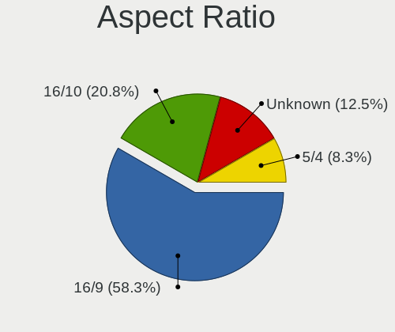

| Ratio   | Desktops | Percent |
|---------|----------|---------|
| 16/9    | 7        | 53.85%  |
| 16/10   | 4        | 30.77%  |
| Unknown | 2        | 15.38%  |

Monitor Area
------------

Area in inch²

| Area in inch² | Desktops | Percent |
|----------------|----------|---------|
| 201-250        | 4        | 28.57%  |
| 301-350        | 3        | 21.43%  |
| 251-300        | 2        | 14.29%  |
| 151-200        | 2        | 14.29%  |
| Unknown        | 2        | 14.29%  |
| 351-500        | 1        | 7.14%   |

Pixel Density
-------------

Pixels per inch

| Density | Desktops | Percent |
|---------|----------|---------|
| 51-100  | 8        | 66.67%  |
| Unknown | 2        | 16.67%  |
| 161-240 | 1        | 8.33%   |
| 101-120 | 1        | 8.33%   |

Multiple Monitors
-----------------

Total monitors connected

| Total | Desktops | Percent |
|-------|----------|---------|
| 1     | 11       | 68.75%  |
| 2     | 3        | 18.75%  |
| 0     | 2        | 12.5%   |

Network
-------

Net Controller Vendor
---------------------

Controller vendors

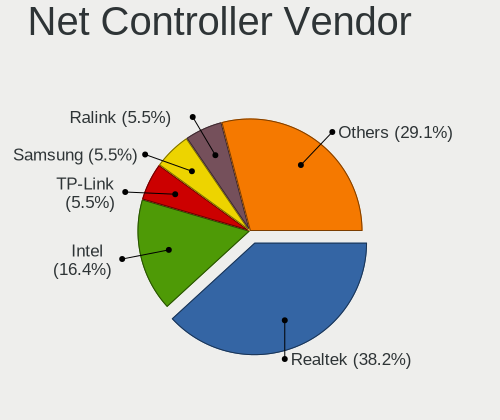

| Vendor                | Desktops | Percent |
|-----------------------|----------|---------|
| Realtek Semiconductor | 12       | 37.5%   |
| Intel                 | 6        | 18.75%  |
| MediaTek              | 2        | 6.25%   |
| TP-Link               | 1        | 3.13%   |
| Samsung Electronics   | 1        | 3.13%   |
| Ralink Technology     | 1        | 3.13%   |
| Qualcomm Atheros      | 1        | 3.13%   |
| OnePlus               | 1        | 3.13%   |
| Nvidia                | 1        | 3.13%   |
| Microsoft             | 1        | 3.13%   |
| ICS Advent            | 1        | 3.13%   |
| Gemtek                | 1        | 3.13%   |
| D-Link System         | 1        | 3.13%   |
| Broadcom              | 1        | 3.13%   |
| ASUSTek Computer      | 1        | 3.13%   |

Net Controller Model
--------------------

Controller models

| Model                                                                | Desktops | Percent |
|----------------------------------------------------------------------|----------|---------|
| Realtek RTL8111/8168/8411 PCI Express Gigabit Ethernet Controller    | 9        | 26.47%  |
| Realtek RTL8188FTV 802.11b/g/n 1T1R 2.4G WLAN Adapter                | 4        | 11.76%  |
| Intel Ethernet Connection I217-LM                                    | 2        | 5.88%   |
| TP-Link TL-WN722N v2/v3 [Realtek RTL8188EUS]                         | 1        | 2.94%   |
| Samsung GT-I9070 (network tethering, USB debugging enabled)          | 1        | 2.94%   |
| Realtek RTL8125 2.5GbE Controller                                    | 1        | 2.94%   |
| Ralink MT7601U Wireless Adapter                                      | 1        | 2.94%   |
| Qualcomm Atheros AR9485 Wireless Network Adapter                     | 1        | 2.94%   |
| OnePlus IN2017                                                       | 1        | 2.94%   |
| Nvidia MCP61 Ethernet                                                | 1        | 2.94%   |
| Microsoft Xbox 360 Wireless Adapter                                  | 1        | 2.94%   |
| MediaTek WP7                                                         | 1        | 2.94%   |
| MediaTek vivo                                                        | 1        | 2.94%   |
| Intel Wi-Fi 6 AX200                                                  | 1        | 2.94%   |
| Intel I211 Gigabit Network Connection                                | 1        | 2.94%   |
| Intel Ethernet Connection I217-V                                     | 1        | 2.94%   |
| Intel 82579LM Gigabit Network Connection (Lewisville)                | 1        | 2.94%   |
| ICS Advent USB 10/100 LAN                                            | 1        | 2.94%   |
| Gemtek WUBR-177G [Ralink RT2571W]                                    | 1        | 2.94%   |
| D-Link System DWA-125 Wireless N 150 Adapter(rev.A2) [Ralink RT3070] | 1        | 2.94%   |
| Broadcom BCM4360 802.11ac Wireless Network Adapter                   | 1        | 2.94%   |
| ASUS USB-N13 802.11n Network Adapter (rev. B1) [Realtek RTL8192CU]   | 1        | 2.94%   |

Wireless Vendor
---------------

Wireless vendors

| Vendor                | Desktops | Percent |
|-----------------------|----------|---------|
| Realtek Semiconductor | 4        | 30.77%  |
| TP-Link               | 1        | 7.69%   |
| Ralink Technology     | 1        | 7.69%   |
| Qualcomm Atheros      | 1        | 7.69%   |
| Microsoft             | 1        | 7.69%   |
| Intel                 | 1        | 7.69%   |
| Gemtek                | 1        | 7.69%   |
| D-Link System         | 1        | 7.69%   |
| Broadcom              | 1        | 7.69%   |
| ASUSTek Computer      | 1        | 7.69%   |

Wireless Model
--------------

Wireless models

| Model                                                                | Desktops | Percent |
|----------------------------------------------------------------------|----------|---------|
| Realtek RTL8188FTV 802.11b/g/n 1T1R 2.4G WLAN Adapter                | 4        | 30.77%  |
| TP-Link TL-WN722N v2/v3 [Realtek RTL8188EUS]                         | 1        | 7.69%   |
| Ralink MT7601U Wireless Adapter                                      | 1        | 7.69%   |
| Qualcomm Atheros AR9485 Wireless Network Adapter                     | 1        | 7.69%   |
| Microsoft Xbox 360 Wireless Adapter                                  | 1        | 7.69%   |
| Intel Wi-Fi 6 AX200                                                  | 1        | 7.69%   |
| Gemtek WUBR-177G [Ralink RT2571W]                                    | 1        | 7.69%   |
| D-Link System DWA-125 Wireless N 150 Adapter(rev.A2) [Ralink RT3070] | 1        | 7.69%   |
| Broadcom BCM4360 802.11ac Wireless Network Adapter                   | 1        | 7.69%   |
| ASUS USB-N13 802.11n Network Adapter (rev. B1) [Realtek RTL8192CU]   | 1        | 7.69%   |

Ethernet Vendor
---------------

Ethernet vendors

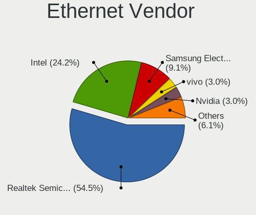

| Vendor                | Desktops | Percent |
|-----------------------|----------|---------|
| Realtek Semiconductor | 10       | 50%     |
| Intel                 | 5        | 25%     |
| MediaTek              | 2        | 10%     |
| Samsung Electronics   | 1        | 5%      |
| Nvidia                | 1        | 5%      |
| ICS Advent            | 1        | 5%      |

Ethernet Model
--------------

Ethernet models

| Model                                                             | Desktops | Percent |
|-------------------------------------------------------------------|----------|---------|
| Realtek RTL8111/8168/8411 PCI Express Gigabit Ethernet Controller | 9        | 45%     |
| Intel Ethernet Connection I217-LM                                 | 2        | 10%     |
| Samsung GT-I9070 (network tethering, USB debugging enabled)       | 1        | 5%      |
| Realtek RTL8125 2.5GbE Controller                                 | 1        | 5%      |
| Nvidia MCP61 Ethernet                                             | 1        | 5%      |
| MediaTek WP7                                                      | 1        | 5%      |
| MediaTek vivo                                                     | 1        | 5%      |
| Intel I211 Gigabit Network Connection                             | 1        | 5%      |
| Intel Ethernet Connection I217-V                                  | 1        | 5%      |
| Intel 82579LM Gigabit Network Connection (Lewisville)             | 1        | 5%      |
| ICS Advent USB 10/100 LAN                                         | 1        | 5%      |

Net Controller Kind
-------------------

Ethernet, WiFi or modem

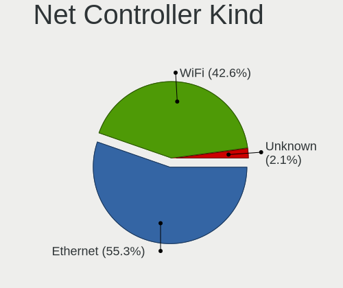

| Kind     | Desktops | Percent |
|----------|----------|---------|
| Ethernet | 15       | 55.56%  |
| WiFi     | 11       | 40.74%  |
| Unknown  | 1        | 3.7%    |

Used Controller
---------------

Currently used network controller

| Kind     | Desktops | Percent |
|----------|----------|---------|
| Ethernet | 10       | 62.5%   |
| WiFi     | 6        | 37.5%   |

NICs
----

Total network controllers on board

| Total | Desktops | Percent |
|-------|----------|---------|
| 1     | 11       | 73.33%  |
| 2     | 4        | 26.67%  |

IPv6
----

IPv6 vs IPv4

| Used | Desktops | Percent |
|------|----------|---------|
| No   | 13       | 86.67%  |
| Yes  | 2        | 13.33%  |

Bluetooth
---------

Bluetooth Vendor
----------------

Controller vendors

| Vendor                  | Desktops | Percent |
|-------------------------|----------|---------|
| Intel                   | 1        | 50%     |
| Cambridge Silicon Radio | 1        | 50%     |

Bluetooth Model
---------------

Controller models

| Model                                               | Desktops | Percent |
|-----------------------------------------------------|----------|---------|
| Intel AX200 Bluetooth                               | 1        | 50%     |
| Cambridge Silicon Radio Bluetooth Dongle (HCI mode) | 1        | 50%     |

Sound
-----

Sound Vendor
------------

Sound card vendors

| Vendor                 | Desktops | Percent |
|------------------------|----------|---------|
| Intel                  | 10       | 45.45%  |
| Nvidia                 | 6        | 27.27%  |
| AMD                    | 5        | 22.73%  |
| Generalplus Technology | 1        | 4.55%   |

Sound Model
-----------

Sound card models

| Model                                                                   | Desktops | Percent |
|-------------------------------------------------------------------------|----------|---------|
| Intel Xeon E3-1200 v3/4th Gen Core Processor HD Audio Controller        | 6        | 18.75%  |
| Intel 8 Series/C220 Series Chipset High Definition Audio Controller     | 6        | 18.75%  |
| AMD Oland/Hainan/Cape Verde/Pitcairn HDMI Audio [Radeon HD 7000 Series] | 2        | 6.25%   |
| AMD Family 17h/19h HD Audio Controller                                  | 2        | 6.25%   |
| Nvidia MCP61 High Definition Audio                                      | 1        | 3.13%   |
| Nvidia GP107GL High Definition Audio Controller                         | 1        | 3.13%   |
| Nvidia GM107 High Definition Audio Controller [GeForce 940MX]           | 1        | 3.13%   |
| Nvidia GK208 HDMI/DP Audio Controller                                   | 1        | 3.13%   |
| Nvidia GF119 HDMI Audio Controller                                      | 1        | 3.13%   |
| Nvidia GF106 High Definition Audio Controller                           | 1        | 3.13%   |
| Intel USB PnP Sound Device                                              | 1        | 3.13%   |
| Intel NM10/ICH7 Family High Definition Audio Controller                 | 1        | 3.13%   |
| Intel 7 Series/C216 Chipset Family High Definition Audio Controller     | 1        | 3.13%   |
| Intel 200 Series PCH HD Audio                                           | 1        | 3.13%   |
| Intel 100 Series/C230 Series Chipset Family HD Audio Controller         | 1        | 3.13%   |
| Generalplus Technology USB Audio Device                                 | 1        | 3.13%   |
| AMD Starship/Matisse HD Audio Controller                                | 1        | 3.13%   |
| AMD Renoir Radeon High Definition Audio Controller                      | 1        | 3.13%   |
| AMD Family 17h (Models 00h-0fh) HD Audio Controller                     | 1        | 3.13%   |
| AMD Ellesmere HDMI Audio [Radeon RX 470/480 / 570/580/590]              | 1        | 3.13%   |

Memory
------

Memory Vendor
-------------

Memory module vendors

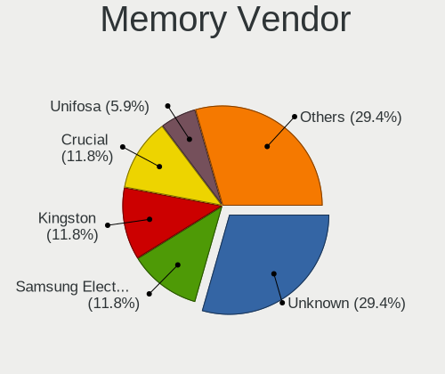

| Vendor              | Desktops | Percent |
|---------------------|----------|---------|
| Unknown             | 4        | 40%     |
| SK Hynix            | 1        | 10%     |
| Silicon Power       | 1        | 10%     |
| Samsung Electronics | 1        | 10%     |
| Kingston            | 1        | 10%     |
| G.Skill             | 1        | 10%     |
| Crucial             | 1        | 10%     |

Memory Model
------------

Memory module models

| Model                                                      | Desktops | Percent |
|------------------------------------------------------------|----------|---------|
| Unknown RAM Module 4GB DIMM DDR3 1600MT/s                  | 1        | 10%     |
| Unknown RAM Module 4GB DIMM DDR3 1067MT/s                  | 1        | 10%     |
| Unknown RAM Module 2GB DIMM SDRAM                          | 1        | 10%     |
| Unknown RAM Module 2GB DIMM                                | 1        | 10%     |
| SK Hynix RAM HYMP512U64CP8-Y5 1GB DIMM                     | 1        | 10%     |
| Silicon Power RAM SP016GBLFU266B02 16GB DIMM DDR4 2667MT/s | 1        | 10%     |
| Samsung RAM M378B5173DB0-CK0 4GB DIMM DDR3 1600MT/s        | 1        | 10%     |
| Kingston RAM KHX1866C10D3/8G 8GB DIMM DDR3 1867MT/s        | 1        | 10%     |
| G.Skill RAM F4-3600C16-16GTZNC 16GB DIMM DDR4 3600MT/s     | 1        | 10%     |
| Crucial RAM BLS8G3D1609DS1S00. 8192MB DIMM DDR3 1600MT/s   | 1        | 10%     |

Memory Kind
-----------

Memory module kinds

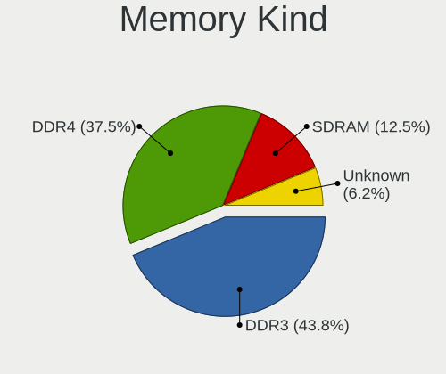

| Kind    | Desktops | Percent |
|---------|----------|---------|
| DDR3    | 4        | 50%     |
| DDR4    | 2        | 25%     |
| SDRAM   | 1        | 12.5%   |
| Unknown | 1        | 12.5%   |

Memory Form Factor
------------------

Physical design of the memory module

| Name | Desktops | Percent |
|------|----------|---------|
| DIMM | 8        | 100%    |

Memory Size
-----------

Memory module size

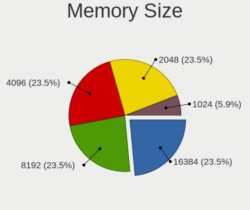

| Size  | Desktops | Percent |
|-------|----------|---------|
| 16384 | 2        | 22.22%  |
| 8192  | 2        | 22.22%  |
| 4096  | 2        | 22.22%  |
| 2048  | 2        | 22.22%  |
| 1024  | 1        | 11.11%  |

Memory Speed
------------

Memory module speed

| Speed   | Desktops | Percent |
|---------|----------|---------|
| 1600    | 2        | 25%     |
| Unknown | 2        | 25%     |
| 3600    | 1        | 12.5%   |
| 2667    | 1        | 12.5%   |
| 2133    | 1        | 12.5%   |
| 1067    | 1        | 12.5%   |

Printers & scanners
-------------------

Printer Vendor
--------------

Printer device vendors

Zero info for selected period =(

Printer Model
-------------

Printer device models

Zero info for selected period =(

Scanner Vendor
--------------

Scanner device vendors

Zero info for selected period =(

Scanner Model
-------------

Scanner device models

Zero info for selected period =(

Camera
------

Camera Vendor
-------------

Camera device vendors

| Vendor              | Desktops | Percent |
|---------------------|----------|---------|
| Teslong Camera      | 1        | 20%     |
| Logitech            | 1        | 20%     |
| Jieli Technology    | 1        | 20%     |
| IMC Networks        | 1        | 20%     |
| Creative Technology | 1        | 20%     |

Camera Model
------------

Camera device models

| Model                               | Desktops | Percent |
|-------------------------------------|----------|---------|
| Teslong Camera                      | 1        | 20%     |
| Logitech C922 Pro Stream Webcam     | 1        | 20%     |
| Jieli USB PHY 2.0                   | 1        | 20%     |
| IMC Networks XHC Camera             | 1        | 20%     |
| Creative Live! Cam Sync HD [VF0770] | 1        | 20%     |

Security
--------

Fingerprint Vendor
------------------

Fingerprint sensor vendors

Zero info for selected period =(

Fingerprint Model
-----------------

Fingerprint sensor models

Zero info for selected period =(

Chipcard Vendor
---------------

Chipcard module vendors

Zero info for selected period =(

Chipcard Model
--------------

Chipcard module models

Zero info for selected period =(

Unsupported
-----------

Unsupported Devices
-------------------

Total unsupported devices on board

| Total | Desktops | Percent |
|-------|----------|---------|
| 0     | 10       | 62.5%   |
| 1     | 5        | 31.25%  |
| 2     | 1        | 6.25%   |

Unsupported Device Types
------------------------

Types of unsupported devices

| Type                     | Desktops | Percent |
|--------------------------|----------|---------|
| Net/wireless             | 3        | 42.86%  |
| Graphics card            | 2        | 28.57%  |
| Multimedia controller    | 1        | 14.29%  |
| Communication controller | 1        | 14.29%  |

