Parrot 5.0 - Tested Hardware & Statistics (Notebooks)
-----------------------------------------------------

A project to collect tested hardware configurations for Parrot 5.0.

Anyone can contribute to this report by the [hw-probe](https://github.com/linuxhw/hw-probe) tool:

    sudo -E hw-probe -all -upload

Please contribute! Especially if your hardware is rare.

Contents
--------

* [ Test Cases ](#test-cases)

* [ System ](#system)
  - [ Kernel                   ](#kernel)
  - [ Kernel Family            ](#kernel-family)
  - [ Kernel Major Ver.        ](#kernel-major-ver)
  - [ Arch                     ](#arch)
  - [ DE                       ](#de)
  - [ Display Server           ](#display-server)
  - [ Display Manager          ](#display-manager)
  - [ OS Lang                  ](#os-lang)
  - [ Boot Mode                ](#boot-mode)
  - [ Filesystem               ](#filesystem)
  - [ Part. scheme             ](#part-scheme)
  - [ Dual Boot with Linux/BSD ](#dual-boot-with-linuxbsd)
  - [ Dual Boot (Win)          ](#dual-boot-win)

* [ Board ](#board)
  - [ Vendor                   ](#vendor)
  - [ Model                    ](#model)
  - [ Model Family             ](#model-family)
  - [ MFG Year                 ](#mfg-year)
  - [ Form Factor              ](#form-factor)
  - [ Secure Boot              ](#secure-boot)
  - [ Coreboot                 ](#coreboot)
  - [ RAM Size                 ](#ram-size)
  - [ RAM Used                 ](#ram-used)
  - [ Total Drives             ](#total-drives)
  - [ Has CD-ROM               ](#has-cd-rom)
  - [ Has Ethernet             ](#has-ethernet)
  - [ Has WiFi                 ](#has-wifi)
  - [ Has Bluetooth            ](#has-bluetooth)

* [ Location ](#location)
  - [ Country                  ](#country)
  - [ City                     ](#city)

* [ Drives ](#drives)
  - [ Drive Vendor             ](#drive-vendor)
  - [ Drive Model              ](#drive-model)
  - [ HDD Vendor               ](#hdd-vendor)
  - [ SSD Vendor               ](#ssd-vendor)
  - [ Drive Kind               ](#drive-kind)
  - [ Drive Connector          ](#drive-connector)
  - [ Drive Size               ](#drive-size)
  - [ Space Total              ](#space-total)
  - [ Space Used               ](#space-used)
  - [ Malfunc. Drives          ](#malfunc-drives)
  - [ Malfunc. Drive Vendor    ](#malfunc-drive-vendor)
  - [ Malfunc. HDD Vendor      ](#malfunc-hdd-vendor)
  - [ Malfunc. Drive Kind      ](#malfunc-drive-kind)
  - [ Failed Drives            ](#failed-drives)
  - [ Failed Drive Vendor      ](#failed-drive-vendor)
  - [ Drive Status             ](#drive-status)

* [ Storage controller ](#storage-controller)
  - [ Storage Vendor           ](#storage-vendor)
  - [ Storage Model            ](#storage-model)
  - [ Storage Kind             ](#storage-kind)

* [ Processor ](#processor)
  - [ CPU Vendor               ](#cpu-vendor)
  - [ CPU Model                ](#cpu-model)
  - [ CPU Model Family         ](#cpu-model-family)
  - [ CPU Cores                ](#cpu-cores)
  - [ CPU Sockets              ](#cpu-sockets)
  - [ CPU Threads              ](#cpu-threads)
  - [ CPU Op-Modes             ](#cpu-op-modes)
  - [ CPU Microcode            ](#cpu-microcode)
  - [ CPU Microarch            ](#cpu-microarch)

* [ Graphics ](#graphics)
  - [ GPU Vendor               ](#gpu-vendor)
  - [ GPU Model                ](#gpu-model)
  - [ GPU Combo                ](#gpu-combo)
  - [ GPU Driver               ](#gpu-driver)
  - [ GPU Memory               ](#gpu-memory)

* [ Monitor ](#monitor)
  - [ Monitor Vendor           ](#monitor-vendor)
  - [ Monitor Model            ](#monitor-model)
  - [ Monitor Resolution       ](#monitor-resolution)
  - [ Monitor Diagonal         ](#monitor-diagonal)
  - [ Monitor Width            ](#monitor-width)
  - [ Aspect Ratio             ](#aspect-ratio)
  - [ Monitor Area             ](#monitor-area)
  - [ Pixel Density            ](#pixel-density)
  - [ Multiple Monitors        ](#multiple-monitors)

* [ Network ](#network)
  - [ Net Controller Vendor    ](#net-controller-vendor)
  - [ Net Controller Model     ](#net-controller-model)
  - [ Wireless Vendor          ](#wireless-vendor)
  - [ Wireless Model           ](#wireless-model)
  - [ Ethernet Vendor          ](#ethernet-vendor)
  - [ Ethernet Model           ](#ethernet-model)
  - [ Net Controller Kind      ](#net-controller-kind)
  - [ Used Controller          ](#used-controller)
  - [ NICs                     ](#nics)
  - [ IPv6                     ](#ipv6)

* [ Bluetooth ](#bluetooth)
  - [ Bluetooth Vendor         ](#bluetooth-vendor)
  - [ Bluetooth Model          ](#bluetooth-model)

* [ Sound ](#sound)
  - [ Sound Vendor             ](#sound-vendor)
  - [ Sound Model              ](#sound-model)

* [ Memory ](#memory)
  - [ Memory Vendor            ](#memory-vendor)
  - [ Memory Model             ](#memory-model)
  - [ Memory Kind              ](#memory-kind)
  - [ Memory Form Factor       ](#memory-form-factor)
  - [ Memory Size              ](#memory-size)
  - [ Memory Speed             ](#memory-speed)

* [ Printers & scanners ](#printers--scanners)
  - [ Printer Vendor           ](#printer-vendor)
  - [ Printer Model            ](#printer-model)
  - [ Scanner Vendor           ](#scanner-vendor)
  - [ Scanner Model            ](#scanner-model)

* [ Camera ](#camera)
  - [ Camera Vendor            ](#camera-vendor)
  - [ Camera Model             ](#camera-model)

* [ Security ](#security)
  - [ Fingerprint Vendor       ](#fingerprint-vendor)
  - [ Fingerprint Model        ](#fingerprint-model)
  - [ Chipcard Vendor          ](#chipcard-vendor)
  - [ Chipcard Model           ](#chipcard-model)

* [ Unsupported ](#unsupported)
  - [ Unsupported Devices      ](#unsupported-devices)
  - [ Unsupported Device Types ](#unsupported-device-types)

Test Cases
----------

Total: 63

| Vendor    | Model                       | Probe                                                      | Date         |
|-----------|-----------------------------|------------------------------------------------------------|--------------|
| Lenovo    | V330-15IKB 81AX             | [60a636868c](https://linux-hardware.org/?probe=60a636868c) | Apr 30, 2022 |
| ASUSTek   | ROG Strix G733ZX_G733ZX     | [032acaf88c](https://linux-hardware.org/?probe=032acaf88c) | Apr 25, 2022 |
| HUAWEI    | HVY-WXX9                    | [56d949b3bb](https://linux-hardware.org/?probe=56d949b3bb) | Apr 23, 2022 |
| HP        | EliteBook 8470p             | [0ee15f97fd](https://linux-hardware.org/?probe=0ee15f97fd) | Apr 23, 2022 |
| Lenovo    | IdeaPad L340-17API 81LY     | [4d911b0d94](https://linux-hardware.org/?probe=4d911b0d94) | Apr 22, 2022 |
| Lenovo    | IdeaPad L340-17API 81LY     | [aa854e0ae2](https://linux-hardware.org/?probe=aa854e0ae2) | Apr 22, 2022 |
| MSI       | Modern 15 A5M               | [7e03ed9f70](https://linux-hardware.org/?probe=7e03ed9f70) | Apr 13, 2022 |
| Apple     | MacBookPro15,1              | [b9187e8521](https://linux-hardware.org/?probe=b9187e8521) | Apr 13, 2022 |
| MSI       | Modern 15 A5M               | [bdccad7bf9](https://linux-hardware.org/?probe=bdccad7bf9) | Apr 12, 2022 |
| Razer     | Blade 15 Base Model (Ear... | [0832404b40](https://linux-hardware.org/?probe=0832404b40) | Apr 11, 2022 |
| ASUSTek   | X540SAA                     | [b670324e44](https://linux-hardware.org/?probe=b670324e44) | Apr 10, 2022 |
| Lenovo    | IdeaPad L340-17API 81LY     | [8cb4405c5f](https://linux-hardware.org/?probe=8cb4405c5f) | Apr 09, 2022 |
| Toshiba   | Satellite Click 2 L35W-B    | [f992f9305a](https://linux-hardware.org/?probe=f992f9305a) | Apr 07, 2022 |
| MSI       | Modern 15 A5M               | [e422a0e166](https://linux-hardware.org/?probe=e422a0e166) | Apr 05, 2022 |
| MSI       | Modern 15 A5M               | [b96e97fa2b](https://linux-hardware.org/?probe=b96e97fa2b) | Apr 04, 2022 |
| MSI       | Modern 15 A5M               | [401792c28e](https://linux-hardware.org/?probe=401792c28e) | Apr 01, 2022 |
| Alienware | M14xR1                      | [f3ea3f497c](https://linux-hardware.org/?probe=f3ea3f497c) | Apr 01, 2022 |
| HP        | Notebook                    | [313ca81d16](https://linux-hardware.org/?probe=313ca81d16) | Mar 27, 2022 |
| ASUSTek   | X540SAA                     | [988b4570ed](https://linux-hardware.org/?probe=988b4570ed) | Mar 24, 2022 |
| MSI       | Modern 15 A5M               | [72245fe662](https://linux-hardware.org/?probe=72245fe662) | Mar 22, 2022 |
| ASUSTek   | X75VC                       | [3973070120](https://linux-hardware.org/?probe=3973070120) | Mar 12, 2022 |
| Jumper    | EZbook                      | [c374bd5058](https://linux-hardware.org/?probe=c374bd5058) | Mar 11, 2022 |
| Apple     | MacBookAir3,1               | [320f9e6841](https://linux-hardware.org/?probe=320f9e6841) | Mar 11, 2022 |
| Metabox   | Edge-Pro NS50MU             | [1371afa6ac](https://linux-hardware.org/?probe=1371afa6ac) | Mar 11, 2022 |
| Apple     | MacBookPro11,4              | [b27d8c8724](https://linux-hardware.org/?probe=b27d8c8724) | Mar 10, 2022 |
| Dell      | Inspiron 5570               | [e77116d171](https://linux-hardware.org/?probe=e77116d171) | Mar 10, 2022 |
| Dell      | Latitude XT2                | [ff6a48346f](https://linux-hardware.org/?probe=ff6a48346f) | Mar 07, 2022 |
| Jumper    | EZbook                      | [09544efb61](https://linux-hardware.org/?probe=09544efb61) | Mar 05, 2022 |
| Apple     | MacBookPro11,4              | [fb03915a3e](https://linux-hardware.org/?probe=fb03915a3e) | Mar 03, 2022 |
| Jumper    | EZbook                      | [de9a14c4ec](https://linux-hardware.org/?probe=de9a14c4ec) | Mar 02, 2022 |
| Chuwi     | GemiBook                    | [bb9f45273a](https://linux-hardware.org/?probe=bb9f45273a) | Mar 01, 2022 |
| Samsung   | 550P5C/550P7C               | [f14f73025f](https://linux-hardware.org/?probe=f14f73025f) | Feb 27, 2022 |
| Toshiba   | Satellite C75D-B            | [952057ee2b](https://linux-hardware.org/?probe=952057ee2b) | Feb 24, 2022 |
| Acer      | Nitro AN517-41              | [47b906a661](https://linux-hardware.org/?probe=47b906a661) | Feb 23, 2022 |
| Chuwi     | GemiBook                    | [25f5f358cb](https://linux-hardware.org/?probe=25f5f358cb) | Feb 17, 2022 |
| Acer      | Nitro AN515-54              | [f83ccc9cce](https://linux-hardware.org/?probe=f83ccc9cce) | Feb 15, 2022 |
| HP        | ProBook 4535s               | [0d0cd13f8b](https://linux-hardware.org/?probe=0d0cd13f8b) | Feb 12, 2022 |
| ASUSTek   | VivoBook 15_ASUS Laptop ... | [0df06bcae3](https://linux-hardware.org/?probe=0df06bcae3) | Feb 11, 2022 |
| HP        | Notebook                    | [1f47143486](https://linux-hardware.org/?probe=1f47143486) | Feb 06, 2022 |
| Apple     | MacBook7,1                  | [9f4f77f51d](https://linux-hardware.org/?probe=9f4f77f51d) | Feb 06, 2022 |
| Apple     | MacBook7,1                  | [b6d5344f4e](https://linux-hardware.org/?probe=b6d5344f4e) | Feb 04, 2022 |
| Dell      | Inspiron N5110              | [5aa1140ad5](https://linux-hardware.org/?probe=5aa1140ad5) | Feb 02, 2022 |
| Lenovo    | ThinkPad T480 20L6SCYP00    | [d69eb6fc3e](https://linux-hardware.org/?probe=d69eb6fc3e) | Jan 30, 2022 |
| Acer      | Aspire A315-21              | [880cca4c8f](https://linux-hardware.org/?probe=880cca4c8f) | Jan 24, 2022 |
| Dell      | Latitude 7480               | [e184163da5](https://linux-hardware.org/?probe=e184163da5) | Jan 19, 2022 |
| Lenovo    | ThinkPad E14 20RA0016GE     | [46eeb2d4b8](https://linux-hardware.org/?probe=46eeb2d4b8) | Jan 14, 2022 |
| Lenovo    | ThinkPad X1 Extreme Gen ... | [4e45161acc](https://linux-hardware.org/?probe=4e45161acc) | Jan 12, 2022 |
| Lenovo    | IdeaPad Y580                | [cbb37b3b6a](https://linux-hardware.org/?probe=cbb37b3b6a) | Dec 20, 2021 |
| Lenovo    | IdeaPad Y580                | [48d92517e3](https://linux-hardware.org/?probe=48d92517e3) | Dec 11, 2021 |
| Dell      | Latitude E6410              | [2f9b89dbb4](https://linux-hardware.org/?probe=2f9b89dbb4) | Nov 09, 2021 |
| Acer      | TravelMate 5720             | [8e19effec8](https://linux-hardware.org/?probe=8e19effec8) | Nov 06, 2021 |
| HP        | Pavilion g7                 | [c1b5449516](https://linux-hardware.org/?probe=c1b5449516) | Nov 05, 2021 |
| HP        | Pavilion g7                 | [d27bb0d31e](https://linux-hardware.org/?probe=d27bb0d31e) | Oct 31, 2021 |
| Lenovo    | B50-80 80EW                 | [37a983c1e7](https://linux-hardware.org/?probe=37a983c1e7) | Oct 26, 2021 |
| Lenovo    | B50-80 80EW                 | [ca3a74943a](https://linux-hardware.org/?probe=ca3a74943a) | Oct 25, 2021 |
| HP        | Pavilion g7                 | [b386e97faa](https://linux-hardware.org/?probe=b386e97faa) | Oct 25, 2021 |
| Dell      | Latitude E7450              | [2d94d751ff](https://linux-hardware.org/?probe=2d94d751ff) | Oct 22, 2021 |
| Dell      | Latitude E7450              | [a2b09ead76](https://linux-hardware.org/?probe=a2b09ead76) | Oct 22, 2021 |
| HP        | Laptop 15q-dy0xxx           | [aa4c6c2a25](https://linux-hardware.org/?probe=aa4c6c2a25) | Oct 18, 2021 |
| HP        | Pavilion g7                 | [7e80ec4599](https://linux-hardware.org/?probe=7e80ec4599) | Oct 11, 2021 |
| HP        | Pavilion g7                 | [cd8ce3be30](https://linux-hardware.org/?probe=cd8ce3be30) | Oct 10, 2021 |
| HP        | Pavilion g7                 | [dd3f8159e0](https://linux-hardware.org/?probe=dd3f8159e0) | Oct 10, 2021 |
| HP        | EliteBook 840 G3            | [fb11994deb](https://linux-hardware.org/?probe=fb11994deb) | Oct 04, 2021 |

System
------

Kernel
------

Version of the Linux kernel

| Version                | Notebooks | Percent |
|------------------------|-----------|---------|
| 5.14.0-9parrot1-amd64  | 20        | 45.45%  |
| 5.16.0-12parrot1-amd64 | 14        | 31.82%  |
| 5.14.0-2parrot1-amd64  | 6         | 13.64%  |
| 5.15.0-15parrot1-amd64 | 3         | 6.82%   |
| 5.15.0-5parrot1-amd64  | 1         | 2.27%   |

Kernel Family
-------------

Linux kernel without a distro release

| Version | Notebooks | Percent |
|---------|-----------|---------|
| 5.14.0  | 25        | 58.14%  |
| 5.16.0  | 14        | 32.56%  |
| 5.15.0  | 4         | 9.3%    |

Kernel Major Ver.
-----------------

Linux kernel major version

| Version | Notebooks | Percent |
|---------|-----------|---------|
| 5.14    | 25        | 58.14%  |
| 5.16    | 14        | 32.56%  |
| 5.15    | 4         | 9.3%    |

Arch
----

OS architecture (x86_64, i586, etc.)

| Name   | Notebooks | Percent |
|--------|-----------|---------|
| x86_64 | 43        | 100%    |

DE
--

Desktop Environment

| Name    | Notebooks | Percent |
|---------|-----------|---------|
| MATE    | 26        | 60.47%  |
| KDE5    | 15        | 34.88%  |
| KDE     | 1         | 2.33%   |
| Unknown | 1         | 2.33%   |

Display Server
--------------

X11 or Wayland

| Name | Notebooks | Percent |
|------|-----------|---------|
| X11  | 43        | 100%    |

Display Manager
---------------

SDDM, LightDM, etc.

| Name    | Notebooks | Percent |
|---------|-----------|---------|
| Unknown | 22        | 51.16%  |
| LightDM | 20        | 46.51%  |
| SDDM    | 1         | 2.33%   |

OS Lang
-------

Language

| Lang  | Notebooks | Percent |
|-------|-----------|---------|
| en_US | 23        | 53.49%  |
| en_GB | 6         | 13.95%  |
| ru_RU | 2         | 4.65%   |
| es_ES | 2         | 4.65%   |
| en_IN | 2         | 4.65%   |
| de_DE | 2         | 4.65%   |
| fr_FR | 1         | 2.33%   |
| es_PE | 1         | 2.33%   |
| es_MX | 1         | 2.33%   |
| en_ZA | 1         | 2.33%   |
| en_AU | 1         | 2.33%   |
| cs_CZ | 1         | 2.33%   |

Boot Mode
---------

EFI or BIOS

| Mode | Notebooks | Percent |
|------|-----------|---------|
| BIOS | 28        | 65.12%  |
| EFI  | 15        | 34.88%  |

Filesystem
----------

Type of filesystem

| Type    | Notebooks | Percent |
|---------|-----------|---------|
| Btrfs   | 36        | 83.72%  |
| Ext4    | 5         | 11.63%  |
| Overlay | 2         | 4.65%   |

Part. scheme
------------

Scheme of partitioning

| Type    | Notebooks | Percent |
|---------|-----------|---------|
| Unknown | 22        | 51.16%  |
| GPT     | 14        | 32.56%  |
| MBR     | 7         | 16.28%  |

Dual Boot with Linux/BSD
------------------------

Hosting more than one Linux/BSD

| Dual boot | Notebooks | Percent |
|-----------|-----------|---------|
| No        | 36        | 83.72%  |
| Yes       | 7         | 16.28%  |

Dual Boot (Win)
---------------

Hosting Linux and Windows

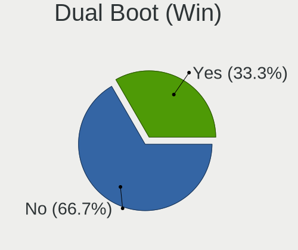

| Dual boot | Notebooks | Percent |
|-----------|-----------|---------|
| No        | 30        | 69.77%  |
| Yes       | 13        | 30.23%  |

Board
-----

Vendor
------

Motherboard manufacturer

| Name                | Notebooks | Percent |
|---------------------|-----------|---------|
| Lenovo              | 7         | 16.28%  |
| Hewlett-Packard     | 7         | 16.28%  |
| Dell                | 6         | 13.95%  |
| ASUSTek Computer    | 4         | 9.3%    |
| Acer                | 4         | 9.3%    |
| MSI                 | 3         | 6.98%   |
| Apple               | 3         | 6.98%   |
| Toshiba             | 2         | 4.65%   |
| Samsung Electronics | 1         | 2.33%   |
| Razer               | 1         | 2.33%   |
| Metabox             | 1         | 2.33%   |
| Jumper              | 1         | 2.33%   |
| HUAWEI              | 1         | 2.33%   |
| Chuwi               | 1         | 2.33%   |
| Alienware           | 1         | 2.33%   |

Model
-----

Motherboard model

| Name                                               | Notebooks | Percent |
|----------------------------------------------------|-----------|---------|
| MSI Modern 15 A5M                                  | 3         | 6.98%   |
| HP Notebook                                        | 2         | 4.65%   |
| Toshiba Satellite Click 2 L35W-B                   | 1         | 2.33%   |
| Toshiba Satellite C75D-B                           | 1         | 2.33%   |
| Samsung 550P5C/550P7C                              | 1         | 2.33%   |
| Razer Blade 15 Base Model (Early 2020) - RZ09-0328 | 1         | 2.33%   |
| Metabox Edge-Pro NS50MU                            | 1         | 2.33%   |
| Lenovo V330-15IKB 81AX                             | 1         | 2.33%   |
| Lenovo ThinkPad X1 Extreme Gen 3 20TK001GUS        | 1         | 2.33%   |
| Lenovo ThinkPad T480 20L6SCYP00                    | 1         | 2.33%   |
| Lenovo ThinkPad E14 20RA0016GE                     | 1         | 2.33%   |
| Lenovo IdeaPad Y580                                | 1         | 2.33%   |
| Lenovo IdeaPad L340-17API 81LY                     | 1         | 2.33%   |
| Lenovo B50-80 80EW                                 | 1         | 2.33%   |
| Jumper EZbook                                      | 1         | 2.33%   |
| HUAWEI HVY-WXX9                                    | 1         | 2.33%   |
| HP ProBook 4535s                                   | 1         | 2.33%   |
| HP Pavilion g7                                     | 1         | 2.33%   |
| HP Laptop 15q-dy0xxx                               | 1         | 2.33%   |
| HP EliteBook 8470p                                 | 1         | 2.33%   |
| HP EliteBook 840 G3                                | 1         | 2.33%   |
| Dell Latitude XT2                                  | 1         | 2.33%   |
| Dell Latitude E7450                                | 1         | 2.33%   |
| Dell Latitude E6410                                | 1         | 2.33%   |
| Dell Latitude 7480                                 | 1         | 2.33%   |
| Dell Inspiron N5110                                | 1         | 2.33%   |
| Dell Inspiron 5570                                 | 1         | 2.33%   |
| Chuwi GemiBook                                     | 1         | 2.33%   |
| ASUS X75VC                                         | 1         | 2.33%   |
| ASUS X540SAA                                       | 1         | 2.33%   |
| ASUS VivoBook 15_ASUS Laptop X540UAR               | 1         | 2.33%   |
| ASUS ROG Strix G733ZX_G733ZX                       | 1         | 2.33%   |
| Apple MacBookPro15,1                               | 1         | 2.33%   |
| Apple MacBookAir3,1                                | 1         | 2.33%   |
| Apple MacBook7,1                                   | 1         | 2.33%   |
| Alienware M14xR1                                   | 1         | 2.33%   |
| Acer TravelMate 5720                               | 1         | 2.33%   |
| Acer Nitro AN517-41                                | 1         | 2.33%   |
| Acer Nitro AN515-54                                | 1         | 2.33%   |
| Acer Aspire A315-21                                | 1         | 2.33%   |

Model Family
------------

Motherboard model prefix

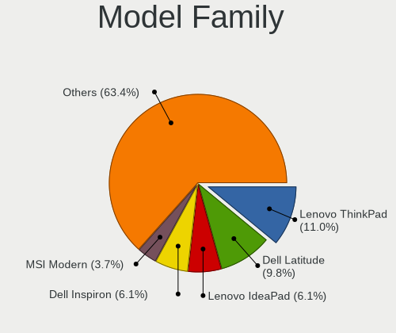

| Name               | Notebooks | Percent |
|--------------------|-----------|---------|
| Dell Latitude      | 4         | 9.3%    |
| MSI Modern         | 3         | 6.98%   |
| Lenovo ThinkPad    | 3         | 6.98%   |
| Toshiba Satellite  | 2         | 4.65%   |
| Lenovo IdeaPad     | 2         | 4.65%   |
| HP Notebook        | 2         | 4.65%   |
| HP EliteBook       | 2         | 4.65%   |
| Dell Inspiron      | 2         | 4.65%   |
| Acer Nitro         | 2         | 4.65%   |
| Samsung 550P5C     | 1         | 2.33%   |
| Razer Blade        | 1         | 2.33%   |
| Metabox Edge-Pro   | 1         | 2.33%   |
| Lenovo V330-15IKB  | 1         | 2.33%   |
| Lenovo B50-80      | 1         | 2.33%   |
| Jumper EZbook      | 1         | 2.33%   |
| HUAWEI HVY-WXX9    | 1         | 2.33%   |
| HP ProBook         | 1         | 2.33%   |
| HP Pavilion        | 1         | 2.33%   |
| HP Laptop          | 1         | 2.33%   |
| Chuwi GemiBook     | 1         | 2.33%   |
| ASUS X75VC         | 1         | 2.33%   |
| ASUS X540SAA       | 1         | 2.33%   |
| ASUS VivoBook      | 1         | 2.33%   |
| ASUS ROG           | 1         | 2.33%   |
| Apple MacBookPro15 | 1         | 2.33%   |
| Apple MacBookAir3  | 1         | 2.33%   |
| Apple MacBook7     | 1         | 2.33%   |
| Alienware M14xR1   | 1         | 2.33%   |
| Acer TravelMate    | 1         | 2.33%   |
| Acer Aspire        | 1         | 2.33%   |

MFG Year
--------

Motherboard manufacture year

| Year | Notebooks | Percent |
|------|-----------|---------|
| 2021 | 6         | 13.95%  |
| 2011 | 5         | 11.63%  |
| 2020 | 4         | 9.3%    |
| 2017 | 4         | 9.3%    |
| 2016 | 4         | 9.3%    |
| 2019 | 3         | 6.98%   |
| 2018 | 3         | 6.98%   |
| 2014 | 3         | 6.98%   |
| 2012 | 3         | 6.98%   |
| 2010 | 3         | 6.98%   |
| 2022 | 1         | 2.33%   |
| 2015 | 1         | 2.33%   |
| 2013 | 1         | 2.33%   |
| 2009 | 1         | 2.33%   |
| 2007 | 1         | 2.33%   |

Form Factor
-----------

Physical design of the computer

| Name     | Notebooks | Percent |
|----------|-----------|---------|
| Notebook | 43        | 100%    |

Secure Boot
-----------

Enabled or disabled

| State    | Notebooks | Percent |
|----------|-----------|---------|
| Disabled | 43        | 100%    |

Coreboot
--------

Have coreboot on board

| Used | Notebooks | Percent |
|------|-----------|---------|
| No   | 43        | 100%    |

RAM Size
--------

Total RAM memory

| Size in GB  | Notebooks | Percent |
|-------------|-----------|---------|
| 4.01-8.0    | 12        | 27.91%  |
| 8.01-16.0   | 8         | 18.6%   |
| 32.01-64.0  | 7         | 16.28%  |
| 3.01-4.0    | 7         | 16.28%  |
| 16.01-24.0  | 5         | 11.63%  |
| 64.01-256.0 | 3         | 6.98%   |
| 1.01-2.0    | 1         | 2.33%   |

RAM Used
--------

Used RAM memory

| Used GB   | Notebooks | Percent |
|-----------|-----------|---------|
| 2.01-3.0  | 17        | 39.53%  |
| 1.01-2.0  | 12        | 27.91%  |
| 4.01-8.0  | 7         | 16.28%  |
| 3.01-4.0  | 4         | 9.3%    |
| 8.01-16.0 | 2         | 4.65%   |
| 0.51-1.0  | 1         | 2.33%   |

Total Drives
------------

Number of drives on board

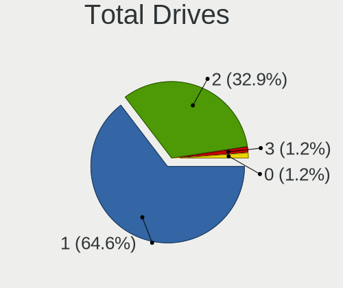

| Drives | Notebooks | Percent |
|--------|-----------|---------|
| 1      | 28        | 65.12%  |
| 2      | 14        | 32.56%  |
| 3      | 1         | 2.33%   |

Has CD-ROM
----------

Has CD-ROM on board

| Presented | Notebooks | Percent |
|-----------|-----------|---------|
| No        | 27        | 62.79%  |
| Yes       | 16        | 37.21%  |

Has Ethernet
------------

Has Ethernet on board

| Presented | Notebooks | Percent |
|-----------|-----------|---------|
| Yes       | 35        | 81.4%   |
| No        | 8         | 18.6%   |

Has WiFi
--------

Has WiFi module

| Presented | Notebooks | Percent |
|-----------|-----------|---------|
| Yes       | 43        | 100%    |

Has Bluetooth
-------------

Has Bluetooth module

| Presented | Notebooks | Percent |
|-----------|-----------|---------|
| Yes       | 37        | 86.05%  |
| No        | 6         | 13.95%  |

Location
--------

Country
-------

Geographic location (country)

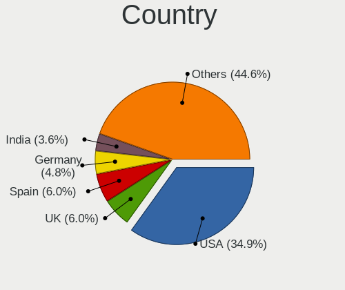

| Country      | Notebooks | Percent |
|--------------|-----------|---------|
| USA          | 16        | 36.36%  |
| UK           | 4         | 9.09%   |
| Germany      | 4         | 9.09%   |
| Spain        | 2         | 4.55%   |
| Mexico       | 2         | 4.55%   |
| India        | 2         | 4.55%   |
| Denmark      | 2         | 4.55%   |
| South Africa | 1         | 2.27%   |
| Russia       | 1         | 2.27%   |
| Peru         | 1         | 2.27%   |
| Netherlands  | 1         | 2.27%   |
| Morocco      | 1         | 2.27%   |
| Georgia      | 1         | 2.27%   |
| France       | 1         | 2.27%   |
| Czechia      | 1         | 2.27%   |
| Canada       | 1         | 2.27%   |
| Austria      | 1         | 2.27%   |
| Australia    | 1         | 2.27%   |
| Algeria      | 1         | 2.27%   |

City
----

Geographic location (city)

| City                 | Notebooks | Percent |
|----------------------|-----------|---------|
| Seattle              | 2         | 4.55%   |
| Camden               | 2         | 4.55%   |
| Vienna               | 1         | 2.27%   |
| Ts'khinvali          | 1         | 2.27%   |
| Tangier              | 1         | 2.27%   |
| St Petersburg        | 1         | 2.27%   |
| Spotsylvania         | 1         | 2.27%   |
| South Hamilton       | 1         | 2.27%   |
| Skive                | 1         | 2.27%   |
| Saint Clair          | 1         | 2.27%   |
| Ruskin               | 1         | 2.27%   |
| Pretoria             | 1         | 2.27%   |
| Prague               | 1         | 2.27%   |
| Phoenix              | 1         | 2.27%   |
| Orofino              | 1         | 2.27%   |
| Mt. Pleasant         | 1         | 2.27%   |
| Mostoles             | 1         | 2.27%   |
| Melbourne            | 1         | 2.27%   |
| Mazatlán          | 1         | 2.27%   |
| Mangalagiri          | 1         | 2.27%   |
| Los Angeles          | 1         | 2.27%   |
| Leduc                | 1         | 2.27%   |
| La Magdalena         | 1         | 2.27%   |
| Islington            | 1         | 2.27%   |
| Houston              | 1         | 2.27%   |
| Herne                | 1         | 2.27%   |
| Haßfurt             | 1         | 2.27%   |
| Eugene               | 1         | 2.27%   |
| Dresden              | 1         | 2.27%   |
| Dillon               | 1         | 2.27%   |
| Dickson              | 1         | 2.27%   |
| Copenhagen           | 1         | 2.27%   |
| City of Saint Peters | 1         | 2.27%   |
| Cannes               | 1         | 2.27%   |
| Bristol              | 1         | 2.27%   |
| Birmingham           | 1         | 2.27%   |
| Berlin               | 1         | 2.27%   |
| Bengaluru            | 1         | 2.27%   |
| Arequipa             | 1         | 2.27%   |
| Amsterdam            | 1         | 2.27%   |
| Algiers              | 1         | 2.27%   |
| Alcalá de Henares | 1         | 2.27%   |

Drives
------

Drive Vendor
------------

Hard drive vendors

| Vendor              | Notebooks | Drives | Percent |
|---------------------|-----------|--------|---------|
| Toshiba             | 8         | 8      | 14.81%  |
| Samsung Electronics | 7         | 8      | 12.96%  |
| Kingston            | 7         | 7      | 12.96%  |
| Seagate             | 4         | 4      | 7.41%   |
| WDC                 | 3         | 4      | 5.56%   |
| Sandisk             | 3         | 4      | 5.56%   |
| Hitachi             | 3         | 4      | 5.56%   |
| Unknown             | 2         | 3      | 3.7%    |
| Crucial             | 2         | 2      | 3.7%    |
| China               | 2         | 2      | 3.7%    |
| Apple               | 2         | 2      | 3.7%    |
| YMTC                | 1         | 1      | 1.85%   |
| Team                | 1         | 1      | 1.85%   |
| PNY                 | 1         | 1      | 1.85%   |
| Phison              | 1         | 1      | 1.85%   |
| Netac               | 1         | 1      | 1.85%   |
| KingSpec            | 1         | 1      | 1.85%   |
| Intenso             | 1         | 2      | 1.85%   |
| HUAWEI              | 1         | 1      | 1.85%   |
| HGST                | 1         | 1      | 1.85%   |
| BHT                 | 1         | 1      | 1.85%   |
| ASMedia             | 1         | 1      | 1.85%   |

Drive Model
-----------

Hard drive models

| Model                                        | Notebooks | Percent |
|----------------------------------------------|-----------|---------|
| Toshiba MQ04ABF100 1TB                       | 3         | 5.17%   |
| Kingston NVMe SSD Drive 512GB                | 3         | 5.17%   |
| Toshiba MQ01ABD075 752GB                     | 2         | 3.45%   |
| Kingston SV300S37A120G 120GB SSD             | 2         | 3.45%   |
| YMTC PC005 512GB                             | 1         | 1.72%   |
| WDC WDS500G2B0A-00SM50 500GB SSD             | 1         | 1.72%   |
| WDC WDS240G2G0B-00EPW0 240GB SSD             | 1         | 1.72%   |
| WDC WD6400BPVT-75HXZT1 640GB                 | 1         | 1.72%   |
| WDC WD10SPZX-24Z10 1TB                       | 1         | 1.72%   |
| Unknown SD  128GB                            | 1         | 1.72%   |
| Unknown MMC Card  32GB                       | 1         | 1.72%   |
| Unknown ISOCOM  64GB                         | 1         | 1.72%   |
| Toshiba MQ01ACF050 500GB                     | 1         | 1.72%   |
| Toshiba MK2555GSXF 250GB                     | 1         | 1.72%   |
| Toshiba MK2533GSGF 250GB                     | 1         | 1.72%   |
| Team TM8PS7512G 512GB SSD                    | 1         | 1.72%   |
| Seagate ST9250315AS 250GB                    | 1         | 1.72%   |
| Seagate ST500LT012-9WS142 500GB              | 1         | 1.72%   |
| Seagate ST2000LM003 HN-M201RAD 2TB           | 1         | 1.72%   |
| Seagate ST1000LM035-1RK172 1TB               | 1         | 1.72%   |
| SanDisk SDSSDH3 2T00 2TB                     | 1         | 1.72%   |
| Sandisk NVMe SSD Drive 256GB                 | 1         | 1.72%   |
| Sandisk NVMe SSD Drive 1TB                   | 1         | 1.72%   |
| Sandisk NVMe SSD Drive 1024GB                | 1         | 1.72%   |
| Samsung SSD 980 1TB                          | 1         | 1.72%   |
| Samsung NVMe SSD Drive 1024GB                | 1         | 1.72%   |
| Samsung MZVLB512HAJQ-00000 512GB             | 1         | 1.72%   |
| Samsung MZVLB1T0HBLR-000L7 1TB               | 1         | 1.72%   |
| Samsung MZVL22T0HBLB-00B00 2TB               | 1         | 1.72%   |
| Samsung MZNLN256HMHQ-000H1 256GB SSD         | 1         | 1.72%   |
| Samsung MZMPC032HBCD-000L1 32GB SSD          | 1         | 1.72%   |
| Samsung MZ7LN256HAJQ-000L2 256GB SSD         | 1         | 1.72%   |
| PNY CS900 240GB SSD                          | 1         | 1.72%   |
| Phison Metabox Performance 2TB PCIe NVME SSD | 1         | 1.72%   |
| Netac S535N8/256 256GB SSD                   | 1         | 1.72%   |
| Kingston SKC600512G 512GB SSD                | 1         | 1.72%   |
| Kingston SA2000M81000G 1TB                   | 1         | 1.72%   |
| KingSpec NT-1TB SSD                          | 1         | 1.72%   |
| Intenso SSD SATAIII 512GB                    | 1         | 1.72%   |
| HUAWEI SD Storage 2GB                        | 1         | 1.72%   |
| Hitachi HTS725050A7E630 500GB                | 1         | 1.72%   |
| Hitachi HTS542525K9SA00 250GB                | 1         | 1.72%   |
| Hitachi HTS542520K9SA00 200GB                | 1         | 1.72%   |
| HGST HTS541010A9E680 1TB                     | 1         | 1.72%   |
| Crucial CT500MX500SSD4 500GB                 | 1         | 1.72%   |
| Crucial CT250MX500SSD1 250GB                 | 1         | 1.72%   |
| China SSD 240GB                              | 1         | 1.72%   |
| China SATA SSD 240GB                         | 1         | 1.72%   |
| BHT WR202HH032G E70290F5 32GB SSD            | 1         | 1.72%   |
| ASMedia USB 3.0 Device 2TB                   | 1         | 1.72%   |
| Apple SSD TS064C 64GB                        | 1         | 1.72%   |
| Apple SSD AP0512M 500GB                      | 1         | 1.72%   |

HDD Vendor
----------

Hard disk drive vendors

| Vendor  | Notebooks | Drives | Percent |
|---------|-----------|--------|---------|
| Toshiba | 8         | 8      | 42.11%  |
| Seagate | 4         | 4      | 21.05%  |
| Hitachi | 3         | 4      | 15.79%  |
| WDC     | 2         | 2      | 10.53%  |
| HGST    | 1         | 1      | 5.26%   |
| ASMedia | 1         | 1      | 5.26%   |

SSD Vendor
----------

Solid state drive vendors

| Vendor              | Notebooks | Drives | Percent |
|---------------------|-----------|--------|---------|
| Samsung Electronics | 3         | 3      | 15%     |
| Kingston            | 3         | 3      | 15%     |
| WDC                 | 2         | 2      | 10%     |
| Crucial             | 2         | 2      | 10%     |
| China               | 2         | 2      | 10%     |
| Team                | 1         | 1      | 5%      |
| SanDisk             | 1         | 1      | 5%      |
| PNY                 | 1         | 1      | 5%      |
| Netac               | 1         | 1      | 5%      |
| KingSpec            | 1         | 1      | 5%      |
| Intenso             | 1         | 2      | 5%      |
| BHT                 | 1         | 1      | 5%      |
| Apple               | 1         | 1      | 5%      |

Drive Kind
----------

HDD or SSD

| Kind    | Notebooks | Drives | Percent |
|---------|-----------|--------|---------|
| SSD     | 19        | 21     | 36.54%  |
| HDD     | 18        | 20     | 34.62%  |
| NVMe    | 12        | 15     | 23.08%  |
| MMC     | 2         | 3      | 3.85%   |
| Unknown | 1         | 1      | 1.92%   |

Drive Connector
---------------

SATA, SAS, NVMe, etc.

| Type | Notebooks | Drives | Percent |
|------|-----------|--------|---------|
| SATA | 32        | 40     | 66.67%  |
| NVMe | 12        | 15     | 25%     |
| SAS  | 2         | 2      | 4.17%   |
| MMC  | 2         | 3      | 4.17%   |

Drive Size
----------

Size of hard drive

| Size in TB | Notebooks | Drives | Percent |
|------------|-----------|--------|---------|
| 0.01-0.5   | 21        | 24     | 56.76%  |
| 0.51-1.0   | 13        | 14     | 35.14%  |
| 1.01-2.0   | 3         | 3      | 8.11%   |

Space Total
-----------

Amount of disk space available on the file system

| Size in GB | Notebooks | Percent |
|------------|-----------|---------|
| 101-250    | 13        | 30.23%  |
| 1001-2000  | 8         | 18.6%   |
| 501-1000   | 8         | 18.6%   |
| Unknown    | 5         | 11.63%  |
| 251-500    | 4         | 9.3%    |
| 2001-3000  | 2         | 4.65%   |
| 21-50      | 1         | 2.33%   |
| 1-20       | 1         | 2.33%   |
| 51-100     | 1         | 2.33%   |

Space Used
----------

Amount of used disk space

| Used GB  | Notebooks | Percent |
|----------|-----------|---------|
| 21-50    | 15        | 34.88%  |
| 51-100   | 7         | 16.28%  |
| 1-20     | 6         | 13.95%  |
| Unknown  | 5         | 11.63%  |
| 251-500  | 4         | 9.3%    |
| 101-250  | 4         | 9.3%    |
| 501-1000 | 2         | 4.65%   |

Malfunc. Drives
---------------

Drive models with a malfunction

| Model                          | Notebooks | Drives | Percent |
|--------------------------------|-----------|--------|---------|
| Seagate ST1000LM035-1RK172 1TB | 1         | 1      | 100%    |

Malfunc. Drive Vendor
---------------------

Vendors of faulty drives

| Vendor  | Notebooks | Drives | Percent |
|---------|-----------|--------|---------|
| Seagate | 1         | 1      | 100%    |

Malfunc. HDD Vendor
-------------------

Vendors of faulty HDD drives

| Vendor  | Notebooks | Drives | Percent |
|---------|-----------|--------|---------|
| Seagate | 1         | 1      | 100%    |

Malfunc. Drive Kind
-------------------

Kinds of faulty drives

| Kind | Notebooks | Drives | Percent |
|------|-----------|--------|---------|
| HDD  | 1         | 1      | 100%    |

Failed Drives
-------------

Failed drive models

Zero info for selected period =(

Failed Drive Vendor
-------------------

Failed drive vendors

Zero info for selected period =(

Drive Status
------------

Number of failed and malfunc. drives

| Status   | Notebooks | Drives | Percent |
|----------|-----------|--------|---------|
| Detected | 24        | 33     | 52.17%  |
| Works    | 21        | 26     | 45.65%  |
| Malfunc  | 1         | 1      | 2.17%   |

Storage controller
------------------

Storage Vendor
--------------

Storage controller vendors

| Vendor                      | Notebooks | Percent |
|-----------------------------|-----------|---------|
| Intel                       | 26        | 54.17%  |
| AMD                         | 7         | 14.58%  |
| Samsung Electronics         | 4         | 8.33%   |
| Kingston Technology Company | 4         | 8.33%   |
| Sandisk                     | 2         | 4.17%   |
| Nvidia                      | 2         | 4.17%   |
| Yangtze Memory Technologies | 1         | 2.08%   |
| Phison Electronics          | 1         | 2.08%   |
| Apple                       | 1         | 2.08%   |

Storage Model
-------------

Storage controller models

| Model                                                                            | Notebooks | Percent |
|----------------------------------------------------------------------------------|-----------|---------|
| AMD FCH SATA Controller [AHCI mode]                                              | 7         | 12.73%  |
| Intel 82801 Mobile SATA Controller [RAID mode]                                   | 6         | 10.91%  |
| Intel Sunrise Point-LP SATA Controller [AHCI mode]                               | 4         | 7.27%   |
| Samsung NVMe SSD Controller SM981/PM981/PM983                                    | 3         | 5.45%   |
| Kingston Company Company Non-Volatile memory controller                          | 3         | 5.45%   |
| Intel 7 Series Chipset Family 4-port SATA Controller [IDE mode]                  | 3         | 5.45%   |
| Intel 7 Series Chipset Family 2-port SATA Controller [IDE mode]                  | 3         | 5.45%   |
| Intel 6 Series/C200 Series Chipset Family 6 port Mobile SATA AHCI Controller     | 3         | 5.45%   |
| Sandisk WD Blue SN550 NVMe SSD                                                   | 2         | 3.64%   |
| Yangtze Memory Non-Volatile memory controller                                    | 1         | 1.82%   |
| Sandisk PC SN520 NVMe SSD                                                        | 1         | 1.82%   |
| Samsung NVMe SSD Controller PM9A1/PM9A3/980PRO                                   | 1         | 1.82%   |
| Samsung NVMe SSD Controller 980                                                  | 1         | 1.82%   |
| Phison E12 NVMe Controller                                                       | 1         | 1.82%   |
| Nvidia MCP89 SATA Controller (AHCI mode)                                         | 1         | 1.82%   |
| Nvidia MCP89 SATA Controller                                                     | 1         | 1.82%   |
| Kingston Company A2000 NVMe SSD                                                  | 1         | 1.82%   |
| Intel Wildcat Point-LP SATA Controller [AHCI Mode]                               | 1         | 1.82%   |
| Intel Volume Management Device NVMe RAID Controller                              | 1         | 1.82%   |
| Intel Mobile 4 Series Chipset PT IDER Controller                                 | 1         | 1.82%   |
| Intel Comet Lake SATA AHCI Controller                                            | 1         | 1.82%   |
| Intel Comet Lake PCH-H RAID                                                      | 1         | 1.82%   |
| Intel Celeron/Pentium Silver Processor SATA Controller                           | 1         | 1.82%   |
| Intel Celeron N3350/Pentium N4200/Atom E3900 Series SATA AHCI Controller         | 1         | 1.82%   |
| Intel Atom/Celeron/Pentium Processor x5-E8000/J3xxx/N3xxx Series SATA Controller | 1         | 1.82%   |
| Intel Atom Processor E3800 Series SATA AHCI Controller                           | 1         | 1.82%   |
| Intel 82801HM/HEM (ICH8M/ICH8M-E) SATA Controller [AHCI mode]                    | 1         | 1.82%   |
| Intel 82801HM/HEM (ICH8M/ICH8M-E) IDE Controller                                 | 1         | 1.82%   |
| Intel 7 Series Chipset Family 6-port SATA Controller [AHCI mode]                 | 1         | 1.82%   |
| Apple ANS2 NVMe Controller                                                       | 1         | 1.82%   |

Storage Kind
------------

Kind of storage controller (IDE, SATA, NVMe, SAS, ...)

| Kind | Notebooks | Percent |
|------|-----------|---------|
| SATA | 23        | 46.94%  |
| NVMe | 12        | 24.49%  |
| RAID | 8         | 16.33%  |
| IDE  | 6         | 12.24%  |

Processor
---------

CPU Vendor
----------

Processor vendors

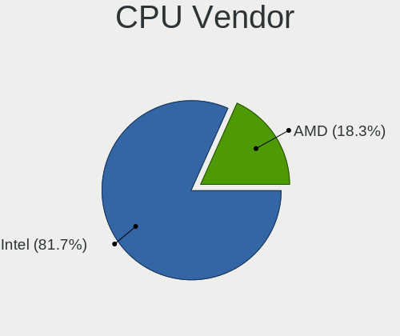

| Vendor | Notebooks | Percent |
|--------|-----------|---------|
| Intel  | 32        | 74.42%  |
| AMD    | 11        | 25.58%  |

CPU Model
---------

Processor models

| Model                                         | Notebooks | Percent |
|-----------------------------------------------|-----------|---------|
| AMD Ryzen 7 5700U with Radeon Graphics        | 3         | 6.98%   |
| Intel Core i5-2430M CPU @ 2.40GHz             | 2         | 4.65%   |
| Intel Pentium CPU N3530 @ 2.16GHz             | 1         | 2.33%   |
| Intel Core i7-8850H CPU @ 2.60GHz             | 1         | 2.33%   |
| Intel Core i7-8650U CPU @ 1.90GHz             | 1         | 2.33%   |
| Intel Core i7-8550U CPU @ 1.80GHz             | 1         | 2.33%   |
| Intel Core i7-6600U CPU @ 2.60GHz             | 1         | 2.33%   |
| Intel Core i7-5600U CPU @ 2.60GHz             | 1         | 2.33%   |
| Intel Core i7-3630QM CPU @ 2.40GHz            | 1         | 2.33%   |
| Intel Core i7-3610QM CPU @ 2.30GHz            | 1         | 2.33%   |
| Intel Core i7-3520M CPU @ 2.90GHz             | 1         | 2.33%   |
| Intel Core i7-10850H CPU @ 2.70GHz            | 1         | 2.33%   |
| Intel Core i7-10750H CPU @ 2.60GHz            | 1         | 2.33%   |
| Intel Core i5-9300H CPU @ 2.40GHz             | 1         | 2.33%   |
| Intel Core i5-8250U CPU @ 1.60GHz             | 1         | 2.33%   |
| Intel Core i5-7300U CPU @ 2.60GHz             | 1         | 2.33%   |
| Intel Core i5-7200U CPU @ 2.50GHz             | 1         | 2.33%   |
| Intel Core i5-3230M CPU @ 2.60GHz             | 1         | 2.33%   |
| Intel Core i5-2410M CPU @ 2.30GHz             | 1         | 2.33%   |
| Intel Core i5-10210U CPU @ 1.60GHz            | 1         | 2.33%   |
| Intel Core i5 CPU M 520 @ 2.40GHz             | 1         | 2.33%   |
| Intel Core i3-7100U CPU @ 2.40GHz             | 1         | 2.33%   |
| Intel Core i3-5005U CPU @ 2.00GHz             | 1         | 2.33%   |
| Intel Core 2 Duo CPU U9600 @ 1.60GHz          | 1         | 2.33%   |
| Intel Core 2 Duo CPU U9400 @ 1.40GHz          | 1         | 2.33%   |
| Intel Core 2 Duo CPU T8100 @ 2.10GHz          | 1         | 2.33%   |
| Intel Core 2 Duo CPU P8600 @ 2.40GHz          | 1         | 2.33%   |
| Intel Celeron J4125 CPU @ 2.00GHz             | 1         | 2.33%   |
| Intel Celeron CPU N3350 @ 1.10GHz             | 1         | 2.33%   |
| Intel Celeron CPU N3060 @ 1.60GHz             | 1         | 2.33%   |
| Intel 12th Gen Core i9-12900H                 | 1         | 2.33%   |
| Intel 11th Gen Core i7-1165G7 @ 2.80GHz       | 1         | 2.33%   |
| AMD Ryzen 7 5800H with Radeon Graphics        | 1         | 2.33%   |
| AMD Ryzen 7 3700U with Radeon Vega Mobile Gfx | 1         | 2.33%   |
| AMD Ryzen 5 4600H with Radeon Graphics        | 1         | 2.33%   |
| AMD E2-7110 APU with AMD Radeon R2 Graphics   | 1         | 2.33%   |
| AMD A9-9425 RADEON R5, 5 COMPUTE CORES 2C+3G  | 1         | 2.33%   |
| AMD A6-6310 APU with AMD Radeon R4 Graphics   | 1         | 2.33%   |
| AMD A6-3420M APU with Radeon HD Graphics      | 1         | 2.33%   |
| AMD A4-9125 RADEON R3, 4 COMPUTE CORES 2C+2G  | 1         | 2.33%   |

CPU Model Family
----------------

Processor model prefix

| Model            | Notebooks | Percent |
|------------------|-----------|---------|
| Intel Core i7    | 10        | 23.26%  |
| Intel Core i5    | 10        | 23.26%  |
| AMD Ryzen 7      | 5         | 11.63%  |
| Intel Core 2 Duo | 4         | 9.3%    |
| Other            | 3         | 6.98%   |
| Intel Celeron    | 3         | 6.98%   |
| Intel Core i3    | 2         | 4.65%   |
| AMD A6           | 2         | 4.65%   |
| Intel Pentium    | 1         | 2.33%   |
| AMD Ryzen 5      | 1         | 2.33%   |
| AMD E2           | 1         | 2.33%   |
| AMD A4           | 1         | 2.33%   |

CPU Cores
---------

Number of processor cores

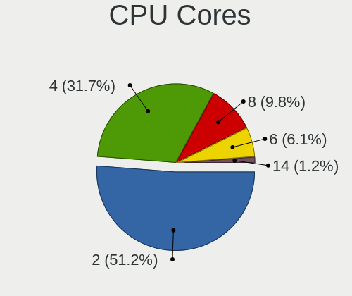

| Number | Notebooks | Percent |
|--------|-----------|---------|
| 2      | 20        | 46.51%  |
| 4      | 14        | 32.56%  |
| 8      | 4         | 9.3%    |
| 6      | 4         | 9.3%    |
| 14     | 1         | 2.33%   |

CPU Sockets
-----------

Number of sockets

| Number | Notebooks | Percent |
|--------|-----------|---------|
| 1      | 43        | 100%    |

CPU Threads
-----------

Threads per core (Hyper-Threading)

| Number | Notebooks | Percent |
|--------|-----------|---------|
| 2      | 29        | 67.44%  |
| 1      | 14        | 32.56%  |

CPU Op-Modes
------------

CPU Operation Modes (32-bit, 64-bit)

| Op mode        | Notebooks | Percent |
|----------------|-----------|---------|
| 32-bit, 64-bit | 43        | 100%    |

CPU Microcode
-------------

Microcode number

| Number     | Notebooks | Percent |
|------------|-----------|---------|
| Unknown    | 22        | 51.16%  |
| 0x806e9    | 3         | 6.98%   |
| 0xa0652    | 2         | 4.65%   |
| 0x306a9    | 2         | 4.65%   |
| 0x1067a    | 2         | 4.65%   |
| 0x07030105 | 2         | 4.65%   |
| 0x906ed    | 1         | 2.33%   |
| 0x906ea    | 1         | 2.33%   |
| 0x906a3    | 1         | 2.33%   |
| 0x806ea    | 1         | 2.33%   |
| 0x706a8    | 1         | 2.33%   |
| 0x506c9    | 1         | 2.33%   |
| 0x406e3    | 1         | 2.33%   |
| 0x206a7    | 1         | 2.33%   |
| 0x08600106 | 1         | 2.33%   |
| 0x03000027 | 1         | 2.33%   |

CPU Microarch
-------------

Microarchitecture

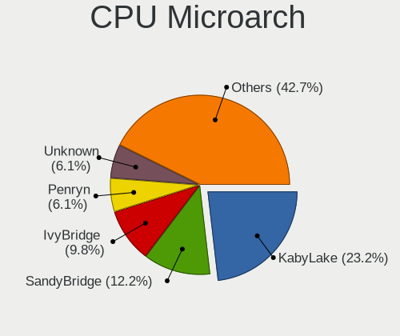

| Name             | Notebooks | Percent |
|------------------|-----------|---------|
| KabyLake         | 9         | 20.93%  |
| Penryn           | 4         | 9.3%    |
| IvyBridge        | 4         | 9.3%    |
| SandyBridge      | 3         | 6.98%   |
| Unknown          | 3         | 6.98%   |
| Silvermont       | 2         | 4.65%   |
| Puma             | 2         | 4.65%   |
| Excavator        | 2         | 4.65%   |
| CometLake        | 2         | 4.65%   |
| Broadwell        | 2         | 4.65%   |
| Zen+             | 1         | 2.33%   |
| Zen 3            | 1         | 2.33%   |
| Zen 2            | 1         | 2.33%   |
| Westmere         | 1         | 2.33%   |
| TigerLake        | 1         | 2.33%   |
| Skylake          | 1         | 2.33%   |
| K10 Llano        | 1         | 2.33%   |
| Goldmont plus    | 1         | 2.33%   |
| Goldmont         | 1         | 2.33%   |
| Alderlake Hybrid | 1         | 2.33%   |

Graphics
--------

GPU Vendor
----------

Vendors of graphics cards

| Vendor | Notebooks | Percent |
|--------|-----------|---------|
| Intel  | 28        | 50.91%  |
| AMD    | 16        | 29.09%  |
| Nvidia | 11        | 20%     |

GPU Model
---------

Graphics card models

| Model                                                                                    | Notebooks | Percent |
|------------------------------------------------------------------------------------------|-----------|---------|
| Intel UHD Graphics 620                                                                   | 3         | 5.26%   |
| Intel HD Graphics 620                                                                    | 3         | 5.26%   |
| Intel 3rd Gen Core processor Graphics Controller                                         | 3         | 5.26%   |
| Intel 2nd Generation Core Processor Family Integrated Graphics Controller                | 3         | 5.26%   |
| AMD Lucienne                                                                             | 3         | 5.26%   |
| Nvidia MCP89 [GeForce 320M]                                                              | 2         | 3.51%   |
| Intel HD Graphics 5500                                                                   | 2         | 3.51%   |
| Intel CometLake-H GT2 [UHD Graphics]                                                     | 2         | 3.51%   |
| AMD Stoney [Radeon R2/R3/R4/R5 Graphics]                                                 | 2         | 3.51%   |
| AMD Seymour [Radeon HD 6400M/7400M Series]                                               | 2         | 3.51%   |
| Nvidia TU117M [GeForce GTX 1650 Ti Mobile]                                               | 1         | 1.75%   |
| Nvidia TU117M [GeForce GTX 1650 Mobile / Max-Q]                                          | 1         | 1.75%   |
| Nvidia TU106M [GeForce RTX 2060 Mobile]                                                  | 1         | 1.75%   |
| Nvidia GK107M [GeForce GTX 660M]                                                         | 1         | 1.75%   |
| Nvidia GK107M [GeForce GT 650M]                                                          | 1         | 1.75%   |
| Nvidia GF117M [GeForce 610M/710M/810M/820M / GT 620M/625M/630M/720M]                     | 1         | 1.75%   |
| Nvidia GF116M [GeForce GT 555M/635M]                                                     | 1         | 1.75%   |
| Nvidia GA104M [GeForce RTX 3070 Mobile / Max-Q]                                          | 1         | 1.75%   |
| Nvidia GA103M [GeForce RTX 3080 Ti Mobile]                                               | 1         | 1.75%   |
| Intel TigerLake-LP GT2 [Iris Xe Graphics]                                                | 1         | 1.75%   |
| Intel Skylake GT2 [HD Graphics 520]                                                      | 1         | 1.75%   |
| Intel Mobile GM965/GL960 Integrated Graphics Controller (secondary)                      | 1         | 1.75%   |
| Intel Mobile GM965/GL960 Integrated Graphics Controller (primary)                        | 1         | 1.75%   |
| Intel Mobile 4 Series Chipset Integrated Graphics Controller                             | 1         | 1.75%   |
| Intel HD Graphics 500                                                                    | 1         | 1.75%   |
| Intel GeminiLake [UHD Graphics 600]                                                      | 1         | 1.75%   |
| Intel Core Processor Integrated Graphics Controller                                      | 1         | 1.75%   |
| Intel CometLake-U GT2 [UHD Graphics]                                                     | 1         | 1.75%   |
| Intel CoffeeLake-H GT2 [UHD Graphics 630]                                                | 1         | 1.75%   |
| Intel Atom/Celeron/Pentium Processor x5-E8000/J3xxx/N3xxx Integrated Graphics Controller | 1         | 1.75%   |
| Intel Atom Processor Z36xxx/Z37xxx Series Graphics & Display                             | 1         | 1.75%   |
| Intel Alder Lake-P Integrated Graphics Controller                                        | 1         | 1.75%   |
| AMD Topaz XT [Radeon R7 M260/M265 / M340/M360 / M440/M445 / 530/535 / 620/625 Mobile]    | 1         | 1.75%   |
| AMD Thames [Radeon HD 7550M/7570M/7650M]                                                 | 1         | 1.75%   |
| AMD Sun XT [Radeon HD 8670A/8670M/8690M / R5 M330 / M430 / Radeon 520 Mobile]            | 1         | 1.75%   |
| AMD Sumo [Radeon HD 6520G]                                                               | 1         | 1.75%   |
| AMD Renoir                                                                               | 1         | 1.75%   |
| AMD Picasso/Raven 2 [Radeon Vega Series / Radeon Vega Mobile Series]                     | 1         | 1.75%   |
| AMD Mullins [Radeon R4/R5 Graphics]                                                      | 1         | 1.75%   |
| AMD Mullins [Radeon R3 Graphics]                                                         | 1         | 1.75%   |
| AMD Cezanne                                                                              | 1         | 1.75%   |
| AMD Baffin [Radeon RX 460/560D / Pro 450/455/460/555/555X/560/560X]                      | 1         | 1.75%   |

GPU Combo
---------

Combinations of graphics cards

| Name           | Notebooks | Percent |
|----------------|-----------|---------|
| 1 x Intel      | 17        | 39.53%  |
| 1 x AMD        | 11        | 25.58%  |
| Intel + Nvidia | 8         | 18.6%   |
| Intel + AMD    | 3         | 6.98%   |
| 1 x Nvidia     | 2         | 4.65%   |
| 2 x AMD        | 1         | 2.33%   |
| AMD + Nvidia   | 1         | 2.33%   |

GPU Driver
----------

Free vs proprietary

| Driver      | Notebooks | Percent |
|-------------|-----------|---------|
| Free        | 41        | 95.35%  |
| Proprietary | 1         | 2.33%   |
| Unknown     | 1         | 2.33%   |

GPU Memory
----------

Total video memory

| Size in GB | Notebooks | Percent |
|------------|-----------|---------|
| Unknown    | 32        | 74.42%  |
| 1.01-2.0   | 4         | 9.3%    |
| 0.01-0.5   | 4         | 9.3%    |
| 3.01-4.0   | 2         | 4.65%   |
| 0.51-1.0   | 1         | 2.33%   |

Monitor
-------

Monitor Vendor
--------------

Monitor vendors

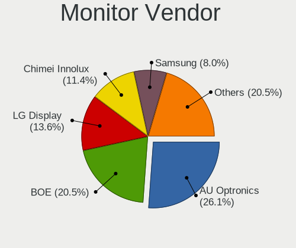

| Vendor                  | Notebooks | Percent |
|-------------------------|-----------|---------|
| AU Optronics            | 11        | 23.4%   |
| BOE                     | 8         | 17.02%  |
| LG Display              | 7         | 14.89%  |
| Chimei Innolux          | 6         | 12.77%  |
| Chi Mei Optoelectronics | 3         | 6.38%   |
| Apple                   | 3         | 6.38%   |
| Samsung Electronics     | 2         | 4.26%   |
| Unknown (AAA)           | 1         | 2.13%   |
| PANDA                   | 1         | 2.13%   |
| ONN                     | 1         | 2.13%   |
| Lenovo                  | 1         | 2.13%   |
| Kogan                   | 1         | 2.13%   |
| Goldstar                | 1         | 2.13%   |
| CSO                     | 1         | 2.13%   |

Monitor Model
-------------

Monitor models

| Model                                                                    | Notebooks | Percent |
|--------------------------------------------------------------------------|-----------|---------|
| AU Optronics LCD Monitor AUO2E8D 1920x1080 344x194mm 15.5-inch           | 3         | 6.38%   |
| Unknown (AAA) LCDTV AAA0042 1360x768 890x500mm 40.2-inch                 | 1         | 2.13%   |
| Samsung Electronics S27E510 SAM0C5F 1920x1080 600x340mm 27.2-inch        | 1         | 2.13%   |
| Samsung Electronics LCD Monitor SDC3652 1366x768 344x194mm 15.5-inch     | 1         | 2.13%   |
| PANDA LCD Monitor NCP004B 1920x1080 344x194mm 15.5-inch                  | 1         | 2.13%   |
| ONN 100002487 ONN0101 1920x1080 517x323mm 24.0-inch                      | 1         | 2.13%   |
| LG Display LCD Monitor LGD0557 1920x1080 309x174mm 14.0-inch             | 1         | 2.13%   |
| LG Display LCD Monitor LGD045A 1366x768 293x165mm 13.2-inch              | 1         | 2.13%   |
| LG Display LCD Monitor LGD0390 1600x900 382x215mm 17.3-inch              | 1         | 2.13%   |
| LG Display LCD Monitor LGD0306 1600x900 310x174mm 14.0-inch              | 1         | 2.13%   |
| LG Display LCD Monitor LGD0292 1366x768 309x174mm 14.0-inch              | 1         | 2.13%   |
| LG Display LCD Monitor LGD0257 1440x900 304x190mm 14.1-inch              | 1         | 2.13%   |
| LG Display LCD Monitor LGD01E9 1920x1080 345x194mm 15.6-inch             | 1         | 2.13%   |
| Lenovo D27-30 LEN66B8 1920x1080 597x336mm 27.0-inch                      | 1         | 2.13%   |
| Kogan KAMN27F7TA KGN0270 1920x1080 600x330mm 27.0-inch                   | 1         | 2.13%   |
| Goldstar TV GSM0002 1920x1080 1150x650mm 52.0-inch                       | 1         | 2.13%   |
| CSO LCD Monitor CSO1500 3840x2160 344x194mm 15.5-inch                    | 1         | 2.13%   |
| Chimei Innolux P130ZFA-BA1 CMN8201 2160x1440 275x183mm 13.0-inch         | 1         | 2.13%   |
| Chimei Innolux LCD Monitor CMN1736 1600x900 382x214mm 17.2-inch          | 1         | 2.13%   |
| Chimei Innolux LCD Monitor CMN15DC 1366x768 344x193mm 15.5-inch          | 1         | 2.13%   |
| Chimei Innolux LCD Monitor CMN15DB 1366x768 344x193mm 15.5-inch          | 1         | 2.13%   |
| Chimei Innolux LCD Monitor CMN14C9 1920x1080 309x173mm 13.9-inch         | 1         | 2.13%   |
| Chimei Innolux LCD Monitor CMN1487 1366x768 309x173mm 13.9-inch          | 1         | 2.13%   |
| Chi Mei Optoelectronics LCD Monitor CMO1719 1600x900 382x215mm 17.3-inch | 1         | 2.13%   |
| Chi Mei Optoelectronics LCD Monitor CMO15A4 1366x768 344x194mm 15.5-inch | 1         | 2.13%   |
| Chi Mei Optoelectronics LCD Monitor CMO15A1 1366x768 344x193mm 15.5-inch | 1         | 2.13%   |
| BOE LCD Monitor BOE0878 1920x1080 355x200mm 16.0-inch                    | 1         | 2.13%   |
| BOE LCD Monitor BOE0818 1920x1080 344x194mm 15.5-inch                    | 1         | 2.13%   |
| BOE LCD Monitor BOE07D8 1920x1080 344x194mm 15.5-inch                    | 1         | 2.13%   |
| BOE LCD Monitor BOE07C9 1920x1080 309x173mm 13.9-inch                    | 1         | 2.13%   |
| BOE LCD Monitor BOE06A5 1366x768 344x194mm 15.5-inch                     | 1         | 2.13%   |
| BOE LCD Monitor BOE0685 1600x900 382x215mm 17.3-inch                     | 1         | 2.13%   |
| BOE LCD Monitor BOE0675 1366x768 344x194mm 15.5-inch                     | 1         | 2.13%   |
| BOE LCD Monitor BOE066E 1366x768 344x194mm 15.5-inch                     | 1         | 2.13%   |
| AU Optronics LCD Monitor AUOA114 1280x800 261x163mm 12.1-inch            | 1         | 2.13%   |
| AU Optronics LCD Monitor AUO978F 1920x1080 382x215mm 17.3-inch           | 1         | 2.13%   |
| AU Optronics LCD Monitor AUO8174 1280x800 331x207mm 15.4-inch            | 1         | 2.13%   |
| AU Optronics LCD Monitor AUO70EC 1366x768 344x193mm 15.5-inch            | 1         | 2.13%   |
| AU Optronics LCD Monitor AUO149E 1600x900 382x214mm 17.2-inch            | 1         | 2.13%   |
| AU Optronics LCD Monitor AUO133D 1920x1080 309x173mm 13.9-inch           | 1         | 2.13%   |
| AU Optronics LCD Monitor AUO123D 1920x1080 309x173mm 13.9-inch           | 1         | 2.13%   |
| AU Optronics LCD Monitor AUO10ED 1920x1080 344x193mm 15.5-inch           | 1         | 2.13%   |
| Apple Color LCD APPA040 2880x1800 331x207mm 15.4-inch                    | 1         | 2.13%   |
| Apple Color LCD APP9CF3 1366x768 260x140mm 11.6-inch                     | 1         | 2.13%   |
| Apple Color LCD APP9CC0 1280x800 261x163mm 12.1-inch                     | 1         | 2.13%   |

Monitor Resolution
------------------

Monitor screen resolution

| Resolution       | Notebooks | Percent |
|------------------|-----------|---------|
| 1920x1080 (FHD)  | 17        | 39.53%  |
| 1366x768 (WXGA)  | 13        | 30.23%  |
| 1600x900 (HD+)   | 6         | 13.95%  |
| 1280x800 (WXGA)  | 3         | 6.98%   |
| 3840x2160 (4K)   | 1         | 2.33%   |
| 2880x1800        | 1         | 2.33%   |
| 2160x1440        | 1         | 2.33%   |
| 1440x900 (WXGA+) | 1         | 2.33%   |

Monitor Diagonal
----------------

Diagonal size in inches

| Inches | Notebooks | Percent |
|--------|-----------|---------|
| 15     | 19        | 41.3%   |
| 17     | 6         | 13.04%  |
| 13     | 6         | 13.04%  |
| 14     | 5         | 10.87%  |
| 27     | 2         | 4.35%   |
| 12     | 2         | 4.35%   |
| 52     | 1         | 2.17%   |
| 40     | 1         | 2.17%   |
| 31     | 1         | 2.17%   |
| 21     | 1         | 2.17%   |
| 16     | 1         | 2.17%   |
| 11     | 1         | 2.17%   |

Monitor Width
-------------

Physical width

| Width in mm | Notebooks | Percent |
|-------------|-----------|---------|
| 301-350     | 28        | 60.87%  |
| 351-400     | 7         | 15.22%  |
| 201-300     | 5         | 10.87%  |
| 501-600     | 2         | 4.35%   |
| 801-900     | 1         | 2.17%   |
| 601-700     | 1         | 2.17%   |
| 401-500     | 1         | 2.17%   |
| 1001-1500   | 1         | 2.17%   |

Aspect Ratio
------------

Proportional relationship between the width and the height

| Ratio | Notebooks | Percent |
|-------|-----------|---------|
| 16/9  | 35        | 85.37%  |
| 16/10 | 5         | 12.2%   |
| 3/2   | 1         | 2.44%   |

Monitor Area
------------

Area in inch²

| Area in inch² | Notebooks | Percent |
|----------------|-----------|---------|
| 101-110        | 20        | 43.48%  |
| 81-90          | 9         | 19.57%  |
| 121-130        | 5         | 10.87%  |
| 71-80          | 2         | 4.35%   |
| 61-70          | 2         | 4.35%   |
| 301-350        | 2         | 4.35%   |
| More than 1000 | 1         | 2.17%   |
| 51-60          | 1         | 2.17%   |
| 351-500        | 1         | 2.17%   |
| 201-250        | 1         | 2.17%   |
| 131-140        | 1         | 2.17%   |
| 501-1000       | 1         | 2.17%   |

Pixel Density
-------------

Pixels per inch

| Density       | Notebooks | Percent |
|---------------|-----------|---------|
| 121-160       | 19        | 41.3%   |
| 101-120       | 17        | 36.96%  |
| 51-100        | 5         | 10.87%  |
| 1-50          | 2         | 4.35%   |
| 161-240       | 2         | 4.35%   |
| More than 240 | 1         | 2.17%   |

Multiple Monitors
-----------------

Total monitors connected

| Total | Notebooks | Percent |
|-------|-----------|---------|
| 1     | 35        | 81.4%   |
| 2     | 6         | 13.95%  |
| 3     | 1         | 2.33%   |
| 0     | 1         | 2.33%   |

Network
-------

Net Controller Vendor
---------------------

Controller vendors

| Vendor                | Notebooks | Percent |
|-----------------------|-----------|---------|
| Realtek Semiconductor | 24        | 32%     |
| Intel                 | 23        | 30.67%  |
| Qualcomm Atheros      | 8         | 10.67%  |
| Broadcom              | 6         | 8%      |
| MEDIATEK              | 4         | 5.33%   |
| Samsung Electronics   | 1         | 1.33%   |
| Ralink                | 1         | 1.33%   |
| Nvidia                | 1         | 1.33%   |
| NetGear               | 1         | 1.33%   |
| Linksys               | 1         | 1.33%   |
| Huawei Technologies   | 1         | 1.33%   |
| Broadcom Limited      | 1         | 1.33%   |
| ASUSTek Computer      | 1         | 1.33%   |
| ASIX Electronics      | 1         | 1.33%   |
| Apple                 | 1         | 1.33%   |

Net Controller Model
--------------------

Controller models

| Model                                                                   | Notebooks | Percent |
|-------------------------------------------------------------------------|-----------|---------|
| Realtek RTL8111/8168/8411 PCI Express Gigabit Ethernet Controller       | 10        | 10.99%  |
| Realtek RTL810xE PCI Express Fast Ethernet controller                   | 7         | 7.69%   |
| Realtek 802.11ac NIC                                                    | 3         | 3.3%    |
| MEDIATEK RZ608 Wi-Fi 6E 80MHz                                           | 3         | 3.3%    |
| Intel Wireless 3165                                                     | 3         | 3.3%    |
| Realtek RTL8821CE 802.11ac PCIe Wireless Network Adapter                | 2         | 2.2%    |
| Realtek RTL8812AU 802.11a/b/g/n/ac 2T2R DB WLAN Adapter                 | 2         | 2.2%    |
| Realtek RTL8153 Gigabit Ethernet Adapter                                | 2         | 2.2%    |
| Qualcomm Atheros AR8161 Gigabit Ethernet                                | 2         | 2.2%    |
| Intel Wireless 8265 / 8275                                              | 2         | 2.2%    |
| Intel Wireless 3160                                                     | 2         | 2.2%    |
| Intel Wi-Fi 6 AX200                                                     | 2         | 2.2%    |
| Intel Ethernet Connection (4) I219-LM                                   | 2         | 2.2%    |
| Intel Comet Lake PCH CNVi WiFi                                          | 2         | 2.2%    |
| Intel Centrino Advanced-N 6235                                          | 2         | 2.2%    |
| Broadcom BCM43224 802.11a/b/g/n                                         | 2         | 2.2%    |
| Samsung Galaxy series, misc. (tethering mode)                           | 1         | 1.1%    |
| Realtek RTL88x2bu [AC1200 Techkey]                                      | 1         | 1.1%    |
| Realtek RTL8723DE Wireless Network Adapter                              | 1         | 1.1%    |
| Realtek RTL8723BE PCIe Wireless Network Adapter                         | 1         | 1.1%    |
| Realtek RTL8188EE Wireless Network Adapter                              | 1         | 1.1%    |
| Realtek RTL8152 Fast Ethernet Adapter                                   | 1         | 1.1%    |
| Realtek RTL8125 2.5GbE Controller                                       | 1         | 1.1%    |
| Realtek Killer E2600 Gigabit Ethernet Controller                        | 1         | 1.1%    |
| Ralink RT3290 Wireless 802.11n 1T/1R PCIe                               | 1         | 1.1%    |
| Qualcomm Atheros QCA9565 / AR9565 Wireless Network Adapter              | 1         | 1.1%    |
| Qualcomm Atheros QCA9377 802.11ac Wireless Network Adapter              | 1         | 1.1%    |
| Qualcomm Atheros QCA6174 802.11ac Wireless Network Adapter              | 1         | 1.1%    |
| Qualcomm Atheros AR9285 Wireless Network Adapter (PCI-Express)          | 1         | 1.1%    |
| Qualcomm Atheros AR8151 v2.0 Gigabit Ethernet                           | 1         | 1.1%    |
| Qualcomm Atheros AR242x / AR542x Wireless Network Adapter (PCI-Express) | 1         | 1.1%    |
| Nvidia MCP89 Ethernet                                                   | 1         | 1.1%    |
| NetGear A6210                                                           | 1         | 1.1%    |
| MEDIATEK MT7921 802.11ax PCI Express Wireless Network Adapter           | 1         | 1.1%    |
| Linksys WUSB54G v2 802.11g Adapter [Intersil ISL3887]                   | 1         | 1.1%    |
| Intel Wireless 8260                                                     | 1         | 1.1%    |
| Intel Wi-Fi 6 AX201                                                     | 1         | 1.1%    |
| Intel Ultimate N WiFi Link 5300                                         | 1         | 1.1%    |
| Intel Ethernet Connection I219-LM                                       | 1         | 1.1%    |
| Intel Ethernet Connection (3) I218-LM                                   | 1         | 1.1%    |
| Intel Dual Band Wireless-AC 3165 Plus Bluetooth                         | 1         | 1.1%    |
| Intel Comet Lake PCH-LP CNVi WiFi                                       | 1         | 1.1%    |
| Intel Centrino Wireless-N 2200                                          | 1         | 1.1%    |
| Intel Centrino Wireless-N 1030 [Rainbow Peak]                           | 1         | 1.1%    |
| Intel Centrino Advanced-N 6200                                          | 1         | 1.1%    |
| Intel Alder Lake-P PCH CNVi WiFi                                        | 1         | 1.1%    |
| Intel 82579LM Gigabit Network Connection (Lewisville)                   | 1         | 1.1%    |
| Intel 82577LM Gigabit Network Connection                                | 1         | 1.1%    |
| Intel 82567LM Gigabit Network Connection                                | 1         | 1.1%    |
| Huawei Broadband stick                                                  | 1         | 1.1%    |
| Broadcom NetXtreme BCM57762 Gigabit Ethernet PCIe                       | 1         | 1.1%    |
| Broadcom NetLink BCM5787M Gigabit Ethernet PCI Express                  | 1         | 1.1%    |
| Broadcom Limited BCM43228 802.11a/b/g/n                                 | 1         | 1.1%    |
| Broadcom BCM4364 802.11ac Wireless Network Adapter                      | 1         | 1.1%    |
| Broadcom BCM43142 802.11b/g/n                                           | 1         | 1.1%    |
| Broadcom BCM4313 802.11bgn Wireless Network Adapter                     | 1         | 1.1%    |
| ASUS 802.11ac NIC                                                       | 1         | 1.1%    |
| ASIX AX88772A Fast Ethernet                                             | 1         | 1.1%    |
| Apple T2 Controller                                                     | 1         | 1.1%    |

Wireless Vendor
---------------

Wireless vendors

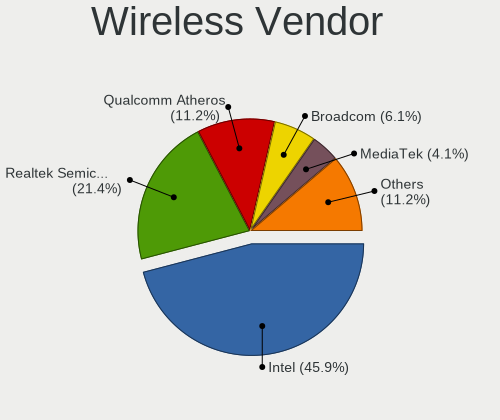

| Vendor                | Notebooks | Percent |
|-----------------------|-----------|---------|
| Intel                 | 22        | 42.31%  |
| Realtek Semiconductor | 11        | 21.15%  |
| Qualcomm Atheros      | 5         | 9.62%   |
| Broadcom              | 5         | 9.62%   |
| MEDIATEK              | 4         | 7.69%   |
| Ralink                | 1         | 1.92%   |
| NetGear               | 1         | 1.92%   |
| Linksys               | 1         | 1.92%   |
| Broadcom Limited      | 1         | 1.92%   |
| ASUSTek Computer      | 1         | 1.92%   |

Wireless Model
--------------

Wireless models

| Model                                                                   | Notebooks | Percent |
|-------------------------------------------------------------------------|-----------|---------|
| Realtek 802.11ac NIC                                                    | 3         | 5.77%   |
| MEDIATEK RZ608 Wi-Fi 6E 80MHz                                           | 3         | 5.77%   |
| Intel Wireless 3165                                                     | 3         | 5.77%   |
| Realtek RTL8821CE 802.11ac PCIe Wireless Network Adapter                | 2         | 3.85%   |
| Realtek RTL8812AU 802.11a/b/g/n/ac 2T2R DB WLAN Adapter                 | 2         | 3.85%   |
| Intel Wireless 8265 / 8275                                              | 2         | 3.85%   |
| Intel Wireless 3160                                                     | 2         | 3.85%   |
| Intel Wi-Fi 6 AX200                                                     | 2         | 3.85%   |
| Intel Comet Lake PCH CNVi WiFi                                          | 2         | 3.85%   |
| Intel Centrino Advanced-N 6235                                          | 2         | 3.85%   |
| Broadcom BCM43224 802.11a/b/g/n                                         | 2         | 3.85%   |
| Realtek RTL88x2bu [AC1200 Techkey]                                      | 1         | 1.92%   |
| Realtek RTL8723DE Wireless Network Adapter                              | 1         | 1.92%   |
| Realtek RTL8723BE PCIe Wireless Network Adapter                         | 1         | 1.92%   |
| Realtek RTL8188EE Wireless Network Adapter                              | 1         | 1.92%   |
| Ralink RT3290 Wireless 802.11n 1T/1R PCIe                               | 1         | 1.92%   |
| Qualcomm Atheros QCA9565 / AR9565 Wireless Network Adapter              | 1         | 1.92%   |
| Qualcomm Atheros QCA9377 802.11ac Wireless Network Adapter              | 1         | 1.92%   |
| Qualcomm Atheros QCA6174 802.11ac Wireless Network Adapter              | 1         | 1.92%   |
| Qualcomm Atheros AR9285 Wireless Network Adapter (PCI-Express)          | 1         | 1.92%   |
| Qualcomm Atheros AR242x / AR542x Wireless Network Adapter (PCI-Express) | 1         | 1.92%   |
| NetGear A6210                                                           | 1         | 1.92%   |
| MEDIATEK MT7921 802.11ax PCI Express Wireless Network Adapter           | 1         | 1.92%   |
| Linksys WUSB54G v2 802.11g Adapter [Intersil ISL3887]                   | 1         | 1.92%   |
| Intel Wireless 8260                                                     | 1         | 1.92%   |
| Intel Wi-Fi 6 AX201                                                     | 1         | 1.92%   |
| Intel Ultimate N WiFi Link 5300                                         | 1         | 1.92%   |
| Intel Dual Band Wireless-AC 3165 Plus Bluetooth                         | 1         | 1.92%   |
| Intel Comet Lake PCH-LP CNVi WiFi                                       | 1         | 1.92%   |
| Intel Centrino Wireless-N 2200                                          | 1         | 1.92%   |
| Intel Centrino Wireless-N 1030 [Rainbow Peak]                           | 1         | 1.92%   |
| Intel Centrino Advanced-N 6200                                          | 1         | 1.92%   |
| Intel Alder Lake-P PCH CNVi WiFi                                        | 1         | 1.92%   |
| Broadcom Limited BCM43228 802.11a/b/g/n                                 | 1         | 1.92%   |
| Broadcom BCM4364 802.11ac Wireless Network Adapter                      | 1         | 1.92%   |
| Broadcom BCM43142 802.11b/g/n                                           | 1         | 1.92%   |
| Broadcom BCM4313 802.11bgn Wireless Network Adapter                     | 1         | 1.92%   |
| ASUS 802.11ac NIC                                                       | 1         | 1.92%   |

Ethernet Vendor
---------------

Ethernet vendors

| Vendor                | Notebooks | Percent |
|-----------------------|-----------|---------|
| Realtek Semiconductor | 20        | 55.56%  |
| Intel                 | 7         | 19.44%  |
| Qualcomm Atheros      | 3         | 8.33%   |
| Broadcom              | 2         | 5.56%   |
| Samsung Electronics   | 1         | 2.78%   |
| Nvidia                | 1         | 2.78%   |
| ASIX Electronics      | 1         | 2.78%   |
| Apple                 | 1         | 2.78%   |

Ethernet Model
--------------

Ethernet models

| Model                                                             | Notebooks | Percent |
|-------------------------------------------------------------------|-----------|---------|
| Realtek RTL8111/8168/8411 PCI Express Gigabit Ethernet Controller | 10        | 26.32%  |
| Realtek RTL810xE PCI Express Fast Ethernet controller             | 7         | 18.42%  |
| Realtek RTL8153 Gigabit Ethernet Adapter                          | 2         | 5.26%   |
| Qualcomm Atheros AR8161 Gigabit Ethernet                          | 2         | 5.26%   |
| Intel Ethernet Connection (4) I219-LM                             | 2         | 5.26%   |
| Samsung Galaxy series, misc. (tethering mode)                     | 1         | 2.63%   |
| Realtek RTL8152 Fast Ethernet Adapter                             | 1         | 2.63%   |
| Realtek RTL8125 2.5GbE Controller                                 | 1         | 2.63%   |
| Realtek Killer E2600 Gigabit Ethernet Controller                  | 1         | 2.63%   |
| Qualcomm Atheros AR8151 v2.0 Gigabit Ethernet                     | 1         | 2.63%   |
| Nvidia MCP89 Ethernet                                             | 1         | 2.63%   |
| Intel Ethernet Connection I219-LM                                 | 1         | 2.63%   |
| Intel Ethernet Connection (3) I218-LM                             | 1         | 2.63%   |
| Intel 82579LM Gigabit Network Connection (Lewisville)             | 1         | 2.63%   |
| Intel 82577LM Gigabit Network Connection                          | 1         | 2.63%   |
| Intel 82567LM Gigabit Network Connection                          | 1         | 2.63%   |
| Broadcom NetXtreme BCM57762 Gigabit Ethernet PCIe                 | 1         | 2.63%   |
| Broadcom NetLink BCM5787M Gigabit Ethernet PCI Express            | 1         | 2.63%   |
| ASIX AX88772A Fast Ethernet                                       | 1         | 2.63%   |
| Apple T2 Controller                                               | 1         | 2.63%   |

Net Controller Kind
-------------------

Ethernet, WiFi or modem

| Kind     | Notebooks | Percent |
|----------|-----------|---------|
| WiFi     | 43        | 55.13%  |
| Ethernet | 34        | 43.59%  |
| Modem    | 1         | 1.28%   |

Used Controller
---------------

Currently used network controller

| Kind     | Notebooks | Percent |
|----------|-----------|---------|
| WiFi     | 34        | 64.15%  |
| Ethernet | 19        | 35.85%  |

NICs
----

Total network controllers on board

| Total | Notebooks | Percent |
|-------|-----------|---------|
| 2     | 31        | 72.09%  |
| 1     | 11        | 25.58%  |
| 3     | 1         | 2.33%   |

IPv6
----

IPv6 vs IPv4

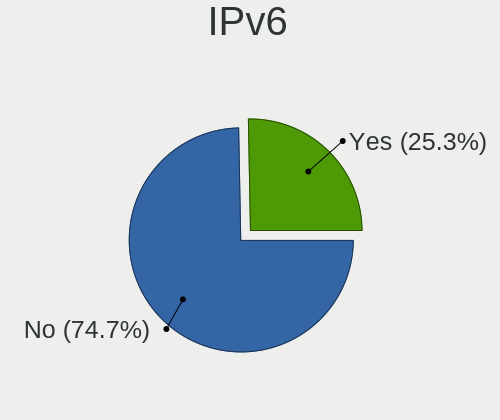

| Used | Notebooks | Percent |
|------|-----------|---------|
| No   | 32        | 74.42%  |
| Yes  | 11        | 25.58%  |

Bluetooth
---------

Bluetooth Vendor
----------------

Controller vendors

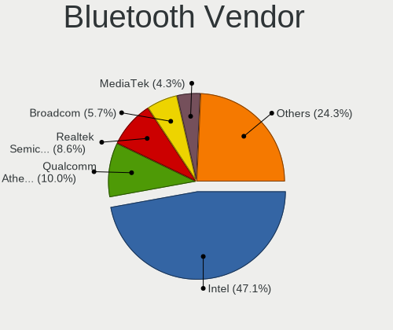

| Vendor                          | Notebooks | Percent |
|---------------------------------|-----------|---------|
| Intel                           | 18        | 48.65%  |
| Realtek Semiconductor           | 3         | 8.11%   |
| MediaTek                        | 3         | 8.11%   |
| Qualcomm Atheros Communications | 2         | 5.41%   |
| Lite-On Technology              | 2         | 5.41%   |
| IMC Networks                    | 2         | 5.41%   |
| Broadcom                        | 2         | 5.41%   |
| Apple                           | 2         | 5.41%   |
| Toshiba                         | 1         | 2.7%    |
| Ralink                          | 1         | 2.7%    |
| Foxconn / Hon Hai               | 1         | 2.7%    |

Bluetooth Model
---------------

Controller models

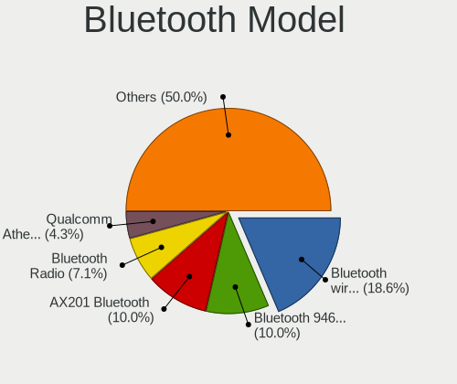

| Model                                            | Notebooks | Percent |
|--------------------------------------------------|-----------|---------|
| Intel Bluetooth wireless interface               | 9         | 24.32%  |
| Intel Bluetooth Device                           | 5         | 13.51%  |
| MediaTek Wireless_Device                         | 3         | 8.11%   |
| Realtek Bluetooth Radio                          | 2         | 5.41%   |
| Intel AX200 Bluetooth                            | 2         | 5.41%   |
| Toshiba BCM43142A0                               | 1         | 2.7%    |
| Realtek  Bluetooth 4.2 Adapter                   | 1         | 2.7%    |
| Ralink RT3290 Bluetooth                          | 1         | 2.7%    |
| Qualcomm Atheros QCA61x4 Bluetooth 4.0           | 1         | 2.7%    |
| Qualcomm Atheros AR3011 Bluetooth                | 1         | 2.7%    |
| Lite-On Wireless_Device                          | 1         | 2.7%    |
| Lite-On Bluetooth Device                         | 1         | 2.7%    |
| Intel Centrino Bluetooth Wireless Transceiver    | 1         | 2.7%    |
| Intel Centrino Advanced-N 6230 Bluetooth adapter | 1         | 2.7%    |
| IMC Networks Bluetooth Radio                     | 1         | 2.7%    |
| IMC Networks Bluetooth Device                    | 1         | 2.7%    |
| Foxconn / Hon Hai Broadcom BCM20702 Bluetooth    | 1         | 2.7%    |
| Broadcom HP Portable SoftSailing                 | 1         | 2.7%    |
| Broadcom BCM20702A0                              | 1         | 2.7%    |
| Apple Bluetooth USB Host Controller              | 1         | 2.7%    |
| Apple Bluetooth Host Controller                  | 1         | 2.7%    |

Sound
-----

Sound Vendor
------------

Sound card vendors

| Vendor | Notebooks | Percent |
|--------|-----------|---------|
| Intel  | 29        | 56.86%  |
| AMD    | 13        | 25.49%  |
| Nvidia | 8         | 15.69%  |
| Apple  | 1         | 1.96%   |

Sound Model
-----------

Sound card models

| Model                                                                                             | Notebooks | Percent |
|---------------------------------------------------------------------------------------------------|-----------|---------|
| Intel Sunrise Point-LP HD Audio                                                                   | 7         | 11.29%  |
| AMD Family 17h/19h HD Audio Controller                                                            | 5         | 8.06%   |
| Intel 7 Series/C216 Chipset Family High Definition Audio Controller                               | 4         | 6.45%   |
| AMD Renoir Radeon High Definition Audio Controller                                                | 4         | 6.45%   |
| Intel 6 Series/C200 Series Chipset Family High Definition Audio Controller                        | 3         | 4.84%   |
| AMD FCH Azalia Controller                                                                         | 3         | 4.84%   |
| Nvidia TU107 GeForce GTX 1650 High Definition Audio Controller                                    | 2         | 3.23%   |
| Nvidia MCP89 High Definition Audio                                                                | 2         | 3.23%   |
| Intel Wildcat Point-LP High Definition Audio Controller                                           | 2         | 3.23%   |
| Intel Comet Lake PCH cAVS                                                                         | 2         | 3.23%   |
| Intel Broadwell-U Audio Controller                                                                | 2         | 3.23%   |
| AMD Kabini HDMI/DP Audio                                                                          | 2         | 3.23%   |
| AMD High Definition Audio Controller                                                              | 2         | 3.23%   |
| AMD Family 15h (Models 60h-6fh) Audio Controller                                                  | 2         | 3.23%   |
| Nvidia TU106 High Definition Audio Controller                                                     | 1         | 1.61%   |
| Nvidia GF116 High Definition Audio Controller                                                     | 1         | 1.61%   |
| Nvidia GA104 High Definition Audio Controller                                                     | 1         | 1.61%   |
| Nvidia Audio device                                                                               | 1         | 1.61%   |
| Intel Tiger Lake-LP Smart Sound Technology Audio Controller                                       | 1         | 1.61%   |
| Intel Comet Lake PCH-LP cAVS                                                                      | 1         | 1.61%   |
| Intel Celeron/Pentium Silver Processor High Definition Audio                                      | 1         | 1.61%   |
| Intel Celeron N3350/Pentium N4200/Atom E3900 Series Audio Cluster                                 | 1         | 1.61%   |
| Intel Cannon Lake PCH cAVS                                                                        | 1         | 1.61%   |
| Intel Atom/Celeron/Pentium Processor x5-E8000/J3xxx/N3xxx Series High Definition Audio Controller | 1         | 1.61%   |
| Intel Atom Processor Z36xxx/Z37xxx Series High Definition Audio Controller                        | 1         | 1.61%   |
| Intel Alder Lake PCH-P High Definition Audio Controller                                           | 1         | 1.61%   |
| Intel 82801I (ICH9 Family) HD Audio Controller                                                    | 1         | 1.61%   |
| Intel 82801H (ICH8 Family) HD Audio Controller                                                    | 1         | 1.61%   |
| Intel 5 Series/3400 Series Chipset High Definition Audio                                          | 1         | 1.61%   |
| Apple Audio Device                                                                                | 1         | 1.61%   |
| AMD Turks HDMI Audio [Radeon HD 6500/6600 / 6700M Series]                                         | 1         | 1.61%   |
| AMD Raven/Raven2/Fenghuang HDMI/DP Audio Controller                                               | 1         | 1.61%   |
| AMD BeaverCreek HDMI Audio [Radeon HD 6500D and 6400G-6600G series]                               | 1         | 1.61%   |
| AMD Baffin HDMI/DP Audio [Radeon RX 550 640SP / RX 560/560X]                                      | 1         | 1.61%   |

Memory
------

Memory Vendor
-------------

Memory module vendors

| Vendor              | Notebooks | Percent |
|---------------------|-----------|---------|
| Samsung Electronics | 8         | 27.59%  |
| Micron Technology   | 7         | 24.14%  |
| Crucial             | 4         | 13.79%  |
| SK Hynix            | 3         | 10.34%  |
| Unknown (ABCD)      | 2         | 6.9%    |
| Ramaxel Technology  | 2         | 6.9%    |
| Elpida              | 2         | 6.9%    |
| Kingston            | 1         | 3.45%   |

Memory Model
------------

Memory module models

| Model                                                            | Notebooks | Percent |
|------------------------------------------------------------------|-----------|---------|
| Unknown (ABCD) RAM 123456789012345678 3GB SODIMM LPDDR4 2400MT/s | 2         | 6.67%   |
| Samsung RAM M471B5273DH0-CH9 4096MB SODIMM DDR3 1334MT/s         | 2         | 6.67%   |
| Samsung RAM M471B5173DB0-YK0 4096MB SODIMM DDR3 1600MT/s         | 2         | 6.67%   |
| SK Hynix RAM HMT351S6CFR8C-PB 4GB SODIMM DDR3 1600MT/s           | 1         | 3.33%   |
| SK Hynix RAM HMT325S6CFR8C-PB 2GB SODIMM DDR3 1600MT/s           | 1         | 3.33%   |
| SK Hynix RAM HMA851S6AFR6N-UH 4096MB SODIMM DDR4 2667MT/s        | 1         | 3.33%   |
| Samsung RAM M471A5244CB0-CTD 4096MB SODIMM DDR4 3266MT/s         | 1         | 3.33%   |
| Samsung RAM M471A5244CB0-CRC 4GB SODIMM DDR4 2667MT/s            | 1         | 3.33%   |
| Samsung RAM M471A4G43AB1-CWE 32GB SODIMM DDR4 3200MT/s           | 1         | 3.33%   |
| Samsung RAM M471A1K43CB1-CRC 8GB SODIMM DDR4 2667MT/s            | 1         | 3.33%   |
| Samsung RAM M378B2873CZ0-CF7 1GB SODIMM DDR3 800MT/s             | 1         | 3.33%   |
| Ramaxel RAM RMT3170EB68F9W1600 4GB SODIMM DDR3 1600MT/s          | 1         | 3.33%   |
| Ramaxel RAM RMSA3270ME86H9F-2666 4GB SODIMM DDR4 2667MT/s        | 1         | 3.33%   |
| Micron RAM MTC8C1084S1SC48BA1 16GB SODIMM 4800MT/s               | 1         | 3.33%   |
| Micron RAM 8JSF25664HZ-1G4D1 2048MB SODIMM DDR3 1334MT/s         | 1         | 3.33%   |
| Micron RAM 8ATF1G64HZ-2G6E1 8GB SODIMM DDR4 2667MT/s             | 1         | 3.33%   |
| Micron RAM 8ATF1G64HZ-2G3H1 8GB SODIMM DDR4 2400MT/s             | 1         | 3.33%   |
| Micron RAM 4ATF51264HZ-2G6E1 4GB SODIMM DDR4 2667MT/s            | 1         | 3.33%   |
| Micron RAM 4ATF1G64HZ-3G2E1 8GB Row Of Chips DDR4 3200MT/s       | 1         | 3.33%   |
| Micron RAM 16KTF1G64HZ-1G6E1 8GB SODIMM DDR3 1600MT/s            | 1         | 3.33%   |
| Kingston RAM KF2666C15S4/8G 8GB SODIMM DDR4 2667MT/s             | 1         | 3.33%   |
| Elpida RAM Module 4GB SODIMM DDR3 1600MT/s                       | 1         | 3.33%   |
| Elpida RAM Module 1GB SODIMM DDR3 1067MT/s                       | 1         | 3.33%   |
| Crucial RAM CT8G4SFS8266.M8FD 8192MB SODIMM DDR4 2667MT/s        | 1         | 3.33%   |
| Crucial RAM CT16G4SFRA32A.C8FE 16GB SODIMM DDR4 3200MT/s         | 1         | 3.33%   |
| Crucial RAM CT16G4SFD832A.M16FRS 16GB SODIMM DDR4 3200MT/s       | 1         | 3.33%   |
| Crucial RAM CT102464BF160B.C16 8GB SODIMM DDR3 1600MT/s          | 1         | 3.33%   |

Memory Kind
-----------

Memory module kinds

| Kind    | Notebooks | Percent |
|---------|-----------|---------|
| DDR4    | 10        | 45.45%  |
| DDR3    | 8         | 36.36%  |
| LPDDR4  | 3         | 13.64%  |
| Unknown | 1         | 4.55%   |

Memory Form Factor
------------------

Physical design of the memory module

| Name         | Notebooks | Percent |
|--------------|-----------|---------|
| SODIMM       | 20        | 95.24%  |
| Row Of Chips | 1         | 4.76%   |

Memory Size
-----------

Memory module size

| Size  | Notebooks | Percent |
|-------|-----------|---------|
| 4096  | 11        | 44%     |
| 8192  | 6         | 24%     |
| 16384 | 3         | 12%     |
| 2048  | 2         | 8%      |
| 1024  | 2         | 8%      |
| 32768 | 1         | 4%      |

Memory Speed
------------

Memory module speed

| Speed | Notebooks | Percent |
|-------|-----------|---------|
| 2667  | 6         | 23.08%  |
| 1600  | 6         | 23.08%  |
| 3200  | 4         | 15.38%  |
| 2400  | 3         | 11.54%  |
| 1334  | 3         | 11.54%  |
| 4800  | 1         | 3.85%   |
| 3266  | 1         | 3.85%   |
| 1067  | 1         | 3.85%   |
| 800   | 1         | 3.85%   |

Printers & scanners
-------------------

Printer Vendor
--------------

Printer device vendors

| Vendor             | Notebooks | Percent |
|--------------------|-----------|---------|
| Brother Industries | 1         | 100%    |

Printer Model
-------------

Printer device models

| Model                   | Notebooks | Percent |
|-------------------------|-----------|---------|
| Brother HL-1210W series | 1         | 100%    |

Scanner Vendor
--------------

Scanner device vendors

| Vendor | Notebooks | Percent |
|--------|-----------|---------|
| Canon  | 1         | 100%    |

Scanner Model
-------------

Scanner device models

| Model                         | Notebooks | Percent |
|-------------------------------|-----------|---------|
| Canon CanoScan N1240U/LiDE 30 | 1         | 100%    |

Camera
------

Camera Vendor
-------------

Camera device vendors

| Vendor                                 | Notebooks | Percent |
|----------------------------------------|-----------|---------|
| Chicony Electronics                    | 8         | 18.6%   |
| Acer                                   | 6         | 13.95%  |
| Microdia                               | 5         | 11.63%  |
| IMC Networks                           | 5         | 11.63%  |
| Apple                                  | 5         | 11.63%  |
| Quanta                                 | 3         | 6.98%   |
| Sunplus Innovation Technology          | 2         | 4.65%   |
| Suyin                                  | 1         | 2.33%   |
| Silicon Motion                         | 1         | 2.33%   |
| Ricoh                                  | 1         | 2.33%   |
| Realtek Semiconductor                  | 1         | 2.33%   |
| Primax Electronics                     | 1         | 2.33%   |
| Importek                               | 1         | 2.33%   |
| Goertek Electronics                    | 1         | 2.33%   |
| Cheng Uei Precision Industry (Foxlink) | 1         | 2.33%   |
| Alcor Micro                            | 1         | 2.33%   |

Camera Model
------------

Camera device models

| Model                                               | Notebooks | Percent |
|-----------------------------------------------------|-----------|---------|
| Acer HD Webcam                                      | 3         | 6.98%   |
| Sunplus Integrated_Webcam_HD                        | 2         | 4.65%   |
| Chicony HP TrueVision HD                            | 2         | 4.65%   |
| Apple iPhone 5/5C/5S/6/SE                           | 2         | 4.65%   |
| Acer SunplusIT Integrated Camera                    | 2         | 4.65%   |
| Suyin Acer CrystalEye Webcam                        | 1         | 2.33%   |
| Silicon Motion WebCam SC-13HDL11939N                | 1         | 2.33%   |
| Ricoh HD Webcam                                     | 1         | 2.33%   |
| Realtek Integrated Webcam                           | 1         | 2.33%   |
| Quanta VGA WebCam                                   | 1         | 2.33%   |
| Quanta HP TrueVision HD Camera                      | 1         | 2.33%   |
| Quanta HD User Facing                               | 1         | 2.33%   |
| Primax HP HD Webcam [Fixed]                         | 1         | 2.33%   |
| Microdia Webcam Vitade AF                           | 1         | 2.33%   |
| Microdia PC Microscope camera                       | 1         | 2.33%   |
| Microdia Laptop_Integrated_Webcam_HD                | 1         | 2.33%   |
| Microdia Laptop_Integrated_Webcam_2M                | 1         | 2.33%   |
| Microdia HP Integrated Webcam                       | 1         | 2.33%   |
| Importek TOSHIBA Web Camera - HD                    | 1         | 2.33%   |
| IMC Networks USB2.0 VGA UVC WebCam                  | 1         | 2.33%   |
| IMC Networks USB Camera                             | 1         | 2.33%   |
| IMC Networks Lenovo EasyCamera                      | 1         | 2.33%   |
| IMC Networks Integrated Camera                      | 1         | 2.33%   |
| IMC Networks HD Camera                              | 1         | 2.33%   |
| Goertek USB2.0 VGA UVC WebCam                       | 1         | 2.33%   |
| Chicony USB2.0 Camera                               | 1         | 2.33%   |
| Chicony TOSHIBA Web Camera - HD                     | 1         | 2.33%   |
| Chicony Integrated HP HD Webcam                     | 1         | 2.33%   |
| Chicony Integrated Camera (1280x720@30)             | 1         | 2.33%   |
| Chicony Integrated Camera                           | 1         | 2.33%   |
| Chicony HD User Facing                              | 1         | 2.33%   |
| Cheng Uei Precision Industry (Foxlink) HP HD Camera | 1         | 2.33%   |
| Apple FaceTime HD Camera (Built-in)                 | 1         | 2.33%   |
| Apple FaceTime Camera                               | 1         | 2.33%   |
| Apple Built-in iSight                               | 1         | 2.33%   |
| Alcor Micro USB 2.0 Web Camera                      | 1         | 2.33%   |
| Acer Lenovo EasyCamera                              | 1         | 2.33%   |

Security
--------

Fingerprint Vendor
------------------

Fingerprint sensor vendors

| Vendor                     | Notebooks | Percent |
|----------------------------|-----------|---------|
| Validity Sensors           | 3         | 42.86%  |
| Synaptics                  | 3         | 42.86%  |
| Shenzhen Goodix Technology | 1         | 14.29%  |

Fingerprint Model
-----------------

Fingerprint sensor models

| Model                                             | Notebooks | Percent |
|---------------------------------------------------|-----------|---------|
| Validity Sensors VFS5011 Fingerprint Reader       | 1         | 14.29%  |
| Validity Sensors VFS495 Fingerprint Reader        | 1         | 14.29%  |
| Validity Sensors VFS471 Fingerprint Reader        | 1         | 14.29%  |
| Synaptics  WBDI                                   | 1         | 14.29%  |
| Synaptics Prometheus MIS Touch Fingerprint Reader | 1         | 14.29%  |
| Synaptics Metallica MIS Touch Fingerprint Reader  | 1         | 14.29%  |
| Shenzhen Goodix  Fingerprint Device               | 1         | 14.29%  |

Chipcard Vendor
---------------

Chipcard module vendors

| Vendor      | Notebooks | Percent |
|-------------|-----------|---------|
| Broadcom    | 3         | 60%     |
| OmniKey     | 1         | 20%     |
| Alcor Micro | 1         | 20%     |

Chipcard Model
--------------

Chipcard module models

| Model                                                                        | Notebooks | Percent |
|------------------------------------------------------------------------------|-----------|---------|
| OmniKey CardMan Smart@Link                                                   | 1         | 20%     |
| Broadcom BCM5880 Secure Applications Processor with fingerprint swipe sensor | 1         | 20%     |
| Broadcom BCM5880 Secure Applications Processor                               | 1         | 20%     |
| Broadcom 5880                                                                | 1         | 20%     |
| Alcor Micro AU9540 Smartcard Reader                                          | 1         | 20%     |

Unsupported
-----------

Unsupported Devices
-------------------

Total unsupported devices on board

| Total | Notebooks | Percent |
|-------|-----------|---------|
| 1     | 20        | 46.51%  |
| 0     | 19        | 44.19%  |
| 2     | 4         | 9.3%    |

Unsupported Device Types
------------------------

Types of unsupported devices

| Type                  | Notebooks | Percent |
|-----------------------|-----------|---------|
| Net/wireless          | 8         | 32%     |
| Fingerprint reader    | 7         | 28%     |
| Graphics card         | 4         | 16%     |
| Chipcard              | 4         | 16%     |
| Multimedia controller | 1         | 4%      |
| Bluetooth             | 1         | 4%      |

