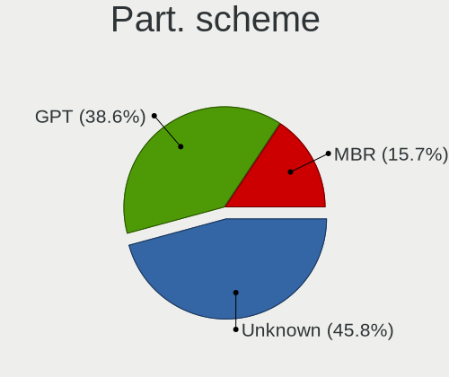
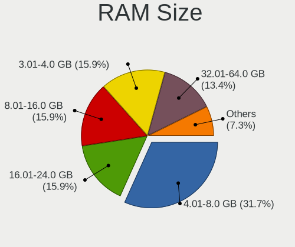
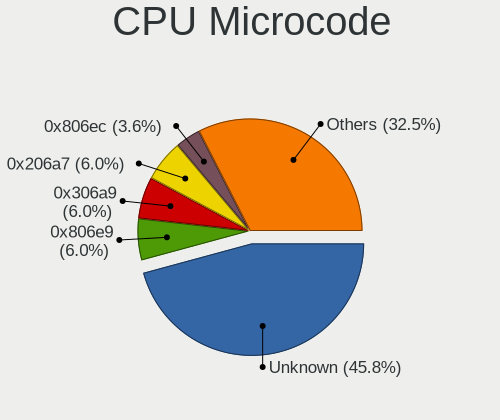
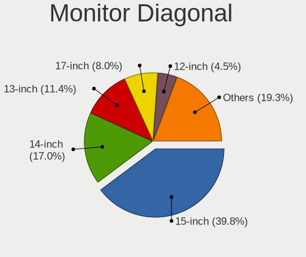
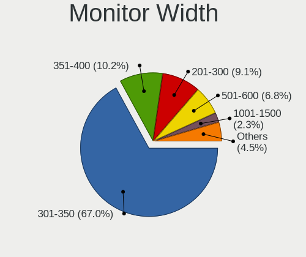
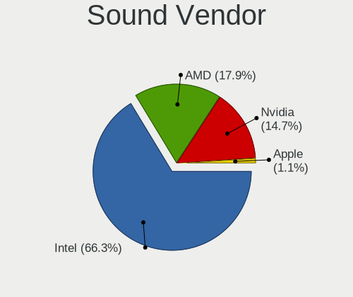
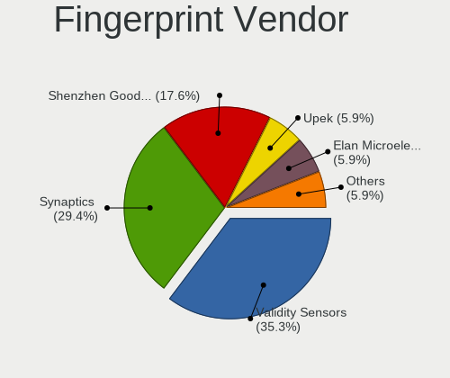

Parrot 5.0 - Tested Hardware & Statistics (Notebooks)
-----------------------------------------------------

A project to collect tested hardware configurations for Parrot 5.0.

Anyone can contribute to this report by the [hw-probe](https://github.com/linuxhw/hw-probe) tool:

    sudo -E hw-probe -all -upload

Please submit a probe of your configuration if it's not presented on the page or is rare.

Full-feature report is available here: https://linux-hardware.org/?view=trends

Contents
--------

* [ Test Cases ](#test-cases)

* [ System ](#system)
  - [ Kernel                   ](#kernel)
  - [ Kernel Family            ](#kernel-family)
  - [ Kernel Major Ver.        ](#kernel-major-ver)
  - [ Arch                     ](#arch)
  - [ DE                       ](#de)
  - [ Display Server           ](#display-server)
  - [ Display Manager          ](#display-manager)
  - [ OS Lang                  ](#os-lang)
  - [ Boot Mode                ](#boot-mode)
  - [ Filesystem               ](#filesystem)
  - [ Part. scheme             ](#part-scheme)
  - [ Dual Boot with Linux/BSD ](#dual-boot-with-linuxbsd)
  - [ Dual Boot (Win)          ](#dual-boot-win)

* [ Board ](#board)
  - [ Vendor                   ](#vendor)
  - [ Model                    ](#model)
  - [ Model Family             ](#model-family)
  - [ MFG Year                 ](#mfg-year)
  - [ Form Factor              ](#form-factor)
  - [ Secure Boot              ](#secure-boot)
  - [ Coreboot                 ](#coreboot)
  - [ RAM Size                 ](#ram-size)
  - [ RAM Used                 ](#ram-used)
  - [ Total Drives             ](#total-drives)
  - [ Has CD-ROM               ](#has-cd-rom)
  - [ Has Ethernet             ](#has-ethernet)
  - [ Has WiFi                 ](#has-wifi)
  - [ Has Bluetooth            ](#has-bluetooth)

* [ Location ](#location)
  - [ Country                  ](#country)
  - [ City                     ](#city)

* [ Drives ](#drives)
  - [ Drive Vendor             ](#drive-vendor)
  - [ Drive Model              ](#drive-model)
  - [ HDD Vendor               ](#hdd-vendor)
  - [ SSD Vendor               ](#ssd-vendor)
  - [ Drive Kind               ](#drive-kind)
  - [ Drive Connector          ](#drive-connector)
  - [ Drive Size               ](#drive-size)
  - [ Space Total              ](#space-total)
  - [ Space Used               ](#space-used)
  - [ Malfunc. Drives          ](#malfunc-drives)
  - [ Malfunc. Drive Vendor    ](#malfunc-drive-vendor)
  - [ Malfunc. HDD Vendor      ](#malfunc-hdd-vendor)
  - [ Malfunc. Drive Kind      ](#malfunc-drive-kind)
  - [ Failed Drives            ](#failed-drives)
  - [ Failed Drive Vendor      ](#failed-drive-vendor)
  - [ Drive Status             ](#drive-status)

* [ Storage controller ](#storage-controller)
  - [ Storage Vendor           ](#storage-vendor)
  - [ Storage Model            ](#storage-model)
  - [ Storage Kind             ](#storage-kind)

* [ Processor ](#processor)
  - [ CPU Vendor               ](#cpu-vendor)
  - [ CPU Model                ](#cpu-model)
  - [ CPU Model Family         ](#cpu-model-family)
  - [ CPU Cores                ](#cpu-cores)
  - [ CPU Sockets              ](#cpu-sockets)
  - [ CPU Threads              ](#cpu-threads)
  - [ CPU Op-Modes             ](#cpu-op-modes)
  - [ CPU Microcode            ](#cpu-microcode)
  - [ CPU Microarch            ](#cpu-microarch)

* [ Graphics ](#graphics)
  - [ GPU Vendor               ](#gpu-vendor)
  - [ GPU Model                ](#gpu-model)
  - [ GPU Combo                ](#gpu-combo)
  - [ GPU Driver               ](#gpu-driver)
  - [ GPU Memory               ](#gpu-memory)

* [ Monitor ](#monitor)
  - [ Monitor Vendor           ](#monitor-vendor)
  - [ Monitor Model            ](#monitor-model)
  - [ Monitor Resolution       ](#monitor-resolution)
  - [ Monitor Diagonal         ](#monitor-diagonal)
  - [ Monitor Width            ](#monitor-width)
  - [ Aspect Ratio             ](#aspect-ratio)
  - [ Monitor Area             ](#monitor-area)
  - [ Pixel Density            ](#pixel-density)
  - [ Multiple Monitors        ](#multiple-monitors)

* [ Network ](#network)
  - [ Net Controller Vendor    ](#net-controller-vendor)
  - [ Net Controller Model     ](#net-controller-model)
  - [ Wireless Vendor          ](#wireless-vendor)
  - [ Wireless Model           ](#wireless-model)
  - [ Ethernet Vendor          ](#ethernet-vendor)
  - [ Ethernet Model           ](#ethernet-model)
  - [ Net Controller Kind      ](#net-controller-kind)
  - [ Used Controller          ](#used-controller)
  - [ NICs                     ](#nics)
  - [ IPv6                     ](#ipv6)

* [ Bluetooth ](#bluetooth)
  - [ Bluetooth Vendor         ](#bluetooth-vendor)
  - [ Bluetooth Model          ](#bluetooth-model)

* [ Sound ](#sound)
  - [ Sound Vendor             ](#sound-vendor)
  - [ Sound Model              ](#sound-model)

* [ Memory ](#memory)
  - [ Memory Vendor            ](#memory-vendor)
  - [ Memory Model             ](#memory-model)
  - [ Memory Kind              ](#memory-kind)
  - [ Memory Form Factor       ](#memory-form-factor)
  - [ Memory Size              ](#memory-size)
  - [ Memory Speed             ](#memory-speed)

* [ Printers & scanners ](#printers--scanners)
  - [ Printer Vendor           ](#printer-vendor)
  - [ Printer Model            ](#printer-model)
  - [ Scanner Vendor           ](#scanner-vendor)
  - [ Scanner Model            ](#scanner-model)

* [ Camera ](#camera)
  - [ Camera Vendor            ](#camera-vendor)
  - [ Camera Model             ](#camera-model)

* [ Security ](#security)
  - [ Fingerprint Vendor       ](#fingerprint-vendor)
  - [ Fingerprint Model        ](#fingerprint-model)
  - [ Chipcard Vendor          ](#chipcard-vendor)
  - [ Chipcard Model           ](#chipcard-model)

* [ Unsupported ](#unsupported)
  - [ Unsupported Devices      ](#unsupported-devices)
  - [ Unsupported Device Types ](#unsupported-device-types)

Test Cases
----------

| Vendor  | Model                       | Probe                                                      | Date         |
|---------|-----------------------------|------------------------------------------------------------|--------------|
| Chuwi   | GemiBook                    | [bb9f45273a](https://linux-hardware.org/?probe=bb9f45273a) | Mar 01, 2022 |
| Samsung | 550P5C/550P7C               | [f14f73025f](https://linux-hardware.org/?probe=f14f73025f) | Feb 27, 2022 |
| Toshiba | Satellite C75D-B            | [952057ee2b](https://linux-hardware.org/?probe=952057ee2b) | Feb 24, 2022 |
| Acer    | Nitro AN517-41              | [47b906a661](https://linux-hardware.org/?probe=47b906a661) | Feb 23, 2022 |
| Chuwi   | GemiBook                    | [25f5f358cb](https://linux-hardware.org/?probe=25f5f358cb) | Feb 17, 2022 |
| Acer    | Nitro AN515-54              | [f83ccc9cce](https://linux-hardware.org/?probe=f83ccc9cce) | Feb 15, 2022 |
| HP      | ProBook 4535s               | [0d0cd13f8b](https://linux-hardware.org/?probe=0d0cd13f8b) | Feb 12, 2022 |
| ASUSTek | VivoBook 15_ASUS Laptop ... | [0df06bcae3](https://linux-hardware.org/?probe=0df06bcae3) | Feb 11, 2022 |
| HP      | Notebook                    | [1f47143486](https://linux-hardware.org/?probe=1f47143486) | Feb 06, 2022 |
| Apple   | MacBook7,1                  | [9f4f77f51d](https://linux-hardware.org/?probe=9f4f77f51d) | Feb 06, 2022 |
| Apple   | MacBook7,1                  | [b6d5344f4e](https://linux-hardware.org/?probe=b6d5344f4e) | Feb 04, 2022 |
| Dell    | Inspiron N5110              | [5aa1140ad5](https://linux-hardware.org/?probe=5aa1140ad5) | Feb 02, 2022 |
| Lenovo  | ThinkPad T480 20L6SCYP00    | [d69eb6fc3e](https://linux-hardware.org/?probe=d69eb6fc3e) | Jan 30, 2022 |
| Acer    | Aspire A315-21              | [880cca4c8f](https://linux-hardware.org/?probe=880cca4c8f) | Jan 24, 2022 |
| Dell    | Latitude 7480               | [e184163da5](https://linux-hardware.org/?probe=e184163da5) | Jan 19, 2022 |
| Lenovo  | ThinkPad E14 20RA0016GE     | [46eeb2d4b8](https://linux-hardware.org/?probe=46eeb2d4b8) | Jan 14, 2022 |
| Lenovo  | ThinkPad X1 Extreme Gen ... | [4e45161acc](https://linux-hardware.org/?probe=4e45161acc) | Jan 12, 2022 |
| Lenovo  | IdeaPad Y580                | [cbb37b3b6a](https://linux-hardware.org/?probe=cbb37b3b6a) | Dec 20, 2021 |
| Lenovo  | IdeaPad Y580                | [48d92517e3](https://linux-hardware.org/?probe=48d92517e3) | Dec 11, 2021 |
| Dell    | Latitude E6410              | [2f9b89dbb4](https://linux-hardware.org/?probe=2f9b89dbb4) | Nov 09, 2021 |
| Acer    | TravelMate 5720             | [8e19effec8](https://linux-hardware.org/?probe=8e19effec8) | Nov 06, 2021 |
| HP      | Pavilion g7                 | [c1b5449516](https://linux-hardware.org/?probe=c1b5449516) | Nov 05, 2021 |
| HP      | Pavilion g7                 | [d27bb0d31e](https://linux-hardware.org/?probe=d27bb0d31e) | Oct 31, 2021 |
| Lenovo  | B50-80 80EW                 | [37a983c1e7](https://linux-hardware.org/?probe=37a983c1e7) | Oct 26, 2021 |
| Lenovo  | B50-80 80EW                 | [ca3a74943a](https://linux-hardware.org/?probe=ca3a74943a) | Oct 25, 2021 |
| HP      | Pavilion g7                 | [b386e97faa](https://linux-hardware.org/?probe=b386e97faa) | Oct 25, 2021 |
| Dell    | Latitude E7450              | [2d94d751ff](https://linux-hardware.org/?probe=2d94d751ff) | Oct 22, 2021 |
| Dell    | Latitude E7450              | [a2b09ead76](https://linux-hardware.org/?probe=a2b09ead76) | Oct 22, 2021 |
| HP      | Laptop 15q-dy0xxx           | [aa4c6c2a25](https://linux-hardware.org/?probe=aa4c6c2a25) | Oct 18, 2021 |
| HP      | Pavilion g7                 | [7e80ec4599](https://linux-hardware.org/?probe=7e80ec4599) | Oct 11, 2021 |
| HP      | Pavilion g7                 | [cd8ce3be30](https://linux-hardware.org/?probe=cd8ce3be30) | Oct 10, 2021 |
| HP      | Pavilion g7                 | [dd3f8159e0](https://linux-hardware.org/?probe=dd3f8159e0) | Oct 10, 2021 |
| HP      | EliteBook 840 G3            | [fb11994deb](https://linux-hardware.org/?probe=fb11994deb) | Oct 04, 2021 |

System
------

Kernel
------

Version of the Linux kernel

| Version                | Notebooks | Percent |
|------------------------|-----------|---------|
| 5.14.0-9parrot1-amd64  | 17        | 68%     |
| 5.14.0-2parrot1-amd64  | 6         | 24%     |
| 5.15.0-5parrot1-amd64  | 1         | 4%      |
| 5.15.0-15parrot1-amd64 | 1         | 4%      |

Kernel Family
-------------

Linux kernel without a distro release

| Version | Notebooks | Percent |
|---------|-----------|---------|
| 5.14.0  | 22        | 91.67%  |
| 5.15.0  | 2         | 8.33%   |

Kernel Major Ver.
-----------------

Linux kernel major version

| Version | Notebooks | Percent |
|---------|-----------|---------|
| 5.14    | 22        | 91.67%  |
| 5.15    | 2         | 8.33%   |

Arch
----

OS architecture (x86_64, i586, etc.)

| Name   | Notebooks | Percent |
|--------|-----------|---------|
| x86_64 | 23        | 100%    |

DE
--

Desktop Environment

| Name    | Notebooks | Percent |
|---------|-----------|---------|
| MATE    | 16        | 69.57%  |
| KDE5    | 5         | 21.74%  |
| KDE     | 1         | 4.35%   |
| Unknown | 1         | 4.35%   |

Display Server
--------------

X11 or Wayland

| Name | Notebooks | Percent |
|------|-----------|---------|
| X11  | 23        | 100%    |

Display Manager
---------------

SDDM, LightDM, etc.

| Name    | Notebooks | Percent |
|---------|-----------|---------|
| Unknown | 15        | 65.22%  |
| LightDM | 8         | 34.78%  |

OS Lang
-------

Language

| Lang  | Notebooks | Percent |
|-------|-----------|---------|
| en_US | 11        | 47.83%  |
| es_ES | 2         | 8.7%    |
| en_IN | 2         | 8.7%    |
| en_GB | 2         | 8.7%    |
| ru_RU | 1         | 4.35%   |
| fr_FR | 1         | 4.35%   |
| es_MX | 1         | 4.35%   |
| en_ZA | 1         | 4.35%   |
| de_DE | 1         | 4.35%   |
| cs_CZ | 1         | 4.35%   |

Boot Mode
---------

EFI or BIOS

| Mode | Notebooks | Percent |
|------|-----------|---------|
| BIOS | 17        | 73.91%  |
| EFI  | 6         | 26.09%  |

Filesystem
----------

Type of filesystem

| Type    | Notebooks | Percent |
|---------|-----------|---------|
| Btrfs   | 20        | 86.96%  |
| Ext4    | 2         | 8.7%    |
| Overlay | 1         | 4.35%   |

Part. scheme
------------

Scheme of partitioning

| Type    | Notebooks | Percent |
|---------|-----------|---------|
| Unknown | 14        | 60.87%  |
| MBR     | 5         | 21.74%  |
| GPT     | 4         | 17.39%  |

Dual Boot with Linux/BSD
------------------------

Hosting more than one Linux/BSD

| Dual boot | Notebooks | Percent |
|-----------|-----------|---------|
| No        | 22        | 95.65%  |
| Yes       | 1         | 4.35%   |

Dual Boot (Win)
---------------

Hosting Linux and Windows

| Dual boot | Notebooks | Percent |
|-----------|-----------|---------|
| No        | 17        | 73.91%  |
| Yes       | 6         | 26.09%  |

Board
-----

Vendor
------

Motherboard manufacturer

| Name                | Notebooks | Percent |
|---------------------|-----------|---------|
| Lenovo              | 5         | 21.74%  |
| Hewlett-Packard     | 5         | 21.74%  |
| Dell                | 4         | 17.39%  |
| Acer                | 4         | 17.39%  |
| Toshiba             | 1         | 4.35%   |
| Samsung Electronics | 1         | 4.35%   |
| Chuwi               | 1         | 4.35%   |
| ASUSTek Computer    | 1         | 4.35%   |
| Apple               | 1         | 4.35%   |

Model
-----

Motherboard model

| Name                                        | Notebooks | Percent |
|---------------------------------------------|-----------|---------|
| Toshiba Satellite C75D-B                    | 1         | 4.35%   |
| Samsung 550P5C/550P7C                       | 1         | 4.35%   |
| Lenovo ThinkPad X1 Extreme Gen 3 20TK001GUS | 1         | 4.35%   |
| Lenovo ThinkPad T480 20L6SCYP00             | 1         | 4.35%   |
| Lenovo ThinkPad E14 20RA0016GE              | 1         | 4.35%   |
| Lenovo IdeaPad Y580                         | 1         | 4.35%   |
| Lenovo B50-80 80EW                          | 1         | 4.35%   |
| HP ProBook 4535s                            | 1         | 4.35%   |
| HP Pavilion g7                              | 1         | 4.35%   |
| HP Notebook                                 | 1         | 4.35%   |
| HP Laptop 15q-dy0xxx                        | 1         | 4.35%   |
| HP EliteBook 840 G3                         | 1         | 4.35%   |
| Dell Latitude E7450                         | 1         | 4.35%   |
| Dell Latitude E6410                         | 1         | 4.35%   |
| Dell Latitude 7480                          | 1         | 4.35%   |
| Dell Inspiron N5110                         | 1         | 4.35%   |
| Chuwi GemiBook                              | 1         | 4.35%   |
| ASUS VivoBook 15_ASUS Laptop X540UAR        | 1         | 4.35%   |
| Apple MacBook7,1                            | 1         | 4.35%   |
| Acer TravelMate 5720                        | 1         | 4.35%   |
| Acer Nitro AN517-41                         | 1         | 4.35%   |
| Acer Nitro AN515-54                         | 1         | 4.35%   |
| Acer Aspire A315-21                         | 1         | 4.35%   |

Model Family
------------

Motherboard model prefix

| Name              | Notebooks | Percent |
|-------------------|-----------|---------|
| Lenovo ThinkPad   | 3         | 13.04%  |
| Dell Latitude     | 3         | 13.04%  |
| Acer Nitro        | 2         | 8.7%    |
| Toshiba Satellite | 1         | 4.35%   |
| Samsung 550P5C    | 1         | 4.35%   |
| Lenovo IdeaPad    | 1         | 4.35%   |
| Lenovo B50-80     | 1         | 4.35%   |
| HP ProBook        | 1         | 4.35%   |
| HP Pavilion       | 1         | 4.35%   |
| HP Notebook       | 1         | 4.35%   |
| HP Laptop         | 1         | 4.35%   |
| HP EliteBook      | 1         | 4.35%   |
| Dell Inspiron     | 1         | 4.35%   |
| Chuwi GemiBook    | 1         | 4.35%   |
| ASUS VivoBook     | 1         | 4.35%   |
| Apple MacBook7    | 1         | 4.35%   |
| Acer TravelMate   | 1         | 4.35%   |
| Acer Aspire       | 1         | 4.35%   |

MFG Year
--------

Motherboard manufacture year

| Year | Notebooks | Percent |
|------|-----------|---------|
| 2018 | 3         | 13.04%  |
| 2011 | 3         | 13.04%  |
| 2021 | 2         | 8.7%    |
| 2019 | 2         | 8.7%    |
| 2017 | 2         | 8.7%    |
| 2016 | 2         | 8.7%    |
| 2014 | 2         | 8.7%    |
| 2012 | 2         | 8.7%    |
| 2010 | 2         | 8.7%    |
| 2020 | 1         | 4.35%   |
| 2015 | 1         | 4.35%   |
| 2007 | 1         | 4.35%   |

Form Factor
-----------

Physical design of the computer

| Name     | Notebooks | Percent |
|----------|-----------|---------|
| Notebook | 23        | 100%    |

Secure Boot
-----------

Enabled or disabled

| State    | Notebooks | Percent |
|----------|-----------|---------|
| Disabled | 23        | 100%    |

Coreboot
--------

Have coreboot on board

| Used | Notebooks | Percent |
|------|-----------|---------|
| No   | 23        | 100%    |

RAM Size
--------

Total RAM memory

| Size in GB | Notebooks | Percent |
|------------|-----------|---------|
| 4.01-8.0   | 6         | 26.09%  |
| 3.01-4.0   | 6         | 26.09%  |
| 32.01-64.0 | 4         | 17.39%  |
| 8.01-16.0  | 4         | 17.39%  |
| 16.01-24.0 | 3         | 13.04%  |

RAM Used
--------

Used RAM memory

| Used GB   | Notebooks | Percent |
|-----------|-----------|---------|
| 2.01-3.0  | 13        | 56.52%  |
| 1.01-2.0  | 6         | 26.09%  |
| 4.01-8.0  | 2         | 8.7%    |
| 8.01-16.0 | 2         | 8.7%    |

Total Drives
------------

Number of drives on board

| Drives | Notebooks | Percent |
|--------|-----------|---------|
| 1      | 15        | 65.22%  |
| 2      | 8         | 34.78%  |

Has CD-ROM
----------

Has CD-ROM on board

| Presented | Notebooks | Percent |
|-----------|-----------|---------|
| No        | 12        | 52.17%  |
| Yes       | 11        | 47.83%  |

Has Ethernet
------------

Has Ethernet on board

| Presented | Notebooks | Percent |
|-----------|-----------|---------|
| Yes       | 21        | 91.3%   |
| No        | 2         | 8.7%    |

Has WiFi
--------

Has WiFi module

| Presented | Notebooks | Percent |
|-----------|-----------|---------|
| Yes       | 23        | 100%    |

Has Bluetooth
-------------

Has Bluetooth module

| Presented | Notebooks | Percent |
|-----------|-----------|---------|
| Yes       | 19        | 82.61%  |
| No        | 4         | 17.39%  |

Location
--------

Country
-------

Geographic location (country)

| Country      | Notebooks | Percent |
|--------------|-----------|---------|
| USA          | 8         | 34.78%  |
| UK           | 2         | 8.7%    |
| Spain        | 2         | 8.7%    |
| India        | 2         | 8.7%    |
| South Africa | 1         | 4.35%   |
| Russia       | 1         | 4.35%   |
| Netherlands  | 1         | 4.35%   |
| Mexico       | 1         | 4.35%   |
| Germany      | 1         | 4.35%   |
| France       | 1         | 4.35%   |
| Denmark      | 1         | 4.35%   |
| Czechia      | 1         | 4.35%   |
| Algeria      | 1         | 4.35%   |

City
----

Geographic location (city)

| City                 | Notebooks | Percent |
|----------------------|-----------|---------|
| St Petersburg        | 1         | 4.35%   |
| Spotsylvania         | 1         | 4.35%   |
| Skive                | 1         | 4.35%   |
| Seattle              | 1         | 4.35%   |
| Saint Clair          | 1         | 4.35%   |
| Ruskin               | 1         | 4.35%   |
| Pretoria             | 1         | 4.35%   |
| Prague               | 1         | 4.35%   |
| Phoenix              | 1         | 4.35%   |
| Mt. Pleasant         | 1         | 4.35%   |
| Mostoles             | 1         | 4.35%   |
| Mazatlán          | 1         | 4.35%   |
| Mangalagiri          | 1         | 4.35%   |
| Los Angeles          | 1         | 4.35%   |
| Cannes               | 1         | 4.35%   |
| Camden               | 1         | 4.35%   |
| Bristol              | 1         | 4.35%   |
| Birmingham           | 1         | 4.35%   |
| Berlin               | 1         | 4.35%   |
| Bengaluru            | 1         | 4.35%   |
| Amsterdam            | 1         | 4.35%   |
| Algiers              | 1         | 4.35%   |
| Alcalá de Henares | 1         | 4.35%   |

Drives
------

Drive Vendor
------------

Hard drive vendors

| Vendor              | Notebooks | Drives | Percent |
|---------------------|-----------|--------|---------|
| Toshiba             | 5         | 5      | 17.24%  |
| Sandisk             | 3         | 4      | 10.34%  |
| Samsung Electronics | 3         | 3      | 10.34%  |
| WDC                 | 2         | 2      | 6.9%    |
| Seagate             | 2         | 2      | 6.9%    |
| Kingston            | 2         | 2      | 6.9%    |
| Team                | 1         | 1      | 3.45%   |
| PNY                 | 1         | 1      | 3.45%   |
| Netac               | 1         | 2      | 3.45%   |
| KingSpec            | 1         | 1      | 3.45%   |
| Intenso             | 1         | 2      | 3.45%   |
| HUAWEI              | 1         | 1      | 3.45%   |
| Hitachi             | 1         | 1      | 3.45%   |
| HGST                | 1         | 1      | 3.45%   |
| Crucial             | 1         | 1      | 3.45%   |
| China               | 1         | 1      | 3.45%   |
| BHT                 | 1         | 1      | 3.45%   |
| ASMedia             | 1         | 1      | 3.45%   |

Drive Model
-----------

Hard drive models

| Model                               | Notebooks | Percent |
|-------------------------------------|-----------|---------|
| Toshiba MQ04ABF100 1TB              | 3         | 10%     |
| WDC WDS500G2B0A-00SM50 500GB SSD    | 1         | 3.33%   |
| WDC WD6400BPVT-75HXZT1 640GB        | 1         | 3.33%   |
| Toshiba MQ01ABD075 752GB            | 1         | 3.33%   |
| Toshiba MK2555GSXF 250GB            | 1         | 3.33%   |
| Team TM8PS7512G 512GB SSD           | 1         | 3.33%   |
| Seagate ST500LT012-9WS142 500GB     | 1         | 3.33%   |
| Seagate ST2000LM003 HN-M201RAD 2TB  | 1         | 3.33%   |
| SanDisk SDSSDH3 2T00 2TB            | 1         | 3.33%   |
| Sandisk NVMe SSD Drive 256GB        | 1         | 3.33%   |
| Sandisk NVMe SSD Drive 1TB          | 1         | 3.33%   |
| Sandisk NVMe SSD Drive 1024GB       | 1         | 3.33%   |
| Samsung NVMe SSD Drive 1024GB       | 1         | 3.33%   |
| Samsung MZVLB1T0HBLR-000L7 1TB      | 1         | 3.33%   |
| Samsung MZMPC032HBCD-000L1 32GB SSD | 1         | 3.33%   |
| PNY CS900 240GB SSD                 | 1         | 3.33%   |
| Netac S535N8/256 256GB SSD          | 1         | 3.33%   |
| Kingston SV300S37A120G 120GB SSD    | 1         | 3.33%   |
| Kingston SKC600512G 512GB SSD       | 1         | 3.33%   |
| KingSpec NT-1TB                     | 1         | 3.33%   |
| Intenso SSD SATAIII 480GB           | 1         | 3.33%   |
| HUAWEI SD Storage 2GB               | 1         | 3.33%   |
| Hitachi HTS542525K9SA00 250GB       | 1         | 3.33%   |
| HGST HTS541010A9E680 1TB            | 1         | 3.33%   |
| Crucial CT250MX500SSD1 250GB        | 1         | 3.33%   |
| China SATA SSD 240GB                | 1         | 3.33%   |
| BHT WR202HH032G E70290F5 32GB SSD   | 1         | 3.33%   |
| ASMedia USB 3.0 Device 2TB          | 1         | 3.33%   |

HDD Vendor
----------

Hard disk drive vendors

| Vendor  | Notebooks | Drives | Percent |
|---------|-----------|--------|---------|
| Toshiba | 5         | 5      | 45.45%  |
| Seagate | 2         | 2      | 18.18%  |
| WDC     | 1         | 1      | 9.09%   |
| Hitachi | 1         | 1      | 9.09%   |
| HGST    | 1         | 1      | 9.09%   |
| ASMedia | 1         | 1      | 9.09%   |

SSD Vendor
----------

Solid state drive vendors

| Vendor              | Notebooks | Drives | Percent |
|---------------------|-----------|--------|---------|
| Kingston            | 2         | 2      | 15.38%  |
| WDC                 | 1         | 1      | 7.69%   |
| Team                | 1         | 1      | 7.69%   |
| SanDisk             | 1         | 1      | 7.69%   |
| Samsung Electronics | 1         | 1      | 7.69%   |
| PNY                 | 1         | 1      | 7.69%   |
| Netac               | 1         | 2      | 7.69%   |
| KingSpec            | 1         | 1      | 7.69%   |
| Intenso             | 1         | 2      | 7.69%   |
| Crucial             | 1         | 1      | 7.69%   |
| China               | 1         | 1      | 7.69%   |
| BHT                 | 1         | 1      | 7.69%   |

Drive Kind
----------

HDD or SSD

| Kind    | Notebooks | Drives | Percent |
|---------|-----------|--------|---------|
| SSD     | 12        | 15     | 44.44%  |
| HDD     | 10        | 11     | 37.04%  |
| NVMe    | 4         | 5      | 14.81%  |
| Unknown | 1         | 1      | 3.7%    |

Drive Connector
---------------

SATA, SAS, NVMe, etc.

| Type | Notebooks | Drives | Percent |
|------|-----------|--------|---------|
| SATA | 20        | 25     | 76.92%  |
| NVMe | 4         | 5      | 15.38%  |
| SAS  | 2         | 2      | 7.69%   |

Drive Size
----------

Size of hard drive

| Size in TB | Notebooks | Drives | Percent |
|------------|-----------|--------|---------|
| 0.01-0.5   | 10        | 14     | 45.45%  |
| 0.51-1.0   | 8         | 8      | 36.36%  |
| 1.01-2.0   | 4         | 4      | 18.18%  |

Space Total
-----------

Amount of disk space available on the file system

| Size in GB | Notebooks | Percent |
|------------|-----------|---------|
| 1001-2000  | 6         | 26.09%  |
| 501-1000   | 6         | 26.09%  |
| 101-250    | 5         | 21.74%  |
| 2001-3000  | 2         | 8.7%    |
| 251-500    | 1         | 4.35%   |
| 1-20       | 1         | 4.35%   |
| 51-100     | 1         | 4.35%   |
| Unknown    | 1         | 4.35%   |

Space Used
----------

Amount of used disk space

| Used GB  | Notebooks | Percent |
|----------|-----------|---------|
| 21-50    | 6         | 26.09%  |
| 51-100   | 6         | 26.09%  |
| 101-250  | 3         | 13.04%  |
| 1-20     | 3         | 13.04%  |
| 251-500  | 2         | 8.7%    |
| 501-1000 | 2         | 8.7%    |
| Unknown  | 1         | 4.35%   |

Malfunc. Drives
---------------

Drive models with a malfunction

Zero info for selected period =(

Malfunc. Drive Vendor
---------------------

Vendors of faulty drives

Zero info for selected period =(

Malfunc. HDD Vendor
-------------------

Vendors of faulty HDD drives

Zero info for selected period =(

Malfunc. Drive Kind
-------------------

Kinds of faulty drives

Zero info for selected period =(

Failed Drives
-------------

Failed drive models

Zero info for selected period =(

Failed Drive Vendor
-------------------

Failed drive vendors

Zero info for selected period =(

Drive Status
------------

Number of failed and malfunc. drives

| Status   | Notebooks | Drives | Percent |
|----------|-----------|--------|---------|
| Detected | 15        | 21     | 62.5%   |
| Works    | 9         | 11     | 37.5%   |

Storage controller
------------------

Storage Vendor
--------------

Storage controller vendors

| Vendor              | Notebooks | Percent |
|---------------------|-----------|---------|
| Intel               | 14        | 56%     |
| AMD                 | 6         | 24%     |
| Sandisk             | 2         | 8%      |
| Samsung Electronics | 2         | 8%      |
| Nvidia              | 1         | 4%      |

Storage Model
-------------

Storage controller models

| Model                                                                        | Notebooks | Percent |
|------------------------------------------------------------------------------|-----------|---------|
| AMD FCH SATA Controller [AHCI mode]                                          | 6         | 21.43%  |
| Intel 82801 Mobile SATA Controller [RAID mode]                               | 4         | 14.29%  |
| Sandisk WD Blue SN550 NVMe SSD                                               | 2         | 7.14%   |
| Samsung NVMe SSD Controller SM981/PM981/PM983                                | 2         | 7.14%   |
| Intel Sunrise Point-LP SATA Controller [AHCI mode]                           | 2         | 7.14%   |
| Intel 6 Series/C200 Series Chipset Family 6 port Mobile SATA AHCI Controller | 2         | 7.14%   |
| Sandisk PC SN520 NVMe SSD                                                    | 1         | 3.57%   |
| Nvidia MCP89 SATA Controller                                                 | 1         | 3.57%   |
| Intel Wildcat Point-LP SATA Controller [AHCI Mode]                           | 1         | 3.57%   |
| Intel Comet Lake SATA AHCI Controller                                        | 1         | 3.57%   |
| Intel Celeron/Pentium Silver Processor SATA Controller                       | 1         | 3.57%   |
| Intel 82801HM/HEM (ICH8M/ICH8M-E) SATA Controller [AHCI mode]                | 1         | 3.57%   |
| Intel 82801HM/HEM (ICH8M/ICH8M-E) IDE Controller                             | 1         | 3.57%   |
| Intel 7 Series Chipset Family 6-port SATA Controller [AHCI mode]             | 1         | 3.57%   |
| Intel 7 Series Chipset Family 4-port SATA Controller [IDE mode]              | 1         | 3.57%   |
| Intel 7 Series Chipset Family 2-port SATA Controller [IDE mode]              | 1         | 3.57%   |

Storage Kind
------------

Kind of storage controller (IDE, SATA, NVMe, SAS, ...)

| Kind | Notebooks | Percent |
|------|-----------|---------|
| SATA | 15        | 57.69%  |
| RAID | 4         | 15.38%  |
| NVMe | 4         | 15.38%  |
| IDE  | 3         | 11.54%  |

Processor
---------

CPU Vendor
----------

Processor vendors

| Vendor | Notebooks | Percent |
|--------|-----------|---------|
| Intel  | 17        | 73.91%  |
| AMD    | 6         | 26.09%  |

CPU Model
---------

Processor models

| Model                                        | Notebooks | Percent |
|----------------------------------------------|-----------|---------|
| Intel Core i7-8650U CPU @ 1.90GHz            | 1         | 4.35%   |
| Intel Core i7-6600U CPU @ 2.60GHz            | 1         | 4.35%   |
| Intel Core i7-5600U CPU @ 2.60GHz            | 1         | 4.35%   |
| Intel Core i7-3630QM CPU @ 2.40GHz           | 1         | 4.35%   |
| Intel Core i7-3610QM CPU @ 2.30GHz           | 1         | 4.35%   |
| Intel Core i7-10850H CPU @ 2.70GHz           | 1         | 4.35%   |
| Intel Core i5-9300H CPU @ 2.40GHz            | 1         | 4.35%   |
| Intel Core i5-7300U CPU @ 2.60GHz            | 1         | 4.35%   |
| Intel Core i5-2430M CPU @ 2.40GHz            | 1         | 4.35%   |
| Intel Core i5-2410M CPU @ 2.30GHz            | 1         | 4.35%   |
| Intel Core i5-10210U CPU @ 1.60GHz           | 1         | 4.35%   |
| Intel Core i5 CPU M 520 @ 2.40GHz            | 1         | 4.35%   |
| Intel Core i3-7100U CPU @ 2.40GHz            | 1         | 4.35%   |
| Intel Core i3-5005U CPU @ 2.00GHz            | 1         | 4.35%   |
| Intel Core 2 Duo CPU T8100 @ 2.10GHz         | 1         | 4.35%   |
| Intel Core 2 Duo CPU P8600 @ 2.40GHz         | 1         | 4.35%   |
| Intel Celeron J4125 CPU @ 2.00GHz            | 1         | 4.35%   |
| AMD Ryzen 7 5800H with Radeon Graphics       | 1         | 4.35%   |
| AMD E2-7110 APU with AMD Radeon R2 Graphics  | 1         | 4.35%   |
| AMD A9-9425 RADEON R5, 5 COMPUTE CORES 2C+3G | 1         | 4.35%   |
| AMD A6-6310 APU with AMD Radeon R4 Graphics  | 1         | 4.35%   |
| AMD A6-3420M APU with Radeon HD Graphics     | 1         | 4.35%   |
| AMD A4-9125 RADEON R3, 4 COMPUTE CORES 2C+2G | 1         | 4.35%   |

CPU Model Family
----------------

Processor model prefix

| Model            | Notebooks | Percent |
|------------------|-----------|---------|
| Intel Core i7    | 6         | 26.09%  |
| Intel Core i5    | 6         | 26.09%  |
| Intel Core i3    | 2         | 8.7%    |
| Intel Core 2 Duo | 2         | 8.7%    |
| AMD A6           | 2         | 8.7%    |
| Other            | 1         | 4.35%   |
| Intel Celeron    | 1         | 4.35%   |
| AMD Ryzen 7      | 1         | 4.35%   |
| AMD E2           | 1         | 4.35%   |
| AMD A4           | 1         | 4.35%   |

CPU Cores
---------

Number of processor cores

| Number | Notebooks | Percent |
|--------|-----------|---------|
| 2      | 12        | 52.17%  |
| 4      | 9         | 39.13%  |
| 8      | 1         | 4.35%   |
| 6      | 1         | 4.35%   |

CPU Sockets
-----------

Number of sockets

| Number | Notebooks | Percent |
|--------|-----------|---------|
| 1      | 23        | 100%    |

CPU Threads
-----------

Threads per core (Hyper-Threading)

| Number | Notebooks | Percent |
|--------|-----------|---------|
| 2      | 15        | 65.22%  |
| 1      | 8         | 34.78%  |

CPU Op-Modes
------------

CPU Operation Modes (32-bit, 64-bit)

| Op mode        | Notebooks | Percent |
|----------------|-----------|---------|
| 32-bit, 64-bit | 23        | 100%    |

CPU Microcode
-------------

Microcode number

| Number     | Notebooks | Percent |
|------------|-----------|---------|
| Unknown    | 12        | 52.17%  |
| 0x806e9    | 2         | 8.7%    |
| 0x07030105 | 2         | 8.7%    |
| 0xa0652    | 1         | 4.35%   |
| 0x906ed    | 1         | 4.35%   |
| 0x706a8    | 1         | 4.35%   |
| 0x406e3    | 1         | 4.35%   |
| 0x306a9    | 1         | 4.35%   |
| 0x206a7    | 1         | 4.35%   |
| 0x03000027 | 1         | 4.35%   |

CPU Microarch
-------------

Microarchitecture

| Name          | Notebooks | Percent |
|---------------|-----------|---------|
| KabyLake      | 5         | 21.74%  |
| SandyBridge   | 2         | 8.7%    |
| Puma          | 2         | 8.7%    |
| Penryn        | 2         | 8.7%    |
| IvyBridge     | 2         | 8.7%    |
| Excavator     | 2         | 8.7%    |
| Broadwell     | 2         | 8.7%    |
| Zen 3         | 1         | 4.35%   |
| Westmere      | 1         | 4.35%   |
| Skylake       | 1         | 4.35%   |
| K10 Llano     | 1         | 4.35%   |
| Goldmont plus | 1         | 4.35%   |
| CometLake     | 1         | 4.35%   |

Graphics
--------

GPU Vendor
----------

Vendors of graphics cards

| Vendor | Notebooks | Percent |
|--------|-----------|---------|
| Intel  | 16        | 55.17%  |
| AMD    | 7         | 24.14%  |
| Nvidia | 6         | 20.69%  |

GPU Model
---------

Graphics card models

| Model                                                                     | Notebooks | Percent |
|---------------------------------------------------------------------------|-----------|---------|
| Intel HD Graphics 620                                                     | 2         | 6.45%   |
| Intel HD Graphics 5500                                                    | 2         | 6.45%   |
| Intel 3rd Gen Core processor Graphics Controller                          | 2         | 6.45%   |
| Intel 2nd Generation Core Processor Family Integrated Graphics Controller | 2         | 6.45%   |
| AMD Stoney [Radeon R2/R3/R4/R5 Graphics]                                  | 2         | 6.45%   |
| AMD Seymour [Radeon HD 6400M/7400M Series]                                | 2         | 6.45%   |
| Nvidia TU117M [GeForce GTX 1650 Ti Mobile]                                | 1         | 3.23%   |
| Nvidia TU117M [GeForce GTX 1650 Mobile / Max-Q]                           | 1         | 3.23%   |
| Nvidia MCP89 [GeForce 320M]                                               | 1         | 3.23%   |
| Nvidia GK107M [GeForce GTX 660M]                                          | 1         | 3.23%   |
| Nvidia GK107M [GeForce GT 650M]                                           | 1         | 3.23%   |
| Nvidia GA104M [GeForce RTX 3070 Mobile / Max-Q]                           | 1         | 3.23%   |
| Intel UHD Graphics 620                                                    | 1         | 3.23%   |
| Intel Skylake GT2 [HD Graphics 520]                                       | 1         | 3.23%   |
| Intel Mobile GM965/GL960 Integrated Graphics Controller (secondary)       | 1         | 3.23%   |
| Intel Mobile GM965/GL960 Integrated Graphics Controller (primary)         | 1         | 3.23%   |
| Intel GeminiLake [UHD Graphics 600]                                       | 1         | 3.23%   |
| Intel Core Processor Integrated Graphics Controller                       | 1         | 3.23%   |
| Intel CometLake-U GT2 [UHD Graphics]                                      | 1         | 3.23%   |
| Intel CometLake-H GT2 [UHD Graphics]                                      | 1         | 3.23%   |
| Intel CoffeeLake-H GT2 [UHD Graphics 630]                                 | 1         | 3.23%   |
| AMD Sumo [Radeon HD 6520G]                                                | 1         | 3.23%   |
| AMD Mullins [Radeon R4/R5 Graphics]                                       | 1         | 3.23%   |
| AMD Mullins [Radeon R3 Graphics]                                          | 1         | 3.23%   |
| AMD Cezanne                                                               | 1         | 3.23%   |

GPU Combo
---------

Combinations of graphics cards

| Name           | Notebooks | Percent |
|----------------|-----------|---------|
| 1 x Intel      | 11        | 47.83%  |
| Intel + Nvidia | 4         | 17.39%  |
| 1 x AMD        | 4         | 17.39%  |
| 2 x AMD        | 1         | 4.35%   |
| 1 x Nvidia     | 1         | 4.35%   |
| Intel + AMD    | 1         | 4.35%   |
| AMD + Nvidia   | 1         | 4.35%   |

GPU Driver
----------

Free vs proprietary

| Driver      | Notebooks | Percent |
|-------------|-----------|---------|
| Free        | 22        | 95.65%  |
| Proprietary | 1         | 4.35%   |

GPU Memory
----------

Total video memory

| Size in GB | Notebooks | Percent |
|------------|-----------|---------|
| Unknown    | 18        | 78.26%  |
| 0.01-0.5   | 2         | 8.7%    |
| 3.01-4.0   | 1         | 4.35%   |
| 1.01-2.0   | 1         | 4.35%   |
| 0.51-1.0   | 1         | 4.35%   |

Monitor
-------

Monitor Vendor
--------------

Monitor vendors

| Vendor                  | Notebooks | Percent |
|-------------------------|-----------|---------|
| Chimei Innolux          | 5         | 20%     |
| AU Optronics            | 5         | 20%     |
| BOE                     | 4         | 16%     |
| LG Display              | 3         | 12%     |
| Chi Mei Optoelectronics | 3         | 12%     |
| Samsung Electronics     | 2         | 8%      |
| Unknown (AAA)           | 1         | 4%      |
| CSO                     | 1         | 4%      |
| Apple                   | 1         | 4%      |

Monitor Model
-------------

Monitor models

| Model                                                                    | Notebooks | Percent |
|--------------------------------------------------------------------------|-----------|---------|
| Unknown (AAA) LCDTV AAA0042 1360x768 890x500mm 40.2-inch                 | 1         | 4%      |
| Samsung Electronics S27E510 SAM0C5F 1920x1080 600x340mm 27.2-inch        | 1         | 4%      |
| Samsung Electronics LCD Monitor SDC3652 1366x768 344x194mm 15.5-inch     | 1         | 4%      |
| LG Display LCD Monitor LGD0557 1920x1080 309x174mm 14.0-inch             | 1         | 4%      |
| LG Display LCD Monitor LGD0257 1440x900 304x190mm 14.1-inch              | 1         | 4%      |
| LG Display LCD Monitor LGD01E9 1920x1080 350x190mm 15.7-inch             | 1         | 4%      |
| CSO LCD Monitor CSO1500 3840x2160 344x194mm 15.5-inch                    | 1         | 4%      |
| Chimei Innolux P130ZFA-BA1 CMN8201 2160x1440 275x183mm 13.0-inch         | 1         | 4%      |
| Chimei Innolux LCD Monitor CMN1736 1600x900 382x214mm 17.2-inch          | 1         | 4%      |
| Chimei Innolux LCD Monitor CMN15DC 1366x768 344x193mm 15.5-inch          | 1         | 4%      |
| Chimei Innolux LCD Monitor CMN14C9 1920x1080 309x173mm 13.9-inch         | 1         | 4%      |
| Chimei Innolux LCD Monitor CMN1487 1366x768 309x173mm 13.9-inch          | 1         | 4%      |
| Chi Mei Optoelectronics LCD Monitor CMO1719 1600x900 382x215mm 17.3-inch | 1         | 4%      |
| Chi Mei Optoelectronics LCD Monitor CMO15A4 1366x768 344x194mm 15.5-inch | 1         | 4%      |
| Chi Mei Optoelectronics LCD Monitor CMO15A1 1366x768 344x193mm 15.5-inch | 1         | 4%      |
| BOE LCD Monitor BOE0818 1920x1080 344x194mm 15.5-inch                    | 1         | 4%      |
| BOE LCD Monitor BOE07C9 1920x1080 309x173mm 13.9-inch                    | 1         | 4%      |
| BOE LCD Monitor BOE06A5 1366x768 344x194mm 15.5-inch                     | 1         | 4%      |
| BOE LCD Monitor BOE0675 1366x768 344x194mm 15.5-inch                     | 1         | 4%      |
| AU Optronics LCD Monitor AUO978F 1920x1080 382x215mm 17.3-inch           | 1         | 4%      |
| AU Optronics LCD Monitor AUO8174 1280x800 331x207mm 15.4-inch            | 1         | 4%      |
| AU Optronics LCD Monitor AUO149E 1600x900 382x214mm 17.2-inch            | 1         | 4%      |
| AU Optronics LCD Monitor AUO133D 1920x1080 309x173mm 13.9-inch           | 1         | 4%      |
| AU Optronics LCD Monitor AUO123D 1920x1080 309x173mm 13.9-inch           | 1         | 4%      |
| Apple Color LCD APP9CC0 1280x800 261x163mm 12.1-inch                     | 1         | 4%      |

Monitor Resolution
------------------

Monitor screen resolution

| Resolution       | Notebooks | Percent |
|------------------|-----------|---------|
| 1920x1080 (FHD)  | 9         | 37.5%   |
| 1366x768 (WXGA)  | 7         | 29.17%  |
| 1600x900 (HD+)   | 3         | 12.5%   |
| 1280x800 (WXGA)  | 2         | 8.33%   |
| 3840x2160 (4K)   | 1         | 4.17%   |
| 2160x1440        | 1         | 4.17%   |
| 1440x900 (WXGA+) | 1         | 4.17%   |

Monitor Diagonal
----------------

Diagonal size in inches

| Inches | Notebooks | Percent |
|--------|-----------|---------|
| 15     | 9         | 36%     |
| 13     | 5         | 20%     |
| 17     | 4         | 16%     |
| 14     | 3         | 12%     |
| 40     | 1         | 4%      |
| 27     | 1         | 4%      |
| 21     | 1         | 4%      |
| 12     | 1         | 4%      |

Monitor Width
-------------

Physical width

| Width in mm | Notebooks | Percent |
|-------------|-----------|---------|
| 301-350     | 16        | 64%     |
| 351-400     | 4         | 16%     |
| 201-300     | 2         | 8%      |
| 801-900     | 1         | 4%      |
| 501-600     | 1         | 4%      |
| 401-500     | 1         | 4%      |

Aspect Ratio
------------

Proportional relationship between the width and the height

| Ratio | Notebooks | Percent |
|-------|-----------|---------|
| 16/9  | 19        | 82.61%  |
| 16/10 | 3         | 13.04%  |
| 3/2   | 1         | 4.35%   |

Monitor Area
------------

Area in inch²

| Area in inch² | Notebooks | Percent |
|----------------|-----------|---------|
| 101-110        | 9         | 36%     |
| 81-90          | 7         | 28%     |
| 121-130        | 3         | 12%     |
| 71-80          | 1         | 4%      |
| 61-70          | 1         | 4%      |
| 301-350        | 1         | 4%      |
| 201-250        | 1         | 4%      |
| 131-140        | 1         | 4%      |
| 501-1000       | 1         | 4%      |

Pixel Density
-------------

Pixels per inch

| Density       | Notebooks | Percent |
|---------------|-----------|---------|
| 101-120       | 10        | 40%     |
| 121-160       | 9         | 36%     |
| 51-100        | 3         | 12%     |
| More than 240 | 1         | 4%      |
| 1-50          | 1         | 4%      |
| 161-240       | 1         | 4%      |

Multiple Monitors
-----------------

Total monitors connected

| Total | Notebooks | Percent |
|-------|-----------|---------|
| 1     | 20        | 86.96%  |
| 2     | 3         | 13.04%  |

Network
-------

Net Controller Vendor
---------------------

Controller vendors

| Vendor                | Notebooks | Percent |
|-----------------------|-----------|---------|
| Realtek Semiconductor | 13        | 32.5%   |
| Intel                 | 13        | 32.5%   |
| Qualcomm Atheros      | 5         | 12.5%   |
| Broadcom              | 4         | 10%     |
| Nvidia                | 1         | 2.5%    |
| NetGear               | 1         | 2.5%    |
| MEDIATEK              | 1         | 2.5%    |
| Linksys               | 1         | 2.5%    |
| Huawei Technologies   | 1         | 2.5%    |

Net Controller Model
--------------------

Controller models

| Model                                                                   | Notebooks | Percent |
|-------------------------------------------------------------------------|-----------|---------|
| Realtek RTL8111/8168/8411 PCI Express Gigabit Ethernet Controller       | 6         | 12.5%   |
| Realtek RTL810xE PCI Express Fast Ethernet controller                   | 4         | 8.33%   |
| Intel Wireless 8265 / 8275                                              | 2         | 4.17%   |
| Intel Ethernet Connection (4) I219-LM                                   | 2         | 4.17%   |
| Realtek RTL88x2bu [AC1200 Techkey]                                      | 1         | 2.08%   |
| Realtek RTL8821CE 802.11ac PCIe Wireless Network Adapter                | 1         | 2.08%   |
| Realtek RTL8812AU 802.11a/b/g/n/ac 2T2R DB WLAN Adapter                 | 1         | 2.08%   |
| Realtek RTL8723DE Wireless Network Adapter                              | 1         | 2.08%   |
| Realtek RTL8188EE Wireless Network Adapter                              | 1         | 2.08%   |
| Realtek RTL8153 Gigabit Ethernet Adapter                                | 1         | 2.08%   |
| Realtek Killer E2600 Gigabit Ethernet Controller                        | 1         | 2.08%   |
| Qualcomm Atheros QCA9377 802.11ac Wireless Network Adapter              | 1         | 2.08%   |
| Qualcomm Atheros QCA6174 802.11ac Wireless Network Adapter              | 1         | 2.08%   |
| Qualcomm Atheros AR9285 Wireless Network Adapter (PCI-Express)          | 1         | 2.08%   |
| Qualcomm Atheros AR8161 Gigabit Ethernet                                | 1         | 2.08%   |
| Qualcomm Atheros AR242x / AR542x Wireless Network Adapter (PCI-Express) | 1         | 2.08%   |
| Nvidia MCP89 Ethernet                                                   | 1         | 2.08%   |
| NetGear A6210                                                           | 1         | 2.08%   |
| MEDIATEK MT7921 802.11ax PCI Express Wireless Network Adapter           | 1         | 2.08%   |
| Linksys WUSB54G v2 802.11g Adapter [Intersil ISL3887]                   | 1         | 2.08%   |
| Intel Wireless 8260                                                     | 1         | 2.08%   |
| Intel Wireless 3165                                                     | 1         | 2.08%   |
| Intel Wireless 3160                                                     | 1         | 2.08%   |
| Intel Wi-Fi 6 AX200                                                     | 1         | 2.08%   |
| Intel Ethernet Connection I219-LM                                       | 1         | 2.08%   |
| Intel Ethernet Connection (3) I218-LM                                   | 1         | 2.08%   |
| Intel Comet Lake PCH-LP CNVi WiFi                                       | 1         | 2.08%   |
| Intel Comet Lake PCH CNVi WiFi                                          | 1         | 2.08%   |
| Intel Centrino Wireless-N 2200                                          | 1         | 2.08%   |
| Intel Centrino Wireless-N 1030 [Rainbow Peak]                           | 1         | 2.08%   |
| Intel Centrino Advanced-N 6235                                          | 1         | 2.08%   |
| Intel Centrino Advanced-N 6200                                          | 1         | 2.08%   |
| Intel 82577LM Gigabit Network Connection                                | 1         | 2.08%   |
| Huawei Broadband stick                                                  | 1         | 2.08%   |
| Broadcom NetLink BCM5787M Gigabit Ethernet PCI Express                  | 1         | 2.08%   |
| Broadcom BCM43224 802.11a/b/g/n                                         | 1         | 2.08%   |
| Broadcom BCM43142 802.11b/g/n                                           | 1         | 2.08%   |
| Broadcom BCM4313 802.11bgn Wireless Network Adapter                     | 1         | 2.08%   |

Wireless Vendor
---------------

Wireless vendors

| Vendor                | Notebooks | Percent |
|-----------------------|-----------|---------|
| Intel                 | 12        | 44.44%  |
| Realtek Semiconductor | 5         | 18.52%  |
| Qualcomm Atheros      | 4         | 14.81%  |
| Broadcom              | 3         | 11.11%  |
| NetGear               | 1         | 3.7%    |
| MEDIATEK              | 1         | 3.7%    |
| Linksys               | 1         | 3.7%    |

Wireless Model
--------------

Wireless models

| Model                                                                   | Notebooks | Percent |
|-------------------------------------------------------------------------|-----------|---------|
| Intel Wireless 8265 / 8275                                              | 2         | 7.41%   |
| Realtek RTL88x2bu [AC1200 Techkey]                                      | 1         | 3.7%    |
| Realtek RTL8821CE 802.11ac PCIe Wireless Network Adapter                | 1         | 3.7%    |
| Realtek RTL8812AU 802.11a/b/g/n/ac 2T2R DB WLAN Adapter                 | 1         | 3.7%    |
| Realtek RTL8723DE Wireless Network Adapter                              | 1         | 3.7%    |
| Realtek RTL8188EE Wireless Network Adapter                              | 1         | 3.7%    |
| Qualcomm Atheros QCA9377 802.11ac Wireless Network Adapter              | 1         | 3.7%    |
| Qualcomm Atheros QCA6174 802.11ac Wireless Network Adapter              | 1         | 3.7%    |
| Qualcomm Atheros AR9285 Wireless Network Adapter (PCI-Express)          | 1         | 3.7%    |
| Qualcomm Atheros AR242x / AR542x Wireless Network Adapter (PCI-Express) | 1         | 3.7%    |
| NetGear A6210                                                           | 1         | 3.7%    |
| MEDIATEK MT7921 802.11ax PCI Express Wireless Network Adapter           | 1         | 3.7%    |
| Linksys WUSB54G v2 802.11g Adapter [Intersil ISL3887]                   | 1         | 3.7%    |
| Intel Wireless 8260                                                     | 1         | 3.7%    |
| Intel Wireless 3165                                                     | 1         | 3.7%    |
| Intel Wireless 3160                                                     | 1         | 3.7%    |
| Intel Wi-Fi 6 AX200                                                     | 1         | 3.7%    |
| Intel Comet Lake PCH-LP CNVi WiFi                                       | 1         | 3.7%    |
| Intel Comet Lake PCH CNVi WiFi                                          | 1         | 3.7%    |
| Intel Centrino Wireless-N 2200                                          | 1         | 3.7%    |
| Intel Centrino Wireless-N 1030 [Rainbow Peak]                           | 1         | 3.7%    |
| Intel Centrino Advanced-N 6235                                          | 1         | 3.7%    |
| Intel Centrino Advanced-N 6200                                          | 1         | 3.7%    |
| Broadcom BCM43224 802.11a/b/g/n                                         | 1         | 3.7%    |
| Broadcom BCM43142 802.11b/g/n                                           | 1         | 3.7%    |
| Broadcom BCM4313 802.11bgn Wireless Network Adapter                     | 1         | 3.7%    |

Ethernet Vendor
---------------

Ethernet vendors

| Vendor                | Notebooks | Percent |
|-----------------------|-----------|---------|
| Realtek Semiconductor | 12        | 60%     |
| Intel                 | 5         | 25%     |
| Qualcomm Atheros      | 1         | 5%      |
| Nvidia                | 1         | 5%      |
| Broadcom              | 1         | 5%      |

Ethernet Model
--------------

Ethernet models

| Model                                                             | Notebooks | Percent |
|-------------------------------------------------------------------|-----------|---------|
| Realtek RTL8111/8168/8411 PCI Express Gigabit Ethernet Controller | 6         | 30%     |
| Realtek RTL810xE PCI Express Fast Ethernet controller             | 4         | 20%     |
| Intel Ethernet Connection (4) I219-LM                             | 2         | 10%     |
| Realtek RTL8153 Gigabit Ethernet Adapter                          | 1         | 5%      |
| Realtek Killer E2600 Gigabit Ethernet Controller                  | 1         | 5%      |
| Qualcomm Atheros AR8161 Gigabit Ethernet                          | 1         | 5%      |
| Nvidia MCP89 Ethernet                                             | 1         | 5%      |
| Intel Ethernet Connection I219-LM                                 | 1         | 5%      |
| Intel Ethernet Connection (3) I218-LM                             | 1         | 5%      |
| Intel 82577LM Gigabit Network Connection                          | 1         | 5%      |
| Broadcom NetLink BCM5787M Gigabit Ethernet PCI Express            | 1         | 5%      |

Net Controller Kind
-------------------

Ethernet, WiFi or modem

| Kind     | Notebooks | Percent |
|----------|-----------|---------|
| WiFi     | 23        | 52.27%  |
| Ethernet | 20        | 45.45%  |
| Modem    | 1         | 2.27%   |

Used Controller
---------------

Currently used network controller

| Kind     | Notebooks | Percent |
|----------|-----------|---------|
| WiFi     | 18        | 56.25%  |
| Ethernet | 14        | 43.75%  |

NICs
----

Total network controllers on board

| Total | Notebooks | Percent |
|-------|-----------|---------|
| 2     | 18        | 78.26%  |
| 1     | 4         | 17.39%  |
| 3     | 1         | 4.35%   |

IPv6
----

IPv6 vs IPv4

| Used | Notebooks | Percent |
|------|-----------|---------|
| No   | 16        | 69.57%  |
| Yes  | 7         | 30.43%  |

Bluetooth
---------

Bluetooth Vendor
----------------

Controller vendors

| Vendor                          | Notebooks | Percent |
|---------------------------------|-----------|---------|
| Intel                           | 10        | 52.63%  |
| Qualcomm Atheros Communications | 2         | 10.53%  |
| Lite-On Technology              | 2         | 10.53%  |
| Toshiba                         | 1         | 5.26%   |
| Realtek Semiconductor           | 1         | 5.26%   |
| IMC Networks                    | 1         | 5.26%   |
| Foxconn / Hon Hai               | 1         | 5.26%   |
| Apple                           | 1         | 5.26%   |

Bluetooth Model
---------------

Controller models

| Model                                         | Notebooks | Percent |
|-----------------------------------------------|-----------|---------|
| Intel Bluetooth Device                        | 4         | 21.05%  |
| Intel Bluetooth wireless interface            | 2         | 10.53%  |
| Intel AX201 Bluetooth                         | 2         | 10.53%  |
| Toshiba BCM43142A0                            | 1         | 5.26%   |
| Realtek  Bluetooth 4.2 Adapter                | 1         | 5.26%   |
| Qualcomm Atheros  Bluetooth Device            | 1         | 5.26%   |
| Qualcomm Atheros AR3011 Bluetooth             | 1         | 5.26%   |
| Lite-On Wireless_Device                       | 1         | 5.26%   |
| Lite-On Bluetooth Device                      | 1         | 5.26%   |
| Intel Centrino Bluetooth Wireless Transceiver | 1         | 5.26%   |
| Intel AX200 Bluetooth                         | 1         | 5.26%   |
| IMC Networks Bluetooth Radio                  | 1         | 5.26%   |
| Foxconn / Hon Hai Broadcom BCM20702 Bluetooth | 1         | 5.26%   |
| Apple Bluetooth Host Controller               | 1         | 5.26%   |

Sound
-----

Sound Vendor
------------

Sound card vendors

| Vendor | Notebooks | Percent |
|--------|-----------|---------|
| Intel  | 16        | 61.54%  |
| AMD    | 6         | 23.08%  |
| Nvidia | 4         | 15.38%  |

Sound Model
-----------

Sound card models

| Model                                                                      | Notebooks | Percent |
|----------------------------------------------------------------------------|-----------|---------|
| Intel Sunrise Point-LP HD Audio                                            | 4         | 12.12%  |
| AMD FCH Azalia Controller                                                  | 3         | 9.09%   |
| Nvidia TU107 GeForce GTX 1650 High Definition Audio Controller             | 2         | 6.06%   |
| Intel Wildcat Point-LP High Definition Audio Controller                    | 2         | 6.06%   |
| Intel Broadwell-U Audio Controller                                         | 2         | 6.06%   |
| Intel 7 Series/C216 Chipset Family High Definition Audio Controller        | 2         | 6.06%   |
| Intel 6 Series/C200 Series Chipset Family High Definition Audio Controller | 2         | 6.06%   |
| AMD Kabini HDMI/DP Audio                                                   | 2         | 6.06%   |
| AMD High Definition Audio Controller                                       | 2         | 6.06%   |
| AMD Family 15h (Models 60h-6fh) Audio Controller                           | 2         | 6.06%   |
| Nvidia MCP89 High Definition Audio                                         | 1         | 3.03%   |
| Nvidia GA104 High Definition Audio Controller                              | 1         | 3.03%   |
| Intel Comet Lake PCH-LP cAVS                                               | 1         | 3.03%   |
| Intel Comet Lake PCH cAVS                                                  | 1         | 3.03%   |
| Intel Celeron/Pentium Silver Processor High Definition Audio               | 1         | 3.03%   |
| Intel Cannon Lake PCH cAVS                                                 | 1         | 3.03%   |
| Intel 82801H (ICH8 Family) HD Audio Controller                             | 1         | 3.03%   |
| Intel 5 Series/3400 Series Chipset High Definition Audio                   | 1         | 3.03%   |
| AMD Family 17h/19h HD Audio Controller                                     | 1         | 3.03%   |
| AMD BeaverCreek HDMI Audio [Radeon HD 6500D and 6400G-6600G series]        | 1         | 3.03%   |

Memory
------

Memory Vendor
-------------

Memory module vendors

| Vendor              | Notebooks | Percent |
|---------------------|-----------|---------|
| Samsung Electronics | 5         | 38.46%  |
| Micron Technology   | 3         | 23.08%  |
| Unknown (ABCD)      | 1         | 7.69%   |
| SK Hynix            | 1         | 7.69%   |
| Ramaxel Technology  | 1         | 7.69%   |
| Kingston            | 1         | 7.69%   |
| Crucial             | 1         | 7.69%   |

Memory Model
------------

Memory module models

| Model                                                            | Notebooks | Percent |
|------------------------------------------------------------------|-----------|---------|
| Samsung RAM M471B5173DB0-YK0 4GB SODIMM DDR3 1600MT/s            | 2         | 15.38%  |
| Unknown (ABCD) RAM 123456789012345678 2GB SODIMM LPDDR4 2400MT/s | 1         | 7.69%   |
| SK Hynix RAM HMT351S6CFR8C-PB 4096MB SODIMM DDR3 1600MT/s        | 1         | 7.69%   |
| Samsung RAM M471B5273DH0-CH9 4GB SODIMM DDR3 1334MT/s            | 1         | 7.69%   |
| Samsung RAM M471A5244CB0-CTD 4096MB SODIMM DDR4 3266MT/s         | 1         | 7.69%   |
| Samsung RAM M471A4G43AB1-CWE 32GB SODIMM DDR4 3200MT/s           | 1         | 7.69%   |
| Ramaxel RAM RMT3170EB68F9W1600 4GB SODIMM DDR3 1600MT/s          | 1         | 7.69%   |
| Micron RAM 8JSF25664HZ-1G4D1 2GB SODIMM DDR3 1334MT/s            | 1         | 7.69%   |
| Micron RAM 4ATF51264HZ-2G6E1 4GB SODIMM DDR4 2667MT/s            | 1         | 7.69%   |
| Micron RAM 16KTF1G64HZ-1G6E1 8GB SODIMM DDR3 1600MT/s            | 1         | 7.69%   |
| Kingston RAM KF2666C15S4/8G 8GB SODIMM DDR4 2667MT/s             | 1         | 7.69%   |
| Crucial RAM CT102464BF160B.C16 8GB SODIMM DDR3 1600MT/s          | 1         | 7.69%   |

Memory Kind
-----------

Memory module kinds

| Kind   | Notebooks | Percent |
|--------|-----------|---------|
| DDR3   | 5         | 55.56%  |
| DDR4   | 3         | 33.33%  |
| LPDDR4 | 1         | 11.11%  |

Memory Form Factor
------------------

Physical design of the memory module

| Name   | Notebooks | Percent |
|--------|-----------|---------|
| SODIMM | 9         | 100%    |

Memory Size
-----------

Memory module size

| Size  | Notebooks | Percent |
|-------|-----------|---------|
| 4096  | 6         | 60%     |
| 8192  | 2         | 20%     |
| 32768 | 1         | 10%     |
| 2048  | 1         | 10%     |

Memory Speed
------------

Memory module speed

| Speed | Notebooks | Percent |
|-------|-----------|---------|
| 1600  | 5         | 41.67%  |
| 2667  | 2         | 16.67%  |
| 1334  | 2         | 16.67%  |
| 3266  | 1         | 8.33%   |
| 3200  | 1         | 8.33%   |
| 2400  | 1         | 8.33%   |

Printers & scanners
-------------------

Printer Vendor
--------------

Printer device vendors

| Vendor             | Notebooks | Percent |
|--------------------|-----------|---------|
| Brother Industries | 1         | 100%    |

Printer Model
-------------

Printer device models

| Model                   | Notebooks | Percent |
|-------------------------|-----------|---------|
| Brother HL-1210W series | 1         | 100%    |

Scanner Vendor
--------------

Scanner device vendors

| Vendor | Notebooks | Percent |
|--------|-----------|---------|
| Canon  | 1         | 100%    |

Scanner Model
-------------

Scanner device models

| Model                         | Notebooks | Percent |
|-------------------------------|-----------|---------|
| Canon CanoScan N1240U/LiDE 30 | 1         | 100%    |

Camera
------

Camera Vendor
-------------

Camera device vendors

| Vendor                                 | Notebooks | Percent |
|----------------------------------------|-----------|---------|
| Chicony Electronics                    | 5         | 19.23%  |
| Microdia                               | 4         | 15.38%  |
| Quanta                                 | 3         | 11.54%  |
| IMC Networks                           | 3         | 11.54%  |
| Apple                                  | 3         | 11.54%  |
| Sunplus Innovation Technology          | 2         | 7.69%   |
| Acer                                   | 2         | 7.69%   |
| Suyin                                  | 1         | 3.85%   |
| Silicon Motion                         | 1         | 3.85%   |
| Ricoh                                  | 1         | 3.85%   |
| Cheng Uei Precision Industry (Foxlink) | 1         | 3.85%   |

Camera Model
------------

Camera device models

| Model                                               | Notebooks | Percent |
|-----------------------------------------------------|-----------|---------|
| Sunplus Integrated_Webcam_HD                        | 2         | 7.69%   |
| Apple iPhone 5/5C/5S/6/SE                           | 2         | 7.69%   |
| Suyin Acer CrystalEye Webcam                        | 1         | 3.85%   |
| Silicon Motion WebCam SC-13HDL11939N                | 1         | 3.85%   |
| Ricoh HD Webcam                                     | 1         | 3.85%   |
| Quanta VGA WebCam                                   | 1         | 3.85%   |
| Quanta HP TrueVision HD Camera                      | 1         | 3.85%   |
| Quanta HD User Facing                               | 1         | 3.85%   |
| Microdia Webcam Vitade AF                           | 1         | 3.85%   |
| Microdia PC Microscope camera                       | 1         | 3.85%   |
| Microdia Laptop_Integrated_Webcam_HD                | 1         | 3.85%   |
| Microdia HP Integrated Webcam                       | 1         | 3.85%   |
| IMC Networks USB2.0 VGA UVC WebCam                  | 1         | 3.85%   |
| IMC Networks Lenovo EasyCamera                      | 1         | 3.85%   |
| IMC Networks Integrated Camera                      | 1         | 3.85%   |
| Chicony TOSHIBA Web Camera - HD                     | 1         | 3.85%   |
| Chicony Integrated HP HD Webcam                     | 1         | 3.85%   |
| Chicony Integrated Camera                           | 1         | 3.85%   |
| Chicony HP TrueVision HD                            | 1         | 3.85%   |
| Chicony HD User Facing                              | 1         | 3.85%   |
| Cheng Uei Precision Industry (Foxlink) HP HD Camera | 1         | 3.85%   |
| Apple Built-in iSight                               | 1         | 3.85%   |
| Acer SunplusIT Integrated Camera                    | 1         | 3.85%   |
| Acer Lenovo EasyCamera                              | 1         | 3.85%   |

Security
--------

Fingerprint Vendor
------------------

Fingerprint sensor vendors

| Vendor           | Notebooks | Percent |
|------------------|-----------|---------|
| Validity Sensors | 3         | 60%     |
| Synaptics        | 2         | 40%     |

Fingerprint Model
-----------------

Fingerprint sensor models

| Model                                             | Notebooks | Percent |
|---------------------------------------------------|-----------|---------|
| Validity Sensors VFS5011 Fingerprint Reader       | 1         | 20%     |
| Validity Sensors VFS495 Fingerprint Reader        | 1         | 20%     |
| Validity Sensors VFS471 Fingerprint Reader        | 1         | 20%     |
| Synaptics Prometheus MIS Touch Fingerprint Reader | 1         | 20%     |
| Synaptics Metallica MIS Touch Fingerprint Reader  | 1         | 20%     |

Chipcard Vendor
---------------

Chipcard module vendors

| Vendor   | Notebooks | Percent |
|----------|-----------|---------|
| Broadcom | 2         | 100%    |

Chipcard Model
--------------

Chipcard module models

| Model                                          | Notebooks | Percent |
|------------------------------------------------|-----------|---------|
| Broadcom BCM5880 Secure Applications Processor | 1         | 50%     |
| Broadcom 5880                                  | 1         | 50%     |

Unsupported
-----------

Unsupported Devices
-------------------

Total unsupported devices on board

| Total | Notebooks | Percent |
|-------|-----------|---------|
| 0     | 11        | 47.83%  |
| 1     | 10        | 43.48%  |
| 2     | 2         | 8.7%    |

Unsupported Device Types
------------------------

Types of unsupported devices

| Type                  | Notebooks | Percent |
|-----------------------|-----------|---------|
| Fingerprint reader    | 5         | 38.46%  |
| Net/wireless          | 4         | 30.77%  |
| Chipcard              | 2         | 15.38%  |
| Multimedia controller | 1         | 7.69%   |
| Graphics card         | 1         | 7.69%   |

