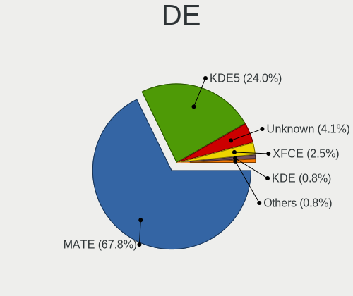
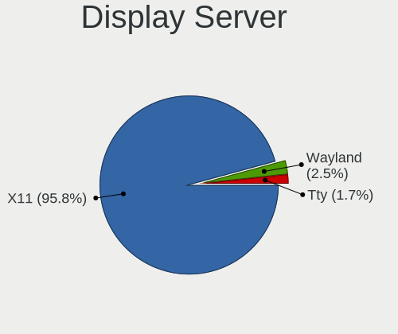
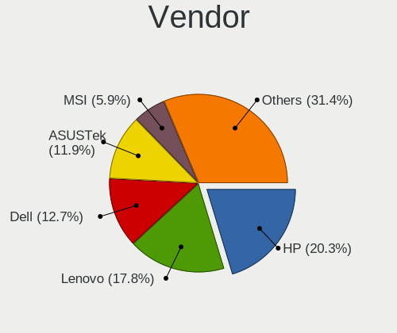
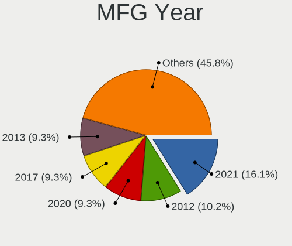
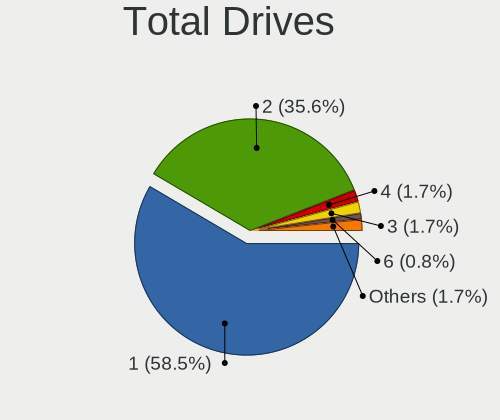
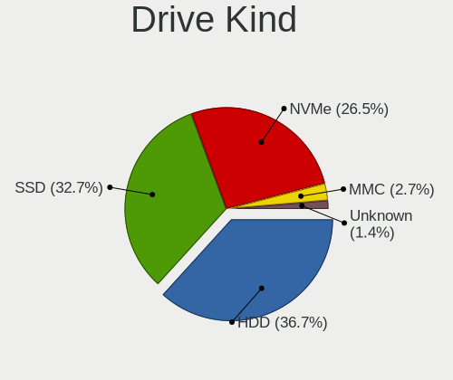
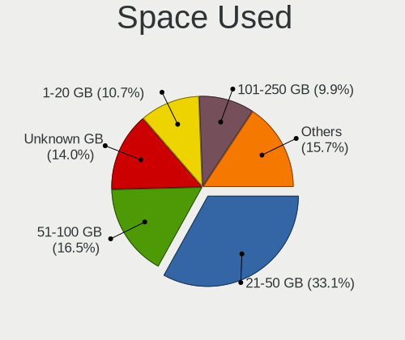
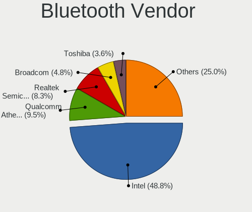
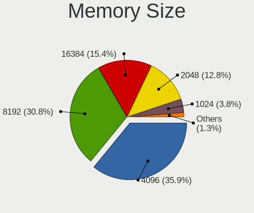
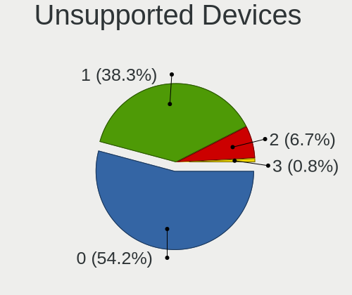

Parrot 5.0 - Tested Hardware & Statistics
-----------------------------------------

A project to collect tested hardware configurations for Parrot 5.0.

Anyone can contribute to this report by the [hw-probe](https://github.com/linuxhw/hw-probe) tool:

    sudo -E hw-probe -all -upload

Please contribute! Especially if your hardware is rare.

This is a report for all computer types. See also reports for [desktops](/Dist/Parrot_5.0/Desktop/README.md) and [notebooks](/Dist/Parrot_5.0/Notebook/README.md).

Contents
--------

* [ Test Cases ](#test-cases)

* [ System ](#system)
  - [ Kernel                   ](#kernel)
  - [ Kernel Family            ](#kernel-family)
  - [ Kernel Major Ver.        ](#kernel-major-ver)
  - [ Arch                     ](#arch)
  - [ DE                       ](#de)
  - [ Display Server           ](#display-server)
  - [ Display Manager          ](#display-manager)
  - [ OS Lang                  ](#os-lang)
  - [ Boot Mode                ](#boot-mode)
  - [ Filesystem               ](#filesystem)
  - [ Part. scheme             ](#part-scheme)
  - [ Dual Boot with Linux/BSD ](#dual-boot-with-linuxbsd)
  - [ Dual Boot (Win)          ](#dual-boot-win)

* [ Board ](#board)
  - [ Vendor                   ](#vendor)
  - [ Model                    ](#model)
  - [ Model Family             ](#model-family)
  - [ MFG Year                 ](#mfg-year)
  - [ Form Factor              ](#form-factor)
  - [ Secure Boot              ](#secure-boot)
  - [ Coreboot                 ](#coreboot)
  - [ RAM Size                 ](#ram-size)
  - [ RAM Used                 ](#ram-used)
  - [ Total Drives             ](#total-drives)
  - [ Has CD-ROM               ](#has-cd-rom)
  - [ Has Ethernet             ](#has-ethernet)
  - [ Has WiFi                 ](#has-wifi)
  - [ Has Bluetooth            ](#has-bluetooth)

* [ Location ](#location)
  - [ Country                  ](#country)
  - [ City                     ](#city)

* [ Drives ](#drives)
  - [ Drive Vendor             ](#drive-vendor)
  - [ Drive Model              ](#drive-model)
  - [ HDD Vendor               ](#hdd-vendor)
  - [ SSD Vendor               ](#ssd-vendor)
  - [ Drive Kind               ](#drive-kind)
  - [ Drive Connector          ](#drive-connector)
  - [ Drive Size               ](#drive-size)
  - [ Space Total              ](#space-total)
  - [ Space Used               ](#space-used)
  - [ Malfunc. Drives          ](#malfunc-drives)
  - [ Malfunc. Drive Vendor    ](#malfunc-drive-vendor)
  - [ Malfunc. HDD Vendor      ](#malfunc-hdd-vendor)
  - [ Malfunc. Drive Kind      ](#malfunc-drive-kind)
  - [ Failed Drives            ](#failed-drives)
  - [ Failed Drive Vendor      ](#failed-drive-vendor)
  - [ Drive Status             ](#drive-status)

* [ Storage controller ](#storage-controller)
  - [ Storage Vendor           ](#storage-vendor)
  - [ Storage Model            ](#storage-model)
  - [ Storage Kind             ](#storage-kind)

* [ Processor ](#processor)
  - [ CPU Vendor               ](#cpu-vendor)
  - [ CPU Model                ](#cpu-model)
  - [ CPU Model Family         ](#cpu-model-family)
  - [ CPU Cores                ](#cpu-cores)
  - [ CPU Sockets              ](#cpu-sockets)
  - [ CPU Threads              ](#cpu-threads)
  - [ CPU Op-Modes             ](#cpu-op-modes)
  - [ CPU Microcode            ](#cpu-microcode)
  - [ CPU Microarch            ](#cpu-microarch)

* [ Graphics ](#graphics)
  - [ GPU Vendor               ](#gpu-vendor)
  - [ GPU Model                ](#gpu-model)
  - [ GPU Combo                ](#gpu-combo)
  - [ GPU Driver               ](#gpu-driver)
  - [ GPU Memory               ](#gpu-memory)

* [ Monitor ](#monitor)
  - [ Monitor Vendor           ](#monitor-vendor)
  - [ Monitor Model            ](#monitor-model)
  - [ Monitor Resolution       ](#monitor-resolution)
  - [ Monitor Diagonal         ](#monitor-diagonal)
  - [ Monitor Width            ](#monitor-width)
  - [ Aspect Ratio             ](#aspect-ratio)
  - [ Monitor Area             ](#monitor-area)
  - [ Pixel Density            ](#pixel-density)
  - [ Multiple Monitors        ](#multiple-monitors)

* [ Network ](#network)
  - [ Net Controller Vendor    ](#net-controller-vendor)
  - [ Net Controller Model     ](#net-controller-model)
  - [ Wireless Vendor          ](#wireless-vendor)
  - [ Wireless Model           ](#wireless-model)
  - [ Ethernet Vendor          ](#ethernet-vendor)
  - [ Ethernet Model           ](#ethernet-model)
  - [ Net Controller Kind      ](#net-controller-kind)
  - [ Used Controller          ](#used-controller)
  - [ NICs                     ](#nics)
  - [ IPv6                     ](#ipv6)

* [ Bluetooth ](#bluetooth)
  - [ Bluetooth Vendor         ](#bluetooth-vendor)
  - [ Bluetooth Model          ](#bluetooth-model)

* [ Sound ](#sound)
  - [ Sound Vendor             ](#sound-vendor)
  - [ Sound Model              ](#sound-model)

* [ Memory ](#memory)
  - [ Memory Vendor            ](#memory-vendor)
  - [ Memory Model             ](#memory-model)
  - [ Memory Kind              ](#memory-kind)
  - [ Memory Form Factor       ](#memory-form-factor)
  - [ Memory Size              ](#memory-size)
  - [ Memory Speed             ](#memory-speed)

* [ Printers & scanners ](#printers--scanners)
  - [ Printer Vendor           ](#printer-vendor)
  - [ Printer Model            ](#printer-model)
  - [ Scanner Vendor           ](#scanner-vendor)
  - [ Scanner Model            ](#scanner-model)

* [ Camera ](#camera)
  - [ Camera Vendor            ](#camera-vendor)
  - [ Camera Model             ](#camera-model)

* [ Security ](#security)
  - [ Fingerprint Vendor       ](#fingerprint-vendor)
  - [ Fingerprint Model        ](#fingerprint-model)
  - [ Chipcard Vendor          ](#chipcard-vendor)
  - [ Chipcard Model           ](#chipcard-model)

* [ Unsupported ](#unsupported)
  - [ Unsupported Devices      ](#unsupported-devices)
  - [ Unsupported Device Types ](#unsupported-device-types)

Test Cases
----------

Total: 137

| Vendor        | Model                       | Form-Factor | Probe                                                      | Date         |
|---------------|-----------------------------|-------------|------------------------------------------------------------|--------------|
| ASUSTek       | PRIME B550-PLUS             | Desktop     | [3ba50e78b9](https://linux-hardware.org/?probe=3ba50e78b9) | Jun 29, 2022 |
| ASUSTek       | PRIME B550-PLUS             | Desktop     | [f33854651b](https://linux-hardware.org/?probe=f33854651b) | Jun 29, 2022 |
| Samsung       | 930QDB                      | Convertible | [e022aed2bc](https://linux-hardware.org/?probe=e022aed2bc) | Jun 28, 2022 |
| HP            | ENVY x360 Convertible 13... | Convertible | [8b55dcfd2d](https://linux-hardware.org/?probe=8b55dcfd2d) | Jun 28, 2022 |
| HP            | ENVY x360 Convertible 13... | Convertible | [d4969dd4f5](https://linux-hardware.org/?probe=d4969dd4f5) | Jun 28, 2022 |
| ASUSTek       | H110M-K                     | Desktop     | [d1b8d3ff84](https://linux-hardware.org/?probe=d1b8d3ff84) | Jun 27, 2022 |
| HP            | Pavilion dv6                | Notebook    | [ff3ebff8ff](https://linux-hardware.org/?probe=ff3ebff8ff) | Jun 27, 2022 |
| HP            | ENVY x360 Convertible 15... | Convertible | [6348a01f19](https://linux-hardware.org/?probe=6348a01f19) | Jun 23, 2022 |
| ASUSTek       | H110M-K                     | Desktop     | [656a452bc6](https://linux-hardware.org/?probe=656a452bc6) | Jun 21, 2022 |
| HP            | ProBook 440 G5              | Notebook    | [2969400046](https://linux-hardware.org/?probe=2969400046) | Jun 20, 2022 |
| Gigabyte      | H61M-USB3H                  | Desktop     | [6b9dcbd952](https://linux-hardware.org/?probe=6b9dcbd952) | Jun 20, 2022 |
| Toshiba       | Satellite-L845              | Notebook    | [d617282ee0](https://linux-hardware.org/?probe=d617282ee0) | Jun 18, 2022 |
| Lenovo        | IdeaPad 3 15IIL05 81WE      | Notebook    | [4cafd85b65](https://linux-hardware.org/?probe=4cafd85b65) | Jun 15, 2022 |
| Lenovo        | IdeaPad 3 15IIL05 81WE      | Notebook    | [39351344b4](https://linux-hardware.org/?probe=39351344b4) | Jun 14, 2022 |
| Lenovo        | IdeaPad 3 15IIL05 81WE      | Notebook    | [2a3c65eda7](https://linux-hardware.org/?probe=2a3c65eda7) | Jun 10, 2022 |
| Lenovo        | ThinkPad T470p 20J7S0CF0... | Notebook    | [e2efffbd81](https://linux-hardware.org/?probe=e2efffbd81) | Jun 07, 2022 |
| HP            | ENVY x360 Convertible 13... | Convertible | [ffb41db26d](https://linux-hardware.org/?probe=ffb41db26d) | Jun 07, 2022 |
| Lenovo        | ThinkPad T470p 20J7S0CF0... | Notebook    | [c509b12c63](https://linux-hardware.org/?probe=c509b12c63) | Jun 07, 2022 |
| SLIMBOOK      | ONE-AMD-M4                  | Desktop     | [c268e7111b](https://linux-hardware.org/?probe=c268e7111b) | Jun 07, 2022 |
| Dell          | Inspiron 15-3567            | Notebook    | [fd246079ad](https://linux-hardware.org/?probe=fd246079ad) | Jun 04, 2022 |
| HP            | ENVY x360 m6 Convertible    | Convertible | [7e3fc5fe06](https://linux-hardware.org/?probe=7e3fc5fe06) | Jun 02, 2022 |
| HP            | ENVY x360 m6 Convertible    | Convertible | [02ace99875](https://linux-hardware.org/?probe=02ace99875) | Jun 02, 2022 |
| HP            | ENVY x360 Convertible 13... | Convertible | [449fc46111](https://linux-hardware.org/?probe=449fc46111) | Jun 01, 2022 |
| HUAWEI        | BOHK-WAX9X                  | Notebook    | [c4468417e9](https://linux-hardware.org/?probe=c4468417e9) | Jun 01, 2022 |
| Lenovo        | ThinkPad X230 2325N66       | Notebook    | [2061351dbc](https://linux-hardware.org/?probe=2061351dbc) | May 28, 2022 |
| Dell          | Latitude E6540              | Notebook    | [9171fd4d35](https://linux-hardware.org/?probe=9171fd4d35) | May 26, 2022 |
| Dell          | Latitude E6540              | Notebook    | [e7a078f1a1](https://linux-hardware.org/?probe=e7a078f1a1) | May 26, 2022 |
| Lenovo        | Legion 5 15ACH6 82JW        | Notebook    | [dbf37b46f6](https://linux-hardware.org/?probe=dbf37b46f6) | May 25, 2022 |
| Lenovo        | Legion 5 15ACH6 82JW        | Notebook    | [9fcb918138](https://linux-hardware.org/?probe=9fcb918138) | May 25, 2022 |
| Dell          | Latitude 5400               | Notebook    | [fdfa7356be](https://linux-hardware.org/?probe=fdfa7356be) | May 23, 2022 |
| Lenovo        | IdeaPad 320S-14IKB 80X4     | Notebook    | [aa6aefb86a](https://linux-hardware.org/?probe=aa6aefb86a) | May 21, 2022 |
| Lenovo        | 31900058 STD                | Desktop     | [cb4959b996](https://linux-hardware.org/?probe=cb4959b996) | May 21, 2022 |
| Gigabyte      | B450M DS3H-CF               | Desktop     | [fb7cb376e9](https://linux-hardware.org/?probe=fb7cb376e9) | May 21, 2022 |
| Dell          | Latitude E6410              | Notebook    | [b098a84988](https://linux-hardware.org/?probe=b098a84988) | May 20, 2022 |
| MSI           | G31M3-L V2                  | Desktop     | [29d45c64bb](https://linux-hardware.org/?probe=29d45c64bb) | May 11, 2022 |
| MSI           | GE62 6QE                    | Notebook    | [6a3161d4ee](https://linux-hardware.org/?probe=6a3161d4ee) | May 09, 2022 |
| HP            | 1495                        | Desktop     | [c845f7b657](https://linux-hardware.org/?probe=c845f7b657) | May 05, 2022 |
| Lenovo        | V330-15IKB 81AX             | Notebook    | [60a636868c](https://linux-hardware.org/?probe=60a636868c) | Apr 30, 2022 |
| SLIMBOOK      | ONE-AMD-M4                  | Desktop     | [99911022e9](https://linux-hardware.org/?probe=99911022e9) | Apr 26, 2022 |
| ASUSTek       | ROG Strix G733ZX_G733ZX     | Notebook    | [032acaf88c](https://linux-hardware.org/?probe=032acaf88c) | Apr 25, 2022 |
| HUAWEI        | HVY-WXX9                    | Notebook    | [56d949b3bb](https://linux-hardware.org/?probe=56d949b3bb) | Apr 23, 2022 |
| HP            | EliteBook 8470p             | Notebook    | [0ee15f97fd](https://linux-hardware.org/?probe=0ee15f97fd) | Apr 23, 2022 |
| Lenovo        | IdeaPad L340-17API 81LY     | Notebook    | [4d911b0d94](https://linux-hardware.org/?probe=4d911b0d94) | Apr 22, 2022 |
| ASUSTek       | PRIME H310M-D R2.0          | Desktop     | [9c06485301](https://linux-hardware.org/?probe=9c06485301) | Apr 21, 2022 |
| HP            | 18E7                        | Desktop     | [1b6db66cc1](https://linux-hardware.org/?probe=1b6db66cc1) | Apr 19, 2022 |
| ASUSTek       | B85M-E                      | Desktop     | [93306ff9ee](https://linux-hardware.org/?probe=93306ff9ee) | Apr 17, 2022 |
| MSI           | Modern 15 A5M               | Notebook    | [7e03ed9f70](https://linux-hardware.org/?probe=7e03ed9f70) | Apr 13, 2022 |
| Apple         | MacBookPro15,1              | Notebook    | [b9187e8521](https://linux-hardware.org/?probe=b9187e8521) | Apr 13, 2022 |
| MSI           | Modern 15 A5M               | Notebook    | [bdccad7bf9](https://linux-hardware.org/?probe=bdccad7bf9) | Apr 12, 2022 |
| HP            | ENVY x360 Convertible 13... | Convertible | [cee28f4953](https://linux-hardware.org/?probe=cee28f4953) | Apr 12, 2022 |
| Razer         | Blade 15 Base Model (Ear... | Notebook    | [0832404b40](https://linux-hardware.org/?probe=0832404b40) | Apr 11, 2022 |
| MSI           | B350 TOMAHAWK               | Desktop     | [b1a322fa38](https://linux-hardware.org/?probe=b1a322fa38) | Apr 11, 2022 |
| HP            | ENVY x360 Convertible 13... | Convertible | [b3afe4ff08](https://linux-hardware.org/?probe=b3afe4ff08) | Apr 11, 2022 |
| ASUSTek       | X540SAA                     | Notebook    | [b670324e44](https://linux-hardware.org/?probe=b670324e44) | Apr 10, 2022 |
| Lenovo        | IdeaPad L340-17API 81LY     | Notebook    | [8cb4405c5f](https://linux-hardware.org/?probe=8cb4405c5f) | Apr 09, 2022 |
| HP            | Pavilion x360 Convertibl... | Convertible | [320ae25dbf](https://linux-hardware.org/?probe=320ae25dbf) | Apr 09, 2022 |
| Toshiba       | Satellite Click 2 L35W-B    | Notebook    | [f992f9305a](https://linux-hardware.org/?probe=f992f9305a) | Apr 07, 2022 |
| MSI           | Modern 15 A5M               | Notebook    | [e422a0e166](https://linux-hardware.org/?probe=e422a0e166) | Apr 05, 2022 |
| MSI           | Modern 15 A5M               | Notebook    | [b96e97fa2b](https://linux-hardware.org/?probe=b96e97fa2b) | Apr 04, 2022 |
| MSI           | Modern 15 A5M               | Notebook    | [401792c28e](https://linux-hardware.org/?probe=401792c28e) | Apr 01, 2022 |
| Alienware     | M14xR1                      | Notebook    | [f3ea3f497c](https://linux-hardware.org/?probe=f3ea3f497c) | Apr 01, 2022 |
| HP            | Notebook                    | Notebook    | [313ca81d16](https://linux-hardware.org/?probe=313ca81d16) | Mar 27, 2022 |
| ECS           | Nettle2                     | Desktop     | [4939d60e6d](https://linux-hardware.org/?probe=4939d60e6d) | Mar 27, 2022 |
| HP            | 18E7                        | Desktop     | [d8d1c3d468](https://linux-hardware.org/?probe=d8d1c3d468) | Mar 26, 2022 |
| ASUSTek       | X540SAA                     | Notebook    | [988b4570ed](https://linux-hardware.org/?probe=988b4570ed) | Mar 24, 2022 |
| MSI           | Modern 15 A5M               | Notebook    | [72245fe662](https://linux-hardware.org/?probe=72245fe662) | Mar 22, 2022 |
| Lenovo        | SHARKBAY 31900058 STD       | Desktop     | [85260f6ed1](https://linux-hardware.org/?probe=85260f6ed1) | Mar 20, 2022 |
| Lenovo        | SHARKBAY 31900058 STD       | Desktop     | [e849ec3916](https://linux-hardware.org/?probe=e849ec3916) | Mar 20, 2022 |
| ASUSTek       | B85M-E                      | Desktop     | [b0769dffdd](https://linux-hardware.org/?probe=b0769dffdd) | Mar 19, 2022 |
| ASUSTek       | ROG CROSSHAIR VIII HERO     | Desktop     | [2c1ca9145b](https://linux-hardware.org/?probe=2c1ca9145b) | Mar 18, 2022 |
| ASUSTek       | H170M-E D3                  | Desktop     | [167928d6e9](https://linux-hardware.org/?probe=167928d6e9) | Mar 17, 2022 |
| ASUSTek       | H170M-E D3                  | Desktop     | [937c0097ca](https://linux-hardware.org/?probe=937c0097ca) | Mar 14, 2022 |
| ASRock        | Z87M Extreme4               | Desktop     | [dba57ee1b3](https://linux-hardware.org/?probe=dba57ee1b3) | Mar 12, 2022 |
| ASUSTek       | X75VC                       | Notebook    | [3973070120](https://linux-hardware.org/?probe=3973070120) | Mar 12, 2022 |
| Jumper        | EZbook                      | Notebook    | [c374bd5058](https://linux-hardware.org/?probe=c374bd5058) | Mar 11, 2022 |
| Apple         | MacBookAir3,1               | Notebook    | [320f9e6841](https://linux-hardware.org/?probe=320f9e6841) | Mar 11, 2022 |
| Metabox       | Edge-Pro NS50MU             | Notebook    | [1371afa6ac](https://linux-hardware.org/?probe=1371afa6ac) | Mar 11, 2022 |
| Apple         | MacBookPro11,4              | Notebook    | [b27d8c8724](https://linux-hardware.org/?probe=b27d8c8724) | Mar 10, 2022 |
| Dell          | Inspiron 5570               | Notebook    | [e77116d171](https://linux-hardware.org/?probe=e77116d171) | Mar 10, 2022 |
| ASUSTek       | B85M-E                      | Desktop     | [161eda858b](https://linux-hardware.org/?probe=161eda858b) | Mar 10, 2022 |
| ASUSTek       | B85M-E                      | Desktop     | [36bada67c8](https://linux-hardware.org/?probe=36bada67c8) | Mar 08, 2022 |
| Dell          | Latitude XT2                | Notebook    | [ff6a48346f](https://linux-hardware.org/?probe=ff6a48346f) | Mar 07, 2022 |
| Jumper        | EZbook                      | Notebook    | [09544efb61](https://linux-hardware.org/?probe=09544efb61) | Mar 05, 2022 |
| Apple         | MacBookPro11,4              | Notebook    | [fb03915a3e](https://linux-hardware.org/?probe=fb03915a3e) | Mar 03, 2022 |
| SLIMBOOK      | ONE-AMD-M4                  | Desktop     | [d92c05a18a](https://linux-hardware.org/?probe=d92c05a18a) | Mar 03, 2022 |
| Daewoo Luc... | Solo Top                    | Desktop     | [7f7b20688f](https://linux-hardware.org/?probe=7f7b20688f) | Mar 03, 2022 |
| Jumper        | EZbook                      | Notebook    | [de9a14c4ec](https://linux-hardware.org/?probe=de9a14c4ec) | Mar 02, 2022 |
| Chuwi         | GemiBook                    | Notebook    | [bb9f45273a](https://linux-hardware.org/?probe=bb9f45273a) | Mar 01, 2022 |
| SLIMBOOK      | ONE-AMD-M4                  | Desktop     | [dc43686a5a](https://linux-hardware.org/?probe=dc43686a5a) | Feb 27, 2022 |
| Samsung       | 550P5C/550P7C               | Notebook    | [f14f73025f](https://linux-hardware.org/?probe=f14f73025f) | Feb 27, 2022 |
| Dell          | 0GXM1W A02                  | Desktop     | [044a00e086](https://linux-hardware.org/?probe=044a00e086) | Feb 25, 2022 |
| Toshiba       | Satellite C75D-B            | Notebook    | [952057ee2b](https://linux-hardware.org/?probe=952057ee2b) | Feb 24, 2022 |
| Acer          | Nitro AN517-41              | Notebook    | [47b906a661](https://linux-hardware.org/?probe=47b906a661) | Feb 23, 2022 |
| Chuwi         | GemiBook                    | Notebook    | [25f5f358cb](https://linux-hardware.org/?probe=25f5f358cb) | Feb 17, 2022 |
| Acer          | Nitro AN515-54              | Notebook    | [f83ccc9cce](https://linux-hardware.org/?probe=f83ccc9cce) | Feb 15, 2022 |
| HP            | ProBook 4535s               | Notebook    | [0d0cd13f8b](https://linux-hardware.org/?probe=0d0cd13f8b) | Feb 12, 2022 |
| ASUSTek       | VivoBook 15_ASUS Laptop ... | Notebook    | [0df06bcae3](https://linux-hardware.org/?probe=0df06bcae3) | Feb 11, 2022 |
| HP            | Notebook                    | Notebook    | [1f47143486](https://linux-hardware.org/?probe=1f47143486) | Feb 06, 2022 |
| Apple         | MacBook7,1                  | Notebook    | [9f4f77f51d](https://linux-hardware.org/?probe=9f4f77f51d) | Feb 06, 2022 |
| Apple         | MacBook7,1                  | Notebook    | [b6d5344f4e](https://linux-hardware.org/?probe=b6d5344f4e) | Feb 04, 2022 |
| SLIMBOOK      | ONE-AMD-M4                  | Desktop     | [225e399fc1](https://linux-hardware.org/?probe=225e399fc1) | Feb 03, 2022 |
| Dell          | Inspiron N5110              | Notebook    | [5aa1140ad5](https://linux-hardware.org/?probe=5aa1140ad5) | Feb 02, 2022 |
| Lenovo        | ThinkPad T480 20L6SCYP00    | Notebook    | [d69eb6fc3e](https://linux-hardware.org/?probe=d69eb6fc3e) | Jan 30, 2022 |
| Acer          | Aspire A315-21              | Notebook    | [880cca4c8f](https://linux-hardware.org/?probe=880cca4c8f) | Jan 24, 2022 |
| Microsoft     | Surface Book                | Tablet      | [327a2ec07f](https://linux-hardware.org/?probe=327a2ec07f) | Jan 22, 2022 |
| Lenovo        | Yoga C930-13IKB 81C4        | Convertible | [1e5331da8c](https://linux-hardware.org/?probe=1e5331da8c) | Jan 21, 2022 |
| Dell          | Latitude 7480               | Notebook    | [e184163da5](https://linux-hardware.org/?probe=e184163da5) | Jan 19, 2022 |
| HP            | Pavilion Laptop 14-ec0xx... | Notebook    | [9901f0a14a](https://linux-hardware.org/?probe=9901f0a14a) | Jan 18, 2022 |
| HP            | Pavilion Laptop 14-ec0xx... | Notebook    | [3837c06ca1](https://linux-hardware.org/?probe=3837c06ca1) | Jan 18, 2022 |
| Dell          | Inspiron 5580               | Notebook    | [a8e7059c51](https://linux-hardware.org/?probe=a8e7059c51) | Jan 17, 2022 |
| Lenovo        | ThinkPad E14 20RA0016GE     | Notebook    | [46eeb2d4b8](https://linux-hardware.org/?probe=46eeb2d4b8) | Jan 14, 2022 |
| Lenovo        | ThinkPad X1 Extreme Gen ... | Notebook    | [4e45161acc](https://linux-hardware.org/?probe=4e45161acc) | Jan 12, 2022 |
| Lenovo        | ThinkPad X1 Carbon 5th 2... | Notebook    | [4c04661023](https://linux-hardware.org/?probe=4c04661023) | Jan 12, 2022 |
| Unknown       | Unknown                     | Desktop     | [bccc675fea](https://linux-hardware.org/?probe=bccc675fea) | Jan 08, 2022 |
| Microsoft     | Surface Pro 3               | Tablet      | [8f4b5410ad](https://linux-hardware.org/?probe=8f4b5410ad) | Jan 06, 2022 |
| Dell          | 04YP6J A01                  | Desktop     | [680408ec06](https://linux-hardware.org/?probe=680408ec06) | Jan 01, 2022 |
| Dell          | 04YP6J A01                  | Desktop     | [623d384766](https://linux-hardware.org/?probe=623d384766) | Jan 01, 2022 |
| Gigabyte      | A320M-S2H-CF                | Desktop     | [4ec2105ead](https://linux-hardware.org/?probe=4ec2105ead) | Jan 01, 2022 |
| Lenovo        | IdeaPad Y580                | Notebook    | [cbb37b3b6a](https://linux-hardware.org/?probe=cbb37b3b6a) | Dec 20, 2021 |
| Lenovo        | IdeaPad Y580                | Notebook    | [48d92517e3](https://linux-hardware.org/?probe=48d92517e3) | Dec 11, 2021 |
| Lenovo        | IdeaPad 3 15IIL05 81WE      | Notebook    | [550ad36300](https://linux-hardware.org/?probe=550ad36300) | Nov 26, 2021 |
| Lenovo        | IdeaPad 3 15IIL05 81WE      | Notebook    | [db67630cee](https://linux-hardware.org/?probe=db67630cee) | Nov 26, 2021 |
| MSI           | Creator Z16 Hiroshi F A1... | Notebook    | [40f615079d](https://linux-hardware.org/?probe=40f615079d) | Nov 23, 2021 |
| HP            | ZBook Firefly 14 G7 Mobi... | Notebook    | [0dc4672364](https://linux-hardware.org/?probe=0dc4672364) | Nov 21, 2021 |
| Dell          | Latitude E6410              | Notebook    | [2f9b89dbb4](https://linux-hardware.org/?probe=2f9b89dbb4) | Nov 09, 2021 |
| Acer          | TravelMate 5720             | Notebook    | [8e19effec8](https://linux-hardware.org/?probe=8e19effec8) | Nov 06, 2021 |
| HP            | Pavilion g7                 | Notebook    | [c1b5449516](https://linux-hardware.org/?probe=c1b5449516) | Nov 05, 2021 |
| Lenovo        | B50-80 80EW                 | Notebook    | [37a983c1e7](https://linux-hardware.org/?probe=37a983c1e7) | Oct 26, 2021 |
| Lenovo        | B50-80 80EW                 | Notebook    | [ca3a74943a](https://linux-hardware.org/?probe=ca3a74943a) | Oct 25, 2021 |
| Dell          | Latitude E7450              | Notebook    | [2d94d751ff](https://linux-hardware.org/?probe=2d94d751ff) | Oct 22, 2021 |
| Dell          | Latitude E7450              | Notebook    | [a2b09ead76](https://linux-hardware.org/?probe=a2b09ead76) | Oct 22, 2021 |
| HP            | Laptop 15q-dy0xxx           | Notebook    | [aa4c6c2a25](https://linux-hardware.org/?probe=aa4c6c2a25) | Oct 18, 2021 |
| HP            | Pavilion g7                 | Notebook    | [7e80ec4599](https://linux-hardware.org/?probe=7e80ec4599) | Oct 11, 2021 |
| HP            | Pavilion g7                 | Notebook    | [cd8ce3be30](https://linux-hardware.org/?probe=cd8ce3be30) | Oct 10, 2021 |
| HP            | Pavilion g7                 | Notebook    | [dd3f8159e0](https://linux-hardware.org/?probe=dd3f8159e0) | Oct 10, 2021 |
| Gigabyte      | A320M-S2H-CF                | Desktop     | [d0cd1577c7](https://linux-hardware.org/?probe=d0cd1577c7) | Oct 04, 2021 |
| HP            | EliteBook 840 G3            | Notebook    | [fb11994deb](https://linux-hardware.org/?probe=fb11994deb) | Oct 04, 2021 |

System
------

Kernel
------

Version of the Linux kernel

| Version                  | Computers | Percent |
|--------------------------|-----------|---------|
| 5.16.0-12parrot1-amd64   | 43        | 43.43%  |
| 5.14.0-9parrot1-amd64    | 39        | 39.39%  |
| 5.15.0-15parrot1-amd64   | 7         | 7.07%   |
| 5.14.0-2parrot1-amd64    | 7         | 7.07%   |
| 5.18.0-1parrot1-amd64    | 1         | 1.01%   |
| 5.16.0-12parrot1-686-pae | 1         | 1.01%   |
| 5.15.0-5parrot1-amd64    | 1         | 1.01%   |

Kernel Family
-------------

Linux kernel without a distro release

| Version | Computers | Percent |
|---------|-----------|---------|
| 5.16.0  | 44        | 45.36%  |
| 5.14.0  | 44        | 45.36%  |
| 5.15.0  | 8         | 8.25%   |
| 5.18.0  | 1         | 1.03%   |

Kernel Major Ver.
-----------------

Linux kernel major version

| Version | Computers | Percent |
|---------|-----------|---------|
| 5.16    | 44        | 45.36%  |
| 5.14    | 44        | 45.36%  |
| 5.15    | 8         | 8.25%   |
| 5.18    | 1         | 1.03%   |

Arch
----

OS architecture (x86_64, i586, etc.)

| Name   | Computers | Percent |
|--------|-----------|---------|
| x86_64 | 94        | 98.95%  |
| i686   | 1         | 1.05%   |

DE
--

Desktop Environment

| Name    | Computers | Percent |
|---------|-----------|---------|
| MATE    | 64        | 66.67%  |
| KDE5    | 25        | 26.04%  |
| Unknown | 3         | 3.13%   |
| XFCE    | 2         | 2.08%   |
| KDE     | 1         | 1.04%   |
| GNOME   | 1         | 1.04%   |

Display Server
--------------

X11 or Wayland

| Name    | Computers | Percent |
|---------|-----------|---------|
| X11     | 92        | 96.84%  |
| Wayland | 3         | 3.16%   |

Display Manager
---------------

SDDM, LightDM, etc.

| Name    | Computers | Percent |
|---------|-----------|---------|
| LightDM | 56        | 58.95%  |
| Unknown | 36        | 37.89%  |
| SDDM    | 2         | 2.11%   |
| GDM     | 1         | 1.05%   |

OS Lang
-------

Language

| Lang  | Computers | Percent |
|-------|-----------|---------|
| en_US | 52        | 54.74%  |
| en_GB | 9         | 9.47%   |
| es_ES | 6         | 6.32%   |
| en_IN | 5         | 5.26%   |
| pt_BR | 4         | 4.21%   |
| ru_RU | 3         | 3.16%   |
| fr_FR | 3         | 3.16%   |
| en_AU | 2         | 2.11%   |
| de_DE | 2         | 2.11%   |
| cs_CZ | 2         | 2.11%   |
| pt_PT | 1         | 1.05%   |
| pl_PL | 1         | 1.05%   |
| es_PE | 1         | 1.05%   |
| es_MX | 1         | 1.05%   |
| es_AR | 1         | 1.05%   |
| en_ZA | 1         | 1.05%   |
| en_DK | 1         | 1.05%   |

Boot Mode
---------

EFI or BIOS

| Mode | Computers | Percent |
|------|-----------|---------|
| BIOS | 54        | 56.84%  |
| EFI  | 41        | 43.16%  |

Filesystem
----------

Type of filesystem

| Type    | Computers | Percent |
|---------|-----------|---------|
| Btrfs   | 79        | 83.16%  |
| Ext4    | 11        | 11.58%  |
| Overlay | 5         | 5.26%   |

Part. scheme
------------

Scheme of partitioning

| Type    | Computers | Percent |
|---------|-----------|---------|
| GPT     | 42        | 44.21%  |
| Unknown | 41        | 43.16%  |
| MBR     | 12        | 12.63%  |

Dual Boot with Linux/BSD
------------------------

Hosting more than one Linux/BSD

| Dual boot | Computers | Percent |
|-----------|-----------|---------|
| No        | 85        | 89.47%  |
| Yes       | 10        | 10.53%  |

Dual Boot (Win)
---------------

Hosting Linux and Windows

| Dual boot | Computers | Percent |
|-----------|-----------|---------|
| No        | 65        | 68.42%  |
| Yes       | 30        | 31.58%  |

Board
-----

Vendor
------

Motherboard manufacturer

| Name                | Computers | Percent |
|---------------------|-----------|---------|
| Hewlett-Packard     | 19        | 20%     |
| Lenovo              | 17        | 17.89%  |
| Dell                | 13        | 13.68%  |
| ASUSTek Computer    | 10        | 10.53%  |
| MSI                 | 7         | 7.37%   |
| Acer                | 4         | 4.21%   |
| Toshiba             | 3         | 3.16%   |
| Gigabyte Technology | 3         | 3.16%   |
| Apple               | 3         | 3.16%   |
| Samsung Electronics | 2         | 2.11%   |
| Microsoft           | 2         | 2.11%   |
| HUAWEI              | 2         | 2.11%   |
| SLIMBOOK            | 1         | 1.05%   |
| Razer               | 1         | 1.05%   |
| Metabox             | 1         | 1.05%   |
| Jumper              | 1         | 1.05%   |
| ECS                 | 1         | 1.05%   |
| Daewoo Lucoms       | 1         | 1.05%   |
| Chuwi               | 1         | 1.05%   |
| ASRock              | 1         | 1.05%   |
| Alienware           | 1         | 1.05%   |
| Unknown             | 1         | 1.05%   |

Model
-----

Motherboard model

| Name                                               | Computers | Percent |
|----------------------------------------------------|-----------|---------|
| MSI Modern 15 A5M                                  | 3         | 3.16%   |
| Lenovo IdeaPad 3 15IIL05 81WE                      | 2         | 2.11%   |
| HP ProDesk 600 G1 SFF                              | 2         | 2.11%   |
| HP Notebook                                        | 2         | 2.11%   |
| HP ENVY x360 Convertible 13-bd0xxx                 | 2         | 2.11%   |
| Dell Latitude E6410                                | 2         | 2.11%   |
| Toshiba Satellite-L845                             | 1         | 1.05%   |
| Toshiba Satellite Click 2 L35W-B                   | 1         | 1.05%   |
| Toshiba Satellite C75D-B                           | 1         | 1.05%   |
| SLIMBOOK ONE-AMD-M4                                | 1         | 1.05%   |
| Samsung 930QDB                                     | 1         | 1.05%   |
| Samsung 550P5C/550P7C                              | 1         | 1.05%   |
| Razer Blade 15 Base Model (Early 2020) - RZ09-0328 | 1         | 1.05%   |
| MSI MS-7A34                                        | 1         | 1.05%   |
| MSI MS-7529                                        | 1         | 1.05%   |
| MSI GE62 6QE                                       | 1         | 1.05%   |
| MSI Creator Z16 Hiroshi F A11UE                    | 1         | 1.05%   |
| Microsoft Surface Pro 3                            | 1         | 1.05%   |
| Microsoft Surface Book                             | 1         | 1.05%   |
| Metabox Edge-Pro NS50MU                            | 1         | 1.05%   |
| Lenovo Yoga C930-13IKB 81C4                        | 1         | 1.05%   |
| Lenovo V330-15IKB 81AX                             | 1         | 1.05%   |
| Lenovo ThinkPad X230 2325N66                       | 1         | 1.05%   |
| Lenovo ThinkPad X1 Extreme Gen 3 20TK001GUS        | 1         | 1.05%   |
| Lenovo ThinkPad X1 Carbon 5th 20HRCTO1WW           | 1         | 1.05%   |
| Lenovo ThinkPad T480 20L6SCYP00                    | 1         | 1.05%   |
| Lenovo ThinkPad T470p 20J7S0CF00                   | 1         | 1.05%   |
| Lenovo ThinkPad E14 20RA0016GE                     | 1         | 1.05%   |
| Lenovo Legion 5 15ACH6 82JW                        | 1         | 1.05%   |
| Lenovo IdeaPad Y580                                | 1         | 1.05%   |
| Lenovo IdeaPad L340-17API 81LY                     | 1         | 1.05%   |
| Lenovo IdeaPad 320S-14IKB 80X4                     | 1         | 1.05%   |
| Lenovo H535 10117                                  | 1         | 1.05%   |
| Lenovo H530 10130                                  | 1         | 1.05%   |
| Lenovo B50-80 80EW                                 | 1         | 1.05%   |
| Jumper EZbook                                      | 1         | 1.05%   |
| HUAWEI HVY-WXX9                                    | 1         | 1.05%   |
| HUAWEI BOHK-WAX9X                                  | 1         | 1.05%   |
| HP ZBook Firefly 14 G7 Mobile Workstation          | 1         | 1.05%   |
| HP ProBook 4535s                                   | 1         | 1.05%   |
| HP ProBook 440 G5                                  | 1         | 1.05%   |
| HP Pavilion x360 Convertible 14-ba0xx              | 1         | 1.05%   |
| HP Pavilion Laptop 14-ec0xxx                       | 1         | 1.05%   |
| HP Pavilion g7                                     | 1         | 1.05%   |
| HP Pavilion dv6                                    | 1         | 1.05%   |
| HP Laptop 15q-dy0xxx                               | 1         | 1.05%   |
| HP ENVY x360 m6 Convertible                        | 1         | 1.05%   |
| HP ENVY x360 Convertible 15m-es0xxx                | 1         | 1.05%   |
| HP EliteBook 8470p                                 | 1         | 1.05%   |
| HP EliteBook 840 G3                                | 1         | 1.05%   |
| HP Compaq 8200 Elite SFF PC                        | 1         | 1.05%   |
| Gigabyte H61M-USB3H                                | 1         | 1.05%   |
| Gigabyte B450M DS3H                                | 1         | 1.05%   |
| Gigabyte A320M-S2H                                 | 1         | 1.05%   |
| ECS GV460AA-ABA a6217c                             | 1         | 1.05%   |
| Dell OptiPlex 7010                                 | 1         | 1.05%   |
| Dell OptiPlex 3020                                 | 1         | 1.05%   |
| Dell Latitude XT2                                  | 1         | 1.05%   |
| Dell Latitude E7450                                | 1         | 1.05%   |
| Dell Latitude E6540                                | 1         | 1.05%   |

Model Family
------------

Motherboard model prefix

| Name                   | Computers | Percent |
|------------------------|-----------|---------|
| Dell Latitude          | 7         | 7.37%   |
| Lenovo ThinkPad        | 6         | 6.32%   |
| Lenovo IdeaPad         | 5         | 5.26%   |
| HP Pavilion            | 4         | 4.21%   |
| HP ENVY                | 4         | 4.21%   |
| Dell Inspiron          | 4         | 4.21%   |
| MSI Modern             | 3         | 3.16%   |
| Toshiba Satellite      | 2         | 2.11%   |
| Microsoft Surface      | 2         | 2.11%   |
| HP ProDesk             | 2         | 2.11%   |
| HP ProBook             | 2         | 2.11%   |
| HP Notebook            | 2         | 2.11%   |
| HP EliteBook           | 2         | 2.11%   |
| Dell OptiPlex          | 2         | 2.11%   |
| ASUS ROG               | 2         | 2.11%   |
| ASUS PRIME             | 2         | 2.11%   |
| Acer Nitro             | 2         | 2.11%   |
| Toshiba Satellite-L845 | 1         | 1.05%   |
| SLIMBOOK ONE-AMD-M4    | 1         | 1.05%   |
| Samsung 930QDB         | 1         | 1.05%   |
| Samsung 550P5C         | 1         | 1.05%   |
| Razer Blade            | 1         | 1.05%   |
| MSI MS-7A34            | 1         | 1.05%   |
| MSI MS-7529            | 1         | 1.05%   |
| MSI GE62               | 1         | 1.05%   |
| MSI Creator            | 1         | 1.05%   |
| Metabox Edge-Pro       | 1         | 1.05%   |
| Lenovo Yoga            | 1         | 1.05%   |
| Lenovo V330-15IKB      | 1         | 1.05%   |
| Lenovo Legion          | 1         | 1.05%   |
| Lenovo H535            | 1         | 1.05%   |
| Lenovo H530            | 1         | 1.05%   |
| Lenovo B50-80          | 1         | 1.05%   |
| Jumper EZbook          | 1         | 1.05%   |
| HUAWEI HVY-WXX9        | 1         | 1.05%   |
| HUAWEI BOHK-WAX9X      | 1         | 1.05%   |
| HP ZBook               | 1         | 1.05%   |
| HP Laptop              | 1         | 1.05%   |
| HP Compaq              | 1         | 1.05%   |
| Gigabyte H61M-USB3H    | 1         | 1.05%   |
| Gigabyte B450M         | 1         | 1.05%   |
| Gigabyte A320M-S2H     | 1         | 1.05%   |
| ECS GV460AA-ABA        | 1         | 1.05%   |
| Daewoo Lucoms OEM      | 1         | 1.05%   |
| Chuwi GemiBook         | 1         | 1.05%   |
| ASUS X75VC             | 1         | 1.05%   |
| ASUS X540SAA           | 1         | 1.05%   |
| ASUS VivoBook          | 1         | 1.05%   |
| ASUS H170M-E           | 1         | 1.05%   |
| ASUS H110M-K           | 1         | 1.05%   |
| ASUS Basic             | 1         | 1.05%   |
| ASRock Z87M            | 1         | 1.05%   |
| Apple MacBookPro15     | 1         | 1.05%   |
| Apple MacBookAir3      | 1         | 1.05%   |
| Apple MacBook7         | 1         | 1.05%   |
| Alienware M14xR1       | 1         | 1.05%   |
| Acer TravelMate        | 1         | 1.05%   |
| Acer Aspire            | 1         | 1.05%   |
| Unknown                | 1         | 1.05%   |

MFG Year
--------

Motherboard manufacture year

| Year | Computers | Percent |
|------|-----------|---------|
| 2021 | 16        | 16.84%  |
| 2017 | 11        | 11.58%  |
| 2013 | 9         | 9.47%   |
| 2020 | 8         | 8.42%   |
| 2019 | 7         | 7.37%   |
| 2018 | 7         | 7.37%   |
| 2016 | 7         | 7.37%   |
| 2012 | 6         | 6.32%   |
| 2011 | 6         | 6.32%   |
| 2010 | 5         | 5.26%   |
| 2015 | 4         | 4.21%   |
| 2014 | 3         | 3.16%   |
| 2009 | 2         | 2.11%   |
| 2007 | 2         | 2.11%   |
| 2022 | 1         | 1.05%   |
| 2008 | 1         | 1.05%   |

Form Factor
-----------

Physical design of the computer

| Name        | Computers | Percent |
|-------------|-----------|---------|
| Notebook    | 63        | 66.32%  |
| Desktop     | 23        | 24.21%  |
| Convertible | 7         | 7.37%   |
| Tablet      | 2         | 2.11%   |

Secure Boot
-----------

Enabled or disabled

| State    | Computers | Percent |
|----------|-----------|---------|
| Disabled | 95        | 100%    |

Coreboot
--------

Have coreboot on board

| Used | Computers | Percent |
|------|-----------|---------|
| No   | 95        | 100%    |

RAM Size
--------

Total RAM memory

| Size in GB  | Computers | Percent |
|-------------|-----------|---------|
| 4.01-8.0    | 27        | 28.13%  |
| 16.01-24.0  | 17        | 17.71%  |
| 8.01-16.0   | 16        | 16.67%  |
| 32.01-64.0  | 15        | 15.63%  |
| 3.01-4.0    | 14        | 14.58%  |
| 64.01-256.0 | 3         | 3.13%   |
| 24.01-32.0  | 2         | 2.08%   |
| 1.01-2.0    | 2         | 2.08%   |

RAM Used
--------

Used RAM memory

| Used GB    | Computers | Percent |
|------------|-----------|---------|
| 2.01-3.0   | 39        | 40.21%  |
| 1.01-2.0   | 25        | 25.77%  |
| 4.01-8.0   | 17        | 17.53%  |
| 3.01-4.0   | 10        | 10.31%  |
| 0.51-1.0   | 3         | 3.09%   |
| 8.01-16.0  | 2         | 2.06%   |
| 16.01-24.0 | 1         | 1.03%   |

Total Drives
------------

Number of drives on board

| Drives | Computers | Percent |
|--------|-----------|---------|
| 1      | 55        | 57.89%  |
| 2      | 34        | 35.79%  |
| 3      | 2         | 2.11%   |
| 6      | 1         | 1.05%   |
| 5      | 1         | 1.05%   |
| 4      | 1         | 1.05%   |
| 0      | 1         | 1.05%   |

Has CD-ROM
----------

Has CD-ROM on board

| Presented | Computers | Percent |
|-----------|-----------|---------|
| No        | 72        | 75%     |
| Yes       | 24        | 25%     |

Has Ethernet
------------

Has Ethernet on board

| Presented | Computers | Percent |
|-----------|-----------|---------|
| Yes       | 74        | 77.08%  |
| No        | 22        | 22.92%  |

Has WiFi
--------

Has WiFi module

| Presented | Computers | Percent |
|-----------|-----------|---------|
| Yes       | 89        | 93.68%  |
| No        | 6         | 6.32%   |

Has Bluetooth
-------------

Has Bluetooth module

| Presented | Computers | Percent |
|-----------|-----------|---------|
| Yes       | 67        | 70.53%  |
| No        | 28        | 29.47%  |

Location
--------

Country
-------

Geographic location (country)

| Country      | Computers | Percent |
|--------------|-----------|---------|
| USA          | 33        | 34.02%  |
| UK           | 6         | 6.19%   |
| Spain        | 6         | 6.19%   |
| India        | 5         | 5.15%   |
| Brazil       | 5         | 5.15%   |
| Mexico       | 4         | 4.12%   |
| Germany      | 4         | 4.12%   |
| Netherlands  | 3         | 3.09%   |
| France       | 3         | 3.09%   |
| Denmark      | 3         | 3.09%   |
| South Africa | 2         | 2.06%   |
| Russia       | 2         | 2.06%   |
| Morocco      | 2         | 2.06%   |
| Czechia      | 2         | 2.06%   |
| Canada       | 2         | 2.06%   |
| Austria      | 2         | 2.06%   |
| Australia    | 2         | 2.06%   |
| Romania      | 1         | 1.03%   |
| Portugal     | 1         | 1.03%   |
| Peru         | 1         | 1.03%   |
| Mongolia     | 1         | 1.03%   |
| Kenya        | 1         | 1.03%   |
| Italy        | 1         | 1.03%   |
| Georgia      | 1         | 1.03%   |
| Egypt        | 1         | 1.03%   |
| Bulgaria     | 1         | 1.03%   |
| Argentina    | 1         | 1.03%   |
| Algeria      | 1         | 1.03%   |

City
----

Geographic location (city)

| City                   | Computers | Percent |
|------------------------|-----------|---------|
| Seattle                | 3         | 3.09%   |
| Vienna                 | 2         | 2.06%   |
| Tangier                | 2         | 2.06%   |
| Ruskin                 | 2         | 2.06%   |
| Camden                 | 2         | 2.06%   |
| Amsterdam              | 2         | 2.06%   |
| Villa Carlos Paz       | 1         | 1.03%   |
| Viby J                 | 1         | 1.03%   |
| Vapi                   | 1         | 1.03%   |
| Ulan Bator             | 1         | 1.03%   |
| Uherské Hradiště    | 1         | 1.03%   |
| Ts'khinvali            | 1         | 1.03%   |
| Trivandrum             | 1         | 1.03%   |
| Sydney                 | 1         | 1.03%   |
| Sumaré                | 1         | 1.03%   |
| St Petersburg          | 1         | 1.03%   |
| Springfield            | 1         | 1.03%   |
| Spotsylvania           | 1         | 1.03%   |
| South Hamilton         | 1         | 1.03%   |
| Skive                  | 1         | 1.03%   |
| Sao Paulo              | 1         | 1.03%   |
| Sao Joao de Meriti     | 1         | 1.03%   |
| Santa Maria            | 1         | 1.03%   |
| Saint Paul             | 1         | 1.03%   |
| Pretoria               | 1         | 1.03%   |
| Prague                 | 1         | 1.03%   |
| Point Pleasant Beach   | 1         | 1.03%   |
| Plovdiv                | 1         | 1.03%   |
| Pittsburgh             | 1         | 1.03%   |
| Phoenix                | 1         | 1.03%   |
| Pensacola              | 1         | 1.03%   |
| Orofino                | 1         | 1.03%   |
| Opelousas              | 1         | 1.03%   |
| Nairobi                | 1         | 1.03%   |
| Mt. Pleasant           | 1         | 1.03%   |
| Mostoles               | 1         | 1.03%   |
| Montreal               | 1         | 1.03%   |
| Montigny-le-Bretonneux | 1         | 1.03%   |
| Milton                 | 1         | 1.03%   |
| Mexicali               | 1         | 1.03%   |
| Melbourne              | 1         | 1.03%   |
| Mazatlán              | 1         | 1.03%   |
| Mata de Sao Joao       | 1         | 1.03%   |
| Maricopa               | 1         | 1.03%   |
| Mangalagiri            | 1         | 1.03%   |
| Madrid                 | 1         | 1.03%   |
| Lynwood                | 1         | 1.03%   |
| Los Angeles            | 1         | 1.03%   |
| Long Eaton             | 1         | 1.03%   |
| Lisbon                 | 1         | 1.03%   |
| Lille                  | 1         | 1.03%   |
| Leduc                  | 1         | 1.03%   |
| La Paz                 | 1         | 1.03%   |
| La Magdalena           | 1         | 1.03%   |
| Krasnogorsk            | 1         | 1.03%   |
| Ithaca                 | 1         | 1.03%   |
| Islington              | 1         | 1.03%   |
| Iasi                   | 1         | 1.03%   |
| Houston                | 1         | 1.03%   |
| Herne                  | 1         | 1.03%   |

Drives
------

Drive Vendor
------------

Hard drive vendors

| Vendor              | Computers | Drives | Percent |
|---------------------|-----------|--------|---------|
| Samsung Electronics | 23        | 30     | 17.56%  |
| Seagate             | 18        | 21     | 13.74%  |
| WDC                 | 17        | 20     | 12.98%  |
| Toshiba             | 14        | 14     | 10.69%  |
| Kingston            | 9         | 9      | 6.87%   |
| SanDisk             | 6         | 10     | 4.58%   |
| Unknown             | 5         | 6      | 3.82%   |
| Intel               | 3         | 9      | 2.29%   |
| Hitachi             | 3         | 4      | 2.29%   |
| HGST                | 3         | 3      | 2.29%   |
| China               | 3         | 4      | 2.29%   |
| SK hynix            | 2         | 2      | 1.53%   |
| PNY                 | 2         | 2      | 1.53%   |
| Micron Technology   | 2         | 2      | 1.53%   |
| Crucial             | 2         | 2      | 1.53%   |
| Apple               | 2         | 2      | 1.53%   |
| A-DATA Technology   | 2         | 2      | 1.53%   |
| YMTC                | 1         | 1      | 0.76%   |
| Team                | 1         | 1      | 0.76%   |
| SPCC                | 1         | 1      | 0.76%   |
| Silicon Motion      | 1         | 1      | 0.76%   |
| S3+                 | 1         | 1      | 0.76%   |
| Plextor             | 1         | 1      | 0.76%   |
| Phison              | 1         | 1      | 0.76%   |
| Netac               | 1         | 1      | 0.76%   |
| LITEON              | 1         | 1      | 0.76%   |
| KingSpec            | 1         | 1      | 0.76%   |
| KingFast            | 1         | 2      | 0.76%   |
| Intenso             | 1         | 2      | 0.76%   |
| HUAWEI              | 1         | 1      | 0.76%   |
| BHT                 | 1         | 1      | 0.76%   |
| ASMedia             | 1         | 1      | 0.76%   |

Drive Model
-----------

Hard drive models

| Model                                 | Computers | Percent |
|---------------------------------------|-----------|---------|
| Toshiba MQ04ABF100 1TB                | 5         | 3.45%   |
| Kingston NVMe SSD Drive 512GB         | 3         | 2.07%   |
| WDC WDS500G2B0A-00SM50 500GB SSD      | 2         | 1.38%   |
| Unknown MMC Card  32GB                | 2         | 1.38%   |
| Toshiba MQ01ABD075 752GB              | 2         | 1.38%   |
| Toshiba DT01ACA200 2TB                | 2         | 1.38%   |
| Seagate ST250DM000-1BD141 250GB       | 2         | 1.38%   |
| Seagate ST2000LM003 HN-M201RAD 2TB    | 2         | 1.38%   |
| SanDisk NVMe SSD Drive 1TB            | 2         | 1.38%   |
| Samsung SSD 970 EVO Plus 1TB          | 2         | 1.38%   |
| Kingston SV300S37A120G 120GB SSD      | 2         | 1.38%   |
| Intel HBRPEKNX0202AHO 32GB            | 2         | 1.38%   |
| Intel HBRPEKNX0202AH 512GB            | 2         | 1.38%   |
| HGST HTS721010A9E630 1TB              | 2         | 1.38%   |
| YMTC PC005 512GB                      | 1         | 0.69%   |
| WDC WDS240G2G0B-00EPW0 240GB SSD      | 1         | 0.69%   |
| WDC WDS240G2G0A-00JH30 240GB SSD      | 1         | 0.69%   |
| WDC WDS120G2G0A-00JH30 120GB SSD      | 1         | 0.69%   |
| WDC WDBRPG5000ANC-WRSN 500GB          | 1         | 0.69%   |
| WDC WDBNCE2500PNC 250GB SSD           | 1         | 0.69%   |
| WDC WD6400BPVT-75HXZT1 640GB          | 1         | 0.69%   |
| WDC WD5000AADS-00S9B0 500GB           | 1         | 0.69%   |
| WDC WD3200BPVT-00JJ5T0 320GB          | 1         | 0.69%   |
| WDC WD20EZAZ-00GGJB0 2TB              | 1         | 0.69%   |
| WDC WD2003FZEX-00Z4SA0 2TB            | 1         | 0.69%   |
| WDC WD10SPZX-75Z10T2 1TB              | 1         | 0.69%   |
| WDC WD10SPZX-24Z10 1TB                | 1         | 0.69%   |
| WDC WD10PURX-64E5EY0 1TB              | 1         | 0.69%   |
| WDC WD10EZRX-00L4HB0 1TB              | 1         | 0.69%   |
| WDC WD10EZEX-08M2NA0 1TB              | 1         | 0.69%   |
| WDC WD10EARS-00Y5B1 1TB               | 1         | 0.69%   |
| WDC PC SN720 SDAPNTW-512G-1101 512GB  | 1         | 0.69%   |
| Unknown SD/MMC/MS PRO 128GB           | 1         | 0.69%   |
| Unknown SD  128GB                     | 1         | 0.69%   |
| Unknown ISOCOM  64GB                  | 1         | 0.69%   |
| Unknown 256GB PCS 2.5" S              | 1         | 0.69%   |
| Toshiba MQ01ACF050 500GB              | 1         | 0.69%   |
| Toshiba MK2555GSXF 250GB              | 1         | 0.69%   |
| Toshiba MK2533GSGF 250GB              | 1         | 0.69%   |
| Toshiba HDWD105 500GB                 | 1         | 0.69%   |
| Toshiba DT01ACA050 500GB              | 1         | 0.69%   |
| Team TM8PS7512G 512GB SSD             | 1         | 0.69%   |
| SPCC Solid State Disk 240GB           | 1         | 0.69%   |
| SK hynix NVMe SSD Drive 1024GB        | 1         | 0.69%   |
| SK hynix HFS128G32TNF-N3A0A 128GB SSD | 1         | 0.69%   |
| Silicon Motion NVMe SSD Drive 128GB   | 1         | 0.69%   |
| Seagate ST9500325AS 500GB             | 1         | 0.69%   |
| Seagate ST9250315AS 250GB             | 1         | 0.69%   |
| Seagate ST500LT012-9WS142 500GB       | 1         | 0.69%   |
| Seagate ST500LM030-1RK17D 500GB       | 1         | 0.69%   |
| Seagate ST500LM021-1KJ152 500GB       | 1         | 0.69%   |
| Seagate ST500LM000-SSHD-8GB           | 1         | 0.69%   |
| Seagate ST500DM002-1BD142 500GB       | 1         | 0.69%   |
| Seagate ST3500312CS 500GB             | 1         | 0.69%   |
| Seagate ST3320418AS 320GB             | 1         | 0.69%   |
| Seagate ST31000528AS 1TB              | 1         | 0.69%   |
| Seagate ST2000NM0011 2TB              | 1         | 0.69%   |
| Seagate ST2000DM001-1ER164 2TB        | 1         | 0.69%   |
| Seagate ST1000LM035-1RK172 1TB        | 1         | 0.69%   |
| Seagate ST1000DM003-1SB10C 1TB        | 1         | 0.69%   |

HDD Vendor
----------

Hard disk drive vendors

| Vendor              | Computers | Drives | Percent |
|---------------------|-----------|--------|---------|
| Seagate             | 18        | 21     | 34.62%  |
| Toshiba             | 14        | 14     | 26.92%  |
| WDC                 | 10        | 12     | 19.23%  |
| Hitachi             | 3         | 4      | 5.77%   |
| HGST                | 3         | 3      | 5.77%   |
| Samsung Electronics | 2         | 2      | 3.85%   |
| Unknown             | 1         | 1      | 1.92%   |
| ASMedia             | 1         | 1      | 1.92%   |

SSD Vendor
----------

Solid state drive vendors

| Vendor              | Computers | Drives | Percent |
|---------------------|-----------|--------|---------|
| Samsung Electronics | 8         | 12     | 19.51%  |
| WDC                 | 6         | 6      | 14.63%  |
| Kingston            | 5         | 5      | 12.2%   |
| China               | 3         | 4      | 7.32%   |
| SanDisk             | 2         | 2      | 4.88%   |
| PNY                 | 2         | 2      | 4.88%   |
| Crucial             | 2         | 2      | 4.88%   |
| Unknown             | 1         | 1      | 2.44%   |
| Team                | 1         | 1      | 2.44%   |
| SPCC                | 1         | 1      | 2.44%   |
| SK hynix            | 1         | 1      | 2.44%   |
| S3+                 | 1         | 1      | 2.44%   |
| Plextor             | 1         | 1      | 2.44%   |
| Netac               | 1         | 1      | 2.44%   |
| LITEON              | 1         | 1      | 2.44%   |
| KingSpec            | 1         | 1      | 2.44%   |
| KingFast            | 1         | 1      | 2.44%   |
| Intenso             | 1         | 2      | 2.44%   |
| BHT                 | 1         | 1      | 2.44%   |
| Apple               | 1         | 1      | 2.44%   |

Drive Kind
----------

HDD or SSD

| Kind    | Computers | Drives | Percent |
|---------|-----------|--------|---------|
| HDD     | 44        | 58     | 36.67%  |
| SSD     | 39        | 47     | 32.5%   |
| NVMe    | 32        | 48     | 26.67%  |
| MMC     | 3         | 4      | 2.5%    |
| Unknown | 2         | 2      | 1.67%   |

Drive Connector
---------------

SATA, SAS, NVMe, etc.

| Type | Computers | Drives | Percent |
|------|-----------|--------|---------|
| SATA | 67        | 102    | 62.62%  |
| NVMe | 32        | 48     | 29.91%  |
| SAS  | 5         | 5      | 4.67%   |
| MMC  | 3         | 4      | 2.8%    |

Drive Size
----------

Size of hard drive

| Size in TB | Computers | Drives | Percent |
|------------|-----------|--------|---------|
| 0.01-0.5   | 48        | 65     | 57.83%  |
| 0.51-1.0   | 27        | 29     | 32.53%  |
| 1.01-2.0   | 8         | 11     | 9.64%   |

Space Total
-----------

Amount of disk space available on the file system

| Size in GB | Computers | Percent |
|------------|-----------|---------|
| 101-250    | 25        | 26.32%  |
| 501-1000   | 18        | 18.95%  |
| 251-500    | 16        | 16.84%  |
| 1001-2000  | 13        | 13.68%  |
| Unknown    | 13        | 13.68%  |
| 2001-3000  | 3         | 3.16%   |
| 1-20       | 3         | 3.16%   |
| 21-50      | 2         | 2.11%   |
| 51-100     | 2         | 2.11%   |

Space Used
----------

Amount of used disk space

| Used GB   | Computers | Percent |
|-----------|-----------|---------|
| 21-50     | 33        | 34.02%  |
| 51-100    | 16        | 16.49%  |
| Unknown   | 13        | 13.4%   |
| 1-20      | 11        | 11.34%  |
| 101-250   | 10        | 10.31%  |
| 251-500   | 8         | 8.25%   |
| 501-1000  | 5         | 5.15%   |
| 1001-2000 | 1         | 1.03%   |

Malfunc. Drives
---------------

Drive models with a malfunction

| Model                              | Computers | Drives | Percent |
|------------------------------------|-----------|--------|---------|
| WDC WD3200BPVT-00JJ5T0 320GB       | 1         | 1      | 9.09%   |
| WDC WD2003FZEX-00Z4SA0 2TB         | 1         | 1      | 9.09%   |
| Seagate ST9500325AS 500GB          | 1         | 1      | 9.09%   |
| Seagate ST3320418AS 320GB          | 1         | 1      | 9.09%   |
| Seagate ST250DM000-1BD141 250GB    | 1         | 1      | 9.09%   |
| Seagate ST2000LM003 HN-M201RAD 2TB | 1         | 1      | 9.09%   |
| Seagate ST1000LM035-1RK172 1TB     | 1         | 1      | 9.09%   |
| SanDisk SD6SF1M128G1022I 128GB SSD | 1         | 1      | 9.09%   |
| Samsung Electronics HM500JI 500GB  | 1         | 1      | 9.09%   |
| Plextor PX-512M6Pro 512GB SSD      | 1         | 1      | 9.09%   |
| A-DATA Technology SX7000NP 128GB   | 1         | 1      | 9.09%   |

Malfunc. Drive Vendor
---------------------

Vendors of faulty drives

| Vendor              | Computers | Drives | Percent |
|---------------------|-----------|--------|---------|
| Seagate             | 4         | 5      | 40%     |
| WDC                 | 2         | 2      | 20%     |
| SanDisk             | 1         | 1      | 10%     |
| Samsung Electronics | 1         | 1      | 10%     |
| Plextor             | 1         | 1      | 10%     |
| A-DATA Technology   | 1         | 1      | 10%     |

Malfunc. HDD Vendor
-------------------

Vendors of faulty HDD drives

| Vendor              | Computers | Drives | Percent |
|---------------------|-----------|--------|---------|
| Seagate             | 4         | 5      | 57.14%  |
| WDC                 | 2         | 2      | 28.57%  |
| Samsung Electronics | 1         | 1      | 14.29%  |

Malfunc. Drive Kind
-------------------

Kinds of faulty drives

| Kind | Computers | Drives | Percent |
|------|-----------|--------|---------|
| HDD  | 6         | 8      | 66.67%  |
| SSD  | 2         | 2      | 22.22%  |
| NVMe | 1         | 1      | 11.11%  |

Failed Drives
-------------

Failed drive models

| Model                       | Computers | Drives | Percent |
|-----------------------------|-----------|--------|---------|
| WDC WD5000AADS-00S9B0 500GB | 1         | 1      | 100%    |

Failed Drive Vendor
-------------------

Failed drive vendors

| Vendor | Computers | Drives | Percent |
|--------|-----------|--------|---------|
| WDC    | 1         | 1      | 100%    |

Drive Status
------------

Number of failed and malfunc. drives

| Status   | Computers | Drives | Percent |
|----------|-----------|--------|---------|
| Works    | 54        | 70     | 50.47%  |
| Detected | 46        | 77     | 42.99%  |
| Malfunc  | 6         | 11     | 5.61%   |
| Failed   | 1         | 1      | 0.93%   |

Storage controller
------------------

Storage Vendor
--------------

Storage controller vendors

| Vendor                      | Computers | Percent |
|-----------------------------|-----------|---------|
| Intel                       | 61        | 54.46%  |
| AMD                         | 16        | 14.29%  |
| Samsung Electronics         | 14        | 12.5%   |
| SanDisk                     | 6         | 5.36%   |
| Kingston Technology Company | 4         | 3.57%   |
| Nvidia                      | 3         | 2.68%   |
| Micron Technology           | 2         | 1.79%   |
| Yangtze Memory Technologies | 1         | 0.89%   |
| SK hynix                    | 1         | 0.89%   |
| Silicon Motion              | 1         | 0.89%   |
| Phison Electronics          | 1         | 0.89%   |
| Apple                       | 1         | 0.89%   |
| ADATA Technology            | 1         | 0.89%   |

Storage Model
-------------

Storage controller models

| Model                                                                                   | Computers | Percent |
|-----------------------------------------------------------------------------------------|-----------|---------|
| AMD FCH SATA Controller [AHCI mode]                                                     | 15        | 11.63%  |
| Samsung NVMe SSD Controller SM981/PM981/PM983                                           | 8         | 6.2%    |
| Intel Sunrise Point-LP SATA Controller [AHCI mode]                                      | 8         | 6.2%    |
| Intel 82801 Mobile SATA Controller [RAID mode]                                          | 8         | 6.2%    |
| Intel Volume Management Device NVMe RAID Controller                                     | 5         | 3.88%   |
| Intel 8 Series/C220 Series Chipset Family 6-port SATA Controller 1 [AHCI mode]          | 5         | 3.88%   |
| Intel 7 Series Chipset Family 4-port SATA Controller [IDE mode]                         | 5         | 3.88%   |
| Intel 7 Series Chipset Family 2-port SATA Controller [IDE mode]                         | 5         | 3.88%   |
| Samsung NVMe SSD Controller 980                                                         | 4         | 3.1%    |
| Intel 6 Series/C200 Series Chipset Family 6 port Mobile SATA AHCI Controller            | 4         | 3.1%    |
| SanDisk WD Blue SN550 NVMe SSD                                                          | 3         | 2.33%   |
| Kingston Company Company Non-Volatile memory controller                                 | 3         | 2.33%   |
| SanDisk WD Black 2018/SN750 / PC SN720 NVMe SSD                                         | 2         | 1.55%   |
| Samsung NVMe SSD Controller SM951/PM951                                                 | 2         | 1.55%   |
| Micron Non-Volatile memory controller                                                   | 2         | 1.55%   |
| Intel Q170/Q150/B150/H170/H110/Z170/CM236 Chipset SATA Controller [AHCI Mode]           | 2         | 1.55%   |
| Intel Non-Volatile memory controller                                                    | 2         | 1.55%   |
| Intel NM10/ICH7 Family SATA Controller [IDE mode]                                       | 2         | 1.55%   |
| Intel Ice Lake-LP SATA Controller [AHCI mode]                                           | 2         | 1.55%   |
| Intel Cannon Point-LP SATA Controller [AHCI Mode]                                       | 2         | 1.55%   |
| Yangtze Memory Non-Volatile memory controller                                           | 1         | 0.78%   |
| SK hynix Gold P31 SSD                                                                   | 1         | 0.78%   |
| Silicon Motion Non-Volatile memory controller                                           | 1         | 0.78%   |
| SanDisk PC SN520 NVMe SSD                                                               | 1         | 0.78%   |
| SanDisk Non-Volatile memory controller                                                  | 1         | 0.78%   |
| Samsung NVMe SSD Controller PM9A1/PM9A3/980PRO                                          | 1         | 0.78%   |
| Phison E12 NVMe Controller                                                              | 1         | 0.78%   |
| Nvidia MCP89 SATA Controller (AHCI mode)                                                | 1         | 0.78%   |
| Nvidia MCP89 SATA Controller                                                            | 1         | 0.78%   |
| Nvidia MCP61 SATA Controller                                                            | 1         | 0.78%   |
| Nvidia MCP61 IDE                                                                        | 1         | 0.78%   |
| Kingston Company A2000 NVMe SSD                                                         | 1         | 0.78%   |
| Intel Wildcat Point-LP SATA Controller [AHCI Mode]                                      | 1         | 0.78%   |
| Intel SSD 600P Series                                                                   | 1         | 0.78%   |
| Intel Mobile 4 Series Chipset PT IDER Controller                                        | 1         | 0.78%   |
| Intel HM170/QM170 Chipset SATA Controller [AHCI Mode]                                   | 1         | 0.78%   |
| Intel Comet Lake SATA AHCI Controller                                                   | 1         | 0.78%   |
| Intel Comet Lake PCH-H RAID                                                             | 1         | 0.78%   |
| Intel Celeron/Pentium Silver Processor SATA Controller                                  | 1         | 0.78%   |
| Intel Celeron N3350/Pentium N4200/Atom E3900 Series SATA AHCI Controller                | 1         | 0.78%   |
| Intel Atom/Celeron/Pentium Processor x5-E8000/J3xxx/N3xxx Series SATA Controller        | 1         | 0.78%   |
| Intel Atom Processor E3800 Series SATA AHCI Controller                                  | 1         | 0.78%   |
| Intel 82801HM/HEM (ICH8M/ICH8M-E) SATA Controller [AHCI mode]                           | 1         | 0.78%   |
| Intel 82801HM/HEM (ICH8M/ICH8M-E) IDE Controller                                        | 1         | 0.78%   |
| Intel 82801G (ICH7 Family) IDE Controller                                               | 1         | 0.78%   |
| Intel 8 Series/C220 Series Chipset Family 4-port SATA Controller 1 [IDE mode]           | 1         | 0.78%   |
| Intel 8 Series SATA Controller 1 [AHCI mode]                                            | 1         | 0.78%   |
| Intel 7 Series/C210 Series Chipset Family 6-port SATA Controller [AHCI mode]            | 1         | 0.78%   |
| Intel 7 Series Chipset Family 6-port SATA Controller [AHCI mode]                        | 1         | 0.78%   |
| Intel 6 Series/C200 Series Chipset Family Desktop SATA Controller (IDE mode, ports 4-5) | 1         | 0.78%   |
| Intel 6 Series/C200 Series Chipset Family Desktop SATA Controller (IDE mode, ports 0-3) | 1         | 0.78%   |
| Intel 6 Series/C200 Series Chipset Family 6 port Desktop SATA AHCI Controller           | 1         | 0.78%   |
| Intel 5 Series/3400 Series Chipset 6 port SATA AHCI Controller                          | 1         | 0.78%   |
| Intel 200 Series PCH SATA controller [AHCI mode]                                        | 1         | 0.78%   |
| Apple ANS2 NVMe Controller                                                              | 1         | 0.78%   |
| AMD FCH SATA Controller D                                                               | 1         | 0.78%   |
| AMD 500 Series Chipset SATA Controller                                                  | 1         | 0.78%   |
| AMD 400 Series Chipset SATA Controller                                                  | 1         | 0.78%   |
| AMD 300 Series Chipset SATA Controller                                                  | 1         | 0.78%   |
| ADATA XPG SX8200 Pro PCIe Gen3x4 M.2 2280 Solid State Drive                             | 1         | 0.78%   |

Storage Kind
------------

Kind of storage controller (IDE, SATA, NVMe, SAS, ...)

| Kind | Computers | Percent |
|------|-----------|---------|
| SATA | 55        | 48.67%  |
| NVMe | 32        | 28.32%  |
| RAID | 13        | 11.5%   |
| IDE  | 13        | 11.5%   |

Processor
---------

CPU Vendor
----------

Processor vendors

| Vendor | Computers | Percent |
|--------|-----------|---------|
| Intel  | 72        | 75.79%  |
| AMD    | 23        | 24.21%  |

CPU Model
---------

Processor models

| Model                                   | Computers | Percent |
|-----------------------------------------|-----------|---------|
| Intel 11th Gen Core i7-1165G7 @ 2.80GHz | 4         | 4.21%   |
| Intel Core i7-8550U CPU @ 1.80GHz       | 3         | 3.16%   |
| AMD Ryzen 7 5700U with Radeon Graphics  | 3         | 3.16%   |
| Intel Core i7-8565U CPU @ 1.80GHz       | 2         | 2.11%   |
| Intel Core i5-7200U CPU @ 2.50GHz       | 2         | 2.11%   |
| Intel Core i5-2430M CPU @ 2.40GHz       | 2         | 2.11%   |
| Intel Core i5 CPU M 520 @ 2.40GHz       | 2         | 2.11%   |
| Intel Core i3-4130 CPU @ 3.40GHz        | 2         | 2.11%   |
| Intel Core i3-1005G1 CPU @ 1.20GHz      | 2         | 2.11%   |
| AMD Ryzen 7 5800H with Radeon Graphics  | 2         | 2.11%   |
| Intel Xeon CPU E3-1246 v3 @ 3.50GHz     | 1         | 1.05%   |
| Intel Pentium Dual CPU E2200 @ 2.20GHz  | 1         | 1.05%   |
| Intel Pentium CPU N3530 @ 2.16GHz       | 1         | 1.05%   |
| Intel Pentium CPU G630 @ 2.70GHz        | 1         | 1.05%   |
| Intel Pentium CPU G3260 @ 3.30GHz       | 1         | 1.05%   |
| Intel Pentium CPU 4415U @ 2.30GHz       | 1         | 1.05%   |
| Intel Core i7-8850H CPU @ 2.60GHz       | 1         | 1.05%   |
| Intel Core i7-8650U CPU @ 1.90GHz       | 1         | 1.05%   |
| Intel Core i7-7820HQ CPU @ 2.90GHz      | 1         | 1.05%   |
| Intel Core i7-7500U CPU @ 2.70GHz       | 1         | 1.05%   |
| Intel Core i7-6700HQ CPU @ 2.60GHz      | 1         | 1.05%   |
| Intel Core i7-6600U CPU @ 2.60GHz       | 1         | 1.05%   |
| Intel Core i7-5600U CPU @ 2.60GHz       | 1         | 1.05%   |
| Intel Core i7-4800MQ CPU @ 2.70GHz      | 1         | 1.05%   |
| Intel Core i7-3630QM CPU @ 2.40GHz      | 1         | 1.05%   |
| Intel Core i7-3610QM CPU @ 2.30GHz      | 1         | 1.05%   |
| Intel Core i7-3520M CPU @ 2.90GHz       | 1         | 1.05%   |
| Intel Core i7-2600 CPU @ 3.40GHz        | 1         | 1.05%   |
| Intel Core i7-10850H CPU @ 2.70GHz      | 1         | 1.05%   |
| Intel Core i7-10750H CPU @ 2.60GHz      | 1         | 1.05%   |
| Intel Core i7-10510U CPU @ 1.80GHz      | 1         | 1.05%   |
| Intel Core i5-9300H CPU @ 2.40GHz       | 1         | 1.05%   |
| Intel Core i5-8265U CPU @ 1.60GHz       | 1         | 1.05%   |
| Intel Core i5-8250U CPU @ 1.60GHz       | 1         | 1.05%   |
| Intel Core i5-7400 CPU @ 3.00GHz        | 1         | 1.05%   |
| Intel Core i5-7300U CPU @ 2.60GHz       | 1         | 1.05%   |
| Intel Core i5-6300U CPU @ 2.40GHz       | 1         | 1.05%   |
| Intel Core i5-4670S CPU @ 3.10GHz       | 1         | 1.05%   |
| Intel Core i5-4590 CPU @ 3.30GHz        | 1         | 1.05%   |
| Intel Core i5-4300U CPU @ 1.90GHz       | 1         | 1.05%   |
| Intel Core i5-3320M CPU @ 2.60GHz       | 1         | 1.05%   |
| Intel Core i5-3230M CPU @ 2.60GHz       | 1         | 1.05%   |
| Intel Core i5-3210M CPU @ 2.50GHz       | 1         | 1.05%   |
| Intel Core i5-2450M CPU @ 2.50GHz       | 1         | 1.05%   |
| Intel Core i5-2410M CPU @ 2.30GHz       | 1         | 1.05%   |
| Intel Core i5-10210U CPU @ 1.60GHz      | 1         | 1.05%   |
| Intel Core i3-9100F CPU @ 3.60GHz       | 1         | 1.05%   |
| Intel Core i3-7100U CPU @ 2.40GHz       | 1         | 1.05%   |
| Intel Core i3-7100 CPU @ 3.90GHz        | 1         | 1.05%   |
| Intel Core i3-6006U CPU @ 2.00GHz       | 1         | 1.05%   |
| Intel Core i3-5005U CPU @ 2.00GHz       | 1         | 1.05%   |
| Intel Core i3-2100 CPU @ 3.10GHz        | 1         | 1.05%   |
| Intel Core 2 Duo CPU U9600 @ 1.60GHz    | 1         | 1.05%   |
| Intel Core 2 Duo CPU U9400 @ 1.40GHz    | 1         | 1.05%   |
| Intel Core 2 Duo CPU T8100 @ 2.10GHz    | 1         | 1.05%   |
| Intel Core 2 Duo CPU P8600 @ 2.40GHz    | 1         | 1.05%   |
| Intel Core 2 Duo CPU E8400 @ 3.00GHz    | 1         | 1.05%   |
| Intel Celeron J4125 CPU @ 2.00GHz       | 1         | 1.05%   |
| Intel Celeron CPU N3350 @ 1.10GHz       | 1         | 1.05%   |
| Intel Celeron CPU N3060 @ 1.60GHz       | 1         | 1.05%   |

CPU Model Family
----------------

Processor model prefix

| Model              | Computers | Percent |
|--------------------|-----------|---------|
| Intel Core i5      | 21        | 22.11%  |
| Intel Core i7      | 20        | 21.05%  |
| Intel Core i3      | 10        | 10.53%  |
| Other              | 8         | 8.42%   |
| AMD Ryzen 7        | 7         | 7.37%   |
| AMD Ryzen 5        | 6         | 6.32%   |
| Intel Core 2 Duo   | 5         | 5.26%   |
| Intel Pentium      | 4         | 4.21%   |
| Intel Celeron      | 3         | 3.16%   |
| AMD A6             | 2         | 2.11%   |
| Intel Xeon         | 1         | 1.05%   |
| Intel Pentium Dual | 1         | 1.05%   |
| AMD Ryzen 9        | 1         | 1.05%   |
| AMD Ryzen 3        | 1         | 1.05%   |
| AMD FX             | 1         | 1.05%   |
| AMD E2             | 1         | 1.05%   |
| AMD Athlon 64 X2   | 1         | 1.05%   |
| AMD A8             | 1         | 1.05%   |
| AMD A4             | 1         | 1.05%   |

CPU Cores
---------

Number of processor cores

| Number | Computers | Percent |
|--------|-----------|---------|
| 2      | 43        | 45.26%  |
| 4      | 36        | 37.89%  |
| 8      | 7         | 7.37%   |
| 6      | 7         | 7.37%   |
| 14     | 1         | 1.05%   |
| 12     | 1         | 1.05%   |

CPU Sockets
-----------

Number of sockets

| Number | Computers | Percent |
|--------|-----------|---------|
| 1      | 95        | 100%    |

CPU Threads
-----------

Threads per core (Hyper-Threading)

| Number | Computers | Percent |
|--------|-----------|---------|
| 2      | 69        | 72.63%  |
| 1      | 26        | 27.37%  |

CPU Op-Modes
------------

CPU Operation Modes (32-bit, 64-bit)

| Op mode        | Computers | Percent |
|----------------|-----------|---------|
| 32-bit, 64-bit | 95        | 100%    |

CPU Microcode
-------------

Microcode number

| Number     | Computers | Percent |
|------------|-----------|---------|
| Unknown    | 43        | 45.26%  |
| 0x806e9    | 6         | 6.32%   |
| 0x806c1    | 4         | 4.21%   |
| 0x206a7    | 4         | 4.21%   |
| 0x406e3    | 3         | 3.16%   |
| 0x306a9    | 3         | 3.16%   |
| 0x1067a    | 3         | 3.16%   |
| 0xa0652    | 2         | 2.11%   |
| 0x906e9    | 2         | 2.11%   |
| 0x806ea    | 2         | 2.11%   |
| 0x706e5    | 2         | 2.11%   |
| 0x306c3    | 2         | 2.11%   |
| 0x08001138 | 2         | 2.11%   |
| 0x07030105 | 2         | 2.11%   |
| 0x906ed    | 1         | 1.05%   |
| 0x906ea    | 1         | 1.05%   |
| 0x906a3    | 1         | 1.05%   |
| 0x806ec    | 1         | 1.05%   |
| 0x806eb    | 1         | 1.05%   |
| 0x806d1    | 1         | 1.05%   |
| 0x706a8    | 1         | 1.05%   |
| 0x506c9    | 1         | 1.05%   |
| 0x40651    | 1         | 1.05%   |
| 0x08701021 | 1         | 1.05%   |
| 0x08600106 | 1         | 1.05%   |
| 0x08108109 | 1         | 1.05%   |
| 0x06006113 | 1         | 1.05%   |
| 0x06001119 | 1         | 1.05%   |
| 0x03000027 | 1         | 1.05%   |

CPU Microarch
-------------

Microarchitecture

| Name             | Computers | Percent |
|------------------|-----------|---------|
| KabyLake         | 22        | 23.16%  |
| Haswell          | 8         | 8.42%   |
| SandyBridge      | 7         | 7.37%   |
| IvyBridge        | 6         | 6.32%   |
| TigerLake        | 5         | 5.26%   |
| Penryn           | 5         | 5.26%   |
| Zen 2            | 4         | 4.21%   |
| Skylake          | 4         | 4.21%   |
| Unknown          | 4         | 4.21%   |
| Zen              | 3         | 3.16%   |
| IceLake          | 3         | 3.16%   |
| Excavator        | 3         | 3.16%   |
| Zen+             | 2         | 2.11%   |
| Zen 3            | 2         | 2.11%   |
| Westmere         | 2         | 2.11%   |
| Silvermont       | 2         | 2.11%   |
| Puma             | 2         | 2.11%   |
| CometLake        | 2         | 2.11%   |
| Broadwell        | 2         | 2.11%   |
| Piledriver       | 1         | 1.05%   |
| K8 Hammer        | 1         | 1.05%   |
| K10 Llano        | 1         | 1.05%   |
| Goldmont plus    | 1         | 1.05%   |
| Goldmont         | 1         | 1.05%   |
| Core             | 1         | 1.05%   |
| Alderlake Hybrid | 1         | 1.05%   |

Graphics
--------

GPU Vendor
----------

Vendors of graphics cards

| Vendor | Computers | Percent |
|--------|-----------|---------|
| Intel  | 67        | 55.37%  |
| AMD    | 29        | 23.97%  |
| Nvidia | 25        | 20.66%  |

GPU Model
---------

Graphics card models

| Model                                                                                    | Computers | Percent |
|------------------------------------------------------------------------------------------|-----------|---------|
| Intel 2nd Generation Core Processor Family Integrated Graphics Controller                | 7         | 5.69%   |
| Intel UHD Graphics 620                                                                   | 5         | 4.07%   |
| Intel TigerLake-LP GT2 [Iris Xe Graphics]                                                | 5         | 4.07%   |
| Intel HD Graphics 620                                                                    | 5         | 4.07%   |
| Intel 3rd Gen Core processor Graphics Controller                                         | 5         | 4.07%   |
| AMD Lucienne                                                                             | 4         | 3.25%   |
| Intel Xeon E3-1200 v3/4th Gen Core Processor Integrated Graphics Controller              | 3         | 2.44%   |
| Intel WhiskeyLake-U GT2 [UHD Graphics 620]                                               | 3         | 2.44%   |
| Intel Skylake GT2 [HD Graphics 520]                                                      | 3         | 2.44%   |
| Intel HD Graphics 630                                                                    | 3         | 2.44%   |
| Nvidia MCP89 [GeForce 320M]                                                              | 2         | 1.63%   |
| Intel Iris Plus Graphics G1 (Ice Lake)                                                   | 2         | 1.63%   |
| Intel HD Graphics 5500                                                                   | 2         | 1.63%   |
| Intel Core Processor Integrated Graphics Controller                                      | 2         | 1.63%   |
| Intel CometLake-U GT2 [UHD Graphics]                                                     | 2         | 1.63%   |
| Intel CometLake-H GT2 [UHD Graphics]                                                     | 2         | 1.63%   |
| Intel 4th Generation Core Processor Family Integrated Graphics Controller                | 2         | 1.63%   |
| AMD Stoney [Radeon R2/R3/R4/R5 Graphics]                                                 | 2         | 1.63%   |
| AMD Seymour [Radeon HD 6400M/7400M Series]                                               | 2         | 1.63%   |
| AMD Renoir                                                                               | 2         | 1.63%   |
| AMD Picasso/Raven 2 [Radeon Vega Series / Radeon Vega Mobile Series]                     | 2         | 1.63%   |
| AMD Ellesmere [Radeon RX 470/480/570/570X/580/580X/590]                                  | 2         | 1.63%   |
| AMD Cezanne                                                                              | 2         | 1.63%   |
| Nvidia TU117M [GeForce GTX 1650 Ti Mobile]                                               | 1         | 0.81%   |
| Nvidia TU117M [GeForce GTX 1650 Mobile / Max-Q]                                          | 1         | 0.81%   |
| Nvidia TU106M [GeForce RTX 2060 Mobile]                                                  | 1         | 0.81%   |
| Nvidia GP108M [GeForce MX150]                                                            | 1         | 0.81%   |
| Nvidia GP108GLM [Quadro P520]                                                            | 1         | 0.81%   |
| Nvidia GP107 [GeForce GTX 1050 Ti]                                                       | 1         | 0.81%   |
| Nvidia GM206M [GeForce GTX 965M]                                                         | 1         | 0.81%   |
| Nvidia GM108M [GeForce 940MX]                                                            | 1         | 0.81%   |
| Nvidia GM108M [GeForce 930MX]                                                            | 1         | 0.81%   |
| Nvidia GM107 [GeForce GTX 750 Ti]                                                        | 1         | 0.81%   |
| Nvidia GK208B [GeForce GT 730]                                                           | 1         | 0.81%   |
| Nvidia GK208B [GeForce GT 710]                                                           | 1         | 0.81%   |
| Nvidia GK107M [GeForce GTX 660M]                                                         | 1         | 0.81%   |
| Nvidia GK107M [GeForce GT 650M]                                                          | 1         | 0.81%   |
| Nvidia GF119 [GeForce GT 610]                                                            | 1         | 0.81%   |
| Nvidia GF117M [GeForce 610M/710M/810M/820M / GT 620M/625M/630M/720M]                     | 1         | 0.81%   |
| Nvidia GF116M [GeForce GT 555M/635M]                                                     | 1         | 0.81%   |
| Nvidia GF106 [GeForce GTS 450]                                                           | 1         | 0.81%   |
| Nvidia GA107BM [GeForce RTX 3050 Ti Mobile]                                              | 1         | 0.81%   |
| Nvidia GA106M [GeForce RTX 3060 Mobile / Max-Q]                                          | 1         | 0.81%   |
| Nvidia GA104M [GeForce RTX 3070 Mobile / Max-Q]                                          | 1         | 0.81%   |
| Nvidia GA103M [GeForce RTX 3080 Ti Mobile]                                               | 1         | 0.81%   |
| Nvidia C61 [GeForce 6150SE nForce 430]                                                   | 1         | 0.81%   |
| Intel Xeon E3-1200 v3 Processor Integrated Graphics Controller                           | 1         | 0.81%   |
| Intel TigerLake-H GT1 [UHD Graphics]                                                     | 1         | 0.81%   |
| Intel Mobile GM965/GL960 Integrated Graphics Controller (secondary)                      | 1         | 0.81%   |
| Intel Mobile GM965/GL960 Integrated Graphics Controller (primary)                        | 1         | 0.81%   |
| Intel Mobile 4 Series Chipset Integrated Graphics Controller                             | 1         | 0.81%   |
| Intel Kaby Lake-U GT1 Integrated Graphics Controller                                     | 1         | 0.81%   |
| Intel HD Graphics 530                                                                    | 1         | 0.81%   |
| Intel HD Graphics 500                                                                    | 1         | 0.81%   |
| Intel Haswell-ULT Integrated Graphics Controller                                         | 1         | 0.81%   |
| Intel GeminiLake [UHD Graphics 600]                                                      | 1         | 0.81%   |
| Intel CoffeeLake-H GT2 [UHD Graphics 630]                                                | 1         | 0.81%   |
| Intel Atom/Celeron/Pentium Processor x5-E8000/J3xxx/N3xxx Integrated Graphics Controller | 1         | 0.81%   |
| Intel Atom Processor Z36xxx/Z37xxx Series Graphics & Display                             | 1         | 0.81%   |
| Intel Alder Lake-P Integrated Graphics Controller                                        | 1         | 0.81%   |

GPU Combo
---------

Combinations of graphics cards

| Name           | Computers | Percent |
|----------------|-----------|---------|
| 1 x Intel      | 43        | 45.26%  |
| 1 x AMD        | 20        | 21.05%  |
| Intel + Nvidia | 14        | 14.74%  |
| 1 x Nvidia     | 9         | 9.47%   |
| Intel + AMD    | 6         | 6.32%   |
| AMD + Nvidia   | 2         | 2.11%   |
| 2 x AMD        | 1         | 1.05%   |

GPU Driver
----------

Free vs proprietary

| Driver      | Computers | Percent |
|-------------|-----------|---------|
| Free        | 86        | 89.58%  |
| Proprietary | 8         | 8.33%   |
| Unknown     | 2         | 2.08%   |

GPU Memory
----------

Total video memory

| Size in GB | Computers | Percent |
|------------|-----------|---------|
| Unknown    | 71        | 73.96%  |
| 1.01-2.0   | 9         | 9.38%   |
| 0.01-0.5   | 6         | 6.25%   |
| 3.01-4.0   | 5         | 5.21%   |
| 0.51-1.0   | 4         | 4.17%   |
| 7.01-8.0   | 1         | 1.04%   |

Monitor
-------

Monitor Vendor
--------------

Monitor vendors

| Vendor                  | Computers | Percent |
|-------------------------|-----------|---------|
| AU Optronics            | 19        | 18.63%  |
| BOE                     | 15        | 14.71%  |
| LG Display              | 11        | 10.78%  |
| Samsung Electronics     | 10        | 9.8%    |
| Chimei Innolux          | 8         | 7.84%   |
| Goldstar                | 4         | 3.92%   |
| Lenovo                  | 3         | 2.94%   |
| Chi Mei Optoelectronics | 3         | 2.94%   |
| Apple                   | 3         | 2.94%   |
| AOC                     | 3         | 2.94%   |
| Acer                    | 3         | 2.94%   |
| InfoVision              | 2         | 1.96%   |
| Dell                    | 2         | 1.96%   |
| BenQ                    | 2         | 1.96%   |
| Vizio                   | 1         | 0.98%   |
| Unknown (AAA)           | 1         | 0.98%   |
| Unknown                 | 1         | 0.98%   |
| Toshiba                 | 1         | 0.98%   |
| STD                     | 1         | 0.98%   |
| Plain Tree Systems      | 1         | 0.98%   |
| Philips                 | 1         | 0.98%   |
| PANDA                   | 1         | 0.98%   |
| Panasonic               | 1         | 0.98%   |
| ONN                     | 1         | 0.98%   |
| NEC Computers           | 1         | 0.98%   |
| Kogan                   | 1         | 0.98%   |
| CSO                     | 1         | 0.98%   |
| Ativa                   | 1         | 0.98%   |

Monitor Model
-------------

Monitor models

| Model                                                                    | Computers | Percent |
|--------------------------------------------------------------------------|-----------|---------|
| AU Optronics LCD Monitor AUO2E8D 1920x1080 344x194mm 15.5-inch           | 3         | 2.88%   |
| Lenovo LCD Monitor LEN1144 1920x1200 520x320mm 24.0-inch                 | 2         | 1.92%   |
| InfoVision LCD Monitor IVO8584 1920x1080 294x165mm 13.3-inch             | 2         | 1.92%   |
| Vizio VO42LFHDTV10A VIZ0043 1920x1080 930x520mm 41.9-inch                | 1         | 0.96%   |
| Unknown LCD Monitor SAMSUNG 3840x1080                                    | 1         | 0.96%   |
| Unknown (AAA) LCDTV AAA0042 1360x768 890x500mm 40.2-inch                 | 1         | 0.96%   |
| Toshiba TV TSB0105 1920x1080 708x398mm 32.0-inch                         | 1         | 0.96%   |
| STD LED STD0001 2560x1440 330x220mm 15.6-inch                            | 1         | 0.96%   |
| Samsung Electronics SyncMaster SAM027E 1680x1050 470x300mm 22.0-inch     | 1         | 0.96%   |
| Samsung Electronics SMT24A550 SAM07B5 1920x1080 531x299mm 24.0-inch      | 1         | 0.96%   |
| Samsung Electronics S27E510 SAM0C5F 1920x1080 600x340mm 27.2-inch        | 1         | 0.96%   |
| Samsung Electronics S24F350 SAM0D20 1920x1080 521x293mm 23.5-inch        | 1         | 0.96%   |
| Samsung Electronics LCD Monitor SEC4145 1366x768 309x174mm 14.0-inch     | 1         | 0.96%   |
| Samsung Electronics LCD Monitor SEC3542 2160x1440 254x169mm 12.0-inch    | 1         | 0.96%   |
| Samsung Electronics LCD Monitor SEC3047 1366x768 277x156mm 12.5-inch     | 1         | 0.96%   |
| Samsung Electronics LCD Monitor SDC4156 1920x1080 294x165mm 13.3-inch    | 1         | 0.96%   |
| Samsung Electronics LCD Monitor SDC3652 1366x768 344x194mm 15.5-inch     | 1         | 0.96%   |
| Samsung Electronics LCD Monitor SAM0F13 3840x2160 1872x1053mm 84.6-inch  | 1         | 0.96%   |
| Plain Tree Systems LCD Monitor PTS0899 1680x1050 474x296mm 22.0-inch     | 1         | 0.96%   |
| Philips PHL 276E9Q PHLC17B 1920x1080 598x336mm 27.0-inch                 | 1         | 0.96%   |
| PANDA LCD Monitor NCP004B 1920x1080 344x194mm 15.5-inch                  | 1         | 0.96%   |
| Panasonic LCD Monitor MEI96A2 2560x1440 309x173mm 13.9-inch              | 1         | 0.96%   |
| ONN ONA18HO015 ONN0101 1920x1080 698x393mm 31.5-inch                     | 1         | 0.96%   |
| NEC Computers EA243WM NEC6864 1920x1200 519x324mm 24.1-inch              | 1         | 0.96%   |
| LG Display LCD Monitor LGD060F 1920x1080 309x174mm 14.0-inch             | 1         | 0.96%   |
| LG Display LCD Monitor LGD05BC 3840x2160 309x174mm 14.0-inch             | 1         | 0.96%   |
| LG Display LCD Monitor LGD0574 1920x1080 309x175mm 14.0-inch             | 1         | 0.96%   |
| LG Display LCD Monitor LGD0557 1920x1080 309x174mm 14.0-inch             | 1         | 0.96%   |
| LG Display LCD Monitor LGD046F 1920x1080 344x194mm 15.5-inch             | 1         | 0.96%   |
| LG Display LCD Monitor LGD045A 1366x768 293x165mm 13.2-inch              | 1         | 0.96%   |
| LG Display LCD Monitor LGD0390 1600x900 382x215mm 17.3-inch              | 1         | 0.96%   |
| LG Display LCD Monitor LGD0306 1600x900 310x174mm 14.0-inch              | 1         | 0.96%   |
| LG Display LCD Monitor LGD0292 1366x768 309x174mm 14.0-inch              | 1         | 0.96%   |
| LG Display LCD Monitor LGD0257 1440x900 304x190mm 14.1-inch              | 1         | 0.96%   |
| LG Display LCD Monitor LGD01E9 1920x1080 345x194mm 15.6-inch             | 1         | 0.96%   |
| Lenovo L200pwD LEN1156 1680x1050 430x270mm 20.0-inch                     | 1         | 0.96%   |
| Lenovo D27-30 LEN66B8 1920x1080 597x336mm 27.0-inch                      | 1         | 0.96%   |
| Kogan KAMN27F7TA KGN0270 1920x1080 600x330mm 27.0-inch                   | 1         | 0.96%   |
| Goldstar Ultra HD GSM5B08 3840x2160 600x340mm 27.2-inch                  | 1         | 0.96%   |
| Goldstar TV GSM0002 1920x1080 1150x650mm 52.0-inch                       | 1         | 0.96%   |
| Goldstar L1742 GSM449B 1280x1024 338x270mm 17.0-inch                     | 1         | 0.96%   |
| Goldstar L1730S GSM438D 1280x1024 338x270mm 17.0-inch                    | 1         | 0.96%   |
| Dell P2412H DELA07D 1920x1080 531x299mm 24.0-inch                        | 1         | 0.96%   |
| Dell LCD Monitor P2417H                                                  | 1         | 0.96%   |
| CSO LCD Monitor CSO1500 3840x2160 344x194mm 15.5-inch                    | 1         | 0.96%   |
| Chimei Innolux P130ZFA-BA1 CMN8201 2160x1440 275x183mm 13.0-inch         | 1         | 0.96%   |
| Chimei Innolux LCD Monitor CMN1736 1600x900 382x214mm 17.2-inch          | 1         | 0.96%   |
| Chimei Innolux LCD Monitor CMN15DC 1366x768 340x190mm 15.3-inch          | 1         | 0.96%   |
| Chimei Innolux LCD Monitor CMN15DB 1366x768 344x193mm 15.5-inch          | 1         | 0.96%   |
| Chimei Innolux LCD Monitor CMN14D6 1366x768 309x173mm 13.9-inch          | 1         | 0.96%   |
| Chimei Innolux LCD Monitor CMN14C9 1920x1080 309x173mm 13.9-inch         | 1         | 0.96%   |
| Chimei Innolux LCD Monitor CMN1490 1366x768 309x173mm 13.9-inch          | 1         | 0.96%   |
| Chimei Innolux LCD Monitor CMN1487 1366x768 309x173mm 13.9-inch          | 1         | 0.96%   |
| Chi Mei Optoelectronics LCD Monitor CMO1719 1600x900 382x215mm 17.3-inch | 1         | 0.96%   |
| Chi Mei Optoelectronics LCD Monitor CMO15A4 1366x768 344x194mm 15.5-inch | 1         | 0.96%   |
| Chi Mei Optoelectronics LCD Monitor CMO15A1 1366x768 344x193mm 15.5-inch | 1         | 0.96%   |
| BOE LCD Monitor BOE0A1C 1920x1080 344x194mm 15.5-inch                    | 1         | 0.96%   |
| BOE LCD Monitor BOE08E5 1366x768 344x194mm 15.5-inch                     | 1         | 0.96%   |
| BOE LCD Monitor BOE08DA 1920x1080 309x174mm 14.0-inch                    | 1         | 0.96%   |
| BOE LCD Monitor BOE08A8 1920x1080 344x194mm 15.5-inch                    | 1         | 0.96%   |

Monitor Resolution
------------------

Monitor screen resolution

| Resolution         | Computers | Percent |
|--------------------|-----------|---------|
| 1920x1080 (FHD)    | 42        | 43.3%   |
| 1366x768 (WXGA)    | 23        | 23.71%  |
| 1600x900 (HD+)     | 6         | 6.19%   |
| 3840x2160 (4K)     | 5         | 5.15%   |
| 1680x1050 (WSXGA+) | 5         | 5.15%   |
| 1280x800 (WXGA)    | 4         | 4.12%   |
| 2560x1440 (QHD)    | 2         | 2.06%   |
| 2160x1440          | 2         | 2.06%   |
| 1280x1024 (SXGA)   | 2         | 2.06%   |
| 3840x1080          | 1         | 1.03%   |
| 2880x1800          | 1         | 1.03%   |
| 2560x1600          | 1         | 1.03%   |
| 1920x1200 (WUXGA)  | 1         | 1.03%   |
| 1440x900 (WXGA+)   | 1         | 1.03%   |
| Unknown            | 1         | 1.03%   |

Monitor Diagonal
----------------

Diagonal size in inches

| Inches  | Computers | Percent |
|---------|-----------|---------|
| 15      | 30        | 29.7%   |
| 14      | 14        | 13.86%  |
| 13      | 11        | 10.89%  |
| 17      | 9         | 8.91%   |
| 27      | 6         | 5.94%   |
| 24      | 5         | 4.95%   |
| 22      | 4         | 3.96%   |
| 23      | 3         | 2.97%   |
| 21      | 3         | 2.97%   |
| 12      | 3         | 2.97%   |
| Unknown | 3         | 2.97%   |
| 16      | 2         | 1.98%   |
| 84      | 1         | 0.99%   |
| 52      | 1         | 0.99%   |
| 41      | 1         | 0.99%   |
| 40      | 1         | 0.99%   |
| 32      | 1         | 0.99%   |
| 31      | 1         | 0.99%   |
| 20      | 1         | 0.99%   |
| 11      | 1         | 0.99%   |

Monitor Width
-------------

Physical width

| Width in mm | Computers | Percent |
|-------------|-----------|---------|
| 301-350     | 53        | 53%     |
| 501-600     | 13        | 13%     |
| 201-300     | 9         | 9%      |
| 401-500     | 8         | 8%      |
| 351-400     | 8         | 8%      |
| Unknown     | 3         | 3%      |
| 801-900     | 1         | 1%      |
| 701-800     | 1         | 1%      |
| 601-700     | 1         | 1%      |
| 1501-2000   | 1         | 1%      |
| 1001-1500   | 1         | 1%      |
| 901-1000    | 1         | 1%      |

Aspect Ratio
------------

Proportional relationship between the width and the height

| Ratio   | Computers | Percent |
|---------|-----------|---------|
| 16/9    | 75        | 79.79%  |
| 16/10   | 13        | 13.83%  |
| Unknown | 3         | 3.19%   |
| 5/4     | 2         | 2.13%   |
| 3/2     | 1         | 1.06%   |

Monitor Area
------------

Area in inch²

| Area in inch² | Computers | Percent |
|----------------|-----------|---------|
| 101-110        | 31        | 30.39%  |
| 81-90          | 20        | 19.61%  |
| 201-250        | 12        | 11.76%  |
| 301-350        | 6         | 5.88%   |
| 121-130        | 6         | 5.88%   |
| 71-80          | 5         | 4.9%    |
| 61-70          | 3         | 2.94%   |
| 251-300        | 3         | 2.94%   |
| Unknown        | 3         | 2.94%   |
| More than 1000 | 2         | 1.96%   |
| 351-500        | 2         | 1.96%   |
| 151-200        | 2         | 1.96%   |
| 141-150        | 2         | 1.96%   |
| 501-1000       | 2         | 1.96%   |
| 51-60          | 1         | 0.98%   |
| 131-140        | 1         | 0.98%   |
| 111-120        | 1         | 0.98%   |

Pixel Density
-------------

Pixels per inch

| Density       | Computers | Percent |
|---------------|-----------|---------|
| 101-120       | 31        | 31.31%  |
| 121-160       | 30        | 30.3%   |
| 51-100        | 23        | 23.23%  |
| 161-240       | 7         | 7.07%   |
| More than 240 | 3         | 3.03%   |
| Unknown       | 3         | 3.03%   |
| 1-50          | 2         | 2.02%   |

Multiple Monitors
-----------------

Total monitors connected

| Total | Computers | Percent |
|-------|-----------|---------|
| 1     | 80        | 82.47%  |
| 2     | 12        | 12.37%  |
| 0     | 3         | 3.09%   |
| 3     | 2         | 2.06%   |

Network
-------

Net Controller Vendor
---------------------

Controller vendors

| Vendor                          | Computers | Percent |
|---------------------------------|-----------|---------|
| Realtek Semiconductor           | 55        | 33.33%  |
| Intel                           | 49        | 29.7%   |
| Qualcomm Atheros                | 15        | 9.09%   |
| Broadcom                        | 8         | 4.85%   |
| MediaTek                        | 5         | 3.03%   |
| Samsung Electronics             | 4         | 2.42%   |
| TP-Link                         | 3         | 1.82%   |
| Ralink Technology               | 3         | 1.82%   |
| Qualcomm Atheros Communications | 3         | 1.82%   |
| Nvidia                          | 2         | 1.21%   |
| Marvell Technology Group        | 2         | 1.21%   |
| ASUSTek Computer                | 2         | 1.21%   |
| vivo                            | 1         | 0.61%   |
| Realtek                         | 1         | 0.61%   |
| Ralink                          | 1         | 0.61%   |
| OnePlus Technology (Shenzhen)   | 1         | 0.61%   |
| NetGear                         | 1         | 0.61%   |
| Microsoft                       | 1         | 0.61%   |
| Linksys                         | 1         | 0.61%   |
| ICS Advent                      | 1         | 0.61%   |
| Huawei Technologies             | 1         | 0.61%   |
| Gemtek                          | 1         | 0.61%   |
| D-Link System                   | 1         | 0.61%   |
| Broadcom Limited                | 1         | 0.61%   |
| ASIX Electronics                | 1         | 0.61%   |
| Apple                           | 1         | 0.61%   |

Net Controller Model
--------------------

Controller models

| Model                                                                   | Computers | Percent |
|-------------------------------------------------------------------------|-----------|---------|
| Realtek RTL8111/8168/8411 PCI Express Gigabit Ethernet Controller       | 28        | 14.43%  |
| Realtek RTL810xE PCI Express Fast Ethernet controller                   | 10        | 5.15%   |
| Realtek RTL8188FTV 802.11b/g/n 1T1R 2.4G WLAN Adapter                   | 5         | 2.58%   |
| Intel Wireless 8265 / 8275                                              | 5         | 2.58%   |
| Realtek RTL8812AU 802.11a/b/g/n/ac 2T2R DB WLAN Adapter                 | 4         | 2.06%   |
| Realtek 802.11ac NIC                                                    | 4         | 2.06%   |
| Intel Wireless 3165                                                     | 4         | 2.06%   |
| Intel Wi-Fi 6 AX201                                                     | 4         | 2.06%   |
| Intel 82579LM Gigabit Network Connection (Lewisville)                   | 4         | 2.06%   |
| Realtek RTL8153 Gigabit Ethernet Adapter                                | 3         | 1.55%   |
| Qualcomm Atheros AR9271 802.11n                                         | 3         | 1.55%   |
| MediaTek MT7921K (RZ608) Wi-Fi 6E 80MHz                                 | 3         | 1.55%   |
| Intel Wi-Fi 6 AX200                                                     | 3         | 1.55%   |
| Intel Ethernet Connection I217-LM                                       | 3         | 1.55%   |
| Intel Centrino Advanced-N 6235                                          | 3         | 1.55%   |
| TP-Link TL-WN722N v2/v3 [Realtek RTL8188EUS]                            | 2         | 1.03%   |
| Samsung GT-I9070 (network tethering, USB debugging enabled)             | 2         | 1.03%   |
| Samsung Galaxy series, misc. (tethering mode)                           | 2         | 1.03%   |
| Realtek RTL8852AE 802.11ax PCIe Wireless Network Adapter                | 2         | 1.03%   |
| Realtek RTL8821CE 802.11ac PCIe Wireless Network Adapter                | 2         | 1.03%   |
| Realtek RTL8723DE Wireless Network Adapter                              | 2         | 1.03%   |
| Realtek RTL8188EE Wireless Network Adapter                              | 2         | 1.03%   |
| Realtek RTL8152 Fast Ethernet Adapter                                   | 2         | 1.03%   |
| Realtek RTL8125 2.5GbE Controller                                       | 2         | 1.03%   |
| Qualcomm Atheros QCA9565 / AR9565 Wireless Network Adapter              | 2         | 1.03%   |
| Qualcomm Atheros QCA9377 802.11ac Wireless Network Adapter              | 2         | 1.03%   |
| Qualcomm Atheros AR9485 Wireless Network Adapter                        | 2         | 1.03%   |
| Qualcomm Atheros AR9462 Wireless Network Adapter                        | 2         | 1.03%   |
| Qualcomm Atheros AR8161 Gigabit Ethernet                                | 2         | 1.03%   |
| Marvell Group 88W8897 [AVASTAR] 802.11ac Wireless                       | 2         | 1.03%   |
| Intel Wireless 3160                                                     | 2         | 1.03%   |
| Intel Wi-Fi 6 AX210/AX211/AX411 160MHz                                  | 2         | 1.03%   |
| Intel Ice Lake-LP PCH CNVi WiFi                                         | 2         | 1.03%   |
| Intel Ethernet Connection (4) I219-LM                                   | 2         | 1.03%   |
| Intel Comet Lake PCH-LP CNVi WiFi                                       | 2         | 1.03%   |
| Intel Comet Lake PCH CNVi WiFi                                          | 2         | 1.03%   |
| Intel Centrino Advanced-N 6200                                          | 2         | 1.03%   |
| Intel Cannon Point-LP CNVi [Wireless-AC]                                | 2         | 1.03%   |
| Intel 82577LM Gigabit Network Connection                                | 2         | 1.03%   |
| Broadcom BCM43224 802.11a/b/g/n                                         | 2         | 1.03%   |
| vivo 1806                                                               | 1         | 0.52%   |
| TP-Link TL-WN823N v2/v3 [Realtek RTL8192EU]                             | 1         | 0.52%   |
| Realtek RTL88x2bu [AC1200 Techkey]                                      | 1         | 0.52%   |
| Realtek RTL8822CE 802.11ac PCIe Wireless Network Adapter                | 1         | 0.52%   |
| Realtek RTL8723BE PCIe Wireless Network Adapter                         | 1         | 0.52%   |
| Realtek Killer E2600 Gigabit Ethernet Controller                        | 1         | 0.52%   |
| Realtek 802.11n NIC                                                     | 1         | 0.52%   |
| Ralink RT5372 Wireless Adapter                                          | 1         | 0.52%   |
| Ralink RT2870/RT3070 Wireless Adapter                                   | 1         | 0.52%   |
| Ralink MT7601U Wireless Adapter                                         | 1         | 0.52%   |
| Ralink RT3290 Wireless 802.11n 1T/1R PCIe                               | 1         | 0.52%   |
| Qualcomm Atheros QCA6174 802.11ac Wireless Network Adapter              | 1         | 0.52%   |
| Qualcomm Atheros Killer E2400 Gigabit Ethernet Controller               | 1         | 0.52%   |
| Qualcomm Atheros AR9285 Wireless Network Adapter (PCI-Express)          | 1         | 0.52%   |
| Qualcomm Atheros AR8152 v2.0 Fast Ethernet                              | 1         | 0.52%   |
| Qualcomm Atheros AR8151 v2.0 Gigabit Ethernet                           | 1         | 0.52%   |
| Qualcomm Atheros AR242x / AR542x Wireless Network Adapter (PCI-Express) | 1         | 0.52%   |
| OnePlus (Shenzhen) EB2103                                               | 1         | 0.52%   |
| Nvidia MCP89 Ethernet                                                   | 1         | 0.52%   |
| Nvidia MCP61 Ethernet                                                   | 1         | 0.52%   |

Wireless Vendor
---------------

Wireless vendors

| Vendor                          | Computers | Percent |
|---------------------------------|-----------|---------|
| Intel                           | 42        | 38.53%  |
| Realtek Semiconductor           | 24        | 22.02%  |
| Qualcomm Atheros                | 11        | 10.09%  |
| Broadcom                        | 7         | 6.42%   |
| MediaTek                        | 4         | 3.67%   |
| TP-Link                         | 3         | 2.75%   |
| Ralink Technology               | 3         | 2.75%   |
| Qualcomm Atheros Communications | 3         | 2.75%   |
| Marvell Technology Group        | 2         | 1.83%   |
| ASUSTek Computer                | 2         | 1.83%   |
| Realtek                         | 1         | 0.92%   |
| Ralink                          | 1         | 0.92%   |
| NetGear                         | 1         | 0.92%   |
| Microsoft                       | 1         | 0.92%   |
| Linksys                         | 1         | 0.92%   |
| Gemtek                          | 1         | 0.92%   |
| D-Link System                   | 1         | 0.92%   |
| Broadcom Limited                | 1         | 0.92%   |

Wireless Model
--------------

Wireless models

| Model                                                                   | Computers | Percent |
|-------------------------------------------------------------------------|-----------|---------|
| Realtek RTL8188FTV 802.11b/g/n 1T1R 2.4G WLAN Adapter                   | 5         | 4.59%   |
| Intel Wireless 8265 / 8275                                              | 5         | 4.59%   |
| Realtek RTL8812AU 802.11a/b/g/n/ac 2T2R DB WLAN Adapter                 | 4         | 3.67%   |
| Realtek 802.11ac NIC                                                    | 4         | 3.67%   |
| Intel Wireless 3165                                                     | 4         | 3.67%   |
| Intel Wi-Fi 6 AX201                                                     | 4         | 3.67%   |
| Qualcomm Atheros AR9271 802.11n                                         | 3         | 2.75%   |
| MediaTek MT7921K (RZ608) Wi-Fi 6E 80MHz                                 | 3         | 2.75%   |
| Intel Wi-Fi 6 AX200                                                     | 3         | 2.75%   |
| Intel Centrino Advanced-N 6235                                          | 3         | 2.75%   |
| TP-Link TL-WN722N v2/v3 [Realtek RTL8188EUS]                            | 2         | 1.83%   |
| Realtek RTL8852AE 802.11ax PCIe Wireless Network Adapter                | 2         | 1.83%   |
| Realtek RTL8821CE 802.11ac PCIe Wireless Network Adapter                | 2         | 1.83%   |
| Realtek RTL8723DE Wireless Network Adapter                              | 2         | 1.83%   |
| Realtek RTL8188EE Wireless Network Adapter                              | 2         | 1.83%   |
| Qualcomm Atheros QCA9565 / AR9565 Wireless Network Adapter              | 2         | 1.83%   |
| Qualcomm Atheros QCA9377 802.11ac Wireless Network Adapter              | 2         | 1.83%   |
| Qualcomm Atheros AR9485 Wireless Network Adapter                        | 2         | 1.83%   |
| Qualcomm Atheros AR9462 Wireless Network Adapter                        | 2         | 1.83%   |
| Marvell Group 88W8897 [AVASTAR] 802.11ac Wireless                       | 2         | 1.83%   |
| Intel Wireless 3160                                                     | 2         | 1.83%   |
| Intel Wi-Fi 6 AX210/AX211/AX411 160MHz                                  | 2         | 1.83%   |
| Intel Ice Lake-LP PCH CNVi WiFi                                         | 2         | 1.83%   |
| Intel Comet Lake PCH-LP CNVi WiFi                                       | 2         | 1.83%   |
| Intel Comet Lake PCH CNVi WiFi                                          | 2         | 1.83%   |
| Intel Centrino Advanced-N 6200                                          | 2         | 1.83%   |
| Intel Cannon Point-LP CNVi [Wireless-AC]                                | 2         | 1.83%   |
| Broadcom BCM43224 802.11a/b/g/n                                         | 2         | 1.83%   |
| TP-Link TL-WN823N v2/v3 [Realtek RTL8192EU]                             | 1         | 0.92%   |
| Realtek RTL88x2bu [AC1200 Techkey]                                      | 1         | 0.92%   |
| Realtek RTL8822CE 802.11ac PCIe Wireless Network Adapter                | 1         | 0.92%   |
| Realtek RTL8723BE PCIe Wireless Network Adapter                         | 1         | 0.92%   |
| Realtek 802.11n NIC                                                     | 1         | 0.92%   |
| Ralink RT5372 Wireless Adapter                                          | 1         | 0.92%   |
| Ralink RT2870/RT3070 Wireless Adapter                                   | 1         | 0.92%   |
| Ralink MT7601U Wireless Adapter                                         | 1         | 0.92%   |
| Ralink RT3290 Wireless 802.11n 1T/1R PCIe                               | 1         | 0.92%   |
| Qualcomm Atheros QCA6174 802.11ac Wireless Network Adapter              | 1         | 0.92%   |
| Qualcomm Atheros AR9285 Wireless Network Adapter (PCI-Express)          | 1         | 0.92%   |
| Qualcomm Atheros AR242x / AR542x Wireless Network Adapter (PCI-Express) | 1         | 0.92%   |
| NetGear A6210                                                           | 1         | 0.92%   |
| Microsoft Xbox 360 Wireless Adapter                                     | 1         | 0.92%   |
| MediaTek MT7921 802.11ax PCI Express Wireless Network Adapter           | 1         | 0.92%   |
| Linksys WUSB54G v2 802.11g Adapter [Intersil ISL3887]                   | 1         | 0.92%   |
| Intel Wireless-AC 9260                                                  | 1         | 0.92%   |
| Intel Wireless 8260                                                     | 1         | 0.92%   |
| Intel Wireless 7265                                                     | 1         | 0.92%   |
| Intel Ultimate N WiFi Link 5300                                         | 1         | 0.92%   |
| Intel Dual Band Wireless-AC 3165 Plus Bluetooth                         | 1         | 0.92%   |
| Intel Centrino Wireless-N 2200                                          | 1         | 0.92%   |
| Intel Centrino Wireless-N 1030 [Rainbow Peak]                           | 1         | 0.92%   |
| Intel Centrino Advanced-N 6205 [Taylor Peak]                            | 1         | 0.92%   |
| Intel Alder Lake-P PCH CNVi WiFi                                        | 1         | 0.92%   |
| Gemtek WUBR-177G [Ralink RT2571W]                                       | 1         | 0.92%   |
| D-Link System DWA-125 Wireless N 150 Adapter(rev.A2) [Ralink RT3070]    | 1         | 0.92%   |
| Broadcom Network controller                                             | 1         | 0.92%   |
| Broadcom Limited BCM43228 802.11a/b/g/n                                 | 1         | 0.92%   |
| Broadcom BCM4364 802.11ac Wireless Network Adapter                      | 1         | 0.92%   |
| Broadcom BCM4360 802.11ac Wireless Network Adapter                      | 1         | 0.92%   |
| Broadcom BCM43142 802.11b/g/n                                           | 1         | 0.92%   |

Ethernet Vendor
---------------

Ethernet vendors

| Vendor                | Computers | Percent |
|-----------------------|-----------|---------|
| Realtek Semiconductor | 44        | 54.32%  |
| Intel                 | 19        | 23.46%  |
| Qualcomm Atheros      | 5         | 6.17%   |
| Samsung Electronics   | 4         | 4.94%   |
| Nvidia                | 2         | 2.47%   |
| Broadcom              | 2         | 2.47%   |
| vivo                  | 1         | 1.23%   |
| MediaTek              | 1         | 1.23%   |
| ICS Advent            | 1         | 1.23%   |
| ASIX Electronics      | 1         | 1.23%   |
| Apple                 | 1         | 1.23%   |

Ethernet Model
--------------

Ethernet models

| Model                                                             | Computers | Percent |
|-------------------------------------------------------------------|-----------|---------|
| Realtek RTL8111/8168/8411 PCI Express Gigabit Ethernet Controller | 28        | 33.73%  |
| Realtek RTL810xE PCI Express Fast Ethernet controller             | 10        | 12.05%  |
| Intel 82579LM Gigabit Network Connection (Lewisville)             | 4         | 4.82%   |
| Realtek RTL8153 Gigabit Ethernet Adapter                          | 3         | 3.61%   |
| Intel Ethernet Connection I217-LM                                 | 3         | 3.61%   |
| Samsung GT-I9070 (network tethering, USB debugging enabled)       | 2         | 2.41%   |
| Samsung Galaxy series, misc. (tethering mode)                     | 2         | 2.41%   |
| Realtek RTL8152 Fast Ethernet Adapter                             | 2         | 2.41%   |
| Realtek RTL8125 2.5GbE Controller                                 | 2         | 2.41%   |
| Qualcomm Atheros AR8161 Gigabit Ethernet                          | 2         | 2.41%   |
| Intel Ethernet Connection (4) I219-LM                             | 2         | 2.41%   |
| Intel 82577LM Gigabit Network Connection                          | 2         | 2.41%   |
| vivo 1806                                                         | 1         | 1.2%    |
| Realtek Killer E2600 Gigabit Ethernet Controller                  | 1         | 1.2%    |
| Qualcomm Atheros Killer E2400 Gigabit Ethernet Controller         | 1         | 1.2%    |
| Qualcomm Atheros AR8152 v2.0 Fast Ethernet                        | 1         | 1.2%    |
| Qualcomm Atheros AR8151 v2.0 Gigabit Ethernet                     | 1         | 1.2%    |
| Nvidia MCP89 Ethernet                                             | 1         | 1.2%    |
| Nvidia MCP61 Ethernet                                             | 1         | 1.2%    |
| MediaTek TECNO SPARK 6 Go                                         | 1         | 1.2%    |
| Intel I211 Gigabit Network Connection                             | 1         | 1.2%    |
| Intel Ethernet Connection I219-LM                                 | 1         | 1.2%    |
| Intel Ethernet Connection I217-V                                  | 1         | 1.2%    |
| Intel Ethernet Connection (6) I219-V                              | 1         | 1.2%    |
| Intel Ethernet Connection (5) I219-LM                             | 1         | 1.2%    |
| Intel Ethernet Connection (4) I219-V                              | 1         | 1.2%    |
| Intel Ethernet Connection (3) I218-LM                             | 1         | 1.2%    |
| Intel 82567LM Gigabit Network Connection                          | 1         | 1.2%    |
| ICS Advent USB 10/100 LAN                                         | 1         | 1.2%    |
| Broadcom NetXtreme BCM57762 Gigabit Ethernet PCIe                 | 1         | 1.2%    |
| Broadcom NetLink BCM5787M Gigabit Ethernet PCI Express            | 1         | 1.2%    |
| ASIX AX88772A Fast Ethernet                                       | 1         | 1.2%    |
| Apple iBridge                                                     | 1         | 1.2%    |

Net Controller Kind
-------------------

Ethernet, WiFi or modem

| Kind     | Computers | Percent |
|----------|-----------|---------|
| WiFi     | 89        | 54.27%  |
| Ethernet | 73        | 44.51%  |
| Modem    | 1         | 0.61%   |
| Unknown  | 1         | 0.61%   |

Used Controller
---------------

Currently used network controller

| Kind     | Computers | Percent |
|----------|-----------|---------|
| WiFi     | 70        | 72.16%  |
| Ethernet | 27        | 27.84%  |

NICs
----

Total network controllers on board

| Total | Computers | Percent |
|-------|-----------|---------|
| 2     | 51        | 53.68%  |
| 1     | 43        | 45.26%  |
| 3     | 1         | 1.05%   |

IPv6
----

IPv6 vs IPv4

| Used | Computers | Percent |
|------|-----------|---------|
| No   | 70        | 73.68%  |
| Yes  | 25        | 26.32%  |

Bluetooth
---------

Bluetooth Vendor
----------------

Controller vendors

| Vendor                          | Computers | Percent |
|---------------------------------|-----------|---------|
| Intel                           | 35        | 52.24%  |
| Realtek Semiconductor           | 6         | 8.96%   |
| Qualcomm Atheros Communications | 5         | 7.46%   |
| Toshiba                         | 3         | 4.48%   |
| MediaTek                        | 3         | 4.48%   |
| Marvell Semiconductor           | 2         | 2.99%   |
| Lite-On Technology              | 2         | 2.99%   |
| IMC Networks                    | 2         | 2.99%   |
| Broadcom                        | 2         | 2.99%   |
| Apple                           | 2         | 2.99%   |
| Realtek                         | 1         | 1.49%   |
| Ralink                          | 1         | 1.49%   |
| Foxconn / Hon Hai               | 1         | 1.49%   |
| Dell                            | 1         | 1.49%   |
| Cambridge Silicon Radio         | 1         | 1.49%   |

Bluetooth Model
---------------

Controller models

| Model                                               | Computers | Percent |
|-----------------------------------------------------|-----------|---------|
| Intel Bluetooth wireless interface                  | 14        | 20.9%   |
| Intel Bluetooth Device                              | 9         | 13.43%  |
| Realtek Bluetooth Radio                             | 4         | 5.97%   |
| Intel Bluetooth 9460/9560 Jefferson Peak (JfP)      | 4         | 5.97%   |
| Qualcomm Atheros  Bluetooth Device                  | 3         | 4.48%   |
| MediaTek Wireless_Device                            | 3         | 4.48%   |
| Intel AX200 Bluetooth                               | 3         | 4.48%   |
| Realtek  Bluetooth 4.2 Adapter                      | 2         | 2.99%   |
| Intel AX210 Bluetooth                               | 2         | 2.99%   |
| Toshiba Bluetooth USB Host Controller               | 1         | 1.49%   |
| Toshiba BCM43142A0                                  | 1         | 1.49%   |
| Toshiba Atheros AR3012 Bluetooth                    | 1         | 1.49%   |
| Realtek Bluetooth Radio                             | 1         | 1.49%   |
| Ralink RT3290 Bluetooth                             | 1         | 1.49%   |
| Qualcomm Atheros QCA61x4 Bluetooth 4.0              | 1         | 1.49%   |
| Qualcomm Atheros AR3011 Bluetooth                   | 1         | 1.49%   |
| Marvell Bluetooth and Wireless LAN Composite Device | 1         | 1.49%   |
| Marvell Bluetooth and Wireless LAN Composite        | 1         | 1.49%   |
| Lite-On Wireless_Device                             | 1         | 1.49%   |
| Lite-On Qualcomm Atheros QCA9377 Bluetooth          | 1         | 1.49%   |
| Intel Wireless-AC 9260 Bluetooth Adapter            | 1         | 1.49%   |
| Intel Centrino Bluetooth Wireless Transceiver       | 1         | 1.49%   |
| Intel Centrino Advanced-N 6230 Bluetooth adapter    | 1         | 1.49%   |
| IMC Networks Bluetooth Radio                        | 1         | 1.49%   |
| IMC Networks Bluetooth Device                       | 1         | 1.49%   |
| Foxconn / Hon Hai Broadcom BCM20702 Bluetooth       | 1         | 1.49%   |
| Dell DW375 Bluetooth Module                         | 1         | 1.49%   |
| Cambridge Silicon Radio Bluetooth Dongle (HCI mode) | 1         | 1.49%   |
| Broadcom HP Portable SoftSailing                    | 1         | 1.49%   |
| Broadcom BCM20702A0                                 | 1         | 1.49%   |
| Apple Bluetooth USB Host Controller                 | 1         | 1.49%   |
| Apple Bluetooth Host Controller                     | 1         | 1.49%   |

Sound
-----

Sound Vendor
------------

Sound card vendors

| Vendor                 | Computers | Percent |
|------------------------|-----------|---------|
| Intel                  | 69        | 59.48%  |
| AMD                    | 26        | 22.41%  |
| Nvidia                 | 17        | 14.66%  |
| SteelSeries ApS        | 1         | 0.86%   |
| Generalplus Technology | 1         | 0.86%   |
| C-Media Electronics    | 1         | 0.86%   |
| Apple                  | 1         | 0.86%   |

Sound Model
-----------

Sound card models

| Model                                                                                             | Computers | Percent |
|---------------------------------------------------------------------------------------------------|-----------|---------|
| Intel Sunrise Point-LP HD Audio                                                                   | 14        | 9.72%   |
| AMD Family 17h/19h HD Audio Controller                                                            | 10        | 6.94%   |
| Intel Xeon E3-1200 v3/4th Gen Core Processor HD Audio Controller                                  | 7         | 4.86%   |
| Intel 8 Series/C220 Series Chipset High Definition Audio Controller                               | 7         | 4.86%   |
| Intel 7 Series/C216 Chipset Family High Definition Audio Controller                               | 7         | 4.86%   |
| Intel 6 Series/C200 Series Chipset Family High Definition Audio Controller                        | 6         | 4.17%   |
| AMD Renoir Radeon High Definition Audio Controller                                                | 6         | 4.17%   |
| Intel Tiger Lake-LP Smart Sound Technology Audio Controller                                       | 5         | 3.47%   |
| AMD FCH Azalia Controller                                                                         | 4         | 2.78%   |
| Nvidia Audio device                                                                               | 3         | 2.08%   |
| Intel Cannon Point-LP High Definition Audio Controller                                            | 3         | 2.08%   |
| Intel 100 Series/C230 Series Chipset Family HD Audio Controller                                   | 3         | 2.08%   |
| AMD Kabini HDMI/DP Audio                                                                          | 3         | 2.08%   |
| AMD Family 15h (Models 60h-6fh) Audio Controller                                                  | 3         | 2.08%   |
| Nvidia TU107 GeForce GTX 1650 High Definition Audio Controller                                    | 2         | 1.39%   |
| Nvidia MCP89 High Definition Audio                                                                | 2         | 1.39%   |
| Nvidia GK208 HDMI/DP Audio Controller                                                             | 2         | 1.39%   |
| Intel Wildcat Point-LP High Definition Audio Controller                                           | 2         | 1.39%   |
| Intel NM10/ICH7 Family High Definition Audio Controller                                           | 2         | 1.39%   |
| Intel Ice Lake-LP Smart Sound Technology Audio Controller                                         | 2         | 1.39%   |
| Intel Comet Lake PCH-LP cAVS                                                                      | 2         | 1.39%   |
| Intel Comet Lake PCH cAVS                                                                         | 2         | 1.39%   |
| Intel Broadwell-U Audio Controller                                                                | 2         | 1.39%   |
| Intel 5 Series/3400 Series Chipset High Definition Audio                                          | 2         | 1.39%   |
| AMD Starship/Matisse HD Audio Controller                                                          | 2         | 1.39%   |
| AMD Raven/Raven2/Fenghuang HDMI/DP Audio Controller                                               | 2         | 1.39%   |
| AMD Oland/Hainan/Cape Verde/Pitcairn HDMI Audio [Radeon HD 7000 Series]                           | 2         | 1.39%   |
| AMD High Definition Audio Controller                                                              | 2         | 1.39%   |
| AMD Family 17h (Models 00h-0fh) HD Audio Controller                                               | 2         | 1.39%   |
| AMD Ellesmere HDMI Audio [Radeon RX 470/480 / 570/580/590]                                        | 2         | 1.39%   |
| SteelSeries ApS SteelSeries GameDAC                                                               | 1         | 0.69%   |
| Nvidia TU106 High Definition Audio Controller                                                     | 1         | 0.69%   |
| Nvidia MCP61 High Definition Audio                                                                | 1         | 0.69%   |
| Nvidia GP107GL High Definition Audio Controller                                                   | 1         | 0.69%   |
| Nvidia GM107 High Definition Audio Controller [GeForce 940MX]                                     | 1         | 0.69%   |
| Nvidia GF119 HDMI Audio Controller                                                                | 1         | 0.69%   |
| Nvidia GF116 High Definition Audio Controller                                                     | 1         | 0.69%   |
| Nvidia GF106 High Definition Audio Controller                                                     | 1         | 0.69%   |
| Nvidia GA104 High Definition Audio Controller                                                     | 1         | 0.69%   |
| Intel USB PnP Sound Device                                                                        | 1         | 0.69%   |
| Intel Tiger Lake-H HD Audio Controller                                                            | 1         | 0.69%   |
| Intel Haswell-ULT HD Audio Controller                                                             | 1         | 0.69%   |
| Intel CM238 HD Audio Controller                                                                   | 1         | 0.69%   |
| Intel Celeron/Pentium Silver Processor High Definition Audio                                      | 1         | 0.69%   |
| Intel Celeron N3350/Pentium N4200/Atom E3900 Series Audio Cluster                                 | 1         | 0.69%   |
| Intel Cannon Lake PCH cAVS                                                                        | 1         | 0.69%   |
| Intel Atom/Celeron/Pentium Processor x5-E8000/J3xxx/N3xxx Series High Definition Audio Controller | 1         | 0.69%   |
| Intel Atom Processor Z36xxx/Z37xxx Series High Definition Audio Controller                        | 1         | 0.69%   |
| Intel Alder Lake PCH-P High Definition Audio Controller                                           | 1         | 0.69%   |
| Intel 82801I (ICH9 Family) HD Audio Controller                                                    | 1         | 0.69%   |
| Intel 82801H (ICH8 Family) HD Audio Controller                                                    | 1         | 0.69%   |
| Intel 8 Series HD Audio Controller                                                                | 1         | 0.69%   |
| Intel 200 Series PCH HD Audio                                                                     | 1         | 0.69%   |
| Generalplus Technology IMYB 7.1 Channel                                                           | 1         | 0.69%   |
| C-Media Electronics Audio Adapter                                                                 | 1         | 0.69%   |
| Apple Audio Device                                                                                | 1         | 0.69%   |
| AMD Turks HDMI Audio [Radeon HD 6500/6600 / 6700M Series]                                         | 1         | 0.69%   |
| AMD Trinity HDMI Audio Controller                                                                 | 1         | 0.69%   |
| AMD Caicos HDMI Audio [Radeon HD 6450 / 7450/8450/8490 OEM / R5 230/235/235X OEM]                 | 1         | 0.69%   |
| AMD BeaverCreek HDMI Audio [Radeon HD 6500D and 6400G-6600G series]                               | 1         | 0.69%   |

Memory
------

Memory Vendor
-------------

Memory module vendors

| Vendor              | Computers | Percent |
|---------------------|-----------|---------|
| Samsung Electronics | 21        | 30%     |
| Micron Technology   | 11        | 15.71%  |
| SK hynix            | 9         | 12.86%  |
| Crucial             | 7         | 10%     |
| Kingston            | 6         | 8.57%   |
| Unknown             | 5         | 7.14%   |
| Unknown (ABCD)      | 2         | 2.86%   |
| Ramaxel Technology  | 2         | 2.86%   |
| Elpida              | 2         | 2.86%   |
| Silicon Power       | 1         | 1.43%   |
| Saikano             | 1         | 1.43%   |
| G.Skill             | 1         | 1.43%   |
| Corsair             | 1         | 1.43%   |
| A-DATA Technology   | 1         | 1.43%   |

Memory Model
------------

Memory module models

| Model                                                               | Computers | Percent |
|---------------------------------------------------------------------|-----------|---------|
| Unknown (ABCD) RAM 123456789012345678 2048MB SODIMM LPDDR4 2400MT/s | 2         | 2.74%   |
| SK hynix RAM HMA851S6AFR6N-UH 4GB SODIMM DDR4 2667MT/s              | 2         | 2.74%   |
| Samsung RAM M471B5273DH0-CH9 4GB SODIMM DDR3 1334MT/s               | 2         | 2.74%   |
| Samsung RAM M471B5173DB0-YK0 4GB SODIMM DDR3 1600MT/s               | 2         | 2.74%   |
| Samsung RAM M471A5244CB0-CTD 4GB Row Of Chips DDR4 2667MT/s         | 2         | 2.74%   |
| Samsung RAM K4AAG165WA-BCWE 8GB SODIMM DDR4 3200MT/s                | 2         | 2.74%   |
| Micron RAM 8ATF1G64HZ-2G6E1 8192MB SODIMM DDR4 2667MT/s             | 2         | 2.74%   |
| Unknown RAM Module 4GB DIMM DDR3 1600MT/s                           | 1         | 1.37%   |
| Unknown RAM Module 4GB DIMM DDR3 1333MT/s                           | 1         | 1.37%   |
| Unknown RAM Module 4GB DIMM DDR3 1067MT/s                           | 1         | 1.37%   |
| Unknown RAM Module 2GB DIMM SDRAM                                   | 1         | 1.37%   |
| Unknown RAM Module 2GB DIMM                                         | 1         | 1.37%   |
| SK hynix RAM Module 2GB SODIMM DDR3 1600MT/s                        | 1         | 1.37%   |
| SK hynix RAM Module 16GB SODIMM DDR4 3200MT/s                       | 1         | 1.37%   |
| SK hynix RAM HYMP512U64CP8-Y5 1GB DIMM                              | 1         | 1.37%   |
| SK hynix RAM HMT351S6CFR8C-PB 4GB SODIMM DDR3 1600MT/s              | 1         | 1.37%   |
| SK hynix RAM HMT325S6CFR8C-PB 2GB SODIMM DDR3 1600MT/s              | 1         | 1.37%   |
| SK hynix RAM HMA851S6DJR6N-XN 4096MB SODIMM DDR4 3200MT/s           | 1         | 1.37%   |
| SK hynix RAM HMA851S6CJR6N-VK 4GB Row Of Chips DDR4 2667MT/s        | 1         | 1.37%   |
| Silicon Power RAM SP016GBLFU266B02 16GB DIMM DDR4 2667MT/s          | 1         | 1.37%   |
| Samsung RAM UBE3D4AA-MGCR 2GB Row Of Chips LPDDR4 4267MT/s          | 1         | 1.37%   |
| Samsung RAM Module 4GB Row Of Chips LPDDR3 1867MT/s                 | 1         | 1.37%   |
| Samsung RAM M471A5644EB0-CRC 2GB SODIMM DDR4 2400MT/s               | 1         | 1.37%   |
| Samsung RAM M471A5244CB0-CWE 4GB SODIMM DDR4 3200MT/s               | 1         | 1.37%   |
| Samsung RAM M471A5244CB0-CTD 4GB SODIMM DDR4 3266MT/s               | 1         | 1.37%   |
| Samsung RAM M471A5244CB0-CRC 4GB SODIMM DDR4 2667MT/s               | 1         | 1.37%   |
| Samsung RAM M471A4G43AB1-CWE 32GB SODIMM DDR4 3200MT/s              | 1         | 1.37%   |
| Samsung RAM M471A2K43CB1-CRC 16GB SODIMM DDR4 2667MT/s              | 1         | 1.37%   |
| Samsung RAM M471A1K43CB1-CTD 8GB SODIMM DDR4 2667MT/s               | 1         | 1.37%   |
| Samsung RAM M471A1K43CB1-CRC 8192MB SODIMM DDR4 2667MT/s            | 1         | 1.37%   |
| Samsung RAM M471A1K43BB1-CTD 8GB SODIMM DDR4 2667MT/s               | 1         | 1.37%   |
| Samsung RAM M378B5773DH0-CK0 2GB DIMM DDR3 1600MT/s                 | 1         | 1.37%   |
| Samsung RAM M378B5273DH0-CK0 4GB DIMM DDR3 2200MT/s                 | 1         | 1.37%   |
| Samsung RAM M378B5173DB0-CK0 4GB DIMM DDR3 1600MT/s                 | 1         | 1.37%   |
| Samsung RAM M378B2873CZ0-CF7 1GB SODIMM DDR3 800MT/s                | 1         | 1.37%   |
| Samsung RAM K4EBE304EB-EGCF 8GB Row Of Chips LPDDR3 1867MT/s        | 1         | 1.37%   |
| Saikano RAM Memory 4GB SODIMM DDR3 1333MT/s                         | 1         | 1.37%   |
| Ramaxel RAM RMT3170EB68F9W1600 4GB SODIMM DDR3 1600MT/s             | 1         | 1.37%   |
| Ramaxel RAM RMSA3270ME86H9F-2666 4GB SODIMM DDR4 2667MT/s           | 1         | 1.37%   |
| Micron RAM MTC8C1084S1SC48BA1 16GB SODIMM 4800MT/s                  | 1         | 1.37%   |
| Micron RAM 8JSF25664HZ-1G4D1 2048MB SODIMM DDR3 1334MT/s            | 1         | 1.37%   |
| Micron RAM 8ATF1G64HZ-2G3H1 8GB SODIMM DDR4 2400MT/s                | 1         | 1.37%   |
| Micron RAM 4ATF51264HZ-3G2J1 4GB SODIMM DDR4 3200MT/s               | 1         | 1.37%   |
| Micron RAM 4ATF51264HZ-2G6E1 4GB SODIMM DDR4 2667MT/s               | 1         | 1.37%   |
| Micron RAM 4ATF1G64HZ-3G2E1 8192MB Row Of Chips DDR4 3200MT/s       | 1         | 1.37%   |
| Micron RAM 16KTF51264HZ-1G6M1 4GB SODIMM DDR3 1600MT/s              | 1         | 1.37%   |
| Micron RAM 16KTF1G64HZ-1G6P1 8GB SODIMM DDR3 1600MT/s               | 1         | 1.37%   |
| Micron RAM 16KTF1G64HZ-1G6E1 8192MB SODIMM DDR3 1600MT/s            | 1         | 1.37%   |
| Kingston RAM KHX1866C10D3/8G 8GB DIMM DDR3 1867MT/s                 | 1         | 1.37%   |
| Kingston RAM KF3200C20S4/16GX 16GB SODIMM DDR4 3200MT/s             | 1         | 1.37%   |
| Kingston RAM KF2666C15S4/8G 8GB SODIMM DDR4 2667MT/s                | 1         | 1.37%   |
| Kingston RAM HP24D4S7S8MB-4 4GB SODIMM DDR4 2400MT/s                | 1         | 1.37%   |
| Kingston RAM 9905711-007.A00G 4GB SODIMM DDR4 2400MT/s              | 1         | 1.37%   |
| Kingston RAM 9905678-005.A00G 8GB DIMM DDR4 2400MT/s                | 1         | 1.37%   |
| G.Skill RAM F4-3600C16-16GTZNC 16GB DIMM DDR4 3600MT/s              | 1         | 1.37%   |
| Elpida RAM Module 4GB SODIMM DDR3 1600MT/s                          | 1         | 1.37%   |
| Elpida RAM Module 1GB SODIMM DDR3 1067MT/s                          | 1         | 1.37%   |
| Crucial RAM CT8G4SFS8266.M8FD 8GB SODIMM DDR4 2667MT/s              | 1         | 1.37%   |
| Crucial RAM CT16G4SFRA32A.C8FE 16384MB SODIMM DDR4 3200MT/s         | 1         | 1.37%   |
| Crucial RAM CT16G4SFRA266.C8FE 16GB SODIMM DDR4 2667MT/s            | 1         | 1.37%   |

Memory Kind
-----------

Memory module kinds

| Kind    | Computers | Percent |
|---------|-----------|---------|
| DDR4    | 30        | 50.85%  |
| DDR3    | 18        | 30.51%  |
| LPDDR4  | 5         | 8.47%   |
| SDRAM   | 2         | 3.39%   |
| LPDDR3  | 2         | 3.39%   |
| Unknown | 2         | 3.39%   |

Memory Form Factor
------------------

Physical design of the memory module

| Name         | Computers | Percent |
|--------------|-----------|---------|
| SODIMM       | 38        | 65.52%  |
| DIMM         | 13        | 22.41%  |
| Row Of Chips | 7         | 12.07%  |

Memory Size
-----------

Memory module size

| Size  | Computers | Percent |
|-------|-----------|---------|
| 4096  | 26        | 39.39%  |
| 8192  | 18        | 27.27%  |
| 16384 | 11        | 16.67%  |
| 2048  | 7         | 10.61%  |
| 1024  | 3         | 4.55%   |
| 32768 | 1         | 1.52%   |

Memory Speed
------------

Memory module speed

| Speed   | Computers | Percent |
|---------|-----------|---------|
| 2667    | 16        | 24.62%  |
| 1600    | 12        | 18.46%  |
| 3200    | 11        | 16.92%  |
| 2400    | 7         | 10.77%  |
| 1334    | 3         | 4.62%   |
| 3600    | 2         | 3.08%   |
| 1867    | 2         | 3.08%   |
| 1333    | 2         | 3.08%   |
| 1067    | 2         | 3.08%   |
| Unknown | 2         | 3.08%   |
| 4800    | 1         | 1.54%   |
| 4267    | 1         | 1.54%   |
| 3266    | 1         | 1.54%   |
| 2200    | 1         | 1.54%   |
| 2133    | 1         | 1.54%   |
| 800     | 1         | 1.54%   |

Printers & scanners
-------------------

Printer Vendor
--------------

Printer device vendors

| Vendor             | Computers | Percent |
|--------------------|-----------|---------|
| Brother Industries | 1         | 100%    |

Printer Model
-------------

Printer device models

| Model                   | Computers | Percent |
|-------------------------|-----------|---------|
| Brother HL-1210W series | 1         | 100%    |

Scanner Vendor
--------------

Scanner device vendors

| Vendor | Computers | Percent |
|--------|-----------|---------|
| Canon  | 1         | 100%    |

Scanner Model
-------------

Scanner device models

| Model                         | Computers | Percent |
|-------------------------------|-----------|---------|
| Canon CanoScan N1240U/LiDE 30 | 1         | 100%    |

Camera
------

Camera Vendor
-------------

Camera device vendors

| Vendor                                 | Computers | Percent |
|----------------------------------------|-----------|---------|
| Chicony Electronics                    | 13        | 18.31%  |
| Acer                                   | 9         | 12.68%  |
| IMC Networks                           | 8         | 11.27%  |
| Microdia                               | 7         | 9.86%   |
| Realtek Semiconductor                  | 5         | 7.04%   |
| Apple                                  | 5         | 7.04%   |
| Quanta                                 | 4         | 5.63%   |
| Sunplus Innovation Technology          | 3         | 4.23%   |
| Logitech                               | 2         | 2.82%   |
| Teslong Camera                         | 1         | 1.41%   |
| Syntek                                 | 1         | 1.41%   |
| Suyin                                  | 1         | 1.41%   |
| Silicon Motion                         | 1         | 1.41%   |
| Ricoh                                  | 1         | 1.41%   |
| Primax Electronics                     | 1         | 1.41%   |
| Microsoft                              | 1         | 1.41%   |
| Luxvisions Innotech Limited            | 1         | 1.41%   |
| Lite-On Technology                     | 1         | 1.41%   |
| Jieli Technology                       | 1         | 1.41%   |
| Importek                               | 1         | 1.41%   |
| Goertek Electronics                    | 1         | 1.41%   |
| Creative Technology                    | 1         | 1.41%   |
| Cheng Uei Precision Industry (Foxlink) | 1         | 1.41%   |
| Alcor Micro                            | 1         | 1.41%   |

Camera Model
------------

Camera device models

| Model                                                | Computers | Percent |
|------------------------------------------------------|-----------|---------|
| Acer HD Webcam                                       | 3         | 4.17%   |
| Sunplus Integrated_Webcam_HD                         | 2         | 2.78%   |
| IMC Networks Integrated Camera                       | 2         | 2.78%   |
| Chicony TOSHIBA Web Camera - HD                      | 2         | 2.78%   |
| Chicony Integrated Camera                            | 2         | 2.78%   |
| Chicony HP TrueVision HD                             | 2         | 2.78%   |
| Apple iPhone 5/5C/5S/6/SE                            | 2         | 2.78%   |
| Acer SunplusIT Integrated Camera                     | 2         | 2.78%   |
| Teslong Camera                                       | 1         | 1.39%   |
| Syntek Integrated Camera                             | 1         | 1.39%   |
| Suyin Acer CrystalEye Webcam                         | 1         | 1.39%   |
| Sunplus FHD Camera Microphone                        | 1         | 1.39%   |
| Silicon Motion WebCam SC-13HDL11939N                 | 1         | 1.39%   |
| Ricoh HD Webcam                                      | 1         | 1.39%   |
| Realtek USB Camera                                   | 1         | 1.39%   |
| Realtek Integrated_Webcam_HD                         | 1         | 1.39%   |
| Realtek Integrated Webcam                            | 1         | 1.39%   |
| Realtek Integrated Camera                            | 1         | 1.39%   |
| Realtek HP Wide Vision HD Camera                     | 1         | 1.39%   |
| Quanta VGA WebCam                                    | 1         | 1.39%   |
| Quanta HP Wide Vision HD Camera                      | 1         | 1.39%   |
| Quanta HP TrueVision HD Camera                       | 1         | 1.39%   |
| Quanta HD User Facing                                | 1         | 1.39%   |
| Primax HP HD Webcam [Fixed]                          | 1         | 1.39%   |
| Microsoft LifeCam Rear                               | 1         | 1.39%   |
| Microsoft LifeCam Front                              | 1         | 1.39%   |
| Microdia Webcam Vitade AF                            | 1         | 1.39%   |
| Microdia PC Microscope camera                        | 1         | 1.39%   |
| Microdia Laptop_Integrated_Webcam_HD                 | 1         | 1.39%   |
| Microdia Laptop_Integrated_Webcam_2M                 | 1         | 1.39%   |
| Microdia Integrated_Webcam_HD                        | 1         | 1.39%   |
| Microdia Integrated Webcam                           | 1         | 1.39%   |
| Microdia HP Webcam-101                               | 1         | 1.39%   |
| Luxvisions Innotech Limited HP Wide Vision HD Camera | 1         | 1.39%   |
| Logitech HD Webcam C615                              | 1         | 1.39%   |
| Logitech C922 Pro Stream Webcam                      | 1         | 1.39%   |
| Lite-On HP HD Camera                                 | 1         | 1.39%   |
| Jieli USB PHY 2.0                                    | 1         | 1.39%   |
| Importek TOSHIBA Web Camera - HD                     | 1         | 1.39%   |
| IMC Networks XHC Camera                              | 1         | 1.39%   |
| IMC Networks USB2.0 VGA UVC WebCam                   | 1         | 1.39%   |
| IMC Networks USB Camera                              | 1         | 1.39%   |
| IMC Networks ov9734_azurewave_camera                 | 1         | 1.39%   |
| IMC Networks Lenovo EasyCamera                       | 1         | 1.39%   |
| IMC Networks HD Camera                               | 1         | 1.39%   |
| Goertek USB2.0 VGA UVC WebCam                        | 1         | 1.39%   |
| Creative Live! Cam Sync HD [VF0770]                  | 1         | 1.39%   |
| Chicony USB2.0 Camera                                | 1         | 1.39%   |
| Chicony Integrated HP HD Webcam                      | 1         | 1.39%   |
| Chicony Integrated Camera [ThinkPad]                 | 1         | 1.39%   |
| Chicony Integrated Camera (1280x720@30)              | 1         | 1.39%   |
| Chicony HP HD Camera                                 | 1         | 1.39%   |
| Chicony HD User Facing                               | 1         | 1.39%   |
| Chicony EasyCamera                                   | 1         | 1.39%   |
| Cheng Uei Precision Industry (Foxlink) HP HD Camera  | 1         | 1.39%   |
| Apple FaceTime HD Camera (Built-in)                  | 1         | 1.39%   |
| Apple FaceTime Camera                                | 1         | 1.39%   |
| Apple Built-in iSight                                | 1         | 1.39%   |
| Alcor Micro USB 2.0 Camera                           | 1         | 1.39%   |
| Acer Lenovo EasyCamera                               | 1         | 1.39%   |

Security
--------

Fingerprint Vendor
------------------

Fingerprint sensor vendors

| Vendor                     | Computers | Percent |
|----------------------------|-----------|---------|
| Synaptics                  | 7         | 43.75%  |
| Validity Sensors           | 6         | 37.5%   |
| Shenzhen Goodix Technology | 3         | 18.75%  |

Fingerprint Model
-----------------

Fingerprint sensor models

| Model                                                     | Computers | Percent |
|-----------------------------------------------------------|-----------|---------|
| Validity Sensors VFS495 Fingerprint Reader                | 2         | 12.5%   |
| Synaptics  WBDI                                           | 2         | 12.5%   |
| Shenzhen Goodix  Fingerprint Device                       | 2         | 12.5%   |
| Unknown                                                   | 2         | 12.5%   |
| Validity Sensors VFS5011 Fingerprint Reader               | 1         | 6.25%   |
| Validity Sensors VFS471 Fingerprint Reader                | 1         | 6.25%   |
| Validity Sensors Synaptics WBDI                           | 1         | 6.25%   |
| Validity Sensors Fingerprint scanner                      | 1         | 6.25%   |
| Synaptics  FS7604 Touch Fingerprint Sensor with PurePrint | 1         | 6.25%   |
| Synaptics Prometheus MIS Touch Fingerprint Reader         | 1         | 6.25%   |
| Synaptics Metallica MIS Touch Fingerprint Reader          | 1         | 6.25%   |
| Shenzhen Goodix Fingerprint Reader                        | 1         | 6.25%   |

Chipcard Vendor
---------------

Chipcard module vendors

| Vendor           | Computers | Percent |
|------------------|-----------|---------|
| Broadcom         | 4         | 57.14%  |
| SCM Microsystems | 1         | 14.29%  |
| OmniKey          | 1         | 14.29%  |
| Alcor Micro      | 1         | 14.29%  |

Chipcard Model
--------------

Chipcard module models

| Model                                                                        | Computers | Percent |
|------------------------------------------------------------------------------|-----------|---------|
| Broadcom BCM5880 Secure Applications Processor with fingerprint swipe sensor | 2         | 28.57%  |
| SCM Microsystems SCR331-LC1 / SCR3310 SmartCard Reader                       | 1         | 14.29%  |
| OmniKey CardMan Smart@Link                                                   | 1         | 14.29%  |
| Broadcom BCM5880 Secure Applications Processor                               | 1         | 14.29%  |
| Broadcom 5880                                                                | 1         | 14.29%  |
| Alcor Micro AU9540 Smartcard Reader                                          | 1         | 14.29%  |

Unsupported
-----------

Unsupported Devices
-------------------

Total unsupported devices on board

| Total | Computers | Percent |
|-------|-----------|---------|
| 0     | 51        | 53.13%  |
| 1     | 39        | 40.63%  |
| 2     | 6         | 6.25%   |

Unsupported Device Types
------------------------

Types of unsupported devices

| Type                     | Computers | Percent |
|--------------------------|-----------|---------|
| Fingerprint reader       | 16        | 33.33%  |
| Net/wireless             | 13        | 27.08%  |
| Graphics card            | 8         | 16.67%  |
| Chipcard                 | 5         | 10.42%  |
| Multimedia controller    | 4         | 8.33%   |
| Communication controller | 1         | 2.08%   |
| Bluetooth                | 1         | 2.08%   |

