Parrot 5.1 - Tested Hardware & Statistics
-----------------------------------------

A project to collect tested hardware configurations for Parrot 5.1.

Anyone can contribute to this report by the [hw-probe](https://github.com/linuxhw/hw-probe) tool:

    sudo -E hw-probe -all -upload

Please contribute! Especially if your hardware is rare.

This is a report for all computer types. See also reports for [desktops](/Dist/Parrot_5.1/Desktop/README.md) and [notebooks](/Dist/Parrot_5.1/Notebook/README.md).

Contents
--------

* [ Test Cases ](#test-cases)

* [ System ](#system)
  - [ Kernel                   ](#kernel)
  - [ Kernel Family            ](#kernel-family)
  - [ Kernel Major Ver.        ](#kernel-major-ver)
  - [ Arch                     ](#arch)
  - [ DE                       ](#de)
  - [ Display Server           ](#display-server)
  - [ Display Manager          ](#display-manager)
  - [ OS Lang                  ](#os-lang)
  - [ Boot Mode                ](#boot-mode)
  - [ Filesystem               ](#filesystem)
  - [ Part. scheme             ](#part-scheme)
  - [ Dual Boot with Linux/BSD ](#dual-boot-with-linuxbsd)
  - [ Dual Boot (Win)          ](#dual-boot-win)

* [ Board ](#board)
  - [ Vendor                   ](#vendor)
  - [ Model                    ](#model)
  - [ Model Family             ](#model-family)
  - [ MFG Year                 ](#mfg-year)
  - [ Form Factor              ](#form-factor)
  - [ Secure Boot              ](#secure-boot)
  - [ Coreboot                 ](#coreboot)
  - [ RAM Size                 ](#ram-size)
  - [ RAM Used                 ](#ram-used)
  - [ Total Drives             ](#total-drives)
  - [ Has CD-ROM               ](#has-cd-rom)
  - [ Has Ethernet             ](#has-ethernet)
  - [ Has WiFi                 ](#has-wifi)
  - [ Has Bluetooth            ](#has-bluetooth)

* [ Location ](#location)
  - [ Country                  ](#country)
  - [ City                     ](#city)

* [ Drives ](#drives)
  - [ Drive Vendor             ](#drive-vendor)
  - [ Drive Model              ](#drive-model)
  - [ HDD Vendor               ](#hdd-vendor)
  - [ SSD Vendor               ](#ssd-vendor)
  - [ Drive Kind               ](#drive-kind)
  - [ Drive Connector          ](#drive-connector)
  - [ Drive Size               ](#drive-size)
  - [ Space Total              ](#space-total)
  - [ Space Used               ](#space-used)
  - [ Malfunc. Drives          ](#malfunc-drives)
  - [ Malfunc. Drive Vendor    ](#malfunc-drive-vendor)
  - [ Malfunc. HDD Vendor      ](#malfunc-hdd-vendor)
  - [ Malfunc. Drive Kind      ](#malfunc-drive-kind)
  - [ Failed Drives            ](#failed-drives)
  - [ Failed Drive Vendor      ](#failed-drive-vendor)
  - [ Drive Status             ](#drive-status)

* [ Storage controller ](#storage-controller)
  - [ Storage Vendor           ](#storage-vendor)
  - [ Storage Model            ](#storage-model)
  - [ Storage Kind             ](#storage-kind)

* [ Processor ](#processor)
  - [ CPU Vendor               ](#cpu-vendor)
  - [ CPU Model                ](#cpu-model)
  - [ CPU Model Family         ](#cpu-model-family)
  - [ CPU Cores                ](#cpu-cores)
  - [ CPU Sockets              ](#cpu-sockets)
  - [ CPU Threads              ](#cpu-threads)
  - [ CPU Op-Modes             ](#cpu-op-modes)
  - [ CPU Microcode            ](#cpu-microcode)
  - [ CPU Microarch            ](#cpu-microarch)

* [ Graphics ](#graphics)
  - [ GPU Vendor               ](#gpu-vendor)
  - [ GPU Model                ](#gpu-model)
  - [ GPU Combo                ](#gpu-combo)
  - [ GPU Driver               ](#gpu-driver)
  - [ GPU Memory               ](#gpu-memory)

* [ Monitor ](#monitor)
  - [ Monitor Vendor           ](#monitor-vendor)
  - [ Monitor Model            ](#monitor-model)
  - [ Monitor Resolution       ](#monitor-resolution)
  - [ Monitor Diagonal         ](#monitor-diagonal)
  - [ Monitor Width            ](#monitor-width)
  - [ Aspect Ratio             ](#aspect-ratio)
  - [ Monitor Area             ](#monitor-area)
  - [ Pixel Density            ](#pixel-density)
  - [ Multiple Monitors        ](#multiple-monitors)

* [ Network ](#network)
  - [ Net Controller Vendor    ](#net-controller-vendor)
  - [ Net Controller Model     ](#net-controller-model)
  - [ Wireless Vendor          ](#wireless-vendor)
  - [ Wireless Model           ](#wireless-model)
  - [ Ethernet Vendor          ](#ethernet-vendor)
  - [ Ethernet Model           ](#ethernet-model)
  - [ Net Controller Kind      ](#net-controller-kind)
  - [ Used Controller          ](#used-controller)
  - [ NICs                     ](#nics)
  - [ IPv6                     ](#ipv6)

* [ Bluetooth ](#bluetooth)
  - [ Bluetooth Vendor         ](#bluetooth-vendor)
  - [ Bluetooth Model          ](#bluetooth-model)

* [ Sound ](#sound)
  - [ Sound Vendor             ](#sound-vendor)
  - [ Sound Model              ](#sound-model)

* [ Memory ](#memory)
  - [ Memory Vendor            ](#memory-vendor)
  - [ Memory Model             ](#memory-model)
  - [ Memory Kind              ](#memory-kind)
  - [ Memory Form Factor       ](#memory-form-factor)
  - [ Memory Size              ](#memory-size)
  - [ Memory Speed             ](#memory-speed)

* [ Printers & scanners ](#printers--scanners)
  - [ Printer Vendor           ](#printer-vendor)
  - [ Printer Model            ](#printer-model)
  - [ Scanner Vendor           ](#scanner-vendor)
  - [ Scanner Model            ](#scanner-model)

* [ Camera ](#camera)
  - [ Camera Vendor            ](#camera-vendor)
  - [ Camera Model             ](#camera-model)

* [ Security ](#security)
  - [ Fingerprint Vendor       ](#fingerprint-vendor)
  - [ Fingerprint Model        ](#fingerprint-model)
  - [ Chipcard Vendor          ](#chipcard-vendor)
  - [ Chipcard Model           ](#chipcard-model)

* [ Unsupported ](#unsupported)
  - [ Unsupported Devices      ](#unsupported-devices)
  - [ Unsupported Device Types ](#unsupported-device-types)

Test Cases
----------

Total: 99

| Vendor        | Model                       | Form-Factor | Probe                                                      | Date         |
|---------------|-----------------------------|-------------|------------------------------------------------------------|--------------|
| HP            | Laptop 15s-fq1xxx           | Notebook    | [743741a477](https://linux-hardware.org/?probe=743741a477) | May 31, 2023 |
| HP            | Laptop 15s-fq1xxx           | Notebook    | [4c7348e8b3](https://linux-hardware.org/?probe=4c7348e8b3) | May 31, 2023 |
| Dell          | Inspiron 14 5410            | Notebook    | [89017780fa](https://linux-hardware.org/?probe=89017780fa) | Apr 25, 2023 |
| ASUSTek       | VivoBook_ASUSLaptop X515... | Notebook    | [7a61d16701](https://linux-hardware.org/?probe=7a61d16701) | Apr 04, 2023 |
| Biostar       | B450MH                      | Desktop     | [963e90387d](https://linux-hardware.org/?probe=963e90387d) | Feb 17, 2023 |
| Dell          | 0WMJ54 A01                  | Desktop     | [bfb29a2d13](https://linux-hardware.org/?probe=bfb29a2d13) | Feb 04, 2023 |
| Apple         | MacBookPro9,2               | Notebook    | [725e7248ee](https://linux-hardware.org/?probe=725e7248ee) | Feb 04, 2023 |
| Acer          | Swift SFX14-51G             | Notebook    | [9f67df0760](https://linux-hardware.org/?probe=9f67df0760) | Feb 03, 2023 |
| ASRock        | Z87M Extreme4               | Desktop     | [8821f128c8](https://linux-hardware.org/?probe=8821f128c8) | Feb 03, 2023 |
| Lenovo        | ThinkPad T460 20FMS2J300    | Notebook    | [741b347456](https://linux-hardware.org/?probe=741b347456) | Feb 02, 2023 |
| ASUSTek       | ASUS TUF Gaming F15 FX50... | Notebook    | [d800b8a4b9](https://linux-hardware.org/?probe=d800b8a4b9) | Jan 30, 2023 |
| ASUSTek       | PRIME Z270-P                | Desktop     | [15644c39de](https://linux-hardware.org/?probe=15644c39de) | Jan 25, 2023 |
| Gigabyte      | GA-880GMA-USB3              | Desktop     | [eb10e25652](https://linux-hardware.org/?probe=eb10e25652) | Jan 23, 2023 |
| Gigabyte      | GA-880GMA-USB3              | Desktop     | [6552c7b8b3](https://linux-hardware.org/?probe=6552c7b8b3) | Jan 22, 2023 |
| MSI           | Katana GF66 12UC            | Notebook    | [543136f475](https://linux-hardware.org/?probe=543136f475) | Jan 20, 2023 |
| Gigabyte      | GA-880GMA-USB3              | Desktop     | [64164ef7df](https://linux-hardware.org/?probe=64164ef7df) | Jan 20, 2023 |
| Gigabyte      | GA-880GMA-USB3              | Desktop     | [46befb7112](https://linux-hardware.org/?probe=46befb7112) | Jan 20, 2023 |
| HP            | Laptop 15-dy1xxx            | Notebook    | [4b76c154f3](https://linux-hardware.org/?probe=4b76c154f3) | Jan 20, 2023 |
| Quanta        | TW9/SW9                     | Notebook    | [4a196739f5](https://linux-hardware.org/?probe=4a196739f5) | Jan 18, 2023 |
| Intel Clie... | LAPBC510                    | Notebook    | [493f0e9608](https://linux-hardware.org/?probe=493f0e9608) | Jan 13, 2023 |
| Intel Clie... | LAPBC510                    | Notebook    | [ac0b81bf2e](https://linux-hardware.org/?probe=ac0b81bf2e) | Jan 13, 2023 |
| Dell          | Latitude E6520              | Notebook    | [96679022de](https://linux-hardware.org/?probe=96679022de) | Jan 06, 2023 |
| Lenovo        | ThinkPad X380 Yoga 20LJS... | Convertible | [9496d56fab](https://linux-hardware.org/?probe=9496d56fab) | Jan 04, 2023 |
| Acer          | Aspire A315-58              | Notebook    | [3629e42dc4](https://linux-hardware.org/?probe=3629e42dc4) | Jan 04, 2023 |
| Lenovo        | ThinkPad E15 Gen 3 20YG0... | Notebook    | [0df48a29e1](https://linux-hardware.org/?probe=0df48a29e1) | Jan 03, 2023 |
| Unknown       | Unknown                     | Notebook    | [1e55cad727](https://linux-hardware.org/?probe=1e55cad727) | Dec 25, 2022 |
| Lenovo        | ThinkPad X1 Carbon 7th 2... | Notebook    | [aaac67afbe](https://linux-hardware.org/?probe=aaac67afbe) | Dec 23, 2022 |
| ASUSTek       | Zenbook UX3402ZA_UX3402Z... | Notebook    | [5bbf457036](https://linux-hardware.org/?probe=5bbf457036) | Dec 22, 2022 |
| ASUSTek       | Zenbook UX3402ZA_UX3402Z... | Notebook    | [be01b942ed](https://linux-hardware.org/?probe=be01b942ed) | Dec 22, 2022 |
| HP            | Victus by Laptop 16-e0xx... | Notebook    | [4fc06d2c89](https://linux-hardware.org/?probe=4fc06d2c89) | Dec 22, 2022 |
| HP            | Victus by Laptop 16-e0xx... | Notebook    | [3c22afd21b](https://linux-hardware.org/?probe=3c22afd21b) | Dec 22, 2022 |
| Lenovo        | Yoga C740-14IML 81TC        | Convertible | [d45689035c](https://linux-hardware.org/?probe=d45689035c) | Dec 19, 2022 |
| HUAWEI        | BOD-WXX9                    | Notebook    | [7895ac3dc1](https://linux-hardware.org/?probe=7895ac3dc1) | Dec 17, 2022 |
| Lenovo        | ThinkPad X230 Tablet 343... | Notebook    | [30f6db8749](https://linux-hardware.org/?probe=30f6db8749) | Dec 17, 2022 |
| Lenovo        | Yoga C740-14IML 81TC        | Convertible | [a17338c77a](https://linux-hardware.org/?probe=a17338c77a) | Dec 17, 2022 |
| HP            | 3397                        | Desktop     | [33ba62be32](https://linux-hardware.org/?probe=33ba62be32) | Dec 10, 2022 |
| Dell          | G3 3500                     | Notebook    | [5b23644904](https://linux-hardware.org/?probe=5b23644904) | Dec 05, 2022 |
| ASUSTek       | ASUS TUF Gaming A17 FA70... | Notebook    | [90db11aeba](https://linux-hardware.org/?probe=90db11aeba) | Dec 04, 2022 |
| ASUSTek       | ASUS TUF Gaming A17 FA70... | Notebook    | [6c74973e99](https://linux-hardware.org/?probe=6c74973e99) | Dec 04, 2022 |
| Intel Clie... | LAPBC510                    | Notebook    | [e903f5edea](https://linux-hardware.org/?probe=e903f5edea) | Dec 02, 2022 |
| MSI           | GT60                        | Notebook    | [07557bed1b](https://linux-hardware.org/?probe=07557bed1b) | Nov 29, 2022 |
| Quanta        | TW9/SW9                     | Notebook    | [5bfeb648aa](https://linux-hardware.org/?probe=5bfeb648aa) | Nov 28, 2022 |
| Quanta        | TW9/SW9                     | Notebook    | [ba75780c3e](https://linux-hardware.org/?probe=ba75780c3e) | Nov 28, 2022 |
| Intel Clie... | LAPBC510                    | Notebook    | [f58ff7b6fa](https://linux-hardware.org/?probe=f58ff7b6fa) | Nov 27, 2022 |
| Dell          | Inspiron 7506 2n1           | Convertible | [d57a12d93c](https://linux-hardware.org/?probe=d57a12d93c) | Nov 20, 2022 |
| ASUSTek       | Z170-DELUXE                 | Desktop     | [7928d11567](https://linux-hardware.org/?probe=7928d11567) | Nov 19, 2022 |
| Lenovo        | Legion 5 15ACH6H 82JU       | Notebook    | [3050d57edc](https://linux-hardware.org/?probe=3050d57edc) | Nov 17, 2022 |
| HP            | Laptop 15-bs0xx             | Notebook    | [b152ccfb56](https://linux-hardware.org/?probe=b152ccfb56) | Nov 14, 2022 |
| ASUSTek       | ASUS TUF Gaming F15 FX50... | Notebook    | [104fb805bd](https://linux-hardware.org/?probe=104fb805bd) | Nov 09, 2022 |
| Dell          | 0C1R19 A02                  | Desktop     | [514ae17aa9](https://linux-hardware.org/?probe=514ae17aa9) | Nov 06, 2022 |
| HP            | 89B5 A                      | Desktop     | [1b04604c98](https://linux-hardware.org/?probe=1b04604c98) | Nov 03, 2022 |
| ASUSTek       | ZenBook UX482EA_UX482EA     | Notebook    | [a65efa454e](https://linux-hardware.org/?probe=a65efa454e) | Nov 01, 2022 |
| ASUSTek       | ZenBook UX482EA_UX482EA     | Notebook    | [3380dfae20](https://linux-hardware.org/?probe=3380dfae20) | Nov 01, 2022 |
| HP            | Victus by Laptop 16-d1xx... | Notebook    | [f141a6cddf](https://linux-hardware.org/?probe=f141a6cddf) | Oct 31, 2022 |
| HP            | Victus by Laptop 16-d1xx... | Notebook    | [b9890126af](https://linux-hardware.org/?probe=b9890126af) | Oct 31, 2022 |
| Apple         | Mac-F2218EA9                | All in one  | [9eec3492e9](https://linux-hardware.org/?probe=9eec3492e9) | Oct 30, 2022 |
| Lenovo        | 3111 SDK0J40697 WIN 3305... | Mini pc     | [c6a7aeb8ad](https://linux-hardware.org/?probe=c6a7aeb8ad) | Oct 30, 2022 |
| Dell          | Latitude 3350               | Notebook    | [e545da88bf](https://linux-hardware.org/?probe=e545da88bf) | Oct 28, 2022 |
| Apple         | Mac-F2218EA9                | All in one  | [5b16264bea](https://linux-hardware.org/?probe=5b16264bea) | Oct 28, 2022 |
| Lenovo        | IdeaPad 3 15IGL05 81WQ      | Notebook    | [afd2f21c66](https://linux-hardware.org/?probe=afd2f21c66) | Oct 26, 2022 |
| Dell          | Latitude E5500              | Notebook    | [10cb5545fd](https://linux-hardware.org/?probe=10cb5545fd) | Oct 24, 2022 |
| Gigabyte      | Z97N-WIFI                   | Desktop     | [dd5c78f136](https://linux-hardware.org/?probe=dd5c78f136) | Oct 24, 2022 |
| Gigabyte      | Z97N-WIFI                   | Desktop     | [10d8d16b6c](https://linux-hardware.org/?probe=10d8d16b6c) | Oct 24, 2022 |
| Dell          | Inspiron 13-7378            | Notebook    | [fbd3c71f34](https://linux-hardware.org/?probe=fbd3c71f34) | Oct 23, 2022 |
| ASUSTek       | P5G41T-M LX                 | Desktop     | [7c046d1ba8](https://linux-hardware.org/?probe=7c046d1ba8) | Oct 23, 2022 |
| Gigabyte      | M61SME-S2                   | Desktop     | [6595a0b531](https://linux-hardware.org/?probe=6595a0b531) | Oct 19, 2022 |
| Lenovo        | ThinkPad X220 Tablet 429... | Notebook    | [6a85eb0ff4](https://linux-hardware.org/?probe=6a85eb0ff4) | Oct 14, 2022 |
| ASUSTek       | P6X58D-E                    | Desktop     | [d84fc5ce81](https://linux-hardware.org/?probe=d84fc5ce81) | Oct 13, 2022 |
| ASUSTek       | P6X58D-E                    | Desktop     | [2a896ec4f6](https://linux-hardware.org/?probe=2a896ec4f6) | Oct 13, 2022 |
| Clevo         | W25xHPx                     | Notebook    | [04196b2306](https://linux-hardware.org/?probe=04196b2306) | Oct 13, 2022 |
| Irbis         | NB121                       | Notebook    | [04f312f46b](https://linux-hardware.org/?probe=04f312f46b) | Oct 13, 2022 |
| Irbis         | NB121                       | Notebook    | [ff99468633](https://linux-hardware.org/?probe=ff99468633) | Oct 13, 2022 |
| Toshiba       | Satellite C75D-B            | Notebook    | [7ba818df9e](https://linux-hardware.org/?probe=7ba818df9e) | Oct 11, 2022 |
| Alienware     | m15 R7                      | Notebook    | [79aa2b2dd4](https://linux-hardware.org/?probe=79aa2b2dd4) | Oct 10, 2022 |
| Lenovo        | LEGIONC7 82EH               | Notebook    | [880c4773fd](https://linux-hardware.org/?probe=880c4773fd) | Oct 06, 2022 |
| Lenovo        | ThinkPad E570 20H5009MUS    | Notebook    | [5b3df02ed5](https://linux-hardware.org/?probe=5b3df02ed5) | Oct 03, 2022 |
| HP            | Unknown                     | Notebook    | [0a6433c4fe](https://linux-hardware.org/?probe=0a6433c4fe) | Oct 03, 2022 |
| Lenovo        | ThinkPad E570 20H5009MUS    | Notebook    | [70451644fc](https://linux-hardware.org/?probe=70451644fc) | Oct 03, 2022 |
| BANGHO        | GAMER GM-X 15s              | Notebook    | [d3e2d5452a](https://linux-hardware.org/?probe=d3e2d5452a) | Oct 03, 2022 |
| HP            | Presario CQ58               | Notebook    | [4bb50cd19d](https://linux-hardware.org/?probe=4bb50cd19d) | Sep 28, 2022 |
| Dell          | Inspiron 16 7620 2-in-1     | Convertible | [7ad1831ce9](https://linux-hardware.org/?probe=7ad1831ce9) | Sep 27, 2022 |
| Lenovo        | ThinkPad E15 Gen 3 20YGC... | Notebook    | [9616464154](https://linux-hardware.org/?probe=9616464154) | Sep 26, 2022 |
| Dell          | Latitude 3350               | Notebook    | [62c380dcd0](https://linux-hardware.org/?probe=62c380dcd0) | Sep 22, 2022 |
| MSI           | Katana GF66 12UD            | Notebook    | [c0c6c57498](https://linux-hardware.org/?probe=c0c6c57498) | Sep 17, 2022 |
| HUAWEI        | BOHB-WAX9                   | Notebook    | [5dc824a596](https://linux-hardware.org/?probe=5dc824a596) | Sep 16, 2022 |
| Toshiba       | Satellite C855D             | Notebook    | [bae94a45be](https://linux-hardware.org/?probe=bae94a45be) | Sep 13, 2022 |
| Dell          | Inspiron 14 5410            | Notebook    | [315af016c7](https://linux-hardware.org/?probe=315af016c7) | Sep 09, 2022 |
| HP            | ENVY x360 Convertible 15... | Convertible | [d4e798ff22](https://linux-hardware.org/?probe=d4e798ff22) | Sep 07, 2022 |
| HP            | ENVY x360 Convertible 15... | Convertible | [1d04855f84](https://linux-hardware.org/?probe=1d04855f84) | Aug 29, 2022 |
| Acer          | Predator PT516-51s          | Notebook    | [5739f0b1a0](https://linux-hardware.org/?probe=5739f0b1a0) | Aug 28, 2022 |
| HP            | ENVY x360 Convertible 15... | Convertible | [7439a7400d](https://linux-hardware.org/?probe=7439a7400d) | Aug 27, 2022 |
| HP            | ENVY x360 2-in-1 Laptop ... | Convertible | [fa26302bd8](https://linux-hardware.org/?probe=fa26302bd8) | Aug 27, 2022 |
| Acer          | Aspire A517-52              | Notebook    | [b61f6861a6](https://linux-hardware.org/?probe=b61f6861a6) | Aug 21, 2022 |
| Standard      | Unknown                     | Notebook    | [782f229d6c](https://linux-hardware.org/?probe=782f229d6c) | Aug 17, 2022 |
| Lenovo        | ThinkPad X230 Tablet 343... | Notebook    | [47608d95ea](https://linux-hardware.org/?probe=47608d95ea) | Aug 10, 2022 |
| Lenovo        | ThinkPad X230 Tablet 343... | Notebook    | [0bd14e553d](https://linux-hardware.org/?probe=0bd14e553d) | Aug 10, 2022 |
| Acer          | Nitro AN515-57              | Notebook    | [26be63e8a0](https://linux-hardware.org/?probe=26be63e8a0) | Jul 25, 2022 |
| Acer          | Nitro AN515-57              | Notebook    | [0bacf44374](https://linux-hardware.org/?probe=0bacf44374) | Jul 23, 2022 |
| Acer          | Nitro AN515-57              | Notebook    | [4d3cf557ba](https://linux-hardware.org/?probe=4d3cf557ba) | Jul 23, 2022 |

System
------

Kernel
------

Version of the Linux kernel

| Version                | Computers | Percent |
|------------------------|-----------|---------|
| 5.18.0-14parrot1-amd64 | 32        | 43.24%  |
| 6.0.0-2parrot1-amd64   | 30        | 40.54%  |
| 6.0.0-12parrot1-amd64  | 8         | 10.81%  |
| 6.0.5-x64v1-xanmod1    | 2         | 2.7%    |
| 5.18.0-1parrot1-amd64  | 1         | 1.35%   |
| 5.16.0-12parrot1-amd64 | 1         | 1.35%   |

Kernel Family
-------------

Linux kernel without a distro release

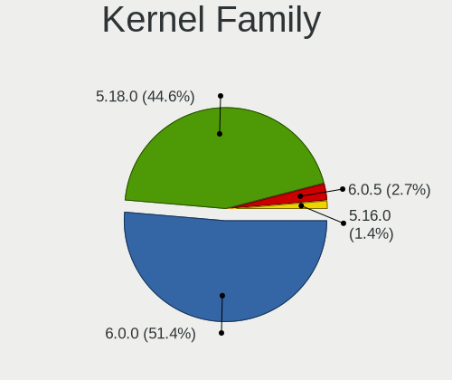

| Version | Computers | Percent |
|---------|-----------|---------|
| 6.0.0   | 38        | 51.35%  |
| 5.18.0  | 33        | 44.59%  |
| 6.0.5   | 2         | 2.7%    |
| 5.16.0  | 1         | 1.35%   |

Kernel Major Ver.
-----------------

Linux kernel major version

| Version | Computers | Percent |
|---------|-----------|---------|
| 6.0     | 40        | 54.05%  |
| 5.18    | 33        | 44.59%  |
| 5.16    | 1         | 1.35%   |

Arch
----

OS architecture (x86_64, i586, etc.)

| Name   | Computers | Percent |
|--------|-----------|---------|
| x86_64 | 74        | 100%    |

DE
--

Desktop Environment

| Name    | Computers | Percent |
|---------|-----------|---------|
| MATE    | 69        | 93.24%  |
| KDE5    | 4         | 5.41%   |
| Unknown | 1         | 1.35%   |

Display Server
--------------

X11 or Wayland

| Name | Computers | Percent |
|------|-----------|---------|
| X11  | 74        | 100%    |

Display Manager
---------------

SDDM, LightDM, etc.

| Name    | Computers | Percent |
|---------|-----------|---------|
| LightDM | 53        | 71.62%  |
| Unknown | 18        | 24.32%  |
| SDDM    | 2         | 2.7%    |
| GDM     | 1         | 1.35%   |

OS Lang
-------

Language

| Lang  | Computers | Percent |
|-------|-----------|---------|
| en_US | 43        | 58.11%  |
| fr_FR | 5         | 6.76%   |
| es_ES | 4         | 5.41%   |
| it_IT | 3         | 4.05%   |
| en_GB | 3         | 4.05%   |
| en_AU | 3         | 4.05%   |
| ru_RU | 2         | 2.7%    |
| es_MX | 2         | 2.7%    |
| pt_BR | 1         | 1.35%   |
| pl_PL | 1         | 1.35%   |
| es_PE | 1         | 1.35%   |
| es_CL | 1         | 1.35%   |
| es_AR | 1         | 1.35%   |
| en_ZW | 1         | 1.35%   |
| en_IN | 1         | 1.35%   |
| en_CA | 1         | 1.35%   |
| de_DE | 1         | 1.35%   |

Boot Mode
---------

EFI or BIOS

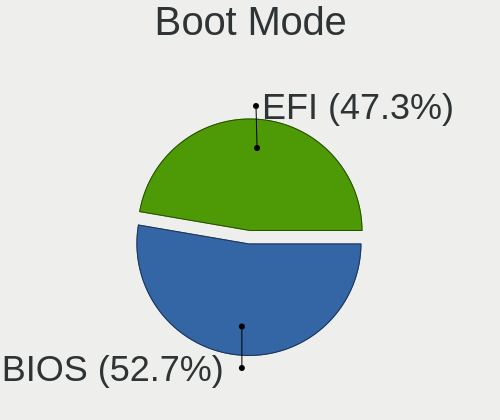

| Mode | Computers | Percent |
|------|-----------|---------|
| BIOS | 39        | 52.7%   |
| EFI  | 35        | 47.3%   |

Filesystem
----------

Type of filesystem

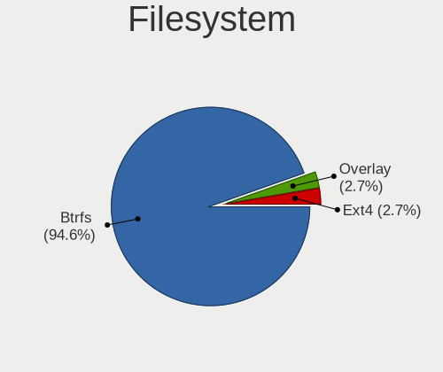

| Type    | Computers | Percent |
|---------|-----------|---------|
| Btrfs   | 70        | 94.59%  |
| Overlay | 2         | 2.7%    |
| Ext4    | 2         | 2.7%    |

Part. scheme
------------

Scheme of partitioning

| Type    | Computers | Percent |
|---------|-----------|---------|
| GPT     | 40        | 54.05%  |
| Unknown | 19        | 25.68%  |
| MBR     | 15        | 20.27%  |

Dual Boot with Linux/BSD
------------------------

Hosting more than one Linux/BSD

| Dual boot | Computers | Percent |
|-----------|-----------|---------|
| No        | 68        | 91.89%  |
| Yes       | 6         | 8.11%   |

Dual Boot (Win)
---------------

Hosting Linux and Windows

| Dual boot | Computers | Percent |
|-----------|-----------|---------|
| No        | 49        | 66.22%  |
| Yes       | 25        | 33.78%  |

Board
-----

Vendor
------

Motherboard manufacturer

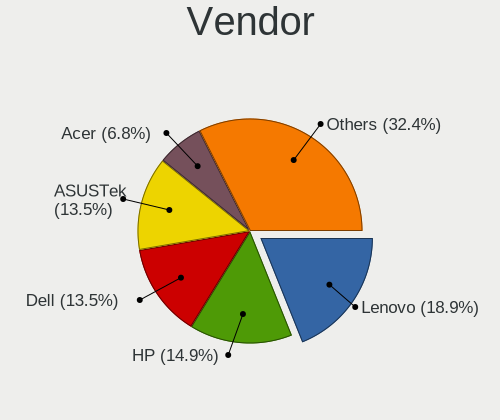

| Name                 | Computers | Percent |
|----------------------|-----------|---------|
| Lenovo               | 14        | 18.92%  |
| Hewlett-Packard      | 11        | 14.86%  |
| Dell                 | 10        | 13.51%  |
| ASUSTek Computer     | 10        | 13.51%  |
| Acer                 | 5         | 6.76%   |
| MSI                  | 3         | 4.05%   |
| Gigabyte Technology  | 3         | 4.05%   |
| Apple                | 3         | 4.05%   |
| Toshiba              | 2         | 2.7%    |
| Quanta               | 2         | 2.7%    |
| HUAWEI               | 2         | 2.7%    |
| Standard             | 1         | 1.35%   |
| Irbis                | 1         | 1.35%   |
| Intel Client Systems | 1         | 1.35%   |
| Clevo                | 1         | 1.35%   |
| Biostar              | 1         | 1.35%   |
| BANGHO               | 1         | 1.35%   |
| ASRock               | 1         | 1.35%   |
| Alienware            | 1         | 1.35%   |
| Unknown              | 1         | 1.35%   |

Model
-----

Motherboard model

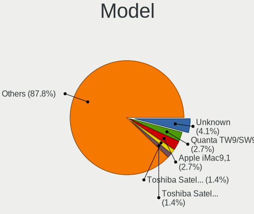

| Name                                      | Computers | Percent |
|-------------------------------------------|-----------|---------|
| Unknown                                   | 3         | 4.05%   |
| Quanta TW9/SW9                            | 2         | 2.7%    |
| Apple iMac9,1                             | 2         | 2.7%    |
| Toshiba Satellite C855D                   | 1         | 1.35%   |
| Toshiba Satellite C75D-B                  | 1         | 1.35%   |
| MSI Katana GF66 12UD                      | 1         | 1.35%   |
| MSI Katana GF66 12UC                      | 1         | 1.35%   |
| MSI GT60                                  | 1         | 1.35%   |
| Lenovo Yoga C740-14IML 81TC               | 1         | 1.35%   |
| Lenovo ThinkPad X380 Yoga 20LJS06400      | 1         | 1.35%   |
| Lenovo ThinkPad X230 Tablet 34383V4       | 1         | 1.35%   |
| Lenovo ThinkPad X230 Tablet 343727U       | 1         | 1.35%   |
| Lenovo ThinkPad X220 Tablet 42962WU       | 1         | 1.35%   |
| Lenovo ThinkPad X1 Carbon 7th 20R1S05B00  | 1         | 1.35%   |
| Lenovo ThinkPad T460 20FMS2J300           | 1         | 1.35%   |
| Lenovo ThinkPad E570 20H5009MUS           | 1         | 1.35%   |
| Lenovo ThinkPad E15 Gen 3 20YGCTO1WW      | 1         | 1.35%   |
| Lenovo ThinkPad E15 Gen 3 20YG0041MX      | 1         | 1.35%   |
| Lenovo ThinkCentre M710q 10MQA006CS       | 1         | 1.35%   |
| Lenovo LEGIONC7 82EH                      | 1         | 1.35%   |
| Lenovo Legion 5 15ACH6H 82JU              | 1         | 1.35%   |
| Lenovo IdeaPad 3 15IGL05 81WQ             | 1         | 1.35%   |
| Irbis NB121                               | 1         | 1.35%   |
| Intel Client Systems LAPBC510             | 1         | 1.35%   |
| HUAWEI BOHB-WAX9                          | 1         | 1.35%   |
| HUAWEI BOD-WXX9                           | 1         | 1.35%   |
| HP Victus by Laptop 16-e0xxx              | 1         | 1.35%   |
| HP Victus by Laptop 16-d1xxx              | 1         | 1.35%   |
| HP Victus by 15L Gaming Desktop TG02-0xxx | 1         | 1.35%   |
| HP Presario CQ58                          | 1         | 1.35%   |
| HP Laptop 15s-fq1xxx                      | 1         | 1.35%   |
| HP Laptop 15-dy1xxx                       | 1         | 1.35%   |
| HP Laptop 15-bs0xx                        | 1         | 1.35%   |
| HP ENVY x360 Convertible 15-ed1xxx        | 1         | 1.35%   |
| HP ENVY x360 2-in-1 Laptop 15-ew0xxx      | 1         | 1.35%   |
| HP Compaq Elite 8300 SFF                  | 1         | 1.35%   |
| Gigabyte Z97N-WIFI                        | 1         | 1.35%   |
| Gigabyte M61SME-S2                        | 1         | 1.35%   |
| Gigabyte GA-880GMA-USB3                   | 1         | 1.35%   |
| Dell OptiPlex 7070                        | 1         | 1.35%   |

Model Family
------------

Motherboard model prefix

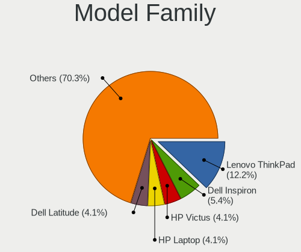

| Name                          | Computers | Percent |
|-------------------------------|-----------|---------|
| Lenovo ThinkPad               | 9         | 12.16%  |
| Dell Inspiron                 | 4         | 5.41%   |
| HP Victus                     | 3         | 4.05%   |
| HP Laptop                     | 3         | 4.05%   |
| Dell Latitude                 | 3         | 4.05%   |
| ASUS ASUS                     | 3         | 4.05%   |
| Unknown                       | 3         | 4.05%   |
| Toshiba Satellite             | 2         | 2.7%    |
| Quanta TW9                    | 2         | 2.7%    |
| MSI Katana                    | 2         | 2.7%    |
| HP ENVY                       | 2         | 2.7%    |
| Dell OptiPlex                 | 2         | 2.7%    |
| ASUS ZenBook                  | 2         | 2.7%    |
| Apple iMac9                   | 2         | 2.7%    |
| Acer Aspire                   | 2         | 2.7%    |
| MSI GT60                      | 1         | 1.35%   |
| Lenovo Yoga                   | 1         | 1.35%   |
| Lenovo ThinkCentre            | 1         | 1.35%   |
| Lenovo LEGIONC7               | 1         | 1.35%   |
| Lenovo Legion                 | 1         | 1.35%   |
| Lenovo IdeaPad                | 1         | 1.35%   |
| Irbis NB121                   | 1         | 1.35%   |
| Intel Client Systems LAPBC510 | 1         | 1.35%   |
| HUAWEI BOHB-WAX9              | 1         | 1.35%   |
| HUAWEI BOD-WXX9               | 1         | 1.35%   |
| HP Presario                   | 1         | 1.35%   |
| HP Compaq                     | 1         | 1.35%   |
| Gigabyte Z97N-WIFI            | 1         | 1.35%   |
| Gigabyte M61SME-S2            | 1         | 1.35%   |
| Gigabyte GA-880GMA-USB3       | 1         | 1.35%   |
| Dell G3                       | 1         | 1.35%   |
| Clevo W25xHPx                 | 1         | 1.35%   |
| Biostar B450MH                | 1         | 1.35%   |
| BANGHO GAMER                  | 1         | 1.35%   |
| ASUS Z170-DELUXE              | 1         | 1.35%   |
| ASUS VivoBook                 | 1         | 1.35%   |
| ASUS PRIME                    | 1         | 1.35%   |
| ASUS P6X58D-E                 | 1         | 1.35%   |
| ASUS P5G41T-M                 | 1         | 1.35%   |
| ASRock Z87M                   | 1         | 1.35%   |

MFG Year
--------

Motherboard manufacture year

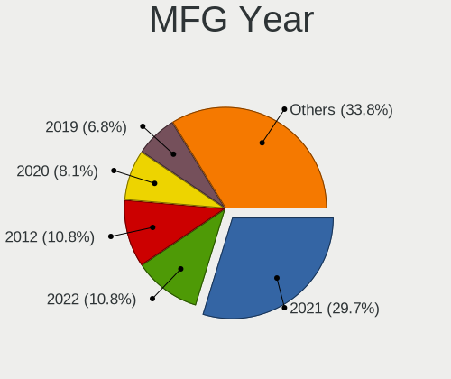

| Year | Computers | Percent |
|------|-----------|---------|
| 2021 | 21        | 28.38%  |
| 2022 | 9         | 12.16%  |
| 2012 | 7         | 9.46%   |
| 2020 | 6         | 8.11%   |
| 2019 | 5         | 6.76%   |
| 2016 | 5         | 6.76%   |
| 2011 | 4         | 5.41%   |
| 2010 | 4         | 5.41%   |
| 2018 | 3         | 4.05%   |
| 2014 | 3         | 4.05%   |
| 2017 | 2         | 2.7%    |
| 2009 | 2         | 2.7%    |
| 2013 | 1         | 1.35%   |
| 2008 | 1         | 1.35%   |
| 2007 | 1         | 1.35%   |

Form Factor
-----------

Physical design of the computer

| Name        | Computers | Percent |
|-------------|-----------|---------|
| Notebook    | 52        | 70.27%  |
| Desktop     | 13        | 17.57%  |
| Convertible | 6         | 8.11%   |
| All in one  | 2         | 2.7%    |
| Mini pc     | 1         | 1.35%   |

Secure Boot
-----------

Enabled or disabled

| State    | Computers | Percent |
|----------|-----------|---------|
| Disabled | 74        | 100%    |

Coreboot
--------

Have coreboot on board

| Used | Computers | Percent |
|------|-----------|---------|
| No   | 74        | 100%    |

RAM Size
--------

Total RAM memory

| Size in GB  | Computers | Percent |
|-------------|-----------|---------|
| 16.01-24.0  | 25        | 33.78%  |
| 4.01-8.0    | 19        | 25.68%  |
| 8.01-16.0   | 17        | 22.97%  |
| 3.01-4.0    | 7         | 9.46%   |
| 32.01-64.0  | 3         | 4.05%   |
| 1.01-2.0    | 2         | 2.7%    |
| 64.01-256.0 | 1         | 1.35%   |

RAM Used
--------

Used RAM memory

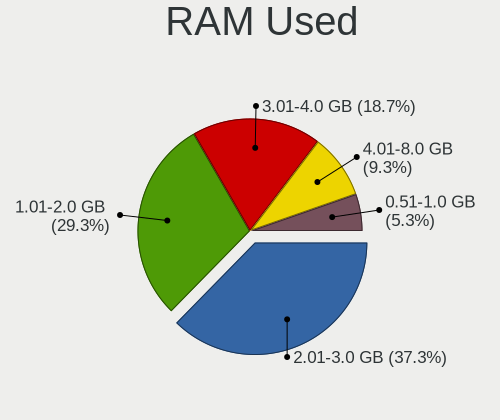

| Used GB  | Computers | Percent |
|----------|-----------|---------|
| 2.01-3.0 | 28        | 37.33%  |
| 1.01-2.0 | 22        | 29.33%  |
| 3.01-4.0 | 14        | 18.67%  |
| 4.01-8.0 | 7         | 9.33%   |
| 0.51-1.0 | 4         | 5.33%   |

Total Drives
------------

Number of drives on board

| Drives | Computers | Percent |
|--------|-----------|---------|
| 1      | 55        | 74.32%  |
| 2      | 16        | 21.62%  |
| 4      | 2         | 2.7%    |
| 5      | 1         | 1.35%   |

Has CD-ROM
----------

Has CD-ROM on board

| Presented | Computers | Percent |
|-----------|-----------|---------|
| No        | 55        | 74.32%  |
| Yes       | 19        | 25.68%  |

Has Ethernet
------------

Has Ethernet on board

| Presented | Computers | Percent |
|-----------|-----------|---------|
| Yes       | 59        | 79.73%  |
| No        | 15        | 20.27%  |

Has WiFi
--------

Has WiFi module

| Presented | Computers | Percent |
|-----------|-----------|---------|
| Yes       | 70        | 94.59%  |
| No        | 4         | 5.41%   |

Has Bluetooth
-------------

Has Bluetooth module

| Presented | Computers | Percent |
|-----------|-----------|---------|
| Yes       | 55        | 74.32%  |
| No        | 19        | 25.68%  |

Location
--------

Country
-------

Geographic location (country)

| Country      | Computers | Percent |
|--------------|-----------|---------|
| USA          | 22        | 29.73%  |
| France       | 7         | 9.46%   |
| Spain        | 4         | 5.41%   |
| Italy        | 4         | 5.41%   |
| Russia       | 3         | 4.05%   |
| Netherlands  | 2         | 2.7%    |
| Mexico       | 2         | 2.7%    |
| Kenya        | 2         | 2.7%    |
| Japan        | 2         | 2.7%    |
| Germany      | 2         | 2.7%    |
| Bangladesh   | 2         | 2.7%    |
| Australia    | 2         | 2.7%    |
| Zimbabwe     | 1         | 1.35%   |
| UK           | 1         | 1.35%   |
| Turkey       | 1         | 1.35%   |
| Sweden       | 1         | 1.35%   |
| Saudi Arabia | 1         | 1.35%   |
| Poland       | 1         | 1.35%   |
| Philippines  | 1         | 1.35%   |
| Peru         | 1         | 1.35%   |
| Nepal        | 1         | 1.35%   |
| Namibia      | 1         | 1.35%   |
| Mongolia     | 1         | 1.35%   |
| Luxembourg   | 1         | 1.35%   |
| India        | 1         | 1.35%   |
| Finland      | 1         | 1.35%   |
| Czechia      | 1         | 1.35%   |
| Chile        | 1         | 1.35%   |
| Canada       | 1         | 1.35%   |
| Bulgaria     | 1         | 1.35%   |
| Brazil       | 1         | 1.35%   |
| Argentina    | 1         | 1.35%   |

City
----

Geographic location (city)

| City          | Computers | Percent |
|---------------|-----------|---------|
| Moscow        | 3         | 3.9%    |
| Villa del Rio | 2         | 2.6%    |
| Tokyo         | 2         | 2.6%    |
| Lyon          | 2         | 2.6%    |
| Amsterdam     | 2         | 2.6%    |
| Warsaw        | 1         | 1.3%    |
| Visalia       | 1         | 1.3%    |
| Veracruz      | 1         | 1.3%    |
| Västerås    | 1         | 1.3%    |
| Valencia      | 1         | 1.3%    |
| Ulan Bator    | 1         | 1.3%    |
| Turin         | 1         | 1.3%    |
| Swakopmund    | 1         | 1.3%    |
| Spring        | 1         | 1.3%    |
| Sofia         | 1         | 1.3%    |
| San Juan      | 1         | 1.3%    |
| San Antonio   | 1         | 1.3%    |
| Rongai        | 1         | 1.3%    |
| Rome          | 1         | 1.3%    |
| Recoleta      | 1         | 1.3%    |
| Prague        | 1         | 1.3%    |
| Phoenix       | 1         | 1.3%    |
| Pensacola     | 1         | 1.3%    |
| Parsons       | 1         | 1.3%    |
| Parnamirim    | 1         | 1.3%    |
| Paris         | 1         | 1.3%    |
| Ordu          | 1         | 1.3%    |
| Orange Park   | 1         | 1.3%    |
| Naples        | 1         | 1.3%    |
| Nanyuki       | 1         | 1.3%    |
| Nairobi       | 1         | 1.3%    |
| Morganton     | 1         | 1.3%    |
| Milan         | 1         | 1.3%    |
| Mesa          | 1         | 1.3%    |
| Melbourne     | 1         | 1.3%    |
| Marshall      | 1         | 1.3%    |
| Makati City   | 1         | 1.3%    |
| Luxembourg    | 1         | 1.3%    |
| London        | 1         | 1.3%    |
| Lima          | 1         | 1.3%    |

Drives
------

Drive Vendor
------------

Hard drive vendors

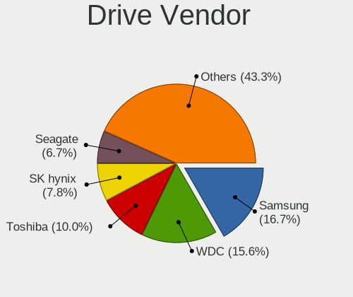

| Vendor              | Computers | Drives | Percent |
|---------------------|-----------|--------|---------|
| Samsung Electronics | 15        | 19     | 16.67%  |
| WDC                 | 14        | 19     | 15.56%  |
| Toshiba             | 9         | 9      | 10%     |
| SK hynix            | 7         | 7      | 7.78%   |
| Seagate             | 6         | 8      | 6.67%   |
| Micron Technology   | 5         | 5      | 5.56%   |
| Unknown             | 4         | 4      | 4.44%   |
| SanDisk             | 4         | 5      | 4.44%   |
| Intel               | 4         | 6      | 4.44%   |
| Kingston            | 3         | 3      | 3.33%   |
| Hitachi             | 3         | 3      | 3.33%   |
| HGST                | 3         | 4      | 3.33%   |
| Unknown             | 3         | 3      | 3.33%   |
| YMTC                | 2         | 2      | 2.22%   |
| Phison              | 1         | 1      | 1.11%   |
| LITEON              | 1         | 1      | 1.11%   |
| Hikvision           | 1         | 1      | 1.11%   |
| Crucial             | 1         | 1      | 1.11%   |
| Corsair             | 1         | 1      | 1.11%   |
| BW-PSSD1            | 1         | 1      | 1.11%   |
| BR                  | 1         | 1      | 1.11%   |
| A-DATA Technology   | 1         | 1      | 1.11%   |

Drive Model
-----------

Hard drive models

| Model                                     | Computers | Percent |
|-------------------------------------------|-----------|---------|
| Unknown                                   | 3         | 3%      |
| YMTC PC005 256GB                          | 2         | 2%      |
| Toshiba MK6459GSX 640GB                   | 2         | 2%      |
| Seagate ST1000LM035-1RK172 1TB            | 2         | 2%      |
| Intel SSDPEKNU512GZ 512GB                 | 2         | 2%      |
| WDC WDS480G2G0C-00AJM0 480GB              | 1         | 1%      |
| WDC WDS240G2G0B-00EPW0 240GB SSD          | 1         | 1%      |
| WDC WD5002ABYS-01B1B0 500GB               | 1         | 1%      |
| WDC WD5000BUCT-63PUZY0 500GB              | 1         | 1%      |
| WDC WD3200BPVT-80JJ5T0 320GB              | 1         | 1%      |
| WDC WD3200BEVT-22A23T0 320GB              | 1         | 1%      |
| WDC WD3200BEKT-75PVMT1 320GB              | 1         | 1%      |
| WDC WD2000FYYZ-01UL1B2 2TB                | 1         | 1%      |
| WDC WD10EZEX-00BN5A0 1TB                  | 1         | 1%      |
| WDC WD10EURX-63UY4Y0 1TB                  | 1         | 1%      |
| WDC WD10EADS-22M2B0 1TB                   | 1         | 1%      |
| WDC WD1002FAEX-00Z3A0 1TB                 | 1         | 1%      |
| WDC PC SN730 SDBPNTY-1T00-1101 1TB        | 1         | 1%      |
| WDC PC SN530 SDBPNPZ-512G-1006 512GB      | 1         | 1%      |
| WDC PC SN530 SDBPNPZ-1T00-1114 1TB        | 1         | 1%      |
| WDC PC SN530 SDBPMPZ-512G-1001 512GB      | 1         | 1%      |
| WDC PC SN530 SDBPMPZ-256G-1001 256GB      | 1         | 1%      |
| Unknown SD2GB                             | 1         | 1%      |
| Unknown SD/MMC/MS PRO 250GB               | 1         | 1%      |
| Unknown MMC Card  8GB                     | 1         | 1%      |
| Unknown MMC Card  64GB                    | 1         | 1%      |
| Toshiba MQ01ABD100 1TB                    | 1         | 1%      |
| Toshiba MQ01ABD075 752GB                  | 1         | 1%      |
| Toshiba KXG6AZNV256G 256GB                | 1         | 1%      |
| Toshiba KBG40ZNT256G MEMORY 256GB         | 1         | 1%      |
| Toshiba DT01ACA200 2TB                    | 1         | 1%      |
| Toshiba DT01ACA100 1TB                    | 1         | 1%      |
| Toshiba DT01ABA100V 1TB                   | 1         | 1%      |
| SK hynix SKHynix_HFS512GD9TNG-L3A0B 512GB | 1         | 1%      |
| SK hynix PC801 NVMe 512GB                 | 1         | 1%      |
| SK hynix PC711 HFS512GDE9X073N 512GB      | 1         | 1%      |
| SK hynix HFM512GD3JX013N 512GB            | 1         | 1%      |
| SK hynix BC711 NVMe 512GB                 | 1         | 1%      |
| SK hynix BC711 HFM512GD3JX013N 512GB      | 1         | 1%      |
| SK hynix BC511 NVMe 256GB                 | 1         | 1%      |

HDD Vendor
----------

Hard disk drive vendors

| Vendor              | Computers | Drives | Percent |
|---------------------|-----------|--------|---------|
| WDC                 | 8         | 11     | 26.67%  |
| Toshiba             | 7         | 7      | 23.33%  |
| Seagate             | 6         | 8      | 20%     |
| Hitachi             | 3         | 3      | 10%     |
| HGST                | 3         | 4      | 10%     |
| Samsung Electronics | 2         | 2      | 6.67%   |
| Unknown             | 1         | 1      | 3.33%   |

SSD Vendor
----------

Solid state drive vendors

| Vendor              | Computers | Drives | Percent |
|---------------------|-----------|--------|---------|
| Samsung Electronics | 6         | 6      | 37.5%   |
| SanDisk             | 2         | 2      | 12.5%   |
| Unknown             | 2         | 2      | 12.5%   |
| WDC                 | 1         | 1      | 6.25%   |
| Micron Technology   | 1         | 1      | 6.25%   |
| LITEON              | 1         | 1      | 6.25%   |
| Crucial             | 1         | 1      | 6.25%   |
| Corsair             | 1         | 1      | 6.25%   |
| BR                  | 1         | 1      | 6.25%   |

Drive Kind
----------

HDD or SSD

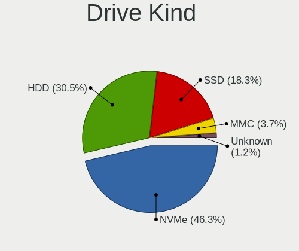

| Kind    | Computers | Drives | Percent |
|---------|-----------|--------|---------|
| NVMe    | 38        | 48     | 46.34%  |
| HDD     | 25        | 36     | 30.49%  |
| SSD     | 15        | 16     | 18.29%  |
| MMC     | 3         | 4      | 3.66%   |
| Unknown | 1         | 1      | 1.22%   |

Drive Connector
---------------

SATA, SAS, NVMe, etc.

| Type | Computers | Drives | Percent |
|------|-----------|--------|---------|
| NVMe | 38        | 48     | 47.5%   |
| SATA | 37        | 51     | 46.25%  |
| MMC  | 3         | 4      | 3.75%   |
| SAS  | 2         | 2      | 2.5%    |

Drive Size
----------

Size of hard drive

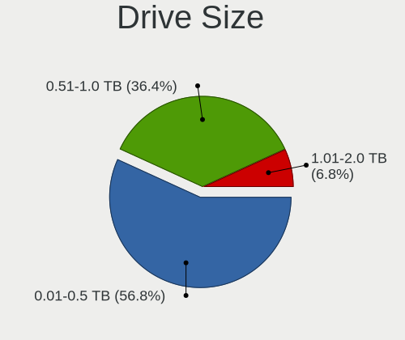

| Size in TB | Computers | Drives | Percent |
|------------|-----------|--------|---------|
| 0.01-0.5   | 25        | 31     | 58.14%  |
| 0.51-1.0   | 15        | 18     | 34.88%  |
| 1.01-2.0   | 3         | 3      | 6.98%   |

Space Total
-----------

Amount of disk space available on the file system

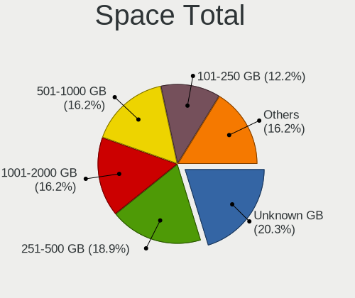

| Size in GB     | Computers | Percent |
|----------------|-----------|---------|
| Unknown        | 15        | 20.27%  |
| 251-500        | 14        | 18.92%  |
| 1001-2000      | 12        | 16.22%  |
| 501-1000       | 12        | 16.22%  |
| 101-250        | 9         | 12.16%  |
| 51-100         | 5         | 6.76%   |
| 1-20           | 4         | 5.41%   |
| More than 3000 | 2         | 2.7%    |
| 21-50          | 1         | 1.35%   |

Space Used
----------

Amount of used disk space

| Used GB  | Computers | Percent |
|----------|-----------|---------|
| 21-50    | 28        | 37.33%  |
| Unknown  | 15        | 20%     |
| 51-100   | 13        | 17.33%  |
| 101-250  | 11        | 14.67%  |
| 1-20     | 4         | 5.33%   |
| 251-500  | 2         | 2.67%   |
| 501-1000 | 1         | 1.33%   |
| 0        | 1         | 1.33%   |

Malfunc. Drives
---------------

Drive models with a malfunction

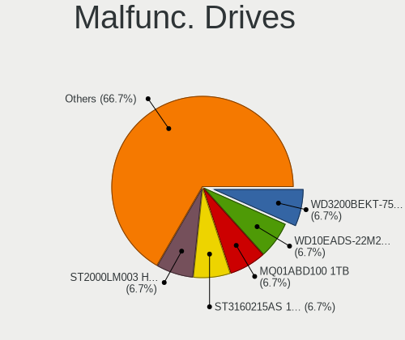

| Model                                | Computers | Drives | Percent |
|--------------------------------------|-----------|--------|---------|
| WDC WD3200BEKT-75PVMT1 320GB         | 1         | 1      | 6.67%   |
| WDC WD10EADS-22M2B0 1TB              | 1         | 1      | 6.67%   |
| Toshiba MQ01ABD100 1TB               | 1         | 1      | 6.67%   |
| SK hynix BC711 HFM512GD3JX013N 512GB | 1         | 1      | 6.67%   |
| Seagate ST3160215AS 160GB            | 1         | 1      | 6.67%   |
| Seagate ST2000LM003 HN-M201RAD 2TB   | 1         | 1      | 6.67%   |
| SanDisk SD8SBAT256G1122 256GB SSD    | 1         | 1      | 6.67%   |
| SanDisk SD6SF1M128G1022I 128GB SSD   | 1         | 1      | 6.67%   |
| Samsung Electronics HD161HJ 160GB    | 1         | 1      | 6.67%   |
| LITEON CV8-8E128-HP 128GB SSD        | 1         | 1      | 6.67%   |
| Hitachi HTS723216L9SA60 160GB        | 1         | 1      | 6.67%   |
| HGST HTS725032A7E630 320GB           | 1         | 1      | 6.67%   |
| HGST HTS541010A9E680 1TB             | 1         | 1      | 6.67%   |
| Crucial CT525MX300SSD1 528GB         | 1         | 1      | 6.67%   |
| Unknown                              | 1         | 1      | 6.67%   |

Malfunc. Drive Vendor
---------------------

Vendors of faulty drives

| Vendor              | Computers | Drives | Percent |
|---------------------|-----------|--------|---------|
| WDC                 | 2         | 2      | 13.33%  |
| Seagate             | 2         | 2      | 13.33%  |
| SanDisk             | 2         | 2      | 13.33%  |
| HGST                | 2         | 2      | 13.33%  |
| Toshiba             | 1         | 1      | 6.67%   |
| SK hynix            | 1         | 1      | 6.67%   |
| Samsung Electronics | 1         | 1      | 6.67%   |
| LITEON              | 1         | 1      | 6.67%   |
| Hitachi             | 1         | 1      | 6.67%   |
| Crucial             | 1         | 1      | 6.67%   |
| Unknown             | 1         | 1      | 6.67%   |

Malfunc. HDD Vendor
-------------------

Vendors of faulty HDD drives

| Vendor              | Computers | Drives | Percent |
|---------------------|-----------|--------|---------|
| WDC                 | 2         | 2      | 22.22%  |
| Seagate             | 2         | 2      | 22.22%  |
| HGST                | 2         | 2      | 22.22%  |
| Toshiba             | 1         | 1      | 11.11%  |
| Samsung Electronics | 1         | 1      | 11.11%  |
| Hitachi             | 1         | 1      | 11.11%  |

Malfunc. Drive Kind
-------------------

Kinds of faulty drives

| Kind | Computers | Drives | Percent |
|------|-----------|--------|---------|
| HDD  | 7         | 9      | 53.85%  |
| SSD  | 5         | 5      | 38.46%  |
| NVMe | 1         | 1      | 7.69%   |

Failed Drives
-------------

Failed drive models

Zero info for selected period =(

Failed Drive Vendor
-------------------

Failed drive vendors

Zero info for selected period =(

Drive Status
------------

Number of failed and malfunc. drives

| Status   | Computers | Drives | Percent |
|----------|-----------|--------|---------|
| Works    | 41        | 55     | 51.25%  |
| Detected | 27        | 35     | 33.75%  |
| Malfunc  | 12        | 15     | 15%     |

Storage controller
------------------

Storage Vendor
--------------

Storage controller vendors

| Vendor                       | Computers | Percent |
|------------------------------|-----------|---------|
| Intel                        | 55        | 53.92%  |
| SK hynix                     | 7         | 6.86%   |
| SanDisk                      | 7         | 6.86%   |
| Samsung Electronics          | 7         | 6.86%   |
| AMD                          | 7         | 6.86%   |
| Micron Technology            | 4         | 3.92%   |
| Nvidia                       | 3         | 2.94%   |
| Kingston Technology Company  | 3         | 2.94%   |
| Yangtze Memory Technologies  | 2         | 1.96%   |
| Toshiba America Info Systems | 1         | 0.98%   |
| Silicon Motion               | 1         | 0.98%   |
| Phison Electronics           | 1         | 0.98%   |
| Marvell Technology Group     | 1         | 0.98%   |
| KIOXIA                       | 1         | 0.98%   |
| ASMedia Technology           | 1         | 0.98%   |
| ADATA Technology             | 1         | 0.98%   |

Storage Model
-------------

Storage controller models

| Model                                                                          | Computers | Percent |
|--------------------------------------------------------------------------------|-----------|---------|
| Intel Volume Management Device NVMe RAID Controller                            | 14        | 12.17%  |
| Intel Sunrise Point-LP SATA Controller [AHCI mode]                             | 5         | 4.35%   |
| Intel 7 Series Chipset Family 6-port SATA Controller [AHCI mode]               | 5         | 4.35%   |
| AMD FCH SATA Controller [AHCI mode]                                            | 5         | 4.35%   |
| SK hynix Gold P31/BC711/PC711 NVMe Solid State Drive                           | 4         | 3.48%   |
| SanDisk WD Blue SN550 NVMe SSD                                                 | 3         | 2.61%   |
| Samsung NVMe SSD Controller PM9A1/PM9A3/980PRO                                 | 3         | 2.61%   |
| Intel Celeron/Pentium Silver Processor SATA Controller                         | 3         | 2.61%   |
| Intel Alder Lake-P SATA AHCI Controller                                        | 3         | 2.61%   |
| Intel 82801 Mobile SATA Controller [RAID mode]                                 | 3         | 2.61%   |
| Yangtze Memory Non-Volatile memory controller                                  | 2         | 1.74%   |
| SanDisk PC SN530 NVMe SSD                                                      | 2         | 1.74%   |
| Samsung NVMe SSD Controller SM981/PM981/PM983                                  | 2         | 1.74%   |
| Samsung NVMe SSD Controller 980                                                | 2         | 1.74%   |
| Nvidia MCP79 AHCI Controller                                                   | 2         | 1.74%   |
| Micron NVMe Storage Controller                                                 | 2         | 1.74%   |
| Micron 2450 NVMe SSD (DRAM-less)                                               | 2         | 1.74%   |
| Intel Tiger Lake-LP SATA Controller                                            | 2         | 1.74%   |
| Intel NVMe Controller                                                          | 2         | 1.74%   |
| Intel Non-Volatile memory controller                                           | 2         | 1.74%   |
| Intel Comet Lake SATA AHCI Controller                                          | 2         | 1.74%   |
| Intel 8 Series/C220 Series Chipset Family 6-port SATA Controller 1 [AHCI mode] | 2         | 1.74%   |
| Intel 5 Series/3400 Series Chipset 4 port SATA AHCI Controller                 | 2         | 1.74%   |
| Intel 400 Series Chipset Family SATA AHCI Controller                           | 2         | 1.74%   |
| Intel 200 Series PCH SATA controller [AHCI mode]                               | 2         | 1.74%   |
| Toshiba America Info Systems XG6 NVMe SSD Controller                           | 1         | 0.87%   |
| SK hynix Platinum P41/PC801 NVMe Solid State Drive                             | 1         | 0.87%   |
| SK hynix Non-Volatile memory controller                                        | 1         | 0.87%   |
| SK hynix BC511 NVMe SSD                                                        | 1         | 0.87%   |
| Silicon Motion SM2263EN/SM2263XT SSD Controller                                | 1         | 0.87%   |
| SanDisk WD PC SN810 / Black SN850 NVMe SSD                                     | 1         | 0.87%   |
| SanDisk WD Black SN750 / PC SN730 NVMe SSD                                     | 1         | 0.87%   |
| SanDisk Non-Volatile memory controller                                         | 1         | 0.87%   |
| Phison E12 NVMe Controller                                                     | 1         | 0.87%   |
| Nvidia MCP61 SATA Controller                                                   | 1         | 0.87%   |
| Nvidia MCP61 IDE                                                               | 1         | 0.87%   |
| Marvell Group 88SE91A3 SATA-600 Controller                                     | 1         | 0.87%   |
| KIOXIA NVMe SSD Controller BG4                                                 | 1         | 0.87%   |
| Kingston Company Company Non-Volatile memory controller                        | 1         | 0.87%   |
| Kingston Company OM3PDP3 NVMe SSD                                              | 1         | 0.87%   |

Storage Kind
------------

Kind of storage controller (IDE, SATA, NVMe, SAS, ...)

| Kind | Computers | Percent |
|------|-----------|---------|
| SATA | 47        | 43.52%  |
| NVMe | 38        | 35.19%  |
| RAID | 17        | 15.74%  |
| IDE  | 6         | 5.56%   |

Processor
---------

CPU Vendor
----------

Processor vendors

| Vendor | Computers | Percent |
|--------|-----------|---------|
| Intel  | 63        | 85.14%  |
| AMD    | 11        | 14.86%  |

CPU Model
---------

Processor models

| Model                                   | Computers | Percent |
|-----------------------------------------|-----------|---------|
| Intel 11th Gen Core i5-1135G7 @ 2.40GHz | 4         | 5.41%   |
| Intel 12th Gen Core i5-12500H           | 3         | 4.05%   |
| Intel Core i5-2520M CPU @ 2.50GHz       | 2         | 2.7%    |
| Intel Core i3-1005G1 CPU @ 1.20GHz      | 2         | 2.7%    |
| Intel Core 2 Duo CPU E8135 @ 2.66GHz    | 2         | 2.7%    |
| Intel Celeron N4020 CPU @ 1.10GHz       | 2         | 2.7%    |
| Intel 12th Gen Core i7-12700H           | 2         | 2.7%    |
| Intel 12th Gen Core i7-1260P            | 2         | 2.7%    |
| Intel 11th Gen Core i7-1165G7 @ 2.80GHz | 2         | 2.7%    |
| Intel 11th Gen Core i5-11400H @ 2.70GHz | 2         | 2.7%    |
| Intel Xeon CPU E5450 @ 3.00GHz          | 1         | 1.35%   |
| Intel Xeon CPU E3-1246 v3 @ 3.50GHz     | 1         | 1.35%   |
| Intel Core i7-7700K CPU @ 4.20GHz       | 1         | 1.35%   |
| Intel Core i7-7700HQ CPU @ 2.80GHz      | 1         | 1.35%   |
| Intel Core i7-6600U CPU @ 2.60GHz       | 1         | 1.35%   |
| Intel Core i7-6500U CPU @ 2.50GHz       | 1         | 1.35%   |
| Intel Core i7-4790K CPU @ 4.00GHz       | 1         | 1.35%   |
| Intel Core i7-3610QM CPU @ 2.30GHz      | 1         | 1.35%   |
| Intel Core i7-3520M CPU @ 2.90GHz       | 1         | 1.35%   |
| Intel Core i7-2600 CPU @ 3.40GHz        | 1         | 1.35%   |
| Intel Core i7-10875H CPU @ 2.30GHz      | 1         | 1.35%   |
| Intel Core i7-10750H CPU @ 2.60GHz      | 1         | 1.35%   |
| Intel Core i7-10710U CPU @ 1.10GHz      | 1         | 1.35%   |
| Intel Core i7-10510U CPU @ 1.80GHz      | 1         | 1.35%   |
| Intel Core i7 CPU Q 720 @ 1.60GHz       | 1         | 1.35%   |
| Intel Core i7 CPU 950 @ 3.07GHz         | 1         | 1.35%   |
| Intel Core i5-9500T CPU @ 2.20GHz       | 1         | 1.35%   |
| Intel Core i5-8250U CPU @ 1.60GHz       | 1         | 1.35%   |
| Intel Core i5-7600K CPU @ 3.80GHz       | 1         | 1.35%   |
| Intel Core i5-7400T CPU @ 2.40GHz       | 1         | 1.35%   |
| Intel Core i5-5200U CPU @ 2.20GHz       | 1         | 1.35%   |
| Intel Core i5-4690K CPU @ 3.50GHz       | 1         | 1.35%   |
| Intel Core i5-4300U CPU @ 1.90GHz       | 1         | 1.35%   |
| Intel Core i5-3320M CPU @ 2.60GHz       | 1         | 1.35%   |
| Intel Core i5-3210M CPU @ 2.50GHz       | 1         | 1.35%   |
| Intel Core i5-10300H CPU @ 2.50GHz      | 1         | 1.35%   |
| Intel Core i5 CPU M 430 @ 2.27GHz       | 1         | 1.35%   |
| Intel Core i3-7100U CPU @ 2.40GHz       | 1         | 1.35%   |
| Intel Core i3-6006U CPU @ 2.00GHz       | 1         | 1.35%   |
| Intel Core i3-2330M CPU @ 2.20GHz       | 1         | 1.35%   |

CPU Model Family
----------------

Processor model prefix

| Model            | Computers | Percent |
|------------------|-----------|---------|
| Other            | 22        | 29.73%  |
| Intel Core i7    | 14        | 18.92%  |
| Intel Core i5    | 13        | 17.57%  |
| Intel Core i3    | 6         | 8.11%   |
| Intel Celeron    | 4         | 5.41%   |
| Intel Core 2 Duo | 3         | 4.05%   |
| AMD Ryzen 7      | 3         | 4.05%   |
| Intel Xeon       | 2         | 2.7%    |
| AMD Ryzen 5      | 2         | 2.7%    |
| AMD Ryzen 3      | 2         | 2.7%    |
| AMD A6           | 2         | 2.7%    |
| AMD Phenom II X4 | 1         | 1.35%   |

CPU Cores
---------

Number of processor cores

| Number | Computers | Percent |
|--------|-----------|---------|
| 4      | 27        | 36.49%  |
| 2      | 24        | 32.43%  |
| 12     | 7         | 9.46%   |
| 6      | 7         | 9.46%   |
| 8      | 5         | 6.76%   |
| 14     | 2         | 2.7%    |
| 10     | 1         | 1.35%   |
| 1      | 1         | 1.35%   |

CPU Sockets
-----------

Number of sockets

| Number | Computers | Percent |
|--------|-----------|---------|
| 1      | 74        | 100%    |

CPU Threads
-----------

Threads per core (Hyper-Threading)

| Number | Computers | Percent |
|--------|-----------|---------|
| 2      | 47        | 63.51%  |
| 1      | 27        | 36.49%  |

CPU Op-Modes
------------

CPU Operation Modes (32-bit, 64-bit)

| Op mode        | Computers | Percent |
|----------------|-----------|---------|
| 32-bit, 64-bit | 74        | 100%    |

CPU Microcode
-------------

Microcode number

| Number     | Computers | Percent |
|------------|-----------|---------|
| Unknown    | 24        | 32.43%  |
| 0x906a3    | 8         | 10.81%  |
| 0x806c1    | 4         | 5.41%   |
| 0xa0652    | 3         | 4.05%   |
| 0x706a8    | 3         | 4.05%   |
| 0x406e3    | 3         | 4.05%   |
| 0x306a9    | 3         | 4.05%   |
| 0x206a7    | 3         | 4.05%   |
| 0x08608103 | 3         | 4.05%   |
| 0x306c3    | 2         | 2.7%    |
| 0x010000c8 | 2         | 2.7%    |
| 0xa0660    | 1         | 1.35%   |
| 0x906ea    | 1         | 1.35%   |
| 0x906e9    | 1         | 1.35%   |
| 0x906a4    | 1         | 1.35%   |
| 0x90672    | 1         | 1.35%   |
| 0x806ec    | 1         | 1.35%   |
| 0x806ea    | 1         | 1.35%   |
| 0x806e9    | 1         | 1.35%   |
| 0x806d1    | 1         | 1.35%   |
| 0x706e5    | 1         | 1.35%   |
| 0x6fd      | 1         | 1.35%   |
| 0x40651    | 1         | 1.35%   |
| 0x106e5    | 1         | 1.35%   |
| 0x0a50000c | 1         | 1.35%   |
| 0x08108109 | 1         | 1.35%   |
| 0x07030105 | 1         | 1.35%   |

CPU Microarch
-------------

Microarchitecture

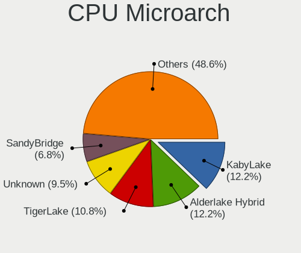

| Name             | Computers | Percent |
|------------------|-----------|---------|
| KabyLake         | 9         | 12.16%  |
| Alderlake Hybrid | 9         | 12.16%  |
| TigerLake        | 8         | 10.81%  |
| Unknown          | 7         | 9.46%   |
| SandyBridge      | 5         | 6.76%   |
| IvyBridge        | 4         | 5.41%   |
| Haswell          | 4         | 5.41%   |
| CometLake        | 4         | 5.41%   |
| Skylake          | 3         | 4.05%   |
| Penryn           | 3         | 4.05%   |
| Goldmont plus    | 3         | 4.05%   |
| Zen 3            | 2         | 2.7%    |
| Nehalem          | 2         | 2.7%    |
| K10              | 2         | 2.7%    |
| IceLake          | 2         | 2.7%    |
| Zen+             | 1         | 1.35%   |
| Zen 2            | 1         | 1.35%   |
| Westmere         | 1         | 1.35%   |
| Puma             | 1         | 1.35%   |
| Piledriver       | 1         | 1.35%   |
| Core             | 1         | 1.35%   |
| Broadwell        | 1         | 1.35%   |

Graphics
--------

GPU Vendor
----------

Vendors of graphics cards

| Vendor | Computers | Percent |
|--------|-----------|---------|
| Intel  | 54        | 56.25%  |
| Nvidia | 31        | 32.29%  |
| AMD    | 11        | 11.46%  |

GPU Model
---------

Graphics card models

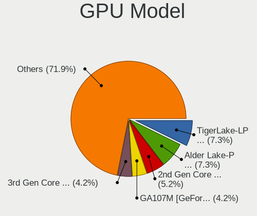

| Model                                                                       | Computers | Percent |
|-----------------------------------------------------------------------------|-----------|---------|
| Intel Alder Lake-P Integrated Graphics Controller                           | 8         | 8.33%   |
| Intel TigerLake-LP GT2 [Iris Xe Graphics]                                   | 7         | 7.29%   |
| Intel 2nd Generation Core Processor Family Integrated Graphics Controller   | 5         | 5.21%   |
| Nvidia GA107M [GeForce RTX 3050 Ti Mobile]                                  | 4         | 4.17%   |
| Intel 3rd Gen Core processor Graphics Controller                            | 4         | 4.17%   |
| Nvidia GA106M [GeForce RTX 3060 Mobile / Max-Q]                             | 3         | 3.13%   |
| Intel TigerLake-H GT1 [UHD Graphics]                                        | 3         | 3.13%   |
| Intel Skylake GT2 [HD Graphics 520]                                         | 3         | 3.13%   |
| Intel GeminiLake [UHD Graphics 600]                                         | 3         | 3.13%   |
| Intel CometLake-H GT2 [UHD Graphics]                                        | 3         | 3.13%   |
| AMD Lucienne                                                                | 3         | 3.13%   |
| Nvidia GA107M [GeForce RTX 3050 Mobile]                                     | 2         | 2.08%   |
| Nvidia C79 [GeForce 9400]                                                   | 2         | 2.08%   |
| Intel Xeon E3-1200 v3/4th Gen Core Processor Integrated Graphics Controller | 2         | 2.08%   |
| Intel Iris Plus Graphics G1 (Ice Lake)                                      | 2         | 2.08%   |
| Intel HD Graphics 630                                                       | 2         | 2.08%   |
| Intel CometLake-U GT2 [UHD Graphics]                                        | 2         | 2.08%   |
| AMD Cezanne [Radeon Vega Series / Radeon Vega Mobile Series]                | 2         | 2.08%   |
| Nvidia TU117M [GeForce MX550]                                               | 1         | 1.04%   |
| Nvidia TU117M [GeForce GTX 1650 Mobile / Max-Q]                             | 1         | 1.04%   |
| Nvidia TU117M                                                               | 1         | 1.04%   |
| Nvidia TU116M [GeForce GTX 1660 Ti Mobile]                                  | 1         | 1.04%   |
| Nvidia TU106M [GeForce RTX 2060 Mobile]                                     | 1         | 1.04%   |
| Nvidia TU106BM [GeForce RTX 2060 Mobile]                                    | 1         | 1.04%   |
| Nvidia NV43 [GeForce 6600 GT]                                               | 1         | 1.04%   |
| Nvidia GT215M [GeForce GT 335M]                                             | 1         | 1.04%   |
| Nvidia GP107M [GeForce GTX 1050 Mobile]                                     | 1         | 1.04%   |
| Nvidia GP104 [GeForce GTX 1080]                                             | 1         | 1.04%   |
| Nvidia GM108M [GeForce 940MX]                                               | 1         | 1.04%   |
| Nvidia GK104 [GeForce GTX 660 Ti]                                           | 1         | 1.04%   |
| Nvidia GF116 [GeForce GTX 550 Ti]                                           | 1         | 1.04%   |
| Nvidia GF114M [GeForce GTX 670M]                                            | 1         | 1.04%   |
| Nvidia GF108M [GeForce GT 520M]                                             | 1         | 1.04%   |
| Nvidia GF108 [GeForce GT 630]                                               | 1         | 1.04%   |
| Nvidia GF106M [GeForce GT 445M]                                             | 1         | 1.04%   |
| Nvidia GA104M [GeForce RTX 3080 Mobile / Max-Q 8GB/16GB]                    | 1         | 1.04%   |
| Nvidia GA104 [GeForce RTX 3060 Ti Lite Hash Rate]                           | 1         | 1.04%   |
| Nvidia G94 [GeForce 9600 GT]                                                | 1         | 1.04%   |
| Intel UHD Graphics 620                                                      | 1         | 1.04%   |
| Intel Tiger Lake-LP GT2 [UHD Graphics G4]                                   | 1         | 1.04%   |

GPU Combo
---------

Combinations of graphics cards

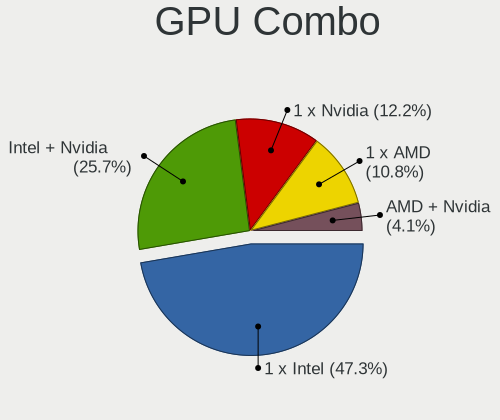

| Name           | Computers | Percent |
|----------------|-----------|---------|
| 1 x Intel      | 35        | 47.3%   |
| Intel + Nvidia | 19        | 25.68%  |
| 1 x Nvidia     | 9         | 12.16%  |
| 1 x AMD        | 8         | 10.81%  |
| AMD + Nvidia   | 3         | 4.05%   |

GPU Driver
----------

Free vs proprietary

| Driver      | Computers | Percent |
|-------------|-----------|---------|
| Free        | 60        | 81.08%  |
| Proprietary | 12        | 16.22%  |
| Unknown     | 2         | 2.7%    |

GPU Memory
----------

Total video memory

| Size in GB | Computers | Percent |
|------------|-----------|---------|
| Unknown    | 56        | 75.68%  |
| 0.51-1.0   | 5         | 6.76%   |
| 1.01-2.0   | 4         | 5.41%   |
| 0.01-0.5   | 4         | 5.41%   |
| 7.01-8.0   | 2         | 2.7%    |
| 3.01-4.0   | 2         | 2.7%    |
| 2.01-3.0   | 1         | 1.35%   |

Monitor
-------

Monitor Vendor
--------------

Monitor vendors

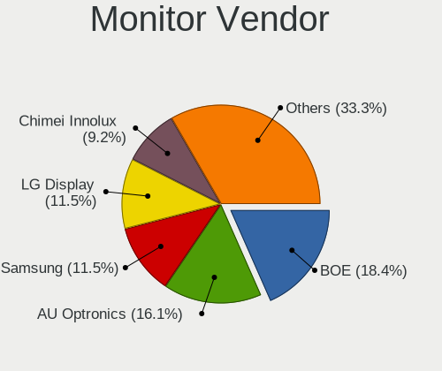

| Vendor                  | Computers | Percent |
|-------------------------|-----------|---------|
| BOE                     | 16        | 18.39%  |
| AU Optronics            | 14        | 16.09%  |
| Samsung Electronics     | 10        | 11.49%  |
| LG Display              | 10        | 11.49%  |
| Chimei Innolux          | 8         | 9.2%    |
| Hewlett-Packard         | 3         | 3.45%   |
| Dell                    | 3         | 3.45%   |
| BenQ                    | 2         | 2.3%    |
| Apple                   | 2         | 2.3%    |
| Ancor Communications    | 2         | 2.3%    |
| ___                     | 1         | 1.15%   |
| VOR                     | 1         | 1.15%   |
| ViewSonic               | 1         | 1.15%   |
| Unknown                 | 1         | 1.15%   |
| STD                     | 1         | 1.15%   |
| Sharp                   | 1         | 1.15%   |
| Planar                  | 1         | 1.15%   |
| PANDA                   | 1         | 1.15%   |
| NEC Computers           | 1         | 1.15%   |
| MStar                   | 1         | 1.15%   |
| LG Philips              | 1         | 1.15%   |
| Insignia                | 1         | 1.15%   |
| InfoVision              | 1         | 1.15%   |
| GDH                     | 1         | 1.15%   |
| Eizo                    | 1         | 1.15%   |
| Chi Mei Optoelectronics | 1         | 1.15%   |
| ASUSTek Computer        | 1         | 1.15%   |

Monitor Model
-------------

Monitor models

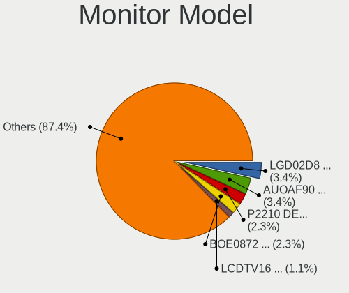

| Model                                                                  | Computers | Percent |
|------------------------------------------------------------------------|-----------|---------|
| LG Display LCD Monitor LGD02D8 1366x768 277x156mm 12.5-inch            | 3         | 3.45%   |
| AU Optronics LCD Monitor AUOAF90 1920x1080 344x193mm 15.5-inch         | 3         | 3.45%   |
| Dell P2210 DEL404C 1680x1050 474x296mm 22.0-inch                       | 2         | 2.3%    |
| BOE LCD Monitor BOE0872 1920x1080 344x194mm 15.5-inch                  | 2         | 2.3%    |
| ___ LCDTV16 ___9000 1360x768                                           | 1         | 1.15%   |
| VOR LED21300 VOR2150 1920x1080 597x336mm 27.0-inch                     | 1         | 1.15%   |
| ViewSonic VA2718-FHD VSCD839 1920x1080 598x336mm 27.0-inch             | 1         | 1.15%   |
| Unknown LCD TV 9000 1360x768 1600x900mm 72.3-inch                      | 1         | 1.15%   |
| STD HDMI TV STD00C7 1920x1080 698x392mm 31.5-inch                      | 1         | 1.15%   |
| Sharp LCD Monitor SHP1542 1920x1080 309x174mm 14.0-inch                | 1         | 1.15%   |
| Samsung Electronics S27B350 SAM08DC 1920x1080 598x336mm 27.0-inch      | 1         | 1.15%   |
| Samsung Electronics LF27T35 SAM707F 1920x1080 598x337mm 27.0-inch      | 1         | 1.15%   |
| Samsung Electronics LCD Monitor SEC544B 1600x900 382x215mm 17.3-inch   | 1         | 1.15%   |
| Samsung Electronics LCD Monitor SEC315A 1366x768 344x194mm 15.5-inch   | 1         | 1.15%   |
| Samsung Electronics LCD Monitor SEC3150 1366x768 344x193mm 15.5-inch   | 1         | 1.15%   |
| Samsung Electronics LCD Monitor SDC4171 2880x1800 302x189mm 14.0-inch  | 1         | 1.15%   |
| Samsung Electronics LCD Monitor SDC4164 3840x2400 344x215mm 16.0-inch  | 1         | 1.15%   |
| Samsung Electronics LCD Monitor SAM094D 1920x1080 1210x680mm 54.6-inch | 1         | 1.15%   |
| Samsung Electronics LCD Monitor SAM02B7 1280x720                       | 1         | 1.15%   |
| Samsung Electronics C32F39M SAM100B 1920x1080 698x393mm 31.5-inch      | 1         | 1.15%   |
| Planar PNR PL1910MW PNR1910 1440x900 410x257mm 19.1-inch               | 1         | 1.15%   |
| PANDA LCD Monitor NCP004D 1920x1080 344x194mm 15.5-inch                | 1         | 1.15%   |
| NEC Computers EA243WM NEC6863 1920x1200 519x324mm 24.1-inch            | 1         | 1.15%   |
| MStar Demo MST0030 1360x765 708x398mm 32.0-inch                        | 1         | 1.15%   |
| LG Philips LCD Monitor LPLBC00 1280x800 331x207mm 15.4-inch            | 1         | 1.15%   |
| LG Display LCD Monitor LGD06A5 1920x1080 344x194mm 15.5-inch           | 1         | 1.15%   |
| LG Display LCD Monitor LGD0637 1920x1080 344x194mm 15.5-inch           | 1         | 1.15%   |
| LG Display LCD Monitor LGD0533 1920x1080 344x194mm 15.5-inch           | 1         | 1.15%   |
| LG Display LCD Monitor LGD050B 1920x1080 309x174mm 14.0-inch           | 1         | 1.15%   |
| LG Display LCD Monitor LGD02E3 1366x768 344x194mm 15.5-inch            | 1         | 1.15%   |
| LG Display LCD Monitor LGD0266 1366x768 344x194mm 15.5-inch            | 1         | 1.15%   |
| LG Display LCD Monitor LGD0259 1920x1080 345x194mm 15.6-inch           | 1         | 1.15%   |
| Insignia TV BBY0030 3840x2160 708x398mm 32.0-inch                      | 1         | 1.15%   |
| InfoVision LCD Monitor IVO0536 1920x1080 294x165mm 13.3-inch           | 1         | 1.15%   |
| Hewlett-Packard LA1956x HWP3021 1280x1024 376x301mm 19.0-inch          | 1         | 1.15%   |
| Hewlett-Packard L1506 HWP265B 1024x768 300x220mm 14.6-inch             | 1         | 1.15%   |
| Hewlett-Packard E243 HPN3468 1920x1080 527x296mm 23.8-inch             | 1         | 1.15%   |
| GDH CHHWJT GDH9021 1280x1024 708x398mm 32.0-inch                       | 1         | 1.15%   |
| Eizo EV2450 ENC2530 1920x1080 528x297mm 23.9-inch                      | 1         | 1.15%   |
| Dell E2416H DELA0CA 1920x1080 531x299mm 24.0-inch                      | 1         | 1.15%   |

Monitor Resolution
------------------

Monitor screen resolution

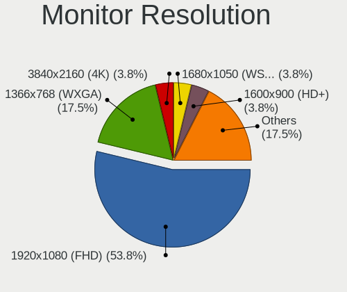

| Resolution         | Computers | Percent |
|--------------------|-----------|---------|
| 1920x1080 (FHD)    | 44        | 55%     |
| 1366x768 (WXGA)    | 14        | 17.5%   |
| 1680x1050 (WSXGA+) | 3         | 3.75%   |
| 1600x900 (HD+)     | 3         | 3.75%   |
| 3840x2160 (4K)     | 2         | 2.5%    |
| 1440x900 (WXGA+)   | 2         | 2.5%    |
| 1280x800 (WXGA)    | 2         | 2.5%    |
| 3840x2400          | 1         | 1.25%   |
| 2880x1800          | 1         | 1.25%   |
| 2560x1600          | 1         | 1.25%   |
| 2240x1400          | 1         | 1.25%   |
| 1920x515           | 1         | 1.25%   |
| 1920x1200 (WUXGA)  | 1         | 1.25%   |
| 1360x768           | 1         | 1.25%   |
| 1280x720 (HD)      | 1         | 1.25%   |
| 1280x1024 (SXGA)   | 1         | 1.25%   |
| 1024x768 (XGA)     | 1         | 1.25%   |

Monitor Diagonal
----------------

Diagonal size in inches

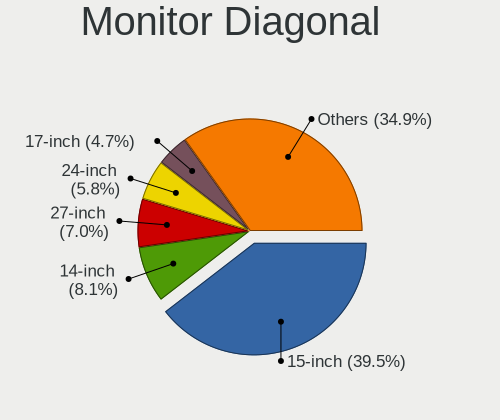

| Inches  | Computers | Percent |
|---------|-----------|---------|
| 15      | 34        | 39.53%  |
| 14      | 7         | 8.14%   |
| 27      | 6         | 6.98%   |
| 24      | 5         | 5.81%   |
| 13      | 5         | 5.81%   |
| 17      | 4         | 4.65%   |
| 16      | 4         | 4.65%   |
| 12      | 3         | 3.49%   |
| Unknown | 3         | 3.49%   |
| 32      | 2         | 2.33%   |
| 31      | 2         | 2.33%   |
| 22      | 2         | 2.33%   |
| 19      | 2         | 2.33%   |
| 11      | 2         | 2.33%   |
| 72      | 1         | 1.16%   |
| 54      | 1         | 1.16%   |
| 52      | 1         | 1.16%   |
| 21      | 1         | 1.16%   |
| 20      | 1         | 1.16%   |

Monitor Width
-------------

Physical width

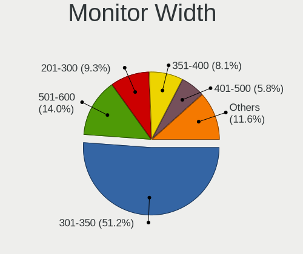

| Width in mm | Computers | Percent |
|-------------|-----------|---------|
| 301-350     | 44        | 51.16%  |
| 501-600     | 11        | 12.79%  |
| 201-300     | 9         | 10.47%  |
| 351-400     | 7         | 8.14%   |
| 401-500     | 5         | 5.81%   |
| Unknown     | 3         | 3.49%   |
| 701-800     | 2         | 2.33%   |
| 601-700     | 2         | 2.33%   |
| 1001-1500   | 2         | 2.33%   |
| 1501-2000   | 1         | 1.16%   |

Aspect Ratio
------------

Proportional relationship between the width and the height

| Ratio | Computers | Percent |
|-------|-----------|---------|
| 16/9  | 61        | 81.33%  |
| 16/10 | 11        | 14.67%  |
| 5/4   | 1         | 1.33%   |
| 4/3   | 1         | 1.33%   |
| 3.73  | 1         | 1.33%   |

Monitor Area
------------

Area in inch²

| Area in inch² | Computers | Percent |
|----------------|-----------|---------|
| 101-110        | 36        | 41.38%  |
| 81-90          | 9         | 10.34%  |
| 201-250        | 7         | 8.05%   |
| 301-350        | 6         | 6.9%    |
| 351-500        | 4         | 4.6%    |
| 121-130        | 4         | 4.6%    |
| More than 1000 | 3         | 3.45%   |
| 71-80          | 3         | 3.45%   |
| 61-70          | 3         | 3.45%   |
| 151-200        | 3         | 3.45%   |
| Unknown        | 3         | 3.45%   |
| 51-60          | 2         | 2.3%    |
| 251-300        | 2         | 2.3%    |
| 111-120        | 2         | 2.3%    |

Pixel Density
-------------

Pixels per inch

| Density       | Computers | Percent |
|---------------|-----------|---------|
| 121-160       | 40        | 47.62%  |
| 51-100        | 19        | 22.62%  |
| 101-120       | 13        | 15.48%  |
| 161-240       | 4         | 4.76%   |
| 1-50          | 3         | 3.57%   |
| Unknown       | 3         | 3.57%   |
| More than 240 | 2         | 2.38%   |

Multiple Monitors
-----------------

Total monitors connected

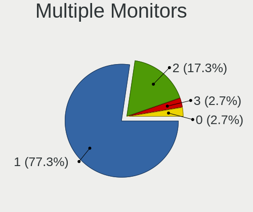

| Total | Computers | Percent |
|-------|-----------|---------|
| 1     | 58        | 77.33%  |
| 2     | 13        | 17.33%  |
| 3     | 2         | 2.67%   |
| 0     | 2         | 2.67%   |

Network
-------

Net Controller Vendor
---------------------

Controller vendors

| Vendor                                 | Computers | Percent |
|----------------------------------------|-----------|---------|
| Intel                                  | 47        | 37.3%   |
| Realtek Semiconductor                  | 37        | 29.37%  |
| Qualcomm Atheros                       | 10        | 7.94%   |
| MediaTek                               | 4         | 3.17%   |
| Broadcom                               | 4         | 3.17%   |
| TP-Link                                | 3         | 2.38%   |
| Nvidia                                 | 3         | 2.38%   |
| Samsung Electronics                    | 2         | 1.59%   |
| Ralink Technology                      | 2         | 1.59%   |
| Xiaomi                                 | 1         | 0.79%   |
| Sony Ericsson Mobile Communications AB | 1         | 0.79%   |
| Qualcomm                               | 1         | 0.79%   |
| OPPO Electronics                       | 1         | 0.79%   |
| Mercucys                               | 1         | 0.79%   |
| Marvell Technology Group               | 1         | 0.79%   |
| Lenovo                                 | 1         | 0.79%   |
| JMicron Technology                     | 1         | 0.79%   |
| Fibocom                                | 1         | 0.79%   |
| D-Link                                 | 1         | 0.79%   |
| Broadcom Limited                       | 1         | 0.79%   |
| Belkin Components                      | 1         | 0.79%   |
| ASUSTek Computer                       | 1         | 0.79%   |
| Android                                | 1         | 0.79%   |

Net Controller Model
--------------------

Controller models

| Model                                                             | Computers | Percent |
|-------------------------------------------------------------------|-----------|---------|
| Realtek RTL8111/8168/8411 PCI Express Gigabit Ethernet Controller | 21        | 14.48%  |
| Intel Alder Lake-P PCH CNVi WiFi                                  | 8         | 5.52%   |
| Intel Wi-Fi 6 AX201                                               | 6         | 4.14%   |
| Intel 82579LM Gigabit Network Connection (Lewisville)             | 5         | 3.45%   |
| Realtek RTL8852AE 802.11ax PCIe Wireless Network Adapter          | 4         | 2.76%   |
| MediaTek MT7921 802.11ax PCI Express Wireless Network Adapter     | 4         | 2.76%   |
| Intel Centrino Advanced-N 6205 [Taylor Peak]                      | 4         | 2.76%   |
| Qualcomm Atheros AR8131 Gigabit Ethernet                          | 3         | 2.07%   |
| Intel Wi-Fi 6 AX200                                               | 3         | 2.07%   |
| Intel Comet Lake PCH-LP CNVi WiFi                                 | 3         | 2.07%   |
| Realtek RTL8153 Gigabit Ethernet Adapter                          | 2         | 1.38%   |
| Realtek RTL810xE PCI Express Fast Ethernet controller             | 2         | 1.38%   |
| Realtek Killer E3000 2.5GbE Controller                            | 2         | 1.38%   |
| Qualcomm Atheros AR9485 Wireless Network Adapter                  | 2         | 1.38%   |
| Nvidia MCP79 Ethernet                                             | 2         | 1.38%   |
| Intel Wireless 8265 / 8275                                        | 2         | 1.38%   |
| Intel Wireless 7265                                               | 2         | 1.38%   |
| Intel Wireless 7260                                               | 2         | 1.38%   |
| Intel Tiger Lake PCH CNVi WiFi                                    | 2         | 1.38%   |
| Intel Ethernet Connection I217-V                                  | 2         | 1.38%   |
| Intel Ethernet Connection (2) I219-V                              | 2         | 1.38%   |
| Intel Dual Band Wireless-AC 3168NGW [Stone Peak]                  | 2         | 1.38%   |
| Intel Comet Lake PCH CNVi WiFi                                    | 2         | 1.38%   |
| Broadcom BCM4322 802.11a/b/g/n Wireless LAN Controller            | 2         | 1.38%   |
| Xiaomi Mi/Redmi series (RNDIS)                                    | 1         | 0.69%   |
| TP-Link Archer T4U ver.3                                          | 1         | 0.69%   |
| TP-Link AC600 wireless Realtek RTL8811AU [Archer T2U Nano]        | 1         | 0.69%   |
| TP-Link 802.11ac NIC                                              | 1         | 0.69%   |
| Sony Ericsson Mobile AB G8341                                     | 1         | 0.69%   |
| Samsung GT-I9070 (network tethering, USB debugging enabled)       | 1         | 0.69%   |
| Samsung Galaxy series, misc. (tethering mode)                     | 1         | 0.69%   |
| Realtek RTL8822CE 802.11ac PCIe Wireless Network Adapter          | 1         | 0.69%   |
| Realtek RTL8821CE 802.11ac PCIe Wireless Network Adapter          | 1         | 0.69%   |
| Realtek RTL8814AU 802.11a/b/g/n/ac Wireless Adapter               | 1         | 0.69%   |
| Realtek RTL8811AU 802.11a/b/g/n/ac WLAN Adapter                   | 1         | 0.69%   |
| Realtek RTL8723DE Wireless Network Adapter                        | 1         | 0.69%   |
| Realtek RTL8723BU 802.11b/g/n WLAN Adapter                        | 1         | 0.69%   |
| Realtek RTL8188FTV 802.11b/g/n 1T1R 2.4G WLAN Adapter             | 1         | 0.69%   |
| Realtek RTL8125 2.5GbE Controller                                 | 1         | 0.69%   |
| Realtek PCIe GbE Family Controller                                | 1         | 0.69%   |

Wireless Vendor
---------------

Wireless vendors

| Vendor                | Computers | Percent |
|-----------------------|-----------|---------|
| Intel                 | 44        | 55.7%   |
| Realtek Semiconductor | 12        | 15.19%  |
| Qualcomm Atheros      | 5         | 6.33%   |
| MediaTek              | 4         | 5.06%   |
| Broadcom              | 4         | 5.06%   |
| TP-Link               | 3         | 3.8%    |
| Ralink Technology     | 2         | 2.53%   |
| Mercucys              | 1         | 1.27%   |
| Fibocom               | 1         | 1.27%   |
| D-Link                | 1         | 1.27%   |
| Belkin Components     | 1         | 1.27%   |
| ASUSTek Computer      | 1         | 1.27%   |

Wireless Model
--------------

Wireless models

| Model                                                         | Computers | Percent |
|---------------------------------------------------------------|-----------|---------|
| Intel Alder Lake-P PCH CNVi WiFi                              | 8         | 10.13%  |
| Intel Wi-Fi 6 AX201                                           | 6         | 7.59%   |
| Realtek RTL8852AE 802.11ax PCIe Wireless Network Adapter      | 4         | 5.06%   |
| MediaTek MT7921 802.11ax PCI Express Wireless Network Adapter | 4         | 5.06%   |
| Intel Centrino Advanced-N 6205 [Taylor Peak]                  | 4         | 5.06%   |
| Intel Wi-Fi 6 AX200                                           | 3         | 3.8%    |
| Intel Comet Lake PCH-LP CNVi WiFi                             | 3         | 3.8%    |
| Qualcomm Atheros AR9485 Wireless Network Adapter              | 2         | 2.53%   |
| Intel Wireless 8265 / 8275                                    | 2         | 2.53%   |
| Intel Wireless 7265                                           | 2         | 2.53%   |
| Intel Wireless 7260                                           | 2         | 2.53%   |
| Intel Tiger Lake PCH CNVi WiFi                                | 2         | 2.53%   |
| Intel Dual Band Wireless-AC 3168NGW [Stone Peak]              | 2         | 2.53%   |
| Intel Comet Lake PCH CNVi WiFi                                | 2         | 2.53%   |
| Broadcom BCM4322 802.11a/b/g/n Wireless LAN Controller        | 2         | 2.53%   |
| TP-Link Archer T4U ver.3                                      | 1         | 1.27%   |
| TP-Link AC600 wireless Realtek RTL8811AU [Archer T2U Nano]    | 1         | 1.27%   |
| TP-Link 802.11ac NIC                                          | 1         | 1.27%   |
| Realtek RTL8822CE 802.11ac PCIe Wireless Network Adapter      | 1         | 1.27%   |
| Realtek RTL8821CE 802.11ac PCIe Wireless Network Adapter      | 1         | 1.27%   |
| Realtek RTL8814AU 802.11a/b/g/n/ac Wireless Adapter           | 1         | 1.27%   |
| Realtek RTL8811AU 802.11a/b/g/n/ac WLAN Adapter               | 1         | 1.27%   |
| Realtek RTL8723DE Wireless Network Adapter                    | 1         | 1.27%   |
| Realtek RTL8723BU 802.11b/g/n WLAN Adapter                    | 1         | 1.27%   |
| Realtek RTL8188FTV 802.11b/g/n 1T1R 2.4G WLAN Adapter         | 1         | 1.27%   |
| Realtek 802.11ac NIC                                          | 1         | 1.27%   |
| Ralink RT5370 Wireless Adapter                                | 1         | 1.27%   |
| Ralink RT2070 Wireless Adapter                                | 1         | 1.27%   |
| Qualcomm Atheros QCA9565 / AR9565 Wireless Network Adapter    | 1         | 1.27%   |
| Qualcomm Atheros QCA9377 802.11ac Wireless Network Adapter    | 1         | 1.27%   |
| Qualcomm Atheros AR93xx Wireless Network Adapter              | 1         | 1.27%   |
| Mercucys 802.11n NIC                                          | 1         | 1.27%   |
| Intel Wireless 8260                                           | 1         | 1.27%   |
| Intel WiFi Link 5100                                          | 1         | 1.27%   |
| Intel Gemini Lake PCH CNVi WiFi                               | 1         | 1.27%   |
| Intel Dual Band Wireless-AC 3165 Plus Bluetooth               | 1         | 1.27%   |
| Intel Centrino Wireless-N 2230                                | 1         | 1.27%   |
| Intel Centrino Wireless-N 1030 [Rainbow Peak]                 | 1         | 1.27%   |
| Intel Centrino Wireless-N 1000 [Condor Peak]                  | 1         | 1.27%   |
| Intel Centrino Advanced-N 6200                                | 1         | 1.27%   |

Ethernet Vendor
---------------

Ethernet vendors

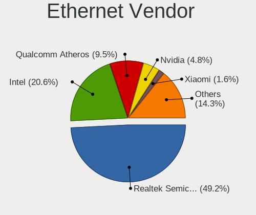

| Vendor                                 | Computers | Percent |
|----------------------------------------|-----------|---------|
| Realtek Semiconductor                  | 31        | 49.21%  |
| Intel                                  | 13        | 20.63%  |
| Qualcomm Atheros                       | 6         | 9.52%   |
| Nvidia                                 | 3         | 4.76%   |
| Xiaomi                                 | 1         | 1.59%   |
| Sony Ericsson Mobile Communications AB | 1         | 1.59%   |
| Samsung Electronics                    | 1         | 1.59%   |
| Qualcomm                               | 1         | 1.59%   |
| OPPO Electronics                       | 1         | 1.59%   |
| Marvell Technology Group               | 1         | 1.59%   |
| Lenovo                                 | 1         | 1.59%   |
| JMicron Technology                     | 1         | 1.59%   |
| Broadcom Limited                       | 1         | 1.59%   |
| Broadcom                               | 1         | 1.59%   |

Ethernet Model
--------------

Ethernet models

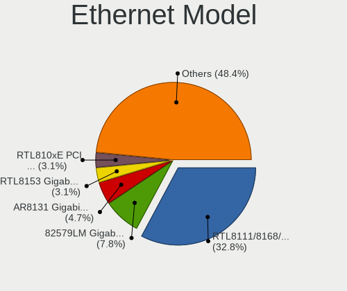

| Model                                                             | Computers | Percent |
|-------------------------------------------------------------------|-----------|---------|
| Realtek RTL8111/8168/8411 PCI Express Gigabit Ethernet Controller | 21        | 32.81%  |
| Intel 82579LM Gigabit Network Connection (Lewisville)             | 5         | 7.81%   |
| Qualcomm Atheros AR8131 Gigabit Ethernet                          | 3         | 4.69%   |
| Realtek RTL8153 Gigabit Ethernet Adapter                          | 2         | 3.13%   |
| Realtek RTL810xE PCI Express Fast Ethernet controller             | 2         | 3.13%   |
| Realtek Killer E3000 2.5GbE Controller                            | 2         | 3.13%   |
| Nvidia MCP79 Ethernet                                             | 2         | 3.13%   |
| Intel Ethernet Connection I217-V                                  | 2         | 3.13%   |
| Intel Ethernet Connection (2) I219-V                              | 2         | 3.13%   |
| Xiaomi Mi/Redmi series (RNDIS)                                    | 1         | 1.56%   |
| Sony Ericsson Mobile AB G8341                                     | 1         | 1.56%   |
| Samsung Galaxy series, misc. (tethering mode)                     | 1         | 1.56%   |
| Realtek RTL8125 2.5GbE Controller                                 | 1         | 1.56%   |
| Realtek PCIe GbE Family Controller                                | 1         | 1.56%   |
| Realtek Killer E2600 Gigabit Ethernet Controller                  | 1         | 1.56%   |
| Realtek Killer E2500 Gigabit Ethernet Controller                  | 1         | 1.56%   |
| Qualcomm Nokia G400 5G                                            | 1         | 1.56%   |
| Qualcomm Atheros Killer E220x Gigabit Ethernet Controller         | 1         | 1.56%   |
| Qualcomm Atheros AR8162 Fast Ethernet                             | 1         | 1.56%   |
| Qualcomm Atheros AR8161 Gigabit Ethernet                          | 1         | 1.56%   |
| OPPO CPH2411                                                      | 1         | 1.56%   |
| Nvidia MCP61 Ethernet                                             | 1         | 1.56%   |
| Marvell Group 88E8056 PCI-E Gigabit Ethernet Controller           | 1         | 1.56%   |
| Lenovo TB-X606F                                                   | 1         | 1.56%   |
| JMicron JMC250 PCI Express Gigabit Ethernet Controller            | 1         | 1.56%   |
| Intel I211 Gigabit Network Connection                             | 1         | 1.56%   |
| Intel Ethernet Connection I219-LM                                 | 1         | 1.56%   |
| Intel Ethernet Connection (7) I219-LM                             | 1         | 1.56%   |
| Intel Ethernet Connection (4) I219-V                              | 1         | 1.56%   |
| Intel Ethernet Connection (10) I219-V                             | 1         | 1.56%   |
| Broadcom NetXtreme BCM57765 Gigabit Ethernet PCIe                 | 1         | 1.56%   |
| Broadcom Limited NetXtreme BCM5756ME Gigabit Ethernet PCI Express | 1         | 1.56%   |

Net Controller Kind
-------------------

Ethernet, WiFi or modem

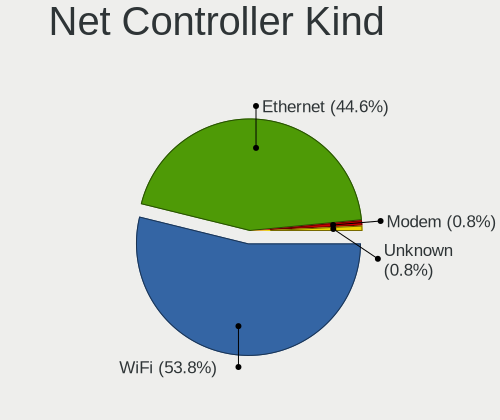

| Kind     | Computers | Percent |
|----------|-----------|---------|
| WiFi     | 70        | 53.85%  |
| Ethernet | 58        | 44.62%  |
| Modem    | 1         | 0.77%   |
| Unknown  | 1         | 0.77%   |

Used Controller
---------------

Currently used network controller

| Kind     | Computers | Percent |
|----------|-----------|---------|
| WiFi     | 47        | 62.67%  |
| Ethernet | 28        | 37.33%  |

NICs
----

Total network controllers on board

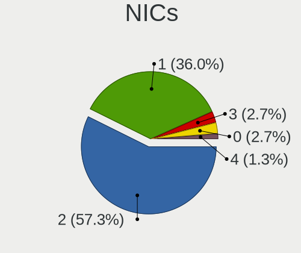

| Total | Computers | Percent |
|-------|-----------|---------|
| 2     | 43        | 57.33%  |
| 1     | 27        | 36%     |
| 3     | 2         | 2.67%   |
| 0     | 2         | 2.67%   |
| 4     | 1         | 1.33%   |

IPv6
----

IPv6 vs IPv4

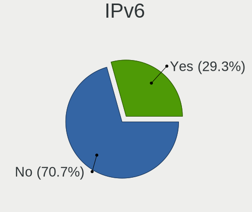

| Used | Computers | Percent |
|------|-----------|---------|
| No   | 53        | 70.67%  |
| Yes  | 22        | 29.33%  |

Bluetooth
---------

Bluetooth Vendor
----------------

Controller vendors

| Vendor                          | Computers | Percent |
|---------------------------------|-----------|---------|
| Intel                           | 32        | 58.18%  |
| Realtek Semiconductor           | 6         | 10.91%  |
| IMC Networks                    | 5         | 9.09%   |
| Qualcomm Atheros Communications | 3         | 5.45%   |
| Apple                           | 3         | 5.45%   |
| TP-Link                         | 1         | 1.82%   |
| Lite-On Technology              | 1         | 1.82%   |
| Dell                            | 1         | 1.82%   |
| Cambridge Silicon Radio         | 1         | 1.82%   |
| Broadcom                        | 1         | 1.82%   |
| ASUSTek Computer                | 1         | 1.82%   |

Bluetooth Model
---------------

Controller models

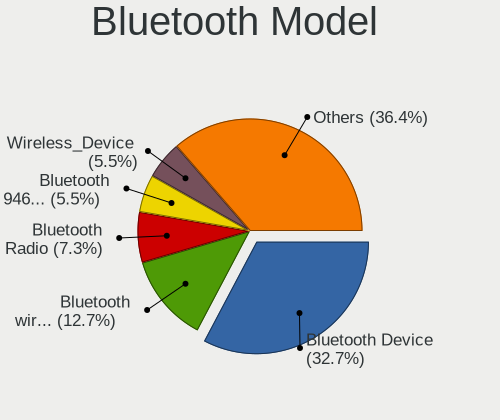

| Model                                                 | Computers | Percent |
|-------------------------------------------------------|-----------|---------|
| Intel AX201 Bluetooth                                 | 14        | 25.45%  |
| Intel Bluetooth wireless interface                    | 7         | 12.73%  |
| Realtek Bluetooth Radio                               | 4         | 7.27%   |
| Intel Bluetooth Device                                | 4         | 7.27%   |
| Intel Bluetooth 9460/9560 Jefferson Peak (JfP)        | 3         | 5.45%   |
| IMC Networks Wireless_Device                          | 3         | 5.45%   |
| Realtek  Bluetooth 4.2 Adapter                        | 2         | 3.64%   |
| Qualcomm Atheros Bluetooth                            | 2         | 3.64%   |
| Intel Wireless-AC 3168 Bluetooth                      | 2         | 3.64%   |
| Intel AX200 Bluetooth                                 | 2         | 3.64%   |
| Apple Built-in Bluetooth 2.0+EDR HCI                  | 2         | 3.64%   |
| TP-Link UB500 Adapter                                 | 1         | 1.82%   |
| Qualcomm Atheros AR3012 Bluetooth 4.0                 | 1         | 1.82%   |
| Lite-On Wireless_Device                               | 1         | 1.82%   |
| IMC Networks Bluetooth Radio                          | 1         | 1.82%   |
| IMC Networks Bluetooth Device                         | 1         | 1.82%   |
| Dell DW375 Bluetooth Module                           | 1         | 1.82%   |
| Cambridge Silicon Radio Bluetooth Dongle (HCI mode)   | 1         | 1.82%   |
| Broadcom BCM2045B (BDC-2.1)                           | 1         | 1.82%   |
| ASUS Broadcom BCM20702 Single-Chip Bluetooth 4.0 + LE | 1         | 1.82%   |
| Apple Bluetooth USB Host Controller                   | 1         | 1.82%   |

Sound
-----

Sound Vendor
------------

Sound card vendors

| Vendor              | Computers | Percent |
|---------------------|-----------|---------|
| Intel               | 61        | 59.8%   |
| Nvidia              | 25        | 24.51%  |
| AMD                 | 11        | 10.78%  |
| JMTek               | 2         | 1.96%   |
| Tenx Technology     | 1         | 0.98%   |
| Samson Technologies | 1         | 0.98%   |
| Logitech            | 1         | 0.98%   |

Sound Model
-----------

Sound card models

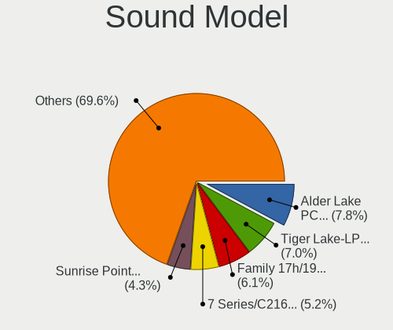

| Model                                                                      | Computers | Percent |
|----------------------------------------------------------------------------|-----------|---------|
| Intel Alder Lake PCH-P High Definition Audio Controller                    | 9         | 7.83%   |
| Intel Tiger Lake-LP Smart Sound Technology Audio Controller                | 8         | 6.96%   |
| AMD Family 17h/19h HD Audio Controller                                     | 7         | 6.09%   |
| Intel 7 Series/C216 Chipset Family High Definition Audio Controller        | 6         | 5.22%   |
| Intel Sunrise Point-LP HD Audio                                            | 5         | 4.35%   |
| AMD Renoir Radeon High Definition Audio Controller                         | 5         | 4.35%   |
| Nvidia GA106 High Definition Audio Controller                              | 3         | 2.61%   |
| Nvidia Audio device                                                        | 3         | 2.61%   |
| Intel Tiger Lake-H HD Audio Controller                                     | 3         | 2.61%   |
| Intel Comet Lake PCH-LP cAVS                                               | 3         | 2.61%   |
| Intel Comet Lake PCH cAVS                                                  | 3         | 2.61%   |
| Intel Celeron/Pentium Silver Processor High Definition Audio               | 3         | 2.61%   |
| Intel 6 Series/C200 Series Chipset Family High Definition Audio Controller | 3         | 2.61%   |
| Nvidia TU107 GeForce GTX 1650 High Definition Audio Controller             | 2         | 1.74%   |
| Nvidia TU106 High Definition Audio Controller                              | 2         | 1.74%   |
| Nvidia MCP79 High Definition Audio                                         | 2         | 1.74%   |
| Nvidia GF108 High Definition Audio Controller                              | 2         | 1.74%   |
| Nvidia GA104 High Definition Audio Controller                              | 2         | 1.74%   |
| Intel Xeon E3-1200 v3/4th Gen Core Processor HD Audio Controller           | 2         | 1.74%   |
| Intel Ice Lake-LP Smart Sound Technology Audio Controller                  | 2         | 1.74%   |
| Intel 8 Series/C220 Series Chipset High Definition Audio Controller        | 2         | 1.74%   |
| Intel 5 Series/3400 Series Chipset High Definition Audio                   | 2         | 1.74%   |
| Intel 200 Series PCH HD Audio                                              | 2         | 1.74%   |
| AMD FCH Azalia Controller                                                  | 2         | 1.74%   |
| Tenx Technology USB AUDIO                                                  | 1         | 0.87%   |
| Samson Technologies G-Track Pro microphone                                 | 1         | 0.87%   |
| Nvidia TU116 High Definition Audio Controller                              | 1         | 0.87%   |
| Nvidia MCP61 High Definition Audio                                         | 1         | 0.87%   |
| Nvidia High Definition Audio Controller                                    | 1         | 0.87%   |
| Nvidia GP107GL High Definition Audio Controller                            | 1         | 0.87%   |
| Nvidia GP104 High Definition Audio Controller                              | 1         | 0.87%   |
| Nvidia GK104 HDMI Audio Controller                                         | 1         | 0.87%   |
| Nvidia GF116 High Definition Audio Controller                              | 1         | 0.87%   |
| Nvidia GF114 HDMI Audio Controller                                         | 1         | 0.87%   |
| Nvidia GF106 High Definition Audio Controller                              | 1         | 0.87%   |
| Logitech Yeti X                                                            | 1         | 0.87%   |
| JMTek USB Speaker                                                          | 1         | 0.87%   |
| JMTek USB PnP Audio Device                                                 | 1         | 0.87%   |
| Intel Wildcat Point-LP High Definition Audio Controller                    | 1         | 0.87%   |
| Intel NM10/ICH7 Family High Definition Audio Controller                    | 1         | 0.87%   |

Memory
------

Memory Vendor
-------------

Memory module vendors

| Vendor              | Computers | Percent |
|---------------------|-----------|---------|
| Samsung Electronics | 14        | 22.22%  |
| SK hynix            | 11        | 17.46%  |
| Micron Technology   | 11        | 17.46%  |
| Crucial             | 5         | 7.94%   |
| Unknown             | 3         | 4.76%   |
| Unknown (ABCD)      | 2         | 3.17%   |
| Nanya Technology    | 2         | 3.17%   |
| Kingston            | 2         | 3.17%   |
| Corsair             | 2         | 3.17%   |
| A-DATA Technology   | 2         | 3.17%   |
| Transcend           | 1         | 1.59%   |
| Timetec             | 1         | 1.59%   |
| Team                | 1         | 1.59%   |
| Ramaxel Technology  | 1         | 1.59%   |
| PNY                 | 1         | 1.59%   |
| G.Skill             | 1         | 1.59%   |
| Elpida              | 1         | 1.59%   |
| ChangXin Memory     | 1         | 1.59%   |
| Avant               | 1         | 1.59%   |

Memory Model
------------

Memory module models

| Model                                                            | Computers | Percent |
|------------------------------------------------------------------|-----------|---------|
| SK hynix RAM HMAA1GS6CJR6N-XN 8GB SODIMM DDR4 3200MT/s           | 3         | 4.55%   |
| Micron RAM 8ATF1G64HZ-3G2J1 8GB SODIMM DDR4 3200MT/s             | 3         | 4.55%   |
| Unknown (ABCD) RAM 123456789012345678 3GB SODIMM LPDDR4 2400MT/s | 2         | 3.03%   |
| Samsung RAM M471A1K43BB1-CRC 8GB SODIMM DDR4 2667MT/s            | 2         | 3.03%   |
| Unknown RAM Module 4GB DIMM 800MT/s                              | 1         | 1.52%   |
| Unknown RAM Module 4GB DIMM 1066MT/s                             | 1         | 1.52%   |
| Unknown RAM Module 2GB DIMM 800MT/s                              | 1         | 1.52%   |
| Unknown RAM Module 2GB DIMM 1333MT/s                             | 1         | 1.52%   |
| Transcend RAM JM1333KSN-4G 4GB SODIMM 1334MT/s                   | 1         | 1.52%   |
| Timetec RAM SD3-1333 8192MB SODIMM DDR3 1333MT/s                 | 1         | 1.52%   |
| Team RAM TEAMGROUP-UD4-3000 8GB DIMM DDR4 3000MT/s               | 1         | 1.52%   |
| SK hynix RAM Module 8GB Row Of Chips LPDDR3 2133MT/s             | 1         | 1.52%   |
| SK hynix RAM Module 8GB DIMM DDR4 3200MT/s                       | 1         | 1.52%   |
| SK hynix RAM HMT451U6BFR8C-PB 4GB DIMM DDR3 1600MT/s             | 1         | 1.52%   |
| SK hynix RAM HMT41GS6MFR8C-PB 8GB SODIMM DDR3 1600MT/s           | 1         | 1.52%   |
| SK hynix RAM HMT41GS6AFR8A-PB 8192MB SODIMM DDR3 1600MT/s        | 1         | 1.52%   |
| SK hynix RAM HMT351U6EFR8C-PB 4GB DIMM DDR3 1800MT/s             | 1         | 1.52%   |
| SK hynix RAM HMCG66MEBSA092N 8GB SODIMM DDR5 4800MT/s            | 1         | 1.52%   |
| SK hynix RAM HMA81GS6DJR8N-XN 8GB SODIMM DDR4 3200MT/s           | 1         | 1.52%   |
| SK hynix RAM HMA81GS6CJR8N-VK 8192MB SODIMM DDR4 2667MT/s        | 1         | 1.52%   |
| SK hynix RAM H9JCNNNCP3MLYR-N6E 2GB Row Of Chips LPDDR5 6400MT/s | 1         | 1.52%   |
| Samsung RAM Module 4GB Row Of Chips DDR4 2400MT/s                | 1         | 1.52%   |
| Samsung RAM M471B5273DH0-CH9 4GB SODIMM DDR3 1334MT/s            | 1         | 1.52%   |
| Samsung RAM M471B1G73DB0-YK0 8GB SODIMM DDR3 1600MT/s            | 1         | 1.52%   |
| Samsung RAM M471A5244CB0-CWE 4GB SODIMM DDR4 3200MT/s            | 1         | 1.52%   |
| Samsung RAM M471A5244CB0-CRC 4GB SODIMM DDR4 2667MT/s            | 1         | 1.52%   |
| Samsung RAM M471A1K43EB1-CWE 8GB SODIMM DDR4 3200MT/s            | 1         | 1.52%   |
| Samsung RAM M471A1K43DB1-CWE 8GB SODIMM DDR4 3200MT/s            | 1         | 1.52%   |
| Samsung RAM M471A1G44BB0-CWE 8GB SODIMM DDR4 3200MT/s            | 1         | 1.52%   |
| Samsung RAM M471A1G44AB0-CWE 8GB SODIMM DDR4 3200MT/s            | 1         | 1.52%   |
| Samsung RAM M425R1GB4BB0-CQKOL 8GB SODIMM DDR5 4800MT/s          | 1         | 1.52%   |
| Samsung RAM K4A8G165WC-BCTD 4GB SODIMM DDR4 2667MT/s             | 1         | 1.52%   |
| Samsung RAM K3LKBKB@BM-MGCP 2GB Row Of Chips LPDDR5 6400MT/s     | 1         | 1.52%   |
| Ramaxel RAM RMSA3260NA78HAF-2666 8GB SODIMM DDR4 2667MT/s        | 1         | 1.52%   |
| PNY RAM Module 8GB SODIMM DDR3 1600MT/s                          | 1         | 1.52%   |
| Nanya RAM NT2GC64B88B0NS-CG 2GB SODIMM DDR3 1334MT/s             | 1         | 1.52%   |
| Nanya RAM M2S4G64CB8HG5N-DI 4GB SODIMM DDR3 1600MT/s             | 1         | 1.52%   |
| Micron RAM CT102464BF186D.C16 8192MB SODIMM DDR3 1867MT/s        | 1         | 1.52%   |
| Micron RAM 8ATF1G64HZ-2G3H1R 8GB SODIMM DDR4 2400MT/s            | 1         | 1.52%   |
| Micron RAM 53E1G32D4NQ-046 2GB Row Of Chips LPDDR4 4267MT/s      | 1         | 1.52%   |

Memory Kind
-----------

Memory module kinds

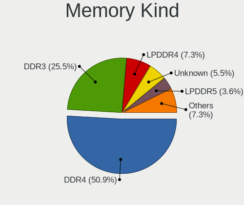

| Kind    | Computers | Percent |
|---------|-----------|---------|
| DDR4    | 28        | 50.91%  |
| DDR3    | 14        | 25.45%  |
| LPDDR4  | 4         | 7.27%   |
| Unknown | 3         | 5.45%   |
| LPDDR5  | 2         | 3.64%   |
| DDR5    | 2         | 3.64%   |
| LPDDR3  | 1         | 1.82%   |
| DDR2    | 1         | 1.82%   |

Memory Form Factor
------------------

Physical design of the memory module

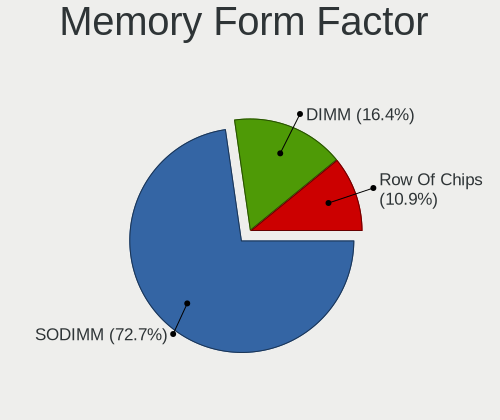

| Name         | Computers | Percent |
|--------------|-----------|---------|
| SODIMM       | 40        | 72.73%  |
| DIMM         | 9         | 16.36%  |
| Row Of Chips | 6         | 10.91%  |

Memory Size
-----------

Memory module size

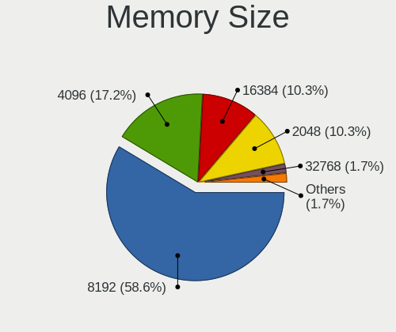

| Size  | Computers | Percent |
|-------|-----------|---------|
| 8192  | 33        | 57.89%  |
| 4096  | 10        | 17.54%  |
| 16384 | 6         | 10.53%  |
| 2048  | 6         | 10.53%  |
| 32768 | 1         | 1.75%   |
| 1024  | 1         | 1.75%   |

Memory Speed
------------

Memory module speed

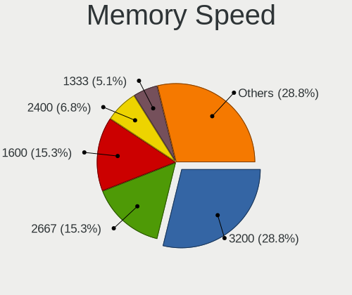

| Speed | Computers | Percent |
|-------|-----------|---------|
| 3200  | 16        | 27.12%  |
| 2667  | 9         | 15.25%  |
| 1600  | 9         | 15.25%  |
| 2400  | 4         | 6.78%   |
| 1333  | 3         | 5.08%   |
| 6400  | 2         | 3.39%   |
| 4800  | 2         | 3.39%   |
| 1867  | 2         | 3.39%   |
| 1800  | 2         | 3.39%   |
| 1334  | 2         | 3.39%   |
| 4267  | 1         | 1.69%   |
| 3733  | 1         | 1.69%   |
| 3100  | 1         | 1.69%   |
| 3000  | 1         | 1.69%   |
| 2133  | 1         | 1.69%   |
| 1066  | 1         | 1.69%   |
| 975   | 1         | 1.69%   |
| 800   | 1         | 1.69%   |

Printers & scanners
-------------------

Printer Vendor
--------------

Printer device vendors

| Vendor      | Computers | Percent |
|-------------|-----------|---------|
| Seiko Epson | 1         | 50%     |
| Dymo-CoStar | 1         | 50%     |

Printer Model
-------------

Printer device models

| Model                       | Computers | Percent |
|-----------------------------|-----------|---------|
| Seiko Epson L120 Series     | 1         | 50%     |
| Dymo-CoStar LabelWriter 450 | 1         | 50%     |

Scanner Vendor
--------------

Scanner device vendors

Zero info for selected period =(

Scanner Model
-------------

Scanner device models

Zero info for selected period =(

Camera
------

Camera Vendor
-------------

Camera device vendors

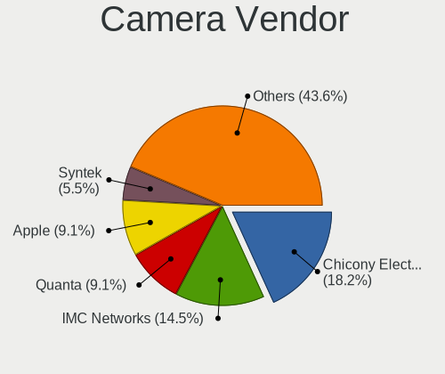

| Vendor                                 | Computers | Percent |
|----------------------------------------|-----------|---------|
| Chicony Electronics                    | 10        | 18.18%  |
| IMC Networks                           | 8         | 14.55%  |
| Quanta                                 | 5         | 9.09%   |
| Apple                                  | 5         | 9.09%   |
| Syntek                                 | 3         | 5.45%   |
| Sonix Technology                       | 3         | 5.45%   |
| Realtek Semiconductor                  | 3         | 5.45%   |
| Microdia                               | 3         | 5.45%   |
| Suyin                                  | 2         | 3.64%   |
| Sunplus Innovation Technology          | 2         | 3.64%   |
| Luxvisions Innotech Limited            | 2         | 3.64%   |
| Logitech                               | 2         | 3.64%   |
| USB Camera CS                          | 1         | 1.82%   |
| USB Camera                             | 1         | 1.82%   |
| Samsung Electronics                    | 1         | 1.82%   |
| Importek                               | 1         | 1.82%   |
| Cheng Uei Precision Industry (Foxlink) | 1         | 1.82%   |
| Bison Electronics                      | 1         | 1.82%   |
| Acer                                   | 1         | 1.82%   |

Camera Model
------------

Camera device models

| Model                                                          | Computers | Percent |
|----------------------------------------------------------------|-----------|---------|
| Syntek Integrated Camera                                       | 3         | 5.45%   |
| Realtek Integrated_Webcam_HD                                   | 3         | 5.45%   |
| IMC Networks Integrated Camera                                 | 3         | 5.45%   |
| Sonix USB2.0 HD UVC WebCam                                     | 2         | 3.64%   |
| Quanta HD User Facing                                          | 2         | 3.64%   |
| Microdia Integrated_Webcam_HD                                  | 2         | 3.64%   |
| IMC Networks USB2.0 HD UVC WebCam                              | 2         | 3.64%   |
| Chicony HD User Facing                                         | 2         | 3.64%   |
| Apple iPhone 5/5C/5S/6/SE/7/8/X                                | 2         | 3.64%   |
| Apple Built-in iSight                                          | 2         | 3.64%   |
| USB Camera USB Camera                                          | 1         | 1.82%   |
| USB Camera CS USB Camera CS                                    | 1         | 1.82%   |
| Suyin USB 2.0 UVC 1.3M WebCam                                  | 1         | 1.82%   |
| Suyin HP Webcam-50                                             | 1         | 1.82%   |
| Sunplus Laptop_Integrated_Webcam_FHD                           | 1         | 1.82%   |
| Sunplus Laptop Integrated Webcam HD                            | 1         | 1.82%   |
| Sonix USB2.0 FHD UVC WebCam                                    | 1         | 1.82%   |
| Samsung Galaxy A5 (MTP)                                        | 1         | 1.82%   |
| Quanta HP Wide Vision HD Camera                                | 1         | 1.82%   |
| Quanta HP True Vision 5MP Camera                               | 1         | 1.82%   |
| Quanta HD Camera                                               | 1         | 1.82%   |
| Microdia Integrated_Webcam_FHD                                 | 1         | 1.82%   |
| Luxvisions Innotech Limited HP Wide Vision HD Camera           | 1         | 1.82%   |
| Luxvisions Innotech Limited HP TrueVision HD Camera            | 1         | 1.82%   |
| Logitech HD Pro Webcam C920                                    | 1         | 1.82%   |
| Logitech BRIO Ultra HD Webcam                                  | 1         | 1.82%   |
| Importek TOSHIBA Web Camera                                    | 1         | 1.82%   |
| IMC Networks USB2.0 VGA UVC WebCam                             | 1         | 1.82%   |
| IMC Networks HP TrueVision HD Camera                           | 1         | 1.82%   |
| IMC Networks HD Camera                                         | 1         | 1.82%   |
| Chicony USB2.0 Camera                                          | 1         | 1.82%   |
| Chicony TOSHIBA Web Camera - HD                                | 1         | 1.82%   |
| Chicony LG Webcam                                              | 1         | 1.82%   |
| Chicony Lenovo Integrated Camera (0.3MP)                       | 1         | 1.82%   |
| Chicony Integrated Camera                                      | 1         | 1.82%   |
| Chicony HP Wide Vision HD Camera                               | 1         | 1.82%   |
| Chicony HD Webcam                                              | 1         | 1.82%   |
| Chicony ACER FHD User Facing                                   | 1         | 1.82%   |
| Cheng Uei Precision Industry (Foxlink) HP TrueVision HD Camera | 1         | 1.82%   |
| Bison Integrated Camera                                        | 1         | 1.82%   |

Security
--------

Fingerprint Vendor
------------------

Fingerprint sensor vendors

| Vendor                     | Computers | Percent |
|----------------------------|-----------|---------|
| Validity Sensors           | 3         | 27.27%  |
| Shenzhen Goodix Technology | 3         | 27.27%  |
| Synaptics                  | 2         | 18.18%  |
| Elan Microelectronics      | 2         | 18.18%  |
| Upek                       | 1         | 9.09%   |

Fingerprint Model
-----------------

Fingerprint sensor models

| Model                                                  | Computers | Percent |
|--------------------------------------------------------|-----------|---------|
| Shenzhen Goodix  Fingerprint Device                    | 3         | 27.27%  |
| Validity Sensors VFS495 Fingerprint Reader             | 1         | 9.09%   |
| Validity Sensors VFS 5011 fingerprint sensor           | 1         | 9.09%   |
| Validity Sensors Synaptics WBDI                        | 1         | 9.09%   |
| Upek Biometric Touchchip/Touchstrip Fingerprint Sensor | 1         | 9.09%   |
| Synaptics WBDI                                         | 1         | 9.09%   |
| Synaptics Prometheus MIS Touch Fingerprint Reader      | 1         | 9.09%   |
| Elan ELAN:Fingerprint                                  | 1         | 9.09%   |
| Elan ELAN:ARM-M4                                       | 1         | 9.09%   |

Chipcard Vendor
---------------

Chipcard module vendors

| Vendor   | Computers | Percent |
|----------|-----------|---------|
| Broadcom | 1         | 100%    |

Chipcard Model
--------------

Chipcard module models

| Model                                          | Computers | Percent |
|------------------------------------------------|-----------|---------|
| Broadcom BCM5880 Secure Applications Processor | 1         | 100%    |

Unsupported
-----------

Unsupported Devices
-------------------

Total unsupported devices on board

| Total | Computers | Percent |
|-------|-----------|---------|
| 0     | 51        | 68%     |
| 1     | 21        | 28%     |
| 2     | 3         | 4%      |

Unsupported Device Types
------------------------

Types of unsupported devices

| Type                     | Computers | Percent |
|--------------------------|-----------|---------|
| Fingerprint reader       | 11        | 40.74%  |
| Graphics card            | 6         | 22.22%  |
| Net/wireless             | 3         | 11.11%  |
| Multimedia controller    | 2         | 7.41%   |
| Storage                  | 1         | 3.7%    |
| Sound                    | 1         | 3.7%    |
| Communication controller | 1         | 3.7%    |
| Chipcard                 | 1         | 3.7%    |
| Camera                   | 1         | 3.7%    |

