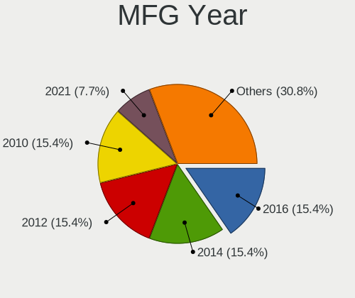
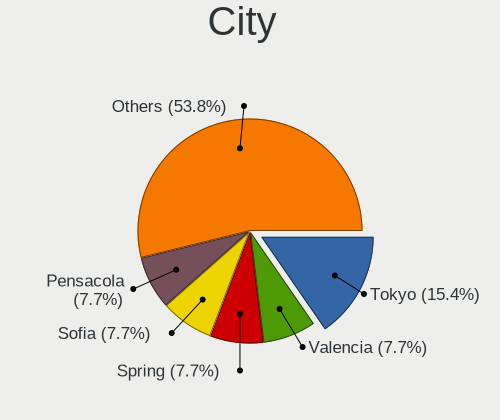
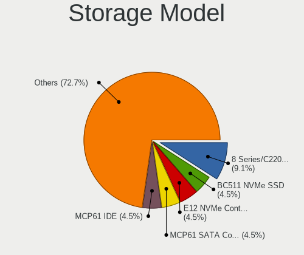
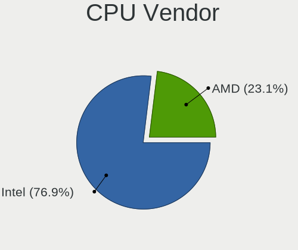
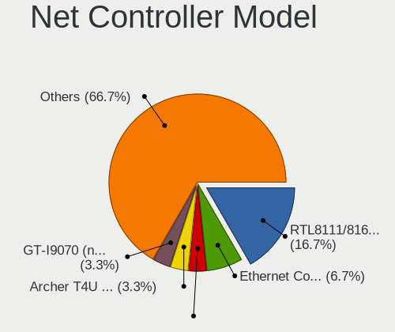
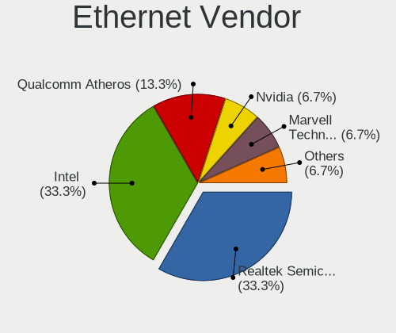
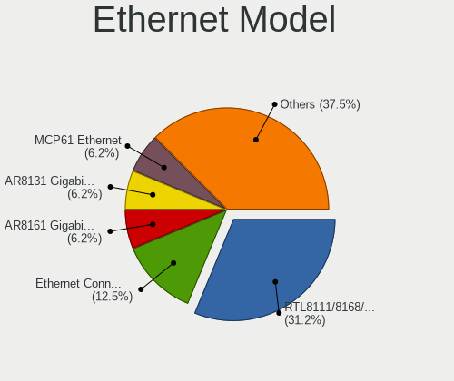
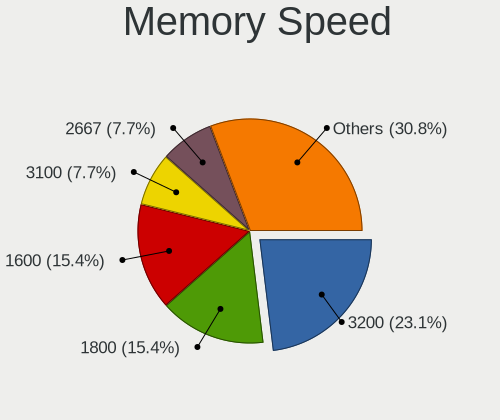

Parrot 5.1 - Tested Hardware & Statistics (Desktops)
----------------------------------------------------

A project to collect tested hardware configurations for Parrot 5.1.

Anyone can contribute to this report by the [hw-probe](https://github.com/linuxhw/hw-probe) tool:

    sudo -E hw-probe -all -upload

Please contribute! Especially if your hardware is rare.

Contents
--------

* [ Test Cases ](#test-cases)

* [ System ](#system)
  - [ Kernel                   ](#kernel)
  - [ Kernel Family            ](#kernel-family)
  - [ Kernel Major Ver.        ](#kernel-major-ver)
  - [ Arch                     ](#arch)
  - [ DE                       ](#de)
  - [ Display Server           ](#display-server)
  - [ Display Manager          ](#display-manager)
  - [ OS Lang                  ](#os-lang)
  - [ Boot Mode                ](#boot-mode)
  - [ Filesystem               ](#filesystem)
  - [ Part. scheme             ](#part-scheme)
  - [ Dual Boot with Linux/BSD ](#dual-boot-with-linuxbsd)
  - [ Dual Boot (Win)          ](#dual-boot-win)

* [ Board ](#board)
  - [ Vendor                   ](#vendor)
  - [ Model                    ](#model)
  - [ Model Family             ](#model-family)
  - [ MFG Year                 ](#mfg-year)
  - [ Form Factor              ](#form-factor)
  - [ Secure Boot              ](#secure-boot)
  - [ Coreboot                 ](#coreboot)
  - [ RAM Size                 ](#ram-size)
  - [ RAM Used                 ](#ram-used)
  - [ Total Drives             ](#total-drives)
  - [ Has CD-ROM               ](#has-cd-rom)
  - [ Has Ethernet             ](#has-ethernet)
  - [ Has WiFi                 ](#has-wifi)
  - [ Has Bluetooth            ](#has-bluetooth)

* [ Location ](#location)
  - [ Country                  ](#country)
  - [ City                     ](#city)

* [ Drives ](#drives)
  - [ Drive Vendor             ](#drive-vendor)
  - [ Drive Model              ](#drive-model)
  - [ HDD Vendor               ](#hdd-vendor)
  - [ SSD Vendor               ](#ssd-vendor)
  - [ Drive Kind               ](#drive-kind)
  - [ Drive Connector          ](#drive-connector)
  - [ Drive Size               ](#drive-size)
  - [ Space Total              ](#space-total)
  - [ Space Used               ](#space-used)
  - [ Malfunc. Drives          ](#malfunc-drives)
  - [ Malfunc. Drive Vendor    ](#malfunc-drive-vendor)
  - [ Malfunc. HDD Vendor      ](#malfunc-hdd-vendor)
  - [ Malfunc. Drive Kind      ](#malfunc-drive-kind)
  - [ Failed Drives            ](#failed-drives)
  - [ Failed Drive Vendor      ](#failed-drive-vendor)
  - [ Drive Status             ](#drive-status)

* [ Storage controller ](#storage-controller)
  - [ Storage Vendor           ](#storage-vendor)
  - [ Storage Model            ](#storage-model)
  - [ Storage Kind             ](#storage-kind)

* [ Processor ](#processor)
  - [ CPU Vendor               ](#cpu-vendor)
  - [ CPU Model                ](#cpu-model)
  - [ CPU Model Family         ](#cpu-model-family)
  - [ CPU Cores                ](#cpu-cores)
  - [ CPU Sockets              ](#cpu-sockets)
  - [ CPU Threads              ](#cpu-threads)
  - [ CPU Op-Modes             ](#cpu-op-modes)
  - [ CPU Microcode            ](#cpu-microcode)
  - [ CPU Microarch            ](#cpu-microarch)

* [ Graphics ](#graphics)
  - [ GPU Vendor               ](#gpu-vendor)
  - [ GPU Model                ](#gpu-model)
  - [ GPU Combo                ](#gpu-combo)
  - [ GPU Driver               ](#gpu-driver)
  - [ GPU Memory               ](#gpu-memory)

* [ Monitor ](#monitor)
  - [ Monitor Vendor           ](#monitor-vendor)
  - [ Monitor Model            ](#monitor-model)
  - [ Monitor Resolution       ](#monitor-resolution)
  - [ Monitor Diagonal         ](#monitor-diagonal)
  - [ Monitor Width            ](#monitor-width)
  - [ Aspect Ratio             ](#aspect-ratio)
  - [ Monitor Area             ](#monitor-area)
  - [ Pixel Density            ](#pixel-density)
  - [ Multiple Monitors        ](#multiple-monitors)

* [ Network ](#network)
  - [ Net Controller Vendor    ](#net-controller-vendor)
  - [ Net Controller Model     ](#net-controller-model)
  - [ Wireless Vendor          ](#wireless-vendor)
  - [ Wireless Model           ](#wireless-model)
  - [ Ethernet Vendor          ](#ethernet-vendor)
  - [ Ethernet Model           ](#ethernet-model)
  - [ Net Controller Kind      ](#net-controller-kind)
  - [ Used Controller          ](#used-controller)
  - [ NICs                     ](#nics)
  - [ IPv6                     ](#ipv6)

* [ Bluetooth ](#bluetooth)
  - [ Bluetooth Vendor         ](#bluetooth-vendor)
  - [ Bluetooth Model          ](#bluetooth-model)

* [ Sound ](#sound)
  - [ Sound Vendor             ](#sound-vendor)
  - [ Sound Model              ](#sound-model)

* [ Memory ](#memory)
  - [ Memory Vendor            ](#memory-vendor)
  - [ Memory Model             ](#memory-model)
  - [ Memory Kind              ](#memory-kind)
  - [ Memory Form Factor       ](#memory-form-factor)
  - [ Memory Size              ](#memory-size)
  - [ Memory Speed             ](#memory-speed)

* [ Printers & scanners ](#printers--scanners)
  - [ Printer Vendor           ](#printer-vendor)
  - [ Printer Model            ](#printer-model)
  - [ Scanner Vendor           ](#scanner-vendor)
  - [ Scanner Model            ](#scanner-model)

* [ Camera ](#camera)
  - [ Camera Vendor            ](#camera-vendor)
  - [ Camera Model             ](#camera-model)

* [ Security ](#security)
  - [ Fingerprint Vendor       ](#fingerprint-vendor)
  - [ Fingerprint Model        ](#fingerprint-model)
  - [ Chipcard Vendor          ](#chipcard-vendor)
  - [ Chipcard Model           ](#chipcard-model)

* [ Unsupported ](#unsupported)
  - [ Unsupported Devices      ](#unsupported-devices)
  - [ Unsupported Device Types ](#unsupported-device-types)

Test Cases
----------

Total: 18

| Vendor   | Model          | Probe                                                      | Date         |
|----------|----------------|------------------------------------------------------------|--------------|
| Biostar  | B450MH         | [963e90387d](https://linux-hardware.org/?probe=963e90387d) | Feb 17, 2023 |
| Dell     | 0WMJ54 A01     | [bfb29a2d13](https://linux-hardware.org/?probe=bfb29a2d13) | Feb 04, 2023 |
| ASRock   | Z87M Extreme4  | [8821f128c8](https://linux-hardware.org/?probe=8821f128c8) | Feb 03, 2023 |
| ASUSTek  | PRIME Z270-P   | [15644c39de](https://linux-hardware.org/?probe=15644c39de) | Jan 25, 2023 |
| Gigabyte | GA-880GMA-USB3 | [eb10e25652](https://linux-hardware.org/?probe=eb10e25652) | Jan 23, 2023 |
| Gigabyte | GA-880GMA-USB3 | [6552c7b8b3](https://linux-hardware.org/?probe=6552c7b8b3) | Jan 22, 2023 |
| Gigabyte | GA-880GMA-USB3 | [64164ef7df](https://linux-hardware.org/?probe=64164ef7df) | Jan 20, 2023 |
| Gigabyte | GA-880GMA-USB3 | [46befb7112](https://linux-hardware.org/?probe=46befb7112) | Jan 20, 2023 |
| HP       | 3397           | [33ba62be32](https://linux-hardware.org/?probe=33ba62be32) | Dec 10, 2022 |
| ASUSTek  | Z170-DELUXE    | [7928d11567](https://linux-hardware.org/?probe=7928d11567) | Nov 19, 2022 |
| Dell     | 0C1R19 A02     | [514ae17aa9](https://linux-hardware.org/?probe=514ae17aa9) | Nov 06, 2022 |
| HP       | 89B5 A         | [1b04604c98](https://linux-hardware.org/?probe=1b04604c98) | Nov 03, 2022 |
| Gigabyte | Z97N-WIFI      | [dd5c78f136](https://linux-hardware.org/?probe=dd5c78f136) | Oct 24, 2022 |
| Gigabyte | Z97N-WIFI      | [10d8d16b6c](https://linux-hardware.org/?probe=10d8d16b6c) | Oct 24, 2022 |
| ASUSTek  | P5G41T-M LX    | [7c046d1ba8](https://linux-hardware.org/?probe=7c046d1ba8) | Oct 23, 2022 |
| Gigabyte | M61SME-S2      | [6595a0b531](https://linux-hardware.org/?probe=6595a0b531) | Oct 19, 2022 |
| ASUSTek  | P6X58D-E       | [d84fc5ce81](https://linux-hardware.org/?probe=d84fc5ce81) | Oct 13, 2022 |
| ASUSTek  | P6X58D-E       | [2a896ec4f6](https://linux-hardware.org/?probe=2a896ec4f6) | Oct 13, 2022 |

System
------

Kernel
------

Version of the Linux kernel

| Version                | Desktops | Percent |
|------------------------|----------|---------|
| 6.0.0-2parrot1-amd64   | 6        | 46.15%  |
| 6.0.0-12parrot1-amd64  | 4        | 30.77%  |
| 5.18.0-14parrot1-amd64 | 2        | 15.38%  |
| 5.16.0-12parrot1-amd64 | 1        | 7.69%   |

Kernel Family
-------------

Linux kernel without a distro release

| Version | Desktops | Percent |
|---------|----------|---------|
| 6.0.0   | 10       | 76.92%  |
| 5.18.0  | 2        | 15.38%  |
| 5.16.0  | 1        | 7.69%   |

Kernel Major Ver.
-----------------

Linux kernel major version

| Version | Desktops | Percent |
|---------|----------|---------|
| 6.0     | 10       | 76.92%  |
| 5.18    | 2        | 15.38%  |
| 5.16    | 1        | 7.69%   |

Arch
----

OS architecture (x86_64, i586, etc.)

| Name   | Desktops | Percent |
|--------|----------|---------|
| x86_64 | 13       | 100%    |

DE
--

Desktop Environment

| Name | Desktops | Percent |
|------|----------|---------|
| MATE | 13       | 100%    |

Display Server
--------------

X11 or Wayland

| Name | Desktops | Percent |
|------|----------|---------|
| X11  | 13       | 100%    |

Display Manager
---------------

SDDM, LightDM, etc.

| Name    | Desktops | Percent |
|---------|----------|---------|
| LightDM | 8        | 61.54%  |
| Unknown | 4        | 30.77%  |
| SDDM    | 1        | 7.69%   |

OS Lang
-------

Language

| Lang  | Desktops | Percent |
|-------|----------|---------|
| en_US | 11       | 84.62%  |
| es_MX | 1        | 7.69%   |
| en_AU | 1        | 7.69%   |

Boot Mode
---------

EFI or BIOS

| Mode | Desktops | Percent |
|------|----------|---------|
| BIOS | 10       | 76.92%  |
| EFI  | 3        | 23.08%  |

Filesystem
----------

Type of filesystem

| Type  | Desktops | Percent |
|-------|----------|---------|
| Btrfs | 11       | 84.62%  |
| Ext4  | 2        | 15.38%  |

Part. scheme
------------

Scheme of partitioning

| Type    | Desktops | Percent |
|---------|----------|---------|
| MBR     | 6        | 46.15%  |
| Unknown | 4        | 30.77%  |
| GPT     | 3        | 23.08%  |

Dual Boot with Linux/BSD
------------------------

Hosting more than one Linux/BSD

| Dual boot | Desktops | Percent |
|-----------|----------|---------|
| No        | 11       | 84.62%  |
| Yes       | 2        | 15.38%  |

Dual Boot (Win)
---------------

Hosting Linux and Windows

| Dual boot | Desktops | Percent |
|-----------|----------|---------|
| No        | 9        | 69.23%  |
| Yes       | 4        | 30.77%  |

Board
-----

Vendor
------

Motherboard manufacturer

| Name                | Desktops | Percent |
|---------------------|----------|---------|
| ASUSTek Computer    | 4        | 30.77%  |
| Gigabyte Technology | 3        | 23.08%  |
| Hewlett-Packard     | 2        | 15.38%  |
| Dell                | 2        | 15.38%  |
| Biostar             | 1        | 7.69%   |
| ASRock              | 1        | 7.69%   |

Model
-----

Motherboard model

| Name                                      | Desktops | Percent |
|-------------------------------------------|----------|---------|
| HP Victus by 15L Gaming Desktop TG02-0xxx | 1        | 7.69%   |
| HP Compaq Elite 8300 SFF                  | 1        | 7.69%   |
| Gigabyte Z97N-WIFI                        | 1        | 7.69%   |
| Gigabyte M61SME-S2                        | 1        | 7.69%   |
| Gigabyte GA-880GMA-USB3                   | 1        | 7.69%   |
| Dell OptiPlex 7070                        | 1        | 7.69%   |
| Dell OptiPlex 3020                        | 1        | 7.69%   |
| Biostar B450MH                            | 1        | 7.69%   |
| ASUS Z170-DELUXE                          | 1        | 7.69%   |
| ASUS PRIME Z270-P                         | 1        | 7.69%   |
| ASUS P6X58D-E                             | 1        | 7.69%   |
| ASUS P5G41T-M LX                          | 1        | 7.69%   |
| ASRock Z87M Extreme4                      | 1        | 7.69%   |

Model Family
------------

Motherboard model prefix

| Name                    | Desktops | Percent |
|-------------------------|----------|---------|
| Dell OptiPlex           | 2        | 15.38%  |
| HP Victus               | 1        | 7.69%   |
| HP Compaq               | 1        | 7.69%   |
| Gigabyte Z97N-WIFI      | 1        | 7.69%   |
| Gigabyte M61SME-S2      | 1        | 7.69%   |
| Gigabyte GA-880GMA-USB3 | 1        | 7.69%   |
| Biostar B450MH          | 1        | 7.69%   |
| ASUS Z170-DELUXE        | 1        | 7.69%   |
| ASUS PRIME              | 1        | 7.69%   |
| ASUS P6X58D-E           | 1        | 7.69%   |
| ASUS P5G41T-M           | 1        | 7.69%   |
| ASRock Z87M             | 1        | 7.69%   |

MFG Year
--------

Motherboard manufacture year

| Year | Desktops | Percent |
|------|----------|---------|
| 2016 | 2        | 15.38%  |
| 2014 | 2        | 15.38%  |
| 2012 | 2        | 15.38%  |
| 2010 | 2        | 15.38%  |
| 2021 | 1        | 7.69%   |
| 2020 | 1        | 7.69%   |
| 2013 | 1        | 7.69%   |
| 2011 | 1        | 7.69%   |
| 2007 | 1        | 7.69%   |

Form Factor
-----------

Physical design of the computer

| Name    | Desktops | Percent |
|---------|----------|---------|
| Desktop | 13       | 100%    |

Secure Boot
-----------

Enabled or disabled

| State    | Desktops | Percent |
|----------|----------|---------|
| Disabled | 13       | 100%    |

Coreboot
--------

Have coreboot on board

| Used | Desktops | Percent |
|------|----------|---------|
| No   | 13       | 100%    |

RAM Size
--------

Total RAM memory

| Size in GB | Desktops | Percent |
|------------|----------|---------|
| 16.01-24.0 | 5        | 38.46%  |
| 4.01-8.0   | 3        | 23.08%  |
| 8.01-16.0  | 3        | 23.08%  |
| 32.01-64.0 | 1        | 7.69%   |
| 3.01-4.0   | 1        | 7.69%   |

RAM Used
--------

Used RAM memory

| Used GB  | Desktops | Percent |
|----------|----------|---------|
| 2.01-3.0 | 5        | 38.46%  |
| 1.01-2.0 | 4        | 30.77%  |
| 3.01-4.0 | 2        | 15.38%  |
| 4.01-8.0 | 1        | 7.69%   |
| 0.51-1.0 | 1        | 7.69%   |

Total Drives
------------

Number of drives on board

| Drives | Desktops | Percent |
|--------|----------|---------|
| 1      | 7        | 53.85%  |
| 2      | 3        | 23.08%  |
| 4      | 2        | 15.38%  |
| 5      | 1        | 7.69%   |

Has CD-ROM
----------

Has CD-ROM on board

| Presented | Desktops | Percent |
|-----------|----------|---------|
| No        | 7        | 53.85%  |
| Yes       | 6        | 46.15%  |

Has Ethernet
------------

Has Ethernet on board

| Presented | Desktops | Percent |
|-----------|----------|---------|
| Yes       | 13       | 100%    |

Has WiFi
--------

Has WiFi module

| Presented | Desktops | Percent |
|-----------|----------|---------|
| Yes       | 9        | 69.23%  |
| No        | 4        | 30.77%  |

Has Bluetooth
-------------

Has Bluetooth module

| Presented | Desktops | Percent |
|-----------|----------|---------|
| No        | 8        | 61.54%  |
| Yes       | 5        | 38.46%  |

Location
--------

Country
-------

Geographic location (country)

| Country     | Desktops | Percent |
|-------------|----------|---------|
| USA         | 6        | 46.15%  |
| Japan       | 2        | 15.38%  |
| Turkey      | 1        | 7.69%   |
| Philippines | 1        | 7.69%   |
| Mexico      | 1        | 7.69%   |
| India       | 1        | 7.69%   |
| Bulgaria    | 1        | 7.69%   |

City
----

Geographic location (city)

| City               | Desktops | Percent |
|--------------------|----------|---------|
| Tokyo              | 2        | 15.38%  |
| Valencia           | 1        | 7.69%   |
| Spring             | 1        | 7.69%   |
| Sofia              | 1        | 7.69%   |
| Pensacola          | 1        | 7.69%   |
| Ordu               | 1        | 7.69%   |
| Makati City        | 1        | 7.69%   |
| Kingston           | 1        | 7.69%   |
| Guadalupe Trujillo | 1        | 7.69%   |
| Eugene             | 1        | 7.69%   |
| Denver             | 1        | 7.69%   |
| Chennai            | 1        | 7.69%   |

Drives
------

Drive Vendor
------------

Hard drive vendors

| Vendor              | Desktops | Drives | Percent |
|---------------------|----------|--------|---------|
| WDC                 | 5        | 8      | 23.81%  |
| Seagate             | 4        | 6      | 19.05%  |
| Toshiba             | 3        | 3      | 14.29%  |
| Samsung Electronics | 2        | 2      | 9.52%   |
| Micron Technology   | 2        | 2      | 9.52%   |
| SK hynix            | 1        | 1      | 4.76%   |
| SanDisk             | 1        | 1      | 4.76%   |
| Phison              | 1        | 1      | 4.76%   |
| Hitachi             | 1        | 1      | 4.76%   |
| Corsair             | 1        | 1      | 4.76%   |

Drive Model
-----------

Hard drive models

| Model                               | Desktops | Percent |
|-------------------------------------|----------|---------|
| WDC WD5002ABYS-01B1B0 500GB         | 1        | 4%      |
| WDC WD3200BPVT-80JJ5T0 320GB        | 1        | 4%      |
| WDC WD2000FYYZ-01UL1B2 2TB          | 1        | 4%      |
| WDC WD10EZEX-00BN5A0 1TB            | 1        | 4%      |
| WDC WD10EURX-63UY4Y0 1TB            | 1        | 4%      |
| WDC WD10EADS-22M2B0 1TB             | 1        | 4%      |
| WDC WD1002FAEX-00Z3A0 1TB           | 1        | 4%      |
| Toshiba DT01ACA200 2TB              | 1        | 4%      |
| Toshiba DT01ACA100 1TB              | 1        | 4%      |
| Toshiba DT01ABA100V 1TB             | 1        | 4%      |
| SK hynix BC511 NVMe 256GB           | 1        | 4%      |
| Seagate ST9500325ASG 500GB          | 1        | 4%      |
| Seagate ST9250315AS 250GB           | 1        | 4%      |
| Seagate ST3160215AS 160GB           | 1        | 4%      |
| Seagate ST31000528AS 1TB            | 1        | 4%      |
| Seagate ST2000LM003 HN-M201RAD 2TB  | 1        | 4%      |
| Seagate ST1000DM003-1CH162 1TB      | 1        | 4%      |
| SanDisk SD6SF1M128G1022I 128GB SSD  | 1        | 4%      |
| Samsung SSD 860 EVO 250GB           | 1        | 4%      |
| Samsung HD161HJ 160GB               | 1        | 4%      |
| Phison Sabrent 512GB                | 1        | 4%      |
| Micron MTFDKBA1T0TFH-1BC1AABHA 1TB  | 1        | 4%      |
| Micron 1100_MTFDDAV256TBN 256GB SSD | 1        | 4%      |
| Hitachi HTS545016B9A300 160GB       | 1        | 4%      |
| Corsair Force GS 128GB SSD          | 1        | 4%      |

HDD Vendor
----------

Hard disk drive vendors

| Vendor              | Desktops | Drives | Percent |
|---------------------|----------|--------|---------|
| WDC                 | 5        | 8      | 35.71%  |
| Seagate             | 4        | 6      | 28.57%  |
| Toshiba             | 3        | 3      | 21.43%  |
| Samsung Electronics | 1        | 1      | 7.14%   |
| Hitachi             | 1        | 1      | 7.14%   |

SSD Vendor
----------

Solid state drive vendors

| Vendor              | Desktops | Drives | Percent |
|---------------------|----------|--------|---------|
| SanDisk             | 1        | 1      | 25%     |
| Samsung Electronics | 1        | 1      | 25%     |
| Micron Technology   | 1        | 1      | 25%     |
| Corsair             | 1        | 1      | 25%     |

Drive Kind
----------

HDD or SSD

| Kind | Desktops | Drives | Percent |
|------|----------|--------|---------|
| HDD  | 9        | 19     | 60%     |
| NVMe | 3        | 3      | 20%     |
| SSD  | 3        | 4      | 20%     |

Drive Connector
---------------

SATA, SAS, NVMe, etc.

| Type | Desktops | Drives | Percent |
|------|----------|--------|---------|
| SATA | 10       | 23     | 76.92%  |
| NVMe | 3        | 3      | 23.08%  |

Drive Size
----------

Size of hard drive

| Size in TB | Desktops | Drives | Percent |
|------------|----------|--------|---------|
| 0.01-0.5   | 7        | 11     | 43.75%  |
| 0.51-1.0   | 6        | 9      | 37.5%   |
| 1.01-2.0   | 3        | 3      | 18.75%  |

Space Total
-----------

Amount of disk space available on the file system

| Size in GB     | Desktops | Percent |
|----------------|----------|---------|
| 1001-2000      | 3        | 23.08%  |
| More than 3000 | 2        | 15.38%  |
| 251-500        | 2        | 15.38%  |
| 101-250        | 2        | 15.38%  |
| Unknown        | 2        | 15.38%  |
| 1-20           | 1        | 7.69%   |
| 51-100         | 1        | 7.69%   |

Space Used
----------

Amount of used disk space

| Used GB | Desktops | Percent |
|---------|----------|---------|
| 21-50   | 5        | 38.46%  |
| 101-250 | 3        | 23.08%  |
| 1-20    | 2        | 15.38%  |
| Unknown | 2        | 15.38%  |
| 51-100  | 1        | 7.69%   |

Malfunc. Drives
---------------

Drive models with a malfunction

| Model                              | Desktops | Drives | Percent |
|------------------------------------|----------|--------|---------|
| WDC WD10EADS-22M2B0 1TB            | 1        | 1      | 20%     |
| Seagate ST3160215AS 160GB          | 1        | 1      | 20%     |
| Seagate ST2000LM003 HN-M201RAD 2TB | 1        | 1      | 20%     |
| SanDisk SD6SF1M128G1022I 128GB SSD | 1        | 1      | 20%     |
| Samsung Electronics HD161HJ 160GB  | 1        | 1      | 20%     |

Malfunc. Drive Vendor
---------------------

Vendors of faulty drives

| Vendor              | Desktops | Drives | Percent |
|---------------------|----------|--------|---------|
| Seagate             | 2        | 2      | 40%     |
| WDC                 | 1        | 1      | 20%     |
| SanDisk             | 1        | 1      | 20%     |
| Samsung Electronics | 1        | 1      | 20%     |

Malfunc. HDD Vendor
-------------------

Vendors of faulty HDD drives

| Vendor              | Desktops | Drives | Percent |
|---------------------|----------|--------|---------|
| Seagate             | 2        | 2      | 50%     |
| WDC                 | 1        | 1      | 25%     |
| Samsung Electronics | 1        | 1      | 25%     |

Malfunc. Drive Kind
-------------------

Kinds of faulty drives

| Kind | Desktops | Drives | Percent |
|------|----------|--------|---------|
| HDD  | 2        | 4      | 66.67%  |
| SSD  | 1        | 1      | 33.33%  |

Failed Drives
-------------

Failed drive models

Zero info for selected period =(

Failed Drive Vendor
-------------------

Failed drive vendors

Zero info for selected period =(

Drive Status
------------

Number of failed and malfunc. drives

| Status   | Desktops | Drives | Percent |
|----------|----------|--------|---------|
| Works    | 8        | 14     | 57.14%  |
| Detected | 4        | 7      | 28.57%  |
| Malfunc  | 2        | 5      | 14.29%  |

Storage controller
------------------

Storage Vendor
--------------

Storage controller vendors

| Vendor                   | Desktops | Percent |
|--------------------------|----------|---------|
| Intel                    | 10       | 55.56%  |
| AMD                      | 2        | 11.11%  |
| SK hynix                 | 1        | 5.56%   |
| Phison Electronics       | 1        | 5.56%   |
| Nvidia                   | 1        | 5.56%   |
| Micron Technology        | 1        | 5.56%   |
| Marvell Technology Group | 1        | 5.56%   |
| ASMedia Technology       | 1        | 5.56%   |

Storage Model
-------------

Storage controller models

| Model                                                                          | Desktops | Percent |
|--------------------------------------------------------------------------------|----------|---------|
| Intel 8 Series/C220 Series Chipset Family 6-port SATA Controller 1 [AHCI mode] | 2        | 9.09%   |
| SK hynix BC511 NVMe SSD                                                        | 1        | 4.55%   |
| Phison E12 NVMe Controller                                                     | 1        | 4.55%   |
| Nvidia MCP61 SATA Controller                                                   | 1        | 4.55%   |
| Nvidia MCP61 IDE                                                               | 1        | 4.55%   |
| Micron 3400 NVMe SSD [Hendrix]                                                 | 1        | 4.55%   |
| Marvell Group 88SE91A3 SATA-600 Controller                                     | 1        | 4.55%   |
| Intel Volume Management Device NVMe RAID Controller                            | 1        | 4.55%   |
| Intel Q170/Q150/B150/H170/H110/Z170/CM236 Chipset SATA Controller [AHCI Mode]  | 1        | 4.55%   |
| Intel NM10/ICH7 Family SATA Controller [IDE mode]                              | 1        | 4.55%   |
| Intel Cannon Lake PCH SATA AHCI Controller                                     | 1        | 4.55%   |
| Intel Alder Lake-S PCH SATA Controller [AHCI Mode]                             | 1        | 4.55%   |
| Intel 9 Series Chipset Family SATA Controller [AHCI Mode]                      | 1        | 4.55%   |
| Intel 82801JI (ICH10 Family) 4 port SATA IDE Controller #1                     | 1        | 4.55%   |
| Intel 82801JI (ICH10 Family) 2 port SATA IDE Controller #2                     | 1        | 4.55%   |
| Intel 7 Series/C210 Series Chipset Family 6-port SATA Controller [AHCI mode]   | 1        | 4.55%   |
| Intel 200 Series PCH SATA controller [AHCI mode]                               | 1        | 4.55%   |
| ASMedia ASM1062 Serial ATA Controller                                          | 1        | 4.55%   |
| AMD SB7x0/SB8x0/SB9x0 SATA Controller [IDE mode]                               | 1        | 4.55%   |
| AMD SB7x0/SB8x0/SB9x0 IDE Controller                                           | 1        | 4.55%   |
| AMD 400 Series Chipset SATA Controller                                         | 1        | 4.55%   |

Storage Kind
------------

Kind of storage controller (IDE, SATA, NVMe, SAS, ...)

| Kind | Desktops | Percent |
|------|----------|---------|
| SATA | 10       | 55.56%  |
| IDE  | 4        | 22.22%  |
| NVMe | 3        | 16.67%  |
| RAID | 1        | 5.56%   |

Processor
---------

CPU Vendor
----------

Processor vendors

| Vendor | Desktops | Percent |
|--------|----------|---------|
| Intel  | 10       | 76.92%  |
| AMD    | 3        | 23.08%  |

CPU Model
---------

Processor models

| Model                                       | Desktops | Percent |
|---------------------------------------------|----------|---------|
| Intel Xeon CPU E5450 @ 3.00GHz              | 1        | 7.69%   |
| Intel Xeon CPU E3-1246 v3 @ 3.50GHz         | 1        | 7.69%   |
| Intel Core i7-7700K CPU @ 4.20GHz           | 1        | 7.69%   |
| Intel Core i7-4790K CPU @ 4.00GHz           | 1        | 7.69%   |
| Intel Core i7-2600 CPU @ 3.40GHz            | 1        | 7.69%   |
| Intel Core i7 CPU 950 @ 3.07GHz             | 1        | 7.69%   |
| Intel Core i5-9500T CPU @ 2.20GHz           | 1        | 7.69%   |
| Intel Core i5-7600K CPU @ 3.80GHz           | 1        | 7.69%   |
| Intel Core i5-4690K CPU @ 3.50GHz           | 1        | 7.69%   |
| Intel 12th Gen Core i7-12700F               | 1        | 7.69%   |
| AMD Ryzen 3 3200G with Radeon Vega Graphics | 1        | 7.69%   |
| AMD Processor model unknown                 | 1        | 7.69%   |
| AMD Phenom II X4 955 Processor              | 1        | 7.69%   |

CPU Model Family
----------------

Processor model prefix

| Model            | Desktops | Percent |
|------------------|----------|---------|
| Intel Core i7    | 4        | 30.77%  |
| Intel Core i5    | 3        | 23.08%  |
| Other            | 2        | 15.38%  |
| Intel Xeon       | 2        | 15.38%  |
| AMD Ryzen 3      | 1        | 7.69%   |
| AMD Phenom II X4 | 1        | 7.69%   |

CPU Cores
---------

Number of processor cores

| Number | Desktops | Percent |
|--------|----------|---------|
| 4      | 10       | 76.92%  |
| 12     | 1        | 7.69%   |
| 6      | 1        | 7.69%   |
| 2      | 1        | 7.69%   |

CPU Sockets
-----------

Number of sockets

| Number | Desktops | Percent |
|--------|----------|---------|
| 1      | 13       | 100%    |

CPU Threads
-----------

Threads per core (Hyper-Threading)

| Number | Desktops | Percent |
|--------|----------|---------|
| 1      | 8        | 61.54%  |
| 2      | 5        | 38.46%  |

CPU Op-Modes
------------

CPU Operation Modes (32-bit, 64-bit)

| Op mode        | Desktops | Percent |
|----------------|----------|---------|
| 32-bit, 64-bit | 13       | 100%    |

CPU Microcode
-------------

Microcode number

| Number     | Desktops | Percent |
|------------|----------|---------|
| Unknown    | 5        | 38.46%  |
| 0x306c3    | 2        | 15.38%  |
| 0x010000c8 | 2        | 15.38%  |
| 0x906ea    | 1        | 7.69%   |
| 0x906e9    | 1        | 7.69%   |
| 0x90672    | 1        | 7.69%   |
| 0x08108109 | 1        | 7.69%   |

CPU Microarch
-------------

Microarchitecture

| Name             | Desktops | Percent |
|------------------|----------|---------|
| KabyLake         | 3        | 23.08%  |
| Haswell          | 3        | 23.08%  |
| K10              | 2        | 15.38%  |
| Zen+             | 1        | 7.69%   |
| SandyBridge      | 1        | 7.69%   |
| Penryn           | 1        | 7.69%   |
| Nehalem          | 1        | 7.69%   |
| Alderlake Hybrid | 1        | 7.69%   |

Graphics
--------

GPU Vendor
----------

Vendors of graphics cards

| Vendor | Desktops | Percent |
|--------|----------|---------|
| Nvidia | 7        | 50%     |
| Intel  | 4        | 28.57%  |
| AMD    | 3        | 21.43%  |

GPU Model
---------

Graphics card models

| Model                                                                       | Desktops | Percent |
|-----------------------------------------------------------------------------|----------|---------|
| Intel Xeon E3-1200 v3/4th Gen Core Processor Integrated Graphics Controller | 2        | 14.29%  |
| Nvidia NV43 [GeForce 6600 GT]                                               | 1        | 7.14%   |
| Nvidia GP104 [GeForce GTX 1080]                                             | 1        | 7.14%   |
| Nvidia GK104 [GeForce GTX 660 Ti]                                           | 1        | 7.14%   |
| Nvidia GF116 [GeForce GTX 550 Ti]                                           | 1        | 7.14%   |
| Nvidia GF108 [GeForce GT 630]                                               | 1        | 7.14%   |
| Nvidia GA104 [GeForce RTX 3060 Ti Lite Hash Rate]                           | 1        | 7.14%   |
| Nvidia G94 [GeForce 9600 GT]                                                | 1        | 7.14%   |
| Intel CoffeeLake-S GT2 [UHD Graphics 630]                                   | 1        | 7.14%   |
| Intel 2nd Generation Core Processor Family Integrated Graphics Controller   | 1        | 7.14%   |
| AMD RV710 [Radeon HD 4350/4550]                                             | 1        | 7.14%   |
| AMD RS880 [Radeon HD 4250]                                                  | 1        | 7.14%   |
| AMD Picasso/Raven 2 [Radeon Vega Series / Radeon Vega Mobile Series]        | 1        | 7.14%   |

GPU Combo
---------

Combinations of graphics cards

| Name           | Desktops | Percent |
|----------------|----------|---------|
| 1 x Nvidia     | 6        | 46.15%  |
| 1 x Intel      | 3        | 23.08%  |
| 1 x AMD        | 3        | 23.08%  |
| Intel + Nvidia | 1        | 7.69%   |

GPU Driver
----------

Free vs proprietary

| Driver      | Desktops | Percent |
|-------------|----------|---------|
| Free        | 11       | 84.62%  |
| Proprietary | 1        | 7.69%   |
| Unknown     | 1        | 7.69%   |

GPU Memory
----------

Total video memory

| Size in GB | Desktops | Percent |
|------------|----------|---------|
| Unknown    | 7        | 53.85%  |
| 7.01-8.0   | 2        | 15.38%  |
| 1.01-2.0   | 2        | 15.38%  |
| 0.01-0.5   | 2        | 15.38%  |

Monitor
-------

Monitor Vendor
--------------

Monitor vendors

| Vendor               | Desktops | Percent |
|----------------------|----------|---------|
| Samsung Electronics  | 3        | 20%     |
| Hewlett-Packard      | 2        | 13.33%  |
| Ancor Communications | 2        | 13.33%  |
| VOR                  | 1        | 6.67%   |
| NEC Computers        | 1        | 6.67%   |
| MStar                | 1        | 6.67%   |
| Insignia             | 1        | 6.67%   |
| GDH                  | 1        | 6.67%   |
| Dell                 | 1        | 6.67%   |
| BenQ                 | 1        | 6.67%   |
| ASUSTek Computer     | 1        | 6.67%   |

Monitor Model
-------------

Monitor models

| Model                                                                  | Desktops | Percent |
|------------------------------------------------------------------------|----------|---------|
| VOR LED21300 VOR2150 1920x1080 597x336mm 27.0-inch                     | 1        | 6.67%   |
| Samsung Electronics LCD Monitor SAM094D 1920x1080 1210x680mm 54.6-inch | 1        | 6.67%   |
| Samsung Electronics LCD Monitor SAM02B7 1280x720                       | 1        | 6.67%   |
| Samsung Electronics C32F39M SAM100B 1920x1080 698x393mm 31.5-inch      | 1        | 6.67%   |
| NEC Computers EA243WM NEC6863 1920x1200 519x324mm 24.1-inch            | 1        | 6.67%   |
| MStar Demo MST0030 1920x1080 708x398mm 32.0-inch                       | 1        | 6.67%   |
| Insignia TV BBY0030 3840x2160 708x398mm 32.0-inch                      | 1        | 6.67%   |
| Hewlett-Packard LA1956x HWP3021 1280x1024 376x301mm 19.0-inch          | 1        | 6.67%   |
| Hewlett-Packard E243 HPN3468 1920x1080 527x296mm 23.8-inch             | 1        | 6.67%   |
| GDH PHILCO GDH9021 1280x720 708x398mm 32.0-inch                        | 1        | 6.67%   |
| Dell P2210 DEL404C 1680x1050 474x296mm 22.0-inch                       | 1        | 6.67%   |
| BenQ GW2283 BNQ78E9 1920x1080 476x268mm 21.5-inch                      | 1        | 6.67%   |
| ASUSTek Computer ROG PG258Q AUS25B1 1920x1080 544x303mm 24.5-inch      | 1        | 6.67%   |
| Ancor Communications ASUS VN248 ACI24C4 1920x1080 527x296mm 23.8-inch  | 1        | 6.67%   |
| Ancor Communications ASUS VE278 ACI27F6 1920x1080 598x336mm 27.0-inch  | 1        | 6.67%   |

Monitor Resolution
------------------

Monitor screen resolution

| Resolution         | Desktops | Percent |
|--------------------|----------|---------|
| 1920x1080 (FHD)    | 7        | 53.85%  |
| 3840x2160 (4K)     | 2        | 15.38%  |
| 1920x1200 (WUXGA)  | 1        | 7.69%   |
| 1680x1050 (WSXGA+) | 1        | 7.69%   |
| 1280x720 (HD)      | 1        | 7.69%   |
| 1280x1024 (SXGA)   | 1        | 7.69%   |

Monitor Diagonal
----------------

Diagonal size in inches

| Inches  | Desktops | Percent |
|---------|----------|---------|
| 24      | 3        | 21.43%  |
| 32      | 2        | 14.29%  |
| 27      | 2        | 14.29%  |
| 54      | 1        | 7.14%   |
| 52      | 1        | 7.14%   |
| 31      | 1        | 7.14%   |
| 22      | 1        | 7.14%   |
| 21      | 1        | 7.14%   |
| 19      | 1        | 7.14%   |
| Unknown | 1        | 7.14%   |

Monitor Width
-------------

Physical width

| Width in mm | Desktops | Percent |
|-------------|----------|---------|
| 501-600     | 5        | 35.71%  |
| 701-800     | 2        | 14.29%  |
| 401-500     | 2        | 14.29%  |
| 1001-1500   | 2        | 14.29%  |
| 601-700     | 1        | 7.14%   |
| 351-400     | 1        | 7.14%   |
| Unknown     | 1        | 7.14%   |

Aspect Ratio
------------

Proportional relationship between the width and the height

| Ratio | Desktops | Percent |
|-------|----------|---------|
| 16/9  | 9        | 75%     |
| 16/10 | 2        | 16.67%  |
| 5/4   | 1        | 8.33%   |

Monitor Area
------------

Area in inch²

| Area in inch² | Desktops | Percent |
|----------------|----------|---------|
| 201-250        | 4        | 26.67%  |
| 351-500        | 3        | 20%     |
| More than 1000 | 2        | 13.33%  |
| 301-350        | 2        | 13.33%  |
| 251-300        | 2        | 13.33%  |
| 151-200        | 1        | 6.67%   |
| Unknown        | 1        | 6.67%   |

Pixel Density
-------------

Pixels per inch

| Density | Desktops | Percent |
|---------|----------|---------|
| 51-100  | 8        | 61.54%  |
| 1-50    | 2        | 15.38%  |
| 121-160 | 1        | 7.69%   |
| 101-120 | 1        | 7.69%   |
| Unknown | 1        | 7.69%   |

Multiple Monitors
-----------------

Total monitors connected

| Total | Desktops | Percent |
|-------|----------|---------|
| 1     | 8        | 61.54%  |
| 2     | 4        | 30.77%  |
| 0     | 1        | 7.69%   |

Network
-------

Net Controller Vendor
---------------------

Controller vendors

| Vendor                   | Desktops | Percent |
|--------------------------|----------|---------|
| Realtek Semiconductor    | 6        | 24%     |
| Intel                    | 5        | 20%     |
| Qualcomm Atheros         | 3        | 12%     |
| Ralink Technology        | 2        | 8%      |
| vivo                     | 1        | 4%      |
| TP-Link                  | 1        | 4%      |
| Samsung Electronics      | 1        | 4%      |
| Nvidia                   | 1        | 4%      |
| Mercucys                 | 1        | 4%      |
| Marvell Technology Group | 1        | 4%      |
| Lenovo                   | 1        | 4%      |
| Broadcom                 | 1        | 4%      |
| ASUSTek Computer         | 1        | 4%      |

Net Controller Model
--------------------

Controller models

| Model                                                              | Desktops | Percent |
|--------------------------------------------------------------------|----------|---------|
| Realtek RTL8111/8168/8411 PCI Express Gigabit Ethernet Controller  | 5        | 16.67%  |
| Intel Ethernet Connection I217-V                                   | 2        | 6.67%   |
| vivo V2134                                                         | 1        | 3.33%   |
| TP-Link Archer T4U ver.3                                           | 1        | 3.33%   |
| Samsung GT-I9070 (network tethering, USB debugging enabled)        | 1        | 3.33%   |
| Realtek RTL8852AE 802.11ax PCIe Wireless Network Adapter           | 1        | 3.33%   |
| Realtek RTL8811AU 802.11a/b/g/n/ac WLAN Adapter                    | 1        | 3.33%   |
| Realtek RTL8188FTV 802.11b/g/n 1T1R 2.4G WLAN Adapter              | 1        | 3.33%   |
| Ralink RT5370 Wireless Adapter                                     | 1        | 3.33%   |
| Ralink RT2070 Wireless Adapter                                     | 1        | 3.33%   |
| Qualcomm Atheros AR93xx Wireless Network Adapter                   | 1        | 3.33%   |
| Qualcomm Atheros AR8161 Gigabit Ethernet                           | 1        | 3.33%   |
| Qualcomm Atheros AR8131 Gigabit Ethernet                           | 1        | 3.33%   |
| Nvidia MCP61 Ethernet                                              | 1        | 3.33%   |
| Mercucys 802.11n NIC                                               | 1        | 3.33%   |
| Marvell Group 88E8056 PCI-E Gigabit Ethernet Controller            | 1        | 3.33%   |
| Lenovo TB-X606F                                                    | 1        | 3.33%   |
| Intel Wireless 7265                                                | 1        | 3.33%   |
| Intel Wireless 7260                                                | 1        | 3.33%   |
| Intel I211 Gigabit Network Connection                              | 1        | 3.33%   |
| Intel Ethernet Connection (7) I219-LM                              | 1        | 3.33%   |
| Intel Ethernet Connection (2) I219-V                               | 1        | 3.33%   |
| Intel 82579LM Gigabit Network Connection (Lewisville)              | 1        | 3.33%   |
| Broadcom BCM4360 802.11ac Dual Band Wireless Network Adapter       | 1        | 3.33%   |
| ASUS USB-N13 802.11n Network Adapter (rev. B1) [Realtek RTL8192CU] | 1        | 3.33%   |

Wireless Vendor
---------------

Wireless vendors

| Vendor                | Desktops | Percent |
|-----------------------|----------|---------|
| Realtek Semiconductor | 3        | 25%     |
| Ralink Technology     | 2        | 16.67%  |
| Intel                 | 2        | 16.67%  |
| TP-Link               | 1        | 8.33%   |
| Qualcomm Atheros      | 1        | 8.33%   |
| Mercucys              | 1        | 8.33%   |
| Broadcom              | 1        | 8.33%   |
| ASUSTek Computer      | 1        | 8.33%   |

Wireless Model
--------------

Wireless models

| Model                                                              | Desktops | Percent |
|--------------------------------------------------------------------|----------|---------|
| TP-Link Archer T4U ver.3                                           | 1        | 8.33%   |
| Realtek RTL8852AE 802.11ax PCIe Wireless Network Adapter           | 1        | 8.33%   |
| Realtek RTL8811AU 802.11a/b/g/n/ac WLAN Adapter                    | 1        | 8.33%   |
| Realtek RTL8188FTV 802.11b/g/n 1T1R 2.4G WLAN Adapter              | 1        | 8.33%   |
| Ralink RT5370 Wireless Adapter                                     | 1        | 8.33%   |
| Ralink RT2070 Wireless Adapter                                     | 1        | 8.33%   |
| Qualcomm Atheros AR93xx Wireless Network Adapter                   | 1        | 8.33%   |
| Mercucys 802.11n NIC                                               | 1        | 8.33%   |
| Intel Wireless 7265                                                | 1        | 8.33%   |
| Intel Wireless 7260                                                | 1        | 8.33%   |
| Broadcom BCM4360 802.11ac Dual Band Wireless Network Adapter       | 1        | 8.33%   |
| ASUS USB-N13 802.11n Network Adapter (rev. B1) [Realtek RTL8192CU] | 1        | 8.33%   |

Ethernet Vendor
---------------

Ethernet vendors

| Vendor                   | Desktops | Percent |
|--------------------------|----------|---------|
| Realtek Semiconductor    | 5        | 33.33%  |
| Intel                    | 5        | 33.33%  |
| Qualcomm Atheros         | 2        | 13.33%  |
| Nvidia                   | 1        | 6.67%   |
| Marvell Technology Group | 1        | 6.67%   |
| Lenovo                   | 1        | 6.67%   |

Ethernet Model
--------------

Ethernet models

| Model                                                             | Desktops | Percent |
|-------------------------------------------------------------------|----------|---------|
| Realtek RTL8111/8168/8411 PCI Express Gigabit Ethernet Controller | 5        | 31.25%  |
| Intel Ethernet Connection I217-V                                  | 2        | 12.5%   |
| Qualcomm Atheros AR8161 Gigabit Ethernet                          | 1        | 6.25%   |
| Qualcomm Atheros AR8131 Gigabit Ethernet                          | 1        | 6.25%   |
| Nvidia MCP61 Ethernet                                             | 1        | 6.25%   |
| Marvell Group 88E8056 PCI-E Gigabit Ethernet Controller           | 1        | 6.25%   |
| Lenovo TB-X606F                                                   | 1        | 6.25%   |
| Intel I211 Gigabit Network Connection                             | 1        | 6.25%   |
| Intel Ethernet Connection (7) I219-LM                             | 1        | 6.25%   |
| Intel Ethernet Connection (2) I219-V                              | 1        | 6.25%   |
| Intel 82579LM Gigabit Network Connection (Lewisville)             | 1        | 6.25%   |

Net Controller Kind
-------------------

Ethernet, WiFi or modem

| Kind     | Desktops | Percent |
|----------|----------|---------|
| Ethernet | 13       | 54.17%  |
| WiFi     | 9        | 37.5%   |
| Modem    | 1        | 4.17%   |
| Unknown  | 1        | 4.17%   |

Used Controller
---------------

Currently used network controller

| Kind     | Desktops | Percent |
|----------|----------|---------|
| Ethernet | 11       | 73.33%  |
| WiFi     | 4        | 26.67%  |

NICs
----

Total network controllers on board

| Total | Desktops | Percent |
|-------|----------|---------|
| 1     | 9        | 69.23%  |
| 2     | 2        | 15.38%  |
| 4     | 1        | 7.69%   |
| 3     | 1        | 7.69%   |

IPv6
----

IPv6 vs IPv4

| Used | Desktops | Percent |
|------|----------|---------|
| No   | 8        | 61.54%  |
| Yes  | 5        | 38.46%  |

Bluetooth
---------

Bluetooth Vendor
----------------

Controller vendors

| Vendor                  | Desktops | Percent |
|-------------------------|----------|---------|
| Intel                   | 2        | 40%     |
| Realtek Semiconductor   | 1        | 20%     |
| Cambridge Silicon Radio | 1        | 20%     |
| ASUSTek Computer        | 1        | 20%     |

Bluetooth Model
---------------

Controller models

| Model                                                 | Desktops | Percent |
|-------------------------------------------------------|----------|---------|
| Intel Bluetooth wireless interface                    | 2        | 40%     |
| Realtek Bluetooth Radio                               | 1        | 20%     |
| Cambridge Silicon Radio Bluetooth Dongle (HCI mode)   | 1        | 20%     |
| ASUS Broadcom BCM20702 Single-Chip Bluetooth 4.0 + LE | 1        | 20%     |

Sound
-----

Sound Vendor
------------

Sound card vendors

| Vendor              | Desktops | Percent |
|---------------------|----------|---------|
| Intel               | 10       | 43.48%  |
| Nvidia              | 6        | 26.09%  |
| AMD                 | 3        | 13.04%  |
| Tenx Technology     | 1        | 4.35%   |
| Samson Technologies | 1        | 4.35%   |
| Logitech            | 1        | 4.35%   |
| JMTek               | 1        | 4.35%   |

Sound Model
-----------

Sound card models

| Model                                                               | Desktops | Percent |
|---------------------------------------------------------------------|----------|---------|
| Intel Xeon E3-1200 v3/4th Gen Core Processor HD Audio Controller    | 2        | 7.41%   |
| Intel 8 Series/C220 Series Chipset High Definition Audio Controller | 2        | 7.41%   |
| Tenx Technology USB AUDIO                                           | 1        | 3.7%    |
| Samson Technologies G-Track Pro microphone                          | 1        | 3.7%    |
| Nvidia MCP61 High Definition Audio                                  | 1        | 3.7%    |
| Nvidia GP104 High Definition Audio Controller                       | 1        | 3.7%    |
| Nvidia GK104 HDMI Audio Controller                                  | 1        | 3.7%    |
| Nvidia GF116 High Definition Audio Controller                       | 1        | 3.7%    |
| Nvidia GF108 High Definition Audio Controller                       | 1        | 3.7%    |
| Nvidia GA104 High Definition Audio Controller                       | 1        | 3.7%    |
| Logitech Yeti X                                                     | 1        | 3.7%    |
| JMTek USB PnP Audio Device                                          | 1        | 3.7%    |
| Intel NM10/ICH7 Family High Definition Audio Controller             | 1        | 3.7%    |
| Intel Cannon Lake PCH cAVS                                          | 1        | 3.7%    |
| Intel Alder Lake-S HD Audio Controller                              | 1        | 3.7%    |
| Intel 9 Series Chipset Family HD Audio Controller                   | 1        | 3.7%    |
| Intel 82801JI (ICH10 Family) HD Audio Controller                    | 1        | 3.7%    |
| Intel 7 Series/C216 Chipset Family High Definition Audio Controller | 1        | 3.7%    |
| Intel 200 Series PCH HD Audio                                       | 1        | 3.7%    |
| Intel 100 Series/C230 Series Chipset Family HD Audio Controller     | 1        | 3.7%    |
| AMD SBx00 Azalia (Intel HDA)                                        | 1        | 3.7%    |
| AMD RV710/730 HDMI Audio [Radeon HD 4000 series]                    | 1        | 3.7%    |
| AMD RS880 HDMI Audio [Radeon HD 4200 Series]                        | 1        | 3.7%    |
| AMD Raven/Raven2/Fenghuang HDMI/DP Audio Controller                 | 1        | 3.7%    |
| AMD Family 17h/19h HD Audio Controller                              | 1        | 3.7%    |

Memory
------

Memory Vendor
-------------

Memory module vendors

| Vendor            | Desktops | Percent |
|-------------------|----------|---------|
| Unknown           | 3        | 25%     |
| SK hynix          | 2        | 16.67%  |
| Corsair           | 2        | 16.67%  |
| Team              | 1        | 8.33%   |
| Micron Technology | 1        | 8.33%   |
| Kingston          | 1        | 8.33%   |
| G.Skill           | 1        | 8.33%   |
| Crucial           | 1        | 8.33%   |

Memory Model
------------

Memory module models

| Model                                                 | Desktops | Percent |
|-------------------------------------------------------|----------|---------|
| Unknown RAM Module 4GB DIMM 800MT/s                   | 1        | 7.14%   |
| Unknown RAM Module 4GB DIMM 1066MT/s                  | 1        | 7.14%   |
| Unknown RAM Module 2GB DIMM 800MT/s                   | 1        | 7.14%   |
| Unknown RAM Module 2GB DIMM 1333MT/s                  | 1        | 7.14%   |
| Team RAM TEAMGROUP-UD4-3000 8GB DIMM DDR4 3200MT/s    | 1        | 7.14%   |
| SK hynix RAM Module 8GB DIMM DDR4 3200MT/s            | 1        | 7.14%   |
| SK hynix RAM HMT451U6BFR8C-PB 4GB DIMM DDR3 1600MT/s  | 1        | 7.14%   |
| SK hynix RAM HMT351U6EFR8C-PB 4GB DIMM DDR3 1800MT/s  | 1        | 7.14%   |
| Micron RAM 8ATF1G64HZ-3G2J1 8GB SODIMM DDR4 3200MT/s  | 1        | 7.14%   |
| Kingston RAM KHYXPX-HYJ 8GB SODIMM DDR4 2667MT/s      | 1        | 7.14%   |
| G.Skill RAM F3-12800CL10-8GBXL 8GB DIMM DDR3 1600MT/s | 1        | 7.14%   |
| Crucial RAM BLS8G3D1609DS1S00. 8GB DIMM DDR3 1800MT/s | 1        | 7.14%   |
| Corsair RAM CML8GX3M2A1600C9 4GB DIMM DDR3 1867MT/s   | 1        | 7.14%   |
| Corsair RAM CMD16GX4M2B3000C15 8GB DIMM DDR4 3100MT/s | 1        | 7.14%   |

Memory Kind
-----------

Memory module kinds

| Kind    | Desktops | Percent |
|---------|----------|---------|
| DDR4    | 4        | 40%     |
| DDR3    | 3        | 30%     |
| Unknown | 3        | 30%     |

Memory Form Factor
------------------

Physical design of the memory module

| Name   | Desktops | Percent |
|--------|----------|---------|
| DIMM   | 9        | 90%     |
| SODIMM | 1        | 10%     |

Memory Size
-----------

Memory module size

| Size  | Desktops | Percent |
|-------|----------|---------|
| 8192  | 5        | 41.67%  |
| 4096  | 4        | 33.33%  |
| 2048  | 2        | 16.67%  |
| 16384 | 1        | 8.33%   |

Memory Speed
------------

Memory module speed

| Speed | Desktops | Percent |
|-------|----------|---------|
| 3200  | 3        | 23.08%  |
| 1800  | 2        | 15.38%  |
| 1600  | 2        | 15.38%  |
| 3100  | 1        | 7.69%   |
| 2667  | 1        | 7.69%   |
| 1867  | 1        | 7.69%   |
| 1333  | 1        | 7.69%   |
| 1066  | 1        | 7.69%   |
| 800   | 1        | 7.69%   |

Printers & scanners
-------------------

Printer Vendor
--------------

Printer device vendors

| Vendor      | Desktops | Percent |
|-------------|----------|---------|
| Seiko Epson | 1        | 50%     |
| Dymo-CoStar | 1        | 50%     |

Printer Model
-------------

Printer device models

| Model                       | Desktops | Percent |
|-----------------------------|----------|---------|
| Seiko Epson L120 Series     | 1        | 50%     |
| Dymo-CoStar LabelWriter 450 | 1        | 50%     |

Scanner Vendor
--------------

Scanner device vendors

Zero info for selected period =(

Scanner Model
-------------

Scanner device models

Zero info for selected period =(

Camera
------

Camera Vendor
-------------

Camera device vendors

| Vendor   | Desktops | Percent |
|----------|----------|---------|
| Logitech | 1        | 100%    |

Camera Model
------------

Camera device models

| Model                       | Desktops | Percent |
|-----------------------------|----------|---------|
| Logitech HD Pro Webcam C920 | 1        | 100%    |

Security
--------

Fingerprint Vendor
------------------

Fingerprint sensor vendors

Zero info for selected period =(

Fingerprint Model
-----------------

Fingerprint sensor models

Zero info for selected period =(

Chipcard Vendor
---------------

Chipcard module vendors

Zero info for selected period =(

Chipcard Model
--------------

Chipcard module models

Zero info for selected period =(

Unsupported
-----------

Unsupported Devices
-------------------

Total unsupported devices on board

| Total | Desktops | Percent |
|-------|----------|---------|
| 0     | 9        | 69.23%  |
| 1     | 4        | 30.77%  |

Unsupported Device Types
------------------------

Types of unsupported devices

| Type                     | Desktops | Percent |
|--------------------------|----------|---------|
| Graphics card            | 2        | 50%     |
| Net/wireless             | 1        | 25%     |
| Communication controller | 1        | 25%     |

