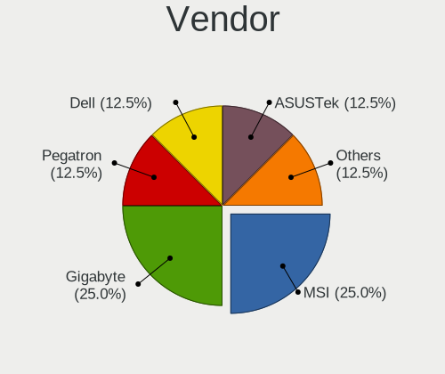
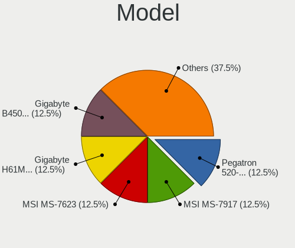
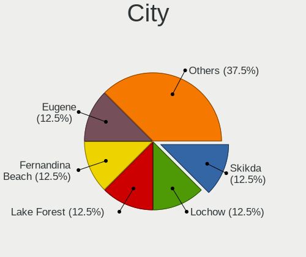
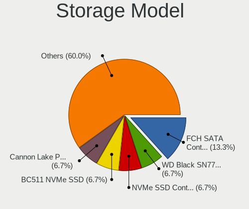
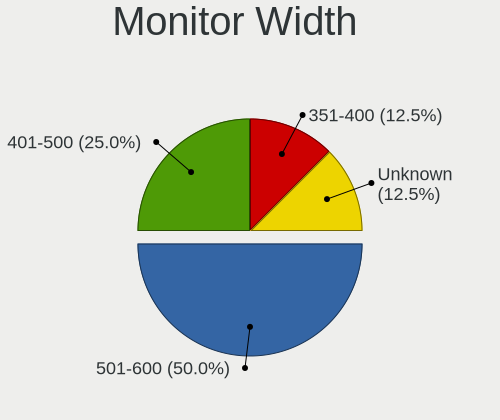
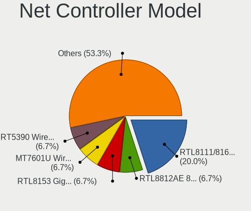
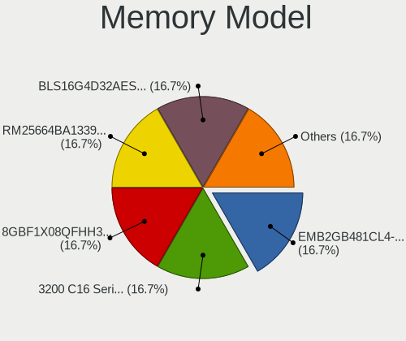
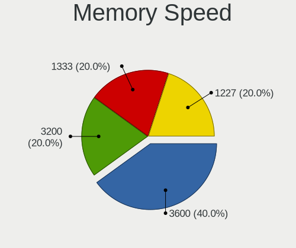

Parrot 5.2 - Tested Hardware & Statistics (Desktops)
----------------------------------------------------

A project to collect tested hardware configurations for Parrot 5.2.

Anyone can contribute to this report by the [hw-probe](https://github.com/linuxhw/hw-probe) tool:

    sudo -E hw-probe -all -upload

Please contribute! Especially if your hardware is rare.

Contents
--------

* [ Test Cases ](#test-cases)

* [ System ](#system)
  - [ Kernel                   ](#kernel)
  - [ Kernel Family            ](#kernel-family)
  - [ Kernel Major Ver.        ](#kernel-major-ver)
  - [ Arch                     ](#arch)
  - [ DE                       ](#de)
  - [ Display Server           ](#display-server)
  - [ Display Manager          ](#display-manager)
  - [ OS Lang                  ](#os-lang)
  - [ Boot Mode                ](#boot-mode)
  - [ Filesystem               ](#filesystem)
  - [ Part. scheme             ](#part-scheme)
  - [ Dual Boot with Linux/BSD ](#dual-boot-with-linuxbsd)
  - [ Dual Boot (Win)          ](#dual-boot-win)

* [ Board ](#board)
  - [ Vendor                   ](#vendor)
  - [ Model                    ](#model)
  - [ Model Family             ](#model-family)
  - [ MFG Year                 ](#mfg-year)
  - [ Form Factor              ](#form-factor)
  - [ Secure Boot              ](#secure-boot)
  - [ Coreboot                 ](#coreboot)
  - [ RAM Size                 ](#ram-size)
  - [ RAM Used                 ](#ram-used)
  - [ Total Drives             ](#total-drives)
  - [ Has CD-ROM               ](#has-cd-rom)
  - [ Has Ethernet             ](#has-ethernet)
  - [ Has WiFi                 ](#has-wifi)
  - [ Has Bluetooth            ](#has-bluetooth)

* [ Location ](#location)
  - [ Country                  ](#country)
  - [ City                     ](#city)

* [ Drives ](#drives)
  - [ Drive Vendor             ](#drive-vendor)
  - [ Drive Model              ](#drive-model)
  - [ HDD Vendor               ](#hdd-vendor)
  - [ SSD Vendor               ](#ssd-vendor)
  - [ Drive Kind               ](#drive-kind)
  - [ Drive Connector          ](#drive-connector)
  - [ Drive Size               ](#drive-size)
  - [ Space Total              ](#space-total)
  - [ Space Used               ](#space-used)
  - [ Malfunc. Drives          ](#malfunc-drives)
  - [ Malfunc. Drive Vendor    ](#malfunc-drive-vendor)
  - [ Malfunc. HDD Vendor      ](#malfunc-hdd-vendor)
  - [ Malfunc. Drive Kind      ](#malfunc-drive-kind)
  - [ Failed Drives            ](#failed-drives)
  - [ Failed Drive Vendor      ](#failed-drive-vendor)
  - [ Drive Status             ](#drive-status)

* [ Storage controller ](#storage-controller)
  - [ Storage Vendor           ](#storage-vendor)
  - [ Storage Model            ](#storage-model)
  - [ Storage Kind             ](#storage-kind)

* [ Processor ](#processor)
  - [ CPU Vendor               ](#cpu-vendor)
  - [ CPU Model                ](#cpu-model)
  - [ CPU Model Family         ](#cpu-model-family)
  - [ CPU Cores                ](#cpu-cores)
  - [ CPU Sockets              ](#cpu-sockets)
  - [ CPU Threads              ](#cpu-threads)
  - [ CPU Op-Modes             ](#cpu-op-modes)
  - [ CPU Microcode            ](#cpu-microcode)
  - [ CPU Microarch            ](#cpu-microarch)

* [ Graphics ](#graphics)
  - [ GPU Vendor               ](#gpu-vendor)
  - [ GPU Model                ](#gpu-model)
  - [ GPU Combo                ](#gpu-combo)
  - [ GPU Driver               ](#gpu-driver)
  - [ GPU Memory               ](#gpu-memory)

* [ Monitor ](#monitor)
  - [ Monitor Vendor           ](#monitor-vendor)
  - [ Monitor Model            ](#monitor-model)
  - [ Monitor Resolution       ](#monitor-resolution)
  - [ Monitor Diagonal         ](#monitor-diagonal)
  - [ Monitor Width            ](#monitor-width)
  - [ Aspect Ratio             ](#aspect-ratio)
  - [ Monitor Area             ](#monitor-area)
  - [ Pixel Density            ](#pixel-density)
  - [ Multiple Monitors        ](#multiple-monitors)

* [ Network ](#network)
  - [ Net Controller Vendor    ](#net-controller-vendor)
  - [ Net Controller Model     ](#net-controller-model)
  - [ Wireless Vendor          ](#wireless-vendor)
  - [ Wireless Model           ](#wireless-model)
  - [ Ethernet Vendor          ](#ethernet-vendor)
  - [ Ethernet Model           ](#ethernet-model)
  - [ Net Controller Kind      ](#net-controller-kind)
  - [ Used Controller          ](#used-controller)
  - [ NICs                     ](#nics)
  - [ IPv6                     ](#ipv6)

* [ Bluetooth ](#bluetooth)
  - [ Bluetooth Vendor         ](#bluetooth-vendor)
  - [ Bluetooth Model          ](#bluetooth-model)

* [ Sound ](#sound)
  - [ Sound Vendor             ](#sound-vendor)
  - [ Sound Model              ](#sound-model)

* [ Memory ](#memory)
  - [ Memory Vendor            ](#memory-vendor)
  - [ Memory Model             ](#memory-model)
  - [ Memory Kind              ](#memory-kind)
  - [ Memory Form Factor       ](#memory-form-factor)
  - [ Memory Size              ](#memory-size)
  - [ Memory Speed             ](#memory-speed)

* [ Printers & scanners ](#printers--scanners)
  - [ Printer Vendor           ](#printer-vendor)
  - [ Printer Model            ](#printer-model)
  - [ Scanner Vendor           ](#scanner-vendor)
  - [ Scanner Model            ](#scanner-model)

* [ Camera ](#camera)
  - [ Camera Vendor            ](#camera-vendor)
  - [ Camera Model             ](#camera-model)

* [ Security ](#security)
  - [ Fingerprint Vendor       ](#fingerprint-vendor)
  - [ Fingerprint Model        ](#fingerprint-model)
  - [ Chipcard Vendor          ](#chipcard-vendor)
  - [ Chipcard Model           ](#chipcard-model)

* [ Unsupported ](#unsupported)
  - [ Unsupported Devices      ](#unsupported-devices)
  - [ Unsupported Device Types ](#unsupported-device-types)

Test Cases
----------

Total: 13

| Vendor   | Model            | Probe                                                      | Date         |
|----------|------------------|------------------------------------------------------------|--------------|
| ASUSTek  | PRIME X399-A     | [b4861cf35c](https://linux-hardware.org/?probe=b4861cf35c) | Apr 23, 2023 |
| MSI      | Z97 GAMING 5     | [2f61bfa5a5](https://linux-hardware.org/?probe=2f61bfa5a5) | Apr 04, 2023 |
| MSI      | Z97 GAMING 5     | [1e81e330e1](https://linux-hardware.org/?probe=1e81e330e1) | Apr 04, 2023 |
| MSI      | 760GM-P33        | [4145a32920](https://linux-hardware.org/?probe=4145a32920) | Apr 03, 2023 |
| Gigabyte | B450 AORUS ELITE | [9edda5f374](https://linux-hardware.org/?probe=9edda5f374) | Mar 28, 2023 |
| Gigabyte | B450 AORUS ELITE | [c25f99afed](https://linux-hardware.org/?probe=c25f99afed) | Mar 28, 2023 |
| Gigabyte | H61M-S2PV        | [6752797fe9](https://linux-hardware.org/?probe=6752797fe9) | Mar 14, 2023 |
| Gigabyte | H61M-S2PV        | [2e0019e450](https://linux-hardware.org/?probe=2e0019e450) | Mar 14, 2023 |
| ASRock   | B560M-C          | [a93d64aa2c](https://linux-hardware.org/?probe=a93d64aa2c) | Feb 28, 2023 |
| ASRock   | B560M-C          | [cbbd0a63d4](https://linux-hardware.org/?probe=cbbd0a63d4) | Feb 28, 2023 |
| Pegatron | 2ACB             | [13355a7d07](https://linux-hardware.org/?probe=13355a7d07) | Feb 26, 2023 |
| Dell     | 0C1R19 A02       | [42ff2c0844](https://linux-hardware.org/?probe=42ff2c0844) | Feb 22, 2023 |
| ASRock   | B560M-C          | [0641c704e9](https://linux-hardware.org/?probe=0641c704e9) | Feb 20, 2023 |

System
------

Kernel
------

Version of the Linux kernel

| Version               | Desktops | Percent |
|-----------------------|----------|---------|
| 6.0.0-12parrot1-amd64 | 8        | 100%    |

Kernel Family
-------------

Linux kernel without a distro release

| Version | Desktops | Percent |
|---------|----------|---------|
| 6.0.0   | 8        | 100%    |

Kernel Major Ver.
-----------------

Linux kernel major version

| Version | Desktops | Percent |
|---------|----------|---------|
| 6.0     | 8        | 100%    |

Arch
----

OS architecture (x86_64, i586, etc.)

| Name   | Desktops | Percent |
|--------|----------|---------|
| x86_64 | 8        | 100%    |

DE
--

Desktop Environment

| Name | Desktops | Percent |
|------|----------|---------|
| MATE | 6        | 75%     |
| XFCE | 2        | 25%     |

Display Server
--------------

X11 or Wayland

| Name | Desktops | Percent |
|------|----------|---------|
| X11  | 8        | 100%    |

Display Manager
---------------

SDDM, LightDM, etc.

| Name    | Desktops | Percent |
|---------|----------|---------|
| Unknown | 5        | 62.5%   |
| LightDM | 3        | 37.5%   |

OS Lang
-------

Language

| Lang  | Desktops | Percent |
|-------|----------|---------|
| en_US | 5        | 62.5%   |
| pl_PL | 1        | 12.5%   |
| en_IN | 1        | 12.5%   |
| en_AU | 1        | 12.5%   |

Boot Mode
---------

EFI or BIOS

| Mode | Desktops | Percent |
|------|----------|---------|
| BIOS | 6        | 75%     |
| EFI  | 2        | 25%     |

Filesystem
----------

Type of filesystem

| Type    | Desktops | Percent |
|---------|----------|---------|
| Btrfs   | 7        | 87.5%   |
| Overlay | 1        | 12.5%   |

Part. scheme
------------

Scheme of partitioning

| Type    | Desktops | Percent |
|---------|----------|---------|
| Unknown | 5        | 62.5%   |
| GPT     | 2        | 25%     |
| MBR     | 1        | 12.5%   |

Dual Boot with Linux/BSD
------------------------

Hosting more than one Linux/BSD

| Dual boot | Desktops | Percent |
|-----------|----------|---------|
| No        | 7        | 87.5%   |
| Yes       | 1        | 12.5%   |

Dual Boot (Win)
---------------

Hosting Linux and Windows

| Dual boot | Desktops | Percent |
|-----------|----------|---------|
| No        | 7        | 87.5%   |
| Yes       | 1        | 12.5%   |

Board
-----

Vendor
------

Motherboard manufacturer

| Name                | Desktops | Percent |
|---------------------|----------|---------|
| MSI                 | 2        | 25%     |
| Gigabyte Technology | 2        | 25%     |
| Pegatron            | 1        | 12.5%   |
| Dell                | 1        | 12.5%   |
| ASUSTek Computer    | 1        | 12.5%   |
| ASRock              | 1        | 12.5%   |

Model
-----

Motherboard model

| Name                      | Desktops | Percent |
|---------------------------|----------|---------|
| Pegatron 520-1030a        | 1        | 12.5%   |
| MSI MS-7917               | 1        | 12.5%   |
| MSI MS-7623               | 1        | 12.5%   |
| Gigabyte H61M-S2PV        | 1        | 12.5%   |
| Gigabyte B450 AORUS ELITE | 1        | 12.5%   |
| Dell OptiPlex 7070        | 1        | 12.5%   |
| ASUS PRIME X399-A         | 1        | 12.5%   |
| ASRock B560M-C            | 1        | 12.5%   |

Model Family
------------

Motherboard model prefix

| Name               | Desktops | Percent |
|--------------------|----------|---------|
| Pegatron 520-1030a | 1        | 12.5%   |
| MSI MS-7917        | 1        | 12.5%   |
| MSI MS-7623        | 1        | 12.5%   |
| Gigabyte H61M-S2PV | 1        | 12.5%   |
| Gigabyte B450      | 1        | 12.5%   |
| Dell OptiPlex      | 1        | 12.5%   |
| ASUS PRIME         | 1        | 12.5%   |
| ASRock B560M-C     | 1        | 12.5%   |

MFG Year
--------

Motherboard manufacture year

| Year | Desktops | Percent |
|------|----------|---------|
| 2012 | 2        | 25%     |
| 2021 | 1        | 12.5%   |
| 2020 | 1        | 12.5%   |
| 2018 | 1        | 12.5%   |
| 2017 | 1        | 12.5%   |
| 2014 | 1        | 12.5%   |
| 2010 | 1        | 12.5%   |

Form Factor
-----------

Physical design of the computer

| Name    | Desktops | Percent |
|---------|----------|---------|
| Desktop | 8        | 100%    |

Secure Boot
-----------

Enabled or disabled

| State    | Desktops | Percent |
|----------|----------|---------|
| Disabled | 8        | 100%    |

Coreboot
--------

Have coreboot on board

| Used | Desktops | Percent |
|------|----------|---------|
| No   | 8        | 100%    |

RAM Size
--------

Total RAM memory

| Size in GB  | Desktops | Percent |
|-------------|----------|---------|
| 3.01-4.0    | 2        | 25%     |
| 16.01-24.0  | 2        | 25%     |
| 4.01-8.0    | 1        | 12.5%   |
| 32.01-64.0  | 1        | 12.5%   |
| 64.01-256.0 | 1        | 12.5%   |
| 8.01-16.0   | 1        | 12.5%   |

RAM Used
--------

Used RAM memory

| Used GB  | Desktops | Percent |
|----------|----------|---------|
| 3.01-4.0 | 3        | 37.5%   |
| 4.01-8.0 | 2        | 25%     |
| 2.01-3.0 | 2        | 25%     |
| 0.51-1.0 | 1        | 12.5%   |

Total Drives
------------

Number of drives on board

| Drives | Desktops | Percent |
|--------|----------|---------|
| 2      | 6        | 75%     |
| 1      | 1        | 12.5%   |
| 0      | 1        | 12.5%   |

Has CD-ROM
----------

Has CD-ROM on board

| Presented | Desktops | Percent |
|-----------|----------|---------|
| No        | 5        | 62.5%   |
| Yes       | 3        | 37.5%   |

Has Ethernet
------------

Has Ethernet on board

| Presented | Desktops | Percent |
|-----------|----------|---------|
| Yes       | 8        | 100%    |

Has WiFi
--------

Has WiFi module

| Presented | Desktops | Percent |
|-----------|----------|---------|
| Yes       | 6        | 75%     |
| No        | 2        | 25%     |

Has Bluetooth
-------------

Has Bluetooth module

| Presented | Desktops | Percent |
|-----------|----------|---------|
| No        | 7        | 87.5%   |
| Yes       | 1        | 12.5%   |

Location
--------

Country
-------

Geographic location (country)

| Country   | Desktops | Percent |
|-----------|----------|---------|
| USA       | 4        | 50%     |
| Poland    | 1        | 12.5%   |
| India     | 1        | 12.5%   |
| Australia | 1        | 12.5%   |
| Algeria   | 1        | 12.5%   |

City
----

Geographic location (city)

| City             | Desktops | Percent |
|------------------|----------|---------|
| Skikda           | 1        | 12.5%   |
| Lochow           | 1        | 12.5%   |
| Lake Forest      | 1        | 12.5%   |
| Fernandina Beach | 1        | 12.5%   |
| Eugene           | 1        | 12.5%   |
| Chandigarh       | 1        | 12.5%   |
| Brisbane         | 1        | 12.5%   |
| Anchorage        | 1        | 12.5%   |

Drives
------

Drive Vendor
------------

Hard drive vendors

| Vendor              | Desktops | Drives | Percent |
|---------------------|----------|--------|---------|
| Seagate             | 3        | 4      | 27.27%  |
| WDC                 | 2        | 2      | 18.18%  |
| SK hynix            | 1        | 1      | 9.09%   |
| SanDisk             | 1        | 2      | 9.09%   |
| Samsung Electronics | 1        | 1      | 9.09%   |
| Hitachi             | 1        | 1      | 9.09%   |
| HGST                | 1        | 1      | 9.09%   |
| GOODRAM             | 1        | 1      | 9.09%   |

Drive Model
-----------

Hard drive models

| Model                            | Desktops | Percent |
|----------------------------------|----------|---------|
| WDC WDS500G2B0B-00YS70 500GB SSD | 2        | 15.38%  |
| SK hynix BC511 512GB             | 1        | 7.69%   |
| Seagate ST380215AS 80GB          | 1        | 7.69%   |
| Seagate ST3802110A 80GB          | 1        | 7.69%   |
| Seagate ST2000DM008-2FR102 2TB   | 1        | 7.69%   |
| Seagate Backup+ Hub BK 8TB       | 1        | 7.69%   |
| Sandisk WD_BLACK SN770 500GB     | 1        | 7.69%   |
| SanDisk NVMe SSD Drive 500GB     | 1        | 7.69%   |
| Samsung SSD 980 1TB              | 1        | 7.69%   |
| Hitachi HUA722020ALA331 2TB      | 1        | 7.69%   |
| HGST HTS725032A7E630 320GB       | 1        | 7.69%   |
| GOODRAM SSDPR-CX400-256-G2 256GB | 1        | 7.69%   |

HDD Vendor
----------

Hard disk drive vendors

| Vendor  | Desktops | Drives | Percent |
|---------|----------|--------|---------|
| Seagate | 3        | 4      | 60%     |
| Hitachi | 1        | 1      | 20%     |
| HGST    | 1        | 1      | 20%     |

SSD Vendor
----------

Solid state drive vendors

| Vendor  | Desktops | Drives | Percent |
|---------|----------|--------|---------|
| WDC     | 2        | 2      | 66.67%  |
| GOODRAM | 1        | 1      | 33.33%  |

Drive Kind
----------

HDD or SSD

| Kind | Desktops | Drives | Percent |
|------|----------|--------|---------|
| HDD  | 5        | 6      | 45.45%  |
| NVMe | 3        | 4      | 27.27%  |
| SSD  | 3        | 3      | 27.27%  |

Drive Connector
---------------

SATA, SAS, NVMe, etc.

| Type | Desktops | Drives | Percent |
|------|----------|--------|---------|
| SATA | 6        | 8      | 60%     |
| NVMe | 3        | 4      | 30%     |
| SAS  | 1        | 1      | 10%     |

Drive Size
----------

Size of hard drive

| Size in TB | Desktops | Drives | Percent |
|------------|----------|--------|---------|
| 0.01-0.5   | 5        | 6      | 62.5%   |
| 1.01-2.0   | 2        | 2      | 25%     |
| 4.01-10.0  | 1        | 1      | 12.5%   |

Space Total
-----------

Amount of disk space available on the file system

| Size in GB     | Desktops | Percent |
|----------------|----------|---------|
| 101-250        | 2        | 25%     |
| More than 3000 | 1        | 12.5%   |
| 2001-3000      | 1        | 12.5%   |
| 1001-2000      | 1        | 12.5%   |
| 1-20           | 1        | 12.5%   |
| 501-1000       | 1        | 12.5%   |
| Unknown        | 1        | 12.5%   |

Space Used
----------

Amount of used disk space

| Used GB        | Desktops | Percent |
|----------------|----------|---------|
| 51-100         | 2        | 25%     |
| More than 3000 | 1        | 12.5%   |
| 251-500        | 1        | 12.5%   |
| 21-50          | 1        | 12.5%   |
| 101-250        | 1        | 12.5%   |
| 1-20           | 1        | 12.5%   |
| Unknown        | 1        | 12.5%   |

Malfunc. Drives
---------------

Drive models with a malfunction

| Model                   | Desktops | Drives | Percent |
|-------------------------|----------|--------|---------|
| Seagate ST380215AS 80GB | 1        | 1      | 50%     |
| Seagate ST3802110A 80GB | 1        | 1      | 50%     |

Malfunc. Drive Vendor
---------------------

Vendors of faulty drives

| Vendor  | Desktops | Drives | Percent |
|---------|----------|--------|---------|
| Seagate | 1        | 2      | 100%    |

Malfunc. HDD Vendor
-------------------

Vendors of faulty HDD drives

| Vendor  | Desktops | Drives | Percent |
|---------|----------|--------|---------|
| Seagate | 1        | 2      | 100%    |

Malfunc. Drive Kind
-------------------

Kinds of faulty drives

| Kind | Desktops | Drives | Percent |
|------|----------|--------|---------|
| HDD  | 1        | 2      | 100%    |

Failed Drives
-------------

Failed drive models

Zero info for selected period =(

Failed Drive Vendor
-------------------

Failed drive vendors

Zero info for selected period =(

Drive Status
------------

Number of failed and malfunc. drives

| Status   | Desktops | Drives | Percent |
|----------|----------|--------|---------|
| Detected | 5        | 9      | 71.43%  |
| Malfunc  | 1        | 2      | 14.29%  |
| Works    | 1        | 2      | 14.29%  |

Storage controller
------------------

Storage Vendor
--------------

Storage controller vendors

| Vendor              | Desktops | Percent |
|---------------------|----------|---------|
| Intel               | 4        | 33.33%  |
| AMD                 | 4        | 33.33%  |
| SK hynix            | 1        | 8.33%   |
| SanDisk             | 1        | 8.33%   |
| Samsung Electronics | 1        | 8.33%   |
| ASMedia Technology  | 1        | 8.33%   |

Storage Model
-------------

Storage controller models

| Model                                                                                   | Desktops | Percent |
|-----------------------------------------------------------------------------------------|----------|---------|
| AMD FCH SATA Controller [AHCI mode]                                                     | 2        | 13.33%  |
| SK hynix BC511 NVMe SSD                                                                 | 1        | 6.67%   |
| SanDisk WD Black SN770 / PC SN740 256GB / PC SN560 (DRAM-less) NVMe SSD                 | 1        | 6.67%   |
| Samsung NVMe SSD Controller 980                                                         | 1        | 6.67%   |
| Intel Cannon Lake PCH SATA AHCI Controller                                              | 1        | 6.67%   |
| Intel 9 Series Chipset Family SATA Controller [AHCI Mode]                               | 1        | 6.67%   |
| Intel 6 Series/C200 Series Chipset Family Desktop SATA Controller (IDE mode, ports 4-5) | 1        | 6.67%   |
| Intel 6 Series/C200 Series Chipset Family Desktop SATA Controller (IDE mode, ports 0-3) | 1        | 6.67%   |
| Intel 500 Series Chipset Family SATA AHCI Controller                                    | 1        | 6.67%   |
| ASMedia ASM1062 Serial ATA Controller                                                   | 1        | 6.67%   |
| AMD X399 Series Chipset SATA Controller                                                 | 1        | 6.67%   |
| AMD SB7x0/SB8x0/SB9x0 SATA Controller [IDE mode]                                        | 1        | 6.67%   |
| AMD SB7x0/SB8x0/SB9x0 IDE Controller                                                    | 1        | 6.67%   |
| AMD 400 Series Chipset SATA Controller                                                  | 1        | 6.67%   |

Storage Kind
------------

Kind of storage controller (IDE, SATA, NVMe, SAS, ...)

| Kind | Desktops | Percent |
|------|----------|---------|
| SATA | 7        | 58.33%  |
| NVMe | 3        | 25%     |
| IDE  | 2        | 16.67%  |

Processor
---------

CPU Vendor
----------

Processor vendors

| Vendor | Desktops | Percent |
|--------|----------|---------|
| Intel  | 4        | 50%     |
| AMD    | 4        | 50%     |

CPU Model
---------

Processor models

| Model                                          | Desktops | Percent |
|------------------------------------------------|----------|---------|
| Intel Pentium CPU G620 @ 2.60GHz               | 1        | 12.5%   |
| Intel Core i9-10900F CPU @ 2.80GHz             | 1        | 12.5%   |
| Intel Core i5-9500T CPU @ 2.20GHz              | 1        | 12.5%   |
| Intel Core i5-4690K CPU @ 3.50GHz              | 1        | 12.5%   |
| AMD Sempron 145 Processor                      | 1        | 12.5%   |
| AMD Ryzen Threadripper 2950X 16-Core Processor | 1        | 12.5%   |
| AMD Ryzen 5 5600X 6-Core Processor             | 1        | 12.5%   |
| AMD A6-3600 APU with Radeon HD Graphics        | 1        | 12.5%   |

CPU Model Family
----------------

Processor model prefix

| Model                  | Desktops | Percent |
|------------------------|----------|---------|
| Intel Core i5          | 2        | 25%     |
| Intel Pentium          | 1        | 12.5%   |
| Intel Core i9          | 1        | 12.5%   |
| AMD Sempron            | 1        | 12.5%   |
| AMD Ryzen Threadripper | 1        | 12.5%   |
| AMD Ryzen 5            | 1        | 12.5%   |
| AMD A6                 | 1        | 12.5%   |

CPU Cores
---------

Number of processor cores

| Number | Desktops | Percent |
|--------|----------|---------|
| 6      | 2        | 25%     |
| 4      | 2        | 25%     |
| 16     | 1        | 12.5%   |
| 10     | 1        | 12.5%   |
| 2      | 1        | 12.5%   |
| 1      | 1        | 12.5%   |

CPU Sockets
-----------

Number of sockets

| Number | Desktops | Percent |
|--------|----------|---------|
| 1      | 8        | 100%    |

CPU Threads
-----------

Threads per core (Hyper-Threading)

| Number | Desktops | Percent |
|--------|----------|---------|
| 1      | 5        | 62.5%   |
| 2      | 3        | 37.5%   |

CPU Op-Modes
------------

CPU Operation Modes (32-bit, 64-bit)

| Op mode        | Desktops | Percent |
|----------------|----------|---------|
| 32-bit, 64-bit | 8        | 100%    |

CPU Microcode
-------------

Microcode number

| Number     | Desktops | Percent |
|------------|----------|---------|
| Unknown    | 4        | 50%     |
| 0xa0655    | 1        | 12.5%   |
| 0x206a7    | 1        | 12.5%   |
| 0x0a201204 | 1        | 12.5%   |
| 0x010000c8 | 1        | 12.5%   |

CPU Microarch
-------------

Microarchitecture

| Name        | Desktops | Percent |
|-------------|----------|---------|
| Zen+        | 1        | 12.5%   |
| Zen 3       | 1        | 12.5%   |
| SandyBridge | 1        | 12.5%   |
| KabyLake    | 1        | 12.5%   |
| K10 Llano   | 1        | 12.5%   |
| K10         | 1        | 12.5%   |
| Haswell     | 1        | 12.5%   |
| CometLake   | 1        | 12.5%   |

Graphics
--------

GPU Vendor
----------

Vendors of graphics cards

| Vendor | Desktops | Percent |
|--------|----------|---------|
| Nvidia | 4        | 44.44%  |
| Intel  | 3        | 33.33%  |
| AMD    | 2        | 22.22%  |

GPU Model
---------

Graphics card models

| Model                                                                       | Desktops | Percent |
|-----------------------------------------------------------------------------|----------|---------|
| Nvidia TU116 [GeForce GTX 1660]                                             | 2        | 22.22%  |
| Nvidia GA106 [GeForce RTX 3060 Lite Hash Rate]                              | 1        | 11.11%  |
| Nvidia GA104 [GeForce RTX 3070]                                             | 1        | 11.11%  |
| Intel Xeon E3-1200 v3/4th Gen Core Processor Integrated Graphics Controller | 1        | 11.11%  |
| Intel CoffeeLake-S GT2 [UHD Graphics 630]                                   | 1        | 11.11%  |
| Intel 2nd Generation Core Processor Family Integrated Graphics Controller   | 1        | 11.11%  |
| AMD RS780L [Radeon 3000]                                                    | 1        | 11.11%  |
| AMD Caicos [Radeon HD 6450/7450/8450 / R5 230 OEM]                          | 1        | 11.11%  |

GPU Combo
---------

Combinations of graphics cards

| Name       | Desktops | Percent |
|------------|----------|---------|
| 1 x Nvidia | 4        | 50%     |
| 1 x Intel  | 2        | 25%     |
| 1 x AMD    | 2        | 25%     |

GPU Driver
----------

Free vs proprietary

| Driver      | Desktops | Percent |
|-------------|----------|---------|
| Free        | 7        | 87.5%   |
| Proprietary | 1        | 12.5%   |

GPU Memory
----------

Total video memory

| Size in GB | Desktops | Percent |
|------------|----------|---------|
| Unknown    | 6        | 75%     |
| 5.01-6.0   | 1        | 12.5%   |
| 0.01-0.5   | 1        | 12.5%   |

Monitor
-------

Monitor Vendor
--------------

Monitor vendors

| Vendor               | Desktops | Percent |
|----------------------|----------|---------|
| Hewlett-Packard      | 2        | 22.22%  |
| Ancor Communications | 2        | 22.22%  |
| Acer                 | 2        | 22.22%  |
| Samsung Electronics  | 1        | 11.11%  |
| LG Electronics       | 1        | 11.11%  |
| Dell                 | 1        | 11.11%  |

Monitor Model
-------------

Monitor models

| Model                                                              | Desktops | Percent |
|--------------------------------------------------------------------|----------|---------|
| Samsung Electronics SMS19A100 SAM0867 1366x768 410x230mm 18.5-inch | 1        | 11.11%  |
| LG Electronics LCD Monitor LG HDR WFHD 2560x1080                   | 1        | 11.11%  |
| Hewlett-Packard TouchSmart HWP4212 1920x1080 509x286mm 23.0-inch   | 1        | 11.11%  |
| Hewlett-Packard LA1956x HWP3021 1280x1024 376x301mm 19.0-inch      | 1        | 11.11%  |
| Dell U2412M DELA07B 1920x1200 518x324mm 24.1-inch                  | 1        | 11.11%  |
| Ancor Communications VG248 ACI24A4 1920x1080 531x299mm 24.0-inch   | 1        | 11.11%  |
| Ancor Communications VE228 ACI22FA 1920x1080 531x299mm 24.0-inch   | 1        | 11.11%  |
| Acer H193HQV ACR01B8 1366x768 410x230mm 18.5-inch                  | 1        | 11.11%  |
| Acer G246HL ACR02FF 1920x1080 531x299mm 24.0-inch                  | 1        | 11.11%  |

Monitor Resolution
------------------

Monitor screen resolution

| Resolution        | Desktops | Percent |
|-------------------|----------|---------|
| 1920x1080 (FHD)   | 3        | 37.5%   |
| 1366x768 (WXGA)   | 2        | 25%     |
| 2560x1080         | 1        | 12.5%   |
| 1920x1200 (WUXGA) | 1        | 12.5%   |
| 1280x1024 (SXGA)  | 1        | 12.5%   |

Monitor Diagonal
----------------

Diagonal size in inches

| Inches  | Desktops | Percent |
|---------|----------|---------|
| 24      | 3        | 37.5%   |
| 18      | 2        | 25%     |
| 23      | 1        | 12.5%   |
| 19      | 1        | 12.5%   |
| Unknown | 1        | 12.5%   |

Monitor Width
-------------

Physical width

| Width in mm | Desktops | Percent |
|-------------|----------|---------|
| 501-600     | 4        | 50%     |
| 401-500     | 2        | 25%     |
| 351-400     | 1        | 12.5%   |
| Unknown     | 1        | 12.5%   |

Aspect Ratio
------------

Proportional relationship between the width and the height

| Ratio   | Desktops | Percent |
|---------|----------|---------|
| 16/9    | 5        | 62.5%   |
| 5/4     | 1        | 12.5%   |
| 16/10   | 1        | 12.5%   |
| Unknown | 1        | 12.5%   |

Monitor Area
------------

Area in inch²

| Area in inch² | Desktops | Percent |
|----------------|----------|---------|
| 201-250        | 3        | 37.5%   |
| 141-150        | 2        | 25%     |
| 251-300        | 1        | 12.5%   |
| 151-200        | 1        | 12.5%   |
| Unknown        | 1        | 12.5%   |

Pixel Density
-------------

Pixels per inch

| Density | Desktops | Percent |
|---------|----------|---------|
| 51-100  | 7        | 87.5%   |
| Unknown | 1        | 12.5%   |

Multiple Monitors
-----------------

Total monitors connected

| Total | Desktops | Percent |
|-------|----------|---------|
| 1     | 7        | 87.5%   |
| 2     | 1        | 12.5%   |

Network
-------

Net Controller Vendor
---------------------

Controller vendors

| Vendor                | Desktops | Percent |
|-----------------------|----------|---------|
| Realtek Semiconductor | 5        | 35.71%  |
| Qualcomm Atheros      | 3        | 21.43%  |
| Intel                 | 3        | 21.43%  |
| Ralink Technology     | 1        | 7.14%   |
| Ralink                | 1        | 7.14%   |
| NetGear               | 1        | 7.14%   |

Net Controller Model
--------------------

Controller models

| Model                                                             | Desktops | Percent |
|-------------------------------------------------------------------|----------|---------|
| Realtek RTL8111/8168/8411 PCI Express Gigabit Ethernet Controller | 3        | 20%     |
| Realtek RTL8812AE 802.11ac PCIe Wireless Network Adapter          | 1        | 6.67%   |
| Realtek RTL8153 Gigabit Ethernet Adapter                          | 1        | 6.67%   |
| Ralink MT7601U Wireless Adapter                                   | 1        | 6.67%   |
| Ralink RT5390 Wireless 802.11n 1T/1R PCIe                         | 1        | 6.67%   |
| Qualcomm Atheros Killer E220x Gigabit Ethernet Controller         | 1        | 6.67%   |
| Qualcomm Atheros AR9285 Wireless Network Adapter (PCI-Express)    | 1        | 6.67%   |
| Qualcomm Atheros AR8131 Gigabit Ethernet                          | 1        | 6.67%   |
| NetGear A6210                                                     | 1        | 6.67%   |
| Intel Wireless 7265                                               | 1        | 6.67%   |
| Intel I211 Gigabit Network Connection                             | 1        | 6.67%   |
| Intel Ethernet Connection (7) I219-LM                             | 1        | 6.67%   |
| Intel Ethernet Connection (11) I219-V                             | 1        | 6.67%   |

Wireless Vendor
---------------

Wireless vendors

| Vendor                | Desktops | Percent |
|-----------------------|----------|---------|
| Realtek Semiconductor | 1        | 16.67%  |
| Ralink Technology     | 1        | 16.67%  |
| Ralink                | 1        | 16.67%  |
| Qualcomm Atheros      | 1        | 16.67%  |
| NetGear               | 1        | 16.67%  |
| Intel                 | 1        | 16.67%  |

Wireless Model
--------------

Wireless models

| Model                                                          | Desktops | Percent |
|----------------------------------------------------------------|----------|---------|
| Realtek RTL8812AE 802.11ac PCIe Wireless Network Adapter       | 1        | 16.67%  |
| Ralink MT7601U Wireless Adapter                                | 1        | 16.67%  |
| Ralink RT5390 Wireless 802.11n 1T/1R PCIe                      | 1        | 16.67%  |
| Qualcomm Atheros AR9285 Wireless Network Adapter (PCI-Express) | 1        | 16.67%  |
| NetGear A6210                                                  | 1        | 16.67%  |
| Intel Wireless 7265                                            | 1        | 16.67%  |

Ethernet Vendor
---------------

Ethernet vendors

| Vendor                | Desktops | Percent |
|-----------------------|----------|---------|
| Realtek Semiconductor | 4        | 44.44%  |
| Intel                 | 3        | 33.33%  |
| Qualcomm Atheros      | 2        | 22.22%  |

Ethernet Model
--------------

Ethernet models

| Model                                                             | Desktops | Percent |
|-------------------------------------------------------------------|----------|---------|
| Realtek RTL8111/8168/8411 PCI Express Gigabit Ethernet Controller | 3        | 33.33%  |
| Realtek RTL8153 Gigabit Ethernet Adapter                          | 1        | 11.11%  |
| Qualcomm Atheros Killer E220x Gigabit Ethernet Controller         | 1        | 11.11%  |
| Qualcomm Atheros AR8131 Gigabit Ethernet                          | 1        | 11.11%  |
| Intel I211 Gigabit Network Connection                             | 1        | 11.11%  |
| Intel Ethernet Connection (7) I219-LM                             | 1        | 11.11%  |
| Intel Ethernet Connection (11) I219-V                             | 1        | 11.11%  |

Net Controller Kind
-------------------

Ethernet, WiFi or modem

| Kind     | Desktops | Percent |
|----------|----------|---------|
| Ethernet | 8        | 57.14%  |
| WiFi     | 6        | 42.86%  |

Used Controller
---------------

Currently used network controller

| Kind     | Desktops | Percent |
|----------|----------|---------|
| WiFi     | 6        | 66.67%  |
| Ethernet | 3        | 33.33%  |

NICs
----

Total network controllers on board

| Total | Desktops | Percent |
|-------|----------|---------|
| 2     | 4        | 50%     |
| 1     | 4        | 50%     |

IPv6
----

IPv6 vs IPv4

| Used | Desktops | Percent |
|------|----------|---------|
| No   | 6        | 75%     |
| Yes  | 2        | 25%     |

Bluetooth
---------

Bluetooth Vendor
----------------

Controller vendors

| Vendor | Desktops | Percent |
|--------|----------|---------|
| Intel  | 1        | 100%    |

Bluetooth Model
---------------

Controller models

| Model                              | Desktops | Percent |
|------------------------------------|----------|---------|
| Intel Bluetooth wireless interface | 1        | 100%    |

Sound
-----

Sound Vendor
------------

Sound card vendors

| Vendor | Desktops | Percent |
|--------|----------|---------|
| Nvidia | 4        | 33.33%  |
| Intel  | 4        | 33.33%  |
| AMD    | 4        | 33.33%  |

Sound Model
-----------

Sound card models

| Model                                                                             | Desktops | Percent |
|-----------------------------------------------------------------------------------|----------|---------|
| Nvidia TU116 High Definition Audio Controller                                     | 2        | 14.29%  |
| Nvidia GA106 High Definition Audio Controller                                     | 1        | 7.14%   |
| Nvidia GA104 High Definition Audio Controller                                     | 1        | 7.14%   |
| Intel Xeon E3-1200 v3/4th Gen Core Processor HD Audio Controller                  | 1        | 7.14%   |
| Intel Smart Sound Technology (SST) Audio Controller                               | 1        | 7.14%   |
| Intel Cannon Lake PCH cAVS                                                        | 1        | 7.14%   |
| Intel 9 Series Chipset Family HD Audio Controller                                 | 1        | 7.14%   |
| Intel 6 Series/C200 Series Chipset Family High Definition Audio Controller        | 1        | 7.14%   |
| AMD Starship/Matisse HD Audio Controller                                          | 1        | 7.14%   |
| AMD SBx00 Azalia (Intel HDA)                                                      | 1        | 7.14%   |
| AMD FCH Azalia Controller                                                         | 1        | 7.14%   |
| AMD Family 17h (Models 00h-0fh) HD Audio Controller                               | 1        | 7.14%   |
| AMD Caicos HDMI Audio [Radeon HD 6450 / 7450/8450/8490 OEM / R5 230/235/235X OEM] | 1        | 7.14%   |

Memory
------

Memory Vendor
-------------

Memory module vendors

| Vendor           | Desktops | Percent |
|------------------|----------|---------|
| Crucial          | 2        | 33.33%  |
| Ramos Technology | 1        | 16.67%  |
| PNY              | 1        | 16.67%  |
| Patriot          | 1        | 16.67%  |
| Unknown          | 1        | 16.67%  |

Memory Model
------------

Memory module models

| Model                                                    | Desktops | Percent |
|----------------------------------------------------------|----------|---------|
| Ramos RAM EMB2GB481CL4-13HA 2GB DIMM 1227MT/s            | 1        | 16.67%  |
| PNY RAM 8GBF1X08QFHH38-135-K 8GB DIMM DDR4 3600MT/s      | 1        | 16.67%  |
| Patriot RAM 3200 C16 Series 16GB DIMM DDR4 3266MT/s      | 1        | 16.67%  |
| Crucial RAM RM25664BA1339.8FR 2GB DIMM DDR3 1333MT/s     | 1        | 16.67%  |
| Crucial RAM BLS16G4D32AESC.M16FE 16GB DIMM DDR4 3200MT/s | 1        | 16.67%  |
| Unknown                                                  | 1        | 16.67%  |

Memory Kind
-----------

Memory module kinds

| Kind    | Desktops | Percent |
|---------|----------|---------|
| DDR4    | 3        | 50%     |
| DDR3    | 2        | 33.33%  |
| Unknown | 1        | 16.67%  |

Memory Form Factor
------------------

Physical design of the memory module

| Name | Desktops | Percent |
|------|----------|---------|
| DIMM | 5        | 100%    |

Memory Size
-----------

Memory module size

| Size  | Desktops | Percent |
|-------|----------|---------|
| 2048  | 2        | 40%     |
| 32768 | 1        | 20%     |
| 16384 | 1        | 20%     |
| 8192  | 1        | 20%     |

Memory Speed
------------

Memory module speed

| Speed | Desktops | Percent |
|-------|----------|---------|
| 3600  | 1        | 20%     |
| 3266  | 1        | 20%     |
| 3200  | 1        | 20%     |
| 1333  | 1        | 20%     |
| 1227  | 1        | 20%     |

Printers & scanners
-------------------

Printer Vendor
--------------

Printer device vendors

Zero info for selected period =(

Printer Model
-------------

Printer device models

Zero info for selected period =(

Scanner Vendor
--------------

Scanner device vendors

Zero info for selected period =(

Scanner Model
-------------

Scanner device models

Zero info for selected period =(

Camera
------

Camera Vendor
-------------

Camera device vendors

| Vendor              | Desktops | Percent |
|---------------------|----------|---------|
| Chicony Electronics | 1        | 100%    |

Camera Model
------------

Camera device models

| Model                                 | Desktops | Percent |
|---------------------------------------|----------|---------|
| Chicony HP High Definition 1MP Webcam | 1        | 100%    |

Security
--------

Fingerprint Vendor
------------------

Fingerprint sensor vendors

Zero info for selected period =(

Fingerprint Model
-----------------

Fingerprint sensor models

Zero info for selected period =(

Chipcard Vendor
---------------

Chipcard module vendors

Zero info for selected period =(

Chipcard Model
--------------

Chipcard module models

Zero info for selected period =(

Unsupported
-----------

Unsupported Devices
-------------------

Total unsupported devices on board

| Total | Desktops | Percent |
|-------|----------|---------|
| 0     | 7        | 87.5%   |
| 1     | 1        | 12.5%   |

Unsupported Device Types
------------------------

Types of unsupported devices

| Type          | Desktops | Percent |
|---------------|----------|---------|
| Graphics card | 1        | 100%    |

