Parrot 5.2 - Tested Hardware & Statistics
-----------------------------------------

A project to collect tested hardware configurations for Parrot 5.2.

Anyone can contribute to this report by the [hw-probe](https://github.com/linuxhw/hw-probe) tool:

    sudo -E hw-probe -all -upload

Please contribute! Especially if your hardware is rare.

This is a report for all computer types. See also reports for [desktops](/Dist/Parrot_5.2/Desktop/README.md) and [notebooks](/Dist/Parrot_5.2/Notebook/README.md).

Contents
--------

* [ Test Cases ](#test-cases)

* [ System ](#system)
  - [ Kernel                   ](#kernel)
  - [ Kernel Family            ](#kernel-family)
  - [ Kernel Major Ver.        ](#kernel-major-ver)
  - [ Arch                     ](#arch)
  - [ DE                       ](#de)
  - [ Display Server           ](#display-server)
  - [ Display Manager          ](#display-manager)
  - [ OS Lang                  ](#os-lang)
  - [ Boot Mode                ](#boot-mode)
  - [ Filesystem               ](#filesystem)
  - [ Part. scheme             ](#part-scheme)
  - [ Dual Boot with Linux/BSD ](#dual-boot-with-linuxbsd)
  - [ Dual Boot (Win)          ](#dual-boot-win)

* [ Board ](#board)
  - [ Vendor                   ](#vendor)
  - [ Model                    ](#model)
  - [ Model Family             ](#model-family)
  - [ MFG Year                 ](#mfg-year)
  - [ Form Factor              ](#form-factor)
  - [ Secure Boot              ](#secure-boot)
  - [ Coreboot                 ](#coreboot)
  - [ RAM Size                 ](#ram-size)
  - [ RAM Used                 ](#ram-used)
  - [ Total Drives             ](#total-drives)
  - [ Has CD-ROM               ](#has-cd-rom)
  - [ Has Ethernet             ](#has-ethernet)
  - [ Has WiFi                 ](#has-wifi)
  - [ Has Bluetooth            ](#has-bluetooth)

* [ Location ](#location)
  - [ Country                  ](#country)
  - [ City                     ](#city)

* [ Drives ](#drives)
  - [ Drive Vendor             ](#drive-vendor)
  - [ Drive Model              ](#drive-model)
  - [ HDD Vendor               ](#hdd-vendor)
  - [ SSD Vendor               ](#ssd-vendor)
  - [ Drive Kind               ](#drive-kind)
  - [ Drive Connector          ](#drive-connector)
  - [ Drive Size               ](#drive-size)
  - [ Space Total              ](#space-total)
  - [ Space Used               ](#space-used)
  - [ Malfunc. Drives          ](#malfunc-drives)
  - [ Malfunc. Drive Vendor    ](#malfunc-drive-vendor)
  - [ Malfunc. HDD Vendor      ](#malfunc-hdd-vendor)
  - [ Malfunc. Drive Kind      ](#malfunc-drive-kind)
  - [ Failed Drives            ](#failed-drives)
  - [ Failed Drive Vendor      ](#failed-drive-vendor)
  - [ Drive Status             ](#drive-status)

* [ Storage controller ](#storage-controller)
  - [ Storage Vendor           ](#storage-vendor)
  - [ Storage Model            ](#storage-model)
  - [ Storage Kind             ](#storage-kind)

* [ Processor ](#processor)
  - [ CPU Vendor               ](#cpu-vendor)
  - [ CPU Model                ](#cpu-model)
  - [ CPU Model Family         ](#cpu-model-family)
  - [ CPU Cores                ](#cpu-cores)
  - [ CPU Sockets              ](#cpu-sockets)
  - [ CPU Threads              ](#cpu-threads)
  - [ CPU Op-Modes             ](#cpu-op-modes)
  - [ CPU Microcode            ](#cpu-microcode)
  - [ CPU Microarch            ](#cpu-microarch)

* [ Graphics ](#graphics)
  - [ GPU Vendor               ](#gpu-vendor)
  - [ GPU Model                ](#gpu-model)
  - [ GPU Combo                ](#gpu-combo)
  - [ GPU Driver               ](#gpu-driver)
  - [ GPU Memory               ](#gpu-memory)

* [ Monitor ](#monitor)
  - [ Monitor Vendor           ](#monitor-vendor)
  - [ Monitor Model            ](#monitor-model)
  - [ Monitor Resolution       ](#monitor-resolution)
  - [ Monitor Diagonal         ](#monitor-diagonal)
  - [ Monitor Width            ](#monitor-width)
  - [ Aspect Ratio             ](#aspect-ratio)
  - [ Monitor Area             ](#monitor-area)
  - [ Pixel Density            ](#pixel-density)
  - [ Multiple Monitors        ](#multiple-monitors)

* [ Network ](#network)
  - [ Net Controller Vendor    ](#net-controller-vendor)
  - [ Net Controller Model     ](#net-controller-model)
  - [ Wireless Vendor          ](#wireless-vendor)
  - [ Wireless Model           ](#wireless-model)
  - [ Ethernet Vendor          ](#ethernet-vendor)
  - [ Ethernet Model           ](#ethernet-model)
  - [ Net Controller Kind      ](#net-controller-kind)
  - [ Used Controller          ](#used-controller)
  - [ NICs                     ](#nics)
  - [ IPv6                     ](#ipv6)

* [ Bluetooth ](#bluetooth)
  - [ Bluetooth Vendor         ](#bluetooth-vendor)
  - [ Bluetooth Model          ](#bluetooth-model)

* [ Sound ](#sound)
  - [ Sound Vendor             ](#sound-vendor)
  - [ Sound Model              ](#sound-model)

* [ Memory ](#memory)
  - [ Memory Vendor            ](#memory-vendor)
  - [ Memory Model             ](#memory-model)
  - [ Memory Kind              ](#memory-kind)
  - [ Memory Form Factor       ](#memory-form-factor)
  - [ Memory Size              ](#memory-size)
  - [ Memory Speed             ](#memory-speed)

* [ Printers & scanners ](#printers--scanners)
  - [ Printer Vendor           ](#printer-vendor)
  - [ Printer Model            ](#printer-model)
  - [ Scanner Vendor           ](#scanner-vendor)
  - [ Scanner Model            ](#scanner-model)

* [ Camera ](#camera)
  - [ Camera Vendor            ](#camera-vendor)
  - [ Camera Model             ](#camera-model)

* [ Security ](#security)
  - [ Fingerprint Vendor       ](#fingerprint-vendor)
  - [ Fingerprint Model        ](#fingerprint-model)
  - [ Chipcard Vendor          ](#chipcard-vendor)
  - [ Chipcard Model           ](#chipcard-model)

* [ Unsupported ](#unsupported)
  - [ Unsupported Devices      ](#unsupported-devices)
  - [ Unsupported Device Types ](#unsupported-device-types)

Test Cases
----------

Total: 48

| Vendor        | Model                       | Form-Factor | Probe                                                      | Date         |
|---------------|-----------------------------|-------------|------------------------------------------------------------|--------------|
| Toshiba       | PORTEGE R930                | Notebook    | [e341599417](https://linux-hardware.org/?probe=e341599417) | Dec 14, 2023 |
| ASUSTek       | Zenbook UM3402YAR_UM3402... | Notebook    | [da3ab01b3a](https://linux-hardware.org/?probe=da3ab01b3a) | Aug 25, 2023 |
| HP            | Laptop 15-dy2xxx            | Notebook    | [ea4a5ccb1a](https://linux-hardware.org/?probe=ea4a5ccb1a) | Jun 29, 2023 |
| Lenovo        | ThinkPad L520 78595GJ       | Notebook    | [52faa96ad0](https://linux-hardware.org/?probe=52faa96ad0) | Jun 17, 2023 |
| Lenovo        | ThinkPad X230 2325UYW       | Notebook    | [c2165f9183](https://linux-hardware.org/?probe=c2165f9183) | May 29, 2023 |
| Dell          | Latitude 7280               | Notebook    | [c9a41b2795](https://linux-hardware.org/?probe=c9a41b2795) | May 24, 2023 |
| Dell          | Vostro 1550                 | Notebook    | [d7951530f0](https://linux-hardware.org/?probe=d7951530f0) | Apr 26, 2023 |
| HP            | ProBook 4540s               | Notebook    | [ac831756d0](https://linux-hardware.org/?probe=ac831756d0) | Apr 26, 2023 |
| HP            | ProBook 4540s               | Notebook    | [db866a1036](https://linux-hardware.org/?probe=db866a1036) | Apr 24, 2023 |
| ASUSTek       | PRIME X399-A                | Desktop     | [b4861cf35c](https://linux-hardware.org/?probe=b4861cf35c) | Apr 23, 2023 |
| Lenovo        | ThinkPad L15 Gen 3 21C3C... | Notebook    | [b37a4411c5](https://linux-hardware.org/?probe=b37a4411c5) | Apr 22, 2023 |
| Apple         | Mac-63001698E7A34814 iMa... | All in one  | [0f3f45f8e9](https://linux-hardware.org/?probe=0f3f45f8e9) | Apr 13, 2023 |
| Lenovo        | ThinkPad E460 20ETA05KAU    | Notebook    | [a8090f51bc](https://linux-hardware.org/?probe=a8090f51bc) | Apr 09, 2023 |
| Gigabyte      | AORUS 15P KD                | Notebook    | [0b53411753](https://linux-hardware.org/?probe=0b53411753) | Apr 07, 2023 |
| Lenovo        | ThinkPad P14s Gen 3 21AK... | Notebook    | [04c16989b3](https://linux-hardware.org/?probe=04c16989b3) | Apr 06, 2023 |
| ASUSTek       | VivoBook_ASUSLaptop X712... | Notebook    | [b307524661](https://linux-hardware.org/?probe=b307524661) | Apr 06, 2023 |
| Acer          | Extensa 215-54              | Notebook    | [60a8537172](https://linux-hardware.org/?probe=60a8537172) | Apr 05, 2023 |
| MSI           | Z97 GAMING 5                | Desktop     | [2f61bfa5a5](https://linux-hardware.org/?probe=2f61bfa5a5) | Apr 04, 2023 |
| MSI           | Z97 GAMING 5                | Desktop     | [1e81e330e1](https://linux-hardware.org/?probe=1e81e330e1) | Apr 04, 2023 |
| MSI           | 760GM-P33                   | Desktop     | [4145a32920](https://linux-hardware.org/?probe=4145a32920) | Apr 03, 2023 |
| Google        | Lillipup                    | Notebook    | [09292890c9](https://linux-hardware.org/?probe=09292890c9) | Mar 30, 2023 |
| Gigabyte      | B450 AORUS ELITE            | Desktop     | [9edda5f374](https://linux-hardware.org/?probe=9edda5f374) | Mar 28, 2023 |
| Gigabyte      | B450 AORUS ELITE            | Desktop     | [c25f99afed](https://linux-hardware.org/?probe=c25f99afed) | Mar 28, 2023 |
| Lenovo        | Legion 5 15ACH6 82JW        | Notebook    | [0180776452](https://linux-hardware.org/?probe=0180776452) | Mar 26, 2023 |
| ASUSTek       | X510UAR                     | Notebook    | [728805785d](https://linux-hardware.org/?probe=728805785d) | Mar 25, 2023 |
| HP            | ZBook Firefly 14 inch G9... | Notebook    | [35030027f5](https://linux-hardware.org/?probe=35030027f5) | Mar 21, 2023 |
| Lenovo        | ThinkPad P15v Gen 3 21D8... | Notebook    | [0927eb4ba9](https://linux-hardware.org/?probe=0927eb4ba9) | Mar 17, 2023 |
| MSI           | Katana GF66 12UC            | Notebook    | [8307fbf791](https://linux-hardware.org/?probe=8307fbf791) | Mar 14, 2023 |
| Gigabyte      | H61M-S2PV                   | Desktop     | [6752797fe9](https://linux-hardware.org/?probe=6752797fe9) | Mar 14, 2023 |
| Gigabyte      | H61M-S2PV                   | Desktop     | [2e0019e450](https://linux-hardware.org/?probe=2e0019e450) | Mar 14, 2023 |
| Lenovo        | IdeaPad 5 15IAL7 82SF       | Notebook    | [b5d8bdc57d](https://linux-hardware.org/?probe=b5d8bdc57d) | Mar 12, 2023 |
| Lenovo        | IdeaPad 5 15IAL7 82SF       | Notebook    | [4525fa2931](https://linux-hardware.org/?probe=4525fa2931) | Mar 12, 2023 |
| HP            | ZBook Firefly 15.6 inch ... | Notebook    | [47f7858a60](https://linux-hardware.org/?probe=47f7858a60) | Mar 07, 2023 |
| Acer          | Aspire E5-575               | Notebook    | [143b06f2d6](https://linux-hardware.org/?probe=143b06f2d6) | Mar 06, 2023 |
| Lenovo        | Legion 5 15ACH6 82JW        | Notebook    | [fe287f85c8](https://linux-hardware.org/?probe=fe287f85c8) | Mar 05, 2023 |
| Lenovo        | Legion 5 15ACH6 82JW        | Notebook    | [d3bb7ff642](https://linux-hardware.org/?probe=d3bb7ff642) | Mar 05, 2023 |
| HP            | Pavilion 15                 | Notebook    | [3a06e7e211](https://linux-hardware.org/?probe=3a06e7e211) | Mar 05, 2023 |
| ASRock        | B560M-C                     | Desktop     | [a93d64aa2c](https://linux-hardware.org/?probe=a93d64aa2c) | Feb 28, 2023 |
| ASRock        | B560M-C                     | Desktop     | [cbbd0a63d4](https://linux-hardware.org/?probe=cbbd0a63d4) | Feb 28, 2023 |
| Raspberry ... | Raspberry Pi 4 Model B R... | Soc         | [418b5dd7ff](https://linux-hardware.org/?probe=418b5dd7ff) | Feb 27, 2023 |
| Pegatron      | 2ACB                        | Desktop     | [13355a7d07](https://linux-hardware.org/?probe=13355a7d07) | Feb 26, 2023 |
| Lenovo        | ThinkPad E15 Gen 4 21ED0... | Notebook    | [85bc55a850](https://linux-hardware.org/?probe=85bc55a850) | Feb 26, 2023 |
| Dell          | 0C1R19 A02                  | Desktop     | [42ff2c0844](https://linux-hardware.org/?probe=42ff2c0844) | Feb 22, 2023 |
| Dell          | Inspiron 3421               | Notebook    | [fd899aea79](https://linux-hardware.org/?probe=fd899aea79) | Feb 22, 2023 |
| Alienware     | 17 R5                       | Notebook    | [1d234f85b4](https://linux-hardware.org/?probe=1d234f85b4) | Feb 22, 2023 |
| Alienware     | 17 R5                       | Notebook    | [5b6b8eee92](https://linux-hardware.org/?probe=5b6b8eee92) | Feb 22, 2023 |
| ASRock        | B560M-C                     | Desktop     | [0641c704e9](https://linux-hardware.org/?probe=0641c704e9) | Feb 20, 2023 |
| Google        | Robo360                     | Notebook    | [e7c85b2410](https://linux-hardware.org/?probe=e7c85b2410) | Feb 09, 2023 |

System
------

Kernel
------

Version of the Linux kernel

| Version               | Computers | Percent |
|-----------------------|-----------|---------|
| 6.0.0-12parrot1-amd64 | 34        | 94.44%  |
| 6.1.0-0.deb11.5-amd64 | 1         | 2.78%   |
| 5.10.92-v8+           | 1         | 2.78%   |

Kernel Family
-------------

Linux kernel without a distro release

| Version | Computers | Percent |
|---------|-----------|---------|
| 6.0.0   | 34        | 94.44%  |
| 6.1.0   | 1         | 2.78%   |
| 5.10.92 | 1         | 2.78%   |

Kernel Major Ver.
-----------------

Linux kernel major version

| Version | Computers | Percent |
|---------|-----------|---------|
| 6.0     | 34        | 94.44%  |
| 6.1     | 1         | 2.78%   |
| 5.10    | 1         | 2.78%   |

Arch
----

OS architecture (x86_64, i586, etc.)

| Name    | Computers | Percent |
|---------|-----------|---------|
| x86_64  | 35        | 97.22%  |
| aarch64 | 1         | 2.78%   |

DE
--

Desktop Environment

| Name | Computers | Percent |
|------|-----------|---------|
| MATE | 32        | 88.89%  |
| XFCE | 2         | 5.56%   |
| KDE5 | 2         | 5.56%   |

Display Server
--------------

X11 or Wayland

| Name | Computers | Percent |
|------|-----------|---------|
| X11  | 35        | 97.22%  |
| Tty  | 1         | 2.78%   |

Display Manager
---------------

SDDM, LightDM, etc.

| Name    | Computers | Percent |
|---------|-----------|---------|
| LightDM | 25        | 69.44%  |
| Unknown | 10        | 27.78%  |
| SDDM    | 1         | 2.78%   |

OS Lang
-------

Language

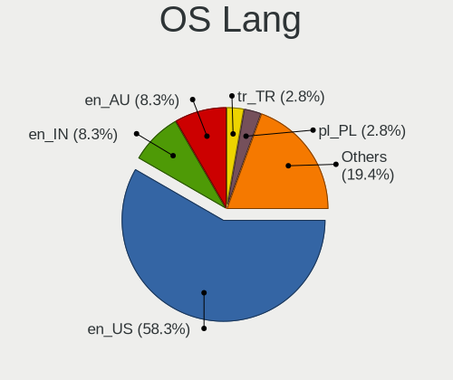

| Lang    | Computers | Percent |
|---------|-----------|---------|
| en_US   | 21        | 58.33%  |
| en_IN   | 3         | 8.33%   |
| en_AU   | 3         | 8.33%   |
| tr_TR   | 1         | 2.78%   |
| pl_PL   | 1         | 2.78%   |
| es_ES   | 1         | 2.78%   |
| es_AR   | 1         | 2.78%   |
| en_ZM   | 1         | 2.78%   |
| en_GB   | 1         | 2.78%   |
| de_DE   | 1         | 2.78%   |
| cs_CZ   | 1         | 2.78%   |
| Unknown | 1         | 2.78%   |

Boot Mode
---------

EFI or BIOS

| Mode | Computers | Percent |
|------|-----------|---------|
| EFI  | 21        | 58.33%  |
| BIOS | 15        | 41.67%  |

Filesystem
----------

Type of filesystem

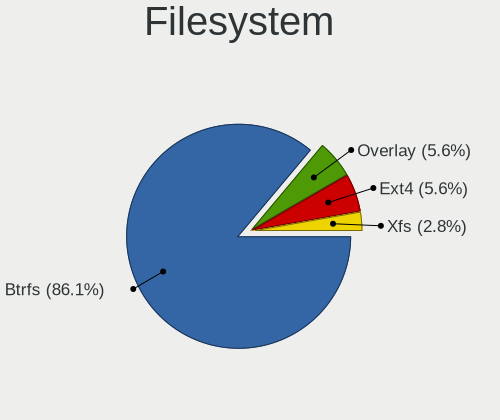

| Type    | Computers | Percent |
|---------|-----------|---------|
| Btrfs   | 31        | 86.11%  |
| Overlay | 2         | 5.56%   |
| Ext4    | 2         | 5.56%   |
| Xfs     | 1         | 2.78%   |

Part. scheme
------------

Scheme of partitioning

| Type    | Computers | Percent |
|---------|-----------|---------|
| GPT     | 21        | 58.33%  |
| Unknown | 10        | 27.78%  |
| MBR     | 5         | 13.89%  |

Dual Boot with Linux/BSD
------------------------

Hosting more than one Linux/BSD

| Dual boot | Computers | Percent |
|-----------|-----------|---------|
| No        | 33        | 91.67%  |
| Yes       | 3         | 8.33%   |

Dual Boot (Win)
---------------

Hosting Linux and Windows

| Dual boot | Computers | Percent |
|-----------|-----------|---------|
| No        | 24        | 66.67%  |
| Yes       | 12        | 33.33%  |

Board
-----

Vendor
------

Motherboard manufacturer

| Name                    | Computers | Percent |
|-------------------------|-----------|---------|
| Lenovo                  | 9         | 25%     |
| Hewlett-Packard         | 4         | 11.11%  |
| Dell                    | 4         | 11.11%  |
| ASUSTek Computer        | 4         | 11.11%  |
| MSI                     | 3         | 8.33%   |
| Gigabyte Technology     | 3         | 8.33%   |
| Acer                    | 2         | 5.56%   |
| Toshiba                 | 1         | 2.78%   |
| Raspberry Pi Foundation | 1         | 2.78%   |
| Pegatron                | 1         | 2.78%   |
| Google                  | 1         | 2.78%   |
| ASRock                  | 1         | 2.78%   |
| Apple                   | 1         | 2.78%   |
| Alienware               | 1         | 2.78%   |

Model
-----

Motherboard model

| Name                                                | Computers | Percent |
|-----------------------------------------------------|-----------|---------|
| Toshiba PORTEGE R930                                | 1         | 2.78%   |
| RPi Raspberry Pi 4 Model B Rev 1.5                  | 1         | 2.78%   |
| Pegatron 520-1030a                                  | 1         | 2.78%   |
| MSI MS-7917                                         | 1         | 2.78%   |
| MSI MS-7623                                         | 1         | 2.78%   |
| MSI Katana GF66 12UC                                | 1         | 2.78%   |
| Lenovo ThinkPad X230 2325UYW                        | 1         | 2.78%   |
| Lenovo ThinkPad P15v Gen 3 21D8CTO1WW               | 1         | 2.78%   |
| Lenovo ThinkPad P14s Gen 3 21AKCTO1WW               | 1         | 2.78%   |
| Lenovo ThinkPad L520 78595GJ                        | 1         | 2.78%   |
| Lenovo ThinkPad L15 Gen 3 21C3CTO1WW                | 1         | 2.78%   |
| Lenovo ThinkPad E460 20ETA05KAU                     | 1         | 2.78%   |
| Lenovo ThinkPad E15 Gen 4 21ED003YUS                | 1         | 2.78%   |
| Lenovo Legion 5 15ACH6 82JW                         | 1         | 2.78%   |
| Lenovo IdeaPad 5 15IAL7 82SF                        | 1         | 2.78%   |
| HP ZBook Firefly 15.6 inch G8 Mobile Workstation PC | 1         | 2.78%   |
| HP ZBook Firefly 14 inch G9 Mobile Workstation PC   | 1         | 2.78%   |
| HP ProBook 4540s                                    | 1         | 2.78%   |
| HP Pavilion 15                                      | 1         | 2.78%   |
| Google Lillipup                                     | 1         | 2.78%   |
| Gigabyte H61M-S2PV                                  | 1         | 2.78%   |
| Gigabyte B450 AORUS ELITE                           | 1         | 2.78%   |
| Gigabyte AORUS 15P KD                               | 1         | 2.78%   |
| Dell Vostro 1550                                    | 1         | 2.78%   |
| Dell OptiPlex 7070                                  | 1         | 2.78%   |
| Dell Latitude 7280                                  | 1         | 2.78%   |
| Dell Inspiron 3421                                  | 1         | 2.78%   |
| ASUS Zenbook UM3402YAR_UM3402YA                     | 1         | 2.78%   |
| ASUS X510UAR                                        | 1         | 2.78%   |
| ASUS VivoBook_ASUSLaptop X712DA_M712DA              | 1         | 2.78%   |
| ASUS PRIME X399-A                                   | 1         | 2.78%   |
| ASRock B560M-C                                      | 1         | 2.78%   |
| Apple iMac19,2                                      | 1         | 2.78%   |
| Alienware 17 R5                                     | 1         | 2.78%   |
| Acer Extensa 215-54                                 | 1         | 2.78%   |
| Acer Aspire E5-575                                  | 1         | 2.78%   |

Model Family
------------

Motherboard model prefix

| Name               | Computers | Percent |
|--------------------|-----------|---------|
| Lenovo ThinkPad    | 7         | 19.44%  |
| HP ZBook           | 2         | 5.56%   |
| Toshiba PORTEGE    | 1         | 2.78%   |
| RPi Raspberry      | 1         | 2.78%   |
| Pegatron 520-1030a | 1         | 2.78%   |
| MSI MS-7917        | 1         | 2.78%   |
| MSI MS-7623        | 1         | 2.78%   |
| MSI Katana         | 1         | 2.78%   |
| Lenovo Legion      | 1         | 2.78%   |
| Lenovo IdeaPad     | 1         | 2.78%   |
| HP ProBook         | 1         | 2.78%   |
| HP Pavilion        | 1         | 2.78%   |
| Google Lillipup    | 1         | 2.78%   |
| Gigabyte H61M-S2PV | 1         | 2.78%   |
| Gigabyte B450      | 1         | 2.78%   |
| Gigabyte AORUS     | 1         | 2.78%   |
| Dell Vostro        | 1         | 2.78%   |
| Dell OptiPlex      | 1         | 2.78%   |
| Dell Latitude      | 1         | 2.78%   |
| Dell Inspiron      | 1         | 2.78%   |
| ASUS Zenbook       | 1         | 2.78%   |
| ASUS X510UAR       | 1         | 2.78%   |
| ASUS VivoBook      | 1         | 2.78%   |
| ASUS PRIME         | 1         | 2.78%   |
| ASRock B560M-C     | 1         | 2.78%   |
| Apple iMac19       | 1         | 2.78%   |
| Alienware 17       | 1         | 2.78%   |
| Acer Extensa       | 1         | 2.78%   |
| Acer Aspire        | 1         | 2.78%   |

MFG Year
--------

Motherboard manufacture year

| Year    | Computers | Percent |
|---------|-----------|---------|
| 2022    | 8         | 22.22%  |
| 2012    | 6         | 16.67%  |
| 2021    | 4         | 11.11%  |
| 2020    | 3         | 8.33%   |
| 2018    | 2         | 5.56%   |
| 2017    | 2         | 5.56%   |
| 2016    | 2         | 5.56%   |
| 2014    | 2         | 5.56%   |
| 2023    | 1         | 2.78%   |
| 2019    | 1         | 2.78%   |
| 2015    | 1         | 2.78%   |
| 2013    | 1         | 2.78%   |
| 2011    | 1         | 2.78%   |
| 2010    | 1         | 2.78%   |
| Unknown | 1         | 2.78%   |

Form Factor
-----------

Physical design of the computer

| Name           | Computers | Percent |
|----------------|-----------|---------|
| Notebook       | 26        | 72.22%  |
| Desktop        | 8         | 22.22%  |
| System on chip | 1         | 2.78%   |
| All in one     | 1         | 2.78%   |

Secure Boot
-----------

Enabled or disabled

| State    | Computers | Percent |
|----------|-----------|---------|
| Disabled | 36        | 100%    |

Coreboot
--------

Have coreboot on board

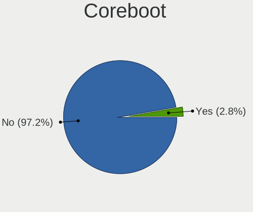

| Used | Computers | Percent |
|------|-----------|---------|
| No   | 35        | 97.22%  |
| Yes  | 1         | 2.78%   |

RAM Size
--------

Total RAM memory

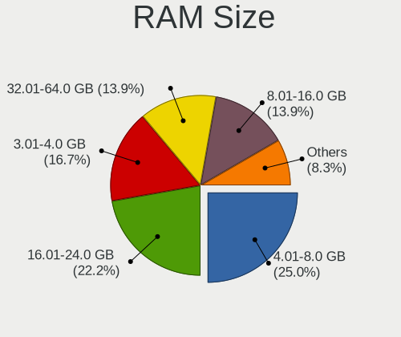

| Size in GB  | Computers | Percent |
|-------------|-----------|---------|
| 4.01-8.0    | 9         | 25%     |
| 16.01-24.0  | 8         | 22.22%  |
| 3.01-4.0    | 6         | 16.67%  |
| 32.01-64.0  | 5         | 13.89%  |
| 8.01-16.0   | 5         | 13.89%  |
| 64.01-256.0 | 2         | 5.56%   |
| 1.01-2.0    | 1         | 2.78%   |

RAM Used
--------

Used RAM memory

| Used GB   | Computers | Percent |
|-----------|-----------|---------|
| 2.01-3.0  | 14        | 38.89%  |
| 4.01-8.0  | 9         | 25%     |
| 3.01-4.0  | 5         | 13.89%  |
| 1.01-2.0  | 4         | 11.11%  |
| 0.51-1.0  | 2         | 5.56%   |
| 8.01-16.0 | 1         | 2.78%   |
| 0.01-0.5  | 1         | 2.78%   |

Total Drives
------------

Number of drives on board

| Drives | Computers | Percent |
|--------|-----------|---------|
| 1      | 21        | 58.33%  |
| 2      | 14        | 38.89%  |
| 0      | 1         | 2.78%   |

Has CD-ROM
----------

Has CD-ROM on board

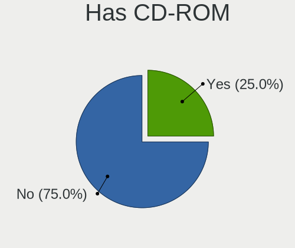

| Presented | Computers | Percent |
|-----------|-----------|---------|
| No        | 27        | 75%     |
| Yes       | 9         | 25%     |

Has Ethernet
------------

Has Ethernet on board

| Presented | Computers | Percent |
|-----------|-----------|---------|
| Yes       | 31        | 86.11%  |
| No        | 5         | 13.89%  |

Has WiFi
--------

Has WiFi module

| Presented | Computers | Percent |
|-----------|-----------|---------|
| Yes       | 34        | 94.44%  |
| No        | 2         | 5.56%   |

Has Bluetooth
-------------

Has Bluetooth module

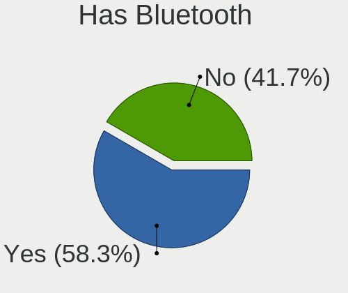

| Presented | Computers | Percent |
|-----------|-----------|---------|
| Yes       | 21        | 58.33%  |
| No        | 15        | 41.67%  |

Location
--------

Country
-------

Geographic location (country)

| Country    | Computers | Percent |
|------------|-----------|---------|
| USA        | 13        | 36.11%  |
| India      | 3         | 8.33%   |
| Australia  | 3         | 8.33%   |
| Germany    | 2         | 5.56%   |
| Zambia     | 1         | 2.78%   |
| UK         | 1         | 2.78%   |
| Turkey     | 1         | 2.78%   |
| Spain      | 1         | 2.78%   |
| Russia     | 1         | 2.78%   |
| Poland     | 1         | 2.78%   |
| Pakistan   | 1         | 2.78%   |
| Namibia    | 1         | 2.78%   |
| Mongolia   | 1         | 2.78%   |
| Czechia    | 1         | 2.78%   |
| Canada     | 1         | 2.78%   |
| Brazil     | 1         | 2.78%   |
| Bangladesh | 1         | 2.78%   |
| Argentina  | 1         | 2.78%   |
| Algeria    | 1         | 2.78%   |

City
----

Geographic location (city)

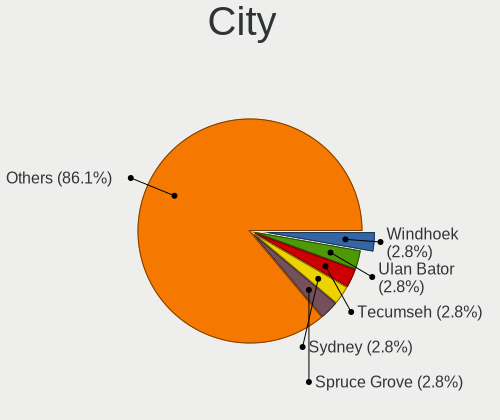

| City             | Computers | Percent |
|------------------|-----------|---------|
| Windhoek         | 1         | 2.78%   |
| Ulan Bator       | 1         | 2.78%   |
| Tecumseh         | 1         | 2.78%   |
| Sydney           | 1         | 2.78%   |
| Spruce Grove     | 1         | 2.78%   |
| Skikda           | 1         | 2.78%   |
| Simpsonville     | 1         | 2.78%   |
| Shelton          | 1         | 2.78%   |
| Seattle          | 1         | 2.78%   |
| Rostov-on-Don    | 1         | 2.78%   |
| Reading          | 1         | 2.78%   |
| Rawalpindi       | 1         | 2.78%   |
| Prague           | 1         | 2.78%   |
| Mercedes         | 1         | 2.78%   |
| Lusaka           | 1         | 2.78%   |
| Lochow           | 1         | 2.78%   |
| León            | 1         | 2.78%   |
| Leland           | 1         | 2.78%   |
| Lake Forest      | 1         | 2.78%   |
| Houston          | 1         | 2.78%   |
| Hamburg          | 1         | 2.78%   |
| Geneva           | 1         | 2.78%   |
| Fortaleza        | 1         | 2.78%   |
| Fernandina Beach | 1         | 2.78%   |
| Eugene           | 1         | 2.78%   |
| Dhaka            | 1         | 2.78%   |
| Delhi            | 1         | 2.78%   |
| Chandigarh       | 1         | 2.78%   |
| Canberra         | 1         | 2.78%   |
| Bursa            | 1         | 2.78%   |
| Brisbane         | 1         | 2.78%   |
| Brent            | 1         | 2.78%   |
| Bettingen        | 1         | 2.78%   |
| Bankura          | 1         | 2.78%   |
| Andover          | 1         | 2.78%   |
| Anchorage        | 1         | 2.78%   |

Drives
------

Drive Vendor
------------

Hard drive vendors

| Vendor                      | Computers | Drives | Percent |
|-----------------------------|-----------|--------|---------|
| Samsung Electronics         | 8         | 10     | 16.67%  |
| Seagate                     | 7         | 8      | 14.58%  |
| Kingston                    | 4         | 4      | 8.33%   |
| WDC                         | 3         | 3      | 6.25%   |
| SanDisk                     | 3         | 4      | 6.25%   |
| Micron Technology           | 3         | 3      | 6.25%   |
| Unknown                     | 2         | 2      | 4.17%   |
| Toshiba                     | 2         | 2      | 4.17%   |
| SK hynix                    | 2         | 2      | 4.17%   |
| KIOXIA                      | 2         | 2      | 4.17%   |
| HGST                        | 2         | 2      | 4.17%   |
| Unknown (583)               | 1         | 1      | 2.08%   |
| Phison                      | 1         | 1      | 2.08%   |
| Lexar                       | 1         | 1      | 2.08%   |
| Kingston Technology Company | 1         | 1      | 2.08%   |
| KingFast                    | 1         | 1      | 2.08%   |
| Hitachi                     | 1         | 1      | 2.08%   |
| Hewlett-Packard             | 1         | 1      | 2.08%   |
| GOODRAM                     | 1         | 1      | 2.08%   |
| Apple                       | 1         | 1      | 2.08%   |
| Apacer                      | 1         | 1      | 2.08%   |

Drive Model
-----------

Hard drive models

| Model                                   | Computers | Percent |
|-----------------------------------------|-----------|---------|
| WDC WDS500G2B0B-00YS70 500GB SSD        | 2         | 4%      |
| Seagate ST500LM012 HN-M500MBB 500GB     | 2         | 4%      |
| WDC WD6400BPVT-60HXZT3 640GB            | 1         | 2%      |
| Unknown SD16G  32GB                     | 1         | 2%      |
| Unknown HBG4a2  32GB                    | 1         | 2%      |
| Unknown (583) Disk 2TB                  | 1         | 2%      |
| Toshiba MQ01ABD100 1TB                  | 1         | 2%      |
| Toshiba MK3261GSYN 320GB                | 1         | 2%      |
| SK hynix SKHynix_HFS001TDE9X084N 1TB    | 1         | 2%      |
| SK hynix BC511 512GB                    | 1         | 2%      |
| Seagate ST500LM000-1EJ162 500GB         | 1         | 2%      |
| Seagate ST380215AS 80GB                 | 1         | 2%      |
| Seagate ST3802110A 80GB                 | 1         | 2%      |
| Seagate ST2000DM008-2FR102 2TB          | 1         | 2%      |
| Seagate BUP Slim BK 1TB                 | 1         | 2%      |
| Seagate Backup+ Hub BK 8TB              | 1         | 2%      |
| Sandisk WD_BLACK SN770 500GB            | 1         | 2%      |
| SanDisk SD8SN8U-256G-1006 256GB SSD     | 1         | 2%      |
| SanDisk NVMe SSD Drive 500GB            | 1         | 2%      |
| SanDisk NVMe SSD Drive 1TB              | 1         | 2%      |
| Samsung SSD 980 1TB                     | 1         | 2%      |
| Samsung SSD 970 EVO Plus 1TB            | 1         | 2%      |
| Samsung SSD 970 EVO 1TB                 | 1         | 2%      |
| Samsung MZVLQ256HBJD-00BH1 256GB        | 1         | 2%      |
| Samsung MZVL2512HCJQ-00BL7 512GB        | 1         | 2%      |
| Samsung MZVL2512HCJQ-00B00 512GB        | 1         | 2%      |
| Samsung MZAL4512HBLU-00BL2 512GB        | 1         | 2%      |
| Samsung MZ7TY256HDHP-000L7 256GB SSD    | 1         | 2%      |
| Phison Dash Pro 2TB                     | 1         | 2%      |
| Micron MTFDKCD1T0TFK 1024GB             | 1         | 2%      |
| Micron 2450_MTFDKBA1T0TFK 1TB           | 1         | 2%      |
| Micron 2400_MTFDKBA512QFM 512GB         | 1         | 2%      |
| Lexar SSD NS100 512GB                   | 1         | 2%      |
| KIOXIA KXG60ZNV1T02 1TB                 | 1         | 2%      |
| KIOXIA KBG5AZNT512G LA 512GB            | 1         | 2%      |
| Kingston Company OM3PDP3 NVMe SSD 256GB | 1         | 2%      |
| Kingston SNVS500G 500GB                 | 1         | 2%      |
| Kingston SNV2S500G 500GB                | 1         | 2%      |
| Kingston OM8PCP3512F-AB 512GB           | 1         | 2%      |
| Kingston A400 960G SSD                  | 1         | 2%      |

HDD Vendor
----------

Hard disk drive vendors

| Vendor  | Computers | Drives | Percent |
|---------|-----------|--------|---------|
| Seagate | 7         | 8      | 53.85%  |
| Toshiba | 2         | 2      | 15.38%  |
| HGST    | 2         | 2      | 15.38%  |
| WDC     | 1         | 1      | 7.69%   |
| Hitachi | 1         | 1      | 7.69%   |

SSD Vendor
----------

Solid state drive vendors

| Vendor              | Computers | Drives | Percent |
|---------------------|-----------|--------|---------|
| WDC                 | 2         | 2      | 20%     |
| SanDisk             | 1         | 1      | 10%     |
| Samsung Electronics | 1         | 1      | 10%     |
| Lexar               | 1         | 1      | 10%     |
| Kingston            | 1         | 1      | 10%     |
| KingFast            | 1         | 1      | 10%     |
| Hewlett-Packard     | 1         | 1      | 10%     |
| GOODRAM             | 1         | 1      | 10%     |
| Apacer              | 1         | 1      | 10%     |

Drive Kind
----------

HDD or SSD

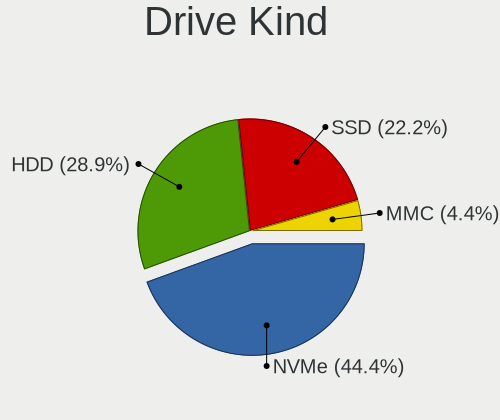

| Kind | Computers | Drives | Percent |
|------|-----------|--------|---------|
| NVMe | 20        | 26     | 44.44%  |
| HDD  | 13        | 14     | 28.89%  |
| SSD  | 10        | 10     | 22.22%  |
| MMC  | 2         | 2      | 4.44%   |

Drive Connector
---------------

SATA, SAS, NVMe, etc.

| Type | Computers | Drives | Percent |
|------|-----------|--------|---------|
| NVMe | 20        | 25     | 45.45%  |
| SATA | 18        | 21     | 40.91%  |
| SAS  | 4         | 4      | 9.09%   |
| MMC  | 2         | 2      | 4.55%   |

Drive Size
----------

Size of hard drive

| Size in TB | Computers | Drives | Percent |
|------------|-----------|--------|---------|
| 0.01-0.5   | 12        | 14     | 54.55%  |
| 0.51-1.0   | 7         | 7      | 31.82%  |
| 1.01-2.0   | 2         | 2      | 9.09%   |
| 4.01-10.0  | 1         | 1      | 4.55%   |

Space Total
-----------

Amount of disk space available on the file system

| Size in GB     | Computers | Percent |
|----------------|-----------|---------|
| 501-1000       | 8         | 22.22%  |
| 1001-2000      | 6         | 16.67%  |
| 251-500        | 5         | 13.89%  |
| 101-250        | 5         | 13.89%  |
| Unknown        | 4         | 11.11%  |
| 1-20           | 3         | 8.33%   |
| More than 3000 | 2         | 5.56%   |
| 21-50          | 1         | 2.78%   |
| 2001-3000      | 1         | 2.78%   |
| 51-100         | 1         | 2.78%   |

Space Used
----------

Amount of used disk space

| Used GB        | Computers | Percent |
|----------------|-----------|---------|
| 21-50          | 12        | 33.33%  |
| 1-20           | 6         | 16.67%  |
| 51-100         | 6         | 16.67%  |
| Unknown        | 4         | 11.11%  |
| 101-250        | 3         | 8.33%   |
| More than 3000 | 1         | 2.78%   |
| 251-500        | 1         | 2.78%   |
| 2001-3000      | 1         | 2.78%   |
| 501-1000       | 1         | 2.78%   |
| 0              | 1         | 2.78%   |

Malfunc. Drives
---------------

Drive models with a malfunction

| Model                               | Computers | Drives | Percent |
|-------------------------------------|-----------|--------|---------|
| Toshiba MK3261GSYN 320GB            | 1         | 1      | 20%     |
| Seagate ST500LM012 HN-M500MBB 500GB | 1         | 1      | 20%     |
| Seagate ST380215AS 80GB             | 1         | 1      | 20%     |
| Seagate ST3802110A 80GB             | 1         | 1      | 20%     |
| Hewlett-Packard SSD S700 Pro 1TB    | 1         | 1      | 20%     |

Malfunc. Drive Vendor
---------------------

Vendors of faulty drives

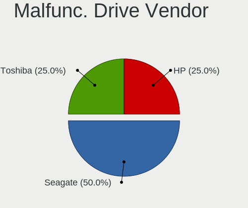

| Vendor          | Computers | Drives | Percent |
|-----------------|-----------|--------|---------|
| Seagate         | 2         | 3      | 50%     |
| Toshiba         | 1         | 1      | 25%     |
| Hewlett-Packard | 1         | 1      | 25%     |

Malfunc. HDD Vendor
-------------------

Vendors of faulty HDD drives

| Vendor  | Computers | Drives | Percent |
|---------|-----------|--------|---------|
| Seagate | 2         | 3      | 66.67%  |
| Toshiba | 1         | 1      | 33.33%  |

Malfunc. Drive Kind
-------------------

Kinds of faulty drives

| Kind | Computers | Drives | Percent |
|------|-----------|--------|---------|
| HDD  | 3         | 4      | 75%     |
| SSD  | 1         | 1      | 25%     |

Failed Drives
-------------

Failed drive models

Zero info for selected period =(

Failed Drive Vendor
-------------------

Failed drive vendors

Zero info for selected period =(

Drive Status
------------

Number of failed and malfunc. drives

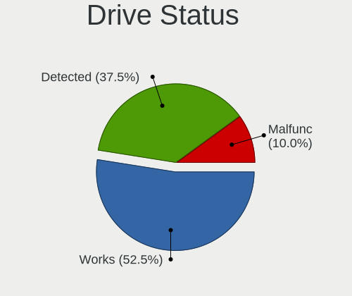

| Status   | Computers | Drives | Percent |
|----------|-----------|--------|---------|
| Works    | 21        | 27     | 52.5%   |
| Detected | 15        | 20     | 37.5%   |
| Malfunc  | 4         | 5      | 10%     |

Storage controller
------------------

Storage Vendor
--------------

Storage controller vendors

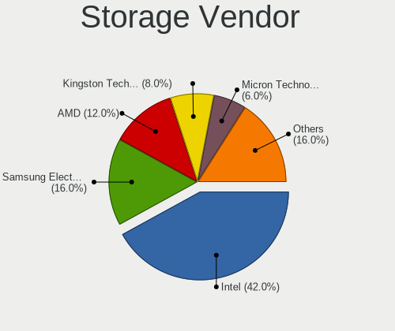

| Vendor                       | Computers | Percent |
|------------------------------|-----------|---------|
| Intel                        | 21        | 42%     |
| Samsung Electronics          | 8         | 16%     |
| AMD                          | 6         | 12%     |
| Kingston Technology Company  | 4         | 8%      |
| Micron Technology            | 3         | 6%      |
| SK hynix                     | 2         | 4%      |
| SanDisk                      | 2         | 4%      |
| Toshiba America Info Systems | 1         | 2%      |
| Phison Electronics           | 1         | 2%      |
| KIOXIA                       | 1         | 2%      |
| ASMedia Technology           | 1         | 2%      |

Storage Model
-------------

Storage controller models

| Model                                                                                   | Computers | Percent |
|-----------------------------------------------------------------------------------------|-----------|---------|
| Intel Sunrise Point-LP SATA Controller [AHCI mode]                                      | 4         | 7.27%   |
| Intel 7 Series Chipset Family 6-port SATA Controller [AHCI mode]                        | 4         | 7.27%   |
| AMD FCH SATA Controller [AHCI mode]                                                     | 4         | 7.27%   |
| SanDisk WD Black SN770 / PC SN740 256GB / PC SN560 (DRAM-less) NVMe SSD                 | 2         | 3.64%   |
| Samsung NVMe SSD Controller SM981/PM981/PM983                                           | 2         | 3.64%   |
| Samsung NVMe SSD Controller PM9A1/PM9A3/980PRO                                          | 2         | 3.64%   |
| Samsung NVMe SSD Controller 980 (DRAM-less)                                             | 2         | 3.64%   |
| Micron 2450 NVMe SSD [HendrixV] (DRAM-less)                                             | 2         | 3.64%   |
| Intel Volume Management Device NVMe RAID Controller                                     | 2         | 3.64%   |
| Intel Cannon Lake PCH SATA AHCI Controller                                              | 2         | 3.64%   |
| Intel Alder Lake-P SATA AHCI Controller                                                 | 2         | 3.64%   |
| Intel 6 Series/C200 Series Chipset Family 6 port Mobile SATA AHCI Controller            | 2         | 3.64%   |
| Toshiba America Info Systems XG6 NVMe SSD Controller                                    | 1         | 1.82%   |
| SK hynix Gold P31/BC711/PC711 NVMe Solid State Drive                                    | 1         | 1.82%   |
| SK hynix BC511 NVMe SSD                                                                 | 1         | 1.82%   |
| Samsung NVMe SSD Controller SM961/PM961/SM963                                           | 1         | 1.82%   |
| Samsung NVMe SSD Controller PM9B1 (DRAM-less)                                           | 1         | 1.82%   |
| Phison PS5013-E13 PCIe3 NVMe Controller (DRAM-less)                                     | 1         | 1.82%   |
| Micron 2400 NVMe SSD (DRAM-less)                                                        | 1         | 1.82%   |
| KIOXIA NVMe SSD Controller BG5 (DRAM-less)                                              | 1         | 1.82%   |
| Kingston Company OM8PCP Design-In PCIe 3 NVMe SSD (DRAM-less)                           | 1         | 1.82%   |
| Kingston Company OM3PDP3 NVMe SSD                                                       | 1         | 1.82%   |
| Kingston Company NV2 NVMe SSD SM2267XT                                                  | 1         | 1.82%   |
| Kingston Company NV1 NVMe SSD SM2263XT                                                  | 1         | 1.82%   |
| Intel Tiger Lake-LP SATA Controller                                                     | 1         | 1.82%   |
| Intel Cannon Lake Mobile PCH SATA AHCI Controller                                       | 1         | 1.82%   |
| Intel 9 Series Chipset Family SATA Controller [AHCI Mode]                               | 1         | 1.82%   |
| Intel 7 Series Chipset Family 4-port SATA Controller [IDE mode]                         | 1         | 1.82%   |
| Intel 7 Series Chipset Family 2-port SATA Controller [IDE mode]                         | 1         | 1.82%   |
| Intel 6 Series/C200 Series Chipset Family Desktop SATA Controller (IDE mode, ports 4-5) | 1         | 1.82%   |
| Intel 6 Series/C200 Series Chipset Family Desktop SATA Controller (IDE mode, ports 0-3) | 1         | 1.82%   |
| Intel 500 Series Chipset Family SATA AHCI Controller                                    | 1         | 1.82%   |
| ASMedia ASM1062 Serial ATA Controller                                                   | 1         | 1.82%   |
| AMD X399 Series Chipset SATA Controller                                                 | 1         | 1.82%   |
| AMD SB7x0/SB8x0/SB9x0 SATA Controller [IDE mode]                                        | 1         | 1.82%   |
| AMD SB7x0/SB8x0/SB9x0 IDE Controller                                                    | 1         | 1.82%   |
| AMD 400 Series Chipset SATA Controller                                                  | 1         | 1.82%   |

Storage Kind
------------

Kind of storage controller (IDE, SATA, NVMe, SAS, ...)

| Kind | Computers | Percent |
|------|-----------|---------|
| SATA | 24        | 48.98%  |
| NVMe | 20        | 40.82%  |
| IDE  | 3         | 6.12%   |
| RAID | 2         | 4.08%   |

Processor
---------

CPU Vendor
----------

Processor vendors

| Vendor | Computers | Percent |
|--------|-----------|---------|
| Intel  | 27        | 75%     |
| AMD    | 8         | 22.22%  |
| ARM    | 1         | 2.78%   |

CPU Model
---------

Processor models

| Model                                          | Computers | Percent |
|------------------------------------------------|-----------|---------|
| Intel 12th Gen Core i7-12700H                  | 2         | 5.56%   |
| Intel Pentium CPU G620 @ 2.60GHz               | 1         | 2.78%   |
| Intel Core i9-10900F CPU @ 2.80GHz             | 1         | 2.78%   |
| Intel Core i7-8750H CPU @ 2.20GHz              | 1         | 2.78%   |
| Intel Core i7-6500U CPU @ 2.50GHz              | 1         | 2.78%   |
| Intel Core i5-9500T CPU @ 2.20GHz              | 1         | 2.78%   |
| Intel Core i5-8250U CPU @ 1.60GHz              | 1         | 2.78%   |
| Intel Core i5-7300U CPU @ 2.60GHz              | 1         | 2.78%   |
| Intel Core i5-4690K CPU @ 3.50GHz              | 1         | 2.78%   |
| Intel Core i5-3340M CPU @ 2.70GHz              | 1         | 2.78%   |
| Intel Core i5-3320M CPU @ 2.60GHz              | 1         | 2.78%   |
| Intel Core i5-2450M CPU @ 2.50GHz              | 1         | 2.78%   |
| Intel Core i3-8100 CPU @ 3.60GHz               | 1         | 2.78%   |
| Intel Core i3-6100U CPU @ 2.30GHz              | 1         | 2.78%   |
| Intel Core i3-3217U CPU @ 1.80GHz              | 1         | 2.78%   |
| Intel Core i3-3110M CPU @ 2.40GHz              | 1         | 2.78%   |
| Intel Core i3-2350M CPU @ 2.30GHz              | 1         | 2.78%   |
| Intel Core i3-2310M CPU @ 2.10GHz              | 1         | 2.78%   |
| Intel 12th Gen Core i7-1265U                   | 1         | 2.78%   |
| Intel 12th Gen Core i7-1260P                   | 1         | 2.78%   |
| Intel 12th Gen Core i7-1255U                   | 1         | 2.78%   |
| Intel 12th Gen Core i5-1235U                   | 1         | 2.78%   |
| Intel 11th Gen Core i7-11800H @ 2.30GHz        | 1         | 2.78%   |
| Intel 11th Gen Core i7-1165G7 @ 2.80GHz        | 1         | 2.78%   |
| Intel 11th Gen Core i5-1135G7 @ 2.40GHz        | 1         | 2.78%   |
| Intel 11th Gen Core i3-1115G4 @ 3.00GHz        | 1         | 2.78%   |
| ARM Processor                                  | 1         | 2.78%   |
| AMD Sempron 145 Processor                      | 1         | 2.78%   |
| AMD Ryzen Threadripper 2950X 16-Core Processor | 1         | 2.78%   |
| AMD Ryzen 7 7730U with Radeon Graphics         | 1         | 2.78%   |
| AMD Ryzen 7 5800H with Radeon Graphics         | 1         | 2.78%   |
| AMD Ryzen 7 3700U with Radeon Vega Mobile Gfx  | 1         | 2.78%   |
| AMD Ryzen 5 5625U with Radeon Graphics         | 1         | 2.78%   |
| AMD Ryzen 5 5600X 6-Core Processor             | 1         | 2.78%   |
| AMD A6-3600 APU with Radeon HD Graphics        | 1         | 2.78%   |

CPU Model Family
----------------

Processor model prefix

| Model                  | Computers | Percent |
|------------------------|-----------|---------|
| Other                  | 11        | 30.56%  |
| Intel Core i5          | 7         | 19.44%  |
| Intel Core i3          | 6         | 16.67%  |
| AMD Ryzen 7            | 3         | 8.33%   |
| Intel Core i7          | 2         | 5.56%   |
| AMD Ryzen 5            | 2         | 5.56%   |
| Intel Pentium          | 1         | 2.78%   |
| Intel Core i9          | 1         | 2.78%   |
| AMD Sempron            | 1         | 2.78%   |
| AMD Ryzen Threadripper | 1         | 2.78%   |
| AMD A6                 | 1         | 2.78%   |

CPU Cores
---------

Number of processor cores

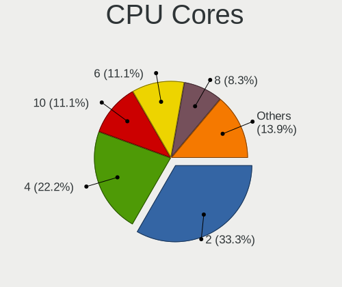

| Number | Computers | Percent |
|--------|-----------|---------|
| 2      | 12        | 33.33%  |
| 4      | 8         | 22.22%  |
| 10     | 4         | 11.11%  |
| 6      | 4         | 11.11%  |
| 8      | 3         | 8.33%   |
| 14     | 2         | 5.56%   |
| 16     | 1         | 2.78%   |
| 12     | 1         | 2.78%   |
| 1      | 1         | 2.78%   |

CPU Sockets
-----------

Number of sockets

| Number | Computers | Percent |
|--------|-----------|---------|
| 1      | 36        | 100%    |

CPU Threads
-----------

Threads per core (Hyper-Threading)

| Number | Computers | Percent |
|--------|-----------|---------|
| 2      | 23        | 63.89%  |
| 1      | 13        | 36.11%  |

CPU Op-Modes
------------

CPU Operation Modes (32-bit, 64-bit)

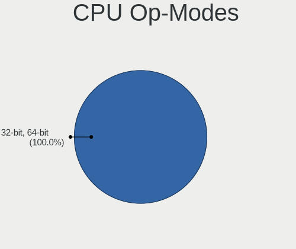

| Op mode        | Computers | Percent |
|----------------|-----------|---------|
| 32-bit, 64-bit | 36        | 100%    |

CPU Microcode
-------------

Microcode number

| Number     | Computers | Percent |
|------------|-----------|---------|
| Unknown    | 12        | 33.33%  |
| 0x906a4    | 3         | 8.33%   |
| 0x906a3    | 3         | 8.33%   |
| 0x306a9    | 3         | 8.33%   |
| 0x806c1    | 2         | 5.56%   |
| 0x0a50000c | 2         | 5.56%   |
| 0xa0655    | 1         | 2.78%   |
| 0x906eb    | 1         | 2.78%   |
| 0x906ea    | 1         | 2.78%   |
| 0x806ea    | 1         | 2.78%   |
| 0x806e9    | 1         | 2.78%   |
| 0x806d1    | 1         | 2.78%   |
| 0x406e3    | 1         | 2.78%   |
| 0x206a7    | 1         | 2.78%   |
| 0x0a201204 | 1         | 2.78%   |
| 0x08108102 | 1         | 2.78%   |
| 0x010000c8 | 1         | 2.78%   |

CPU Microarch
-------------

Microarchitecture

| Name             | Computers | Percent |
|------------------|-----------|---------|
| Alderlake Hybrid | 6         | 16.67%  |
| KabyLake         | 5         | 13.89%  |
| Zen 3            | 4         | 11.11%  |
| SandyBridge      | 4         | 11.11%  |
| IvyBridge        | 4         | 11.11%  |
| TigerLake        | 3         | 8.33%   |
| Zen+             | 2         | 5.56%   |
| Skylake          | 2         | 5.56%   |
| K10 Llano        | 1         | 2.78%   |
| K10              | 1         | 2.78%   |
| Icelake          | 1         | 2.78%   |
| Haswell          | 1         | 2.78%   |
| CometLake        | 1         | 2.78%   |
| Unknown          | 1         | 2.78%   |

Graphics
--------

GPU Vendor
----------

Vendors of graphics cards

| Vendor | Computers | Percent |
|--------|-----------|---------|
| Intel  | 25        | 55.56%  |
| Nvidia | 11        | 24.44%  |
| AMD    | 9         | 20%     |

GPU Model
---------

Graphics card models

| Model                                                                                 | Computers | Percent |
|---------------------------------------------------------------------------------------|-----------|---------|
| Intel 3rd Gen Core processor Graphics Controller                                      | 4         | 8.89%   |
| Intel 2nd Generation Core Processor Family Integrated Graphics Controller             | 4         | 8.89%   |
| Intel Alder Lake-UP3 GT2 [Iris Xe Graphics]                                           | 3         | 6.67%   |
| Nvidia TU116 [GeForce GTX 1660]                                                       | 2         | 4.44%   |
| Intel TigerLake-LP GT2 [Iris Xe Graphics]                                             | 2         | 4.44%   |
| Intel Skylake GT2 [HD Graphics 520]                                                   | 2         | 4.44%   |
| Intel Alder Lake-P Integrated Graphics Controller                                     | 2         | 4.44%   |
| AMD Barcelo                                                                           | 2         | 4.44%   |
| Nvidia TU117GLM [T600 Laptop GPU]                                                     | 1         | 2.22%   |
| Nvidia TU117GLM [T550 Laptop GPU]                                                     | 1         | 2.22%   |
| Nvidia TU117GLM [Quadro T500 Mobile]                                                  | 1         | 2.22%   |
| Nvidia GP104BM [GeForce GTX 1070 Mobile]                                              | 1         | 2.22%   |
| Nvidia GA107M [GeForce RTX 3050 Mobile]                                               | 1         | 2.22%   |
| Nvidia GA107BM [GeForce RTX 3050 Ti Mobile]                                           | 1         | 2.22%   |
| Nvidia GA106M [GeForce RTX 3060 Mobile / Max-Q]                                       | 1         | 2.22%   |
| Nvidia GA106 [GeForce RTX 3060 Lite Hash Rate]                                        | 1         | 2.22%   |
| Nvidia GA104 [GeForce RTX 3070]                                                       | 1         | 2.22%   |
| Intel Xeon E3-1200 v3/4th Gen Core Processor Integrated Graphics Controller           | 1         | 2.22%   |
| Intel UHD Graphics 620                                                                | 1         | 2.22%   |
| Intel TigerLake-H GT1 [UHD Graphics]                                                  | 1         | 2.22%   |
| Intel Tiger Lake-LP GT2 [UHD Graphics G4]                                             | 1         | 2.22%   |
| Intel HD Graphics 620                                                                 | 1         | 2.22%   |
| Intel CoffeeLake-S GT2 [UHD Graphics 630]                                             | 1         | 2.22%   |
| Intel CoffeeLake-H GT2 [UHD Graphics 630]                                             | 1         | 2.22%   |
| Intel Alder Lake-P GT2 [Iris Xe Graphics]                                             | 1         | 2.22%   |
| AMD Topaz XT [Radeon R7 M260/M265 / M340/M360 / M440/M445 / 530/535 / 620/625 Mobile] | 1         | 2.22%   |
| AMD Thames [Radeon HD 7550M/7570M/7650M]                                              | 1         | 2.22%   |
| AMD Sun XT [Radeon HD 8670A/8670M/8690M / R5 M330 / M430 / Radeon 520 Mobile]         | 1         | 2.22%   |
| AMD RS780L [Radeon 3000]                                                              | 1         | 2.22%   |
| AMD Picasso/Raven 2 [Radeon Vega Series / Radeon Vega Mobile Series]                  | 1         | 2.22%   |
| AMD Caicos [Radeon HD 6450/7450/8450 / R5 230 OEM]                                    | 1         | 2.22%   |
| AMD Baffin [Radeon RX 460/560D / Pro 450/455/460/555/555X/560/560X]                   | 1         | 2.22%   |

GPU Combo
---------

Combinations of graphics cards

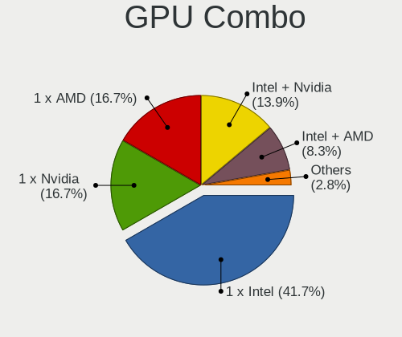

| Name           | Computers | Percent |
|----------------|-----------|---------|
| 1 x Intel      | 15        | 41.67%  |
| 1 x Nvidia     | 6         | 16.67%  |
| 1 x AMD        | 6         | 16.67%  |
| Intel + Nvidia | 5         | 13.89%  |
| Intel + AMD    | 3         | 8.33%   |
| Other          | 1         | 2.78%   |

GPU Driver
----------

Free vs proprietary

| Driver      | Computers | Percent |
|-------------|-----------|---------|
| Free        | 33        | 91.67%  |
| Proprietary | 2         | 5.56%   |
| Unknown     | 1         | 2.78%   |

GPU Memory
----------

Total video memory

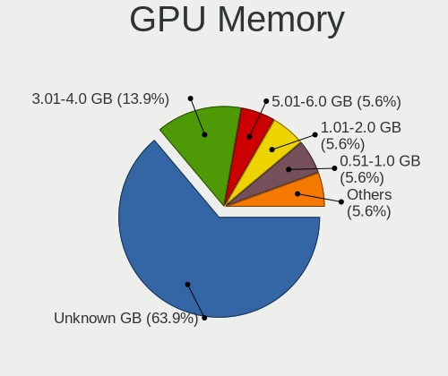

| Size in GB | Computers | Percent |
|------------|-----------|---------|
| Unknown    | 23        | 63.89%  |
| 3.01-4.0   | 5         | 13.89%  |
| 5.01-6.0   | 2         | 5.56%   |
| 1.01-2.0   | 2         | 5.56%   |
| 0.51-1.0   | 2         | 5.56%   |
| 7.01-8.0   | 1         | 2.78%   |
| 0.01-0.5   | 1         | 2.78%   |

Monitor
-------

Monitor Vendor
--------------

Monitor vendors

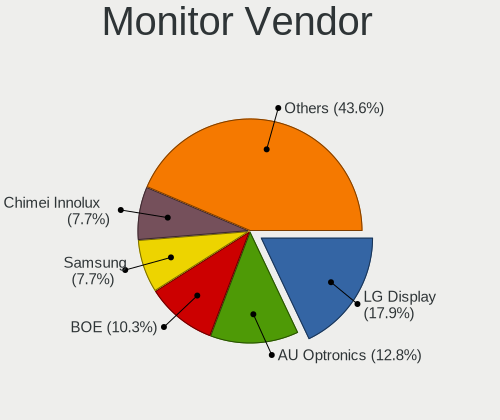

| Vendor               | Computers | Percent |
|----------------------|-----------|---------|
| LG Display           | 7         | 17.95%  |
| AU Optronics         | 5         | 12.82%  |
| BOE                  | 4         | 10.26%  |
| Samsung Electronics  | 3         | 7.69%   |
| Chimei Innolux       | 3         | 7.69%   |
| Hewlett-Packard      | 2         | 5.13%   |
| Dell                 | 2         | 5.13%   |
| Ancor Communications | 2         | 5.13%   |
| Acer                 | 2         | 5.13%   |
| VIZ                  | 1         | 2.56%   |
| Sharp                | 1         | 2.56%   |
| Pixio                | 1         | 2.56%   |
| LG Electronics       | 1         | 2.56%   |
| Goldstar             | 1         | 2.56%   |
| Element              | 1         | 2.56%   |
| CSO                  | 1         | 2.56%   |
| BOE Technology Group | 1         | 2.56%   |
| Apple                | 1         | 2.56%   |

Monitor Model
-------------

Monitor models

| Model                                                                 | Computers | Percent |
|-----------------------------------------------------------------------|-----------|---------|
| BOE LCD Monitor BOE08E2 1920x1080 344x194mm 15.5-inch                 | 2         | 5.13%   |
| VIZ LCD Monitor VA19L HDTV10T                                         | 1         | 2.56%   |
| Sharp LQ156M1JW03 SHP14C5 1920x1080 344x194mm 15.5-inch               | 1         | 2.56%   |
| Samsung Electronics SMS19A100 SAM0867 1366x768 410x230mm 18.5-inch    | 1         | 2.56%   |
| Samsung Electronics LCD Monitor SDC5441 1366x768 344x194mm 15.5-inch  | 1         | 2.56%   |
| Samsung Electronics LCD Monitor SDC4171 2880x1800 302x189mm 14.0-inch | 1         | 2.56%   |
| Pixio SFP24DFI FLAT WAM2380 1920x1080 527x296mm 23.8-inch             | 1         | 2.56%   |
| LG Electronics LCD Monitor LG HDR WFHD 2560x1080                      | 1         | 2.56%   |
| LG Display LCD Monitor LGD06E4 1920x1080 344x194mm 15.5-inch          | 1         | 2.56%   |
| LG Display LCD Monitor LGD0521 1920x1080 309x174mm 14.0-inch          | 1         | 2.56%   |
| LG Display LCD Monitor LGD0505 1366x768 344x194mm 15.5-inch           | 1         | 2.56%   |
| LG Display LCD Monitor LGD03A3 1366x768 277x156mm 12.5-inch           | 1         | 2.56%   |
| LG Display LCD Monitor LGD034D 1366x768 344x194mm 15.5-inch           | 1         | 2.56%   |
| LG Display LCD Monitor LGD02F1 1366x768 344x194mm 15.5-inch           | 1         | 2.56%   |
| LG Display LCD Monitor LGD02E3 1366x768 344x194mm 15.5-inch           | 1         | 2.56%   |
| Hewlett-Packard TouchSmart HWP4212 1920x1080 509x286mm 23.0-inch      | 1         | 2.56%   |
| Hewlett-Packard LA1956x HWP3021 1280x1024 376x301mm 19.0-inch         | 1         | 2.56%   |
| Goldstar W1943 GSM4BAD 1360x768 406x229mm 18.4-inch                   | 1         | 2.56%   |
| Element ELEFW195 ELE3553 1920x1080 708x398mm 32.0-inch                | 1         | 2.56%   |
| Dell U2412M DELA07B 1920x1200 518x324mm 24.1-inch                     | 1         | 2.56%   |
| Dell P2314T DEL409E 1920x1080 509x286mm 23.0-inch                     | 1         | 2.56%   |
| CSO LCD Monitor CSO1506 1920x1080 344x194mm 15.5-inch                 | 1         | 2.56%   |
| Chimei Innolux LCD Monitor CMN1745 1600x900 382x214mm 17.2-inch       | 1         | 2.56%   |
| Chimei Innolux LCD Monitor CMN15AA 1366x768 344x194mm 15.5-inch       | 1         | 2.56%   |
| Chimei Innolux LCD Monitor CMN1521 1920x1080 344x193mm 15.5-inch      | 1         | 2.56%   |
| BOE Technology Group LCD Monitor 3200x1080                            | 1         | 2.56%   |
| BOE LCD Monitor BOE0AB0 1920x1080 344x194mm 15.5-inch                 | 1         | 2.56%   |
| BOE LCD Monitor BOE0A64 1920x1080 344x194mm 15.5-inch                 | 1         | 2.56%   |
| AU Optronics LCD Monitor AUOE3A0 3840x2400 301x188mm 14.0-inch        | 1         | 2.56%   |
| AU Optronics LCD Monitor AUO662D 1920x1080 293x165mm 13.2-inch        | 1         | 2.56%   |
| AU Optronics LCD Monitor AUO5A99 1920x1200 301x188mm 14.0-inch        | 1         | 2.56%   |
| AU Optronics LCD Monitor AUO1496 2560x1440 382x214mm 17.2-inch        | 1         | 2.56%   |
| AU Optronics LCD Monitor AUO106C 1366x768 276x155mm 12.5-inch         | 1         | 2.56%   |
| Apple iMac APPAE19 3840x2160 475x267mm 21.5-inch                      | 1         | 2.56%   |
| Ancor Communications VG248 ACI24A4 1920x1080 531x299mm 24.0-inch      | 1         | 2.56%   |
| Ancor Communications VE228 ACI22FA 1920x1080 477x268mm 21.5-inch      | 1         | 2.56%   |
| Acer H193HQV ACR01B8 1366x768 410x230mm 18.5-inch                     | 1         | 2.56%   |
| Acer G246HL ACR02FF 1920x1080 531x299mm 24.0-inch                     | 1         | 2.56%   |

Monitor Resolution
------------------

Monitor screen resolution

| Resolution        | Computers | Percent |
|-------------------|-----------|---------|
| 1920x1080 (FHD)   | 15        | 39.47%  |
| 1366x768 (WXGA)   | 10        | 26.32%  |
| 3840x2160 (4K)    | 2         | 5.26%   |
| 1920x1200 (WUXGA) | 2         | 5.26%   |
| 3840x2400         | 1         | 2.63%   |
| 3200x1080         | 1         | 2.63%   |
| 2880x1800         | 1         | 2.63%   |
| 2560x1440 (QHD)   | 1         | 2.63%   |
| 2560x1080         | 1         | 2.63%   |
| 1600x900 (HD+)    | 1         | 2.63%   |
| 1360x768          | 1         | 2.63%   |
| 1280x1024 (SXGA)  | 1         | 2.63%   |
| Unknown           | 1         | 2.63%   |

Monitor Diagonal
----------------

Diagonal size in inches

| Inches  | Computers | Percent |
|---------|-----------|---------|
| 15      | 14        | 37.84%  |
| 14      | 4         | 10.81%  |
| 24      | 3         | 8.11%   |
| 18      | 3         | 8.11%   |
| 23      | 2         | 5.41%   |
| 17      | 2         | 5.41%   |
| 12      | 2         | 5.41%   |
| Unknown | 2         | 5.41%   |
| 32      | 1         | 2.7%    |
| 27      | 1         | 2.7%    |
| 21      | 1         | 2.7%    |
| 19      | 1         | 2.7%    |
| 13      | 1         | 2.7%    |

Monitor Width
-------------

Physical width

| Width in mm | Computers | Percent |
|-------------|-----------|---------|
| 301-350     | 18        | 50%     |
| 501-600     | 6         | 16.67%  |
| 401-500     | 3         | 8.33%   |
| 351-400     | 3         | 8.33%   |
| 201-300     | 3         | 8.33%   |
| Unknown     | 2         | 5.56%   |
| 701-800     | 1         | 2.78%   |

Aspect Ratio
------------

Proportional relationship between the width and the height

| Ratio   | Computers | Percent |
|---------|-----------|---------|
| 16/9    | 27        | 79.41%  |
| 16/10   | 4         | 11.76%  |
| Unknown | 2         | 5.88%   |
| 5/4     | 1         | 2.94%   |

Monitor Area
------------

Area in inch²

| Area in inch² | Computers | Percent |
|----------------|-----------|---------|
| 101-110        | 14        | 37.84%  |
| 81-90          | 4         | 10.81%  |
| 201-250        | 4         | 10.81%  |
| 141-150        | 3         | 8.11%   |
| 61-70          | 2         | 5.41%   |
| 151-200        | 2         | 5.41%   |
| 121-130        | 2         | 5.41%   |
| Unknown        | 2         | 5.41%   |
| 71-80          | 1         | 2.7%    |
| 351-500        | 1         | 2.7%    |
| 301-350        | 1         | 2.7%    |
| 251-300        | 1         | 2.7%    |

Pixel Density
-------------

Pixels per inch

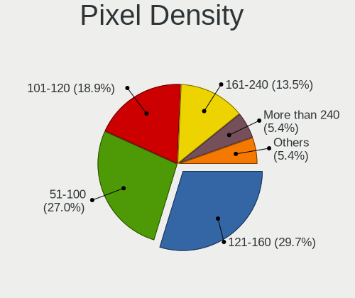

| Density       | Computers | Percent |
|---------------|-----------|---------|
| 121-160       | 11        | 29.73%  |
| 51-100        | 10        | 27.03%  |
| 101-120       | 7         | 18.92%  |
| 161-240       | 5         | 13.51%  |
| More than 240 | 2         | 5.41%   |
| Unknown       | 2         | 5.41%   |

Multiple Monitors
-----------------

Total monitors connected

| Total | Computers | Percent |
|-------|-----------|---------|
| 1     | 30        | 83.33%  |
| 2     | 5         | 13.89%  |
| 0     | 1         | 2.78%   |

Network
-------

Net Controller Vendor
---------------------

Controller vendors

| Vendor                | Computers | Percent |
|-----------------------|-----------|---------|
| Realtek Semiconductor | 19        | 31.67%  |
| Intel                 | 19        | 31.67%  |
| Qualcomm Atheros      | 7         | 11.67%  |
| OPPO Electronics      | 3         | 5%      |
| Ralink                | 2         | 3.33%   |
| MediaTek              | 2         | 3.33%   |
| Xiaomi                | 1         | 1.67%   |
| Ralink Technology     | 1         | 1.67%   |
| Qualcomm              | 1         | 1.67%   |
| NetGear               | 1         | 1.67%   |
| Mercucys              | 1         | 1.67%   |
| Google                | 1         | 1.67%   |
| Broadcom Limited      | 1         | 1.67%   |
| Broadcom              | 1         | 1.67%   |

Net Controller Model
--------------------

Controller models

| Model                                                                                         | Computers | Percent |
|-----------------------------------------------------------------------------------------------|-----------|---------|
| Realtek RTL8111/8168/8411 PCI Express Gigabit Ethernet Controller                             | 10        | 13.89%  |
| Intel Alder Lake-P PCH CNVi WiFi                                                              | 6         | 8.33%   |
| Intel Wi-Fi 6 AX201                                                                           | 3         | 4.17%   |
| Intel Ethernet Connection (16) I219-V                                                         | 3         | 4.17%   |
| Realtek RTL8153 Gigabit Ethernet Adapter                                                      | 2         | 2.78%   |
| Realtek RTL810xE PCI Express Fast Ethernet controller                                         | 2         | 2.78%   |
| OPPO WAIPIO-MTP _SN:AC53F926                                                                  | 2         | 2.78%   |
| Intel Wireless 8265 / 8275                                                                    | 2         | 2.78%   |
| Intel 82579LM Gigabit Network Connection (Lewisville)                                         | 2         | 2.78%   |
| Xiaomi Mi/Redmi series (RNDIS + ADB)                                                          | 1         | 1.39%   |
| Realtek RTL8852AE 802.11ax PCIe Wireless Network Adapter                                      | 1         | 1.39%   |
| Realtek RTL8821CE 802.11ac PCIe Wireless Network Adapter                                      | 1         | 1.39%   |
| Realtek RTL8812AE 802.11ac PCIe Wireless Network Adapter                                      | 1         | 1.39%   |
| Realtek RTL8192EU 802.11b/g/n WLAN Adapter                                                    | 1         | 1.39%   |
| Realtek RTL8188FTV 802.11b/g/n 1T1R 2.4G WLAN Adapter                                         | 1         | 1.39%   |
| Realtek RTL8125 2.5GbE Controller                                                             | 1         | 1.39%   |
| Realtek Realtek 8812AU/8821AU 802.11ac WLAN Adapter [USB Wireless Dual-Band Adapter 2.4/5Ghz] | 1         | 1.39%   |
| Ralink MT7601U Wireless Adapter                                                               | 1         | 1.39%   |
| Ralink RT5390 Wireless 802.11n 1T/1R PCIe                                                     | 1         | 1.39%   |
| Ralink RT3290 Wireless 802.11n 1T/1R PCIe                                                     | 1         | 1.39%   |
| Qualcomm Fairphone 4 5G                                                                       | 1         | 1.39%   |
| Qualcomm Atheros QCA9565 / AR9565 Wireless Network Adapter                                    | 1         | 1.39%   |
| Qualcomm Atheros QCA9377 802.11ac Wireless Network Adapter                                    | 1         | 1.39%   |
| Qualcomm Atheros QCA6174 802.11ac Wireless Network Adapter                                    | 1         | 1.39%   |
| Qualcomm Atheros Killer E2500 Gigabit Ethernet Controller                                     | 1         | 1.39%   |
| Qualcomm Atheros Killer E220x Gigabit Ethernet Controller                                     | 1         | 1.39%   |
| Qualcomm Atheros AR9485 Wireless Network Adapter                                              | 1         | 1.39%   |
| Qualcomm Atheros AR9285 Wireless Network Adapter (PCI-Express)                                | 1         | 1.39%   |
| Qualcomm Atheros AR8131 Gigabit Ethernet                                                      | 1         | 1.39%   |
| OPPO RMX3623                                                                                  | 1         | 1.39%   |
| NetGear A6210                                                                                 | 1         | 1.39%   |
| Mercucys 802.11n NIC                                                                          | 1         | 1.39%   |
| MediaTek MT7922 802.11ax PCI Express Wireless Network Adapter                                 | 1         | 1.39%   |
| MediaTek MT7921 802.11ax PCI Express Wireless Network Adapter                                 | 1         | 1.39%   |
| Intel Wireless 8260                                                                           | 1         | 1.39%   |
| Intel Wireless 7265                                                                           | 1         | 1.39%   |
| Intel Wi-Fi 6 AX200                                                                           | 1         | 1.39%   |
| Intel I211 Gigabit Network Connection                                                         | 1         | 1.39%   |
| Intel Ethernet Connection I219-V                                                              | 1         | 1.39%   |
| Intel Ethernet Connection (7) I219-LM                                                         | 1         | 1.39%   |

Wireless Vendor
---------------

Wireless vendors

| Vendor                | Computers | Percent |
|-----------------------|-----------|---------|
| Intel                 | 17        | 45.95%  |
| Realtek Semiconductor | 6         | 16.22%  |
| Qualcomm Atheros      | 5         | 13.51%  |
| Ralink                | 2         | 5.41%   |
| MediaTek              | 2         | 5.41%   |
| Ralink Technology     | 1         | 2.7%    |
| NetGear               | 1         | 2.7%    |
| Mercucys              | 1         | 2.7%    |
| Broadcom Limited      | 1         | 2.7%    |
| Broadcom              | 1         | 2.7%    |

Wireless Model
--------------

Wireless models

| Model                                                                                         | Computers | Percent |
|-----------------------------------------------------------------------------------------------|-----------|---------|
| Intel Alder Lake-P PCH CNVi WiFi                                                              | 6         | 16.22%  |
| Intel Wi-Fi 6 AX201                                                                           | 3         | 8.11%   |
| Intel Wireless 8265 / 8275                                                                    | 2         | 5.41%   |
| Realtek RTL8852AE 802.11ax PCIe Wireless Network Adapter                                      | 1         | 2.7%    |
| Realtek RTL8821CE 802.11ac PCIe Wireless Network Adapter                                      | 1         | 2.7%    |
| Realtek RTL8812AE 802.11ac PCIe Wireless Network Adapter                                      | 1         | 2.7%    |
| Realtek RTL8192EU 802.11b/g/n WLAN Adapter                                                    | 1         | 2.7%    |
| Realtek RTL8188FTV 802.11b/g/n 1T1R 2.4G WLAN Adapter                                         | 1         | 2.7%    |
| Realtek Realtek 8812AU/8821AU 802.11ac WLAN Adapter [USB Wireless Dual-Band Adapter 2.4/5Ghz] | 1         | 2.7%    |
| Ralink MT7601U Wireless Adapter                                                               | 1         | 2.7%    |
| Ralink RT5390 Wireless 802.11n 1T/1R PCIe                                                     | 1         | 2.7%    |
| Ralink RT3290 Wireless 802.11n 1T/1R PCIe                                                     | 1         | 2.7%    |
| Qualcomm Atheros QCA9565 / AR9565 Wireless Network Adapter                                    | 1         | 2.7%    |
| Qualcomm Atheros QCA9377 802.11ac Wireless Network Adapter                                    | 1         | 2.7%    |
| Qualcomm Atheros QCA6174 802.11ac Wireless Network Adapter                                    | 1         | 2.7%    |
| Qualcomm Atheros AR9485 Wireless Network Adapter                                              | 1         | 2.7%    |
| Qualcomm Atheros AR9285 Wireless Network Adapter (PCI-Express)                                | 1         | 2.7%    |
| NetGear A6210                                                                                 | 1         | 2.7%    |
| Mercucys 802.11n NIC                                                                          | 1         | 2.7%    |
| MediaTek MT7922 802.11ax PCI Express Wireless Network Adapter                                 | 1         | 2.7%    |
| MediaTek MT7921 802.11ax PCI Express Wireless Network Adapter                                 | 1         | 2.7%    |
| Intel Wireless 8260                                                                           | 1         | 2.7%    |
| Intel Wireless 7265                                                                           | 1         | 2.7%    |
| Intel Wi-Fi 6 AX200                                                                           | 1         | 2.7%    |
| Intel Centrino Wireless-N 1000 [Condor Peak]                                                  | 1         | 2.7%    |
| Intel Centrino Advanced-N 6235                                                                | 1         | 2.7%    |
| Intel Centrino Advanced-N 6205 [Taylor Peak]                                                  | 1         | 2.7%    |
| Broadcom Limited BCM4313 802.11bgn Wireless Network Adapter                                   | 1         | 2.7%    |
| Broadcom BCM4364 802.11ac Wireless Network Adapter                                            | 1         | 2.7%    |

Ethernet Vendor
---------------

Ethernet vendors

| Vendor                | Computers | Percent |
|-----------------------|-----------|---------|
| Realtek Semiconductor | 15        | 42.86%  |
| Intel                 | 10        | 28.57%  |
| Qualcomm Atheros      | 3         | 8.57%   |
| OPPO Electronics      | 3         | 8.57%   |
| Xiaomi                | 1         | 2.86%   |
| Qualcomm              | 1         | 2.86%   |
| Google                | 1         | 2.86%   |
| Broadcom              | 1         | 2.86%   |

Ethernet Model
--------------

Ethernet models

| Model                                                             | Computers | Percent |
|-------------------------------------------------------------------|-----------|---------|
| Realtek RTL8111/8168/8411 PCI Express Gigabit Ethernet Controller | 10        | 28.57%  |
| Intel Ethernet Connection (16) I219-V                             | 3         | 8.57%   |
| Realtek RTL8153 Gigabit Ethernet Adapter                          | 2         | 5.71%   |
| Realtek RTL810xE PCI Express Fast Ethernet controller             | 2         | 5.71%   |
| OPPO WAIPIO-MTP _SN:AC53F926                                      | 2         | 5.71%   |
| Intel 82579LM Gigabit Network Connection (Lewisville)             | 2         | 5.71%   |
| Xiaomi Mi/Redmi series (RNDIS + ADB)                              | 1         | 2.86%   |
| Realtek RTL8125 2.5GbE Controller                                 | 1         | 2.86%   |
| Qualcomm Fairphone 4 5G                                           | 1         | 2.86%   |
| Qualcomm Atheros Killer E2500 Gigabit Ethernet Controller         | 1         | 2.86%   |
| Qualcomm Atheros Killer E220x Gigabit Ethernet Controller         | 1         | 2.86%   |
| Qualcomm Atheros AR8131 Gigabit Ethernet                          | 1         | 2.86%   |
| OPPO RMX3623                                                      | 1         | 2.86%   |
| Intel I211 Gigabit Network Connection                             | 1         | 2.86%   |
| Intel Ethernet Connection I219-V                                  | 1         | 2.86%   |
| Intel Ethernet Connection (7) I219-LM                             | 1         | 2.86%   |
| Intel Ethernet Connection (4) I219-LM                             | 1         | 2.86%   |
| Intel Ethernet Connection (11) I219-V                             | 1         | 2.86%   |
| Google Pixel 7 Pro                                                | 1         | 2.86%   |
| Broadcom NetXtreme BCM57766 Gigabit Ethernet PCIe                 | 1         | 2.86%   |

Net Controller Kind
-------------------

Ethernet, WiFi or modem

| Kind     | Computers | Percent |
|----------|-----------|---------|
| WiFi     | 34        | 52.31%  |
| Ethernet | 31        | 47.69%  |

Used Controller
---------------

Currently used network controller

| Kind     | Computers | Percent |
|----------|-----------|---------|
| WiFi     | 21        | 61.76%  |
| Ethernet | 13        | 38.24%  |

NICs
----

Total network controllers on board

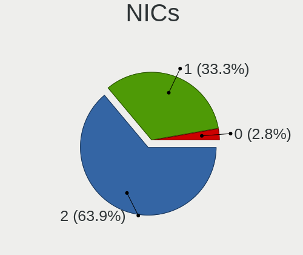

| Total | Computers | Percent |
|-------|-----------|---------|
| 2     | 23        | 63.89%  |
| 1     | 12        | 33.33%  |
| 0     | 1         | 2.78%   |

IPv6
----

IPv6 vs IPv4

| Used | Computers | Percent |
|------|-----------|---------|
| No   | 29        | 80.56%  |
| Yes  | 7         | 19.44%  |

Bluetooth
---------

Bluetooth Vendor
----------------

Controller vendors

| Vendor                          | Computers | Percent |
|---------------------------------|-----------|---------|
| Intel                           | 12        | 57.14%  |
| Qualcomm Atheros Communications | 2         | 9.52%   |
| IMC Networks                    | 2         | 9.52%   |
| Realtek Semiconductor           | 1         | 4.76%   |
| Ralink                          | 1         | 4.76%   |
| Lite-On Technology              | 1         | 4.76%   |
| Foxconn / Hon Hai               | 1         | 4.76%   |
| Broadcom                        | 1         | 4.76%   |

Bluetooth Model
---------------

Controller models

| Model                                          | Computers | Percent |
|------------------------------------------------|-----------|---------|
| Intel Bluetooth wireless interface             | 4         | 19.05%  |
| Intel AX201 Bluetooth                          | 4         | 19.05%  |
| Realtek Bluetooth Radio                        | 1         | 4.76%   |
| Ralink RT3290 Bluetooth                        | 1         | 4.76%   |
| Qualcomm Atheros  Bluetooth Device             | 1         | 4.76%   |
| Qualcomm Atheros AR9462 Bluetooth              | 1         | 4.76%   |
| Lite-On Qualcomm Atheros QCA9377 Bluetooth     | 1         | 4.76%   |
| Intel Centrino Bluetooth Wireless Transceiver  | 1         | 4.76%   |
| Intel Bluetooth Device                         | 1         | 4.76%   |
| Intel Bluetooth 9460/9560 Jefferson Peak (JfP) | 1         | 4.76%   |
| Intel AX200 Bluetooth                          | 1         | 4.76%   |
| IMC Networks Wireless_Device                   | 1         | 4.76%   |
| IMC Networks Bluetooth Radio                   | 1         | 4.76%   |
| Foxconn / Hon Hai MediaTek Bluetooth Adapter   | 1         | 4.76%   |
| Broadcom BCM20702 Bluetooth 4.0 [ThinkPad]     | 1         | 4.76%   |

Sound
-----

Sound Vendor
------------

Sound card vendors

| Vendor | Computers | Percent |
|--------|-----------|---------|
| Intel  | 27        | 62.79%  |
| AMD    | 9         | 20.93%  |
| Nvidia | 7         | 16.28%  |

Sound Model
-----------

Sound card models

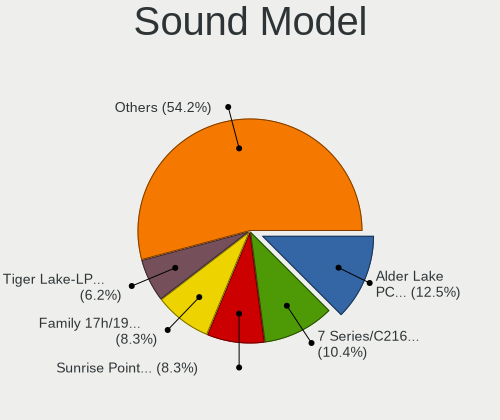

| Model                                                                             | Computers | Percent |
|-----------------------------------------------------------------------------------|-----------|---------|
| Intel Alder Lake PCH-P High Definition Audio Controller                           | 6         | 12.5%   |
| Intel 7 Series/C216 Chipset Family High Definition Audio Controller               | 5         | 10.42%  |
| Intel Sunrise Point-LP HD Audio                                                   | 4         | 8.33%   |
| AMD Family 17h/19h HD Audio Controller                                            | 4         | 8.33%   |
| Intel Tiger Lake-LP Smart Sound Technology Audio Controller                       | 3         | 6.25%   |
| Intel Cannon Lake PCH cAVS                                                        | 3         | 6.25%   |
| Intel 6 Series/C200 Series Chipset Family High Definition Audio Controller        | 3         | 6.25%   |
| Nvidia TU116 High Definition Audio Controller                                     | 2         | 4.17%   |
| Nvidia GA106 High Definition Audio Controller                                     | 2         | 4.17%   |
| AMD Renoir Radeon High Definition Audio Controller                                | 2         | 4.17%   |
| Nvidia GP104 High Definition Audio Controller                                     | 1         | 2.08%   |
| Nvidia GA104 High Definition Audio Controller                                     | 1         | 2.08%   |
| Nvidia Audio device                                                               | 1         | 2.08%   |
| Intel Xeon E3-1200 v3/4th Gen Core Processor HD Audio Controller                  | 1         | 2.08%   |
| Intel Tiger Lake-H HD Audio Controller                                            | 1         | 2.08%   |
| Intel Smart Sound Technology (SST) Audio Controller                               | 1         | 2.08%   |
| Intel 9 Series Chipset Family HD Audio Controller                                 | 1         | 2.08%   |
| AMD Starship/Matisse HD Audio Controller                                          | 1         | 2.08%   |
| AMD SBx00 Azalia (Intel HDA)                                                      | 1         | 2.08%   |
| AMD Raven/Raven2/Fenghuang HDMI/DP Audio Controller                               | 1         | 2.08%   |
| AMD FCH Azalia Controller                                                         | 1         | 2.08%   |
| AMD Family 17h (Models 00h-0fh) HD Audio Controller                               | 1         | 2.08%   |
| AMD Caicos HDMI Audio [Radeon HD 6450 / 7450/8450/8490 OEM / R5 230/235/235X OEM] | 1         | 2.08%   |
| AMD Baffin HDMI/DP Audio [Radeon RX 550 640SP / RX 560/560X]                      | 1         | 2.08%   |

Memory
------

Memory Vendor
-------------

Memory module vendors

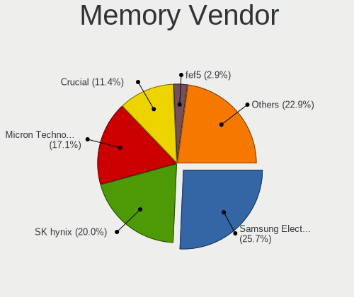

| Vendor              | Computers | Percent |
|---------------------|-----------|---------|
| Samsung Electronics | 9         | 25.71%  |
| SK hynix            | 7         | 20%     |
| Micron Technology   | 6         | 17.14%  |
| Crucial             | 4         | 11.43%  |
| Smart               | 1         | 2.86%   |
| Ramos Technology    | 1         | 2.86%   |
| PNY                 | 1         | 2.86%   |
| Patriot             | 1         | 2.86%   |
| Kingston            | 1         | 2.86%   |
| fef5                | 1         | 2.86%   |
| Elpida              | 1         | 2.86%   |
| A-DATA Technology   | 1         | 2.86%   |
| Unknown             | 1         | 2.86%   |

Memory Model
------------

Memory module models

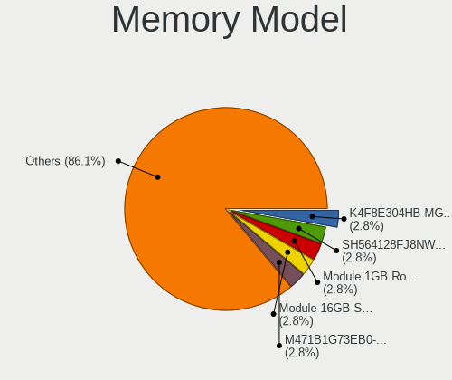

| Model                                                        | Computers | Percent |
|--------------------------------------------------------------|-----------|---------|
| Smart RAM SH564128FJ8NWRNSQG 4GB SODIMM DDR3 1600MT/s        | 1         | 2.78%   |
| SK hynix RAM Module 32GB SODIMM DDR4 3200MT/s                | 1         | 2.78%   |
| SK hynix RAM HMT451S6AFR8A-PB 4GB SODIMM DDR3 1600MT/s       | 1         | 2.78%   |
| SK hynix RAM HMT41GS6BFR8A-PB 8GB SODIMM DDR3 1600MT/s       | 1         | 2.78%   |
| SK hynix RAM HMCG78MEBSA092N 16GB SODIMM DDR5 4800MT/s       | 1         | 2.78%   |
| SK hynix RAM HMAB2GS6CMR6N-XN 16GB SODIMM DDR4 3200MT/s      | 1         | 2.78%   |
| SK hynix RAM HMA851S6JJR6N-VK 4GB SODIMM DDR4 2667MT/s       | 1         | 2.78%   |
| SK hynix RAM HMA41GS6AFR8N-TF 8GB SODIMM DDR4 2667MT/s       | 1         | 2.78%   |
| Samsung RAM Module 1GB Row Of Chips LPDDR4 3733MT/s          | 1         | 2.78%   |
| Samsung RAM Module 16GB SODIMM 4800MT/s                      | 1         | 2.78%   |
| Samsung RAM M471B1G73EB0-YK0 8GB SODIMM DDR3 1600MT/s        | 1         | 2.78%   |
| Samsung RAM M471A5143DB0-CPB 4GB SODIMM DDR4 2133MT/s        | 1         | 2.78%   |
| Samsung RAM M471A1K43EB1-CWE 8GB SODIMM DDR4 3200MT/s        | 1         | 2.78%   |
| Samsung RAM M471A1K43DB1-CTD 8GB SODIMM DDR4 2667MT/s        | 1         | 2.78%   |
| Samsung RAM M471A1K43CB1-CRC 8GB SODIMM DDR4 2667MT/s        | 1         | 2.78%   |
| Samsung RAM M471A1G44BB0-CWE 8GB SODIMM DDR4 3200MT/s        | 1         | 2.78%   |
| Samsung RAM K4UBE3D4AA-MGCR 8GB SODIMM LPDDR4 4266MT/s       | 1         | 2.78%   |
| Samsung RAM K4F8E304HB-MGCJ 1GB LPDDR4 2400MT/s              | 1         | 2.78%   |
| Ramos RAM EMB2GB481CL4-13HA 2GB DIMM 1227MT/s                | 1         | 2.78%   |
| PNY RAM 8GBF1X08QFHH38-135-K 8GB DIMM DDR4 3600MT/s          | 1         | 2.78%   |
| Patriot RAM 3200 C16 Series 16GB DIMM DDR4 3600MT/s          | 1         | 2.78%   |
| Micron RAM MT40A1G16RC-062E:B 8GB SODIMM DDR4 3200MT/s       | 1         | 2.78%   |
| Micron RAM MT40A1G16RC-062E:B 8GB Row Of Chips DDR4 3200MT/s | 1         | 2.78%   |
| Micron RAM 4ATF51264HZ-2G6E3 4GB SODIMM DDR4 2667MT/s        | 1         | 2.78%   |
| Micron RAM 4ATF51264HZ-2G3E1 4GB SODIMM DDR4 2667MT/s        | 1         | 2.78%   |
| Micron RAM 4ATF51264HZ-2G3B1 4096MB SODIMM DDR4 3200MT/s     | 1         | 2.78%   |
| Micron RAM 16ATF2G64HZ-2G6E1 16GB SODIMM DDR4 2667MT/s       | 1         | 2.78%   |
| Kingston RAM 9905428-086.A00LF 4GB SODIMM DDR3 1600MT/s      | 1         | 2.78%   |
| fef5 RAM K4F8E304HB-MGCJ 1GB 2400MT/s                        | 1         | 2.78%   |
| Elpida RAM EBJ21UE8BFU0-DJ-F 2GB SODIMM DDR3 1334MT/s        | 1         | 2.78%   |
| Crucial RAM RM25664BA1339.8FR 2GB DIMM DDR3 1333MT/s         | 1         | 2.78%   |
| Crucial RAM CT8G4SFS832A.M8FRS 8GB SODIMM DDR4 3200MT/s      | 1         | 2.78%   |
| Crucial RAM CT32G4SFD832A.C16FF 32GB SODIMM DDR4 3200MT/s    | 1         | 2.78%   |
| Crucial RAM BLS16G4D32AESC.M16FE 16GB DIMM DDR4 3200MT/s     | 1         | 2.78%   |
| A-DATA RAM Module 16GB SODIMM DDR4 3200MT/s                  | 1         | 2.78%   |
| Unknown                                                      | 1         | 2.78%   |

Memory Kind
-----------

Memory module kinds

| Kind    | Computers | Percent |
|---------|-----------|---------|
| DDR4    | 17        | 56.67%  |
| DDR3    | 6         | 20%     |
| LPDDR4  | 3         | 10%     |
| Unknown | 3         | 10%     |
| DDR5    | 1         | 3.33%   |

Memory Form Factor
------------------

Physical design of the memory module

| Name         | Computers | Percent |
|--------------|-----------|---------|
| SODIMM       | 20        | 71.43%  |
| DIMM         | 5         | 17.86%  |
| Row Of Chips | 2         | 7.14%   |
| Unknown      | 1         | 3.57%   |

Memory Size
-----------

Memory module size

| Size  | Computers | Percent |
|-------|-----------|---------|
| 8192  | 10        | 31.25%  |
| 4096  | 7         | 21.88%  |
| 16384 | 6         | 18.75%  |
| 32768 | 4         | 12.5%   |
| 2048  | 3         | 9.38%   |
| 1024  | 2         | 6.25%   |

Memory Speed
------------

Memory module speed

| Speed | Computers | Percent |
|-------|-----------|---------|
| 3200  | 10        | 32.26%  |
| 2667  | 6         | 19.35%  |
| 1600  | 4         | 12.9%   |
| 4800  | 2         | 6.45%   |
| 3600  | 2         | 6.45%   |
| 4266  | 1         | 3.23%   |
| 3733  | 1         | 3.23%   |
| 2400  | 1         | 3.23%   |
| 2133  | 1         | 3.23%   |
| 1334  | 1         | 3.23%   |
| 1333  | 1         | 3.23%   |
| 1227  | 1         | 3.23%   |

Printers & scanners
-------------------

Printer Vendor
--------------

Printer device vendors

Zero info for selected period =(

Printer Model
-------------

Printer device models

Zero info for selected period =(

Scanner Vendor
--------------

Scanner device vendors

Zero info for selected period =(

Scanner Model
-------------

Scanner device models

Zero info for selected period =(

Camera
------

Camera Vendor
-------------

Camera device vendors

| Vendor                        | Computers | Percent |
|-------------------------------|-----------|---------|
| Chicony Electronics           | 8         | 28.57%  |
| IMC Networks                  | 4         | 14.29%  |
| Sunplus Innovation Technology | 3         | 10.71%  |
| Realtek Semiconductor         | 3         | 10.71%  |
| Bison Electronics             | 2         | 7.14%   |
| Tobii Technology AB           | 1         | 3.57%   |
| Syntek                        | 1         | 3.57%   |
| Sonix Technology              | 1         | 3.57%   |
| Quanta                        | 1         | 3.57%   |
| Primax Electronics            | 1         | 3.57%   |
| Microdia                      | 1         | 3.57%   |
| Luxvisions Innotech Limited   | 1         | 3.57%   |
| Apple                         | 1         | 3.57%   |

Camera Model
------------

Camera device models

| Model                                                                 | Computers | Percent |
|-----------------------------------------------------------------------|-----------|---------|
| Chicony Integrated Camera                                             | 4         | 14.29%  |
| IMC Networks USB2.0 HD UVC WebCam                                     | 2         | 7.14%   |
| Tobii AB Eyechip                                                      | 1         | 3.57%   |
| Syntek Integrated Camera                                              | 1         | 3.57%   |
| Sunplus TOSHIBA Web Camera - HD                                       | 1         | 3.57%   |
| Sunplus Laptop Integrated Webcam FHD                                  | 1         | 3.57%   |
| Sunplus FHD Camera Microphone                                         | 1         | 3.57%   |
| Sonix USB2.0 FHD UVC WebCam                                           | 1         | 3.57%   |
| Realtek Laptop_Integrated_Webcam_HD                                   | 1         | 3.57%   |
| Realtek Integrated Webcam_HD                                          | 1         | 3.57%   |
| Realtek HD WebCam                                                     | 1         | 3.57%   |
| Quanta HD User Facing                                                 | 1         | 3.57%   |
| Primax HP HD Webcam [Fixed]                                           | 1         | 3.57%   |
| Microdia Laptop_Integrated_Webcam_7645BB9590586C77DC683CD9114697FF.3M | 1         | 3.57%   |
| Luxvisions Innotech Limited Integrated RGB Camera                     | 1         | 3.57%   |
| IMC Networks VGA UVC WebCam                                           | 1         | 3.57%   |
| IMC Networks Integrated Camera                                        | 1         | 3.57%   |
| Chicony HP Truevision HD                                              | 1         | 3.57%   |
| Chicony HP High Definition 1MP Webcam                                 | 1         | 3.57%   |
| Chicony HP HD Camera                                                  | 1         | 3.57%   |
| Chicony HP 5MP Camera                                                 | 1         | 3.57%   |
| Bison Integrated Camera                                               | 1         | 3.57%   |
| Bison HD Webcam                                                       | 1         | 3.57%   |
| Apple FaceTime HD Camera (Built-in)                                   | 1         | 3.57%   |

Security
--------

Fingerprint Vendor
------------------

Fingerprint sensor vendors

| Vendor    | Computers | Percent |
|-----------|-----------|---------|
| Synaptics | 4         | 66.67%  |
| Upek      | 1         | 16.67%  |
| AuthenTec | 1         | 16.67%  |

Fingerprint Model
-----------------

Fingerprint sensor models

| Model                                                    | Computers | Percent |
|----------------------------------------------------------|-----------|---------|
| Synaptics FS7604 Touch Fingerprint Sensor with PurePrint | 2         | 33.33%  |
| Upek Biometric Touchchip/Touchstrip Fingerprint Sensor   | 1         | 16.67%  |
| Synaptics UWP WBDI Device                                | 1         | 16.67%  |
| Synaptics Prometheus MIS Touch Fingerprint Reader        | 1         | 16.67%  |
| AuthenTec Fingerprint Sensor                             | 1         | 16.67%  |

Chipcard Vendor
---------------

Chipcard module vendors

| Vendor      | Computers | Percent |
|-------------|-----------|---------|
| Upek        | 1         | 50%     |
| Alcor Micro | 1         | 50%     |

Chipcard Model
--------------

Chipcard module models

| Model                                                      | Computers | Percent |
|------------------------------------------------------------|-----------|---------|
| Upek TouchChip Fingerprint Coprocessor (WBF advanced mode) | 1         | 50%     |
| Alcor Micro AU9540 Smartcard Reader                        | 1         | 50%     |

Unsupported
-----------

Unsupported Devices
-------------------

Total unsupported devices on board

| Total | Computers | Percent |
|-------|-----------|---------|
| 0     | 23        | 63.89%  |
| 1     | 11        | 30.56%  |
| 2     | 2         | 5.56%   |

Unsupported Device Types
------------------------

Types of unsupported devices

| Type               | Computers | Percent |
|--------------------|-----------|---------|
| Fingerprint reader | 6         | 40%     |
| Net/wireless       | 3         | 20%     |
| Net/ethernet       | 2         | 13.33%  |
| Chipcard           | 2         | 13.33%  |
| Graphics card      | 1         | 6.67%   |
| Bluetooth          | 1         | 6.67%   |

