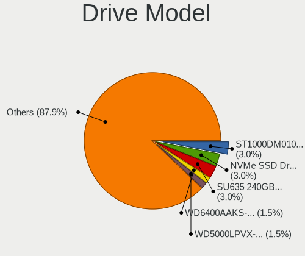
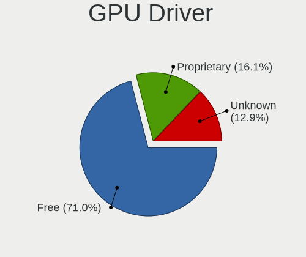
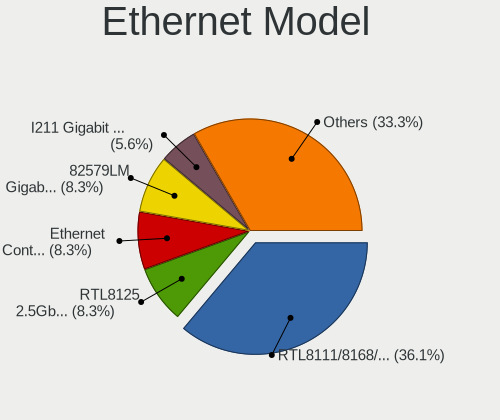
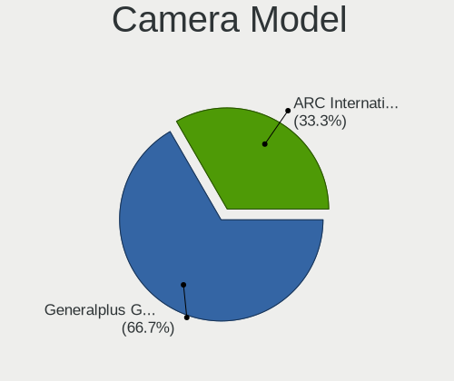

Parrot 5.3 - Tested Hardware & Statistics (Desktops)
----------------------------------------------------

A project to collect tested hardware configurations for Parrot 5.3.

Anyone can contribute to this report by the [hw-probe](https://github.com/linuxhw/hw-probe) tool:

    sudo -E hw-probe -all -upload

Please contribute! Especially if your hardware is rare.

Contents
--------

* [ Test Cases ](#test-cases)

* [ System ](#system)
  - [ Kernel                   ](#kernel)
  - [ Kernel Family            ](#kernel-family)
  - [ Kernel Major Ver.        ](#kernel-major-ver)
  - [ Arch                     ](#arch)
  - [ DE                       ](#de)
  - [ Display Server           ](#display-server)
  - [ Display Manager          ](#display-manager)
  - [ OS Lang                  ](#os-lang)
  - [ Boot Mode                ](#boot-mode)
  - [ Filesystem               ](#filesystem)
  - [ Part. scheme             ](#part-scheme)
  - [ Dual Boot with Linux/BSD ](#dual-boot-with-linuxbsd)
  - [ Dual Boot (Win)          ](#dual-boot-win)

* [ Board ](#board)
  - [ Vendor                   ](#vendor)
  - [ Model                    ](#model)
  - [ Model Family             ](#model-family)
  - [ MFG Year                 ](#mfg-year)
  - [ Form Factor              ](#form-factor)
  - [ Secure Boot              ](#secure-boot)
  - [ Coreboot                 ](#coreboot)
  - [ RAM Size                 ](#ram-size)
  - [ RAM Used                 ](#ram-used)
  - [ Total Drives             ](#total-drives)
  - [ Has CD-ROM               ](#has-cd-rom)
  - [ Has Ethernet             ](#has-ethernet)
  - [ Has WiFi                 ](#has-wifi)
  - [ Has Bluetooth            ](#has-bluetooth)

* [ Location ](#location)
  - [ Country                  ](#country)
  - [ City                     ](#city)

* [ Drives ](#drives)
  - [ Drive Vendor             ](#drive-vendor)
  - [ Drive Model              ](#drive-model)
  - [ HDD Vendor               ](#hdd-vendor)
  - [ SSD Vendor               ](#ssd-vendor)
  - [ Drive Kind               ](#drive-kind)
  - [ Drive Connector          ](#drive-connector)
  - [ Drive Size               ](#drive-size)
  - [ Space Total              ](#space-total)
  - [ Space Used               ](#space-used)
  - [ Malfunc. Drives          ](#malfunc-drives)
  - [ Malfunc. Drive Vendor    ](#malfunc-drive-vendor)
  - [ Malfunc. HDD Vendor      ](#malfunc-hdd-vendor)
  - [ Malfunc. Drive Kind      ](#malfunc-drive-kind)
  - [ Failed Drives            ](#failed-drives)
  - [ Failed Drive Vendor      ](#failed-drive-vendor)
  - [ Drive Status             ](#drive-status)

* [ Storage controller ](#storage-controller)
  - [ Storage Vendor           ](#storage-vendor)
  - [ Storage Model            ](#storage-model)
  - [ Storage Kind             ](#storage-kind)

* [ Processor ](#processor)
  - [ CPU Vendor               ](#cpu-vendor)
  - [ CPU Model                ](#cpu-model)
  - [ CPU Model Family         ](#cpu-model-family)
  - [ CPU Cores                ](#cpu-cores)
  - [ CPU Sockets              ](#cpu-sockets)
  - [ CPU Threads              ](#cpu-threads)
  - [ CPU Op-Modes             ](#cpu-op-modes)
  - [ CPU Microcode            ](#cpu-microcode)
  - [ CPU Microarch            ](#cpu-microarch)

* [ Graphics ](#graphics)
  - [ GPU Vendor               ](#gpu-vendor)
  - [ GPU Model                ](#gpu-model)
  - [ GPU Combo                ](#gpu-combo)
  - [ GPU Driver               ](#gpu-driver)
  - [ GPU Memory               ](#gpu-memory)

* [ Monitor ](#monitor)
  - [ Monitor Vendor           ](#monitor-vendor)
  - [ Monitor Model            ](#monitor-model)
  - [ Monitor Resolution       ](#monitor-resolution)
  - [ Monitor Diagonal         ](#monitor-diagonal)
  - [ Monitor Width            ](#monitor-width)
  - [ Aspect Ratio             ](#aspect-ratio)
  - [ Monitor Area             ](#monitor-area)
  - [ Pixel Density            ](#pixel-density)
  - [ Multiple Monitors        ](#multiple-monitors)

* [ Network ](#network)
  - [ Net Controller Vendor    ](#net-controller-vendor)
  - [ Net Controller Model     ](#net-controller-model)
  - [ Wireless Vendor          ](#wireless-vendor)
  - [ Wireless Model           ](#wireless-model)
  - [ Ethernet Vendor          ](#ethernet-vendor)
  - [ Ethernet Model           ](#ethernet-model)
  - [ Net Controller Kind      ](#net-controller-kind)
  - [ Used Controller          ](#used-controller)
  - [ NICs                     ](#nics)
  - [ IPv6                     ](#ipv6)

* [ Bluetooth ](#bluetooth)
  - [ Bluetooth Vendor         ](#bluetooth-vendor)
  - [ Bluetooth Model          ](#bluetooth-model)

* [ Sound ](#sound)
  - [ Sound Vendor             ](#sound-vendor)
  - [ Sound Model              ](#sound-model)

* [ Memory ](#memory)
  - [ Memory Vendor            ](#memory-vendor)
  - [ Memory Model             ](#memory-model)
  - [ Memory Kind              ](#memory-kind)
  - [ Memory Form Factor       ](#memory-form-factor)
  - [ Memory Size              ](#memory-size)
  - [ Memory Speed             ](#memory-speed)

* [ Printers & scanners ](#printers--scanners)
  - [ Printer Vendor           ](#printer-vendor)
  - [ Printer Model            ](#printer-model)
  - [ Scanner Vendor           ](#scanner-vendor)
  - [ Scanner Model            ](#scanner-model)

* [ Camera ](#camera)
  - [ Camera Vendor            ](#camera-vendor)
  - [ Camera Model             ](#camera-model)

* [ Security ](#security)
  - [ Fingerprint Vendor       ](#fingerprint-vendor)
  - [ Fingerprint Model        ](#fingerprint-model)
  - [ Chipcard Vendor          ](#chipcard-vendor)
  - [ Chipcard Model           ](#chipcard-model)

* [ Unsupported ](#unsupported)
  - [ Unsupported Devices      ](#unsupported-devices)
  - [ Unsupported Device Types ](#unsupported-device-types)

Test Cases
----------

Total: 44

| Vendor        | Model                       | Probe                                                      | Date         |
|---------------|-----------------------------|------------------------------------------------------------|--------------|
| ASRock        | Z77M                        | [f3bd1cdf2c](https://linux-hardware.org/?probe=f3bd1cdf2c) | Jan 19, 2024 |
| ASRock        | 970 Pro3 R2.0               | [ca8734dc63](https://linux-hardware.org/?probe=ca8734dc63) | Jan 11, 2024 |
| MSI           | B550 GAMING GEN3            | [02163b04b7](https://linux-hardware.org/?probe=02163b04b7) | Dec 30, 2023 |
| Gigabyte      | B550M AORUS ELITE           | [404320e4d7](https://linux-hardware.org/?probe=404320e4d7) | Dec 28, 2023 |
| Dell          | 0V8WGR A00                  | [9b13411bc8](https://linux-hardware.org/?probe=9b13411bc8) | Nov 05, 2023 |
| ASUSTek       | M5A78L-M/USB3               | [4ce8997d5a](https://linux-hardware.org/?probe=4ce8997d5a) | Nov 05, 2023 |
| ASUSTek       | Maximus VII HERO            | [3c959b9af8](https://linux-hardware.org/?probe=3c959b9af8) | Oct 25, 2023 |
| ASUSTek       | Maximus VII HERO            | [e3540cf969](https://linux-hardware.org/?probe=e3540cf969) | Oct 23, 2023 |
| ASUSTek       | M5A99X EVO                  | [a13621c5d3](https://linux-hardware.org/?probe=a13621c5d3) | Oct 04, 2023 |
| ASUSTek       | M5A99X EVO                  | [144cbc70d0](https://linux-hardware.org/?probe=144cbc70d0) | Oct 03, 2023 |
| HP            | 8619                        | [d631850d2f](https://linux-hardware.org/?probe=d631850d2f) | Sep 28, 2023 |
| ASUSTek       | M5A99X EVO                  | [34e34036d7](https://linux-hardware.org/?probe=34e34036d7) | Sep 27, 2023 |
| HP            | 8714                        | [235d6bd11b](https://linux-hardware.org/?probe=235d6bd11b) | Sep 24, 2023 |
| ASUSTek       | Maximus V FORMULA           | [e10f21c5c5](https://linux-hardware.org/?probe=e10f21c5c5) | Sep 22, 2023 |
| ASUSTek       | M5A99X EVO                  | [648ac87a81](https://linux-hardware.org/?probe=648ac87a81) | Sep 21, 2023 |
| Shenzhen M... | F7BAA                       | [10d32d6284](https://linux-hardware.org/?probe=10d32d6284) | Sep 17, 2023 |
| Dell          | 0HD5W2 A01                  | [faf0bfe427](https://linux-hardware.org/?probe=faf0bfe427) | Sep 17, 2023 |
| Dell          | 0HD5W2 A01                  | [e59c5b4fda](https://linux-hardware.org/?probe=e59c5b4fda) | Sep 10, 2023 |
| ASUSTek       | Maximus V FORMULA           | [694ffed41f](https://linux-hardware.org/?probe=694ffed41f) | Sep 06, 2023 |
| ASUSTek       | Maximus V FORMULA           | [039aa353eb](https://linux-hardware.org/?probe=039aa353eb) | Sep 06, 2023 |
| Pegatron      | 2A94h                       | [e9816ab65b](https://linux-hardware.org/?probe=e9816ab65b) | Aug 19, 2023 |
| MSI           | 3666h                       | [d3f51a2bf0](https://linux-hardware.org/?probe=d3f51a2bf0) | Aug 15, 2023 |
| Dell          | 0100P6 A01                  | [2cf993001c](https://linux-hardware.org/?probe=2cf993001c) | Aug 13, 2023 |
| MSI           | MAG B550 TOMAHAWK           | [b76b1bf00a](https://linux-hardware.org/?probe=b76b1bf00a) | Aug 08, 2023 |
| MSI           | MAG B550 TOMAHAWK           | [63665fca24](https://linux-hardware.org/?probe=63665fca24) | Aug 08, 2023 |
| MSI           | PRO H610M-B DDR4            | [1b3c788790](https://linux-hardware.org/?probe=1b3c788790) | Aug 06, 2023 |
| ASUSTek       | PRIME X570-P                | [48ec623298](https://linux-hardware.org/?probe=48ec623298) | Aug 06, 2023 |
| ASUSTek       | TUF Gaming B660-PLUS WIF... | [7979e7ce95](https://linux-hardware.org/?probe=7979e7ce95) | Aug 05, 2023 |
| Dell          | 0RY007                      | [8317045335](https://linux-hardware.org/?probe=8317045335) | Aug 01, 2023 |
| MSI           | PRO Z790-P WIFI             | [b4d959d91f](https://linux-hardware.org/?probe=b4d959d91f) | Jul 02, 2023 |
| ASUSTek       | Maximus V FORMULA           | [190d408bc2](https://linux-hardware.org/?probe=190d408bc2) | Jun 23, 2023 |
| ASUSTek       | Maximus V FORMULA           | [fa49028492](https://linux-hardware.org/?probe=fa49028492) | Jun 23, 2023 |
| MSI           | B450 GAMING PRO CARBON A... | [11161fa30c](https://linux-hardware.org/?probe=11161fa30c) | Jun 18, 2023 |
| HP            | 339A                        | [d1fa07d03f](https://linux-hardware.org/?probe=d1fa07d03f) | Jun 10, 2023 |
| HP            | 339A                        | [f2147ed11b](https://linux-hardware.org/?probe=f2147ed11b) | Jun 05, 2023 |
| HP            | 1495                        | [32cfd162b8](https://linux-hardware.org/?probe=32cfd162b8) | Jun 05, 2023 |
| HP            | 1495                        | [f6c9f689ec](https://linux-hardware.org/?probe=f6c9f689ec) | Jun 05, 2023 |
| ASUSTek       | P8Z68-V                     | [59e64db8de](https://linux-hardware.org/?probe=59e64db8de) | Jun 02, 2023 |
| ASUSTek       | ROG STRIX X570-E GAMING ... | [15b23b6779](https://linux-hardware.org/?probe=15b23b6779) | May 30, 2023 |
| Gigabyte      | H61M-HD2                    | [7c57f43d4a](https://linux-hardware.org/?probe=7c57f43d4a) | May 29, 2023 |
| ASUSTek       | PRIME Z690-P WIFI D4        | [922428b203](https://linux-hardware.org/?probe=922428b203) | May 25, 2023 |
| Gigabyte      | B85M-DS3H-A                 | [d2ddb8221f](https://linux-hardware.org/?probe=d2ddb8221f) | May 23, 2023 |
| MSI           | MAG Z690 TOMAHAWK WIFI D... | [64b9ba417c](https://linux-hardware.org/?probe=64b9ba417c) | May 19, 2023 |
| MSI           | MAG Z690 TOMAHAWK WIFI D... | [5c07806ab1](https://linux-hardware.org/?probe=5c07806ab1) | May 19, 2023 |

System
------

Kernel
------

Version of the Linux kernel

| Version               | Desktops | Percent |
|-----------------------|----------|---------|
| 6.1.0-1parrot1-amd64  | 28       | 90.32%  |
| 6.5.0-kali3-amd64     | 1        | 3.23%   |
| 6.0.0-2parrot1-amd64  | 1        | 3.23%   |
| 6.0.0-12parrot1-amd64 | 1        | 3.23%   |

Kernel Family
-------------

Linux kernel without a distro release

| Version | Desktops | Percent |
|---------|----------|---------|
| 6.1.0   | 28       | 90.32%  |
| 6.0.0   | 2        | 6.45%   |
| 6.5.0   | 1        | 3.23%   |

Kernel Major Ver.
-----------------

Linux kernel major version

| Version | Desktops | Percent |
|---------|----------|---------|
| 6.1     | 28       | 90.32%  |
| 6.0     | 2        | 6.45%   |
| 6.5     | 1        | 3.23%   |

Arch
----

OS architecture (x86_64, i586, etc.)

| Name   | Desktops | Percent |
|--------|----------|---------|
| x86_64 | 31       | 100%    |

DE
--

Desktop Environment

| Name    | Desktops | Percent |
|---------|----------|---------|
| MATE    | 25       | 78.13%  |
| KDE5    | 2        | 6.25%   |
| GNOME   | 2        | 6.25%   |
| XFCE    | 1        | 3.13%   |
| bspwm   | 1        | 3.13%   |
| Unknown | 1        | 3.13%   |

Display Server
--------------

X11 or Wayland

| Name    | Desktops | Percent |
|---------|----------|---------|
| X11     | 29       | 93.55%  |
| Wayland | 1        | 3.23%   |
| Unknown | 1        | 3.23%   |

Display Manager
---------------

SDDM, LightDM, etc.

| Name    | Desktops | Percent |
|---------|----------|---------|
| LightDM | 20       | 62.5%   |
| Unknown | 9        | 28.13%  |
| SDDM    | 2        | 6.25%   |
| GDM     | 1        | 3.13%   |

OS Lang
-------

Language

| Lang  | Desktops | Percent |
|-------|----------|---------|
| en_US | 15       | 48.39%  |
| es_ES | 2        | 6.45%   |
| en_GB | 2        | 6.45%   |
| de_DE | 2        | 6.45%   |
| pt_BR | 1        | 3.23%   |
| it_IT | 1        | 3.23%   |
| id_ID | 1        | 3.23%   |
| es_CO | 1        | 3.23%   |
| en_ZA | 1        | 3.23%   |
| en_NZ | 1        | 3.23%   |
| en_IN | 1        | 3.23%   |
| en_IE | 1        | 3.23%   |
| en_AU | 1        | 3.23%   |
| C     | 1        | 3.23%   |

Boot Mode
---------

EFI or BIOS

| Mode | Desktops | Percent |
|------|----------|---------|
| BIOS | 18       | 58.06%  |
| EFI  | 13       | 41.94%  |

Filesystem
----------

Type of filesystem

| Type  | Desktops | Percent |
|-------|----------|---------|
| Btrfs | 20       | 64.52%  |
| Tmpfs | 5        | 16.13%  |
| Ext4  | 5        | 16.13%  |
| Xfs   | 1        | 3.23%   |

Part. scheme
------------

Scheme of partitioning

| Type    | Desktops | Percent |
|---------|----------|---------|
| GPT     | 18       | 56.25%  |
| Unknown | 8        | 25%     |
| MBR     | 6        | 18.75%  |

Dual Boot with Linux/BSD
------------------------

Hosting more than one Linux/BSD

| Dual boot | Desktops | Percent |
|-----------|----------|---------|
| No        | 24       | 77.42%  |
| Yes       | 7        | 22.58%  |

Dual Boot (Win)
---------------

Hosting Linux and Windows

| Dual boot | Desktops | Percent |
|-----------|----------|---------|
| Yes       | 16       | 50%     |
| No        | 16       | 50%     |

Board
-----

Vendor
------

Motherboard manufacturer

| Name                                 | Desktops | Percent |
|--------------------------------------|----------|---------|
| ASUSTek Computer                     | 9        | 29.03%  |
| MSI                                  | 7        | 22.58%  |
| Hewlett-Packard                      | 4        | 12.9%   |
| Dell                                 | 4        | 12.9%   |
| Gigabyte Technology                  | 3        | 9.68%   |
| ASRock                               | 2        | 6.45%   |
| Shenzhen Meigao Electronic Equipment | 1        | 3.23%   |
| Pegatron                             | 1        | 3.23%   |

Model
-----

Motherboard model

| Name                                       | Desktops | Percent |
|--------------------------------------------|----------|---------|
| Shenzhen Meigao Electronic Equipment HX99G | 1        | 3.23%   |
| Pegatron Pro 3010 Microtower PC            | 1        | 3.23%   |
| MSI Pro 2000/2080                          | 1        | 3.23%   |
| MSI MS-7E06                                | 1        | 3.23%   |
| MSI MS-7D46                                | 1        | 3.23%   |
| MSI MS-7D32                                | 1        | 3.23%   |
| MSI MS-7C91                                | 1        | 3.23%   |
| MSI MS-7B86                                | 1        | 3.23%   |
| MSI MS-7B85                                | 1        | 3.23%   |
| HP ProDesk 600 G6 Small Form Factor PC     | 1        | 3.23%   |
| HP EliteDesk 705 G5 Desktop Mini           | 1        | 3.23%   |
| HP Compaq Pro 6300 SFF                     | 1        | 3.23%   |
| HP Compaq 8200 Elite SFF PC                | 1        | 3.23%   |
| Gigabyte H61M-HD2                          | 1        | 3.23%   |
| Gigabyte B85M-DS3H-A                       | 1        | 3.23%   |
| Gigabyte B550M AORUS ELITE                 | 1        | 3.23%   |
| Dell OptiPlex Micro Plus 7010              | 1        | 3.23%   |
| Dell OptiPlex 7040                         | 1        | 3.23%   |
| Dell OptiPlex 7010                         | 1        | 3.23%   |
| Dell Inspiron 530                          | 1        | 3.23%   |
| ASUS TUF Gaming B660-PLUS WIFI D4          | 1        | 3.23%   |
| ASUS ROG STRIX X570-E GAMING WIFI II       | 1        | 3.23%   |
| ASUS PRIME Z690-P WIFI D4                  | 1        | 3.23%   |
| ASUS PRIME X570-P                          | 1        | 3.23%   |
| ASUS P8Z68-V                               | 1        | 3.23%   |
| ASUS Maximus V FORMULA                     | 1        | 3.23%   |
| ASUS M5A99X EVO                            | 1        | 3.23%   |
| ASUS M5A78L-M/USB3                         | 1        | 3.23%   |
| ASUS All Series                            | 1        | 3.23%   |
| ASRock Z77M                                | 1        | 3.23%   |
| ASRock 970 Pro3 R2.0                       | 1        | 3.23%   |

Model Family
------------

Motherboard model prefix

| Name                                       | Desktops | Percent |
|--------------------------------------------|----------|---------|
| Dell OptiPlex                              | 3        | 9.68%   |
| HP Compaq                                  | 2        | 6.45%   |
| ASUS PRIME                                 | 2        | 6.45%   |
| Shenzhen Meigao Electronic Equipment HX99G | 1        | 3.23%   |
| Pegatron Pro                               | 1        | 3.23%   |
| MSI Pro                                    | 1        | 3.23%   |
| MSI MS-7E06                                | 1        | 3.23%   |
| MSI MS-7D46                                | 1        | 3.23%   |
| MSI MS-7D32                                | 1        | 3.23%   |
| MSI MS-7C91                                | 1        | 3.23%   |
| MSI MS-7B86                                | 1        | 3.23%   |
| MSI MS-7B85                                | 1        | 3.23%   |
| HP ProDesk                                 | 1        | 3.23%   |
| HP EliteDesk                               | 1        | 3.23%   |
| Gigabyte H61M-HD2                          | 1        | 3.23%   |
| Gigabyte B85M-DS3H-A                       | 1        | 3.23%   |
| Gigabyte B550M                             | 1        | 3.23%   |
| Dell Inspiron                              | 1        | 3.23%   |
| ASUS TUF                                   | 1        | 3.23%   |
| ASUS ROG                                   | 1        | 3.23%   |
| ASUS P8Z68-V                               | 1        | 3.23%   |
| ASUS Maximus                               | 1        | 3.23%   |
| ASUS M5A99X                                | 1        | 3.23%   |
| ASUS M5A78L-M                              | 1        | 3.23%   |
| ASUS All                                   | 1        | 3.23%   |
| ASRock Z77M                                | 1        | 3.23%   |
| ASRock 970                                 | 1        | 3.23%   |

MFG Year
--------

Motherboard manufacture year

| Year | Desktops | Percent |
|------|----------|---------|
| 2021 | 5        | 16.13%  |
| 2012 | 5        | 16.13%  |
| 2011 | 4        | 12.9%   |
| 2022 | 3        | 9.68%   |
| 2020 | 3        | 9.68%   |
| 2023 | 2        | 6.45%   |
| 2009 | 2        | 6.45%   |
| 2019 | 1        | 3.23%   |
| 2018 | 1        | 3.23%   |
| 2017 | 1        | 3.23%   |
| 2016 | 1        | 3.23%   |
| 2015 | 1        | 3.23%   |
| 2013 | 1        | 3.23%   |
| 2007 | 1        | 3.23%   |

Form Factor
-----------

Physical design of the computer

| Name    | Desktops | Percent |
|---------|----------|---------|
| Desktop | 31       | 100%    |

Secure Boot
-----------

Enabled or disabled

| State    | Desktops | Percent |
|----------|----------|---------|
| Disabled | 31       | 100%    |

Coreboot
--------

Have coreboot on board

| Used | Desktops | Percent |
|------|----------|---------|
| No   | 31       | 100%    |

RAM Size
--------

Total RAM memory

| Size in GB | Desktops | Percent |
|------------|----------|---------|
| 16.01-24.0 | 12       | 37.5%   |
| 32.01-64.0 | 9        | 28.13%  |
| 8.01-16.0  | 5        | 15.63%  |
| 4.01-8.0   | 4        | 12.5%   |
| 3.01-4.0   | 1        | 3.13%   |
| 24.01-32.0 | 1        | 3.13%   |

RAM Used
--------

Used RAM memory

| Used GB   | Desktops | Percent |
|-----------|----------|---------|
| 2.01-3.0  | 16       | 50%     |
| 3.01-4.0  | 6        | 18.75%  |
| 1.01-2.0  | 4        | 12.5%   |
| 4.01-8.0  | 3        | 9.38%   |
| 8.01-16.0 | 2        | 6.25%   |
| 0.01-0.5  | 1        | 3.13%   |

Total Drives
------------

Number of drives on board

| Drives | Desktops | Percent |
|--------|----------|---------|
| 1      | 12       | 36.36%  |
| 2      | 10       | 30.3%   |
| 3      | 5        | 15.15%  |
| 4      | 4        | 12.12%  |
| 6      | 1        | 3.03%   |
| 5      | 1        | 3.03%   |

Has CD-ROM
----------

Has CD-ROM on board

| Presented | Desktops | Percent |
|-----------|----------|---------|
| No        | 23       | 71.88%  |
| Yes       | 9        | 28.13%  |

Has Ethernet
------------

Has Ethernet on board

| Presented | Desktops | Percent |
|-----------|----------|---------|
| Yes       | 31       | 100%    |

Has WiFi
--------

Has WiFi module

| Presented | Desktops | Percent |
|-----------|----------|---------|
| Yes       | 20       | 62.5%   |
| No        | 12       | 37.5%   |

Has Bluetooth
-------------

Has Bluetooth module

| Presented | Desktops | Percent |
|-----------|----------|---------|
| No        | 16       | 51.61%  |
| Yes       | 15       | 48.39%  |

Location
--------

Country
-------

Geographic location (country)

| Country      | Desktops | Percent |
|--------------|----------|---------|
| USA          | 13       | 41.94%  |
| Germany      | 3        | 9.68%   |
| Spain        | 2        | 6.45%   |
| UK           | 1        | 3.23%   |
| Sweden       | 1        | 3.23%   |
| South Africa | 1        | 3.23%   |
| New Zealand  | 1        | 3.23%   |
| Netherlands  | 1        | 3.23%   |
| Mexico       | 1        | 3.23%   |
| Italy        | 1        | 3.23%   |
| Ireland      | 1        | 3.23%   |
| Indonesia    | 1        | 3.23%   |
| India        | 1        | 3.23%   |
| Colombia     | 1        | 3.23%   |
| Brazil       | 1        | 3.23%   |
| Australia    | 1        | 3.23%   |

City
----

Geographic location (city)

| City                    | Desktops | Percent |
|-------------------------|----------|---------|
| Wichita                 | 1        | 3.13%   |
| Wellington              | 1        | 3.13%   |
| Velbert                 | 1        | 3.13%   |
| Stockton                | 1        | 3.13%   |
| St Louis                | 1        | 3.13%   |
| Santa Rita do Sapucai   | 1        | 3.13%   |
| San Francisco           | 1        | 3.13%   |
| Rubí                   | 1        | 3.13%   |
| Rieschweiler-Muehlbach  | 1        | 3.13%   |
| Perth                   | 1        | 3.13%   |
| Ooltewah                | 1        | 3.13%   |
| Niederalteich           | 1        | 3.13%   |
| Naples                  | 1        | 3.13%   |
| Morelia                 | 1        | 3.13%   |
| Minneapolis             | 1        | 3.13%   |
| Miami                   | 1        | 3.13%   |
| Medellín               | 1        | 3.13%   |
| Malmo                   | 1        | 3.13%   |
| Levittown               | 1        | 3.13%   |
| Leiderdorp              | 1        | 3.13%   |
| Johannesburg            | 1        | 3.13%   |
| Indramayu               | 1        | 3.13%   |
| Hyderabad               | 1        | 3.13%   |
| Hemet                   | 1        | 3.13%   |
| Dublin                  | 1        | 3.13%   |
| Dallas                  | 1        | 3.13%   |
| Chula Vista             | 1        | 3.13%   |
| Chiclana de la Frontera | 1        | 3.13%   |
| Casper                  | 1        | 3.13%   |
| Cardiff                 | 1        | 3.13%   |
| Aurora                  | 1        | 3.13%   |
| Atlanta                 | 1        | 3.13%   |

Drives
------

Drive Vendor
------------

Hard drive vendors

| Vendor                      | Desktops | Drives | Percent |
|-----------------------------|----------|--------|---------|
| Seagate                     | 10       | 12     | 16.39%  |
| WDC                         | 9        | 13     | 14.75%  |
| Samsung Electronics         | 9        | 13     | 14.75%  |
| Toshiba                     | 6        | 7      | 9.84%   |
| Hitachi                     | 4        | 7      | 6.56%   |
| SanDisk                     | 3        | 3      | 4.92%   |
| Kingston                    | 3        | 3      | 4.92%   |
| SPCC                        | 2        | 2      | 3.28%   |
| Crucial                     | 2        | 2      | 3.28%   |
| A-DATA Technology           | 2        | 2      | 3.28%   |
| WALRAM                      | 1        | 1      | 1.64%   |
| Team                        | 1        | 1      | 1.64%   |
| SK hynix                    | 1        | 1      | 1.64%   |
| Silicon Motion              | 1        | 1      | 1.64%   |
| Micron/Crucial Technology   | 1        | 2      | 1.64%   |
| Kingston Technology Company | 1        | 1      | 1.64%   |
| Intenso                     | 1        | 1      | 1.64%   |
| HGST                        | 1        | 1      | 1.64%   |
| Fanxiang                    | 1        | 1      | 1.64%   |
| CLOVER                      | 1        | 1      | 1.64%   |
| Apple                       | 1        | 1      | 1.64%   |

Drive Model
-----------

Hard drive models

| Model                                                 | Desktops | Percent |
|-------------------------------------------------------|----------|---------|
| Seagate ST1000DM010-2EP102 1TB                        | 2        | 3.03%   |
| SanDisk NVMe SSD Drive 2TB                            | 2        | 3.03%   |
| A-DATA SU635 240GB SSD                                | 2        | 3.03%   |
| WDC WD6400AAKS-75A7B2 640GB                           | 1        | 1.52%   |
| WDC WD5000LPVX-60V0TT0 500GB                          | 1        | 1.52%   |
| WDC WD5000AVDS-63U7B1 500GB                           | 1        | 1.52%   |
| WDC WD40EFRX-68WT0N0 4TB                              | 1        | 1.52%   |
| WDC WD4005FZBX-00K5WB0 4TB                            | 1        | 1.52%   |
| WDC WD3200BEVT-75ZCT2 320GB                           | 1        | 1.52%   |
| WDC WD3200AVJS-63B6A0 320GB                           | 1        | 1.52%   |
| WDC WD30EFRX-68EUZN0 3TB                              | 1        | 1.52%   |
| WDC WD2500AAJS-75M0A0 250GB                           | 1        | 1.52%   |
| WDC WD1003FZEX-00MK2A0 1TB                            | 1        | 1.52%   |
| WDC WD1003FZEX-00K3CA0 1TB                            | 1        | 1.52%   |
| WDC PC SN520 SDAPNUW-256G-1006 256GB                  | 1        | 1.52%   |
| WALRAM SSD 1TB                                        | 1        | 1.52%   |
| Toshiba MK5061GSY 500GB                               | 1        | 1.52%   |
| Toshiba HDWD110 1TB                                   | 1        | 1.52%   |
| Toshiba DT02ABA200V 2TB                               | 1        | 1.52%   |
| Toshiba DT01ACA100 1TB                                | 1        | 1.52%   |
| Toshiba DT01ACA050 500GB                              | 1        | 1.52%   |
| Toshiba DT01ABA300 3TB                                | 1        | 1.52%   |
| Team T253X2512G 512GB SSD                             | 1        | 1.52%   |
| SPCC Solid State Disk 1TB                             | 1        | 1.52%   |
| SPCC M.2 PCIe SSD 256GB                               | 1        | 1.52%   |
| SK hynix BC901 NVMe 256GB                             | 1        | 1.52%   |
| Silicon Motion SM2263EN/SM2263XT SSD Controller 256GB | 1        | 1.52%   |
| Seagate ST3500414CS 500GB                             | 1        | 1.52%   |
| Seagate ST31000524AS 1TB                              | 1        | 1.52%   |
| Seagate ST2000DM008-2UB102 2TB                        | 1        | 1.52%   |
| Seagate ST2000DM008-2FR102 2TB                        | 1        | 1.52%   |
| Seagate ST2000DM001-1E6164 2TB                        | 1        | 1.52%   |
| Seagate ST1000VT001-1RE172 1TB                        | 1        | 1.52%   |
| Seagate ST1000LM024 HN-M101MBB 1TB                    | 1        | 1.52%   |
| Seagate ST1000DM003-1SB102 1TB                        | 1        | 1.52%   |
| Seagate BUP Slim SL 2TB                               | 1        | 1.52%   |
| Sandisk WD Blue SN570 1TB                             | 1        | 1.52%   |
| Samsung SSD 980 PRO 1TB                               | 1        | 1.52%   |
| Samsung SSD 980 1TB                                   | 1        | 1.52%   |
| Samsung SSD 870 QVO 2TB                               | 1        | 1.52%   |

HDD Vendor
----------

Hard disk drive vendors

| Vendor              | Desktops | Drives | Percent |
|---------------------|----------|--------|---------|
| Seagate             | 10       | 12     | 30.3%   |
| WDC                 | 8        | 12     | 24.24%  |
| Toshiba             | 6        | 7      | 18.18%  |
| Hitachi             | 4        | 7      | 12.12%  |
| Samsung Electronics | 2        | 2      | 6.06%   |
| HGST                | 1        | 1      | 3.03%   |
| CLOVER              | 1        | 1      | 3.03%   |
| Apple               | 1        | 1      | 3.03%   |

SSD Vendor
----------

Solid state drive vendors

| Vendor              | Desktops | Drives | Percent |
|---------------------|----------|--------|---------|
| Samsung Electronics | 4        | 8      | 30.77%  |
| A-DATA Technology   | 2        | 2      | 15.38%  |
| WALRAM              | 1        | 1      | 7.69%   |
| Team                | 1        | 1      | 7.69%   |
| SPCC                | 1        | 1      | 7.69%   |
| Kingston            | 1        | 1      | 7.69%   |
| Intenso             | 1        | 1      | 7.69%   |
| Fanxiang            | 1        | 1      | 7.69%   |
| Crucial             | 1        | 1      | 7.69%   |

Drive Kind
----------

HDD or SSD

| Kind | Desktops | Drives | Percent |
|------|----------|--------|---------|
| HDD  | 22       | 43     | 48.89%  |
| NVMe | 13       | 16     | 28.89%  |
| SSD  | 10       | 17     | 22.22%  |

Drive Connector
---------------

SATA, SAS, NVMe, etc.

| Type | Desktops | Drives | Percent |
|------|----------|--------|---------|
| SATA | 24       | 59     | 63.16%  |
| NVMe | 13       | 16     | 34.21%  |
| SAS  | 1        | 1      | 2.63%   |

Drive Size
----------

Size of hard drive

| Size in TB | Desktops | Drives | Percent |
|------------|----------|--------|---------|
| 0.51-1.0   | 14       | 20     | 36.84%  |
| 0.01-0.5   | 14       | 27     | 36.84%  |
| 1.01-2.0   | 6        | 6      | 15.79%  |
| 3.01-4.0   | 2        | 3      | 5.26%   |
| 2.01-3.0   | 2        | 4      | 5.26%   |

Space Total
-----------

Amount of disk space available on the file system

| Size in GB     | Desktops | Percent |
|----------------|----------|---------|
| 501-1000       | 9        | 28.13%  |
| 251-500        | 5        | 15.63%  |
| 1001-2000      | 5        | 15.63%  |
| More than 3000 | 3        | 9.38%   |
| 101-250        | 3        | 9.38%   |
| 51-100         | 3        | 9.38%   |
| Unknown        | 3        | 9.38%   |
| 21-50          | 1        | 3.13%   |

Space Used
----------

Amount of used disk space

| Used GB   | Desktops | Percent |
|-----------|----------|---------|
| 21-50     | 11       | 33.33%  |
| 101-250   | 6        | 18.18%  |
| 51-100    | 6        | 18.18%  |
| 1-20      | 4        | 12.12%  |
| Unknown   | 3        | 9.09%   |
| 501-1000  | 2        | 6.06%   |
| 1001-2000 | 1        | 3.03%   |

Malfunc. Drives
---------------

Drive models with a malfunction

| Model                                        | Desktops | Drives | Percent |
|----------------------------------------------|----------|--------|---------|
| WDC WD3200AVJS-63B6A0 320GB                  | 1        | 1      | 12.5%   |
| Toshiba DT01ACA050 500GB                     | 1        | 1      | 12.5%   |
| SPCC M.2 PCIe SSD 256GB                      | 1        | 1      | 12.5%   |
| Samsung Electronics SSD 840 PRO Series 128GB | 1        | 2      | 12.5%   |
| Samsung Electronics HD642JJ 640GB            | 1        | 1      | 12.5%   |
| Intenso SSD Sata III 256GB                   | 1        | 1      | 12.5%   |
| Hitachi HDT722525DLA380 41N3150LEN 250GB     | 1        | 1      | 12.5%   |
| CLOVER CM161GI 160GB                         | 1        | 1      | 12.5%   |

Malfunc. Drive Vendor
---------------------

Vendors of faulty drives

| Vendor              | Desktops | Drives | Percent |
|---------------------|----------|--------|---------|
| Samsung Electronics | 2        | 3      | 25%     |
| WDC                 | 1        | 1      | 12.5%   |
| Toshiba             | 1        | 1      | 12.5%   |
| SPCC                | 1        | 1      | 12.5%   |
| Intenso             | 1        | 1      | 12.5%   |
| Hitachi             | 1        | 1      | 12.5%   |
| CLOVER              | 1        | 1      | 12.5%   |

Malfunc. HDD Vendor
-------------------

Vendors of faulty HDD drives

| Vendor              | Desktops | Drives | Percent |
|---------------------|----------|--------|---------|
| WDC                 | 1        | 1      | 20%     |
| Toshiba             | 1        | 1      | 20%     |
| Samsung Electronics | 1        | 1      | 20%     |
| Hitachi             | 1        | 1      | 20%     |
| CLOVER              | 1        | 1      | 20%     |

Malfunc. Drive Kind
-------------------

Kinds of faulty drives

| Kind | Desktops | Drives | Percent |
|------|----------|--------|---------|
| HDD  | 5        | 5      | 62.5%   |
| SSD  | 2        | 3      | 25%     |
| NVMe | 1        | 1      | 12.5%   |

Failed Drives
-------------

Failed drive models

Zero info for selected period =(

Failed Drive Vendor
-------------------

Failed drive vendors

Zero info for selected period =(

Drive Status
------------

Number of failed and malfunc. drives

| Status   | Desktops | Drives | Percent |
|----------|----------|--------|---------|
| Detected | 17       | 42     | 44.74%  |
| Works    | 14       | 25     | 36.84%  |
| Malfunc  | 7        | 9      | 18.42%  |

Storage controller
------------------

Storage Vendor
--------------

Storage controller vendors

| Vendor                      | Desktops | Percent |
|-----------------------------|----------|---------|
| Intel                       | 20       | 41.67%  |
| AMD                         | 10       | 20.83%  |
| Sandisk                     | 4        | 8.33%   |
| Samsung Electronics         | 3        | 6.25%   |
| Micron/Crucial Technology   | 2        | 4.17%   |
| Kingston Technology Company | 2        | 4.17%   |
| JMicron Technology          | 2        | 4.17%   |
| ASMedia Technology          | 2        | 4.17%   |
| SK hynix                    | 1        | 2.08%   |
| Silicon Motion              | 1        | 2.08%   |
| Realtek Semiconductor       | 1        | 2.08%   |

Storage Model
-------------

Storage controller models

| Model                                                                                   | Desktops | Percent |
|-----------------------------------------------------------------------------------------|----------|---------|
| Intel Alder Lake-S PCH SATA Controller [AHCI Mode]                                      | 5        | 8.62%   |
| AMD FCH SATA Controller [AHCI mode]                                                     | 5        | 8.62%   |
| Intel 7 Series/C210 Series Chipset Family 6-port SATA Controller [AHCI mode]            | 3        | 5.17%   |
| AMD 500 Series Chipset SATA Controller                                                  | 3        | 5.17%   |
| Samsung NVMe SSD Controller 980 (DRAM-less)                                             | 2        | 3.45%   |
| JMicron JMB362 SATA Controller                                                          | 2        | 3.45%   |
| Intel Volume Management Device NVMe RAID Controller                                     | 2        | 3.45%   |
| Intel 6 Series/C200 Series Chipset Family 6 port Desktop SATA AHCI Controller           | 2        | 3.45%   |
| ASMedia ASM1061/ASM1062 Serial ATA Controller                                           | 2        | 3.45%   |
| AMD SB7x0/SB8x0/SB9x0 SATA Controller [AHCI mode]                                       | 2        | 3.45%   |
| AMD SB7x0/SB8x0/SB9x0 IDE Controller                                                    | 2        | 3.45%   |
| AMD 400 Series Chipset SATA Controller                                                  | 2        | 3.45%   |
| SK hynix BC901 NVMe Solid State Drive (DRAM-less)                                       | 1        | 1.72%   |
| Silicon Motion SM2263EN/SM2263XT (DRAM-less) NVMe SSD Controllers                       | 1        | 1.72%   |
| SanDisk WD Blue SN500 / PC SN520 x2 M.2 2280 NVMe SSD                                   | 1        | 1.72%   |
| Sandisk WD Black SN850X NVMe SSD                                                        | 1        | 1.72%   |
| SanDisk WD Black SN770 / PC SN740 256GB / PC SN560 (DRAM-less) NVMe SSD                 | 1        | 1.72%   |
| SanDisk Ultra 3D / WD Blue SN570 NVMe SSD (DRAM-less)                                   | 1        | 1.72%   |
| Samsung NVMe SSD Controller PM9A1/PM9A3/980PRO                                          | 1        | 1.72%   |
| Realtek RTS5762 NVMe SSD Controller                                                     | 1        | 1.72%   |
| Micron/Crucial P2 [Nick P2] / P3 / P3 Plus NVMe PCIe SSD (DRAM-less)                    | 1        | 1.72%   |
| Micron/Crucial P1 NVMe PCIe SSD[Frampton]                                               | 1        | 1.72%   |
| Kingston Company OM8PGP4 NVMe PCIe SSD (DRAM-less)                                      | 1        | 1.72%   |
| Kingston Company NV2 NVMe SSD [E21T] (DRAM-less)                                        | 1        | 1.72%   |
| Kingston Company NV1 NVMe SSD [SM2263XT] (DRAM-less)                                    | 1        | 1.72%   |
| Intel SATA Controller [RAID mode]                                                       | 1        | 1.72%   |
| Intel Raptor Lake SATA AHCI Controller                                                  | 1        | 1.72%   |
| Intel Q170/Q150/B150/H170/H110/Z170/CM236 Chipset SATA Controller [AHCI Mode]           | 1        | 1.72%   |
| Intel NM10/ICH7 Family SATA Controller [IDE mode]                                       | 1        | 1.72%   |
| Intel Comet Lake SATA AHCI Controller                                                   | 1        | 1.72%   |
| Intel 9 Series Chipset Family SATA Controller [AHCI Mode]                               | 1        | 1.72%   |
| Intel 82801JI (ICH10 Family) SATA AHCI Controller                                       | 1        | 1.72%   |
| Intel 8 Series/C220 Series Chipset Family 6-port SATA Controller 1 [AHCI mode]          | 1        | 1.72%   |
| Intel 7 Series/C210 Series Chipset Family 4-port SATA Controller [IDE mode]             | 1        | 1.72%   |
| Intel 7 Series/C210 Series Chipset Family 2-port SATA Controller [IDE mode]             | 1        | 1.72%   |
| Intel 6 Series/C200 Series Chipset Family Desktop SATA Controller (IDE mode, ports 4-5) | 1        | 1.72%   |
| Intel 6 Series/C200 Series Chipset Family Desktop SATA Controller (IDE mode, ports 0-3) | 1        | 1.72%   |
| AMD SB7x0/SB8x0/SB9x0 SATA Controller [IDE mode]                                        | 1        | 1.72%   |

Storage Kind
------------

Kind of storage controller (IDE, SATA, NVMe, SAS, ...)

| Kind | Desktops | Percent |
|------|----------|---------|
| SATA | 26       | 55.32%  |
| NVMe | 13       | 27.66%  |
| IDE  | 5        | 10.64%  |
| RAID | 3        | 6.38%   |

Processor
---------

CPU Vendor
----------

Processor vendors

| Vendor | Desktops | Percent |
|--------|----------|---------|
| Intel  | 20       | 64.52%  |
| AMD    | 11       | 35.48%  |

CPU Model
---------

Processor models

| Model                                           | Desktops | Percent |
|-------------------------------------------------|----------|---------|
| AMD FX-8350 Eight-Core Processor                | 2        | 6.45%   |
| Intel Pentium Dual-Core CPU E5700 @ 3.00GHz     | 1        | 3.23%   |
| Intel Pentium Dual-Core CPU E5300 @ 2.60GHz     | 1        | 3.23%   |
| Intel Core i7-4790 CPU @ 3.60GHz                | 1        | 3.23%   |
| Intel Core i7-3770K CPU @ 3.50GHz               | 1        | 3.23%   |
| Intel Core i7-2600K CPU @ 3.40GHz               | 1        | 3.23%   |
| Intel Core i5-6500 CPU @ 3.20GHz                | 1        | 3.23%   |
| Intel Core i5-4690K CPU @ 3.50GHz               | 1        | 3.23%   |
| Intel Core i5-3570K CPU @ 3.40GHz               | 1        | 3.23%   |
| Intel Core i5-3470S CPU @ 2.90GHz               | 1        | 3.23%   |
| Intel Core i5-3470 CPU @ 3.20GHz                | 1        | 3.23%   |
| Intel Core i5-10500 CPU @ 3.10GHz               | 1        | 3.23%   |
| Intel Core i3-3220 CPU @ 3.30GHz                | 1        | 3.23%   |
| Intel Core i3-2120 CPU @ 3.30GHz                | 1        | 3.23%   |
| Intel Core 2 Duo CPU E6550 @ 2.33GHz            | 1        | 3.23%   |
| Intel 13th Gen Core i9-13900                    | 1        | 3.23%   |
| Intel 13th Gen Core i7-13700K                   | 1        | 3.23%   |
| Intel 12th Gen Core i7-12700F                   | 1        | 3.23%   |
| Intel 12th Gen Core i7-12700                    | 1        | 3.23%   |
| Intel 12th Gen Core i5-12600K                   | 1        | 3.23%   |
| Intel 12th Gen Core i5-12500                    | 1        | 3.23%   |
| AMD Ryzen 9 6900HX with Radeon Graphics         | 1        | 3.23%   |
| AMD Ryzen 9 5900X 12-Core Processor             | 1        | 3.23%   |
| AMD Ryzen 7 5700G with Radeon Graphics          | 1        | 3.23%   |
| AMD Ryzen 5 PRO 3400G with Radeon Vega Graphics | 1        | 3.23%   |
| AMD Ryzen 5 5600G with Radeon Graphics          | 1        | 3.23%   |
| AMD Ryzen 5 5600 6-Core Processor               | 1        | 3.23%   |
| AMD Ryzen 5 3600X 6-Core Processor              | 1        | 3.23%   |
| AMD Ryzen 5 2600 Six-Core Processor             | 1        | 3.23%   |
| AMD FX-6300 Six-Core Processor                  | 1        | 3.23%   |

CPU Model Family
----------------

Processor model prefix

| Model                   | Desktops | Percent |
|-------------------------|----------|---------|
| Other                   | 6        | 19.35%  |
| Intel Core i5           | 6        | 19.35%  |
| AMD Ryzen 5             | 4        | 12.9%   |
| Intel Core i7           | 3        | 9.68%   |
| AMD FX                  | 3        | 9.68%   |
| Intel Pentium Dual-Core | 2        | 6.45%   |
| Intel Core i3           | 2        | 6.45%   |
| AMD Ryzen 9             | 2        | 6.45%   |
| Intel Core 2 Duo        | 1        | 3.23%   |
| AMD Ryzen 7             | 1        | 3.23%   |
| AMD Ryzen 5 PRO         | 1        | 3.23%   |

CPU Cores
---------

Number of processor cores

| Number | Desktops | Percent |
|--------|----------|---------|
| 4      | 11       | 35.48%  |
| 6      | 6        | 19.35%  |
| 2      | 5        | 16.13%  |
| 12     | 3        | 9.68%   |
| 8      | 2        | 6.45%   |
| 24     | 1        | 3.23%   |
| 16     | 1        | 3.23%   |
| 10     | 1        | 3.23%   |
| 3      | 1        | 3.23%   |

CPU Sockets
-----------

Number of sockets

| Number | Desktops | Percent |
|--------|----------|---------|
| 1      | 31       | 100%    |

CPU Threads
-----------

Threads per core (Hyper-Threading)

| Number | Desktops | Percent |
|--------|----------|---------|
| 2      | 18       | 58.06%  |
| 1      | 13       | 41.94%  |

CPU Op-Modes
------------

CPU Operation Modes (32-bit, 64-bit)

| Op mode        | Desktops | Percent |
|----------------|----------|---------|
| 32-bit, 64-bit | 31       | 100%    |

CPU Microcode
-------------

Microcode number

| Number     | Desktops | Percent |
|------------|----------|---------|
| Unknown    | 14       | 45.16%  |
| 0xb0671    | 2        | 6.45%   |
| 0x90672    | 2        | 6.45%   |
| 0x306a9    | 2        | 6.45%   |
| 0x0a50000c | 2        | 6.45%   |
| 0x0a20120a | 2        | 6.45%   |
| 0x06000852 | 2        | 6.45%   |
| 0x90675    | 1        | 3.23%   |
| 0x1067a    | 1        | 3.23%   |
| 0x0a404102 | 1        | 3.23%   |
| 0x08701030 | 1        | 3.23%   |
| 0x08108109 | 1        | 3.23%   |

CPU Microarch
-------------

Microarchitecture

| Name             | Desktops | Percent |
|------------------|----------|---------|
| IvyBridge        | 5        | 16.13%  |
| Alderlake Hybrid | 5        | 16.13%  |
| Zen 3            | 4        | 12.9%   |
| Piledriver       | 3        | 9.68%   |
| Zen+             | 2        | 6.45%   |
| SandyBridge      | 2        | 6.45%   |
| Penryn           | 2        | 6.45%   |
| Haswell          | 2        | 6.45%   |
| Unknown          | 2        | 6.45%   |
| Zen 2            | 1        | 3.23%   |
| Skylake          | 1        | 3.23%   |
| Core             | 1        | 3.23%   |
| CometLake        | 1        | 3.23%   |

Graphics
--------

GPU Vendor
----------

Vendors of graphics cards

| Vendor | Desktops | Percent |
|--------|----------|---------|
| Intel  | 13       | 37.14%  |
| Nvidia | 12       | 34.29%  |
| AMD    | 10       | 28.57%  |

GPU Model
---------

Graphics card models

| Model                                                                             | Desktops | Percent |
|-----------------------------------------------------------------------------------|----------|---------|
| Nvidia GA104 [GeForce RTX 3060 Ti Lite Hash Rate]                                 | 2        | 5.56%   |
| Intel Xeon E3-1200 v2/3rd Gen Core processor Graphics Controller                  | 2        | 5.56%   |
| Intel Raptor Lake-S GT1 [UHD Graphics 770]                                        | 2        | 5.56%   |
| Intel IvyBridge GT2 [HD Graphics 4000]                                            | 2        | 5.56%   |
| AMD Navi 23 [Radeon RX 6600/6600 XT/6600M]                                        | 2        | 5.56%   |
| Nvidia TU104 [GeForce RTX 2060]                                                   | 1        | 2.78%   |
| Nvidia GP107 [GeForce GTX 1050 Ti]                                                | 1        | 2.78%   |
| Nvidia GM204 [GeForce GTX 970]                                                    | 1        | 2.78%   |
| Nvidia GK208B [GeForce GT 730]                                                    | 1        | 2.78%   |
| Nvidia GA106 [GeForce RTX 3060]                                                   | 1        | 2.78%   |
| Nvidia GA106 [GeForce RTX 3060 Lite Hash Rate]                                    | 1        | 2.78%   |
| Nvidia GA106 [Geforce RTX 3050]                                                   | 1        | 2.78%   |
| Nvidia GA104 [GeForce RTX 3070]                                                   | 1        | 2.78%   |
| Nvidia GA104 [GeForce RTX 3070 Lite Hash Rate]                                    | 1        | 2.78%   |
| Nvidia G72 [GeForce 7200 GS / 7300 SE]                                            | 1        | 2.78%   |
| Intel Xeon E3-1200 v3/4th Gen Core Processor Integrated Graphics Controller       | 1        | 2.78%   |
| Intel HD Graphics 530                                                             | 1        | 2.78%   |
| Intel CometLake-S GT2 [UHD Graphics 630]                                          | 1        | 2.78%   |
| Intel AlderLake-S GT1                                                             | 1        | 2.78%   |
| Intel Alder Lake-S GT1 [UHD Graphics 770]                                         | 1        | 2.78%   |
| Intel 82G33/G31 Express Integrated Graphics Controller                            | 1        | 2.78%   |
| Intel 2nd Generation Core Processor Family Integrated Graphics Controller         | 1        | 2.78%   |
| AMD Rembrandt [Radeon 680M]                                                       | 1        | 2.78%   |
| AMD Picasso/Raven 2 [Radeon Vega Series / Radeon Vega Mobile Series]              | 1        | 2.78%   |
| AMD Oland XT [Radeon HD 8670 / R5 340X OEM / R7 250/350/350X OEM]                 | 1        | 2.78%   |
| AMD Navi 10 [Radeon RX 5600 OEM/5600 XT / 5700/5700 XT]                           | 1        | 2.78%   |
| AMD Cezanne [Radeon Vega Series / Radeon Vega Mobile Series]                      | 1        | 2.78%   |
| AMD Cape Verde PRO / Venus LE / Tropo PRO-L [Radeon HD 8830M / R7 250 / R7 M465X] | 1        | 2.78%   |
| AMD Caicos [Radeon HD 6450/7450/8450 / R5 230 OEM]                                | 1        | 2.78%   |
| AMD Caicos PRO [Radeon HD 7450]                                                   | 1        | 2.78%   |
| AMD Barts XT [Radeon HD 6870]                                                     | 1        | 2.78%   |

GPU Combo
---------

Combinations of graphics cards

| Name       | Desktops | Percent |
|------------|----------|---------|
| 1 x Nvidia | 12       | 38.71%  |
| 1 x Intel  | 9        | 29.03%  |
| 1 x AMD    | 9        | 29.03%  |
| 2 x AMD    | 1        | 3.23%   |

GPU Driver
----------

Free vs proprietary

| Driver      | Desktops | Percent |
|-------------|----------|---------|
| Free        | 22       | 70.97%  |
| Proprietary | 5        | 16.13%  |
| Unknown     | 4        | 12.9%   |

GPU Memory
----------

Total video memory

| Size in GB | Desktops | Percent |
|------------|----------|---------|
| Unknown    | 16       | 51.61%  |
| 7.01-8.0   | 6        | 19.35%  |
| 3.01-4.0   | 4        | 12.9%   |
| 8.01-16.0  | 2        | 6.45%   |
| 5.01-6.0   | 1        | 3.23%   |
| 1.01-2.0   | 1        | 3.23%   |
| 0.01-0.5   | 1        | 3.23%   |

Monitor
-------

Monitor Vendor
--------------

Monitor vendors

| Vendor               | Desktops | Percent |
|----------------------|----------|---------|
| Samsung Electronics  | 7        | 22.58%  |
| Dell                 | 5        | 16.13%  |
| Hewlett-Packard      | 4        | 12.9%   |
| Acer                 | 3        | 9.68%   |
| BenQ                 | 2        | 6.45%   |
| ViewSonic            | 1        | 3.23%   |
| Unknown              | 1        | 3.23%   |
| Philips              | 1        | 3.23%   |
| KON                  | 1        | 3.23%   |
| Iiyama               | 1        | 3.23%   |
| Goldstar             | 1        | 3.23%   |
| BBY                  | 1        | 3.23%   |
| ASUSTek Computer     | 1        | 3.23%   |
| AOC                  | 1        | 3.23%   |
| Ancor Communications | 1        | 3.23%   |

Monitor Model
-------------

Monitor models

| Model                                                                   | Desktops | Percent |
|-------------------------------------------------------------------------|----------|---------|
| ViewSonic VA3456-WQHD VSCFC3A 3440x1440 800x335mm 34.1-inch             | 1        | 2.94%   |
| Unknown LCD Monitor SAMSUNG 1600x900                                    | 1        | 2.94%   |
| Samsung Electronics SyncMaster SAM060D 1920x1080                        | 1        | 2.94%   |
| Samsung Electronics SyncMaster SAM0117 1280x1024 312x234mm 15.4-inch    | 1        | 2.94%   |
| Samsung Electronics SMB2430H SAM064D 1920x1080 531x299mm 24.0-inch      | 1        | 2.94%   |
| Samsung Electronics LF27T35 SAM707F 1920x1080 598x337mm 27.0-inch       | 1        | 2.94%   |
| Samsung Electronics LF24T35 SAM707E 1920x1080 528x297mm 23.9-inch       | 1        | 2.94%   |
| Samsung Electronics LF24T35 SAM707D 1920x1080 528x297mm 23.9-inch       | 1        | 2.94%   |
| Samsung Electronics LCD Monitor SAM723F 3840x2160 700x390mm 31.5-inch   | 1        | 2.94%   |
| Samsung Electronics LCD Monitor SAM0D3B 3840x2160 1872x1053mm 84.6-inch | 1        | 2.94%   |
| Samsung Electronics LCD Monitor SAM07BA 1920x1080 480x270mm 21.7-inch   | 1        | 2.94%   |
| Philips PHL 241V8 PHLC212 1920x1080 527x296mm 23.8-inch                 | 1        | 2.94%   |
| KON TV_MONITOR KON0030 3840x2160 708x398mm 32.0-inch                    | 1        | 2.94%   |
| Iiyama PL3461WQ IVM7615 3440x1440 800x335mm 34.1-inch                   | 1        | 2.94%   |
| Hewlett-Packard w2408 HWP26CE 1920x1200 518x324mm 24.1-inch             | 1        | 2.94%   |
| Hewlett-Packard L191s HWP2979 1280x1024 350x270mm 17.4-inch             | 1        | 2.94%   |
| Hewlett-Packard E231 HWP3065 1920x1080 510x287mm 23.0-inch              | 1        | 2.94%   |
| Hewlett-Packard E221 HWP3062 1920x1080 496x292mm 22.7-inch              | 1        | 2.94%   |
| Goldstar ULTRAWIDE GSM7768 3440x1440 800x334mm 34.1-inch                | 1        | 2.94%   |
| Goldstar ULTRAWIDE GSM7767 3440x1440 800x334mm 34.1-inch                | 1        | 2.94%   |
| Dell S2721D DELA19A 2560x1440 597x336mm 27.0-inch                       | 1        | 2.94%   |
| Dell S2419HGF DELD0E3 1920x1080 531x299mm 24.0-inch                     | 1        | 2.94%   |
| Dell E2218HN DELF09E 1920x1080 476x268mm 21.5-inch                      | 1        | 2.94%   |
| Dell 2001FP DELA008 1600x1200 367x275mm 18.1-inch                       | 1        | 2.94%   |
| Dell 1907FP DEL4015 1280x1024 376x301mm 19.0-inch                       | 1        | 2.94%   |
| BenQ EW277HDR BNQ7948 1920x1080 598x336mm 27.0-inch                     | 1        | 2.94%   |
| BenQ EL2870U BNQ7949 3840x2160 621x341mm 27.9-inch                      | 1        | 2.94%   |
| BBY LCD Monitor NS24ED310NA15                                           | 1        | 2.94%   |
| ASUSTek Computer VG258 AUS25A4 1920x1080 544x303mm 24.5-inch            | 1        | 2.94%   |
| AOC Q27G2WG4 AOC2702 2560x1440 597x336mm 27.0-inch                      | 1        | 2.94%   |
| Ancor Communications LCD Monitor ASUS VH236H 5200x1080                  | 1        | 2.94%   |
| Acer V223W ACR001B 1680x1050 474x296mm 22.0-inch                        | 1        | 2.94%   |
| Acer SA230 ACR057E 1920x1080 509x286mm 23.0-inch                        | 1        | 2.94%   |
| Acer LCD Monitor H236HL                                                 | 1        | 2.94%   |

Monitor Resolution
------------------

Monitor screen resolution

| Resolution         | Desktops | Percent |
|--------------------|----------|---------|
| 1920x1080 (FHD)    | 11       | 39.29%  |
| 3840x2160 (4K)     | 4        | 14.29%  |
| 3440x1440          | 3        | 10.71%  |
| 1280x1024 (SXGA)   | 3        | 10.71%  |
| 5200x1080          | 1        | 3.57%   |
| 2560x1440 (QHD)    | 1        | 3.57%   |
| 1920x1200 (WUXGA)  | 1        | 3.57%   |
| 1680x1050 (WSXGA+) | 1        | 3.57%   |
| 1600x900 (HD+)     | 1        | 3.57%   |
| 1600x1200          | 1        | 3.57%   |
| Unknown            | 1        | 3.57%   |

Monitor Diagonal
----------------

Diagonal size in inches

| Inches  | Desktops | Percent |
|---------|----------|---------|
| 24      | 7        | 23.33%  |
| 27      | 4        | 13.33%  |
| 34      | 3        | 10%     |
| 23      | 2        | 6.67%   |
| 22      | 2        | 6.67%   |
| Unknown | 2        | 6.67%   |
| 84      | 1        | 3.33%   |
| 46      | 1        | 3.33%   |
| 43      | 1        | 3.33%   |
| 36      | 1        | 3.33%   |
| 32      | 1        | 3.33%   |
| 21      | 1        | 3.33%   |
| 20      | 1        | 3.33%   |
| 19      | 1        | 3.33%   |
| 17      | 1        | 3.33%   |
| 15      | 1        | 3.33%   |

Monitor Width
-------------

Physical width

| Width in mm | Desktops | Percent |
|-------------|----------|---------|
| 501-600     | 11       | 40.74%  |
| 701-800     | 5        | 18.52%  |
| 401-500     | 3        | 11.11%  |
| 301-350     | 2        | 7.41%   |
| Unknown     | 2        | 7.41%   |
| 351-400     | 1        | 3.7%    |
| 1501-2000   | 1        | 3.7%    |
| 1001-1500   | 1        | 3.7%    |
| 901-1000    | 1        | 3.7%    |

Aspect Ratio
------------

Proportional relationship between the width and the height

| Ratio   | Desktops | Percent |
|---------|----------|---------|
| 16/9    | 16       | 59.26%  |
| 4/3     | 3        | 11.11%  |
| 21/9    | 3        | 11.11%  |
| 16/10   | 2        | 7.41%   |
| Unknown | 2        | 7.41%   |
| 5/4     | 1        | 3.7%    |

Monitor Area
------------

Area in inch²

| Area in inch² | Desktops | Percent |
|----------------|----------|---------|
| 201-250        | 9        | 32.14%  |
| 351-500        | 4        | 14.29%  |
| 301-350        | 4        | 14.29%  |
| 251-300        | 2        | 7.14%   |
| 151-200        | 2        | 7.14%   |
| 501-1000       | 2        | 7.14%   |
| Unknown        | 2        | 7.14%   |
| More than 1000 | 1        | 3.57%   |
| 141-150        | 1        | 3.57%   |
| 111-120        | 1        | 3.57%   |

Pixel Density
-------------

Pixels per inch

| Density | Desktops | Percent |
|---------|----------|---------|
| 51-100  | 15       | 60%     |
| 101-120 | 6        | 24%     |
| Unknown | 2        | 8%      |
| 1-50    | 1        | 4%      |
| 121-160 | 1        | 4%      |

Multiple Monitors
-----------------

Total monitors connected

| Total | Desktops | Percent |
|-------|----------|---------|
| 1     | 18       | 56.25%  |
| 2     | 7        | 21.88%  |
| 0     | 4        | 12.5%   |
| 3     | 3        | 9.38%   |

Network
-------

Net Controller Vendor
---------------------

Controller vendors

| Vendor                | Desktops | Percent |
|-----------------------|----------|---------|
| Intel                 | 20       | 41.67%  |
| Realtek Semiconductor | 16       | 33.33%  |
| TP-Link               | 2        | 4.17%   |
| MediaTek              | 2        | 4.17%   |
| Xiaomi                | 1        | 2.08%   |
| Samsung Electronics   | 1        | 2.08%   |
| Ralink Technology     | 1        | 2.08%   |
| Ralink                | 1        | 2.08%   |
| NetGear               | 1        | 2.08%   |
| Microchip Technology  | 1        | 2.08%   |
| Broadcom              | 1        | 2.08%   |
| ASIX Electronics      | 1        | 2.08%   |

Net Controller Model
--------------------

Controller models

| Model                                                                  | Desktops | Percent |
|------------------------------------------------------------------------|----------|---------|
| Realtek RTL8111/8168/8211/8411 PCI Express Gigabit Ethernet Controller | 13       | 21.31%  |
| Intel Alder Lake-S PCH CNVi WiFi                                       | 4        | 6.56%   |
| Realtek RTL8125 2.5GbE Controller                                      | 3        | 4.92%   |
| Intel Ethernet Controller I225-V                                       | 3        | 4.92%   |
| Intel 82579LM Gigabit Network Connection (Lewisville)                  | 3        | 4.92%   |
| Realtek RTL8814AU 802.11a/b/g/n/ac Wireless Adapter                    | 2        | 3.28%   |
| MediaTek MT7921K (RZ608) Wi-Fi 6E 80MHz                                | 2        | 3.28%   |
| Intel I211 Gigabit Network Connection                                  | 2        | 3.28%   |
| Intel 82579V Gigabit Network Connection                                | 2        | 3.28%   |
| Xiaomi Mi/Redmi series (RNDIS)                                         | 1        | 1.64%   |
| TP-Link Archer T3U [Realtek RTL8812BU]                                 | 1        | 1.64%   |
| TP-Link AC600 wireless Realtek RTL8811AU [Archer T2U Nano]             | 1        | 1.64%   |
| Samsung GT-I9070 (network tethering, USB debugging enabled)            | 1        | 1.64%   |
| Realtek RTL88x2bu [AC1200 Techkey]                                     | 1        | 1.64%   |
| Realtek RTL8812AU-VS 802.11a/b/g/n/ac 2T2R DB WLAN Adapter             | 1        | 1.64%   |
| Realtek RTL8812AU 802.11a/b/g/n/ac 2T2R DB WLAN Adapter                | 1        | 1.64%   |
| Realtek RTL8723BE PCIe Wireless Network Adapter                        | 1        | 1.64%   |
| Realtek RTL8188ETV Wireless LAN 802.11n Network Adapter                | 1        | 1.64%   |
| Ralink RT2870/RT3070 Wireless Adapter                                  | 1        | 1.64%   |
| Ralink RT2561/RT61 802.11g PCI                                         | 1        | 1.64%   |
| NetGear WG111v2 54 Mbps Wireless [RealTek RTL8187L]                    | 1        | 1.64%   |
| Microchip MCP2221 USB-I2C/UART Combo                                   | 1        | 1.64%   |
| Intel Wireless 7265                                                    | 1        | 1.64%   |
| Intel Wi-Fi 6E(802.11ax) AX210/AX1675* 2x2 [Typhoon Peak]              | 1        | 1.64%   |
| Intel Wi-Fi 5(802.11ac) Wireless-AC 9x6x [Thunder Peak]                | 1        | 1.64%   |
| Intel Raptor Lake-S PCH CNVi WiFi                                      | 1        | 1.64%   |
| Intel Ethernet Controller I226-V                                       | 1        | 1.64%   |
| Intel Ethernet Connection (2) I219-LM                                  | 1        | 1.64%   |
| Intel Ethernet Connection (2) I218-V                                   | 1        | 1.64%   |
| Intel Ethernet Connection (17) I219-V                                  | 1        | 1.64%   |
| Intel Ethernet Connection (17) I219-LM                                 | 1        | 1.64%   |
| Intel Ethernet Connection (11) I219-LM                                 | 1        | 1.64%   |
| Intel 82571EB Gigabit Ethernet Controller                              | 1        | 1.64%   |
| Intel 82562V-2 10/100 Network Connection                               | 1        | 1.64%   |
| Broadcom BCM43228 802.11a/b/g/n                                        | 1        | 1.64%   |
| ASIX AX88772                                                           | 1        | 1.64%   |

Wireless Vendor
---------------

Wireless vendors

| Vendor                | Desktops | Percent |
|-----------------------|----------|---------|
| Intel                 | 8        | 36.36%  |
| Realtek Semiconductor | 6        | 27.27%  |
| TP-Link               | 2        | 9.09%   |
| MediaTek              | 2        | 9.09%   |
| Ralink Technology     | 1        | 4.55%   |
| Ralink                | 1        | 4.55%   |
| NetGear               | 1        | 4.55%   |
| Broadcom              | 1        | 4.55%   |

Wireless Model
--------------

Wireless models

| Model                                                      | Desktops | Percent |
|------------------------------------------------------------|----------|---------|
| Intel Alder Lake-S PCH CNVi WiFi                           | 4        | 17.39%  |
| Realtek RTL8814AU 802.11a/b/g/n/ac Wireless Adapter        | 2        | 8.7%    |
| MediaTek MT7921K (RZ608) Wi-Fi 6E 80MHz                    | 2        | 8.7%    |
| TP-Link Archer T3U [Realtek RTL8812BU]                     | 1        | 4.35%   |
| TP-Link AC600 wireless Realtek RTL8811AU [Archer T2U Nano] | 1        | 4.35%   |
| Realtek RTL88x2bu [AC1200 Techkey]                         | 1        | 4.35%   |
| Realtek RTL8812AU-VS 802.11a/b/g/n/ac 2T2R DB WLAN Adapter | 1        | 4.35%   |
| Realtek RTL8812AU 802.11a/b/g/n/ac 2T2R DB WLAN Adapter    | 1        | 4.35%   |
| Realtek RTL8723BE PCIe Wireless Network Adapter            | 1        | 4.35%   |
| Realtek RTL8188ETV Wireless LAN 802.11n Network Adapter    | 1        | 4.35%   |
| Ralink RT2870/RT3070 Wireless Adapter                      | 1        | 4.35%   |
| Ralink RT2561/RT61 802.11g PCI                             | 1        | 4.35%   |
| NetGear WG111v2 54 Mbps Wireless [RealTek RTL8187L]        | 1        | 4.35%   |
| Intel Wireless 7265                                        | 1        | 4.35%   |
| Intel Wi-Fi 6E(802.11ax) AX210/AX1675* 2x2 [Typhoon Peak]  | 1        | 4.35%   |
| Intel Wi-Fi 5(802.11ac) Wireless-AC 9x6x [Thunder Peak]    | 1        | 4.35%   |
| Intel Raptor Lake-S PCH CNVi WiFi                          | 1        | 4.35%   |
| Broadcom BCM43228 802.11a/b/g/n                            | 1        | 4.35%   |

Ethernet Vendor
---------------

Ethernet vendors

| Vendor                | Desktops | Percent |
|-----------------------|----------|---------|
| Intel                 | 18       | 51.43%  |
| Realtek Semiconductor | 15       | 42.86%  |
| Xiaomi                | 1        | 2.86%   |
| ASIX Electronics      | 1        | 2.86%   |

Ethernet Model
--------------

Ethernet models

| Model                                                                  | Desktops | Percent |
|------------------------------------------------------------------------|----------|---------|
| Realtek RTL8111/8168/8211/8411 PCI Express Gigabit Ethernet Controller | 13       | 36.11%  |
| Realtek RTL8125 2.5GbE Controller                                      | 3        | 8.33%   |
| Intel Ethernet Controller I225-V                                       | 3        | 8.33%   |
| Intel 82579LM Gigabit Network Connection (Lewisville)                  | 3        | 8.33%   |
| Intel I211 Gigabit Network Connection                                  | 2        | 5.56%   |
| Intel 82579V Gigabit Network Connection                                | 2        | 5.56%   |
| Xiaomi Mi/Redmi series (RNDIS)                                         | 1        | 2.78%   |
| Intel Ethernet Controller I226-V                                       | 1        | 2.78%   |
| Intel Ethernet Connection (2) I219-LM                                  | 1        | 2.78%   |
| Intel Ethernet Connection (2) I218-V                                   | 1        | 2.78%   |
| Intel Ethernet Connection (17) I219-V                                  | 1        | 2.78%   |
| Intel Ethernet Connection (17) I219-LM                                 | 1        | 2.78%   |
| Intel Ethernet Connection (11) I219-LM                                 | 1        | 2.78%   |
| Intel 82571EB Gigabit Ethernet Controller                              | 1        | 2.78%   |
| Intel 82562V-2 10/100 Network Connection                               | 1        | 2.78%   |
| ASIX AX88772                                                           | 1        | 2.78%   |

Net Controller Kind
-------------------

Ethernet, WiFi or modem

| Kind     | Desktops | Percent |
|----------|----------|---------|
| Ethernet | 31       | 58.49%  |
| WiFi     | 20       | 37.74%  |
| Modem    | 2        | 3.77%   |

Used Controller
---------------

Currently used network controller

| Kind     | Desktops | Percent |
|----------|----------|---------|
| Ethernet | 23       | 71.88%  |
| WiFi     | 9        | 28.13%  |

NICs
----

Total network controllers on board

| Total | Desktops | Percent |
|-------|----------|---------|
| 1     | 18       | 56.25%  |
| 2     | 11       | 34.38%  |
| 3     | 2        | 6.25%   |
| 5     | 1        | 3.13%   |

IPv6
----

IPv6 vs IPv4

| Used | Desktops | Percent |
|------|----------|---------|
| No   | 20       | 62.5%   |
| Yes  | 12       | 37.5%   |

Bluetooth
---------

Bluetooth Vendor
----------------

Controller vendors

| Vendor                  | Desktops | Percent |
|-------------------------|----------|---------|
| Intel                   | 7        | 43.75%  |
| ASUSTek Computer        | 3        | 18.75%  |
| MediaTek                | 2        | 12.5%   |
| Realtek                 | 1        | 6.25%   |
| Logitech                | 1        | 6.25%   |
| Dynex                   | 1        | 6.25%   |
| Cambridge Silicon Radio | 1        | 6.25%   |

Bluetooth Model
---------------

Controller models

| Model                                                    | Desktops | Percent |
|----------------------------------------------------------|----------|---------|
| Intel AX211 Bluetooth                                    | 3        | 18.75%  |
| MediaTek Wireless_Device                                 | 2        | 12.5%   |
| Intel AX201 Bluetooth                                    | 2        | 12.5%   |
| Realtek Bluetooth Radio                                  | 1        | 6.25%   |
| Logitech BT Mini-Receiver (HCI mode)                     | 1        | 6.25%   |
| Intel Wireless-AC 9260 Bluetooth Adapter                 | 1        | 6.25%   |
| Intel Bluetooth wireless interface                       | 1        | 6.25%   |
| Dynex Bluetooth 4.0 Adapter [Broadcom, 1.12, BCM20702A0] | 1        | 6.25%   |
| Cambridge Silicon Radio Bluetooth Dongle (HCI mode)      | 1        | 6.25%   |
| ASUS Bluetooth Adapter                                   | 1        | 6.25%   |
| ASUS BCM20702A0                                          | 1        | 6.25%   |
| ASUS ASUS USB-BT500                                      | 1        | 6.25%   |

Sound
-----

Sound Vendor
------------

Sound card vendors

| Vendor                   | Desktops | Percent |
|--------------------------|----------|---------|
| Intel                    | 20       | 35.09%  |
| AMD                      | 16       | 28.07%  |
| Nvidia                   | 11       | 19.3%   |
| C-Media Electronics      | 3        | 5.26%   |
| Corsair                  | 2        | 3.51%   |
| Razer USA                | 1        | 1.75%   |
| Micro Star International | 1        | 1.75%   |
| Kingston Technology      | 1        | 1.75%   |
| GS3                      | 1        | 1.75%   |
| GN Netcom                | 1        | 1.75%   |

Sound Model
-----------

Sound card models

| Model                                                                             | Desktops | Percent |
|-----------------------------------------------------------------------------------|----------|---------|
| Intel Alder Lake-S HD Audio Controller                                            | 5        | 7.69%   |
| Nvidia GA104 High Definition Audio Controller                                     | 4        | 6.15%   |
| Intel 7 Series/C216 Chipset Family High Definition Audio Controller               | 4        | 6.15%   |
| AMD Family 17h/19h/1ah HD Audio Controller                                        | 4        | 6.15%   |
| Nvidia GA106 High Definition Audio Controller                                     | 3        | 4.62%   |
| Intel 6 Series/C200 Series Chipset Family High Definition Audio Controller        | 3        | 4.62%   |
| AMD Starship/Matisse HD Audio Controller                                          | 3        | 4.62%   |
| AMD SBx00 Azalia (Intel HDA)                                                      | 3        | 4.62%   |
| AMD Renoir Radeon High Definition Audio Controller                                | 2        | 3.08%   |
| AMD Oland/Hainan/Cape Verde/Pitcairn HDMI Audio [Radeon HD 7000 Series]           | 2        | 3.08%   |
| AMD Navi 21/23 HDMI/DP Audio Controller                                           | 2        | 3.08%   |
| AMD Caicos HDMI Audio [Radeon HD 6450 / 7450/8450/8490 OEM / R5 230/235/235X OEM] | 2        | 3.08%   |
| Razer USA Razer USB Sound Card                                                    | 1        | 1.54%   |
| Nvidia TU104 HD Audio Controller                                                  | 1        | 1.54%   |
| Nvidia GP107GL High Definition Audio Controller                                   | 1        | 1.54%   |
| Nvidia GM204 High Definition Audio Controller                                     | 1        | 1.54%   |
| Nvidia GK208 HDMI/DP Audio Controller                                             | 1        | 1.54%   |
| Micro Star International USB Audio                                                | 1        | 1.54%   |
| Kingston Technology HyperX Cloud Alpha S                                          | 1        | 1.54%   |
| Intel Xeon E3-1200 v3/4th Gen Core Processor HD Audio Controller                  | 1        | 1.54%   |
| Intel Raptor Lake High Definition Audio Controller                                | 1        | 1.54%   |
| Intel NM10/ICH7 Family High Definition Audio Controller                           | 1        | 1.54%   |
| Intel Comet Lake PCH cAVS                                                         | 1        | 1.54%   |
| Intel 9 Series Chipset Family HD Audio Controller                                 | 1        | 1.54%   |
| Intel 82801JI (ICH10 Family) HD Audio Controller                                  | 1        | 1.54%   |
| Intel 82801I (ICH9 Family) HD Audio Controller                                    | 1        | 1.54%   |
| Intel 8 Series/C220 Series Chipset High Definition Audio Controller               | 1        | 1.54%   |
| Intel 100 Series/C230 Series Chipset Family HD Audio Controller                   | 1        | 1.54%   |
| GS3 GS3                                                                           | 1        | 1.54%   |
| GN Netcom Jabra LINK 230                                                          | 1        | 1.54%   |
| Corsair VOID ELITE Wireless Gaming Dongle                                         | 1        | 1.54%   |
| Corsair VIRTUOSO XT USB Gaming Headset                                            | 1        | 1.54%   |
| C-Media Electronics USB Audio Device                                              | 1        | 1.54%   |
| C-Media Electronics Auna Mic CM900                                                | 1        | 1.54%   |
| C-Media Electronics Audio Adapter (Unitek Y-247A)                                 | 1        | 1.54%   |
| AMD Rembrandt Radeon High Definition Audio Controller                             | 1        | 1.54%   |
| AMD Raven/Raven2/Fenghuang HDMI/DP Audio Controller                               | 1        | 1.54%   |
| AMD Navi 10 HDMI Audio                                                            | 1        | 1.54%   |
| AMD Family 17h (Models 00h-0fh) HD Audio Controller                               | 1        | 1.54%   |
| AMD Barts HDMI Audio [Radeon HD 6790/6850/6870 / 7720 OEM]                        | 1        | 1.54%   |

Memory
------

Memory Vendor
-------------

Memory module vendors

| Vendor              | Desktops | Percent |
|---------------------|----------|---------|
| Corsair             | 6        | 30%     |
| Kingston            | 5        | 25%     |
| SK hynix            | 2        | 10%     |
| Unknown             | 1        | 5%      |
| Samsung Electronics | 1        | 5%      |
| G.Skill             | 1        | 5%      |
| Crucial             | 1        | 5%      |
| Asgard              | 1        | 5%      |
| A-DATA Technology   | 1        | 5%      |
| Unknown             | 1        | 5%      |

Memory Model
------------

Memory module models

| Model                                                   | Desktops | Percent |
|---------------------------------------------------------|----------|---------|
| Kingston RAM KF3200C16D4/8GX 8GB DIMM DDR4 3600MT/s     | 2        | 9.52%   |
| Corsair RAM CMK16GX4M2B3200C16 8GB DIMM DDR4 3600MT/s   | 2        | 9.52%   |
| Unknown RAM Module 8GB DIMM 667MT/s                     | 1        | 4.76%   |
| SK hynix RAM Module 8GB SODIMM DDR4 2667MT/s            | 1        | 4.76%   |
| SK hynix RAM HMCG88MEBSA092N 32GB SODIMM DDR5 4800MT/s  | 1        | 4.76%   |
| Samsung RAM M378B5773DH0-CH9 2048MB DIMM DDR3 1333MT/s  | 1        | 4.76%   |
| Samsung RAM M378B5773CH0-CH9 2GB DIMM DDR3 1867MT/s     | 1        | 4.76%   |
| Kingston RAM KF556C40-16 16GB DIMM DDR5 6800MT/s        | 1        | 4.76%   |
| Kingston RAM CBD48S40BS8MA-16 16GB SODIMM DDR5 4800MT/s | 1        | 4.76%   |
| Kingston RAM 9905584-023.A00LF 4GB DIMM DDR3 1600MT/s   | 1        | 4.76%   |
| G.Skill RAM F4-3200C16-8GVKB 8GB DIMM DDR4 4000MT/s     | 1        | 4.76%   |
| Crucial RAM BL8G36C16U4B.M8FE1 8GB DIMM DDR4 3733MT/s   | 1        | 4.76%   |
| Corsair RAM CMZ8GX3M2A1600C9 4GB DIMM DDR3 1800MT/s     | 1        | 4.76%   |
| Corsair RAM CMZ16GX3M2A2400C10 8GB DIMM DDR3 2400MT/s   | 1        | 4.76%   |
| Corsair RAM CMK32GX4M2Z3600C18 16GB DIMM DDR4 3800MT/s  | 1        | 4.76%   |
| Corsair RAM CMK32GX4M2E3200C16 16GB DIMM DDR4 3534MT/s  | 1        | 4.76%   |
| Asgard RAM VMA45UG-MEC1U2AW2 8GB DIMM DDR4 3200MT/s     | 1        | 4.76%   |
| A-DATA RAM DDR3 1866 4GB DIMM DDR3 1600MT/s             | 1        | 4.76%   |
| Unknown                                                 | 1        | 4.76%   |

Memory Kind
-----------

Memory module kinds

| Kind    | Desktops | Percent |
|---------|----------|---------|
| DDR4    | 9        | 50%     |
| DDR3    | 4        | 22.22%  |
| DDR5    | 3        | 16.67%  |
| SDRAM   | 1        | 5.56%   |
| Unknown | 1        | 5.56%   |

Memory Form Factor
------------------

Physical design of the memory module

| Name   | Desktops | Percent |
|--------|----------|---------|
| DIMM   | 15       | 83.33%  |
| SODIMM | 3        | 16.67%  |

Memory Size
-----------

Memory module size

| Size  | Desktops | Percent |
|-------|----------|---------|
| 8192  | 11       | 57.89%  |
| 16384 | 4        | 21.05%  |
| 4096  | 2        | 10.53%  |
| 32768 | 1        | 5.26%   |
| 2048  | 1        | 5.26%   |

Memory Speed
------------

Memory module speed

| Speed | Desktops | Percent |
|-------|----------|---------|
| 3600  | 4        | 19.05%  |
| 4800  | 2        | 9.52%   |
| 1600  | 2        | 9.52%   |
| 6800  | 1        | 4.76%   |
| 4000  | 1        | 4.76%   |
| 3800  | 1        | 4.76%   |
| 3733  | 1        | 4.76%   |
| 3534  | 1        | 4.76%   |
| 3200  | 1        | 4.76%   |
| 2667  | 1        | 4.76%   |
| 2400  | 1        | 4.76%   |
| 1867  | 1        | 4.76%   |
| 1866  | 1        | 4.76%   |
| 1800  | 1        | 4.76%   |
| 1333  | 1        | 4.76%   |
| 667   | 1        | 4.76%   |

Printers & scanners
-------------------

Printer Vendor
--------------

Printer device vendors

Zero info for selected period =(

Printer Model
-------------

Printer device models

Zero info for selected period =(

Scanner Vendor
--------------

Scanner device vendors

Zero info for selected period =(

Scanner Model
-------------

Scanner device models

Zero info for selected period =(

Camera
------

Camera Vendor
-------------

Camera device vendors

| Vendor                 | Desktops | Percent |
|------------------------|----------|---------|
| Generalplus Technology | 2        | 66.67%  |
| ARC International      | 1        | 33.33%  |

Camera Model
------------

Camera device models

| Model                      | Desktops | Percent |
|----------------------------|----------|---------|
| Generalplus GENERAL WEBCAM | 2        | 66.67%  |
| ARC International Camera   | 1        | 33.33%  |

Security
--------

Fingerprint Vendor
------------------

Fingerprint sensor vendors

Zero info for selected period =(

Fingerprint Model
-----------------

Fingerprint sensor models

Zero info for selected period =(

Chipcard Vendor
---------------

Chipcard module vendors

Zero info for selected period =(

Chipcard Model
--------------

Chipcard module models

Zero info for selected period =(

Unsupported
-----------

Unsupported Devices
-------------------

Total unsupported devices on board

| Total | Desktops | Percent |
|-------|----------|---------|
| 0     | 24       | 75%     |
| 1     | 6        | 18.75%  |
| 2     | 2        | 6.25%   |

Unsupported Device Types
------------------------

Types of unsupported devices

| Type          | Desktops | Percent |
|---------------|----------|---------|
| Net/wireless  | 4        | 36.36%  |
| Graphics card | 4        | 36.36%  |
| Dvb card      | 2        | 18.18%  |
| Net/ethernet  | 1        | 9.09%   |

