Parrot 5.3 - Tested Hardware & Statistics (Notebooks)
-----------------------------------------------------

A project to collect tested hardware configurations for Parrot 5.3.

Anyone can contribute to this report by the [hw-probe](https://github.com/linuxhw/hw-probe) tool:

    sudo -E hw-probe -all -upload

Please contribute! Especially if your hardware is rare.

Contents
--------

* [ Test Cases ](#test-cases)

* [ System ](#system)
  - [ Kernel                   ](#kernel)
  - [ Kernel Family            ](#kernel-family)
  - [ Kernel Major Ver.        ](#kernel-major-ver)
  - [ Arch                     ](#arch)
  - [ DE                       ](#de)
  - [ Display Server           ](#display-server)
  - [ Display Manager          ](#display-manager)
  - [ OS Lang                  ](#os-lang)
  - [ Boot Mode                ](#boot-mode)
  - [ Filesystem               ](#filesystem)
  - [ Part. scheme             ](#part-scheme)
  - [ Dual Boot with Linux/BSD ](#dual-boot-with-linuxbsd)
  - [ Dual Boot (Win)          ](#dual-boot-win)

* [ Board ](#board)
  - [ Vendor                   ](#vendor)
  - [ Model                    ](#model)
  - [ Model Family             ](#model-family)
  - [ MFG Year                 ](#mfg-year)
  - [ Form Factor              ](#form-factor)
  - [ Secure Boot              ](#secure-boot)
  - [ Coreboot                 ](#coreboot)
  - [ RAM Size                 ](#ram-size)
  - [ RAM Used                 ](#ram-used)
  - [ Total Drives             ](#total-drives)
  - [ Has CD-ROM               ](#has-cd-rom)
  - [ Has Ethernet             ](#has-ethernet)
  - [ Has WiFi                 ](#has-wifi)
  - [ Has Bluetooth            ](#has-bluetooth)

* [ Location ](#location)
  - [ Country                  ](#country)
  - [ City                     ](#city)

* [ Drives ](#drives)
  - [ Drive Vendor             ](#drive-vendor)
  - [ Drive Model              ](#drive-model)
  - [ HDD Vendor               ](#hdd-vendor)
  - [ SSD Vendor               ](#ssd-vendor)
  - [ Drive Kind               ](#drive-kind)
  - [ Drive Connector          ](#drive-connector)
  - [ Drive Size               ](#drive-size)
  - [ Space Total              ](#space-total)
  - [ Space Used               ](#space-used)
  - [ Malfunc. Drives          ](#malfunc-drives)
  - [ Malfunc. Drive Vendor    ](#malfunc-drive-vendor)
  - [ Malfunc. HDD Vendor      ](#malfunc-hdd-vendor)
  - [ Malfunc. Drive Kind      ](#malfunc-drive-kind)
  - [ Failed Drives            ](#failed-drives)
  - [ Failed Drive Vendor      ](#failed-drive-vendor)
  - [ Drive Status             ](#drive-status)

* [ Storage controller ](#storage-controller)
  - [ Storage Vendor           ](#storage-vendor)
  - [ Storage Model            ](#storage-model)
  - [ Storage Kind             ](#storage-kind)

* [ Processor ](#processor)
  - [ CPU Vendor               ](#cpu-vendor)
  - [ CPU Model                ](#cpu-model)
  - [ CPU Model Family         ](#cpu-model-family)
  - [ CPU Cores                ](#cpu-cores)
  - [ CPU Sockets              ](#cpu-sockets)
  - [ CPU Threads              ](#cpu-threads)
  - [ CPU Op-Modes             ](#cpu-op-modes)
  - [ CPU Microcode            ](#cpu-microcode)
  - [ CPU Microarch            ](#cpu-microarch)

* [ Graphics ](#graphics)
  - [ GPU Vendor               ](#gpu-vendor)
  - [ GPU Model                ](#gpu-model)
  - [ GPU Combo                ](#gpu-combo)
  - [ GPU Driver               ](#gpu-driver)
  - [ GPU Memory               ](#gpu-memory)

* [ Monitor ](#monitor)
  - [ Monitor Vendor           ](#monitor-vendor)
  - [ Monitor Model            ](#monitor-model)
  - [ Monitor Resolution       ](#monitor-resolution)
  - [ Monitor Diagonal         ](#monitor-diagonal)
  - [ Monitor Width            ](#monitor-width)
  - [ Aspect Ratio             ](#aspect-ratio)
  - [ Monitor Area             ](#monitor-area)
  - [ Pixel Density            ](#pixel-density)
  - [ Multiple Monitors        ](#multiple-monitors)

* [ Network ](#network)
  - [ Net Controller Vendor    ](#net-controller-vendor)
  - [ Net Controller Model     ](#net-controller-model)
  - [ Wireless Vendor          ](#wireless-vendor)
  - [ Wireless Model           ](#wireless-model)
  - [ Ethernet Vendor          ](#ethernet-vendor)
  - [ Ethernet Model           ](#ethernet-model)
  - [ Net Controller Kind      ](#net-controller-kind)
  - [ Used Controller          ](#used-controller)
  - [ NICs                     ](#nics)
  - [ IPv6                     ](#ipv6)

* [ Bluetooth ](#bluetooth)
  - [ Bluetooth Vendor         ](#bluetooth-vendor)
  - [ Bluetooth Model          ](#bluetooth-model)

* [ Sound ](#sound)
  - [ Sound Vendor             ](#sound-vendor)
  - [ Sound Model              ](#sound-model)

* [ Memory ](#memory)
  - [ Memory Vendor            ](#memory-vendor)
  - [ Memory Model             ](#memory-model)
  - [ Memory Kind              ](#memory-kind)
  - [ Memory Form Factor       ](#memory-form-factor)
  - [ Memory Size              ](#memory-size)
  - [ Memory Speed             ](#memory-speed)

* [ Printers & scanners ](#printers--scanners)
  - [ Printer Vendor           ](#printer-vendor)
  - [ Printer Model            ](#printer-model)
  - [ Scanner Vendor           ](#scanner-vendor)
  - [ Scanner Model            ](#scanner-model)

* [ Camera ](#camera)
  - [ Camera Vendor            ](#camera-vendor)
  - [ Camera Model             ](#camera-model)

* [ Security ](#security)
  - [ Fingerprint Vendor       ](#fingerprint-vendor)
  - [ Fingerprint Model        ](#fingerprint-model)
  - [ Chipcard Vendor          ](#chipcard-vendor)
  - [ Chipcard Model           ](#chipcard-model)

* [ Unsupported ](#unsupported)
  - [ Unsupported Devices      ](#unsupported-devices)
  - [ Unsupported Device Types ](#unsupported-device-types)

Test Cases
----------

Total: 111

| Vendor   | Model                       | Probe                                                      | Date         |
|----------|-----------------------------|------------------------------------------------------------|--------------|
| Lenovo   | ThinkPad T460s 20FAS2JW0... | [59d637113b](https://linux-hardware.org/?probe=59d637113b) | Jan 26, 2024 |
| Acer     | Aspire A715-51G             | [2a3ea77b7a](https://linux-hardware.org/?probe=2a3ea77b7a) | Jan 10, 2024 |
| Lenovo   | ThinkPad T490 20N20023US    | [ce82358c06](https://linux-hardware.org/?probe=ce82358c06) | Jan 04, 2024 |
| Lenovo   | ThinkPad T490 20N20023US    | [ffe96991b4](https://linux-hardware.org/?probe=ffe96991b4) | Jan 04, 2024 |
| Lenovo   | ThinkPad T490 20N3S4PX02    | [0afd47e9fc](https://linux-hardware.org/?probe=0afd47e9fc) | Dec 31, 2023 |
| Google   | Blorb                       | [4e0c068a82](https://linux-hardware.org/?probe=4e0c068a82) | Dec 30, 2023 |
| HP       | Pavilion g6                 | [62a002d063](https://linux-hardware.org/?probe=62a002d063) | Dec 26, 2023 |
| ASUSTek  | X540SAA                     | [86295630b8](https://linux-hardware.org/?probe=86295630b8) | Dec 06, 2023 |
| Lenovo   | IdeaPad 300-15ISK 80Q7      | [d416d62cf1](https://linux-hardware.org/?probe=d416d62cf1) | Nov 29, 2023 |
| Acer     | Nitro AN517-55              | [91df918363](https://linux-hardware.org/?probe=91df918363) | Nov 28, 2023 |
| Lenovo   | ThinkPad T480s 20L70028U... | [a54c387b5f](https://linux-hardware.org/?probe=a54c387b5f) | Nov 27, 2023 |
| Lenovo   | Flex 2-15 20405             | [8ad2369936](https://linux-hardware.org/?probe=8ad2369936) | Nov 21, 2023 |
| Lenovo   | IdeaPad 320-15IKB 80YH      | [a8e951e3b6](https://linux-hardware.org/?probe=a8e951e3b6) | Nov 20, 2023 |
| Lenovo   | ThinkPad L13 Gen 3 21B30... | [5685f17122](https://linux-hardware.org/?probe=5685f17122) | Nov 19, 2023 |
| Acer     | TravelMate 5760             | [f90be838c9](https://linux-hardware.org/?probe=f90be838c9) | Nov 18, 2023 |
| Acer     | TravelMate 5760             | [db234d226d](https://linux-hardware.org/?probe=db234d226d) | Nov 18, 2023 |
| Dell     | Latitude E6530              | [f43bd72db4](https://linux-hardware.org/?probe=f43bd72db4) | Nov 16, 2023 |
| Lenovo   | Legion Pro 5 16IRX8 82WK    | [20394838bd](https://linux-hardware.org/?probe=20394838bd) | Nov 11, 2023 |
| Toshiba  | Satellite L50-A-1DL         | [e7b5bfa0b4](https://linux-hardware.org/?probe=e7b5bfa0b4) | Nov 06, 2023 |
| Unknown  | Unknown                     | [2c2d291f54](https://linux-hardware.org/?probe=2c2d291f54) | Nov 05, 2023 |
| MSI      | Prestige 14Evo A12M         | [98e32e98bf](https://linux-hardware.org/?probe=98e32e98bf) | Oct 31, 2023 |
| HP       | EliteBook 850 G3            | [be57c0ce22](https://linux-hardware.org/?probe=be57c0ce22) | Oct 29, 2023 |
| Google   | Reef                        | [819e00dd76](https://linux-hardware.org/?probe=819e00dd76) | Oct 22, 2023 |
| Acer     | Extensa 215-54              | [4e2a3f7606](https://linux-hardware.org/?probe=4e2a3f7606) | Oct 15, 2023 |
| Acer     | Extensa 215-54              | [94d47a3e29](https://linux-hardware.org/?probe=94d47a3e29) | Oct 15, 2023 |
| HP       | ENVY m6 Notebook            | [fb0b3ea9e7](https://linux-hardware.org/?probe=fb0b3ea9e7) | Oct 12, 2023 |
| Lenovo   | Legion 5 15IAH7H 82RB       | [30b0879baa](https://linux-hardware.org/?probe=30b0879baa) | Oct 07, 2023 |
| Dell     | XPS 15 9500                 | [ee251b10d4](https://linux-hardware.org/?probe=ee251b10d4) | Oct 07, 2023 |
| Samsung  | 550XBE/350XBE               | [442ef4b7be](https://linux-hardware.org/?probe=442ef4b7be) | Oct 04, 2023 |
| Samsung  | 550XBE/350XBE               | [3185dde146](https://linux-hardware.org/?probe=3185dde146) | Oct 04, 2023 |
| HP       | ENVY m6 Notebook            | [5ef983c393](https://linux-hardware.org/?probe=5ef983c393) | Oct 01, 2023 |
| Lenovo   | Z51-70 80K6                 | [167d2e893e](https://linux-hardware.org/?probe=167d2e893e) | Sep 27, 2023 |
| Lenovo   | IdeaPad 3 15IAU7 82RK       | [37ecdee3d3](https://linux-hardware.org/?probe=37ecdee3d3) | Sep 24, 2023 |
| Lenovo   | IdeaPad 3 15IAU7 82RK       | [ecc0e92fb0](https://linux-hardware.org/?probe=ecc0e92fb0) | Sep 24, 2023 |
| HP       | Laptop 15-dy2xxx            | [faa9a71ce1](https://linux-hardware.org/?probe=faa9a71ce1) | Sep 17, 2023 |
| MSI      | Stealth 15M B12UE           | [2f99528572](https://linux-hardware.org/?probe=2f99528572) | Sep 16, 2023 |
| HP       | Laptop 17-cn0xxx            | [6495df6735](https://linux-hardware.org/?probe=6495df6735) | Sep 15, 2023 |
| Toshiba  | Satellite L775D             | [681dab0969](https://linux-hardware.org/?probe=681dab0969) | Sep 09, 2023 |
| Dell     | Latitude 7280               | [3cf6ec76b5](https://linux-hardware.org/?probe=3cf6ec76b5) | Sep 05, 2023 |
| HP       | EliteBook 840 14 inch G9... | [ec33c11aa1](https://linux-hardware.org/?probe=ec33c11aa1) | Aug 31, 2023 |
| Lenovo   | ThinkPad T14s Gen 2i 20W... | [101a39c37a](https://linux-hardware.org/?probe=101a39c37a) | Aug 28, 2023 |
| MSI      | Katana 15 B13VGK            | [e92e058288](https://linux-hardware.org/?probe=e92e058288) | Aug 20, 2023 |
| Lenovo   | IdeaPad Slim 1-11AST-05 ... | [30c7051967](https://linux-hardware.org/?probe=30c7051967) | Aug 11, 2023 |
| MSI      | Summit E14Evo A12M          | [b83d821361](https://linux-hardware.org/?probe=b83d821361) | Aug 11, 2023 |
| Lenovo   | ThinkPad T480s 20L70028U... | [324819c88d](https://linux-hardware.org/?probe=324819c88d) | Aug 08, 2023 |
| Acer     | Aspire 4810T                | [aaf9cdefc0](https://linux-hardware.org/?probe=aaf9cdefc0) | Aug 07, 2023 |
| Lenovo   | IdeaPad L340-15IRH Gamin... | [d3999a626a](https://linux-hardware.org/?probe=d3999a626a) | Aug 07, 2023 |
| Dell     | Precision 7730              | [1ed1a60e50](https://linux-hardware.org/?probe=1ed1a60e50) | Aug 06, 2023 |
| HP       | EliteBook 850 G3            | [ad4e7cf4ad](https://linux-hardware.org/?probe=ad4e7cf4ad) | Aug 01, 2023 |
| HP       | EliteBook 850 G3            | [36d9df3244](https://linux-hardware.org/?probe=36d9df3244) | Jul 31, 2023 |
| MSI      | Katana 17 B13VFK            | [8bc597da6e](https://linux-hardware.org/?probe=8bc597da6e) | Jul 29, 2023 |
| MSI      | Katana GF66 11UE            | [78e12df29a](https://linux-hardware.org/?probe=78e12df29a) | Jul 28, 2023 |
| HP       | ProBook 650 G2              | [cea811cc5f](https://linux-hardware.org/?probe=cea811cc5f) | Jul 25, 2023 |
| HP       | Laptop 15-dy2xxx            | [d047b35269](https://linux-hardware.org/?probe=d047b35269) | Jul 25, 2023 |
| HP       | ProBook 650 G2              | [affdd0a6f9](https://linux-hardware.org/?probe=affdd0a6f9) | Jul 25, 2023 |
| Lenovo   | ThinkPad T480s 20L70028U... | [af539103c5](https://linux-hardware.org/?probe=af539103c5) | Jul 21, 2023 |
| Lenovo   | IdeaPad Gaming 3 15IMH05... | [58882ecdfe](https://linux-hardware.org/?probe=58882ecdfe) | Jul 20, 2023 |
| Lenovo   | IdeaPad L340-15IRH Gamin... | [8abec746f7](https://linux-hardware.org/?probe=8abec746f7) | Jul 19, 2023 |
| HP       | Laptop 15-dy2xxx            | [3e6412c30b](https://linux-hardware.org/?probe=3e6412c30b) | Jul 19, 2023 |
| Lenovo   | IdeaPad L340-15IRH Gamin... | [8e533f69a9](https://linux-hardware.org/?probe=8e533f69a9) | Jul 19, 2023 |
| Lenovo   | IdeaPad 330S-15IKB 81F5     | [c4b019ee7f](https://linux-hardware.org/?probe=c4b019ee7f) | Jul 18, 2023 |
| Lenovo   | IdeaPad Gaming 3 15ACH6 ... | [d7c21e7889](https://linux-hardware.org/?probe=d7c21e7889) | Jul 13, 2023 |
| Acer     | Aspire A515-47              | [10d3da2824](https://linux-hardware.org/?probe=10d3da2824) | Jul 12, 2023 |
| HP       | Pavilion Laptop 14-dv1xx... | [37bc760339](https://linux-hardware.org/?probe=37bc760339) | Jul 11, 2023 |
| Acer     | Aspire A315-23              | [b5a021ae8a](https://linux-hardware.org/?probe=b5a021ae8a) | Jul 10, 2023 |
| Samsung  | 750XED                      | [412a36c3f1](https://linux-hardware.org/?probe=412a36c3f1) | Jul 08, 2023 |
| Dell     | Latitude 3410               | [da609df435](https://linux-hardware.org/?probe=da609df435) | Jul 03, 2023 |
| HP       | EliteBook 860 16 inch G9... | [4a4b49a909](https://linux-hardware.org/?probe=4a4b49a909) | Jul 03, 2023 |
| HP       | Laptop 15-dy2xxx            | [12871de62d](https://linux-hardware.org/?probe=12871de62d) | Jun 30, 2023 |
| Lenovo   | ThinkPad P53 20QNS00X00     | [a4b38b88cc](https://linux-hardware.org/?probe=a4b38b88cc) | Jun 27, 2023 |
| Lenovo   | ThinkPad P53 20QNS00X00     | [e28a0d43ed](https://linux-hardware.org/?probe=e28a0d43ed) | Jun 27, 2023 |
| HP       | ENVY m6 Notebook            | [ee31bf4efe](https://linux-hardware.org/?probe=ee31bf4efe) | Jun 26, 2023 |
| Unknown  | Unknown                     | [9c8513ff31](https://linux-hardware.org/?probe=9c8513ff31) | Jun 25, 2023 |
| HONOR    | BMH-WCX9                    | [f40cb826de](https://linux-hardware.org/?probe=f40cb826de) | Jun 25, 2023 |
| Samsung  | 530XBB                      | [51007aebd3](https://linux-hardware.org/?probe=51007aebd3) | Jun 24, 2023 |
| HP       | EliteBook 850 G3            | [3055046330](https://linux-hardware.org/?probe=3055046330) | Jun 20, 2023 |
| Lenovo   | ThinkPad L490 20Q5001YMX    | [c04ebf8de3](https://linux-hardware.org/?probe=c04ebf8de3) | Jun 20, 2023 |
| HP       | EliteBook 850 G3            | [2102fc8523](https://linux-hardware.org/?probe=2102fc8523) | Jun 19, 2023 |
| HP       | ENVY m6 Notebook            | [464db6c1df](https://linux-hardware.org/?probe=464db6c1df) | Jun 18, 2023 |
| Dell     | Latitude 7430               | [e25ec87b40](https://linux-hardware.org/?probe=e25ec87b40) | Jun 17, 2023 |
| Dell     | Latitude 7430               | [35c6e2b80e](https://linux-hardware.org/?probe=35c6e2b80e) | Jun 17, 2023 |
| ASUSTek  | X550CL                      | [20a66afa75](https://linux-hardware.org/?probe=20a66afa75) | Jun 14, 2023 |
| Dell     | Vostro 3550                 | [3d8862fe69](https://linux-hardware.org/?probe=3d8862fe69) | Jun 13, 2023 |
| HP       | ENVY m6 Notebook            | [dbf4a1d57c](https://linux-hardware.org/?probe=dbf4a1d57c) | Jun 12, 2023 |
| Lenovo   | ThinkPad X1 Carbon 7th 2... | [3de2e4c6f9](https://linux-hardware.org/?probe=3de2e4c6f9) | Jun 10, 2023 |
| Onda TLC | ONDA Oliver                 | [80a06d821b](https://linux-hardware.org/?probe=80a06d821b) | Jun 09, 2023 |
| HP       | ENVY m6 Notebook            | [f72410be27](https://linux-hardware.org/?probe=f72410be27) | Jun 08, 2023 |
| HP       | Laptop 15-dy2xxx            | [f0e52437a7](https://linux-hardware.org/?probe=f0e52437a7) | Jun 04, 2023 |
| Acer     | Nitro AN515-42              | [0acaadb3d1](https://linux-hardware.org/?probe=0acaadb3d1) | Jun 01, 2023 |
| ASUSTek  | ROG Strix G513QR_G513QR     | [76a373f9dd](https://linux-hardware.org/?probe=76a373f9dd) | May 26, 2023 |
| Dell     | Latitude 7370               | [4c3bfe7a9d](https://linux-hardware.org/?probe=4c3bfe7a9d) | May 26, 2023 |
| Dell     | Latitude 7280               | [215bef2144](https://linux-hardware.org/?probe=215bef2144) | May 23, 2023 |
| HP       | ProBook 4540s               | [1ea4f5cce0](https://linux-hardware.org/?probe=1ea4f5cce0) | May 18, 2023 |
| HP       | EliteBook 8760w             | [4b60a3d942](https://linux-hardware.org/?probe=4b60a3d942) | May 15, 2023 |
| Lenovo   | ThinkPad E14 20RA0059VA     | [72280fb1c5](https://linux-hardware.org/?probe=72280fb1c5) | May 14, 2023 |
| Dell     | Latitude 7370               | [78654593c7](https://linux-hardware.org/?probe=78654593c7) | May 10, 2023 |
| Acer     | Extensa 215-54              | [c2392e1f40](https://linux-hardware.org/?probe=c2392e1f40) | May 10, 2023 |
| Acer     | Extensa 215-54              | [4dc1934f7b](https://linux-hardware.org/?probe=4dc1934f7b) | May 09, 2023 |
| Dell     | Latitude 7370               | [4ea44288b5](https://linux-hardware.org/?probe=4ea44288b5) | May 08, 2023 |
| Lenovo   | Legion 5 15ARH05 82B5       | [4ad69aea88](https://linux-hardware.org/?probe=4ad69aea88) | May 05, 2023 |
| Dell     | Precision 7720              | [b6c3392263](https://linux-hardware.org/?probe=b6c3392263) | May 05, 2023 |
| HP       | Notebook                    | [a34031954a](https://linux-hardware.org/?probe=a34031954a) | May 05, 2023 |
| ASUSTek  | K42Jc                       | [ba4b9c97f9](https://linux-hardware.org/?probe=ba4b9c97f9) | May 05, 2023 |
| MSI      | GF63 Thin 11UC              | [e9c446ce66](https://linux-hardware.org/?probe=e9c446ce66) | May 03, 2023 |
| Lenovo   | ThinkPad T14s Gen 3 21BR... | [4fbbf7e453](https://linux-hardware.org/?probe=4fbbf7e453) | May 02, 2023 |
| Lenovo   | ThinkPad T14s Gen 3 21BR... | [cfe1d4ffab](https://linux-hardware.org/?probe=cfe1d4ffab) | May 02, 2023 |
| Notebook | NV4XMB,ME,MZ                | [f3b5a181df](https://linux-hardware.org/?probe=f3b5a181df) | May 02, 2023 |
| Dell     | Inspiron N5110              | [85df1ec917](https://linux-hardware.org/?probe=85df1ec917) | Apr 29, 2023 |
| Dell     | XPS 13 9350                 | [9d6905e35d](https://linux-hardware.org/?probe=9d6905e35d) | Apr 28, 2023 |
| ASUSTek  | ASUS TUF Gaming A15 FA50... | [7ba933a829](https://linux-hardware.org/?probe=7ba933a829) | Apr 28, 2023 |
| Acer     | Nitro AN515-57              | [d2ed10f8b1](https://linux-hardware.org/?probe=d2ed10f8b1) | Apr 27, 2023 |

System
------

Kernel
------

Version of the Linux kernel

| Version                   | Notebooks | Percent |
|---------------------------|-----------|---------|
| 6.1.0-1parrot1-amd64      | 78        | 93.98%  |
| 6.0.0-12parrot1-amd64     | 3         | 3.61%   |
| 6.1.27chrultrabook-fixups | 1         | 1.2%    |
| 5.18.0-14parrot1-amd64    | 1         | 1.2%    |

Kernel Family
-------------

Linux kernel without a distro release

| Version | Notebooks | Percent |
|---------|-----------|---------|
| 6.1.0   | 78        | 93.98%  |
| 6.0.0   | 3         | 3.61%   |
| 6.1.27  | 1         | 1.2%    |
| 5.18.0  | 1         | 1.2%    |

Kernel Major Ver.
-----------------

Linux kernel major version

| Version | Notebooks | Percent |
|---------|-----------|---------|
| 6.1     | 79        | 95.18%  |
| 6.0     | 3         | 3.61%   |
| 5.18    | 1         | 1.2%    |

Arch
----

OS architecture (x86_64, i586, etc.)

| Name   | Notebooks | Percent |
|--------|-----------|---------|
| x86_64 | 82        | 100%    |

DE
--

Desktop Environment

| Name       | Notebooks | Percent |
|------------|-----------|---------|
| MATE       | 72        | 85.71%  |
| KDE5       | 8         | 9.52%   |
| XFCE       | 3         | 3.57%   |
| X-Cinnamon | 1         | 1.19%   |

Display Server
--------------

X11 or Wayland

| Name | Notebooks | Percent |
|------|-----------|---------|
| X11  | 82        | 100%    |

Display Manager
---------------

SDDM, LightDM, etc.

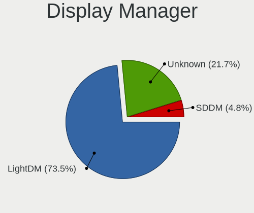

| Name    | Notebooks | Percent |
|---------|-----------|---------|
| LightDM | 60        | 72.29%  |
| Unknown | 19        | 22.89%  |
| SDDM    | 4         | 4.82%   |

OS Lang
-------

Language

| Lang  | Notebooks | Percent |
|-------|-----------|---------|
| en_US | 51        | 62.2%   |
| en_GB | 4         | 4.88%   |
| en_CA | 3         | 3.66%   |
| ru_RU | 2         | 2.44%   |
| pt_BR | 2         | 2.44%   |
| it_IT | 2         | 2.44%   |
| en_IN | 2         | 2.44%   |
| en_IE | 2         | 2.44%   |
| tr_TR | 1         | 1.22%   |
| sk_SK | 1         | 1.22%   |
| pl_PL | 1         | 1.22%   |
| nb_NO | 1         | 1.22%   |
| lt_LT | 1         | 1.22%   |
| fr_FR | 1         | 1.22%   |
| fr_CH | 1         | 1.22%   |
| es_MX | 1         | 1.22%   |
| es_ES | 1         | 1.22%   |
| es_CO | 1         | 1.22%   |
| en_AU | 1         | 1.22%   |
| de_DE | 1         | 1.22%   |
| de_CH | 1         | 1.22%   |
| cs_CZ | 1         | 1.22%   |

Boot Mode
---------

EFI or BIOS

| Mode | Notebooks | Percent |
|------|-----------|---------|
| EFI  | 48        | 57.83%  |
| BIOS | 35        | 42.17%  |

Filesystem
----------

Type of filesystem

| Type    | Notebooks | Percent |
|---------|-----------|---------|
| Btrfs   | 59        | 71.95%  |
| Tmpfs   | 9         | 10.98%  |
| Ext4    | 7         | 8.54%   |
| Overlay | 6         | 7.32%   |
| Xfs     | 1         | 1.22%   |

Part. scheme
------------

Scheme of partitioning

| Type    | Notebooks | Percent |
|---------|-----------|---------|
| GPT     | 55        | 66.27%  |
| Unknown | 19        | 22.89%  |
| MBR     | 9         | 10.84%  |

Dual Boot with Linux/BSD
------------------------

Hosting more than one Linux/BSD

| Dual boot | Notebooks | Percent |
|-----------|-----------|---------|
| No        | 66        | 80.49%  |
| Yes       | 16        | 19.51%  |

Dual Boot (Win)
---------------

Hosting Linux and Windows

| Dual boot | Notebooks | Percent |
|-----------|-----------|---------|
| No        | 54        | 65.85%  |
| Yes       | 28        | 34.15%  |

Board
-----

Vendor
------

Motherboard manufacturer

| Name                | Notebooks | Percent |
|---------------------|-----------|---------|
| Lenovo              | 24        | 29.27%  |
| Hewlett-Packard     | 14        | 17.07%  |
| Dell                | 11        | 13.41%  |
| Acer                | 9         | 10.98%  |
| MSI                 | 7         | 8.54%   |
| ASUSTek Computer    | 5         | 6.1%    |
| Samsung Electronics | 3         | 3.66%   |
| Toshiba             | 2         | 2.44%   |
| Google              | 2         | 2.44%   |
| Unknown             | 2         | 2.44%   |
| Onda TLC            | 1         | 1.22%   |
| Notebook            | 1         | 1.22%   |
| HONOR               | 1         | 1.22%   |

Model
-----

Motherboard model

| Name                                     | Notebooks | Percent |
|------------------------------------------|-----------|---------|
| HP Laptop 15-dy2xxx                      | 3         | 3.66%   |
| Unknown                                  | 2         | 2.44%   |
| Toshiba Satellite L775D                  | 1         | 1.22%   |
| Toshiba Satellite L50-A-1DL              | 1         | 1.22%   |
| Samsung 750XED                           | 1         | 1.22%   |
| Samsung 550XBE/350XBE                    | 1         | 1.22%   |
| Samsung 530XBB                           | 1         | 1.22%   |
| Onda TLC ONDA Oliver                     | 1         | 1.22%   |
| Notebook NV4XMB,ME,MZ                    | 1         | 1.22%   |
| MSI Summit E14Evo A12M                   | 1         | 1.22%   |
| MSI Stealth 15M B12UE                    | 1         | 1.22%   |
| MSI Prestige 14Evo A12M                  | 1         | 1.22%   |
| MSI Katana GF66 11UE                     | 1         | 1.22%   |
| MSI Katana 17 B13VFK                     | 1         | 1.22%   |
| MSI Katana 15 B13VGK                     | 1         | 1.22%   |
| MSI GF63 Thin 11UC                       | 1         | 1.22%   |
| Lenovo Z51-70 80K6                       | 1         | 1.22%   |
| Lenovo ThinkPad X1 Carbon 7th 20QES0C500 | 1         | 1.22%   |
| Lenovo ThinkPad T490 20N3S4PX02          | 1         | 1.22%   |
| Lenovo ThinkPad T490 20N20023US          | 1         | 1.22%   |
| Lenovo ThinkPad T480s 20L70028US         | 1         | 1.22%   |
| Lenovo ThinkPad T460s 20FAS2JW00         | 1         | 1.22%   |
| Lenovo ThinkPad T14s Gen 3 21BRCTO1WW    | 1         | 1.22%   |
| Lenovo ThinkPad T14s Gen 2i 20WM0080US   | 1         | 1.22%   |
| Lenovo ThinkPad P53 20QNS00X00           | 1         | 1.22%   |
| Lenovo ThinkPad L490 20Q5001YMX          | 1         | 1.22%   |
| Lenovo ThinkPad L13 Gen 3 21B3004QID     | 1         | 1.22%   |
| Lenovo ThinkPad E14 20RA0059VA           | 1         | 1.22%   |
| Lenovo Legion Pro 5 16IRX8 82WK          | 1         | 1.22%   |
| Lenovo Legion 5 15IAH7H 82RB             | 1         | 1.22%   |
| Lenovo Legion 5 15ARH05 82B5             | 1         | 1.22%   |
| Lenovo IdeaPad Slim 1-11AST-05 81VR      | 1         | 1.22%   |
| Lenovo IdeaPad L340-15IRH Gaming 81LK    | 1         | 1.22%   |
| Lenovo IdeaPad Gaming 3 15IMH05 81Y4     | 1         | 1.22%   |
| Lenovo IdeaPad Gaming 3 15ACH6 82K2      | 1         | 1.22%   |
| Lenovo IdeaPad 330S-15IKB 81F5           | 1         | 1.22%   |
| Lenovo IdeaPad 320-15IKB 80YH            | 1         | 1.22%   |
| Lenovo IdeaPad 300-15ISK 80Q7            | 1         | 1.22%   |
| Lenovo IdeaPad 3 15IAU7 82RK             | 1         | 1.22%   |
| Lenovo Flex 2-15 20405                   | 1         | 1.22%   |

Model Family
------------

Motherboard model prefix

| Name              | Notebooks | Percent |
|-------------------|-----------|---------|
| Lenovo ThinkPad   | 11        | 13.41%  |
| Lenovo IdeaPad    | 8         | 9.76%   |
| Dell Latitude     | 5         | 6.1%    |
| HP Laptop         | 4         | 4.88%   |
| HP EliteBook      | 4         | 4.88%   |
| Acer Aspire       | 4         | 4.88%   |
| MSI Katana        | 3         | 3.66%   |
| Lenovo Legion     | 3         | 3.66%   |
| Acer Nitro        | 3         | 3.66%   |
| Toshiba Satellite | 2         | 2.44%   |
| HP ProBook        | 2         | 2.44%   |
| HP Pavilion       | 2         | 2.44%   |
| Dell XPS          | 2         | 2.44%   |
| Dell Precision    | 2         | 2.44%   |
| Unknown           | 2         | 2.44%   |
| Samsung 750XED    | 1         | 1.22%   |
| Samsung 550XBE    | 1         | 1.22%   |
| Samsung 530XBB    | 1         | 1.22%   |
| Onda TLC ONDA     | 1         | 1.22%   |
| Notebook NV4XMB   | 1         | 1.22%   |
| MSI Summit        | 1         | 1.22%   |
| MSI Stealth       | 1         | 1.22%   |
| MSI Prestige      | 1         | 1.22%   |
| MSI GF63          | 1         | 1.22%   |
| Lenovo Z51-70     | 1         | 1.22%   |
| Lenovo Flex       | 1         | 1.22%   |
| HONOR BMH-WCX9    | 1         | 1.22%   |
| HP Notebook       | 1         | 1.22%   |
| HP ENVY           | 1         | 1.22%   |
| Google Reef       | 1         | 1.22%   |
| Google Blorb      | 1         | 1.22%   |
| Dell Vostro       | 1         | 1.22%   |
| Dell Inspiron     | 1         | 1.22%   |
| ASUS X550CL       | 1         | 1.22%   |
| ASUS X540SAA      | 1         | 1.22%   |
| ASUS ROG          | 1         | 1.22%   |
| ASUS K42Jc        | 1         | 1.22%   |
| ASUS ASUS         | 1         | 1.22%   |
| Acer TravelMate   | 1         | 1.22%   |
| Acer Extensa      | 1         | 1.22%   |

MFG Year
--------

Motherboard manufacture year

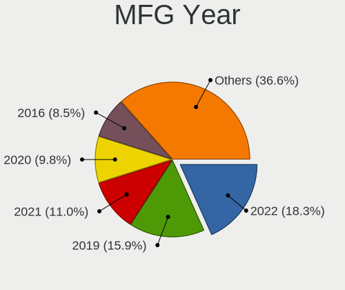

| Year | Notebooks | Percent |
|------|-----------|---------|
| 2022 | 15        | 18.29%  |
| 2019 | 13        | 15.85%  |
| 2020 | 11        | 13.41%  |
| 2021 | 9         | 10.98%  |
| 2016 | 7         | 8.54%   |
| 2011 | 6         | 7.32%   |
| 2023 | 5         | 6.1%    |
| 2018 | 3         | 3.66%   |
| 2017 | 3         | 3.66%   |
| 2015 | 3         | 3.66%   |
| 2014 | 2         | 2.44%   |
| 2012 | 2         | 2.44%   |
| 2013 | 1         | 1.22%   |
| 2010 | 1         | 1.22%   |
| 2009 | 1         | 1.22%   |

Form Factor
-----------

Physical design of the computer

| Name     | Notebooks | Percent |
|----------|-----------|---------|
| Notebook | 82        | 100%    |

Secure Boot
-----------

Enabled or disabled

| State    | Notebooks | Percent |
|----------|-----------|---------|
| Disabled | 82        | 100%    |

Coreboot
--------

Have coreboot on board

| Used | Notebooks | Percent |
|------|-----------|---------|
| No   | 80        | 97.56%  |
| Yes  | 2         | 2.44%   |

RAM Size
--------

Total RAM memory

| Size in GB  | Notebooks | Percent |
|-------------|-----------|---------|
| 4.01-8.0    | 30        | 36.59%  |
| 16.01-24.0  | 18        | 21.95%  |
| 8.01-16.0   | 15        | 18.29%  |
| 3.01-4.0    | 9         | 10.98%  |
| 32.01-64.0  | 7         | 8.54%   |
| 24.01-32.0  | 2         | 2.44%   |
| 64.01-256.0 | 1         | 1.22%   |

RAM Used
--------

Used RAM memory

| Used GB    | Notebooks | Percent |
|------------|-----------|---------|
| 1.01-2.0   | 31        | 35.63%  |
| 2.01-3.0   | 28        | 32.18%  |
| 3.01-4.0   | 12        | 13.79%  |
| 4.01-8.0   | 11        | 12.64%  |
| 0.51-1.0   | 4         | 4.6%    |
| 16.01-24.0 | 1         | 1.15%   |

Total Drives
------------

Number of drives on board

| Drives | Notebooks | Percent |
|--------|-----------|---------|
| 1      | 63        | 75.9%   |
| 2      | 19        | 22.89%  |
| 3      | 1         | 1.2%    |

Has CD-ROM
----------

Has CD-ROM on board

| Presented | Notebooks | Percent |
|-----------|-----------|---------|
| No        | 68        | 82.93%  |
| Yes       | 14        | 17.07%  |

Has Ethernet
------------

Has Ethernet on board

| Presented | Notebooks | Percent |
|-----------|-----------|---------|
| Yes       | 66        | 80.49%  |
| No        | 16        | 19.51%  |

Has WiFi
--------

Has WiFi module

| Presented | Notebooks | Percent |
|-----------|-----------|---------|
| Yes       | 81        | 98.78%  |
| No        | 1         | 1.22%   |

Has Bluetooth
-------------

Has Bluetooth module

| Presented | Notebooks | Percent |
|-----------|-----------|---------|
| Yes       | 68        | 81.93%  |
| No        | 15        | 18.07%  |

Location
--------

Country
-------

Geographic location (country)

| Country     | Notebooks | Percent |
|-------------|-----------|---------|
| USA         | 18        | 21.95%  |
| Italy       | 5         | 6.1%    |
| UK          | 4         | 4.88%   |
| India       | 4         | 4.88%   |
| Germany     | 4         | 4.88%   |
| Canada      | 4         | 4.88%   |
| Russia      | 3         | 3.66%   |
| Switzerland | 2         | 2.44%   |
| Netherlands | 2         | 2.44%   |
| Luxembourg  | 2         | 2.44%   |
| Kenya       | 2         | 2.44%   |
| Ireland     | 2         | 2.44%   |
| Indonesia   | 2         | 2.44%   |
| Brazil      | 2         | 2.44%   |
| Vietnam     | 1         | 1.22%   |
| UAE         | 1         | 1.22%   |
| Turkey      | 1         | 1.22%   |
| Sweden      | 1         | 1.22%   |
| Spain       | 1         | 1.22%   |
| Slovakia    | 1         | 1.22%   |
| Portugal    | 1         | 1.22%   |
| Poland      | 1         | 1.22%   |
| Norway      | 1         | 1.22%   |
| Nepal       | 1         | 1.22%   |
| Myanmar     | 1         | 1.22%   |
| Mexico      | 1         | 1.22%   |
| Lithuania   | 1         | 1.22%   |
| Kazakhstan  | 1         | 1.22%   |
| Gabon       | 1         | 1.22%   |
| France      | 1         | 1.22%   |
| Egypt       | 1         | 1.22%   |
| Ecuador     | 1         | 1.22%   |
| Czechia     | 1         | 1.22%   |
| Cyprus      | 1         | 1.22%   |
| Costa Rica  | 1         | 1.22%   |
| Colombia    | 1         | 1.22%   |
| Barbados    | 1         | 1.22%   |
| Australia   | 1         | 1.22%   |
| Angola      | 1         | 1.22%   |
| Algeria     | 1         | 1.22%   |

City
----

Geographic location (city)

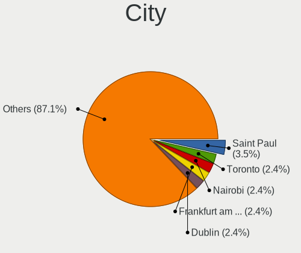

| City               | Notebooks | Percent |
|--------------------|-----------|---------|
| Saint Paul         | 3         | 3.53%   |
| Toronto            | 2         | 2.35%   |
| Nairobi            | 2         | 2.35%   |
| Luxembourg         | 2         | 2.35%   |
| Frankfurt am Main  | 2         | 2.35%   |
| Dublin             | 2         | 2.35%   |
| Brooklyn           | 2         | 2.35%   |
| Yekaterinburg      | 1         | 1.18%   |
| Yangon             | 1         | 1.18%   |
| Viereth-Trunstadt  | 1         | 1.18%   |
| Trabia             | 1         | 1.18%   |
| Stockholm          | 1         | 1.18%   |
| Starogard Gdański | 1         | 1.18%   |
| Silver Spring      | 1         | 1.18%   |
| Siblingen          | 1         | 1.18%   |
| Sharjah            | 1         | 1.18%   |
| Santiago de Cali   | 1         | 1.18%   |
| San José          | 1         | 1.18%   |
| San Antonio        | 1         | 1.18%   |
| Saint Athanasios   | 1         | 1.18%   |
| Rome               | 1         | 1.18%   |
| Rho                | 1         | 1.18%   |
| Relizane           | 1         | 1.18%   |
| Quito              | 1         | 1.18%   |
| Prague             | 1         | 1.18%   |
| Oslo               | 1         | 1.18%   |
| Orlando            | 1         | 1.18%   |
| Orenburg           | 1         | 1.18%   |
| Norfolk            | 1         | 1.18%   |
| Neumünster        | 1         | 1.18%   |
| Nanton             | 1         | 1.18%   |
| Mumbai             | 1         | 1.18%   |
| Minneapolis        | 1         | 1.18%   |
| Millersburg        | 1         | 1.18%   |
| Milano             | 1         | 1.18%   |
| Middlesbrough      | 1         | 1.18%   |
| Mesa               | 1         | 1.18%   |
| Melbourne          | 1         | 1.18%   |
| Mažeikiai         | 1         | 1.18%   |
| Mashpee            | 1         | 1.18%   |

Drives
------

Drive Vendor
------------

Hard drive vendors

| Vendor                      | Notebooks | Drives | Percent |
|-----------------------------|-----------|--------|---------|
| Samsung Electronics         | 19        | 23     | 18.81%  |
| WDC                         | 10        | 13     | 9.9%    |
| SK hynix                    | 10        | 12     | 9.9%    |
| Toshiba                     | 9         | 10     | 8.91%   |
| Seagate                     | 7         | 7      | 6.93%   |
| Unknown                     | 6         | 6      | 5.94%   |
| Micron Technology           | 6         | 6      | 5.94%   |
| Kingston                    | 4         | 4      | 3.96%   |
| Sandisk                     | 3         | 3      | 2.97%   |
| KIOXIA                      | 3         | 3      | 2.97%   |
| A-DATA Technology           | 3         | 3      | 2.97%   |
| Team                        | 2         | 2      | 1.98%   |
| HGST                        | 2         | 2      | 1.98%   |
| Crucial                     | 2         | 2      | 1.98%   |
| Zheino                      | 1         | 1      | 0.99%   |
| Wdxsky                      | 1         | 1      | 0.99%   |
| TO Exter                    | 1         | 1      | 0.99%   |
| Teclast                     | 1         | 1      | 0.99%   |
| SSSTC                       | 1         | 1      | 0.99%   |
| SPCC                        | 1         | 1      | 0.99%   |
| SCY                         | 1         | 1      | 0.99%   |
| Kingston Technology Company | 1         | 2      | 0.99%   |
| Kingmax                     | 1         | 1      | 0.99%   |
| KingFast                    | 1         | 1      | 0.99%   |
| Intel                       | 1         | 1      | 0.99%   |
| Hitachi                     | 1         | 1      | 0.99%   |
| GOODRAM                     | 1         | 1      | 0.99%   |
| Gigabyte Technology         | 1         | 1      | 0.99%   |
| Apacer                      | 1         | 1      | 0.99%   |

Drive Model
-----------

Hard drive models

| Model                                             | Notebooks | Percent |
|---------------------------------------------------|-----------|---------|
| Toshiba KXG6AZNV256G 256GB                        | 2         | 1.96%   |
| SK hynix HFM512GD3JX016N 512GB                    | 2         | 1.96%   |
| Samsung NVMe SSD Controller SM981/PM981/PM983 1TB | 2         | 1.96%   |
| Samsung MZVL21T0HCLR-00BL2 1TB                    | 2         | 1.96%   |
| Micron MTFDHBA512QFD 512GB                        | 2         | 1.96%   |
| Kingston SA400S37240G 240GB SSD                   | 2         | 1.96%   |
| Zheino CHN-25SATAC3-120 120GB SSD                 | 1         | 0.98%   |
| Wdxsky W31-256G SSD                               | 1         | 0.98%   |
| WDC WDS500G2B0A-00SM50 500GB SSD                  | 1         | 0.98%   |
| WDC WD5000LPCX-60VHAT0 500GB                      | 1         | 0.98%   |
| WDC WD5000BPKX-60HPJT0 500GB                      | 1         | 0.98%   |
| WDC WD2500BEKT-60PVMT0 250GB                      | 1         | 0.98%   |
| WDC WD10SPZX-24Z10 1TB                            | 1         | 0.98%   |
| WDC WD10SPZX-22Z10T0 1TB                          | 1         | 0.98%   |
| WDC WD10JPVX-60JC3T0 1TB                          | 1         | 0.98%   |
| WDC WD Green 2.5 1000GB SSD                       | 1         | 0.98%   |
| WDC PC SN540 SDDPNPF-512G-1032 512GB              | 1         | 0.98%   |
| WDC PC SN530 SDBPNPZ-512G-1036 512GB              | 1         | 0.98%   |
| Unknown SN128  128GB                              | 1         | 0.98%   |
| Unknown MMC64G  64GB                              | 1         | 0.98%   |
| Unknown MMC Card  64GB                            | 1         | 0.98%   |
| Unknown MMC Card  32GB                            | 1         | 0.98%   |
| Unknown MMC Card  128GB                           | 1         | 0.98%   |
| Unknown DA4064  64GB                              | 1         | 0.98%   |
| Toshiba THNSN5256GPUK NVMe 256GB                  | 1         | 0.98%   |
| Toshiba THNSFJ256GDNU A 256GB SSD                 | 1         | 0.98%   |
| Toshiba MQ01ABD075 752GB                          | 1         | 0.98%   |
| Toshiba MK6475GSX 640GB                           | 1         | 0.98%   |
| Toshiba MK5059GSXP 500GB                          | 1         | 0.98%   |
| Toshiba KXG5AZNV1T02 NVMe SED 1024GB              | 1         | 0.98%   |
| Toshiba KXG50ZNV512G NVMe 512GB                   | 1         | 0.98%   |
| TO Exter nal USB 3.0 512GB                        | 1         | 0.98%   |
| Teclast BD256GB SHCB-2280 SSD                     | 1         | 0.98%   |
| Team TM8FPD002T 2TB                               | 1         | 0.98%   |
| Team TM8FP6512G 512GB                             | 1         | 0.98%   |
| SSSTC CL1-8D256 256GB                             | 1         | 0.98%   |
| SPCC M.2 PCIe SSD 2TB                             | 1         | 0.98%   |
| SK hynix SKHynix_HFS512GD9TNI-L2A0B 512GB         | 1         | 0.98%   |
| SK hynix SKHynix_HFS256GD9TNG-L5B0B 256GB         | 1         | 0.98%   |
| SK hynix SC300 M.2 2280 128GB SSD                 | 1         | 0.98%   |

HDD Vendor
----------

Hard disk drive vendors

| Vendor   | Notebooks | Drives | Percent |
|----------|-----------|--------|---------|
| WDC      | 6         | 8      | 31.58%  |
| Seagate  | 6         | 6      | 31.58%  |
| Toshiba  | 3         | 3      | 15.79%  |
| HGST     | 2         | 2      | 10.53%  |
| TO Exter | 1         | 1      | 5.26%   |
| Hitachi  | 1         | 1      | 5.26%   |

SSD Vendor
----------

Solid state drive vendors

| Vendor              | Notebooks | Drives | Percent |
|---------------------|-----------|--------|---------|
| Kingston            | 3         | 3      | 13.64%  |
| WDC                 | 2         | 3      | 9.09%   |
| SK hynix            | 2         | 2      | 9.09%   |
| Samsung Electronics | 2         | 5      | 9.09%   |
| Zheino              | 1         | 1      | 4.55%   |
| Wdxsky              | 1         | 1      | 4.55%   |
| Toshiba             | 1         | 1      | 4.55%   |
| Teclast             | 1         | 1      | 4.55%   |
| Seagate             | 1         | 1      | 4.55%   |
| SCY                 | 1         | 1      | 4.55%   |
| SanDisk             | 1         | 1      | 4.55%   |
| Kingmax             | 1         | 1      | 4.55%   |
| KingFast            | 1         | 1      | 4.55%   |
| GOODRAM             | 1         | 1      | 4.55%   |
| Gigabyte Technology | 1         | 1      | 4.55%   |
| Crucial             | 1         | 1      | 4.55%   |
| Apacer              | 1         | 1      | 4.55%   |

Drive Kind
----------

HDD or SSD

| Kind | Notebooks | Drives | Percent |
|------|-----------|--------|---------|
| NVMe | 49        | 59     | 51.58%  |
| SSD  | 21        | 26     | 22.11%  |
| HDD  | 19        | 21     | 20%     |
| MMC  | 6         | 6      | 6.32%   |

Drive Connector
---------------

SATA, SAS, NVMe, etc.

| Type | Notebooks | Drives | Percent |
|------|-----------|--------|---------|
| NVMe | 49        | 59     | 53.85%  |
| SATA | 35        | 46     | 38.46%  |
| MMC  | 6         | 6      | 6.59%   |
| SAS  | 1         | 1      | 1.1%    |

Drive Size
----------

Size of hard drive

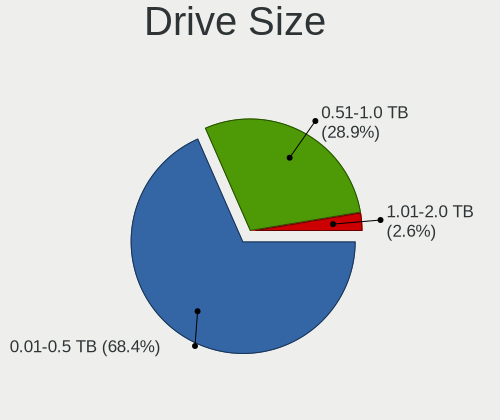

| Size in TB | Notebooks | Drives | Percent |
|------------|-----------|--------|---------|
| 0.01-0.5   | 26        | 29     | 68.42%  |
| 0.51-1.0   | 12        | 18     | 31.58%  |

Space Total
-----------

Amount of disk space available on the file system

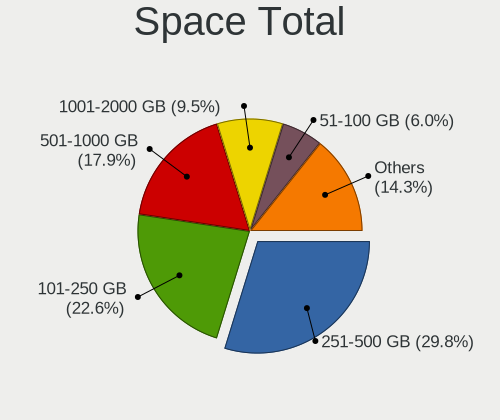

| Size in GB     | Notebooks | Percent |
|----------------|-----------|---------|
| 251-500        | 25        | 29.76%  |
| 101-250        | 19        | 22.62%  |
| 501-1000       | 16        | 19.05%  |
| 1001-2000      | 7         | 8.33%   |
| 1-20           | 5         | 5.95%   |
| 51-100         | 5         | 5.95%   |
| Unknown        | 5         | 5.95%   |
| More than 3000 | 1         | 1.19%   |
| 21-50          | 1         | 1.19%   |

Space Used
----------

Amount of used disk space

| Used GB   | Notebooks | Percent |
|-----------|-----------|---------|
| 21-50     | 28        | 33.33%  |
| 1-20      | 17        | 20.24%  |
| 51-100    | 16        | 19.05%  |
| 251-500   | 7         | 8.33%   |
| 101-250   | 7         | 8.33%   |
| Unknown   | 5         | 5.95%   |
| 1001-2000 | 2         | 2.38%   |
| 501-1000  | 2         | 2.38%   |

Malfunc. Drives
---------------

Drive models with a malfunction

| Model                         | Notebooks | Drives | Percent |
|-------------------------------|-----------|--------|---------|
| Toshiba MK6475GSX 640GB       | 1         | 1      | 33.33%  |
| Toshiba MK5059GSXP 500GB      | 1         | 1      | 33.33%  |
| Hitachi HTS725050A9A364 500GB | 1         | 1      | 33.33%  |

Malfunc. Drive Vendor
---------------------

Vendors of faulty drives

| Vendor  | Notebooks | Drives | Percent |
|---------|-----------|--------|---------|
| Toshiba | 2         | 2      | 66.67%  |
| Hitachi | 1         | 1      | 33.33%  |

Malfunc. HDD Vendor
-------------------

Vendors of faulty HDD drives

| Vendor  | Notebooks | Drives | Percent |
|---------|-----------|--------|---------|
| Toshiba | 2         | 2      | 66.67%  |
| Hitachi | 1         | 1      | 33.33%  |

Malfunc. Drive Kind
-------------------

Kinds of faulty drives

| Kind | Notebooks | Drives | Percent |
|------|-----------|--------|---------|
| HDD  | 3         | 3      | 100%    |

Failed Drives
-------------

Failed drive models

Zero info for selected period =(

Failed Drive Vendor
-------------------

Failed drive vendors

Zero info for selected period =(

Drive Status
------------

Number of failed and malfunc. drives

| Status   | Notebooks | Drives | Percent |
|----------|-----------|--------|---------|
| Works    | 49        | 62     | 56.98%  |
| Detected | 34        | 47     | 39.53%  |
| Malfunc  | 3         | 3      | 3.49%   |

Storage controller
------------------

Storage Vendor
--------------

Storage controller vendors

| Vendor                         | Notebooks | Percent |
|--------------------------------|-----------|---------|
| Intel                          | 47        | 43.52%  |
| Samsung Electronics            | 17        | 15.74%  |
| SK hynix                       | 8         | 7.41%   |
| AMD                            | 8         | 7.41%   |
| Micron Technology              | 6         | 5.56%   |
| Toshiba America Info Systems   | 5         | 4.63%   |
| SanDisk                        | 4         | 3.7%    |
| KIOXIA                         | 3         | 2.78%   |
| ADATA Technology               | 3         | 2.78%   |
| Kingston Technology Company    | 2         | 1.85%   |
| Solid State Storage Technology | 1         | 0.93%   |
| Silicon Motion                 | 1         | 0.93%   |
| Realtek Semiconductor          | 1         | 0.93%   |
| Phison Electronics             | 1         | 0.93%   |
| Micron/Crucial Technology      | 1         | 0.93%   |

Storage Model
-------------

Storage controller models

| Model                                                                        | Notebooks | Percent |
|------------------------------------------------------------------------------|-----------|---------|
| Intel Volume Management Device NVMe RAID Controller                          | 10        | 8.55%   |
| Intel Sunrise Point-LP SATA Controller [AHCI mode]                           | 8         | 6.84%   |
| AMD FCH SATA Controller [AHCI mode]                                          | 8         | 6.84%   |
| Samsung NVMe SSD Controller SM981/PM981/PM983                                | 6         | 5.13%   |
| SK hynix Gold P31/BC711/PC711 NVMe Solid State Drive                         | 5         | 4.27%   |
| Samsung NVMe SSD Controller PM9A1/PM9A3/980PRO                               | 5         | 4.27%   |
| Intel Tiger Lake SATA AHCI Controller                                        | 3         | 2.56%   |
| Intel Celeron/Pentium Silver Processor SATA Controller                       | 3         | 2.56%   |
| Intel 6 Series/C200 Series Chipset Family 6 port Mobile SATA AHCI Controller | 3         | 2.56%   |
| Toshiba America Info Systems XG6 NVMe SSD Controller                         | 2         | 1.71%   |
| Toshiba America Info Systems XG5 NVMe SSD Controller                         | 2         | 1.71%   |
| Samsung NVMe SSD Controller PM9B1 (DRAM-less)                                | 2         | 1.71%   |
| Samsung NVMe SSD Controller 980 (DRAM-less)                                  | 2         | 1.71%   |
| Micron 2450 NVMe SSD [HendrixV] (DRAM-less)                                  | 2         | 1.71%   |
| Micron 2210 NVMe SSD [Cobain]                                                | 2         | 1.71%   |
| KIOXIA NVMe SSD Controller BG4 (DRAM-less)                                   | 2         | 1.71%   |
| Intel Wildcat Point-LP SATA Controller [AHCI Mode]                           | 2         | 1.71%   |
| Intel Tiger Lake-LP SATA Controller                                          | 2         | 1.71%   |
| Intel Comet Lake SATA AHCI Controller                                        | 2         | 1.71%   |
| Intel Alder Lake-P SATA AHCI Controller                                      | 2         | 1.71%   |
| Intel 7 Series Chipset Family 6-port SATA Controller [AHCI mode]             | 2         | 1.71%   |
| Toshiba America Info Systems XG4 NVMe SSD Controller                         | 1         | 0.85%   |
| Solid State Storage CL1-3D256-Q11 NVMe SSD M.2                               | 1         | 0.85%   |
| SK hynix PC611 NVMe Solid State Drive                                        | 1         | 0.85%   |
| SK hynix PC601 NVMe Solid State Drive                                        | 1         | 0.85%   |
| SK hynix BC501 NVMe Solid State Drive                                        | 1         | 0.85%   |
| Silicon Motion SM2262/SM2262EN SSD Controller                                | 1         | 0.85%   |
| SanDisk WD PC SN540 / Green SN350 NVMe SSD 1 TB (DRAM-less)                  | 1         | 0.85%   |
| SanDisk WD Black SN770 / PC SN740 256GB / PC SN560 (DRAM-less) NVMe SSD      | 1         | 0.85%   |
| SanDisk Ultra 3D / WD Blue SN550 NVMe SSD                                    | 1         | 0.85%   |
| SanDisk Extreme Pro / WD Black SN750 / PC SN730 / Red SN700 NVMe SSD         | 1         | 0.85%   |
| Samsung NVMe SSD Controller SM961/PM961/SM963                                | 1         | 0.85%   |
| Samsung NVMe SSD Controller SM951/PM951                                      | 1         | 0.85%   |
| Realtek RTS5765DL NVMe SSD Controller (DRAM-less)                            | 1         | 0.85%   |
| Phison PS5013-E13 PCIe3 NVMe Controller (DRAM-less)                          | 1         | 0.85%   |
| Micron/Crucial P2 [Nick P2] / P3 / P3 Plus NVMe PCIe SSD (DRAM-less)         | 1         | 0.85%   |
| Micron 2400 NVMe SSD (DRAM-less)                                             | 1         | 0.85%   |
| Micron 2300 NVMe SSD [Santana]                                               | 1         | 0.85%   |
| KIOXIA NVMe SSD Controller BG5 (DRAM-less)                                   | 1         | 0.85%   |
| Kingston Company OM8PCP Design-In PCIe 3 NVMe SSD (DRAM-less)                | 1         | 0.85%   |

Storage Kind
------------

Kind of storage controller (IDE, SATA, NVMe, SAS, ...)

| Kind | Notebooks | Percent |
|------|-----------|---------|
| NVMe | 49        | 44.95%  |
| SATA | 45        | 41.28%  |
| RAID | 12        | 11.01%  |
| IDE  | 3         | 2.75%   |

Processor
---------

CPU Vendor
----------

Processor vendors

| Vendor | Notebooks | Percent |
|--------|-----------|---------|
| Intel  | 71        | 86.59%  |
| AMD    | 11        | 13.41%  |

CPU Model
---------

Processor models

| Model                                    | Notebooks | Percent |
|------------------------------------------|-----------|---------|
| Intel Core i5-8265U CPU @ 1.60GHz        | 3         | 3.66%   |
| Intel 12th Gen Core i7-1280P             | 3         | 3.66%   |
| Intel 12th Gen Core i5-1235U             | 3         | 3.66%   |
| Intel 11th Gen Core i5-1135G7 @ 2.40GHz  | 3         | 3.66%   |
| Intel Core i7-9750H CPU @ 2.60GHz        | 2         | 2.44%   |
| Intel Core i5-8365U CPU @ 1.60GHz        | 2         | 2.44%   |
| Intel Core i5-6300U CPU @ 2.40GHz        | 2         | 2.44%   |
| Intel Core i5-2450M CPU @ 2.50GHz        | 2         | 2.44%   |
| Intel Core i5-10210U CPU @ 1.60GHz       | 2         | 2.44%   |
| Intel 13th Gen Core i7-13620H            | 2         | 2.44%   |
| Intel 12th Gen Core i5-1245U             | 2         | 2.44%   |
| Intel 11th Gen Core i7-1165G7 @ 2.80GHz  | 2         | 2.44%   |
| Intel 11th Gen Core i5-11400H @ 2.70GHz  | 2         | 2.44%   |
| Intel 11th Gen Core i3-1115G4 @ 3.00GHz  | 2         | 2.44%   |
| Intel Pentium Silver N5000 CPU @ 1.10GHz | 1         | 1.22%   |
| Intel Pentium 3558U @ 1.70GHz            | 1         | 1.22%   |
| Intel Genuine CPU U4100 @ 1.30GHz        | 1         | 1.22%   |
| Intel Core m5-6Y57 CPU @ 1.10GHz         | 1         | 1.22%   |
| Intel Core i9-8950HK CPU @ 2.90GHz       | 1         | 1.22%   |
| Intel Core i7-8650U CPU @ 1.90GHz        | 1         | 1.22%   |
| Intel Core i7-7700HQ CPU @ 2.80GHz       | 1         | 1.22%   |
| Intel Core i7-7600U CPU @ 2.80GHz        | 1         | 1.22%   |
| Intel Core i7-7500U CPU @ 2.70GHz        | 1         | 1.22%   |
| Intel Core i7-6600U CPU @ 2.60GHz        | 1         | 1.22%   |
| Intel Core i7-5500U CPU @ 2.40GHz        | 1         | 1.22%   |
| Intel Core i7-4700MQ CPU @ 2.40GHz       | 1         | 1.22%   |
| Intel Core i7-10750H CPU @ 2.60GHz       | 1         | 1.22%   |
| Intel Core i5-8250U CPU @ 1.60GHz        | 1         | 1.22%   |
| Intel Core i5-6200U CPU @ 2.30GHz        | 1         | 1.22%   |
| Intel Core i5-3337U CPU @ 1.80GHz        | 1         | 1.22%   |
| Intel Core i5-3210M CPU @ 2.50GHz        | 1         | 1.22%   |
| Intel Core i5-2540M CPU @ 2.60GHz        | 1         | 1.22%   |
| Intel Core i5-2430M CPU @ 2.40GHz        | 1         | 1.22%   |
| Intel Core i5-10300H CPU @ 2.50GHz       | 1         | 1.22%   |
| Intel Core i5 CPU M 460 @ 2.53GHz        | 1         | 1.22%   |
| Intel Core i3-6100U CPU @ 2.30GHz        | 1         | 1.22%   |
| Intel Core i3-5005U CPU @ 2.00GHz        | 1         | 1.22%   |
| Intel Core i3-2350M CPU @ 2.30GHz        | 1         | 1.22%   |
| Intel Core i3-2330M CPU @ 2.20GHz        | 1         | 1.22%   |
| Intel Celeron N4120 CPU @ 1.10GHz        | 1         | 1.22%   |

CPU Model Family
----------------

Processor model prefix

| Model                | Notebooks | Percent |
|----------------------|-----------|---------|
| Other                | 27        | 32.93%  |
| Intel Core i5        | 19        | 23.17%  |
| Intel Core i7        | 10        | 12.2%   |
| Intel Celeron        | 6         | 7.32%   |
| Intel Core i3        | 4         | 4.88%   |
| AMD Ryzen 7          | 4         | 4.88%   |
| AMD Ryzen 5          | 4         | 4.88%   |
| Intel Pentium Silver | 1         | 1.22%   |
| Intel Pentium        | 1         | 1.22%   |
| Intel Genuine        | 1         | 1.22%   |
| Intel Core m5        | 1         | 1.22%   |
| Intel Core i9        | 1         | 1.22%   |
| AMD FX               | 1         | 1.22%   |
| AMD A6               | 1         | 1.22%   |
| AMD A4               | 1         | 1.22%   |

CPU Cores
---------

Number of processor cores

| Number | Notebooks | Percent |
|--------|-----------|---------|
| 2      | 28        | 34.15%  |
| 4      | 24        | 29.27%  |
| 6      | 9         | 10.98%  |
| 10     | 8         | 9.76%   |
| 14     | 4         | 4.88%   |
| 8      | 4         | 4.88%   |
| 12     | 3         | 3.66%   |
| 16     | 1         | 1.22%   |
| 1      | 1         | 1.22%   |

CPU Sockets
-----------

Number of sockets

| Number | Notebooks | Percent |
|--------|-----------|---------|
| 1      | 82        | 100%    |

CPU Threads
-----------

Threads per core (Hyper-Threading)

| Number | Notebooks | Percent |
|--------|-----------|---------|
| 2      | 54        | 65.85%  |
| 1      | 27        | 32.93%  |
| 8      | 1         | 1.22%   |

CPU Op-Modes
------------

CPU Operation Modes (32-bit, 64-bit)

| Op mode        | Notebooks | Percent |
|----------------|-----------|---------|
| 32-bit, 64-bit | 82        | 100%    |

CPU Microcode
-------------

Microcode number

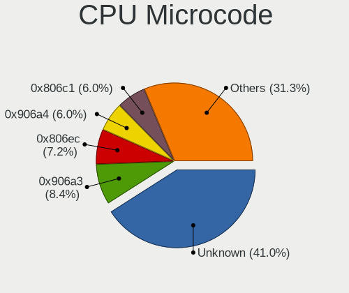

| Number     | Notebooks | Percent |
|------------|-----------|---------|
| Unknown    | 34        | 40.96%  |
| 0x906a3    | 7         | 8.43%   |
| 0x806ec    | 6         | 7.23%   |
| 0x906a4    | 5         | 6.02%   |
| 0x806c1    | 5         | 6.02%   |
| 0x406e3    | 4         | 4.82%   |
| 0x206a7    | 3         | 3.61%   |
| 0xb06a2    | 2         | 2.41%   |
| 0xa0652    | 2         | 2.41%   |
| 0x806d1    | 2         | 2.41%   |
| 0xb06f2    | 1         | 1.2%    |
| 0x906ea    | 1         | 1.2%    |
| 0x806c2    | 1         | 1.2%    |
| 0x706a8    | 1         | 1.2%    |
| 0x706a1    | 1         | 1.2%    |
| 0x506c9    | 1         | 1.2%    |
| 0x306d4    | 1         | 1.2%    |
| 0x0a50000c | 1         | 1.2%    |
| 0x08608103 | 1         | 1.2%    |
| 0x08600106 | 1         | 1.2%    |
| 0x08108109 | 1         | 1.2%    |
| 0x06006705 | 1         | 1.2%    |
| 0x03000027 | 1         | 1.2%    |

CPU Microarch
-------------

Microarchitecture

| Name             | Notebooks | Percent |
|------------------|-----------|---------|
| KabyLake         | 15        | 18.29%  |
| Alderlake Hybrid | 15        | 18.29%  |
| TigerLake        | 8         | 9.76%   |
| Skylake          | 6         | 7.32%   |
| SandyBridge      | 6         | 7.32%   |
| Goldmont plus    | 4         | 4.88%   |
| Zen 3            | 3         | 3.66%   |
| Unknown          | 3         | 3.66%   |
| Zen 2            | 2         | 2.44%   |
| IvyBridge        | 2         | 2.44%   |
| Icelake          | 2         | 2.44%   |
| Haswell          | 2         | 2.44%   |
| Goldmont         | 2         | 2.44%   |
| Excavator        | 2         | 2.44%   |
| CometLake        | 2         | 2.44%   |
| Broadwell        | 2         | 2.44%   |
| Zen+             | 1         | 1.22%   |
| Zen              | 1         | 1.22%   |
| Westmere         | 1         | 1.22%   |
| Silvermont       | 1         | 1.22%   |
| Penryn           | 1         | 1.22%   |
| K10 Llano        | 1         | 1.22%   |

Graphics
--------

GPU Vendor
----------

Vendors of graphics cards

| Vendor | Notebooks | Percent |
|--------|-----------|---------|
| Intel  | 70        | 63.06%  |
| Nvidia | 27        | 24.32%  |
| AMD    | 14        | 12.61%  |

GPU Model
---------

Graphics card models

| Model                                                                     | Notebooks | Percent |
|---------------------------------------------------------------------------|-----------|---------|
| Intel Alder Lake-P GT2 [Iris Xe Graphics]                                 | 7         | 6.25%   |
| Intel TigerLake-LP GT2 [Iris Xe Graphics]                                 | 6         | 5.36%   |
| Intel WhiskeyLake-U GT2 [UHD Graphics 620]                                | 5         | 4.46%   |
| Intel Skylake GT2 [HD Graphics 520]                                       | 5         | 4.46%   |
| Intel 2nd Generation Core Processor Family Integrated Graphics Controller | 5         | 4.46%   |
| Nvidia TU117M [GeForce GTX 1650 Ti Mobile]                                | 4         | 3.57%   |
| Intel Alder Lake-UP3 GT2 [Iris Xe Graphics]                               | 4         | 3.57%   |
| Nvidia GA107M [GeForce RTX 3050 Mobile]                                   | 3         | 2.68%   |
| Nvidia GA106M [GeForce RTX 3060 Mobile / Max-Q]                           | 3         | 2.68%   |
| Intel TigerLake-H GT1 [UHD Graphics]                                      | 3         | 2.68%   |
| Intel GeminiLake [UHD Graphics 600]                                       | 3         | 2.68%   |
| Intel CoffeeLake-H GT2 [UHD Graphics 630]                                 | 3         | 2.68%   |
| Nvidia TU117M [GeForce GTX 1650 Mobile / Max-Q]                           | 2         | 1.79%   |
| Nvidia GF117M [GeForce 610M/710M/810M/820M / GT 620M/625M/630M/720M]      | 2         | 1.79%   |
| Nvidia AD107M [GeForce RTX 4060 Max-Q / Mobile]                           | 2         | 1.79%   |
| Intel UHD Graphics 620                                                    | 2         | 1.79%   |
| Intel Tiger Lake-LP GT2 [UHD Graphics G4]                                 | 2         | 1.79%   |
| Intel Raptor Lake-P [UHD Graphics]                                        | 2         | 1.79%   |
| Intel HD Graphics 620                                                     | 2         | 1.79%   |
| Intel HD Graphics 5500                                                    | 2         | 1.79%   |
| Intel HD Graphics 500                                                     | 2         | 1.79%   |
| Intel CometLake-U GT2 [UHD Graphics]                                      | 2         | 1.79%   |
| Intel CometLake-H GT2 [UHD Graphics]                                      | 2         | 1.79%   |
| Intel Alder Lake-UP3 GT2 [UHD Graphics]                                   | 2         | 1.79%   |
| Intel 3rd Gen Core processor Graphics Controller                          | 2         | 1.79%   |
| AMD Renoir [Radeon RX Vega 6 (Ryzen 4000/5000 Mobile Series)]             | 2         | 1.79%   |
| AMD Cezanne [Radeon Vega Series / Radeon Vega Mobile Series]              | 2         | 1.79%   |
| Nvidia TU117GLM [Quadro T2000 Mobile / Max-Q]                             | 1         | 0.89%   |
| Nvidia GT218M [GeForce 310M]                                              | 1         | 0.89%   |
| Nvidia GP104GLM [Quadro P4200 Mobile]                                     | 1         | 0.89%   |
| Nvidia GM108M [GeForce MX110]                                             | 1         | 0.89%   |
| Nvidia GM108M [GeForce 940MX]                                             | 1         | 0.89%   |
| Nvidia GM107GLM [Quadro M1200 Mobile]                                     | 1         | 0.89%   |
| Nvidia GK208M [GeForce GT 740M]                                           | 1         | 0.89%   |
| Nvidia GF108GLM [NVS 5200M]                                               | 1         | 0.89%   |
| Nvidia GA107M [GeForce RTX 3050 Ti Mobile]                                | 1         | 0.89%   |
| Nvidia GA104M [GeForce RTX 3070 Mobile / Max-Q]                           | 1         | 0.89%   |
| Nvidia AD106M [GeForce RTX 4070 Max-Q / Mobile]                           | 1         | 0.89%   |
| Intel Mobile 4 Series Chipset Integrated Graphics Controller              | 1         | 0.89%   |
| Intel HD Graphics 630                                                     | 1         | 0.89%   |

GPU Combo
---------

Combinations of graphics cards

| Name           | Notebooks | Percent |
|----------------|-----------|---------|
| 1 x Intel      | 44        | 53.66%  |
| Intel + Nvidia | 23        | 28.05%  |
| 1 x AMD        | 7         | 8.54%   |
| AMD + Nvidia   | 4         | 4.88%   |
| Intel + AMD    | 2         | 2.44%   |
| Other          | 1         | 1.22%   |
| 2 x AMD        | 1         | 1.22%   |

GPU Driver
----------

Free vs proprietary

| Driver      | Notebooks | Percent |
|-------------|-----------|---------|
| Free        | 73        | 89.02%  |
| Proprietary | 6         | 7.32%   |
| Unknown     | 3         | 3.66%   |

GPU Memory
----------

Total video memory

| Size in GB | Notebooks | Percent |
|------------|-----------|---------|
| Unknown    | 69        | 84.15%  |
| 0.01-0.5   | 4         | 4.88%   |
| 3.01-4.0   | 3         | 3.66%   |
| 5.01-6.0   | 2         | 2.44%   |
| 0.51-1.0   | 2         | 2.44%   |
| 7.01-8.0   | 1         | 1.22%   |
| 1.01-2.0   | 1         | 1.22%   |

Monitor
-------

Monitor Vendor
--------------

Monitor vendors

| Vendor                  | Notebooks | Percent |
|-------------------------|-----------|---------|
| BOE                     | 21        | 22.83%  |
| AU Optronics            | 19        | 20.65%  |
| Chimei Innolux          | 14        | 15.22%  |
| LG Display              | 12        | 13.04%  |
| Sharp                   | 5         | 5.43%   |
| Sony                    | 3         | 3.26%   |
| PANDA                   | 3         | 3.26%   |
| Samsung Electronics     | 2         | 2.17%   |
| InfoVision              | 2         | 2.17%   |
| Dell                    | 2         | 2.17%   |
| Chi Mei Optoelectronics | 2         | 2.17%   |
| Vizio                   | 1         | 1.09%   |
| Olidata                 | 1         | 1.09%   |
| KDB                     | 1         | 1.09%   |
| Iiyama                  | 1         | 1.09%   |
| Gigabyte Technology     | 1         | 1.09%   |
| CSO                     | 1         | 1.09%   |
| BenQ                    | 1         | 1.09%   |

Monitor Model
-------------

Monitor models

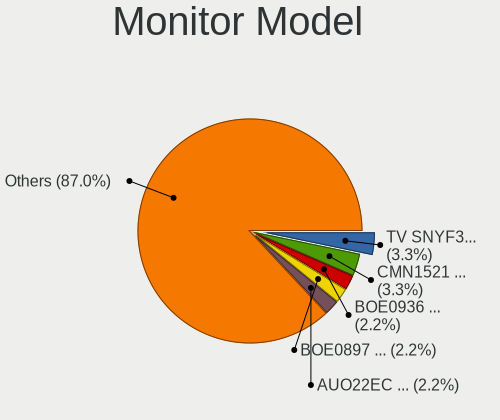

| Model                                                                   | Notebooks | Percent |
|-------------------------------------------------------------------------|-----------|---------|
| Sony TV SNYF301 1920x1080                                               | 3         | 3.26%   |
| Chimei Innolux LCD Monitor CMN1521 1920x1080 344x193mm 15.5-inch        | 3         | 3.26%   |
| BOE LCD Monitor BOE0936 1920x1080 344x194mm 15.5-inch                   | 2         | 2.17%   |
| BOE LCD Monitor BOE0897 1366x768 344x194mm 15.5-inch                    | 2         | 2.17%   |
| AU Optronics LCD Monitor AUO22EC 1366x768 344x193mm 15.5-inch           | 2         | 2.17%   |
| Vizio V405-G9 VIZ1033 3840x2160 1096x616mm 49.5-inch                    | 1         | 1.09%   |
| Sharp LQ156M1JW25 SHP152C 1920x1080 344x194mm 15.5-inch                 | 1         | 1.09%   |
| Sharp LCD SHP1099 1280x720 890x500mm 40.2-inch                          | 1         | 1.09%   |
| Sharp LCD Monitor SHP14D1 1920x1200 336x210mm 15.6-inch                 | 1         | 1.09%   |
| Sharp LCD Monitor SHP1461 3200x1800 294x165mm 13.3-inch                 | 1         | 1.09%   |
| Sharp LCD Monitor SHP1446 3840x2160 382x215mm 17.3-inch                 | 1         | 1.09%   |
| Samsung Electronics LCD Monitor SEC3150 1366x768 344x193mm 15.5-inch    | 1         | 1.09%   |
| Samsung Electronics LCD Monitor SAM0F17 3840x2160 1872x1053mm 84.6-inch | 1         | 1.09%   |
| PANDA LCD Monitor NCP004D 1920x1080 344x194mm 15.5-inch                 | 1         | 1.09%   |
| PANDA LCD Monitor NCP002B 1920x1080 309x174mm 14.0-inch                 | 1         | 1.09%   |
| PANDA LCD Monitor NCP0004 1920x1080 294x165mm 13.3-inch                 | 1         | 1.09%   |
| Olidata TW999 OLD9996 1440x900 410x257mm 19.1-inch                      | 1         | 1.09%   |
| LG Display LCD Monitor LGD06F7 1920x1200 302x189mm 14.0-inch            | 1         | 1.09%   |
| LG Display LCD Monitor LGD06E4 1920x1080 344x194mm 15.5-inch            | 1         | 1.09%   |
| LG Display LCD Monitor LGD068D 1920x1080 309x174mm 14.0-inch            | 1         | 1.09%   |
| LG Display LCD Monitor LGD05FA 1920x1080 309x174mm 14.0-inch            | 1         | 1.09%   |
| LG Display LCD Monitor LGD05EE 2560x1440 309x174mm 14.0-inch            | 1         | 1.09%   |
| LG Display LCD Monitor LGD05D8 1920x1080 344x194mm 15.5-inch            | 1         | 1.09%   |
| LG Display LCD Monitor LGD04FF 1920x1080 309x174mm 14.0-inch            | 1         | 1.09%   |
| LG Display LCD Monitor LGD04BD 1366x768 344x194mm 15.5-inch             | 1         | 1.09%   |
| LG Display LCD Monitor LGD04A7 1920x1080 344x194mm 15.5-inch            | 1         | 1.09%   |
| LG Display LCD Monitor LGD0438 1366x768 344x194mm 15.5-inch             | 1         | 1.09%   |
| LG Display LCD Monitor LGD039F 1366x768 345x194mm 15.6-inch             | 1         | 1.09%   |
| LG Display LCD Monitor LGD02F1 1366x768 344x194mm 15.5-inch             | 1         | 1.09%   |
| KDB LCD Monitor KDB0526 1920x1080 344x194mm 15.5-inch                   | 1         | 1.09%   |
| InfoVision LCD Monitor IVO057D 1920x1080 309x174mm 14.0-inch            | 1         | 1.09%   |
| InfoVision LCD Monitor IVO048E 1366x768 256x144mm 11.6-inch             | 1         | 1.09%   |
| Iiyama PL2730H IVM663A 1920x1080 598x336mm 27.0-inch                    | 1         | 1.09%   |
| Gigabyte Technology G24F 2 GBT2403 1920x1080 527x296mm 23.8-inch        | 1         | 1.09%   |
| Dell SE2717H/HX DELD0A1 1920x1080 598x336mm 27.0-inch                   | 1         | 1.09%   |
| Dell IN1930 DELF03B 1366x768 410x230mm 18.5-inch                        | 1         | 1.09%   |
| CSO LCD Monitor CSO161D 2560x1600 345x215mm 16.0-inch                   | 1         | 1.09%   |
| Chimei Innolux LCD Monitor CMN1738 1920x1080 381x214mm 17.2-inch        | 1         | 1.09%   |
| Chimei Innolux LCD Monitor CMN15E7 1920x1080 344x193mm 15.5-inch        | 1         | 1.09%   |
| Chimei Innolux LCD Monitor CMN15C3 1920x1080 344x193mm 15.5-inch        | 1         | 1.09%   |

Monitor Resolution
------------------

Monitor screen resolution

| Resolution        | Notebooks | Percent |
|-------------------|-----------|---------|
| 1920x1080 (FHD)   | 47        | 54.65%  |
| 1366x768 (WXGA)   | 23        | 26.74%  |
| 1920x1200 (WUXGA) | 6         | 6.98%   |
| 3840x2160 (4K)    | 3         | 3.49%   |
| 1600x900 (HD+)    | 2         | 2.33%   |
| 3200x1800 (QHD+)  | 1         | 1.16%   |
| 2560x1600         | 1         | 1.16%   |
| 2560x1440 (QHD)   | 1         | 1.16%   |
| 1920x540          | 1         | 1.16%   |
| 1440x900 (WXGA+)  | 1         | 1.16%   |

Monitor Diagonal
----------------

Diagonal size in inches

| Inches | Notebooks | Percent |
|--------|-----------|---------|
| 15     | 45        | 48.91%  |
| 14     | 12        | 13.04%  |
| 13     | 11        | 11.96%  |
| 17     | 7         | 7.61%   |
| 72     | 3         | 3.26%   |
| 27     | 2         | 2.17%   |
| 16     | 2         | 2.17%   |
| 11     | 2         | 2.17%   |
| 84     | 1         | 1.09%   |
| 69     | 1         | 1.09%   |
| 40     | 1         | 1.09%   |
| 24     | 1         | 1.09%   |
| 23     | 1         | 1.09%   |
| 19     | 1         | 1.09%   |
| 18     | 1         | 1.09%   |
| 12     | 1         | 1.09%   |

Monitor Width
-------------

Physical width

| Width in mm | Notebooks | Percent |
|-------------|-----------|---------|
| 301-350     | 67        | 72.83%  |
| 351-400     | 7         | 7.61%   |
| 201-300     | 6         | 6.52%   |
| 1501-2000   | 5         | 5.43%   |
| 501-600     | 4         | 4.35%   |
| 401-500     | 2         | 2.17%   |
| 801-900     | 1         | 1.09%   |

Aspect Ratio
------------

Proportional relationship between the width and the height

| Ratio | Notebooks | Percent |
|-------|-----------|---------|
| 16/9  | 73        | 90.12%  |
| 16/10 | 8         | 9.88%   |

Monitor Area
------------

Area in inch²

| Area in inch² | Notebooks | Percent |
|----------------|-----------|---------|
| 101-110        | 44        | 47.83%  |
| 81-90          | 20        | 21.74%  |
| 121-130        | 7         | 7.61%   |
| More than 1000 | 5         | 5.43%   |
| 71-80          | 3         | 3.26%   |
| 111-120        | 3         | 3.26%   |
| 51-60          | 2         | 2.17%   |
| 301-350        | 2         | 2.17%   |
| 201-250        | 2         | 2.17%   |
| 61-70          | 1         | 1.09%   |
| 151-200        | 1         | 1.09%   |
| 141-150        | 1         | 1.09%   |
| 501-1000       | 1         | 1.09%   |

Pixel Density
-------------

Pixels per inch

| Density       | Notebooks | Percent |
|---------------|-----------|---------|
| 121-160       | 49        | 53.26%  |
| 101-120       | 20        | 21.74%  |
| 51-100        | 10        | 10.87%  |
| 161-240       | 7         | 7.61%   |
| 1-50          | 4         | 4.35%   |
| More than 240 | 2         | 2.17%   |

Multiple Monitors
-----------------

Total monitors connected

| Total | Notebooks | Percent |
|-------|-----------|---------|
| 1     | 70        | 83.33%  |
| 2     | 12        | 14.29%  |
| 0     | 2         | 2.38%   |

Network
-------

Net Controller Vendor
---------------------

Controller vendors

| Vendor                | Notebooks | Percent |
|-----------------------|-----------|---------|
| Realtek Semiconductor | 50        | 37.04%  |
| Intel                 | 48        | 35.56%  |
| Qualcomm Atheros      | 16        | 11.85%  |
| Xiaomi                | 3         | 2.22%   |
| TP-Link               | 2         | 1.48%   |
| Samsung Electronics   | 2         | 1.48%   |
| Ralink Technology     | 2         | 1.48%   |
| Qualcomm              | 2         | 1.48%   |
| MediaTek              | 2         | 1.48%   |
| Broadcom              | 2         | 1.48%   |
| Ralink                | 1         | 0.74%   |
| Lenovo                | 1         | 0.74%   |
| JMicron Technology    | 1         | 0.74%   |
| Google                | 1         | 0.74%   |
| Dell                  | 1         | 0.74%   |
| ASIX Electronics      | 1         | 0.74%   |

Net Controller Model
--------------------

Controller models

| Model                                                                  | Notebooks | Percent |
|------------------------------------------------------------------------|-----------|---------|
| Realtek RTL8111/8168/8211/8411 PCI Express Gigabit Ethernet Controller | 28        | 17.28%  |
| Intel Alder Lake-P PCH CNVi WiFi                                       | 12        | 7.41%   |
| Realtek RTL8153 Gigabit Ethernet Adapter                               | 7         | 4.32%   |
| Realtek RTL8821CE 802.11ac PCIe Wireless Network Adapter               | 5         | 3.09%   |
| Realtek RTL810xE PCI Express Fast Ethernet controller                  | 5         | 3.09%   |
| Qualcomm Atheros QCA9565 / AR9565 Wireless Network Adapter             | 5         | 3.09%   |
| Realtek RTL8188EUS 802.11n Wireless Network Adapter                    | 4         | 2.47%   |
| Qualcomm Atheros QCA9377 802.11ac Wireless Network Adapter             | 4         | 2.47%   |
| Realtek RTL8822CE 802.11ac PCIe Wireless Network Adapter               | 3         | 1.85%   |
| Intel Wireless 8265 / 8275                                             | 3         | 1.85%   |
| Intel Wi-Fi 6 AX200                                                    | 3         | 1.85%   |
| Intel Tiger Lake PCH CNVi WiFi                                         | 3         | 1.85%   |
| Intel Ethernet Connection I219-LM                                      | 3         | 1.85%   |
| Intel Cannon Point-LP CNVi [Wireless-AC]                               | 3         | 1.85%   |
| Xiaomi Mi/Redmi series (RNDIS)                                         | 2         | 1.23%   |
| Realtek Killer E2600 GbE Controller                                    | 2         | 1.23%   |
| Qualcomm Atheros AR9485 Wireless Network Adapter                       | 2         | 1.23%   |
| Qualcomm Atheros AR9285 Wireless Network Adapter (PCI-Express)         | 2         | 1.23%   |
| Intel Wireless 8260                                                    | 2         | 1.23%   |
| Intel Wireless 7265                                                    | 2         | 1.23%   |
| Intel Wi-Fi 6 AX201                                                    | 2         | 1.23%   |
| Intel Wi-Fi 5(802.11ac) Wireless-AC 9x6x [Thunder Peak]                | 2         | 1.23%   |
| Intel Raptor Lake PCH CNVi WiFi                                        | 2         | 1.23%   |
| Intel Gemini Lake PCH CNVi WiFi                                        | 2         | 1.23%   |
| Intel Ethernet Connection (6) I219-V                                   | 2         | 1.23%   |
| Intel Ethernet Connection (6) I219-LM                                  | 2         | 1.23%   |
| Intel Ethernet Connection (4) I219-LM                                  | 2         | 1.23%   |
| Intel Comet Lake PCH-LP CNVi WiFi                                      | 2         | 1.23%   |
| Intel Comet Lake PCH CNVi WiFi                                         | 2         | 1.23%   |
| Intel Centrino Advanced-N 6205 [Taylor Peak]                           | 2         | 1.23%   |
| Intel 82579LM Gigabit Network Connection (Lewisville)                  | 2         | 1.23%   |
| Xiaomi Mi/Redmi series (RNDIS + ADB)                                   | 1         | 0.62%   |
| TP-Link TL-WN722N v2/v3 [Realtek RTL8188EUS]                           | 1         | 0.62%   |
| TP-Link Archer T4U ver.3                                               | 1         | 0.62%   |
| Samsung GT-I9070 (network tethering, USB debugging enabled)            | 1         | 0.62%   |
| Samsung Galaxy series, misc. (tethering mode)                          | 1         | 0.62%   |
| Realtek RTL8852AE 802.11ax PCIe Wireless Network Adapter               | 1         | 0.62%   |
| Realtek RTL8723BE PCIe Wireless Network Adapter                        | 1         | 0.62%   |
| Realtek RTL8192CU 802.11n WLAN Adapter                                 | 1         | 0.62%   |
| Realtek RTL8187 Wireless Adapter                                       | 1         | 0.62%   |

Wireless Vendor
---------------

Wireless vendors

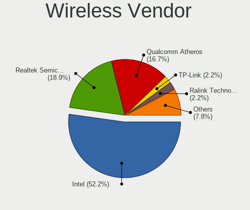

| Vendor                | Notebooks | Percent |
|-----------------------|-----------|---------|
| Intel                 | 48        | 52.75%  |
| Realtek Semiconductor | 17        | 18.68%  |
| Qualcomm Atheros      | 15        | 16.48%  |
| TP-Link               | 2         | 2.2%    |
| Ralink Technology     | 2         | 2.2%    |
| MediaTek              | 2         | 2.2%    |
| Broadcom              | 2         | 2.2%    |
| Ralink                | 1         | 1.1%    |
| Qualcomm              | 1         | 1.1%    |
| Dell                  | 1         | 1.1%    |

Wireless Model
--------------

Wireless models

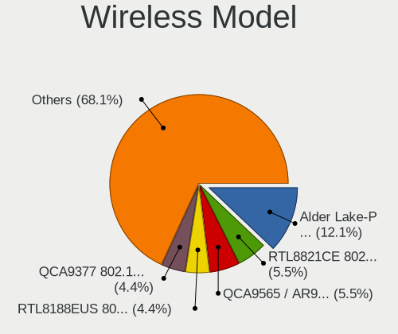

| Model                                                                                         | Notebooks | Percent |
|-----------------------------------------------------------------------------------------------|-----------|---------|
| Intel Alder Lake-P PCH CNVi WiFi                                                              | 12        | 13.04%  |
| Realtek RTL8821CE 802.11ac PCIe Wireless Network Adapter                                      | 5         | 5.43%   |
| Qualcomm Atheros QCA9565 / AR9565 Wireless Network Adapter                                    | 5         | 5.43%   |
| Realtek RTL8188EUS 802.11n Wireless Network Adapter                                           | 4         | 4.35%   |
| Qualcomm Atheros QCA9377 802.11ac Wireless Network Adapter                                    | 4         | 4.35%   |
| Realtek RTL8822CE 802.11ac PCIe Wireless Network Adapter                                      | 3         | 3.26%   |
| Intel Wireless 8265 / 8275                                                                    | 3         | 3.26%   |
| Intel Wi-Fi 6 AX200                                                                           | 3         | 3.26%   |
| Intel Tiger Lake PCH CNVi WiFi                                                                | 3         | 3.26%   |
| Intel Cannon Point-LP CNVi [Wireless-AC]                                                      | 3         | 3.26%   |
| Qualcomm Atheros AR9485 Wireless Network Adapter                                              | 2         | 2.17%   |
| Qualcomm Atheros AR9285 Wireless Network Adapter (PCI-Express)                                | 2         | 2.17%   |
| Intel Wireless 8260                                                                           | 2         | 2.17%   |
| Intel Wireless 7265                                                                           | 2         | 2.17%   |
| Intel Wi-Fi 6 AX201                                                                           | 2         | 2.17%   |
| Intel Wi-Fi 5(802.11ac) Wireless-AC 9x6x [Thunder Peak]                                       | 2         | 2.17%   |
| Intel Raptor Lake PCH CNVi WiFi                                                               | 2         | 2.17%   |
| Intel Gemini Lake PCH CNVi WiFi                                                               | 2         | 2.17%   |
| Intel Comet Lake PCH-LP CNVi WiFi                                                             | 2         | 2.17%   |
| Intel Comet Lake PCH CNVi WiFi                                                                | 2         | 2.17%   |
| Intel Centrino Advanced-N 6205 [Taylor Peak]                                                  | 2         | 2.17%   |
| TP-Link TL-WN722N v2/v3 [Realtek RTL8188EUS]                                                  | 1         | 1.09%   |
| TP-Link Archer T4U ver.3                                                                      | 1         | 1.09%   |
| Realtek RTL8852AE 802.11ax PCIe Wireless Network Adapter                                      | 1         | 1.09%   |
| Realtek RTL8723BE PCIe Wireless Network Adapter                                               | 1         | 1.09%   |
| Realtek RTL8192CU 802.11n WLAN Adapter                                                        | 1         | 1.09%   |
| Realtek RTL8187 Wireless Adapter                                                              | 1         | 1.09%   |
| Realtek Realtek 8812AU/8821AU 802.11ac WLAN Adapter [USB Wireless Dual-Band Adapter 2.4/5Ghz] | 1         | 1.09%   |
| Realtek 802.11ac NIC                                                                          | 1         | 1.09%   |
| Ralink RT5372 Wireless Adapter                                                                | 1         | 1.09%   |
| Ralink RT3572 Wireless Adapter                                                                | 1         | 1.09%   |
| Ralink RT5390R PCIe 802.11b/g/n Wireless Network Adapter                                      | 1         | 1.09%   |
| Qualcomm QCNFA765 Wireless Network Adapter                                                    | 1         | 1.09%   |
| Qualcomm Atheros QCA6174 802.11ac Wireless Network Adapter                                    | 1         | 1.09%   |
| Qualcomm Atheros QCA6164 802.11ac Wireless Network Adapter                                    | 1         | 1.09%   |
| MediaTek MT7922 802.11ax PCI Express Wireless Network Adapter                                 | 1         | 1.09%   |
| MediaTek MT7921 802.11ax PCI Express Wireless Network Adapter                                 | 1         | 1.09%   |
| Intel Raptor Lake-S PCH CNVi WiFi                                                             | 1         | 1.09%   |
| Intel Dual Band Wireless-AC 3168NGW [Stone Peak]                                              | 1         | 1.09%   |
| Intel Dual Band Wireless-AC 3165 Plus Bluetooth                                               | 1         | 1.09%   |

Ethernet Vendor
---------------

Ethernet vendors

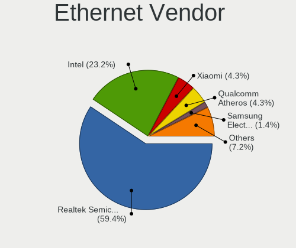

| Vendor                | Notebooks | Percent |
|-----------------------|-----------|---------|
| Realtek Semiconductor | 41        | 59.42%  |
| Intel                 | 15        | 21.74%  |
| Xiaomi                | 3         | 4.35%   |
| Qualcomm Atheros      | 3         | 4.35%   |
| Samsung Electronics   | 2         | 2.9%    |
| Qualcomm              | 1         | 1.45%   |
| Lenovo                | 1         | 1.45%   |
| JMicron Technology    | 1         | 1.45%   |
| Google                | 1         | 1.45%   |
| ASIX Electronics      | 1         | 1.45%   |

Ethernet Model
--------------

Ethernet models

| Model                                                                  | Notebooks | Percent |
|------------------------------------------------------------------------|-----------|---------|
| Realtek RTL8111/8168/8211/8411 PCI Express Gigabit Ethernet Controller | 28        | 40%     |
| Realtek RTL8153 Gigabit Ethernet Adapter                               | 7         | 10%     |
| Realtek RTL810xE PCI Express Fast Ethernet controller                  | 5         | 7.14%   |
| Intel Ethernet Connection I219-LM                                      | 3         | 4.29%   |
| Xiaomi Mi/Redmi series (RNDIS)                                         | 2         | 2.86%   |
| Realtek Killer E2600 GbE Controller                                    | 2         | 2.86%   |
| Intel Ethernet Connection (6) I219-V                                   | 2         | 2.86%   |
| Intel Ethernet Connection (6) I219-LM                                  | 2         | 2.86%   |
| Intel Ethernet Connection (4) I219-LM                                  | 2         | 2.86%   |
| Intel 82579LM Gigabit Network Connection (Lewisville)                  | 2         | 2.86%   |
| Xiaomi Mi/Redmi series (RNDIS + ADB)                                   | 1         | 1.43%   |
| Samsung GT-I9070 (network tethering, USB debugging enabled)            | 1         | 1.43%   |
| Samsung Galaxy series, misc. (tethering mode)                          | 1         | 1.43%   |
| Qualcomm MDM9207-MTP _SN:F0565CAE                                      | 1         | 1.43%   |
| Qualcomm Atheros QCA8171 Gigabit Ethernet                              | 1         | 1.43%   |
| Qualcomm Atheros AR8151 v2.0 Gigabit Ethernet                          | 1         | 1.43%   |
| Qualcomm Atheros AR8131 Gigabit Ethernet                               | 1         | 1.43%   |
| Lenovo USB-C to LAN                                                    | 1         | 1.43%   |
| JMicron JMC250 PCI Express Gigabit Ethernet Controller                 | 1         | 1.43%   |
| Intel Ethernet Connection (7) I219-V                                   | 1         | 1.43%   |
| Intel Ethernet Connection (7) I219-LM                                  | 1         | 1.43%   |
| Intel Ethernet Connection (5) I219-LM                                  | 1         | 1.43%   |
| Intel Ethernet Connection (13) I219-V                                  | 1         | 1.43%   |
| Google Pixel 8                                                         | 1         | 1.43%   |
| ASIX AX88179 Gigabit Ethernet                                          | 1         | 1.43%   |

Net Controller Kind
-------------------

Ethernet, WiFi or modem

| Kind     | Notebooks | Percent |
|----------|-----------|---------|
| WiFi     | 81        | 55.48%  |
| Ethernet | 65        | 44.52%  |

Used Controller
---------------

Currently used network controller

| Kind     | Notebooks | Percent |
|----------|-----------|---------|
| WiFi     | 64        | 81.01%  |
| Ethernet | 15        | 18.99%  |

NICs
----

Total network controllers on board

| Total | Notebooks | Percent |
|-------|-----------|---------|
| 2     | 54        | 65.85%  |
| 1     | 25        | 30.49%  |
| 0     | 3         | 3.66%   |

IPv6
----

IPv6 vs IPv4

| Used | Notebooks | Percent |
|------|-----------|---------|
| No   | 63        | 75.9%   |
| Yes  | 20        | 24.1%   |

Bluetooth
---------

Bluetooth Vendor
----------------

Controller vendors

| Vendor                          | Notebooks | Percent |
|---------------------------------|-----------|---------|
| Intel                           | 39        | 56.52%  |
| Qualcomm Atheros Communications | 10        | 14.49%  |
| Realtek Semiconductor           | 9         | 13.04%  |
| Lite-On Technology              | 2         | 2.9%    |
| IMC Networks                    | 2         | 2.9%    |
| Foxconn / Hon Hai               | 2         | 2.9%    |
| Broadcom                        | 2         | 2.9%    |
| Hewlett-Packard                 | 1         | 1.45%   |
| ASUSTek Computer                | 1         | 1.45%   |
| Unknown                         | 1         | 1.45%   |

Bluetooth Model
---------------

Controller models

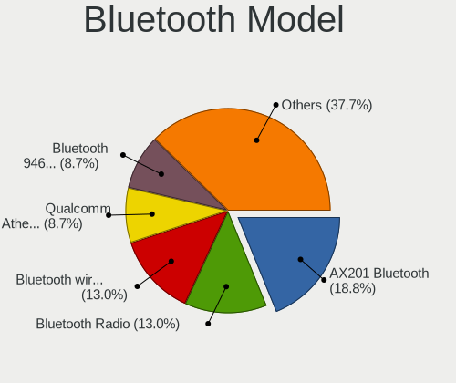

| Model                                          | Notebooks | Percent |
|------------------------------------------------|-----------|---------|
| Intel AX201 Bluetooth                          | 13        | 18.84%  |
| Realtek Bluetooth Radio                        | 9         | 13.04%  |
| Intel Bluetooth wireless interface             | 9         | 13.04%  |
| Qualcomm Atheros  Bluetooth Device             | 6         | 8.7%    |
| Intel Bluetooth Device                         | 6         | 8.7%    |
| Intel Bluetooth 9460/9560 Jefferson Peak (JfP) | 6         | 8.7%    |
| Intel AX200 Bluetooth                          | 3         | 4.35%   |
| Qualcomm Atheros QCA61x4 Bluetooth 4.0         | 1         | 1.45%   |
| Qualcomm Atheros Bluetooth USB Host Controller | 1         | 1.45%   |
| Qualcomm Atheros AR3012 Bluetooth 4.0          | 1         | 1.45%   |
| Qualcomm Atheros AR3011 Bluetooth              | 1         | 1.45%   |
| Lite-On Wireless_Device                        | 1         | 1.45%   |
| Lite-On Bluetooth Device                       | 1         | 1.45%   |
| Intel Wireless-AC 9260 Bluetooth Adapter       | 1         | 1.45%   |
| Intel Wireless-AC 3168 Bluetooth               | 1         | 1.45%   |
| IMC Networks Bluetooth Radio                   | 1         | 1.45%   |
| IMC Networks Bluetooth Device                  | 1         | 1.45%   |
| HP Broadcom 2070 Bluetooth Combo               | 1         | 1.45%   |
| Foxconn / Hon Hai Wireless_Device              | 1         | 1.45%   |
| Foxconn / Hon Hai Bluetooth Device             | 1         | 1.45%   |
| Broadcom BCM43142A0 Bluetooth 4.0              | 1         | 1.45%   |
| Broadcom BCM2045A0                             | 1         | 1.45%   |
| ASUS BT-270 Bluetooth Adapter                  | 1         | 1.45%   |
| Unknown                                        | 1         | 1.45%   |

Sound
-----

Sound Vendor
------------

Sound card vendors

| Vendor                 | Notebooks | Percent |
|------------------------|-----------|---------|
| Intel                  | 71        | 66.98%  |
| Nvidia                 | 18        | 16.98%  |
| AMD                    | 12        | 11.32%  |
| Realtek Semiconductor  | 1         | 0.94%   |
| JMTek                  | 1         | 0.94%   |
| GN Netcom              | 1         | 0.94%   |
| Generalplus Technology | 1         | 0.94%   |
| Conexant Systems       | 1         | 0.94%   |

Sound Model
-----------

Sound card models

| Model                                                                                             | Notebooks | Percent |
|---------------------------------------------------------------------------------------------------|-----------|---------|
| Intel Alder Lake PCH-P High Definition Audio Controller                                           | 13        | 10.74%  |
| Intel Sunrise Point-LP HD Audio                                                                   | 10        | 8.26%   |
| Intel Tiger Lake-LP Smart Sound Technology Audio Controller                                       | 8         | 6.61%   |
| AMD Family 17h/19h HD Audio Controller                                                            | 8         | 6.61%   |
| Nvidia TU107 GeForce GTX 1650 High Definition Audio Controller                                    | 5         | 4.13%   |
| Nvidia Audio device                                                                               | 5         | 4.13%   |
| Intel Cannon Point-LP High Definition Audio Controller                                            | 5         | 4.13%   |
| AMD Renoir Radeon High Definition Audio Controller                                                | 5         | 4.13%   |
| Intel Celeron/Pentium Silver Processor High Definition Audio                                      | 4         | 3.31%   |
| Intel 7 Series/C216 Chipset Family High Definition Audio Controller                               | 4         | 3.31%   |
| Intel 6 Series/C200 Series Chipset Family High Definition Audio Controller                        | 4         | 3.31%   |
| Nvidia GA106 High Definition Audio Controller                                                     | 3         | 2.48%   |
| Intel Tiger Lake-H HD Audio Controller                                                            | 3         | 2.48%   |
| Intel Cannon Lake PCH cAVS                                                                        | 3         | 2.48%   |
| Intel Wildcat Point-LP High Definition Audio Controller                                           | 2         | 1.65%   |
| Intel Raptor Lake-P/U/H cAVS                                                                      | 2         | 1.65%   |
| Intel Comet Lake PCH-LP cAVS                                                                      | 2         | 1.65%   |
| Intel Comet Lake PCH cAVS                                                                         | 2         | 1.65%   |
| Intel Celeron N3350/Pentium N4200/Atom E3900 Series Audio Cluster                                 | 2         | 1.65%   |
| Intel Broadwell-U Audio Controller                                                                | 2         | 1.65%   |
| AMD Raven/Raven2/Fenghuang HDMI/DP Audio Controller                                               | 2         | 1.65%   |
| AMD Family 15h (Models 60h-6fh) Audio Controller                                                  | 2         | 1.65%   |
| Realtek Semiconductor USB Audio                                                                   | 1         | 0.83%   |
| Nvidia High Definition Audio Controller                                                           | 1         | 0.83%   |
| Nvidia GP104 High Definition Audio Controller                                                     | 1         | 0.83%   |
| Nvidia GM107 High Definition Audio Controller [GeForce 940MX]                                     | 1         | 0.83%   |
| Nvidia GF108 High Definition Audio Controller                                                     | 1         | 0.83%   |
| Nvidia GA104 High Definition Audio Controller                                                     | 1         | 0.83%   |
| JMTek USB PnP Audio Device                                                                        | 1         | 0.83%   |
| Intel Xeon E3-1200 v3/4th Gen Core Processor HD Audio Controller                                  | 1         | 0.83%   |
| Intel USB PnP Sound Device                                                                        | 1         | 0.83%   |
| Intel Raptor Lake High Definition Audio Controller                                                | 1         | 0.83%   |
| Intel Haswell-ULT HD Audio Controller                                                             | 1         | 0.83%   |
| Intel CM238 HD Audio Controller                                                                   | 1         | 0.83%   |
| Intel Atom/Celeron/Pentium Processor x5-E8000/J3xxx/N3xxx Series High Definition Audio Controller | 1         | 0.83%   |
| Intel 82801I (ICH9 Family) HD Audio Controller                                                    | 1         | 0.83%   |
| Intel 8 Series/C220 Series Chipset High Definition Audio Controller                               | 1         | 0.83%   |
| Intel 8 Series HD Audio Controller                                                                | 1         | 0.83%   |
| Intel 5 Series/3400 Series Chipset High Definition Audio                                          | 1         | 0.83%   |
| GN Netcom Jabra EVOLVE LINK                                                                       | 1         | 0.83%   |

Memory
------

Memory Vendor
-------------

Memory module vendors

| Vendor              | Notebooks | Percent |
|---------------------|-----------|---------|
| Samsung Electronics | 22        | 33.33%  |
| SK hynix            | 12        | 18.18%  |
| Micron Technology   | 9         | 13.64%  |
| Kingston            | 6         | 9.09%   |
| Unknown             | 3         | 4.55%   |
| A-DATA Technology   | 3         | 4.55%   |
| Unknown (ABCD)      | 2         | 3.03%   |
| Team                | 2         | 3.03%   |
| Unknown             | 2         | 3.03%   |
| Smart               | 1         | 1.52%   |
| Ramaxel Technology  | 1         | 1.52%   |
| Nanya Technology    | 1         | 1.52%   |
| Elpida              | 1         | 1.52%   |
| Crucial             | 1         | 1.52%   |

Memory Model
------------

Memory module models

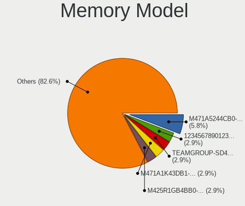

| Model                                                               | Notebooks | Percent |
|---------------------------------------------------------------------|-----------|---------|
| Samsung RAM M471A5244CB0-CWE 4GB SODIMM DDR4 3200MT/s               | 4         | 5.8%    |
| Unknown (ABCD) RAM 123456789012345678 2048MB SODIMM LPDDR4 2400MT/s | 2         | 2.9%    |
| SK hynix RAM HMAA1GS6CJR6N-XN 8GB SODIMM DDR4 3200MT/s              | 2         | 2.9%    |
| Samsung RAM M471A1K43DB1-CTD 8GB SODIMM DDR4 2667MT/s               | 2         | 2.9%    |
| Samsung RAM M425R1GB4BB0-CWMOD 8192MB SODIMM 5600MT/s               | 2         | 2.9%    |
| Unknown                                                             | 2         | 2.9%    |
| Unknown RAM Module 4GB SODIMM LPDDR3 1600MT/s                       | 1         | 1.45%   |
| Unknown RAM Module 4GB SODIMM DDR4 2133MT/s                         | 1         | 1.45%   |
| Unknown RAM Module 4GB SODIMM DDR3 1333MT/s                         | 1         | 1.45%   |
| Team RAM TEAMGROUP-SD4-3200 8GB SODIMM DDR4 3200MT/s                | 1         | 1.45%   |
| Team RAM TEAMGROUP-SD4-3200 16GB SODIMM DDR4 3200MT/s               | 1         | 1.45%   |
| Smart RAM SMS4WEC8C1K0446FCG 8GB SODIMM DDR4 3200MT/s               | 1         | 1.45%   |
| SK hynix RAM Module 4GB Row Of Chips LPDDR3 2133MT/s                | 1         | 1.45%   |
| SK hynix RAM Module 16GB SODIMM 4800MT/s                            | 1         | 1.45%   |
| SK hynix RAM HMT41GS6AFR8A-PB 8GB SODIMM DDR3 1600MT/s              | 1         | 1.45%   |
| SK hynix RAM HMCG66AGBSA095N 8GB SODIMM DDR5 5600MT/s               | 1         | 1.45%   |
| SK hynix RAM HMAA2GS6AJR8N-XN 16GB SODIMM DDR4 3200MT/s             | 1         | 1.45%   |
| SK hynix RAM HMA851S6DJR6N-XN 4GB SODIMM DDR4 3200MT/s              | 1         | 1.45%   |
| SK hynix RAM HMA82GS6DJR8N-VK 16GB SODIMM DDR4 2667MT/s             | 1         | 1.45%   |
| SK hynix RAM HMA81GS6DJR8N-XN 8GB SODIMM DDR4 3200MT/s              | 1         | 1.45%   |
| SK hynix RAM H9JCNNNCP3MLYR-N6E 2GB Row Of Chips LPDDR5 6400MT/s    | 1         | 1.45%   |
| SK hynix RAM H9HCNNNCPMMLXR-NEE 2GB Row Of Chips LPDDR4 4267MT/s    | 1         | 1.45%   |
| Samsung RAM UBE3D4AA-MGCR 2GB Row Of Chips LPDDR4 4267MT/s          | 1         | 1.45%   |
| Samsung RAM Module 8GB SODIMM DDR4 2133MT/s                         | 1         | 1.45%   |
| Samsung RAM Module 16GB SODIMM DDR4 2133MT/s                        | 1         | 1.45%   |
| Samsung RAM M471B5773DH0-CH9 2GB SODIMM DDR3 1600MT/s               | 1         | 1.45%   |
| Samsung RAM M471B5273BH1-CF8 4GB SODIMM DDR3 1067MT/s               | 1         | 1.45%   |
| Samsung RAM M471B5173EB0-YK0 4GB SODIMM DDR3 1600MT/s               | 1         | 1.45%   |
| Samsung RAM M471B5173DB0-YK0 4GB SODIMM DDR3 1600MT/s               | 1         | 1.45%   |
| Samsung RAM M471A5143EB0-CPB 4GB SODIMM DDR4 2133MT/s               | 1         | 1.45%   |
| Samsung RAM M471A2K43DB1-CWE 16GB SODIMM DDR4 3200MT/s              | 1         | 1.45%   |
| Samsung RAM M471A1K43EB1-CWE 8GB SODIMM DDR4 3200MT/s               | 1         | 1.45%   |
| Samsung RAM M471A1K43DB1-CWE 8GB SODIMM DDR4 3200MT/s               | 1         | 1.45%   |
| Samsung RAM M471A1K43BB1-CTD 8GB SODIMM DDR4 2667MT/s               | 1         | 1.45%   |
| Samsung RAM M471A1G44BB0-CWE 8192MB Row Of Chips DDR4 3200MT/s      | 1         | 1.45%   |
| Samsung RAM M425R1GB4BB0-CQKOL 8GB SODIMM DDR5 4800MT/s             | 1         | 1.45%   |
| Samsung RAM K4U6E3S4AB-MGCL 1GB Row Of Chips LPDDR4 4267MT/s        | 1         | 1.45%   |
| Samsung RAM K4F8E304HB-MGCJ 1GB LPDDR4 2400MT/s                     | 1         | 1.45%   |
| Ramaxel RAM RMT3170ME68F9F1600 4GB SODIMM DDR3 1600MT/s             | 1         | 1.45%   |
| Nanya RAM NT4GC64B8HB0NS-CG 4GB SODIMM DDR3 1334MT/s                | 1         | 1.45%   |

Memory Kind
-----------

Memory module kinds

| Kind    | Notebooks | Percent |
|---------|-----------|---------|
| DDR4    | 31        | 56.36%  |
| DDR3    | 8         | 14.55%  |
| LPDDR4  | 6         | 10.91%  |
| DDR5    | 4         | 7.27%   |
| LPDDR5  | 2         | 3.64%   |
| LPDDR3  | 2         | 3.64%   |
| Unknown | 2         | 3.64%   |

Memory Form Factor
------------------

Physical design of the memory module

| Name         | Notebooks | Percent |
|--------------|-----------|---------|
| SODIMM       | 44        | 80%     |
| Row Of Chips | 10        | 18.18%  |
| Unknown      | 1         | 1.82%   |

Memory Size
-----------

Memory module size

| Size  | Notebooks | Percent |
|-------|-----------|---------|
| 8192  | 27        | 43.55%  |
| 4096  | 15        | 24.19%  |
| 16384 | 13        | 20.97%  |
| 32768 | 4         | 6.45%   |
| 2048  | 2         | 3.23%   |
| 1024  | 1         | 1.61%   |

Memory Speed
------------

Memory module speed

| Speed | Notebooks | Percent |
|-------|-----------|---------|
| 3200  | 21        | 35.59%  |
| 2667  | 6         | 10.17%  |
| 1600  | 6         | 10.17%  |
| 4800  | 4         | 6.78%   |
| 2400  | 4         | 6.78%   |
| 2133  | 4         | 6.78%   |
| 5600  | 3         | 5.08%   |
| 4267  | 3         | 5.08%   |
| 6400  | 2         | 3.39%   |
| 1334  | 2         | 3.39%   |
| 1333  | 2         | 3.39%   |
| 1866  | 1         | 1.69%   |
| 1067  | 1         | 1.69%   |

Printers & scanners
-------------------

Printer Vendor
--------------

Printer device vendors

| Vendor          | Notebooks | Percent |
|-----------------|-----------|---------|
| Hewlett-Packard | 1         | 100%    |

Printer Model
-------------

Printer device models

| Model                | Notebooks | Percent |
|----------------------|-----------|---------|
| HP Deskjet 2050 J510 | 1         | 100%    |

Scanner Vendor
--------------

Scanner device vendors

Zero info for selected period =(

Scanner Model
-------------

Scanner device models

Zero info for selected period =(

Camera
------

Camera Vendor
-------------

Camera device vendors

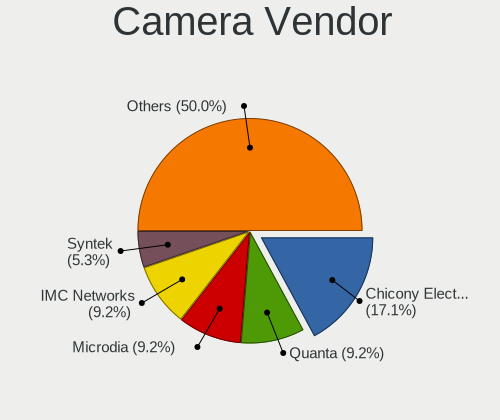

| Vendor                                 | Notebooks | Percent |
|----------------------------------------|-----------|---------|
| Chicony Electronics                    | 13        | 17.11%  |
| Quanta                                 | 7         | 9.21%   |
| Microdia                               | 7         | 9.21%   |
| IMC Networks                           | 7         | 9.21%   |
| Bison Electronics                      | 7         | 9.21%   |
| Syntek                                 | 4         | 5.26%   |
| Cheng Uei Precision Industry (Foxlink) | 4         | 5.26%   |
| Sunplus Innovation Technology          | 3         | 3.95%   |
| Realtek Semiconductor                  | 3         | 3.95%   |
| Luxvisions Innotech Limited            | 3         | 3.95%   |
| Lite-On Technology                     | 3         | 3.95%   |
| USB Camera                             | 2         | 2.63%   |
| Silicon Motion                         | 2         | 2.63%   |
| Suyin                                  | 1         | 1.32%   |
| SunplusIT                              | 1         | 1.32%   |
| Ricoh                                  | 1         | 1.32%   |
| Primax Electronics                     | 1         | 1.32%   |
| Logitech                               | 1         | 1.32%   |
| Goertek Electronics                    | 1         | 1.32%   |
| Genesys Logic                          | 1         | 1.32%   |
| Apple                                  | 1         | 1.32%   |
| Alcor Micro                            | 1         | 1.32%   |
| Acer                                   | 1         | 1.32%   |
| 8SSC21K12273V1SR33X2817                | 1         | 1.32%   |

Camera Model
------------

Camera device models

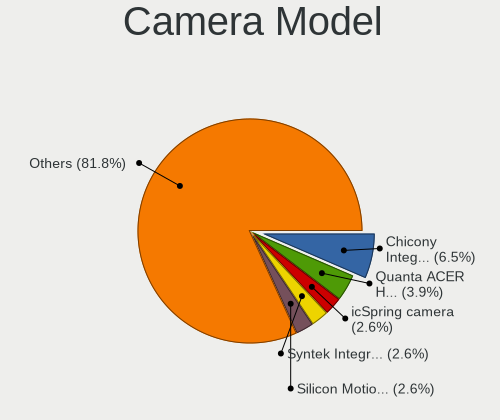

| Model                                               | Notebooks | Percent |
|-----------------------------------------------------|-----------|---------|
| Chicony Integrated Camera                           | 5         | 6.49%   |
| Realtek Integrated_Webcam_HD                        | 3         | 3.9%    |
| Quanta ACER HD User Facing                          | 3         | 3.9%    |
| Bison Integrated Camera                             | 3         | 3.9%    |
| USB Camera USB Camera                               | 2         | 2.6%    |
| Syntek Integrated Camera                            | 2         | 2.6%    |
| Silicon Motion Web Camera                           | 2         | 2.6%    |
| Quanta HD User Facing                               | 2         | 2.6%    |
| Microdia Integrated_Webcam_HD                       | 2         | 2.6%    |
| Luxvisions Innotech Limited HP TrueVision HD Camera | 2         | 2.6%    |
| Lite-On Integrated Camera                           | 2         | 2.6%    |
| IMC Networks USB2.0 HD UVC WebCam                   | 2         | 2.6%    |
| IMC Networks Integrated Camera                      | 2         | 2.6%    |
| Bison HD Webcam                                     | 2         | 2.6%    |
| Syntek Lenovo EasyCamera                            | 1         | 1.3%    |
| Syntek EasyCamera                                   | 1         | 1.3%    |
| Suyin HD Video WebCam                               | 1         | 1.3%    |
| SunplusIT 720p HD Camera                            | 1         | 1.3%    |
| Sunplus Integrated_Webcam_HD                        | 1         | 1.3%    |
| Sunplus HP HD Webcam [Fixed]                        | 1         | 1.3%    |
| Sunplus Camera                                      | 1         | 1.3%    |
| Ricoh Laptop_Integrated_Webcam_FHD                  | 1         | 1.3%    |
| Quanta VGA WebCam                                   | 1         | 1.3%    |
| Quanta HD Webcam                                    | 1         | 1.3%    |
| Primax HP HD Webcam [Fixed]                         | 1         | 1.3%    |
| Microdia USB 2.0 Camera                             | 1         | 1.3%    |
| Microdia Laptop_Integrated_Webcam_HD                | 1         | 1.3%    |
| Microdia Integrated_Webcam_FHD                      | 1         | 1.3%    |
| Microdia Integrated Webcam HD                       | 1         | 1.3%    |
| Microdia HP Webcam-50                               | 1         | 1.3%    |
| Luxvisions Innotech Limited HP 5MP Camera           | 1         | 1.3%    |
| Logitech BRIO Ultra HD Webcam                       | 1         | 1.3%    |
| Lite-On TOSHIBA Web Camera - HD                     | 1         | 1.3%    |
| IMC Networks USB2.0 5M AF UVC WebCam                | 1         | 1.3%    |
| IMC Networks ov9734_azurewave_camera                | 1         | 1.3%    |
| IMC Networks Integrated Webcam                      | 1         | 1.3%    |
| IMC Networks Integrated RGB Camera                  | 1         | 1.3%    |
| Goertek USB2.0 VGA UVC WebCam                       | 1         | 1.3%    |
| Genesys Logic Digital Microscope                    | 1         | 1.3%    |
| Chicony USB2.0 HD UVC WebCam                        | 1         | 1.3%    |

Security
--------

Fingerprint Vendor
------------------

Fingerprint sensor vendors

| Vendor                     | Notebooks | Percent |
|----------------------------|-----------|---------|
| Synaptics                  | 12        | 66.67%  |
| Validity Sensors           | 3         | 16.67%  |
| Shenzhen Goodix Technology | 2         | 11.11%  |
| Samsung Electronics        | 1         | 5.56%   |

Fingerprint Model
-----------------

Fingerprint sensor models

| Model                                                    | Notebooks | Percent |
|----------------------------------------------------------|-----------|---------|
| Synaptics Prometheus MIS Touch Fingerprint Reader        | 4         | 22.22%  |
| Synaptics UWP WBDI Device                                | 3         | 16.67%  |
| Synaptics FS7604 Touch Fingerprint Sensor with PurePrint | 2         | 11.11%  |
| Validity Sensors VFS5011 Fingerprint Reader              | 1         | 5.56%   |
| Validity Sensors VFS495 Fingerprint Reader               | 1         | 5.56%   |
| Validity Sensors VFS471 Fingerprint Reader               | 1         | 5.56%   |
| Synaptics WBDI Fingerprint Reader USB 086                | 1         | 5.56%   |
| Synaptics WBDI                                           | 1         | 5.56%   |
| Synaptics Metallica MIS Touch Fingerprint Reader         | 1         | 5.56%   |
| Shenzhen Goodix  FingerPrint Device                      | 1         | 5.56%   |
| Shenzhen Goodix FingerPrint                              | 1         | 5.56%   |
| Samsung Fingerprint Device                               | 1         | 5.56%   |

Chipcard Vendor
---------------

Chipcard module vendors

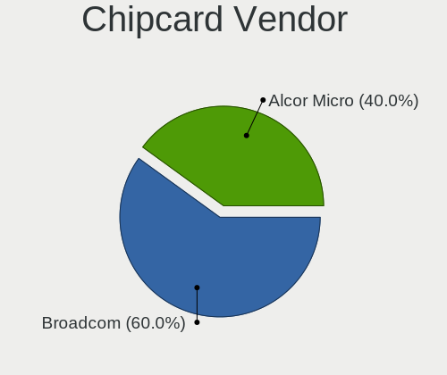

| Vendor      | Notebooks | Percent |
|-------------|-----------|---------|
| Broadcom    | 3         | 60%     |
| Alcor Micro | 2         | 40%     |

Chipcard Model
--------------

Chipcard module models

| Model                               | Notebooks | Percent |
|-------------------------------------|-----------|---------|
| Broadcom 5880                       | 3         | 60%     |
| Alcor Micro AU9540 Smartcard Reader | 2         | 40%     |

Unsupported
-----------

Unsupported Devices
-------------------

Total unsupported devices on board

| Total | Notebooks | Percent |
|-------|-----------|---------|
| 0     | 41        | 49.4%   |
| 1     | 32        | 38.55%  |
| 2     | 10        | 12.05%  |

Unsupported Device Types
------------------------

Types of unsupported devices

| Type                  | Notebooks | Percent |
|-----------------------|-----------|---------|
| Fingerprint reader    | 18        | 36.73%  |
| Graphics card         | 13        | 26.53%  |
| Chipcard              | 5         | 10.2%   |
| Camera                | 3         | 6.12%   |
| Sound                 | 2         | 4.08%   |
| Net/ethernet          | 2         | 4.08%   |
| Multimedia controller | 2         | 4.08%   |
| Bluetooth             | 2         | 4.08%   |
| Network               | 1         | 2.04%   |
| Net/wireless          | 1         | 2.04%   |

