Parrot 5.3 - Tested Hardware & Statistics
-----------------------------------------

A project to collect tested hardware configurations for Parrot 5.3.

Anyone can contribute to this report by the [hw-probe](https://github.com/linuxhw/hw-probe) tool:

    sudo -E hw-probe -all -upload

Please contribute! Especially if your hardware is rare.

This is a report for all computer types. See also reports for [desktops](/Dist/Parrot_5.3/Desktop/README.md) and [notebooks](/Dist/Parrot_5.3/Notebook/README.md).

Contents
--------

* [ Test Cases ](#test-cases)

* [ System ](#system)
  - [ Kernel                   ](#kernel)
  - [ Kernel Family            ](#kernel-family)
  - [ Kernel Major Ver.        ](#kernel-major-ver)
  - [ Arch                     ](#arch)
  - [ DE                       ](#de)
  - [ Display Server           ](#display-server)
  - [ Display Manager          ](#display-manager)
  - [ OS Lang                  ](#os-lang)
  - [ Boot Mode                ](#boot-mode)
  - [ Filesystem               ](#filesystem)
  - [ Part. scheme             ](#part-scheme)
  - [ Dual Boot with Linux/BSD ](#dual-boot-with-linuxbsd)
  - [ Dual Boot (Win)          ](#dual-boot-win)

* [ Board ](#board)
  - [ Vendor                   ](#vendor)
  - [ Model                    ](#model)
  - [ Model Family             ](#model-family)
  - [ MFG Year                 ](#mfg-year)
  - [ Form Factor              ](#form-factor)
  - [ Secure Boot              ](#secure-boot)
  - [ Coreboot                 ](#coreboot)
  - [ RAM Size                 ](#ram-size)
  - [ RAM Used                 ](#ram-used)
  - [ Total Drives             ](#total-drives)
  - [ Has CD-ROM               ](#has-cd-rom)
  - [ Has Ethernet             ](#has-ethernet)
  - [ Has WiFi                 ](#has-wifi)
  - [ Has Bluetooth            ](#has-bluetooth)

* [ Location ](#location)
  - [ Country                  ](#country)
  - [ City                     ](#city)

* [ Drives ](#drives)
  - [ Drive Vendor             ](#drive-vendor)
  - [ Drive Model              ](#drive-model)
  - [ HDD Vendor               ](#hdd-vendor)
  - [ SSD Vendor               ](#ssd-vendor)
  - [ Drive Kind               ](#drive-kind)
  - [ Drive Connector          ](#drive-connector)
  - [ Drive Size               ](#drive-size)
  - [ Space Total              ](#space-total)
  - [ Space Used               ](#space-used)
  - [ Malfunc. Drives          ](#malfunc-drives)
  - [ Malfunc. Drive Vendor    ](#malfunc-drive-vendor)
  - [ Malfunc. HDD Vendor      ](#malfunc-hdd-vendor)
  - [ Malfunc. Drive Kind      ](#malfunc-drive-kind)
  - [ Failed Drives            ](#failed-drives)
  - [ Failed Drive Vendor      ](#failed-drive-vendor)
  - [ Drive Status             ](#drive-status)

* [ Storage controller ](#storage-controller)
  - [ Storage Vendor           ](#storage-vendor)
  - [ Storage Model            ](#storage-model)
  - [ Storage Kind             ](#storage-kind)

* [ Processor ](#processor)
  - [ CPU Vendor               ](#cpu-vendor)
  - [ CPU Model                ](#cpu-model)
  - [ CPU Model Family         ](#cpu-model-family)
  - [ CPU Cores                ](#cpu-cores)
  - [ CPU Sockets              ](#cpu-sockets)
  - [ CPU Threads              ](#cpu-threads)
  - [ CPU Op-Modes             ](#cpu-op-modes)
  - [ CPU Microcode            ](#cpu-microcode)
  - [ CPU Microarch            ](#cpu-microarch)

* [ Graphics ](#graphics)
  - [ GPU Vendor               ](#gpu-vendor)
  - [ GPU Model                ](#gpu-model)
  - [ GPU Combo                ](#gpu-combo)
  - [ GPU Driver               ](#gpu-driver)
  - [ GPU Memory               ](#gpu-memory)

* [ Monitor ](#monitor)
  - [ Monitor Vendor           ](#monitor-vendor)
  - [ Monitor Model            ](#monitor-model)
  - [ Monitor Resolution       ](#monitor-resolution)
  - [ Monitor Diagonal         ](#monitor-diagonal)
  - [ Monitor Width            ](#monitor-width)
  - [ Aspect Ratio             ](#aspect-ratio)
  - [ Monitor Area             ](#monitor-area)
  - [ Pixel Density            ](#pixel-density)
  - [ Multiple Monitors        ](#multiple-monitors)

* [ Network ](#network)
  - [ Net Controller Vendor    ](#net-controller-vendor)
  - [ Net Controller Model     ](#net-controller-model)
  - [ Wireless Vendor          ](#wireless-vendor)
  - [ Wireless Model           ](#wireless-model)
  - [ Ethernet Vendor          ](#ethernet-vendor)
  - [ Ethernet Model           ](#ethernet-model)
  - [ Net Controller Kind      ](#net-controller-kind)
  - [ Used Controller          ](#used-controller)
  - [ NICs                     ](#nics)
  - [ IPv6                     ](#ipv6)

* [ Bluetooth ](#bluetooth)
  - [ Bluetooth Vendor         ](#bluetooth-vendor)
  - [ Bluetooth Model          ](#bluetooth-model)

* [ Sound ](#sound)
  - [ Sound Vendor             ](#sound-vendor)
  - [ Sound Model              ](#sound-model)

* [ Memory ](#memory)
  - [ Memory Vendor            ](#memory-vendor)
  - [ Memory Model             ](#memory-model)
  - [ Memory Kind              ](#memory-kind)
  - [ Memory Form Factor       ](#memory-form-factor)
  - [ Memory Size              ](#memory-size)
  - [ Memory Speed             ](#memory-speed)

* [ Printers & scanners ](#printers--scanners)
  - [ Printer Vendor           ](#printer-vendor)
  - [ Printer Model            ](#printer-model)
  - [ Scanner Vendor           ](#scanner-vendor)
  - [ Scanner Model            ](#scanner-model)

* [ Camera ](#camera)
  - [ Camera Vendor            ](#camera-vendor)
  - [ Camera Model             ](#camera-model)

* [ Security ](#security)
  - [ Fingerprint Vendor       ](#fingerprint-vendor)
  - [ Fingerprint Model        ](#fingerprint-model)
  - [ Chipcard Vendor          ](#chipcard-vendor)
  - [ Chipcard Model           ](#chipcard-model)

* [ Unsupported ](#unsupported)
  - [ Unsupported Devices      ](#unsupported-devices)
  - [ Unsupported Device Types ](#unsupported-device-types)

Test Cases
----------

Total: 167

| Vendor        | Model                       | Form-Factor | Probe                                                      | Date         |
|---------------|-----------------------------|-------------|------------------------------------------------------------|--------------|
| Lenovo        | ThinkPad T460s 20FAS2JW0... | Notebook    | [59d637113b](https://linux-hardware.org/?probe=59d637113b) | Jan 26, 2024 |
| ASRock        | Z77M                        | Desktop     | [f3bd1cdf2c](https://linux-hardware.org/?probe=f3bd1cdf2c) | Jan 19, 2024 |
| ASRock        | 970 Pro3 R2.0               | Desktop     | [ca8734dc63](https://linux-hardware.org/?probe=ca8734dc63) | Jan 11, 2024 |
| Acer          | Aspire A715-51G             | Notebook    | [2a3ea77b7a](https://linux-hardware.org/?probe=2a3ea77b7a) | Jan 10, 2024 |
| Lenovo        | ThinkPad T490 20N20023US    | Notebook    | [ce82358c06](https://linux-hardware.org/?probe=ce82358c06) | Jan 04, 2024 |
| Lenovo        | ThinkPad T490 20N20023US    | Notebook    | [ffe96991b4](https://linux-hardware.org/?probe=ffe96991b4) | Jan 04, 2024 |
| Lenovo        | ThinkPad T490 20N3S4PX02    | Notebook    | [0afd47e9fc](https://linux-hardware.org/?probe=0afd47e9fc) | Dec 31, 2023 |
| Google        | Blorb                       | Notebook    | [4e0c068a82](https://linux-hardware.org/?probe=4e0c068a82) | Dec 30, 2023 |
| MSI           | B550 GAMING GEN3            | Desktop     | [02163b04b7](https://linux-hardware.org/?probe=02163b04b7) | Dec 30, 2023 |
| Gigabyte      | B550M AORUS ELITE           | Desktop     | [404320e4d7](https://linux-hardware.org/?probe=404320e4d7) | Dec 28, 2023 |
| HP            | Pavilion g6                 | Notebook    | [62a002d063](https://linux-hardware.org/?probe=62a002d063) | Dec 26, 2023 |
| Apple         | Mac-942B59F58194171B iMa... | All in one  | [72facc22f6](https://linux-hardware.org/?probe=72facc22f6) | Dec 14, 2023 |
| ASUSTek       | X540SAA                     | Notebook    | [86295630b8](https://linux-hardware.org/?probe=86295630b8) | Dec 06, 2023 |
| Lenovo        | IdeaPad 300-15ISK 80Q7      | Notebook    | [d416d62cf1](https://linux-hardware.org/?probe=d416d62cf1) | Nov 29, 2023 |
| Acer          | Nitro AN517-55              | Notebook    | [91df918363](https://linux-hardware.org/?probe=91df918363) | Nov 28, 2023 |
| Lenovo        | ThinkPad T480s 20L70028U... | Notebook    | [a54c387b5f](https://linux-hardware.org/?probe=a54c387b5f) | Nov 27, 2023 |
| HP            | ENVY x360 Convertible 13... | Convertible | [3242361790](https://linux-hardware.org/?probe=3242361790) | Nov 25, 2023 |
| Lenovo        | Flex 2-15 20405             | Notebook    | [8ad2369936](https://linux-hardware.org/?probe=8ad2369936) | Nov 21, 2023 |
| Lenovo        | IdeaPad 320-15IKB 80YH      | Notebook    | [a8e951e3b6](https://linux-hardware.org/?probe=a8e951e3b6) | Nov 20, 2023 |
| Lenovo        | ThinkPad L13 Gen 3 21B30... | Notebook    | [5685f17122](https://linux-hardware.org/?probe=5685f17122) | Nov 19, 2023 |
| Acer          | TravelMate 5760             | Notebook    | [f90be838c9](https://linux-hardware.org/?probe=f90be838c9) | Nov 18, 2023 |
| Acer          | TravelMate 5760             | Notebook    | [db234d226d](https://linux-hardware.org/?probe=db234d226d) | Nov 18, 2023 |
| Dell          | Latitude E6530              | Notebook    | [f43bd72db4](https://linux-hardware.org/?probe=f43bd72db4) | Nov 16, 2023 |
| Lenovo        | Legion Pro 5 16IRX8 82WK    | Notebook    | [20394838bd](https://linux-hardware.org/?probe=20394838bd) | Nov 11, 2023 |
| Toshiba       | Satellite L50-A-1DL         | Notebook    | [e7b5bfa0b4](https://linux-hardware.org/?probe=e7b5bfa0b4) | Nov 06, 2023 |
| Unknown       | Unknown                     | Notebook    | [2c2d291f54](https://linux-hardware.org/?probe=2c2d291f54) | Nov 05, 2023 |
| Dell          | 0V8WGR A00                  | Desktop     | [9b13411bc8](https://linux-hardware.org/?probe=9b13411bc8) | Nov 05, 2023 |
| ASUSTek       | M5A78L-M/USB3               | Desktop     | [4ce8997d5a](https://linux-hardware.org/?probe=4ce8997d5a) | Nov 05, 2023 |
| MSI           | Prestige 14Evo A12M         | Notebook    | [98e32e98bf](https://linux-hardware.org/?probe=98e32e98bf) | Oct 31, 2023 |
| HP            | EliteBook 850 G3            | Notebook    | [be57c0ce22](https://linux-hardware.org/?probe=be57c0ce22) | Oct 29, 2023 |
| ASUSTek       | Maximus VII HERO            | Desktop     | [3c959b9af8](https://linux-hardware.org/?probe=3c959b9af8) | Oct 25, 2023 |
| ASUSTek       | Maximus VII HERO            | Desktop     | [e3540cf969](https://linux-hardware.org/?probe=e3540cf969) | Oct 23, 2023 |
| Google        | Reef                        | Notebook    | [819e00dd76](https://linux-hardware.org/?probe=819e00dd76) | Oct 22, 2023 |
| Acer          | Extensa 215-54              | Notebook    | [4e2a3f7606](https://linux-hardware.org/?probe=4e2a3f7606) | Oct 15, 2023 |
| Acer          | Extensa 215-54              | Notebook    | [94d47a3e29](https://linux-hardware.org/?probe=94d47a3e29) | Oct 15, 2023 |
| HP            | ENVY m6 Notebook            | Notebook    | [fb0b3ea9e7](https://linux-hardware.org/?probe=fb0b3ea9e7) | Oct 12, 2023 |
| Lenovo        | IdeaPadFlex 5 14ITL05 82... | Convertible | [0755ce07a3](https://linux-hardware.org/?probe=0755ce07a3) | Oct 08, 2023 |
| Lenovo        | IdeaPadFlex 5 14ITL05 82... | Convertible | [35081bd0e8](https://linux-hardware.org/?probe=35081bd0e8) | Oct 08, 2023 |
| Lenovo        | Legion 5 15IAH7H 82RB       | Notebook    | [30b0879baa](https://linux-hardware.org/?probe=30b0879baa) | Oct 07, 2023 |
| Dell          | XPS 15 9500                 | Notebook    | [ee251b10d4](https://linux-hardware.org/?probe=ee251b10d4) | Oct 07, 2023 |
| Samsung       | 550XBE/350XBE               | Notebook    | [442ef4b7be](https://linux-hardware.org/?probe=442ef4b7be) | Oct 04, 2023 |
| Samsung       | 550XBE/350XBE               | Notebook    | [3185dde146](https://linux-hardware.org/?probe=3185dde146) | Oct 04, 2023 |
| ASUSTek       | M5A99X EVO                  | Desktop     | [a13621c5d3](https://linux-hardware.org/?probe=a13621c5d3) | Oct 04, 2023 |
| ASUSTek       | M5A99X EVO                  | Desktop     | [144cbc70d0](https://linux-hardware.org/?probe=144cbc70d0) | Oct 03, 2023 |
| HP            | ENVY m6 Notebook            | Notebook    | [5ef983c393](https://linux-hardware.org/?probe=5ef983c393) | Oct 01, 2023 |
| HP            | 8619                        | Desktop     | [d631850d2f](https://linux-hardware.org/?probe=d631850d2f) | Sep 28, 2023 |
| ASUSTek       | M5A99X EVO                  | Desktop     | [34e34036d7](https://linux-hardware.org/?probe=34e34036d7) | Sep 27, 2023 |
| Lenovo        | Z51-70 80K6                 | Notebook    | [167d2e893e](https://linux-hardware.org/?probe=167d2e893e) | Sep 27, 2023 |
| HP            | 8714                        | Desktop     | [235d6bd11b](https://linux-hardware.org/?probe=235d6bd11b) | Sep 24, 2023 |
| Lenovo        | IdeaPad 3 15IAU7 82RK       | Notebook    | [37ecdee3d3](https://linux-hardware.org/?probe=37ecdee3d3) | Sep 24, 2023 |
| Lenovo        | IdeaPad 3 15IAU7 82RK       | Notebook    | [ecc0e92fb0](https://linux-hardware.org/?probe=ecc0e92fb0) | Sep 24, 2023 |
| ASUSTek       | Maximus V FORMULA           | Desktop     | [e10f21c5c5](https://linux-hardware.org/?probe=e10f21c5c5) | Sep 22, 2023 |
| ASUSTek       | M5A99X EVO                  | Desktop     | [648ac87a81](https://linux-hardware.org/?probe=648ac87a81) | Sep 21, 2023 |
| Shenzhen M... | F7BAA                       | Desktop     | [10d32d6284](https://linux-hardware.org/?probe=10d32d6284) | Sep 17, 2023 |
| Dell          | 0HD5W2 A01                  | Desktop     | [faf0bfe427](https://linux-hardware.org/?probe=faf0bfe427) | Sep 17, 2023 |
| HP            | Laptop 15-dy2xxx            | Notebook    | [faa9a71ce1](https://linux-hardware.org/?probe=faa9a71ce1) | Sep 17, 2023 |
| MSI           | Stealth 15M B12UE           | Notebook    | [2f99528572](https://linux-hardware.org/?probe=2f99528572) | Sep 16, 2023 |
| HP            | Laptop 17-cn0xxx            | Notebook    | [6495df6735](https://linux-hardware.org/?probe=6495df6735) | Sep 15, 2023 |
| Acer          | Aspire C20-820              | All in one  | [1b2bdeafca](https://linux-hardware.org/?probe=1b2bdeafca) | Sep 11, 2023 |
| Dell          | 0HD5W2 A01                  | Desktop     | [e59c5b4fda](https://linux-hardware.org/?probe=e59c5b4fda) | Sep 10, 2023 |
| Toshiba       | Satellite L775D             | Notebook    | [681dab0969](https://linux-hardware.org/?probe=681dab0969) | Sep 09, 2023 |
| ASUSTek       | Maximus V FORMULA           | Desktop     | [694ffed41f](https://linux-hardware.org/?probe=694ffed41f) | Sep 06, 2023 |
| ASUSTek       | Maximus V FORMULA           | Desktop     | [039aa353eb](https://linux-hardware.org/?probe=039aa353eb) | Sep 06, 2023 |
| Dell          | Latitude 7280               | Notebook    | [3cf6ec76b5](https://linux-hardware.org/?probe=3cf6ec76b5) | Sep 05, 2023 |
| HP            | EliteBook 840 14 inch G9... | Notebook    | [ec33c11aa1](https://linux-hardware.org/?probe=ec33c11aa1) | Aug 31, 2023 |
| Lenovo        | ThinkPad T14s Gen 2i 20W... | Notebook    | [101a39c37a](https://linux-hardware.org/?probe=101a39c37a) | Aug 28, 2023 |
| IP3 Tech      | PCBA-IP3_ACB20015           | Mini pc     | [57f24399d5](https://linux-hardware.org/?probe=57f24399d5) | Aug 22, 2023 |
| IP3 Tech      | PCBA-IP3_ACB20015           | Mini pc     | [a7c7baada2](https://linux-hardware.org/?probe=a7c7baada2) | Aug 22, 2023 |
| IP3 Tech      | PCBA-IP3_ACB20015           | Mini pc     | [8b42955659](https://linux-hardware.org/?probe=8b42955659) | Aug 21, 2023 |
| MSI           | Katana 15 B13VGK            | Notebook    | [e92e058288](https://linux-hardware.org/?probe=e92e058288) | Aug 20, 2023 |
| Pegatron      | 2A94h                       | Desktop     | [e9816ab65b](https://linux-hardware.org/?probe=e9816ab65b) | Aug 19, 2023 |
| MSI           | 3666h                       | Desktop     | [d3f51a2bf0](https://linux-hardware.org/?probe=d3f51a2bf0) | Aug 15, 2023 |
| Dell          | 0100P6 A01                  | Desktop     | [2cf993001c](https://linux-hardware.org/?probe=2cf993001c) | Aug 13, 2023 |
| Lenovo        | IdeaPad Slim 1-11AST-05 ... | Notebook    | [30c7051967](https://linux-hardware.org/?probe=30c7051967) | Aug 11, 2023 |
| MSI           | Summit E14Evo A12M          | Notebook    | [b83d821361](https://linux-hardware.org/?probe=b83d821361) | Aug 11, 2023 |
| Raspberry ... | Raspberry Pi 4 Model B R... | Soc         | [3e66a1f712](https://linux-hardware.org/?probe=3e66a1f712) | Aug 10, 2023 |
| MSI           | MAG B550 TOMAHAWK           | Desktop     | [b76b1bf00a](https://linux-hardware.org/?probe=b76b1bf00a) | Aug 08, 2023 |
| MSI           | MAG B550 TOMAHAWK           | Desktop     | [63665fca24](https://linux-hardware.org/?probe=63665fca24) | Aug 08, 2023 |
| Lenovo        | ThinkPad T480s 20L70028U... | Notebook    | [324819c88d](https://linux-hardware.org/?probe=324819c88d) | Aug 08, 2023 |
| Acer          | Aspire 4810T                | Notebook    | [aaf9cdefc0](https://linux-hardware.org/?probe=aaf9cdefc0) | Aug 07, 2023 |
| Lenovo        | IdeaPad L340-15IRH Gamin... | Notebook    | [d3999a626a](https://linux-hardware.org/?probe=d3999a626a) | Aug 07, 2023 |
| MSI           | PRO H610M-B DDR4            | Desktop     | [1b3c788790](https://linux-hardware.org/?probe=1b3c788790) | Aug 06, 2023 |
| Dell          | Precision 7730              | Notebook    | [1ed1a60e50](https://linux-hardware.org/?probe=1ed1a60e50) | Aug 06, 2023 |
| ASUSTek       | PRIME X570-P                | Desktop     | [48ec623298](https://linux-hardware.org/?probe=48ec623298) | Aug 06, 2023 |
| ASUSTek       | TUF Gaming B660-PLUS WIF... | Desktop     | [7979e7ce95](https://linux-hardware.org/?probe=7979e7ce95) | Aug 05, 2023 |
| Microsoft     | Surface Laptop 4            | Tablet      | [70c6936cfc](https://linux-hardware.org/?probe=70c6936cfc) | Aug 04, 2023 |
| Dell          | 0RY007                      | Desktop     | [8317045335](https://linux-hardware.org/?probe=8317045335) | Aug 01, 2023 |
| HP            | EliteBook 850 G3            | Notebook    | [ad4e7cf4ad](https://linux-hardware.org/?probe=ad4e7cf4ad) | Aug 01, 2023 |
| HP            | EliteBook 850 G3            | Notebook    | [36d9df3244](https://linux-hardware.org/?probe=36d9df3244) | Jul 31, 2023 |
| MSI           | Katana 17 B13VFK            | Notebook    | [8bc597da6e](https://linux-hardware.org/?probe=8bc597da6e) | Jul 29, 2023 |
| MSI           | Katana GF66 11UE            | Notebook    | [78e12df29a](https://linux-hardware.org/?probe=78e12df29a) | Jul 28, 2023 |
| HP            | ProBook 650 G2              | Notebook    | [cea811cc5f](https://linux-hardware.org/?probe=cea811cc5f) | Jul 25, 2023 |
| HP            | Laptop 15-dy2xxx            | Notebook    | [d047b35269](https://linux-hardware.org/?probe=d047b35269) | Jul 25, 2023 |
| HP            | ProBook 650 G2              | Notebook    | [affdd0a6f9](https://linux-hardware.org/?probe=affdd0a6f9) | Jul 25, 2023 |
| Lenovo        | ThinkPad T480s 20L70028U... | Notebook    | [af539103c5](https://linux-hardware.org/?probe=af539103c5) | Jul 21, 2023 |
| Lenovo        | IdeaPad Gaming 3 15IMH05... | Notebook    | [58882ecdfe](https://linux-hardware.org/?probe=58882ecdfe) | Jul 20, 2023 |
| Lenovo        | IdeaPad L340-15IRH Gamin... | Notebook    | [8abec746f7](https://linux-hardware.org/?probe=8abec746f7) | Jul 19, 2023 |
| HP            | Laptop 15-dy2xxx            | Notebook    | [3e6412c30b](https://linux-hardware.org/?probe=3e6412c30b) | Jul 19, 2023 |
| Lenovo        | IdeaPad L340-15IRH Gamin... | Notebook    | [8e533f69a9](https://linux-hardware.org/?probe=8e533f69a9) | Jul 19, 2023 |
| Lenovo        | IdeaPad 330S-15IKB 81F5     | Notebook    | [c4b019ee7f](https://linux-hardware.org/?probe=c4b019ee7f) | Jul 18, 2023 |
| Lenovo        | IdeaPad Gaming 3 15ACH6 ... | Notebook    | [d7c21e7889](https://linux-hardware.org/?probe=d7c21e7889) | Jul 13, 2023 |
| Acer          | Aspire A515-47              | Notebook    | [10d3da2824](https://linux-hardware.org/?probe=10d3da2824) | Jul 12, 2023 |
| HP            | Pavilion Laptop 14-dv1xx... | Notebook    | [37bc760339](https://linux-hardware.org/?probe=37bc760339) | Jul 11, 2023 |
| Acer          | Aspire A315-23              | Notebook    | [b5a021ae8a](https://linux-hardware.org/?probe=b5a021ae8a) | Jul 10, 2023 |
| Samsung       | 750XED                      | Notebook    | [412a36c3f1](https://linux-hardware.org/?probe=412a36c3f1) | Jul 08, 2023 |
| HP            | ENVY x360 2-in-1 Laptop ... | Convertible | [70a6354074](https://linux-hardware.org/?probe=70a6354074) | Jul 05, 2023 |
| Dell          | Latitude 3410               | Notebook    | [da609df435](https://linux-hardware.org/?probe=da609df435) | Jul 03, 2023 |
| HP            | EliteBook 860 16 inch G9... | Notebook    | [4a4b49a909](https://linux-hardware.org/?probe=4a4b49a909) | Jul 03, 2023 |
| MSI           | PRO Z790-P WIFI             | Desktop     | [b4d959d91f](https://linux-hardware.org/?probe=b4d959d91f) | Jul 02, 2023 |
| HP            | Laptop 15-dy2xxx            | Notebook    | [12871de62d](https://linux-hardware.org/?probe=12871de62d) | Jun 30, 2023 |
| Lenovo        | ThinkPad P53 20QNS00X00     | Notebook    | [a4b38b88cc](https://linux-hardware.org/?probe=a4b38b88cc) | Jun 27, 2023 |
| Lenovo        | ThinkPad P53 20QNS00X00     | Notebook    | [e28a0d43ed](https://linux-hardware.org/?probe=e28a0d43ed) | Jun 27, 2023 |
| HP            | ENVY m6 Notebook            | Notebook    | [ee31bf4efe](https://linux-hardware.org/?probe=ee31bf4efe) | Jun 26, 2023 |
| Unknown       | Unknown                     | Notebook    | [9c8513ff31](https://linux-hardware.org/?probe=9c8513ff31) | Jun 25, 2023 |
| HONOR         | BMH-WCX9                    | Notebook    | [f40cb826de](https://linux-hardware.org/?probe=f40cb826de) | Jun 25, 2023 |
| Samsung       | 530XBB                      | Notebook    | [51007aebd3](https://linux-hardware.org/?probe=51007aebd3) | Jun 24, 2023 |
| ASUSTek       | Maximus V FORMULA           | Desktop     | [190d408bc2](https://linux-hardware.org/?probe=190d408bc2) | Jun 23, 2023 |
| ASUSTek       | Maximus V FORMULA           | Desktop     | [fa49028492](https://linux-hardware.org/?probe=fa49028492) | Jun 23, 2023 |
| HP            | EliteBook 850 G3            | Notebook    | [3055046330](https://linux-hardware.org/?probe=3055046330) | Jun 20, 2023 |
| Lenovo        | ThinkPad L490 20Q5001YMX    | Notebook    | [c04ebf8de3](https://linux-hardware.org/?probe=c04ebf8de3) | Jun 20, 2023 |
| HP            | EliteBook 850 G3            | Notebook    | [2102fc8523](https://linux-hardware.org/?probe=2102fc8523) | Jun 19, 2023 |
| HP            | ENVY m6 Notebook            | Notebook    | [464db6c1df](https://linux-hardware.org/?probe=464db6c1df) | Jun 18, 2023 |
| MSI           | B450 GAMING PRO CARBON A... | Desktop     | [11161fa30c](https://linux-hardware.org/?probe=11161fa30c) | Jun 18, 2023 |
| Dell          | Latitude 7430               | Notebook    | [e25ec87b40](https://linux-hardware.org/?probe=e25ec87b40) | Jun 17, 2023 |
| Dell          | Latitude 7430               | Notebook    | [35c6e2b80e](https://linux-hardware.org/?probe=35c6e2b80e) | Jun 17, 2023 |
| ASUSTek       | X550CL                      | Notebook    | [20a66afa75](https://linux-hardware.org/?probe=20a66afa75) | Jun 14, 2023 |
| Dell          | Vostro 3550                 | Notebook    | [3d8862fe69](https://linux-hardware.org/?probe=3d8862fe69) | Jun 13, 2023 |
| HP            | ENVY m6 Notebook            | Notebook    | [dbf4a1d57c](https://linux-hardware.org/?probe=dbf4a1d57c) | Jun 12, 2023 |
| HP            | 339A                        | Desktop     | [d1fa07d03f](https://linux-hardware.org/?probe=d1fa07d03f) | Jun 10, 2023 |
| Lenovo        | ThinkPad X1 Carbon 7th 2... | Notebook    | [3de2e4c6f9](https://linux-hardware.org/?probe=3de2e4c6f9) | Jun 10, 2023 |
| Onda TLC      | ONDA Oliver                 | Notebook    | [80a06d821b](https://linux-hardware.org/?probe=80a06d821b) | Jun 09, 2023 |
| HP            | ENVY m6 Notebook            | Notebook    | [f72410be27](https://linux-hardware.org/?probe=f72410be27) | Jun 08, 2023 |
| HP            | 339A                        | Desktop     | [f2147ed11b](https://linux-hardware.org/?probe=f2147ed11b) | Jun 05, 2023 |
| HP            | 1495                        | Desktop     | [32cfd162b8](https://linux-hardware.org/?probe=32cfd162b8) | Jun 05, 2023 |
| HP            | 1495                        | Desktop     | [f6c9f689ec](https://linux-hardware.org/?probe=f6c9f689ec) | Jun 05, 2023 |
| HP            | Laptop 15-dy2xxx            | Notebook    | [f0e52437a7](https://linux-hardware.org/?probe=f0e52437a7) | Jun 04, 2023 |
| ASUSTek       | P8Z68-V                     | Desktop     | [59e64db8de](https://linux-hardware.org/?probe=59e64db8de) | Jun 02, 2023 |
| Acer          | Nitro AN515-42              | Notebook    | [0acaadb3d1](https://linux-hardware.org/?probe=0acaadb3d1) | Jun 01, 2023 |
| ASUSTek       | ROG STRIX X570-E GAMING ... | Desktop     | [15b23b6779](https://linux-hardware.org/?probe=15b23b6779) | May 30, 2023 |
| Gigabyte      | H61M-HD2                    | Desktop     | [7c57f43d4a](https://linux-hardware.org/?probe=7c57f43d4a) | May 29, 2023 |
| ASUSTek       | ROG Strix G513QR_G513QR     | Notebook    | [76a373f9dd](https://linux-hardware.org/?probe=76a373f9dd) | May 26, 2023 |
| Dell          | Latitude 7370               | Notebook    | [4c3bfe7a9d](https://linux-hardware.org/?probe=4c3bfe7a9d) | May 26, 2023 |
| ASUSTek       | PRIME Z690-P WIFI D4        | Desktop     | [922428b203](https://linux-hardware.org/?probe=922428b203) | May 25, 2023 |
| Dell          | Latitude 7280               | Notebook    | [215bef2144](https://linux-hardware.org/?probe=215bef2144) | May 23, 2023 |
| Gigabyte      | B85M-DS3H-A                 | Desktop     | [d2ddb8221f](https://linux-hardware.org/?probe=d2ddb8221f) | May 23, 2023 |
| MSI           | MAG Z690 TOMAHAWK WIFI D... | Desktop     | [64b9ba417c](https://linux-hardware.org/?probe=64b9ba417c) | May 19, 2023 |
| MSI           | MAG Z690 TOMAHAWK WIFI D... | Desktop     | [5c07806ab1](https://linux-hardware.org/?probe=5c07806ab1) | May 19, 2023 |
| HP            | ProBook 4540s               | Notebook    | [1ea4f5cce0](https://linux-hardware.org/?probe=1ea4f5cce0) | May 18, 2023 |
| HP            | EliteBook 8760w             | Notebook    | [4b60a3d942](https://linux-hardware.org/?probe=4b60a3d942) | May 15, 2023 |
| Lenovo        | ThinkPad E14 20RA0059VA     | Notebook    | [72280fb1c5](https://linux-hardware.org/?probe=72280fb1c5) | May 14, 2023 |
| HP            | ENVY x360 Convertible 13... | Convertible | [689db5f7b4](https://linux-hardware.org/?probe=689db5f7b4) | May 14, 2023 |
| Dell          | Latitude 7370               | Notebook    | [78654593c7](https://linux-hardware.org/?probe=78654593c7) | May 10, 2023 |
| Acer          | Extensa 215-54              | Notebook    | [c2392e1f40](https://linux-hardware.org/?probe=c2392e1f40) | May 10, 2023 |
| Acer          | Extensa 215-54              | Notebook    | [4dc1934f7b](https://linux-hardware.org/?probe=4dc1934f7b) | May 09, 2023 |
| Dell          | Latitude 7370               | Notebook    | [4ea44288b5](https://linux-hardware.org/?probe=4ea44288b5) | May 08, 2023 |
| Lenovo        | Legion 5 15ARH05 82B5       | Notebook    | [4ad69aea88](https://linux-hardware.org/?probe=4ad69aea88) | May 05, 2023 |
| Dell          | Precision 7720              | Notebook    | [b6c3392263](https://linux-hardware.org/?probe=b6c3392263) | May 05, 2023 |
| HP            | Notebook                    | Notebook    | [a34031954a](https://linux-hardware.org/?probe=a34031954a) | May 05, 2023 |
| ASUSTek       | K42Jc                       | Notebook    | [ba4b9c97f9](https://linux-hardware.org/?probe=ba4b9c97f9) | May 05, 2023 |
| MSI           | GF63 Thin 11UC              | Notebook    | [e9c446ce66](https://linux-hardware.org/?probe=e9c446ce66) | May 03, 2023 |
| Lenovo        | ThinkPad T14s Gen 3 21BR... | Notebook    | [4fbbf7e453](https://linux-hardware.org/?probe=4fbbf7e453) | May 02, 2023 |
| Lenovo        | ThinkPad T14s Gen 3 21BR... | Notebook    | [cfe1d4ffab](https://linux-hardware.org/?probe=cfe1d4ffab) | May 02, 2023 |
| Notebook      | NV4XMB,ME,MZ                | Notebook    | [f3b5a181df](https://linux-hardware.org/?probe=f3b5a181df) | May 02, 2023 |
| Dell          | Inspiron N5110              | Notebook    | [85df1ec917](https://linux-hardware.org/?probe=85df1ec917) | Apr 29, 2023 |
| Dell          | XPS 13 9350                 | Notebook    | [9d6905e35d](https://linux-hardware.org/?probe=9d6905e35d) | Apr 28, 2023 |
| ASUSTek       | ASUS TUF Gaming A15 FA50... | Notebook    | [7ba933a829](https://linux-hardware.org/?probe=7ba933a829) | Apr 28, 2023 |
| Acer          | Nitro AN515-57              | Notebook    | [d2ed10f8b1](https://linux-hardware.org/?probe=d2ed10f8b1) | Apr 27, 2023 |

System
------

Kernel
------

Version of the Linux kernel

| Version                   | Computers | Percent |
|---------------------------|-----------|---------|
| 6.1.0-1parrot1-amd64      | 112       | 92.56%  |
| 6.0.0-12parrot1-amd64     | 4         | 3.31%   |
| 6.5.0-kali3-amd64         | 1         | 0.83%   |
| 6.1.27chrultrabook-fixups | 1         | 0.83%   |
| 6.0.0-2parrot1-amd64      | 1         | 0.83%   |
| 5.18.0-14parrot1-amd64    | 1         | 0.83%   |
| 5.10.92-v8+               | 1         | 0.83%   |

Kernel Family
-------------

Linux kernel without a distro release

| Version | Computers | Percent |
|---------|-----------|---------|
| 6.1.0   | 112       | 92.56%  |
| 6.0.0   | 5         | 4.13%   |
| 6.5.0   | 1         | 0.83%   |
| 6.1.27  | 1         | 0.83%   |
| 5.18.0  | 1         | 0.83%   |
| 5.10.92 | 1         | 0.83%   |

Kernel Major Ver.
-----------------

Linux kernel major version

| Version | Computers | Percent |
|---------|-----------|---------|
| 6.1     | 113       | 93.39%  |
| 6.0     | 5         | 4.13%   |
| 6.5     | 1         | 0.83%   |
| 5.18    | 1         | 0.83%   |
| 5.10    | 1         | 0.83%   |

Arch
----

OS architecture (x86_64, i586, etc.)

| Name    | Computers | Percent |
|---------|-----------|---------|
| x86_64  | 119       | 99.17%  |
| aarch64 | 1         | 0.83%   |

DE
--

Desktop Environment

| Name            | Computers | Percent |
|-----------------|-----------|---------|
| MATE            | 104       | 83.87%  |
| KDE5            | 10        | 8.06%   |
| XFCE            | 4         | 3.23%   |
| GNOME           | 2         | 1.61%   |
| X-Cinnamon      | 1         | 0.81%   |
| GNOME Flashback | 1         | 0.81%   |
| bspwm           | 1         | 0.81%   |
| Unknown         | 1         | 0.81%   |

Display Server
--------------

X11 or Wayland

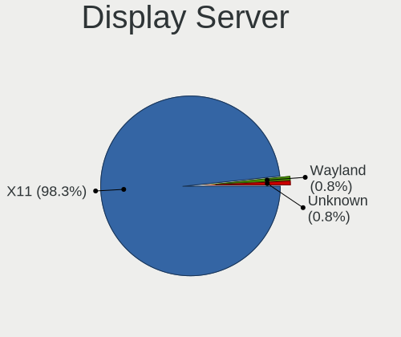

| Name    | Computers | Percent |
|---------|-----------|---------|
| X11     | 118       | 98.33%  |
| Wayland | 1         | 0.83%   |
| Unknown | 1         | 0.83%   |

Display Manager
---------------

SDDM, LightDM, etc.

| Name    | Computers | Percent |
|---------|-----------|---------|
| LightDM | 87        | 70.73%  |
| Unknown | 29        | 23.58%  |
| SDDM    | 6         | 4.88%   |
| GDM     | 1         | 0.81%   |

OS Lang
-------

Language

| Lang  | Computers | Percent |
|-------|-----------|---------|
| en_US | 71        | 59.17%  |
| en_GB | 7         | 5.83%   |
| pt_BR | 3         | 2.5%    |
| it_IT | 3         | 2.5%    |
| es_ES | 3         | 2.5%    |
| en_IN | 3         | 2.5%    |
| en_IE | 3         | 2.5%    |
| en_CA | 3         | 2.5%    |
| de_DE | 3         | 2.5%    |
| ru_RU | 2         | 1.67%   |
| es_CO | 2         | 1.67%   |
| en_AU | 2         | 1.67%   |
| C     | 2         | 1.67%   |
| tr_TR | 1         | 0.83%   |
| sk_SK | 1         | 0.83%   |
| pl_PL | 1         | 0.83%   |
| nb_NO | 1         | 0.83%   |
| lt_LT | 1         | 0.83%   |
| id_ID | 1         | 0.83%   |
| fr_FR | 1         | 0.83%   |
| fr_CH | 1         | 0.83%   |
| es_MX | 1         | 0.83%   |
| en_ZA | 1         | 0.83%   |
| en_NZ | 1         | 0.83%   |
| de_CH | 1         | 0.83%   |
| cs_CZ | 1         | 0.83%   |

Boot Mode
---------

EFI or BIOS

| Mode | Computers | Percent |
|------|-----------|---------|
| EFI  | 68        | 55.74%  |
| BIOS | 54        | 44.26%  |

Filesystem
----------

Type of filesystem

| Type    | Computers | Percent |
|---------|-----------|---------|
| Btrfs   | 85        | 70.83%  |
| Tmpfs   | 14        | 11.67%  |
| Ext4    | 13        | 10.83%  |
| Overlay | 6         | 5%      |
| Xfs     | 2         | 1.67%   |

Part. scheme
------------

Scheme of partitioning

| Type    | Computers | Percent |
|---------|-----------|---------|
| GPT     | 79        | 64.23%  |
| Unknown | 28        | 22.76%  |
| MBR     | 16        | 13.01%  |

Dual Boot with Linux/BSD
------------------------

Hosting more than one Linux/BSD

| Dual boot | Computers | Percent |
|-----------|-----------|---------|
| No        | 97        | 80.83%  |
| Yes       | 23        | 19.17%  |

Dual Boot (Win)
---------------

Hosting Linux and Windows

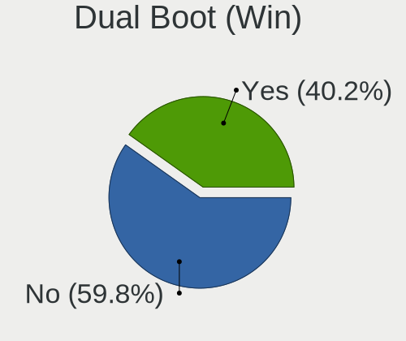

| Dual boot | Computers | Percent |
|-----------|-----------|---------|
| No        | 73        | 59.84%  |
| Yes       | 49        | 40.16%  |

Board
-----

Vendor
------

Motherboard manufacturer

| Name                                 | Computers | Percent |
|--------------------------------------|-----------|---------|
| Lenovo                               | 25        | 20.83%  |
| Hewlett-Packard                      | 20        | 16.67%  |
| Dell                                 | 15        | 12.5%   |
| MSI                                  | 14        | 11.67%  |
| ASUSTek Computer                     | 14        | 11.67%  |
| Acer                                 | 10        | 8.33%   |
| Samsung Electronics                  | 3         | 2.5%    |
| Gigabyte Technology                  | 3         | 2.5%    |
| Toshiba                              | 2         | 1.67%   |
| Google                               | 2         | 1.67%   |
| ASRock                               | 2         | 1.67%   |
| Unknown                              | 2         | 1.67%   |
| Shenzhen Meigao Electronic Equipment | 1         | 0.83%   |
| Raspberry Pi Foundation              | 1         | 0.83%   |
| Pegatron                             | 1         | 0.83%   |
| Onda TLC                             | 1         | 0.83%   |
| Notebook                             | 1         | 0.83%   |
| Microsoft                            | 1         | 0.83%   |
| IP3 Tech                             | 1         | 0.83%   |
| HONOR                                | 1         | 0.83%   |

Model
-----

Motherboard model

| Name                                       | Computers | Percent |
|--------------------------------------------|-----------|---------|
| HP Laptop 15-dy2xxx                        | 3         | 2.5%    |
| Unknown                                    | 2         | 1.67%   |
| Toshiba Satellite L775D                    | 1         | 0.83%   |
| Toshiba Satellite L50-A-1DL                | 1         | 0.83%   |
| Shenzhen Meigao Electronic Equipment HX99G | 1         | 0.83%   |
| Samsung 750XED                             | 1         | 0.83%   |
| Samsung 550XBE/350XBE                      | 1         | 0.83%   |
| Samsung 530XBB                             | 1         | 0.83%   |
| RPi Raspberry Pi 4 Model B Rev 1.5         | 1         | 0.83%   |
| Pegatron Pro 3010 Microtower PC            | 1         | 0.83%   |
| Onda TLC ONDA Oliver                       | 1         | 0.83%   |
| Notebook NV4XMB,ME,MZ                      | 1         | 0.83%   |
| MSI Summit E14Evo A12M                     | 1         | 0.83%   |
| MSI Stealth 15M B12UE                      | 1         | 0.83%   |
| MSI Pro 2000/2080                          | 1         | 0.83%   |
| MSI Prestige 14Evo A12M                    | 1         | 0.83%   |
| MSI MS-7E06                                | 1         | 0.83%   |
| MSI MS-7D46                                | 1         | 0.83%   |
| MSI MS-7D32                                | 1         | 0.83%   |
| MSI MS-7C91                                | 1         | 0.83%   |
| MSI MS-7B86                                | 1         | 0.83%   |
| MSI MS-7B85                                | 1         | 0.83%   |
| MSI Katana GF66 11UE                       | 1         | 0.83%   |
| MSI Katana 17 B13VFK                       | 1         | 0.83%   |
| MSI Katana 15 B13VGK                       | 1         | 0.83%   |
| MSI GF63 Thin 11UC                         | 1         | 0.83%   |
| Microsoft Surface Laptop 4                 | 1         | 0.83%   |
| Lenovo Z51-70 80K6                         | 1         | 0.83%   |
| Lenovo ThinkPad X1 Carbon 7th 20QES0C500   | 1         | 0.83%   |
| Lenovo ThinkPad T490 20N3S4PX02            | 1         | 0.83%   |
| Lenovo ThinkPad T490 20N20023US            | 1         | 0.83%   |
| Lenovo ThinkPad T480s 20L70028US           | 1         | 0.83%   |
| Lenovo ThinkPad T460s 20FAS2JW00           | 1         | 0.83%   |
| Lenovo ThinkPad T14s Gen 3 21BRCTO1WW      | 1         | 0.83%   |
| Lenovo ThinkPad T14s Gen 2i 20WM0080US     | 1         | 0.83%   |
| Lenovo ThinkPad P53 20QNS00X00             | 1         | 0.83%   |
| Lenovo ThinkPad L490 20Q5001YMX            | 1         | 0.83%   |
| Lenovo ThinkPad L13 Gen 3 21B3004QID       | 1         | 0.83%   |
| Lenovo ThinkPad E14 20RA0059VA             | 1         | 0.83%   |
| Lenovo Legion Pro 5 16IRX8 82WK            | 1         | 0.83%   |

Model Family
------------

Motherboard model prefix

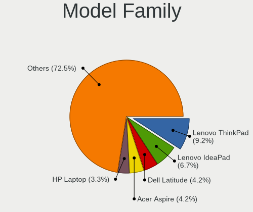

| Name                                       | Computers | Percent |
|--------------------------------------------|-----------|---------|
| Lenovo ThinkPad                            | 11        | 9.17%   |
| Lenovo IdeaPad                             | 8         | 6.67%   |
| Dell Latitude                              | 5         | 4.17%   |
| Acer Aspire                                | 5         | 4.17%   |
| HP Laptop                                  | 4         | 3.33%   |
| HP EliteBook                               | 4         | 3.33%   |
| MSI Katana                                 | 3         | 2.5%    |
| Lenovo Legion                              | 3         | 2.5%    |
| HP ENVY                                    | 3         | 2.5%    |
| Dell OptiPlex                              | 3         | 2.5%    |
| Acer Nitro                                 | 3         | 2.5%    |
| Toshiba Satellite                          | 2         | 1.67%   |
| HP ProBook                                 | 2         | 1.67%   |
| HP Pavilion                                | 2         | 1.67%   |
| HP Compaq                                  | 2         | 1.67%   |
| Dell XPS                                   | 2         | 1.67%   |
| Dell Precision                             | 2         | 1.67%   |
| Dell Inspiron                              | 2         | 1.67%   |
| ASUS ROG                                   | 2         | 1.67%   |
| ASUS PRIME                                 | 2         | 1.67%   |
| Unknown                                    | 2         | 1.67%   |
| Shenzhen Meigao Electronic Equipment HX99G | 1         | 0.83%   |
| Samsung 750XED                             | 1         | 0.83%   |
| Samsung 550XBE                             | 1         | 0.83%   |
| Samsung 530XBB                             | 1         | 0.83%   |
| RPi Raspberry                              | 1         | 0.83%   |
| Pegatron Pro                               | 1         | 0.83%   |
| Onda TLC ONDA                              | 1         | 0.83%   |
| Notebook NV4XMB                            | 1         | 0.83%   |
| MSI Summit                                 | 1         | 0.83%   |
| MSI Stealth                                | 1         | 0.83%   |
| MSI Pro                                    | 1         | 0.83%   |
| MSI Prestige                               | 1         | 0.83%   |
| MSI MS-7E06                                | 1         | 0.83%   |
| MSI MS-7D46                                | 1         | 0.83%   |
| MSI MS-7D32                                | 1         | 0.83%   |
| MSI MS-7C91                                | 1         | 0.83%   |
| MSI MS-7B86                                | 1         | 0.83%   |
| MSI MS-7B85                                | 1         | 0.83%   |
| MSI GF63                                   | 1         | 0.83%   |

MFG Year
--------

Motherboard manufacture year

| Year    | Computers | Percent |
|---------|-----------|---------|
| 2022    | 20        | 16.67%  |
| 2021    | 16        | 13.33%  |
| 2020    | 15        | 12.5%   |
| 2019    | 14        | 11.67%  |
| 2011    | 10        | 8.33%   |
| 2016    | 8         | 6.67%   |
| 2023    | 7         | 5.83%   |
| 2012    | 7         | 5.83%   |
| 2018    | 5         | 4.17%   |
| 2017    | 4         | 3.33%   |
| 2015    | 4         | 3.33%   |
| 2009    | 3         | 2.5%    |
| 2014    | 2         | 1.67%   |
| 2013    | 2         | 1.67%   |
| 2010    | 1         | 0.83%   |
| 2007    | 1         | 0.83%   |
| Unknown | 1         | 0.83%   |

Form Factor
-----------

Physical design of the computer

| Name           | Computers | Percent |
|----------------|-----------|---------|
| Notebook       | 82        | 68.33%  |
| Desktop        | 31        | 25.83%  |
| Convertible    | 3         | 2.5%    |
| System on chip | 1         | 0.83%   |
| Tablet         | 1         | 0.83%   |
| Mini pc        | 1         | 0.83%   |
| All in one     | 1         | 0.83%   |

Secure Boot
-----------

Enabled or disabled

| State    | Computers | Percent |
|----------|-----------|---------|
| Disabled | 120       | 100%    |

Coreboot
--------

Have coreboot on board

| Used | Computers | Percent |
|------|-----------|---------|
| No   | 118       | 98.33%  |
| Yes  | 2         | 1.67%   |

RAM Size
--------

Total RAM memory

| Size in GB  | Computers | Percent |
|-------------|-----------|---------|
| 4.01-8.0    | 36        | 29.75%  |
| 16.01-24.0  | 33        | 27.27%  |
| 8.01-16.0   | 21        | 17.36%  |
| 32.01-64.0  | 16        | 13.22%  |
| 3.01-4.0    | 11        | 9.09%   |
| 24.01-32.0  | 3         | 2.48%   |
| 64.01-256.0 | 1         | 0.83%   |

RAM Used
--------

Used RAM memory

| Used GB    | Computers | Percent |
|------------|-----------|---------|
| 2.01-3.0   | 49        | 38.58%  |
| 1.01-2.0   | 37        | 29.13%  |
| 3.01-4.0   | 19        | 14.96%  |
| 4.01-8.0   | 14        | 11.02%  |
| 0.51-1.0   | 4         | 3.15%   |
| 8.01-16.0  | 2         | 1.57%   |
| 16.01-24.0 | 1         | 0.79%   |
| 0.01-0.5   | 1         | 0.79%   |

Total Drives
------------

Number of drives on board

| Drives | Computers | Percent |
|--------|-----------|---------|
| 1      | 80        | 65.04%  |
| 2      | 30        | 24.39%  |
| 3      | 7         | 5.69%   |
| 4      | 4         | 3.25%   |
| 6      | 1         | 0.81%   |
| 5      | 1         | 0.81%   |

Has CD-ROM
----------

Has CD-ROM on board

| Presented | Computers | Percent |
|-----------|-----------|---------|
| No        | 97        | 80.17%  |
| Yes       | 24        | 19.83%  |

Has Ethernet
------------

Has Ethernet on board

| Presented | Computers | Percent |
|-----------|-----------|---------|
| Yes       | 101       | 83.47%  |
| No        | 20        | 16.53%  |

Has WiFi
--------

Has WiFi module

| Presented | Computers | Percent |
|-----------|-----------|---------|
| Yes       | 107       | 88.43%  |
| No        | 14        | 11.57%  |

Has Bluetooth
-------------

Has Bluetooth module

| Presented | Computers | Percent |
|-----------|-----------|---------|
| Yes       | 89        | 73.55%  |
| No        | 32        | 26.45%  |

Location
--------

Country
-------

Geographic location (country)

| Country      | Computers | Percent |
|--------------|-----------|---------|
| USA          | 36        | 30%     |
| Germany      | 8         | 6.67%   |
| UK           | 6         | 5%      |
| Italy        | 6         | 5%      |
| India        | 5         | 4.17%   |
| Canada       | 4         | 3.33%   |
| Spain        | 3         | 2.5%    |
| Russia       | 3         | 2.5%    |
| Netherlands  | 3         | 2.5%    |
| Ireland      | 3         | 2.5%    |
| Indonesia    | 3         | 2.5%    |
| Brazil       | 3         | 2.5%    |
| Switzerland  | 2         | 1.67%   |
| Sweden       | 2         | 1.67%   |
| Mexico       | 2         | 1.67%   |
| Luxembourg   | 2         | 1.67%   |
| Kenya        | 2         | 1.67%   |
| Colombia     | 2         | 1.67%   |
| Australia    | 2         | 1.67%   |
| Vietnam      | 1         | 0.83%   |
| UAE          | 1         | 0.83%   |
| Turkey       | 1         | 0.83%   |
| South Africa | 1         | 0.83%   |
| Slovakia     | 1         | 0.83%   |
| Portugal     | 1         | 0.83%   |
| Poland       | 1         | 0.83%   |
| Norway       | 1         | 0.83%   |
| New Zealand  | 1         | 0.83%   |
| Nepal        | 1         | 0.83%   |
| Myanmar      | 1         | 0.83%   |
| Lithuania    | 1         | 0.83%   |
| Kazakhstan   | 1         | 0.83%   |
| Gabon        | 1         | 0.83%   |
| France       | 1         | 0.83%   |
| Egypt        | 1         | 0.83%   |
| Ecuador      | 1         | 0.83%   |
| Czechia      | 1         | 0.83%   |
| Cyprus       | 1         | 0.83%   |
| Costa Rica   | 1         | 0.83%   |
| Barbados     | 1         | 0.83%   |

City
----

Geographic location (city)

| City                   | Computers | Percent |
|------------------------|-----------|---------|
| Saint Paul             | 3         | 2.42%   |
| Dublin                 | 3         | 2.42%   |
| Toronto                | 2         | 1.61%   |
| Nairobi                | 2         | 1.61%   |
| Minneapolis            | 2         | 1.61%   |
| Luxembourg             | 2         | 1.61%   |
| Indramayu              | 2         | 1.61%   |
| Hyderabad              | 2         | 1.61%   |
| Frankfurt am Main      | 2         | 1.61%   |
| Cardiff                | 2         | 1.61%   |
| Brooklyn               | 2         | 1.61%   |
| Yekaterinburg          | 1         | 0.81%   |
| Yangon                 | 1         | 0.81%   |
| Wichita                | 1         | 0.81%   |
| Wellington             | 1         | 0.81%   |
| Viereth-Trunstadt      | 1         | 0.81%   |
| Velbert                | 1         | 0.81%   |
| Trabia                 | 1         | 0.81%   |
| Tampa                  | 1         | 0.81%   |
| Sugar Land             | 1         | 0.81%   |
| Stockton               | 1         | 0.81%   |
| Stockholm              | 1         | 0.81%   |
| Starogard Gdański     | 1         | 0.81%   |
| St Louis               | 1         | 0.81%   |
| Silver Spring          | 1         | 0.81%   |
| Siblingen              | 1         | 0.81%   |
| Sharjah                | 1         | 0.81%   |
| Santiago de Cali       | 1         | 0.81%   |
| Santa Rita do Sapucai  | 1         | 0.81%   |
| San José              | 1         | 0.81%   |
| San Francisco          | 1         | 0.81%   |
| San Antonio            | 1         | 0.81%   |
| Saint Athanasios       | 1         | 0.81%   |
| Rubí                  | 1         | 0.81%   |
| Rome                   | 1         | 0.81%   |
| Rieschweiler-Muehlbach | 1         | 0.81%   |
| Rho                    | 1         | 0.81%   |
| Relizane               | 1         | 0.81%   |
| Quito                  | 1         | 0.81%   |
| Prague                 | 1         | 0.81%   |

Drives
------

Drive Vendor
------------

Hard drive vendors

| Vendor                      | Computers | Drives | Percent |
|-----------------------------|-----------|--------|---------|
| Samsung Electronics         | 29        | 37     | 16.86%  |
| WDC                         | 21        | 28     | 12.21%  |
| Seagate                     | 17        | 19     | 9.88%   |
| Toshiba                     | 15        | 17     | 8.72%   |
| SK hynix                    | 12        | 14     | 6.98%   |
| Unknown                     | 7         | 7      | 4.07%   |
| Sandisk                     | 7         | 7      | 4.07%   |
| Kingston                    | 7         | 7      | 4.07%   |
| Micron Technology           | 6         | 6      | 3.49%   |
| Hitachi                     | 6         | 9      | 3.49%   |
| A-DATA Technology           | 5         | 5      | 2.91%   |
| Crucial                     | 4         | 4      | 2.33%   |
| Team                        | 3         | 3      | 1.74%   |
| SPCC                        | 3         | 3      | 1.74%   |
| KIOXIA                      | 3         | 3      | 1.74%   |
| Intel                       | 3         | 6      | 1.74%   |
| HGST                        | 3         | 3      | 1.74%   |
| Kingston Technology Company | 2         | 3      | 1.16%   |
| Fanxiang                    | 2         | 2      | 1.16%   |
| Zheino                      | 1         | 1      | 0.58%   |
| Wdxsky                      | 1         | 1      | 0.58%   |
| WALRAM                      | 1         | 1      | 0.58%   |
| TO Exter                    | 1         | 1      | 0.58%   |
| Teclast                     | 1         | 1      | 0.58%   |
| SSSTC                       | 1         | 1      | 0.58%   |
| Silicon Motion              | 1         | 1      | 0.58%   |
| SCY                         | 1         | 1      | 0.58%   |
| Micron/Crucial Technology   | 1         | 2      | 0.58%   |
| Kingmax                     | 1         | 1      | 0.58%   |
| KingFast                    | 1         | 1      | 0.58%   |
| Intenso                     | 1         | 1      | 0.58%   |
| GOODRAM                     | 1         | 1      | 0.58%   |
| Gigabyte Technology         | 1         | 1      | 0.58%   |
| CLOVER                      | 1         | 1      | 0.58%   |
| Apple                       | 1         | 1      | 0.58%   |
| Apacer                      | 1         | 1      | 0.58%   |

Drive Model
-----------

Hard drive models

| Model                                             | Computers | Percent |
|---------------------------------------------------|-----------|---------|
| Toshiba KXG6AZNV256G 256GB                        | 2         | 1.12%   |
| SK hynix HFM512GD3JX016N 512GB                    | 2         | 1.12%   |
| SK hynix BC711 HFM512GD3JX013N 512GB              | 2         | 1.12%   |
| Seagate ST1000LM024 HN-M101MBB 1TB                | 2         | 1.12%   |
| Seagate ST1000DM010-2EP102 1TB                    | 2         | 1.12%   |
| SanDisk NVMe SSD Drive 2TB                        | 2         | 1.12%   |
| Samsung SSD 980 PRO 1TB                           | 2         | 1.12%   |
| Samsung SSD 860 EVO 500GB                         | 2         | 1.12%   |
| Samsung NVMe SSD Controller SM981/PM981/PM983 1TB | 2         | 1.12%   |
| Samsung MZVL21T0HCLR-00BL2 1TB                    | 2         | 1.12%   |
| Micron MTFDHBA512QFD 512GB                        | 2         | 1.12%   |
| Kingston SA400S37240G 240GB SSD                   | 2         | 1.12%   |
| A-DATA SU635 240GB SSD                            | 2         | 1.12%   |
| Zheino CHN-25SATAC3-120 120GB SSD                 | 1         | 0.56%   |
| Wdxsky W31-256G SSD                               | 1         | 0.56%   |
| WDC WDS500G2B0A-00SM50 500GB SSD                  | 1         | 0.56%   |
| WDC WD6400AAKS-75A7B2 640GB                       | 1         | 0.56%   |
| WDC WD5000LPVX-60V0TT0 500GB                      | 1         | 0.56%   |
| WDC WD5000LPCX-60VHAT0 500GB                      | 1         | 0.56%   |
| WDC WD5000BPKX-60HPJT0 500GB                      | 1         | 0.56%   |
| WDC WD5000AVDS-63U7B1 500GB                       | 1         | 0.56%   |
| WDC WD50 00BPVT-75HXZT1 500GB                     | 1         | 0.56%   |
| WDC WD40EFRX-68WT0N0 4TB                          | 1         | 0.56%   |
| WDC WD4005FZBX-00K5WB0 4TB                        | 1         | 0.56%   |
| WDC WD3200BEVT-75ZCT2 320GB                       | 1         | 0.56%   |
| WDC WD3200AVJS-63B6A0 320GB                       | 1         | 0.56%   |
| WDC WD30EFRX-68EUZN0 3TB                          | 1         | 0.56%   |
| WDC WD2500BEKT-60PVMT0 250GB                      | 1         | 0.56%   |
| WDC WD2500AAJS-75M0A0 249GB                       | 1         | 0.56%   |
| WDC WD10SPZX-24Z10 1TB                            | 1         | 0.56%   |
| WDC WD10SPZX-22Z10T0 1TB                          | 1         | 0.56%   |
| WDC WD10SPZX-21Z10T0 1TB                          | 1         | 0.56%   |
| WDC WD10JPVX-60JC3T0 1TB                          | 1         | 0.56%   |
| WDC WD1003FZEX-00MK2A0 1TB                        | 1         | 0.56%   |
| WDC WD1003FZEX-00K3CA0 1TB                        | 1         | 0.56%   |
| WDC WD Green 2.5 1000GB SSD                       | 1         | 0.56%   |
| WDC PC SN540 SDDPNPF-512G-1032 512GB              | 1         | 0.56%   |
| WDC PC SN530 SDBPNPZ-512G-1036 512GB              | 1         | 0.56%   |
| WDC PC SN520 SDAPNUW-256G-1006 256GB              | 1         | 0.56%   |
| WALRAM SSD 1TB                                    | 1         | 0.56%   |

HDD Vendor
----------

Hard disk drive vendors

| Vendor              | Computers | Drives | Percent |
|---------------------|-----------|--------|---------|
| WDC                 | 16        | 22     | 29.09%  |
| Seagate             | 16        | 18     | 29.09%  |
| Toshiba             | 9         | 10     | 16.36%  |
| Hitachi             | 6         | 9      | 10.91%  |
| HGST                | 3         | 3      | 5.45%   |
| Samsung Electronics | 2         | 2      | 3.64%   |
| TO Exter            | 1         | 1      | 1.82%   |
| CLOVER              | 1         | 1      | 1.82%   |
| Apple               | 1         | 1      | 1.82%   |

SSD Vendor
----------

Solid state drive vendors

| Vendor              | Computers | Drives | Percent |
|---------------------|-----------|--------|---------|
| Samsung Electronics | 6         | 13     | 16.67%  |
| Kingston            | 4         | 4      | 11.11%  |
| WDC                 | 2         | 3      | 5.56%   |
| SK hynix            | 2         | 2      | 5.56%   |
| Fanxiang            | 2         | 2      | 5.56%   |
| Crucial             | 2         | 2      | 5.56%   |
| A-DATA Technology   | 2         | 2      | 5.56%   |
| Zheino              | 1         | 1      | 2.78%   |
| Wdxsky              | 1         | 1      | 2.78%   |
| WALRAM              | 1         | 1      | 2.78%   |
| Toshiba             | 1         | 1      | 2.78%   |
| Teclast             | 1         | 1      | 2.78%   |
| Team                | 1         | 1      | 2.78%   |
| SPCC                | 1         | 1      | 2.78%   |
| Seagate             | 1         | 1      | 2.78%   |
| SCY                 | 1         | 1      | 2.78%   |
| SanDisk             | 1         | 1      | 2.78%   |
| Kingmax             | 1         | 1      | 2.78%   |
| KingFast            | 1         | 1      | 2.78%   |
| Intenso             | 1         | 1      | 2.78%   |
| GOODRAM             | 1         | 1      | 2.78%   |
| Gigabyte Technology | 1         | 1      | 2.78%   |
| Apacer              | 1         | 1      | 2.78%   |

Drive Kind
----------

HDD or SSD

| Kind | Computers | Drives | Percent |
|------|-----------|--------|---------|
| NVMe | 67        | 83     | 44.97%  |
| HDD  | 43        | 67     | 28.86%  |
| SSD  | 32        | 44     | 21.48%  |
| MMC  | 7         | 7      | 4.7%    |

Drive Connector
---------------

SATA, SAS, NVMe, etc.

| Type | Computers | Drives | Percent |
|------|-----------|--------|---------|
| NVMe | 67        | 83     | 48.55%  |
| SATA | 61        | 107    | 44.2%   |
| MMC  | 7         | 7      | 5.07%   |
| SAS  | 3         | 4      | 2.17%   |

Drive Size
----------

Size of hard drive

| Size in TB | Computers | Drives | Percent |
|------------|-----------|--------|---------|
| 0.01-0.5   | 42        | 59     | 53.16%  |
| 0.51-1.0   | 27        | 39     | 34.18%  |
| 1.01-2.0   | 6         | 6      | 7.59%   |
| 3.01-4.0   | 2         | 3      | 2.53%   |
| 2.01-3.0   | 2         | 4      | 2.53%   |

Space Total
-----------

Amount of disk space available on the file system

| Size in GB     | Computers | Percent |
|----------------|-----------|---------|
| 251-500        | 31        | 25%     |
| 501-1000       | 27        | 21.77%  |
| 101-250        | 24        | 19.35%  |
| 1001-2000      | 13        | 10.48%  |
| Unknown        | 9         | 7.26%   |
| 51-100         | 8         | 6.45%   |
| 1-20           | 5         | 4.03%   |
| More than 3000 | 4         | 3.23%   |
| 21-50          | 3         | 2.42%   |

Space Used
----------

Amount of used disk space

| Used GB   | Computers | Percent |
|-----------|-----------|---------|
| 21-50     | 42        | 33.6%   |
| 51-100    | 23        | 18.4%   |
| 1-20      | 22        | 17.6%   |
| 101-250   | 14        | 11.2%   |
| Unknown   | 9         | 7.2%    |
| 251-500   | 8         | 6.4%    |
| 501-1000  | 4         | 3.2%    |
| 1001-2000 | 3         | 2.4%    |

Malfunc. Drives
---------------

Drive models with a malfunction

| Model                                        | Computers | Drives | Percent |
|----------------------------------------------|-----------|--------|---------|
| WDC WD3200AVJS-63B6A0 320GB                  | 1         | 1      | 9.09%   |
| Toshiba MK6475GSX 640GB                      | 1         | 1      | 9.09%   |
| Toshiba MK5059GSXP 500GB                     | 1         | 1      | 9.09%   |
| Toshiba DT01ACA050 500GB                     | 1         | 1      | 9.09%   |
| SPCC M.2 PCIe SSD 256GB                      | 1         | 1      | 9.09%   |
| Samsung Electronics SSD 840 PRO Series 128GB | 1         | 2      | 9.09%   |
| Samsung Electronics HD642JJ 640GB            | 1         | 1      | 9.09%   |
| Intenso SSD Sata III 256GB                   | 1         | 1      | 9.09%   |
| Hitachi HTS725050A9A364 500GB                | 1         | 1      | 9.09%   |
| Hitachi HDT722525DLA380 41N3150LEN 250GB     | 1         | 1      | 9.09%   |
| CLOVER CM161GI 160GB                         | 1         | 1      | 9.09%   |

Malfunc. Drive Vendor
---------------------

Vendors of faulty drives

| Vendor              | Computers | Drives | Percent |
|---------------------|-----------|--------|---------|
| Toshiba             | 3         | 3      | 27.27%  |
| Samsung Electronics | 2         | 3      | 18.18%  |
| Hitachi             | 2         | 2      | 18.18%  |
| WDC                 | 1         | 1      | 9.09%   |
| SPCC                | 1         | 1      | 9.09%   |
| Intenso             | 1         | 1      | 9.09%   |
| CLOVER              | 1         | 1      | 9.09%   |

Malfunc. HDD Vendor
-------------------

Vendors of faulty HDD drives

| Vendor              | Computers | Drives | Percent |
|---------------------|-----------|--------|---------|
| Toshiba             | 3         | 3      | 37.5%   |
| Hitachi             | 2         | 2      | 25%     |
| WDC                 | 1         | 1      | 12.5%   |
| Samsung Electronics | 1         | 1      | 12.5%   |
| CLOVER              | 1         | 1      | 12.5%   |

Malfunc. Drive Kind
-------------------

Kinds of faulty drives

| Kind | Computers | Drives | Percent |
|------|-----------|--------|---------|
| HDD  | 8         | 8      | 72.73%  |
| SSD  | 2         | 3      | 18.18%  |
| NVMe | 1         | 1      | 9.09%   |

Failed Drives
-------------

Failed drive models

Zero info for selected period =(

Failed Drive Vendor
-------------------

Failed drive vendors

Zero info for selected period =(

Drive Status
------------

Number of failed and malfunc. drives

| Status   | Computers | Drives | Percent |
|----------|-----------|--------|---------|
| Works    | 69        | 95     | 52.27%  |
| Detected | 53        | 94     | 40.15%  |
| Malfunc  | 10        | 12     | 7.58%   |

Storage controller
------------------

Storage Vendor
--------------

Storage controller vendors

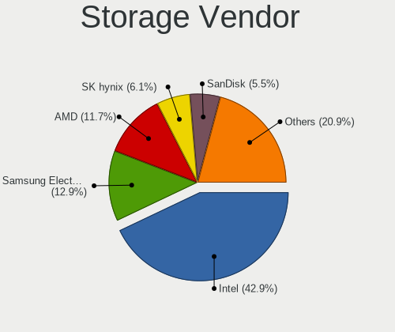

| Vendor                         | Computers | Percent |
|--------------------------------|-----------|---------|
| Intel                          | 70        | 42.94%  |
| Samsung Electronics            | 21        | 12.88%  |
| AMD                            | 19        | 11.66%  |
| SK hynix                       | 10        | 6.13%   |
| SanDisk                        | 9         | 5.52%   |
| Micron Technology              | 6         | 3.68%   |
| Toshiba America Info Systems   | 5         | 3.07%   |
| Kingston Technology Company    | 4         | 2.45%   |
| Micron/Crucial Technology      | 3         | 1.84%   |
| KIOXIA                         | 3         | 1.84%   |
| ADATA Technology               | 3         | 1.84%   |
| Silicon Motion                 | 2         | 1.23%   |
| Realtek Semiconductor          | 2         | 1.23%   |
| JMicron Technology             | 2         | 1.23%   |
| ASMedia Technology             | 2         | 1.23%   |
| Solid State Storage Technology | 1         | 0.61%   |
| Phison Electronics             | 1         | 0.61%   |

Storage Model
-------------

Storage controller models

| Model                                                                            | Computers | Percent |
|----------------------------------------------------------------------------------|-----------|---------|
| AMD FCH SATA Controller [AHCI mode]                                              | 14        | 7.65%   |
| Intel Volume Management Device NVMe RAID Controller                              | 13        | 7.1%    |
| Intel Sunrise Point-LP SATA Controller [AHCI mode]                               | 8         | 4.37%   |
| SK hynix Gold P31/BC711/PC711 NVMe Solid State Drive                             | 6         | 3.28%   |
| Samsung NVMe SSD Controller SM981/PM981/PM983                                    | 6         | 3.28%   |
| Samsung NVMe SSD Controller PM9A1/PM9A3/980PRO                                   | 6         | 3.28%   |
| Samsung NVMe SSD Controller 980 (DRAM-less)                                      | 5         | 2.73%   |
| Intel Alder Lake-S PCH SATA Controller [AHCI Mode]                               | 5         | 2.73%   |
| Intel Tiger Lake SATA AHCI Controller                                            | 3         | 1.64%   |
| Intel Comet Lake SATA AHCI Controller                                            | 3         | 1.64%   |
| Intel Celeron/Pentium Silver Processor SATA Controller                           | 3         | 1.64%   |
| Intel 7 Series/C210 Series Chipset Family 6-port SATA Controller [AHCI mode]     | 3         | 1.64%   |
| Intel 6 Series/C200 Series Chipset Family 6 port Mobile SATA AHCI Controller     | 3         | 1.64%   |
| AMD 500 Series Chipset SATA Controller                                           | 3         | 1.64%   |
| Toshiba America Info Systems XG6 NVMe SSD Controller                             | 2         | 1.09%   |
| Toshiba America Info Systems XG5 NVMe SSD Controller                             | 2         | 1.09%   |
| SanDisk WD Black SN770 / PC SN740 256GB / PC SN560 (DRAM-less) NVMe SSD          | 2         | 1.09%   |
| Samsung NVMe SSD Controller PM9B1 (DRAM-less)                                    | 2         | 1.09%   |
| Micron/Crucial P2 [Nick P2] / P3 / P3 Plus NVMe PCIe SSD (DRAM-less)             | 2         | 1.09%   |
| Micron 2450 NVMe SSD [HendrixV] (DRAM-less)                                      | 2         | 1.09%   |
| Micron 2210 NVMe SSD [Cobain]                                                    | 2         | 1.09%   |
| KIOXIA NVMe SSD Controller BG4 (DRAM-less)                                       | 2         | 1.09%   |
| JMicron JMB362 SATA Controller                                                   | 2         | 1.09%   |
| Intel Wildcat Point-LP SATA Controller [AHCI Mode]                               | 2         | 1.09%   |
| Intel Tiger Lake-LP SATA Controller                                              | 2         | 1.09%   |
| Intel SSD 670p Series [Keystone Harbor]                                          | 2         | 1.09%   |
| Intel Q170/Q150/B150/H170/H110/Z170/CM236 Chipset SATA Controller [AHCI Mode]    | 2         | 1.09%   |
| Intel Atom/Celeron/Pentium Processor x5-E8000/J3xxx/N3xxx Series SATA Controller | 2         | 1.09%   |
| Intel Alder Lake-P SATA AHCI Controller                                          | 2         | 1.09%   |
| Intel 8 Series/C220 Series Chipset Family 6-port SATA Controller 1 [AHCI mode]   | 2         | 1.09%   |
| Intel 7 Series Chipset Family 6-port SATA Controller [AHCI mode]                 | 2         | 1.09%   |
| Intel 6 Series/C200 Series Chipset Family 6 port Desktop SATA AHCI Controller    | 2         | 1.09%   |
| ASMedia ASM1061/ASM1062 Serial ATA Controller                                    | 2         | 1.09%   |
| AMD SB7x0/SB8x0/SB9x0 SATA Controller [AHCI mode]                                | 2         | 1.09%   |
| AMD SB7x0/SB8x0/SB9x0 IDE Controller                                             | 2         | 1.09%   |
| AMD 400 Series Chipset SATA Controller                                           | 2         | 1.09%   |
| Toshiba America Info Systems XG4 NVMe SSD Controller                             | 1         | 0.55%   |
| Solid State Storage CL1-3D256-Q11 NVMe SSD M.2                                   | 1         | 0.55%   |
| SK hynix PC611 NVMe Solid State Drive                                            | 1         | 0.55%   |
| SK hynix PC601 NVMe Solid State Drive                                            | 1         | 0.55%   |

Storage Kind
------------

Kind of storage controller (IDE, SATA, NVMe, SAS, ...)

| Kind | Computers | Percent |
|------|-----------|---------|
| SATA | 73        | 44.51%  |
| NVMe | 67        | 40.85%  |
| RAID | 16        | 9.76%   |
| IDE  | 8         | 4.88%   |

Processor
---------

CPU Vendor
----------

Processor vendors

| Vendor | Computers | Percent |
|--------|-----------|---------|
| Intel  | 96        | 80%     |
| AMD    | 23        | 19.17%  |
| ARM    | 1         | 0.83%   |

CPU Model
---------

Processor models

| Model                                       | Computers | Percent |
|---------------------------------------------|-----------|---------|
| Intel 11th Gen Core i5-1135G7 @ 2.40GHz     | 4         | 3.33%   |
| Intel Core i5-8265U CPU @ 1.60GHz           | 3         | 2.5%    |
| Intel 12th Gen Core i7-1280P                | 3         | 2.5%    |
| Intel 12th Gen Core i5-1235U                | 3         | 2.5%    |
| Intel 11th Gen Core i7-1165G7 @ 2.80GHz     | 3         | 2.5%    |
| Intel Core i7-9750H CPU @ 2.60GHz           | 2         | 1.67%   |
| Intel Core i5-8365U CPU @ 1.60GHz           | 2         | 1.67%   |
| Intel Core i5-6300U CPU @ 2.40GHz           | 2         | 1.67%   |
| Intel Core i5-2450M CPU @ 2.50GHz           | 2         | 1.67%   |
| Intel Core i5-10210U CPU @ 1.60GHz          | 2         | 1.67%   |
| Intel 13th Gen Core i7-13620H               | 2         | 1.67%   |
| Intel 12th Gen Core i7-1255U                | 2         | 1.67%   |
| Intel 12th Gen Core i5-1245U                | 2         | 1.67%   |
| Intel 11th Gen Core i5-11400H @ 2.70GHz     | 2         | 1.67%   |
| Intel 11th Gen Core i3-1115G4 @ 3.00GHz     | 2         | 1.67%   |
| AMD FX-8350 Eight-Core Processor            | 2         | 1.67%   |
| Intel Pentium Silver N5000 CPU @ 1.10GHz    | 1         | 0.83%   |
| Intel Pentium Dual-Core CPU E5700 @ 3.00GHz | 1         | 0.83%   |
| Intel Pentium Dual-Core CPU E5300 @ 2.60GHz | 1         | 0.83%   |
| Intel Pentium 3558U @ 1.70GHz               | 1         | 0.83%   |
| Intel Genuine CPU U4100 @ 1.30GHz           | 1         | 0.83%   |
| Intel Core m5-6Y57 CPU @ 1.10GHz            | 1         | 0.83%   |
| Intel Core i9-8950HK CPU @ 2.90GHz          | 1         | 0.83%   |
| Intel Core i7-8650U CPU @ 1.90GHz           | 1         | 0.83%   |
| Intel Core i7-7700HQ CPU @ 2.80GHz          | 1         | 0.83%   |
| Intel Core i7-7600U CPU @ 2.80GHz           | 1         | 0.83%   |
| Intel Core i7-7500U CPU @ 2.70GHz           | 1         | 0.83%   |
| Intel Core i7-6600U CPU @ 2.60GHz           | 1         | 0.83%   |
| Intel Core i7-5500U CPU @ 2.40GHz           | 1         | 0.83%   |
| Intel Core i7-4790 CPU @ 3.60GHz            | 1         | 0.83%   |
| Intel Core i7-4700MQ CPU @ 2.40GHz          | 1         | 0.83%   |
| Intel Core i7-3770K CPU @ 3.50GHz           | 1         | 0.83%   |
| Intel Core i7-2600K CPU @ 3.40GHz           | 1         | 0.83%   |
| Intel Core i7-10750H CPU @ 2.60GHz          | 1         | 0.83%   |
| Intel Core i5-8250U CPU @ 1.60GHz           | 1         | 0.83%   |
| Intel Core i5-6500 CPU @ 3.20GHz            | 1         | 0.83%   |
| Intel Core i5-6200U CPU @ 2.30GHz           | 1         | 0.83%   |
| Intel Core i5-4690K CPU @ 3.50GHz           | 1         | 0.83%   |
| Intel Core i5-3570K CPU @ 3.40GHz           | 1         | 0.83%   |
| Intel Core i5-3470S CPU @ 2.90GHz           | 1         | 0.83%   |

CPU Model Family
----------------

Processor model prefix

| Model                   | Computers | Percent |
|-------------------------|-----------|---------|
| Other                   | 38        | 31.67%  |
| Intel Core i5           | 25        | 20.83%  |
| Intel Core i7           | 13        | 10.83%  |
| AMD Ryzen 5             | 9         | 7.5%    |
| Intel Celeron           | 7         | 5.83%   |
| Intel Core i3           | 6         | 5%      |
| AMD Ryzen 7             | 5         | 4.17%   |
| AMD FX                  | 4         | 3.33%   |
| Intel Pentium Dual-Core | 2         | 1.67%   |
| AMD Ryzen 9             | 2         | 1.67%   |
| Intel Pentium Silver    | 1         | 0.83%   |
| Intel Pentium           | 1         | 0.83%   |
| Intel Genuine           | 1         | 0.83%   |
| Intel Core m5           | 1         | 0.83%   |
| Intel Core i9           | 1         | 0.83%   |
| Intel Core 2 Duo        | 1         | 0.83%   |
| AMD Ryzen 5 PRO         | 1         | 0.83%   |
| AMD A6                  | 1         | 0.83%   |
| AMD A4                  | 1         | 0.83%   |

CPU Cores
---------

Number of processor cores

| Number | Computers | Percent |
|--------|-----------|---------|
| 4      | 39        | 32.5%   |
| 2      | 34        | 28.33%  |
| 6      | 16        | 13.33%  |
| 10     | 10        | 8.33%   |
| 12     | 6         | 5%      |
| 8      | 6         | 5%      |
| 14     | 4         | 3.33%   |
| 16     | 2         | 1.67%   |
| 24     | 1         | 0.83%   |
| 3      | 1         | 0.83%   |
| 1      | 1         | 0.83%   |

CPU Sockets
-----------

Number of sockets

| Number | Computers | Percent |
|--------|-----------|---------|
| 1      | 120       | 100%    |

CPU Threads
-----------

Threads per core (Hyper-Threading)

| Number | Computers | Percent |
|--------|-----------|---------|
| 2      | 75        | 62.5%   |
| 1      | 44        | 36.67%  |
| 8      | 1         | 0.83%   |

CPU Op-Modes
------------

CPU Operation Modes (32-bit, 64-bit)

| Op mode        | Computers | Percent |
|----------------|-----------|---------|
| 32-bit, 64-bit | 120       | 100%    |

CPU Microcode
-------------

Microcode number

| Number     | Computers | Percent |
|------------|-----------|---------|
| Unknown    | 50        | 40.98%  |
| 0x806c1    | 8         | 6.56%   |
| 0x906a3    | 7         | 5.74%   |
| 0x906a4    | 6         | 4.92%   |
| 0x806ec    | 6         | 4.92%   |
| 0x406e3    | 4         | 3.28%   |
| 0x0a50000c | 4         | 3.28%   |
| 0x206a7    | 3         | 2.46%   |
| 0xb06a2    | 2         | 1.64%   |
| 0xb0671    | 2         | 1.64%   |
| 0xa0652    | 2         | 1.64%   |
| 0x90672    | 2         | 1.64%   |
| 0x806d1    | 2         | 1.64%   |
| 0x306a9    | 2         | 1.64%   |
| 0x0a20120a | 2         | 1.64%   |
| 0x08108109 | 2         | 1.64%   |
| 0x06000852 | 2         | 1.64%   |
| 0xb06f2    | 1         | 0.82%   |
| 0x906ea    | 1         | 0.82%   |
| 0x90675    | 1         | 0.82%   |
| 0x806c2    | 1         | 0.82%   |
| 0x706a8    | 1         | 0.82%   |
| 0x706a1    | 1         | 0.82%   |
| 0x506c9    | 1         | 0.82%   |
| 0x406c4    | 1         | 0.82%   |
| 0x306d4    | 1         | 0.82%   |
| 0x1067a    | 1         | 0.82%   |
| 0x0a404102 | 1         | 0.82%   |
| 0x08701030 | 1         | 0.82%   |
| 0x08608103 | 1         | 0.82%   |
| 0x08600106 | 1         | 0.82%   |
| 0x06006705 | 1         | 0.82%   |
| 0x03000027 | 1         | 0.82%   |

CPU Microarch
-------------

Microarchitecture

| Name             | Computers | Percent |
|------------------|-----------|---------|
| Alderlake Hybrid | 21        | 17.5%   |
| KabyLake         | 15        | 12.5%   |
| TigerLake        | 11        | 9.17%   |
| Zen 3            | 8         | 6.67%   |
| SandyBridge      | 8         | 6.67%   |
| Skylake          | 7         | 5.83%   |
| IvyBridge        | 7         | 5.83%   |
| Unknown          | 6         | 5%      |
| Haswell          | 4         | 3.33%   |
| Goldmont plus    | 4         | 3.33%   |
| Zen+             | 3         | 2.5%    |
| Zen 2            | 3         | 2.5%    |
| Piledriver       | 3         | 2.5%    |
| Penryn           | 3         | 2.5%    |
| CometLake        | 3         | 2.5%    |
| Silvermont       | 2         | 1.67%   |
| Icelake          | 2         | 1.67%   |
| Goldmont         | 2         | 1.67%   |
| Excavator        | 2         | 1.67%   |
| Broadwell        | 2         | 1.67%   |
| Zen              | 1         | 0.83%   |
| Westmere         | 1         | 0.83%   |
| K10 Llano        | 1         | 0.83%   |
| Core             | 1         | 0.83%   |

Graphics
--------

GPU Vendor
----------

Vendors of graphics cards

| Vendor | Computers | Percent |
|--------|-----------|---------|
| Intel  | 88        | 57.89%  |
| Nvidia | 39        | 25.66%  |
| AMD    | 25        | 16.45%  |

GPU Model
---------

Graphics card models

| Model                                                                                    | Computers | Percent |
|------------------------------------------------------------------------------------------|-----------|---------|
| Intel TigerLake-LP GT2 [Iris Xe Graphics]                                                | 9         | 5.84%   |
| Intel Alder Lake-P GT2 [Iris Xe Graphics]                                                | 7         | 4.55%   |
| Intel 2nd Generation Core Processor Family Integrated Graphics Controller                | 6         | 3.9%    |
| Intel WhiskeyLake-U GT2 [UHD Graphics 620]                                               | 5         | 3.25%   |
| Intel Skylake GT2 [HD Graphics 520]                                                      | 5         | 3.25%   |
| Intel Alder Lake-UP3 GT2 [Iris Xe Graphics]                                              | 5         | 3.25%   |
| Nvidia TU117M [GeForce GTX 1650 Ti Mobile]                                               | 4         | 2.6%    |
| AMD Cezanne [Radeon Vega Series / Radeon Vega Mobile Series]                             | 4         | 2.6%    |
| Nvidia GA107M [GeForce RTX 3050 Mobile]                                                  | 3         | 1.95%   |
| Nvidia GA106M [GeForce RTX 3060 Mobile / Max-Q]                                          | 3         | 1.95%   |
| Intel TigerLake-H GT1 [UHD Graphics]                                                     | 3         | 1.95%   |
| Intel GeminiLake [UHD Graphics 600]                                                      | 3         | 1.95%   |
| Intel CoffeeLake-H GT2 [UHD Graphics 630]                                                | 3         | 1.95%   |
| Nvidia TU117M [GeForce GTX 1650 Mobile / Max-Q]                                          | 2         | 1.3%    |
| Nvidia GF117M [GeForce 610M/710M/810M/820M / GT 620M/625M/630M/720M]                     | 2         | 1.3%    |
| Nvidia GA104 [GeForce RTX 3060 Ti Lite Hash Rate]                                        | 2         | 1.3%    |
| Nvidia AD107M [GeForce RTX 4060 Max-Q / Mobile]                                          | 2         | 1.3%    |
| Intel Xeon E3-1200 v2/3rd Gen Core processor Graphics Controller                         | 2         | 1.3%    |
| Intel UHD Graphics 620                                                                   | 2         | 1.3%    |
| Intel Tiger Lake-LP GT2 [UHD Graphics G4]                                                | 2         | 1.3%    |
| Intel Raptor Lake-S GT1 [UHD Graphics 770]                                               | 2         | 1.3%    |
| Intel Raptor Lake-P [UHD Graphics]                                                       | 2         | 1.3%    |
| Intel IvyBridge GT2 [HD Graphics 4000]                                                   | 2         | 1.3%    |
| Intel HD Graphics 620                                                                    | 2         | 1.3%    |
| Intel HD Graphics 5500                                                                   | 2         | 1.3%    |
| Intel HD Graphics 500                                                                    | 2         | 1.3%    |
| Intel CometLake-U GT2 [UHD Graphics]                                                     | 2         | 1.3%    |
| Intel CometLake-H GT2 [UHD Graphics]                                                     | 2         | 1.3%    |
| Intel Atom/Celeron/Pentium Processor x5-E8000/J3xxx/N3xxx Integrated Graphics Controller | 2         | 1.3%    |
| Intel Alder Lake-UP3 GT2 [UHD Graphics]                                                  | 2         | 1.3%    |
| Intel 3rd Gen Core processor Graphics Controller                                         | 2         | 1.3%    |
| AMD Renoir [Radeon RX Vega 6 (Ryzen 4000/5000 Mobile Series)]                            | 2         | 1.3%    |
| AMD Picasso/Raven 2 [Radeon Vega Series / Radeon Vega Mobile Series]                     | 2         | 1.3%    |
| AMD Navi 23 [Radeon RX 6600/6600 XT/6600M]                                               | 2         | 1.3%    |
| Nvidia TU117GLM [Quadro T2000 Mobile / Max-Q]                                            | 1         | 0.65%   |
| Nvidia TU104 [GeForce RTX 2060]                                                          | 1         | 0.65%   |
| Nvidia GT218M [GeForce 310M]                                                             | 1         | 0.65%   |
| Nvidia GP107 [GeForce GTX 1050 Ti]                                                       | 1         | 0.65%   |
| Nvidia GP104GLM [Quadro P4200 Mobile]                                                    | 1         | 0.65%   |
| Nvidia GM204 [GeForce GTX 970]                                                           | 1         | 0.65%   |

GPU Combo
---------

Combinations of graphics cards

| Name           | Computers | Percent |
|----------------|-----------|---------|
| 1 x Intel      | 58        | 48.33%  |
| Intel + Nvidia | 23        | 19.17%  |
| 1 x AMD        | 17        | 14.17%  |
| 1 x Nvidia     | 12        | 10%     |
| AMD + Nvidia   | 4         | 3.33%   |
| Other          | 2         | 1.67%   |
| 2 x AMD        | 2         | 1.67%   |
| Intel + AMD    | 2         | 1.67%   |

GPU Driver
----------

Free vs proprietary

| Driver      | Computers | Percent |
|-------------|-----------|---------|
| Free        | 101       | 84.17%  |
| Proprietary | 11        | 9.17%   |
| Unknown     | 8         | 6.67%   |

GPU Memory
----------

Total video memory

| Size in GB | Computers | Percent |
|------------|-----------|---------|
| Unknown    | 91        | 75.83%  |
| 7.01-8.0   | 7         | 5.83%   |
| 3.01-4.0   | 7         | 5.83%   |
| 0.01-0.5   | 6         | 5%      |
| 5.01-6.0   | 3         | 2.5%    |
| 1.01-2.0   | 2         | 1.67%   |
| 8.01-16.0  | 2         | 1.67%   |
| 0.51-1.0   | 2         | 1.67%   |

Monitor
-------

Monitor Vendor
--------------

Monitor vendors

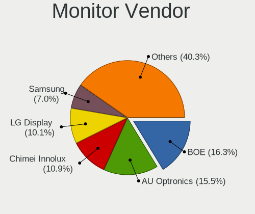

| Vendor                  | Computers | Percent |
|-------------------------|-----------|---------|
| BOE                     | 21        | 16.28%  |
| AU Optronics            | 20        | 15.5%   |
| Chimei Innolux          | 14        | 10.85%  |
| LG Display              | 13        | 10.08%  |
| Samsung Electronics     | 9         | 6.98%   |
| Dell                    | 7         | 5.43%   |
| Sharp                   | 6         | 4.65%   |
| Hewlett-Packard         | 4         | 3.1%    |
| Sony                    | 3         | 2.33%   |
| PANDA                   | 3         | 2.33%   |
| InfoVision              | 3         | 2.33%   |
| BenQ                    | 3         | 2.33%   |
| Acer                    | 3         | 2.33%   |
| Iiyama                  | 2         | 1.55%   |
| Chi Mei Optoelectronics | 2         | 1.55%   |
| Vizio                   | 1         | 0.78%   |
| ViewSonic               | 1         | 0.78%   |
| Unknown                 | 1         | 0.78%   |
| SGT                     | 1         | 0.78%   |
| RTK                     | 1         | 0.78%   |
| Philips                 | 1         | 0.78%   |
| Olidata                 | 1         | 0.78%   |
| KON                     | 1         | 0.78%   |
| KDB                     | 1         | 0.78%   |
| Goldstar                | 1         | 0.78%   |
| Gigabyte Technology     | 1         | 0.78%   |
| CSO                     | 1         | 0.78%   |
| BBY                     | 1         | 0.78%   |
| ASUSTek Computer        | 1         | 0.78%   |
| AOC                     | 1         | 0.78%   |
| Ancor Communications    | 1         | 0.78%   |

Monitor Model
-------------

Monitor models

| Model                                                                   | Computers | Percent |
|-------------------------------------------------------------------------|-----------|---------|
| Sony TV SNYF301 1920x1080                                               | 3         | 2.27%   |
| Chimei Innolux LCD Monitor CMN1521 1920x1080 344x193mm 15.5-inch        | 3         | 2.27%   |
| BOE LCD Monitor BOE0936 1920x1080 344x194mm 15.5-inch                   | 2         | 1.52%   |
| BOE LCD Monitor BOE0897 1366x768 344x194mm 15.5-inch                    | 2         | 1.52%   |
| AU Optronics LCD Monitor AUO22EC 1366x768 344x193mm 15.5-inch           | 2         | 1.52%   |
| Vizio V405-G9 VIZ1033 3840x2160 1096x616mm 49.5-inch                    | 1         | 0.76%   |
| ViewSonic VA3456-WQHD VSCFC3A 3440x1440 800x335mm 34.1-inch             | 1         | 0.76%   |
| Unknown LCD Monitor SAMSUNG 1600x900                                    | 1         | 0.76%   |
| Sharp LQ156M1JW25 SHP152C 1920x1080 344x194mm 15.5-inch                 | 1         | 0.76%   |
| Sharp LQ150P1JX51 SHP14B4 2496x1664 317x211mm 15.0-inch                 | 1         | 0.76%   |
| Sharp LCD SHP1099 1280x720 890x500mm 40.2-inch                          | 1         | 0.76%   |
| Sharp LCD Monitor SHP14D1 1920x1200 336x210mm 15.6-inch                 | 1         | 0.76%   |
| Sharp LCD Monitor SHP1461 3200x1800 294x165mm 13.3-inch                 | 1         | 0.76%   |
| Sharp LCD Monitor SHP1446 3840x2160 382x215mm 17.3-inch                 | 1         | 0.76%   |
| SGT F156P1 SGT1600 1920x1080 345x194mm 15.6-inch                        | 1         | 0.76%   |
| Samsung Electronics SyncMaster SAM060D 1920x1080 531x299mm 24.0-inch    | 1         | 0.76%   |
| Samsung Electronics SyncMaster SAM0117 1280x1024 312x234mm 15.4-inch    | 1         | 0.76%   |
| Samsung Electronics SMB2430H SAM064D 1920x1080 531x299mm 24.0-inch      | 1         | 0.76%   |
| Samsung Electronics LF27T35 SAM707F 1920x1080 598x337mm 27.0-inch       | 1         | 0.76%   |
| Samsung Electronics LF24T35 SAM707E 1920x1080 528x297mm 23.9-inch       | 1         | 0.76%   |
| Samsung Electronics LF24T35 SAM707D 1920x1080 528x297mm 23.9-inch       | 1         | 0.76%   |
| Samsung Electronics LCD Monitor SEC3150 1366x768 344x193mm 15.5-inch    | 1         | 0.76%   |
| Samsung Electronics LCD Monitor SAM723F 3840x2160 700x390mm 31.5-inch   | 1         | 0.76%   |
| Samsung Electronics LCD Monitor SAM0F17 3840x2160 1872x1053mm 84.6-inch | 1         | 0.76%   |
| Samsung Electronics LCD Monitor SAM0D3B 3840x2160 1020x570mm 46.0-inch  | 1         | 0.76%   |
| Samsung Electronics LCD Monitor SAM07BA 1920x1080 890x500mm 40.2-inch   | 1         | 0.76%   |
| RTK AIO LCD RTK40B0 1600x900 443x249mm 20.0-inch                        | 1         | 0.76%   |
| Philips PHL 241V8 PHLC212 1920x1080 527x296mm 23.8-inch                 | 1         | 0.76%   |
| PANDA LCD Monitor NCP004D 1920x1080 344x194mm 15.5-inch                 | 1         | 0.76%   |
| PANDA LCD Monitor NCP002B 1920x1080 309x174mm 14.0-inch                 | 1         | 0.76%   |
| PANDA LCD Monitor NCP0004 1920x1080 294x165mm 13.3-inch                 | 1         | 0.76%   |
| Olidata TW999 OLD9996 1440x900 410x257mm 19.1-inch                      | 1         | 0.76%   |
| LG Display LCD Monitor LGD40A9 1920x1080 309x174mm 14.0-inch            | 1         | 0.76%   |
| LG Display LCD Monitor LGD06F7 1920x1200 302x189mm 14.0-inch            | 1         | 0.76%   |
| LG Display LCD Monitor LGD06E4 1920x1080 344x194mm 15.5-inch            | 1         | 0.76%   |
| LG Display LCD Monitor LGD068D 1920x1080 309x174mm 14.0-inch            | 1         | 0.76%   |
| LG Display LCD Monitor LGD05FA 1920x1080 309x174mm 14.0-inch            | 1         | 0.76%   |
| LG Display LCD Monitor LGD05EE 2560x1440 309x174mm 14.0-inch            | 1         | 0.76%   |
| LG Display LCD Monitor LGD05D8 1920x1080 344x194mm 15.5-inch            | 1         | 0.76%   |
| LG Display LCD Monitor LGD04FF 1920x1080 309x174mm 14.0-inch            | 1         | 0.76%   |

Monitor Resolution
------------------

Monitor screen resolution

| Resolution         | Computers | Percent |
|--------------------|-----------|---------|
| 1920x1080 (FHD)    | 62        | 51.67%  |
| 1366x768 (WXGA)    | 23        | 19.17%  |
| 3840x2160 (4K)     | 7         | 5.83%   |
| 1920x1200 (WUXGA)  | 7         | 5.83%   |
| 1600x900 (HD+)     | 4         | 3.33%   |
| 3440x1440          | 3         | 2.5%    |
| 1280x1024 (SXGA)   | 3         | 2.5%    |
| 2560x1440 (QHD)    | 2         | 1.67%   |
| 5200x1080          | 1         | 0.83%   |
| 3200x1800 (QHD+)   | 1         | 0.83%   |
| 2560x1600          | 1         | 0.83%   |
| 2496x1664          | 1         | 0.83%   |
| 1920x540           | 1         | 0.83%   |
| 1680x1050 (WSXGA+) | 1         | 0.83%   |
| 1600x1200          | 1         | 0.83%   |
| 1440x900 (WXGA+)   | 1         | 0.83%   |
| Unknown            | 1         | 0.83%   |

Monitor Diagonal
----------------

Diagonal size in inches

| Inches  | Computers | Percent |
|---------|-----------|---------|
| 15      | 48        | 37.5%   |
| 14      | 13        | 10.16%  |
| 13      | 12        | 9.38%   |
| 24      | 8         | 6.25%   |
| 17      | 8         | 6.25%   |
| 27      | 6         | 4.69%   |
| 72      | 3         | 2.34%   |
| 34      | 3         | 2.34%   |
| 23      | 3         | 2.34%   |
| 16      | 3         | 2.34%   |
| 84      | 2         | 1.56%   |
| 22      | 2         | 1.56%   |
| 20      | 2         | 1.56%   |
| 19      | 2         | 1.56%   |
| 11      | 2         | 1.56%   |
| Unknown | 2         | 1.56%   |
| 69      | 1         | 0.78%   |
| 46      | 1         | 0.78%   |
| 43      | 1         | 0.78%   |
| 40      | 1         | 0.78%   |
| 36      | 1         | 0.78%   |
| 32      | 1         | 0.78%   |
| 21      | 1         | 0.78%   |
| 18      | 1         | 0.78%   |
| 12      | 1         | 0.78%   |

Monitor Width
-------------

Physical width

| Width in mm | Computers | Percent |
|-------------|-----------|---------|
| 301-350     | 72        | 57.6%   |
| 501-600     | 15        | 12%     |
| 351-400     | 9         | 7.2%    |
| 201-300     | 7         | 5.6%    |
| 401-500     | 6         | 4.8%    |
| 1501-2000   | 6         | 4.8%    |
| 701-800     | 5         | 4%      |
| Unknown     | 2         | 1.6%    |
| 801-900     | 1         | 0.8%    |
| 1001-1500   | 1         | 0.8%    |
| 901-1000    | 1         | 0.8%    |

Aspect Ratio
------------

Proportional relationship between the width and the height

| Ratio   | Computers | Percent |
|---------|-----------|---------|
| 16/9    | 94        | 82.46%  |
| 16/10   | 10        | 8.77%   |
| 4/3     | 3         | 2.63%   |
| 21/9    | 3         | 2.63%   |
| Unknown | 2         | 1.75%   |
| 5/4     | 1         | 0.88%   |
| 3/2     | 1         | 0.88%   |

Monitor Area
------------

Area in inch²

| Area in inch² | Computers | Percent |
|----------------|-----------|---------|
| 101-110        | 47        | 37.3%   |
| 81-90          | 21        | 16.67%  |
| 201-250        | 11        | 8.73%   |
| 121-130        | 7         | 5.56%   |
| More than 1000 | 6         | 4.76%   |
| 301-350        | 6         | 4.76%   |
| 71-80          | 4         | 3.17%   |
| 351-500        | 4         | 3.17%   |
| 151-200        | 4         | 3.17%   |
| 111-120        | 4         | 3.17%   |
| 501-1000       | 3         | 2.38%   |
| 51-60          | 2         | 1.59%   |
| 251-300        | 2         | 1.59%   |
| 141-150        | 2         | 1.59%   |
| Unknown        | 2         | 1.59%   |
| 61-70          | 1         | 0.79%   |

Pixel Density
-------------

Pixels per inch

| Density       | Computers | Percent |
|---------------|-----------|---------|
| 121-160       | 53        | 43.09%  |
| 101-120       | 26        | 21.14%  |
| 51-100        | 26        | 21.14%  |
| 161-240       | 9         | 7.32%   |
| 1-50          | 5         | 4.07%   |
| More than 240 | 2         | 1.63%   |
| Unknown       | 2         | 1.63%   |

Multiple Monitors
-----------------

Total monitors connected

| Total | Computers | Percent |
|-------|-----------|---------|
| 1     | 94        | 76.42%  |
| 2     | 19        | 15.45%  |
| 0     | 7         | 5.69%   |
| 3     | 3         | 2.44%   |

Network
-------

Net Controller Vendor
---------------------

Controller vendors

| Vendor                | Computers | Percent |
|-----------------------|-----------|---------|
| Intel                 | 74        | 37.95%  |
| Realtek Semiconductor | 69        | 35.38%  |
| Qualcomm Atheros      | 16        | 8.21%   |
| Xiaomi                | 4         | 2.05%   |
| TP-Link               | 4         | 2.05%   |
| Samsung Electronics   | 4         | 2.05%   |
| Ralink Technology     | 4         | 2.05%   |
| MediaTek              | 4         | 2.05%   |
| Broadcom              | 3         | 1.54%   |
| Ralink                | 2         | 1.03%   |
| Qualcomm              | 2         | 1.03%   |
| ASIX Electronics      | 2         | 1.03%   |
| STMicroelectronics    | 1         | 0.51%   |
| NetGear               | 1         | 0.51%   |
| Microchip Technology  | 1         | 0.51%   |
| Lenovo                | 1         | 0.51%   |
| JMicron Technology    | 1         | 0.51%   |
| Google                | 1         | 0.51%   |
| Dell                  | 1         | 0.51%   |

Net Controller Model
--------------------

Controller models

| Model                                                                  | Computers | Percent |
|------------------------------------------------------------------------|-----------|---------|
| Realtek RTL8111/8168/8211/8411 PCI Express Gigabit Ethernet Controller | 42        | 17.8%   |
| Intel Alder Lake-P PCH CNVi WiFi                                       | 13        | 5.51%   |
| Realtek RTL8153 Gigabit Ethernet Adapter                               | 8         | 3.39%   |
| Realtek RTL8821CE 802.11ac PCIe Wireless Network Adapter               | 5         | 2.12%   |
| Realtek RTL810xE PCI Express Fast Ethernet controller                  | 5         | 2.12%   |
| Qualcomm Atheros QCA9565 / AR9565 Wireless Network Adapter             | 5         | 2.12%   |
| Intel Wi-Fi 6 AX201                                                    | 5         | 2.12%   |
| Intel 82579LM Gigabit Network Connection (Lewisville)                  | 5         | 2.12%   |
| Realtek RTL8822CE 802.11ac PCIe Wireless Network Adapter               | 4         | 1.69%   |
| Realtek RTL8188EUS 802.11n Wireless Network Adapter                    | 4         | 1.69%   |
| Qualcomm Atheros QCA9377 802.11ac Wireless Network Adapter             | 4         | 1.69%   |
| Intel Ethernet Controller I225-V                                       | 4         | 1.69%   |
| Intel Alder Lake-S PCH CNVi WiFi                                       | 4         | 1.69%   |
| Xiaomi Mi/Redmi series (RNDIS)                                         | 3         | 1.27%   |
| Realtek RTL8125 2.5GbE Controller                                      | 3         | 1.27%   |
| Intel Wireless 8265 / 8275                                             | 3         | 1.27%   |
| Intel Wireless 7265                                                    | 3         | 1.27%   |
| Intel Wi-Fi 6 AX200                                                    | 3         | 1.27%   |
| Intel Wi-Fi 5(802.11ac) Wireless-AC 9x6x [Thunder Peak]                | 3         | 1.27%   |
| Intel Tiger Lake PCH CNVi WiFi                                         | 3         | 1.27%   |
| Intel Ethernet Connection I219-LM                                      | 3         | 1.27%   |
| Intel Cannon Point-LP CNVi [Wireless-AC]                               | 3         | 1.27%   |
| Samsung GT-I9070 (network tethering, USB debugging enabled)            | 2         | 0.85%   |
| Samsung Galaxy series, misc. (tethering mode)                          | 2         | 0.85%   |
| Realtek RTL88x2bu [AC1200 Techkey]                                     | 2         | 0.85%   |
| Realtek RTL8814AU 802.11a/b/g/n/ac Wireless Adapter                    | 2         | 0.85%   |
| Realtek RTL8723BE PCIe Wireless Network Adapter                        | 2         | 0.85%   |
| Realtek Killer E2600 GbE Controller                                    | 2         | 0.85%   |
| Ralink RT2870/RT3070 Wireless Adapter                                  | 2         | 0.85%   |
| Qualcomm Atheros AR9485 Wireless Network Adapter                       | 2         | 0.85%   |
| Qualcomm Atheros AR9285 Wireless Network Adapter (PCI-Express)         | 2         | 0.85%   |
| MediaTek MT7921K (RZ608) Wi-Fi 6E 80MHz                                | 2         | 0.85%   |
| Intel Wireless 8260                                                    | 2         | 0.85%   |
| Intel Raptor Lake-S PCH CNVi WiFi                                      | 2         | 0.85%   |
| Intel Raptor Lake PCH CNVi WiFi                                        | 2         | 0.85%   |
| Intel I211 Gigabit Network Connection                                  | 2         | 0.85%   |
| Intel Gemini Lake PCH CNVi WiFi                                        | 2         | 0.85%   |
| Intel Ethernet Connection (6) I219-V                                   | 2         | 0.85%   |
| Intel Ethernet Connection (6) I219-LM                                  | 2         | 0.85%   |
| Intel Ethernet Connection (4) I219-LM                                  | 2         | 0.85%   |

Wireless Vendor
---------------

Wireless vendors

| Vendor                | Computers | Percent |
|-----------------------|-----------|---------|
| Intel                 | 61        | 50.83%  |
| Realtek Semiconductor | 24        | 20%     |
| Qualcomm Atheros      | 15        | 12.5%   |
| TP-Link               | 4         | 3.33%   |
| Ralink Technology     | 4         | 3.33%   |
| MediaTek              | 4         | 3.33%   |
| Broadcom              | 3         | 2.5%    |
| Ralink                | 2         | 1.67%   |
| Qualcomm              | 1         | 0.83%   |
| NetGear               | 1         | 0.83%   |
| Dell                  | 1         | 0.83%   |

Wireless Model
--------------

Wireless models

| Model                                                                                         | Computers | Percent |
|-----------------------------------------------------------------------------------------------|-----------|---------|
| Intel Alder Lake-P PCH CNVi WiFi                                                              | 13        | 10.57%  |
| Realtek RTL8821CE 802.11ac PCIe Wireless Network Adapter                                      | 5         | 4.07%   |
| Qualcomm Atheros QCA9565 / AR9565 Wireless Network Adapter                                    | 5         | 4.07%   |
| Intel Wi-Fi 6 AX201                                                                           | 5         | 4.07%   |
| Realtek RTL8822CE 802.11ac PCIe Wireless Network Adapter                                      | 4         | 3.25%   |
| Realtek RTL8188EUS 802.11n Wireless Network Adapter                                           | 4         | 3.25%   |
| Qualcomm Atheros QCA9377 802.11ac Wireless Network Adapter                                    | 4         | 3.25%   |
| Intel Alder Lake-S PCH CNVi WiFi                                                              | 4         | 3.25%   |
| Intel Wireless 8265 / 8275                                                                    | 3         | 2.44%   |
| Intel Wireless 7265                                                                           | 3         | 2.44%   |
| Intel Wi-Fi 6 AX200                                                                           | 3         | 2.44%   |
| Intel Wi-Fi 5(802.11ac) Wireless-AC 9x6x [Thunder Peak]                                       | 3         | 2.44%   |
| Intel Tiger Lake PCH CNVi WiFi                                                                | 3         | 2.44%   |
| Intel Cannon Point-LP CNVi [Wireless-AC]                                                      | 3         | 2.44%   |
| Realtek RTL88x2bu [AC1200 Techkey]                                                            | 2         | 1.63%   |
| Realtek RTL8814AU 802.11a/b/g/n/ac Wireless Adapter                                           | 2         | 1.63%   |
| Realtek RTL8723BE PCIe Wireless Network Adapter                                               | 2         | 1.63%   |
| Ralink RT2870/RT3070 Wireless Adapter                                                         | 2         | 1.63%   |
| Qualcomm Atheros AR9485 Wireless Network Adapter                                              | 2         | 1.63%   |
| Qualcomm Atheros AR9285 Wireless Network Adapter (PCI-Express)                                | 2         | 1.63%   |
| MediaTek MT7921K (RZ608) Wi-Fi 6E 80MHz                                                       | 2         | 1.63%   |
| Intel Wireless 8260                                                                           | 2         | 1.63%   |
| Intel Raptor Lake-S PCH CNVi WiFi                                                             | 2         | 1.63%   |
| Intel Raptor Lake PCH CNVi WiFi                                                               | 2         | 1.63%   |
| Intel Gemini Lake PCH CNVi WiFi                                                               | 2         | 1.63%   |
| Intel Dual Band Wireless-AC 3168NGW [Stone Peak]                                              | 2         | 1.63%   |
| Intel Comet Lake PCH-LP CNVi WiFi                                                             | 2         | 1.63%   |
| Intel Comet Lake PCH CNVi WiFi                                                                | 2         | 1.63%   |
| Intel Centrino Advanced-N 6205 [Taylor Peak]                                                  | 2         | 1.63%   |
| TP-Link TL-WN722N v2/v3 [Realtek RTL8188EUS]                                                  | 1         | 0.81%   |
| TP-Link Archer T4U ver.3                                                                      | 1         | 0.81%   |
| TP-Link Archer T3U [Realtek RTL8812BU]                                                        | 1         | 0.81%   |
| TP-Link AC600 wireless Realtek RTL8811AU [Archer T2U Nano]                                    | 1         | 0.81%   |
| Realtek RTL8852AE 802.11ax PCIe Wireless Network Adapter                                      | 1         | 0.81%   |
| Realtek RTL8812AU-VS 802.11a/b/g/n/ac 2T2R DB WLAN Adapter                                    | 1         | 0.81%   |
| Realtek RTL8812AU 802.11a/b/g/n/ac 2T2R DB WLAN Adapter                                       | 1         | 0.81%   |
| Realtek RTL8192CU 802.11n WLAN Adapter                                                        | 1         | 0.81%   |
| Realtek RTL8188ETV Wireless LAN 802.11n Network Adapter                                       | 1         | 0.81%   |
| Realtek RTL8187 Wireless Adapter                                                              | 1         | 0.81%   |
| Realtek Realtek 8812AU/8821AU 802.11ac WLAN Adapter [USB Wireless Dual-Band Adapter 2.4/5Ghz] | 1         | 0.81%   |

Ethernet Vendor
---------------

Ethernet vendors

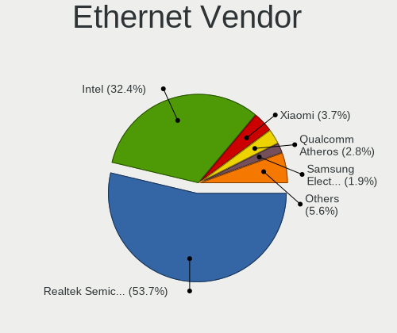

| Vendor                | Computers | Percent |
|-----------------------|-----------|---------|
| Realtek Semiconductor | 58        | 53.21%  |
| Intel                 | 34        | 31.19%  |
| Xiaomi                | 4         | 3.67%   |
| Samsung Electronics   | 4         | 3.67%   |
| Qualcomm Atheros      | 3         | 2.75%   |
| ASIX Electronics      | 2         | 1.83%   |
| Qualcomm              | 1         | 0.92%   |
| Lenovo                | 1         | 0.92%   |
| JMicron Technology    | 1         | 0.92%   |
| Google                | 1         | 0.92%   |

Ethernet Model
--------------

Ethernet models

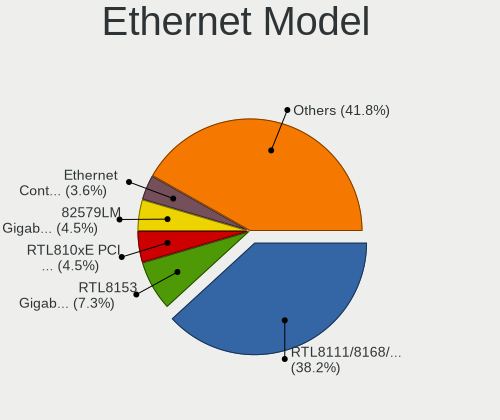

| Model                                                                  | Computers | Percent |
|------------------------------------------------------------------------|-----------|---------|
| Realtek RTL8111/8168/8211/8411 PCI Express Gigabit Ethernet Controller | 42        | 37.84%  |
| Realtek RTL8153 Gigabit Ethernet Adapter                               | 8         | 7.21%   |
| Realtek RTL810xE PCI Express Fast Ethernet controller                  | 5         | 4.5%    |
| Intel 82579LM Gigabit Network Connection (Lewisville)                  | 5         | 4.5%    |
| Intel Ethernet Controller I225-V                                       | 4         | 3.6%    |
| Xiaomi Mi/Redmi series (RNDIS)                                         | 3         | 2.7%    |
| Realtek RTL8125 2.5GbE Controller                                      | 3         | 2.7%    |
| Intel Ethernet Connection I219-LM                                      | 3         | 2.7%    |
| Samsung GT-I9070 (network tethering, USB debugging enabled)            | 2         | 1.8%    |
| Samsung Galaxy series, misc. (tethering mode)                          | 2         | 1.8%    |
| Realtek Killer E2600 GbE Controller                                    | 2         | 1.8%    |
| Intel I211 Gigabit Network Connection                                  | 2         | 1.8%    |
| Intel Ethernet Connection (6) I219-V                                   | 2         | 1.8%    |
| Intel Ethernet Connection (6) I219-LM                                  | 2         | 1.8%    |
| Intel Ethernet Connection (4) I219-LM                                  | 2         | 1.8%    |
| Intel 82579V Gigabit Network Connection                                | 2         | 1.8%    |
| Xiaomi Mi/Redmi series (RNDIS + ADB)                                   | 1         | 0.9%    |
| Qualcomm MDM9207-MTP _SN:F0565CAE                                      | 1         | 0.9%    |
| Qualcomm Atheros QCA8171 Gigabit Ethernet                              | 1         | 0.9%    |
| Qualcomm Atheros AR8151 v2.0 Gigabit Ethernet                          | 1         | 0.9%    |
| Qualcomm Atheros AR8131 Gigabit Ethernet                               | 1         | 0.9%    |
| Lenovo USB-C to LAN                                                    | 1         | 0.9%    |
| JMicron JMC250 PCI Express Gigabit Ethernet Controller                 | 1         | 0.9%    |
| Intel Ethernet Controller I226-V                                       | 1         | 0.9%    |
| Intel Ethernet Connection (7) I219-V                                   | 1         | 0.9%    |
| Intel Ethernet Connection (7) I219-LM                                  | 1         | 0.9%    |
| Intel Ethernet Connection (5) I219-LM                                  | 1         | 0.9%    |
| Intel Ethernet Connection (2) I219-LM                                  | 1         | 0.9%    |
| Intel Ethernet Connection (2) I218-V                                   | 1         | 0.9%    |
| Intel Ethernet Connection (17) I219-V                                  | 1         | 0.9%    |
| Intel Ethernet Connection (17) I219-LM                                 | 1         | 0.9%    |
| Intel Ethernet Connection (13) I219-V                                  | 1         | 0.9%    |
| Intel Ethernet Connection (11) I219-LM                                 | 1         | 0.9%    |
| Intel 82571EB Gigabit Ethernet Controller                              | 1         | 0.9%    |
| Intel 82562V-2 10/100 Network Connection                               | 1         | 0.9%    |
| Google Pixel 8                                                         | 1         | 0.9%    |
| ASIX AX88772                                                           | 1         | 0.9%    |
| ASIX AX88179 Gigabit Ethernet                                          | 1         | 0.9%    |

Net Controller Kind
-------------------

Ethernet, WiFi or modem

| Kind     | Computers | Percent |
|----------|-----------|---------|
| WiFi     | 107       | 51.2%   |
| Ethernet | 100       | 47.85%  |
| Modem    | 2         | 0.96%   |

Used Controller
---------------

Currently used network controller

| Kind     | Computers | Percent |
|----------|-----------|---------|
| WiFi     | 78        | 66.1%   |
| Ethernet | 40        | 33.9%   |

NICs
----

Total network controllers on board

| Total | Computers | Percent |
|-------|-----------|---------|
| 2     | 67        | 55.37%  |
| 1     | 47        | 38.84%  |
| 0     | 4         | 3.31%   |
| 3     | 2         | 1.65%   |
| 5     | 1         | 0.83%   |

IPv6
----

IPv6 vs IPv4

| Used | Computers | Percent |
|------|-----------|---------|
| No   | 86        | 70.49%  |
| Yes  | 36        | 29.51%  |

Bluetooth
---------

Bluetooth Vendor
----------------

Controller vendors

| Vendor                          | Computers | Percent |
|---------------------------------|-----------|---------|
| Intel                           | 51        | 56.04%  |
| Qualcomm Atheros Communications | 10        | 10.99%  |
| Realtek Semiconductor           | 9         | 9.89%   |
| ASUSTek Computer                | 4         | 4.4%    |
| IMC Networks                    | 3         | 3.3%    |
| MediaTek                        | 2         | 2.2%    |
| Lite-On Technology              | 2         | 2.2%    |
| Foxconn / Hon Hai               | 2         | 2.2%    |
| Broadcom                        | 2         | 2.2%    |
| Realtek                         | 1         | 1.1%    |
| Logitech                        | 1         | 1.1%    |
| Hewlett-Packard                 | 1         | 1.1%    |
| Dynex                           | 1         | 1.1%    |
| Cambridge Silicon Radio         | 1         | 1.1%    |
| Unknown                         | 1         | 1.1%    |

Bluetooth Model
---------------

Controller models

| Model                                                    | Computers | Percent |
|----------------------------------------------------------|-----------|---------|
| Intel AX201 Bluetooth                                    | 18        | 19.78%  |
| Intel Bluetooth wireless interface                       | 10        | 10.99%  |
| Intel Bluetooth Device                                   | 10        | 10.99%  |
| Realtek Bluetooth Radio                                  | 9         | 9.89%   |
| Qualcomm Atheros  Bluetooth Device                       | 6         | 6.59%   |
| Intel Bluetooth 9460/9560 Jefferson Peak (JfP)           | 6         | 6.59%   |
| Intel AX200 Bluetooth                                    | 3         | 3.3%    |
| MediaTek Wireless_Device                                 | 2         | 2.2%    |
| Intel Wireless-AC 9260 Bluetooth Adapter                 | 2         | 2.2%    |
| Intel Wireless-AC 3168 Bluetooth                         | 2         | 2.2%    |
| IMC Networks Bluetooth Radio                             | 2         | 2.2%    |
| Realtek Bluetooth Radio                                  | 1         | 1.1%    |
| Qualcomm Atheros QCA61x4 Bluetooth 4.0                   | 1         | 1.1%    |
| Qualcomm Atheros Bluetooth USB Host Controller           | 1         | 1.1%    |
| Qualcomm Atheros AR3012 Bluetooth 4.0                    | 1         | 1.1%    |
| Qualcomm Atheros AR3011 Bluetooth                        | 1         | 1.1%    |
| Logitech BT Mini-Receiver (HCI mode)                     | 1         | 1.1%    |
| Lite-On Wireless_Device                                  | 1         | 1.1%    |
| Lite-On Bluetooth Device                                 | 1         | 1.1%    |
| IMC Networks Bluetooth Device                            | 1         | 1.1%    |
| HP Broadcom 2070 Bluetooth Combo                         | 1         | 1.1%    |
| Foxconn / Hon Hai Wireless_Device                        | 1         | 1.1%    |
| Foxconn / Hon Hai Bluetooth Device                       | 1         | 1.1%    |
| Dynex Bluetooth 4.0 Adapter [Broadcom, 1.12, BCM20702A0] | 1         | 1.1%    |
| Cambridge Silicon Radio Bluetooth Dongle (HCI mode)      | 1         | 1.1%    |
| Broadcom BCM43142A0 Bluetooth 4.0                        | 1         | 1.1%    |
| Broadcom BCM2045A0                                       | 1         | 1.1%    |
| ASUS BT-270 Bluetooth Adapter                            | 1         | 1.1%    |
| ASUS Bluetooth Adapter                                   | 1         | 1.1%    |
| ASUS BCM20702A0                                          | 1         | 1.1%    |
| ASUS ASUS USB-BT500                                      | 1         | 1.1%    |
| Unknown                                                  | 1         | 1.1%    |

Sound
-----

Sound Vendor
------------

Sound card vendors

| Vendor                   | Computers | Percent |
|--------------------------|-----------|---------|
| Intel                    | 96        | 56.8%   |
| Nvidia                   | 29        | 17.16%  |
| AMD                      | 29        | 17.16%  |
| C-Media Electronics      | 3         | 1.78%   |
| GN Netcom                | 2         | 1.18%   |
| Corsair                  | 2         | 1.18%   |
| USB-MIC                  | 1         | 0.59%   |
| Realtek Semiconductor    | 1         | 0.59%   |
| Razer USA                | 1         | 0.59%   |
| Micro Star International | 1         | 0.59%   |
| Kingston Technology      | 1         | 0.59%   |
| JMTek                    | 1         | 0.59%   |
| Generalplus Technology   | 1         | 0.59%   |
| Conexant Systems         | 1         | 0.59%   |

Sound Model
-----------

Sound card models

| Model                                                                                             | Computers | Percent |
|---------------------------------------------------------------------------------------------------|-----------|---------|
| Intel Alder Lake PCH-P High Definition Audio Controller                                           | 14        | 7.25%   |
| AMD Family 17h/19h HD Audio Controller                                                            | 13        | 6.74%   |
| Intel Tiger Lake-LP Smart Sound Technology Audio Controller                                       | 11        | 5.7%    |
| Intel Sunrise Point-LP HD Audio                                                                   | 10        | 5.18%   |
| Intel 7 Series/C216 Chipset Family High Definition Audio Controller                               | 8         | 4.15%   |
| AMD Renoir Radeon High Definition Audio Controller                                                | 8         | 4.15%   |
| Intel 6 Series/C200 Series Chipset Family High Definition Audio Controller                        | 7         | 3.63%   |
| Nvidia GA106 High Definition Audio Controller                                                     | 6         | 3.11%   |
| Nvidia TU107 GeForce GTX 1650 High Definition Audio Controller                                    | 5         | 2.59%   |
| Nvidia GA104 High Definition Audio Controller                                                     | 5         | 2.59%   |
| Nvidia Audio device                                                                               | 5         | 2.59%   |
| Intel Cannon Point-LP High Definition Audio Controller                                            | 5         | 2.59%   |
| Intel Alder Lake-S HD Audio Controller                                                            | 5         | 2.59%   |
| Intel Celeron/Pentium Silver Processor High Definition Audio                                      | 4         | 2.07%   |
| Intel Tiger Lake-H HD Audio Controller                                                            | 3         | 1.55%   |
| Intel Comet Lake PCH cAVS                                                                         | 3         | 1.55%   |
| Intel Cannon Lake PCH cAVS                                                                        | 3         | 1.55%   |
| AMD Starship/Matisse HD Audio Controller                                                          | 3         | 1.55%   |
| AMD SBx00 Azalia (Intel HDA)                                                                      | 3         | 1.55%   |
| AMD Raven/Raven2/Fenghuang HDMI/DP Audio Controller                                               | 3         | 1.55%   |
| Intel Xeon E3-1200 v3/4th Gen Core Processor HD Audio Controller                                  | 2         | 1.04%   |
| Intel Wildcat Point-LP High Definition Audio Controller                                           | 2         | 1.04%   |
| Intel Raptor Lake-P/U/H cAVS                                                                      | 2         | 1.04%   |
| Intel Raptor Lake High Definition Audio Controller                                                | 2         | 1.04%   |
| Intel Comet Lake PCH-LP cAVS                                                                      | 2         | 1.04%   |
| Intel Celeron N3350/Pentium N4200/Atom E3900 Series Audio Cluster                                 | 2         | 1.04%   |
| Intel Broadwell-U Audio Controller                                                                | 2         | 1.04%   |
| Intel Atom/Celeron/Pentium Processor x5-E8000/J3xxx/N3xxx Series High Definition Audio Controller | 2         | 1.04%   |
| Intel 82801I (ICH9 Family) HD Audio Controller                                                    | 2         | 1.04%   |
| Intel 8 Series/C220 Series Chipset High Definition Audio Controller                               | 2         | 1.04%   |
| AMD Oland/Hainan/Cape Verde/Pitcairn HDMI Audio [Radeon HD 7000 Series]                           | 2         | 1.04%   |
| AMD Navi 21/23 HDMI/DP Audio Controller                                                           | 2         | 1.04%   |
| AMD Family 15h (Models 60h-6fh) Audio Controller                                                  | 2         | 1.04%   |
| AMD Caicos HDMI Audio [Radeon HD 6450 / 7450/8450/8490 OEM / R5 230/235/235X OEM]                 | 2         | 1.04%   |
| USB-MIC USB-MIC                                                                                   | 1         | 0.52%   |
| Realtek Semiconductor USB Audio                                                                   | 1         | 0.52%   |
| Razer USA Razer USB Sound Card                                                                    | 1         | 0.52%   |
| Nvidia TU104 HD Audio Controller                                                                  | 1         | 0.52%   |
| Nvidia High Definition Audio Controller                                                           | 1         | 0.52%   |
| Nvidia GP107GL High Definition Audio Controller                                                   | 1         | 0.52%   |

Memory
------

Memory Vendor
-------------

Memory module vendors

| Vendor              | Computers | Percent |
|---------------------|-----------|---------|
| Samsung Electronics | 26        | 28.26%  |
| SK hynix            | 15        | 16.3%   |
| Kingston            | 12        | 13.04%  |
| Micron Technology   | 9         | 9.78%   |
| Corsair             | 6         | 6.52%   |
| Unknown             | 4         | 4.35%   |
| A-DATA Technology   | 4         | 4.35%   |
| Crucial             | 3         | 3.26%   |
| Unknown             | 3         | 3.26%   |
| Unknown (ABCD)      | 2         | 2.17%   |
| Team                | 2         | 2.17%   |
| Smart               | 1         | 1.09%   |
| Ramaxel Technology  | 1         | 1.09%   |
| Nanya Technology    | 1         | 1.09%   |
| G.Skill             | 1         | 1.09%   |
| Elpida              | 1         | 1.09%   |
| Asgard              | 1         | 1.09%   |

Memory Model
------------

Memory module models

| Model                                                               | Computers | Percent |
|---------------------------------------------------------------------|-----------|---------|
| Samsung RAM M471A5244CB0-CWE 4GB SODIMM DDR4 3200MT/s               | 5         | 5.21%   |
| Unknown                                                             | 3         | 3.13%   |
| Unknown (ABCD) RAM 123456789012345678 2048MB SODIMM LPDDR4 2400MT/s | 2         | 2.08%   |
| SK hynix RAM HMAA1GS6CJR6N-XN 8GB SODIMM DDR4 3200MT/s              | 2         | 2.08%   |
| Samsung RAM M471A1K43EB1-CWE 8GB SODIMM DDR4 3200MT/s               | 2         | 2.08%   |
| Samsung RAM M471A1K43DB1-CTD 8GB SODIMM DDR4 2667MT/s               | 2         | 2.08%   |
| Samsung RAM M425R1GB4BB0-CWMOD 8192MB SODIMM 5600MT/s               | 2         | 2.08%   |
| Kingston RAM KF3200C16D4/8GX 8GB DIMM DDR4 3600MT/s                 | 2         | 2.08%   |
| Corsair RAM CMK16GX4M2B3200C16 8GB DIMM DDR4 3600MT/s               | 2         | 2.08%   |
| Unknown RAM Module 8GB DIMM 667MT/s                                 | 1         | 1.04%   |
| Unknown RAM Module 4GB SODIMM LPDDR3 1600MT/s                       | 1         | 1.04%   |
| Unknown RAM Module 4GB SODIMM DDR4 2133MT/s                         | 1         | 1.04%   |
| Unknown RAM Module 4GB SODIMM DDR3 1333MT/s                         | 1         | 1.04%   |
| Team RAM TEAMGROUP-SD4-3200 8GB SODIMM DDR4 3200MT/s                | 1         | 1.04%   |
| Team RAM TEAMGROUP-SD4-3200 16GB SODIMM DDR4 3200MT/s               | 1         | 1.04%   |
| Smart RAM SMS4WEC8C1K0446FCG 8GB SODIMM DDR4 3200MT/s               | 1         | 1.04%   |
| SK hynix RAM Module 8GB SODIMM DDR4 2667MT/s                        | 1         | 1.04%   |
| SK hynix RAM Module 4GB Row Of Chips LPDDR3 2133MT/s                | 1         | 1.04%   |
| SK hynix RAM Module 16GB SODIMM 4800MT/s                            | 1         | 1.04%   |
| SK hynix RAM HMT41GS6AFR8A-PB 8GB SODIMM DDR3 1600MT/s              | 1         | 1.04%   |
| SK hynix RAM HMCG88MEBSA092N 32GB SODIMM DDR5 4800MT/s              | 1         | 1.04%   |
| SK hynix RAM HMCG66AGBSA095N 8GB SODIMM DDR5 5600MT/s               | 1         | 1.04%   |
| SK hynix RAM HMAA2GS6AJR8N-XN 16GB SODIMM DDR4 3200MT/s             | 1         | 1.04%   |
| SK hynix RAM HMA851S6DJR6N-XN 4GB SODIMM DDR4 3200MT/s              | 1         | 1.04%   |
| SK hynix RAM HMA82GS6DJR8N-VK 16GB SODIMM DDR4 2667MT/s             | 1         | 1.04%   |
| SK hynix RAM HMA81GS6DJR8N-XN 8GB SODIMM DDR4 3200MT/s              | 1         | 1.04%   |
| SK hynix RAM HCNNNCPMMLXR-NEE 2GB Row Of Chips LPDDR4 4267MT/s      | 1         | 1.04%   |
| SK hynix RAM H9JCNNNCP3MLYR-N6E 2GB Row Of Chips LPDDR5 6400MT/s    | 1         | 1.04%   |
| SK hynix RAM H9HCNNNCPMMLXR-NEE 2GB Row Of Chips LPDDR4 4267MT/s    | 1         | 1.04%   |
| Samsung RAM UBE3D4AA-MGCR 2GB Row Of Chips LPDDR4 4267MT/s          | 1         | 1.04%   |
| Samsung RAM Module 8GB SODIMM DDR4 2133MT/s                         | 1         | 1.04%   |
| Samsung RAM Module 16GB SODIMM DDR4 2133MT/s                        | 1         | 1.04%   |
| Samsung RAM M471B5773DH0-CH9 2GB SODIMM DDR3 1600MT/s               | 1         | 1.04%   |
| Samsung RAM M471B5273BH1-CF8 4GB SODIMM DDR3 1067MT/s               | 1         | 1.04%   |
| Samsung RAM M471B5173EB0-YK0 4GB SODIMM DDR3 1600MT/s               | 1         | 1.04%   |
| Samsung RAM M471B5173DB0-YK0 4GB SODIMM DDR3 1600MT/s               | 1         | 1.04%   |
| Samsung RAM M471A5143EB0-CPB 4GB SODIMM DDR4 2133MT/s               | 1         | 1.04%   |
| Samsung RAM M471A2K43DB1-CWE 16GB SODIMM DDR4 3200MT/s              | 1         | 1.04%   |
| Samsung RAM M471A1K43DB1-CWE 8GB SODIMM DDR4 3200MT/s               | 1         | 1.04%   |
| Samsung RAM M471A1K43BB1-CTD 8GB SODIMM DDR4 2667MT/s               | 1         | 1.04%   |

Memory Kind
-----------

Memory module kinds

| Kind    | Computers | Percent |
|---------|-----------|---------|
| DDR4    | 44        | 55.7%   |
| DDR3    | 13        | 16.46%  |
| LPDDR4  | 7         | 8.86%   |
| DDR5    | 7         | 8.86%   |
| Unknown | 3         | 3.8%    |
| LPDDR5  | 2         | 2.53%   |
| LPDDR3  | 2         | 2.53%   |
| SDRAM   | 1         | 1.27%   |

Memory Form Factor
------------------

Physical design of the memory module

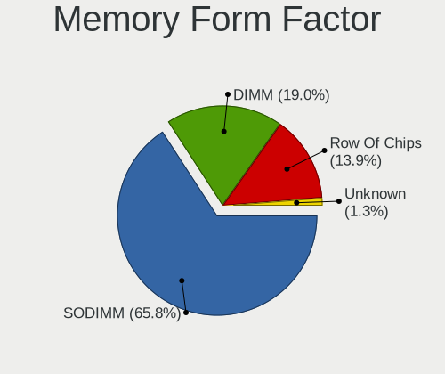

| Name         | Computers | Percent |
|--------------|-----------|---------|
| SODIMM       | 52        | 65.82%  |
| DIMM         | 15        | 18.99%  |
| Row Of Chips | 11        | 13.92%  |
| Unknown      | 1         | 1.27%   |

Memory Size
-----------

Memory module size

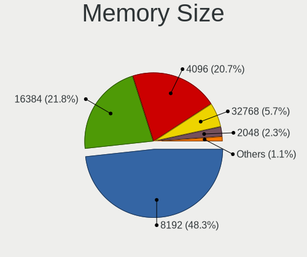

| Size  | Computers | Percent |
|-------|-----------|---------|
| 8192  | 42        | 48.28%  |
| 16384 | 18        | 20.69%  |
| 4096  | 18        | 20.69%  |
| 32768 | 5         | 5.75%   |
| 2048  | 3         | 3.45%   |
| 1024  | 1         | 1.15%   |

Memory Speed
------------

Memory module speed

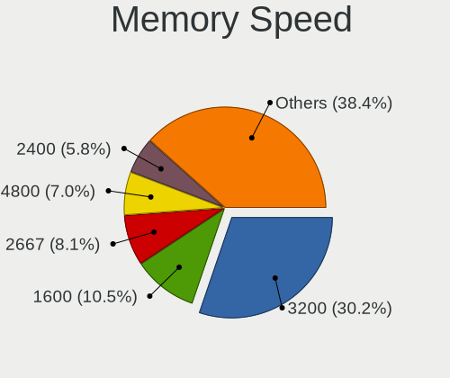

| Speed | Computers | Percent |
|-------|-----------|---------|
| 3200  | 26        | 30.23%  |
| 1600  | 8         | 9.3%    |
| 2667  | 7         | 8.14%   |
| 4800  | 6         | 6.98%   |
| 2400  | 5         | 5.81%   |
| 4267  | 4         | 4.65%   |
| 3600  | 4         | 4.65%   |
| 2133  | 4         | 4.65%   |
| 1333  | 4         | 4.65%   |
| 5600  | 3         | 3.49%   |
| 6400  | 2         | 2.33%   |
| 1866  | 2         | 2.33%   |
| 1334  | 2         | 2.33%   |
| 6800  | 1         | 1.16%   |
| 3866  | 1         | 1.16%   |
| 3800  | 1         | 1.16%   |
| 3733  | 1         | 1.16%   |
| 3534  | 1         | 1.16%   |
| 1867  | 1         | 1.16%   |
| 1800  | 1         | 1.16%   |
| 1067  | 1         | 1.16%   |
| 667   | 1         | 1.16%   |

Printers & scanners
-------------------

Printer Vendor
--------------

Printer device vendors

| Vendor          | Computers | Percent |
|-----------------|-----------|---------|
| Hewlett-Packard | 1         | 100%    |

Printer Model
-------------

Printer device models

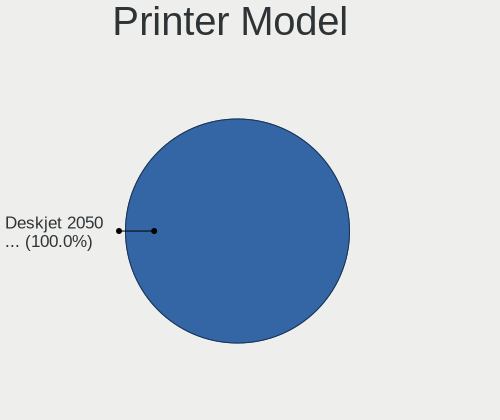

| Model                | Computers | Percent |
|----------------------|-----------|---------|
| HP Deskjet 2050 J510 | 1         | 100%    |

Scanner Vendor
--------------

Scanner device vendors

Zero info for selected period =(

Scanner Model
-------------

Scanner device models

Zero info for selected period =(

Camera
------

Camera Vendor
-------------

Camera device vendors

| Vendor                                 | Computers | Percent |
|----------------------------------------|-----------|---------|
| Chicony Electronics                    | 13        | 15.85%  |
| Bison Electronics                      | 8         | 9.76%   |
| Quanta                                 | 7         | 8.54%   |
| Microdia                               | 7         | 8.54%   |
| IMC Networks                           | 7         | 8.54%   |
| Syntek                                 | 4         | 4.88%   |
| Cheng Uei Precision Industry (Foxlink) | 4         | 4.88%   |
| Sunplus Innovation Technology          | 3         | 3.66%   |
| Realtek Semiconductor                  | 3         | 3.66%   |
| Luxvisions Innotech Limited            | 3         | 3.66%   |
| Lite-On Technology                     | 3         | 3.66%   |
| USB Camera                             | 2         | 2.44%   |
| Silicon Motion                         | 2         | 2.44%   |
| Generalplus Technology                 | 2         | 2.44%   |
| Acer                                   | 2         | 2.44%   |
| Suyin                                  | 1         | 1.22%   |
| SunplusIT                              | 1         | 1.22%   |
| Ricoh                                  | 1         | 1.22%   |
| Primax Electronics                     | 1         | 1.22%   |
| Microsoft                              | 1         | 1.22%   |
| Logitech                               | 1         | 1.22%   |
| Goertek Electronics                    | 1         | 1.22%   |
| Genesys Logic                          | 1         | 1.22%   |
| ARC International                      | 1         | 1.22%   |
| Apple                                  | 1         | 1.22%   |
| Alcor Micro                            | 1         | 1.22%   |
| 8SSC21K12273V1SR33X2817                | 1         | 1.22%   |

Camera Model
------------

Camera device models

| Model                                               | Computers | Percent |
|-----------------------------------------------------|-----------|---------|
| Chicony Integrated Camera                           | 5         | 6.02%   |
| Bison Integrated Camera                             | 4         | 4.82%   |
| Realtek Integrated_Webcam_HD                        | 3         | 3.61%   |
| Quanta ACER HD User Facing                          | 3         | 3.61%   |
| USB Camera USB Camera                               | 2         | 2.41%   |
| Syntek Integrated Camera                            | 2         | 2.41%   |
| Silicon Motion Web Camera                           | 2         | 2.41%   |
| Quanta HD User Facing                               | 2         | 2.41%   |
| Microdia Integrated_Webcam_HD                       | 2         | 2.41%   |
| Luxvisions Innotech Limited HP TrueVision HD Camera | 2         | 2.41%   |
| Lite-On Integrated Camera                           | 2         | 2.41%   |
| IMC Networks USB2.0 HD UVC WebCam                   | 2         | 2.41%   |
| IMC Networks Integrated Camera                      | 2         | 2.41%   |
| Generalplus GENERAL WEBCAM                          | 2         | 2.41%   |
| Bison HD Webcam                                     | 2         | 2.41%   |
| Syntek Lenovo EasyCamera                            | 1         | 1.2%    |
| Syntek EasyCamera                                   | 1         | 1.2%    |
| Suyin HD Video WebCam                               | 1         | 1.2%    |
| SunplusIT 720p HD Camera                            | 1         | 1.2%    |
| Sunplus Integrated_Webcam_HD                        | 1         | 1.2%    |
| Sunplus HP HD Webcam [Fixed]                        | 1         | 1.2%    |
| Sunplus Camera                                      | 1         | 1.2%    |
| Ricoh Laptop_Integrated_Webcam_FHD                  | 1         | 1.2%    |
| Quanta VGA WebCam                                   | 1         | 1.2%    |
| Quanta HD Webcam                                    | 1         | 1.2%    |
| Primax HP HD Webcam [Fixed]                         | 1         | 1.2%    |
| Microsoft Surface Camera Front                      | 1         | 1.2%    |
| Microdia USB 2.0 Camera                             | 1         | 1.2%    |
| Microdia Laptop_Integrated_Webcam_HD                | 1         | 1.2%    |
| Microdia Integrated_Webcam_FHD                      | 1         | 1.2%    |
| Microdia Integrated Webcam HD                       | 1         | 1.2%    |
| Microdia HP Webcam-50                               | 1         | 1.2%    |
| Luxvisions Innotech Limited HP 5MP Camera           | 1         | 1.2%    |
| Logitech BRIO Ultra HD Webcam                       | 1         | 1.2%    |
| Lite-On TOSHIBA Web Camera - HD                     | 1         | 1.2%    |
| IMC Networks USB2.0 5M AF UVC WebCam                | 1         | 1.2%    |
| IMC Networks ov9734_azurewave_camera                | 1         | 1.2%    |
| IMC Networks Integrated Webcam                      | 1         | 1.2%    |
| IMC Networks Integrated RGB Camera                  | 1         | 1.2%    |
| Goertek USB2.0 VGA UVC WebCam                       | 1         | 1.2%    |

Security
--------

Fingerprint Vendor
------------------

Fingerprint sensor vendors

| Vendor                     | Computers | Percent |
|----------------------------|-----------|---------|
| Synaptics                  | 13        | 65%     |
| Validity Sensors           | 3         | 15%     |
| Shenzhen Goodix Technology | 3         | 15%     |
| Samsung Electronics        | 1         | 5%      |

Fingerprint Model
-----------------

Fingerprint sensor models

| Model                                                    | Computers | Percent |
|----------------------------------------------------------|-----------|---------|
| Synaptics Prometheus MIS Touch Fingerprint Reader        | 4         | 20%     |
| Synaptics UWP WBDI Device                                | 3         | 15%     |
| Synaptics FS7604 Touch Fingerprint Sensor with PurePrint | 2         | 10%     |
| Validity Sensors VFS5011 Fingerprint Reader              | 1         | 5%      |
| Validity Sensors VFS495 Fingerprint Reader               | 1         | 5%      |
| Validity Sensors VFS471 Fingerprint Reader               | 1         | 5%      |
| Synaptics WBDI Fingerprint Reader USB 086                | 1         | 5%      |
| Synaptics WBDI                                           | 1         | 5%      |
| Synaptics UWP WBDI                                       | 1         | 5%      |
| Synaptics Metallica MIS Touch Fingerprint Reader         | 1         | 5%      |
| Shenzhen Goodix  FingerPrint Device                      | 1         | 5%      |
| Shenzhen Goodix Fingerprint Reader                       | 1         | 5%      |
| Shenzhen Goodix FingerPrint                              | 1         | 5%      |
| Samsung Fingerprint Device                               | 1         | 5%      |

Chipcard Vendor
---------------

Chipcard module vendors

| Vendor      | Computers | Percent |
|-------------|-----------|---------|
| Broadcom    | 3         | 60%     |
| Alcor Micro | 2         | 40%     |

Chipcard Model
--------------

Chipcard module models

| Model                               | Computers | Percent |
|-------------------------------------|-----------|---------|
| Broadcom 5880                       | 3         | 60%     |
| Alcor Micro AU9540 Smartcard Reader | 2         | 40%     |

Unsupported
-----------

Unsupported Devices
-------------------

Total unsupported devices on board

| Total | Computers | Percent |
|-------|-----------|---------|
| 0     | 70        | 57.38%  |
| 1     | 40        | 32.79%  |
| 2     | 12        | 9.84%   |

Unsupported Device Types
------------------------

Types of unsupported devices

| Type                  | Computers | Percent |
|-----------------------|-----------|---------|
| Fingerprint reader    | 20        | 32.26%  |
| Graphics card         | 17        | 27.42%  |
| Net/wireless          | 5         | 8.06%   |
| Chipcard              | 5         | 8.06%   |
| Net/ethernet          | 3         | 4.84%   |
| Camera                | 3         | 4.84%   |
| Sound                 | 2         | 3.23%   |
| Multimedia controller | 2         | 3.23%   |
| Dvb card              | 2         | 3.23%   |
| Bluetooth             | 2         | 3.23%   |
| Network               | 1         | 1.61%   |

