Peppermint - Tested Hardware & Statistics (Desktops)
----------------------------------------------------

A project to collect tested hardware configurations for Peppermint.

Anyone can contribute to this report by the [hw-probe](https://github.com/linuxhw/hw-probe) tool:

    sudo -E hw-probe -all -upload

Please contribute! Especially if your hardware is rare.

Full-feature report is available here: https://linux-hardware.org/?view=trends

Contents
--------

* [ Test Cases ](#test-cases)

* [ System ](#system)
  - [ OS                       ](#os)
  - [ OS Family                ](#os-family)
  - [ Kernel                   ](#kernel)
  - [ Kernel Family            ](#kernel-family)
  - [ Kernel Major Ver.        ](#kernel-major-ver)
  - [ Arch                     ](#arch)
  - [ DE                       ](#de)
  - [ Display Server           ](#display-server)
  - [ Display Manager          ](#display-manager)
  - [ OS Lang                  ](#os-lang)
  - [ Boot Mode                ](#boot-mode)
  - [ Filesystem               ](#filesystem)
  - [ Part. scheme             ](#part-scheme)
  - [ Dual Boot with Linux/BSD ](#dual-boot-with-linuxbsd)
  - [ Dual Boot (Win)          ](#dual-boot-win)

* [ Board ](#board)
  - [ Vendor                   ](#vendor)
  - [ Model                    ](#model)
  - [ Model Family             ](#model-family)
  - [ MFG Year                 ](#mfg-year)
  - [ Form Factor              ](#form-factor)
  - [ Secure Boot              ](#secure-boot)
  - [ Coreboot                 ](#coreboot)
  - [ RAM Size                 ](#ram-size)
  - [ RAM Used                 ](#ram-used)
  - [ Total Drives             ](#total-drives)
  - [ Has CD-ROM               ](#has-cd-rom)
  - [ Has Ethernet             ](#has-ethernet)
  - [ Has WiFi                 ](#has-wifi)
  - [ Has Bluetooth            ](#has-bluetooth)

* [ Location ](#location)
  - [ Country                  ](#country)
  - [ City                     ](#city)

* [ Drives ](#drives)
  - [ Drive Vendor             ](#drive-vendor)
  - [ Drive Model              ](#drive-model)
  - [ HDD Vendor               ](#hdd-vendor)
  - [ SSD Vendor               ](#ssd-vendor)
  - [ Drive Kind               ](#drive-kind)
  - [ Drive Connector          ](#drive-connector)
  - [ Drive Size               ](#drive-size)
  - [ Space Total              ](#space-total)
  - [ Space Used               ](#space-used)
  - [ Malfunc. Drives          ](#malfunc-drives)
  - [ Malfunc. Drive Vendor    ](#malfunc-drive-vendor)
  - [ Malfunc. HDD Vendor      ](#malfunc-hdd-vendor)
  - [ Malfunc. Drive Kind      ](#malfunc-drive-kind)
  - [ Failed Drives            ](#failed-drives)
  - [ Failed Drive Vendor      ](#failed-drive-vendor)
  - [ Drive Status             ](#drive-status)

* [ Storage controller ](#storage-controller)
  - [ Storage Vendor           ](#storage-vendor)
  - [ Storage Model            ](#storage-model)
  - [ Storage Kind             ](#storage-kind)

* [ Processor ](#processor)
  - [ CPU Vendor               ](#cpu-vendor)
  - [ CPU Model                ](#cpu-model)
  - [ CPU Model Family         ](#cpu-model-family)
  - [ CPU Cores                ](#cpu-cores)
  - [ CPU Sockets              ](#cpu-sockets)
  - [ CPU Threads              ](#cpu-threads)
  - [ CPU Op-Modes             ](#cpu-op-modes)
  - [ CPU Microcode            ](#cpu-microcode)
  - [ CPU Microarch            ](#cpu-microarch)

* [ Graphics ](#graphics)
  - [ GPU Vendor               ](#gpu-vendor)
  - [ GPU Model                ](#gpu-model)
  - [ GPU Combo                ](#gpu-combo)
  - [ GPU Driver               ](#gpu-driver)
  - [ GPU Memory               ](#gpu-memory)

* [ Monitor ](#monitor)
  - [ Monitor Vendor           ](#monitor-vendor)
  - [ Monitor Model            ](#monitor-model)
  - [ Monitor Resolution       ](#monitor-resolution)
  - [ Monitor Diagonal         ](#monitor-diagonal)
  - [ Monitor Width            ](#monitor-width)
  - [ Aspect Ratio             ](#aspect-ratio)
  - [ Monitor Area             ](#monitor-area)
  - [ Pixel Density            ](#pixel-density)
  - [ Multiple Monitors        ](#multiple-monitors)

* [ Network ](#network)
  - [ Net Controller Vendor    ](#net-controller-vendor)
  - [ Net Controller Model     ](#net-controller-model)
  - [ Wireless Vendor          ](#wireless-vendor)
  - [ Wireless Model           ](#wireless-model)
  - [ Ethernet Vendor          ](#ethernet-vendor)
  - [ Ethernet Model           ](#ethernet-model)
  - [ Net Controller Kind      ](#net-controller-kind)
  - [ Used Controller          ](#used-controller)
  - [ NICs                     ](#nics)
  - [ IPv6                     ](#ipv6)

* [ Bluetooth ](#bluetooth)
  - [ Bluetooth Vendor         ](#bluetooth-vendor)
  - [ Bluetooth Model          ](#bluetooth-model)

* [ Sound ](#sound)
  - [ Sound Vendor             ](#sound-vendor)
  - [ Sound Model              ](#sound-model)

* [ Memory ](#memory)
  - [ Memory Vendor            ](#memory-vendor)
  - [ Memory Model             ](#memory-model)
  - [ Memory Kind              ](#memory-kind)
  - [ Memory Form Factor       ](#memory-form-factor)
  - [ Memory Size              ](#memory-size)
  - [ Memory Speed             ](#memory-speed)

* [ Printers & scanners ](#printers--scanners)
  - [ Printer Vendor           ](#printer-vendor)
  - [ Printer Model            ](#printer-model)
  - [ Scanner Vendor           ](#scanner-vendor)
  - [ Scanner Model            ](#scanner-model)

* [ Camera ](#camera)
  - [ Camera Vendor            ](#camera-vendor)
  - [ Camera Model             ](#camera-model)

* [ Security ](#security)
  - [ Fingerprint Vendor       ](#fingerprint-vendor)
  - [ Fingerprint Model        ](#fingerprint-model)
  - [ Chipcard Vendor          ](#chipcard-vendor)
  - [ Chipcard Model           ](#chipcard-model)

* [ Unsupported ](#unsupported)
  - [ Unsupported Devices      ](#unsupported-devices)
  - [ Unsupported Device Types ](#unsupported-device-types)

Test Cases
----------

Total: 153

| Vendor        | Model                       | Probe                                                      | Date         |
|---------------|-----------------------------|------------------------------------------------------------|--------------|
| ASUSTek       | ROG STRIX B450-I GAMING     | [e6a885c5df](https://linux-hardware.org/?probe=e6a885c5df) | Mar 26, 2022 |
| ASUSTek       | ROG STRIX B450-I GAMING     | [d08bb2f15b](https://linux-hardware.org/?probe=d08bb2f15b) | Mar 25, 2022 |
| ASRock        | N68-S3 FX                   | [f3e67de15e](https://linux-hardware.org/?probe=f3e67de15e) | Mar 20, 2022 |
| ASRock        | N68-S3 FX                   | [78676e017b](https://linux-hardware.org/?probe=78676e017b) | Mar 19, 2022 |
| ASUSTek       | M5A78L-M LE                 | [a7209bb34a](https://linux-hardware.org/?probe=a7209bb34a) | Jan 22, 2022 |
| ASUSTek       | M5A78L-M LE                 | [5f7c38d0d5](https://linux-hardware.org/?probe=5f7c38d0d5) | Jan 22, 2022 |
| Intel         | D865GSA AAD52278-203        | [9b874becf9](https://linux-hardware.org/?probe=9b874becf9) | Dec 01, 2021 |
| Intel         | D865GSA AAD52278-203        | [ae2963be56](https://linux-hardware.org/?probe=ae2963be56) | Dec 01, 2021 |
| ECS           | 945GCT-M3                   | [a81a27ac47](https://linux-hardware.org/?probe=a81a27ac47) | Nov 25, 2021 |
| ECS           | Nettle3                     | [844a70698a](https://linux-hardware.org/?probe=844a70698a) | Nov 21, 2021 |
| ASUSTek       | P5GC-MX/1333                | [def67fa4e7](https://linux-hardware.org/?probe=def67fa4e7) | Nov 16, 2021 |
| Intel         | H61                         | [f1d3a975c0](https://linux-hardware.org/?probe=f1d3a975c0) | Oct 26, 2021 |
| ECS           | MCP61PM-GM                  | [1d13b80285](https://linux-hardware.org/?probe=1d13b80285) | Oct 13, 2021 |
| ASRock        | P4VM8                       | [5797c27ef8](https://linux-hardware.org/?probe=5797c27ef8) | Oct 10, 2021 |
| ASRock        | P4VM8                       | [84c50aca4b](https://linux-hardware.org/?probe=84c50aca4b) | Oct 10, 2021 |
| AAEON         | MF-001 V1.0                 | [c5492b6d2f](https://linux-hardware.org/?probe=c5492b6d2f) | Oct 06, 2021 |
| AAEON         | MF-001 V1.0                 | [522a137a4e](https://linux-hardware.org/?probe=522a137a4e) | Oct 05, 2021 |
| MSI           | MS-7211                     | [bb7e83b8cb](https://linux-hardware.org/?probe=bb7e83b8cb) | Sep 25, 2021 |
| ASUSTek       | A88XM-A                     | [b1f8d57cae](https://linux-hardware.org/?probe=b1f8d57cae) | Sep 09, 2021 |
| HP            | 2AE3                        | [6780c45f7c](https://linux-hardware.org/?probe=6780c45f7c) | Aug 02, 2021 |
| Pegatron      | 2ACC                        | [271f50a6ed](https://linux-hardware.org/?probe=271f50a6ed) | Jun 29, 2021 |
| ASRock        | 970M Pro3                   | [9c2c0af05f](https://linux-hardware.org/?probe=9c2c0af05f) | May 27, 2021 |
| ASRock        | 970M Pro3                   | [0a5e45a21e](https://linux-hardware.org/?probe=0a5e45a21e) | May 27, 2021 |
| Pegatron      | Benicia                     | [7b1f7c7edf](https://linux-hardware.org/?probe=7b1f7c7edf) | Apr 15, 2021 |
| Dell          | 05DN3X A00                  | [14c65221b8](https://linux-hardware.org/?probe=14c65221b8) | Mar 20, 2021 |
| ASUSTek       | P4VP-MX                     | [ce116189a9](https://linux-hardware.org/?probe=ce116189a9) | Mar 19, 2021 |
| ASUSTek       | P4VP-MX                     | [1f7de7a842](https://linux-hardware.org/?probe=1f7de7a842) | Mar 19, 2021 |
| ASUSTek       | Acacia                      | [51a2e8c7b7](https://linux-hardware.org/?probe=51a2e8c7b7) | Mar 17, 2021 |
| Gateway       | MCP61SM2MA FAB1.0           | [efab4d96e9](https://linux-hardware.org/?probe=efab4d96e9) | Mar 10, 2021 |
| Gateway       | MCP61SM2MA FAB1.0           | [514d4c99a1](https://linux-hardware.org/?probe=514d4c99a1) | Mar 10, 2021 |
| Dell          | 05DN3X A00                  | [2407fc2f7a](https://linux-hardware.org/?probe=2407fc2f7a) | Mar 09, 2021 |
| Dell          | Dimension E521              | [c82996b3dc](https://linux-hardware.org/?probe=c82996b3dc) | Mar 07, 2021 |
| Dell          | Dimension E521              | [6c93eb4440](https://linux-hardware.org/?probe=6c93eb4440) | Mar 07, 2021 |
| Dell          | 0C522T A01                  | [4871abab72](https://linux-hardware.org/?probe=4871abab72) | Mar 06, 2021 |
| HP            | 3032h                       | [50914ba2f5](https://linux-hardware.org/?probe=50914ba2f5) | Mar 04, 2021 |
| ASUSTek       | P5N-E SLI                   | [236a4d5753](https://linux-hardware.org/?probe=236a4d5753) | Feb 23, 2021 |
| ASUSTek       | P5N-E SLI                   | [27f148966a](https://linux-hardware.org/?probe=27f148966a) | Feb 23, 2021 |
| Dell          | Dimension E521              | [e1e96701d6](https://linux-hardware.org/?probe=e1e96701d6) | Feb 12, 2021 |
| Dell          | Dimension E521              | [8fa6c876ed](https://linux-hardware.org/?probe=8fa6c876ed) | Feb 12, 2021 |
| ASUSTek       | SABERTOOTH Z77              | [f7fc4d663b](https://linux-hardware.org/?probe=f7fc4d663b) | Feb 08, 2021 |
| Dell          | 0TP406                      | [0980bfcfe9](https://linux-hardware.org/?probe=0980bfcfe9) | Jan 28, 2021 |
| Dell          | 0K216C                      | [c1cf70d814](https://linux-hardware.org/?probe=c1cf70d814) | Jan 19, 2021 |
| Gigabyte      | 945GCM-S2L                  | [b0f061dfba](https://linux-hardware.org/?probe=b0f061dfba) | Jan 08, 2021 |
| Gigabyte      | 945GCM-S2L                  | [da98de1775](https://linux-hardware.org/?probe=da98de1775) | Jan 08, 2021 |
| ASUSTek       | ROG Maximus X HERO          | [5494aa2859](https://linux-hardware.org/?probe=5494aa2859) | Jan 04, 2021 |
| HP            | 3032h                       | [c71be55264](https://linux-hardware.org/?probe=c71be55264) | Dec 24, 2020 |
| MSI           | MS-7211                     | [d5848092f3](https://linux-hardware.org/?probe=d5848092f3) | Dec 14, 2020 |
| Dell          | 0T656F A02                  | [668f859641](https://linux-hardware.org/?probe=668f859641) | Nov 28, 2020 |
| Nvidia        | MCP7A 2                     | [c18fd136a9](https://linux-hardware.org/?probe=c18fd136a9) | Nov 24, 2020 |
| ASUSTek       | P5G41T-M LE                 | [ff9f1e3bc5](https://linux-hardware.org/?probe=ff9f1e3bc5) | Nov 22, 2020 |
| ASUSTek       | P5G41T-M LE                 | [41517af8ad](https://linux-hardware.org/?probe=41517af8ad) | Nov 22, 2020 |
| Gigabyte      | J1800M-D3P                  | [9ab6ea275f](https://linux-hardware.org/?probe=9ab6ea275f) | Nov 11, 2020 |
| Gigabyte      | B450M S2H                   | [b77ab61c1d](https://linux-hardware.org/?probe=b77ab61c1d) | Nov 10, 2020 |
| Gigabyte      | J1800M-D3P                  | [ae71ad880b](https://linux-hardware.org/?probe=ae71ad880b) | Nov 10, 2020 |
| ASUSTek       | A88XM-A                     | [c02b06f51f](https://linux-hardware.org/?probe=c02b06f51f) | Oct 31, 2020 |
| ASUSTek       | A88XM-A                     | [831a02648f](https://linux-hardware.org/?probe=831a02648f) | Oct 31, 2020 |
| ASUSTek       | A88XM-A                     | [c2bab5c22b](https://linux-hardware.org/?probe=c2bab5c22b) | Oct 15, 2020 |
| ASUSTek       | A88XM-A                     | [c7104649d5](https://linux-hardware.org/?probe=c7104649d5) | Oct 15, 2020 |
| Dell          | 0C2KJT A00                  | [37cf119697](https://linux-hardware.org/?probe=37cf119697) | Sep 30, 2020 |
| ASUSTek       | A88XM-A                     | [d822785861](https://linux-hardware.org/?probe=d822785861) | Sep 30, 2020 |
| ASUSTek       | A88XM-A                     | [b0a785eecd](https://linux-hardware.org/?probe=b0a785eecd) | Sep 30, 2020 |
| Intel         | 945GCT-M                    | [c00c60e193](https://linux-hardware.org/?probe=c00c60e193) | Sep 26, 2020 |
| Intel         | 945GCT-M                    | [f714eaf1b2](https://linux-hardware.org/?probe=f714eaf1b2) | Sep 26, 2020 |
| HP            | 1494                        | [3d33e5eb9e](https://linux-hardware.org/?probe=3d33e5eb9e) | Sep 20, 2020 |
| Dell          | 09KPNV A00                  | [7a9366d7a0](https://linux-hardware.org/?probe=7a9366d7a0) | Sep 04, 2020 |
| HP            | 8265                        | [b9ebd37c9f](https://linux-hardware.org/?probe=b9ebd37c9f) | Aug 24, 2020 |
| MSI           | MS-7211                     | [98822d361e](https://linux-hardware.org/?probe=98822d361e) | Aug 17, 2020 |
| MSI           | MS-7211                     | [a07f95af54](https://linux-hardware.org/?probe=a07f95af54) | Aug 17, 2020 |
| ASUSTek       | CROSSHAIR II FORMULA        | [fc54031f7e](https://linux-hardware.org/?probe=fc54031f7e) | Aug 12, 2020 |
| HP            | 0A54h                       | [097eabe722](https://linux-hardware.org/?probe=097eabe722) | Aug 02, 2020 |
| ASRock        | N68-S3 FX                   | [cbf919cfd5](https://linux-hardware.org/?probe=cbf919cfd5) | Jul 30, 2020 |
| HP            | 18E7                        | [4b13141bdb](https://linux-hardware.org/?probe=4b13141bdb) | Jul 30, 2020 |
| Gigabyte      | 990FXA-UD3                  | [dc82f8cf6b](https://linux-hardware.org/?probe=dc82f8cf6b) | Jul 15, 2020 |
| MSI           | MS-7211                     | [76c18a99c5](https://linux-hardware.org/?probe=76c18a99c5) | Jun 14, 2020 |
| MSI           | MS-7211                     | [3bad7f0625](https://linux-hardware.org/?probe=3bad7f0625) | Jun 14, 2020 |
| Gigabyte      | 990XA-UD3                   | [d8882da61a](https://linux-hardware.org/?probe=d8882da61a) | Jun 13, 2020 |
| HP            | 1494                        | [69ad46d94d](https://linux-hardware.org/?probe=69ad46d94d) | Jun 11, 2020 |
| ASUSTek       | K8N4-E Deluxe               | [0908450cf0](https://linux-hardware.org/?probe=0908450cf0) | Jun 08, 2020 |
| Fujitsu       | D3171-A1 S26361-D3171-A1    | [a514be4e22](https://linux-hardware.org/?probe=a514be4e22) | Jun 06, 2020 |
| ASUSTek       | K8N4-E Deluxe               | [5fa350f8ac](https://linux-hardware.org/?probe=5fa350f8ac) | May 31, 2020 |
| MSI           | MS-7267                     | [7003aba6ad](https://linux-hardware.org/?probe=7003aba6ad) | May 27, 2020 |
| Dell          | 02YRK5 A02                  | [27e6fd0506](https://linux-hardware.org/?probe=27e6fd0506) | May 16, 2020 |
| Dell          | 02YRK5 A02                  | [82a7d47cf6](https://linux-hardware.org/?probe=82a7d47cf6) | May 15, 2020 |
| Dell          | 02YRK5 A02                  | [4fa188ca3e](https://linux-hardware.org/?probe=4fa188ca3e) | May 15, 2020 |
| ECS           | Alhena5                     | [be2ff7b4dc](https://linux-hardware.org/?probe=be2ff7b4dc) | May 15, 2020 |
| Gigabyte      | 990FXA-UD3                  | [a0112b2478](https://linux-hardware.org/?probe=a0112b2478) | May 14, 2020 |
| Gigabyte      | Z87X-UD5H-CF                | [39798ff3d6](https://linux-hardware.org/?probe=39798ff3d6) | May 05, 2020 |
| Dell          | 05DN3X A00                  | [9957230890](https://linux-hardware.org/?probe=9957230890) | Apr 30, 2020 |
| ASUSTek       | Amberine M                  | [c948d7fd76](https://linux-hardware.org/?probe=c948d7fd76) | Apr 29, 2020 |
| ASUSTek       | Amberine M                  | [595c810650](https://linux-hardware.org/?probe=595c810650) | Apr 29, 2020 |
| ASUSTek       | Amberine M                  | [f1fc9b4580](https://linux-hardware.org/?probe=f1fc9b4580) | Apr 29, 2020 |
| Gigabyte      | EQ45M-S2                    | [1faa92e0c1](https://linux-hardware.org/?probe=1faa92e0c1) | Apr 27, 2020 |
| Gigabyte      | EQ45M-S2                    | [e8adc47158](https://linux-hardware.org/?probe=e8adc47158) | Apr 27, 2020 |
| Dell          | 0Y958C A00                  | [131e2c31a9](https://linux-hardware.org/?probe=131e2c31a9) | Apr 26, 2020 |
| ASUSTek       | M3A78-EM                    | [f9944d9361](https://linux-hardware.org/?probe=f9944d9361) | Apr 25, 2020 |
| Dell          | 0WF810                      | [1b9697ff31](https://linux-hardware.org/?probe=1b9697ff31) | Apr 23, 2020 |
| ECS           | P4S5A/DX+                   | [e4cfc413e7](https://linux-hardware.org/?probe=e4cfc413e7) | Apr 08, 2020 |
| Gigabyte      | VM900M                      | [8554ccddc2](https://linux-hardware.org/?probe=8554ccddc2) | Apr 03, 2020 |
| HP            | 1494                        | [b34629c804](https://linux-hardware.org/?probe=b34629c804) | Mar 28, 2020 |
| HP            | 0A5Ch                       | [5f4bf573ad](https://linux-hardware.org/?probe=5f4bf573ad) | Mar 28, 2020 |
| HP            | 0A5Ch                       | [7411b1a819](https://linux-hardware.org/?probe=7411b1a819) | Mar 28, 2020 |
| ECS           | P4S5A/DX+                   | [a16a39037a](https://linux-hardware.org/?probe=a16a39037a) | Mar 24, 2020 |
| ECS           | P4S5A/DX+                   | [f5dcbfaa11](https://linux-hardware.org/?probe=f5dcbfaa11) | Mar 24, 2020 |
| Unknown       | G41 Series                  | [597b5edb76](https://linux-hardware.org/?probe=597b5edb76) | Mar 20, 2020 |
| HP            | 0AA8h                       | [881008d596](https://linux-hardware.org/?probe=881008d596) | Mar 11, 2020 |
| Acer          | MCP73PV NVIDIA MCP73        | [97b8e03710](https://linux-hardware.org/?probe=97b8e03710) | Mar 04, 2020 |
| ASUSTek       | P8Z68-V PRO GEN3            | [8b516d50ef](https://linux-hardware.org/?probe=8b516d50ef) | Mar 03, 2020 |
| ASUSTek       | P8Z68-V PRO GEN3            | [c67fe8542c](https://linux-hardware.org/?probe=c67fe8542c) | Mar 01, 2020 |
| ECS           | Alhena5                     | [89c17f438e](https://linux-hardware.org/?probe=89c17f438e) | Feb 28, 2020 |
| Fujitsu Si... | D1931 S26361-D1931          | [6a48bc1e53](https://linux-hardware.org/?probe=6a48bc1e53) | Feb 21, 2020 |
| Fujitsu Si... | D1931 S26361-D1931          | [1ad8d628c8](https://linux-hardware.org/?probe=1ad8d628c8) | Feb 12, 2020 |
| Fujitsu Si... | D1931 S26361-D1931          | [e5dda37f22](https://linux-hardware.org/?probe=e5dda37f22) | Feb 12, 2020 |
| Fujitsu Si... | D1931 S26361-D1931          | [a1abc42f9e](https://linux-hardware.org/?probe=a1abc42f9e) | Feb 12, 2020 |
| HP            | 0AA8h                       | [c5721d223f](https://linux-hardware.org/?probe=c5721d223f) | Feb 05, 2020 |
| Dell          | 0F0TGN A00                  | [1f4a60f810](https://linux-hardware.org/?probe=1f4a60f810) | Feb 03, 2020 |
| Lenovo        | 31900058 STD                | [4d8db6ee1f](https://linux-hardware.org/?probe=4d8db6ee1f) | Jan 22, 2020 |
| Lenovo        | 31900058 STD                | [6320c5f50f](https://linux-hardware.org/?probe=6320c5f50f) | Jan 22, 2020 |
| ASUSTek       | P8H61-MX                    | [c7c5cc3339](https://linux-hardware.org/?probe=c7c5cc3339) | Jan 17, 2020 |
| ASUSTek       | P8H61-MX                    | [4e6cff6c0e](https://linux-hardware.org/?probe=4e6cff6c0e) | Jan 17, 2020 |
| Gigabyte      | F2A55M-HD2                  | [75648daef1](https://linux-hardware.org/?probe=75648daef1) | Jan 15, 2020 |
| Intel         | DP55WG AAE57269-408         | [b1606ddfdf](https://linux-hardware.org/?probe=b1606ddfdf) | Jan 14, 2020 |
| ASUSTek       | P5SD2-VM                    | [db8eaef3e7](https://linux-hardware.org/?probe=db8eaef3e7) | Jan 09, 2020 |
| Gigabyte      | P35-DS3R                    | [847cb4544c](https://linux-hardware.org/?probe=847cb4544c) | Dec 23, 2019 |
| Gigabyte      | P35-DS3R                    | [cf7e7bc433](https://linux-hardware.org/?probe=cf7e7bc433) | Dec 23, 2019 |
| Gigabyte      | P35-DS3R                    | [d7442beee0](https://linux-hardware.org/?probe=d7442beee0) | Dec 23, 2019 |
| HP            | 0A54h                       | [3a37dfd543](https://linux-hardware.org/?probe=3a37dfd543) | Dec 05, 2019 |
| Gigabyte      | F2A55M-HD2                  | [f30cd368d8](https://linux-hardware.org/?probe=f30cd368d8) | Dec 02, 2019 |
| Gigabyte      | F2A55M-HD2                  | [86b1a4acd7](https://linux-hardware.org/?probe=86b1a4acd7) | Dec 02, 2019 |
| Intel         | D945GCLF2 AAE46416-106      | [f2817e5306](https://linux-hardware.org/?probe=f2817e5306) | Nov 29, 2019 |
| Biostar       | A68N-5600E                  | [d91042148c](https://linux-hardware.org/?probe=d91042148c) | Nov 27, 2019 |
| Gigabyte      | F2A55M-HD2                  | [ee80ea4e41](https://linux-hardware.org/?probe=ee80ea4e41) | Nov 24, 2019 |
| Gigabyte      | F2A55M-HD2                  | [05c2549698](https://linux-hardware.org/?probe=05c2549698) | Nov 24, 2019 |
| eMachines     | E945GCU                     | [0a595972e2](https://linux-hardware.org/?probe=0a595972e2) | Nov 23, 2019 |
| Dell          | 042P49 A01                  | [b7c0226ab5](https://linux-hardware.org/?probe=b7c0226ab5) | Nov 10, 2019 |
| ASUSTek       | X99-A/USB                   | [40ea4505b9](https://linux-hardware.org/?probe=40ea4505b9) | Nov 09, 2019 |
| eMachines     | EL1850                      | [c2b6c642fb](https://linux-hardware.org/?probe=c2b6c642fb) | Nov 09, 2019 |
| Lenovo        | 31900058 STD                | [ee0395fcb1](https://linux-hardware.org/?probe=ee0395fcb1) | Oct 25, 2019 |
| Gigabyte      | H61M-S1                     | [dc52bfa103](https://linux-hardware.org/?probe=dc52bfa103) | Oct 04, 2019 |
| Acer          | GRS400M                     | [1d3dc49b0a](https://linux-hardware.org/?probe=1d3dc49b0a) | Sep 29, 2019 |
| Acer          | GRS400M                     | [e510d98ae4](https://linux-hardware.org/?probe=e510d98ae4) | Sep 22, 2019 |
| Acer          | GRS400M                     | [e0f3e1d46f](https://linux-hardware.org/?probe=e0f3e1d46f) | Sep 22, 2019 |
| Acer          | GRS400M                     | [213156ffb7](https://linux-hardware.org/?probe=213156ffb7) | Sep 22, 2019 |
| ASUSTek       | K8N4-E Deluxe               | [dee3d2bdaa](https://linux-hardware.org/?probe=dee3d2bdaa) | Sep 04, 2019 |
| ASUSTek       | K8N4-E Deluxe               | [cfaaae942a](https://linux-hardware.org/?probe=cfaaae942a) | Aug 27, 2019 |
| Foxconn       | 2AB7                        | [f1f1f7133a](https://linux-hardware.org/?probe=f1f1f7133a) | Aug 18, 2019 |
| ASUSTek       | P5K-VM                      | [e2d3942d30](https://linux-hardware.org/?probe=e2d3942d30) | Jul 25, 2019 |
| Intel         | DX58SO AAE29331-702         | [d1b680dc39](https://linux-hardware.org/?probe=d1b680dc39) | Jul 05, 2019 |
| Dell          | 0C2KJT A00                  | [986146d6eb](https://linux-hardware.org/?probe=986146d6eb) | Jul 01, 2019 |
| Dell          | 0C2KJT A00                  | [ee64cbe6b5](https://linux-hardware.org/?probe=ee64cbe6b5) | Jun 28, 2019 |
| Pegatron      | NARRA5                      | [123cff15b7](https://linux-hardware.org/?probe=123cff15b7) | May 04, 2019 |
| Intel         | D945GNT AAC96324-402        | [23bac57788](https://linux-hardware.org/?probe=23bac57788) | Apr 07, 2019 |
| Dell          | 05DN3X A00                  | [81ec6c8fb1](https://linux-hardware.org/?probe=81ec6c8fb1) | Apr 04, 2019 |
| Lenovo        | Annapurna CRB 0B98401 PR... | [11425d1746](https://linux-hardware.org/?probe=11425d1746) | Jan 27, 2019 |

System
------

OS
--

Installed operating systems

| Name          | Desktops | Percent |
|---------------|----------|---------|
| Peppermint 10 | 79       | 87.78%  |
| Peppermint 9  | 10       | 11.11%  |
| Peppermint    | 1        | 1.11%   |

OS Family
---------

OS without a version

| Name       | Desktops | Percent |
|------------|----------|---------|
| Peppermint | 90       | 100%    |

Kernel
------

Version of the Linux kernel

| Version              | Desktops | Percent |
|----------------------|----------|---------|
| 5.0.0-37-generic     | 15       | 14.56%  |
| 5.3.0-46-generic     | 4        | 3.88%   |
| 5.0.0-36-generic     | 4        | 3.88%   |
| 5.4.0-87-generic     | 3        | 2.91%   |
| 5.4.0-66-generic     | 3        | 2.91%   |
| 5.4.0-42-generic     | 3        | 2.91%   |
| 5.3.0-51-generic     | 3        | 2.91%   |
| 5.3.0-40-generic     | 3        | 2.91%   |
| 5.0.0-32-generic     | 3        | 2.91%   |
| 4.18.0-25-generic    | 3        | 2.91%   |
| 4.18.0-18-generic    | 3        | 2.91%   |
| 5.4.0-67-generic     | 2        | 1.94%   |
| 5.4.0-58-generic     | 2        | 1.94%   |
| 5.4.0-54-generic     | 2        | 1.94%   |
| 5.4.0-52-generic     | 2        | 1.94%   |
| 5.4.0-48-generic     | 2        | 1.94%   |
| 5.3.0-62-generic     | 2        | 1.94%   |
| 5.3.0-59-generic     | 2        | 1.94%   |
| 5.3.0-28-generic     | 2        | 1.94%   |
| 5.0.0-29-generic     | 2        | 1.94%   |
| 5.0.0-25-generic     | 2        | 1.94%   |
| 4.15.0-43-generic    | 2        | 1.94%   |
| 5.7.1-050701-generic | 1        | 0.97%   |
| 5.6.7-050607-generic | 1        | 0.97%   |
| 5.4.0-96-generic     | 1        | 0.97%   |
| 5.4.0-91-generic     | 1        | 0.97%   |
| 5.4.0-90-generic     | 1        | 0.97%   |
| 5.4.0-89-generic     | 1        | 0.97%   |
| 5.4.0-81-generic     | 1        | 0.97%   |
| 5.4.0-80-generic     | 1        | 0.97%   |
| 5.4.0-70-generic     | 1        | 0.97%   |
| 5.4.0-65-generic     | 1        | 0.97%   |
| 5.4.0-62-generic     | 1        | 0.97%   |
| 5.4.0-60-generic     | 1        | 0.97%   |
| 5.4.0-56-generic     | 1        | 0.97%   |
| 5.4.0-51-generic     | 1        | 0.97%   |
| 5.4.0-49-generic     | 1        | 0.97%   |
| 5.4.0-45-generic     | 1        | 0.97%   |
| 5.4.0-105-generic    | 1        | 0.97%   |
| 5.3.9-050309-generic | 1        | 0.97%   |
| 5.3.6-050306-generic | 1        | 0.97%   |
| 5.3.0-53-generic     | 1        | 0.97%   |
| 5.3.0-45-generic     | 1        | 0.97%   |
| 5.10.0-11-amd64      | 1        | 0.97%   |
| 5.0.0-23-generic     | 1        | 0.97%   |
| 4.18.0-24-generic    | 1        | 0.97%   |
| 4.15.0-91-generic    | 1        | 0.97%   |
| 4.15.0-76-generic    | 1        | 0.97%   |
| 4.15.0-70-generic    | 1        | 0.97%   |
| 4.15.0-49-generic    | 1        | 0.97%   |
| 4.15.0-47-generic    | 1        | 0.97%   |
| 4.15.0-45-generic    | 1        | 0.97%   |
| 4.15.0-162-generic   | 1        | 0.97%   |
| 4.15.0-117-generic   | 1        | 0.97%   |
| 4.15.0-112-generic   | 1        | 0.97%   |
| 4.15.0-101-generic   | 1        | 0.97%   |

Kernel Family
-------------

Linux kernel without a distro release

| Version | Desktops | Percent |
|---------|----------|---------|
| 5.4.0   | 32       | 33.68%  |
| 5.0.0   | 25       | 26.32%  |
| 5.3.0   | 17       | 17.89%  |
| 4.15.0  | 10       | 10.53%  |
| 4.18.0  | 6        | 6.32%   |
| 5.7.1   | 1        | 1.05%   |
| 5.6.7   | 1        | 1.05%   |
| 5.3.9   | 1        | 1.05%   |
| 5.3.6   | 1        | 1.05%   |
| 5.10.0  | 1        | 1.05%   |

Kernel Major Ver.
-----------------

Linux kernel major version

| Version | Desktops | Percent |
|---------|----------|---------|
| 5.4     | 32       | 33.68%  |
| 5.0     | 25       | 26.32%  |
| 5.3     | 19       | 20%     |
| 4.15    | 10       | 10.53%  |
| 4.18    | 6        | 6.32%   |
| 5.7     | 1        | 1.05%   |
| 5.6     | 1        | 1.05%   |
| 5.10    | 1        | 1.05%   |

Arch
----

OS architecture (x86_64, i586, etc.)

| Name   | Desktops | Percent |
|--------|----------|---------|
| x86_64 | 63       | 69.23%  |
| i686   | 28       | 30.77%  |

DE
--

Desktop Environment

| Name       | Desktops | Percent |
|------------|----------|---------|
| LXDE       | 71       | 76.34%  |
| Unknown    | 17       | 18.28%  |
| GNOME      | 3        | 3.23%   |
| XFCE       | 1        | 1.08%   |
| Peppermint | 1        | 1.08%   |

Display Server
--------------

X11 or Wayland

| Name | Desktops | Percent |
|------|----------|---------|
| X11  | 90       | 100%    |

Display Manager
---------------

SDDM, LightDM, etc.

| Name    | Desktops | Percent |
|---------|----------|---------|
| Unknown | 83       | 90.22%  |
| LightDM | 5        | 5.43%   |
| TDM     | 4        | 4.35%   |

OS Lang
-------

Language

| Lang    | Desktops | Percent |
|---------|----------|---------|
| en_US   | 31       | 32.98%  |
| Unknown | 15       | 15.96%  |
| it_IT   | 7        | 7.45%   |
| pt_BR   | 6        | 6.38%   |
| de_DE   | 6        | 6.38%   |
| en_IN   | 4        | 4.26%   |
| en_GB   | 4        | 4.26%   |
| ru_RU   | 2        | 2.13%   |
| fr_FR   | 2        | 2.13%   |
| fi_FI   | 2        | 2.13%   |
| es_MX   | 2        | 2.13%   |
| C       | 2        | 2.13%   |
| ro_RO   | 1        | 1.06%   |
| pl_PL   | 1        | 1.06%   |
| es_PE   | 1        | 1.06%   |
| es_ES   | 1        | 1.06%   |
| es_EC   | 1        | 1.06%   |
| es_AR   | 1        | 1.06%   |
| en_PH   | 1        | 1.06%   |
| en_NZ   | 1        | 1.06%   |
| en_IE   | 1        | 1.06%   |
| en_CA   | 1        | 1.06%   |
| en_AU   | 1        | 1.06%   |

Boot Mode
---------

EFI or BIOS

| Mode | Desktops | Percent |
|------|----------|---------|
| BIOS | 78       | 85.71%  |
| EFI  | 13       | 14.29%  |

Filesystem
----------

Type of filesystem

| Type    | Desktops | Percent |
|---------|----------|---------|
| Ext4    | 81       | 87.1%   |
| Unknown | 8        | 8.6%    |
| Overlay | 2        | 2.15%   |
| Xfs     | 1        | 1.08%   |
| Ext2    | 1        | 1.08%   |

Part. scheme
------------

Scheme of partitioning

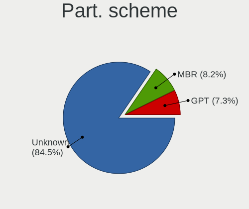

| Type    | Desktops | Percent |
|---------|----------|---------|
| Unknown | 87       | 96.67%  |
| GPT     | 2        | 2.22%   |
| MBR     | 1        | 1.11%   |

Dual Boot with Linux/BSD
------------------------

Hosting more than one Linux/BSD

| Dual boot | Desktops | Percent |
|-----------|----------|---------|
| No        | 81       | 88.04%  |
| Yes       | 11       | 11.96%  |

Dual Boot (Win)
---------------

Hosting Linux and Windows

| Dual boot | Desktops | Percent |
|-----------|----------|---------|
| No        | 75       | 83.33%  |
| Yes       | 15       | 16.67%  |

Board
-----

Vendor
------

Motherboard manufacturer

| Name                | Desktops | Percent |
|---------------------|----------|---------|
| ASUSTek Computer    | 19       | 21.11%  |
| Dell                | 13       | 14.44%  |
| Hewlett-Packard     | 11       | 12.22%  |
| Gigabyte Technology | 11       | 12.22%  |
| Intel               | 7        | 7.78%   |
| ECS                 | 5        | 5.56%   |
| ASRock              | 4        | 4.44%   |
| Pegatron            | 3        | 3.33%   |
| MSI                 | 2        | 2.22%   |
| Lenovo              | 2        | 2.22%   |
| Fujitsu Siemens     | 2        | 2.22%   |
| eMachines           | 2        | 2.22%   |
| Acer                | 2        | 2.22%   |
| Nvidia              | 1        | 1.11%   |
| Gateway             | 1        | 1.11%   |
| Fujitsu             | 1        | 1.11%   |
| Foxconn             | 1        | 1.11%   |
| Biostar             | 1        | 1.11%   |
| AAEON               | 1        | 1.11%   |
| Unknown             | 1        | 1.11%   |

Model
-----

Motherboard model

| Name                                   | Desktops | Percent |
|----------------------------------------|----------|---------|
| HP Compaq dc7900 Convertible Minitower | 2        | 2.22%   |
| HP Compaq 8200 Elite CMT PC            | 2        | 2.22%   |
| Fujitsu Siemens D1931                  | 2        | 2.22%   |
| ASRock N68-S3 FX                       | 2        | 2.22%   |
| Pegatron FR502AA-ABZ m9355.it          | 1        | 1.11%   |
| Pegatron CQ1506LA                      | 1        | 1.11%   |
| Pegatron AY627AA-ABA a4313w            | 1        | 1.11%   |
| Nvidia MCP7A                           | 1        | 1.11%   |
| MSI MS-7267                            | 1        | 1.11%   |
| MSI MS-7211                            | 1        | 1.11%   |
| Lenovo ThinkCentre M78 10BR0005US      | 1        | 1.11%   |
| Lenovo IdeaCentre Q190 10115           | 1        | 1.11%   |
| Intel H61                              | 1        | 1.11%   |
| Intel Energy Systems                   | 1        | 1.11%   |
| Intel DP55WG AAE57269-408              | 1        | 1.11%   |
| Intel D945GNT AAC96324-402             | 1        | 1.11%   |
| Intel D945GCLF2 AAE46416-106           | 1        | 1.11%   |
| Intel D865GSA AAD52278-203             | 1        | 1.11%   |
| Intel 945GCT-M                         | 1        | 1.11%   |
| HP ProDesk 600 G1 SFF                  | 1        | 1.11%   |
| HP EliteDesk 705 G3 MT                 | 1        | 1.11%   |
| HP CQ2930EA                            | 1        | 1.11%   |
| HP Compaq dc7800 Small Form Factor     | 1        | 1.11%   |
| HP Compaq dc7700p Small Form Factor    | 1        | 1.11%   |
| HP Compaq dc7700 Ultra-slim Desktop    | 1        | 1.11%   |
| HP Compaq dc7700 Small Form Factor     | 1        | 1.11%   |
| Gigabyte Z87X-UD5H                     | 1        | 1.11%   |
| Gigabyte P35-DS3R                      | 1        | 1.11%   |
| Gigabyte J1800M-D3P                    | 1        | 1.11%   |
| Gigabyte H61M-S1                       | 1        | 1.11%   |
| Gigabyte GA-VM900M                     | 1        | 1.11%   |
| Gigabyte F2A55M-HD2                    | 1        | 1.11%   |
| Gigabyte EQ45M-S2                      | 1        | 1.11%   |
| Gigabyte B450M S2H                     | 1        | 1.11%   |
| Gigabyte 990XA-UD3                     | 1        | 1.11%   |
| Gigabyte 990FXA-UD3                    | 1        | 1.11%   |
| Gigabyte 945GCM-S2L                    | 1        | 1.11%   |
| Gateway T5246                          | 1        | 1.11%   |
| Fujitsu ESPRIMO P510                   | 1        | 1.11%   |
| Foxconn s5610f                         | 1        | 1.11%   |
| eMachines EL1850                       | 1        | 1.11%   |
| eMachines EL1600                       | 1        | 1.11%   |
| ECS RR493AA-ABE SR2109ES               | 1        | 1.11%   |
| ECS P4S5A/DX+                          | 1        | 1.11%   |
| ECS NC686AA-ABA a6700y                 | 1        | 1.11%   |
| ECS GT3246m                            | 1        | 1.11%   |
| ECS ET1161-03                          | 1        | 1.11%   |
| Dell XPS420                            | 1        | 1.11%   |
| Dell Studio XPS 9100                   | 1        | 1.11%   |
| Dell Precision WorkStation T3500       | 1        | 1.11%   |
| Dell OptiPlex 980                      | 1        | 1.11%   |
| Dell OptiPlex 960                      | 1        | 1.11%   |
| Dell OptiPlex 745                      | 1        | 1.11%   |
| Dell OptiPlex 380                      | 1        | 1.11%   |
| Dell OptiPlex 360                      | 1        | 1.11%   |
| Dell OptiPlex 3010                     | 1        | 1.11%   |
| Dell Inspiron 580                      | 1        | 1.11%   |
| Dell Inspiron 530                      | 1        | 1.11%   |
| Dell Inspiron 3647                     | 1        | 1.11%   |
| Dell Dimension E521                    | 1        | 1.11%   |

Model Family
------------

Motherboard model prefix

| Name                  | Desktops | Percent |
|-----------------------|----------|---------|
| HP Compaq             | 8        | 8.89%   |
| Dell OptiPlex         | 6        | 6.67%   |
| Dell Inspiron         | 3        | 3.33%   |
| Fujitsu Siemens D1931 | 2        | 2.22%   |
| ASUS ROG              | 2        | 2.22%   |
| ASRock N68-S3         | 2        | 2.22%   |
| Acer Aspire           | 2        | 2.22%   |
| Pegatron FR502AA-ABZ  | 1        | 1.11%   |
| Pegatron CQ1506LA     | 1        | 1.11%   |
| Pegatron AY627AA-ABA  | 1        | 1.11%   |
| Nvidia MCP7A          | 1        | 1.11%   |
| MSI MS-7267           | 1        | 1.11%   |
| MSI MS-7211           | 1        | 1.11%   |
| Lenovo ThinkCentre    | 1        | 1.11%   |
| Lenovo IdeaCentre     | 1        | 1.11%   |
| Intel H61             | 1        | 1.11%   |
| Intel Energy          | 1        | 1.11%   |
| Intel DP55WG          | 1        | 1.11%   |
| Intel D945GNT         | 1        | 1.11%   |
| Intel D945GCLF2       | 1        | 1.11%   |
| Intel D865GSA         | 1        | 1.11%   |
| Intel 945GCT-M        | 1        | 1.11%   |
| HP ProDesk            | 1        | 1.11%   |
| HP EliteDesk          | 1        | 1.11%   |
| HP CQ2930EA           | 1        | 1.11%   |
| Gigabyte Z87X-UD5H    | 1        | 1.11%   |
| Gigabyte P35-DS3R     | 1        | 1.11%   |
| Gigabyte J1800M-D3P   | 1        | 1.11%   |
| Gigabyte H61M-S1      | 1        | 1.11%   |
| Gigabyte GA-VM900M    | 1        | 1.11%   |
| Gigabyte F2A55M-HD2   | 1        | 1.11%   |
| Gigabyte EQ45M-S2     | 1        | 1.11%   |
| Gigabyte B450M        | 1        | 1.11%   |
| Gigabyte 990XA-UD3    | 1        | 1.11%   |
| Gigabyte 990FXA-UD3   | 1        | 1.11%   |
| Gigabyte 945GCM-S2L   | 1        | 1.11%   |
| Gateway T5246         | 1        | 1.11%   |
| Fujitsu ESPRIMO       | 1        | 1.11%   |
| Foxconn s5610f        | 1        | 1.11%   |
| eMachines EL1850      | 1        | 1.11%   |
| eMachines EL1600      | 1        | 1.11%   |
| ECS RR493AA-ABE       | 1        | 1.11%   |
| ECS P4S5A             | 1        | 1.11%   |
| ECS NC686AA-ABA       | 1        | 1.11%   |
| ECS GT3246m           | 1        | 1.11%   |
| ECS ET1161-03         | 1        | 1.11%   |
| Dell XPS420           | 1        | 1.11%   |
| Dell Studio           | 1        | 1.11%   |
| Dell Precision        | 1        | 1.11%   |
| Dell Dimension        | 1        | 1.11%   |
| Biostar A68N-5600E    | 1        | 1.11%   |
| ASUS WorkPro          | 1        | 1.11%   |
| ASUS SABERTOOTH       | 1        | 1.11%   |
| ASUS P8Z68-V          | 1        | 1.11%   |
| ASUS P8H61-MX         | 1        | 1.11%   |
| ASUS P5SD2-VM         | 1        | 1.11%   |
| ASUS P5N-E            | 1        | 1.11%   |
| ASUS P5K-VM           | 1        | 1.11%   |
| ASUS P5GC-MX          | 1        | 1.11%   |
| ASUS P5G41T-M         | 1        | 1.11%   |

MFG Year
--------

Motherboard manufacture year

| Year | Desktops | Percent |
|------|----------|---------|
| 2007 | 16       | 17.78%  |
| 2011 | 10       | 11.11%  |
| 2008 | 9        | 10%     |
| 2013 | 8        | 8.89%   |
| 2010 | 7        | 7.78%   |
| 2009 | 7        | 7.78%   |
| 2006 | 7        | 7.78%   |
| 2012 | 5        | 5.56%   |
| 2005 | 5        | 5.56%   |
| 2019 | 3        | 3.33%   |
| 2015 | 3        | 3.33%   |
| 2018 | 2        | 2.22%   |
| 2017 | 2        | 2.22%   |
| 2014 | 2        | 2.22%   |
| 2004 | 2        | 2.22%   |
| 2020 | 1        | 1.11%   |
| 2001 | 1        | 1.11%   |

Form Factor
-----------

Physical design of the computer

| Name    | Desktops | Percent |
|---------|----------|---------|
| Desktop | 90       | 100%    |

Secure Boot
-----------

Enabled or disabled

| State    | Desktops | Percent |
|----------|----------|---------|
| Disabled | 89       | 98.89%  |
| Enabled  | 1        | 1.11%   |

Coreboot
--------

Have coreboot on board

| Used | Desktops | Percent |
|------|----------|---------|
| No   | 90       | 100%    |

RAM Size
--------

Total RAM memory

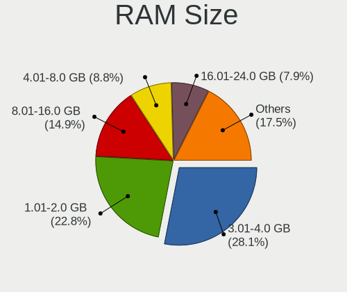

| Size in GB | Desktops | Percent |
|------------|----------|---------|
| 3.01-4.0   | 29       | 31.52%  |
| 1.01-2.0   | 22       | 23.91%  |
| 8.01-16.0  | 15       | 16.3%   |
| 4.01-8.0   | 7        | 7.61%   |
| 2.01-3.0   | 7        | 7.61%   |
| 16.01-24.0 | 5        | 5.43%   |
| 32.01-64.0 | 3        | 3.26%   |
| 0.51-1.0   | 3        | 3.26%   |
| 24.01-32.0 | 1        | 1.09%   |

RAM Used
--------

Used RAM memory

| Used GB   | Desktops | Percent |
|-----------|----------|---------|
| 0.51-1.0  | 41       | 41%     |
| 1.01-2.0  | 37       | 37%     |
| 2.01-3.0  | 6        | 6%      |
| 0.01-0.5  | 6        | 6%      |
| 4.01-8.0  | 5        | 5%      |
| 3.01-4.0  | 4        | 4%      |
| 8.01-16.0 | 1        | 1%      |

Total Drives
------------

Number of drives on board

| Drives | Desktops | Percent |
|--------|----------|---------|
| 1      | 58       | 63.04%  |
| 2      | 23       | 25%     |
| 3      | 7        | 7.61%   |
| 7      | 1        | 1.09%   |
| 6      | 1        | 1.09%   |
| 5      | 1        | 1.09%   |
| 4      | 1        | 1.09%   |

Has CD-ROM
----------

Has CD-ROM on board

| Presented | Desktops | Percent |
|-----------|----------|---------|
| Yes       | 62       | 68.13%  |
| No        | 29       | 31.87%  |

Has Ethernet
------------

Has Ethernet on board

| Presented | Desktops | Percent |
|-----------|----------|---------|
| Yes       | 88       | 97.78%  |
| No        | 2        | 2.22%   |

Has WiFi
--------

Has WiFi module

| Presented | Desktops | Percent |
|-----------|----------|---------|
| Yes       | 48       | 53.33%  |
| No        | 42       | 46.67%  |

Has Bluetooth
-------------

Has Bluetooth module

| Presented | Desktops | Percent |
|-----------|----------|---------|
| No        | 72       | 80%     |
| Yes       | 18       | 20%     |

Location
--------

Country
-------

Geographic location (country)

| Country     | Desktops | Percent |
|-------------|----------|---------|
| USA         | 32       | 35.16%  |
| Germany     | 8        | 8.79%   |
| Italy       | 7        | 7.69%   |
| Brazil      | 6        | 6.59%   |
| India       | 5        | 5.49%   |
| UK          | 4        | 4.4%    |
| Finland     | 3        | 3.3%    |
| Russia      | 2        | 2.2%    |
| Romania     | 2        | 2.2%    |
| Mexico      | 2        | 2.2%    |
| Canada      | 2        | 2.2%    |
| Argentina   | 2        | 2.2%    |
| Algeria     | 2        | 2.2%    |
| Ukraine     | 1        | 1.1%    |
| Sweden      | 1        | 1.1%    |
| Spain       | 1        | 1.1%    |
| Portugal    | 1        | 1.1%    |
| Poland      | 1        | 1.1%    |
| Philippines | 1        | 1.1%    |
| Peru        | 1        | 1.1%    |
| New Zealand | 1        | 1.1%    |
| Netherlands | 1        | 1.1%    |
| Ireland     | 1        | 1.1%    |
| Greece      | 1        | 1.1%    |
| Ecuador     | 1        | 1.1%    |
| Belgium     | 1        | 1.1%    |
| Australia   | 1        | 1.1%    |

City
----

Geographic location (city)

| City                   | Desktops | Percent |
|------------------------|----------|---------|
| Villingen-Schwenningen | 3        | 3.13%   |
| New York               | 3        | 3.13%   |
| Spokane                | 2        | 2.08%   |
| Ељroda ЕљlД…ska | 1        | 1.04%   |
| Winfield               | 1        | 1.04%   |
| Wassenaar              | 1        | 1.04%   |
| Washington             | 1        | 1.04%   |
| Van Vleck              | 1        | 1.04%   |
| Turin                  | 1        | 1.04%   |
| Tsarskoye Selo         | 1        | 1.04%   |
| Thatcher               | 1        | 1.04%   |
| Taranto                | 1        | 1.04%   |
| Talala                 | 1        | 1.04%   |
| Tahlequah              | 1        | 1.04%   |
| Stockholm              | 1        | 1.04%   |
| South Jordan           | 1        | 1.04%   |
| Somma Vesuviana        | 1        | 1.04%   |
| Seville                | 1        | 1.04%   |
| Saratov                | 1        | 1.04%   |
| Santa Barbara          | 1        | 1.04%   |
| Sankt Augustin         | 1        | 1.04%   |
| Saint-Jerome           | 1        | 1.04%   |
| Rome                   | 1        | 1.04%   |
| Rock Hill              | 1        | 1.04%   |
| Roanoke                | 1        | 1.04%   |
| Rio de Janeiro         | 1        | 1.04%   |
| Reggio Emilia          | 1        | 1.04%   |
| Quezon City            | 1        | 1.04%   |
| Pune                   | 1        | 1.04%   |
| Popesti-Leordeni       | 1        | 1.04%   |
| Philadelphia           | 1        | 1.04%   |
| Perth                  | 1        | 1.04%   |
| Pensacola              | 1        | 1.04%   |
| Parral                 | 1        | 1.04%   |
| Oulu                   | 1        | 1.04%   |
| Naples                 | 1        | 1.04%   |
| Mysore                 | 1        | 1.04%   |
| Mumbai                 | 1        | 1.04%   |
| Mooresville            | 1        | 1.04%   |
| Mockmuhl               | 1        | 1.04%   |
| Middlesboro            | 1        | 1.04%   |
| Mexico City            | 1        | 1.04%   |
| Metairie               | 1        | 1.04%   |
| Mead                   | 1        | 1.04%   |
| Maywood Park           | 1        | 1.04%   |
| Manchester             | 1        | 1.04%   |
| Lugagnano Val d'Arda   | 1        | 1.04%   |
| LourinhГЈ            | 1        | 1.04%   |
| Lincoln                | 1        | 1.04%   |
| Lima                   | 1        | 1.04%   |
| Lee's Summit           | 1        | 1.04%   |
| Lake Charles           | 1        | 1.04%   |
| La Crosse              | 1        | 1.04%   |
| Krosnowice             | 1        | 1.04%   |
| Kielczow               | 1        | 1.04%   |
| Jacksonville           | 1        | 1.04%   |
| Ipiau                  | 1        | 1.04%   |
| Hitchin                | 1        | 1.04%   |
| Helsinki               | 1        | 1.04%   |
| Hammond                | 1        | 1.04%   |

Drives
------

Drive Vendor
------------

Hard drive vendors

| Vendor              | Desktops | Drives | Percent |
|---------------------|----------|--------|---------|
| WDC                 | 34       | 54     | 27.64%  |
| Seagate             | 24       | 29     | 19.51%  |
| Samsung Electronics | 15       | 20     | 12.2%   |
| Hitachi             | 15       | 22     | 12.2%   |
| MAXTOR              | 9        | 12     | 7.32%   |
| Kingston            | 7        | 9      | 5.69%   |
| SanDisk             | 3        | 3      | 2.44%   |
| Toshiba             | 2        | 2      | 1.63%   |
| Intel               | 2        | 2      | 1.63%   |
| WD MediaMax         | 1        | 1      | 0.81%   |
| Unknown             | 1        | 1      | 0.81%   |
| PNY                 | 1        | 2      | 0.81%   |
| Phison              | 1        | 1      | 0.81%   |
| OCZ                 | 1        | 1      | 0.81%   |
| Intenso             | 1        | 1      | 0.81%   |
| GAMER               | 1        | 1      | 0.81%   |
| Fujitsu             | 1        | 1      | 0.81%   |
| DOGFISH             | 1        | 1      | 0.81%   |
| Crucial             | 1        | 2      | 0.81%   |
| China               | 1        | 1      | 0.81%   |
| ASMT                | 1        | 1      | 0.81%   |

Drive Model
-----------

Hard drive models

| Model                               | Desktops | Percent |
|-------------------------------------|----------|---------|
| Kingston SA400S37120G 120GB SSD     | 3        | 2.27%   |
| Hitachi HDT721016SLA380 160GB       | 3        | 2.27%   |
| WDC WD10EZEX-08WN4A0 1TB            | 2        | 1.52%   |
| Seagate ST3500418AS 500GB           | 2        | 1.52%   |
| Seagate ST3250310AS 250GB           | 2        | 1.52%   |
| Seagate ST3160813AS 160GB           | 2        | 1.52%   |
| Seagate ST1000DM003-9YN162 1TB      | 2        | 1.52%   |
| SanDisk SDSSDA120G 120GB            | 2        | 1.52%   |
| Samsung SSD 860 EVO 1TB             | 2        | 1.52%   |
| MAXTOR STM3160215AS 160GB           | 2        | 1.52%   |
| Kingston SA400S37240G 240GB SSD     | 2        | 1.52%   |
| Hitachi HDS721050CLA362 500GB       | 2        | 1.52%   |
| Hitachi HDP725050GLA360 500GB       | 2        | 1.52%   |
| WDC WDS240G2G0A-00JH30 240GB SSD    | 1        | 0.76%   |
| WDC WD800JD-75MSA1 80GB             | 1        | 0.76%   |
| WDC WD800JD-60LSA5 80GB             | 1        | 0.76%   |
| WDC WD800JD-00MSA1 80GB             | 1        | 0.76%   |
| WDC WD6400AAKS-65A7B2 640GB         | 1        | 0.76%   |
| WDC WD5000LPVT-24G33T1 500GB        | 1        | 0.76%   |
| WDC WD5000AAKX-753CA1 500GB         | 1        | 0.76%   |
| WDC WD5000AAKX-22ERMA0 500GB        | 1        | 0.76%   |
| WDC WD5000AAKS-00A7B2 500GB         | 1        | 0.76%   |
| WDC WD4000AAJS-22TKA0 400GB         | 1        | 0.76%   |
| WDC WD4000AAJS-00YFA0 400GB         | 1        | 0.76%   |
| WDC WD3200JS-22PDB0 320GB           | 1        | 0.76%   |
| WDC WD3200AVVS-63L2B0 320GB         | 1        | 0.76%   |
| WDC WD3200AVJB-63WKA0 320GB         | 1        | 0.76%   |
| WDC WD3200AAJS-65M0A0 320GB         | 1        | 0.76%   |
| WDC WD3200AAJS-56B4A0 320GB         | 1        | 0.76%   |
| WDC WD30EFZX-68AWUN0 3TB            | 1        | 0.76%   |
| WDC WD2500BEVT-22A23T0 250GB        | 1        | 0.76%   |
| WDC WD2500AVJB-63WKA0 250GB         | 1        | 0.76%   |
| WDC WD2500AAJS-75M0A0 250GB         | 1        | 0.76%   |
| WDC WD2500AAJS-00VTA0 250GB         | 1        | 0.76%   |
| WDC WD20EZRX-00D8PB0 2TB            | 1        | 0.76%   |
| WDC WD20EURS-63S48Y0 2TB            | 1        | 0.76%   |
| WDC WD2000JS-60NCB1 200GB           | 1        | 0.76%   |
| WDC WD1600JS-00NCB1 160GB           | 1        | 0.76%   |
| WDC WD1600BB-55RDA0 160GB           | 1        | 0.76%   |
| WDC WD1600AAJS-75M0A0 160GB         | 1        | 0.76%   |
| WDC WD1200BB-53DWA0 120GB           | 1        | 0.76%   |
| WDC WD10JPVX-08JC3T5 1TB            | 1        | 0.76%   |
| WDC WD10EZRX-00L4HB0 1TB            | 1        | 0.76%   |
| WDC WD10EZEX-60M2NA0 1TB            | 1        | 0.76%   |
| WDC WD10EURX-63C57Y0 1TB            | 1        | 0.76%   |
| WDC WD1003FBYX-18Y7B0 1TB           | 1        | 0.76%   |
| WDC WD1002FAEX-00Y9A0 1TB           | 1        | 0.76%   |
| WDC WD1001FALS-00J7B0 1TB           | 1        | 0.76%   |
| WD MediaMax WL120GBSATA             | 1        | 0.76%   |
| Unknown MMC Card  16GB              | 1        | 0.76%   |
| Toshiba MK3265GSXN 320GB            | 1        | 0.76%   |
| Toshiba MK2555GSXF 250GB            | 1        | 0.76%   |
| Seagate ST9160314AS 160GB           | 1        | 0.76%   |
| Seagate ST500LM012 HN-M500MBB 500GB | 1        | 0.76%   |
| Seagate ST5000LM000-2AN170 5TB      | 1        | 0.76%   |
| Seagate ST380815AS 80GB             | 1        | 0.76%   |
| Seagate ST380811AS 80GB             | 1        | 0.76%   |
| Seagate ST380013AS 80GB             | 1        | 0.76%   |
| Seagate ST32000641AS 2TB            | 1        | 0.76%   |
| Seagate ST3160215A 160GB            | 1        | 0.76%   |

HDD Vendor
----------

Hard disk drive vendors

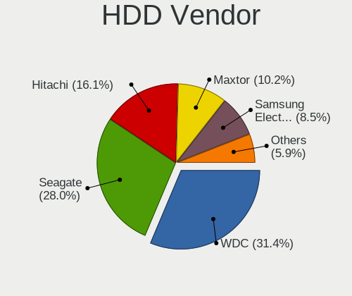

| Vendor              | Desktops | Drives | Percent |
|---------------------|----------|--------|---------|
| WDC                 | 33       | 53     | 35.11%  |
| Seagate             | 24       | 29     | 25.53%  |
| Hitachi             | 15       | 22     | 15.96%  |
| Samsung Electronics | 9        | 12     | 9.57%   |
| MAXTOR              | 9        | 12     | 9.57%   |
| Toshiba             | 2        | 2      | 2.13%   |
| WD MediaMax         | 1        | 1      | 1.06%   |
| Fujitsu             | 1        | 1      | 1.06%   |

SSD Vendor
----------

Solid state drive vendors

| Vendor              | Desktops | Drives | Percent |
|---------------------|----------|--------|---------|
| Kingston            | 7        | 9      | 29.17%  |
| Samsung Electronics | 5        | 7      | 20.83%  |
| SanDisk             | 3        | 3      | 12.5%   |
| Intel               | 2        | 2      | 8.33%   |
| WDC                 | 1        | 1      | 4.17%   |
| PNY                 | 1        | 2      | 4.17%   |
| OCZ                 | 1        | 1      | 4.17%   |
| DOGFISH             | 1        | 1      | 4.17%   |
| Crucial             | 1        | 2      | 4.17%   |
| China               | 1        | 1      | 4.17%   |
| ASMT                | 1        | 1      | 4.17%   |

Drive Kind
----------

HDD or SSD

| Kind    | Desktops | Drives | Percent |
|---------|----------|--------|---------|
| HDD     | 77       | 132    | 72.64%  |
| SSD     | 24       | 30     | 22.64%  |
| NVMe    | 2        | 2      | 1.89%   |
| Unknown | 2        | 2      | 1.89%   |
| MMC     | 1        | 1      | 0.94%   |

Drive Connector
---------------

SATA, SAS, NVMe, etc.

| Type | Desktops | Drives | Percent |
|------|----------|--------|---------|
| SATA | 88       | 162    | 94.62%  |
| SAS  | 2        | 2      | 2.15%   |
| NVMe | 2        | 2      | 2.15%   |
| MMC  | 1        | 1      | 1.08%   |

Drive Size
----------

Size of hard drive

| Size in TB | Desktops | Drives | Percent |
|------------|----------|--------|---------|
| 0.01-0.5   | 75       | 120    | 70.09%  |
| 0.51-1.0   | 22       | 28     | 20.56%  |
| 1.01-2.0   | 8        | 12     | 7.48%   |
| 2.01-3.0   | 1        | 1      | 0.93%   |
| 4.01-10.0  | 1        | 1      | 0.93%   |

Space Total
-----------

Amount of disk space available on the file system

| Size in GB     | Desktops | Percent |
|----------------|----------|---------|
| 101-250        | 36       | 37.89%  |
| 251-500        | 14       | 14.74%  |
| 501-1000       | 14       | 14.74%  |
| 51-100         | 13       | 13.68%  |
| 1001-2000      | 7        | 7.37%   |
| 21-50          | 6        | 6.32%   |
| Unknown        | 2        | 2.11%   |
| More than 3000 | 1        | 1.05%   |
| 2001-3000      | 1        | 1.05%   |
| 1-20           | 1        | 1.05%   |

Space Used
----------

Amount of used disk space

| Used GB   | Desktops | Percent |
|-----------|----------|---------|
| 1-20      | 48       | 51.06%  |
| 21-50     | 19       | 20.21%  |
| 101-250   | 12       | 12.77%  |
| 51-100    | 6        | 6.38%   |
| 501-1000  | 4        | 4.26%   |
| 251-500   | 2        | 2.13%   |
| Unknown   | 2        | 2.13%   |
| 1001-2000 | 1        | 1.06%   |

Malfunc. Drives
---------------

Drive models with a malfunction

| Model                     | Desktops | Drives | Percent |
|---------------------------|----------|--------|---------|
| WDC WD1001FALS-00J7B0 1TB | 1        | 1      | 50%     |
| Seagate ST31500341AS 1TB  | 1        | 1      | 50%     |

Malfunc. Drive Vendor
---------------------

Vendors of faulty drives

| Vendor  | Desktops | Drives | Percent |
|---------|----------|--------|---------|
| WDC     | 1        | 1      | 50%     |
| Seagate | 1        | 1      | 50%     |

Malfunc. HDD Vendor
-------------------

Vendors of faulty HDD drives

| Vendor  | Desktops | Drives | Percent |
|---------|----------|--------|---------|
| WDC     | 1        | 1      | 50%     |
| Seagate | 1        | 1      | 50%     |

Malfunc. Drive Kind
-------------------

Kinds of faulty drives

| Kind | Desktops | Drives | Percent |
|------|----------|--------|---------|
| HDD  | 2        | 2      | 100%    |

Failed Drives
-------------

Failed drive models

Zero info for selected period =(

Failed Drive Vendor
-------------------

Failed drive vendors

Zero info for selected period =(

Drive Status
------------

Number of failed and malfunc. drives

| Status   | Desktops | Drives | Percent |
|----------|----------|--------|---------|
| Detected | 87       | 160    | 94.57%  |
| Works    | 3        | 5      | 3.26%   |
| Malfunc  | 2        | 2      | 2.17%   |

Storage controller
------------------

Storage Vendor
--------------

Storage controller vendors

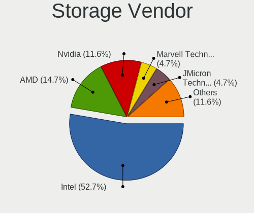

| Vendor                           | Desktops | Percent |
|----------------------------------|----------|---------|
| Intel                            | 53       | 51.96%  |
| AMD                              | 16       | 15.69%  |
| Nvidia                           | 13       | 12.75%  |
| JMicron Technology               | 5        | 4.9%    |
| VIA Technologies                 | 4        | 3.92%   |
| Marvell Technology Group         | 3        | 2.94%   |
| Silicon Integrated Systems [SiS] | 2        | 1.96%   |
| ULi Electronics                  | 1        | 0.98%   |
| Silicon Image                    | 1        | 0.98%   |
| Samsung Electronics              | 1        | 0.98%   |
| Phison Electronics               | 1        | 0.98%   |
| LSI Logic / Symbios Logic        | 1        | 0.98%   |
| ASMedia Technology               | 1        | 0.98%   |

Storage Model
-------------

Storage controller models

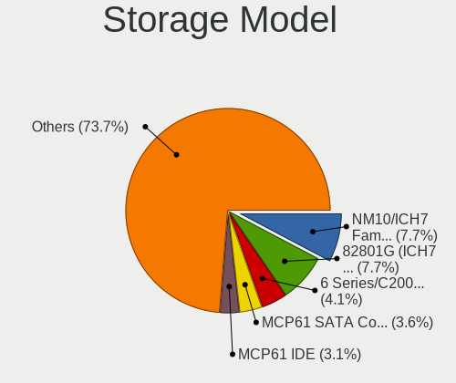

| Model                                                                          | Desktops | Percent |
|--------------------------------------------------------------------------------|----------|---------|
| Intel NM10/ICH7 Family SATA Controller [IDE mode]                              | 13       | 8.28%   |
| Intel 82801G (ICH7 Family) IDE Controller                                      | 12       | 7.64%   |
| Nvidia MCP61 SATA Controller                                                   | 7        | 4.46%   |
| Nvidia MCP61 IDE                                                               | 6        | 3.82%   |
| Intel 6 Series/C200 Series Chipset Family 6 port Desktop SATA AHCI Controller  | 6        | 3.82%   |
| AMD FCH SATA Controller [AHCI mode]                                            | 6        | 3.82%   |
| AMD SB7x0/SB8x0/SB9x0 SATA Controller [AHCI mode]                              | 5        | 3.18%   |
| VIA VT82C586A/B/VT82C686/A/B/VT823x/A/C PIPC Bus Master IDE                    | 4        | 2.55%   |
| Intel 82801H (ICH8 Family) 4 port SATA Controller [IDE mode]                   | 4        | 2.55%   |
| Intel 4 Series Chipset PT IDER Controller                                      | 4        | 2.55%   |
| Intel SATA Controller [RAID mode]                                              | 3        | 1.91%   |
| Intel 82801JD/DO (ICH10 Family) 4-port SATA IDE Controller                     | 3        | 1.91%   |
| Intel 82801JD/DO (ICH10 Family) 2-port SATA IDE Controller                     | 3        | 1.91%   |
| Intel 82801I (ICH9 Family) 2 port SATA Controller [IDE mode]                   | 3        | 1.91%   |
| Intel 8 Series/C220 Series Chipset Family 6-port SATA Controller 1 [AHCI mode] | 3        | 1.91%   |
| AMD SB7x0/SB8x0/SB9x0 IDE Controller                                           | 3        | 1.91%   |
| VIA VIA VT6420 SATA RAID Controller                                            | 2        | 1.27%   |
| Silicon Integrated Systems [SiS] 5513 IDE Controller                           | 2        | 1.27%   |
| Nvidia MCP51 Serial ATA Controller                                             | 2        | 1.27%   |
| Marvell Group 88SE9172 SATA 6Gb/s Controller                                   | 2        | 1.27%   |
| JMicron JMB368 IDE controller                                                  | 2        | 1.27%   |
| Intel 82801JI (ICH10 Family) SATA AHCI Controller                              | 2        | 1.27%   |
| Intel 82801IR/IO/IH (ICH9R/DO/DH) 4 port SATA Controller [IDE mode]            | 2        | 1.27%   |
| Intel 82801FB/FW (ICH6/ICH6W) SATA Controller                                  | 2        | 1.27%   |
| Intel 82801FB/FBM/FR/FW/FRW (ICH6 Family) IDE Controller                       | 2        | 1.27%   |
| Intel 7 Series/C210 Series Chipset Family 6-port SATA Controller [AHCI mode]   | 2        | 1.27%   |
| Intel 5 Series/3400 Series Chipset 4 port SATA IDE Controller                  | 2        | 1.27%   |
| AMD SB7x0/SB8x0/SB9x0 SATA Controller [IDE mode]                               | 2        | 1.27%   |
| AMD 400 Series Chipset SATA Controller                                         | 2        | 1.27%   |
| VIA VT8237/8251 Serial ATA Controller                                          | 1        | 0.64%   |
| ULi ULi 5287 SATA                                                              | 1        | 0.64%   |
| ULi M5229 IDE                                                                  | 1        | 0.64%   |
| Silicon Integrated Systems [SiS] SATA Controller / IDE mode                    | 1        | 0.64%   |
| Silicon Image SiI 3114 [SATALink/SATARaid] Serial ATA Controller               | 1        | 0.64%   |
| Samsung NVMe SSD Controller SM961/PM961/SM963                                  | 1        | 0.64%   |
| Phison E12 NVMe Controller                                                     | 1        | 0.64%   |
| Nvidia MCP79 AHCI Controller                                                   | 1        | 0.64%   |
| Nvidia MCP78S [GeForce 8200] SATA Controller (non-AHCI mode)                   | 1        | 0.64%   |
| Nvidia MCP78S [GeForce 8200] IDE                                               | 1        | 0.64%   |
| Nvidia MCP73 SATA RAID Controller                                              | 1        | 0.64%   |
| Nvidia MCP73 IDE Controller                                                    | 1        | 0.64%   |
| Nvidia MCP51 IDE                                                               | 1        | 0.64%   |
| Nvidia CK804 Serial ATA Controller                                             | 1        | 0.64%   |
| Nvidia CK804 IDE                                                               | 1        | 0.64%   |
| Marvell Group 88SE9230 PCIe 2.0 x2 4-port SATA 6 Gb/s RAID Controller          | 1        | 0.64%   |
| LSI Logic / Symbios Logic SAS2008 PCI-Express Fusion-MPT SAS-2 [Falcon]        | 1        | 0.64%   |
| JMicron JMB363 SATA/IDE Controller                                             | 1        | 0.64%   |
| JMicron JMB362 SATA Controller                                                 | 1        | 0.64%   |
| JMicron JMB360 AHCI Controller                                                 | 1        | 0.64%   |
| Intel NM10/ICH7 Family SATA Controller [AHCI mode]                             | 1        | 0.64%   |
| Intel C610/X99 series chipset sSATA Controller [AHCI mode]                     | 1        | 0.64%   |
| Intel C610/X99 series chipset 6-Port SATA Controller [AHCI mode]               | 1        | 0.64%   |
| Intel Atom Processor E3800 Series SATA AHCI Controller                         | 1        | 0.64%   |
| Intel 82Q963/Q965 PT IDER Controller                                           | 1        | 0.64%   |
| Intel 82Q35 Express PT IDER Controller                                         | 1        | 0.64%   |
| Intel 82801JD/DO (ICH10 Family) SATA AHCI Controller                           | 1        | 0.64%   |
| Intel 82801IR/IO/IH (ICH9R/DO/DH) 6 port SATA Controller [AHCI mode]           | 1        | 0.64%   |
| Intel 82801IB (ICH9) 2 port SATA Controller [IDE mode]                         | 1        | 0.64%   |
| Intel 82801HR/HO/HH (ICH8R/DO/DH) 2 port SATA Controller [IDE mode]            | 1        | 0.64%   |
| Intel 82801EB (ICH5) SATA Controller                                           | 1        | 0.64%   |

Storage Kind
------------

Kind of storage controller (IDE, SATA, NVMe, SAS, ...)

| Kind | Desktops | Percent |
|------|----------|---------|
| IDE  | 57       | 54.29%  |
| SATA | 38       | 36.19%  |
| RAID | 7        | 6.67%   |
| NVMe | 2        | 1.9%    |
| SAS  | 1        | 0.95%   |

Processor
---------

CPU Vendor
----------

Processor vendors

| Vendor | Desktops | Percent |
|--------|----------|---------|
| Intel  | 65       | 72.22%  |
| AMD    | 25       | 27.78%  |

CPU Model
---------

Processor models

| Model                                        | Desktops | Percent |
|----------------------------------------------|----------|---------|
| Intel Core 2 Quad CPU Q9400 @ 2.66GHz        | 4        | 4.44%   |
| Intel Pentium 4 CPU 3.00GHz                  | 3        | 3.33%   |
| Intel Core 2 Quad CPU Q6600 @ 2.40GHz        | 3        | 3.33%   |
| Intel Pentium Dual-Core CPU E5700 @ 3.00GHz  | 2        | 2.22%   |
| Intel Pentium 4 CPU 3.40GHz                  | 2        | 2.22%   |
| Intel Core i7-2600 CPU @ 3.40GHz             | 2        | 2.22%   |
| Intel Core 2 Duo CPU E8400 @ 3.00GHz         | 2        | 2.22%   |
| Intel Core 2 CPU 6600 @ 2.40GHz              | 2        | 2.22%   |
| Intel Celeron CPU 430 @ 1.80GHz              | 2        | 2.22%   |
| AMD Phenom II X4 840 Processor               | 2        | 2.22%   |
| AMD Athlon II X2 250 Processor               | 2        | 2.22%   |
| AMD Athlon 64 X2 Dual Core Processor 5000+   | 2        | 2.22%   |
| Intel Xeon CPU X5660 @ 2.80GHz               | 1        | 1.11%   |
| Intel Xeon CPU W3530 @ 2.80GHz               | 1        | 1.11%   |
| Intel Xeon CPU E31270 @ 3.40GHz              | 1        | 1.11%   |
| Intel Pentium Dual-Core CPU E5400 @ 2.70GHz  | 1        | 1.11%   |
| Intel Pentium Dual-Core CPU E5300 @ 2.60GHz  | 1        | 1.11%   |
| Intel Pentium Dual-Core CPU E5200 @ 2.50GHz  | 1        | 1.11%   |
| Intel Pentium Dual CPU E2200 @ 2.20GHz       | 1        | 1.11%   |
| Intel Pentium Dual CPU E2160 @ 1.80GHz       | 1        | 1.11%   |
| Intel Pentium D CPU 3.00GHz                  | 1        | 1.11%   |
| Intel Pentium D CPU 2.80GHz                  | 1        | 1.11%   |
| Intel Pentium CPU G6960 @ 2.93GHz            | 1        | 1.11%   |
| Intel Pentium CPU G630 @ 2.70GHz             | 1        | 1.11%   |
| Intel Pentium CPU G2020 @ 2.90GHz            | 1        | 1.11%   |
| Intel Pentium 4 CPU 2.80GHz                  | 1        | 1.11%   |
| Intel Pentium 4 CPU 2.40GHz                  | 1        | 1.11%   |
| Intel Core i7-8700K CPU @ 3.70GHz            | 1        | 1.11%   |
| Intel Core i7-5930K CPU @ 3.50GHz            | 1        | 1.11%   |
| Intel Core i7-4770K CPU @ 3.50GHz            | 1        | 1.11%   |
| Intel Core i7 CPU X 980 @ 3.33GHz            | 1        | 1.11%   |
| Intel Core i5-4590 CPU @ 3.30GHz             | 1        | 1.11%   |
| Intel Core i5-3570K CPU @ 3.40GHz            | 1        | 1.11%   |
| Intel Core i5-3470T CPU @ 2.90GHz            | 1        | 1.11%   |
| Intel Core i5-3470 CPU @ 3.20GHz             | 1        | 1.11%   |
| Intel Core i5-2320 CPU @ 3.00GHz             | 1        | 1.11%   |
| Intel Core i5 CPU 650 @ 3.20GHz              | 1        | 1.11%   |
| Intel Core i3-4150 CPU @ 3.50GHz             | 1        | 1.11%   |
| Intel Core i3 CPU 530 @ 2.93GHz              | 1        | 1.11%   |
| Intel Core 2 Quad CPU Q9300 @ 2.50GHz        | 1        | 1.11%   |
| Intel Core 2 Duo CPU E7500 @ 2.93GHz         | 1        | 1.11%   |
| Intel Core 2 Duo CPU E7400 @ 2.80GHz         | 1        | 1.11%   |
| Intel Core 2 Duo CPU E7200 @ 2.53GHz         | 1        | 1.11%   |
| Intel Core 2 Duo CPU E4600 @ 2.40GHz         | 1        | 1.11%   |
| Intel Core 2 Duo CPU E4500 @ 2.20GHz         | 1        | 1.11%   |
| Intel Core 2 CPU 6300 @ 1.86GHz              | 1        | 1.11%   |
| Intel Celeron CPU J1800 @ 2.41GHz            | 1        | 1.11%   |
| Intel Celeron CPU 450 @ 2.20GHz              | 1        | 1.11%   |
| Intel Celeron CPU 2.80GHz                    | 1        | 1.11%   |
| Intel Celeron CPU 2.53GHz                    | 1        | 1.11%   |
| Intel Celeron CPU 1017U @ 1.60GHz            | 1        | 1.11%   |
| Intel Atom x5-Z8350 CPU @ 1.44GHz            | 1        | 1.11%   |
| Intel Atom CPU D525 @ 1.80GHz                | 1        | 1.11%   |
| Intel Atom CPU 330 @ 1.60GHz                 | 1        | 1.11%   |
| Intel Atom CPU 230 @ 1.60GHz                 | 1        | 1.11%   |
| AMD Sempron 145 Processor                    | 1        | 1.11%   |
| AMD Ryzen 5 3600 6-Core Processor            | 1        | 1.11%   |
| AMD Ryzen 3 3200G with Radeon Vega Graphics  | 1        | 1.11%   |
| AMD PRO A6-8570 R5, 8 COMPUTE CORES 2C+6G    | 1        | 1.11%   |
| AMD PRO A4-3350B APU with Radeon R4 Graphics | 1        | 1.11%   |

CPU Model Family
----------------

Processor model prefix

| Model                   | Desktops | Percent |
|-------------------------|----------|---------|
| Intel Core 2 Quad       | 8        | 8.89%   |
| Intel Pentium 4         | 7        | 7.78%   |
| Intel Core 2 Duo        | 7        | 7.78%   |
| Intel Celeron           | 7        | 7.78%   |
| Intel Core i7           | 6        | 6.67%   |
| Intel Core i5           | 6        | 6.67%   |
| AMD Athlon 64 X2        | 6        | 6.67%   |
| Intel Pentium Dual-Core | 5        | 5.56%   |
| Intel Atom              | 4        | 4.44%   |
| Intel Xeon              | 3        | 3.33%   |
| Intel Pentium           | 3        | 3.33%   |
| Intel Core 2            | 3        | 3.33%   |
| AMD Phenom II X4        | 3        | 3.33%   |
| Other                   | 2        | 2.22%   |
| Intel Pentium Dual      | 2        | 2.22%   |
| Intel Pentium D         | 2        | 2.22%   |
| Intel Core i3           | 2        | 2.22%   |
| AMD FX                  | 2        | 2.22%   |
| AMD Athlon II X2        | 2        | 2.22%   |
| AMD Sempron             | 1        | 1.11%   |
| AMD Ryzen 5             | 1        | 1.11%   |
| AMD Ryzen 3             | 1        | 1.11%   |
| AMD Phenom              | 1        | 1.11%   |
| AMD E1                  | 1        | 1.11%   |
| AMD Athlon II X4        | 1        | 1.11%   |
| AMD Athlon 64           | 1        | 1.11%   |
| AMD A8                  | 1        | 1.11%   |
| AMD A6                  | 1        | 1.11%   |
| AMD A4                  | 1        | 1.11%   |

CPU Cores
---------

Number of processor cores

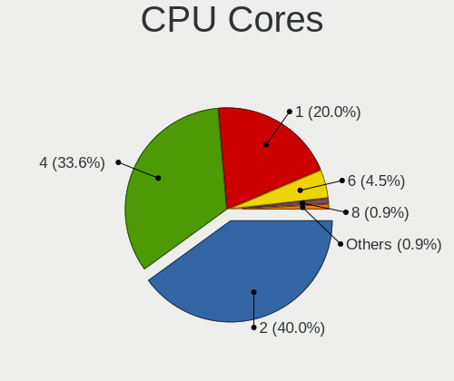

| Number | Desktops | Percent |
|--------|----------|---------|
| 2      | 39       | 43.33%  |
| 4      | 26       | 28.89%  |
| 1      | 19       | 21.11%  |
| 6      | 5        | 5.56%   |
| 3      | 1        | 1.11%   |

CPU Sockets
-----------

Number of sockets

| Number | Desktops | Percent |
|--------|----------|---------|
| 1      | 90       | 100%    |

CPU Threads
-----------

Threads per core (Hyper-Threading)

| Number | Desktops | Percent |
|--------|----------|---------|
| 1      | 62       | 68.89%  |
| 2      | 28       | 31.11%  |

CPU Op-Modes
------------

CPU Operation Modes (32-bit, 64-bit)

| Op mode        | Desktops | Percent |
|----------------|----------|---------|
| 32-bit, 64-bit | 79       | 86.81%  |
| Unknown        | 7        | 7.69%   |
| 32-bit         | 5        | 5.49%   |

CPU Microcode
-------------

Microcode number

| Number     | Desktops | Percent |
|------------|----------|---------|
| Unknown    | 13       | 14.44%  |
| 0x1067a    | 12       | 13.33%  |
| 0x206a7    | 5        | 5.56%   |
| 0xf41      | 4        | 4.44%   |
| 0x6fd      | 4        | 4.44%   |
| 0x306a9    | 4        | 4.44%   |
| 0x010000c8 | 4        | 4.44%   |
| 0x6fb      | 3        | 3.33%   |
| 0x10661    | 3        | 3.33%   |
| 0xf65      | 2        | 2.22%   |
| 0x6f6      | 2        | 2.22%   |
| 0x306c3    | 2        | 2.22%   |
| 0x206c2    | 2        | 2.22%   |
| 0x20655    | 2        | 2.22%   |
| 0x106c2    | 2        | 2.22%   |
| 0x06001119 | 2        | 2.22%   |
| 0xf62      | 1        | 1.11%   |
| 0xf47      | 1        | 1.11%   |
| 0xf43      | 1        | 1.11%   |
| 0xf33      | 1        | 1.11%   |
| 0xf27      | 1        | 1.11%   |
| 0x906ea    | 1        | 1.11%   |
| 0x6f2      | 1        | 1.11%   |
| 0x406c4    | 1        | 1.11%   |
| 0x306f2    | 1        | 1.11%   |
| 0x30678    | 1        | 1.11%   |
| 0x20652    | 1        | 1.11%   |
| 0x106ca    | 1        | 1.11%   |
| 0x106a5    | 1        | 1.11%   |
| 0x10677    | 1        | 1.11%   |
| 0x10676    | 1        | 1.11%   |
| 0x08701013 | 1        | 1.11%   |
| 0x08108109 | 1        | 1.11%   |
| 0x07030106 | 1        | 1.11%   |
| 0x0600611a | 1        | 1.11%   |
| 0x06000852 | 1        | 1.11%   |
| 0x06000822 | 1        | 1.11%   |
| 0x05000119 | 1        | 1.11%   |
| 0x010000db | 1        | 1.11%   |
| 0x01000083 | 1        | 1.11%   |

CPU Microarch
-------------

Microarchitecture

| Name        | Desktops | Percent |
|-------------|----------|---------|
| Penryn      | 15       | 16.67%  |
| Core        | 13       | 14.44%  |
| NetBurst    | 11       | 12.22%  |
| K10         | 8        | 8.89%   |
| K8 Hammer   | 7        | 7.78%   |
| Westmere    | 5        | 5.56%   |
| SandyBridge | 5        | 5.56%   |
| Piledriver  | 5        | 5.56%   |
| IvyBridge   | 5        | 5.56%   |
| Haswell     | 4        | 4.44%   |
| Bonnell     | 3        | 3.33%   |
| Silvermont  | 2        | 2.22%   |
| Zen+        | 1        | 1.11%   |
| Zen 2       | 1        | 1.11%   |
| Puma        | 1        | 1.11%   |
| Nehalem     | 1        | 1.11%   |
| KabyLake    | 1        | 1.11%   |
| Excavator   | 1        | 1.11%   |
| Bobcat      | 1        | 1.11%   |

Graphics
--------

GPU Vendor
----------

Vendors of graphics cards

| Vendor           | Desktops | Percent |
|------------------|----------|---------|
| Intel            | 36       | 38.71%  |
| Nvidia           | 29       | 31.18%  |
| AMD              | 26       | 27.96%  |
| VIA Technologies | 2        | 2.15%   |

GPU Model
---------

Graphics card models

| Model                                                                                    | Desktops | Percent |
|------------------------------------------------------------------------------------------|----------|---------|
| Intel 4 Series Chipset Integrated Graphics Controller                                    | 7        | 7.45%   |
| Intel 82945G/GZ Integrated Graphics Controller                                           | 6        | 6.38%   |
| Intel 82G33/G31 Express Integrated Graphics Controller                                   | 3        | 3.19%   |
| AMD RV620 LE [Radeon HD 3450]                                                            | 3        | 3.19%   |
| Nvidia GK208B [GeForce GT 730]                                                           | 2        | 2.13%   |
| Nvidia GK208B [GeForce GT 710]                                                           | 2        | 2.13%   |
| Nvidia G94 [GeForce 9600 GS]                                                             | 2        | 2.13%   |
| Nvidia G72 [GeForce 7200 GS / 7300 SE]                                                   | 2        | 2.13%   |
| Nvidia C61 [GeForce 6150SE nForce 430]                                                   | 2        | 2.13%   |
| Intel Xeon E3-1200 v3/4th Gen Core Processor Integrated Graphics Controller              | 2        | 2.13%   |
| Intel Xeon E3-1200 v2/3rd Gen Core processor Graphics Controller                         | 2        | 2.13%   |
| Intel Core Processor Integrated Graphics Controller                                      | 2        | 2.13%   |
| Intel 82Q963/Q965 Integrated Graphics Controller                                         | 2        | 2.13%   |
| Intel 82915G/GV/910GL Integrated Graphics Controller                                     | 2        | 2.13%   |
| Intel 2nd Generation Core Processor Family Integrated Graphics Controller                | 2        | 2.13%   |
| AMD RV710 [Radeon HD 4350/4550]                                                          | 2        | 2.13%   |
| AMD Cedar [Radeon HD 5000/6000/7350/8350 Series]                                         | 2        | 2.13%   |
| VIA Technologies CN896/VN896/P4M900 [Chrome 9 HC]                                        | 1        | 1.06%   |
| VIA Technologies CN400/PM800/PM880/PN800/PN880 [S3 UniChrome Pro]                        | 1        | 1.06%   |
| Nvidia NV44A [GeForce 6200]                                                              | 1        | 1.06%   |
| Nvidia NV44 [GeForce 6200 TurboCache]                                                    | 1        | 1.06%   |
| Nvidia NV43 [GeForce 6600 LE]                                                            | 1        | 1.06%   |
| Nvidia NV18 [GeForce4 MX 440 AGP 8x]                                                     | 1        | 1.06%   |
| Nvidia GT215 [GeForce GT 240]                                                            | 1        | 1.06%   |
| Nvidia GP102 [GeForce GTX 1080 Ti]                                                       | 1        | 1.06%   |
| Nvidia GM107 [GeForce GTX 750 Ti]                                                        | 1        | 1.06%   |
| Nvidia GK106 [GeForce GTX 660]                                                           | 1        | 1.06%   |
| Nvidia GF119 [GeForce GT 610]                                                            | 1        | 1.06%   |
| Nvidia GF119 [GeForce GT 520]                                                            | 1        | 1.06%   |
| Nvidia GF114 [GeForce GTX 560 Ti]                                                        | 1        | 1.06%   |
| Nvidia GF108 [GeForce GT 420]                                                            | 1        | 1.06%   |
| Nvidia GF106 [GeForce GTS 450]                                                           | 1        | 1.06%   |
| Nvidia G98 [GeForce 8400 GS Rev. 2]                                                      | 1        | 1.06%   |
| Nvidia C77 [nForce 780a/980a SLI]                                                        | 1        | 1.06%   |
| Nvidia C73 [GeForce 7100 / nForce 630i]                                                  | 1        | 1.06%   |
| Nvidia C61 [GeForce 7025 / nForce 630a]                                                  | 1        | 1.06%   |
| Nvidia C61 [GeForce 6100 nForce 405]                                                     | 1        | 1.06%   |
| Nvidia C51 [GeForce 6150 LE]                                                             | 1        | 1.06%   |
| Intel CoffeeLake-S GT2 [UHD Graphics 630]                                                | 1        | 1.06%   |
| Intel Atom/Celeron/Pentium Processor x5-E8000/J3xxx/N3xxx Integrated Graphics Controller | 1        | 1.06%   |
| Intel Atom Processor Z36xxx/Z37xxx Series Graphics & Display                             | 1        | 1.06%   |
| Intel Atom Processor D4xx/D5xx/N4xx/N5xx Integrated Graphics Controller                  | 1        | 1.06%   |
| Intel 82Q35 Express Integrated Graphics Controller                                       | 1        | 1.06%   |
| Intel 82865G Integrated Graphics Controller                                              | 1        | 1.06%   |
| Intel 4th Generation Core Processor Family Integrated Graphics Controller                | 1        | 1.06%   |
| Intel 3rd Gen Core processor Graphics Controller                                         | 1        | 1.06%   |
| AMD Wrestler [Radeon HD 7310]                                                            | 1        | 1.06%   |
| AMD Turks XT [Radeon HD 6670/7670]                                                       | 1        | 1.06%   |
| AMD Trinity 2 [Radeon HD 7480D]                                                          | 1        | 1.06%   |
| AMD Tonga PRO [Radeon R9 285/380]                                                        | 1        | 1.06%   |
| AMD RV710/M92 [Mobility Radeon HD 4330/4350/4550]                                        | 1        | 1.06%   |
| AMD RV710 [Radeon HD 4550]                                                               | 1        | 1.06%   |
| AMD RV620 LE [Radeon HD 3450 AGP]                                                        | 1        | 1.06%   |
| AMD RV280 [Radeon 9200 SE]                                                               | 1        | 1.06%   |
| AMD RS780L [Radeon 3000]                                                                 | 1        | 1.06%   |
| AMD RS780 [Radeon HD 3200]                                                               | 1        | 1.06%   |
| AMD RS480 [Radeon Xpress 200 Series]                                                     | 1        | 1.06%   |
| AMD RS400 [Radeon Xpress 200]                                                            | 1        | 1.06%   |
| AMD RC410 [Radeon Xpress 200/1100]                                                       | 1        | 1.06%   |
| AMD Picasso/Raven 2 [Radeon Vega Series / Radeon Vega Mobile Series]                     | 1        | 1.06%   |

GPU Combo
---------

Combinations of graphics cards

| Name           | Desktops | Percent |
|----------------|----------|---------|
| 1 x Intel      | 33       | 36.67%  |
| 1 x Nvidia     | 27       | 30%     |
| 1 x AMD        | 26       | 28.89%  |
| 1 x VIA        | 2        | 2.22%   |
| Intel + Nvidia | 2        | 2.22%   |

GPU Driver
----------

Free vs proprietary

| Driver      | Desktops | Percent |
|-------------|----------|---------|
| Free        | 77       | 84.62%  |
| Proprietary | 11       | 12.09%  |
| Unknown     | 3        | 3.3%    |

GPU Memory
----------

Total video memory

| Size in GB | Desktops | Percent |
|------------|----------|---------|
| Unknown    | 38       | 42.22%  |
| 0.01-0.5   | 26       | 28.89%  |
| 0.51-1.0   | 12       | 13.33%  |
| 1.01-2.0   | 10       | 11.11%  |
| 3.01-4.0   | 2        | 2.22%   |
| 7.01-8.0   | 1        | 1.11%   |
| 8.01-16.0  | 1        | 1.11%   |

Monitor
-------

Monitor Vendor
--------------

Monitor vendors

| Vendor               | Desktops | Percent |
|----------------------|----------|---------|
| Samsung Electronics  | 12       | 14.29%  |
| Acer                 | 12       | 14.29%  |
| Dell                 | 10       | 11.9%   |
| Goldstar             | 9        | 10.71%  |
| Hewlett-Packard      | 7        | 8.33%   |
| BenQ                 | 5        | 5.95%   |
| AOC                  | 3        | 3.57%   |
| ___                  | 2        | 2.38%   |
| Unknown              | 2        | 2.38%   |
| Sony                 | 2        | 2.38%   |
| Sharp                | 2        | 2.38%   |
| LG Electronics       | 2        | 2.38%   |
| Ancor Communications | 2        | 2.38%   |
| VIZ                  | 1        | 1.19%   |
| ViewSonic            | 1        | 1.19%   |
| Vestel Elektronik    | 1        | 1.19%   |
| Toshiba              | 1        | 1.19%   |
| Sceptre Tech         | 1        | 1.19%   |
| Panasonic            | 1        | 1.19%   |
| MPI                  | 1        | 1.19%   |
| Lite-On              | 1        | 1.19%   |
| Lenovo               | 1        | 1.19%   |
| KTC                  | 1        | 1.19%   |
| Hitachi              | 1        | 1.19%   |
| FUS                  | 1        | 1.19%   |
| Fujitsu Siemens      | 1        | 1.19%   |
| CPT                  | 1        | 1.19%   |

Monitor Model
-------------

Monitor models

| Model                                                                   | Desktops | Percent |
|-------------------------------------------------------------------------|----------|---------|
| ___ LCDTV16 ___0101 1360x768                                            | 2        | 2.3%    |
| Unknown LCDTV16 0101 1920x1080 1600x900mm 72.3-inch                     | 2        | 2.3%    |
| Dell 1905FP DEL400C 1280x1024 380x310mm 19.3-inch                       | 2        | 2.3%    |
| BenQ FP731 BNQ7659 1280x1024 304x228mm 15.0-inch                        | 2        | 2.3%    |
| Acer G276HL ACR0300 1920x1080 598x336mm 27.0-inch                       | 2        | 2.3%    |
| VIZ LCD Monitor D50-D1 1920x1080                                        | 1        | 1.15%   |
| ViewSonic VG2230wm VSCA21E 1680x1050 474x296mm 22.0-inch                | 1        | 1.15%   |
| Vestel Elektronik 32W_LCD_TV VES3700 1920x1080 710x400mm 32.1-inch      | 1        | 1.15%   |
| Toshiba TV TSB0206 1920x1080 700x390mm 31.5-inch                        | 1        | 1.15%   |
| Sony SDM-HX75 SNY5100 1280x1024 338x270mm 17.0-inch                     | 1        | 1.15%   |
| Sony LCD Monitor TV                                                     | 1        | 1.15%   |
| Sharp LCD SHP1047 1920x1080                                             | 1        | 1.15%   |
| Sharp LCD SHP0FF0 1360x768                                              | 1        | 1.15%   |
| Sceptre Tech X325BV-FMQR SPT0CB8 1920x1080 700x390mm 31.5-inch          | 1        | 1.15%   |
| Samsung Electronics SyncMaster SAM05C8 1920x1080 521x293mm 23.5-inch    | 1        | 1.15%   |
| Samsung Electronics SyncMaster SAM0255 1680x1050 474x296mm 22.0-inch    | 1        | 1.15%   |
| Samsung Electronics SyncMaster SAM018F 1280x1024 338x270mm 17.0-inch    | 1        | 1.15%   |
| Samsung Electronics SME1920 SAM06B7 1366x768 410x230mm 18.5-inch        | 1        | 1.15%   |
| Samsung Electronics S22B370 SAM0898 1920x1080 477x268mm 21.5-inch       | 1        | 1.15%   |
| Samsung Electronics S22B300 SAM08AB 1920x1080 477x268mm 21.5-inch       | 1        | 1.15%   |
| Samsung Electronics LCD Monitor SyncMaster 2624x1200                    | 1        | 1.15%   |
| Samsung Electronics LCD Monitor SMB1930NW 1440x900                      | 1        | 1.15%   |
| Samsung Electronics LCD Monitor SAM0DF3 3840x2160 1872x1053mm 84.6-inch | 1        | 1.15%   |
| Samsung Electronics LCD Monitor SAM0B32 1366x768 607x345mm 27.5-inch    | 1        | 1.15%   |
| Samsung Electronics LCD Monitor SAM0669 1920x1080                       | 1        | 1.15%   |
| Samsung Electronics C32F39M SAM100B 1920x1080 698x393mm 31.5-inch       | 1        | 1.15%   |
| Panasonic TH-42PD25U MEIA023 1920x540 920x518mm 41.6-inch               | 1        | 1.15%   |
| MPI MPI7002 MPI7002 1920x1080 180x130mm 8.7-inch                        | 1        | 1.15%   |
| Lite-On B17MTF LTN022A 1280x768 369x221mm 16.9-inch                     | 1        | 1.15%   |
| LG Electronics LCD Monitor M227WD 1920x1080                             | 1        | 1.15%   |
| LG Electronics LCD Monitor FLATRON 795FT Plus 1600x1200                 | 1        | 1.15%   |
| Lenovo LEN L1711pC LEN13B7 1280x1024 360x300mm 18.4-inch                | 1        | 1.15%   |
| KTC Q3202S KTC3200 2560x1440 708x398mm 32.0-inch                        | 1        | 1.15%   |
| Hitachi 40E31 HTC0139 1920x1080 575x323mm 26.0-inch                     | 1        | 1.15%   |
| Hewlett-Packard w2338h HWP281B 1920x1080 509x286mm 23.0-inch            | 1        | 1.15%   |
| Hewlett-Packard W2072a HWP3000 1600x900 443x249mm 20.0-inch             | 1        | 1.15%   |
| Hewlett-Packard S2031 HWP2903 1600x900 443x249mm 20.0-inch              | 1        | 1.15%   |
| Hewlett-Packard LCD Monitor 2711 1920x1080                              | 1        | 1.15%   |
| Hewlett-Packard L1955 HWP262C 1280x1024 380x300mm 19.1-inch             | 1        | 1.15%   |
| Hewlett-Packard L1506 HWP265B 1024x768 300x220mm 14.6-inch              | 1        | 1.15%   |
| Hewlett-Packard 27m HPN3579 1920x1080 598x336mm 27.0-inch               | 1        | 1.15%   |
| Goldstar W1943 GSM4BAD 1360x768 406x229mm 18.4-inch                     | 1        | 1.15%   |
| Goldstar W1930 GSM4BBD 1360x768 409x230mm 18.5-inch                     | 1        | 1.15%   |
| Goldstar W1642 GSM3E86 1360x768 344x194mm 15.5-inch                     | 1        | 1.15%   |
| Goldstar ULTRAWIDE GSM59F1 2560x1080 798x334mm 34.1-inch                | 1        | 1.15%   |
| Goldstar L196WTQ GSM4B4F 1440x900 408x255mm 18.9-inch                   | 1        | 1.15%   |
| Goldstar L1553S GSM3BB0 1024x768 304x228mm 15.0-inch                    | 1        | 1.15%   |
| Goldstar HDR WFHD GSM7714 2560x1080 798x334mm 34.1-inch                 | 1        | 1.15%   |
| Goldstar E2350 GSM5791 1920x1080 510x290mm 23.1-inch                    | 1        | 1.15%   |
| Goldstar 27GN7 GSM5B8E 1920x1080 600x303mm 26.5-inch                    | 1        | 1.15%   |
| FUS LCD Monitor 383V FA                                                 | 1        | 1.15%   |
| Fujitsu Siemens P19-1 FUS0452 1280x1024 376x301mm 19.0-inch             | 1        | 1.15%   |
| Dell U2713HM DEL407D 1920x1200 600x340mm 27.2-inch                      | 1        | 1.15%   |
| Dell U2410 DELF015 1920x1200 520x320mm 24.0-inch                        | 1        | 1.15%   |
| Dell S1709W DELD018 1440x900 370x230mm 17.2-inch                        | 1        | 1.15%   |
| Dell P2213 DELF041 1680x1050 473x296mm 22.0-inch                        | 1        | 1.15%   |
| Dell LCD Monitor SE2417HG 1920x1080                                     | 1        | 1.15%   |
| Dell IN1910N DELA04C 1366x768 410x230mm 18.5-inch                       | 1        | 1.15%   |
| Dell E228WFP DELD015 1680x1050 473x296mm 22.0-inch                      | 1        | 1.15%   |
| Dell DEL 1908FPBLK DEL4047 1280x1024 376x301mm 19.0-inch                | 1        | 1.15%   |

Monitor Resolution
------------------

Monitor screen resolution

| Resolution         | Desktops | Percent |
|--------------------|----------|---------|
| 1920x1080 (FHD)    | 28       | 34.15%  |
| 1280x1024 (SXGA)   | 12       | 14.63%  |
| 1366x768 (WXGA)    | 5        | 6.1%    |
| 2560x1440 (QHD)    | 4        | 4.88%   |
| 1680x1050 (WSXGA+) | 4        | 4.88%   |
| 1600x900 (HD+)     | 4        | 4.88%   |
| 1440x900 (WXGA+)   | 4        | 4.88%   |
| 1360x768           | 4        | 4.88%   |
| 1024x768 (XGA)     | 3        | 3.66%   |
| 3840x2160 (4K)     | 2        | 2.44%   |
| 2560x1080          | 2        | 2.44%   |
| Unknown            | 2        | 2.44%   |
| 3840x1080          | 1        | 1.22%   |
| 2624x1200          | 1        | 1.22%   |
| 2048x1152          | 1        | 1.22%   |
| 1920x540           | 1        | 1.22%   |
| 1920x1200 (WUXGA)  | 1        | 1.22%   |
| 1600x1200          | 1        | 1.22%   |
| 1280x768           | 1        | 1.22%   |
| 1280x720 (HD)      | 1        | 1.22%   |

Monitor Diagonal
----------------

Diagonal size in inches

| Inches  | Desktops | Percent |
|---------|----------|---------|
| Unknown | 13       | 15.29%  |
| 19      | 9        | 10.59%  |
| 17      | 7        | 8.24%   |
| 27      | 6        | 7.06%   |
| 21      | 6        | 7.06%   |
| 18      | 6        | 7.06%   |
| 15      | 5        | 5.88%   |
| 24      | 4        | 4.71%   |
| 23      | 4        | 4.71%   |
| 22      | 4        | 4.71%   |
| 31      | 3        | 3.53%   |
| 20      | 3        | 3.53%   |
| 84      | 2        | 2.35%   |
| 72      | 2        | 2.35%   |
| 34      | 2        | 2.35%   |
| 26      | 2        | 2.35%   |
| 74      | 1        | 1.18%   |
| 41      | 1        | 1.18%   |
| 40      | 1        | 1.18%   |
| 32      | 1        | 1.18%   |
| 16      | 1        | 1.18%   |
| 14      | 1        | 1.18%   |
| 8       | 1        | 1.18%   |

Monitor Width
-------------

Physical width

| Width in mm | Desktops | Percent |
|-------------|----------|---------|
| 401-500     | 21       | 25.3%   |
| 501-600     | 14       | 16.87%  |
| Unknown     | 13       | 15.66%  |
| 301-350     | 11       | 13.25%  |
| 351-400     | 9        | 10.84%  |
| 1501-2000   | 5        | 6.02%   |
| 701-800     | 3        | 3.61%   |
| 601-700     | 3        | 3.61%   |
| 801-900     | 1        | 1.2%    |
| 201-300     | 1        | 1.2%    |
| 101-200     | 1        | 1.2%    |
| 901-1000    | 1        | 1.2%    |

Aspect Ratio
------------

Proportional relationship between the width and the height

| Ratio   | Desktops | Percent |
|---------|----------|---------|
| 16/9    | 42       | 52.5%   |
| Unknown | 10       | 12.5%   |
| 5/4     | 9        | 11.25%  |
| 16/10   | 9        | 11.25%  |
| 4/3     | 4        | 5%      |
| 6/5     | 3        | 3.75%   |
| 21/9    | 2        | 2.5%    |
| 1.98    | 1        | 1.25%   |

Monitor Area
------------

Area in inch²

| Area in inch² | Desktops | Percent |
|----------------|----------|---------|
| 151-200        | 16       | 19.05%  |
| 201-250        | 13       | 15.48%  |
| Unknown        | 13       | 15.48%  |
| 141-150        | 11       | 13.1%   |
| 351-500        | 6        | 7.14%   |
| 301-350        | 6        | 7.14%   |
| More than 1000 | 5        | 5.95%   |
| 101-110        | 5        | 5.95%   |
| 251-300        | 4        | 4.76%   |
| 501-1000       | 2        | 2.38%   |
| 1-40           | 1        | 1.19%   |
| 131-140        | 1        | 1.19%   |
| 121-130        | 1        | 1.19%   |

Pixel Density
-------------

Pixels per inch

| Density | Desktops | Percent |
|---------|----------|---------|
| 51-100  | 51       | 63.75%  |
| Unknown | 13       | 16.25%  |
| 101-120 | 10       | 12.5%   |
| 1-50    | 5        | 6.25%   |
| 161-240 | 1        | 1.25%   |

Multiple Monitors
-----------------

Total monitors connected

| Total | Desktops | Percent |
|-------|----------|---------|
| 1     | 78       | 86.67%  |
| 2     | 8        | 8.89%   |
| 0     | 3        | 3.33%   |
| 3     | 1        | 1.11%   |

Network
-------

Net Controller Vendor
---------------------

Controller vendors

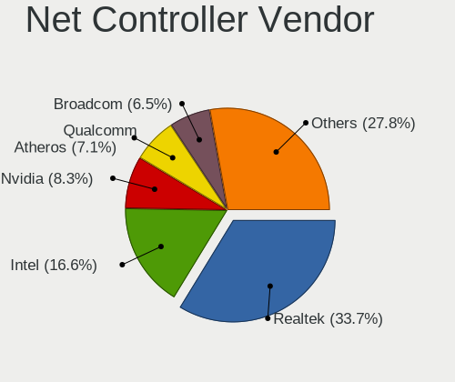

| Vendor                          | Desktops | Percent |
|---------------------------------|----------|---------|
| Realtek Semiconductor           | 46       | 32.39%  |
| Intel                           | 23       | 16.2%   |
| Nvidia                          | 12       | 8.45%   |
| Qualcomm Atheros                | 10       | 7.04%   |
| Broadcom                        | 10       | 7.04%   |
| Ralink Technology               | 8        | 5.63%   |
| VIA Technologies                | 3        | 2.11%   |
| Qualcomm Atheros Communications | 3        | 2.11%   |
| Marvell Technology Group        | 3        | 2.11%   |
| Gemtek                          | 3        | 2.11%   |
| D-Link                          | 3        | 2.11%   |
| TP-Link                         | 2        | 1.41%   |
| Samsung Electronics             | 2        | 1.41%   |
| Ralink                          | 2        | 1.41%   |
| Broadcom Limited                | 2        | 1.41%   |
| ASUSTek Computer                | 2        | 1.41%   |
| 3Com                            | 2        | 1.41%   |
| Xiaomi                          | 1        | 0.7%    |
| NetGear                         | 1        | 0.7%    |
| Motorola PCS                    | 1        | 0.7%    |
| D-Link System                   | 1        | 0.7%    |
| Belkin Components               | 1        | 0.7%    |
| ADMtek                          | 1        | 0.7%    |

Net Controller Model
--------------------

Controller models

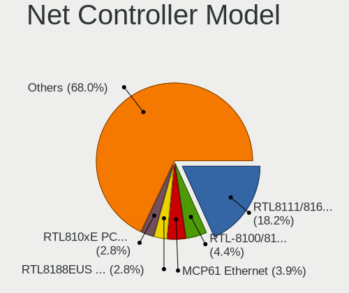

| Model                                                                         | Desktops | Percent |
|-------------------------------------------------------------------------------|----------|---------|
| Realtek RTL8111/8168/8411 PCI Express Gigabit Ethernet Controller             | 24       | 16%     |
| Realtek RTL-8100/8101L/8139 PCI Fast Ethernet Adapter                         | 8        | 5.33%   |
| Nvidia MCP61 Ethernet                                                         | 7        | 4.67%   |
| Realtek RTL810xE PCI Express Fast Ethernet controller                         | 5        | 3.33%   |
| Intel 82567LM-3 Gigabit Network Connection                                    | 4        | 2.67%   |
| Realtek RTL8188EUS 802.11n Wireless Network Adapter                           | 3        | 2%      |
| Realtek RTL-8185 IEEE 802.11a/b/g Wireless LAN Controller                     | 3        | 2%      |
| Ralink RT5370 Wireless Adapter                                                | 3        | 2%      |
| Ralink MT7601U Wireless Adapter                                               | 3        | 2%      |
| Intel 82566DM Gigabit Network Connection                                      | 3        | 2%      |
| Gemtek WUBR-177G [Ralink RT2571W]                                             | 3        | 2%      |
| VIA VT6102/VT6103 [Rhine-II]                                                  | 2        | 1.33%   |
| Realtek RTL8822BE 802.11a/b/g/n/ac WiFi adapter                               | 2        | 1.33%   |
| Realtek RTL8188FTV 802.11b/g/n 1T1R 2.4G WLAN Adapter                         | 2        | 1.33%   |
| Realtek 802.11ac NIC                                                          | 2        | 1.33%   |
| Qualcomm Atheros AR9271 802.11n                                               | 2        | 1.33%   |
| Qualcomm Atheros AR9485 Wireless Network Adapter                              | 2        | 1.33%   |
| Qualcomm Atheros AR93xx Wireless Network Adapter                              | 2        | 1.33%   |
| Marvell Group 88E8056 PCI-E Gigabit Ethernet Controller                       | 2        | 1.33%   |
| Intel 82579V Gigabit Network Connection                                       | 2        | 1.33%   |
| Broadcom NetXtreme II BCM5709 Gigabit Ethernet                                | 2        | 1.33%   |
| Broadcom Limited NetXtreme BCM5751 Gigabit Ethernet PCI Express               | 2        | 1.33%   |
| 3Com 3c905B 100BaseTX [Cyclone]                                               | 2        | 1.33%   |
| Xiaomi Mi/Redmi series (RNDIS)                                                | 1        | 0.67%   |
| VIA VIA VNT-6656 [WiFi 802.11b/g USB Dongle]                                  | 1        | 0.67%   |
| TP-Link TL-WN823N v2/v3 [Realtek RTL8192EU]                                   | 1        | 0.67%   |
| TP-Link TL-WN821N Version 5 RTL8192EU                                         | 1        | 0.67%   |
| Samsung WIS09ABGN LinkStick Wireless LAN Adapter                              | 1        | 0.67%   |
| Samsung GT-I9070 (network tethering, USB debugging enabled)                   | 1        | 0.67%   |
| Realtek RTL8192CU 802.11n WLAN Adapter                                        | 1        | 0.67%   |
| Realtek RTL8188EE Wireless Network Adapter                                    | 1        | 0.67%   |
| Realtek RTL8187B Wireless 802.11g 54Mbps Network Adapter                      | 1        | 0.67%   |
| Realtek RTL8169 PCI Gigabit Ethernet Controller                               | 1        | 0.67%   |
| Ralink RT5572 Wireless Adapter                                                | 1        | 0.67%   |
| Ralink RT2870/RT3070 Wireless Adapter                                         | 1        | 0.67%   |
| Ralink RT3060 Wireless 802.11n 1T/1R                                          | 1        | 0.67%   |
| Ralink RT2561/RT61 rev B 802.11g                                              | 1        | 0.67%   |
| Qualcomm Atheros QCA9565 / AR9565 Wireless Network Adapter                    | 1        | 0.67%   |
| Qualcomm Atheros TP-Link TL-WN322G v3 / TL-WN422G v2 802.11g [Atheros AR9271] | 1        | 0.67%   |
| Qualcomm Atheros Attansic L2 Fast Ethernet                                    | 1        | 0.67%   |
| Qualcomm Atheros AR9287 Wireless Network Adapter (PCI-Express)                | 1        | 0.67%   |
| Qualcomm Atheros AR8152 v2.0 Fast Ethernet                                    | 1        | 0.67%   |
| Qualcomm Atheros AR8132 Fast Ethernet                                         | 1        | 0.67%   |
| Qualcomm Atheros AR8131 Gigabit Ethernet                                      | 1        | 0.67%   |
| Nvidia MCP79 Ethernet                                                         | 1        | 0.67%   |
| Nvidia MCP77 Ethernet                                                         | 1        | 0.67%   |
| Nvidia MCP73 Ethernet                                                         | 1        | 0.67%   |
| Nvidia MCP51 Ethernet Controller                                              | 1        | 0.67%   |
| Nvidia CK804 Ethernet Controller                                              | 1        | 0.67%   |
| NetGear WG111v3 54 Mbps Wireless [realtek RTL8187B]                           | 1        | 0.67%   |
| Motorola PCS moto g pure                                                      | 1        | 0.67%   |
| Marvell Group 88w8335 [Libertas] 802.11b/g Wireless                           | 1        | 0.67%   |
| Intel Wi-Fi 6 AX200                                                           | 1        | 0.67%   |
| Intel NM10/ICH7 Family LAN Controller                                         | 1        | 0.67%   |
| Intel I211 Gigabit Network Connection                                         | 1        | 0.67%   |
| Intel I210 Gigabit Network Connection                                         | 1        | 0.67%   |
| Intel Ethernet Connection I217-V                                              | 1        | 0.67%   |
| Intel Ethernet Connection I217-LM                                             | 1        | 0.67%   |
| Intel Ethernet Connection (2) I219-V                                          | 1        | 0.67%   |
| Intel Ethernet Connection (2) I218-V                                          | 1        | 0.67%   |

Wireless Vendor
---------------

Wireless vendors

| Vendor                          | Desktops | Percent |
|---------------------------------|----------|---------|
| Realtek Semiconductor           | 15       | 28.85%  |
| Ralink Technology               | 8        | 15.38%  |
| Qualcomm Atheros                | 6        | 11.54%  |
| Qualcomm Atheros Communications | 3        | 5.77%   |
| Gemtek                          | 3        | 5.77%   |
| D-Link                          | 3        | 5.77%   |
| TP-Link                         | 2        | 3.85%   |
| Ralink                          | 2        | 3.85%   |
| ASUSTek Computer                | 2        | 3.85%   |
| VIA Technologies                | 1        | 1.92%   |
| Samsung Electronics             | 1        | 1.92%   |
| NetGear                         | 1        | 1.92%   |
| Marvell Technology Group        | 1        | 1.92%   |
| Intel                           | 1        | 1.92%   |
| D-Link System                   | 1        | 1.92%   |
| Broadcom                        | 1        | 1.92%   |
| Belkin Components               | 1        | 1.92%   |

Wireless Model
--------------

Wireless models

| Model                                                                                  | Desktops | Percent |
|----------------------------------------------------------------------------------------|----------|---------|
| Realtek RTL8188EUS 802.11n Wireless Network Adapter                                    | 3        | 5.77%   |
| Realtek RTL-8185 IEEE 802.11a/b/g Wireless LAN Controller                              | 3        | 5.77%   |
| Ralink RT5370 Wireless Adapter                                                         | 3        | 5.77%   |
| Ralink MT7601U Wireless Adapter                                                        | 3        | 5.77%   |
| Gemtek WUBR-177G [Ralink RT2571W]                                                      | 3        | 5.77%   |
| Realtek RTL8822BE 802.11a/b/g/n/ac WiFi adapter                                        | 2        | 3.85%   |
| Realtek RTL8188FTV 802.11b/g/n 1T1R 2.4G WLAN Adapter                                  | 2        | 3.85%   |
| Realtek 802.11ac NIC                                                                   | 2        | 3.85%   |
| Qualcomm Atheros AR9271 802.11n                                                        | 2        | 3.85%   |
| Qualcomm Atheros AR9485 Wireless Network Adapter                                       | 2        | 3.85%   |
| Qualcomm Atheros AR93xx Wireless Network Adapter                                       | 2        | 3.85%   |
| VIA VIA VNT-6656 [WiFi 802.11b/g USB Dongle]                                           | 1        | 1.92%   |
| TP-Link TL-WN823N v2/v3 [Realtek RTL8192EU]                                            | 1        | 1.92%   |
| TP-Link TL-WN821N Version 5 RTL8192EU                                                  | 1        | 1.92%   |
| Samsung WIS09ABGN LinkStick Wireless LAN Adapter                                       | 1        | 1.92%   |
| Realtek RTL8192CU 802.11n WLAN Adapter                                                 | 1        | 1.92%   |
| Realtek RTL8188EE Wireless Network Adapter                                             | 1        | 1.92%   |
| Realtek RTL8187B Wireless 802.11g 54Mbps Network Adapter                               | 1        | 1.92%   |
| Ralink RT5572 Wireless Adapter                                                         | 1        | 1.92%   |
| Ralink RT2870/RT3070 Wireless Adapter                                                  | 1        | 1.92%   |
| Ralink RT3060 Wireless 802.11n 1T/1R                                                   | 1        | 1.92%   |
| Ralink RT2561/RT61 rev B 802.11g                                                       | 1        | 1.92%   |
| Qualcomm Atheros QCA9565 / AR9565 Wireless Network Adapter                             | 1        | 1.92%   |
| Qualcomm Atheros TP-Link TL-WN322G v3 / TL-WN422G v2 802.11g [Atheros AR9271]          | 1        | 1.92%   |
| Qualcomm Atheros AR9287 Wireless Network Adapter (PCI-Express)                         | 1        | 1.92%   |
| NetGear WG111v3 54 Mbps Wireless [realtek RTL8187B]                                    | 1        | 1.92%   |
| Marvell Group 88w8335 [Libertas] 802.11b/g Wireless                                    | 1        | 1.92%   |
| Intel Wi-Fi 6 AX200                                                                    | 1        | 1.92%   |
| D-Link System DWA-140 RangeBooster N Adapter(rev.B2) [Ralink RT3072]                   | 1        | 1.92%   |
| D-Link DWP-156                                                                         | 1        | 1.92%   |
| D-Link DWA-171 AC600 DB Wireless Adapter(rev.A1) [Realtek RTL8811AU]                   | 1        | 1.92%   |
| D-Link 802.11ac NIC                                                                    | 1        | 1.92%   |
| Broadcom BCM4306 802.11b/g Wireless LAN Controller                                     | 1        | 1.92%   |
| Belkin Components F6D4050 N150 Enhanced Wireless Network Adapter v2000 [Ralink RT3070] | 1        | 1.92%   |
| ASUS USB-N14 802.11b/g/n (2x2) Wireless Adapter [Ralink RT5372]                        | 1        | 1.92%   |
| ASUS USB-N13 802.11n Network Adapter (rev. B1) [Realtek RTL8192CU]                     | 1        | 1.92%   |

Ethernet Vendor
---------------

Ethernet vendors

| Vendor                   | Desktops | Percent |
|--------------------------|----------|---------|
| Realtek Semiconductor    | 38       | 39.58%  |
| Intel                    | 22       | 22.92%  |
| Nvidia                   | 12       | 12.5%   |
| Broadcom                 | 9        | 9.38%   |
| Qualcomm Atheros         | 4        | 4.17%   |
| VIA Technologies         | 2        | 2.08%   |
| Marvell Technology Group | 2        | 2.08%   |
| Broadcom Limited         | 2        | 2.08%   |
| 3Com                     | 2        | 2.08%   |
| Xiaomi                   | 1        | 1.04%   |
| Samsung Electronics      | 1        | 1.04%   |
| ADMtek                   | 1        | 1.04%   |

Ethernet Model
--------------

Ethernet models

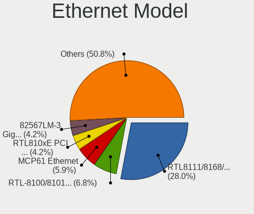

| Model                                                             | Desktops | Percent |
|-------------------------------------------------------------------|----------|---------|
| Realtek RTL8111/8168/8411 PCI Express Gigabit Ethernet Controller | 24       | 24.74%  |
| Realtek RTL-8100/8101L/8139 PCI Fast Ethernet Adapter             | 8        | 8.25%   |
| Nvidia MCP61 Ethernet                                             | 7        | 7.22%   |
| Realtek RTL810xE PCI Express Fast Ethernet controller             | 5        | 5.15%   |
| Intel 82567LM-3 Gigabit Network Connection                        | 4        | 4.12%   |
| Intel 82566DM Gigabit Network Connection                          | 3        | 3.09%   |
| VIA VT6102/VT6103 [Rhine-II]                                      | 2        | 2.06%   |
| Marvell Group 88E8056 PCI-E Gigabit Ethernet Controller           | 2        | 2.06%   |
| Intel 82579V Gigabit Network Connection                           | 2        | 2.06%   |
| Broadcom NetXtreme II BCM5709 Gigabit Ethernet                    | 2        | 2.06%   |
| Broadcom Limited NetXtreme BCM5751 Gigabit Ethernet PCI Express   | 2        | 2.06%   |
| 3Com 3c905B 100BaseTX [Cyclone]                                   | 2        | 2.06%   |
| Xiaomi Mi/Redmi series (RNDIS)                                    | 1        | 1.03%   |
| Samsung GT-I9070 (network tethering, USB debugging enabled)       | 1        | 1.03%   |
| Realtek RTL8169 PCI Gigabit Ethernet Controller                   | 1        | 1.03%   |
| Qualcomm Atheros Attansic L2 Fast Ethernet                        | 1        | 1.03%   |
| Qualcomm Atheros AR8152 v2.0 Fast Ethernet                        | 1        | 1.03%   |
| Qualcomm Atheros AR8132 Fast Ethernet                             | 1        | 1.03%   |
| Qualcomm Atheros AR8131 Gigabit Ethernet                          | 1        | 1.03%   |
| Nvidia MCP79 Ethernet                                             | 1        | 1.03%   |
| Nvidia MCP77 Ethernet                                             | 1        | 1.03%   |
| Nvidia MCP73 Ethernet                                             | 1        | 1.03%   |
| Nvidia MCP51 Ethernet Controller                                  | 1        | 1.03%   |
| Nvidia CK804 Ethernet Controller                                  | 1        | 1.03%   |
| Intel NM10/ICH7 Family LAN Controller                             | 1        | 1.03%   |
| Intel I211 Gigabit Network Connection                             | 1        | 1.03%   |
| Intel I210 Gigabit Network Connection                             | 1        | 1.03%   |
| Intel Ethernet Connection I217-V                                  | 1        | 1.03%   |
| Intel Ethernet Connection I217-LM                                 | 1        | 1.03%   |
| Intel Ethernet Connection (2) I219-V                              | 1        | 1.03%   |
| Intel Ethernet Connection (2) I218-V                              | 1        | 1.03%   |
| Intel 82579LM Gigabit Network Connection (Lewisville)             | 1        | 1.03%   |
| Intel 82578DM Gigabit Network Connection                          | 1        | 1.03%   |
| Intel 82578DC Gigabit Network Connection                          | 1        | 1.03%   |
| Intel 82567LM-2 Gigabit Network Connection                        | 1        | 1.03%   |
| Intel 82566DM-2 Gigabit Network Connection                        | 1        | 1.03%   |
| Intel 82566DC-2 Gigabit Network Connection                        | 1        | 1.03%   |
| Intel 82562V-2 10/100 Network Connection                          | 1        | 1.03%   |
| Broadcom NetXtreme BCM5762 Gigabit Ethernet PCIe                  | 1        | 1.03%   |
| Broadcom NetXtreme BCM5761 Gigabit Ethernet PCIe                  | 1        | 1.03%   |
| Broadcom NetXtreme BCM5754 Gigabit Ethernet PCI Express           | 1        | 1.03%   |
| Broadcom NetLink BCM5784M Gigabit Ethernet PCIe                   | 1        | 1.03%   |
| Broadcom NetLink BCM57788 Gigabit Ethernet PCIe                   | 1        | 1.03%   |
| Broadcom NetLink BCM57780 Gigabit Ethernet PCIe                   | 1        | 1.03%   |
| Broadcom BCM4401-B0 100Base-TX                                    | 1        | 1.03%   |
| ADMtek NC100 Network Everywhere Fast Ethernet 10/100              | 1        | 1.03%   |

Net Controller Kind
-------------------

Ethernet, WiFi or modem

| Kind     | Desktops | Percent |
|----------|----------|---------|
| Ethernet | 87       | 63.97%  |
| WiFi     | 48       | 35.29%  |
| Unknown  | 1        | 0.74%   |

Used Controller
---------------

Currently used network controller

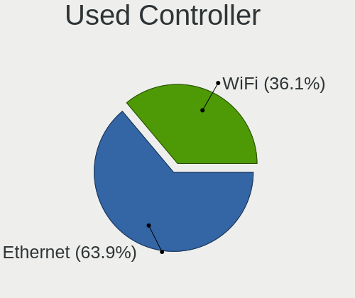

| Kind     | Desktops | Percent |
|----------|----------|---------|
| Ethernet | 71       | 65.74%  |
| WiFi     | 37       | 34.26%  |

NICs
----

Total network controllers on board

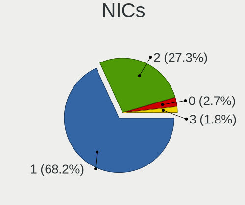

| Total | Desktops | Percent |
|-------|----------|---------|
| 1     | 61       | 67.78%  |
| 2     | 24       | 26.67%  |
| 0     | 3        | 3.33%   |
| 3     | 2        | 2.22%   |

IPv6
----

IPv6 vs IPv4

| Used | Desktops | Percent |
|------|----------|---------|
| No   | 85       | 94.44%  |
| Yes  | 5        | 5.56%   |

Bluetooth
---------

Bluetooth Vendor
----------------

Controller vendors

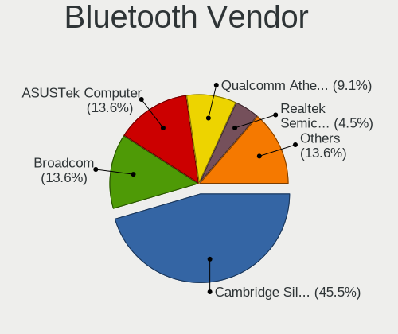

| Vendor                          | Desktops | Percent |
|---------------------------------|----------|---------|
| Cambridge Silicon Radio         | 8        | 44.44%  |
| Broadcom                        | 3        | 16.67%  |
| Qualcomm Atheros Communications | 2        | 11.11%  |
| ASUSTek Computer                | 2        | 11.11%  |
| Primax Electronics              | 1        | 5.56%   |
| Kensington                      | 1        | 5.56%   |
| Intel                           | 1        | 5.56%   |

Bluetooth Model
---------------

Controller models

| Model                                               | Desktops | Percent |
|-----------------------------------------------------|----------|---------|
| Cambridge Silicon Radio Bluetooth Dongle (HCI mode) | 8        | 44.44%  |
| Broadcom BCM20702A0 Bluetooth 4.0                   | 2        | 11.11%  |
| ASUS Bluetooth Radio                                | 2        | 11.11%  |
| Qualcomm Atheros AR9462 Bluetooth                   | 1        | 5.56%   |
| Qualcomm Atheros AR3011 Bluetooth                   | 1        | 5.56%   |
| Primax Rocketfish RF-FLBTAD Bluetooth Adapter       | 1        | 5.56%   |
| Kensington Bluetooth EDR Dongle                     | 1        | 5.56%   |
| Intel AX200 Bluetooth                               | 1        | 5.56%   |
| Broadcom Bluetooth Controller                       | 1        | 5.56%   |

Sound
-----

Sound Vendor
------------

Sound card vendors

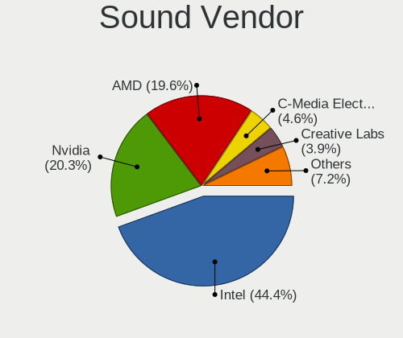

| Vendor                                          | Desktops | Percent |
|-------------------------------------------------|----------|---------|
| Intel                                           | 53       | 43.44%  |
| AMD                                             | 26       | 21.31%  |
| Nvidia                                          | 22       | 18.03%  |
| C-Media Electronics                             | 6        | 4.92%   |
| Creative Labs                                   | 5        | 4.1%    |
| VIA Technologies                                | 4        | 3.28%   |
| ULi Electronics                                 | 1        | 0.82%   |
| Silicon Integrated Systems [SiS]                | 1        | 0.82%   |
| Licensed by Sony Computer Entertainment America | 1        | 0.82%   |
| Generalplus Technology                          | 1        | 0.82%   |
| Creative Technology                             | 1        | 0.82%   |
| Corsair                                         | 1        | 0.82%   |

Sound Model
-----------

Sound card models

| Model                                                                      | Desktops | Percent |
|----------------------------------------------------------------------------|----------|---------|
| Intel NM10/ICH7 Family High Definition Audio Controller                    | 13       | 9.56%   |
| Intel 6 Series/C200 Series Chipset Family High Definition Audio Controller | 7        | 5.15%   |
| AMD SBx00 Azalia (Intel HDA)                                               | 7        | 5.15%   |
| Nvidia MCP61 High Definition Audio                                         | 6        | 4.41%   |
| Intel 82801I (ICH9 Family) HD Audio Controller                             | 6        | 4.41%   |
| Nvidia GK208 HDMI/DP Audio Controller                                      | 4        | 2.94%   |
| Intel 82801JD/DO (ICH10 Family) HD Audio Controller                        | 4        | 2.94%   |
| Intel 82801H (ICH8 Family) HD Audio Controller                             | 4        | 2.94%   |
| AMD RV710/730 HDMI Audio [Radeon HD 4000 series]                           | 4        | 2.94%   |
| AMD FCH Azalia Controller                                                  | 4        | 2.94%   |
| VIA Technologies VT8233/A/8235/8237 AC97 Audio Controller                  | 3        | 2.21%   |
| Intel Xeon E3-1200 v3/4th Gen Core Processor HD Audio Controller           | 3        | 2.21%   |
| Intel 82801JI (ICH10 Family) HD Audio Controller                           | 3        | 2.21%   |
| Intel 8 Series/C220 Series Chipset High Definition Audio Controller        | 3        | 2.21%   |
| Intel 7 Series/C216 Chipset Family High Definition Audio Controller        | 3        | 2.21%   |
| Intel 5 Series/3400 Series Chipset High Definition Audio                   | 3        | 2.21%   |
| AMD Cedar HDMI Audio [Radeon HD 5400/6300/7300 Series]                     | 3        | 2.21%   |
| Intel 82801FB/FBM/FR/FW/FRW (ICH6 Family) AC'97 Audio Controller           | 2        | 1.47%   |
| Creative Labs CA0106/CA0111 [SB Live!/Audigy/X-Fi Series]                  | 2        | 1.47%   |
| C-Media Electronics CMI8788 [Oxygen HD Audio]                              | 2        | 1.47%   |
| C-Media Electronics CMI8738/CMI8768 PCI Audio                              | 2        | 1.47%   |
| C-Media Electronics CM108 Audio Controller                                 | 2        | 1.47%   |
| AMD RV620 HDMI Audio [Radeon HD 3450/3470/3550/3570]                       | 2        | 1.47%   |
| VIA Technologies VX900/VT8xxx High Definition Audio Controller             | 1        | 0.74%   |
| ULi Electronics HD Audio Controller                                        | 1        | 0.74%   |
| Silicon Integrated Systems [SiS] SiS7012 AC'97 Sound Controller            | 1        | 0.74%   |
| Nvidia MCP79 High Definition Audio                                         | 1        | 0.74%   |
| Nvidia MCP73 High Definition Audio                                         | 1        | 0.74%   |
| Nvidia MCP72XE/MCP72P/MCP78U/MCP78S High Definition Audio                  | 1        | 0.74%   |
| Nvidia MCP51 High Definition Audio                                         | 1        | 0.74%   |
| Nvidia High Definition Audio Controller                                    | 1        | 0.74%   |
| Nvidia GP102 HDMI Audio Controller                                         | 1        | 0.74%   |
| Nvidia GM107 High Definition Audio Controller [GeForce 940MX]              | 1        | 0.74%   |
| Nvidia GK106 HDMI Audio Controller                                         | 1        | 0.74%   |
| Nvidia GF119 HDMI Audio Controller                                         | 1        | 0.74%   |
| Nvidia GF114 HDMI Audio Controller                                         | 1        | 0.74%   |
| Nvidia GF108 High Definition Audio Controller                              | 1        | 0.74%   |
| Nvidia GF106 High Definition Audio Controller                              | 1        | 0.74%   |
| Nvidia CK804 AC'97 Audio Controller                                        | 1        | 0.74%   |
| Licensed by Sony Computer Entertainment America Rocksmith Guitar Adapter   | 1        | 0.74%   |
| Intel USB PnP Sound Device                                                 | 1        | 0.74%   |
| Intel C610/X99 series chipset HD Audio Controller                          | 1        | 0.74%   |
| Intel Atom Processor Z36xxx/Z37xxx Series High Definition Audio Controller | 1        | 0.74%   |
| Intel 82801EB/ER (ICH5/ICH5R) AC'97 Audio Controller                       | 1        | 0.74%   |
| Intel 200 Series PCH HD Audio                                              | 1        | 0.74%   |
| Generalplus Technology USB Audio Device                                    | 1        | 0.74%   |
| Creative Technology SoundBlaster MP3+                                      | 1        | 0.74%   |
| Creative Labs EMU20k2 [Sound Blaster X-Fi Titanium Series]                 | 1        | 0.74%   |
| Creative Labs EMU10k1 [Sound Blaster Live! Series]                         | 1        | 0.74%   |
| Creative Labs CA0108/CA10300 [Sound Blaster Audigy Series]                 | 1        | 0.74%   |
| Corsair Gaming H2100 Headset                                               | 1        | 0.74%   |
| C-Media Electronics CM106 Like Sound Device                                | 1        | 0.74%   |
| C-Media Electronics Blue Snowball                                          | 1        | 0.74%   |
| AMD Turks HDMI Audio [Radeon HD 6500/6600 / 6700M Series]                  | 1        | 0.74%   |
| AMD Trinity HDMI Audio Controller                                          | 1        | 0.74%   |
| AMD Tonga HDMI Audio [Radeon R9 285/380]                                   | 1        | 0.74%   |
| AMD Starship/Matisse HD Audio Controller                                   | 1        | 0.74%   |
| AMD RS780 HDMI Audio [Radeon 3000/3100 / HD 3200/3300]                     | 1        | 0.74%   |
| AMD Raven/Raven2/Fenghuang HDMI/DP Audio Controller                        | 1        | 0.74%   |
| AMD Oland/Hainan/Cape Verde/Pitcairn HDMI Audio [Radeon HD 7000 Series]    | 1        | 0.74%   |

Memory
------

Memory Vendor
-------------

Memory module vendors

| Vendor              | Desktops | Percent |
|---------------------|----------|---------|
| Micron Technology   | 4        | 23.53%  |
| Unknown             | 3        | 17.65%  |
| Samsung Electronics | 3        | 17.65%  |
| SK Hynix            | 2        | 11.76%  |
| Nanya Technology    | 1        | 5.88%   |
| Kingston            | 1        | 5.88%   |
| G.Skill             | 1        | 5.88%   |
| Crucial             | 1        | 5.88%   |
| Unknown             | 1        | 5.88%   |

Memory Model
------------

Memory module models

| Model                                                    | Desktops | Percent |
|----------------------------------------------------------|----------|---------|
| Samsung RAM M378B5673FH0-CH9 2GB DIMM DDR3 1600MT/s      | 2        | 10%     |
| Micron RAM Module 2048MB DIMM DDR3 1333MT/s              | 2        | 10%     |
| Unknown RAM Module 2GB DIMM DDR2                         | 1        | 5%      |
| Unknown RAM Module 1GB DIMM DDR2                         | 1        | 5%      |
| Unknown RAM Module 1024MB DIMM 800MT/s                   | 1        | 5%      |
| Unknown RAM Module 1024MB DIMM 41632MT/s                 | 1        | 5%      |
| SK Hynix RAM Module 2GB DIMM DDR3 1600MT/s               | 1        | 5%      |
| SK Hynix RAM HMT125U6TFR8C-H9 2048MB DIMM DDR3 1333MT/s  | 1        | 5%      |
| Samsung RAM Module 2048MB DIMM DDR3 1333MT/s             | 1        | 5%      |
| Samsung RAM M378B2873FHS-CH9 1024MB DIMM DDR3 1333MT/s   | 1        | 5%      |
| Nanya RAM NT2GC64B8HC0NF-CG 2GB DIMM DDR3 1333MT/s       | 1        | 5%      |
| Micron RAM 8JTF51264AZ-1G6E1 4GB DIMM DDR3 1600MT/s      | 1        | 5%      |
| Micron RAM 8HTF12864AY-800J1 1GB DIMM DDR2 800MT/s       | 1        | 5%      |
| Kingston RAM 9905734-019.A00G 16384MB DIMM DDR4 2400MT/s | 1        | 5%      |
| Kingston RAM 9905713-017.A00G 4GB DIMM DDR4 2866MT/s     | 1        | 5%      |
| G.Skill RAM F3-1866C10-8GAB 8GB DIMM DDR3 1866MT/s       | 1        | 5%      |
| Crucial RAM BLS8G3D18ADS3 8GB DIMM DDR3 1866MT/s         | 1        | 5%      |
| Unknown                                                  | 1        | 5%      |

Memory Kind
-----------

Memory module kinds

| Kind    | Desktops | Percent |
|---------|----------|---------|
| DDR3    | 8        | 50%     |
| SDRAM   | 2        | 12.5%   |
| DDR2    | 2        | 12.5%   |
| Unknown | 2        | 12.5%   |
| DDR4    | 1        | 6.25%   |
| DDR     | 1        | 6.25%   |

Memory Form Factor
------------------

Physical design of the memory module

| Name | Desktops | Percent |
|------|----------|---------|
| DIMM | 15       | 100%    |

Memory Size
-----------

Memory module size

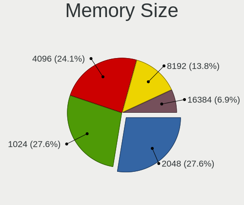

| Size  | Desktops | Percent |
|-------|----------|---------|
| 2048  | 7        | 38.89%  |
| 1024  | 6        | 33.33%  |
| 8192  | 2        | 11.11%  |
| 4096  | 2        | 11.11%  |
| 16384 | 1        | 5.56%   |

Memory Speed
------------

Memory module speed

| Speed   | Desktops | Percent |
|---------|----------|---------|
| 1600    | 4        | 23.53%  |
| 1333    | 4        | 23.53%  |
| 800     | 2        | 11.76%  |
| 41632   | 1        | 5.88%   |
| 2866    | 1        | 5.88%   |
| 2400    | 1        | 5.88%   |
| 1867    | 1        | 5.88%   |
| 1866    | 1        | 5.88%   |
| 320     | 1        | 5.88%   |
| Unknown | 1        | 5.88%   |

Printers & scanners
-------------------

Printer Vendor
--------------

Printer device vendors

| Vendor              | Desktops | Percent |
|---------------------|----------|---------|
| Brother Industries  | 3        | 42.86%  |
| Seiko Epson         | 1        | 14.29%  |
| Samsung Electronics | 1        | 14.29%  |
| Hewlett-Packard     | 1        | 14.29%  |
| Canon               | 1        | 14.29%  |

Printer Model
-------------

Printer device models

| Model                                | Desktops | Percent |
|--------------------------------------|----------|---------|
| Seiko Epson XP-243 245 247 Series    | 1        | 14.29%  |
| Samsung ML-216x Series Laser Printer | 1        | 14.29%  |
| HP OfficeJet 5200 series             | 1        | 14.29%  |
| Canon TS3300 series                  | 1        | 14.29%  |
| Brother HL-L2360D series             | 1        | 14.29%  |
| Brother HL-L2350DW series            | 1        | 14.29%  |
| Brother HL-L2340D series             | 1        | 14.29%  |

Scanner Vendor
--------------

Scanner device vendors

Zero info for selected period =(

Scanner Model
-------------

Scanner device models

Zero info for selected period =(

Camera
------

Camera Vendor
-------------

Camera device vendors

| Vendor                        | Desktops | Percent |
|-------------------------------|----------|---------|
| Logitech                      | 2        | 22.22%  |
| Cubeternet                    | 2        | 22.22%  |
| Sunplus Innovation Technology | 1        | 11.11%  |
| Samsung Electronics           | 1        | 11.11%  |
| LG Electronics                | 1        | 11.11%  |
| GEO Semi                      | 1        | 11.11%  |
| Aveo Technology               | 1        | 11.11%  |

Camera Model
------------

Camera device models

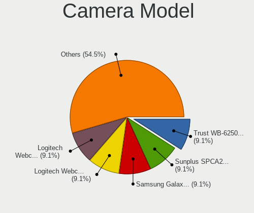

| Model                                                               | Desktops | Percent |
|---------------------------------------------------------------------|----------|---------|
| Sunplus SPCA2281 Web Camera                                         | 1        | 11.11%  |
| Samsung Galaxy A5 (MTP)                                             | 1        | 11.11%  |
| Logitech Webcam C270                                                | 1        | 11.11%  |
| Logitech Webcam C210                                                | 1        | 11.11%  |
| LG LM-X420xxx/G2/G3 Android Phone (MTP/download mode)               | 1        | 11.11%  |
| GEO Semi Condor                                                     | 1        | 11.11%  |
| Cubeternet USB2.0 Camera                                            | 1        | 11.11%  |
| Cubeternet EtronTech CMOS based eSP570 WebCam [Onyx Titanium TC101] | 1        | 11.11%  |
| Aveo Camera                                                         | 1        | 11.11%  |

Security
--------

Fingerprint Vendor
------------------

Fingerprint sensor vendors

Zero info for selected period =(

Fingerprint Model
-----------------

Fingerprint sensor models

Zero info for selected period =(

Chipcard Vendor
---------------

Chipcard module vendors

Zero info for selected period =(

Chipcard Model
--------------

Chipcard module models

Zero info for selected period =(

Unsupported
-----------

Unsupported Devices
-------------------

Total unsupported devices on board

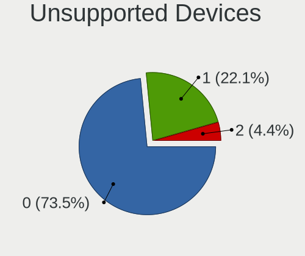

| Total | Desktops | Percent |
|-------|----------|---------|
| 0     | 71       | 77.17%  |
| 1     | 18       | 19.57%  |
| 2     | 3        | 3.26%   |

Unsupported Device Types
------------------------

Types of unsupported devices

| Type                     | Desktops | Percent |
|--------------------------|----------|---------|
| Net/wireless             | 8        | 34.78%  |
| Communication controller | 7        | 30.43%  |
| Graphics card            | 3        | 13.04%  |
| Camera                   | 2        | 8.7%    |
| Unassigned class         | 1        | 4.35%   |
| Sound                    | 1        | 4.35%   |
| Net/ethernet             | 1        | 4.35%   |

