Peppermint 10 - Tested Hardware & Statistics
--------------------------------------------

A project to collect tested hardware configurations for Peppermint 10.

Anyone can contribute to this report by the [hw-probe](https://github.com/linuxhw/hw-probe) tool:

    sudo -E hw-probe -all -upload

Please submit a probe of your configuration if it's not presented on the page or is rare.

This is a report for all computer types. See also reports for [desktops](/Dist/Peppermint_10/Desktop/README.md) and [notebooks](/Dist/Peppermint_10/Notebook/README.md).

Full-feature report is available here: https://linux-hardware.org/?view=trends

Contents
--------

* [ Test Cases ](#test-cases)

* [ System ](#system)
  - [ Kernel                   ](#kernel)
  - [ Kernel Family            ](#kernel-family)
  - [ Kernel Major Ver.        ](#kernel-major-ver)
  - [ Arch                     ](#arch)
  - [ DE                       ](#de)
  - [ Display Server           ](#display-server)
  - [ Display Manager          ](#display-manager)
  - [ OS Lang                  ](#os-lang)
  - [ Boot Mode                ](#boot-mode)
  - [ Filesystem               ](#filesystem)
  - [ Part. scheme             ](#part-scheme)
  - [ Dual Boot with Linux/BSD ](#dual-boot-with-linuxbsd)
  - [ Dual Boot (Win)          ](#dual-boot-win)

* [ Board ](#board)
  - [ Vendor                   ](#vendor)
  - [ Model                    ](#model)
  - [ Model Family             ](#model-family)
  - [ MFG Year                 ](#mfg-year)
  - [ Form Factor              ](#form-factor)
  - [ Secure Boot              ](#secure-boot)
  - [ Coreboot                 ](#coreboot)
  - [ RAM Size                 ](#ram-size)
  - [ RAM Used                 ](#ram-used)
  - [ Total Drives             ](#total-drives)
  - [ Has CD-ROM               ](#has-cd-rom)
  - [ Has Ethernet             ](#has-ethernet)
  - [ Has WiFi                 ](#has-wifi)
  - [ Has Bluetooth            ](#has-bluetooth)

* [ Location ](#location)
  - [ Country                  ](#country)
  - [ City                     ](#city)

* [ Drives ](#drives)
  - [ Drive Vendor             ](#drive-vendor)
  - [ Drive Model              ](#drive-model)
  - [ HDD Vendor               ](#hdd-vendor)
  - [ SSD Vendor               ](#ssd-vendor)
  - [ Drive Kind               ](#drive-kind)
  - [ Drive Connector          ](#drive-connector)
  - [ Drive Size               ](#drive-size)
  - [ Space Total              ](#space-total)
  - [ Space Used               ](#space-used)
  - [ Malfunc. Drives          ](#malfunc-drives)
  - [ Malfunc. Drive Vendor    ](#malfunc-drive-vendor)
  - [ Malfunc. HDD Vendor      ](#malfunc-hdd-vendor)
  - [ Malfunc. Drive Kind      ](#malfunc-drive-kind)
  - [ Failed Drives            ](#failed-drives)
  - [ Failed Drive Vendor      ](#failed-drive-vendor)
  - [ Drive Status             ](#drive-status)

* [ Storage controller ](#storage-controller)
  - [ Storage Vendor           ](#storage-vendor)
  - [ Storage Model            ](#storage-model)
  - [ Storage Kind             ](#storage-kind)

* [ Processor ](#processor)
  - [ CPU Vendor               ](#cpu-vendor)
  - [ CPU Model                ](#cpu-model)
  - [ CPU Model Family         ](#cpu-model-family)
  - [ CPU Cores                ](#cpu-cores)
  - [ CPU Sockets              ](#cpu-sockets)
  - [ CPU Threads              ](#cpu-threads)
  - [ CPU Op-Modes             ](#cpu-op-modes)
  - [ CPU Microcode            ](#cpu-microcode)
  - [ CPU Microarch            ](#cpu-microarch)

* [ Graphics ](#graphics)
  - [ GPU Vendor               ](#gpu-vendor)
  - [ GPU Model                ](#gpu-model)
  - [ GPU Combo                ](#gpu-combo)
  - [ GPU Driver               ](#gpu-driver)
  - [ GPU Memory               ](#gpu-memory)

* [ Monitor ](#monitor)
  - [ Monitor Vendor           ](#monitor-vendor)
  - [ Monitor Model            ](#monitor-model)
  - [ Monitor Resolution       ](#monitor-resolution)
  - [ Monitor Diagonal         ](#monitor-diagonal)
  - [ Monitor Width            ](#monitor-width)
  - [ Aspect Ratio             ](#aspect-ratio)
  - [ Monitor Area             ](#monitor-area)
  - [ Pixel Density            ](#pixel-density)
  - [ Multiple Monitors        ](#multiple-monitors)

* [ Network ](#network)
  - [ Net Controller Vendor    ](#net-controller-vendor)
  - [ Net Controller Model     ](#net-controller-model)
  - [ Wireless Vendor          ](#wireless-vendor)
  - [ Wireless Model           ](#wireless-model)
  - [ Ethernet Vendor          ](#ethernet-vendor)
  - [ Ethernet Model           ](#ethernet-model)
  - [ Net Controller Kind      ](#net-controller-kind)
  - [ Used Controller          ](#used-controller)
  - [ NICs                     ](#nics)
  - [ IPv6                     ](#ipv6)

* [ Bluetooth ](#bluetooth)
  - [ Bluetooth Vendor         ](#bluetooth-vendor)
  - [ Bluetooth Model          ](#bluetooth-model)

* [ Sound ](#sound)
  - [ Sound Vendor             ](#sound-vendor)
  - [ Sound Model              ](#sound-model)

* [ Memory ](#memory)
  - [ Memory Vendor            ](#memory-vendor)
  - [ Memory Model             ](#memory-model)
  - [ Memory Kind              ](#memory-kind)
  - [ Memory Form Factor       ](#memory-form-factor)
  - [ Memory Size              ](#memory-size)
  - [ Memory Speed             ](#memory-speed)

* [ Printers & scanners ](#printers--scanners)
  - [ Printer Vendor           ](#printer-vendor)
  - [ Printer Model            ](#printer-model)
  - [ Scanner Vendor           ](#scanner-vendor)
  - [ Scanner Model            ](#scanner-model)

* [ Camera ](#camera)
  - [ Camera Vendor            ](#camera-vendor)
  - [ Camera Model             ](#camera-model)

* [ Security ](#security)
  - [ Fingerprint Vendor       ](#fingerprint-vendor)
  - [ Fingerprint Model        ](#fingerprint-model)
  - [ Chipcard Vendor          ](#chipcard-vendor)
  - [ Chipcard Model           ](#chipcard-model)

* [ Unsupported ](#unsupported)
  - [ Unsupported Devices      ](#unsupported-devices)
  - [ Unsupported Device Types ](#unsupported-device-types)

Test Cases
----------

| Vendor        | Model                       | Form-Factor | Probe                                                      | Date         |
|---------------|-----------------------------|-------------|------------------------------------------------------------|--------------|
| Acer          | AOA110                      | Other       | [1670ad4a71](https://linux-hardware.org/?probe=1670ad4a71) | Dec 29, 2021 |
| ASUSTek       | 1000H                       | Notebook    | [7b25815657](https://linux-hardware.org/?probe=7b25815657) | Dec 29, 2021 |
| Lenovo        | G575 4383                   | Notebook    | [ef4143d3b6](https://linux-hardware.org/?probe=ef4143d3b6) | Dec 22, 2021 |
| Fujitsu Si... | AMILO PRO V8010             | Notebook    | [710a87fb41](https://linux-hardware.org/?probe=710a87fb41) | Dec 18, 2021 |
| Toshiba       | Satellite L300              | Notebook    | [1a2930b22b](https://linux-hardware.org/?probe=1a2930b22b) | Dec 02, 2021 |
| Intel         | D865GSA AAD52278-203        | Desktop     | [9b874becf9](https://linux-hardware.org/?probe=9b874becf9) | Dec 01, 2021 |
| Intel         | D865GSA AAD52278-203        | Desktop     | [ae2963be56](https://linux-hardware.org/?probe=ae2963be56) | Dec 01, 2021 |
| Acer          | Aspire 4810T                | Notebook    | [2f0aa07be8](https://linux-hardware.org/?probe=2f0aa07be8) | Nov 26, 2021 |
| Positivo      | Mobile                      | Notebook    | [f67e7cf244](https://linux-hardware.org/?probe=f67e7cf244) | Nov 25, 2021 |
| Positivo      | Mobile                      | Notebook    | [aa89357d9f](https://linux-hardware.org/?probe=aa89357d9f) | Nov 25, 2021 |
| ECS           | Nettle3                     | Desktop     | [844a70698a](https://linux-hardware.org/?probe=844a70698a) | Nov 21, 2021 |
| ASUSTek       | P5GC-MX/1333                | Desktop     | [def67fa4e7](https://linux-hardware.org/?probe=def67fa4e7) | Nov 16, 2021 |
| Dell          | Inspiron 1750               | Notebook    | [58d4a2dd00](https://linux-hardware.org/?probe=58d4a2dd00) | Nov 10, 2021 |
| HP            | Compaq nc6320 (RH377ET#A... | Notebook    | [15f9885d1f](https://linux-hardware.org/?probe=15f9885d1f) | Nov 02, 2021 |
| ASUSTek       | N73SV                       | Notebook    | [997a879973](https://linux-hardware.org/?probe=997a879973) | Oct 29, 2021 |
| Intel         | H61                         | Desktop     | [f1d3a975c0](https://linux-hardware.org/?probe=f1d3a975c0) | Oct 26, 2021 |
| Toshiba       | Satellite L750D             | Notebook    | [e24684255d](https://linux-hardware.org/?probe=e24684255d) | Oct 26, 2021 |
| HP            | Pavilion dv2000 (RD261LA... | Notebook    | [9f722a52d9](https://linux-hardware.org/?probe=9f722a52d9) | Oct 15, 2021 |
| ECS           | MCP61PM-GM                  | Desktop     | [1d13b80285](https://linux-hardware.org/?probe=1d13b80285) | Oct 13, 2021 |
| Dell          | Inspiron 1750               | Notebook    | [0a56c60b24](https://linux-hardware.org/?probe=0a56c60b24) | Oct 11, 2021 |
| ASRock        | P4VM8                       | Desktop     | [5797c27ef8](https://linux-hardware.org/?probe=5797c27ef8) | Oct 10, 2021 |
| ASRock        | P4VM8                       | Desktop     | [84c50aca4b](https://linux-hardware.org/?probe=84c50aca4b) | Oct 10, 2021 |
| Dell          | Inspiron 1018               | Notebook    | [7f51bdb2d1](https://linux-hardware.org/?probe=7f51bdb2d1) | Oct 08, 2021 |
| HP            | 2000                        | Notebook    | [00f01e8929](https://linux-hardware.org/?probe=00f01e8929) | Oct 08, 2021 |
| Dell          | Inspiron 1750               | Notebook    | [be79dd5979](https://linux-hardware.org/?probe=be79dd5979) | Oct 06, 2021 |
| AAEON         | MF-001 V1.0                 | Desktop     | [c5492b6d2f](https://linux-hardware.org/?probe=c5492b6d2f) | Oct 06, 2021 |
| AAEON         | MF-001 V1.0                 | Desktop     | [522a137a4e](https://linux-hardware.org/?probe=522a137a4e) | Oct 05, 2021 |
| Acer          | Aspire R3-131T              | Notebook    | [7716dd2a46](https://linux-hardware.org/?probe=7716dd2a46) | Sep 30, 2021 |
| HP            | 15                          | Notebook    | [a976f1d357](https://linux-hardware.org/?probe=a976f1d357) | Sep 28, 2021 |
| MSI           | MS-7211                     | Desktop     | [bb7e83b8cb](https://linux-hardware.org/?probe=bb7e83b8cb) | Sep 25, 2021 |
| Unknown       | Unknown                     | Notebook    | [b54d6779c8](https://linux-hardware.org/?probe=b54d6779c8) | Sep 19, 2021 |
| ASUSTek       | A88XM-A                     | Desktop     | [b1f8d57cae](https://linux-hardware.org/?probe=b1f8d57cae) | Sep 09, 2021 |
| Packard Be... | EasyNote TK85               | Notebook    | [3e9c16c5a0](https://linux-hardware.org/?probe=3e9c16c5a0) | Sep 07, 2021 |
| Toshiba       | dynabook Satellite B552/... | Notebook    | [9532ae1c30](https://linux-hardware.org/?probe=9532ae1c30) | Sep 05, 2021 |
| ASUSTek       | K52F                        | Notebook    | [743e5c8059](https://linux-hardware.org/?probe=743e5c8059) | Sep 01, 2021 |
| ASUSTek       | K52F                        | Notebook    | [54d5076bc6](https://linux-hardware.org/?probe=54d5076bc6) | Sep 01, 2021 |
| Sony          | VGN-S55B_S                  | Notebook    | [f8237269e1](https://linux-hardware.org/?probe=f8237269e1) | Aug 22, 2021 |
| Packard Be... | EasyNote TK85               | Notebook    | [4faeb04124](https://linux-hardware.org/?probe=4faeb04124) | Aug 17, 2021 |
| Sony          | VGN-S55B_S                  | Notebook    | [e531cd57e6](https://linux-hardware.org/?probe=e531cd57e6) | Aug 15, 2021 |
| HP            | EliteBook 820 G1            | Notebook    | [830eaafeac](https://linux-hardware.org/?probe=830eaafeac) | Aug 08, 2021 |
| Samsung       | N150P/N210P/N220P           | Notebook    | [0a9b2f9147](https://linux-hardware.org/?probe=0a9b2f9147) | Aug 08, 2021 |
| HP            | 2AE3                        | Desktop     | [6780c45f7c](https://linux-hardware.org/?probe=6780c45f7c) | Aug 02, 2021 |
| Olivetti      | CL133A                      | Notebook    | [59d8296ec4](https://linux-hardware.org/?probe=59d8296ec4) | Jul 31, 2021 |
| Lenovo        | IdeaPad 1 11ADA05 82GV      | Notebook    | [113c8ab052](https://linux-hardware.org/?probe=113c8ab052) | Jul 27, 2021 |
| Fujitsu Si... | ESPRIMO Mobile V5535        | Notebook    | [827993d9c3](https://linux-hardware.org/?probe=827993d9c3) | Jul 17, 2021 |
| Olivetti      | CL133A                      | Notebook    | [a73133e4f3](https://linux-hardware.org/?probe=a73133e4f3) | Jul 15, 2021 |
| Dell          | Precision M4600             | Notebook    | [0242a479d2](https://linux-hardware.org/?probe=0242a479d2) | Jul 13, 2021 |
| Olivetti      | CL133A                      | Notebook    | [ba8eb5f003](https://linux-hardware.org/?probe=ba8eb5f003) | Jul 10, 2021 |
| Olivetti      | CL133A                      | Notebook    | [117e8fa0b4](https://linux-hardware.org/?probe=117e8fa0b4) | Jul 06, 2021 |
| Pegatron      | 2ACC                        | Desktop     | [271f50a6ed](https://linux-hardware.org/?probe=271f50a6ed) | Jun 29, 2021 |
| HP            | Compaq Mini 110c-1100       | Notebook    | [9ba35acb61](https://linux-hardware.org/?probe=9ba35acb61) | Jun 24, 2021 |
| HP            | Compaq Mini 110c-1100       | Notebook    | [399e422d5b](https://linux-hardware.org/?probe=399e422d5b) | Jun 24, 2021 |
| Lenovo        | IdeaPad Slim 1-14AST-05 ... | Notebook    | [09171395a9](https://linux-hardware.org/?probe=09171395a9) | Jun 22, 2021 |
| Lenovo        | IdeaPad Slim 1-14AST-05 ... | Notebook    | [cdbc4c8c02](https://linux-hardware.org/?probe=cdbc4c8c02) | Jun 22, 2021 |
| Toshiba       | NB500                       | Notebook    | [e5095d1545](https://linux-hardware.org/?probe=e5095d1545) | Jun 21, 2021 |
| Lenovo        | ThinkPad Edge E431 62775... | Notebook    | [6d6430f8ff](https://linux-hardware.org/?probe=6d6430f8ff) | Jun 18, 2021 |
| Acer          | AOA150                      | Notebook    | [7cbadcfcce](https://linux-hardware.org/?probe=7cbadcfcce) | Jun 13, 2021 |
| Toshiba       | NB500                       | Notebook    | [0a57436b83](https://linux-hardware.org/?probe=0a57436b83) | Jun 13, 2021 |
| Toshiba       | NB500                       | Notebook    | [be659779e6](https://linux-hardware.org/?probe=be659779e6) | Jun 13, 2021 |
| HP            | Mini 110-1100               | Notebook    | [dcaac9d2ce](https://linux-hardware.org/?probe=dcaac9d2ce) | Jun 04, 2021 |
| HP            | Mini 110-1100               | Notebook    | [d919b139c6](https://linux-hardware.org/?probe=d919b139c6) | Jun 04, 2021 |
| ASRock        | 970M Pro3                   | Desktop     | [9c2c0af05f](https://linux-hardware.org/?probe=9c2c0af05f) | May 27, 2021 |
| ASRock        | 970M Pro3                   | Desktop     | [0a5e45a21e](https://linux-hardware.org/?probe=0a5e45a21e) | May 27, 2021 |
| HP            | Presario C500 (RZ343UA#A... | Notebook    | [d37099a83d](https://linux-hardware.org/?probe=d37099a83d) | May 25, 2021 |
| HP            | Presario C500 (RZ343UA#A... | Notebook    | [4aef9f472c](https://linux-hardware.org/?probe=4aef9f472c) | May 17, 2021 |
| Sony          | VGN-S55B_S                  | Notebook    | [a874601f76](https://linux-hardware.org/?probe=a874601f76) | May 05, 2021 |
| JPSaCouto     | Intel powered classmate ... | Notebook    | [f82c8e8839](https://linux-hardware.org/?probe=f82c8e8839) | Apr 25, 2021 |
| JPSaCouto     | Intel powered classmate ... | Notebook    | [bcca68ee1a](https://linux-hardware.org/?probe=bcca68ee1a) | Apr 25, 2021 |
| Acer          | Extensa 5510                | Notebook    | [8e9e536486](https://linux-hardware.org/?probe=8e9e536486) | Apr 24, 2021 |
| Gateway       | Blade-K8F                   | Notebook    | [12b76c8bca](https://linux-hardware.org/?probe=12b76c8bca) | Apr 24, 2021 |
| HP            | EliteBook 2530p             | Notebook    | [d54424038e](https://linux-hardware.org/?probe=d54424038e) | Apr 18, 2021 |
| HP            | EliteBook 2530p             | Notebook    | [562d38cca5](https://linux-hardware.org/?probe=562d38cca5) | Apr 18, 2021 |
| HP            | Compaq nc6320 (RH377ET#A... | Notebook    | [87befc0401](https://linux-hardware.org/?probe=87befc0401) | Apr 16, 2021 |
| Pegatron      | Benicia                     | Desktop     | [7b1f7c7edf](https://linux-hardware.org/?probe=7b1f7c7edf) | Apr 15, 2021 |
| Dell          | Inspiron 1545               | Notebook    | [a23936a0de](https://linux-hardware.org/?probe=a23936a0de) | Apr 10, 2021 |
| Fujitsu Si... | AMILO Li1705                | Notebook    | [56c5cc70d1](https://linux-hardware.org/?probe=56c5cc70d1) | Apr 07, 2021 |
| Fujitsu Si... | AMILO Li1705                | Notebook    | [71e906faa3](https://linux-hardware.org/?probe=71e906faa3) | Apr 07, 2021 |
| Dell          | Latitude 7410               | Notebook    | [a72bb094fd](https://linux-hardware.org/?probe=a72bb094fd) | Mar 26, 2021 |
| ASUSTek       | P4VP-MX                     | Desktop     | [ce116189a9](https://linux-hardware.org/?probe=ce116189a9) | Mar 19, 2021 |
| ASUSTek       | P4VP-MX                     | Desktop     | [1f7de7a842](https://linux-hardware.org/?probe=1f7de7a842) | Mar 19, 2021 |
| ASUSTek       | Acacia                      | Desktop     | [51a2e8c7b7](https://linux-hardware.org/?probe=51a2e8c7b7) | Mar 17, 2021 |
| Dell          | Vostro 3550                 | Notebook    | [ebd077e7f4](https://linux-hardware.org/?probe=ebd077e7f4) | Mar 16, 2021 |
| HP            | Pavilion g6                 | Notebook    | [6079cacf9b](https://linux-hardware.org/?probe=6079cacf9b) | Mar 14, 2021 |
| Samsung       | R530/R730/R540              | Notebook    | [a9fd173c51](https://linux-hardware.org/?probe=a9fd173c51) | Mar 13, 2021 |
| Gateway       | MCP61SM2MA FAB1.0           | Desktop     | [efab4d96e9](https://linux-hardware.org/?probe=efab4d96e9) | Mar 10, 2021 |
| Gateway       | MCP61SM2MA FAB1.0           | Desktop     | [514d4c99a1](https://linux-hardware.org/?probe=514d4c99a1) | Mar 10, 2021 |
| Dell          | Dimension E521              | Desktop     | [c82996b3dc](https://linux-hardware.org/?probe=c82996b3dc) | Mar 07, 2021 |
| Dell          | Dimension E521              | Desktop     | [6c93eb4440](https://linux-hardware.org/?probe=6c93eb4440) | Mar 07, 2021 |
| Dell          | 0C522T A01                  | Desktop     | [4871abab72](https://linux-hardware.org/?probe=4871abab72) | Mar 06, 2021 |
| Dell          | Inspiron 1012               | Notebook    | [4c4bb4bd4a](https://linux-hardware.org/?probe=4c4bb4bd4a) | Mar 04, 2021 |
| HP            | 3032h                       | Desktop     | [50914ba2f5](https://linux-hardware.org/?probe=50914ba2f5) | Mar 04, 2021 |
| Dell          | Inspiron N5050              | Notebook    | [b0cdfde6d1](https://linux-hardware.org/?probe=b0cdfde6d1) | Mar 02, 2021 |
| Dell          | Inspiron N5050              | Notebook    | [492714801f](https://linux-hardware.org/?probe=492714801f) | Mar 02, 2021 |
| ASUSTek       | P5N-E SLI                   | Desktop     | [236a4d5753](https://linux-hardware.org/?probe=236a4d5753) | Feb 23, 2021 |
| ASUSTek       | P5N-E SLI                   | Desktop     | [27f148966a](https://linux-hardware.org/?probe=27f148966a) | Feb 23, 2021 |
| ASUSTek       | K50C                        | Notebook    | [e6cc5c82bf](https://linux-hardware.org/?probe=e6cc5c82bf) | Feb 21, 2021 |
| Lenovo        | ThinkPad R60 94566FG        | Notebook    | [f0eb3f1d77](https://linux-hardware.org/?probe=f0eb3f1d77) | Feb 19, 2021 |
| Medion        | Akoya E4214 MD99570         | Notebook    | [3ae1e824ed](https://linux-hardware.org/?probe=3ae1e824ed) | Feb 13, 2021 |
| Toshiba       | Satellite L500              | Notebook    | [003b1f0799](https://linux-hardware.org/?probe=003b1f0799) | Feb 12, 2021 |
| Toshiba       | Satellite L500              | Notebook    | [a642972ffa](https://linux-hardware.org/?probe=a642972ffa) | Feb 12, 2021 |
| Dell          | Dimension E521              | Desktop     | [e1e96701d6](https://linux-hardware.org/?probe=e1e96701d6) | Feb 12, 2021 |
| Dell          | Dimension E521              | Desktop     | [8fa6c876ed](https://linux-hardware.org/?probe=8fa6c876ed) | Feb 12, 2021 |
| ASUSTek       | SABERTOOTH Z77              | Desktop     | [f7fc4d663b](https://linux-hardware.org/?probe=f7fc4d663b) | Feb 08, 2021 |
| Apple         | MacBookAir3,2               | Notebook    | [e4d417012f](https://linux-hardware.org/?probe=e4d417012f) | Feb 08, 2021 |
| ASUSTek       | X541NA                      | Notebook    | [e8ed6f17a3](https://linux-hardware.org/?probe=e8ed6f17a3) | Feb 07, 2021 |
| Unknown       | Unknown                     | Notebook    | [cf6b92a979](https://linux-hardware.org/?probe=cf6b92a979) | Feb 07, 2021 |
| Toshiba       | Satellite L300              | Notebook    | [9b7beecf8b](https://linux-hardware.org/?probe=9b7beecf8b) | Jan 29, 2021 |
| Dell          | 0TP406                      | Desktop     | [0980bfcfe9](https://linux-hardware.org/?probe=0980bfcfe9) | Jan 28, 2021 |
| Dell          | 0K216C                      | Desktop     | [c1cf70d814](https://linux-hardware.org/?probe=c1cf70d814) | Jan 19, 2021 |
| Sony          | VPCZ21V9E                   | Notebook    | [f0e8428fc2](https://linux-hardware.org/?probe=f0e8428fc2) | Jan 17, 2021 |
| Fujitsu       | LIFEBOOK T902               | Notebook    | [b0aa1bff61](https://linux-hardware.org/?probe=b0aa1bff61) | Jan 12, 2021 |
| Gigabyte      | 945GCM-S2L                  | Desktop     | [b0f061dfba](https://linux-hardware.org/?probe=b0f061dfba) | Jan 08, 2021 |
| Gigabyte      | 945GCM-S2L                  | Desktop     | [da98de1775](https://linux-hardware.org/?probe=da98de1775) | Jan 08, 2021 |
| ASUSTek       | ROG Maximus X HERO          | Desktop     | [5494aa2859](https://linux-hardware.org/?probe=5494aa2859) | Jan 04, 2021 |
| Acer          | AOD255                      | Notebook    | [534f59ebc3](https://linux-hardware.org/?probe=534f59ebc3) | Jan 02, 2021 |
| Sony          | VPCZ21V9E                   | Notebook    | [27d806e418](https://linux-hardware.org/?probe=27d806e418) | Jan 02, 2021 |
| Sony          | VPCZ21V9E                   | Notebook    | [a1dc463ae7](https://linux-hardware.org/?probe=a1dc463ae7) | Jan 02, 2021 |
| Lenovo        | ThinkPad T450 20BUS3CF00    | Notebook    | [4dde602ff6](https://linux-hardware.org/?probe=4dde602ff6) | Jan 01, 2021 |
| Acer          | Extensa 5630                | Notebook    | [eed68dd316](https://linux-hardware.org/?probe=eed68dd316) | Dec 30, 2020 |
| Sony          | VPCZ21V9E                   | Notebook    | [b34a53e0e2](https://linux-hardware.org/?probe=b34a53e0e2) | Dec 29, 2020 |
| Acer          | Extensa 5510                | Notebook    | [efd4fce381](https://linux-hardware.org/?probe=efd4fce381) | Dec 29, 2020 |
| HP            | 3032h                       | Desktop     | [c71be55264](https://linux-hardware.org/?probe=c71be55264) | Dec 24, 2020 |
| Acer          | Aspire 5738                 | Notebook    | [56f8292d5b](https://linux-hardware.org/?probe=56f8292d5b) | Dec 23, 2020 |
| Lenovo        | ThinkPad T60 1951CJ4        | Notebook    | [15c45c1a66](https://linux-hardware.org/?probe=15c45c1a66) | Dec 20, 2020 |
| Lenovo        | ThinkPad T60 1951CJ4        | Notebook    | [0f67c598b9](https://linux-hardware.org/?probe=0f67c598b9) | Dec 20, 2020 |
| MSI           | MS-7211                     | Desktop     | [d5848092f3](https://linux-hardware.org/?probe=d5848092f3) | Dec 14, 2020 |
| Acer          | Extensa 5220                | Notebook    | [3dfca3a90f](https://linux-hardware.org/?probe=3dfca3a90f) | Dec 12, 2020 |
| Acer          | Extensa 5220                | Notebook    | [9b67134373](https://linux-hardware.org/?probe=9b67134373) | Dec 12, 2020 |
| Dell          | Precision M4700             | Notebook    | [58d2d0e8d4](https://linux-hardware.org/?probe=58d2d0e8d4) | Dec 11, 2020 |
| Dell          | Precision M4700             | Notebook    | [379e1a461c](https://linux-hardware.org/?probe=379e1a461c) | Dec 09, 2020 |
| Dell          | Inspiron N5050              | Notebook    | [ac934f7ac7](https://linux-hardware.org/?probe=ac934f7ac7) | Dec 07, 2020 |
| Dell          | Inspiron N5050              | Notebook    | [8f2d17e846](https://linux-hardware.org/?probe=8f2d17e846) | Dec 07, 2020 |
| HP            | Stream Laptop 14-ds0xxx     | Notebook    | [7499600f8c](https://linux-hardware.org/?probe=7499600f8c) | Dec 02, 2020 |
| HP            | Stream Laptop 14-ds0xxx     | Notebook    | [fed85859bc](https://linux-hardware.org/?probe=fed85859bc) | Dec 02, 2020 |
| Fujitsu Si... | ESPRIMO Mobile V5535        | Notebook    | [c176e7e603](https://linux-hardware.org/?probe=c176e7e603) | Nov 29, 2020 |
| Fujitsu Si... | ESPRIMO Mobile V5535        | Notebook    | [e4e600f1ed](https://linux-hardware.org/?probe=e4e600f1ed) | Nov 29, 2020 |
| Dell          | 0T656F A02                  | Desktop     | [668f859641](https://linux-hardware.org/?probe=668f859641) | Nov 28, 2020 |
| Nvidia        | MCP7A 2                     | Desktop     | [c18fd136a9](https://linux-hardware.org/?probe=c18fd136a9) | Nov 24, 2020 |
| ASUSTek       | P5G41T-M LE                 | Desktop     | [ff9f1e3bc5](https://linux-hardware.org/?probe=ff9f1e3bc5) | Nov 22, 2020 |
| ASUSTek       | P5G41T-M LE                 | Desktop     | [41517af8ad](https://linux-hardware.org/?probe=41517af8ad) | Nov 22, 2020 |
| ASUSTek       | 1015PN                      | Notebook    | [c0c9898136](https://linux-hardware.org/?probe=c0c9898136) | Nov 19, 2020 |
| ASUSTek       | 1015PN                      | Notebook    | [f19c7014be](https://linux-hardware.org/?probe=f19c7014be) | Nov 19, 2020 |
| Dell          | Latitude E7440              | Notebook    | [222b0a563a](https://linux-hardware.org/?probe=222b0a563a) | Nov 15, 2020 |
| Gigabyte      | J1800M-D3P                  | Desktop     | [9ab6ea275f](https://linux-hardware.org/?probe=9ab6ea275f) | Nov 11, 2020 |
| Gigabyte      | B450M S2H                   | Desktop     | [b77ab61c1d](https://linux-hardware.org/?probe=b77ab61c1d) | Nov 10, 2020 |
| Gigabyte      | J1800M-D3P                  | Desktop     | [ae71ad880b](https://linux-hardware.org/?probe=ae71ad880b) | Nov 10, 2020 |
| Sony          | VGN-S55B_S                  | Notebook    | [534a526520](https://linux-hardware.org/?probe=534a526520) | Nov 08, 2020 |
| HP            | Pavilion dv8000 (EZ590UA... | Notebook    | [1e64c078af](https://linux-hardware.org/?probe=1e64c078af) | Nov 04, 2020 |
| ASUSTek       | A88XM-A                     | Desktop     | [c02b06f51f](https://linux-hardware.org/?probe=c02b06f51f) | Oct 31, 2020 |
| ASUSTek       | A88XM-A                     | Desktop     | [831a02648f](https://linux-hardware.org/?probe=831a02648f) | Oct 31, 2020 |
| Samsung       | N150P/N210P/N220P           | Notebook    | [808224d57c](https://linux-hardware.org/?probe=808224d57c) | Oct 30, 2020 |
| ASUSTek       | X205TA                      | Notebook    | [f7fc9c9932](https://linux-hardware.org/?probe=f7fc9c9932) | Oct 20, 2020 |
| ASUSTek       | A88XM-A                     | Desktop     | [c2bab5c22b](https://linux-hardware.org/?probe=c2bab5c22b) | Oct 15, 2020 |
| ASUSTek       | A88XM-A                     | Desktop     | [c7104649d5](https://linux-hardware.org/?probe=c7104649d5) | Oct 15, 2020 |
| Google        | Gnawty                      | Notebook    | [6bb50a022d](https://linux-hardware.org/?probe=6bb50a022d) | Oct 10, 2020 |
| Toshiba       | QOSMIO F755                 | Notebook    | [defa9c775a](https://linux-hardware.org/?probe=defa9c775a) | Oct 01, 2020 |
| Dell          | 0C2KJT A00                  | Desktop     | [37cf119697](https://linux-hardware.org/?probe=37cf119697) | Sep 30, 2020 |
| ASUSTek       | A88XM-A                     | Desktop     | [d822785861](https://linux-hardware.org/?probe=d822785861) | Sep 30, 2020 |
| ASUSTek       | A88XM-A                     | Desktop     | [b0a785eecd](https://linux-hardware.org/?probe=b0a785eecd) | Sep 30, 2020 |
| Samsung       | 300E4A/300E5A/300E7A/343... | Notebook    | [64da7044cf](https://linux-hardware.org/?probe=64da7044cf) | Sep 26, 2020 |
| Intel         | 945GCT-M                    | Desktop     | [c00c60e193](https://linux-hardware.org/?probe=c00c60e193) | Sep 26, 2020 |
| Intel         | 945GCT-M                    | Desktop     | [f714eaf1b2](https://linux-hardware.org/?probe=f714eaf1b2) | Sep 26, 2020 |
| Medion        | Akoya E4214 MD99570         | Notebook    | [e45ead8de9](https://linux-hardware.org/?probe=e45ead8de9) | Sep 20, 2020 |
| Samsung       | R610                        | Notebook    | [db61c853a2](https://linux-hardware.org/?probe=db61c853a2) | Sep 17, 2020 |
| ASUSTek       | T101HA                      | Notebook    | [036f4f2304](https://linux-hardware.org/?probe=036f4f2304) | Sep 15, 2020 |
| Dell          | 09KPNV A00                  | Desktop     | [7a9366d7a0](https://linux-hardware.org/?probe=7a9366d7a0) | Sep 04, 2020 |
| ASUSTek       | P53E                        | Notebook    | [75d3fa4178](https://linux-hardware.org/?probe=75d3fa4178) | Sep 04, 2020 |
| Lenovo        | IdeaPad Z460 20059          | Notebook    | [9568d009c0](https://linux-hardware.org/?probe=9568d009c0) | Sep 01, 2020 |
| HP            | Stream Laptop 11-y0XX       | Notebook    | [06dd4aecb5](https://linux-hardware.org/?probe=06dd4aecb5) | Sep 01, 2020 |
| Acer          | TravelMate B115-M           | Notebook    | [d3395dca0c](https://linux-hardware.org/?probe=d3395dca0c) | Aug 30, 2020 |
| Itautec       | Infoway                     | Notebook    | [511d121c7f](https://linux-hardware.org/?probe=511d121c7f) | Aug 29, 2020 |
| HP            | 8265                        | Desktop     | [b9ebd37c9f](https://linux-hardware.org/?probe=b9ebd37c9f) | Aug 24, 2020 |
| MSI           | MS-7211                     | Desktop     | [98822d361e](https://linux-hardware.org/?probe=98822d361e) | Aug 17, 2020 |
| MSI           | MS-7211                     | Desktop     | [a07f95af54](https://linux-hardware.org/?probe=a07f95af54) | Aug 17, 2020 |
| Toshiba       | Satellite C660              | Notebook    | [90db4cc4d1](https://linux-hardware.org/?probe=90db4cc4d1) | Aug 07, 2020 |
| Samsung       | N150P                       | Notebook    | [17e2e411da](https://linux-hardware.org/?probe=17e2e411da) | Aug 07, 2020 |
| Toshiba       | Satellite L310              | Notebook    | [bf2bd8711e](https://linux-hardware.org/?probe=bf2bd8711e) | Aug 03, 2020 |
| HP            | 0A54h                       | Desktop     | [097eabe722](https://linux-hardware.org/?probe=097eabe722) | Aug 02, 2020 |
| Samsung       | N150/N210/N220              | Notebook    | [304d7ac49d](https://linux-hardware.org/?probe=304d7ac49d) | Aug 02, 2020 |
| ASRock        | N68-S3 FX                   | Desktop     | [cbf919cfd5](https://linux-hardware.org/?probe=cbf919cfd5) | Jul 30, 2020 |
| HP            | 18E7                        | Desktop     | [4b13141bdb](https://linux-hardware.org/?probe=4b13141bdb) | Jul 30, 2020 |
| HP            | EliteBook 2740p             | Notebook    | [b87f4916b6](https://linux-hardware.org/?probe=b87f4916b6) | Jul 27, 2020 |
| HP            | Compaq Presario CQ40        | Notebook    | [aaf338c454](https://linux-hardware.org/?probe=aaf338c454) | Jul 24, 2020 |
| Dell          | Latitude E6420              | Notebook    | [1db19a0158](https://linux-hardware.org/?probe=1db19a0158) | Jul 24, 2020 |
| Sony          | VGN-S55B_S                  | Notebook    | [2643feee17](https://linux-hardware.org/?probe=2643feee17) | Jul 24, 2020 |
| HP            | EliteBook 8570w             | Notebook    | [bd697a03f8](https://linux-hardware.org/?probe=bd697a03f8) | Jul 19, 2020 |
| Itautec       | Infoway                     | Notebook    | [27a7c624d8](https://linux-hardware.org/?probe=27a7c624d8) | Jul 17, 2020 |
| Itautec       | Infoway                     | Notebook    | [bf4635403e](https://linux-hardware.org/?probe=bf4635403e) | Jul 17, 2020 |
| Gigabyte      | 990FXA-UD3                  | Desktop     | [dc82f8cf6b](https://linux-hardware.org/?probe=dc82f8cf6b) | Jul 15, 2020 |
| Positivo      | N1103                       | Notebook    | [3cdb7fc95e](https://linux-hardware.org/?probe=3cdb7fc95e) | Jul 13, 2020 |
| Toshiba       | PORTEGE R500                | Notebook    | [e7c5c010bd](https://linux-hardware.org/?probe=e7c5c010bd) | Jul 12, 2020 |
| Toshiba       | PORTEGE R500                | Notebook    | [fd50b5e2a7](https://linux-hardware.org/?probe=fd50b5e2a7) | Jul 12, 2020 |
| Dell          | Latitude E6420              | Notebook    | [52d11b26d3](https://linux-hardware.org/?probe=52d11b26d3) | Jul 09, 2020 |
| Acer          | Aspire R3-131T              | Notebook    | [dbecc119b2](https://linux-hardware.org/?probe=dbecc119b2) | Jul 08, 2020 |
| Sony          | VGN-S55B_S                  | Notebook    | [1943134c38](https://linux-hardware.org/?probe=1943134c38) | Jun 21, 2020 |
| HP            | Notebook                    | Notebook    | [841b43ba94](https://linux-hardware.org/?probe=841b43ba94) | Jun 14, 2020 |
| MSI           | MS-7211                     | Desktop     | [76c18a99c5](https://linux-hardware.org/?probe=76c18a99c5) | Jun 14, 2020 |
| MSI           | MS-7211                     | Desktop     | [3bad7f0625](https://linux-hardware.org/?probe=3bad7f0625) | Jun 14, 2020 |
| Gigabyte      | 990XA-UD3                   | Desktop     | [d8882da61a](https://linux-hardware.org/?probe=d8882da61a) | Jun 13, 2020 |
| ASUSTek       | K8N4-E Deluxe               | Desktop     | [0908450cf0](https://linux-hardware.org/?probe=0908450cf0) | Jun 08, 2020 |
| Fujitsu       | D3171-A1 S26361-D3171-A1    | Desktop     | [a514be4e22](https://linux-hardware.org/?probe=a514be4e22) | Jun 06, 2020 |
| ASUSTek       | K8N4-E Deluxe               | Desktop     | [5fa350f8ac](https://linux-hardware.org/?probe=5fa350f8ac) | May 31, 2020 |
| Lenovo        | B490 37722SP                | Notebook    | [9bf0160ca7](https://linux-hardware.org/?probe=9bf0160ca7) | May 28, 2020 |
| MSI           | MS-7267                     | Desktop     | [7003aba6ad](https://linux-hardware.org/?probe=7003aba6ad) | May 27, 2020 |
| Toshiba       | Satellite L500              | Notebook    | [df76123000](https://linux-hardware.org/?probe=df76123000) | May 22, 2020 |
| HP            | Mini 110-1000               | Notebook    | [1f0854cd2e](https://linux-hardware.org/?probe=1f0854cd2e) | May 19, 2020 |
| HP            | Mini 110-1000               | Notebook    | [bce45cbc8a](https://linux-hardware.org/?probe=bce45cbc8a) | May 19, 2020 |
| Unknown       | Unknown                     | Notebook    | [aabfc32771](https://linux-hardware.org/?probe=aabfc32771) | May 19, 2020 |
| Unknown       | Unknown                     | Notebook    | [eef6f0a50b](https://linux-hardware.org/?probe=eef6f0a50b) | May 19, 2020 |
| Lenovo        | ThinkPad E490 20N90019BR    | Notebook    | [94839129c9](https://linux-hardware.org/?probe=94839129c9) | May 19, 2020 |
| Lenovo        | ThinkPad E490 20N90019BR    | Notebook    | [adf1cefbf5](https://linux-hardware.org/?probe=adf1cefbf5) | May 19, 2020 |
| Unknown       | Unknown                     | Notebook    | [3bcd40acc0](https://linux-hardware.org/?probe=3bcd40acc0) | May 19, 2020 |
| Toshiba       | Satellite L500              | Notebook    | [6782b31a2e](https://linux-hardware.org/?probe=6782b31a2e) | May 17, 2020 |
| Dell          | 02YRK5 A02                  | Desktop     | [27e6fd0506](https://linux-hardware.org/?probe=27e6fd0506) | May 16, 2020 |
| Clevo         | W55xEU                      | Notebook    | [f1ad04bd23](https://linux-hardware.org/?probe=f1ad04bd23) | May 16, 2020 |
| Dell          | 02YRK5 A02                  | Desktop     | [82a7d47cf6](https://linux-hardware.org/?probe=82a7d47cf6) | May 15, 2020 |
| Dell          | 02YRK5 A02                  | Desktop     | [4fa188ca3e](https://linux-hardware.org/?probe=4fa188ca3e) | May 15, 2020 |
| ECS           | Alhena5                     | Desktop     | [be2ff7b4dc](https://linux-hardware.org/?probe=be2ff7b4dc) | May 15, 2020 |
| Gigabyte      | 990FXA-UD3                  | Desktop     | [a0112b2478](https://linux-hardware.org/?probe=a0112b2478) | May 14, 2020 |
| Toshiba       | Satellite M70               | Notebook    | [c9e02a940d](https://linux-hardware.org/?probe=c9e02a940d) | May 13, 2020 |
| ASUSTek       | Q400A                       | Notebook    | [075d494ee2](https://linux-hardware.org/?probe=075d494ee2) | May 10, 2020 |
| Lenovo        | B575 1450A7U                | Notebook    | [b781397fa7](https://linux-hardware.org/?probe=b781397fa7) | May 05, 2020 |
| Gigabyte      | Z87X-UD5H-CF                | Desktop     | [39798ff3d6](https://linux-hardware.org/?probe=39798ff3d6) | May 05, 2020 |
| Toshiba       | Satellite C660              | Notebook    | [3d10f5b306](https://linux-hardware.org/?probe=3d10f5b306) | May 03, 2020 |
| Toshiba       | Satellite C660              | Notebook    | [0e91d35b8e](https://linux-hardware.org/?probe=0e91d35b8e) | May 03, 2020 |
| Sony          | VGN-FW140E                  | Notebook    | [8aad1d7bfc](https://linux-hardware.org/?probe=8aad1d7bfc) | May 02, 2020 |
| Toshiba       | Satellite C660              | Notebook    | [bc3bd72199](https://linux-hardware.org/?probe=bc3bd72199) | May 01, 2020 |
| Toshiba       | Satellite C660              | Notebook    | [354e994c53](https://linux-hardware.org/?probe=354e994c53) | May 01, 2020 |
| Sony          | VGN-FW140E                  | Notebook    | [cee09f3d1e](https://linux-hardware.org/?probe=cee09f3d1e) | Apr 30, 2020 |
| ASUSTek       | Amberine M                  | Desktop     | [c948d7fd76](https://linux-hardware.org/?probe=c948d7fd76) | Apr 29, 2020 |
| ASUSTek       | Amberine M                  | Desktop     | [595c810650](https://linux-hardware.org/?probe=595c810650) | Apr 29, 2020 |
| ASUSTek       | Amberine M                  | Desktop     | [f1fc9b4580](https://linux-hardware.org/?probe=f1fc9b4580) | Apr 29, 2020 |
| Gigabyte      | EQ45M-S2                    | Desktop     | [1faa92e0c1](https://linux-hardware.org/?probe=1faa92e0c1) | Apr 27, 2020 |
| Gigabyte      | EQ45M-S2                    | Desktop     | [e8adc47158](https://linux-hardware.org/?probe=e8adc47158) | Apr 27, 2020 |
| Dell          | 0Y958C A00                  | Desktop     | [131e2c31a9](https://linux-hardware.org/?probe=131e2c31a9) | Apr 26, 2020 |
| ASUSTek       | M3A78-EM                    | Desktop     | [f9944d9361](https://linux-hardware.org/?probe=f9944d9361) | Apr 25, 2020 |
| Toshiba       | Satellite PRO C850          | Notebook    | [1744740eb4](https://linux-hardware.org/?probe=1744740eb4) | Apr 24, 2020 |
| Dell          | 0WF810                      | Desktop     | [1b9697ff31](https://linux-hardware.org/?probe=1b9697ff31) | Apr 23, 2020 |
| Lenovo        | IdeaPad 2in1 14 81CW        | Convertible | [79e6fc40f4](https://linux-hardware.org/?probe=79e6fc40f4) | Apr 23, 2020 |
| Lenovo        | ThinkPad X1 Carbon 3rd 2... | Notebook    | [5ddee791c7](https://linux-hardware.org/?probe=5ddee791c7) | Apr 20, 2020 |
| Lenovo        | IdeaPad 2in1 14 81CW        | Convertible | [15b2fb3807](https://linux-hardware.org/?probe=15b2fb3807) | Apr 20, 2020 |
| ASUSTek       | X45U                        | Notebook    | [0ce069357c](https://linux-hardware.org/?probe=0ce069357c) | Apr 18, 2020 |
| Lenovo        | IdeaPad 2in1 14 81CW        | Convertible | [e6b8191910](https://linux-hardware.org/?probe=e6b8191910) | Apr 16, 2020 |
| Acer          | Aspire ES1-521              | Notebook    | [20e7fea349](https://linux-hardware.org/?probe=20e7fea349) | Apr 08, 2020 |
| Lenovo        | 433328G                     | Notebook    | [3c5b9e3703](https://linux-hardware.org/?probe=3c5b9e3703) | Apr 07, 2020 |
| Acer          | Aspire ES1-521              | Notebook    | [0c74c17c24](https://linux-hardware.org/?probe=0c74c17c24) | Apr 07, 2020 |
| Gigabyte      | VM900M                      | Desktop     | [8554ccddc2](https://linux-hardware.org/?probe=8554ccddc2) | Apr 03, 2020 |
| HP            | 2133 (FU346EA)              | Notebook    | [499f685a66](https://linux-hardware.org/?probe=499f685a66) | Mar 31, 2020 |
| HP            | 2133 (FU346EA)              | Notebook    | [2c6f9bf922](https://linux-hardware.org/?probe=2c6f9bf922) | Mar 31, 2020 |
| HP            | Stream Laptop 14-ds0xxx     | Notebook    | [8fae01eff8](https://linux-hardware.org/?probe=8fae01eff8) | Mar 31, 2020 |
| HP            | 0A5Ch                       | Desktop     | [5f4bf573ad](https://linux-hardware.org/?probe=5f4bf573ad) | Mar 28, 2020 |
| HP            | 0A5Ch                       | Desktop     | [7411b1a819](https://linux-hardware.org/?probe=7411b1a819) | Mar 28, 2020 |
| HP            | 255 G2                      | Notebook    | [7cfb9e5a0e](https://linux-hardware.org/?probe=7cfb9e5a0e) | Mar 25, 2020 |
| Clevo         | W55xEU                      | Notebook    | [09d70e49b4](https://linux-hardware.org/?probe=09d70e49b4) | Mar 23, 2020 |
| Unknown       | G41 Series                  | Desktop     | [597b5edb76](https://linux-hardware.org/?probe=597b5edb76) | Mar 20, 2020 |
| ASUSTek       | F3E                         | Notebook    | [e01cca6624](https://linux-hardware.org/?probe=e01cca6624) | Mar 18, 2020 |
| ASUSTek       | F3E                         | Notebook    | [51ae68d38f](https://linux-hardware.org/?probe=51ae68d38f) | Mar 17, 2020 |
| ASUSTek       | F3E                         | Notebook    | [5d53434528](https://linux-hardware.org/?probe=5d53434528) | Mar 17, 2020 |
| ASUSTek       | F3E                         | Notebook    | [8491571d31](https://linux-hardware.org/?probe=8491571d31) | Mar 17, 2020 |
| ASUSTek       | F3E                         | Notebook    | [d7a53d4fb8](https://linux-hardware.org/?probe=d7a53d4fb8) | Mar 17, 2020 |
| HP            | 0AA8h                       | Desktop     | [881008d596](https://linux-hardware.org/?probe=881008d596) | Mar 11, 2020 |
| Acer          | MCP73PV NVIDIA MCP73        | Desktop     | [97b8e03710](https://linux-hardware.org/?probe=97b8e03710) | Mar 04, 2020 |
| ASUSTek       | P8Z68-V PRO GEN3            | Desktop     | [8b516d50ef](https://linux-hardware.org/?probe=8b516d50ef) | Mar 03, 2020 |
| HP            | Pavilion dv6500             | Notebook    | [1345f0d7df](https://linux-hardware.org/?probe=1345f0d7df) | Mar 02, 2020 |
| ASUSTek       | P8Z68-V PRO GEN3            | Desktop     | [c67fe8542c](https://linux-hardware.org/?probe=c67fe8542c) | Mar 01, 2020 |
| Lenovo        | 3000 N500 423374G           | Notebook    | [b0d0a28cc2](https://linux-hardware.org/?probe=b0d0a28cc2) | Feb 29, 2020 |
| Lenovo        | 3000 N500 423374G           | Notebook    | [c67851f402](https://linux-hardware.org/?probe=c67851f402) | Feb 29, 2020 |
| ECS           | Alhena5                     | Desktop     | [89c17f438e](https://linux-hardware.org/?probe=89c17f438e) | Feb 28, 2020 |
| eMachines     | E520                        | Notebook    | [33cabcad9d](https://linux-hardware.org/?probe=33cabcad9d) | Feb 24, 2020 |
| Fujitsu Si... | D1931 S26361-D1931          | Desktop     | [6a48bc1e53](https://linux-hardware.org/?probe=6a48bc1e53) | Feb 21, 2020 |
| HP            | Pavilion dv4                | Notebook    | [6f6de0e938](https://linux-hardware.org/?probe=6f6de0e938) | Feb 18, 2020 |
| Fujitsu Si... | D1931 S26361-D1931          | Desktop     | [1ad8d628c8](https://linux-hardware.org/?probe=1ad8d628c8) | Feb 12, 2020 |
| Fujitsu Si... | D1931 S26361-D1931          | Desktop     | [e5dda37f22](https://linux-hardware.org/?probe=e5dda37f22) | Feb 12, 2020 |
| Fujitsu Si... | D1931 S26361-D1931          | Desktop     | [a1abc42f9e](https://linux-hardware.org/?probe=a1abc42f9e) | Feb 12, 2020 |
| Toshiba       | Satellite C850-F117         | Notebook    | [648aab8d5d](https://linux-hardware.org/?probe=648aab8d5d) | Feb 12, 2020 |
| Apple         | MacBook4,1                  | Notebook    | [eca3e46eed](https://linux-hardware.org/?probe=eca3e46eed) | Feb 07, 2020 |
| Apple         | MacBook4,1                  | Notebook    | [516c8bcbc2](https://linux-hardware.org/?probe=516c8bcbc2) | Feb 06, 2020 |
| HP            | 0AA8h                       | Desktop     | [c5721d223f](https://linux-hardware.org/?probe=c5721d223f) | Feb 05, 2020 |
| Apple         | MacBook4,1                  | Notebook    | [1693ad6fcd](https://linux-hardware.org/?probe=1693ad6fcd) | Feb 04, 2020 |
| Apple         | MacBook4,1                  | Notebook    | [17eb93e1dc](https://linux-hardware.org/?probe=17eb93e1dc) | Feb 04, 2020 |
| Toshiba       | NB520                       | Notebook    | [a6b76ee94c](https://linux-hardware.org/?probe=a6b76ee94c) | Feb 02, 2020 |
| Toshiba       | NB520                       | Notebook    | [20c5cb5e37](https://linux-hardware.org/?probe=20c5cb5e37) | Feb 02, 2020 |
| Toshiba       | NB520                       | Notebook    | [7fcee73990](https://linux-hardware.org/?probe=7fcee73990) | Feb 02, 2020 |
| Apple         | MacBook4,1                  | Notebook    | [e341d904c9](https://linux-hardware.org/?probe=e341d904c9) | Feb 01, 2020 |
| Apple         | MacBook4,1                  | Notebook    | [0244fb9c97](https://linux-hardware.org/?probe=0244fb9c97) | Feb 01, 2020 |
| ASUSTek       | S500CA                      | Notebook    | [4f82008cac](https://linux-hardware.org/?probe=4f82008cac) | Jan 29, 2020 |
| HP            | Compaq nx6310 (EY512ES#A... | Notebook    | [7131bc7839](https://linux-hardware.org/?probe=7131bc7839) | Jan 29, 2020 |
| Lenovo        | 31900058 STD                | Desktop     | [4d8db6ee1f](https://linux-hardware.org/?probe=4d8db6ee1f) | Jan 22, 2020 |
| Lenovo        | 31900058 STD                | Desktop     | [6320c5f50f](https://linux-hardware.org/?probe=6320c5f50f) | Jan 22, 2020 |
| Sony          | VPCCW21FX                   | Notebook    | [78ac20109b](https://linux-hardware.org/?probe=78ac20109b) | Jan 21, 2020 |
| ASUSTek       | P8H61-MX                    | Desktop     | [c7c5cc3339](https://linux-hardware.org/?probe=c7c5cc3339) | Jan 17, 2020 |
| ASUSTek       | P8H61-MX                    | Desktop     | [4e6cff6c0e](https://linux-hardware.org/?probe=4e6cff6c0e) | Jan 17, 2020 |
| HP            | Compaq nx6310 (EY512ES#A... | Notebook    | [5aa6704ff1](https://linux-hardware.org/?probe=5aa6704ff1) | Jan 16, 2020 |
| Gigabyte      | F2A55M-HD2                  | Desktop     | [75648daef1](https://linux-hardware.org/?probe=75648daef1) | Jan 15, 2020 |
| Intel         | DP55WG AAE57269-408         | Desktop     | [b1606ddfdf](https://linux-hardware.org/?probe=b1606ddfdf) | Jan 14, 2020 |
| ASUSTek       | VivoBook 12_ASUS Laptop ... | Notebook    | [d87b9779d7](https://linux-hardware.org/?probe=d87b9779d7) | Jan 14, 2020 |
| ASUSTek       | VivoBook 12_ASUS Laptop ... | Notebook    | [c6595736b8](https://linux-hardware.org/?probe=c6595736b8) | Jan 14, 2020 |
| ASUSTek       | P5SD2-VM                    | Desktop     | [db8eaef3e7](https://linux-hardware.org/?probe=db8eaef3e7) | Jan 09, 2020 |
| HP            | Laptop 15-db0xxx            | Notebook    | [f3d6402b19](https://linux-hardware.org/?probe=f3d6402b19) | Dec 24, 2019 |
| Gigabyte      | P35-DS3R                    | Desktop     | [847cb4544c](https://linux-hardware.org/?probe=847cb4544c) | Dec 23, 2019 |
| Gigabyte      | P35-DS3R                    | Desktop     | [cf7e7bc433](https://linux-hardware.org/?probe=cf7e7bc433) | Dec 23, 2019 |
| Gigabyte      | P35-DS3R                    | Desktop     | [d7442beee0](https://linux-hardware.org/?probe=d7442beee0) | Dec 23, 2019 |
| HP            | 0A54h                       | Desktop     | [3a37dfd543](https://linux-hardware.org/?probe=3a37dfd543) | Dec 05, 2019 |
| Gigabyte      | F2A55M-HD2                  | Desktop     | [f30cd368d8](https://linux-hardware.org/?probe=f30cd368d8) | Dec 02, 2019 |
| Gigabyte      | F2A55M-HD2                  | Desktop     | [86b1a4acd7](https://linux-hardware.org/?probe=86b1a4acd7) | Dec 02, 2019 |
| Intel         | D945GCLF2 AAE46416-106      | Desktop     | [f2817e5306](https://linux-hardware.org/?probe=f2817e5306) | Nov 29, 2019 |
| Biostar       | A68N-5600E                  | Desktop     | [d91042148c](https://linux-hardware.org/?probe=d91042148c) | Nov 27, 2019 |
| Toshiba       | Satellite C850-F117         | Notebook    | [5b8f68dbc9](https://linux-hardware.org/?probe=5b8f68dbc9) | Nov 26, 2019 |
| Toshiba       | Satellite C55D-B            | Notebook    | [0d1bbd1e60](https://linux-hardware.org/?probe=0d1bbd1e60) | Nov 25, 2019 |
| Toshiba       | Satellite C55D-B            | Notebook    | [98653dbce0](https://linux-hardware.org/?probe=98653dbce0) | Nov 25, 2019 |
| Gigabyte      | F2A55M-HD2                  | Desktop     | [ee80ea4e41](https://linux-hardware.org/?probe=ee80ea4e41) | Nov 24, 2019 |
| Gigabyte      | F2A55M-HD2                  | Desktop     | [05c2549698](https://linux-hardware.org/?probe=05c2549698) | Nov 24, 2019 |
| eMachines     | E945GCU                     | Desktop     | [0a595972e2](https://linux-hardware.org/?probe=0a595972e2) | Nov 23, 2019 |
| Lenovo        | G500 20236                  | Notebook    | [c27bae21b0](https://linux-hardware.org/?probe=c27bae21b0) | Nov 16, 2019 |
| Lenovo        | G500 20236                  | Notebook    | [afb3948882](https://linux-hardware.org/?probe=afb3948882) | Nov 15, 2019 |
| Acer          | Aspire F5-573G              | Notebook    | [db302aa54d](https://linux-hardware.org/?probe=db302aa54d) | Nov 14, 2019 |
| HP            | Pavilion 11 x360 PC         | Notebook    | [00c8d1e4e7](https://linux-hardware.org/?probe=00c8d1e4e7) | Nov 11, 2019 |
| HP            | Pavilion 11 x360 PC         | Notebook    | [6b30a9e102](https://linux-hardware.org/?probe=6b30a9e102) | Nov 11, 2019 |
| Dell          | 042P49 A01                  | Desktop     | [b7c0226ab5](https://linux-hardware.org/?probe=b7c0226ab5) | Nov 10, 2019 |
| HP            | Pavilion 11 x360 PC         | Notebook    | [cc352f0876](https://linux-hardware.org/?probe=cc352f0876) | Nov 10, 2019 |
| ASUSTek       | X99-A/USB                   | Desktop     | [40ea4505b9](https://linux-hardware.org/?probe=40ea4505b9) | Nov 09, 2019 |
| eMachines     | EL1850                      | Desktop     | [c2b6c642fb](https://linux-hardware.org/?probe=c2b6c642fb) | Nov 09, 2019 |
| HP            | Pavilion 11 x360 PC         | Notebook    | [a4bd90bb25](https://linux-hardware.org/?probe=a4bd90bb25) | Nov 09, 2019 |
| HP            | Laptop 15-bs0xx             | Notebook    | [2ac11dfe68](https://linux-hardware.org/?probe=2ac11dfe68) | Nov 02, 2019 |
| ASUSTek       | 1005PXD                     | Notebook    | [d0afcbe081](https://linux-hardware.org/?probe=d0afcbe081) | Oct 26, 2019 |
| ASUSTek       | 1005PXD                     | Notebook    | [1e57ee0116](https://linux-hardware.org/?probe=1e57ee0116) | Oct 26, 2019 |
| Lenovo        | 31900058 STD                | Desktop     | [ee0395fcb1](https://linux-hardware.org/?probe=ee0395fcb1) | Oct 25, 2019 |
| HP            | Pavilion Notebook           | Notebook    | [14784cf228](https://linux-hardware.org/?probe=14784cf228) | Oct 19, 2019 |
| HP            | Pavilion Notebook           | Notebook    | [5f57cac098](https://linux-hardware.org/?probe=5f57cac098) | Oct 19, 2019 |
| HP            | 255 G5 Notebook PC          | Notebook    | [f14f865a3d](https://linux-hardware.org/?probe=f14f865a3d) | Oct 08, 2019 |
| HP            | 255 G5 Notebook PC          | Notebook    | [aa23436bf3](https://linux-hardware.org/?probe=aa23436bf3) | Oct 08, 2019 |
| HP            | 255 G5 Notebook PC          | Notebook    | [b9c04a5acf](https://linux-hardware.org/?probe=b9c04a5acf) | Oct 07, 2019 |
| Gigabyte      | H61M-S1                     | Desktop     | [dc52bfa103](https://linux-hardware.org/?probe=dc52bfa103) | Oct 04, 2019 |
| Acer          | GRS400M                     | Desktop     | [1d3dc49b0a](https://linux-hardware.org/?probe=1d3dc49b0a) | Sep 29, 2019 |
| Acer          | GRS400M                     | Desktop     | [e510d98ae4](https://linux-hardware.org/?probe=e510d98ae4) | Sep 22, 2019 |
| Acer          | GRS400M                     | Desktop     | [e0f3e1d46f](https://linux-hardware.org/?probe=e0f3e1d46f) | Sep 22, 2019 |
| Acer          | GRS400M                     | Desktop     | [213156ffb7](https://linux-hardware.org/?probe=213156ffb7) | Sep 22, 2019 |
| Fujitsu Si... | AMILO Pi 1505               | Notebook    | [6e3970fc39](https://linux-hardware.org/?probe=6e3970fc39) | Sep 17, 2019 |
| Fujitsu Si... | AMILO Pi 1505               | Notebook    | [20f7841be1](https://linux-hardware.org/?probe=20f7841be1) | Sep 17, 2019 |
| HP            | Pavilion Notebook           | Notebook    | [f29f057c97](https://linux-hardware.org/?probe=f29f057c97) | Sep 16, 2019 |
| ASUSTek       | K8N4-E Deluxe               | Desktop     | [dee3d2bdaa](https://linux-hardware.org/?probe=dee3d2bdaa) | Sep 04, 2019 |
| ASUSTek       | K8N4-E Deluxe               | Desktop     | [cfaaae942a](https://linux-hardware.org/?probe=cfaaae942a) | Aug 27, 2019 |
| Lenovo        | MIIX 310-10ICR 80SG         | Tablet      | [85ac9b2b53](https://linux-hardware.org/?probe=85ac9b2b53) | Aug 20, 2019 |
| Foxconn       | 2AB7                        | Desktop     | [f1f1f7133a](https://linux-hardware.org/?probe=f1f1f7133a) | Aug 18, 2019 |
| ASUSTek       | P5K-VM                      | Desktop     | [e2d3942d30](https://linux-hardware.org/?probe=e2d3942d30) | Jul 25, 2019 |
| Unknown       | Unknown                     | Notebook    | [0a9618f99e](https://linux-hardware.org/?probe=0a9618f99e) | Jul 10, 2019 |
| Intel         | DX58SO AAE29331-702         | Desktop     | [d1b680dc39](https://linux-hardware.org/?probe=d1b680dc39) | Jul 05, 2019 |
| Dell          | 0C2KJT A00                  | Desktop     | [986146d6eb](https://linux-hardware.org/?probe=986146d6eb) | Jul 01, 2019 |
| Lenovo        | G500 20236                  | Notebook    | [4faa6112c3](https://linux-hardware.org/?probe=4faa6112c3) | Jun 28, 2019 |
| Dell          | 0C2KJT A00                  | Desktop     | [ee64cbe6b5](https://linux-hardware.org/?probe=ee64cbe6b5) | Jun 28, 2019 |
| HP            | Pavilion dv7                | Notebook    | [24128291a4](https://linux-hardware.org/?probe=24128291a4) | Jun 25, 2019 |
| Unknown       | Unknown                     | Notebook    | [583ec484b5](https://linux-hardware.org/?probe=583ec484b5) | Jun 24, 2019 |
| Unknown       | Unknown                     | Notebook    | [c0eb7dc5f0](https://linux-hardware.org/?probe=c0eb7dc5f0) | Jun 24, 2019 |
| ASUSTek       | Q501LA                      | Notebook    | [ad06395996](https://linux-hardware.org/?probe=ad06395996) | Jun 23, 2019 |
| Toshiba       | Satellite M70               | Notebook    | [c31329a508](https://linux-hardware.org/?probe=c31329a508) | Jun 19, 2019 |
| Toshiba       | Satellite C850-F117         | Notebook    | [de103d8a7d](https://linux-hardware.org/?probe=de103d8a7d) | Jun 13, 2019 |
| Toshiba       | Satellite C850-F117         | Notebook    | [7e007db586](https://linux-hardware.org/?probe=7e007db586) | Jun 12, 2019 |
| IBM           | ThinkPad T43 2669GY4        | Notebook    | [4916e9ec9c](https://linux-hardware.org/?probe=4916e9ec9c) | Jun 09, 2019 |
| Acer          | Extensa 5630                | Notebook    | [a68ff6fdd1](https://linux-hardware.org/?probe=a68ff6fdd1) | Jun 05, 2019 |

System
------

Kernel
------

Version of the Linux kernel

| Version               | Computers | Percent |
|-----------------------|-----------|---------|
| 5.0.0-37-generic      | 38        | 15.7%   |
| 5.4.0-42-generic      | 11        | 4.55%   |
| 4.18.0-18-generic     | 11        | 4.55%   |
| 5.3.0-51-generic      | 10        | 4.13%   |
| 5.3.0-62-generic      | 9         | 3.72%   |
| 5.4.0-65-generic      | 7         | 2.89%   |
| 5.3.0-46-generic      | 7         | 2.89%   |
| 5.0.0-36-generic      | 7         | 2.89%   |
| 5.0.0-32-generic      | 7         | 2.89%   |
| 5.4.0-87-generic      | 6         | 2.48%   |
| 5.4.0-66-generic      | 6         | 2.48%   |
| 5.4.0-58-generic      | 6         | 2.48%   |
| 5.4.0-91-generic      | 5         | 2.07%   |
| 5.3.0-40-generic      | 5         | 2.07%   |
| 5.3.0-28-generic      | 5         | 2.07%   |
| 5.4.0-90-generic      | 4         | 1.65%   |
| 5.4.0-80-generic      | 4         | 1.65%   |
| 5.4.0-72-generic      | 4         | 1.65%   |
| 5.4.0-54-generic      | 4         | 1.65%   |
| 5.4.0-52-generic      | 4         | 1.65%   |
| 5.4.0-48-generic      | 4         | 1.65%   |
| 5.4.0-45-generic      | 4         | 1.65%   |
| 5.3.0-59-generic      | 4         | 1.65%   |
| 4.18.0-25-generic     | 4         | 1.65%   |
| 5.4.0-81-generic      | 3         | 1.24%   |
| 5.4.0-77-generic      | 3         | 1.24%   |
| 5.4.0-70-generic      | 3         | 1.24%   |
| 5.4.0-67-generic      | 3         | 1.24%   |
| 5.4.0-56-generic      | 3         | 1.24%   |
| 5.4.0-47-generic      | 3         | 1.24%   |
| 5.3.0-47-generic      | 3         | 1.24%   |
| 5.3.0-42-generic      | 3         | 1.24%   |
| 5.0.0-29-generic      | 3         | 1.24%   |
| 5.4.0-84-generic      | 2         | 0.83%   |
| 5.4.0-74-generic      | 2         | 0.83%   |
| 5.4.0-62-generic      | 2         | 0.83%   |
| 5.4.0-60-generic      | 2         | 0.83%   |
| 5.4.0-51-generic      | 2         | 0.83%   |
| 5.4.0-49-generic      | 2         | 0.83%   |
| 5.3.0-45-generic      | 2         | 0.83%   |
| 5.0.0-27-generic      | 2         | 0.83%   |
| 5.0.0-25-generic      | 2         | 0.83%   |
| 4.18.0-24-generic     | 2         | 0.83%   |
| 4.18.0-21-generic     | 2         | 0.83%   |
| 5.7.1-050701-generic  | 1         | 0.41%   |
| 5.6.7-050607-generic  | 1         | 0.41%   |
| 5.4.95-050495-generic | 1         | 0.41%   |
| 5.4.0-89-generic      | 1         | 0.41%   |
| 5.4.0-73-generic      | 1         | 0.41%   |
| 5.4.0-71-generic      | 1         | 0.41%   |
| 5.4.0-64-generic      | 1         | 0.41%   |
| 5.4.0-59-generic      | 1         | 0.41%   |
| 5.4.0-53-generic      | 1         | 0.41%   |
| 5.4.0-44-generic      | 1         | 0.41%   |
| 5.3.9-050309-generic  | 1         | 0.41%   |
| 5.3.6-050306-generic  | 1         | 0.41%   |
| 5.3.0-53-generic      | 1         | 0.41%   |
| 5.1.11-050111-generic | 1         | 0.41%   |
| 5.0.0-23-generic      | 1         | 0.41%   |
| 4.18.0-22-generic     | 1         | 0.41%   |

Kernel Family
-------------

Linux kernel without a distro release

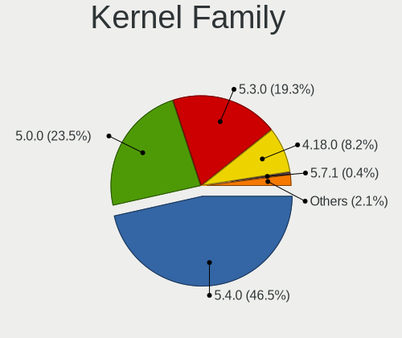

| Version | Computers | Percent |
|---------|-----------|---------|
| 5.4.0   | 99        | 43.42%  |
| 5.0.0   | 56        | 24.56%  |
| 5.3.0   | 47        | 20.61%  |
| 4.18.0  | 20        | 8.77%   |
| 5.7.1   | 1         | 0.44%   |
| 5.6.7   | 1         | 0.44%   |
| 5.4.95  | 1         | 0.44%   |
| 5.3.9   | 1         | 0.44%   |
| 5.3.6   | 1         | 0.44%   |
| 5.1.11  | 1         | 0.44%   |

Kernel Major Ver.
-----------------

Linux kernel major version

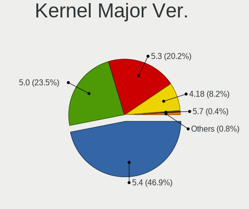

| Version | Computers | Percent |
|---------|-----------|---------|
| 5.4     | 100       | 43.86%  |
| 5.0     | 56        | 24.56%  |
| 5.3     | 49        | 21.49%  |
| 4.18    | 20        | 8.77%   |
| 5.7     | 1         | 0.44%   |
| 5.6     | 1         | 0.44%   |
| 5.1     | 1         | 0.44%   |

Arch
----

OS architecture (x86_64, i586, etc.)

| Name   | Computers | Percent |
|--------|-----------|---------|
| x86_64 | 147       | 67.74%  |
| i686   | 70        | 32.26%  |

DE
--

Desktop Environment

| Name       | Computers | Percent |
|------------|-----------|---------|
| LXDE       | 174       | 79.09%  |
| Unknown    | 35        | 15.91%  |
| GNOME      | 9         | 4.09%   |
| X-Cinnamon | 1         | 0.45%   |
| Peppermint | 1         | 0.45%   |

Display Server
--------------

X11 or Wayland

| Name | Computers | Percent |
|------|-----------|---------|
| X11  | 216       | 100%    |

Display Manager
---------------

SDDM, LightDM, etc.

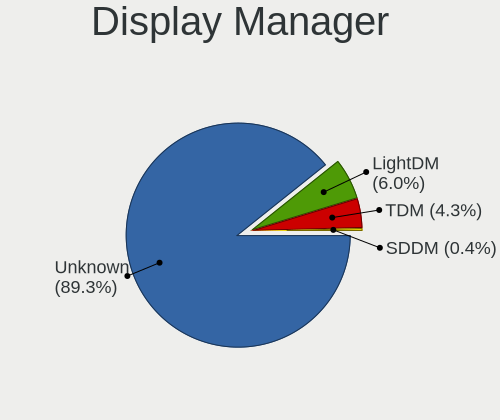

| Name    | Computers | Percent |
|---------|-----------|---------|
| Unknown | 196       | 89.5%   |
| LightDM | 12        | 5.48%   |
| TDM     | 10        | 4.57%   |
| SDDM    | 1         | 0.46%   |

OS Lang
-------

Language

| Lang    | Computers | Percent |
|---------|-----------|---------|
| en_US   | 74        | 33.48%  |
| Unknown | 26        | 11.76%  |
| it_IT   | 14        | 6.33%   |
| en_GB   | 14        | 6.33%   |
| pt_BR   | 12        | 5.43%   |
| de_DE   | 11        | 4.98%   |
| en_IN   | 6         | 2.71%   |
| C       | 6         | 2.71%   |
| ru_RU   | 5         | 2.26%   |
| pl_PL   | 5         | 2.26%   |
| nl_NL   | 5         | 2.26%   |
| fr_FR   | 5         | 2.26%   |
| en_CA   | 5         | 2.26%   |
| fi_FI   | 3         | 1.36%   |
| es_MX   | 3         | 1.36%   |
| es_AR   | 3         | 1.36%   |
| ro_RO   | 2         | 0.9%    |
| ja_JP   | 2         | 0.9%    |
| es_PE   | 2         | 0.9%    |
| es_ES   | 2         | 0.9%    |
| en_PH   | 2         | 0.9%    |
| en_AU   | 2         | 0.9%    |
| tr_TR   | 1         | 0.45%   |
| sv_SE   | 1         | 0.45%   |
| pt_PT   | 1         | 0.45%   |
| lv_LV   | 1         | 0.45%   |
| es_PA   | 1         | 0.45%   |
| es_EC   | 1         | 0.45%   |
| es_CR   | 1         | 0.45%   |
| es_BO   | 1         | 0.45%   |
| en_ZA   | 1         | 0.45%   |
| en_NZ   | 1         | 0.45%   |
| en_IE   | 1         | 0.45%   |
| cs_CZ   | 1         | 0.45%   |

Boot Mode
---------

EFI or BIOS

| Mode | Computers | Percent |
|------|-----------|---------|
| BIOS | 173       | 79.72%  |
| EFI  | 44        | 20.28%  |

Filesystem
----------

Type of filesystem

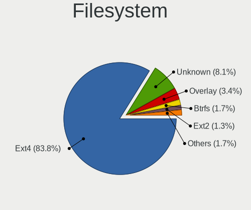

| Type     | Computers | Percent |
|----------|-----------|---------|
| Ext4     | 185       | 83.71%  |
| Unknown  | 19        | 8.6%    |
| Overlay  | 7         | 3.17%   |
| Btrfs    | 4         | 1.81%   |
| Ext2     | 3         | 1.36%   |
| Xfs      | 1         | 0.45%   |
| Reiserfs | 1         | 0.45%   |
| Ext3     | 1         | 0.45%   |

Part. scheme
------------

Scheme of partitioning

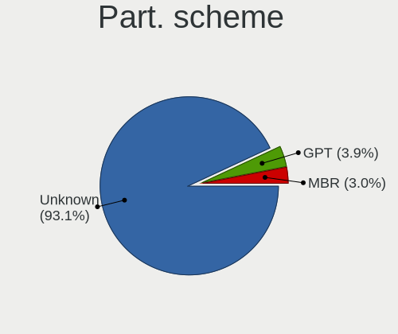

| Type    | Computers | Percent |
|---------|-----------|---------|
| Unknown | 201       | 92.63%  |
| GPT     | 9         | 4.15%   |
| MBR     | 7         | 3.23%   |

Dual Boot with Linux/BSD
------------------------

Hosting more than one Linux/BSD

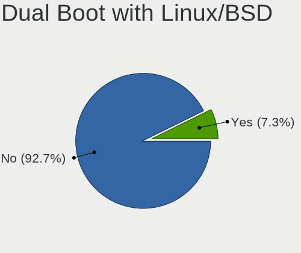

| Dual boot | Computers | Percent |
|-----------|-----------|---------|
| No        | 202       | 92.24%  |
| Yes       | 17        | 7.76%   |

Dual Boot (Win)
---------------

Hosting Linux and Windows

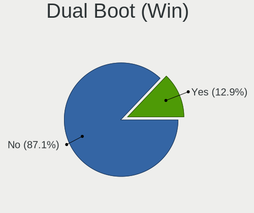

| Dual boot | Computers | Percent |
|-----------|-----------|---------|
| No        | 189       | 86.7%   |
| Yes       | 29        | 13.3%   |

Board
-----

Vendor
------

Motherboard manufacturer

| Name                | Computers | Percent |
|---------------------|-----------|---------|
| Hewlett-Packard     | 38        | 17.59%  |
| ASUSTek Computer    | 32        | 14.81%  |
| Dell                | 23        | 10.65%  |
| Lenovo              | 21        | 9.72%   |
| Toshiba             | 16        | 7.41%   |
| Acer                | 15        | 6.94%   |
| Gigabyte Technology | 11        | 5.09%   |
| Samsung Electronics | 7         | 3.24%   |
| Fujitsu Siemens     | 7         | 3.24%   |
| Intel               | 6         | 2.78%   |
| Sony                | 4         | 1.85%   |
| eMachines           | 3         | 1.39%   |
| ECS                 | 3         | 1.39%   |
| ASRock              | 3         | 1.39%   |
| Unknown             | 3         | 1.39%   |
| Positivo            | 2         | 0.93%   |
| Pegatron            | 2         | 0.93%   |
| MSI                 | 2         | 0.93%   |
| Gateway             | 2         | 0.93%   |
| Fujitsu             | 2         | 0.93%   |
| Apple               | 2         | 0.93%   |
| Packard Bell        | 1         | 0.46%   |
| Olivetti            | 1         | 0.46%   |
| Nvidia              | 1         | 0.46%   |
| Medion              | 1         | 0.46%   |
| JPSaCouto           | 1         | 0.46%   |
| Itautec             | 1         | 0.46%   |
| IBM                 | 1         | 0.46%   |
| Google              | 1         | 0.46%   |
| Foxconn             | 1         | 0.46%   |
| Clevo               | 1         | 0.46%   |
| Biostar             | 1         | 0.46%   |
| AAEON               | 1         | 0.46%   |

Model
-----

Motherboard model

| Name                                       | Computers | Percent |
|--------------------------------------------|-----------|---------|
| Lenovo IdeaPad 2in1 14 81CW                | 3         | 1.39%   |
| Unknown                                    | 3         | 1.39%   |
| Toshiba Satellite M70                      | 2         | 0.93%   |
| Toshiba Satellite L500                     | 2         | 0.93%   |
| Samsung N150P/N210P/N220P                  | 2         | 0.93%   |
| Lenovo G500 20236                          | 2         | 0.93%   |
| HP Compaq dc7900 Convertible Minitower     | 2         | 0.93%   |
| Fujitsu Siemens ESPRIMO Mobile V5535       | 2         | 0.93%   |
| Fujitsu Siemens D1931                      | 2         | 0.93%   |
| Dell Inspiron N5050                        | 2         | 0.93%   |
| Acer Extensa 5630                          | 2         | 0.93%   |
| Toshiba Satellite PRO C850                 | 1         | 0.46%   |
| Toshiba Satellite L750D                    | 1         | 0.46%   |
| Toshiba Satellite L310                     | 1         | 0.46%   |
| Toshiba Satellite L300                     | 1         | 0.46%   |
| Toshiba Satellite C850-F117                | 1         | 0.46%   |
| Toshiba Satellite C660                     | 1         | 0.46%   |
| Toshiba Satellite C55D-B                   | 1         | 0.46%   |
| Toshiba QOSMIO F755                        | 1         | 0.46%   |
| Toshiba PORTEGE R500                       | 1         | 0.46%   |
| Toshiba NB520                              | 1         | 0.46%   |
| Toshiba NB500                              | 1         | 0.46%   |
| Toshiba dynabook Satellite B552/H          | 1         | 0.46%   |
| Sony VPCZ21V9E                             | 1         | 0.46%   |
| Sony VPCCW21FX                             | 1         | 0.46%   |
| Sony VGN-S55B_S                            | 1         | 0.46%   |
| Sony VGN-FW140E                            | 1         | 0.46%   |
| Samsung R610                               | 1         | 0.46%   |
| Samsung R530/R730/R540                     | 1         | 0.46%   |
| Samsung N150P                              | 1         | 0.46%   |
| Samsung N150/N210/N220                     | 1         | 0.46%   |
| Samsung 300E4A/300E5A/300E7A/3430EA/3530EA | 1         | 0.46%   |
| Positivo N1103                             | 1         | 0.46%   |
| Positivo Mobile                            | 1         | 0.46%   |
| Pegatron FR502AA-ABZ m9355.it              | 1         | 0.46%   |
| Pegatron CQ1506LA                          | 1         | 0.46%   |
| Packard Bell EasyNote TK85                 | 1         | 0.46%   |
| Olivetti CL133A                            | 1         | 0.46%   |
| Nvidia MCP7A                               | 1         | 0.46%   |
| MSI MS-7267                                | 1         | 0.46%   |
| MSI MS-7211                                | 1         | 0.46%   |
| Medion Akoya E4214 MD99570                 | 1         | 0.46%   |
| Lenovo ThinkPad X1 Carbon 3rd 20BS0035US   | 1         | 0.46%   |
| Lenovo ThinkPad T60 1951CJ4                | 1         | 0.46%   |
| Lenovo ThinkPad T450 20BUS3CF00            | 1         | 0.46%   |
| Lenovo ThinkPad R60 94566FG                | 1         | 0.46%   |
| Lenovo ThinkPad Edge E431 62775GU          | 1         | 0.46%   |
| Lenovo ThinkPad E490 20N90019BR            | 1         | 0.46%   |
| Lenovo MIIX 310-10ICR 80SG                 | 1         | 0.46%   |
| Lenovo IdeaPad Z460 20059                  | 1         | 0.46%   |
| Lenovo IdeaPad Slim 1-14AST-05 81VS        | 1         | 0.46%   |
| Lenovo IdeaPad 1 11ADA05 82GV              | 1         | 0.46%   |
| Lenovo IdeaCentre Q190 10115               | 1         | 0.46%   |
| Lenovo G575 4383                           | 1         | 0.46%   |
| Lenovo B575 1450A7U                        | 1         | 0.46%   |
| Lenovo B490 37722SP                        | 1         | 0.46%   |
| Lenovo 433328G                             | 1         | 0.46%   |
| Lenovo 3000 N500 423374G                   | 1         | 0.46%   |
| JPSaCouto Intel powered classmate PC       | 1         | 0.46%   |
| Itautec Infoway                            | 1         | 0.46%   |

Model Family
------------

Motherboard model prefix

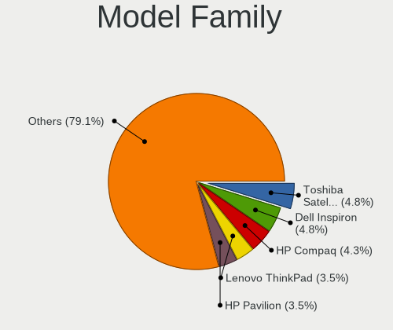

| Name                    | Computers | Percent |
|-------------------------|-----------|---------|
| Toshiba Satellite       | 11        | 5.09%   |
| HP Compaq               | 10        | 4.63%   |
| Dell Inspiron           | 9         | 4.17%   |
| HP Pavilion             | 8         | 3.7%    |
| Acer Aspire             | 7         | 3.24%   |
| Lenovo ThinkPad         | 6         | 2.78%   |
| Lenovo IdeaPad          | 6         | 2.78%   |
| Dell OptiPlex           | 5         | 2.31%   |
| HP EliteBook            | 4         | 1.85%   |
| Acer Extensa            | 4         | 1.85%   |
| Samsung N150P           | 3         | 1.39%   |
| Fujitsu Siemens AMILO   | 3         | 1.39%   |
| Dell Precision          | 3         | 1.39%   |
| Dell Latitude           | 3         | 1.39%   |
| Unknown                 | 3         | 1.39%   |
| Lenovo G500             | 2         | 0.93%   |
| HP Stream               | 2         | 0.93%   |
| HP Mini                 | 2         | 0.93%   |
| HP Laptop               | 2         | 0.93%   |
| HP 255                  | 2         | 0.93%   |
| Fujitsu Siemens ESPRIMO | 2         | 0.93%   |
| Fujitsu Siemens D1931   | 2         | 0.93%   |
| Toshiba QOSMIO          | 1         | 0.46%   |
| Toshiba PORTEGE         | 1         | 0.46%   |
| Toshiba NB520           | 1         | 0.46%   |
| Toshiba NB500           | 1         | 0.46%   |
| Toshiba dynabook        | 1         | 0.46%   |
| Sony VPCZ21V9E          | 1         | 0.46%   |
| Sony VPCCW21FX          | 1         | 0.46%   |
| Sony VGN-S55B           | 1         | 0.46%   |
| Sony VGN-FW140E         | 1         | 0.46%   |
| Samsung R610            | 1         | 0.46%   |
| Samsung R530            | 1         | 0.46%   |
| Samsung N150            | 1         | 0.46%   |
| Samsung 300E4A          | 1         | 0.46%   |
| Positivo N1103          | 1         | 0.46%   |
| Positivo Mobile         | 1         | 0.46%   |
| Pegatron FR502AA-ABZ    | 1         | 0.46%   |
| Pegatron CQ1506LA       | 1         | 0.46%   |
| Packard Bell EasyNote   | 1         | 0.46%   |
| Olivetti CL133A         | 1         | 0.46%   |
| Nvidia MCP7A            | 1         | 0.46%   |
| MSI MS-7267             | 1         | 0.46%   |
| MSI MS-7211             | 1         | 0.46%   |
| Medion Akoya            | 1         | 0.46%   |
| Lenovo MIIX             | 1         | 0.46%   |
| Lenovo IdeaCentre       | 1         | 0.46%   |
| Lenovo G575             | 1         | 0.46%   |
| Lenovo B575             | 1         | 0.46%   |
| Lenovo B490             | 1         | 0.46%   |
| Lenovo 433328G          | 1         | 0.46%   |
| Lenovo 3000             | 1         | 0.46%   |
| JPSaCouto Intel         | 1         | 0.46%   |
| Itautec Infoway         | 1         | 0.46%   |
| Intel H61               | 1         | 0.46%   |
| Intel Energy            | 1         | 0.46%   |
| Intel DP55WG            | 1         | 0.46%   |
| Intel D945GCLF2         | 1         | 0.46%   |
| Intel D865GSA           | 1         | 0.46%   |
| Intel 945GCT-M          | 1         | 0.46%   |

MFG Year
--------

Motherboard manufacture year

| Year    | Computers | Percent |
|---------|-----------|---------|
| 2008    | 26        | 12.04%  |
| 2009    | 23        | 10.65%  |
| 2010    | 20        | 9.26%   |
| 2013    | 19        | 8.8%    |
| 2019    | 18        | 8.33%   |
| 2007    | 18        | 8.33%   |
| 2011    | 17        | 7.87%   |
| 2012    | 16        | 7.41%   |
| 2005    | 9         | 4.17%   |
| 2016    | 8         | 3.7%    |
| 2006    | 8         | 3.7%    |
| 2018    | 7         | 3.24%   |
| 2017    | 7         | 3.24%   |
| 2015    | 6         | 2.78%   |
| 2014    | 6         | 2.78%   |
| 2020    | 4         | 1.85%   |
| 2021    | 2         | 0.93%   |
| 2004    | 1         | 0.46%   |
| Unknown | 1         | 0.46%   |

Form Factor
-----------

Physical design of the computer

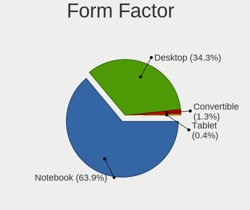

| Name        | Computers | Percent |
|-------------|-----------|---------|
| Notebook    | 134       | 62.04%  |
| Desktop     | 77        | 35.65%  |
| Convertible | 3         | 1.39%   |
| Other       | 1         | 0.46%   |
| Tablet      | 1         | 0.46%   |

Secure Boot
-----------

Enabled or disabled

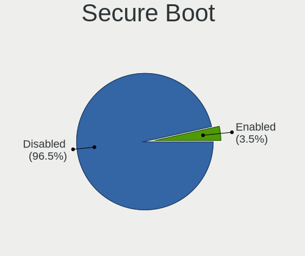

| State    | Computers | Percent |
|----------|-----------|---------|
| Disabled | 209       | 96.76%  |
| Enabled  | 7         | 3.24%   |

Coreboot
--------

Have coreboot on board

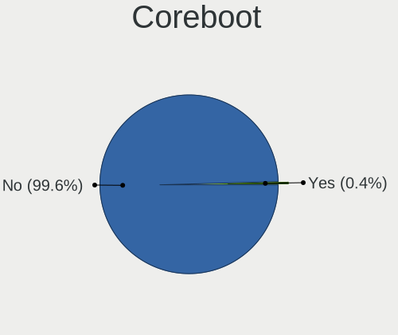

| Used | Computers | Percent |
|------|-----------|---------|
| No   | 215       | 99.54%  |
| Yes  | 1         | 0.46%   |

RAM Size
--------

Total RAM memory

| Size in GB | Computers | Percent |
|------------|-----------|---------|
| 3.01-4.0   | 70        | 31.96%  |
| 1.01-2.0   | 58        | 26.48%  |
| 4.01-8.0   | 25        | 11.42%  |
| 8.01-16.0  | 19        | 8.68%   |
| 2.01-3.0   | 16        | 7.31%   |
| 0.51-1.0   | 16        | 7.31%   |
| 16.01-24.0 | 10        | 4.57%   |
| 32.01-64.0 | 4         | 1.83%   |
| 24.01-32.0 | 1         | 0.46%   |

RAM Used
--------

Used RAM memory

| Used GB   | Computers | Percent |
|-----------|-----------|---------|
| 0.51-1.0  | 94        | 39.66%  |
| 1.01-2.0  | 91        | 38.4%   |
| 2.01-3.0  | 26        | 10.97%  |
| 0.01-0.5  | 17        | 7.17%   |
| 4.01-8.0  | 4         | 1.69%   |
| 3.01-4.0  | 4         | 1.69%   |
| 8.01-16.0 | 1         | 0.42%   |

Total Drives
------------

Number of drives on board

| Drives | Computers | Percent |
|--------|-----------|---------|
| 1      | 159       | 71.62%  |
| 2      | 47        | 21.17%  |
| 3      | 10        | 4.5%    |
| 0      | 2         | 0.9%    |
| 7      | 1         | 0.45%   |
| 6      | 1         | 0.45%   |
| 5      | 1         | 0.45%   |
| 4      | 1         | 0.45%   |

Has CD-ROM
----------

Has CD-ROM on board

| Presented | Computers | Percent |
|-----------|-----------|---------|
| Yes       | 136       | 62.39%  |
| No        | 82        | 37.61%  |

Has Ethernet
------------

Has Ethernet on board

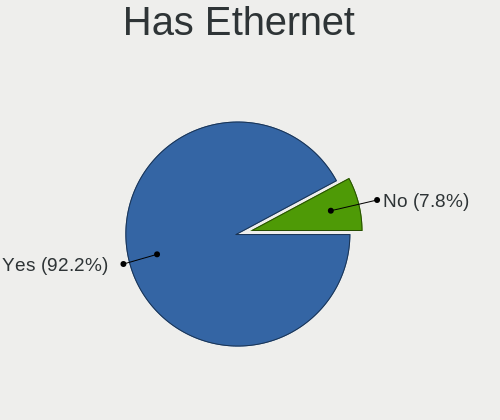

| Presented | Computers | Percent |
|-----------|-----------|---------|
| Yes       | 200       | 92.59%  |
| No        | 16        | 7.41%   |

Has WiFi
--------

Has WiFi module

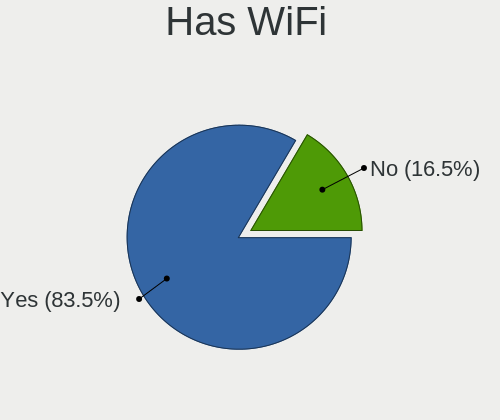

| Presented | Computers | Percent |
|-----------|-----------|---------|
| Yes       | 180       | 83.33%  |
| No        | 36        | 16.67%  |

Has Bluetooth
-------------

Has Bluetooth module

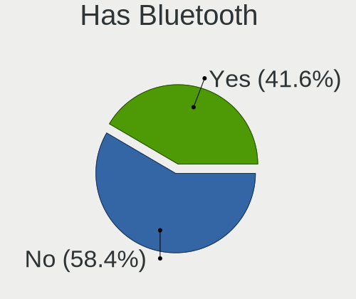

| Presented | Computers | Percent |
|-----------|-----------|---------|
| No        | 131       | 60.37%  |
| Yes       | 86        | 39.63%  |

Location
--------

Country
-------

Geographic location (country)

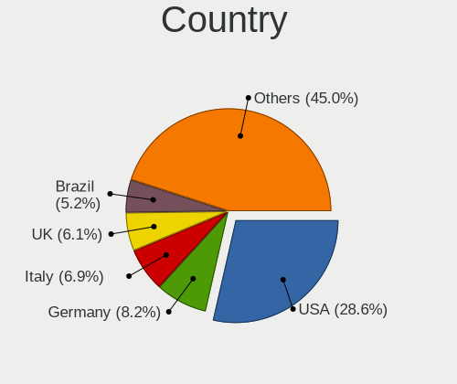

| Country      | Computers | Percent |
|--------------|-----------|---------|
| USA          | 64        | 29.49%  |
| Germany      | 17        | 7.83%   |
| Italy        | 15        | 6.91%   |
| UK           | 13        | 5.99%   |
| Brazil       | 11        | 5.07%   |
| Canada       | 9         | 4.15%   |
| Netherlands  | 8         | 3.69%   |
| India        | 7         | 3.23%   |
| Russia       | 6         | 2.76%   |
| Romania      | 6         | 2.76%   |
| Poland       | 5         | 2.3%    |
| France       | 4         | 1.84%   |
| Finland      | 4         | 1.84%   |
| Argentina    | 4         | 1.84%   |
| Spain        | 3         | 1.38%   |
| Mexico       | 3         | 1.38%   |
| Japan        | 3         | 1.38%   |
| Sweden       | 2         | 0.92%   |
| Portugal     | 2         | 0.92%   |
| Philippines  | 2         | 0.92%   |
| Peru         | 2         | 0.92%   |
| Greece       | 2         | 0.92%   |
| Bolivia      | 2         | 0.92%   |
| Australia    | 2         | 0.92%   |
| Ukraine      | 1         | 0.46%   |
| Turkey       | 1         | 0.46%   |
| Switzerland  | 1         | 0.46%   |
| South Africa | 1         | 0.46%   |
| Serbia       | 1         | 0.46%   |
| Panama       | 1         | 0.46%   |
| Norway       | 1         | 0.46%   |
| New Zealand  | 1         | 0.46%   |
| Namibia      | 1         | 0.46%   |
| Malaysia     | 1         | 0.46%   |
| Lithuania    | 1         | 0.46%   |
| Latvia       | 1         | 0.46%   |
| Kazakhstan   | 1         | 0.46%   |
| Ireland      | 1         | 0.46%   |
| Georgia      | 1         | 0.46%   |
| Ecuador      | 1         | 0.46%   |
| Czechia      | 1         | 0.46%   |
| Costa Rica   | 1         | 0.46%   |
| Belgium      | 1         | 0.46%   |
| Belarus      | 1         | 0.46%   |
| Algeria      | 1         | 0.46%   |

City
----

Geographic location (city)

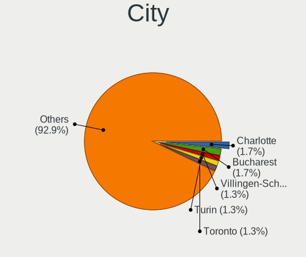

| City                   | Computers | Percent |
|------------------------|-----------|---------|
| Bucharest              | 4         | 1.78%   |
| Villingen-Schwenningen | 3         | 1.33%   |
| Turin                  | 3         | 1.33%   |
| Toronto                | 3         | 1.33%   |
| Naples                 | 3         | 1.33%   |
| Topeka                 | 2         | 0.89%   |
| Tahlequah              | 2         | 0.89%   |
| Perth                  | 2         | 0.89%   |
| Osasco                 | 2         | 0.89%   |
| Oldenburg              | 2         | 0.89%   |
| Mysore                 | 2         | 0.89%   |
| Moscow                 | 2         | 0.89%   |
| Manchester             | 2         | 0.89%   |
| Lima                   | 2         | 0.89%   |
| Hamburg                | 2         | 0.89%   |
| Cambridge              | 2         | 0.89%   |
| Calgary                | 2         | 0.89%   |
| Brunswick              | 2         | 0.89%   |
| Athens                 | 2         | 0.89%   |
| roda lska        | 1         | 0.44%   |
| nekoski            | 1         | 0.44%   |
| Zvecka                 | 1         | 0.44%   |
| Zaandam                | 1         | 0.44%   |
| Yokohama               | 1         | 0.44%   |
| Yacuiba                | 1         | 0.44%   |
| Wysokie Mazowieckie    | 1         | 0.44%   |
| Winfield               | 1         | 0.44%   |
| Windhoek               | 1         | 0.44%   |
| West Chester           | 1         | 0.44%   |
| Wassenaar              | 1         | 0.44%   |
| Washington             | 1         | 0.44%   |
| Warsaw                 | 1         | 0.44%   |
| Waalwijk               | 1         | 0.44%   |
| Villa Mar?a           | 1         | 0.44%   |
| Versailles             | 1         | 0.44%   |
| Verona                 | 1         | 0.44%   |
| Van Vleck              | 1         | 0.44%   |
| Urk                    | 1         | 0.44%   |
| Tucson                 | 1         | 0.44%   |
| Tsarskoye Selo         | 1         | 0.44%   |
| Thatcher               | 1         | 0.44%   |
| Telford                | 1         | 0.44%   |
| Tbilisi                | 1         | 0.44%   |
| Taranto                | 1         | 0.44%   |
| Talala                 | 1         | 0.44%   |
| So Paulo             | 1         | 0.44%   |
| Stockton               | 1         | 0.44%   |
| Spokane                | 1         | 0.44%   |
| Southampton            | 1         | 0.44%   |
| South Jordan           | 1         | 0.44%   |
| Somma Vesuviana        | 1         | 0.44%   |
| Sivas                  | 1         | 0.44%   |
| Sicklerville           | 1         | 0.44%   |
| Shoreham-by-Sea        | 1         | 0.44%   |
| Sherwood Park          | 1         | 0.44%   |
| Seville                | 1         | 0.44%   |
| Seattle                | 1         | 0.44%   |
| Scharendijke           | 1         | 0.44%   |
| Saratov                | 1         | 0.44%   |
| Santa Barbara          | 1         | 0.44%   |

Drives
------

Drive Vendor
------------

Hard drive vendors

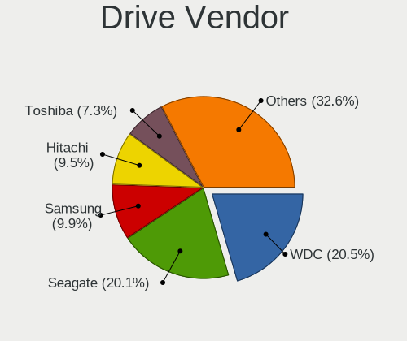

| Vendor              | Computers | Drives | Percent |
|---------------------|-----------|--------|---------|
| WDC                 | 52        | 73     | 20.23%  |
| Seagate             | 51        | 55     | 19.84%  |
| Samsung Electronics | 27        | 36     | 10.51%  |
| Hitachi             | 26        | 35     | 10.12%  |
| Toshiba             | 20        | 21     | 7.78%   |
| Unknown             | 18        | 21     | 7%      |
| Kingston            | 12        | 16     | 4.67%   |
| MAXTOR              | 8         | 11     | 3.11%   |
| SanDisk             | 7         | 8      | 2.72%   |
| HGST                | 4         | 5      | 1.56%   |
| PNY                 | 3         | 4      | 1.17%   |
| Intel               | 3         | 3      | 1.17%   |
| Fujitsu             | 3         | 4      | 1.17%   |
| Integral            | 2         | 2      | 0.78%   |
| Crucial             | 2         | 3      | 0.78%   |
| Zheino              | 1         | 1      | 0.39%   |
| WD MediaMax         | 1         | 1      | 0.39%   |
| TCSUNBOW            | 1         | 1      | 0.39%   |
| SK Hynix            | 1         | 1      | 0.39%   |
| SABRENT             | 1         | 1      | 0.39%   |
| OCZ                 | 1         | 1      | 0.39%   |
| Micron Technology   | 1         | 1      | 0.39%   |
| LITEONIT            | 1         | 1      | 0.39%   |
| KingSpec            | 1         | 1      | 0.39%   |
| Intenso             | 1         | 1      | 0.39%   |
| GOODRAM             | 1         | 1      | 0.39%   |
| GAMER               | 1         | 1      | 0.39%   |
| FATTYDOVE           | 1         | 1      | 0.39%   |
| DREVO               | 1         | 1      | 0.39%   |
| China               | 1         | 1      | 0.39%   |
| BHT                 | 1         | 2      | 0.39%   |
| ASMT                | 1         | 1      | 0.39%   |
| Apple               | 1         | 1      | 0.39%   |
| Apacer              | 1         | 5      | 0.39%   |

Drive Model
-----------

Hard drive models

| Model                               | Computers | Percent |
|-------------------------------------|-----------|---------|
| Unknown MMC Card  32GB              | 6         | 2.25%   |
| Seagate ST500LM012 HN-M500MBB 500GB | 5         | 1.87%   |
| Seagate ST9500325AS 500GB           | 4         | 1.5%    |
| Kingston SA400S37120G 120GB SSD     | 4         | 1.5%    |
| Unknown MMC Card  16GB              | 3         | 1.12%   |
| Toshiba MQ01ABF050 500GB            | 3         | 1.12%   |
| Seagate ST9320325AS 320GB           | 3         | 1.12%   |
| Seagate ST9250315AS 250GB           | 3         | 1.12%   |
| Seagate ST500LT012-1DG142 500GB     | 3         | 1.12%   |
| SanDisk SDSSDA120G 120GB            | 3         | 1.12%   |
| Kingston SA400S37240G 240GB SSD     | 3         | 1.12%   |
| Hitachi HTS545025B9A300 250GB       | 3         | 1.12%   |
| Hitachi HDT721016SLA380 160GB       | 3         | 1.12%   |
| WDC WD3200BPVT-22ZEST0 320GB        | 2         | 0.75%   |
| WDC WD1200BEVS-22UST0 120GB         | 2         | 0.75%   |
| Unknown SD/MMC/MS PRO 7GB           | 2         | 0.75%   |
| Unknown MMC Card  64GB              | 2         | 0.75%   |
| Toshiba MK5055GSX 500GB             | 2         | 0.75%   |
| Seagate ST9160314AS 160GB           | 2         | 0.75%   |
| Seagate ST3500418AS 500GB           | 2         | 0.75%   |
| Seagate ST3250310AS 250GB           | 2         | 0.75%   |
| Seagate ST3160813AS 160GB           | 2         | 0.75%   |
| Seagate ST1000LM035-1RK172 1TB      | 2         | 0.75%   |
| Seagate ST1000DM003-9YN162 1TB      | 2         | 0.75%   |
| Samsung SSD 860 EVO 1TB             | 2         | 0.75%   |
| Samsung SSD 850 EVO 500GB           | 2         | 0.75%   |
| Samsung HM160HI 160GB               | 2         | 0.75%   |
| MAXTOR STM3160215AS 160GB           | 2         | 0.75%   |
| Hitachi HTS723232A7A364 320GB       | 2         | 0.75%   |
| Hitachi HDS721050CLA362 500GB       | 2         | 0.75%   |
| Hitachi HDP725050GLA360 500GB       | 2         | 0.75%   |
| HGST HTS725032A7E630 320GB          | 2         | 0.75%   |
| Zheino CHN 25SATAA3 120 120GB SSD   | 1         | 0.37%   |
| WDC WDS240G2G0A-00JH30 240GB SSD    | 1         | 0.37%   |
| WDC WDS120G2G0A-00JH30 120GB SSD    | 1         | 0.37%   |
| WDC WD800JD-75MSA1 80GB             | 1         | 0.37%   |
| WDC WD800JD-60LSA5 80GB             | 1         | 0.37%   |
| WDC WD800JD-00MSA1 80GB             | 1         | 0.37%   |
| WDC WD800BEVS-60LAT0 80GB           | 1         | 0.37%   |
| WDC WD6400AAKS-65A7B2 640GB         | 1         | 0.37%   |
| WDC WD5000LPVX-60V0TT0 500GB        | 1         | 0.37%   |
| WDC WD5000LPVX-22V0TT0 500GB        | 1         | 0.37%   |
| WDC WD5000LPVT-24G33T1 500GB        | 1         | 0.37%   |
| WDC WD5000BPVT-00HXZT3 500GB        | 1         | 0.37%   |
| WDC WD5000AAKX-753CA1 500GB         | 1         | 0.37%   |
| WDC WD5000AAKX-22ERMA0 500GB        | 1         | 0.37%   |
| WDC WD5000AAKS-00A7B2 500GB         | 1         | 0.37%   |
| WDC WD4000AAJS-00YFA0 400GB         | 1         | 0.37%   |
| WDC WD3200JS-22PDB0 320GB           | 1         | 0.37%   |
| WDC WD3200BPVT-24JJ5T0 320GB        | 1         | 0.37%   |
| WDC WD3200BPVT-08JJ5T0 320GB        | 1         | 0.37%   |
| WDC WD3200BEVT-75ZCT2 320GB         | 1         | 0.37%   |
| WDC WD3200AVVS-63L2B0 320GB         | 1         | 0.37%   |
| WDC WD3200AVJB-63WKA0 320GB         | 1         | 0.37%   |
| WDC WD3200AAJS-56B4A0 320GB         | 1         | 0.37%   |
| WDC WD2500BPVT-24ZEST0 250GB        | 1         | 0.37%   |
| WDC WD2500BEVT-80A23T0 250GB        | 1         | 0.37%   |
| WDC WD2500BEVT-35A23T0 250GB        | 1         | 0.37%   |
| WDC WD2500BEVT-22A23T0 250GB        | 1         | 0.37%   |
| WDC WD2500BEVS-00UST0 250GB         | 1         | 0.37%   |

HDD Vendor
----------

Hard disk drive vendors

| Vendor              | Computers | Drives | Percent |
|---------------------|-----------|--------|---------|
| Seagate             | 51        | 55     | 28.65%  |
| WDC                 | 50        | 71     | 28.09%  |
| Hitachi             | 26        | 35     | 14.61%  |
| Toshiba             | 20        | 21     | 11.24%  |
| Samsung Electronics | 13        | 16     | 7.3%    |
| MAXTOR              | 8         | 11     | 4.49%   |
| HGST                | 4         | 5      | 2.25%   |
| Fujitsu             | 3         | 4      | 1.69%   |
| Unknown             | 2         | 2      | 1.12%   |
| WD MediaMax         | 1         | 1      | 0.56%   |

SSD Vendor
----------

Solid state drive vendors

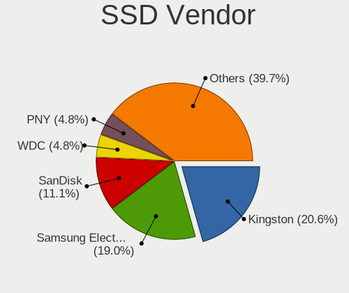

| Vendor              | Computers | Drives | Percent |
|---------------------|-----------|--------|---------|
| Samsung Electronics | 12        | 18     | 21.05%  |
| Kingston            | 12        | 16     | 21.05%  |
| SanDisk             | 7         | 8      | 12.28%  |
| PNY                 | 3         | 4      | 5.26%   |
| Intel               | 3         | 3      | 5.26%   |
| WDC                 | 2         | 2      | 3.51%   |
| Integral            | 2         | 2      | 3.51%   |
| Crucial             | 2         | 3      | 3.51%   |
| Zheino              | 1         | 1      | 1.75%   |
| TCSUNBOW            | 1         | 1      | 1.75%   |
| OCZ                 | 1         | 1      | 1.75%   |
| Micron Technology   | 1         | 1      | 1.75%   |
| LITEONIT            | 1         | 1      | 1.75%   |
| KingSpec            | 1         | 1      | 1.75%   |
| GOODRAM             | 1         | 1      | 1.75%   |
| FATTYDOVE           | 1         | 1      | 1.75%   |
| DREVO               | 1         | 1      | 1.75%   |
| China               | 1         | 1      | 1.75%   |
| BHT                 | 1         | 2      | 1.75%   |
| ASMT                | 1         | 1      | 1.75%   |
| Apple               | 1         | 1      | 1.75%   |
| Apacer              | 1         | 5      | 1.75%   |

Drive Kind
----------

HDD or SSD

| Kind    | Computers | Drives | Percent |
|---------|-----------|--------|---------|
| HDD     | 159       | 221    | 67.09%  |
| SSD     | 56        | 75     | 23.63%  |
| MMC     | 16        | 19     | 6.75%   |
| Unknown | 4         | 4      | 1.69%   |
| NVMe    | 2         | 2      | 0.84%   |

Drive Connector
---------------

SATA, SAS, NVMe, etc.

| Type | Computers | Drives | Percent |
|------|-----------|--------|---------|
| SATA | 199       | 294    | 89.24%  |
| MMC  | 16        | 19     | 7.17%   |
| SAS  | 6         | 6      | 2.69%   |
| NVMe | 2         | 2      | 0.9%    |

Drive Size
----------

Size of hard drive

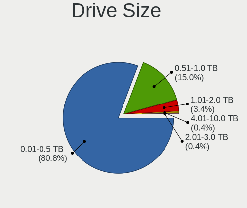

| Size in TB | Computers | Drives | Percent |
|------------|-----------|--------|---------|
| 0.01-0.5   | 179       | 247    | 81.36%  |
| 0.51-1.0   | 34        | 40     | 15.45%  |
| 1.01-2.0   | 6         | 8      | 2.73%   |
| 4.01-10.0  | 1         | 1      | 0.45%   |

Space Total
-----------

Amount of disk space available on the file system

| Size in GB     | Computers | Percent |
|----------------|-----------|---------|
| 101-250        | 81        | 36.32%  |
| 251-500        | 45        | 20.18%  |
| 51-100         | 29        | 13%     |
| 21-50          | 25        | 11.21%  |
| 501-1000       | 23        | 10.31%  |
| 1-20           | 9         | 4.04%   |
| 1001-2000      | 6         | 2.69%   |
| 2001-3000      | 2         | 0.9%    |
| Unknown        | 2         | 0.9%    |
| More than 3000 | 1         | 0.45%   |

Space Used
----------

Amount of used disk space

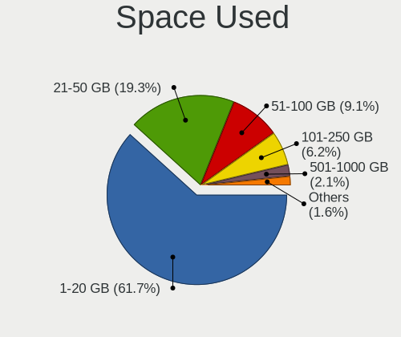

| Used GB   | Computers | Percent |
|-----------|-----------|---------|
| 1-20      | 144       | 63.16%  |
| 21-50     | 42        | 18.42%  |
| 51-100    | 18        | 7.89%   |
| 101-250   | 15        | 6.58%   |
| 501-1000  | 5         | 2.19%   |
| Unknown   | 2         | 0.88%   |
| 251-500   | 1         | 0.44%   |
| 1001-2000 | 1         | 0.44%   |

Malfunc. Drives
---------------

Drive models with a malfunction

| Model                           | Computers | Drives | Percent |
|---------------------------------|-----------|--------|---------|
| WDC WD1001FALS-00J7B0 1TB       | 1         | 1      | 20%     |
| Seagate ST9500420AS 500GB       | 1         | 1      | 20%     |
| Seagate ST9250315AS 250GB       | 1         | 1      | 20%     |
| Seagate ST500LT012-1DG142 500GB | 1         | 1      | 20%     |
| Seagate ST31500341AS 1TB        | 1         | 1      | 20%     |

Malfunc. Drive Vendor
---------------------

Vendors of faulty drives

| Vendor  | Computers | Drives | Percent |
|---------|-----------|--------|---------|
| Seagate | 4         | 4      | 80%     |
| WDC     | 1         | 1      | 20%     |

Malfunc. HDD Vendor
-------------------

Vendors of faulty HDD drives

| Vendor  | Computers | Drives | Percent |
|---------|-----------|--------|---------|
| Seagate | 4         | 4      | 80%     |
| WDC     | 1         | 1      | 20%     |

Malfunc. Drive Kind
-------------------

Kinds of faulty drives

| Kind | Computers | Drives | Percent |
|------|-----------|--------|---------|
| HDD  | 5         | 5      | 100%    |

Failed Drives
-------------

Failed drive models

Zero info for selected period =(

Failed Drive Vendor
-------------------

Failed drive vendors

Zero info for selected period =(

Drive Status
------------

Number of failed and malfunc. drives

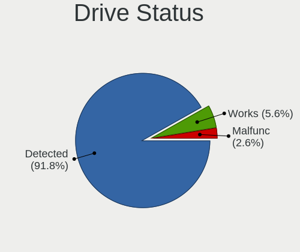

| Status   | Computers | Drives | Percent |
|----------|-----------|--------|---------|
| Detected | 200       | 300    | 91.74%  |
| Works    | 13        | 16     | 5.96%   |
| Malfunc  | 5         | 5      | 2.29%   |

Storage controller
------------------

Storage Vendor
--------------

Storage controller vendors

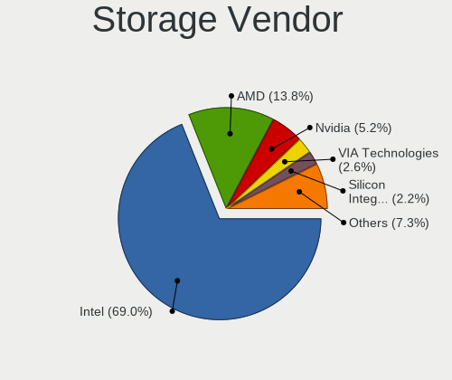

| Vendor                           | Computers | Percent |
|----------------------------------|-----------|---------|
| Intel                            | 149       | 68.66%  |
| AMD                              | 30        | 13.82%  |
| Nvidia                           | 12        | 5.53%   |
| VIA Technologies                 | 6         | 2.76%   |
| Silicon Integrated Systems [SiS] | 5         | 2.3%    |
| JMicron Technology               | 5         | 2.3%    |
| Samsung Electronics              | 3         | 1.38%   |
| Marvell Technology Group         | 3         | 1.38%   |
| ULi Electronics                  | 1         | 0.46%   |
| Silicon Image                    | 1         | 0.46%   |
| LSI Logic / Symbios Logic        | 1         | 0.46%   |
| ASMedia Technology               | 1         | 0.46%   |

Storage Model
-------------

Storage controller models

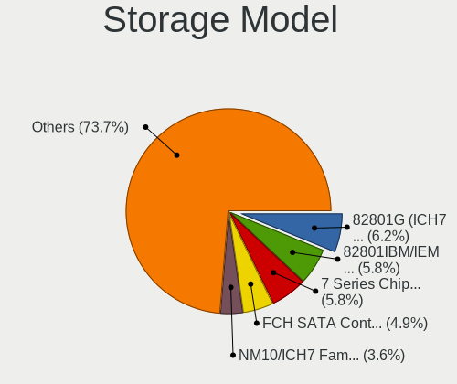

| Model                                                                          | Computers | Percent |
|--------------------------------------------------------------------------------|-----------|---------|
| Intel 82801G (ICH7 Family) IDE Controller                                      | 18        | 6.23%   |
| Intel 82801IBM/IEM (ICH9M/ICH9M-E) 4 port SATA Controller [AHCI mode]          | 17        | 5.88%   |
| Intel 7 Series Chipset Family 6-port SATA Controller [AHCI mode]               | 16        | 5.54%   |
| AMD FCH SATA Controller [AHCI mode]                                            | 14        | 4.84%   |
| Intel NM10/ICH7 Family SATA Controller [IDE mode]                              | 11        | 3.81%   |
| Intel NM10/ICH7 Family SATA Controller [AHCI mode]                             | 11        | 3.81%   |
| Intel 82801GBM/GHM (ICH7-M Family) SATA Controller [AHCI mode]                 | 9         | 3.11%   |
| AMD SB7x0/SB8x0/SB9x0 SATA Controller [AHCI mode]                              | 9         | 3.11%   |
| Intel 6 Series/C200 Series Chipset Family 6 port Mobile SATA AHCI Controller   | 8         | 2.77%   |
| Intel 82801GBM/GHM (ICH7-M Family) SATA Controller [IDE mode]                  | 7         | 2.42%   |
| Intel 82801FB/FBM/FR/FW/FRW (ICH6 Family) IDE Controller                       | 6         | 2.08%   |
| VIA VT82C586A/B/VT82C686/A/B/VT823x/A/C PIPC Bus Master IDE                    | 5         | 1.73%   |
| Silicon Integrated Systems [SiS] SATA Controller / IDE mode                    | 5         | 1.73%   |
| Silicon Integrated Systems [SiS] 5513 IDE Controller                           | 5         | 1.73%   |
| Nvidia MCP61 SATA Controller                                                   | 5         | 1.73%   |
| Nvidia MCP61 IDE                                                               | 5         | 1.73%   |
| Intel Sunrise Point-LP SATA Controller [AHCI mode]                             | 5         | 1.73%   |
| Intel 82801FBM (ICH6M) SATA Controller                                         | 5         | 1.73%   |
| Intel 82801HM/HEM (ICH8M/ICH8M-E) SATA Controller [AHCI mode]                  | 4         | 1.38%   |
| Intel 82801HM/HEM (ICH8M/ICH8M-E) IDE Controller                               | 4         | 1.38%   |
| Intel 82801H (ICH8 Family) 4 port SATA Controller [IDE mode]                   | 4         | 1.38%   |
| Intel 6 Series/C200 Series Chipset Family 6 port Desktop SATA AHCI Controller  | 4         | 1.38%   |
| Intel 5 Series/3400 Series Chipset 4 port SATA AHCI Controller                 | 4         | 1.38%   |
| Intel 4 Series Chipset PT IDER Controller                                      | 4         | 1.38%   |
| Intel SATA Controller [RAID mode]                                              | 3         | 1.04%   |
| Intel Atom Processor E3800 Series SATA AHCI Controller                         | 3         | 1.04%   |
| Intel 82801JD/DO (ICH10 Family) 4-port SATA IDE Controller                     | 3         | 1.04%   |
| Intel 82801JD/DO (ICH10 Family) 2-port SATA IDE Controller                     | 3         | 1.04%   |
| Intel 82801IBM/IEM (ICH9M/ICH9M-E) 2 port SATA Controller [IDE mode]           | 3         | 1.04%   |
| Intel 82801I (ICH9 Family) 2 port SATA Controller [IDE mode]                   | 3         | 1.04%   |
| Intel 82801 Mobile SATA Controller [RAID mode]                                 | 3         | 1.04%   |
| Intel 8 Series/C220 Series Chipset Family 6-port SATA Controller 1 [AHCI mode] | 3         | 1.04%   |
| Intel 5 Series/3400 Series Chipset 4 port SATA IDE Controller                  | 3         | 1.04%   |
| AMD IXP SB4x0 IDE Controller                                                   | 3         | 1.04%   |
| VIA VT8237/8251 Serial ATA Controller                                          | 2         | 0.69%   |
| VIA VIA VT6420 SATA RAID Controller                                            | 2         | 0.69%   |
| Nvidia MCP51 Serial ATA Controller                                             | 2         | 0.69%   |
| Marvell Group 88SE9172 SATA 6Gb/s Controller                                   | 2         | 0.69%   |
| JMicron JMB368 IDE controller                                                  | 2         | 0.69%   |
| Intel Wildcat Point-LP SATA Controller [AHCI Mode]                             | 2         | 0.69%   |
| Intel 82801IR/IO/IH (ICH9R/DO/DH) 4 port SATA Controller [IDE mode]            | 2         | 0.69%   |
| Intel 82801FB/FW (ICH6/ICH6W) SATA Controller                                  | 2         | 0.69%   |
| Intel 8 Series SATA Controller 1 [AHCI mode]                                   | 2         | 0.69%   |
| Intel 7 Series/C210 Series Chipset Family 6-port SATA Controller [AHCI mode]   | 2         | 0.69%   |
| Intel 5 Series/3400 Series Chipset 6 port SATA AHCI Controller                 | 2         | 0.69%   |
| Intel 5 Series/3400 Series Chipset 2 port SATA IDE Controller                  | 2         | 0.69%   |
| AMD SB7x0/SB8x0/SB9x0 IDE Controller                                           | 2         | 0.69%   |
| AMD FCH SATA Controller [IDE mode]                                             | 2         | 0.69%   |
| VIA VT8237A SATA 2-Port Controller                                             | 1         | 0.35%   |
| ULi ULi 5287 SATA                                                              | 1         | 0.35%   |
| ULi M5229 IDE                                                                  | 1         | 0.35%   |
| Silicon Image SiI 3114 [SATALink/SATARaid] Serial ATA Controller               | 1         | 0.35%   |
| Samsung NVMe SSD Controller SM981/PM981/PM983                                  | 1         | 0.35%   |
| Samsung NVMe SSD Controller SM961/PM961/SM963                                  | 1         | 0.35%   |
| Samsung Electronics SATA controller                                            | 1         | 0.35%   |
| Nvidia MCP89 SATA Controller (AHCI mode)                                       | 1         | 0.35%   |
| Nvidia MCP79 AHCI Controller                                                   | 1         | 0.35%   |
| Nvidia MCP73 SATA RAID Controller                                              | 1         | 0.35%   |
| Nvidia MCP73 IDE Controller                                                    | 1         | 0.35%   |
| Nvidia MCP67 IDE Controller                                                    | 1         | 0.35%   |

Storage Kind
------------

Kind of storage controller (IDE, SATA, NVMe, SAS, ...)

| Kind | Computers | Percent |
|------|-----------|---------|
| SATA | 130       | 56.03%  |
| IDE  | 88        | 37.93%  |
| RAID | 11        | 4.74%   |
| NVMe | 2         | 0.86%   |
| SAS  | 1         | 0.43%   |

Processor
---------

CPU Vendor
----------

Processor vendors

| Vendor       | Computers | Percent |
|--------------|-----------|---------|
| Intel        | 177       | 81.94%  |
| AMD          | 38        | 17.59%  |
| CentaurHauls | 1         | 0.46%   |

CPU Model
---------

Processor models

| Model                                       | Computers | Percent |
|---------------------------------------------|-----------|---------|
| Intel Atom CPU N270 @ 1.60GHz               | 8         | 3.7%    |
| Intel Pentium M processor 1.73GHz           | 5         | 2.31%   |
| Intel Atom CPU N450 @ 1.66GHz               | 5         | 2.31%   |
| Intel Core 2 Quad CPU Q9400 @ 2.66GHz       | 4         | 1.85%   |
| Intel Pentium Dual-Core CPU T4200 @ 2.00GHz | 3         | 1.39%   |
| Intel Pentium CPU 4415U @ 2.30GHz           | 3         | 1.39%   |
| Intel Pentium 4 CPU 3.00GHz                 | 3         | 1.39%   |
| Intel Core 2 Quad CPU Q6600 @ 2.40GHz       | 3         | 1.39%   |
| Intel Celeron CPU N3060 @ 1.60GHz           | 3         | 1.39%   |
| Intel Atom x5-Z8350 CPU @ 1.44GHz           | 3         | 1.39%   |
| Intel Atom CPU N455 @ 1.66GHz               | 3         | 1.39%   |
| Intel Pentium Dual-Core CPU T4400 @ 2.20GHz | 2         | 0.93%   |
| Intel Pentium Dual-Core CPU E5700 @ 3.00GHz | 2         | 0.93%   |
| Intel Pentium CPU N3540 @ 2.16GHz           | 2         | 0.93%   |
| Intel Pentium CPU 2020M @ 2.40GHz           | 2         | 0.93%   |
| Intel Genuine CPU U4100 @ 1.30GHz           | 2         | 0.93%   |
| Intel Genuine CPU T2050 @ 1.60GHz           | 2         | 0.93%   |
| Intel Genuine CPU 575 @ 2.00GHz             | 2         | 0.93%   |
| Intel Core i7-3632QM CPU @ 2.20GHz          | 2         | 0.93%   |
| Intel Core i5-7200U CPU @ 2.50GHz           | 2         | 0.93%   |
| Intel Core i5-4300U CPU @ 1.90GHz           | 2         | 0.93%   |
| Intel Core i3-3120M CPU @ 2.50GHz           | 2         | 0.93%   |
| Intel Core i3-2330M CPU @ 2.20GHz           | 2         | 0.93%   |
| Intel Core 2 Duo CPU L9400 @ 1.86GHz        | 2         | 0.93%   |
| Intel Core 2 Duo CPU E8400 @ 3.00GHz        | 2         | 0.93%   |
| Intel Core 2 CPU 6600 @ 2.40GHz             | 2         | 0.93%   |
| Intel Celeron CPU 925 @ 2.30GHz             | 2         | 0.93%   |
| Intel Celeron CPU 900 @ 2.20GHz             | 2         | 0.93%   |
| Intel Celeron CPU 530 @ 1.73GHz             | 2         | 0.93%   |
| Intel Celeron CPU 430 @ 1.80GHz             | 2         | 0.93%   |
| Intel Celeron CPU 1017U @ 1.60GHz           | 2         | 0.93%   |
| Intel Atom CPU N550 @ 1.50GHz               | 2         | 0.93%   |
| AMD E-450 APU with Radeon HD Graphics       | 2         | 0.93%   |
| AMD Athlon 64 X2 Dual Core Processor 5000+  | 2         | 0.93%   |
| AMD A8-6410 APU with AMD Radeon R5 Graphics | 2         | 0.93%   |
| Intel Xeon CPU X5660 @ 2.80GHz              | 1         | 0.46%   |
| Intel Xeon CPU W3530 @ 2.80GHz              | 1         | 0.46%   |
| Intel Xeon CPU E31270 @ 3.40GHz             | 1         | 0.46%   |
| Intel Pentium Dual-Core CPU T4500 @ 2.30GHz | 1         | 0.46%   |
| Intel Pentium Dual-Core CPU E5400 @ 2.70GHz | 1         | 0.46%   |
| Intel Pentium Dual-Core CPU E5300 @ 2.60GHz | 1         | 0.46%   |
| Intel Pentium Dual-Core CPU E5200 @ 2.50GHz | 1         | 0.46%   |
| Intel Pentium Dual CPU T3400 @ 2.16GHz      | 1         | 0.46%   |
| Intel Pentium Dual CPU T3200 @ 2.00GHz      | 1         | 0.46%   |
| Intel Pentium Dual CPU T2410 @ 2.00GHz      | 1         | 0.46%   |
| Intel Pentium Dual CPU E2200 @ 2.20GHz      | 1         | 0.46%   |
| Intel Pentium Dual CPU E2160 @ 1.80GHz      | 1         | 0.46%   |
| Intel Pentium D CPU 3.00GHz                 | 1         | 0.46%   |
| Intel Pentium D CPU 2.80GHz                 | 1         | 0.46%   |
| Intel Pentium CPU P6100 @ 2.00GHz           | 1         | 0.46%   |
| Intel Pentium CPU G6960 @ 2.93GHz           | 1         | 0.46%   |
| Intel Pentium CPU G630 @ 2.70GHz            | 1         | 0.46%   |
| Intel Pentium CPU G2020 @ 2.90GHz           | 1         | 0.46%   |
| Intel Pentium CPU B960 @ 2.20GHz            | 1         | 0.46%   |
| Intel Pentium CPU B950 @ 2.10GHz            | 1         | 0.46%   |
| Intel Pentium 4 CPU 3.40GHz                 | 1         | 0.46%   |
| Intel Pentium 4 CPU 2.80GHz                 | 1         | 0.46%   |
| Intel Genuine CPU T2300 @ 1.66GHz           | 1         | 0.46%   |
| Intel Genuine CPU T2130 @ 1.86GHz           | 1         | 0.46%   |
| Intel Genuine CPU T1350 @ 1.86GHz           | 1         | 0.46%   |

CPU Model Family
----------------

Processor model prefix

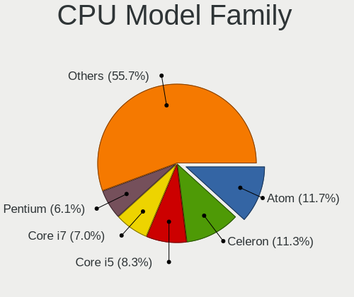

| Model                   | Computers | Percent |
|-------------------------|-----------|---------|
| Intel Atom              | 26        | 12.04%  |
| Intel Celeron           | 25        | 11.57%  |
| Intel Core i5           | 17        | 7.87%   |
| Intel Core i7           | 15        | 6.94%   |
| Intel Pentium           | 13        | 6.02%   |
| Intel Core i3           | 12        | 5.56%   |
| Intel Core 2 Duo        | 12        | 5.56%   |
| Intel Pentium Dual-Core | 11        | 5.09%   |
| Intel Genuine           | 9         | 4.17%   |
| Intel Core 2 Quad       | 8         | 3.7%    |
| Intel Core 2            | 7         | 3.24%   |
| AMD Athlon 64 X2        | 7         | 3.24%   |
| Intel Pentium M         | 5         | 2.31%   |
| Intel Pentium Dual      | 5         | 2.31%   |
| Intel Pentium 4         | 5         | 2.31%   |
| Other                   | 3         | 1.39%   |
| Intel Xeon              | 3         | 1.39%   |
| AMD E                   | 3         | 1.39%   |
| AMD A8                  | 3         | 1.39%   |
| Intel Pentium D         | 2         | 0.93%   |
| AMD FX                  | 2         | 0.93%   |
| AMD E2                  | 2         | 0.93%   |
| AMD E1                  | 2         | 0.93%   |
| AMD A6                  | 2         | 0.93%   |
| AMD A4                  | 2         | 0.93%   |
| Intel Celeron M         | 1         | 0.46%   |
| Intel Celeron Dual-Core | 1         | 0.46%   |
| CentaurHauls VIA C7     | 1         | 0.46%   |
| AMD Turion 64 X2 Mobile | 1         | 0.46%   |
| AMD Turion 64 Mobile    | 1         | 0.46%   |
| AMD Sempron             | 1         | 0.46%   |
| AMD Ryzen 3             | 1         | 0.46%   |
| AMD Phenom II X4        | 1         | 0.46%   |
| AMD Phenom II           | 1         | 0.46%   |
| AMD Phenom              | 1         | 0.46%   |
| AMD C-60                | 1         | 0.46%   |
| AMD Athlon II X2        | 1         | 0.46%   |
| AMD Athlon 64           | 1         | 0.46%   |
| AMD Athlon              | 1         | 0.46%   |
| AMD A10                 | 1         | 0.46%   |

CPU Cores
---------

Number of processor cores

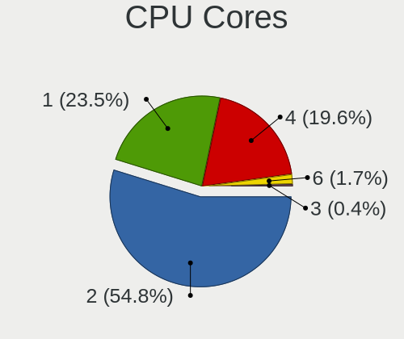

| Number | Computers | Percent |
|--------|-----------|---------|
| 2      | 118       | 54.63%  |
| 1      | 52        | 24.07%  |
| 4      | 42        | 19.44%  |
| 6      | 3         | 1.39%   |
| 3      | 1         | 0.46%   |

CPU Sockets
-----------

Number of sockets

| Number | Computers | Percent |
|--------|-----------|---------|
| 1      | 216       | 100%    |

CPU Threads
-----------

Threads per core (Hyper-Threading)

| Number | Computers | Percent |
|--------|-----------|---------|
| 1      | 137       | 63.43%  |
| 2      | 79        | 36.57%  |

CPU Op-Modes
------------

CPU Operation Modes (32-bit, 64-bit)

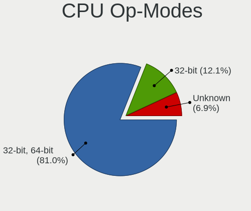

| Op mode        | Computers | Percent |
|----------------|-----------|---------|
| 32-bit, 64-bit | 178       | 81.65%  |
| 32-bit         | 24        | 11.01%  |
| Unknown        | 16        | 7.34%   |

CPU Microcode
-------------

Microcode number

| Number     | Computers | Percent |
|------------|-----------|---------|
| 0x1067a    | 26        | 11.87%  |
| Unknown    | 20        | 9.13%   |
| 0x306a9    | 16        | 7.31%   |
| 0x206a7    | 16        | 7.31%   |
| 0x6fd      | 11        | 5.02%   |
| 0x106ca    | 11        | 5.02%   |
| 0x106c2    | 10        | 4.57%   |
| 0x10661    | 7         | 3.2%    |
| 0x406c4    | 6         | 2.74%   |
| 0x30678    | 6         | 2.74%   |
| 0x20655    | 6         | 2.74%   |
| 0x806e9    | 5         | 2.28%   |
| 0x6f6      | 5         | 2.28%   |
| 0x6d8      | 5         | 2.28%   |
| 0xf41      | 4         | 1.83%   |
| 0x6e8      | 4         | 1.83%   |
| 0x05000119 | 4         | 1.83%   |
| 0x6fb      | 3         | 1.37%   |
| 0x40651    | 3         | 1.37%   |
| 0x10676    | 3         | 1.37%   |
| 0x07030105 | 3         | 1.37%   |
| 0x06006705 | 3         | 1.37%   |
| 0x06001119 | 3         | 1.37%   |
| 0x010000c8 | 3         | 1.37%   |
| 0x806ec    | 2         | 0.91%   |
| 0x6f2      | 2         | 0.91%   |
| 0x6ec      | 2         | 0.91%   |
| 0x306d4    | 2         | 0.91%   |
| 0x306c3    | 2         | 0.91%   |
| 0x20652    | 2         | 0.91%   |
| 0x07030106 | 2         | 0.91%   |
| 0xf65      | 1         | 0.46%   |
| 0xf62      | 1         | 0.46%   |
| 0xf47      | 1         | 0.46%   |
| 0xf43      | 1         | 0.46%   |
| 0xf33      | 1         | 0.46%   |
| 0x906ea    | 1         | 0.46%   |
| 0x706a1    | 1         | 0.46%   |
| 0x506c9    | 1         | 0.46%   |
| 0x306f2    | 1         | 0.46%   |
| 0x30661    | 1         | 0.46%   |
| 0x206c2    | 1         | 0.46%   |
| 0x106a5    | 1         | 0.46%   |
| 0x10677    | 1         | 0.46%   |
| 0x08200103 | 1         | 0.46%   |
| 0x08108109 | 1         | 0.46%   |
| 0x0700010f | 1         | 0.46%   |
| 0x0600611a | 1         | 0.46%   |
| 0x06006118 | 1         | 0.46%   |
| 0x06000852 | 1         | 0.46%   |
| 0x06000822 | 1         | 0.46%   |
| 0x05000029 | 1         | 0.46%   |
| 0x01000083 | 1         | 0.46%   |

CPU Microarch
-------------

Microarchitecture

| Name          | Computers | Percent |
|---------------|-----------|---------|
| Penryn        | 31        | 14.35%  |
| Core          | 28        | 12.96%  |
| Bonnell       | 22        | 10.19%  |
| IvyBridge     | 17        | 7.87%   |
| SandyBridge   | 16        | 7.41%   |
| Silvermont    | 12        | 5.56%   |
| P6            | 11        | 5.09%   |
| Westmere      | 10        | 4.63%   |
| K8 Hammer     | 10        | 4.63%   |
| NetBurst      | 9         | 4.17%   |
| KabyLake      | 8         | 3.7%    |
| Haswell       | 7         | 3.24%   |
| Puma          | 5         | 2.31%   |
| Piledriver    | 5         | 2.31%   |
| K10           | 5         | 2.31%   |
| Excavator     | 5         | 2.31%   |
| Bobcat        | 5         | 2.31%   |
| Broadwell     | 3         | 1.39%   |
| Zen+          | 1         | 0.46%   |
| Zen           | 1         | 0.46%   |
| Nehalem       | 1         | 0.46%   |
| Jaguar        | 1         | 0.46%   |
| Goldmont plus | 1         | 0.46%   |
| Goldmont      | 1         | 0.46%   |
| Unknown       | 1         | 0.46%   |

Graphics
--------

GPU Vendor
----------

Vendors of graphics cards

| Vendor                           | Computers | Percent |
|----------------------------------|-----------|---------|
| Intel                            | 136       | 60.71%  |
| AMD                              | 43        | 19.2%   |
| Nvidia                           | 37        | 16.52%  |
| VIA Technologies                 | 4         | 1.79%   |
| Silicon Integrated Systems [SiS] | 4         | 1.79%   |

GPU Model
---------

Graphics card models

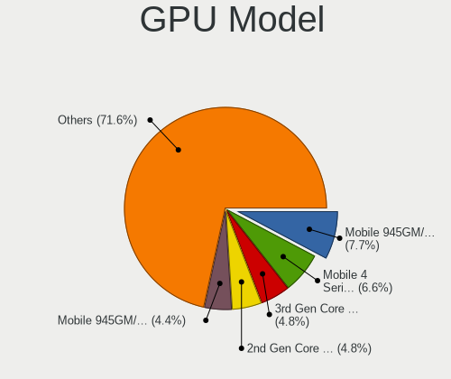

| Model                                                                                    | Computers | Percent |
|------------------------------------------------------------------------------------------|-----------|---------|
| Intel Mobile 945GM/GMS/GME, 943/940GML Express Integrated Graphics Controller            | 17        | 6.8%    |
| Intel Mobile 4 Series Chipset Integrated Graphics Controller                             | 17        | 6.8%    |
| Intel 2nd Generation Core Processor Family Integrated Graphics Controller                | 12        | 4.8%    |
| Intel 3rd Gen Core processor Graphics Controller                                         | 11        | 4.4%    |
| Intel Atom Processor D4xx/D5xx/N4xx/N5xx Integrated Graphics Controller                  | 10        | 4%      |
| Intel Mobile 945GM/GMS, 943/940GML Express Integrated Graphics Controller                | 9         | 3.6%    |
| Intel Mobile 945GSE Express Integrated Graphics Controller                               | 8         | 3.2%    |
| Intel Core Processor Integrated Graphics Controller                                      | 7         | 2.8%    |
| Intel Atom/Celeron/Pentium Processor x5-E8000/J3xxx/N3xxx Integrated Graphics Controller | 6         | 2.4%    |
| Intel Atom Processor Z36xxx/Z37xxx Series Graphics & Display                             | 6         | 2.4%    |
| Intel 4 Series Chipset Integrated Graphics Controller                                    | 6         | 2.4%    |
| Intel 82945G/GZ Integrated Graphics Controller                                           | 5         | 2%      |
| Silicon Integrated Systems [SiS] 771/671 PCIE VGA Display Adapter                        | 4         | 1.6%    |
| Intel Mobile GM965/GL960 Integrated Graphics Controller (secondary)                      | 4         | 1.6%    |
| Intel Mobile GM965/GL960 Integrated Graphics Controller (primary)                        | 4         | 1.6%    |
| Intel Mobile 915GM/GMS/910GML Express Graphics Controller                                | 4         | 1.6%    |
| VIA Technologies CN896/VN896/P4M900 [Chrome 9 HC]                                        | 3         | 1.2%    |
| Intel Kaby Lake-U GT1 Integrated Graphics Controller                                     | 3         | 1.2%    |
| Intel HD Graphics 5500                                                                   | 3         | 1.2%    |
| Intel Haswell-ULT Integrated Graphics Controller                                         | 3         | 1.2%    |
| Intel 82G33/G31 Express Integrated Graphics Controller                                   | 3         | 1.2%    |
| AMD Stoney [Radeon R2/R3/R4/R5 Graphics]                                                 | 3         | 1.2%    |
| AMD RV620 LE [Radeon HD 3450]                                                            | 3         | 1.2%    |
| AMD Mullins [Radeon R4/R5 Graphics]                                                      | 3         | 1.2%    |
| Nvidia GK208B [GeForce GT 730]                                                           | 2         | 0.8%    |
| Nvidia GK107GLM [Quadro K2000M]                                                          | 2         | 0.8%    |
| Nvidia GF108M [GeForce GT 540M]                                                          | 2         | 0.8%    |
| Nvidia G98M [GeForce 9200M GS]                                                           | 2         | 0.8%    |
| Nvidia G94 [GeForce 9600 GS]                                                             | 2         | 0.8%    |
| Nvidia G72 [GeForce 7200 GS / 7300 SE]                                                   | 2         | 0.8%    |
| Intel Xeon E3-1200 v3/4th Gen Core Processor Integrated Graphics Controller              | 2         | 0.8%    |
| Intel Xeon E3-1200 v2/3rd Gen Core processor Graphics Controller                         | 2         | 0.8%    |
| Intel HD Graphics 620                                                                    | 2         | 0.8%    |
| Intel 82Q963/Q965 Integrated Graphics Controller                                         | 2         | 0.8%    |
| Intel 82915G/GV/910GL Integrated Graphics Controller                                     | 2         | 0.8%    |
| AMD Wrestler [Radeon HD 6320]                                                            | 2         | 0.8%    |
| AMD RV710/M92 [Mobility Radeon HD 4330/4350/4550]                                        | 2         | 0.8%    |
| AMD Picasso/Raven 2 [Radeon Vega Series / Radeon Vega Mobile Series]                     | 2         | 0.8%    |
| AMD Cedar [Radeon HD 5000/6000/7350/8350 Series]                                         | 2         | 0.8%    |
| VIA Technologies CN400/PM800/PM880/PN800/PN880 [S3 UniChrome Pro]                        | 1         | 0.4%    |
| Nvidia NV43 [GeForce 6600 LE]                                                            | 1         | 0.4%    |
| Nvidia NV18 [GeForce4 MX 440 AGP 8x]                                                     | 1         | 0.4%    |
| Nvidia MCP89 [GeForce 320M]                                                              | 1         | 0.4%    |
| Nvidia GT218M [ION]                                                                      | 1         | 0.4%    |
| Nvidia GT218M [GeForce 310M]                                                             | 1         | 0.4%    |
| Nvidia GT215 [GeForce GT 240]                                                            | 1         | 0.4%    |
| Nvidia GP102 [GeForce GTX 1080 Ti]                                                       | 1         | 0.4%    |
| Nvidia GM107M [GeForce GTX 950M]                                                         | 1         | 0.4%    |
| Nvidia GM107 [GeForce GTX 750 Ti]                                                        | 1         | 0.4%    |
| Nvidia GK208B [GeForce GT 710]                                                           | 1         | 0.4%    |
| Nvidia GK106 [GeForce GTX 660]                                                           | 1         | 0.4%    |
| Nvidia GF119M [NVS 4200M]                                                                | 1         | 0.4%    |
| Nvidia GF119M [GeForce GT 520MX]                                                         | 1         | 0.4%    |
| Nvidia GF119 [GeForce GT 610]                                                            | 1         | 0.4%    |
| Nvidia GF119 [GeForce GT 520]                                                            | 1         | 0.4%    |
| Nvidia GF114 [GeForce GTX 560 Ti]                                                        | 1         | 0.4%    |
| Nvidia GF108 [GeForce GT 420]                                                            | 1         | 0.4%    |
| Nvidia GF106GLM [Quadro 2000M]                                                           | 1         | 0.4%    |
| Nvidia GF106 [GeForce GTS 450]                                                           | 1         | 0.4%    |
| Nvidia C73 [GeForce 7100 / nForce 630i]                                                  | 1         | 0.4%    |

GPU Combo
---------

Combinations of graphics cards

| Name           | Computers | Percent |
|----------------|-----------|---------|
| 1 x Intel      | 128       | 59.26%  |
| 1 x AMD        | 39        | 18.06%  |
| 1 x Nvidia     | 30        | 13.89%  |
| Intel + Nvidia | 7         | 3.24%   |
| 2 x AMD        | 4         | 1.85%   |
| 1 x VIA        | 4         | 1.85%   |
| 1 x SiS        | 4         | 1.85%   |

GPU Driver
----------

Free vs proprietary

| Driver      | Computers | Percent |
|-------------|-----------|---------|
| Free        | 193       | 88.53%  |
| Proprietary | 14        | 6.42%   |
| Unknown     | 11        | 5.05%   |

GPU Memory
----------

Total video memory

| Size in GB | Computers | Percent |
|------------|-----------|---------|
| Unknown    | 145       | 66.82%  |
| 0.01-0.5   | 44        | 20.28%  |
| 0.51-1.0   | 14        | 6.45%   |
| 1.01-2.0   | 10        | 4.61%   |
| 3.01-4.0   | 2         | 0.92%   |
| 7.01-8.0   | 1         | 0.46%   |
| 8.01-16.0  | 1         | 0.46%   |

Monitor
-------

Monitor Vendor
--------------

Monitor vendors

| Vendor                  | Computers | Percent |
|-------------------------|-----------|---------|
| Samsung Electronics     | 35        | 16.43%  |
| AU Optronics            | 29        | 13.62%  |
| LG Display              | 17        | 7.98%   |
| Acer                    | 13        | 6.1%    |
| Dell                    | 11        | 5.16%   |
| LG Philips              | 9         | 4.23%   |
| Chi Mei Optoelectronics | 9         | 4.23%   |
| Goldstar                | 8         | 3.76%   |
| HannStar                | 7         | 3.29%   |
| BOE                     | 7         | 3.29%   |
| Hewlett-Packard         | 6         | 2.82%   |
| Chimei Innolux          | 6         | 2.82%   |
| BenQ                    | 6         | 2.82%   |
| Sony                    | 5         | 2.35%   |
| Lenovo                  | 4         | 1.88%   |
| CPT                     | 4         | 1.88%   |
| AOC                     | 3         | 1.41%   |
| ViewSonic               | 2         | 0.94%   |
| Sharp                   | 2         | 0.94%   |
| LG Electronics          | 2         | 0.94%   |
| InfoVision              | 2         | 0.94%   |
| Hitachi                 | 2         | 0.94%   |
| Apple                   | 2         | 0.94%   |
| Ancor Communications    | 2         | 0.94%   |
| Vizio                   | 1         | 0.47%   |
| VIZ                     | 1         | 0.47%   |
| Vestel Elektronik       | 1         | 0.47%   |
| Toshiba                 | 1         | 0.47%   |
| Seiko/Epson             | 1         | 0.47%   |
| Sceptre Tech            | 1         | 0.47%   |
| Quanta Display          | 1         | 0.47%   |
| Panasonic               | 1         | 0.47%   |
| Optoma                  | 1         | 0.47%   |
| OEM                     | 1         | 0.47%   |
| MPI                     | 1         | 0.47%   |
| Lite-On                 | 1         | 0.47%   |
| KTC                     | 1         | 0.47%   |
| KDC                     | 1         | 0.47%   |
| Insignia                | 1         | 0.47%   |
| HKC                     | 1         | 0.47%   |
| FUS                     | 1         | 0.47%   |
| Fujitsu Siemens         | 1         | 0.47%   |
| Element                 | 1         | 0.47%   |
| CVT                     | 1         | 0.47%   |

Monitor Model
-------------

Monitor models

| Model                                                                    | Computers | Percent |
|--------------------------------------------------------------------------|-----------|---------|
| HannStar LCD Monitor HSD03E9 1024x600 220x129mm 10.0-inch                | 5         | 2.28%   |
| Samsung Electronics LCD Monitor SEC5541 1366x768 344x193mm 15.5-inch     | 3         | 1.37%   |
| BOE LCD Monitor BOE0705 1366x768 309x173mm 13.9-inch                     | 3         | 1.37%   |
| Samsung Electronics LCD Monitor SEC3052 1366x768 256x144mm 11.6-inch     | 2         | 0.91%   |
| Samsung Electronics LCD Monitor SAM0DF3 3840x2160 1872x1053mm 84.6-inch  | 2         | 0.91%   |
| LG Display LCD Monitor LGD033A 1366x768 340x190mm 15.3-inch              | 2         | 0.91%   |
| LG Display LCD Monitor LGD02E3 1366x768 344x194mm 15.5-inch              | 2         | 0.91%   |
| LG Display LCD Monitor LGD02DC 1366x768 344x194mm 15.5-inch              | 2         | 0.91%   |
| Dell 1905FP DEL400C 1280x1024 376x301mm 19.0-inch                        | 2         | 0.91%   |
| Chimei Innolux LCD Monitor CMN1132 1366x768 260x140mm 11.6-inch          | 2         | 0.91%   |
| Chi Mei Optoelectronics LCD Monitor CMO15A2 1366x768 344x193mm 15.5-inch | 2         | 0.91%   |
| BenQ FP731 BNQ7659 1280x1024 304x228mm 15.0-inch                         | 2         | 0.91%   |
| AU Optronics LCD Monitor AUO71EC 1366x768 340x190mm 15.3-inch            | 2         | 0.91%   |
| AU Optronics LCD Monitor AUO11C2 1024x600 195x113mm 8.9-inch             | 2         | 0.91%   |
| Acer G276HL ACR0300 1920x1080 600x340mm 27.2-inch                        | 2         | 0.91%   |
| Vizio E190VA VIZ0067 1360x768 410x230mm 18.5-inch                        | 1         | 0.46%   |
| VIZ LCD Monitor D50-D1 1920x1080                                         | 1         | 0.46%   |
| ViewSonic VG2230wm-EU VSCA21E 1680x1050 474x296mm 22.0-inch              | 1         | 0.46%   |
| ViewSonic VA2226w-3 VSC2051 1680x1050 495x291mm 22.6-inch                | 1         | 0.46%   |
| Vestel Elektronik 50UHD_LCD_TV VES3700 3840x2160 1872x1053mm 84.6-inch   | 1         | 0.46%   |
| Toshiba TV TSB0206 1920x1080 886x498mm 40.0-inch                         | 1         | 0.46%   |
| Sony TV SNY9500 1920x540 560x420mm 27.6-inch                             | 1         | 0.46%   |
| Sony SDM-HX75 SNY5100 1280x1024 338x270mm 17.0-inch                      | 1         | 0.46%   |
| Sony Nvidia Defaul t Flat Panel SNY06FA 1600x900 360x200mm 16.2-inch     | 1         | 0.46%   |
| Sony Nvidia Defaul SNY05FA 1366x768 290x170mm 13.2-inch                  | 1         | 0.46%   |
| Sony LCD Monitor TV                                                      | 1         | 0.46%   |
| Sharp LCD SHP1047 1920x1080                                              | 1         | 0.46%   |
| Sharp LCD SHP0FF0 1360x768                                               | 1         | 0.46%   |
| Seiko/Epson LCD Monitor 1280x800                                         | 1         | 0.46%   |
| Sceptre Tech H32 SPT0CB8 1920x1080 575x323mm 26.0-inch                   | 1         | 0.46%   |
| Samsung Electronics SyncMaster SAM05C8 1920x1080 521x293mm 23.5-inch     | 1         | 0.46%   |
| Samsung Electronics SyncMaster SAM0255 1680x1050 474x296mm 22.0-inch     | 1         | 0.46%   |
| Samsung Electronics SyncMaster SAM018F 1280x1024 338x270mm 17.0-inch     | 1         | 0.46%   |
| Samsung Electronics SyncMaster SAM0019 1024x768 304x228mm 15.0-inch      | 1         | 0.46%   |
| Samsung Electronics SMT27A300 SAM087A 1920x1080 598x336mm 27.0-inch      | 1         | 0.46%   |
| Samsung Electronics SME1920 SAM06B7 1366x768 410x230mm 18.5-inch         | 1         | 0.46%   |
| Samsung Electronics S22B370 SAM0898 1920x1080 477x268mm 21.5-inch        | 1         | 0.46%   |
| Samsung Electronics S22B300 SAM08AB 1920x1080 477x268mm 21.5-inch        | 1         | 0.46%   |
| Samsung Electronics LCD Monitor SyncMaster 2624x1200                     | 1         | 0.46%   |
| Samsung Electronics LCD Monitor SMB1930NW 1440x900                       | 1         | 0.46%   |
| Samsung Electronics LCD Monitor SEC5448 1920x1080 344x194mm 15.5-inch    | 1         | 0.46%   |
| Samsung Electronics LCD Monitor SEC5441 1366x768 344x194mm 15.5-inch     | 1         | 0.46%   |
| Samsung Electronics LCD Monitor SEC4D42 1280x800 303x190mm 14.1-inch     | 1         | 0.46%   |
| Samsung Electronics LCD Monitor SEC4745 1280x800 331x207mm 15.4-inch     | 1         | 0.46%   |
| Samsung Electronics LCD Monitor SEC4545 1280x800 331x207mm 15.4-inch     | 1         | 0.46%   |
| Samsung Electronics LCD Monitor SEC4252 1366x768 344x194mm 15.5-inch     | 1         | 0.46%   |
| Samsung Electronics LCD Monitor SEC3953 1366x768 256x144mm 11.6-inch     | 1         | 0.46%   |
| Samsung Electronics LCD Monitor SEC364E 1024x600 223x125mm 10.1-inch     | 1         | 0.46%   |
| Samsung Electronics LCD Monitor SEC364D 1600x900 382x214mm 17.2-inch     | 1         | 0.46%   |
| Samsung Electronics LCD Monitor SEC3445 1280x800 331x207mm 15.4-inch     | 1         | 0.46%   |
| Samsung Electronics LCD Monitor SEC334A 1366x768 340x190mm 15.3-inch     | 1         | 0.46%   |
| Samsung Electronics LCD Monitor SEC3150 1366x768 344x193mm 15.5-inch     | 1         | 0.46%   |
| Samsung Electronics LCD Monitor SEC304C 1920x1080 353x198mm 15.9-inch    | 1         | 0.46%   |
| Samsung Electronics LCD Monitor SEC3030 1024x600 223x125mm 10.1-inch     | 1         | 0.46%   |
| Samsung Electronics LCD Monitor SDC5451 1366x768 340x190mm 15.3-inch     | 1         | 0.46%   |
| Samsung Electronics LCD Monitor SDC5441 1366x768 340x190mm 15.3-inch     | 1         | 0.46%   |
| Samsung Electronics LCD Monitor SDC4752 1366x768 340x190mm 15.3-inch     | 1         | 0.46%   |
| Samsung Electronics LCD Monitor SDC324C 1920x1080 344x194mm 15.5-inch    | 1         | 0.46%   |
| Samsung Electronics LCD Monitor SAM0669 1920x1080                        | 1         | 0.46%   |
| Samsung Electronics C32F39M SAM100B 1920x1080 698x393mm 31.5-inch        | 1         | 0.46%   |

Monitor Resolution
------------------

Monitor screen resolution

| Resolution         | Computers | Percent |
|--------------------|-----------|---------|
| 1366x768 (WXGA)    | 66        | 30.84%  |
| 1920x1080 (FHD)    | 41        | 19.16%  |
| 1280x800 (WXGA)    | 20        | 9.35%   |
| 1280x1024 (SXGA)   | 13        | 6.07%   |
| 1024x600           | 12        | 5.61%   |
| 1600x900 (HD+)     | 10        | 4.67%   |
| 1024x768 (XGA)     | 9         | 4.21%   |
| 1440x900 (WXGA+)   | 6         | 2.8%    |
| 3840x2160 (4K)     | 5         | 2.34%   |
| 2560x1440 (QHD)    | 5         | 2.34%   |
| 1680x1050 (WSXGA+) | 5         | 2.34%   |
| 1360x768           | 5         | 2.34%   |
| 1920x540           | 3         | 1.4%    |
| 2560x1080          | 2         | 0.93%   |
| 1920x1200 (WUXGA)  | 2         | 0.93%   |
| 1024x576           | 2         | 0.93%   |
| Unknown            | 2         | 0.93%   |
| 3840x1080          | 1         | 0.47%   |
| 2624x1200          | 1         | 0.47%   |
| 2048x1152          | 1         | 0.47%   |
| 1600x1200          | 1         | 0.47%   |
| 1280x768           | 1         | 0.47%   |
| 1280x720 (HD)      | 1         | 0.47%   |

Monitor Diagonal
----------------

Diagonal size in inches

| Inches  | Computers | Percent |
|---------|-----------|---------|
| 15      | 67        | 31.31%  |
| Unknown | 15        | 7.01%   |
| 14      | 14        | 6.54%   |
| 13      | 14        | 6.54%   |
| 17      | 13        | 6.07%   |
| 10      | 12        | 5.61%   |
| 19      | 9         | 4.21%   |
| 11      | 8         | 3.74%   |
| 27      | 7         | 3.27%   |
| 24      | 7         | 3.27%   |
| 18      | 7         | 3.27%   |
| 21      | 6         | 2.8%    |
| 84      | 5         | 2.34%   |
| 31      | 5         | 2.34%   |
| 22      | 5         | 2.34%   |
| 23      | 3         | 1.4%    |
| 20      | 3         | 1.4%    |
| 12      | 3         | 1.4%    |
| 8       | 3         | 1.4%    |
| 34      | 2         | 0.93%   |
| 74      | 1         | 0.47%   |
| 41      | 1         | 0.47%   |
| 39      | 1         | 0.47%   |
| 32      | 1         | 0.47%   |
| 26      | 1         | 0.47%   |
| 16      | 1         | 0.47%   |

Monitor Width
-------------

Physical width

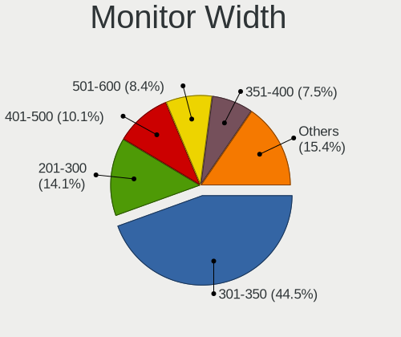

| Width in mm | Computers | Percent |
|-------------|-----------|---------|
| 301-350     | 93        | 43.66%  |
| 201-300     | 29        | 13.62%  |
| 401-500     | 23        | 10.8%   |
| 501-600     | 17        | 7.98%   |
| 351-400     | 17        | 7.98%   |
| Unknown     | 15        | 7.04%   |
| 1501-2000   | 6         | 2.82%   |
| 601-700     | 5         | 2.35%   |
| 701-800     | 3         | 1.41%   |
| 101-200     | 3         | 1.41%   |
| 801-900     | 1         | 0.47%   |
| 901-1000    | 1         | 0.47%   |

Aspect Ratio
------------

Proportional relationship between the width and the height

| Ratio   | Computers | Percent |
|---------|-----------|---------|
| 16/9    | 131       | 65.5%   |
| 16/10   | 31        | 15.5%   |
| 5/4     | 12        | 6%      |
| 4/3     | 11        | 5.5%    |
| Unknown | 11        | 5.5%    |
| 21/9    | 2         | 1%      |
| 6/5     | 1         | 0.5%    |
| 1.98    | 1         | 0.5%    |

Monitor Area
------------

Area in inch

| Area in inch | Computers | Percent |
|----------------|-----------|---------|
| 101-110        | 66        | 30.99%  |
| 81-90          | 23        | 10.8%   |
| 151-200        | 17        | 7.98%   |
| 201-250        | 15        | 7.04%   |
| Unknown        | 15        | 7.04%   |
| 41-50          | 12        | 5.63%   |
| 141-150        | 12        | 5.63%   |
| 351-500        | 9         | 4.23%   |
| 51-60          | 8         | 3.76%   |
| More than 1000 | 6         | 2.82%   |
| 301-350        | 6         | 2.82%   |
| 121-130        | 6         | 2.82%   |
| 71-80          | 3         | 1.41%   |
| 61-70          | 3         | 1.41%   |
| 1-40           | 3         | 1.41%   |
| 251-300        | 3         | 1.41%   |
| 131-140        | 2         | 0.94%   |
| 501-1000       | 2         | 0.94%   |
| 91-100         | 2         | 0.94%   |

Pixel Density
-------------

Pixels per inch

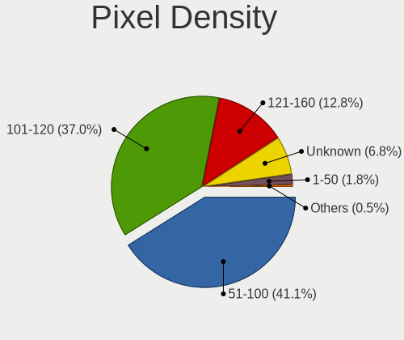

| Density | Computers | Percent |
|---------|-----------|---------|
| 51-100  | 85        | 41.06%  |
| 101-120 | 77        | 37.2%   |
| 121-160 | 25        | 12.08%  |
| Unknown | 15        | 7.25%   |
| 1-50    | 3         | 1.45%   |
| 161-240 | 2         | 0.97%   |

Multiple Monitors
-----------------

Total monitors connected

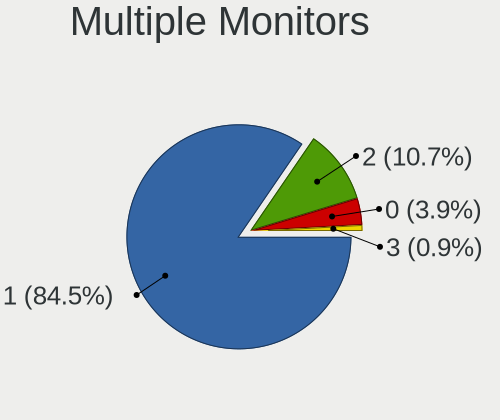

| Total | Computers | Percent |
|-------|-----------|---------|
| 1     | 184       | 84.4%   |
| 2     | 24        | 11.01%  |
| 0     | 8         | 3.67%   |
| 3     | 2         | 0.92%   |

Network
-------

Net Controller Vendor
---------------------

Controller vendors

| Vendor                            | Computers | Percent |
|-----------------------------------|-----------|---------|
| Realtek Semiconductor             | 105       | 28.85%  |
| Intel                             | 67        | 18.41%  |
| Qualcomm Atheros                  | 57        | 15.66%  |
| Broadcom                          | 40        | 10.99%  |
| Marvell Technology Group          | 15        | 4.12%   |
| Broadcom Limited                  | 12        | 3.3%    |
| Nvidia                            | 10        | 2.75%   |
| Ralink Technology                 | 9         | 2.47%   |
| Ralink                            | 6         | 1.65%   |
| VIA Technologies                  | 4         | 1.1%    |
| Silicon Integrated Systems [SiS]  | 3         | 0.82%   |
| Qualcomm Atheros Communications   | 3         | 0.82%   |
| Gemtek                            | 3         | 0.82%   |
| D-Link                            | 3         | 0.82%   |
| ASUSTek Computer                  | 3         | 0.82%   |
| Samsung Electronics               | 2         | 0.55%   |
| JMicron Technology                | 2         | 0.55%   |
| 3Com                              | 2         | 0.55%   |
| Xiaomi                            | 1         | 0.27%   |
| TP-Link                           | 1         | 0.27%   |
| Spreadtrum Communications         | 1         | 0.27%   |
| NetGear                           | 1         | 0.27%   |
| Micro Star International          | 1         | 0.27%   |
| MediaTek                          | 1         | 0.27%   |
| Linksys                           | 1         | 0.27%   |
| LG Electronics                    | 1         | 0.27%   |
| Huawei Technologies               | 1         | 0.27%   |
| Ericsson Business Mobile Networks | 1         | 0.27%   |
| DisplayLink                       | 1         | 0.27%   |
| Dell                              | 1         | 0.27%   |
| BUFFALO                           | 1         | 0.27%   |
| Belkin Components                 | 1         | 0.27%   |
| Attansic Technology               | 1         | 0.27%   |
| ASIX Electronics                  | 1         | 0.27%   |
| AMD                               | 1         | 0.27%   |
| ADMtek                            | 1         | 0.27%   |

Net Controller Model
--------------------

Controller models

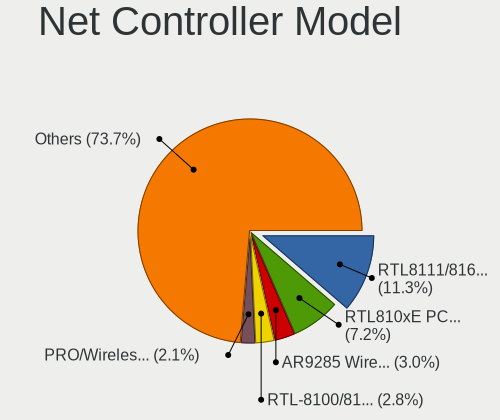

| Model                                                                   | Computers | Percent |
|-------------------------------------------------------------------------|-----------|---------|
| Realtek RTL8111/8168/8411 PCI Express Gigabit Ethernet Controller       | 46        | 11.25%  |
| Realtek RTL810xE PCI Express Fast Ethernet controller                   | 29        | 7.09%   |
| Qualcomm Atheros AR9285 Wireless Network Adapter (PCI-Express)          | 12        | 2.93%   |
| Realtek RTL-8100/8101L/8139 PCI Fast Ethernet Adapter                   | 11        | 2.69%   |
| Intel PRO/Wireless 3945ABG [Golan] Network Connection                   | 8         | 1.96%   |
| Marvell Group 88E8040 PCI-E Fast Ethernet Controller                    | 7         | 1.71%   |
| Broadcom BCM4313 802.11bgn Wireless Network Adapter                     | 7         | 1.71%   |
| Broadcom BCM4312 802.11b/g LP-PHY                                       | 7         | 1.71%   |
| Qualcomm Atheros QCA9565 / AR9565 Wireless Network Adapter              | 6         | 1.47%   |
| Realtek RTL8188EUS 802.11n Wireless Network Adapter                     | 5         | 1.22%   |
| Qualcomm Atheros QCA9377 802.11ac Wireless Network Adapter              | 5         | 1.22%   |
| Qualcomm Atheros AR8132 Fast Ethernet                                   | 5         | 1.22%   |
| Nvidia MCP61 Ethernet                                                   | 5         | 1.22%   |
| Broadcom Limited BCM4312 802.11b/g LP-PHY                               | 5         | 1.22%   |
| Broadcom BCM43142 802.11b/g/n                                           | 5         | 1.22%   |
| Realtek RTL8188CE 802.11b/g/n WiFi Adapter                              | 4         | 0.98%   |
| Ralink MT7601U Wireless Adapter                                         | 4         | 0.98%   |
| Qualcomm Atheros AR242x / AR542x Wireless Network Adapter (PCI-Express) | 4         | 0.98%   |
| Intel Centrino Advanced-N 6205 [Taylor Peak]                            | 4         | 0.98%   |
| Intel 82801FB/FBM/FR/FW/FRW (ICH6 Family) AC'97 Modem Controller        | 4         | 0.98%   |
| Intel 82567LM-3 Gigabit Network Connection                              | 4         | 0.98%   |
| Broadcom BCM4311 802.11b/g WLAN                                         | 4         | 0.98%   |
| VIA VT6102/VT6103 [Rhine-II]                                            | 3         | 0.73%   |
| Silicon Integrated Systems [SiS] 191 Gigabit Ethernet Adapter           | 3         | 0.73%   |
| Realtek RTL8822BE 802.11a/b/g/n/ac WiFi adapter                         | 3         | 0.73%   |
| Realtek RTL8188FTV 802.11b/g/n 1T1R 2.4G WLAN Adapter                   | 3         | 0.73%   |
| Realtek RTL8188EE Wireless Network Adapter                              | 3         | 0.73%   |
| Realtek RTL8153 Gigabit Ethernet Adapter                                | 3         | 0.73%   |
| Realtek 802.11ac NIC                                                    | 3         | 0.73%   |
| Ralink RT5370 Wireless Adapter                                          | 3         | 0.73%   |
| Qualcomm Atheros AR9485 Wireless Network Adapter                        | 3         | 0.73%   |
| Qualcomm Atheros AR928X Wireless Network Adapter (PCI-Express)          | 3         | 0.73%   |
| Qualcomm Atheros AR8152 v2.0 Fast Ethernet                              | 3         | 0.73%   |
| Qualcomm Atheros AR8151 v2.0 Gigabit Ethernet                           | 3         | 0.73%   |
| Intel Wireless 7265                                                     | 3         | 0.73%   |
| Intel Wireless 7260                                                     | 3         | 0.73%   |
| Intel Wireless 3165                                                     | 3         | 0.73%   |
| Intel PRO/Wireless 4965 AG or AGN [Kedron] Network Connection           | 3         | 0.73%   |
| Intel PRO/Wireless 2200BG [Calexico2] Network Connection                | 3         | 0.73%   |
| Intel 82579V Gigabit Network Connection                                 | 3         | 0.73%   |
| Intel 82579LM Gigabit Network Connection (Lewisville)                   | 3         | 0.73%   |
| Intel 82566DM Gigabit Network Connection                                | 3         | 0.73%   |
| Gemtek WUBR-177G [Ralink RT2571W]                                       | 3         | 0.73%   |
| Realtek RTL8723BU 802.11b/g/n WLAN Adapter                              | 2         | 0.49%   |
| Realtek RTL8187B Wireless Adapter                                       | 2         | 0.49%   |
| Realtek RTL8187B Wireless 802.11g 54Mbps Network Adapter                | 2         | 0.49%   |
| Realtek RTL8169 PCI Gigabit Ethernet Controller                         | 2         | 0.49%   |
| Realtek RTL-8185 IEEE 802.11a/b/g Wireless LAN Controller               | 2         | 0.49%   |
| Ralink RT3290 Wireless 802.11n 1T/1R PCIe                               | 2         | 0.49%   |
| Qualcomm Atheros QCA8172 Fast Ethernet                                  | 2         | 0.49%   |
| Qualcomm Atheros AR9271 802.11n                                         | 2         | 0.49%   |
| Qualcomm Atheros AR93xx Wireless Network Adapter                        | 2         | 0.49%   |
| Qualcomm Atheros AR8161 Gigabit Ethernet                                | 2         | 0.49%   |
| Qualcomm Atheros AR8131 Gigabit Ethernet                                | 2         | 0.49%   |
| Marvell Group 88E8055 PCI-E Gigabit Ethernet Controller                 | 2         | 0.49%   |
| Intel WiFi Link 5100                                                    | 2         | 0.49%   |
| Intel PRO/Wireless 2915ABG [Calexico2] Network Connection               | 2         | 0.49%   |
| Intel Ethernet Connection I218-LM                                       | 2         | 0.49%   |
| Intel Ethernet Connection (3) I218-LM                                   | 2         | 0.49%   |
| Intel Centrino Wireless-N 1000 [Condor Peak]                            | 2         | 0.49%   |

Wireless Vendor
---------------

Wireless vendors

| Vendor                          | Computers | Percent |
|---------------------------------|-----------|---------|
| Intel                           | 46        | 24.21%  |
| Qualcomm Atheros                | 40        | 21.05%  |
| Realtek Semiconductor           | 33        | 17.37%  |
| Broadcom                        | 29        | 15.26%  |
| Ralink Technology               | 9         | 4.74%   |
| Ralink                          | 6         | 3.16%   |
| Broadcom Limited                | 6         | 3.16%   |
| Qualcomm Atheros Communications | 3         | 1.58%   |
| Gemtek                          | 3         | 1.58%   |
| D-Link                          | 3         | 1.58%   |
| ASUSTek Computer                | 3         | 1.58%   |
| VIA Technologies                | 1         | 0.53%   |
| TP-Link                         | 1         | 0.53%   |
| Samsung Electronics             | 1         | 0.53%   |
| NetGear                         | 1         | 0.53%   |
| Micro Star International        | 1         | 0.53%   |
| Marvell Technology Group        | 1         | 0.53%   |
| Linksys                         | 1         | 0.53%   |
| BUFFALO                         | 1         | 0.53%   |
| Belkin Components               | 1         | 0.53%   |

Wireless Model
--------------

Wireless models

| Model                                                                         | Computers | Percent |
|-------------------------------------------------------------------------------|-----------|---------|
| Qualcomm Atheros AR9285 Wireless Network Adapter (PCI-Express)                | 12        | 6.28%   |
| Intel PRO/Wireless 3945ABG [Golan] Network Connection                         | 8         | 4.19%   |
| Broadcom BCM4313 802.11bgn Wireless Network Adapter                           | 7         | 3.66%   |
| Broadcom BCM4312 802.11b/g LP-PHY                                             | 7         | 3.66%   |
| Qualcomm Atheros QCA9565 / AR9565 Wireless Network Adapter                    | 6         | 3.14%   |
| Realtek RTL8188EUS 802.11n Wireless Network Adapter                           | 5         | 2.62%   |
| Qualcomm Atheros QCA9377 802.11ac Wireless Network Adapter                    | 5         | 2.62%   |
| Broadcom Limited BCM4312 802.11b/g LP-PHY                                     | 5         | 2.62%   |
| Broadcom BCM43142 802.11b/g/n                                                 | 5         | 2.62%   |
| Realtek RTL8188CE 802.11b/g/n WiFi Adapter                                    | 4         | 2.09%   |
| Ralink MT7601U Wireless Adapter                                               | 4         | 2.09%   |
| Qualcomm Atheros AR242x / AR542x Wireless Network Adapter (PCI-Express)       | 4         | 2.09%   |
| Intel Centrino Advanced-N 6205 [Taylor Peak]                                  | 4         | 2.09%   |
| Broadcom BCM4311 802.11b/g WLAN                                               | 4         | 2.09%   |
| Realtek RTL8822BE 802.11a/b/g/n/ac WiFi adapter                               | 3         | 1.57%   |
| Realtek RTL8188FTV 802.11b/g/n 1T1R 2.4G WLAN Adapter                         | 3         | 1.57%   |
| Realtek RTL8188EE Wireless Network Adapter                                    | 3         | 1.57%   |
| Realtek 802.11ac NIC                                                          | 3         | 1.57%   |
| Ralink RT5370 Wireless Adapter                                                | 3         | 1.57%   |
| Qualcomm Atheros AR9485 Wireless Network Adapter                              | 3         | 1.57%   |
| Qualcomm Atheros AR928X Wireless Network Adapter (PCI-Express)                | 3         | 1.57%   |
| Intel Wireless 7265                                                           | 3         | 1.57%   |
| Intel Wireless 7260                                                           | 3         | 1.57%   |
| Intel Wireless 3165                                                           | 3         | 1.57%   |
| Intel PRO/Wireless 4965 AG or AGN [Kedron] Network Connection                 | 3         | 1.57%   |
| Intel PRO/Wireless 2200BG [Calexico2] Network Connection                      | 3         | 1.57%   |
| Gemtek WUBR-177G [Ralink RT2571W]                                             | 3         | 1.57%   |
| Realtek RTL8723BU 802.11b/g/n WLAN Adapter                                    | 2         | 1.05%   |
| Realtek RTL8187B Wireless Adapter                                             | 2         | 1.05%   |
| Realtek RTL8187B Wireless 802.11g 54Mbps Network Adapter                      | 2         | 1.05%   |
| Realtek RTL-8185 IEEE 802.11a/b/g Wireless LAN Controller                     | 2         | 1.05%   |
| Ralink RT3290 Wireless 802.11n 1T/1R PCIe                                     | 2         | 1.05%   |
| Qualcomm Atheros AR9271 802.11n                                               | 2         | 1.05%   |
| Qualcomm Atheros AR93xx Wireless Network Adapter                              | 2         | 1.05%   |
| Intel WiFi Link 5100                                                          | 2         | 1.05%   |
| Intel PRO/Wireless 2915ABG [Calexico2] Network Connection                     | 2         | 1.05%   |
| Intel Centrino Wireless-N 1000 [Condor Peak]                                  | 2         | 1.05%   |
| Intel Centrino Ultimate-N 6300                                                | 2         | 1.05%   |
| Broadcom BCM43224 802.11a/b/g/n                                               | 2         | 1.05%   |
| VIA VIA VNT-6656 [WiFi 802.11b/g USB Dongle]                                  | 1         | 0.52%   |
| TP-Link TL-WN823N v2/v3 [Realtek RTL8192EU]                                   | 1         | 0.52%   |
| Samsung WIS09ABGN LinkStick Wireless LAN Adapter                              | 1         | 0.52%   |
| Realtek RTL8822CE 802.11ac PCIe Wireless Network Adapter                      | 1         | 0.52%   |
| Realtek RTL8723DE Wireless Network Adapter                                    | 1         | 0.52%   |
| Realtek RTL8723AE PCIe Wireless Network Adapter                               | 1         | 0.52%   |
| Realtek RTL8192CU 802.11n WLAN Adapter                                        | 1         | 0.52%   |
| Realtek RTL8191SEvB Wireless LAN Controller                                   | 1         | 0.52%   |
| Ralink RT5572 Wireless Adapter                                                | 1         | 0.52%   |
| Ralink RT2870/RT3070 Wireless Adapter                                         | 1         | 0.52%   |
| Ralink RT5390 Wireless 802.11n 1T/1R PCIe                                     | 1         | 0.52%   |
| Ralink RT3090 Wireless 802.11n 1T/1R PCIe                                     | 1         | 0.52%   |
| Ralink RT3060 Wireless 802.11n 1T/1R                                          | 1         | 0.52%   |
| Ralink RT2561/RT61 rev B 802.11g                                              | 1         | 0.52%   |
| Qualcomm Atheros QCA6174 802.11ac Wireless Network Adapter                    | 1         | 0.52%   |
| Qualcomm Atheros TP-Link TL-WN322G v3 / TL-WN422G v2 802.11g [Atheros AR9271] | 1         | 0.52%   |
| Qualcomm Atheros AR9462 Wireless Network Adapter                              | 1         | 0.52%   |
| Qualcomm Atheros AR9287 Wireless Network Adapter (PCI-Express)                | 1         | 0.52%   |
| Qualcomm Atheros AR2427 802.11bg Wireless Network Adapter (PCI-Express)       | 1         | 0.52%   |
| Qualcomm Atheros AR2413/AR2414 Wireless Network Adapter [AR5005G(S) 802.11bg] | 1         | 0.52%   |
| NetGear WG111v3 54 Mbps Wireless [realtek RTL8187B]                           | 1         | 0.52%   |

Ethernet Vendor
---------------

Ethernet vendors

| Vendor                           | Computers | Percent |
|----------------------------------|-----------|---------|
| Realtek Semiconductor            | 91        | 43.54%  |
| Intel                            | 33        | 15.79%  |
| Qualcomm Atheros                 | 21        | 10.05%  |
| Marvell Technology Group         | 14        | 6.7%    |
| Broadcom                         | 14        | 6.7%    |
| Nvidia                           | 10        | 4.78%   |
| Broadcom Limited                 | 7         | 3.35%   |
| VIA Technologies                 | 3         | 1.44%   |
| Silicon Integrated Systems [SiS] | 3         | 1.44%   |
| JMicron Technology               | 2         | 0.96%   |
| 3Com                             | 2         | 0.96%   |
| Xiaomi                           | 1         | 0.48%   |
| Spreadtrum Communications        | 1         | 0.48%   |
| Samsung Electronics              | 1         | 0.48%   |
| MediaTek                         | 1         | 0.48%   |
| LG Electronics                   | 1         | 0.48%   |
| DisplayLink                      | 1         | 0.48%   |
| Attansic Technology              | 1         | 0.48%   |
| ASIX Electronics                 | 1         | 0.48%   |
| ADMtek                           | 1         | 0.48%   |

Ethernet Model
--------------

Ethernet models

| Model                                                             | Computers | Percent |
|-------------------------------------------------------------------|-----------|---------|
| Realtek RTL8111/8168/8411 PCI Express Gigabit Ethernet Controller | 46        | 21.9%   |
| Realtek RTL810xE PCI Express Fast Ethernet controller             | 29        | 13.81%  |
| Realtek RTL-8100/8101L/8139 PCI Fast Ethernet Adapter             | 11        | 5.24%   |
| Marvell Group 88E8040 PCI-E Fast Ethernet Controller              | 7         | 3.33%   |
| Qualcomm Atheros AR8132 Fast Ethernet                             | 5         | 2.38%   |
| Nvidia MCP61 Ethernet                                             | 5         | 2.38%   |
| Intel 82567LM-3 Gigabit Network Connection                        | 4         | 1.9%    |
| VIA VT6102/VT6103 [Rhine-II]                                      | 3         | 1.43%   |
| Silicon Integrated Systems [SiS] 191 Gigabit Ethernet Adapter     | 3         | 1.43%   |
| Realtek RTL8153 Gigabit Ethernet Adapter                          | 3         | 1.43%   |
| Qualcomm Atheros AR8152 v2.0 Fast Ethernet                        | 3         | 1.43%   |
| Qualcomm Atheros AR8151 v2.0 Gigabit Ethernet                     | 3         | 1.43%   |
| Intel 82579V Gigabit Network Connection                           | 3         | 1.43%   |
| Intel 82579LM Gigabit Network Connection (Lewisville)             | 3         | 1.43%   |
| Intel 82566DM Gigabit Network Connection                          | 3         | 1.43%   |
| Realtek RTL8169 PCI Gigabit Ethernet Controller                   | 2         | 0.95%   |
| Qualcomm Atheros QCA8172 Fast Ethernet                            | 2         | 0.95%   |
| Qualcomm Atheros AR8161 Gigabit Ethernet                          | 2         | 0.95%   |
| Qualcomm Atheros AR8131 Gigabit Ethernet                          | 2         | 0.95%   |
| Marvell Group 88E8055 PCI-E Gigabit Ethernet Controller           | 2         | 0.95%   |
| Intel Ethernet Connection I218-LM                                 | 2         | 0.95%   |
| Intel Ethernet Connection (3) I218-LM                             | 2         | 0.95%   |
| Intel 82573L Gigabit Ethernet Controller                          | 2         | 0.95%   |
| Broadcom NetXtreme BCM5764M Gigabit Ethernet PCIe                 | 2         | 0.95%   |
| Broadcom NetLink BCM5906M Fast Ethernet PCI Express               | 2         | 0.95%   |
| Broadcom NetLink BCM5784M Gigabit Ethernet PCIe                   | 2         | 0.95%   |
| Broadcom Limited NetXtreme BCM5788 Gigabit Ethernet               | 2         | 0.95%   |
| Broadcom Limited NetXtreme BCM5751 Gigabit Ethernet PCI Express   | 2         | 0.95%   |
| Broadcom BCM4401-B0 100Base-TX                                    | 2         | 0.95%   |
| 3Com 3c905B 100BaseTX [Cyclone]                                   | 2         | 0.95%   |
| Xiaomi Mi/Redmi series (RNDIS)                                    | 1         | 0.48%   |
| Spreadtrum Nokia C30                                              | 1         | 0.48%   |
| Samsung Galaxy series, misc. (tethering mode)                     | 1         | 0.48%   |
| Qualcomm Atheros Attansic L2 Fast Ethernet                        | 1         | 0.48%   |
| Qualcomm Atheros Attansic L1 Gigabit Ethernet                     | 1         | 0.48%   |
| Qualcomm Atheros AR8152 v1.1 Fast Ethernet                        | 1         | 0.48%   |
| Qualcomm Atheros AR8121/AR8113/AR8114 Gigabit or Fast Ethernet    | 1         | 0.48%   |
| Nvidia MCP79 Ethernet                                             | 1         | 0.48%   |
| Nvidia MCP73 Ethernet                                             | 1         | 0.48%   |
| Nvidia MCP67 Ethernet                                             | 1         | 0.48%   |
| Nvidia MCP51 Ethernet Controller                                  | 1         | 0.48%   |
| Nvidia CK804 Ethernet Controller                                  | 1         | 0.48%   |
| MediaTek Elite H5                                                 | 1         | 0.48%   |
| Marvell Group 88E8058 PCI-E Gigabit Ethernet Controller           | 1         | 0.48%   |
| Marvell Group 88E8057 PCI-E Gigabit Ethernet Controller           | 1         | 0.48%   |
| Marvell Group 88E8056 PCI-E Gigabit Ethernet Controller           | 1         | 0.48%   |
| Marvell Group 88E8040T PCI-E Fast Ethernet Controller             | 1         | 0.48%   |
| Marvell Group 88E8038 PCI-E Fast Ethernet Controller              | 1         | 0.48%   |
| LG G2 Android Phone [tethering mode]                              | 1         | 0.48%   |
| JMicron JMC260 PCI Express Fast Ethernet Controller               | 1         | 0.48%   |
| JMicron JMC250 PCI Express Gigabit Ethernet Controller            | 1         | 0.48%   |
| Intel PRO/100 VE Network Connection                               | 1         | 0.48%   |
| Intel I210 Gigabit Network Connection                             | 1         | 0.48%   |
| Intel Ethernet Connection I217-V                                  | 1         | 0.48%   |
| Intel Ethernet Connection I217-LM                                 | 1         | 0.48%   |
| Intel Ethernet Connection (2) I219-V                              | 1         | 0.48%   |
| Intel Ethernet Connection (2) I218-V                              | 1         | 0.48%   |
| Intel 82578DM Gigabit Network Connection                          | 1         | 0.48%   |
| Intel 82578DC Gigabit Network Connection                          | 1         | 0.48%   |
| Intel 82577LM Gigabit Network Connection                          | 1         | 0.48%   |

Net Controller Kind
-------------------

Ethernet, WiFi or modem

| Kind     | Computers | Percent |
|----------|-----------|---------|
| Ethernet | 199       | 51.42%  |
| WiFi     | 180       | 46.51%  |
| Modem    | 8         | 2.07%   |

Used Controller
---------------

Currently used network controller

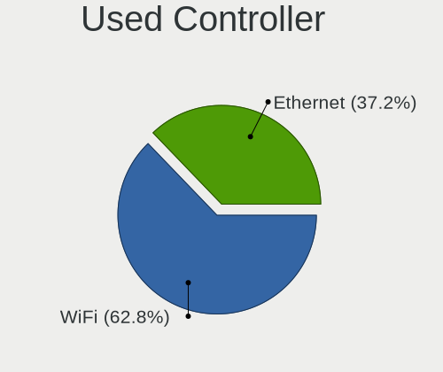

| Kind     | Computers | Percent |
|----------|-----------|---------|
| WiFi     | 158       | 50.64%  |
| Ethernet | 154       | 49.36%  |

NICs
----

Total network controllers on board

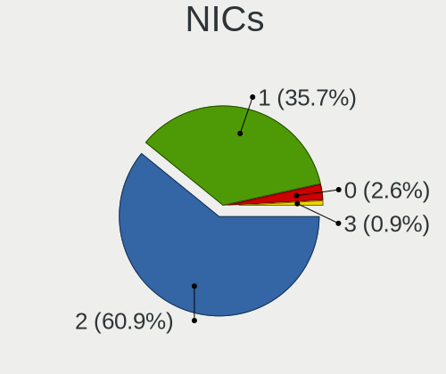

| Total | Computers | Percent |
|-------|-----------|---------|
| 2     | 131       | 60.65%  |
| 1     | 77        | 35.65%  |
| 0     | 6         | 2.78%   |
| 3     | 2         | 0.93%   |

IPv6
----

IPv6 vs IPv4

| Used | Computers | Percent |
|------|-----------|---------|
| No   | 205       | 94.04%  |
| Yes  | 13        | 5.96%   |

Bluetooth
---------

Bluetooth Vendor
----------------

Controller vendors

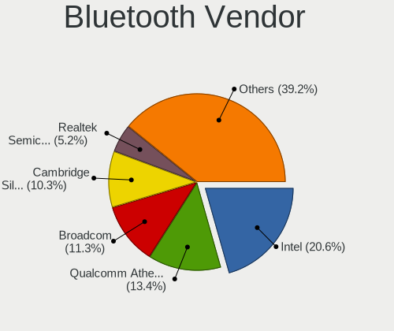

| Vendor                          | Computers | Percent |
|---------------------------------|-----------|---------|
| Intel                           | 18        | 20.69%  |
| Qualcomm Atheros Communications | 12        | 13.79%  |
| Broadcom                        | 10        | 11.49%  |
| Cambridge Silicon Radio         | 9         | 10.34%  |
| Hewlett-Packard                 | 5         | 5.75%   |
| Toshiba                         | 4         | 4.6%    |
| Realtek Semiconductor           | 4         | 4.6%    |
| Lite-On Technology              | 4         | 4.6%    |
| IMC Networks                    | 3         | 3.45%   |
| Foxconn International           | 3         | 3.45%   |
| Foxconn / Hon Hai               | 3         | 3.45%   |
| Ralink                          | 2         | 2.3%    |
| Dell                            | 2         | 2.3%    |
| Apple                           | 2         | 2.3%    |
| Alps Electric                   | 2         | 2.3%    |
| Primax Electronics              | 1         | 1.15%   |
| Kensington                      | 1         | 1.15%   |
| Fujitsu Siemens Computers       | 1         | 1.15%   |
| ASUSTek Computer                | 1         | 1.15%   |

Bluetooth Model
---------------

Controller models

| Model                                               | Computers | Percent |
|-----------------------------------------------------|-----------|---------|
| Intel Bluetooth wireless interface                  | 9         | 10.34%  |
| Cambridge Silicon Radio Bluetooth Dongle (HCI mode) | 9         | 10.34%  |
| Qualcomm Atheros  Bluetooth Device                  | 6         | 6.9%    |
| Qualcomm Atheros AR3011 Bluetooth                   | 5         | 5.75%   |
| HP Bluetooth 2.0 Interface [Broadcom BCM2045]       | 5         | 5.75%   |
| Intel Centrino Advanced-N 6230 Bluetooth adapter    | 3         | 3.45%   |
| Foxconn International BCM43142A0 Bluetooth module   | 3         | 3.45%   |
| Broadcom BCM2070 Bluetooth Device                   | 3         | 3.45%   |
| Realtek  Bluetooth 4.2 Adapter                      | 2         | 2.3%    |
| Ralink RT3290 Bluetooth                             | 2         | 2.3%    |
| Intel Centrino Bluetooth Wireless Transceiver       | 2         | 2.3%    |
| Intel Bluetooth Device                              | 2         | 2.3%    |
| Dell DW375 Bluetooth Module                         | 2         | 2.3%    |
| Broadcom BCM20702A0 Bluetooth 4.0                   | 2         | 2.3%    |
| Toshiba RT Bluetooth Radio                          | 1         | 1.15%   |
| Toshiba Integrated Bluetooth HCI                    | 1         | 1.15%   |
| Toshiba Bluetooth Device                            | 1         | 1.15%   |
| Toshiba Atheros AR3012 Bluetooth                    | 1         | 1.15%   |
| Realtek RTL8822BE Bluetooth 4.2 Adapter             | 1         | 1.15%   |
| Realtek Bluetooth Radio                             | 1         | 1.15%   |
| Qualcomm Atheros AR9462 Bluetooth                   | 1         | 1.15%   |
| Primax Rocketfish RF-FLBTAD Bluetooth Adapter       | 1         | 1.15%   |
| Lite-On Qualcomm Atheros QCA9377 Bluetooth          | 1         | 1.15%   |
| Lite-On Broadcom BCM43142A0 Bluetooth Device        | 1         | 1.15%   |
| Lite-On Bluetooth Device                            | 1         | 1.15%   |
| Lite-On Atheros AR3012 Bluetooth                    | 1         | 1.15%   |
| Kensington Bluetooth EDR Dongle                     | 1         | 1.15%   |
| Intel Wireless-AC 3168 Bluetooth                    | 1         | 1.15%   |
| Intel AX200 Bluetooth                               | 1         | 1.15%   |
| IMC Networks Bluetooth USB Host Controller          | 1         | 1.15%   |
| IMC Networks Bluetooth module                       | 1         | 1.15%   |
| IMC Networks Bluetooth Device                       | 1         | 1.15%   |
| Fujitsu Siemens Computers Bluetooth Device          | 1         | 1.15%   |
| Foxconn / Hon Hai BCM43142A0 broadcom bluetooth     | 1         | 1.15%   |
| Foxconn / Hon Hai BCM20702A0                        | 1         | 1.15%   |
| Foxconn / Hon Hai Acer Bluetooth module             | 1         | 1.15%   |
| Broadcom IBM Integrated Bluetooth IV                | 1         | 1.15%   |
| Broadcom HP Portable SoftSailing                    | 1         | 1.15%   |
| Broadcom Bluetooth Controller                       | 1         | 1.15%   |
| Broadcom BCM2070 Bluetooth 2.1 + EDR                | 1         | 1.15%   |
| Broadcom BCM2045 Bluetooth                          | 1         | 1.15%   |
| ASUS Bluetooth Radio                                | 1         | 1.15%   |
| Apple Bluetooth USB Host Controller                 | 1         | 1.15%   |
| Apple Bluetooth HCI                                 | 1         | 1.15%   |
| Alps Electric Bluetooth Controller (ALPS/UGPZ6)     | 1         | 1.15%   |
| Alps Electric BCM2046 Bluetooth Device              | 1         | 1.15%   |

Sound
-----

Sound Vendor
------------

Sound card vendors

| Vendor                                          | Computers | Percent |
|-------------------------------------------------|-----------|---------|
| Intel                                           | 156       | 62.15%  |
| AMD                                             | 41        | 16.33%  |
| Nvidia                                          | 29        | 11.55%  |
| VIA Technologies                                | 6         | 2.39%   |
| C-Media Electronics                             | 5         | 1.99%   |
| Silicon Integrated Systems [SiS]                | 4         | 1.59%   |
| Creative Labs                                   | 4         | 1.59%   |
| ULi Electronics                                 | 1         | 0.4%    |
| Logitech                                        | 1         | 0.4%    |
| Licensed by Sony Computer Entertainment America | 1         | 0.4%    |
| Generalplus Technology                          | 1         | 0.4%    |
| Creative Technology                             | 1         | 0.4%    |
| Corsair                                         | 1         | 0.4%    |

Sound Model
-----------

Sound card models

| Model                                                                                             | Computers | Percent |
|---------------------------------------------------------------------------------------------------|-----------|---------|
| Intel NM10/ICH7 Family High Definition Audio Controller                                           | 38        | 13.38%  |
| Intel 82801I (ICH9 Family) HD Audio Controller                                                    | 26        | 9.15%   |
| Intel 7 Series/C216 Chipset Family High Definition Audio Controller                               | 18        | 6.34%   |
| Intel 6 Series/C200 Series Chipset Family High Definition Audio Controller                        | 15        | 5.28%   |
| AMD SBx00 Azalia (Intel HDA)                                                                      | 10        | 3.52%   |
| AMD FCH Azalia Controller                                                                         | 10        | 3.52%   |
| Intel 5 Series/3400 Series Chipset High Definition Audio                                          | 9         | 3.17%   |
| Intel 82801H (ICH8 Family) HD Audio Controller                                                    | 8         | 2.82%   |
| AMD Kabini HDMI/DP Audio                                                                          | 7         | 2.46%   |
| Intel 82801FB/FBM/FR/FW/FRW (ICH6 Family) AC'97 Audio Controller                                  | 6         | 2.11%   |
| Nvidia MCP61 High Definition Audio                                                                | 5         | 1.76%   |
| Intel Sunrise Point-LP HD Audio                                                                   | 5         | 1.76%   |
| Intel Atom Processor Z36xxx/Z37xxx Series High Definition Audio Controller                        | 5         | 1.76%   |
| AMD Family 15h (Models 60h-6fh) Audio Controller                                                  | 5         | 1.76%   |
| Silicon Integrated Systems [SiS] Azalia Audio Controller                                          | 4         | 1.41%   |
| Intel 82801JD/DO (ICH10 Family) HD Audio Controller                                               | 4         | 1.41%   |
| AMD RV710/730 HDMI Audio [Radeon HD 4000 series]                                                  | 4         | 1.41%   |
| VIA Technologies VX900/VT8xxx High Definition Audio Controller                                    | 3         | 1.06%   |
| VIA Technologies VT8233/A/8235/8237 AC97 Audio Controller                                         | 3         | 1.06%   |
| Nvidia High Definition Audio Controller                                                           | 3         | 1.06%   |
| Nvidia GK208 HDMI/DP Audio Controller                                                             | 3         | 1.06%   |
| Nvidia GF108 High Definition Audio Controller                                                     | 3         | 1.06%   |
| Intel Xeon E3-1200 v3/4th Gen Core Processor HD Audio Controller                                  | 3         | 1.06%   |
| Intel Wildcat Point-LP High Definition Audio Controller                                           | 3         | 1.06%   |
| Intel Haswell-ULT HD Audio Controller                                                             | 3         | 1.06%   |
| Intel Broadwell-U Audio Controller                                                                | 3         | 1.06%   |
| Intel Atom/Celeron/Pentium Processor x5-E8000/J3xxx/N3xxx Series High Definition Audio Controller | 3         | 1.06%   |
| Intel 8 Series/C220 Series Chipset High Definition Audio Controller                               | 3         | 1.06%   |
| Intel 8 Series HD Audio Controller                                                                | 3         | 1.06%   |
| AMD Wrestler HDMI Audio                                                                           | 3         | 1.06%   |
| AMD High Definition Audio Controller                                                              | 3         | 1.06%   |
| Nvidia GK107 HDMI Audio Controller                                                                | 2         | 0.7%    |
| Nvidia GF119 HDMI Audio Controller                                                                | 2         | 0.7%    |
| Nvidia GF106 High Definition Audio Controller                                                     | 2         | 0.7%    |
| Intel 82801JI (ICH10 Family) HD Audio Controller                                                  | 2         | 0.7%    |
| Creative Labs CA0106/CA0111 [SB Live!/Audigy/X-Fi Series]                                         | 2         | 0.7%    |
| C-Media Electronics CMI8788 [Oxygen HD Audio]                                                     | 2         | 0.7%    |
| C-Media Electronics CM108 Audio Controller                                                        | 2         | 0.7%    |
| AMD Trinity HDMI Audio Controller                                                                 | 2         | 0.7%    |
| AMD RV620 HDMI Audio [Radeon HD 3450/3470/3550/3570]                                              | 2         | 0.7%    |
| AMD Raven/Raven2/Fenghuang HDMI/DP Audio Controller                                               | 2         | 0.7%    |
| AMD IXP SB400 AC'97 Audio Controller                                                              | 2         | 0.7%    |
| AMD Family 17h (Models 10h-1fh) HD Audio Controller                                               | 2         | 0.7%    |
| AMD Cedar HDMI Audio [Radeon HD 5400/6300/7300 Series]                                            | 2         | 0.7%    |
| ULi Electronics HD Audio Controller                                                               | 1         | 0.35%   |
| Nvidia MCP89 High Definition Audio                                                                | 1         | 0.35%   |
| Nvidia MCP79 High Definition Audio                                                                | 1         | 0.35%   |
| Nvidia MCP73 High Definition Audio                                                                | 1         | 0.35%   |
| Nvidia MCP67 High Definition Audio                                                                | 1         | 0.35%   |
| Nvidia MCP51 High Definition Audio                                                                | 1         | 0.35%   |
| Nvidia GP102 HDMI Audio Controller                                                                | 1         | 0.35%   |
| Nvidia GM107 High Definition Audio Controller [GeForce 940MX]                                     | 1         | 0.35%   |
| Nvidia GK106 HDMI Audio Controller                                                                | 1         | 0.35%   |
| Nvidia GF114 HDMI Audio Controller                                                                | 1         | 0.35%   |
| Nvidia CK804 AC'97 Audio Controller                                                               | 1         | 0.35%   |
| Logitech Z305                                                                                     | 1         | 0.35%   |
| Licensed by Sony Computer Entertainment America Rocksmith Guitar Adapter                          | 1         | 0.35%   |
| Intel Comet Lake PCH-LP cAVS                                                                      | 1         | 0.35%   |
| Intel Celeron/Pentium Silver Processor High Definition Audio                                      | 1         | 0.35%   |
| Intel Celeron N3350/Pentium N4200/Atom E3900 Series Audio Cluster                                 | 1         | 0.35%   |

Memory
------

Memory Vendor
-------------

Memory module vendors

| Vendor              | Computers | Percent |
|---------------------|-----------|---------|
| Unknown             | 13        | 25%     |
| Samsung Electronics | 10        | 19.23%  |
| SK Hynix            | 7         | 13.46%  |
| Micron Technology   | 4         | 7.69%   |
| Kingston            | 4         | 7.69%   |
| Crucial             | 3         | 5.77%   |
| Corsair             | 2         | 3.85%   |
| Toshiba             | 1         | 1.92%   |
| Smart               | 1         | 1.92%   |
| Nanya Technology    | 1         | 1.92%   |
| Infineon            | 1         | 1.92%   |
| G.Skill             | 1         | 1.92%   |
| Elpida              | 1         | 1.92%   |
| A-DATA Technology   | 1         | 1.92%   |
| 48spaces            | 1         | 1.92%   |
| Unknown             | 1         | 1.92%   |

Memory Model
------------

Memory module models

| Model                                                                     | Computers | Percent |
|---------------------------------------------------------------------------|-----------|---------|
| Samsung RAM M471B5173EB0-YK0 4GB SODIMM DDR3 1600MT/s                     | 2         | 3.39%   |
| Unknown RAM Module SODIMM DDR                                             | 1         | 1.69%   |
| Unknown RAM Module 4GB SODIMM DDR3                                        | 1         | 1.69%   |
| Unknown RAM Module 2GB SODIMM SDRAM                                       | 1         | 1.69%   |
| Unknown RAM Module 2GB DIMM DDR2                                          | 1         | 1.69%   |
| Unknown RAM Module 2048MB SODIMM DRAM                                     | 1         | 1.69%   |
| Unknown RAM Module 2048MB SODIMM DDR3 1600MT/s                            | 1         | 1.69%   |
| Unknown RAM Module 2048MB SODIMM DDR3 1333MT/s                            | 1         | 1.69%   |
| Unknown RAM Module 2048MB SODIMM DDR3 1066MT/s                            | 1         | 1.69%   |
| Unknown RAM Module 2048MB SODIMM DDR3                                     | 1         | 1.69%   |
| Unknown RAM Module 1GB SODIMM SDRAM                                       | 1         | 1.69%   |
| Unknown RAM Module 1GB DIMM DDR2                                          | 1         | 1.69%   |
| Unknown RAM Module 1024MB SODIMM DDR 100MT/s                              | 1         | 1.69%   |
| Unknown RAM Module 1024MB DIMM 800MT/s                                    | 1         | 1.69%   |
| Unknown RAM Module 1024MB DIMM 41632MT/s                                  | 1         | 1.69%   |
| Toshiba RAM 8HTF12864HDY-800G1 2GB SODIMM 1066MT/s                        | 1         | 1.69%   |
| Toshiba RAM 64T128020EDL2.5C2 2GB SODIMM 1066MT/s                         | 1         | 1.69%   |
| Smart RAM SG564568FG8NWKF-Z1 2048MB SODIMM DDR2 800MT/s                   | 1         | 1.69%   |
| SK Hynix RAM Module 512MB DIMM DDR2 533MT/s                               | 1         | 1.69%   |
| SK Hynix RAM Module 2GB DIMM DDR3 1600MT/s                                | 1         | 1.69%   |
| SK Hynix RAM HMT451S6DFR8A-PB 4096MB SODIMM DDR3 1600MT/s                 | 1         | 1.69%   |
| SK Hynix RAM HMT451S6BFR8A-PB 4GB SODIMM DDR3 1600MT/s                    | 1         | 1.69%   |
| SK Hynix RAM HMT41GS6BFR8A-PB 8192MB SODIMM DDR3 1600MT/s                 | 1         | 1.69%   |
| SK Hynix RAM HMT351S6EFR8C-PB 4GB SODIMM DDR3 1600MT/s                    | 1         | 1.69%   |
| SK Hynix RAM HMT351S6BFR8C-H9 4096MB SODIMM DDR3 1333MT/s                 | 1         | 1.69%   |
| SK Hynix RAM HMT325S6BFR8C-H9 2048MB SODIMM DDR3 1600MT/s                 | 1         | 1.69%   |
| SK Hynix RAM HMT125U6TFR8C-H9 2GB DIMM DDR3 1333MT/s                      | 1         | 1.69%   |
| Samsung RAM Module 2048MB DIMM DDR3 1333MT/s                              | 1         | 1.69%   |
| Samsung RAM M471B5674-M0-YK0 4GB Chip DDR3 1600MT/s                       | 1         | 1.69%   |
| Samsung RAM M471B5273DH0-CH9 4096MB SODIMM DDR3 1334MT/s                  | 1         | 1.69%   |
| Samsung RAM M471B5273CH0-CK0 4GB SODIMM DDR3 1600MT/s                     | 1         | 1.69%   |
| Samsung RAM M471B5173QH0-YK0 4GB SODIMM DDR3 1600MT/s                     | 1         | 1.69%   |
| Samsung RAM M471A5244CB0-CWE 4GB Row Of Chips DDR4 3200MT/s               | 1         | 1.69%   |
| Samsung RAM M4 70T5663QZ3-CE6 2GB SODIMM DDR2 667MT/s                     | 1         | 1.69%   |
| Samsung RAM M378B5673FH0-CH9 2GB DIMM DDR3 1600MT/s                       | 1         | 1.69%   |
| Samsung RAM M378B2873FHS-CH9 1024MB DIMM DDR3 1333MT/s                    | 1         | 1.69%   |
| Nanya RAM NT2GC64B8HC0NF-CG 2048MB DIMM DDR3 1333MT/s                     | 1         | 1.69%   |
| Micron RAM Module 2048MB DIMM DDR3 1333MT/s                               | 1         | 1.69%   |
| Micron RAM 8JTF51264AZ-1G6E1 4GB DIMM DDR3 1600MT/s                       | 1         | 1.69%   |
| Micron RAM 8HTF12864AY-800J1 1GB DIMM DDR2 800MT/s                        | 1         | 1.69%   |
| Micron RAM 16KTF1G64HZ-1G6E1 8GB SODIMM DDR3 1600MT/s                     | 1         | 1.69%   |
| Kingston RAM KX830D-ELC 4096MB SODIMM DDR3 1333MT/s                       | 1         | 1.69%   |
| Kingston RAM ASU1333S9-4G-ECEWG 4096MB SODIMM DDR3 1333MT/s               | 1         | 1.69%   |
| Kingston RAM 9905734-019.A00G 16384MB DIMM DDR4 2400MT/s                  | 1         | 1.69%   |
| Kingston RAM 9905713-017.A00G 4GB DIMM DDR4 2400MT/s                      | 1         | 1.69%   |
| Kingston RAM 9905428-196.A00LF 8192MB SODIMM DDR3 1333MT/s                | 1         | 1.69%   |
| Infineon RAM Module 256MB DIMM DDR2 533MT/s                               | 1         | 1.69%   |
| G.Skill RAM F3-1866C10-8GAB 8GB DIMM DDR3 1866MT/s                        | 1         | 1.69%   |
| Elpida RAM EBJ21UE8BFU0-DJ-F 2048MB SODIMM DDR3 1334MT/s                  | 1         | 1.69%   |
| Crucial RAM CT51264BF160B.C16F 4GB SODIMM DDR3 1600MT/s                   | 1         | 1.69%   |
| Crucial RAM CT102464BF1339.C16 8GB SODIMM DDR3 1333MT/s                   | 1         | 1.69%   |
| Crucial RAM BLS8G3D18ADS3 8192MB DIMM DDR3 1866MT/s                       | 1         | 1.69%   |
| Corsair RAM CMSX8GX3M1A1600C10 8GB SODIMM DDR3 1600MT/s                   | 1         | 1.69%   |
| Corsair RAM CMSO4GX3M1A1333C9 4GB SODIMM DDR3 1334MT/s                    | 1         | 1.69%   |
| Corsair RAM CM3X4GSD1066 4GB SODIMM DDR3 1066MT/s                         | 1         | 1.69%   |
| A-DATA RAM AM1U16BC4P2-B19H 4GB SODIMM DDR3 1600MT/s                      | 1         | 1.69%   |
| 48spaces RAM 012345678901234567890123456789012345 2GB SODIMM DDR2 667MT/s | 1         | 1.69%   |
| Unknown                                                                   | 1         | 1.69%   |

Memory Kind
-----------

Memory module kinds

| Kind    | Computers | Percent |
|---------|-----------|---------|
| DDR3    | 32        | 65.31%  |
| DDR2    | 6         | 12.24%  |
| SDRAM   | 3         | 6.12%   |
| DDR     | 3         | 6.12%   |
| DDR4    | 2         | 4.08%   |
| Unknown | 2         | 4.08%   |
| DRAM    | 1         | 2.04%   |

Memory Form Factor
------------------

Physical design of the memory module

| Name         | Computers | Percent |
|--------------|-----------|---------|
| SODIMM       | 32        | 66.67%  |
| DIMM         | 14        | 29.17%  |
| Row Of Chips | 1         | 2.08%   |
| Chip         | 1         | 2.08%   |

Memory Size
-----------

Memory module size

| Size    | Computers | Percent |
|---------|-----------|---------|
| 4096    | 19        | 35.19%  |
| 2048    | 16        | 29.63%  |
| 1024    | 8         | 14.81%  |
| 8192    | 7         | 12.96%  |
| 16384   | 1         | 1.85%   |
| 512     | 1         | 1.85%   |
| 256     | 1         | 1.85%   |
| Unknown | 1         | 1.85%   |

Memory Speed
------------

Memory module speed

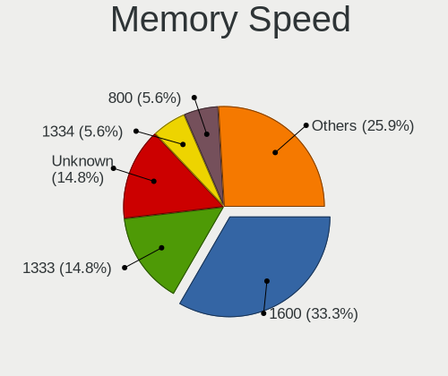

| Speed   | Computers | Percent |
|---------|-----------|---------|
| 1600    | 17        | 32.69%  |
| 1333    | 9         | 17.31%  |
| Unknown | 7         | 13.46%  |
| 1334    | 3         | 5.77%   |
| 1066    | 3         | 5.77%   |
| 800     | 3         | 5.77%   |
| 667     | 2         | 3.85%   |
| 41632   | 1         | 1.92%   |
| 3200    | 1         | 1.92%   |
| 2400    | 1         | 1.92%   |
| 1867    | 1         | 1.92%   |
| 1866    | 1         | 1.92%   |
| 533     | 1         | 1.92%   |
| 320     | 1         | 1.92%   |
| 100     | 1         | 1.92%   |

Printers & scanners
-------------------

Printer Vendor
--------------

Printer device vendors

| Vendor              | Computers | Percent |
|---------------------|-----------|---------|
| Brother Industries  | 2         | 40%     |
| Seiko Epson         | 1         | 20%     |
| Samsung Electronics | 1         | 20%     |
| Hewlett-Packard     | 1         | 20%     |

Printer Model
-------------

Printer device models

| Model                                | Computers | Percent |
|--------------------------------------|-----------|---------|
| Seiko Epson XP-240 Series            | 1         | 20%     |
| Samsung ML-216x Series Laser Printer | 1         | 20%     |
| HP OfficeJet 5200 series             | 1         | 20%     |
| Brother HL-L2350DW series            | 1         | 20%     |
| Brother HL-L2340D series             | 1         | 20%     |

Scanner Vendor
--------------

Scanner device vendors

| Vendor      | Computers | Percent |
|-------------|-----------|---------|
| Seiko Epson | 1         | 100%    |

Scanner Model
-------------

Scanner device models

| Model                                         | Computers | Percent |
|-----------------------------------------------|-----------|---------|
| Seiko Epson GT-9300UF [Perfection 2400 PHOTO] | 1         | 100%    |

Camera
------

Camera Vendor
-------------

Camera device vendors

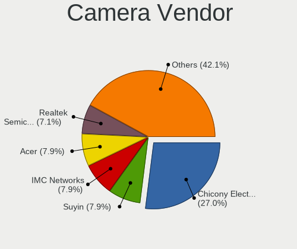

| Vendor                                 | Computers | Percent |
|----------------------------------------|-----------|---------|
| Chicony Electronics                    | 32        | 26.89%  |
| Acer                                   | 11        | 9.24%   |
| IMC Networks                           | 10        | 8.4%    |
| Suyin                                  | 9         | 7.56%   |
| Realtek Semiconductor                  | 7         | 5.88%   |
| Z-Star Microelectronics                | 6         | 5.04%   |
| Microdia                               | 6         | 5.04%   |
| Cheng Uei Precision Industry (Foxlink) | 6         | 5.04%   |
| Sunplus Innovation Technology          | 5         | 4.2%    |
| Ricoh                                  | 5         | 4.2%    |
| Syntek                                 | 3         | 2.52%   |
| Silicon Motion                         | 3         | 2.52%   |
| Importek                               | 3         | 2.52%   |
| Samsung Electronics                    | 2         | 1.68%   |
| Logitech                               | 2         | 1.68%   |
| Cubeternet                             | 2         | 1.68%   |
| Lite-On Technology                     | 1         | 0.84%   |
| GEO Semi                               | 1         | 0.84%   |
| DigiTech                               | 1         | 0.84%   |
| Aveo Technology                        | 1         | 0.84%   |
| Apple                                  | 1         | 0.84%   |
| ALi                                    | 1         | 0.84%   |
| Alcor Micro                            | 1         | 0.84%   |

Camera Model
------------

Camera device models

| Model                                                       | Computers | Percent |
|-------------------------------------------------------------|-----------|---------|
| Z-Star Webcam                                               | 4         | 3.36%   |
| Cheng Uei Precision Industry (Foxlink) HP Truevision HD     | 4         | 3.36%   |
| Acer EasyCamera                                             | 4         | 3.36%   |
| Suyin Acer/HP Integrated Webcam [CN0314]                    | 3         | 2.52%   |
| IMC Networks UVC VGA Webcam                                 | 3         | 2.52%   |
| Chicony USB 2.0 Camera                                      | 3         | 2.52%   |
| Chicony CNF9055 Toshiba Webcam                              | 3         | 2.52%   |
| Samsung Galaxy A5 (MTP)                                     | 2         | 1.68%   |
| Ricoh Sony Vaio Integrated Webcam                           | 2         | 1.68%   |
| Ricoh Laptop_Integrated_Webcam_FHD                          | 2         | 1.68%   |
| Microdia Sonix USB 2.0 Camera                               | 2         | 1.68%   |
| Importek HP Webcam-50                                       | 2         | 1.68%   |
| IMC Networks USB2.0 UVC HD Webcam                           | 2         | 1.68%   |
| IMC Networks Integrated Webcam                              | 2         | 1.68%   |
| Chicony VGA Webcam                                          | 2         | 1.68%   |
| Chicony TOSHIBA Web Camera - HD                             | 2         | 1.68%   |
| Chicony Lenovo EasyCamera                                   | 2         | 1.68%   |
| Acer Lenovo Integrated Webcam                               | 2         | 1.68%   |
| Acer Integrated Camera                                      | 2         | 1.68%   |
| Z-Star Vega USB 2.0 Camera                                  | 1         | 0.84%   |
| Z-Star Sirius USB2.0 Camera                                 | 1         | 0.84%   |
| Syntek USB Camera Device                                    | 1         | 0.84%   |
| Syntek Lenovo EasyCamera                                    | 1         | 0.84%   |
| Syntek Integrated Webcam                                    | 1         | 0.84%   |
| Suyin HP Webcam 101                                         | 1         | 0.84%   |
| Suyin HP Webcam                                             | 1         | 0.84%   |
| Suyin HP Truevision HD                                      | 1         | 0.84%   |
| Suyin HD Video WebCam                                       | 1         | 0.84%   |
| Suyin Acer CrystalEye Webcam                                | 1         | 0.84%   |
| Suyin 1.3M WebCam (notebook emachines E730, Acer sub-brand) | 1         | 0.84%   |
| Sunplus SPCA2281 Web Camera                                 | 1         | 0.84%   |
| Sunplus Laptop Integrated Webcam HD                         | 1         | 0.84%   |
| Sunplus HP TrueVision HD Camera                             | 1         | 0.84%   |
| Sunplus HP HD Webcam [Fixed]                                | 1         | 0.84%   |
| Sunplus Asus Webcam                                         | 1         | 0.84%   |
| Silicon Motion WebCam SC-0311139N                           | 1         | 0.84%   |
| Silicon Motion HP Webcam                                    | 1         | 0.84%   |
| Silicon Motion 300k Pixel Camera                            | 1         | 0.84%   |
| Ricoh Integrated Webcam                                     | 1         | 0.84%   |
| Realtek USB Camera                                          | 1         | 0.84%   |
| Realtek Lenovo EasyCamera                                   | 1         | 0.84%   |
| Realtek Integrated_Webcam_HD                                | 1         | 0.84%   |
| Realtek Integrated Webcam                                   | 1         | 0.84%   |
| Realtek HP Truevision HD integrated webcam                  | 1         | 0.84%   |
| Realtek HD Webcam - Realtek                                 | 1         | 0.84%   |
| Realtek HD WebCam                                           | 1         | 0.84%   |
| Microdia Laptop_Integrated_Webcam_0.3M                      | 1         | 0.84%   |
| Microdia Integrated_Webcam_1.3M                             | 1         | 0.84%   |
| Microdia Integrated Webcam                                  | 1         | 0.84%   |
| Microdia 1.3 MPixel Integrated Webcam                       | 1         | 0.84%   |
| Logitech Webcam C270                                        | 1         | 0.84%   |
| Logitech Webcam C210                                        | 1         | 0.84%   |
| Lite-On TOSHIBA Web Camera                                  | 1         | 0.84%   |
| Importek Webcam-101                                         | 1         | 0.84%   |
| IMC Networks USB2.0 VGA UVC WebCam                          | 1         | 0.84%   |
| IMC Networks USB2.0 UVC 2M WebCam                           | 1         | 0.84%   |
| IMC Networks TOSHIBA Web Camera - HD                        | 1         | 0.84%   |
| GEO Semi Condor                                             | 1         | 0.84%   |
| DigiTech USB 2.0 PC Camera                                  | 1         | 0.84%   |
| Cubeternet USB2.0 Camera                                    | 1         | 0.84%   |

Security
--------

Fingerprint Vendor
------------------

Fingerprint sensor vendors

| Vendor                | Computers | Percent |
|-----------------------|-----------|---------|
| Validity Sensors      | 5         | 31.25%  |
| AuthenTec             | 5         | 31.25%  |
| STMicroelectronics    | 3         | 18.75%  |
| Upek                  | 1         | 6.25%   |
| Synaptics             | 1         | 6.25%   |
| LighTuning Technology | 1         | 6.25%   |

Fingerprint Model
-----------------

Fingerprint sensor models

| Model                                                  | Computers | Percent |
|--------------------------------------------------------|-----------|---------|
| STMicroelectronics Fingerprint Reader                  | 3         | 18.75%  |
| Validity Sensors VFS 5011 fingerprint sensor           | 2         | 12.5%   |
| Validity Sensors VFS5011 Fingerprint Reader            | 1         | 6.25%   |
| Validity Sensors VFS451 Fingerprint Reader             | 1         | 6.25%   |
| Validity Sensors VFS301 Fingerprint Reader             | 1         | 6.25%   |
| Upek Biometric Touchchip/Touchstrip Fingerprint Sensor | 1         | 6.25%   |
| Synaptics Metallica MOH Touch Fingerprint Reader       | 1         | 6.25%   |
| LighTuning ES603 Swipe Fingerprint Sensor              | 1         | 6.25%   |
| AuthenTec Fingerprint Sensor                           | 1         | 6.25%   |
| AuthenTec AES2810                                      | 1         | 6.25%   |
| AuthenTec AES2501 Fingerprint Sensor                   | 1         | 6.25%   |
| AuthenTec AES1660 Fingerprint Sensor                   | 1         | 6.25%   |
| AuthenTec AES1600                                      | 1         | 6.25%   |

Chipcard Vendor
---------------

Chipcard module vendors

| Vendor      | Computers | Percent |
|-------------|-----------|---------|
| Broadcom    | 3         | 60%     |
| O2 Micro    | 1         | 20%     |
| Alcor Micro | 1         | 20%     |

Chipcard Model
--------------

Chipcard module models

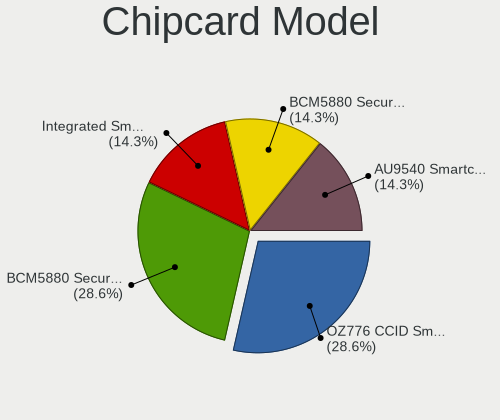

| Model                                                                        | Computers | Percent |
|------------------------------------------------------------------------------|-----------|---------|
| Broadcom BCM5880 Secure Applications Processor with fingerprint swipe sensor | 2         | 40%     |
| O2 Micro OZ776 CCID Smartcard Reader                                         | 1         | 20%     |
| Broadcom BCM5880 Secure Applications Processor                               | 1         | 20%     |
| Alcor Micro AU9540 Smartcard Reader                                          | 1         | 20%     |

Unsupported
-----------

Unsupported Devices
-------------------

Total unsupported devices on board

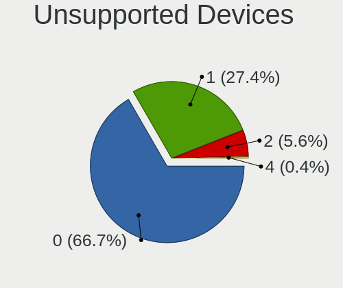

| Total | Computers | Percent |
|-------|-----------|---------|
| 0     | 153       | 69.86%  |
| 1     | 53        | 24.2%   |
| 2     | 13        | 5.94%   |

Unsupported Device Types
------------------------

Types of unsupported devices

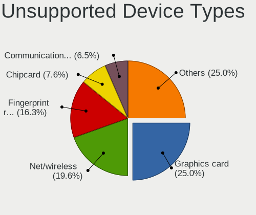

| Type                     | Computers | Percent |
|--------------------------|-----------|---------|
| Net/wireless             | 17        | 22.37%  |
| Fingerprint reader       | 15        | 19.74%  |
| Graphics card            | 12        | 15.79%  |
| Communication controller | 6         | 7.89%   |
| Storage                  | 5         | 6.58%   |
| Chipcard                 | 5         | 6.58%   |
| Modem                    | 4         | 5.26%   |
| Bluetooth                | 3         | 3.95%   |
| Multimedia controller    | 2         | 2.63%   |
| Camera                   | 2         | 2.63%   |
| Unassigned class         | 1         | 1.32%   |
| Storage/ide              | 1         | 1.32%   |
| Sound                    | 1         | 1.32%   |
| Net/ethernet             | 1         | 1.32%   |
| Flash memory             | 1         | 1.32%   |

