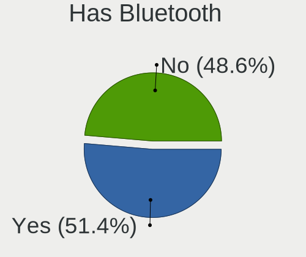
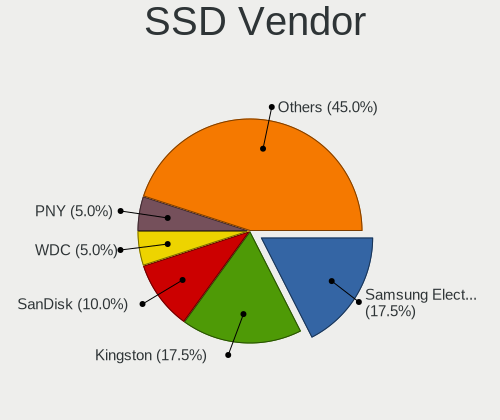
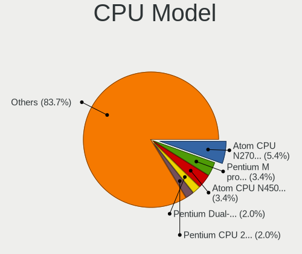
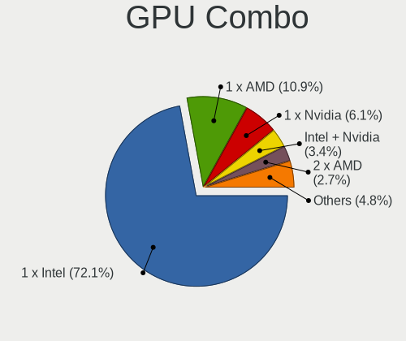
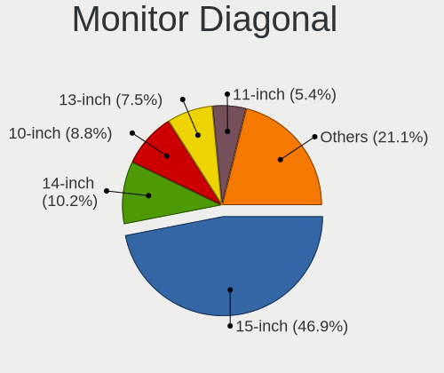
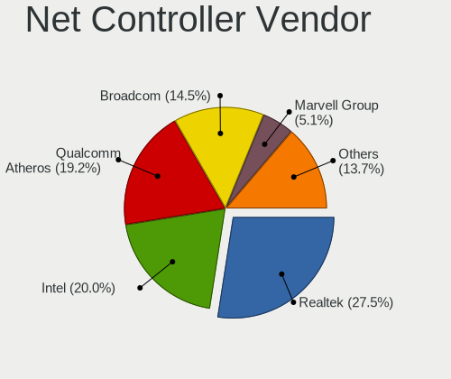
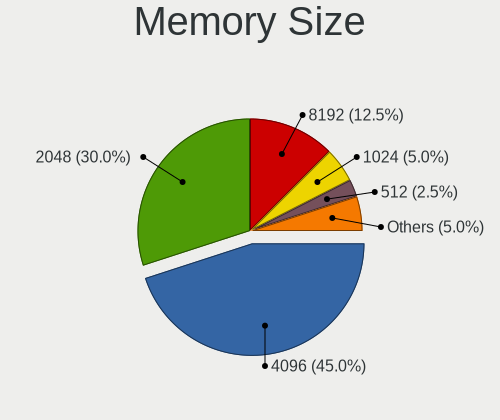
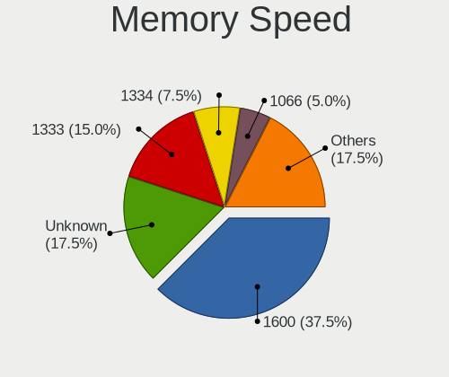

Peppermint 10 - Tested Hardware & Statistics (Notebooks)
--------------------------------------------------------

A project to collect tested hardware configurations for Peppermint 10.

Anyone can contribute to this report by the [hw-probe](https://github.com/linuxhw/hw-probe) tool:

    sudo -E hw-probe -all -upload

Please submit a probe of your configuration if it's not presented on the page or is rare.

Full-feature report is available here: https://linux-hardware.org/?view=trends&rel=peppermint-10

Contents
--------

* [ Test Cases ](#test-cases)

* [ System ](#system)
  - [ Kernel                   ](#kernel)
  - [ Kernel Family            ](#kernel-family)
  - [ Kernel Major Ver.        ](#kernel-major-ver)
  - [ Arch                     ](#arch)
  - [ DE                       ](#de)
  - [ Display Server           ](#display-server)
  - [ Display Manager          ](#display-manager)
  - [ OS Lang                  ](#os-lang)
  - [ Boot Mode                ](#boot-mode)
  - [ Filesystem               ](#filesystem)
  - [ Part. scheme             ](#part-scheme)
  - [ Dual Boot with Linux/BSD ](#dual-boot-with-linuxbsd)
  - [ Dual Boot (Win)          ](#dual-boot-win)

* [ Board ](#board)
  - [ Vendor                   ](#vendor)
  - [ Model                    ](#model)
  - [ Model Family             ](#model-family)
  - [ MFG Year                 ](#mfg-year)
  - [ Form Factor              ](#form-factor)
  - [ Secure Boot              ](#secure-boot)
  - [ Coreboot                 ](#coreboot)
  - [ RAM Size                 ](#ram-size)
  - [ RAM Used                 ](#ram-used)
  - [ Total Drives             ](#total-drives)
  - [ Has CD-ROM               ](#has-cd-rom)
  - [ Has Ethernet             ](#has-ethernet)
  - [ Has WiFi                 ](#has-wifi)
  - [ Has Bluetooth            ](#has-bluetooth)

* [ Location ](#location)
  - [ Country                  ](#country)
  - [ City                     ](#city)

* [ Drives ](#drives)
  - [ Drive Vendor             ](#drive-vendor)
  - [ Drive Model              ](#drive-model)
  - [ HDD Vendor               ](#hdd-vendor)
  - [ SSD Vendor               ](#ssd-vendor)
  - [ Drive Kind               ](#drive-kind)
  - [ Drive Connector          ](#drive-connector)
  - [ Drive Size               ](#drive-size)
  - [ Space Total              ](#space-total)
  - [ Space Used               ](#space-used)
  - [ Malfunc. Drives          ](#malfunc-drives)
  - [ Malfunc. Drive Vendor    ](#malfunc-drive-vendor)
  - [ Malfunc. HDD Vendor      ](#malfunc-hdd-vendor)
  - [ Malfunc. Drive Kind      ](#malfunc-drive-kind)
  - [ Failed Drives            ](#failed-drives)
  - [ Failed Drive Vendor      ](#failed-drive-vendor)
  - [ Drive Status             ](#drive-status)

* [ Storage controller ](#storage-controller)
  - [ Storage Vendor           ](#storage-vendor)
  - [ Storage Model            ](#storage-model)
  - [ Storage Kind             ](#storage-kind)

* [ Processor ](#processor)
  - [ CPU Vendor               ](#cpu-vendor)
  - [ CPU Model                ](#cpu-model)
  - [ CPU Model Family         ](#cpu-model-family)
  - [ CPU Cores                ](#cpu-cores)
  - [ CPU Sockets              ](#cpu-sockets)
  - [ CPU Threads              ](#cpu-threads)
  - [ CPU Op-Modes             ](#cpu-op-modes)
  - [ CPU Microcode            ](#cpu-microcode)
  - [ CPU Microarch            ](#cpu-microarch)

* [ Graphics ](#graphics)
  - [ GPU Vendor               ](#gpu-vendor)
  - [ GPU Model                ](#gpu-model)
  - [ GPU Combo                ](#gpu-combo)
  - [ GPU Driver               ](#gpu-driver)
  - [ GPU Memory               ](#gpu-memory)

* [ Monitor ](#monitor)
  - [ Monitor Vendor           ](#monitor-vendor)
  - [ Monitor Model            ](#monitor-model)
  - [ Monitor Resolution       ](#monitor-resolution)
  - [ Monitor Diagonal         ](#monitor-diagonal)
  - [ Monitor Width            ](#monitor-width)
  - [ Aspect Ratio             ](#aspect-ratio)
  - [ Monitor Area             ](#monitor-area)
  - [ Pixel Density            ](#pixel-density)
  - [ Multiple Monitors        ](#multiple-monitors)

* [ Network ](#network)
  - [ Net Controller Vendor    ](#net-controller-vendor)
  - [ Net Controller Model     ](#net-controller-model)
  - [ Wireless Vendor          ](#wireless-vendor)
  - [ Wireless Model           ](#wireless-model)
  - [ Ethernet Vendor          ](#ethernet-vendor)
  - [ Ethernet Model           ](#ethernet-model)
  - [ Net Controller Kind      ](#net-controller-kind)
  - [ Used Controller          ](#used-controller)
  - [ NICs                     ](#nics)
  - [ IPv6                     ](#ipv6)

* [ Bluetooth ](#bluetooth)
  - [ Bluetooth Vendor         ](#bluetooth-vendor)
  - [ Bluetooth Model          ](#bluetooth-model)

* [ Sound ](#sound)
  - [ Sound Vendor             ](#sound-vendor)
  - [ Sound Model              ](#sound-model)

* [ Memory ](#memory)
  - [ Memory Vendor            ](#memory-vendor)
  - [ Memory Model             ](#memory-model)
  - [ Memory Kind              ](#memory-kind)
  - [ Memory Form Factor       ](#memory-form-factor)
  - [ Memory Size              ](#memory-size)
  - [ Memory Speed             ](#memory-speed)

* [ Printers & scanners ](#printers--scanners)
  - [ Printer Vendor           ](#printer-vendor)
  - [ Printer Model            ](#printer-model)
  - [ Scanner Vendor           ](#scanner-vendor)
  - [ Scanner Model            ](#scanner-model)

* [ Camera ](#camera)
  - [ Camera Vendor            ](#camera-vendor)
  - [ Camera Model             ](#camera-model)

* [ Security ](#security)
  - [ Fingerprint Vendor       ](#fingerprint-vendor)
  - [ Fingerprint Model        ](#fingerprint-model)
  - [ Chipcard Vendor          ](#chipcard-vendor)
  - [ Chipcard Model           ](#chipcard-model)

* [ Unsupported ](#unsupported)
  - [ Unsupported Devices      ](#unsupported-devices)
  - [ Unsupported Device Types ](#unsupported-device-types)

Test Cases
----------

| Vendor        | Model                       | Probe                                                      | Date         |
|---------------|-----------------------------|------------------------------------------------------------|--------------|
| ASUSTek       | N73SV                       | [997a879973](https://linux-hardware.org/?probe=997a879973) | Oct 29, 2021 |
| Toshiba       | Satellite L750D             | [e24684255d](https://linux-hardware.org/?probe=e24684255d) | Oct 26, 2021 |
| HP            | Pavilion dv2000 (RD261LA... | [9f722a52d9](https://linux-hardware.org/?probe=9f722a52d9) | Oct 15, 2021 |
| Dell          | Inspiron 1750               | [0a56c60b24](https://linux-hardware.org/?probe=0a56c60b24) | Oct 11, 2021 |
| Dell          | Inspiron 1018               | [7f51bdb2d1](https://linux-hardware.org/?probe=7f51bdb2d1) | Oct 08, 2021 |
| HP            | 2000                        | [00f01e8929](https://linux-hardware.org/?probe=00f01e8929) | Oct 08, 2021 |
| Dell          | Inspiron 1750               | [be79dd5979](https://linux-hardware.org/?probe=be79dd5979) | Oct 06, 2021 |
| Acer          | Aspire R3-131T              | [7716dd2a46](https://linux-hardware.org/?probe=7716dd2a46) | Sep 30, 2021 |
| HP            | 15                          | [a976f1d357](https://linux-hardware.org/?probe=a976f1d357) | Sep 28, 2021 |
| Unknown       | Unknown                     | [b54d6779c8](https://linux-hardware.org/?probe=b54d6779c8) | Sep 19, 2021 |
| Packard Be... | EasyNote TK85               | [3e9c16c5a0](https://linux-hardware.org/?probe=3e9c16c5a0) | Sep 07, 2021 |
| Toshiba       | dynabook Satellite B552/... | [9532ae1c30](https://linux-hardware.org/?probe=9532ae1c30) | Sep 05, 2021 |
| ASUSTek       | K52F                        | [743e5c8059](https://linux-hardware.org/?probe=743e5c8059) | Sep 01, 2021 |
| ASUSTek       | K52F                        | [54d5076bc6](https://linux-hardware.org/?probe=54d5076bc6) | Sep 01, 2021 |
| Sony          | VGN-S55B_S                  | [f8237269e1](https://linux-hardware.org/?probe=f8237269e1) | Aug 22, 2021 |
| Packard Be... | EasyNote TK85               | [4faeb04124](https://linux-hardware.org/?probe=4faeb04124) | Aug 17, 2021 |
| Sony          | VGN-S55B_S                  | [e531cd57e6](https://linux-hardware.org/?probe=e531cd57e6) | Aug 15, 2021 |
| HP            | EliteBook 820 G1            | [830eaafeac](https://linux-hardware.org/?probe=830eaafeac) | Aug 08, 2021 |
| Samsung       | N150P/N210P/N220P           | [0a9b2f9147](https://linux-hardware.org/?probe=0a9b2f9147) | Aug 08, 2021 |
| Olivetti      | CL133A                      | [59d8296ec4](https://linux-hardware.org/?probe=59d8296ec4) | Jul 31, 2021 |
| Lenovo        | IdeaPad 1 11ADA05 82GV      | [113c8ab052](https://linux-hardware.org/?probe=113c8ab052) | Jul 27, 2021 |
| Fujitsu Si... | ESPRIMO Mobile V5535        | [827993d9c3](https://linux-hardware.org/?probe=827993d9c3) | Jul 17, 2021 |
| Olivetti      | CL133A                      | [a73133e4f3](https://linux-hardware.org/?probe=a73133e4f3) | Jul 15, 2021 |
| Dell          | Precision M4600             | [0242a479d2](https://linux-hardware.org/?probe=0242a479d2) | Jul 13, 2021 |
| Olivetti      | CL133A                      | [ba8eb5f003](https://linux-hardware.org/?probe=ba8eb5f003) | Jul 10, 2021 |
| Olivetti      | CL133A                      | [117e8fa0b4](https://linux-hardware.org/?probe=117e8fa0b4) | Jul 06, 2021 |
| HP            | Compaq Mini 110c-1100       | [9ba35acb61](https://linux-hardware.org/?probe=9ba35acb61) | Jun 24, 2021 |
| HP            | Compaq Mini 110c-1100       | [399e422d5b](https://linux-hardware.org/?probe=399e422d5b) | Jun 24, 2021 |
| Lenovo        | IdeaPad Slim 1-14AST-05 ... | [09171395a9](https://linux-hardware.org/?probe=09171395a9) | Jun 22, 2021 |
| Lenovo        | IdeaPad Slim 1-14AST-05 ... | [cdbc4c8c02](https://linux-hardware.org/?probe=cdbc4c8c02) | Jun 22, 2021 |
| Toshiba       | NB500                       | [e5095d1545](https://linux-hardware.org/?probe=e5095d1545) | Jun 21, 2021 |
| Lenovo        | ThinkPad Edge E431 62775... | [6d6430f8ff](https://linux-hardware.org/?probe=6d6430f8ff) | Jun 18, 2021 |
| Acer          | AOA150                      | [7cbadcfcce](https://linux-hardware.org/?probe=7cbadcfcce) | Jun 13, 2021 |
| Toshiba       | NB500                       | [0a57436b83](https://linux-hardware.org/?probe=0a57436b83) | Jun 13, 2021 |
| Toshiba       | NB500                       | [be659779e6](https://linux-hardware.org/?probe=be659779e6) | Jun 13, 2021 |
| HP            | Mini 110-1100               | [dcaac9d2ce](https://linux-hardware.org/?probe=dcaac9d2ce) | Jun 04, 2021 |
| HP            | Mini 110-1100               | [d919b139c6](https://linux-hardware.org/?probe=d919b139c6) | Jun 04, 2021 |
| HP            | Presario C500 (RZ343UA#A... | [d37099a83d](https://linux-hardware.org/?probe=d37099a83d) | May 25, 2021 |
| HP            | Presario C500 (RZ343UA#A... | [4aef9f472c](https://linux-hardware.org/?probe=4aef9f472c) | May 17, 2021 |
| Sony          | VGN-S55B_S                  | [a874601f76](https://linux-hardware.org/?probe=a874601f76) | May 05, 2021 |
| JPSaCouto     | Intel powered classmate ... | [f82c8e8839](https://linux-hardware.org/?probe=f82c8e8839) | Apr 25, 2021 |
| JPSaCouto     | Intel powered classmate ... | [bcca68ee1a](https://linux-hardware.org/?probe=bcca68ee1a) | Apr 25, 2021 |
| Acer          | Extensa 5510                | [8e9e536486](https://linux-hardware.org/?probe=8e9e536486) | Apr 24, 2021 |
| Gateway       | Blade-K8F                   | [12b76c8bca](https://linux-hardware.org/?probe=12b76c8bca) | Apr 24, 2021 |
| HP            | EliteBook 2530p             | [d54424038e](https://linux-hardware.org/?probe=d54424038e) | Apr 18, 2021 |
| HP            | EliteBook 2530p             | [562d38cca5](https://linux-hardware.org/?probe=562d38cca5) | Apr 18, 2021 |
| HP            | Compaq nc6320 (RH377ET#A... | [87befc0401](https://linux-hardware.org/?probe=87befc0401) | Apr 16, 2021 |
| Dell          | Inspiron 1545               | [a23936a0de](https://linux-hardware.org/?probe=a23936a0de) | Apr 10, 2021 |
| Fujitsu Si... | AMILO Li1705                | [56c5cc70d1](https://linux-hardware.org/?probe=56c5cc70d1) | Apr 07, 2021 |
| Fujitsu Si... | AMILO Li1705                | [71e906faa3](https://linux-hardware.org/?probe=71e906faa3) | Apr 07, 2021 |
| Dell          | Latitude 7410               | [a72bb094fd](https://linux-hardware.org/?probe=a72bb094fd) | Mar 26, 2021 |
| Dell          | Vostro 3550                 | [ebd077e7f4](https://linux-hardware.org/?probe=ebd077e7f4) | Mar 16, 2021 |
| HP            | Pavilion g6                 | [6079cacf9b](https://linux-hardware.org/?probe=6079cacf9b) | Mar 14, 2021 |
| Samsung       | R530/R730/R540              | [a9fd173c51](https://linux-hardware.org/?probe=a9fd173c51) | Mar 13, 2021 |
| Dell          | Inspiron 1012               | [4c4bb4bd4a](https://linux-hardware.org/?probe=4c4bb4bd4a) | Mar 04, 2021 |
| Dell          | Inspiron N5050              | [b0cdfde6d1](https://linux-hardware.org/?probe=b0cdfde6d1) | Mar 02, 2021 |
| Dell          | Inspiron N5050              | [492714801f](https://linux-hardware.org/?probe=492714801f) | Mar 02, 2021 |
| ASUSTek       | K50C                        | [e6cc5c82bf](https://linux-hardware.org/?probe=e6cc5c82bf) | Feb 21, 2021 |
| Lenovo        | ThinkPad R60 94566FG        | [f0eb3f1d77](https://linux-hardware.org/?probe=f0eb3f1d77) | Feb 19, 2021 |
| Medion        | Akoya E4214 MD99570         | [3ae1e824ed](https://linux-hardware.org/?probe=3ae1e824ed) | Feb 13, 2021 |
| Toshiba       | Satellite L500              | [003b1f0799](https://linux-hardware.org/?probe=003b1f0799) | Feb 12, 2021 |
| Toshiba       | Satellite L500              | [a642972ffa](https://linux-hardware.org/?probe=a642972ffa) | Feb 12, 2021 |
| Apple         | MacBookAir3,2               | [e4d417012f](https://linux-hardware.org/?probe=e4d417012f) | Feb 08, 2021 |
| ASUSTek       | X541NA                      | [e8ed6f17a3](https://linux-hardware.org/?probe=e8ed6f17a3) | Feb 07, 2021 |
| Unknown       | Unknown                     | [cf6b92a979](https://linux-hardware.org/?probe=cf6b92a979) | Feb 07, 2021 |
| Toshiba       | Satellite L300              | [9b7beecf8b](https://linux-hardware.org/?probe=9b7beecf8b) | Jan 29, 2021 |
| Sony          | VPCZ21V9E                   | [f0e8428fc2](https://linux-hardware.org/?probe=f0e8428fc2) | Jan 17, 2021 |
| Fujitsu       | LIFEBOOK T902               | [b0aa1bff61](https://linux-hardware.org/?probe=b0aa1bff61) | Jan 12, 2021 |
| Acer          | AOD255                      | [534f59ebc3](https://linux-hardware.org/?probe=534f59ebc3) | Jan 02, 2021 |
| Sony          | VPCZ21V9E                   | [27d806e418](https://linux-hardware.org/?probe=27d806e418) | Jan 02, 2021 |
| Sony          | VPCZ21V9E                   | [a1dc463ae7](https://linux-hardware.org/?probe=a1dc463ae7) | Jan 02, 2021 |
| Lenovo        | ThinkPad T450 20BUS3CF00    | [4dde602ff6](https://linux-hardware.org/?probe=4dde602ff6) | Jan 01, 2021 |
| Acer          | Extensa 5630                | [eed68dd316](https://linux-hardware.org/?probe=eed68dd316) | Dec 30, 2020 |
| Sony          | VPCZ21V9E                   | [b34a53e0e2](https://linux-hardware.org/?probe=b34a53e0e2) | Dec 29, 2020 |
| Acer          | Extensa 5510                | [efd4fce381](https://linux-hardware.org/?probe=efd4fce381) | Dec 29, 2020 |
| Acer          | Aspire 5738                 | [56f8292d5b](https://linux-hardware.org/?probe=56f8292d5b) | Dec 23, 2020 |
| Lenovo        | ThinkPad T60 1951CJ4        | [15c45c1a66](https://linux-hardware.org/?probe=15c45c1a66) | Dec 20, 2020 |
| Lenovo        | ThinkPad T60 1951CJ4        | [0f67c598b9](https://linux-hardware.org/?probe=0f67c598b9) | Dec 20, 2020 |
| Acer          | Extensa 5220                | [3dfca3a90f](https://linux-hardware.org/?probe=3dfca3a90f) | Dec 12, 2020 |
| Acer          | Extensa 5220                | [9b67134373](https://linux-hardware.org/?probe=9b67134373) | Dec 12, 2020 |
| Dell          | Precision M4700             | [58d2d0e8d4](https://linux-hardware.org/?probe=58d2d0e8d4) | Dec 11, 2020 |
| Dell          | Precision M4700             | [379e1a461c](https://linux-hardware.org/?probe=379e1a461c) | Dec 09, 2020 |
| Dell          | Inspiron N5050              | [ac934f7ac7](https://linux-hardware.org/?probe=ac934f7ac7) | Dec 07, 2020 |
| Dell          | Inspiron N5050              | [8f2d17e846](https://linux-hardware.org/?probe=8f2d17e846) | Dec 07, 2020 |
| HP            | Stream Laptop 14-ds0xxx     | [7499600f8c](https://linux-hardware.org/?probe=7499600f8c) | Dec 02, 2020 |
| HP            | Stream Laptop 14-ds0xxx     | [fed85859bc](https://linux-hardware.org/?probe=fed85859bc) | Dec 02, 2020 |
| Fujitsu Si... | ESPRIMO Mobile V5515        | [c176e7e603](https://linux-hardware.org/?probe=c176e7e603) | Nov 29, 2020 |
| Fujitsu Si... | ESPRIMO Mobile V5515        | [e4e600f1ed](https://linux-hardware.org/?probe=e4e600f1ed) | Nov 29, 2020 |
| ASUSTek       | 1015PN                      | [c0c9898136](https://linux-hardware.org/?probe=c0c9898136) | Nov 19, 2020 |
| ASUSTek       | 1015PN                      | [f19c7014be](https://linux-hardware.org/?probe=f19c7014be) | Nov 19, 2020 |
| Dell          | Latitude E7440              | [222b0a563a](https://linux-hardware.org/?probe=222b0a563a) | Nov 15, 2020 |
| Sony          | VGN-S55B_S                  | [534a526520](https://linux-hardware.org/?probe=534a526520) | Nov 08, 2020 |
| HP            | Pavilion dv8000 (EZ590UA... | [1e64c078af](https://linux-hardware.org/?probe=1e64c078af) | Nov 04, 2020 |
| Samsung       | N150P/N210P/N220P           | [808224d57c](https://linux-hardware.org/?probe=808224d57c) | Oct 30, 2020 |
| ASUSTek       | X205TA                      | [f7fc9c9932](https://linux-hardware.org/?probe=f7fc9c9932) | Oct 20, 2020 |
| Google        | Gnawty                      | [6bb50a022d](https://linux-hardware.org/?probe=6bb50a022d) | Oct 10, 2020 |
| Toshiba       | QOSMIO F755                 | [defa9c775a](https://linux-hardware.org/?probe=defa9c775a) | Oct 01, 2020 |
| Samsung       | 300E4A/300E5A/300E7A/343... | [64da7044cf](https://linux-hardware.org/?probe=64da7044cf) | Sep 26, 2020 |
| Medion        | Akoya E4214 MD99570         | [e45ead8de9](https://linux-hardware.org/?probe=e45ead8de9) | Sep 20, 2020 |
| Samsung       | R610                        | [db61c853a2](https://linux-hardware.org/?probe=db61c853a2) | Sep 17, 2020 |
| ASUSTek       | T101HA                      | [036f4f2304](https://linux-hardware.org/?probe=036f4f2304) | Sep 15, 2020 |
| ASUSTek       | P53E                        | [75d3fa4178](https://linux-hardware.org/?probe=75d3fa4178) | Sep 04, 2020 |
| Lenovo        | IdeaPad Z460 20059          | [9568d009c0](https://linux-hardware.org/?probe=9568d009c0) | Sep 01, 2020 |
| HP            | Stream Laptop 11-y0XX       | [06dd4aecb5](https://linux-hardware.org/?probe=06dd4aecb5) | Sep 01, 2020 |
| Acer          | TravelMate B115-M           | [d3395dca0c](https://linux-hardware.org/?probe=d3395dca0c) | Aug 30, 2020 |
| Itautec       | Infoway                     | [511d121c7f](https://linux-hardware.org/?probe=511d121c7f) | Aug 29, 2020 |
| Toshiba       | Satellite C660              | [90db4cc4d1](https://linux-hardware.org/?probe=90db4cc4d1) | Aug 07, 2020 |
| Samsung       | N150P                       | [17e2e411da](https://linux-hardware.org/?probe=17e2e411da) | Aug 07, 2020 |
| Toshiba       | Satellite L310              | [bf2bd8711e](https://linux-hardware.org/?probe=bf2bd8711e) | Aug 03, 2020 |
| Samsung       | N150/N210/N220              | [304d7ac49d](https://linux-hardware.org/?probe=304d7ac49d) | Aug 02, 2020 |
| HP            | EliteBook 2740p             | [b87f4916b6](https://linux-hardware.org/?probe=b87f4916b6) | Jul 27, 2020 |
| HP            | Compaq Presario CQ40        | [aaf338c454](https://linux-hardware.org/?probe=aaf338c454) | Jul 24, 2020 |
| Dell          | Latitude E6420              | [1db19a0158](https://linux-hardware.org/?probe=1db19a0158) | Jul 24, 2020 |
| Sony          | VGN-S55B_S                  | [2643feee17](https://linux-hardware.org/?probe=2643feee17) | Jul 24, 2020 |
| HP            | EliteBook 8570w             | [bd697a03f8](https://linux-hardware.org/?probe=bd697a03f8) | Jul 19, 2020 |
| Itautec       | Infoway                     | [27a7c624d8](https://linux-hardware.org/?probe=27a7c624d8) | Jul 17, 2020 |
| Itautec       | Infoway                     | [bf4635403e](https://linux-hardware.org/?probe=bf4635403e) | Jul 17, 2020 |
| Positivo      | N1103                       | [3cdb7fc95e](https://linux-hardware.org/?probe=3cdb7fc95e) | Jul 13, 2020 |
| Toshiba       | PORTEGE R500                | [e7c5c010bd](https://linux-hardware.org/?probe=e7c5c010bd) | Jul 12, 2020 |
| Toshiba       | PORTEGE R500                | [fd50b5e2a7](https://linux-hardware.org/?probe=fd50b5e2a7) | Jul 12, 2020 |
| Dell          | Latitude E6420              | [52d11b26d3](https://linux-hardware.org/?probe=52d11b26d3) | Jul 09, 2020 |
| Acer          | Aspire R3-131T              | [dbecc119b2](https://linux-hardware.org/?probe=dbecc119b2) | Jul 08, 2020 |
| Sony          | VGN-S55B_S                  | [1943134c38](https://linux-hardware.org/?probe=1943134c38) | Jun 21, 2020 |
| HP            | Notebook                    | [841b43ba94](https://linux-hardware.org/?probe=841b43ba94) | Jun 14, 2020 |
| Lenovo        | B490 37722SP                | [9bf0160ca7](https://linux-hardware.org/?probe=9bf0160ca7) | May 28, 2020 |
| Toshiba       | Satellite L500              | [df76123000](https://linux-hardware.org/?probe=df76123000) | May 22, 2020 |
| HP            | Mini 110-1000               | [1f0854cd2e](https://linux-hardware.org/?probe=1f0854cd2e) | May 19, 2020 |
| HP            | Mini 110-1000               | [bce45cbc8a](https://linux-hardware.org/?probe=bce45cbc8a) | May 19, 2020 |
| Unknown       | Unknown                     | [aabfc32771](https://linux-hardware.org/?probe=aabfc32771) | May 19, 2020 |
| Unknown       | Unknown                     | [eef6f0a50b](https://linux-hardware.org/?probe=eef6f0a50b) | May 19, 2020 |
| Lenovo        | ThinkPad E490 20N90019BR    | [94839129c9](https://linux-hardware.org/?probe=94839129c9) | May 19, 2020 |
| Lenovo        | ThinkPad E490 20N90019BR    | [adf1cefbf5](https://linux-hardware.org/?probe=adf1cefbf5) | May 19, 2020 |
| Unknown       | Unknown                     | [3bcd40acc0](https://linux-hardware.org/?probe=3bcd40acc0) | May 19, 2020 |
| Toshiba       | Satellite L500              | [6782b31a2e](https://linux-hardware.org/?probe=6782b31a2e) | May 17, 2020 |
| Clevo         | W55xEU                      | [f1ad04bd23](https://linux-hardware.org/?probe=f1ad04bd23) | May 16, 2020 |
| Toshiba       | Satellite M70               | [c9e02a940d](https://linux-hardware.org/?probe=c9e02a940d) | May 13, 2020 |
| ASUSTek       | Q400A                       | [075d494ee2](https://linux-hardware.org/?probe=075d494ee2) | May 10, 2020 |
| Lenovo        | B575 1450A7U                | [b781397fa7](https://linux-hardware.org/?probe=b781397fa7) | May 05, 2020 |
| Toshiba       | Satellite C660              | [3d10f5b306](https://linux-hardware.org/?probe=3d10f5b306) | May 03, 2020 |
| Toshiba       | Satellite C660              | [0e91d35b8e](https://linux-hardware.org/?probe=0e91d35b8e) | May 03, 2020 |
| Sony          | VGN-FW140E                  | [8aad1d7bfc](https://linux-hardware.org/?probe=8aad1d7bfc) | May 02, 2020 |
| Toshiba       | Satellite C660              | [bc3bd72199](https://linux-hardware.org/?probe=bc3bd72199) | May 01, 2020 |
| Toshiba       | Satellite C660              | [354e994c53](https://linux-hardware.org/?probe=354e994c53) | May 01, 2020 |
| Sony          | VGN-FW140E                  | [cee09f3d1e](https://linux-hardware.org/?probe=cee09f3d1e) | Apr 30, 2020 |
| Toshiba       | Satellite PRO C850          | [1744740eb4](https://linux-hardware.org/?probe=1744740eb4) | Apr 24, 2020 |
| Lenovo        | ThinkPad X1 Carbon 3rd 2... | [5ddee791c7](https://linux-hardware.org/?probe=5ddee791c7) | Apr 20, 2020 |
| ASUSTek       | X45U                        | [0ce069357c](https://linux-hardware.org/?probe=0ce069357c) | Apr 18, 2020 |
| Acer          | Aspire ES1-521              | [20e7fea349](https://linux-hardware.org/?probe=20e7fea349) | Apr 08, 2020 |
| Lenovo        | 433328G                     | [3c5b9e3703](https://linux-hardware.org/?probe=3c5b9e3703) | Apr 07, 2020 |
| Acer          | Aspire ES1-521              | [0c74c17c24](https://linux-hardware.org/?probe=0c74c17c24) | Apr 07, 2020 |
| HP            | 2133 (FU346EA)              | [499f685a66](https://linux-hardware.org/?probe=499f685a66) | Mar 31, 2020 |
| HP            | 2133 (FU346EA)              | [2c6f9bf922](https://linux-hardware.org/?probe=2c6f9bf922) | Mar 31, 2020 |
| HP            | Stream Laptop 14-ds0xxx     | [8fae01eff8](https://linux-hardware.org/?probe=8fae01eff8) | Mar 31, 2020 |
| HP            | 255 G2                      | [7cfb9e5a0e](https://linux-hardware.org/?probe=7cfb9e5a0e) | Mar 25, 2020 |
| Clevo         | W55xEU                      | [09d70e49b4](https://linux-hardware.org/?probe=09d70e49b4) | Mar 23, 2020 |
| ASUSTek       | F3E                         | [e01cca6624](https://linux-hardware.org/?probe=e01cca6624) | Mar 18, 2020 |
| ASUSTek       | F3E                         | [51ae68d38f](https://linux-hardware.org/?probe=51ae68d38f) | Mar 17, 2020 |
| ASUSTek       | F3E                         | [5d53434528](https://linux-hardware.org/?probe=5d53434528) | Mar 17, 2020 |
| ASUSTek       | F3E                         | [8491571d31](https://linux-hardware.org/?probe=8491571d31) | Mar 17, 2020 |
| ASUSTek       | F3E                         | [d7a53d4fb8](https://linux-hardware.org/?probe=d7a53d4fb8) | Mar 17, 2020 |
| HP            | Pavilion dv6500             | [1345f0d7df](https://linux-hardware.org/?probe=1345f0d7df) | Mar 02, 2020 |
| Lenovo        | 3000 N500 423374G           | [b0d0a28cc2](https://linux-hardware.org/?probe=b0d0a28cc2) | Feb 29, 2020 |
| Lenovo        | 3000 N500 423374G           | [c67851f402](https://linux-hardware.org/?probe=c67851f402) | Feb 29, 2020 |
| eMachines     | E520                        | [33cabcad9d](https://linux-hardware.org/?probe=33cabcad9d) | Feb 24, 2020 |
| HP            | Pavilion dv4                | [6f6de0e938](https://linux-hardware.org/?probe=6f6de0e938) | Feb 18, 2020 |
| Toshiba       | Satellite C850-F117         | [648aab8d5d](https://linux-hardware.org/?probe=648aab8d5d) | Feb 12, 2020 |
| Apple         | MacBook4,1                  | [eca3e46eed](https://linux-hardware.org/?probe=eca3e46eed) | Feb 07, 2020 |
| Apple         | MacBook4,1                  | [516c8bcbc2](https://linux-hardware.org/?probe=516c8bcbc2) | Feb 06, 2020 |
| Apple         | MacBook4,1                  | [1693ad6fcd](https://linux-hardware.org/?probe=1693ad6fcd) | Feb 04, 2020 |
| Apple         | MacBook4,1                  | [17eb93e1dc](https://linux-hardware.org/?probe=17eb93e1dc) | Feb 04, 2020 |
| Toshiba       | NB520                       | [a6b76ee94c](https://linux-hardware.org/?probe=a6b76ee94c) | Feb 02, 2020 |
| Toshiba       | NB520                       | [20c5cb5e37](https://linux-hardware.org/?probe=20c5cb5e37) | Feb 02, 2020 |
| Toshiba       | NB520                       | [7fcee73990](https://linux-hardware.org/?probe=7fcee73990) | Feb 02, 2020 |
| Apple         | MacBook4,1                  | [e341d904c9](https://linux-hardware.org/?probe=e341d904c9) | Feb 01, 2020 |
| Apple         | MacBook4,1                  | [0244fb9c97](https://linux-hardware.org/?probe=0244fb9c97) | Feb 01, 2020 |
| ASUSTek       | S500CA                      | [4f82008cac](https://linux-hardware.org/?probe=4f82008cac) | Jan 29, 2020 |
| HP            | Compaq nx6310 (EY512ES#A... | [7131bc7839](https://linux-hardware.org/?probe=7131bc7839) | Jan 29, 2020 |
| Sony          | VPCCW21FX                   | [78ac20109b](https://linux-hardware.org/?probe=78ac20109b) | Jan 21, 2020 |
| HP            | Compaq nx6310 (EY512ES#A... | [5aa6704ff1](https://linux-hardware.org/?probe=5aa6704ff1) | Jan 16, 2020 |
| ASUSTek       | VivoBook 12_ASUS Laptop ... | [d87b9779d7](https://linux-hardware.org/?probe=d87b9779d7) | Jan 14, 2020 |
| ASUSTek       | VivoBook 12_ASUS Laptop ... | [c6595736b8](https://linux-hardware.org/?probe=c6595736b8) | Jan 14, 2020 |
| HP            | Laptop 15-db0xxx            | [f3d6402b19](https://linux-hardware.org/?probe=f3d6402b19) | Dec 24, 2019 |
| Toshiba       | Satellite C850-F117         | [5b8f68dbc9](https://linux-hardware.org/?probe=5b8f68dbc9) | Nov 26, 2019 |
| Toshiba       | Satellite C55D-B            | [0d1bbd1e60](https://linux-hardware.org/?probe=0d1bbd1e60) | Nov 25, 2019 |
| Toshiba       | Satellite C55D-B            | [98653dbce0](https://linux-hardware.org/?probe=98653dbce0) | Nov 25, 2019 |
| Lenovo        | G500 20236                  | [c27bae21b0](https://linux-hardware.org/?probe=c27bae21b0) | Nov 16, 2019 |
| Lenovo        | G500 20236                  | [afb3948882](https://linux-hardware.org/?probe=afb3948882) | Nov 15, 2019 |
| Acer          | Aspire F5-573G              | [db302aa54d](https://linux-hardware.org/?probe=db302aa54d) | Nov 14, 2019 |
| HP            | Pavilion 11 x360 PC         | [00c8d1e4e7](https://linux-hardware.org/?probe=00c8d1e4e7) | Nov 11, 2019 |
| HP            | Pavilion 11 x360 PC         | [6b30a9e102](https://linux-hardware.org/?probe=6b30a9e102) | Nov 11, 2019 |
| HP            | Pavilion 11 x360 PC         | [cc352f0876](https://linux-hardware.org/?probe=cc352f0876) | Nov 10, 2019 |
| HP            | Pavilion 11 x360 PC         | [a4bd90bb25](https://linux-hardware.org/?probe=a4bd90bb25) | Nov 09, 2019 |
| HP            | Laptop 15-bs0xx             | [2ac11dfe68](https://linux-hardware.org/?probe=2ac11dfe68) | Nov 02, 2019 |
| ASUSTek       | 1005PXD                     | [d0afcbe081](https://linux-hardware.org/?probe=d0afcbe081) | Oct 26, 2019 |
| ASUSTek       | 1005PXD                     | [1e57ee0116](https://linux-hardware.org/?probe=1e57ee0116) | Oct 26, 2019 |
| HP            | Pavilion Notebook           | [14784cf228](https://linux-hardware.org/?probe=14784cf228) | Oct 19, 2019 |
| HP            | Pavilion Notebook           | [5f57cac098](https://linux-hardware.org/?probe=5f57cac098) | Oct 19, 2019 |
| HP            | 255 G5 Notebook PC          | [f14f865a3d](https://linux-hardware.org/?probe=f14f865a3d) | Oct 08, 2019 |
| HP            | 255 G5 Notebook PC          | [aa23436bf3](https://linux-hardware.org/?probe=aa23436bf3) | Oct 08, 2019 |
| HP            | 255 G5 Notebook PC          | [b9c04a5acf](https://linux-hardware.org/?probe=b9c04a5acf) | Oct 07, 2019 |
| Fujitsu Si... | AMILO Pi 1505               | [6e3970fc39](https://linux-hardware.org/?probe=6e3970fc39) | Sep 17, 2019 |
| Fujitsu Si... | AMILO Pi 1505               | [20f7841be1](https://linux-hardware.org/?probe=20f7841be1) | Sep 17, 2019 |
| HP            | Pavilion Notebook           | [f29f057c97](https://linux-hardware.org/?probe=f29f057c97) | Sep 16, 2019 |
| Unknown       | Unknown                     | [0a9618f99e](https://linux-hardware.org/?probe=0a9618f99e) | Jul 10, 2019 |
| Lenovo        | G500 20236                  | [4faa6112c3](https://linux-hardware.org/?probe=4faa6112c3) | Jun 28, 2019 |
| HP            | Pavilion dv7                | [24128291a4](https://linux-hardware.org/?probe=24128291a4) | Jun 25, 2019 |
| Unknown       | Unknown                     | [583ec484b5](https://linux-hardware.org/?probe=583ec484b5) | Jun 24, 2019 |
| Unknown       | Unknown                     | [c0eb7dc5f0](https://linux-hardware.org/?probe=c0eb7dc5f0) | Jun 24, 2019 |
| ASUSTek       | Q501LA                      | [ad06395996](https://linux-hardware.org/?probe=ad06395996) | Jun 23, 2019 |
| Toshiba       | Satellite M70               | [c31329a508](https://linux-hardware.org/?probe=c31329a508) | Jun 19, 2019 |
| Toshiba       | Satellite C850-F117         | [de103d8a7d](https://linux-hardware.org/?probe=de103d8a7d) | Jun 13, 2019 |
| Toshiba       | Satellite C850-F117         | [7e007db586](https://linux-hardware.org/?probe=7e007db586) | Jun 12, 2019 |
| IBM           | ThinkPad T43 2669GY4        | [4916e9ec9c](https://linux-hardware.org/?probe=4916e9ec9c) | Jun 09, 2019 |
| Acer          | Extensa 5630                | [a68ff6fdd1](https://linux-hardware.org/?probe=a68ff6fdd1) | Jun 05, 2019 |

System
------

Kernel
------

Version of the Linux kernel

| Version               | Notebooks | Percent |
|-----------------------|-----------|---------|
| 5.0.0-37-generic      | 22        | 15.6%   |
| 5.4.0-42-generic      | 8         | 5.67%   |
| 5.3.0-62-generic      | 7         | 4.96%   |
| 5.3.0-51-generic      | 7         | 4.96%   |
| 4.18.0-18-generic     | 7         | 4.96%   |
| 5.4.0-65-generic      | 6         | 4.26%   |
| 5.4.0-72-generic      | 4         | 2.84%   |
| 5.4.0-58-generic      | 4         | 2.84%   |
| 5.0.0-32-generic      | 4         | 2.84%   |
| 5.4.0-87-generic      | 3         | 2.13%   |
| 5.4.0-80-generic      | 3         | 2.13%   |
| 5.4.0-77-generic      | 3         | 2.13%   |
| 5.4.0-66-generic      | 3         | 2.13%   |
| 5.4.0-47-generic      | 3         | 2.13%   |
| 5.4.0-45-generic      | 3         | 2.13%   |
| 5.3.0-46-generic      | 3         | 2.13%   |
| 5.3.0-42-generic      | 3         | 2.13%   |
| 5.3.0-28-generic      | 3         | 2.13%   |
| 5.0.0-36-generic      | 3         | 2.13%   |
| 5.4.0-81-generic      | 2         | 1.42%   |
| 5.4.0-74-generic      | 2         | 1.42%   |
| 5.4.0-70-generic      | 2         | 1.42%   |
| 5.4.0-56-generic      | 2         | 1.42%   |
| 5.4.0-54-generic      | 2         | 1.42%   |
| 5.4.0-52-generic      | 2         | 1.42%   |
| 5.4.0-48-generic      | 2         | 1.42%   |
| 5.3.0-59-generic      | 2         | 1.42%   |
| 5.3.0-40-generic      | 2         | 1.42%   |
| 5.0.0-27-generic      | 2         | 1.42%   |
| 4.18.0-21-generic     | 2         | 1.42%   |
| 5.4.95-050495-generic | 1         | 0.71%   |
| 5.4.0-84-generic      | 1         | 0.71%   |
| 5.4.0-73-generic      | 1         | 0.71%   |
| 5.4.0-71-generic      | 1         | 0.71%   |
| 5.4.0-67-generic      | 1         | 0.71%   |
| 5.4.0-64-generic      | 1         | 0.71%   |
| 5.4.0-62-generic      | 1         | 0.71%   |
| 5.4.0-60-generic      | 1         | 0.71%   |
| 5.4.0-59-generic      | 1         | 0.71%   |
| 5.4.0-53-generic      | 1         | 0.71%   |
| 5.4.0-51-generic      | 1         | 0.71%   |
| 5.4.0-49-generic      | 1         | 0.71%   |
| 5.4.0-44-generic      | 1         | 0.71%   |
| 5.3.0-45-generic      | 1         | 0.71%   |
| 5.1.11-050111-generic | 1         | 0.71%   |
| 5.0.0-29-generic      | 1         | 0.71%   |
| 4.18.0-25-generic     | 1         | 0.71%   |
| 4.18.0-24-generic     | 1         | 0.71%   |
| 4.18.0-22-generic     | 1         | 0.71%   |
| 4.18.0-20-generic     | 1         | 0.71%   |

Kernel Family
-------------

Linux kernel without a distro release

| Version | Notebooks | Percent |
|---------|-----------|---------|
| 5.4.0   | 63        | 46.67%  |
| 5.0.0   | 30        | 22.22%  |
| 5.3.0   | 27        | 20%     |
| 4.18.0  | 13        | 9.63%   |
| 5.4.95  | 1         | 0.74%   |
| 5.1.11  | 1         | 0.74%   |

Kernel Major Ver.
-----------------

Linux kernel major version

| Version | Notebooks | Percent |
|---------|-----------|---------|
| 5.4     | 64        | 47.41%  |
| 5.0     | 30        | 22.22%  |
| 5.3     | 27        | 20%     |
| 4.18    | 13        | 9.63%   |
| 5.1     | 1         | 0.74%   |

Arch
----

OS architecture (x86_64, i586, etc.)

| Name   | Notebooks | Percent |
|--------|-----------|---------|
| x86_64 | 88        | 68.22%  |
| i686   | 41        | 31.78%  |

DE
--

Desktop Environment

| Name       | Notebooks | Percent |
|------------|-----------|---------|
| LXDE       | 103       | 78.63%  |
| Unknown    | 20        | 15.27%  |
| GNOME      | 6         | 4.58%   |
| X-Cinnamon | 1         | 0.76%   |
| Peppermint | 1         | 0.76%   |

Display Server
--------------

X11 or Wayland

| Name | Notebooks | Percent |
|------|-----------|---------|
| X11  | 129       | 100%    |

Display Manager
---------------

SDDM, LightDM, etc.

| Name    | Notebooks | Percent |
|---------|-----------|---------|
| Unknown | 120       | 93.02%  |
| TDM     | 6         | 4.65%   |
| LightDM | 2         | 1.55%   |
| SDDM    | 1         | 0.78%   |

OS Lang
-------

Language

| Lang    | Notebooks | Percent |
|---------|-----------|---------|
| en_US   | 42        | 32.06%  |
| Unknown | 14        | 10.69%  |
| en_GB   | 10        | 7.63%   |
| de_DE   | 7         | 5.34%   |
| pt_BR   | 6         | 4.58%   |
| it_IT   | 6         | 4.58%   |
| nl_NL   | 5         | 3.82%   |
| pl_PL   | 4         | 3.05%   |
| fr_FR   | 4         | 3.05%   |
| en_CA   | 4         | 3.05%   |
| C       | 4         | 3.05%   |
| ru_RU   | 3         | 2.29%   |
| ja_JP   | 2         | 1.53%   |
| es_MX   | 2         | 1.53%   |
| es_AR   | 2         | 1.53%   |
| en_IN   | 2         | 1.53%   |
| tr_TR   | 1         | 0.76%   |
| sv_SE   | 1         | 0.76%   |
| ro_RO   | 1         | 0.76%   |
| pt_PT   | 1         | 0.76%   |
| lv_LV   | 1         | 0.76%   |
| fi_FI   | 1         | 0.76%   |
| es_PE   | 1         | 0.76%   |
| es_PA   | 1         | 0.76%   |
| es_ES   | 1         | 0.76%   |
| es_CR   | 1         | 0.76%   |
| es_BO   | 1         | 0.76%   |
| en_ZA   | 1         | 0.76%   |
| en_PH   | 1         | 0.76%   |
| en_AU   | 1         | 0.76%   |

Boot Mode
---------

EFI or BIOS

| Mode | Notebooks | Percent |
|------|-----------|---------|
| BIOS | 99        | 76.74%  |
| EFI  | 30        | 23.26%  |

Filesystem
----------

Type of filesystem

| Type     | Notebooks | Percent |
|----------|-----------|---------|
| Ext4     | 111       | 84.73%  |
| Unknown  | 10        | 7.63%   |
| Overlay  | 5         | 3.82%   |
| Ext2     | 2         | 1.53%   |
| Reiserfs | 1         | 0.76%   |
| Ext3     | 1         | 0.76%   |
| Btrfs    | 1         | 0.76%   |

Part. scheme
------------

Scheme of partitioning

| Type    | Notebooks | Percent |
|---------|-----------|---------|
| Unknown | 117       | 90%     |
| GPT     | 7         | 5.38%   |
| MBR     | 6         | 4.62%   |

Dual Boot with Linux/BSD
------------------------

Hosting more than one Linux/BSD

| Dual boot | Notebooks | Percent |
|-----------|-----------|---------|
| No        | 122       | 93.13%  |
| Yes       | 9         | 6.87%   |

Dual Boot (Win)
---------------

Hosting Linux and Windows

| Dual boot | Notebooks | Percent |
|-----------|-----------|---------|
| No        | 114       | 87.02%  |
| Yes       | 17        | 12.98%  |

Board
-----

Vendor
------

Motherboard manufacturer

| Name                | Notebooks | Percent |
|---------------------|-----------|---------|
| Hewlett-Packard     | 29        | 22.48%  |
| Toshiba             | 16        | 12.4%   |
| Lenovo              | 15        | 11.63%  |
| ASUSTek Computer    | 15        | 11.63%  |
| Dell                | 12        | 9.3%    |
| Acer                | 11        | 8.53%   |
| Samsung Electronics | 7         | 5.43%   |
| Sony                | 4         | 3.1%    |
| Fujitsu Siemens     | 4         | 3.1%    |
| Apple               | 2         | 1.55%   |
| Unknown             | 2         | 1.55%   |
| Positivo            | 1         | 0.78%   |
| Packard Bell        | 1         | 0.78%   |
| Olivetti            | 1         | 0.78%   |
| Medion              | 1         | 0.78%   |
| JPSaCouto           | 1         | 0.78%   |
| Itautec             | 1         | 0.78%   |
| IBM                 | 1         | 0.78%   |
| Google              | 1         | 0.78%   |
| Gateway             | 1         | 0.78%   |
| Fujitsu             | 1         | 0.78%   |
| eMachines           | 1         | 0.78%   |
| Clevo               | 1         | 0.78%   |

Model
-----

Motherboard model

| Name                                       | Notebooks | Percent |
|--------------------------------------------|-----------|---------|
| Toshiba Satellite M70                      | 2         | 1.55%   |
| Toshiba Satellite L500                     | 2         | 1.55%   |
| Samsung N150P/N210P/N220P                  | 2         | 1.55%   |
| Lenovo G500 20236                          | 2         | 1.55%   |
| Dell Inspiron N5050                        | 2         | 1.55%   |
| Acer Extensa 5630                          | 2         | 1.55%   |
| Unknown                                    | 2         | 1.55%   |
| Toshiba Satellite PRO C850                 | 1         | 0.78%   |
| Toshiba Satellite L750D                    | 1         | 0.78%   |
| Toshiba Satellite L310                     | 1         | 0.78%   |
| Toshiba Satellite L300                     | 1         | 0.78%   |
| Toshiba Satellite C850-F117                | 1         | 0.78%   |
| Toshiba Satellite C660                     | 1         | 0.78%   |
| Toshiba Satellite C55D-B                   | 1         | 0.78%   |
| Toshiba QOSMIO F755                        | 1         | 0.78%   |
| Toshiba PORTEGE R500                       | 1         | 0.78%   |
| Toshiba NB520                              | 1         | 0.78%   |
| Toshiba NB500                              | 1         | 0.78%   |
| Toshiba dynabook Satellite B552/H          | 1         | 0.78%   |
| Sony VPCZ21V9E                             | 1         | 0.78%   |
| Sony VPCCW21FX                             | 1         | 0.78%   |
| Sony VGN-S55B_S                            | 1         | 0.78%   |
| Sony VGN-FW140E                            | 1         | 0.78%   |
| Samsung R610                               | 1         | 0.78%   |
| Samsung R530/R730/R540                     | 1         | 0.78%   |
| Samsung N150P                              | 1         | 0.78%   |
| Samsung N150/N210/N220                     | 1         | 0.78%   |
| Samsung 300E4A/300E5A/300E7A/3430EA/3530EA | 1         | 0.78%   |
| Positivo N1103                             | 1         | 0.78%   |
| Packard Bell EasyNote TK85                 | 1         | 0.78%   |
| Olivetti CL133A                            | 1         | 0.78%   |
| Medion Akoya E4214 MD99570                 | 1         | 0.78%   |
| Lenovo ThinkPad X1 Carbon 3rd 20BS0035US   | 1         | 0.78%   |
| Lenovo ThinkPad T60 1951CJ4                | 1         | 0.78%   |
| Lenovo ThinkPad T450 20BUS3CF00            | 1         | 0.78%   |
| Lenovo ThinkPad R60 94566FG                | 1         | 0.78%   |
| Lenovo ThinkPad Edge E431 62775GU          | 1         | 0.78%   |
| Lenovo ThinkPad E490 20N90019BR            | 1         | 0.78%   |
| Lenovo IdeaPad Z460 20059                  | 1         | 0.78%   |
| Lenovo IdeaPad Slim 1-14AST-05 81VS        | 1         | 0.78%   |
| Lenovo IdeaPad 1 11ADA05 82GV              | 1         | 0.78%   |
| Lenovo B575 1450A7U                        | 1         | 0.78%   |
| Lenovo B490 37722SP                        | 1         | 0.78%   |
| Lenovo 433328G                             | 1         | 0.78%   |
| Lenovo 3000 N500 423374G                   | 1         | 0.78%   |
| JPSaCouto Intel powered classmate PC       | 1         | 0.78%   |
| Itautec Infoway                            | 1         | 0.78%   |
| IBM ThinkPad T43 2669GY4                   | 1         | 0.78%   |
| HP Stream Laptop 14-ds0xxx                 | 1         | 0.78%   |
| HP Stream Laptop 11-y0XX                   | 1         | 0.78%   |
| HP Presario C500 (RZ343UA#ABA)             | 1         | 0.78%   |
| HP Pavilion Notebook                       | 1         | 0.78%   |
| HP Pavilion g6                             | 1         | 0.78%   |
| HP Pavilion dv8000 (EZ590UA#ABA)           | 1         | 0.78%   |
| HP Pavilion dv7                            | 1         | 0.78%   |
| HP Pavilion dv6500                         | 1         | 0.78%   |
| HP Pavilion dv4                            | 1         | 0.78%   |
| HP Pavilion dv2000 (RD261LA#ABM)           | 1         | 0.78%   |
| HP Pavilion 11 x360 PC                     | 1         | 0.78%   |
| HP Notebook                                | 1         | 0.78%   |

Model Family
------------

Motherboard model prefix

| Name                    | Notebooks | Percent |
|-------------------------|-----------|---------|
| Toshiba Satellite       | 11        | 8.53%   |
| HP Pavilion             | 8         | 6.2%    |
| Lenovo ThinkPad         | 6         | 4.65%   |
| Dell Inspiron           | 6         | 4.65%   |
| HP EliteBook            | 4         | 3.1%    |
| HP Compaq               | 4         | 3.1%    |
| Acer Extensa            | 4         | 3.1%    |
| Acer Aspire             | 4         | 3.1%    |
| Samsung N150P           | 3         | 2.33%   |
| Lenovo IdeaPad          | 3         | 2.33%   |
| Dell Latitude           | 3         | 2.33%   |
| Lenovo G500             | 2         | 1.55%   |
| HP Stream               | 2         | 1.55%   |
| HP Mini                 | 2         | 1.55%   |
| HP Laptop               | 2         | 1.55%   |
| HP 255                  | 2         | 1.55%   |
| Fujitsu Siemens ESPRIMO | 2         | 1.55%   |
| Fujitsu Siemens AMILO   | 2         | 1.55%   |
| Dell Precision          | 2         | 1.55%   |
| Unknown                 | 2         | 1.55%   |
| Toshiba QOSMIO          | 1         | 0.78%   |
| Toshiba PORTEGE         | 1         | 0.78%   |
| Toshiba NB520           | 1         | 0.78%   |
| Toshiba NB500           | 1         | 0.78%   |
| Toshiba dynabook        | 1         | 0.78%   |
| Sony VPCZ21V9E          | 1         | 0.78%   |
| Sony VPCCW21FX          | 1         | 0.78%   |
| Sony VGN-S55B           | 1         | 0.78%   |
| Sony VGN-FW140E         | 1         | 0.78%   |
| Samsung R610            | 1         | 0.78%   |
| Samsung R530            | 1         | 0.78%   |
| Samsung N150            | 1         | 0.78%   |
| Samsung 300E4A          | 1         | 0.78%   |
| Positivo N1103          | 1         | 0.78%   |
| Packard Bell EasyNote   | 1         | 0.78%   |
| Olivetti CL133A         | 1         | 0.78%   |
| Medion Akoya            | 1         | 0.78%   |
| Lenovo B575             | 1         | 0.78%   |
| Lenovo B490             | 1         | 0.78%   |
| Lenovo 433328G          | 1         | 0.78%   |
| Lenovo 3000             | 1         | 0.78%   |
| JPSaCouto Intel         | 1         | 0.78%   |
| Itautec Infoway         | 1         | 0.78%   |
| IBM ThinkPad            | 1         | 0.78%   |
| HP Presario             | 1         | 0.78%   |
| HP Notebook             | 1         | 0.78%   |
| HP 2133                 | 1         | 0.78%   |
| HP 2000                 | 1         | 0.78%   |
| HP 15                   | 1         | 0.78%   |
| Google Gnawty           | 1         | 0.78%   |
| Gateway Blade-K8F       | 1         | 0.78%   |
| Fujitsu LIFEBOOK        | 1         | 0.78%   |
| eMachines E520          | 1         | 0.78%   |
| Dell Vostro             | 1         | 0.78%   |
| Clevo W55xEU            | 1         | 0.78%   |
| ASUS X541NA             | 1         | 0.78%   |
| ASUS X45U               | 1         | 0.78%   |
| ASUS X205TA             | 1         | 0.78%   |
| ASUS VivoBook           | 1         | 0.78%   |
| ASUS T101HA             | 1         | 0.78%   |

MFG Year
--------

Motherboard manufacture year

| Year    | Notebooks | Percent |
|---------|-----------|---------|
| 2009    | 17        | 13.18%  |
| 2008    | 14        | 10.85%  |
| 2010    | 13        | 10.08%  |
| 2012    | 11        | 8.53%   |
| 2011    | 11        | 8.53%   |
| 2013    | 10        | 7.75%   |
| 2019    | 8         | 6.2%    |
| 2007    | 7         | 5.43%   |
| 2017    | 6         | 4.65%   |
| 2018    | 5         | 3.88%   |
| 2016    | 5         | 3.88%   |
| 2014    | 5         | 3.88%   |
| 2006    | 5         | 3.88%   |
| 2015    | 4         | 3.1%    |
| 2020    | 3         | 2.33%   |
| 2021    | 2         | 1.55%   |
| 2005    | 2         | 1.55%   |
| Unknown | 1         | 0.78%   |

Form Factor
-----------

Physical design of the computer

| Name     | Notebooks | Percent |
|----------|-----------|---------|
| Notebook | 129       | 100%    |

Secure Boot
-----------

Enabled or disabled

| State    | Notebooks | Percent |
|----------|-----------|---------|
| Disabled | 123       | 95.35%  |
| Enabled  | 6         | 4.65%   |

Coreboot
--------

Have coreboot on board

| Used | Notebooks | Percent |
|------|-----------|---------|
| No   | 128       | 99.22%  |
| Yes  | 1         | 0.78%   |

RAM Size
--------

Total RAM memory

| Size in GB | Notebooks | Percent |
|------------|-----------|---------|
| 3.01-4.0   | 39        | 30%     |
| 1.01-2.0   | 36        | 27.69%  |
| 4.01-8.0   | 18        | 13.85%  |
| 0.51-1.0   | 11        | 8.46%   |
| 2.01-3.0   | 10        | 7.69%   |
| 8.01-16.0  | 10        | 7.69%   |
| 16.01-24.0 | 5         | 3.85%   |
| 32.01-64.0 | 1         | 0.77%   |

RAM Used
--------

Used RAM memory

| Used GB  | Notebooks | Percent |
|----------|-----------|---------|
| 1.01-2.0 | 55        | 39.29%  |
| 0.51-1.0 | 53        | 37.86%  |
| 2.01-3.0 | 20        | 14.29%  |
| 0.01-0.5 | 9         | 6.43%   |
| 4.01-8.0 | 2         | 1.43%   |
| 3.01-4.0 | 1         | 0.71%   |

Total Drives
------------

Number of drives on board

| Drives | Notebooks | Percent |
|--------|-----------|---------|
| 1      | 101       | 75.94%  |
| 2      | 27        | 20.3%   |
| 3      | 3         | 2.26%   |
| 0      | 2         | 1.5%    |

Has CD-ROM
----------

Has CD-ROM on board

| Presented | Notebooks | Percent |
|-----------|-----------|---------|
| Yes       | 77        | 59.23%  |
| No        | 53        | 40.77%  |

Has Ethernet
------------

Has Ethernet on board

| Presented | Notebooks | Percent |
|-----------|-----------|---------|
| Yes       | 118       | 91.47%  |
| No        | 11        | 8.53%   |

Has WiFi
--------

Has WiFi module

| Presented | Notebooks | Percent |
|-----------|-----------|---------|
| Yes       | 129       | 100%    |

Has Bluetooth
-------------

Has Bluetooth module

| Presented | Notebooks | Percent |
|-----------|-----------|---------|
| Yes       | 66        | 50.77%  |
| No        | 64        | 49.23%  |

Location
--------

Country
-------

Geographic location (country)

| Country      | Notebooks | Percent |
|--------------|-----------|---------|
| USA          | 34        | 26.36%  |
| Germany      | 12        | 9.3%    |
| UK           | 9         | 6.98%   |
| Netherlands  | 7         | 5.43%   |
| Italy        | 7         | 5.43%   |
| Canada       | 6         | 4.65%   |
| Brazil       | 5         | 3.88%   |
| Russia       | 4         | 3.1%    |
| Poland       | 4         | 3.1%    |
| France       | 4         | 3.1%    |
| Romania      | 3         | 2.33%   |
| Japan        | 3         | 2.33%   |
| Sweden       | 2         | 1.55%   |
| Spain        | 2         | 1.55%   |
| Mexico       | 2         | 1.55%   |
| India        | 2         | 1.55%   |
| Bolivia      | 2         | 1.55%   |
| Argentina    | 2         | 1.55%   |
| Turkey       | 1         | 0.78%   |
| Switzerland  | 1         | 0.78%   |
| South Africa | 1         | 0.78%   |
| Serbia       | 1         | 0.78%   |
| Portugal     | 1         | 0.78%   |
| Philippines  | 1         | 0.78%   |
| Peru         | 1         | 0.78%   |
| Panama       | 1         | 0.78%   |
| Norway       | 1         | 0.78%   |
| Namibia      | 1         | 0.78%   |
| Malaysia     | 1         | 0.78%   |
| Lithuania    | 1         | 0.78%   |
| Latvia       | 1         | 0.78%   |
| Kazakhstan   | 1         | 0.78%   |
| Georgia      | 1         | 0.78%   |
| Finland      | 1         | 0.78%   |
| Costa Rica   | 1         | 0.78%   |
| Belarus      | 1         | 0.78%   |
| Australia    | 1         | 0.78%   |

City
----

Geographic location (city)

| City                  | Notebooks | Percent |
|-----------------------|-----------|---------|
| Turin                 | 2         | 1.49%   |
| Toronto               | 2         | 1.49%   |
| Topeka                | 2         | 1.49%   |
| Oldenburg             | 2         | 1.49%   |
| Naples                | 2         | 1.49%   |
| Moscow                | 2         | 1.49%   |
| Bucharest             | 2         | 1.49%   |
| Amsterdam             | 2         | 1.49%   |
| nekoski           | 1         | 0.75%   |
| Zvecka                | 1         | 0.75%   |
| Zaandam               | 1         | 0.75%   |
| Yokohama              | 1         | 0.75%   |
| Yacuiba               | 1         | 0.75%   |
| Wysokie Mazowieckie   | 1         | 0.75%   |
| Windhoek              | 1         | 0.75%   |
| West Chester          | 1         | 0.75%   |
| Warsaw                | 1         | 0.75%   |
| Waalwijk              | 1         | 0.75%   |
| Villa Mar?a          | 1         | 0.75%   |
| Versailles            | 1         | 0.75%   |
| Verona                | 1         | 0.75%   |
| Tucson                | 1         | 0.75%   |
| Tres Rios             | 1         | 0.75%   |
| Telford               | 1         | 0.75%   |
| Tbilisi               | 1         | 0.75%   |
| Tahlequah             | 1         | 0.75%   |
| So Paulo            | 1         | 0.75%   |
| Stockton              | 1         | 0.75%   |
| Southampton           | 1         | 0.75%   |
| Sivas                 | 1         | 0.75%   |
| Sicklerville          | 1         | 0.75%   |
| Shoreham-by-Sea       | 1         | 0.75%   |
| Sherwood Park         | 1         | 0.75%   |
| Seattle               | 1         | 0.75%   |
| Scharendijke          | 1         | 0.75%   |
| Sant Boi de Llobregat | 1         | 0.75%   |
| San Rafael            | 1         | 0.75%   |
| Rugby                 | 1         | 0.75%   |
| Rotterdam             | 1         | 0.75%   |
| Roncade               | 1         | 0.75%   |
| Queens                | 1         | 0.75%   |
| Pruzhany              | 1         | 0.75%   |
| Prince Frederick      | 1         | 0.75%   |
| Poznan                | 1         | 0.75%   |
| Polokwane             | 1         | 0.75%   |
| Plankstadt            | 1         | 0.75%   |
| Piedmont              | 1         | 0.75%   |
| Petrpolis           | 1         | 0.75%   |
| Peseux                | 1         | 0.75%   |
| Perth                 | 1         | 0.75%   |
| Paredes de Coura      | 1         | 0.75%   |
| Panama City           | 1         | 0.75%   |
| Osasco                | 1         | 0.75%   |
| Oroville              | 1         | 0.75%   |
| Nottingham            | 1         | 0.75%   |
| North Bergen          | 1         | 0.75%   |
| Nordingra             | 1         | 0.75%   |
| New Braunfels         | 1         | 0.75%   |
| Mnster              | 1         | 0.75%   |
| Mysore                | 1         | 0.75%   |

Drives
------

Drive Vendor
------------

Hard drive vendors

| Vendor              | Notebooks | Drives | Percent |
|---------------------|-----------|--------|---------|
| Seagate             | 29        | 31     | 20.86%  |
| WDC                 | 22        | 24     | 15.83%  |
| Unknown             | 15        | 18     | 10.79%  |
| Toshiba             | 14        | 14     | 10.07%  |
| Samsung Electronics | 13        | 17     | 9.35%   |
| Hitachi             | 11        | 13     | 7.91%   |
| Kingston            | 6         | 8      | 4.32%   |
| SanDisk             | 4         | 5      | 2.88%   |
| HGST                | 4         | 5      | 2.88%   |
| PNY                 | 2         | 2      | 1.44%   |
| Integral            | 2         | 2      | 1.44%   |
| Fujitsu             | 2         | 2      | 1.44%   |
| Zheino              | 1         | 1      | 0.72%   |
| TCSUNBOW            | 1         | 1      | 0.72%   |
| SK Hynix            | 1         | 1      | 0.72%   |
| SABRENT             | 1         | 1      | 0.72%   |
| Micron Technology   | 1         | 1      | 0.72%   |
| LITEONIT            | 1         | 1      | 0.72%   |
| KingSpec            | 1         | 1      | 0.72%   |
| GOODRAM             | 1         | 1      | 0.72%   |
| FATTYDOVE           | 1         | 1      | 0.72%   |
| DREVO               | 1         | 1      | 0.72%   |
| Crucial             | 1         | 1      | 0.72%   |
| China               | 1         | 1      | 0.72%   |
| BHT                 | 1         | 2      | 0.72%   |
| Apple               | 1         | 1      | 0.72%   |
| Apacer              | 1         | 5      | 0.72%   |

Drive Model
-----------

Hard drive models

| Model                                      | Notebooks | Percent |
|--------------------------------------------|-----------|---------|
| Unknown MMC Card  32GB                     | 6         | 4.26%   |
| Seagate ST9500325AS 500GB                  | 4         | 2.84%   |
| Seagate ST9320325AS 320GB                  | 3         | 2.13%   |
| Seagate ST9250315AS 250GB                  | 3         | 2.13%   |
| Seagate ST500LT012-1DG142 500GB            | 3         | 2.13%   |
| Seagate ST500LM012 HN-M500MBB 500GB        | 3         | 2.13%   |
| WDC WD3200BPVT-22ZEST0 320GB               | 2         | 1.42%   |
| WDC WD1200BEVS-22UST0 120GB                | 2         | 1.42%   |
| Unknown SD/MMC/MS PRO 128GB                | 2         | 1.42%   |
| Unknown MMC Card  16GB                     | 2         | 1.42%   |
| Seagate ST1000LM035-1RK172 1TB             | 2         | 1.42%   |
| Samsung HM160HI 160GB                      | 2         | 1.42%   |
| Kingston SA400S37240G 240GB SSD            | 2         | 1.42%   |
| Hitachi HTS545025B9A300 250GB              | 2         | 1.42%   |
| HGST HTS725032A7E630 320GB                 | 2         | 1.42%   |
| Zheino CHN 25SATAA3 120 120GB SSD          | 1         | 0.71%   |
| WDC WDS120G2G0A-00JH30 120GB SSD           | 1         | 0.71%   |
| WDC WD800BEVS-60LAT0 80GB                  | 1         | 0.71%   |
| WDC WD5000LPVX-60V0TT0 500GB               | 1         | 0.71%   |
| WDC WD5000LPVX-22V0TT0 500GB               | 1         | 0.71%   |
| WDC WD5000BPVT-00HXZT3 500GB               | 1         | 0.71%   |
| WDC WD3200BPVT-08JJ5T0 320GB               | 1         | 0.71%   |
| WDC WD3200BEVT-75ZCT2 320GB                | 1         | 0.71%   |
| WDC WD2500BPVT-24ZEST0 250GB               | 1         | 0.71%   |
| WDC WD2500BEVT-80A23T0 250GB               | 1         | 0.71%   |
| WDC WD2500BEVT-35A23T0 250GB               | 1         | 0.71%   |
| WDC WD2500BEVS-00UST0 250GB                | 1         | 0.71%   |
| WDC WD1600BEVT-60ZCT1 160GB                | 1         | 0.71%   |
| WDC WD1600BEVT-22ZCT0 160GB                | 1         | 0.71%   |
| WDC WD1600BEVS-08VAT2 160GB                | 1         | 0.71%   |
| WDC WD1600BEVS-07RST0 160GB                | 1         | 0.71%   |
| WDC WD10SPCX-80HWST0 1TB                   | 1         | 0.71%   |
| WDC WD10JPVX-75JC3T0 1TB                   | 1         | 0.71%   |
| WDC WD10JPVX-60JC3T0 1TB                   | 1         | 0.71%   |
| Unknown SL16G  16GB                        | 1         | 0.71%   |
| Unknown SFSA120GM3AA4TO-I-LB-616-G30 120GB | 1         | 0.71%   |
| Unknown SE128  128GB                       | 1         | 0.71%   |
| Unknown MMC Card  64GB                     | 1         | 0.71%   |
| Unknown MMC Card  2GB                      | 1         | 0.71%   |
| Unknown MMC Card  134GB                    | 1         | 0.71%   |
| Unknown MMC Card  128GB                    | 1         | 0.71%   |
| Toshiba MQ04ABF100 1TB                     | 1         | 0.71%   |
| Toshiba MQ01ABD100 1TB                     | 1         | 0.71%   |
| Toshiba MQ01ABD032 320GB                   | 1         | 0.71%   |
| Toshiba MK8032GSX 80GB                     | 1         | 0.71%   |
| Toshiba MK7559GSXP 752GB                   | 1         | 0.71%   |
| Toshiba MK5055GSXN 500GB                   | 1         | 0.71%   |
| Toshiba MK5055GSX 500GB                    | 1         | 0.71%   |
| Toshiba MK3265GSX 320GB                    | 1         | 0.71%   |
| Toshiba MK2565GSX 250GB                    | 1         | 0.71%   |
| Toshiba MK2035GSS 200GB                    | 1         | 0.71%   |
| Toshiba MK1652GSX 160GB                    | 1         | 0.71%   |
| Toshiba MK1252GSX 120GB                    | 1         | 0.71%   |
| Toshiba MK1237GSX 120GB                    | 1         | 0.71%   |
| Toshiba MK1032GSX 99GB                     | 1         | 0.71%   |
| TCSUNBOW X3 480GB                          | 1         | 0.71%   |
| SK Hynix HBG4e  32GB                       | 1         | 0.71%   |
| Seagate ST98823A 80GB                      | 1         | 0.71%   |
| Seagate ST9750423AS 752GB                  | 1         | 0.71%   |
| Seagate ST9500423AS 500GB                  | 1         | 0.71%   |

HDD Vendor
----------

Hard disk drive vendors

| Vendor              | Notebooks | Drives | Percent |
|---------------------|-----------|--------|---------|
| Seagate             | 29        | 31     | 32.95%  |
| WDC                 | 21        | 23     | 23.86%  |
| Toshiba             | 14        | 14     | 15.91%  |
| Hitachi             | 11        | 13     | 12.5%   |
| Samsung Electronics | 5         | 5      | 5.68%   |
| HGST                | 4         | 5      | 4.55%   |
| Unknown             | 2         | 2      | 2.27%   |
| Fujitsu             | 2         | 2      | 2.27%   |

SSD Vendor
----------

Solid state drive vendors

| Vendor              | Notebooks | Drives | Percent |
|---------------------|-----------|--------|---------|
| Samsung Electronics | 7         | 11     | 20%     |
| Kingston            | 6         | 8      | 17.14%  |
| SanDisk             | 4         | 5      | 11.43%  |
| PNY                 | 2         | 2      | 5.71%   |
| Integral            | 2         | 2      | 5.71%   |
| Zheino              | 1         | 1      | 2.86%   |
| WDC                 | 1         | 1      | 2.86%   |
| TCSUNBOW            | 1         | 1      | 2.86%   |
| Micron Technology   | 1         | 1      | 2.86%   |
| LITEONIT            | 1         | 1      | 2.86%   |
| KingSpec            | 1         | 1      | 2.86%   |
| GOODRAM             | 1         | 1      | 2.86%   |
| FATTYDOVE           | 1         | 1      | 2.86%   |
| DREVO               | 1         | 1      | 2.86%   |
| Crucial             | 1         | 1      | 2.86%   |
| China               | 1         | 1      | 2.86%   |
| BHT                 | 1         | 2      | 2.86%   |
| Apple               | 1         | 1      | 2.86%   |
| Apacer              | 1         | 5      | 2.86%   |

Drive Kind
----------

HDD or SSD

| Kind    | Notebooks | Drives | Percent |
|---------|-----------|--------|---------|
| HDD     | 86        | 95     | 63.24%  |
| SSD     | 34        | 47     | 25%     |
| MMC     | 13        | 16     | 9.56%   |
| Unknown | 2         | 2      | 1.47%   |
| NVMe    | 1         | 1      | 0.74%   |

Drive Connector
---------------

SATA, SAS, NVMe, etc.

| Type | Notebooks | Drives | Percent |
|------|-----------|--------|---------|
| SATA | 115       | 140    | 86.47%  |
| MMC  | 13        | 16     | 9.77%   |
| SAS  | 4         | 4      | 3.01%   |
| NVMe | 1         | 1      | 0.75%   |

Drive Size
----------

Size of hard drive

| Size in TB | Notebooks | Drives | Percent |
|------------|-----------|--------|---------|
| 0.01-0.5   | 103       | 125    | 86.55%  |
| 0.51-1.0   | 15        | 16     | 12.61%  |
| 1.01-2.0   | 1         | 1      | 0.84%   |

Space Total
-----------

Amount of disk space available on the file system

| Size in GB | Notebooks | Percent |
|------------|-----------|---------|
| 101-250    | 46        | 35.11%  |
| 251-500    | 30        | 22.9%   |
| 21-50      | 19        | 14.5%   |
| 51-100     | 17        | 12.98%  |
| 501-1000   | 9         | 6.87%   |
| 1-20       | 7         | 5.34%   |
| 1001-2000  | 2         | 1.53%   |
| 2001-3000  | 1         | 0.76%   |

Space Used
----------

Amount of used disk space

| Used GB  | Notebooks | Percent |
|----------|-----------|---------|
| 1-20     | 91        | 65.94%  |
| 21-50    | 26        | 18.84%  |
| 51-100   | 12        | 8.7%    |
| 101-250  | 6         | 4.35%   |
| 501-1000 | 3         | 2.17%   |

Malfunc. Drives
---------------

Drive models with a malfunction

| Model                           | Notebooks | Drives | Percent |
|---------------------------------|-----------|--------|---------|
| Seagate ST9500420AS 500GB       | 1         | 1      | 33.33%  |
| Seagate ST9250315AS 250GB       | 1         | 1      | 33.33%  |
| Seagate ST500LT012-1DG142 500GB | 1         | 1      | 33.33%  |

Malfunc. Drive Vendor
---------------------

Vendors of faulty drives

| Vendor  | Notebooks | Drives | Percent |
|---------|-----------|--------|---------|
| Seagate | 3         | 3      | 100%    |

Malfunc. HDD Vendor
-------------------

Vendors of faulty HDD drives

| Vendor  | Notebooks | Drives | Percent |
|---------|-----------|--------|---------|
| Seagate | 3         | 3      | 100%    |

Malfunc. Drive Kind
-------------------

Kinds of faulty drives

| Kind | Notebooks | Drives | Percent |
|------|-----------|--------|---------|
| HDD  | 3         | 3      | 100%    |

Failed Drives
-------------

Failed drive models

Zero info for selected period =(

Failed Drive Vendor
-------------------

Failed drive vendors

Zero info for selected period =(

Drive Status
------------

Number of failed and malfunc. drives

| Status   | Notebooks | Drives | Percent |
|----------|-----------|--------|---------|
| Detected | 117       | 148    | 90.7%   |
| Works    | 9         | 10     | 6.98%   |
| Malfunc  | 3         | 3      | 2.33%   |

Storage controller
------------------

Storage Vendor
--------------

Storage controller vendors

| Vendor                           | Notebooks | Percent |
|----------------------------------|-----------|---------|
| Intel                            | 94        | 78.33%  |
| AMD                              | 16        | 13.33%  |
| Silicon Integrated Systems [SiS] | 4         | 3.33%   |
| VIA Technologies                 | 2         | 1.67%   |
| Samsung Electronics              | 2         | 1.67%   |
| Nvidia                           | 2         | 1.67%   |

Storage Model
-------------

Storage controller models

| Model                                                                        | Notebooks | Percent |
|------------------------------------------------------------------------------|-----------|---------|
| Intel 82801IBM/IEM (ICH9M/ICH9M-E) 4 port SATA Controller [AHCI mode]        | 15        | 10.49%  |
| Intel 7 Series Chipset Family 6-port SATA Controller [AHCI mode]             | 15        | 10.49%  |
| Intel NM10/ICH7 Family SATA Controller [AHCI mode]                           | 10        | 6.99%   |
| AMD FCH SATA Controller [AHCI mode]                                          | 10        | 6.99%   |
| Intel 82801GBM/GHM (ICH7-M Family) SATA Controller [AHCI mode]               | 9         | 6.29%   |
| Intel 82801G (ICH7 Family) IDE Controller                                    | 9         | 6.29%   |
| Intel 6 Series/C200 Series Chipset Family 6 port Mobile SATA AHCI Controller | 8         | 5.59%   |
| Intel 82801GBM/GHM (ICH7-M Family) SATA Controller [IDE mode]                | 5         | 3.5%    |
| Silicon Integrated Systems [SiS] SATA Controller / IDE mode                  | 4         | 2.8%    |
| Silicon Integrated Systems [SiS] 5513 IDE Controller                         | 4         | 2.8%    |
| Intel 82801HM/HEM (ICH8M/ICH8M-E) SATA Controller [AHCI mode]                | 4         | 2.8%    |
| Intel 82801HM/HEM (ICH8M/ICH8M-E) IDE Controller                             | 4         | 2.8%    |
| Intel 82801FBM (ICH6M) SATA Controller                                       | 4         | 2.8%    |
| Intel 5 Series/3400 Series Chipset 4 port SATA AHCI Controller               | 4         | 2.8%    |
| Intel 82801IBM/IEM (ICH9M/ICH9M-E) 2 port SATA Controller [IDE mode]         | 3         | 2.1%    |
| Intel 82801FB/FBM/FR/FW/FRW (ICH6 Family) IDE Controller                     | 3         | 2.1%    |
| Intel 82801 Mobile SATA Controller [RAID mode]                               | 3         | 2.1%    |
| AMD SB7x0/SB8x0/SB9x0 SATA Controller [AHCI mode]                            | 3         | 2.1%    |
| Intel Wildcat Point-LP SATA Controller [AHCI Mode]                           | 2         | 1.4%    |
| Intel Sunrise Point-LP SATA Controller [AHCI mode]                           | 2         | 1.4%    |
| Intel Atom Processor E3800 Series SATA AHCI Controller                       | 2         | 1.4%    |
| Intel 8 Series SATA Controller 1 [AHCI mode]                                 | 2         | 1.4%    |
| AMD IXP SB4x0 IDE Controller                                                 | 2         | 1.4%    |
| VIA VT82C586A/B/VT82C686/A/B/VT823x/A/C PIPC Bus Master IDE                  | 1         | 0.7%    |
| VIA VT8237A SATA 2-Port Controller                                           | 1         | 0.7%    |
| VIA VT8237/8251 Serial ATA Controller                                        | 1         | 0.7%    |
| Samsung NVMe SSD Controller SM981/PM981/PM983                                | 1         | 0.7%    |
| Samsung Electronics SATA controller                                          | 1         | 0.7%    |
| Nvidia MCP89 SATA Controller (AHCI mode)                                     | 1         | 0.7%    |
| Nvidia MCP67 IDE Controller                                                  | 1         | 0.7%    |
| Nvidia MCP67 AHCI Controller                                                 | 1         | 0.7%    |
| Intel NM10/ICH7 Family SATA Controller [IDE mode]                            | 1         | 0.7%    |
| Intel Mobile 4 Series Chipset PT IDER Controller                             | 1         | 0.7%    |
| Intel Comet Lake PCH-LP SATA RAID Premium Controller                         | 1         | 0.7%    |
| Intel Celeron N3350/Pentium N4200/Atom E3900 Series SATA AHCI Controller     | 1         | 0.7%    |
| Intel 5 Series/3400 Series Chipset 6 port SATA AHCI Controller               | 1         | 0.7%    |
| Intel 5 Series/3400 Series Chipset 4 port SATA IDE Controller                | 1         | 0.7%    |
| Intel 5 Series/3400 Series Chipset 2 port SATA IDE Controller                | 1         | 0.7%    |
| AMD FCH SATA Controller [IDE mode]                                           | 1         | 0.7%    |

Storage Kind
------------

Kind of storage controller (IDE, SATA, NVMe, SAS, ...)

| Kind | Notebooks | Percent |
|------|-----------|---------|
| SATA | 91        | 68.94%  |
| IDE  | 36        | 27.27%  |
| RAID | 4         | 3.03%   |
| NVMe | 1         | 0.76%   |

Processor
---------

CPU Vendor
----------

Processor vendors

| Vendor       | Notebooks | Percent |
|--------------|-----------|---------|
| Intel        | 110       | 85.27%  |
| AMD          | 18        | 13.95%  |
| CentaurHauls | 1         | 0.78%   |

CPU Model
---------

Processor models

| Model                                       | Notebooks | Percent |
|---------------------------------------------|-----------|---------|
| Intel Atom CPU N270 @ 1.60GHz               | 6         | 4.65%   |
| Intel Atom CPU N450 @ 1.66GHz               | 5         | 3.88%   |
| Intel Pentium M processor 1.73GHz           | 4         | 3.1%    |
| Intel Pentium Dual-Core CPU T4200 @ 2.00GHz | 3         | 2.33%   |
| Intel Celeron CPU N3060 @ 1.60GHz           | 3         | 2.33%   |
| Intel Atom CPU N455 @ 1.66GHz               | 3         | 2.33%   |
| Intel Pentium Dual-Core CPU T4400 @ 2.20GHz | 2         | 1.55%   |
| Intel Pentium CPU N3540 @ 2.16GHz           | 2         | 1.55%   |
| Intel Pentium CPU 2020M @ 2.40GHz           | 2         | 1.55%   |
| Intel Genuine CPU T2050 @ 1.60GHz           | 2         | 1.55%   |
| Intel Genuine CPU 575 @ 2.00GHz             | 2         | 1.55%   |
| Intel Core i7-3632QM CPU @ 2.20GHz          | 2         | 1.55%   |
| Intel Core i5-7200U CPU @ 2.50GHz           | 2         | 1.55%   |
| Intel Core i5-4300U CPU @ 1.90GHz           | 2         | 1.55%   |
| Intel Core i3-3120M CPU @ 2.50GHz           | 2         | 1.55%   |
| Intel Core i3-2330M CPU @ 2.20GHz           | 2         | 1.55%   |
| Intel Core 2 Duo CPU L9400 @ 1.86GHz        | 2         | 1.55%   |
| Intel Celeron CPU 900 @ 2.20GHz             | 2         | 1.55%   |
| Intel Celeron CPU 530 @ 1.73GHz             | 2         | 1.55%   |
| Intel Atom CPU N550 @ 1.50GHz               | 2         | 1.55%   |
| AMD A8-6410 APU with AMD Radeon R5 Graphics | 2         | 1.55%   |
| Intel Pentium Dual-Core CPU T4500 @ 2.30GHz | 1         | 0.78%   |
| Intel Pentium Dual CPU T3400 @ 2.16GHz      | 1         | 0.78%   |
| Intel Pentium Dual CPU T3200 @ 2.00GHz      | 1         | 0.78%   |
| Intel Pentium Dual CPU T2410 @ 2.00GHz      | 1         | 0.78%   |
| Intel Pentium CPU P6100 @ 2.00GHz           | 1         | 0.78%   |
| Intel Pentium CPU B960 @ 2.20GHz            | 1         | 0.78%   |
| Intel Pentium CPU B950 @ 2.10GHz            | 1         | 0.78%   |
| Intel Genuine CPU U4100 @ 1.30GHz           | 1         | 0.78%   |
| Intel Genuine CPU T2300 @ 1.66GHz           | 1         | 0.78%   |
| Intel Genuine CPU T2130 @ 1.86GHz           | 1         | 0.78%   |
| Intel Genuine CPU T1350 @ 1.86GHz           | 1         | 0.78%   |
| Intel Core i7-5600U CPU @ 2.60GHz           | 1         | 0.78%   |
| Intel Core i7-3840QM CPU @ 2.80GHz          | 1         | 0.78%   |
| Intel Core i7-3820QM CPU @ 2.70GHz          | 1         | 0.78%   |
| Intel Core i7-2860QM CPU @ 2.50GHz          | 1         | 0.78%   |
| Intel Core i7-2720QM CPU @ 2.20GHz          | 1         | 0.78%   |
| Intel Core i7-2670QM CPU @ 2.20GHz          | 1         | 0.78%   |
| Intel Core i7-2630QM CPU @ 2.00GHz          | 1         | 0.78%   |
| Intel Core i7-2620M CPU @ 2.70GHz           | 1         | 0.78%   |
| Intel Core i7-10610U CPU @ 1.80GHz          | 1         | 0.78%   |
| Intel Core i7 CPU M 620 @ 2.67GHz           | 1         | 0.78%   |
| Intel Core i5-8265U CPU @ 1.60GHz           | 1         | 0.78%   |
| Intel Core i5-5300U CPU @ 2.30GHz           | 1         | 0.78%   |
| Intel Core i5-5200U CPU @ 2.20GHz           | 1         | 0.78%   |
| Intel Core i5-4200U CPU @ 1.60GHz           | 1         | 0.78%   |
| Intel Core i5-3340M CPU @ 2.70GHz           | 1         | 0.78%   |
| Intel Core i5-3337U CPU @ 1.80GHz           | 1         | 0.78%   |
| Intel Core i5-2430M CPU @ 2.40GHz           | 1         | 0.78%   |
| Intel Core i3-3110M CPU @ 2.40GHz           | 1         | 0.78%   |
| Intel Core i3-2348M CPU @ 2.30GHz           | 1         | 0.78%   |
| Intel Core i3-2310M CPU @ 2.10GHz           | 1         | 0.78%   |
| Intel Core i3 CPU M 380 @ 2.53GHz           | 1         | 0.78%   |
| Intel Core i3 CPU M 370 @ 2.40GHz           | 1         | 0.78%   |
| Intel Core i3 CPU M 330 @ 2.13GHz           | 1         | 0.78%   |
| Intel Core 2 Duo CPU T8300 @ 2.40GHz        | 1         | 0.78%   |
| Intel Core 2 Duo CPU T5800 @ 2.00GHz        | 1         | 0.78%   |
| Intel Core 2 Duo CPU T5550 @ 1.83GHz        | 1         | 0.78%   |
| Intel Core 2 Duo CPU T5250 @ 1.50GHz        | 1         | 0.78%   |
| Intel Core 2 Duo CPU P8400 @ 2.26GHz        | 1         | 0.78%   |

CPU Model Family
----------------

Processor model prefix

| Model                   | Notebooks | Percent |
|-------------------------|-----------|---------|
| Intel Atom              | 19        | 14.73%  |
| Intel Celeron           | 17        | 13.18%  |
| Intel Core i7           | 12        | 9.3%    |
| Intel Core i5           | 11        | 8.53%   |
| Intel Core i3           | 10        | 7.75%   |
| Intel Genuine           | 8         | 6.2%    |
| Intel Pentium           | 7         | 5.43%   |
| Intel Core 2 Duo        | 7         | 5.43%   |
| Intel Pentium Dual-Core | 6         | 4.65%   |
| Intel Pentium M         | 4         | 3.1%    |
| Intel Core 2            | 4         | 3.1%    |
| Intel Pentium Dual      | 3         | 2.33%   |
| AMD A8                  | 3         | 2.33%   |
| AMD E2                  | 2         | 1.55%   |
| AMD E                   | 2         | 1.55%   |
| Other                   | 1         | 0.78%   |
| Intel Celeron M         | 1         | 0.78%   |
| Intel Celeron Dual-Core | 1         | 0.78%   |
| CentaurHauls VIA C7     | 1         | 0.78%   |
| AMD Turion 64 X2 Mobile | 1         | 0.78%   |
| AMD Turion 64 Mobile    | 1         | 0.78%   |
| AMD Phenom II           | 1         | 0.78%   |
| AMD E1                  | 1         | 0.78%   |
| AMD C-60                | 1         | 0.78%   |
| AMD Athlon 64 X2        | 1         | 0.78%   |
| AMD Athlon              | 1         | 0.78%   |
| AMD A6                  | 1         | 0.78%   |
| AMD A4                  | 1         | 0.78%   |
| AMD A10                 | 1         | 0.78%   |

CPU Cores
---------

Number of processor cores

| Number | Notebooks | Percent |
|--------|-----------|---------|
| 2      | 78        | 60.47%  |
| 1      | 31        | 24.03%  |
| 4      | 20        | 15.5%   |

CPU Sockets
-----------

Number of sockets

| Number | Notebooks | Percent |
|--------|-----------|---------|
| 1      | 129       | 100%    |

CPU Threads
-----------

Threads per core (Hyper-Threading)

| Number | Notebooks | Percent |
|--------|-----------|---------|
| 1      | 77        | 59.69%  |
| 2      | 52        | 40.31%  |

CPU Op-Modes
------------

CPU Operation Modes (32-bit, 64-bit)

| Op mode        | Notebooks | Percent |
|----------------|-----------|---------|
| 32-bit, 64-bit | 105       | 80.77%  |
| 32-bit         | 17        | 13.08%  |
| Unknown        | 8         | 6.15%   |

CPU Microcode
-------------

Microcode number

| Number     | Notebooks | Percent |
|------------|-----------|---------|
| 0x206a7    | 13        | 9.92%   |
| 0x1067a    | 13        | 9.92%   |
| 0x306a9    | 12        | 9.16%   |
| 0x106ca    | 10        | 7.63%   |
| 0x6fd      | 8         | 6.11%   |
| Unknown    | 8         | 6.11%   |
| 0x106c2    | 6         | 4.58%   |
| 0x30678    | 5         | 3.82%   |
| 0x6e8      | 4         | 3.05%   |
| 0x6d8      | 4         | 3.05%   |
| 0x406c4    | 4         | 3.05%   |
| 0x20655    | 4         | 3.05%   |
| 0x10661    | 4         | 3.05%   |
| 0x6f6      | 3         | 2.29%   |
| 0x40651    | 3         | 2.29%   |
| 0x07030105 | 3         | 2.29%   |
| 0x06006705 | 3         | 2.29%   |
| 0x806ec    | 2         | 1.53%   |
| 0x806e9    | 2         | 1.53%   |
| 0x6ec      | 2         | 1.53%   |
| 0x306d4    | 2         | 1.53%   |
| 0x10676    | 2         | 1.53%   |
| 0x05000119 | 2         | 1.53%   |
| 0x706a1    | 1         | 0.76%   |
| 0x6f2      | 1         | 0.76%   |
| 0x506c9    | 1         | 0.76%   |
| 0x30661    | 1         | 0.76%   |
| 0x20652    | 1         | 0.76%   |
| 0x08200103 | 1         | 0.76%   |
| 0x07030106 | 1         | 0.76%   |
| 0x0700010f | 1         | 0.76%   |
| 0x06006118 | 1         | 0.76%   |
| 0x06001119 | 1         | 0.76%   |
| 0x05000029 | 1         | 0.76%   |
| 0x010000c8 | 1         | 0.76%   |

CPU Microarch
-------------

Microarchitecture

| Name          | Notebooks | Percent |
|---------------|-----------|---------|
| Bonnell       | 17        | 13.18%  |
| Core          | 16        | 12.4%   |
| Penryn        | 15        | 11.63%  |
| SandyBridge   | 13        | 10.08%  |
| IvyBridge     | 12        | 9.3%    |
| P6            | 10        | 7.75%   |
| Silvermont    | 9         | 6.98%   |
| Westmere      | 6         | 4.65%   |
| Puma          | 4         | 3.1%    |
| KabyLake      | 4         | 3.1%    |
| Excavator     | 4         | 3.1%    |
| K8 Hammer     | 3         | 2.33%   |
| Haswell       | 3         | 2.33%   |
| Broadwell     | 3         | 2.33%   |
| Bobcat        | 3         | 2.33%   |
| Zen           | 1         | 0.78%   |
| Piledriver    | 1         | 0.78%   |
| K10           | 1         | 0.78%   |
| Jaguar        | 1         | 0.78%   |
| Goldmont plus | 1         | 0.78%   |
| Goldmont      | 1         | 0.78%   |
| Unknown       | 1         | 0.78%   |

Graphics
--------

GPU Vendor
----------

Vendors of graphics cards

| Vendor                           | Notebooks | Percent |
|----------------------------------|-----------|---------|
| Intel                            | 96        | 71.64%  |
| AMD                              | 18        | 13.43%  |
| Nvidia                           | 14        | 10.45%  |
| Silicon Integrated Systems [SiS] | 4         | 2.99%   |
| VIA Technologies                 | 2         | 1.49%   |

GPU Model
---------

Graphics card models

| Model                                                                                    | Notebooks | Percent |
|------------------------------------------------------------------------------------------|-----------|---------|
| Intel Mobile 4 Series Chipset Integrated Graphics Controller                             | 16        | 10.19%  |
| Intel Mobile 945GM/GMS/GME, 943/940GML Express Integrated Graphics Controller            | 15        | 9.55%   |
| Intel 2nd Generation Core Processor Family Integrated Graphics Controller                | 12        | 7.64%   |
| Intel 3rd Gen Core processor Graphics Controller                                         | 10        | 6.37%   |
| Intel Mobile 945GM/GMS, 943/940GML Express Integrated Graphics Controller                | 9         | 5.73%   |
| Intel Atom Processor D4xx/D5xx/N4xx/N5xx Integrated Graphics Controller                  | 9         | 5.73%   |
| Intel Mobile 945GSE Express Integrated Graphics Controller                               | 6         | 3.82%   |
| Intel Core Processor Integrated Graphics Controller                                      | 5         | 3.18%   |
| Intel Atom Processor Z36xxx/Z37xxx Series Graphics & Display                             | 5         | 3.18%   |
| Silicon Integrated Systems [SiS] 771/671 PCIE VGA Display Adapter                        | 4         | 2.55%   |
| Intel Mobile GM965/GL960 Integrated Graphics Controller (secondary)                      | 4         | 2.55%   |
| Intel Mobile GM965/GL960 Integrated Graphics Controller (primary)                        | 4         | 2.55%   |
| Intel Atom/Celeron/Pentium Processor x5-E8000/J3xxx/N3xxx Integrated Graphics Controller | 4         | 2.55%   |
| Intel Mobile 915GM/GMS/910GML Express Graphics Controller                                | 3         | 1.91%   |
| Intel HD Graphics 5500                                                                   | 3         | 1.91%   |
| Intel Haswell-ULT Integrated Graphics Controller                                         | 3         | 1.91%   |
| AMD Stoney [Radeon R2/R3/R4/R5 Graphics]                                                 | 3         | 1.91%   |
| VIA Technologies CN896/VN896/P4M900 [Chrome 9 HC]                                        | 2         | 1.27%   |
| Nvidia GK107GLM [Quadro K2000M]                                                          | 2         | 1.27%   |
| Nvidia GF108M [GeForce GT 540M]                                                          | 2         | 1.27%   |
| Nvidia G98M [GeForce 9200M GS]                                                           | 2         | 1.27%   |
| Intel HD Graphics 620                                                                    | 2         | 1.27%   |
| AMD Mullins [Radeon R4/R5 Graphics]                                                      | 2         | 1.27%   |
| Nvidia MCP89 [GeForce 320M]                                                              | 1         | 0.64%   |
| Nvidia GT218M [ION]                                                                      | 1         | 0.64%   |
| Nvidia GT218M [GeForce 310M]                                                             | 1         | 0.64%   |
| Nvidia GM107M [GeForce GTX 950M]                                                         | 1         | 0.64%   |
| Nvidia GF119M [NVS 4200M]                                                                | 1         | 0.64%   |
| Nvidia GF119M [GeForce GT 520MX]                                                         | 1         | 0.64%   |
| Nvidia GF106GLM [Quadro 2000M]                                                           | 1         | 0.64%   |
| Nvidia C67 [GeForce 7150M / nForce 630M]                                                 | 1         | 0.64%   |
| Intel WhiskeyLake-U GT2 [UHD Graphics 620]                                               | 1         | 0.64%   |
| Intel HD Graphics 500                                                                    | 1         | 0.64%   |
| Intel GeminiLake [UHD Graphics 600]                                                      | 1         | 0.64%   |
| Intel CometLake-U GT2 [UHD Graphics]                                                     | 1         | 0.64%   |
| Intel Atom Processor D2xxx/N2xxx Integrated Graphics Controller                          | 1         | 0.64%   |
| AMD Wrestler [Radeon HD 6320]                                                            | 1         | 0.64%   |
| AMD Wrestler [Radeon HD 6310]                                                            | 1         | 0.64%   |
| AMD Wrestler [Radeon HD 6290]                                                            | 1         | 0.64%   |
| AMD Wani [Radeon R5/R6/R7 Graphics]                                                      | 1         | 0.64%   |
| AMD Trinity [Radeon HD 7640G]                                                            | 1         | 0.64%   |
| AMD Topaz XT [Radeon R7 M260/M265 / M340/M360 / M440/M445 / 530/535 / 620/625 Mobile]    | 1         | 0.64%   |
| AMD Thames [Radeon HD 7500M/7600M Series]                                                | 1         | 0.64%   |
| AMD Sun LE [Radeon HD 8550M / R5 M230]                                                   | 1         | 0.64%   |
| AMD RV370/M22 [Mobility Radeon X300]                                                     | 1         | 0.64%   |
| AMD RS880M [Mobility Radeon HD 4225/4250]                                                | 1         | 0.64%   |
| AMD RS482M [Mobility Radeon Xpress 200]                                                  | 1         | 0.64%   |
| AMD RS480M [Mobility Radeon Xpress 200]                                                  | 1         | 0.64%   |
| AMD Picasso                                                                              | 1         | 0.64%   |
| AMD Mullins [Radeon R3 Graphics]                                                         | 1         | 0.64%   |
| AMD Mullins [Radeon R2 Graphics]                                                         | 1         | 0.64%   |
| AMD Madison [Mobility Radeon HD 5650/5750 / 6530M/6550M]                                 | 1         | 0.64%   |
| AMD Kabini [Radeon HD 8280 / R3 Series]                                                  | 1         | 0.64%   |

GPU Combo
---------

Combinations of graphics cards

| Name           | Notebooks | Percent |
|----------------|-----------|---------|
| 1 x Intel      | 91        | 70.54%  |
| 1 x AMD        | 14        | 10.85%  |
| 1 x Nvidia     | 9         | 6.98%   |
| Intel + Nvidia | 5         | 3.88%   |
| 2 x AMD        | 4         | 3.1%    |
| 1 x SiS        | 4         | 3.1%    |
| 1 x VIA        | 2         | 1.55%   |

GPU Driver
----------

Free vs proprietary

| Driver      | Notebooks | Percent |
|-------------|-----------|---------|
| Free        | 119       | 92.25%  |
| Unknown     | 7         | 5.43%   |
| Proprietary | 3         | 2.33%   |

GPU Memory
----------

Total video memory

| Size in GB | Notebooks | Percent |
|------------|-----------|---------|
| Unknown    | 101       | 77.69%  |
| 0.01-0.5   | 22        | 16.92%  |
| 0.51-1.0   | 4         | 3.08%   |
| 1.01-2.0   | 3         | 2.31%   |

Monitor
-------

Monitor Vendor
--------------

Monitor vendors

| Vendor                  | Notebooks | Percent |
|-------------------------|-----------|---------|
| AU Optronics            | 27        | 20.77%  |
| Samsung Electronics     | 24        | 18.46%  |
| LG Display              | 14        | 10.77%  |
| LG Philips              | 9         | 6.92%   |
| Chi Mei Optoelectronics | 9         | 6.92%   |
| HannStar                | 6         | 4.62%   |
| Chimei Innolux          | 6         | 4.62%   |
| BOE                     | 4         | 3.08%   |
| Sony                    | 3         | 2.31%   |
| Lenovo                  | 3         | 2.31%   |
| CPT                     | 3         | 2.31%   |
| InfoVision              | 2         | 1.54%   |
| Hitachi                 | 2         | 1.54%   |
| Dell                    | 2         | 1.54%   |
| Apple                   | 2         | 1.54%   |
| Vizio                   | 1         | 0.77%   |
| ViewSonic               | 1         | 0.77%   |
| Seiko/Epson             | 1         | 0.77%   |
| Quanta Display          | 1         | 0.77%   |
| Optoma                  | 1         | 0.77%   |
| OEM                     | 1         | 0.77%   |
| KDC                     | 1         | 0.77%   |
| HKC                     | 1         | 0.77%   |
| Hewlett-Packard         | 1         | 0.77%   |
| Element                 | 1         | 0.77%   |
| CVT                     | 1         | 0.77%   |
| BenQ                    | 1         | 0.77%   |
| Ancor Communications    | 1         | 0.77%   |
| Acer                    | 1         | 0.77%   |

Monitor Model
-------------

Monitor models

| Model                                                                    | Notebooks | Percent |
|--------------------------------------------------------------------------|-----------|---------|
| HannStar LCD Monitor HSD03E9 1024x600 220x129mm 10.0-inch                | 4         | 3.01%   |
| Samsung Electronics LCD Monitor SEC5541 1366x768 344x193mm 15.5-inch     | 3         | 2.26%   |
| Samsung Electronics LCD Monitor SEC3052 1366x768 256x144mm 11.6-inch     | 2         | 1.5%    |
| LG Display LCD Monitor LGD033A 1366x768 340x190mm 15.3-inch              | 2         | 1.5%    |
| LG Display LCD Monitor LGD02E3 1366x768 344x194mm 15.5-inch              | 2         | 1.5%    |
| Chimei Innolux LCD Monitor CMN1132 1366x768 260x140mm 11.6-inch          | 2         | 1.5%    |
| Chi Mei Optoelectronics LCD Monitor CMO15A2 1366x768 344x193mm 15.5-inch | 2         | 1.5%    |
| AU Optronics LCD Monitor AUO71EC 1366x768 340x190mm 15.3-inch            | 2         | 1.5%    |
| Vizio E190VA VIZ0067 1360x768 410x230mm 18.5-inch                        | 1         | 0.75%   |
| ViewSonic VA2226w-3 VSC2051 1680x1050 495x291mm 22.6-inch                | 1         | 0.75%   |
| Sony TV SNY9500 1920x540 560x420mm 27.6-inch                             | 1         | 0.75%   |
| Sony Nvidia Defaul t Flat Panel SNY06FA 1600x900 360x200mm 16.2-inch     | 1         | 0.75%   |
| Sony Nvidia Defaul SNY05FA 1366x768 290x170mm 13.2-inch                  | 1         | 0.75%   |
| Seiko/Epson LCD Monitor 1280x800                                         | 1         | 0.75%   |
| Samsung Electronics SyncMaster SAM0019 1024x768 304x228mm 15.0-inch      | 1         | 0.75%   |
| Samsung Electronics SMT27A300 SAM087A 1920x1080 598x336mm 27.0-inch      | 1         | 0.75%   |
| Samsung Electronics LCD Monitor SEC5448 1920x1080 344x194mm 15.5-inch    | 1         | 0.75%   |
| Samsung Electronics LCD Monitor SEC5441 1366x768 344x194mm 15.5-inch     | 1         | 0.75%   |
| Samsung Electronics LCD Monitor SEC4D42 1280x800 303x190mm 14.1-inch     | 1         | 0.75%   |
| Samsung Electronics LCD Monitor SEC4745 1280x800 331x207mm 15.4-inch     | 1         | 0.75%   |
| Samsung Electronics LCD Monitor SEC4545 1280x800 331x207mm 15.4-inch     | 1         | 0.75%   |
| Samsung Electronics LCD Monitor SEC4252 1366x768 344x194mm 15.5-inch     | 1         | 0.75%   |
| Samsung Electronics LCD Monitor SEC3953 1366x768 256x144mm 11.6-inch     | 1         | 0.75%   |
| Samsung Electronics LCD Monitor SEC364E 1024x600 223x125mm 10.1-inch     | 1         | 0.75%   |
| Samsung Electronics LCD Monitor SEC364D 1600x900 382x214mm 17.2-inch     | 1         | 0.75%   |
| Samsung Electronics LCD Monitor SEC3445 1280x800 331x207mm 15.4-inch     | 1         | 0.75%   |
| Samsung Electronics LCD Monitor SEC334A 1366x768 340x190mm 15.3-inch     | 1         | 0.75%   |
| Samsung Electronics LCD Monitor SEC3150 1366x768 344x193mm 15.5-inch     | 1         | 0.75%   |
| Samsung Electronics LCD Monitor SEC304C 1920x1080 353x198mm 15.9-inch    | 1         | 0.75%   |
| Samsung Electronics LCD Monitor SEC3030 1024x600 223x125mm 10.1-inch     | 1         | 0.75%   |
| Samsung Electronics LCD Monitor SDC5451 1366x768 340x190mm 15.3-inch     | 1         | 0.75%   |
| Samsung Electronics LCD Monitor SDC5441 1366x768 340x190mm 15.3-inch     | 1         | 0.75%   |
| Samsung Electronics LCD Monitor SDC4752 1366x768 340x190mm 15.3-inch     | 1         | 0.75%   |
| Samsung Electronics LCD Monitor SDC324C 1920x1080 344x194mm 15.5-inch    | 1         | 0.75%   |
| Samsung Electronics LCD Monitor SAM0DF3 3840x2160 1872x1053mm 84.6-inch  | 1         | 0.75%   |
| Quanta Display LCD Monitor QDS0033 1024x768 304x228mm 15.0-inch          | 1         | 0.75%   |
| Optoma WXGA OTM0550 1280x1024                                            | 1         | 0.75%   |
| OEM 32W_LCD_TV OEM3700 1920x1080                                         | 1         | 0.75%   |
| LG Philips LP154WX4-TLC8 LPL0120 1280x800 331x207mm 15.4-inch            | 1         | 0.75%   |
| LG Philips LCD Monitor LPLE300 1280x800 331x207mm 15.4-inch              | 1         | 0.75%   |
| LG Philips LCD Monitor LPLCB00 1280x800 331x207mm 15.4-inch              | 1         | 0.75%   |
| LG Philips LCD Monitor LPLBB00 1024x768 304x228mm 15.0-inch              | 1         | 0.75%   |
| LG Philips LCD Monitor LPLA500 1280x800 304x190mm 14.1-inch              | 1         | 0.75%   |
| LG Philips LCD Monitor LPL3B01 1280x800 330x210mm 15.4-inch              | 1         | 0.75%   |
| LG Philips LCD Monitor LPL2388 1440x900 367x230mm 17.1-inch              | 1         | 0.75%   |
| LG Philips LCD Monitor LPL1E01 1280x800 330x210mm 15.4-inch              | 1         | 0.75%   |
| LG Philips LCD Monitor LPL0129 1280x800 304x190mm 14.1-inch              | 1         | 0.75%   |
| LG Display LCD Monitor LGD0418 2560x1440 310x174mm 14.0-inch             | 1         | 0.75%   |
| LG Display LCD Monitor LGD0380 1600x900 294x166mm 13.3-inch              | 1         | 0.75%   |
| LG Display LCD Monitor LGD037E 1920x1080 345x194mm 15.6-inch             | 1         | 0.75%   |
| LG Display LCD Monitor LGD032C 1920x1080 344x194mm 15.5-inch             | 1         | 0.75%   |
| LG Display LCD Monitor LGD02F8 1366x768 309x174mm 14.0-inch              | 1         | 0.75%   |
| LG Display LCD Monitor LGD02DF 1600x900 310x174mm 14.0-inch              | 1         | 0.75%   |
| LG Display LCD Monitor LGD02DC 1366x768 344x194mm 15.5-inch              | 1         | 0.75%   |
| LG Display LCD Monitor LGD0259 1920x1080 350x190mm 15.7-inch             | 1         | 0.75%   |
| LG Display LCD Monitor LGD021D 1600x900 382x215mm 17.3-inch              | 1         | 0.75%   |
| LG Display LCD Monitor LGD01E8 1366x768 340x190mm 15.3-inch              | 1         | 0.75%   |
| Lenovo LCD Monitor LEN40A0 1366x768 309x174mm 14.0-inch                  | 1         | 0.75%   |
| Lenovo LCD Monitor LEN4040 1024x768 304x228mm 15.0-inch                  | 1         | 0.75%   |
| Lenovo LCD Monitor LEN4020 1024x768 286x214mm 14.1-inch                  | 1         | 0.75%   |

Monitor Resolution
------------------

Monitor screen resolution

| Resolution         | Notebooks | Percent |
|--------------------|-----------|---------|
| 1366x768 (WXGA)    | 56        | 42.75%  |
| 1280x800 (WXGA)    | 20        | 15.27%  |
| 1920x1080 (FHD)    | 18        | 13.74%  |
| 1024x600           | 10        | 7.63%   |
| 1600x900 (HD+)     | 6         | 4.58%   |
| 1024x768 (XGA)     | 5         | 3.82%   |
| 3840x2160 (4K)     | 3         | 2.29%   |
| 2560x1440 (QHD)    | 2         | 1.53%   |
| 1920x540           | 2         | 1.53%   |
| 1920x1200 (WUXGA)  | 2         | 1.53%   |
| 1440x900 (WXGA+)   | 2         | 1.53%   |
| 1024x576           | 2         | 1.53%   |
| 1680x1050 (WSXGA+) | 1         | 0.76%   |
| 1360x768           | 1         | 0.76%   |
| 1280x1024 (SXGA)   | 1         | 0.76%   |

Monitor Diagonal
----------------

Diagonal size in inches

| Inches  | Notebooks | Percent |
|---------|-----------|---------|
| 15      | 60        | 46.15%  |
| 14      | 11        | 8.46%   |
| 13      | 11        | 8.46%   |
| 10      | 11        | 8.46%   |
| 11      | 8         | 6.15%   |
| 17      | 6         | 4.62%   |
| 24      | 4         | 3.08%   |
| 84      | 3         | 2.31%   |
| 27      | 3         | 2.31%   |
| 12      | 3         | 2.31%   |
| 21      | 2         | 1.54%   |
| 18      | 2         | 1.54%   |
| Unknown | 2         | 1.54%   |
| 39      | 1         | 0.77%   |
| 31      | 1         | 0.77%   |
| 22      | 1         | 0.77%   |
| 8       | 1         | 0.77%   |

Monitor Width
-------------

Physical width

| Width in mm | Notebooks | Percent |
|-------------|-----------|---------|
| 301-350     | 75        | 57.69%  |
| 201-300     | 27        | 20.77%  |
| 351-400     | 8         | 6.15%   |
| 501-600     | 7         | 5.38%   |
| 401-500     | 5         | 3.85%   |
| 1501-2000   | 3         | 2.31%   |
| Unknown     | 2         | 1.54%   |
| 801-900     | 1         | 0.77%   |
| 601-700     | 1         | 0.77%   |
| 101-200     | 1         | 0.77%   |

Aspect Ratio
------------

Proportional relationship between the width and the height

| Ratio   | Notebooks | Percent |
|---------|-----------|---------|
| 16/9    | 89        | 74.17%  |
| 16/10   | 23        | 19.17%  |
| 4/3     | 6         | 5%      |
| 5/4     | 1         | 0.83%   |
| Unknown | 1         | 0.83%   |

Monitor Area
------------

Area in inch

| Area in inch | Notebooks | Percent |
|----------------|-----------|---------|
| 101-110        | 59        | 45.38%  |
| 81-90          | 18        | 13.85%  |
| 41-50          | 11        | 8.46%   |
| 51-60          | 8         | 6.15%   |
| 201-250        | 5         | 3.85%   |
| 121-130        | 5         | 3.85%   |
| More than 1000 | 3         | 2.31%   |
| 71-80          | 3         | 2.31%   |
| 61-70          | 3         | 2.31%   |
| 351-500        | 2         | 1.54%   |
| 301-350        | 2         | 1.54%   |
| 141-150        | 2         | 1.54%   |
| 91-100         | 2         | 1.54%   |
| Unknown        | 2         | 1.54%   |
| 1-40           | 1         | 0.77%   |
| 251-300        | 1         | 0.77%   |
| 151-200        | 1         | 0.77%   |
| 131-140        | 1         | 0.77%   |
| 501-1000       | 1         | 0.77%   |

Pixel Density
-------------

Pixels per inch

| Density | Notebooks | Percent |
|---------|-----------|---------|
| 101-120 | 63        | 49.61%  |
| 51-100  | 37        | 29.13%  |
| 121-160 | 24        | 18.9%   |
| Unknown | 2         | 1.57%   |
| 161-240 | 1         | 0.79%   |

Multiple Monitors
-----------------

Total monitors connected

| Total | Notebooks | Percent |
|-------|-----------|---------|
| 1     | 108       | 82.44%  |
| 2     | 17        | 12.98%  |
| 0     | 5         | 3.82%   |
| 3     | 1         | 0.76%   |

Network
-------

Net Controller Vendor
---------------------

Controller vendors

| Vendor                            | Notebooks | Percent |
|-----------------------------------|-----------|---------|
| Realtek Semiconductor             | 62        | 27.31%  |
| Intel                             | 44        | 19.38%  |
| Qualcomm Atheros                  | 41        | 18.06%  |
| Broadcom                          | 34        | 14.98%  |
| Marvell Technology Group          | 13        | 5.73%   |
| Broadcom Limited                  | 10        | 4.41%   |
| Ralink                            | 4         | 1.76%   |
| Silicon Integrated Systems [SiS]  | 3         | 1.32%   |
| VIA Technologies                  | 1         | 0.44%   |
| Spreadtrum Communications         | 1         | 0.44%   |
| Samsung Electronics               | 1         | 0.44%   |
| Ralink Technology                 | 1         | 0.44%   |
| Nvidia                            | 1         | 0.44%   |
| Micro Star International          | 1         | 0.44%   |
| MediaTek                          | 1         | 0.44%   |
| JMicron Technology                | 1         | 0.44%   |
| Huawei Technologies               | 1         | 0.44%   |
| Ericsson Business Mobile Networks | 1         | 0.44%   |
| Dell                              | 1         | 0.44%   |
| BUFFALO                           | 1         | 0.44%   |
| Attansic Technology               | 1         | 0.44%   |
| ASUSTek Computer                  | 1         | 0.44%   |
| ASIX Electronics                  | 1         | 0.44%   |
| AMD                               | 1         | 0.44%   |

Net Controller Model
--------------------

Controller models

| Model                                                                   | Notebooks | Percent |
|-------------------------------------------------------------------------|-----------|---------|
| Realtek RTL8111/8168/8411 PCI Express Gigabit Ethernet Controller       | 25        | 9.51%   |
| Realtek RTL810xE PCI Express Fast Ethernet controller                   | 23        | 8.75%   |
| Qualcomm Atheros AR9285 Wireless Network Adapter (PCI-Express)          | 11        | 4.18%   |
| Marvell Group 88E8040 PCI-E Fast Ethernet Controller                    | 7         | 2.66%   |
| Intel PRO/Wireless 3945ABG [Golan] Network Connection                   | 7         | 2.66%   |
| Broadcom BCM4313 802.11bgn Wireless Network Adapter                     | 7         | 2.66%   |
| Broadcom BCM4312 802.11b/g LP-PHY                                       | 7         | 2.66%   |
| Realtek RTL-8100/8101L/8139 PCI Fast Ethernet Adapter                   | 5         | 1.9%    |
| Qualcomm Atheros QCA9565 / AR9565 Wireless Network Adapter              | 5         | 1.9%    |
| Broadcom Limited BCM4312 802.11b/g LP-PHY                               | 5         | 1.9%    |
| Broadcom BCM43142 802.11b/g/n                                           | 5         | 1.9%    |
| Qualcomm Atheros AR8132 Fast Ethernet                                   | 4         | 1.52%   |
| Qualcomm Atheros AR242x / AR542x Wireless Network Adapter (PCI-Express) | 4         | 1.52%   |
| Intel Centrino Advanced-N 6205 [Taylor Peak]                            | 4         | 1.52%   |
| Broadcom BCM4311 802.11b/g WLAN                                         | 4         | 1.52%   |
| Silicon Integrated Systems [SiS] 191 Gigabit Ethernet Adapter           | 3         | 1.14%   |
| Realtek RTL8188CE 802.11b/g/n WiFi Adapter                              | 3         | 1.14%   |
| Realtek RTL8153 Gigabit Ethernet Adapter                                | 3         | 1.14%   |
| Qualcomm Atheros AR928X Wireless Network Adapter (PCI-Express)          | 3         | 1.14%   |
| Qualcomm Atheros AR8151 v2.0 Gigabit Ethernet                           | 3         | 1.14%   |
| Intel Wireless 7265                                                     | 3         | 1.14%   |
| Intel Wireless 7260                                                     | 3         | 1.14%   |
| Intel Wireless 3165                                                     | 3         | 1.14%   |
| Intel PRO/Wireless 4965 AG or AGN [Kedron] Network Connection           | 3         | 1.14%   |
| Intel 82801FB/FBM/FR/FW/FRW (ICH6 Family) AC'97 Modem Controller        | 3         | 1.14%   |
| Intel 82579LM Gigabit Network Connection (Lewisville)                   | 3         | 1.14%   |
| Realtek RTL8822BE 802.11a/b/g/n/ac WiFi adapter                         | 2         | 0.76%   |
| Realtek RTL8723BU 802.11b/g/n WLAN Adapter                              | 2         | 0.76%   |
| Realtek RTL8188EUS 802.11n Wireless Network Adapter                     | 2         | 0.76%   |
| Realtek RTL8188EE Wireless Network Adapter                              | 2         | 0.76%   |
| Realtek RTL8187B Wireless Adapter                                       | 2         | 0.76%   |
| Ralink RT3290 Wireless 802.11n 1T/1R PCIe                               | 2         | 0.76%   |
| Qualcomm Atheros QCA9377 802.11ac Wireless Network Adapter              | 2         | 0.76%   |
| Qualcomm Atheros QCA8172 Fast Ethernet                                  | 2         | 0.76%   |
| Qualcomm Atheros AR8161 Gigabit Ethernet                                | 2         | 0.76%   |
| Marvell Group 88E8055 PCI-E Gigabit Ethernet Controller                 | 2         | 0.76%   |
| Intel WiFi Link 5100                                                    | 2         | 0.76%   |
| Intel PRO/Wireless 2915ABG [Calexico2] Network Connection               | 2         | 0.76%   |
| Intel PRO/Wireless 2200BG [Calexico2] Network Connection                | 2         | 0.76%   |
| Intel Ethernet Connection I218-LM                                       | 2         | 0.76%   |
| Intel Ethernet Connection (3) I218-LM                                   | 2         | 0.76%   |
| Intel Centrino Ultimate-N 6300                                          | 2         | 0.76%   |
| Intel 82573L Gigabit Ethernet Controller                                | 2         | 0.76%   |
| Broadcom NetXtreme BCM5764M Gigabit Ethernet PCIe                       | 2         | 0.76%   |
| Broadcom NetLink BCM5906M Fast Ethernet PCI Express                     | 2         | 0.76%   |
| Broadcom Limited NetXtreme BCM5788 Gigabit Ethernet                     | 2         | 0.76%   |
| Broadcom BCM43224 802.11a/b/g/n                                         | 2         | 0.76%   |
| VIA VT6102/VT6103 [Rhine-II]                                            | 1         | 0.38%   |
| Spreadtrum Unisoc Phone                                                 | 1         | 0.38%   |
| Samsung Galaxy series, misc. (tethering mode)                           | 1         | 0.38%   |
| Realtek RTL8822CE 802.11ac PCIe Wireless Network Adapter                | 1         | 0.38%   |
| Realtek RTL8723DE Wireless Network Adapter                              | 1         | 0.38%   |
| Realtek RTL8723AE PCIe Wireless Network Adapter                         | 1         | 0.38%   |
| Realtek RTL8191SEvB Wireless LAN Controller                             | 1         | 0.38%   |
| Realtek RTL8188FTV 802.11b/g/n 1T1R 2.4G WLAN Adapter                   | 1         | 0.38%   |
| Realtek RTL8187B Wireless 802.11g 54Mbps Network Adapter                | 1         | 0.38%   |
| Realtek 802.11ac NIC                                                    | 1         | 0.38%   |
| Ralink MT7601U Wireless Adapter                                         | 1         | 0.38%   |
| Ralink RT5390 Wireless 802.11n 1T/1R PCIe                               | 1         | 0.38%   |
| Ralink RT3090 Wireless 802.11n 1T/1R PCIe                               | 1         | 0.38%   |

Wireless Vendor
---------------

Wireless vendors

| Vendor                   | Notebooks | Percent |
|--------------------------|-----------|---------|
| Intel                    | 42        | 31.34%  |
| Qualcomm Atheros         | 30        | 22.39%  |
| Broadcom                 | 29        | 21.64%  |
| Realtek Semiconductor    | 19        | 14.18%  |
| Broadcom Limited         | 6         | 4.48%   |
| Ralink                   | 4         | 2.99%   |
| Ralink Technology        | 1         | 0.75%   |
| Micro Star International | 1         | 0.75%   |
| BUFFALO                  | 1         | 0.75%   |
| ASUSTek Computer         | 1         | 0.75%   |

Wireless Model
--------------

Wireless models

| Model                                                                         | Notebooks | Percent |
|-------------------------------------------------------------------------------|-----------|---------|
| Qualcomm Atheros AR9285 Wireless Network Adapter (PCI-Express)                | 11        | 8.15%   |
| Intel PRO/Wireless 3945ABG [Golan] Network Connection                         | 7         | 5.19%   |
| Broadcom BCM4313 802.11bgn Wireless Network Adapter                           | 7         | 5.19%   |
| Broadcom BCM4312 802.11b/g LP-PHY                                             | 7         | 5.19%   |
| Qualcomm Atheros QCA9565 / AR9565 Wireless Network Adapter                    | 5         | 3.7%    |
| Broadcom Limited BCM4312 802.11b/g LP-PHY                                     | 5         | 3.7%    |
| Broadcom BCM43142 802.11b/g/n                                                 | 5         | 3.7%    |
| Qualcomm Atheros AR242x / AR542x Wireless Network Adapter (PCI-Express)       | 4         | 2.96%   |
| Intel Centrino Advanced-N 6205 [Taylor Peak]                                  | 4         | 2.96%   |
| Broadcom BCM4311 802.11b/g WLAN                                               | 4         | 2.96%   |
| Realtek RTL8188CE 802.11b/g/n WiFi Adapter                                    | 3         | 2.22%   |
| Qualcomm Atheros AR928X Wireless Network Adapter (PCI-Express)                | 3         | 2.22%   |
| Intel Wireless 7265                                                           | 3         | 2.22%   |
| Intel Wireless 7260                                                           | 3         | 2.22%   |
| Intel Wireless 3165                                                           | 3         | 2.22%   |
| Intel PRO/Wireless 4965 AG or AGN [Kedron] Network Connection                 | 3         | 2.22%   |
| Realtek RTL8822BE 802.11a/b/g/n/ac WiFi adapter                               | 2         | 1.48%   |
| Realtek RTL8723BU 802.11b/g/n WLAN Adapter                                    | 2         | 1.48%   |
| Realtek RTL8188EUS 802.11n Wireless Network Adapter                           | 2         | 1.48%   |
| Realtek RTL8188EE Wireless Network Adapter                                    | 2         | 1.48%   |
| Realtek RTL8187B Wireless Adapter                                             | 2         | 1.48%   |
| Ralink RT3290 Wireless 802.11n 1T/1R PCIe                                     | 2         | 1.48%   |
| Qualcomm Atheros QCA9377 802.11ac Wireless Network Adapter                    | 2         | 1.48%   |
| Intel WiFi Link 5100                                                          | 2         | 1.48%   |
| Intel PRO/Wireless 2915ABG [Calexico2] Network Connection                     | 2         | 1.48%   |
| Intel PRO/Wireless 2200BG [Calexico2] Network Connection                      | 2         | 1.48%   |
| Intel Centrino Ultimate-N 6300                                                | 2         | 1.48%   |
| Broadcom BCM43224 802.11a/b/g/n                                               | 2         | 1.48%   |
| Realtek RTL8822CE 802.11ac PCIe Wireless Network Adapter                      | 1         | 0.74%   |
| Realtek RTL8723DE Wireless Network Adapter                                    | 1         | 0.74%   |
| Realtek RTL8723AE PCIe Wireless Network Adapter                               | 1         | 0.74%   |
| Realtek RTL8191SEvB Wireless LAN Controller                                   | 1         | 0.74%   |
| Realtek RTL8188FTV 802.11b/g/n 1T1R 2.4G WLAN Adapter                         | 1         | 0.74%   |
| Realtek RTL8187B Wireless 802.11g 54Mbps Network Adapter                      | 1         | 0.74%   |
| Realtek 802.11ac NIC                                                          | 1         | 0.74%   |
| Ralink MT7601U Wireless Adapter                                               | 1         | 0.74%   |
| Ralink RT5390 Wireless 802.11n 1T/1R PCIe                                     | 1         | 0.74%   |
| Ralink RT3090 Wireless 802.11n 1T/1R PCIe                                     | 1         | 0.74%   |
| Qualcomm Atheros QCA6174 802.11ac Wireless Network Adapter                    | 1         | 0.74%   |
| Qualcomm Atheros AR9485 Wireless Network Adapter                              | 1         | 0.74%   |
| Qualcomm Atheros AR9462 Wireless Network Adapter                              | 1         | 0.74%   |
| Qualcomm Atheros AR2427 802.11bg Wireless Network Adapter (PCI-Express)       | 1         | 0.74%   |
| Qualcomm Atheros AR2413/AR2414 Wireless Network Adapter [AR5005G(S) 802.11bg] | 1         | 0.74%   |
| Micro Star International RT2573                                               | 1         | 0.74%   |
| Intel PRO/Wireless 5100 AGN [Shiloh] Network Connection                       | 1         | 0.74%   |
| Intel Gemini Lake PCH CNVi WiFi                                               | 1         | 0.74%   |
| Intel Dual Band Wireless-AC 3168NGW [Stone Peak]                              | 1         | 0.74%   |
| Intel Comet Lake PCH-LP CNVi WiFi                                             | 1         | 0.74%   |
| Intel Centrino Wireless-N 2230                                                | 1         | 0.74%   |
| Intel Centrino Wireless-N 130                                                 | 1         | 0.74%   |
| Intel Centrino Wireless-N 1030 [Rainbow Peak]                                 | 1         | 0.74%   |
| Intel Centrino Wireless-N 1000 [Condor Peak]                                  | 1         | 0.74%   |
| Intel Centrino Advanced-N 6235                                                | 1         | 0.74%   |
| Intel Centrino Advanced-N 6230 [Rainbow Peak]                                 | 1         | 0.74%   |
| Intel Centrino Advanced-N 6200                                                | 1         | 0.74%   |
| BUFFALO WLI-UC-GNM Wireless LAN Adapter [Ralink RT8070]                       | 1         | 0.74%   |
| Broadcom Limited BCM43225 802.11b/g/n                                         | 1         | 0.74%   |
| Broadcom BCM43228 802.11a/b/g/n                                               | 1         | 0.74%   |
| Broadcom BCM4321 802.11a/b/g/n                                                | 1         | 0.74%   |
| Broadcom BCM4318 [AirForce One 54g] 802.11g Wireless LAN Controller           | 1         | 0.74%   |

Ethernet Vendor
---------------

Ethernet vendors

| Vendor                           | Notebooks | Percent |
|----------------------------------|-----------|---------|
| Realtek Semiconductor            | 56        | 46.28%  |
| Qualcomm Atheros                 | 14        | 11.57%  |
| Intel                            | 14        | 11.57%  |
| Marvell Technology Group         | 13        | 10.74%  |
| Broadcom                         | 8         | 6.61%   |
| Broadcom Limited                 | 5         | 4.13%   |
| Silicon Integrated Systems [SiS] | 3         | 2.48%   |
| VIA Technologies                 | 1         | 0.83%   |
| Spreadtrum Communications        | 1         | 0.83%   |
| Samsung Electronics              | 1         | 0.83%   |
| Nvidia                           | 1         | 0.83%   |
| MediaTek                         | 1         | 0.83%   |
| JMicron Technology               | 1         | 0.83%   |
| Attansic Technology              | 1         | 0.83%   |
| ASIX Electronics                 | 1         | 0.83%   |

Ethernet Model
--------------

Ethernet models

| Model                                                             | Notebooks | Percent |
|-------------------------------------------------------------------|-----------|---------|
| Realtek RTL8111/8168/8411 PCI Express Gigabit Ethernet Controller | 25        | 20.66%  |
| Realtek RTL810xE PCI Express Fast Ethernet controller             | 23        | 19.01%  |
| Marvell Group 88E8040 PCI-E Fast Ethernet Controller              | 7         | 5.79%   |
| Realtek RTL-8100/8101L/8139 PCI Fast Ethernet Adapter             | 5         | 4.13%   |
| Qualcomm Atheros AR8132 Fast Ethernet                             | 4         | 3.31%   |
| Silicon Integrated Systems [SiS] 191 Gigabit Ethernet Adapter     | 3         | 2.48%   |
| Realtek RTL8153 Gigabit Ethernet Adapter                          | 3         | 2.48%   |
| Qualcomm Atheros AR8151 v2.0 Gigabit Ethernet                     | 3         | 2.48%   |
| Intel 82579LM Gigabit Network Connection (Lewisville)             | 3         | 2.48%   |
| Qualcomm Atheros QCA8172 Fast Ethernet                            | 2         | 1.65%   |
| Qualcomm Atheros AR8161 Gigabit Ethernet                          | 2         | 1.65%   |
| Marvell Group 88E8055 PCI-E Gigabit Ethernet Controller           | 2         | 1.65%   |
| Intel Ethernet Connection I218-LM                                 | 2         | 1.65%   |
| Intel Ethernet Connection (3) I218-LM                             | 2         | 1.65%   |
| Intel 82573L Gigabit Ethernet Controller                          | 2         | 1.65%   |
| Broadcom NetXtreme BCM5764M Gigabit Ethernet PCIe                 | 2         | 1.65%   |
| Broadcom NetLink BCM5906M Fast Ethernet PCI Express               | 2         | 1.65%   |
| Broadcom Limited NetXtreme BCM5788 Gigabit Ethernet               | 2         | 1.65%   |
| VIA VT6102/VT6103 [Rhine-II]                                      | 1         | 0.83%   |
| Spreadtrum Unisoc Phone                                           | 1         | 0.83%   |
| Samsung Galaxy series, misc. (tethering mode)                     | 1         | 0.83%   |
| Qualcomm Atheros Attansic L1 Gigabit Ethernet                     | 1         | 0.83%   |
| Qualcomm Atheros AR8152 v2.0 Fast Ethernet                        | 1         | 0.83%   |
| Qualcomm Atheros AR8152 v1.1 Fast Ethernet                        | 1         | 0.83%   |
| Nvidia MCP67 Ethernet                                             | 1         | 0.83%   |
| MediaTek SP-001                                                   | 1         | 0.83%   |
| Marvell Group 88E8058 PCI-E Gigabit Ethernet Controller           | 1         | 0.83%   |
| Marvell Group 88E8057 PCI-E Gigabit Ethernet Controller           | 1         | 0.83%   |
| Marvell Group 88E8040T PCI-E Fast Ethernet Controller             | 1         | 0.83%   |
| Marvell Group 88E8038 PCI-E Fast Ethernet Controller              | 1         | 0.83%   |
| JMicron JMC250 PCI Express Gigabit Ethernet Controller            | 1         | 0.83%   |
| Intel PRO/100 VE Network Connection                               | 1         | 0.83%   |
| Intel 82579V Gigabit Network Connection                           | 1         | 0.83%   |
| Intel 82577LM Gigabit Network Connection                          | 1         | 0.83%   |
| Intel 82574L Gigabit Network Connection                           | 1         | 0.83%   |
| Intel 82567LM Gigabit Network Connection                          | 1         | 0.83%   |
| Broadcom NetXtreme BCM5751M Gigabit Ethernet PCI Express          | 1         | 0.83%   |
| Broadcom NetLink BCM5787M Gigabit Ethernet PCI Express            | 1         | 0.83%   |
| Broadcom NetLink BCM5784M Gigabit Ethernet PCIe                   | 1         | 0.83%   |
| Broadcom Limited NetXtreme BCM5751M Gigabit Ethernet PCI Express  | 1         | 0.83%   |
| Broadcom Limited NetLink BCM57780 Gigabit Ethernet PCIe           | 1         | 0.83%   |
| Broadcom Limited BCM4401-B0 100Base-TX                            | 1         | 0.83%   |
| Broadcom BCM4401-B0 100Base-TX                                    | 1         | 0.83%   |
| Attansic AR8152 v2.0 Fast Ethernet                                | 1         | 0.83%   |
| ASIX AX88179 Gigabit Ethernet                                     | 1         | 0.83%   |

Net Controller Kind
-------------------

Ethernet, WiFi or modem

| Kind     | Notebooks | Percent |
|----------|-----------|---------|
| WiFi     | 129       | 50.79%  |
| Ethernet | 118       | 46.46%  |
| Modem    | 7         | 2.76%   |

Used Controller
---------------

Currently used network controller

| Kind     | Notebooks | Percent |
|----------|-----------|---------|
| WiFi     | 116       | 57.43%  |
| Ethernet | 86        | 42.57%  |

NICs
----

Total network controllers on board

| Total | Notebooks | Percent |
|-------|-----------|---------|
| 2     | 107       | 82.95%  |
| 1     | 19        | 14.73%  |
| 0     | 2         | 1.55%   |
| 3     | 1         | 0.78%   |

IPv6
----

IPv6 vs IPv4

| Used | Notebooks | Percent |
|------|-----------|---------|
| No   | 127       | 96.95%  |
| Yes  | 4         | 3.05%   |

Bluetooth
---------

Bluetooth Vendor
----------------

Controller vendors

| Vendor                          | Notebooks | Percent |
|---------------------------------|-----------|---------|
| Intel                           | 17        | 25.37%  |
| Qualcomm Atheros Communications | 7         | 10.45%  |
| Broadcom                        | 7         | 10.45%  |
| Hewlett-Packard                 | 5         | 7.46%   |
| Toshiba                         | 4         | 5.97%   |
| Realtek Semiconductor           | 4         | 5.97%   |
| Lite-On Technology              | 4         | 5.97%   |
| IMC Networks                    | 3         | 4.48%   |
| Foxconn International           | 3         | 4.48%   |
| Cambridge Silicon Radio         | 3         | 4.48%   |
| Ralink                          | 2         | 2.99%   |
| Foxconn / Hon Hai               | 2         | 2.99%   |
| Dell                            | 2         | 2.99%   |
| Apple                           | 2         | 2.99%   |
| Alps Electric                   | 2         | 2.99%   |

Bluetooth Model
---------------

Controller models

| Model                                               | Notebooks | Percent |
|-----------------------------------------------------|-----------|---------|
| Intel Bluetooth wireless interface                  | 9         | 13.43%  |
| Intel Bluetooth Device                              | 5         | 7.46%   |
| HP Bluetooth 2.0 Interface [Broadcom BCM2045]       | 5         | 7.46%   |
| Qualcomm Atheros AR3011 Bluetooth                   | 4         | 5.97%   |
| Foxconn International BCM43142A0 Bluetooth module   | 3         | 4.48%   |
| Cambridge Silicon Radio Bluetooth Dongle (HCI mode) | 3         | 4.48%   |
| Broadcom BCM2070 Bluetooth Device                   | 3         | 4.48%   |
| Realtek  Bluetooth 4.2 Adapter                      | 2         | 2.99%   |
| Ralink RT3290 Bluetooth                             | 2         | 2.99%   |
| Qualcomm Atheros  Bluetooth Device                  | 2         | 2.99%   |
| Lite-On Bluetooth Device                            | 2         | 2.99%   |
| Dell DW375 Bluetooth Module                         | 2         | 2.99%   |
| Toshiba RT Bluetooth Radio                          | 1         | 1.49%   |
| Toshiba Integrated Bluetooth HCI                    | 1         | 1.49%   |
| Toshiba Bluetooth Device                            | 1         | 1.49%   |
| Toshiba Atheros AR3012 Bluetooth                    | 1         | 1.49%   |
| Realtek RTL8822BE Bluetooth 4.2 Adapter             | 1         | 1.49%   |
| Realtek Bluetooth Radio                             | 1         | 1.49%   |
| Qualcomm Atheros QCA61x4 Bluetooth 4.0              | 1         | 1.49%   |
| Lite-On Broadcom BCM43142A0 Bluetooth Device        | 1         | 1.49%   |
| Lite-On Atheros AR3012 Bluetooth                    | 1         | 1.49%   |
| Intel Wireless-AC 3168 Bluetooth                    | 1         | 1.49%   |
| Intel Bluetooth 9460/9560 Jefferson Peak (JfP)      | 1         | 1.49%   |
| Intel AX201 Bluetooth                               | 1         | 1.49%   |
| IMC Networks Bluetooth USB Host Controller          | 1         | 1.49%   |
| IMC Networks Bluetooth module                       | 1         | 1.49%   |
| IMC Networks Bluetooth Device                       | 1         | 1.49%   |
| Foxconn / Hon Hai BCM43142A0 broadcom bluetooth     | 1         | 1.49%   |
| Foxconn / Hon Hai BCM20702A0                        | 1         | 1.49%   |
| Broadcom IBM Integrated Bluetooth IV                | 1         | 1.49%   |
| Broadcom HP Portable SoftSailing                    | 1         | 1.49%   |
| Broadcom BCM2070 Bluetooth 2.1 + EDR                | 1         | 1.49%   |
| Broadcom BCM2045 Bluetooth                          | 1         | 1.49%   |
| Apple Bluetooth USB Host Controller                 | 1         | 1.49%   |
| Apple Bluetooth HCI                                 | 1         | 1.49%   |
| Alps Electric Bluetooth Controller (ALPS/UGPZ6)     | 1         | 1.49%   |
| Alps Electric BCM2046 Bluetooth Device              | 1         | 1.49%   |

Sound
-----

Sound Vendor
------------

Sound card vendors

| Vendor                           | Notebooks | Percent |
|----------------------------------|-----------|---------|
| Intel                            | 102       | 75%     |
| AMD                              | 17        | 12.5%   |
| Nvidia                           | 10        | 7.35%   |
| Silicon Integrated Systems [SiS] | 4         | 2.94%   |
| VIA Technologies                 | 2         | 1.47%   |
| Logitech                         | 1         | 0.74%   |

Sound Model
-----------

Sound card models

| Model                                                                                             | Notebooks | Percent |
|---------------------------------------------------------------------------------------------------|-----------|---------|
| Intel NM10/ICH7 Family High Definition Audio Controller                                           | 26        | 16.56%  |
| Intel 82801I (ICH9 Family) HD Audio Controller                                                    | 18        | 11.46%  |
| Intel 7 Series/C216 Chipset Family High Definition Audio Controller                               | 15        | 9.55%   |
| Intel 6 Series/C200 Series Chipset Family High Definition Audio Controller                        | 10        | 6.37%   |
| AMD FCH Azalia Controller                                                                         | 7         | 4.46%   |
| Intel 5 Series/3400 Series Chipset High Definition Audio                                          | 6         | 3.82%   |
| AMD Kabini HDMI/DP Audio                                                                          | 6         | 3.82%   |
| Silicon Integrated Systems [SiS] Azalia Audio Controller                                          | 4         | 2.55%   |
| Intel Atom Processor Z36xxx/Z37xxx Series High Definition Audio Controller                        | 4         | 2.55%   |
| Intel 82801H (ICH8 Family) HD Audio Controller                                                    | 4         | 2.55%   |
| AMD Family 15h (Models 60h-6fh) Audio Controller                                                  | 4         | 2.55%   |
| Intel Wildcat Point-LP High Definition Audio Controller                                           | 3         | 1.91%   |
| Intel Haswell-ULT HD Audio Controller                                                             | 3         | 1.91%   |
| Intel Broadwell-U Audio Controller                                                                | 3         | 1.91%   |
| Intel Atom/Celeron/Pentium Processor x5-E8000/J3xxx/N3xxx Series High Definition Audio Controller | 3         | 1.91%   |
| Intel 82801FB/FBM/FR/FW/FRW (ICH6 Family) AC'97 Audio Controller                                  | 3         | 1.91%   |
| Intel 8 Series HD Audio Controller                                                                | 3         | 1.91%   |
| AMD Wrestler HDMI Audio                                                                           | 3         | 1.91%   |
| AMD SBx00 Azalia (Intel HDA)                                                                      | 3         | 1.91%   |
| AMD High Definition Audio Controller                                                              | 3         | 1.91%   |
| VIA Technologies VX900/VT8xxx High Definition Audio Controller                                    | 2         | 1.27%   |
| Nvidia High Definition Audio Controller                                                           | 2         | 1.27%   |
| Nvidia GK107 HDMI Audio Controller                                                                | 2         | 1.27%   |
| Nvidia GF108 High Definition Audio Controller                                                     | 2         | 1.27%   |
| Intel Sunrise Point-LP HD Audio                                                                   | 2         | 1.27%   |
| Nvidia MCP89 High Definition Audio                                                                | 1         | 0.64%   |
| Nvidia MCP67 High Definition Audio                                                                | 1         | 0.64%   |
| Nvidia GF119 HDMI Audio Controller                                                                | 1         | 0.64%   |
| Nvidia GF106 High Definition Audio Controller                                                     | 1         | 0.64%   |
| Logitech Z305                                                                                     | 1         | 0.64%   |
| Intel Comet Lake PCH-LP cAVS                                                                      | 1         | 0.64%   |
| Intel Celeron/Pentium Silver Processor High Definition Audio                                      | 1         | 0.64%   |
| Intel Celeron N3350/Pentium N4200/Atom E3900 Series Audio Cluster                                 | 1         | 0.64%   |
| Intel Cannon Point-LP High Definition Audio Controller                                            | 1         | 0.64%   |
| Intel 82801FB/FBM/FR/FW/FRW (ICH6 Family) High Definition Audio Controller                        | 1         | 0.64%   |
| AMD Trinity HDMI Audio Controller                                                                 | 1         | 0.64%   |
| AMD Redwood HDMI Audio [Radeon HD 5000 Series]                                                    | 1         | 0.64%   |
| AMD Raven/Raven2/Fenghuang HDMI/DP Audio Controller                                               | 1         | 0.64%   |
| AMD IXP SB4x0 High Definition Audio Controller                                                    | 1         | 0.64%   |
| AMD IXP SB400 AC'97 Audio Controller                                                              | 1         | 0.64%   |
| AMD Family 17h (Models 10h-1fh) HD Audio Controller                                               | 1         | 0.64%   |

Memory
------

Memory Vendor
-------------

Memory module vendors

| Vendor              | Notebooks | Percent |
|---------------------|-----------|---------|
| Unknown             | 9         | 27.27%  |
| Samsung Electronics | 8         | 24.24%  |
| SK Hynix            | 4         | 12.12%  |
| Kingston            | 3         | 9.09%   |
| Crucial             | 2         | 6.06%   |
| Toshiba             | 1         | 3.03%   |
| Smart               | 1         | 3.03%   |
| Micron Technology   | 1         | 3.03%   |
| Elpida              | 1         | 3.03%   |
| Corsair             | 1         | 3.03%   |
| A-DATA Technology   | 1         | 3.03%   |
| 48spaces            | 1         | 3.03%   |

Memory Model
------------

Memory module models

| Model                                                                        | Notebooks | Percent |
|------------------------------------------------------------------------------|-----------|---------|
| Samsung RAM M471B5173EB0-YK0 4GB SODIMM DDR3 1600MT/s                        | 2         | 5.56%   |
| Unknown RAM Module SODIMM DDR                                                | 1         | 2.78%   |
| Unknown RAM Module 4GB SODIMM DDR3                                           | 1         | 2.78%   |
| Unknown RAM Module 2GB SODIMM SDRAM                                          | 1         | 2.78%   |
| Unknown RAM Module 2048MB SODIMM DRAM                                        | 1         | 2.78%   |
| Unknown RAM Module 2048MB SODIMM DDR3 1600MT/s                               | 1         | 2.78%   |
| Unknown RAM Module 2048MB SODIMM DDR3 1333MT/s                               | 1         | 2.78%   |
| Unknown RAM Module 2048MB SODIMM DDR3 1066MT/s                               | 1         | 2.78%   |
| Unknown RAM Module 2048MB SODIMM DDR3                                        | 1         | 2.78%   |
| Unknown RAM Module 1024MB SODIMM DDR 100MT/s                                 | 1         | 2.78%   |
| Toshiba RAM 8HTF12864HDY-800G1 2048MB SODIMM 1066MT/s                        | 1         | 2.78%   |
| Toshiba RAM 64T128020EDL2.5C2 2048MB SODIMM 1066MT/s                         | 1         | 2.78%   |
| Smart RAM SG564568FG8NWKF-Z1 2048MB SODIMM DDR2 800MT/s                      | 1         | 2.78%   |
| SK Hynix RAM HMT451S6DFR8A-PB 4096MB SODIMM DDR3 1600MT/s                    | 1         | 2.78%   |
| SK Hynix RAM HMT451S6BFR8A-PB 4GB SODIMM DDR3 1600MT/s                       | 1         | 2.78%   |
| SK Hynix RAM HMT41GS6BFR8A-PB 8192MB SODIMM DDR3 1600MT/s                    | 1         | 2.78%   |
| SK Hynix RAM HMT351S6EFR8C-PB 4096MB SODIMM DDR3 1600MT/s                    | 1         | 2.78%   |
| SK Hynix RAM HMT351S6BFR8C-H9 4GB SODIMM DDR3 1333MT/s                       | 1         | 2.78%   |
| SK Hynix RAM HMT325S6BFR8C-H9 2048MB SODIMM DDR3 1600MT/s                    | 1         | 2.78%   |
| Samsung RAM M471B5674-M0-YK0 4GB Chip DDR3 1600MT/s                          | 1         | 2.78%   |
| Samsung RAM M471B5273DH0-CH9 4GB SODIMM DDR3 1334MT/s                        | 1         | 2.78%   |
| Samsung RAM M471B5273CH0-CK0 4GB SODIMM DDR3 1600MT/s                        | 1         | 2.78%   |
| Samsung RAM M471B5173QH0-YK0 4GB SODIMM DDR3 1600MT/s                        | 1         | 2.78%   |
| Samsung RAM M471A5244CB0-CWE 4GB Row Of Chips DDR4 3200MT/s                  | 1         | 2.78%   |
| Samsung RAM M4 70T5663QZ3-CE6 2GB SODIMM DDR2 667MT/s                        | 1         | 2.78%   |
| Micron RAM 16KTF1G64HZ-1G6E1 8GB SODIMM DDR3 1600MT/s                        | 1         | 2.78%   |
| Kingston RAM KX830D-ELC 4096MB SODIMM DDR3 1333MT/s                          | 1         | 2.78%   |
| Kingston RAM ASU1333S9-4G-ECEWG 4GB SODIMM DDR3 1333MT/s                     | 1         | 2.78%   |
| Kingston RAM 9905428-196.A00LF 8192MB SODIMM DDR3 1333MT/s                   | 1         | 2.78%   |
| Elpida RAM EBJ21UE8BFU0-DJ-F 2GB SODIMM DDR3 1334MT/s                        | 1         | 2.78%   |
| Crucial RAM CT51264BF160B.C16F 4GB SODIMM DDR3 1600MT/s                      | 1         | 2.78%   |
| Crucial RAM CT102464BF1339.C16 8GB SODIMM DDR3 1333MT/s                      | 1         | 2.78%   |
| Corsair RAM CMSX8GX3M1A1600C10 8192MB SODIMM DDR3 1600MT/s                   | 1         | 2.78%   |
| A-DATA RAM AM1U16BC4P2-B19H 4GB SODIMM DDR3 1600MT/s                         | 1         | 2.78%   |
| 48spaces RAM 012345678901234567890123456789012345 2048MB SODIMM DDR2 667MT/s | 1         | 2.78%   |

Memory Kind
-----------

Memory module kinds

| Kind  | Notebooks | Percent |
|-------|-----------|---------|
| DDR3  | 24        | 75%     |
| DDR2  | 3         | 9.38%   |
| DDR   | 2         | 6.25%   |
| SDRAM | 1         | 3.13%   |
| DRAM  | 1         | 3.13%   |
| DDR4  | 1         | 3.13%   |

Memory Form Factor
------------------

Physical design of the memory module

| Name         | Notebooks | Percent |
|--------------|-----------|---------|
| SODIMM       | 30        | 93.75%  |
| Row Of Chips | 1         | 3.13%   |
| Chip         | 1         | 3.13%   |

Memory Size
-----------

Memory module size

| Size    | Notebooks | Percent |
|---------|-----------|---------|
| 4096    | 16        | 47.06%  |
| 2048    | 11        | 32.35%  |
| 8192    | 5         | 14.71%  |
| 1024    | 1         | 2.94%   |
| Unknown | 1         | 2.94%   |

Memory Speed
------------

Memory module speed

| Speed   | Notebooks | Percent |
|---------|-----------|---------|
| 1600    | 14        | 41.18%  |
| 1333    | 6         | 17.65%  |
| Unknown | 5         | 14.71%  |
| 1334    | 2         | 5.88%   |
| 1066    | 2         | 5.88%   |
| 667     | 2         | 5.88%   |
| 3200    | 1         | 2.94%   |
| 800     | 1         | 2.94%   |
| 100     | 1         | 2.94%   |

Printers & scanners
-------------------

Printer Vendor
--------------

Printer device vendors

Zero info for selected period =(

Printer Model
-------------

Printer device models

Zero info for selected period =(

Scanner Vendor
--------------

Scanner device vendors

| Vendor      | Notebooks | Percent |
|-------------|-----------|---------|
| Seiko Epson | 1         | 100%    |

Scanner Model
-------------

Scanner device models

| Model                                         | Notebooks | Percent |
|-----------------------------------------------|-----------|---------|
| Seiko Epson GT-9300UF [Perfection 2400 PHOTO] | 1         | 100%    |

Camera
------

Camera Vendor
-------------

Camera device vendors

| Vendor                                 | Notebooks | Percent |
|----------------------------------------|-----------|---------|
| Chicony Electronics                    | 30        | 29.13%  |
| IMC Networks                           | 10        | 9.71%   |
| Suyin                                  | 7         | 6.8%    |
| Realtek Semiconductor                  | 7         | 6.8%    |
| Acer                                   | 7         | 6.8%    |
| Z-Star Microelectronics                | 6         | 5.83%   |
| Microdia                               | 6         | 5.83%   |
| Cheng Uei Precision Industry (Foxlink) | 6         | 5.83%   |
| Ricoh                                  | 5         | 4.85%   |
| Sunplus Innovation Technology          | 4         | 3.88%   |
| Syntek                                 | 3         | 2.91%   |
| Silicon Motion                         | 3         | 2.91%   |
| Importek                               | 3         | 2.91%   |
| Samsung Electronics                    | 1         | 0.97%   |
| Lite-On Technology                     | 1         | 0.97%   |
| DigiTech                               | 1         | 0.97%   |
| Apple                                  | 1         | 0.97%   |
| ALi                                    | 1         | 0.97%   |
| Alcor Micro                            | 1         | 0.97%   |

Camera Model
------------

Camera device models

| Model                                                       | Notebooks | Percent |
|-------------------------------------------------------------|-----------|---------|
| Z-Star Webcam                                               | 4         | 3.88%   |
| Cheng Uei Precision Industry (Foxlink) HP Truevision HD     | 4         | 3.88%   |
| Suyin Acer/HP Integrated Webcam [CN0314]                    | 3         | 2.91%   |
| IMC Networks UVC VGA Webcam                                 | 3         | 2.91%   |
| Chicony CNF9055 Toshiba Webcam                              | 3         | 2.91%   |
| Ricoh Sony Vaio Integrated Webcam                           | 2         | 1.94%   |
| Ricoh Laptop_Integrated_Webcam_FHD                          | 2         | 1.94%   |
| Microdia Sonix USB 2.0 Camera                               | 2         | 1.94%   |
| Importek HP Webcam-50                                       | 2         | 1.94%   |
| IMC Networks USB2.0 UVC HD Webcam                           | 2         | 1.94%   |
| IMC Networks Integrated Webcam                              | 2         | 1.94%   |
| Chicony VGA Webcam                                          | 2         | 1.94%   |
| Chicony USB 2.0 Camera                                      | 2         | 1.94%   |
| Chicony TOSHIBA Web Camera - HD                             | 2         | 1.94%   |
| Chicony Lenovo EasyCamera                                   | 2         | 1.94%   |
| Acer Integrated Camera                                      | 2         | 1.94%   |
| Z-Star Vega USB 2.0 Camera                                  | 1         | 0.97%   |
| Z-Star Sirius USB2.0 Camera                                 | 1         | 0.97%   |
| Syntek USB Camera Device                                    | 1         | 0.97%   |
| Syntek Lenovo EasyCamera                                    | 1         | 0.97%   |
| Syntek Integrated Webcam                                    | 1         | 0.97%   |
| Suyin HP Webcam 101                                         | 1         | 0.97%   |
| Suyin HP Webcam                                             | 1         | 0.97%   |
| Suyin HP Truevision HD                                      | 1         | 0.97%   |
| Suyin 1.3M WebCam (notebook emachines E730, Acer sub-brand) | 1         | 0.97%   |
| Sunplus Laptop Integrated Webcam HD                         | 1         | 0.97%   |
| Sunplus HP TrueVision HD Camera                             | 1         | 0.97%   |
| Sunplus HP HD Webcam [Fixed]                                | 1         | 0.97%   |
| Sunplus Asus Webcam                                         | 1         | 0.97%   |
| Silicon Motion WebCam SC-0311139N                           | 1         | 0.97%   |
| Silicon Motion HP Webcam                                    | 1         | 0.97%   |
| Silicon Motion 300k Pixel Camera                            | 1         | 0.97%   |
| Samsung Galaxy A5 (MTP)                                     | 1         | 0.97%   |
| Ricoh Integrated Webcam                                     | 1         | 0.97%   |
| Realtek USB Camera                                          | 1         | 0.97%   |
| Realtek Lenovo EasyCamera                                   | 1         | 0.97%   |
| Realtek Integrated_Webcam_HD                                | 1         | 0.97%   |
| Realtek Integrated Webcam                                   | 1         | 0.97%   |
| Realtek HP Truevision HD integrated webcam                  | 1         | 0.97%   |
| Realtek HD Webcam - Realtek                                 | 1         | 0.97%   |
| Realtek HD WebCam                                           | 1         | 0.97%   |
| Microdia Laptop_Integrated_Webcam_0.3M                      | 1         | 0.97%   |
| Microdia Integrated_Webcam_1.3M                             | 1         | 0.97%   |
| Microdia Integrated Webcam                                  | 1         | 0.97%   |
| Microdia 1.3 MPixel Integrated Webcam                       | 1         | 0.97%   |
| Lite-On TOSHIBA Web Camera                                  | 1         | 0.97%   |
| Importek Webcam-101                                         | 1         | 0.97%   |
| IMC Networks USB2.0 VGA UVC WebCam                          | 1         | 0.97%   |
| IMC Networks USB2.0 UVC 2M WebCam                           | 1         | 0.97%   |
| IMC Networks TOSHIBA Web Camera - HD                        | 1         | 0.97%   |
| DigiTech USB 2.0 PC Camera                                  | 1         | 0.97%   |
| Chicony VGA 24fps UVC Webcam                                | 1         | 0.97%   |
| Chicony USB2.0 VGA UVC WebCam                               | 1         | 0.97%   |
| Chicony USB2.0 UVC WebCam                                   | 1         | 0.97%   |
| Chicony USB2.0 HD UVC WebCam                                | 1         | 0.97%   |
| Chicony Integrated Camera (1280x720@30)                     | 1         | 0.97%   |
| Chicony Integrated Camera                                   | 1         | 0.97%   |
| Chicony HP Wide Vision HD                                   | 1         | 0.97%   |
| Chicony HP Webcam [2 MP Macro]                              | 1         | 0.97%   |
| Chicony HP Webcam                                           | 1         | 0.97%   |

Security
--------

Fingerprint Vendor
------------------

Fingerprint sensor vendors

| Vendor                | Notebooks | Percent |
|-----------------------|-----------|---------|
| Validity Sensors      | 5         | 31.25%  |
| AuthenTec             | 5         | 31.25%  |
| STMicroelectronics    | 3         | 18.75%  |
| Upek                  | 1         | 6.25%   |
| Synaptics             | 1         | 6.25%   |
| LighTuning Technology | 1         | 6.25%   |

Fingerprint Model
-----------------

Fingerprint sensor models

| Model                                                  | Notebooks | Percent |
|--------------------------------------------------------|-----------|---------|
| STMicroelectronics Fingerprint Reader                  | 3         | 18.75%  |
| Validity Sensors VFS 5011 fingerprint sensor           | 2         | 12.5%   |
| Validity Sensors VFS5011 Fingerprint Reader            | 1         | 6.25%   |
| Validity Sensors VFS451 Fingerprint Reader             | 1         | 6.25%   |
| Validity Sensors VFS301 Fingerprint Reader             | 1         | 6.25%   |
| Upek Biometric Touchchip/Touchstrip Fingerprint Sensor | 1         | 6.25%   |
| Synaptics Metallica MOH Touch Fingerprint Reader       | 1         | 6.25%   |
| LighTuning ES603 Swipe Fingerprint Sensor              | 1         | 6.25%   |
| AuthenTec Fingerprint Sensor                           | 1         | 6.25%   |
| AuthenTec AES2810                                      | 1         | 6.25%   |
| AuthenTec AES2501 Fingerprint Sensor                   | 1         | 6.25%   |
| AuthenTec AES1660 Fingerprint Sensor                   | 1         | 6.25%   |
| AuthenTec AES1600                                      | 1         | 6.25%   |

Chipcard Vendor
---------------

Chipcard module vendors

| Vendor      | Notebooks | Percent |
|-------------|-----------|---------|
| Broadcom    | 3         | 60%     |
| O2 Micro    | 1         | 20%     |
| Alcor Micro | 1         | 20%     |

Chipcard Model
--------------

Chipcard module models

| Model                                                                        | Notebooks | Percent |
|------------------------------------------------------------------------------|-----------|---------|
| Broadcom BCM5880 Secure Applications Processor with fingerprint swipe sensor | 2         | 40%     |
| O2 Micro OZ776 CCID Smartcard Reader                                         | 1         | 20%     |
| Broadcom BCM5880 Secure Applications Processor                               | 1         | 20%     |
| Alcor Micro AU9540 Smartcard Reader                                          | 1         | 20%     |

Unsupported
-----------

Unsupported Devices
-------------------

Total unsupported devices on board

| Total | Notebooks | Percent |
|-------|-----------|---------|
| 0     | 85        | 65.38%  |
| 1     | 35        | 26.92%  |
| 2     | 10        | 7.69%   |

Unsupported Device Types
------------------------

Types of unsupported devices

| Type                     | Notebooks | Percent |
|--------------------------|-----------|---------|
| Fingerprint reader       | 15        | 28.3%   |
| Net/wireless             | 9         | 16.98%  |
| Graphics card            | 8         | 15.09%  |
| Storage                  | 5         | 9.43%   |
| Chipcard                 | 5         | 9.43%   |
| Modem                    | 3         | 5.66%   |
| Bluetooth                | 3         | 5.66%   |
| Storage/ide              | 1         | 1.89%   |
| Multimedia controller    | 1         | 1.89%   |
| Flash memory             | 1         | 1.89%   |
| Communication controller | 1         | 1.89%   |
| Camera                   | 1         | 1.89%   |

