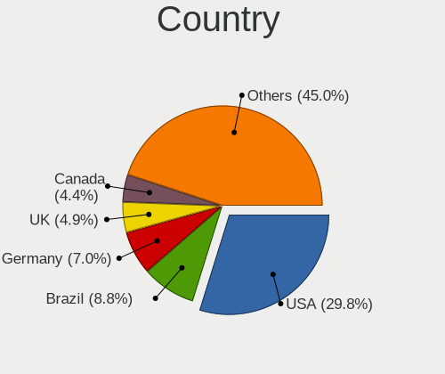
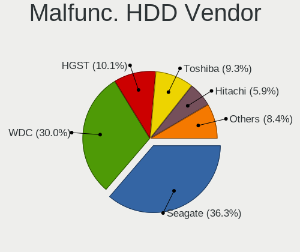
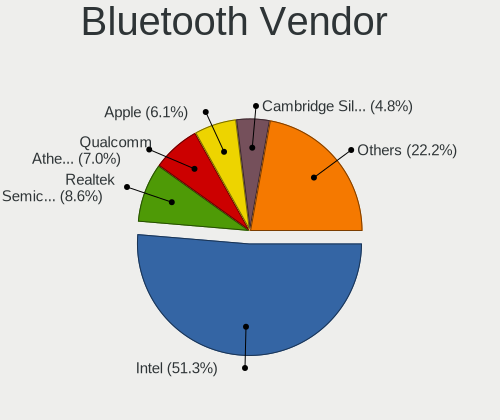
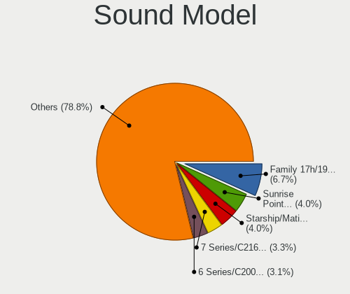

Pop!_OS - Tested Hardware & Statistics
--------------------------------------

A project to collect tested hardware configurations for Pop!_OS.

Anyone can contribute to this report by the [hw-probe](https://github.com/linuxhw/hw-probe) tool:

    sudo -E hw-probe -all -upload

Please contribute! Especially if your hardware is rare.

This is a report for all computer types. See also reports for [desktops](/Dist/Pop!_OS/Desktop/README.md) and [notebooks](/Dist/Pop!_OS/Notebook/README.md).

Contents
--------

* [ Test Cases ](#test-cases)

* [ System ](#system)
  - [ OS                       ](#os)
  - [ OS Family                ](#os-family)
  - [ Kernel                   ](#kernel)
  - [ Kernel Family            ](#kernel-family)
  - [ Kernel Major Ver.        ](#kernel-major-ver)
  - [ Arch                     ](#arch)
  - [ DE                       ](#de)
  - [ Display Server           ](#display-server)
  - [ Display Manager          ](#display-manager)
  - [ OS Lang                  ](#os-lang)
  - [ Boot Mode                ](#boot-mode)
  - [ Filesystem               ](#filesystem)
  - [ Part. scheme             ](#part-scheme)
  - [ Dual Boot with Linux/BSD ](#dual-boot-with-linuxbsd)
  - [ Dual Boot (Win)          ](#dual-boot-win)

* [ Board ](#board)
  - [ Vendor                   ](#vendor)
  - [ Model                    ](#model)
  - [ Model Family             ](#model-family)
  - [ MFG Year                 ](#mfg-year)
  - [ Form Factor              ](#form-factor)
  - [ Secure Boot              ](#secure-boot)
  - [ Coreboot                 ](#coreboot)
  - [ RAM Size                 ](#ram-size)
  - [ RAM Used                 ](#ram-used)
  - [ Total Drives             ](#total-drives)
  - [ Has CD-ROM               ](#has-cd-rom)
  - [ Has Ethernet             ](#has-ethernet)
  - [ Has WiFi                 ](#has-wifi)
  - [ Has Bluetooth            ](#has-bluetooth)

* [ Location ](#location)
  - [ Country                  ](#country)
  - [ City                     ](#city)

* [ Drives ](#drives)
  - [ Drive Vendor             ](#drive-vendor)
  - [ Drive Model              ](#drive-model)
  - [ HDD Vendor               ](#hdd-vendor)
  - [ SSD Vendor               ](#ssd-vendor)
  - [ Drive Kind               ](#drive-kind)
  - [ Drive Connector          ](#drive-connector)
  - [ Drive Size               ](#drive-size)
  - [ Space Total              ](#space-total)
  - [ Space Used               ](#space-used)
  - [ Malfunc. Drives          ](#malfunc-drives)
  - [ Malfunc. Drive Vendor    ](#malfunc-drive-vendor)
  - [ Malfunc. HDD Vendor      ](#malfunc-hdd-vendor)
  - [ Malfunc. Drive Kind      ](#malfunc-drive-kind)
  - [ Failed Drives            ](#failed-drives)
  - [ Failed Drive Vendor      ](#failed-drive-vendor)
  - [ Drive Status             ](#drive-status)

* [ Storage controller ](#storage-controller)
  - [ Storage Vendor           ](#storage-vendor)
  - [ Storage Model            ](#storage-model)
  - [ Storage Kind             ](#storage-kind)

* [ Processor ](#processor)
  - [ CPU Vendor               ](#cpu-vendor)
  - [ CPU Model                ](#cpu-model)
  - [ CPU Model Family         ](#cpu-model-family)
  - [ CPU Cores                ](#cpu-cores)
  - [ CPU Sockets              ](#cpu-sockets)
  - [ CPU Threads              ](#cpu-threads)
  - [ CPU Op-Modes             ](#cpu-op-modes)
  - [ CPU Microcode            ](#cpu-microcode)
  - [ CPU Microarch            ](#cpu-microarch)

* [ Graphics ](#graphics)
  - [ GPU Vendor               ](#gpu-vendor)
  - [ GPU Model                ](#gpu-model)
  - [ GPU Combo                ](#gpu-combo)
  - [ GPU Driver               ](#gpu-driver)
  - [ GPU Memory               ](#gpu-memory)

* [ Monitor ](#monitor)
  - [ Monitor Vendor           ](#monitor-vendor)
  - [ Monitor Model            ](#monitor-model)
  - [ Monitor Resolution       ](#monitor-resolution)
  - [ Monitor Diagonal         ](#monitor-diagonal)
  - [ Monitor Width            ](#monitor-width)
  - [ Aspect Ratio             ](#aspect-ratio)
  - [ Monitor Area             ](#monitor-area)
  - [ Pixel Density            ](#pixel-density)
  - [ Multiple Monitors        ](#multiple-monitors)

* [ Network ](#network)
  - [ Net Controller Vendor    ](#net-controller-vendor)
  - [ Net Controller Model     ](#net-controller-model)
  - [ Wireless Vendor          ](#wireless-vendor)
  - [ Wireless Model           ](#wireless-model)
  - [ Ethernet Vendor          ](#ethernet-vendor)
  - [ Ethernet Model           ](#ethernet-model)
  - [ Net Controller Kind      ](#net-controller-kind)
  - [ Used Controller          ](#used-controller)
  - [ NICs                     ](#nics)
  - [ IPv6                     ](#ipv6)

* [ Bluetooth ](#bluetooth)
  - [ Bluetooth Vendor         ](#bluetooth-vendor)
  - [ Bluetooth Model          ](#bluetooth-model)

* [ Sound ](#sound)
  - [ Sound Vendor             ](#sound-vendor)
  - [ Sound Model              ](#sound-model)

* [ Memory ](#memory)
  - [ Memory Vendor            ](#memory-vendor)
  - [ Memory Model             ](#memory-model)
  - [ Memory Kind              ](#memory-kind)
  - [ Memory Form Factor       ](#memory-form-factor)
  - [ Memory Size              ](#memory-size)
  - [ Memory Speed             ](#memory-speed)

* [ Printers & scanners ](#printers--scanners)
  - [ Printer Vendor           ](#printer-vendor)
  - [ Printer Model            ](#printer-model)
  - [ Scanner Vendor           ](#scanner-vendor)
  - [ Scanner Model            ](#scanner-model)

* [ Camera ](#camera)
  - [ Camera Vendor            ](#camera-vendor)
  - [ Camera Model             ](#camera-model)

* [ Security ](#security)
  - [ Fingerprint Vendor       ](#fingerprint-vendor)
  - [ Fingerprint Model        ](#fingerprint-model)
  - [ Chipcard Vendor          ](#chipcard-vendor)
  - [ Chipcard Model           ](#chipcard-model)

* [ Unsupported ](#unsupported)
  - [ Unsupported Devices      ](#unsupported-devices)
  - [ Unsupported Device Types ](#unsupported-device-types)

Test Cases
----------

Total: 13565

| Vendor        | Model                       | Form-Factor | Probe                                                      | Date         |
|---------------|-----------------------------|-------------|------------------------------------------------------------|--------------|
| Acer          | Spin SP314-54N              | Convertible | [446ce08df0](https://linux-hardware.org/?probe=446ce08df0) | Jun 30, 2023 |
| Gigabyte      | B550 UD AC                  | Desktop     | [7d7d37522c](https://linux-hardware.org/?probe=7d7d37522c) | Jun 30, 2023 |
| Toshiba       | IS 1413G                    | Notebook    | [b95a7c049a](https://linux-hardware.org/?probe=b95a7c049a) | Jun 30, 2023 |
| Teclast       | F7 Plus                     | Notebook    | [cebd3b027c](https://linux-hardware.org/?probe=cebd3b027c) | Jun 30, 2023 |
| Gigabyte      | H170-HD3-CF                 | Desktop     | [59d1be1c5d](https://linux-hardware.org/?probe=59d1be1c5d) | Jun 30, 2023 |
| Samsung       | DT1234567890 SAMSUNG_SW_... | Desktop     | [878e617ba4](https://linux-hardware.org/?probe=878e617ba4) | Jun 30, 2023 |
| Dell          | XPS 13 9370                 | Notebook    | [ec4bf131f5](https://linux-hardware.org/?probe=ec4bf131f5) | Jun 30, 2023 |
| Gigabyte      | X570 AORUS ELITE WIFI       | Desktop     | [cdb77bf9b6](https://linux-hardware.org/?probe=cdb77bf9b6) | Jun 30, 2023 |
| Dell          | 0M6C7G A00                  | Desktop     | [d7dfcc4a38](https://linux-hardware.org/?probe=d7dfcc4a38) | Jun 30, 2023 |
| Positivo      | Mobile                      | Notebook    | [fdaaf6915b](https://linux-hardware.org/?probe=fdaaf6915b) | Jun 30, 2023 |
| MSI           | GS65 Stealth 9SD            | Notebook    | [568380fd59](https://linux-hardware.org/?probe=568380fd59) | Jun 30, 2023 |
| MSI           | GS65 Stealth 9SD            | Notebook    | [54013b2dfd](https://linux-hardware.org/?probe=54013b2dfd) | Jun 30, 2023 |
| Positivo      | H14CU02                     | Notebook    | [d50e6fbbdc](https://linux-hardware.org/?probe=d50e6fbbdc) | Jun 29, 2023 |
| ASRock        | Z77 Performance             | Notebook    | [a678dc9605](https://linux-hardware.org/?probe=a678dc9605) | Jun 29, 2023 |
| MSI           | Vector GP76 12UH            | Notebook    | [b7035d78a6](https://linux-hardware.org/?probe=b7035d78a6) | Jun 29, 2023 |
| Lenovo        | 3111 SDK0J40697 WIN 3305... | Desktop     | [323464eebb](https://linux-hardware.org/?probe=323464eebb) | Jun 28, 2023 |
| Dell          | 08NPPY A00                  | Desktop     | [b1b4052442](https://linux-hardware.org/?probe=b1b4052442) | Jun 28, 2023 |
| ASUSTek       | GA35DX                      | Desktop     | [a91acc04b6](https://linux-hardware.org/?probe=a91acc04b6) | Jun 28, 2023 |
| Dell          | 02YYK5 A01                  | Desktop     | [4054ebeac8](https://linux-hardware.org/?probe=4054ebeac8) | Jun 28, 2023 |
| MSI           | GE70 2PL                    | Notebook    | [e5354b6cb4](https://linux-hardware.org/?probe=e5354b6cb4) | Jun 28, 2023 |
| Dell          | 0F6X5P A00                  | Desktop     | [cad43414b4](https://linux-hardware.org/?probe=cad43414b4) | Jun 27, 2023 |
| Acer          | Aspire A315-21              | Notebook    | [4bf524cd80](https://linux-hardware.org/?probe=4bf524cd80) | Jun 27, 2023 |
| Acer          | Aspire E1-571               | Notebook    | [894f8583ea](https://linux-hardware.org/?probe=894f8583ea) | Jun 27, 2023 |
| Dell          | Vostro 15 3510              | Notebook    | [adb3a3de68](https://linux-hardware.org/?probe=adb3a3de68) | Jun 27, 2023 |
| Dell          | 0427JK A00                  | Desktop     | [0dda4e26da](https://linux-hardware.org/?probe=0dda4e26da) | Jun 27, 2023 |
| Dell          | Precision M6800             | Notebook    | [b0fe737883](https://linux-hardware.org/?probe=b0fe737883) | Jun 27, 2023 |
| Toshiba       | IS 1413G                    | Notebook    | [882bd512a2](https://linux-hardware.org/?probe=882bd512a2) | Jun 27, 2023 |
| ASRock        | X370 Gaming-ITX/ac          | Desktop     | [975e5164c6](https://linux-hardware.org/?probe=975e5164c6) | Jun 27, 2023 |
| ASUSTek       | X550JX                      | Notebook    | [80770014b8](https://linux-hardware.org/?probe=80770014b8) | Jun 27, 2023 |
| Dell          | Inspiron 3583               | Notebook    | [e1e76b3d77](https://linux-hardware.org/?probe=e1e76b3d77) | Jun 27, 2023 |
| HUAWEI        | KLVL-WXXW                   | Notebook    | [5454a08ba6](https://linux-hardware.org/?probe=5454a08ba6) | Jun 26, 2023 |
| Lenovo        | ThinkPad P53 20QQS34C04     | Notebook    | [3019d7a733](https://linux-hardware.org/?probe=3019d7a733) | Jun 26, 2023 |
| Apple         | MacBookAir6,1               | Notebook    | [6b44c8513d](https://linux-hardware.org/?probe=6b44c8513d) | Jun 26, 2023 |
| Dell          | Precision M6800             | Notebook    | [4e6c5423b1](https://linux-hardware.org/?probe=4e6c5423b1) | Jun 25, 2023 |
| Dell          | Precision M6800             | Notebook    | [feb0adfd99](https://linux-hardware.org/?probe=feb0adfd99) | Jun 25, 2023 |
| MSI           | B450 TOMAHAWK MAX           | Desktop     | [1bd3b2b912](https://linux-hardware.org/?probe=1bd3b2b912) | Jun 25, 2023 |
| MSI           | B450 TOMAHAWK MAX           | Desktop     | [d436c6bcdf](https://linux-hardware.org/?probe=d436c6bcdf) | Jun 25, 2023 |
| HP            | Notebook                    | Notebook    | [ea00ce6c5b](https://linux-hardware.org/?probe=ea00ce6c5b) | Jun 25, 2023 |
| ASUSTek       | TUF Gaming X670E-PLUS       | Desktop     | [3907252056](https://linux-hardware.org/?probe=3907252056) | Jun 25, 2023 |
| MSI           | B450M MORTAR                | Desktop     | [9888e54285](https://linux-hardware.org/?probe=9888e54285) | Jun 25, 2023 |
| Biostar       | H81MHV3 5.0                 | Desktop     | [0f95f72b43](https://linux-hardware.org/?probe=0f95f72b43) | Jun 25, 2023 |
| Sony          | VPCEA23FB                   | Notebook    | [b9a835920f](https://linux-hardware.org/?probe=b9a835920f) | Jun 25, 2023 |
| Sony          | VPCEA23FB                   | Notebook    | [c462c4c75e](https://linux-hardware.org/?probe=c462c4c75e) | Jun 25, 2023 |
| ASUSTek       | Z170M-PLUS                  | Desktop     | [b4ab698b09](https://linux-hardware.org/?probe=b4ab698b09) | Jun 25, 2023 |
| HP            | ENVY NOTEBOOK PC            | Notebook    | [8bd62ffdf1](https://linux-hardware.org/?probe=8bd62ffdf1) | Jun 25, 2023 |
| ASUSTek       | ROG STRIX B550-F GAMING     | Desktop     | [210d09c5dd](https://linux-hardware.org/?probe=210d09c5dd) | Jun 24, 2023 |
| Acer          | Swift SF314-512             | Notebook    | [12f361cd8c](https://linux-hardware.org/?probe=12f361cd8c) | Jun 24, 2023 |
| System76      | Oryx Pro                    | Notebook    | [eaa4d8e105](https://linux-hardware.org/?probe=eaa4d8e105) | Jun 24, 2023 |
| Lenovo        | ThinkPad T14 Gen 1 20UDC... | Notebook    | [737204f453](https://linux-hardware.org/?probe=737204f453) | Jun 24, 2023 |
| Shenzhen M... | F6BFC                       | Desktop     | [7f13c620bf](https://linux-hardware.org/?probe=7f13c620bf) | Jun 23, 2023 |
| MSI           | Cyborg 15 A12VF             | Notebook    | [703e12843e](https://linux-hardware.org/?probe=703e12843e) | Jun 23, 2023 |
| MSI           | B450M PRO-VDH MAX           | Desktop     | [700914c136](https://linux-hardware.org/?probe=700914c136) | Jun 23, 2023 |
| Lenovo        | ThinkPad Yoga 370 20JJS0... | Convertible | [70954bb61e](https://linux-hardware.org/?probe=70954bb61e) | Jun 23, 2023 |
| HP            | Laptop 15-dw2xxx            | Notebook    | [7f41e23d3a](https://linux-hardware.org/?probe=7f41e23d3a) | Jun 23, 2023 |
| HP            | Laptop 15-dw2xxx            | Notebook    | [79ec1a7b3f](https://linux-hardware.org/?probe=79ec1a7b3f) | Jun 23, 2023 |
| MSI           | H77MA-G43                   | Desktop     | [510d2844bd](https://linux-hardware.org/?probe=510d2844bd) | Jun 23, 2023 |
| Dell          | XPS 15 9500                 | Notebook    | [36dc72c683](https://linux-hardware.org/?probe=36dc72c683) | Jun 23, 2023 |
| ASUSTek       | X751LD                      | Notebook    | [c7be73b6ca](https://linux-hardware.org/?probe=c7be73b6ca) | Jun 23, 2023 |
| ASUSTek       | X751LD                      | Notebook    | [346bbb0b47](https://linux-hardware.org/?probe=346bbb0b47) | Jun 23, 2023 |
| MSI           | Alpha 15 A3DDK              | Notebook    | [410b20161b](https://linux-hardware.org/?probe=410b20161b) | Jun 23, 2023 |
| Dell          | Inspiron 3501               | Notebook    | [e8db86e014](https://linux-hardware.org/?probe=e8db86e014) | Jun 22, 2023 |
| Apple         | Mac-27ADBB7B4CEE8E61 iMa... | All in one  | [6e68a59ffb](https://linux-hardware.org/?probe=6e68a59ffb) | Jun 22, 2023 |
| Apple         | Mac-27ADBB7B4CEE8E61 iMa... | All in one  | [41a5a93ebb](https://linux-hardware.org/?probe=41a5a93ebb) | Jun 22, 2023 |
| ASUSTek       | TUF Gaming X670E-PLUS WI... | Desktop     | [082d9a4988](https://linux-hardware.org/?probe=082d9a4988) | Jun 22, 2023 |
| ASUSTek       | X551MA                      | Notebook    | [5b2b7d4a7f](https://linux-hardware.org/?probe=5b2b7d4a7f) | Jun 22, 2023 |
| Dell          | Inspiron 3583               | Notebook    | [170d1f4f0b](https://linux-hardware.org/?probe=170d1f4f0b) | Jun 22, 2023 |
| HP            | Notebook                    | Notebook    | [35b8a2a187](https://linux-hardware.org/?probe=35b8a2a187) | Jun 22, 2023 |
| ASUSTek       | P8H61-M LE R2.0             | Desktop     | [3c27e4a91d](https://linux-hardware.org/?probe=3c27e4a91d) | Jun 22, 2023 |
| Acidanther... | Mac-77EB7D7DAF985301 iMa... | All in one  | [1b2f8eb529](https://linux-hardware.org/?probe=1b2f8eb529) | Jun 22, 2023 |
| Lenovo        | B5400 80B6QB0               | Notebook    | [6885fc56aa](https://linux-hardware.org/?probe=6885fc56aa) | Jun 22, 2023 |
| ASUSTek       | PRIME Z490-A                | Desktop     | [f7c2ec659b](https://linux-hardware.org/?probe=f7c2ec659b) | Jun 22, 2023 |
| Dell          | Inspiron 5567               | Notebook    | [8634954b1c](https://linux-hardware.org/?probe=8634954b1c) | Jun 22, 2023 |
| Acer          | Aspire A515-52              | Notebook    | [43ee82258d](https://linux-hardware.org/?probe=43ee82258d) | Jun 21, 2023 |
| Intel         | H55                         | Desktop     | [545c7e42b3](https://linux-hardware.org/?probe=545c7e42b3) | Jun 21, 2023 |
| HP            | 89B5 A                      | Desktop     | [01e8a85a35](https://linux-hardware.org/?probe=01e8a85a35) | Jun 21, 2023 |
| Dell          | System Inspiron N4110       | Notebook    | [ebaceedccf](https://linux-hardware.org/?probe=ebaceedccf) | Jun 21, 2023 |
| Lenovo        | ThinkPad T480 20L6S3H102    | Notebook    | [4a8bd602ff](https://linux-hardware.org/?probe=4a8bd602ff) | Jun 21, 2023 |
| Dell          | System Inspiron N4110       | Notebook    | [a168f45822](https://linux-hardware.org/?probe=a168f45822) | Jun 21, 2023 |
| Lenovo        | ThinkPad T14 Gen 2i 20W1... | Notebook    | [b255195205](https://linux-hardware.org/?probe=b255195205) | Jun 21, 2023 |
| Acer          | Aspire A515-52              | Notebook    | [b2d464d2bc](https://linux-hardware.org/?probe=b2d464d2bc) | Jun 21, 2023 |
| Toshiba       | IS 1413G                    | Notebook    | [14296e98e7](https://linux-hardware.org/?probe=14296e98e7) | Jun 21, 2023 |
| Dell          | Latitude E7240              | Notebook    | [f8b3fce80b](https://linux-hardware.org/?probe=f8b3fce80b) | Jun 21, 2023 |
| HP            | Pavilion Laptop 15t-eg00... | Notebook    | [383aed9129](https://linux-hardware.org/?probe=383aed9129) | Jun 20, 2023 |
| HP            | Pavilion Laptop 15t-eg00... | Notebook    | [3996492e80](https://linux-hardware.org/?probe=3996492e80) | Jun 20, 2023 |
| ASUSTek       | ROG Strix G733PZ_G733PZ     | Notebook    | [1c9456fd1d](https://linux-hardware.org/?probe=1c9456fd1d) | Jun 20, 2023 |
| ASUSTek       | Maximus VI HERO             | Desktop     | [ec5318fcd1](https://linux-hardware.org/?probe=ec5318fcd1) | Jun 20, 2023 |
| Lenovo        | ThinkCentre M90p 5498R97    | Desktop     | [4a18635ad7](https://linux-hardware.org/?probe=4a18635ad7) | Jun 20, 2023 |
| Dell          | 0X9M3X A01                  | Desktop     | [1d14950f1e](https://linux-hardware.org/?probe=1d14950f1e) | Jun 20, 2023 |
| Dell          | 0X9M3X A01                  | Desktop     | [46baecef13](https://linux-hardware.org/?probe=46baecef13) | Jun 20, 2023 |
| BESSTAR Te... | HM90                        | Desktop     | [796769b68a](https://linux-hardware.org/?probe=796769b68a) | Jun 20, 2023 |
| Lenovo        | ThinkCentre M90p 5498R97    | Desktop     | [d2550efee5](https://linux-hardware.org/?probe=d2550efee5) | Jun 19, 2023 |
| System76      | Lemur Pro                   | Notebook    | [5074769fee](https://linux-hardware.org/?probe=5074769fee) | Jun 19, 2023 |
| Dell          | Latitude 7430               | Notebook    | [84f66041f9](https://linux-hardware.org/?probe=84f66041f9) | Jun 19, 2023 |
| MSI           | Bravo 15 B5DD               | Notebook    | [5a89024be5](https://linux-hardware.org/?probe=5a89024be5) | Jun 19, 2023 |
| Dell          | XPS 15 9510                 | Notebook    | [347c5ce944](https://linux-hardware.org/?probe=347c5ce944) | Jun 19, 2023 |
| HP            | Laptop 15-dy2xxx            | Notebook    | [0699537327](https://linux-hardware.org/?probe=0699537327) | Jun 19, 2023 |
| ASRock        | B450 Steel Legend           | Desktop     | [26d77cd5be](https://linux-hardware.org/?probe=26d77cd5be) | Jun 19, 2023 |
| HP            | 829A                        | Mini pc     | [0ca8c646bb](https://linux-hardware.org/?probe=0ca8c646bb) | Jun 19, 2023 |
| MSI           | Raider GE66 12UGS           | Notebook    | [73b20b76a3](https://linux-hardware.org/?probe=73b20b76a3) | Jun 19, 2023 |
| Lenovo        | IdeaPad Gaming 3 15IAH7 ... | Notebook    | [f93c91b6d9](https://linux-hardware.org/?probe=f93c91b6d9) | Jun 18, 2023 |
| Acer          | Aspire 5750G                | Notebook    | [4f35e25c20](https://linux-hardware.org/?probe=4f35e25c20) | Jun 18, 2023 |
| ASUSTek       | Maximus VI HERO             | Desktop     | [fcbe9b509b](https://linux-hardware.org/?probe=fcbe9b509b) | Jun 18, 2023 |
| Lenovo        | Flex 2-15 20405             | Notebook    | [ae0a1a134a](https://linux-hardware.org/?probe=ae0a1a134a) | Jun 18, 2023 |
| HP            | 8949 11                     | Desktop     | [bd6b95fc23](https://linux-hardware.org/?probe=bd6b95fc23) | Jun 18, 2023 |
| Biostar       | A320MH                      | Desktop     | [0c38427f58](https://linux-hardware.org/?probe=0c38427f58) | Jun 18, 2023 |
| Gigabyte      | Z170-Gaming K3-CF           | Desktop     | [6e40a39112](https://linux-hardware.org/?probe=6e40a39112) | Jun 18, 2023 |
| Gigabyte      | Z690 AORUS PRO              | Desktop     | [e9dd574827](https://linux-hardware.org/?probe=e9dd574827) | Jun 18, 2023 |
| ASRock        | Z77 Extreme4                | Desktop     | [c45aea7474](https://linux-hardware.org/?probe=c45aea7474) | Jun 18, 2023 |
| BESSTAR Te... | B550                        | Desktop     | [6c2811bbf5](https://linux-hardware.org/?probe=6c2811bbf5) | Jun 18, 2023 |
| HONOR         | BRN-FXX                     | Notebook    | [d3671dca6a](https://linux-hardware.org/?probe=d3671dca6a) | Jun 18, 2023 |
| ASUSTek       | PRIME X470-PRO              | Desktop     | [c2f10ad55c](https://linux-hardware.org/?probe=c2f10ad55c) | Jun 17, 2023 |
| Avell High... | A70 HYB                     | Notebook    | [10eb079da8](https://linux-hardware.org/?probe=10eb079da8) | Jun 17, 2023 |
| ASUSTek       | ASUSPRO P5440UF             | Notebook    | [cf08c655b9](https://linux-hardware.org/?probe=cf08c655b9) | Jun 17, 2023 |
| ASUSTek       | P5QPL-AM                    | Desktop     | [2b3a058830](https://linux-hardware.org/?probe=2b3a058830) | Jun 17, 2023 |
| Acer          | Aspire 4752                 | Notebook    | [441eb3fe51](https://linux-hardware.org/?probe=441eb3fe51) | Jun 17, 2023 |
| MSI           | H67MA-E35                   | Desktop     | [8b37f91738](https://linux-hardware.org/?probe=8b37f91738) | Jun 16, 2023 |
| ASUSTek       | ASUSPRO P5440UF             | Notebook    | [272d8de237](https://linux-hardware.org/?probe=272d8de237) | Jun 16, 2023 |
| Dell          | Inspiron 5481               | Convertible | [4e24ca3b12](https://linux-hardware.org/?probe=4e24ca3b12) | Jun 16, 2023 |
| Dell          | 00V62H A00                  | Desktop     | [da12f0d8e3](https://linux-hardware.org/?probe=da12f0d8e3) | Jun 16, 2023 |
| ASUSTek       | ROG STRIX B450-I GAMING     | Desktop     | [989287c8b1](https://linux-hardware.org/?probe=989287c8b1) | Jun 16, 2023 |
| HP            | Laptop 14-bp0xx             | Notebook    | [fd6b492010](https://linux-hardware.org/?probe=fd6b492010) | Jun 16, 2023 |
| HP            | Pavilion dv6                | Notebook    | [55c83ec890](https://linux-hardware.org/?probe=55c83ec890) | Jun 15, 2023 |
| Dell          | Vostro 3420                 | Notebook    | [c1b8b07db0](https://linux-hardware.org/?probe=c1b8b07db0) | Jun 15, 2023 |
| System76      | Gazelle                     | Notebook    | [79c4236cdd](https://linux-hardware.org/?probe=79c4236cdd) | Jun 15, 2023 |
| Gigabyte      | B450M S2H                   | Desktop     | [1bcfd50d08](https://linux-hardware.org/?probe=1bcfd50d08) | Jun 15, 2023 |
| Gigabyte      | B450M S2H                   | Desktop     | [04b5148080](https://linux-hardware.org/?probe=04b5148080) | Jun 15, 2023 |
| HP            | Laptop 14-dk0xxx            | Notebook    | [1e6fdd560b](https://linux-hardware.org/?probe=1e6fdd560b) | Jun 14, 2023 |
| ZOTAC         | ZBOX-AD04                   | Mini pc     | [c7c537bd79](https://linux-hardware.org/?probe=c7c537bd79) | Jun 14, 2023 |
| ASUSTek       | P6T DELUXE V2               | Desktop     | [887bfc11d5](https://linux-hardware.org/?probe=887bfc11d5) | Jun 14, 2023 |
| ZOTAC         | ZBOX-AD04                   | Mini pc     | [42e6a44062](https://linux-hardware.org/?probe=42e6a44062) | Jun 14, 2023 |
| Lenovo        | ThinkPad P53s 20N6001UUS    | Notebook    | [667f0a20c1](https://linux-hardware.org/?probe=667f0a20c1) | Jun 14, 2023 |
| HP            | ZBook Fury 16 G9 Mobile ... | Notebook    | [17c4d68066](https://linux-hardware.org/?probe=17c4d68066) | Jun 14, 2023 |
| System76      | Gazelle                     | Notebook    | [117f199b15](https://linux-hardware.org/?probe=117f199b15) | Jun 14, 2023 |
| ATOPNUC       | MA90                        | Mini pc     | [384ee8b42e](https://linux-hardware.org/?probe=384ee8b42e) | Jun 13, 2023 |
| ASUSTek       | Zenbook UN5401RA UN5401R... | Convertible | [ad75eab286](https://linux-hardware.org/?probe=ad75eab286) | Jun 13, 2023 |
| Samsung       | 340XAA/350XAA/550XAA        | Notebook    | [d7c90a9c25](https://linux-hardware.org/?probe=d7c90a9c25) | Jun 13, 2023 |
| Acer          | Swift SFX14-51G             | Notebook    | [c17f7d87b3](https://linux-hardware.org/?probe=c17f7d87b3) | Jun 13, 2023 |
| Dell          | 0WMJ54 A01                  | Desktop     | [b3303b8ed6](https://linux-hardware.org/?probe=b3303b8ed6) | Jun 13, 2023 |
| Dell          | Vostro 5470                 | Notebook    | [b5294ee338](https://linux-hardware.org/?probe=b5294ee338) | Jun 13, 2023 |
| ASUSTek       | ProArt X570-CREATOR WIFI    | Desktop     | [5281ad2271](https://linux-hardware.org/?probe=5281ad2271) | Jun 13, 2023 |
| ASUSTek       | ROG Zephyrus Duo 15 SE G... | Notebook    | [fff5e11f1c](https://linux-hardware.org/?probe=fff5e11f1c) | Jun 13, 2023 |
| TUXEDO        | Unknown                     | Notebook    | [d730799661](https://linux-hardware.org/?probe=d730799661) | Jun 12, 2023 |
| ASRock        | Z690 Steel Legend WiFi 6... | Desktop     | [0190531869](https://linux-hardware.org/?probe=0190531869) | Jun 12, 2023 |
| ASRock        | Z690 Steel Legend WiFi 6... | Desktop     | [648161a6ff](https://linux-hardware.org/?probe=648161a6ff) | Jun 12, 2023 |
| ASUSTek       | Zenbook UP6502ZD_Q539ZD     | Convertible | [e2cd0602f8](https://linux-hardware.org/?probe=e2cd0602f8) | Jun 12, 2023 |
| Pegatron      | NARRA5                      | Desktop     | [3e7cbbb991](https://linux-hardware.org/?probe=3e7cbbb991) | Jun 12, 2023 |
| Lenovo        | Yoga 6 13ALC7 82UD          | Convertible | [fd51db661f](https://linux-hardware.org/?probe=fd51db661f) | Jun 12, 2023 |
| Dell          | Latitude E7470              | Notebook    | [1253de4554](https://linux-hardware.org/?probe=1253de4554) | Jun 12, 2023 |
| MSI           | MEG X570 UNIFY              | Desktop     | [1f4d0ebdc1](https://linux-hardware.org/?probe=1f4d0ebdc1) | Jun 12, 2023 |
| Lenovo        | IdeaPad 320-15IKB 81G3      | Notebook    | [c09c4a0f69](https://linux-hardware.org/?probe=c09c4a0f69) | Jun 12, 2023 |
| MSI           | MPG X570 GAMING PLUS        | Desktop     | [a9bb4cfb62](https://linux-hardware.org/?probe=a9bb4cfb62) | Jun 12, 2023 |
| MSI           | MPG X570 GAMING PLUS        | Desktop     | [9c0f9bf219](https://linux-hardware.org/?probe=9c0f9bf219) | Jun 12, 2023 |
| Toshiba       | Satellite P55t-B            | Notebook    | [efc0f87778](https://linux-hardware.org/?probe=efc0f87778) | Jun 11, 2023 |
| BESSTAR Te... | B550                        | Desktop     | [b74cc9dfff](https://linux-hardware.org/?probe=b74cc9dfff) | Jun 11, 2023 |
| Pegatron      | NARRA5                      | Desktop     | [609c2921d3](https://linux-hardware.org/?probe=609c2921d3) | Jun 11, 2023 |
| HP            | Stream Laptop 11-ah0XX      | Notebook    | [a3e566ad38](https://linux-hardware.org/?probe=a3e566ad38) | Jun 11, 2023 |
| BESSTAR Te... | HM90                        | Desktop     | [86c52dcc7a](https://linux-hardware.org/?probe=86c52dcc7a) | Jun 11, 2023 |
| HP            | 89B5 A                      | Desktop     | [7bf638dc35](https://linux-hardware.org/?probe=7bf638dc35) | Jun 10, 2023 |
| MSI           | X99A GODLIKE GAMING         | Desktop     | [19511501c7](https://linux-hardware.org/?probe=19511501c7) | Jun 10, 2023 |
| Lenovo        | ThinkPad 13 2nd Gen 20J2... | Notebook    | [fd388e00c3](https://linux-hardware.org/?probe=fd388e00c3) | Jun 10, 2023 |
| ASUSTek       | ROG STRIX B450-F GAMING     | Desktop     | [6c8e1de1cf](https://linux-hardware.org/?probe=6c8e1de1cf) | Jun 10, 2023 |
| Samsung       | 550XCJ/550XCR               | Notebook    | [d8dac01c79](https://linux-hardware.org/?probe=d8dac01c79) | Jun 10, 2023 |
| HP            | 8949 11                     | Desktop     | [f5e1f4b6c9](https://linux-hardware.org/?probe=f5e1f4b6c9) | Jun 10, 2023 |
| ASUSTek       | ROG STRIX B450-F GAMING     | Desktop     | [cac24c37e5](https://linux-hardware.org/?probe=cac24c37e5) | Jun 10, 2023 |
| Lenovo        | ThinkPad T540p 20BFS4P80... | Notebook    | [4160d59c4f](https://linux-hardware.org/?probe=4160d59c4f) | Jun 10, 2023 |
| Gigabyte      | B450 AORUS M                | Desktop     | [280baa2765](https://linux-hardware.org/?probe=280baa2765) | Jun 09, 2023 |
| ASUSTek       | ROG STRIX B550-F GAMING     | Desktop     | [0f42ca8c95](https://linux-hardware.org/?probe=0f42ca8c95) | Jun 09, 2023 |
| ASUSTek       | PRIME A520M-A II            | Desktop     | [176b4ca0bb](https://linux-hardware.org/?probe=176b4ca0bb) | Jun 09, 2023 |
| Gigabyte      | B450 AORUS M                | Desktop     | [50b022f065](https://linux-hardware.org/?probe=50b022f065) | Jun 09, 2023 |
| Acer          | Aspire 7750                 | Notebook    | [b0daafa057](https://linux-hardware.org/?probe=b0daafa057) | Jun 09, 2023 |
| Gigabyte      | GA-78LMT-USB3 SEx           | Desktop     | [1189f6696f](https://linux-hardware.org/?probe=1189f6696f) | Jun 09, 2023 |
| HP            | Spectre x360 Convertible... | Convertible | [1256480fca](https://linux-hardware.org/?probe=1256480fca) | Jun 09, 2023 |
| ASUSTek       | M4A785G-HTPC                | Desktop     | [76304dfb4a](https://linux-hardware.org/?probe=76304dfb4a) | Jun 09, 2023 |
| AZW           | SEi                         | Desktop     | [2b085e7ed2](https://linux-hardware.org/?probe=2b085e7ed2) | Jun 09, 2023 |
| ASUSTek       | UX32LN                      | Notebook    | [97ff235920](https://linux-hardware.org/?probe=97ff235920) | Jun 08, 2023 |
| Dell          | Latitude E7240              | Notebook    | [e21cc2151b](https://linux-hardware.org/?probe=e21cc2151b) | Jun 08, 2023 |
| Dell          | Latitude E6420              | Notebook    | [d408418ddd](https://linux-hardware.org/?probe=d408418ddd) | Jun 08, 2023 |
| Acer          | Aspire A515-45              | Notebook    | [975246674d](https://linux-hardware.org/?probe=975246674d) | Jun 08, 2023 |
| Acer          | Aspire A515-45              | Notebook    | [348173e172](https://linux-hardware.org/?probe=348173e172) | Jun 08, 2023 |
| ASUSTek       | VivoBook_ASUSLaptop M160... | Notebook    | [e355aa21b5](https://linux-hardware.org/?probe=e355aa21b5) | Jun 08, 2023 |
| ASUSTek       | VivoBook_ASUSLaptop M160... | Notebook    | [c5a1a47343](https://linux-hardware.org/?probe=c5a1a47343) | Jun 08, 2023 |
| MSI           | MAG B650 TOMAHAWK WIFI      | Desktop     | [35c7fcb130](https://linux-hardware.org/?probe=35c7fcb130) | Jun 08, 2023 |
| HP            | Pavilion dv7                | Notebook    | [896e71aaaf](https://linux-hardware.org/?probe=896e71aaaf) | Jun 08, 2023 |
| AZW           | SER V1.0                    | Mini pc     | [e127b4c2f4](https://linux-hardware.org/?probe=e127b4c2f4) | Jun 08, 2023 |
| Gigabyte      | M68M-S2P                    | Desktop     | [ee2b6b0279](https://linux-hardware.org/?probe=ee2b6b0279) | Jun 08, 2023 |
| MSI           | PRO B550M-VC WIFI           | Desktop     | [70c409a2b8](https://linux-hardware.org/?probe=70c409a2b8) | Jun 08, 2023 |
| Gigabyte      | 970A-DS3P                   | Desktop     | [540fc1c58d](https://linux-hardware.org/?probe=540fc1c58d) | Jun 07, 2023 |
| Machcreato... | 14                          | Notebook    | [d889b02b13](https://linux-hardware.org/?probe=d889b02b13) | Jun 07, 2023 |
| ASUSTek       | ROG STRIX B550-F GAMING     | Desktop     | [276844abe2](https://linux-hardware.org/?probe=276844abe2) | Jun 07, 2023 |
| Toshiba       | IS 1413G                    | Notebook    | [cc023db7a9](https://linux-hardware.org/?probe=cc023db7a9) | Jun 07, 2023 |
| ASUSTek       | ROG Zephyrus G14 GA401IU... | Notebook    | [ee9c6252ae](https://linux-hardware.org/?probe=ee9c6252ae) | Jun 07, 2023 |
| Fujitsu       | LIFEBOOK E5512A             | Notebook    | [7381bd00f3](https://linux-hardware.org/?probe=7381bd00f3) | Jun 07, 2023 |
| System76      | Thelio Mira thelio-mira-... | Desktop     | [d7d155d89d](https://linux-hardware.org/?probe=d7d155d89d) | Jun 07, 2023 |
| Dell          | Latitude E6420              | Notebook    | [620ca905d2](https://linux-hardware.org/?probe=620ca905d2) | Jun 07, 2023 |
| Dell          | Latitude 7200 2-in-1        | Tablet      | [4d60f57084](https://linux-hardware.org/?probe=4d60f57084) | Jun 07, 2023 |
| Machcreato... | 14                          | Notebook    | [f0a27a9f97](https://linux-hardware.org/?probe=f0a27a9f97) | Jun 06, 2023 |
| Lenovo        | ThinkPad T480s 20L8S3JE0... | Notebook    | [2834fee64f](https://linux-hardware.org/?probe=2834fee64f) | Jun 06, 2023 |
| HP            | Laptop 14-cf2xxx            | Notebook    | [e6bf4ead0a](https://linux-hardware.org/?probe=e6bf4ead0a) | Jun 06, 2023 |
| Lenovo        | ThinkPad W520 427637U       | Notebook    | [1bec07891b](https://linux-hardware.org/?probe=1bec07891b) | Jun 05, 2023 |
| ASUSTek       | ASUS TUF Gaming A15 FA50... | Notebook    | [841eeea3f9](https://linux-hardware.org/?probe=841eeea3f9) | Jun 05, 2023 |
| Apple         | MacBookAir4,2               | Notebook    | [afc9f50009](https://linux-hardware.org/?probe=afc9f50009) | Jun 05, 2023 |
| Apple         | MacBook5,1                  | Notebook    | [804abce033](https://linux-hardware.org/?probe=804abce033) | Jun 05, 2023 |
| Lenovo        | ThinkPad X1 Extreme 2nd ... | Notebook    | [f53388e7df](https://linux-hardware.org/?probe=f53388e7df) | Jun 05, 2023 |
| Lenovo        | ThinkPad X1 Extreme 2nd ... | Notebook    | [6c151a9750](https://linux-hardware.org/?probe=6c151a9750) | Jun 05, 2023 |
| HP            | 15 Notebook PC              | Notebook    | [7c76016c9d](https://linux-hardware.org/?probe=7c76016c9d) | Jun 05, 2023 |
| Lenovo        | ThinkPad T540p 20BFS4P80... | Notebook    | [5dd18339de](https://linux-hardware.org/?probe=5dd18339de) | Jun 05, 2023 |
| ASUSTek       | ROG Flow X16 GV601RM_GV6... | Convertible | [5a2d788a64](https://linux-hardware.org/?probe=5a2d788a64) | Jun 05, 2023 |
| HP            | 8949 11                     | Desktop     | [06bca18276](https://linux-hardware.org/?probe=06bca18276) | Jun 04, 2023 |
| ASUSTek       | M4N72-E                     | Desktop     | [51d39945ec](https://linux-hardware.org/?probe=51d39945ec) | Jun 04, 2023 |
| MSI           | A55M-E33                    | Desktop     | [336b7f877d](https://linux-hardware.org/?probe=336b7f877d) | Jun 04, 2023 |
| MSI           | MAG B550M MORTAR WIFI       | Desktop     | [aafda7cf63](https://linux-hardware.org/?probe=aafda7cf63) | Jun 04, 2023 |
| Dell          | Inspiron 5437               | Notebook    | [d805b4ec1f](https://linux-hardware.org/?probe=d805b4ec1f) | Jun 03, 2023 |
| Foxconn       | A74ML-K                     | Desktop     | [7a4f7e239b](https://linux-hardware.org/?probe=7a4f7e239b) | Jun 03, 2023 |
| HP            | 8949 11                     | Desktop     | [f06749002f](https://linux-hardware.org/?probe=f06749002f) | Jun 03, 2023 |
| ASUSTek       | PRIME B365M-A               | Desktop     | [5c280bbd6c](https://linux-hardware.org/?probe=5c280bbd6c) | Jun 03, 2023 |
| MSI           | B150M MORTAR                | Desktop     | [3fc6303165](https://linux-hardware.org/?probe=3fc6303165) | Jun 03, 2023 |
| MSI           | B450M BAZOOKA V2            | Desktop     | [e0008bd879](https://linux-hardware.org/?probe=e0008bd879) | Jun 03, 2023 |
| MSI           | B450M BAZOOKA V2            | Desktop     | [979df15914](https://linux-hardware.org/?probe=979df15914) | Jun 03, 2023 |
| Dell          | Inspiron 7472               | Notebook    | [53b9d0dfa6](https://linux-hardware.org/?probe=53b9d0dfa6) | Jun 03, 2023 |
| MSI           | X370 GAMING PRO CARBON      | Desktop     | [9966a3f6d1](https://linux-hardware.org/?probe=9966a3f6d1) | Jun 03, 2023 |
| Apple         | MacBookPro9,2               | Notebook    | [6964a1da79](https://linux-hardware.org/?probe=6964a1da79) | Jun 03, 2023 |
| Dell          | XPS 17 9720                 | Notebook    | [71c4a65aae](https://linux-hardware.org/?probe=71c4a65aae) | Jun 03, 2023 |
| System76      | Oryx Pro                    | Notebook    | [b3b398ba61](https://linux-hardware.org/?probe=b3b398ba61) | Jun 03, 2023 |
| Lenovo        | Yoga 7 15ITL5 82BJ          | Convertible | [2354c37832](https://linux-hardware.org/?probe=2354c37832) | Jun 02, 2023 |
| MSI           | Prestige 16 A12UD           | Notebook    | [b13e4f0242](https://linux-hardware.org/?probe=b13e4f0242) | Jun 02, 2023 |
| MSI           | MPG Z490 GAMING EDGE WIF... | Desktop     | [b86be4f1de](https://linux-hardware.org/?probe=b86be4f1de) | Jun 02, 2023 |
| Gigabyte      | B550M DS3H                  | Desktop     | [a8f8239e40](https://linux-hardware.org/?probe=a8f8239e40) | Jun 02, 2023 |
| Dell          | 0GY6Y8 A02                  | Desktop     | [7f2c514dff](https://linux-hardware.org/?probe=7f2c514dff) | Jun 02, 2023 |
| ASUSTek       | ROG STRIX X570-I GAMING     | Desktop     | [ded9a8f554](https://linux-hardware.org/?probe=ded9a8f554) | Jun 02, 2023 |
| Acer          | Predator PH517-51           | Notebook    | [1de529b11c](https://linux-hardware.org/?probe=1de529b11c) | Jun 01, 2023 |
| Gigabyte      | B550M DS3H                  | Desktop     | [df7287f2c8](https://linux-hardware.org/?probe=df7287f2c8) | Jun 01, 2023 |
| HP            | 212A                        | Desktop     | [a0e56b03e2](https://linux-hardware.org/?probe=a0e56b03e2) | Jun 01, 2023 |
| HUAWEI        | CREM-WXX9                   | Notebook    | [c33f531350](https://linux-hardware.org/?probe=c33f531350) | Jun 01, 2023 |
| System76      | Adder WS                    | Notebook    | [5cfa553a01](https://linux-hardware.org/?probe=5cfa553a01) | May 31, 2023 |
| MSI           | B350M BAZOOKA               | Desktop     | [a494d94087](https://linux-hardware.org/?probe=a494d94087) | May 31, 2023 |
| ASUSTek       | TUF Gaming X570-PLUS        | Desktop     | [16f1d67220](https://linux-hardware.org/?probe=16f1d67220) | May 31, 2023 |
| Toshiba       | IS 1413G                    | Notebook    | [d950f8b732](https://linux-hardware.org/?probe=d950f8b732) | May 31, 2023 |
| Acer          | Predator PH517-51           | Notebook    | [cc24e32ab1](https://linux-hardware.org/?probe=cc24e32ab1) | May 30, 2023 |
| MSI           | B350M PRO-VD PLUS           | Desktop     | [ca4e5a8f82](https://linux-hardware.org/?probe=ca4e5a8f82) | May 30, 2023 |
| BESSTAR Te... | HM90                        | Desktop     | [cb78f83d80](https://linux-hardware.org/?probe=cb78f83d80) | May 30, 2023 |
| ASUSTek       | PRIME TRX40-PRO             | Desktop     | [4cbc2f9044](https://linux-hardware.org/?probe=4cbc2f9044) | May 30, 2023 |
| Lenovo        | 3098 SDK0E50510 WIN         | Desktop     | [2334995ee9](https://linux-hardware.org/?probe=2334995ee9) | May 30, 2023 |
| Apple         | Mac-7BA5B2DFE22DDD8C Mac... | Mini pc     | [4f41d4f16f](https://linux-hardware.org/?probe=4f41d4f16f) | May 30, 2023 |
| HP            | Pavilion Aero Laptop 13-... | Notebook    | [907448944d](https://linux-hardware.org/?probe=907448944d) | May 30, 2023 |
| AZW           | GTR V01                     | Mini pc     | [9144d0218a](https://linux-hardware.org/?probe=9144d0218a) | May 30, 2023 |
| ASUSTek       | F2A85-M                     | Desktop     | [1793fc9d72](https://linux-hardware.org/?probe=1793fc9d72) | May 30, 2023 |
| Lenovo        | ThinkPad T440p 20ANCTO1W... | Notebook    | [83f869ee2a](https://linux-hardware.org/?probe=83f869ee2a) | May 30, 2023 |
| Lenovo        | ThinkPad T440p 20ANCTO1W... | Notebook    | [23af21bb34](https://linux-hardware.org/?probe=23af21bb34) | May 30, 2023 |
| ASUSTek       | F2A85-M                     | Desktop     | [94fda2dea0](https://linux-hardware.org/?probe=94fda2dea0) | May 30, 2023 |
| Toshiba       | Satellite P755              | Notebook    | [5dc8f46db5](https://linux-hardware.org/?probe=5dc8f46db5) | May 29, 2023 |
| ASUSTek       | M5A97                       | Desktop     | [650fb21fd0](https://linux-hardware.org/?probe=650fb21fd0) | May 29, 2023 |
| Avell High... | A70 MOB                     | Notebook    | [70e4c12911](https://linux-hardware.org/?probe=70e4c12911) | May 29, 2023 |
| Dell          | 0NM64V A01                  | Desktop     | [a109a924f0](https://linux-hardware.org/?probe=a109a924f0) | May 29, 2023 |
| ASUSTek       | TUF Gaming H770-PRO WIFI    | Desktop     | [6729d5ffa7](https://linux-hardware.org/?probe=6729d5ffa7) | May 29, 2023 |
| Dell          | XPS 15 9510                 | Notebook    | [bcad978a06](https://linux-hardware.org/?probe=bcad978a06) | May 29, 2023 |
| ASRock        | H110M-DVS R3.0              | Desktop     | [505b123692](https://linux-hardware.org/?probe=505b123692) | May 29, 2023 |
| Dell          | XPS 15 9510                 | Notebook    | [331bbabc0e](https://linux-hardware.org/?probe=331bbabc0e) | May 29, 2023 |
| MSI           | MAG X570 TOMAHAWK WIFI      | Desktop     | [8b1445b47c](https://linux-hardware.org/?probe=8b1445b47c) | May 29, 2023 |
| MSI           | MAG X570 TOMAHAWK WIFI      | Desktop     | [06318d2354](https://linux-hardware.org/?probe=06318d2354) | May 29, 2023 |
| Gigabyte      | X670 AORUS ELITE AX         | Desktop     | [c24eb2f7dd](https://linux-hardware.org/?probe=c24eb2f7dd) | May 29, 2023 |
| Apple         | MacBookAir5,1               | Notebook    | [4fc496bcc4](https://linux-hardware.org/?probe=4fc496bcc4) | May 29, 2023 |
| Lenovo        | ThinkPad T500 2056Y4R       | Notebook    | [dbd22d38bd](https://linux-hardware.org/?probe=dbd22d38bd) | May 28, 2023 |
| ASUSTek       | Crosshair IV Formula        | Desktop     | [2f1017a58e](https://linux-hardware.org/?probe=2f1017a58e) | May 28, 2023 |
| System76      | Adder WS                    | Notebook    | [d6de84e0c6](https://linux-hardware.org/?probe=d6de84e0c6) | May 28, 2023 |
| System76      | Adder WS                    | Notebook    | [5624c5b0e8](https://linux-hardware.org/?probe=5624c5b0e8) | May 28, 2023 |
| System76      | Adder WS                    | Notebook    | [2522fb534f](https://linux-hardware.org/?probe=2522fb534f) | May 28, 2023 |
| ASUSTek       | VivoBook_ASUSLaptop X513... | Notebook    | [1fde8a9c8c](https://linux-hardware.org/?probe=1fde8a9c8c) | May 28, 2023 |
| ASUSTek       | ROG CROSSHAIR VIII HERO     | Desktop     | [439a2f1c9e](https://linux-hardware.org/?probe=439a2f1c9e) | May 28, 2023 |
| Lenovo        | ThinkPad T440p 20AWS1420... | Notebook    | [7faaacfcaf](https://linux-hardware.org/?probe=7faaacfcaf) | May 28, 2023 |
| AZW           | EQ                          | Desktop     | [8e6c18ebbb](https://linux-hardware.org/?probe=8e6c18ebbb) | May 28, 2023 |
| ASUSTek       | VivoBook_ASUSLaptop M540... | Notebook    | [6b71e36a41](https://linux-hardware.org/?probe=6b71e36a41) | May 28, 2023 |
| AZW           | EQ                          | Desktop     | [98e5ea581c](https://linux-hardware.org/?probe=98e5ea581c) | May 28, 2023 |
| Gigabyte      | X570 AORUS ELITE WIFI       | Desktop     | [46460561e1](https://linux-hardware.org/?probe=46460561e1) | May 27, 2023 |
| ASRock        | X670E Steel Legend          | Desktop     | [b2672eb1db](https://linux-hardware.org/?probe=b2672eb1db) | May 27, 2023 |
| Lenovo        | Yoga 700-11ISK 80QE         | Notebook    | [149dfccfe7](https://linux-hardware.org/?probe=149dfccfe7) | May 27, 2023 |
| Google        | Kohaku                      | Notebook    | [2b46417afd](https://linux-hardware.org/?probe=2b46417afd) | May 27, 2023 |
| Dell          | Inspiron 7520               | Notebook    | [07b70ac9e5](https://linux-hardware.org/?probe=07b70ac9e5) | May 27, 2023 |
| System76      | Galago Pro                  | Notebook    | [51cc594a01](https://linux-hardware.org/?probe=51cc594a01) | May 27, 2023 |
| Apple         | MacBookPro15,1              | Notebook    | [8d5c73bd4d](https://linux-hardware.org/?probe=8d5c73bd4d) | May 27, 2023 |
| ASUSTek       | ROG STRIX X570-F GAMING     | Desktop     | [ea5ba11b48](https://linux-hardware.org/?probe=ea5ba11b48) | May 27, 2023 |
| Dell          | XPS 15 9570                 | Notebook    | [e74ee1390f](https://linux-hardware.org/?probe=e74ee1390f) | May 26, 2023 |
| Gigabyte      | H61M-S2PV                   | Desktop     | [ce5179659e](https://linux-hardware.org/?probe=ce5179659e) | May 26, 2023 |
| ASUSTek       | X555LN                      | Notebook    | [8f16767017](https://linux-hardware.org/?probe=8f16767017) | May 26, 2023 |
| Dell          | XPS 15 9570                 | Notebook    | [ac75726738](https://linux-hardware.org/?probe=ac75726738) | May 26, 2023 |
| HP            | ZBook 17 G6                 | Notebook    | [177d184559](https://linux-hardware.org/?probe=177d184559) | May 26, 2023 |
| HP            | ZBook 17 G6                 | Notebook    | [56a8a0e368](https://linux-hardware.org/?probe=56a8a0e368) | May 26, 2023 |
| ASRock        | X300M-STX                   | Desktop     | [c3af0f3242](https://linux-hardware.org/?probe=c3af0f3242) | May 26, 2023 |
| ASUSTek       | TUF X299 MARK 1             | Desktop     | [9b2b467879](https://linux-hardware.org/?probe=9b2b467879) | May 26, 2023 |
| HP            | 0AA4h                       | Desktop     | [41ec821e77](https://linux-hardware.org/?probe=41ec821e77) | May 26, 2023 |
| ASRock        | 990FX Extreme4              | Desktop     | [8c61dd5381](https://linux-hardware.org/?probe=8c61dd5381) | May 26, 2023 |
| ASUSTek       | G20AJ                       | Desktop     | [92223e639f](https://linux-hardware.org/?probe=92223e639f) | May 26, 2023 |
| ASUSTek       | G20AJ                       | Desktop     | [9a58438669](https://linux-hardware.org/?probe=9a58438669) | May 26, 2023 |
| ASUSTek       | ROG Zephyrus G14 GA402RJ... | Notebook    | [a12e26f683](https://linux-hardware.org/?probe=a12e26f683) | May 26, 2023 |
| Dell          | Inspiron 7520               | Notebook    | [6d237fdf95](https://linux-hardware.org/?probe=6d237fdf95) | May 26, 2023 |
| ASUSTek       | PRIME A320M-K/BR            | Desktop     | [248bd35ba0](https://linux-hardware.org/?probe=248bd35ba0) | May 26, 2023 |
| Lenovo        | ThinkPad X1 Carbon 6th 2... | Notebook    | [72f5c85f7f](https://linux-hardware.org/?probe=72f5c85f7f) | May 26, 2023 |
| ASUSTek       | ROG Zephyrus G14 GA402RK... | Notebook    | [925f0e5016](https://linux-hardware.org/?probe=925f0e5016) | May 26, 2023 |
| ASUSTek       | Z170 PRO GAMING             | Desktop     | [486d6ac497](https://linux-hardware.org/?probe=486d6ac497) | May 25, 2023 |
| ASUSTek       | X502CA                      | Notebook    | [7b19816353](https://linux-hardware.org/?probe=7b19816353) | May 25, 2023 |
| MSI           | Alpha 15 A3DDK              | Notebook    | [722e709153](https://linux-hardware.org/?probe=722e709153) | May 25, 2023 |
| Lenovo        | IdeaPad 330-15IKB 81FE      | Notebook    | [fcecd714d6](https://linux-hardware.org/?probe=fcecd714d6) | May 25, 2023 |
| Apple         | MacBookPro6,1               | Notebook    | [c8eb2c32b3](https://linux-hardware.org/?probe=c8eb2c32b3) | May 25, 2023 |
| Lenovo        | ThinkPad W540 20BHS0BD02    | Notebook    | [b6318da458](https://linux-hardware.org/?probe=b6318da458) | May 25, 2023 |
| Lenovo        | IdeaPad Y560                | Notebook    | [a8b595f03c](https://linux-hardware.org/?probe=a8b595f03c) | May 24, 2023 |
| HP            | Laptop PC 15-e3000          | Notebook    | [b3f6af4f8c](https://linux-hardware.org/?probe=b3f6af4f8c) | May 24, 2023 |
| Dell          | Precision 5470              | Notebook    | [e0a145106b](https://linux-hardware.org/?probe=e0a145106b) | May 24, 2023 |
| HP            | Laptop PC 15-e3000          | Notebook    | [29c9a90dc9](https://linux-hardware.org/?probe=29c9a90dc9) | May 24, 2023 |
| ASUSTek       | P8H67-M                     | Desktop     | [41755306e6](https://linux-hardware.org/?probe=41755306e6) | May 24, 2023 |
| Lenovo        | ThinkPad T14s Gen 1 20UH... | Notebook    | [a38171543f](https://linux-hardware.org/?probe=a38171543f) | May 24, 2023 |
| ASUSTek       | TUF Gaming FX505DT_FX505... | Notebook    | [8e5402cb16](https://linux-hardware.org/?probe=8e5402cb16) | May 24, 2023 |
| ASUSTek       | ROG STRIX X570-F GAMING     | Desktop     | [31ea0c4ab8](https://linux-hardware.org/?probe=31ea0c4ab8) | May 24, 2023 |
| Dell          | G15 5511                    | Notebook    | [3876065a3e](https://linux-hardware.org/?probe=3876065a3e) | May 24, 2023 |
| HP            | 250 G8 Notebook PC          | Notebook    | [b7d26b3293](https://linux-hardware.org/?probe=b7d26b3293) | May 24, 2023 |
| HP            | 250 G8 Notebook PC          | Notebook    | [e3a554c09d](https://linux-hardware.org/?probe=e3a554c09d) | May 24, 2023 |
| Apple         | MacBookPro6,1               | Notebook    | [a8da820b95](https://linux-hardware.org/?probe=a8da820b95) | May 24, 2023 |
| Lenovo        | Yoga 920-13IKB 80Y7         | Convertible | [f339d13a59](https://linux-hardware.org/?probe=f339d13a59) | May 24, 2023 |
| HP            | 212A                        | Desktop     | [87b3c9809f](https://linux-hardware.org/?probe=87b3c9809f) | May 23, 2023 |
| MSI           | MAG B550 TOMAHAWK MAX WI... | Desktop     | [8604115d8b](https://linux-hardware.org/?probe=8604115d8b) | May 23, 2023 |
| HP            | Spectre Pro x360 G1         | Notebook    | [90df3b7bfa](https://linux-hardware.org/?probe=90df3b7bfa) | May 23, 2023 |
| HP            | Spectre Pro x360 G1         | Notebook    | [0f0ad128aa](https://linux-hardware.org/?probe=0f0ad128aa) | May 23, 2023 |
| Lenovo        | ThinkPad E595 20NFS0TH00    | Notebook    | [c843de4a39](https://linux-hardware.org/?probe=c843de4a39) | May 23, 2023 |
| MSI           | B150M MORTAR                | Desktop     | [c2b6ba6654](https://linux-hardware.org/?probe=c2b6ba6654) | May 23, 2023 |
| HUAWEI        | BOHB-WAX9                   | Notebook    | [da701ce37f](https://linux-hardware.org/?probe=da701ce37f) | May 23, 2023 |
| Acidanther... | Mac-77EB7D7DAF985301 iMa... | All in one  | [b021476220](https://linux-hardware.org/?probe=b021476220) | May 23, 2023 |
| HP            | Laptop 14-dq0xxx            | Notebook    | [77ccb1431b](https://linux-hardware.org/?probe=77ccb1431b) | May 23, 2023 |
| MSI           | B450 GAMING PLUS MAX        | Desktop     | [e781194fb3](https://linux-hardware.org/?probe=e781194fb3) | May 23, 2023 |
| Lenovo        | Unknown                     | Notebook    | [144302ab2c](https://linux-hardware.org/?probe=144302ab2c) | May 23, 2023 |
| Lenovo        | ThinkPad T470s W10DG 20J... | Notebook    | [b0fac119c2](https://linux-hardware.org/?probe=b0fac119c2) | May 22, 2023 |
| ASUSTek       | X550CC                      | Notebook    | [8226c82b49](https://linux-hardware.org/?probe=8226c82b49) | May 21, 2023 |
| ASUSTek       | X550CC                      | Notebook    | [6a8e6201be](https://linux-hardware.org/?probe=6a8e6201be) | May 21, 2023 |
| Lenovo        | Unknown                     | Notebook    | [1288108e10](https://linux-hardware.org/?probe=1288108e10) | May 21, 2023 |
| Unknown       | V00                         | Mini pc     | [7b8747aad5](https://linux-hardware.org/?probe=7b8747aad5) | May 21, 2023 |
| Lenovo        | ThinkPad T440p              | Notebook    | [b6c59c331b](https://linux-hardware.org/?probe=b6c59c331b) | May 21, 2023 |
| Apple         | MacBookPro5,3               | Notebook    | [0df526f042](https://linux-hardware.org/?probe=0df526f042) | May 21, 2023 |
| Dell          | G15 5511                    | Notebook    | [ad4c2a0521](https://linux-hardware.org/?probe=ad4c2a0521) | May 21, 2023 |
| HP            | EliteBook 840 G5            | Notebook    | [399ea93745](https://linux-hardware.org/?probe=399ea93745) | May 21, 2023 |
| Toshiba       | Satellite L855D             | Notebook    | [5be0280c53](https://linux-hardware.org/?probe=5be0280c53) | May 21, 2023 |
| HP            | EliteBook 820 G2            | Notebook    | [23fb35880e](https://linux-hardware.org/?probe=23fb35880e) | May 21, 2023 |
| HP            | EliteBook 820 G2            | Notebook    | [d52da23326](https://linux-hardware.org/?probe=d52da23326) | May 21, 2023 |
| Acer          | Aspire E5-575               | Notebook    | [fb1832d859](https://linux-hardware.org/?probe=fb1832d859) | May 20, 2023 |
| Toshiba       | IS 1413G                    | Notebook    | [4c5dce3a01](https://linux-hardware.org/?probe=4c5dce3a01) | May 20, 2023 |
| ASUSTek       | VivoBook_ASUSLaptop M650... | Notebook    | [51f87ac309](https://linux-hardware.org/?probe=51f87ac309) | May 20, 2023 |
| Gigabyte      | B660M AORUS PRO DDR4        | Desktop     | [6a3afbb593](https://linux-hardware.org/?probe=6a3afbb593) | May 20, 2023 |
| HP            | Pavilion dv6                | Notebook    | [51e808c93a](https://linux-hardware.org/?probe=51e808c93a) | May 20, 2023 |
| Dell          | 0VTJVC A00                  | Desktop     | [1acd938f30](https://linux-hardware.org/?probe=1acd938f30) | May 20, 2023 |
| MSI           | B450 GAMING PLUS MAX        | Desktop     | [7384b29d21](https://linux-hardware.org/?probe=7384b29d21) | May 20, 2023 |
| Samsung       | DeskTop System              | Desktop     | [0f49fcc9e8](https://linux-hardware.org/?probe=0f49fcc9e8) | May 20, 2023 |
| ASUSTek       | ROG STRIX B650E-F GAMING... | Desktop     | [e16a632eca](https://linux-hardware.org/?probe=e16a632eca) | May 20, 2023 |
| Lenovo        | ThinkPad E14 Gen 3 20Y7C... | Notebook    | [42e009b3c5](https://linux-hardware.org/?probe=42e009b3c5) | May 19, 2023 |
| Gigabyte      | H61M-S2PV                   | Desktop     | [a5fdda0f63](https://linux-hardware.org/?probe=a5fdda0f63) | May 19, 2023 |
| Lenovo        | IdeaPad 320-15IKB 80YH      | Notebook    | [2cde0cc93d](https://linux-hardware.org/?probe=2cde0cc93d) | May 19, 2023 |
| ASUSTek       | ROG CROSSHAIR VIII HERO     | Desktop     | [a100e90e0b](https://linux-hardware.org/?probe=a100e90e0b) | May 19, 2023 |
| Lenovo        | IdeaPad 5 15ITL05 82FG      | Notebook    | [4a9869b7a6](https://linux-hardware.org/?probe=4a9869b7a6) | May 19, 2023 |
| Apple         | MacBookAir7,2               | Notebook    | [337509e694](https://linux-hardware.org/?probe=337509e694) | May 19, 2023 |
| Lenovo        | Legion 5 15ARH05H 82B1      | Notebook    | [d51c5680e8](https://linux-hardware.org/?probe=d51c5680e8) | May 19, 2023 |
| ASUSTek       | PRIME A320M-K/BR            | Desktop     | [986792e4f0](https://linux-hardware.org/?probe=986792e4f0) | May 19, 2023 |
| Gigabyte      | Z390 AORUS MASTER-CF        | Desktop     | [75d3691dae](https://linux-hardware.org/?probe=75d3691dae) | May 18, 2023 |
| Samsung       | 355V4C/356V4C/3445VC/354... | Notebook    | [08df098150](https://linux-hardware.org/?probe=08df098150) | May 18, 2023 |
| ASUSTek       | PRIME Z690-P WIFI           | Desktop     | [994adfd229](https://linux-hardware.org/?probe=994adfd229) | May 18, 2023 |
| HP            | ZBook Fury 16 G9 Mobile ... | Notebook    | [a74f787d52](https://linux-hardware.org/?probe=a74f787d52) | May 18, 2023 |
| Dell          | 0KWVT8 A03                  | Desktop     | [e28f96322d](https://linux-hardware.org/?probe=e28f96322d) | May 18, 2023 |
| Acer          | Swift SFX14-51G             | Notebook    | [644878287e](https://linux-hardware.org/?probe=644878287e) | May 18, 2023 |
| Gigabyte      | H410M S2 V2                 | Desktop     | [9d2439e8d7](https://linux-hardware.org/?probe=9d2439e8d7) | May 18, 2023 |
| Reliance C... | R141TL5                     | Notebook    | [a21525c003](https://linux-hardware.org/?probe=a21525c003) | May 18, 2023 |
| ASUSTek       | SABERTOOTH Z77              | Desktop     | [06003cbcc2](https://linux-hardware.org/?probe=06003cbcc2) | May 18, 2023 |
| PS            | X570 Pro4                   | Desktop     | [cde38918e6](https://linux-hardware.org/?probe=cde38918e6) | May 18, 2023 |
| Gigabyte      | B450M H                     | Desktop     | [a1cb84300e](https://linux-hardware.org/?probe=a1cb84300e) | May 18, 2023 |
| Dell          | Inspiron 5559               | Notebook    | [620177b4fa](https://linux-hardware.org/?probe=620177b4fa) | May 17, 2023 |
| Lenovo        | ThinkPad X260 20F6CTO1WW    | Notebook    | [a35e6c0b2d](https://linux-hardware.org/?probe=a35e6c0b2d) | May 17, 2023 |
| Dell          | Inspiron 14 5408            | Notebook    | [c1853f7df2](https://linux-hardware.org/?probe=c1853f7df2) | May 17, 2023 |
| HP            | Pavilion Laptop 15-eg0xx... | Notebook    | [dd1e6376c2](https://linux-hardware.org/?probe=dd1e6376c2) | May 17, 2023 |
| Apple         | Mac-F226BEC8 PVT            | All in one  | [63c991635f](https://linux-hardware.org/?probe=63c991635f) | May 17, 2023 |
| Google        | Blorb                       | Notebook    | [7537bc5890](https://linux-hardware.org/?probe=7537bc5890) | May 17, 2023 |
| Dell          | 048DY8 A01                  | Desktop     | [aaf390dad1](https://linux-hardware.org/?probe=aaf390dad1) | May 17, 2023 |
| Apple         | MacBookAir7,2               | Notebook    | [add6bcd4f7](https://linux-hardware.org/?probe=add6bcd4f7) | May 16, 2023 |
| EVGA          | 151-HE-E999                 | Desktop     | [aa87f447d5](https://linux-hardware.org/?probe=aa87f447d5) | May 16, 2023 |
| Apple         | MacBookAir7,2               | Notebook    | [2616bd6b98](https://linux-hardware.org/?probe=2616bd6b98) | May 16, 2023 |
| Fujitsu       | D2924-A1 S26361-D2924-A1    | Desktop     | [af5b595698](https://linux-hardware.org/?probe=af5b595698) | May 16, 2023 |
| Lenovo        | 3111 SDK0J40697 WIN 3305... | Desktop     | [9a08def3ae](https://linux-hardware.org/?probe=9a08def3ae) | May 15, 2023 |
| ASUSTek       | ROG STRIX B550-F GAMING ... | Desktop     | [d35caae2b6](https://linux-hardware.org/?probe=d35caae2b6) | May 15, 2023 |
| HP            | EliteBook x360 1040 G8 N... | Convertible | [9f4a8a37c0](https://linux-hardware.org/?probe=9f4a8a37c0) | May 15, 2023 |
| HP            | Pavilion dv6                | Notebook    | [fd5291d10e](https://linux-hardware.org/?probe=fd5291d10e) | May 15, 2023 |
| HP            | OMEN by Laptop 17-cb0xxx    | Notebook    | [2192ceeebd](https://linux-hardware.org/?probe=2192ceeebd) | May 15, 2023 |
| ASRock        | B550 Phantom Gaming-ITX/... | Desktop     | [829665d7bf](https://linux-hardware.org/?probe=829665d7bf) | May 15, 2023 |
| Lenovo        | IdeaPad 330-15IKB 81DE      | Notebook    | [a7c2953571](https://linux-hardware.org/?probe=a7c2953571) | May 15, 2023 |
| Lenovo        | ThinkPad X230 23301E0       | Notebook    | [681e1f8c61](https://linux-hardware.org/?probe=681e1f8c61) | May 15, 2023 |
| HP            | 3398                        | Desktop     | [7339f433ef](https://linux-hardware.org/?probe=7339f433ef) | May 15, 2023 |
| Apple         | Mac-F226BEC8 PVT            | All in one  | [e21cdf9e37](https://linux-hardware.org/?probe=e21cdf9e37) | May 15, 2023 |
| MSI           | H61M-P23                    | Desktop     | [e6b643867b](https://linux-hardware.org/?probe=e6b643867b) | May 15, 2023 |
| ASUSTek       | X541UJ                      | Notebook    | [9be042ca8a](https://linux-hardware.org/?probe=9be042ca8a) | May 14, 2023 |
| Dell          | 02GDWG A00                  | Desktop     | [38a459c2e0](https://linux-hardware.org/?probe=38a459c2e0) | May 14, 2023 |
| EVGA          | 151-HE-E999                 | Desktop     | [a431f34e2b](https://linux-hardware.org/?probe=a431f34e2b) | May 14, 2023 |
| Dell          | Inspiron 3583               | Notebook    | [3d3bfc28a6](https://linux-hardware.org/?probe=3d3bfc28a6) | May 14, 2023 |
| HP            | Victus by Gaming Laptop ... | Notebook    | [c74505560b](https://linux-hardware.org/?probe=c74505560b) | May 14, 2023 |
| Lenovo        | V15 G2 ALC 82KD             | Notebook    | [f67b1d428b](https://linux-hardware.org/?probe=f67b1d428b) | May 14, 2023 |
| Toshiba       | TECRA R850                  | Notebook    | [e48ff4432d](https://linux-hardware.org/?probe=e48ff4432d) | May 14, 2023 |
| MSI           | H110I PRO                   | Desktop     | [1224d45c07](https://linux-hardware.org/?probe=1224d45c07) | May 14, 2023 |
| ASUSTek       | Q87M-E                      | Desktop     | [88a88bec15](https://linux-hardware.org/?probe=88a88bec15) | May 14, 2023 |
| ASUSTek       | TUF Gaming FX504GD_FX80G... | Notebook    | [effc7c876e](https://linux-hardware.org/?probe=effc7c876e) | May 14, 2023 |
| HP            | OMEN by Laptop 16-b0xxx     | Notebook    | [d26275a2de](https://linux-hardware.org/?probe=d26275a2de) | May 14, 2023 |
| Gigabyte      | B550 AORUS ELITE AX V2      | Desktop     | [676c25e644](https://linux-hardware.org/?probe=676c25e644) | May 13, 2023 |
| System76      | Oryx Pro                    | Notebook    | [4b3677634e](https://linux-hardware.org/?probe=4b3677634e) | May 13, 2023 |
| HP            | Pavilion dv6                | Notebook    | [e20ba378ac](https://linux-hardware.org/?probe=e20ba378ac) | May 13, 2023 |
| Dell          | G7 7700                     | Notebook    | [6568ba5b4d](https://linux-hardware.org/?probe=6568ba5b4d) | May 13, 2023 |
| Gigabyte      | P34V7                       | Notebook    | [90e6e5d5d9](https://linux-hardware.org/?probe=90e6e5d5d9) | May 13, 2023 |
| ASUSTek       | ROG CROSSHAIR VIII HERO     | Desktop     | [1d4c35daa6](https://linux-hardware.org/?probe=1d4c35daa6) | May 13, 2023 |
| MSI           | MAG X570 TOMAHAWK WIFI      | Desktop     | [275f194797](https://linux-hardware.org/?probe=275f194797) | May 13, 2023 |
| System76      | Galago Pro                  | Notebook    | [a30efb5622](https://linux-hardware.org/?probe=a30efb5622) | May 13, 2023 |
| Lenovo        | ThinkPad X230 23301E0       | Notebook    | [9a5e07f865](https://linux-hardware.org/?probe=9a5e07f865) | May 13, 2023 |
| Apple         | Mac-F226BEC8 PVT            | All in one  | [ed810bd154](https://linux-hardware.org/?probe=ed810bd154) | May 13, 2023 |
| Dell          | Precision 3571              | Notebook    | [9a20dccb42](https://linux-hardware.org/?probe=9a20dccb42) | May 13, 2023 |
| HUAWEI        | BOHK-WAX9X                  | Notebook    | [69a20b9c03](https://linux-hardware.org/?probe=69a20b9c03) | May 13, 2023 |
| ASUSTek       | ROG STRIX B550-I GAMING     | Desktop     | [415306aabf](https://linux-hardware.org/?probe=415306aabf) | May 12, 2023 |
| System76      | Gazelle                     | Notebook    | [bd4e912b20](https://linux-hardware.org/?probe=bd4e912b20) | May 12, 2023 |
| Lenovo        | ThinkPad X13 Gen 2a 20XH... | Notebook    | [7dd8e30770](https://linux-hardware.org/?probe=7dd8e30770) | May 12, 2023 |
| Lenovo        | Yoga 6 13ALC7 82UD          | Convertible | [d6598957ff](https://linux-hardware.org/?probe=d6598957ff) | May 12, 2023 |
| Lenovo        | ThinkPad T590 20N4002WGE    | Notebook    | [6caedd8a7b](https://linux-hardware.org/?probe=6caedd8a7b) | May 12, 2023 |
| MSI           | MPG X570 GAMING PLUS        | Desktop     | [cf7c801d5c](https://linux-hardware.org/?probe=cf7c801d5c) | May 12, 2023 |
| ASUSTek       | ZenBook UX431FN             | Notebook    | [ee40bf2168](https://linux-hardware.org/?probe=ee40bf2168) | May 12, 2023 |
| System76      | Gazelle                     | Notebook    | [83ef9e6d2d](https://linux-hardware.org/?probe=83ef9e6d2d) | May 12, 2023 |
| HP            | Pavilion Gaming Laptop 1... | Notebook    | [729a4181de](https://linux-hardware.org/?probe=729a4181de) | May 12, 2023 |
| HP            | Pavilion Gaming Laptop 1... | Notebook    | [3010c8760e](https://linux-hardware.org/?probe=3010c8760e) | May 12, 2023 |
| Apple         | Mac-F221BEC8                | Desktop     | [ffffd119fb](https://linux-hardware.org/?probe=ffffd119fb) | May 12, 2023 |
| MSI           | 970A-G46                    | Desktop     | [6ad3215735](https://linux-hardware.org/?probe=6ad3215735) | May 12, 2023 |
| ASUSTek       | ROG STRIX X470-I GAMING     | Desktop     | [39f854e5de](https://linux-hardware.org/?probe=39f854e5de) | May 11, 2023 |
| ASUSTek       | ROG Zephyrus M16 GU603HM... | Notebook    | [f54531cd16](https://linux-hardware.org/?probe=f54531cd16) | May 11, 2023 |
| MSI           | Stealth 16Studio A13VG      | Notebook    | [7c232216fd](https://linux-hardware.org/?probe=7c232216fd) | May 11, 2023 |
| Apple         | Mac-F2238BAE iMac11,3       | All in one  | [eefa55009a](https://linux-hardware.org/?probe=eefa55009a) | May 11, 2023 |
| ASUSTek       | VivoBook_ASUSLaptop X513... | Notebook    | [a7155be531](https://linux-hardware.org/?probe=a7155be531) | May 11, 2023 |
| Lenovo        | IdeaPad 3 15IAU7 82RK       | Notebook    | [f46fe8b9ee](https://linux-hardware.org/?probe=f46fe8b9ee) | May 11, 2023 |
| HP            | 158A                        | Desktop     | [a085c7a516](https://linux-hardware.org/?probe=a085c7a516) | May 11, 2023 |
| Dell          | 0T2HR0 A01                  | Desktop     | [96c6b065e8](https://linux-hardware.org/?probe=96c6b065e8) | May 11, 2023 |
| Lenovo        | 3111 SDK0J40697 WIN 3305... | Desktop     | [5d50ca41ef](https://linux-hardware.org/?probe=5d50ca41ef) | May 11, 2023 |
| Lenovo        | 3111 SDK0J40697 WIN 3305... | Desktop     | [0e8fab037b](https://linux-hardware.org/?probe=0e8fab037b) | May 11, 2023 |
| Apple         | Mac-FA842E06C61E91C5 iMa... | All in one  | [96310a4cfe](https://linux-hardware.org/?probe=96310a4cfe) | May 11, 2023 |
| Apple         | Mac-FA842E06C61E91C5 iMa... | All in one  | [ed6a0c4e82](https://linux-hardware.org/?probe=ed6a0c4e82) | May 11, 2023 |
| Gigabyte      | GA-78LMT-USB3 SEx           | Desktop     | [4276c0fd28](https://linux-hardware.org/?probe=4276c0fd28) | May 11, 2023 |
| Apple         | Mac-031B6874CF7F642A iMa... | All in one  | [30036be67b](https://linux-hardware.org/?probe=30036be67b) | May 10, 2023 |
| Dell          | 07JJ74 A01                  | Server      | [8ba2d54929](https://linux-hardware.org/?probe=8ba2d54929) | May 10, 2023 |
| Gigabyte      | H97N-WIFI                   | Desktop     | [ceebdc263a](https://linux-hardware.org/?probe=ceebdc263a) | May 10, 2023 |
| ASRock        | X570 Phantom Gaming-ITX/... | Desktop     | [5f3555ab64](https://linux-hardware.org/?probe=5f3555ab64) | May 10, 2023 |
| Dell          | Inspiron 5566               | Notebook    | [e1e22ae448](https://linux-hardware.org/?probe=e1e22ae448) | May 10, 2023 |
| Dell          | 07JJ74 A01                  | Server      | [6d6dffc4fe](https://linux-hardware.org/?probe=6d6dffc4fe) | May 10, 2023 |
| Acer          | Aspire VN7-591G             | Notebook    | [1fe1a8fcd2](https://linux-hardware.org/?probe=1fe1a8fcd2) | May 09, 2023 |
| ASUSTek       | Z170-K                      | Desktop     | [695a40ecc7](https://linux-hardware.org/?probe=695a40ecc7) | May 09, 2023 |
| MSI           | GL65 Leopard 10SCSR         | Notebook    | [4d9a7df494](https://linux-hardware.org/?probe=4d9a7df494) | May 09, 2023 |
| Lenovo        | ThinkPad X13 Gen 2a 20XH... | Notebook    | [28e1a5c2e9](https://linux-hardware.org/?probe=28e1a5c2e9) | May 09, 2023 |
| Lenovo        | ThinkPad X13 Gen 2a 20XH... | Notebook    | [fed7278850](https://linux-hardware.org/?probe=fed7278850) | May 09, 2023 |
| Lenovo        | ThinkPad T410 2522AA6       | Notebook    | [82755e3688](https://linux-hardware.org/?probe=82755e3688) | May 08, 2023 |
| ASUSTek       | P8Z77-I DELUXE              | Desktop     | [c40e865226](https://linux-hardware.org/?probe=c40e865226) | May 08, 2023 |
| Lenovo        | Yoga 6 13ALC7 82UD          | Convertible | [95dbf74d72](https://linux-hardware.org/?probe=95dbf74d72) | May 08, 2023 |
| ASUSTek       | M3N WS                      | Desktop     | [fb7920c5f9](https://linux-hardware.org/?probe=fb7920c5f9) | May 08, 2023 |
| Apple         | Mac-F226BEC8 PVT            | All in one  | [51eba04846](https://linux-hardware.org/?probe=51eba04846) | May 08, 2023 |
| Acer          | Aspire A715-72G             | Notebook    | [da1c6920b6](https://linux-hardware.org/?probe=da1c6920b6) | May 08, 2023 |
| Alienware     | Area-51m R2 A00             | Notebook    | [3cc417c9d9](https://linux-hardware.org/?probe=3cc417c9d9) | May 08, 2023 |
| Lenovo        | ThinkPad X1 Carbon 3rd 2... | Notebook    | [6bc581f37c](https://linux-hardware.org/?probe=6bc581f37c) | May 08, 2023 |
| ASUSTek       | P8P67-M                     | Desktop     | [386d7c9de4](https://linux-hardware.org/?probe=386d7c9de4) | May 07, 2023 |
| HP            | Pavilion dv6                | Notebook    | [978d2165ac](https://linux-hardware.org/?probe=978d2165ac) | May 07, 2023 |
| Dell          | 0T0MHW A03                  | Desktop     | [1945ccd76d](https://linux-hardware.org/?probe=1945ccd76d) | May 07, 2023 |
| Lenovo        | ThinkPad X260 20F6CTO1WW    | Notebook    | [e81eb02947](https://linux-hardware.org/?probe=e81eb02947) | May 07, 2023 |
| Acer          | Aspire TC-885 V:1.1         | Desktop     | [894029cc14](https://linux-hardware.org/?probe=894029cc14) | May 07, 2023 |
| Notebook      | N141CU                      | Notebook    | [535b4ca746](https://linux-hardware.org/?probe=535b4ca746) | May 07, 2023 |
| Dell          | 0T0MHW A03                  | Desktop     | [a5c758152f](https://linux-hardware.org/?probe=a5c758152f) | May 07, 2023 |
| Gigabyte      | Z170X-Gaming 7              | Desktop     | [8c5b603452](https://linux-hardware.org/?probe=8c5b603452) | May 07, 2023 |
| ASUSTek       | VivoBook_ASUSLaptop X515... | Notebook    | [619dc53d25](https://linux-hardware.org/?probe=619dc53d25) | May 06, 2023 |
| ASUSTek       | VivoBook_ASUSLaptop X512... | Notebook    | [078d3ae45f](https://linux-hardware.org/?probe=078d3ae45f) | May 06, 2023 |
| Notebook      | P15SM                       | Notebook    | [dcea4ec037](https://linux-hardware.org/?probe=dcea4ec037) | May 06, 2023 |
| Packard Be... | EasyNote LM85               | Notebook    | [d37b9e6687](https://linux-hardware.org/?probe=d37b9e6687) | May 06, 2023 |
| Lenovo        | ThinkPad T580 20L9001HUS    | Notebook    | [4bad3ee37e](https://linux-hardware.org/?probe=4bad3ee37e) | May 06, 2023 |
| ASUSTek       | M4A87TD EVO                 | Desktop     | [ecb5894e85](https://linux-hardware.org/?probe=ecb5894e85) | May 06, 2023 |
| Dell          | Latitude 7400 2-in-1        | Convertible | [7c3b61fab9](https://linux-hardware.org/?probe=7c3b61fab9) | May 05, 2023 |
| Lenovo        | ThinkBook 15 G4 IAP 21DJ    | Notebook    | [fbe46d0c6e](https://linux-hardware.org/?probe=fbe46d0c6e) | May 05, 2023 |
| Gigabyte      | H310M H x.x                 | Desktop     | [fec056072d](https://linux-hardware.org/?probe=fec056072d) | May 05, 2023 |
| Intel         | NUC11PHBi7 M26151-404       | Mini pc     | [f28f7150ba](https://linux-hardware.org/?probe=f28f7150ba) | May 05, 2023 |
| Dell          | XPS 15 9510                 | Notebook    | [fbd91068d3](https://linux-hardware.org/?probe=fbd91068d3) | May 05, 2023 |
| Positivo      | N4350                       | Notebook    | [ec0df546f9](https://linux-hardware.org/?probe=ec0df546f9) | May 05, 2023 |
| ASUSTek       | ZenBook UX431FN             | Notebook    | [3194ab7fa2](https://linux-hardware.org/?probe=3194ab7fa2) | May 05, 2023 |
| Lenovo        | ThinkPad T14 Gen 2i 20W1... | Notebook    | [eaf28f6af4](https://linux-hardware.org/?probe=eaf28f6af4) | May 05, 2023 |
| Toshiba       | TECRA R850                  | Notebook    | [bb41171733](https://linux-hardware.org/?probe=bb41171733) | May 05, 2023 |
| Dell          | 02GDWG A00                  | Desktop     | [7b9a0196b1](https://linux-hardware.org/?probe=7b9a0196b1) | May 05, 2023 |
| Microsoft     | Surface Pro 4               | Tablet      | [7fd9fd4619](https://linux-hardware.org/?probe=7fd9fd4619) | May 04, 2023 |
| Microsoft     | Surface Pro 4               | Tablet      | [040ab09ebe](https://linux-hardware.org/?probe=040ab09ebe) | May 04, 2023 |
| Lenovo        | IdeaPad 5 Pro 14ARH7 82S... | Notebook    | [139c809251](https://linux-hardware.org/?probe=139c809251) | May 04, 2023 |
| HP            | Pavilion Aero Laptop 13-... | Notebook    | [5022c3993a](https://linux-hardware.org/?probe=5022c3993a) | May 04, 2023 |
| ASUSTek       | ROG STRIX Z370-G GAMING     | Desktop     | [95f75e1344](https://linux-hardware.org/?probe=95f75e1344) | May 04, 2023 |
| Dell          | Latitude 7370               | Notebook    | [6beab237df](https://linux-hardware.org/?probe=6beab237df) | May 04, 2023 |
| Dell          | XPS 15 9510                 | Notebook    | [2ab4f57ff6](https://linux-hardware.org/?probe=2ab4f57ff6) | May 04, 2023 |
| ASUSTek       | ROG Zephyrus G14 GA401IV... | Notebook    | [0767486bb6](https://linux-hardware.org/?probe=0767486bb6) | May 04, 2023 |
| ASUSTek       | ROG Zephyrus G14 GA401IV... | Notebook    | [3c6e20e260](https://linux-hardware.org/?probe=3c6e20e260) | May 04, 2023 |
| HP            | Unknown                     | Notebook    | [311e275897](https://linux-hardware.org/?probe=311e275897) | May 04, 2023 |
| MSI           | GV62 7RE                    | Notebook    | [1b048994c9](https://linux-hardware.org/?probe=1b048994c9) | May 04, 2023 |
| Gigabyte      | H410M H                     | Desktop     | [3e13b2bc4a](https://linux-hardware.org/?probe=3e13b2bc4a) | May 04, 2023 |
| ASRock        | X570 Phantom Gaming 4       | Desktop     | [b3ed654fde](https://linux-hardware.org/?probe=b3ed654fde) | May 04, 2023 |
| System76      | Oryx Pro                    | Notebook    | [cae9fadc38](https://linux-hardware.org/?probe=cae9fadc38) | May 04, 2023 |
| Dell          | 02GDWG A00                  | Desktop     | [46abb3e5c7](https://linux-hardware.org/?probe=46abb3e5c7) | May 03, 2023 |
| Lenovo        | Yoga 300-11IBY 80M0         | Notebook    | [a4a894bb7a](https://linux-hardware.org/?probe=a4a894bb7a) | May 03, 2023 |
| MSI           | B450M MORTAR                | Desktop     | [691239a442](https://linux-hardware.org/?probe=691239a442) | May 03, 2023 |
| HP            | Unknown                     | Notebook    | [122c1783c0](https://linux-hardware.org/?probe=122c1783c0) | May 03, 2023 |
| American M... | XA133PR110                  | Notebook    | [4c02a6f8da](https://linux-hardware.org/?probe=4c02a6f8da) | May 03, 2023 |
| Lenovo        | IdeaPad Y510P 20217         | Notebook    | [6cb7429ec6](https://linux-hardware.org/?probe=6cb7429ec6) | May 02, 2023 |
| Lenovo        | SHARKBAY 0B98401 WIN        | Desktop     | [eae11b1ac4](https://linux-hardware.org/?probe=eae11b1ac4) | May 02, 2023 |
| Lenovo        | ThinkPad T420 4180AP3       | Notebook    | [9322206a7d](https://linux-hardware.org/?probe=9322206a7d) | May 02, 2023 |
| ASUSTek       | TUF B450-PLUS GAMING        | Desktop     | [ee33a17baa](https://linux-hardware.org/?probe=ee33a17baa) | May 02, 2023 |
| Toshiba       | PORTEGE Z30-A               | Notebook    | [ccc620956f](https://linux-hardware.org/?probe=ccc620956f) | May 02, 2023 |
| Gigabyte      | Z170X-Gaming 7              | Desktop     | [d817c9a53f](https://linux-hardware.org/?probe=d817c9a53f) | May 02, 2023 |
| Gigabyte      | Z170X-Gaming 7              | Desktop     | [a14544f923](https://linux-hardware.org/?probe=a14544f923) | May 02, 2023 |
| Apple         | Mac-F226BEC8 PVT            | All in one  | [3ba3358e4d](https://linux-hardware.org/?probe=3ba3358e4d) | May 02, 2023 |
| System76      | Oryx Pro                    | Notebook    | [8bd4f39eaa](https://linux-hardware.org/?probe=8bd4f39eaa) | May 02, 2023 |
| Lenovo        | ThinkPad W541 20EGS0B010    | Notebook    | [3f87bce0eb](https://linux-hardware.org/?probe=3f87bce0eb) | May 01, 2023 |
| System76      | Gazelle                     | Notebook    | [8a8de3e027](https://linux-hardware.org/?probe=8a8de3e027) | May 01, 2023 |
| EVGA          | 151-HE-E999                 | Desktop     | [b293ade39d](https://linux-hardware.org/?probe=b293ade39d) | May 01, 2023 |
| ASUSTek       | TUF Gaming Z690-PLUS WIF... | Desktop     | [37ba71ddb4](https://linux-hardware.org/?probe=37ba71ddb4) | May 01, 2023 |
| HP            | EliteBook 830 G5            | Notebook    | [1979bde291](https://linux-hardware.org/?probe=1979bde291) | May 01, 2023 |
| ASUSTek       | TUF Gaming Z690-PLUS WIF... | Desktop     | [b61c6e5277](https://linux-hardware.org/?probe=b61c6e5277) | May 01, 2023 |
| HUAWEI        | HVY-WXX9                    | Notebook    | [3c82fea068](https://linux-hardware.org/?probe=3c82fea068) | May 01, 2023 |
| Dell          | Precision 5530              | Notebook    | [c8878b0f0f](https://linux-hardware.org/?probe=c8878b0f0f) | May 01, 2023 |
| HP            | ENVY x360 Convertible 15... | Convertible | [dc16d81ba0](https://linux-hardware.org/?probe=dc16d81ba0) | May 01, 2023 |
| Fujitsu       | D3223-A1 S26361-D3223-A1    | Desktop     | [9b6f7cea89](https://linux-hardware.org/?probe=9b6f7cea89) | May 01, 2023 |
| Lenovo        | Yoga 6 13ALC7 82UD          | Convertible | [80671ff25c](https://linux-hardware.org/?probe=80671ff25c) | May 01, 2023 |
| Lenovo        | ThinkPad P52s 20LCS1H100    | Notebook    | [34b877bcb5](https://linux-hardware.org/?probe=34b877bcb5) | May 01, 2023 |
| ASUSTek       | X455LJ                      | Notebook    | [4e252eab9f](https://linux-hardware.org/?probe=4e252eab9f) | May 01, 2023 |
| ASUSTek       | ROG STRIX X670E-E GAMING... | Desktop     | [0d5e9310d3](https://linux-hardware.org/?probe=0d5e9310d3) | Apr 30, 2023 |
| Lenovo        | Legion 5 15ARH05H 82B1      | Notebook    | [9df1b688c0](https://linux-hardware.org/?probe=9df1b688c0) | Apr 30, 2023 |
| Lenovo        | IdeaPad 330-15IKB 81DE      | Notebook    | [875ae124a1](https://linux-hardware.org/?probe=875ae124a1) | Apr 30, 2023 |
| Dell          | Latitude E6430              | Notebook    | [4c20239367](https://linux-hardware.org/?probe=4c20239367) | Apr 30, 2023 |
| ASRock        | X670E Steel Legend          | Desktop     | [04a7cea7cb](https://linux-hardware.org/?probe=04a7cea7cb) | Apr 29, 2023 |
| ASUSTek       | ROG CROSSHAIR X670E HERO    | Desktop     | [4ac7cbf111](https://linux-hardware.org/?probe=4ac7cbf111) | Apr 29, 2023 |
| Apple         | MacBookPro11,3              | Notebook    | [3feeeb3341](https://linux-hardware.org/?probe=3feeeb3341) | Apr 29, 2023 |
| Apple         | MacBookPro11,3              | Notebook    | [8e0692ebe3](https://linux-hardware.org/?probe=8e0692ebe3) | Apr 29, 2023 |
| Gigabyte      | B660 GAMING X DDR4          | Desktop     | [c203c197b7](https://linux-hardware.org/?probe=c203c197b7) | Apr 29, 2023 |
| Lenovo        | IdeaPad 320-15IKB 80YH      | Notebook    | [af0c1ea83c](https://linux-hardware.org/?probe=af0c1ea83c) | Apr 29, 2023 |
| Lenovo        | IdeaPad 320-15IKB 80YH      | Notebook    | [7c8c5a4668](https://linux-hardware.org/?probe=7c8c5a4668) | Apr 29, 2023 |
| Intel         | DB75EN AAG39650-303         | Desktop     | [713c422641](https://linux-hardware.org/?probe=713c422641) | Apr 29, 2023 |
| Raspberry ... | Raspberry Pi                | Soc         | [998427cdcf](https://linux-hardware.org/?probe=998427cdcf) | Apr 29, 2023 |
| HP            | 8054                        | Desktop     | [81a57b4a2f](https://linux-hardware.org/?probe=81a57b4a2f) | Apr 29, 2023 |
| Dell          | Inspiron 7706 2n1           | Convertible | [9a9fdf0dd3](https://linux-hardware.org/?probe=9a9fdf0dd3) | Apr 29, 2023 |
| HUAWEI        | BOHK-WAX9X                  | Notebook    | [9b560392f5](https://linux-hardware.org/?probe=9b560392f5) | Apr 29, 2023 |
| Gigabyte      | H410M H                     | Desktop     | [3ea3271f4a](https://linux-hardware.org/?probe=3ea3271f4a) | Apr 29, 2023 |
| Dell          | 0P4T42 A01                  | All in one  | [323e28fded](https://linux-hardware.org/?probe=323e28fded) | Apr 29, 2023 |
| Lenovo        | Yoga Slim 7 Pro 14ARH7 8... | Notebook    | [39644ab1d4](https://linux-hardware.org/?probe=39644ab1d4) | Apr 28, 2023 |
| Lenovo        | ThinkPad T450 20BUS0B000    | Notebook    | [a2cbf65767](https://linux-hardware.org/?probe=a2cbf65767) | Apr 28, 2023 |
| Apple         | Mac-F226BEC8 PVT            | All in one  | [261c116001](https://linux-hardware.org/?probe=261c116001) | Apr 28, 2023 |
| MSI           | PRO X670-P WIFI             | Desktop     | [266688994a](https://linux-hardware.org/?probe=266688994a) | Apr 28, 2023 |
| MSI           | PRO X670-P WIFI             | Desktop     | [af0663fd52](https://linux-hardware.org/?probe=af0663fd52) | Apr 28, 2023 |
| ASUSTek       | ROG CROSSHAIR VIII HERO     | Desktop     | [f1679a62d0](https://linux-hardware.org/?probe=f1679a62d0) | Apr 28, 2023 |
| MSI           | MAG B550M MORTAR WIFI       | Desktop     | [26c158df39](https://linux-hardware.org/?probe=26c158df39) | Apr 28, 2023 |
| HP            | ENVY 15                     | Notebook    | [d870c486c7](https://linux-hardware.org/?probe=d870c486c7) | Apr 27, 2023 |
| Toshiba       | IS 1413G                    | Notebook    | [f96c9382bd](https://linux-hardware.org/?probe=f96c9382bd) | Apr 27, 2023 |
| Dell          | Latitude D520               | Notebook    | [a643e2e424](https://linux-hardware.org/?probe=a643e2e424) | Apr 27, 2023 |
| Gigabyte      | Z170X-Gaming 7              | Desktop     | [4363ca582a](https://linux-hardware.org/?probe=4363ca582a) | Apr 26, 2023 |
| Gigabyte      | Z170X-Gaming 7              | Desktop     | [f5de49d5b3](https://linux-hardware.org/?probe=f5de49d5b3) | Apr 26, 2023 |
| ASUSTek       | ROG STRIX Z390-I GAMING     | Desktop     | [83453e6960](https://linux-hardware.org/?probe=83453e6960) | Apr 26, 2023 |
| Gigabyte      | B550M DS3H                  | Desktop     | [208a0fc365](https://linux-hardware.org/?probe=208a0fc365) | Apr 26, 2023 |
| Intel         | B75                         | Desktop     | [72a3677ac2](https://linux-hardware.org/?probe=72a3677ac2) | Apr 26, 2023 |
| Foxconn       | 2ABF                        | Desktop     | [d040f4ff16](https://linux-hardware.org/?probe=d040f4ff16) | Apr 26, 2023 |
| Toshiba       | IS 1413G                    | Notebook    | [a24f74af8e](https://linux-hardware.org/?probe=a24f74af8e) | Apr 26, 2023 |
| Lenovo        | ThinkPad L570 20J80021MD    | Notebook    | [26e9a466cd](https://linux-hardware.org/?probe=26e9a466cd) | Apr 26, 2023 |
| Intel         | X99H                        | Desktop     | [d0f8c22128](https://linux-hardware.org/?probe=d0f8c22128) | Apr 26, 2023 |
| System76      | Gazelle                     | Notebook    | [ca2e23db8d](https://linux-hardware.org/?probe=ca2e23db8d) | Apr 25, 2023 |
| HUAWEI        | BOHK-WAX9X                  | Notebook    | [f797b7112c](https://linux-hardware.org/?probe=f797b7112c) | Apr 25, 2023 |
| HP            | ENVY 15                     | Notebook    | [3539894e49](https://linux-hardware.org/?probe=3539894e49) | Apr 25, 2023 |
| Dell          | Latitude 7400 2-in-1        | Convertible | [da35752b66](https://linux-hardware.org/?probe=da35752b66) | Apr 25, 2023 |
| ASRock        | Z370 Extreme4               | Desktop     | [0e46ae0751](https://linux-hardware.org/?probe=0e46ae0751) | Apr 25, 2023 |
| Lenovo        | 103D SDK0J40697 WIN 3305... | Desktop     | [f82b3152d0](https://linux-hardware.org/?probe=f82b3152d0) | Apr 25, 2023 |
| ASUSTek       | ROG CROSSHAIR VIII HERO     | Desktop     | [517a694a82](https://linux-hardware.org/?probe=517a694a82) | Apr 25, 2023 |
| Acer          | E5-551G-871W                | Notebook    | [2730a30d89](https://linux-hardware.org/?probe=2730a30d89) | Apr 25, 2023 |
| Lenovo        | V14-IIL 82C4                | Notebook    | [42a0a6d5e4](https://linux-hardware.org/?probe=42a0a6d5e4) | Apr 25, 2023 |
| Lenovo        | V14-IIL 82C4                | Notebook    | [7ab59d4ba9](https://linux-hardware.org/?probe=7ab59d4ba9) | Apr 25, 2023 |
| HP            | Laptop 15-ef1xxx            | Notebook    | [05d2b26ee6](https://linux-hardware.org/?probe=05d2b26ee6) | Apr 25, 2023 |
| HP            | Laptop 15-ef1xxx            | Notebook    | [0ef0676073](https://linux-hardware.org/?probe=0ef0676073) | Apr 25, 2023 |
| HP            | ENVY 15                     | Notebook    | [39d32b035a](https://linux-hardware.org/?probe=39d32b035a) | Apr 25, 2023 |
| ASUSTek       | PRIME H310-PLUS             | Desktop     | [a06d7e1f82](https://linux-hardware.org/?probe=a06d7e1f82) | Apr 25, 2023 |
| Gigabyte      | B450M S2H                   | Desktop     | [db176db0db](https://linux-hardware.org/?probe=db176db0db) | Apr 25, 2023 |
| Apple         | MacBookPro8,1               | Notebook    | [2f1eb3e6ee](https://linux-hardware.org/?probe=2f1eb3e6ee) | Apr 24, 2023 |
| Gigabyte      | B550 AORUS ELITE AX V2      | Desktop     | [0d6740c2a8](https://linux-hardware.org/?probe=0d6740c2a8) | Apr 24, 2023 |
| Alienware     | 13 R2                       | Notebook    | [ee7a023f6d](https://linux-hardware.org/?probe=ee7a023f6d) | Apr 24, 2023 |
| G7-2011       | X79                         | Desktop     | [5070a0a7a7](https://linux-hardware.org/?probe=5070a0a7a7) | Apr 24, 2023 |
| ASRock        | A320M Pro4                  | Desktop     | [bfe26862f0](https://linux-hardware.org/?probe=bfe26862f0) | Apr 24, 2023 |
| Lenovo        | ThinkPad T480 20L50003GE    | Notebook    | [1259bb0006](https://linux-hardware.org/?probe=1259bb0006) | Apr 24, 2023 |
| ASUSTek       | TUF Gaming B550M-PLUS       | Desktop     | [074135d4f4](https://linux-hardware.org/?probe=074135d4f4) | Apr 24, 2023 |
| Gigabyte      | B450M S2H                   | Desktop     | [f3c853b789](https://linux-hardware.org/?probe=f3c853b789) | Apr 23, 2023 |
| ASUSTek       | AM1M-A/BR                   | Desktop     | [0b29ee62f9](https://linux-hardware.org/?probe=0b29ee62f9) | Apr 23, 2023 |
| Alienware     | 13 R3                       | Notebook    | [f04b34f41d](https://linux-hardware.org/?probe=f04b34f41d) | Apr 23, 2023 |
| Packard Be... | IPOWER G3610                | Desktop     | [05de2306b0](https://linux-hardware.org/?probe=05de2306b0) | Apr 23, 2023 |
| ASUSTek       | X551MA                      | Notebook    | [44ca7e29c0](https://linux-hardware.org/?probe=44ca7e29c0) | Apr 23, 2023 |
| Gigabyte      | Z170X-Gaming 7              | Desktop     | [cd11cc0e25](https://linux-hardware.org/?probe=cd11cc0e25) | Apr 23, 2023 |
| Dell          | Inspiron 7737               | Notebook    | [50b75a71d3](https://linux-hardware.org/?probe=50b75a71d3) | Apr 23, 2023 |
| ASUSTek       | TUF Gaming B550M-PLUS       | Desktop     | [1b475eaa99](https://linux-hardware.org/?probe=1b475eaa99) | Apr 23, 2023 |
| HP            | ZBook 15                    | Notebook    | [c7ae51efcd](https://linux-hardware.org/?probe=c7ae51efcd) | Apr 22, 2023 |
| Dell          | Inspiron 5567               | Notebook    | [f639b8e21a](https://linux-hardware.org/?probe=f639b8e21a) | Apr 22, 2023 |
| Dell          | 0FDY5C A00                  | Desktop     | [c35628b7c7](https://linux-hardware.org/?probe=c35628b7c7) | Apr 22, 2023 |
| Lenovo        | IdeaPad 5 Pro 14ACN6 82L... | Notebook    | [1c76d0f5a4](https://linux-hardware.org/?probe=1c76d0f5a4) | Apr 22, 2023 |
| Lenovo        | Legion S7 15IMH5 82BC       | Notebook    | [332fdb5298](https://linux-hardware.org/?probe=332fdb5298) | Apr 22, 2023 |
| Dell          | XPS 13 9350                 | Notebook    | [1ed1930799](https://linux-hardware.org/?probe=1ed1930799) | Apr 21, 2023 |
| GPU Compan... | GWTC116-2                   | Notebook    | [8f7df56d73](https://linux-hardware.org/?probe=8f7df56d73) | Apr 21, 2023 |
| ASUSTek       | 970 PRO GAMING/AURA         | Desktop     | [7215ce49dd](https://linux-hardware.org/?probe=7215ce49dd) | Apr 21, 2023 |
| HP            | ProBook 640 G1              | Notebook    | [b5022d8a2f](https://linux-hardware.org/?probe=b5022d8a2f) | Apr 21, 2023 |
| MSI           | MAG Z690 TOMAHAWK WIFI D... | Desktop     | [68d07ba405](https://linux-hardware.org/?probe=68d07ba405) | Apr 20, 2023 |
| Lenovo        | MIIX 310-10ICR 80SG         | Tablet      | [3f12350d47](https://linux-hardware.org/?probe=3f12350d47) | Apr 20, 2023 |
| Dell          | Precision M6600             | Notebook    | [e71bf9e7bb](https://linux-hardware.org/?probe=e71bf9e7bb) | Apr 20, 2023 |
| Lenovo        | ThinkPad X220 4291WF5       | Notebook    | [4c78af0e05](https://linux-hardware.org/?probe=4c78af0e05) | Apr 20, 2023 |
| Dell          | XPS 13 9343                 | Notebook    | [573d482e45](https://linux-hardware.org/?probe=573d482e45) | Apr 20, 2023 |
| HP            | Compaq 6510b (KE131ET#AK... | Notebook    | [f9415c65e9](https://linux-hardware.org/?probe=f9415c65e9) | Apr 20, 2023 |
| Dell          | Inspiron 17 7000 Series ... | Notebook    | [6222d9b2b0](https://linux-hardware.org/?probe=6222d9b2b0) | Apr 19, 2023 |
| MSI           | H110M PRO-D                 | Desktop     | [cc76c44731](https://linux-hardware.org/?probe=cc76c44731) | Apr 19, 2023 |
| HP            | Compaq 6510b (KE131ET#AK... | Notebook    | [fc27cf4b3e](https://linux-hardware.org/?probe=fc27cf4b3e) | Apr 19, 2023 |
| HP            | Pavilion Gaming Laptop 1... | Notebook    | [0187ac7a0c](https://linux-hardware.org/?probe=0187ac7a0c) | Apr 19, 2023 |
| Lenovo        | ThinkPad T480s 20L8S6S30... | Notebook    | [9241adf5fb](https://linux-hardware.org/?probe=9241adf5fb) | Apr 19, 2023 |
| ASUSTek       | M5A78L-M LX V2              | Desktop     | [1e8a2bbf1d](https://linux-hardware.org/?probe=1e8a2bbf1d) | Apr 19, 2023 |
| Microsoft     | Surface Pro 3               | Tablet      | [eedaf9f548](https://linux-hardware.org/?probe=eedaf9f548) | Apr 19, 2023 |
| American M... | XA133PR110                  | Notebook    | [5c634b7029](https://linux-hardware.org/?probe=5c634b7029) | Apr 19, 2023 |
| Lenovo        | IdeaPad 1 15ADA7 82R1       | Notebook    | [0f058078c9](https://linux-hardware.org/?probe=0f058078c9) | Apr 19, 2023 |
| HP            | EliteBook 8460p             | Notebook    | [33b92210c7](https://linux-hardware.org/?probe=33b92210c7) | Apr 19, 2023 |
| HP            | EliteBook 8460p             | Notebook    | [fe26aeffdd](https://linux-hardware.org/?probe=fe26aeffdd) | Apr 19, 2023 |
| ASUSTek       | X541UJ                      | Notebook    | [1aa63436a5](https://linux-hardware.org/?probe=1aa63436a5) | Apr 19, 2023 |
| Acer          | Aspire AV15-52              | Notebook    | [e1044f40e2](https://linux-hardware.org/?probe=e1044f40e2) | Apr 18, 2023 |
| ASUSTek       | ROG STRIX X470-F GAMING     | Desktop     | [4abccb30eb](https://linux-hardware.org/?probe=4abccb30eb) | Apr 18, 2023 |
| Samsung       | DT1234567890 SAMSUNG_SW_... | Desktop     | [e84a6f3538](https://linux-hardware.org/?probe=e84a6f3538) | Apr 18, 2023 |
| Acer          | Aspire E5-575               | Notebook    | [58b159ef8f](https://linux-hardware.org/?probe=58b159ef8f) | Apr 18, 2023 |
| Lenovo        | ThinkPad A275 20KDS01T00    | Notebook    | [c35c104c5e](https://linux-hardware.org/?probe=c35c104c5e) | Apr 18, 2023 |
| Lenovo        | ThinkPad A275 20KDS01T00    | Notebook    | [14df620b0a](https://linux-hardware.org/?probe=14df620b0a) | Apr 18, 2023 |
| Lenovo        | Y50-70 20378                | Notebook    | [af6c719754](https://linux-hardware.org/?probe=af6c719754) | Apr 18, 2023 |
| Dell          | Inspiron 7559               | Notebook    | [9c66c608f3](https://linux-hardware.org/?probe=9c66c608f3) | Apr 18, 2023 |
| Lenovo        | ThinkPad T480 20L50003GE    | Notebook    | [e779a9606f](https://linux-hardware.org/?probe=e779a9606f) | Apr 18, 2023 |
| Dell          | 08WKV3 A00                  | Desktop     | [091f305ccb](https://linux-hardware.org/?probe=091f305ccb) | Apr 18, 2023 |
| Apple         | MacBookPro12,1              | Notebook    | [f045e3f800](https://linux-hardware.org/?probe=f045e3f800) | Apr 18, 2023 |
| Gigabyte      | G5 GE                       | Notebook    | [f1baab4be4](https://linux-hardware.org/?probe=f1baab4be4) | Apr 17, 2023 |
| MSI           | PS42 Modern 8RC             | Notebook    | [459a84f65e](https://linux-hardware.org/?probe=459a84f65e) | Apr 17, 2023 |
| American M... | XA133PR110                  | Notebook    | [08b47e43a7](https://linux-hardware.org/?probe=08b47e43a7) | Apr 17, 2023 |
| Toshiba       | Satellite E45-B             | Notebook    | [ec0bb6bfc6](https://linux-hardware.org/?probe=ec0bb6bfc6) | Apr 17, 2023 |
| ASUSTek       | PRIME H670-PLUS D4          | Desktop     | [59f6a81039](https://linux-hardware.org/?probe=59f6a81039) | Apr 17, 2023 |
| Lenovo        | Legion 7 16IAX7 82TD        | Notebook    | [8f0188b2a1](https://linux-hardware.org/?probe=8f0188b2a1) | Apr 17, 2023 |
| Dell          | Inspiron 3541               | Notebook    | [dd409790ad](https://linux-hardware.org/?probe=dd409790ad) | Apr 17, 2023 |
| HP            | Pavilion Gaming Laptop 1... | Notebook    | [55325c372c](https://linux-hardware.org/?probe=55325c372c) | Apr 17, 2023 |
| HP            | ENVY 17                     | Notebook    | [ba2c1aae76](https://linux-hardware.org/?probe=ba2c1aae76) | Apr 17, 2023 |
| HP            | Dev One Notebook PC         | Notebook    | [5e3f0907fa](https://linux-hardware.org/?probe=5e3f0907fa) | Apr 16, 2023 |
| Lenovo        | IdeaPad 3 15ALC6 82MF       | Notebook    | [beac478abb](https://linux-hardware.org/?probe=beac478abb) | Apr 16, 2023 |
| Chuwi         | LarkBox Pro                 | Mini pc     | [9feb6e0d59](https://linux-hardware.org/?probe=9feb6e0d59) | Apr 16, 2023 |
| ASRock        | X670E Pro RS                | Desktop     | [cfc2be8311](https://linux-hardware.org/?probe=cfc2be8311) | Apr 16, 2023 |
| ASRock        | X670E Pro RS                | Desktop     | [be0c962cda](https://linux-hardware.org/?probe=be0c962cda) | Apr 16, 2023 |
| MSI           | MPG B560I GAMING EDGE WI... | Desktop     | [8888f53504](https://linux-hardware.org/?probe=8888f53504) | Apr 16, 2023 |
| Dell          | XPS 13 9310                 | Notebook    | [3a7d52ef90](https://linux-hardware.org/?probe=3a7d52ef90) | Apr 16, 2023 |
| Lenovo        | ThinkBook 15 G4 IAP 21DJ    | Notebook    | [6b126883e9](https://linux-hardware.org/?probe=6b126883e9) | Apr 16, 2023 |
| Lenovo        | ThinkPad X1 Carbon 7th 2... | Notebook    | [9ac7ca1a63](https://linux-hardware.org/?probe=9ac7ca1a63) | Apr 16, 2023 |
| Lenovo        | Legion 5 17ACH6H 82JY       | Notebook    | [762ad80f82](https://linux-hardware.org/?probe=762ad80f82) | Apr 16, 2023 |
| Dell          | Inspiron 1525               | Notebook    | [3b20856ccc](https://linux-hardware.org/?probe=3b20856ccc) | Apr 16, 2023 |
| Acer          | Swift SFX14-41G             | Notebook    | [a0f08c4442](https://linux-hardware.org/?probe=a0f08c4442) | Apr 16, 2023 |
| ASUSTek       | TUF B450-PRO GAMING         | Desktop     | [da31814636](https://linux-hardware.org/?probe=da31814636) | Apr 15, 2023 |
| Lenovo        | ThinkPad T14 Gen 1 20S1S... | Notebook    | [f7ce1b2ab5](https://linux-hardware.org/?probe=f7ce1b2ab5) | Apr 15, 2023 |
| Medion        | E15415                      | Notebook    | [fb905ef988](https://linux-hardware.org/?probe=fb905ef988) | Apr 15, 2023 |
| Lenovo        | ThinkPad T14 Gen 1 20S1S... | Notebook    | [1d253a4901](https://linux-hardware.org/?probe=1d253a4901) | Apr 15, 2023 |
| ASUSTek       | ROG CROSSHAIR VII HERO      | Desktop     | [e405d73576](https://linux-hardware.org/?probe=e405d73576) | Apr 15, 2023 |
| HP            | ZBook Firefly 15.6 inch ... | Notebook    | [f45051411c](https://linux-hardware.org/?probe=f45051411c) | Apr 15, 2023 |
| Lenovo        | IdeaPad 5 Pro 16ARH7 82S... | Notebook    | [aedbc43074](https://linux-hardware.org/?probe=aedbc43074) | Apr 15, 2023 |
| HP            | ENVY x360 2-in-1 Laptop ... | Convertible | [a9d18f5eaa](https://linux-hardware.org/?probe=a9d18f5eaa) | Apr 15, 2023 |
| HP            | Pavilion g6                 | Notebook    | [a918284993](https://linux-hardware.org/?probe=a918284993) | Apr 15, 2023 |
| Dell          | 0HY9JP A02                  | Desktop     | [25a1ee5a25](https://linux-hardware.org/?probe=25a1ee5a25) | Apr 15, 2023 |
| Biostar       | A960D+V2                    | Desktop     | [da262e3956](https://linux-hardware.org/?probe=da262e3956) | Apr 14, 2023 |
| Gigabyte      | B550 AORUS ELITE AX V2      | Desktop     | [c30c14f9b0](https://linux-hardware.org/?probe=c30c14f9b0) | Apr 14, 2023 |
| Dell          | XPS 15 9560                 | Notebook    | [5ab7cc057f](https://linux-hardware.org/?probe=5ab7cc057f) | Apr 14, 2023 |
| Dell          | Precision 5550              | Notebook    | [1546772c9f](https://linux-hardware.org/?probe=1546772c9f) | Apr 14, 2023 |
| Dell          | Latitude E5440              | Notebook    | [a827218c2e](https://linux-hardware.org/?probe=a827218c2e) | Apr 14, 2023 |
| ASUSTek       | X551MA                      | Notebook    | [871fd53afd](https://linux-hardware.org/?probe=871fd53afd) | Apr 14, 2023 |
| HP            | Laptop 15z-fc000            | Notebook    | [df47336192](https://linux-hardware.org/?probe=df47336192) | Apr 14, 2023 |
| HP            | Notebook                    | Notebook    | [79541411b2](https://linux-hardware.org/?probe=79541411b2) | Apr 14, 2023 |
| Gigabyte      | B650M AORUS ELITE AX        | Desktop     | [87b5989939](https://linux-hardware.org/?probe=87b5989939) | Apr 13, 2023 |
| Microsoft     | Surface Laptop 4            | Tablet      | [78ddf23352](https://linux-hardware.org/?probe=78ddf23352) | Apr 13, 2023 |
| Toshiba       | IS 1413G                    | Notebook    | [f57cf8ddf4](https://linux-hardware.org/?probe=f57cf8ddf4) | Apr 13, 2023 |
| HP            | Spectre x360 Convertible... | Convertible | [106963edf7](https://linux-hardware.org/?probe=106963edf7) | Apr 13, 2023 |
| Lenovo        | Legion 5 15ARH05H 82B1      | Notebook    | [5a86b52121](https://linux-hardware.org/?probe=5a86b52121) | Apr 13, 2023 |
| HP            | 8433 11                     | Desktop     | [911f2844c9](https://linux-hardware.org/?probe=911f2844c9) | Apr 13, 2023 |
| MSI           | MPG X570S EDGE MAX WIFI     | Desktop     | [df59296148](https://linux-hardware.org/?probe=df59296148) | Apr 13, 2023 |
| Microsoft     | Surface Pro 3               | Tablet      | [eb84ecafb4](https://linux-hardware.org/?probe=eb84ecafb4) | Apr 13, 2023 |
| Gigabyte      | X570 AORUS ELITE            | Desktop     | [df185fb277](https://linux-hardware.org/?probe=df185fb277) | Apr 12, 2023 |
| System76      | Pangolin                    | Notebook    | [1750f20c8d](https://linux-hardware.org/?probe=1750f20c8d) | Apr 12, 2023 |
| System76      | Thelio thelio-r3            | Desktop     | [3acd31b3be](https://linux-hardware.org/?probe=3acd31b3be) | Apr 12, 2023 |
| Lenovo        | Legion S7 15ACH6 82K8       | Notebook    | [1f12146974](https://linux-hardware.org/?probe=1f12146974) | Apr 12, 2023 |
| Lenovo        | 3098 SDK0E50510 WIN         | Desktop     | [0d8eb6aa86](https://linux-hardware.org/?probe=0d8eb6aa86) | Apr 12, 2023 |
| Lenovo        | Legion S7 15ACH6 82K8       | Notebook    | [9aadb88a2d](https://linux-hardware.org/?probe=9aadb88a2d) | Apr 12, 2023 |
| System76      | Thelio thelio-r3            | Desktop     | [7a1d69f216](https://linux-hardware.org/?probe=7a1d69f216) | Apr 12, 2023 |
| Gigabyte      | G1.Sniper M3-CF             | Desktop     | [d3ecd3c066](https://linux-hardware.org/?probe=d3ecd3c066) | Apr 12, 2023 |
| Apple         | MacBookPro8,1               | Notebook    | [94372e3520](https://linux-hardware.org/?probe=94372e3520) | Apr 12, 2023 |
| ASUSTek       | VivoBook_ASUSLaptop X515... | Notebook    | [0120f0db62](https://linux-hardware.org/?probe=0120f0db62) | Apr 12, 2023 |
| ASRock        | X370 Gaming-ITX/ac          | Desktop     | [29ed28536e](https://linux-hardware.org/?probe=29ed28536e) | Apr 12, 2023 |
| Dell          | G3 3579                     | Notebook    | [24d10a8497](https://linux-hardware.org/?probe=24d10a8497) | Apr 12, 2023 |
| Timi          | TM1707                      | Notebook    | [0e015e68ec](https://linux-hardware.org/?probe=0e015e68ec) | Apr 12, 2023 |
| Timi          | TM1707                      | Notebook    | [b611ba24ed](https://linux-hardware.org/?probe=b611ba24ed) | Apr 12, 2023 |
| ASUSTek       | 970 PRO GAMING/AURA         | Desktop     | [4c217a8a03](https://linux-hardware.org/?probe=4c217a8a03) | Apr 11, 2023 |
| BESSTAR Te... | GB1B                        | Mini pc     | [dc66113388](https://linux-hardware.org/?probe=dc66113388) | Apr 11, 2023 |
| ASUSTek       | ZenBook UX325UA_UM325UA     | Notebook    | [87059322b0](https://linux-hardware.org/?probe=87059322b0) | Apr 11, 2023 |
| Apple         | Mac-F226BEC8 PVT            | All in one  | [63574c5adf](https://linux-hardware.org/?probe=63574c5adf) | Apr 11, 2023 |
| Gigabyte      | G41MT-S2                    | Desktop     | [73233d1c4c](https://linux-hardware.org/?probe=73233d1c4c) | Apr 11, 2023 |
| MSI           | MEG X570 UNIFY              | Desktop     | [02d670e0db](https://linux-hardware.org/?probe=02d670e0db) | Apr 11, 2023 |
| MSI           | B350 GAMING PLUS            | Desktop     | [df2f924a6e](https://linux-hardware.org/?probe=df2f924a6e) | Apr 11, 2023 |
| Samsung       | 760XDA                      | Notebook    | [bdc1648c05](https://linux-hardware.org/?probe=bdc1648c05) | Apr 11, 2023 |
| Dell          | Latitude 5590               | Notebook    | [f8f0f0125f](https://linux-hardware.org/?probe=f8f0f0125f) | Apr 11, 2023 |
| MSI           | GF63 Thin 9RCX              | Notebook    | [c48286f8a2](https://linux-hardware.org/?probe=c48286f8a2) | Apr 10, 2023 |
| MSI           | H81M-P33                    | Desktop     | [129abe0b90](https://linux-hardware.org/?probe=129abe0b90) | Apr 10, 2023 |
| Apple         | MacBookPro11,4              | Notebook    | [85a39124f3](https://linux-hardware.org/?probe=85a39124f3) | Apr 09, 2023 |
| Apple         | Mac-F226BEC8 PVT            | All in one  | [beeb850c3b](https://linux-hardware.org/?probe=beeb850c3b) | Apr 09, 2023 |
| Apple         | MacBookPro12,1              | Notebook    | [0844c71fd0](https://linux-hardware.org/?probe=0844c71fd0) | Apr 07, 2023 |
| System76      | Oryx Pro                    | Notebook    | [a221f4f9d4](https://linux-hardware.org/?probe=a221f4f9d4) | Apr 06, 2023 |
| ASRock        | B650M PG Riptide WiFi       | Desktop     | [8302310eaf](https://linux-hardware.org/?probe=8302310eaf) | Apr 06, 2023 |
| MSI           | MPG B560I GAMING EDGE WI... | Desktop     | [645fe56eb3](https://linux-hardware.org/?probe=645fe56eb3) | Apr 06, 2023 |
| MSI           | MPG B560I GAMING EDGE WI... | Desktop     | [c963121074](https://linux-hardware.org/?probe=c963121074) | Apr 06, 2023 |
| Dell          | 09KPNV A01                  | Desktop     | [06d1f0e63f](https://linux-hardware.org/?probe=06d1f0e63f) | Apr 06, 2023 |
| HP            | ProBook 640 G1              | Notebook    | [769d886cc9](https://linux-hardware.org/?probe=769d886cc9) | Apr 05, 2023 |
| HP            | ProBook 640 G1              | Notebook    | [de7d3ba0c0](https://linux-hardware.org/?probe=de7d3ba0c0) | Apr 05, 2023 |
| Apple         | Mac-F221BEC8                | Desktop     | [d1f4197f52](https://linux-hardware.org/?probe=d1f4197f52) | Apr 05, 2023 |
| MSI           | B75MA-E33                   | Desktop     | [eb35e0beff](https://linux-hardware.org/?probe=eb35e0beff) | Apr 05, 2023 |
| MSI           | B75MA-E33                   | Desktop     | [d89431372f](https://linux-hardware.org/?probe=d89431372f) | Apr 05, 2023 |
| MSI           | 970 GAMING                  | Desktop     | [87b536f504](https://linux-hardware.org/?probe=87b536f504) | Apr 05, 2023 |
| ASRock        | B450 Steel Legend           | Desktop     | [add0dfc4ca](https://linux-hardware.org/?probe=add0dfc4ca) | Apr 05, 2023 |
| PS            | X570 Pro4                   | Desktop     | [f67323ef28](https://linux-hardware.org/?probe=f67323ef28) | Apr 05, 2023 |
| ASUSTek       | M4A87TD EVO                 | Desktop     | [6f3f9cf977](https://linux-hardware.org/?probe=6f3f9cf977) | Apr 05, 2023 |
| Razer         | Blade                       | Notebook    | [351fe907cb](https://linux-hardware.org/?probe=351fe907cb) | Apr 05, 2023 |
| ASRock        | B450M Steel Legend          | Desktop     | [fb0dc3cc20](https://linux-hardware.org/?probe=fb0dc3cc20) | Apr 05, 2023 |
| Apple         | MacBookPro12,1              | Notebook    | [c77ef60bcc](https://linux-hardware.org/?probe=c77ef60bcc) | Apr 05, 2023 |
| Unknown       | X99-GT                      | Desktop     | [d4b6b3ebe8](https://linux-hardware.org/?probe=d4b6b3ebe8) | Apr 05, 2023 |
| HP            | Laptop 14-dq0xxx            | Notebook    | [ba87782532](https://linux-hardware.org/?probe=ba87782532) | Apr 05, 2023 |
| Lenovo        | Edge 15 80K9                | Notebook    | [911d261c1b](https://linux-hardware.org/?probe=911d261c1b) | Apr 05, 2023 |
| ASUSTek       | N76VZ                       | Notebook    | [d87006e429](https://linux-hardware.org/?probe=d87006e429) | Apr 05, 2023 |
| Samsung       | RC530/RC730                 | Notebook    | [3f886e678f](https://linux-hardware.org/?probe=3f886e678f) | Apr 05, 2023 |
| Samsung       | RC530/RC730                 | Notebook    | [43e4869357](https://linux-hardware.org/?probe=43e4869357) | Apr 05, 2023 |
| Lenovo        | ThinkBook 15-IML 20RW       | Notebook    | [58f5904dec](https://linux-hardware.org/?probe=58f5904dec) | Apr 04, 2023 |
| Gigabyte      | X670 AORUS ELITE AX         | Desktop     | [29dc58335f](https://linux-hardware.org/?probe=29dc58335f) | Apr 04, 2023 |
| HP            | 8522 A01                    | Mini pc     | [28b79ea28b](https://linux-hardware.org/?probe=28b79ea28b) | Apr 04, 2023 |
| Gigabyte      | B550M DS3H                  | Desktop     | [7a5ee5da76](https://linux-hardware.org/?probe=7a5ee5da76) | Apr 04, 2023 |
| Dell          | 0DF42J A00                  | Desktop     | [056818267b](https://linux-hardware.org/?probe=056818267b) | Apr 04, 2023 |
| Dell          | Inspiron 7375               | Notebook    | [0d8465f75c](https://linux-hardware.org/?probe=0d8465f75c) | Apr 04, 2023 |
| Samsung       | 300E4Z/300E5Z/300E7Z        | Notebook    | [d56565f374](https://linux-hardware.org/?probe=d56565f374) | Apr 04, 2023 |
| Dell          | XPS 15 9500                 | Notebook    | [84f877fde3](https://linux-hardware.org/?probe=84f877fde3) | Apr 04, 2023 |
| ASUSTek       | E201NA                      | Notebook    | [098fb721f8](https://linux-hardware.org/?probe=098fb721f8) | Apr 04, 2023 |
| MSI           | H310M PRO-VH PLUS           | Desktop     | [606eb36d59](https://linux-hardware.org/?probe=606eb36d59) | Apr 04, 2023 |
| Acer          | Swift SF314-43              | Notebook    | [a964b0aa55](https://linux-hardware.org/?probe=a964b0aa55) | Apr 04, 2023 |
| Razer         | Blade Stealth               | Notebook    | [2cf4a53eb5](https://linux-hardware.org/?probe=2cf4a53eb5) | Apr 04, 2023 |
| HP            | Spectre x360 Convertible... | Convertible | [98a0bf82e1](https://linux-hardware.org/?probe=98a0bf82e1) | Apr 04, 2023 |
| HP            | Spectre x360 Convertible... | Convertible | [c621d48717](https://linux-hardware.org/?probe=c621d48717) | Apr 04, 2023 |
| Dell          | Latitude E7240              | Notebook    | [fce3da8380](https://linux-hardware.org/?probe=fce3da8380) | Apr 04, 2023 |
| Unknown       | Unknown                     | Notebook    | [190b5364e1](https://linux-hardware.org/?probe=190b5364e1) | Apr 03, 2023 |
| Unknown       | Unknown                     | Notebook    | [a6a766a40a](https://linux-hardware.org/?probe=a6a766a40a) | Apr 03, 2023 |
| MSI           | MAG Z690 TOMAHAWK WIFI D... | Desktop     | [b65273209b](https://linux-hardware.org/?probe=b65273209b) | Apr 03, 2023 |
| ASUSTek       | ASUS TUF Gaming A15 FA50... | Notebook    | [9880810adc](https://linux-hardware.org/?probe=9880810adc) | Apr 03, 2023 |
| MSI           | GV62 7RE                    | Notebook    | [5d441311f4](https://linux-hardware.org/?probe=5d441311f4) | Apr 03, 2023 |
| Lenovo        | IdeaPad 330-15IKB 81FE      | Notebook    | [777f7d0fc4](https://linux-hardware.org/?probe=777f7d0fc4) | Apr 03, 2023 |
| MSI           | GL63 8RC                    | Notebook    | [8c90ec7da1](https://linux-hardware.org/?probe=8c90ec7da1) | Apr 03, 2023 |
| ASUSTek       | Zenbook UX3402ZA_UX3402Z... | Notebook    | [f013c5ca48](https://linux-hardware.org/?probe=f013c5ca48) | Apr 03, 2023 |
| Dell          | 0KWVT8 A03                  | Desktop     | [1e66b2ab37](https://linux-hardware.org/?probe=1e66b2ab37) | Apr 03, 2023 |
| Apple         | MacBookPro12,1              | Notebook    | [edb2f4188e](https://linux-hardware.org/?probe=edb2f4188e) | Apr 03, 2023 |
| HP            | 650                         | Notebook    | [bcb4e8d60a](https://linux-hardware.org/?probe=bcb4e8d60a) | Apr 03, 2023 |
| Gigabyte      | Z97X-Gaming 3               | Desktop     | [daa2099403](https://linux-hardware.org/?probe=daa2099403) | Apr 03, 2023 |
| MSI           | G41M-P33 Combo              | Desktop     | [0385e01f4d](https://linux-hardware.org/?probe=0385e01f4d) | Apr 02, 2023 |
| MSI           | G41M-P33 Combo              | Desktop     | [20b1ee364f](https://linux-hardware.org/?probe=20b1ee364f) | Apr 02, 2023 |
| Lenovo        | ThinkPad T470 20HES0FA03    | Notebook    | [7274c8222b](https://linux-hardware.org/?probe=7274c8222b) | Apr 02, 2023 |
| Lenovo        | ThinkPad T460p 20FXS08N0... | Notebook    | [ffcf174547](https://linux-hardware.org/?probe=ffcf174547) | Apr 02, 2023 |
| Apple         | MacBook3,1                  | Notebook    | [44f31f3094](https://linux-hardware.org/?probe=44f31f3094) | Apr 02, 2023 |
| Dell          | 0KWVT8 A03                  | Desktop     | [a700fbd33d](https://linux-hardware.org/?probe=a700fbd33d) | Apr 02, 2023 |
| MSI           | B350 GAMING PRO CARBON      | Desktop     | [0ffb7303f2](https://linux-hardware.org/?probe=0ffb7303f2) | Apr 02, 2023 |
| HP            | 0AA4h                       | Desktop     | [9b84d8c935](https://linux-hardware.org/?probe=9b84d8c935) | Apr 02, 2023 |
| Lenovo        | IdeaPadFlex 5 15IIL05 81... | Convertible | [70fb19c0db](https://linux-hardware.org/?probe=70fb19c0db) | Apr 02, 2023 |
| System76      | Kudu                        | Notebook    | [2baafe374c](https://linux-hardware.org/?probe=2baafe374c) | Apr 02, 2023 |
| Gigabyte      | Z390 M GAMING-CF            | Desktop     | [cf9da855fc](https://linux-hardware.org/?probe=cf9da855fc) | Apr 02, 2023 |
| Toshiba       | IS 1413G                    | Notebook    | [76a94d8c87](https://linux-hardware.org/?probe=76a94d8c87) | Apr 02, 2023 |
| Sony          | VPCSC1AFM                   | Notebook    | [854b8bfa02](https://linux-hardware.org/?probe=854b8bfa02) | Apr 01, 2023 |
| Lenovo        | ThinkPad T570 W10DG 20JX... | Notebook    | [51c7ed9156](https://linux-hardware.org/?probe=51c7ed9156) | Apr 01, 2023 |
| Apple         | Mac-F226BEC8 PVT            | All in one  | [ab9916feea](https://linux-hardware.org/?probe=ab9916feea) | Apr 01, 2023 |
| BESSTAR Te... | HM80                        | Desktop     | [4242425ada](https://linux-hardware.org/?probe=4242425ada) | Apr 01, 2023 |
| BESSTAR Te... | HM80                        | Desktop     | [702890870e](https://linux-hardware.org/?probe=702890870e) | Apr 01, 2023 |
| Lenovo        | Slim 7 16ARH7 82UX          | Notebook    | [cca7093e15](https://linux-hardware.org/?probe=cca7093e15) | Apr 01, 2023 |
| Gigabyte      | B450 AORUS ELITE            | Desktop     | [5dddcdcb25](https://linux-hardware.org/?probe=5dddcdcb25) | Apr 01, 2023 |
| Gigabyte      | B450 AORUS ELITE            | Desktop     | [277d3c7f43](https://linux-hardware.org/?probe=277d3c7f43) | Apr 01, 2023 |
| Dell          | Latitude 7275               | Tablet      | [c118ca04bc](https://linux-hardware.org/?probe=c118ca04bc) | Apr 01, 2023 |
| Lenovo        | IdeaPad U310                | Notebook    | [6add75e18c](https://linux-hardware.org/?probe=6add75e18c) | Apr 01, 2023 |
| Lenovo        | 4030                        | Desktop     | [7a23fd4fb4](https://linux-hardware.org/?probe=7a23fd4fb4) | Apr 01, 2023 |
| Toshiba       | Satellite L45-B             | Notebook    | [6d4878cdbf](https://linux-hardware.org/?probe=6d4878cdbf) | Apr 01, 2023 |
| Gigabyte      | Z170X-Gaming 7              | Desktop     | [f7c90851ac](https://linux-hardware.org/?probe=f7c90851ac) | Apr 01, 2023 |
| HP            | 240 G6 Notebook PC          | Notebook    | [44e093df31](https://linux-hardware.org/?probe=44e093df31) | Apr 01, 2023 |
| System76      | Lemur Pro                   | Notebook    | [5d57a3397e](https://linux-hardware.org/?probe=5d57a3397e) | Mar 31, 2023 |
| Apple         | Mac-F42C88C8 Proto1         | Desktop     | [fc44ad8c07](https://linux-hardware.org/?probe=fc44ad8c07) | Mar 31, 2023 |
| BESSTAR Te... | GB7                         | Mini pc     | [6f4a645737](https://linux-hardware.org/?probe=6f4a645737) | Mar 31, 2023 |
| ASUSTek       | ROG STRIX B550-F GAMING     | Desktop     | [61e2653466](https://linux-hardware.org/?probe=61e2653466) | Mar 31, 2023 |
| ASUSTek       | P8H67-M LE                  | Desktop     | [11b3a7cdb1](https://linux-hardware.org/?probe=11b3a7cdb1) | Mar 31, 2023 |
| ASUSTek       | X751LD                      | Notebook    | [2ef82331de](https://linux-hardware.org/?probe=2ef82331de) | Mar 31, 2023 |
| Supermicro    | X10SLV                      | Server      | [b61612a8a8](https://linux-hardware.org/?probe=b61612a8a8) | Mar 31, 2023 |
| Gigabyte      | B360M AORUS Gaming 3-CF     | Desktop     | [c346cf16d3](https://linux-hardware.org/?probe=c346cf16d3) | Mar 30, 2023 |
| Acer          | Aspire A515-56              | Notebook    | [bf846cebb9](https://linux-hardware.org/?probe=bf846cebb9) | Mar 30, 2023 |
| Acer          | Nitro AN515-58              | Notebook    | [27befad01f](https://linux-hardware.org/?probe=27befad01f) | Mar 30, 2023 |
| Apple         | MacBookPro12,1              | Notebook    | [21515b7373](https://linux-hardware.org/?probe=21515b7373) | Mar 30, 2023 |
| Apple         | MacBookPro12,1              | Notebook    | [080e22fdb2](https://linux-hardware.org/?probe=080e22fdb2) | Mar 30, 2023 |
| HP            | 0AA4h                       | Desktop     | [97457bb10c](https://linux-hardware.org/?probe=97457bb10c) | Mar 30, 2023 |
| Gigabyte      | B450 AORUS PRO WIFI-CF      | Desktop     | [af4901f141](https://linux-hardware.org/?probe=af4901f141) | Mar 30, 2023 |
| Apple         | Mac-F2268CC8                | All in one  | [cec51b833f](https://linux-hardware.org/?probe=cec51b833f) | Mar 30, 2023 |
| Toshiba       | IS 1413G                    | Notebook    | [13f35137bd](https://linux-hardware.org/?probe=13f35137bd) | Mar 30, 2023 |
| Foxconn       | 2AB1 DVT                    | Desktop     | [a9e8e4d4b0](https://linux-hardware.org/?probe=a9e8e4d4b0) | Mar 30, 2023 |
| Gigabyte      | AB350-Gaming 3-CF           | Desktop     | [81dda92e58](https://linux-hardware.org/?probe=81dda92e58) | Mar 30, 2023 |
| Multilaser    | MLSH1H LINUX                | Notebook    | [7ee1845d96](https://linux-hardware.org/?probe=7ee1845d96) | Mar 30, 2023 |
| Multilaser    | MLSH1H LINUX                | Notebook    | [bb80f561a2](https://linux-hardware.org/?probe=bb80f561a2) | Mar 30, 2023 |
| HP            | 8433 11                     | Desktop     | [55f7473ba8](https://linux-hardware.org/?probe=55f7473ba8) | Mar 29, 2023 |
| Lenovo        | IdeaPad 3 15ALC6 82MF       | Notebook    | [854490056d](https://linux-hardware.org/?probe=854490056d) | Mar 29, 2023 |
| HP            | ZBook 15 G5                 | Notebook    | [059358e49b](https://linux-hardware.org/?probe=059358e49b) | Mar 29, 2023 |
| ASUSTek       | TUF Gaming X570-PLUS        | Desktop     | [78046d9b99](https://linux-hardware.org/?probe=78046d9b99) | Mar 29, 2023 |
| HP            | 0AA4h                       | Desktop     | [801f843749](https://linux-hardware.org/?probe=801f843749) | Mar 29, 2023 |
| Win elemen... | M600                        | Desktop     | [7cf2343b6f](https://linux-hardware.org/?probe=7cf2343b6f) | Mar 29, 2023 |
| ASUSTek       | H81M-A/BR                   | Desktop     | [c994f20b64](https://linux-hardware.org/?probe=c994f20b64) | Mar 29, 2023 |
| Lenovo        | ThinkPad P14s Gen 2a 21A... | Notebook    | [af48722867](https://linux-hardware.org/?probe=af48722867) | Mar 28, 2023 |
| Dell          | G3 3590                     | Notebook    | [f61ce9bb82](https://linux-hardware.org/?probe=f61ce9bb82) | Mar 28, 2023 |
| ASUSTek       | ASUS TUF Gaming A15 FA50... | Notebook    | [0667374075](https://linux-hardware.org/?probe=0667374075) | Mar 28, 2023 |
| Acer          | Nitro AN515-45              | Notebook    | [0aabfe954d](https://linux-hardware.org/?probe=0aabfe954d) | Mar 28, 2023 |
| Lenovo        | Legion 5 Pro 16ARH7H 82R... | Notebook    | [7939320fa4](https://linux-hardware.org/?probe=7939320fa4) | Mar 28, 2023 |
| Positivo      | Mobile                      | Notebook    | [60fd382fbf](https://linux-hardware.org/?probe=60fd382fbf) | Mar 28, 2023 |
| Positivo      | Mobile                      | Notebook    | [b08c430903](https://linux-hardware.org/?probe=b08c430903) | Mar 28, 2023 |
| HP            | 09F0h                       | Desktop     | [540ec71101](https://linux-hardware.org/?probe=540ec71101) | Mar 28, 2023 |
| Razer         | Blade                       | Notebook    | [ffa791eb4a](https://linux-hardware.org/?probe=ffa791eb4a) | Mar 28, 2023 |
| ASUSTek       | X751LD                      | Notebook    | [61382d0bd8](https://linux-hardware.org/?probe=61382d0bd8) | Mar 28, 2023 |
| ASRock        | H510M-HVS                   | Desktop     | [97744fad07](https://linux-hardware.org/?probe=97744fad07) | Mar 28, 2023 |
| Dell          | Inspiron 15-3567            | Notebook    | [d2b4780094](https://linux-hardware.org/?probe=d2b4780094) | Mar 28, 2023 |
| Toshiba       | IS 1413G                    | Notebook    | [635309aff4](https://linux-hardware.org/?probe=635309aff4) | Mar 28, 2023 |
| ASRock        | B650M PG Riptide WiFi       | Desktop     | [f17c95f91b](https://linux-hardware.org/?probe=f17c95f91b) | Mar 28, 2023 |
| ASRock        | B650M PG Riptide WiFi       | Desktop     | [1b67e2c4fd](https://linux-hardware.org/?probe=1b67e2c4fd) | Mar 28, 2023 |
| MSI           | MPG X670E CARBON WIFI       | Desktop     | [cde470cb39](https://linux-hardware.org/?probe=cde470cb39) | Mar 28, 2023 |
| ASUSTek       | TUF Gaming X570-PLUS        | Desktop     | [c4bba42d7b](https://linux-hardware.org/?probe=c4bba42d7b) | Mar 28, 2023 |
| Lenovo        | ThinkPad P50 20EQS0T400     | Notebook    | [5b4466c085](https://linux-hardware.org/?probe=5b4466c085) | Mar 28, 2023 |
| Lenovo        | ThinkPad T420 4180AP3       | Notebook    | [8ddee342c9](https://linux-hardware.org/?probe=8ddee342c9) | Mar 28, 2023 |
| Gigabyte      | X570 AORUS MASTER           | Desktop     | [adee3bbdde](https://linux-hardware.org/?probe=adee3bbdde) | Mar 28, 2023 |
| MSI           | B450M BAZOOKA V2            | Desktop     | [f6236c5962](https://linux-hardware.org/?probe=f6236c5962) | Mar 27, 2023 |
| Dell          | XPS 15 9570                 | Notebook    | [5be538736f](https://linux-hardware.org/?probe=5be538736f) | Mar 27, 2023 |
| Toshiba       | Satellite C55-C             | Notebook    | [d7ec0eb4b1](https://linux-hardware.org/?probe=d7ec0eb4b1) | Mar 27, 2023 |
| ASUSTek       | ROG CROSSHAIR VIII HERO     | Desktop     | [878fa94b87](https://linux-hardware.org/?probe=878fa94b87) | Mar 26, 2023 |
| Apple         | MacBook5,1                  | Notebook    | [a5c200217f](https://linux-hardware.org/?probe=a5c200217f) | Mar 26, 2023 |
| HP            | Spectre x360 Convertible... | Convertible | [8ffc3ea292](https://linux-hardware.org/?probe=8ffc3ea292) | Mar 26, 2023 |
| MSI           | Z490 PLUS                   | Desktop     | [06032b5e04](https://linux-hardware.org/?probe=06032b5e04) | Mar 26, 2023 |
| Lenovo        | CRESCENTBAY SDK0J40677 W... | Desktop     | [479aff4877](https://linux-hardware.org/?probe=479aff4877) | Mar 26, 2023 |
| MSI           | GL63 8RC                    | Notebook    | [935b78c3da](https://linux-hardware.org/?probe=935b78c3da) | Mar 26, 2023 |
| Lenovo        | CRESCENTBAY SDK0J40677 W... | Desktop     | [67ddc813cf](https://linux-hardware.org/?probe=67ddc813cf) | Mar 26, 2023 |
| ASUSTek       | ASUS TUF Gaming A15 FA50... | Notebook    | [537fc6af0e](https://linux-hardware.org/?probe=537fc6af0e) | Mar 26, 2023 |
| HP            | 250 15.6 inch G9 Noteboo... | Notebook    | [55c29cec29](https://linux-hardware.org/?probe=55c29cec29) | Mar 26, 2023 |
| ASUSTek       | ROG CROSSHAIR X670E HERO    | Desktop     | [fc01cd79a4](https://linux-hardware.org/?probe=fc01cd79a4) | Mar 26, 2023 |
| MSI           | MAG B550 TOMAHAWK           | Desktop     | [c08caf1dee](https://linux-hardware.org/?probe=c08caf1dee) | Mar 26, 2023 |
| Lenovo        | IdeaPad 3 15ITL6 82H8       | Notebook    | [905078c7b9](https://linux-hardware.org/?probe=905078c7b9) | Mar 26, 2023 |
| MSI           | MAG B550 TOMAHAWK           | Desktop     | [f6f4996c63](https://linux-hardware.org/?probe=f6f4996c63) | Mar 26, 2023 |
| Dell          | Latitude E7240              | Notebook    | [3d91b46fda](https://linux-hardware.org/?probe=3d91b46fda) | Mar 26, 2023 |
| Dell          | XPS 13 9370                 | Notebook    | [3f3967267f](https://linux-hardware.org/?probe=3f3967267f) | Mar 26, 2023 |
| Lenovo        | Y50-70 20378                | Notebook    | [61897b32de](https://linux-hardware.org/?probe=61897b32de) | Mar 25, 2023 |
| Gigabyte      | X570 AORUS ELITE            | Desktop     | [0f7d28bd43](https://linux-hardware.org/?probe=0f7d28bd43) | Mar 25, 2023 |
| HP            | Spectre Laptop 13-af0xx     | Notebook    | [6fdc683220](https://linux-hardware.org/?probe=6fdc683220) | Mar 25, 2023 |
| MSI           | Katana GF66 12UG            | Notebook    | [9e03ac14c0](https://linux-hardware.org/?probe=9e03ac14c0) | Mar 25, 2023 |
| ASUSTek       | SABERTOOTH X79              | Desktop     | [6c64b62e05](https://linux-hardware.org/?probe=6c64b62e05) | Mar 25, 2023 |
| Intel         | NUC10i3FNB K61362-305       | Mini pc     | [26c0bb67b6](https://linux-hardware.org/?probe=26c0bb67b6) | Mar 25, 2023 |
| HP            | ENVY x360 Convertible 13... | Convertible | [811be842de](https://linux-hardware.org/?probe=811be842de) | Mar 25, 2023 |
| Apple         | MacBookPro11,3              | Notebook    | [21c3ce9508](https://linux-hardware.org/?probe=21c3ce9508) | Mar 24, 2023 |
| Dell          | 0PC5F7 A01                  | Desktop     | [61550296b7](https://linux-hardware.org/?probe=61550296b7) | Mar 24, 2023 |
| ASUSTek       | VivoBook_ASUSLaptop X512... | Notebook    | [ac415822b8](https://linux-hardware.org/?probe=ac415822b8) | Mar 24, 2023 |
| HP            | Laptop 15-db0xxx            | Notebook    | [ad0e5c0483](https://linux-hardware.org/?probe=ad0e5c0483) | Mar 24, 2023 |
| Dell          | Latitude 5420               | Notebook    | [e6afbbee47](https://linux-hardware.org/?probe=e6afbbee47) | Mar 24, 2023 |
| HP            | EliteBook 8460p             | Notebook    | [f78f58795c](https://linux-hardware.org/?probe=f78f58795c) | Mar 24, 2023 |
| HP            | 212B                        | Desktop     | [266912cedd](https://linux-hardware.org/?probe=266912cedd) | Mar 24, 2023 |
| Apple         | Mac-F226BEC8 PVT            | All in one  | [f5cbf68e6d](https://linux-hardware.org/?probe=f5cbf68e6d) | Mar 24, 2023 |
| Alienware     | 17 R4                       | Notebook    | [3c456dc309](https://linux-hardware.org/?probe=3c456dc309) | Mar 24, 2023 |
| GPU Compan... | GWTN141-10                  | Notebook    | [9007c1d23f](https://linux-hardware.org/?probe=9007c1d23f) | Mar 24, 2023 |
| ASUSTek       | ROG STRIX B450-F GAMING ... | Notebook    | [f8f47e3220](https://linux-hardware.org/?probe=f8f47e3220) | Mar 23, 2023 |
| Dell          | Precision 7710              | Notebook    | [25a4797475](https://linux-hardware.org/?probe=25a4797475) | Mar 23, 2023 |
| ASUSTek       | ROG STRIX X570-I GAMING     | Desktop     | [09fec047e4](https://linux-hardware.org/?probe=09fec047e4) | Mar 23, 2023 |
| Toshiba       | IS 1413G                    | Notebook    | [3a75d7fb8d](https://linux-hardware.org/?probe=3a75d7fb8d) | Mar 23, 2023 |
| MSI           | MPG Z590 GAMING FORCE       | Desktop     | [7a3319972e](https://linux-hardware.org/?probe=7a3319972e) | Mar 23, 2023 |
| Gigabyte      | X570 AORUS ULTRA            | Desktop     | [c06eaca849](https://linux-hardware.org/?probe=c06eaca849) | Mar 23, 2023 |
| HP            | ProBook 440 G8 Notebook ... | Notebook    | [aba9609828](https://linux-hardware.org/?probe=aba9609828) | Mar 23, 2023 |
| Lenovo        | IdeaPad Gaming 3 15IMH05... | Notebook    | [f6580b20d3](https://linux-hardware.org/?probe=f6580b20d3) | Mar 22, 2023 |
| Lenovo        | Yoga 6 13ALC7 82UD          | Convertible | [dab7a6edbc](https://linux-hardware.org/?probe=dab7a6edbc) | Mar 22, 2023 |
| Apple         | MacBook5,1                  | Notebook    | [bc6e3fa274](https://linux-hardware.org/?probe=bc6e3fa274) | Mar 22, 2023 |
| HP            | Pavilion x360 Convertibl... | Convertible | [d458338d97](https://linux-hardware.org/?probe=d458338d97) | Mar 22, 2023 |
| Apple         | MacBookAir7,2               | Notebook    | [627590f38c](https://linux-hardware.org/?probe=627590f38c) | Mar 22, 2023 |
| Lenovo        | ThinkPad Twist 33472HU      | Notebook    | [a49ece0e6c](https://linux-hardware.org/?probe=a49ece0e6c) | Mar 22, 2023 |
| Lenovo        | ThinkPad Twist 33472HU      | Notebook    | [315f2256c6](https://linux-hardware.org/?probe=315f2256c6) | Mar 22, 2023 |
| Dell          | 0RK936                      | Desktop     | [af3e7f60cb](https://linux-hardware.org/?probe=af3e7f60cb) | Mar 22, 2023 |
| Apple         | MacBookPro8,1               | Notebook    | [b616377b13](https://linux-hardware.org/?probe=b616377b13) | Mar 22, 2023 |
| Apple         | MacBookPro12,1              | Notebook    | [aff8d829e0](https://linux-hardware.org/?probe=aff8d829e0) | Mar 22, 2023 |
| Samsung       | 350V5C/350V5X/350V4C/350... | Notebook    | [99fe9f96c6](https://linux-hardware.org/?probe=99fe9f96c6) | Mar 22, 2023 |
| Apple         | MacBookPro12,1              | Notebook    | [af60ed4cde](https://linux-hardware.org/?probe=af60ed4cde) | Mar 22, 2023 |
| Apple         | MacBookAir7,2               | Notebook    | [3b3376e72c](https://linux-hardware.org/?probe=3b3376e72c) | Mar 21, 2023 |
| ASUSTek       | ROG STRIX X570-I GAMING     | Desktop     | [b4c65fead7](https://linux-hardware.org/?probe=b4c65fead7) | Mar 21, 2023 |
| HUAWEI        | KPL-W0X                     | Notebook    | [afc1ff125b](https://linux-hardware.org/?probe=afc1ff125b) | Mar 21, 2023 |
| Lenovo        | ThinkPad T420 4180AP3       | Notebook    | [3c100c55be](https://linux-hardware.org/?probe=3c100c55be) | Mar 21, 2023 |
| Lenovo        | ThinkPad T420 4180AP3       | Notebook    | [039724e2c2](https://linux-hardware.org/?probe=039724e2c2) | Mar 21, 2023 |
| Dell          | G15 5511                    | Notebook    | [6d71997e08](https://linux-hardware.org/?probe=6d71997e08) | Mar 21, 2023 |
| Dell          | XPS L421X                   | Notebook    | [fd54af9534](https://linux-hardware.org/?probe=fd54af9534) | Mar 21, 2023 |
| Dell          | 0RK936                      | Desktop     | [6c2680e4e9](https://linux-hardware.org/?probe=6c2680e4e9) | Mar 21, 2023 |
| HP            | Pavilion Gaming Laptop 1... | Notebook    | [afe8ca841c](https://linux-hardware.org/?probe=afe8ca841c) | Mar 21, 2023 |
| Acer          | Aspire 5349                 | Notebook    | [c0f5810e5c](https://linux-hardware.org/?probe=c0f5810e5c) | Mar 21, 2023 |
| MSI           | Prestige 14Evo A11M         | Notebook    | [cac8d6b991](https://linux-hardware.org/?probe=cac8d6b991) | Mar 21, 2023 |
| HP            | Dev One Notebook PC         | Notebook    | [d6ff521952](https://linux-hardware.org/?probe=d6ff521952) | Mar 21, 2023 |
| ASRock        | B550M Pro4                  | Desktop     | [16253cadcf](https://linux-hardware.org/?probe=16253cadcf) | Mar 21, 2023 |
| Acer          | Nitro AN517-55              | Notebook    | [d6393f5710](https://linux-hardware.org/?probe=d6393f5710) | Mar 21, 2023 |
| HP            | Dev One Notebook PC         | Notebook    | [404c84b0ea](https://linux-hardware.org/?probe=404c84b0ea) | Mar 21, 2023 |
| ASUSTek       | PRIME X670E-PRO WIFI        | Desktop     | [d4e033725b](https://linux-hardware.org/?probe=d4e033725b) | Mar 21, 2023 |
| Supermicro    | X9SAE                       | Desktop     | [01195f072e](https://linux-hardware.org/?probe=01195f072e) | Mar 21, 2023 |
| Acer          | Nitro AN517-55              | Notebook    | [edf722e245](https://linux-hardware.org/?probe=edf722e245) | Mar 21, 2023 |
| ASUSTek       | PRIME B650-PLUS             | Desktop     | [5ea7504472](https://linux-hardware.org/?probe=5ea7504472) | Mar 21, 2023 |
| Gigabyte      | A320M-S2H-CF                | Notebook    | [2ff2eab844](https://linux-hardware.org/?probe=2ff2eab844) | Mar 21, 2023 |
| ASUSTek       | G74Sx                       | Notebook    | [d2b90b7d2f](https://linux-hardware.org/?probe=d2b90b7d2f) | Mar 21, 2023 |
| HP            | ZBook Power 15.6 inch G9... | Notebook    | [2ef051fd19](https://linux-hardware.org/?probe=2ef051fd19) | Mar 20, 2023 |
| Lenovo        | IdeaPad 330-15ARR 81D2      | Notebook    | [48de9eb9e3](https://linux-hardware.org/?probe=48de9eb9e3) | Mar 20, 2023 |
| ASUSTek       | PRIME X299-DELUXE II        | Desktop     | [b133c68356](https://linux-hardware.org/?probe=b133c68356) | Mar 20, 2023 |
| HP            | Pavilion Gaming Laptop 1... | Notebook    | [afcac034a9](https://linux-hardware.org/?probe=afcac034a9) | Mar 20, 2023 |
| HP            | Pavilion Laptop 15-cw1xx... | Notebook    | [d08f174747](https://linux-hardware.org/?probe=d08f174747) | Mar 20, 2023 |
| ASRock        | X570 Phantom Gaming 4       | Notebook    | [c9b4e3cf00](https://linux-hardware.org/?probe=c9b4e3cf00) | Mar 20, 2023 |
| MSI           | MAG B550M BAZOOKA           | Desktop     | [3fe3c818f7](https://linux-hardware.org/?probe=3fe3c818f7) | Mar 20, 2023 |
| Dell          | Latitude 5590               | Notebook    | [49922a3223](https://linux-hardware.org/?probe=49922a3223) | Mar 19, 2023 |
| Lenovo        | IdeaPad 5 Pro 16ARH7 82S... | Notebook    | [55dc5e3ef4](https://linux-hardware.org/?probe=55dc5e3ef4) | Mar 19, 2023 |
| Intel         | NUC11PHBi7 M26151-404       | Mini pc     | [22290c7abf](https://linux-hardware.org/?probe=22290c7abf) | Mar 19, 2023 |
| Gigabyte      | Z97X-Gaming 7               | Desktop     | [6681949ccc](https://linux-hardware.org/?probe=6681949ccc) | Mar 19, 2023 |
| MSI           | PS42 8M                     | Notebook    | [aad18852f4](https://linux-hardware.org/?probe=aad18852f4) | Mar 19, 2023 |
| Gigabyte      | X470 AORUS ULTRA GAMING-... | Desktop     | [d0079fa594](https://linux-hardware.org/?probe=d0079fa594) | Mar 19, 2023 |
| ASUSTek       | G74Sx                       | Notebook    | [f7f92408dc](https://linux-hardware.org/?probe=f7f92408dc) | Mar 19, 2023 |
| Lenovo        | IdeaPad Gaming 3 15IHU6 ... | Notebook    | [6b6ceb1a1a](https://linux-hardware.org/?probe=6b6ceb1a1a) | Mar 19, 2023 |
| Lenovo        | ThinkPad X1 Carbon 6th 2... | Notebook    | [e3410282c5](https://linux-hardware.org/?probe=e3410282c5) | Mar 19, 2023 |
| Apple         | Mac-F226BEC8 PVT            | All in one  | [c462ccc41a](https://linux-hardware.org/?probe=c462ccc41a) | Mar 19, 2023 |
| Gigabyte      | X79-UD3                     | Desktop     | [0139691951](https://linux-hardware.org/?probe=0139691951) | Mar 19, 2023 |
| AZW           | SER V1.0                    | Mini pc     | [22e0286a24](https://linux-hardware.org/?probe=22e0286a24) | Mar 19, 2023 |
| AZW           | SER V1.0                    | Mini pc     | [0018c1237d](https://linux-hardware.org/?probe=0018c1237d) | Mar 19, 2023 |
| Dell          | 0WMJ54 A00                  | Desktop     | [bcb1a34cf2](https://linux-hardware.org/?probe=bcb1a34cf2) | Mar 19, 2023 |
| ASUSTek       | S551LB                      | Notebook    | [7d4485326f](https://linux-hardware.org/?probe=7d4485326f) | Mar 18, 2023 |
| GPU Compan... | GWTN141-10                  | Notebook    | [ff8db61ccf](https://linux-hardware.org/?probe=ff8db61ccf) | Mar 18, 2023 |
| ASUSTek       | X540LJ                      | Notebook    | [4eab8887fa](https://linux-hardware.org/?probe=4eab8887fa) | Mar 18, 2023 |
| ASUSTek       | X540LJ                      | Notebook    | [b3bf824f3a](https://linux-hardware.org/?probe=b3bf824f3a) | Mar 18, 2023 |
| ASRock        | X570 Phantom Gaming 4       | Notebook    | [dd296a8801](https://linux-hardware.org/?probe=dd296a8801) | Mar 18, 2023 |
| Lenovo        | ThinkPad T480 20L6S11N00    | Notebook    | [60d80937ea](https://linux-hardware.org/?probe=60d80937ea) | Mar 18, 2023 |
| Apple         | Mac-031B6874CF7F642A iMa... | All in one  | [dc411c9ce3](https://linux-hardware.org/?probe=dc411c9ce3) | Mar 18, 2023 |
| ASUSTek       | ZenBook UX325UA_UM325UA     | Notebook    | [91ae5652cc](https://linux-hardware.org/?probe=91ae5652cc) | Mar 18, 2023 |
| Lenovo        | IdeaPad L340-17IRH Gamin... | Notebook    | [274f959cfc](https://linux-hardware.org/?probe=274f959cfc) | Mar 17, 2023 |
| ASUSTek       | ROG STRIX B550-I GAMING     | Desktop     | [c4bebd7028](https://linux-hardware.org/?probe=c4bebd7028) | Mar 17, 2023 |
| Unknown       | Unknown                     | Desktop     | [2389fcea33](https://linux-hardware.org/?probe=2389fcea33) | Mar 17, 2023 |
| Dell          | Latitude E7240              | Notebook    | [cbcae7df75](https://linux-hardware.org/?probe=cbcae7df75) | Mar 17, 2023 |
| Intel         | X99 V1.x                    | Desktop     | [9b471dcdcf](https://linux-hardware.org/?probe=9b471dcdcf) | Mar 17, 2023 |
| Positivo      | N1250                       | Notebook    | [e5ee22876a](https://linux-hardware.org/?probe=e5ee22876a) | Mar 17, 2023 |
| Gigabyte      | X399 DESIGNARE EX-CF        | Desktop     | [557a99333f](https://linux-hardware.org/?probe=557a99333f) | Mar 17, 2023 |
| ASUSTek       | ROG STRIX Z370-G GAMING     | Desktop     | [27356d58d5](https://linux-hardware.org/?probe=27356d58d5) | Mar 17, 2023 |
| HP            | 843F                        | Desktop     | [e444e0d76a](https://linux-hardware.org/?probe=e444e0d76a) | Mar 17, 2023 |
| HP            | ProBook 4530s               | Notebook    | [f0abd32fe4](https://linux-hardware.org/?probe=f0abd32fe4) | Mar 17, 2023 |
| Lenovo        | G40-80 80JE                 | Notebook    | [a7a6cc1ab5](https://linux-hardware.org/?probe=a7a6cc1ab5) | Mar 17, 2023 |
| Lenovo        | G40-80 80JE                 | Notebook    | [204994be7f](https://linux-hardware.org/?probe=204994be7f) | Mar 17, 2023 |
| TUXEDO        | Pulse 14 Gen1               | Notebook    | [525b267c31](https://linux-hardware.org/?probe=525b267c31) | Mar 17, 2023 |
| ASUSTek       | TUF Gaming B650-PLUS WIF... | Desktop     | [b20fcd6878](https://linux-hardware.org/?probe=b20fcd6878) | Mar 17, 2023 |
| Toshiba       | Satellite Pro C50-A-1E2     | Notebook    | [a1adc8641d](https://linux-hardware.org/?probe=a1adc8641d) | Mar 17, 2023 |
| Toshiba       | Satellite Pro C50-A-1E2     | Notebook    | [a0eea87e02](https://linux-hardware.org/?probe=a0eea87e02) | Mar 17, 2023 |
| Unknown       | Unknown                     | Notebook    | [3eb0bf05b4](https://linux-hardware.org/?probe=3eb0bf05b4) | Mar 17, 2023 |
| Lenovo        | ThinkPad T460s 20FAS0RP0... | Notebook    | [f901058202](https://linux-hardware.org/?probe=f901058202) | Mar 16, 2023 |
| ASUSTek       | ASUS TUF Gaming A15 FA50... | Notebook    | [d6f5cd9505](https://linux-hardware.org/?probe=d6f5cd9505) | Mar 16, 2023 |
| Dell          | 02GDWG A00                  | Desktop     | [c81ac4434e](https://linux-hardware.org/?probe=c81ac4434e) | Mar 16, 2023 |
| Lenovo        | IdeaPad 330-15IGM 81FN      | Notebook    | [5f48c46d68](https://linux-hardware.org/?probe=5f48c46d68) | Mar 16, 2023 |
| Microsoft     | Surface Book                | Tablet      | [d5cd9be69a](https://linux-hardware.org/?probe=d5cd9be69a) | Mar 16, 2023 |
| Lenovo        | Yoga C740-14IML 81TC        | Convertible | [67d6333f85](https://linux-hardware.org/?probe=67d6333f85) | Mar 15, 2023 |
| HP            | Laptop 15s-eq1xxx           | Notebook    | [59a304e790](https://linux-hardware.org/?probe=59a304e790) | Mar 15, 2023 |
| Acer          | Aspire A715-42G             | Notebook    | [8bdae79f7a](https://linux-hardware.org/?probe=8bdae79f7a) | Mar 15, 2023 |
| Lenovo        | ThinkPad T440p 20AWS19P0... | Notebook    | [6a2d338526](https://linux-hardware.org/?probe=6a2d338526) | Mar 15, 2023 |
| ASUSTek       | Z87-K                       | Desktop     | [fe2d844bfb](https://linux-hardware.org/?probe=fe2d844bfb) | Mar 15, 2023 |
| Razer         | Blade Stealth 13 (Early ... | Notebook    | [eb1d71edb4](https://linux-hardware.org/?probe=eb1d71edb4) | Mar 15, 2023 |
| HCL Infosy... | HCL ME LAPTOP               | Notebook    | [af254fca4d](https://linux-hardware.org/?probe=af254fca4d) | Mar 15, 2023 |
| SAGER         | X8100                       | Notebook    | [90aaefeb9e](https://linux-hardware.org/?probe=90aaefeb9e) | Mar 15, 2023 |
| ASUSTek       | ROG STRIX B650E-I GAMING... | Desktop     | [88c4c221af](https://linux-hardware.org/?probe=88c4c221af) | Mar 15, 2023 |
| Huanan        | X99-AD3 GAMING V2.0         | Desktop     | [0586633e29](https://linux-hardware.org/?probe=0586633e29) | Mar 15, 2023 |
| ASUSTek       | PRIME Z790-P WIFI D4        | Desktop     | [e8bbe7a962](https://linux-hardware.org/?probe=e8bbe7a962) | Mar 15, 2023 |
| ASUSTek       | ROG STRIX B650E-I GAMING... | Desktop     | [0c74f7b048](https://linux-hardware.org/?probe=0c74f7b048) | Mar 15, 2023 |
| System76      | Pangolin                    | Notebook    | [4f39796131](https://linux-hardware.org/?probe=4f39796131) | Mar 15, 2023 |
| Dell          | Latitude E7240              | Notebook    | [d4ed345a47](https://linux-hardware.org/?probe=d4ed345a47) | Mar 14, 2023 |
| ASRock        | B550 Extreme4               | Desktop     | [9a139b5bad](https://linux-hardware.org/?probe=9a139b5bad) | Mar 14, 2023 |
| Lenovo        | ThinkPad T450s 20BWS14G0... | Notebook    | [1161c07721](https://linux-hardware.org/?probe=1161c07721) | Mar 14, 2023 |
| Sony          | VPCZ12V9R                   | Notebook    | [28be5f7f2b](https://linux-hardware.org/?probe=28be5f7f2b) | Mar 14, 2023 |
| Dell          | Latitude E7240              | Notebook    | [4a7d442938](https://linux-hardware.org/?probe=4a7d442938) | Mar 14, 2023 |
| HP            | EliteBook 8560w             | Notebook    | [44d9ce8acb](https://linux-hardware.org/?probe=44d9ce8acb) | Mar 14, 2023 |
| HP            | EliteBook 8560w             | Notebook    | [986fe8c418](https://linux-hardware.org/?probe=986fe8c418) | Mar 14, 2023 |
| Gigabyte      | X58A-UD7                    | Desktop     | [95248fc9a0](https://linux-hardware.org/?probe=95248fc9a0) | Mar 14, 2023 |
| Dell          | 0RK936                      | Desktop     | [59cbc1f071](https://linux-hardware.org/?probe=59cbc1f071) | Mar 14, 2023 |
| Fujitsu       | LIFEBOOK E5512A             | Notebook    | [ae9f2da5a4](https://linux-hardware.org/?probe=ae9f2da5a4) | Mar 14, 2023 |
| HP            | EliteBook 840 G6            | Notebook    | [874706952d](https://linux-hardware.org/?probe=874706952d) | Mar 14, 2023 |
| Lenovo        | ThinkPad X220 Tablet 429... | Notebook    | [de22b8a7e6](https://linux-hardware.org/?probe=de22b8a7e6) | Mar 14, 2023 |
| Dell          | Inspiron 7348               | Notebook    | [7459d24035](https://linux-hardware.org/?probe=7459d24035) | Mar 13, 2023 |
| Apple         | MacBookPro9,1               | Notebook    | [f85095c103](https://linux-hardware.org/?probe=f85095c103) | Mar 13, 2023 |
| ASUSTek       | PRIME A320M-K               | Desktop     | [f5215489c7](https://linux-hardware.org/?probe=f5215489c7) | Mar 13, 2023 |
| ASUSTek       | H97-PRO                     | Desktop     | [b03c056ee1](https://linux-hardware.org/?probe=b03c056ee1) | Mar 13, 2023 |
| Toshiba       | IS 1413G                    | Notebook    | [b93a4bdcbb](https://linux-hardware.org/?probe=b93a4bdcbb) | Mar 13, 2023 |
| Acer          | Aspire 4530                 | Notebook    | [84f4733a96](https://linux-hardware.org/?probe=84f4733a96) | Mar 13, 2023 |
| Acer          | Nitro AN515-58              | Notebook    | [7f2ecd927d](https://linux-hardware.org/?probe=7f2ecd927d) | Mar 13, 2023 |
| Gateway       | WG43M                       | Desktop     | [c1ab165971](https://linux-hardware.org/?probe=c1ab165971) | Mar 13, 2023 |
| Apple         | MacBookPro15,1              | Notebook    | [663f73a08e](https://linux-hardware.org/?probe=663f73a08e) | Mar 13, 2023 |
| Apple         | MacBookPro15,1              | Notebook    | [5d1a30091e](https://linux-hardware.org/?probe=5d1a30091e) | Mar 13, 2023 |
| Lenovo        | ThinkPad X1 Extreme 2nd ... | Notebook    | [a826b1cd32](https://linux-hardware.org/?probe=a826b1cd32) | Mar 13, 2023 |
| MSI           | A68HM-E33 V2                | Desktop     | [0e2618e3ea](https://linux-hardware.org/?probe=0e2618e3ea) | Mar 12, 2023 |
| Dell          | 0DFRFW A01                  | Desktop     | [1b8b00dbc5](https://linux-hardware.org/?probe=1b8b00dbc5) | Mar 12, 2023 |
| Lenovo        | ThinkPad T480s 20L8S7AS0... | Notebook    | [87ef2f6efb](https://linux-hardware.org/?probe=87ef2f6efb) | Mar 12, 2023 |
| HP            | ProLiant DL380 G7           | Server      | [9911027e53](https://linux-hardware.org/?probe=9911027e53) | Mar 12, 2023 |
| HUAWEI        | NBM-WXX9                    | Notebook    | [27b710cd68](https://linux-hardware.org/?probe=27b710cd68) | Mar 12, 2023 |
| Google        | Kefka                       | Notebook    | [4a54e34e44](https://linux-hardware.org/?probe=4a54e34e44) | Mar 12, 2023 |
| ASUSTek       | ZenBook UX434IQ_Q407IQ      | Notebook    | [7090114437](https://linux-hardware.org/?probe=7090114437) | Mar 12, 2023 |
| Dell          | Inspiron 5452               | Notebook    | [2c8ca0e296](https://linux-hardware.org/?probe=2c8ca0e296) | Mar 12, 2023 |
| Gigabyte      | Z590I AORUS ULTRA           | Desktop     | [47ea9647d3](https://linux-hardware.org/?probe=47ea9647d3) | Mar 12, 2023 |
| ASUSTek       | ROG STRIX X570-I GAMING     | Desktop     | [75fc2c0a15](https://linux-hardware.org/?probe=75fc2c0a15) | Mar 12, 2023 |
| Positivo B... | VJFE41F11X-XXXXXX           | Notebook    | [99f410d801](https://linux-hardware.org/?probe=99f410d801) | Mar 11, 2023 |
| ASUSTek       | VivoBook S14 X411UF         | Notebook    | [e101a1c94c](https://linux-hardware.org/?probe=e101a1c94c) | Mar 11, 2023 |
| Acer          | Aspire X1935                | Desktop     | [6846ecd490](https://linux-hardware.org/?probe=6846ecd490) | Mar 11, 2023 |
| HONOR         | NMH-WCX9                    | Notebook    | [d8cf10f11d](https://linux-hardware.org/?probe=d8cf10f11d) | Mar 11, 2023 |
| HP            | ZBook 17                    | Notebook    | [a775bc33c5](https://linux-hardware.org/?probe=a775bc33c5) | Mar 11, 2023 |

...

See full list of test cases in the file [Test_Cases.md](</Dist/Pop!_OS/All/Test_Cases.md>).

System
------

OS
--

Installed operating systems

| Name          | Computers | Percent |
|---------------|-----------|---------|
| Pop!_OS 22.04 | 2903      | 30.02%  |
| Pop!_OS 20.04 | 2124      | 21.97%  |
| Pop!_OS 21.04 | 1803      | 18.65%  |
| Pop!_OS 20.10 | 1651      | 17.08%  |
| Pop!_OS 21.10 | 1113      | 11.51%  |
| Pop!_OS 19.10 | 47        | 0.49%   |
| Pop!_OS 19.04 | 12        | 0.12%   |
| Pop!_OS 18.04 | 11        | 0.11%   |
| Pop!_OS 18.10 | 5         | 0.05%   |

OS Family
---------

OS without a version

| Name    | Computers | Percent |
|---------|-----------|---------|
| Pop!_OS | 9155      | 100%    |

Kernel
------

Version of the Linux kernel

| Version                  | Computers | Percent |
|--------------------------|-----------|---------|
| 5.11.0-7620-generic      | 838       | 8.06%   |
| 5.8.0-7630-generic       | 741       | 7.12%   |
| 5.4.0-7634-generic       | 666       | 6.4%    |
| 6.2.6-76060206-generic   | 573       | 5.51%   |
| 5.13.0-7614-generic      | 496       | 4.77%   |
| 5.8.0-7642-generic       | 482       | 4.63%   |
| 6.0.12-76060006-generic  | 473       | 4.55%   |
| 5.4.0-7642-generic       | 465       | 4.47%   |
| 5.17.5-76051705-generic  | 459       | 4.41%   |
| 5.19.0-76051900-generic  | 445       | 4.28%   |
| 5.11.0-7614-generic      | 438       | 4.21%   |
| 5.13.0-7620-generic      | 413       | 3.97%   |
| 6.0.6-76060006-generic   | 300       | 2.88%   |
| 5.15.15-76051515-generic | 280       | 2.69%   |
| 5.16.11-76051611-generic | 263       | 2.53%   |
| 5.15.5-76051505-generic  | 237       | 2.28%   |
| 5.11.0-7612-generic      | 227       | 2.18%   |
| 5.18.10-76051810-generic | 214       | 2.06%   |
| 5.8.0-7625-generic       | 196       | 1.88%   |
| 5.17.15-76051715-generic | 189       | 1.82%   |
| 5.11.0-7633-generic      | 180       | 1.73%   |
| 5.16.19-76051619-generic | 179       | 1.72%   |
| 5.15.8-76051508-generic  | 171       | 1.64%   |
| 5.16.15-76051615-generic | 151       | 1.45%   |
| 5.4.0-7626-generic       | 144       | 1.38%   |
| 6.2.0-76060200-generic   | 120       | 1.15%   |
| 5.15.11-76051511-generic | 115       | 1.11%   |
| 6.0.2-76060002-generic   | 91        | 0.87%   |
| 5.15.23-76051523-generic | 91        | 0.87%   |
| 6.1.11-76060111-generic  | 90        | 0.87%   |
| 5.4.0-7625-generic       | 74        | 0.71%   |
| 5.4.0-7629-generic       | 62        | 0.6%    |
| 5.19.16-76051916-generic | 43        | 0.41%   |
| 6.0.3-76060003-generic   | 39        | 0.37%   |
| 5.3.0-7625-generic       | 16        | 0.15%   |
| 5.3.0-7629-generic       | 10        | 0.1%    |
| 5.3.0-7648-generic       | 9         | 0.09%   |
| 5.11.0-051100-generic    | 9         | 0.09%   |
| 5.4.0-7624-generic       | 6         | 0.06%   |
| 5.13.0-1011-raspi        | 6         | 0.06%   |

Kernel Family
-------------

Linux kernel without a distro release

| Version | Computers | Percent |
|---------|-----------|---------|
| 5.11.0  | 1627      | 15.96%  |
| 5.4.0   | 1370      | 13.44%  |
| 5.8.0   | 1359      | 13.33%  |
| 5.13.0  | 911       | 8.94%   |
| 6.2.6   | 574       | 5.63%   |
| 6.0.12  | 476       | 4.67%   |
| 5.17.5  | 462       | 4.53%   |
| 5.19.0  | 449       | 4.4%    |
| 6.0.6   | 301       | 2.95%   |
| 5.15.15 | 281       | 2.76%   |
| 5.16.11 | 263       | 2.58%   |
| 5.15.5  | 237       | 2.32%   |
| 5.18.10 | 214       | 2.1%    |
| 5.17.15 | 189       | 1.85%   |
| 5.16.19 | 179       | 1.76%   |
| 5.15.8  | 171       | 1.68%   |
| 5.16.15 | 151       | 1.48%   |
| 6.2.0   | 120       | 1.18%   |
| 5.15.11 | 115       | 1.13%   |
| 6.0.2   | 94        | 0.92%   |
| 6.1.11  | 91        | 0.89%   |
| 5.15.23 | 91        | 0.89%   |
| 5.3.0   | 51        | 0.5%    |
| 5.19.16 | 43        | 0.42%   |
| 6.0.3   | 39        | 0.38%   |
| 5.15.0  | 12        | 0.12%   |
| 5.0.0   | 12        | 0.12%   |
| 5.8.5   | 8         | 0.08%   |
| 5.7.0   | 8         | 0.08%   |
| 5.8.12  | 7         | 0.07%   |
| 4.18.0  | 7         | 0.07%   |
| 6.1.0   | 6         | 0.06%   |
| 5.13.12 | 6         | 0.06%   |
| 5.10.0  | 6         | 0.06%   |
| 5.8.6   | 5         | 0.05%   |
| 5.6.16  | 5         | 0.05%   |
| 6.3.4   | 4         | 0.04%   |
| 5.7.8   | 4         | 0.04%   |
| 5.7.1   | 4         | 0.04%   |
| 5.14.0  | 4         | 0.04%   |

Kernel Major Ver.
-----------------

Linux kernel major version

| Version | Computers | Percent |
|---------|-----------|---------|
| 5.11    | 1636      | 16.21%  |
| 5.8     | 1396      | 13.84%  |
| 5.4     | 1374      | 13.62%  |
| 5.13    | 930       | 9.22%   |
| 5.15    | 903       | 8.95%   |
| 6.0     | 889       | 8.81%   |
| 6.2     | 698       | 6.92%   |
| 5.17    | 651       | 6.45%   |
| 5.16    | 582       | 5.77%   |
| 5.19    | 494       | 4.9%    |
| 5.18    | 221       | 2.19%   |
| 6.1     | 108       | 1.07%   |
| 5.3     | 51        | 0.51%   |
| 5.10    | 28        | 0.28%   |
| 5.7     | 27        | 0.27%   |
| 5.12    | 18        | 0.18%   |
| 5.14    | 16        | 0.16%   |
| 5.9     | 15        | 0.15%   |
| 5.6     | 15        | 0.15%   |
| 6.3     | 13        | 0.13%   |
| 5.0     | 12        | 0.12%   |
| 4.18    | 8         | 0.08%   |
| 4.15    | 3         | 0.03%   |
| 5.1     | 1         | 0.01%   |
| 4.9     | 1         | 0.01%   |

Arch
----

OS architecture (x86_64, i586, etc.)

| Name    | Computers | Percent |
|---------|-----------|---------|
| x86_64  | 9137      | 99.8%   |
| aarch64 | 18        | 0.2%    |

DE
--

Desktop Environment

| Name            | Computers | Percent |
|-----------------|-----------|---------|
| GNOME           | 8875      | 96.37%  |
| KDE5            | 81        | 0.88%   |
| KDE             | 59        | 0.64%   |
| Unknown         | 59        | 0.64%   |
| X-Cinnamon      | 37        | 0.4%    |
| MATE            | 20        | 0.22%   |
| XFCE            | 17        | 0.18%   |
| GNOME Flashback | 16        | 0.17%   |
| Cinnamon        | 13        | 0.14%   |
| LXQt            | 11        | 0.12%   |
| Unity           | 7         | 0.08%   |
| Budgie          | 6         | 0.07%   |
| i3              | 4         | 0.04%   |
| pop             | 1         | 0.01%   |
| Pantheon        | 1         | 0.01%   |
| Deepin          | 1         | 0.01%   |
| awesome         | 1         | 0.01%   |

Display Server
--------------

X11 or Wayland

| Name    | Computers | Percent |
|---------|-----------|---------|
| X11     | 8901      | 96.72%  |
| Wayland | 263       | 2.86%   |
| Unknown | 26        | 0.28%   |
| Tty     | 13        | 0.14%   |

Display Manager
---------------

SDDM, LightDM, etc.

| Name    | Computers | Percent |
|---------|-----------|---------|
| Unknown | 7286      | 78.81%  |
| GDM     | 1202      | 13%     |
| GDM3    | 727       | 7.86%   |
| SDDM    | 18        | 0.19%   |
| TDM     | 8         | 0.09%   |
| LightDM | 4         | 0.04%   |

OS Lang
-------

Language

| Lang    | Computers | Percent |
|---------|-----------|---------|
| en_US   | 5286      | 57.28%  |
| en_GB   | 680       | 7.37%   |
| pt_BR   | 643       | 6.97%   |
| de_DE   | 434       | 4.7%    |
| C       | 288       | 3.12%   |
| en_AU   | 230       | 2.49%   |
| en_CA   | 201       | 2.18%   |
| fr_FR   | 181       | 1.96%   |
| it_IT   | 160       | 1.73%   |
| es_ES   | 146       | 1.58%   |
| ru_RU   | 121       | 1.31%   |
| pl_PL   | 82        | 0.89%   |
| Unknown | 77        | 0.83%   |
| sv_SE   | 60        | 0.65%   |
| pt_PT   | 59        | 0.64%   |
| nl_NL   | 56        | 0.61%   |
| en_IN   | 37        | 0.4%    |
| fi_FI   | 34        | 0.37%   |
| nb_NO   | 31        | 0.34%   |
| en_ZA   | 26        | 0.28%   |
| es_MX   | 25        | 0.27%   |
| es_AR   | 23        | 0.25%   |
| fr_CA   | 22        | 0.24%   |
| en_NZ   | 22        | 0.24%   |
| tr_TR   | 20        | 0.22%   |
| en_DK   | 19        | 0.21%   |
| es_CL   | 18        | 0.2%    |
| da_DK   | 17        | 0.18%   |
| cs_CZ   | 15        | 0.16%   |
| en_IE   | 14        | 0.15%   |
| hu_HU   | 13        | 0.14%   |
| de_AT   | 13        | 0.14%   |
| sk_SK   | 12        | 0.13%   |
| nl_BE   | 12        | 0.13%   |
| ja_JP   | 12        | 0.13%   |
| hr_HR   | 12        | 0.13%   |
| de_CH   | 12        | 0.13%   |
| zh_TW   | 10        | 0.11%   |
| ro_RO   | 9         | 0.1%    |
| zh_CN   | 8         | 0.09%   |

Boot Mode
---------

EFI or BIOS

| Mode | Computers | Percent |
|------|-----------|---------|
| BIOS | 6833      | 73.64%  |
| EFI  | 2446      | 26.36%  |

Filesystem
----------

Type of filesystem

| Type    | Computers | Percent |
|---------|-----------|---------|
| Ext4    | 8770      | 95.45%  |
| Btrfs   | 210       | 2.29%   |
| Overlay | 158       | 1.72%   |
| Xfs     | 29        | 0.32%   |
| Unknown | 13        | 0.14%   |
| Zfs     | 7         | 0.08%   |
| Ext2    | 1         | 0.01%   |

Part. scheme
------------

Scheme of partitioning

| Type    | Computers | Percent |
|---------|-----------|---------|
| Unknown | 7239      | 78.45%  |
| GPT     | 1794      | 19.44%  |
| MBR     | 195       | 2.11%   |

Dual Boot with Linux/BSD
------------------------

Hosting more than one Linux/BSD

| Dual boot | Computers | Percent |
|-----------|-----------|---------|
| No        | 8930      | 97.17%  |
| Yes       | 260       | 2.83%   |

Dual Boot (Win)
---------------

Hosting Linux and Windows

| Dual boot | Computers | Percent |
|-----------|-----------|---------|
| No        | 8363      | 90.9%   |
| Yes       | 837       | 9.1%    |

Board
-----

Vendor
------

Motherboard manufacturer

| Name                    | Computers | Percent |
|-------------------------|-----------|---------|
| ASUSTek Computer        | 1598      | 17.45%  |
| Lenovo                  | 1229      | 13.42%  |
| Dell                    | 1213      | 13.25%  |
| Hewlett-Packard         | 971       | 10.61%  |
| Gigabyte Technology     | 699       | 7.64%   |
| MSI                     | 693       | 7.57%   |
| Acer                    | 435       | 4.75%   |
| Apple                   | 385       | 4.21%   |
| ASRock                  | 352       | 3.84%   |
| System76                | 215       | 2.35%   |
| Intel                   | 126       | 1.38%   |
| Toshiba                 | 101       | 1.1%    |
| Samsung Electronics     | 98        | 1.07%   |
| HUAWEI                  | 64        | 0.7%    |
| Alienware               | 57        | 0.62%   |
| Sony                    | 50        | 0.55%   |
| Microsoft               | 47        | 0.51%   |
| Notebook                | 45        | 0.49%   |
| Fujitsu                 | 45        | 0.49%   |
| Google                  | 41        | 0.45%   |
| Positivo                | 40        | 0.44%   |
| Unknown                 | 36        | 0.39%   |
| Pegatron                | 28        | 0.31%   |
| Razer                   | 25        | 0.27%   |
| Medion                  | 22        | 0.24%   |
| Supermicro              | 19        | 0.21%   |
| Biostar                 | 19        | 0.21%   |
| Timi                    | 18        | 0.2%    |
| Raspberry Pi Foundation | 18        | 0.2%    |
| Foxconn                 | 18        | 0.2%    |
| PC Specialist           | 16        | 0.17%   |
| LG Electronics          | 15        | 0.16%   |
| ECS                     | 15        | 0.16%   |
| TUXEDO                  | 14        | 0.15%   |
| Packard Bell            | 14        | 0.15%   |
| Gateway                 | 13        | 0.14%   |
| BESSTAR Tech            | 13        | 0.14%   |
| GPU Company             | 12        | 0.13%   |
| Framework               | 12        | 0.13%   |
| AZW                     | 12        | 0.13%   |

Model
-----

Motherboard model

| Name                         | Computers | Percent |
|------------------------------|-----------|---------|
| ASUS All Series              | 86        | 0.94%   |
| Unknown                      | 52        | 0.57%   |
| System76 Oryx Pro            | 45        | 0.49%   |
| ASUS TUF Gaming X570-PLUS    | 42        | 0.46%   |
| System76 Lemur Pro           | 39        | 0.43%   |
| Gigabyte B450M DS3H          | 34        | 0.37%   |
| MSI MS-7C02                  | 31        | 0.34%   |
| Dell XPS 15 7590             | 30        | 0.33%   |
| ASUS ROG STRIX B450-F GAMING | 30        | 0.33%   |
| MSI MS-7C37                  | 28        | 0.31%   |
| MSI MS-7B86                  | 28        | 0.31%   |
| System76 Gazelle             | 26        | 0.28%   |
| ASUS ROG STRIX B550-F GAMING | 26        | 0.28%   |
| Apple MacBookPro9,2          | 25        | 0.27%   |
| Dell OptiPlex 9020           | 24        | 0.26%   |
| System76 Galago Pro          | 22        | 0.24%   |
| Dell XPS 15 9500             | 22        | 0.24%   |
| ASUS PRIME B450M-A           | 22        | 0.24%   |
| Apple MacBookPro12,1         | 22        | 0.24%   |
| System76 Thelio              | 21        | 0.23%   |
| Gigabyte X570 AORUS ELITE    | 21        | 0.23%   |
| HP Notebook                  | 20        | 0.22%   |
| Apple MacBookPro8,1          | 20        | 0.22%   |
| HP Pavilion Notebook         | 19        | 0.21%   |
| Apple MacBookAir7,2          | 18        | 0.2%    |
| HP Pavilion 15               | 17        | 0.19%   |
| System76 Darter Pro          | 16        | 0.17%   |
| MSI MS-7C91                  | 16        | 0.17%   |
| HP Pavilion dv6              | 16        | 0.17%   |
| Gigabyte A320M-S2H           | 16        | 0.17%   |
| Dell OptiPlex 7010           | 16        | 0.17%   |
| ASRock B450M Steel Legend    | 16        | 0.17%   |
| ASRock B450M Pro4            | 16        | 0.17%   |
| Dell XPS 15 9560             | 15        | 0.16%   |
| RPi Raspberry Pi             | 14        | 0.15%   |
| Dell XPS 15 9570             | 14        | 0.15%   |
| Dell Latitude E6420          | 14        | 0.15%   |
| ASUS ROG STRIX B550-I GAMING | 14        | 0.15%   |
| Apple MacBookAir6,2          | 14        | 0.15%   |
| MSI MS-7B89                  | 13        | 0.14%   |

Model Family
------------

Motherboard model prefix

| Name               | Computers | Percent |
|--------------------|-----------|---------|
| Lenovo ThinkPad    | 519       | 5.67%   |
| Dell Inspiron      | 341       | 3.72%   |
| ASUS ROG           | 318       | 3.47%   |
| Acer Aspire        | 292       | 3.19%   |
| Lenovo IdeaPad     | 282       | 3.08%   |
| Dell Latitude      | 222       | 2.42%   |
| Dell XPS           | 219       | 2.39%   |
| HP Pavilion        | 187       | 2.04%   |
| ASUS PRIME         | 187       | 2.04%   |
| ASUS TUF           | 159       | 1.74%   |
| Dell OptiPlex      | 153       | 1.67%   |
| HP EliteBook       | 111       | 1.21%   |
| Dell Precision     | 110       | 1.2%    |
| HP Laptop          | 100       | 1.09%   |
| ASUS VivoBook      | 96        | 1.05%   |
| Toshiba Satellite  | 87        | 0.95%   |
| ASUS All           | 86        | 0.94%   |
| Lenovo Legion      | 79        | 0.86%   |
| HP ENVY            | 79        | 0.86%   |
| HP ProBook         | 77        | 0.84%   |
| Gigabyte X570      | 74        | 0.81%   |
| HP Compaq          | 73        | 0.8%    |
| Lenovo Yoga        | 69        | 0.75%   |
| Dell Vostro        | 61        | 0.67%   |
| Lenovo ThinkCentre | 58        | 0.63%   |
| Gigabyte B450      | 52        | 0.57%   |
| Unknown            | 52        | 0.57%   |
| Acer Nitro         | 50        | 0.55%   |
| Gigabyte B450M     | 49        | 0.54%   |
| Microsoft Surface  | 47        | 0.51%   |
| ASUS ASUS          | 47        | 0.51%   |
| System76 Oryx      | 45        | 0.49%   |
| System76 Lemur     | 42        | 0.46%   |
| ASUS ZenBook       | 42        | 0.46%   |
| HP OMEN            | 39        | 0.43%   |
| Acer Swift         | 39        | 0.43%   |
| ASRock B450M       | 38        | 0.42%   |
| ASRock X570        | 35        | 0.38%   |
| Apple MacBookPro11 | 35        | 0.38%   |
| System76 Thelio    | 33        | 0.36%   |

MFG Year
--------

Motherboard manufacture year

| Year    | Computers | Percent |
|---------|-----------|---------|
| 2019    | 1156      | 12.63%  |
| 2020    | 1099      | 12%     |
| 2018    | 1091      | 11.92%  |
| 2021    | 758       | 8.28%   |
| 2012    | 658       | 7.19%   |
| 2017    | 625       | 6.83%   |
| 2013    | 575       | 6.28%   |
| 2011    | 527       | 5.76%   |
| 2015    | 495       | 5.41%   |
| 2014    | 461       | 5.04%   |
| 2016    | 446       | 4.87%   |
| 2010    | 341       | 3.72%   |
| 2022    | 321       | 3.51%   |
| 2009    | 252       | 2.75%   |
| 2008    | 190       | 2.08%   |
| 2007    | 94        | 1.03%   |
| 2006    | 22        | 0.24%   |
| 2023    | 21        | 0.23%   |
| Unknown | 20        | 0.22%   |
| 2005    | 2         | 0.02%   |
| 2004    | 1         | 0.01%   |

Form Factor
-----------

Physical design of the computer

| Name           | Computers | Percent |
|----------------|-----------|---------|
| Notebook       | 5020      | 54.83%  |
| Desktop        | 3497      | 38.2%   |
| Convertible    | 253       | 2.76%   |
| Mini pc        | 121       | 1.32%   |
| All in one     | 110       | 1.2%    |
| Tablet         | 106       | 1.16%   |
| Server         | 28        | 0.31%   |
| System on chip | 19        | 0.21%   |
| Stick pc       | 1         | 0.01%   |

Secure Boot
-----------

Enabled or disabled

| State    | Computers | Percent |
|----------|-----------|---------|
| Disabled | 9150      | 99.93%  |
| Enabled  | 6         | 0.07%   |

Coreboot
--------

Have coreboot on board

| Used | Computers | Percent |
|------|-----------|---------|
| No   | 8997      | 98.27%  |
| Yes  | 158       | 1.73%   |

RAM Size
--------

Total RAM memory

| Size in GB      | Computers | Percent |
|-----------------|-----------|---------|
| 16.01-24.0      | 2425      | 26.14%  |
| 4.01-8.0        | 2004      | 21.6%   |
| 8.01-16.0       | 1722      | 18.56%  |
| 32.01-64.0      | 1284      | 13.84%  |
| 3.01-4.0        | 1117      | 12.04%  |
| 64.01-256.0     | 357       | 3.85%   |
| 24.01-32.0      | 192       | 2.07%   |
| 1.01-2.0        | 116       | 1.25%   |
| 2.01-3.0        | 48        | 0.52%   |
| More than 256.0 | 10        | 0.11%   |
| 0.51-1.0        | 1         | 0.01%   |

RAM Used
--------

Used RAM memory

| Used GB     | Computers | Percent |
|-------------|-----------|---------|
| 2.01-3.0    | 2973      | 29.63%  |
| 1.01-2.0    | 2399      | 23.91%  |
| 4.01-8.0    | 2140      | 21.33%  |
| 3.01-4.0    | 1859      | 18.53%  |
| 8.01-16.0   | 527       | 5.25%   |
| 16.01-24.0  | 70        | 0.7%    |
| 24.01-32.0  | 25        | 0.25%   |
| 0.51-1.0    | 20        | 0.2%    |
| 32.01-64.0  | 15        | 0.15%   |
| 64.01-256.0 | 4         | 0.04%   |
| 0.01-0.5    | 1         | 0.01%   |

Total Drives
------------

Number of drives on board

| Drives | Computers | Percent |
|--------|-----------|---------|
| 1      | 5221      | 55.71%  |
| 2      | 2524      | 26.93%  |
| 3      | 838       | 8.94%   |
| 4      | 416       | 4.44%   |
| 5      | 179       | 1.91%   |
| 6      | 75        | 0.8%    |
| 0      | 52        | 0.55%   |
| 7      | 30        | 0.32%   |
| 8      | 12        | 0.13%   |
| 11     | 8         | 0.09%   |
| 9      | 7         | 0.07%   |
| 10     | 3         | 0.03%   |
| 26     | 1         | 0.01%   |
| 23     | 1         | 0.01%   |
| 20     | 1         | 0.01%   |
| 19     | 1         | 0.01%   |
| 14     | 1         | 0.01%   |
| 13     | 1         | 0.01%   |
| 12     | 1         | 0.01%   |

Has CD-ROM
----------

Has CD-ROM on board

| Presented | Computers | Percent |
|-----------|-----------|---------|
| No        | 6550      | 71.2%   |
| Yes       | 2649      | 28.8%   |

Has Ethernet
------------

Has Ethernet on board

| Presented | Computers | Percent |
|-----------|-----------|---------|
| Yes       | 7776      | 84.6%   |
| No        | 1416      | 15.4%   |

Has WiFi
--------

Has WiFi module

| Presented | Computers | Percent |
|-----------|-----------|---------|
| Yes       | 7412      | 80.58%  |
| No        | 1786      | 19.42%  |

Has Bluetooth
-------------

Has Bluetooth module

| Presented | Computers | Percent |
|-----------|-----------|---------|
| Yes       | 6191      | 66.97%  |
| No        | 3054      | 33.03%  |

Location
--------

Country
-------

Geographic location (country)

| Country      | Computers | Percent |
|--------------|-----------|---------|
| USA          | 2808      | 30.52%  |
| Brazil       | 864       | 9.39%   |
| Germany      | 612       | 6.65%   |
| UK           | 462       | 5.02%   |
| Canada       | 398       | 4.33%   |
| Australia    | 270       | 2.93%   |
| India        | 262       | 2.85%   |
| Italy        | 259       | 2.82%   |
| France       | 235       | 2.55%   |
| Netherlands  | 199       | 2.16%   |
| Sweden       | 156       | 1.7%    |
| Russia       | 154       | 1.67%   |
| Poland       | 143       | 1.55%   |
| Spain        | 126       | 1.37%   |
| Mexico       | 107       | 1.16%   |
| Portugal     | 103       | 1.12%   |
| South Africa | 90        | 0.98%   |
| Switzerland  | 89        | 0.97%   |
| Norway       | 87        | 0.95%   |
| Romania      | 86        | 0.93%   |
| Finland      | 85        | 0.92%   |
| Austria      | 72        | 0.78%   |
| Philippines  | 65        | 0.71%   |
| Greece       | 65        | 0.71%   |
| Belgium      | 65        | 0.71%   |
| New Zealand  | 64        | 0.7%    |
| Argentina    | 64        | 0.7%    |
| Denmark      | 61        | 0.66%   |
| Turkey       | 56        | 0.61%   |
| Indonesia    | 53        | 0.58%   |
| Chile        | 48        | 0.52%   |
| Czechia      | 46        | 0.5%    |
| Japan        | 43        | 0.47%   |
| Ireland      | 40        | 0.43%   |
| Hungary      | 40        | 0.43%   |
| Bulgaria     | 39        | 0.42%   |
| Malaysia     | 36        | 0.39%   |
| Croatia      | 34        | 0.37%   |
| Ukraine      | 32        | 0.35%   |
| Serbia       | 30        | 0.33%   |

City
----

Geographic location (city)

| City           | Computers | Percent |
|----------------|-----------|---------|
| Sao Paulo      | 99        | 1.03%   |
| Sydney         | 71        | 0.74%   |
| Melbourne      | 56        | 0.58%   |
| Brisbane       | 52        | 0.54%   |
| Berlin         | 52        | 0.54%   |
| Rio de Janeiro | 51        | 0.53%   |
| Milan          | 49        | 0.51%   |
| Vienna         | 46        | 0.48%   |
| Helsinki       | 45        | 0.47%   |
| Moscow         | 40        | 0.42%   |
| Dallas         | 40        | 0.42%   |
| London         | 39        | 0.41%   |
| New York       | 38        | 0.4%    |
| Warsaw         | 37        | 0.39%   |
| Chicago        | 36        | 0.37%   |
| Bengaluru      | 36        | 0.37%   |
| Amsterdam      | 34        | 0.35%   |
| Toronto        | 33        | 0.34%   |
| Paris          | 33        | 0.34%   |
| Athens         | 32        | 0.33%   |
| Seattle        | 31        | 0.32%   |
| Rome           | 31        | 0.32%   |
| Bucharest      | 31        | 0.32%   |
| Auckland       | 31        | 0.32%   |
| Denver         | 30        | 0.31%   |
| Zurich         | 29        | 0.3%    |
| Madrid         | 29        | 0.3%    |
| Johannesburg   | 29        | 0.3%    |
| Montreal       | 28        | 0.29%   |
| Miami          | 28        | 0.29%   |
| Los Angeles    | 28        | 0.29%   |
| Istanbul       | 28        | 0.29%   |
| Edmonton       | 28        | 0.29%   |
| Sofia          | 27        | 0.28%   |
| Calgary        | 27        | 0.28%   |
| Oslo           | 26        | 0.27%   |
| Lisbon         | 26        | 0.27%   |
| Braslia      | 26        | 0.27%   |
| Stockholm      | 24        | 0.25%   |
| Dublin         | 24        | 0.25%   |

Drives
------

Drive Vendor
------------

Hard drive vendors

| Vendor                      | Computers | Drives | Percent |
|-----------------------------|-----------|--------|---------|
| Samsung Electronics         | 2556      | 3877   | 18.11%  |
| WDC                         | 1869      | 2594   | 13.24%  |
| Seagate                     | 1866      | 2673   | 13.22%  |
| SanDisk                     | 945       | 1250   | 6.7%    |
| Kingston                    | 785       | 981    | 5.56%   |
| Toshiba                     | 734       | 899    | 5.2%    |
| Crucial                     | 565       | 744    | 4%      |
| Unknown                     | 456       | 585    | 3.23%   |
| SK hynix                    | 401       | 517    | 2.84%   |
| Intel                       | 396       | 529    | 2.81%   |
| Hitachi                     | 285       | 373    | 2.02%   |
| HGST                        | 241       | 288    | 1.71%   |
| Phison                      | 235       | 326    | 1.67%   |
| Micron Technology           | 222       | 267    | 1.57%   |
| A-DATA Technology           | 212       | 263    | 1.5%    |
| Apple                       | 183       | 212    | 1.3%    |
| PNY                         | 136       | 171    | 0.96%   |
| China                       | 131       | 177    | 0.93%   |
| Micron/Crucial Technology   | 130       | 174    | 0.92%   |
| Silicon Motion              | 124       | 167    | 0.88%   |
| KIOXIA                      | 73        | 87     | 0.52%   |
| Phison Electronics          | 67        | 88     | 0.47%   |
| SPCC                        | 61        | 81     | 0.43%   |
| LITEON                      | 60        | 71     | 0.43%   |
| OCZ                         | 59        | 77     | 0.42%   |
| XPG                         | 50        | 65     | 0.35%   |
| Transcend                   | 49        | 57     | 0.35%   |
| Team                        | 47        | 58     | 0.33%   |
| Realtek Semiconductor       | 46        | 51     | 0.33%   |
| Patriot                     | 46        | 61     | 0.33%   |
| Corsair                     | 44        | 58     | 0.31%   |
| LITEONIT                    | 41        | 55     | 0.29%   |
| Maxtor                      | 35        | 36     | 0.25%   |
| JMicron Technology          | 35        | 51     | 0.25%   |
| Intenso                     | 34        | 44     | 0.24%   |
| ADATA Technology            | 34        | 43     | 0.24%   |
| Kingston Technology Company | 31        | 35     | 0.22%   |
| KingSpec                    | 31        | 36     | 0.22%   |
| Lexar                       | 29        | 33     | 0.21%   |
| Hewlett-Packard             | 29        | 39     | 0.21%   |

Drive Model
-----------

Hard drive models

| Model                                               | Computers | Percent |
|-----------------------------------------------------|-----------|---------|
| Kingston SA400S37240G 240GB SSD                     | 208       | 1.33%   |
| Samsung NVMe SSD Drive 1TB                          | 197       | 1.26%   |
| Samsung NVMe SSD Drive 500GB                        | 178       | 1.14%   |
| Seagate ST1000LM035-1RK172 1TB                      | 129       | 0.83%   |
| Samsung SSD 850 EVO 250GB                           | 127       | 0.81%   |
| Samsung NVMe SSD Drive 512GB                        | 118       | 0.76%   |
| Samsung SSD 860 EVO 500GB                           | 116       | 0.74%   |
| SanDisk NVMe SSD Drive 1TB                          | 115       | 0.74%   |
| Samsung SSD 850 EVO 500GB                           | 109       | 0.7%    |
| Samsung NVMe SSD Controller SM981/PM981/PM983 250GB | 109       | 0.7%    |
| Unknown MMC Card  64GB                              | 108       | 0.69%   |
| Samsung SSD 860 EVO 1TB                             | 106       | 0.68%   |
| Seagate ST2000DM008-2FR102 2TB                      | 100       | 0.64%   |
| Seagate ST1000DM010-2EP102 1TB                      | 99        | 0.63%   |
| SanDisk NVMe SSD Drive 500GB                        | 97        | 0.62%   |
| Kingston SA400S37120G 120GB SSD                     | 95        | 0.61%   |
| Samsung NVMe SSD Drive 256GB                        | 91        | 0.58%   |
| Kingston SA400S37480G 480GB SSD                     | 89        | 0.57%   |
| HGST HTS721010A9E630 1TB                            | 84        | 0.54%   |
| Seagate ST500DM002-1BD142 500GB                     | 82        | 0.53%   |
| Seagate ST1000LM024 HN-M101MBB 1TB                  | 80        | 0.51%   |
| Toshiba MQ01ABD100 1TB                              | 78        | 0.5%    |
| Crucial CT1000MX500SSD1 1TB                         | 77        | 0.49%   |
| Crucial CT500MX500SSD1 500GB                        | 75        | 0.48%   |
| Samsung SM963 2.5" NVMe PCIe SSD 250GB              | 74        | 0.47%   |
| Unknown MMC Card  32GB                              | 72        | 0.46%   |
| SanDisk NVMe SSD Drive 512GB                        | 71        | 0.45%   |
| WDC WD10EZEX-08WN4A0 1TB                            | 69        | 0.44%   |
| Intel NVMe SSD Drive 512GB                          | 69        | 0.44%   |
| Crucial CT240BX500SSD1 240GB                        | 68        | 0.44%   |
| SK hynix NVMe SSD Drive 512GB                       | 61        | 0.39%   |
| Samsung NVMe SSD Drive 2TB                          | 59        | 0.38%   |
| Samsung NVMe SSD Controller PM9A1/PM9A3/980PRO 2TB  | 59        | 0.38%   |
| Samsung NVMe SSD Drive 1024GB                       | 58        | 0.37%   |
| Unknown MMC Card  128GB                             | 56        | 0.36%   |
| Seagate Expansion 1TB                               | 56        | 0.36%   |
| Samsung SSD 970 EVO Plus 1TB                        | 55        | 0.35%   |
| Samsung SSD 860 EVO 250GB                           | 54        | 0.35%   |
| Unknown SD/MMC/MS PRO 250GB                         | 53        | 0.34%   |
| Intel NVMe SSD Drive 1024GB                         | 52        | 0.33%   |

HDD Vendor
----------

Hard disk drive vendors

| Vendor              | Computers | Drives | Percent |
|---------------------|-----------|--------|---------|
| Seagate             | 1804      | 2537   | 38.88%  |
| WDC                 | 1431      | 1979   | 30.84%  |
| Toshiba             | 520       | 626    | 11.21%  |
| Hitachi             | 285       | 373    | 6.14%   |
| HGST                | 241       | 288    | 5.19%   |
| Samsung Electronics | 145       | 171    | 3.13%   |
| Unknown             | 57        | 69     | 1.23%   |
| Apple               | 50        | 62     | 1.08%   |
| Maxtor              | 27        | 28     | 0.58%   |
| Fujitsu             | 24        | 28     | 0.52%   |
| ASMT                | 10        | 12     | 0.22%   |
| JMicron Technology  | 5         | 16     | 0.11%   |
| SABRENT             | 4         | 6      | 0.09%   |
| Intenso             | 3         | 6      | 0.06%   |
| Hewlett-Packard     | 3         | 5      | 0.06%   |
| ExcelStor           | 3         | 3      | 0.06%   |
| ASMedia             | 3         | 3      | 0.06%   |
| USB                 | 2         | 3      | 0.04%   |
| RSH-339             | 2         | 2      | 0.04%   |
| PHD 3.0             | 2         | 2      | 0.04%   |
| Magnetic Data       | 2         | 2      | 0.04%   |
| LaCie               | 2         | 2      | 0.04%   |
| HGST HTS            | 2         | 2      | 0.04%   |
| USB3.0              | 1         | 1      | 0.02%   |
| Quantum             | 1         | 1      | 0.02%   |
| OEM                 | 1         | 1      | 0.02%   |
| MARVELL             | 1         | 2      | 0.02%   |
| Inateck             | 1         | 1      | 0.02%   |
| HPE                 | 1         | 1      | 0.02%   |
| HGST HDN            | 1         | 1      | 0.02%   |
| H/W                 | 1         | 1      | 0.02%   |
| Glyph               | 1         | 2      | 0.02%   |
| External            | 1         | 1      | 0.02%   |
| DAS                 | 1         | 4      | 0.02%   |
| ASMT109x            | 1         | 1      | 0.02%   |
| Asm                 | 1         | 1      | 0.02%   |

SSD Vendor
----------

Solid state drive vendors

| Vendor              | Computers | Drives | Percent |
|---------------------|-----------|--------|---------|
| Samsung Electronics | 1194      | 1751   | 24.42%  |
| Kingston            | 636       | 781    | 13.01%  |
| Crucial             | 519       | 684    | 10.61%  |
| SanDisk             | 456       | 581    | 9.33%   |
| WDC                 | 320       | 400    | 6.54%   |
| A-DATA Technology   | 164       | 204    | 3.35%   |
| PNY                 | 133       | 168    | 2.72%   |
| China               | 130       | 176    | 2.66%   |
| Intel               | 112       | 137    | 2.29%   |
| Apple               | 112       | 119    | 2.29%   |
| SK hynix            | 92        | 117    | 1.88%   |
| Micron Technology   | 80        | 89     | 1.64%   |
| Toshiba             | 73        | 84     | 1.49%   |
| OCZ                 | 58        | 73     | 1.19%   |
| SPCC                | 55        | 69     | 1.12%   |
| LITEON              | 55        | 66     | 1.12%   |
| Transcend           | 47        | 55     | 0.96%   |
| Patriot             | 45        | 60     | 0.92%   |
| LITEONIT            | 41        | 55     | 0.84%   |
| Team                | 38        | 48     | 0.78%   |
| Corsair             | 34        | 41     | 0.7%    |
| Seagate             | 33        | 49     | 0.67%   |
| KingSpec            | 31        | 36     | 0.63%   |
| Lexar               | 25        | 28     | 0.51%   |
| Netac               | 24        | 25     | 0.49%   |
| Intenso             | 22        | 28     | 0.45%   |
| Hewlett-Packard     | 22        | 30     | 0.45%   |
| Apacer              | 20        | 28     | 0.41%   |
| GOODRAM             | 15        | 17     | 0.31%   |
| Gigabyte Technology | 14        | 16     | 0.29%   |
| TO Exter            | 13        | 16     | 0.27%   |
| KingDian            | 13        | 21     | 0.27%   |
| Plextor             | 12        | 16     | 0.25%   |
| Mushkin             | 12        | 15     | 0.25%   |
| Dogfish             | 11        | 15     | 0.22%   |
| OWC                 | 9         | 18     | 0.18%   |
| Maxtor              | 8         | 8      | 0.16%   |
| ASMT                | 8         | 13     | 0.16%   |
| PNY USB             | 6         | 13     | 0.12%   |
| KIOXIA-EXCERIA      | 6         | 6      | 0.12%   |

Drive Kind
----------

HDD or SSD

| Kind    | Computers | Drives | Percent |
|---------|-----------|--------|---------|
| SSD     | 4234      | 6376   | 33.6%   |
| HDD     | 3956      | 6243   | 31.39%  |
| NVMe    | 3833      | 5719   | 30.42%  |
| MMC     | 350       | 434    | 2.78%   |
| Unknown | 229       | 337    | 1.82%   |

Drive Connector
---------------

SATA, SAS, NVMe, etc.

| Type | Computers | Drives | Percent |
|------|-----------|--------|---------|
| SATA | 6504      | 12142  | 57.91%  |
| NVMe | 3815      | 5663   | 33.97%  |
| SAS  | 562       | 870    | 5%      |
| MMC  | 350       | 434    | 3.12%   |

Drive Size
----------

Size of hard drive

| Size in TB      | Computers | Drives | Percent |
|-----------------|-----------|--------|---------|
| 0.01-0.5        | 4705      | 7038   | 54.91%  |
| 0.51-1.0        | 2630      | 3668   | 30.69%  |
| 1.01-2.0        | 709       | 1017   | 8.27%   |
| 3.01-4.0        | 205       | 332    | 2.39%   |
| 4.01-10.0       | 160       | 302    | 1.87%   |
| 2.01-3.0        | 141       | 214    | 1.65%   |
| 10.01-20.0      | 18        | 47     | 0.21%   |
| More than 100.0 | 1         | 1      | 0.01%   |

Space Total
-----------

Amount of disk space available on the file system

| Size in GB     | Computers | Percent |
|----------------|-----------|---------|
| 101-250        | 2799      | 29.39%  |
| 251-500        | 2366      | 24.84%  |
| 501-1000       | 1799      | 18.89%  |
| 1001-2000      | 876       | 9.2%    |
| More than 3000 | 467       | 4.9%    |
| 51-100         | 427       | 4.48%   |
| 2001-3000      | 297       | 3.12%   |
| 1-20           | 227       | 2.38%   |
| 21-50          | 206       | 2.16%   |
| Unknown        | 60        | 0.63%   |

Space Used
----------

Amount of used disk space

| Used GB        | Computers | Percent |
|----------------|-----------|---------|
| 1-20           | 3627      | 36.37%  |
| 21-50          | 2022      | 20.28%  |
| 101-250        | 1243      | 12.46%  |
| 51-100         | 1192      | 11.95%  |
| 251-500        | 764       | 7.66%   |
| 501-1000       | 505       | 5.06%   |
| 1001-2000      | 288       | 2.89%   |
| More than 3000 | 170       | 1.7%    |
| 2001-3000      | 101       | 1.01%   |
| Unknown        | 60        | 0.6%    |

Malfunc. Drives
---------------

Drive models with a malfunction

| Model                                 | Computers | Drives | Percent |
|---------------------------------------|-----------|--------|---------|
| Seagate ST1000LM024 HN-M101MBB 1TB    | 7         | 7      | 2.51%   |
| HGST HTS725050A7E630 500GB            | 6         | 9      | 2.15%   |
| Seagate ST1000LM035-1RK172 1TB        | 5         | 5      | 1.79%   |
| HGST HTS721010A9E630 1TB              | 5         | 5      | 1.79%   |
| Seagate ST500LT012-9WS142 500GB       | 4         | 5      | 1.43%   |
| Seagate ST1000LX015-1U7172 1TB        | 4         | 4      | 1.43%   |
| HGST HTS541010A9E680 1TB              | 4         | 4      | 1.43%   |
| WDC WD10JPCX-24UE4T0 1TB              | 3         | 3      | 1.08%   |
| SK hynix PC711 HFS001TDE9X073N 1TB    | 3         | 3      | 1.08%   |
| Seagate ST500LT012-1DG142 500GB       | 3         | 3      | 1.08%   |
| Seagate ST500LM012 HN-M500MBB 500GB   | 3         | 3      | 1.08%   |
| Seagate ST500DM002-1BD142 500GB       | 3         | 3      | 1.08%   |
| Seagate ST1500DL003-9VT16L 1TB        | 3         | 4      | 1.08%   |
| Seagate ST1000DM003-9YN162 1TB        | 3         | 3      | 1.08%   |
| Samsung Electronics HD502HI 500GB     | 3         | 4      | 1.08%   |
| Kingston SV300S37A120G 120GB SSD      | 3         | 5      | 1.08%   |
| Kingston SA400S37120G 120GB SSD       | 3         | 5      | 1.08%   |
| Hitachi HTS545050A7E380 500GB         | 3         | 5      | 1.08%   |
| Crucial CT525MX300SSD1 528GB          | 3         | 3      | 1.08%   |
| Crucial CT1000P1SSD8 1TB              | 3         | 3      | 1.08%   |
| WDC WD3200AAKS-75B3A0 320GB           | 2         | 2      | 0.72%   |
| WDC WD10JPVX-60JC3T0 1TB              | 2         | 2      | 0.72%   |
| WDC WD10EZEX-60WN4A0 1TB              | 2         | 2      | 0.72%   |
| WDC WD1002FAEX-00Z3A0 1TB             | 2         | 2      | 0.72%   |
| Toshiba MQ01ABD100 1TB                | 2         | 2      | 0.72%   |
| Toshiba HDWD110 1TB                   | 2         | 2      | 0.72%   |
| Seagate ST9750420AS 752GB             | 2         | 2      | 0.72%   |
| Seagate ST9500325AS 500GB             | 2         | 3      | 0.72%   |
| Seagate ST9320325AS 320GB             | 2         | 2      | 0.72%   |
| Seagate ST2000DM008-2FR102 2TB        | 2         | 2      | 0.72%   |
| SanDisk SD9SN8W-128G-1006 128GB SSD   | 2         | 2      | 0.72%   |
| Samsung Electronics SSD 850 EVO 500GB | 2         | 2      | 0.72%   |
| Samsung Electronics SSD 850 EVO 250GB | 2         | 2      | 0.72%   |
| Samsung Electronics HD103SJ 1TB       | 2         | 2      | 0.72%   |
| Kingston SUV400S37120G 120GB SSD      | 2         | 2      | 0.72%   |
| Hitachi HDP725050GLA360 500GB         | 2         | 2      | 0.72%   |
| HGST HTS545050A7E680 500GB            | 2         | 2      | 0.72%   |
| China SSD 240GB                       | 2         | 2      | 0.72%   |
| A-DATA Technology SU800 512GB SSD     | 2         | 2      | 0.72%   |
| WDC WDS240G2G0A-00JH30 240GB SSD      | 1         | 1      | 0.36%   |

Malfunc. Drive Vendor
---------------------

Vendors of faulty drives

| Vendor                      | Computers | Drives | Percent |
|-----------------------------|-----------|--------|---------|
| Seagate                     | 69        | 78     | 25.18%  |
| WDC                         | 54        | 63     | 19.71%  |
| Samsung Electronics         | 27        | 33     | 9.85%   |
| HGST                        | 20        | 23     | 7.3%    |
| Toshiba                     | 19        | 20     | 6.93%   |
| Kingston                    | 13        | 17     | 4.74%   |
| Hitachi                     | 12        | 15     | 4.38%   |
| SK hynix                    | 10        | 12     | 3.65%   |
| Crucial                     | 9         | 9      | 3.28%   |
| Intel                       | 7         | 7      | 2.55%   |
| Micron Technology           | 6         | 8      | 2.19%   |
| A-DATA Technology           | 6         | 6      | 2.19%   |
| SanDisk                     | 4         | 4      | 1.46%   |
| China                       | 3         | 3      | 1.09%   |
| Team                        | 2         | 2      | 0.73%   |
| SPCC                        | 1         | 1      | 0.36%   |
| SABRENT                     | 1         | 1      | 0.36%   |
| S3+                         | 1         | 1      | 0.36%   |
| Plextor                     | 1         | 1      | 0.36%   |
| Maxtor                      | 1         | 1      | 0.36%   |
| LITEON                      | 1         | 1      | 0.36%   |
| Lexar                       | 1         | 1      | 0.36%   |
| Leven                       | 1         | 1      | 0.36%   |
| Kingston Technology Company | 1         | 1      | 0.36%   |
| Intenso                     | 1         | 1      | 0.36%   |
| BAITITON                    | 1         | 1      | 0.36%   |
| ASMT                        | 1         | 1      | 0.36%   |
| Apple                       | 1         | 1      | 0.36%   |

Malfunc. HDD Vendor
-------------------

Vendors of faulty HDD drives

| Vendor              | Computers | Drives | Percent |
|---------------------|-----------|--------|---------|
| Seagate             | 69        | 78     | 37.91%  |
| WDC                 | 52        | 61     | 28.57%  |
| HGST                | 20        | 23     | 10.99%  |
| Toshiba             | 16        | 16     | 8.79%   |
| Hitachi             | 12        | 15     | 6.59%   |
| Samsung Electronics | 10        | 11     | 5.49%   |
| Maxtor              | 1         | 1      | 0.55%   |
| ASMT                | 1         | 1      | 0.55%   |
| Apple               | 1         | 1      | 0.55%   |

Malfunc. Drive Kind
-------------------

Kinds of faulty drives

| Kind | Computers | Drives | Percent |
|------|-----------|--------|---------|
| HDD  | 171       | 207    | 65.02%  |
| SSD  | 66        | 78     | 25.1%   |
| NVMe | 26        | 28     | 9.89%   |

Failed Drives
-------------

Failed drive models

| Model                             | Computers | Drives | Percent |
|-----------------------------------|-----------|--------|---------|
| Seagate ST500DM002-1BD142 500GB   | 1         | 1      | 20%     |
| Seagate ST3500418ASQ 500GB        | 1         | 1      | 20%     |
| Samsung Electronics HM321HI 320GB | 1         | 1      | 20%     |
| Patriot Pyro SSD 120GB            | 1         | 2      | 20%     |
| KingDian S400 120GB               | 1         | 2      | 20%     |

Failed Drive Vendor
-------------------

Failed drive vendors

| Vendor              | Computers | Drives | Percent |
|---------------------|-----------|--------|---------|
| Seagate             | 2         | 2      | 40%     |
| Samsung Electronics | 1         | 1      | 20%     |
| Patriot             | 1         | 2      | 20%     |
| KingDian            | 1         | 2      | 20%     |

Drive Status
------------

Number of failed and malfunc. drives

| Status   | Computers | Drives | Percent |
|----------|-----------|--------|---------|
| Detected | 7381      | 15528  | 76.82%  |
| Works    | 1966      | 3260   | 20.46%  |
| Malfunc  | 255       | 313    | 2.65%   |
| Failed   | 5         | 7      | 0.05%   |
| Limited  | 1         | 1      | 0.01%   |

Storage controller
------------------

Storage Vendor
--------------

Storage controller vendors

| Vendor                           | Computers | Percent |
|----------------------------------|-----------|---------|
| Intel                            | 5584      | 44.47%  |
| AMD                              | 2270      | 18.08%  |
| Samsung Electronics              | 1526      | 12.15%  |
| SanDisk                          | 645       | 5.14%   |
| Phison Electronics               | 315       | 2.51%   |
| SK hynix                         | 309       | 2.46%   |
| ASMedia Technology               | 208       | 1.66%   |
| Kingston Technology Company      | 181       | 1.44%   |
| Micron/Crucial Technology        | 171       | 1.36%   |
| Toshiba America Info Systems     | 159       | 1.27%   |
| Nvidia                           | 157       | 1.25%   |
| Micron Technology                | 145       | 1.15%   |
| Silicon Motion                   | 140       | 1.11%   |
| ADATA Technology                 | 116       | 0.92%   |
| Marvell Technology Group         | 110       | 0.88%   |
| JMicron Technology               | 88        | 0.7%    |
| KIOXIA                           | 75        | 0.6%    |
| Realtek Semiconductor            | 63        | 0.5%    |
| Solid State Storage Technology   | 44        | 0.35%   |
| Union Memory (Shenzhen)          | 38        | 0.3%    |
| Broadcom / LSI                   | 28        | 0.22%   |
| Seagate Technology               | 26        | 0.21%   |
| Apple                            | 24        | 0.19%   |
| LSI Logic / Symbios Logic        | 21        | 0.17%   |
| Lite-On Technology               | 18        | 0.14%   |
| Shenzhen Longsys Electronics     | 14        | 0.11%   |
| VIA Technologies                 | 12        | 0.1%    |
| Silicon Integrated Systems [SiS] | 10        | 0.08%   |
| Silicon Image                    | 7         | 0.06%   |
| MAXIO Technology (Hangzhou)      | 7         | 0.06%   |
| Lenovo                           | 7         | 0.06%   |
| INNOGRIT                         | 7         | 0.06%   |
| Hewlett-Packard                  | 7         | 0.06%   |
| Adaptec                          | 6         | 0.05%   |
| HighPoint Technologies           | 3         | 0.02%   |
| Transcend                        | 2         | 0.02%   |
| Solidigm                         | 2         | 0.02%   |
| OCZ Technology Group             | 2         | 0.02%   |
| Netac Technology                 | 2         | 0.02%   |
| Biwin Storage Technology         | 2         | 0.02%   |

Storage Model
-------------

Storage controller models

| Model                                                                          | Computers | Percent |
|--------------------------------------------------------------------------------|-----------|---------|
| AMD FCH SATA Controller [AHCI mode]                                            | 1692      | 11.95%  |
| Samsung NVMe SSD Controller SM981/PM981/PM983                                  | 851       | 6.01%   |
| AMD 400 Series Chipset SATA Controller                                         | 455       | 3.21%   |
| Intel Sunrise Point-LP SATA Controller [AHCI mode]                             | 450       | 3.18%   |
| Intel 8 Series/C220 Series Chipset Family 6-port SATA Controller 1 [AHCI mode] | 380       | 2.68%   |
| Intel 7 Series Chipset Family 6-port SATA Controller [AHCI mode]               | 356       | 2.51%   |
| Intel 82801 Mobile SATA Controller [RAID mode]                                 | 337       | 2.38%   |
| Intel 6 Series/C200 Series Chipset Family 6 port Mobile SATA AHCI Controller   | 286       | 2.02%   |
| Intel Cannon Lake Mobile PCH SATA AHCI Controller                              | 249       | 1.76%   |
| AMD 500 Series Chipset SATA Controller                                         | 238       | 1.68%   |
| Intel 8 Series SATA Controller 1 [AHCI mode]                                   | 226       | 1.6%    |
| Samsung NVMe SSD Controller 980                                                | 210       | 1.48%   |
| Intel Q170/Q150/B150/H170/H110/Z170/CM236 Chipset SATA Controller [AHCI Mode]  | 201       | 1.42%   |
| Intel Volume Management Device NVMe RAID Controller                            | 199       | 1.41%   |
| ASMedia ASM1062 Serial ATA Controller                                          | 198       | 1.4%    |
| Samsung NVMe SSD Controller PM9A1/PM9A3/980PRO                                 | 194       | 1.37%   |
| SanDisk WD Blue SN550 NVMe SSD                                                 | 177       | 1.25%   |
| Samsung NVMe SSD Controller SM961/PM961/SM963                                  | 175       | 1.24%   |
| Intel 6 Series/C200 Series Chipset Family 6 port Desktop SATA AHCI Controller  | 175       | 1.24%   |
| Intel SATA Controller [RAID mode]                                              | 169       | 1.19%   |
| Intel 200 Series PCH SATA controller [AHCI mode]                               | 169       | 1.19%   |
| Phison E12 NVMe Controller                                                     | 157       | 1.11%   |
| Intel HM170/QM170 Chipset SATA Controller [AHCI Mode]                          | 152       | 1.07%   |
| Intel SSD 660P Series                                                          | 151       | 1.07%   |
| SanDisk WD Black SN750 / PC SN730 NVMe SSD                                     | 144       | 1.02%   |
| Intel Comet Lake SATA AHCI Controller                                          | 142       | 1%      |
| Intel 7 Series/C210 Series Chipset Family 6-port SATA Controller [AHCI mode]   | 140       | 0.99%   |
| Intel Wildcat Point-LP SATA Controller [AHCI Mode]                             | 139       | 0.98%   |
| AMD SB7x0/SB8x0/SB9x0 SATA Controller [AHCI mode]                              | 139       | 0.98%   |
| AMD SB7x0/SB8x0/SB9x0 IDE Controller                                           | 121       | 0.85%   |
| SK hynix Gold P31/BC711/PC711 NVMe Solid State Drive                           | 117       | 0.83%   |
| Intel Cannon Lake PCH SATA AHCI Controller                                     | 117       | 0.83%   |
| Intel 400 Series Chipset Family SATA AHCI Controller                           | 111       | 0.78%   |
| Silicon Motion SM2263EN/SM2263XT SSD Controller                                | 108       | 0.76%   |
| Intel 82801IBM/IEM (ICH9M/ICH9M-E) 4 port SATA Controller [AHCI mode]          | 100       | 0.71%   |
| Intel 5 Series/3400 Series Chipset 4 port SATA AHCI Controller                 | 98        | 0.69%   |
| Intel Cannon Point-LP SATA Controller [AHCI Mode]                              | 93        | 0.66%   |
| AMD SB7x0/SB8x0/SB9x0 SATA Controller [IDE mode]                               | 86        | 0.61%   |
| Micron NVMe Storage Controller                                                 | 82        | 0.58%   |
| Intel 5 Series/3400 Series Chipset 6 port SATA AHCI Controller                 | 82        | 0.58%   |

Storage Kind
------------

Kind of storage controller (IDE, SATA, NVMe, SAS, ...)

| Kind | Computers | Percent |
|------|-----------|---------|
| SATA | 6855      | 55.73%  |
| NVMe | 3812      | 30.99%  |
| RAID | 819       | 6.66%   |
| IDE  | 758       | 6.16%   |
| SAS  | 42        | 0.34%   |
| SCSI | 15        | 0.12%   |

Processor
---------

CPU Vendor
----------

Processor vendors

| Vendor | Computers | Percent |
|--------|-----------|---------|
| Intel  | 6443      | 70.38%  |
| AMD    | 2694      | 29.43%  |
| ARM    | 18        | 0.2%    |

CPU Model
---------

Processor models

| Model                                         | Computers | Percent |
|-----------------------------------------------|-----------|---------|
| AMD Ryzen 5 3600 6-Core Processor             | 150       | 1.63%   |
| Intel Core i7-9750H CPU @ 2.60GHz             | 127       | 1.38%   |
| AMD Ryzen 7 3700X 8-Core Processor            | 119       | 1.3%    |
| Intel 11th Gen Core i7-1165G7 @ 2.80GHz       | 108       | 1.18%   |
| Intel Core i5-8250U CPU @ 1.60GHz             | 106       | 1.16%   |
| Intel Core i7-8750H CPU @ 2.20GHz             | 100       | 1.09%   |
| Intel Core i7-7700HQ CPU @ 2.80GHz            | 99        | 1.08%   |
| Intel 11th Gen Core i5-1135G7 @ 2.40GHz       | 90        | 0.98%   |
| Intel Core i7-8550U CPU @ 1.80GHz             | 81        | 0.88%   |
| Intel Core i5-7200U CPU @ 2.50GHz             | 81        | 0.88%   |
| Intel Core i7-10750H CPU @ 2.60GHz            | 76        | 0.83%   |
| Intel Core i7-10510U CPU @ 1.80GHz            | 74        | 0.81%   |
| AMD Ryzen 5 3500U with Radeon Vega Mobile Gfx | 74        | 0.81%   |
| Intel Core i7-8565U CPU @ 1.80GHz             | 72        | 0.78%   |
| AMD Ryzen 9 3900X 12-Core Processor           | 72        | 0.78%   |
| Intel Core i5-10210U CPU @ 1.60GHz            | 71        | 0.77%   |
| Intel Core i5-8265U CPU @ 1.60GHz             | 69        | 0.75%   |
| AMD Ryzen 5 5600X 6-Core Processor            | 69        | 0.75%   |
| Intel Core i5-6200U CPU @ 2.30GHz             | 61        | 0.66%   |
| AMD Ryzen 5 2600 Six-Core Processor           | 59        | 0.64%   |
| Intel 11th Gen Core i7-11800H @ 2.30GHz       | 57        | 0.62%   |
| AMD Ryzen 7 2700X Eight-Core Processor        | 57        | 0.62%   |
| AMD Ryzen 5 1600 Six-Core Processor           | 57        | 0.62%   |
| AMD Ryzen 7 4800H with Radeon Graphics        | 54        | 0.59%   |
| AMD Ryzen 5 5500U with Radeon Graphics        | 53        | 0.58%   |
| AMD Ryzen 7 5800X 8-Core Processor            | 51        | 0.56%   |
| Intel Core i7-3770 CPU @ 3.40GHz              | 49        | 0.53%   |
| Intel Core i5-3210M CPU @ 2.50GHz             | 49        | 0.53%   |
| Intel Core i7-6700HQ CPU @ 2.60GHz            | 48        | 0.52%   |
| AMD Ryzen 9 5900X 12-Core Processor           | 48        | 0.52%   |
| Intel Core i7-6500U CPU @ 2.50GHz             | 46        | 0.5%    |
| Intel Core i5-2520M CPU @ 2.50GHz             | 46        | 0.5%    |
| Intel Core i7-7500U CPU @ 2.70GHz             | 45        | 0.49%   |
| AMD Ryzen 5 3600X 6-Core Processor            | 45        | 0.49%   |
| Intel Core i5-6300U CPU @ 2.40GHz             | 44        | 0.48%   |
| Intel Core i5-2400 CPU @ 3.10GHz              | 44        | 0.48%   |
| Intel Atom x5-Z8350 CPU @ 1.44GHz             | 43        | 0.47%   |
| AMD Ryzen 7 5800H with Radeon Graphics        | 43        | 0.47%   |
| AMD Ryzen 7 5700U with Radeon Graphics        | 43        | 0.47%   |
| Intel Core i7-4790 CPU @ 3.60GHz              | 42        | 0.46%   |

CPU Model Family
----------------

Processor model prefix

| Model                   | Computers | Percent |
|-------------------------|-----------|---------|
| Intel Core i7           | 2163      | 23.59%  |
| Intel Core i5           | 1999      | 21.8%   |
| AMD Ryzen 5             | 868       | 9.47%   |
| AMD Ryzen 7             | 683       | 7.45%   |
| Other                   | 592       | 6.46%   |
| Intel Core i3           | 516       | 5.63%   |
| AMD Ryzen 9             | 270       | 2.94%   |
| Intel Core 2 Duo        | 257       | 2.8%    |
| Intel Celeron           | 234       | 2.55%   |
| Intel Xeon              | 201       | 2.19%   |
| AMD FX                  | 134       | 1.46%   |
| AMD Ryzen 3             | 127       | 1.38%   |
| Intel Pentium           | 111       | 1.21%   |
| Intel Core i9           | 108       | 1.18%   |
| AMD A6                  | 67        | 0.73%   |
| Intel Pentium Dual-Core | 63        | 0.69%   |
| AMD A8                  | 63        | 0.69%   |
| Intel Atom              | 61        | 0.67%   |
| AMD A10                 | 59        | 0.64%   |
| Intel Core 2 Quad       | 49        | 0.53%   |
| AMD Ryzen Threadripper  | 48        | 0.52%   |
| AMD Ryzen 7 PRO         | 41        | 0.45%   |
| AMD A4                  | 37        | 0.4%    |
| AMD Phenom II X4        | 34        | 0.37%   |
| Intel Core 2            | 33        | 0.36%   |
| AMD Athlon              | 30        | 0.33%   |
| AMD Athlon II X2        | 23        | 0.25%   |
| Intel Pentium Dual      | 21        | 0.23%   |
| AMD Ryzen 5 PRO         | 21        | 0.23%   |
| Intel Genuine           | 16        | 0.17%   |
| Intel Core m3           | 16        | 0.17%   |
| AMD Athlon II X4        | 16        | 0.17%   |
| Intel Pentium Silver    | 14        | 0.15%   |
| AMD Phenom II X6        | 14        | 0.15%   |
| AMD E1                  | 13        | 0.14%   |
| AMD E                   | 13        | 0.14%   |
| AMD Athlon 64 X2        | 12        | 0.13%   |
| Intel Pentium Gold      | 9         | 0.1%    |
| Intel Core m5           | 9         | 0.1%    |
| AMD Phenom              | 9         | 0.1%    |

CPU Cores
---------

Number of processor cores

| Number  | Computers | Percent |
|---------|-----------|---------|
| 4       | 3376      | 36.82%  |
| 2       | 2827      | 30.83%  |
| 6       | 1318      | 14.37%  |
| 8       | 1038      | 11.32%  |
| 12      | 204       | 2.22%   |
| 16      | 109       | 1.19%   |
| 10      | 69        | 0.75%   |
| 14      | 60        | 0.65%   |
| 1       | 59        | 0.64%   |
| 3       | 54        | 0.59%   |
| 24      | 22        | 0.24%   |
| 32      | 16        | 0.17%   |
| Unknown | 7         | 0.08%   |
| 64      | 4         | 0.04%   |
| 40      | 1         | 0.01%   |
| 36      | 1         | 0.01%   |
| 28      | 1         | 0.01%   |
| 20      | 1         | 0.01%   |
| 18      | 1         | 0.01%   |
| 7       | 1         | 0.01%   |
| 5       | 1         | 0.01%   |

CPU Sockets
-----------

Number of sockets

| Number  | Computers | Percent |
|---------|-----------|---------|
| 1       | 9095      | 99.33%  |
| 2       | 54        | 0.59%   |
| Unknown | 7         | 0.08%   |

CPU Threads
-----------

Threads per core (Hyper-Threading)

| Number  | Computers | Percent |
|---------|-----------|---------|
| 2       | 7052      | 76.91%  |
| 1       | 2110      | 23.01%  |
| Unknown | 7         | 0.08%   |

CPU Op-Modes
------------

CPU Operation Modes (32-bit, 64-bit)

| Op mode        | Computers | Percent |
|----------------|-----------|---------|
| 32-bit, 64-bit | 9129      | 99.72%  |
| 64-bit         | 15        | 0.16%   |
| Unknown        | 11        | 0.12%   |

CPU Microcode
-------------

Microcode number

| Number     | Computers | Percent |
|------------|-----------|---------|
| Unknown    | 6307      | 67.25%  |
| 0x906ea    | 193       | 2.06%   |
| 0x306a9    | 167       | 1.78%   |
| 0x206a7    | 147       | 1.57%   |
| 0x306c3    | 134       | 1.43%   |
| 0x806ea    | 126       | 1.34%   |
| 0x806ec    | 124       | 1.32%   |
| 0x806c1    | 117       | 1.25%   |
| 0x08701021 | 108       | 1.15%   |
| 0x406e3    | 95        | 1.01%   |
| 0x906e9    | 88        | 0.94%   |
| 0x40651    | 86        | 0.92%   |
| 0x806e9    | 80        | 0.85%   |
| 0x506e3    | 79        | 0.84%   |
| 0x08701013 | 76        | 0.81%   |
| 0xa0652    | 75        | 0.8%    |
| 0x0800820d | 75        | 0.8%    |
| 0x1067a    | 63        | 0.67%   |
| 0x0a50000c | 62        | 0.66%   |
| 0x08108109 | 55        | 0.59%   |
| 0x08600106 | 49        | 0.52%   |
| 0x08108102 | 49        | 0.52%   |
| 0x906ed    | 44        | 0.47%   |
| 0x306d4    | 44        | 0.47%   |
| 0x806d1    | 38        | 0.41%   |
| 0x806eb    | 37        | 0.39%   |
| 0x20655    | 30        | 0.32%   |
| 0x08608103 | 28        | 0.3%    |
| 0x08001138 | 28        | 0.3%    |
| 0x706e5    | 27        | 0.29%   |
| 0x406c4    | 26        | 0.28%   |
| 0x0a201016 | 26        | 0.28%   |
| 0x08600104 | 26        | 0.28%   |
| 0x906a3    | 25        | 0.27%   |
| 0x0810100b | 25        | 0.27%   |
| 0x06000852 | 24        | 0.26%   |
| 0x06001119 | 20        | 0.21%   |
| 0x08600103 | 19        | 0.2%    |
| 0x06006705 | 19        | 0.2%    |
| 0x706a1    | 18        | 0.19%   |

CPU Microarch
-------------

Microarchitecture

| Name             | Computers | Percent |
|------------------|-----------|---------|
| KabyLake         | 1668      | 18.19%  |
| Haswell          | 855       | 9.32%   |
| Zen 2            | 728       | 7.94%   |
| SandyBridge      | 609       | 6.64%   |
| IvyBridge        | 606       | 6.61%   |
| Skylake          | 507       | 5.53%   |
| Zen+             | 481       | 5.24%   |
| Zen 3            | 464       | 5.06%   |
| Unknown          | 381       | 4.15%   |
| Penryn           | 324       | 3.53%   |
| CometLake        | 299       | 3.26%   |
| TigerLake        | 273       | 2.98%   |
| Zen              | 239       | 2.61%   |
| Westmere         | 214       | 2.33%   |
| Broadwell        | 208       | 2.27%   |
| Piledriver       | 189       | 2.06%   |
| Silvermont       | 145       | 1.58%   |
| Core             | 139       | 1.52%   |
| Icelake          | 124       | 1.35%   |
| K10              | 119       | 1.3%    |
| Nehalem          | 99        | 1.08%   |
| Excavator        | 88        | 0.96%   |
| Goldmont plus    | 84        | 0.92%   |
| Alderlake Hybrid | 65        | 0.71%   |
| Puma             | 46        | 0.5%    |
| Steamroller      | 40        | 0.44%   |
| Goldmont         | 32        | 0.35%   |
| K8 Hammer        | 29        | 0.32%   |
| Bobcat           | 28        | 0.31%   |
| K10 Llano        | 25        | 0.27%   |
| Jaguar           | 21        | 0.23%   |
| Bulldozer        | 16        | 0.17%   |
| NetBurst         | 9         | 0.1%    |
| K8 & K10 hybrid  | 8         | 0.09%   |
| Bonnell          | 6         | 0.07%   |
| Tremont          | 3         | 0.03%   |

Graphics
--------

GPU Vendor
----------

Vendors of graphics cards

| Vendor                           | Computers | Percent |
|----------------------------------|-----------|---------|
| Intel                            | 4794      | 42.9%   |
| Nvidia                           | 3721      | 33.29%  |
| AMD                              | 2635      | 23.58%  |
| Matrox Electronics Systems       | 14        | 0.13%   |
| Silicon Integrated Systems [SiS] | 8         | 0.07%   |
| ASPEED Technology                | 3         | 0.03%   |
| S3 Graphics                      | 1         | 0.01%   |

GPU Model
---------

Graphics card models

| Model                                                                                    | Computers | Percent |
|------------------------------------------------------------------------------------------|-----------|---------|
| Intel 2nd Generation Core Processor Family Integrated Graphics Controller                | 426       | 3.71%   |
| Intel CoffeeLake-H GT2 [UHD Graphics 630]                                                | 332       | 2.89%   |
| Intel 3rd Gen Core processor Graphics Controller                                         | 328       | 2.86%   |
| AMD Picasso/Raven 2 [Radeon Vega Series / Radeon Vega Mobile Series]                     | 273       | 2.38%   |
| Intel Haswell-ULT Integrated Graphics Controller                                         | 266       | 2.32%   |
| AMD Ellesmere [Radeon RX 470/480/570/570X/580/580X/590]                                  | 262       | 2.28%   |
| Intel UHD Graphics 620                                                                   | 258       | 2.25%   |
| Intel TigerLake-LP GT2 [Iris Xe Graphics]                                                | 253       | 2.21%   |
| AMD Renoir                                                                               | 223       | 1.94%   |
| Intel Skylake GT2 [HD Graphics 520]                                                      | 198       | 1.73%   |
| AMD Cezanne [Radeon Vega Series / Radeon Vega Mobile Series]                             | 189       | 1.65%   |
| Intel HD Graphics 620                                                                    | 180       | 1.57%   |
| Intel WhiskeyLake-U GT2 [UHD Graphics 620]                                               | 169       | 1.47%   |
| Intel CometLake-U GT2 [UHD Graphics]                                                     | 160       | 1.39%   |
| Intel CometLake-H GT2 [UHD Graphics]                                                     | 160       | 1.39%   |
| Intel 4th Gen Core Processor Integrated Graphics Controller                              | 153       | 1.33%   |
| Intel HD Graphics 630                                                                    | 152       | 1.33%   |
| Intel HD Graphics 5500                                                                   | 134       | 1.17%   |
| Intel Xeon E3-1200 v3/4th Gen Core Processor Integrated Graphics Controller              | 133       | 1.16%   |
| AMD Navi 10 [Radeon RX 5600 OEM/5600 XT / 5700/5700 XT]                                  | 128       | 1.12%   |
| Intel Core Processor Integrated Graphics Controller                                      | 125       | 1.09%   |
| Intel HD Graphics 530                                                                    | 123       | 1.07%   |
| Nvidia TU117M [GeForce GTX 1650 Mobile / Max-Q]                                          | 122       | 1.06%   |
| Nvidia GP107 [GeForce GTX 1050 Ti]                                                       | 112       | 0.98%   |
| AMD Lucienne                                                                             | 99        | 0.86%   |
| Intel Atom/Celeron/Pentium Processor x5-E8000/J3xxx/N3xxx Integrated Graphics Controller | 93        | 0.81%   |
| AMD Raven Ridge [Radeon Vega Series / Radeon Vega Mobile Series]                         | 90        | 0.78%   |
| Nvidia GP107M [GeForce GTX 1050 Mobile]                                                  | 88        | 0.77%   |
| Nvidia GP104 [GeForce GTX 1070]                                                          | 84        | 0.73%   |
| Intel Mobile 4 Series Chipset Integrated Graphics Controller                             | 84        | 0.73%   |
| Nvidia GP106 [GeForce GTX 1060 6GB]                                                      | 82        | 0.71%   |
| Nvidia GA106M [GeForce RTX 3060 Mobile / Max-Q]                                          | 82        | 0.71%   |
| Intel TigerLake-H GT1 [UHD Graphics]                                                     | 78        | 0.68%   |
| Intel Alder Lake-P Integrated Graphics Controller                                        | 76        | 0.66%   |
| Intel GeminiLake [UHD Graphics 600]                                                      | 74        | 0.65%   |
| Intel Xeon E3-1200 v2/3rd Gen Core processor Graphics Controller                         | 69        | 0.6%    |
| Nvidia GP107M [GeForce GTX 1050 Ti Mobile]                                               | 68        | 0.59%   |
| Nvidia GK208B [GeForce GT 710]                                                           | 68        | 0.59%   |
| Intel CoffeeLake-S GT2 [UHD Graphics 630]                                                | 68        | 0.59%   |
| Nvidia GP104 [GeForce GTX 1080]                                                          | 63        | 0.55%   |

GPU Combo
---------

Combinations of graphics cards

| Name                    | Computers | Percent |
|-------------------------|-----------|---------|
| 1 x Intel               | 3132      | 33.88%  |
| 1 x Nvidia              | 2044      | 22.11%  |
| 1 x AMD                 | 1985      | 21.47%  |
| Intel + Nvidia          | 1330      | 14.39%  |
| AMD + Nvidia            | 274       | 2.96%   |
| Intel + AMD             | 223       | 2.41%   |
| 2 x AMD                 | 155       | 1.68%   |
| 2 x Nvidia              | 46        | 0.5%    |
| Other                   | 21        | 0.23%   |
| 1 x SiS                 | 8         | 0.09%   |
| 1 x Matrox              | 8         | 0.09%   |
| Intel + 2 x Nvidia      | 4         | 0.04%   |
| Nvidia + Matrox         | 3         | 0.03%   |
| Nvidia + ASPEED         | 3         | 0.03%   |
| AMD + Matrox            | 2         | 0.02%   |
| 5 x Nvidia              | 1         | 0.01%   |
| 4 x Nvidia              | 1         | 0.01%   |
| 3 x Nvidia              | 1         | 0.01%   |
| 2 x Nvidia + 1 x Matrox | 1         | 0.01%   |
| 2 x AMD + 1 x Nvidia    | 1         | 0.01%   |
| 1 x S3 Graphics         | 1         | 0.01%   |
| AMD + 2 x Nvidia        | 1         | 0.01%   |

GPU Driver
----------

Free vs proprietary

| Driver      | Computers | Percent |
|-------------|-----------|---------|
| Free        | 5902      | 63.72%  |
| Proprietary | 2984      | 32.22%  |
| Unknown     | 376       | 4.06%   |

GPU Memory
----------

Total video memory

| Size in GB | Computers | Percent |
|------------|-----------|---------|
| Unknown    | 6313      | 67.57%  |
| 1.01-2.0   | 660       | 7.06%   |
| 3.01-4.0   | 616       | 6.59%   |
| 7.01-8.0   | 572       | 6.12%   |
| 5.01-6.0   | 428       | 4.58%   |
| 0.01-0.5   | 293       | 3.14%   |
| 0.51-1.0   | 190       | 2.03%   |
| 8.01-16.0  | 163       | 1.74%   |
| 2.01-3.0   | 81        | 0.87%   |
| 16.01-24.0 | 22        | 0.24%   |
| 4.01-5.0   | 3         | 0.03%   |
| 32.01-64.0 | 1         | 0.01%   |
| 24.01-32.0 | 1         | 0.01%   |

Monitor
-------

Monitor Vendor
--------------

Monitor vendors

| Vendor                  | Computers | Percent |
|-------------------------|-----------|---------|
| Samsung Electronics     | 1228      | 11.89%  |
| AU Optronics            | 1114      | 10.78%  |
| Chimei Innolux          | 896       | 8.67%   |
| LG Display              | 865       | 8.37%   |
| BOE                     | 818       | 7.92%   |
| Goldstar                | 657       | 6.36%   |
| Dell                    | 644       | 6.23%   |
| Acer                    | 427       | 4.13%   |
| Hewlett-Packard         | 316       | 3.06%   |
| Apple                   | 299       | 2.89%   |
| AOC                     | 292       | 2.83%   |
| Sharp                   | 243       | 2.35%   |
| Ancor Communications    | 228       | 2.21%   |
| BenQ                    | 224       | 2.17%   |
| ASUSTek Computer        | 171       | 1.66%   |
| Philips                 | 169       | 1.64%   |
| Lenovo                  | 152       | 1.47%   |
| PANDA                   | 146       | 1.41%   |
| ViewSonic               | 92        | 0.89%   |
| Chi Mei Optoelectronics | 90        | 0.87%   |
| Iiyama                  | 75        | 0.73%   |
| Sony                    | 70        | 0.68%   |
| InfoVision              | 67        | 0.65%   |
| MSI                     | 59        | 0.57%   |
| Sceptre Tech            | 55        | 0.53%   |
| Vizio                   | 47        | 0.45%   |
| Panasonic               | 44        | 0.43%   |
| Toshiba                 | 35        | 0.34%   |
| CSO                     | 34        | 0.33%   |
| Gigabyte Technology     | 30        | 0.29%   |
| Unknown                 | 26        | 0.25%   |
| NEC Computers           | 24        | 0.23%   |
| Insignia                | 23        | 0.22%   |
| Eizo                    | 22        | 0.21%   |
| Fujitsu Siemens         | 20        | 0.19%   |
| Vestel Elektronik       | 18        | 0.17%   |
| LG Electronics          | 18        | 0.17%   |
| Hitachi                 | 18        | 0.17%   |
| TMX                     | 16        | 0.15%   |
| MStar                   | 16        | 0.15%   |

Monitor Model
-------------

Monitor models

| Model                                                                | Computers | Percent |
|----------------------------------------------------------------------|-----------|---------|
| Goldstar ULTRAWIDE GSM59F1 2560x1080 673x284mm 28.8-inch             | 72        | 0.68%   |
| Chimei Innolux LCD Monitor CMN14D4 1920x1080 309x173mm 13.9-inch     | 66        | 0.62%   |
| AU Optronics LCD Monitor AUO38ED 1920x1080 344x193mm 15.5-inch       | 56        | 0.53%   |
| AU Optronics LCD Monitor AUO21ED 1920x1080 344x194mm 15.5-inch       | 51        | 0.48%   |
| Chimei Innolux LCD Monitor CMN14D5 1920x1080 309x173mm 13.9-inch     | 48        | 0.45%   |
| Goldstar FULL HD GSM5B55 1920x1080 480x270mm 21.7-inch               | 47        | 0.44%   |
| Chimei Innolux LCD Monitor CMN15F5 1920x1080 344x193mm 15.5-inch     | 46        | 0.43%   |
| PANDA LCD Monitor NCP004D 1920x1080 344x194mm 15.5-inch              | 42        | 0.39%   |
| LG Display LCD Monitor LGD05E5 1920x1080 344x194mm 15.5-inch         | 35        | 0.33%   |
| AU Optronics LCD Monitor AUO22EC 1366x768 344x193mm 15.5-inch        | 34        | 0.32%   |
| Chimei Innolux LCD Monitor CMN1521 1920x1080 344x193mm 15.5-inch     | 33        | 0.31%   |
| Samsung Electronics C24F390 SAM0D2C 1920x1080 521x293mm 23.5-inch    | 31        | 0.29%   |
| Samsung Electronics Color LCD SDCA029 2160x1440 252x168mm 11.9-inch  | 29        | 0.27%   |
| Chimei Innolux LCD Monitor CMN15E6 1366x768 344x193mm 15.5-inch      | 28        | 0.26%   |
| LG Display LCD Monitor LGD046F 1920x1080 350x190mm 15.7-inch         | 27        | 0.25%   |
| Chimei Innolux LCD Monitor CMN15E7 1920x1080 344x193mm 15.5-inch     | 27        | 0.25%   |
| Chimei Innolux LCD Monitor CMN15DB 1366x768 344x193mm 15.5-inch      | 27        | 0.25%   |
| LG Display LCD Monitor LGD02DC 1366x768 344x194mm 15.5-inch          | 26        | 0.24%   |
| Chimei Innolux LCD Monitor CMN15DC 1366x768 344x193mm 15.5-inch      | 24        | 0.23%   |
| Samsung Electronics LCD Monitor SEC5441 1366x768 293x165mm 13.2-inch | 23        | 0.22%   |
| Samsung Electronics C27F390 SAM0D32 1920x1080 598x336mm 27.0-inch    | 23        | 0.22%   |
| AU Optronics LCD Monitor AUO403D 1920x1080 309x174mm 14.0-inch       | 23        | 0.22%   |
| Goldstar Ultra HD GSM5B09 3840x2160 600x340mm 27.2-inch              | 22        | 0.21%   |
| Goldstar HDR WFHD GSM7714 2560x1080 798x334mm 34.1-inch              | 22        | 0.21%   |
| Chimei Innolux LCD Monitor CMN15E8 1920x1080 344x193mm 15.5-inch     | 22        | 0.21%   |
| Dell P2419H DELD0DA 1920x1080 530x300mm 24.0-inch                    | 21        | 0.2%    |
| Chimei Innolux LCD Monitor CMN14C3 1366x768 309x173mm 13.9-inch      | 21        | 0.2%    |
| BOE LCD Monitor BOE0812 1920x1080 344x194mm 15.5-inch                | 21        | 0.2%    |
| AU Optronics LCD Monitor AUO71EC 1366x768 344x193mm 15.5-inch        | 21        | 0.2%    |
| AOC 24B2W1G5 AOC2402 1920x1080 527x296mm 23.8-inch                   | 21        | 0.2%    |
| Goldstar LG IPS FULLHD GSM5AB8 1920x1080 480x270mm 21.7-inch         | 20        | 0.19%   |
| Panasonic VVX14T092N00 MEI96A2 2256x1504 285x190mm 13.5-inch         | 19        | 0.18%   |
| Goldstar HDR 4K GSM7706 3840x2160 600x340mm 27.2-inch                | 19        | 0.18%   |
| AOC 27G2G4 AOC2702 1920x1080 598x336mm 27.0-inch                     | 19        | 0.18%   |
| Vestel Elektronik 32FHD_LCD_TV VES3700 1920x1080 700x400mm 31.7-inch | 18        | 0.17%   |
| PANDA LCD Monitor NCP0036 1920x1080 344x194mm 15.5-inch              | 18        | 0.17%   |
| Goldstar ULTRAWIDE GSM76F9 2560x1080 531x298mm 24.0-inch             | 18        | 0.17%   |
| Chimei Innolux LCD Monitor CMN15D2 1920x1080 344x193mm 15.5-inch     | 18        | 0.17%   |
| AOC 24P1W1 AOC2401 1920x1080 527x296mm 23.8-inch                     | 18        | 0.17%   |
| Sharp LCD Monitor SHP14D1 1920x1200 336x210mm 15.6-inch              | 17        | 0.16%   |

Monitor Resolution
------------------

Monitor screen resolution

| Resolution         | Computers | Percent |
|--------------------|-----------|---------|
| 1920x1080 (FHD)    | 4584      | 46.93%  |
| 1366x768 (WXGA)    | 1525      | 15.61%  |
| 3840x2160 (4K)     | 843       | 8.63%   |
| 2560x1440 (QHD)    | 609       | 6.24%   |
| 1600x900 (HD+)     | 308       | 3.15%   |
| 1920x1200 (WUXGA)  | 216       | 2.21%   |
| 1680x1050 (WSXGA+) | 185       | 1.89%   |
| 3440x1440          | 184       | 1.88%   |
| 1440x900 (WXGA+)   | 184       | 1.88%   |
| 2560x1080          | 183       | 1.87%   |
| 1280x1024 (SXGA)   | 163       | 1.67%   |
| 1280x800 (WXGA)    | 133       | 1.36%   |
| 2560x1600          | 98        | 1%      |
| 2880x1800          | 70        | 0.72%   |
| 1360x768           | 66        | 0.68%   |
| 1920x540           | 46        | 0.47%   |
| 3840x1080          | 43        | 0.44%   |
| 3840x2400          | 35        | 0.36%   |
| Unknown            | 34        | 0.35%   |
| 2160x1440          | 30        | 0.31%   |
| 3200x1800 (QHD+)   | 19        | 0.19%   |
| 2736x1824          | 19        | 0.19%   |
| 3840x1600          | 17        | 0.17%   |
| 2256x1504          | 16        | 0.16%   |
| 1024x768 (XGA)     | 16        | 0.16%   |
| 1600x1200          | 14        | 0.14%   |
| 3000x2000          | 13        | 0.13%   |
| 1280x720 (HD)      | 13        | 0.13%   |
| 1920x1280          | 8         | 0.08%   |
| 3456x2160          | 6         | 0.06%   |
| 3200x2000          | 6         | 0.06%   |
| 3072x1920          | 6         | 0.06%   |
| 2048x1152          | 5         | 0.05%   |
| 4480x1440          | 4         | 0.04%   |
| 3840x1200          | 4         | 0.04%   |
| 3840x1100          | 4         | 0.04%   |
| 2288x1287          | 4         | 0.04%   |
| 2560x1700          | 3         | 0.03%   |
| 2304x1440          | 3         | 0.03%   |
| 800x1280           | 2         | 0.02%   |

Monitor Diagonal
----------------

Diagonal size in inches

| Inches  | Computers | Percent |
|---------|-----------|---------|
| 15      | 2583      | 25%     |
| 13      | 1010      | 9.78%   |
| 27      | 926       | 8.96%   |
| 24      | 805       | 7.79%   |
| 14      | 733       | 7.1%    |
| 23      | 642       | 6.21%   |
| 21      | 525       | 5.08%   |
| 17      | 517       | 5%      |
| 31      | 342       | 3.31%   |
| 34      | 312       | 3.02%   |
| 19      | 194       | 1.88%   |
| Unknown | 176       | 1.7%    |
| 18      | 157       | 1.52%   |
| 12      | 157       | 1.52%   |
| 22      | 128       | 1.24%   |
| 20      | 114       | 1.1%    |
| 84      | 106       | 1.03%   |
| 32      | 95        | 0.92%   |
| 16      | 87        | 0.84%   |
| 11      | 85        | 0.82%   |
| 72      | 79        | 0.76%   |
| 40      | 60        | 0.58%   |
| 54      | 44        | 0.43%   |
| 26      | 40        | 0.39%   |
| 48      | 38        | 0.37%   |
| 25      | 37        | 0.36%   |
| 28      | 29        | 0.28%   |
| 52      | 27        | 0.26%   |
| 35      | 26        | 0.25%   |
| 65      | 25        | 0.24%   |
| 49      | 24        | 0.23%   |
| 37      | 20        | 0.19%   |
| 29      | 20        | 0.19%   |
| 46      | 18        | 0.17%   |
| 33      | 16        | 0.15%   |
| 36      | 15        | 0.15%   |
| 47      | 14        | 0.14%   |
| 42      | 11        | 0.11%   |
| 74      | 9         | 0.09%   |
| 43      | 9         | 0.09%   |

Monitor Width
-------------

Physical width

| Width in mm    | Computers | Percent |
|----------------|-----------|---------|
| 301-350        | 3871      | 38.3%   |
| 501-600        | 2147      | 21.24%  |
| 401-500        | 1007      | 9.96%   |
| 201-300        | 772       | 7.64%   |
| 351-400        | 626       | 6.19%   |
| 601-700        | 504       | 4.99%   |
| 701-800        | 429       | 4.24%   |
| 1001-1500      | 220       | 2.18%   |
| 1501-2000      | 202       | 2%      |
| Unknown        | 176       | 1.74%   |
| 801-900        | 123       | 1.22%   |
| 901-1000       | 25        | 0.25%   |
| More than 2000 | 2         | 0.02%   |
| 101-200        | 2         | 0.02%   |
| 1-100          | 2         | 0.02%   |

Aspect Ratio
------------

Proportional relationship between the width and the height

| Ratio   | Computers | Percent |
|---------|-----------|---------|
| 16/9    | 7217      | 79.46%  |
| 16/10   | 1002      | 11.03%  |
| 21/9    | 375       | 4.13%   |
| 5/4     | 161       | 1.77%   |
| Unknown | 102       | 1.12%   |
| 3/2     | 97        | 1.07%   |
| 4/3     | 51        | 0.56%   |
| 32/9    | 48        | 0.53%   |
| 6/5     | 10        | 0.11%   |
| 1.96    | 5         | 0.06%   |
| 3.40    | 4         | 0.04%   |
| 3.20    | 3         | 0.03%   |
| 3.73    | 2         | 0.02%   |
| 1.00    | 1         | 0.01%   |
| 0.67    | 1         | 0.01%   |
| 0.63    | 1         | 0.01%   |
| 0.62    | 1         | 0.01%   |
| 0.56    | 1         | 0.01%   |

Monitor Area
------------

Area in inch

| Area in inch | Computers | Percent |
|----------------|-----------|---------|
| 101-110        | 2561      | 25.08%  |
| 201-250        | 1662      | 16.27%  |
| 81-90          | 1362      | 13.34%  |
| 301-350        | 953       | 9.33%   |
| 351-500        | 795       | 7.78%   |
| 151-200        | 458       | 4.48%   |
| 121-130        | 402       | 3.94%   |
| 71-80          | 392       | 3.84%   |
| More than 1000 | 344       | 3.37%   |
| 251-300        | 300       | 2.94%   |
| 501-1000       | 212       | 2.08%   |
| 141-150        | 205       | 2.01%   |
| Unknown        | 176       | 1.72%   |
| 61-70          | 132       | 1.29%   |
| 111-120        | 97        | 0.95%   |
| 51-60          | 89        | 0.87%   |
| 131-140        | 44        | 0.43%   |
| 91-100         | 17        | 0.17%   |
| 41-50          | 8         | 0.08%   |
| 1-40           | 4         | 0.04%   |

Pixel Density
-------------

Pixels per inch

| Density       | Computers | Percent |
|---------------|-----------|---------|
| 51-100        | 3112      | 31.66%  |
| 121-160       | 2861      | 29.1%   |
| 101-120       | 2450      | 24.92%  |
| 161-240       | 636       | 6.47%   |
| More than 240 | 313       | 3.18%   |
| 1-50          | 282       | 2.87%   |
| Unknown       | 176       | 1.79%   |

Multiple Monitors
-----------------

Total monitors connected

| Total | Computers | Percent |
|-------|-----------|---------|
| 1     | 7001      | 74.68%  |
| 2     | 1706      | 18.2%   |
| 0     | 443       | 4.73%   |
| 3     | 206       | 2.2%    |
| 4     | 17        | 0.18%   |
| 6     | 1         | 0.01%   |
| 5     | 1         | 0.01%   |

Network
-------

Net Controller Vendor
---------------------

Controller vendors

| Vendor                            | Computers | Percent |
|-----------------------------------|-----------|---------|
| Realtek Semiconductor             | 4989      | 35.41%  |
| Intel                             | 4718      | 33.49%  |
| Qualcomm Atheros                  | 1470      | 10.43%  |
| Broadcom                          | 809       | 5.74%   |
| MediaTek                          | 201       | 1.43%   |
| Broadcom Limited                  | 187       | 1.33%   |
| TP-Link                           | 158       | 1.12%   |
| Ralink Technology                 | 148       | 1.05%   |
| Marvell Technology Group          | 136       | 0.97%   |
| Nvidia                            | 120       | 0.85%   |
| Ralink                            | 105       | 0.75%   |
| Samsung Electronics               | 82        | 0.58%   |
| ASIX Electronics                  | 76        | 0.54%   |
| Microsoft                         | 75        | 0.53%   |
| NetGear                           | 54        | 0.38%   |
| Xiaomi                            | 46        | 0.33%   |
| DisplayLink                       | 40        | 0.28%   |
| Qualcomm Atheros Communications   | 39        | 0.28%   |
| Google                            | 39        | 0.28%   |
| Aquantia                          | 36        | 0.26%   |
| InterBiometrics                   | 35        | 0.25%   |
| Lenovo                            | 30        | 0.21%   |
| Dell                              | 30        | 0.21%   |
| D-Link                            | 30        | 0.21%   |
| ASUSTek Computer                  | 30        | 0.21%   |
| Huawei Technologies               | 28        | 0.2%    |
| Sierra Wireless                   | 27        | 0.19%   |
| Qualcomm                          | 25        | 0.18%   |
| Linksys                           | 22        | 0.16%   |
| Ericsson Business Mobile Networks | 22        | 0.16%   |
| OnePlus Technology (Shenzhen)     | 20        | 0.14%   |
| JMicron Technology                | 19        | 0.13%   |
| Edimax Technology                 | 17        | 0.12%   |
| OPPO Electronics                  | 16        | 0.11%   |
| Motorola PCS                      | 15        | 0.11%   |
| Hewlett-Packard                   | 14        | 0.1%    |
| D-Link System                     | 14        | 0.1%    |
| Belkin Components                 | 10        | 0.07%   |
| Silicon Integrated Systems [SiS]  | 9         | 0.06%   |
| Apple                             | 9         | 0.06%   |

Net Controller Model
--------------------

Controller models

| Model                                                             | Computers | Percent |
|-------------------------------------------------------------------|-----------|---------|
| Realtek RTL8111/8168/8411 PCI Express Gigabit Ethernet Controller | 3426      | 20.71%  |
| Intel Wi-Fi 6 AX200                                               | 715       | 4.32%   |
| Realtek RTL810xE PCI Express Fast Ethernet controller             | 476       | 2.88%   |
| Intel I211 Gigabit Network Connection                             | 415       | 2.51%   |
| Intel 82579LM Gigabit Network Connection (Lewisville)             | 308       | 1.86%   |
| Realtek RTL8153 Gigabit Ethernet Adapter                          | 288       | 1.74%   |
| Intel Wireless 8265 / 8275                                        | 285       | 1.72%   |
| Realtek RTL8125 2.5GbE Controller                                 | 281       | 1.7%    |
| Qualcomm Atheros QCA9377 802.11ac Wireless Network Adapter        | 278       | 1.68%   |
| Intel Cannon Lake PCH CNVi WiFi                                   | 216       | 1.31%   |
| Intel Wi-Fi 6 AX201                                               | 213       | 1.29%   |
| Intel Wireless 7265                                               | 199       | 1.2%    |
| Intel Wireless 7260                                               | 191       | 1.15%   |
| Realtek RTL8821CE 802.11ac PCIe Wireless Network Adapter          | 190       | 1.15%   |
| Qualcomm Atheros QCA6174 802.11ac Wireless Network Adapter        | 189       | 1.14%   |
| Qualcomm Atheros QCA9565 / AR9565 Wireless Network Adapter        | 184       | 1.11%   |
| Intel Comet Lake PCH CNVi WiFi                                    | 167       | 1.01%   |
| Intel Wireless 8260                                               | 161       | 0.97%   |
| Realtek RTL8822CE 802.11ac PCIe Wireless Network Adapter          | 160       | 0.97%   |
| Intel Wireless-AC 9260                                            | 156       | 0.94%   |
| Intel Ethernet Controller I225-V                                  | 156       | 0.94%   |
| Intel Ethernet Connection (2) I219-V                              | 156       | 0.94%   |
| Qualcomm Atheros AR9485 Wireless Network Adapter                  | 150       | 0.91%   |
| Intel Comet Lake PCH-LP CNVi WiFi                                 | 150       | 0.91%   |
| Intel Dual Band Wireless-AC 3168NGW [Stone Peak]                  | 144       | 0.87%   |
| Intel Ethernet Connection I217-LM                                 | 136       | 0.82%   |
| Intel Cannon Point-LP CNVi [Wireless-AC]                          | 116       | 0.7%    |
| Intel Ethernet Connection (7) I219-V                              | 113       | 0.68%   |
| Qualcomm Atheros AR9285 Wireless Network Adapter (PCI-Express)    | 110       | 0.66%   |
| Intel Centrino Advanced-N 6205 [Taylor Peak]                      | 106       | 0.64%   |
| Intel Wireless 3165                                               | 104       | 0.63%   |
| MediaTek MT7921 802.11ax PCI Express Wireless Network Adapter     | 102       | 0.62%   |
| Intel Wi-Fi 6 AX210/AX211/AX411 160MHz                            | 98        | 0.59%   |
| Intel Alder Lake-P PCH CNVi WiFi                                  | 89        | 0.54%   |
| Realtek RTL88x2bu [AC1200 Techkey]                                | 86        | 0.52%   |
| Broadcom BCM4360 802.11ac Wireless Network Adapter                | 84        | 0.51%   |
| Broadcom BCM43142 802.11b/g/n                                     | 84        | 0.51%   |
| Realtek RTL8822BE 802.11a/b/g/n/ac WiFi adapter                   | 81        | 0.49%   |
| Broadcom NetXtreme BCM57765 Gigabit Ethernet PCIe                 | 77        | 0.47%   |
| Realtek 802.11ac NIC                                              | 76        | 0.46%   |

Wireless Vendor
---------------

Wireless vendors

| Vendor                                | Computers | Percent |
|---------------------------------------|-----------|---------|
| Intel                                 | 3715      | 47.28%  |
| Realtek Semiconductor                 | 1198      | 15.25%  |
| Qualcomm Atheros                      | 1143      | 14.55%  |
| Broadcom                              | 621       | 7.9%    |
| MediaTek                              | 192       | 2.44%   |
| Ralink Technology                     | 148       | 1.88%   |
| Broadcom Limited                      | 145       | 1.85%   |
| TP-Link                               | 144       | 1.83%   |
| Ralink                                | 105       | 1.34%   |
| Microsoft                             | 70        | 0.89%   |
| NetGear                               | 52        | 0.66%   |
| Qualcomm Atheros Communications       | 39        | 0.5%    |
| Marvell Technology Group              | 36        | 0.46%   |
| D-Link                                | 29        | 0.37%   |
| ASUSTek Computer                      | 28        | 0.36%   |
| Sierra Wireless                       | 27        | 0.34%   |
| Dell                                  | 26        | 0.33%   |
| Qualcomm                              | 19        | 0.24%   |
| Linksys                               | 18        | 0.23%   |
| Edimax Technology                     | 17        | 0.22%   |
| D-Link System                         | 10        | 0.13%   |
| Belkin Components                     | 10        | 0.13%   |
| Fibocom                               | 8         | 0.1%    |
| AVM                                   | 7         | 0.09%   |
| Sitecom Europe                        | 6         | 0.08%   |
| Hewlett-Packard                       | 6         | 0.08%   |
| 802.11g Adapter [Linksys WUSB54GC v3] | 6         | 0.08%   |
| Gemtek                                | 5         | 0.06%   |
| Mercucys                              | 4         | 0.05%   |
| IMC Networks                          | 3         | 0.04%   |
| Accton Technology                     | 3         | 0.04%   |
| ZyDAS                                 | 2         | 0.03%   |
| Wilocity                              | 2         | 0.03%   |
| Wacom                                 | 2         | 0.03%   |
| Samsung Electronics                   | 2         | 0.03%   |
| Ovislink                              | 2         | 0.03%   |
| Micro Star International              | 2         | 0.03%   |
| TRENDnet                              | 1         | 0.01%   |
| Texas Instruments                     | 1         | 0.01%   |
| Philips (or NXP)                      | 1         | 0.01%   |

Wireless Model
--------------

Wireless models

| Model                                                          | Computers | Percent |
|----------------------------------------------------------------|-----------|---------|
| Intel Wi-Fi 6 AX200                                            | 715       | 9.03%   |
| Intel Wireless 8265 / 8275                                     | 285       | 3.6%    |
| Qualcomm Atheros QCA9377 802.11ac Wireless Network Adapter     | 278       | 3.51%   |
| Intel Cannon Lake PCH CNVi WiFi                                | 216       | 2.73%   |
| Intel Wi-Fi 6 AX201                                            | 213       | 2.69%   |
| Intel Wireless 7265                                            | 199       | 2.51%   |
| Intel Wireless 7260                                            | 191       | 2.41%   |
| Realtek RTL8821CE 802.11ac PCIe Wireless Network Adapter       | 190       | 2.4%    |
| Qualcomm Atheros QCA6174 802.11ac Wireless Network Adapter     | 189       | 2.39%   |
| Qualcomm Atheros QCA9565 / AR9565 Wireless Network Adapter     | 184       | 2.32%   |
| Intel Comet Lake PCH CNVi WiFi                                 | 167       | 2.11%   |
| Intel Wireless 8260                                            | 161       | 2.03%   |
| Realtek RTL8822CE 802.11ac PCIe Wireless Network Adapter       | 160       | 2.02%   |
| Intel Wireless-AC 9260                                         | 156       | 1.97%   |
| Qualcomm Atheros AR9485 Wireless Network Adapter               | 150       | 1.89%   |
| Intel Comet Lake PCH-LP CNVi WiFi                              | 150       | 1.89%   |
| Intel Dual Band Wireless-AC 3168NGW [Stone Peak]               | 144       | 1.82%   |
| Intel Cannon Point-LP CNVi [Wireless-AC]                       | 116       | 1.46%   |
| Qualcomm Atheros AR9285 Wireless Network Adapter (PCI-Express) | 110       | 1.39%   |
| Intel Centrino Advanced-N 6205 [Taylor Peak]                   | 106       | 1.34%   |
| Intel Wireless 3165                                            | 104       | 1.31%   |
| MediaTek MT7921 802.11ax PCI Express Wireless Network Adapter  | 102       | 1.29%   |
| Intel Wi-Fi 6 AX210/AX211/AX411 160MHz                         | 98        | 1.24%   |
| Intel Alder Lake-P PCH CNVi WiFi                               | 89        | 1.12%   |
| Realtek RTL88x2bu [AC1200 Techkey]                             | 86        | 1.09%   |
| Broadcom BCM4360 802.11ac Wireless Network Adapter             | 84        | 1.06%   |
| Broadcom BCM43142 802.11b/g/n                                  | 84        | 1.06%   |
| Realtek RTL8822BE 802.11a/b/g/n/ac WiFi adapter                | 81        | 1.02%   |
| Realtek 802.11ac NIC                                           | 76        | 0.96%   |
| Broadcom BCM4331 802.11a/b/g/n                                 | 74        | 0.93%   |
| Realtek RTL8188EUS 802.11n Wireless Network Adapter            | 71        | 0.9%    |
| Qualcomm Atheros AR9462 Wireless Network Adapter               | 70        | 0.88%   |
| Intel Tiger Lake PCH CNVi WiFi                                 | 70        | 0.88%   |
| Broadcom BCM4322 802.11a/b/g/n Wireless LAN Controller         | 69        | 0.87%   |
| Realtek RTL8852AE 802.11ax PCIe Wireless Network Adapter       | 64        | 0.81%   |
| Intel Wireless 3160                                            | 63        | 0.8%    |
| Broadcom BCM4313 802.11bgn Wireless Network Adapter            | 63        | 0.8%    |
| Ralink MT7601U Wireless Adapter                                | 57        | 0.72%   |
| Intel Dual Band Wireless-AC 3165 Plus Bluetooth                | 55        | 0.69%   |
| Broadcom Limited BCM4360 802.11ac Wireless Network Adapter     | 55        | 0.69%   |

Ethernet Vendor
---------------

Ethernet vendors

| Vendor                           | Computers | Percent |
|----------------------------------|-----------|---------|
| Realtek Semiconductor            | 4502      | 54.25%  |
| Intel                            | 2242      | 27.02%  |
| Qualcomm Atheros                 | 449       | 5.41%   |
| Broadcom                         | 332       | 4%      |
| Nvidia                           | 120       | 1.45%   |
| Marvell Technology Group         | 100       | 1.21%   |
| ASIX Electronics                 | 76        | 0.92%   |
| Samsung Electronics              | 47        | 0.57%   |
| Xiaomi                           | 46        | 0.55%   |
| Broadcom Limited                 | 46        | 0.55%   |
| DisplayLink                      | 40        | 0.48%   |
| Google                           | 39        | 0.47%   |
| Aquantia                         | 36        | 0.43%   |
| Lenovo                           | 30        | 0.36%   |
| Huawei Technologies              | 25        | 0.3%    |
| JMicron Technology               | 19        | 0.23%   |
| OPPO Electronics                 | 16        | 0.19%   |
| OnePlus Technology (Shenzhen)    | 16        | 0.19%   |
| TP-Link                          | 14        | 0.17%   |
| Motorola PCS                     | 11        | 0.13%   |
| Silicon Integrated Systems [SiS] | 9         | 0.11%   |
| MediaTek                         | 8         | 0.1%    |
| Qualcomm                         | 6         | 0.07%   |
| Apple                            | 6         | 0.07%   |
| VIA Technologies                 | 5         | 0.06%   |
| Microsoft                        | 5         | 0.06%   |
| ICS Advent                       | 5         | 0.06%   |
| Mellanox Technologies            | 4         | 0.05%   |
| Linksys                          | 4         | 0.05%   |
| D-Link System                    | 4         | 0.05%   |
| T & A Mobile Phones              | 3         | 0.04%   |
| LG Electronics                   | 3         | 0.04%   |
| ZTE WCDMA Technologies MSM       | 2         | 0.02%   |
| NetGear                          | 2         | 0.02%   |
| LSI                              | 2         | 0.02%   |
| Hewlett-Packard                  | 2         | 0.02%   |
| ASUSTek Computer                 | 2         | 0.02%   |
| 3Com                             | 2         | 0.02%   |
| Tehuti Networks                  | 1         | 0.01%   |
| Solarflare Communications        | 1         | 0.01%   |

Ethernet Model
--------------

Ethernet models

| Model                                                             | Computers | Percent |
|-------------------------------------------------------------------|-----------|---------|
| Realtek RTL8111/8168/8411 PCI Express Gigabit Ethernet Controller | 3426      | 40.47%  |
| Realtek RTL810xE PCI Express Fast Ethernet controller             | 476       | 5.62%   |
| Intel I211 Gigabit Network Connection                             | 415       | 4.9%    |
| Intel 82579LM Gigabit Network Connection (Lewisville)             | 308       | 3.64%   |
| Realtek RTL8153 Gigabit Ethernet Adapter                          | 288       | 3.4%    |
| Realtek RTL8125 2.5GbE Controller                                 | 281       | 3.32%   |
| Intel Ethernet Controller I225-V                                  | 156       | 1.84%   |
| Intel Ethernet Connection (2) I219-V                              | 156       | 1.84%   |
| Intel Ethernet Connection I217-LM                                 | 136       | 1.61%   |
| Intel Ethernet Connection (7) I219-V                              | 113       | 1.33%   |
| Broadcom NetXtreme BCM57765 Gigabit Ethernet PCIe                 | 77        | 0.91%   |
| Intel Ethernet Connection (4) I219-LM                             | 75        | 0.89%   |
| Qualcomm Atheros AR8151 v2.0 Gigabit Ethernet                     | 71        | 0.84%   |
| Qualcomm Atheros Killer E220x Gigabit Ethernet Controller         | 70        | 0.83%   |
| Qualcomm Atheros Killer E2500 Gigabit Ethernet Controller         | 60        | 0.71%   |
| Qualcomm Atheros Killer E2400 Gigabit Ethernet Controller         | 60        | 0.71%   |
| Nvidia MCP79 Ethernet                                             | 58        | 0.69%   |
| Intel 82579V Gigabit Network Connection                           | 58        | 0.69%   |
| ASIX AX88179 Gigabit Ethernet                                     | 58        | 0.69%   |
| Intel Ethernet Connection I219-LM                                 | 56        | 0.66%   |
| Intel Ethernet Connection (2) I219-LM                             | 55        | 0.65%   |
| Intel Ethernet Connection I218-LM                                 | 54        | 0.64%   |
| Intel Ethernet Connection I217-V                                  | 53        | 0.63%   |
| Samsung Galaxy series, misc. (tethering mode)                     | 47        | 0.56%   |
| Qualcomm Atheros AR8161 Gigabit Ethernet                          | 47        | 0.56%   |
| Intel Ethernet Connection (2) I218-V                              | 46        | 0.54%   |
| Intel Ethernet Connection (3) I218-LM                             | 41        | 0.48%   |
| Intel Ethernet Connection (4) I219-V                              | 40        | 0.47%   |
| Broadcom NetXtreme BCM57766 Gigabit Ethernet PCIe                 | 40        | 0.47%   |
| Qualcomm Atheros QCA8171 Gigabit Ethernet                         | 38        | 0.45%   |
| Broadcom NetXtreme BCM5764M Gigabit Ethernet PCIe                 | 38        | 0.45%   |
| Nvidia MCP61 Ethernet                                             | 37        | 0.44%   |
| Intel I210 Gigabit Network Connection                             | 36        | 0.43%   |
| Xiaomi Mi/Redmi series (RNDIS)                                    | 34        | 0.4%    |
| Intel Ethernet Connection (7) I219-LM                             | 34        | 0.4%    |
| Intel 82577LM Gigabit Network Connection                          | 34        | 0.4%    |
| Intel Ethernet Connection (6) I219-V                              | 33        | 0.39%   |
| Realtek Killer E2600 Gigabit Ethernet Controller                  | 31        | 0.37%   |
| Intel 82574L Gigabit Network Connection                           | 30        | 0.35%   |
| Broadcom NetLink BCM57785 Gigabit Ethernet PCIe                   | 30        | 0.35%   |

Net Controller Kind
-------------------

Ethernet, WiFi or modem

| Kind     | Computers | Percent |
|----------|-----------|---------|
| Ethernet | 7763      | 50.61%  |
| WiFi     | 7415      | 48.34%  |
| Modem    | 131       | 0.85%   |
| Unknown  | 29        | 0.19%   |

Used Controller
---------------

Currently used network controller

| Kind     | Computers | Percent |
|----------|-----------|---------|
| WiFi     | 5758      | 59.37%  |
| Ethernet | 3934      | 40.56%  |
| Modem    | 4         | 0.04%   |
| Unknown  | 3         | 0.03%   |

NICs
----

Total network controllers on board

| Total | Computers | Percent |
|-------|-----------|---------|
| 2     | 5099      | 55.53%  |
| 1     | 3701      | 40.3%   |
| 3     | 225       | 2.45%   |
| 0     | 117       | 1.27%   |
| 4     | 31        | 0.34%   |
| 5     | 6         | 0.07%   |
| 10    | 2         | 0.02%   |
| 6     | 2         | 0.02%   |

IPv6
----

IPv6 vs IPv4

| Used | Computers | Percent |
|------|-----------|---------|
| No   | 7282      | 78.3%   |
| Yes  | 2018      | 21.7%   |

Bluetooth
---------

Bluetooth Vendor
----------------

Controller vendors

| Vendor                          | Computers | Percent |
|---------------------------------|-----------|---------|
| Intel                           | 3229      | 51.61%  |
| Realtek Semiconductor           | 517       | 8.26%   |
| Qualcomm Atheros Communications | 487       | 7.78%   |
| Apple                           | 360       | 5.75%   |
| Cambridge Silicon Radio         | 336       | 5.37%   |
| Broadcom                        | 258       | 4.12%   |
| IMC Networks                    | 246       | 3.93%   |
| Lite-On Technology              | 205       | 3.28%   |
| Foxconn / Hon Hai               | 152       | 2.43%   |
| ASUSTek Computer                | 105       | 1.68%   |
| Dell                            | 67        | 1.07%   |
| Marvell Semiconductor           | 38        | 0.61%   |
| Realtek                         | 35        | 0.56%   |
| MediaTek                        | 33        | 0.53%   |
| Ralink                          | 31        | 0.5%    |
| Toshiba                         | 30        | 0.48%   |
| Hewlett-Packard                 | 30        | 0.48%   |
| TP-Link                         | 12        | 0.19%   |
| Foxconn International           | 11        | 0.18%   |
| Dynex                           | 9         | 0.14%   |
| Ralink Technology               | 8         | 0.13%   |
| Alps Electric                   | 7         | 0.11%   |
| Smart Modular Technologies      | 4         | 0.06%   |
| Integrated System Solution      | 4         | 0.06%   |
| HTC (High Tech Computer)        | 4         | 0.06%   |
| Askey Computer                  | 4         | 0.06%   |
| Actions                         | 4         | 0.06%   |
| USI                             | 3         | 0.05%   |
| Taiyo Yuden                     | 3         | 0.05%   |
| SINO WEALTH                     | 3         | 0.05%   |
| Qcom                            | 3         | 0.05%   |
| Opticis                         | 3         | 0.05%   |
| Micro Star International        | 3         | 0.05%   |
| Creative Technology             | 3         | 0.05%   |
| Logitech                        | 2         | 0.03%   |
| Fujitsu                         | 2         | 0.03%   |
| Conwise Technology              | 2         | 0.03%   |
| Belkin Components               | 2         | 0.03%   |
| Primax Electronics              | 1         | 0.02%   |
| Edimax Technology               | 1         | 0.02%   |

Bluetooth Model
---------------

Controller models

| Model                                               | Computers | Percent |
|-----------------------------------------------------|-----------|---------|
| Intel Bluetooth wireless interface                  | 970       | 15.49%  |
| Intel AX200 Bluetooth                               | 684       | 10.92%  |
| Intel AX201 Bluetooth                               | 561       | 8.96%   |
| Intel Bluetooth 9460/9560 Jefferson Peak (JfP)      | 445       | 7.11%   |
| Cambridge Silicon Radio Bluetooth Dongle (HCI mode) | 336       | 5.36%   |
| Realtek Bluetooth Radio                             | 327       | 5.22%   |
| Qualcomm Atheros  Bluetooth Device                  | 269       | 4.3%    |
| Apple Bluetooth Host Controller                     | 153       | 2.44%   |
| Intel Wireless-AC 9260 Bluetooth Adapter            | 146       | 2.33%   |
| Intel Wireless-AC 3168 Bluetooth                    | 142       | 2.27%   |
| Realtek  Bluetooth 4.2 Adapter                      | 131       | 2.09%   |
| Apple Bluetooth USB Host Controller                 | 129       | 2.06%   |
| Intel AX210 Bluetooth                               | 92        | 1.47%   |
| IMC Networks Bluetooth Radio                        | 81        | 1.29%   |
| Intel Bluetooth Device                              | 79        | 1.26%   |
| Lite-On Qualcomm Atheros QCA9377 Bluetooth          | 74        | 1.18%   |
| Intel Centrino Bluetooth Wireless Transceiver       | 73        | 1.17%   |
| IMC Networks Wireless_Device                        | 65        | 1.04%   |
| Qualcomm Atheros QCA61x4 Bluetooth 4.0              | 61        | 0.97%   |
| Foxconn / Hon Hai Bluetooth Device                  | 61        | 0.97%   |
| IMC Networks Bluetooth Device                       | 53        | 0.85%   |
| Broadcom BCM20702A0 Bluetooth 4.0                   | 53        | 0.85%   |
| Qualcomm Atheros AR9462 Bluetooth                   | 47        | 0.75%   |
| Qualcomm Atheros AR3011 Bluetooth                   | 46        | 0.73%   |
| Lite-On Bluetooth Device                            | 46        | 0.73%   |
| Qualcomm Atheros AR3012 Bluetooth 4.0               | 45        | 0.72%   |
| Apple Built-in Bluetooth 2.0+EDR HCI                | 45        | 0.72%   |
| Intel Centrino Advanced-N 6230 Bluetooth adapter    | 42        | 0.67%   |
| Realtek Bluetooth Radio                             | 35        | 0.56%   |
| ASUS Broadcom BCM20702A0 Bluetooth                  | 35        | 0.56%   |
| MediaTek Wireless_Device                            | 33        | 0.53%   |
| Apple Bluetooth HCI                                 | 33        | 0.53%   |
| Broadcom BCM2045B (BDC-2.1)                         | 32        | 0.51%   |
| Ralink RT3290 Bluetooth                             | 31        | 0.49%   |
| Marvell Bluetooth and Wireless LAN Composite        | 25        | 0.4%    |
| Broadcom BCM20702 Bluetooth 4.0 [ThinkPad]          | 25        | 0.4%    |
| Realtek RTL8822BE Bluetooth 4.2 Adapter             | 24        | 0.38%   |
| Dell DW375 Bluetooth Module                         | 23        | 0.37%   |
| ASUS Bluetooth Radio                                | 23        | 0.37%   |
| Lite-On Wireless_Device                             | 22        | 0.35%   |

Sound
-----

Sound Vendor
------------

Sound card vendors

| Vendor                               | Computers | Percent |
|--------------------------------------|-----------|---------|
| Intel                                | 6187      | 44.16%  |
| AMD                                  | 3131      | 22.35%  |
| Nvidia                               | 2951      | 21.06%  |
| C-Media Electronics                  | 250       | 1.78%   |
| Logitech                             | 142       | 1.01%   |
| JMTek                                | 73        | 0.52%   |
| Creative Labs                        | 70        | 0.5%    |
| Kingston Technology                  | 68        | 0.49%   |
| Razer USA                            | 64        | 0.46%   |
| Corsair                              | 62        | 0.44%   |
| Texas Instruments                    | 56        | 0.4%    |
| Realtek Semiconductor                | 54        | 0.39%   |
| SteelSeries ApS                      | 53        | 0.38%   |
| ASUSTek Computer                     | 43        | 0.31%   |
| Generalplus Technology               | 40        | 0.29%   |
| GN Netcom                            | 38        | 0.27%   |
| Focusrite-Novation                   | 37        | 0.26%   |
| Creative Technology                  | 35        | 0.25%   |
| Lenovo                               | 32        | 0.23%   |
| Blue Microphones                     | 31        | 0.22%   |
| Sony                                 | 27        | 0.19%   |
| Micro Star International             | 22        | 0.16%   |
| Plantronics                          | 21        | 0.15%   |
| Apple                                | 21        | 0.15%   |
| Astro Gaming                         | 18        | 0.13%   |
| Giga-Byte Technology                 | 17        | 0.12%   |
| Scarlett                             | 15        | 0.11%   |
| Samson Technologies                  | 15        | 0.11%   |
| Hewlett-Packard                      | 15        | 0.11%   |
| Tenx Technology                      | 14        | 0.1%    |
| Turtle Beach                         | 13        | 0.09%   |
| Sennheiser Communications            | 13        | 0.09%   |
| FiiO Electronics Technology          | 13        | 0.09%   |
| Yamaha                               | 12        | 0.09%   |
| SAVITECH                             | 12        | 0.09%   |
| M-Audio                              | 12        | 0.09%   |
| DSEA A/S                             | 12        | 0.09%   |
| Thesycon Systemsoftware & Consulting | 11        | 0.08%   |
| Valve Software                       | 10        | 0.07%   |
| Silicon Integrated Systems [SiS]     | 10        | 0.07%   |

Sound Model
-----------

Sound card models

| Model                                                                      | Computers | Percent |
|----------------------------------------------------------------------------|-----------|---------|
| AMD Family 17h/19h HD Audio Controller                                     | 1010      | 6.05%   |
| AMD Starship/Matisse HD Audio Controller                                   | 711       | 4.26%   |
| Intel Sunrise Point-LP HD Audio                                            | 698       | 4.18%   |
| Intel 7 Series/C216 Chipset Family High Definition Audio Controller        | 579       | 3.47%   |
| Intel 6 Series/C200 Series Chipset Family High Definition Audio Controller | 560       | 3.36%   |
| Intel Cannon Lake PCH cAVS                                                 | 500       | 3%      |
| AMD Renoir Radeon High Definition Audio Controller                         | 465       | 2.79%   |
| Intel 8 Series/C220 Series Chipset High Definition Audio Controller        | 461       | 2.76%   |
| AMD Raven/Raven2/Fenghuang HDMI/DP Audio Controller                        | 334       | 2%      |
| AMD Family 17h (Models 00h-0fh) HD Audio Controller                        | 310       | 1.86%   |
| Intel Xeon E3-1200 v3/4th Gen Core Processor HD Audio Controller           | 290       | 1.74%   |
| Intel Tiger Lake-LP Smart Sound Technology Audio Controller                | 273       | 1.64%   |
| Intel 8 Series HD Audio Controller                                         | 269       | 1.61%   |
| Intel 100 Series/C230 Series Chipset Family HD Audio Controller            | 268       | 1.61%   |
| Intel Haswell-ULT HD Audio Controller                                      | 265       | 1.59%   |
| AMD Ellesmere HDMI Audio [Radeon RX 470/480 / 570/580/590]                 | 265       | 1.59%   |
| Nvidia GP107GL High Definition Audio Controller                            | 244       | 1.46%   |
| Nvidia TU106 High Definition Audio Controller                              | 239       | 1.43%   |
| AMD SBx00 Azalia (Intel HDA)                                               | 228       | 1.37%   |
| Intel 5 Series/3400 Series Chipset High Definition Audio                   | 220       | 1.32%   |
| AMD FCH Azalia Controller                                                  | 220       | 1.32%   |
| Intel Comet Lake PCH cAVS                                                  | 219       | 1.31%   |
| Nvidia GP104 High Definition Audio Controller                              | 214       | 1.28%   |
| Intel Broadwell-U Audio Controller                                         | 199       | 1.19%   |
| Nvidia TU116 High Definition Audio Controller                              | 198       | 1.19%   |
| Nvidia TU107 GeForce GTX 1650 High Definition Audio Controller             | 195       | 1.17%   |
| Nvidia GP106 High Definition Audio Controller                              | 194       | 1.16%   |
| Intel Cannon Point-LP High Definition Audio Controller                     | 192       | 1.15%   |
| Intel Wildcat Point-LP High Definition Audio Controller                    | 189       | 1.13%   |
| Intel 200 Series PCH HD Audio                                              | 188       | 1.13%   |
| Intel Comet Lake PCH-LP cAVS                                               | 187       | 1.12%   |
| Nvidia GA104 High Definition Audio Controller                              | 170       | 1.02%   |
| AMD Navi 10 HDMI Audio                                                     | 164       | 0.98%   |
| AMD Navi 21/23 HDMI/DP Audio Controller                                    | 156       | 0.93%   |
| Intel 82801I (ICH9 Family) HD Audio Controller                             | 151       | 0.9%    |
| Nvidia TU104 HD Audio Controller                                           | 142       | 0.85%   |
| Intel CM238 HD Audio Controller                                            | 139       | 0.83%   |
| Nvidia GA106 High Definition Audio Controller                              | 121       | 0.73%   |
| AMD Oland/Hainan/Cape Verde/Pitcairn HDMI Audio [Radeon HD 7000 Series]    | 119       | 0.71%   |
| Intel Tiger Lake-H HD Audio Controller                                     | 112       | 0.67%   |

Memory
------

Memory Vendor
-------------

Memory module vendors

| Vendor              | Computers | Percent |
|---------------------|-----------|---------|
| Samsung Electronics | 588       | 23.31%  |
| SK hynix            | 458       | 18.15%  |
| Micron Technology   | 280       | 11.1%   |
| Kingston            | 264       | 10.46%  |
| Corsair             | 177       | 7.02%   |
| Crucial             | 169       | 6.7%    |
| G.Skill             | 118       | 4.68%   |
| Unknown             | 116       | 4.6%    |
| A-DATA Technology   | 60        | 2.38%   |
| Team                | 36        | 1.43%   |
| Smart               | 35        | 1.39%   |
| Ramaxel Technology  | 28        | 1.11%   |
| Elpida              | 22        | 0.87%   |
| Neo Forza           | 21        | 0.83%   |
| Goldkey             | 21        | 0.83%   |
| Unknown (ABCD)      | 16        | 0.63%   |
| Patriot             | 11        | 0.44%   |
| Unknown             | 11        | 0.44%   |
| Smart Brazil        | 10        | 0.4%    |
| Teikon              | 7         | 0.28%   |
| Nanya Technology    | 7         | 0.28%   |
| Apacer              | 7         | 0.28%   |
| Avant               | 5         | 0.2%    |
| Transcend           | 4         | 0.16%   |
| PNY                 | 4         | 0.16%   |
| Silicon Power       | 3         | 0.12%   |
| High Bridge         | 3         | 0.12%   |
| GSkill              | 3         | 0.12%   |
| GOODRAM             | 3         | 0.12%   |
| CSX                 | 3         | 0.12%   |
| Timetec             | 2         | 0.08%   |
| Patriot Memory      | 2         | 0.08%   |
| OLOY                | 2         | 0.08%   |
| Gold Key            | 2         | 0.08%   |
| ChangXin Memory     | 2         | 0.08%   |
| AMD                 | 2         | 0.08%   |
| Unknown (8A02)      | 1         | 0.04%   |
| Unknown (898F)      | 1         | 0.04%   |
| Unknown (09B6)      | 1         | 0.04%   |
| Unknown (09A4)      | 1         | 0.04%   |

Memory Model
------------

Memory module models

| Model                                                            | Computers | Percent |
|------------------------------------------------------------------|-----------|---------|
| Samsung RAM M471A1G44AB0-CWE 8GB SODIMM DDR4 3200MT/s            | 46        | 1.74%   |
| SK hynix RAM HMA81GS6AFR8N-UH 8GB SODIMM DDR4 2667MT/s           | 31        | 1.17%   |
| Samsung RAM M471A5244CB0-CTD 4GB SODIMM DDR4 3266MT/s            | 29        | 1.09%   |
| Samsung RAM M471A1K43CB1-CTD 8GB SODIMM DDR4 2667MT/s            | 26        | 0.98%   |
| Corsair RAM CMK16GX4M2B3200C16 8192MB DIMM DDR4 3600MT/s         | 22        | 0.83%   |
| Samsung RAM M471A5244CB0-CRC 4GB SODIMM DDR4 2667MT/s            | 20        | 0.75%   |
| Samsung RAM M471A2K43CB1-CTD 16GB SODIMM DDR4 8400MT/s           | 20        | 0.75%   |
| Samsung RAM M471A1K43EB1-CWE 8GB SODIMM DDR4 3200MT/s            | 19        | 0.72%   |
| Samsung RAM M471A1K43CB1-CRC 8GB SODIMM DDR4 2667MT/s            | 19        | 0.72%   |
| SK hynix RAM HMT451S6BFR8A-PB 4GB SODIMM DDR3 1600MT/s           | 18        | 0.68%   |
| SK hynix RAM HMA81GS6JJR8N-VK 8GB SODIMM DDR4 2667MT/s           | 18        | 0.68%   |
| SK hynix RAM HMAA1GS6CJR6N-XN 8GB SODIMM DDR4 3200MT/s           | 17        | 0.64%   |
| SK hynix RAM HMA81GS6DJR8N-XN 8GB SODIMM DDR4 3200MT/s           | 17        | 0.64%   |
| Samsung RAM M471A1G44AB0-CWE 8GB Row Of Chips DDR4 3200MT/s      | 17        | 0.64%   |
| Samsung RAM M471A1K43DB1-CWE 8GB SODIMM DDR4 3200MT/s            | 16        | 0.6%    |
| Samsung RAM M471A4G43MB1-CTD 32GB SODIMM DDR4 2667MT/s           | 15        | 0.57%   |
| Micron RAM 8ATF1G64HZ-3G2J1 8GB SODIMM DDR4 3200MT/s             | 15        | 0.57%   |
| Samsung RAM M471A1K43DB1-CTD 8GB SODIMM DDR4 2667MT/s            | 14        | 0.53%   |
| SK hynix RAM HMA851S6JJR6N-VK 4GB SODIMM DDR4 2667MT/s           | 13        | 0.49%   |
| Samsung RAM M471B5173QH0-YK0 4GB SODIMM DDR3 1600MT/s            | 13        | 0.49%   |
| Micron RAM 4ATF1G64HZ-3G2E1 8GB SODIMM DDR4 3200MT/s             | 13        | 0.49%   |
| Corsair RAM CMK16GX4M2B3000C15 8GB DIMM DDR4 3533MT/s            | 13        | 0.49%   |
| SK hynix RAM HMT41GS6BFR8A-PB 8GB SODIMM DDR3 1600MT/s           | 12        | 0.45%   |
| Samsung RAM M471A2G43AB2-CWE 16GB SODIMM DDR4 3200MT/s           | 12        | 0.45%   |
| Micron RAM 4ATF51264HZ-2G6E1 4GB SODIMM DDR4 2667MT/s            | 12        | 0.45%   |
| G.Skill RAM F4-3200C16-8GVKB 8GB DIMM DDR4 3866MT/s              | 12        | 0.45%   |
| Unknown (ABCD) RAM 123456789012345678 3GB SODIMM LPDDR4 2400MT/s | 11        | 0.42%   |
| SK hynix RAM HMA851S6CJR6N-VK 8GB SODIMM DDR4 2667MT/s           | 11        | 0.42%   |
| Samsung RAM M471B1G73QH0-YK0 8GB SODIMM DDR3 1867MT/s            | 11        | 0.42%   |
| Samsung RAM M471B1G73DB0-YK0 8GB SODIMM DDR3 1600MT/s            | 11        | 0.42%   |
| Samsung RAM M471A1K43BB1-CRC 8GB SODIMM DDR4 2667MT/s            | 11        | 0.42%   |
| Micron RAM 8ATF1G64HZ-3G2R1 8GB SODIMM DDR4 3200MT/s             | 11        | 0.42%   |
| Unknown                                                          | 11        | 0.42%   |
| SK hynix RAM HMT351S6CFR8C-PB 4GB SODIMM DDR3 1600MT/s           | 10        | 0.38%   |
| SK hynix RAM HMA81GS6CJR8N-VK 8192MB SODIMM DDR4 2667MT/s        | 10        | 0.38%   |
| Samsung RAM M471B1G73EB0-YK0 8GB SODIMM DDR3 1600MT/s            | 10        | 0.38%   |
| Samsung RAM M471A5244CB0-CWE 4GB Row Of Chips DDR4 3200MT/s      | 10        | 0.38%   |
| Samsung RAM M471A2K43DB1-CTD 16GB SODIMM DDR4 2667MT/s           | 10        | 0.38%   |
| Kingston RAM KHX3200C16D4/16GX 16GB DIMM DDR4 3600MT/s           | 10        | 0.38%   |
| SK hynix RAM HMT451S6AFR8A-PB 4GB SODIMM DDR3 1600MT/s           | 9         | 0.34%   |

Memory Kind
-----------

Memory module kinds

| Kind    | Computers | Percent |
|---------|-----------|---------|
| DDR4    | 1464      | 67.06%  |
| DDR3    | 423       | 19.38%  |
| LPDDR4  | 94        | 4.31%   |
| LPDDR3  | 74        | 3.39%   |
| DDR5    | 44        | 2.02%   |
| LPDDR5  | 27        | 1.24%   |
| DDR2    | 24        | 1.1%    |
| Unknown | 20        | 0.92%   |
| SDRAM   | 11        | 0.5%    |
| DDR     | 2         | 0.09%   |

Memory Form Factor
------------------

Physical design of the memory module

| Name         | Computers | Percent |
|--------------|-----------|---------|
| SODIMM       | 1352      | 61.29%  |
| DIMM         | 606       | 27.47%  |
| Row Of Chips | 231       | 10.47%  |
| Chip         | 13        | 0.59%   |
| Unknown      | 3         | 0.14%   |
| RIMM         | 1         | 0.05%   |

Memory Size
-----------

Memory module size

| Size  | Computers | Percent |
|-------|-----------|---------|
| 8192  | 1072      | 45.4%   |
| 4096  | 524       | 22.19%  |
| 16384 | 495       | 20.97%  |
| 32768 | 130       | 5.51%   |
| 2048  | 118       | 5%      |
| 1024  | 20        | 0.85%   |
| 512   | 2         | 0.08%   |

Memory Speed
------------

Memory module speed

| Speed   | Computers | Percent |
|---------|-----------|---------|
| 3200    | 499       | 21.14%  |
| 2667    | 493       | 20.88%  |
| 1600    | 300       | 12.71%  |
| 2400    | 198       | 8.39%   |
| 2133    | 123       | 5.21%   |
| 3600    | 115       | 4.87%   |
| 1333    | 73        | 3.09%   |
| 4267    | 49        | 2.08%   |
| 1867    | 45        | 1.91%   |
| 4800    | 33        | 1.4%    |
| 3266    | 31        | 1.31%   |
| 1334    | 31        | 1.31%   |
| 6400    | 28        | 1.19%   |
| 3000    | 28        | 1.19%   |
| 3733    | 23        | 0.97%   |
| 8400    | 20        | 0.85%   |
| 3800    | 20        | 0.85%   |
| 3400    | 20        | 0.85%   |
| 800     | 20        | 0.85%   |
| 3866    | 16        | 0.68%   |
| 2933    | 16        | 0.68%   |
| 4266    | 15        | 0.64%   |
| 3533    | 15        | 0.64%   |
| 1866    | 12        | 0.51%   |
| 1067    | 12        | 0.51%   |
| 667     | 12        | 0.51%   |
| 2800    | 10        | 0.42%   |
| 3534    | 8         | 0.34%   |
| 3466    | 8         | 0.34%   |
| 2666    | 8         | 0.34%   |
| Unknown | 8         | 0.34%   |
| 1800    | 7         | 0.3%    |
| 6000    | 5         | 0.21%   |
| 4000    | 5         | 0.21%   |
| 3666    | 5         | 0.21%   |
| 3333    | 5         | 0.21%   |
| 4400    | 4         | 0.17%   |
| 1066    | 4         | 0.17%   |
| 5600    | 3         | 0.13%   |
| 3100    | 3         | 0.13%   |

Printers & scanners
-------------------

Printer Vendor
--------------

Printer device vendors

| Vendor                | Computers | Percent |
|-----------------------|-----------|---------|
| Hewlett-Packard       | 57        | 31.67%  |
| Brother Industries    | 34        | 18.89%  |
| Canon                 | 27        | 15%     |
| Samsung Electronics   | 21        | 11.67%  |
| Seiko Epson           | 20        | 11.11%  |
| Dymo-CoStar           | 4         | 2.22%   |
| Fuji Xerox            | 3         | 1.67%   |
| Xerox                 | 2         | 1.11%   |
| STMicroelectronics    | 2         | 1.11%   |
| QinHeng Electronics   | 2         | 1.11%   |
| Prolific Technology   | 1         | 0.56%   |
| Oki Data              | 1         | 0.56%   |
| MIIIW                 | 1         | 0.56%   |
| Lexmark International | 1         | 0.56%   |
| Kyocera               | 1         | 0.56%   |
| ICS Advent            | 1         | 0.56%   |
| Dell                  | 1         | 0.56%   |
| Apple                 | 1         | 0.56%   |

Printer Model
-------------

Printer device models

| Model                                                      | Computers | Percent |
|------------------------------------------------------------|-----------|---------|
| HP Deskjet 3050 J610 series                                | 5         | 2.76%   |
| Samsung M2020 Series                                       | 4         | 2.21%   |
| Seiko Epson ET-2700 Series                                 | 3         | 1.66%   |
| Samsung SCX-3400 Series                                    | 3         | 1.66%   |
| Samsung ML-1640 Series Laser Printer                       | 3         | 1.66%   |
| HP LaserJet Professional P 1102w                           | 3         | 1.66%   |
| Canon PIXMA MX920 Series                                   | 3         | 1.66%   |
| Brother Printer                                            | 3         | 1.66%   |
| Brother HL-2270DW Laser Printer                            | 3         | 1.66%   |
| Brother HL-2130 series                                     | 3         | 1.66%   |
| STMicroelectronics LED badge -- mini LED display -- 11x44  | 2         | 1.1%    |
| Seiko Epson WF-4830 Series                                 | 2         | 1.1%    |
| Seiko Epson WF-3520 Series                                 | 2         | 1.1%    |
| Seiko Epson L396 Series                                    | 2         | 1.1%    |
| Seiko Epson L355 Series                                    | 2         | 1.1%    |
| Seiko Epson L3110 Series                                   | 2         | 1.1%    |
| Samsung M2070 Series                                       | 2         | 1.1%    |
| QinHeng CH340S                                             | 2         | 1.1%    |
| HP OfficeJet 3830 series                                   | 2         | 1.1%    |
| HP ENVY Pro 6400 series                                    | 2         | 1.1%    |
| HP ENVY Photo 6200 series                                  | 2         | 1.1%    |
| HP ENVY 4520 series                                        | 2         | 1.1%    |
| HP ENVY 4500 series                                        | 2         | 1.1%    |
| HP DeskJet F4100 Printer series                            | 2         | 1.1%    |
| HP DeskJet 2620 All-in-One Printer                         | 2         | 1.1%    |
| HP Deskjet 2540 series                                     | 2         | 1.1%    |
| HP Deskjet 1000 J110 series                                | 2         | 1.1%    |
| Fuji Xerox DocuPrint CM315/318 z                           | 2         | 1.1%    |
| Dymo-CoStar DYMO LabelWriter 450 Turbo                     | 2         | 1.1%    |
| Canon PIXMA MG2500 Series                                  | 2         | 1.1%    |
| Brother HL-L3230CDW series                                 | 2         | 1.1%    |
| Brother HL-1110 series                                     | 2         | 1.1%    |
| Xerox Phaser 6000B                                         | 1         | 0.55%   |
| Xerox B215                                                 | 1         | 0.55%   |
| Seiko Epson ME 320/330 Series [Stylus SX125]               | 1         | 0.55%   |
| Seiko Epson L6160 Series                                   | 1         | 0.55%   |
| Seiko Epson L365 Series                                    | 1         | 0.55%   |
| Seiko Epson L132 Series                                    | 1         | 0.55%   |
| Seiko Epson ET-4750 [WorkForce ET-4750 EcoTank All-in-One] | 1         | 0.55%   |
| Seiko Epson ET-3760 Series                                 | 1         | 0.55%   |

Scanner Vendor
--------------

Scanner device vendors

| Vendor          | Computers | Percent |
|-----------------|-----------|---------|
| Canon           | 11        | 57.89%  |
| Seiko Epson     | 5         | 26.32%  |
| Hewlett-Packard | 2         | 10.53%  |
| Mustek Systems  | 1         | 5.26%   |

Scanner Model
-------------

Scanner device models

| Model                                                   | Computers | Percent |
|---------------------------------------------------------|-----------|---------|
| Seiko Epson Scanner                                     | 2         | 10.53%  |
| Canon CanoScan N1240U/LiDE 30                           | 2         | 10.53%  |
| Canon CanoScan LiDE 210                                 | 2         | 10.53%  |
| Seiko Epson GT-X800 [Perfection 4990 PHOTO]             | 1         | 5.26%   |
| Seiko Epson GT-X700 [Perfection 4870]                   | 1         | 5.26%   |
| Seiko Epson GT-F720 [GT-S620/Perfection V30/V300 Photo] | 1         | 5.26%   |
| Mustek Systems ScanExpress 1200 UB                      | 1         | 5.26%   |
| HP Scanjet 300                                          | 1         | 5.26%   |
| HP ScanJet 2400c                                        | 1         | 5.26%   |
| Canon CanoScan N650U/N656U                              | 1         | 5.26%   |
| Canon CanoScan LiDE 60                                  | 1         | 5.26%   |
| Canon CanoScan LiDE 50/LiDE 35/LiDE 40                  | 1         | 5.26%   |
| Canon CanoScan LiDE 220                                 | 1         | 5.26%   |
| Canon CanoScan LiDE 200                                 | 1         | 5.26%   |
| Canon CanoScan LiDE 110                                 | 1         | 5.26%   |
| Canon CanoScan 9000F Mark II                            | 1         | 5.26%   |

Camera
------

Camera Vendor
-------------

Camera device vendors

| Vendor                                 | Computers | Percent |
|----------------------------------------|-----------|---------|
| Chicony Electronics                    | 1143      | 20.55%  |
| IMC Networks                           | 532       | 9.56%   |
| Microdia                               | 516       | 9.28%   |
| Realtek Semiconductor                  | 414       | 7.44%   |
| Logitech                               | 375       | 6.74%   |
| Bison Electronics                      | 324       | 5.83%   |
| Sunplus Innovation Technology          | 284       | 5.11%   |
| Apple                                  | 282       | 5.07%   |
| Quanta                                 | 250       | 4.49%   |
| Acer                                   | 180       | 3.24%   |
| Cheng Uei Precision Industry (Foxlink) | 171       | 3.07%   |
| Suyin                                  | 129       | 2.32%   |
| Syntek                                 | 128       | 2.3%    |
| Lite-On Technology                     | 102       | 1.83%   |
| Luxvisions Innotech Limited            | 78        | 1.4%    |
| Microsoft                              | 67        | 1.2%    |
| Silicon Motion                         | 66        | 1.19%   |
| Samsung Electronics                    | 42        | 0.76%   |
| Ricoh                                  | 39        | 0.7%    |
| Alcor Micro                            | 34        | 0.61%   |
| Generalplus Technology                 | 26        | 0.47%   |
| Sonix Technology                       | 22        | 0.4%    |
| Z-Star Microelectronics                | 21        | 0.38%   |
| Razer USA                              | 16        | 0.29%   |
| SunplusIT                              | 15        | 0.27%   |
| ARC International                      | 15        | 0.27%   |
| MacroSilicon                           | 14        | 0.25%   |
| ALi                                    | 14        | 0.25%   |
| Lenovo                                 | 12        | 0.22%   |
| Primax Electronics                     | 11        | 0.2%    |
| Jieli Technology                       | 11        | 0.2%    |
| Intel                                  | 11        | 0.2%    |
| Creative Technology                    | 11        | 0.2%    |
| KYE Systems (Mouse Systems)            | 10        | 0.18%   |
| Importek                               | 10        | 0.18%   |
| DigiTech                               | 10        | 0.18%   |
| Valve Software                         | 9         | 0.16%   |
| AVerMedia Technologies                 | 9         | 0.16%   |
| OmniVision Technologies                | 8         | 0.14%   |
| LG Electronics                         | 7         | 0.13%   |

Camera Model
------------

Camera device models

| Model                                   | Computers | Percent |
|-----------------------------------------|-----------|---------|
| Microdia Integrated_Webcam_HD           | 245       | 4.36%   |
| Chicony Integrated Camera               | 222       | 3.95%   |
| IMC Networks USB2.0 HD UVC WebCam       | 172       | 3.06%   |
| Realtek Integrated_Webcam_HD            | 161       | 2.87%   |
| IMC Networks Integrated Camera          | 155       | 2.76%   |
| Chicony HD Webcam                       | 137       | 2.44%   |
| Chicony USB2.0 Camera                   | 102       | 1.82%   |
| Bison BisonCam,NB Pro                   | 96        | 1.71%   |
| Apple Built-in iSight                   | 90        | 1.6%    |
| Syntek Integrated Camera                | 81        | 1.44%   |
| Logitech HD Pro Webcam C920             | 79        | 1.41%   |
| Sunplus Integrated_Webcam_HD            | 78        | 1.39%   |
| Logitech Webcam C270                    | 73        | 1.3%    |
| Apple iPhone 5/5C/5S/6/SE/7/8/X         | 68        | 1.21%   |
| Bison Integrated Camera                 | 64        | 1.14%   |
| Apple FaceTime HD Camera                | 61        | 1.09%   |
| Quanta HD User Facing                   | 53        | 0.94%   |
| Acer HD Webcam                          | 52        | 0.93%   |
| Apple FaceTime HD Camera (Built-in)     | 51        | 0.91%   |
| IMC Networks USB2.0 VGA UVC WebCam      | 50        | 0.89%   |
| Acer Integrated Camera                  | 44        | 0.78%   |
| Samsung Galaxy A5 (MTP)                 | 39        | 0.69%   |
| Lite-On Integrated Camera               | 39        | 0.69%   |
| Chicony USB 2.0 Camera                  | 37        | 0.66%   |
| Microdia Webcam Vitade AF               | 36        | 0.64%   |
| Chicony HP Wide Vision HD Camera        | 36        | 0.64%   |
| Chicony HD User Facing                  | 36        | 0.64%   |
| Chicony HP HD Camera                    | 35        | 0.62%   |
| Microdia Integrated Webcam              | 34        | 0.61%   |
| Logitech C922 Pro Stream Webcam         | 34        | 0.61%   |
| Bison SunplusIT Integrated Camera       | 34        | 0.61%   |
| Chicony TOSHIBA Web Camera - HD         | 33        | 0.59%   |
| Chicony Integrated Camera (1280x720@30) | 33        | 0.59%   |
| Sunplus HD WebCam                       | 32        | 0.57%   |
| Chicony USB2.0 HD UVC WebCam            | 32        | 0.57%   |
| Sunplus Asus Webcam                     | 30        | 0.53%   |
| Quanta HD Webcam                        | 30        | 0.53%   |
| Microdia Laptop_Integrated_Webcam_HD    | 29        | 0.52%   |
| Chicony USB2.0 VGA UVC WebCam           | 29        | 0.52%   |
| Realtek Integrated Webcam               | 28        | 0.5%    |

Security
--------

Fingerprint Vendor
------------------

Fingerprint sensor vendors

| Vendor                             | Computers | Percent |
|------------------------------------|-----------|---------|
| Synaptics                          | 334       | 32.91%  |
| Validity Sensors                   | 286       | 28.18%  |
| Shenzhen Goodix Technology         | 194       | 19.11%  |
| Elan Microelectronics              | 59        | 5.81%   |
| Upek                               | 50        | 4.93%   |
| LighTuning Technology              | 40        | 3.94%   |
| AuthenTec                          | 30        | 2.96%   |
| STMicroelectronics                 | 7         | 0.69%   |
| Realtek USB2.0 Finger Print Bridge | 4         | 0.39%   |
| Focal-systems.Corp                 | 4         | 0.39%   |
| HOLTEK                             | 3         | 0.3%    |
| Samsung Electronics                | 2         | 0.2%    |
| DigitalPersona                     | 2         | 0.2%    |

Fingerprint Model
-----------------

Fingerprint sensor models

| Model                                                                      | Computers | Percent |
|----------------------------------------------------------------------------|-----------|---------|
| Synaptics Prometheus MIS Touch Fingerprint Reader                          | 85        | 8.37%   |
| Shenzhen Goodix  Fingerprint Device                                        | 79        | 7.78%   |
| Shenzhen Goodix Fingerprint Reader                                         | 66        | 6.5%    |
| Validity Sensors VFS495 Fingerprint Reader                                 | 59        | 5.81%   |
| Synaptics Metallica MIS Touch Fingerprint Reader                           | 54        | 5.32%   |
| Shenzhen Goodix FingerPrint                                                | 49        | 4.83%   |
| Synaptics UWP WBDI                                                         | 47        | 4.63%   |
| Upek Biometric Touchchip/Touchstrip Fingerprint Sensor                     | 46        | 4.53%   |
| Elan ELAN:Fingerprint                                                      | 40        | 3.94%   |
| Validity Sensors VFS 5011 fingerprint sensor                               | 39        | 3.84%   |
| Synaptics  WBDI                                                            | 26        | 2.56%   |
| Validity Sensors Synaptics WBDI                                            | 24        | 2.36%   |
| Validity Sensors Fingerprint scanner                                       | 21        | 2.07%   |
| Validity Sensors VFS5011 Fingerprint Reader                                | 20        | 1.97%   |
| Synaptics WBDI                                                             | 20        | 1.97%   |
| LighTuning ES603 Swipe Fingerprint Sensor                                  | 20        | 1.97%   |
| Validity Sensors VFS471 Fingerprint Reader                                 | 19        | 1.87%   |
| Synaptics WBDI Fingerprint Reader USB 086                                  | 19        | 1.87%   |
| Synaptics WBDI Device                                                      | 19        | 1.87%   |
| Validity Sensors VFS491                                                    | 18        | 1.77%   |
| Validity Sensors Swipe Fingerprint Sensor                                  | 17        | 1.67%   |
| Elan ELAN:ARM-M4                                                           | 17        | 1.67%   |
| Unknown                                                                    | 17        | 1.67%   |
| Validity Sensors VFS7500 Touch Fingerprint Sensor                          | 16        | 1.58%   |
| LighTuning EgisTec Touch Fingerprint Sensor                                | 15        | 1.48%   |
| Validity Sensors VFS7552 Touch Fingerprint Sensor                          | 12        | 1.18%   |
| Validity Sensors Synaptics VFS7552 Touch Fingerprint Sensor with PurePrint | 12        | 1.18%   |
| Validity Sensors VFS451 Fingerprint Reader                                 | 11        | 1.08%   |
| Synaptics  VFS7552 Touch Fingerprint Sensor with PurePrint                 | 10        | 0.99%   |
| Synaptics  FS7604 Touch Fingerprint Sensor with PurePrint                  | 9         | 0.89%   |
| Synaptics Metallica MOH Touch Fingerprint Reader                           | 9         | 0.89%   |
| Validity Sensors Synaptics VFS7552 Touch Fingerprint Sensor                | 8         | 0.79%   |
| Synaptics FS7604 Touch Fingerprint Sensor with PurePrint                   | 8         | 0.79%   |
| AuthenTec Fingerprint Sensor                                               | 8         | 0.79%   |
| STMicroelectronics Fingerprint Reader                                      | 7         | 0.69%   |
| AuthenTec AES2810                                                          | 7         | 0.69%   |
| AuthenTec AES2501 Fingerprint Sensor                                       | 7         | 0.69%   |
| Validity Sensors VFS Fingerprint sensor                                    | 5         | 0.49%   |
| Synaptics UWP WBDI Device                                                  | 5         | 0.49%   |
| Upek TCS5B Fingerprint sensor                                              | 4         | 0.39%   |

Chipcard Vendor
---------------

Chipcard module vendors

| Vendor                    | Computers | Percent |
|---------------------------|-----------|---------|
| Broadcom                  | 159       | 44.66%  |
| Alcor Micro               | 101       | 28.37%  |
| Upek                      | 29        | 8.15%   |
| O2 Micro                  | 24        | 6.74%   |
| Lenovo                    | 20        | 5.62%   |
| SCM Microsystems          | 7         | 1.97%   |
| OmniKey                   | 5         | 1.4%    |
| Realtek Semiconductor     | 2         | 0.56%   |
| Gemalto (was Gemplus)     | 2         | 0.56%   |
| Aladdin Knowledge Systems | 2         | 0.56%   |
| Advanced Card Systems     | 2         | 0.56%   |
| Giesecke & Devrient       | 1         | 0.28%   |
| Clay Logic                | 1         | 0.28%   |
| Chicony Electronics       | 1         | 0.28%   |

Chipcard Model
--------------

Chipcard module models

| Model                                                                        | Computers | Percent |
|------------------------------------------------------------------------------|-----------|---------|
| Alcor Micro AU9540 Smartcard Reader                                          | 99        | 27.81%  |
| Broadcom BCM5880 Secure Applications Processor                               | 47        | 13.2%   |
| Broadcom 5880                                                                | 44        | 12.36%  |
| Broadcom BCM5880 Secure Applications Processor with fingerprint swipe sensor | 40        | 11.24%  |
| Upek TouchChip Fingerprint Coprocessor (WBF advanced mode)                   | 29        | 8.15%   |
| Broadcom 58200                                                               | 26        | 7.3%    |
| O2 Micro OZ776 CCID Smartcard Reader                                         | 20        | 5.62%   |
| Lenovo Integrated Smart Card Reader                                          | 20        | 5.62%   |
| SCM Microsystems SCR331-LC1 / SCR3310 SmartCard Reader                       | 5         | 1.4%    |
| O2 Micro Oz776 SmartCard Reader                                              | 4         | 1.12%   |
| Realtek Semiconductor Smart Card Reader Interface                            | 2         | 0.56%   |
| OmniKey CardMan 3021 / 3121                                                  | 2         | 0.56%   |
| Broadcom BCM5880 Secure Applications Processor with fingerprint touch sensor | 2         | 0.56%   |
| Alcor Micro Watchdata W 1981                                                 | 2         | 0.56%   |
| Aladdin Knowledge Systems Token JC                                           | 2         | 0.56%   |
| SCM Microsystems SCR3500 A Contact Reader                                    | 1         | 0.28%   |
| SCM Microsystems SCR331 SmartCard Reader                                     | 1         | 0.28%   |
| OmniKey CardMan 4321                                                         | 1         | 0.28%   |
| OmniKey CardMan 1021                                                         | 1         | 0.28%   |
| OmniKey 3x21 Smart Card Reader                                               | 1         | 0.28%   |
| Giesecke & Devrient StarSign CUT                                             | 1         | 0.28%   |
| Gemalto (was Gemplus) GemPC Twin SmartCard Reader                            | 1         | 0.28%   |
| Gemalto (was Gemplus) Compact Smart Card Reader Writer                       | 1         | 0.28%   |
| Clay Logic Nitrokey Pro                                                      | 1         | 0.28%   |
| Chicony Electronics HP Skylab USB Smartcard Keyboard                         | 1         | 0.28%   |
| Advanced Card Systems ACR38 SmartCard Reader                                 | 1         | 0.28%   |
| Advanced Card Systems ACR1252 Dual Reader                                    | 1         | 0.28%   |

Unsupported
-----------

Unsupported Devices
-------------------

Total unsupported devices on board

| Total | Computers | Percent |
|-------|-----------|---------|
| 0     | 6454      | 69.14%  |
| 1     | 2354      | 25.22%  |
| 2     | 451       | 4.83%   |
| 3     | 63        | 0.67%   |
| 4     | 9         | 0.1%    |
| 5     | 2         | 0.02%   |
| 7     | 1         | 0.01%   |
| 6     | 1         | 0.01%   |

Unsupported Device Types
------------------------

Types of unsupported devices

| Type                     | Computers | Percent |
|--------------------------|-----------|---------|
| Fingerprint reader       | 993       | 29.42%  |
| Net/wireless             | 588       | 17.42%  |
| Graphics card            | 553       | 16.39%  |
| Multimedia controller    | 395       | 11.7%   |
| Chipcard                 | 343       | 10.16%  |
| Bluetooth                | 89        | 2.64%   |
| Camera                   | 66        | 1.96%   |
| Communication controller | 60        | 1.78%   |
| Sound                    | 54        | 1.6%    |
| Unassigned class         | 53        | 1.57%   |
| Net/ethernet             | 42        | 1.24%   |
| Storage                  | 39        | 1.16%   |
| Network                  | 25        | 0.74%   |
| Card reader              | 24        | 0.71%   |
| Storage/raid             | 14        | 0.41%   |
| Storage/ide              | 11        | 0.33%   |
| Modem                    | 10        | 0.3%    |
| Storage/nvme             | 6         | 0.18%   |
| Firewire controller      | 4         | 0.12%   |
| Flash memory             | 2         | 0.06%   |
| Dvb card                 | 2         | 0.06%   |
| Wireless                 | 1         | 0.03%   |
| Unclassified device      | 1         | 0.03%   |

