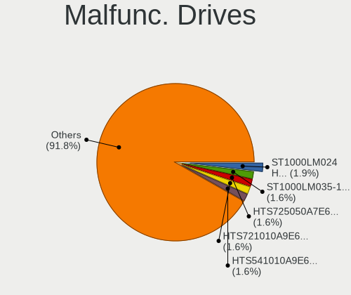
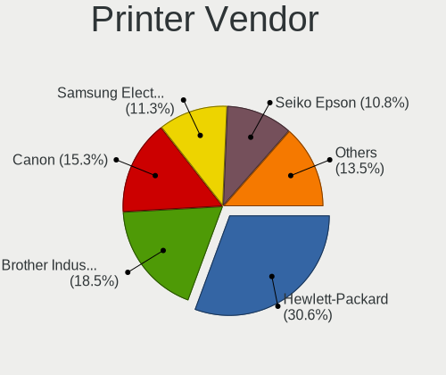

Pop!_OS - Tested Hardware & Statistics
--------------------------------------

A project to collect tested hardware configurations for Pop!_OS.

Anyone can contribute to this report by the [hw-probe](https://github.com/linuxhw/hw-probe) tool:

    sudo -E hw-probe -all -upload

Please contribute! Especially if your hardware is rare.

This is a report for all computer types. See also reports for [desktops](/Dist/Pop!_OS/Desktop/README.md) and [notebooks](/Dist/Pop!_OS/Notebook/README.md).

Contents
--------

* [ Test Cases ](#test-cases)

* [ System ](#system)
  - [ OS                       ](#os)
  - [ OS Family                ](#os-family)
  - [ Kernel                   ](#kernel)
  - [ Kernel Family            ](#kernel-family)
  - [ Kernel Major Ver.        ](#kernel-major-ver)
  - [ Arch                     ](#arch)
  - [ DE                       ](#de)
  - [ Display Server           ](#display-server)
  - [ Display Manager          ](#display-manager)
  - [ OS Lang                  ](#os-lang)
  - [ Boot Mode                ](#boot-mode)
  - [ Filesystem               ](#filesystem)
  - [ Part. scheme             ](#part-scheme)
  - [ Dual Boot with Linux/BSD ](#dual-boot-with-linuxbsd)
  - [ Dual Boot (Win)          ](#dual-boot-win)

* [ Board ](#board)
  - [ Vendor                   ](#vendor)
  - [ Model                    ](#model)
  - [ Model Family             ](#model-family)
  - [ MFG Year                 ](#mfg-year)
  - [ Form Factor              ](#form-factor)
  - [ Secure Boot              ](#secure-boot)
  - [ Coreboot                 ](#coreboot)
  - [ RAM Size                 ](#ram-size)
  - [ RAM Used                 ](#ram-used)
  - [ Total Drives             ](#total-drives)
  - [ Has CD-ROM               ](#has-cd-rom)
  - [ Has Ethernet             ](#has-ethernet)
  - [ Has WiFi                 ](#has-wifi)
  - [ Has Bluetooth            ](#has-bluetooth)

* [ Location ](#location)
  - [ Country                  ](#country)
  - [ City                     ](#city)

* [ Drives ](#drives)
  - [ Drive Vendor             ](#drive-vendor)
  - [ Drive Model              ](#drive-model)
  - [ HDD Vendor               ](#hdd-vendor)
  - [ SSD Vendor               ](#ssd-vendor)
  - [ Drive Kind               ](#drive-kind)
  - [ Drive Connector          ](#drive-connector)
  - [ Drive Size               ](#drive-size)
  - [ Space Total              ](#space-total)
  - [ Space Used               ](#space-used)
  - [ Malfunc. Drives          ](#malfunc-drives)
  - [ Malfunc. Drive Vendor    ](#malfunc-drive-vendor)
  - [ Malfunc. HDD Vendor      ](#malfunc-hdd-vendor)
  - [ Malfunc. Drive Kind      ](#malfunc-drive-kind)
  - [ Failed Drives            ](#failed-drives)
  - [ Failed Drive Vendor      ](#failed-drive-vendor)
  - [ Drive Status             ](#drive-status)

* [ Storage controller ](#storage-controller)
  - [ Storage Vendor           ](#storage-vendor)
  - [ Storage Model            ](#storage-model)
  - [ Storage Kind             ](#storage-kind)

* [ Processor ](#processor)
  - [ CPU Vendor               ](#cpu-vendor)
  - [ CPU Model                ](#cpu-model)
  - [ CPU Model Family         ](#cpu-model-family)
  - [ CPU Cores                ](#cpu-cores)
  - [ CPU Sockets              ](#cpu-sockets)
  - [ CPU Threads              ](#cpu-threads)
  - [ CPU Op-Modes             ](#cpu-op-modes)
  - [ CPU Microcode            ](#cpu-microcode)
  - [ CPU Microarch            ](#cpu-microarch)

* [ Graphics ](#graphics)
  - [ GPU Vendor               ](#gpu-vendor)
  - [ GPU Model                ](#gpu-model)
  - [ GPU Combo                ](#gpu-combo)
  - [ GPU Driver               ](#gpu-driver)
  - [ GPU Memory               ](#gpu-memory)

* [ Monitor ](#monitor)
  - [ Monitor Vendor           ](#monitor-vendor)
  - [ Monitor Model            ](#monitor-model)
  - [ Monitor Resolution       ](#monitor-resolution)
  - [ Monitor Diagonal         ](#monitor-diagonal)
  - [ Monitor Width            ](#monitor-width)
  - [ Aspect Ratio             ](#aspect-ratio)
  - [ Monitor Area             ](#monitor-area)
  - [ Pixel Density            ](#pixel-density)
  - [ Multiple Monitors        ](#multiple-monitors)

* [ Network ](#network)
  - [ Net Controller Vendor    ](#net-controller-vendor)
  - [ Net Controller Model     ](#net-controller-model)
  - [ Wireless Vendor          ](#wireless-vendor)
  - [ Wireless Model           ](#wireless-model)
  - [ Ethernet Vendor          ](#ethernet-vendor)
  - [ Ethernet Model           ](#ethernet-model)
  - [ Net Controller Kind      ](#net-controller-kind)
  - [ Used Controller          ](#used-controller)
  - [ NICs                     ](#nics)
  - [ IPv6                     ](#ipv6)

* [ Bluetooth ](#bluetooth)
  - [ Bluetooth Vendor         ](#bluetooth-vendor)
  - [ Bluetooth Model          ](#bluetooth-model)

* [ Sound ](#sound)
  - [ Sound Vendor             ](#sound-vendor)
  - [ Sound Model              ](#sound-model)

* [ Memory ](#memory)
  - [ Memory Vendor            ](#memory-vendor)
  - [ Memory Model             ](#memory-model)
  - [ Memory Kind              ](#memory-kind)
  - [ Memory Form Factor       ](#memory-form-factor)
  - [ Memory Size              ](#memory-size)
  - [ Memory Speed             ](#memory-speed)

* [ Printers & scanners ](#printers--scanners)
  - [ Printer Vendor           ](#printer-vendor)
  - [ Printer Model            ](#printer-model)
  - [ Scanner Vendor           ](#scanner-vendor)
  - [ Scanner Model            ](#scanner-model)

* [ Camera ](#camera)
  - [ Camera Vendor            ](#camera-vendor)
  - [ Camera Model             ](#camera-model)

* [ Security ](#security)
  - [ Fingerprint Vendor       ](#fingerprint-vendor)
  - [ Fingerprint Model        ](#fingerprint-model)
  - [ Chipcard Vendor          ](#chipcard-vendor)
  - [ Chipcard Model           ](#chipcard-model)

* [ Unsupported ](#unsupported)
  - [ Unsupported Devices      ](#unsupported-devices)
  - [ Unsupported Device Types ](#unsupported-device-types)

Test Cases
----------

Total: 9838

| Vendor        | Model                       | Form-Factor | Probe                                                      | Date         |
|---------------|-----------------------------|-------------|------------------------------------------------------------|--------------|
| HP            | ProBook 455 G7              | Notebook    | [88fcea9210](https://linux-hardware.org/?probe=88fcea9210) | Apr 30, 2022 |
| MSI           | B450M GAMING PLUS           | Desktop     | [0929d58de7](https://linux-hardware.org/?probe=0929d58de7) | Apr 30, 2022 |
| Apple         | Mac-F42C88C8 Proto1         | Desktop     | [3edd5f05f7](https://linux-hardware.org/?probe=3edd5f05f7) | Apr 30, 2022 |
| ASRock        | X99 Extreme4                | Desktop     | [d45e1e88db](https://linux-hardware.org/?probe=d45e1e88db) | Apr 30, 2022 |
| ASRock        | X99 Extreme4                | Desktop     | [41cec63ac6](https://linux-hardware.org/?probe=41cec63ac6) | Apr 30, 2022 |
| Lenovo        | ThinkPad L15 Gen 2 20X4S... | Notebook    | [48d3759522](https://linux-hardware.org/?probe=48d3759522) | Apr 30, 2022 |
| MSI           | B450 TOMAHAWK MAX II        | Desktop     | [6db8017245](https://linux-hardware.org/?probe=6db8017245) | Apr 30, 2022 |
| Apple         | MacBookPro8,1               | Notebook    | [8826e1d451](https://linux-hardware.org/?probe=8826e1d451) | Apr 30, 2022 |
| Toshiba       | Satellite L10W-B-101        | Notebook    | [8383d306f3](https://linux-hardware.org/?probe=8383d306f3) | Apr 30, 2022 |
| Dell          | XPS 13 9343                 | Notebook    | [b48ccc106e](https://linux-hardware.org/?probe=b48ccc106e) | Apr 30, 2022 |
| Toshiba       | IS 1413G                    | Notebook    | [8074a86bc7](https://linux-hardware.org/?probe=8074a86bc7) | Apr 30, 2022 |
| Dell          | XPS 15 9510                 | Notebook    | [b92517268e](https://linux-hardware.org/?probe=b92517268e) | Apr 30, 2022 |
| EVGA          | X58 SLI Classified Tyler... | Desktop     | [07254f2dbb](https://linux-hardware.org/?probe=07254f2dbb) | Apr 30, 2022 |
| Intel         | NUC8BEB J72693-305          | Mini pc     | [082e245a6c](https://linux-hardware.org/?probe=082e245a6c) | Apr 29, 2022 |
| ASUSTek       | PRIME H510M-E               | Desktop     | [5c9e5fc14c](https://linux-hardware.org/?probe=5c9e5fc14c) | Apr 29, 2022 |
| MSI           | H110M PRO-VH PLUS           | Desktop     | [876baf36d7](https://linux-hardware.org/?probe=876baf36d7) | Apr 29, 2022 |
| ASUSTek       | G55VW                       | Notebook    | [6bd8a1b04a](https://linux-hardware.org/?probe=6bd8a1b04a) | Apr 29, 2022 |
| Dell          | Inspiron 3542               | Notebook    | [19f5e16bce](https://linux-hardware.org/?probe=19f5e16bce) | Apr 29, 2022 |
| ASUSTek       | ROG STRIX X299-E GAMING ... | Desktop     | [bce425f138](https://linux-hardware.org/?probe=bce425f138) | Apr 29, 2022 |
| Lenovo        | ThinkPad E14 Gen 4 21ECS... | Notebook    | [61bb949815](https://linux-hardware.org/?probe=61bb949815) | Apr 29, 2022 |
| Gigabyte      | AB350-Gaming 3-CF           | Desktop     | [7b292b972d](https://linux-hardware.org/?probe=7b292b972d) | Apr 29, 2022 |
| Intel         | NUC8BEB J72693-305          | Mini pc     | [ea3b16fcfd](https://linux-hardware.org/?probe=ea3b16fcfd) | Apr 29, 2022 |
| Dell          | G5 5500                     | Notebook    | [c6064853ad](https://linux-hardware.org/?probe=c6064853ad) | Apr 29, 2022 |
| Lenovo        | 3136 SDK0K17763 WIN 1801... | Mini pc     | [7b13bcb624](https://linux-hardware.org/?probe=7b13bcb624) | Apr 29, 2022 |
| MSI           | MAG Z690 TOMAHAWK WIFI D... | Desktop     | [e37bc471b1](https://linux-hardware.org/?probe=e37bc471b1) | Apr 29, 2022 |
| HP            | Pavilion 15                 | Notebook    | [2484213956](https://linux-hardware.org/?probe=2484213956) | Apr 29, 2022 |
| ASUSTek       | PRIME H310M-E R2.0          | Desktop     | [2b7167b16e](https://linux-hardware.org/?probe=2b7167b16e) | Apr 29, 2022 |
| Lenovo        | ThinkPad T480 20L50004UK    | Notebook    | [34015c4874](https://linux-hardware.org/?probe=34015c4874) | Apr 29, 2022 |
| ASUSTek       | X540SAA                     | Notebook    | [6c8e397ca3](https://linux-hardware.org/?probe=6c8e397ca3) | Apr 29, 2022 |
| System76      | Oryx Pro                    | Notebook    | [cf999d4581](https://linux-hardware.org/?probe=cf999d4581) | Apr 29, 2022 |
| HP            | 8704                        | Desktop     | [41d896b51d](https://linux-hardware.org/?probe=41d896b51d) | Apr 29, 2022 |
| Dell          | Inspiron 5547               | Notebook    | [a5d8e73a23](https://linux-hardware.org/?probe=a5d8e73a23) | Apr 28, 2022 |
| ASUSTek       | ROG STRIX B450-F GAMING     | Desktop     | [aed5ee3ded](https://linux-hardware.org/?probe=aed5ee3ded) | Apr 28, 2022 |
| Dell          | Inspiron 5547               | Notebook    | [be4ab0fd27](https://linux-hardware.org/?probe=be4ab0fd27) | Apr 28, 2022 |
| Toshiba       | IS 1413G                    | Notebook    | [995f77010e](https://linux-hardware.org/?probe=995f77010e) | Apr 28, 2022 |
| Toshiba       | IS 1413G                    | Notebook    | [e2293170b3](https://linux-hardware.org/?probe=e2293170b3) | Apr 28, 2022 |
| Gigabyte      | B550 AORUS ELITE AX V2      | Desktop     | [ab83eedd1f](https://linux-hardware.org/?probe=ab83eedd1f) | Apr 28, 2022 |
| HP            | Pavilion 13 x360 PC         | Notebook    | [f898a6a476](https://linux-hardware.org/?probe=f898a6a476) | Apr 28, 2022 |
| Lenovo        | ThinkPad T431s 20ACS03P0... | Notebook    | [3c0878aee3](https://linux-hardware.org/?probe=3c0878aee3) | Apr 28, 2022 |
| System76      | Oryx Pro                    | Notebook    | [ae46ece731](https://linux-hardware.org/?probe=ae46ece731) | Apr 28, 2022 |
| MSI           | H55M-E23                    | Desktop     | [4ab5f58470](https://linux-hardware.org/?probe=4ab5f58470) | Apr 28, 2022 |
| HP            | Pavilion 15                 | Notebook    | [fee7e96d70](https://linux-hardware.org/?probe=fee7e96d70) | Apr 28, 2022 |
| Toshiba       | IS 1413G                    | Notebook    | [a63dc69025](https://linux-hardware.org/?probe=a63dc69025) | Apr 28, 2022 |
| HP            | Stream Laptop 14-ds0xxx     | Notebook    | [59a8e467c6](https://linux-hardware.org/?probe=59a8e467c6) | Apr 28, 2022 |
| Gigabyte      | X570 AORUS PRO              | Desktop     | [44e25caaa1](https://linux-hardware.org/?probe=44e25caaa1) | Apr 28, 2022 |
| Apple         | Mac-81E3E92DD6088272 iMa... | All in one  | [1f26415f58](https://linux-hardware.org/?probe=1f26415f58) | Apr 28, 2022 |
| MSI           | MAG Z690 TOMAHAWK WIFI D... | Desktop     | [46430e1117](https://linux-hardware.org/?probe=46430e1117) | Apr 28, 2022 |
| Dell          | 09KPNV A00                  | Desktop     | [5046e0575b](https://linux-hardware.org/?probe=5046e0575b) | Apr 28, 2022 |
| Dell          | 0NW73C A00                  | Desktop     | [344e2b816e](https://linux-hardware.org/?probe=344e2b816e) | Apr 28, 2022 |
| Apple         | MacBookPro10,2              | Notebook    | [2d79aab0aa](https://linux-hardware.org/?probe=2d79aab0aa) | Apr 28, 2022 |
| ASUSTek       | K40IN                       | Notebook    | [ab6a95da52](https://linux-hardware.org/?probe=ab6a95da52) | Apr 28, 2022 |
| Dell          | Latitude 7275               | Tablet      | [b7443972f3](https://linux-hardware.org/?probe=b7443972f3) | Apr 28, 2022 |
| Dell          | 088DT1 A01                  | Desktop     | [b664b8720e](https://linux-hardware.org/?probe=b664b8720e) | Apr 28, 2022 |
| HP            | Pavilion 13 x360 PC         | Notebook    | [d48ed77abc](https://linux-hardware.org/?probe=d48ed77abc) | Apr 28, 2022 |
| ASUSTek       | P9X79 LE                    | Desktop     | [ad35094812](https://linux-hardware.org/?probe=ad35094812) | Apr 28, 2022 |
| Fujitsu       | D3162-A1 S26361-D3162-A1    | Desktop     | [19e0445e6f](https://linux-hardware.org/?probe=19e0445e6f) | Apr 27, 2022 |
| Dell          | Inspiron 5566               | Notebook    | [695d362d8f](https://linux-hardware.org/?probe=695d362d8f) | Apr 27, 2022 |
| ASUSTek       | FX503VM                     | Notebook    | [c227966510](https://linux-hardware.org/?probe=c227966510) | Apr 27, 2022 |
| ASUSTek       | FX503VM                     | Notebook    | [1275aa643d](https://linux-hardware.org/?probe=1275aa643d) | Apr 27, 2022 |
| HP            | ENVY Laptop 14-eb0xxx       | Notebook    | [495a74c914](https://linux-hardware.org/?probe=495a74c914) | Apr 27, 2022 |
| Dell          | XPS 13 9310                 | Notebook    | [d394f4e0d9](https://linux-hardware.org/?probe=d394f4e0d9) | Apr 27, 2022 |
| HUAWEI        | HVY-WXX9                    | Notebook    | [824ccc1317](https://linux-hardware.org/?probe=824ccc1317) | Apr 27, 2022 |
| HP            | Pavilion 13 x360 PC         | Notebook    | [3e5933fe0d](https://linux-hardware.org/?probe=3e5933fe0d) | Apr 27, 2022 |
| Lenovo        | IdeaPad 110-15ISK 80UD      | Notebook    | [e51ff27a5a](https://linux-hardware.org/?probe=e51ff27a5a) | Apr 27, 2022 |
| Dell          | 0R1PCR A00                  | Desktop     | [feec38a0f5](https://linux-hardware.org/?probe=feec38a0f5) | Apr 27, 2022 |
| ASUSTek       | SABERTOOTH Z170 S           | Desktop     | [21663dc8b3](https://linux-hardware.org/?probe=21663dc8b3) | Apr 27, 2022 |
| HP            | Spectre x360 Convertible... | Convertible | [c9fb277b57](https://linux-hardware.org/?probe=c9fb277b57) | Apr 27, 2022 |
| Dell          | Vostro 15 3515              | Notebook    | [7c99d7d4c5](https://linux-hardware.org/?probe=7c99d7d4c5) | Apr 27, 2022 |
| Unknown       | Unknown                     | Desktop     | [82ad7e86b5](https://linux-hardware.org/?probe=82ad7e86b5) | Apr 27, 2022 |
| Lenovo        | ThinkPad T480 20L6SJN400    | Notebook    | [294a5ef80c](https://linux-hardware.org/?probe=294a5ef80c) | Apr 27, 2022 |
| Lenovo        | Yoga C740-14IML 81TC        | Convertible | [25041b35de](https://linux-hardware.org/?probe=25041b35de) | Apr 27, 2022 |
| ASUSTek       | ROG Zephyrus G14 GA401IH... | Notebook    | [863612cc05](https://linux-hardware.org/?probe=863612cc05) | Apr 27, 2022 |
| Purism        | Librem 15 v3                | Notebook    | [d2a13c9d0a](https://linux-hardware.org/?probe=d2a13c9d0a) | Apr 27, 2022 |
| HP            | Spectre x360 Convertible... | Convertible | [bbb524450f](https://linux-hardware.org/?probe=bbb524450f) | Apr 27, 2022 |
| Toshiba       | Satellite C55t-C            | Notebook    | [1fe2032839](https://linux-hardware.org/?probe=1fe2032839) | Apr 27, 2022 |
| Toshiba       | Satellite C55t-C            | Notebook    | [cabf0c7464](https://linux-hardware.org/?probe=cabf0c7464) | Apr 27, 2022 |
| Lenovo        | IdeaPad S145-15API 81V7     | Notebook    | [b7ac79ff8f](https://linux-hardware.org/?probe=b7ac79ff8f) | Apr 27, 2022 |
| MSI           | GS66 Stealth 10UG           | Notebook    | [77b699045a](https://linux-hardware.org/?probe=77b699045a) | Apr 27, 2022 |
| ASUSTek       | GA15DH                      | Desktop     | [30a22d7be3](https://linux-hardware.org/?probe=30a22d7be3) | Apr 27, 2022 |
| ASUSTek       | TUF Gaming X570-PLUS        | Desktop     | [31b5451ae1](https://linux-hardware.org/?probe=31b5451ae1) | Apr 27, 2022 |
| Dell          | XPS 13 9305                 | Notebook    | [edf60be002](https://linux-hardware.org/?probe=edf60be002) | Apr 26, 2022 |
| Acer          | Aspire E1-570               | Notebook    | [1621e22812](https://linux-hardware.org/?probe=1621e22812) | Apr 26, 2022 |
| Acer          | Swift SF316-51              | Notebook    | [fe42983639](https://linux-hardware.org/?probe=fe42983639) | Apr 26, 2022 |
| MSI           | GF63 Thin 10SC              | Notebook    | [bc3cbdbc1f](https://linux-hardware.org/?probe=bc3cbdbc1f) | Apr 26, 2022 |
| Acer          | TravelMate P249-G2-MG       | Notebook    | [2e0bd790c6](https://linux-hardware.org/?probe=2e0bd790c6) | Apr 26, 2022 |
| ASUSTek       | ROG STRIX B450-I GAMING     | Desktop     | [4b9faf4848](https://linux-hardware.org/?probe=4b9faf4848) | Apr 26, 2022 |
| ASUSTek       | X455LD                      | Notebook    | [9f98b410f6](https://linux-hardware.org/?probe=9f98b410f6) | Apr 26, 2022 |
| Dell          | Inspiron 3442               | Notebook    | [d4b7580074](https://linux-hardware.org/?probe=d4b7580074) | Apr 26, 2022 |
| Dell          | Inspiron 3442               | Notebook    | [d994ff2a13](https://linux-hardware.org/?probe=d994ff2a13) | Apr 26, 2022 |
| Apple         | Mac-F42C88C8 Proto1         | Desktop     | [486215d495](https://linux-hardware.org/?probe=486215d495) | Apr 26, 2022 |
| Unknown       | Unknown                     | Notebook    | [885f468161](https://linux-hardware.org/?probe=885f468161) | Apr 26, 2022 |
| Acer          | Aspire A315-41              | Notebook    | [a42b1cda2c](https://linux-hardware.org/?probe=a42b1cda2c) | Apr 26, 2022 |
| ASUSTek       | ROG Maximus XI CODE         | Desktop     | [8cca49b0ee](https://linux-hardware.org/?probe=8cca49b0ee) | Apr 25, 2022 |
| System76      | Thelio thelio-r2            | Desktop     | [aae937be8b](https://linux-hardware.org/?probe=aae937be8b) | Apr 25, 2022 |
| ASRock        | A320M-HD                    | Desktop     | [f99a1a0591](https://linux-hardware.org/?probe=f99a1a0591) | Apr 25, 2022 |
| ASUSTek       | X555LF                      | Notebook    | [0aa3a88c0c](https://linux-hardware.org/?probe=0aa3a88c0c) | Apr 25, 2022 |
| ASUSTek       | G20AJ                       | Desktop     | [ed023008e4](https://linux-hardware.org/?probe=ed023008e4) | Apr 25, 2022 |
| Gigabyte      | AB350-Gaming 3-CF           | Desktop     | [9236e9bc93](https://linux-hardware.org/?probe=9236e9bc93) | Apr 25, 2022 |
| ASUSTek       | PRIME B460M-A               | Desktop     | [d1d705c163](https://linux-hardware.org/?probe=d1d705c163) | Apr 25, 2022 |
| ASUSTek       | PRIME B460M-A               | Desktop     | [97ff7b7591](https://linux-hardware.org/?probe=97ff7b7591) | Apr 25, 2022 |
| HP            | ENVY Laptop 17-ch0xxx       | Notebook    | [256f703e7e](https://linux-hardware.org/?probe=256f703e7e) | Apr 25, 2022 |
| Acer          | Nitro AN515-53              | Notebook    | [8a96f457bb](https://linux-hardware.org/?probe=8a96f457bb) | Apr 25, 2022 |
| Intel         | NUC8BEB J72688-305          | Mini pc     | [f656f0d16f](https://linux-hardware.org/?probe=f656f0d16f) | Apr 24, 2022 |
| MSI           | G31TM-P35                   | Desktop     | [711f26a820](https://linux-hardware.org/?probe=711f26a820) | Apr 24, 2022 |
| MSI           | G31TM-P35                   | Desktop     | [2c1b91769f](https://linux-hardware.org/?probe=2c1b91769f) | Apr 24, 2022 |
| MSI           | Katana GF76 11UD            | Notebook    | [2e4a211c66](https://linux-hardware.org/?probe=2e4a211c66) | Apr 24, 2022 |
| Gigabyte      | B360 AORUS GAMING 3 WIFI... | Desktop     | [fabaa5b3ab](https://linux-hardware.org/?probe=fabaa5b3ab) | Apr 24, 2022 |
| Lenovo        | V15 G2 ALC 82KD             | Notebook    | [743177a467](https://linux-hardware.org/?probe=743177a467) | Apr 24, 2022 |
| Lenovo        | IdeaPad 5 Pro 14ACN6 82L... | Notebook    | [803959fe3c](https://linux-hardware.org/?probe=803959fe3c) | Apr 24, 2022 |
| Dell          | Inspiron 5559               | Notebook    | [e9676d63f9](https://linux-hardware.org/?probe=e9676d63f9) | Apr 24, 2022 |
| ASUSTek       | PRIME Z270-P                | Desktop     | [6cc8c69a6c](https://linux-hardware.org/?probe=6cc8c69a6c) | Apr 23, 2022 |
| ASUSTek       | X450LCP                     | Notebook    | [a2ed4903be](https://linux-hardware.org/?probe=a2ed4903be) | Apr 23, 2022 |
| Toshiba       | IS 1413G                    | Notebook    | [d5918f0d93](https://linux-hardware.org/?probe=d5918f0d93) | Apr 23, 2022 |
| HP            | ENVY x360 Convertible 15... | Convertible | [d6d999cbc8](https://linux-hardware.org/?probe=d6d999cbc8) | Apr 23, 2022 |
| MSI           | PRO B660M-A WIFI DDR4       | Desktop     | [0534d32a13](https://linux-hardware.org/?probe=0534d32a13) | Apr 23, 2022 |
| ASRock        | B450 Pro4                   | Desktop     | [61ab02b4e8](https://linux-hardware.org/?probe=61ab02b4e8) | Apr 23, 2022 |
| ECS           | Iris8                       | Desktop     | [1cff4313c1](https://linux-hardware.org/?probe=1cff4313c1) | Apr 23, 2022 |
| MSI           | PRO B660M-A WIFI DDR4       | Desktop     | [8ae54427ca](https://linux-hardware.org/?probe=8ae54427ca) | Apr 23, 2022 |
| Acer          | Aspire 1410                 | Notebook    | [0399a90ade](https://linux-hardware.org/?probe=0399a90ade) | Apr 23, 2022 |
| Lenovo        | 3733 SDK0T76461 WIN 3422... | Desktop     | [037284e799](https://linux-hardware.org/?probe=037284e799) | Apr 23, 2022 |
| Gigabyte      | B450 I AORUS PRO WIFI-CF    | Desktop     | [3cb8eac116](https://linux-hardware.org/?probe=3cb8eac116) | Apr 23, 2022 |
| Apple         | MacBookPro6,1               | Notebook    | [e73885a94d](https://linux-hardware.org/?probe=e73885a94d) | Apr 23, 2022 |
| ASUSTek       | UX32VD                      | Notebook    | [6f956cd55c](https://linux-hardware.org/?probe=6f956cd55c) | Apr 23, 2022 |
| Apple         | MacBookPro10,2              | Notebook    | [477b1e873f](https://linux-hardware.org/?probe=477b1e873f) | Apr 23, 2022 |
| Toshiba       | Satellite L50D-B            | Notebook    | [f283519d44](https://linux-hardware.org/?probe=f283519d44) | Apr 22, 2022 |
| ASUSTek       | GL552JX                     | Notebook    | [dae470212d](https://linux-hardware.org/?probe=dae470212d) | Apr 22, 2022 |
| HP            | ENVY x360 Convert 15        | Convertible | [f3071c3072](https://linux-hardware.org/?probe=f3071c3072) | Apr 22, 2022 |
| ASUSTek       | X541UJ                      | Notebook    | [4043c70a42](https://linux-hardware.org/?probe=4043c70a42) | Apr 22, 2022 |
| ASUSTek       | ROG Zephyrus M16 GU603HE... | Notebook    | [2c48c81559](https://linux-hardware.org/?probe=2c48c81559) | Apr 22, 2022 |
| Apple         | MacBookPro10,2              | Notebook    | [9936062b3c](https://linux-hardware.org/?probe=9936062b3c) | Apr 22, 2022 |
| ASUSTek       | PRIME TRX40-PRO S           | Desktop     | [017717599c](https://linux-hardware.org/?probe=017717599c) | Apr 22, 2022 |
| Lenovo        | 31900058 STD                | Desktop     | [0e3c909996](https://linux-hardware.org/?probe=0e3c909996) | Apr 22, 2022 |
| Acer          | Aspire F5-573G              | Notebook    | [c4cfcaf69e](https://linux-hardware.org/?probe=c4cfcaf69e) | Apr 22, 2022 |
| Dell          | Latitude 7275               | Tablet      | [8b373dc563](https://linux-hardware.org/?probe=8b373dc563) | Apr 22, 2022 |
| Gigabyte      | B450M DS3H-CF               | Desktop     | [3a052b2111](https://linux-hardware.org/?probe=3a052b2111) | Apr 21, 2022 |
| Dell          | 040DDP A01                  | Desktop     | [6e37f18366](https://linux-hardware.org/?probe=6e37f18366) | Apr 21, 2022 |
| Microsoft     | Surface Book 2              | Tablet      | [c32d394b3a](https://linux-hardware.org/?probe=c32d394b3a) | Apr 21, 2022 |
| Gigabyte      | Z270XP-SLI-CF               | Desktop     | [f1a2e57e22](https://linux-hardware.org/?probe=f1a2e57e22) | Apr 21, 2022 |
| CyberPower... | Tracer II                   | Notebook    | [4582a60770](https://linux-hardware.org/?probe=4582a60770) | Apr 21, 2022 |
| ASUSTek       | TUF Gaming FX705DT_FX705... | Notebook    | [329905cab9](https://linux-hardware.org/?probe=329905cab9) | Apr 21, 2022 |
| Gigabyte      | AB350M-HD3-CF               | Desktop     | [dd16ab4768](https://linux-hardware.org/?probe=dd16ab4768) | Apr 21, 2022 |
| ASUSTek       | GL502VMK                    | Notebook    | [cc5ed34db8](https://linux-hardware.org/?probe=cc5ed34db8) | Apr 21, 2022 |
| ASUSTek       | Z87-K                       | Desktop     | [480a64a95a](https://linux-hardware.org/?probe=480a64a95a) | Apr 21, 2022 |
| ASUSTek       | PRIME B450M-GAMING/BR       | Desktop     | [c568c44d81](https://linux-hardware.org/?probe=c568c44d81) | Apr 20, 2022 |
| Lenovo        | ThinkPad T450s 20BWS19E0... | Notebook    | [c6a1ec3df0](https://linux-hardware.org/?probe=c6a1ec3df0) | Apr 20, 2022 |
| Samsung       | 550XDA                      | Notebook    | [66cb0691e0](https://linux-hardware.org/?probe=66cb0691e0) | Apr 20, 2022 |
| Dell          | Latitude D430               | Notebook    | [00ddfbe46f](https://linux-hardware.org/?probe=00ddfbe46f) | Apr 20, 2022 |
| MSI           | MPG Z390 GAMING EDGE AC     | Desktop     | [7beb17ef96](https://linux-hardware.org/?probe=7beb17ef96) | Apr 20, 2022 |
| ASUSTek       | P8H67-M LE                  | Desktop     | [0d5a9fcacc](https://linux-hardware.org/?probe=0d5a9fcacc) | Apr 20, 2022 |
| ASUSTek       | PRIME Z390-P                | Desktop     | [c9ef889715](https://linux-hardware.org/?probe=c9ef889715) | Apr 20, 2022 |
| HP            | ENVY Laptop 14-eb0xxx       | Notebook    | [5d95841f54](https://linux-hardware.org/?probe=5d95841f54) | Apr 20, 2022 |
| Gigabyte      | B560M AORUS PRO AX          | Desktop     | [61ca629904](https://linux-hardware.org/?probe=61ca629904) | Apr 20, 2022 |
| Gigabyte      | B560M AORUS PRO AX          | Desktop     | [c722e417a1](https://linux-hardware.org/?probe=c722e417a1) | Apr 20, 2022 |
| Toshiba       | Satellite S75-A             | Notebook    | [90ba54ad32](https://linux-hardware.org/?probe=90ba54ad32) | Apr 20, 2022 |
| Dell          | XPS 13 9360                 | Notebook    | [ffb9cf10be](https://linux-hardware.org/?probe=ffb9cf10be) | Apr 20, 2022 |
| Dell          | XPS 13 9360                 | Notebook    | [f174d4ced7](https://linux-hardware.org/?probe=f174d4ced7) | Apr 20, 2022 |
| Lenovo        | Legion Y530-15ICH 81FV      | Notebook    | [88764ed497](https://linux-hardware.org/?probe=88764ed497) | Apr 20, 2022 |
| Intel         | NUC12EDBi9 M27907-302       | Mini pc     | [589bc2d17a](https://linux-hardware.org/?probe=589bc2d17a) | Apr 20, 2022 |
| ASUSTek       | PRIME A520M-E               | Desktop     | [0aa2639b59](https://linux-hardware.org/?probe=0aa2639b59) | Apr 20, 2022 |
| ASUSTek       | Q87M-E                      | Desktop     | [e409d7a8df](https://linux-hardware.org/?probe=e409d7a8df) | Apr 20, 2022 |
| Gigabyte      | X570 AORUS ELITE            | Desktop     | [fd661468b9](https://linux-hardware.org/?probe=fd661468b9) | Apr 19, 2022 |
| GPU Compan... | GWTN141-10                  | Notebook    | [6c4022059c](https://linux-hardware.org/?probe=6c4022059c) | Apr 19, 2022 |
| System76      | Galago Pro                  | Notebook    | [32b09fd215](https://linux-hardware.org/?probe=32b09fd215) | Apr 19, 2022 |
| Acer          | Nitro AN515-45              | Notebook    | [c4456aaa4f](https://linux-hardware.org/?probe=c4456aaa4f) | Apr 19, 2022 |
| ASUSTek       | ASUS TUF Gaming A15 FA50... | Notebook    | [7f4254b1b1](https://linux-hardware.org/?probe=7f4254b1b1) | Apr 19, 2022 |
| Positivo      | N1250                       | Notebook    | [c2dfeaab53](https://linux-hardware.org/?probe=c2dfeaab53) | Apr 19, 2022 |
| HP            | ENVY Laptop 15-ep1xxx       | Notebook    | [29f92aa75f](https://linux-hardware.org/?probe=29f92aa75f) | Apr 19, 2022 |
| HUAWEI        | NBLK-WAX9X                  | Notebook    | [bbc4928d39](https://linux-hardware.org/?probe=bbc4928d39) | Apr 19, 2022 |
| Acer          | Aspire A315-42G             | Notebook    | [3654d1f0fa](https://linux-hardware.org/?probe=3654d1f0fa) | Apr 19, 2022 |
| Dell          | Inspiron 5521               | Notebook    | [7290650d08](https://linux-hardware.org/?probe=7290650d08) | Apr 19, 2022 |
| ASUSTek       | TUF Gaming X570-PLUS        | Desktop     | [dc42beaa8d](https://linux-hardware.org/?probe=dc42beaa8d) | Apr 18, 2022 |
| Lenovo        | IdeaPad S145-15API 81V7     | Notebook    | [746e2ea0d2](https://linux-hardware.org/?probe=746e2ea0d2) | Apr 18, 2022 |
| ASUSTek       | PRIME B450-PLUS             | Desktop     | [49d51ee541](https://linux-hardware.org/?probe=49d51ee541) | Apr 18, 2022 |
| AMI           | Aptio CRB                   | Mini pc     | [7d16b45ebd](https://linux-hardware.org/?probe=7d16b45ebd) | Apr 18, 2022 |
| Toshiba       | IS 1413G                    | Notebook    | [1b3267b605](https://linux-hardware.org/?probe=1b3267b605) | Apr 18, 2022 |
| MSI           | Z370-A PRO                  | Desktop     | [9f5287d8cb](https://linux-hardware.org/?probe=9f5287d8cb) | Apr 18, 2022 |
| Gigabyte      | B450 AORUS ELITE            | Desktop     | [e269a6b9b8](https://linux-hardware.org/?probe=e269a6b9b8) | Apr 18, 2022 |
| ASUSTek       | UL30VT                      | Notebook    | [faad37ee2e](https://linux-hardware.org/?probe=faad37ee2e) | Apr 18, 2022 |
| Gigabyte      | X570 AORUS ELITE            | Desktop     | [59bc74a946](https://linux-hardware.org/?probe=59bc74a946) | Apr 18, 2022 |
| ASUSTek       | P8H67-M LE                  | Desktop     | [3bea0f2a6a](https://linux-hardware.org/?probe=3bea0f2a6a) | Apr 18, 2022 |
| HP            | 15 Notebook PC              | Notebook    | [e1d2871cd8](https://linux-hardware.org/?probe=e1d2871cd8) | Apr 18, 2022 |
| MSI           | Katana GF76 11UG            | Notebook    | [f460a6924f](https://linux-hardware.org/?probe=f460a6924f) | Apr 18, 2022 |
| MSI           | Z590-A PRO                  | Desktop     | [ebe60e3c9e](https://linux-hardware.org/?probe=ebe60e3c9e) | Apr 18, 2022 |
| Dell          | Inspiron 3542               | Notebook    | [196f849315](https://linux-hardware.org/?probe=196f849315) | Apr 18, 2022 |
| Apple         | MacBookPro8,2               | Notebook    | [a315b0490b](https://linux-hardware.org/?probe=a315b0490b) | Apr 18, 2022 |
| ASUSTek       | ROG STRIX X570-E GAMING     | Desktop     | [f727388ac8](https://linux-hardware.org/?probe=f727388ac8) | Apr 17, 2022 |
| ASUSTek       | ROG STRIX X570-E GAMING     | Desktop     | [c1102c77ec](https://linux-hardware.org/?probe=c1102c77ec) | Apr 17, 2022 |
| Lenovo        | G50-80 80E5                 | Notebook    | [a07c515f60](https://linux-hardware.org/?probe=a07c515f60) | Apr 17, 2022 |
| Gigabyte      | Z490I AORUS ULTRA           | Desktop     | [7b61fb0ba4](https://linux-hardware.org/?probe=7b61fb0ba4) | Apr 17, 2022 |
| Gigabyte      | X570 AORUS ELITE            | Desktop     | [f7008a1e16](https://linux-hardware.org/?probe=f7008a1e16) | Apr 17, 2022 |
| Unknown       | Unknown                     | Desktop     | [f5deab7689](https://linux-hardware.org/?probe=f5deab7689) | Apr 17, 2022 |
| ASUSTek       | M5A97 LE R2.0               | Desktop     | [49c981ee41](https://linux-hardware.org/?probe=49c981ee41) | Apr 17, 2022 |
| MSI           | Z590-A PRO                  | Desktop     | [52a97f186f](https://linux-hardware.org/?probe=52a97f186f) | Apr 17, 2022 |
| Framework     | Laptop                      | Notebook    | [acad8f1ccb](https://linux-hardware.org/?probe=acad8f1ccb) | Apr 17, 2022 |
| HP            | Pavilion g6                 | Notebook    | [0c4c081e71](https://linux-hardware.org/?probe=0c4c081e71) | Apr 17, 2022 |
| Dell          | Latitude 5590               | Notebook    | [ade3f33fb9](https://linux-hardware.org/?probe=ade3f33fb9) | Apr 16, 2022 |
| Gigabyte      | GA-990FX-GAMING             | Desktop     | [dc1e145cf3](https://linux-hardware.org/?probe=dc1e145cf3) | Apr 16, 2022 |
| Apple         | MacBookPro8,1               | Notebook    | [a8c0eeb473](https://linux-hardware.org/?probe=a8c0eeb473) | Apr 16, 2022 |
| ASUSTek       | G752VY                      | Notebook    | [a497ac3b95](https://linux-hardware.org/?probe=a497ac3b95) | Apr 16, 2022 |
| ASUSTek       | ROG STRIX B560-A GAMING ... | Desktop     | [9a5d59c375](https://linux-hardware.org/?probe=9a5d59c375) | Apr 16, 2022 |
| Toshiba       | Satellite L10W-B-101        | Notebook    | [65edd32378](https://linux-hardware.org/?probe=65edd32378) | Apr 16, 2022 |
| ASUSTek       | Maximus VI HERO             | Desktop     | [923a82e975](https://linux-hardware.org/?probe=923a82e975) | Apr 16, 2022 |
| Toshiba       | IS 1413G                    | Notebook    | [e9e45e7f91](https://linux-hardware.org/?probe=e9e45e7f91) | Apr 16, 2022 |
| HP            | EliteBook 840 G1            | Notebook    | [d9c6549322](https://linux-hardware.org/?probe=d9c6549322) | Apr 16, 2022 |
| Toshiba       | IS 1413G                    | Notebook    | [e51d0544a1](https://linux-hardware.org/?probe=e51d0544a1) | Apr 16, 2022 |
| ASUSTek       | G20AJ                       | Desktop     | [f83ee2cc17](https://linux-hardware.org/?probe=f83ee2cc17) | Apr 16, 2022 |
| ASUSTek       | G20AJ                       | Desktop     | [eef3c69fcd](https://linux-hardware.org/?probe=eef3c69fcd) | Apr 16, 2022 |
| ASUSTek       | STRIX Z270G GAMING          | Desktop     | [76a5225b83](https://linux-hardware.org/?probe=76a5225b83) | Apr 16, 2022 |
| ASUSTek       | PRIME Z690-P WIFI D4        | Desktop     | [b0a5b307c9](https://linux-hardware.org/?probe=b0a5b307c9) | Apr 16, 2022 |
| ASUSTek       | M5A78L/USB3                 | Desktop     | [48deb234f0](https://linux-hardware.org/?probe=48deb234f0) | Apr 15, 2022 |
| ASUSTek       | M5A78L/USB3                 | Desktop     | [bb302cfbbd](https://linux-hardware.org/?probe=bb302cfbbd) | Apr 15, 2022 |
| Acer          | Nitro AN515-57              | Notebook    | [b824b88050](https://linux-hardware.org/?probe=b824b88050) | Apr 15, 2022 |
| Dell          | Precision 5760              | Notebook    | [ba2ce021d0](https://linux-hardware.org/?probe=ba2ce021d0) | Apr 15, 2022 |
| Lenovo        | ThinkPad X1 Carbon 6th 2... | Notebook    | [7e8c906437](https://linux-hardware.org/?probe=7e8c906437) | Apr 15, 2022 |
| Toshiba       | Satellite L505              | Notebook    | [92da438638](https://linux-hardware.org/?probe=92da438638) | Apr 15, 2022 |
| ASUSTek       | M5A97 R2.0                  | Desktop     | [37e172faec](https://linux-hardware.org/?probe=37e172faec) | Apr 14, 2022 |
| ASRock        | B550M Pro4                  | Desktop     | [0bd7facf9b](https://linux-hardware.org/?probe=0bd7facf9b) | Apr 14, 2022 |
| Apple         | Mac-031B6874CF7F642A iMa... | All in one  | [a10ea959f8](https://linux-hardware.org/?probe=a10ea959f8) | Apr 14, 2022 |
| ASRock        | X570 Steel Legend           | Desktop     | [17622a538e](https://linux-hardware.org/?probe=17622a538e) | Apr 14, 2022 |
| Lenovo        | V130-14IKB 81HQ             | Notebook    | [19299bc16d](https://linux-hardware.org/?probe=19299bc16d) | Apr 14, 2022 |
| NZXT          | N7 B550                     | Desktop     | [71e92a4807](https://linux-hardware.org/?probe=71e92a4807) | Apr 14, 2022 |
| Wortmann      | 1220663_1470189             | Notebook    | [59eed1073a](https://linux-hardware.org/?probe=59eed1073a) | Apr 14, 2022 |
| Dell          | Inspiron N4010              | Notebook    | [d29ff8a54e](https://linux-hardware.org/?probe=d29ff8a54e) | Apr 14, 2022 |
| Lenovo        | IdeaPad L340-15IRH Gamin... | Notebook    | [b40d10cb81](https://linux-hardware.org/?probe=b40d10cb81) | Apr 14, 2022 |
| MSI           | B450 TOMAHAWK MAX           | Desktop     | [843c3d4758](https://linux-hardware.org/?probe=843c3d4758) | Apr 14, 2022 |
| HP            | Laptop 14s-dk0xxx           | Notebook    | [ef76ce862d](https://linux-hardware.org/?probe=ef76ce862d) | Apr 14, 2022 |
| ASRock        | X570 Phantom Gaming 4       | Desktop     | [c372810f3f](https://linux-hardware.org/?probe=c372810f3f) | Apr 14, 2022 |
| HP            | OMEN Laptop 15-en0xxx       | Notebook    | [7025b1689c](https://linux-hardware.org/?probe=7025b1689c) | Apr 14, 2022 |
| TUXEDO        | InfinityBook Pro 14 Gen6    | Notebook    | [4d46d1ce45](https://linux-hardware.org/?probe=4d46d1ce45) | Apr 14, 2022 |
| ASUSTek       | UX310UQK                    | Notebook    | [5064c36f02](https://linux-hardware.org/?probe=5064c36f02) | Apr 14, 2022 |
| Dell          | 0H7TGR A00                  | Desktop     | [70bdc97d85](https://linux-hardware.org/?probe=70bdc97d85) | Apr 14, 2022 |
| Toshiba       | IS 1413G                    | Notebook    | [f8f13d5514](https://linux-hardware.org/?probe=f8f13d5514) | Apr 14, 2022 |
| Lenovo        | IdeaPad S145-15IWL 81S9     | Notebook    | [3752ecab33](https://linux-hardware.org/?probe=3752ecab33) | Apr 14, 2022 |
| Lenovo        | IdeaPad S145-15IWL 81S9     | Notebook    | [a8061e68ff](https://linux-hardware.org/?probe=a8061e68ff) | Apr 14, 2022 |
| MSI           | B550-A PRO                  | Desktop     | [d0933b6a76](https://linux-hardware.org/?probe=d0933b6a76) | Apr 14, 2022 |
| ASUSTek       | PRIME B450M-A               | Desktop     | [d4295c9a47](https://linux-hardware.org/?probe=d4295c9a47) | Apr 14, 2022 |
| ASUSTek       | ROG Strix G533ZM_G533ZM     | Notebook    | [4a159b7cd8](https://linux-hardware.org/?probe=4a159b7cd8) | Apr 14, 2022 |
| Dell          | XPS 15 7590                 | Notebook    | [9715d61366](https://linux-hardware.org/?probe=9715d61366) | Apr 14, 2022 |
| System76      | Oryx Pro                    | Notebook    | [8521355f49](https://linux-hardware.org/?probe=8521355f49) | Apr 13, 2022 |
| ASUSTek       | PRIME B450M-GAMING/BR       | Desktop     | [645c74ef90](https://linux-hardware.org/?probe=645c74ef90) | Apr 13, 2022 |
| Acer          | Aspire 5755G                | Notebook    | [e13fc569ce](https://linux-hardware.org/?probe=e13fc569ce) | Apr 13, 2022 |
| Dell          | XPS 15 9500                 | Notebook    | [b64e82a4a6](https://linux-hardware.org/?probe=b64e82a4a6) | Apr 13, 2022 |
| ASUSTek       | N56VV                       | Notebook    | [8ae8e89c42](https://linux-hardware.org/?probe=8ae8e89c42) | Apr 13, 2022 |
| Gigabyte      | B150M-D3H-CF                | Desktop     | [e3a8701de2](https://linux-hardware.org/?probe=e3a8701de2) | Apr 13, 2022 |
| ASUSTek       | ROG STRIX Z390-E GAMING     | Desktop     | [392f621ca6](https://linux-hardware.org/?probe=392f621ca6) | Apr 13, 2022 |
| Gigabyte      | X570 GAMING X               | Desktop     | [b089bb9293](https://linux-hardware.org/?probe=b089bb9293) | Apr 13, 2022 |
| Lenovo        | IdeaPadFlex 5 14ARE05 81... | Convertible | [315cbe72dd](https://linux-hardware.org/?probe=315cbe72dd) | Apr 13, 2022 |
| System76      | Thelio Major thelio-majo... | Desktop     | [5924b8c844](https://linux-hardware.org/?probe=5924b8c844) | Apr 13, 2022 |
| System76      | Pangolin                    | Notebook    | [3976805ed7](https://linux-hardware.org/?probe=3976805ed7) | Apr 13, 2022 |
| Lenovo        | ThinkPad X230 Tablet 343... | Notebook    | [8a64db97de](https://linux-hardware.org/?probe=8a64db97de) | Apr 13, 2022 |
| Dell          | XPS 13 9370                 | Notebook    | [3e26cc6c66](https://linux-hardware.org/?probe=3e26cc6c66) | Apr 13, 2022 |
| MSI           | MPG X570 GAMING PLUS        | Desktop     | [e05e4dc47b](https://linux-hardware.org/?probe=e05e4dc47b) | Apr 13, 2022 |
| Lenovo        | Legion 5 Pro 16ACH6H 82J... | Notebook    | [7fe8e51699](https://linux-hardware.org/?probe=7fe8e51699) | Apr 13, 2022 |
| System76      | Oryx Pro                    | Notebook    | [bfba9dbec0](https://linux-hardware.org/?probe=bfba9dbec0) | Apr 13, 2022 |
| ASUSTek       | ROG STRIX Z370-H GAMING     | Desktop     | [ace1daa3ff](https://linux-hardware.org/?probe=ace1daa3ff) | Apr 13, 2022 |
| ASUSTek       | ROG STRIX B450-F GAMING     | Desktop     | [92e810b1dd](https://linux-hardware.org/?probe=92e810b1dd) | Apr 13, 2022 |
| ASUSTek       | ROG STRIX Z370-H GAMING     | Desktop     | [c77d1618d1](https://linux-hardware.org/?probe=c77d1618d1) | Apr 13, 2022 |
| Dell          | Latitude 5590               | Notebook    | [1638db9ad7](https://linux-hardware.org/?probe=1638db9ad7) | Apr 13, 2022 |
| Acer          | Swift SF314-59              | Notebook    | [a6c665d142](https://linux-hardware.org/?probe=a6c665d142) | Apr 13, 2022 |
| Dell          | Inspiron N4010              | Notebook    | [9fa510fc02](https://linux-hardware.org/?probe=9fa510fc02) | Apr 13, 2022 |
| Dell          | Vostro 3500                 | Notebook    | [080cbf45eb](https://linux-hardware.org/?probe=080cbf45eb) | Apr 13, 2022 |
| Dell          | 0JP3NX A00                  | Desktop     | [c76114b4b3](https://linux-hardware.org/?probe=c76114b4b3) | Apr 13, 2022 |
| MSI           | B250M PRO-VD                | Desktop     | [e5744a1f58](https://linux-hardware.org/?probe=e5744a1f58) | Apr 12, 2022 |
| ASUSTek       | PRIME B450-PLUS             | Desktop     | [47404cf177](https://linux-hardware.org/?probe=47404cf177) | Apr 12, 2022 |
| ASUSTek       | P8H61 PRO                   | Desktop     | [82d8b5968f](https://linux-hardware.org/?probe=82d8b5968f) | Apr 12, 2022 |
| System76      | Darter Pro                  | Notebook    | [669d3cf4e4](https://linux-hardware.org/?probe=669d3cf4e4) | Apr 12, 2022 |
| Lenovo        | Y70-70 Touch 80DU           | Notebook    | [9ae1f72e77](https://linux-hardware.org/?probe=9ae1f72e77) | Apr 12, 2022 |
| Lenovo        | Yoga710-14ISK 80TY          | Notebook    | [839b9579c3](https://linux-hardware.org/?probe=839b9579c3) | Apr 12, 2022 |
| Lenovo        | ThinkPad L15 Gen 2 20X4S... | Notebook    | [9bcf0f1e4f](https://linux-hardware.org/?probe=9bcf0f1e4f) | Apr 12, 2022 |
| Lenovo        | ThinkPad L15 Gen 2 20X4S... | Notebook    | [52e0e2e934](https://linux-hardware.org/?probe=52e0e2e934) | Apr 12, 2022 |
| ASUSTek       | PRIME B450M-A               | Desktop     | [921b858e18](https://linux-hardware.org/?probe=921b858e18) | Apr 11, 2022 |
| Gigabyte      | Z97X-UD3H-BK-CF             | Desktop     | [8c6cc15607](https://linux-hardware.org/?probe=8c6cc15607) | Apr 11, 2022 |
| Lenovo        | ThinkPad E490 20N8005JMH    | Notebook    | [c3ac98aa71](https://linux-hardware.org/?probe=c3ac98aa71) | Apr 11, 2022 |
| Fujitsu       | LIFEBOOK NH570              | Notebook    | [92f7a3b948](https://linux-hardware.org/?probe=92f7a3b948) | Apr 11, 2022 |
| TUXEDO        | Polaris AMD Gen2 (REN)      | Notebook    | [20e831b4af](https://linux-hardware.org/?probe=20e831b4af) | Apr 11, 2022 |
| ASUSTek       | ROG Zephyrus G14 GA401QC... | Notebook    | [bae30f6939](https://linux-hardware.org/?probe=bae30f6939) | Apr 11, 2022 |
| ASUSTek       | ROG STRIX X570-E GAMING     | Desktop     | [3ddf8a6825](https://linux-hardware.org/?probe=3ddf8a6825) | Apr 11, 2022 |
| Dell          | Inspiron 5415               | Notebook    | [6c85a524a1](https://linux-hardware.org/?probe=6c85a524a1) | Apr 11, 2022 |
| Gigabyte      | Z68MA-D2H-B3                | Desktop     | [5c247da651](https://linux-hardware.org/?probe=5c247da651) | Apr 10, 2022 |
| MSI           | B360-A PRO                  | Desktop     | [cb8b648eac](https://linux-hardware.org/?probe=cb8b648eac) | Apr 10, 2022 |
| Lenovo        | ThinkPad X1 Yoga 3rd 20L... | Convertible | [03b442ccf4](https://linux-hardware.org/?probe=03b442ccf4) | Apr 10, 2022 |
| ASUSTek       | N56DY                       | Notebook    | [8fdcef45a9](https://linux-hardware.org/?probe=8fdcef45a9) | Apr 10, 2022 |
| eMachines     | EL1850G                     | Desktop     | [cfa8d1c8d5](https://linux-hardware.org/?probe=cfa8d1c8d5) | Apr 10, 2022 |
| MSI           | MPG B550 GAMING EDGE WIF... | Desktop     | [28114b7924](https://linux-hardware.org/?probe=28114b7924) | Apr 10, 2022 |
| ASUSTek       | TUF Gaming B550-PLUS        | Desktop     | [117eded7f8](https://linux-hardware.org/?probe=117eded7f8) | Apr 10, 2022 |
| HP            | EliteBook Folio 9470m       | Notebook    | [c42f3e3b5b](https://linux-hardware.org/?probe=c42f3e3b5b) | Apr 10, 2022 |
| HP            | EliteBook 840 G4            | Notebook    | [dd511f4bf0](https://linux-hardware.org/?probe=dd511f4bf0) | Apr 09, 2022 |
| Gigabyte      | Z77-DS3H                    | Desktop     | [88fba1bae6](https://linux-hardware.org/?probe=88fba1bae6) | Apr 09, 2022 |
| Gigabyte      | B450 AORUS PRO WIFI-CF      | Desktop     | [1c57ef464e](https://linux-hardware.org/?probe=1c57ef464e) | Apr 09, 2022 |
| MSI           | GS66 Stealth 11UG           | Notebook    | [1fc8942ea4](https://linux-hardware.org/?probe=1fc8942ea4) | Apr 09, 2022 |
| Gigabyte      | B450 AORUS PRO WIFI-CF      | Desktop     | [e641889a70](https://linux-hardware.org/?probe=e641889a70) | Apr 09, 2022 |
| NZXT          | N7 B550                     | Desktop     | [838fd4244b](https://linux-hardware.org/?probe=838fd4244b) | Apr 09, 2022 |
| NZXT          | N7 B550                     | Desktop     | [e3f895a70b](https://linux-hardware.org/?probe=e3f895a70b) | Apr 09, 2022 |
| Samsung       | 870Z5E/880Z5E/680Z5E        | Notebook    | [19450f9d90](https://linux-hardware.org/?probe=19450f9d90) | Apr 09, 2022 |
| ASUSTek       | P8H67-V                     | Desktop     | [a2ae5eb5b9](https://linux-hardware.org/?probe=a2ae5eb5b9) | Apr 09, 2022 |
| Lenovo        | ThinkPad P14s Gen 2i 20V... | Notebook    | [10d0d3a721](https://linux-hardware.org/?probe=10d0d3a721) | Apr 09, 2022 |
| ASUSTek       | P5QPL-AM                    | Desktop     | [1d0d38c7c8](https://linux-hardware.org/?probe=1d0d38c7c8) | Apr 09, 2022 |
| Gigabyte      | F2A68HM-DS2                 | Desktop     | [e6aa0c6166](https://linux-hardware.org/?probe=e6aa0c6166) | Apr 09, 2022 |
| Dell          | G7 7700                     | Notebook    | [62180a0287](https://linux-hardware.org/?probe=62180a0287) | Apr 09, 2022 |
| Dell          | Latitude E5520              | Notebook    | [3f3548b57e](https://linux-hardware.org/?probe=3f3548b57e) | Apr 09, 2022 |
| Dell          | Latitude E5520              | Notebook    | [dbd85ba35f](https://linux-hardware.org/?probe=dbd85ba35f) | Apr 09, 2022 |
| Dell          | XPS 13 9370                 | Notebook    | [2d822ae226](https://linux-hardware.org/?probe=2d822ae226) | Apr 08, 2022 |
| Toshiba       | Satellite L10W-B-101        | Notebook    | [4f36b2c97c](https://linux-hardware.org/?probe=4f36b2c97c) | Apr 08, 2022 |
| MSI           | B250M BAZOOKA               | Desktop     | [91392a601e](https://linux-hardware.org/?probe=91392a601e) | Apr 08, 2022 |
| CyberPower... | Tracer II                   | Notebook    | [735f98bbb9](https://linux-hardware.org/?probe=735f98bbb9) | Apr 08, 2022 |
| Dell          | G7 7700                     | Notebook    | [86fff99f90](https://linux-hardware.org/?probe=86fff99f90) | Apr 08, 2022 |
| Dell          | Latitude E7270              | Notebook    | [79cc908dcc](https://linux-hardware.org/?probe=79cc908dcc) | Apr 08, 2022 |
| Lenovo        | Y720-15IKB 80VR             | Notebook    | [4119278c12](https://linux-hardware.org/?probe=4119278c12) | Apr 08, 2022 |
| ASUSTek       | P8H67-M LE                  | Desktop     | [f21e5ade5d](https://linux-hardware.org/?probe=f21e5ade5d) | Apr 08, 2022 |
| Lenovo        | Y720-15IKB 80VR             | Notebook    | [95f7ceba3b](https://linux-hardware.org/?probe=95f7ceba3b) | Apr 08, 2022 |
| Apple         | MacBookPro12,1              | Notebook    | [7ec2454548](https://linux-hardware.org/?probe=7ec2454548) | Apr 08, 2022 |
| Acer          | Aspire 1410                 | Notebook    | [41ed1dae3d](https://linux-hardware.org/?probe=41ed1dae3d) | Apr 08, 2022 |
| ASUSTek       | ROG STRIX B450-F GAMING     | Desktop     | [ed6ff884fc](https://linux-hardware.org/?probe=ed6ff884fc) | Apr 08, 2022 |
| MSI           | B450M MORTAR MAX            | Desktop     | [bde8b0ab3c](https://linux-hardware.org/?probe=bde8b0ab3c) | Apr 07, 2022 |
| Lenovo        | MAHOBAY NO DPK              | Desktop     | [dd2c447b48](https://linux-hardware.org/?probe=dd2c447b48) | Apr 07, 2022 |
| Lenovo        | 3130 SDK0J40700 WIN 3258... | Mini pc     | [b1de91e35f](https://linux-hardware.org/?probe=b1de91e35f) | Apr 07, 2022 |
| Lenovo        | IdeaPad S145-15IWL 81S9     | Notebook    | [297454c537](https://linux-hardware.org/?probe=297454c537) | Apr 07, 2022 |
| Lenovo        | Legion 5 15ARH05H 82B1      | Notebook    | [19623aa8b6](https://linux-hardware.org/?probe=19623aa8b6) | Apr 07, 2022 |
| Lenovo        | Legion 5 15ARH05H 82B1      | Notebook    | [287aa3ba8e](https://linux-hardware.org/?probe=287aa3ba8e) | Apr 07, 2022 |
| HP            | ZBook 15 G6                 | Notebook    | [d98ca9a688](https://linux-hardware.org/?probe=d98ca9a688) | Apr 07, 2022 |
| MSI           | Katana GF66 11UE            | Notebook    | [36c4b80dbb](https://linux-hardware.org/?probe=36c4b80dbb) | Apr 07, 2022 |
| Lenovo        | ThinkPad W520 4284EE6       | Notebook    | [444497b8b6](https://linux-hardware.org/?probe=444497b8b6) | Apr 07, 2022 |
| Lenovo        | ThinkPad X1 Carbon 7th 2... | Notebook    | [f4c5281aa9](https://linux-hardware.org/?probe=f4c5281aa9) | Apr 07, 2022 |
| Apple         | Mac-F42C88C8 Proto1         | Desktop     | [d1f213c4f0](https://linux-hardware.org/?probe=d1f213c4f0) | Apr 07, 2022 |
| HP            | Pavilion TS 15              | Notebook    | [944ffb7e3f](https://linux-hardware.org/?probe=944ffb7e3f) | Apr 06, 2022 |
| HP            | EliteBook 820 G1            | Notebook    | [e3d9b54f28](https://linux-hardware.org/?probe=e3d9b54f28) | Apr 06, 2022 |
| Toshiba       | Satellite A205              | Notebook    | [a10f998cea](https://linux-hardware.org/?probe=a10f998cea) | Apr 06, 2022 |
| Dell          | XPS 15 9560                 | Notebook    | [83ec935bc4](https://linux-hardware.org/?probe=83ec935bc4) | Apr 06, 2022 |
| Acer          | Aspire E5-576               | Notebook    | [520cbf0afa](https://linux-hardware.org/?probe=520cbf0afa) | Apr 06, 2022 |
| Gigabyte      | B450 AORUS M                | Desktop     | [714baddf6f](https://linux-hardware.org/?probe=714baddf6f) | Apr 06, 2022 |
| Gigabyte      | AB350M-Gaming 3-CF          | Desktop     | [f5106f79ee](https://linux-hardware.org/?probe=f5106f79ee) | Apr 05, 2022 |
| Toshiba       | Satellite L10W-B-101        | Notebook    | [a956f8afcb](https://linux-hardware.org/?probe=a956f8afcb) | Apr 05, 2022 |
| ASUSTek       | TUF Gaming X570-PRO         | Desktop     | [27825828c9](https://linux-hardware.org/?probe=27825828c9) | Apr 05, 2022 |
| ASUSTek       | ASUS TUF Gaming F15 FX50... | Notebook    | [3403cf3b8a](https://linux-hardware.org/?probe=3403cf3b8a) | Apr 05, 2022 |
| ASUSTek       | ASUS TUF Gaming F15 FX50... | Notebook    | [4c7231b52a](https://linux-hardware.org/?probe=4c7231b52a) | Apr 05, 2022 |
| HP            | Pavilion TS 15              | Notebook    | [568f9433a9](https://linux-hardware.org/?probe=568f9433a9) | Apr 05, 2022 |
| Gigabyte      | H87M-HD3                    | Desktop     | [76eb57cf5e](https://linux-hardware.org/?probe=76eb57cf5e) | Apr 05, 2022 |
| Gigabyte      | AB350-Gaming 3-CF           | Desktop     | [c95df20756](https://linux-hardware.org/?probe=c95df20756) | Apr 05, 2022 |
| MSI           | GF63 Thin 10SC              | Notebook    | [f1a7708b3c](https://linux-hardware.org/?probe=f1a7708b3c) | Apr 05, 2022 |
| Lenovo        | Yoga 920-13IKB 80Y7         | Convertible | [ac27863283](https://linux-hardware.org/?probe=ac27863283) | Apr 05, 2022 |
| ASUSTek       | GL502VT                     | Notebook    | [7f0692eb54](https://linux-hardware.org/?probe=7f0692eb54) | Apr 05, 2022 |
| MSI           | B360-A PRO                  | Desktop     | [aa22c203eb](https://linux-hardware.org/?probe=aa22c203eb) | Apr 05, 2022 |
| MSI           | GT70 2OC/2OD                | Notebook    | [a8ad77f915](https://linux-hardware.org/?probe=a8ad77f915) | Apr 04, 2022 |
| Lenovo        | ThinkPad X230 2306CTO       | Notebook    | [188a7794dd](https://linux-hardware.org/?probe=188a7794dd) | Apr 04, 2022 |
| Lenovo        | ThinkPad T470p 20J7S0CF0... | Notebook    | [a28b76d4ba](https://linux-hardware.org/?probe=a28b76d4ba) | Apr 04, 2022 |
| Acer          | Aspire V5-573G              | Notebook    | [2b608bcde8](https://linux-hardware.org/?probe=2b608bcde8) | Apr 04, 2022 |
| MSI           | GT70 2OC/2OD                | Notebook    | [fb9ba92aa8](https://linux-hardware.org/?probe=fb9ba92aa8) | Apr 04, 2022 |
| Dell          | Inspiron 7559               | Notebook    | [4efbcf88a2](https://linux-hardware.org/?probe=4efbcf88a2) | Apr 04, 2022 |
| Lenovo        | G510 20238                  | Notebook    | [beeceac759](https://linux-hardware.org/?probe=beeceac759) | Apr 04, 2022 |
| HP            | EliteBook 855 G8 Noteboo... | Notebook    | [59eedbbc1b](https://linux-hardware.org/?probe=59eedbbc1b) | Apr 04, 2022 |
| ASUSTek       | Z87-K                       | Desktop     | [8d1d44d764](https://linux-hardware.org/?probe=8d1d44d764) | Apr 04, 2022 |
| Gigabyte      | H110M-H-CF                  | Desktop     | [9ca082be16](https://linux-hardware.org/?probe=9ca082be16) | Apr 04, 2022 |
| HP            | Pavilion TS 15              | Notebook    | [3e3b21e230](https://linux-hardware.org/?probe=3e3b21e230) | Apr 04, 2022 |
| Gigabyte      | B450M DS3H-CF               | Desktop     | [7a354d771f](https://linux-hardware.org/?probe=7a354d771f) | Apr 04, 2022 |
| Lenovo        | G400s VILG1                 | Notebook    | [93c2d9ec80](https://linux-hardware.org/?probe=93c2d9ec80) | Apr 03, 2022 |
| ASUSTek       | TUF Gaming B550-PLUS        | Desktop     | [b13db55f03](https://linux-hardware.org/?probe=b13db55f03) | Apr 03, 2022 |
| HP            | EliteBook 840 G8 Noteboo... | Notebook    | [086d7749d3](https://linux-hardware.org/?probe=086d7749d3) | Apr 03, 2022 |
| Pegatron      | 2AC2                        | Desktop     | [f6d4a4c17e](https://linux-hardware.org/?probe=f6d4a4c17e) | Apr 03, 2022 |
| ASUSTek       | PRIME H510M-R               | Desktop     | [6736f1afa6](https://linux-hardware.org/?probe=6736f1afa6) | Apr 03, 2022 |
| Gigabyte      | GA-78LMT-USB3               | Desktop     | [40077b3761](https://linux-hardware.org/?probe=40077b3761) | Apr 03, 2022 |
| Dell          | Latitude 7275               | Tablet      | [4e3f9ca88e](https://linux-hardware.org/?probe=4e3f9ca88e) | Apr 02, 2022 |
| Dell          | 0K240Y A03                  | Desktop     | [7e3ad9ce02](https://linux-hardware.org/?probe=7e3ad9ce02) | Apr 02, 2022 |
| Dell          | Inspiron 7559               | Notebook    | [312811bfc3](https://linux-hardware.org/?probe=312811bfc3) | Apr 02, 2022 |
| Dell          | Inspiron 7559               | Notebook    | [a4c9ba22ca](https://linux-hardware.org/?probe=a4c9ba22ca) | Apr 02, 2022 |
| HP            | Stream Laptop 11-y0XX       | Notebook    | [4c2eb85ea8](https://linux-hardware.org/?probe=4c2eb85ea8) | Apr 02, 2022 |
| Gigabyte      | H410M H V3                  | Desktop     | [48f0951752](https://linux-hardware.org/?probe=48f0951752) | Apr 02, 2022 |
| Gigabyte      | GA-78LMT-S2                 | Desktop     | [62bdba9365](https://linux-hardware.org/?probe=62bdba9365) | Apr 02, 2022 |
| MOTILE        | M141                        | Notebook    | [d93780c02c](https://linux-hardware.org/?probe=d93780c02c) | Apr 02, 2022 |
| Intel         | DG41WV AAE90316-101         | Desktop     | [5d3d268c96](https://linux-hardware.org/?probe=5d3d268c96) | Apr 02, 2022 |
| Intel         | DG41WV AAE90316-101         | Desktop     | [3dac9f017e](https://linux-hardware.org/?probe=3dac9f017e) | Apr 02, 2022 |
| Dell          | G7 7588                     | Notebook    | [3ca575dc99](https://linux-hardware.org/?probe=3ca575dc99) | Apr 01, 2022 |
| Unknown       | Unknown                     | Desktop     | [13f524030b](https://linux-hardware.org/?probe=13f524030b) | Apr 01, 2022 |
| Gigabyte      | F2A88XM-D3H                 | Desktop     | [4e2f534de0](https://linux-hardware.org/?probe=4e2f534de0) | Apr 01, 2022 |
| Avell High... | C62 MOB                     | Notebook    | [ca7d796269](https://linux-hardware.org/?probe=ca7d796269) | Apr 01, 2022 |
| Gigabyte      | F2A88XM-D3H                 | Desktop     | [625d6cc105](https://linux-hardware.org/?probe=625d6cc105) | Apr 01, 2022 |
| Samsung       | 3570R/370R/470R/450R/510... | Notebook    | [27836be76e](https://linux-hardware.org/?probe=27836be76e) | Apr 01, 2022 |
| ASUSTek       | X555LJ                      | Notebook    | [f9bbaea819](https://linux-hardware.org/?probe=f9bbaea819) | Apr 01, 2022 |
| ASUSTek       | X555LJ                      | Notebook    | [944f40aa28](https://linux-hardware.org/?probe=944f40aa28) | Apr 01, 2022 |
| Dell          | G5 5500                     | Notebook    | [56b5d0d490](https://linux-hardware.org/?probe=56b5d0d490) | Apr 01, 2022 |
| Foxconn       | 2ABF                        | Desktop     | [3e5267891f](https://linux-hardware.org/?probe=3e5267891f) | Apr 01, 2022 |
| Lenovo        | ThinkPad P14s Gen 2a 21A... | Notebook    | [07efb6a561](https://linux-hardware.org/?probe=07efb6a561) | Apr 01, 2022 |
| ASUSTek       | Z87-K                       | Desktop     | [616258c6a5](https://linux-hardware.org/?probe=616258c6a5) | Apr 01, 2022 |
| Foxconn       | 2ABF                        | Desktop     | [8e507ac560](https://linux-hardware.org/?probe=8e507ac560) | Apr 01, 2022 |
| Acer          | Nitro AN515-54              | Notebook    | [cb8702ec94](https://linux-hardware.org/?probe=cb8702ec94) | Apr 01, 2022 |
| HP            | ENVY x360 Convertible 15... | Convertible | [3177873d94](https://linux-hardware.org/?probe=3177873d94) | Apr 01, 2022 |
| MSI           | B450-A PRO MAX              | Desktop     | [254b38e98f](https://linux-hardware.org/?probe=254b38e98f) | Apr 01, 2022 |
| Medion        | H81H3-EM2                   | Desktop     | [4c887e357d](https://linux-hardware.org/?probe=4c887e357d) | Mar 31, 2022 |
| Acer          | Aspire X3400                | Desktop     | [47097032fd](https://linux-hardware.org/?probe=47097032fd) | Mar 31, 2022 |
| ASUSTek       | M5A97 R2.0                  | Desktop     | [069ce7ef8f](https://linux-hardware.org/?probe=069ce7ef8f) | Mar 31, 2022 |
| HP            | EliteBook 840 G4            | Notebook    | [16262ac312](https://linux-hardware.org/?probe=16262ac312) | Mar 31, 2022 |
| ASUSTek       | M5A78L/USB3                 | Desktop     | [986a42ba64](https://linux-hardware.org/?probe=986a42ba64) | Mar 31, 2022 |
| Gigabyte      | H77N-WIFI                   | Desktop     | [a8c1be0abd](https://linux-hardware.org/?probe=a8c1be0abd) | Mar 31, 2022 |
| MSI           | H410M PRO-VH                | Desktop     | [e4ef535529](https://linux-hardware.org/?probe=e4ef535529) | Mar 31, 2022 |
| HP            | EliteBook 855 G8 Noteboo... | Notebook    | [e69dbda259](https://linux-hardware.org/?probe=e69dbda259) | Mar 31, 2022 |
| ECS           | A55F-M4                     | Desktop     | [0d29bdddde](https://linux-hardware.org/?probe=0d29bdddde) | Mar 31, 2022 |
| Razer         | Blade 15 Base Model (Ear... | Notebook    | [e983db3f40](https://linux-hardware.org/?probe=e983db3f40) | Mar 31, 2022 |
| ASUSTek       | M5A78L/USB3                 | Desktop     | [92eae45686](https://linux-hardware.org/?probe=92eae45686) | Mar 30, 2022 |
| HP            | 300-240                     | Notebook    | [ce3af573e2](https://linux-hardware.org/?probe=ce3af573e2) | Mar 30, 2022 |
| ASUSTek       | FX503VM                     | Notebook    | [1f2167e189](https://linux-hardware.org/?probe=1f2167e189) | Mar 30, 2022 |
| Dell          | Latitude E5440              | Notebook    | [82d2c39d98](https://linux-hardware.org/?probe=82d2c39d98) | Mar 30, 2022 |
| MSI           | Modern 14 B11M              | Notebook    | [3cdc036c09](https://linux-hardware.org/?probe=3cdc036c09) | Mar 30, 2022 |
| MSI           | MAG X570 TOMAHAWK WIFI      | Desktop     | [d5b2536b95](https://linux-hardware.org/?probe=d5b2536b95) | Mar 30, 2022 |
| Acer          | Swift SF313-53              | Notebook    | [15d4d13a68](https://linux-hardware.org/?probe=15d4d13a68) | Mar 30, 2022 |
| ASUSTek       | P8H67-M LX                  | Desktop     | [a30f5893f6](https://linux-hardware.org/?probe=a30f5893f6) | Mar 30, 2022 |
| Gigabyte      | AERO 15WV8                  | Notebook    | [8fdae867c0](https://linux-hardware.org/?probe=8fdae867c0) | Mar 30, 2022 |
| MSI           | GV62 8RD                    | Notebook    | [d219905770](https://linux-hardware.org/?probe=d219905770) | Mar 30, 2022 |
| HP            | 300-240                     | Notebook    | [5b2c959cb9](https://linux-hardware.org/?probe=5b2c959cb9) | Mar 30, 2022 |
| Lenovo        | IdeaPad S145-15IIL 82DJ     | Notebook    | [af894bb443](https://linux-hardware.org/?probe=af894bb443) | Mar 30, 2022 |
| Dell          | Latitude D531               | Notebook    | [8aa1b4069b](https://linux-hardware.org/?probe=8aa1b4069b) | Mar 30, 2022 |
| ASUSTek       | PRIME X570-P                | Desktop     | [eeef359646](https://linux-hardware.org/?probe=eeef359646) | Mar 30, 2022 |
| System76      | Thelio thelio-r2            | Desktop     | [426cd0671d](https://linux-hardware.org/?probe=426cd0671d) | Mar 29, 2022 |
| Lenovo        | IdeaPad 3 15ITL6 82H8       | Notebook    | [dddc946b70](https://linux-hardware.org/?probe=dddc946b70) | Mar 29, 2022 |
| Acer          | Aspire E5-771               | Notebook    | [74e7884f94](https://linux-hardware.org/?probe=74e7884f94) | Mar 29, 2022 |
| Gigabyte      | EX58-UD4P                   | Desktop     | [b3a7b518b6](https://linux-hardware.org/?probe=b3a7b518b6) | Mar 29, 2022 |
| Dell          | Inspiron 7306 2n1           | Convertible | [db66e10c17](https://linux-hardware.org/?probe=db66e10c17) | Mar 29, 2022 |
| Sony          | SVE15115FXS                 | Notebook    | [fd28d82701](https://linux-hardware.org/?probe=fd28d82701) | Mar 28, 2022 |
| Intel         | DQ77MK AAG39642-400         | Desktop     | [29e7a23412](https://linux-hardware.org/?probe=29e7a23412) | Mar 28, 2022 |
| HP            | 300-240                     | Notebook    | [48bfec0c03](https://linux-hardware.org/?probe=48bfec0c03) | Mar 28, 2022 |
| ASUSTek       | ROG STRIX B350-F GAMING     | Desktop     | [6335525127](https://linux-hardware.org/?probe=6335525127) | Mar 28, 2022 |
| Dell          | Inspiron 14 5410            | Notebook    | [314bd42e78](https://linux-hardware.org/?probe=314bd42e78) | Mar 28, 2022 |
| ASUSTek       | PRIME X299-DELUXE II        | Desktop     | [6f66a7137f](https://linux-hardware.org/?probe=6f66a7137f) | Mar 28, 2022 |
| Lenovo        | ThinkPad E14 Gen 2 20T60... | Notebook    | [9554184dcd](https://linux-hardware.org/?probe=9554184dcd) | Mar 28, 2022 |
| ASUSTek       | PRIME X299-DELUXE II        | Desktop     | [cfd10c0239](https://linux-hardware.org/?probe=cfd10c0239) | Mar 28, 2022 |
| MSI           | P67A-C43                    | Desktop     | [fb5d1f7bc1](https://linux-hardware.org/?probe=fb5d1f7bc1) | Mar 28, 2022 |
| Dell          | 0200DY A03                  | Desktop     | [acb42fe25a](https://linux-hardware.org/?probe=acb42fe25a) | Mar 28, 2022 |
| Dell          | 0200DY A03                  | Desktop     | [d39c4f7d2b](https://linux-hardware.org/?probe=d39c4f7d2b) | Mar 28, 2022 |
| Positivo      | Q464C                       | Notebook    | [16e296228a](https://linux-hardware.org/?probe=16e296228a) | Mar 28, 2022 |
| MSI           | P67A-C43                    | Desktop     | [dac91a1c12](https://linux-hardware.org/?probe=dac91a1c12) | Mar 28, 2022 |
| Acer          | Aspire A315-41              | Notebook    | [1c9b405e1b](https://linux-hardware.org/?probe=1c9b405e1b) | Mar 27, 2022 |
| Toshiba       | Satellite A135              | Notebook    | [cf23c9bdb5](https://linux-hardware.org/?probe=cf23c9bdb5) | Mar 27, 2022 |
| Dell          | 0D6H9T A00                  | Desktop     | [48ab5aae1e](https://linux-hardware.org/?probe=48ab5aae1e) | Mar 27, 2022 |
| MSI           | Z170A PC MATE               | Desktop     | [546a66dcf1](https://linux-hardware.org/?probe=546a66dcf1) | Mar 27, 2022 |
| Gigabyte      | B450M S2H                   | Desktop     | [aa02b40ff7](https://linux-hardware.org/?probe=aa02b40ff7) | Mar 27, 2022 |
| Dell          | Latitude 7275               | Tablet      | [1e0ad3b3cd](https://linux-hardware.org/?probe=1e0ad3b3cd) | Mar 27, 2022 |
| Gigabyte      | AB350-Gaming 3-CF           | Desktop     | [756231c2f0](https://linux-hardware.org/?probe=756231c2f0) | Mar 27, 2022 |
| HP            | Pavilion g4                 | Notebook    | [893eaf3bca](https://linux-hardware.org/?probe=893eaf3bca) | Mar 27, 2022 |
| MSI           | B450M PRO-M2                | Desktop     | [e269e3b44e](https://linux-hardware.org/?probe=e269e3b44e) | Mar 27, 2022 |
| ASUSTek       | PRIME TRX40-PRO S           | Desktop     | [986e01838e](https://linux-hardware.org/?probe=986e01838e) | Mar 27, 2022 |
| Dell          | Latitude E6430              | Notebook    | [1e9495c4f6](https://linux-hardware.org/?probe=1e9495c4f6) | Mar 27, 2022 |
| ASUSTek       | TUF Gaming B550-PLUS        | Desktop     | [db1c53597b](https://linux-hardware.org/?probe=db1c53597b) | Mar 27, 2022 |
| HP            | 1495                        | Desktop     | [19569ad62b](https://linux-hardware.org/?probe=19569ad62b) | Mar 27, 2022 |
| Dell          | Inspiron 5548               | Notebook    | [710ec26531](https://linux-hardware.org/?probe=710ec26531) | Mar 27, 2022 |
| ASUSTek       | Z87-K                       | Desktop     | [d0d493d449](https://linux-hardware.org/?probe=d0d493d449) | Mar 27, 2022 |
| HP            | EliteBook 8770w             | Notebook    | [3d5b596cf4](https://linux-hardware.org/?probe=3d5b596cf4) | Mar 27, 2022 |
| MSI           | B360-A PRO                  | Desktop     | [f3eb3387fb](https://linux-hardware.org/?probe=f3eb3387fb) | Mar 27, 2022 |
| ASUSTek       | ROG Zephyrus G15 GA503QR... | Notebook    | [6298903ec7](https://linux-hardware.org/?probe=6298903ec7) | Mar 27, 2022 |
| Acer          | Aspire E5-771               | Notebook    | [2a9d489c50](https://linux-hardware.org/?probe=2a9d489c50) | Mar 27, 2022 |
| MSI           | B450 TOMAHAWK MAX           | Desktop     | [b02c880a8a](https://linux-hardware.org/?probe=b02c880a8a) | Mar 26, 2022 |
| ASUSTek       | VivoBook_ASUSLaptop X570... | Notebook    | [d4655e802a](https://linux-hardware.org/?probe=d4655e802a) | Mar 26, 2022 |
| MSI           | B450M PRO-M2 V2             | Desktop     | [f7daea6e27](https://linux-hardware.org/?probe=f7daea6e27) | Mar 26, 2022 |
| MSI           | GE72 2QF                    | Notebook    | [3966a755c3](https://linux-hardware.org/?probe=3966a755c3) | Mar 26, 2022 |
| Dell          | Inspiron 5758               | Notebook    | [ddd5e24256](https://linux-hardware.org/?probe=ddd5e24256) | Mar 26, 2022 |
| Acer          | Aspire 8930                 | Notebook    | [6774be59d3](https://linux-hardware.org/?probe=6774be59d3) | Mar 26, 2022 |
| MSI           | B450 GAMING PLUS            | Desktop     | [31106ba339](https://linux-hardware.org/?probe=31106ba339) | Mar 26, 2022 |
| ASUSTek       | ROG Zephyrus G15 GA503QR... | Notebook    | [9298b99a93](https://linux-hardware.org/?probe=9298b99a93) | Mar 26, 2022 |
| ASUSTek       | X55A                        | Notebook    | [9b02d587bf](https://linux-hardware.org/?probe=9b02d587bf) | Mar 26, 2022 |
| ASUSTek       | X542UR                      | Notebook    | [4d4477bd16](https://linux-hardware.org/?probe=4d4477bd16) | Mar 26, 2022 |
| Gigabyte      | B360 AORUS GAMING 3 WIFI... | Desktop     | [296d97246f](https://linux-hardware.org/?probe=296d97246f) | Mar 26, 2022 |
| Gigabyte      | B360 AORUS GAMING 3 WIFI... | Desktop     | [1272ec27ff](https://linux-hardware.org/?probe=1272ec27ff) | Mar 26, 2022 |
| Dell          | Inspiron M5040              | Notebook    | [74a1c6bd00](https://linux-hardware.org/?probe=74a1c6bd00) | Mar 26, 2022 |
| Dell          | Inspiron M5040              | Notebook    | [e352bc299f](https://linux-hardware.org/?probe=e352bc299f) | Mar 26, 2022 |
| ASUSTek       | B85M-G                      | Desktop     | [1d78876e0c](https://linux-hardware.org/?probe=1d78876e0c) | Mar 26, 2022 |
| ASUSTek       | Maximus IV Extreme-Z        | Desktop     | [3825c4904e](https://linux-hardware.org/?probe=3825c4904e) | Mar 26, 2022 |
| ASUSTek       | Maximus IV Extreme-Z        | Desktop     | [27f565aeca](https://linux-hardware.org/?probe=27f565aeca) | Mar 26, 2022 |
| HP            | 255 G6 Notebook PC          | Notebook    | [2e45272bc9](https://linux-hardware.org/?probe=2e45272bc9) | Mar 26, 2022 |
| ASUSTek       | Maximus IV GENE-Z/GEN3      | Desktop     | [aae529497f](https://linux-hardware.org/?probe=aae529497f) | Mar 25, 2022 |
| MSI           | Modern 14 B11M              | Notebook    | [a2921a6b4c](https://linux-hardware.org/?probe=a2921a6b4c) | Mar 25, 2022 |
| MSI           | IONA                        | Desktop     | [1a625c0505](https://linux-hardware.org/?probe=1a625c0505) | Mar 25, 2022 |
| MSI           | Modern 14 B11M              | Notebook    | [ca5720c46b](https://linux-hardware.org/?probe=ca5720c46b) | Mar 25, 2022 |
| ASUSTek       | ROG Strix G531GT_G531GT     | Notebook    | [a56ed819d1](https://linux-hardware.org/?probe=a56ed819d1) | Mar 25, 2022 |
| Toshiba       | Satellite L10W-B-101        | Notebook    | [35dacb370c](https://linux-hardware.org/?probe=35dacb370c) | Mar 25, 2022 |
| ASRock        | A75M-HVS                    | Desktop     | [5340d6cada](https://linux-hardware.org/?probe=5340d6cada) | Mar 25, 2022 |
| MSI           | X370 GAMING PRO CARBON      | Desktop     | [0579061135](https://linux-hardware.org/?probe=0579061135) | Mar 25, 2022 |
| ASUSTek       | Maximus IV Extreme-Z        | Desktop     | [c4c99ca0fa](https://linux-hardware.org/?probe=c4c99ca0fa) | Mar 25, 2022 |
| Lenovo        | V330-15IKB 81AX             | Notebook    | [be7bbfb988](https://linux-hardware.org/?probe=be7bbfb988) | Mar 25, 2022 |
| ASUSTek       | SABERTOOTH X58              | Desktop     | [bce45f36b9](https://linux-hardware.org/?probe=bce45f36b9) | Mar 25, 2022 |
| Gigabyte      | B450 AORUS M                | Desktop     | [81a6571a8b](https://linux-hardware.org/?probe=81a6571a8b) | Mar 25, 2022 |
| Acer          | Nitro AN515-44              | Notebook    | [ca13a081ff](https://linux-hardware.org/?probe=ca13a081ff) | Mar 25, 2022 |
| Dell          | 08WKV3 A00                  | Desktop     | [04bca4a56e](https://linux-hardware.org/?probe=04bca4a56e) | Mar 25, 2022 |
| Toshiba       | Satellite L10W-B-101        | Notebook    | [8064b23bf4](https://linux-hardware.org/?probe=8064b23bf4) | Mar 25, 2022 |
| MSI           | GT70 2OC/2OD                | Notebook    | [faf19b248a](https://linux-hardware.org/?probe=faf19b248a) | Mar 25, 2022 |
| Dell          | Latitude 9420               | Notebook    | [5227a4fbe3](https://linux-hardware.org/?probe=5227a4fbe3) | Mar 24, 2022 |
| MSI           | GT70 2OC/2OD                | Notebook    | [aa7d01e08b](https://linux-hardware.org/?probe=aa7d01e08b) | Mar 24, 2022 |
| Lenovo        | IdeaPad S340-15IWL 81N8     | Notebook    | [7f92319a04](https://linux-hardware.org/?probe=7f92319a04) | Mar 24, 2022 |
| Dell          | Vostro 5490                 | Notebook    | [1017a921d7](https://linux-hardware.org/?probe=1017a921d7) | Mar 24, 2022 |
| MSI           | Z97 GAMING 5                | Desktop     | [0bb5a2b0d1](https://linux-hardware.org/?probe=0bb5a2b0d1) | Mar 24, 2022 |
| Toshiba       | Satellite P50-B-10V         | Notebook    | [1f6acfd782](https://linux-hardware.org/?probe=1f6acfd782) | Mar 24, 2022 |
| HP            | Spectre x360 Convertible... | Convertible | [4ee969ac04](https://linux-hardware.org/?probe=4ee969ac04) | Mar 24, 2022 |
| ASRock        | 4X4-V1000                   | Desktop     | [f02931fb21](https://linux-hardware.org/?probe=f02931fb21) | Mar 24, 2022 |
| Raspberry ... | Raspberry Pi                | Soc         | [f146cb600a](https://linux-hardware.org/?probe=f146cb600a) | Mar 24, 2022 |
| ASUSTek       | TUF B450M-PLUS GAMING       | Desktop     | [33d1544ea1](https://linux-hardware.org/?probe=33d1544ea1) | Mar 24, 2022 |
| Pegatron      | 2ACE                        | Desktop     | [3f091e30fe](https://linux-hardware.org/?probe=3f091e30fe) | Mar 24, 2022 |
| ASUSTek       | ROG STRIX Z390-E GAMING     | Desktop     | [b0cf6455ae](https://linux-hardware.org/?probe=b0cf6455ae) | Mar 24, 2022 |
| Dell          | Vostro 5490                 | Notebook    | [bc18447c4b](https://linux-hardware.org/?probe=bc18447c4b) | Mar 24, 2022 |
| MSI           | H310M PRO-VDH PLUS          | Desktop     | [f7248b112d](https://linux-hardware.org/?probe=f7248b112d) | Mar 24, 2022 |
| MSI           | H310M PRO-VDH PLUS          | Desktop     | [0e85a5ee68](https://linux-hardware.org/?probe=0e85a5ee68) | Mar 24, 2022 |
| ASUSTek       | Maximus IV GENE-Z/GEN3      | Desktop     | [87989ace9b](https://linux-hardware.org/?probe=87989ace9b) | Mar 24, 2022 |
| Dell          | Latitude E6420              | Notebook    | [ace3fe8d13](https://linux-hardware.org/?probe=ace3fe8d13) | Mar 23, 2022 |
| ASUSTek       | ASUS TUF Dash F15 FX516P... | Notebook    | [3fbd06d734](https://linux-hardware.org/?probe=3fbd06d734) | Mar 23, 2022 |
| Apple         | MacBookAir6,2               | Notebook    | [7c31f8a6ac](https://linux-hardware.org/?probe=7c31f8a6ac) | Mar 23, 2022 |
| ASUSTek       | PRIME Z390-P                | Desktop     | [53a7830bc0](https://linux-hardware.org/?probe=53a7830bc0) | Mar 23, 2022 |
| Lenovo        | ThinkPad P14s Gen 2a 21A... | Notebook    | [72da14a2b2](https://linux-hardware.org/?probe=72da14a2b2) | Mar 23, 2022 |
| HP            | EliteBook 855 G8 Noteboo... | Notebook    | [aa729dad71](https://linux-hardware.org/?probe=aa729dad71) | Mar 23, 2022 |
| ASRock        | B560M-HDV                   | Desktop     | [f54eafc909](https://linux-hardware.org/?probe=f54eafc909) | Mar 23, 2022 |
| MSI           | B450 TOMAHAWK               | Desktop     | [e7181d25ff](https://linux-hardware.org/?probe=e7181d25ff) | Mar 23, 2022 |
| System76      | Lemur Pro                   | Notebook    | [cd847b5e6a](https://linux-hardware.org/?probe=cd847b5e6a) | Mar 23, 2022 |
| Lenovo        | ThinkPad X1 Extreme 2nd ... | Notebook    | [20f2d24112](https://linux-hardware.org/?probe=20f2d24112) | Mar 23, 2022 |
| HP            | Pavilion Gaming Laptop 1... | Notebook    | [24d5a323cc](https://linux-hardware.org/?probe=24d5a323cc) | Mar 23, 2022 |
| MSI           | GS30 2M Shadow              | Notebook    | [5a117cae70](https://linux-hardware.org/?probe=5a117cae70) | Mar 23, 2022 |
| Alienware     | 0FPV4P A00                  | Desktop     | [b1d20542b8](https://linux-hardware.org/?probe=b1d20542b8) | Mar 23, 2022 |
| MSI           | Katana GF76 11UD            | Notebook    | [ad7882c51c](https://linux-hardware.org/?probe=ad7882c51c) | Mar 23, 2022 |
| Lenovo        | ThinkPad E490 20N8005JMH    | Notebook    | [1a8680a665](https://linux-hardware.org/?probe=1a8680a665) | Mar 23, 2022 |
| Acer          | Aspire 5830TG               | Notebook    | [681005049f](https://linux-hardware.org/?probe=681005049f) | Mar 22, 2022 |
| Dell          | Inspiron 5567               | Notebook    | [3208ae7baf](https://linux-hardware.org/?probe=3208ae7baf) | Mar 22, 2022 |
| Dell          | Latitude 7275               | Tablet      | [0706537e29](https://linux-hardware.org/?probe=0706537e29) | Mar 22, 2022 |
| HP            | EliteBook 8740w             | Notebook    | [3ae23e0d6b](https://linux-hardware.org/?probe=3ae23e0d6b) | Mar 22, 2022 |
| Lenovo        | ThinkPad T430u 3351CTO      | Notebook    | [4d54a6af03](https://linux-hardware.org/?probe=4d54a6af03) | Mar 22, 2022 |
| ASUSTek       | ROG STRIX B450-F GAMING     | Desktop     | [66f133fcf0](https://linux-hardware.org/?probe=66f133fcf0) | Mar 22, 2022 |
| HP            | EliteBook 855 G8 Noteboo... | Notebook    | [9fb46d3913](https://linux-hardware.org/?probe=9fb46d3913) | Mar 22, 2022 |
| Apple         | MacBookPro5,5               | Notebook    | [0e17f0194f](https://linux-hardware.org/?probe=0e17f0194f) | Mar 22, 2022 |
| MSI           | GE70 2PE                    | Notebook    | [67066e47d3](https://linux-hardware.org/?probe=67066e47d3) | Mar 22, 2022 |
| ASRock        | FM2A75M-DGS R2.0            | Desktop     | [35f8ba571f](https://linux-hardware.org/?probe=35f8ba571f) | Mar 22, 2022 |
| ASUSTek       | P5KC                        | Desktop     | [b4511f91a2](https://linux-hardware.org/?probe=b4511f91a2) | Mar 22, 2022 |
| MSI           | Modern 14 B10MW             | Notebook    | [e8bbca6adf](https://linux-hardware.org/?probe=e8bbca6adf) | Mar 21, 2022 |
| Foxconn       | 2ABF                        | Desktop     | [e117237c38](https://linux-hardware.org/?probe=e117237c38) | Mar 21, 2022 |
| Dell          | Latitude 5420               | Notebook    | [b1a1e20ab3](https://linux-hardware.org/?probe=b1a1e20ab3) | Mar 21, 2022 |
| Positivo      | POS-EIH61CR POSITIVO        | Desktop     | [b789768b64](https://linux-hardware.org/?probe=b789768b64) | Mar 21, 2022 |
| Gigabyte      | GA-970A-DS3                 | Desktop     | [db31622d02](https://linux-hardware.org/?probe=db31622d02) | Mar 21, 2022 |
| ASUSTek       | P5KC                        | Desktop     | [b2fd45aebb](https://linux-hardware.org/?probe=b2fd45aebb) | Mar 21, 2022 |
| HUAWEI        | KLVL-WXX9                   | Notebook    | [95acb8d0af](https://linux-hardware.org/?probe=95acb8d0af) | Mar 21, 2022 |
| Apple         | MacBookPro7,1               | Notebook    | [9ff3211d28](https://linux-hardware.org/?probe=9ff3211d28) | Mar 20, 2022 |
| Dell          | Latitude E6430              | Notebook    | [50348e45ec](https://linux-hardware.org/?probe=50348e45ec) | Mar 20, 2022 |
| MSI           | B250M PRO-VH                | Desktop     | [d3885311bc](https://linux-hardware.org/?probe=d3885311bc) | Mar 20, 2022 |
| Razer         | Blade 15 Base Model (Ear... | Notebook    | [1ef1ffe2a3](https://linux-hardware.org/?probe=1ef1ffe2a3) | Mar 20, 2022 |
| Dell          | Latitude E5530 non-vPro     | Notebook    | [30d244eb42](https://linux-hardware.org/?probe=30d244eb42) | Mar 20, 2022 |
| ASRock        | FM2A75M-DGS R2.0            | Desktop     | [8d38254b48](https://linux-hardware.org/?probe=8d38254b48) | Mar 20, 2022 |
| ASRock        | FM2A75M-DGS R2.0            | Desktop     | [db394898e7](https://linux-hardware.org/?probe=db394898e7) | Mar 20, 2022 |
| ASUSTek       | UL50VT                      | Notebook    | [6911af9ce1](https://linux-hardware.org/?probe=6911af9ce1) | Mar 20, 2022 |
| Chuwi         | GemiBook                    | Notebook    | [f7e06f0d6a](https://linux-hardware.org/?probe=f7e06f0d6a) | Mar 20, 2022 |
| ASUSTek       | T102HA                      | Tablet      | [949cc3d3c4](https://linux-hardware.org/?probe=949cc3d3c4) | Mar 20, 2022 |
| ASUSTek       | T102HA                      | Tablet      | [cd26d78db2](https://linux-hardware.org/?probe=cd26d78db2) | Mar 20, 2022 |
| Samsung       | 550XDA                      | Notebook    | [a5d8eebb8c](https://linux-hardware.org/?probe=a5d8eebb8c) | Mar 20, 2022 |
| Dell          | 0NV0M7 A02                  | Desktop     | [978401b13f](https://linux-hardware.org/?probe=978401b13f) | Mar 19, 2022 |
| Acer          | Aspire V5-573G              | Notebook    | [bf745ddd2b](https://linux-hardware.org/?probe=bf745ddd2b) | Mar 19, 2022 |
| Dell          | Latitude 3540               | Notebook    | [6d95fdc85c](https://linux-hardware.org/?probe=6d95fdc85c) | Mar 19, 2022 |
| ASUSTek       | ROG Zephyrus G15 GA503QR... | Notebook    | [c2085f4682](https://linux-hardware.org/?probe=c2085f4682) | Mar 19, 2022 |
| Gigabyte      | X570 AORUS PRO              | Desktop     | [861e43b0c6](https://linux-hardware.org/?probe=861e43b0c6) | Mar 19, 2022 |
| Gigabyte      | X570 AORUS PRO              | Desktop     | [8328ee30d7](https://linux-hardware.org/?probe=8328ee30d7) | Mar 19, 2022 |
| Dell          | System Vostro 3450          | Notebook    | [78750d86f5](https://linux-hardware.org/?probe=78750d86f5) | Mar 19, 2022 |
| Dell          | System XPS L502X            | Notebook    | [1c178b66d4](https://linux-hardware.org/?probe=1c178b66d4) | Mar 19, 2022 |
| Dell          | System XPS L502X            | Notebook    | [6de37bd23c](https://linux-hardware.org/?probe=6de37bd23c) | Mar 19, 2022 |
| ASUSTek       | M5A97 R2.0                  | Desktop     | [3c40d0446b](https://linux-hardware.org/?probe=3c40d0446b) | Mar 19, 2022 |
| ASUSTek       | PRIME B450M-A               | Desktop     | [893f0d0600](https://linux-hardware.org/?probe=893f0d0600) | Mar 19, 2022 |
| Lenovo        | IdeaPad 330-15IKB 81FE      | Notebook    | [3693169add](https://linux-hardware.org/?probe=3693169add) | Mar 19, 2022 |
| HP            | 2B4B                        | Desktop     | [def1b2ee5b](https://linux-hardware.org/?probe=def1b2ee5b) | Mar 19, 2022 |
| ASUSTek       | P8H61-M LX2 R2.0            | Desktop     | [6c60e6d6af](https://linux-hardware.org/?probe=6c60e6d6af) | Mar 19, 2022 |
| ASUSTek       | TUF Gaming B550M-PLUS WI... | Desktop     | [9d64fc66c4](https://linux-hardware.org/?probe=9d64fc66c4) | Mar 19, 2022 |
| MSI           | Z97 GUARD-PRO               | Desktop     | [a412a37e5f](https://linux-hardware.org/?probe=a412a37e5f) | Mar 18, 2022 |
| Fujitsu       | LIFEBOOK AH544              | Notebook    | [08a511ac81](https://linux-hardware.org/?probe=08a511ac81) | Mar 18, 2022 |
| Fujitsu       | LIFEBOOK AH544              | Notebook    | [61b36dcd42](https://linux-hardware.org/?probe=61b36dcd42) | Mar 18, 2022 |
| Dell          | 0C4Y3R A00                  | Server      | [5e1b9f2f68](https://linux-hardware.org/?probe=5e1b9f2f68) | Mar 18, 2022 |
| Acer          | Aspire 8930                 | Notebook    | [79f6f7d9c1](https://linux-hardware.org/?probe=79f6f7d9c1) | Mar 18, 2022 |
| ASUSTek       | PRIME B250M-A               | Desktop     | [8be4c394f1](https://linux-hardware.org/?probe=8be4c394f1) | Mar 18, 2022 |
| Gigabyte      | Z77X-UD3H                   | Desktop     | [0c7c91a687](https://linux-hardware.org/?probe=0c7c91a687) | Mar 18, 2022 |
| ASUSTek       | ROG Zephyrus G15 GA503QR... | Notebook    | [188141a9c9](https://linux-hardware.org/?probe=188141a9c9) | Mar 18, 2022 |
| ASRock        | H370M-ITX/ac                | Desktop     | [e425e911e9](https://linux-hardware.org/?probe=e425e911e9) | Mar 18, 2022 |
| ASUSTek       | P8H61 PRO                   | Desktop     | [60dc2b7bd7](https://linux-hardware.org/?probe=60dc2b7bd7) | Mar 18, 2022 |
| Lenovo        | ThinkPad T530 23943J8       | Notebook    | [5531c7e4aa](https://linux-hardware.org/?probe=5531c7e4aa) | Mar 18, 2022 |
| ASUSTek       | P7H55-M LE                  | Desktop     | [a3c7a555df](https://linux-hardware.org/?probe=a3c7a555df) | Mar 18, 2022 |
| Gigabyte      | B550 GAMING X V2            | Desktop     | [a3b5b7c37e](https://linux-hardware.org/?probe=a3b5b7c37e) | Mar 18, 2022 |
| Gigabyte      | B550 GAMING X V2            | Desktop     | [5d2c6c0279](https://linux-hardware.org/?probe=5d2c6c0279) | Mar 18, 2022 |
| ASRock        | Z97 Extreme6                | Desktop     | [bf2f07e405](https://linux-hardware.org/?probe=bf2f07e405) | Mar 18, 2022 |
| Apple         | Mac-F42C88C8 Proto1         | Desktop     | [f43e92acdd](https://linux-hardware.org/?probe=f43e92acdd) | Mar 18, 2022 |
| Toshiba       | Satellite C70D-B            | Notebook    | [461d8aa18b](https://linux-hardware.org/?probe=461d8aa18b) | Mar 17, 2022 |
| ASUSTek       | Z87-K                       | Desktop     | [984debdd3a](https://linux-hardware.org/?probe=984debdd3a) | Mar 17, 2022 |
| Dell          | Inspiron 7577               | Notebook    | [1b90446e3a](https://linux-hardware.org/?probe=1b90446e3a) | Mar 17, 2022 |
| MSI           | GE70 2PE                    | Notebook    | [f1223c0781](https://linux-hardware.org/?probe=f1223c0781) | Mar 17, 2022 |
| MSI           | H61I-E35 V2/W8              | Desktop     | [172c4ac7f6](https://linux-hardware.org/?probe=172c4ac7f6) | Mar 17, 2022 |
| HUAWEI        | MACHD-WXX9                  | Notebook    | [5813e3000a](https://linux-hardware.org/?probe=5813e3000a) | Mar 17, 2022 |
| Acer          | Swift SF314-43              | Notebook    | [6415b33b34](https://linux-hardware.org/?probe=6415b33b34) | Mar 17, 2022 |
| MSI           | GE70 2PE                    | Notebook    | [f0cd55f2b2](https://linux-hardware.org/?probe=f0cd55f2b2) | Mar 17, 2022 |
| Dell          | Inspiron 5593               | Notebook    | [421906c2ff](https://linux-hardware.org/?probe=421906c2ff) | Mar 17, 2022 |
| Lenovo        | Yoga 9 14ITL5 82BG          | Convertible | [e704011071](https://linux-hardware.org/?probe=e704011071) | Mar 16, 2022 |
| ASUSTek       | B85M-E                      | Desktop     | [36c1044633](https://linux-hardware.org/?probe=36c1044633) | Mar 16, 2022 |
| Dell          | XPS 13 9350                 | Notebook    | [ffa4f295ea](https://linux-hardware.org/?probe=ffa4f295ea) | Mar 16, 2022 |
| Notebook      | P65xHP                      | Notebook    | [3222aab43a](https://linux-hardware.org/?probe=3222aab43a) | Mar 16, 2022 |
| Lenovo        | ThinkBook 15-IIL 20SM       | Notebook    | [147ab6c35e](https://linux-hardware.org/?probe=147ab6c35e) | Mar 16, 2022 |
| Dell          | Inspiron 5502               | Notebook    | [09340e0b12](https://linux-hardware.org/?probe=09340e0b12) | Mar 16, 2022 |
| Acer          | Nitro AN515-54              | Notebook    | [1fea8c1b2b](https://linux-hardware.org/?probe=1fea8c1b2b) | Mar 16, 2022 |
| Intel         | NUC7i5BNB J31144-303        | Mini pc     | [09ac53276d](https://linux-hardware.org/?probe=09ac53276d) | Mar 16, 2022 |
| Lenovo        | IdeaPad Flex-14API 81SS     | Notebook    | [f1f12206d5](https://linux-hardware.org/?probe=f1f12206d5) | Mar 15, 2022 |
| ASUSTek       | ASUS TUF Gaming F17 FX70... | Notebook    | [38dfe1da08](https://linux-hardware.org/?probe=38dfe1da08) | Mar 15, 2022 |
| HP            | Pavilion Gaming Laptop 1... | Notebook    | [33980f3303](https://linux-hardware.org/?probe=33980f3303) | Mar 15, 2022 |
| Minix         | NEO Z83-4 V1.1              | Desktop     | [c630bfd983](https://linux-hardware.org/?probe=c630bfd983) | Mar 15, 2022 |
| ASUSTek       | VivoBook_ASUSLaptop X712... | Notebook    | [5af008b464](https://linux-hardware.org/?probe=5af008b464) | Mar 15, 2022 |
| Lenovo        | IdeaPad 3 15ALC6 82MF       | Notebook    | [be15e65580](https://linux-hardware.org/?probe=be15e65580) | Mar 15, 2022 |
| Dell          | Latitude 5179               | Tablet      | [e2e7d9ce38](https://linux-hardware.org/?probe=e2e7d9ce38) | Mar 15, 2022 |
| HP            | Pavilion Gaming Laptop 1... | Notebook    | [5b83093837](https://linux-hardware.org/?probe=5b83093837) | Mar 15, 2022 |
| Notebook      | NV4XMB,ME,MZ                | Notebook    | [ce34107bae](https://linux-hardware.org/?probe=ce34107bae) | Mar 14, 2022 |
| HP            | 8056                        | Desktop     | [4e8b5eb8bd](https://linux-hardware.org/?probe=4e8b5eb8bd) | Mar 14, 2022 |
| Dell          | G3 3500                     | Notebook    | [7c50a4be17](https://linux-hardware.org/?probe=7c50a4be17) | Mar 14, 2022 |
| Acer          | Aspire X3400                | Desktop     | [8820e9b055](https://linux-hardware.org/?probe=8820e9b055) | Mar 14, 2022 |
| MSI           | G31TM-P35                   | Desktop     | [47bfa2ee49](https://linux-hardware.org/?probe=47bfa2ee49) | Mar 14, 2022 |
| ASUSTek       | PRIME Z690-P WIFI D4        | Desktop     | [96846ed571](https://linux-hardware.org/?probe=96846ed571) | Mar 14, 2022 |
| Google        | Samus                       | Notebook    | [9e3da82a58](https://linux-hardware.org/?probe=9e3da82a58) | Mar 14, 2022 |
| Dell          | G5 5500                     | Notebook    | [12a4380cad](https://linux-hardware.org/?probe=12a4380cad) | Mar 14, 2022 |
| Dell          | Latitude E6410              | Notebook    | [a604ce30de](https://linux-hardware.org/?probe=a604ce30de) | Mar 14, 2022 |
| Apple         | Mac-FA842E06C61E91C5 iMa... | All in one  | [446c515964](https://linux-hardware.org/?probe=446c515964) | Mar 14, 2022 |
| Toshiba       | Satellite C855D             | Notebook    | [ae1bd048b6](https://linux-hardware.org/?probe=ae1bd048b6) | Mar 14, 2022 |
| ASUSTek       | VivoBook_ASUS Laptop E21... | Notebook    | [ef6a4d20a7](https://linux-hardware.org/?probe=ef6a4d20a7) | Mar 14, 2022 |
| Apple         | MacBookPro9,1               | Notebook    | [9c1fd2beff](https://linux-hardware.org/?probe=9c1fd2beff) | Mar 14, 2022 |
| Apple         | MacBookAir7,2               | Notebook    | [911881e47f](https://linux-hardware.org/?probe=911881e47f) | Mar 14, 2022 |
| Lenovo        | Flex 3-1120 80LX            | Notebook    | [181446e2e8](https://linux-hardware.org/?probe=181446e2e8) | Mar 14, 2022 |
| HP            | ENVY Pro 4-b000 Ultraboo... | Notebook    | [38f9d1058f](https://linux-hardware.org/?probe=38f9d1058f) | Mar 14, 2022 |
| Fujitsu Si... | ESPRIMO Mobile V5535        | Notebook    | [3aded823d8](https://linux-hardware.org/?probe=3aded823d8) | Mar 13, 2022 |
| Lenovo        | ThinkPad X1 Carbon Gen 8... | Notebook    | [51ecff9e53](https://linux-hardware.org/?probe=51ecff9e53) | Mar 13, 2022 |
| ASUSTek       | H170M-PLUS                  | Desktop     | [ed2262d433](https://linux-hardware.org/?probe=ed2262d433) | Mar 13, 2022 |
| Biostar       | TZ590-BTC DUO               | Desktop     | [fa2f8683b7](https://linux-hardware.org/?probe=fa2f8683b7) | Mar 13, 2022 |
| ASUSTek       | Z97M-PLUS                   | Desktop     | [ed5eba97e9](https://linux-hardware.org/?probe=ed5eba97e9) | Mar 13, 2022 |
| ASUSTek       | P8Z77-V LK                  | Desktop     | [9ca31007a9](https://linux-hardware.org/?probe=9ca31007a9) | Mar 13, 2022 |
| ASUSTek       | ROG Zephyrus G14 GA401IH... | Notebook    | [c27fb51c94](https://linux-hardware.org/?probe=c27fb51c94) | Mar 13, 2022 |
| Lenovo        | IdeaPad 3 15ITL6 82H8       | Notebook    | [8748617cf6](https://linux-hardware.org/?probe=8748617cf6) | Mar 13, 2022 |
| Lenovo        | IdeaPad 3 15ITL6 82H8       | Notebook    | [a4a0bfd589](https://linux-hardware.org/?probe=a4a0bfd589) | Mar 13, 2022 |
| Lenovo        | IdeaPad 3 15IML05 81WR      | Notebook    | [69776eaddb](https://linux-hardware.org/?probe=69776eaddb) | Mar 13, 2022 |
| ASUSTek       | ROG Zephyrus G14 GA401IH... | Notebook    | [15b0517729](https://linux-hardware.org/?probe=15b0517729) | Mar 13, 2022 |
| ASUSTek       | H110T                       | Desktop     | [5ef8fe35e7](https://linux-hardware.org/?probe=5ef8fe35e7) | Mar 13, 2022 |
| HP            | 15 Notebook PC              | Notebook    | [d9e67c0484](https://linux-hardware.org/?probe=d9e67c0484) | Mar 12, 2022 |
| Lenovo        | G510 20238                  | Notebook    | [c82a0d33a2](https://linux-hardware.org/?probe=c82a0d33a2) | Mar 12, 2022 |
| Itautec       | ST 4271 ST-4271 Padrao 0... | Desktop     | [f8ef0e1c18](https://linux-hardware.org/?probe=f8ef0e1c18) | Mar 12, 2022 |
| ASUSTek       | PRIME B460M-K               | Desktop     | [a93650d1a2](https://linux-hardware.org/?probe=a93650d1a2) | Mar 12, 2022 |
| Medion        | H81H3-EM2 H81EM2W08.304     | Desktop     | [e2e15f011b](https://linux-hardware.org/?probe=e2e15f011b) | Mar 12, 2022 |
| Dell          | Latitude E5450              | Notebook    | [0e4fb3e1fd](https://linux-hardware.org/?probe=0e4fb3e1fd) | Mar 12, 2022 |
| ASRock        | B560M-HDV                   | Desktop     | [45e9c424b0](https://linux-hardware.org/?probe=45e9c424b0) | Mar 12, 2022 |
| ASUSTek       | ROG STRIX X570-F GAMING     | Desktop     | [6e87cdd1f8](https://linux-hardware.org/?probe=6e87cdd1f8) | Mar 12, 2022 |
| ECS           | Nettle3                     | Desktop     | [7a96fa9c3f](https://linux-hardware.org/?probe=7a96fa9c3f) | Mar 12, 2022 |
| Toshiba       | Satellite C850-1GD          | Notebook    | [79b2741217](https://linux-hardware.org/?probe=79b2741217) | Mar 12, 2022 |
| System76      | Oryx Pro                    | Notebook    | [d27fc1966e](https://linux-hardware.org/?probe=d27fc1966e) | Mar 12, 2022 |
| Dell          | Latitude 5179               | Tablet      | [19e47782ab](https://linux-hardware.org/?probe=19e47782ab) | Mar 12, 2022 |
| System76      | Oryx Pro                    | Notebook    | [1d225e4863](https://linux-hardware.org/?probe=1d225e4863) | Mar 12, 2022 |
| Gigabyte      | B660M AORUS PRO AX DDR4     | Desktop     | [508f6f6c0c](https://linux-hardware.org/?probe=508f6f6c0c) | Mar 11, 2022 |
| Acer          | Aspire V5-552PG             | Notebook    | [5f0d6016fc](https://linux-hardware.org/?probe=5f0d6016fc) | Mar 11, 2022 |
| Dell          | XPS 15 9500                 | Notebook    | [f306866523](https://linux-hardware.org/?probe=f306866523) | Mar 11, 2022 |
| PC Special... | NH5xAx                      | Notebook    | [ebf60d959f](https://linux-hardware.org/?probe=ebf60d959f) | Mar 11, 2022 |
| System76      | Oryx Pro                    | Notebook    | [0c4ce09431](https://linux-hardware.org/?probe=0c4ce09431) | Mar 11, 2022 |
| Samsung       | 270E5K/270E5Q/271E5K/257... | Notebook    | [734698831b](https://linux-hardware.org/?probe=734698831b) | Mar 11, 2022 |
| Lenovo        | 36D9 SDK0J40700 WIN 3258... | Desktop     | [034b528c9b](https://linux-hardware.org/?probe=034b528c9b) | Mar 11, 2022 |
| Intel         | NUC8BEB J72692-309          | Mini pc     | [c79a71b9db](https://linux-hardware.org/?probe=c79a71b9db) | Mar 11, 2022 |
| ASUSTek       | Q501LA                      | Notebook    | [bf2f9b2c1d](https://linux-hardware.org/?probe=bf2f9b2c1d) | Mar 11, 2022 |
| Dell          | G7 7588                     | Notebook    | [bd49253351](https://linux-hardware.org/?probe=bd49253351) | Mar 11, 2022 |
| Dell          | Latitude 5179               | Tablet      | [6430380d5b](https://linux-hardware.org/?probe=6430380d5b) | Mar 11, 2022 |
| ASUSTek       | H61M-A/BR                   | Desktop     | [f3a97cad04](https://linux-hardware.org/?probe=f3a97cad04) | Mar 11, 2022 |
| Intel         | NUC8BEB J72688-303          | Mini pc     | [f72047dc6d](https://linux-hardware.org/?probe=f72047dc6d) | Mar 11, 2022 |
| ASUSTek       | P8H61-M LX2 R2.0            | Desktop     | [9de4c6210f](https://linux-hardware.org/?probe=9de4c6210f) | Mar 11, 2022 |
| ASUSTek       | H110T                       | Desktop     | [2e32ea8d20](https://linux-hardware.org/?probe=2e32ea8d20) | Mar 10, 2022 |
| ASRock        | X570 Phantom Gaming 4       | Desktop     | [38c8508bc0](https://linux-hardware.org/?probe=38c8508bc0) | Mar 10, 2022 |
| Dell          | Latitude 5179               | Tablet      | [3e5a3e7110](https://linux-hardware.org/?probe=3e5a3e7110) | Mar 10, 2022 |
| Intel         | H61                         | Desktop     | [8ce8958b88](https://linux-hardware.org/?probe=8ce8958b88) | Mar 10, 2022 |
| Lenovo        | ThinkPad T15 Gen 2i 20W4... | Notebook    | [9bb17a1c87](https://linux-hardware.org/?probe=9bb17a1c87) | Mar 10, 2022 |
| ASUSTek       | H110T                       | Desktop     | [1a3a353683](https://linux-hardware.org/?probe=1a3a353683) | Mar 10, 2022 |
| Dell          | Latitude 3500               | Notebook    | [6b355ab81f](https://linux-hardware.org/?probe=6b355ab81f) | Mar 10, 2022 |
| Intel         | H61                         | Desktop     | [cb91470ea7](https://linux-hardware.org/?probe=cb91470ea7) | Mar 10, 2022 |
| Unknown       | Unknown                     | Desktop     | [b60fd7636c](https://linux-hardware.org/?probe=b60fd7636c) | Mar 10, 2022 |
| Acer          | Aspire A515-51              | Notebook    | [8e7b1db68f](https://linux-hardware.org/?probe=8e7b1db68f) | Mar 09, 2022 |
| Gigabyte      | Z77P-D3                     | Desktop     | [55cb8434d9](https://linux-hardware.org/?probe=55cb8434d9) | Mar 09, 2022 |
| ASRock        | Z68 Pro3                    | Desktop     | [4c4afb883e](https://linux-hardware.org/?probe=4c4afb883e) | Mar 09, 2022 |
| ASUSTek       | UX430UNR                    | Notebook    | [86dc3583ca](https://linux-hardware.org/?probe=86dc3583ca) | Mar 09, 2022 |
| ASRock        | B550M Steel Legend          | Desktop     | [2eeb109321](https://linux-hardware.org/?probe=2eeb109321) | Mar 09, 2022 |
| Dell          | 042P49 A02                  | Desktop     | [fe8ce505f4](https://linux-hardware.org/?probe=fe8ce505f4) | Mar 09, 2022 |
| MSI           | GT70 2OC/2OD                | Notebook    | [3e80ef6096](https://linux-hardware.org/?probe=3e80ef6096) | Mar 09, 2022 |
| MSI           | Z590 PRO WIFI [CEC]         | Desktop     | [e543f0217a](https://linux-hardware.org/?probe=e543f0217a) | Mar 09, 2022 |
| Dell          | Inspiron 1750               | Notebook    | [60550484ba](https://linux-hardware.org/?probe=60550484ba) | Mar 09, 2022 |
| HP            | EliteBook 8440p             | Notebook    | [64ff6efbda](https://linux-hardware.org/?probe=64ff6efbda) | Mar 09, 2022 |
| Lenovo        | 3733 SDK0T76461 WIN 3422... | Desktop     | [08239c1637](https://linux-hardware.org/?probe=08239c1637) | Mar 09, 2022 |
| HUAWEI        | WRT-WX9                     | Notebook    | [2bd4f9201a](https://linux-hardware.org/?probe=2bd4f9201a) | Mar 09, 2022 |
| ASUSTek       | X541UV                      | Notebook    | [aef8901d13](https://linux-hardware.org/?probe=aef8901d13) | Mar 08, 2022 |
| Lenovo        | IdeaPad S145-15IIL 82DJ     | Notebook    | [e1e3698dbc](https://linux-hardware.org/?probe=e1e3698dbc) | Mar 08, 2022 |
| Dell          | Latitude E6410              | Notebook    | [b17f80ef48](https://linux-hardware.org/?probe=b17f80ef48) | Mar 08, 2022 |
| Dell          | Latitude 9420               | Notebook    | [6cb4dd22ee](https://linux-hardware.org/?probe=6cb4dd22ee) | Mar 08, 2022 |
| Razer         | Blade 15 Base Model (Ear... | Notebook    | [41cf1e13aa](https://linux-hardware.org/?probe=41cf1e13aa) | Mar 08, 2022 |
| Razer         | Blade 15 Base Model (Ear... | Notebook    | [35c65c10b0](https://linux-hardware.org/?probe=35c65c10b0) | Mar 08, 2022 |
| Lenovo        | 3733 SDK0T76461 WIN 3422... | Desktop     | [ce02326bde](https://linux-hardware.org/?probe=ce02326bde) | Mar 08, 2022 |
| ASUSTek       | Z97-DELUXE                  | Desktop     | [a1a19b3342](https://linux-hardware.org/?probe=a1a19b3342) | Mar 08, 2022 |
| Dell          | Latitude XT3                | Notebook    | [780d68029c](https://linux-hardware.org/?probe=780d68029c) | Mar 08, 2022 |
| Notebook      | PCx0Dx                      | Notebook    | [00b59d57b7](https://linux-hardware.org/?probe=00b59d57b7) | Mar 08, 2022 |
| HP            | 8266                        | Desktop     | [3f34cb2ada](https://linux-hardware.org/?probe=3f34cb2ada) | Mar 07, 2022 |
| Dell          | XPS 15 9570                 | Notebook    | [dd0ebc18ce](https://linux-hardware.org/?probe=dd0ebc18ce) | Mar 07, 2022 |
| Gigabyte      | B550 AORUS PRO AC           | Desktop     | [d5c1e965d0](https://linux-hardware.org/?probe=d5c1e965d0) | Mar 07, 2022 |
| ASUSTek       | UL50VT                      | Notebook    | [5a711af850](https://linux-hardware.org/?probe=5a711af850) | Mar 07, 2022 |
| Gigabyte      | B550 AORUS PRO AC           | Desktop     | [d00f0e5d1f](https://linux-hardware.org/?probe=d00f0e5d1f) | Mar 07, 2022 |
| Lenovo        | 3733 SDK0T76461 WIN 3422... | Desktop     | [ce709ce28f](https://linux-hardware.org/?probe=ce709ce28f) | Mar 07, 2022 |
| System76      | Lemur Pro                   | Notebook    | [69ce23b9f3](https://linux-hardware.org/?probe=69ce23b9f3) | Mar 07, 2022 |
| System76      | Thelio thelio-r2            | Desktop     | [2ba8489718](https://linux-hardware.org/?probe=2ba8489718) | Mar 07, 2022 |
| Samsung       | 340XAA/350XAA/550XAA        | Notebook    | [88c5f71c1d](https://linux-hardware.org/?probe=88c5f71c1d) | Mar 07, 2022 |
| Lenovo        | ThinkPad X1 Extreme 20MF... | Notebook    | [561f82adc5](https://linux-hardware.org/?probe=561f82adc5) | Mar 07, 2022 |
| Pegatron      | 2AC3                        | Desktop     | [8d0b8e2e12](https://linux-hardware.org/?probe=8d0b8e2e12) | Mar 07, 2022 |
| Pegatron      | 2AC3                        | Desktop     | [ea3781cdac](https://linux-hardware.org/?probe=ea3781cdac) | Mar 07, 2022 |
| ASRock        | H310M-HDV                   | Desktop     | [5be286e220](https://linux-hardware.org/?probe=5be286e220) | Mar 07, 2022 |
| Intel         | H61                         | Desktop     | [5198074ef6](https://linux-hardware.org/?probe=5198074ef6) | Mar 07, 2022 |
| Gigabyte      | GA-MA770T-UD3P              | Desktop     | [422afde3de](https://linux-hardware.org/?probe=422afde3de) | Mar 07, 2022 |
| HP            | 802F                        | Desktop     | [af498c9331](https://linux-hardware.org/?probe=af498c9331) | Mar 07, 2022 |
| Apple         | MacBookPro6,1               | Notebook    | [b227e92b83](https://linux-hardware.org/?probe=b227e92b83) | Mar 07, 2022 |
| Apple         | MacBookPro6,1               | Notebook    | [ef72c023ac](https://linux-hardware.org/?probe=ef72c023ac) | Mar 07, 2022 |
| ASUSTek       | ASUS TUF Dash F15 FX516P... | Notebook    | [a54e3f7d94](https://linux-hardware.org/?probe=a54e3f7d94) | Mar 07, 2022 |
| Dell          | Inspiron 5515               | Notebook    | [6bb35842eb](https://linux-hardware.org/?probe=6bb35842eb) | Mar 06, 2022 |
| ASRock        | X570 Pro4                   | Desktop     | [2ee17064c4](https://linux-hardware.org/?probe=2ee17064c4) | Mar 06, 2022 |
| Dell          | Latitude 5590               | Notebook    | [86796279cb](https://linux-hardware.org/?probe=86796279cb) | Mar 06, 2022 |
| ASUSTek       | UX430UNR                    | Notebook    | [4c45b3ea17](https://linux-hardware.org/?probe=4c45b3ea17) | Mar 06, 2022 |
| ASUSTek       | UX430UNR                    | Notebook    | [a76e22e410](https://linux-hardware.org/?probe=a76e22e410) | Mar 06, 2022 |
| ASUSTek       | ASUS TUF Dash F15 FX516P... | Notebook    | [c838207e1b](https://linux-hardware.org/?probe=c838207e1b) | Mar 06, 2022 |
| ASUSTek       | TUF GAMING X570-PLUS        | Desktop     | [4d84ed2405](https://linux-hardware.org/?probe=4d84ed2405) | Mar 06, 2022 |
| ASRock        | X570 Pro4                   | Desktop     | [e893774a5b](https://linux-hardware.org/?probe=e893774a5b) | Mar 06, 2022 |
| Acer          | Aspire A515-44G             | Notebook    | [7f95a3373c](https://linux-hardware.org/?probe=7f95a3373c) | Mar 06, 2022 |
| Acer          | Aspire A515-44G             | Notebook    | [ea17b9cff2](https://linux-hardware.org/?probe=ea17b9cff2) | Mar 06, 2022 |
| Samsung       | 270E5K/270E5Q/271E5K/257... | Notebook    | [632b62bd7c](https://linux-hardware.org/?probe=632b62bd7c) | Mar 06, 2022 |
| HP            | 8054                        | Desktop     | [dfbd7e95d0](https://linux-hardware.org/?probe=dfbd7e95d0) | Mar 06, 2022 |
| Foxconn       | H61MXE/-S/-V/-K             | Desktop     | [8aa740825f](https://linux-hardware.org/?probe=8aa740825f) | Mar 06, 2022 |
| ASUSTek       | ROG STRIX Z590-E GAMING ... | Desktop     | [308df080e6](https://linux-hardware.org/?probe=308df080e6) | Mar 06, 2022 |
| ASUSTek       | ROG STRIX Z590-E GAMING ... | Desktop     | [71714718d9](https://linux-hardware.org/?probe=71714718d9) | Mar 06, 2022 |
| ASUSTek       | ROG STRIX Z590-E GAMING ... | Desktop     | [ccd6a19ec5](https://linux-hardware.org/?probe=ccd6a19ec5) | Mar 06, 2022 |
| Dell          | Inspiron 5547               | Notebook    | [d7c3e61995](https://linux-hardware.org/?probe=d7c3e61995) | Mar 06, 2022 |
| Dell          | Inspiron 1545               | Notebook    | [4b98ae2c5e](https://linux-hardware.org/?probe=4b98ae2c5e) | Mar 06, 2022 |
| Acer          | Swift SF314-42              | Notebook    | [2afe92c38f](https://linux-hardware.org/?probe=2afe92c38f) | Mar 06, 2022 |
| Dell          | Latitude E5540              | Notebook    | [52a16c13b1](https://linux-hardware.org/?probe=52a16c13b1) | Mar 06, 2022 |
| AZW           | GT-R                        | Notebook    | [a97ebeedcc](https://linux-hardware.org/?probe=a97ebeedcc) | Mar 06, 2022 |
| Gigabyte      | H61M-S1                     | Desktop     | [50f8055f7f](https://linux-hardware.org/?probe=50f8055f7f) | Mar 05, 2022 |
| System76      | Gazelle                     | Notebook    | [13946c778f](https://linux-hardware.org/?probe=13946c778f) | Mar 05, 2022 |
| ASUSTek       | ROG STRIX B550-I GAMING     | Desktop     | [e508dbbb0f](https://linux-hardware.org/?probe=e508dbbb0f) | Mar 05, 2022 |
| ASUSTek       | ASUS TUF Dash F15 FX516P... | Notebook    | [eb0e69e637](https://linux-hardware.org/?probe=eb0e69e637) | Mar 05, 2022 |
| Dell          | XPS 15 9550                 | Notebook    | [d7d139723f](https://linux-hardware.org/?probe=d7d139723f) | Mar 05, 2022 |
| Dell          | 0K240Y A02                  | Desktop     | [95d4a7b220](https://linux-hardware.org/?probe=95d4a7b220) | Mar 05, 2022 |
| MOTILE        | M141                        | Notebook    | [932800cf07](https://linux-hardware.org/?probe=932800cf07) | Mar 05, 2022 |
| ASUSTek       | TUF Gaming B550-PLUS        | Desktop     | [ce783fbb35](https://linux-hardware.org/?probe=ce783fbb35) | Mar 05, 2022 |
| Lenovo        | ThinkPad S1 Yoga 20CD00B... | Notebook    | [4c83283b70](https://linux-hardware.org/?probe=4c83283b70) | Mar 05, 2022 |
| System76      | Gazelle                     | Notebook    | [2fcfb8f348](https://linux-hardware.org/?probe=2fcfb8f348) | Mar 05, 2022 |
| Positivo B... | VJFE42F11X-XXXXXX           | Notebook    | [be345eb07f](https://linux-hardware.org/?probe=be345eb07f) | Mar 04, 2022 |
| Positivo B... | VJFE42F11X-XXXXXX           | Notebook    | [779a3314fd](https://linux-hardware.org/?probe=779a3314fd) | Mar 04, 2022 |
| Lenovo        | G500 20236                  | Notebook    | [9a400ff743](https://linux-hardware.org/?probe=9a400ff743) | Mar 04, 2022 |
| HP            | EliteBook 8440p             | Notebook    | [7c9250a463](https://linux-hardware.org/?probe=7c9250a463) | Mar 04, 2022 |
| Gigabyte      | B75M-D3H                    | Desktop     | [b56038968a](https://linux-hardware.org/?probe=b56038968a) | Mar 04, 2022 |
| MSI           | GS60 6QE                    | Notebook    | [caec25c98b](https://linux-hardware.org/?probe=caec25c98b) | Mar 04, 2022 |
| MSI           | GS60 6QE                    | Notebook    | [3e98f59715](https://linux-hardware.org/?probe=3e98f59715) | Mar 04, 2022 |
| Avell High... | C62 MOB                     | Notebook    | [7557a0afed](https://linux-hardware.org/?probe=7557a0afed) | Mar 03, 2022 |
| Gigabyte      | X570 AORUS ELITE            | Desktop     | [000e4e07d6](https://linux-hardware.org/?probe=000e4e07d6) | Mar 03, 2022 |
| Acer          | Aspire VN7-591G             | Notebook    | [57452c9459](https://linux-hardware.org/?probe=57452c9459) | Mar 03, 2022 |
| ASUSTek       | X102BA                      | Notebook    | [dd03a06a21](https://linux-hardware.org/?probe=dd03a06a21) | Mar 03, 2022 |
| Dell          | 00V62H A01                  | Desktop     | [d42b913693](https://linux-hardware.org/?probe=d42b913693) | Mar 03, 2022 |
| Lenovo        | G40-70 20369                | Notebook    | [fd797ac0c1](https://linux-hardware.org/?probe=fd797ac0c1) | Mar 03, 2022 |
| Raspberry ... | Raspberry Pi                | Soc         | [72a9d60f1b](https://linux-hardware.org/?probe=72a9d60f1b) | Mar 03, 2022 |
| Avell High... | A70 MOB                     | Notebook    | [09b1cd7548](https://linux-hardware.org/?probe=09b1cd7548) | Mar 03, 2022 |
| ASUSTek       | G74Sx                       | Notebook    | [5b318b52ed](https://linux-hardware.org/?probe=5b318b52ed) | Mar 03, 2022 |
| ASUSTek       | Z170-E                      | Desktop     | [0c4fa64cba](https://linux-hardware.org/?probe=0c4fa64cba) | Mar 03, 2022 |
| HP            | EliteBook 8440p             | Notebook    | [84811329cc](https://linux-hardware.org/?probe=84811329cc) | Mar 03, 2022 |
| Raspberry ... | Raspberry Pi                | Soc         | [511563dfc4](https://linux-hardware.org/?probe=511563dfc4) | Mar 03, 2022 |
| ASUSTek       | ASUS TUF Dash F15 FX516P... | Notebook    | [03f080d534](https://linux-hardware.org/?probe=03f080d534) | Mar 03, 2022 |
| ASUSTek       | TUF GAMING X570-PLUS        | Desktop     | [f649eca74f](https://linux-hardware.org/?probe=f649eca74f) | Mar 03, 2022 |
| Lenovo        | ThinkPad T15 Gen 1 20S7S... | Notebook    | [2861edc794](https://linux-hardware.org/?probe=2861edc794) | Mar 02, 2022 |
| ASUSTek       | PRIME Z690-P WIFI D4        | Desktop     | [ff0bd61bd4](https://linux-hardware.org/?probe=ff0bd61bd4) | Mar 02, 2022 |
| Lenovo        | ThinkPad 13 20GJ0048MS      | Notebook    | [6590a539cf](https://linux-hardware.org/?probe=6590a539cf) | Mar 02, 2022 |
| Lenovo        | IdeaPad 3 15ALC6 82MF       | Notebook    | [9444d52862](https://linux-hardware.org/?probe=9444d52862) | Mar 02, 2022 |
| Apple         | MacBookPro9,2               | Notebook    | [7fc2d5d090](https://linux-hardware.org/?probe=7fc2d5d090) | Mar 02, 2022 |
| ASUSTek       | ROG STRIX Z390-I GAMING     | Desktop     | [e6bb78efda](https://linux-hardware.org/?probe=e6bb78efda) | Mar 02, 2022 |
| Schenker      | XMG CORE (CZN/E21)          | Notebook    | [c2aa5e4261](https://linux-hardware.org/?probe=c2aa5e4261) | Mar 02, 2022 |
| ASUSTek       | TUF GAMING X570-PLUS        | Desktop     | [ce31110aaa](https://linux-hardware.org/?probe=ce31110aaa) | Mar 01, 2022 |
| Dell          | 0D441T A03                  | Desktop     | [bbedea92ea](https://linux-hardware.org/?probe=bbedea92ea) | Mar 01, 2022 |
| ASUSTek       | PRIME Z690-P WIFI D4        | Desktop     | [25d7de78ad](https://linux-hardware.org/?probe=25d7de78ad) | Mar 01, 2022 |
| MSI           | GF63 Thin 9SC               | Notebook    | [3327e56999](https://linux-hardware.org/?probe=3327e56999) | Mar 01, 2022 |
| Dell          | 0D441T A03                  | Desktop     | [297c168632](https://linux-hardware.org/?probe=297c168632) | Mar 01, 2022 |
| MSI           | GF63 Thin 9SC               | Notebook    | [5e3f7f344c](https://linux-hardware.org/?probe=5e3f7f344c) | Mar 01, 2022 |
| Dell          | XPS 15 7590                 | Notebook    | [96f81d9300](https://linux-hardware.org/?probe=96f81d9300) | Mar 01, 2022 |
| ASUSTek       | G750JM                      | Notebook    | [c93f5b5bc5](https://linux-hardware.org/?probe=c93f5b5bc5) | Mar 01, 2022 |
| ASUSTek       | VivoBook_ASUSLaptop X513... | Notebook    | [65a9b832d2](https://linux-hardware.org/?probe=65a9b832d2) | Mar 01, 2022 |
| ASUSTek       | VivoBook_ASUSLaptop X513... | Notebook    | [738744d850](https://linux-hardware.org/?probe=738744d850) | Mar 01, 2022 |
| ASUSTek       | VivoBook 15_ASUS Laptop ... | Notebook    | [809dad2888](https://linux-hardware.org/?probe=809dad2888) | Mar 01, 2022 |
| Lenovo        | ThinkPad X13 Gen 2i 20WL... | Notebook    | [3d50d924b6](https://linux-hardware.org/?probe=3d50d924b6) | Mar 01, 2022 |
| Dell          | XPS 13 9305                 | Notebook    | [8807d99cb4](https://linux-hardware.org/?probe=8807d99cb4) | Mar 01, 2022 |
| Lenovo        | 316E NOK                    | Mini pc     | [0224398912](https://linux-hardware.org/?probe=0224398912) | Mar 01, 2022 |
| HP            | 3396                        | Desktop     | [f952a8f044](https://linux-hardware.org/?probe=f952a8f044) | Mar 01, 2022 |
| Apple         | MacBookAir6,2               | Notebook    | [2660f37932](https://linux-hardware.org/?probe=2660f37932) | Mar 01, 2022 |
| ASUSTek       | PRIME Z690-P WIFI D4        | Desktop     | [579e5d3821](https://linux-hardware.org/?probe=579e5d3821) | Mar 01, 2022 |
| MSI           | X370 GAMING PLUS            | Desktop     | [a61bbca53e](https://linux-hardware.org/?probe=a61bbca53e) | Mar 01, 2022 |
| ASUSTek       | PRIME Z690-P WIFI D4        | Desktop     | [96867d5b82](https://linux-hardware.org/?probe=96867d5b82) | Feb 28, 2022 |
| ASUSTek       | ASUS TUF Dash F15 FX516P... | Notebook    | [965172e73e](https://linux-hardware.org/?probe=965172e73e) | Feb 28, 2022 |
| ASUSTek       | PRIME Z690-P WIFI D4        | Desktop     | [289e96e8c0](https://linux-hardware.org/?probe=289e96e8c0) | Feb 28, 2022 |
| Dell          | Inspiron 5566               | Notebook    | [f0c13794e9](https://linux-hardware.org/?probe=f0c13794e9) | Feb 28, 2022 |
| HP            | ProBook 440 G5              | Notebook    | [39d48e6d79](https://linux-hardware.org/?probe=39d48e6d79) | Feb 28, 2022 |
| Gigabyte      | B450 AORUS M                | Desktop     | [52a3bf87da](https://linux-hardware.org/?probe=52a3bf87da) | Feb 28, 2022 |
| ASUSTek       | X556UQK                     | Notebook    | [9c482a1888](https://linux-hardware.org/?probe=9c482a1888) | Feb 28, 2022 |
| Dell          | 0XKD8M A00                  | All in one  | [bef244106f](https://linux-hardware.org/?probe=bef244106f) | Feb 28, 2022 |
| Dell          | 0XKD8M A00                  | All in one  | [aaf687cff9](https://linux-hardware.org/?probe=aaf687cff9) | Feb 28, 2022 |
| Positivo B... | VJFE42F11X-XXXXXX           | Notebook    | [122a25202d](https://linux-hardware.org/?probe=122a25202d) | Feb 28, 2022 |
| MSI           | B250M BAZOOKA               | Desktop     | [f7d139aebd](https://linux-hardware.org/?probe=f7d139aebd) | Feb 28, 2022 |
| Positivo B... | VJFE42F11X-XXXXXX           | Notebook    | [846c33b65f](https://linux-hardware.org/?probe=846c33b65f) | Feb 28, 2022 |
| Lenovo        | 316E NOK                    | Mini pc     | [0b5acd433c](https://linux-hardware.org/?probe=0b5acd433c) | Feb 28, 2022 |
| ASUSTek       | TUF GAMING X570-PRO         | Desktop     | [0ca5693900](https://linux-hardware.org/?probe=0ca5693900) | Feb 28, 2022 |
| Apple         | MacBookPro16,2              | Notebook    | [1afd9c4ebc](https://linux-hardware.org/?probe=1afd9c4ebc) | Feb 28, 2022 |
| Medion        | MS-7728                     | Desktop     | [c1a78e4700](https://linux-hardware.org/?probe=c1a78e4700) | Feb 28, 2022 |
| Toshiba       | Satellite S75-A             | Notebook    | [fd969044ad](https://linux-hardware.org/?probe=fd969044ad) | Feb 28, 2022 |
| MSI           | MAG B660M MORTAR DDR4       | Desktop     | [d1c5534f6d](https://linux-hardware.org/?probe=d1c5534f6d) | Feb 27, 2022 |
| HP            | ZBook 15 G6                 | Notebook    | [e7a8b4af9f](https://linux-hardware.org/?probe=e7a8b4af9f) | Feb 27, 2022 |
| Dell          | Inspiron 5323               | Notebook    | [0f8594072f](https://linux-hardware.org/?probe=0f8594072f) | Feb 27, 2022 |
| System76      | Oryx Pro                    | Notebook    | [fe9b58fb6f](https://linux-hardware.org/?probe=fe9b58fb6f) | Feb 27, 2022 |
| Positivo B... | VJFE42F11X-XXXXXX           | Notebook    | [7cc9909959](https://linux-hardware.org/?probe=7cc9909959) | Feb 27, 2022 |
| Gigabyte      | Z390 AORUS PRO WIFI-CF      | Desktop     | [560de0b6fd](https://linux-hardware.org/?probe=560de0b6fd) | Feb 27, 2022 |
| ASUSTek       | B85M-E                      | Desktop     | [c607041591](https://linux-hardware.org/?probe=c607041591) | Feb 27, 2022 |
| Acer          | Swift SFX14-41G             | Notebook    | [84540806f9](https://linux-hardware.org/?probe=84540806f9) | Feb 27, 2022 |
| ASRock        | H670M-ITX/ax                | Desktop     | [532115a4ec](https://linux-hardware.org/?probe=532115a4ec) | Feb 26, 2022 |
| ASRock        | A320M-HDV R4.0              | Desktop     | [197e180922](https://linux-hardware.org/?probe=197e180922) | Feb 26, 2022 |
| Sony          | VAIO                        | All in one  | [4d477a343a](https://linux-hardware.org/?probe=4d477a343a) | Feb 26, 2022 |
| Samsung       | RF511/RF411/RF711           | Notebook    | [567a2d4073](https://linux-hardware.org/?probe=567a2d4073) | Feb 26, 2022 |
| Acer          | Aspire V5-573G              | Notebook    | [9266f58b25](https://linux-hardware.org/?probe=9266f58b25) | Feb 26, 2022 |
| Pegatron      | 2ACE                        | Desktop     | [35d85c45c6](https://linux-hardware.org/?probe=35d85c45c6) | Feb 26, 2022 |
| Pegatron      | 2ACE                        | Desktop     | [2ff40eba25](https://linux-hardware.org/?probe=2ff40eba25) | Feb 26, 2022 |
| Gigabyte      | B450M S2H                   | Desktop     | [101d5588d2](https://linux-hardware.org/?probe=101d5588d2) | Feb 26, 2022 |
| Lenovo        | ThinkPad X13 Gen 2i 20WL... | Notebook    | [434e981fa5](https://linux-hardware.org/?probe=434e981fa5) | Feb 26, 2022 |
| Lenovo        | ThinkPad X13 Gen 2i 20WL... | Notebook    | [772d89dccf](https://linux-hardware.org/?probe=772d89dccf) | Feb 26, 2022 |
| MSI           | B450 TOMAHAWK               | Desktop     | [73992b02d0](https://linux-hardware.org/?probe=73992b02d0) | Feb 26, 2022 |
| Dell          | 0D28YY A03                  | Desktop     | [a61b7b1a9d](https://linux-hardware.org/?probe=a61b7b1a9d) | Feb 26, 2022 |
| MSI           | B560M PRO-VDH               | Desktop     | [707dc0d97b](https://linux-hardware.org/?probe=707dc0d97b) | Feb 26, 2022 |
| Apple         | MacBookPro5,5               | Notebook    | [678e1eb19b](https://linux-hardware.org/?probe=678e1eb19b) | Feb 26, 2022 |
| Dell          | Latitude 9420               | Notebook    | [c5fb6caa91](https://linux-hardware.org/?probe=c5fb6caa91) | Feb 26, 2022 |
| Dell          | Latitude 9420               | Notebook    | [47a60ff67c](https://linux-hardware.org/?probe=47a60ff67c) | Feb 25, 2022 |
| HP            | ENVY x360 Convertible 15... | Convertible | [6c7773fcf5](https://linux-hardware.org/?probe=6c7773fcf5) | Feb 25, 2022 |
| ASUSTek       | P5KPL-AM-CKD-VISUM-SI       | Desktop     | [ac581c6a60](https://linux-hardware.org/?probe=ac581c6a60) | Feb 25, 2022 |
| HP            | ENVY x360 Convertible 15... | Convertible | [383789958f](https://linux-hardware.org/?probe=383789958f) | Feb 25, 2022 |
| Dell          | 0D28YY A03                  | Desktop     | [255c47a106](https://linux-hardware.org/?probe=255c47a106) | Feb 25, 2022 |
| Gigabyte      | Z590 VISION G               | Desktop     | [163b1f4a34](https://linux-hardware.org/?probe=163b1f4a34) | Feb 25, 2022 |
| Lenovo        | IdeaPad 3 17IIL05 81WF      | Notebook    | [8cf0979b6f](https://linux-hardware.org/?probe=8cf0979b6f) | Feb 25, 2022 |
| Gigabyte      | H110M-H-CF                  | Desktop     | [5c169a1d32](https://linux-hardware.org/?probe=5c169a1d32) | Feb 25, 2022 |
| Lenovo        | ThinkPad T460s 20FAS21F0... | Notebook    | [51c148c501](https://linux-hardware.org/?probe=51c148c501) | Feb 25, 2022 |
| ASUSTek       | X751LD                      | Notebook    | [7159c22bcd](https://linux-hardware.org/?probe=7159c22bcd) | Feb 25, 2022 |
| Dell          | 0N185P A01                  | Desktop     | [996f9f7805](https://linux-hardware.org/?probe=996f9f7805) | Feb 24, 2022 |
| LG Electro... | S425-G.BC31P1               | Notebook    | [d08e9c2b6c](https://linux-hardware.org/?probe=d08e9c2b6c) | Feb 24, 2022 |
| Gigabyte      | H97N-WIFI                   | Desktop     | [06aa2ee2d6](https://linux-hardware.org/?probe=06aa2ee2d6) | Feb 24, 2022 |
| HP            | Laptop 14-dk1xxx            | Notebook    | [8aacf2ed8e](https://linux-hardware.org/?probe=8aacf2ed8e) | Feb 24, 2022 |
| HP            | 15                          | Notebook    | [9fad172623](https://linux-hardware.org/?probe=9fad172623) | Feb 24, 2022 |
| ASUSTek       | ASUS TUF Gaming A15 FA50... | Notebook    | [e54a0d2f67](https://linux-hardware.org/?probe=e54a0d2f67) | Feb 24, 2022 |
| ASUSTek       | ASUS TUF Gaming A15 FA50... | Notebook    | [319fac3323](https://linux-hardware.org/?probe=319fac3323) | Feb 24, 2022 |
| ASUSTek       | ROG Zephyrus G14 GA401QM... | Notebook    | [95ff70277e](https://linux-hardware.org/?probe=95ff70277e) | Feb 24, 2022 |
| Apple         | MacBookPro12,1              | Notebook    | [e9d9cfb3e9](https://linux-hardware.org/?probe=e9d9cfb3e9) | Feb 24, 2022 |
| ASUSTek       | ROG STRIX B550-E GAMING     | Desktop     | [487957580f](https://linux-hardware.org/?probe=487957580f) | Feb 24, 2022 |
| Samsung       | QX310/QX410/QX510/SF310/... | Notebook    | [20b0cf0db9](https://linux-hardware.org/?probe=20b0cf0db9) | Feb 24, 2022 |
| ASUSTek       | PRIME Z390-A                | Desktop     | [b334dfe70e](https://linux-hardware.org/?probe=b334dfe70e) | Feb 23, 2022 |
| Acer          | Aspire 5734Z                | Notebook    | [d23f71000a](https://linux-hardware.org/?probe=d23f71000a) | Feb 23, 2022 |
| Dell          | Vostro 5515                 | Notebook    | [7707d7dc14](https://linux-hardware.org/?probe=7707d7dc14) | Feb 23, 2022 |
| Lenovo        | ThinkPad P14s Gen 2a 21A... | Notebook    | [fa5d4846df](https://linux-hardware.org/?probe=fa5d4846df) | Feb 23, 2022 |
| Lenovo        | ThinkBook 15 G2 ITL 20VE    | Notebook    | [fc6097a447](https://linux-hardware.org/?probe=fc6097a447) | Feb 23, 2022 |
| Lenovo        | ThinkPad T450s 20BWS19E0... | Notebook    | [b1ea22a167](https://linux-hardware.org/?probe=b1ea22a167) | Feb 23, 2022 |
| SLIMBOOK      | TITAN                       | Notebook    | [182750aa6b](https://linux-hardware.org/?probe=182750aa6b) | Feb 23, 2022 |
| Lenovo        | ThinkPad A485 20MU000NUS    | Notebook    | [86f99d5ba8](https://linux-hardware.org/?probe=86f99d5ba8) | Feb 23, 2022 |
| Apple         | MacBookAir7,1               | Notebook    | [48b7e73a88](https://linux-hardware.org/?probe=48b7e73a88) | Feb 23, 2022 |
| MSI           | MPG B550 GAMING PLUS        | Desktop     | [04e8e7704e](https://linux-hardware.org/?probe=04e8e7704e) | Feb 23, 2022 |
| ASUSTek       | PRIME B450M-A II            | Desktop     | [fb10931f05](https://linux-hardware.org/?probe=fb10931f05) | Feb 23, 2022 |
| eMachines     | EMCP73VT-PM                 | Desktop     | [25023733fa](https://linux-hardware.org/?probe=25023733fa) | Feb 23, 2022 |
| ASRock        | 4X4-V1000                   | Desktop     | [0008774b64](https://linux-hardware.org/?probe=0008774b64) | Feb 23, 2022 |
| Lenovo        | ThinkPad X220 429136G       | Notebook    | [324d66c0fc](https://linux-hardware.org/?probe=324d66c0fc) | Feb 23, 2022 |
| HP            | EliteBook 840 G4            | Notebook    | [7bb148611f](https://linux-hardware.org/?probe=7bb148611f) | Feb 23, 2022 |
| Dell          | XPS 13 9365                 | Convertible | [0908586213](https://linux-hardware.org/?probe=0908586213) | Feb 23, 2022 |
| Lenovo        | ThinkPad P14s Gen 2a 21A... | Notebook    | [59846bd87b](https://linux-hardware.org/?probe=59846bd87b) | Feb 22, 2022 |
| HP            | 1589                        | Desktop     | [c7b43e89e4](https://linux-hardware.org/?probe=c7b43e89e4) | Feb 22, 2022 |
| MSI           | B250M PRO-VD                | Desktop     | [fd6e6baf9b](https://linux-hardware.org/?probe=fd6e6baf9b) | Feb 22, 2022 |
| Dell          | Inspiron 3521               | Notebook    | [16cc6721c4](https://linux-hardware.org/?probe=16cc6721c4) | Feb 22, 2022 |
| Medion        | Erazer P7647 MD60803        | Notebook    | [e958bf729a](https://linux-hardware.org/?probe=e958bf729a) | Feb 22, 2022 |
| HP            | 1497                        | Desktop     | [1f1bad3464](https://linux-hardware.org/?probe=1f1bad3464) | Feb 22, 2022 |
| Dell          | Inspiron 5515               | Notebook    | [883e979d85](https://linux-hardware.org/?probe=883e979d85) | Feb 22, 2022 |
| Dell          | 042P49 A00                  | Desktop     | [0be5823fc2](https://linux-hardware.org/?probe=0be5823fc2) | Feb 22, 2022 |
| MSI           | B450 TOMAHAWK MAX           | Desktop     | [77ab4a5017](https://linux-hardware.org/?probe=77ab4a5017) | Feb 22, 2022 |
| LG Electro... | R410-L.D211P1               | Notebook    | [db073c90fd](https://linux-hardware.org/?probe=db073c90fd) | Feb 22, 2022 |
| ASUSTek       | ROG Zephyrus G15 GA503QS... | Notebook    | [672f08c769](https://linux-hardware.org/?probe=672f08c769) | Feb 22, 2022 |
| HP            | Pavilion Laptop 15-cw1xx... | Notebook    | [a7e2bf2206](https://linux-hardware.org/?probe=a7e2bf2206) | Feb 22, 2022 |
| System76      | Oryx Pro                    | Notebook    | [8809e21feb](https://linux-hardware.org/?probe=8809e21feb) | Feb 22, 2022 |
| Lenovo        | ThinkPad T420 4180LVP       | Notebook    | [f044c1a44d](https://linux-hardware.org/?probe=f044c1a44d) | Feb 21, 2022 |
| ASUSTek       | TUF GAMING B460M-PLUS       | Desktop     | [37231251ed](https://linux-hardware.org/?probe=37231251ed) | Feb 21, 2022 |
| Lenovo        | ThinkPad X1 Carbon 7th 2... | Notebook    | [505e1dc8cc](https://linux-hardware.org/?probe=505e1dc8cc) | Feb 21, 2022 |
| MSI           | MPG B550 GAMING PLUS        | Desktop     | [c1929d8540](https://linux-hardware.org/?probe=c1929d8540) | Feb 21, 2022 |
| MSI           | MPG B550 GAMING PLUS        | Desktop     | [bdc86d995a](https://linux-hardware.org/?probe=bdc86d995a) | Feb 21, 2022 |
| HP            | Laptop 15-db0xxx            | Notebook    | [5f4ae11597](https://linux-hardware.org/?probe=5f4ae11597) | Feb 21, 2022 |
| Lenovo        | ThinkPad X1 Carbon 5th 2... | Notebook    | [d8c0892058](https://linux-hardware.org/?probe=d8c0892058) | Feb 21, 2022 |
| Lenovo        | ThinkPad X1 Carbon 5th 2... | Notebook    | [fa1b42a476](https://linux-hardware.org/?probe=fa1b42a476) | Feb 21, 2022 |
| MSI           | GL63 8SE                    | Notebook    | [5bdd3eb21e](https://linux-hardware.org/?probe=5bdd3eb21e) | Feb 21, 2022 |
| ASRock        | X370 Taichi                 | Desktop     | [d4d5aa3b0a](https://linux-hardware.org/?probe=d4d5aa3b0a) | Feb 21, 2022 |
| ASRock        | X570 Phantom Gaming 4       | Desktop     | [fb6d74d159](https://linux-hardware.org/?probe=fb6d74d159) | Feb 21, 2022 |
| HP            | 212B                        | Desktop     | [5dd25a71c5](https://linux-hardware.org/?probe=5dd25a71c5) | Feb 21, 2022 |
| ASUSTek       | P8H67-M LE                  | Desktop     | [d7cea444f3](https://linux-hardware.org/?probe=d7cea444f3) | Feb 20, 2022 |
| Pegatron      | EVE                         | Desktop     | [facec46bd5](https://linux-hardware.org/?probe=facec46bd5) | Feb 20, 2022 |
| ASUSTek       | TUF GAMING X570-PLUS        | Desktop     | [5b8dafb532](https://linux-hardware.org/?probe=5b8dafb532) | Feb 20, 2022 |
| Lenovo        | ThinkPad T430 2349U15       | Notebook    | [38a194c33d](https://linux-hardware.org/?probe=38a194c33d) | Feb 20, 2022 |
| Dell          | XPS 13 9360                 | Notebook    | [544609e7d5](https://linux-hardware.org/?probe=544609e7d5) | Feb 20, 2022 |
| MSI           | X570-A PRO                  | Desktop     | [6f419a41f3](https://linux-hardware.org/?probe=6f419a41f3) | Feb 20, 2022 |
| ASRock        | B450M-HDV R4.0              | Desktop     | [c9f390cd7c](https://linux-hardware.org/?probe=c9f390cd7c) | Feb 20, 2022 |
| eMachines     | EMCP73VT-PM                 | Desktop     | [99db17b61d](https://linux-hardware.org/?probe=99db17b61d) | Feb 20, 2022 |
| Apple         | MacBookPro10,1              | Notebook    | [83b3333eb0](https://linux-hardware.org/?probe=83b3333eb0) | Feb 20, 2022 |
| HP            | Laptop 14-dk0xxx            | Notebook    | [f0964465f1](https://linux-hardware.org/?probe=f0964465f1) | Feb 20, 2022 |
| Gigabyte      | B450 AORUS M                | Desktop     | [8278526d5e](https://linux-hardware.org/?probe=8278526d5e) | Feb 20, 2022 |
| Gigabyte      | Z97MX-Gaming 5              | Desktop     | [a921d03315](https://linux-hardware.org/?probe=a921d03315) | Feb 19, 2022 |
| HP            | ProBook 6475b               | Notebook    | [d1ec585515](https://linux-hardware.org/?probe=d1ec585515) | Feb 19, 2022 |
| Gigabyte      | GA-880GA-UD3H               | Desktop     | [7202d23361](https://linux-hardware.org/?probe=7202d23361) | Feb 19, 2022 |
| MSI           | GF75 Thin 10UEK             | Notebook    | [07cbf077d9](https://linux-hardware.org/?probe=07cbf077d9) | Feb 19, 2022 |
| Dell          | Inspiron 15 7000 Gaming     | Notebook    | [8a64c8dde8](https://linux-hardware.org/?probe=8a64c8dde8) | Feb 19, 2022 |
| ASRock        | N68-S3 FX                   | Desktop     | [00427ca464](https://linux-hardware.org/?probe=00427ca464) | Feb 19, 2022 |
| Acer          | Aspire A315-41G             | Notebook    | [565ef5309f](https://linux-hardware.org/?probe=565ef5309f) | Feb 19, 2022 |
| Fujitsu       | D3431-A1 S26361-D3431-A1    | Desktop     | [f5befc40e5](https://linux-hardware.org/?probe=f5befc40e5) | Feb 19, 2022 |
| Intel         | NUC8i7HVB J68196-504        | Mini pc     | [317e098a9e](https://linux-hardware.org/?probe=317e098a9e) | Feb 19, 2022 |
| Acer          | Aspire A315-41G             | Notebook    | [21e91da000](https://linux-hardware.org/?probe=21e91da000) | Feb 19, 2022 |
| MSI           | GT60 2OC/2OD                | Notebook    | [a7401b2ad7](https://linux-hardware.org/?probe=a7401b2ad7) | Feb 19, 2022 |
| Samsung       | RC420/RC520/RC720           | Notebook    | [0b554c2d97](https://linux-hardware.org/?probe=0b554c2d97) | Feb 19, 2022 |
| Apple         | MacBookPro10,1              | Notebook    | [bce5253028](https://linux-hardware.org/?probe=bce5253028) | Feb 19, 2022 |
| ASUSTek       | ROG STRIX X570-F GAMING     | Desktop     | [50b1c22625](https://linux-hardware.org/?probe=50b1c22625) | Feb 19, 2022 |
| ASUSTek       | P5KC                        | Desktop     | [d12f767e54](https://linux-hardware.org/?probe=d12f767e54) | Feb 19, 2022 |
| eMachines     | EMCP73VT-PM                 | Desktop     | [012fe96455](https://linux-hardware.org/?probe=012fe96455) | Feb 19, 2022 |
| HP            | ProBook 440 G5              | Notebook    | [edf1beb25c](https://linux-hardware.org/?probe=edf1beb25c) | Feb 19, 2022 |
| Acer          | Aspire 4750                 | Notebook    | [b8f02b07fb](https://linux-hardware.org/?probe=b8f02b07fb) | Feb 18, 2022 |
| Acer          | Aspire 4750                 | Notebook    | [3269f565c4](https://linux-hardware.org/?probe=3269f565c4) | Feb 18, 2022 |
| Gigabyte      | H410M H                     | Desktop     | [7c32edcf20](https://linux-hardware.org/?probe=7c32edcf20) | Feb 18, 2022 |
| HP            | EliteBook 840 G6            | Notebook    | [b6f947ed63](https://linux-hardware.org/?probe=b6f947ed63) | Feb 18, 2022 |
| Dell          | Latitude 7275               | Tablet      | [14bcc9219c](https://linux-hardware.org/?probe=14bcc9219c) | Feb 18, 2022 |
| Acer          | Aspire 5741Z                | Notebook    | [93f3b53e77](https://linux-hardware.org/?probe=93f3b53e77) | Feb 18, 2022 |
| ASRock        | X570 Phantom Gaming 4       | Desktop     | [1219fcc9e7](https://linux-hardware.org/?probe=1219fcc9e7) | Feb 18, 2022 |
| ASUSTek       | P5KC                        | Desktop     | [61c7fe5dfd](https://linux-hardware.org/?probe=61c7fe5dfd) | Feb 18, 2022 |
| Dell          | Latitude 7275               | Tablet      | [4a4c38a5e6](https://linux-hardware.org/?probe=4a4c38a5e6) | Feb 18, 2022 |
| Acer          | Aspire E5-576               | Notebook    | [bca6717713](https://linux-hardware.org/?probe=bca6717713) | Feb 18, 2022 |
| Lenovo        | ThinkPad X1 Extreme 2nd ... | Notebook    | [f7e1ab4276](https://linux-hardware.org/?probe=f7e1ab4276) | Feb 18, 2022 |
| Dell          | Precision M4600             | Notebook    | [9f1f4fcf9c](https://linux-hardware.org/?probe=9f1f4fcf9c) | Feb 18, 2022 |
| Lenovo        | ThinkPad T440 20B7003LBR    | Notebook    | [74fa6de20d](https://linux-hardware.org/?probe=74fa6de20d) | Feb 18, 2022 |
| Dell          | Latitude E6540              | Notebook    | [dfc7dad0ee](https://linux-hardware.org/?probe=dfc7dad0ee) | Feb 17, 2022 |
| ASUSTek       | ProArt B660-CREATOR D4      | Desktop     | [e0b7b774be](https://linux-hardware.org/?probe=e0b7b774be) | Feb 17, 2022 |
| Lenovo        | ThinkPad X1 Carbon 7th 2... | Notebook    | [917db2bac9](https://linux-hardware.org/?probe=917db2bac9) | Feb 17, 2022 |
| Lenovo        | ThinkPad X1 Extreme 2nd ... | Notebook    | [8791991562](https://linux-hardware.org/?probe=8791991562) | Feb 17, 2022 |
| Lenovo        | ThinkPad E14 20RA001LMX     | Notebook    | [19edff5659](https://linux-hardware.org/?probe=19edff5659) | Feb 17, 2022 |
| MSI           | Stealth GS66 12UHS          | Notebook    | [76d8378c4f](https://linux-hardware.org/?probe=76d8378c4f) | Feb 17, 2022 |
| ASRock        | X570 Phantom Gaming 4       | Desktop     | [afe18260fc](https://linux-hardware.org/?probe=afe18260fc) | Feb 17, 2022 |
| ASUSTek       | N76VZ                       | Notebook    | [924a8f6b7f](https://linux-hardware.org/?probe=924a8f6b7f) | Feb 16, 2022 |
| Acer          | Aspire M3-581T              | Notebook    | [1229cec202](https://linux-hardware.org/?probe=1229cec202) | Feb 16, 2022 |
| System76      | Galago Pro                  | Notebook    | [01db998e51](https://linux-hardware.org/?probe=01db998e51) | Feb 16, 2022 |
| ASRock        | Q1900B-ITX                  | Desktop     | [b205b32b2a](https://linux-hardware.org/?probe=b205b32b2a) | Feb 16, 2022 |
| Dell          | Latitude 7275               | Tablet      | [143e5a0a20](https://linux-hardware.org/?probe=143e5a0a20) | Feb 16, 2022 |
| ASUSTek       | X550CA                      | Notebook    | [b889f04704](https://linux-hardware.org/?probe=b889f04704) | Feb 16, 2022 |
| Gigabyte      | GA-MA770T-UD3P              | Desktop     | [e0cc6a9cfc](https://linux-hardware.org/?probe=e0cc6a9cfc) | Feb 16, 2022 |
| HP            | Laptop 17-ca0xxx            | Notebook    | [f3ee6f9dbb](https://linux-hardware.org/?probe=f3ee6f9dbb) | Feb 16, 2022 |
| HP            | Laptop 14s-dq3xxx           | Notebook    | [357bc81fab](https://linux-hardware.org/?probe=357bc81fab) | Feb 16, 2022 |
| MSI           | MS-7250                     | Desktop     | [90d2809bdf](https://linux-hardware.org/?probe=90d2809bdf) | Feb 16, 2022 |
| HP            | DevX                        | Notebook    | [8dc3513586](https://linux-hardware.org/?probe=8dc3513586) | Feb 16, 2022 |
| ASUSTek       | ROG STRIX B550-F GAMING     | Desktop     | [9f433c19b4](https://linux-hardware.org/?probe=9f433c19b4) | Feb 16, 2022 |
| HP            | DevX                        | Notebook    | [c6f8c8e65b](https://linux-hardware.org/?probe=c6f8c8e65b) | Feb 16, 2022 |
| Apple         | Mac-00BE6ED71E35EB86 iMa... | All in one  | [2505367a60](https://linux-hardware.org/?probe=2505367a60) | Feb 16, 2022 |
| HP            | Laptop 14s-dq3xxx           | Notebook    | [81c6849a8d](https://linux-hardware.org/?probe=81c6849a8d) | Feb 15, 2022 |
| Gigabyte      | P65                         | Notebook    | [cdf1c189f5](https://linux-hardware.org/?probe=cdf1c189f5) | Feb 15, 2022 |
| Lenovo        | ThinkPad P14s Gen 2a 21A... | Notebook    | [9dda4043d1](https://linux-hardware.org/?probe=9dda4043d1) | Feb 15, 2022 |
| ASUSTek       | P7H55-M                     | Desktop     | [b2414fb6fc](https://linux-hardware.org/?probe=b2414fb6fc) | Feb 15, 2022 |
| ASUSTek       | ROG Zephyrus G15 GA503QM... | Notebook    | [2dd964cf93](https://linux-hardware.org/?probe=2dd964cf93) | Feb 15, 2022 |
| Sony          | VPCEH38FG                   | Notebook    | [15472f67f5](https://linux-hardware.org/?probe=15472f67f5) | Feb 15, 2022 |
| ASUSTek       | X55A                        | Notebook    | [141454ad00](https://linux-hardware.org/?probe=141454ad00) | Feb 15, 2022 |
| Lenovo        | IdeaPad Y700-15ACZ 80NY     | Notebook    | [34fff5bf39](https://linux-hardware.org/?probe=34fff5bf39) | Feb 15, 2022 |
| HP            | 250 G7 Notebook PC          | Notebook    | [00251b219f](https://linux-hardware.org/?probe=00251b219f) | Feb 14, 2022 |
| Apple         | Mac-F22C86C8                | Mini pc     | [9055e23b83](https://linux-hardware.org/?probe=9055e23b83) | Feb 14, 2022 |
| Dell          | Latitude 5510               | Notebook    | [380cb3e46b](https://linux-hardware.org/?probe=380cb3e46b) | Feb 14, 2022 |
| Dell          | Latitude 5510               | Notebook    | [37a6c67d71](https://linux-hardware.org/?probe=37a6c67d71) | Feb 14, 2022 |
| HP            | Laptop 14-fq1xxx            | Notebook    | [74173b18da](https://linux-hardware.org/?probe=74173b18da) | Feb 14, 2022 |
| Dell          | Inspiron 15-5568            | Notebook    | [515a271915](https://linux-hardware.org/?probe=515a271915) | Feb 14, 2022 |
| Gigabyte      | H61M-S1                     | Desktop     | [2aad458cd3](https://linux-hardware.org/?probe=2aad458cd3) | Feb 14, 2022 |
| ASRock        | A520M-ITX/ac                | Desktop     | [9f998d72c0](https://linux-hardware.org/?probe=9f998d72c0) | Feb 14, 2022 |
| HP            | EliteBook 8460p             | Notebook    | [f093ba7890](https://linux-hardware.org/?probe=f093ba7890) | Feb 14, 2022 |
| System76      | Oryx Pro                    | Notebook    | [edaa07bb1f](https://linux-hardware.org/?probe=edaa07bb1f) | Feb 14, 2022 |
| Lenovo        | IdeaPad 330S-14IKB 81JM     | Notebook    | [aa3ec329c6](https://linux-hardware.org/?probe=aa3ec329c6) | Feb 14, 2022 |
| HP            | 2AF8                        | Desktop     | [b336741b02](https://linux-hardware.org/?probe=b336741b02) | Feb 14, 2022 |
| System76      | Pangolin                    | Notebook    | [f078284029](https://linux-hardware.org/?probe=f078284029) | Feb 14, 2022 |
| Gigabyte      | M68M-S2P                    | Desktop     | [775639095e](https://linux-hardware.org/?probe=775639095e) | Feb 13, 2022 |
| HP            | 250 G5 Notebook PC          | Notebook    | [7cdffcccb7](https://linux-hardware.org/?probe=7cdffcccb7) | Feb 13, 2022 |
| Apple         | Mac-F22C86C8                | Mini pc     | [fc63d0ede8](https://linux-hardware.org/?probe=fc63d0ede8) | Feb 13, 2022 |
| Gigabyte      | B75M-D3H                    | Desktop     | [469ab361d5](https://linux-hardware.org/?probe=469ab361d5) | Feb 13, 2022 |
| Lenovo        | ThinkPad T450 20BUS0GT00    | Notebook    | [08d79afb4a](https://linux-hardware.org/?probe=08d79afb4a) | Feb 13, 2022 |
| HP            | Pavilion Notebook           | Notebook    | [0d41a14486](https://linux-hardware.org/?probe=0d41a14486) | Feb 13, 2022 |
| ASUSTek       | TUF B450-PLUS GAMING        | Desktop     | [d2a90294b3](https://linux-hardware.org/?probe=d2a90294b3) | Feb 13, 2022 |
| ASUSTek       | ROG STRIX B450-F GAMING     | Desktop     | [6a5e3e1b92](https://linux-hardware.org/?probe=6a5e3e1b92) | Feb 13, 2022 |
| HP            | ProBook 440 G5              | Notebook    | [ae28eeda22](https://linux-hardware.org/?probe=ae28eeda22) | Feb 13, 2022 |
| ASUSTek       | K84C                        | Notebook    | [4ca657e962](https://linux-hardware.org/?probe=4ca657e962) | Feb 12, 2022 |
| Lenovo        | ThinkPad L380 20M5S08R00    | Notebook    | [a505a2ae47](https://linux-hardware.org/?probe=a505a2ae47) | Feb 12, 2022 |
| Lenovo        | ThinkPad L380 20M5S08R00    | Notebook    | [315d27f7d7](https://linux-hardware.org/?probe=315d27f7d7) | Feb 12, 2022 |
| HP            | Laptop 15-db0xxx            | Notebook    | [2d8b23b026](https://linux-hardware.org/?probe=2d8b23b026) | Feb 12, 2022 |
| HP            | ProBook 640 G1              | Notebook    | [640d06ac28](https://linux-hardware.org/?probe=640d06ac28) | Feb 12, 2022 |
| ECS           | A75F2-M2                    | Desktop     | [0c4ea60fd5](https://linux-hardware.org/?probe=0c4ea60fd5) | Feb 12, 2022 |
| MSI           | MPG Z390 GAMING PRO CARB... | Desktop     | [32d9ce9d27](https://linux-hardware.org/?probe=32d9ce9d27) | Feb 12, 2022 |
| Gigabyte      | B460M DS3H V2               | Desktop     | [791cf67d84](https://linux-hardware.org/?probe=791cf67d84) | Feb 12, 2022 |
| Dell          | 0DT097 A00                  | Server      | [ca96304cac](https://linux-hardware.org/?probe=ca96304cac) | Feb 12, 2022 |
| Lenovo        | IdeaPad Yoga 13 20226       | Notebook    | [b08c29e9fd](https://linux-hardware.org/?probe=b08c29e9fd) | Feb 12, 2022 |
| Gigabyte      | G31M-S2L                    | Desktop     | [baa5837734](https://linux-hardware.org/?probe=baa5837734) | Feb 12, 2022 |
| Dell          | 0XCR8D A02                  | Desktop     | [879dbc6171](https://linux-hardware.org/?probe=879dbc6171) | Feb 12, 2022 |
| Lenovo        | G50-80 80E5                 | Notebook    | [61e1bce7ae](https://linux-hardware.org/?probe=61e1bce7ae) | Feb 12, 2022 |
| ASUSTek       | P8B75-M                     | Desktop     | [caf1721ebe](https://linux-hardware.org/?probe=caf1721ebe) | Feb 12, 2022 |
| Gigabyte      | B75M-D3H                    | Desktop     | [0d9d3a0b9b](https://linux-hardware.org/?probe=0d9d3a0b9b) | Feb 12, 2022 |
| Lenovo        | Yoga710-15ISK 80U0          | Notebook    | [79662ddb24](https://linux-hardware.org/?probe=79662ddb24) | Feb 12, 2022 |
| ASUSTek       | ROG CROSSHAIR VIII HERO     | Desktop     | [4b812791ad](https://linux-hardware.org/?probe=4b812791ad) | Feb 12, 2022 |
| System76      | Galago Pro                  | Notebook    | [3795018074](https://linux-hardware.org/?probe=3795018074) | Feb 12, 2022 |
| System76      | Lemur Pro                   | Notebook    | [a0e5f04131](https://linux-hardware.org/?probe=a0e5f04131) | Feb 12, 2022 |
| HP            | ProBook 440 G5              | Notebook    | [4769ae7351](https://linux-hardware.org/?probe=4769ae7351) | Feb 12, 2022 |
| Samsung       | 530XBB                      | Notebook    | [4da9be49c4](https://linux-hardware.org/?probe=4da9be49c4) | Feb 12, 2022 |
| ASUSTek       | SABERTOOTH P67              | Desktop     | [2ad209abc4](https://linux-hardware.org/?probe=2ad209abc4) | Feb 12, 2022 |
| Dell          | Latitude E6430              | Notebook    | [4b91478aaa](https://linux-hardware.org/?probe=4b91478aaa) | Feb 11, 2022 |
| Apple         | MacBookPro7,1               | Notebook    | [b059819620](https://linux-hardware.org/?probe=b059819620) | Feb 11, 2022 |
| ASUSTek       | K84C                        | Notebook    | [338aea772f](https://linux-hardware.org/?probe=338aea772f) | Feb 11, 2022 |
| Apple         | MacBookPro7,1               | Notebook    | [87f4740598](https://linux-hardware.org/?probe=87f4740598) | Feb 11, 2022 |
| Dell          | G3 3590                     | Notebook    | [2e84266d29](https://linux-hardware.org/?probe=2e84266d29) | Feb 11, 2022 |
| System76      | Galago Pro                  | Notebook    | [0277e9ff33](https://linux-hardware.org/?probe=0277e9ff33) | Feb 11, 2022 |
| Lenovo        | IdeaPad 330S-14IKB 81JM     | Notebook    | [c400d6b3f2](https://linux-hardware.org/?probe=c400d6b3f2) | Feb 11, 2022 |
| Toshiba       | Satellite A200              | Notebook    | [fcc19d0759](https://linux-hardware.org/?probe=fcc19d0759) | Feb 11, 2022 |
| Toshiba       | Satellite A200              | Notebook    | [1a59a757f0](https://linux-hardware.org/?probe=1a59a757f0) | Feb 11, 2022 |
| MSI           | H410M PRO-VH                | Desktop     | [6b2970ce21](https://linux-hardware.org/?probe=6b2970ce21) | Feb 11, 2022 |
| Intel         | NUC6i7KYB H90766-406        | Mini pc     | [c0afb91a67](https://linux-hardware.org/?probe=c0afb91a67) | Feb 11, 2022 |
| Intel         | NUC6i7KYB H90766-406        | Mini pc     | [5afdb45b44](https://linux-hardware.org/?probe=5afdb45b44) | Feb 10, 2022 |
| Dell          | XPS 15 7590                 | Notebook    | [4756364ef6](https://linux-hardware.org/?probe=4756364ef6) | Feb 10, 2022 |
| Gigabyte      | B450 AORUS M                | Desktop     | [bb5bd32928](https://linux-hardware.org/?probe=bb5bd32928) | Feb 10, 2022 |
| ASUSTek       | X580VD                      | Notebook    | [5826f694e9](https://linux-hardware.org/?probe=5826f694e9) | Feb 10, 2022 |
| Dell          | Inspiron 5577               | Notebook    | [8f0eb971ec](https://linux-hardware.org/?probe=8f0eb971ec) | Feb 10, 2022 |
| Dell          | Inspiron 5577               | Notebook    | [97fe6ef143](https://linux-hardware.org/?probe=97fe6ef143) | Feb 10, 2022 |
| ASUSTek       | Q501LA                      | Notebook    | [3077b6cafc](https://linux-hardware.org/?probe=3077b6cafc) | Feb 10, 2022 |
| ASUSTek       | PRIME X299-DELUXE II        | Desktop     | [ba2262bba5](https://linux-hardware.org/?probe=ba2262bba5) | Feb 10, 2022 |
| ASRock        | 970 Extreme3 R2.0           | Desktop     | [0094ddce46](https://linux-hardware.org/?probe=0094ddce46) | Feb 10, 2022 |
| Lenovo        | ThinkPad L15 Gen 1 20U30... | Notebook    | [b29422e3cd](https://linux-hardware.org/?probe=b29422e3cd) | Feb 10, 2022 |
| ASRock        | B550M Steel Legend          | Desktop     | [0c54ad1557](https://linux-hardware.org/?probe=0c54ad1557) | Feb 10, 2022 |
| ASUSTek       | Z450UAK                     | Notebook    | [d619483cc3](https://linux-hardware.org/?probe=d619483cc3) | Feb 10, 2022 |
| Apple         | MacBookPro11,1              | Notebook    | [3f8cee48c5](https://linux-hardware.org/?probe=3f8cee48c5) | Feb 10, 2022 |
| ASUSTek       | Rampage II GENE             | Desktop     | [2f13c2e219](https://linux-hardware.org/?probe=2f13c2e219) | Feb 10, 2022 |
| ASUSTek       | 970 PRO GAMING/AURA         | Desktop     | [f66de47847](https://linux-hardware.org/?probe=f66de47847) | Feb 10, 2022 |
| ASUSTek       | Z97I-PLUS                   | Desktop     | [3df98a2c5e](https://linux-hardware.org/?probe=3df98a2c5e) | Feb 09, 2022 |
| Lenovo        | IdeaPad G485 QAWGE          | Notebook    | [6e92f61334](https://linux-hardware.org/?probe=6e92f61334) | Feb 09, 2022 |
| MSI           | B450 TOMAHAWK MAX II        | Desktop     | [b98ae7b6b2](https://linux-hardware.org/?probe=b98ae7b6b2) | Feb 09, 2022 |
| ASUSTek       | Maximus VI HERO             | Desktop     | [91805c35ac](https://linux-hardware.org/?probe=91805c35ac) | Feb 09, 2022 |
| System76      | Pangolin                    | Notebook    | [2910f58d41](https://linux-hardware.org/?probe=2910f58d41) | Feb 09, 2022 |
| Samsung       | 530XBB                      | Notebook    | [dd0298264f](https://linux-hardware.org/?probe=dd0298264f) | Feb 09, 2022 |
| Lenovo        | G50-80 80E5                 | Notebook    | [72b880911a](https://linux-hardware.org/?probe=72b880911a) | Feb 08, 2022 |
| Dell          | Inspiron 7720               | Notebook    | [5b2eb74790](https://linux-hardware.org/?probe=5b2eb74790) | Feb 08, 2022 |
| Acer          | Aspire ES1-111              | Notebook    | [8f36d1baac](https://linux-hardware.org/?probe=8f36d1baac) | Feb 08, 2022 |
| Acer          | Aspire ES1-111              | Notebook    | [accf5c8a43](https://linux-hardware.org/?probe=accf5c8a43) | Feb 08, 2022 |
| Dell          | Inspiron 1545               | Notebook    | [032a9ffa7a](https://linux-hardware.org/?probe=032a9ffa7a) | Feb 08, 2022 |
| ASRock        | N68-GS4 FX                  | Desktop     | [d08f0c4b79](https://linux-hardware.org/?probe=d08f0c4b79) | Feb 08, 2022 |
| Vulcan Ele... | Excursion XC                | Tablet      | [d833657e6c](https://linux-hardware.org/?probe=d833657e6c) | Feb 08, 2022 |
| ASUSTek       | UX305FA                     | Notebook    | [ce2c94c97c](https://linux-hardware.org/?probe=ce2c94c97c) | Feb 07, 2022 |
| Jumper        | EZbook                      | Notebook    | [30a733224e](https://linux-hardware.org/?probe=30a733224e) | Feb 07, 2022 |
| Jumper        | EZbook                      | Notebook    | [91c92e09fc](https://linux-hardware.org/?probe=91c92e09fc) | Feb 07, 2022 |
| Dell          | G5 5500                     | Notebook    | [de24d5a5f8](https://linux-hardware.org/?probe=de24d5a5f8) | Feb 07, 2022 |
| ASUSTek       | X55A                        | Notebook    | [dbbb7b1213](https://linux-hardware.org/?probe=dbbb7b1213) | Feb 07, 2022 |
| ASUSTek       | X555LP                      | Notebook    | [be0f6bd68e](https://linux-hardware.org/?probe=be0f6bd68e) | Feb 07, 2022 |
| MSI           | B450M MORTAR MAX            | Desktop     | [d018a94552](https://linux-hardware.org/?probe=d018a94552) | Feb 07, 2022 |
| Apple         | MacBook5,1                  | Notebook    | [f619840852](https://linux-hardware.org/?probe=f619840852) | Feb 07, 2022 |
| Gigabyte      | B450 AORUS M                | Desktop     | [2c93e69093](https://linux-hardware.org/?probe=2c93e69093) | Feb 07, 2022 |
| Fujitsu       | LIFEBOOK A544               | Notebook    | [0892485b4b](https://linux-hardware.org/?probe=0892485b4b) | Feb 07, 2022 |
| Raspberry ... | Raspberry Pi                | Soc         | [49e7ed1d1a](https://linux-hardware.org/?probe=49e7ed1d1a) | Feb 07, 2022 |
| Apple         | MacBookAir6,2               | Notebook    | [084f4469b2](https://linux-hardware.org/?probe=084f4469b2) | Feb 07, 2022 |
| ASUSTek       | GA15DH                      | Desktop     | [71eb3575ec](https://linux-hardware.org/?probe=71eb3575ec) | Feb 07, 2022 |
| Lenovo        | MIIX 320-10ICR 80XF         | Tablet      | [fe0fc0573f](https://linux-hardware.org/?probe=fe0fc0573f) | Feb 07, 2022 |
| Gigabyte      | Z170XP-SLI-CF               | Desktop     | [56726f31e3](https://linux-hardware.org/?probe=56726f31e3) | Feb 07, 2022 |
| Apple         | MacBookAir6,2               | Notebook    | [2a1df5c52b](https://linux-hardware.org/?probe=2a1df5c52b) | Feb 06, 2022 |
| MSI           | MPG X570 GAMING PRO CARB... | Desktop     | [972365b3d4](https://linux-hardware.org/?probe=972365b3d4) | Feb 06, 2022 |
| ASUSTek       | X455LD                      | Notebook    | [324512f303](https://linux-hardware.org/?probe=324512f303) | Feb 06, 2022 |
| HUAWEI        | HVY-WXX9                    | Notebook    | [9ed4001ca5](https://linux-hardware.org/?probe=9ed4001ca5) | Feb 06, 2022 |
| Dell          | G5 5587                     | Notebook    | [33819e0316](https://linux-hardware.org/?probe=33819e0316) | Feb 06, 2022 |
| Dell          | G5 5587                     | Notebook    | [6fcaa54ab0](https://linux-hardware.org/?probe=6fcaa54ab0) | Feb 06, 2022 |
| Toshiba       | Satellite L55t-B            | Notebook    | [9cc401fb9e](https://linux-hardware.org/?probe=9cc401fb9e) | Feb 06, 2022 |
| ASUSTek       | VivoBook_ASUSLaptop X509... | Notebook    | [e5f7c593d7](https://linux-hardware.org/?probe=e5f7c593d7) | Feb 06, 2022 |
| Lenovo        | Legion 5 15ARH05 82B5       | Notebook    | [87c57369ab](https://linux-hardware.org/?probe=87c57369ab) | Feb 06, 2022 |
| Dell          | XPS 15 7590                 | Notebook    | [425dcf3bb9](https://linux-hardware.org/?probe=425dcf3bb9) | Feb 06, 2022 |
| Dell          | Inspiron 1545               | Notebook    | [4512482f07](https://linux-hardware.org/?probe=4512482f07) | Feb 06, 2022 |
| ASUSTek       | CROSSHAIR VI HERO           | Desktop     | [24bd4956b6](https://linux-hardware.org/?probe=24bd4956b6) | Feb 05, 2022 |
| ASRock        | 970 Extreme3 R2.0           | Desktop     | [4664ace096](https://linux-hardware.org/?probe=4664ace096) | Feb 05, 2022 |
| Gigabyte      | B550M DS3H                  | Desktop     | [6e2649ece6](https://linux-hardware.org/?probe=6e2649ece6) | Feb 05, 2022 |
| Acer          | Nitro AN515-43              | Notebook    | [bf8d058c93](https://linux-hardware.org/?probe=bf8d058c93) | Feb 05, 2022 |
| Dell          | Precision M4700             | Notebook    | [5de24590cc](https://linux-hardware.org/?probe=5de24590cc) | Feb 05, 2022 |
| ASUSTek       | ROG Zephyrus G14 GA401QM... | Notebook    | [65a6ca3880](https://linux-hardware.org/?probe=65a6ca3880) | Feb 05, 2022 |
| Apple         | Mac-942B5BF58194151B        | All in one  | [a147de0139](https://linux-hardware.org/?probe=a147de0139) | Feb 05, 2022 |
| Lenovo        | 3111 SDK0J40697 WIN 3305... | Mini pc     | [b9d4efb68c](https://linux-hardware.org/?probe=b9d4efb68c) | Feb 05, 2022 |
| ASUSTek       | Q501LA                      | Notebook    | [dba764a522](https://linux-hardware.org/?probe=dba764a522) | Feb 05, 2022 |
| Dell          | XPS 15 9500                 | Notebook    | [b8f7e7d9d8](https://linux-hardware.org/?probe=b8f7e7d9d8) | Feb 05, 2022 |
| ASUSTek       | Z97-DELUXE                  | Desktop     | [0062581573](https://linux-hardware.org/?probe=0062581573) | Feb 05, 2022 |
| ASUSTek       | Q501LA                      | Notebook    | [40ffb91a0d](https://linux-hardware.org/?probe=40ffb91a0d) | Feb 05, 2022 |
| ASUSTek       | Z97-DELUXE                  | Desktop     | [0059d3699f](https://linux-hardware.org/?probe=0059d3699f) | Feb 05, 2022 |
| Dell          | G5 5500                     | Notebook    | [edd04957d8](https://linux-hardware.org/?probe=edd04957d8) | Feb 05, 2022 |
| ASUSTek       | ROG STRIX Z490-H GAMING     | Desktop     | [8aab9e3d48](https://linux-hardware.org/?probe=8aab9e3d48) | Feb 05, 2022 |
| Dell          | Latitude E6410              | Notebook    | [a79460f50d](https://linux-hardware.org/?probe=a79460f50d) | Feb 05, 2022 |
| Gigabyte      | AB350-Gaming 3-CF           | Desktop     | [ba669bd729](https://linux-hardware.org/?probe=ba669bd729) | Feb 05, 2022 |
| Samsung       | 530XBB                      | Notebook    | [ccc2c811de](https://linux-hardware.org/?probe=ccc2c811de) | Feb 05, 2022 |
| Apple         | MacBookPro9,2               | Notebook    | [63f2430481](https://linux-hardware.org/?probe=63f2430481) | Feb 05, 2022 |
| Lenovo        | G510 20238                  | Notebook    | [4975c3b6b7](https://linux-hardware.org/?probe=4975c3b6b7) | Feb 05, 2022 |
| Toshiba       | Satellite C55-C             | Notebook    | [379d3b37b1](https://linux-hardware.org/?probe=379d3b37b1) | Feb 05, 2022 |
| Dell          | XPS 13 9370                 | Notebook    | [813388a4b1](https://linux-hardware.org/?probe=813388a4b1) | Feb 04, 2022 |
| System76      | Galago Pro                  | Notebook    | [9d10a7c279](https://linux-hardware.org/?probe=9d10a7c279) | Feb 04, 2022 |
| HP            | ProBook 450 G8 Notebook ... | Notebook    | [3928781324](https://linux-hardware.org/?probe=3928781324) | Feb 04, 2022 |
| Gigabyte      | G31M-S2L                    | Desktop     | [3fc3a14ef3](https://linux-hardware.org/?probe=3fc3a14ef3) | Feb 04, 2022 |
| ASUSTek       | ROG Zephyrus G14 GA401QM... | Notebook    | [144717a1f1](https://linux-hardware.org/?probe=144717a1f1) | Feb 04, 2022 |
| Dell          | Latitude E6410              | Notebook    | [a5a7eac778](https://linux-hardware.org/?probe=a5a7eac778) | Feb 04, 2022 |
| HP            | ENVY TS 15                  | Notebook    | [becd915336](https://linux-hardware.org/?probe=becd915336) | Feb 04, 2022 |
| Notebook      | PCx0Dx                      | Notebook    | [d14bd1019f](https://linux-hardware.org/?probe=d14bd1019f) | Feb 04, 2022 |
| ASUSTek       | PRIME Z590-A                | Desktop     | [872772f278](https://linux-hardware.org/?probe=872772f278) | Feb 04, 2022 |
| Apple         | MacBookPro8,2               | Notebook    | [5b314a7764](https://linux-hardware.org/?probe=5b314a7764) | Feb 04, 2022 |
| Acer          | Aspire V3-571               | Notebook    | [9a2365cd5c](https://linux-hardware.org/?probe=9a2365cd5c) | Feb 04, 2022 |
| Notebook      | PCx0Dx                      | Notebook    | [6a6b14cdb5](https://linux-hardware.org/?probe=6a6b14cdb5) | Feb 04, 2022 |
| Dell          | Precision 7720              | Notebook    | [7d1d38b364](https://linux-hardware.org/?probe=7d1d38b364) | Feb 04, 2022 |
| ASUSTek       | P8H77-M                     | Desktop     | [9f9151546a](https://linux-hardware.org/?probe=9f9151546a) | Feb 03, 2022 |
| Lenovo        | 3100 SDK0J40700 WIN 3258... | Desktop     | [59386238f2](https://linux-hardware.org/?probe=59386238f2) | Feb 03, 2022 |
| ASUSTek       | P8H77-M                     | Desktop     | [401d8111bd](https://linux-hardware.org/?probe=401d8111bd) | Feb 03, 2022 |
| HP            | ENVY x360 Convertible 15... | Convertible | [e2cedc7632](https://linux-hardware.org/?probe=e2cedc7632) | Feb 03, 2022 |
| Foxconn       | 2A8Ch                       | Desktop     | [a4978d8283](https://linux-hardware.org/?probe=a4978d8283) | Feb 03, 2022 |
| Gigabyte      | Z270XP-SLI-CF               | Desktop     | [5b21313e24](https://linux-hardware.org/?probe=5b21313e24) | Feb 03, 2022 |
| Foxconn       | 2A8Ch                       | Desktop     | [1e60876b1e](https://linux-hardware.org/?probe=1e60876b1e) | Feb 03, 2022 |
| Foxconn       | 2A8C                        | Desktop     | [3c8e7bd3eb](https://linux-hardware.org/?probe=3c8e7bd3eb) | Feb 03, 2022 |
| Lenovo        | SHARKBAY SDK0E50510 WIN     | Desktop     | [8f287ca9e1](https://linux-hardware.org/?probe=8f287ca9e1) | Feb 03, 2022 |
| Casper        | EXCALIBUR G860              | Notebook    | [dfa7d6bf8c](https://linux-hardware.org/?probe=dfa7d6bf8c) | Feb 03, 2022 |
| Intel         | NUC6i7KYB H90766-407        | Mini pc     | [079ab2222e](https://linux-hardware.org/?probe=079ab2222e) | Feb 03, 2022 |
| ASUSTek       | VivoBook_ASUSLaptop X712... | Notebook    | [1d86468b90](https://linux-hardware.org/?probe=1d86468b90) | Feb 03, 2022 |
| Multilaser    | PC024                       | Tablet      | [9ad6a77447](https://linux-hardware.org/?probe=9ad6a77447) | Feb 03, 2022 |
| Multilaser    | PC024                       | Tablet      | [bd6cbc4c5e](https://linux-hardware.org/?probe=bd6cbc4c5e) | Feb 03, 2022 |
| ASUSTek       | PRIME Z590-A                | Desktop     | [0db6a341da](https://linux-hardware.org/?probe=0db6a341da) | Feb 03, 2022 |
| MSI           | B450 TOMAHAWK               | Desktop     | [b5ae920f3b](https://linux-hardware.org/?probe=b5ae920f3b) | Feb 02, 2022 |
| ASUSTek       | SABERTOOTH X79              | Desktop     | [52d5157fd9](https://linux-hardware.org/?probe=52d5157fd9) | Feb 02, 2022 |
| ASUSTek       | UX303UB                     | Notebook    | [cba6a6b5a6](https://linux-hardware.org/?probe=cba6a6b5a6) | Feb 02, 2022 |
| Lenovo        | IdeaPad S145-15IWL 81S9     | Notebook    | [6ad31c02f7](https://linux-hardware.org/?probe=6ad31c02f7) | Feb 02, 2022 |
| ASUSTek       | SABERTOOTH X79              | Desktop     | [c70d2672d3](https://linux-hardware.org/?probe=c70d2672d3) | Feb 02, 2022 |
| ASUSTek       | TUF B450M-PLUS GAMING       | Desktop     | [47c47a0121](https://linux-hardware.org/?probe=47c47a0121) | Feb 02, 2022 |
| HP            | Pavilion g7                 | Notebook    | [520f4ed91f](https://linux-hardware.org/?probe=520f4ed91f) | Feb 02, 2022 |
| HP            | Pavilion g7                 | Notebook    | [7ff4adf123](https://linux-hardware.org/?probe=7ff4adf123) | Feb 02, 2022 |
| Dell          | 0KWVT8 A03                  | Desktop     | [d9a9a300f6](https://linux-hardware.org/?probe=d9a9a300f6) | Feb 02, 2022 |
| Dell          | 0KWVT8 A03                  | Desktop     | [1af8c957ee](https://linux-hardware.org/?probe=1af8c957ee) | Feb 02, 2022 |
| Panasonic     | CF-C2ACAZXLM                | Notebook    | [9de7e5f3b9](https://linux-hardware.org/?probe=9de7e5f3b9) | Feb 02, 2022 |
| Gigabyte      | B150M-D3H-CF                | Desktop     | [14d778971f](https://linux-hardware.org/?probe=14d778971f) | Feb 02, 2022 |
| System76      | Oryx Pro                    | Notebook    | [ffc510ba8e](https://linux-hardware.org/?probe=ffc510ba8e) | Feb 02, 2022 |
| Gigabyte      | X399 DESIGNARE EX-CF        | Desktop     | [d0c774f36d](https://linux-hardware.org/?probe=d0c774f36d) | Feb 02, 2022 |
| Gigabyte      | X399 DESIGNARE EX-CF        | Desktop     | [bde4142497](https://linux-hardware.org/?probe=bde4142497) | Feb 02, 2022 |
| Acer          | Nitro AN515-55              | Notebook    | [f12174ddb8](https://linux-hardware.org/?probe=f12174ddb8) | Feb 02, 2022 |
| MSI           | GF75 Thin 10UEK             | Notebook    | [09274c49c4](https://linux-hardware.org/?probe=09274c49c4) | Feb 02, 2022 |
| Notebook      | W35xSTQ_370ST               | Notebook    | [7b278e62d8](https://linux-hardware.org/?probe=7b278e62d8) | Feb 01, 2022 |
| Lenovo        | IdeaPad 5 15ALC05 82LN      | Notebook    | [ad29a7f260](https://linux-hardware.org/?probe=ad29a7f260) | Feb 01, 2022 |
| Notebook      | W35xSTQ_370ST               | Notebook    | [5cc8e8f8d3](https://linux-hardware.org/?probe=5cc8e8f8d3) | Feb 01, 2022 |
| Samsung       | 270E5J/2570EJ               | Notebook    | [ac0fd77d33](https://linux-hardware.org/?probe=ac0fd77d33) | Feb 01, 2022 |
| ASUSTek       | 970 PRO GAMING/AURA         | Desktop     | [0e27f23a00](https://linux-hardware.org/?probe=0e27f23a00) | Feb 01, 2022 |
| MSI           | MPG B550 GAMING PLUS        | Desktop     | [f1062af79c](https://linux-hardware.org/?probe=f1062af79c) | Feb 01, 2022 |
| ASUSTek       | PRIME H510M-D               | Desktop     | [94fefac9e1](https://linux-hardware.org/?probe=94fefac9e1) | Feb 01, 2022 |
| ASUSTek       | X555UB                      | Notebook    | [b12edb18d5](https://linux-hardware.org/?probe=b12edb18d5) | Feb 01, 2022 |
| ASUSTek       | PRIME B450M-A               | Desktop     | [5616230c16](https://linux-hardware.org/?probe=5616230c16) | Feb 01, 2022 |
| Dell          | XPS 15 7590                 | Notebook    | [c8025340af](https://linux-hardware.org/?probe=c8025340af) | Feb 01, 2022 |
| Wortmann      | 1220663_1470189             | Notebook    | [3f09a29186](https://linux-hardware.org/?probe=3f09a29186) | Feb 01, 2022 |
| Acer          | Aspire 1830T                | Notebook    | [15dc80f08b](https://linux-hardware.org/?probe=15dc80f08b) | Feb 01, 2022 |
| Dell          | 08K0X7 A00                  | Desktop     | [8a390406ca](https://linux-hardware.org/?probe=8a390406ca) | Feb 01, 2022 |
| ASUSTek       | H81M-K                      | Desktop     | [c29b15a852](https://linux-hardware.org/?probe=c29b15a852) | Feb 01, 2022 |
| ASUSTek       | N82JV                       | Notebook    | [8a93115cc9](https://linux-hardware.org/?probe=8a93115cc9) | Feb 01, 2022 |
| ASUSTek       | N82JV                       | Notebook    | [1c29e0d77e](https://linux-hardware.org/?probe=1c29e0d77e) | Feb 01, 2022 |
| Dell          | Precision 5530              | Notebook    | [5408c7e9ce](https://linux-hardware.org/?probe=5408c7e9ce) | Feb 01, 2022 |
| Gigabyte      | X399 DESIGNARE EX-CF        | Desktop     | [42458aca09](https://linux-hardware.org/?probe=42458aca09) | Feb 01, 2022 |
| Gigabyte      | X399 DESIGNARE EX-CF        | Desktop     | [3c4d71ae0a](https://linux-hardware.org/?probe=3c4d71ae0a) | Feb 01, 2022 |
| Lenovo        | ThinkPad Edge 05782GP       | Notebook    | [fc49fcb2f6](https://linux-hardware.org/?probe=fc49fcb2f6) | Jan 31, 2022 |
| Dell          | Precision 5530              | Notebook    | [54fbbcf16a](https://linux-hardware.org/?probe=54fbbcf16a) | Jan 31, 2022 |
| Lenovo        | ThinkPad T470p 20J7S0CF0... | Notebook    | [5d451a6858](https://linux-hardware.org/?probe=5d451a6858) | Jan 31, 2022 |
| System76      | Oryx Pro                    | Notebook    | [c6b13cfa37](https://linux-hardware.org/?probe=c6b13cfa37) | Jan 31, 2022 |
| Gigabyte      | X399 AORUS Gaming 7         | Desktop     | [65e7fc8820](https://linux-hardware.org/?probe=65e7fc8820) | Jan 31, 2022 |
| Dell          | 0DF42J A00                  | Desktop     | [69613ba320](https://linux-hardware.org/?probe=69613ba320) | Jan 31, 2022 |
| Apple         | Mac-942B5BF58194151B        | All in one  | [829c0b88a2](https://linux-hardware.org/?probe=829c0b88a2) | Jan 31, 2022 |
| Dell          | 0T2HR0 A02                  | Desktop     | [2cfe7d7f31](https://linux-hardware.org/?probe=2cfe7d7f31) | Jan 31, 2022 |
| Lenovo        | ThinkPad E15 Gen 2 20TD0... | Notebook    | [a7d1f29451](https://linux-hardware.org/?probe=a7d1f29451) | Jan 31, 2022 |
| Lenovo        | IdeaPad S145-15IWL 81S9     | Notebook    | [54b9aa9f99](https://linux-hardware.org/?probe=54b9aa9f99) | Jan 31, 2022 |
| Dell          | 0GDG8Y A00                  | Desktop     | [90a7a21524](https://linux-hardware.org/?probe=90a7a21524) | Jan 31, 2022 |
| Lenovo        | G510 20238                  | Notebook    | [b61bba90ad](https://linux-hardware.org/?probe=b61bba90ad) | Jan 30, 2022 |
| System76      | Galago Pro                  | Notebook    | [a7f5f19cbd](https://linux-hardware.org/?probe=a7f5f19cbd) | Jan 30, 2022 |
| ASUSTek       | ZenBook UX363JA_UX363JA     | Convertible | [d240c961cf](https://linux-hardware.org/?probe=d240c961cf) | Jan 30, 2022 |
| HP            | 843B                        | Desktop     | [a769e6bb29](https://linux-hardware.org/?probe=a769e6bb29) | Jan 30, 2022 |
| ASUSTek       | TUF GAMING X570-PLUS        | Desktop     | [ccd7847b28](https://linux-hardware.org/?probe=ccd7847b28) | Jan 30, 2022 |
| Alienware     | 13 R2                       | Notebook    | [bc3b8ba7d5](https://linux-hardware.org/?probe=bc3b8ba7d5) | Jan 30, 2022 |
| Lenovo        | ThinkPad X1 Extreme 20MF... | Notebook    | [d3f7315d42](https://linux-hardware.org/?probe=d3f7315d42) | Jan 30, 2022 |
| Gigabyte      | X399 DESIGNARE EX-CF        | Desktop     | [a3b9160a9b](https://linux-hardware.org/?probe=a3b9160a9b) | Jan 30, 2022 |
| Lenovo        | ThinkPad E14 Gen 2 20TA0... | Notebook    | [b4f3d4f1ee](https://linux-hardware.org/?probe=b4f3d4f1ee) | Jan 30, 2022 |
| Lenovo        | ThinkPad T470p 20J7S0CF0... | Notebook    | [c0a89bd11d](https://linux-hardware.org/?probe=c0a89bd11d) | Jan 30, 2022 |
| ASUSTek       | PRIME Z590-A                | Desktop     | [4aedd751a2](https://linux-hardware.org/?probe=4aedd751a2) | Jan 30, 2022 |
| ASUSTek       | GR8                         | Notebook    | [1d8f5be27c](https://linux-hardware.org/?probe=1d8f5be27c) | Jan 30, 2022 |
| Acer          | Aspire A315-21              | Notebook    | [98f458a763](https://linux-hardware.org/?probe=98f458a763) | Jan 30, 2022 |
| MSI           | GL65 Leopard 10SFKV         | Notebook    | [30eb9a3b75](https://linux-hardware.org/?probe=30eb9a3b75) | Jan 30, 2022 |
| Lenovo        | ThinkPad T470p 20J7S0CF0... | Notebook    | [ba372feee9](https://linux-hardware.org/?probe=ba372feee9) | Jan 30, 2022 |
| Alienware     | 13 R2                       | Notebook    | [112514da64](https://linux-hardware.org/?probe=112514da64) | Jan 29, 2022 |
| ASUSTek       | TUF B360M-PLUS GAMING/BR    | Desktop     | [8840e8dbd1](https://linux-hardware.org/?probe=8840e8dbd1) | Jan 29, 2022 |
| HP            | 1998                        | Desktop     | [9c2d7377b6](https://linux-hardware.org/?probe=9c2d7377b6) | Jan 29, 2022 |
| ASUSTek       | TUF B360M-PLUS GAMING/BR    | Desktop     | [ea20e32cbd](https://linux-hardware.org/?probe=ea20e32cbd) | Jan 29, 2022 |
| Dell          | 0XC7MM A01                  | Desktop     | [802d9ec1da](https://linux-hardware.org/?probe=802d9ec1da) | Jan 29, 2022 |
| ASUSTek       | Z97-PRO GAMER               | Desktop     | [625e78374f](https://linux-hardware.org/?probe=625e78374f) | Jan 29, 2022 |
| Dell          | 04GJJT A00                  | Desktop     | [b6f35f9625](https://linux-hardware.org/?probe=b6f35f9625) | Jan 29, 2022 |
| ASRock        | B550M-ITX/ac                | Desktop     | [03ef8065a5](https://linux-hardware.org/?probe=03ef8065a5) | Jan 29, 2022 |
| HP            | Notebook                    | Notebook    | [f0fa0c4619](https://linux-hardware.org/?probe=f0fa0c4619) | Jan 29, 2022 |
| ASRock        | B450M Steel Legend          | Desktop     | [fc189e6c81](https://linux-hardware.org/?probe=fc189e6c81) | Jan 29, 2022 |
| Acer          | Aspire E5-551G              | Notebook    | [435c894ed4](https://linux-hardware.org/?probe=435c894ed4) | Jan 29, 2022 |
| Positivo      | Mobile                      | Notebook    | [c461425f95](https://linux-hardware.org/?probe=c461425f95) | Jan 28, 2022 |
| Dell          | 0T10XW A02                  | Desktop     | [3fa09080ea](https://linux-hardware.org/?probe=3fa09080ea) | Jan 28, 2022 |
| Dell          | 0Y7WYT A00                  | Desktop     | [f4f305b201](https://linux-hardware.org/?probe=f4f305b201) | Jan 28, 2022 |
| MSI           | GF65 Thin 9SD               | Notebook    | [e834b8aaf6](https://linux-hardware.org/?probe=e834b8aaf6) | Jan 28, 2022 |
| MSI           | H61M-S20                    | Desktop     | [7d0384b2d2](https://linux-hardware.org/?probe=7d0384b2d2) | Jan 28, 2022 |
| HP            | Pavilion 15                 | Notebook    | [952dbe0fcf](https://linux-hardware.org/?probe=952dbe0fcf) | Jan 28, 2022 |
| Lenovo        | E41-25 81FS                 | Notebook    | [692c64fd48](https://linux-hardware.org/?probe=692c64fd48) | Jan 28, 2022 |
| Pegatron      | NARRA5                      | Desktop     | [12e15b6f48](https://linux-hardware.org/?probe=12e15b6f48) | Jan 28, 2022 |
| Sony          | VGN-FE31H                   | Notebook    | [a53478c6b1](https://linux-hardware.org/?probe=a53478c6b1) | Jan 28, 2022 |
| Sony          | VGN-FE31H                   | Notebook    | [90e1046590](https://linux-hardware.org/?probe=90e1046590) | Jan 28, 2022 |
| ASRock        | H570M Pro4                  | Desktop     | [f773b6ac5b](https://linux-hardware.org/?probe=f773b6ac5b) | Jan 28, 2022 |
| ASUSTek       | TUF GAMING X570-PLUS        | Desktop     | [c32a0ceae2](https://linux-hardware.org/?probe=c32a0ceae2) | Jan 28, 2022 |
| Google        | Elemi                       | Notebook    | [6f39a73d02](https://linux-hardware.org/?probe=6f39a73d02) | Jan 28, 2022 |
| System76      | Serval                      | Notebook    | [4cc9003536](https://linux-hardware.org/?probe=4cc9003536) | Jan 28, 2022 |
| Monster       | HUMA H4 V4.1                | Notebook    | [5d7886a578](https://linux-hardware.org/?probe=5d7886a578) | Jan 28, 2022 |
| System76      | Oryx Pro                    | Notebook    | [b0738bc88e](https://linux-hardware.org/?probe=b0738bc88e) | Jan 28, 2022 |
| Apple         | MacBookPro4,1               | Notebook    | [e9a9670c47](https://linux-hardware.org/?probe=e9a9670c47) | Jan 28, 2022 |
| Acer          | Nitro AN515-54              | Notebook    | [9e1ad7154f](https://linux-hardware.org/?probe=9e1ad7154f) | Jan 28, 2022 |
| Apple         | MacBook3,1                  | Notebook    | [db9add8409](https://linux-hardware.org/?probe=db9add8409) | Jan 27, 2022 |
| ASUSTek       | SABERTOOTH X79              | Desktop     | [e7e1ef7da5](https://linux-hardware.org/?probe=e7e1ef7da5) | Jan 27, 2022 |
| Lenovo        | ThinkPad T420 4236VJ7       | Notebook    | [1d8bb5fbe6](https://linux-hardware.org/?probe=1d8bb5fbe6) | Jan 27, 2022 |
| Lenovo        | ThinkPad T420 4236VJ7       | Notebook    | [87aa03d881](https://linux-hardware.org/?probe=87aa03d881) | Jan 27, 2022 |
| Dell          | Studio 1555                 | Notebook    | [b287edf684](https://linux-hardware.org/?probe=b287edf684) | Jan 27, 2022 |
| ASRock        | H61M-HG4                    | Desktop     | [442847292d](https://linux-hardware.org/?probe=442847292d) | Jan 27, 2022 |
| Dell          | Studio 1555                 | Notebook    | [85efbe1575](https://linux-hardware.org/?probe=85efbe1575) | Jan 27, 2022 |
| HP            | Notebook                    | Notebook    | [2a363c2ced](https://linux-hardware.org/?probe=2a363c2ced) | Jan 27, 2022 |
| Gigabyte      | GA-78LMT-USB3               | Desktop     | [de673ddf6a](https://linux-hardware.org/?probe=de673ddf6a) | Jan 26, 2022 |
| Dell          | Inspiron 5502               | Notebook    | [d3df4ed8e6](https://linux-hardware.org/?probe=d3df4ed8e6) | Jan 26, 2022 |
| MSI           | H310M GAMING ARCTIC         | Desktop     | [842ee88335](https://linux-hardware.org/?probe=842ee88335) | Jan 26, 2022 |
| HP            | Pavilion dv7                | Notebook    | [e6ec9b5f6a](https://linux-hardware.org/?probe=e6ec9b5f6a) | Jan 26, 2022 |
| Acer          | Aspire 5750G                | Notebook    | [fe518d8966](https://linux-hardware.org/?probe=fe518d8966) | Jan 26, 2022 |
| ASUSTek       | 970 PRO GAMING/AURA         | Desktop     | [d5b37bd94a](https://linux-hardware.org/?probe=d5b37bd94a) | Jan 26, 2022 |
| MSI           | B450 GAMING PRO CARBON A... | Desktop     | [2ea8885694](https://linux-hardware.org/?probe=2ea8885694) | Jan 26, 2022 |
| Acer          | Aspire 4741                 | Notebook    | [bb695da9c9](https://linux-hardware.org/?probe=bb695da9c9) | Jan 26, 2022 |
| Dell          | 0Y7WYT A00                  | Desktop     | [80295dd814](https://linux-hardware.org/?probe=80295dd814) | Jan 26, 2022 |
| HP            | 255 G6 Notebook PC          | Notebook    | [39624646b6](https://linux-hardware.org/?probe=39624646b6) | Jan 26, 2022 |
| ASUSTek       | PRIME B350M-A               | Desktop     | [3ec0bf0bc0](https://linux-hardware.org/?probe=3ec0bf0bc0) | Jan 26, 2022 |
| ASUSTek       | ROG Strix G533QS_G533QS     | Notebook    | [f82dab294e](https://linux-hardware.org/?probe=f82dab294e) | Jan 26, 2022 |
| Dell          | XPS 15 9560                 | Notebook    | [9db505b8b6](https://linux-hardware.org/?probe=9db505b8b6) | Jan 26, 2022 |
| Dell          | 00V62H A01                  | Desktop     | [acdd3dda23](https://linux-hardware.org/?probe=acdd3dda23) | Jan 26, 2022 |
| Dell          | 00V62H A01                  | Desktop     | [128d6fe128](https://linux-hardware.org/?probe=128d6fe128) | Jan 26, 2022 |
| Dell          | Latitude 5500               | Notebook    | [28d1ea6a16](https://linux-hardware.org/?probe=28d1ea6a16) | Jan 26, 2022 |
| Lenovo        | 3100 SDK0J40700 WIN 3258... | Desktop     | [fa43183d78](https://linux-hardware.org/?probe=fa43183d78) | Jan 25, 2022 |
| MSI           | B85M-E45                    | Desktop     | [5751d3e736](https://linux-hardware.org/?probe=5751d3e736) | Jan 25, 2022 |
| ASUSTek       | PN50-E1                     | Mini pc     | [f9a8d0f268](https://linux-hardware.org/?probe=f9a8d0f268) | Jan 25, 2022 |
| ASUSTek       | PN50-E1                     | Mini pc     | [aafd5f07b5](https://linux-hardware.org/?probe=aafd5f07b5) | Jan 25, 2022 |
| MSI           | B85M-E45                    | Desktop     | [034f7c3687](https://linux-hardware.org/?probe=034f7c3687) | Jan 25, 2022 |
| HP            | ProBook 650 G1              | Notebook    | [446b36de5b](https://linux-hardware.org/?probe=446b36de5b) | Jan 25, 2022 |
| Dell          | 0Y7WYT A00                  | Desktop     | [f9d319995f](https://linux-hardware.org/?probe=f9d319995f) | Jan 25, 2022 |
| Dell          | Inspiron 3521               | Notebook    | [6ed68d9c3c](https://linux-hardware.org/?probe=6ed68d9c3c) | Jan 25, 2022 |
| Gigabyte      | AB350-Gaming 3-CF           | Desktop     | [fbf0ea66aa](https://linux-hardware.org/?probe=fbf0ea66aa) | Jan 25, 2022 |
| ASUSTek       | Z97M-PLUS                   | Desktop     | [fb556ab9a8](https://linux-hardware.org/?probe=fb556ab9a8) | Jan 24, 2022 |
| MSI           | MPG Z390 GAMING EDGE AC     | Desktop     | [1ffcad48a5](https://linux-hardware.org/?probe=1ffcad48a5) | Jan 24, 2022 |
| ASUSTek       | VivoBook_ASUSLaptop X509... | Notebook    | [de0a100d06](https://linux-hardware.org/?probe=de0a100d06) | Jan 24, 2022 |
| Lenovo        | Legion Y530-15ICH 81FV      | Notebook    | [8b4f45d131](https://linux-hardware.org/?probe=8b4f45d131) | Jan 24, 2022 |
| Apple         | Mac-F221BEC8                | Desktop     | [9dacac3c89](https://linux-hardware.org/?probe=9dacac3c89) | Jan 24, 2022 |
| Apple         | MacBookPro12,1              | Notebook    | [c5c764ccd7](https://linux-hardware.org/?probe=c5c764ccd7) | Jan 24, 2022 |
| Dell          | 0HN7XN A01                  | Desktop     | [7cb75a1cf3](https://linux-hardware.org/?probe=7cb75a1cf3) | Jan 24, 2022 |
| Lenovo        | MIIX 320-10ICR 80XF         | Tablet      | [94fe829346](https://linux-hardware.org/?probe=94fe829346) | Jan 24, 2022 |
| ASUSTek       | ProArt B550-CREATOR         | Desktop     | [b30ecb933c](https://linux-hardware.org/?probe=b30ecb933c) | Jan 24, 2022 |
| Alienware     | m15 R6                      | Notebook    | [5e64f0e9a7](https://linux-hardware.org/?probe=5e64f0e9a7) | Jan 23, 2022 |
| Acer          | Aspire A615-51              | Notebook    | [a7cd7b1960](https://linux-hardware.org/?probe=a7cd7b1960) | Jan 23, 2022 |
| ASUSTek       | VivoBook 15_ASUS Laptop ... | Notebook    | [e4b1312fe9](https://linux-hardware.org/?probe=e4b1312fe9) | Jan 23, 2022 |
| Apple         | Mac-942B59F58194171B iMa... | All in one  | [c2bf4bf5b9](https://linux-hardware.org/?probe=c2bf4bf5b9) | Jan 23, 2022 |
| Lenovo        | ThinkPad E15 Gen 2 20TD0... | Notebook    | [29ce7637f6](https://linux-hardware.org/?probe=29ce7637f6) | Jan 23, 2022 |
| HP            | EliteBook 840 G6            | Notebook    | [ded9015aff](https://linux-hardware.org/?probe=ded9015aff) | Jan 23, 2022 |
| HP            | Spectre x360 Convertible... | Convertible | [6e711f3f7d](https://linux-hardware.org/?probe=6e711f3f7d) | Jan 23, 2022 |
| ASUSTek       | PRIME B460M-A               | Desktop     | [e996ff74d5](https://linux-hardware.org/?probe=e996ff74d5) | Jan 23, 2022 |
| HP            | ENVY x360 Convertible 13... | Convertible | [1d1b5d06c7](https://linux-hardware.org/?probe=1d1b5d06c7) | Jan 23, 2022 |
| Acer          | Aspire 5738                 | Notebook    | [619ebd38aa](https://linux-hardware.org/?probe=619ebd38aa) | Jan 23, 2022 |
| Acer          | Aspire 5738                 | Notebook    | [cfb12999e8](https://linux-hardware.org/?probe=cfb12999e8) | Jan 23, 2022 |
| Gigabyte      | Z87X-UD5H-CF                | Desktop     | [1b2ef9d1dc](https://linux-hardware.org/?probe=1b2ef9d1dc) | Jan 23, 2022 |
| Acer          | Aspire F5-573G              | Notebook    | [cb60b63849](https://linux-hardware.org/?probe=cb60b63849) | Jan 23, 2022 |
| ASUSTek       | PRIME B460M-A R2.0          | Desktop     | [e0197b9fdc](https://linux-hardware.org/?probe=e0197b9fdc) | Jan 23, 2022 |
| Apple         | MacBookPro14,1              | Notebook    | [c13943f074](https://linux-hardware.org/?probe=c13943f074) | Jan 23, 2022 |
| MSI           | Z97 GAMING 5                | Desktop     | [e4f1a055f6](https://linux-hardware.org/?probe=e4f1a055f6) | Jan 23, 2022 |
| HUAWEI        | KPL-W0X                     | Notebook    | [2816cb0172](https://linux-hardware.org/?probe=2816cb0172) | Jan 23, 2022 |
| Dell          | 042P49 A00                  | Desktop     | [2d6825d4b2](https://linux-hardware.org/?probe=2d6825d4b2) | Jan 23, 2022 |
| Dell          | XPS 13 9380                 | Notebook    | [428c34414b](https://linux-hardware.org/?probe=428c34414b) | Jan 22, 2022 |
| Lenovo        | ThinkPad T430u 3351CTO      | Notebook    | [846db3a265](https://linux-hardware.org/?probe=846db3a265) | Jan 22, 2022 |
| HP            | OMEN by Laptop 15-dc1xxx    | Notebook    | [cbf995ff80](https://linux-hardware.org/?probe=cbf995ff80) | Jan 22, 2022 |
| Apple         | MacBookPro9,2               | Notebook    | [90249388ff](https://linux-hardware.org/?probe=90249388ff) | Jan 22, 2022 |
| HP            | Pavilion Gaming Laptop 1... | Notebook    | [d00bdfa39a](https://linux-hardware.org/?probe=d00bdfa39a) | Jan 22, 2022 |
| Huanan        | X99-F8                      | Desktop     | [4e1327b556](https://linux-hardware.org/?probe=4e1327b556) | Jan 22, 2022 |
| ASUSTek       | TUF GAMING X570-PRO         | Desktop     | [e9480f103c](https://linux-hardware.org/?probe=e9480f103c) | Jan 22, 2022 |
| Gigabyte      | AB350-Gaming 3-CF           | Desktop     | [4a0bd17330](https://linux-hardware.org/?probe=4a0bd17330) | Jan 22, 2022 |
| Lenovo        | Yoga C930-13IKB 81C4        | Convertible | [3c6b61aac9](https://linux-hardware.org/?probe=3c6b61aac9) | Jan 22, 2022 |
| Dell          | Precision M6500             | Notebook    | [2a4d4ca6dc](https://linux-hardware.org/?probe=2a4d4ca6dc) | Jan 22, 2022 |
| Acer          | Aspire A315-42              | Notebook    | [e01afda31f](https://linux-hardware.org/?probe=e01afda31f) | Jan 22, 2022 |
| ASUSTek       | TUF GAMING X570-PRO         | Desktop     | [33d8ae238f](https://linux-hardware.org/?probe=33d8ae238f) | Jan 22, 2022 |
| ASRock        | X570 Steel Legend           | Desktop     | [552ecc4cd3](https://linux-hardware.org/?probe=552ecc4cd3) | Jan 22, 2022 |
| Lenovo        | Legion Y530-15ICH 81FV      | Notebook    | [cf76a7fc3f](https://linux-hardware.org/?probe=cf76a7fc3f) | Jan 22, 2022 |
| Dell          | Latitude E6430s             | Notebook    | [cb552c995b](https://linux-hardware.org/?probe=cb552c995b) | Jan 22, 2022 |
| Lenovo        | IdeaPad 3 15ADA05 81W1      | Notebook    | [33079ee3bf](https://linux-hardware.org/?probe=33079ee3bf) | Jan 22, 2022 |
| Dell          | 0D441T A01                  | Desktop     | [f149fa2604](https://linux-hardware.org/?probe=f149fa2604) | Jan 22, 2022 |
| Dell          | 0D441T A01                  | Desktop     | [535d10bdcb](https://linux-hardware.org/?probe=535d10bdcb) | Jan 22, 2022 |
| Intel         | D54250WYK H13922-304        | Desktop     | [147491a8df](https://linux-hardware.org/?probe=147491a8df) | Jan 22, 2022 |
| ASUSTek       | Rampage II GENE             | Desktop     | [7bda8eb36a](https://linux-hardware.org/?probe=7bda8eb36a) | Jan 21, 2022 |
| Dell          | Latitude 3420               | Notebook    | [5cb8ff854b](https://linux-hardware.org/?probe=5cb8ff854b) | Jan 21, 2022 |
| Acer          | Predator PH315-51           | Notebook    | [291f22ae53](https://linux-hardware.org/?probe=291f22ae53) | Jan 21, 2022 |
| ASUSTek       | ROG Strix G513QM_G513QM     | Notebook    | [b626f9fc62](https://linux-hardware.org/?probe=b626f9fc62) | Jan 21, 2022 |
| MSI           | GE72 2QE                    | Notebook    | [cbd609290e](https://linux-hardware.org/?probe=cbd609290e) | Jan 21, 2022 |
| ASUSTek       | ROG Flow X13 GV301QE_GV3... | Notebook    | [d3eba9c339](https://linux-hardware.org/?probe=d3eba9c339) | Jan 21, 2022 |
| Dell          | Latitude 3420               | Notebook    | [2882c1a5d4](https://linux-hardware.org/?probe=2882c1a5d4) | Jan 21, 2022 |
| Lenovo        | ThinkPad E15 Gen 2 20TD0... | Notebook    | [634d45ff9e](https://linux-hardware.org/?probe=634d45ff9e) | Jan 21, 2022 |
| Gigabyte      | X99-UD3-CF                  | Desktop     | [ac32945d37](https://linux-hardware.org/?probe=ac32945d37) | Jan 21, 2022 |
| Avell High... | C62 MOB                     | Notebook    | [11de4173b1](https://linux-hardware.org/?probe=11de4173b1) | Jan 21, 2022 |
| ASUSTek       | ZenBook UX325EA_UX325EA     | Notebook    | [b122aab045](https://linux-hardware.org/?probe=b122aab045) | Jan 21, 2022 |
| Gigabyte      | Z390 UD                     | Desktop     | [cf1efe764d](https://linux-hardware.org/?probe=cf1efe764d) | Jan 21, 2022 |
| ASUSTek       | ROG STRIX X570-E GAMING     | Desktop     | [d8ec503f66](https://linux-hardware.org/?probe=d8ec503f66) | Jan 21, 2022 |
| HP            | EliteBook 840 G1            | Notebook    | [ce8cb0b6e7](https://linux-hardware.org/?probe=ce8cb0b6e7) | Jan 21, 2022 |
| HP            | Laptop 14z-fq0000           | Notebook    | [85c2fdbe47](https://linux-hardware.org/?probe=85c2fdbe47) | Jan 21, 2022 |
| Acer          | Nitro AN515-55              | Notebook    | [822b247272](https://linux-hardware.org/?probe=822b247272) | Jan 20, 2022 |
| Dell          | Inspiron 3542               | Notebook    | [f94829df35](https://linux-hardware.org/?probe=f94829df35) | Jan 20, 2022 |
| Acer          | Nitro AN515-54              | Notebook    | [37561394c5](https://linux-hardware.org/?probe=37561394c5) | Jan 20, 2022 |
| Lenovo        | 3100 SDK0J40700 WIN 3258... | Desktop     | [8053ec48d7](https://linux-hardware.org/?probe=8053ec48d7) | Jan 20, 2022 |
| Lenovo        | Yoga Slim 7 14ITL05 82A3    | Notebook    | [0f956f27ad](https://linux-hardware.org/?probe=0f956f27ad) | Jan 20, 2022 |
| Dell          | G15 5511                    | Notebook    | [b1a127367b](https://linux-hardware.org/?probe=b1a127367b) | Jan 20, 2022 |
| Dell          | Inspiron 3583               | Notebook    | [1ab15ca104](https://linux-hardware.org/?probe=1ab15ca104) | Jan 20, 2022 |
| Gigabyte      | Z97X-Gaming 5               | Desktop     | [80213a278f](https://linux-hardware.org/?probe=80213a278f) | Jan 20, 2022 |
| HP            | 8381 1000                   | All in one  | [acba4af69a](https://linux-hardware.org/?probe=acba4af69a) | Jan 20, 2022 |
| Samsung       | 930QDB                      | Convertible | [e498435120](https://linux-hardware.org/?probe=e498435120) | Jan 20, 2022 |
| System76      | Lemur Pro                   | Notebook    | [7702d19e13](https://linux-hardware.org/?probe=7702d19e13) | Jan 20, 2022 |
| ASUSTek       | P6T WS PRO                  | Desktop     | [bbc373d97c](https://linux-hardware.org/?probe=bbc373d97c) | Jan 19, 2022 |
| Acer          | Nitro AN515-55              | Notebook    | [be5ef45fee](https://linux-hardware.org/?probe=be5ef45fee) | Jan 19, 2022 |
| ASUSTek       | P6T WS PRO                  | Desktop     | [011bdd164f](https://linux-hardware.org/?probe=011bdd164f) | Jan 19, 2022 |
| Gigabyte      | X470 AORUS ULTRA GAMING-... | Desktop     | [6edcdd522d](https://linux-hardware.org/?probe=6edcdd522d) | Jan 19, 2022 |
| Acer          | Aspire V5-471G              | Notebook    | [7c07d2e27d](https://linux-hardware.org/?probe=7c07d2e27d) | Jan 19, 2022 |
| Dell          | 0KV62T A02                  | Desktop     | [f315491f5a](https://linux-hardware.org/?probe=f315491f5a) | Jan 19, 2022 |
| MSI           | GF75 Thin 10UEK             | Notebook    | [50ce7dd079](https://linux-hardware.org/?probe=50ce7dd079) | Jan 19, 2022 |
| Dell          | Inspiron 7501               | Notebook    | [6d72c9d945](https://linux-hardware.org/?probe=6d72c9d945) | Jan 19, 2022 |
| Samsung       | 930QDB                      | Convertible | [0ed7b7e65d](https://linux-hardware.org/?probe=0ed7b7e65d) | Jan 19, 2022 |
| ASUSTek       | Maximus IV Extreme-Z        | Desktop     | [c9fc1b6d29](https://linux-hardware.org/?probe=c9fc1b6d29) | Jan 18, 2022 |
| ASUSTek       | AM1M-A/BR                   | Desktop     | [0fe0867d33](https://linux-hardware.org/?probe=0fe0867d33) | Jan 18, 2022 |
| Gigabyte      | A320M-S2H-CF                | Desktop     | [6efcabe998](https://linux-hardware.org/?probe=6efcabe998) | Jan 18, 2022 |
| ASUSTek       | N46VM                       | Notebook    | [0a88f88571](https://linux-hardware.org/?probe=0a88f88571) | Jan 18, 2022 |
| Positivo      | S14SL01                     | Notebook    | [01a64fab08](https://linux-hardware.org/?probe=01a64fab08) | Jan 18, 2022 |
| ASUSTek       | N46VM                       | Notebook    | [4d85d5ff13](https://linux-hardware.org/?probe=4d85d5ff13) | Jan 18, 2022 |
| Gigabyte      | Z390 I AORUS PRO WIFI-CF    | Desktop     | [977a09eecc](https://linux-hardware.org/?probe=977a09eecc) | Jan 18, 2022 |
| HP            | 1489                        | All in one  | [f321eccadc](https://linux-hardware.org/?probe=f321eccadc) | Jan 18, 2022 |
| Gigabyte      | F2A68HM-H                   | Desktop     | [a1e32d1e05](https://linux-hardware.org/?probe=a1e32d1e05) | Jan 18, 2022 |
| Dell          | Inspiron 7405 2n1           | Convertible | [8b69cad07c](https://linux-hardware.org/?probe=8b69cad07c) | Jan 18, 2022 |
| Dell          | 0Y5DDC A00                  | Desktop     | [29675be978](https://linux-hardware.org/?probe=29675be978) | Jan 18, 2022 |
| MSI           | Z97 GAMING 5                | Desktop     | [ad25878d8b](https://linux-hardware.org/?probe=ad25878d8b) | Jan 17, 2022 |
| HP            | EliteBook 840 G6            | Notebook    | [c6b20915de](https://linux-hardware.org/?probe=c6b20915de) | Jan 17, 2022 |
| ASUSTek       | ASUS TUF Gaming A15 FA50... | Notebook    | [14e649684c](https://linux-hardware.org/?probe=14e649684c) | Jan 17, 2022 |
| Acer          | Aspire ES1-111              | Notebook    | [2dfe5563ef](https://linux-hardware.org/?probe=2dfe5563ef) | Jan 17, 2022 |
| Gigabyte      | P65                         | Notebook    | [4664ba9c41](https://linux-hardware.org/?probe=4664ba9c41) | Jan 17, 2022 |
| MSI           | A320M-A PRO MAX             | Desktop     | [bfd22356b2](https://linux-hardware.org/?probe=bfd22356b2) | Jan 17, 2022 |
| HP            | OMEN by Laptop 15-ce0xx     | Notebook    | [faba7de732](https://linux-hardware.org/?probe=faba7de732) | Jan 17, 2022 |
| System76      | Thelio thelio-r1            | Desktop     | [4b954d711f](https://linux-hardware.org/?probe=4b954d711f) | Jan 17, 2022 |
| Toshiba       | Satellite A205              | Notebook    | [73774c2271](https://linux-hardware.org/?probe=73774c2271) | Jan 17, 2022 |
| Toshiba       | TECRA Z50-A                 | Notebook    | [229902d68f](https://linux-hardware.org/?probe=229902d68f) | Jan 17, 2022 |
| Acer          | Predator G5900              | Desktop     | [ac6748b172](https://linux-hardware.org/?probe=ac6748b172) | Jan 17, 2022 |
| HUAWEI        | BOHK-WAX9X                  | Notebook    | [2d411179d3](https://linux-hardware.org/?probe=2d411179d3) | Jan 17, 2022 |
| HP            | Pavilion x360 Convertibl... | Convertible | [abab9725c6](https://linux-hardware.org/?probe=abab9725c6) | Jan 16, 2022 |
| Acer          | Aspire E5-575               | Notebook    | [e7c451f797](https://linux-hardware.org/?probe=e7c451f797) | Jan 16, 2022 |
| Apple         | Mac-63001698E7A34814 iMa... | All in one  | [70fcfbfdf5](https://linux-hardware.org/?probe=70fcfbfdf5) | Jan 16, 2022 |
| ASUSTek       | TUF GAMING X570-PRO         | Desktop     | [c380a52a13](https://linux-hardware.org/?probe=c380a52a13) | Jan 16, 2022 |
| HP            | ProBook 4540s               | Notebook    | [cdac0ade76](https://linux-hardware.org/?probe=cdac0ade76) | Jan 16, 2022 |
| Apple         | Mac-63001698E7A34814 iMa... | All in one  | [5ff3ad853f](https://linux-hardware.org/?probe=5ff3ad853f) | Jan 16, 2022 |
| Lenovo        | MAHOBAY NOK                 | Desktop     | [0f5a776f84](https://linux-hardware.org/?probe=0f5a776f84) | Jan 16, 2022 |
| Acer          | Aspire 5749Z                | Notebook    | [8441e54928](https://linux-hardware.org/?probe=8441e54928) | Jan 16, 2022 |
| ASUSTek       | X751YI                      | Notebook    | [7b3834fb55](https://linux-hardware.org/?probe=7b3834fb55) | Jan 16, 2022 |
| ASUSTek       | PRIME A320M-K/BR            | Desktop     | [e68efc018a](https://linux-hardware.org/?probe=e68efc018a) | Jan 16, 2022 |
| HP            | 21F5                        | Desktop     | [ce8e06508d](https://linux-hardware.org/?probe=ce8e06508d) | Jan 16, 2022 |
| HP            | Pavilion Aero Laptop 13-... | Notebook    | [b70c5a1312](https://linux-hardware.org/?probe=b70c5a1312) | Jan 16, 2022 |
| HP            | EliteBook 850 G3            | Notebook    | [35b6de7b5d](https://linux-hardware.org/?probe=35b6de7b5d) | Jan 16, 2022 |
| HP            | 828A                        | Desktop     | [63316bc040](https://linux-hardware.org/?probe=63316bc040) | Jan 16, 2022 |
| Dell          | Latitude 7280               | Notebook    | [d05eb9657d](https://linux-hardware.org/?probe=d05eb9657d) | Jan 16, 2022 |
| Lenovo        | IdeaPad L340-15IRH Gamin... | Notebook    | [30c9fe2f5f](https://linux-hardware.org/?probe=30c9fe2f5f) | Jan 16, 2022 |
| ASUSTek       | Z97M-PLUS                   | Desktop     | [baafe7b86f](https://linux-hardware.org/?probe=baafe7b86f) | Jan 16, 2022 |
| ASUSTek       | TUF Gaming FX505DV_FX505... | Notebook    | [7345361fc2](https://linux-hardware.org/?probe=7345361fc2) | Jan 16, 2022 |
| Huanan        | X99-F8                      | Desktop     | [b03aaab88c](https://linux-hardware.org/?probe=b03aaab88c) | Jan 16, 2022 |
| ASUSTek       | TUF GAMING Z490-PLUS        | Desktop     | [0baed0f9c8](https://linux-hardware.org/?probe=0baed0f9c8) | Jan 16, 2022 |
| ASRock        | B550 Taichi                 | Desktop     | [7fca8e1118](https://linux-hardware.org/?probe=7fca8e1118) | Jan 15, 2022 |
| Acer          | Aspire 5749Z                | Notebook    | [b375496bb6](https://linux-hardware.org/?probe=b375496bb6) | Jan 15, 2022 |
| Dell          | Latitude 3500               | Notebook    | [2b439cb70b](https://linux-hardware.org/?probe=2b439cb70b) | Jan 15, 2022 |
| Dell          | Latitude E4300              | Notebook    | [9112d33b24](https://linux-hardware.org/?probe=9112d33b24) | Jan 15, 2022 |
| Gigabyte      | X570 AORUS ULTRA            | Desktop     | [c8932dbfd0](https://linux-hardware.org/?probe=c8932dbfd0) | Jan 15, 2022 |
| HP            | 255 G4 Notebook PC          | Notebook    | [34060f3357](https://linux-hardware.org/?probe=34060f3357) | Jan 15, 2022 |
| HP            | 828A                        | Desktop     | [5ecf3c1b51](https://linux-hardware.org/?probe=5ecf3c1b51) | Jan 15, 2022 |
| Gigabyte      | F2A68HM-H                   | Desktop     | [2a171c552a](https://linux-hardware.org/?probe=2a171c552a) | Jan 15, 2022 |
| Intel         | NUC7i7BNB J31145-304        | Mini pc     | [2b7802edc0](https://linux-hardware.org/?probe=2b7802edc0) | Jan 15, 2022 |
| ASUSTek       | SABERTOOTH 990FX            | Desktop     | [e1a43f3dde](https://linux-hardware.org/?probe=e1a43f3dde) | Jan 15, 2022 |
| ASUSTek       | PRIME Z390-A                | Desktop     | [e045001170](https://linux-hardware.org/?probe=e045001170) | Jan 15, 2022 |
| Dell          | Inspiron 1420               | Notebook    | [35d076d3df](https://linux-hardware.org/?probe=35d076d3df) | Jan 15, 2022 |
| ASRock        | N68-GS4 FX R2.0             | Desktop     | [891e984a74](https://linux-hardware.org/?probe=891e984a74) | Jan 15, 2022 |
| BESSTAR Te... | DMAF5 V1.0                  | Desktop     | [0b99e83a8a](https://linux-hardware.org/?probe=0b99e83a8a) | Jan 15, 2022 |
| Dell          | Inspiron 3583               | Notebook    | [fdac2f87fe](https://linux-hardware.org/?probe=fdac2f87fe) | Jan 14, 2022 |
| ASRock        | AB350 Pro4                  | Desktop     | [0e7f769fd4](https://linux-hardware.org/?probe=0e7f769fd4) | Jan 14, 2022 |
| ASRock        | AB350 Pro4                  | Desktop     | [0eecb1e199](https://linux-hardware.org/?probe=0eecb1e199) | Jan 14, 2022 |
| HP            | ENVY Laptop 13-ad1xx        | Notebook    | [8ed424ecb0](https://linux-hardware.org/?probe=8ed424ecb0) | Jan 14, 2022 |
| MSI           | GS66 Stealth 10SFS          | Notebook    | [eff3de9e51](https://linux-hardware.org/?probe=eff3de9e51) | Jan 14, 2022 |
| HP            | ENVY Laptop 13-ad1xx        | Notebook    | [d60c747d92](https://linux-hardware.org/?probe=d60c747d92) | Jan 14, 2022 |
| ASUSTek       | CROSSHAIR VI HERO           | Desktop     | [7b12fb3749](https://linux-hardware.org/?probe=7b12fb3749) | Jan 14, 2022 |
| Lenovo        | IdeaPad 5 14ITL05 82FE      | Notebook    | [8ab84f13d3](https://linux-hardware.org/?probe=8ab84f13d3) | Jan 14, 2022 |
| MSI           | GE72 2QE                    | Notebook    | [72843af2fc](https://linux-hardware.org/?probe=72843af2fc) | Jan 14, 2022 |
| ASUSTek       | ROG Zephyrus G15 GA503QM... | Notebook    | [71480de13b](https://linux-hardware.org/?probe=71480de13b) | Jan 14, 2022 |
| ASUSTek       | TP500LNG                    | Notebook    | [85762ec0a0](https://linux-hardware.org/?probe=85762ec0a0) | Jan 14, 2022 |
| HP            | OMEN Laptop 15-en0xxx       | Notebook    | [23160ed698](https://linux-hardware.org/?probe=23160ed698) | Jan 14, 2022 |
| ASUSTek       | G20AJ                       | Desktop     | [2289107616](https://linux-hardware.org/?probe=2289107616) | Jan 14, 2022 |
| ASUSTek       | ASUS EXPERTBOOK B1400CEP... | Notebook    | [7dbb72c69c](https://linux-hardware.org/?probe=7dbb72c69c) | Jan 14, 2022 |
| Apple         | Mac-F2268DC8                | All in one  | [176be62705](https://linux-hardware.org/?probe=176be62705) | Jan 14, 2022 |
| ASUSTek       | P5K PRO                     | Desktop     | [9338817523](https://linux-hardware.org/?probe=9338817523) | Jan 13, 2022 |
| Lenovo        | IdeaPad 3 15ADA05 81W1      | Notebook    | [3927618884](https://linux-hardware.org/?probe=3927618884) | Jan 13, 2022 |
| Lenovo        | G50-70 20351                | Notebook    | [615ed31a98](https://linux-hardware.org/?probe=615ed31a98) | Jan 13, 2022 |
| Gigabyte      | B550 AORUS PRO AC           | Desktop     | [e6827ffa3d](https://linux-hardware.org/?probe=e6827ffa3d) | Jan 13, 2022 |
| Dell          | Vostro 3300                 | Notebook    | [d9ee3ea8d1](https://linux-hardware.org/?probe=d9ee3ea8d1) | Jan 13, 2022 |
| HP            | Laptop 14-dk0xxx            | Notebook    | [4bbc688f9d](https://linux-hardware.org/?probe=4bbc688f9d) | Jan 13, 2022 |
| Lenovo        | IdeaPad S340-15API 81NC     | Notebook    | [1f065ea4dd](https://linux-hardware.org/?probe=1f065ea4dd) | Jan 12, 2022 |
| Acer          | Aspire F5-573G              | Notebook    | [ffb245749e](https://linux-hardware.org/?probe=ffb245749e) | Jan 12, 2022 |
| Gigabyte      | X470 AORUS ULTRA GAMING-... | Desktop     | [771b852db1](https://linux-hardware.org/?probe=771b852db1) | Jan 12, 2022 |
| HP            | Pavilion dv4                | Notebook    | [56d9d85d29](https://linux-hardware.org/?probe=56d9d85d29) | Jan 12, 2022 |
| Dell          | 00V62H A01                  | Desktop     | [dbbf600ed3](https://linux-hardware.org/?probe=dbbf600ed3) | Jan 12, 2022 |
| HUAWEI        | NBLB-WAX9N                  | Notebook    | [13b34d87ce](https://linux-hardware.org/?probe=13b34d87ce) | Jan 12, 2022 |
| ASRock        | A320M/ac                    | Desktop     | [e90a9a04aa](https://linux-hardware.org/?probe=e90a9a04aa) | Jan 12, 2022 |
| Lenovo        | ThinkBook 16p Gen 2 20YM    | Notebook    | [3f856caf75](https://linux-hardware.org/?probe=3f856caf75) | Jan 12, 2022 |
| ASUSTek       | ASUS TUF Gaming F15 FX50... | Notebook    | [2b44f3e733](https://linux-hardware.org/?probe=2b44f3e733) | Jan 12, 2022 |
| ASUSTek       | PRIME B450M-K               | Desktop     | [fa62cb2996](https://linux-hardware.org/?probe=fa62cb2996) | Jan 11, 2022 |
| Lenovo        | Legion 5 15ACH6H 82JU       | Notebook    | [a8ff8d111b](https://linux-hardware.org/?probe=a8ff8d111b) | Jan 11, 2022 |
| Lenovo        | SHARKBAY NOK                | Desktop     | [1713b32795](https://linux-hardware.org/?probe=1713b32795) | Jan 11, 2022 |
| Dell          | Vostro 3300                 | Notebook    | [5ed8f41517](https://linux-hardware.org/?probe=5ed8f41517) | Jan 11, 2022 |
| Dell          | Vostro 3300                 | Notebook    | [f67eed490e](https://linux-hardware.org/?probe=f67eed490e) | Jan 11, 2022 |
| MSI           | GF63 Thin 9SCXR             | Notebook    | [10fa8cf150](https://linux-hardware.org/?probe=10fa8cf150) | Jan 11, 2022 |
| HP            | 0AECh D                     | Desktop     | [88ff603cfe](https://linux-hardware.org/?probe=88ff603cfe) | Jan 11, 2022 |
| Lenovo        | IdeaPad Gaming 3 15ACH6 ... | Notebook    | [18943ac7c5](https://linux-hardware.org/?probe=18943ac7c5) | Jan 11, 2022 |
| MSI           | B450M MORTAR MAX            | Desktop     | [76cb68e427](https://linux-hardware.org/?probe=76cb68e427) | Jan 11, 2022 |
| Dell          | Vostro 1520                 | Notebook    | [2278a225cd](https://linux-hardware.org/?probe=2278a225cd) | Jan 11, 2022 |
| Lenovo        | Legion 5 17IMH05H 81Y8      | Notebook    | [61a66b9311](https://linux-hardware.org/?probe=61a66b9311) | Jan 11, 2022 |
| ASRock        | B450M Steel Legend          | Desktop     | [2a06c33573](https://linux-hardware.org/?probe=2a06c33573) | Jan 11, 2022 |
| Pegatron      | TRUCKEE                     | Desktop     | [647df46e95](https://linux-hardware.org/?probe=647df46e95) | Jan 11, 2022 |
| Gigabyte      | B85M-DS3H-A                 | Desktop     | [2887c95e00](https://linux-hardware.org/?probe=2887c95e00) | Jan 10, 2022 |
| Gigabyte      | GA-870A-UD3                 | Desktop     | [cccdc35998](https://linux-hardware.org/?probe=cccdc35998) | Jan 10, 2022 |
| Biostar       | Hi-Fi A70U3P                | Desktop     | [a9e99dfd45](https://linux-hardware.org/?probe=a9e99dfd45) | Jan 10, 2022 |
| Acer          | Nitro AN515-55              | Notebook    | [33159068d9](https://linux-hardware.org/?probe=33159068d9) | Jan 10, 2022 |
| ASUSTek       | ROG STRIX B550-F GAMING     | Desktop     | [c2c5bfd879](https://linux-hardware.org/?probe=c2c5bfd879) | Jan 10, 2022 |
| ASUSTek       | X750LB                      | Desktop     | [47b4da86e2](https://linux-hardware.org/?probe=47b4da86e2) | Jan 10, 2022 |
| Microsoft     | Surface Pro 3               | Tablet      | [f4c9d49611](https://linux-hardware.org/?probe=f4c9d49611) | Jan 10, 2022 |
| ASUSTek       | 1215N                       | Notebook    | [faf4d2a7a7](https://linux-hardware.org/?probe=faf4d2a7a7) | Jan 10, 2022 |
| ASUSTek       | G15DK                       | Desktop     | [96380d6800](https://linux-hardware.org/?probe=96380d6800) | Jan 10, 2022 |
| ASUSTek       | SABERTOOTH 990FX            | Desktop     | [bc62713d1d](https://linux-hardware.org/?probe=bc62713d1d) | Jan 10, 2022 |
| ASUSTek       | TUF GAMING Z690-PLUS D4     | Desktop     | [5066e9278a](https://linux-hardware.org/?probe=5066e9278a) | Jan 09, 2022 |
| HP            | Pavilion 15                 | Notebook    | [6f97aded30](https://linux-hardware.org/?probe=6f97aded30) | Jan 09, 2022 |
| System76      | Serval                      | Notebook    | [3348f9fdec](https://linux-hardware.org/?probe=3348f9fdec) | Jan 09, 2022 |
| ASUSTek       | ZenBook UX325EA_UX325EA     | Notebook    | [13f90b99ef](https://linux-hardware.org/?probe=13f90b99ef) | Jan 09, 2022 |
| Huanan        | X79 V2.47                   | Desktop     | [a27e7cdbef](https://linux-hardware.org/?probe=a27e7cdbef) | Jan 09, 2022 |
| Lenovo        | Yoga Slim 7 14ARE05 82A2    | Notebook    | [f212038b15](https://linux-hardware.org/?probe=f212038b15) | Jan 09, 2022 |
| ASUSTek       | X750LB                      | Desktop     | [f1f247b586](https://linux-hardware.org/?probe=f1f247b586) | Jan 09, 2022 |
| Acer          | Aspire A514-52G             | Notebook    | [5f6504d850](https://linux-hardware.org/?probe=5f6504d850) | Jan 09, 2022 |
| ASUSTek       | M5A97 R2.0                  | Desktop     | [9d7853683f](https://linux-hardware.org/?probe=9d7853683f) | Jan 09, 2022 |
| Acer          | Aspire F5-573               | Notebook    | [2bf3f44e95](https://linux-hardware.org/?probe=2bf3f44e95) | Jan 09, 2022 |
| Dell          | Latitude 7370               | Notebook    | [8126818188](https://linux-hardware.org/?probe=8126818188) | Jan 09, 2022 |
| Lenovo        | ThinkBook 15 G2 ARE 20VG    | Notebook    | [d65648c445](https://linux-hardware.org/?probe=d65648c445) | Jan 09, 2022 |
| Gigabyte      | F2A68HM-H                   | Desktop     | [3e6dd85a97](https://linux-hardware.org/?probe=3e6dd85a97) | Jan 09, 2022 |
| Dell          | Inspiron 5720               | Notebook    | [8c04c2517c](https://linux-hardware.org/?probe=8c04c2517c) | Jan 09, 2022 |
| Lenovo        | ThinkPad T530 239242U       | Notebook    | [9478dbdc5f](https://linux-hardware.org/?probe=9478dbdc5f) | Jan 09, 2022 |
| Apple         | Mac-F2218EA9                | All in one  | [eeebc29bad](https://linux-hardware.org/?probe=eeebc29bad) | Jan 09, 2022 |
| Dell          | Inspiron 5557               | Notebook    | [fb29216e68](https://linux-hardware.org/?probe=fb29216e68) | Jan 09, 2022 |
| Dynabook      | TECRA A50-J                 | Notebook    | [0ce434e4d9](https://linux-hardware.org/?probe=0ce434e4d9) | Jan 09, 2022 |
| Apple         | MacBookPro5,5               | Notebook    | [5c480976ea](https://linux-hardware.org/?probe=5c480976ea) | Jan 08, 2022 |
| Medion        | BEAST X25                   | Notebook    | [5687f78ea3](https://linux-hardware.org/?probe=5687f78ea3) | Jan 08, 2022 |
| Medion        | BEAST X25                   | Notebook    | [7e8d4b82bc](https://linux-hardware.org/?probe=7e8d4b82bc) | Jan 08, 2022 |
| Dell          | Latitude E6430              | Notebook    | [55794dd17d](https://linux-hardware.org/?probe=55794dd17d) | Jan 08, 2022 |
| Alienware     | M14xR1                      | Notebook    | [cad4426e11](https://linux-hardware.org/?probe=cad4426e11) | Jan 08, 2022 |
| ASRock        | B450M Steel Legend          | Desktop     | [86efdd34c0](https://linux-hardware.org/?probe=86efdd34c0) | Jan 08, 2022 |
| ASUSTek       | TUF Gaming FX505DT_FX505... | Notebook    | [edc40344ef](https://linux-hardware.org/?probe=edc40344ef) | Jan 08, 2022 |
| HP            | Pavilion Gaming Laptop 1... | Notebook    | [a23bb3d2c0](https://linux-hardware.org/?probe=a23bb3d2c0) | Jan 08, 2022 |
| Lenovo        | Yoga 2 13 20344             | Notebook    | [581a4abb8e](https://linux-hardware.org/?probe=581a4abb8e) | Jan 08, 2022 |
| ASUSTek       | G56JR                       | Notebook    | [2e4539087b](https://linux-hardware.org/?probe=2e4539087b) | Jan 08, 2022 |
| Lenovo        | IdeaPad S540-14API 81NH     | Notebook    | [eb23bd590c](https://linux-hardware.org/?probe=eb23bd590c) | Jan 07, 2022 |
| Lenovo        | Y520-15IKBN 80WK            | Notebook    | [6be1bf5b86](https://linux-hardware.org/?probe=6be1bf5b86) | Jan 07, 2022 |
| Dell          | Latitude 7370               | Notebook    | [f958ca0b10](https://linux-hardware.org/?probe=f958ca0b10) | Jan 07, 2022 |
| System76      | Serval WS                   | Notebook    | [3c09405e80](https://linux-hardware.org/?probe=3c09405e80) | Jan 07, 2022 |
| MSI           | MS-B0961                    | All in one  | [3136ced425](https://linux-hardware.org/?probe=3136ced425) | Jan 07, 2022 |
| Samsung       | R530/R730                   | Notebook    | [d07e567173](https://linux-hardware.org/?probe=d07e567173) | Jan 07, 2022 |
| Apple         | Mac-F226BEC8 PVT            | All in one  | [4fad903d2a](https://linux-hardware.org/?probe=4fad903d2a) | Jan 06, 2022 |
| ASRock        | Z75 Pro3                    | Desktop     | [e7c4424882](https://linux-hardware.org/?probe=e7c4424882) | Jan 06, 2022 |
| MSI           | GE62 2QF                    | Notebook    | [4a961cb5c6](https://linux-hardware.org/?probe=4a961cb5c6) | Jan 06, 2022 |
| ASUSTek       | M5A97 LE R2.0               | Desktop     | [e35874c390](https://linux-hardware.org/?probe=e35874c390) | Jan 06, 2022 |
| Gigabyte      | B360 AORUS GAMING 3-CF      | Desktop     | [bb252bbd37](https://linux-hardware.org/?probe=bb252bbd37) | Jan 06, 2022 |
| ASRock        | A320M-HDV R4.0              | Desktop     | [b1e07585c2](https://linux-hardware.org/?probe=b1e07585c2) | Jan 06, 2022 |
| Acer          | Aspire A315-41G             | Notebook    | [647b2f2da2](https://linux-hardware.org/?probe=647b2f2da2) | Jan 06, 2022 |
| Gigabyte      | B460M DS3H                  | Desktop     | [1b1fcf58ee](https://linux-hardware.org/?probe=1b1fcf58ee) | Jan 06, 2022 |
| Gigabyte      | B360 AORUS GAMING 3-CF      | Desktop     | [179cf54d82](https://linux-hardware.org/?probe=179cf54d82) | Jan 06, 2022 |
| Lenovo        | ThinkPad X1 Carbon 3rd 2... | Notebook    | [2ec9bc4c20](https://linux-hardware.org/?probe=2ec9bc4c20) | Jan 06, 2022 |
| Lenovo        | ThinkPad X1 Carbon 3rd 2... | Notebook    | [27181ec03b](https://linux-hardware.org/?probe=27181ec03b) | Jan 06, 2022 |
| HP            | EliteBook 820 G2            | Notebook    | [b5ab89a508](https://linux-hardware.org/?probe=b5ab89a508) | Jan 05, 2022 |
| Dell          | 00V62H A01                  | Desktop     | [f6b5b76a19](https://linux-hardware.org/?probe=f6b5b76a19) | Jan 05, 2022 |
| Gigabyte      | B460M DS3H                  | Desktop     | [7e8a2edc39](https://linux-hardware.org/?probe=7e8a2edc39) | Jan 05, 2022 |
| Dell          | 00V62H A01                  | Desktop     | [10e8d766de](https://linux-hardware.org/?probe=10e8d766de) | Jan 05, 2022 |
| HP            | EliteBook 2170p             | Notebook    | [4598e643d1](https://linux-hardware.org/?probe=4598e643d1) | Jan 05, 2022 |
| Acer          | Aspire A315-42              | Notebook    | [5222b66726](https://linux-hardware.org/?probe=5222b66726) | Jan 05, 2022 |
| ASUSTek       | M5A97 LE R2.0               | Desktop     | [fffddd6e29](https://linux-hardware.org/?probe=fffddd6e29) | Jan 05, 2022 |
| ASUSTek       | M5A97 LE R2.0               | Desktop     | [fec36f1ff0](https://linux-hardware.org/?probe=fec36f1ff0) | Jan 05, 2022 |
| HP            | 8643 SMVB                   | Desktop     | [d628fc0e51](https://linux-hardware.org/?probe=d628fc0e51) | Jan 05, 2022 |
| ASUSTek       | B85-A R2.0                  | Desktop     | [de3800071c](https://linux-hardware.org/?probe=de3800071c) | Jan 05, 2022 |
| Lenovo        | ThinkPad X200 Tablet 744... | Notebook    | [4245c1aed0](https://linux-hardware.org/?probe=4245c1aed0) | Jan 05, 2022 |
| Lenovo        | ThinkPad X200 Tablet 744... | Notebook    | [7ecf7d2f17](https://linux-hardware.org/?probe=7ecf7d2f17) | Jan 05, 2022 |
| ASRock        | A320M-HD                    | Desktop     | [75a92c6550](https://linux-hardware.org/?probe=75a92c6550) | Jan 05, 2022 |
| Raspberry ... | Raspberry Pi                | Soc         | [8225fd1e60](https://linux-hardware.org/?probe=8225fd1e60) | Jan 05, 2022 |
| Acer          | Swift SF314-42              | Notebook    | [01462567ad](https://linux-hardware.org/?probe=01462567ad) | Jan 05, 2022 |
| Intel         | NUC10i7FNB K61360-303       | Mini pc     | [5f270a7818](https://linux-hardware.org/?probe=5f270a7818) | Jan 04, 2022 |
| Dell          | Inspiron 7586               | Convertible | [9a480f9de9](https://linux-hardware.org/?probe=9a480f9de9) | Jan 04, 2022 |
| Dell          | Vostro 1520                 | Notebook    | [e010eae144](https://linux-hardware.org/?probe=e010eae144) | Jan 04, 2022 |
| ASUSTek       | X550VL                      | Notebook    | [46ed51f6ef](https://linux-hardware.org/?probe=46ed51f6ef) | Jan 04, 2022 |
| Gigabyte      | X470 AORUS ULTRA GAMING-... | Desktop     | [c7b371a826](https://linux-hardware.org/?probe=c7b371a826) | Jan 04, 2022 |
| Lenovo        | ThinkBook 13s-IWL 20R9      | Notebook    | [27d434def2](https://linux-hardware.org/?probe=27d434def2) | Jan 04, 2022 |
| Apple         | MacBookAir6,2               | Notebook    | [faaaf3cc89](https://linux-hardware.org/?probe=faaaf3cc89) | Jan 04, 2022 |
| Dell          | Vostro 5402                 | Notebook    | [c66b09770b](https://linux-hardware.org/?probe=c66b09770b) | Jan 04, 2022 |
| Dell          | Vostro 5402                 | Notebook    | [e41a208158](https://linux-hardware.org/?probe=e41a208158) | Jan 04, 2022 |
| Lenovo        | ThinkPad X250 20CLS0E705    | Notebook    | [80a5a608e3](https://linux-hardware.org/?probe=80a5a608e3) | Jan 04, 2022 |
| Gigabyte      | F2A68HM-H                   | Desktop     | [8f02ee7ce1](https://linux-hardware.org/?probe=8f02ee7ce1) | Jan 04, 2022 |
| ASUSTek       | B85M-E                      | Desktop     | [6ef9b69e18](https://linux-hardware.org/?probe=6ef9b69e18) | Jan 04, 2022 |
| ASUSTek       | B85M-E                      | Desktop     | [c2d49cd216](https://linux-hardware.org/?probe=c2d49cd216) | Jan 04, 2022 |
| Gigabyte      | X470 AORUS ULTRA GAMING-... | Desktop     | [24a576a704](https://linux-hardware.org/?probe=24a576a704) | Jan 04, 2022 |
| Dell          | XPS 13 9350                 | Notebook    | [492d47c1fa](https://linux-hardware.org/?probe=492d47c1fa) | Jan 04, 2022 |
| HP            | OMEN by Laptop 16-c0xxx     | Notebook    | [a7ec771949](https://linux-hardware.org/?probe=a7ec771949) | Jan 03, 2022 |
| Intel         | B75                         | Desktop     | [303c569097](https://linux-hardware.org/?probe=303c569097) | Jan 03, 2022 |
| Alienware     | M14xR1                      | Notebook    | [1f15b5b620](https://linux-hardware.org/?probe=1f15b5b620) | Jan 03, 2022 |
| System76      | Lemur Pro                   | Notebook    | [6eda434d87](https://linux-hardware.org/?probe=6eda434d87) | Jan 03, 2022 |
| Gigabyte      | B550 VISION D-P             | Desktop     | [9b131aecfb](https://linux-hardware.org/?probe=9b131aecfb) | Jan 03, 2022 |
| Alienware     | M14xR1                      | Notebook    | [35a093192f](https://linux-hardware.org/?probe=35a093192f) | Jan 03, 2022 |
| ASUSTek       | P6T DELUXE                  | Desktop     | [08864b62d7](https://linux-hardware.org/?probe=08864b62d7) | Jan 03, 2022 |
| Lenovo        | ThinkPad X220 4291B78       | Notebook    | [76350af57f](https://linux-hardware.org/?probe=76350af57f) | Jan 03, 2022 |
| Acer          | Aspire A315-51              | Notebook    | [e325f203ea](https://linux-hardware.org/?probe=e325f203ea) | Jan 03, 2022 |
| MSI           | GS60 2PC Ghost              | Notebook    | [a39693267b](https://linux-hardware.org/?probe=a39693267b) | Jan 03, 2022 |
| ASUSTek       | P8Z77-V LK                  | Desktop     | [15443b48ca](https://linux-hardware.org/?probe=15443b48ca) | Jan 03, 2022 |
| HP            | 3398                        | Desktop     | [b37e81de0d](https://linux-hardware.org/?probe=b37e81de0d) | Jan 03, 2022 |
| HP            | Pavilion dv4                | Notebook    | [85e045e249](https://linux-hardware.org/?probe=85e045e249) | Jan 03, 2022 |
| Lenovo        | ThinkPad E15 Gen 2 20TDS... | Notebook    | [69b65282f8](https://linux-hardware.org/?probe=69b65282f8) | Jan 03, 2022 |
| Gateway       | NE56R                       | Notebook    | [cf4e3649ab](https://linux-hardware.org/?probe=cf4e3649ab) | Jan 03, 2022 |
| Acer          | Nitro AN515-53              | Notebook    | [ac32062ec1](https://linux-hardware.org/?probe=ac32062ec1) | Jan 02, 2022 |
| Acer          | Aspire V5-573G              | Notebook    | [a7e3940936](https://linux-hardware.org/?probe=a7e3940936) | Jan 02, 2022 |
| Gigabyte      | B450 AORUS PRO-CF           | Desktop     | [7a62214858](https://linux-hardware.org/?probe=7a62214858) | Jan 02, 2022 |
| Dell          | Inspiron 1750               | Notebook    | [d727392c87](https://linux-hardware.org/?probe=d727392c87) | Jan 02, 2022 |
| Dell          | Inspiron 5458               | Notebook    | [47887a95e0](https://linux-hardware.org/?probe=47887a95e0) | Jan 02, 2022 |
| Gigabyte      | Z97-D3H-CF                  | Desktop     | [f288a91383](https://linux-hardware.org/?probe=f288a91383) | Jan 02, 2022 |
| Gigabyte      | Z170X-Gaming 3              | Desktop     | [d0db4072bf](https://linux-hardware.org/?probe=d0db4072bf) | Jan 02, 2022 |
| Dell          | Latitude E5470              | Notebook    | [f1623fdbd5](https://linux-hardware.org/?probe=f1623fdbd5) | Jan 02, 2022 |
| Lenovo        | ThinkPad E14 Gen 3 20Y7C... | Notebook    | [b93cc280ea](https://linux-hardware.org/?probe=b93cc280ea) | Jan 02, 2022 |
| Acer          | Aspire X3400                | Desktop     | [6833137bc8](https://linux-hardware.org/?probe=6833137bc8) | Jan 02, 2022 |
| MSI           | MPG X570 GAMING PLUS        | Desktop     | [69884555f3](https://linux-hardware.org/?probe=69884555f3) | Jan 02, 2022 |
| Dell          | XPS 13 9370                 | Notebook    | [2565bdbcf2](https://linux-hardware.org/?probe=2565bdbcf2) | Jan 02, 2022 |
| Lenovo        | ThinkPad X1 Carbon 5th 2... | Notebook    | [ded316d4d3](https://linux-hardware.org/?probe=ded316d4d3) | Jan 02, 2022 |
| ASUSTek       | ROG Zephyrus M16 GU603HM... | Notebook    | [f6393f5788](https://linux-hardware.org/?probe=f6393f5788) | Jan 01, 2022 |
| System76      | Galago Pro                  | Notebook    | [e5ac474fa4](https://linux-hardware.org/?probe=e5ac474fa4) | Jan 01, 2022 |
| Samsung       | 340XAA/350XAA/550XAA        | Notebook    | [d7774870db](https://linux-hardware.org/?probe=d7774870db) | Jan 01, 2022 |
| ASUSTek       | ROG Maximus Z690 EXTREME    | Desktop     | [3ad065c802](https://linux-hardware.org/?probe=3ad065c802) | Jan 01, 2022 |
| Apple         | Mac-F226BEC8 PVT            | All in one  | [aea80bda1f](https://linux-hardware.org/?probe=aea80bda1f) | Jan 01, 2022 |
| ASUSTek       | M5A97 R2.0                  | Desktop     | [d75af88638](https://linux-hardware.org/?probe=d75af88638) | Jan 01, 2022 |
| Apple         | MacBookPro11,3              | Notebook    | [4a20cd5429](https://linux-hardware.org/?probe=4a20cd5429) | Jan 01, 2022 |
| HP            | Laptop 14s-dq2xxx           | Notebook    | [8e8da56e93](https://linux-hardware.org/?probe=8e8da56e93) | Jan 01, 2022 |
| HP            | Spectre x360 Convertible... | Convertible | [9a29b00ea8](https://linux-hardware.org/?probe=9a29b00ea8) | Jan 01, 2022 |
| HP            | Spectre x360 Convertible... | Convertible | [618b37e477](https://linux-hardware.org/?probe=618b37e477) | Jan 01, 2022 |
| ASUSTek       | ROG Zephyrus M16 GU603HM... | Notebook    | [74de092c5f](https://linux-hardware.org/?probe=74de092c5f) | Jan 01, 2022 |
| Dell          | Latitude E5540              | Notebook    | [1a112d75bc](https://linux-hardware.org/?probe=1a112d75bc) | Jan 01, 2022 |
| Gigabyte      | X570 AORUS ELITE            | Desktop     | [a5cac4ea05](https://linux-hardware.org/?probe=a5cac4ea05) | Jan 01, 2022 |
| Dell          | 04GJJT A00                  | Desktop     | [458285856a](https://linux-hardware.org/?probe=458285856a) | Jan 01, 2022 |
| Dell          | 04GJJT A00                  | Desktop     | [fb9be834b9](https://linux-hardware.org/?probe=fb9be834b9) | Jan 01, 2022 |
| Positivo      | SW6H                        | Notebook    | [a7566e6187](https://linux-hardware.org/?probe=a7566e6187) | Jan 01, 2022 |
| Schenker      | XMG CORE (CZN/E21)          | Notebook    | [32295fe4be](https://linux-hardware.org/?probe=32295fe4be) | Dec 31, 2021 |
| Dell          | XPS M1530                   | Notebook    | [1d058a526e](https://linux-hardware.org/?probe=1d058a526e) | Dec 31, 2021 |
| Acer          | Aspire VX5-591G             | Notebook    | [0a7a64e88d](https://linux-hardware.org/?probe=0a7a64e88d) | Dec 31, 2021 |
| Google        | Sion                        | Desktop     | [08215c86b6](https://linux-hardware.org/?probe=08215c86b6) | Dec 31, 2021 |
| Lenovo        | ThinkPad E15 Gen 3 20YGC... | Notebook    | [3b65c20517](https://linux-hardware.org/?probe=3b65c20517) | Dec 31, 2021 |
| Gigabyte      | H170-D3HP-CF                | Desktop     | [2277696526](https://linux-hardware.org/?probe=2277696526) | Dec 31, 2021 |
| ASUSTek       | TUF GAMING B550-PLUS        | Desktop     | [26643bc267](https://linux-hardware.org/?probe=26643bc267) | Dec 31, 2021 |
| Gigabyte      | H170-D3HP-CF                | Desktop     | [7cd63ced25](https://linux-hardware.org/?probe=7cd63ced25) | Dec 31, 2021 |
| HP            | ENVY x360 Convertible 15... | Convertible | [fbd40dba79](https://linux-hardware.org/?probe=fbd40dba79) | Dec 31, 2021 |
| Apple         | MacBookAir6,1               | Notebook    | [33497966ff](https://linux-hardware.org/?probe=33497966ff) | Dec 31, 2021 |
| Lenovo        | Yoga Slim 9 14ITL5 82D1     | Notebook    | [b5709d8fd1](https://linux-hardware.org/?probe=b5709d8fd1) | Dec 31, 2021 |
| Lenovo        | Yoga Slim 9 14ITL5 82D1     | Notebook    | [b79036063e](https://linux-hardware.org/?probe=b79036063e) | Dec 31, 2021 |
| Fujitsu       | D3222-A1 S26361-D3222-A1    | Desktop     | [38a2166cb3](https://linux-hardware.org/?probe=38a2166cb3) | Dec 31, 2021 |
| ASRock        | A75M-HVS                    | Desktop     | [d77bbe23b5](https://linux-hardware.org/?probe=d77bbe23b5) | Dec 30, 2021 |
| Samsung       | 550XDA                      | Notebook    | [8f01f7ab00](https://linux-hardware.org/?probe=8f01f7ab00) | Dec 30, 2021 |
| Apple         | MacBookPro11,5              | Notebook    | [7e02c5721d](https://linux-hardware.org/?probe=7e02c5721d) | Dec 30, 2021 |
| Gigabyte      | B75M-D3H                    | Desktop     | [49565a2435](https://linux-hardware.org/?probe=49565a2435) | Dec 30, 2021 |
| Gigabyte      | A320M-H-CF                  | Desktop     | [d2603436d3](https://linux-hardware.org/?probe=d2603436d3) | Dec 30, 2021 |
| ASRock        | X570M Pro4                  | Desktop     | [18830ebc64](https://linux-hardware.org/?probe=18830ebc64) | Dec 30, 2021 |
| Samsung       | 930QDB                      | Convertible | [10ba767052](https://linux-hardware.org/?probe=10ba767052) | Dec 30, 2021 |
| Dell          | Latitude E6220              | Notebook    | [f90bddad5c](https://linux-hardware.org/?probe=f90bddad5c) | Dec 30, 2021 |
| ASUSTek       | NARRA3                      | Desktop     | [3ef4e652fa](https://linux-hardware.org/?probe=3ef4e652fa) | Dec 30, 2021 |
| Gigabyte      | X570 AORUS ELITE            | Desktop     | [a0aa27eb79](https://linux-hardware.org/?probe=a0aa27eb79) | Dec 30, 2021 |
| Google        | Rammus                      | Notebook    | [6f13aafbd1](https://linux-hardware.org/?probe=6f13aafbd1) | Dec 30, 2021 |
| HP            | Compaq 6730s                | Notebook    | [bd8962f904](https://linux-hardware.org/?probe=bd8962f904) | Dec 30, 2021 |
| Google        | Rammus                      | Notebook    | [89d97778ab](https://linux-hardware.org/?probe=89d97778ab) | Dec 29, 2021 |
| ASUSTek       | M5A97 R2.0                  | Desktop     | [52e697edc3](https://linux-hardware.org/?probe=52e697edc3) | Dec 29, 2021 |
| Positivo      | POS-EINM70CS POSITIVO       | Desktop     | [a4a22cd651](https://linux-hardware.org/?probe=a4a22cd651) | Dec 29, 2021 |
| ASUSTek       | G751JY                      | Notebook    | [e7a5fad002](https://linux-hardware.org/?probe=e7a5fad002) | Dec 29, 2021 |
| HUAWEI        | WRTD-WXX9                   | Notebook    | [0184868fb6](https://linux-hardware.org/?probe=0184868fb6) | Dec 29, 2021 |
| System76      | Lemur Pro                   | Notebook    | [287aa601fe](https://linux-hardware.org/?probe=287aa601fe) | Dec 29, 2021 |
| Microsoft     | Surface Pro 3               | Tablet      | [349b556bd2](https://linux-hardware.org/?probe=349b556bd2) | Dec 29, 2021 |
| Schenker      | XMG CORE (CZN/E21)          | Notebook    | [fa7695f068](https://linux-hardware.org/?probe=fa7695f068) | Dec 29, 2021 |
| Pegatron      | 2AF0                        | Desktop     | [c491a4251a](https://linux-hardware.org/?probe=c491a4251a) | Dec 29, 2021 |
| ASUSTek       | P5E                         | Desktop     | [1d3ece3005](https://linux-hardware.org/?probe=1d3ece3005) | Dec 29, 2021 |
| ASRock        | H370M-ITX/ac                | Desktop     | [12dd615663](https://linux-hardware.org/?probe=12dd615663) | Dec 29, 2021 |
| ASUSTek       | GL503VD                     | Notebook    | [8918ebec98](https://linux-hardware.org/?probe=8918ebec98) | Dec 28, 2021 |
| Gigabyte      | G31M-ES2C                   | Desktop     | [aa4ac7f9c8](https://linux-hardware.org/?probe=aa4ac7f9c8) | Dec 28, 2021 |
| ASUSTek       | PRIME X470-PRO              | Desktop     | [aa5505f30e](https://linux-hardware.org/?probe=aa5505f30e) | Dec 28, 2021 |
| ASUSTek       | Rampage IV FORMULA          | Desktop     | [da8ef794e6](https://linux-hardware.org/?probe=da8ef794e6) | Dec 28, 2021 |
| Dell          | XPS 15 9500                 | Notebook    | [59d2f4a4da](https://linux-hardware.org/?probe=59d2f4a4da) | Dec 28, 2021 |
| Lenovo        | Legion 5 Pro 16ACH6H 82J... | Notebook    | [ad0d3ae135](https://linux-hardware.org/?probe=ad0d3ae135) | Dec 28, 2021 |
| ASUSTek       | E402NA                      | Notebook    | [6341af3f2e](https://linux-hardware.org/?probe=6341af3f2e) | Dec 28, 2021 |
| MSI           | MAG X570 TOMAHAWK WIFI      | Desktop     | [be8d1e3f5d](https://linux-hardware.org/?probe=be8d1e3f5d) | Dec 28, 2021 |
| Lenovo        | ThinkPad T570 W10DG 20JX... | Notebook    | [9682b75331](https://linux-hardware.org/?probe=9682b75331) | Dec 28, 2021 |
| Acer          | Nitro AN515-44              | Notebook    | [8fba60c1a8](https://linux-hardware.org/?probe=8fba60c1a8) | Dec 28, 2021 |
| Dell          | XPS 17 9710                 | Notebook    | [469c053f33](https://linux-hardware.org/?probe=469c053f33) | Dec 28, 2021 |
| Positivo      | POS-PARS760GCD POSITIVO     | Desktop     | [4a81b51d58](https://linux-hardware.org/?probe=4a81b51d58) | Dec 28, 2021 |
| MSI           | MS-7529                     | Desktop     | [c9b87dcf45](https://linux-hardware.org/?probe=c9b87dcf45) | Dec 27, 2021 |
| ASRock        | B85 Pro4                    | Desktop     | [33433ec5e1](https://linux-hardware.org/?probe=33433ec5e1) | Dec 27, 2021 |
| Dell          | Inspiron 5537               | Notebook    | [f4878864ec](https://linux-hardware.org/?probe=f4878864ec) | Dec 27, 2021 |
| Lenovo        | Legion 5 Pro 16ACH6H 82J... | Notebook    | [2273dcdf3b](https://linux-hardware.org/?probe=2273dcdf3b) | Dec 27, 2021 |
| ASUSTek       | GL503VD                     | Notebook    | [3ef04a0fe1](https://linux-hardware.org/?probe=3ef04a0fe1) | Dec 27, 2021 |
| System76      | Lemur Pro                   | Notebook    | [6dbfd95ccb](https://linux-hardware.org/?probe=6dbfd95ccb) | Dec 27, 2021 |
| Dell          | G15 5515                    | Notebook    | [72c6f7ef61](https://linux-hardware.org/?probe=72c6f7ef61) | Dec 27, 2021 |
| MSI           | GL63 9RCX                   | Notebook    | [ad2628ee28](https://linux-hardware.org/?probe=ad2628ee28) | Dec 27, 2021 |
| Dell          | XPS 13 9350                 | Notebook    | [20c1236a23](https://linux-hardware.org/?probe=20c1236a23) | Dec 27, 2021 |
| ASUSTek       | P8H61-M LE/BR               | Desktop     | [01c5633412](https://linux-hardware.org/?probe=01c5633412) | Dec 27, 2021 |
| ASRock        | Z87 Extreme4                | Desktop     | [442183a425](https://linux-hardware.org/?probe=442183a425) | Dec 27, 2021 |
| OEM           | I38II                       | Notebook    | [52bc5190dd](https://linux-hardware.org/?probe=52bc5190dd) | Dec 27, 2021 |
| Dell          | Inspiron 3543               | Notebook    | [2a6cc98221](https://linux-hardware.org/?probe=2a6cc98221) | Dec 27, 2021 |
| Raspberry ... | Raspberry Pi                | Soc         | [24cecfe4c4](https://linux-hardware.org/?probe=24cecfe4c4) | Dec 26, 2021 |
| Dell          | Venue 11 Pro 7130 vPro      | Notebook    | [c3cbdf9c8e](https://linux-hardware.org/?probe=c3cbdf9c8e) | Dec 26, 2021 |
| Dell          | Venue 11 Pro 7130 vPro      | Notebook    | [788a656eea](https://linux-hardware.org/?probe=788a656eea) | Dec 26, 2021 |
| HP            | ZBook Firefly 14 G7 Mobi... | Notebook    | [8b1b16e186](https://linux-hardware.org/?probe=8b1b16e186) | Dec 26, 2021 |
| Lenovo        | ThinkPad L512 44444WG       | Notebook    | [0f7bd5b933](https://linux-hardware.org/?probe=0f7bd5b933) | Dec 26, 2021 |
| System76      | Gazelle                     | Notebook    | [168d3284d3](https://linux-hardware.org/?probe=168d3284d3) | Dec 26, 2021 |
| System76      | Gazelle                     | Notebook    | [1e5b07c8e5](https://linux-hardware.org/?probe=1e5b07c8e5) | Dec 26, 2021 |
| Acer          | Predator PT515-51           | Notebook    | [6b0ffc93de](https://linux-hardware.org/?probe=6b0ffc93de) | Dec 26, 2021 |
| Lenovo        | MIIX 510-12IKB 80XE         | Tablet      | [d249085990](https://linux-hardware.org/?probe=d249085990) | Dec 26, 2021 |
| SLIMBOOK      | PROX15-AMD                  | Notebook    | [a8fbe33d19](https://linux-hardware.org/?probe=a8fbe33d19) | Dec 26, 2021 |
| ASUSTek       | VivoBook_ASUSLaptop X570... | Notebook    | [b64750f465](https://linux-hardware.org/?probe=b64750f465) | Dec 26, 2021 |
| Dell          | XPS 13 7390                 | Notebook    | [65b994f10f](https://linux-hardware.org/?probe=65b994f10f) | Dec 26, 2021 |
| Lenovo        | IdeaPad L340 81ly           | Notebook    | [b830077023](https://linux-hardware.org/?probe=b830077023) | Dec 26, 2021 |
| Acer          | TravelMate P255             | Notebook    | [1efdd6ce09](https://linux-hardware.org/?probe=1efdd6ce09) | Dec 26, 2021 |
| Avell High... | A62 LIV                     | Notebook    | [06de3a03ad](https://linux-hardware.org/?probe=06de3a03ad) | Dec 26, 2021 |
| Dell          | XPS 13 9310                 | Notebook    | [eb095b1264](https://linux-hardware.org/?probe=eb095b1264) | Dec 25, 2021 |
| Lenovo        | SHARKBAY SDK0E50512 STD     | Desktop     | [046dcdd20d](https://linux-hardware.org/?probe=046dcdd20d) | Dec 25, 2021 |
| Apple         | MacBookPro10,1              | Notebook    | [381c7dee2d](https://linux-hardware.org/?probe=381c7dee2d) | Dec 25, 2021 |
| ASUSTek       | ProArt B550-CREATOR         | Desktop     | [e72e077346](https://linux-hardware.org/?probe=e72e077346) | Dec 25, 2021 |
| Apple         | Mac-F2218FC8                | All in one  | [7f5484cd91](https://linux-hardware.org/?probe=7f5484cd91) | Dec 25, 2021 |
| ASUSTek       | ProArt B550-CREATOR         | Desktop     | [1615a0368a](https://linux-hardware.org/?probe=1615a0368a) | Dec 25, 2021 |
| HP            | Victus by Laptop 16-e0xx... | Notebook    | [6cd5ebfce7](https://linux-hardware.org/?probe=6cd5ebfce7) | Dec 25, 2021 |
| Lenovo        | ThinkPad T420 4236B28       | Notebook    | [1c9b796c43](https://linux-hardware.org/?probe=1c9b796c43) | Dec 25, 2021 |
| Dell          | 0GY6Y8 A02                  | Desktop     | [efed26c7ca](https://linux-hardware.org/?probe=efed26c7ca) | Dec 25, 2021 |
| ASUSTek       | ROG STRIX X570-E GAMING     | Desktop     | [51f97b7e46](https://linux-hardware.org/?probe=51f97b7e46) | Dec 25, 2021 |
| Acer          | Aspire A315-42G             | Notebook    | [453f75585c](https://linux-hardware.org/?probe=453f75585c) | Dec 25, 2021 |
| MSI           | B350 TOMAHAWK               | Desktop     | [a3db8aa97e](https://linux-hardware.org/?probe=a3db8aa97e) | Dec 25, 2021 |
| Toshiba       | Satellite C660              | Notebook    | [b13c6ceb2c](https://linux-hardware.org/?probe=b13c6ceb2c) | Dec 25, 2021 |
| ASUSTek       | TUF GAMING B550M-PLUS       | Desktop     | [3867022c38](https://linux-hardware.org/?probe=3867022c38) | Dec 25, 2021 |
| Dell          | Latitude E6420              | Notebook    | [4f5dab610b](https://linux-hardware.org/?probe=4f5dab610b) | Dec 25, 2021 |
| ASUSTek       | ROG STRIX B550-F GAMING     | Desktop     | [e1713d01a4](https://linux-hardware.org/?probe=e1713d01a4) | Dec 25, 2021 |
| Lenovo        | Yoga 6 13ALC6 82ND          | Convertible | [a45439157c](https://linux-hardware.org/?probe=a45439157c) | Dec 25, 2021 |
| ASUSTek       | VivoBook_ASUSLaptop X513... | Notebook    | [93e3145404](https://linux-hardware.org/?probe=93e3145404) | Dec 24, 2021 |
| HP            | 1495                        | Desktop     | [62e7060ad2](https://linux-hardware.org/?probe=62e7060ad2) | Dec 24, 2021 |
| MSI           | GL62 6QC                    | Notebook    | [6f94b1e700](https://linux-hardware.org/?probe=6f94b1e700) | Dec 24, 2021 |
| Dell          | Latitude E6420              | Notebook    | [8018acdc13](https://linux-hardware.org/?probe=8018acdc13) | Dec 24, 2021 |
| HP            | Pavilion Aero Laptop 13-... | Notebook    | [3f3fd8aa2e](https://linux-hardware.org/?probe=3f3fd8aa2e) | Dec 24, 2021 |
| Lenovo        | Yoga Slim 7 Carbon 14ACN... | Notebook    | [964f340f94](https://linux-hardware.org/?probe=964f340f94) | Dec 24, 2021 |
| ECS           | H61H2-M12                   | Desktop     | [c8ca1c8cc8](https://linux-hardware.org/?probe=c8ca1c8cc8) | Dec 24, 2021 |
| 16216-BM-2... | Z97M GAMING 14655-BV-171... | Desktop     | [c432df16c9](https://linux-hardware.org/?probe=c432df16c9) | Dec 24, 2021 |
| Lenovo        | IdeaPad 730S-13IWL 81JB     | Notebook    | [ddcf17ca01](https://linux-hardware.org/?probe=ddcf17ca01) | Dec 24, 2021 |
| Lenovo        | ThinkPad X220 4291B78       | Notebook    | [2c8a912b3e](https://linux-hardware.org/?probe=2c8a912b3e) | Dec 24, 2021 |
| Apple         | MacBookPro3,1               | Notebook    | [e4e2085912](https://linux-hardware.org/?probe=e4e2085912) | Dec 23, 2021 |
| Lenovo        | Yoga 9 14ITL5 82BG          | Convertible | [d2ce6b29f7](https://linux-hardware.org/?probe=d2ce6b29f7) | Dec 23, 2021 |
| ASUSTek       | ZenBook UX433FN_UX433FN     | Notebook    | [082e803629](https://linux-hardware.org/?probe=082e803629) | Dec 23, 2021 |
| HP            | EliteBook 850 G2            | Notebook    | [e4dc4b8711](https://linux-hardware.org/?probe=e4dc4b8711) | Dec 23, 2021 |
| Apple         | MacBookPro3,1               | Notebook    | [1dd9331f30](https://linux-hardware.org/?probe=1dd9331f30) | Dec 23, 2021 |
| Lenovo        | IdeaPad 3 15ADA05 81W1      | Notebook    | [7830e84ce4](https://linux-hardware.org/?probe=7830e84ce4) | Dec 23, 2021 |
| Foxconn       | 2ABF                        | Desktop     | [0a1cd1d1af](https://linux-hardware.org/?probe=0a1cd1d1af) | Dec 23, 2021 |
| Gigabyte      | H110M-S2PH-CF               | Desktop     | [c1c7140811](https://linux-hardware.org/?probe=c1c7140811) | Dec 23, 2021 |
| Packard Be... | IXTREME M5850               | Desktop     | [27a73b1bee](https://linux-hardware.org/?probe=27a73b1bee) | Dec 23, 2021 |
| HP            | ENVY x360 Convertible 15... | Convertible | [be03823889](https://linux-hardware.org/?probe=be03823889) | Dec 23, 2021 |
| Gigabyte      | B550 UD AC                  | Desktop     | [40b52a499f](https://linux-hardware.org/?probe=40b52a499f) | Dec 23, 2021 |
| Sony          | VGN-AW21M_H                 | Notebook    | [b4cf74ec7d](https://linux-hardware.org/?probe=b4cf74ec7d) | Dec 23, 2021 |
| HP            | EliteBook 745 G3            | Notebook    | [ea071b8d0b](https://linux-hardware.org/?probe=ea071b8d0b) | Dec 23, 2021 |
| Lenovo        | V470 439627U                | Notebook    | [71387b4f47](https://linux-hardware.org/?probe=71387b4f47) | Dec 23, 2021 |
| HP            | EliteBook 745 G3            | Notebook    | [fd30ba561a](https://linux-hardware.org/?probe=fd30ba561a) | Dec 23, 2021 |
| MSI           | X399 GAMING PRO CARBON A... | Desktop     | [44387d9605](https://linux-hardware.org/?probe=44387d9605) | Dec 23, 2021 |
| MSI           | X399 GAMING PRO CARBON A... | Desktop     | [ed6afea189](https://linux-hardware.org/?probe=ed6afea189) | Dec 23, 2021 |
| HP            | ProBook 4740s               | Notebook    | [149c7edca2](https://linux-hardware.org/?probe=149c7edca2) | Dec 23, 2021 |
| Dell          | G3 3590                     | Notebook    | [0d08aececa](https://linux-hardware.org/?probe=0d08aececa) | Dec 23, 2021 |
| ASUSTek       | PRIME B450M-K               | Desktop     | [3d2f9b7cc6](https://linux-hardware.org/?probe=3d2f9b7cc6) | Dec 22, 2021 |
| ASUSTek       | PRIME B450M-K               | Desktop     | [ec93b29eb2](https://linux-hardware.org/?probe=ec93b29eb2) | Dec 22, 2021 |
| Gigabyte      | B450 I AORUS PRO WIFI-CF    | Desktop     | [9b4dc851c6](https://linux-hardware.org/?probe=9b4dc851c6) | Dec 22, 2021 |
| Dell          | Inspiron 5547               | Notebook    | [605e3df140](https://linux-hardware.org/?probe=605e3df140) | Dec 22, 2021 |
| ASUSTek       | VivoBook_ASUSLaptop X509... | Notebook    | [1638195805](https://linux-hardware.org/?probe=1638195805) | Dec 22, 2021 |
| Dell          | Vostro 3580                 | Notebook    | [a57edf2ddc](https://linux-hardware.org/?probe=a57edf2ddc) | Dec 22, 2021 |
| Dell          | Latitude E6420              | Notebook    | [d630ae711a](https://linux-hardware.org/?probe=d630ae711a) | Dec 22, 2021 |
| ASRock        | AM1B-MH                     | Desktop     | [7f05b603cc](https://linux-hardware.org/?probe=7f05b603cc) | Dec 22, 2021 |
| Gigabyte      | X570 AORUS ULTRA            | Desktop     | [d824937c84](https://linux-hardware.org/?probe=d824937c84) | Dec 22, 2021 |
| HP            | 87C3                        | Desktop     | [b9310a3287](https://linux-hardware.org/?probe=b9310a3287) | Dec 22, 2021 |
| ASUSTek       | PRIME Z270-P                | Desktop     | [7d802b5274](https://linux-hardware.org/?probe=7d802b5274) | Dec 22, 2021 |
| Raspberry ... | Raspberry Pi                | Soc         | [c1f859121a](https://linux-hardware.org/?probe=c1f859121a) | Dec 22, 2021 |
| Gigabyte      | X570 AORUS ELITE WIFI       | Desktop     | [464d10c41d](https://linux-hardware.org/?probe=464d10c41d) | Dec 22, 2021 |
| Gigabyte      | H110M-S2PH-CF               | Desktop     | [fb84715d28](https://linux-hardware.org/?probe=fb84715d28) | Dec 22, 2021 |
| HP            | 15 Notebook PC              | Notebook    | [88a422a8a4](https://linux-hardware.org/?probe=88a422a8a4) | Dec 22, 2021 |
| MSI           | GF75 Thin 10UEK             | Notebook    | [5d2da923d8](https://linux-hardware.org/?probe=5d2da923d8) | Dec 22, 2021 |
| ASUSTek       | M5A99X EVO R2.0             | Desktop     | [4a626ea302](https://linux-hardware.org/?probe=4a626ea302) | Dec 22, 2021 |
| ASUSTek       | TUF GAMING B550M-PLUS       | Desktop     | [6c55617f07](https://linux-hardware.org/?probe=6c55617f07) | Dec 22, 2021 |
| Dell          | Inspiron N5110              | Notebook    | [27a68b2bf6](https://linux-hardware.org/?probe=27a68b2bf6) | Dec 21, 2021 |
| Dell          | Inspiron N5110              | Notebook    | [f5da6616cc](https://linux-hardware.org/?probe=f5da6616cc) | Dec 21, 2021 |
| Intel         | DH61BF AAG81311-101         | Desktop     | [4ef2bfbf6d](https://linux-hardware.org/?probe=4ef2bfbf6d) | Dec 21, 2021 |
| Dell          | Inspiron 3542               | Notebook    | [be6550186c](https://linux-hardware.org/?probe=be6550186c) | Dec 21, 2021 |
| EVOO          | EV-C-116-7                  | Notebook    | [76a0bc48de](https://linux-hardware.org/?probe=76a0bc48de) | Dec 20, 2021 |
| ASUSTek       | ROG STRIX Z370-F GAMING     | Desktop     | [7f09e89b0f](https://linux-hardware.org/?probe=7f09e89b0f) | Dec 20, 2021 |
| HP            | G42                         | Notebook    | [9253a8caf5](https://linux-hardware.org/?probe=9253a8caf5) | Dec 20, 2021 |
| ASUSTek       | P8H61-M LE/BR               | Desktop     | [133dc63868](https://linux-hardware.org/?probe=133dc63868) | Dec 20, 2021 |
| ASUSTek       | P8H67-M LX                  | Desktop     | [e1fb64a7cd](https://linux-hardware.org/?probe=e1fb64a7cd) | Dec 20, 2021 |
| Dell          | G7 7700                     | Notebook    | [4d9c5113e2](https://linux-hardware.org/?probe=4d9c5113e2) | Dec 20, 2021 |
| Google        | Akemi                       | Notebook    | [aaf0a3e10e](https://linux-hardware.org/?probe=aaf0a3e10e) | Dec 20, 2021 |
| ASUSTek       | P5K                         | Desktop     | [d890a56b60](https://linux-hardware.org/?probe=d890a56b60) | Dec 20, 2021 |
| Gigabyte      | B450 AORUS ELITE            | Desktop     | [e26f76134b](https://linux-hardware.org/?probe=e26f76134b) | Dec 20, 2021 |
| ASUSTek       | ASUS TUF Gaming A15 FA50... | Notebook    | [86ed52c6c1](https://linux-hardware.org/?probe=86ed52c6c1) | Dec 20, 2021 |
| Dell          | G7 7700                     | Notebook    | [58e0b0cb22](https://linux-hardware.org/?probe=58e0b0cb22) | Dec 20, 2021 |
| Lenovo        | ThinkPad E560 20EV000TUK    | Notebook    | [609264397b](https://linux-hardware.org/?probe=609264397b) | Dec 19, 2021 |
| ASUSTek       | PRIME B350M-A               | Desktop     | [f4e89f3e6c](https://linux-hardware.org/?probe=f4e89f3e6c) | Dec 19, 2021 |
| Gigabyte      | H87M-HD3                    | Desktop     | [906e50ad1d](https://linux-hardware.org/?probe=906e50ad1d) | Dec 19, 2021 |
| Google        | Delbin                      | Notebook    | [81442ef3da](https://linux-hardware.org/?probe=81442ef3da) | Dec 19, 2021 |
| Lenovo        | Y520-15IKBN 80WK            | Notebook    | [b76cc36b22](https://linux-hardware.org/?probe=b76cc36b22) | Dec 19, 2021 |
| Packard Be... | IXTREME M5850               | Desktop     | [bdef4fbe1b](https://linux-hardware.org/?probe=bdef4fbe1b) | Dec 19, 2021 |
| Apple         | Mac-F226BEC8 PVT            | All in one  | [7230ad27b7](https://linux-hardware.org/?probe=7230ad27b7) | Dec 19, 2021 |
| Gigabyte      | B450M GAMING                | Desktop     | [78ed3730cc](https://linux-hardware.org/?probe=78ed3730cc) | Dec 19, 2021 |
| ASUSTek       | PRIME Z270-P                | Desktop     | [185e3c7fc3](https://linux-hardware.org/?probe=185e3c7fc3) | Dec 19, 2021 |
| Apple         | Mac-F226BEC8 PVT            | All in one  | [7b6327d329](https://linux-hardware.org/?probe=7b6327d329) | Dec 19, 2021 |
| Colorful T... | BATTLE-AX B450M-G DELUXE... | Desktop     | [52614e9f8d](https://linux-hardware.org/?probe=52614e9f8d) | Dec 19, 2021 |
| ASUSTek       | Rampage III Extreme         | Desktop     | [f692488a75](https://linux-hardware.org/?probe=f692488a75) | Dec 19, 2021 |
| Lenovo        | IdeaPad Flex-14API 81SS     | Notebook    | [a270d3c7c5](https://linux-hardware.org/?probe=a270d3c7c5) | Dec 19, 2021 |
| Dell          | XPS 13 9305                 | Notebook    | [3468bb99d3](https://linux-hardware.org/?probe=3468bb99d3) | Dec 19, 2021 |
| Dell          | 0VHWTR A02                  | Desktop     | [d3ab1ae873](https://linux-hardware.org/?probe=d3ab1ae873) | Dec 18, 2021 |
| Lenovo        | ThinkPad E560 20EV000TUK    | Notebook    | [eefaa1b951](https://linux-hardware.org/?probe=eefaa1b951) | Dec 18, 2021 |
| Raspberry ... | Raspberry Pi                | Soc         | [17fbd36a25](https://linux-hardware.org/?probe=17fbd36a25) | Dec 18, 2021 |
| System76      | Lemur Pro                   | Notebook    | [aebe0acb39](https://linux-hardware.org/?probe=aebe0acb39) | Dec 18, 2021 |
| MSI           | MEG X399 CREATION           | Desktop     | [0d985b6497](https://linux-hardware.org/?probe=0d985b6497) | Dec 18, 2021 |
| Dell          | Latitude E6420              | Notebook    | [ae21d724ad](https://linux-hardware.org/?probe=ae21d724ad) | Dec 18, 2021 |
| ASUSTek       | K52Jc                       | Notebook    | [f6789bc7ac](https://linux-hardware.org/?probe=f6789bc7ac) | Dec 18, 2021 |
| Dell          | 0WG864                      | Desktop     | [b56e9d7403](https://linux-hardware.org/?probe=b56e9d7403) | Dec 18, 2021 |
| Gigabyte      | B360M AORUS Gaming 3-CF     | Desktop     | [0b0904b925](https://linux-hardware.org/?probe=0b0904b925) | Dec 18, 2021 |
| HP            | 8055                        | Desktop     | [860c13f3db](https://linux-hardware.org/?probe=860c13f3db) | Dec 18, 2021 |
| HP            | ENVY x360 Convertible 15... | Convertible | [ebca5e6d33](https://linux-hardware.org/?probe=ebca5e6d33) | Dec 18, 2021 |
| HP            | 8055                        | Desktop     | [2397bb5a72](https://linux-hardware.org/?probe=2397bb5a72) | Dec 18, 2021 |
| Raspberry ... | Raspberry Pi                | Soc         | [60daadb8b0](https://linux-hardware.org/?probe=60daadb8b0) | Dec 18, 2021 |
| Lenovo        | SHARKBAY SDK0E50510 WIN     | Desktop     | [adbc02c1c1](https://linux-hardware.org/?probe=adbc02c1c1) | Dec 18, 2021 |
| System76      | Thelio Major thelio-majo... | Desktop     | [209a930352](https://linux-hardware.org/?probe=209a930352) | Dec 18, 2021 |
| System76      | Thelio Major thelio-majo... | Desktop     | [611162ec47](https://linux-hardware.org/?probe=611162ec47) | Dec 17, 2021 |
| Dell          | Inspiron N5010              | Notebook    | [5ae44ae2be](https://linux-hardware.org/?probe=5ae44ae2be) | Dec 17, 2021 |
| Samsung       | 950QCG                      | Convertible | [e489bca893](https://linux-hardware.org/?probe=e489bca893) | Dec 17, 2021 |
| Schenker      | XMG PRO (Late 2021)         | Notebook    | [f78514a539](https://linux-hardware.org/?probe=f78514a539) | Dec 17, 2021 |
| Lenovo        | ThinkBook 15 G2 ITL 20VE    | Notebook    | [45bee865bc](https://linux-hardware.org/?probe=45bee865bc) | Dec 17, 2021 |
| ASUSTek       | P5K                         | Desktop     | [34dacc17d4](https://linux-hardware.org/?probe=34dacc17d4) | Dec 17, 2021 |
| Pegatron      | Eureka3                     | Desktop     | [f932c4abaa](https://linux-hardware.org/?probe=f932c4abaa) | Dec 17, 2021 |
| Lenovo        | IdeaPad 530S-14ARR 81H1     | Notebook    | [00868d9166](https://linux-hardware.org/?probe=00868d9166) | Dec 17, 2021 |
| Acer          | V5-171                      | Notebook    | [2058672bcf](https://linux-hardware.org/?probe=2058672bcf) | Dec 17, 2021 |
| Gigabyte      | GA-MA78LMT-S2               | Desktop     | [953d781070](https://linux-hardware.org/?probe=953d781070) | Dec 17, 2021 |
| ASUSTek       | P5K                         | Desktop     | [3d5aa826f0](https://linux-hardware.org/?probe=3d5aa826f0) | Dec 17, 2021 |
| System76      | Oryx Pro                    | Notebook    | [bb7fdaaa22](https://linux-hardware.org/?probe=bb7fdaaa22) | Dec 17, 2021 |
| Dell          | 02YYK5 A00                  | Desktop     | [517971a926](https://linux-hardware.org/?probe=517971a926) | Dec 17, 2021 |
| System76      | Lemur Pro                   | Notebook    | [91634b0347](https://linux-hardware.org/?probe=91634b0347) | Dec 17, 2021 |
| Lenovo        | ThinkPad T460 20FMS0BX00    | Notebook    | [e056a8147a](https://linux-hardware.org/?probe=e056a8147a) | Dec 17, 2021 |
| Gigabyte      | B450 AORUS ELITE            | Desktop     | [444737e990](https://linux-hardware.org/?probe=444737e990) | Dec 17, 2021 |
| Gigabyte      | Z370N WIFI-CF               | Desktop     | [9a047a98b7](https://linux-hardware.org/?probe=9a047a98b7) | Dec 17, 2021 |
| Positivo      | C14CR21TV                   | Notebook    | [e9cbfcb4b8](https://linux-hardware.org/?probe=e9cbfcb4b8) | Dec 17, 2021 |
| System76      | Thelio Major thelio-majo... | Desktop     | [0c48275428](https://linux-hardware.org/?probe=0c48275428) | Dec 17, 2021 |
| Acer          | Aspire A515-52              | Notebook    | [c21343c233](https://linux-hardware.org/?probe=c21343c233) | Dec 17, 2021 |
| HP            | 1998                        | Desktop     | [9bfa0ed638](https://linux-hardware.org/?probe=9bfa0ed638) | Dec 17, 2021 |
| ASRock        | Z87 Pro3                    | Desktop     | [8e1159b4c7](https://linux-hardware.org/?probe=8e1159b4c7) | Dec 16, 2021 |
| ASUSTek       | Z170 PRO GAMING             | Desktop     | [609baca194](https://linux-hardware.org/?probe=609baca194) | Dec 16, 2021 |
| ASUSTek       | Z170 PRO GAMING             | Desktop     | [35ec8b1dbb](https://linux-hardware.org/?probe=35ec8b1dbb) | Dec 16, 2021 |
| Lenovo        | 310B NOK                    | Mini pc     | [95465fc112](https://linux-hardware.org/?probe=95465fc112) | Dec 16, 2021 |
| Dell          | G5 5590                     | Notebook    | [b628b14dea](https://linux-hardware.org/?probe=b628b14dea) | Dec 16, 2021 |
| Dell          | 00V62H A01                  | Desktop     | [8ba04481a3](https://linux-hardware.org/?probe=8ba04481a3) | Dec 16, 2021 |
| Lenovo        | ThinkPad X230 2324K84       | Notebook    | [fd2fbac9b7](https://linux-hardware.org/?probe=fd2fbac9b7) | Dec 16, 2021 |
| Lenovo        | ThinkPad T470 W10DG 20JN... | Notebook    | [a42a1e13ab](https://linux-hardware.org/?probe=a42a1e13ab) | Dec 16, 2021 |
| Lenovo        | Legion 5 15IMH05H 82CF      | Notebook    | [7ca51b2384](https://linux-hardware.org/?probe=7ca51b2384) | Dec 16, 2021 |
| Lenovo        | ThinkPad T490 20RYS07R00    | Notebook    | [0bdc5ce080](https://linux-hardware.org/?probe=0bdc5ce080) | Dec 16, 2021 |
| ASUSTek       | ZenBook UX433FN_UX433FN     | Notebook    | [7cb6974555](https://linux-hardware.org/?probe=7cb6974555) | Dec 16, 2021 |
| Lenovo        | 3098 SDK0E50510 WIN         | Desktop     | [de9106e830](https://linux-hardware.org/?probe=de9106e830) | Dec 16, 2021 |
| HP            | ENVY x360 Convertible 15... | Convertible | [f177028228](https://linux-hardware.org/?probe=f177028228) | Dec 16, 2021 |
| HP            | ENVY x360 Convertible 15... | Convertible | [addc8ac9d2](https://linux-hardware.org/?probe=addc8ac9d2) | Dec 16, 2021 |
| MSI           | GF75 Thin 10UEK             | Notebook    | [02bc8cb963](https://linux-hardware.org/?probe=02bc8cb963) | Dec 16, 2021 |
| Gigabyte      | B85M-DS3H-A                 | Desktop     | [c887764254](https://linux-hardware.org/?probe=c887764254) | Dec 16, 2021 |
| HP            | Pavilion Laptop 15-cw1xx... | Notebook    | [66c985876e](https://linux-hardware.org/?probe=66c985876e) | Dec 16, 2021 |
| Raspberry ... | Raspberry Pi                | Soc         | [c636b137cf](https://linux-hardware.org/?probe=c636b137cf) | Dec 16, 2021 |
| Lenovo        | ThinkPad X230 23254UY       | Notebook    | [99dbb19723](https://linux-hardware.org/?probe=99dbb19723) | Dec 15, 2021 |
| ASUSTek       | A_F_K20CE                   | Desktop     | [4365a457d8](https://linux-hardware.org/?probe=4365a457d8) | Dec 15, 2021 |
| ASUSTek       | PRIME X570-PRO              | Desktop     | [a1c07a7e6a](https://linux-hardware.org/?probe=a1c07a7e6a) | Dec 15, 2021 |
| ASUSTek       | P5QP18L/T5-P5G41E           | Desktop     | [2707ae13b7](https://linux-hardware.org/?probe=2707ae13b7) | Dec 15, 2021 |
| ASUSTek       | ZenBook UX481FLY_UX481FL    | Notebook    | [d680085d25](https://linux-hardware.org/?probe=d680085d25) | Dec 15, 2021 |
| Raspberry ... | Raspberry Pi                | Soc         | [da8c18883d](https://linux-hardware.org/?probe=da8c18883d) | Dec 15, 2021 |
| HP            | Presario CQ57               | Notebook    | [70fc50deb9](https://linux-hardware.org/?probe=70fc50deb9) | Dec 15, 2021 |
| Gigabyte      | B75M-D3H                    | Desktop     | [86aff395eb](https://linux-hardware.org/?probe=86aff395eb) | Dec 15, 2021 |
| Gigabyte      | B75M-D3H                    | Desktop     | [6b3727344c](https://linux-hardware.org/?probe=6b3727344c) | Dec 15, 2021 |
| HP            | Pavilion Gaming Laptop 1... | Notebook    | [a25098712e](https://linux-hardware.org/?probe=a25098712e) | Dec 15, 2021 |
| Lenovo        | ThinkPad T460 20FMS4U300    | Notebook    | [475a1f75a2](https://linux-hardware.org/?probe=475a1f75a2) | Dec 15, 2021 |
| ASUSTek       | P5K                         | Desktop     | [f64b97f5d7](https://linux-hardware.org/?probe=f64b97f5d7) | Dec 15, 2021 |
| HP            | Pavilion Laptop 15-eh0xx... | Notebook    | [c8c2b14c7e](https://linux-hardware.org/?probe=c8c2b14c7e) | Dec 15, 2021 |
| MSI           | B85M-E33                    | Desktop     | [40a459840d](https://linux-hardware.org/?probe=40a459840d) | Dec 15, 2021 |
| Toshiba       | Satellite C50t-B            | Notebook    | [9c7132e324](https://linux-hardware.org/?probe=9c7132e324) | Dec 15, 2021 |
| ASUSTek       | PN51-E1                     | Mini pc     | [23354fdfc7](https://linux-hardware.org/?probe=23354fdfc7) | Dec 15, 2021 |
| Dell          | G5 5505                     | Notebook    | [e4a5edb629](https://linux-hardware.org/?probe=e4a5edb629) | Dec 14, 2021 |
| MSI           | Modern 14 B10MW             | Notebook    | [1771ceeb4e](https://linux-hardware.org/?probe=1771ceeb4e) | Dec 14, 2021 |
| ASUSTek       | ZenBook UX433FN_UX433FN     | Notebook    | [c0e72732c6](https://linux-hardware.org/?probe=c0e72732c6) | Dec 14, 2021 |
| HP            | 15                          | Notebook    | [70e648805f](https://linux-hardware.org/?probe=70e648805f) | Dec 14, 2021 |
| Lenovo        | IdeaPad Gaming 3 15IMH05... | Notebook    | [397525b971](https://linux-hardware.org/?probe=397525b971) | Dec 14, 2021 |
| Acer          | Nitro AN515-45              | Notebook    | [d4bed6e3e7](https://linux-hardware.org/?probe=d4bed6e3e7) | Dec 14, 2021 |
| Dell          | Inspiron 1525               | Notebook    | [b93d5f0c9c](https://linux-hardware.org/?probe=b93d5f0c9c) | Dec 14, 2021 |
| ASUSTek       | P8H67-M LX                  | Desktop     | [620a5a9fb4](https://linux-hardware.org/?probe=620a5a9fb4) | Dec 14, 2021 |
| Dell          | 0VHWTR A02                  | Desktop     | [aa0253c74b](https://linux-hardware.org/?probe=aa0253c74b) | Dec 14, 2021 |
| Dell          | 0C2XKD A01                  | Desktop     | [7e8d066f7e](https://linux-hardware.org/?probe=7e8d066f7e) | Dec 14, 2021 |
| ASUSTek       | ROG Maximus XI HERO         | Desktop     | [40181c9f30](https://linux-hardware.org/?probe=40181c9f30) | Dec 14, 2021 |
| ASUSTek       | M51BC                       | Desktop     | [6a878ff21a](https://linux-hardware.org/?probe=6a878ff21a) | Dec 14, 2021 |
| HP            | ProBook 450 G8 Notebook ... | Notebook    | [ea596baf39](https://linux-hardware.org/?probe=ea596baf39) | Dec 14, 2021 |
| Apple         | Mac-AA95B1DDAB278B95 iMa... | All in one  | [6248556dd7](https://linux-hardware.org/?probe=6248556dd7) | Dec 14, 2021 |
| Lenovo        | ThinkPad X230 23252CG       | Notebook    | [e2ed9e27c3](https://linux-hardware.org/?probe=e2ed9e27c3) | Dec 14, 2021 |
| Gigabyte      | H510M H                     | Desktop     | [e66c15a464](https://linux-hardware.org/?probe=e66c15a464) | Dec 13, 2021 |
| Gigabyte      | H510M H                     | Desktop     | [53588115a6](https://linux-hardware.org/?probe=53588115a6) | Dec 13, 2021 |
| HP            | EliteBook 840 G6            | Notebook    | [a20ecb525c](https://linux-hardware.org/?probe=a20ecb525c) | Dec 13, 2021 |
| Acer          | Aspire A114-32              | Notebook    | [dd9fb384ea](https://linux-hardware.org/?probe=dd9fb384ea) | Dec 13, 2021 |
| Acer          | Aspire A515-52              | Notebook    | [ef791632cf](https://linux-hardware.org/?probe=ef791632cf) | Dec 13, 2021 |
| ASRock        | B450M Steel Legend          | Desktop     | [91b2a03d70](https://linux-hardware.org/?probe=91b2a03d70) | Dec 13, 2021 |
| HP            | EliteBook 8560w             | Notebook    | [4a0647be87](https://linux-hardware.org/?probe=4a0647be87) | Dec 13, 2021 |
| HP            | EliteBook 8560w             | Notebook    | [32652b9e76](https://linux-hardware.org/?probe=32652b9e76) | Dec 13, 2021 |
| Dell          | Latitude E6430              | Notebook    | [aadf9bd175](https://linux-hardware.org/?probe=aadf9bd175) | Dec 13, 2021 |
| System76      | Thelio thelio-r1            | Desktop     | [4d84c05d5a](https://linux-hardware.org/?probe=4d84c05d5a) | Dec 12, 2021 |
| ASUSTek       | TUF GAMING X570-PLUS        | Desktop     | [f3ee89047b](https://linux-hardware.org/?probe=f3ee89047b) | Dec 12, 2021 |
| Dell          | G7 7700                     | Notebook    | [5814c7f594](https://linux-hardware.org/?probe=5814c7f594) | Dec 12, 2021 |
| Dell          | Latitude E6530              | Notebook    | [6dad09df7e](https://linux-hardware.org/?probe=6dad09df7e) | Dec 12, 2021 |
| OBSIDIAN-P... | P65xHP                      | Notebook    | [73bbe1f2d5](https://linux-hardware.org/?probe=73bbe1f2d5) | Dec 12, 2021 |
| Medion        | Erazer X7841 MD99556        | Notebook    | [be7c56cb5c](https://linux-hardware.org/?probe=be7c56cb5c) | Dec 12, 2021 |
| MSI           | X370 GAMING PRO CARBON      | Desktop     | [ee80547bcb](https://linux-hardware.org/?probe=ee80547bcb) | Dec 12, 2021 |
| Acer          | Aspire A515-52              | Notebook    | [d9958d2f46](https://linux-hardware.org/?probe=d9958d2f46) | Dec 12, 2021 |
| HP            | 1495                        | Desktop     | [05cbcf49b8](https://linux-hardware.org/?probe=05cbcf49b8) | Dec 12, 2021 |
| Lenovo        | Yoga 6 13ALC6 82ND          | Convertible | [0892c20278](https://linux-hardware.org/?probe=0892c20278) | Dec 12, 2021 |
| HP            | 2AF7                        | Desktop     | [73b1748ae2](https://linux-hardware.org/?probe=73b1748ae2) | Dec 12, 2021 |
| HP            | 2AF7                        | Desktop     | [0f73a4284f](https://linux-hardware.org/?probe=0f73a4284f) | Dec 12, 2021 |
| Toshiba       | Satellite L55D-B            | Notebook    | [ba89ea8182](https://linux-hardware.org/?probe=ba89ea8182) | Dec 12, 2021 |
| Dell          | Precision M6700             | Notebook    | [dd5d0dc75d](https://linux-hardware.org/?probe=dd5d0dc75d) | Dec 12, 2021 |
| Apple         | Mac-F42386C8 PVT            | All in one  | [8d658b6452](https://linux-hardware.org/?probe=8d658b6452) | Dec 11, 2021 |
| ASUSTek       | Zephyrus S GX701GWR_GX70... | Notebook    | [57c068b681](https://linux-hardware.org/?probe=57c068b681) | Dec 11, 2021 |
| Dell          | Latitude E6400              | Notebook    | [38c4f40bce](https://linux-hardware.org/?probe=38c4f40bce) | Dec 11, 2021 |
| Lenovo        | IdeaPad 510-15IKB 80SV      | Notebook    | [eb77365d4e](https://linux-hardware.org/?probe=eb77365d4e) | Dec 11, 2021 |
| ASUSTek       | F7Z                         | Notebook    | [ecfa43fe3b](https://linux-hardware.org/?probe=ecfa43fe3b) | Dec 11, 2021 |
| Lenovo        | Yoga 6 13ALC6 82ND          | Convertible | [ca20d472ea](https://linux-hardware.org/?probe=ca20d472ea) | Dec 11, 2021 |
| HP            | ProBook 450 G8 Notebook ... | Notebook    | [1576089d35](https://linux-hardware.org/?probe=1576089d35) | Dec 11, 2021 |
| Framework     | Laptop                      | Notebook    | [a48ace44e8](https://linux-hardware.org/?probe=a48ace44e8) | Dec 11, 2021 |
| Dell          | XPS 15 9500                 | Notebook    | [71aee46d69](https://linux-hardware.org/?probe=71aee46d69) | Dec 11, 2021 |
| ASUSTek       | ROG Rampage VI APEX         | Desktop     | [3800fb0041](https://linux-hardware.org/?probe=3800fb0041) | Dec 11, 2021 |
| Gigabyte      | H310M H x.x                 | Desktop     | [60cdd8ce45](https://linux-hardware.org/?probe=60cdd8ce45) | Dec 11, 2021 |
| Lenovo        | Yoga 6 13ALC6 82ND          | Convertible | [41a88a19cb](https://linux-hardware.org/?probe=41a88a19cb) | Dec 11, 2021 |
| ASUSTek       | G60JX                       | Notebook    | [fa6b821544](https://linux-hardware.org/?probe=fa6b821544) | Dec 11, 2021 |
| Toshiba       | Satellite L55D-B            | Notebook    | [62711db76c](https://linux-hardware.org/?probe=62711db76c) | Dec 11, 2021 |
| ASUSTek       | G60JX                       | Notebook    | [01ba59bc22](https://linux-hardware.org/?probe=01ba59bc22) | Dec 11, 2021 |
| Acer          | Aspire E5-575G              | Notebook    | [37cd7ae0c0](https://linux-hardware.org/?probe=37cd7ae0c0) | Dec 10, 2021 |
| Samsung       | 950QCG                      | Convertible | [8e3c69f82f](https://linux-hardware.org/?probe=8e3c69f82f) | Dec 10, 2021 |
| Dell          | Inspiron 5547               | Notebook    | [6b6f86a9f7](https://linux-hardware.org/?probe=6b6f86a9f7) | Dec 10, 2021 |
| Fujitsu       | FMVNQ8P9                    | Notebook    | [fe3a7ec790](https://linux-hardware.org/?probe=fe3a7ec790) | Dec 10, 2021 |
| Fujitsu       | FMVNQ8P9                    | Notebook    | [209150aa33](https://linux-hardware.org/?probe=209150aa33) | Dec 10, 2021 |
| Lenovo        | ThinkPad T15 Gen 2i 20W4... | Notebook    | [da984826eb](https://linux-hardware.org/?probe=da984826eb) | Dec 10, 2021 |
| Dell          | 0WR7PY A02                  | Desktop     | [7788772e68](https://linux-hardware.org/?probe=7788772e68) | Dec 10, 2021 |
| Acer          | Aspire A514-53              | Notebook    | [eb51cb66cb](https://linux-hardware.org/?probe=eb51cb66cb) | Dec 10, 2021 |
| Lenovo        | ThinkPad T430 2344BZU       | Notebook    | [40f91d4414](https://linux-hardware.org/?probe=40f91d4414) | Dec 10, 2021 |
| Razer         | Blade 14 - RZ09-0370        | Notebook    | [01cddd0145](https://linux-hardware.org/?probe=01cddd0145) | Dec 10, 2021 |
| ASRock        | X370 Gaming X               | Desktop     | [27c454c72c](https://linux-hardware.org/?probe=27c454c72c) | Dec 10, 2021 |
| ASUSTek       | PRIME H310M-E R2.0/BR       | Desktop     | [e80b991fb4](https://linux-hardware.org/?probe=e80b991fb4) | Dec 10, 2021 |
| OEM           | I38II                       | Notebook    | [b4db17dc1d](https://linux-hardware.org/?probe=b4db17dc1d) | Dec 10, 2021 |
| Dell          | Latitude E7450              | Notebook    | [f5f9fd93f9](https://linux-hardware.org/?probe=f5f9fd93f9) | Dec 09, 2021 |
| Acer          | Aspire A514-53              | Notebook    | [90975ac5a8](https://linux-hardware.org/?probe=90975ac5a8) | Dec 09, 2021 |
| ASUSTek       | ROG STRIX B560-E GAMING ... | Desktop     | [57a7604751](https://linux-hardware.org/?probe=57a7604751) | Dec 09, 2021 |
| Gigabyte      | H410M H                     | Desktop     | [a1b80c28f2](https://linux-hardware.org/?probe=a1b80c28f2) | Dec 09, 2021 |
| Fujitsu       | FMVNQ8P9                    | Notebook    | [c6f3827cb1](https://linux-hardware.org/?probe=c6f3827cb1) | Dec 09, 2021 |
| Razer         | Blade                       | Notebook    | [4fb43417d3](https://linux-hardware.org/?probe=4fb43417d3) | Dec 09, 2021 |
| Gigabyte      | GA-MA770T-UD3P              | Desktop     | [3d3d7f009e](https://linux-hardware.org/?probe=3d3d7f009e) | Dec 09, 2021 |
| HP            | ZBook 14u G5                | Notebook    | [21df45023e](https://linux-hardware.org/?probe=21df45023e) | Dec 09, 2021 |
| HP            | ZBook 14u G5                | Notebook    | [b01068d8cc](https://linux-hardware.org/?probe=b01068d8cc) | Dec 09, 2021 |
| Fujitsu       | FMVNQ8P9                    | Notebook    | [04ca55ea2b](https://linux-hardware.org/?probe=04ca55ea2b) | Dec 09, 2021 |
| System76      | Darter Pro                  | Notebook    | [324e5f7aa9](https://linux-hardware.org/?probe=324e5f7aa9) | Dec 09, 2021 |
| Dell          | 0D6H9T A00                  | Desktop     | [df5e9d6c32](https://linux-hardware.org/?probe=df5e9d6c32) | Dec 09, 2021 |
| Gigabyte      | Z87X-D3H-CF                 | Desktop     | [a69abc7731](https://linux-hardware.org/?probe=a69abc7731) | Dec 09, 2021 |
| Lenovo        | Legion Y540-15IRH-PG0 81... | Notebook    | [9e41ceb42d](https://linux-hardware.org/?probe=9e41ceb42d) | Dec 09, 2021 |
| HP            | Laptop 15s-gr0xxx           | Notebook    | [b87ba06410](https://linux-hardware.org/?probe=b87ba06410) | Dec 09, 2021 |
| HP            | Laptop 15g-dx0xxx           | Notebook    | [1bdf2932b8](https://linux-hardware.org/?probe=1bdf2932b8) | Dec 09, 2021 |
| HP            | 3397                        | Desktop     | [9c1590635c](https://linux-hardware.org/?probe=9c1590635c) | Dec 09, 2021 |
| MSI           | H81I                        | Desktop     | [12a48f7014](https://linux-hardware.org/?probe=12a48f7014) | Dec 08, 2021 |
| Lenovo        | ThinkPad E14 Gen 3 20Y70... | Notebook    | [631165b7a9](https://linux-hardware.org/?probe=631165b7a9) | Dec 08, 2021 |
| System76      | Lemur Pro                   | Notebook    | [6e54a15cf2](https://linux-hardware.org/?probe=6e54a15cf2) | Dec 08, 2021 |
| Intel         | DH55TC AAE70932-302         | Desktop     | [26bd22464a](https://linux-hardware.org/?probe=26bd22464a) | Dec 08, 2021 |
| HP            | Laptop 15g-dx0xxx           | Notebook    | [ec251b5172](https://linux-hardware.org/?probe=ec251b5172) | Dec 08, 2021 |
| ASUSTek       | ET2321I                     | Desktop     | [a464e64057](https://linux-hardware.org/?probe=a464e64057) | Dec 08, 2021 |
| Lenovo        | IdeaPad S145-15IWL 81MV     | Notebook    | [8a99ae8fb7](https://linux-hardware.org/?probe=8a99ae8fb7) | Dec 08, 2021 |
| Apple         | MacBookPro14,3              | Notebook    | [6e7dbbfd7a](https://linux-hardware.org/?probe=6e7dbbfd7a) | Dec 08, 2021 |
| Gigabyte      | AM1M-S2H                    | Desktop     | [66be8ec3da](https://linux-hardware.org/?probe=66be8ec3da) | Dec 08, 2021 |
| Lenovo        | IdeaPad S145-15IWL 81MV     | Notebook    | [406f1424c9](https://linux-hardware.org/?probe=406f1424c9) | Dec 08, 2021 |
| Exo           | C14C                        | Notebook    | [2e0765b245](https://linux-hardware.org/?probe=2e0765b245) | Dec 08, 2021 |
| System76      | Serval                      | Notebook    | [69911cb882](https://linux-hardware.org/?probe=69911cb882) | Dec 08, 2021 |
| Gigabyte      | AM1M-S2H                    | Desktop     | [765268167e](https://linux-hardware.org/?probe=765268167e) | Dec 07, 2021 |
| Lenovo        | Legion 5 Pro 16ACH6H 82J... | Notebook    | [d64e657861](https://linux-hardware.org/?probe=d64e657861) | Dec 07, 2021 |
| Lenovo        | Legion 5 Pro 16ACH6H 82J... | Notebook    | [8ee1603edc](https://linux-hardware.org/?probe=8ee1603edc) | Dec 07, 2021 |
| HP            | Laptop 15g-dx0xxx           | Notebook    | [646587b02b](https://linux-hardware.org/?probe=646587b02b) | Dec 07, 2021 |
| Gigabyte      | Z68AP-D3                    | Desktop     | [183160dea8](https://linux-hardware.org/?probe=183160dea8) | Dec 07, 2021 |
| MSI           | MPG X570 GAMING PLUS        | Desktop     | [460575871c](https://linux-hardware.org/?probe=460575871c) | Dec 07, 2021 |
| Gigabyte      | H370 AORUS GAMING 3 WIFI... | Desktop     | [8b52558b24](https://linux-hardware.org/?probe=8b52558b24) | Dec 07, 2021 |
| MSI           | X370 SLI PLUS               | Desktop     | [b82efe27ad](https://linux-hardware.org/?probe=b82efe27ad) | Dec 07, 2021 |
| Dell          | Inspiron 7520               | Notebook    | [d4b308c0c8](https://linux-hardware.org/?probe=d4b308c0c8) | Dec 07, 2021 |
| Acer          | Aspire A315-42              | Notebook    | [c5d73b2d3a](https://linux-hardware.org/?probe=c5d73b2d3a) | Dec 07, 2021 |
| System76      | Gazelle                     | Notebook    | [7c14f115ad](https://linux-hardware.org/?probe=7c14f115ad) | Dec 07, 2021 |
| Lenovo        | ThinkPad T440p 20AWS1200... | Notebook    | [6c0b436855](https://linux-hardware.org/?probe=6c0b436855) | Dec 07, 2021 |
| Acer          | Aspire A315-21              | Notebook    | [2425031333](https://linux-hardware.org/?probe=2425031333) | Dec 07, 2021 |
| Exo           | C14C                        | Notebook    | [1d4221ab9e](https://linux-hardware.org/?probe=1d4221ab9e) | Dec 06, 2021 |
| Chuwi         | Hi10 pro tablet             | Tablet      | [cbe9c1fb38](https://linux-hardware.org/?probe=cbe9c1fb38) | Dec 06, 2021 |
| Acer          | Aspire A515-52              | Notebook    | [9df7d7ad8f](https://linux-hardware.org/?probe=9df7d7ad8f) | Dec 06, 2021 |
| HP            | OMEN by Laptop              | Notebook    | [b44117a400](https://linux-hardware.org/?probe=b44117a400) | Dec 06, 2021 |
| ASUSTek       | P9X79-E WS                  | Desktop     | [b65be23e52](https://linux-hardware.org/?probe=b65be23e52) | Dec 06, 2021 |
| Lenovo        | IdeaPad Gaming 3 15ARH05... | Notebook    | [ee7ae7b860](https://linux-hardware.org/?probe=ee7ae7b860) | Dec 06, 2021 |
| Lenovo        | IdeaPad 3 15ARE05 81W4      | Notebook    | [3c678945c5](https://linux-hardware.org/?probe=3c678945c5) | Dec 06, 2021 |
| HP            | 1497                        | Desktop     | [520115904e](https://linux-hardware.org/?probe=520115904e) | Dec 06, 2021 |
| Dell          | Latitude 7490               | Notebook    | [7803fb89df](https://linux-hardware.org/?probe=7803fb89df) | Dec 06, 2021 |
| HUAWEI        | KLVD-WXX9                   | Notebook    | [4e6e60b6b1](https://linux-hardware.org/?probe=4e6e60b6b1) | Dec 06, 2021 |
| Dell          | Precision 7710              | Notebook    | [c41229e574](https://linux-hardware.org/?probe=c41229e574) | Dec 05, 2021 |
| Chuwi         | HeroBox Pro                 | Notebook    | [a18fff612e](https://linux-hardware.org/?probe=a18fff612e) | Dec 05, 2021 |
| Sony          | SVP1121M1EBI                | Notebook    | [65e9211e33](https://linux-hardware.org/?probe=65e9211e33) | Dec 05, 2021 |
| Apple         | MacBookPro9,2               | Notebook    | [c41080ef38](https://linux-hardware.org/?probe=c41080ef38) | Dec 05, 2021 |
| Toshiba       | Satellite L775D             | Notebook    | [8d5d6d2305](https://linux-hardware.org/?probe=8d5d6d2305) | Dec 05, 2021 |
| Toshiba       | Satellite L775D             | Notebook    | [881a0dee03](https://linux-hardware.org/?probe=881a0dee03) | Dec 05, 2021 |
| Gigabyte      | GA-78LMT-USB3 x.x           | Desktop     | [3e6b2c12f8](https://linux-hardware.org/?probe=3e6b2c12f8) | Dec 05, 2021 |
| HP            | ProBook 440 G2              | Notebook    | [0d522a3c93](https://linux-hardware.org/?probe=0d522a3c93) | Dec 05, 2021 |
| HP            | Compaq CQ58                 | Notebook    | [dd578dae69](https://linux-hardware.org/?probe=dd578dae69) | Dec 05, 2021 |
| HP            | Compaq CQ58                 | Notebook    | [d15350584d](https://linux-hardware.org/?probe=d15350584d) | Dec 05, 2021 |
| ASUSTek       | M5A78L/USB3                 | Desktop     | [81a9718a11](https://linux-hardware.org/?probe=81a9718a11) | Dec 05, 2021 |
| ASUSTek       | M5A78L/USB3                 | Desktop     | [2c23cbe8d1](https://linux-hardware.org/?probe=2c23cbe8d1) | Dec 05, 2021 |
| Gateway       | P-78                        | Notebook    | [1cfe858e35](https://linux-hardware.org/?probe=1cfe858e35) | Dec 05, 2021 |
| MSI           | Z97M GAMING                 | Desktop     | [f9bd8b115b](https://linux-hardware.org/?probe=f9bd8b115b) | Dec 05, 2021 |
| Apple         | MacBookPro14,3              | Notebook    | [b08702eb1e](https://linux-hardware.org/?probe=b08702eb1e) | Dec 05, 2021 |
| Gigabyte      | F2A88XM-D3HP                | Desktop     | [9c595c56b7](https://linux-hardware.org/?probe=9c595c56b7) | Dec 05, 2021 |
| Positivo      | NB50TH                      | Notebook    | [705bae2d39](https://linux-hardware.org/?probe=705bae2d39) | Dec 04, 2021 |
| Sony          | SVF1531GSFB                 | Notebook    | [fb251b93e9](https://linux-hardware.org/?probe=fb251b93e9) | Dec 04, 2021 |
| Intel         | NUC8BEB J72688-305          | Mini pc     | [106e49c95a](https://linux-hardware.org/?probe=106e49c95a) | Dec 04, 2021 |
| Chuwi         | Hi10 pro tablet             | Tablet      | [e16326de62](https://linux-hardware.org/?probe=e16326de62) | Dec 04, 2021 |
| HUAWEI        | VLT-WX0                     | Notebook    | [3e01a8673d](https://linux-hardware.org/?probe=3e01a8673d) | Dec 04, 2021 |
| Lenovo        | IdeaPad 330-15IKB 81FE      | Notebook    | [2b7412b23b](https://linux-hardware.org/?probe=2b7412b23b) | Dec 04, 2021 |
| HP            | 8433 11                     | Desktop     | [cfff897aa6](https://linux-hardware.org/?probe=cfff897aa6) | Dec 04, 2021 |
| Dell          | G5 5505                     | Notebook    | [20371a8d9d](https://linux-hardware.org/?probe=20371a8d9d) | Dec 04, 2021 |
| Toshiba       | Satellite L500              | Notebook    | [5cc2fbfef5](https://linux-hardware.org/?probe=5cc2fbfef5) | Dec 04, 2021 |
| MSI           | B450 TOMAHAWK MAX           | Desktop     | [940525ab25](https://linux-hardware.org/?probe=940525ab25) | Dec 04, 2021 |
| Lenovo        | ThinkPad T470p 20J7S0CF0... | Notebook    | [b38dd7fc41](https://linux-hardware.org/?probe=b38dd7fc41) | Dec 04, 2021 |
| HP            | ProBook 450 G4              | Notebook    | [0cc317d213](https://linux-hardware.org/?probe=0cc317d213) | Dec 04, 2021 |
| Lenovo        | ThinkPad T470p 20J7S0CF0... | Notebook    | [efc98eab3c](https://linux-hardware.org/?probe=efc98eab3c) | Dec 04, 2021 |
| Intel         | B75                         | Desktop     | [42982cfe94](https://linux-hardware.org/?probe=42982cfe94) | Dec 04, 2021 |
| ASUSTek       | TUF GAMING X570-PRO         | Desktop     | [235b18ea4b](https://linux-hardware.org/?probe=235b18ea4b) | Dec 03, 2021 |
| Dell          | G5 5505                     | Notebook    | [008e8e2b7b](https://linux-hardware.org/?probe=008e8e2b7b) | Dec 03, 2021 |
| Lenovo        | ThinkPad T500 2089R97       | Notebook    | [6a2cd8a43a](https://linux-hardware.org/?probe=6a2cd8a43a) | Dec 03, 2021 |
| Apple         | Mac-942B59F58194171B iMa... | All in one  | [26541caf1e](https://linux-hardware.org/?probe=26541caf1e) | Dec 03, 2021 |
| Intel         | B75                         | Desktop     | [c76a831e54](https://linux-hardware.org/?probe=c76a831e54) | Dec 03, 2021 |
| Acer          | Nitro AN515-45              | Notebook    | [a4df8020ea](https://linux-hardware.org/?probe=a4df8020ea) | Dec 03, 2021 |
| Acer          | Aspire E5-574G              | Notebook    | [982df1ad36](https://linux-hardware.org/?probe=982df1ad36) | Dec 03, 2021 |
| Acer          | Aspire E1-522               | Notebook    | [3111a073e8](https://linux-hardware.org/?probe=3111a073e8) | Dec 03, 2021 |
| Lenovo        | ThinkPad T500 2089R97       | Notebook    | [690a59fee2](https://linux-hardware.org/?probe=690a59fee2) | Dec 03, 2021 |
| HP            | EliteBook x360 1040 G8 N... | Convertible | [e2e7015852](https://linux-hardware.org/?probe=e2e7015852) | Dec 03, 2021 |
| PC Special... | NH5x_7xDCx_DDx              | Notebook    | [c7f6dbb8de](https://linux-hardware.org/?probe=c7f6dbb8de) | Dec 03, 2021 |
| ASUSTek       | ROG STRIX Z490-G GAMING     | Desktop     | [9189181f51](https://linux-hardware.org/?probe=9189181f51) | Dec 03, 2021 |
| Lenovo        | 30D0 NOK                    | Desktop     | [c6be2b51f3](https://linux-hardware.org/?probe=c6be2b51f3) | Dec 03, 2021 |
| Intel         | NUC8BEB J72688-305          | Mini pc     | [cfc90f55d7](https://linux-hardware.org/?probe=cfc90f55d7) | Dec 03, 2021 |
| Dell          | Inspiron 15-3567            | Notebook    | [4012763f85](https://linux-hardware.org/?probe=4012763f85) | Dec 03, 2021 |
| Dell          | 0TP412                      | Desktop     | [f446f1af53](https://linux-hardware.org/?probe=f446f1af53) | Dec 02, 2021 |
| Gigabyte      | H87M-HD3                    | Desktop     | [4624f9164d](https://linux-hardware.org/?probe=4624f9164d) | Dec 02, 2021 |
| Dell          | XPS 13 9310                 | Notebook    | [4d1d806bf8](https://linux-hardware.org/?probe=4d1d806bf8) | Dec 02, 2021 |
| Dell          | Inspiron 15-3567            | Notebook    | [6491dbee12](https://linux-hardware.org/?probe=6491dbee12) | Dec 02, 2021 |
| ASUSTek       | ROG STRIX B450-F GAMING     | Desktop     | [97303e7ffa](https://linux-hardware.org/?probe=97303e7ffa) | Dec 02, 2021 |
| ASUSTek       | ROG STRIX B450-F GAMING     | Desktop     | [8eaf4b72e7](https://linux-hardware.org/?probe=8eaf4b72e7) | Dec 02, 2021 |
| ASRock        | H170M-ITX/DL                | Desktop     | [a1583e74ac](https://linux-hardware.org/?probe=a1583e74ac) | Dec 02, 2021 |
| HP            | 0B4Ch D                     | Desktop     | [4201144caa](https://linux-hardware.org/?probe=4201144caa) | Dec 02, 2021 |
| Apple         | MacBookPro4,1               | Notebook    | [6d4816f322](https://linux-hardware.org/?probe=6d4816f322) | Dec 02, 2021 |
| HP            | 0B4Ch D                     | Desktop     | [a22a6ea09a](https://linux-hardware.org/?probe=a22a6ea09a) | Dec 02, 2021 |
| Apple         | MacBookPro4,1               | Notebook    | [aa8c361e26](https://linux-hardware.org/?probe=aa8c361e26) | Dec 02, 2021 |
| Gigabyte      | B450 I AORUS PRO WIFI-CF    | Desktop     | [6a8021e535](https://linux-hardware.org/?probe=6a8021e535) | Dec 02, 2021 |
| GPU Compan... | GWTN156-1                   | Notebook    | [0f7052d7f4](https://linux-hardware.org/?probe=0f7052d7f4) | Dec 01, 2021 |
| Lenovo        | Yoga 7 15ITL5 82BJ          | Convertible | [4b1553b16a](https://linux-hardware.org/?probe=4b1553b16a) | Dec 01, 2021 |
| Lenovo        | MIIX 310-10ICR 80SG         | Tablet      | [4dce6fbb79](https://linux-hardware.org/?probe=4dce6fbb79) | Dec 01, 2021 |
| ASUSTek       | VivoBook_ASUSLaptop X509... | Notebook    | [f6f5b0f374](https://linux-hardware.org/?probe=f6f5b0f374) | Dec 01, 2021 |
| ASUSTek       | UX430UQ                     | Notebook    | [cf0cd5c862](https://linux-hardware.org/?probe=cf0cd5c862) | Dec 01, 2021 |
| ASUSTek       | UX430UQ                     | Notebook    | [5cd208a361](https://linux-hardware.org/?probe=5cd208a361) | Dec 01, 2021 |
| Lenovo        | ThinkPad E15 Gen 3 20YHS... | Notebook    | [89b56db565](https://linux-hardware.org/?probe=89b56db565) | Dec 01, 2021 |
| LG Electro... | 14Z990-V.AR52A2             | Notebook    | [316684da39](https://linux-hardware.org/?probe=316684da39) | Dec 01, 2021 |
| HP            | OMEN Laptop 15-en1xxx       | Notebook    | [fa59cc1ea9](https://linux-hardware.org/?probe=fa59cc1ea9) | Dec 01, 2021 |
| Dell          | Inspiron 5521               | Notebook    | [0a1de49219](https://linux-hardware.org/?probe=0a1de49219) | Dec 01, 2021 |
| ASUSTek       | SABERTOOTH 990FX            | Desktop     | [a327249b33](https://linux-hardware.org/?probe=a327249b33) | Dec 01, 2021 |
| ASUSTek       | X99-PRO                     | Desktop     | [63ca6eaff3](https://linux-hardware.org/?probe=63ca6eaff3) | Dec 01, 2021 |
| ASUSTek       | GL553VW                     | Notebook    | [4ad555a692](https://linux-hardware.org/?probe=4ad555a692) | Dec 01, 2021 |
| Lenovo        | G510 20238                  | Notebook    | [d3040ac7d5](https://linux-hardware.org/?probe=d3040ac7d5) | Nov 30, 2021 |
| Gigabyte      | Z270X-Gaming 9              | Desktop     | [cfa6af3bdc](https://linux-hardware.org/?probe=cfa6af3bdc) | Nov 30, 2021 |
| Framework     | Laptop                      | Notebook    | [4163fab746](https://linux-hardware.org/?probe=4163fab746) | Nov 30, 2021 |
| ASUSTek       | PRIME H270-PLUS             | Desktop     | [363ac35eac](https://linux-hardware.org/?probe=363ac35eac) | Nov 30, 2021 |
| Acer          | Aspire A114-32              | Notebook    | [64005f7018](https://linux-hardware.org/?probe=64005f7018) | Nov 30, 2021 |
| HP            | OMEN Laptop 15-en1xxx       | Notebook    | [66f2018614](https://linux-hardware.org/?probe=66f2018614) | Nov 30, 2021 |
| Acer          | Swift SF314-43              | Notebook    | [01ce77a927](https://linux-hardware.org/?probe=01ce77a927) | Nov 30, 2021 |
| Gigabyte      | Z97-D3H-CF                  | Desktop     | [a5e249d28f](https://linux-hardware.org/?probe=a5e249d28f) | Nov 30, 2021 |
| Toshiba       | Satellite P50-C             | Notebook    | [6f78408a96](https://linux-hardware.org/?probe=6f78408a96) | Nov 30, 2021 |
| Toshiba       | Satellite P50-C             | Notebook    | [80a1234b6a](https://linux-hardware.org/?probe=80a1234b6a) | Nov 30, 2021 |
| Gigabyte      | B450M S2H V2                | Desktop     | [63228e3c6f](https://linux-hardware.org/?probe=63228e3c6f) | Nov 30, 2021 |
| Dell          | Latitude E7470              | Notebook    | [ff9005d79f](https://linux-hardware.org/?probe=ff9005d79f) | Nov 30, 2021 |
| Dell          | Latitude E7470              | Notebook    | [8159c765ab](https://linux-hardware.org/?probe=8159c765ab) | Nov 30, 2021 |
| ECS           | H61H2-M12                   | Desktop     | [c731d25471](https://linux-hardware.org/?probe=c731d25471) | Nov 30, 2021 |
| ASUSTek       | X455LD                      | Notebook    | [8fcb88c027](https://linux-hardware.org/?probe=8fcb88c027) | Nov 30, 2021 |
| Apple         | MacBookPro9,1               | Notebook    | [6c194a1d68](https://linux-hardware.org/?probe=6c194a1d68) | Nov 29, 2021 |
| Dell          | 03VTJ7 A01                  | All in one  | [fcd0ef9f0e](https://linux-hardware.org/?probe=fcd0ef9f0e) | Nov 29, 2021 |
| Dell          | 03VTJ7 A01                  | All in one  | [5b0f7ffe69](https://linux-hardware.org/?probe=5b0f7ffe69) | Nov 29, 2021 |
| Acer          | Aspire X1420G               | Desktop     | [0796ab5648](https://linux-hardware.org/?probe=0796ab5648) | Nov 29, 2021 |
| Lenovo        | IdeaPad C340-14API 81N6     | Notebook    | [9dd7b3ad9b](https://linux-hardware.org/?probe=9dd7b3ad9b) | Nov 29, 2021 |
| Lenovo        | Yoga 2 Pro 20266            | Notebook    | [850666540b](https://linux-hardware.org/?probe=850666540b) | Nov 29, 2021 |
| Acer          | Aspire X1420G               | Desktop     | [8bc9624451](https://linux-hardware.org/?probe=8bc9624451) | Nov 29, 2021 |
| Acer          | V5-171                      | Notebook    | [63a4cced51](https://linux-hardware.org/?probe=63a4cced51) | Nov 29, 2021 |
| Lenovo        | Legion 5 15ARH05H 82B1      | Notebook    | [c4883be3f0](https://linux-hardware.org/?probe=c4883be3f0) | Nov 29, 2021 |
| MSI           | 3664h                       | Desktop     | [c4bc6c8049](https://linux-hardware.org/?probe=c4bc6c8049) | Nov 29, 2021 |
| Dell          | 0YXT71 A03                  | Desktop     | [ad08779e3f](https://linux-hardware.org/?probe=ad08779e3f) | Nov 29, 2021 |
| Acer          | Aspire A114-32              | Notebook    | [a380d2a0c8](https://linux-hardware.org/?probe=a380d2a0c8) | Nov 29, 2021 |
| ASUSTek       | ROG STRIX X570-E GAMING     | Desktop     | [6071fde7dd](https://linux-hardware.org/?probe=6071fde7dd) | Nov 28, 2021 |
| Sony          | VPCZ12V9R                   | Notebook    | [19d2baf5bf](https://linux-hardware.org/?probe=19d2baf5bf) | Nov 28, 2021 |
| MSI           | B75A-G41                    | Desktop     | [ebedf5b920](https://linux-hardware.org/?probe=ebedf5b920) | Nov 28, 2021 |
| Lenovo        | Y40-70 20347                | Notebook    | [b1f12baf08](https://linux-hardware.org/?probe=b1f12baf08) | Nov 28, 2021 |
| HP            | EliteBook 8760w             | Notebook    | [febc9d2faa](https://linux-hardware.org/?probe=febc9d2faa) | Nov 28, 2021 |
| HP            | Pavilion Gaming Laptop 1... | Notebook    | [97d18ac1df](https://linux-hardware.org/?probe=97d18ac1df) | Nov 28, 2021 |
| ASRock        | X570 Taichi                 | Desktop     | [a9a59eb7cb](https://linux-hardware.org/?probe=a9a59eb7cb) | Nov 28, 2021 |
| ASRock        | X570 Taichi                 | Desktop     | [af5d6c67cf](https://linux-hardware.org/?probe=af5d6c67cf) | Nov 28, 2021 |
| ASUSTek       | PRIME Z270-P                | Desktop     | [3c66514b27](https://linux-hardware.org/?probe=3c66514b27) | Nov 28, 2021 |
| System76      | Thelio thelio-r2            | Desktop     | [b5517ad87d](https://linux-hardware.org/?probe=b5517ad87d) | Nov 28, 2021 |
| Microsoft     | Surface Laptop              | Tablet      | [acc1031944](https://linux-hardware.org/?probe=acc1031944) | Nov 28, 2021 |
| GPU Compan... | GWTN156-1                   | Notebook    | [5aace6ef30](https://linux-hardware.org/?probe=5aace6ef30) | Nov 28, 2021 |
| Gigabyte      | Z390 AORUS PRO-CF           | Desktop     | [4c0321b683](https://linux-hardware.org/?probe=4c0321b683) | Nov 28, 2021 |
| HUAWEI        | KPL-W0X                     | Notebook    | [11e8a78550](https://linux-hardware.org/?probe=11e8a78550) | Nov 28, 2021 |
| Acer          | Aspire A114-32              | Notebook    | [2135c64df3](https://linux-hardware.org/?probe=2135c64df3) | Nov 28, 2021 |
| ASUSTek       | TUF GAMING B460M-PLUS       | Desktop     | [13b8dd7109](https://linux-hardware.org/?probe=13b8dd7109) | Nov 28, 2021 |
| ASUSTek       | B85M-G                      | Desktop     | [9993e59d59](https://linux-hardware.org/?probe=9993e59d59) | Nov 28, 2021 |
| Lenovo        | ThinkPad T470p 20J7S0CF0... | Notebook    | [ee56bc0d39](https://linux-hardware.org/?probe=ee56bc0d39) | Nov 28, 2021 |
| Gigabyte      | B450M DS3H-CF               | Desktop     | [999b38ba1f](https://linux-hardware.org/?probe=999b38ba1f) | Nov 28, 2021 |
| HP            | ProBook 430 G1              | Notebook    | [7ea99f6af0](https://linux-hardware.org/?probe=7ea99f6af0) | Nov 27, 2021 |
| GPU Compan... | GWTN156-1                   | Notebook    | [450b474fd7](https://linux-hardware.org/?probe=450b474fd7) | Nov 27, 2021 |
| Lenovo        | G50-70 20351                | Notebook    | [6de772fed7](https://linux-hardware.org/?probe=6de772fed7) | Nov 27, 2021 |
| ASUSTek       | SABERTOOTH Z87              | Desktop     | [71d6a80bd1](https://linux-hardware.org/?probe=71d6a80bd1) | Nov 27, 2021 |
| Apple         | MacBookPro11,2              | Notebook    | [25c2d882e7](https://linux-hardware.org/?probe=25c2d882e7) | Nov 27, 2021 |
| Lenovo        | ThinkPad T470p 20J7S0CF0... | Notebook    | [d140375a6d](https://linux-hardware.org/?probe=d140375a6d) | Nov 27, 2021 |
| HP            | Pavilion Notebook           | Notebook    | [092ae35663](https://linux-hardware.org/?probe=092ae35663) | Nov 27, 2021 |
| Lenovo        | ThinkPad E520 1143AD5       | Notebook    | [c76e2c7b06](https://linux-hardware.org/?probe=c76e2c7b06) | Nov 27, 2021 |
| Gigabyte      | AB350-Gaming 3-CF           | Desktop     | [3ca0fbac27](https://linux-hardware.org/?probe=3ca0fbac27) | Nov 27, 2021 |
| ASRock        | B450 Gaming-ITX/ac          | Desktop     | [b44c88e4f4](https://linux-hardware.org/?probe=b44c88e4f4) | Nov 27, 2021 |
| Dell          | Inspiron 7559               | Notebook    | [e2b7b798a8](https://linux-hardware.org/?probe=e2b7b798a8) | Nov 27, 2021 |
| Toshiba       | Satellite L775D             | Notebook    | [4625301b6c](https://linux-hardware.org/?probe=4625301b6c) | Nov 27, 2021 |
| Acer          | Aspire A114-32              | Notebook    | [1a5573373d](https://linux-hardware.org/?probe=1a5573373d) | Nov 26, 2021 |
| ASUSTek       | PRIME Z390-A                | Desktop     | [49c2126e36](https://linux-hardware.org/?probe=49c2126e36) | Nov 26, 2021 |
| Shuttle       | FG41 V20                    | Desktop     | [1ec48380db](https://linux-hardware.org/?probe=1ec48380db) | Nov 26, 2021 |
| Lenovo        | SHARKBAY 31900058 STD       | All in one  | [9333b9c923](https://linux-hardware.org/?probe=9333b9c923) | Nov 26, 2021 |
| Dell          | XPS 13 9360                 | Notebook    | [4e9a979bca](https://linux-hardware.org/?probe=4e9a979bca) | Nov 26, 2021 |
| ASUSTek       | P8B75-M                     | Desktop     | [31e306a09d](https://linux-hardware.org/?probe=31e306a09d) | Nov 26, 2021 |
| Apple         | MacBook4,1                  | Notebook    | [e69007b550](https://linux-hardware.org/?probe=e69007b550) | Nov 26, 2021 |
| Lenovo        | MAHOBAY NO DPK              | Desktop     | [f4106ba538](https://linux-hardware.org/?probe=f4106ba538) | Nov 26, 2021 |
| HUAWEI        | KLVL-WXX9                   | Notebook    | [19f2a1dd2f](https://linux-hardware.org/?probe=19f2a1dd2f) | Nov 26, 2021 |
| Dell          | 0YXT71 A03                  | Desktop     | [f61b05213c](https://linux-hardware.org/?probe=f61b05213c) | Nov 26, 2021 |
| Dell          | G3 3779                     | Notebook    | [cd6dace549](https://linux-hardware.org/?probe=cd6dace549) | Nov 26, 2021 |
| Intel         | NUC8BEB J72688-305          | Mini pc     | [65d49ae483](https://linux-hardware.org/?probe=65d49ae483) | Nov 26, 2021 |
| MSI           | 760GM-P23                   | Desktop     | [cbe2fcd79d](https://linux-hardware.org/?probe=cbe2fcd79d) | Nov 26, 2021 |
| HUAWEI        | KLVL-WXX9                   | Notebook    | [90f2d59148](https://linux-hardware.org/?probe=90f2d59148) | Nov 26, 2021 |
| Dell          | XPS 13 9310                 | Notebook    | [2e9f47c5fb](https://linux-hardware.org/?probe=2e9f47c5fb) | Nov 26, 2021 |
| Lenovo        | ThinkPad L14 Gen 2 20X10... | Notebook    | [3861d9baa5](https://linux-hardware.org/?probe=3861d9baa5) | Nov 26, 2021 |
| MSI           | GE62VR 6RF                  | Notebook    | [48db051c10](https://linux-hardware.org/?probe=48db051c10) | Nov 26, 2021 |
| Lenovo        | SHARKBAY 31900058 STD       | All in one  | [50a0baffd0](https://linux-hardware.org/?probe=50a0baffd0) | Nov 26, 2021 |
| ASUSTek       | TUF GAMING Z490-PLUS        | Desktop     | [1627a50b96](https://linux-hardware.org/?probe=1627a50b96) | Nov 25, 2021 |
| Lenovo        | IdeaPadFlex 5 14ARE05 81... | Convertible | [54a9e811f9](https://linux-hardware.org/?probe=54a9e811f9) | Nov 25, 2021 |
| ENTITY        | ENTYA11Q120                 | Notebook    | [38796d7825](https://linux-hardware.org/?probe=38796d7825) | Nov 25, 2021 |
| System76      | Darter Pro                  | Notebook    | [0f577e388f](https://linux-hardware.org/?probe=0f577e388f) | Nov 25, 2021 |
| Apple         | MacBookPro8,1               | Notebook    | [89df3f3fb5](https://linux-hardware.org/?probe=89df3f3fb5) | Nov 25, 2021 |
| MSI           | GE66 Raider 11UG            | Notebook    | [f8c0fc5008](https://linux-hardware.org/?probe=f8c0fc5008) | Nov 25, 2021 |
| Dell          | Latitude D430               | Notebook    | [ade3c9d36c](https://linux-hardware.org/?probe=ade3c9d36c) | Nov 25, 2021 |
| Samsung       | RF511/RF411/RF711           | Notebook    | [df371e2ae6](https://linux-hardware.org/?probe=df371e2ae6) | Nov 25, 2021 |
| Lenovo        | Legion Y540-15IRH 81SX      | Notebook    | [7ac3b720be](https://linux-hardware.org/?probe=7ac3b720be) | Nov 25, 2021 |
| ASRock        | B450 Steel Legend           | Desktop     | [edeb251a5b](https://linux-hardware.org/?probe=edeb251a5b) | Nov 25, 2021 |
| Dell          | 04YP6J A02                  | Desktop     | [f35b231963](https://linux-hardware.org/?probe=f35b231963) | Nov 25, 2021 |
| MSI           | 990FXA GAMING               | Desktop     | [f6d7e7c0a0](https://linux-hardware.org/?probe=f6d7e7c0a0) | Nov 25, 2021 |
| Dell          | Inspiron 1545               | Notebook    | [d8d0d4f7e5](https://linux-hardware.org/?probe=d8d0d4f7e5) | Nov 25, 2021 |
| HP            | ProBook 6460b               | Notebook    | [a072a6246d](https://linux-hardware.org/?probe=a072a6246d) | Nov 25, 2021 |
| ASUSTek       | P8Z77-V LK                  | Desktop     | [5c73ede479](https://linux-hardware.org/?probe=5c73ede479) | Nov 25, 2021 |
| Dell          | 09KPNV A00                  | Desktop     | [811cd206bf](https://linux-hardware.org/?probe=811cd206bf) | Nov 25, 2021 |
| ASUSTek       | TUF Gaming FX505DT_FX505... | Notebook    | [0d0596e9ea](https://linux-hardware.org/?probe=0d0596e9ea) | Nov 25, 2021 |
| ASUSTek       | K55A                        | Notebook    | [fe6037c10c](https://linux-hardware.org/?probe=fe6037c10c) | Nov 25, 2021 |
| LG Electro... | S425-L.BC24P1               | Notebook    | [6d6d4fca9b](https://linux-hardware.org/?probe=6d6d4fca9b) | Nov 24, 2021 |
| Gigabyte      | F2A88XM-D3HP                | Desktop     | [34a6ad4baa](https://linux-hardware.org/?probe=34a6ad4baa) | Nov 24, 2021 |
| Dell          | Inspiron 1564               | Notebook    | [7cb7c080e6](https://linux-hardware.org/?probe=7cb7c080e6) | Nov 24, 2021 |
| Dell          | 0G254H A00                  | Desktop     | [2e6c744703](https://linux-hardware.org/?probe=2e6c744703) | Nov 24, 2021 |
| Dell          | Latitude E6440              | Notebook    | [e0e5edfc03](https://linux-hardware.org/?probe=e0e5edfc03) | Nov 24, 2021 |
| Dell          | 02TPVG A06                  | Desktop     | [35be5482f1](https://linux-hardware.org/?probe=35be5482f1) | Nov 24, 2021 |
| Pegatron      | 2ACB                        | Desktop     | [43892a4795](https://linux-hardware.org/?probe=43892a4795) | Nov 24, 2021 |
| Gigabyte      | H370 AORUS GAMING 3 WIFI... | Desktop     | [dd5515e9c7](https://linux-hardware.org/?probe=dd5515e9c7) | Nov 24, 2021 |
| Apple         | MacBookPro9,2               | Notebook    | [ab60997b9e](https://linux-hardware.org/?probe=ab60997b9e) | Nov 24, 2021 |
| Gigabyte      | Z170-Gaming K3              | Desktop     | [496b525711](https://linux-hardware.org/?probe=496b525711) | Nov 24, 2021 |
| ASUSTek       | TUF GAMING Z490-PLUS        | Desktop     | [35779ad04b](https://linux-hardware.org/?probe=35779ad04b) | Nov 24, 2021 |
| HP            | Laptop 15s-gr0xxx           | Notebook    | [839f56bd09](https://linux-hardware.org/?probe=839f56bd09) | Nov 24, 2021 |
| ASUSTek       | ROG CROSSHAIR VIII DARK ... | Desktop     | [d3b80da0a1](https://linux-hardware.org/?probe=d3b80da0a1) | Nov 24, 2021 |
| Microsoft     | Surface Pro 3               | Tablet      | [6b926197c9](https://linux-hardware.org/?probe=6b926197c9) | Nov 24, 2021 |
| ASUSTek       | ROG STRIX Z370-I GAMING     | Desktop     | [670534d1c1](https://linux-hardware.org/?probe=670534d1c1) | Nov 24, 2021 |
| ASUSTek       | ASUSPRO P1440FAC_P1440FA    | Notebook    | [540612a510](https://linux-hardware.org/?probe=540612a510) | Nov 23, 2021 |
| Gigabyte      | B450M DS3H-CF               | Desktop     | [2c14d4d6ad](https://linux-hardware.org/?probe=2c14d4d6ad) | Nov 23, 2021 |
| ASUSTek       | ROG STRIX B450-F GAMING     | Desktop     | [2d1b362a70](https://linux-hardware.org/?probe=2d1b362a70) | Nov 23, 2021 |
| MSI           | 2AE0                        | Desktop     | [28205ed54f](https://linux-hardware.org/?probe=28205ed54f) | Nov 23, 2021 |
| HP            | EliteBook 2530p             | Notebook    | [08f1548a45](https://linux-hardware.org/?probe=08f1548a45) | Nov 23, 2021 |
| ASUSTek       | GL503VD                     | Notebook    | [f6c3e5dc79](https://linux-hardware.org/?probe=f6c3e5dc79) | Nov 23, 2021 |
| ASUSTek       | X455LD                      | Notebook    | [34d8f7fdbb](https://linux-hardware.org/?probe=34d8f7fdbb) | Nov 23, 2021 |
| Google        | Akemi                       | Notebook    | [ee405bcedc](https://linux-hardware.org/?probe=ee405bcedc) | Nov 23, 2021 |
| MSI           | GF75 Thin 10UEK             | Notebook    | [71b626421a](https://linux-hardware.org/?probe=71b626421a) | Nov 23, 2021 |
| ASUSTek       | VivoBook_ASUSLaptop X509... | Notebook    | [1d84ad842a](https://linux-hardware.org/?probe=1d84ad842a) | Nov 23, 2021 |
| Samsung       | Q430/Q530                   | Notebook    | [a8184ab96c](https://linux-hardware.org/?probe=a8184ab96c) | Nov 22, 2021 |
| HP            | 1495                        | Desktop     | [6be5bb9489](https://linux-hardware.org/?probe=6be5bb9489) | Nov 22, 2021 |
| Fujitsu       | STYLISTIC Q702              | Notebook    | [b874076152](https://linux-hardware.org/?probe=b874076152) | Nov 22, 2021 |
| ASRock        | A320M-HDV R4.0              | Desktop     | [6e2d7fbaed](https://linux-hardware.org/?probe=6e2d7fbaed) | Nov 22, 2021 |
| ASRock        | Z170 Gaming K4              | Desktop     | [6a0bda5a7d](https://linux-hardware.org/?probe=6a0bda5a7d) | Nov 22, 2021 |
| ASUSTek       | ASUS TUF Gaming F15 FX50... | Notebook    | [bb48a45349](https://linux-hardware.org/?probe=bb48a45349) | Nov 22, 2021 |
| ASUSTek       | A68HM-K                     | Desktop     | [0188a0770d](https://linux-hardware.org/?probe=0188a0770d) | Nov 22, 2021 |
| Apple         | MacBook3,1                  | Notebook    | [990a15b0b4](https://linux-hardware.org/?probe=990a15b0b4) | Nov 22, 2021 |
| ASUSTek       | ROG STRIX X570-F GAMING     | Desktop     | [1d6f8e4128](https://linux-hardware.org/?probe=1d6f8e4128) | Nov 22, 2021 |
| Intel         | NUC7i5DNB J57626-504        | Mini pc     | [d2625c256e](https://linux-hardware.org/?probe=d2625c256e) | Nov 22, 2021 |
| Lenovo        | ThinkBook 16p Gen 2 20YM    | Notebook    | [b7acd26b0b](https://linux-hardware.org/?probe=b7acd26b0b) | Nov 22, 2021 |
| Lenovo        | ThinkPad X1 Carbon Gen 9... | Notebook    | [f185531ac6](https://linux-hardware.org/?probe=f185531ac6) | Nov 22, 2021 |
| ASRock        | A320M-HDV R4.0              | Desktop     | [1c1aa18fb7](https://linux-hardware.org/?probe=1c1aa18fb7) | Nov 22, 2021 |
| Google        | Akemi                       | Notebook    | [6d746e4862](https://linux-hardware.org/?probe=6d746e4862) | Nov 22, 2021 |
| ASUSTek       | K45VD                       | Notebook    | [4a655e0c04](https://linux-hardware.org/?probe=4a655e0c04) | Nov 22, 2021 |
| Dell          | 0KP561                      | Desktop     | [c71d72e44f](https://linux-hardware.org/?probe=c71d72e44f) | Nov 22, 2021 |
| Dell          | 0KP561                      | Desktop     | [275ad0b0a6](https://linux-hardware.org/?probe=275ad0b0a6) | Nov 22, 2021 |
| Fujitsu       | LIFEBOOK A512               | Notebook    | [c1362131de](https://linux-hardware.org/?probe=c1362131de) | Nov 22, 2021 |
| ASUSTek       | VivoBook_ASUSLaptop X580... | Notebook    | [63fca17ae1](https://linux-hardware.org/?probe=63fca17ae1) | Nov 21, 2021 |
| Acer          | Aspire E5-575G              | Notebook    | [9cbe162cf7](https://linux-hardware.org/?probe=9cbe162cf7) | Nov 21, 2021 |
| Gigabyte      | H87M-D3H                    | Desktop     | [0519e33c6e](https://linux-hardware.org/?probe=0519e33c6e) | Nov 21, 2021 |
| Dell          | 0VFV2M A00                  | All in one  | [c5e733f00f](https://linux-hardware.org/?probe=c5e733f00f) | Nov 21, 2021 |
| ASUSTek       | ROG STRIX B460-F GAMING     | Desktop     | [c10736a15e](https://linux-hardware.org/?probe=c10736a15e) | Nov 21, 2021 |
| Dell          | XPS 13 9370                 | Notebook    | [9f8a07614e](https://linux-hardware.org/?probe=9f8a07614e) | Nov 21, 2021 |
| Acer          | Aspire A315-42              | Notebook    | [aa83ee865b](https://linux-hardware.org/?probe=aa83ee865b) | Nov 21, 2021 |
| Gigabyte      | GA-990FXA-UD3               | Desktop     | [6534c6b46c](https://linux-hardware.org/?probe=6534c6b46c) | Nov 21, 2021 |
| MSI           | B450M PRO-VDH MAX           | Desktop     | [ec72611685](https://linux-hardware.org/?probe=ec72611685) | Nov 21, 2021 |
| Lenovo        | ThinkPad X1 Carbon Gen 9... | Notebook    | [1a2abdb47e](https://linux-hardware.org/?probe=1a2abdb47e) | Nov 21, 2021 |
| MSI           | GF75 Thin 10UEK             | Notebook    | [afc01e4eac](https://linux-hardware.org/?probe=afc01e4eac) | Nov 21, 2021 |
| Gigabyte      | EP45-UD3P                   | Desktop     | [9d980701d9](https://linux-hardware.org/?probe=9d980701d9) | Nov 21, 2021 |
| ECS           | H61H2-M12                   | Desktop     | [6deb58a412](https://linux-hardware.org/?probe=6deb58a412) | Nov 21, 2021 |
| Intel         | NUC7i5DNB J57626-504        | Mini pc     | [12c79d3e71](https://linux-hardware.org/?probe=12c79d3e71) | Nov 21, 2021 |
| Clevo         | M7X0SU                      | Notebook    | [a9638079c6](https://linux-hardware.org/?probe=a9638079c6) | Nov 20, 2021 |
| System76      | Thelio thelio-r1            | Desktop     | [be9c5e050b](https://linux-hardware.org/?probe=be9c5e050b) | Nov 20, 2021 |
| MSI           | GL65 9SE                    | Notebook    | [153bfebb8e](https://linux-hardware.org/?probe=153bfebb8e) | Nov 20, 2021 |
| ASUSTek       | K43E                        | Notebook    | [5d93c9b5e1](https://linux-hardware.org/?probe=5d93c9b5e1) | Nov 20, 2021 |
| HP            | 1495                        | Desktop     | [f52ded8998](https://linux-hardware.org/?probe=f52ded8998) | Nov 20, 2021 |
| Gigabyte      | X570 AORUS ULTRA            | Desktop     | [756684e469](https://linux-hardware.org/?probe=756684e469) | Nov 20, 2021 |
| Dell          | OptiPlex 980                | Desktop     | [22cd5db002](https://linux-hardware.org/?probe=22cd5db002) | Nov 20, 2021 |
| ASUSTek       | X550CC                      | Notebook    | [9915f9e908](https://linux-hardware.org/?probe=9915f9e908) | Nov 20, 2021 |
| ASUSTek       | VivoBook_ASUSLaptop X509... | Notebook    | [9f4e86b760](https://linux-hardware.org/?probe=9f4e86b760) | Nov 20, 2021 |
| Dell          | Latitude E6320              | Notebook    | [179194350b](https://linux-hardware.org/?probe=179194350b) | Nov 20, 2021 |
| Apple         | MacBookPro5,2               | Notebook    | [216f1d2d13](https://linux-hardware.org/?probe=216f1d2d13) | Nov 20, 2021 |
| ASUSTek       | ROG Strix G513IH_G513IH     | Notebook    | [8a1a3f0661](https://linux-hardware.org/?probe=8a1a3f0661) | Nov 20, 2021 |
| MSI           | MPG B550 GAMING CARBON W... | Desktop     | [646919d578](https://linux-hardware.org/?probe=646919d578) | Nov 20, 2021 |
| Megaware      | MW-H61H2-M2                 | Desktop     | [5c6dcdd573](https://linux-hardware.org/?probe=5c6dcdd573) | Nov 20, 2021 |
| Lenovo        | ThinkPad L512 44444WG       | Notebook    | [1d12ea147a](https://linux-hardware.org/?probe=1d12ea147a) | Nov 20, 2021 |
| HP            | ProBook 4420s               | Notebook    | [2e24dd8185](https://linux-hardware.org/?probe=2e24dd8185) | Nov 20, 2021 |
| MSI           | Z87-G45 GAMING              | Desktop     | [777405c88c](https://linux-hardware.org/?probe=777405c88c) | Nov 20, 2021 |
| MSI           | B360 GAMING PLUS            | Desktop     | [abb51a9107](https://linux-hardware.org/?probe=abb51a9107) | Nov 20, 2021 |
| Gigabyte      | F2A88XM-D3HP                | Desktop     | [fcd907def4](https://linux-hardware.org/?probe=fcd907def4) | Nov 20, 2021 |
| Google        | Kindred                     | Notebook    | [3db7efdc6b](https://linux-hardware.org/?probe=3db7efdc6b) | Nov 20, 2021 |
| Lenovo        | ThinkPad T480 20L5001DUS    | Notebook    | [041b00ca04](https://linux-hardware.org/?probe=041b00ca04) | Nov 20, 2021 |
| Microsoft     | Surface Pro 3               | Tablet      | [517d6787c9](https://linux-hardware.org/?probe=517d6787c9) | Nov 20, 2021 |
| Lenovo        | MAHOBAY Win8 STD MM DPK ... | Desktop     | [64528a3817](https://linux-hardware.org/?probe=64528a3817) | Nov 20, 2021 |
| Dell          | 02TPVG A06                  | Desktop     | [fa502bfd76](https://linux-hardware.org/?probe=fa502bfd76) | Nov 20, 2021 |
| Notebook      | PA70ES                      | Notebook    | [55d43af19e](https://linux-hardware.org/?probe=55d43af19e) | Nov 20, 2021 |
| Lenovo        | MAHOBAY Win8 STD MM DPK ... | Desktop     | [b6b6f24fe7](https://linux-hardware.org/?probe=b6b6f24fe7) | Nov 20, 2021 |
| ASUSTek       | GL503VD                     | Notebook    | [d05444bdb9](https://linux-hardware.org/?probe=d05444bdb9) | Nov 20, 2021 |
| HP            | ENVY x360 Convertible 15... | Convertible | [f865c0e9f8](https://linux-hardware.org/?probe=f865c0e9f8) | Nov 20, 2021 |
| Gigabyte      | B550M AORUS PRO-P           | Desktop     | [981f4d57e5](https://linux-hardware.org/?probe=981f4d57e5) | Nov 19, 2021 |
| ASRock        | B450M Steel Legend          | Desktop     | [9a5752b5a6](https://linux-hardware.org/?probe=9a5752b5a6) | Nov 19, 2021 |
| ASUSTek       | ROG Strix G513IH_G513IH     | Notebook    | [eace5e1302](https://linux-hardware.org/?probe=eace5e1302) | Nov 19, 2021 |
| Acer          | NC-E5-572G-7222             | Notebook    | [1c2a0c3295](https://linux-hardware.org/?probe=1c2a0c3295) | Nov 19, 2021 |
| ASRock        | AB350 Pro4                  | Desktop     | [44b253c551](https://linux-hardware.org/?probe=44b253c551) | Nov 19, 2021 |
| ASRock        | AB350 Pro4                  | Desktop     | [504b7aca94](https://linux-hardware.org/?probe=504b7aca94) | Nov 19, 2021 |
| Apple         | Mac-4BC72D62AD45599E Mac... | Mini pc     | [fee3e2fef0](https://linux-hardware.org/?probe=fee3e2fef0) | Nov 19, 2021 |
| MSI           | MS-1688                     | Notebook    | [c773cbb1a7](https://linux-hardware.org/?probe=c773cbb1a7) | Nov 19, 2021 |
| Dell          | G5 5590                     | Notebook    | [b5f78f62d1](https://linux-hardware.org/?probe=b5f78f62d1) | Nov 19, 2021 |
| HP            | Pavilion Gaming Laptop 1... | Notebook    | [c02811aa1a](https://linux-hardware.org/?probe=c02811aa1a) | Nov 19, 2021 |
| ASUSTek       | PRIME B350M-A               | Desktop     | [bb0e4fcf00](https://linux-hardware.org/?probe=bb0e4fcf00) | Nov 19, 2021 |
| Lenovo        | ThinkPad T15 Gen 1 20S6S... | Notebook    | [73b9b15b14](https://linux-hardware.org/?probe=73b9b15b14) | Nov 19, 2021 |
| HP            | ENVY x360 Convertible 15... | Convertible | [b4975d2237](https://linux-hardware.org/?probe=b4975d2237) | Nov 19, 2021 |
| Lenovo        | IdeaPad S210 Touch 20257    | Notebook    | [00818a52ce](https://linux-hardware.org/?probe=00818a52ce) | Nov 19, 2021 |
| Dell          | 084J0R A00                  | Desktop     | [2f5b5e4c72](https://linux-hardware.org/?probe=2f5b5e4c72) | Nov 19, 2021 |
| HP            | ZBook 15 G2                 | Notebook    | [3e956a35e5](https://linux-hardware.org/?probe=3e956a35e5) | Nov 19, 2021 |
| ASUSTek       | VivoBook_ASUSLaptop X509... | Notebook    | [07d8d5b1ae](https://linux-hardware.org/?probe=07d8d5b1ae) | Nov 19, 2021 |
| HP            | 18EA                        | All in one  | [ffbc26c0f1](https://linux-hardware.org/?probe=ffbc26c0f1) | Nov 19, 2021 |
| ASUSTek       | VivoBook_ASUSLaptop X509... | Notebook    | [6c7411070d](https://linux-hardware.org/?probe=6c7411070d) | Nov 19, 2021 |
| HP            | Compaq Presario CQ50        | Notebook    | [75700ea22a](https://linux-hardware.org/?probe=75700ea22a) | Nov 19, 2021 |
| Dell          | XPS 13 9305                 | Notebook    | [294350e1a2](https://linux-hardware.org/?probe=294350e1a2) | Nov 19, 2021 |
| Dell          | Latitude 5480               | Notebook    | [0d20c308b5](https://linux-hardware.org/?probe=0d20c308b5) | Nov 18, 2021 |
| ASUSTek       | ROG Maximus XI HERO         | Desktop     | [021a54d6d2](https://linux-hardware.org/?probe=021a54d6d2) | Nov 18, 2021 |
| AWOW          | NV41                        | Mini pc     | [16d254fdd2](https://linux-hardware.org/?probe=16d254fdd2) | Nov 18, 2021 |
| ASUSTek       | ROG STRIX B460-F GAMING     | Desktop     | [483c332cbf](https://linux-hardware.org/?probe=483c332cbf) | Nov 18, 2021 |
| Dell          | 0TP412                      | Desktop     | [d8ebe415d2](https://linux-hardware.org/?probe=d8ebe415d2) | Nov 18, 2021 |
| MSI           | MPG X570 GAMING PLUS        | Desktop     | [5502066af1](https://linux-hardware.org/?probe=5502066af1) | Nov 18, 2021 |
| ASUSTek       | PRIME Z390-A                | Desktop     | [58f2d36a5f](https://linux-hardware.org/?probe=58f2d36a5f) | Nov 18, 2021 |
| ASUSTek       | ROG STRIX X570-I GAMING     | Desktop     | [bbd03206c6](https://linux-hardware.org/?probe=bbd03206c6) | Nov 18, 2021 |
| MSI           | B360-A PRO                  | Desktop     | [370677c14b](https://linux-hardware.org/?probe=370677c14b) | Nov 18, 2021 |
| Acer          | Aspire E5-574G              | Notebook    | [c8e95916ef](https://linux-hardware.org/?probe=c8e95916ef) | Nov 18, 2021 |
| Acer          | Aspire ES1-111M             | Notebook    | [7b2d514d80](https://linux-hardware.org/?probe=7b2d514d80) | Nov 18, 2021 |
| HP            | EliteBook 840 G3            | Notebook    | [5c72a7da42](https://linux-hardware.org/?probe=5c72a7da42) | Nov 18, 2021 |
| AFTERSHOCK... | VAPOR 15X                   | Notebook    | [6433612bed](https://linux-hardware.org/?probe=6433612bed) | Nov 18, 2021 |
| AFTERSHOCK... | VAPOR 15X                   | Notebook    | [2737b8a68a](https://linux-hardware.org/?probe=2737b8a68a) | Nov 18, 2021 |
| Gigabyte      | H77-DS3H                    | Desktop     | [395e158e79](https://linux-hardware.org/?probe=395e158e79) | Nov 18, 2021 |
| Lenovo        | ThinkPad X260 20F5S3H000    | Notebook    | [14fd8f5878](https://linux-hardware.org/?probe=14fd8f5878) | Nov 18, 2021 |
| Dell          | 084J0R A00                  | Desktop     | [1907e644a0](https://linux-hardware.org/?probe=1907e644a0) | Nov 18, 2021 |
| ASUSTek       | ROG STRIX B450-F GAMING     | Desktop     | [f8670ddd99](https://linux-hardware.org/?probe=f8670ddd99) | Nov 18, 2021 |
| ASUSTek       | ROG STRIX B450-F GAMING     | Desktop     | [b4fb9ffc24](https://linux-hardware.org/?probe=b4fb9ffc24) | Nov 18, 2021 |
| Apple         | MacBook3,1                  | Notebook    | [ee6a3c4240](https://linux-hardware.org/?probe=ee6a3c4240) | Nov 18, 2021 |
| ASUSTek       | PRIME Z390-A                | Desktop     | [347bee4bb2](https://linux-hardware.org/?probe=347bee4bb2) | Nov 18, 2021 |
| Acer          | Aspire F5-573G              | Notebook    | [ac573c69d3](https://linux-hardware.org/?probe=ac573c69d3) | Nov 18, 2021 |
| ASUSTek       | X441NA                      | Notebook    | [da21de67fb](https://linux-hardware.org/?probe=da21de67fb) | Nov 18, 2021 |
| MSI           | GS73 Stealth 8RF            | Notebook    | [6808d215ec](https://linux-hardware.org/?probe=6808d215ec) | Nov 17, 2021 |
| Gigabyte      | X399 AORUS XTREME-CF        | Desktop     | [701785b28a](https://linux-hardware.org/?probe=701785b28a) | Nov 17, 2021 |
| HP            | 2B17                        | Desktop     | [47d26fe5c5](https://linux-hardware.org/?probe=47d26fe5c5) | Nov 17, 2021 |
| Gigabyte      | X399 AORUS XTREME-CF        | Desktop     | [2fd9cf16d9](https://linux-hardware.org/?probe=2fd9cf16d9) | Nov 17, 2021 |
| ASUSTek       | X705UNR                     | Notebook    | [8c7b7fb0cf](https://linux-hardware.org/?probe=8c7b7fb0cf) | Nov 17, 2021 |
| Lenovo        | MAHOBAY NO DPK              | Desktop     | [1472c79f80](https://linux-hardware.org/?probe=1472c79f80) | Nov 17, 2021 |
| HP            | 2B17                        | Desktop     | [8aa9dff696](https://linux-hardware.org/?probe=8aa9dff696) | Nov 17, 2021 |
| Sony          | VPCF24C5E                   | Notebook    | [1878ad8c7b](https://linux-hardware.org/?probe=1878ad8c7b) | Nov 17, 2021 |
| Intel         | DP55WB AAE64798-204         | Desktop     | [19a21ae965](https://linux-hardware.org/?probe=19a21ae965) | Nov 17, 2021 |
| Lenovo        | 36F7 NOK                    | Desktop     | [b534951152](https://linux-hardware.org/?probe=b534951152) | Nov 17, 2021 |
| Acer          | Aspire XC-1660 V:1.1        | Desktop     | [48f06c0d20](https://linux-hardware.org/?probe=48f06c0d20) | Nov 17, 2021 |
| ASRock        | Z170 Gaming K4              | Desktop     | [53281d6c95](https://linux-hardware.org/?probe=53281d6c95) | Nov 17, 2021 |
| HP            | 3396                        | Desktop     | [db69ec8696](https://linux-hardware.org/?probe=db69ec8696) | Nov 17, 2021 |
| HP            | 3396                        | Desktop     | [70fc3e699a](https://linux-hardware.org/?probe=70fc3e699a) | Nov 17, 2021 |
| Dell          | XPS 13 9310                 | Notebook    | [0b75c888bb](https://linux-hardware.org/?probe=0b75c888bb) | Nov 17, 2021 |
| MSI           | MAG B550M BAZOOKA           | Desktop     | [1d214241f5](https://linux-hardware.org/?probe=1d214241f5) | Nov 17, 2021 |
| Dell          | Inspiron 5437               | Notebook    | [dc16c3ef7d](https://linux-hardware.org/?probe=dc16c3ef7d) | Nov 17, 2021 |
| Samsung       | 550XDA                      | Notebook    | [607bff4b5f](https://linux-hardware.org/?probe=607bff4b5f) | Nov 17, 2021 |
| Acer          | Aspire F5-573G              | Notebook    | [217880cca8](https://linux-hardware.org/?probe=217880cca8) | Nov 17, 2021 |
| Lenovo        | ThinkPad E490 20N8005JMH    | Notebook    | [0c603f1589](https://linux-hardware.org/?probe=0c603f1589) | Nov 16, 2021 |
| ASUSTek       | ROG STRIX X570-E GAMING     | Desktop     | [0b88535a58](https://linux-hardware.org/?probe=0b88535a58) | Nov 16, 2021 |
| MSI           | GL63 8SE                    | Notebook    | [25d1fe252c](https://linux-hardware.org/?probe=25d1fe252c) | Nov 16, 2021 |
| System76      | Darter Pro                  | Notebook    | [3a1b98eec7](https://linux-hardware.org/?probe=3a1b98eec7) | Nov 16, 2021 |
| Dell          | 0TP412                      | Desktop     | [2ae8725280](https://linux-hardware.org/?probe=2ae8725280) | Nov 16, 2021 |
| Acer          | Aspire E5-574G              | Notebook    | [b9aa24e607](https://linux-hardware.org/?probe=b9aa24e607) | Nov 16, 2021 |
| Acer          | Aspire E1-421               | Notebook    | [52cc14391a](https://linux-hardware.org/?probe=52cc14391a) | Nov 16, 2021 |
| Lenovo        | 3100 SDK0J40700 WIN 3258... | Desktop     | [f269fda588](https://linux-hardware.org/?probe=f269fda588) | Nov 16, 2021 |
| Acer          | UI2H                        | All in one  | [d9ffef9083](https://linux-hardware.org/?probe=d9ffef9083) | Nov 16, 2021 |
| ASUSTek       | K43E                        | Notebook    | [ce875ce67c](https://linux-hardware.org/?probe=ce875ce67c) | Nov 16, 2021 |
| ASUSTek       | EX-A320M-GAMING             | Desktop     | [ce6fcda189](https://linux-hardware.org/?probe=ce6fcda189) | Nov 16, 2021 |
| ASUSTek       | K43E                        | Notebook    | [bd2dad5f8e](https://linux-hardware.org/?probe=bd2dad5f8e) | Nov 16, 2021 |
| MSI           | B450 TOMAHAWK MAX II        | Desktop     | [35b58ec233](https://linux-hardware.org/?probe=35b58ec233) | Nov 16, 2021 |
| Teclast       | F6 Plus                     | Notebook    | [7e5836dbaa](https://linux-hardware.org/?probe=7e5836dbaa) | Nov 16, 2021 |
| MSI           | GF63 Thin 10SCXR            | Notebook    | [890e8ec1d4](https://linux-hardware.org/?probe=890e8ec1d4) | Nov 16, 2021 |
| Lenovo        | ThinkBook 15 G2 ITL 20VE    | Notebook    | [6509634210](https://linux-hardware.org/?probe=6509634210) | Nov 16, 2021 |
| Lenovo        | IdeaPad 120S-14IAP 81A5     | Notebook    | [d8acfef1ef](https://linux-hardware.org/?probe=d8acfef1ef) | Nov 16, 2021 |
| ECS           | H61H2-M12                   | Desktop     | [2675bc3f2a](https://linux-hardware.org/?probe=2675bc3f2a) | Nov 16, 2021 |
| Dell          | Inspiron 7415 2-in-1        | Convertible | [2c387c2e49](https://linux-hardware.org/?probe=2c387c2e49) | Nov 16, 2021 |
| MSI           | B85-G43                     | Desktop     | [74b5f59138](https://linux-hardware.org/?probe=74b5f59138) | Nov 16, 2021 |
| MSI           | B450 GAMING PRO CARBON M... | Desktop     | [586e3da241](https://linux-hardware.org/?probe=586e3da241) | Nov 16, 2021 |
| HP            | ZBook 15 G2                 | Notebook    | [f40c4458aa](https://linux-hardware.org/?probe=f40c4458aa) | Nov 16, 2021 |
| ENTITY        | ENTYA11Q120                 | Notebook    | [d67e7a19dd](https://linux-hardware.org/?probe=d67e7a19dd) | Nov 16, 2021 |
| Dell          | Latitude E6430s             | Notebook    | [6a71d05015](https://linux-hardware.org/?probe=6a71d05015) | Nov 16, 2021 |
| Biostar       | Hi-Fi Z87X 3D               | Desktop     | [b02a9debd1](https://linux-hardware.org/?probe=b02a9debd1) | Nov 16, 2021 |
| Dell          | 0HY9JP A00                  | Desktop     | [f3a35603c8](https://linux-hardware.org/?probe=f3a35603c8) | Nov 16, 2021 |
| ASUSTek       | GA15DH                      | Desktop     | [6b0b7f51e4](https://linux-hardware.org/?probe=6b0b7f51e4) | Nov 16, 2021 |
| Dell          | 0HY9JP A00                  | Desktop     | [9ea1e86b94](https://linux-hardware.org/?probe=9ea1e86b94) | Nov 16, 2021 |
| Apple         | MacBookPro9,1               | Notebook    | [84569cfaa8](https://linux-hardware.org/?probe=84569cfaa8) | Nov 16, 2021 |
| Lenovo        | Legion S7 15ACH6 82K8       | Notebook    | [4f71123025](https://linux-hardware.org/?probe=4f71123025) | Nov 15, 2021 |
| Dell          | 0XCR8D A00                  | Desktop     | [f1e56c2997](https://linux-hardware.org/?probe=f1e56c2997) | Nov 15, 2021 |
| HP            | ProBook 455 G7              | Notebook    | [51ee9169de](https://linux-hardware.org/?probe=51ee9169de) | Nov 15, 2021 |
| MSI           | GS75 Stealth 9SF            | Notebook    | [d132799377](https://linux-hardware.org/?probe=d132799377) | Nov 15, 2021 |
| Supermicro    | X10DAi                      | Desktop     | [53157c5c3e](https://linux-hardware.org/?probe=53157c5c3e) | Nov 15, 2021 |
| HP            | Pavilion Gaming Laptop 1... | Notebook    | [bcc134c400](https://linux-hardware.org/?probe=bcc134c400) | Nov 15, 2021 |
| ASUSTek       | Maximus IX HERO             | Desktop     | [a17cc4178a](https://linux-hardware.org/?probe=a17cc4178a) | Nov 15, 2021 |
| HP            | Pavilion Gaming Laptop 1... | Notebook    | [a38c16b0e5](https://linux-hardware.org/?probe=a38c16b0e5) | Nov 15, 2021 |
| HP            | EliteBook 8560w             | Notebook    | [5bed28d52e](https://linux-hardware.org/?probe=5bed28d52e) | Nov 15, 2021 |
| Jumper        | EZbook                      | Notebook    | [ad03e39baf](https://linux-hardware.org/?probe=ad03e39baf) | Nov 15, 2021 |
| ASUSTek       | ROG STRIX B460-F GAMING     | Desktop     | [b6b163fde6](https://linux-hardware.org/?probe=b6b163fde6) | Nov 15, 2021 |
| Dell          | XPS 15 9500                 | Notebook    | [691e7450a0](https://linux-hardware.org/?probe=691e7450a0) | Nov 15, 2021 |
| Gigabyte      | B560M H                     | Desktop     | [358ab5a9fe](https://linux-hardware.org/?probe=358ab5a9fe) | Nov 15, 2021 |
| Gigabyte      | Z87X-D3H-CF                 | Desktop     | [f263716f69](https://linux-hardware.org/?probe=f263716f69) | Nov 15, 2021 |
| PC Special... | X170SM                      | Notebook    | [a177a36d19](https://linux-hardware.org/?probe=a177a36d19) | Nov 15, 2021 |
| ASRock        | E350M1                      | Desktop     | [bfd9952989](https://linux-hardware.org/?probe=bfd9952989) | Nov 15, 2021 |
| Dell          | 0DF42J A00                  | Desktop     | [23ca98c75b](https://linux-hardware.org/?probe=23ca98c75b) | Nov 15, 2021 |
| Gigabyte      | Z270X-UD5-CF                | Desktop     | [1cb519830f](https://linux-hardware.org/?probe=1cb519830f) | Nov 15, 2021 |
| Gigabyte      | Z270XP-SLI-CF               | Desktop     | [71a63013ea](https://linux-hardware.org/?probe=71a63013ea) | Nov 15, 2021 |
| Dell          | 0DF42J A00                  | Desktop     | [9957df13ac](https://linux-hardware.org/?probe=9957df13ac) | Nov 15, 2021 |
| Dell          | 0CT017                      | Desktop     | [e555ed9ad9](https://linux-hardware.org/?probe=e555ed9ad9) | Nov 15, 2021 |
| MSI           | MAG B550M BAZOOKA           | Desktop     | [b0f2e6dca1](https://linux-hardware.org/?probe=b0f2e6dca1) | Nov 15, 2021 |
| Dell          | Inspiron 7520               | Notebook    | [ca5c253749](https://linux-hardware.org/?probe=ca5c253749) | Nov 14, 2021 |
| ASUSTek       | PRIME X570-P                | Desktop     | [5eae60bada](https://linux-hardware.org/?probe=5eae60bada) | Nov 14, 2021 |
| ASUSTek       | X550CC                      | Notebook    | [e39729aec8](https://linux-hardware.org/?probe=e39729aec8) | Nov 14, 2021 |
| Gigabyte      | B450M DS3H-CF               | Desktop     | [b0f479b5b3](https://linux-hardware.org/?probe=b0f479b5b3) | Nov 14, 2021 |
| HP            | Pavilion dv6                | Notebook    | [bd95885a92](https://linux-hardware.org/?probe=bd95885a92) | Nov 14, 2021 |
| Dell          | 0M5DCD A00                  | Desktop     | [0e77c9ff09](https://linux-hardware.org/?probe=0e77c9ff09) | Nov 14, 2021 |
| Lenovo        | IdeaPad 330-15ARR 81D2      | Notebook    | [6677eae4da](https://linux-hardware.org/?probe=6677eae4da) | Nov 14, 2021 |
| MSI           | Z370-A PRO                  | Desktop     | [47982e4a71](https://linux-hardware.org/?probe=47982e4a71) | Nov 14, 2021 |
| HP            | Pavilion 15                 | Notebook    | [6092ab718a](https://linux-hardware.org/?probe=6092ab718a) | Nov 14, 2021 |
| ASUSTek       | CROSSHAIR VI HERO           | Desktop     | [98e8e1f835](https://linux-hardware.org/?probe=98e8e1f835) | Nov 14, 2021 |
| ASUSTek       | ROG STRIX B450-I GAMING     | Desktop     | [a5976ef299](https://linux-hardware.org/?probe=a5976ef299) | Nov 14, 2021 |
| Gigabyte      | Z390 M GAMING-CF            | Desktop     | [377f724a3e](https://linux-hardware.org/?probe=377f724a3e) | Nov 14, 2021 |
| HP            | ZBook Studio G5             | Notebook    | [1950fdf9f7](https://linux-hardware.org/?probe=1950fdf9f7) | Nov 14, 2021 |
| ASRock        | 880GMH/USB3                 | Desktop     | [25aeb2bbf9](https://linux-hardware.org/?probe=25aeb2bbf9) | Nov 14, 2021 |
| HP            | ZBook Studio G5             | Notebook    | [aa05f8421b](https://linux-hardware.org/?probe=aa05f8421b) | Nov 14, 2021 |
| ASRock        | 880GMH/USB3                 | Desktop     | [05ce0a8880](https://linux-hardware.org/?probe=05ce0a8880) | Nov 14, 2021 |
| HP            | 0B4Ch D                     | Desktop     | [a2d92d65a8](https://linux-hardware.org/?probe=a2d92d65a8) | Nov 14, 2021 |
| ASUSTek       | Maximus VII HERO            | Desktop     | [420684393a](https://linux-hardware.org/?probe=420684393a) | Nov 14, 2021 |
| Apple         | MacBookPro11,3              | Notebook    | [f3df8717c6](https://linux-hardware.org/?probe=f3df8717c6) | Nov 14, 2021 |
| OEM           | I38II                       | Notebook    | [0b2d349414](https://linux-hardware.org/?probe=0b2d349414) | Nov 14, 2021 |
| Gigabyte      | Z390 AORUS ULTRA-CF         | Desktop     | [79a4be215e](https://linux-hardware.org/?probe=79a4be215e) | Nov 14, 2021 |
| Samsung       | RF511/RF411/RF711           | Notebook    | [ffbf11ec7f](https://linux-hardware.org/?probe=ffbf11ec7f) | Nov 14, 2021 |
| Gigabyte      | AB350-Gaming-CF             | Desktop     | [3c48ca93dc](https://linux-hardware.org/?probe=3c48ca93dc) | Nov 14, 2021 |
| Samsung       | RF511/RF411/RF711           | Notebook    | [8968b7142d](https://linux-hardware.org/?probe=8968b7142d) | Nov 14, 2021 |
| MSI           | X470 GAMING PLUS            | Desktop     | [50ee69115a](https://linux-hardware.org/?probe=50ee69115a) | Nov 14, 2021 |
| Samsung       | 270E5J/2570EJ               | Notebook    | [bb0216f047](https://linux-hardware.org/?probe=bb0216f047) | Nov 13, 2021 |
| Gigabyte      | AB350-Gaming-CF             | Desktop     | [6f480cf2f9](https://linux-hardware.org/?probe=6f480cf2f9) | Nov 13, 2021 |
| ASUSTek       | CROSSHAIR VI HERO           | Desktop     | [8e16f54cf9](https://linux-hardware.org/?probe=8e16f54cf9) | Nov 13, 2021 |
| ENTITY        | ENTYA11Q120                 | Notebook    | [0ee98ad50e](https://linux-hardware.org/?probe=0ee98ad50e) | Nov 13, 2021 |
| Lenovo        | ThinkPad P50 20EQS0R400     | Notebook    | [c715fdbf34](https://linux-hardware.org/?probe=c715fdbf34) | Nov 13, 2021 |
| Lenovo        | IdeaPad MIIX 700-12ISK 8... | Notebook    | [b455b4457c](https://linux-hardware.org/?probe=b455b4457c) | Nov 13, 2021 |
| Dell          | Latitude E4300              | Notebook    | [5ef8c6ca9d](https://linux-hardware.org/?probe=5ef8c6ca9d) | Nov 13, 2021 |
| HP            | Pavilion g6                 | Notebook    | [084a162b81](https://linux-hardware.org/?probe=084a162b81) | Nov 13, 2021 |
| ASUSTek       | Z170 PRO GAMING             | Desktop     | [a283cb744b](https://linux-hardware.org/?probe=a283cb744b) | Nov 13, 2021 |
| HP            | 3648h                       | Desktop     | [5f21b1fc72](https://linux-hardware.org/?probe=5f21b1fc72) | Nov 13, 2021 |
| Gigabyte      | B75M-D3H                    | Desktop     | [0e2bb34878](https://linux-hardware.org/?probe=0e2bb34878) | Nov 13, 2021 |
| Dell          | Studio XPS 1640             | Notebook    | [665758857d](https://linux-hardware.org/?probe=665758857d) | Nov 13, 2021 |
| Dell          | Studio XPS 1640             | Notebook    | [3bfd81a845](https://linux-hardware.org/?probe=3bfd81a845) | Nov 13, 2021 |
| Dell          | 0M5DCD A00                  | Desktop     | [2e64780039](https://linux-hardware.org/?probe=2e64780039) | Nov 13, 2021 |
| HP            | ProBook 470 G3              | Notebook    | [49f973804a](https://linux-hardware.org/?probe=49f973804a) | Nov 13, 2021 |
| Lenovo        | Yoga 7 14ITL5 82BH          | Convertible | [fd5ba18054](https://linux-hardware.org/?probe=fd5ba18054) | Nov 12, 2021 |
| Dell          | XPS 15 9510                 | Notebook    | [91c3288e4e](https://linux-hardware.org/?probe=91c3288e4e) | Nov 12, 2021 |
| Gigabyte      | G41M-Combo                  | Desktop     | [7a3d3a2f06](https://linux-hardware.org/?probe=7a3d3a2f06) | Nov 12, 2021 |
| Acer          | Aspire E5-574G              | Notebook    | [980728749b](https://linux-hardware.org/?probe=980728749b) | Nov 12, 2021 |
| System76      | Darter Pro                  | Notebook    | [5fba44e5a2](https://linux-hardware.org/?probe=5fba44e5a2) | Nov 12, 2021 |
| HP            | Laptop 15-dw3xxx            | Notebook    | [be61c60b41](https://linux-hardware.org/?probe=be61c60b41) | Nov 12, 2021 |
| HP            | Laptop 15-dw3xxx            | Notebook    | [9fa65491aa](https://linux-hardware.org/?probe=9fa65491aa) | Nov 12, 2021 |
| MSI           | GF63 Thin 9SCXR             | Notebook    | [62a1e024b0](https://linux-hardware.org/?probe=62a1e024b0) | Nov 12, 2021 |
| ECS           | H61H2-M12                   | Desktop     | [b5393ad660](https://linux-hardware.org/?probe=b5393ad660) | Nov 12, 2021 |
| Intel         | H61                         | Desktop     | [dfd13362dc](https://linux-hardware.org/?probe=dfd13362dc) | Nov 12, 2021 |
| Apple         | MacBookPro7,1               | Notebook    | [62af0283db](https://linux-hardware.org/?probe=62af0283db) | Nov 12, 2021 |
| Apple         | MacBookPro7,1               | Notebook    | [a4179da526](https://linux-hardware.org/?probe=a4179da526) | Nov 12, 2021 |
| ASUSTek       | ROG Strix G731GW_G731GW     | Notebook    | [c64aae1257](https://linux-hardware.org/?probe=c64aae1257) | Nov 12, 2021 |
| Dell          | G5 5590                     | Notebook    | [5965461af0](https://linux-hardware.org/?probe=5965461af0) | Nov 12, 2021 |
| ASUSTek       | GL503VD                     | Notebook    | [02a09f7b3c](https://linux-hardware.org/?probe=02a09f7b3c) | Nov 12, 2021 |
| Dell          | G5 5590                     | Notebook    | [42c0049b50](https://linux-hardware.org/?probe=42c0049b50) | Nov 12, 2021 |
| HP            | 1850                        | Desktop     | [19c80cbfda](https://linux-hardware.org/?probe=19c80cbfda) | Nov 11, 2021 |
| Dell          | XPS 17 9710                 | Notebook    | [6e776d4d23](https://linux-hardware.org/?probe=6e776d4d23) | Nov 11, 2021 |
| HP            | 1850                        | Desktop     | [e3ce3aa77e](https://linux-hardware.org/?probe=e3ce3aa77e) | Nov 11, 2021 |
| ASUSTek       | N53SN                       | Notebook    | [438a1236fb](https://linux-hardware.org/?probe=438a1236fb) | Nov 11, 2021 |
| Gigabyte      | TRX40 AORUS PRO WIFI        | Desktop     | [635354a55b](https://linux-hardware.org/?probe=635354a55b) | Nov 11, 2021 |
| Gigabyte      | TRX40 AORUS PRO WIFI        | Desktop     | [690117d5eb](https://linux-hardware.org/?probe=690117d5eb) | Nov 11, 2021 |
| Dell          | Inspiron 5584               | Notebook    | [ae7c7124b8](https://linux-hardware.org/?probe=ae7c7124b8) | Nov 11, 2021 |
| Acer          | Aspire A515-52              | Notebook    | [665fa7f7f2](https://linux-hardware.org/?probe=665fa7f7f2) | Nov 11, 2021 |
| Acer          | Nitro AN515-55              | Notebook    | [b0556699a5](https://linux-hardware.org/?probe=b0556699a5) | Nov 11, 2021 |
| Samsung       | 370E4K                      | Notebook    | [a296e36d75](https://linux-hardware.org/?probe=a296e36d75) | Nov 11, 2021 |
| TUXEDO        | InfinityBook S 14 v5        | Notebook    | [fe64477039](https://linux-hardware.org/?probe=fe64477039) | Nov 11, 2021 |
| Lenovo        | MAHOBAY NOK                 | Desktop     | [62ba7df7ec](https://linux-hardware.org/?probe=62ba7df7ec) | Nov 11, 2021 |
| ASUSTek       | TUF B450-PLUS GAMING        | Desktop     | [0f4ebd720e](https://linux-hardware.org/?probe=0f4ebd720e) | Nov 11, 2021 |
| MSI           | B450 TOMAHAWK MAX           | Desktop     | [d4e0c3f03e](https://linux-hardware.org/?probe=d4e0c3f03e) | Nov 11, 2021 |
| Dell          | G5 5505                     | Notebook    | [2f5b4290fd](https://linux-hardware.org/?probe=2f5b4290fd) | Nov 11, 2021 |
| ASUSTek       | ROG STRIX X470-I GAMING     | Desktop     | [dcd8e45866](https://linux-hardware.org/?probe=dcd8e45866) | Nov 11, 2021 |
| Dell          | 0YXT71 A03                  | Desktop     | [1eb7465ae6](https://linux-hardware.org/?probe=1eb7465ae6) | Nov 11, 2021 |
| ASUSTek       | ASUS TUF Dash F15 FX516P... | Notebook    | [9fc484d01e](https://linux-hardware.org/?probe=9fc484d01e) | Nov 11, 2021 |
| Gigabyte      | Z270XP-SLI-CF               | Desktop     | [97169602ff](https://linux-hardware.org/?probe=97169602ff) | Nov 11, 2021 |
| ASUSTek       | ASUS TUF Dash F15 FX516P... | Notebook    | [edc363bc59](https://linux-hardware.org/?probe=edc363bc59) | Nov 11, 2021 |
| ASUSTek       | PRIME B450M-GAMING/BR       | Desktop     | [694ece3b3f](https://linux-hardware.org/?probe=694ece3b3f) | Nov 11, 2021 |
| Gigabyte      | Z97X-UD3H-CF                | Desktop     | [e3c9525f84](https://linux-hardware.org/?probe=e3c9525f84) | Nov 11, 2021 |
| Dell          | Vostro 3480                 | Notebook    | [25a0c10009](https://linux-hardware.org/?probe=25a0c10009) | Nov 11, 2021 |
| Dell          | Vostro 3480                 | Notebook    | [a4167ceb73](https://linux-hardware.org/?probe=a4167ceb73) | Nov 11, 2021 |
| Lenovo        | ThinkPad P14s Gen 2a 21A... | Notebook    | [e03bf03f1d](https://linux-hardware.org/?probe=e03bf03f1d) | Nov 10, 2021 |
| HP            | Pavilion 14                 | Notebook    | [1ed6c4bf90](https://linux-hardware.org/?probe=1ed6c4bf90) | Nov 10, 2021 |
| HP            | Pavilion 14                 | Notebook    | [4772b8de9b](https://linux-hardware.org/?probe=4772b8de9b) | Nov 10, 2021 |
| Lenovo        | ThinkPad T420 4180W1A       | Notebook    | [d287c4fa59](https://linux-hardware.org/?probe=d287c4fa59) | Nov 10, 2021 |
| Gigabyte      | B450 I AORUS PRO WIFI-CF    | Desktop     | [df0cb26378](https://linux-hardware.org/?probe=df0cb26378) | Nov 10, 2021 |
| Dell          | 06X1TJ A00                  | Desktop     | [ae4cc719e9](https://linux-hardware.org/?probe=ae4cc719e9) | Nov 10, 2021 |
| Lenovo        | ThinkPad T470 20HES1RS00    | Notebook    | [549f20dcf3](https://linux-hardware.org/?probe=549f20dcf3) | Nov 10, 2021 |
| Microsoft     | Surface Pro 3               | Tablet      | [341dcf025d](https://linux-hardware.org/?probe=341dcf025d) | Nov 10, 2021 |
| HP            | ProBook 450 G8 Notebook ... | Notebook    | [a008880313](https://linux-hardware.org/?probe=a008880313) | Nov 10, 2021 |
| Framework     | Laptop                      | Notebook    | [10fda11401](https://linux-hardware.org/?probe=10fda11401) | Nov 10, 2021 |
| ASRock        | B450M Pro4                  | Desktop     | [4f2ba75be6](https://linux-hardware.org/?probe=4f2ba75be6) | Nov 10, 2021 |
| Lenovo        | 364A SDK0J40700 WIN 3258... | Desktop     | [912f8028ba](https://linux-hardware.org/?probe=912f8028ba) | Nov 10, 2021 |
| HP            | 1495                        | Desktop     | [d66a2a8cf5](https://linux-hardware.org/?probe=d66a2a8cf5) | Nov 10, 2021 |
| Acer          | AOD257                      | Notebook    | [f9faa5980e](https://linux-hardware.org/?probe=f9faa5980e) | Nov 10, 2021 |
| Acer          | AOD257                      | Notebook    | [3ecb22f1c0](https://linux-hardware.org/?probe=3ecb22f1c0) | Nov 10, 2021 |
| Acer          | Nitro AN515-55              | Notebook    | [d3b67380f0](https://linux-hardware.org/?probe=d3b67380f0) | Nov 10, 2021 |
| System76      | Galago Pro                  | Notebook    | [0aff467123](https://linux-hardware.org/?probe=0aff467123) | Nov 10, 2021 |
| Lenovo        | Kabini CRB 31900003 STD     | Desktop     | [4d94fd8ba6](https://linux-hardware.org/?probe=4d94fd8ba6) | Nov 10, 2021 |
| ECS           | G41T-R3                     | Desktop     | [13f3059141](https://linux-hardware.org/?probe=13f3059141) | Nov 10, 2021 |
| Lenovo        | ThinkBook 16p Gen 2 20YM    | Notebook    | [ce33b6d1ca](https://linux-hardware.org/?probe=ce33b6d1ca) | Nov 10, 2021 |
| Lenovo        | ThinkCentre M55p 8808CM8    | Desktop     | [3be3f941c0](https://linux-hardware.org/?probe=3be3f941c0) | Nov 10, 2021 |
| Lenovo        | ThinkCentre M55p 8808CM8    | Desktop     | [5b31c0f6af](https://linux-hardware.org/?probe=5b31c0f6af) | Nov 10, 2021 |
| Dell          | 0YXT71 A03                  | Desktop     | [e3dc123469](https://linux-hardware.org/?probe=e3dc123469) | Nov 10, 2021 |
| Dell          | Inspiron 7520               | Notebook    | [580bcd40a3](https://linux-hardware.org/?probe=580bcd40a3) | Nov 10, 2021 |
| MSI           | MEG X570 UNIFY              | Desktop     | [f04a64b337](https://linux-hardware.org/?probe=f04a64b337) | Nov 10, 2021 |
| ASUSTek       | ROG STRIX B460-F GAMING     | Desktop     | [81726142d7](https://linux-hardware.org/?probe=81726142d7) | Nov 10, 2021 |
| MSI           | MEG X570 UNIFY              | Desktop     | [383183d124](https://linux-hardware.org/?probe=383183d124) | Nov 10, 2021 |
| Lenovo        | 3100 SDK0J40700 WIN 3258... | Desktop     | [949bd3d867](https://linux-hardware.org/?probe=949bd3d867) | Nov 10, 2021 |
| ASUSTek       | P8Z68 DELUXE                | Desktop     | [16bd2f56cf](https://linux-hardware.org/?probe=16bd2f56cf) | Nov 10, 2021 |
| ASRock        | B450M Steel Legend          | Desktop     | [504aa16051](https://linux-hardware.org/?probe=504aa16051) | Nov 10, 2021 |
| ASRock        | A320M-HDV R4.0              | Desktop     | [44cbd7d741](https://linux-hardware.org/?probe=44cbd7d741) | Nov 10, 2021 |
| ASRock        | B450M Steel Legend          | Desktop     | [6b0524b62c](https://linux-hardware.org/?probe=6b0524b62c) | Nov 10, 2021 |
| HP            | 82A1                        | Desktop     | [e04b63dec8](https://linux-hardware.org/?probe=e04b63dec8) | Nov 09, 2021 |
| MSI           | X370 GAMING PLUS            | Desktop     | [4a64158062](https://linux-hardware.org/?probe=4a64158062) | Nov 09, 2021 |
| HP            | 82A1                        | Desktop     | [658c2be265](https://linux-hardware.org/?probe=658c2be265) | Nov 09, 2021 |
| HP            | ProBook 450 G8 Notebook ... | Notebook    | [498eb8af8b](https://linux-hardware.org/?probe=498eb8af8b) | Nov 09, 2021 |
| ASUSTek       | Maximus IX HERO             | Desktop     | [8d0f0286b1](https://linux-hardware.org/?probe=8d0f0286b1) | Nov 09, 2021 |
| ASUSTek       | X550ZE                      | Notebook    | [b27a794243](https://linux-hardware.org/?probe=b27a794243) | Nov 09, 2021 |
| ASRock        | N68-GS4 FX R2.0             | Desktop     | [5831452011](https://linux-hardware.org/?probe=5831452011) | Nov 09, 2021 |
| Lenovo        | IdeaPad 330-15IKB 81FE      | Notebook    | [bc08546f3f](https://linux-hardware.org/?probe=bc08546f3f) | Nov 09, 2021 |
| Gigabyte      | B450M DS3H-CF               | Desktop     | [68ffad39cf](https://linux-hardware.org/?probe=68ffad39cf) | Nov 09, 2021 |
| Acer          | Aspire XC-1660 V:1.1        | Desktop     | [55aace3f7d](https://linux-hardware.org/?probe=55aace3f7d) | Nov 09, 2021 |
| Acer          | Aspire XC-1660 V:1.1        | Desktop     | [6298d11a27](https://linux-hardware.org/?probe=6298d11a27) | Nov 09, 2021 |
| Lenovo        | ThinkPad E15 Gen 3 20YGC... | Notebook    | [f8888515f4](https://linux-hardware.org/?probe=f8888515f4) | Nov 09, 2021 |
| System76      | Lemur Pro                   | Notebook    | [92a5e9c183](https://linux-hardware.org/?probe=92a5e9c183) | Nov 09, 2021 |
| ASUSTek       | P8H77-V LE                  | Desktop     | [52c7ce673e](https://linux-hardware.org/?probe=52c7ce673e) | Nov 09, 2021 |
| Toshiba       | Satellite S55t-B            | Notebook    | [0ed9af1b55](https://linux-hardware.org/?probe=0ed9af1b55) | Nov 09, 2021 |
| Lenovo        | IdeaPad 330-15IKB 81FE      | Notebook    | [325cc5e53a](https://linux-hardware.org/?probe=325cc5e53a) | Nov 09, 2021 |
| Dell          | 0CYTN6 A00                  | All in one  | [a70fc41793](https://linux-hardware.org/?probe=a70fc41793) | Nov 09, 2021 |
| Apple         | Mac-A369DDC4E67F1C45 iMa... | All in one  | [6514199d0c](https://linux-hardware.org/?probe=6514199d0c) | Nov 09, 2021 |
| Dell          | Latitude E6530              | Notebook    | [b545b74052](https://linux-hardware.org/?probe=b545b74052) | Nov 09, 2021 |
| Dell          | Latitude E6530              | Notebook    | [3cecf27e42](https://linux-hardware.org/?probe=3cecf27e42) | Nov 09, 2021 |
| Gigabyte      | B450M DS3H V2               | Desktop     | [2302fee654](https://linux-hardware.org/?probe=2302fee654) | Nov 09, 2021 |
| MSI           | H110M PRO-VH PLUS           | Desktop     | [02f1a55757](https://linux-hardware.org/?probe=02f1a55757) | Nov 08, 2021 |
| ASUSTek       | TP550LAB                    | Notebook    | [a65ab5c4ae](https://linux-hardware.org/?probe=a65ab5c4ae) | Nov 08, 2021 |
| HP            | 1495                        | Desktop     | [22bbd228cb](https://linux-hardware.org/?probe=22bbd228cb) | Nov 08, 2021 |
| ASUSTek       | TP550LAB                    | Notebook    | [a036930e89](https://linux-hardware.org/?probe=a036930e89) | Nov 08, 2021 |
| Dell          | XPS 15 9570                 | Notebook    | [a990ce7acd](https://linux-hardware.org/?probe=a990ce7acd) | Nov 08, 2021 |
| Dell          | Latitude 7480               | Notebook    | [db025270b7](https://linux-hardware.org/?probe=db025270b7) | Nov 08, 2021 |
| ASUSTek       | A58M-K                      | Desktop     | [0dbc01db57](https://linux-hardware.org/?probe=0dbc01db57) | Nov 08, 2021 |
| Acer          | Aspire V3-571               | Notebook    | [0c1d65f646](https://linux-hardware.org/?probe=0c1d65f646) | Nov 08, 2021 |
| Lenovo        | ThinkPad T400 6474CTO       | Notebook    | [f3cf3218f7](https://linux-hardware.org/?probe=f3cf3218f7) | Nov 08, 2021 |
| HP            | 8103 A01                    | Mini pc     | [74cbbbcf18](https://linux-hardware.org/?probe=74cbbbcf18) | Nov 08, 2021 |
| HP            | Spectre x360 Convertible... | Convertible | [47b40a4afc](https://linux-hardware.org/?probe=47b40a4afc) | Nov 08, 2021 |
| HP            | 18E4                        | Desktop     | [692c64d7c1](https://linux-hardware.org/?probe=692c64d7c1) | Nov 08, 2021 |
| Intel         | H61                         | Desktop     | [135c503c38](https://linux-hardware.org/?probe=135c503c38) | Nov 08, 2021 |
| Dell          | Latitude E6420              | Notebook    | [5a217de09c](https://linux-hardware.org/?probe=5a217de09c) | Nov 08, 2021 |
| Intel         | H61                         | Desktop     | [c640c6c791](https://linux-hardware.org/?probe=c640c6c791) | Nov 08, 2021 |
| MSI           | MAG B460 TOMAHAWK           | Desktop     | [f55d9cd35b](https://linux-hardware.org/?probe=f55d9cd35b) | Nov 08, 2021 |
| System76      | Lemur Pro                   | Notebook    | [a2d783cee3](https://linux-hardware.org/?probe=a2d783cee3) | Nov 08, 2021 |
| MSI           | GL62 7QF                    | Notebook    | [ec782a7e88](https://linux-hardware.org/?probe=ec782a7e88) | Nov 07, 2021 |
| Lenovo        | Yoga 7 14ITL5 82BH          | Convertible | [57f85a5f4f](https://linux-hardware.org/?probe=57f85a5f4f) | Nov 07, 2021 |
| MSI           | MAG B460 TOMAHAWK           | Desktop     | [faf0144a77](https://linux-hardware.org/?probe=faf0144a77) | Nov 07, 2021 |
| Unknown       | D15D                        | Notebook    | [5b15ae8ff3](https://linux-hardware.org/?probe=5b15ae8ff3) | Nov 07, 2021 |
| ASUSTek       | ROG STRIX X570-F GAMING     | Desktop     | [33edfd55cc](https://linux-hardware.org/?probe=33edfd55cc) | Nov 07, 2021 |
| Dell          | Precision WorkStation 49... | Desktop     | [b40b65db05](https://linux-hardware.org/?probe=b40b65db05) | Nov 07, 2021 |
| Intel         | S2600CO G35870-209          | Server      | [377c88d227](https://linux-hardware.org/?probe=377c88d227) | Nov 07, 2021 |
| Intel         | S2600CO G35870-209          | Server      | [43aaeaa093](https://linux-hardware.org/?probe=43aaeaa093) | Nov 07, 2021 |
| AFTERSHOCK... | VAPOR 15X                   | Notebook    | [cc21cf13c8](https://linux-hardware.org/?probe=cc21cf13c8) | Nov 07, 2021 |
| HP            | Laptop 15s-eq1xxx           | Notebook    | [e9f038aeae](https://linux-hardware.org/?probe=e9f038aeae) | Nov 07, 2021 |
| Dell          | Inspiron 5490               | Notebook    | [abf9aa4a6c](https://linux-hardware.org/?probe=abf9aa4a6c) | Nov 07, 2021 |
| HP            | 18E4                        | Desktop     | [499e85c152](https://linux-hardware.org/?probe=499e85c152) | Nov 07, 2021 |
| HP            | Pavilion dv6                | Notebook    | [bd084f3ccd](https://linux-hardware.org/?probe=bd084f3ccd) | Nov 07, 2021 |
| Lenovo        | ThinkPad P14s Gen 2a 21A... | Notebook    | [d2a33ad9d9](https://linux-hardware.org/?probe=d2a33ad9d9) | Nov 07, 2021 |
| Lenovo        | IdeaPad S145-15IIL 82DJ     | Notebook    | [4b98da95b0](https://linux-hardware.org/?probe=4b98da95b0) | Nov 06, 2021 |
| ASUSTek       | X75A1                       | Notebook    | [5cc75684a1](https://linux-hardware.org/?probe=5cc75684a1) | Nov 06, 2021 |
| Gigabyte      | B450 I AORUS PRO WIFI-CF    | Desktop     | [d7e365ed4b](https://linux-hardware.org/?probe=d7e365ed4b) | Nov 06, 2021 |
| Microsoft     | Surface Pro 4               | Tablet      | [748d879ed2](https://linux-hardware.org/?probe=748d879ed2) | Nov 06, 2021 |
| Lenovo        | Legion Y530-15ICH 81FV      | Notebook    | [72769ff542](https://linux-hardware.org/?probe=72769ff542) | Nov 06, 2021 |
| ASRock        | B550M-ITX/ac                | Desktop     | [9e0dda35c2](https://linux-hardware.org/?probe=9e0dda35c2) | Nov 06, 2021 |
| OEM           | G41 775 ICH7 8712           | Desktop     | [674dee5d9f](https://linux-hardware.org/?probe=674dee5d9f) | Nov 06, 2021 |
| Lenovo        | ThinkPad X1 Carbon 34601... | Notebook    | [69c0a68229](https://linux-hardware.org/?probe=69c0a68229) | Nov 06, 2021 |
| MSI           | H110M PRO-VH PLUS           | Desktop     | [57417d57e3](https://linux-hardware.org/?probe=57417d57e3) | Nov 06, 2021 |
| Apple         | MacBookPro15,2              | Notebook    | [33180d8c3b](https://linux-hardware.org/?probe=33180d8c3b) | Nov 06, 2021 |
| MSI           | GT72 2QD                    | Notebook    | [d558e0270e](https://linux-hardware.org/?probe=d558e0270e) | Nov 06, 2021 |
| ASUSTek       | GA15DH                      | Desktop     | [6a34714bef](https://linux-hardware.org/?probe=6a34714bef) | Nov 06, 2021 |
| Dell          | Inspiron 5758               | Notebook    | [e48c6982b6](https://linux-hardware.org/?probe=e48c6982b6) | Nov 06, 2021 |
| ASUSTek       | ROG STRIX B550-F GAMING     | Desktop     | [03961f687b](https://linux-hardware.org/?probe=03961f687b) | Nov 06, 2021 |
| Dell          | Inspiron 7415 2-in-1        | Convertible | [dfc7244e84](https://linux-hardware.org/?probe=dfc7244e84) | Nov 06, 2021 |
| Lenovo        | ThinkPad E14 Gen 3 20Y7C... | Notebook    | [28363f1eea](https://linux-hardware.org/?probe=28363f1eea) | Nov 05, 2021 |
| MSI           | H370 GAMING PRO CARBON      | Desktop     | [8c1c7347fd](https://linux-hardware.org/?probe=8c1c7347fd) | Nov 05, 2021 |
| ASUSTek       | ROG STRIX B550-F GAMING     | Desktop     | [466f557055](https://linux-hardware.org/?probe=466f557055) | Nov 05, 2021 |
| ASUSTek       | ROG ZENITH II EXTREME       | Desktop     | [86f84e606c](https://linux-hardware.org/?probe=86f84e606c) | Nov 05, 2021 |
| ASUSTek       | P8H67-M PRO                 | Desktop     | [007426b631](https://linux-hardware.org/?probe=007426b631) | Nov 05, 2021 |
| ASRock        | TRX40 Taichi                | Desktop     | [167b601e11](https://linux-hardware.org/?probe=167b601e11) | Nov 05, 2021 |
| Lenovo        | G500s 20245                 | Notebook    | [e16940fe24](https://linux-hardware.org/?probe=e16940fe24) | Nov 05, 2021 |
| Apple         | Mac-FFE5EF870D7BA81A iMa... | All in one  | [aab5145594](https://linux-hardware.org/?probe=aab5145594) | Nov 05, 2021 |
| Acer          | Aspire 4820TG               | Notebook    | [d96d0d9697](https://linux-hardware.org/?probe=d96d0d9697) | Nov 04, 2021 |
| ASUSTek       | A_F_K20CE                   | Desktop     | [a40335233e](https://linux-hardware.org/?probe=a40335233e) | Nov 04, 2021 |
| ASUSTek       | ProArt B550-CREATOR         | Desktop     | [fa844d6404](https://linux-hardware.org/?probe=fa844d6404) | Nov 04, 2021 |
| Dell          | Inspiron 5547               | Notebook    | [6ebd71080f](https://linux-hardware.org/?probe=6ebd71080f) | Nov 04, 2021 |
| Dell          | Inspiron 5547               | Notebook    | [df08a534fa](https://linux-hardware.org/?probe=df08a534fa) | Nov 04, 2021 |
| HP            | ENVY x360 Convertible 15... | Convertible | [6f7e1ba1c1](https://linux-hardware.org/?probe=6f7e1ba1c1) | Nov 04, 2021 |
| ASUSTek       | Z97-K                       | Desktop     | [3164be18f3](https://linux-hardware.org/?probe=3164be18f3) | Nov 04, 2021 |
| Gigabyte      | P17FV5                      | Notebook    | [379e023c65](https://linux-hardware.org/?probe=379e023c65) | Nov 04, 2021 |
| Lenovo        | IdeaPad 330-15IKB 81FE      | Notebook    | [3e926045ee](https://linux-hardware.org/?probe=3e926045ee) | Nov 04, 2021 |
| Fujitsu       | LIFEBOOK AH532              | Notebook    | [c5e111be13](https://linux-hardware.org/?probe=c5e111be13) | Nov 04, 2021 |
| Fujitsu       | LIFEBOOK AH532              | Notebook    | [6cc81555db](https://linux-hardware.org/?probe=6cc81555db) | Nov 04, 2021 |
| Apple         | MacBookPro16,1              | Notebook    | [79c5690cf2](https://linux-hardware.org/?probe=79c5690cf2) | Nov 04, 2021 |
| Dell          | 0KWVT8 A03                  | Desktop     | [22b738f76d](https://linux-hardware.org/?probe=22b738f76d) | Nov 04, 2021 |
| Lenovo        | IdeaPad Gaming 3 15ARH05... | Notebook    | [6f2a987a42](https://linux-hardware.org/?probe=6f2a987a42) | Nov 04, 2021 |
| Toshiba       | Satellite A355              | Notebook    | [4b961f517b](https://linux-hardware.org/?probe=4b961f517b) | Nov 04, 2021 |
| HP            | Pavilion dv6                | Notebook    | [0f40b6f961](https://linux-hardware.org/?probe=0f40b6f961) | Nov 04, 2021 |
| HP            | Pavilion dv6                | Notebook    | [91497e1d93](https://linux-hardware.org/?probe=91497e1d93) | Nov 04, 2021 |
| Intel         | DX58SO2 AAG10925-205        | Desktop     | [c97f903cc2](https://linux-hardware.org/?probe=c97f903cc2) | Nov 04, 2021 |
| Acer          | Aspire E5-571G              | Notebook    | [a6509cbba9](https://linux-hardware.org/?probe=a6509cbba9) | Nov 03, 2021 |
| Intel         | DX58SO2 AAG10925-205        | Desktop     | [14436837c1](https://linux-hardware.org/?probe=14436837c1) | Nov 03, 2021 |
| Sony          | VPCEJ2L1E                   | Notebook    | [be178f59f4](https://linux-hardware.org/?probe=be178f59f4) | Nov 03, 2021 |
| Lenovo        | ThinkPad W540 20BHS0NQ00    | Notebook    | [69f4b3d974](https://linux-hardware.org/?probe=69f4b3d974) | Nov 03, 2021 |
| Minix         | NEO Z83-4 V1.2              | Desktop     | [b33b96b7ed](https://linux-hardware.org/?probe=b33b96b7ed) | Nov 03, 2021 |
| HP            | ZBook Firefly 15 inch G8... | Notebook    | [f39a8bca04](https://linux-hardware.org/?probe=f39a8bca04) | Nov 03, 2021 |
| ASUSTek       | VivoBook_ASUSLaptop X513... | Notebook    | [bd5646426b](https://linux-hardware.org/?probe=bd5646426b) | Nov 03, 2021 |
| HP            | EliteBook 850 G2            | Notebook    | [c1bd9abdd2](https://linux-hardware.org/?probe=c1bd9abdd2) | Nov 03, 2021 |
| YJKC          | vBook                       | Notebook    | [42ccc640d7](https://linux-hardware.org/?probe=42ccc640d7) | Nov 03, 2021 |
| HP            | ProBook 650 G2              | Notebook    | [510bf1ba13](https://linux-hardware.org/?probe=510bf1ba13) | Nov 03, 2021 |
| Lenovo        | Yoga Slim 7 Pro 14ACH5 8... | Notebook    | [0b7ae3ebf5](https://linux-hardware.org/?probe=0b7ae3ebf5) | Nov 03, 2021 |
| Apple         | MacBookPro9,2               | Notebook    | [34b9284bc8](https://linux-hardware.org/?probe=34b9284bc8) | Nov 03, 2021 |
| HP            | Laptop 15-bs1xx             | Notebook    | [35c2fe2e6f](https://linux-hardware.org/?probe=35c2fe2e6f) | Nov 03, 2021 |
| Supermicro    | X9DRi-LN4+/X9DR3-LN4+       | Server      | [1df72e1613](https://linux-hardware.org/?probe=1df72e1613) | Nov 03, 2021 |
| Alienware     | m17 R4                      | Notebook    | [b6e2f86556](https://linux-hardware.org/?probe=b6e2f86556) | Nov 03, 2021 |
| Dell          | Vostro 3560                 | Notebook    | [cc1347a298](https://linux-hardware.org/?probe=cc1347a298) | Nov 03, 2021 |
| MSI           | B350 GAMING PLUS            | Desktop     | [bc0ffc72b1](https://linux-hardware.org/?probe=bc0ffc72b1) | Nov 03, 2021 |
| OEM           | Intel H81                   | Desktop     | [a4e298caf1](https://linux-hardware.org/?probe=a4e298caf1) | Nov 02, 2021 |
| HP            | EliteBook 8730w             | Notebook    | [c823608925](https://linux-hardware.org/?probe=c823608925) | Nov 02, 2021 |
| MSI           | X470 GAMING PLUS MAX        | Desktop     | [30b2e23e92](https://linux-hardware.org/?probe=30b2e23e92) | Nov 02, 2021 |
| Sony          | VPCEJ2J1E                   | Notebook    | [cd894f4d05](https://linux-hardware.org/?probe=cd894f4d05) | Nov 02, 2021 |
| Toshiba       | Satellite C660              | Notebook    | [c22b81abd4](https://linux-hardware.org/?probe=c22b81abd4) | Nov 02, 2021 |
| Dell          | XPS 13 9310                 | Notebook    | [f3fb593382](https://linux-hardware.org/?probe=f3fb593382) | Nov 02, 2021 |
| MSI           | B350 GAMING PLUS            | Desktop     | [a65d0b56aa](https://linux-hardware.org/?probe=a65d0b56aa) | Nov 02, 2021 |
| Lenovo        | IdeaPad 330-14AST 81D5      | Notebook    | [1cef1efaf7](https://linux-hardware.org/?probe=1cef1efaf7) | Nov 02, 2021 |
| Acer          | Aspire E5-571G              | Notebook    | [1c57a8d14c](https://linux-hardware.org/?probe=1c57a8d14c) | Nov 02, 2021 |
| ASUSTek       | UX303UA                     | Notebook    | [dfabde2e20](https://linux-hardware.org/?probe=dfabde2e20) | Nov 02, 2021 |
| MSI           | B85M-E45                    | Desktop     | [e4ccf8ab9d](https://linux-hardware.org/?probe=e4ccf8ab9d) | Nov 02, 2021 |
| Lenovo        | Unknown                     | Notebook    | [b430222e65](https://linux-hardware.org/?probe=b430222e65) | Nov 02, 2021 |
| Dell          | 00V62H A01                  | Desktop     | [294876ac79](https://linux-hardware.org/?probe=294876ac79) | Nov 01, 2021 |
| ASUSTek       | ZenBook UX425UG_Q408UG      | Notebook    | [98663e1c6b](https://linux-hardware.org/?probe=98663e1c6b) | Nov 01, 2021 |
| ASUSTek       | PRIME B450M-K               | Desktop     | [5a555f8617](https://linux-hardware.org/?probe=5a555f8617) | Nov 01, 2021 |
| ASUSTek       | PRIME B450M-A II            | Desktop     | [987312f886](https://linux-hardware.org/?probe=987312f886) | Nov 01, 2021 |
| Acer          | Aspire V3-771               | Notebook    | [98a6324a75](https://linux-hardware.org/?probe=98a6324a75) | Nov 01, 2021 |
| Dell          | 07T4MC A06                  | Desktop     | [5c76cd586e](https://linux-hardware.org/?probe=5c76cd586e) | Nov 01, 2021 |
| Dell          | 0T10XW A01                  | Desktop     | [7936b14d02](https://linux-hardware.org/?probe=7936b14d02) | Nov 01, 2021 |
| ASUSTek       | ASUS TUF Gaming A15 FA50... | Notebook    | [6641b46f0d](https://linux-hardware.org/?probe=6641b46f0d) | Nov 01, 2021 |
| HOUTER        | IPMH61R1                    | Desktop     | [ca910cfd3d](https://linux-hardware.org/?probe=ca910cfd3d) | Nov 01, 2021 |
| Microsoft     | Surface Pro 2               | Tablet      | [275b20283f](https://linux-hardware.org/?probe=275b20283f) | Nov 01, 2021 |
| Microsoft     | Surface Pro 2               | Tablet      | [2622aefc6f](https://linux-hardware.org/?probe=2622aefc6f) | Nov 01, 2021 |
| Dell          | 0D883F A05                  | Desktop     | [e09ea3c02d](https://linux-hardware.org/?probe=e09ea3c02d) | Nov 01, 2021 |
| HP            | 8509                        | Desktop     | [6b8cf94ea2](https://linux-hardware.org/?probe=6b8cf94ea2) | Nov 01, 2021 |
| ASUSTek       | P9X79 LE                    | Desktop     | [1bb97bc7df](https://linux-hardware.org/?probe=1bb97bc7df) | Oct 31, 2021 |
| Gigabyte      | B450M DS3H-CF               | Desktop     | [b2d3620851](https://linux-hardware.org/?probe=b2d3620851) | Oct 31, 2021 |
| MSI           | X470 GAMING PLUS MAX        | Desktop     | [93fbad33cf](https://linux-hardware.org/?probe=93fbad33cf) | Oct 31, 2021 |
| Dell          | Inspiron 5437               | Notebook    | [0f2394b49d](https://linux-hardware.org/?probe=0f2394b49d) | Oct 31, 2021 |
| Microsoft     | Surface Pro 2               | Tablet      | [2ccae0040c](https://linux-hardware.org/?probe=2ccae0040c) | Oct 31, 2021 |
| ASUSTek       | GA15DH                      | Desktop     | [66b9cea0f2](https://linux-hardware.org/?probe=66b9cea0f2) | Oct 31, 2021 |
| ASUSTek       | GA15DH                      | Desktop     | [c71d5ac90f](https://linux-hardware.org/?probe=c71d5ac90f) | Oct 31, 2021 |
| HP            | 0AACh                       | Desktop     | [74cfc314c6](https://linux-hardware.org/?probe=74cfc314c6) | Oct 31, 2021 |
| ASUSTek       | F2A85-M LE                  | Desktop     | [0ac8e061f1](https://linux-hardware.org/?probe=0ac8e061f1) | Oct 31, 2021 |
| HP            | 255 G7 Notebook PC          | Notebook    | [c227daea26](https://linux-hardware.org/?probe=c227daea26) | Oct 31, 2021 |
| Dell          | 0T1D10 A01                  | Desktop     | [cfdd30c7c7](https://linux-hardware.org/?probe=cfdd30c7c7) | Oct 31, 2021 |
| Gigabyte      | B450M DS3H-CF               | Desktop     | [70a2909c2d](https://linux-hardware.org/?probe=70a2909c2d) | Oct 31, 2021 |
| Toshiba       | Satellite A355              | Notebook    | [01eb2c3459](https://linux-hardware.org/?probe=01eb2c3459) | Oct 31, 2021 |
| ASUSTek       | ROG STRIX B550-I GAMING     | Desktop     | [82e27c0415](https://linux-hardware.org/?probe=82e27c0415) | Oct 31, 2021 |
| ASUSTek       | ROG Zephyrus G14 GA401QM... | Notebook    | [0f6d7bcf66](https://linux-hardware.org/?probe=0f6d7bcf66) | Oct 31, 2021 |
| MSI           | MEG X299 CREATION           | Desktop     | [f1ca31b777](https://linux-hardware.org/?probe=f1ca31b777) | Oct 31, 2021 |
| Gigabyte      | B450M DS3H-CF               | Desktop     | [01a8d30d48](https://linux-hardware.org/?probe=01a8d30d48) | Oct 31, 2021 |
| Lenovo        | ThinkPad T430 2349U15       | Notebook    | [c9d8efc9b9](https://linux-hardware.org/?probe=c9d8efc9b9) | Oct 31, 2021 |
| Dell          | 0P301D A02                  | Desktop     | [26462404f4](https://linux-hardware.org/?probe=26462404f4) | Oct 30, 2021 |
| Dell          | Inspiron 5437               | Notebook    | [3e3fea2e0f](https://linux-hardware.org/?probe=3e3fea2e0f) | Oct 30, 2021 |
| Acer          | TravelMate P459-G2-MG       | Notebook    | [05087f89c1](https://linux-hardware.org/?probe=05087f89c1) | Oct 30, 2021 |
| HP            | ProBook 450 G5              | Notebook    | [9347a8d008](https://linux-hardware.org/?probe=9347a8d008) | Oct 30, 2021 |
| HP            | 0AACh                       | Desktop     | [98553fa55a](https://linux-hardware.org/?probe=98553fa55a) | Oct 30, 2021 |
| Acer          | TravelMate P459-G2-MG       | Notebook    | [4a80b949aa](https://linux-hardware.org/?probe=4a80b949aa) | Oct 30, 2021 |
| HP            | Spectre x360 Convertible... | Convertible | [2a2cfdb7d4](https://linux-hardware.org/?probe=2a2cfdb7d4) | Oct 30, 2021 |
| MSI           | MAG B365M MORTAR            | Desktop     | [95e40c6343](https://linux-hardware.org/?probe=95e40c6343) | Oct 30, 2021 |
| Intel         | NUC8BEB J72692-309          | Mini pc     | [7eeeaaa250](https://linux-hardware.org/?probe=7eeeaaa250) | Oct 30, 2021 |
| Gigabyte      | B150M-D3H-CF                | Desktop     | [dd22d96d07](https://linux-hardware.org/?probe=dd22d96d07) | Oct 30, 2021 |
| ASUSTek       | F2A85-M LE                  | Desktop     | [655000678d](https://linux-hardware.org/?probe=655000678d) | Oct 30, 2021 |
| Apple         | MacBookPro11,3              | Notebook    | [355f4fc9f1](https://linux-hardware.org/?probe=355f4fc9f1) | Oct 30, 2021 |
| Apple         | MacBookPro11,3              | Notebook    | [ad4caccf9c](https://linux-hardware.org/?probe=ad4caccf9c) | Oct 30, 2021 |
| Dell          | Vostro 5402                 | Notebook    | [3914304341](https://linux-hardware.org/?probe=3914304341) | Oct 30, 2021 |
| Raspberry ... | Raspberry Pi                | Soc         | [017bf22ab7](https://linux-hardware.org/?probe=017bf22ab7) | Oct 30, 2021 |
| Dell          | Inspiron N5110              | Notebook    | [532a1d3d01](https://linux-hardware.org/?probe=532a1d3d01) | Oct 29, 2021 |
| ASUSTek       | PRIME B450M-K               | Desktop     | [84968f77f9](https://linux-hardware.org/?probe=84968f77f9) | Oct 29, 2021 |
| ASUSTek       | PRIME B450M-K               | Desktop     | [454c9921d4](https://linux-hardware.org/?probe=454c9921d4) | Oct 29, 2021 |
| Wistron       | ProLiant ML110 G6           | Desktop     | [388caf40fe](https://linux-hardware.org/?probe=388caf40fe) | Oct 29, 2021 |
| Wistron       | ProLiant ML110 G6           | Desktop     | [798a613fa7](https://linux-hardware.org/?probe=798a613fa7) | Oct 29, 2021 |
| ASUSTek       | Maximus VII HERO            | Desktop     | [5a5d3a54c3](https://linux-hardware.org/?probe=5a5d3a54c3) | Oct 29, 2021 |
| ASUSTek       | PRIME Z390-A                | Desktop     | [22a32fc3f2](https://linux-hardware.org/?probe=22a32fc3f2) | Oct 29, 2021 |
| Lenovo        | Legion 5 15ARH05 82B5       | Notebook    | [3cdc08297e](https://linux-hardware.org/?probe=3cdc08297e) | Oct 29, 2021 |
| Lenovo        | MAHOBAY NO DPK              | Desktop     | [c7d7caca33](https://linux-hardware.org/?probe=c7d7caca33) | Oct 29, 2021 |
| HP            | OMEN by Laptop 15-dc0xxx    | Notebook    | [5fbdc9f939](https://linux-hardware.org/?probe=5fbdc9f939) | Oct 29, 2021 |
| MSI           | B450 TOMAHAWK MAX II        | Desktop     | [9bcd3d5479](https://linux-hardware.org/?probe=9bcd3d5479) | Oct 29, 2021 |
| ASUSTek       | M2N-MX SE                   | Desktop     | [91fe7919be](https://linux-hardware.org/?probe=91fe7919be) | Oct 29, 2021 |
| MSI           | A520M-A PRO                 | Desktop     | [4fa9117126](https://linux-hardware.org/?probe=4fa9117126) | Oct 29, 2021 |
| MSI           | A520M-A PRO                 | Desktop     | [e4fc3665f7](https://linux-hardware.org/?probe=e4fc3665f7) | Oct 29, 2021 |
| Acer          | Aspire TC-780               | Desktop     | [066a7ce533](https://linux-hardware.org/?probe=066a7ce533) | Oct 29, 2021 |
| MSI           | MPG B550I GAMING EDGE MA... | Desktop     | [c7fd942b8b](https://linux-hardware.org/?probe=c7fd942b8b) | Oct 29, 2021 |
| ASUSTek       | M5A97 R2.0                  | Desktop     | [e648f33a2f](https://linux-hardware.org/?probe=e648f33a2f) | Oct 29, 2021 |
| PC Special... | NP5x_NP6x_NP7xHP            | Notebook    | [621aa75bf6](https://linux-hardware.org/?probe=621aa75bf6) | Oct 29, 2021 |
| Huanan        | X79-4M V3.0                 | Desktop     | [60f5b34bdd](https://linux-hardware.org/?probe=60f5b34bdd) | Oct 29, 2021 |
| Apple         | MacBookPro11,1              | Notebook    | [8f9d1c19ad](https://linux-hardware.org/?probe=8f9d1c19ad) | Oct 29, 2021 |
| Unknown       | Phitronics G41-M3           | Desktop     | [16c678627e](https://linux-hardware.org/?probe=16c678627e) | Oct 29, 2021 |
| HP            | G42                         | Notebook    | [5ee39658a8](https://linux-hardware.org/?probe=5ee39658a8) | Oct 28, 2021 |
| Dell          | Vostro 14-5480              | Notebook    | [e2c5f1bdea](https://linux-hardware.org/?probe=e2c5f1bdea) | Oct 28, 2021 |
| MSI           | B450-A PRO MAX              | Desktop     | [7e563a9d44](https://linux-hardware.org/?probe=7e563a9d44) | Oct 28, 2021 |
| Gigabyte      | X570 AORUS ELITE            | Desktop     | [14e7810bc1](https://linux-hardware.org/?probe=14e7810bc1) | Oct 28, 2021 |
| HP            | EliteBook 8760w             | Notebook    | [99fb47dc2b](https://linux-hardware.org/?probe=99fb47dc2b) | Oct 28, 2021 |
| Unknown       | T3 MRD                      | Desktop     | [033fe23df1](https://linux-hardware.org/?probe=033fe23df1) | Oct 28, 2021 |
| MSI           | MPG Z490 GAMING PLUS        | Desktop     | [b8a7b6080f](https://linux-hardware.org/?probe=b8a7b6080f) | Oct 28, 2021 |
| HP            | Pavilion 15                 | Notebook    | [d932ac65a5](https://linux-hardware.org/?probe=d932ac65a5) | Oct 28, 2021 |
| Timi          | RedmiBook 14-APCS           | Notebook    | [d31c8b483c](https://linux-hardware.org/?probe=d31c8b483c) | Oct 28, 2021 |
| Apple         | MacBookPro14,1              | Notebook    | [68ebc1af79](https://linux-hardware.org/?probe=68ebc1af79) | Oct 28, 2021 |
| ASRock        | Z370 Killer SLI/ac          | Desktop     | [5130e7ec94](https://linux-hardware.org/?probe=5130e7ec94) | Oct 28, 2021 |
| ASRock        | Z370 Killer SLI/ac          | Desktop     | [8e1abe14ad](https://linux-hardware.org/?probe=8e1abe14ad) | Oct 28, 2021 |
| Lenovo        | Legion 5 15ACH6H 82JU       | Notebook    | [c7a45f22c5](https://linux-hardware.org/?probe=c7a45f22c5) | Oct 27, 2021 |
| Lenovo        | IdeaPad 330-15IKB 81FE      | Notebook    | [27d2383b87](https://linux-hardware.org/?probe=27d2383b87) | Oct 27, 2021 |
| ASUSTek       | Maximus VII HERO            | Desktop     | [e3054d7b1b](https://linux-hardware.org/?probe=e3054d7b1b) | Oct 27, 2021 |
| Acer          | Aspire 5732Z                | Notebook    | [9d4f7a1a4b](https://linux-hardware.org/?probe=9d4f7a1a4b) | Oct 27, 2021 |
| HP            | Pavilion 15                 | Notebook    | [1621201fb8](https://linux-hardware.org/?probe=1621201fb8) | Oct 27, 2021 |
| Dell          | Latitude E5570              | Notebook    | [e7a049a026](https://linux-hardware.org/?probe=e7a049a026) | Oct 27, 2021 |
| Dell          | Latitude 9420               | Convertible | [062c3b976f](https://linux-hardware.org/?probe=062c3b976f) | Oct 27, 2021 |
| Dell          | XPS 13 9310                 | Notebook    | [22bc284f45](https://linux-hardware.org/?probe=22bc284f45) | Oct 27, 2021 |
| Dell          | XPS 15 7590                 | Notebook    | [e68ff3079c](https://linux-hardware.org/?probe=e68ff3079c) | Oct 27, 2021 |
| MSI           | B450-A PRO                  | Desktop     | [f17090e5d2](https://linux-hardware.org/?probe=f17090e5d2) | Oct 27, 2021 |
| Gigabyte      | B450M DS3H-CF               | Desktop     | [e35a343f46](https://linux-hardware.org/?probe=e35a343f46) | Oct 27, 2021 |
| MSI           | B450-A PRO                  | Desktop     | [9654efcb43](https://linux-hardware.org/?probe=9654efcb43) | Oct 27, 2021 |
| Lenovo        | MIIX 310-10ICR 80SG         | Tablet      | [71506ff3bd](https://linux-hardware.org/?probe=71506ff3bd) | Oct 27, 2021 |
| Dell          | Venue 11 Pro 7130 vPro      | Notebook    | [fd3aefd54a](https://linux-hardware.org/?probe=fd3aefd54a) | Oct 27, 2021 |
| HP            | Pavilion g7                 | Notebook    | [9ce9b3750d](https://linux-hardware.org/?probe=9ce9b3750d) | Oct 27, 2021 |
| Gigabyte      | Z77X-UP4 TH                 | Desktop     | [47a0de503d](https://linux-hardware.org/?probe=47a0de503d) | Oct 27, 2021 |
| System76      | Gazelle                     | Notebook    | [a16445083c](https://linux-hardware.org/?probe=a16445083c) | Oct 27, 2021 |
| Acer          | Predator PH317-51           | Notebook    | [4150c71628](https://linux-hardware.org/?probe=4150c71628) | Oct 27, 2021 |
| Acer          | Predator PH317-51           | Notebook    | [b2754900b9](https://linux-hardware.org/?probe=b2754900b9) | Oct 27, 2021 |
| ASUSTek       | X540SAA                     | Notebook    | [2ce3b8f43c](https://linux-hardware.org/?probe=2ce3b8f43c) | Oct 27, 2021 |
| Lenovo        | ThinkPad T480 20L6SCWK00    | Notebook    | [feb7f2a285](https://linux-hardware.org/?probe=feb7f2a285) | Oct 27, 2021 |
| System76      | Gazelle                     | Notebook    | [3d75b0767e](https://linux-hardware.org/?probe=3d75b0767e) | Oct 27, 2021 |
| Acer          | Predator G5900              | Desktop     | [f1aa7841ad](https://linux-hardware.org/?probe=f1aa7841ad) | Oct 27, 2021 |
| Supermicro    | X9DR3-F                     | Desktop     | [6908407322](https://linux-hardware.org/?probe=6908407322) | Oct 26, 2021 |
| ASUSTek       | Z170-A                      | Desktop     | [a03e1fdb12](https://linux-hardware.org/?probe=a03e1fdb12) | Oct 26, 2021 |
| OEM           | Intel H81                   | Desktop     | [50758cfaf3](https://linux-hardware.org/?probe=50758cfaf3) | Oct 26, 2021 |
| HP            | EliteBook 820 G3            | Notebook    | [fe1d484f1b](https://linux-hardware.org/?probe=fe1d484f1b) | Oct 26, 2021 |
| OEM           | Intel H81                   | Desktop     | [e997f638bc](https://linux-hardware.org/?probe=e997f638bc) | Oct 26, 2021 |
| Dell          | 0XCR8D A03                  | Desktop     | [e49216d0bb](https://linux-hardware.org/?probe=e49216d0bb) | Oct 26, 2021 |
| Dell          | 0XCR8D A03                  | Desktop     | [22856c3b8c](https://linux-hardware.org/?probe=22856c3b8c) | Oct 26, 2021 |
| Sony          | VPCZ13M9E                   | Notebook    | [2d1739dc58](https://linux-hardware.org/?probe=2d1739dc58) | Oct 26, 2021 |
| MSI           | MAG B365M MORTAR            | Desktop     | [f2ce1a8260](https://linux-hardware.org/?probe=f2ce1a8260) | Oct 26, 2021 |
| ASUSTek       | TP202NAS                    | Convertible | [3498f0a5df](https://linux-hardware.org/?probe=3498f0a5df) | Oct 26, 2021 |
| Dell          | System Inspiron N7110       | Notebook    | [3f5d6aaab8](https://linux-hardware.org/?probe=3f5d6aaab8) | Oct 26, 2021 |
| HP            | Laptop 14-dq2xxx            | Notebook    | [ec802d2f0b](https://linux-hardware.org/?probe=ec802d2f0b) | Oct 26, 2021 |
| HP            | Laptop 14-dq2xxx            | Notebook    | [da306dcc51](https://linux-hardware.org/?probe=da306dcc51) | Oct 26, 2021 |
| Gigabyte      | Z170N-WIFI-CF               | Desktop     | [9b7dba0a9c](https://linux-hardware.org/?probe=9b7dba0a9c) | Oct 26, 2021 |
| ASUSTek       | PRIME B450-PLUS             | Desktop     | [6677a7f899](https://linux-hardware.org/?probe=6677a7f899) | Oct 26, 2021 |
| Acer          | Aspire 5739G                | Notebook    | [b3906ec979](https://linux-hardware.org/?probe=b3906ec979) | Oct 26, 2021 |
| ASUSTek       | F1A75-M                     | Desktop     | [9a9eff1a0f](https://linux-hardware.org/?probe=9a9eff1a0f) | Oct 26, 2021 |
| Acer          | Aspire 5739G                | Notebook    | [93135e550d](https://linux-hardware.org/?probe=93135e550d) | Oct 26, 2021 |
| HP            | Pavilion dv6                | Notebook    | [609150d606](https://linux-hardware.org/?probe=609150d606) | Oct 26, 2021 |
| Samsung       | 930XCJ/931XCJ/930XCR        | Notebook    | [5b6045b064](https://linux-hardware.org/?probe=5b6045b064) | Oct 26, 2021 |
| Samsung       | Galaxy TabPro S             | Tablet      | [3adaaacd83](https://linux-hardware.org/?probe=3adaaacd83) | Oct 25, 2021 |
| ASUSTek       | UX360UAK                    | Convertible | [e682afbede](https://linux-hardware.org/?probe=e682afbede) | Oct 25, 2021 |
| HUAWEI        | MACHD-WXX9                  | Notebook    | [1876547e8e](https://linux-hardware.org/?probe=1876547e8e) | Oct 25, 2021 |
| HUAWEI        | MACHD-WXX9                  | Notebook    | [078863a9b7](https://linux-hardware.org/?probe=078863a9b7) | Oct 25, 2021 |
| ASUSTek       | T100HAN                     | Notebook    | [c518746ece](https://linux-hardware.org/?probe=c518746ece) | Oct 25, 2021 |
| ASUSTek       | T100HAN                     | Notebook    | [5f27dd2f45](https://linux-hardware.org/?probe=5f27dd2f45) | Oct 25, 2021 |
| MSI           | B450 GAMING PLUS MAX        | Desktop     | [7c09397da8](https://linux-hardware.org/?probe=7c09397da8) | Oct 25, 2021 |
| MSI           | B450 GAMING PLUS MAX        | Desktop     | [e0496f2d6c](https://linux-hardware.org/?probe=e0496f2d6c) | Oct 25, 2021 |
| ASRock        | H370M-ITX/ac                | Desktop     | [b84ac64f99](https://linux-hardware.org/?probe=b84ac64f99) | Oct 25, 2021 |
| Toshiba       | TECRA R950                  | Notebook    | [a7d6145c50](https://linux-hardware.org/?probe=a7d6145c50) | Oct 25, 2021 |
| Toshiba       | TECRA R950                  | Notebook    | [6f7ed35487](https://linux-hardware.org/?probe=6f7ed35487) | Oct 25, 2021 |
| Raspberry ... | Raspberry Pi                | Soc         | [776ed378cb](https://linux-hardware.org/?probe=776ed378cb) | Oct 25, 2021 |
| ASUSTek       | P8Z77-V LK                  | Desktop     | [36b587d51d](https://linux-hardware.org/?probe=36b587d51d) | Oct 25, 2021 |
| Dell          | 051FJ8 A02                  | Desktop     | [b20ceb2715](https://linux-hardware.org/?probe=b20ceb2715) | Oct 25, 2021 |
| ASUSTek       | Z170-A                      | Desktop     | [9fed362dde](https://linux-hardware.org/?probe=9fed362dde) | Oct 25, 2021 |
| ASUSTek       | Z170-A                      | Desktop     | [7414a480f8](https://linux-hardware.org/?probe=7414a480f8) | Oct 25, 2021 |
| Raspberry ... | Raspberry Pi                | Soc         | [635068aca4](https://linux-hardware.org/?probe=635068aca4) | Oct 24, 2021 |
| Timi          | A35S                        | Notebook    | [99eff2370b](https://linux-hardware.org/?probe=99eff2370b) | Oct 24, 2021 |
| Acer          | Nitro AN515-45              | Notebook    | [f6ddc3a2da](https://linux-hardware.org/?probe=f6ddc3a2da) | Oct 24, 2021 |
| Dell          | Studio 1555                 | Notebook    | [3fed161971](https://linux-hardware.org/?probe=3fed161971) | Oct 24, 2021 |
| ASRock        | H97M Anniversary            | Desktop     | [8de72fd346](https://linux-hardware.org/?probe=8de72fd346) | Oct 24, 2021 |
| ASRock        | H97M Anniversary            | Desktop     | [8f678fc31d](https://linux-hardware.org/?probe=8f678fc31d) | Oct 24, 2021 |
| Dell          | 051FJ8 A02                  | Desktop     | [1e413c5237](https://linux-hardware.org/?probe=1e413c5237) | Oct 24, 2021 |
| Lenovo        | ThinkPad T430 2349H2G       | Notebook    | [b868085bfc](https://linux-hardware.org/?probe=b868085bfc) | Oct 24, 2021 |
| Acidanther... | Mac-AA95B1DDAB278B95 iMa... | All in one  | [26d008c895](https://linux-hardware.org/?probe=26d008c895) | Oct 24, 2021 |
| HP            | ENVY x360 Convertible 15... | Convertible | [f3d65bb221](https://linux-hardware.org/?probe=f3d65bb221) | Oct 24, 2021 |
| Lenovo        | IdeaPad 5 14IIL05 81YH      | Notebook    | [3d42bc888b](https://linux-hardware.org/?probe=3d42bc888b) | Oct 24, 2021 |
| Lenovo        | IdeaPad 5 14IIL05 81YH      | Notebook    | [54e54e71bd](https://linux-hardware.org/?probe=54e54e71bd) | Oct 24, 2021 |
| Dell          | Inspiron N4050              | Notebook    | [b5606f7f92](https://linux-hardware.org/?probe=b5606f7f92) | Oct 24, 2021 |
| Lenovo        | IdeaPad L340-15IRH Gamin... | Notebook    | [eaf7694813](https://linux-hardware.org/?probe=eaf7694813) | Oct 24, 2021 |
| Lenovo        | U310                        | Notebook    | [986ba47618](https://linux-hardware.org/?probe=986ba47618) | Oct 24, 2021 |
| Lenovo        | U310                        | Notebook    | [c74a07756c](https://linux-hardware.org/?probe=c74a07756c) | Oct 24, 2021 |
| Intel         | X79 V1.x                    | Desktop     | [0a06d56c4d](https://linux-hardware.org/?probe=0a06d56c4d) | Oct 24, 2021 |
| Toshiba       | Satellite T130              | Notebook    | [b3e2853259](https://linux-hardware.org/?probe=b3e2853259) | Oct 24, 2021 |
| Toshiba       | Satellite T130              | Notebook    | [5af2c96114](https://linux-hardware.org/?probe=5af2c96114) | Oct 24, 2021 |
| Gigabyte      | Z87X-D3H-CF                 | Desktop     | [9499ebddd8](https://linux-hardware.org/?probe=9499ebddd8) | Oct 24, 2021 |
| HP            | G42                         | Notebook    | [a8181c9c9b](https://linux-hardware.org/?probe=a8181c9c9b) | Oct 24, 2021 |
| Lenovo        | IdeaPad L340-15IRH Gamin... | Notebook    | [44b5186950](https://linux-hardware.org/?probe=44b5186950) | Oct 24, 2021 |
| Lenovo        | IdeaPad Z500 20202          | Notebook    | [52a7bba547](https://linux-hardware.org/?probe=52a7bba547) | Oct 24, 2021 |
| Gigabyte      | GA-MA770T-UD3P              | Desktop     | [592dbf20b3](https://linux-hardware.org/?probe=592dbf20b3) | Oct 23, 2021 |
| ASUSTek       | TUF Z370-PLUS GAMING        | Desktop     | [6f22ef1fa2](https://linux-hardware.org/?probe=6f22ef1fa2) | Oct 23, 2021 |
| Sony          | VPCZ13M9E                   | Notebook    | [d727cf6e00](https://linux-hardware.org/?probe=d727cf6e00) | Oct 23, 2021 |
| ASUSTek       | PRIME B450M-A               | Desktop     | [670577a7e1](https://linux-hardware.org/?probe=670577a7e1) | Oct 23, 2021 |
| Lenovo        | IdeaPad Y570 20091          | Notebook    | [5d292b28e6](https://linux-hardware.org/?probe=5d292b28e6) | Oct 23, 2021 |
| Gigabyte      | H61M-S2PV                   | Desktop     | [37ae9a9258](https://linux-hardware.org/?probe=37ae9a9258) | Oct 23, 2021 |
| Fujitsu Si... | AMILO Li 2727               | Notebook    | [e706532a44](https://linux-hardware.org/?probe=e706532a44) | Oct 23, 2021 |
| MSI           | MPG B550I GAMING EDGE MA... | Desktop     | [b08fed2b81](https://linux-hardware.org/?probe=b08fed2b81) | Oct 23, 2021 |
| Gigabyte      | GA-990FXA-UD3               | Desktop     | [facb3c762d](https://linux-hardware.org/?probe=facb3c762d) | Oct 23, 2021 |
| Samsung       | 340XAA/350XAA/550XAA        | Notebook    | [80a124f9cd](https://linux-hardware.org/?probe=80a124f9cd) | Oct 23, 2021 |
| ASUSTek       | PRIME B560-PLUS             | Desktop     | [97bd114229](https://linux-hardware.org/?probe=97bd114229) | Oct 23, 2021 |
| Gigabyte      | Z77X-UP4 TH                 | Desktop     | [3930d1a76a](https://linux-hardware.org/?probe=3930d1a76a) | Oct 23, 2021 |
| Gigabyte      | Z77X-UP4 TH                 | Desktop     | [f3c4f73cb2](https://linux-hardware.org/?probe=f3c4f73cb2) | Oct 23, 2021 |
| ASUSTek       | UX303UA                     | Notebook    | [58530127af](https://linux-hardware.org/?probe=58530127af) | Oct 23, 2021 |
| System76      | Galago Pro                  | Notebook    | [f0dd536c5e](https://linux-hardware.org/?probe=f0dd536c5e) | Oct 23, 2021 |
| Lenovo        | ThinkPad E14 Gen 2 20T60... | Notebook    | [cd58be2ec1](https://linux-hardware.org/?probe=cd58be2ec1) | Oct 23, 2021 |
| HP            | Presario CQ57               | Notebook    | [cab086ba87](https://linux-hardware.org/?probe=cab086ba87) | Oct 22, 2021 |
| Sony          | VPCZ13M9E                   | Notebook    | [6ccc652e28](https://linux-hardware.org/?probe=6ccc652e28) | Oct 22, 2021 |
| Pegatron      | 2AC2                        | Desktop     | [499aecd580](https://linux-hardware.org/?probe=499aecd580) | Oct 22, 2021 |
| Pegatron      | 2AC2                        | Desktop     | [474331bff0](https://linux-hardware.org/?probe=474331bff0) | Oct 22, 2021 |
| Dell          | XPS 15 9500                 | Notebook    | [994b96d25d](https://linux-hardware.org/?probe=994b96d25d) | Oct 22, 2021 |
| Gigabyte      | GA-990FXA-UD3               | Desktop     | [abf6fca6c4](https://linux-hardware.org/?probe=abf6fca6c4) | Oct 22, 2021 |
| Unknown       | Unknown                     | Notebook    | [f0368052cb](https://linux-hardware.org/?probe=f0368052cb) | Oct 22, 2021 |
| Gigabyte      | H510M H                     | Desktop     | [4b2e1ddc09](https://linux-hardware.org/?probe=4b2e1ddc09) | Oct 22, 2021 |
| MSI           | MPG B550I GAMING EDGE MA... | Desktop     | [6a2b670752](https://linux-hardware.org/?probe=6a2b670752) | Oct 22, 2021 |
| IT Channel... | PCX0DX                      | Notebook    | [fb1bf80085](https://linux-hardware.org/?probe=fb1bf80085) | Oct 22, 2021 |
| ASUSTek       | P8Z77-V PRO                 | Desktop     | [8d2d37223f](https://linux-hardware.org/?probe=8d2d37223f) | Oct 22, 2021 |
| Samsung       | 340XAA/350XAA/550XAA        | Notebook    | [f06d6b9f20](https://linux-hardware.org/?probe=f06d6b9f20) | Oct 22, 2021 |
| HP            | Laptop 15-dw3xxx            | Notebook    | [9bde1214a9](https://linux-hardware.org/?probe=9bde1214a9) | Oct 22, 2021 |
| Gigabyte      | Z170N-WIFI-CF               | Desktop     | [488c5bbcfb](https://linux-hardware.org/?probe=488c5bbcfb) | Oct 22, 2021 |
| Lenovo        | ThinkPad T61p 64575KG       | Notebook    | [87aad99434](https://linux-hardware.org/?probe=87aad99434) | Oct 22, 2021 |
| Apple         | MacBookPro12,1              | Notebook    | [8a199e27bf](https://linux-hardware.org/?probe=8a199e27bf) | Oct 22, 2021 |
| Gigabyte      | B550M AORUS ELITE           | Desktop     | [8cc27e0d4e](https://linux-hardware.org/?probe=8cc27e0d4e) | Oct 21, 2021 |
| ASUSTek       | PRIME X570-PRO              | Notebook    | [e02455114e](https://linux-hardware.org/?probe=e02455114e) | Oct 21, 2021 |
| ASUSTek       | ROG STRIX B550-F GAMING     | Desktop     | [525c97173c](https://linux-hardware.org/?probe=525c97173c) | Oct 21, 2021 |
| Dell          | Latitude 7390 2-in-1        | Convertible | [ccd587fde5](https://linux-hardware.org/?probe=ccd587fde5) | Oct 21, 2021 |
| Dell          | Inspiron 7415 2-in-1        | Convertible | [58e1fa994c](https://linux-hardware.org/?probe=58e1fa994c) | Oct 21, 2021 |
| Dell          | Inspiron 7415 2-in-1        | Convertible | [62f0f9dc25](https://linux-hardware.org/?probe=62f0f9dc25) | Oct 21, 2021 |
| Gigabyte      | A520M H                     | Desktop     | [5b81460c4a](https://linux-hardware.org/?probe=5b81460c4a) | Oct 21, 2021 |
| ASUSTek       | PRIME B450-PLUS             | Desktop     | [9d3397a8d0](https://linux-hardware.org/?probe=9d3397a8d0) | Oct 21, 2021 |
| Dell          | G3 3779                     | Notebook    | [a84248c5d5](https://linux-hardware.org/?probe=a84248c5d5) | Oct 21, 2021 |
| ASUSTek       | ROG STRIX Z370-H GAMING     | Desktop     | [1720268cb4](https://linux-hardware.org/?probe=1720268cb4) | Oct 21, 2021 |
| Lenovo        | Legion 5 15ACH6 82JW        | Notebook    | [12eca97bbe](https://linux-hardware.org/?probe=12eca97bbe) | Oct 21, 2021 |
| ASUSTek       | PRIME X570-PRO              | Notebook    | [bd9a1ffe76](https://linux-hardware.org/?probe=bd9a1ffe76) | Oct 21, 2021 |
| Lenovo        | Legion 5 15ACH6 82JW        | Notebook    | [6e519d90c4](https://linux-hardware.org/?probe=6e519d90c4) | Oct 21, 2021 |
| MSI           | MAG X570 TOMAHAWK WIFI      | Desktop     | [8cae94b7f8](https://linux-hardware.org/?probe=8cae94b7f8) | Oct 20, 2021 |
| ASUSTek       | ROG STRIX B450-F GAMING ... | Desktop     | [6fdc84e266](https://linux-hardware.org/?probe=6fdc84e266) | Oct 20, 2021 |
| Lenovo        | ThinkBook 15 G3 ACL 21A4    | Notebook    | [44537c7fba](https://linux-hardware.org/?probe=44537c7fba) | Oct 20, 2021 |
| MSI           | B450 TOMAHAWK MAX II        | Desktop     | [aedfc53de6](https://linux-hardware.org/?probe=aedfc53de6) | Oct 20, 2021 |
| HP            | Pavilion Gaming Laptop 1... | Notebook    | [f0c049fc34](https://linux-hardware.org/?probe=f0c049fc34) | Oct 20, 2021 |
| HP            | Pavilion Gaming Laptop 1... | Notebook    | [d550d04ac7](https://linux-hardware.org/?probe=d550d04ac7) | Oct 20, 2021 |
| Dell          | Inspiron 3543               | Notebook    | [f16233e3e4](https://linux-hardware.org/?probe=f16233e3e4) | Oct 20, 2021 |
| Lenovo        | ThinkPad X1 Tablet Gen 3... | Tablet      | [55f51a3d6f](https://linux-hardware.org/?probe=55f51a3d6f) | Oct 20, 2021 |
| Apple         | MacBookPro16,2              | Notebook    | [2fdc29f9cb](https://linux-hardware.org/?probe=2fdc29f9cb) | Oct 20, 2021 |
| HP            | ENVY x360 Convertible 15... | Convertible | [5b605bad97](https://linux-hardware.org/?probe=5b605bad97) | Oct 20, 2021 |
| HP            | ENVY x360 Convertible 15... | Convertible | [b054e02856](https://linux-hardware.org/?probe=b054e02856) | Oct 20, 2021 |
| ASUSTek       | P8Z77-V LX2                 | Desktop     | [88785336ba](https://linux-hardware.org/?probe=88785336ba) | Oct 19, 2021 |
| System76      | Gazelle                     | Notebook    | [9632461c09](https://linux-hardware.org/?probe=9632461c09) | Oct 19, 2021 |
| ASUSTek       | P8Z77-V LX2                 | Desktop     | [b8d302afbb](https://linux-hardware.org/?probe=b8d302afbb) | Oct 19, 2021 |
| Apple         | MacBookAir4,2               | Notebook    | [f092832b93](https://linux-hardware.org/?probe=f092832b93) | Oct 19, 2021 |
| Dell          | Latitude E6440              | Notebook    | [3020581460](https://linux-hardware.org/?probe=3020581460) | Oct 19, 2021 |
| Gigabyte      | X570 UD                     | Desktop     | [bf0960a5a3](https://linux-hardware.org/?probe=bf0960a5a3) | Oct 19, 2021 |
| Dell          | 0GXM1W A02                  | Desktop     | [fedcdfcd41](https://linux-hardware.org/?probe=fedcdfcd41) | Oct 19, 2021 |
| HP            | Pavilion Notebook           | Notebook    | [fe8dbfde1b](https://linux-hardware.org/?probe=fe8dbfde1b) | Oct 19, 2021 |
| Dell          | Inspiron 5559               | Notebook    | [f7ee774d7e](https://linux-hardware.org/?probe=f7ee774d7e) | Oct 19, 2021 |
| HP            | Pavilion Notebook           | Notebook    | [4b53959f48](https://linux-hardware.org/?probe=4b53959f48) | Oct 19, 2021 |
| Apple         | MacBookAir4,2               | Notebook    | [370034dd85](https://linux-hardware.org/?probe=370034dd85) | Oct 19, 2021 |
| System76      | Lemur Pro                   | Notebook    | [7f77cbd934](https://linux-hardware.org/?probe=7f77cbd934) | Oct 19, 2021 |
| Lenovo        | Legion 5 Pro 16ACH6H 82J... | Notebook    | [bfe1992b00](https://linux-hardware.org/?probe=bfe1992b00) | Oct 19, 2021 |
| MSI           | CX70 2QF                    | Notebook    | [f91a0f1380](https://linux-hardware.org/?probe=f91a0f1380) | Oct 19, 2021 |
| MSI           | B460M PRO-VDH WIFI          | Desktop     | [16e04391b8](https://linux-hardware.org/?probe=16e04391b8) | Oct 18, 2021 |
| Lenovo        | IdeaPad 5 Pro 16ACH6 82L... | Notebook    | [644553839a](https://linux-hardware.org/?probe=644553839a) | Oct 18, 2021 |
| Dell          | Latitude 7275               | Notebook    | [bf9cc483f0](https://linux-hardware.org/?probe=bf9cc483f0) | Oct 18, 2021 |
| Dell          | XPS 15 9570                 | Notebook    | [bd21626122](https://linux-hardware.org/?probe=bd21626122) | Oct 18, 2021 |
| Gigabyte      | Z270N-WIFI-CF               | Desktop     | [5fce73702a](https://linux-hardware.org/?probe=5fce73702a) | Oct 18, 2021 |
| ASUSTek       | PRIME Z490-A                | Desktop     | [bf5e1dc0f8](https://linux-hardware.org/?probe=bf5e1dc0f8) | Oct 18, 2021 |
| Lenovo        | ThinkPad X230 23245NG       | Notebook    | [8daf8f0501](https://linux-hardware.org/?probe=8daf8f0501) | Oct 18, 2021 |
| HP            | Pavilion TS 15              | Notebook    | [ec95bd4ee4](https://linux-hardware.org/?probe=ec95bd4ee4) | Oct 18, 2021 |
| Packard Be... | IXTREME M5850               | Desktop     | [68136b417b](https://linux-hardware.org/?probe=68136b417b) | Oct 18, 2021 |
| Medion        | X681X                       | Notebook    | [e36fa3ed65](https://linux-hardware.org/?probe=e36fa3ed65) | Oct 18, 2021 |
| HP            | 18E7                        | Desktop     | [5d18232d50](https://linux-hardware.org/?probe=5d18232d50) | Oct 18, 2021 |
| ASRock        | X570M Pro4                  | Desktop     | [87f4100aef](https://linux-hardware.org/?probe=87f4100aef) | Oct 18, 2021 |
| ASRock        | X570M Pro4                  | Desktop     | [efb8291f4c](https://linux-hardware.org/?probe=efb8291f4c) | Oct 18, 2021 |
| ASUSTek       | ASUS EXPERTBOOK B9450FA_... | Notebook    | [bd39d63927](https://linux-hardware.org/?probe=bd39d63927) | Oct 18, 2021 |
| Lenovo        | IdeaPad Gaming 3 15ACH6 ... | Notebook    | [457d352edb](https://linux-hardware.org/?probe=457d352edb) | Oct 18, 2021 |
| MSI           | MEG X299 CREATION           | Desktop     | [ef28564455](https://linux-hardware.org/?probe=ef28564455) | Oct 18, 2021 |
| MSI           | CX70 2QF                    | Notebook    | [9d4c9ccf89](https://linux-hardware.org/?probe=9d4c9ccf89) | Oct 18, 2021 |
| Lenovo        | IdeaPad Gaming 3 15ACH6 ... | Notebook    | [ed43f2d39d](https://linux-hardware.org/?probe=ed43f2d39d) | Oct 18, 2021 |
| Dell          | Inspiron 7559               | Notebook    | [ea2a771aac](https://linux-hardware.org/?probe=ea2a771aac) | Oct 18, 2021 |
| HASEE Comp... | HNX4S                       | Notebook    | [aba8e89b9a](https://linux-hardware.org/?probe=aba8e89b9a) | Oct 17, 2021 |
| ASUSTek       | GL553VW                     | Notebook    | [df6d62524f](https://linux-hardware.org/?probe=df6d62524f) | Oct 17, 2021 |
| Dell          | Inspiron 7559               | Notebook    | [235ee7e3e2](https://linux-hardware.org/?probe=235ee7e3e2) | Oct 17, 2021 |
| HP            | ZBook Studio G4             | Notebook    | [d79ba35f27](https://linux-hardware.org/?probe=d79ba35f27) | Oct 17, 2021 |
| HP            | EliteBook x360 1040 G8 N... | Convertible | [a3f6fa0ac9](https://linux-hardware.org/?probe=a3f6fa0ac9) | Oct 17, 2021 |
| MSI           | MPG B550 GAMING EDGE WIF... | Desktop     | [005e2591e8](https://linux-hardware.org/?probe=005e2591e8) | Oct 17, 2021 |
| ASUSTek       | ROG CROSSHAIR VIII DARK ... | Desktop     | [a13f872e3b](https://linux-hardware.org/?probe=a13f872e3b) | Oct 17, 2021 |
| Intel         | H61                         | Desktop     | [ad7ebcc3c5](https://linux-hardware.org/?probe=ad7ebcc3c5) | Oct 17, 2021 |
| ASUSTek       | TUF Gaming FX505DT_FX505... | Notebook    | [6a7baac937](https://linux-hardware.org/?probe=6a7baac937) | Oct 17, 2021 |
| Lenovo        | ThinkPad T440 20B7S1XU00    | Notebook    | [fc5e995432](https://linux-hardware.org/?probe=fc5e995432) | Oct 17, 2021 |
| Timi          | A35                         | Notebook    | [fc77f73aaf](https://linux-hardware.org/?probe=fc77f73aaf) | Oct 17, 2021 |
| Lenovo        | ThinkPad T440 20B7S1XU00    | Notebook    | [8a55b6762a](https://linux-hardware.org/?probe=8a55b6762a) | Oct 17, 2021 |
| ECS           | G41T-M7                     | Desktop     | [2ea8e79aa2](https://linux-hardware.org/?probe=2ea8e79aa2) | Oct 17, 2021 |
| ECS           | G41T-M7                     | Desktop     | [87f5a1e02f](https://linux-hardware.org/?probe=87f5a1e02f) | Oct 17, 2021 |
| ASUSTek       | GL703VD                     | Notebook    | [50201617d4](https://linux-hardware.org/?probe=50201617d4) | Oct 17, 2021 |
| MSI           | MEG X299 CREATION           | Desktop     | [0b727d1699](https://linux-hardware.org/?probe=0b727d1699) | Oct 17, 2021 |
| HP            | 18E7                        | Desktop     | [e7b47fe5ea](https://linux-hardware.org/?probe=e7b47fe5ea) | Oct 16, 2021 |
| 16216-BM-2... | Z97M GAMING 14655-BV-171... | Desktop     | [d6e1b47b17](https://linux-hardware.org/?probe=d6e1b47b17) | Oct 16, 2021 |
| HP            | 82F1                        | Desktop     | [8aadc7e548](https://linux-hardware.org/?probe=8aadc7e548) | Oct 16, 2021 |
| Gigabyte      | GA-MA770T-UD3P              | Desktop     | [ef7035f64d](https://linux-hardware.org/?probe=ef7035f64d) | Oct 16, 2021 |
| Dell          | Latitude E7470              | Notebook    | [3bbcb85b9f](https://linux-hardware.org/?probe=3bbcb85b9f) | Oct 16, 2021 |
| Lenovo        | ThinkCentre M81 5049P14     | Desktop     | [a704730f9f](https://linux-hardware.org/?probe=a704730f9f) | Oct 16, 2021 |
| Samsung       | 550XDA                      | Notebook    | [b4026018fe](https://linux-hardware.org/?probe=b4026018fe) | Oct 16, 2021 |
| ASUSTek       | M50Vn                       | Notebook    | [0cfa6348db](https://linux-hardware.org/?probe=0cfa6348db) | Oct 16, 2021 |
| ASUSTek       | M50Vn                       | Notebook    | [b3f6b4fdd8](https://linux-hardware.org/?probe=b3f6b4fdd8) | Oct 16, 2021 |
| HP            | Pavilion g6                 | Notebook    | [cd78947861](https://linux-hardware.org/?probe=cd78947861) | Oct 16, 2021 |
| Lenovo        | IdeaPad 5 14ALC05 82LM      | Notebook    | [a376d9680f](https://linux-hardware.org/?probe=a376d9680f) | Oct 16, 2021 |
| HP            | Pavilion g6                 | Notebook    | [603173c8b3](https://linux-hardware.org/?probe=603173c8b3) | Oct 16, 2021 |
| ASRock        | H310CM-DVS                  | Desktop     | [a06e90fd20](https://linux-hardware.org/?probe=a06e90fd20) | Oct 16, 2021 |
| Lenovo        | ThinkPad T420 4236A71       | Notebook    | [002840ea37](https://linux-hardware.org/?probe=002840ea37) | Oct 16, 2021 |
| Sony          | VGN-NR38S_S                 | Notebook    | [f7636d73e3](https://linux-hardware.org/?probe=f7636d73e3) | Oct 16, 2021 |
| Sony          | VGN-NR38S_S                 | Notebook    | [dfc2df1a7c](https://linux-hardware.org/?probe=dfc2df1a7c) | Oct 16, 2021 |
| ASUSTek       | PRIME A320M-A               | Desktop     | [6b7f927fe2](https://linux-hardware.org/?probe=6b7f927fe2) | Oct 16, 2021 |
| ASRock        | B450M Pro4                  | Desktop     | [988baecef6](https://linux-hardware.org/?probe=988baecef6) | Oct 16, 2021 |
| ASUSTek       | PRIME B350-PLUS             | Desktop     | [8961245abb](https://linux-hardware.org/?probe=8961245abb) | Oct 15, 2021 |
| Gigabyte      | A320M-S2H V2-CF             | Desktop     | [f570a4d64a](https://linux-hardware.org/?probe=f570a4d64a) | Oct 15, 2021 |
| MSI           | CR610                       | Notebook    | [e623706ed2](https://linux-hardware.org/?probe=e623706ed2) | Oct 15, 2021 |
| ASUSTek       | Benicia                     | Desktop     | [d5d1b22b75](https://linux-hardware.org/?probe=d5d1b22b75) | Oct 15, 2021 |
| Dell          | Vostro 5515                 | Notebook    | [d35349e075](https://linux-hardware.org/?probe=d35349e075) | Oct 15, 2021 |
| Gigabyte      | B450 I AORUS PRO WIFI-CF    | Desktop     | [a528c3b507](https://linux-hardware.org/?probe=a528c3b507) | Oct 15, 2021 |
| ASUSTek       | ROG STRIX B450-F GAMING ... | Desktop     | [cfaa37c7f3](https://linux-hardware.org/?probe=cfaa37c7f3) | Oct 15, 2021 |
| HP            | Pavilion Aero Laptop 13-... | Notebook    | [22fe7977f0](https://linux-hardware.org/?probe=22fe7977f0) | Oct 15, 2021 |
| MSI           | B450M PRO-M2                | Desktop     | [a0af76eace](https://linux-hardware.org/?probe=a0af76eace) | Oct 15, 2021 |
| Clevo         | P65_P67SE                   | Notebook    | [9fbcbe3f46](https://linux-hardware.org/?probe=9fbcbe3f46) | Oct 15, 2021 |
| Acer          | Nitro AN515-54              | Notebook    | [ea80159b6c](https://linux-hardware.org/?probe=ea80159b6c) | Oct 15, 2021 |
| Acer          | Nitro AN515-54              | Notebook    | [980b7ab1ce](https://linux-hardware.org/?probe=980b7ab1ce) | Oct 14, 2021 |
| HP            | Laptop 14s-fq1xxx           | Notebook    | [61d5829888](https://linux-hardware.org/?probe=61d5829888) | Oct 14, 2021 |
| Lenovo        | ThinkPad X270 W10DG 20K5... | Notebook    | [cc3eb1805e](https://linux-hardware.org/?probe=cc3eb1805e) | Oct 14, 2021 |
| Dell          | Latitude E5250              | Notebook    | [793091ac6a](https://linux-hardware.org/?probe=793091ac6a) | Oct 14, 2021 |
| MSI           | MAG Z490 TOMAHAWK           | Desktop     | [0cb83b4b82](https://linux-hardware.org/?probe=0cb83b4b82) | Oct 14, 2021 |
| HP            | Laptop 14s-fq1xxx           | Notebook    | [c42ff576c7](https://linux-hardware.org/?probe=c42ff576c7) | Oct 14, 2021 |
| Dell          | Latitude 5410               | Notebook    | [bdd46a0cd7](https://linux-hardware.org/?probe=bdd46a0cd7) | Oct 14, 2021 |
| Lenovo        | ThinkPad T470 20HEA0TLUK    | Notebook    | [ca50fa4ac4](https://linux-hardware.org/?probe=ca50fa4ac4) | Oct 14, 2021 |
| HUAWEI        | NBLK-WAX9X                  | Notebook    | [233ebafa95](https://linux-hardware.org/?probe=233ebafa95) | Oct 14, 2021 |
| Apple         | Mac-F42C88C8 Proto1         | Desktop     | [1b45c43625](https://linux-hardware.org/?probe=1b45c43625) | Oct 14, 2021 |
| Apple         | Mac-F42C88C8 Proto1         | Desktop     | [5dd4505ed7](https://linux-hardware.org/?probe=5dd4505ed7) | Oct 14, 2021 |
| Dell          | XPS 15 9570                 | Notebook    | [32af488b86](https://linux-hardware.org/?probe=32af488b86) | Oct 14, 2021 |
| Gigabyte      | H61M-S1                     | Desktop     | [a58944640b](https://linux-hardware.org/?probe=a58944640b) | Oct 14, 2021 |
| HP            | ZBook Firefly 15 inch G8... | Notebook    | [136b1d3804](https://linux-hardware.org/?probe=136b1d3804) | Oct 14, 2021 |
| Dell          | Inspiron 7520               | Notebook    | [9a64d0961f](https://linux-hardware.org/?probe=9a64d0961f) | Oct 14, 2021 |
| Acer          | Aspire ES1-531              | Notebook    | [e24a348b5f](https://linux-hardware.org/?probe=e24a348b5f) | Oct 13, 2021 |
| ASUSTek       | K55N                        | Notebook    | [92825fbad1](https://linux-hardware.org/?probe=92825fbad1) | Oct 13, 2021 |
| Acer          | Aspire ES1-531              | Notebook    | [023faa0df4](https://linux-hardware.org/?probe=023faa0df4) | Oct 13, 2021 |
| Lenovo        | ThinkCentre M81 5049P14     | Desktop     | [b63be8b686](https://linux-hardware.org/?probe=b63be8b686) | Oct 13, 2021 |
| Acer          | Aspire 7741                 | Notebook    | [fa8303072e](https://linux-hardware.org/?probe=fa8303072e) | Oct 13, 2021 |
| Alienware     | M17xR3                      | Notebook    | [defe1f021f](https://linux-hardware.org/?probe=defe1f021f) | Oct 13, 2021 |
| Acer          | Aspire 7741                 | Notebook    | [fc301ed2ab](https://linux-hardware.org/?probe=fc301ed2ab) | Oct 13, 2021 |
| Dell          | XPS 13 9310                 | Notebook    | [e4c6fc4231](https://linux-hardware.org/?probe=e4c6fc4231) | Oct 13, 2021 |
| Dell          | XPS 13 9310                 | Notebook    | [8e7dbefd88](https://linux-hardware.org/?probe=8e7dbefd88) | Oct 13, 2021 |
| Gigabyte      | H61M-S1                     | Desktop     | [b241b611f1](https://linux-hardware.org/?probe=b241b611f1) | Oct 13, 2021 |
| ASRock        | X570 Phantom Gaming 4S      | Desktop     | [51d74ca9bd](https://linux-hardware.org/?probe=51d74ca9bd) | Oct 13, 2021 |
| Lenovo        | ThinkCentre M81 5049P14     | Desktop     | [4d55080e0e](https://linux-hardware.org/?probe=4d55080e0e) | Oct 13, 2021 |
| ASUSTek       | X541NA                      | Notebook    | [64bc2367ef](https://linux-hardware.org/?probe=64bc2367ef) | Oct 13, 2021 |
| Lenovo        | ThinkPad T440p 20AWS1200... | Notebook    | [8fe4b6921b](https://linux-hardware.org/?probe=8fe4b6921b) | Oct 13, 2021 |
| Medion        | P15648                      | Notebook    | [5ea319450e](https://linux-hardware.org/?probe=5ea319450e) | Oct 13, 2021 |
| MSI           | B450I GAMING PLUS AC        | Desktop     | [89bf33db93](https://linux-hardware.org/?probe=89bf33db93) | Oct 12, 2021 |
| Lenovo        | IdeaPad 310-15ISK 80UH      | Notebook    | [60b294879d](https://linux-hardware.org/?probe=60b294879d) | Oct 12, 2021 |
| MSI           | GF75 Thin 10UEK             | Notebook    | [d7ca508313](https://linux-hardware.org/?probe=d7ca508313) | Oct 12, 2021 |
| Acer          | Aspire E5-575G              | Notebook    | [191d265aa2](https://linux-hardware.org/?probe=191d265aa2) | Oct 12, 2021 |
| Dell          | Latitude 3190 2-in-1        | Convertible | [d11804da19](https://linux-hardware.org/?probe=d11804da19) | Oct 12, 2021 |
| Lenovo        | ThinkPad T440p 20AWS1200... | Notebook    | [92401f2840](https://linux-hardware.org/?probe=92401f2840) | Oct 12, 2021 |
| Gigabyte      | X570 AORUS MASTER           | Desktop     | [ed5c3f8f01](https://linux-hardware.org/?probe=ed5c3f8f01) | Oct 12, 2021 |
| HP            | Pavilion dv2000 (RP408UA... | Notebook    | [31a42ed2b6](https://linux-hardware.org/?probe=31a42ed2b6) | Oct 12, 2021 |
| Avell High... | A60 MUV                     | Notebook    | [e6b31a5408](https://linux-hardware.org/?probe=e6b31a5408) | Oct 12, 2021 |
| ASUSTek       | M51AC                       | Desktop     | [ff2fe04224](https://linux-hardware.org/?probe=ff2fe04224) | Oct 12, 2021 |
| Gigabyte      | Z390 AORUS XTREME-CF        | Desktop     | [fa2633454a](https://linux-hardware.org/?probe=fa2633454a) | Oct 12, 2021 |
| ASUSTek       | ROG Zephyrus GX550LWS_GX... | Notebook    | [1952252a77](https://linux-hardware.org/?probe=1952252a77) | Oct 12, 2021 |
| HP            | Laptop 14s-fq1xxx           | Notebook    | [1e047e7a9a](https://linux-hardware.org/?probe=1e047e7a9a) | Oct 12, 2021 |
| Acer          | Nitro N50-600 V:1.1         | Desktop     | [c3e994ebda](https://linux-hardware.org/?probe=c3e994ebda) | Oct 12, 2021 |
| Acer          | Nitro N50-600 V:1.1         | Desktop     | [571010094d](https://linux-hardware.org/?probe=571010094d) | Oct 12, 2021 |
| HUAWEI        | HBL-WX9                     | Notebook    | [4598e8498d](https://linux-hardware.org/?probe=4598e8498d) | Oct 12, 2021 |
| Lenovo        | ThinkPad P50 20EQS10T00     | Notebook    | [22d8de017e](https://linux-hardware.org/?probe=22d8de017e) | Oct 12, 2021 |
| Intel         | NUC10i7FNB K61360-305       | Mini pc     | [99c9b9fa03](https://linux-hardware.org/?probe=99c9b9fa03) | Oct 12, 2021 |
| ASRock        | B450 Gaming K4              | Desktop     | [0de7c95a46](https://linux-hardware.org/?probe=0de7c95a46) | Oct 12, 2021 |
| Lenovo        | ThinkPad T530 2429BT7       | Notebook    | [42d542cdf5](https://linux-hardware.org/?probe=42d542cdf5) | Oct 12, 2021 |
| Dell          | Latitude E6420              | Notebook    | [e307cd98f8](https://linux-hardware.org/?probe=e307cd98f8) | Oct 12, 2021 |
| HP            | Pavilion Laptop 15-cw1xx... | Notebook    | [bdc66de1e6](https://linux-hardware.org/?probe=bdc66de1e6) | Oct 11, 2021 |
| Dell          | Inspiron 3541               | Notebook    | [957024f0b6](https://linux-hardware.org/?probe=957024f0b6) | Oct 11, 2021 |
| Gigabyte      | A520M H                     | Desktop     | [fb76c4213b](https://linux-hardware.org/?probe=fb76c4213b) | Oct 11, 2021 |
| Dell          | Inspiron 3541               | Notebook    | [71df253ae7](https://linux-hardware.org/?probe=71df253ae7) | Oct 11, 2021 |
| Gigabyte      | B150M-D3H-CF                | Desktop     | [98fb2fe756](https://linux-hardware.org/?probe=98fb2fe756) | Oct 11, 2021 |
| Gigabyte      | B150M-D3H-CF                | Desktop     | [44c782c730](https://linux-hardware.org/?probe=44c782c730) | Oct 11, 2021 |
| HP            | 346 G3                      | Notebook    | [f743b5e0cb](https://linux-hardware.org/?probe=f743b5e0cb) | Oct 11, 2021 |
| Dell          | Inspiron 13-7378            | Notebook    | [43f15f79df](https://linux-hardware.org/?probe=43f15f79df) | Oct 11, 2021 |
| Acer          | Aspire VN7-593G             | Notebook    | [d9f2adbdfc](https://linux-hardware.org/?probe=d9f2adbdfc) | Oct 11, 2021 |
| Lenovo        | ThinkPad P50 20EQS10T00     | Notebook    | [92e0f6153b](https://linux-hardware.org/?probe=92e0f6153b) | Oct 11, 2021 |
| Fujitsu Si... | AMILO Li3910                | Notebook    | [bca672fee4](https://linux-hardware.org/?probe=bca672fee4) | Oct 11, 2021 |
| System76      | Darter Pro                  | Notebook    | [4b16d7ce84](https://linux-hardware.org/?probe=4b16d7ce84) | Oct 11, 2021 |
| MSI           | MEG X299 CREATION           | Desktop     | [ff4b7f815d](https://linux-hardware.org/?probe=ff4b7f815d) | Oct 10, 2021 |
| Samsung       | 340XAA/350XAA/550XAA        | Notebook    | [61e272a119](https://linux-hardware.org/?probe=61e272a119) | Oct 10, 2021 |
| Dell          | 0YXG0N A00                  | Desktop     | [04754c50ac](https://linux-hardware.org/?probe=04754c50ac) | Oct 10, 2021 |
| Gigabyte      | GA-MA770T-UD3P              | Desktop     | [4aad7409c8](https://linux-hardware.org/?probe=4aad7409c8) | Oct 10, 2021 |
| Digibras      | NH4CU53                     | Notebook    | [2d576fc462](https://linux-hardware.org/?probe=2d576fc462) | Oct 10, 2021 |
| MSI           | MEG X570 UNIFY              | Desktop     | [4d49755fc4](https://linux-hardware.org/?probe=4d49755fc4) | Oct 10, 2021 |
| ASUSTek       | G752VY                      | Notebook    | [c29952fb78](https://linux-hardware.org/?probe=c29952fb78) | Oct 10, 2021 |
| Dell          | Latitude E6430s             | Notebook    | [8fec769c1c](https://linux-hardware.org/?probe=8fec769c1c) | Oct 10, 2021 |
| Acer          | Aspire VN7-792G             | Notebook    | [4985d6b90c](https://linux-hardware.org/?probe=4985d6b90c) | Oct 10, 2021 |
| ASUSTek       | VivoBook_ASUSLaptop X421... | Notebook    | [5310a67717](https://linux-hardware.org/?probe=5310a67717) | Oct 10, 2021 |
| ASUSTek       | ROG STRIX B450-F GAMING ... | Desktop     | [ca410a174a](https://linux-hardware.org/?probe=ca410a174a) | Oct 10, 2021 |
| Apple         | MacBookPro9,1               | Notebook    | [2dc4899d8b](https://linux-hardware.org/?probe=2dc4899d8b) | Oct 10, 2021 |
| Apple         | MacBookPro9,1               | Notebook    | [1f8b4b1bc3](https://linux-hardware.org/?probe=1f8b4b1bc3) | Oct 10, 2021 |
| ASUSTek       | TUF GAMING X570-PLUS        | Desktop     | [96a8c4ff7a](https://linux-hardware.org/?probe=96a8c4ff7a) | Oct 10, 2021 |
| Dell          | Latitude 3190 2-in-1        | Convertible | [675e2cb79d](https://linux-hardware.org/?probe=675e2cb79d) | Oct 09, 2021 |
| Dell          | Latitude 3190 2-in-1        | Convertible | [1b22163dde](https://linux-hardware.org/?probe=1b22163dde) | Oct 09, 2021 |
| Dell          | XPS 13 9310                 | Notebook    | [dfacb48739](https://linux-hardware.org/?probe=dfacb48739) | Oct 09, 2021 |
| ASUSTek       | G752VY                      | Notebook    | [635126af58](https://linux-hardware.org/?probe=635126af58) | Oct 09, 2021 |
| Lenovo        | G500 20236                  | Notebook    | [23f236b807](https://linux-hardware.org/?probe=23f236b807) | Oct 09, 2021 |
| Lenovo        | G500 20236                  | Notebook    | [975e0a4b03](https://linux-hardware.org/?probe=975e0a4b03) | Oct 09, 2021 |
| Dell          | XPS 13 9370                 | Notebook    | [cff9e801b7](https://linux-hardware.org/?probe=cff9e801b7) | Oct 09, 2021 |
| MSI           | GL63 8RD                    | Notebook    | [b2a1bd6d76](https://linux-hardware.org/?probe=b2a1bd6d76) | Oct 09, 2021 |
| HP            | Notebook                    | Notebook    | [6ac2c09585](https://linux-hardware.org/?probe=6ac2c09585) | Oct 09, 2021 |
| MSI           | X570-A PRO                  | Desktop     | [c00fc0fd78](https://linux-hardware.org/?probe=c00fc0fd78) | Oct 09, 2021 |
| MSI           | X570-A PRO                  | Desktop     | [53a55f6d76](https://linux-hardware.org/?probe=53a55f6d76) | Oct 09, 2021 |
| Dell          | 0GXM1W A00                  | Desktop     | [a7c68b574b](https://linux-hardware.org/?probe=a7c68b574b) | Oct 09, 2021 |
| MSI           | Z170A TOMAHAWK              | Desktop     | [e39ce9ade6](https://linux-hardware.org/?probe=e39ce9ade6) | Oct 09, 2021 |
| ASUSTek       | Z170 PRO GAMING             | Desktop     | [65c4bea87a](https://linux-hardware.org/?probe=65c4bea87a) | Oct 09, 2021 |
| Acer          | Swift SF515-51T             | Notebook    | [ad5c3b5d7e](https://linux-hardware.org/?probe=ad5c3b5d7e) | Oct 09, 2021 |
| Lenovo        | IdeaPad Y510P 20217         | Notebook    | [4e1f134c9a](https://linux-hardware.org/?probe=4e1f134c9a) | Oct 09, 2021 |
| MSI           | B85M-E45                    | Desktop     | [844dafef6b](https://linux-hardware.org/?probe=844dafef6b) | Oct 09, 2021 |
| Acer          | Aspire A515-45              | Notebook    | [4b45531984](https://linux-hardware.org/?probe=4b45531984) | Oct 09, 2021 |
| Lenovo        | IdeaPad Y500 20193          | Notebook    | [e909f97920](https://linux-hardware.org/?probe=e909f97920) | Oct 09, 2021 |
| Gigabyte      | Z390 AORUS PRO-CF           | Desktop     | [81c36c3a21](https://linux-hardware.org/?probe=81c36c3a21) | Oct 09, 2021 |
| ASUSTek       | ROG Zephyrus G15 GA503QM... | Notebook    | [33f88867d6](https://linux-hardware.org/?probe=33f88867d6) | Oct 08, 2021 |
| ASUSTek       | X510UAR                     | Notebook    | [4dfa08ceb3](https://linux-hardware.org/?probe=4dfa08ceb3) | Oct 08, 2021 |
| ASUSTek       | X510UAR                     | Notebook    | [451bd0db2b](https://linux-hardware.org/?probe=451bd0db2b) | Oct 08, 2021 |
| Dell          | Latitude E6410              | Notebook    | [bd65cdda08](https://linux-hardware.org/?probe=bd65cdda08) | Oct 08, 2021 |
| ASUSTek       | Z170-A                      | Desktop     | [9587d6e0dd](https://linux-hardware.org/?probe=9587d6e0dd) | Oct 08, 2021 |
| ASUSTek       | Z170-A                      | Desktop     | [7e74deaa8e](https://linux-hardware.org/?probe=7e74deaa8e) | Oct 08, 2021 |
| ASUSTek       | M5A78L-M/USB3               | Desktop     | [f8a55a2c62](https://linux-hardware.org/?probe=f8a55a2c62) | Oct 08, 2021 |
| ASUSTek       | M5A97 LE R2.0               | Desktop     | [017240c471](https://linux-hardware.org/?probe=017240c471) | Oct 08, 2021 |
| HP            | Pavilion dv6                | Notebook    | [0ccd47fca0](https://linux-hardware.org/?probe=0ccd47fca0) | Oct 08, 2021 |
| Dell          | 00V62H A01                  | Desktop     | [4f842e83f0](https://linux-hardware.org/?probe=4f842e83f0) | Oct 08, 2021 |
| Samsung       | 550P5C/550P7C               | Notebook    | [8f23eabf26](https://linux-hardware.org/?probe=8f23eabf26) | Oct 08, 2021 |
| ASRock        | B365 Pro4                   | Desktop     | [d84ee19391](https://linux-hardware.org/?probe=d84ee19391) | Oct 08, 2021 |
| Medion        | X681X                       | Notebook    | [6e99c65e47](https://linux-hardware.org/?probe=6e99c65e47) | Oct 08, 2021 |
| MSI           | B85M-E45                    | Desktop     | [c5f0dcb828](https://linux-hardware.org/?probe=c5f0dcb828) | Oct 08, 2021 |
| HP            | EliteBook x360 1040 G8 N... | Convertible | [38dedb920e](https://linux-hardware.org/?probe=38dedb920e) | Oct 08, 2021 |
| ASUSTek       | PRIME H510M-K               | Desktop     | [2ee0e02dca](https://linux-hardware.org/?probe=2ee0e02dca) | Oct 08, 2021 |
| ASUSTek       | K43SV                       | Notebook    | [6c0858f414](https://linux-hardware.org/?probe=6c0858f414) | Oct 08, 2021 |
| ASUSTek       | ASUS EXPERTBOOK B1400CEP... | Notebook    | [9b53c63fcb](https://linux-hardware.org/?probe=9b53c63fcb) | Oct 08, 2021 |
| ASUSTek       | K43SV                       | Notebook    | [cff7419d9e](https://linux-hardware.org/?probe=cff7419d9e) | Oct 08, 2021 |
| Apple         | MacBookPro9,2               | Notebook    | [d804de918d](https://linux-hardware.org/?probe=d804de918d) | Oct 08, 2021 |
| Dell          | 0D28YY A00                  | Desktop     | [8f26f50fbc](https://linux-hardware.org/?probe=8f26f50fbc) | Oct 08, 2021 |
| HP            | 2187 A01                    | Desktop     | [8a9fe4a7b0](https://linux-hardware.org/?probe=8a9fe4a7b0) | Oct 08, 2021 |
| Lenovo        | IdeaPad Y510P 20217         | Notebook    | [7633f9d05a](https://linux-hardware.org/?probe=7633f9d05a) | Oct 08, 2021 |
| Dell          | 0M6C7G A00                  | Desktop     | [7c2380aa60](https://linux-hardware.org/?probe=7c2380aa60) | Oct 08, 2021 |
| ASUSTek       | Z170-A                      | Desktop     | [1e5489113b](https://linux-hardware.org/?probe=1e5489113b) | Oct 08, 2021 |
| Huanan        | X79 V2.47                   | Desktop     | [326b3f5892](https://linux-hardware.org/?probe=326b3f5892) | Oct 07, 2021 |
| Huanan        | X79 V2.47                   | Desktop     | [c2c6287186](https://linux-hardware.org/?probe=c2c6287186) | Oct 07, 2021 |
| Medion        | X681X                       | Notebook    | [62396b3ca7](https://linux-hardware.org/?probe=62396b3ca7) | Oct 07, 2021 |
| Gigabyte      | Z77X-UD5H                   | Desktop     | [d0debb0b4d](https://linux-hardware.org/?probe=d0debb0b4d) | Oct 07, 2021 |
| Acer          | Aspire R5-571TG             | Convertible | [6257ee6ddd](https://linux-hardware.org/?probe=6257ee6ddd) | Oct 07, 2021 |
| Lenovo        | IdeaPad Gaming 3 15ACH6 ... | Notebook    | [da5916f709](https://linux-hardware.org/?probe=da5916f709) | Oct 07, 2021 |
| MSI           | Z170A TOMAHAWK              | Desktop     | [5a5c0c8f90](https://linux-hardware.org/?probe=5a5c0c8f90) | Oct 07, 2021 |
| Acer          | Aspire R5-571TG             | Convertible | [5972d02719](https://linux-hardware.org/?probe=5972d02719) | Oct 07, 2021 |
| ASUSTek       | PRIME H510M-K               | Desktop     | [cc60b4cc30](https://linux-hardware.org/?probe=cc60b4cc30) | Oct 07, 2021 |
| Apple         | MacBookAir4,2               | Notebook    | [8163e064d3](https://linux-hardware.org/?probe=8163e064d3) | Oct 07, 2021 |
| Dell          | 0D28YY A00                  | Desktop     | [a0d197c569](https://linux-hardware.org/?probe=a0d197c569) | Oct 07, 2021 |
| ASRock        | H570M Pro4                  | Desktop     | [8bbb77745d](https://linux-hardware.org/?probe=8bbb77745d) | Oct 07, 2021 |
| ASUSTek       | H110M-CS/BR                 | Desktop     | [86873ad187](https://linux-hardware.org/?probe=86873ad187) | Oct 07, 2021 |
| HP            | 18E7                        | Desktop     | [af7ed98b84](https://linux-hardware.org/?probe=af7ed98b84) | Oct 07, 2021 |
| Lenovo        | ThinkPad E15 Gen 3 20YGC... | Notebook    | [d95a437845](https://linux-hardware.org/?probe=d95a437845) | Oct 07, 2021 |
| Dell          | Inspiron 5520               | Notebook    | [bc44782624](https://linux-hardware.org/?probe=bc44782624) | Oct 07, 2021 |
| Gigabyte      | X570 AORUS MASTER           | Desktop     | [c52721cde5](https://linux-hardware.org/?probe=c52721cde5) | Oct 06, 2021 |
| Gigabyte      | X570 AORUS MASTER           | Desktop     | [9b3de686b0](https://linux-hardware.org/?probe=9b3de686b0) | Oct 06, 2021 |
| HP            | 250 G5 Notebook PC          | Notebook    | [d72905575e](https://linux-hardware.org/?probe=d72905575e) | Oct 06, 2021 |
| Gigabyte      | X470 AORUS GAMING 7 WIFI... | Desktop     | [1b20f40f47](https://linux-hardware.org/?probe=1b20f40f47) | Oct 06, 2021 |
| ASUSTek       | VivoBook 15_ASUS Laptop ... | Notebook    | [080e5a9a9f](https://linux-hardware.org/?probe=080e5a9a9f) | Oct 06, 2021 |
| Notebook      | PB50_70RF,RD,RC             | Notebook    | [0bdc4aaf4f](https://linux-hardware.org/?probe=0bdc4aaf4f) | Oct 06, 2021 |
| ASUSTek       | PRIME H510M-K               | Desktop     | [dae39c15c9](https://linux-hardware.org/?probe=dae39c15c9) | Oct 06, 2021 |
| MSI           | GF75 Thin 10UEK             | Notebook    | [9fb9daffbc](https://linux-hardware.org/?probe=9fb9daffbc) | Oct 06, 2021 |
| Acer          | Nitro AN515-45              | Notebook    | [09b2cd1736](https://linux-hardware.org/?probe=09b2cd1736) | Oct 06, 2021 |
| Gigabyte      | 970A-DS3P FX                | Desktop     | [0bd2fa54e7](https://linux-hardware.org/?probe=0bd2fa54e7) | Oct 06, 2021 |
| Lenovo        | IdeaPad C340-14IWL 81RL     | Convertible | [4c9743cdd1](https://linux-hardware.org/?probe=4c9743cdd1) | Oct 06, 2021 |
| Intel         | NUC10i7FNB K61360-305       | Mini pc     | [fa7231f74d](https://linux-hardware.org/?probe=fa7231f74d) | Oct 06, 2021 |
| Google        | Swanky                      | Notebook    | [31d6cff990](https://linux-hardware.org/?probe=31d6cff990) | Oct 06, 2021 |
| Sony          | VPCEH40EB                   | Notebook    | [aa24653464](https://linux-hardware.org/?probe=aa24653464) | Oct 06, 2021 |
| Foxconn       | H61MXE                      | Desktop     | [f684b8da61](https://linux-hardware.org/?probe=f684b8da61) | Oct 06, 2021 |
| Notebook      | N95_KP6                     | Notebook    | [28f8445385](https://linux-hardware.org/?probe=28f8445385) | Oct 06, 2021 |
| Sony          | VPCEH40EB                   | Notebook    | [ea7ca4b810](https://linux-hardware.org/?probe=ea7ca4b810) | Oct 06, 2021 |
| Gigabyte      | Z370 AORUS Gaming 5-CF      | Desktop     | [1939167a1c](https://linux-hardware.org/?probe=1939167a1c) | Oct 06, 2021 |
| ASUSTek       | TUF GAMING FX504GM_FX80G... | Notebook    | [d4b69cd83e](https://linux-hardware.org/?probe=d4b69cd83e) | Oct 05, 2021 |
| ASUSTek       | TUF GAMING FX504GM_FX80G... | Notebook    | [d8d3dbe4a2](https://linux-hardware.org/?probe=d8d3dbe4a2) | Oct 05, 2021 |
| Acer          | Aspire E5-573G              | Notebook    | [669024a52d](https://linux-hardware.org/?probe=669024a52d) | Oct 05, 2021 |
| ASUSTek       | VivoBook 15_ASUS Laptop ... | Notebook    | [f85d75b229](https://linux-hardware.org/?probe=f85d75b229) | Oct 05, 2021 |
| MSI           | B350 PC MATE                | Desktop     | [1571a4c2b8](https://linux-hardware.org/?probe=1571a4c2b8) | Oct 05, 2021 |
| Supermicro    | X9DRi-LN4+/X9DR3-LN4+       | Desktop     | [42a76fbc95](https://linux-hardware.org/?probe=42a76fbc95) | Oct 05, 2021 |
| Dell          | XPS 13 9380                 | Notebook    | [52dea66c52](https://linux-hardware.org/?probe=52dea66c52) | Oct 05, 2021 |
| MSI           | B350 PC MATE                | Desktop     | [6604c31862](https://linux-hardware.org/?probe=6604c31862) | Oct 05, 2021 |
| HP            | 1589                        | Desktop     | [0afea3b383](https://linux-hardware.org/?probe=0afea3b383) | Oct 05, 2021 |
| Dell          | 06D7TR A02                  | Desktop     | [1bf5ca8609](https://linux-hardware.org/?probe=1bf5ca8609) | Oct 05, 2021 |
| Intel         | DH61SA AAG38870-300         | Desktop     | [43e3fccc3d](https://linux-hardware.org/?probe=43e3fccc3d) | Oct 05, 2021 |
| Gigabyte      | X570 UD                     | Desktop     | [636ef76e1e](https://linux-hardware.org/?probe=636ef76e1e) | Oct 05, 2021 |
| ASUSTek       | Z170 PRO GAMING             | Desktop     | [b22e6dc21a](https://linux-hardware.org/?probe=b22e6dc21a) | Oct 05, 2021 |
| ASUSTek       | Z170 PRO GAMING             | Desktop     | [428e41ed23](https://linux-hardware.org/?probe=428e41ed23) | Oct 05, 2021 |
| Lenovo        | ThinkPad Edge E530 32597... | Notebook    | [5837eadc8b](https://linux-hardware.org/?probe=5837eadc8b) | Oct 05, 2021 |
| Medion        | X681X                       | Notebook    | [88b5078a3e](https://linux-hardware.org/?probe=88b5078a3e) | Oct 05, 2021 |
| Medion        | X681X                       | Notebook    | [c5eaecc577](https://linux-hardware.org/?probe=c5eaecc577) | Oct 05, 2021 |
| Apple         | MacBookPro12,1              | Notebook    | [0870aabb39](https://linux-hardware.org/?probe=0870aabb39) | Oct 05, 2021 |
| Apple         | MacBookPro12,1              | Notebook    | [b17ecbe303](https://linux-hardware.org/?probe=b17ecbe303) | Oct 05, 2021 |
| HP            | Pavilion Gaming Laptop 1... | Notebook    | [97be3fb7f0](https://linux-hardware.org/?probe=97be3fb7f0) | Oct 05, 2021 |
| HP            | Pavilion Gaming Laptop 1... | Notebook    | [84ac45681c](https://linux-hardware.org/?probe=84ac45681c) | Oct 05, 2021 |
| Google        | Candy                       | Notebook    | [0faaf180ef](https://linux-hardware.org/?probe=0faaf180ef) | Oct 05, 2021 |
| ASRock        | B550M Steel Legend          | Desktop     | [74c722c616](https://linux-hardware.org/?probe=74c722c616) | Oct 05, 2021 |
| ASRock        | B550M Steel Legend          | Desktop     | [944f425457](https://linux-hardware.org/?probe=944f425457) | Oct 05, 2021 |
| HP            | ENVY m6                     | Notebook    | [fe216a064a](https://linux-hardware.org/?probe=fe216a064a) | Oct 05, 2021 |
| HP            | ENVY m6                     | Notebook    | [4506b219d8](https://linux-hardware.org/?probe=4506b219d8) | Oct 05, 2021 |
| ASRock        | 4X4-4000 Series             | Desktop     | [9032e4c08a](https://linux-hardware.org/?probe=9032e4c08a) | Oct 05, 2021 |
| Dell          | Inspiron N4010              | Notebook    | [717531e025](https://linux-hardware.org/?probe=717531e025) | Oct 05, 2021 |
| Lenovo        | IdeaPad Y510P 20217         | Notebook    | [20a735413b](https://linux-hardware.org/?probe=20a735413b) | Oct 05, 2021 |
| Samsung       | QX310/QX410/QX510/SF310/... | Notebook    | [e05d931966](https://linux-hardware.org/?probe=e05d931966) | Oct 04, 2021 |
| ASRock        | B450 Gaming K4              | Desktop     | [20e0eade00](https://linux-hardware.org/?probe=20e0eade00) | Oct 04, 2021 |
| MSI           | B450 GAMING PLUS MAX        | Desktop     | [a36474b9ff](https://linux-hardware.org/?probe=a36474b9ff) | Oct 04, 2021 |
| Gigabyte      | B450M DS3H-CF               | Desktop     | [323303e8a2](https://linux-hardware.org/?probe=323303e8a2) | Oct 04, 2021 |
| ASRock        | X570 Taichi                 | Desktop     | [20c4c5a79e](https://linux-hardware.org/?probe=20c4c5a79e) | Oct 04, 2021 |
| Apple         | Mac-63001698E7A34814 iMa... | All in one  | [5adb634430](https://linux-hardware.org/?probe=5adb634430) | Oct 04, 2021 |
| Apple         | Mac-63001698E7A34814 iMa... | All in one  | [351e2d8434](https://linux-hardware.org/?probe=351e2d8434) | Oct 04, 2021 |
| ASUSTek       | ZenBook UX431DA_UM431DA     | Notebook    | [e1d941008f](https://linux-hardware.org/?probe=e1d941008f) | Oct 04, 2021 |
| ASUSTek       | ZenBook UX431DA_UM431DA     | Notebook    | [a7f212e6ad](https://linux-hardware.org/?probe=a7f212e6ad) | Oct 04, 2021 |
| Pegatron      | Eureka3                     | Desktop     | [b6c8c0cd56](https://linux-hardware.org/?probe=b6c8c0cd56) | Oct 04, 2021 |
| ASUSTek       | ROG CROSSHAIR VIII DARK ... | Desktop     | [2d985f6122](https://linux-hardware.org/?probe=2d985f6122) | Oct 04, 2021 |
| ASUSTek       | ROG Zephyrus G14 GA401QC... | Notebook    | [56ce2c44cb](https://linux-hardware.org/?probe=56ce2c44cb) | Oct 04, 2021 |
| ASUSTek       | ROG Zephyrus G14 GA401QC... | Notebook    | [4d0eb4ccf2](https://linux-hardware.org/?probe=4d0eb4ccf2) | Oct 04, 2021 |
| ASUSTek       | X450LD                      | Notebook    | [84565148d2](https://linux-hardware.org/?probe=84565148d2) | Oct 04, 2021 |
| Lenovo        | ThinkPad E490 20N8005JMH    | Notebook    | [96b4a3fe5a](https://linux-hardware.org/?probe=96b4a3fe5a) | Oct 04, 2021 |
| ASUSTek       | ROG STRIX B450-F GAMING     | Desktop     | [02382aae74](https://linux-hardware.org/?probe=02382aae74) | Oct 04, 2021 |
| Lenovo        | ThinkBook 16p Gen 2 20YM    | Notebook    | [d5199453f5](https://linux-hardware.org/?probe=d5199453f5) | Oct 04, 2021 |
| Gateway       | SX2850                      | Desktop     | [e19453a52e](https://linux-hardware.org/?probe=e19453a52e) | Oct 04, 2021 |
| Lenovo        | ThinkBook 16p Gen 2 20YM    | Notebook    | [068d8ff3b0](https://linux-hardware.org/?probe=068d8ff3b0) | Oct 04, 2021 |
| ASUSTek       | ASUS TUF Gaming F15 FX50... | Notebook    | [1afc2f89dc](https://linux-hardware.org/?probe=1afc2f89dc) | Oct 03, 2021 |
| ASUSTek       | ROG ZENITH II EXTREME       | Desktop     | [a31bd40281](https://linux-hardware.org/?probe=a31bd40281) | Oct 03, 2021 |
| Dell          | 0KC9NP A00                  | Desktop     | [a80e16d8c0](https://linux-hardware.org/?probe=a80e16d8c0) | Oct 03, 2021 |
| ASUSTek       | T102HA                      | Notebook    | [0a301456dc](https://linux-hardware.org/?probe=0a301456dc) | Oct 03, 2021 |

...

See full list of test cases in the file [Test_Cases.md](</Dist/Pop!_OS/All/Test_Cases.md>).

System
------

OS
--

Installed operating systems

| Name          | Computers | Percent |
|---------------|-----------|---------|
| Pop!_OS 20.04 | 2097      | 31.14%  |
| Pop!_OS 21.04 | 1792      | 26.61%  |
| Pop!_OS 20.10 | 1643      | 24.39%  |
| Pop!_OS 21.10 | 1071      | 15.9%   |
| Pop!_OS 22.04 | 67        | 0.99%   |
| Pop!_OS 19.10 | 38        | 0.56%   |
| Pop!_OS 19.04 | 12        | 0.18%   |
| Pop!_OS 18.04 | 10        | 0.15%   |
| Pop!_OS 18.10 | 5         | 0.07%   |

OS Family
---------

OS without a version

| Name    | Computers | Percent |
|---------|-----------|---------|
| Pop!_OS | 6384      | 100%    |

Kernel
------

Version of the Linux kernel

| Version                  | Computers | Percent |
|--------------------------|-----------|---------|
| 5.11.0-7620-generic      | 835       | 11.64%  |
| 5.8.0-7630-generic       | 744       | 10.37%  |
| 5.4.0-7634-generic       | 670       | 9.34%   |
| 5.13.0-7614-generic      | 497       | 6.93%   |
| 5.8.0-7642-generic       | 483       | 6.73%   |
| 5.4.0-7642-generic       | 465       | 6.48%   |
| 5.11.0-7614-generic      | 436       | 6.08%   |
| 5.13.0-7620-generic      | 413       | 5.76%   |
| 5.15.15-76051515-generic | 280       | 3.9%    |
| 5.16.11-76051611-generic | 260       | 3.62%   |
| 5.15.5-76051505-generic  | 233       | 3.25%   |
| 5.11.0-7612-generic      | 225       | 3.14%   |
| 5.8.0-7625-generic       | 195       | 2.72%   |
| 5.11.0-7633-generic      | 183       | 2.55%   |
| 5.15.8-76051508-generic  | 171       | 2.38%   |
| 5.4.0-7626-generic       | 145       | 2.02%   |
| 5.16.15-76051615-generic | 145       | 2.02%   |
| 5.15.11-76051511-generic | 110       | 1.53%   |
| 5.16.19-76051619-generic | 108       | 1.51%   |
| 5.15.23-76051523-generic | 91        | 1.27%   |
| 5.4.0-7625-generic       | 73        | 1.02%   |
| 5.4.0-7629-generic       | 61        | 0.85%   |
| 5.3.0-7625-generic       | 13        | 0.18%   |
| 5.11.0-051100-generic    | 8         | 0.11%   |
| 5.3.0-7648-generic       | 7         | 0.1%    |
| 5.3.0-7629-generic       | 7         | 0.1%    |
| 5.4.0-7624-generic       | 6         | 0.08%   |
| 5.3.0-22-generic         | 5         | 0.07%   |
| 5.15.0-76051500-generic  | 5         | 0.07%   |
| 5.13.0-1011-raspi        | 5         | 0.07%   |
| 5.8.5-xanmod1            | 4         | 0.06%   |
| 5.8.5-050805-generic     | 4         | 0.06%   |
| 5.8.12-xanmod1           | 4         | 0.06%   |
| 5.7.8-050708-generic     | 4         | 0.06%   |
| 5.7.1-050701-generic     | 4         | 0.06%   |
| 5.7.0-050700-generic     | 4         | 0.06%   |
| 5.6.16-xanmod1           | 4         | 0.06%   |
| 5.3.0-20-generic         | 4         | 0.06%   |
| 5.13.0-051300-generic    | 4         | 0.06%   |
| 5.8.9-050809-generic     | 3         | 0.04%   |
| 5.8.6-050806-generic     | 3         | 0.04%   |
| 5.15.7-xanmod1           | 3         | 0.04%   |
| 5.15.2-76051502-generic  | 3         | 0.04%   |
| 5.13.13-xanmod1          | 3         | 0.04%   |
| 5.13.0-7619-generic      | 3         | 0.04%   |
| 5.12.14-xanmod1          | 3         | 0.04%   |
| 5.10.23-xanmod1          | 3         | 0.04%   |
| 5.0.0-31-generic         | 3         | 0.04%   |
| 4.18.0-16-generic        | 3         | 0.04%   |
| 5.9.12-xanmod1           | 2         | 0.03%   |
| 5.8.6-xanmod1            | 2         | 0.03%   |
| 5.8.18-050818-generic    | 2         | 0.03%   |
| 5.8.17-050817-generic    | 2         | 0.03%   |
| 5.8.12-050812-generic    | 2         | 0.03%   |
| 5.8.11-050811-generic    | 2         | 0.03%   |
| 5.8.1-050801-generic     | 2         | 0.03%   |
| 5.8.0-050800-generic     | 2         | 0.03%   |
| 5.7.16-xanmod2           | 2         | 0.03%   |
| 5.7.15-050715-generic    | 2         | 0.03%   |
| 5.7.12-xanmod1           | 2         | 0.03%   |

Kernel Family
-------------

Linux kernel without a distro release

| Version | Computers | Percent |
|---------|-----------|---------|
| 5.11.0  | 1618      | 23.27%  |
| 5.4.0   | 1369      | 19.69%  |
| 5.8.0   | 1356      | 19.51%  |
| 5.13.0  | 908       | 13.06%  |
| 5.15.15 | 281       | 4.04%   |
| 5.16.11 | 260       | 3.74%   |
| 5.15.5  | 233       | 3.35%   |
| 5.15.8  | 171       | 2.46%   |
| 5.16.15 | 145       | 2.09%   |
| 5.15.11 | 110       | 1.58%   |
| 5.16.19 | 108       | 1.55%   |
| 5.15.23 | 91        | 1.31%   |
| 5.3.0   | 41        | 0.59%   |
| 5.0.0   | 12        | 0.17%   |
| 5.8.5   | 8         | 0.12%   |
| 5.7.0   | 8         | 0.12%   |
| 5.8.12  | 7         | 0.1%    |
| 4.18.0  | 7         | 0.1%    |
| 5.15.0  | 6         | 0.09%   |
| 5.13.12 | 6         | 0.09%   |
| 5.10.0  | 6         | 0.09%   |
| 5.8.6   | 5         | 0.07%   |
| 5.6.16  | 5         | 0.07%   |
| 5.7.8   | 4         | 0.06%   |
| 5.7.1   | 4         | 0.06%   |
| 5.14.0  | 4         | 0.06%   |
| 5.12.14 | 4         | 0.06%   |
| 5.9.1   | 3         | 0.04%   |
| 5.8.9   | 3         | 0.04%   |
| 5.8.11  | 3         | 0.04%   |
| 5.7.15  | 3         | 0.04%   |
| 5.7.12  | 3         | 0.04%   |
| 5.15.7  | 3         | 0.04%   |
| 5.15.2  | 3         | 0.04%   |
| 5.14.9  | 3         | 0.04%   |
| 5.13.13 | 3         | 0.04%   |
| 5.12.0  | 3         | 0.04%   |
| 5.10.23 | 3         | 0.04%   |
| 4.15.0  | 3         | 0.04%   |
| 5.9.16  | 2         | 0.03%   |
| 5.9.12  | 2         | 0.03%   |
| 5.8.3   | 2         | 0.03%   |
| 5.8.18  | 2         | 0.03%   |
| 5.8.17  | 2         | 0.03%   |
| 5.8.16  | 2         | 0.03%   |
| 5.8.10  | 2         | 0.03%   |
| 5.8.1   | 2         | 0.03%   |
| 5.7.16  | 2         | 0.03%   |
| 5.6.7   | 2         | 0.03%   |
| 5.6.0   | 2         | 0.03%   |
| 5.17.2  | 2         | 0.03%   |
| 5.17.1  | 2         | 0.03%   |
| 5.16.0  | 2         | 0.03%   |
| 5.15.4  | 2         | 0.03%   |
| 5.15.24 | 2         | 0.03%   |
| 5.15.22 | 2         | 0.03%   |
| 5.14.10 | 2         | 0.03%   |
| 5.13.8  | 2         | 0.03%   |
| 5.13.4  | 2         | 0.03%   |
| 5.12.6  | 2         | 0.03%   |

Kernel Major Ver.
-----------------

Linux kernel major version

| Version | Computers | Percent |
|---------|-----------|---------|
| 5.11    | 1627      | 23.59%  |
| 5.8     | 1393      | 20.2%   |
| 5.4     | 1372      | 19.9%   |
| 5.13    | 927       | 13.44%  |
| 5.15    | 885       | 12.83%  |
| 5.16    | 501       | 7.27%   |
| 5.3     | 41        | 0.59%   |
| 5.10    | 29        | 0.42%   |
| 5.7     | 27        | 0.39%   |
| 5.12    | 17        | 0.25%   |
| 5.9     | 16        | 0.23%   |
| 5.14    | 16        | 0.23%   |
| 5.6     | 15        | 0.22%   |
| 5.0     | 12        | 0.17%   |
| 4.18    | 8         | 0.12%   |
| 5.17    | 5         | 0.07%   |
| 4.15    | 3         | 0.04%   |
| 5.1     | 1         | 0.01%   |
| 4.9     | 1         | 0.01%   |

Arch
----

OS architecture (x86_64, i586, etc.)

| Name    | Computers | Percent |
|---------|-----------|---------|
| x86_64  | 6371      | 99.8%   |
| aarch64 | 13        | 0.2%    |

DE
--

Desktop Environment

| Name            | Computers | Percent |
|-----------------|-----------|---------|
| GNOME           | 6175      | 96.11%  |
| KDE             | 60        | 0.93%   |
| Unknown         | 42        | 0.65%   |
| KDE5            | 38        | 0.59%   |
| X-Cinnamon      | 27        | 0.42%   |
| MATE            | 19        | 0.3%    |
| XFCE            | 15        | 0.23%   |
| GNOME Flashback | 13        | 0.2%    |
| Cinnamon        | 12        | 0.19%   |
| LXQt            | 9         | 0.14%   |
| Budgie          | 5         | 0.08%   |
| Unity           | 4         | 0.06%   |
| i3              | 3         | 0.05%   |
| Pantheon        | 1         | 0.02%   |
| Deepin          | 1         | 0.02%   |
| awesome         | 1         | 0.02%   |

Display Server
--------------

X11 or Wayland

| Name    | Computers | Percent |
|---------|-----------|---------|
| X11     | 6242      | 97.35%  |
| Wayland | 144       | 2.25%   |
| Unknown | 16        | 0.25%   |
| Tty     | 10        | 0.16%   |

Display Manager
---------------

SDDM, LightDM, etc.

| Name    | Computers | Percent |
|---------|-----------|---------|
| Unknown | 5224      | 81.27%  |
| GDM     | 1168      | 18.17%  |
| GDM3    | 20        | 0.31%   |
| TDM     | 8         | 0.12%   |
| SDDM    | 6         | 0.09%   |
| LightDM | 2         | 0.03%   |

OS Lang
-------

Language

| Lang    | Computers | Percent |
|---------|-----------|---------|
| en_US   | 3614      | 56.28%  |
| en_GB   | 497       | 7.74%   |
| pt_BR   | 494       | 7.69%   |
| de_DE   | 307       | 4.78%   |
| C       | 190       | 2.96%   |
| en_AU   | 166       | 2.58%   |
| en_CA   | 149       | 2.32%   |
| fr_FR   | 133       | 2.07%   |
| es_ES   | 113       | 1.76%   |
| it_IT   | 100       | 1.56%   |
| ru_RU   | 90        | 1.4%    |
| Unknown | 60        | 0.93%   |
| pl_PL   | 56        | 0.87%   |
| pt_PT   | 48        | 0.75%   |
| sv_SE   | 43        | 0.67%   |
| nl_NL   | 41        | 0.64%   |
| en_IN   | 25        | 0.39%   |
| en_ZA   | 19        | 0.3%    |
| fi_FI   | 18        | 0.28%   |
| es_MX   | 16        | 0.25%   |
| es_AR   | 15        | 0.23%   |
| tr_TR   | 14        | 0.22%   |
| nb_NO   | 14        | 0.22%   |
| fr_CA   | 14        | 0.22%   |
| en_NZ   | 12        | 0.19%   |
| en_DK   | 12        | 0.19%   |
| sk_SK   | 11        | 0.17%   |
| nl_BE   | 11        | 0.17%   |
| hu_HU   | 11        | 0.17%   |
| hr_HR   | 11        | 0.17%   |
| da_DK   | 10        | 0.16%   |
| cs_CZ   | 9         | 0.14%   |
| zh_TW   | 8         | 0.12%   |
| zh_CN   | 7         | 0.11%   |
| ro_RO   | 6         | 0.09%   |
| es_CL   | 6         | 0.09%   |
| ja_JP   | 5         | 0.08%   |
| en_IL   | 5         | 0.08%   |
| de_CH   | 4         | 0.06%   |
| de_AT   | 4         | 0.06%   |
| uk_UA   | 3         | 0.05%   |
| fr_CH   | 3         | 0.05%   |
| fr_BE   | 3         | 0.05%   |
| es_CO   | 3         | 0.05%   |
| en_IE   | 3         | 0.05%   |
| el_GR   | 3         | 0.05%   |
| ca_ES   | 3         | 0.05%   |
| ru_UA   | 2         | 0.03%   |
| lv_LV   | 2         | 0.03%   |
| ko_KR   | 2         | 0.03%   |
| es_PE   | 2         | 0.03%   |
| es_CR   | 2         | 0.03%   |
| en_SG   | 2         | 0.03%   |
| bg_BG   | 2         | 0.03%   |
| vi_VN   | 1         | 0.02%   |
| szl_PL  | 1         | 0.02%   |
| sv_FI   | 1         | 0.02%   |
| lt_LT   | 1         | 0.02%   |
| ks_IN   | 1         | 0.02%   |
| jv_ID   | 1         | 0.02%   |

Boot Mode
---------

EFI or BIOS

| Mode | Computers | Percent |
|------|-----------|---------|
| BIOS | 4721      | 72.89%  |
| EFI  | 1756      | 27.11%  |

Filesystem
----------

Type of filesystem

| Type    | Computers | Percent |
|---------|-----------|---------|
| Ext4    | 6143      | 96%     |
| Btrfs   | 122       | 1.91%   |
| Overlay | 97        | 1.52%   |
| Xfs     | 20        | 0.31%   |
| Unknown | 12        | 0.19%   |
| Zfs     | 4         | 0.06%   |
| Ext2    | 1         | 0.02%   |

Part. scheme
------------

Scheme of partitioning

| Type    | Computers | Percent |
|---------|-----------|---------|
| Unknown | 5193      | 80.8%   |
| GPT     | 1087      | 16.91%  |
| MBR     | 147       | 2.29%   |

Dual Boot with Linux/BSD
------------------------

Hosting more than one Linux/BSD

| Dual boot | Computers | Percent |
|-----------|-----------|---------|
| No        | 6249      | 97.67%  |
| Yes       | 149       | 2.33%   |

Dual Boot (Win)
---------------

Hosting Linux and Windows

| Dual boot | Computers | Percent |
|-----------|-----------|---------|
| No        | 5873      | 91.59%  |
| Yes       | 539       | 8.41%   |

Board
-----

Vendor
------

Motherboard manufacturer

| Name                    | Computers | Percent |
|-------------------------|-----------|---------|
| ASUSTek Computer        | 1097      | 17.18%  |
| Dell                    | 874       | 13.69%  |
| Lenovo                  | 821       | 12.86%  |
| Hewlett-Packard         | 666       | 10.43%  |
| Gigabyte Technology     | 525       | 8.22%   |
| MSI                     | 486       | 7.61%   |
| Acer                    | 307       | 4.81%   |
| ASRock                  | 261       | 4.09%   |
| Apple                   | 249       | 3.9%    |
| System76                | 152       | 2.38%   |
| Intel                   | 88        | 1.38%   |
| Toshiba                 | 73        | 1.14%   |
| Samsung Electronics     | 65        | 1.02%   |
| Sony                    | 41        | 0.64%   |
| HUAWEI                  | 39        | 0.61%   |
| Notebook                | 37        | 0.58%   |
| Alienware               | 37        | 0.58%   |
| Microsoft               | 31        | 0.49%   |
| Positivo                | 30        | 0.47%   |
| Fujitsu                 | 30        | 0.47%   |
| Google                  | 27        | 0.42%   |
| Unknown                 | 24        | 0.38%   |
| Pegatron                | 23        | 0.36%   |
| Medion                  | 18        | 0.28%   |
| Razer                   | 17        | 0.27%   |
| Biostar                 | 15        | 0.23%   |
| Foxconn                 | 14        | 0.22%   |
| Supermicro              | 13        | 0.2%    |
| Raspberry Pi Foundation | 13        | 0.2%    |
| PC Specialist           | 13        | 0.2%    |
| ECS                     | 13        | 0.2%    |
| LG Electronics          | 12        | 0.19%   |
| Timi                    | 11        | 0.17%   |
| Packard Bell            | 11        | 0.17%   |
| Gateway                 | 11        | 0.17%   |
| TUXEDO                  | 9         | 0.14%   |
| Huanan                  | 9         | 0.14%   |
| Chuwi                   | 8         | 0.13%   |
| PCWare                  | 7         | 0.11%   |
| Teclast                 | 6         | 0.09%   |
| OEM                     | 6         | 0.09%   |
| Fujitsu Siemens         | 6         | 0.09%   |
| Framework               | 6         | 0.09%   |
| eMachines               | 6         | 0.09%   |
| Eluktronics             | 6         | 0.09%   |
| Minix                   | 5         | 0.08%   |
| Avell High Performance  | 5         | 0.08%   |
| SLIMBOOK                | 4         | 0.06%   |
| Panasonic               | 4         | 0.06%   |
| MOTILE                  | 4         | 0.06%   |
| HASEE Computer          | 4         | 0.06%   |
| GPU Company             | 4         | 0.06%   |
| EVOO                    | 4         | 0.06%   |
| EVGA                    | 4         | 0.06%   |
| Clevo                   | 4         | 0.06%   |
| AMI                     | 4         | 0.06%   |
| TrekStor                | 3         | 0.05%   |
| Semp Toshiba            | 3         | 0.05%   |
| Schenker                | 3         | 0.05%   |
| Quanta                  | 3         | 0.05%   |

Model
-----

Motherboard model

| Name                                      | Computers | Percent |
|-------------------------------------------|-----------|---------|
| ASUS All Series                           | 69        | 1.08%   |
| ASUS TUF GAMING X570-PLUS                 | 33        | 0.52%   |
| Unknown                                   | 32        | 0.5%    |
| System76 Oryx Pro                         | 30        | 0.47%   |
| Gigabyte B450M DS3H                       | 30        | 0.47%   |
| System76 Lemur Pro                        | 26        | 0.41%   |
| MSI MS-7C02                               | 26        | 0.41%   |
| Dell XPS 15 7590                          | 26        | 0.41%   |
| MSI MS-7C37                               | 23        | 0.36%   |
| MSI MS-7B86                               | 21        | 0.33%   |
| Dell OptiPlex 9020                        | 20        | 0.31%   |
| ASUS ROG STRIX B450-F GAMING              | 20        | 0.31%   |
| Dell XPS 15 9500                          | 18        | 0.28%   |
| ASUS PRIME B450M-A                        | 17        | 0.27%   |
| Apple MacBookPro9,2                       | 17        | 0.27%   |
| System76 Thelio                           | 16        | 0.25%   |
| System76 Gazelle                          | 16        | 0.25%   |
| System76 Galago Pro                       | 15        | 0.23%   |
| HP Pavilion Notebook                      | 15        | 0.23%   |
| ASRock B450M Pro4                         | 15        | 0.23%   |
| Apple MacBookPro8,1                       | 15        | 0.23%   |
| HP Notebook                               | 14        | 0.22%   |
| Dell OptiPlex 7010                        | 14        | 0.22%   |
| ASUS ROG STRIX B550-F GAMING              | 14        | 0.22%   |
| ASRock B450M Steel Legend                 | 14        | 0.22%   |
| System76 Darter Pro                       | 13        | 0.2%    |
| RPi Raspberry Pi                          | 13        | 0.2%    |
| HP Pavilion 15                            | 13        | 0.2%    |
| Gigabyte X570 AORUS ELITE                 | 13        | 0.2%    |
| HP Pavilion dv6                           | 12        | 0.19%   |
| Gigabyte A320M-S2H                        | 12        | 0.19%   |
| Dell XPS 15 9560                          | 12        | 0.19%   |
| MSI MS-7B79                               | 11        | 0.17%   |
| Gigabyte B450 I AORUS PRO WIFI            | 11        | 0.17%   |
| Dell XPS 17 9700                          | 11        | 0.17%   |
| Dell Latitude E6420                       | 11        | 0.17%   |
| Apple MacBookPro12,1                      | 11        | 0.17%   |
| MSI MS-7C91                               | 10        | 0.16%   |
| Lenovo MIIX 320-10ICR 80XF                | 10        | 0.16%   |
| Lenovo MIIX 310-10ICR 80SG                | 10        | 0.16%   |
| Dell XPS 15 9570                          | 10        | 0.16%   |
| Dell XPS 13 9380                          | 10        | 0.16%   |
| Dell OptiPlex 3010                        | 10        | 0.16%   |
| ASUS PRIME B450M-GAMING/BR                | 10        | 0.16%   |
| Apple MacBookPro5,5                       | 10        | 0.16%   |
| Samsung 340XAA/350XAA/550XAA              | 9         | 0.14%   |
| MSI MS-7C84                               | 9         | 0.14%   |
| MSI MS-7B89                               | 9         | 0.14%   |
| MSI MS-7B85                               | 9         | 0.14%   |
| Microsoft Surface Pro 3                   | 9         | 0.14%   |
| Lenovo ThinkPad X1 Extreme 2nd 20QVCTO1WW | 9         | 0.14%   |
| HP Pavilion Laptop 15-cw1xxx              | 9         | 0.14%   |
| HP Compaq 8200 Elite SFF PC               | 9         | 0.14%   |
| Gigabyte X570 AORUS MASTER                | 9         | 0.14%   |
| Gigabyte B75M-D3H                         | 9         | 0.14%   |
| Gigabyte B450 AORUS PRO WIFI              | 9         | 0.14%   |
| ASUS TUF GAMING X570-PRO                  | 9         | 0.14%   |
| ASUS TUF Gaming FX505DT_FX505DT           | 9         | 0.14%   |
| ASUS ROG STRIX B350-F GAMING              | 9         | 0.14%   |
| ASUS PRIME X470-PRO                       | 9         | 0.14%   |

Model Family
------------

Motherboard model prefix

| Name               | Computers | Percent |
|--------------------|-----------|---------|
| Lenovo ThinkPad    | 353       | 5.53%   |
| Dell Inspiron      | 256       | 4.01%   |
| Acer Aspire        | 214       | 3.35%   |
| Lenovo IdeaPad     | 200       | 3.13%   |
| ASUS ROG           | 186       | 2.91%   |
| Dell XPS           | 166       | 2.6%    |
| Dell Latitude      | 158       | 2.47%   |
| ASUS PRIME         | 136       | 2.13%   |
| HP Pavilion        | 134       | 2.1%    |
| Dell OptiPlex      | 120       | 1.88%   |
| ASUS TUF           | 106       | 1.66%   |
| HP EliteBook       | 77        | 1.21%   |
| ASUS All           | 69        | 1.08%   |
| Toshiba Satellite  | 64        | 1%      |
| Dell Precision     | 64        | 1%      |
| HP Laptop          | 61        | 0.96%   |
| HP Compaq          | 57        | 0.89%   |
| ASUS VivoBook      | 55        | 0.86%   |
| HP ProBook         | 54        | 0.85%   |
| Gigabyte X570      | 54        | 0.85%   |
| HP ENVY            | 51        | 0.8%    |
| Lenovo Yoga        | 44        | 0.69%   |
| Dell Vostro        | 43        | 0.67%   |
| Lenovo Legion      | 42        | 0.66%   |
| Gigabyte B450M     | 40        | 0.63%   |
| Gigabyte B450      | 39        | 0.61%   |
| Lenovo ThinkCentre | 35        | 0.55%   |
| Acer Nitro         | 34        | 0.53%   |
| ASRock B450M       | 32        | 0.5%    |
| Unknown            | 32        | 0.5%    |
| Microsoft Surface  | 31        | 0.49%   |
| System76 Oryx      | 30        | 0.47%   |
| System76 Lemur     | 29        | 0.45%   |
| MSI MS-7C02        | 26        | 0.41%   |
| HP OMEN            | 25        | 0.39%   |
| ASRock X570        | 25        | 0.39%   |
| System76 Thelio    | 24        | 0.38%   |
| ASUS ASUS          | 24        | 0.38%   |
| MSI MS-7C37        | 23        | 0.36%   |
| Lenovo MIIX        | 23        | 0.36%   |
| Apple MacBookPro9  | 23        | 0.36%   |
| Apple MacBookPro8  | 22        | 0.34%   |
| MSI MS-7B86        | 21        | 0.33%   |
| Gigabyte B550      | 21        | 0.33%   |
| ASUS ZenBook       | 20        | 0.31%   |
| Apple MacBookPro11 | 20        | 0.31%   |
| Acer Swift         | 20        | 0.31%   |
| System76 Gazelle   | 18        | 0.28%   |
| ASUS SABERTOOTH    | 18        | 0.28%   |
| Apple MacBookPro5  | 18        | 0.28%   |
| System76 Galago    | 17        | 0.27%   |
| Razer Blade        | 17        | 0.27%   |
| HP Spectre         | 16        | 0.25%   |
| ASRock B450        | 16        | 0.25%   |
| Gigabyte A320M-S2H | 15        | 0.23%   |
| Lenovo ThinkBook   | 14        | 0.22%   |
| HP Notebook        | 14        | 0.22%   |
| Gigabyte Z390      | 14        | 0.22%   |
| Fujitsu LIFEBOOK   | 14        | 0.22%   |
| System76 Darter    | 13        | 0.2%    |

MFG Year
--------

Motherboard manufacture year

| Year    | Computers | Percent |
|---------|-----------|---------|
| 2019    | 891       | 13.96%  |
| 2018    | 831       | 13.02%  |
| 2020    | 752       | 11.78%  |
| 2012    | 497       | 7.79%   |
| 2017    | 471       | 7.38%   |
| 2011    | 413       | 6.47%   |
| 2013    | 389       | 6.09%   |
| 2021    | 369       | 5.78%   |
| 2014    | 358       | 5.61%   |
| 2015    | 351       | 5.5%    |
| 2016    | 333       | 5.22%   |
| 2010    | 262       | 4.1%    |
| 2009    | 187       | 2.93%   |
| 2008    | 153       | 2.4%    |
| 2007    | 83        | 1.3%    |
| 2006    | 19        | 0.3%    |
| Unknown | 15        | 0.23%   |
| 2022    | 8         | 0.13%   |
| 2005    | 1         | 0.02%   |
| 2004    | 1         | 0.02%   |

Form Factor
-----------

Physical design of the computer

| Name           | Computers | Percent |
|----------------|-----------|---------|
| Notebook       | 3428      | 53.7%   |
| Desktop        | 2534      | 39.69%  |
| Convertible    | 154       | 2.41%   |
| Tablet         | 82        | 1.28%   |
| All in one     | 82        | 1.28%   |
| Mini pc        | 70        | 1.1%    |
| Server         | 20        | 0.31%   |
| System on chip | 13        | 0.2%    |
| Stick pc       | 1         | 0.02%   |

Secure Boot
-----------

Enabled or disabled

| State    | Computers | Percent |
|----------|-----------|---------|
| Disabled | 6380      | 99.94%  |
| Enabled  | 4         | 0.06%   |

Coreboot
--------

Have coreboot on board

| Used | Computers | Percent |
|------|-----------|---------|
| No   | 6283      | 98.42%  |
| Yes  | 101       | 1.58%   |

RAM Size
--------

Total RAM memory

| Size in GB      | Computers | Percent |
|-----------------|-----------|---------|
| 16.01-24.0      | 1679      | 25.99%  |
| 4.01-8.0        | 1390      | 21.51%  |
| 8.01-16.0       | 1217      | 18.84%  |
| 3.01-4.0        | 869       | 13.45%  |
| 32.01-64.0      | 814       | 12.6%   |
| 64.01-256.0     | 213       | 3.3%    |
| 24.01-32.0      | 123       | 1.9%    |
| 1.01-2.0        | 108       | 1.67%   |
| 2.01-3.0        | 40        | 0.62%   |
| More than 256.0 | 7         | 0.11%   |
| 0.51-1.0        | 1         | 0.02%   |

RAM Used
--------

Used RAM memory

| Used GB     | Computers | Percent |
|-------------|-----------|---------|
| 2.01-3.0    | 2161      | 31.04%  |
| 1.01-2.0    | 2127      | 30.55%  |
| 3.01-4.0    | 1172      | 16.83%  |
| 4.01-8.0    | 1169      | 16.79%  |
| 8.01-16.0   | 259       | 3.72%   |
| 16.01-24.0  | 32        | 0.46%   |
| 0.51-1.0    | 18        | 0.26%   |
| 24.01-32.0  | 14        | 0.2%    |
| 32.01-64.0  | 8         | 0.11%   |
| 64.01-256.0 | 2         | 0.03%   |
| 0.01-0.5    | 1         | 0.01%   |

Total Drives
------------

Number of drives on board

| Drives | Computers | Percent |
|--------|-----------|---------|
| 1      | 3584      | 54.87%  |
| 2      | 1794      | 27.46%  |
| 3      | 591       | 9.05%   |
| 4      | 306       | 4.68%   |
| 5      | 124       | 1.9%    |
| 6      | 51        | 0.78%   |
| 0      | 38        | 0.58%   |
| 7      | 18        | 0.28%   |
| 11     | 8         | 0.12%   |
| 8      | 8         | 0.12%   |
| 9      | 4         | 0.06%   |
| 23     | 1         | 0.02%   |
| 20     | 1         | 0.02%   |
| 14     | 1         | 0.02%   |
| 13     | 1         | 0.02%   |
| 12     | 1         | 0.02%   |
| 10     | 1         | 0.02%   |

Has CD-ROM
----------

Has CD-ROM on board

| Presented | Computers | Percent |
|-----------|-----------|---------|
| No        | 4410      | 68.79%  |
| Yes       | 2001      | 31.21%  |

Has Ethernet
------------

Has Ethernet on board

| Presented | Computers | Percent |
|-----------|-----------|---------|
| Yes       | 5517      | 86.14%  |
| No        | 888       | 13.86%  |

Has WiFi
--------

Has WiFi module

| Presented | Computers | Percent |
|-----------|-----------|---------|
| Yes       | 5091      | 79.35%  |
| No        | 1325      | 20.65%  |

Has Bluetooth
-------------

Has Bluetooth module

| Presented | Computers | Percent |
|-----------|-----------|---------|
| Yes       | 4189      | 64.97%  |
| No        | 2259      | 35.03%  |

Location
--------

Country
-------

Geographic location (country)

| Country                | Computers | Percent |
|------------------------|-----------|---------|
| USA                    | 1925      | 30.03%  |
| Brazil                 | 658       | 10.27%  |
| Germany                | 423       | 6.6%    |
| UK                     | 329       | 5.13%   |
| Canada                 | 275       | 4.29%   |
| India                  | 187       | 2.92%   |
| Australia              | 183       | 2.85%   |
| France                 | 161       | 2.51%   |
| Italy                  | 153       | 2.39%   |
| Netherlands            | 146       | 2.28%   |
| Sweden                 | 115       | 1.79%   |
| Russia                 | 104       | 1.62%   |
| Poland                 | 98        | 1.53%   |
| Spain                  | 87        | 1.36%   |
| Portugal               | 75        | 1.17%   |
| South Africa           | 74        | 1.15%   |
| Mexico                 | 72        | 1.12%   |
| Romania                | 67        | 1.05%   |
| Switzerland            | 66        | 1.03%   |
| Finland                | 52        | 0.81%   |
| Norway                 | 50        | 0.78%   |
| Belgium                | 47        | 0.73%   |
| Philippines            | 46        | 0.72%   |
| Austria                | 46        | 0.72%   |
| Argentina              | 45        | 0.7%    |
| New Zealand            | 43        | 0.67%   |
| Denmark                | 42        | 0.66%   |
| Greece                 | 40        | 0.62%   |
| Turkey                 | 37        | 0.58%   |
| Indonesia              | 33        | 0.51%   |
| Ukraine                | 29        | 0.45%   |
| Chile                  | 29        | 0.45%   |
| Japan                  | 28        | 0.44%   |
| Ireland                | 28        | 0.44%   |
| Czechia                | 28        | 0.44%   |
| Croatia                | 28        | 0.44%   |
| Bulgaria               | 27        | 0.42%   |
| Malaysia               | 25        | 0.39%   |
| Hungary                | 25        | 0.39%   |
| Israel                 | 24        | 0.37%   |
| Slovakia               | 21        | 0.33%   |
| Lithuania              | 20        | 0.31%   |
| Serbia                 | 18        | 0.28%   |
| Vietnam                | 17        | 0.27%   |
| Colombia               | 17        | 0.27%   |
| Taiwan                 | 16        | 0.25%   |
| Singapore              | 16        | 0.25%   |
| Iceland                | 16        | 0.25%   |
| Egypt                  | 15        | 0.23%   |
| Saudi Arabia           | 13        | 0.2%    |
| Latvia                 | 12        | 0.19%   |
| Bosnia and Herzegovina | 12        | 0.19%   |
| Slovenia               | 11        | 0.17%   |
| Pakistan               | 11        | 0.17%   |
| Ecuador                | 11        | 0.17%   |
| Thailand               | 10        | 0.16%   |
| China                  | 10        | 0.16%   |
| Peru                   | 9         | 0.14%   |
| Iran                   | 8         | 0.12%   |
| Hong Kong              | 8         | 0.12%   |

City
----

Geographic location (city)

| City           | Computers | Percent |
|----------------|-----------|---------|
| Sao Paulo      | 79        | 1.18%   |
| Sydney         | 52        | 0.78%   |
| Berlin         | 37        | 0.55%   |
| Rio de Janeiro | 35        | 0.52%   |
| Melbourne      | 33        | 0.49%   |
| Brisbane       | 33        | 0.49%   |
| Vienna         | 31        | 0.46%   |
| London         | 29        | 0.43%   |
| Warsaw         | 28        | 0.42%   |
| Moscow         | 27        | 0.4%    |
| Dallas         | 27        | 0.4%    |
| Chicago        | 24        | 0.36%   |
| Bucharest      | 24        | 0.36%   |
| New York       | 23        | 0.34%   |
| Milan          | 23        | 0.34%   |
| Miami          | 23        | 0.34%   |
| Helsinki       | 23        | 0.34%   |
| Fortaleza      | 23        | 0.34%   |
| Bengaluru      | 23        | 0.34%   |
| Athens         | 23        | 0.34%   |
| Amsterdam      | 23        | 0.34%   |
| Paris          | 22        | 0.33%   |
| Los Angeles    | 22        | 0.33%   |
| Denver         | 22        | 0.33%   |
| Stockholm      | 21        | 0.31%   |
| Madrid         | 21        | 0.31%   |
| Johannesburg   | 21        | 0.31%   |
| Auckland       | 21        | 0.31%   |
| Zagreb         | 20        | 0.3%    |
| Montreal       | 20        | 0.3%    |
| Atlanta        | 20        | 0.3%    |
| Toronto        | 19        | 0.28%   |
| Rome           | 19        | 0.28%   |
| Lisbon         | 18        | 0.27%   |
| Edmonton       | 18        | 0.27%   |
| Buenos Aires   | 18        | 0.27%   |
| Sofia          | 17        | 0.25%   |
| Porto Alegre   | 17        | 0.25%   |
| Hamburg        | 17        | 0.25%   |
| Dublin         | 17        | 0.25%   |
| Calgary        | 17        | 0.25%   |
| Brooklyn       | 17        | 0.25%   |
| Zurich         | 16        | 0.24%   |
| Singapore      | 16        | 0.24%   |
| Cape Town      | 16        | 0.24%   |
| Browning       | 16        | 0.24%   |
| Seattle        | 15        | 0.22%   |
| Phoenix        | 15        | 0.22%   |
| Perth          | 15        | 0.22%   |
| Budapest       | 15        | 0.22%   |
| Washington     | 14        | 0.21%   |
| Hyderabad      | 14        | 0.21%   |
| Belo Horizonte | 14        | 0.21%   |
| Austin         | 14        | 0.21%   |
| Vancouver      | 13        | 0.19%   |
| Reykjavik      | 13        | 0.19%   |
| Munich         | 13        | 0.19%   |
| Istanbul       | 13        | 0.19%   |
| Houston        | 13        | 0.19%   |
| Braslia    | 13        | 0.19%   |

Drives
------

Drive Vendor
------------

Hard drive vendors

| Vendor                         | Computers | Drives | Percent |
|--------------------------------|-----------|--------|---------|
| Samsung Electronics            | 1730      | 2629   | 17.56%  |
| Seagate                        | 1419      | 2042   | 14.4%   |
| WDC                            | 1399      | 1932   | 14.2%   |
| Sandisk                        | 626       | 828    | 6.35%   |
| Kingston                       | 570       | 723    | 5.79%   |
| Toshiba                        | 540       | 663    | 5.48%   |
| Crucial                        | 378       | 480    | 3.84%   |
| Unknown                        | 346       | 434    | 3.51%   |
| Intel                          | 283       | 377    | 2.87%   |
| SK Hynix                       | 252       | 326    | 2.56%   |
| Hitachi                        | 218       | 264    | 2.21%   |
| Phison                         | 186       | 263    | 1.89%   |
| HGST                           | 177       | 214    | 1.8%    |
| A-DATA Technology              | 154       | 196    | 1.56%   |
| Micron Technology              | 122       | 142    | 1.24%   |
| Apple                          | 105       | 123    | 1.07%   |
| PNY                            | 93        | 114    | 0.94%   |
| Silicon Motion                 | 86        | 120    | 0.87%   |
| China                          | 86        | 115    | 0.87%   |
| Micron/Crucial Technology      | 74        | 98     | 0.75%   |
| OCZ                            | 47        | 59     | 0.48%   |
| LITEON                         | 46        | 54     | 0.47%   |
| Transcend                      | 41        | 46     | 0.42%   |
| XPG                            | 37        | 51     | 0.38%   |
| SPCC                           | 37        | 46     | 0.38%   |
| Corsair                        | 36        | 45     | 0.37%   |
| KIOXIA                         | 35        | 41     | 0.36%   |
| Team                           | 32        | 39     | 0.32%   |
| Patriot                        | 31        | 42     | 0.31%   |
| MAXTOR                         | 31        | 32     | 0.31%   |
| Realtek Semiconductor          | 29        | 33     | 0.29%   |
| LITEONIT                       | 27        | 33     | 0.27%   |
| JMicron                        | 24        | 31     | 0.24%   |
| Hewlett-Packard                | 20        | 27     | 0.2%    |
| ADATA Technology               | 20        | 28     | 0.2%    |
| KingSpec                       | 19        | 22     | 0.19%   |
| Fujitsu                        | 19        | 22     | 0.19%   |
| Lexar                          | 17        | 17     | 0.17%   |
| Intenso                        | 16        | 17     | 0.16%   |
| SABRENT                        | 14        | 15     | 0.14%   |
| Gigabyte Technology            | 14        | 16     | 0.14%   |
| ASMT                           | 14        | 19     | 0.14%   |
| GOODRAM                        | 13        | 14     | 0.13%   |
| KingDian                       | 12        | 13     | 0.12%   |
| Apacer                         | 12        | 14     | 0.12%   |
| Union Memory (Shenzhen)        | 11        | 17     | 0.11%   |
| PLEXTOR                        | 11        | 15     | 0.11%   |
| Mushkin                        | 11        | 12     | 0.11%   |
| TO Exter                       | 10        | 13     | 0.1%    |
| LaCie                          | 10        | 12     | 0.1%    |
| Lite-On                        | 9         | 12     | 0.09%   |
| DOGFISH                        | 9         | 11     | 0.09%   |
| Solid State Storage Technology | 8         | 11     | 0.08%   |
| Netac                          | 8         | 8      | 0.08%   |
| Unknown                        | 8         | 9      | 0.08%   |
| UMIS                           | 7         | 7      | 0.07%   |
| Lenovo                         | 7         | 10     | 0.07%   |
| KIOXIA-EXCERIA                 | 7         | 7      | 0.07%   |
| Zheino                         | 6         | 7      | 0.06%   |
| T-FORCE                        | 6         | 7      | 0.06%   |

Drive Model
-----------

Hard drive models

| Model                               | Computers | Percent |
|-------------------------------------|-----------|---------|
| Samsung NVMe SSD Drive 1TB          | 162       | 1.49%   |
| Samsung NVMe SSD Drive 500GB        | 152       | 1.4%    |
| Kingston SA400S37240G 240GB SSD     | 151       | 1.39%   |
| Samsung NVMe SSD Drive 512GB        | 98        | 0.9%    |
| Seagate ST1000LM035-1RK172 1TB      | 96        | 0.88%   |
| Samsung SSD 850 EVO 250GB           | 95        | 0.87%   |
| Unknown MMC Card  64GB              | 91        | 0.84%   |
| Samsung SSD 860 EVO 500GB           | 87        | 0.8%    |
| Sandisk NVMe SSD Drive 500GB        | 81        | 0.74%   |
| Samsung SSD 850 EVO 500GB           | 81        | 0.74%   |
| Sandisk NVMe SSD Drive 1TB          | 79        | 0.73%   |
| Samsung SSD 860 EVO 1TB             | 78        | 0.72%   |
| Samsung NVMe SSD Drive 256GB        | 76        | 0.7%    |
| Seagate ST1000DM010-2EP102 1TB      | 74        | 0.68%   |
| Seagate ST2000DM008-2FR102 2TB      | 72        | 0.66%   |
| Kingston SA400S37120G 120GB SSD     | 70        | 0.64%   |
| Seagate ST500DM002-1BD142 500GB     | 68        | 0.63%   |
| HGST HTS721010A9E630 1TB            | 65        | 0.6%    |
| Seagate ST1000LM024 HN-M101MBB 1TB  | 63        | 0.58%   |
| Samsung NVMe SSD Drive 250GB        | 63        | 0.58%   |
| Kingston SA400S37480G 480GB SSD     | 62        | 0.57%   |
| Intel NVMe SSD Drive 512GB          | 61        | 0.56%   |
| Toshiba MQ01ABD100 1TB              | 59        | 0.54%   |
| Unknown MMC Card  32GB              | 58        | 0.53%   |
| Sandisk NVMe SSD Drive 512GB        | 57        | 0.52%   |
| WDC WD10EZEX-08WN4A0 1TB            | 56        | 0.51%   |
| Crucial CT500MX500SSD1 500GB        | 53        | 0.49%   |
| SK Hynix NVMe SSD Drive 512GB       | 52        | 0.48%   |
| Crucial CT1000MX500SSD1 1TB         | 51        | 0.47%   |
| Intel NVMe SSD Drive 1024GB         | 50        | 0.46%   |
| Samsung NVMe SSD Drive 1024GB       | 48        | 0.44%   |
| Samsung SSD 860 EVO 250GB           | 44        | 0.4%    |
| Samsung NVMe SSD Drive 2TB          | 44        | 0.4%    |
| Unknown MMC Card  128GB             | 42        | 0.39%   |
| Crucial CT240BX500SSD1 240GB        | 42        | 0.39%   |
| Phison NVMe SSD Drive 1TB           | 41        | 0.38%   |
| Micron/Crucial NVMe SSD Drive 1TB   | 41        | 0.38%   |
| Seagate Expansion+ 2TB              | 40        | 0.37%   |
| Samsung SSD 970 EVO Plus 500GB      | 40        | 0.37%   |
| Kingston SV300S37A120G 120GB SSD    | 40        | 0.37%   |
| SK Hynix NVMe SSD Drive 256GB       | 39        | 0.36%   |
| Seagate ST9500325AS 500GB           | 39        | 0.36%   |
| Unknown SD/MMC/MS PRO 16GB          | 38        | 0.35%   |
| Samsung SSD 970 EVO Plus 1TB        | 38        | 0.35%   |
| Toshiba DT01ACA100 1TB              | 37        | 0.34%   |
| Samsung SSD 860 QVO 1TB             | 37        | 0.34%   |
| Samsung SSD 840 EVO 250GB           | 36        | 0.33%   |
| WDC WD10SPZX-24Z10 1TB              | 35        | 0.32%   |
| Toshiba MQ04ABF100 1TB              | 35        | 0.32%   |
| Seagate ST1000DM003-1CH162 1TB      | 35        | 0.32%   |
| Sandisk NVMe SSD Drive 256GB        | 35        | 0.32%   |
| Seagate ST500LT012-1DG142 500GB     | 33        | 0.3%    |
| WDC WDS240G2G0B-00EPW0 240GB SSD    | 32        | 0.29%   |
| Toshiba KBG30ZMS128G 128GB NVMe SSD | 31        | 0.29%   |
| Seagate ST4000DM004-2CV104 4TB      | 30        | 0.28%   |
| SanDisk SSD PLUS 240GB              | 30        | 0.28%   |
| WDC WD10SPZX-21Z10T0 1TB            | 29        | 0.27%   |
| Toshiba NVMe SSD Drive 512GB        | 29        | 0.27%   |
| Phison NVMe SSD Drive 1024GB        | 29        | 0.27%   |
| Toshiba MQ01ABF050 500GB            | 28        | 0.26%   |

HDD Vendor
----------

Hard disk drive vendors

| Vendor              | Computers | Drives | Percent |
|---------------------|-----------|--------|---------|
| Seagate             | 1372      | 1931   | 38.86%  |
| WDC                 | 1096      | 1500   | 31.04%  |
| Toshiba             | 389       | 464    | 11.02%  |
| Hitachi             | 218       | 264    | 6.17%   |
| HGST                | 177       | 214    | 5.01%   |
| Samsung Electronics | 111       | 128    | 3.14%   |
| Unknown             | 41        | 48     | 1.16%   |
| Apple               | 32        | 40     | 0.91%   |
| MAXTOR              | 25        | 26     | 0.71%   |
| Fujitsu             | 19        | 22     | 0.54%   |
| SABRENT             | 14        | 15     | 0.4%    |
| ASMT                | 10        | 12     | 0.28%   |
| USB                 | 3         | 4      | 0.08%   |
| JMicron             | 3         | 6      | 0.08%   |
| Hewlett-Packard     | 3         | 6      | 0.08%   |
| ExcelStor           | 3         | 3      | 0.08%   |
| RSH-339             | 1         | 1      | 0.03%   |
| Quantum             | 1         | 1      | 0.03%   |
| PHD 3.0             | 1         | 1      | 0.03%   |
| OEM                 | 1         | 1      | 0.03%   |
| MARVELL             | 1         | 2      | 0.03%   |
| Magnetic Data       | 1         | 1      | 0.03%   |
| LaCie               | 1         | 1      | 0.03%   |
| Intenso             | 1         | 1      | 0.03%   |
| Inateck             | 1         | 1      | 0.03%   |
| HGST HTS            | 1         | 1      | 0.03%   |
| H/W                 | 1         | 1      | 0.03%   |
| Glyph               | 1         | 2      | 0.03%   |
| DAS                 | 1         | 4      | 0.03%   |
| ASMT109x            | 1         | 1      | 0.03%   |
| Asmedia             | 1         | 1      | 0.03%   |

SSD Vendor
----------

Solid state drive vendors

| Vendor              | Computers | Drives | Percent |
|---------------------|-----------|--------|---------|
| Samsung Electronics | 879       | 1275   | 24.95%  |
| Kingston            | 471       | 584    | 13.37%  |
| Crucial             | 355       | 454    | 10.08%  |
| SanDisk             | 338       | 433    | 9.59%   |
| WDC                 | 240       | 301    | 6.81%   |
| A-DATA Technology   | 126       | 160    | 3.58%   |
| PNY                 | 91        | 112    | 2.58%   |
| China               | 85        | 114    | 2.41%   |
| Intel               | 84        | 99     | 2.38%   |
| SK Hynix            | 67        | 84     | 1.9%    |
| Apple               | 61        | 65     | 1.73%   |
| Micron Technology   | 60        | 65     | 1.7%    |
| Toshiba             | 55        | 66     | 1.56%   |
| OCZ                 | 46        | 55     | 1.31%   |
| LITEON              | 43        | 51     | 1.22%   |
| Transcend           | 40        | 45     | 1.14%   |
| SPCC                | 35        | 44     | 0.99%   |
| Patriot             | 31        | 42     | 0.88%   |
| Corsair             | 30        | 36     | 0.85%   |
| Team                | 29        | 36     | 0.82%   |
| Seagate             | 29        | 44     | 0.82%   |
| LITEONIT            | 27        | 33     | 0.77%   |
| KingSpec            | 18        | 21     | 0.51%   |
| Lexar               | 17        | 17     | 0.48%   |
| Hewlett-Packard     | 15        | 19     | 0.43%   |
| Apacer              | 12        | 14     | 0.34%   |
| PLEXTOR             | 11        | 15     | 0.31%   |
| KingDian            | 11        | 12     | 0.31%   |
| JMicron             | 11        | 12     | 0.31%   |
| GOODRAM             | 11        | 12     | 0.31%   |
| Gigabyte Technology | 11        | 13     | 0.31%   |
| TO Exter            | 10        | 13     | 0.28%   |
| Intenso             | 10        | 11     | 0.28%   |
| Dogfish             | 9         | 11     | 0.26%   |
| Mushkin             | 8         | 9      | 0.23%   |
| Netac               | 7         | 7      | 0.2%    |
| OWC                 | 6         | 15     | 0.17%   |
| MAXTOR              | 6         | 6      | 0.17%   |
| Unknown             | 5         | 5      | 0.14%   |
| KIOXIA-EXCERIA      | 5         | 5      | 0.14%   |
| External            | 5         | 5      | 0.14%   |
| BHT                 | 5         | 5      | 0.14%   |
| PNY USB             | 4         | 11     | 0.11%   |
| FORESEE             | 4         | 5      | 0.11%   |
| Colorful            | 4         | 4      | 0.11%   |
| Vaseky              | 3         | 4      | 0.09%   |
| Kingmax             | 3         | 4      | 0.09%   |
| ASMT                | 3         | 6      | 0.09%   |
| Unknown             | 3         | 3      | 0.09%   |
| Zheino              | 2         | 3      | 0.06%   |
| XPG                 | 2         | 3      | 0.06%   |
| Verbatim            | 2         | 2      | 0.06%   |
| Teclast             | 2         | 2      | 0.06%   |
| SATAFIRM            | 2         | 2      | 0.06%   |
| RZX                 | 2         | 2      | 0.06%   |
| Phison              | 2         | 2      | 0.06%   |
| KIOXIA-E            | 2         | 3      | 0.06%   |
| KINGBANK            | 2         | 2      | 0.06%   |
| INTEL SS            | 2         | 2      | 0.06%   |
| Integral            | 2         | 2      | 0.06%   |

Drive Kind
----------

HDD or SSD

| Kind    | Computers | Drives | Percent |
|---------|-----------|--------|---------|
| SSD     | 3057      | 4559   | 34.54%  |
| HDD     | 3011      | 4703   | 34.02%  |
| NVMe    | 2365      | 3514   | 26.72%  |
| MMC     | 259       | 323    | 2.93%   |
| Unknown | 159       | 213    | 1.8%    |

Drive Connector
---------------

SATA, SAS, NVMe, etc.

| Type | Computers | Drives | Percent |
|------|-----------|--------|---------|
| SATA | 4797      | 8934   | 61.59%  |
| NVMe | 2364      | 3506   | 30.35%  |
| SAS  | 368       | 549    | 4.73%   |
| MMC  | 259       | 323    | 3.33%   |

Drive Size
----------

Size of hard drive

| Size in TB | Computers | Drives | Percent |
|------------|-----------|--------|---------|
| 0.01-0.5   | 3548      | 5291   | 56.04%  |
| 0.51-1.0   | 1891      | 2585   | 29.87%  |
| 1.01-2.0   | 537       | 761    | 8.48%   |
| 3.01-4.0   | 158       | 280    | 2.5%    |
| 2.01-3.0   | 114       | 167    | 1.8%    |
| 4.01-10.0  | 72        | 148    | 1.14%   |
| 10.01-20.0 | 11        | 30     | 0.17%   |

Space Total
-----------

Amount of disk space available on the file system

| Size in GB     | Computers | Percent |
|----------------|-----------|---------|
| 101-250        | 2011      | 30.36%  |
| 251-500        | 1647      | 24.87%  |
| 501-1000       | 1168      | 17.64%  |
| 1001-2000      | 607       | 9.17%   |
| 51-100         | 338       | 5.1%    |
| More than 3000 | 299       | 4.51%   |
| 2001-3000      | 199       | 3%      |
| 21-50          | 161       | 2.43%   |
| 1-20           | 151       | 2.28%   |
| Unknown        | 42        | 0.63%   |

Space Used
----------

Amount of used disk space

| Used GB        | Computers | Percent |
|----------------|-----------|---------|
| 1-20           | 2747      | 39.75%  |
| 21-50          | 1340      | 19.39%  |
| 101-250        | 810       | 11.72%  |
| 51-100         | 794       | 11.49%  |
| 251-500        | 480       | 6.95%   |
| 501-1000       | 326       | 4.72%   |
| 1001-2000      | 199       | 2.88%   |
| More than 3000 | 108       | 1.56%   |
| 2001-3000      | 65        | 0.94%   |
| Unknown        | 42        | 0.61%   |

Malfunc. Drives
---------------

Drive models with a malfunction

| Model                               | Computers | Drives | Percent |
|-------------------------------------|-----------|--------|---------|
| Seagate ST1000LM024 HN-M101MBB 1TB  | 6         | 6      | 3.08%   |
| Seagate ST1000LM035-1RK172 1TB      | 4         | 4      | 2.05%   |
| HGST HTS725050A7E630 500GB          | 4         | 5      | 2.05%   |
| HGST HTS721010A9E630 1TB            | 4         | 4      | 2.05%   |
| HGST HTS541010A9E680 1TB            | 4         | 4      | 2.05%   |
| WDC WD10JPCX-24UE4T0 1TB            | 3         | 3      | 1.54%   |
| Seagate ST500LT012-9WS142 500GB     | 3         | 4      | 1.54%   |
| Seagate ST500LT012-1DG142 500GB     | 3         | 3      | 1.54%   |
| Seagate ST500LM012 HN-M500MBB 500GB | 3         | 3      | 1.54%   |
| Seagate ST500DM002-1BD142 500GB     | 3         | 3      | 1.54%   |
| Seagate ST1000DM003-9YN162 1TB      | 3         | 3      | 1.54%   |
| Samsung Electronics HD502HI 500GB   | 3         | 3      | 1.54%   |
| Kingston SV300S37A120G 120GB SSD    | 3         | 5      | 1.54%   |
| Crucial CT1000P1SSD8 1TB            | 3         | 3      | 1.54%   |
| WDC WD3200AAKS-75B3A0 320GB         | 2         | 2      | 1.03%   |
| Toshiba MQ01ABD100 1TB              | 2         | 2      | 1.03%   |
| Toshiba HDWD110 1TB                 | 2         | 2      | 1.03%   |
| Seagate ST9750420AS 752GB           | 2         | 2      | 1.03%   |
| Seagate ST9500325AS 500GB           | 2         | 3      | 1.03%   |
| Seagate ST1500DL003-9VT16L 1TB      | 2         | 2      | 1.03%   |
| Seagate ST1000LX015-1U7172 1TB      | 2         | 2      | 1.03%   |
| SanDisk SD9SN8W-128G-1006 128GB SSD | 2         | 2      | 1.03%   |
| Samsung Electronics HD103SJ 1TB     | 2         | 2      | 1.03%   |
| Kingston SUV400S37120G 120GB SSD    | 2         | 2      | 1.03%   |
| Kingston SA400S37120G 120GB SSD     | 2         | 3      | 1.03%   |
| Hitachi HTS545050A7E380 500GB       | 2         | 2      | 1.03%   |
| Crucial CT525MX300SSD1 528GB        | 2         | 2      | 1.03%   |
| WDC WD7500BPVT-60HXZT1 752GB        | 1         | 1      | 0.51%   |
| WDC WD7500BPKT-75PK4T0 752GB        | 1         | 1      | 0.51%   |
| WDC WD6400AAKS-22A7B2 640GB         | 1         | 1      | 0.51%   |
| WDC WD5000LPLX-00ZNTT0 500GB        | 1         | 2      | 0.51%   |
| WDC WD5000LPCX-60VHAT0 500GB        | 1         | 1      | 0.51%   |
| WDC WD5000LPCX-21VHAT0 500GB        | 1         | 1      | 0.51%   |
| WDC WD5000BPVT-22HXZT3 500GB        | 1         | 1      | 0.51%   |
| WDC WD5000BPVT-08HXZT3 500GB        | 1         | 1      | 0.51%   |
| WDC WD5000BEVT-75A0RT0 500GB        | 1         | 2      | 0.51%   |
| WDC WD5000AVVS-63H0B1 500GB         | 1         | 1      | 0.51%   |
| WDC WD5000AAKX-753CA1 500GB         | 1         | 1      | 0.51%   |
| WDC WD5000AAKS-41YGA1 500GB         | 1         | 1      | 0.51%   |
| WDC WD5000AADS-00M2B0 500GB         | 1         | 1      | 0.51%   |
| WDC WD3200AAJS-56M0A0 320GB         | 1         | 1      | 0.51%   |
| WDC WD30EZRX-00SPEB0 3TB            | 1         | 1      | 0.51%   |
| WDC WD2500BEVT-22A23T0 250GB        | 1         | 1      | 0.51%   |
| WDC WD2500AAKX-75U6AA0 250GB        | 1         | 1      | 0.51%   |
| WDC WD20EFRX-68AX9N0 2TB            | 1         | 1      | 0.51%   |
| WDC WD2003FYYS-05T9B0 2TB           | 1         | 1      | 0.51%   |
| WDC WD1600BJKT-75F4T0 160GB         | 1         | 1      | 0.51%   |
| WDC WD15EVDS-73V9B0 1TB             | 1         | 1      | 0.51%   |
| WDC WD15EADS-11P8B1 1TB             | 1         | 1      | 0.51%   |
| WDC WD10SPZX-75Z10T1 1TB            | 1         | 1      | 0.51%   |
| WDC WD10SPZX-24Z10 1TB              | 1         | 1      | 0.51%   |
| WDC WD10SPCX-24HWST1 1TB            | 1         | 1      | 0.51%   |
| WDC WD10JPVX-75JC3T0 1TB            | 1         | 1      | 0.51%   |
| WDC WD10EZRX-00A8LB0 1TB            | 1         | 2      | 0.51%   |
| WDC WD10EZEX-60WN4A0 1TB            | 1         | 1      | 0.51%   |
| WDC WD10EZEX-60M2NA0 1TB            | 1         | 1      | 0.51%   |
| WDC WD10EZEX-08WN4A0 1TB            | 1         | 1      | 0.51%   |
| WDC WD10EZEX-00WN4A0 1TB            | 1         | 1      | 0.51%   |
| WDC WD10EZEX-00BN5A0 1TB            | 1         | 2      | 0.51%   |
| WDC WD1003FZEX-00MK2A0 1TB          | 1         | 1      | 0.51%   |

Malfunc. Drive Vendor
---------------------

Vendors of faulty drives

| Vendor              | Computers | Drives | Percent |
|---------------------|-----------|--------|---------|
| Seagate             | 53        | 59     | 27.6%   |
| WDC                 | 40        | 44     | 20.83%  |
| Samsung Electronics | 17        | 18     | 8.85%   |
| Toshiba             | 15        | 15     | 7.81%   |
| HGST                | 14        | 15     | 7.29%   |
| Kingston            | 10        | 13     | 5.21%   |
| Hitachi             | 9         | 10     | 4.69%   |
| Crucial             | 7         | 7      | 3.65%   |
| Intel               | 5         | 5      | 2.6%    |
| SK Hynix            | 4         | 5      | 2.08%   |
| A-DATA Technology   | 4         | 4      | 2.08%   |
| SanDisk             | 3         | 3      | 1.56%   |
| Micron Technology   | 3         | 3      | 1.56%   |
| SPCC                | 1         | 1      | 0.52%   |
| S3+                 | 1         | 1      | 0.52%   |
| MAXTOR              | 1         | 1      | 0.52%   |
| LITEON              | 1         | 1      | 0.52%   |
| Intenso             | 1         | 1      | 0.52%   |
| China               | 1         | 1      | 0.52%   |
| ASMT                | 1         | 1      | 0.52%   |
| Apple               | 1         | 1      | 0.52%   |

Malfunc. HDD Vendor
-------------------

Vendors of faulty HDD drives

| Vendor              | Computers | Drives | Percent |
|---------------------|-----------|--------|---------|
| Seagate             | 53        | 59     | 37.59%  |
| WDC                 | 40        | 44     | 28.37%  |
| HGST                | 14        | 15     | 9.93%   |
| Toshiba             | 13        | 13     | 9.22%   |
| Samsung Electronics | 9         | 9      | 6.38%   |
| Hitachi             | 9         | 10     | 6.38%   |
| MAXTOR              | 1         | 1      | 0.71%   |
| ASMT                | 1         | 1      | 0.71%   |
| Apple               | 1         | 1      | 0.71%   |

Malfunc. Drive Kind
-------------------

Kinds of faulty drives

| Kind | Computers | Drives | Percent |
|------|-----------|--------|---------|
| HDD  | 130       | 153    | 71.82%  |
| SSD  | 40        | 45     | 22.1%   |
| NVMe | 11        | 11     | 6.08%   |

Failed Drives
-------------

Failed drive models

| Model                      | Computers | Drives | Percent |
|----------------------------|-----------|--------|---------|
| Seagate ST3500418ASQ 500GB | 1         | 1      | 50%     |
| Patriot Pyro SSD 120GB     | 1         | 2      | 50%     |

Failed Drive Vendor
-------------------

Failed drive vendors

| Vendor  | Computers | Drives | Percent |
|---------|-----------|--------|---------|
| Seagate | 1         | 1      | 50%     |
| Patriot | 1         | 2      | 50%     |

Drive Status
------------

Number of failed and malfunc. drives

| Status   | Computers | Drives | Percent |
|----------|-----------|--------|---------|
| Detected | 5254      | 11067  | 78.95%  |
| Works    | 1222      | 2032   | 18.36%  |
| Malfunc  | 176       | 209    | 2.64%   |
| Failed   | 2         | 3      | 0.03%   |
| Limited  | 1         | 1      | 0.02%   |

Storage controller
------------------

Storage Vendor
--------------

Storage controller vendors

| Vendor                           | Computers | Percent |
|----------------------------------|-----------|---------|
| Intel                            | 4055      | 47.34%  |
| AMD                              | 1569      | 18.32%  |
| Samsung Electronics              | 945       | 11.03%  |
| Sandisk                          | 380       | 4.44%   |
| Phison Electronics               | 199       | 2.32%   |
| SK Hynix                         | 184       | 2.15%   |
| ASMedia Technology               | 155       | 1.81%   |
| Nvidia                           | 119       | 1.39%   |
| Toshiba America Info Systems     | 108       | 1.26%   |
| Kingston Technology Company      | 103       | 1.2%    |
| Silicon Motion                   | 95        | 1.11%   |
| Micron/Crucial Technology        | 92        | 1.07%   |
| Marvell Technology Group         | 78        | 0.91%   |
| ADATA Technology                 | 77        | 0.9%    |
| JMicron Technology               | 74        | 0.86%   |
| Micron Technology                | 65        | 0.76%   |
| Realtek Semiconductor            | 39        | 0.46%   |
| KIOXIA                           | 38        | 0.44%   |
| Union Memory (Shenzhen)          | 25        | 0.29%   |
| Solid State Storage Technology   | 21        | 0.25%   |
| Broadcom / LSI                   | 20        | 0.23%   |
| Seagate Technology               | 18        | 0.21%   |
| LSI Logic / Symbios Logic        | 15        | 0.18%   |
| Lite-On Technology               | 13        | 0.15%   |
| Apple                            | 13        | 0.15%   |
| Silicon Integrated Systems [SiS] | 10        | 0.12%   |
| VIA Technologies                 | 9         | 0.11%   |
| Shenzhen Longsys Electronics     | 7         | 0.08%   |
| Lenovo                           | 7         | 0.08%   |
| Silicon Image                    | 6         | 0.07%   |
| Adaptec                          | 5         | 0.06%   |
| Hewlett-Packard                  | 4         | 0.05%   |
| Unknown                          | 3         | 0.04%   |
| MAXIO Technology (Hangzhou)      | 3         | 0.04%   |
| HighPoint Technologies           | 3         | 0.04%   |
| OCZ Technology Group             | 2         | 0.02%   |
| Yangtze Memory Technologies      | 1         | 0.01%   |
| Integrated Technology Express    | 1         | 0.01%   |
| Enmotus                          | 1         | 0.01%   |
| Dell                             | 1         | 0.01%   |
| Biwin Storage Technology         | 1         | 0.01%   |
| Beijing Starblaze Technology     | 1         | 0.01%   |

Storage Model
-------------

Storage controller models

| Model                                                                                   | Computers | Percent |
|-----------------------------------------------------------------------------------------|-----------|---------|
| AMD FCH SATA Controller [AHCI mode]                                                     | 1188      | 12.18%  |
| Samsung NVMe SSD Controller SM981/PM981/PM983                                           | 596       | 6.11%   |
| AMD 400 Series Chipset SATA Controller                                                  | 355       | 3.64%   |
| Intel Sunrise Point-LP SATA Controller [AHCI mode]                                      | 329       | 3.37%   |
| Intel 7 Series Chipset Family 6-port SATA Controller [AHCI mode]                        | 275       | 2.82%   |
| Intel 8 Series/C220 Series Chipset Family 6-port SATA Controller 1 [AHCI mode]          | 268       | 2.75%   |
| Intel 82801 Mobile SATA Controller [RAID mode]                                          | 243       | 2.49%   |
| Intel 6 Series/C200 Series Chipset Family 6 port Mobile SATA AHCI Controller            | 213       | 2.18%   |
| Intel Cannon Lake Mobile PCH SATA AHCI Controller                                       | 195       | 2%      |
| Intel 8 Series SATA Controller 1 [AHCI mode]                                            | 178       | 1.83%   |
| ASMedia ASM1062 Serial ATA Controller                                                   | 149       | 1.53%   |
| Intel 6 Series/C200 Series Chipset Family 6 port Desktop SATA AHCI Controller           | 143       | 1.47%   |
| Intel Q170/Q150/B150/H170/H110/Z170/CM236 Chipset SATA Controller [AHCI Mode]           | 142       | 1.46%   |
| Intel SATA Controller [RAID mode]                                                       | 130       | 1.33%   |
| Intel 200 Series PCH SATA controller [AHCI mode]                                        | 126       | 1.29%   |
| Intel HM170/QM170 Chipset SATA Controller [AHCI Mode]                                   | 124       | 1.27%   |
| Samsung NVMe SSD Controller SM961/PM961/SM963                                           | 122       | 1.25%   |
| AMD 500 Series Chipset SATA Controller                                                  | 118       | 1.21%   |
| Sandisk WD Blue SN550 NVMe SSD                                                          | 113       | 1.16%   |
| Intel SSD 660P Series                                                                   | 112       | 1.15%   |
| Phison E12 NVMe Controller                                                              | 108       | 1.11%   |
| Intel 7 Series/C210 Series Chipset Family 6-port SATA Controller [AHCI mode]            | 108       | 1.11%   |
| AMD SB7x0/SB8x0/SB9x0 SATA Controller [AHCI mode]                                       | 103       | 1.06%   |
| Sandisk WD Black SN750 / PC SN730 NVMe SSD                                              | 101       | 1.04%   |
| Intel Comet Lake SATA AHCI Controller                                                   | 96        | 0.98%   |
| Samsung NVMe SSD Controller 980                                                         | 95        | 0.97%   |
| Intel Wildcat Point-LP SATA Controller [AHCI Mode]                                      | 94        | 0.96%   |
| AMD SB7x0/SB8x0/SB9x0 IDE Controller                                                    | 94        | 0.96%   |
| Intel Cannon Lake PCH SATA AHCI Controller                                              | 91        | 0.93%   |
| Intel Volume Management Device NVMe RAID Controller                                     | 83        | 0.85%   |
| Intel 82801IBM/IEM (ICH9M/ICH9M-E) 4 port SATA Controller [AHCI mode]                   | 83        | 0.85%   |
| Intel 400 Series Chipset Family SATA AHCI Controller                                    | 77        | 0.79%   |
| Intel 5 Series/3400 Series Chipset 4 port SATA AHCI Controller                          | 76        | 0.78%   |
| Intel Cannon Point-LP SATA Controller [AHCI Mode]                                       | 74        | 0.76%   |
| Silicon Motion SM2263EN/SM2263XT SSD Controller                                         | 73        | 0.75%   |
| Samsung NVMe SSD Controller PM9A1/PM9A3/980PRO                                          | 71        | 0.73%   |
| AMD SB7x0/SB8x0/SB9x0 SATA Controller [IDE mode]                                        | 69        | 0.71%   |
| Micron Non-Volatile memory controller                                                   | 64        | 0.66%   |
| Intel 5 Series/3400 Series Chipset 6 port SATA AHCI Controller                          | 63        | 0.65%   |
| AMD 300 Series Chipset SATA Controller                                                  | 63        | 0.65%   |
| Intel 9 Series Chipset Family SATA Controller [AHCI Mode]                               | 58        | 0.59%   |
| Intel 6 Series/C200 Series Chipset Family Desktop SATA Controller (IDE mode, ports 4-5) | 57        | 0.58%   |
| Intel 6 Series/C200 Series Chipset Family Desktop SATA Controller (IDE mode, ports 0-3) | 57        | 0.58%   |
| Intel NM10/ICH7 Family SATA Controller [IDE mode]                                       | 56        | 0.57%   |
| AMD FCH SATA Controller D                                                               | 56        | 0.57%   |
| Intel 82801G (ICH7 Family) IDE Controller                                               | 53        | 0.54%   |
| SK Hynix Gold P31 SSD                                                                   | 52        | 0.53%   |
| Phison E16 PCIe4 NVMe Controller                                                        | 52        | 0.53%   |
| Intel 82801HM/HEM (ICH8M/ICH8M-E) IDE Controller                                        | 51        | 0.52%   |
| Intel 82801HM/HEM (ICH8M/ICH8M-E) SATA Controller [AHCI mode]                           | 49        | 0.5%    |
| ADATA XPG SX8200 Pro PCIe Gen3x4 M.2 2280 Solid State Drive                             | 49        | 0.5%    |
| SK Hynix BC501 NVMe Solid State Drive                                                   | 47        | 0.48%   |
| Sandisk Non-Volatile memory controller                                                  | 47        | 0.48%   |
| Intel 500 Series Chipset Family SATA AHCI Controller                                    | 47        | 0.48%   |
| Kingston Company A2000 NVMe SSD                                                         | 46        | 0.47%   |
| Nvidia MCP79 AHCI Controller                                                            | 45        | 0.46%   |
| Sandisk WD Black 2018/SN750 / PC SN720 NVMe SSD                                         | 44        | 0.45%   |
| Intel Celeron/Pentium Silver Processor SATA Controller                                  | 41        | 0.42%   |
| Samsung NVMe SSD Controller SM951/PM951                                                 | 40        | 0.41%   |
| JMicron JMB363 SATA/IDE Controller                                                      | 38        | 0.39%   |

Storage Kind
------------

Kind of storage controller (IDE, SATA, NVMe, SAS, ...)

| Kind | Computers | Percent |
|------|-----------|---------|
| SATA | 4900      | 58.03%  |
| NVMe | 2366      | 28.02%  |
| IDE  | 599       | 7.09%   |
| RAID | 535       | 6.34%   |
| SAS  | 30        | 0.36%   |
| SCSI | 14        | 0.17%   |

Processor
---------

CPU Vendor
----------

Processor vendors

| Vendor | Computers | Percent |
|--------|-----------|---------|
| Intel  | 4582      | 71.77%  |
| AMD    | 1789      | 28.02%  |
| ARM    | 13        | 0.2%    |

CPU Model
---------

Processor models

| Model                                         | Computers | Percent |
|-----------------------------------------------|-----------|---------|
| AMD Ryzen 5 3600 6-Core Processor             | 118       | 1.84%   |
| Intel Core i7-9750H CPU @ 2.60GHz             | 98        | 1.53%   |
| AMD Ryzen 7 3700X 8-Core Processor            | 92        | 1.44%   |
| Intel Core i7-8750H CPU @ 2.20GHz             | 76        | 1.19%   |
| Intel Core i7-7700HQ CPU @ 2.80GHz            | 76        | 1.19%   |
| Intel Core i5-8250U CPU @ 1.60GHz             | 72        | 1.13%   |
| Intel 11th Gen Core i7-1165G7 @ 2.80GHz       | 70        | 1.09%   |
| Intel Core i5-7200U CPU @ 2.50GHz             | 59        | 0.92%   |
| Intel Core i7-8550U CPU @ 1.80GHz             | 58        | 0.91%   |
| Intel Core i7-8565U CPU @ 1.80GHz             | 56        | 0.88%   |
| AMD Ryzen 9 3900X 12-Core Processor           | 55        | 0.86%   |
| Intel Core i7-10510U CPU @ 1.80GHz            | 53        | 0.83%   |
| Intel Core i5-8265U CPU @ 1.60GHz             | 52        | 0.81%   |
| AMD Ryzen 5 3500U with Radeon Vega Mobile Gfx | 52        | 0.81%   |
| Intel Core i7-10750H CPU @ 2.60GHz            | 50        | 0.78%   |
| Intel Core i5-10210U CPU @ 1.60GHz            | 49        | 0.77%   |
| Intel 11th Gen Core i5-1135G7 @ 2.40GHz       | 49        | 0.77%   |
| AMD Ryzen 5 2600 Six-Core Processor           | 46        | 0.72%   |
| AMD Ryzen 7 2700X Eight-Core Processor        | 44        | 0.69%   |
| AMD Ryzen 5 1600 Six-Core Processor           | 44        | 0.69%   |
| Intel Core i5-6200U CPU @ 2.30GHz             | 43        | 0.67%   |
| Intel Core i5-3210M CPU @ 2.50GHz             | 42        | 0.66%   |
| Intel Atom x5-Z8350 CPU @ 1.44GHz             | 42        | 0.66%   |
| Intel Core i7-3770 CPU @ 3.40GHz              | 39        | 0.61%   |
| AMD Ryzen 5 5600X 6-Core Processor            | 38        | 0.59%   |
| Intel Core i7-6700HQ CPU @ 2.60GHz            | 37        | 0.58%   |
| Intel Core i7-6500U CPU @ 2.50GHz             | 37        | 0.58%   |
| AMD Ryzen 7 4800H with Radeon Graphics        | 37        | 0.58%   |
| Intel Core i5-9300H CPU @ 2.40GHz             | 36        | 0.56%   |
| AMD Ryzen 5 3400G with Radeon Vega Graphics   | 36        | 0.56%   |
| Intel Core i5-2520M CPU @ 2.50GHz             | 35        | 0.55%   |
| AMD Ryzen 5 3600X 6-Core Processor            | 35        | 0.55%   |
| Intel Core i5-4200U CPU @ 1.60GHz             | 34        | 0.53%   |
| Intel Core i7-7500U CPU @ 2.70GHz             | 33        | 0.52%   |
| Intel Core i5-3320M CPU @ 2.60GHz             | 33        | 0.52%   |
| Intel Core i5-2400 CPU @ 3.10GHz              | 33        | 0.52%   |
| Intel Core i5-3470 CPU @ 3.20GHz              | 32        | 0.5%    |
| AMD Ryzen 5 4500U with Radeon Graphics        | 32        | 0.5%    |
| AMD Ryzen 5 2500U with Radeon Vega Mobile Gfx | 32        | 0.5%    |
| Intel Core i7-4790 CPU @ 3.60GHz              | 30        | 0.47%   |
| Intel Core i7-2670QM CPU @ 2.20GHz            | 29        | 0.45%   |
| Intel Core i5-6300U CPU @ 2.40GHz             | 29        | 0.45%   |
| Intel Core i5-5200U CPU @ 2.20GHz             | 29        | 0.45%   |
| Intel Core i5-2450M CPU @ 2.50GHz             | 29        | 0.45%   |
| AMD FX-8350 Eight-Core Processor              | 28        | 0.44%   |
| AMD Ryzen 7 5800X 8-Core Processor            | 27        | 0.42%   |
| AMD Ryzen 5 2600X Six-Core Processor          | 27        | 0.42%   |
| Intel Core i7-2600 CPU @ 3.40GHz              | 26        | 0.41%   |
| Intel Core i7-10875H CPU @ 2.30GHz            | 26        | 0.41%   |
| Intel Core i5-4590 CPU @ 3.30GHz              | 26        | 0.41%   |
| AMD FX-6300 Six-Core Processor                | 26        | 0.41%   |
| Intel Core i7-6700K CPU @ 4.00GHz             | 25        | 0.39%   |
| Intel 11th Gen Core i7-11800H @ 2.30GHz       | 25        | 0.39%   |
| AMD Ryzen 7 3700U with Radeon Vega Mobile Gfx | 25        | 0.39%   |
| AMD Ryzen 3 3200G with Radeon Vega Graphics   | 25        | 0.39%   |
| Intel Core i7-4790K CPU @ 4.00GHz             | 24        | 0.38%   |
| Intel Core i5-4210U CPU @ 1.70GHz             | 24        | 0.38%   |
| AMD Ryzen 7 4700U with Radeon Graphics        | 24        | 0.38%   |
| Intel Core i9-9900K CPU @ 3.60GHz             | 23        | 0.36%   |
| Intel Core i7-1065G7 CPU @ 1.30GHz            | 23        | 0.36%   |

CPU Model Family
----------------

Processor model prefix

| Model                   | Computers | Percent |
|-------------------------|-----------|---------|
| Intel Core i7           | 1582      | 24.74%  |
| Intel Core i5           | 1458      | 22.8%   |
| AMD Ryzen 5             | 586       | 9.16%   |
| AMD Ryzen 7             | 403       | 6.3%    |
| Intel Core i3           | 383       | 5.99%   |
| Other                   | 246       | 3.85%   |
| Intel Core 2 Duo        | 197       | 3.08%   |
| Intel Celeron           | 168       | 2.63%   |
| AMD Ryzen 9             | 150       | 2.35%   |
| Intel Xeon              | 144       | 2.25%   |
| AMD FX                  | 100       | 1.56%   |
| AMD Ryzen 3             | 99        | 1.55%   |
| Intel Core i9           | 88        | 1.38%   |
| Intel Pentium           | 85        | 1.33%   |
| Intel Atom              | 59        | 0.92%   |
| Intel Pentium Dual-Core | 54        | 0.84%   |
| AMD A6                  | 53        | 0.83%   |
| AMD A8                  | 44        | 0.69%   |
| AMD A10                 | 43        | 0.67%   |
| Intel Core 2 Quad       | 41        | 0.64%   |
| AMD Ryzen Threadripper  | 38        | 0.59%   |
| AMD A4                  | 31        | 0.48%   |
| AMD Phenom II X4        | 30        | 0.47%   |
| Intel Core 2            | 29        | 0.45%   |
| AMD Athlon              | 22        | 0.34%   |
| Intel Pentium Dual      | 19        | 0.3%    |
| AMD Ryzen 7 PRO         | 19        | 0.3%    |
| AMD Athlon II X2        | 18        | 0.28%   |
| Intel Core m3           | 15        | 0.23%   |
| Intel Genuine           | 14        | 0.22%   |
| AMD Ryzen 5 PRO         | 12        | 0.19%   |
| AMD Athlon 64 X2        | 12        | 0.19%   |
| AMD E1                  | 11        | 0.17%   |
| AMD E                   | 11        | 0.17%   |
| AMD Athlon II X4        | 11        | 0.17%   |
| AMD Phenom II X6        | 10        | 0.16%   |
| AMD E2                  | 8         | 0.13%   |
| Intel Pentium Silver    | 6         | 0.09%   |
| Intel Core m5           | 6         | 0.09%   |
| AMD Turion 64 X2 Mobile | 6         | 0.09%   |
| AMD Sempron             | 5         | 0.08%   |
| AMD Phenom              | 5         | 0.08%   |
| AMD Athlon X4           | 5         | 0.08%   |
| AMD A12                 | 5         | 0.08%   |
| Intel Core M            | 4         | 0.06%   |
| Intel Core 2 Extreme    | 4         | 0.06%   |
| Intel Celeron Dual-Core | 4         | 0.06%   |
| AMD PRO A10             | 4         | 0.06%   |
| AMD C-60                | 4         | 0.06%   |
| Intel Pentium Gold      | 3         | 0.05%   |
| Intel Pentium D         | 3         | 0.05%   |
| AMD Ryzen 3 PRO         | 3         | 0.05%   |
| AMD Opteron             | 3         | 0.05%   |
| AMD Athlon II X3        | 3         | 0.05%   |
| AMD Athlon 64           | 3         | 0.05%   |
| Intel Pentium 4         | 2         | 0.03%   |
| AMD V120                | 2         | 0.03%   |
| AMD Phenom II X3        | 2         | 0.03%   |
| AMD Phenom II X2        | 2         | 0.03%   |
| AMD C-50                | 2         | 0.03%   |

CPU Cores
---------

Number of processor cores

| Number  | Computers | Percent |
|---------|-----------|---------|
| 4       | 2445      | 38.24%  |
| 2       | 2119      | 33.14%  |
| 6       | 898       | 14.04%  |
| 8       | 620       | 9.7%    |
| 12      | 114       | 1.78%   |
| 1       | 46        | 0.72%   |
| 16      | 45        | 0.7%    |
| 3       | 39        | 0.61%   |
| 10      | 27        | 0.42%   |
| 32      | 14        | 0.22%   |
| 24      | 14        | 0.22%   |
| 14      | 4         | 0.06%   |
| 64      | 3         | 0.05%   |
| Unknown | 2         | 0.03%   |
| 28      | 1         | 0.02%   |
| 20      | 1         | 0.02%   |
| 7       | 1         | 0.02%   |
| 5       | 1         | 0.02%   |

CPU Sockets
-----------

Number of sockets

| Number  | Computers | Percent |
|---------|-----------|---------|
| 1       | 6344      | 99.37%  |
| 2       | 38        | 0.6%    |
| Unknown | 2         | 0.03%   |

CPU Threads
-----------

Threads per core (Hyper-Threading)

| Number  | Computers | Percent |
|---------|-----------|---------|
| 2       | 4764      | 74.54%  |
| 1       | 1625      | 25.43%  |
| Unknown | 2         | 0.03%   |

CPU Op-Modes
------------

CPU Operation Modes (32-bit, 64-bit)

| Op mode        | Computers | Percent |
|----------------|-----------|---------|
| 32-bit, 64-bit | 6362      | 99.66%  |
| 64-bit         | 11        | 0.17%   |
| Unknown        | 11        | 0.17%   |

CPU Microcode
-------------

Microcode number

| Number     | Computers | Percent |
|------------|-----------|---------|
| Unknown    | 4136      | 63.15%  |
| 0x906ea    | 170       | 2.6%    |
| 0x306a9    | 145       | 2.21%   |
| 0x206a7    | 132       | 2.02%   |
| 0x306c3    | 120       | 1.83%   |
| 0x806ea    | 102       | 1.56%   |
| 0x806ec    | 98        | 1.5%    |
| 0x08701021 | 85        | 1.3%    |
| 0x406e3    | 82        | 1.25%   |
| 0x906e9    | 78        | 1.19%   |
| 0x40651    | 74        | 1.13%   |
| 0x08701013 | 71        | 1.08%   |
| 0x806c1    | 70        | 1.07%   |
| 0x806e9    | 68        | 1.04%   |
| 0x506e3    | 64        | 0.98%   |
| 0x0800820d | 64        | 0.98%   |
| 0x1067a    | 56        | 0.85%   |
| 0xa0652    | 55        | 0.84%   |
| 0x08108102 | 44        | 0.67%   |
| 0x08108109 | 41        | 0.63%   |
| 0x906ed    | 40        | 0.61%   |
| 0x306d4    | 35        | 0.53%   |
| 0x806eb    | 31        | 0.47%   |
| 0x20655    | 29        | 0.44%   |
| 0x08600106 | 29        | 0.44%   |
| 0x406c4    | 26        | 0.4%    |
| 0x08001138 | 24        | 0.37%   |
| 0x0810100b | 22        | 0.34%   |
| 0x06000852 | 22        | 0.34%   |
| 0x0a50000c | 21        | 0.32%   |
| 0x06001119 | 19        | 0.29%   |
| 0x706e5    | 18        | 0.27%   |
| 0x06006705 | 18        | 0.27%   |
| 0x706a1    | 17        | 0.26%   |
| 0x08600104 | 17        | 0.26%   |
| 0x806d1    | 15        | 0.23%   |
| 0x10676    | 14        | 0.21%   |
| 0x08600103 | 14        | 0.21%   |
| 0x0a201009 | 13        | 0.2%    |
| 0x08600102 | 13        | 0.2%    |
| 0x906ec    | 12        | 0.18%   |
| 0x6fd      | 12        | 0.18%   |
| 0x106e5    | 12        | 0.18%   |
| 0x08301039 | 12        | 0.18%   |
| 0x010000c8 | 12        | 0.18%   |
| 0xa0655    | 11        | 0.17%   |
| 0x6fb      | 11        | 0.17%   |
| 0x40661    | 11        | 0.17%   |
| 0x0a201016 | 11        | 0.17%   |
| 0x08608103 | 10        | 0.15%   |
| 0x306f2    | 9         | 0.14%   |
| 0x206c2    | 9         | 0.14%   |
| 0x07030105 | 9         | 0.14%   |
| 0x05000119 | 9         | 0.14%   |
| 0xa0660    | 8         | 0.12%   |
| 0x30678    | 8         | 0.12%   |
| 0x106a5    | 8         | 0.12%   |
| 0x08001137 | 8         | 0.12%   |
| 0x0600611a | 8         | 0.12%   |
| 0xa0653    | 7         | 0.11%   |

CPU Microarch
-------------

Microarchitecture

| Name             | Computers | Percent |
|------------------|-----------|---------|
| KabyLake         | 1230      | 19.25%  |
| Haswell          | 615       | 9.62%   |
| Zen 2            | 548       | 8.58%   |
| IvyBridge        | 468       | 7.32%   |
| SandyBridge      | 465       | 7.28%   |
| Zen+             | 368       | 5.76%   |
| Skylake          | 367       | 5.74%   |
| Penryn           | 254       | 3.97%   |
| CometLake        | 212       | 3.32%   |
| Zen 3            | 185       | 2.9%    |
| Zen              | 183       | 2.86%   |
| Westmere         | 166       | 2.6%    |
| TigerLake        | 154       | 2.41%   |
| Piledriver       | 139       | 2.18%   |
| Broadwell        | 127       | 1.99%   |
| Silvermont       | 123       | 1.92%   |
| Core             | 123       | 1.92%   |
| Unknown          | 105       | 1.64%   |
| K10              | 92        | 1.44%   |
| Nehalem          | 74        | 1.16%   |
| Excavator        | 68        | 1.06%   |
| Icelake          | 65        | 1.02%   |
| Goldmont plus    | 48        | 0.75%   |
| Puma             | 31        | 0.49%   |
| Steamroller      | 28        | 0.44%   |
| Goldmont         | 28        | 0.44%   |
| K8 Hammer        | 26        | 0.41%   |
| Bobcat           | 26        | 0.41%   |
| K10 Llano        | 20        | 0.31%   |
| Jaguar           | 18        | 0.28%   |
| Bulldozer        | 13        | 0.2%    |
| K8 & K10 hybrid  | 7         | 0.11%   |
| NetBurst         | 6         | 0.09%   |
| Bonnell          | 6         | 0.09%   |
| Alderlake Hybrid | 2         | 0.03%   |

Graphics
--------

GPU Vendor
----------

Vendors of graphics cards

| Vendor                           | Computers | Percent |
|----------------------------------|-----------|---------|
| Intel                            | 3349      | 43.17%  |
| Nvidia                           | 2615      | 33.71%  |
| AMD                              | 1770      | 22.82%  |
| Matrox Electronics Systems       | 11        | 0.14%   |
| Silicon Integrated Systems [SiS] | 8         | 0.1%    |
| ASPEED Technology                | 3         | 0.04%   |
| S3 Graphics                      | 1         | 0.01%   |

GPU Model
---------

Graphics card models

| Model                                                                                    | Computers | Percent |
|------------------------------------------------------------------------------------------|-----------|---------|
| Intel 2nd Generation Core Processor Family Integrated Graphics Controller                | 323       | 4.06%   |
| Intel CoffeeLake-H GT2 [UHD Graphics 630]                                                | 265       | 3.33%   |
| Intel 3rd Gen Core processor Graphics Controller                                         | 246       | 3.09%   |
| AMD Ellesmere [Radeon RX 470/480/570/570X/580/580X/590]                                  | 210       | 2.64%   |
| Intel Haswell-ULT Integrated Graphics Controller                                         | 202       | 2.54%   |
| AMD Picasso/Raven 2 [Radeon Vega Series / Radeon Vega Mobile Series]                     | 202       | 2.54%   |
| Intel UHD Graphics 620                                                                   | 174       | 2.19%   |
| AMD Renoir                                                                               | 155       | 1.95%   |
| Intel TigerLake-LP GT2 [Iris Xe Graphics]                                                | 147       | 1.85%   |
| Intel Skylake GT2 [HD Graphics 520]                                                      | 142       | 1.78%   |
| Intel WhiskeyLake-U GT2 [UHD Graphics 620]                                               | 126       | 1.58%   |
| Intel HD Graphics 620                                                                    | 123       | 1.55%   |
| Intel HD Graphics 630                                                                    | 119       | 1.5%    |
| Intel CometLake-H GT2 [UHD Graphics]                                                     | 114       | 1.43%   |
| Intel CometLake-U GT2 [UHD Graphics]                                                     | 112       | 1.41%   |
| AMD Navi 10 [Radeon RX 5600 OEM/5600 XT / 5700/5700 XT]                                  | 102       | 1.28%   |
| Intel Xeon E3-1200 v3/4th Gen Core Processor Integrated Graphics Controller              | 99        | 1.24%   |
| Intel 4th Gen Core Processor Integrated Graphics Controller                              | 98        | 1.23%   |
| Intel Core Processor Integrated Graphics Controller                                      | 95        | 1.19%   |
| Nvidia TU117M [GeForce GTX 1650 Mobile / Max-Q]                                          | 92        | 1.16%   |
| Intel HD Graphics 5500                                                                   | 91        | 1.14%   |
| Intel HD Graphics 530                                                                    | 86        | 1.08%   |
| Intel Atom/Celeron/Pentium Processor x5-E8000/J3xxx/N3xxx Integrated Graphics Controller | 85        | 1.07%   |
| Nvidia GP107 [GeForce GTX 1050 Ti]                                                       | 82        | 1.03%   |
| AMD Cezanne                                                                              | 75        | 0.94%   |
| AMD Raven Ridge [Radeon Vega Series / Radeon Vega Mobile Series]                         | 69        | 0.87%   |
| Intel Mobile 4 Series Chipset Integrated Graphics Controller                             | 68        | 0.85%   |
| Nvidia GP107M [GeForce GTX 1050 Mobile]                                                  | 67        | 0.84%   |
| Nvidia GP106 [GeForce GTX 1060 6GB]                                                      | 64        | 0.8%    |
| Nvidia GP104 [GeForce GTX 1070]                                                          | 64        | 0.8%    |
| Nvidia GK208B [GeForce GT 710]                                                           | 56        | 0.7%    |
| Nvidia GP107M [GeForce GTX 1050 Ti Mobile]                                               | 55        | 0.69%   |
| Intel Xeon E3-1200 v2/3rd Gen Core processor Graphics Controller                         | 55        | 0.69%   |
| Nvidia GP104 [GeForce GTX 1080]                                                          | 50        | 0.63%   |
| Nvidia GM204 [GeForce GTX 970]                                                           | 48        | 0.6%    |
| Intel CoffeeLake-S GT2 [UHD Graphics 630]                                                | 48        | 0.6%    |
| Nvidia GP108M [GeForce MX150]                                                            | 46        | 0.58%   |
| Nvidia TU106M [GeForce RTX 2060 Mobile]                                                  | 44        | 0.55%   |
| Nvidia GP102 [GeForce GTX 1080 Ti]                                                       | 44        | 0.55%   |
| Nvidia TU117M [GeForce GTX 1650 Ti Mobile]                                               | 43        | 0.54%   |
| Nvidia GP106M [GeForce GTX 1060 Mobile]                                                  | 43        | 0.54%   |
| Intel GeminiLake [UHD Graphics 600]                                                      | 42        | 0.53%   |
| AMD Lucienne                                                                             | 41        | 0.52%   |
| AMD Stoney [Radeon R2/R3/R4/R5 Graphics]                                                 | 40        | 0.5%    |
| Nvidia TU116M [GeForce GTX 1660 Ti Mobile]                                               | 39        | 0.49%   |
| Nvidia GA106M [GeForce RTX 3060 Mobile / Max-Q]                                          | 39        | 0.49%   |
| Intel Atom Processor Z36xxx/Z37xxx Series Graphics & Display                             | 38        | 0.48%   |
| AMD Topaz XT [Radeon R7 M260/M265 / M340/M360 / M440/M445 / 530/535 / 620/625 Mobile]    | 38        | 0.48%   |
| Intel TigerLake-H GT1 [UHD Graphics]                                                     | 37        | 0.46%   |
| Nvidia TU104 [GeForce RTX 2070 SUPER]                                                    | 36        | 0.45%   |
| Nvidia TU117M                                                                            | 35        | 0.44%   |
| Nvidia TU116 [GeForce GTX 1660 SUPER]                                                    | 35        | 0.44%   |
| Nvidia GM206 [GeForce GTX 960]                                                           | 34        | 0.43%   |
| Nvidia TU106 [GeForce RTX 2060 Rev. A]                                                   | 33        | 0.41%   |
| AMD Sun XT [Radeon HD 8670A/8670M/8690M / R5 M330 / M430 / Radeon 520 Mobile]            | 31        | 0.39%   |
| AMD Baffin [Radeon RX 460/560D / Pro 450/455/460/555/555X/560/560X]                      | 31        | 0.39%   |
| Nvidia GP106 [GeForce GTX 1060 3GB]                                                      | 30        | 0.38%   |
| Nvidia GM108M [GeForce 940MX]                                                            | 30        | 0.38%   |
| Nvidia GM107 [GeForce GTX 750 Ti]                                                        | 30        | 0.38%   |
| Intel Mobile GM965/GL960 Integrated Graphics Controller (secondary)                      | 30        | 0.38%   |

GPU Combo
---------

Combinations of graphics cards

| Name                    | Computers | Percent |
|-------------------------|-----------|---------|
| 1 x Intel               | 2182      | 33.86%  |
| 1 x Nvidia              | 1489      | 23.1%   |
| 1 x AMD                 | 1365      | 21.18%  |
| Intel + Nvidia          | 928       | 14.4%   |
| Intel + AMD             | 166       | 2.58%   |
| AMD + Nvidia            | 141       | 2.19%   |
| 2 x AMD                 | 100       | 1.55%   |
| 2 x Nvidia              | 34        | 0.53%   |
| Other                   | 13        | 0.2%    |
| 1 x SiS                 | 8         | 0.12%   |
| 1 x Matrox              | 5         | 0.08%   |
| Nvidia + Matrox         | 3         | 0.05%   |
| Nvidia + ASPEED         | 3         | 0.05%   |
| AMD + Matrox            | 2         | 0.03%   |
| 5 x Nvidia              | 1         | 0.02%   |
| 4 x Nvidia              | 1         | 0.02%   |
| 3 x Nvidia              | 1         | 0.02%   |
| 2 x Nvidia + 1 x Matrox | 1         | 0.02%   |
| 1 x S3 Graphics         | 1         | 0.02%   |
| Intel + 2 x Nvidia      | 1         | 0.02%   |

GPU Driver
----------

Free vs proprietary

| Driver      | Computers | Percent |
|-------------|-----------|---------|
| Free        | 4056      | 62.9%   |
| Proprietary | 2091      | 32.43%  |
| Unknown     | 301       | 4.67%   |

GPU Memory
----------

Total video memory

| Size in GB | Computers | Percent |
|------------|-----------|---------|
| Unknown    | 4043      | 62.2%   |
| 1.01-2.0   | 559       | 8.6%    |
| 3.01-4.0   | 524       | 8.06%   |
| 7.01-8.0   | 461       | 7.09%   |
| 5.01-6.0   | 365       | 5.62%   |
| 0.01-0.5   | 194       | 2.98%   |
| 0.51-1.0   | 164       | 2.52%   |
| 8.01-16.0  | 101       | 1.55%   |
| 2.01-3.0   | 70        | 1.08%   |
| 16.01-24.0 | 15        | 0.23%   |
| 4.01-5.0   | 3         | 0.05%   |
| 24.01-32.0 | 1         | 0.02%   |

Monitor
-------

Monitor Vendor
--------------

Monitor vendors

| Vendor                  | Computers | Percent |
|-------------------------|-----------|---------|
| Samsung Electronics     | 897       | 12.48%  |
| AU Optronics            | 751       | 10.45%  |
| LG Display              | 616       | 8.57%   |
| Chimei Innolux          | 609       | 8.47%   |
| BOE                     | 510       | 7.09%   |
| Goldstar                | 472       | 6.56%   |
| Dell                    | 449       | 6.24%   |
| Acer                    | 311       | 4.33%   |
| Hewlett-Packard         | 227       | 3.16%   |
| AOC                     | 213       | 2.96%   |
| Apple                   | 194       | 2.7%    |
| Ancor Communications    | 172       | 2.39%   |
| Sharp                   | 171       | 2.38%   |
| BenQ                    | 166       | 2.31%   |
| Philips                 | 126       | 1.75%   |
| Lenovo                  | 102       | 1.42%   |
| PANDA                   | 101       | 1.4%    |
| ASUSTek Computer        | 97        | 1.35%   |
| ViewSonic               | 76        | 1.06%   |
| Chi Mei Optoelectronics | 72        | 1%      |
| Sony                    | 55        | 0.76%   |
| Iiyama                  | 55        | 0.76%   |
| Sceptre Tech            | 36        | 0.5%    |
| InfoVision              | 36        | 0.5%    |
| MSI                     | 35        | 0.49%   |
| Vizio                   | 34        | 0.47%   |
| Panasonic               | 33        | 0.46%   |
| Toshiba                 | 28        | 0.39%   |
| Unknown                 | 17        | 0.24%   |
| Insignia                | 17        | 0.24%   |
| Gigabyte Technology     | 16        | 0.22%   |
| MStar                   | 15        | 0.21%   |
| Fujitsu Siemens         | 15        | 0.21%   |
| Eizo                    | 15        | 0.21%   |
| CSO                     | 15        | 0.21%   |
| LG Philips              | 13        | 0.18%   |
| LG Electronics          | 13        | 0.18%   |
| Hitachi                 | 13        | 0.18%   |
| HannStar                | 13        | 0.18%   |
| Vestel Elektronik       | 12        | 0.17%   |
| InnoLux Display         | 11        | 0.15%   |
| NEC Computers           | 9         | 0.13%   |
| Videoseven              | 8         | 0.11%   |
| RTK                     | 8         | 0.11%   |
| Pixio                   | 8         | 0.11%   |
| ONN                     | 8         | 0.11%   |
| MiTAC                   | 8         | 0.11%   |
| Mi                      | 8         | 0.11%   |
| CVT                     | 8         | 0.11%   |
| Viotek                  | 7         | 0.1%    |
| TMX                     | 7         | 0.1%    |
| Seiki                   | 7         | 0.1%    |
| Medion                  | 7         | 0.1%    |
| Westinghouse            | 6         | 0.08%   |
| SGT                     | 6         | 0.08%   |
| ___                     | 5         | 0.07%   |
| Wacom                   | 5         | 0.07%   |
| Unknown (XXX)           | 5         | 0.07%   |
| JDI                     | 5         | 0.07%   |
| Valve                   | 4         | 0.06%   |

Monitor Model
-------------

Monitor models

| Model                                                                     | Computers | Percent |
|---------------------------------------------------------------------------|-----------|---------|
| Goldstar ULTRAWIDE GSM59F1 2560x1080 677x290mm 29.0-inch                  | 57        | 0.77%   |
| AU Optronics LCD Monitor AUO38ED 1920x1080 344x193mm 15.5-inch            | 47        | 0.64%   |
| Chimei Innolux LCD Monitor CMN14D4 1920x1080 309x173mm 13.9-inch          | 45        | 0.61%   |
| Goldstar FULL HD GSM5B55 1920x1080 480x270mm 21.7-inch                    | 34        | 0.46%   |
| AU Optronics LCD Monitor AUO21ED 1920x1080 344x194mm 15.5-inch            | 34        | 0.46%   |
| Chimei Innolux LCD Monitor CMN15F5 1920x1080 344x193mm 15.5-inch          | 32        | 0.43%   |
| Chimei Innolux LCD Monitor CMN14D5 1920x1080 309x173mm 13.9-inch          | 29        | 0.39%   |
| LG Display LCD Monitor LGD05E5 1920x1080 344x194mm 15.5-inch              | 26        | 0.35%   |
| PANDA LCD Monitor NCP004D 1920x1080 344x194mm 15.5-inch                   | 25        | 0.34%   |
| AU Optronics LCD Monitor AUO22EC 1366x768 344x193mm 15.5-inch             | 25        | 0.34%   |
| Samsung Electronics LCD Monitor SDCA029 3840x2160 344x194mm 15.5-inch     | 23        | 0.31%   |
| Samsung Electronics C24F390 SAM0D2C 1920x1080 521x293mm 23.5-inch         | 23        | 0.31%   |
| Chimei Innolux LCD Monitor CMN15DC 1366x768 344x193mm 15.5-inch           | 23        | 0.31%   |
| Samsung Electronics LCD Monitor SEC5441 1366x768 309x174mm 14.0-inch      | 21        | 0.28%   |
| Chimei Innolux LCD Monitor CMN15DB 1366x768 344x193mm 15.5-inch           | 21        | 0.28%   |
| Samsung Electronics C27F390 SAM0D32 1920x1080 598x336mm 27.0-inch         | 19        | 0.26%   |
| LG Display LCD Monitor LGD046F 1920x1080 344x194mm 15.5-inch              | 19        | 0.26%   |
| Goldstar 27GL850 GSM5B7F 2560x1440 597x336mm 27.0-inch                    | 19        | 0.26%   |
| Chimei Innolux LCD Monitor CMN15E7 1920x1080 344x193mm 15.5-inch          | 19        | 0.26%   |
| AOC 24G2W1G4 AOC2402 1920x1080 527x296mm 23.8-inch                        | 19        | 0.26%   |
| Chimei Innolux LCD Monitor CMN15D2 1920x1080 344x193mm 15.5-inch          | 18        | 0.24%   |
| AU Optronics LCD Monitor AUO403D 1920x1080 309x174mm 14.0-inch            | 18        | 0.24%   |
| LG Display LCD Monitor LGD02DC 1366x768 344x194mm 15.5-inch               | 17        | 0.23%   |
| Chimei Innolux LCD Monitor CMN15E6 1366x768 344x193mm 15.5-inch           | 17        | 0.23%   |
| Chimei Innolux LCD Monitor CMN14C3 1366x768 309x173mm 13.9-inch           | 17        | 0.23%   |
| AU Optronics LCD Monitor AUO71EC 1366x768 344x193mm 15.5-inch             | 17        | 0.23%   |
| AU Optronics LCD Monitor AUO61ED 1920x1080 344x194mm 15.5-inch            | 17        | 0.23%   |
| Goldstar HDR WFHD GSM7714 2560x1080 798x334mm 34.1-inch                   | 16        | 0.22%   |
| Chimei Innolux LCD Monitor CMN15E8 1920x1080 344x193mm 15.5-inch          | 16        | 0.22%   |
| Chimei Innolux LCD Monitor CMN1521 1920x1080 344x193mm 15.5-inch          | 16        | 0.22%   |
| Panasonic LCD Monitor MEI96A2 2560x1440 309x173mm 13.9-inch               | 15        | 0.2%    |
| Goldstar Ultra HD GSM5B09 3780x2160 600x340mm 27.2-inch                   | 15        | 0.2%    |
| PANDA LCD Monitor NCP0036 1920x1080 344x194mm 15.5-inch                   | 14        | 0.19%   |
| MSI MAG341CQ MSI1462 3440x1440 797x333mm 34.0-inch                        | 14        | 0.19%   |
| Goldstar LCD Monitor GSM5AB8 1920x1080 480x270mm 21.7-inch                | 14        | 0.19%   |
| Dell P2419H DELD0DA 1920x1080 527x296mm 23.8-inch                         | 14        | 0.19%   |
| AU Optronics LCD Monitor AUO26EC 1366x768 344x193mm 15.5-inch             | 14        | 0.19%   |
| Sharp LCD Monitor SHP14BA 1920x1080 344x194mm 15.5-inch                   | 13        | 0.18%   |
| Goldstar LG ULTRAWIDE GSM76F9 2560x1080 800x340mm 34.2-inch               | 13        | 0.18%   |
| Goldstar HDR 4K GSM7706 3840x2160 600x340mm 27.2-inch                     | 13        | 0.18%   |
| BOE LCD Monitor BOE0812 1920x1080 344x194mm 15.5-inch                     | 13        | 0.18%   |
| AU Optronics LCD Monitor AUO183C 1366x768 309x173mm 13.9-inch             | 13        | 0.18%   |
| Vestel Elektronik 40UHD_LCD_TV VES3700 3840x2160 890x500mm 40.2-inch      | 12        | 0.16%   |
| Sharp LCD Monitor SHP14D1 1920x1200 336x210mm 15.6-inch                   | 12        | 0.16%   |
| Samsung Electronics S24F350 SAM0D20 1920x1080 520x290mm 23.4-inch         | 12        | 0.16%   |
| MStar Demo MST0030 1920x1080 708x398mm 32.0-inch                          | 12        | 0.16%   |
| LG Display LCD Monitor LGD0521 1920x1080 309x174mm 14.0-inch              | 12        | 0.16%   |
| Goldstar LG HDR 4K GSM7707 3840x2160 600x340mm 27.2-inch                  | 12        | 0.16%   |
| Chimei Innolux LCD Monitor CMN1738 1920x1080 381x214mm 17.2-inch          | 12        | 0.16%   |
| Chimei Innolux LCD Monitor CMN15D5 1920x1080 344x193mm 15.5-inch          | 12        | 0.16%   |
| Chi Mei Optoelectronics LCD Monitor CMO1720 1920x1080 382x215mm 17.3-inch | 12        | 0.16%   |
| BOE LCD Monitor BOE06A4 1366x768 344x194mm 15.5-inch                      | 12        | 0.16%   |
| Apple LCD Monitor APP9CC5 1280x800 286x179mm 13.3-inch                    | 12        | 0.16%   |
| AOC 24E1W1 AOC2401 1920x1080 527x296mm 23.8-inch                          | 12        | 0.16%   |
| Samsung Electronics U28E590 SAM0C4D 3840x2160 610x350mm 27.7-inch         | 11        | 0.15%   |
| Panasonic TV MEIA296 3840x2160 1280x720mm 57.8-inch                       | 11        | 0.15%   |
| LG Display LCD Monitor LGD053F 1920x1080 344x194mm 15.5-inch              | 11        | 0.15%   |
| AU Optronics LCD Monitor AUO70EC 1366x768 344x193mm 15.5-inch             | 11        | 0.15%   |
| AU Optronics LCD Monitor AUO106C 1366x768 277x156mm 12.5-inch             | 11        | 0.15%   |
| Apple Color LCD APP9CC7 1280x800 286x179mm 13.3-inch                      | 11        | 0.15%   |

Monitor Resolution
------------------

Monitor screen resolution

| Resolution         | Computers | Percent |
|--------------------|-----------|---------|
| 1920x1080 (FHD)    | 3187      | 47.05%  |
| 1366x768 (WXGA)    | 1125      | 16.61%  |
| 3840x2160 (4K)     | 565       | 8.34%   |
| 2560x1440 (QHD)    | 400       | 5.91%   |
| 1600x900 (HD+)     | 228       | 3.37%   |
| 1680x1050 (WSXGA+) | 145       | 2.14%   |
| 1440x900 (WXGA+)   | 134       | 1.98%   |
| 1920x1200 (WUXGA)  | 131       | 1.93%   |
| 2560x1080          | 127       | 1.88%   |
| 1280x1024 (SXGA)   | 121       | 1.79%   |
| 3440x1440          | 110       | 1.62%   |
| 1280x800 (WXGA)    | 100       | 1.48%   |
| 1360x768           | 49        | 0.72%   |
| 2560x1600          | 42        | 0.62%   |
| 2880x1800          | 33        | 0.49%   |
| 1920x540           | 33        | 0.49%   |
| 3840x1080          | 28        | 0.41%   |
| Unknown            | 26        | 0.38%   |
| 3840x2400          | 23        | 0.34%   |
| 2160x1440          | 22        | 0.32%   |
| 3200x1800 (QHD+)   | 16        | 0.24%   |
| 2736x1824          | 13        | 0.19%   |
| 1024x768 (XGA)     | 11        | 0.16%   |
| 3000x2000          | 10        | 0.15%   |
| 3840x1600          | 9         | 0.13%   |
| 1600x1200          | 9         | 0.13%   |
| 1280x720 (HD)      | 9         | 0.13%   |
| 2256x1504          | 8         | 0.12%   |
| 2048x1152          | 5         | 0.07%   |
| 3840x1200          | 4         | 0.06%   |
| 3456x2160          | 3         | 0.04%   |
| 2288x1287          | 3         | 0.04%   |
| 7680x2160          | 2         | 0.03%   |
| 5120x1440          | 2         | 0.03%   |
| 4480x1440          | 2         | 0.03%   |
| 3200x2000          | 2         | 0.03%   |
| 3072x1920          | 2         | 0.03%   |
| 2880x1920          | 2         | 0.03%   |
| 2560x1700          | 2         | 0.03%   |
| 1920x1280          | 2         | 0.03%   |
| 1680x945           | 2         | 0.03%   |
| 1024x600           | 2         | 0.03%   |
| 9840x3840          | 1         | 0.01%   |
| 8320x2160          | 1         | 0.01%   |
| 8160x4627          | 1         | 0.01%   |
| 6400x1440          | 1         | 0.01%   |
| 5280x1080          | 1         | 0.01%   |
| 5200x2160          | 1         | 0.01%   |
| 5120x1080          | 1         | 0.01%   |
| 4096x2160          | 1         | 0.01%   |
| 4080x2030          | 1         | 0.01%   |
| 4080x2026          | 1         | 0.01%   |
| 3840x1100          | 1         | 0.01%   |
| 3360x1080          | 1         | 0.01%   |
| 3280x2048          | 1         | 0.01%   |
| 3280x1080          | 1         | 0.01%   |
| 2960x1050          | 1         | 0.01%   |
| 2720x1024          | 1         | 0.01%   |
| 2400x1600          | 1         | 0.01%   |
| 2304x1440          | 1         | 0.01%   |

Monitor Diagonal
----------------

Diagonal size in inches

| Inches  | Computers | Percent |
|---------|-----------|---------|
| 15      | 1812      | 25.28%  |
| 27      | 669       | 9.33%   |
| 13      | 655       | 9.14%   |
| 24      | 562       | 7.84%   |
| 14      | 487       | 6.8%    |
| 23      | 466       | 6.5%    |
| 21      | 395       | 5.51%   |
| 17      | 362       | 5.05%   |
| 31      | 215       | 3%      |
| 34      | 199       | 2.78%   |
| 19      | 143       | 2%      |
| Unknown | 132       | 1.84%   |
| 18      | 127       | 1.77%   |
| 12      | 105       | 1.47%   |
| 22      | 96        | 1.34%   |
| 20      | 91        | 1.27%   |
| 84      | 74        | 1.03%   |
| 11      | 65        | 0.91%   |
| 32      | 55        | 0.77%   |
| 72      | 53        | 0.74%   |
| 54      | 36        | 0.5%    |
| 16      | 36        | 0.5%    |
| 26      | 32        | 0.45%   |
| 25      | 30        | 0.42%   |
| 40      | 29        | 0.4%    |
| 49      | 23        | 0.32%   |
| 48      | 21        | 0.29%   |
| 52      | 18        | 0.25%   |
| 65      | 17        | 0.24%   |
| 35      | 17        | 0.24%   |
| 46      | 15        | 0.21%   |
| 28      | 14        | 0.2%    |
| 33      | 11        | 0.15%   |
| 29      | 11        | 0.15%   |
| 10      | 11        | 0.15%   |
| 43      | 9         | 0.13%   |
| 37      | 9         | 0.13%   |
| 47      | 8         | 0.11%   |
| 42      | 7         | 0.1%    |
| 39      | 7         | 0.1%    |
| 74      | 6         | 0.08%   |
| 55      | 5         | 0.07%   |
| 36      | 5         | 0.07%   |
| 41      | 4         | 0.06%   |
| 64      | 3         | 0.04%   |
| 57      | 3         | 0.04%   |
| 50      | 3         | 0.04%   |
| 38      | 3         | 0.04%   |
| 60      | 2         | 0.03%   |
| 59      | 2         | 0.03%   |
| 44      | 2         | 0.03%   |
| 142     | 1         | 0.01%   |
| 99      | 1         | 0.01%   |
| 63      | 1         | 0.01%   |
| 30      | 1         | 0.01%   |
| 8       | 1         | 0.01%   |

Monitor Width
-------------

Physical width

| Width in mm    | Computers | Percent |
|----------------|-----------|---------|
| 301-350        | 2637      | 37.63%  |
| 501-600        | 1527      | 21.79%  |
| 401-500        | 771       | 11%     |
| 201-300        | 510       | 7.28%   |
| 351-400        | 457       | 6.52%   |
| 601-700        | 329       | 4.69%   |
| 701-800        | 265       | 3.78%   |
| 1001-1500      | 158       | 2.25%   |
| 1501-2000      | 132       | 1.88%   |
| Unknown        | 132       | 1.88%   |
| 801-900        | 66        | 0.94%   |
| 901-1000       | 21        | 0.3%    |
| More than 2000 | 2         | 0.03%   |
| 101-200        | 1         | 0.01%   |

Aspect Ratio
------------

Proportional relationship between the width and the height

| Ratio   | Computers | Percent |
|---------|-----------|---------|
| 16/9    | 5052      | 80.39%  |
| 16/10   | 651       | 10.36%  |
| 21/9    | 236       | 3.76%   |
| 5/4     | 117       | 1.86%   |
| Unknown | 78        | 1.24%   |
| 3/2     | 65        | 1.03%   |
| 4/3     | 35        | 0.56%   |
| 32/9    | 30        | 0.48%   |
| 6/5     | 8         | 0.13%   |
| 1.96    | 5         | 0.08%   |
| 3.20    | 3         | 0.05%   |
| 3.73    | 1         | 0.02%   |
| 3.40    | 1         | 0.02%   |
| 1.00    | 1         | 0.02%   |
| 0.62    | 1         | 0.02%   |

Monitor Area
------------

Area in inch

| Area in inch | Computers | Percent |
|----------------|-----------|---------|
| 101-110        | 1816      | 25.63%  |
| 201-250        | 1197      | 16.89%  |
| 81-90          | 899       | 12.69%  |
| 301-350        | 685       | 9.67%   |
| 351-500        | 498       | 7.03%   |
| 151-200        | 363       | 5.12%   |
| 121-130        | 290       | 4.09%   |
| 71-80          | 251       | 3.54%   |
| More than 1000 | 238       | 3.36%   |
| 251-300        | 210       | 2.96%   |
| 141-150        | 154       | 2.17%   |
| Unknown        | 132       | 1.86%   |
| 501-1000       | 128       | 1.81%   |
| 61-70          | 91        | 1.28%   |
| 51-60          | 66        | 0.93%   |
| 131-140        | 22        | 0.31%   |
| 111-120        | 22        | 0.31%   |
| 41-50          | 11        | 0.16%   |
| 91-100         | 11        | 0.16%   |
| 1-40           | 1         | 0.01%   |

Pixel Density
-------------

Pixels per inch

| Density       | Computers | Percent |
|---------------|-----------|---------|
| 51-100        | 2214      | 32.44%  |
| 121-160       | 1916      | 28.08%  |
| 101-120       | 1769      | 25.92%  |
| 161-240       | 378       | 5.54%   |
| More than 240 | 213       | 3.12%   |
| 1-50          | 202       | 2.96%   |
| Unknown       | 132       | 1.93%   |

Multiple Monitors
-----------------

Total monitors connected

| Total | Computers | Percent |
|-------|-----------|---------|
| 1     | 4857      | 74.38%  |
| 2     | 1185      | 18.15%  |
| 0     | 349       | 5.34%   |
| 3     | 127       | 1.94%   |
| 4     | 11        | 0.17%   |
| 5     | 1         | 0.02%   |

Network
-------

Net Controller Vendor
---------------------

Controller vendors

| Vendor                                 | Computers | Percent |
|----------------------------------------|-----------|---------|
| Realtek Semiconductor                  | 3500      | 35.46%  |
| Intel                                  | 3251      | 32.94%  |
| Qualcomm Atheros                       | 1091      | 11.05%  |
| Broadcom                               | 596       | 6.04%   |
| Ralink Technology                      | 120       | 1.22%   |
| Broadcom Limited                       | 119       | 1.21%   |
| TP-Link                                | 113       | 1.14%   |
| Marvell Technology Group               | 102       | 1.03%   |
| Nvidia                                 | 92        | 0.93%   |
| Ralink                                 | 83        | 0.84%   |
| Microsoft                              | 64        | 0.65%   |
| MediaTek                               | 61        | 0.62%   |
| Samsung Electronics                    | 57        | 0.58%   |
| ASIX Electronics                       | 40        | 0.41%   |
| Qualcomm Atheros Communications        | 33        | 0.33%   |
| NetGear                                | 32        | 0.32%   |
| Xiaomi                                 | 30        | 0.3%    |
| Google                                 | 29        | 0.29%   |
| InterBiometrics                        | 26        | 0.26%   |
| DisplayLink                            | 25        | 0.25%   |
| Aquantia                               | 25        | 0.25%   |
| Huawei Technologies                    | 22        | 0.22%   |
| ASUSTek Computer                       | 22        | 0.22%   |
| D-Link                                 | 21        | 0.21%   |
| Lenovo                                 | 20        | 0.2%    |
| Dell                                   | 19        | 0.19%   |
| Ericsson Business Mobile Networks      | 18        | 0.18%   |
| Sierra Wireless                        | 17        | 0.17%   |
| Linksys                                | 16        | 0.16%   |
| Qualcomm                               | 14        | 0.14%   |
| JMicron Technology                     | 14        | 0.14%   |
| Edimax Technology                      | 14        | 0.14%   |
| Motorola PCS                           | 13        | 0.13%   |
| OnePlus Technology (Shenzhen)          | 11        | 0.11%   |
| Silicon Integrated Systems [SiS]       | 9         | 0.09%   |
| OPPO Electronics                       | 8         | 0.08%   |
| Hewlett-Packard                        | 8         | 0.08%   |
| D-Link System                          | 8         | 0.08%   |
| Belkin Components                      | 8         | 0.08%   |
| AVM                                    | 6         | 0.06%   |
| Apple                                  | 6         | 0.06%   |
| Sitecom Europe                         | 5         | 0.05%   |
| ICS Advent                             | 5         | 0.05%   |
| 802.11g Adapter [Linksys WUSB54GC v3]  | 5         | 0.05%   |
| Microchip Technology                   | 4         | 0.04%   |
| Mercucys                               | 4         | 0.04%   |
| Gemtek                                 | 4         | 0.04%   |
| FIBOCOM                                | 4         | 0.04%   |
| VIA Technologies                       | 3         | 0.03%   |
| OnePlus                                | 3         | 0.03%   |
| LG Electronics                         | 3         | 0.03%   |
| Arduino SA                             | 3         | 0.03%   |
| ZTE WCDMA Technologies MSM             | 2         | 0.02%   |
| Wilocity                               | 2         | 0.02%   |
| T & A Mobile Phones                    | 2         | 0.02%   |
| Sony Ericsson Mobile Communications AB | 2         | 0.02%   |
| Realtek                                | 2         | 0.02%   |
| Ovislink                               | 2         | 0.02%   |
| Micro Star International               | 2         | 0.02%   |
| Mellanox Technologies                  | 2         | 0.02%   |

Net Controller Model
--------------------

Controller models

| Model                                                             | Computers | Percent |
|-------------------------------------------------------------------|-----------|---------|
| Realtek RTL8111/8168/8411 PCI Express Gigabit Ethernet Controller | 2481      | 21.48%  |
| Intel Wi-Fi 6 AX200                                               | 489       | 4.23%   |
| Realtek RTL810xE PCI Express Fast Ethernet controller             | 379       | 3.28%   |
| Intel I211 Gigabit Network Connection                             | 300       | 2.6%    |
| Intel 82579LM Gigabit Network Connection (Lewisville)             | 240       | 2.08%   |
| Qualcomm Atheros QCA9377 802.11ac Wireless Network Adapter        | 211       | 1.83%   |
| Intel Wireless 8265 / 8275                                        | 193       | 1.67%   |
| Realtek RTL8153 Gigabit Ethernet Adapter                          | 179       | 1.55%   |
| Intel Cannon Lake PCH CNVi WiFi                                   | 171       | 1.48%   |
| Intel Wireless 7265                                               | 149       | 1.29%   |
| Intel Wireless 7260                                               | 142       | 1.23%   |
| Qualcomm Atheros QCA6174 802.11ac Wireless Network Adapter        | 136       | 1.18%   |
| Realtek RTL8125 2.5GbE Controller                                 | 135       | 1.17%   |
| Qualcomm Atheros QCA9565 / AR9565 Wireless Network Adapter        | 133       | 1.15%   |
| Realtek RTL8821CE 802.11ac PCIe Wireless Network Adapter          | 130       | 1.13%   |
| Intel Wireless-AC 9260                                            | 124       | 1.07%   |
| Intel Wireless 8260                                               | 118       | 1.02%   |
| Intel Wi-Fi 6 AX201                                               | 118       | 1.02%   |
| Intel Ethernet Connection (2) I219-V                              | 118       | 1.02%   |
| Intel Comet Lake PCH CNVi WiFi                                    | 115       | 1%      |
| Qualcomm Atheros AR9485 Wireless Network Adapter                  | 108       | 0.94%   |
| Intel Comet Lake PCH-LP CNVi WiFi                                 | 104       | 0.9%    |
| Intel Dual Band Wireless-AC 3168NGW [Stone Peak]                  | 97        | 0.84%   |
| Intel Ethernet Connection (7) I219-V                              | 92        | 0.8%    |
| Realtek RTL8822CE 802.11ac PCIe Wireless Network Adapter          | 90        | 0.78%   |
| Intel Wireless 3165                                               | 87        | 0.75%   |
| Intel Centrino Advanced-N 6205 [Taylor Peak]                      | 86        | 0.74%   |
| Qualcomm Atheros AR9285 Wireless Network Adapter (PCI-Express)    | 85        | 0.74%   |
| Intel Ethernet Connection I217-LM                                 | 85        | 0.74%   |
| Intel Cannon Point-LP CNVi [Wireless-AC]                          | 82        | 0.71%   |
| Realtek RTL88x2bu [AC1200 Techkey]                                | 67        | 0.58%   |
| Broadcom BCM43142 802.11b/g/n                                     | 64        | 0.55%   |
| Realtek RTL8822BE 802.11a/b/g/n/ac WiFi adapter                   | 60        | 0.52%   |
| Realtek RTL8188EUS 802.11n Wireless Network Adapter               | 59        | 0.51%   |
| Broadcom NetXtreme BCM57765 Gigabit Ethernet PCIe                 | 58        | 0.5%    |
| Qualcomm Atheros AR8151 v2.0 Gigabit Ethernet                     | 57        | 0.49%   |
| Intel Ethernet Controller I225-V                                  | 57        | 0.49%   |
| Broadcom BCM4331 802.11a/b/g/n                                    | 57        | 0.49%   |
| Broadcom BCM4313 802.11bgn Wireless Network Adapter               | 56        | 0.48%   |
| Qualcomm Atheros Killer E220x Gigabit Ethernet Controller         | 53        | 0.46%   |
| Intel Wireless 3160                                               | 51        | 0.44%   |
| Broadcom BCM4360 802.11ac Wireless Network Adapter                | 51        | 0.44%   |
| Qualcomm Atheros AR9462 Wireless Network Adapter                  | 50        | 0.43%   |
| Intel 82579V Gigabit Network Connection                           | 48        | 0.42%   |
| Realtek 802.11ac NIC                                              | 45        | 0.39%   |
| Ralink MT7601U Wireless Adapter                                   | 45        | 0.39%   |
| Intel Wi-Fi 6 AX210/AX211/AX411 160MHz                            | 45        | 0.39%   |
| Intel Ethernet Connection (4) I219-LM                             | 44        | 0.38%   |
| Broadcom BCM4322 802.11a/b/g/n Wireless LAN Controller            | 44        | 0.38%   |
| Realtek RTL8723BE PCIe Wireless Network Adapter                   | 43        | 0.37%   |
| Qualcomm Atheros Killer E2400 Gigabit Ethernet Controller         | 42        | 0.36%   |
| Intel Ethernet Connection I218-LM                                 | 42        | 0.36%   |
| MEDIATEK MT7921 802.11ax PCI Express Wireless Network Adapter     | 41        | 0.36%   |
| Qualcomm Atheros Killer E2500 Gigabit Ethernet Controller         | 40        | 0.35%   |
| Nvidia MCP79 Ethernet                                             | 40        | 0.35%   |
| Intel Ethernet Connection I219-LM                                 | 40        | 0.35%   |
| Intel Ethernet Connection I217-V                                  | 39        | 0.34%   |
| Intel Dual Band Wireless-AC 3165 Plus Bluetooth                   | 39        | 0.34%   |
| Intel Centrino Ultimate-N 6300                                    | 39        | 0.34%   |
| Intel Ethernet Connection (2) I219-LM                             | 37        | 0.32%   |

Wireless Vendor
---------------

Wireless vendors

| Vendor                                | Computers | Percent |
|---------------------------------------|-----------|---------|
| Intel                                 | 2527      | 46.83%  |
| Qualcomm Atheros                      | 842       | 15.6%   |
| Realtek Semiconductor                 | 809       | 14.99%  |
| Broadcom                              | 452       | 8.38%   |
| Ralink Technology                     | 120       | 2.22%   |
| TP-Link                               | 105       | 1.95%   |
| Broadcom Limited                      | 88        | 1.63%   |
| Ralink                                | 83        | 1.54%   |
| Microsoft                             | 59        | 1.09%   |
| MEDIATEK                              | 53        | 0.98%   |
| Qualcomm Atheros Communications       | 33        | 0.61%   |
| NetGear                               | 30        | 0.56%   |
| Marvell Technology Group              | 26        | 0.48%   |
| D-Link                                | 21        | 0.39%   |
| ASUSTek Computer                      | 21        | 0.39%   |
| Sierra Wireless                       | 17        | 0.32%   |
| Dell                                  | 16        | 0.3%    |
| Edimax Technology                     | 14        | 0.26%   |
| Linksys                               | 12        | 0.22%   |
| Qualcomm                              | 9         | 0.17%   |
| Belkin Components                     | 8         | 0.15%   |
| AVM                                   | 6         | 0.11%   |
| Sitecom Europe                        | 5         | 0.09%   |
| 802.11g Adapter [Linksys WUSB54GC v3] | 5         | 0.09%   |
| Mercucys                              | 4         | 0.07%   |
| Gemtek                                | 4         | 0.07%   |
| D-Link System                         | 4         | 0.07%   |
| Wilocity                              | 2         | 0.04%   |
| Samsung Electronics                   | 2         | 0.04%   |
| Realtek                               | 2         | 0.04%   |
| Ovislink                              | 2         | 0.04%   |
| Micro Star International              | 2         | 0.04%   |
| IMC Networks                          | 2         | 0.04%   |
| Hewlett-Packard                       | 2         | 0.04%   |
| ZyDAS                                 | 1         | 0.02%   |
| Wacom                                 | 1         | 0.02%   |
| TRENDnet                              | 1         | 0.02%   |
| Texas Instruments                     | 1         | 0.02%   |
| Philips (or NXP)                      | 1         | 0.02%   |
| Fibocom                               | 1         | 0.02%   |
| Chu Yuen Enterprise                   | 1         | 0.02%   |
| BUFFALO                               | 1         | 0.02%   |
| Accton Technology                     | 1         | 0.02%   |

Wireless Model
--------------

Wireless models

| Model                                                          | Computers | Percent |
|----------------------------------------------------------------|-----------|---------|
| Intel Wi-Fi 6 AX200                                            | 489       | 8.99%   |
| Qualcomm Atheros QCA9377 802.11ac Wireless Network Adapter     | 211       | 3.88%   |
| Intel Wireless 8265 / 8275                                     | 193       | 3.55%   |
| Intel Cannon Lake PCH CNVi WiFi                                | 171       | 3.14%   |
| Intel Wireless 7265                                            | 149       | 2.74%   |
| Intel Wireless 7260                                            | 142       | 2.61%   |
| Qualcomm Atheros QCA6174 802.11ac Wireless Network Adapter     | 136       | 2.5%    |
| Qualcomm Atheros QCA9565 / AR9565 Wireless Network Adapter     | 133       | 2.45%   |
| Realtek RTL8821CE 802.11ac PCIe Wireless Network Adapter       | 130       | 2.39%   |
| Intel Wireless-AC 9260                                         | 124       | 2.28%   |
| Intel Wireless 8260                                            | 118       | 2.17%   |
| Intel Wi-Fi 6 AX201                                            | 118       | 2.17%   |
| Intel Comet Lake PCH CNVi WiFi                                 | 115       | 2.11%   |
| Qualcomm Atheros AR9485 Wireless Network Adapter               | 108       | 1.99%   |
| Intel Comet Lake PCH-LP CNVi WiFi                              | 104       | 1.91%   |
| Intel Dual Band Wireless-AC 3168NGW [Stone Peak]               | 97        | 1.78%   |
| Realtek RTL8822CE 802.11ac PCIe Wireless Network Adapter       | 90        | 1.66%   |
| Intel Wireless 3165                                            | 87        | 1.6%    |
| Intel Centrino Advanced-N 6205 [Taylor Peak]                   | 86        | 1.58%   |
| Qualcomm Atheros AR9285 Wireless Network Adapter (PCI-Express) | 85        | 1.56%   |
| Intel Cannon Point-LP CNVi [Wireless-AC]                       | 82        | 1.51%   |
| Realtek RTL88x2bu [AC1200 Techkey]                             | 67        | 1.23%   |
| Broadcom BCM43142 802.11b/g/n                                  | 64        | 1.18%   |
| Realtek RTL8822BE 802.11a/b/g/n/ac WiFi adapter                | 60        | 1.1%    |
| Realtek RTL8188EUS 802.11n Wireless Network Adapter            | 59        | 1.08%   |
| Broadcom BCM4331 802.11a/b/g/n                                 | 57        | 1.05%   |
| Broadcom BCM4313 802.11bgn Wireless Network Adapter            | 56        | 1.03%   |
| Intel Wireless 3160                                            | 51        | 0.94%   |
| Broadcom BCM4360 802.11ac Wireless Network Adapter             | 51        | 0.94%   |
| Qualcomm Atheros AR9462 Wireless Network Adapter               | 50        | 0.92%   |
| Realtek 802.11ac NIC                                           | 45        | 0.83%   |
| Ralink MT7601U Wireless Adapter                                | 45        | 0.83%   |
| Intel Wi-Fi 6 AX210/AX211/AX411 160MHz                         | 45        | 0.83%   |
| Broadcom BCM4322 802.11a/b/g/n Wireless LAN Controller         | 44        | 0.81%   |
| Realtek RTL8723BE PCIe Wireless Network Adapter                | 43        | 0.79%   |
| MEDIATEK MT7921 802.11ax PCI Express Wireless Network Adapter  | 41        | 0.75%   |
| Intel Dual Band Wireless-AC 3165 Plus Bluetooth                | 39        | 0.72%   |
| Intel Centrino Ultimate-N 6300                                 | 39        | 0.72%   |
| Realtek RTL8852AE 802.11ax PCIe Wireless Network Adapter       | 32        | 0.59%   |
| Realtek RTL8188CE 802.11b/g/n WiFi Adapter                     | 31        | 0.57%   |
| Intel Centrino Advanced-N 6235                                 | 31        | 0.57%   |
| Intel Tiger Lake PCH CNVi WiFi                                 | 30        | 0.55%   |
| Intel Ice Lake-LP PCH CNVi WiFi                                | 30        | 0.55%   |
| Realtek RTL8188EE Wireless Network Adapter                     | 29        | 0.53%   |
| Ralink RT3290 Wireless 802.11n 1T/1R PCIe                      | 29        | 0.53%   |
| Qualcomm Atheros AR9287 Wireless Network Adapter (PCI-Express) | 29        | 0.53%   |
| Realtek RTL8821AE 802.11ac PCIe Wireless Network Adapter       | 28        | 0.51%   |
| Qualcomm Atheros AR928X Wireless Network Adapter (PCI-Express) | 28        | 0.51%   |
| Intel Centrino Wireless-N 2230                                 | 28        | 0.51%   |
| Qualcomm Atheros AR9271 802.11n                                | 27        | 0.5%    |
| Qualcomm Atheros AR93xx Wireless Network Adapter               | 27        | 0.5%    |
| Microsoft XBOX ACC                                             | 27        | 0.5%    |
| Broadcom Limited BCM4360 802.11ac Wireless Network Adapter     | 27        | 0.5%    |
| Marvell Group 88W8897 [AVASTAR] 802.11ac Wireless              | 26        | 0.48%   |
| Broadcom BCM43602 802.11ac Wireless LAN SoC                    | 26        | 0.48%   |
| Broadcom BCM43228 802.11a/b/g/n                                | 26        | 0.48%   |
| Intel Centrino Wireless-N 1030 [Rainbow Peak]                  | 25        | 0.46%   |
| Microsoft Xbox 360 Wireless Adapter                            | 24        | 0.44%   |
| Broadcom BCM4321 802.11a/b/g/n                                 | 24        | 0.44%   |
| Ralink RT5370 Wireless Adapter                                 | 23        | 0.42%   |

Ethernet Vendor
---------------

Ethernet vendors

| Vendor                           | Computers | Percent |
|----------------------------------|-----------|---------|
| Realtek Semiconductor            | 3194      | 54.12%  |
| Intel                            | 1548      | 26.23%  |
| Qualcomm Atheros                 | 337       | 5.71%   |
| Broadcom                         | 248       | 4.2%    |
| Nvidia                           | 92        | 1.56%   |
| Marvell Technology Group         | 76        | 1.29%   |
| Samsung Electronics              | 55        | 0.93%   |
| ASIX Electronics                 | 40        | 0.68%   |
| Broadcom Limited                 | 35        | 0.59%   |
| Xiaomi                           | 30        | 0.51%   |
| Google                           | 26        | 0.44%   |
| DisplayLink                      | 25        | 0.42%   |
| Aquantia                         | 25        | 0.42%   |
| Huawei Technologies              | 20        | 0.34%   |
| Lenovo                           | 19        | 0.32%   |
| JMicron Technology               | 14        | 0.24%   |
| OnePlus Technology (Shenzhen)    | 11        | 0.19%   |
| Silicon Integrated Systems [SiS] | 9         | 0.15%   |
| Motorola PCS                     | 9         | 0.15%   |
| TP-Link                          | 8         | 0.14%   |
| OPPO Electronics                 | 8         | 0.14%   |
| MediaTek                         | 8         | 0.14%   |
| Qualcomm                         | 5         | 0.08%   |
| Microsoft                        | 5         | 0.08%   |
| ICS Advent                       | 5         | 0.08%   |
| Linksys                          | 4         | 0.07%   |
| D-Link System                    | 4         | 0.07%   |
| Apple                            | 4         | 0.07%   |
| VIA Technologies                 | 3         | 0.05%   |
| LG Electronics                   | 3         | 0.05%   |
| FIBOCOM                          | 3         | 0.05%   |
| ZTE WCDMA Technologies MSM       | 2         | 0.03%   |
| T & A Mobile Phones              | 2         | 0.03%   |
| NetGear                          | 2         | 0.03%   |
| LSI                              | 2         | 0.03%   |
| 3Com                             | 2         | 0.03%   |
| Unknown                          | 1         | 0.02%   |
| Tehuti Networks                  | 1         | 0.02%   |
| Solarflare Communications        | 1         | 0.02%   |
| Research In Motion               | 1         | 0.02%   |
| QLogic                           | 1         | 0.02%   |
| NTmore                           | 1         | 0.02%   |
| Netchip Technology               | 1         | 0.02%   |
| Microchip Technology             | 1         | 0.02%   |
| Mellanox Technologies            | 1         | 0.02%   |
| IBM                              | 1         | 0.02%   |
| HMD Global                       | 1         | 0.02%   |
| Hewlett-Packard                  | 1         | 0.02%   |
| Hangzhou Silan Microelectronics  | 1         | 0.02%   |
| Foxconn / Hon Hai                | 1         | 0.02%   |
| Emulex                           | 1         | 0.02%   |
| Cypress Semiconductor            | 1         | 0.02%   |
| Corega K.K.                      | 1         | 0.02%   |
| Attansic Technology              | 1         | 0.02%   |
| ASUSTek Computer                 | 1         | 0.02%   |

Ethernet Model
--------------

Ethernet models

| Model                                                             | Computers | Percent |
|-------------------------------------------------------------------|-----------|---------|
| Realtek RTL8111/8168/8411 PCI Express Gigabit Ethernet Controller | 2481      | 41.28%  |
| Realtek RTL810xE PCI Express Fast Ethernet controller             | 379       | 6.31%   |
| Intel I211 Gigabit Network Connection                             | 300       | 4.99%   |
| Intel 82579LM Gigabit Network Connection (Lewisville)             | 240       | 3.99%   |
| Realtek RTL8153 Gigabit Ethernet Adapter                          | 179       | 2.98%   |
| Realtek RTL8125 2.5GbE Controller                                 | 135       | 2.25%   |
| Intel Ethernet Connection (2) I219-V                              | 118       | 1.96%   |
| Intel Ethernet Connection (7) I219-V                              | 92        | 1.53%   |
| Intel Ethernet Connection I217-LM                                 | 85        | 1.41%   |
| Broadcom NetXtreme BCM57765 Gigabit Ethernet PCIe                 | 58        | 0.97%   |
| Qualcomm Atheros AR8151 v2.0 Gigabit Ethernet                     | 57        | 0.95%   |
| Intel Ethernet Controller I225-V                                  | 57        | 0.95%   |
| Qualcomm Atheros Killer E220x Gigabit Ethernet Controller         | 53        | 0.88%   |
| Intel 82579V Gigabit Network Connection                           | 48        | 0.8%    |
| Intel Ethernet Connection (4) I219-LM                             | 44        | 0.73%   |
| Qualcomm Atheros Killer E2400 Gigabit Ethernet Controller         | 42        | 0.7%    |
| Intel Ethernet Connection I218-LM                                 | 42        | 0.7%    |
| Qualcomm Atheros Killer E2500 Gigabit Ethernet Controller         | 40        | 0.67%   |
| Nvidia MCP79 Ethernet                                             | 40        | 0.67%   |
| Intel Ethernet Connection I219-LM                                 | 40        | 0.67%   |
| Intel Ethernet Connection I217-V                                  | 39        | 0.65%   |
| Intel Ethernet Connection (2) I219-LM                             | 37        | 0.62%   |
| Qualcomm Atheros AR8161 Gigabit Ethernet                          | 36        | 0.6%    |
| Intel Ethernet Connection (2) I218-V                              | 35        | 0.58%   |
| Samsung Galaxy series, misc. (tethering mode)                     | 31        | 0.52%   |
| Qualcomm Atheros QCA8171 Gigabit Ethernet                         | 30        | 0.5%    |
| Nvidia MCP61 Ethernet                                             | 30        | 0.5%    |
| ASIX AX88179 Gigabit Ethernet                                     | 29        | 0.48%   |
| Intel 82577LM Gigabit Network Connection                          | 28        | 0.47%   |
| Intel Ethernet Connection (4) I219-V                              | 27        | 0.45%   |
| Intel Ethernet Connection (3) I218-LM                             | 27        | 0.45%   |
| Broadcom NetXtreme BCM57766 Gigabit Ethernet PCIe                 | 27        | 0.45%   |
| Broadcom NetXtreme BCM5764M Gigabit Ethernet PCIe                 | 27        | 0.45%   |
| Intel I210 Gigabit Network Connection                             | 25        | 0.42%   |
| Google Nexus/Pixel Device (tether)                                | 25        | 0.42%   |
| Samsung GT-I9070 (network tethering, USB debugging enabled)       | 24        | 0.4%    |
| Intel Ethernet Connection (6) I219-V                              | 24        | 0.4%    |
| Broadcom NetLink BCM57785 Gigabit Ethernet PCIe                   | 23        | 0.38%   |
| Xiaomi Mi/Redmi series (RNDIS)                                    | 22        | 0.37%   |
| Intel Ethernet Connection (7) I219-LM                             | 22        | 0.37%   |
| Intel 82574L Gigabit Network Connection                           | 21        | 0.35%   |
| Marvell Group 88E8058 PCI-E Gigabit Ethernet Controller           | 20        | 0.33%   |
| Qualcomm Atheros AR8131 Gigabit Ethernet                          | 19        | 0.32%   |
| Broadcom NetLink BCM57780 Gigabit Ethernet PCIe                   | 18        | 0.3%    |
| Aquantia AQC107 NBase-T/IEEE 802.3bz Ethernet Controller [AQtion] | 18        | 0.3%    |
| Intel Ethernet Connection (10) I219-V                             | 17        | 0.28%   |
| Intel 82567LM-3 Gigabit Network Connection                        | 17        | 0.28%   |
| Huawei JNY-LX1                                                    | 16        | 0.27%   |
| Broadcom NetXtreme BCM5761 Gigabit Ethernet PCIe                  | 16        | 0.27%   |
| Realtek Killer E2600 Gigabit Ethernet Controller                  | 14        | 0.23%   |
| Marvell Group 88E8056 PCI-E Gigabit Ethernet Controller           | 14        | 0.23%   |
| Marvell Group 88E8040 PCI-E Fast Ethernet Controller              | 14        | 0.23%   |
| Intel Ethernet Connection I219-V                                  | 14        | 0.23%   |
| Realtek Killer E3000 2.5GbE Controller                            | 13        | 0.22%   |
| Intel 82567LM Gigabit Network Connection                          | 13        | 0.22%   |
| Broadcom NetXtreme BCM57786 Gigabit Ethernet PCIe                 | 13        | 0.22%   |
| JMicron JMC250 PCI Express Gigabit Ethernet Controller            | 12        | 0.2%    |
| Intel Ethernet Connection (13) I219-V                             | 12        | 0.2%    |
| Qualcomm Atheros AR8152 v2.0 Fast Ethernet                        | 11        | 0.18%   |
| OnePlus (Shenzhen) AC2001                                         | 11        | 0.18%   |

Net Controller Kind
-------------------

Ethernet, WiFi or modem

| Kind     | Computers | Percent |
|----------|-----------|---------|
| Ethernet | 5512      | 51.48%  |
| WiFi     | 5096      | 47.6%   |
| Modem    | 79        | 0.74%   |
| Unknown  | 20        | 0.19%   |

Used Controller
---------------

Currently used network controller

| Kind     | Computers | Percent |
|----------|-----------|---------|
| Ethernet | 4813      | 51.08%  |
| WiFi     | 4596      | 48.77%  |
| Modem    | 9         | 0.1%    |
| Unknown  | 5         | 0.05%   |

NICs
----

Total network controllers on board

| Total | Computers | Percent |
|-------|-----------|---------|
| 2     | 3566      | 55.68%  |
| 1     | 2576      | 40.22%  |
| 3     | 146       | 2.28%   |
| 0     | 83        | 1.3%    |
| 4     | 25        | 0.39%   |
| 5     | 5         | 0.08%   |
| 10    | 2         | 0.03%   |
| 6     | 2         | 0.03%   |

IPv6
----

IPv6 vs IPv4

| Used | Computers | Percent |
|------|-----------|---------|
| No   | 5325      | 82.25%  |
| Yes  | 1149      | 17.75%  |

Bluetooth
---------

Bluetooth Vendor
----------------

Controller vendors

| Vendor                          | Computers | Percent |
|---------------------------------|-----------|---------|
| Intel                           | 2167      | 51.21%  |
| Qualcomm Atheros Communications | 349       | 8.25%   |
| Realtek Semiconductor           | 323       | 7.63%   |
| Cambridge Silicon Radio         | 246       | 5.81%   |
| Apple                           | 237       | 5.6%    |
| Broadcom                        | 213       | 5.03%   |
| IMC Networks                    | 155       | 3.66%   |
| Lite-On Technology              | 151       | 3.57%   |
| Foxconn / Hon Hai               | 80        | 1.89%   |
| ASUSTek Computer                | 79        | 1.87%   |
| Dell                            | 53        | 1.25%   |
| Ralink                          | 29        | 0.69%   |
| Marvell Semiconductor           | 28        | 0.66%   |
| Hewlett-Packard                 | 24        | 0.57%   |
| Toshiba                         | 22        | 0.52%   |
| Realtek                         | 22        | 0.52%   |
| Foxconn International           | 8         | 0.19%   |
| Alps Electric                   | 7         | 0.17%   |
| Ralink Technology               | 6         | 0.14%   |
| Askey Computer                  | 4         | 0.09%   |
| TP-Link                         | 3         | 0.07%   |
| Qcom                            | 3         | 0.07%   |
| HTC (High Tech Computer)        | 3         | 0.07%   |
| Dynex                           | 3         | 0.07%   |
| Creative Technology             | 3         | 0.07%   |
| USI                             | 2         | 0.05%   |
| Unknown                         | 2         | 0.05%   |
| Integrated System Solution      | 2         | 0.05%   |
| Conwise Technology              | 2         | 0.05%   |
| Taiyo Yuden                     | 1         | 0.02%   |
| SINO WEALTH                     | 1         | 0.02%   |
| Primax Electronics              | 1         | 0.02%   |
| Micro Star International        | 1         | 0.02%   |
| Logitech                        | 1         | 0.02%   |
| Belkin Components               | 1         | 0.02%   |

Bluetooth Model
---------------

Controller models

| Model                                               | Computers | Percent |
|-----------------------------------------------------|-----------|---------|
| Intel Bluetooth wireless interface                  | 716       | 16.9%   |
| Intel AX200 Bluetooth                               | 471       | 11.12%  |
| Intel Bluetooth Device                              | 327       | 7.72%   |
| Intel Bluetooth 9460/9560 Jefferson Peak (JfP)      | 317       | 7.48%   |
| Cambridge Silicon Radio Bluetooth Dongle (HCI mode) | 246       | 5.81%   |
| Qualcomm Atheros  Bluetooth Device                  | 192       | 4.53%   |
| Realtek Bluetooth Radio                             | 186       | 4.39%   |
| Intel Wireless-AC 9260 Bluetooth Adapter            | 117       | 2.76%   |
| Lite-On Bluetooth Device                            | 103       | 2.43%   |
| Intel Wireless-AC 3168 Bluetooth                    | 97        | 2.29%   |
| Apple Bluetooth USB Host Controller                 | 92        | 2.17%   |
| Realtek  Bluetooth 4.2 Adapter                      | 91        | 2.15%   |
| Apple Bluetooth Host Controller                     | 90        | 2.12%   |
| IMC Networks Bluetooth Radio                        | 59        | 1.39%   |
| Intel Centrino Bluetooth Wireless Transceiver       | 51        | 1.2%    |
| Intel AX210 Bluetooth                               | 45        | 1.06%   |
| Broadcom BCM20702A0 Bluetooth 4.0                   | 44        | 1.04%   |
| Qualcomm Atheros QCA61x4 Bluetooth 4.0              | 42        | 0.99%   |
| Foxconn / Hon Hai Bluetooth Device                  | 39        | 0.92%   |
| Qualcomm Atheros AR9462 Bluetooth                   | 38        | 0.9%    |
| Qualcomm Atheros AR3011 Bluetooth                   | 37        | 0.87%   |
| IMC Networks Bluetooth Device                       | 37        | 0.87%   |
| Intel Centrino Advanced-N 6230 Bluetooth adapter    | 30        | 0.71%   |
| Apple Built-in Bluetooth 2.0+EDR HCI                | 30        | 0.71%   |
| Ralink RT3290 Bluetooth                             | 29        | 0.68%   |
| Qualcomm Atheros AR3012 Bluetooth 4.0               | 28        | 0.66%   |
| ASUS Broadcom BCM20702A0 Bluetooth                  | 28        | 0.66%   |
| IMC Networks Wireless_Device                        | 26        | 0.61%   |
| Broadcom BCM2045B (BDC-2.1)                         | 25        | 0.59%   |
| Apple Bluetooth HCI                                 | 25        | 0.59%   |
| Realtek Bluetooth Radio                             | 22        | 0.52%   |
| Broadcom BCM20702 Bluetooth 4.0 [ThinkPad]          | 21        | 0.5%    |
| Dell DW375 Bluetooth Module                         | 20        | 0.47%   |
| Marvell Bluetooth and Wireless LAN Composite        | 17        | 0.4%    |
| ASUS Bluetooth Radio                                | 17        | 0.4%    |
| Realtek RTL8822BE Bluetooth 4.2 Adapter             | 16        | 0.38%   |
| Realtek RTL8821A Bluetooth                          | 16        | 0.38%   |
| Lite-On Atheros AR3012 Bluetooth                    | 16        | 0.38%   |
| IMC Networks Atheros AR3012 Bluetooth 4.0 Adapter   | 15        | 0.35%   |
| HP Broadcom 2070 Bluetooth Combo                    | 14        | 0.33%   |
| Broadcom BCM43142 Bluetooth 4.0                     | 14        | 0.33%   |
| Qualcomm Atheros Bluetooth USB Host Controller      | 12        | 0.28%   |
| Dell BCM20702A0 Bluetooth Module                    | 12        | 0.28%   |
| Broadcom BCM43142A0 Bluetooth 4.0                   | 12        | 0.28%   |
| Marvell Bluetooth and Wireless LAN Composite Device | 11        | 0.26%   |
| Broadcom HP Portable SoftSailing                    | 11        | 0.26%   |
| Broadcom HP Portable Bumble Bee                     | 11        | 0.26%   |
| Dell Wireless 365 Bluetooth                         | 10        | 0.24%   |
| Broadcom BCM43142A0 Bluetooth Device                | 10        | 0.24%   |
| Realtek RTL8723B Bluetooth                          | 9         | 0.21%   |
| Lite-On Bluetooth Radio                             | 9         | 0.21%   |
| Foxconn / Hon Hai Broadcom Bluetooth 2.1 Device     | 9         | 0.21%   |
| Foxconn / Hon Hai BCM20702A0                        | 9         | 0.21%   |
| Broadcom BCM2070 Bluetooth Device                   | 9         | 0.21%   |
| Broadcom BCM2070 Bluetooth 2.1 + EDR                | 9         | 0.21%   |
| IMC Networks BCM20702A0                             | 8         | 0.19%   |
| HP Bluetooth 2.0 Interface [Broadcom BCM2045]       | 8         | 0.19%   |
| Foxconn International BCM43142A0 Bluetooth module   | 8         | 0.19%   |
| Broadcom BCM2045 Bluetooth                          | 8         | 0.19%   |
| Lite-On Wireless_Device                             | 7         | 0.17%   |

Sound
-----

Sound Vendor
------------

Sound card vendors

| Vendor                                          | Computers | Percent |
|-------------------------------------------------|-----------|---------|
| Intel                                           | 4376      | 45.17%  |
| AMD                                             | 2106      | 21.74%  |
| Nvidia                                          | 2075      | 21.42%  |
| C-Media Electronics                             | 174       | 1.8%    |
| Logitech                                        | 94        | 0.97%   |
| JMTek                                           | 52        | 0.54%   |
| Creative Labs                                   | 50        | 0.52%   |
| Corsair                                         | 48        | 0.5%    |
| Texas Instruments                               | 44        | 0.45%   |
| Realtek Semiconductor                           | 41        | 0.42%   |
| Kingston Technology                             | 41        | 0.42%   |
| Razer USA                                       | 39        | 0.4%    |
| SteelSeries ApS                                 | 33        | 0.34%   |
| Focusrite-Novation                              | 25        | 0.26%   |
| Creative Technology                             | 25        | 0.26%   |
| GN Netcom                                       | 22        | 0.23%   |
| Blue Microphones                                | 21        | 0.22%   |
| Generalplus Technology                          | 18        | 0.19%   |
| ASUSTek Computer                                | 18        | 0.19%   |
| Plantronics                                     | 17        | 0.18%   |
| Sony                                            | 16        | 0.17%   |
| Sennheiser Communications                       | 16        | 0.17%   |
| Lenovo                                          | 16        | 0.17%   |
| Giga-Byte Technology                            | 13        | 0.13%   |
| Astro Gaming                                    | 13        | 0.13%   |
| Samson Technologies                             | 12        | 0.12%   |
| Apple                                           | 12        | 0.12%   |
| Yamaha                                          | 10        | 0.1%    |
| Turtle Beach                                    | 10        | 0.1%    |
| Tenx Technology                                 | 10        | 0.1%    |
| Silicon Integrated Systems [SiS]                | 10        | 0.1%    |
| SAVITECH                                        | 10        | 0.1%    |
| FiiO Electronics Technology                     | 9         | 0.09%   |
| M-Audio                                         | 8         | 0.08%   |
| Licensed by Sony Computer Entertainment America | 8         | 0.08%   |
| Valve Software                                  | 7         | 0.07%   |
| Thesycon Systemsoftware & Consulting            | 7         | 0.07%   |
| Hewlett-Packard                                 | 7         | 0.07%   |
| Audio-Technica                                  | 6         | 0.06%   |
| XMOS                                            | 5         | 0.05%   |
| VIA Technologies                                | 5         | 0.05%   |
| Unknown                                         | 5         | 0.05%   |
| ROCCAT                                          | 5         | 0.05%   |
| GYROCOM C&C                                     | 5         | 0.05%   |
| BEHRINGER International                         | 5         | 0.05%   |
| Microsoft                                       | 4         | 0.04%   |
| Dell                                            | 4         | 0.04%   |
| Conexant Systems                                | 4         | 0.04%   |
| Bose                                            | 4         | 0.04%   |
| AudioQuest                                      | 4         | 0.04%   |
| Trust                                           | 3         | 0.03%   |
| Shure                                           | 3         | 0.03%   |
| Schiit Audio                                    | 3         | 0.03%   |
| PreSonus Audio Electronics                      | 3         | 0.03%   |
| No brand                                        | 3         | 0.03%   |
| Micro Star International                        | 3         | 0.03%   |
| Medeli Electronics                              | 3         | 0.03%   |
| JBL                                             | 3         | 0.03%   |
| Syntek                                          | 2         | 0.02%   |
| Samsung Electronics                             | 2         | 0.02%   |

Sound Model
-----------

Sound card models

| Model                                                                      | Computers | Percent |
|----------------------------------------------------------------------------|-----------|---------|
| AMD Family 17h/19h HD Audio Controller                                     | 573       | 5.01%   |
| Intel Sunrise Point-LP HD Audio                                            | 493       | 4.31%   |
| AMD Starship/Matisse HD Audio Controller                                   | 484       | 4.23%   |
| Intel 7 Series/C216 Chipset Family High Definition Audio Controller        | 440       | 3.84%   |
| Intel 6 Series/C200 Series Chipset Family High Definition Audio Controller | 434       | 3.79%   |
| Intel Cannon Lake PCH cAVS                                                 | 387       | 3.38%   |
| Intel 8 Series/C220 Series Chipset High Definition Audio Controller        | 315       | 2.75%   |
| AMD Raven/Raven2/Fenghuang HDMI/DP Audio Controller                        | 251       | 2.19%   |
| AMD Family 17h (Models 00h-0fh) HD Audio Controller                        | 240       | 2.1%    |
| AMD Renoir Radeon High Definition Audio Controller                         | 223       | 1.95%   |
| AMD Ellesmere HDMI Audio [Radeon RX 470/480 / 570/580/590]                 | 210       | 1.83%   |
| Intel 8 Series HD Audio Controller                                         | 205       | 1.79%   |
| Intel Haswell-ULT HD Audio Controller                                      | 200       | 1.75%   |
| Intel Xeon E3-1200 v3/4th Gen Core Processor HD Audio Controller           | 198       | 1.73%   |
| Intel 100 Series/C230 Series Chipset Family HD Audio Controller            | 196       | 1.71%   |
| Nvidia TU106 High Definition Audio Controller                              | 185       | 1.62%   |
| Nvidia GP107GL High Definition Audio Controller                            | 182       | 1.59%   |
| AMD SBx00 Azalia (Intel HDA)                                               | 175       | 1.53%   |
| Intel 5 Series/3400 Series Chipset High Definition Audio                   | 170       | 1.49%   |
| AMD FCH Azalia Controller                                                  | 165       | 1.44%   |
| Nvidia GP104 High Definition Audio Controller                              | 156       | 1.36%   |
| Intel Tiger Lake-LP Smart Sound Technology Audio Controller                | 154       | 1.35%   |
| Intel Comet Lake PCH cAVS                                                  | 154       | 1.35%   |
| Nvidia GP106 High Definition Audio Controller                              | 146       | 1.28%   |
| Intel Cannon Point-LP High Definition Audio Controller                     | 141       | 1.23%   |
| Intel 200 Series PCH HD Audio                                              | 140       | 1.22%   |
| Nvidia TU107 GeForce GTX 1650 High Definition Audio Controller             | 136       | 1.19%   |
| Nvidia TU116 High Definition Audio Controller                              | 134       | 1.17%   |
| Intel Comet Lake PCH-LP cAVS                                               | 129       | 1.13%   |
| AMD Navi 10 HDMI Audio                                                     | 129       | 1.13%   |
| Intel Broadwell-U Audio Controller                                         | 125       | 1.09%   |
| Intel 82801I (ICH9 Family) HD Audio Controller                             | 124       | 1.08%   |
| Intel Wildcat Point-LP High Definition Audio Controller                    | 117       | 1.02%   |
| Intel CM238 HD Audio Controller                                            | 106       | 0.93%   |
| Nvidia TU104 HD Audio Controller                                           | 101       | 0.88%   |
| AMD Oland/Hainan/Cape Verde/Pitcairn HDMI Audio [Radeon HD 7000 Series]    | 95        | 0.83%   |
| Nvidia GK208 HDMI/DP Audio Controller                                      | 87        | 0.76%   |
| Nvidia GM204 High Definition Audio Controller                              | 76        | 0.66%   |
| Nvidia GM107 High Definition Audio Controller [GeForce 940MX]              | 76        | 0.66%   |
| Intel NM10/ICH7 Family High Definition Audio Controller                    | 76        | 0.66%   |
| Nvidia GA104 High Definition Audio Controller                              | 75        | 0.66%   |
| AMD Kabini HDMI/DP Audio                                                   | 69        | 0.6%    |
| Intel 82801JI (ICH10 Family) HD Audio Controller                           | 68        | 0.59%   |
| Nvidia GF108 High Definition Audio Controller                              | 66        | 0.58%   |
| AMD Family 15h (Models 60h-6fh) Audio Controller                           | 66        | 0.58%   |
| AMD Baffin HDMI/DP Audio [Radeon RX 550 640SP / RX 560/560X]               | 66        | 0.58%   |
| Nvidia Audio device                                                        | 65        | 0.57%   |
| Intel 82801H (ICH8 Family) HD Audio Controller                             | 65        | 0.57%   |
| Nvidia GK107 HDMI Audio Controller                                         | 64        | 0.56%   |
| Intel 9 Series Chipset Family HD Audio Controller                          | 61        | 0.53%   |
| Nvidia High Definition Audio Controller                                    | 56        | 0.49%   |
| Intel Tiger Lake-H HD Audio Controller                                     | 52        | 0.45%   |
| AMD Navi 21/23 HDMI/DP Audio Controller                                    | 52        | 0.45%   |
| Nvidia GK104 HDMI Audio Controller                                         | 50        | 0.44%   |
| Intel Celeron/Pentium Silver Processor High Definition Audio               | 47        | 0.41%   |
| Nvidia GM206 High Definition Audio Controller                              | 46        | 0.4%    |
| Nvidia MCP79 High Definition Audio                                         | 45        | 0.39%   |
| Nvidia GP102 HDMI Audio Controller                                         | 45        | 0.39%   |
| Intel Ice Lake-LP Smart Sound Technology Audio Controller                  | 45        | 0.39%   |
| AMD High Definition Audio Controller                                       | 40        | 0.35%   |

Memory
------

Memory Vendor
-------------

Memory module vendors

| Vendor              | Computers | Percent |
|---------------------|-----------|---------|
| Samsung Electronics | 350       | 21.92%  |
| SK Hynix            | 283       | 17.72%  |
| Kingston            | 188       | 11.77%  |
| Micron Technology   | 156       | 9.77%   |
| Corsair             | 116       | 7.26%   |
| Crucial             | 114       | 7.14%   |
| Unknown             | 91        | 5.7%    |
| G.Skill             | 76        | 4.76%   |
| A-DATA Technology   | 40        | 2.5%    |
| Smart               | 24        | 1.5%    |
| Ramaxel Technology  | 24        | 1.5%    |
| Elpida              | 16        | 1%      |
| Team                | 14        | 0.88%   |
| Goldkey             | 14        | 0.88%   |
| Neo Forza           | 12        | 0.75%   |
| Patriot             | 10        | 0.63%   |
| Unknown (ABCD)      | 9         | 0.56%   |
| Smart Brazil        | 8         | 0.5%    |
| Teikon              | 5         | 0.31%   |
| Apacer              | 5         | 0.31%   |
| Nanya Technology    | 4         | 0.25%   |
| Silicon Power       | 3         | 0.19%   |
| High Bridge         | 3         | 0.19%   |
| GOODRAM             | 3         | 0.19%   |
| Avant               | 3         | 0.19%   |
| Transcend           | 2         | 0.13%   |
| OLOY                | 2         | 0.13%   |
| CSX                 | 2         | 0.13%   |
| AMD                 | 2         | 0.13%   |
| Unknown             | 2         | 0.13%   |
| Unknown (898F)      | 1         | 0.06%   |
| Unifosa             | 1         | 0.06%   |
| Toshiba             | 1         | 0.06%   |
| TIMETEC             | 1         | 0.06%   |
| RZX                 | 1         | 0.06%   |
| Puskill             | 1         | 0.06%   |
| Patriot Memory      | 1         | 0.06%   |
| Multilaser          | 1         | 0.06%   |
| Mircon              | 1         | 0.06%   |
| Micron/Elpida       | 1         | 0.06%   |
| Magnum Tech         | 1         | 0.06%   |
| HMD                 | 1         | 0.06%   |
| Hewlett-Packard     | 1         | 0.06%   |
| EVGA                | 1         | 0.06%   |
| ChangXin Memory     | 1         | 0.06%   |
| ASint Technology    | 1         | 0.06%   |

Memory Model
------------

Memory module models

| Model                                                            | Computers | Percent |
|------------------------------------------------------------------|-----------|---------|
| Samsung RAM M471A1G44AB0-CWE 8192MB SODIMM DDR4 3200MT/s         | 27        | 1.61%   |
| SK Hynix RAM HMA81GS6AFR8N-UH 8GB SODIMM DDR4 2667MT/s           | 24        | 1.43%   |
| Samsung RAM M471A5244CB0-CTD 4096MB SODIMM DDR4 3266MT/s         | 22        | 1.31%   |
| SK Hynix RAM HMA81GS6JJR8N-VK 8GB SODIMM DDR4 2667MT/s           | 15        | 0.89%   |
| Samsung RAM M471A1K43CB1-CTD 8192MB SODIMM DDR4 2667MT/s         | 15        | 0.89%   |
| Samsung RAM M471A5244CB0-CRC 4GB SODIMM DDR4 2667MT/s            | 14        | 0.83%   |
| Samsung RAM M471A1K43CB1-CRC 8GB SODIMM DDR4 2667MT/s            | 14        | 0.83%   |
| Corsair RAM CMK16GX4M2B3200C16 8GB DIMM DDR4 3600MT/s            | 14        | 0.83%   |
| Samsung RAM M471A2K43CB1-CTD 16GB SODIMM DDR4 2667MT/s           | 13        | 0.77%   |
| Samsung RAM M471A1G44AB0-CWE 8GB Row Of Chips DDR4 3200MT/s      | 13        | 0.77%   |
| Samsung RAM M471B5173QH0-YK0 4GB SODIMM DDR3 1600MT/s            | 11        | 0.65%   |
| SK Hynix RAM HMA851S6CJR6N-VK 4GB SODIMM DDR4 2667MT/s           | 10        | 0.59%   |
| Samsung RAM M471A4G43MB1-CTD 32GB SODIMM DDR4 2667MT/s           | 10        | 0.59%   |
| Samsung RAM M471A1K43DB1-CTD 8GB SODIMM DDR4 2667MT/s            | 10        | 0.59%   |
| SK Hynix RAM HMT451S6BFR8A-PB 4096MB SODIMM DDR3 1600MT/s        | 9         | 0.54%   |
| SK Hynix RAM HMA851S6JJR6N-VK 4GB SODIMM DDR4 2667MT/s           | 9         | 0.54%   |
| SK Hynix RAM HMA81GS6CJR8N-VK 8192MB SODIMM DDR4 2667MT/s        | 9         | 0.54%   |
| Samsung RAM M471A1K43DB1-CWE 8192MB SODIMM DDR4 3200MT/s         | 9         | 0.54%   |
| Micron RAM 8ATF1G64HZ-3G2J1 8192MB SODIMM DDR4 3200MT/s          | 9         | 0.54%   |
| G.Skill RAM F4-3200C16-8GVKB 8192MB DIMM DDR4 3200MT/s           | 9         | 0.54%   |
| Unknown (ABCD) RAM 123456789012345678 3GB SODIMM LPDDR4 2400MT/s | 8         | 0.48%   |
| SK Hynix RAM HMA82GS6DJR8N-XN 16384MB SODIMM DDR4 3200MT/s       | 8         | 0.48%   |
| Samsung RAM M471B1G73DB0-YK0 8GB SODIMM DDR3 1600MT/s            | 8         | 0.48%   |
| Samsung RAM M471A1K43BB1-CRC 8192MB SODIMM DDR4 2667MT/s         | 8         | 0.48%   |
| Micron RAM 4ATF1G64HZ-3G2E1 8GB SODIMM DDR4 3200MT/s             | 8         | 0.48%   |
| SK Hynix RAM HMA82GS6JJR8N-VK 16GB SODIMM DDR4 2667MT/s          | 7         | 0.42%   |
| Samsung RAM M471A2K43DB1-CTD 16GB SODIMM DDR4 2667MT/s           | 7         | 0.42%   |
| Kingston RAM KHX3200C16D4/16GX 16GB DIMM DDR4 3600MT/s           | 7         | 0.42%   |
| Kingston RAM KHX1600C10D3/8G 8GB DIMM DDR3 1600MT/s              | 7         | 0.42%   |
| SMART Brazil RAM SMS4TDC3C0K0446SCG 4GB SODIMM DDR4 2667MT/s     | 6         | 0.36%   |
| SK Hynix RAM HMA82GS6AFR8N-UH 16384MB SODIMM DDR4 2667MT/s       | 6         | 0.36%   |
| SK Hynix RAM H9CCNNNCLGALAR-NVD 8GB Row Of Chips LPDDR3 2133MT/s | 6         | 0.36%   |
| Samsung RAM K4E6E304EC-EGCG 4GB Row Of Chips LPDDR3 2133MT/s     | 6         | 0.36%   |
| Samsung RAM K4AAG165WA-BCTD 8GB SODIMM DDR4 2667MT/s             | 6         | 0.36%   |
| Neo Forza RAM NMSO432F82-3200E 32GB SODIMM DDR4 3200MT/s         | 6         | 0.36%   |
| Micron RAM 8ATF1G64HZ-2G3B1 8GB SODIMM DDR4 2400MT/s             | 6         | 0.36%   |
| Micron RAM 4ATF51264HZ-2G6E1 4GB SODIMM DDR4 2667MT/s            | 6         | 0.36%   |
| Micron RAM 4ATF51264HZ-2G3B1 4GB SODIMM DDR4 2400MT/s            | 6         | 0.36%   |
| Micron RAM 16KTF1G64HZ-1G6E1 8GB SODIMM DDR3 1600MT/s            | 6         | 0.36%   |
| Kingston RAM KHX3200C16D4/8GX 8GB DIMM DDR4 3533MT/s             | 6         | 0.36%   |
| Crucial RAM CT102464BF160B.C16 8GB SODIMM DDR3 1600MT/s          | 6         | 0.36%   |
| Unknown RAM Module 4096MB DIMM 1333MT/s                          | 5         | 0.3%    |
| SK Hynix RAM HMT451S6AFR8A-PB 4GB SODIMM DDR3 1600MT/s           | 5         | 0.3%    |
| SK Hynix RAM HMT351S6CFR8C-PB 4GB SODIMM DDR3 1600MT/s           | 5         | 0.3%    |
| SK Hynix RAM HMA851S6CJR6N-VK 4GB Row Of Chips DDR4 2667MT/s     | 5         | 0.3%    |
| SK Hynix RAM HMA81GS6AFR8N-UH 8GB SODIMM DDR4 2400MT/s           | 5         | 0.3%    |
| SK Hynix RAM HMA41GS6AFR8N-TF 8GB SODIMM DDR4 2667MT/s           | 5         | 0.3%    |
| Samsung RAM M471B1G73QH0-YK0 8GB SODIMM DDR3 1600MT/s            | 5         | 0.3%    |
| Samsung RAM M471B1G73EB0-YK0 8192MB SODIMM DDR3 1600MT/s         | 5         | 0.3%    |
| Samsung RAM M471A2K43DB1-CWE 16GB SODIMM DDR4 3200MT/s           | 5         | 0.3%    |
| Samsung RAM M471A2G43AB2-CWE 16GB SODIMM DDR4 3200MT/s           | 5         | 0.3%    |
| Samsung RAM M471A1G44AB0-CTD 8GB SODIMM DDR4 2667MT/s            | 5         | 0.3%    |
| Samsung RAM K4EBE304EC-EGCG 8GB Row Of Chips LPDDR3 2133MT/s     | 5         | 0.3%    |
| Micron RAM MT52L1G32D4PG-093 8GB Row Of Chips LPDDR3 2133MT/s    | 5         | 0.3%    |
| Micron RAM 8ATF1G64HZ-2G6E1 8GB SODIMM DDR4 2667MT/s             | 5         | 0.3%    |
| Micron RAM 16ATF2G64HZ-2G6E1 16GB SODIMM DDR4 2667MT/s           | 5         | 0.3%    |
| Kingston RAM KHX2666C15S4/16G 16GB SODIMM DDR4 2667MT/s          | 5         | 0.3%    |
| Kingston RAM KHX2400C15/8G 8GB DIMM DDR4 2933MT/s                | 5         | 0.3%    |
| Kingston RAM ACR26D4S9S8ME-8 8GB SODIMM DDR4 2667MT/s            | 5         | 0.3%    |
| Goldkey RAM GKE160SO102408-2666 16GB SODIMM DDR4 2667MT/s        | 5         | 0.3%    |

Memory Kind
-----------

Memory module kinds

| Kind    | Computers | Percent |
|---------|-----------|---------|
| DDR4    | 927       | 67.57%  |
| DDR3    | 299       | 21.79%  |
| LPDDR3  | 52        | 3.79%   |
| LPDDR4  | 47        | 3.43%   |
| DDR2    | 19        | 1.38%   |
| Unknown | 18        | 1.31%   |
| SDRAM   | 8         | 0.58%   |
| DDR     | 2         | 0.15%   |

Memory Form Factor
------------------

Physical design of the memory module

| Name         | Computers | Percent |
|--------------|-----------|---------|
| SODIMM       | 836       | 60.58%  |
| DIMM         | 411       | 29.78%  |
| Row Of Chips | 122       | 8.84%   |
| Chip         | 9         | 0.65%   |
| RIMM         | 1         | 0.07%   |
| Unknown      | 1         | 0.07%   |

Memory Size
-----------

Memory module size

| Size  | Computers | Percent |
|-------|-----------|---------|
| 8192  | 679       | 45.63%  |
| 4096  | 356       | 23.92%  |
| 16384 | 287       | 19.29%  |
| 2048  | 86        | 5.78%   |
| 32768 | 62        | 4.17%   |
| 1024  | 16        | 1.08%   |
| 512   | 2         | 0.13%   |

Memory Speed
------------

Memory module speed

| Speed   | Computers | Percent |
|---------|-----------|---------|
| 2667    | 368       | 24.68%  |
| 3200    | 255       | 17.1%   |
| 1600    | 210       | 14.08%  |
| 2400    | 151       | 10.13%  |
| 2133    | 92        | 6.17%   |
| 3600    | 69        | 4.63%   |
| 1333    | 61        | 4.09%   |
| 1867    | 30        | 2.01%   |
| 4267    | 23        | 1.54%   |
| 3266    | 23        | 1.54%   |
| 1334    | 21        | 1.41%   |
| 3466    | 19        | 1.27%   |
| 3000    | 16        | 1.07%   |
| 2933    | 15        | 1.01%   |
| 800     | 15        | 1.01%   |
| 1866    | 11        | 0.74%   |
| 667     | 11        | 0.74%   |
| 4266    | 9         | 0.6%    |
| 3733    | 9         | 0.6%    |
| 3533    | 8         | 0.54%   |
| 2666    | 8         | 0.54%   |
| Unknown | 8         | 0.54%   |
| 3400    | 6         | 0.4%    |
| 1067    | 6         | 0.4%    |
| 2800    | 5         | 0.34%   |
| 3800    | 4         | 0.27%   |
| 1800    | 4         | 0.27%   |
| 3866    | 3         | 0.2%    |
| 1066    | 3         | 0.2%    |
| 4400    | 2         | 0.13%   |
| 4000    | 2         | 0.13%   |
| 3666    | 2         | 0.13%   |
| 3334    | 2         | 0.13%   |
| 3333    | 2         | 0.13%   |
| 3151    | 2         | 0.13%   |
| 3066    | 2         | 0.13%   |
| 49926   | 1         | 0.07%   |
| 4800    | 1         | 0.07%   |
| 4199    | 1         | 0.07%   |
| 3100    | 1         | 0.07%   |
| 3067    | 1         | 0.07%   |
| 3020    | 1         | 0.07%   |
| 2747    | 1         | 0.07%   |
| 2733    | 1         | 0.07%   |
| 2465    | 1         | 0.07%   |
| 2134    | 1         | 0.07%   |
| 2048    | 1         | 0.07%   |
| 2000    | 1         | 0.07%   |
| 1360    | 1         | 0.07%   |
| 333     | 1         | 0.07%   |

Printers & scanners
-------------------

Printer Vendor
--------------

Printer device vendors

| Vendor                | Computers | Percent |
|-----------------------|-----------|---------|
| Hewlett-Packard       | 43        | 31.85%  |
| Brother Industries    | 28        | 20.74%  |
| Canon                 | 19        | 14.07%  |
| Seiko Epson           | 16        | 11.85%  |
| Samsung Electronics   | 15        | 11.11%  |
| Fuji Xerox            | 3         | 2.22%   |
| Dymo-CoStar           | 3         | 2.22%   |
| Xerox                 | 1         | 0.74%   |
| STMicroelectronics    | 1         | 0.74%   |
| QinHeng Electronics   | 1         | 0.74%   |
| Oki Data              | 1         | 0.74%   |
| MIIIW                 | 1         | 0.74%   |
| Lexmark International | 1         | 0.74%   |
| Kyocera               | 1         | 0.74%   |
| Apple                 | 1         | 0.74%   |

Printer Model
-------------

Printer device models

| Model                                                      | Computers | Percent |
|------------------------------------------------------------|-----------|---------|
| HP Deskjet 3050 J610 series                                | 5         | 3.7%    |
| Seiko Epson L4150 Series                                   | 3         | 2.22%   |
| Samsung ML-1640 Series Laser Printer                       | 3         | 2.22%   |
| Samsung M2020 Series                                       | 3         | 2.22%   |
| Brother Printer                                            | 3         | 2.22%   |
| Seiko Epson WF-3520 Series                                 | 2         | 1.48%   |
| Seiko Epson L395 Series                                    | 2         | 1.48%   |
| Seiko Epson L355 Series                                    | 2         | 1.48%   |
| Seiko Epson L3110 Series                                   | 2         | 1.48%   |
| Samsung SCX-3400 Series                                    | 2         | 1.48%   |
| HP LaserJet Professional P 1102w                           | 2         | 1.48%   |
| HP ENVY Photo 6200 series                                  | 2         | 1.48%   |
| HP ENVY 4520 series                                        | 2         | 1.48%   |
| HP ENVY 4500 series                                        | 2         | 1.48%   |
| HP DeskJet F4100 Printer series                            | 2         | 1.48%   |
| HP Deskjet 2540 series                                     | 2         | 1.48%   |
| HP Deskjet 1000 J110 series                                | 2         | 1.48%   |
| Fuji Xerox DocuPrint CM315/318 z                           | 2         | 1.48%   |
| Canon PIXMA MX920 Series                                   | 2         | 1.48%   |
| Brother HL-L3230CDW series                                 | 2         | 1.48%   |
| Brother HL-2270DW Laser Printer                            | 2         | 1.48%   |
| Brother HL-1110 series                                     | 2         | 1.48%   |
| Xerox Phaser 6000B                                         | 1         | 0.74%   |
| STMicroelectronics LED badge -- mini LED display -- 11x44  | 1         | 0.74%   |
| Seiko Epson L365 Series                                    | 1         | 0.74%   |
| Seiko Epson L132 Series                                    | 1         | 0.74%   |
| Seiko Epson ET-4750 [WorkForce ET-4750 EcoTank All-in-One] | 1         | 0.74%   |
| Seiko Epson ET-3760 Series                                 | 1         | 0.74%   |
| Seiko Epson ET-3750 Series                                 | 1         | 0.74%   |
| Samsung SCX-4200 series                                    | 1         | 0.74%   |
| Samsung ML-2540 Series Laser Printer                       | 1         | 0.74%   |
| Samsung ML-1670 Series                                     | 1         | 0.74%   |
| Samsung ML-1660 Series                                     | 1         | 0.74%   |
| Samsung M2070 Series                                       | 1         | 0.74%   |
| Samsung Composite Device                                   | 1         | 0.74%   |
| Samsung C43x Series                                        | 1         | 0.74%   |
| QinHeng CH340S                                             | 1         | 0.74%   |
| Oki Data USB Device                                        | 1         | 0.74%   |
| MIIIW MW Keyboard Air Mini                                 | 1         | 0.74%   |
| Lexmark International Lexmark E238                         | 1         | 0.74%   |
| Kyocera ECOSYS P2035d                                      | 1         | 0.74%   |
| HP PSC-1315/PSC-1317                                       | 1         | 0.74%   |
| HP Printing Support                                        | 1         | 0.74%   |
| HP OfficeJet Pro 8740                                      | 1         | 0.74%   |
| HP OfficeJet Pro 69                                        | 1         | 0.74%   |
| HP OfficeJet 5200 series                                   | 1         | 0.74%   |
| HP OfficeJet 3830 series                                   | 1         | 0.74%   |
| HP LaserJet Pro M148-M149                                  | 1         | 0.74%   |
| HP LaserJet P2015 series                                   | 1         | 0.74%   |
| HP LaserJet M14-M17                                        | 1         | 0.74%   |
| HP LaserJet 1022                                           | 1         | 0.74%   |
| HP ENVY Photo 7800 series                                  | 1         | 0.74%   |
| HP ENVY 4510 series                                        | 1         | 0.74%   |
| HP Deskjet F4400 series                                    | 1         | 0.74%   |
| HP DeskJet F4200 series                                    | 1         | 0.74%   |
| HP Deskjet F2280 series                                    | 1         | 0.74%   |
| HP DeskJet 5820 series                                     | 1         | 0.74%   |
| HP DeskJet 3630 series                                     | 1         | 0.74%   |
| HP DeskJet 2700 series                                     | 1         | 0.74%   |
| HP DeskJet 2620 All-in-One Printer                         | 1         | 0.74%   |

Scanner Vendor
--------------

Scanner device vendors

| Vendor          | Computers | Percent |
|-----------------|-----------|---------|
| Canon           | 7         | 58.33%  |
| Seiko Epson     | 3         | 25%     |
| Hewlett-Packard | 2         | 16.67%  |

Scanner Model
-------------

Scanner device models

| Model                                  | Computers | Percent |
|----------------------------------------|-----------|---------|
| Seiko Epson Scanner                    | 2         | 16.67%  |
| Canon CanoScan N1240U/LiDE 30          | 2         | 16.67%  |
| Canon CanoScan LiDE 210                | 2         | 16.67%  |
| Seiko Epson GT-X700 [Perfection 4870]  | 1         | 8.33%   |
| HP Scanjet 300                         | 1         | 8.33%   |
| HP ScanJet 2400c                       | 1         | 8.33%   |
| Canon CanoScan LiDE 50/LiDE 35/LiDE 40 | 1         | 8.33%   |
| Canon CanoScan LiDE 220                | 1         | 8.33%   |
| Canon CanoScan LiDE 110                | 1         | 8.33%   |

Camera
------

Camera Vendor
-------------

Camera device vendors

| Vendor                                 | Computers | Percent |
|----------------------------------------|-----------|---------|
| Chicony Electronics                    | 809       | 21.68%  |
| IMC Networks                           | 351       | 9.41%   |
| Microdia                               | 349       | 9.35%   |
| Acer                                   | 320       | 8.57%   |
| Realtek Semiconductor                  | 282       | 7.56%   |
| Logitech                               | 254       | 6.81%   |
| Sunplus Innovation Technology          | 197       | 5.28%   |
| Apple                                  | 189       | 5.06%   |
| Quanta                                 | 151       | 4.05%   |
| Cheng Uei Precision Industry (Foxlink) | 122       | 3.27%   |
| Suyin                                  | 103       | 2.76%   |
| Syntek                                 | 84        | 2.25%   |
| Lite-On Technology                     | 72        | 1.93%   |
| Silicon Motion                         | 49        | 1.31%   |
| Microsoft                              | 45        | 1.21%   |
| Ricoh                                  | 34        | 0.91%   |
| Luxvisions Innotech Limited            | 30        | 0.8%    |
| Alcor Micro                            | 28        | 0.75%   |
| Samsung Electronics                    | 25        | 0.67%   |
| Generalplus Technology                 | 18        | 0.48%   |
| Z-Star Microelectronics                | 12        | 0.32%   |
| ARC International                      | 11        | 0.29%   |
| ALi                                    | 11        | 0.29%   |
| MacroSilicon                           | 10        | 0.27%   |
| DigiTech                               | 10        | 0.27%   |
| Unknown                                | 9         | 0.24%   |
| KYE Systems (Mouse Systems)            | 8         | 0.21%   |
| Intel                                  | 8         | 0.21%   |
| Importek                               | 8         | 0.21%   |
| Valve Software                         | 7         | 0.19%   |
| Razer USA                              | 7         | 0.19%   |
| Primax Electronics                     | 7         | 0.19%   |
| Lenovo                                 | 7         | 0.19%   |
| OmniVision Technologies                | 6         | 0.16%   |
| Jieli Technology                       | 5         | 0.13%   |
| Huawei Technologies                    | 5         | 0.13%   |
| Foxconn / Hon Hai                      | 5         | 0.13%   |
| AVerMedia Technologies                 | 5         | 0.13%   |
| Sonix Technology                       | 4         | 0.11%   |
| Hewlett-Packard                        | 4         | 0.11%   |
| GEMBIRD                                | 4         | 0.11%   |
| Creative Technology                    | 4         | 0.11%   |
| Aveo Technology                        | 4         | 0.11%   |
| Sunplus Technology                     | 3         | 0.08%   |
| LG Electronics                         | 3         | 0.08%   |
| A4Tech                                 | 3         | 0.08%   |
| webcam                                 | 2         | 0.05%   |
| WCM_USB                                | 2         | 0.05%   |
| USB Camera                             | 2         | 0.05%   |
| SunplusIT                              | 2         | 0.05%   |
| Mustek Systems                         | 2         | 0.05%   |
| GenesysLogic Technology                | 2         | 0.05%   |
| Genesys Logic                          | 2         | 0.05%   |
| Cubeternet                             | 2         | 0.05%   |
| Alpha Imaging Technology               | 2         | 0.05%   |
| YSD-2053--200409                       | 1         | 0.03%   |
| YGTek                                  | 1         | 0.03%   |
| Yealink Network Technology             | 1         | 0.03%   |
| Xiongmai                               | 1         | 0.03%   |
| WaveRider Communications               | 1         | 0.03%   |

Camera Model
------------

Camera device models

| Model                                            | Computers | Percent |
|--------------------------------------------------|-----------|---------|
| Microdia Integrated_Webcam_HD                    | 173       | 4.6%    |
| Chicony Integrated Camera                        | 147       | 3.91%   |
| Chicony HD WebCam                                | 115       | 3.06%   |
| IMC Networks Integrated Camera                   | 113       | 3%      |
| Realtek Integrated_Webcam_HD                     | 106       | 2.82%   |
| IMC Networks USB2.0 HD UVC WebCam                | 103       | 2.74%   |
| Chicony USB2.0 Camera                            | 75        | 1.99%   |
| Acer Integrated Camera                           | 75        | 1.99%   |
| Acer BisonCam,NB Pro                             | 68        | 1.81%   |
| Sunplus Integrated_Webcam_HD                     | 64        | 1.7%    |
| Apple Built-in iSight                            | 62        | 1.65%   |
| Logitech HD Pro Webcam C920                      | 59        | 1.57%   |
| Syntek Integrated Camera                         | 47        | 1.25%   |
| Apple FaceTime HD Camera                         | 45        | 1.2%    |
| Logitech Webcam C270                             | 42        | 1.12%   |
| IMC Networks USB2.0 VGA UVC WebCam               | 39        | 1.04%   |
| Apple iPhone 5/5C/5S/6/SE                        | 39        | 1.04%   |
| Acer BisonCam, NB Pro                            | 34        | 0.9%    |
| Quanta HD User Facing                            | 33        | 0.88%   |
| Acer HD Webcam                                   | 33        | 0.88%   |
| Apple FaceTime HD Camera (Built-in)              | 32        | 0.85%   |
| Chicony USB 2.0 Camera                           | 29        | 0.77%   |
| Quanta HD WebCam                                 | 28        | 0.74%   |
| Lite-On Integrated Camera                        | 26        | 0.69%   |
| Chicony HP Wide Vision HD Camera                 | 26        | 0.69%   |
| Sunplus HD WebCam                                | 25        | 0.66%   |
| Microdia Laptop_Integrated_Webcam_HD             | 25        | 0.66%   |
| Chicony TOSHIBA Web Camera - HD                  | 25        | 0.66%   |
| Sunplus ASUS Webcam                              | 24        | 0.64%   |
| Microdia Webcam Vitade AF                        | 24        | 0.64%   |
| Chicony USB2.0 HD UVC WebCam                     | 24        | 0.64%   |
| Logitech C922 Pro Stream Webcam                  | 23        | 0.61%   |
| Chicony Integrated Camera (1280x720@30)          | 23        | 0.61%   |
| Samsung Galaxy A5 (MTP)                          | 22        | 0.58%   |
| Acer EasyCamera                                  | 22        | 0.58%   |
| Realtek Integrated Webcam HD                     | 21        | 0.56%   |
| Syntek EasyCamera                                | 20        | 0.53%   |
| Quanta VGA WebCam                                | 20        | 0.53%   |
| Acer SunplusIT Integrated Camera                 | 20        | 0.53%   |
| Realtek USB Camera                               | 19        | 0.5%    |
| Microdia Integrated Webcam                       | 19        | 0.5%    |
| Chicony HD User Facing                           | 19        | 0.5%    |
| Chicony VGA WebCam                               | 18        | 0.48%   |
| Chicony HP HD Camera                             | 18        | 0.48%   |
| Chicony EasyCamera                               | 18        | 0.48%   |
| Realtek HD WebCam                                | 17        | 0.45%   |
| Syntek Lenovo EasyCamera                         | 16        | 0.43%   |
| Realtek Integrated Webcam                        | 16        | 0.43%   |
| Chicony USB2.0 VGA UVC WebCam                    | 16        | 0.43%   |
| Chicony HP Truevision HD camera                  | 16        | 0.43%   |
| Chicony HP TrueVision HD                         | 16        | 0.43%   |
| Chicony HP HD Webcam                             | 16        | 0.43%   |
| Silicon Motion Web Camera                        | 15        | 0.4%    |
| Quanta HP TrueVision HD Camera                   | 15        | 0.4%    |
| Lite-On HP HD Camera                             | 15        | 0.4%    |
| Cheng Uei Precision Industry (Foxlink) HP Webcam | 15        | 0.4%    |
| Suyin HP Truevision HD                           | 14        | 0.37%   |
| Realtek USB2.0 HD UVC WebCam                     | 14        | 0.37%   |
| Quanta HP Wide Vision HD Camera                  | 14        | 0.37%   |
| Microdia Dell Laptop Integrated Webcam HD        | 14        | 0.37%   |

Security
--------

Fingerprint Vendor
------------------

Fingerprint sensor vendors

| Vendor                     | Computers | Percent |
|----------------------------|-----------|---------|
| Synaptics                  | 221       | 32.22%  |
| Validity Sensors           | 200       | 29.15%  |
| Shenzhen Goodix Technology | 131       | 19.1%   |
| Upek                       | 38        | 5.54%   |
| Elan Microelectronics      | 37        | 5.39%   |
| LighTuning Technology      | 27        | 3.94%   |
| AuthenTec                  | 22        | 3.21%   |
| STMicroelectronics         | 7         | 1.02%   |
| Samsung Electronics        | 2         | 0.29%   |
| DigitalPersona             | 1         | 0.15%   |

Fingerprint Model
-----------------

Fingerprint sensor models

| Model                                                                      | Computers | Percent |
|----------------------------------------------------------------------------|-----------|---------|
| Unknown                                                                    | 79        | 11.52%  |
| Synaptics Prometheus MIS Touch Fingerprint Reader                          | 54        | 7.87%   |
| Shenzhen Goodix  Fingerprint Device                                        | 48        | 7%      |
| Shenzhen Goodix Fingerprint Reader                                         | 46        | 6.71%   |
| Validity Sensors VFS495 Fingerprint Reader                                 | 41        | 5.98%   |
| Shenzhen Goodix FingerPrint                                                | 37        | 5.39%   |
| Synaptics Metallica MIS Touch Fingerprint Reader                           | 36        | 5.25%   |
| Upek Biometric Touchchip/Touchstrip Fingerprint Sensor                     | 35        | 5.1%    |
| Elan ELAN:Fingerprint                                                      | 33        | 4.81%   |
| Validity Sensors VFS 5011 fingerprint sensor                               | 26        | 3.79%   |
| Synaptics  WBDI                                                            | 19        | 2.77%   |
| Validity Sensors Synaptics WBDI                                            | 17        | 2.48%   |
| Validity Sensors VFS491                                                    | 16        | 2.33%   |
| Validity Sensors VFS5011 Fingerprint Reader                                | 15        | 2.19%   |
| Validity Sensors VFS471 Fingerprint Reader                                 | 15        | 2.19%   |
| Synaptics WBDI Device                                                      | 14        | 2.04%   |
| Validity Sensors Fingerprint scanner                                       | 13        | 1.9%    |
| LighTuning ES603 Swipe Fingerprint Sensor                                  | 13        | 1.9%    |
| Validity Sensors VFS7552 Touch Fingerprint Sensor                          | 12        | 1.75%   |
| LighTuning EgisTec Touch Fingerprint Sensor                                | 12        | 1.75%   |
| Validity Sensors VFS7500 Touch Fingerprint Sensor                          | 11        | 1.6%    |
| Validity Sensors Swipe Fingerprint Sensor                                  | 11        | 1.6%    |
| Synaptics  VFS7552 Touch Fingerprint Sensor with PurePrint                 | 7         | 1.02%   |
| STMicroelectronics Fingerprint Reader                                      | 7         | 1.02%   |
| Validity Sensors VFS451 Fingerprint Reader                                 | 6         | 0.87%   |
| Validity Sensors Synaptics VFS7552 Touch Fingerprint Sensor                | 6         | 0.87%   |
| Synaptics  FS7604 Touch Fingerprint Sensor with PurePrint                  | 6         | 0.87%   |
| AuthenTec AES2810                                                          | 6         | 0.87%   |
| AuthenTec Fingerprint Sensor                                               | 5         | 0.73%   |
| AuthenTec AES2501 Fingerprint Sensor                                       | 5         | 0.73%   |
| Validity Sensors Synaptics VFS7552 Touch Fingerprint Sensor with PurePrint | 4         | 0.58%   |
| Synaptics Metallica MOH Touch Fingerprint Reader                           | 4         | 0.58%   |
| Elan ELAN:ARM-M4                                                           | 4         | 0.58%   |
| Validity Sensors VFS101 Fingerprint Reader                                 | 3         | 0.44%   |
| Upek TCS5B Fingerprint sensor                                              | 3         | 0.44%   |
| AuthenTec AES1600                                                          | 3         | 0.44%   |
| Validity Sensors VFS301 Fingerprint Reader                                 | 2         | 0.29%   |
| Validity Sensors VFS Fingerprint sensor                                    | 2         | 0.29%   |
| Synaptics  WBDI Fingerprint Reader - USB 052                               | 2         | 0.29%   |
| Samsung Fingerprint Sensor Device - 730B                                   | 2         | 0.29%   |
| LighTuning Fingerprint Reader                                              | 2         | 0.29%   |
| AuthenTec AES1660 Fingerprint Sensor                                       | 2         | 0.29%   |
| DigitalPersona Fingerprint Reader                                          | 1         | 0.15%   |
| AuthenTec AES2550 Fingerprint Sensor                                       | 1         | 0.15%   |

Chipcard Vendor
---------------

Chipcard module vendors

| Vendor                    | Computers | Percent |
|---------------------------|-----------|---------|
| Broadcom                  | 103       | 41.2%   |
| Alcor Micro               | 67        | 26.8%   |
| Upek                      | 27        | 10.8%   |
| O2 Micro                  | 19        | 7.6%    |
| Lenovo                    | 17        | 6.8%    |
| SCM Microsystems          | 6         | 2.4%    |
| OmniKey                   | 3         | 1.2%    |
| Realtek Semiconductor     | 2         | 0.8%    |
| Aladdin Knowledge Systems | 2         | 0.8%    |
| Giesecke & Devrient       | 1         | 0.4%    |
| Gemalto (was Gemplus)     | 1         | 0.4%    |
| Chicony Electronics       | 1         | 0.4%    |
| Advanced Card Systems     | 1         | 0.4%    |

Chipcard Model
--------------

Chipcard module models

| Model                                                                        | Computers | Percent |
|------------------------------------------------------------------------------|-----------|---------|
| Alcor Micro AU9540 Smartcard Reader                                          | 66        | 26.4%   |
| Broadcom BCM5880 Secure Applications Processor with fingerprint swipe sensor | 31        | 12.4%   |
| Broadcom BCM5880 Secure Applications Processor                               | 31        | 12.4%   |
| Broadcom 5880                                                                | 30        | 12%     |
| Upek TouchChip Fingerprint Coprocessor (WBF advanced mode)                   | 27        | 10.8%   |
| Lenovo Integrated Smart Card Reader                                          | 17        | 6.8%    |
| O2 Micro OZ776 CCID Smartcard Reader                                         | 15        | 6%      |
| Broadcom 58200                                                               | 9         | 3.6%    |
| SCM Microsystems SCR331-LC1 / SCR3310 SmartCard Reader                       | 4         | 1.6%    |
| O2 Micro Oz776 SmartCard Reader                                              | 4         | 1.6%    |
| Realtek Semiconductor Smart Card Reader Interface                            | 2         | 0.8%    |
| OmniKey CardMan 3021 / 3121                                                  | 2         | 0.8%    |
| Broadcom BCM5880 Secure Applications Processor with fingerprint touch sensor | 2         | 0.8%    |
| Aladdin Knowledge Systems Token JC                                           | 2         | 0.8%    |
| SCM Microsystems SCR3500 A Contact Reader                                    | 1         | 0.4%    |
| SCM Microsystems SCR331 SmartCard Reader                                     | 1         | 0.4%    |
| OmniKey CardMan 1021                                                         | 1         | 0.4%    |
| Giesecke & Devrient StarSign CUT                                             | 1         | 0.4%    |
| Gemalto (was Gemplus) Compact Smart Card Reader Writer                       | 1         | 0.4%    |
| Chicony Electronics HP Skylab USB Smartcard Keyboard                         | 1         | 0.4%    |
| Alcor Micro Watchdata W 1981                                                 | 1         | 0.4%    |
| Advanced Card Systems ACR38 SmartCard Reader                                 | 1         | 0.4%    |

Unsupported
-----------

Unsupported Devices
-------------------

Total unsupported devices on board

| Total | Computers | Percent |
|-------|-----------|---------|
| 0     | 4539      | 69.84%  |
| 1     | 1605      | 24.7%   |
| 2     | 309       | 4.75%   |
| 3     | 38        | 0.58%   |
| 4     | 6         | 0.09%   |
| 7     | 1         | 0.02%   |
| 5     | 1         | 0.02%   |

Unsupported Device Types
------------------------

Types of unsupported devices

| Type                     | Computers | Percent |
|--------------------------|-----------|---------|
| Fingerprint reader       | 675       | 29.44%  |
| Net/wireless             | 426       | 18.58%  |
| Graphics card            | 386       | 16.83%  |
| Multimedia controller    | 245       | 10.68%  |
| Chipcard                 | 241       | 10.51%  |
| Bluetooth                | 56        | 2.44%   |
| Communication controller | 44        | 1.92%   |
| Unassigned class         | 36        | 1.57%   |
| Storage                  | 31        | 1.35%   |
| Sound                    | 31        | 1.35%   |
| Net/ethernet             | 30        | 1.31%   |
| Camera                   | 26        | 1.13%   |
| Card reader              | 16        | 0.7%    |
| Network                  | 14        | 0.61%   |
| Storage/raid             | 11        | 0.48%   |
| Storage/ide              | 7         | 0.31%   |
| Modem                    | 6         | 0.26%   |
| Firewire controller      | 4         | 0.17%   |
| Storage/nvme             | 3         | 0.13%   |
| Flash memory             | 2         | 0.09%   |
| Dvb card                 | 2         | 0.09%   |
| Unclassified device      | 1         | 0.04%   |

