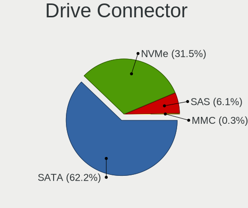
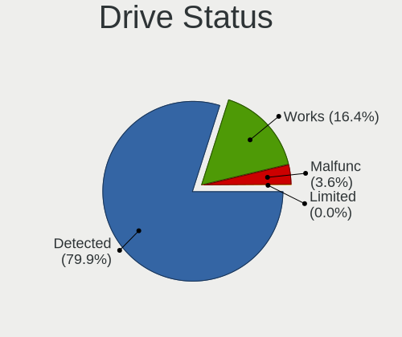
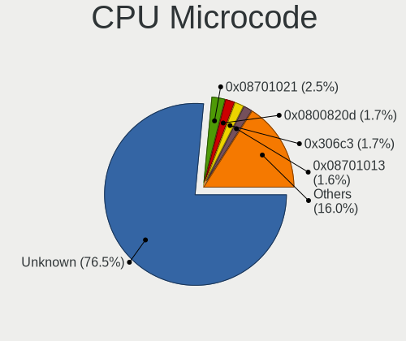
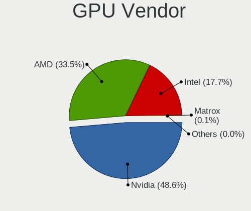
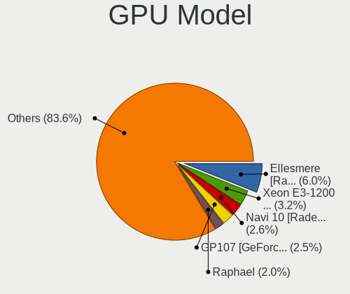
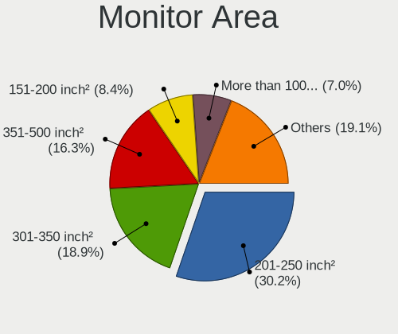
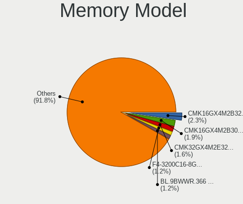

Pop!_OS - Tested Hardware & Statistics (Desktops)
-------------------------------------------------

A project to collect tested hardware configurations for Pop!_OS.

Anyone can contribute to this report by the [hw-probe](https://github.com/linuxhw/hw-probe) tool:

    sudo -E hw-probe -all -upload

Please contribute! Especially if your hardware is rare.

Contents
--------

* [ Test Cases ](#test-cases)

* [ System ](#system)
  - [ OS                       ](#os)
  - [ OS Family                ](#os-family)
  - [ Kernel                   ](#kernel)
  - [ Kernel Family            ](#kernel-family)
  - [ Kernel Major Ver.        ](#kernel-major-ver)
  - [ Arch                     ](#arch)
  - [ DE                       ](#de)
  - [ Display Server           ](#display-server)
  - [ Display Manager          ](#display-manager)
  - [ OS Lang                  ](#os-lang)
  - [ Boot Mode                ](#boot-mode)
  - [ Filesystem               ](#filesystem)
  - [ Part. scheme             ](#part-scheme)
  - [ Dual Boot with Linux/BSD ](#dual-boot-with-linuxbsd)
  - [ Dual Boot (Win)          ](#dual-boot-win)

* [ Board ](#board)
  - [ Vendor                   ](#vendor)
  - [ Model                    ](#model)
  - [ Model Family             ](#model-family)
  - [ MFG Year                 ](#mfg-year)
  - [ Form Factor              ](#form-factor)
  - [ Secure Boot              ](#secure-boot)
  - [ Coreboot                 ](#coreboot)
  - [ RAM Size                 ](#ram-size)
  - [ RAM Used                 ](#ram-used)
  - [ Total Drives             ](#total-drives)
  - [ Has CD-ROM               ](#has-cd-rom)
  - [ Has Ethernet             ](#has-ethernet)
  - [ Has WiFi                 ](#has-wifi)
  - [ Has Bluetooth            ](#has-bluetooth)

* [ Location ](#location)
  - [ Country                  ](#country)
  - [ City                     ](#city)

* [ Drives ](#drives)
  - [ Drive Vendor             ](#drive-vendor)
  - [ Drive Model              ](#drive-model)
  - [ HDD Vendor               ](#hdd-vendor)
  - [ SSD Vendor               ](#ssd-vendor)
  - [ Drive Kind               ](#drive-kind)
  - [ Drive Connector          ](#drive-connector)
  - [ Drive Size               ](#drive-size)
  - [ Space Total              ](#space-total)
  - [ Space Used               ](#space-used)
  - [ Malfunc. Drives          ](#malfunc-drives)
  - [ Malfunc. Drive Vendor    ](#malfunc-drive-vendor)
  - [ Malfunc. HDD Vendor      ](#malfunc-hdd-vendor)
  - [ Malfunc. Drive Kind      ](#malfunc-drive-kind)
  - [ Failed Drives            ](#failed-drives)
  - [ Failed Drive Vendor      ](#failed-drive-vendor)
  - [ Drive Status             ](#drive-status)

* [ Storage controller ](#storage-controller)
  - [ Storage Vendor           ](#storage-vendor)
  - [ Storage Model            ](#storage-model)
  - [ Storage Kind             ](#storage-kind)

* [ Processor ](#processor)
  - [ CPU Vendor               ](#cpu-vendor)
  - [ CPU Model                ](#cpu-model)
  - [ CPU Model Family         ](#cpu-model-family)
  - [ CPU Cores                ](#cpu-cores)
  - [ CPU Sockets              ](#cpu-sockets)
  - [ CPU Threads              ](#cpu-threads)
  - [ CPU Op-Modes             ](#cpu-op-modes)
  - [ CPU Microcode            ](#cpu-microcode)
  - [ CPU Microarch            ](#cpu-microarch)

* [ Graphics ](#graphics)
  - [ GPU Vendor               ](#gpu-vendor)
  - [ GPU Model                ](#gpu-model)
  - [ GPU Combo                ](#gpu-combo)
  - [ GPU Driver               ](#gpu-driver)
  - [ GPU Memory               ](#gpu-memory)

* [ Monitor ](#monitor)
  - [ Monitor Vendor           ](#monitor-vendor)
  - [ Monitor Model            ](#monitor-model)
  - [ Monitor Resolution       ](#monitor-resolution)
  - [ Monitor Diagonal         ](#monitor-diagonal)
  - [ Monitor Width            ](#monitor-width)
  - [ Aspect Ratio             ](#aspect-ratio)
  - [ Monitor Area             ](#monitor-area)
  - [ Pixel Density            ](#pixel-density)
  - [ Multiple Monitors        ](#multiple-monitors)

* [ Network ](#network)
  - [ Net Controller Vendor    ](#net-controller-vendor)
  - [ Net Controller Model     ](#net-controller-model)
  - [ Wireless Vendor          ](#wireless-vendor)
  - [ Wireless Model           ](#wireless-model)
  - [ Ethernet Vendor          ](#ethernet-vendor)
  - [ Ethernet Model           ](#ethernet-model)
  - [ Net Controller Kind      ](#net-controller-kind)
  - [ Used Controller          ](#used-controller)
  - [ NICs                     ](#nics)
  - [ IPv6                     ](#ipv6)

* [ Bluetooth ](#bluetooth)
  - [ Bluetooth Vendor         ](#bluetooth-vendor)
  - [ Bluetooth Model          ](#bluetooth-model)

* [ Sound ](#sound)
  - [ Sound Vendor             ](#sound-vendor)
  - [ Sound Model              ](#sound-model)

* [ Memory ](#memory)
  - [ Memory Vendor            ](#memory-vendor)
  - [ Memory Model             ](#memory-model)
  - [ Memory Kind              ](#memory-kind)
  - [ Memory Form Factor       ](#memory-form-factor)
  - [ Memory Size              ](#memory-size)
  - [ Memory Speed             ](#memory-speed)

* [ Printers & scanners ](#printers--scanners)
  - [ Printer Vendor           ](#printer-vendor)
  - [ Printer Model            ](#printer-model)
  - [ Scanner Vendor           ](#scanner-vendor)
  - [ Scanner Model            ](#scanner-model)

* [ Camera ](#camera)
  - [ Camera Vendor            ](#camera-vendor)
  - [ Camera Model             ](#camera-model)

* [ Security ](#security)
  - [ Fingerprint Vendor       ](#fingerprint-vendor)
  - [ Fingerprint Model        ](#fingerprint-model)
  - [ Chipcard Vendor          ](#chipcard-vendor)
  - [ Chipcard Model           ](#chipcard-model)

* [ Unsupported ](#unsupported)
  - [ Unsupported Devices      ](#unsupported-devices)
  - [ Unsupported Device Types ](#unsupported-device-types)

Test Cases
----------

Total: 4938

| Vendor        | Model                       | Probe                                                      | Date         |
|---------------|-----------------------------|------------------------------------------------------------|--------------|
| Lenovo        | 4030                        | [7a23fd4fb4](https://linux-hardware.org/?probe=7a23fd4fb4) | Apr 01, 2023 |
| Gigabyte      | Z170X-Gaming 7              | [f7c90851ac](https://linux-hardware.org/?probe=f7c90851ac) | Apr 01, 2023 |
| Apple         | Mac-F42C88C8 Proto1         | [fc44ad8c07](https://linux-hardware.org/?probe=fc44ad8c07) | Mar 31, 2023 |
| ASUSTek       | ROG STRIX B550-F GAMING     | [61e2653466](https://linux-hardware.org/?probe=61e2653466) | Mar 31, 2023 |
| ASUSTek       | P8H67-M LE                  | [11b3a7cdb1](https://linux-hardware.org/?probe=11b3a7cdb1) | Mar 31, 2023 |
| Gigabyte      | B360M AORUS Gaming 3-CF     | [c346cf16d3](https://linux-hardware.org/?probe=c346cf16d3) | Mar 30, 2023 |
| HP            | 0AA4h                       | [97457bb10c](https://linux-hardware.org/?probe=97457bb10c) | Mar 30, 2023 |
| Gigabyte      | B450 AORUS PRO WIFI-CF      | [af4901f141](https://linux-hardware.org/?probe=af4901f141) | Mar 30, 2023 |
| Foxconn       | 2AB1 DVT                    | [a9e8e4d4b0](https://linux-hardware.org/?probe=a9e8e4d4b0) | Mar 30, 2023 |
| Gigabyte      | AB350-Gaming 3-CF           | [81dda92e58](https://linux-hardware.org/?probe=81dda92e58) | Mar 30, 2023 |
| HP            | 8433 11                     | [55f7473ba8](https://linux-hardware.org/?probe=55f7473ba8) | Mar 29, 2023 |
| ASUSTek       | TUF Gaming X570-PLUS        | [78046d9b99](https://linux-hardware.org/?probe=78046d9b99) | Mar 29, 2023 |
| HP            | 0AA4h                       | [801f843749](https://linux-hardware.org/?probe=801f843749) | Mar 29, 2023 |
| Win elemen... | M600                        | [7cf2343b6f](https://linux-hardware.org/?probe=7cf2343b6f) | Mar 29, 2023 |
| ASUSTek       | H81M-A/BR                   | [c994f20b64](https://linux-hardware.org/?probe=c994f20b64) | Mar 29, 2023 |
| HP            | 09F0h                       | [540ec71101](https://linux-hardware.org/?probe=540ec71101) | Mar 28, 2023 |
| ASRock        | H510M-HVS                   | [97744fad07](https://linux-hardware.org/?probe=97744fad07) | Mar 28, 2023 |
| ASRock        | B650M PG Riptide WiFi       | [f17c95f91b](https://linux-hardware.org/?probe=f17c95f91b) | Mar 28, 2023 |
| ASRock        | B650M PG Riptide WiFi       | [1b67e2c4fd](https://linux-hardware.org/?probe=1b67e2c4fd) | Mar 28, 2023 |
| MSI           | MPG X670E CARBON WIFI       | [cde470cb39](https://linux-hardware.org/?probe=cde470cb39) | Mar 28, 2023 |
| ASUSTek       | TUF Gaming X570-PLUS        | [c4bba42d7b](https://linux-hardware.org/?probe=c4bba42d7b) | Mar 28, 2023 |
| Gigabyte      | X570 AORUS MASTER           | [adee3bbdde](https://linux-hardware.org/?probe=adee3bbdde) | Mar 28, 2023 |
| MSI           | B450M BAZOOKA V2            | [f6236c5962](https://linux-hardware.org/?probe=f6236c5962) | Mar 27, 2023 |
| ASUSTek       | ROG CROSSHAIR VIII HERO     | [878fa94b87](https://linux-hardware.org/?probe=878fa94b87) | Mar 26, 2023 |
| MSI           | Z490 PLUS                   | [06032b5e04](https://linux-hardware.org/?probe=06032b5e04) | Mar 26, 2023 |
| Lenovo        | CRESCENTBAY SDK0J40677 W... | [479aff4877](https://linux-hardware.org/?probe=479aff4877) | Mar 26, 2023 |
| Lenovo        | CRESCENTBAY SDK0J40677 W... | [67ddc813cf](https://linux-hardware.org/?probe=67ddc813cf) | Mar 26, 2023 |
| ASUSTek       | ROG CROSSHAIR X670E HERO    | [fc01cd79a4](https://linux-hardware.org/?probe=fc01cd79a4) | Mar 26, 2023 |
| MSI           | MAG B550 TOMAHAWK           | [c08caf1dee](https://linux-hardware.org/?probe=c08caf1dee) | Mar 26, 2023 |
| MSI           | MAG B550 TOMAHAWK           | [f6f4996c63](https://linux-hardware.org/?probe=f6f4996c63) | Mar 26, 2023 |
| Gigabyte      | X570 AORUS ELITE            | [0f7d28bd43](https://linux-hardware.org/?probe=0f7d28bd43) | Mar 25, 2023 |
| ASUSTek       | SABERTOOTH X79              | [6c64b62e05](https://linux-hardware.org/?probe=6c64b62e05) | Mar 25, 2023 |
| Dell          | 0PC5F7 A01                  | [61550296b7](https://linux-hardware.org/?probe=61550296b7) | Mar 24, 2023 |
| HP            | 212B                        | [266912cedd](https://linux-hardware.org/?probe=266912cedd) | Mar 24, 2023 |
| ASUSTek       | ROG STRIX X570-I GAMING     | [09fec047e4](https://linux-hardware.org/?probe=09fec047e4) | Mar 23, 2023 |
| MSI           | MPG Z590 GAMING FORCE       | [7a3319972e](https://linux-hardware.org/?probe=7a3319972e) | Mar 23, 2023 |
| Gigabyte      | X570 AORUS ULTRA            | [c06eaca849](https://linux-hardware.org/?probe=c06eaca849) | Mar 23, 2023 |
| Dell          | 0RK936                      | [af3e7f60cb](https://linux-hardware.org/?probe=af3e7f60cb) | Mar 22, 2023 |
| ASUSTek       | ROG STRIX X570-I GAMING     | [b4c65fead7](https://linux-hardware.org/?probe=b4c65fead7) | Mar 21, 2023 |
| Dell          | 0RK936                      | [6c2680e4e9](https://linux-hardware.org/?probe=6c2680e4e9) | Mar 21, 2023 |
| ASRock        | B550M Pro4                  | [16253cadcf](https://linux-hardware.org/?probe=16253cadcf) | Mar 21, 2023 |
| ASUSTek       | PRIME X670E-PRO WIFI        | [d4e033725b](https://linux-hardware.org/?probe=d4e033725b) | Mar 21, 2023 |
| Supermicro    | X9SAE                       | [01195f072e](https://linux-hardware.org/?probe=01195f072e) | Mar 21, 2023 |
| ASUSTek       | PRIME B650-PLUS             | [5ea7504472](https://linux-hardware.org/?probe=5ea7504472) | Mar 21, 2023 |
| ASUSTek       | PRIME X299-DELUXE II        | [b133c68356](https://linux-hardware.org/?probe=b133c68356) | Mar 20, 2023 |
| MSI           | MAG B550M BAZOOKA           | [3fe3c818f7](https://linux-hardware.org/?probe=3fe3c818f7) | Mar 20, 2023 |
| Gigabyte      | Z97X-Gaming 7               | [6681949ccc](https://linux-hardware.org/?probe=6681949ccc) | Mar 19, 2023 |
| Gigabyte      | X470 AORUS ULTRA GAMING-... | [d0079fa594](https://linux-hardware.org/?probe=d0079fa594) | Mar 19, 2023 |
| Gigabyte      | X79-UD3                     | [0139691951](https://linux-hardware.org/?probe=0139691951) | Mar 19, 2023 |
| Dell          | 0WMJ54 A00                  | [bcb1a34cf2](https://linux-hardware.org/?probe=bcb1a34cf2) | Mar 19, 2023 |
| ASUSTek       | ROG STRIX B550-I GAMING     | [c4bebd7028](https://linux-hardware.org/?probe=c4bebd7028) | Mar 17, 2023 |
| Unknown       | Unknown                     | [2389fcea33](https://linux-hardware.org/?probe=2389fcea33) | Mar 17, 2023 |
| Intel         | X99 V1.x                    | [9b471dcdcf](https://linux-hardware.org/?probe=9b471dcdcf) | Mar 17, 2023 |
| Gigabyte      | X399 DESIGNARE EX-CF        | [557a99333f](https://linux-hardware.org/?probe=557a99333f) | Mar 17, 2023 |
| ASUSTek       | ROG STRIX Z370-G GAMING     | [27356d58d5](https://linux-hardware.org/?probe=27356d58d5) | Mar 17, 2023 |
| HP            | 843F                        | [e444e0d76a](https://linux-hardware.org/?probe=e444e0d76a) | Mar 17, 2023 |
| ASUSTek       | TUF Gaming B650-PLUS WIF... | [b20fcd6878](https://linux-hardware.org/?probe=b20fcd6878) | Mar 17, 2023 |
| Dell          | 02GDWG A00                  | [c81ac4434e](https://linux-hardware.org/?probe=c81ac4434e) | Mar 16, 2023 |
| ASUSTek       | Z87-K                       | [fe2d844bfb](https://linux-hardware.org/?probe=fe2d844bfb) | Mar 15, 2023 |
| ASUSTek       | ROG STRIX B650E-I GAMING... | [88c4c221af](https://linux-hardware.org/?probe=88c4c221af) | Mar 15, 2023 |
| Huanan        | X99-AD3 GAMING V2.0         | [0586633e29](https://linux-hardware.org/?probe=0586633e29) | Mar 15, 2023 |
| ASUSTek       | PRIME Z790-P WIFI D4        | [e8bbe7a962](https://linux-hardware.org/?probe=e8bbe7a962) | Mar 15, 2023 |
| ASUSTek       | ROG STRIX B650E-I GAMING... | [0c74f7b048](https://linux-hardware.org/?probe=0c74f7b048) | Mar 15, 2023 |
| ASRock        | B550 Extreme4               | [9a139b5bad](https://linux-hardware.org/?probe=9a139b5bad) | Mar 14, 2023 |
| Gigabyte      | X58A-UD7                    | [95248fc9a0](https://linux-hardware.org/?probe=95248fc9a0) | Mar 14, 2023 |
| Dell          | 0RK936                      | [59cbc1f071](https://linux-hardware.org/?probe=59cbc1f071) | Mar 14, 2023 |
| ASUSTek       | PRIME A320M-K               | [f5215489c7](https://linux-hardware.org/?probe=f5215489c7) | Mar 13, 2023 |
| ASUSTek       | H97-PRO                     | [b03c056ee1](https://linux-hardware.org/?probe=b03c056ee1) | Mar 13, 2023 |
| Gateway       | WG43M                       | [c1ab165971](https://linux-hardware.org/?probe=c1ab165971) | Mar 13, 2023 |
| MSI           | A68HM-E33 V2                | [0e2618e3ea](https://linux-hardware.org/?probe=0e2618e3ea) | Mar 12, 2023 |
| Dell          | 0DFRFW A01                  | [1b8b00dbc5](https://linux-hardware.org/?probe=1b8b00dbc5) | Mar 12, 2023 |
| Gigabyte      | Z590I AORUS ULTRA           | [47ea9647d3](https://linux-hardware.org/?probe=47ea9647d3) | Mar 12, 2023 |
| ASUSTek       | ROG STRIX X570-I GAMING     | [75fc2c0a15](https://linux-hardware.org/?probe=75fc2c0a15) | Mar 12, 2023 |
| Acer          | Aspire X1935                | [6846ecd490](https://linux-hardware.org/?probe=6846ecd490) | Mar 11, 2023 |
| Gigabyte      | B550 AORUS ELITE V2         | [8736fd04a8](https://linux-hardware.org/?probe=8736fd04a8) | Mar 11, 2023 |
| Dell          | 0KC9NP A00                  | [873a2bf50c](https://linux-hardware.org/?probe=873a2bf50c) | Mar 11, 2023 |
| ASRock        | FM2A68M-HD+                 | [ccba86bda3](https://linux-hardware.org/?probe=ccba86bda3) | Mar 10, 2023 |
| ASUSTek       | PRIME B550-PLUS             | [dbdadff4f2](https://linux-hardware.org/?probe=dbdadff4f2) | Mar 10, 2023 |
| ASRock        | B450 Steel Legend           | [e183f14e7e](https://linux-hardware.org/?probe=e183f14e7e) | Mar 10, 2023 |
| Positivo      | POS-PIQ77CL                 | [789838055a](https://linux-hardware.org/?probe=789838055a) | Mar 10, 2023 |
| Gigabyte      | X570S AORUS ELITE AX        | [214efb1e94](https://linux-hardware.org/?probe=214efb1e94) | Mar 09, 2023 |
| MSI           | A68HM-E33 V2                | [670e89da85](https://linux-hardware.org/?probe=670e89da85) | Mar 09, 2023 |
| Gigabyte      | H110M-DS2V DDR3-CF          | [d101f34459](https://linux-hardware.org/?probe=d101f34459) | Mar 09, 2023 |
| MSI           | X58 PLATINUM SLI            | [c8875fb17f](https://linux-hardware.org/?probe=c8875fb17f) | Mar 08, 2023 |
| ASUSTek       | SABERTOOTH 990FX R2.0       | [b99222314c](https://linux-hardware.org/?probe=b99222314c) | Mar 08, 2023 |
| Gigabyte      | X570 AORUS ELITE            | [4f64764c75](https://linux-hardware.org/?probe=4f64764c75) | Mar 08, 2023 |
| Dell          | 051FJ8 A02                  | [4c15877e95](https://linux-hardware.org/?probe=4c15877e95) | Mar 08, 2023 |
| Dell          | 0KWVT8 A03                  | [6ddf3ecd86](https://linux-hardware.org/?probe=6ddf3ecd86) | Mar 08, 2023 |
| ASRock        | 890GX Extreme3              | [4d59bfb158](https://linux-hardware.org/?probe=4d59bfb158) | Mar 08, 2023 |
| HP            | 83E9                        | [9a756f9158](https://linux-hardware.org/?probe=9a756f9158) | Mar 07, 2023 |
| ASRock        | G41M-GS3                    | [9e11e1f2af](https://linux-hardware.org/?probe=9e11e1f2af) | Mar 07, 2023 |
| Fujitsu       | D3222-A1 S26361-D3222-A1    | [bfc1bf412e](https://linux-hardware.org/?probe=bfc1bf412e) | Mar 06, 2023 |
| ASUSTek       | SABERTOOTH 990FX R2.0       | [da3b20e7c1](https://linux-hardware.org/?probe=da3b20e7c1) | Mar 06, 2023 |
| ASUSTek       | SABERTOOTH 990FX R2.0       | [eb3f7a337f](https://linux-hardware.org/?probe=eb3f7a337f) | Mar 05, 2023 |
| Gigabyte      | B450M GAMING                | [b75483941a](https://linux-hardware.org/?probe=b75483941a) | Mar 05, 2023 |
| HP            | 339A                        | [a2af229dad](https://linux-hardware.org/?probe=a2af229dad) | Mar 05, 2023 |
| Gigabyte      | Z87X-UD4H-CF                | [efd2d0c074](https://linux-hardware.org/?probe=efd2d0c074) | Mar 05, 2023 |
| MSI           | B350 GAMING PLUS            | [c3d6a142c0](https://linux-hardware.org/?probe=c3d6a142c0) | Mar 04, 2023 |
| ASUSTek       | PRIME Z390-A                | [87cdc5bd5a](https://linux-hardware.org/?probe=87cdc5bd5a) | Mar 04, 2023 |
| ASUSTek       | ROG CROSSHAIR VIII HERO     | [ca004eceae](https://linux-hardware.org/?probe=ca004eceae) | Mar 03, 2023 |
| Acer          | Aspire M3970                | [2708d5fa99](https://linux-hardware.org/?probe=2708d5fa99) | Mar 03, 2023 |
| Gigabyte      | B550M DS3H AC               | [141faab02f](https://linux-hardware.org/?probe=141faab02f) | Mar 03, 2023 |
| Gigabyte      | X570 AORUS ELITE            | [c2d6b5218e](https://linux-hardware.org/?probe=c2d6b5218e) | Mar 03, 2023 |
| ASUSTek       | SABERTOOTH 990FX R2.0       | [840dab3a7c](https://linux-hardware.org/?probe=840dab3a7c) | Mar 03, 2023 |
| Biostar       | H81MHV3 5.0                 | [6ea9159a52](https://linux-hardware.org/?probe=6ea9159a52) | Mar 03, 2023 |
| Gigabyte      | B550M DS3H AC               | [8ce5103cac](https://linux-hardware.org/?probe=8ce5103cac) | Mar 03, 2023 |
| ASUSTek       | ROG STRIX B450-F GAMING     | [62c37af17b](https://linux-hardware.org/?probe=62c37af17b) | Mar 03, 2023 |
| Gigabyte      | X570 AORUS ELITE            | [f942bae731](https://linux-hardware.org/?probe=f942bae731) | Mar 02, 2023 |
| ASRockRack    | X570D4U                     | [9c4b25d5dc](https://linux-hardware.org/?probe=9c4b25d5dc) | Mar 02, 2023 |
| MSI           | B350 TOMAHAWK               | [4207bf1ee6](https://linux-hardware.org/?probe=4207bf1ee6) | Mar 02, 2023 |
| ASUSTek       | Crosshair IV Formula        | [ed4f0e394a](https://linux-hardware.org/?probe=ed4f0e394a) | Mar 02, 2023 |
| ASUSTek       | PRIME B650-PLUS             | [5b94fc8fa8](https://linux-hardware.org/?probe=5b94fc8fa8) | Mar 02, 2023 |
| Gigabyte      | B550M AORUS ELITE           | [85456379c1](https://linux-hardware.org/?probe=85456379c1) | Mar 02, 2023 |
| ASRock        | B450 Gaming-ITX/ac          | [6126e81a28](https://linux-hardware.org/?probe=6126e81a28) | Mar 01, 2023 |
| Gigabyte      | A320M-S2H-CF                | [b6930e4615](https://linux-hardware.org/?probe=b6930e4615) | Mar 01, 2023 |
| Gigabyte      | Z77X-UP4 TH                 | [b80cb49656](https://linux-hardware.org/?probe=b80cb49656) | Mar 01, 2023 |
| Gigabyte      | B450 AORUS ELITE V2         | [0e0b3360ba](https://linux-hardware.org/?probe=0e0b3360ba) | Feb 28, 2023 |
| Lenovo        | 30D9 SDK0J40705 WIN 3425... | [7f53a53eba](https://linux-hardware.org/?probe=7f53a53eba) | Feb 28, 2023 |
| MSI           | MAG Z690 TOMAHAWK WIFI D... | [13edc00539](https://linux-hardware.org/?probe=13edc00539) | Feb 27, 2023 |
| Dell          | 03KWTV A02                  | [8b6eae9fd5](https://linux-hardware.org/?probe=8b6eae9fd5) | Feb 26, 2023 |
| MSI           | MPG Z390 GAMING EDGE AC     | [a3b8430bad](https://linux-hardware.org/?probe=a3b8430bad) | Feb 26, 2023 |
| MSI           | MAG Z690 TOMAHAWK WIFI D... | [fe1c90a3aa](https://linux-hardware.org/?probe=fe1c90a3aa) | Feb 26, 2023 |
| MSI           | B450-A PRO MAX              | [f081452f55](https://linux-hardware.org/?probe=f081452f55) | Feb 26, 2023 |
| MACHINIST     | X99-RS9 V2.0                | [f991f0e9df](https://linux-hardware.org/?probe=f991f0e9df) | Feb 26, 2023 |
| Gigabyte      | 970A-DS3P                   | [87647b8c76](https://linux-hardware.org/?probe=87647b8c76) | Feb 26, 2023 |
| ASUSTek       | SABERTOOTH 990FX R2.0       | [42fe607d11](https://linux-hardware.org/?probe=42fe607d11) | Feb 25, 2023 |
| MSI           | PRO Z790-P WIFI DDR4        | [59b7e1da6d](https://linux-hardware.org/?probe=59b7e1da6d) | Feb 25, 2023 |
| ZOTAC         | MEK1                        | [a61a52d794](https://linux-hardware.org/?probe=a61a52d794) | Feb 24, 2023 |
| HP            | 8433 11                     | [881b062090](https://linux-hardware.org/?probe=881b062090) | Feb 24, 2023 |
| ASUSTek       | SABERTOOTH 990FX R2.0       | [59d0e692ef](https://linux-hardware.org/?probe=59d0e692ef) | Feb 24, 2023 |
| ASUSTek       | TUF Gaming X570-PLUS        | [27a3c3c4c1](https://linux-hardware.org/?probe=27a3c3c4c1) | Feb 24, 2023 |
| Dell          | 0M6C7G A00                  | [8d8af65e26](https://linux-hardware.org/?probe=8d8af65e26) | Feb 23, 2023 |
| Dell          | 0M6C7G A00                  | [f8f5ea8885](https://linux-hardware.org/?probe=f8f5ea8885) | Feb 23, 2023 |
| Huanan        | X99-QD4 V1.0                | [205f7c6f50](https://linux-hardware.org/?probe=205f7c6f50) | Feb 23, 2023 |
| ASUSTek       | M5A78L-M/USB3               | [ec6ab709e5](https://linux-hardware.org/?probe=ec6ab709e5) | Feb 22, 2023 |
| Lenovo        | 102F SBB0J05441 WIN 3305... | [ea890b85f3](https://linux-hardware.org/?probe=ea890b85f3) | Feb 22, 2023 |
| Gigabyte      | H81M-HD3                    | [d19e079879](https://linux-hardware.org/?probe=d19e079879) | Feb 22, 2023 |
| ASRock        | B550 Extreme4               | [db2686086b](https://linux-hardware.org/?probe=db2686086b) | Feb 21, 2023 |
| ASUSTek       | PRIME B450M-A               | [8c97a04c10](https://linux-hardware.org/?probe=8c97a04c10) | Feb 21, 2023 |
| ASUSTek       | PRIME B550M-A               | [7dd9134373](https://linux-hardware.org/?probe=7dd9134373) | Feb 21, 2023 |
| ASUSTek       | PRIME B550M-A               | [fafea002be](https://linux-hardware.org/?probe=fafea002be) | Feb 21, 2023 |
| ASUSTek       | B75M-A                      | [c0c41ca089](https://linux-hardware.org/?probe=c0c41ca089) | Feb 21, 2023 |
| Alienware     | 0NWN7M A00                  | [eef5c2f68f](https://linux-hardware.org/?probe=eef5c2f68f) | Feb 21, 2023 |
| ASUSTek       | B75M-A                      | [2ea45a0d80](https://linux-hardware.org/?probe=2ea45a0d80) | Feb 21, 2023 |
| ASUSTek       | PRIME B550M-A               | [edbf6ce468](https://linux-hardware.org/?probe=edbf6ce468) | Feb 20, 2023 |
| ASRock        | A520M-HVS                   | [cc8628ae2c](https://linux-hardware.org/?probe=cc8628ae2c) | Feb 20, 2023 |
| Dell          | 09KPNV A01                  | [b335ec1cc3](https://linux-hardware.org/?probe=b335ec1cc3) | Feb 20, 2023 |
| ASRock        | H87 Performance             | [a28df01cad](https://linux-hardware.org/?probe=a28df01cad) | Feb 19, 2023 |
| Gigabyte      | Z590I AORUS ULTRA           | [9805ab5764](https://linux-hardware.org/?probe=9805ab5764) | Feb 19, 2023 |
| Gigabyte      | GA-78LMT-S2P                | [8df8fe9ae8](https://linux-hardware.org/?probe=8df8fe9ae8) | Feb 19, 2023 |
| Lenovo        | 1036 NO DPK                 | [b99541f6ad](https://linux-hardware.org/?probe=b99541f6ad) | Feb 19, 2023 |
| Dell          | 0NNNCT A01                  | [a301dac224](https://linux-hardware.org/?probe=a301dac224) | Feb 18, 2023 |
| HP            | 8437                        | [f8f0f71bf5](https://linux-hardware.org/?probe=f8f0f71bf5) | Feb 18, 2023 |
| Gigabyte      | X570 AORUS ELITE            | [4101f152f5](https://linux-hardware.org/?probe=4101f152f5) | Feb 17, 2023 |
| ASRock        | B550M-HDV                   | [755006e226](https://linux-hardware.org/?probe=755006e226) | Feb 17, 2023 |
| Gigabyte      | B450M DS3H-CF               | [684445aeab](https://linux-hardware.org/?probe=684445aeab) | Feb 16, 2023 |
| MSI           | G41M-P33 Combo              | [5a6d751e4b](https://linux-hardware.org/?probe=5a6d751e4b) | Feb 15, 2023 |
| Gigabyte      | X570 I AORUS PRO WIFI       | [c82882e708](https://linux-hardware.org/?probe=c82882e708) | Feb 15, 2023 |
| Intel         | X99 V1.x                    | [31da77bea8](https://linux-hardware.org/?probe=31da77bea8) | Feb 15, 2023 |
| ASUSTek       | B85M-G                      | [c803a7f9e8](https://linux-hardware.org/?probe=c803a7f9e8) | Feb 15, 2023 |
| ASUSTek       | B85M-G                      | [3a660768c0](https://linux-hardware.org/?probe=3a660768c0) | Feb 15, 2023 |
| Gigabyte      | G41MT-S2                    | [9dfc369401](https://linux-hardware.org/?probe=9dfc369401) | Feb 15, 2023 |
| MSI           | G41M-P33 Combo              | [1161e39e43](https://linux-hardware.org/?probe=1161e39e43) | Feb 15, 2023 |
| Gigabyte      | GA-MA770T-UD3P              | [2ca590a85e](https://linux-hardware.org/?probe=2ca590a85e) | Feb 14, 2023 |
| Gigabyte      | X570 I AORUS PRO WIFI       | [27c2ee6ee0](https://linux-hardware.org/?probe=27c2ee6ee0) | Feb 14, 2023 |
| Dell          | 0Y7WYT A00                  | [d94084bbee](https://linux-hardware.org/?probe=d94084bbee) | Feb 12, 2023 |
| ASRock        | B550M Steel Legend          | [2a6f501cb1](https://linux-hardware.org/?probe=2a6f501cb1) | Feb 12, 2023 |
| Dell          | 08WKV3 A00                  | [89ba42b53e](https://linux-hardware.org/?probe=89ba42b53e) | Feb 12, 2023 |
| ASUSTek       | CROSSHAIR VI HERO           | [687ecdce15](https://linux-hardware.org/?probe=687ecdce15) | Feb 12, 2023 |
| ASUSTek       | CROSSHAIR VI HERO           | [2c1562b21f](https://linux-hardware.org/?probe=2c1562b21f) | Feb 11, 2023 |
| Gigabyte      | X570 AORUS ELITE            | [2d776f8810](https://linux-hardware.org/?probe=2d776f8810) | Feb 11, 2023 |
| Gigabyte      | X399 AORUS Gaming 7         | [b82ab8816d](https://linux-hardware.org/?probe=b82ab8816d) | Feb 11, 2023 |
| HP            | 18E4                        | [55972b87dd](https://linux-hardware.org/?probe=55972b87dd) | Feb 11, 2023 |
| ASUSTek       | CROSSHAIR VI HERO           | [0b14ee6551](https://linux-hardware.org/?probe=0b14ee6551) | Feb 11, 2023 |
| Gigabyte      | B85M-DS3H-A                 | [181c0e03e2](https://linux-hardware.org/?probe=181c0e03e2) | Feb 10, 2023 |
| Dell          | 0Y7WYT A00                  | [e4369afe1e](https://linux-hardware.org/?probe=e4369afe1e) | Feb 10, 2023 |
| ASUSTek       | A55BM-PLUS                  | [7c9763c23f](https://linux-hardware.org/?probe=7c9763c23f) | Feb 10, 2023 |
| Samsung       | DeskTop System              | [2437c4afda](https://linux-hardware.org/?probe=2437c4afda) | Feb 10, 2023 |
| Biostar       | H81MHV3 5.0                 | [390c8dd03a](https://linux-hardware.org/?probe=390c8dd03a) | Feb 09, 2023 |
| ASUSTek       | ROG STRIX X570-E GAMING     | [17bf959fd0](https://linux-hardware.org/?probe=17bf959fd0) | Feb 09, 2023 |
| Acer          | Aspire M3970                | [718cc13462](https://linux-hardware.org/?probe=718cc13462) | Feb 09, 2023 |
| ASUSTek       | ROG STRIX B550-F GAMING     | [16af8175a4](https://linux-hardware.org/?probe=16af8175a4) | Feb 08, 2023 |
| Gigabyte      | B650I AORUS ULTRA           | [1c07b901bb](https://linux-hardware.org/?probe=1c07b901bb) | Feb 08, 2023 |
| HP            | 2129                        | [80920d0d75](https://linux-hardware.org/?probe=80920d0d75) | Feb 08, 2023 |
| ASUSTek       | TUF Gaming B550-PLUS        | [d8dcaddb54](https://linux-hardware.org/?probe=d8dcaddb54) | Feb 08, 2023 |
| ASRock        | B660 Pro-C/ax               | [31e10f0e68](https://linux-hardware.org/?probe=31e10f0e68) | Feb 07, 2023 |
| ASRock        | FM2A68M-HD+                 | [8588a36683](https://linux-hardware.org/?probe=8588a36683) | Feb 07, 2023 |
| Lenovo        | 3743 SDK0T76463 WIN 3422... | [81ece9483e](https://linux-hardware.org/?probe=81ece9483e) | Feb 07, 2023 |
| Gigabyte      | F2A55M-HD2                  | [fe95bfe3d3](https://linux-hardware.org/?probe=fe95bfe3d3) | Feb 07, 2023 |
| Dell          | 0HHV7N A00                  | [e67a1c86b7](https://linux-hardware.org/?probe=e67a1c86b7) | Feb 07, 2023 |
| Gigabyte      | Z170X-UD5-CF                | [03a392d41f](https://linux-hardware.org/?probe=03a392d41f) | Feb 07, 2023 |
| Dell          | 02GDWG A00                  | [c0660c15fb](https://linux-hardware.org/?probe=c0660c15fb) | Feb 07, 2023 |
| MSI           | MAG Z690 TOMAHAWK WIFI      | [25fbfe1d66](https://linux-hardware.org/?probe=25fbfe1d66) | Feb 07, 2023 |
| System76      | Thelio thelio-r2            | [4cdf7d2895](https://linux-hardware.org/?probe=4cdf7d2895) | Feb 06, 2023 |
| Gigabyte      | B550I AORUS PRO AX          | [42dba6bdb3](https://linux-hardware.org/?probe=42dba6bdb3) | Feb 06, 2023 |
| ASUSTek       | TUF B450M-PLUS GAMING       | [a9bfc9669d](https://linux-hardware.org/?probe=a9bfc9669d) | Feb 06, 2023 |
| ASUSTek       | H81M-K                      | [6f09d6cd6c](https://linux-hardware.org/?probe=6f09d6cd6c) | Feb 05, 2023 |
| HP            | 8054                        | [c709653825](https://linux-hardware.org/?probe=c709653825) | Feb 05, 2023 |
| MSI           | PRO Z690-A DDR4             | [403785d1ec](https://linux-hardware.org/?probe=403785d1ec) | Feb 05, 2023 |
| ASUSTek       | PRIME X299-DELUXE II        | [c66fb39891](https://linux-hardware.org/?probe=c66fb39891) | Feb 04, 2023 |
| Gigabyte      | Z170X-UD5-CF                | [cd9d867630](https://linux-hardware.org/?probe=cd9d867630) | Feb 04, 2023 |
| Biostar       | H81MHV3 5.0                 | [084eee2317](https://linux-hardware.org/?probe=084eee2317) | Feb 03, 2023 |
| HP            | 834F                        | [9a4a1839d3](https://linux-hardware.org/?probe=9a4a1839d3) | Feb 02, 2023 |
| MSI           | MPG B560I GAMING EDGE WI... | [6d4ee8a3c6](https://linux-hardware.org/?probe=6d4ee8a3c6) | Feb 02, 2023 |
| ASUSTek       | TUF Gaming X570-PLUS        | [ffabf45521](https://linux-hardware.org/?probe=ffabf45521) | Feb 02, 2023 |
| MSI           | B450 TOMAHAWK MAX           | [a899b18189](https://linux-hardware.org/?probe=a899b18189) | Feb 02, 2023 |
| ASUSTek       | ROG STRIX B550-I GAMING     | [33ae030343](https://linux-hardware.org/?probe=33ae030343) | Jan 31, 2023 |
| MSI           | PRO Z690-P DDR4             | [a434328de5](https://linux-hardware.org/?probe=a434328de5) | Jan 30, 2023 |
| MSI           | H310M PRO-M2 PLUS           | [a96d93846a](https://linux-hardware.org/?probe=a96d93846a) | Jan 30, 2023 |
| ASUSTek       | ROG STRIX B550-I GAMING     | [3d555e69f7](https://linux-hardware.org/?probe=3d555e69f7) | Jan 30, 2023 |
| Intel         | H61                         | [87a72c61f2](https://linux-hardware.org/?probe=87a72c61f2) | Jan 29, 2023 |
| Gigabyte      | Z690 AORUS PRO              | [b07e189d3c](https://linux-hardware.org/?probe=b07e189d3c) | Jan 29, 2023 |
| Gigabyte      | X570 AORUS MASTER           | [6b71ec1a01](https://linux-hardware.org/?probe=6b71ec1a01) | Jan 28, 2023 |
| Gigabyte      | H77M-D3H                    | [a9367f87d4](https://linux-hardware.org/?probe=a9367f87d4) | Jan 28, 2023 |
| ASUSTek       | GA35DX                      | [697b0d8654](https://linux-hardware.org/?probe=697b0d8654) | Jan 28, 2023 |
| ASUSTek       | PRIME B560M-K               | [c74b6b90f0](https://linux-hardware.org/?probe=c74b6b90f0) | Jan 28, 2023 |
| Gigabyte      | GA-78LMT-USB3               | [55d50f6d18](https://linux-hardware.org/?probe=55d50f6d18) | Jan 27, 2023 |
| HP            | 1495                        | [8c1f7b5fbd](https://linux-hardware.org/?probe=8c1f7b5fbd) | Jan 27, 2023 |
| ASRock        | B450 Steel Legend           | [c2a36422b4](https://linux-hardware.org/?probe=c2a36422b4) | Jan 27, 2023 |
| ASUSTek       | ROG STRIX X570-E GAMING     | [df315d8050](https://linux-hardware.org/?probe=df315d8050) | Jan 27, 2023 |
| ASUSTek       | ROG STRIX X570-E GAMING     | [14a0252d88](https://linux-hardware.org/?probe=14a0252d88) | Jan 27, 2023 |
| ASUSTek       | G10DK                       | [0b70a364b7](https://linux-hardware.org/?probe=0b70a364b7) | Jan 27, 2023 |
| ASUSTek       | G10DK                       | [a42ba7ef9e](https://linux-hardware.org/?probe=a42ba7ef9e) | Jan 26, 2023 |
| ASUSTek       | P8B75-V                     | [1f8bd6b38e](https://linux-hardware.org/?probe=1f8bd6b38e) | Jan 26, 2023 |
| MSI           | B460M PRO-VDH WIFI          | [e32b0f2c79](https://linux-hardware.org/?probe=e32b0f2c79) | Jan 25, 2023 |
| ASUSTek       | TUF Gaming B550-PRO         | [10f149abb7](https://linux-hardware.org/?probe=10f149abb7) | Jan 24, 2023 |
| Acer          | Aspire M3970                | [c822a510e5](https://linux-hardware.org/?probe=c822a510e5) | Jan 24, 2023 |
| ASUSTek       | TUF Gaming X570-PLUS        | [3221475cc8](https://linux-hardware.org/?probe=3221475cc8) | Jan 24, 2023 |
| MSI           | B450M MORTAR MAX            | [4f5be0720a](https://linux-hardware.org/?probe=4f5be0720a) | Jan 23, 2023 |
| ASRock        | B450M Steel Legend          | [c87ce45f84](https://linux-hardware.org/?probe=c87ce45f84) | Jan 23, 2023 |
| ASUSTek       | Rampage II GENE             | [112b5304d9](https://linux-hardware.org/?probe=112b5304d9) | Jan 23, 2023 |
| MACHINIST     | X79 Z9-D7 V2.0              | [9d5d06d342](https://linux-hardware.org/?probe=9d5d06d342) | Jan 23, 2023 |
| ASUSTek       | TUF Gaming X570-PLUS        | [75acbba6b1](https://linux-hardware.org/?probe=75acbba6b1) | Jan 23, 2023 |
| ASRock        | AM1H-ITX                    | [82b094a66b](https://linux-hardware.org/?probe=82b094a66b) | Jan 23, 2023 |
| ASUSTek       | PRIME A320M-K               | [bfb889f5d5](https://linux-hardware.org/?probe=bfb889f5d5) | Jan 23, 2023 |
| MSI           | MAG B550 TOMAHAWK           | [6597dd71bc](https://linux-hardware.org/?probe=6597dd71bc) | Jan 23, 2023 |
| Gigabyte      | G41MT-S2                    | [8f19cbfb31](https://linux-hardware.org/?probe=8f19cbfb31) | Jan 22, 2023 |
| MSI           | H81M-E34                    | [c11041ba13](https://linux-hardware.org/?probe=c11041ba13) | Jan 22, 2023 |
| ASUSTek       | H61M-E                      | [eec3fddef5](https://linux-hardware.org/?probe=eec3fddef5) | Jan 22, 2023 |
| ASRock        | B450 Pro4                   | [758ea69493](https://linux-hardware.org/?probe=758ea69493) | Jan 22, 2023 |
| ASUSTek       | ROG STRIX B550-A GAMING     | [d1b63bbd2d](https://linux-hardware.org/?probe=d1b63bbd2d) | Jan 22, 2023 |
| ASUSTek       | TUF Gaming B550-PRO         | [ebab459512](https://linux-hardware.org/?probe=ebab459512) | Jan 22, 2023 |
| ASUSTek       | G10DK                       | [1a27b660c2](https://linux-hardware.org/?probe=1a27b660c2) | Jan 21, 2023 |
| ASUSTek       | P8H77-V LE                  | [6dd531590e](https://linux-hardware.org/?probe=6dd531590e) | Jan 21, 2023 |
| MSI           | B550M PRO-VDH WIFI          | [bd601f83d3](https://linux-hardware.org/?probe=bd601f83d3) | Jan 21, 2023 |
| ASRock        | X99 Professional Gaming ... | [d203633f83](https://linux-hardware.org/?probe=d203633f83) | Jan 21, 2023 |
| Dell          | 0KC9NP A01                  | [ce0ba337df](https://linux-hardware.org/?probe=ce0ba337df) | Jan 21, 2023 |
| ASRock        | X99 Professional Gaming ... | [e47d5b2419](https://linux-hardware.org/?probe=e47d5b2419) | Jan 21, 2023 |
| ASUSTek       | P6T SE                      | [011553878f](https://linux-hardware.org/?probe=011553878f) | Jan 21, 2023 |
| Intel         | DQ67SW AAG12527-310         | [b7b8f92df1](https://linux-hardware.org/?probe=b7b8f92df1) | Jan 21, 2023 |
| ASUSTek       | P8Z77-V LK                  | [a10fc5f5a9](https://linux-hardware.org/?probe=a10fc5f5a9) | Jan 20, 2023 |
| ASRock        | X99 Professional Gaming ... | [266b8bc492](https://linux-hardware.org/?probe=266b8bc492) | Jan 20, 2023 |
| Alienware     | 0N43JM A00                  | [06a6ec74c0](https://linux-hardware.org/?probe=06a6ec74c0) | Jan 20, 2023 |
| ASRock        | X99 Professional Gaming ... | [0fbcb3df67](https://linux-hardware.org/?probe=0fbcb3df67) | Jan 19, 2023 |
| ASUSTek       | PRIME B450M-K               | [cbad1c4df4](https://linux-hardware.org/?probe=cbad1c4df4) | Jan 19, 2023 |
| ASUSTek       | PRIME B450M-K               | [3ff2eaf5ed](https://linux-hardware.org/?probe=3ff2eaf5ed) | Jan 19, 2023 |
| ASUSTek       | P6T SE                      | [d13ca33fcf](https://linux-hardware.org/?probe=d13ca33fcf) | Jan 18, 2023 |
| ASRock        | H510M-HVS R2.0              | [3ee772766c](https://linux-hardware.org/?probe=3ee772766c) | Jan 18, 2023 |
| ASUSTek       | G10DK                       | [ebc45fdfd5](https://linux-hardware.org/?probe=ebc45fdfd5) | Jan 18, 2023 |
| ASUSTek       | G10DK                       | [0eae2f92fa](https://linux-hardware.org/?probe=0eae2f92fa) | Jan 17, 2023 |
| ASRock        | B450 Pro4                   | [f908807ed9](https://linux-hardware.org/?probe=f908807ed9) | Jan 17, 2023 |
| Gigabyte      | B550I AORUS PRO AX          | [564482477e](https://linux-hardware.org/?probe=564482477e) | Jan 17, 2023 |
| ASUSTek       | ROG STRIX B450-F GAMING     | [6e8f360d6e](https://linux-hardware.org/?probe=6e8f360d6e) | Jan 17, 2023 |
| ASRock        | H87 Performance             | [a71c911bcf](https://linux-hardware.org/?probe=a71c911bcf) | Jan 17, 2023 |
| Gigabyte      | B550M DS3H AC               | [22fca13d2b](https://linux-hardware.org/?probe=22fca13d2b) | Jan 17, 2023 |
| Gigabyte      | B450M S2H                   | [2ba8d32a71](https://linux-hardware.org/?probe=2ba8d32a71) | Jan 17, 2023 |
| Gateway       | WG43M                       | [af3a009366](https://linux-hardware.org/?probe=af3a009366) | Jan 17, 2023 |
| ASRock        | B450 Pro4                   | [48cc2e0e69](https://linux-hardware.org/?probe=48cc2e0e69) | Jan 17, 2023 |
| Gateway       | WG43M                       | [b0aa3af22f](https://linux-hardware.org/?probe=b0aa3af22f) | Jan 17, 2023 |
| ASRock        | H87 Performance             | [9e2cd66ef5](https://linux-hardware.org/?probe=9e2cd66ef5) | Jan 16, 2023 |
| ASRock        | B450 Pro4                   | [2e65fc8357](https://linux-hardware.org/?probe=2e65fc8357) | Jan 16, 2023 |
| Gigabyte      | B450 AORUS PRO WIFI-CF      | [ba736834cd](https://linux-hardware.org/?probe=ba736834cd) | Jan 16, 2023 |
| HC            | HCAR357-MI V1.0             | [ef934af180](https://linux-hardware.org/?probe=ef934af180) | Jan 16, 2023 |
| ASRock        | B550 Extreme4               | [01f850d2fb](https://linux-hardware.org/?probe=01f850d2fb) | Jan 15, 2023 |
| Dell          | 0PXWHK A00                  | [82f04ecd77](https://linux-hardware.org/?probe=82f04ecd77) | Jan 15, 2023 |
| Dell          | 0PXWHK A00                  | [25db796fd6](https://linux-hardware.org/?probe=25db796fd6) | Jan 14, 2023 |
| MAXSUN        | MS-TZZ B460M                | [14758fc3e7](https://linux-hardware.org/?probe=14758fc3e7) | Jan 14, 2023 |
| ASUSTek       | TUF Gaming Z590-PLUS        | [f5499bf32a](https://linux-hardware.org/?probe=f5499bf32a) | Jan 14, 2023 |
| ASUSTek       | ROG STRIX X570-I GAMING     | [d3896698c8](https://linux-hardware.org/?probe=d3896698c8) | Jan 14, 2023 |
| ASUSTek       | G10DK                       | [a92296f2e7](https://linux-hardware.org/?probe=a92296f2e7) | Jan 14, 2023 |
| Acer          | Aspire XC-603G              | [21e24944ad](https://linux-hardware.org/?probe=21e24944ad) | Jan 14, 2023 |
| ASUSTek       | M4A78                       | [4ce5e1fd02](https://linux-hardware.org/?probe=4ce5e1fd02) | Jan 14, 2023 |
| ASUSTek       | M4A78                       | [09560460b9](https://linux-hardware.org/?probe=09560460b9) | Jan 14, 2023 |
| ASUSTek       | P9X79-E WS                  | [e868d6909e](https://linux-hardware.org/?probe=e868d6909e) | Jan 14, 2023 |
| MSI           | B450 GAMING PRO CARBON M... | [c01da2fcf9](https://linux-hardware.org/?probe=c01da2fcf9) | Jan 14, 2023 |
| MSI           | B450 GAMING PRO CARBON M... | [d4a8ff871f](https://linux-hardware.org/?probe=d4a8ff871f) | Jan 14, 2023 |
| Gigabyte      | B450 AORUS PRO WIFI-CF      | [1921b19009](https://linux-hardware.org/?probe=1921b19009) | Jan 13, 2023 |
| HP            | 8299                        | [e4e0920f71](https://linux-hardware.org/?probe=e4e0920f71) | Jan 12, 2023 |
| ASUSTek       | H61M-E                      | [38691cf2cc](https://linux-hardware.org/?probe=38691cf2cc) | Jan 11, 2023 |
| Lenovo        | ThinkCentre M71e 3157W8B    | [70078ceabd](https://linux-hardware.org/?probe=70078ceabd) | Jan 11, 2023 |
| ASUSTek       | ROG STRIX B560-I GAMING ... | [ae12526ceb](https://linux-hardware.org/?probe=ae12526ceb) | Jan 11, 2023 |
| ASUSTek       | P9X79-E WS                  | [f3b4e5135f](https://linux-hardware.org/?probe=f3b4e5135f) | Jan 10, 2023 |
| HP            | 8433 11                     | [5e26cba33b](https://linux-hardware.org/?probe=5e26cba33b) | Jan 10, 2023 |
| ASUSTek       | M5A97 EVO R2.0              | [b39213e4d0](https://linux-hardware.org/?probe=b39213e4d0) | Jan 09, 2023 |
| ASUSTek       | ROG STRIX B450-F GAMING     | [3982bc570e](https://linux-hardware.org/?probe=3982bc570e) | Jan 09, 2023 |
| Gigabyte      | B550 GAMING X V2            | [e64cca399f](https://linux-hardware.org/?probe=e64cca399f) | Jan 09, 2023 |
| MSI           | B350M BAZOOKA               | [e7d2bcfcfb](https://linux-hardware.org/?probe=e7d2bcfcfb) | Jan 09, 2023 |
| ASRock        | X370 Gaming K4              | [0ed2f96ba8](https://linux-hardware.org/?probe=0ed2f96ba8) | Jan 09, 2023 |
| ASUSTek       | ROG CROSSHAIR VIII DARK ... | [36ed66f057](https://linux-hardware.org/?probe=36ed66f057) | Jan 08, 2023 |
| ASRock        | B550 Phantom Gaming 4       | [1b055dc79d](https://linux-hardware.org/?probe=1b055dc79d) | Jan 08, 2023 |
| ASRock        | B550 Phantom Gaming-ITX/... | [0b85968e35](https://linux-hardware.org/?probe=0b85968e35) | Jan 08, 2023 |
| MSI           | MPG X570S EDGE MAX WIFI     | [15f31fc9a5](https://linux-hardware.org/?probe=15f31fc9a5) | Jan 07, 2023 |
| HP            | 2B4B                        | [57273c7b72](https://linux-hardware.org/?probe=57273c7b72) | Jan 07, 2023 |
| Dell          | 04GJJT A00                  | [85142569a6](https://linux-hardware.org/?probe=85142569a6) | Jan 07, 2023 |
| ASUSTek       | ROG CROSSHAIR VIII HERO     | [f2024a8808](https://linux-hardware.org/?probe=f2024a8808) | Jan 06, 2023 |
| Acer          | Aspire M3970                | [2ef35b6d4b](https://linux-hardware.org/?probe=2ef35b6d4b) | Jan 05, 2023 |
| MSI           | B250M PRO-VD                | [0abf746107](https://linux-hardware.org/?probe=0abf746107) | Jan 05, 2023 |
| Intel         | HM570                       | [8728d2372a](https://linux-hardware.org/?probe=8728d2372a) | Jan 05, 2023 |
| AZW           | GTR V02                     | [2cf7a814cb](https://linux-hardware.org/?probe=2cf7a814cb) | Jan 05, 2023 |
| Gigabyte      | X570S AERO G                | [04ca884448](https://linux-hardware.org/?probe=04ca884448) | Jan 05, 2023 |
| ASRock        | B550 Phantom Gaming 4       | [98fafd877d](https://linux-hardware.org/?probe=98fafd877d) | Jan 04, 2023 |
| HP            | 3047h                       | [2c75b0b4ee](https://linux-hardware.org/?probe=2c75b0b4ee) | Jan 04, 2023 |
| ASRock        | 760GM-HDV                   | [f994e91031](https://linux-hardware.org/?probe=f994e91031) | Jan 04, 2023 |
| ASUSTek       | M5A97 R2.0                  | [6da268e22f](https://linux-hardware.org/?probe=6da268e22f) | Jan 03, 2023 |
| System76      | Thelio Mira thelio-mira-... | [78367dd37f](https://linux-hardware.org/?probe=78367dd37f) | Jan 03, 2023 |
| ASRock        | FM2A55M-VG3+                | [741f0d79a1](https://linux-hardware.org/?probe=741f0d79a1) | Jan 03, 2023 |
| ASRock        | B550M Steel Legend          | [e8ad216a59](https://linux-hardware.org/?probe=e8ad216a59) | Jan 02, 2023 |
| ASUSTek       | P6T                         | [e648b2523e](https://linux-hardware.org/?probe=e648b2523e) | Jan 02, 2023 |
| Acer          | Aspire XC-603G              | [b2e25a20de](https://linux-hardware.org/?probe=b2e25a20de) | Jan 02, 2023 |
| ASUSTek       | ROG STRIX B550-I GAMING     | [0e4b6aa6c2](https://linux-hardware.org/?probe=0e4b6aa6c2) | Jan 02, 2023 |
| Gigabyte      | A320M-S2H-CF                | [e26cc7285f](https://linux-hardware.org/?probe=e26cc7285f) | Jan 02, 2023 |
| Win elemen... | M600                        | [5d4320db68](https://linux-hardware.org/?probe=5d4320db68) | Jan 02, 2023 |
| MSI           | PRO B550-VC                 | [f5574e6e00](https://linux-hardware.org/?probe=f5574e6e00) | Jan 01, 2023 |
| ASUSTek       | TUF Gaming B550M-PLUS       | [28f9b91b32](https://linux-hardware.org/?probe=28f9b91b32) | Jan 01, 2023 |
| ASUSTek       | TUF Gaming B550M-PLUS       | [6b98637c82](https://linux-hardware.org/?probe=6b98637c82) | Jan 01, 2023 |
| Acer          | Aspire XC-603G              | [660548d31c](https://linux-hardware.org/?probe=660548d31c) | Jan 01, 2023 |
| ASUSTek       | TUF Gaming B550-PLUS        | [34528f04fe](https://linux-hardware.org/?probe=34528f04fe) | Jan 01, 2023 |
| Acer          | Predator PO3-600 V:1.1      | [e5f5073bcd](https://linux-hardware.org/?probe=e5f5073bcd) | Dec 31, 2022 |
| MSI           | B250M BAZOOKA               | [5b204eade4](https://linux-hardware.org/?probe=5b204eade4) | Dec 31, 2022 |
| Dell          | 0KWVT8 A03                  | [ad32666c8c](https://linux-hardware.org/?probe=ad32666c8c) | Dec 31, 2022 |
| ASUSTek       | Z97-A                       | [6f61aac097](https://linux-hardware.org/?probe=6f61aac097) | Dec 31, 2022 |
| Dell          | 0KWVT8 A03                  | [17fc3a4abc](https://linux-hardware.org/?probe=17fc3a4abc) | Dec 30, 2022 |
| ASUSTek       | TUF Gaming B550-PLUS        | [76e9829e66](https://linux-hardware.org/?probe=76e9829e66) | Dec 30, 2022 |
| ASUSTek       | Z87-PLUS                    | [85bfa942e6](https://linux-hardware.org/?probe=85bfa942e6) | Dec 30, 2022 |
| Gigabyte      | B450 AORUS ELITE V2         | [4b3cfd1d9c](https://linux-hardware.org/?probe=4b3cfd1d9c) | Dec 30, 2022 |
| MSI           | B550M PRO-VDH WIFI          | [17f72460f6](https://linux-hardware.org/?probe=17f72460f6) | Dec 29, 2022 |
| Intel         | DP55WB AAE64798-206         | [2373b5141b](https://linux-hardware.org/?probe=2373b5141b) | Dec 29, 2022 |
| Acer          | Aspire XC-603G              | [08dc8ac6b7](https://linux-hardware.org/?probe=08dc8ac6b7) | Dec 29, 2022 |
| ASRock        | Z790 PG Riptide             | [19c8814aba](https://linux-hardware.org/?probe=19c8814aba) | Dec 29, 2022 |
| Dell          | 0NNGP2 A00                  | [12638171d9](https://linux-hardware.org/?probe=12638171d9) | Dec 28, 2022 |
| Lenovo        | No DPK                      | [944f84567a](https://linux-hardware.org/?probe=944f84567a) | Dec 28, 2022 |
| ASRock        | Z790M-ITX WiFi              | [c1c0ab5824](https://linux-hardware.org/?probe=c1c0ab5824) | Dec 28, 2022 |
| Dell          | 00CV7F A00                  | [49a36278c4](https://linux-hardware.org/?probe=49a36278c4) | Dec 28, 2022 |
| Gigabyte      | AB350M-DS3H V2-CF           | [2522f716da](https://linux-hardware.org/?probe=2522f716da) | Dec 28, 2022 |
| HP            | 2B4B                        | [b07e2ecc23](https://linux-hardware.org/?probe=b07e2ecc23) | Dec 28, 2022 |
| MSI           | MAG X570S TOMAHAWK MAX W... | [1522e4a536](https://linux-hardware.org/?probe=1522e4a536) | Dec 28, 2022 |
| Acer          | Aspire XC-603G              | [e8adbb63a4](https://linux-hardware.org/?probe=e8adbb63a4) | Dec 28, 2022 |
| ASUSTek       | ROG STRIX B550-F GAMING     | [20ca7dd779](https://linux-hardware.org/?probe=20ca7dd779) | Dec 27, 2022 |
| Gigabyte      | B450 I AORUS PRO WIFI-CF    | [dab993d989](https://linux-hardware.org/?probe=dab993d989) | Dec 27, 2022 |
| ASUSTek       | PRIME B450-PLUS             | [ee1658b320](https://linux-hardware.org/?probe=ee1658b320) | Dec 27, 2022 |
| HP            | 876C SMVB                   | [7926807626](https://linux-hardware.org/?probe=7926807626) | Dec 27, 2022 |
| ASUSTek       | Z87-K                       | [9c65749eb1](https://linux-hardware.org/?probe=9c65749eb1) | Dec 27, 2022 |
| MSI           | B450M PRO-M2                | [89d9265559](https://linux-hardware.org/?probe=89d9265559) | Dec 27, 2022 |
| ASRock        | Z390M-ITX/ac                | [23d6589918](https://linux-hardware.org/?probe=23d6589918) | Dec 27, 2022 |
| Gigabyte      | H61M-S2PV                   | [4403153e04](https://linux-hardware.org/?probe=4403153e04) | Dec 27, 2022 |
| Gigabyte      | 970-GAMING                  | [c49123106a](https://linux-hardware.org/?probe=c49123106a) | Dec 24, 2022 |
| Gigabyte      | MJPLNBB-00                  | [17c300ac96](https://linux-hardware.org/?probe=17c300ac96) | Dec 22, 2022 |
| ASUSTek       | P7P55D PRO                  | [7402ac8671](https://linux-hardware.org/?probe=7402ac8671) | Dec 22, 2022 |
| MSI           | B85M-E45                    | [b60edb092f](https://linux-hardware.org/?probe=b60edb092f) | Dec 21, 2022 |
| MSI           | MPG B550 GAMING PLUS        | [07dc9b96c1](https://linux-hardware.org/?probe=07dc9b96c1) | Dec 21, 2022 |
| Dell          | 02GDWG A00                  | [d20f5b0751](https://linux-hardware.org/?probe=d20f5b0751) | Dec 21, 2022 |
| Intel         | X99 V1.x                    | [5e961d12dc](https://linux-hardware.org/?probe=5e961d12dc) | Dec 21, 2022 |
| Supermicro    | X9DR3-F                     | [0a1557ab4a](https://linux-hardware.org/?probe=0a1557ab4a) | Dec 20, 2022 |
| Gigabyte      | B550I AORUS PRO AX          | [33fce09f33](https://linux-hardware.org/?probe=33fce09f33) | Dec 20, 2022 |
| Gigabyte      | B550I AORUS PRO AX          | [858931394a](https://linux-hardware.org/?probe=858931394a) | Dec 20, 2022 |
| HP            | 18E7                        | [c3b91e80df](https://linux-hardware.org/?probe=c3b91e80df) | Dec 20, 2022 |
| ASUSTek       | ROG STRIX B550-I GAMING     | [03dfcb8079](https://linux-hardware.org/?probe=03dfcb8079) | Dec 19, 2022 |
| ASUSTek       | ROG STRIX B550-I GAMING     | [1f6885ef2f](https://linux-hardware.org/?probe=1f6885ef2f) | Dec 19, 2022 |
| Gigabyte      | H110M-S2H-CF                | [cdbf94efce](https://linux-hardware.org/?probe=cdbf94efce) | Dec 19, 2022 |
| ASUSTek       | ROG CROSSHAIR VIII HERO     | [c7b01f9875](https://linux-hardware.org/?probe=c7b01f9875) | Dec 19, 2022 |
| MSI           | MAG X570 TOMAHAWK WIFI      | [c168fe495f](https://linux-hardware.org/?probe=c168fe495f) | Dec 19, 2022 |
| ASUSTek       | ROG STRIX B550-F GAMING     | [d179359230](https://linux-hardware.org/?probe=d179359230) | Dec 18, 2022 |
| HP            | 8433 11                     | [4368b19d60](https://linux-hardware.org/?probe=4368b19d60) | Dec 18, 2022 |
| Gigabyte      | B550 VISION D-P             | [163b883ce2](https://linux-hardware.org/?probe=163b883ce2) | Dec 17, 2022 |
| ASUSTek       | ROG CROSSHAIR VIII HERO     | [2a0f5be3bf](https://linux-hardware.org/?probe=2a0f5be3bf) | Dec 17, 2022 |
| Dell          | 02GDWG A00                  | [d7e869aded](https://linux-hardware.org/?probe=d7e869aded) | Dec 17, 2022 |
| Unknown       | Unknown                     | [988a2e80c0](https://linux-hardware.org/?probe=988a2e80c0) | Dec 17, 2022 |
| Dell          | 02GDWG A00                  | [f12e6b75b5](https://linux-hardware.org/?probe=f12e6b75b5) | Dec 16, 2022 |
| ASUSTek       | SABERTOOTH X58              | [b31e9dfa64](https://linux-hardware.org/?probe=b31e9dfa64) | Dec 16, 2022 |
| MSI           | X370 GAMING PLUS            | [893af38c43](https://linux-hardware.org/?probe=893af38c43) | Dec 16, 2022 |
| Fujitsu       | D3230-A1 S26361-D3230-A1    | [90912f0bba](https://linux-hardware.org/?probe=90912f0bba) | Dec 16, 2022 |
| Intel         | X79M-S                      | [f99b1f2b67](https://linux-hardware.org/?probe=f99b1f2b67) | Dec 16, 2022 |
| ASUSTek       | SABERTOOTH X58              | [9cff930a2e](https://linux-hardware.org/?probe=9cff930a2e) | Dec 16, 2022 |
| ASUSTek       | PRIME H310M-E R2.0          | [0b1367de2f](https://linux-hardware.org/?probe=0b1367de2f) | Dec 16, 2022 |
| ASUSTek       | M51BC                       | [3b744c3d0c](https://linux-hardware.org/?probe=3b744c3d0c) | Dec 16, 2022 |
| ASUSTek       | PRIME A320M-K/BR            | [60848aa48e](https://linux-hardware.org/?probe=60848aa48e) | Dec 16, 2022 |
| ASUSTek       | PRIME X570-PRO              | [af4e397bbe](https://linux-hardware.org/?probe=af4e397bbe) | Dec 16, 2022 |
| System76      | Thelio thelio-r2            | [d2065497b9](https://linux-hardware.org/?probe=d2065497b9) | Dec 15, 2022 |
| ASUSTek       | ROG STRIX Z390-H GAMING     | [1d1a225cde](https://linux-hardware.org/?probe=1d1a225cde) | Dec 15, 2022 |
| MSI           | Z170A PC MATE               | [e6f5c32627](https://linux-hardware.org/?probe=e6f5c32627) | Dec 15, 2022 |
| Gigabyte      | B550 AORUS ELITE AX V2      | [35ef32b165](https://linux-hardware.org/?probe=35ef32b165) | Dec 14, 2022 |
| ASRock        | B450M-HDV R4.0              | [b4d843d4c2](https://linux-hardware.org/?probe=b4d843d4c2) | Dec 14, 2022 |
| ASRock        | X670E PG Lightning          | [08e4e03d36](https://linux-hardware.org/?probe=08e4e03d36) | Dec 13, 2022 |
| ASRock        | X670E PG Lightning          | [3a6a347ff9](https://linux-hardware.org/?probe=3a6a347ff9) | Dec 13, 2022 |
| Acer          | Aspire T3-100               | [918ad73eb1](https://linux-hardware.org/?probe=918ad73eb1) | Dec 13, 2022 |
| ASUSTek       | TUF Gaming X570-PLUS        | [e583774bc6](https://linux-hardware.org/?probe=e583774bc6) | Dec 13, 2022 |
| Gigabyte      | F2A88XM-D3H                 | [cdc6f36d8c](https://linux-hardware.org/?probe=cdc6f36d8c) | Dec 11, 2022 |
| ASRock        | X570 Extreme4 WiFi ax       | [8f45bcde64](https://linux-hardware.org/?probe=8f45bcde64) | Dec 11, 2022 |
| Dell          | 02GDWG A00                  | [229065f67f](https://linux-hardware.org/?probe=229065f67f) | Dec 11, 2022 |
| MSI           | A55M-E33                    | [327967e6a4](https://linux-hardware.org/?probe=327967e6a4) | Dec 11, 2022 |
| Dell          | 02GDWG A00                  | [5cea05fe88](https://linux-hardware.org/?probe=5cea05fe88) | Dec 11, 2022 |
| Apple         | Mac-F221BEC8                | [55a5f34bf0](https://linux-hardware.org/?probe=55a5f34bf0) | Dec 10, 2022 |
| ASUSTek       | ROG CROSSHAIR VIII DARK ... | [d83227cce9](https://linux-hardware.org/?probe=d83227cce9) | Dec 10, 2022 |
| ASUSTek       | PRIME B550M-A               | [05f65af47e](https://linux-hardware.org/?probe=05f65af47e) | Dec 10, 2022 |
| Supermicro    | C7Q67 V1.01                 | [8f571548fd](https://linux-hardware.org/?probe=8f571548fd) | Dec 10, 2022 |
| Gigabyte      | B450 AORUS ELITE            | [8f38dcc9d4](https://linux-hardware.org/?probe=8f38dcc9d4) | Dec 10, 2022 |
| ASUSTek       | TUF Gaming A520M-PLUS WI... | [e8d8a922a2](https://linux-hardware.org/?probe=e8d8a922a2) | Dec 10, 2022 |
| MSI           | MAG X570S TORPEDO MAX       | [560e61c57f](https://linux-hardware.org/?probe=560e61c57f) | Dec 10, 2022 |
| Dell          | 0HY9JP A02                  | [94a6153aeb](https://linux-hardware.org/?probe=94a6153aeb) | Dec 09, 2022 |
| ASUSTek       | PRIME B550M-A               | [1b848d1587](https://linux-hardware.org/?probe=1b848d1587) | Dec 09, 2022 |
| ASUSTek       | TUF Gaming B550-PLUS        | [e61897fa56](https://linux-hardware.org/?probe=e61897fa56) | Dec 09, 2022 |
| ASUSTek       | ROG STRIX B550-F GAMING     | [1280df2c5d](https://linux-hardware.org/?probe=1280df2c5d) | Dec 08, 2022 |
| MSI           | PRO Z790-A WIFI             | [9dfb20d74f](https://linux-hardware.org/?probe=9dfb20d74f) | Dec 08, 2022 |
| ASRock        | Z97 Extreme6                | [f000ea7b78](https://linux-hardware.org/?probe=f000ea7b78) | Dec 08, 2022 |
| ASUSTek       | PRIME Z390-A                | [d2c01d70df](https://linux-hardware.org/?probe=d2c01d70df) | Dec 08, 2022 |
| BESSTAR Te... | B550                        | [5471ce4bdc](https://linux-hardware.org/?probe=5471ce4bdc) | Dec 07, 2022 |
| ASUSTek       | ROG STRIX B550-E GAMING     | [c376825cca](https://linux-hardware.org/?probe=c376825cca) | Dec 07, 2022 |
| ASUSTek       | PRIME Z690M-PLUS D4         | [7abcfecd34](https://linux-hardware.org/?probe=7abcfecd34) | Dec 07, 2022 |
| ASUSTek       | ROG STRIX B550-E GAMING     | [6abdbbb7e7](https://linux-hardware.org/?probe=6abdbbb7e7) | Dec 07, 2022 |
| Gigabyte      | A320M-S2H-CF                | [3c65af8425](https://linux-hardware.org/?probe=3c65af8425) | Dec 06, 2022 |
| Gigabyte      | 990FXA-UD3                  | [6ff5feb92c](https://linux-hardware.org/?probe=6ff5feb92c) | Dec 06, 2022 |
| Gigabyte      | A320M-S2H-CF                | [d66311f833](https://linux-hardware.org/?probe=d66311f833) | Dec 06, 2022 |
| ASUSTek       | PRIME B450M-K               | [7e82777792](https://linux-hardware.org/?probe=7e82777792) | Dec 06, 2022 |
| MSI           | B150M MORTAR                | [9a87b35e1c](https://linux-hardware.org/?probe=9a87b35e1c) | Dec 06, 2022 |
| Gigabyte      | B450 AORUS PRO-CF           | [310ff494e7](https://linux-hardware.org/?probe=310ff494e7) | Dec 06, 2022 |
| Gigabyte      | 990FXA-UD3                  | [c0f26cbe79](https://linux-hardware.org/?probe=c0f26cbe79) | Dec 06, 2022 |
| MSI           | 760GM-P23                   | [df9ebcbba6](https://linux-hardware.org/?probe=df9ebcbba6) | Dec 06, 2022 |
| ASUSTek       | ROG STRIX B550-E GAMING     | [69cc6b3ad3](https://linux-hardware.org/?probe=69cc6b3ad3) | Dec 05, 2022 |
| ASUSTek       | ROG STRIX X670E-I GAMING... | [b9d333782f](https://linux-hardware.org/?probe=b9d333782f) | Dec 05, 2022 |
| ASUSTek       | ROG Maximus Z690 HERO       | [c74d870263](https://linux-hardware.org/?probe=c74d870263) | Dec 04, 2022 |
| MSI           | B350 TOMAHAWK               | [2607a15d58](https://linux-hardware.org/?probe=2607a15d58) | Dec 03, 2022 |
| ASRock        | Z370 Pro4                   | [76cd787c24](https://linux-hardware.org/?probe=76cd787c24) | Dec 03, 2022 |
| ASUSTek       | ROG STRIX X470-F GAMING     | [dd1874248c](https://linux-hardware.org/?probe=dd1874248c) | Dec 02, 2022 |
| ASUSTek       | ROG STRIX X470-F GAMING     | [eaf129dcfe](https://linux-hardware.org/?probe=eaf129dcfe) | Dec 02, 2022 |
| MSI           | MAG B650M MORTAR WIFI       | [8e317647dc](https://linux-hardware.org/?probe=8e317647dc) | Dec 02, 2022 |
| ASUSTek       | ROG STRIX B550-A GAMING     | [953943c231](https://linux-hardware.org/?probe=953943c231) | Dec 02, 2022 |
| ASRock        | H97 Pro4                    | [0e0ed0822c](https://linux-hardware.org/?probe=0e0ed0822c) | Dec 02, 2022 |
| ASRock        | H97 Pro4                    | [adeb151478](https://linux-hardware.org/?probe=adeb151478) | Dec 02, 2022 |
| ASUSTek       | Maximus VIII RANGER         | [c8d4cd1faf](https://linux-hardware.org/?probe=c8d4cd1faf) | Dec 01, 2022 |
| ASUSTek       | Maximus VIII RANGER         | [866e8151d7](https://linux-hardware.org/?probe=866e8151d7) | Dec 01, 2022 |
| System76      | Thelio thelio-r2            | [a7ae37f43e](https://linux-hardware.org/?probe=a7ae37f43e) | Dec 01, 2022 |
| Unknown       | 1.0                         | [c8cfeaf2be](https://linux-hardware.org/?probe=c8cfeaf2be) | Dec 01, 2022 |
| MSI           | MPG Z390 GAMING PRO CARB... | [f8a7663037](https://linux-hardware.org/?probe=f8a7663037) | Dec 01, 2022 |
| MSI           | B350 GAMING PLUS            | [b840a0d02e](https://linux-hardware.org/?probe=b840a0d02e) | Dec 01, 2022 |
| ASRock        | H77M                        | [ffa3496b0d](https://linux-hardware.org/?probe=ffa3496b0d) | Nov 30, 2022 |
| ASUSTek       | M5A97 EVO R2.0              | [a42a4d6080](https://linux-hardware.org/?probe=a42a4d6080) | Nov 29, 2022 |
| MSI           | B560M PRO-VDH               | [cee0622b1f](https://linux-hardware.org/?probe=cee0622b1f) | Nov 29, 2022 |
| ASUSTek       | Pro WS WRX80E-SAGE SE WI... | [40c84f5af9](https://linux-hardware.org/?probe=40c84f5af9) | Nov 28, 2022 |
| Gigabyte      | A520M S2H                   | [151f18b424](https://linux-hardware.org/?probe=151f18b424) | Nov 28, 2022 |
| MSI           | B450M PRO-VDH MAX           | [dee60b9f35](https://linux-hardware.org/?probe=dee60b9f35) | Nov 28, 2022 |
| MSI           | B450M PRO-VDH MAX           | [1651962e5a](https://linux-hardware.org/?probe=1651962e5a) | Nov 28, 2022 |
| Acer          | Nitro N50-610               | [1a50d26810](https://linux-hardware.org/?probe=1a50d26810) | Nov 27, 2022 |
| Acer          | Nitro N50-610               | [b924b1fdd6](https://linux-hardware.org/?probe=b924b1fdd6) | Nov 27, 2022 |
| MSI           | Z97A GAMING 7               | [74341c948b](https://linux-hardware.org/?probe=74341c948b) | Nov 27, 2022 |
| MSI           | B350 GAMING PLUS            | [1e016dcb9b](https://linux-hardware.org/?probe=1e016dcb9b) | Nov 26, 2022 |
| Dell          | 04MFRM A02                  | [43239e45b1](https://linux-hardware.org/?probe=43239e45b1) | Nov 26, 2022 |
| Gigabyte      | B650M AORUS ELITE AX        | [a8a722921c](https://linux-hardware.org/?probe=a8a722921c) | Nov 26, 2022 |
| Dell          | 06NWYK A01                  | [3afe7122f3](https://linux-hardware.org/?probe=3afe7122f3) | Nov 26, 2022 |
| Gigabyte      | Z77-HD3                     | [e3b7bbc736](https://linux-hardware.org/?probe=e3b7bbc736) | Nov 25, 2022 |
| Pegatron      | 2A9A                        | [ee74398a78](https://linux-hardware.org/?probe=ee74398a78) | Nov 25, 2022 |
| ASRock        | Z170 Gaming K6              | [de7addf17b](https://linux-hardware.org/?probe=de7addf17b) | Nov 25, 2022 |
| ASRock        | B550M-ITX/ac                | [c72c157583](https://linux-hardware.org/?probe=c72c157583) | Nov 24, 2022 |
| ASRock        | B550M-ITX/ac                | [bd50429870](https://linux-hardware.org/?probe=bd50429870) | Nov 24, 2022 |
| MSI           | MPG Z690 EDGE WIFI DDR4     | [880f8b9c45](https://linux-hardware.org/?probe=880f8b9c45) | Nov 23, 2022 |
| HP            | 8309                        | [8329dc7b8d](https://linux-hardware.org/?probe=8329dc7b8d) | Nov 23, 2022 |
| Dell          | 09M8Y8 A01                  | [4b44aea106](https://linux-hardware.org/?probe=4b44aea106) | Nov 23, 2022 |
| Dell          | 09M8Y8 A01                  | [1c232e6d70](https://linux-hardware.org/?probe=1c232e6d70) | Nov 23, 2022 |
| ASRock        | H310CM-HG4                  | [d4f3608765](https://linux-hardware.org/?probe=d4f3608765) | Nov 21, 2022 |
| BESSTAR Te... | DMAF5 V1.0                  | [eed1e72aba](https://linux-hardware.org/?probe=eed1e72aba) | Nov 21, 2022 |
| Gigabyte      | H110M-S2H-CF                | [412c1923c5](https://linux-hardware.org/?probe=412c1923c5) | Nov 20, 2022 |
| MSI           | MPG B550 GAMING PLUS        | [a1b9357fc6](https://linux-hardware.org/?probe=a1b9357fc6) | Nov 20, 2022 |
| MSI           | 2AE0                        | [cfb41eba48](https://linux-hardware.org/?probe=cfb41eba48) | Nov 19, 2022 |
| Gigabyte      | B550M DS3H                  | [884474637c](https://linux-hardware.org/?probe=884474637c) | Nov 18, 2022 |
| Gigabyte      | B550M DS3H                  | [0b7bd42177](https://linux-hardware.org/?probe=0b7bd42177) | Nov 18, 2022 |
| Gigabyte      | H81M-S1                     | [4498bc64bc](https://linux-hardware.org/?probe=4498bc64bc) | Nov 18, 2022 |
| Gigabyte      | 990FXA-UD3                  | [078e04eb73](https://linux-hardware.org/?probe=078e04eb73) | Nov 17, 2022 |
| ASUSTek       | ROG CROSSHAIR VIII HERO     | [33f2716179](https://linux-hardware.org/?probe=33f2716179) | Nov 17, 2022 |
| Gigabyte      | B450 AORUS ELITE            | [478fa166bd](https://linux-hardware.org/?probe=478fa166bd) | Nov 17, 2022 |
| HP            | 805D                        | [cb811984e0](https://linux-hardware.org/?probe=cb811984e0) | Nov 17, 2022 |
| Dell          | 0KWVT8 A03                  | [b696d9eae7](https://linux-hardware.org/?probe=b696d9eae7) | Nov 16, 2022 |
| Huanan        | X99-8M-F V1.1               | [0a623c060a](https://linux-hardware.org/?probe=0a623c060a) | Nov 16, 2022 |
| Gigabyte      | B550I AORUS PRO AX          | [c6f5c91413](https://linux-hardware.org/?probe=c6f5c91413) | Nov 16, 2022 |
| Dell          | 04MFRM A02                  | [677ab8eb16](https://linux-hardware.org/?probe=677ab8eb16) | Nov 16, 2022 |
| Foxconn       | 2ABF                        | [9b870d8287](https://linux-hardware.org/?probe=9b870d8287) | Nov 16, 2022 |
| Foxconn       | 2ABF                        | [2f6204153a](https://linux-hardware.org/?probe=2f6204153a) | Nov 15, 2022 |
| ASRock        | 970 Extreme3 R2.0           | [a7e5419c89](https://linux-hardware.org/?probe=a7e5419c89) | Nov 15, 2022 |
| Dell          | 0KWVT8 A03                  | [965a35d0b0](https://linux-hardware.org/?probe=965a35d0b0) | Nov 15, 2022 |
| HP            | 1998                        | [ddcba37929](https://linux-hardware.org/?probe=ddcba37929) | Nov 14, 2022 |
| HP            | 1998                        | [5249f1cdd7](https://linux-hardware.org/?probe=5249f1cdd7) | Nov 14, 2022 |
| MSI           | B450M PRO-M2 MAX            | [e1f2995c6f](https://linux-hardware.org/?probe=e1f2995c6f) | Nov 14, 2022 |
| Gigabyte      | B75M-D3H                    | [7de064ae3a](https://linux-hardware.org/?probe=7de064ae3a) | Nov 13, 2022 |
| ASUSTek       | M4N72-E                     | [092c39d271](https://linux-hardware.org/?probe=092c39d271) | Nov 13, 2022 |
| Gigabyte      | B75M-D3H                    | [bf79743ff5](https://linux-hardware.org/?probe=bf79743ff5) | Nov 13, 2022 |
| Lenovo        | ThinkCentre M90p 5498R97    | [8104152607](https://linux-hardware.org/?probe=8104152607) | Nov 13, 2022 |
| ASUSTek       | TUF Z370-PRO GAMING         | [e6ad281519](https://linux-hardware.org/?probe=e6ad281519) | Nov 11, 2022 |
| ASUSTek       | P5KPL-AM EPU                | [dc1c83bed5](https://linux-hardware.org/?probe=dc1c83bed5) | Nov 11, 2022 |
| System76      | Thelio thelio-r2            | [1ce532916f](https://linux-hardware.org/?probe=1ce532916f) | Nov 11, 2022 |
| ASUSTek       | ROG STRIX B450-F GAMING ... | [fd835d99e7](https://linux-hardware.org/?probe=fd835d99e7) | Nov 10, 2022 |
| ASUSTek       | ROG STRIX B550-F GAMING     | [b4aa454d9a](https://linux-hardware.org/?probe=b4aa454d9a) | Nov 10, 2022 |
| MSI           | B450M-A PRO MAX             | [485568beb7](https://linux-hardware.org/?probe=485568beb7) | Nov 10, 2022 |
| MSI           | B450M-A PRO MAX             | [e5fa54bf6f](https://linux-hardware.org/?probe=e5fa54bf6f) | Nov 10, 2022 |
| MSI           | H61M-P31/W8                 | [933683bc04](https://linux-hardware.org/?probe=933683bc04) | Nov 10, 2022 |
| ASUSTek       | Rampage V EDITION 10        | [4ff6488cb2](https://linux-hardware.org/?probe=4ff6488cb2) | Nov 10, 2022 |
| Positivo      | POS-EIH61CR POSITIVO        | [81bd40e949](https://linux-hardware.org/?probe=81bd40e949) | Nov 10, 2022 |
| ASUSTek       | PRIME A320M-K               | [fcd0449df8](https://linux-hardware.org/?probe=fcd0449df8) | Nov 09, 2022 |
| ASUSTek       | TUF Gaming B550M-E          | [e7fb74c85e](https://linux-hardware.org/?probe=e7fb74c85e) | Nov 08, 2022 |
| ASUSTek       | P8H61                       | [3928df6d1f](https://linux-hardware.org/?probe=3928df6d1f) | Nov 08, 2022 |
| System76      | Thelio thelio-r2            | [0c282237ab](https://linux-hardware.org/?probe=0c282237ab) | Nov 08, 2022 |
| ASUSTek       | ROG STRIX B550-XE GAMING... | [fa94f8afc5](https://linux-hardware.org/?probe=fa94f8afc5) | Nov 08, 2022 |
| ASUSTek       | P8H61                       | [97e9d1458f](https://linux-hardware.org/?probe=97e9d1458f) | Nov 07, 2022 |
| ASRock        | X570M Pro4                  | [581ff62688](https://linux-hardware.org/?probe=581ff62688) | Nov 07, 2022 |
| ASRock        | X570M Pro4                  | [a0a7ef6e3a](https://linux-hardware.org/?probe=a0a7ef6e3a) | Nov 07, 2022 |
| Dell          | 0200DY A02                  | [43db111de5](https://linux-hardware.org/?probe=43db111de5) | Nov 07, 2022 |
| Lenovo        | ThinkCentre M90p 5498R97    | [29c3e37808](https://linux-hardware.org/?probe=29c3e37808) | Nov 06, 2022 |
| ASUSTek       | H97M-PLUS                   | [cb778b5593](https://linux-hardware.org/?probe=cb778b5593) | Nov 06, 2022 |
| Intel         | P61A-D3                     | [5561c81cf4](https://linux-hardware.org/?probe=5561c81cf4) | Nov 06, 2022 |
| Lenovo        | ThinkCentre M90p 5498R97    | [cd2a716a60](https://linux-hardware.org/?probe=cd2a716a60) | Nov 06, 2022 |
| ASUSTek       | TUF Gaming B550-PLUS        | [bad7b9a014](https://linux-hardware.org/?probe=bad7b9a014) | Nov 05, 2022 |
| ASUSTek       | ROG Maximus XI HERO         | [4abe56ea2e](https://linux-hardware.org/?probe=4abe56ea2e) | Nov 05, 2022 |
| ASUSTek       | ROG Maximus XI HERO         | [5b939b71c7](https://linux-hardware.org/?probe=5b939b71c7) | Nov 05, 2022 |
| Lenovo        | ThinkCentre M91p 4518RS8    | [00fc5e3a1b](https://linux-hardware.org/?probe=00fc5e3a1b) | Nov 05, 2022 |
| ASRock        | X399 Taichi                 | [99f51ff157](https://linux-hardware.org/?probe=99f51ff157) | Nov 04, 2022 |
| ASRock        | X570 Phantom Gaming 4       | [4be0967ca1](https://linux-hardware.org/?probe=4be0967ca1) | Nov 04, 2022 |
| Colorful T... | A320M-K PRO YV14            | [cf54f0dbf3](https://linux-hardware.org/?probe=cf54f0dbf3) | Nov 03, 2022 |
| Colorful T... | A320M-K PRO YV14            | [5059f2f52e](https://linux-hardware.org/?probe=5059f2f52e) | Nov 03, 2022 |
| MSI           | MPG Z390 GAMING PLUS        | [42edcc018a](https://linux-hardware.org/?probe=42edcc018a) | Nov 03, 2022 |
| MSI           | MPG B550I GAMING EDGE WI... | [77f847ca29](https://linux-hardware.org/?probe=77f847ca29) | Nov 02, 2022 |
| MSI           | X399 SLI PLUS               | [4191ce8788](https://linux-hardware.org/?probe=4191ce8788) | Nov 02, 2022 |
| ASUSTek       | ROG STRIX B550-F GAMING     | [4e97493141](https://linux-hardware.org/?probe=4e97493141) | Nov 02, 2022 |
| HP            | 212A                        | [80abe48959](https://linux-hardware.org/?probe=80abe48959) | Nov 02, 2022 |
| ASUSTek       | H110M-D                     | [248b9533a3](https://linux-hardware.org/?probe=248b9533a3) | Nov 01, 2022 |
| Intel         | DH61DL AAG14066-205         | [0f62f6f3b1](https://linux-hardware.org/?probe=0f62f6f3b1) | Nov 01, 2022 |
| MSI           | MEG X570 UNIFY              | [11de150949](https://linux-hardware.org/?probe=11de150949) | Nov 01, 2022 |
| ASUSTek       | H97-PRO                     | [bae404d45c](https://linux-hardware.org/?probe=bae404d45c) | Oct 31, 2022 |
| ASUSTek       | PRIME A320M-K               | [87187c0e23](https://linux-hardware.org/?probe=87187c0e23) | Oct 31, 2022 |
| ASUSTek       | ROG STRIX B450-F GAMING     | [4c3ae53c16](https://linux-hardware.org/?probe=4c3ae53c16) | Oct 31, 2022 |
| ASUSTek       | PRIME B350-PLUS             | [43a99f49f8](https://linux-hardware.org/?probe=43a99f49f8) | Oct 31, 2022 |
| MSI           | MAG B550M MORTAR WIFI       | [56ee27b737](https://linux-hardware.org/?probe=56ee27b737) | Oct 31, 2022 |
| MSI           | B450 GAMING PLUS MAX        | [e638ed7bd3](https://linux-hardware.org/?probe=e638ed7bd3) | Oct 30, 2022 |
| HP            | 3048h                       | [6ce1d2bf43](https://linux-hardware.org/?probe=6ce1d2bf43) | Oct 30, 2022 |
| ASUSTek       | PRIME A320M-K               | [4bc0220a01](https://linux-hardware.org/?probe=4bc0220a01) | Oct 30, 2022 |
| ASUSTek       | PRIME A320M-K               | [bd18c2b33d](https://linux-hardware.org/?probe=bd18c2b33d) | Oct 29, 2022 |
| MSI           | B560M PRO-VDH               | [ab324c3cdd](https://linux-hardware.org/?probe=ab324c3cdd) | Oct 29, 2022 |
| ASRock        | B450M Pro4                  | [0616272661](https://linux-hardware.org/?probe=0616272661) | Oct 29, 2022 |
| Gigabyte      | B550M DS3H                  | [1c5d979ba1](https://linux-hardware.org/?probe=1c5d979ba1) | Oct 29, 2022 |
| ASUSTek       | ROG CROSSHAIR VIII HERO     | [77ef1a661c](https://linux-hardware.org/?probe=77ef1a661c) | Oct 29, 2022 |
| Intel         | B75                         | [59cc97d6c7](https://linux-hardware.org/?probe=59cc97d6c7) | Oct 28, 2022 |
| Pegatron      | TRUCKEE                     | [2a6fe2bcd1](https://linux-hardware.org/?probe=2a6fe2bcd1) | Oct 28, 2022 |
| Intel         | DH61DL AAG14066-205         | [9031f7b82b](https://linux-hardware.org/?probe=9031f7b82b) | Oct 27, 2022 |
| MSI           | B85-G43                     | [48ac016cd9](https://linux-hardware.org/?probe=48ac016cd9) | Oct 27, 2022 |
| ASUSTek       | ROG STRIX X570-E GAMING     | [9e7c028b0b](https://linux-hardware.org/?probe=9e7c028b0b) | Oct 27, 2022 |
| MSI           | MPG Z390 GAMING PRO CARB... | [97d2bacb5d](https://linux-hardware.org/?probe=97d2bacb5d) | Oct 26, 2022 |
| ASUSTek       | Maximus VIII HERO           | [cb657f604d](https://linux-hardware.org/?probe=cb657f604d) | Oct 26, 2022 |
| Pegatron      | 2AD5                        | [daf7975ca0](https://linux-hardware.org/?probe=daf7975ca0) | Oct 26, 2022 |
| ASUSTek       | TUF Gaming Z690-PLUS WIF... | [58af9b9a77](https://linux-hardware.org/?probe=58af9b9a77) | Oct 26, 2022 |
| Gigabyte      | B450 AORUS M                | [1603f6064b](https://linux-hardware.org/?probe=1603f6064b) | Oct 26, 2022 |
| Gigabyte      | Z690 UD DDR4                | [c838769296](https://linux-hardware.org/?probe=c838769296) | Oct 25, 2022 |
| MSI           | H61M-P31/W8                 | [7ba2ecf5f0](https://linux-hardware.org/?probe=7ba2ecf5f0) | Oct 25, 2022 |
| MSI           | MPG B560I GAMING EDGE WI... | [3cd266dbbb](https://linux-hardware.org/?probe=3cd266dbbb) | Oct 25, 2022 |
| MSI           | MAG X570S TORPEDO MAX       | [c77d3dfeba](https://linux-hardware.org/?probe=c77d3dfeba) | Oct 25, 2022 |
| Lenovo        | 3708 SDK0J40700 WIN 3258... | [df05c11ff4](https://linux-hardware.org/?probe=df05c11ff4) | Oct 24, 2022 |
| MSI           | B560M PRO-VDH               | [0a2cbff604](https://linux-hardware.org/?probe=0a2cbff604) | Oct 24, 2022 |
| Gigabyte      | H310M H                     | [3a8627fb53](https://linux-hardware.org/?probe=3a8627fb53) | Oct 24, 2022 |
| MSI           | 970A-G46                    | [38541ac772](https://linux-hardware.org/?probe=38541ac772) | Oct 24, 2022 |
| ASUSTek       | A88X-PLUS                   | [7435d326b7](https://linux-hardware.org/?probe=7435d326b7) | Oct 23, 2022 |
| Lenovo        | SHARKBAY 0B98401 WIN        | [04ea0c7dd2](https://linux-hardware.org/?probe=04ea0c7dd2) | Oct 23, 2022 |
| Lenovo        | SHARKBAY NOK                | [153aaa07cd](https://linux-hardware.org/?probe=153aaa07cd) | Oct 23, 2022 |
| ASUSTek       | PRIME B450M-GAMING/BR       | [cfb362baf3](https://linux-hardware.org/?probe=cfb362baf3) | Oct 23, 2022 |
| ASUSTek       | TUF Gaming X570-PLUS_BR     | [e14654d246](https://linux-hardware.org/?probe=e14654d246) | Oct 22, 2022 |
| ASUSTek       | TUF Gaming X570-PLUS        | [c0867dfce4](https://linux-hardware.org/?probe=c0867dfce4) | Oct 22, 2022 |
| ASUSTek       | TUF Gaming X570-PLUS        | [6199e2daaa](https://linux-hardware.org/?probe=6199e2daaa) | Oct 22, 2022 |
| ASUSTek       | TUF Gaming B450M-PRO S      | [dc48a995c4](https://linux-hardware.org/?probe=dc48a995c4) | Oct 22, 2022 |
| ASUSTek       | ROG CROSSHAIR VIII EXTRE... | [32cd9cd246](https://linux-hardware.org/?probe=32cd9cd246) | Oct 22, 2022 |
| ASRock        | B550M Pro4                  | [b2cc208474](https://linux-hardware.org/?probe=b2cc208474) | Oct 22, 2022 |
| MSI           | PRO Z690-A DDR4             | [1056e456bc](https://linux-hardware.org/?probe=1056e456bc) | Oct 22, 2022 |
| ASRock        | A320M-HD                    | [d8f21a8ec6](https://linux-hardware.org/?probe=d8f21a8ec6) | Oct 22, 2022 |
| ASRock        | B550M Pro4                  | [9f293160d5](https://linux-hardware.org/?probe=9f293160d5) | Oct 22, 2022 |
| ASUSTek       | TUF Z370-PRO GAMING         | [624b9f3b57](https://linux-hardware.org/?probe=624b9f3b57) | Oct 22, 2022 |
| Gigabyte      | B550 AORUS ELITE V2         | [15c764f6fa](https://linux-hardware.org/?probe=15c764f6fa) | Oct 21, 2022 |
| ASRock        | B450M Steel Legend          | [2a9b4f61c6](https://linux-hardware.org/?probe=2a9b4f61c6) | Oct 21, 2022 |
| ASUSTek       | ROG STRIX X670E-I GAMING... | [fb86c213ca](https://linux-hardware.org/?probe=fb86c213ca) | Oct 21, 2022 |
| ASUSTek       | TUF Gaming B550M-PLUS       | [02b0d2ded2](https://linux-hardware.org/?probe=02b0d2ded2) | Oct 20, 2022 |
| Dell          | 0HY175 A03                  | [86950688ac](https://linux-hardware.org/?probe=86950688ac) | Oct 20, 2022 |
| Dell          | 0HY175 A03                  | [ede27fb1d0](https://linux-hardware.org/?probe=ede27fb1d0) | Oct 19, 2022 |
| Gigabyte      | X79-UP4                     | [c6e10b3bcb](https://linux-hardware.org/?probe=c6e10b3bcb) | Oct 18, 2022 |
| ASUSTek       | TUF Gaming X570-PRO         | [c84509fb21](https://linux-hardware.org/?probe=c84509fb21) | Oct 18, 2022 |
| ASUSTek       | TUF Gaming X670E-PLUS WI... | [e3ce426450](https://linux-hardware.org/?probe=e3ce426450) | Oct 18, 2022 |
| HP            | 339A                        | [e168e3b75b](https://linux-hardware.org/?probe=e168e3b75b) | Oct 18, 2022 |
| ASUSTek       | ROG STRIX B560-I GAMING ... | [e8e5ae4784](https://linux-hardware.org/?probe=e8e5ae4784) | Oct 17, 2022 |
| ASRock        | X300M-STX                   | [40c27af11f](https://linux-hardware.org/?probe=40c27af11f) | Oct 17, 2022 |
| ASRock        | X300M-STX                   | [25fdbfba33](https://linux-hardware.org/?probe=25fdbfba33) | Oct 17, 2022 |
| MSI           | Z590-A PRO                  | [0a30a79788](https://linux-hardware.org/?probe=0a30a79788) | Oct 17, 2022 |
| MSI           | Z590-A PRO                  | [a4f5a5b0be](https://linux-hardware.org/?probe=a4f5a5b0be) | Oct 17, 2022 |
| ASUSTek       | STRIX Z270H GAMING          | [dfdde1675c](https://linux-hardware.org/?probe=dfdde1675c) | Oct 17, 2022 |
| MSI           | Z590-A PRO                  | [e2991c4619](https://linux-hardware.org/?probe=e2991c4619) | Oct 17, 2022 |
| MSI           | MEG X570 UNIFY              | [0ec570b33c](https://linux-hardware.org/?probe=0ec570b33c) | Oct 16, 2022 |
| Gigabyte      | AB350M-DS3H V2-CF           | [def577cdb8](https://linux-hardware.org/?probe=def577cdb8) | Oct 16, 2022 |
| ASUSTek       | ROG CROSSHAIR VIII IMPAC... | [bf7cebc10e](https://linux-hardware.org/?probe=bf7cebc10e) | Oct 16, 2022 |
| ASUSTek       | ROG STRIX B550-F GAMING     | [0e0a3b9cf0](https://linux-hardware.org/?probe=0e0a3b9cf0) | Oct 16, 2022 |
| ASUSTek       | PRIME H270-PRO              | [3c2eef945d](https://linux-hardware.org/?probe=3c2eef945d) | Oct 16, 2022 |
| ASRock        | X570 Phantom Gaming 4 Wi... | [d91f9fb542](https://linux-hardware.org/?probe=d91f9fb542) | Oct 16, 2022 |
| ASUSTek       | ROG STRIX B450-F GAMING     | [daaa9d8dcc](https://linux-hardware.org/?probe=daaa9d8dcc) | Oct 16, 2022 |
| Gigabyte      | GA-78LMT-USB3               | [b7ebef4e11](https://linux-hardware.org/?probe=b7ebef4e11) | Oct 15, 2022 |
| Lenovo        | ThinkCentre M90 5536A76     | [d6f13cdb14](https://linux-hardware.org/?probe=d6f13cdb14) | Oct 15, 2022 |
| ASRock        | B450 Steel Legend           | [b1de0617da](https://linux-hardware.org/?probe=b1de0617da) | Oct 15, 2022 |
| ASUSTek       | TUF Gaming B550-PLUS        | [2e1434c4ff](https://linux-hardware.org/?probe=2e1434c4ff) | Oct 14, 2022 |
| ASRock        | X570 Taichi                 | [6b78ca11b4](https://linux-hardware.org/?probe=6b78ca11b4) | Oct 14, 2022 |
| Pegatron      | 2AD5                        | [512238de46](https://linux-hardware.org/?probe=512238de46) | Oct 12, 2022 |
| MSI           | B450M MORTAR MAX            | [c82722f056](https://linux-hardware.org/?probe=c82722f056) | Oct 12, 2022 |
| ASRock        | B450 Gaming K4              | [4b0116a8c6](https://linux-hardware.org/?probe=4b0116a8c6) | Oct 12, 2022 |
| Lenovo        | SHARKBAY SDK0E50510 WIN     | [3462676a1d](https://linux-hardware.org/?probe=3462676a1d) | Oct 10, 2022 |
| Dell          | 0GM819                      | [e0266a8468](https://linux-hardware.org/?probe=e0266a8468) | Oct 09, 2022 |
| Gigabyte      | AB350-Gaming 3-CF           | [e26fca4929](https://linux-hardware.org/?probe=e26fca4929) | Oct 09, 2022 |
| Dell          | 0J3C2F A01                  | [d1001275c6](https://linux-hardware.org/?probe=d1001275c6) | Oct 09, 2022 |
| ASUSTek       | SABERTOOTH Z97 MARK 1       | [324f177fa7](https://linux-hardware.org/?probe=324f177fa7) | Oct 08, 2022 |
| ASUSTek       | PRIME B450M-K               | [53ca822dcd](https://linux-hardware.org/?probe=53ca822dcd) | Oct 07, 2022 |
| ASRock        | B550 Phantom Gaming-ITX/... | [8ad48ccaec](https://linux-hardware.org/?probe=8ad48ccaec) | Oct 07, 2022 |
| ASUSTek       | ROG STRIX B450-F GAMING ... | [9525ea0de3](https://linux-hardware.org/?probe=9525ea0de3) | Oct 07, 2022 |
| ASUSTek       | PRIME X570-PRO              | [83a49e76b9](https://linux-hardware.org/?probe=83a49e76b9) | Oct 06, 2022 |
| ASRock        | B450M/ac                    | [af66fef71a](https://linux-hardware.org/?probe=af66fef71a) | Oct 06, 2022 |
| HP            | 3398                        | [c70e10b68b](https://linux-hardware.org/?probe=c70e10b68b) | Oct 06, 2022 |
| ASUSTek       | ROG CROSSHAIR VIII HERO     | [512c095e83](https://linux-hardware.org/?probe=512c095e83) | Oct 06, 2022 |
| ASUSTek       | Maximus VII HERO            | [d4a282a4b8](https://linux-hardware.org/?probe=d4a282a4b8) | Oct 06, 2022 |
| ASUSTek       | Rampage V EDITION 10        | [9232451f1a](https://linux-hardware.org/?probe=9232451f1a) | Oct 06, 2022 |
| HP            | 3398                        | [7dd62dded1](https://linux-hardware.org/?probe=7dd62dded1) | Oct 05, 2022 |
| Intel         | DQ35JO AAD82085-801         | [4056c37c50](https://linux-hardware.org/?probe=4056c37c50) | Oct 04, 2022 |
| ASUSTek       | Maximus VII HERO            | [7fbccd3f20](https://linux-hardware.org/?probe=7fbccd3f20) | Oct 03, 2022 |
| Gigabyte      | B550 AORUS ELITE V2         | [54c3aa5cc5](https://linux-hardware.org/?probe=54c3aa5cc5) | Oct 02, 2022 |
| Dell          | 0KWVT8 A03                  | [ae706e478d](https://linux-hardware.org/?probe=ae706e478d) | Oct 02, 2022 |
| Gigabyte      | GA-MA770T-UD3P              | [692b59019a](https://linux-hardware.org/?probe=692b59019a) | Oct 01, 2022 |
| ASUSTek       | GRYPHON Z87                 | [3f01bbaa12](https://linux-hardware.org/?probe=3f01bbaa12) | Sep 30, 2022 |
| Gigabyte      | X570 AORUS PRO WIFI         | [7a2f334861](https://linux-hardware.org/?probe=7a2f334861) | Sep 29, 2022 |
| ASUSTek       | Maximus VII HERO            | [d23d86be40](https://linux-hardware.org/?probe=d23d86be40) | Sep 28, 2022 |
| Dell          | 0NDYHG A01                  | [7a5df20f28](https://linux-hardware.org/?probe=7a5df20f28) | Sep 28, 2022 |
| Dell          | 09M8Y8 A01                  | [f129c4da4a](https://linux-hardware.org/?probe=f129c4da4a) | Sep 28, 2022 |
| HP            | 83E9                        | [c24faa3c5b](https://linux-hardware.org/?probe=c24faa3c5b) | Sep 27, 2022 |
| ASUSTek       | ROG STRIX B550-F GAMING     | [2c52de3e56](https://linux-hardware.org/?probe=2c52de3e56) | Sep 27, 2022 |
| Gigabyte      | Z170MX-Gaming 5             | [fbc760a09c](https://linux-hardware.org/?probe=fbc760a09c) | Sep 26, 2022 |
| ASUSTek       | ROG CROSSHAIR VIII DARK ... | [9fff405744](https://linux-hardware.org/?probe=9fff405744) | Sep 26, 2022 |
| Gigabyte      | B550 GAMING X V2            | [34035b63b6](https://linux-hardware.org/?probe=34035b63b6) | Sep 25, 2022 |
| ASRock        | H97M Anniversary            | [289532b8bb](https://linux-hardware.org/?probe=289532b8bb) | Sep 24, 2022 |
| MSI           | Z97-G55 SLI                 | [dc60d66502](https://linux-hardware.org/?probe=dc60d66502) | Sep 24, 2022 |
| System76      | Thelio Mira                 | [2e9601d2a2](https://linux-hardware.org/?probe=2e9601d2a2) | Sep 24, 2022 |
| ASRock        | X570M Pro4                  | [9e8207dfb7](https://linux-hardware.org/?probe=9e8207dfb7) | Sep 23, 2022 |
| MSI           | MPG B550 GAMING PLUS        | [59c4a7e761](https://linux-hardware.org/?probe=59c4a7e761) | Sep 23, 2022 |
| MSI           | Z97-G55 SLI                 | [27b47d5592](https://linux-hardware.org/?probe=27b47d5592) | Sep 23, 2022 |
| Dell          | 0HHV7N A00                  | [cda6d76f04](https://linux-hardware.org/?probe=cda6d76f04) | Sep 22, 2022 |
| ASRock        | 4X4-V1000                   | [e73062fe01](https://linux-hardware.org/?probe=e73062fe01) | Sep 22, 2022 |
| MSI           | MPG X570 GAMING PLUS        | [dc49b2baf4](https://linux-hardware.org/?probe=dc49b2baf4) | Sep 21, 2022 |
| Dell          | 09M8Y8 A01                  | [07dd388834](https://linux-hardware.org/?probe=07dd388834) | Sep 21, 2022 |
| Dell          | 09M8Y8 A01                  | [2c7466119d](https://linux-hardware.org/?probe=2c7466119d) | Sep 21, 2022 |
| HP            | 1589                        | [da376a40a1](https://linux-hardware.org/?probe=da376a40a1) | Sep 20, 2022 |
| Gigabyte      | EX58-UD4P                   | [394aad4be9](https://linux-hardware.org/?probe=394aad4be9) | Sep 20, 2022 |
| ASRock        | AB350 Pro4                  | [61a4ab7c20](https://linux-hardware.org/?probe=61a4ab7c20) | Sep 20, 2022 |
| Gigabyte      | B450 I AORUS PRO WIFI-CF    | [df0348739e](https://linux-hardware.org/?probe=df0348739e) | Sep 20, 2022 |
| Lenovo        | SHARKBAY SDK0E50510 WIN     | [a0d6f208fb](https://linux-hardware.org/?probe=a0d6f208fb) | Sep 19, 2022 |
| Gigabyte      | B450 AORUS M                | [136eca7e32](https://linux-hardware.org/?probe=136eca7e32) | Sep 19, 2022 |
| Gigabyte      | Z97X-UD3H-BK-CF             | [83b0a59729](https://linux-hardware.org/?probe=83b0a59729) | Sep 18, 2022 |
| Gigabyte      | GA-78LMT-USB3 SEx           | [fa4082533e](https://linux-hardware.org/?probe=fa4082533e) | Sep 18, 2022 |
| Gigabyte      | GA-78LMT-USB3 SEx           | [a418c3e997](https://linux-hardware.org/?probe=a418c3e997) | Sep 18, 2022 |
| Gigabyte      | X570 AORUS MASTER           | [bd7ddbf9f7](https://linux-hardware.org/?probe=bd7ddbf9f7) | Sep 18, 2022 |
| Alienware     | 0CPDXD A00                  | [f65bdb053d](https://linux-hardware.org/?probe=f65bdb053d) | Sep 18, 2022 |
| ASUSTek       | PRIME A520M-A II            | [0bec316a0b](https://linux-hardware.org/?probe=0bec316a0b) | Sep 17, 2022 |
| Minix         | NEO Z83-4 V1.1              | [545552c43e](https://linux-hardware.org/?probe=545552c43e) | Sep 16, 2022 |
| NZXT          | N7 B550                     | [7deb3849db](https://linux-hardware.org/?probe=7deb3849db) | Sep 16, 2022 |
| ASRock        | Z97 Extreme6                | [2c90f58ae4](https://linux-hardware.org/?probe=2c90f58ae4) | Sep 16, 2022 |
| MACHINIST     | X99-RS9 V3.0                | [3f9fc3fc62](https://linux-hardware.org/?probe=3f9fc3fc62) | Sep 15, 2022 |
| ASUSTek       | TUF Gaming B550M-PLUS       | [6de8f25119](https://linux-hardware.org/?probe=6de8f25119) | Sep 15, 2022 |
| ASUSTek       | TUF Gaming X570-PLUS_BR     | [9c97b9e2c1](https://linux-hardware.org/?probe=9c97b9e2c1) | Sep 14, 2022 |
| MACHINIST     | X99-RS9 V3.0                | [64795f6f69](https://linux-hardware.org/?probe=64795f6f69) | Sep 13, 2022 |
| ASUSTek       | ROG STRIX B550-I GAMING     | [cacc85ca2e](https://linux-hardware.org/?probe=cacc85ca2e) | Sep 13, 2022 |
| ASUSTek       | ROG STRIX B550-I GAMING     | [0c6d5b57dd](https://linux-hardware.org/?probe=0c6d5b57dd) | Sep 13, 2022 |
| ASRock        | H97M Anniversary            | [1b5e2c2e0a](https://linux-hardware.org/?probe=1b5e2c2e0a) | Sep 13, 2022 |
| ASRock        | H97M Anniversary            | [649c5fb453](https://linux-hardware.org/?probe=649c5fb453) | Sep 13, 2022 |
| ASUSTek       | P8P67 DELUXE                | [89fb49d843](https://linux-hardware.org/?probe=89fb49d843) | Sep 13, 2022 |
| ASUSTek       | P8P67 DELUXE                | [a385e1220b](https://linux-hardware.org/?probe=a385e1220b) | Sep 13, 2022 |
| ASRock        | X570 Phantom Gaming 4       | [4fbc7a765f](https://linux-hardware.org/?probe=4fbc7a765f) | Sep 12, 2022 |
| ECS           | Nettle3                     | [23f7f8708c](https://linux-hardware.org/?probe=23f7f8708c) | Sep 12, 2022 |
| System76      | Thelio thelio-r2            | [2f6745bad5](https://linux-hardware.org/?probe=2f6745bad5) | Sep 11, 2022 |
| ASUSTek       | TUF Gaming B550-PLUS        | [ce4fc6576c](https://linux-hardware.org/?probe=ce4fc6576c) | Sep 11, 2022 |
| MSI           | MPG Z490 GAMING EDGE WIF... | [29da7835e4](https://linux-hardware.org/?probe=29da7835e4) | Sep 10, 2022 |
| ASUSTek       | M4N72-E                     | [83be030771](https://linux-hardware.org/?probe=83be030771) | Sep 09, 2022 |
| ASUSTek       | ROG STRIX B550-I GAMING     | [b3aa7bd9ca](https://linux-hardware.org/?probe=b3aa7bd9ca) | Sep 09, 2022 |
| Unknown       | Unknown                     | [87f754ac29](https://linux-hardware.org/?probe=87f754ac29) | Sep 09, 2022 |
| Gigabyte      | GA-MA770T-UD3P              | [1be1b9b040](https://linux-hardware.org/?probe=1be1b9b040) | Sep 09, 2022 |
| Intel         | X99                         | [9ebaa38244](https://linux-hardware.org/?probe=9ebaa38244) | Sep 08, 2022 |
| LattePanda    | 3 Delta CDJQ-BS-7-S70JR1... | [dbfdcae895](https://linux-hardware.org/?probe=dbfdcae895) | Sep 08, 2022 |
| LattePanda    | 3 Delta CDJQ-BS-7-S70JR1... | [4167167e38](https://linux-hardware.org/?probe=4167167e38) | Sep 08, 2022 |
| Dell          | 0TTDMJ A00                  | [66aa958693](https://linux-hardware.org/?probe=66aa958693) | Sep 08, 2022 |
| ASRock        | B450M/ac                    | [efb78c5d25](https://linux-hardware.org/?probe=efb78c5d25) | Sep 07, 2022 |
| ASUSTek       | P6X58D PREMIUM              | [483a414289](https://linux-hardware.org/?probe=483a414289) | Sep 07, 2022 |
| Gigabyte      | B450M DS3H-CF               | [0efcfb2037](https://linux-hardware.org/?probe=0efcfb2037) | Sep 07, 2022 |
| Acer          | 1.0                         | [b81c44ff15](https://linux-hardware.org/?probe=b81c44ff15) | Sep 06, 2022 |
| Gigabyte      | Z77-D3H                     | [47d065ed5c](https://linux-hardware.org/?probe=47d065ed5c) | Sep 06, 2022 |
| Dell          | 088DT1 A01                  | [c17c4d475f](https://linux-hardware.org/?probe=c17c4d475f) | Sep 05, 2022 |
| Gigabyte      | TRX40 DESIGNARE             | [a2962588fa](https://linux-hardware.org/?probe=a2962588fa) | Sep 04, 2022 |
| ASUSTek       | ROG STRIX X570-I GAMING     | [8b964572d7](https://linux-hardware.org/?probe=8b964572d7) | Sep 04, 2022 |
| Alienware     | 0NWN7M A00                  | [e254b049c3](https://linux-hardware.org/?probe=e254b049c3) | Sep 04, 2022 |
| Dell          | 0KWVT8 A03                  | [bd0c518002](https://linux-hardware.org/?probe=bd0c518002) | Sep 03, 2022 |
| ASUSTek       | PRIME B550M-A               | [81eb6e9f4e](https://linux-hardware.org/?probe=81eb6e9f4e) | Sep 03, 2022 |
| ASUSTek       | M5A97                       | [de7dc826b0](https://linux-hardware.org/?probe=de7dc826b0) | Sep 03, 2022 |
| Intel         | DX58SO AAE29331-702         | [24c48ddc3e](https://linux-hardware.org/?probe=24c48ddc3e) | Sep 03, 2022 |
| Gigabyte      | B450 I AORUS PRO WIFI-CF    | [7b914b0347](https://linux-hardware.org/?probe=7b914b0347) | Sep 03, 2022 |
| HP            | 1497                        | [a8566c45a9](https://linux-hardware.org/?probe=a8566c45a9) | Sep 03, 2022 |
| MSI           | MEG Z390 ACE                | [1f702cfc06](https://linux-hardware.org/?probe=1f702cfc06) | Sep 03, 2022 |
| ASUSTek       | Pro WS WRX80E-SAGE SE WI... | [39cb364d6f](https://linux-hardware.org/?probe=39cb364d6f) | Sep 03, 2022 |
| MSI           | B450 GAMING PLUS            | [3561723d92](https://linux-hardware.org/?probe=3561723d92) | Sep 02, 2022 |
| Gigabyte      | H61M-S1                     | [b54a09966b](https://linux-hardware.org/?probe=b54a09966b) | Sep 02, 2022 |
| Lenovo        | SHARKBAY SDK0E50510 WIN     | [d664029076](https://linux-hardware.org/?probe=d664029076) | Sep 02, 2022 |
| HP            | 87D6 SMVB                   | [8efd1ba4e0](https://linux-hardware.org/?probe=8efd1ba4e0) | Sep 02, 2022 |
| Gigabyte      | B85M-HD3                    | [4f4717cb85](https://linux-hardware.org/?probe=4f4717cb85) | Sep 02, 2022 |
| Gigabyte      | B450M DS3H WIFI-CF          | [fb12fe29dd](https://linux-hardware.org/?probe=fb12fe29dd) | Sep 01, 2022 |
| ASUSTek       | ROG STRIX Z590-A GAMING ... | [e311938d4a](https://linux-hardware.org/?probe=e311938d4a) | Sep 01, 2022 |
| ASRock        | B450M/ac                    | [393a08345e](https://linux-hardware.org/?probe=393a08345e) | Sep 01, 2022 |
| Acer          | Aspire X3400                | [705a3242ae](https://linux-hardware.org/?probe=705a3242ae) | Sep 01, 2022 |
| Acidanther... | Mac-F60DEB81FF30ACF6 Mac... | [1dd7a06125](https://linux-hardware.org/?probe=1dd7a06125) | Aug 31, 2022 |
| Acer          | Aspire X3400                | [cb5288e92d](https://linux-hardware.org/?probe=cb5288e92d) | Aug 31, 2022 |
| Acer          | Aspire X3400                | [5e9e5dd1ce](https://linux-hardware.org/?probe=5e9e5dd1ce) | Aug 31, 2022 |
| Lenovo        | MAHOBAY                     | [53af4f5de7](https://linux-hardware.org/?probe=53af4f5de7) | Aug 30, 2022 |
| ASRock        | B450M Pro4 R2.0             | [d0ca11a18a](https://linux-hardware.org/?probe=d0ca11a18a) | Aug 29, 2022 |
| ASRock        | B450M Pro4 R2.0             | [fb155ef3bd](https://linux-hardware.org/?probe=fb155ef3bd) | Aug 29, 2022 |
| Dell          | 0KWVT8 A03                  | [b91ce43523](https://linux-hardware.org/?probe=b91ce43523) | Aug 29, 2022 |
| HP            | 1497                        | [625185d1db](https://linux-hardware.org/?probe=625185d1db) | Aug 29, 2022 |
| ASUSTek       | ROG STRIX B550-F GAMING     | [281360b58a](https://linux-hardware.org/?probe=281360b58a) | Aug 29, 2022 |
| BESSTAR Te... | UM700                       | [13fdf5ef5e](https://linux-hardware.org/?probe=13fdf5ef5e) | Aug 29, 2022 |
| MSI           | B450M MORTAR MAX            | [2d89536f80](https://linux-hardware.org/?probe=2d89536f80) | Aug 28, 2022 |
| Gigabyte      | B450 I AORUS PRO WIFI-CF    | [a328df0016](https://linux-hardware.org/?probe=a328df0016) | Aug 28, 2022 |
| MSI           | B450 TOMAHAWK               | [3a448c33f9](https://linux-hardware.org/?probe=3a448c33f9) | Aug 28, 2022 |
| MSI           | B450 TOMAHAWK               | [4210c6a219](https://linux-hardware.org/?probe=4210c6a219) | Aug 28, 2022 |
| Gigabyte      | B450 AORUS ELITE            | [f07bd2b99b](https://linux-hardware.org/?probe=f07bd2b99b) | Aug 28, 2022 |
| Lenovo        | Bantry CRB 31900058 STD     | [d0c37f7188](https://linux-hardware.org/?probe=d0c37f7188) | Aug 28, 2022 |
| Gigabyte      | H67A-USB3-B3                | [b04fc1333e](https://linux-hardware.org/?probe=b04fc1333e) | Aug 28, 2022 |
| Gigabyte      | B450M DS3H WIFI-CF          | [a90735a9e9](https://linux-hardware.org/?probe=a90735a9e9) | Aug 27, 2022 |
| ASUSTek       | TUF Gaming B550-PLUS        | [704ce84e6a](https://linux-hardware.org/?probe=704ce84e6a) | Aug 27, 2022 |
| ASRock        | B560 Steel Legend           | [55ebdff357](https://linux-hardware.org/?probe=55ebdff357) | Aug 26, 2022 |
| HP            | 1850                        | [85b5eedc40](https://linux-hardware.org/?probe=85b5eedc40) | Aug 26, 2022 |
| ASRock        | X570 Creator                | [612ada6405](https://linux-hardware.org/?probe=612ada6405) | Aug 26, 2022 |
| MSI           | X370 GAMING PRO CARBON      | [d988a14a82](https://linux-hardware.org/?probe=d988a14a82) | Aug 26, 2022 |
| Acer          | Aspire X3400                | [81acff75f6](https://linux-hardware.org/?probe=81acff75f6) | Aug 25, 2022 |
| Dell          | 0KWVT8 A03                  | [967ff51388](https://linux-hardware.org/?probe=967ff51388) | Aug 24, 2022 |
| Gigabyte      | B360 AORUS GAMING 3 WIFI... | [18102e8a9a](https://linux-hardware.org/?probe=18102e8a9a) | Aug 24, 2022 |
| ASRock        | B660-ITX                    | [316ae22af8](https://linux-hardware.org/?probe=316ae22af8) | Aug 24, 2022 |
| HP            | 3647h                       | [dc17a52501](https://linux-hardware.org/?probe=dc17a52501) | Aug 23, 2022 |
| Lenovo        | 370A SDK0J40700 WIN 3258... | [8118d6f78c](https://linux-hardware.org/?probe=8118d6f78c) | Aug 23, 2022 |
| MSI           | PRO Z690-A DDR4             | [beb3c92510](https://linux-hardware.org/?probe=beb3c92510) | Aug 23, 2022 |
| MSI           | PRO Z690-A DDR4             | [8e57e188c9](https://linux-hardware.org/?probe=8e57e188c9) | Aug 23, 2022 |
| ASUSTek       | P9X79 LE                    | [1fbde15177](https://linux-hardware.org/?probe=1fbde15177) | Aug 22, 2022 |
| System76      | Thelio thelio-r2            | [6eb968883d](https://linux-hardware.org/?probe=6eb968883d) | Aug 22, 2022 |
| ASRock        | X470 Taichi                 | [8f7d642c46](https://linux-hardware.org/?probe=8f7d642c46) | Aug 22, 2022 |
| Gigabyte      | B450M DS3H-CF               | [e8bee7737a](https://linux-hardware.org/?probe=e8bee7737a) | Aug 22, 2022 |
| Gigabyte      | B450M DS3H-CF               | [b182084c88](https://linux-hardware.org/?probe=b182084c88) | Aug 22, 2022 |
| Unknown       | GSUO H61V10C                | [1e7ccd0999](https://linux-hardware.org/?probe=1e7ccd0999) | Aug 22, 2022 |
| MSI           | FM2-A55M-E33                | [fac0116bf7](https://linux-hardware.org/?probe=fac0116bf7) | Aug 21, 2022 |
| Gigabyte      | M68MT-S2P                   | [23c07b5d2b](https://linux-hardware.org/?probe=23c07b5d2b) | Aug 21, 2022 |
| Acidanther... | Mac-F60DEB81FF30ACF6 Mac... | [c717f7c6d5](https://linux-hardware.org/?probe=c717f7c6d5) | Aug 21, 2022 |
| MSI           | Z170A PC MATE               | [8df71394cd](https://linux-hardware.org/?probe=8df71394cd) | Aug 20, 2022 |
| Gigabyte      | B550M DS3H                  | [774796ffbd](https://linux-hardware.org/?probe=774796ffbd) | Aug 20, 2022 |
| ASUSTek       | ROG STRIX X299-E GAMING     | [3a7a62f6f8](https://linux-hardware.org/?probe=3a7a62f6f8) | Aug 19, 2022 |
| MSI           | MAG B550 TOMAHAWK           | [93c5d7b0f9](https://linux-hardware.org/?probe=93c5d7b0f9) | Aug 19, 2022 |
| Dell          | 0KWVT8 A03                  | [7af77fd850](https://linux-hardware.org/?probe=7af77fd850) | Aug 18, 2022 |
| Gigabyte      | X299 AORUS MASTER           | [8d76a030ca](https://linux-hardware.org/?probe=8d76a030ca) | Aug 18, 2022 |
| Gigabyte      | B450M DS3H-CF               | [8a1a495053](https://linux-hardware.org/?probe=8a1a495053) | Aug 18, 2022 |
| ASUSTek       | B150M-C/BR                  | [b15c721e4c](https://linux-hardware.org/?probe=b15c721e4c) | Aug 18, 2022 |
| Acer          | Predator PO5-600s V:1.0     | [6e8b922033](https://linux-hardware.org/?probe=6e8b922033) | Aug 18, 2022 |
| MSI           | B450-A PRO MAX              | [9a1a049600](https://linux-hardware.org/?probe=9a1a049600) | Aug 18, 2022 |
| ASUSTek       | ROG STRIX B550-F GAMING     | [169469e8b6](https://linux-hardware.org/?probe=169469e8b6) | Aug 18, 2022 |
| ASUSTek       | ROG STRIX B550-I GAMING     | [d98e5c8b5e](https://linux-hardware.org/?probe=d98e5c8b5e) | Aug 17, 2022 |
| Gigabyte      | B360 AORUS GAMING 3 WIFI... | [1e4e125d11](https://linux-hardware.org/?probe=1e4e125d11) | Aug 17, 2022 |
| HP            | 2215                        | [71a33dc713](https://linux-hardware.org/?probe=71a33dc713) | Aug 17, 2022 |
| HP            | 2215                        | [aa386126ad](https://linux-hardware.org/?probe=aa386126ad) | Aug 17, 2022 |
| MSI           | H110M PRO-VH PLUS           | [e6e4efd93a](https://linux-hardware.org/?probe=e6e4efd93a) | Aug 17, 2022 |
| Gigabyte      | GA-MA770T-UD3P              | [8441adcca9](https://linux-hardware.org/?probe=8441adcca9) | Aug 17, 2022 |
| ASUSTek       | ROG STRIX B550-A GAMING     | [5c2c3d81ef](https://linux-hardware.org/?probe=5c2c3d81ef) | Aug 16, 2022 |
| ASUSTek       | ROG STRIX B550-A GAMING     | [0a5775d3a8](https://linux-hardware.org/?probe=0a5775d3a8) | Aug 16, 2022 |
| ASUSTek       | TUF Gaming B550-PLUS        | [e75de6c205](https://linux-hardware.org/?probe=e75de6c205) | Aug 15, 2022 |
| Gigabyte      | Z77X-UD5H                   | [5262ee60e8](https://linux-hardware.org/?probe=5262ee60e8) | Aug 14, 2022 |
| HP            | 8054                        | [75e3136f50](https://linux-hardware.org/?probe=75e3136f50) | Aug 14, 2022 |
| MSI           | B360-A PRO                  | [a5505919b5](https://linux-hardware.org/?probe=a5505919b5) | Aug 14, 2022 |
| ASUSTek       | ROG STRIX Z690-A GAMING ... | [5a5538ce52](https://linux-hardware.org/?probe=5a5538ce52) | Aug 13, 2022 |
| ASUSTek       | ROG STRIX X299-E GAMING     | [5ef85261aa](https://linux-hardware.org/?probe=5ef85261aa) | Aug 13, 2022 |
| Gigabyte      | H97N-WIFI                   | [966a3e1593](https://linux-hardware.org/?probe=966a3e1593) | Aug 13, 2022 |
| BESSTAR Te... | UM700                       | [81a59240ea](https://linux-hardware.org/?probe=81a59240ea) | Aug 13, 2022 |
| Gigabyte      | GA-A55M-DS2                 | [29e8c10282](https://linux-hardware.org/?probe=29e8c10282) | Aug 13, 2022 |
| MSI           | Z87-G45 GAMING              | [2f541727e1](https://linux-hardware.org/?probe=2f541727e1) | Aug 12, 2022 |
| ASRock        | A320M                       | [1e0a574078](https://linux-hardware.org/?probe=1e0a574078) | Aug 12, 2022 |
| ASUSTek       | H97-PLUS                    | [4ca1b1050d](https://linux-hardware.org/?probe=4ca1b1050d) | Aug 12, 2022 |
| ASUSTek       | PRIME B450M-A               | [230d7247c0](https://linux-hardware.org/?probe=230d7247c0) | Aug 11, 2022 |
| ASUSTek       | M5A78L-M/USB3               | [aebe04abda](https://linux-hardware.org/?probe=aebe04abda) | Aug 11, 2022 |
| HP            | 3397                        | [9beccd0ca8](https://linux-hardware.org/?probe=9beccd0ca8) | Aug 10, 2022 |
| MSI           | MAG X570S TORPEDO MAX       | [d0b0186eb9](https://linux-hardware.org/?probe=d0b0186eb9) | Aug 09, 2022 |
| ASUSTek       | P6X58D PREMIUM              | [80bb75a792](https://linux-hardware.org/?probe=80bb75a792) | Aug 07, 2022 |
| ASUSTek       | Z87-K                       | [d1954b42ae](https://linux-hardware.org/?probe=d1954b42ae) | Aug 06, 2022 |
| HP            | 1998                        | [5164a156e2](https://linux-hardware.org/?probe=5164a156e2) | Aug 05, 2022 |
| Intel         | D955XBK AAC96732-501        | [d6463d7629](https://linux-hardware.org/?probe=d6463d7629) | Aug 05, 2022 |
| MSI           | 970A-G43                    | [a77e1878ae](https://linux-hardware.org/?probe=a77e1878ae) | Aug 05, 2022 |
| ASUSTek       | TUF B450M-PLUS GAMING       | [56b0b42020](https://linux-hardware.org/?probe=56b0b42020) | Aug 04, 2022 |
| Gigabyte      | B450M DS3H WIFI-CF          | [585bf3495e](https://linux-hardware.org/?probe=585bf3495e) | Aug 04, 2022 |
| Gigabyte      | B450M DS3H WIFI-CF          | [2d017b110e](https://linux-hardware.org/?probe=2d017b110e) | Aug 04, 2022 |
| Gigabyte      | AX370-Gaming K7             | [14447cf212](https://linux-hardware.org/?probe=14447cf212) | Aug 04, 2022 |
| ASUSTek       | P8Z77-V LK                  | [9878a3365c](https://linux-hardware.org/?probe=9878a3365c) | Aug 03, 2022 |
| Intel         | D955XBK AAC96732-501        | [ed4b3ec577](https://linux-hardware.org/?probe=ed4b3ec577) | Aug 03, 2022 |
| Intel         | DP55WB AAE64798-208         | [0c66cac06d](https://linux-hardware.org/?probe=0c66cac06d) | Aug 03, 2022 |
| ASUSTek       | PRIME B550M-A               | [3f1ccf427a](https://linux-hardware.org/?probe=3f1ccf427a) | Aug 03, 2022 |
| ASUSTek       | TUF Gaming B550-PLUS        | [73b2c51a7e](https://linux-hardware.org/?probe=73b2c51a7e) | Aug 02, 2022 |
| ASRock        | X370 Gaming-ITX/ac          | [6127d6e7a3](https://linux-hardware.org/?probe=6127d6e7a3) | Aug 02, 2022 |
| Gigabyte      | A520I AC                    | [0bf3f1a8a2](https://linux-hardware.org/?probe=0bf3f1a8a2) | Jul 31, 2022 |
| EVGA          | 134-KS-E377                 | [2624cfe274](https://linux-hardware.org/?probe=2624cfe274) | Jul 30, 2022 |
| Apple         | Mac-F42C88C8 Proto1         | [cc3deb0a17](https://linux-hardware.org/?probe=cc3deb0a17) | Jul 30, 2022 |
| Gigabyte      | B450M DS3H-CF               | [ea83758651](https://linux-hardware.org/?probe=ea83758651) | Jul 30, 2022 |
| MSI           | MEG Z690 UNIFY              | [571f500e5e](https://linux-hardware.org/?probe=571f500e5e) | Jul 30, 2022 |
| Dell          | 0TP412                      | [c6138574f4](https://linux-hardware.org/?probe=c6138574f4) | Jul 30, 2022 |
| Gigabyte      | A520I AC                    | [f0d27ae2f0](https://linux-hardware.org/?probe=f0d27ae2f0) | Jul 30, 2022 |
| MSI           | B450M MORTAR MAX            | [1316e90024](https://linux-hardware.org/?probe=1316e90024) | Jul 30, 2022 |
| HP            | 2215                        | [6e351e6da3](https://linux-hardware.org/?probe=6e351e6da3) | Jul 30, 2022 |
| Gigabyte      | B450 AORUS ELITE            | [31b2d82a52](https://linux-hardware.org/?probe=31b2d82a52) | Jul 29, 2022 |
| Alienware     | 02XRCM A00                  | [622aa6421e](https://linux-hardware.org/?probe=622aa6421e) | Jul 29, 2022 |
| Alienware     | 02XRCM A00                  | [d8c0404bad](https://linux-hardware.org/?probe=d8c0404bad) | Jul 29, 2022 |
| MACHINIST     | X79 V2.82H                  | [29694e2098](https://linux-hardware.org/?probe=29694e2098) | Jul 29, 2022 |
| ASUSTek       | ROG STRIX B450-F GAMING     | [e3dc0a4c49](https://linux-hardware.org/?probe=e3dc0a4c49) | Jul 28, 2022 |
| ASUSTek       | ROG STRIX B450-F GAMING     | [36e0686495](https://linux-hardware.org/?probe=36e0686495) | Jul 28, 2022 |
| MSI           | X370 GAMING PLUS            | [a39ccd24ff](https://linux-hardware.org/?probe=a39ccd24ff) | Jul 27, 2022 |
| Gigabyte      | Z97X-UD3H-BK-CF             | [b25ca31168](https://linux-hardware.org/?probe=b25ca31168) | Jul 27, 2022 |
| MSI           | PRO Z690-A DDR4             | [2d81f40aad](https://linux-hardware.org/?probe=2d81f40aad) | Jul 27, 2022 |
| ASUSTek       | TUF Z370-PLUS GAMING        | [71f25aa9f5](https://linux-hardware.org/?probe=71f25aa9f5) | Jul 27, 2022 |
| ASUSTek       | Z170M-PLUS                  | [8d563bf194](https://linux-hardware.org/?probe=8d563bf194) | Jul 27, 2022 |
| Dell          | 0F896N A02                  | [ede9425ed8](https://linux-hardware.org/?probe=ede9425ed8) | Jul 27, 2022 |
| Gigabyte      | Z170X-Gaming 3              | [a3c2fdccfc](https://linux-hardware.org/?probe=a3c2fdccfc) | Jul 27, 2022 |
| MSI           | Z490-A PRO                  | [fe48f1e5cd](https://linux-hardware.org/?probe=fe48f1e5cd) | Jul 26, 2022 |
| ASUSTek       | PRIME B450M-A               | [4812de622f](https://linux-hardware.org/?probe=4812de622f) | Jul 26, 2022 |
| ASUSTek       | ROG STRIX B550-I GAMING     | [1361193180](https://linux-hardware.org/?probe=1361193180) | Jul 25, 2022 |
| ASUSTek       | PRIME Z390-A                | [b8e8d2b6c4](https://linux-hardware.org/?probe=b8e8d2b6c4) | Jul 25, 2022 |
| Fujitsu       | D3162-A1 S26361-D3162-A1    | [567addf380](https://linux-hardware.org/?probe=567addf380) | Jul 24, 2022 |
| ASRock        | B450 Gaming-ITX/ac          | [221bb14fbd](https://linux-hardware.org/?probe=221bb14fbd) | Jul 24, 2022 |
| HP            | 8433 11                     | [a66fb85e77](https://linux-hardware.org/?probe=a66fb85e77) | Jul 23, 2022 |
| MSI           | MEG X570 ACE                | [f13fde648e](https://linux-hardware.org/?probe=f13fde648e) | Jul 23, 2022 |
| ASUSTek       | ROG STRIX B450-F GAMING     | [8f131b55b9](https://linux-hardware.org/?probe=8f131b55b9) | Jul 22, 2022 |
| MSI           | Z170A KRAIT GAMING 3X       | [1fef57c873](https://linux-hardware.org/?probe=1fef57c873) | Jul 22, 2022 |
| Gigabyte      | H110M-S2H-CF                | [f70ea66873](https://linux-hardware.org/?probe=f70ea66873) | Jul 21, 2022 |
| ASUSTek       | ROG STRIX Z370-E GAMING     | [9689ac8020](https://linux-hardware.org/?probe=9689ac8020) | Jul 21, 2022 |
| ASUSTek       | TUF Gaming X570-PLUS        | [5a52692425](https://linux-hardware.org/?probe=5a52692425) | Jul 21, 2022 |
| ASUSTek       | ROG STRIX B450-F GAMING     | [f524dac3fa](https://linux-hardware.org/?probe=f524dac3fa) | Jul 20, 2022 |
| Positivo      | POS-PIQ77CL                 | [ce9a0fdbbc](https://linux-hardware.org/?probe=ce9a0fdbbc) | Jul 20, 2022 |
| MSI           | Z590-A PRO                  | [9500cfd7e1](https://linux-hardware.org/?probe=9500cfd7e1) | Jul 19, 2022 |
| Dell          | 02YYK5 A01                  | [94b2dc99fa](https://linux-hardware.org/?probe=94b2dc99fa) | Jul 19, 2022 |
| Lenovo        | MAHOBAY                     | [c1c146a0f9](https://linux-hardware.org/?probe=c1c146a0f9) | Jul 18, 2022 |
| Gigabyte      | B75M-D3H                    | [1c0d0a79d1](https://linux-hardware.org/?probe=1c0d0a79d1) | Jul 17, 2022 |
| Lenovo        | 30BE SDK0J40705 WIN 3425... | [3c55557131](https://linux-hardware.org/?probe=3c55557131) | Jul 17, 2022 |
| Gigabyte      | H97M-Gaming 3               | [a72ad8ba14](https://linux-hardware.org/?probe=a72ad8ba14) | Jul 16, 2022 |
| MACHINIST     | X99-RS9 V2.0                | [36ad4a7384](https://linux-hardware.org/?probe=36ad4a7384) | Jul 16, 2022 |
| Lenovo        | SHARKBAY 0B98401 PRO        | [a23b73c3ff](https://linux-hardware.org/?probe=a23b73c3ff) | Jul 16, 2022 |
| Gigabyte      | AB350-Gaming 3-CF           | [2e73a9947c](https://linux-hardware.org/?probe=2e73a9947c) | Jul 15, 2022 |
| ASUSTek       | TUF Gaming B550M-PLUS       | [c9ff108124](https://linux-hardware.org/?probe=c9ff108124) | Jul 15, 2022 |
| Lenovo        | ThinkCentre M90p 5864A1U    | [406232d6c2](https://linux-hardware.org/?probe=406232d6c2) | Jul 15, 2022 |
| MSI           | Z170A GAMING M5             | [16d2d7469b](https://linux-hardware.org/?probe=16d2d7469b) | Jul 15, 2022 |
| Gigabyte      | H310M S2 x.x                | [a55538b651](https://linux-hardware.org/?probe=a55538b651) | Jul 14, 2022 |
| Gigabyte      | X570 I AORUS PRO WIFI       | [608d209fe5](https://linux-hardware.org/?probe=608d209fe5) | Jul 14, 2022 |
| ASRock        | Z77 Pro4-M                  | [69b486ea31](https://linux-hardware.org/?probe=69b486ea31) | Jul 14, 2022 |
| Dell          | 02YYK5 A01                  | [ca4bfe598b](https://linux-hardware.org/?probe=ca4bfe598b) | Jul 14, 2022 |
| ASUSTek       | M4A79XTD EVO                | [b12edadc03](https://linux-hardware.org/?probe=b12edadc03) | Jul 13, 2022 |
| ASRock        | B450M Steel Legend          | [3732c0ad0c](https://linux-hardware.org/?probe=3732c0ad0c) | Jul 13, 2022 |
| MSI           | B450 GAMING PRO CARBON M... | [a6d5a615d0](https://linux-hardware.org/?probe=a6d5a615d0) | Jul 13, 2022 |
| MSI           | B450 TOMAHAWK MAX           | [97b45f9af7](https://linux-hardware.org/?probe=97b45f9af7) | Jul 12, 2022 |
| Gigabyte      | G1.Sniper M3-CF             | [d7e4d34816](https://linux-hardware.org/?probe=d7e4d34816) | Jul 12, 2022 |
| Gigabyte      | GB-BRR7H-4800               | [a3c14e06c9](https://linux-hardware.org/?probe=a3c14e06c9) | Jul 11, 2022 |
| Gigabyte      | A320M-S2H V2-CF             | [618141855c](https://linux-hardware.org/?probe=618141855c) | Jul 11, 2022 |
| MSI           | P67A-C43                    | [c76725f62c](https://linux-hardware.org/?probe=c76725f62c) | Jul 11, 2022 |
| ASRock        | B550 Phantom Gaming-ITX/... | [84e5c2ab51](https://linux-hardware.org/?probe=84e5c2ab51) | Jul 11, 2022 |
| ASUSTek       | P5Q-PRO                     | [ad6eedb5e5](https://linux-hardware.org/?probe=ad6eedb5e5) | Jul 10, 2022 |
| ASUSTek       | Z170-A                      | [1ac13f76b1](https://linux-hardware.org/?probe=1ac13f76b1) | Jul 10, 2022 |
| Dell          | 042P49 A02                  | [1b8b98b54d](https://linux-hardware.org/?probe=1b8b98b54d) | Jul 10, 2022 |
| Gigabyte      | X570 AORUS MASTER           | [0e0d93b899](https://linux-hardware.org/?probe=0e0d93b899) | Jul 10, 2022 |
| ASUSTek       | P5Q-PRO                     | [9860ca66f6](https://linux-hardware.org/?probe=9860ca66f6) | Jul 09, 2022 |
| Gigabyte      | B450 AORUS M                | [5d50b40871](https://linux-hardware.org/?probe=5d50b40871) | Jul 09, 2022 |
| HP            | 1495                        | [3e67bd3405](https://linux-hardware.org/?probe=3e67bd3405) | Jul 09, 2022 |
| Gigabyte      | GA-78LMT-S2P                | [a374367376](https://linux-hardware.org/?probe=a374367376) | Jul 09, 2022 |
| ASUSTek       | TUF Gaming B550-PLUS        | [fe383d7488](https://linux-hardware.org/?probe=fe383d7488) | Jul 09, 2022 |
| ASUSTek       | TUF Gaming B550-PLUS        | [786c9e341c](https://linux-hardware.org/?probe=786c9e341c) | Jul 09, 2022 |
| ASUSTek       | M5A78L-M/USB3               | [833f3df27a](https://linux-hardware.org/?probe=833f3df27a) | Jul 09, 2022 |
| ASUSTek       | M5A78L-M/USB3               | [199e7db55a](https://linux-hardware.org/?probe=199e7db55a) | Jul 09, 2022 |
| Gigabyte      | B550 AORUS PRO AX           | [9ad45447d4](https://linux-hardware.org/?probe=9ad45447d4) | Jul 08, 2022 |
| Positivo      | POS-PIQ77CL                 | [1a40c954fc](https://linux-hardware.org/?probe=1a40c954fc) | Jul 08, 2022 |
| ASUSTek       | ROG STRIX B450-F GAMING     | [6ebe4f89b7](https://linux-hardware.org/?probe=6ebe4f89b7) | Jul 08, 2022 |
| Gigabyte      | X570 AORUS ELITE            | [3458084b51](https://linux-hardware.org/?probe=3458084b51) | Jul 08, 2022 |
| HP            | 3398                        | [fb1290d5b3](https://linux-hardware.org/?probe=fb1290d5b3) | Jul 07, 2022 |
| Gigabyte      | B450M DS3H-CF               | [8b1a622249](https://linux-hardware.org/?probe=8b1a622249) | Jul 07, 2022 |
| ASUSTek       | PRIME Z390-A                | [0e7b73b341](https://linux-hardware.org/?probe=0e7b73b341) | Jul 06, 2022 |
| Intel         | DQ35JO AAD82085-801         | [9c2efc454e](https://linux-hardware.org/?probe=9c2efc454e) | Jul 06, 2022 |
| MSI           | B360-A PRO                  | [4534101418](https://linux-hardware.org/?probe=4534101418) | Jul 06, 2022 |
| Intel         | DQ35JO AAD82085-801         | [eb5d4499aa](https://linux-hardware.org/?probe=eb5d4499aa) | Jul 06, 2022 |
| ASRock        | B550 Phantom Gaming 4/ac    | [e068e197b4](https://linux-hardware.org/?probe=e068e197b4) | Jul 06, 2022 |
| Dell          | 0200DY A00                  | [442b0c2a46](https://linux-hardware.org/?probe=442b0c2a46) | Jul 06, 2022 |
| Soyo          | SY-A68M FS V2.0             | [ab243c130a](https://linux-hardware.org/?probe=ab243c130a) | Jul 06, 2022 |
| ASRock        | B550 Phantom Gaming 4       | [7a6f484b16](https://linux-hardware.org/?probe=7a6f484b16) | Jul 06, 2022 |
| ASUSTek       | ROG Maximus XI HERO         | [bfa2b2f092](https://linux-hardware.org/?probe=bfa2b2f092) | Jul 05, 2022 |
| ASUSTek       | TUF Gaming X570-PLUS        | [82fe9f31c7](https://linux-hardware.org/?probe=82fe9f31c7) | Jul 04, 2022 |
| MSI           | MPG B460I GAMING EDGE WI... | [161f8c2665](https://linux-hardware.org/?probe=161f8c2665) | Jul 03, 2022 |
| MSI           | MPG B460I GAMING EDGE WI... | [15118ef9fd](https://linux-hardware.org/?probe=15118ef9fd) | Jul 03, 2022 |
| HP            | 18E7                        | [8f2b2cb5e5](https://linux-hardware.org/?probe=8f2b2cb5e5) | Jul 02, 2022 |
| MSI           | MPG X570 GAMING EDGE WIF... | [7da3547526](https://linux-hardware.org/?probe=7da3547526) | Jul 01, 2022 |
| Gigabyte      | X570 I AORUS PRO WIFI       | [d979555615](https://linux-hardware.org/?probe=d979555615) | Jul 01, 2022 |
| ASRock        | B450 Gaming K4              | [2bdfc5f472](https://linux-hardware.org/?probe=2bdfc5f472) | Jul 01, 2022 |
| MSI           | B250M PRO-VD                | [b48e88849b](https://linux-hardware.org/?probe=b48e88849b) | Jul 01, 2022 |
| ASUSTek       | Maximus IX FORMULA          | [8c29343495](https://linux-hardware.org/?probe=8c29343495) | Jul 01, 2022 |
| ASUSTek       | Maximus IX FORMULA          | [2631bf2ae1](https://linux-hardware.org/?probe=2631bf2ae1) | Jul 01, 2022 |
| HP            | 18E7                        | [1808b6dee4](https://linux-hardware.org/?probe=1808b6dee4) | Jul 01, 2022 |
| Dell          | 0HHV7N A00                  | [41255f7150](https://linux-hardware.org/?probe=41255f7150) | Jun 30, 2022 |
| ASRock        | X399 Taichi                 | [caea75035f](https://linux-hardware.org/?probe=caea75035f) | Jun 30, 2022 |
| Gigabyte      | B450 AORUS M                | [b85b1f9277](https://linux-hardware.org/?probe=b85b1f9277) | Jun 30, 2022 |
| ASUSTek       | B85M-E/BR                   | [adfbbd03b6](https://linux-hardware.org/?probe=adfbbd03b6) | Jun 29, 2022 |
| ASUSTek       | TUF Gaming X570-PLUS_BR     | [3bceb0a396](https://linux-hardware.org/?probe=3bceb0a396) | Jun 29, 2022 |
| Gigabyte      | B450 AORUS M                | [67dc174a62](https://linux-hardware.org/?probe=67dc174a62) | Jun 29, 2022 |
| Lenovo        | 36C5 NOK                    | [94d44ae5f2](https://linux-hardware.org/?probe=94d44ae5f2) | Jun 29, 2022 |
| Lenovo        | 36C5 NOK                    | [cd5e39b07a](https://linux-hardware.org/?probe=cd5e39b07a) | Jun 29, 2022 |
| MSI           | B450M PRO-VDH MAX           | [f01192b57e](https://linux-hardware.org/?probe=f01192b57e) | Jun 29, 2022 |
| Gigabyte      | Z97X-SLI-CF                 | [0a66ce61c6](https://linux-hardware.org/?probe=0a66ce61c6) | Jun 29, 2022 |
| Gigabyte      | Z97X-SLI-CF                 | [f2b790de57](https://linux-hardware.org/?probe=f2b790de57) | Jun 29, 2022 |
| ASRock        | N68-S                       | [cf9108c19a](https://linux-hardware.org/?probe=cf9108c19a) | Jun 28, 2022 |
| HP            | 3647h                       | [3227f38f98](https://linux-hardware.org/?probe=3227f38f98) | Jun 28, 2022 |
| Gigabyte      | Z170-Gaming K3              | [70dc9ba605](https://linux-hardware.org/?probe=70dc9ba605) | Jun 28, 2022 |
| MSI           | B250M PRO-VD                | [8efb1d3556](https://linux-hardware.org/?probe=8efb1d3556) | Jun 28, 2022 |
| MSI           | B250M PRO-VD                | [5b239d8bba](https://linux-hardware.org/?probe=5b239d8bba) | Jun 28, 2022 |
| ASRock        | B450 Gaming K4              | [6ecc609381](https://linux-hardware.org/?probe=6ecc609381) | Jun 27, 2022 |
| ASRock        | B450 Steel Legend           | [6f8f8a9df6](https://linux-hardware.org/?probe=6f8f8a9df6) | Jun 26, 2022 |
| ASRock        | B450 Steel Legend           | [547aab5039](https://linux-hardware.org/?probe=547aab5039) | Jun 26, 2022 |
| ASUSTek       | VM40B                       | [35f67bace1](https://linux-hardware.org/?probe=35f67bace1) | Jun 26, 2022 |
| Dell          | 0D6H9T A00                  | [fd65f44d25](https://linux-hardware.org/?probe=fd65f44d25) | Jun 26, 2022 |
| MSI           | MPG B460I GAMING EDGE WI... | [01fcd4495e](https://linux-hardware.org/?probe=01fcd4495e) | Jun 25, 2022 |
| Dell          | 040DDP A00                  | [02721926a7](https://linux-hardware.org/?probe=02721926a7) | Jun 25, 2022 |
| MSI           | MAG Z690 TORPEDO            | [44700880cf](https://linux-hardware.org/?probe=44700880cf) | Jun 24, 2022 |
| ASUSTek       | LEUCITE                     | [c4d2ed5723](https://linux-hardware.org/?probe=c4d2ed5723) | Jun 24, 2022 |
| MSI           | MAG Z690 TORPEDO            | [517a155f9b](https://linux-hardware.org/?probe=517a155f9b) | Jun 24, 2022 |
| Dell          | 0WMJ54 A01                  | [ee865231c1](https://linux-hardware.org/?probe=ee865231c1) | Jun 24, 2022 |
| Gigabyte      | G1.Sniper M3-CF             | [055977bdee](https://linux-hardware.org/?probe=055977bdee) | Jun 23, 2022 |
| ASUSTek       | CROSSHAIR VI HERO           | [f3d1eeadb3](https://linux-hardware.org/?probe=f3d1eeadb3) | Jun 23, 2022 |
| MSI           | MAG X570S TOMAHAWK MAX W... | [1e7e58ae1d](https://linux-hardware.org/?probe=1e7e58ae1d) | Jun 23, 2022 |
| Gigabyte      | X570 AORUS ELITE            | [0bd1e7d592](https://linux-hardware.org/?probe=0bd1e7d592) | Jun 23, 2022 |
| ASUSTek       | PRIME B550M-A               | [d4492d1e5d](https://linux-hardware.org/?probe=d4492d1e5d) | Jun 23, 2022 |
| ASUSTek       | TUF Gaming X570-PRO         | [c5a5527f1d](https://linux-hardware.org/?probe=c5a5527f1d) | Jun 23, 2022 |
| ASUSTek       | PRIME X570-PRO              | [ae30cadddf](https://linux-hardware.org/?probe=ae30cadddf) | Jun 22, 2022 |
| MSI           | MPG X570 GAMING EDGE WIF... | [21d1dc43e6](https://linux-hardware.org/?probe=21d1dc43e6) | Jun 22, 2022 |
| ASUSTek       | ROG STRIX X570-F GAMING     | [27bc9defca](https://linux-hardware.org/?probe=27bc9defca) | Jun 22, 2022 |
| ASUSTek       | ROG STRIX X570-F GAMING     | [941b96e6ab](https://linux-hardware.org/?probe=941b96e6ab) | Jun 22, 2022 |
| ASUSTek       | ROG CROSSHAIR VIII HERO     | [d5fd58e3b0](https://linux-hardware.org/?probe=d5fd58e3b0) | Jun 21, 2022 |
| ASUSTek       | PRIME Z370-A                | [8dca736a46](https://linux-hardware.org/?probe=8dca736a46) | Jun 21, 2022 |
| ASUSTek       | P7H55-M LX                  | [f747d1bfd3](https://linux-hardware.org/?probe=f747d1bfd3) | Jun 21, 2022 |
| System76      | Thelio thelio-r2            | [b9b9d5ffda](https://linux-hardware.org/?probe=b9b9d5ffda) | Jun 21, 2022 |
| MSI           | B550M-A PRO                 | [1765b91360](https://linux-hardware.org/?probe=1765b91360) | Jun 21, 2022 |
| Gigabyte      | B550 AORUS ELITE V2         | [eb61c79793](https://linux-hardware.org/?probe=eb61c79793) | Jun 21, 2022 |
| ASUSTek       | Z170 PRO GAMING/AURA        | [6ddca91c97](https://linux-hardware.org/?probe=6ddca91c97) | Jun 21, 2022 |
| Biostar       | N68S3+                      | [efe83d16ac](https://linux-hardware.org/?probe=efe83d16ac) | Jun 21, 2022 |
| Intel         | MAHOBAY                     | [f615165669](https://linux-hardware.org/?probe=f615165669) | Jun 21, 2022 |
| ASRock        | B450 Gaming K4              | [230bdf84a1](https://linux-hardware.org/?probe=230bdf84a1) | Jun 20, 2022 |
| MSI           | MPG Z490 GAMING PLUS        | [ec3bc83e7a](https://linux-hardware.org/?probe=ec3bc83e7a) | Jun 20, 2022 |
| Gigabyte      | X570 AORUS MASTER           | [d5af99ece6](https://linux-hardware.org/?probe=d5af99ece6) | Jun 20, 2022 |
| ASUSTek       | P8Z77-V LX                  | [ad271e0eec](https://linux-hardware.org/?probe=ad271e0eec) | Jun 19, 2022 |
| Gigabyte      | Z590 AORUS ELITE AX         | [3d4d492e9d](https://linux-hardware.org/?probe=3d4d492e9d) | Jun 19, 2022 |
| Dell          | 0YXT71 A03                  | [890e65c781](https://linux-hardware.org/?probe=890e65c781) | Jun 19, 2022 |
| HP            | 158B                        | [b66a2770e7](https://linux-hardware.org/?probe=b66a2770e7) | Jun 18, 2022 |
| MSI           | MPG X570 GAMING EDGE WIF... | [6ba04b0f37](https://linux-hardware.org/?probe=6ba04b0f37) | Jun 18, 2022 |
| ASUSTek       | ROG STRIX X570-E GAMING     | [cc2e6a1605](https://linux-hardware.org/?probe=cc2e6a1605) | Jun 17, 2022 |
| BESSTAR Te... | UM700                       | [d0c247db91](https://linux-hardware.org/?probe=d0c247db91) | Jun 17, 2022 |
| Intel         | MAHOBAY                     | [755ead951d](https://linux-hardware.org/?probe=755ead951d) | Jun 17, 2022 |
| Gigabyte      | B450M DS3H WIFI-CF          | [5241a60357](https://linux-hardware.org/?probe=5241a60357) | Jun 17, 2022 |
| ASUSTek       | ROG CROSSHAIR VIII DARK ... | [f4178c276d](https://linux-hardware.org/?probe=f4178c276d) | Jun 16, 2022 |
| Intel         | MAHOBAY                     | [91039940ea](https://linux-hardware.org/?probe=91039940ea) | Jun 16, 2022 |
| Lenovo        | 3715 SDK0L77769 WIN 3423... | [16d122d03e](https://linux-hardware.org/?probe=16d122d03e) | Jun 16, 2022 |
| Lenovo        | SHARKBAY 0B98401 WIN        | [24140a62de](https://linux-hardware.org/?probe=24140a62de) | Jun 16, 2022 |
| Foxconn       | G41MX/G41MX-K 2.0 1.0       | [f5af934210](https://linux-hardware.org/?probe=f5af934210) | Jun 16, 2022 |
| ASUSTek       | ROG STRIX B550-I GAMING     | [7cebf6f4c1](https://linux-hardware.org/?probe=7cebf6f4c1) | Jun 16, 2022 |
| MSI           | B450 TOMAHAWK               | [e11d001f52](https://linux-hardware.org/?probe=e11d001f52) | Jun 15, 2022 |
| MSI           | MPG Z390 GAMING EDGE AC     | [29cfeda814](https://linux-hardware.org/?probe=29cfeda814) | Jun 15, 2022 |
| Gigabyte      | 970A-DS3P                   | [b12643d9ac](https://linux-hardware.org/?probe=b12643d9ac) | Jun 15, 2022 |
| Gigabyte      | X470 AORUS ULTRA GAMING-... | [d4e4001c4c](https://linux-hardware.org/?probe=d4e4001c4c) | Jun 15, 2022 |
| Medion        | MS-7728                     | [ae02539c17](https://linux-hardware.org/?probe=ae02539c17) | Jun 15, 2022 |
| ASUSTek       | TUF Gaming Z590-PLUS WIF... | [5be4039515](https://linux-hardware.org/?probe=5be4039515) | Jun 15, 2022 |
| ASUSTek       | TUF X299 MARK 2             | [507c214577](https://linux-hardware.org/?probe=507c214577) | Jun 15, 2022 |
| MSI           | B550-A PRO                  | [f7201ee1de](https://linux-hardware.org/?probe=f7201ee1de) | Jun 14, 2022 |
| HP            | 1905                        | [b3d0170095](https://linux-hardware.org/?probe=b3d0170095) | Jun 14, 2022 |
| HP            | 18E7                        | [9f82638329](https://linux-hardware.org/?probe=9f82638329) | Jun 14, 2022 |
| Lenovo        | 0B98401 PRO                 | [23de86aa97](https://linux-hardware.org/?probe=23de86aa97) | Jun 14, 2022 |
| Alienware     | 0R3FWM A00                  | [6690a39447](https://linux-hardware.org/?probe=6690a39447) | Jun 13, 2022 |
| Gigabyte      | AB350-Gaming 3-CF           | [f9e74fdcd3](https://linux-hardware.org/?probe=f9e74fdcd3) | Jun 13, 2022 |
| Dell          | 073MMW A03                  | [3e206d2462](https://linux-hardware.org/?probe=3e206d2462) | Jun 13, 2022 |
| ASUSTek       | Z87-K                       | [cafc34944d](https://linux-hardware.org/?probe=cafc34944d) | Jun 13, 2022 |
| MSI           | B350 PC MATE                | [baf792ad50](https://linux-hardware.org/?probe=baf792ad50) | Jun 12, 2022 |
| ASUSTek       | PRIME H570M-PLUS            | [a332c946a2](https://linux-hardware.org/?probe=a332c946a2) | Jun 11, 2022 |
| Gigabyte      | G1.Sniper M3-CF             | [d02f89642d](https://linux-hardware.org/?probe=d02f89642d) | Jun 11, 2022 |
| ASUSTek       | ROG STRIX B560-F GAMING ... | [a4277bcba9](https://linux-hardware.org/?probe=a4277bcba9) | Jun 11, 2022 |
| MSI           | MEG X570 ACE                | [d88374c06d](https://linux-hardware.org/?probe=d88374c06d) | Jun 11, 2022 |
| Unknown       | Unknown                     | [19d1362c66](https://linux-hardware.org/?probe=19d1362c66) | Jun 10, 2022 |
| Gigabyte      | H87M-HD3                    | [eadd724efa](https://linux-hardware.org/?probe=eadd724efa) | Jun 10, 2022 |
| ASUSTek       | M5A97 R2.0                  | [e92127f694](https://linux-hardware.org/?probe=e92127f694) | Jun 10, 2022 |
| MSI           | H97 GAMING 3                | [839bbee3fa](https://linux-hardware.org/?probe=839bbee3fa) | Jun 10, 2022 |
| Gigabyte      | X570 AORUS ELITE            | [1fef4f1cf3](https://linux-hardware.org/?probe=1fef4f1cf3) | Jun 10, 2022 |
| PCWare        | IPX4105G Pro                | [72ac2cedad](https://linux-hardware.org/?probe=72ac2cedad) | Jun 10, 2022 |
| Gigabyte      | GA-78LMT-USB3 SEx           | [9c7b34c996](https://linux-hardware.org/?probe=9c7b34c996) | Jun 09, 2022 |
| Gigabyte      | B550 AORUS ELITE V2         | [70254d6e4d](https://linux-hardware.org/?probe=70254d6e4d) | Jun 08, 2022 |
| PCWare        | IPX4105G Pro                | [ffccee6734](https://linux-hardware.org/?probe=ffccee6734) | Jun 07, 2022 |
| ASRock        | B365M Pro4                  | [ef5b8100ce](https://linux-hardware.org/?probe=ef5b8100ce) | Jun 07, 2022 |
| ASUSTek       | ROG Maximus XI HERO         | [44a6f3e33d](https://linux-hardware.org/?probe=44a6f3e33d) | Jun 07, 2022 |
| Gigabyte      | Z390 UD                     | [cd4b8b609f](https://linux-hardware.org/?probe=cd4b8b609f) | Jun 07, 2022 |

...

See full list of test cases in the file [Test_Cases.md](</Dist/Pop!_OS/Desktop/Test_Cases.md>).

System
------

OS
--

Installed operating systems

| Name          | Desktops | Percent |
|---------------|----------|---------|
| Pop!_OS 20.04 | 859      | 24.42%  |
| Pop!_OS 22.04 | 822      | 23.37%  |
| Pop!_OS 21.04 | 718      | 20.42%  |
| Pop!_OS 20.10 | 672      | 19.11%  |
| Pop!_OS 21.10 | 420      | 11.94%  |
| Pop!_OS 19.10 | 15       | 0.43%   |
| Pop!_OS 19.04 | 6        | 0.17%   |
| Pop!_OS 18.04 | 4        | 0.11%   |
| Pop!_OS 18.10 | 1        | 0.03%   |

OS Family
---------

OS without a version

| Name    | Desktops | Percent |
|---------|----------|---------|
| Pop!_OS | 3305     | 100%    |

Kernel
------

Version of the Linux kernel

| Version                  | Desktops | Percent |
|--------------------------|----------|---------|
| 5.11.0-7620-generic      | 339      | 8.91%   |
| 5.8.0-7630-generic       | 315      | 8.28%   |
| 5.4.0-7634-generic       | 281      | 7.39%   |
| 5.8.0-7642-generic       | 203      | 5.34%   |
| 5.13.0-7614-generic      | 203      | 5.34%   |
| 5.4.0-7642-generic       | 187      | 4.92%   |
| 5.11.0-7614-generic      | 181      | 4.76%   |
| 5.17.5-76051705-generic  | 177      | 4.65%   |
| 6.0.12-76060006-generic  | 171      | 4.5%    |
| 5.13.0-7620-generic      | 171      | 4.5%    |
| 5.19.0-76051900-generic  | 142      | 3.73%   |
| 5.16.11-76051611-generic | 111      | 2.92%   |
| 5.15.15-76051515-generic | 109      | 2.87%   |
| 6.0.6-76060006-generic   | 102      | 2.68%   |
| 5.15.5-76051505-generic  | 92       | 2.42%   |
| 5.11.0-7612-generic      | 87       | 2.29%   |
| 5.8.0-7625-generic       | 78       | 2.05%   |
| 5.18.10-76051810-generic | 75       | 1.97%   |
| 5.11.0-7633-generic      | 71       | 1.87%   |
| 5.17.15-76051715-generic | 69       | 1.81%   |
| 5.16.19-76051619-generic | 65       | 1.71%   |
| 5.15.8-76051508-generic  | 63       | 1.66%   |
| 5.16.15-76051615-generic | 56       | 1.47%   |
| 5.15.11-76051511-generic | 47       | 1.24%   |
| 5.4.0-7626-generic       | 43       | 1.13%   |
| 6.2.0-76060200-generic   | 33       | 0.87%   |
| 5.15.23-76051523-generic | 29       | 0.76%   |
| 6.1.11-76060111-generic  | 28       | 0.74%   |
| 6.0.2-76060002-generic   | 24       | 0.63%   |
| 5.4.0-7625-generic       | 24       | 0.63%   |
| 6.2.6-76060206-generic   | 23       | 0.6%    |
| 5.4.0-7629-generic       | 21       | 0.55%   |
| 5.19.16-76051916-generic | 18       | 0.47%   |
| 6.0.3-76060003-generic   | 14       | 0.37%   |
| 5.3.0-7629-generic       | 5        | 0.13%   |
| 5.3.0-7625-generic       | 5        | 0.13%   |
| 5.8.5-xanmod1            | 4        | 0.11%   |
| 5.8.5-050805-generic     | 4        | 0.11%   |
| 5.8.12-xanmod1           | 4        | 0.11%   |
| 5.7.8-050708-generic     | 3        | 0.08%   |

Kernel Family
-------------

Linux kernel without a distro release

| Version | Desktops | Percent |
|---------|----------|---------|
| 5.11.0  | 650      | 17.51%  |
| 5.8.0   | 568      | 15.3%   |
| 5.4.0   | 537      | 14.46%  |
| 5.13.0  | 371      | 9.99%   |
| 5.17.5  | 177      | 4.77%   |
| 6.0.12  | 172      | 4.63%   |
| 5.19.0  | 142      | 3.82%   |
| 5.16.11 | 111      | 2.99%   |
| 5.15.15 | 110      | 2.96%   |
| 6.0.6   | 103      | 2.77%   |
| 5.15.5  | 92       | 2.48%   |
| 5.18.10 | 75       | 2.02%   |
| 5.17.15 | 69       | 1.86%   |
| 5.16.19 | 65       | 1.75%   |
| 5.15.8  | 63       | 1.7%    |
| 5.16.15 | 56       | 1.51%   |
| 5.15.11 | 47       | 1.27%   |
| 6.2.0   | 33       | 0.89%   |
| 5.15.23 | 29       | 0.78%   |
| 6.1.11  | 28       | 0.75%   |
| 6.0.2   | 25       | 0.67%   |
| 6.2.6   | 23       | 0.62%   |
| 5.19.16 | 18       | 0.48%   |
| 5.3.0   | 17       | 0.46%   |
| 6.0.3   | 14       | 0.38%   |
| 5.8.5   | 8        | 0.22%   |
| 5.0.0   | 6        | 0.16%   |
| 5.8.12  | 5        | 0.13%   |
| 6.1.0   | 3        | 0.08%   |
| 5.7.8   | 3        | 0.08%   |
| 5.7.0   | 3        | 0.08%   |
| 5.6.16  | 3        | 0.08%   |
| 5.15.0  | 3        | 0.08%   |
| 5.9.1   | 2        | 0.05%   |
| 5.8.6   | 2        | 0.05%   |
| 5.8.18  | 2        | 0.05%   |
| 5.7.16  | 2        | 0.05%   |
| 5.7.12  | 2        | 0.05%   |
| 5.16.0  | 2        | 0.05%   |
| 5.15.7  | 2        | 0.05%   |

Kernel Major Ver.
-----------------

Linux kernel major version

| Version | Desktops | Percent |
|---------|----------|---------|
| 5.11    | 652      | 17.75%  |
| 5.8     | 590      | 16.06%  |
| 5.4     | 539      | 14.67%  |
| 5.13    | 376      | 10.23%  |
| 5.15    | 343      | 9.34%   |
| 6.0     | 310      | 8.44%   |
| 5.17    | 244      | 6.64%   |
| 5.16    | 223      | 6.07%   |
| 5.19    | 160      | 4.35%   |
| 5.18    | 77       | 2.1%    |
| 6.2     | 57       | 1.55%   |
| 6.1     | 34       | 0.93%   |
| 5.3     | 17       | 0.46%   |
| 5.7     | 14       | 0.38%   |
| 5.6     | 8        | 0.22%   |
| 5.10    | 8        | 0.22%   |
| 5.0     | 6        | 0.16%   |
| 5.9     | 5        | 0.14%   |
| 5.14    | 5        | 0.14%   |
| 5.12    | 4        | 0.11%   |
| 4.18    | 1        | 0.03%   |
| 4.15    | 1        | 0.03%   |

Arch
----

OS architecture (x86_64, i586, etc.)

| Name   | Desktops | Percent |
|--------|----------|---------|
| x86_64 | 3305     | 100%    |

DE
--

Desktop Environment

| Name            | Desktops | Percent |
|-----------------|----------|---------|
| GNOME           | 3195     | 96.12%  |
| KDE             | 33       | 0.99%   |
| KDE5            | 30       | 0.9%    |
| X-Cinnamon      | 17       | 0.51%   |
| Unknown         | 15       | 0.45%   |
| MATE            | 9        | 0.27%   |
| XFCE            | 7        | 0.21%   |
| Cinnamon        | 5        | 0.15%   |
| GNOME Flashback | 4        | 0.12%   |
| LXQt            | 3        | 0.09%   |
| i3              | 2        | 0.06%   |
| Budgie          | 2        | 0.06%   |
| Unity           | 1        | 0.03%   |
| Pantheon        | 1        | 0.03%   |

Display Server
--------------

X11 or Wayland

| Name    | Desktops | Percent |
|---------|----------|---------|
| X11     | 3254     | 98.07%  |
| Wayland | 52       | 1.57%   |
| Tty     | 6        | 0.18%   |
| Unknown | 6        | 0.18%   |

Display Manager
---------------

SDDM, LightDM, etc.

| Name    | Desktops | Percent |
|---------|----------|---------|
| Unknown | 2847     | 85.57%  |
| GDM     | 342      | 10.28%  |
| GDM3    | 126      | 3.79%   |
| SDDM    | 7        | 0.21%   |
| TDM     | 3        | 0.09%   |
| LightDM | 2        | 0.06%   |

OS Lang
-------

Language

| Lang    | Desktops | Percent |
|---------|----------|---------|
| en_US   | 1884     | 56.53%  |
| en_GB   | 256      | 7.68%   |
| pt_BR   | 243      | 7.29%   |
| de_DE   | 172      | 5.16%   |
| C       | 117      | 3.51%   |
| en_AU   | 101      | 3.03%   |
| en_CA   | 97       | 2.91%   |
| fr_FR   | 65       | 1.95%   |
| it_IT   | 41       | 1.23%   |
| ru_RU   | 38       | 1.14%   |
| es_ES   | 37       | 1.11%   |
| pl_PL   | 32       | 0.96%   |
| nl_NL   | 27       | 0.81%   |
| sv_SE   | 21       | 0.63%   |
| Unknown | 19       | 0.57%   |
| fi_FI   | 14       | 0.42%   |
| pt_PT   | 12       | 0.36%   |
| es_CL   | 9        | 0.27%   |
| en_DK   | 9        | 0.27%   |
| fr_CA   | 8        | 0.24%   |
| es_AR   | 8        | 0.24%   |
| zh_TW   | 7        | 0.21%   |
| nl_BE   | 7        | 0.21%   |
| da_DK   | 7        | 0.21%   |
| sk_SK   | 6        | 0.18%   |
| ja_JP   | 6        | 0.18%   |
| en_ZA   | 6        | 0.18%   |
| en_NZ   | 6        | 0.18%   |
| en_IN   | 6        | 0.18%   |
| nb_NO   | 5        | 0.15%   |
| es_MX   | 5        | 0.15%   |
| cs_CZ   | 5        | 0.15%   |
| tr_TR   | 4        | 0.12%   |
| hu_HU   | 4        | 0.12%   |
| hr_HR   | 4        | 0.12%   |
| fr_CH   | 4        | 0.12%   |
| zh_CN   | 3        | 0.09%   |
| uk_UA   | 3        | 0.09%   |
| ro_RO   | 3        | 0.09%   |
| en_IL   | 3        | 0.09%   |

Boot Mode
---------

EFI or BIOS

| Mode | Desktops | Percent |
|------|----------|---------|
| BIOS | 2706     | 80.97%  |
| EFI  | 636      | 19.03%  |

Filesystem
----------

Type of filesystem

| Type    | Desktops | Percent |
|---------|----------|---------|
| Ext4    | 3183     | 95.93%  |
| Overlay | 61       | 1.84%   |
| Btrfs   | 56       | 1.69%   |
| Xfs     | 8        | 0.24%   |
| Unknown | 6        | 0.18%   |
| Zfs     | 4        | 0.12%   |

Part. scheme
------------

Scheme of partitioning

| Type    | Desktops | Percent |
|---------|----------|---------|
| Unknown | 2837     | 85.32%  |
| GPT     | 419      | 12.6%   |
| MBR     | 69       | 2.08%   |

Dual Boot with Linux/BSD
------------------------

Hosting more than one Linux/BSD

| Dual boot | Desktops | Percent |
|-----------|----------|---------|
| No        | 3213     | 96.72%  |
| Yes       | 109      | 3.28%   |

Dual Boot (Win)
---------------

Hosting Linux and Windows

| Dual boot | Desktops | Percent |
|-----------|----------|---------|
| No        | 3033     | 91.3%   |
| Yes       | 289      | 8.7%    |

Board
-----

Vendor
------

Motherboard manufacturer

| Name                | Desktops | Percent |
|---------------------|----------|---------|
| ASUSTek Computer    | 935      | 28.29%  |
| Gigabyte Technology | 649      | 19.64%  |
| MSI                 | 489      | 14.8%   |
| ASRock              | 338      | 10.23%  |
| Dell                | 253      | 7.66%   |
| Hewlett-Packard     | 168      | 5.08%   |
| Lenovo              | 83       | 2.51%   |
| Intel               | 60       | 1.82%   |
| System76            | 31       | 0.94%   |
| Acer                | 29       | 0.88%   |
| Pegatron            | 24       | 0.73%   |
| Unknown             | 20       | 0.61%   |
| Alienware           | 18       | 0.54%   |
| Foxconn             | 17       | 0.51%   |
| Biostar             | 17       | 0.51%   |
| ECS                 | 15       | 0.45%   |
| Fujitsu             | 14       | 0.42%   |
| Apple               | 12       | 0.36%   |
| Huanan              | 11       | 0.33%   |
| Supermicro          | 10       | 0.3%    |
| Positivo            | 10       | 0.3%    |
| Medion              | 10       | 0.3%    |
| PCWare              | 8        | 0.24%   |
| Gateway             | 7        | 0.21%   |
| Minix               | 5        | 0.15%   |
| MACHINIST           | 5        | 0.15%   |
| EVGA                | 5        | 0.15%   |
| BESSTAR Tech        | 5        | 0.15%   |
| OEM                 | 3        | 0.09%   |
| MAXSUN              | 3        | 0.09%   |
| TYAN Computer       | 2        | 0.06%   |
| T-bao               | 2        | 0.06%   |
| Shuttle             | 2        | 0.06%   |
| NZXT                | 2        | 0.06%   |
| Megaware            | 2        | 0.06%   |
| Login Informatica   | 2        | 0.06%   |
| Google              | 2        | 0.06%   |
| Fujitsu Siemens     | 2        | 0.06%   |
| eMachines           | 2        | 0.06%   |
| Colorful Technology | 2        | 0.06%   |

Model
-----

Motherboard model

| Name                           | Desktops | Percent |
|--------------------------------|----------|---------|
| ASUS All Series                | 84       | 2.54%   |
| ASUS TUF Gaming X570-PLUS      | 41       | 1.24%   |
| Gigabyte B450M DS3H            | 34       | 1.03%   |
| MSI MS-7C02                    | 30       | 0.91%   |
| ASUS ROG STRIX B450-F GAMING   | 28       | 0.85%   |
| MSI MS-7C37                    | 26       | 0.79%   |
| MSI MS-7B86                    | 26       | 0.79%   |
| ASUS ROG STRIX B550-F GAMING   | 24       | 0.73%   |
| Dell OptiPlex 9020             | 23       | 0.7%    |
| ASUS PRIME B450M-A             | 22       | 0.67%   |
| Gigabyte X570 AORUS ELITE      | 21       | 0.64%   |
| Unknown                        | 21       | 0.64%   |
| System76 Thelio                | 20       | 0.61%   |
| ASRock B450M Pro4              | 16       | 0.48%   |
| MSI MS-7C91                    | 15       | 0.45%   |
| Gigabyte A320M-S2H             | 15       | 0.45%   |
| Dell OptiPlex 7010             | 15       | 0.45%   |
| ASRock B450M Steel Legend      | 15       | 0.45%   |
| Gigabyte X570 AORUS MASTER     | 13       | 0.39%   |
| Gigabyte B450 I AORUS PRO WIFI | 13       | 0.39%   |
| Gigabyte B450 AORUS PRO WIFI   | 13       | 0.39%   |
| ASUS ROG STRIX B550-I GAMING   | 13       | 0.39%   |
| Gigabyte B450 AORUS M          | 12       | 0.36%   |
| ASUS PRIME B450M-GAMING/BR     | 12       | 0.36%   |
| MSI MS-7B89                    | 11       | 0.33%   |
| MSI MS-7B79                    | 11       | 0.33%   |
| Gigabyte B75M-D3H              | 11       | 0.33%   |
| Dell OptiPlex 3010             | 11       | 0.33%   |
| ASUS TUF Gaming X570-PRO       | 11       | 0.33%   |
| ASUS TUF Gaming B550-PLUS      | 11       | 0.33%   |
| ASUS ROG STRIX X570-E GAMING   | 11       | 0.33%   |
| MSI MS-7C84                    | 10       | 0.3%    |
| MSI MS-7A38                    | 10       | 0.3%    |
| MSI MS-7A34                    | 10       | 0.3%    |
| MSI MS-7817                    | 10       | 0.3%    |
| HP Compaq 8200 Elite SFF PC    | 10       | 0.3%    |
| Gigabyte B550I AORUS PRO AX    | 10       | 0.3%    |
| Dell OptiPlex 790              | 10       | 0.3%    |
| Dell OptiPlex 3020             | 10       | 0.3%    |
| ASUS TUF Gaming B550M-PLUS     | 10       | 0.3%    |

Model Family
------------

Motherboard model prefix

| Name                   | Desktops | Percent |
|------------------------|----------|---------|
| ASUS ROG               | 213      | 6.44%   |
| ASUS PRIME             | 176      | 5.33%   |
| Dell OptiPlex          | 140      | 4.24%   |
| ASUS TUF               | 118      | 3.57%   |
| ASUS All               | 84       | 2.54%   |
| Gigabyte X570          | 72       | 2.18%   |
| HP Compaq              | 55       | 1.66%   |
| Gigabyte B450          | 51       | 1.54%   |
| Gigabyte B450M         | 48       | 1.45%   |
| Lenovo ThinkCentre     | 46       | 1.39%   |
| Dell Precision         | 44       | 1.33%   |
| ASRock B450M           | 37       | 1.12%   |
| ASRock X570            | 32       | 0.97%   |
| System76 Thelio        | 31       | 0.94%   |
| MSI MS-7C02            | 30       | 0.91%   |
| Gigabyte B550          | 27       | 0.82%   |
| Dell Inspiron          | 27       | 0.82%   |
| MSI MS-7C37            | 26       | 0.79%   |
| MSI MS-7B86            | 26       | 0.79%   |
| ASUS SABERTOOTH        | 22       | 0.67%   |
| ASRock B450            | 22       | 0.67%   |
| Unknown                | 21       | 0.64%   |
| HP EliteDesk           | 19       | 0.57%   |
| Acer Aspire            | 19       | 0.57%   |
| Gigabyte A320M-S2H     | 18       | 0.54%   |
| Dell XPS               | 18       | 0.54%   |
| Gigabyte Z390          | 16       | 0.48%   |
| Gigabyte GA-78LMT-USB3 | 16       | 0.48%   |
| ASUS M5A97             | 16       | 0.48%   |
| MSI MS-7C91            | 15       | 0.45%   |
| ASUS P8Z77-V           | 15       | 0.45%   |
| ASUS M5A78L-M          | 15       | 0.45%   |
| ASUS Crosshair         | 14       | 0.42%   |
| Lenovo IdeaCentre      | 13       | 0.39%   |
| Gigabyte B550M         | 13       | 0.39%   |
| HP ProDesk             | 12       | 0.36%   |
| Gigabyte X470          | 12       | 0.36%   |
| Gigabyte AB350-Gaming  | 12       | 0.36%   |
| ASUS Maximus           | 12       | 0.36%   |
| Alienware Aurora       | 12       | 0.36%   |

MFG Year
--------

Motherboard manufacture year

| Year    | Desktops | Percent |
|---------|----------|---------|
| 2018    | 532      | 16.1%   |
| 2019    | 395      | 11.95%  |
| 2020    | 384      | 11.62%  |
| 2012    | 271      | 8.2%    |
| 2017    | 243      | 7.35%   |
| 2013    | 231      | 6.99%   |
| 2011    | 199      | 6.02%   |
| 2014    | 189      | 5.72%   |
| 2021    | 164      | 4.96%   |
| 2015    | 142      | 4.3%    |
| 2016    | 130      | 3.93%   |
| 2010    | 126      | 3.81%   |
| 2009    | 112      | 3.39%   |
| 2008    | 66       | 2%      |
| 2022    | 53       | 1.6%    |
| 2007    | 53       | 1.6%    |
| 2006    | 12       | 0.36%   |
| 2023    | 1        | 0.03%   |
| 2005    | 1        | 0.03%   |
| Unknown | 1        | 0.03%   |

Form Factor
-----------

Physical design of the computer

| Name    | Desktops | Percent |
|---------|----------|---------|
| Desktop | 3305     | 100%    |

Secure Boot
-----------

Enabled or disabled

| State    | Desktops | Percent |
|----------|----------|---------|
| Disabled | 3303     | 99.91%  |
| Enabled  | 3        | 0.09%   |

Coreboot
--------

Have coreboot on board

| Used | Desktops | Percent |
|------|----------|---------|
| No   | 3303     | 99.94%  |
| Yes  | 2        | 0.06%   |

RAM Size
--------

Total RAM memory

| Size in GB      | Desktops | Percent |
|-----------------|----------|---------|
| 16.01-24.0      | 1092     | 32.37%  |
| 32.01-64.0      | 714      | 21.17%  |
| 8.01-16.0       | 619      | 18.35%  |
| 4.01-8.0        | 326      | 9.66%   |
| 3.01-4.0        | 254      | 7.53%   |
| 64.01-256.0     | 211      | 6.26%   |
| 24.01-32.0      | 106      | 3.14%   |
| 1.01-2.0        | 30       | 0.89%   |
| 2.01-3.0        | 12       | 0.36%   |
| More than 256.0 | 8        | 0.24%   |
| 0.51-1.0        | 1        | 0.03%   |

RAM Used
--------

Used RAM memory

| Used GB     | Desktops | Percent |
|-------------|----------|---------|
| 2.01-3.0    | 1002     | 27.54%  |
| 1.01-2.0    | 913      | 25.09%  |
| 4.01-8.0    | 803      | 22.07%  |
| 3.01-4.0    | 660      | 18.14%  |
| 8.01-16.0   | 191      | 5.25%   |
| 16.01-24.0  | 34       | 0.93%   |
| 32.01-64.0  | 13       | 0.36%   |
| 24.01-32.0  | 13       | 0.36%   |
| 0.51-1.0    | 7        | 0.19%   |
| 64.01-256.0 | 3        | 0.08%   |

Total Drives
------------

Number of drives on board

| Drives | Desktops | Percent |
|--------|----------|---------|
| 1      | 1114     | 32.63%  |
| 2      | 1034     | 30.29%  |
| 3      | 608      | 17.81%  |
| 4      | 361      | 10.57%  |
| 5      | 156      | 4.57%   |
| 6      | 65       | 1.9%    |
| 7      | 26       | 0.76%   |
| 0      | 18       | 0.53%   |
| 8      | 9        | 0.26%   |
| 11     | 7        | 0.21%   |
| 9      | 7        | 0.21%   |
| 10     | 3        | 0.09%   |
| 23     | 1        | 0.03%   |
| 20     | 1        | 0.03%   |
| 19     | 1        | 0.03%   |
| 14     | 1        | 0.03%   |
| 13     | 1        | 0.03%   |
| 12     | 1        | 0.03%   |

Has CD-ROM
----------

Has CD-ROM on board

| Presented | Desktops | Percent |
|-----------|----------|---------|
| No        | 2224     | 66.75%  |
| Yes       | 1108     | 33.25%  |

Has Ethernet
------------

Has Ethernet on board

| Presented | Desktops | Percent |
|-----------|----------|---------|
| Yes       | 3262     | 98.67%  |
| No        | 44       | 1.33%   |

Has WiFi
--------

Has WiFi module

| Presented | Desktops | Percent |
|-----------|----------|---------|
| Yes       | 1765     | 52.8%   |
| No        | 1578     | 47.2%   |

Has Bluetooth
-------------

Has Bluetooth module

| Presented | Desktops | Percent |
|-----------|----------|---------|
| No        | 2022     | 60.43%  |
| Yes       | 1324     | 39.57%  |

Location
--------

Country
-------

Geographic location (country)

| Country      | Desktops | Percent |
|--------------|----------|---------|
| USA          | 1151     | 34.66%  |
| Brazil       | 302      | 9.09%   |
| Germany      | 238      | 7.17%   |
| Canada       | 184      | 5.54%   |
| UK           | 183      | 5.51%   |
| Australia    | 123      | 3.7%    |
| Netherlands  | 78       | 2.35%   |
| Italy        | 73       | 2.2%    |
| France       | 69       | 2.08%   |
| Sweden       | 59       | 1.78%   |
| Poland       | 56       | 1.69%   |
| Russia       | 46       | 1.39%   |
| South Africa | 37       | 1.11%   |
| Finland      | 37       | 1.11%   |
| Spain        | 36       | 1.08%   |
| India        | 36       | 1.08%   |
| Switzerland  | 29       | 0.87%   |
| Norway       | 29       | 0.87%   |
| Romania      | 28       | 0.84%   |
| Austria      | 26       | 0.78%   |
| New Zealand  | 24       | 0.72%   |
| Greece       | 24       | 0.72%   |
| Denmark      | 24       | 0.72%   |
| Portugal     | 23       | 0.69%   |
| Mexico       | 23       | 0.69%   |
| Belgium      | 22       | 0.66%   |
| Argentina    | 21       | 0.63%   |
| Philippines  | 20       | 0.6%    |
| Czechia      | 17       | 0.51%   |
| Chile        | 15       | 0.45%   |
| Bulgaria     | 15       | 0.45%   |
| Hungary      | 14       | 0.42%   |
| Japan        | 13       | 0.39%   |
| Ireland      | 13       | 0.39%   |
| Slovakia     | 12       | 0.36%   |
| Serbia       | 12       | 0.36%   |
| Ukraine      | 11       | 0.33%   |
| Malaysia     | 11       | 0.33%   |
| Lithuania    | 10       | 0.3%    |
| Israel       | 10       | 0.3%    |

City
----

Geographic location (city)

| City           | Desktops | Percent |
|----------------|----------|---------|
| Sao Paulo      | 39       | 1.13%   |
| Sydney         | 33       | 0.96%   |
| Berlin         | 27       | 0.79%   |
| Melbourne      | 25       | 0.73%   |
| Brisbane       | 20       | 0.58%   |
| Rio de Janeiro | 19       | 0.55%   |
| Miami          | 19       | 0.55%   |
| Helsinki       | 19       | 0.55%   |
| Vienna         | 16       | 0.47%   |
| Browning       | 15       | 0.44%   |
| Warsaw         | 14       | 0.41%   |
| Seattle        | 14       | 0.41%   |
| Denver         | 14       | 0.41%   |
| Chicago        | 14       | 0.41%   |
| Phoenix        | 13       | 0.38%   |
| Milan          | 13       | 0.38%   |
| Perth          | 12       | 0.35%   |
| Moscow         | 12       | 0.35%   |
| London         | 12       | 0.35%   |
| Edmonton       | 12       | 0.35%   |
| Dallas         | 12       | 0.35%   |
| Auckland       | 12       | 0.35%   |
| St Louis       | 11       | 0.32%   |
| Calgary        | 11       | 0.32%   |
| Athens         | 11       | 0.32%   |
| Amsterdam      | 11       | 0.32%   |
| Adelaide       | 11       | 0.32%   |
| Washington     | 10       | 0.29%   |
| Toronto        | 10       | 0.29%   |
| Sofia          | 10       | 0.29%   |
| Montreal       | 10       | 0.29%   |
| Cape Town      | 10       | 0.29%   |
| Paris          | 9        | 0.26%   |
| Johannesburg   | 9        | 0.26%   |
| Jacksonville   | 9        | 0.26%   |
| Hamburg        | 9        | 0.26%   |
| Budapest       | 9        | 0.26%   |
| Bucharest      | 9        | 0.26%   |
| Braslia      | 9        | 0.26%   |
| Atlanta        | 9        | 0.26%   |

Drives
------

Drive Vendor
------------

Hard drive vendors

| Vendor                    | Desktops | Drives | Percent |
|---------------------------|----------|--------|---------|
| Samsung Electronics       | 1134     | 1927   | 17.53%  |
| Seagate                   | 1132     | 1774   | 17.5%   |
| WDC                       | 1093     | 1664   | 16.9%   |
| Sandisk                   | 405      | 539    | 6.26%   |
| Kingston                  | 393      | 520    | 6.08%   |
| Crucial                   | 298      | 422    | 4.61%   |
| Toshiba                   | 278      | 354    | 4.3%    |
| Hitachi                   | 159      | 205    | 2.46%   |
| Phison                    | 148      | 221    | 2.29%   |
| Intel                     | 136      | 193    | 2.1%    |
| A-DATA Technology         | 97       | 124    | 1.5%    |
| PNY                       | 77       | 102    | 1.19%   |
| Silicon Motion            | 75       | 105    | 1.16%   |
| Micron/Crucial Technology | 73       | 95     | 1.13%   |
| China                     | 69       | 101    | 1.07%   |
| Unknown                   | 55       | 87     | 0.85%   |
| SK hynix                  | 46       | 67     | 0.71%   |
| HGST                      | 45       | 61     | 0.7%    |
| OCZ                       | 42       | 58     | 0.65%   |
| XPG                       | 38       | 51     | 0.59%   |
| SPCC                      | 34       | 45     | 0.53%   |
| Micron Technology         | 34       | 49     | 0.53%   |
| Phison Electronics        | 33       | 46     | 0.51%   |
| Realtek Semiconductor     | 31       | 36     | 0.48%   |
| Maxtor                    | 31       | 32     | 0.48%   |
| Patriot                   | 30       | 43     | 0.46%   |
| Corsair                   | 30       | 42     | 0.46%   |
| Team                      | 24       | 29     | 0.37%   |
| Intenso                   | 21       | 24     | 0.32%   |
| Lexar                     | 16       | 17     | 0.25%   |
| Hewlett-Packard           | 16       | 24     | 0.25%   |
| JMicron Technology        | 13       | 23     | 0.2%    |
| Gigabyte Technology       | 13       | 13     | 0.2%    |
| GOODRAM                   | 12       | 13     | 0.19%   |
| Transcend                 | 11       | 13     | 0.17%   |
| KingSpec                  | 11       | 14     | 0.17%   |
| SABRENT                   | 10       | 10     | 0.15%   |
| ASMT                      | 10       | 14     | 0.15%   |
| T-FORCE                   | 9        | 11     | 0.14%   |
| Netac                     | 9        | 9      | 0.14%   |

Drive Model
-----------

Hard drive models

| Model                                               | Desktops | Percent |
|-----------------------------------------------------|----------|---------|
| Samsung NVMe SSD Drive 1TB                          | 131      | 1.74%   |
| Samsung NVMe SSD Drive 500GB                        | 117      | 1.55%   |
| Kingston SA400S37240G 240GB SSD                     | 104      | 1.38%   |
| Seagate ST2000DM008-2FR102 2TB                      | 98       | 1.3%    |
| Seagate ST1000DM010-2EP102 1TB                      | 92       | 1.22%   |
| Samsung SSD 850 EVO 250GB                           | 85       | 1.13%   |
| Samsung SSD 850 EVO 500GB                           | 77       | 1.02%   |
| Seagate ST500DM002-1BD142 500GB                     | 76       | 1.01%   |
| Samsung SSD 860 EVO 500GB                           | 72       | 0.95%   |
| Samsung SSD 860 EVO 1TB                             | 72       | 0.95%   |
| SanDisk NVMe SSD Drive 500GB                        | 66       | 0.88%   |
| SanDisk NVMe SSD Drive 1TB                          | 66       | 0.88%   |
| WDC WD10EZEX-08WN4A0 1TB                            | 65       | 0.86%   |
| Kingston SA400S37120G 120GB SSD                     | 60       | 0.8%    |
| Kingston SA400S37480G 480GB SSD                     | 50       | 0.66%   |
| Crucial CT1000MX500SSD1 1TB                         | 49       | 0.65%   |
| Samsung SM963 2.5" NVMe PCIe SSD 250GB              | 47       | 0.62%   |
| Seagate ST1000DM003-1CH162 1TB                      | 46       | 0.61%   |
| Seagate ST4000DM004-2CV104 4TB                      | 44       | 0.58%   |
| Phison NVMe SSD Drive 1TB                           | 43       | 0.57%   |
| Toshiba DT01ACA100 1TB                              | 41       | 0.54%   |
| Samsung NVMe SSD Controller SM981/PM981/PM983 250GB | 40       | 0.53%   |
| Crucial CT500MX500SSD1 500GB                        | 40       | 0.53%   |
| Kingston SV300S37A120G 120GB SSD                    | 39       | 0.52%   |
| Micron/Crucial NVMe SSD Drive 1TB                   | 37       | 0.49%   |
| Seagate ST1000DM003-1ER162 1TB                      | 36       | 0.48%   |
| Samsung SSD 860 EVO 250GB                           | 33       | 0.44%   |
| Crucial CT240BX500SSD1 240GB                        | 33       | 0.44%   |
| Seagate ST2000DM006-2DM164 2TB                      | 30       | 0.4%    |
| Toshiba HDWD110 1TB                                 | 29       | 0.38%   |
| Samsung SSD 840 EVO 250GB                           | 29       | 0.38%   |
| Samsung NVMe SSD Drive 2TB                          | 29       | 0.38%   |
| WDC WD10EZEX-00BN5A0 1TB                            | 28       | 0.37%   |
| Samsung SSD 970 EVO Plus 1TB                        | 28       | 0.37%   |
| Seagate ST2000DM001-1ER164 2TB                      | 27       | 0.36%   |
| Seagate ST2000DM001-1CH164 2TB                      | 27       | 0.36%   |
| Samsung SSD 860 QVO 1TB                             | 27       | 0.36%   |
| Phison NVMe SSD Drive 2TB                           | 27       | 0.36%   |
| Toshiba DT01ACA200 2TB                              | 26       | 0.34%   |
| Seagate ST3500418AS 500GB                           | 26       | 0.34%   |

HDD Vendor
----------

Hard disk drive vendors

| Vendor              | Desktops | Drives | Percent |
|---------------------|----------|--------|---------|
| Seagate             | 1100     | 1687   | 40.58%  |
| WDC                 | 950      | 1411   | 35.04%  |
| Toshiba             | 247      | 314    | 9.11%   |
| Hitachi             | 159      | 205    | 5.86%   |
| Samsung Electronics | 108      | 132    | 3.98%   |
| HGST                | 45       | 61     | 1.66%   |
| Maxtor              | 27       | 28     | 1%      |
| Unknown             | 20       | 29     | 0.74%   |
| SABRENT             | 10       | 10     | 0.37%   |
| ASMT                | 9        | 13     | 0.33%   |
| Apple               | 8        | 10     | 0.3%    |
| Fujitsu             | 5        | 6      | 0.18%   |
| USB                 | 3        | 4      | 0.11%   |
| JMicron Technology  | 3        | 8      | 0.11%   |
| Hewlett-Packard     | 3        | 5      | 0.11%   |
| ExcelStor           | 3        | 3      | 0.11%   |
| Magnetic Data       | 2        | 2      | 0.07%   |
| RSH-339             | 1        | 1      | 0.04%   |
| Quantum             | 1        | 1      | 0.04%   |
| OEM                 | 1        | 1      | 0.04%   |
| MARVELL             | 1        | 2      | 0.04%   |
| LaCie               | 1        | 1      | 0.04%   |
| HGST HTS            | 1        | 1      | 0.04%   |
| H/W                 | 1        | 1      | 0.04%   |
| Glyph               | 1        | 2      | 0.04%   |
| ASMT109x            | 1        | 1      | 0.04%   |

SSD Vendor
----------

Solid state drive vendors

| Vendor              | Desktops | Drives | Percent |
|---------------------|----------|--------|---------|
| Samsung Electronics | 638      | 997    | 26.84%  |
| Kingston            | 335      | 440    | 14.09%  |
| Crucial             | 276      | 388    | 11.61%  |
| SanDisk             | 212      | 277    | 8.92%   |
| WDC                 | 170      | 218    | 7.15%   |
| A-DATA Technology   | 86       | 111    | 3.62%   |
| PNY                 | 76       | 101    | 3.2%    |
| China               | 68       | 100    | 2.86%   |
| Intel               | 59       | 80     | 2.48%   |
| OCZ                 | 41       | 54     | 1.72%   |
| SPCC                | 30       | 36     | 1.26%   |
| Patriot             | 30       | 43     | 1.26%   |
| SK hynix            | 25       | 39     | 1.05%   |
| Team                | 23       | 28     | 0.97%   |
| Corsair             | 23       | 29     | 0.97%   |
| Micron Technology   | 21       | 25     | 0.88%   |
| Toshiba             | 18       | 19     | 0.76%   |
| Seagate             | 17       | 32     | 0.72%   |
| Lexar               | 15       | 16     | 0.63%   |
| Intenso             | 14       | 17     | 0.59%   |
| Hewlett-Packard     | 12       | 18     | 0.5%    |
| Transcend           | 11       | 13     | 0.46%   |
| KingSpec            | 11       | 14     | 0.46%   |
| GOODRAM             | 10       | 11     | 0.42%   |
| Apacer              | 9        | 12     | 0.38%   |
| Netac               | 8        | 8      | 0.34%   |
| LITEONIT            | 8        | 8      | 0.34%   |
| Gigabyte Technology | 8        | 8      | 0.34%   |
| Plextor             | 7        | 9      | 0.29%   |
| Mushkin             | 7        | 9      | 0.29%   |
| LITEON              | 7        | 12     | 0.29%   |
| TO Exter            | 6        | 9      | 0.25%   |
| KingDian            | 5        | 6      | 0.21%   |
| JMicron Technology  | 5        | 5      | 0.21%   |
| Maxtor              | 4        | 4      | 0.17%   |
| XPG                 | 3        | 4      | 0.13%   |
| PNY USB             | 3        | 10     | 0.13%   |
| OWC                 | 3        | 12     | 0.13%   |
| Dogfish             | 3        | 4      | 0.13%   |
| Verbatim            | 2        | 4      | 0.08%   |

Drive Kind
----------

HDD or SSD

| Kind    | Desktops | Drives | Percent |
|---------|----------|--------|---------|
| HDD     | 2121     | 3939   | 38.97%  |
| SSD     | 1924     | 3313   | 35.35%  |
| NVMe    | 1255     | 2081   | 23.06%  |
| Unknown | 126      | 190    | 2.32%   |
| MMC     | 16       | 20     | 0.29%   |

Drive Connector
---------------

SATA, SAS, NVMe, etc.

| Type | Desktops | Drives | Percent |
|------|----------|--------|---------|
| SATA | 2909     | 7035   | 65.52%  |
| NVMe | 1254     | 2073   | 28.24%  |
| SAS  | 261      | 415    | 5.88%   |
| MMC  | 16       | 20     | 0.36%   |

Drive Size
----------

Size of hard drive

| Size in TB      | Desktops | Drives | Percent |
|-----------------|----------|--------|---------|
| 0.01-0.5        | 2135     | 3672   | 48.18%  |
| 0.51-1.0        | 1279     | 1996   | 28.86%  |
| 1.01-2.0        | 560      | 819    | 12.64%  |
| 3.01-4.0        | 181      | 301    | 4.08%   |
| 2.01-3.0        | 133      | 195    | 3%      |
| 4.01-10.0       | 126      | 224    | 2.84%   |
| 10.01-20.0      | 14       | 41     | 0.32%   |
| More than 100.0 | 3        | 4      | 0.07%   |

Space Total
-----------

Amount of disk space available on the file system

| Size in GB     | Desktops | Percent |
|----------------|----------|---------|
| 101-250        | 803      | 23.12%  |
| 251-500        | 699      | 20.13%  |
| 501-1000       | 680      | 19.58%  |
| 1001-2000      | 471      | 13.56%  |
| More than 3000 | 343      | 9.88%   |
| 2001-3000      | 202      | 5.82%   |
| 51-100         | 112      | 3.22%   |
| 1-20           | 82       | 2.36%   |
| 21-50          | 57       | 1.64%   |
| Unknown        | 24       | 0.69%   |

Space Used
----------

Amount of used disk space

| Used GB        | Desktops | Percent |
|----------------|----------|---------|
| 1-20           | 1147     | 31.68%  |
| 21-50          | 615      | 16.98%  |
| 101-250        | 441      | 12.18%  |
| 51-100         | 383      | 10.58%  |
| 251-500        | 347      | 9.58%   |
| 501-1000       | 266      | 7.35%   |
| 1001-2000      | 204      | 5.63%   |
| More than 3000 | 123      | 3.4%    |
| 2001-3000      | 71       | 1.96%   |
| Unknown        | 24       | 0.66%   |

Malfunc. Drives
---------------

Drive models with a malfunction

| Model                              | Desktops | Drives | Percent |
|------------------------------------|----------|--------|---------|
| Seagate ST1000LM024 HN-M101MBB 1TB | 4        | 4      | 2.86%   |
| Seagate ST500DM002-1BD142 500GB    | 3        | 3      | 2.14%   |
| Seagate ST1500DL003-9VT16L 1TB     | 3        | 4      | 2.14%   |
| Seagate ST1000DM003-9YN162 1TB     | 3        | 3      | 2.14%   |
| Samsung Electronics HD502HI 500GB  | 3        | 4      | 2.14%   |
| Kingston SV300S37A120G 120GB SSD   | 3        | 5      | 2.14%   |
| Kingston SA400S37120G 120GB SSD    | 3        | 5      | 2.14%   |
| WDC WD3200AAKS-75B3A0 320GB        | 2        | 2      | 1.43%   |
| WDC WD10EZEX-60WN4A0 1TB           | 2        | 2      | 1.43%   |
| WDC WD1002FAEX-00Z3A0 1TB          | 2        | 2      | 1.43%   |
| Toshiba HDWD110 1TB                | 2        | 2      | 1.43%   |
| Seagate ST2000DM008-2FR102 2TB     | 2        | 2      | 1.43%   |
| Samsung Electronics HD103SJ 1TB    | 2        | 2      | 1.43%   |
| Hitachi HDP725050GLA360 500GB      | 2        | 2      | 1.43%   |
| Crucial CT525MX300SSD1 528GB       | 2        | 2      | 1.43%   |
| WDC WD7500BPVT-60HXZT1 752GB       | 1        | 1      | 0.71%   |
| WDC WD7500BPKT-75PK4T0 752GB       | 1        | 1      | 0.71%   |
| WDC WD6400AAKS-22A7B2 640GB        | 1        | 1      | 0.71%   |
| WDC WD60EFRX-68L0BN1 6TB           | 1        | 1      | 0.71%   |
| WDC WD5001AALS-00J7B1 500GB        | 1        | 1      | 0.71%   |
| WDC WD5000LPLX-00ZNTT0 500GB       | 1        | 2      | 0.71%   |
| WDC WD5000BEVT-75A0RT0 500GB       | 1        | 2      | 0.71%   |
| WDC WD5000AVVS-63H0B1 500GB        | 1        | 1      | 0.71%   |
| WDC WD5000AAKX-753CA1 500GB        | 1        | 1      | 0.71%   |
| WDC WD5000AAKS-41YGA1 500GB        | 1        | 1      | 0.71%   |
| WDC WD5000AADS-00S9B0 500GB        | 1        | 1      | 0.71%   |
| WDC WD5000AADS-00M2B0 500GB        | 1        | 1      | 0.71%   |
| WDC WD3200AAJS-56M0A0 320GB        | 1        | 1      | 0.71%   |
| WDC WD30EZRX-00SPEB0 3TB           | 1        | 1      | 0.71%   |
| WDC WD2500AAKX-75U6AA0 250GB       | 1        | 1      | 0.71%   |
| WDC WD20EFRX-68AX9N0 2TB           | 1        | 5      | 0.71%   |
| WDC WD2003FYYS-05T9B0 2TB          | 1        | 1      | 0.71%   |
| WDC WD15EVDS-73V9B0 1TB            | 1        | 1      | 0.71%   |
| WDC WD15EADS-11P8B1 1TB            | 1        | 1      | 0.71%   |
| WDC WD15EADS-00P8B0 1TB            | 1        | 1      | 0.71%   |
| WDC WD10JPVX-60JC3T0 1TB           | 1        | 1      | 0.71%   |
| WDC WD10JPCX-24UE4T0 1TB           | 1        | 1      | 0.71%   |
| WDC WD10EZRX-00A8LB0 1TB           | 1        | 2      | 0.71%   |
| WDC WD10EZEX-60M2NA0 1TB           | 1        | 1      | 0.71%   |
| WDC WD10EZEX-08WN4A0 1TB           | 1        | 1      | 0.71%   |

Malfunc. Drive Vendor
---------------------

Vendors of faulty drives

| Vendor              | Desktops | Drives | Percent |
|---------------------|----------|--------|---------|
| Seagate             | 37       | 45     | 27.21%  |
| WDC                 | 36       | 44     | 26.47%  |
| Samsung Electronics | 20       | 25     | 14.71%  |
| Kingston            | 8        | 12     | 5.88%   |
| Toshiba             | 7        | 7      | 5.15%   |
| Hitachi             | 5        | 6      | 3.68%   |
| HGST                | 5        | 5      | 3.68%   |
| Crucial             | 4        | 4      | 2.94%   |
| Intel               | 2        | 2      | 1.47%   |
| SPCC                | 1        | 1      | 0.74%   |
| SanDisk             | 1        | 1      | 0.74%   |
| SABRENT             | 1        | 1      | 0.74%   |
| S3+                 | 1        | 1      | 0.74%   |
| Plextor             | 1        | 1      | 0.74%   |
| Micron Technology   | 1        | 1      | 0.74%   |
| Maxtor              | 1        | 1      | 0.74%   |
| Intenso             | 1        | 1      | 0.74%   |
| China               | 1        | 1      | 0.74%   |
| BAITITON            | 1        | 1      | 0.74%   |
| ASMT                | 1        | 1      | 0.74%   |
| A-DATA Technology   | 1        | 1      | 0.74%   |

Malfunc. HDD Vendor
-------------------

Vendors of faulty HDD drives

| Vendor              | Desktops | Drives | Percent |
|---------------------|----------|--------|---------|
| Seagate             | 37       | 45     | 35.92%  |
| WDC                 | 36       | 44     | 34.95%  |
| Samsung Electronics | 10       | 11     | 9.71%   |
| Toshiba             | 7        | 7      | 6.8%    |
| Hitachi             | 5        | 6      | 4.85%   |
| HGST                | 5        | 5      | 4.85%   |
| SABRENT             | 1        | 1      | 0.97%   |
| Maxtor              | 1        | 1      | 0.97%   |
| ASMT                | 1        | 1      | 0.97%   |

Malfunc. Drive Kind
-------------------

Kinds of faulty drives

| Kind | Desktops | Drives | Percent |
|------|----------|--------|---------|
| HDD  | 91       | 121    | 73.39%  |
| SSD  | 29       | 37     | 23.39%  |
| NVMe | 4        | 4      | 3.23%   |

Failed Drives
-------------

Failed drive models

| Model                  | Desktops | Drives | Percent |
|------------------------|----------|--------|---------|
| Patriot Pyro SSD 120GB | 1        | 2      | 100%    |

Failed Drive Vendor
-------------------

Failed drive vendors

| Vendor  | Desktops | Drives | Percent |
|---------|----------|--------|---------|
| Patriot | 1        | 2      | 100%    |

Drive Status
------------

Number of failed and malfunc. drives

| Status   | Desktops | Drives | Percent |
|----------|----------|--------|---------|
| Detected | 2870     | 8147   | 82.26%  |
| Works    | 500      | 1231   | 14.33%  |
| Malfunc  | 117      | 162    | 3.35%   |
| Failed   | 1        | 2      | 0.03%   |
| Limited  | 1        | 1      | 0.03%   |

Storage controller
------------------

Storage Vendor
--------------

Storage controller vendors

| Vendor                           | Desktops | Percent |
|----------------------------------|----------|---------|
| Intel                            | 1786     | 34.59%  |
| AMD                              | 1493     | 28.91%  |
| Samsung Electronics              | 566      | 10.96%  |
| SanDisk                          | 219      | 4.24%   |
| ASMedia Technology               | 194      | 3.76%   |
| Phison Electronics               | 190      | 3.68%   |
| Micron/Crucial Technology        | 95       | 1.84%   |
| Marvell Technology Group         | 85       | 1.65%   |
| Silicon Motion                   | 81       | 1.57%   |
| JMicron Technology               | 80       | 1.55%   |
| Kingston Technology Company      | 71       | 1.37%   |
| Nvidia                           | 59       | 1.14%   |
| ADATA Technology                 | 51       | 0.99%   |
| Realtek Semiconductor            | 37       | 0.72%   |
| Broadcom / LSI                   | 22       | 0.43%   |
| SK hynix                         | 21       | 0.41%   |
| Toshiba America Info Systems     | 16       | 0.31%   |
| Micron Technology                | 16       | 0.31%   |
| LSI Logic / Symbios Logic        | 14       | 0.27%   |
| Seagate Technology               | 13       | 0.25%   |
| VIA Technologies                 | 10       | 0.19%   |
| Lite-On Technology               | 8        | 0.15%   |
| Silicon Image                    | 6        | 0.12%   |
| Shenzhen Longsys Electronics     | 5        | 0.1%    |
| Adaptec                          | 5        | 0.1%    |
| INNOGRIT                         | 4        | 0.08%   |
| HighPoint Technologies           | 3        | 0.06%   |
| Union Memory (Shenzhen)          | 2        | 0.04%   |
| Silicon Integrated Systems [SiS] | 2        | 0.04%   |
| KIOXIA                           | 2        | 0.04%   |
| Hewlett-Packard                  | 2        | 0.04%   |
| Solid State Storage Technology   | 1        | 0.02%   |
| OCZ Technology Group             | 1        | 0.02%   |
| MAXIO Technology (Hangzhou)      | 1        | 0.02%   |
| Integrated Technology Express    | 1        | 0.02%   |
| Beijing Starblaze Technology     | 1        | 0.02%   |
| Apple                            | 1        | 0.02%   |

Storage Model
-------------

Storage controller models

| Model                                                                                   | Desktops | Percent |
|-----------------------------------------------------------------------------------------|----------|---------|
| AMD FCH SATA Controller [AHCI mode]                                                     | 992      | 15.6%   |
| AMD 400 Series Chipset SATA Controller                                                  | 433      | 6.81%   |
| Samsung NVMe SSD Controller SM981/PM981/PM983                                           | 360      | 5.66%   |
| AMD 500 Series Chipset SATA Controller                                                  | 215      | 3.38%   |
| Intel 8 Series/C220 Series Chipset Family 6-port SATA Controller 1 [AHCI mode]          | 200      | 3.15%   |
| ASMedia ASM1062 Serial ATA Controller                                                   | 186      | 2.92%   |
| Intel 6 Series/C200 Series Chipset Family 6 port Desktop SATA AHCI Controller           | 156      | 2.45%   |
| Intel Q170/Q150/B150/H170/H110/Z170/CM236 Chipset SATA Controller [AHCI Mode]           | 154      | 2.42%   |
| Intel SATA Controller [RAID mode]                                                       | 144      | 2.26%   |
| Intel 200 Series PCH SATA controller [AHCI mode]                                        | 143      | 2.25%   |
| Intel 7 Series/C210 Series Chipset Family 6-port SATA Controller [AHCI mode]            | 123      | 1.93%   |
| AMD SB7x0/SB8x0/SB9x0 SATA Controller [AHCI mode]                                       | 107      | 1.68%   |
| AMD SB7x0/SB8x0/SB9x0 IDE Controller                                                    | 104      | 1.64%   |
| Intel Cannon Lake PCH SATA AHCI Controller                                              | 102      | 1.6%    |
| Phison E12 NVMe Controller                                                              | 93       | 1.46%   |
| Samsung NVMe SSD Controller PM9A1/PM9A3/980PRO                                          | 89       | 1.4%    |
| AMD 300 Series Chipset SATA Controller                                                  | 77       | 1.21%   |
| AMD SB7x0/SB8x0/SB9x0 SATA Controller [IDE mode]                                        | 76       | 1.2%    |
| Samsung NVMe SSD Controller SM961/PM961/SM963                                           | 74       | 1.16%   |
| Intel 9 Series Chipset Family SATA Controller [AHCI Mode]                               | 74       | 1.16%   |
| Phison E16 PCIe4 NVMe Controller                                                        | 67       | 1.05%   |
| AMD FCH SATA Controller D                                                               | 67       | 1.05%   |
| SanDisk WD Blue SN550 NVMe SSD                                                          | 66       | 1.04%   |
| Intel NM10/ICH7 Family SATA Controller [IDE mode]                                       | 65       | 1.02%   |
| Intel 6 Series/C200 Series Chipset Family Desktop SATA Controller (IDE mode, ports 4-5) | 65       | 1.02%   |
| Intel 6 Series/C200 Series Chipset Family Desktop SATA Controller (IDE mode, ports 0-3) | 65       | 1.02%   |
| Silicon Motion SM2263EN/SM2263XT SSD Controller                                         | 59       | 0.93%   |
| Intel 82801G (ICH7 Family) IDE Controller                                               | 52       | 0.82%   |
| Intel 500 Series Chipset Family SATA AHCI Controller                                    | 52       | 0.82%   |
| SanDisk WD Black SN750 / PC SN730 NVMe SSD                                              | 49       | 0.77%   |
| Samsung NVMe SSD Controller 980                                                         | 47       | 0.74%   |
| Intel SSD 660P Series                                                                   | 46       | 0.72%   |
| ADATA XPG SX8200 Pro PCIe Gen3x4 M.2 2280 Solid State Drive                             | 46       | 0.72%   |
| Kingston Company A2000 NVMe SSD                                                         | 45       | 0.71%   |
| JMicron JMB363 SATA/IDE Controller                                                      | 44       | 0.69%   |
| Intel 82801JI (ICH10 Family) SATA AHCI Controller                                       | 42       | 0.66%   |
| Nvidia MCP61 SATA Controller                                                            | 41       | 0.64%   |
| AMD X370 Series Chipset SATA Controller                                                 | 39       | 0.61%   |
| Intel C600/X79 series chipset 6-Port SATA AHCI Controller                               | 35       | 0.55%   |
| Micron/Crucial P2 NVMe PCIe SSD                                                         | 34       | 0.53%   |

Storage Kind
------------

Kind of storage controller (IDE, SATA, NVMe, SAS, ...)

| Kind | Desktops | Percent |
|------|----------|---------|
| SATA | 2814     | 57.52%  |
| NVMe | 1257     | 25.7%   |
| IDE  | 541      | 11.06%  |
| RAID | 235      | 4.8%    |
| SAS  | 33       | 0.67%   |
| SCSI | 12       | 0.25%   |

Processor
---------

CPU Vendor
----------

Processor vendors

| Vendor | Desktops | Percent |
|--------|----------|---------|
| Intel  | 1759     | 53.22%  |
| AMD    | 1546     | 46.78%  |

CPU Model
---------

Processor models

| Model                                       | Desktops | Percent |
|---------------------------------------------|----------|---------|
| AMD Ryzen 5 3600 6-Core Processor           | 147      | 4.42%   |
| AMD Ryzen 7 3700X 8-Core Processor          | 111      | 3.34%   |
| AMD Ryzen 9 3900X 12-Core Processor         | 68       | 2.05%   |
| AMD Ryzen 5 5600X 6-Core Processor          | 65       | 1.96%   |
| AMD Ryzen 7 2700X Eight-Core Processor      | 56       | 1.68%   |
| AMD Ryzen 5 2600 Six-Core Processor         | 55       | 1.65%   |
| AMD Ryzen 5 1600 Six-Core Processor         | 51       | 1.53%   |
| Intel Core i7-3770 CPU @ 3.40GHz            | 46       | 1.38%   |
| AMD Ryzen 7 5800X 8-Core Processor          | 46       | 1.38%   |
| AMD Ryzen 5 3600X 6-Core Processor          | 44       | 1.32%   |
| AMD Ryzen 9 5900X 12-Core Processor         | 43       | 1.29%   |
| Intel Core i5-2400 CPU @ 3.10GHz            | 42       | 1.26%   |
| AMD Ryzen 5 3400G with Radeon Vega Graphics | 40       | 1.2%    |
| Intel Core i7-4790 CPU @ 3.60GHz            | 39       | 1.17%   |
| Intel Core i5-3470 CPU @ 3.20GHz            | 37       | 1.11%   |
| Intel Core i7-6700K CPU @ 4.00GHz           | 36       | 1.08%   |
| AMD Ryzen 9 5950X 16-Core Processor         | 36       | 1.08%   |
| AMD FX-8350 Eight-Core Processor            | 34       | 1.02%   |
| AMD FX-6300 Six-Core Processor              | 33       | 0.99%   |
| Intel Core i7-4790K CPU @ 4.00GHz           | 32       | 0.96%   |
| Intel Core i7-2600 CPU @ 3.40GHz            | 31       | 0.93%   |
| Intel Core i5-4590 CPU @ 3.30GHz            | 31       | 0.93%   |
| AMD Ryzen 5 2600X Six-Core Processor        | 31       | 0.93%   |
| Intel Core i7-8700K CPU @ 3.70GHz           | 29       | 0.87%   |
| AMD Ryzen 7 5700G with Radeon Graphics      | 28       | 0.84%   |
| AMD Ryzen 3 3200G with Radeon Vega Graphics | 28       | 0.84%   |
| AMD Ryzen 5 5600G with Radeon Graphics      | 26       | 0.78%   |
| Intel Core i7-4770 CPU @ 3.40GHz            | 25       | 0.75%   |
| Intel Core i5-6500 CPU @ 3.20GHz            | 24       | 0.72%   |
| AMD Ryzen 7 3800X 8-Core Processor          | 24       | 0.72%   |
| Intel Core i9-9900K CPU @ 3.60GHz           | 23       | 0.69%   |
| Intel Core i5-4570 CPU @ 3.20GHz            | 23       | 0.69%   |
| Intel Core i5-4460 CPU @ 3.20GHz            | 22       | 0.66%   |
| Intel Core i7-9700K CPU @ 3.60GHz           | 21       | 0.63%   |
| Intel Core i5-3570K CPU @ 3.40GHz           | 20       | 0.6%    |
| AMD Ryzen 7 1700 Eight-Core Processor       | 20       | 0.6%    |
| Intel Core i5-6600K CPU @ 3.50GHz           | 19       | 0.57%   |
| Intel Core i5-10400 CPU @ 2.90GHz           | 19       | 0.57%   |
| AMD Ryzen 9 3950X 16-Core Processor         | 19       | 0.57%   |
| Intel Core i7-8700 CPU @ 3.20GHz            | 18       | 0.54%   |

CPU Model Family
----------------

Processor model prefix

| Model                   | Desktops | Percent |
|-------------------------|----------|---------|
| Intel Core i5           | 544      | 16.39%  |
| AMD Ryzen 5             | 533      | 16.06%  |
| Intel Core i7           | 508      | 15.31%  |
| AMD Ryzen 7             | 351      | 10.58%  |
| AMD Ryzen 9             | 184      | 5.54%   |
| Intel Core i3           | 166      | 5%      |
| Intel Xeon              | 157      | 4.73%   |
| AMD FX                  | 119      | 3.59%   |
| Other                   | 70       | 2.11%   |
| AMD Ryzen 3             | 64       | 1.93%   |
| Intel Core i9           | 55       | 1.66%   |
| Intel Core 2 Duo        | 54       | 1.63%   |
| Intel Core 2 Quad       | 48       | 1.45%   |
| AMD Ryzen Threadripper  | 47       | 1.42%   |
| Intel Pentium           | 46       | 1.39%   |
| Intel Celeron           | 39       | 1.18%   |
| AMD Phenom II X4        | 32       | 0.96%   |
| Intel Pentium Dual-Core | 30       | 0.9%    |
| AMD A10                 | 28       | 0.84%   |
| AMD A8                  | 26       | 0.78%   |
| AMD Athlon II X2        | 21       | 0.63%   |
| AMD Athlon              | 17       | 0.51%   |
| Intel Core 2            | 16       | 0.48%   |
| AMD Athlon II X4        | 14       | 0.42%   |
| AMD A6                  | 14       | 0.42%   |
| AMD Phenom II X6        | 13       | 0.39%   |
| AMD A4                  | 12       | 0.36%   |
| AMD Athlon 64 X2        | 10       | 0.3%    |
| Intel Atom              | 9        | 0.27%   |
| AMD Phenom              | 9        | 0.27%   |
| Intel Pentium Dual      | 8        | 0.24%   |
| AMD Ryzen 5 PRO         | 8        | 0.24%   |
| AMD Athlon X4           | 8        | 0.24%   |
| Intel Pentium Gold      | 6        | 0.18%   |
| Intel Pentium D         | 6        | 0.18%   |
| AMD Sempron             | 5        | 0.15%   |
| AMD Ryzen 7 PRO         | 4        | 0.12%   |
| AMD Ryzen 3 PRO         | 4        | 0.12%   |
| AMD Athlon II X3        | 4        | 0.12%   |
| AMD Athlon 64           | 4        | 0.12%   |

CPU Cores
---------

Number of processor cores

| Number | Desktops | Percent |
|--------|----------|---------|
| 4      | 1255     | 37.82%  |
| 6      | 704      | 21.22%  |
| 8      | 485      | 14.62%  |
| 2      | 474      | 14.29%  |
| 12     | 154      | 4.64%   |
| 16     | 83       | 2.5%    |
| 3      | 50       | 1.51%   |
| 10     | 37       | 1.12%   |
| 1      | 30       | 0.9%    |
| 24     | 18       | 0.54%   |
| 32     | 16       | 0.48%   |
| 14     | 5        | 0.15%   |
| 64     | 4        | 0.12%   |
| 36     | 1        | 0.03%   |
| 28     | 1        | 0.03%   |
| 18     | 1        | 0.03%   |

CPU Sockets
-----------

Number of sockets

| Number | Desktops | Percent |
|--------|----------|---------|
| 1      | 3270     | 98.94%  |
| 2      | 35       | 1.06%   |

CPU Threads
-----------

Threads per core (Hyper-Threading)

| Number | Desktops | Percent |
|--------|----------|---------|
| 2      | 2252     | 68%     |
| 1      | 1060     | 32%     |

CPU Op-Modes
------------

CPU Operation Modes (32-bit, 64-bit)

| Op mode        | Desktops | Percent |
|----------------|----------|---------|
| 32-bit, 64-bit | 3301     | 99.88%  |
| Unknown        | 4        | 0.12%   |

CPU Microcode
-------------

Microcode number

| Number     | Desktops | Percent |
|------------|----------|---------|
| Unknown    | 2404     | 71.02%  |
| 0x08701021 | 103      | 3.04%   |
| 0x306c3    | 76       | 2.25%   |
| 0x08701013 | 73       | 2.16%   |
| 0x0800820d | 73       | 2.16%   |
| 0x306a9    | 61       | 1.8%    |
| 0x206a7    | 50       | 1.48%   |
| 0x506e3    | 42       | 1.24%   |
| 0x906ea    | 38       | 1.12%   |
| 0x906e9    | 30       | 0.89%   |
| 0x1067a    | 27       | 0.8%    |
| 0x08001138 | 27       | 0.8%    |
| 0x0a201016 | 26       | 0.77%   |
| 0x08108109 | 24       | 0.71%   |
| 0x06000852 | 24       | 0.71%   |
| 0x906ec    | 15       | 0.44%   |
| 0x906ed    | 14       | 0.41%   |
| 0x0a201009 | 13       | 0.38%   |
| 0x08301039 | 13       | 0.38%   |
| 0xa0655    | 11       | 0.32%   |
| 0x08001137 | 11       | 0.32%   |
| 0x06001119 | 11       | 0.32%   |
| 0x010000c8 | 10       | 0.3%    |
| 0x306f2    | 9        | 0.27%   |
| 0x106a5    | 9        | 0.27%   |
| 0x06003106 | 9        | 0.27%   |
| 0xa0653    | 8        | 0.24%   |
| 0x206c2    | 8        | 0.24%   |
| 0xa0671    | 7        | 0.21%   |
| 0x906eb    | 7        | 0.21%   |
| 0x90672    | 6        | 0.18%   |
| 0x6fd      | 6        | 0.18%   |
| 0x206d7    | 6        | 0.18%   |
| 0x20655    | 6        | 0.18%   |
| 0x0a50000c | 6        | 0.18%   |
| 0x08101016 | 6        | 0.18%   |
| 0x6fb      | 5        | 0.15%   |
| 0x010000dc | 5        | 0.15%   |
| 0x50654    | 4        | 0.12%   |
| 0x306e4    | 4        | 0.12%   |

CPU Microarch
-------------

Microarchitecture

| Name             | Desktops | Percent |
|------------------|----------|---------|
| Zen 2            | 493      | 14.87%  |
| Haswell          | 344      | 10.37%  |
| KabyLake         | 296      | 8.93%   |
| Zen+             | 264      | 7.96%   |
| Zen 3            | 262      | 7.9%    |
| IvyBridge        | 233      | 7.03%   |
| SandyBridge      | 218      | 6.57%   |
| Zen              | 172      | 5.19%   |
| Skylake          | 166      | 5.01%   |
| Piledriver       | 145      | 4.37%   |
| Penryn           | 111      | 3.35%   |
| K10              | 103      | 3.11%   |
| CometLake        | 86       | 2.59%   |
| Unknown          | 78       | 2.35%   |
| Nehalem          | 73       | 2.2%    |
| Core             | 57       | 1.72%   |
| Westmere         | 55       | 1.66%   |
| Steamroller      | 26       | 0.78%   |
| Silvermont       | 21       | 0.63%   |
| K8 Hammer        | 18       | 0.54%   |
| Excavator        | 16       | 0.48%   |
| K10 Llano        | 13       | 0.39%   |
| Bulldozer        | 11       | 0.33%   |
| NetBurst         | 9        | 0.27%   |
| Broadwell        | 9        | 0.27%   |
| Icelake          | 7        | 0.21%   |
| Goldmont plus    | 7        | 0.21%   |
| Alderlake Hybrid | 7        | 0.21%   |
| Jaguar           | 6        | 0.18%   |
| Bobcat           | 4        | 0.12%   |
| Goldmont         | 3        | 0.09%   |
| Bonnell          | 2        | 0.06%   |
| Puma             | 1        | 0.03%   |

Graphics
--------

GPU Vendor
----------

Vendors of graphics cards

| Vendor                           | Desktops | Percent |
|----------------------------------|----------|---------|
| Nvidia                           | 1721     | 48.37%  |
| AMD                              | 1210     | 34.01%  |
| Intel                            | 620      | 17.43%  |
| Matrox Electronics Systems       | 5        | 0.14%   |
| Silicon Integrated Systems [SiS] | 2        | 0.06%   |

GPU Model
---------

Graphics card models

| Model                                                                       | Desktops | Percent |
|-----------------------------------------------------------------------------|----------|---------|
| AMD Ellesmere [Radeon RX 470/480/570/570X/580/580X/590]                     | 242      | 6.57%   |
| Intel Xeon E3-1200 v3/4th Gen Core Processor Integrated Graphics Controller | 120      | 3.26%   |
| AMD Navi 10 [Radeon RX 5600 OEM/5600 XT / 5700/5700 XT]                     | 114      | 3.1%    |
| Nvidia GP107 [GeForce GTX 1050 Ti]                                          | 107      | 2.91%   |
| Nvidia GP104 [GeForce GTX 1070]                                             | 79       | 2.14%   |
| Intel 2nd Generation Core Processor Family Integrated Graphics Controller   | 78       | 2.12%   |
| Nvidia GP106 [GeForce GTX 1060 6GB]                                         | 74       | 2.01%   |
| Intel Xeon E3-1200 v2/3rd Gen Core processor Graphics Controller            | 67       | 1.82%   |
| Nvidia GK208B [GeForce GT 710]                                              | 66       | 1.79%   |
| AMD Picasso/Raven 2 [Radeon Vega Series / Radeon Vega Mobile Series]        | 63       | 1.71%   |
| Nvidia GP104 [GeForce GTX 1080]                                             | 62       | 1.68%   |
| Nvidia GM204 [GeForce GTX 970]                                              | 56       | 1.52%   |
| Intel CoffeeLake-S GT2 [UHD Graphics 630]                                   | 54       | 1.47%   |
| AMD Navi 21 [Radeon RX 6800/6800 XT / 6900 XT]                              | 49       | 1.33%   |
| Nvidia GP102 [GeForce GTX 1080 Ti]                                          | 47       | 1.28%   |
| Nvidia TU116 [GeForce GTX 1660 SUPER]                                       | 46       | 1.25%   |
| Nvidia TU104 [GeForce RTX 2070 SUPER]                                       | 46       | 1.25%   |
| Intel HD Graphics 530                                                       | 45       | 1.22%   |
| Nvidia GP108 [GeForce GT 1030]                                              | 43       | 1.17%   |
| Nvidia TU106 [GeForce RTX 2060 Rev. A]                                      | 41       | 1.11%   |
| AMD Cezanne [Radeon Vega Series / Radeon Vega Mobile Series]                | 41       | 1.11%   |
| Nvidia GM206 [GeForce GTX 960]                                              | 39       | 1.06%   |
| Nvidia GP106 [GeForce GTX 1060 3GB]                                         | 38       | 1.03%   |
| Nvidia GM107 [GeForce GTX 750 Ti]                                           | 34       | 0.92%   |
| AMD Raven Ridge [Radeon Vega Series / Radeon Vega Mobile Series]            | 34       | 0.92%   |
| AMD Navi 23 [Radeon RX 6600/6600 XT/6600M]                                  | 34       | 0.92%   |
| AMD Lexa PRO [Radeon 540/540X/550/550X / RX 540X/550/550X]                  | 34       | 0.92%   |
| Intel 4 Series Chipset Integrated Graphics Controller                       | 33       | 0.9%    |
| AMD Navi 22 [Radeon RX 6700/6700 XT/6750 XT / 6800M/6850M XT]               | 33       | 0.9%    |
| AMD Cedar [Radeon HD 5000/6000/7350/8350 Series]                            | 32       | 0.87%   |
| Nvidia TU116 [GeForce GTX 1660]                                             | 30       | 0.81%   |
| Nvidia GP107 [GeForce GTX 1050]                                             | 29       | 0.79%   |
| Nvidia TU117 [GeForce GTX 1650]                                             | 28       | 0.76%   |
| Nvidia TU116 [GeForce GTX 1660 Ti]                                          | 28       | 0.76%   |
| Nvidia TU106 [GeForce RTX 2060 SUPER]                                       | 28       | 0.76%   |
| Nvidia GT218 [GeForce 210]                                                  | 28       | 0.76%   |
| Nvidia GP104 [GeForce GTX 1070 Ti]                                          | 28       | 0.76%   |
| AMD Vega 10 XL/XT [Radeon RX Vega 56/64]                                    | 27       | 0.73%   |
| AMD Navi 14 [Radeon RX 5500/5500M / Pro 5500M]                              | 26       | 0.71%   |
| AMD Baffin [Radeon RX 550 640SP / RX 560/560X]                              | 26       | 0.71%   |

GPU Combo
---------

Combinations of graphics cards

| Name                 | Desktops | Percent |
|----------------------|----------|---------|
| 1 x Nvidia           | 1590     | 47.36%  |
| 1 x AMD              | 1096     | 32.65%  |
| 1 x Intel            | 456      | 13.58%  |
| 2 x AMD              | 51       | 1.52%   |
| Intel + Nvidia       | 49       | 1.46%   |
| AMD + Nvidia         | 40       | 1.19%   |
| 2 x Nvidia           | 35       | 1.04%   |
| Intel + AMD          | 25       | 0.74%   |
| 1 x Matrox           | 4        | 0.12%   |
| 1 x SiS              | 2        | 0.06%   |
| Intel + 2 x Nvidia   | 2        | 0.06%   |
| Other                | 1        | 0.03%   |
| 5 x Nvidia           | 1        | 0.03%   |
| 4 x Nvidia           | 1        | 0.03%   |
| 3 x Nvidia           | 1        | 0.03%   |
| 2 x AMD + 1 x Nvidia | 1        | 0.03%   |
| AMD + 2 x Nvidia     | 1        | 0.03%   |
| AMD + Matrox         | 1        | 0.03%   |

GPU Driver
----------

Free vs proprietary

| Driver      | Desktops | Percent |
|-------------|----------|---------|
| Free        | 1758     | 52.38%  |
| Proprietary | 1399     | 41.69%  |
| Unknown     | 199      | 5.93%   |

GPU Memory
----------

Total video memory

| Size in GB | Desktops | Percent |
|------------|----------|---------|
| Unknown    | 1796     | 52.98%  |
| 7.01-8.0   | 450      | 13.27%  |
| 1.01-2.0   | 291      | 8.58%   |
| 3.01-4.0   | 278      | 8.2%    |
| 5.01-6.0   | 235      | 6.93%   |
| 8.01-16.0  | 140      | 4.13%   |
| 0.51-1.0   | 84       | 2.48%   |
| 2.01-3.0   | 48       | 1.42%   |
| 0.01-0.5   | 43       | 1.27%   |
| 16.01-24.0 | 20       | 0.59%   |
| 4.01-5.0   | 3        | 0.09%   |
| 32.01-64.0 | 1        | 0.03%   |
| 24.01-32.0 | 1        | 0.03%   |

Monitor
-------

Monitor Vendor
--------------

Monitor vendors

| Vendor               | Desktops | Percent |
|----------------------|----------|---------|
| Samsung Electronics  | 600      | 16.48%  |
| Goldstar             | 409      | 11.23%  |
| Dell                 | 407      | 11.18%  |
| Acer                 | 321      | 8.82%   |
| Hewlett-Packard      | 223      | 6.12%   |
| AOC                  | 209      | 5.74%   |
| Ancor Communications | 179      | 4.92%   |
| BenQ                 | 168      | 4.61%   |
| ASUSTek Computer     | 125      | 3.43%   |
| Philips              | 108      | 2.97%   |
| ViewSonic            | 65       | 1.79%   |
| Lenovo               | 58       | 1.59%   |
| Iiyama               | 57       | 1.57%   |
| Sony                 | 48       | 1.32%   |
| MSI                  | 45       | 1.24%   |
| Sceptre Tech         | 40       | 1.1%    |
| Vizio                | 29       | 0.8%    |
| Gigabyte Technology  | 24       | 0.66%   |
| Toshiba              | 23       | 0.63%   |
| Unknown              | 22       | 0.6%    |
| Panasonic            | 17       | 0.47%   |
| NEC Computers        | 16       | 0.44%   |
| Insignia             | 16       | 0.44%   |
| Eizo                 | 16       | 0.44%   |
| Fujitsu Siemens      | 15       | 0.41%   |
| LG Electronics       | 14       | 0.38%   |
| MStar                | 12       | 0.33%   |
| Hitachi              | 12       | 0.33%   |
| Vestel Elektronik    | 11       | 0.3%    |
| HannStar             | 10       | 0.27%   |
| ONN                  | 9        | 0.25%   |
| Viotek               | 8        | 0.22%   |
| Videoseven           | 8        | 0.22%   |
| Pixio                | 8        | 0.22%   |
| Mi                   | 8        | 0.22%   |
| Valve                | 7        | 0.19%   |
| MiTAC                | 7        | 0.19%   |
| CVT                  | 7        | 0.19%   |
| Apple                | 7        | 0.19%   |
| ___                  | 6        | 0.16%   |

Monitor Model
-------------

Monitor models

| Model                                                                  | Desktops | Percent |
|------------------------------------------------------------------------|----------|---------|
| Goldstar ULTRAWIDE GSM59F1 2560x1080 673x284mm 28.8-inch               | 42       | 1.09%   |
| Goldstar FULL HD GSM5B55 1920x1080 480x270mm 21.7-inch                 | 29       | 0.75%   |
| Samsung Electronics C24F390 SAM0D2C 1920x1080 521x293mm 23.5-inch      | 23       | 0.6%    |
| Samsung Electronics C27F390 SAM0D32 1920x1080 598x336mm 27.0-inch      | 18       | 0.47%   |
| Goldstar Ultra HD GSM5B09 3840x2160 600x340mm 27.2-inch                | 16       | 0.41%   |
| MSI Optix G241VC MSI1462 1920x1080 521x294mm 23.6-inch                 | 15       | 0.39%   |
| Samsung Electronics U28E590 SAM0C4D 3840x2160 607x345mm 27.5-inch      | 14       | 0.36%   |
| Goldstar ULTRAWIDE GSM76F9 2560x1080 531x298mm 24.0-inch               | 13       | 0.34%   |
| Goldstar IPS FULLHD GSM5AB8 1920x1080 480x270mm 21.7-inch              | 13       | 0.34%   |
| AOC 27B2G5 AOC2702 1920x1080 598x336mm 27.0-inch                       | 13       | 0.34%   |
| Samsung Electronics S24F350 SAM0D20 1920x1080 521x293mm 23.5-inch      | 12       | 0.31%   |
| AOC 24G2W1G5 AOC2402 1920x1080 527x296mm 23.8-inch                     | 12       | 0.31%   |
| AOC 24B1W AOC2401 1920x1080 521x293mm 23.5-inch                        | 12       | 0.31%   |
| Ancor Communications VE247 ACI2493 1920x1080 531x299mm 24.0-inch       | 12       | 0.31%   |
| Vestel Elektronik 55UHD_LCD_TV VES3700 3840x2160 1872x1053mm 84.6-inch | 11       | 0.28%   |
| Goldstar HDR 4K GSM7706 3840x2160 600x340mm 27.2-inch                  | 11       | 0.28%   |
| Philips PHL 243V7 PHLC155 1920x1080 527x296mm 23.8-inch                | 10       | 0.26%   |
| Panasonic TV MEIA296 3840x2160 698x392mm 31.5-inch                     | 10       | 0.26%   |
| Goldstar HDR WFHD GSM7714 2560x1080 798x334mm 34.1-inch                | 10       | 0.26%   |
| Ancor Communications VE248 ACI2494 1920x1080 531x299mm 24.0-inch       | 10       | 0.26%   |
| Acer V246HQL ACR0424 1920x1080 521x293mm 23.5-inch                     | 10       | 0.26%   |
| MStar Demo MST0030 1366x768 708x398mm 32.0-inch                        | 9        | 0.23%   |
| Gigabyte Technology M27Q GBT270D 2560x1440 596x335mm 26.9-inch         | 9        | 0.23%   |
| Dell U2412M DELA07A 1920x1200 518x324mm 24.1-inch                      | 9        | 0.23%   |
| Ancor Communications VG248 ACI24E1 1920x1080 531x299mm 24.0-inch       | 9        | 0.23%   |
| Ancor Communications ASUS PB278 ACI27A3 2560x1440 597x336mm 27.0-inch  | 9        | 0.23%   |
| Videoseven D19W12C IGM19C1 1440x900 408x255mm 18.9-inch                | 8        | 0.21%   |
| Samsung Electronics S24D300 SAM0B43 1920x1080 531x299mm 24.0-inch      | 8        | 0.21%   |
| Samsung Electronics LC49G95T SAM7053 3840x1080 1193x336mm 48.8-inch    | 8        | 0.21%   |
| Samsung Electronics C32F391 SAM0D34 1920x1080 698x393mm 31.5-inch      | 8        | 0.21%   |
| ONN 100002487 ONN0101 1920x1080 517x323mm 24.0-inch                    | 8        | 0.21%   |
| Dell S2716DG DELA0D1 2560x1440 598x336mm 27.0-inch                     | 8        | 0.21%   |
| BenQ GL2460 BNQ78CE 1920x1080 531x299mm 24.0-inch                      | 8        | 0.21%   |
| ASUSTek Computer VP28U AUS28B1 3840x2160 621x341mm 27.9-inch           | 8        | 0.21%   |
| AOC G2460 AOC0001 1920x1080 531x299mm 24.0-inch                        | 8        | 0.21%   |
| AOC 2770 AOC2770 1920x1080 598x336mm 27.0-inch                         | 8        | 0.21%   |
| AOC 2460G5 AOC2460 1920x1080 531x299mm 24.0-inch                       | 8        | 0.21%   |
| Ancor Communications VG248 ACI24A4 1920x1080 531x299mm 24.0-inch       | 8        | 0.21%   |
| Ancor Communications ROG PG279Q ACI27EC 2560x1440 598x336mm 27.0-inch  | 8        | 0.21%   |
| Valve LCD Monitor VLV91A8                                              | 7        | 0.18%   |

Monitor Resolution
------------------

Monitor screen resolution

| Resolution         | Desktops | Percent |
|--------------------|----------|---------|
| 1920x1080 (FHD)    | 1600     | 46.14%  |
| 3840x2160 (4K)     | 431      | 12.43%  |
| 2560x1440 (QHD)    | 350      | 10.09%  |
| 1680x1050 (WSXGA+) | 138      | 3.98%   |
| 1280x1024 (SXGA)   | 135      | 3.89%   |
| 3440x1440          | 132      | 3.81%   |
| 1366x768 (WXGA)    | 116      | 3.34%   |
| 2560x1080          | 108      | 3.11%   |
| 1440x900 (WXGA+)   | 84       | 2.42%   |
| 1920x1200 (WUXGA)  | 81       | 2.34%   |
| 1600x900 (HD+)     | 75       | 2.16%   |
| 1360x768           | 41       | 1.18%   |
| 3840x1080          | 31       | 0.89%   |
| 1920x540           | 30       | 0.87%   |
| Unknown            | 27       | 0.78%   |
| 3840x1600          | 12       | 0.35%   |
| 1600x1200          | 11       | 0.32%   |
| 1280x720 (HD)      | 10       | 0.29%   |
| 1024x768 (XGA)     | 10       | 0.29%   |
| 2560x1600          | 8        | 0.23%   |
| 4480x1440          | 4        | 0.12%   |
| 2048x1152          | 4        | 0.12%   |
| 5120x1440          | 2        | 0.06%   |
| 3840x1200          | 2        | 0.06%   |
| 2288x1287          | 2        | 0.06%   |
| 9840x3840          | 1        | 0.03%   |
| 8320x2160          | 1        | 0.03%   |
| 8160x4627          | 1        | 0.03%   |
| 7680x2160          | 1        | 0.03%   |
| 6400x1440          | 1        | 0.03%   |
| 5280x1080          | 1        | 0.03%   |
| 5200x2160          | 1        | 0.03%   |
| 4096x2160          | 1        | 0.03%   |
| 4080x2030          | 1        | 0.03%   |
| 4080x2026          | 1        | 0.03%   |
| 3360x1080          | 1        | 0.03%   |
| 3280x2048          | 1        | 0.03%   |
| 3280x1080          | 1        | 0.03%   |
| 3040x900           | 1        | 0.03%   |
| 2960x1050          | 1        | 0.03%   |

Monitor Diagonal
----------------

Diagonal size in inches

| Inches  | Desktops | Percent |
|---------|----------|---------|
| 27      | 625      | 17.2%   |
| 24      | 545      | 15%     |
| 23      | 439      | 12.08%  |
| 21      | 349      | 9.61%   |
| 31      | 222      | 6.11%   |
| 34      | 202      | 5.56%   |
| 19      | 152      | 4.18%   |
| Unknown | 125      | 3.44%   |
| 18      | 103      | 2.84%   |
| 22      | 102      | 2.81%   |
| 20      | 81       | 2.23%   |
| 84      | 73       | 2.01%   |
| 17      | 70       | 1.93%   |
| 32      | 62       | 1.71%   |
| 72      | 57       | 1.57%   |
| 15      | 46       | 1.27%   |
| 40      | 34       | 0.94%   |
| 54      | 32       | 0.88%   |
| 26      | 28       | 0.77%   |
| 48      | 26       | 0.72%   |
| 25      | 26       | 0.72%   |
| 35      | 21       | 0.58%   |
| 28      | 19       | 0.52%   |
| 65      | 18       | 0.5%    |
| 49      | 18       | 0.5%    |
| 52      | 15       | 0.41%   |
| 37      | 13       | 0.36%   |
| 29      | 13       | 0.36%   |
| 46      | 12       | 0.33%   |
| 36      | 11       | 0.3%    |
| 42      | 9        | 0.25%   |
| 33      | 9        | 0.25%   |
| 47      | 8        | 0.22%   |
| 74      | 7        | 0.19%   |
| 43      | 6        | 0.17%   |
| 55      | 5        | 0.14%   |
| 38      | 5        | 0.14%   |
| 12      | 5        | 0.14%   |
| 11      | 4        | 0.11%   |
| 64      | 3        | 0.08%   |

Monitor Width
-------------

Physical width

| Width in mm    | Desktops | Percent |
|----------------|----------|---------|
| 501-600        | 1445     | 41.5%   |
| 401-500        | 692      | 19.87%  |
| 601-700        | 338      | 9.71%   |
| 701-800        | 277      | 7.96%   |
| 1001-1500      | 151      | 4.34%   |
| 1501-2000      | 140      | 4.02%   |
| Unknown        | 125      | 3.59%   |
| 301-350        | 105      | 3.02%   |
| 351-400        | 96       | 2.76%   |
| 801-900        | 80       | 2.3%    |
| 901-1000       | 19       | 0.55%   |
| 201-300        | 13       | 0.37%   |
| More than 2000 | 1        | 0.03%   |

Aspect Ratio
------------

Proportional relationship between the width and the height

| Ratio   | Desktops | Percent |
|---------|----------|---------|
| 16/9    | 2321     | 71.95%  |
| 16/10   | 359      | 11.13%  |
| 21/9    | 245      | 7.59%   |
| 5/4     | 133      | 4.12%   |
| Unknown | 75       | 2.32%   |
| 32/9    | 35       | 1.08%   |
| 4/3     | 34       | 1.05%   |
| 3/2     | 9        | 0.28%   |
| 6/5     | 7        | 0.22%   |
| 1.96    | 5        | 0.15%   |
| 3.20    | 2        | 0.06%   |
| 1.00    | 1        | 0.03%   |

Monitor Area
------------

Area in inch

| Area in inch | Desktops | Percent |
|----------------|----------|---------|
| 201-250        | 1126     | 31.83%  |
| 301-350        | 640      | 18.09%  |
| 351-500        | 519      | 14.67%  |
| 151-200        | 338      | 9.55%   |
| More than 1000 | 235      | 6.64%   |
| 251-300        | 207      | 5.85%   |
| 141-150        | 140      | 3.96%   |
| 501-1000       | 140      | 3.96%   |
| Unknown        | 125      | 3.53%   |
| 101-110        | 36       | 1.02%   |
| 131-140        | 8        | 0.23%   |
| 71-80          | 7        | 0.2%    |
| 91-100         | 6        | 0.17%   |
| 51-60          | 4        | 0.11%   |
| 111-120        | 4        | 0.11%   |
| 121-130        | 3        | 0.08%   |

Pixel Density
-------------

Pixels per inch

| Density       | Desktops | Percent |
|---------------|----------|---------|
| 51-100        | 2031     | 61.42%  |
| 101-120       | 719      | 21.74%  |
| 1-50          | 182      | 5.5%    |
| 121-160       | 178      | 5.38%   |
| Unknown       | 125      | 3.78%   |
| 161-240       | 71       | 2.15%   |
| More than 240 | 1        | 0.03%   |

Multiple Monitors
-----------------

Total monitors connected

| Total | Desktops | Percent |
|-------|----------|---------|
| 1     | 2348     | 69.36%  |
| 2     | 707      | 20.89%  |
| 0     | 231      | 6.82%   |
| 3     | 88       | 2.6%    |
| 4     | 9        | 0.27%   |
| 6     | 1        | 0.03%   |
| 5     | 1        | 0.03%   |

Network
-------

Net Controller Vendor
---------------------

Controller vendors

| Vendor                                | Desktops | Percent |
|---------------------------------------|----------|---------|
| Realtek Semiconductor                 | 1957     | 40.18%  |
| Intel                                 | 1605     | 32.95%  |
| Qualcomm Atheros                      | 285      | 5.85%   |
| Broadcom                              | 167      | 3.43%   |
| Ralink Technology                     | 97       | 1.99%   |
| TP-Link                               | 96       | 1.97%   |
| Microsoft                             | 63       | 1.29%   |
| Nvidia                                | 48       | 0.99%   |
| Ralink                                | 45       | 0.92%   |
| Samsung Electronics                   | 41       | 0.84%   |
| NetGear                               | 35       | 0.72%   |
| Qualcomm Atheros Communications       | 33       | 0.68%   |
| InterBiometrics                       | 33       | 0.68%   |
| MediaTek                              | 32       | 0.66%   |
| Aquantia                              | 30       | 0.62%   |
| Xiaomi                                | 22       | 0.45%   |
| Marvell Technology Group              | 21       | 0.43%   |
| Google                                | 19       | 0.39%   |
| D-Link                                | 18       | 0.37%   |
| Huawei Technologies                   | 17       | 0.35%   |
| Broadcom Limited                      | 16       | 0.33%   |
| Linksys                               | 14       | 0.29%   |
| ASUSTek Computer                      | 13       | 0.27%   |
| ASIX Electronics                      | 13       | 0.27%   |
| D-Link System                         | 11       | 0.23%   |
| Edimax Technology                     | 9        | 0.18%   |
| Belkin Components                     | 9        | 0.18%   |
| OnePlus Technology (Shenzhen)         | 8        | 0.16%   |
| Motorola PCS                          | 7        | 0.14%   |
| OPPO Electronics                      | 6        | 0.12%   |
| DisplayLink                           | 6        | 0.12%   |
| AVM                                   | 6        | 0.12%   |
| VIA Technologies                      | 5        | 0.1%    |
| Sitecom Europe                        | 5        | 0.1%    |
| Gemtek                                | 5        | 0.1%    |
| Mercucys                              | 4        | 0.08%   |
| Mellanox Technologies                 | 4        | 0.08%   |
| 802.11g Adapter [Linksys WUSB54GC v3] | 4        | 0.08%   |
| Qualcomm                              | 3        | 0.06%   |
| Microchip Technology                  | 3        | 0.06%   |

Net Controller Model
--------------------

Controller models

| Model                                                             | Desktops | Percent |
|-------------------------------------------------------------------|----------|---------|
| Realtek RTL8111/8168/8411 PCI Express Gigabit Ethernet Controller | 1528     | 26.94%  |
| Intel I211 Gigabit Network Connection                             | 391      | 6.89%   |
| Intel Wi-Fi 6 AX200                                               | 341      | 6.01%   |
| Realtek RTL8125 2.5GbE Controller                                 | 213      | 3.76%   |
| Intel Ethernet Connection (2) I219-V                              | 143      | 2.52%   |
| Intel Ethernet Controller I225-V                                  | 125      | 2.2%    |
| Intel 82579LM Gigabit Network Connection (Lewisville)             | 125      | 2.2%    |
| Intel Wireless-AC 9260                                            | 99       | 1.75%   |
| Intel Dual Band Wireless-AC 3168NGW [Stone Peak]                  | 97       | 1.71%   |
| Intel Ethernet Connection (7) I219-V                              | 87       | 1.53%   |
| Intel Ethernet Connection I217-LM                                 | 74       | 1.3%    |
| Realtek RTL88x2bu [AC1200 Techkey]                                | 58       | 1.02%   |
| Broadcom BCM4360 802.11ac Wireless Network Adapter                | 54       | 0.95%   |
| Intel 82579V Gigabit Network Connection                           | 51       | 0.9%    |
| Realtek RTL8188EUS 802.11n Wireless Network Adapter               | 49       | 0.86%   |
| Realtek 802.11ac NIC                                              | 47       | 0.83%   |
| Intel Ethernet Connection (2) I218-V                              | 45       | 0.79%   |
| Realtek RTL810xE PCI Express Fast Ethernet controller             | 42       | 0.74%   |
| Ralink MT7601U Wireless Adapter                                   | 41       | 0.72%   |
| Qualcomm Atheros Killer E220x Gigabit Ethernet Controller         | 41       | 0.72%   |
| Intel Cannon Lake PCH CNVi WiFi                                   | 40       | 0.71%   |
| Intel Ethernet Connection I217-V                                  | 37       | 0.65%   |
| Nvidia MCP61 Ethernet                                             | 35       | 0.62%   |
| Realtek RTL8153 Gigabit Ethernet Adapter                          | 33       | 0.58%   |
| InterBiometrics Io                                                | 32       | 0.56%   |
| Microsoft XBOX ACC                                                | 30       | 0.53%   |
| Intel Wi-Fi 6 AX210/AX211/AX411 160MHz                            | 30       | 0.53%   |
| Qualcomm Atheros AR9485 Wireless Network Adapter                  | 29       | 0.51%   |
| Intel Wireless 7265                                               | 28       | 0.49%   |
| Qualcomm Atheros AR9271 802.11n                                   | 27       | 0.48%   |
| Samsung Galaxy series, misc. (tethering mode)                     | 25       | 0.44%   |
| Realtek RTL8822BE 802.11a/b/g/n/ac WiFi adapter                   | 25       | 0.44%   |
| Intel Wireless 8265 / 8275                                        | 25       | 0.44%   |
| Intel 82574L Gigabit Network Connection                           | 25       | 0.44%   |
| Microsoft Xbox 360 Wireless Adapter                               | 24       | 0.42%   |
| Intel Ethernet Connection (2) I219-LM                             | 24       | 0.42%   |
| Qualcomm Atheros AR93xx Wireless Network Adapter                  | 23       | 0.41%   |
| Qualcomm Atheros AR8151 v2.0 Gigabit Ethernet                     | 23       | 0.41%   |
| Aquantia AQC107 NBase-T/IEEE 802.3bz Ethernet Controller [AQtion] | 23       | 0.41%   |
| Intel Wireless 8260                                               | 22       | 0.39%   |

Wireless Vendor
---------------

Wireless vendors

| Vendor                                | Desktops | Percent |
|---------------------------------------|----------|---------|
| Intel                                 | 775      | 40.79%  |
| Realtek Semiconductor                 | 377      | 19.84%  |
| Qualcomm Atheros                      | 147      | 7.74%   |
| Broadcom                              | 98       | 5.16%   |
| Ralink Technology                     | 97       | 5.11%   |
| TP-Link                               | 92       | 4.84%   |
| Microsoft                             | 63       | 3.32%   |
| Ralink                                | 45       | 2.37%   |
| NetGear                               | 35       | 1.84%   |
| Qualcomm Atheros Communications       | 33       | 1.74%   |
| MediaTek                              | 28       | 1.47%   |
| D-Link                                | 17       | 0.89%   |
| Linksys                               | 13       | 0.68%   |
| ASUSTek Computer                      | 13       | 0.68%   |
| Edimax Technology                     | 9        | 0.47%   |
| Belkin Components                     | 9        | 0.47%   |
| D-Link System                         | 7        | 0.37%   |
| Broadcom Limited                      | 6        | 0.32%   |
| AVM                                   | 6        | 0.32%   |
| Sitecom Europe                        | 5        | 0.26%   |
| Gemtek                                | 5        | 0.26%   |
| Mercucys                              | 4        | 0.21%   |
| 802.11g Adapter [Linksys WUSB54GC v3] | 4        | 0.21%   |
| IMC Networks                          | 3        | 0.16%   |
| ZyDAS                                 | 1        | 0.05%   |
| Wilocity                              | 1        | 0.05%   |
| TRENDnet                              | 1        | 0.05%   |
| Texas Instruments                     | 1        | 0.05%   |
| Samsung Electronics                   | 1        | 0.05%   |
| Ovislink                              | 1        | 0.05%   |
| Micro Star International              | 1        | 0.05%   |
| BUFFALO                               | 1        | 0.05%   |
| Accton Technology                     | 1        | 0.05%   |

Wireless Model
--------------

Wireless models

| Model                                                          | Desktops | Percent |
|----------------------------------------------------------------|----------|---------|
| Intel Wi-Fi 6 AX200                                            | 341      | 17.75%  |
| Intel Wireless-AC 9260                                         | 99       | 5.15%   |
| Intel Dual Band Wireless-AC 3168NGW [Stone Peak]               | 97       | 5.05%   |
| Realtek RTL88x2bu [AC1200 Techkey]                             | 58       | 3.02%   |
| Broadcom BCM4360 802.11ac Wireless Network Adapter             | 54       | 2.81%   |
| Realtek RTL8188EUS 802.11n Wireless Network Adapter            | 49       | 2.55%   |
| Realtek 802.11ac NIC                                           | 47       | 2.45%   |
| Ralink MT7601U Wireless Adapter                                | 41       | 2.13%   |
| Intel Cannon Lake PCH CNVi WiFi                                | 40       | 2.08%   |
| Microsoft XBOX ACC                                             | 30       | 1.56%   |
| Intel Wi-Fi 6 AX210/AX211/AX411 160MHz                         | 30       | 1.56%   |
| Qualcomm Atheros AR9485 Wireless Network Adapter               | 29       | 1.51%   |
| Intel Wireless 7265                                            | 28       | 1.46%   |
| Qualcomm Atheros AR9271 802.11n                                | 27       | 1.41%   |
| Realtek RTL8822BE 802.11a/b/g/n/ac WiFi adapter                | 25       | 1.3%    |
| Intel Wireless 8265 / 8275                                     | 25       | 1.3%    |
| Microsoft Xbox 360 Wireless Adapter                            | 24       | 1.25%   |
| Qualcomm Atheros AR93xx Wireless Network Adapter               | 23       | 1.2%    |
| Intel Wireless 8260                                            | 22       | 1.15%   |
| Realtek RTL8821CE 802.11ac PCIe Wireless Network Adapter       | 21       | 1.09%   |
| Intel Wireless 7260                                            | 21       | 1.09%   |
| Realtek RTL8812AE 802.11ac PCIe Wireless Network Adapter       | 20       | 1.04%   |
| Realtek RTL8192EE PCIe Wireless Network Adapter                | 20       | 1.04%   |
| Intel Comet Lake PCH CNVi WiFi                                 | 19       | 0.99%   |
| Intel Alder Lake-S PCH CNVi WiFi                               | 18       | 0.94%   |
| TP-Link TL-WN722N v2/v3 [Realtek RTL8188EUS]                   | 17       | 0.88%   |
| Broadcom BCM4352 802.11ac Wireless Network Adapter             | 16       | 0.83%   |
| TP-Link TL-WN823N v2/v3 [Realtek RTL8192EU]                    | 15       | 0.78%   |
| Ralink RT5370 Wireless Adapter                                 | 15       | 0.78%   |
| Ralink RT2870/RT3070 Wireless Adapter                          | 15       | 0.78%   |
| Realtek RTL8192EU 802.11b/g/n WLAN Adapter                     | 14       | 0.73%   |
| Realtek RTL8188CUS 802.11n WLAN Adapter                        | 14       | 0.73%   |
| Qualcomm Atheros QCA9377 802.11ac Wireless Network Adapter     | 14       | 0.73%   |
| Qualcomm Atheros AR9287 Wireless Network Adapter (PCI-Express) | 14       | 0.73%   |
| TP-Link AC600 wireless Realtek RTL8811AU [Archer T2U Nano]     | 13       | 0.68%   |
| Realtek RTL8821AE 802.11ac PCIe Wireless Network Adapter       | 13       | 0.68%   |
| Realtek RTL8192CU 802.11n WLAN Adapter                         | 13       | 0.68%   |
| Qualcomm Atheros QCA9565 / AR9565 Wireless Network Adapter     | 13       | 0.68%   |
| Qualcomm Atheros QCA6174 802.11ac Wireless Network Adapter     | 13       | 0.68%   |
| MediaTek MT7921K (RZ608) Wi-Fi 6E 80MHz                        | 12       | 0.62%   |

Ethernet Vendor
---------------

Ethernet vendors

| Vendor                           | Desktops | Percent |
|----------------------------------|----------|---------|
| Realtek Semiconductor            | 1810     | 50.45%  |
| Intel                            | 1266     | 35.28%  |
| Qualcomm Atheros                 | 148      | 4.12%   |
| Broadcom                         | 75       | 2.09%   |
| Nvidia                           | 48       | 1.34%   |
| Samsung Electronics              | 40       | 1.11%   |
| Aquantia                         | 30       | 0.84%   |
| Xiaomi                           | 22       | 0.61%   |
| Marvell Technology Group         | 21       | 0.59%   |
| Google                           | 19       | 0.53%   |
| Huawei Technologies              | 17       | 0.47%   |
| ASIX Electronics                 | 13       | 0.36%   |
| Broadcom Limited                 | 10       | 0.28%   |
| OPPO Electronics                 | 6        | 0.17%   |
| DisplayLink                      | 6        | 0.17%   |
| VIA Technologies                 | 5        | 0.14%   |
| OnePlus Technology (Shenzhen)    | 5        | 0.14%   |
| Motorola PCS                     | 5        | 0.14%   |
| TP-Link                          | 4        | 0.11%   |
| MediaTek                         | 4        | 0.11%   |
| D-Link System                    | 4        | 0.11%   |
| Qualcomm                         | 3        | 0.08%   |
| Mellanox Technologies            | 3        | 0.08%   |
| ZTE WCDMA Technologies MSM       | 2        | 0.06%   |
| Lenovo                           | 2        | 0.06%   |
| ICS Advent                       | 2        | 0.06%   |
| 3Com                             | 2        | 0.06%   |
| Tehuti Networks                  | 1        | 0.03%   |
| T & A Mobile Phones              | 1        | 0.03%   |
| Solarflare Communications        | 1        | 0.03%   |
| Silicon Integrated Systems [SiS] | 1        | 0.03%   |
| QLogic                           | 1        | 0.03%   |
| Netchip Technology               | 1        | 0.03%   |
| Linksys                          | 1        | 0.03%   |
| LG Electronics                   | 1        | 0.03%   |
| JMicron Technology               | 1        | 0.03%   |
| HMD Global                       | 1        | 0.03%   |
| Hangzhou Silan Microelectronics  | 1        | 0.03%   |
| Emulex                           | 1        | 0.03%   |
| D-Link                           | 1        | 0.03%   |

Ethernet Model
--------------

Ethernet models

| Model                                                             | Desktops | Percent |
|-------------------------------------------------------------------|----------|---------|
| Realtek RTL8111/8168/8411 PCI Express Gigabit Ethernet Controller | 1528     | 41.48%  |
| Intel I211 Gigabit Network Connection                             | 391      | 10.61%  |
| Realtek RTL8125 2.5GbE Controller                                 | 213      | 5.78%   |
| Intel Ethernet Connection (2) I219-V                              | 143      | 3.88%   |
| Intel Ethernet Controller I225-V                                  | 125      | 3.39%   |
| Intel 82579LM Gigabit Network Connection (Lewisville)             | 125      | 3.39%   |
| Intel Ethernet Connection (7) I219-V                              | 87       | 2.36%   |
| Intel Ethernet Connection I217-LM                                 | 74       | 2.01%   |
| Intel 82579V Gigabit Network Connection                           | 51       | 1.38%   |
| Intel Ethernet Connection (2) I218-V                              | 45       | 1.22%   |
| Realtek RTL810xE PCI Express Fast Ethernet controller             | 42       | 1.14%   |
| Qualcomm Atheros Killer E220x Gigabit Ethernet Controller         | 41       | 1.11%   |
| Intel Ethernet Connection I217-V                                  | 37       | 1%      |
| Nvidia MCP61 Ethernet                                             | 35       | 0.95%   |
| Realtek RTL8153 Gigabit Ethernet Adapter                          | 33       | 0.9%    |
| Samsung Galaxy series, misc. (tethering mode)                     | 25       | 0.68%   |
| Intel 82574L Gigabit Network Connection                           | 25       | 0.68%   |
| Intel Ethernet Connection (2) I219-LM                             | 24       | 0.65%   |
| Qualcomm Atheros AR8151 v2.0 Gigabit Ethernet                     | 23       | 0.62%   |
| Aquantia AQC107 NBase-T/IEEE 802.3bz Ethernet Controller [AQtion] | 23       | 0.62%   |
| Qualcomm Atheros AR8161 Gigabit Ethernet                          | 21       | 0.57%   |
| Intel I210 Gigabit Network Connection                             | 21       | 0.57%   |
| Intel 82567LM-3 Gigabit Network Connection                        | 21       | 0.57%   |
| Qualcomm Atheros Killer E2400 Gigabit Ethernet Controller         | 19       | 0.52%   |
| Qualcomm Atheros Killer E2500 Gigabit Ethernet Controller         | 17       | 0.46%   |
| Samsung GT-I9070 (network tethering, USB debugging enabled)       | 15       | 0.41%   |
| Marvell Group 88E8056 PCI-E Gigabit Ethernet Controller           | 15       | 0.41%   |
| Huawei ANA-NX9                                                    | 15       | 0.41%   |
| Google Nexus/Pixel Device (tether)                                | 15       | 0.41%   |
| Broadcom NetXtreme BCM5761 Gigabit Ethernet PCIe                  | 15       | 0.41%   |
| Xiaomi Mi/Redmi series (RNDIS)                                    | 14       | 0.38%   |
| Intel Ethernet Connection (14) I219-V                             | 12       | 0.33%   |
| Intel 82566DM-2 Gigabit Network Connection                        | 12       | 0.33%   |
| Intel Ethernet Connection (2) I218-LM                             | 11       | 0.3%    |
| Intel 82578DM Gigabit Network Connection                          | 11       | 0.3%    |
| Broadcom NetXtreme BCM5764M Gigabit Ethernet PCIe                 | 11       | 0.3%    |
| Xiaomi Mi/Redmi series (RNDIS + ADB)                              | 9        | 0.24%   |
| Realtek RTL-8110SC/8169SC Gigabit Ethernet                        | 9        | 0.24%   |
| Intel Ethernet Connection (11) I219-V                             | 9        | 0.24%   |
| Intel 82583V Gigabit Network Connection                           | 9        | 0.24%   |

Net Controller Kind
-------------------

Ethernet, WiFi or modem

| Kind     | Desktops | Percent |
|----------|----------|---------|
| Ethernet | 3263     | 64.04%  |
| WiFi     | 1766     | 34.66%  |
| Modem    | 53       | 1.04%   |
| Unknown  | 13       | 0.26%   |

Used Controller
---------------

Currently used network controller

| Kind     | Desktops | Percent |
|----------|----------|---------|
| Ethernet | 2488     | 71.33%  |
| WiFi     | 998      | 28.61%  |
| Unknown  | 2        | 0.06%   |

NICs
----

Total network controllers on board

| Total | Desktops | Percent |
|-------|----------|---------|
| 1     | 1942     | 58.35%  |
| 2     | 1165     | 35.01%  |
| 3     | 158      | 4.75%   |
| 0     | 33       | 0.99%   |
| 4     | 22       | 0.66%   |
| 5     | 4        | 0.12%   |
| 10    | 2        | 0.06%   |
| 6     | 2        | 0.06%   |

IPv6
----

IPv6 vs IPv4

| Used | Desktops | Percent |
|------|----------|---------|
| No   | 2635     | 78.31%  |
| Yes  | 730      | 21.69%  |

Bluetooth
---------

Bluetooth Vendor
----------------

Controller vendors

| Vendor                          | Desktops | Percent |
|---------------------------------|----------|---------|
| Intel                           | 718      | 53.22%  |
| Cambridge Silicon Radio         | 277      | 20.53%  |
| ASUSTek Computer                | 80       | 5.93%   |
| Realtek Semiconductor           | 71       | 5.26%   |
| Broadcom                        | 61       | 4.52%   |
| Qualcomm Atheros Communications | 42       | 3.11%   |
| Apple                           | 24       | 1.78%   |
| MediaTek                        | 13       | 0.96%   |
| TP-Link                         | 10       | 0.74%   |
| Foxconn / Hon Hai               | 9        | 0.67%   |
| IMC Networks                    | 7        | 0.52%   |
| Dynex                           | 6        | 0.44%   |
| Lite-On Technology              | 4        | 0.3%    |
| HTC (High Tech Computer)        | 4        | 0.3%    |
| Integrated System Solution      | 3        | 0.22%   |
| SINO WEALTH                     | 2        | 0.15%   |
| Realtek                         | 2        | 0.15%   |
| Ralink                          | 2        | 0.15%   |
| Hewlett-Packard                 | 2        | 0.15%   |
| Dell                            | 2        | 0.15%   |
| Creative Technology             | 2        | 0.15%   |
| Conwise Technology              | 2        | 0.15%   |
| Belkin Components               | 2        | 0.15%   |
| Primax Electronics              | 1        | 0.07%   |
| Micro Star International        | 1        | 0.07%   |
| Logitech                        | 1        | 0.07%   |
| Edimax Technology               | 1        | 0.07%   |

Bluetooth Model
---------------

Controller models

| Model                                                                | Desktops | Percent |
|----------------------------------------------------------------------|----------|---------|
| Intel AX200 Bluetooth                                                | 318      | 23.52%  |
| Cambridge Silicon Radio Bluetooth Dongle (HCI mode)                  | 277      | 20.49%  |
| Intel Wireless-AC 3168 Bluetooth                                     | 95       | 7.03%   |
| Intel Bluetooth wireless interface                                   | 95       | 7.03%   |
| Intel Wireless-AC 9260 Bluetooth Adapter                             | 94       | 6.95%   |
| Broadcom BCM20702A0 Bluetooth 4.0                                    | 46       | 3.4%    |
| Realtek Bluetooth Radio                                              | 45       | 3.33%   |
| Intel Bluetooth 9460/9560 Jefferson Peak (JfP)                       | 42       | 3.11%   |
| Intel AX201 Bluetooth                                                | 38       | 2.81%   |
| ASUS Broadcom BCM20702A0 Bluetooth                                   | 27       | 2%      |
| Intel AX210 Bluetooth                                                | 26       | 1.92%   |
| Qualcomm Atheros  Bluetooth Device                                   | 22       | 1.63%   |
| ASUS Bluetooth Radio                                                 | 21       | 1.55%   |
| Realtek  Bluetooth 4.2 Adapter                                       | 18       | 1.33%   |
| MediaTek Wireless_Device                                             | 13       | 0.96%   |
| Apple Bluetooth Host Controller                                      | 11       | 0.81%   |
| TP-Link UB500 Adapter                                                | 10       | 0.74%   |
| ASUS ASUS USB-BT500                                                  | 9        | 0.67%   |
| Intel Bluetooth Device                                               | 8        | 0.59%   |
| Qualcomm Atheros AR3011 Bluetooth                                    | 7        | 0.52%   |
| Qualcomm Atheros AR9462 Bluetooth                                    | 6        | 0.44%   |
| IMC Networks Bluetooth Radio                                         | 6        | 0.44%   |
| Dynex Bluetooth 4.0 Adapter [Broadcom, 1.12, BCM20702A0]             | 6        | 0.44%   |
| ASUS Qualcomm Bluetooth 4.1                                          | 6        | 0.44%   |
| ASUS BCM20702A0                                                      | 6        | 0.44%   |
| Realtek RTL8821A Bluetooth                                           | 5        | 0.37%   |
| Foxconn / Hon Hai Bluetooth Device                                   | 5        | 0.37%   |
| ASUS Broadcom BCM20702 Single-Chip Bluetooth 4.0 + LE                | 5        | 0.37%   |
| Apple Built-in Bluetooth 2.0+EDR HCI                                 | 5        | 0.37%   |
| Apple Bluetooth HCI                                                  | 5        | 0.37%   |
| Qualcomm Atheros Bluetooth USB Host Controller                       | 4        | 0.3%    |
| HTC (High Tech Computer) Vive Hub Bluetooth 4.1 (Broadcom BCM920703) | 4        | 0.3%    |
| Intel Centrino Bluetooth Wireless Transceiver                        | 3        | 0.22%   |
| Foxconn / Hon Hai Wireless_Device                                    | 3        | 0.22%   |
| Broadcom BCM43142 Bluetooth 4.0                                      | 3        | 0.22%   |
| ASUS Bluetooth Device                                                | 3        | 0.22%   |
| ASUS Bluetooth Adapter                                               | 3        | 0.22%   |
| Apple Bluetooth USB Host Controller                                  | 3        | 0.22%   |
| SINO WEALTH RK Bluetooth Keyboar                                     | 2        | 0.15%   |
| Realtek RTL8822BE Bluetooth 4.2 Adapter                              | 2        | 0.15%   |

Sound
-----

Sound Vendor
------------

Sound card vendors

| Vendor                                          | Desktops | Percent |
|-------------------------------------------------|----------|---------|
| AMD                                             | 1849     | 29.15%  |
| Intel                                           | 1668     | 26.29%  |
| Nvidia                                          | 1661     | 26.18%  |
| C-Media Electronics                             | 177      | 2.79%   |
| Logitech                                        | 87       | 1.37%   |
| Creative Labs                                   | 65       | 1.02%   |
| Razer USA                                       | 51       | 0.8%    |
| JMTek                                           | 50       | 0.79%   |
| Kingston Technology                             | 49       | 0.77%   |
| Corsair                                         | 49       | 0.77%   |
| Texas Instruments                               | 39       | 0.61%   |
| Focusrite-Novation                              | 38       | 0.6%    |
| SteelSeries ApS                                 | 37       | 0.58%   |
| ASUSTek Computer                                | 34       | 0.54%   |
| Blue Microphones                                | 27       | 0.43%   |
| Creative Technology                             | 26       | 0.41%   |
| Generalplus Technology                          | 22       | 0.35%   |
| Micro Star International                        | 17       | 0.27%   |
| Giga-Byte Technology                            | 16       | 0.25%   |
| Sony                                            | 15       | 0.24%   |
| Astro Gaming                                    | 15       | 0.24%   |
| GN Netcom                                       | 13       | 0.2%    |
| Samson Technologies                             | 12       | 0.19%   |
| Plantronics                                     | 12       | 0.19%   |
| Turtle Beach                                    | 11       | 0.17%   |
| Tenx Technology                                 | 11       | 0.17%   |
| M-Audio                                         | 11       | 0.17%   |
| Valve Software                                  | 10       | 0.16%   |
| SAVITECH                                        | 10       | 0.16%   |
| Realtek Semiconductor                           | 10       | 0.16%   |
| Yamaha                                          | 9        | 0.14%   |
| FiiO Electronics Technology                     | 9        | 0.14%   |
| Thesycon Systemsoftware & Consulting            | 8        | 0.13%   |
| Licensed by Sony Computer Entertainment America | 8        | 0.13%   |
| DSEA A/S                                        | 8        | 0.13%   |
| BEHRINGER International                         | 8        | 0.13%   |
| Audio-Technica                                  | 7        | 0.11%   |
| VIA Technologies                                | 6        | 0.09%   |
| Sennheiser Communications                       | 6        | 0.09%   |
| ASRock                                          | 6        | 0.09%   |

Sound Model
-----------

Sound card models

| Model                                                                      | Desktops | Percent |
|----------------------------------------------------------------------------|----------|---------|
| AMD Starship/Matisse HD Audio Controller                                   | 665      | 8.97%   |
| AMD Family 17h (Models 00h-0fh) HD Audio Controller                        | 296      | 3.99%   |
| AMD Ellesmere HDMI Audio [Radeon RX 470/480 / 570/580/590]                 | 243      | 3.28%   |
| Intel 6 Series/C200 Series Chipset Family High Definition Audio Controller | 223      | 3.01%   |
| Intel 8 Series/C220 Series Chipset High Definition Audio Controller        | 222      | 3%      |
| AMD Family 17h/19h HD Audio Controller                                     | 208      | 2.81%   |
| AMD SBx00 Azalia (Intel HDA)                                               | 184      | 2.48%   |
| Nvidia GP104 High Definition Audio Controller                              | 175      | 2.36%   |
| Intel 7 Series/C216 Chipset Family High Definition Audio Controller        | 163      | 2.2%    |
| Intel 200 Series PCH HD Audio                                              | 160      | 2.16%   |
| Intel 100 Series/C230 Series Chipset Family HD Audio Controller            | 157      | 2.12%   |
| Nvidia GP107GL High Definition Audio Controller                            | 142      | 1.92%   |
| AMD Navi 10 HDMI Audio                                                     | 141      | 1.9%    |
| AMD Navi 21/23 HDMI/DP Audio Controller                                    | 134      | 1.81%   |
| Intel Xeon E3-1200 v3/4th Gen Core Processor HD Audio Controller           | 132      | 1.78%   |
| Nvidia TU116 High Definition Audio Controller                              | 128      | 1.73%   |
| Intel Cannon Lake PCH cAVS                                                 | 122      | 1.65%   |
| Nvidia GP106 High Definition Audio Controller                              | 116      | 1.57%   |
| Nvidia TU104 HD Audio Controller                                           | 104      | 1.4%    |
| Nvidia TU106 High Definition Audio Controller                              | 101      | 1.36%   |
| AMD Raven/Raven2/Fenghuang HDMI/DP Audio Controller                        | 96       | 1.3%    |
| AMD Oland/Hainan/Cape Verde/Pitcairn HDMI Audio [Radeon HD 7000 Series]    | 92       | 1.24%   |
| Nvidia GK208 HDMI/DP Audio Controller                                      | 86       | 1.16%   |
| AMD FCH Azalia Controller                                                  | 86       | 1.16%   |
| Intel 82801JI (ICH10 Family) HD Audio Controller                           | 84       | 1.13%   |
| Nvidia GA104 High Definition Audio Controller                              | 81       | 1.09%   |
| AMD Baffin HDMI/DP Audio [Radeon RX 550 640SP / RX 560/560X]               | 80       | 1.08%   |
| Intel 9 Series Chipset Family HD Audio Controller                          | 76       | 1.03%   |
| Nvidia GM204 High Definition Audio Controller                              | 73       | 0.98%   |
| AMD Renoir Radeon High Definition Audio Controller                         | 71       | 0.96%   |
| Intel NM10/ICH7 Family High Definition Audio Controller                    | 65       | 0.88%   |
| Nvidia GA102 High Definition Audio Controller                              | 61       | 0.82%   |
| Nvidia GM107 High Definition Audio Controller [GeForce 940MX]              | 56       | 0.76%   |
| Nvidia GM206 High Definition Audio Controller                              | 54       | 0.73%   |
| Nvidia GK104 HDMI Audio Controller                                         | 50       | 0.67%   |
| Nvidia GP102 HDMI Audio Controller                                         | 49       | 0.66%   |
| Intel 5 Series/3400 Series Chipset High Definition Audio                   | 48       | 0.65%   |
| Nvidia GP108 High Definition Audio Controller                              | 43       | 0.58%   |
| Intel C600/X79 series chipset High Definition Audio Controller             | 42       | 0.57%   |
| Nvidia MCP61 High Definition Audio                                         | 41       | 0.55%   |

Memory
------

Memory Vendor
-------------

Memory module vendors

| Vendor                       | Desktops | Percent |
|------------------------------|----------|---------|
| Corsair                      | 139      | 22.75%  |
| Kingston                     | 109      | 17.84%  |
| G.Skill                      | 95       | 15.55%  |
| Crucial                      | 58       | 9.49%   |
| Unknown                      | 52       | 8.51%   |
| Samsung Electronics          | 35       | 5.73%   |
| SK hynix                     | 29       | 4.75%   |
| Team                         | 22       | 3.6%    |
| Micron Technology            | 18       | 2.95%   |
| A-DATA Technology            | 15       | 2.45%   |
| Patriot                      | 8        | 1.31%   |
| Ramaxel Technology           | 3        | 0.49%   |
| Patriot Memory               | 2        | 0.33%   |
| OLOY                         | 2        | 0.33%   |
| Avant                        | 2        | 0.33%   |
| Unknown                      | 2        | 0.33%   |
| Unifosa                      | 1        | 0.16%   |
| Transcend                    | 1        | 0.16%   |
| Toshiba                      | 1        | 0.16%   |
| Teikon                       | 1        | 0.16%   |
| Smart                        | 1        | 0.16%   |
| Silicon Power                | 1        | 0.16%   |
| Patriot Memory (PDP Systems) | 1        | 0.16%   |
| Neo Forza                    | 1        | 0.16%   |
| Nanya Technology             | 1        | 0.16%   |
| HMD                          | 1        | 0.16%   |
| GOODRAM                      | 1        | 0.16%   |
| Goldkey                      | 1        | 0.16%   |
| GLOWAY                       | 1        | 0.16%   |
| GeIL                         | 1        | 0.16%   |
| EVGA                         | 1        | 0.16%   |
| Elpida                       | 1        | 0.16%   |
| CSX                          | 1        | 0.16%   |
| ASint Technology             | 1        | 0.16%   |
| Apacer                       | 1        | 0.16%   |
| AMD                          | 1        | 0.16%   |

Memory Model
------------

Memory module models

| Model                                                  | Desktops | Percent |
|--------------------------------------------------------|----------|---------|
| Corsair RAM CMK16GX4M2B3200C16 8GB DIMM DDR4 3600MT/s  | 20       | 3.1%    |
| G.Skill RAM F4-3200C16-8GVKB 8GB DIMM DDR4 3866MT/s    | 12       | 1.86%   |
| Corsair RAM CMK16GX4M2B3000C15 8GB DIMM DDR4 3200MT/s  | 12       | 1.86%   |
| Kingston RAM KHX3200C16D4/16GX 16GB DIMM DDR4 3600MT/s | 9        | 1.39%   |
| Kingston RAM KHX1600C10D3/8G 8GB DIMM DDR3 1600MT/s    | 8        | 1.24%   |
| Team RAM TEAMGROUP-UD4-3200 8GB DIMM DDR4 3800MT/s     | 7        | 1.08%   |
| Kingston RAM KHX3200C16D4/8GX 8GB DIMM DDR4 3600MT/s   | 6        | 0.93%   |
| G.Skill RAM F4-3200C16-16GVK 16GB DIMM DDR4 3600MT/s   | 6        | 0.93%   |
| Corsair RAM CMK32GX4M2B3200C16 16GB DIMM DDR4 3400MT/s | 6        | 0.93%   |
| Unknown RAM Module 4096MB DIMM 1333MT/s                | 5        | 0.77%   |
| G.Skill RAM F4-3000C16-8GISB 8GB DIMM DDR4 3200MT/s    | 5        | 0.77%   |
| Corsair RAM CMK32GX4M2E3200C16 16GB DIMM DDR4 3534MT/s | 5        | 0.77%   |
| Corsair RAM CMK32GX4M2D3600C18 16GB DIMM DDR4 3800MT/s | 5        | 0.77%   |
| Team RAM TEAMGROUP-UD4-2666 8GB DIMM DDR4 3000MT/s     | 4        | 0.62%   |
| Kingston RAM KHX2666C16/8G 8GB DIMM DDR4 3466MT/s      | 4        | 0.62%   |
| Kingston RAM KHX2400C15/8G 8GB DIMM DDR4 3400MT/s      | 4        | 0.62%   |
| G.Skill RAM F4-3600C16-8GTZNC 8GB DIMM DDR4 3800MT/s   | 4        | 0.62%   |
| G.Skill RAM F4-3600C16-16GVKC 16GB DIMM DDR4 3866MT/s  | 4        | 0.62%   |
| Crucial RAM BL8G36C16U4B.M8FE1 8GB DIMM DDR4 3733MT/s  | 4        | 0.62%   |
| Corsair RAM CMW32GX4M2C3200C16 16GB DIMM DDR4 3200MT/s | 4        | 0.62%   |
| Corsair RAM CMK8GX4M1A2400C16 8GB DIMM DDR4 2800MT/s   | 4        | 0.62%   |
| Corsair RAM CMK16GX4M2E3200C16 8GB DIMM DDR4 3200MT/s  | 4        | 0.62%   |
| A-DATA RAM DDR4 3200 8GB DIMM DDR4 3400MT/s            | 4        | 0.62%   |
| A-DATA RAM DDR4 3000 16GB DIMM DDR4 3600MT/s           | 4        | 0.62%   |
| Unknown RAM Module 4GB DIMM DDR3 1333MT/s              | 3        | 0.46%   |
| Team RAM TEAMGROUP-UD4-3000 8GB DIMM DDR4 3200MT/s     | 3        | 0.46%   |
| SK hynix RAM HMT351U6CFR8C-PB 4GB DIMM DDR3 1800MT/s   | 3        | 0.46%   |
| Micron RAM 8JTF51264AZ-1G6E1 4GB DIMM DDR3 1600MT/s    | 3        | 0.46%   |
| Kingston RAM KHX1866C10D3/8G 8GB DIMM DDR3 2133MT/s    | 3        | 0.46%   |
| Kingston RAM KHX1600C9D3/4GX 4GB DIMM DDR3 1600MT/s    | 3        | 0.46%   |
| Kingston RAM KHX1600C10D3/8GX 8GB DIMM DDR3 1600MT/s   | 3        | 0.46%   |
| G.Skill RAM F4-3600C18-8GVK 8GB DIMM DDR4 3600MT/s     | 3        | 0.46%   |
| G.Skill RAM F4-3600C18-8GTZRX 8GB DIMM DDR4 3600MT/s   | 3        | 0.46%   |
| G.Skill RAM F4-3600C16-16GTZRC 16GB DIMM DDR4 4400MT/s | 3        | 0.46%   |
| G.Skill RAM F4-3600C16-16GTZNC 16GB DIMM DDR4 3600MT/s | 3        | 0.46%   |
| G.Skill RAM F4-3200C16-8GTZR 8GB DIMM DDR4 3200MT/s    | 3        | 0.46%   |
| Crucial RAM BLS8G4D26BFSEK.8FD 8GB DIMM DDR4 3000MT/s  | 3        | 0.46%   |
| Corsair RAM CMK32GX4M2A2666C16 16GB DIMM DDR4 3100MT/s | 3        | 0.46%   |
| Corsair RAM CMK16GX4M2D3000C16 8GB DIMM DDR4 3200MT/s  | 3        | 0.46%   |
| Unknown RAM Module 8192MB DIMM DDR3 1333MT/s           | 2        | 0.31%   |

Memory Kind
-----------

Memory module kinds

| Kind    | Desktops | Percent |
|---------|----------|---------|
| DDR4    | 403      | 71.45%  |
| DDR3    | 119      | 21.1%   |
| Unknown | 16       | 2.84%   |
| DDR2    | 10       | 1.77%   |
| SDRAM   | 7        | 1.24%   |
| DDR5    | 6        | 1.06%   |
| DDR     | 2        | 0.35%   |
| LPDDR4  | 1        | 0.18%   |

Memory Form Factor
------------------

Physical design of the memory module

| Name         | Desktops | Percent |
|--------------|----------|---------|
| DIMM         | 543      | 96.96%  |
| SODIMM       | 15       | 2.68%   |
| Row Of Chips | 1        | 0.18%   |
| RIMM         | 1        | 0.18%   |

Memory Size
-----------

Memory module size

| Size  | Desktops | Percent |
|-------|----------|---------|
| 8192  | 275      | 46.06%  |
| 16384 | 140      | 23.45%  |
| 4096  | 100      | 16.75%  |
| 32768 | 45       | 7.54%   |
| 2048  | 26       | 4.36%   |
| 1024  | 9        | 1.51%   |
| 512   | 2        | 0.34%   |

Memory Speed
------------

Memory module speed

| Speed   | Desktops | Percent |
|---------|----------|---------|
| 3600    | 104      | 17.11%  |
| 3200    | 70       | 11.51%  |
| 1600    | 64       | 10.53%  |
| 1333    | 45       | 7.4%    |
| 2400    | 43       | 7.07%   |
| 3000    | 25       | 4.11%   |
| 3400    | 22       | 3.62%   |
| 2133    | 22       | 3.62%   |
| 2667    | 21       | 3.45%   |
| 3800    | 18       | 2.96%   |
| 3466    | 18       | 2.96%   |
| 3866    | 16       | 2.63%   |
| 1867    | 13       | 2.14%   |
| 2933    | 11       | 1.81%   |
| 3733    | 10       | 1.64%   |
| 2800    | 9        | 1.48%   |
| 2666    | 8        | 1.32%   |
| 800     | 8        | 1.32%   |
| 1866    | 7        | 1.15%   |
| 667     | 6        | 0.99%   |
| 3666    | 5        | 0.82%   |
| 3534    | 5        | 0.82%   |
| Unknown | 5        | 0.82%   |
| 4400    | 4        | 0.66%   |
| 3333    | 4        | 0.66%   |
| 1800    | 4        | 0.66%   |
| 4800    | 3        | 0.49%   |
| 4000    | 3        | 0.49%   |
| 3100    | 3        | 0.49%   |
| 5200    | 2        | 0.33%   |
| 4266    | 2        | 0.33%   |
| 3533    | 2        | 0.33%   |
| 3334    | 2        | 0.33%   |
| 3266    | 2        | 0.33%   |
| 3151    | 2        | 0.33%   |
| 3066    | 2        | 0.33%   |
| 2733    | 2        | 0.33%   |
| 2472    | 2        | 0.33%   |
| 2134    | 2        | 0.33%   |
| 1066    | 2        | 0.33%   |

Printers & scanners
-------------------

Printer Vendor
--------------

Printer device vendors

| Vendor                | Desktops | Percent |
|-----------------------|----------|---------|
| Hewlett-Packard       | 44       | 31.43%  |
| Brother Industries    | 28       | 20%     |
| Canon                 | 22       | 15.71%  |
| Samsung Electronics   | 16       | 11.43%  |
| Seiko Epson           | 13       | 9.29%   |
| Dymo-CoStar           | 4        | 2.86%   |
| Fuji Xerox            | 3        | 2.14%   |
| QinHeng Electronics   | 2        | 1.43%   |
| Xerox                 | 1        | 0.71%   |
| STMicroelectronics    | 1        | 0.71%   |
| Prolific Technology   | 1        | 0.71%   |
| Oki Data              | 1        | 0.71%   |
| Lexmark International | 1        | 0.71%   |
| Kyocera               | 1        | 0.71%   |
| Dell                  | 1        | 0.71%   |
| Apple                 | 1        | 0.71%   |

Printer Model
-------------

Printer device models

| Model                                                      | Desktops | Percent |
|------------------------------------------------------------|----------|---------|
| HP Deskjet 3050 J610 series                                | 4        | 2.84%   |
| Samsung SCX-3400 Series                                    | 3        | 2.13%   |
| Brother Printer                                            | 3        | 2.13%   |
| Brother HL-2130 series                                     | 3        | 2.13%   |
| Seiko Epson L396 Series                                    | 2        | 1.42%   |
| Seiko Epson L355 Series                                    | 2        | 1.42%   |
| Seiko Epson ET-2700 Series                                 | 2        | 1.42%   |
| Samsung ML-1640 Series Laser Printer                       | 2        | 1.42%   |
| Samsung M2070 Series                                       | 2        | 1.42%   |
| Samsung M2020 Series                                       | 2        | 1.42%   |
| QinHeng CH340S                                             | 2        | 1.42%   |
| HP LaserJet Professional P 1102w                           | 2        | 1.42%   |
| HP ENVY Photo 6200 series                                  | 2        | 1.42%   |
| HP ENVY 4500 series                                        | 2        | 1.42%   |
| HP DeskJet F4100 Printer series                            | 2        | 1.42%   |
| HP DeskJet 2600 series                                     | 2        | 1.42%   |
| HP Deskjet 1000 J110 series                                | 2        | 1.42%   |
| Fuji Xerox DocuPrint CM315/318 z                           | 2        | 1.42%   |
| Dymo-CoStar DYMO LabelWriter 450 Turbo                     | 2        | 1.42%   |
| Canon PIXMA MX920 Series                                   | 2        | 1.42%   |
| Canon PIXMA MG2500 Series                                  | 2        | 1.42%   |
| Brother HL-L3230CDW series                                 | 2        | 1.42%   |
| Brother HL-2270DW Laser Printer                            | 2        | 1.42%   |
| Brother HL-1110 series                                     | 2        | 1.42%   |
| Xerox Phaser 6000B                                         | 1        | 0.71%   |
| STMicroelectronics LED badge -- mini LED display -- 11x44  | 1        | 0.71%   |
| Seiko Epson WF-4830 Series                                 | 1        | 0.71%   |
| Seiko Epson WF-3520 Series                                 | 1        | 0.71%   |
| Seiko Epson L365 Series                                    | 1        | 0.71%   |
| Seiko Epson L3110 Series                                   | 1        | 0.71%   |
| Seiko Epson ET-4750 [WorkForce ET-4750 EcoTank All-in-One] | 1        | 0.71%   |
| Seiko Epson ET-3760 Series                                 | 1        | 0.71%   |
| Seiko Epson ET-2800 Series                                 | 1        | 0.71%   |
| Samsung SCX-4200 series                                    | 1        | 0.71%   |
| Samsung ML-2540 Series Laser Printer                       | 1        | 0.71%   |
| Samsung ML-191x/ML-252x Laser Printer                      | 1        | 0.71%   |
| Samsung ML-1670 Series                                     | 1        | 0.71%   |
| Samsung ML-1660 Series                                     | 1        | 0.71%   |
| Samsung Composite Device                                   | 1        | 0.71%   |
| Samsung C43x Series                                        | 1        | 0.71%   |

Scanner Vendor
--------------

Scanner device vendors

| Vendor          | Desktops | Percent |
|-----------------|----------|---------|
| Canon           | 11       | 68.75%  |
| Seiko Epson     | 2        | 12.5%   |
| Hewlett-Packard | 2        | 12.5%   |
| Mustek Systems  | 1        | 6.25%   |

Scanner Model
-------------

Scanner device models

| Model                                  | Desktops | Percent |
|----------------------------------------|----------|---------|
| Canon CanoScan N1240U/LiDE 30          | 2        | 12.5%   |
| Canon CanoScan LiDE 210                | 2        | 12.5%   |
| Seiko Epson Scanner                    | 1        | 6.25%   |
| Seiko Epson GT-X700 [Perfection 4870]  | 1        | 6.25%   |
| Mustek Systems ScanExpress 1200 UB     | 1        | 6.25%   |
| HP Scanjet 300                         | 1        | 6.25%   |
| HP ScanJet 2400c                       | 1        | 6.25%   |
| Canon CanoScan N650U/N656U             | 1        | 6.25%   |
| Canon CanoScan LiDE 60                 | 1        | 6.25%   |
| Canon CanoScan LiDE 50/LiDE 35/LiDE 40 | 1        | 6.25%   |
| Canon CanoScan LiDE 220                | 1        | 6.25%   |
| Canon CanoScan LiDE 200                | 1        | 6.25%   |
| Canon CanoScan LiDE 110                | 1        | 6.25%   |
| Canon CanoScan 9000F Mark II           | 1        | 6.25%   |

Camera
------

Camera Vendor
-------------

Camera device vendors

| Vendor                        | Desktops | Percent |
|-------------------------------|----------|---------|
| Logitech                      | 283      | 44.71%  |
| Microdia                      | 48       | 7.58%   |
| Microsoft                     | 35       | 5.53%   |
| Sunplus Innovation Technology | 21       | 3.32%   |
| Apple                         | 19       | 3%      |
| Generalplus Technology        | 18       | 2.84%   |
| ARC International             | 15       | 2.37%   |
| Samsung Electronics           | 12       | 1.9%    |
| Realtek Semiconductor         | 12       | 1.9%    |
| Razer USA                     | 12       | 1.9%    |
| Chicony Electronics           | 11       | 1.74%   |
| Z-Star Microelectronics       | 10       | 1.58%   |
| MacroSilicon                  | 10       | 1.58%   |
| Valve Software                | 9        | 1.42%   |
| Jieli Technology              | 9        | 1.42%   |
| KYE Systems (Mouse Systems)   | 8        | 1.26%   |
| Creative Technology           | 8        | 1.26%   |
| Cubeternet                    | 6        | 0.95%   |
| LG Electronics                | 5        | 0.79%   |
| AVerMedia Technologies        | 5        | 0.79%   |
| Huawei Technologies           | 4        | 0.63%   |
| Hewlett-Packard               | 4        | 0.63%   |
| Aveo Technology               | 4        | 0.63%   |
| webcam                        | 3        | 0.47%   |
| A4Tech                        | 3        | 0.47%   |
| YGTek                         | 2        | 0.32%   |
| WCM_USB                       | 2        | 0.32%   |
| ValueHD                       | 2        | 0.32%   |
| Trust                         | 2        | 0.32%   |
| Sunplus IT                    | 2        | 0.32%   |
| Ruision                       | 2        | 0.32%   |
| Novatek Microelectronics      | 2        | 0.32%   |
| Intel                         | 2        | 0.32%   |
| HTC (High Tech Computer)      | 2        | 0.32%   |
| GenesysLogic Technology       | 2        | 0.32%   |
| Genesys Logic                 | 2        | 0.32%   |
| GEMBIRD                       | 2        | 0.32%   |
| Alcor Micro                   | 2        | 0.32%   |
| Acer                          | 2        | 0.32%   |
| YSD-2053--200409              | 1        | 0.16%   |

Camera Model
------------

Camera device models

| Model                                 | Desktops | Percent |
|---------------------------------------|----------|---------|
| Logitech HD Pro Webcam C920           | 64       | 10.09%  |
| Logitech Webcam C270                  | 58       | 9.15%   |
| Logitech C922 Pro Stream Webcam       | 23       | 3.63%   |
| Microdia Webcam Vitade AF             | 20       | 3.15%   |
| Apple iPhone 5/5C/5S/6/SE/7/8/X       | 18       | 2.84%   |
| Generalplus GENERAL WEBCAM            | 16       | 2.52%   |
| Logitech BRIO Ultra HD Webcam         | 15       | 2.37%   |
| ARC International Camera              | 15       | 2.37%   |
| Microsoft LifeCam HD-3000             | 14       | 2.21%   |
| Logitech HD Webcam C615               | 13       | 2.05%   |
| Logitech HD Webcam C525               | 13       | 2.05%   |
| Samsung Galaxy A5 (MTP)               | 12       | 1.89%   |
| Razer USA Gaming Webcam [Kiyo]        | 10       | 1.58%   |
| Microdia USB 2.0 Camera               | 10       | 1.58%   |
| Valve Software 3D Camera              | 9        | 1.42%   |
| Logitech Webcam C925e                 | 9        | 1.42%   |
| Logitech Webcam C310                  | 9        | 1.42%   |
| Jieli USB PHY 2.0                     | 9        | 1.42%   |
| MacroSilicon USB Video                | 8        | 1.26%   |
| Logitech Webcam Pro 9000              | 8        | 1.26%   |
| Logitech Webcam C930e                 | 8        | 1.26%   |
| Logitech Webcam C170                  | 8        | 1.26%   |
| Microsoft LifeCam Cinema              | 7        | 1.1%    |
| Microdia Integrated Camera            | 7        | 1.1%    |
| Logitech StreamCam                    | 7        | 1.1%    |
| Logitech C920 PRO HD Webcam           | 6        | 0.95%   |
| Chicony HP High Definition 1MP Webcam | 5        | 0.79%   |
| AVerMedia Live Streamer CAM 313       | 5        | 0.79%   |
| Sunplus USB 2.0 Camera                | 4        | 0.63%   |
| Realtek FULL HD 1080P Webcam          | 4        | 0.63%   |
| Microdia Sonix USB 2.0 Camera         | 4        | 0.63%   |
| Microdia Camera                       | 4        | 0.63%   |
| Logitech Logi Webcam C920e            | 4        | 0.63%   |
| Logitech HD Webcam C910               | 4        | 0.63%   |
| Logitech HD Webcam C510               | 4        | 0.63%   |
| Huawei UVC Camera                     | 4        | 0.63%   |
| Z-Star Venus USB2.0 Camera            | 3        | 0.47%   |
| webcam webcam                         | 3        | 0.47%   |
| Sunplus SPCA2281 Web Camera           | 3        | 0.47%   |
| Microsoft Microsoft LifeCam Studio  | 3        | 0.47%   |

Security
--------

Fingerprint Vendor
------------------

Fingerprint sensor vendors

| Vendor                | Desktops | Percent |
|-----------------------|----------|---------|
| Synaptics             | 2        | 25%     |
| Elan Microelectronics | 2        | 25%     |
| Validity Sensors      | 1        | 12.5%   |
| LighTuning Technology | 1        | 12.5%   |
| DigitalPersona        | 1        | 12.5%   |
| AuthenTec             | 1        | 12.5%   |

Fingerprint Model
-----------------

Fingerprint sensor models

| Model                                                       | Desktops | Percent |
|-------------------------------------------------------------|----------|---------|
| Synaptics  WBDI Fingerprint Reader - USB 052                | 2        | 25%     |
| Elan fingerprint sensor [FeinTech FPS00200]                 | 2        | 25%     |
| Validity Sensors Synaptics VFS7552 Touch Fingerprint Sensor | 1        | 12.5%   |
| LighTuning Fingerprint Sensor                               | 1        | 12.5%   |
| DigitalPersona Fingerprint Reader                           | 1        | 12.5%   |
| AuthenTec Fingerprint Sensor                                | 1        | 12.5%   |

Chipcard Vendor
---------------

Chipcard module vendors

| Vendor                | Desktops | Percent |
|-----------------------|----------|---------|
| SCM Microsystems      | 6        | 40%     |
| OmniKey               | 3        | 20%     |
| Realtek Semiconductor | 2        | 13.33%  |
| Alcor Micro           | 2        | 13.33%  |
| Chicony Electronics   | 1        | 6.67%   |
| Advanced Card Systems | 1        | 6.67%   |

Chipcard Model
--------------

Chipcard module models

| Model                                                  | Desktops | Percent |
|--------------------------------------------------------|----------|---------|
| SCM Microsystems SCR331-LC1 / SCR3310 SmartCard Reader | 4        | 26.67%  |
| Realtek Semiconductor Smart Card Reader Interface      | 2        | 13.33%  |
| OmniKey CardMan 3021 / 3121                            | 2        | 13.33%  |
| SCM Microsystems SCR3500 A Contact Reader              | 1        | 6.67%   |
| SCM Microsystems SCR331 SmartCard Reader               | 1        | 6.67%   |
| OmniKey CardMan 1021                                   | 1        | 6.67%   |
| Chicony Electronics HP Skylab USB Smartcard Keyboard   | 1        | 6.67%   |
| Alcor Micro Watchdata W 1981                           | 1        | 6.67%   |
| Alcor Micro AU9540 Smartcard Reader                    | 1        | 6.67%   |
| Advanced Card Systems ACR1252 Dual Reader              | 1        | 6.67%   |

Unsupported
-----------

Unsupported Devices
-------------------

Total unsupported devices on board

| Total | Desktops | Percent |
|-------|----------|---------|
| 0     | 2721     | 80.48%  |
| 1     | 590      | 17.45%  |
| 2     | 58       | 1.72%   |
| 3     | 9        | 0.27%   |
| 7     | 1        | 0.03%   |
| 5     | 1        | 0.03%   |
| 4     | 1        | 0.03%   |

Unsupported Device Types
------------------------

Types of unsupported devices

| Type                     | Desktops | Percent |
|--------------------------|----------|---------|
| Net/wireless             | 265      | 36.86%  |
| Graphics card            | 250      | 34.77%  |
| Unassigned class         | 45       | 6.26%   |
| Sound                    | 23       | 3.2%    |
| Multimedia controller    | 20       | 2.78%   |
| Communication controller | 20       | 2.78%   |
| Bluetooth                | 19       | 2.64%   |
| Storage/raid             | 13       | 1.81%   |
| Net/ethernet             | 13       | 1.81%   |
| Chipcard                 | 12       | 1.67%   |
| Network                  | 11       | 1.53%   |
| Fingerprint reader       | 8        | 1.11%   |
| Camera                   | 6        | 0.83%   |
| Storage/ide              | 4        | 0.56%   |
| Card reader              | 4        | 0.56%   |
| Storage/nvme             | 3        | 0.42%   |
| Firewire controller      | 2        | 0.28%   |
| Dvb card                 | 1        | 0.14%   |

