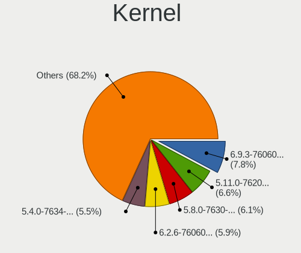
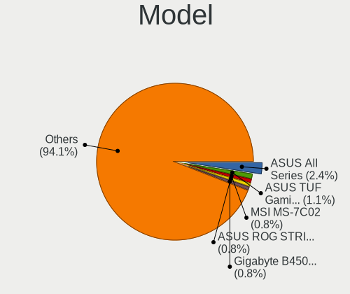
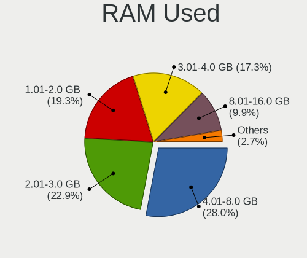
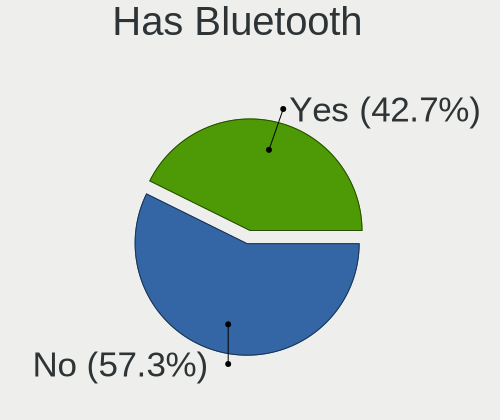
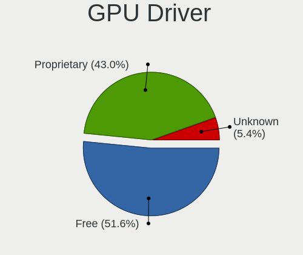
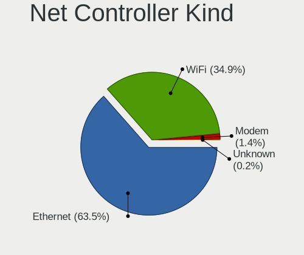
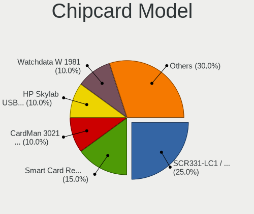
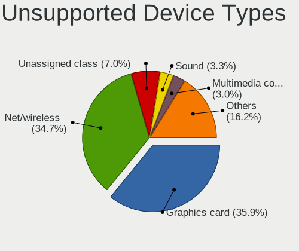

Pop!_OS - Tested Hardware & Statistics (Desktops)
-------------------------------------------------

A project to collect tested hardware configurations for Pop!_OS.

Anyone can contribute to this report by the [hw-probe](https://github.com/linuxhw/hw-probe) tool:

    sudo -E hw-probe -all -upload

Please contribute! Especially if your hardware is rare.

Contents
--------

* [ Test Cases ](#test-cases)

* [ System ](#system)
  - [ OS                       ](#os)
  - [ OS Family                ](#os-family)
  - [ Kernel                   ](#kernel)
  - [ Kernel Family            ](#kernel-family)
  - [ Kernel Major Ver.        ](#kernel-major-ver)
  - [ Arch                     ](#arch)
  - [ DE                       ](#de)
  - [ Display Server           ](#display-server)
  - [ Display Manager          ](#display-manager)
  - [ OS Lang                  ](#os-lang)
  - [ Boot Mode                ](#boot-mode)
  - [ Filesystem               ](#filesystem)
  - [ Part. scheme             ](#part-scheme)
  - [ Dual Boot with Linux/BSD ](#dual-boot-with-linuxbsd)
  - [ Dual Boot (Win)          ](#dual-boot-win)

* [ Board ](#board)
  - [ Vendor                   ](#vendor)
  - [ Model                    ](#model)
  - [ Model Family             ](#model-family)
  - [ MFG Year                 ](#mfg-year)
  - [ Form Factor              ](#form-factor)
  - [ Secure Boot              ](#secure-boot)
  - [ Coreboot                 ](#coreboot)
  - [ RAM Size                 ](#ram-size)
  - [ RAM Used                 ](#ram-used)
  - [ Total Drives             ](#total-drives)
  - [ Has CD-ROM               ](#has-cd-rom)
  - [ Has Ethernet             ](#has-ethernet)
  - [ Has WiFi                 ](#has-wifi)
  - [ Has Bluetooth            ](#has-bluetooth)

* [ Location ](#location)
  - [ Country                  ](#country)
  - [ City                     ](#city)

* [ Drives ](#drives)
  - [ Drive Vendor             ](#drive-vendor)
  - [ Drive Model              ](#drive-model)
  - [ HDD Vendor               ](#hdd-vendor)
  - [ SSD Vendor               ](#ssd-vendor)
  - [ Drive Kind               ](#drive-kind)
  - [ Drive Connector          ](#drive-connector)
  - [ Drive Size               ](#drive-size)
  - [ Space Total              ](#space-total)
  - [ Space Used               ](#space-used)
  - [ Malfunc. Drives          ](#malfunc-drives)
  - [ Malfunc. Drive Vendor    ](#malfunc-drive-vendor)
  - [ Malfunc. HDD Vendor      ](#malfunc-hdd-vendor)
  - [ Malfunc. Drive Kind      ](#malfunc-drive-kind)
  - [ Failed Drives            ](#failed-drives)
  - [ Failed Drive Vendor      ](#failed-drive-vendor)
  - [ Drive Status             ](#drive-status)

* [ Storage controller ](#storage-controller)
  - [ Storage Vendor           ](#storage-vendor)
  - [ Storage Model            ](#storage-model)
  - [ Storage Kind             ](#storage-kind)

* [ Processor ](#processor)
  - [ CPU Vendor               ](#cpu-vendor)
  - [ CPU Model                ](#cpu-model)
  - [ CPU Model Family         ](#cpu-model-family)
  - [ CPU Cores                ](#cpu-cores)
  - [ CPU Sockets              ](#cpu-sockets)
  - [ CPU Threads              ](#cpu-threads)
  - [ CPU Op-Modes             ](#cpu-op-modes)
  - [ CPU Microcode            ](#cpu-microcode)
  - [ CPU Microarch            ](#cpu-microarch)

* [ Graphics ](#graphics)
  - [ GPU Vendor               ](#gpu-vendor)
  - [ GPU Model                ](#gpu-model)
  - [ GPU Combo                ](#gpu-combo)
  - [ GPU Driver               ](#gpu-driver)
  - [ GPU Memory               ](#gpu-memory)

* [ Monitor ](#monitor)
  - [ Monitor Vendor           ](#monitor-vendor)
  - [ Monitor Model            ](#monitor-model)
  - [ Monitor Resolution       ](#monitor-resolution)
  - [ Monitor Diagonal         ](#monitor-diagonal)
  - [ Monitor Width            ](#monitor-width)
  - [ Aspect Ratio             ](#aspect-ratio)
  - [ Monitor Area             ](#monitor-area)
  - [ Pixel Density            ](#pixel-density)
  - [ Multiple Monitors        ](#multiple-monitors)

* [ Network ](#network)
  - [ Net Controller Vendor    ](#net-controller-vendor)
  - [ Net Controller Model     ](#net-controller-model)
  - [ Wireless Vendor          ](#wireless-vendor)
  - [ Wireless Model           ](#wireless-model)
  - [ Ethernet Vendor          ](#ethernet-vendor)
  - [ Ethernet Model           ](#ethernet-model)
  - [ Net Controller Kind      ](#net-controller-kind)
  - [ Used Controller          ](#used-controller)
  - [ NICs                     ](#nics)
  - [ IPv6                     ](#ipv6)

* [ Bluetooth ](#bluetooth)
  - [ Bluetooth Vendor         ](#bluetooth-vendor)
  - [ Bluetooth Model          ](#bluetooth-model)

* [ Sound ](#sound)
  - [ Sound Vendor             ](#sound-vendor)
  - [ Sound Model              ](#sound-model)

* [ Memory ](#memory)
  - [ Memory Vendor            ](#memory-vendor)
  - [ Memory Model             ](#memory-model)
  - [ Memory Kind              ](#memory-kind)
  - [ Memory Form Factor       ](#memory-form-factor)
  - [ Memory Size              ](#memory-size)
  - [ Memory Speed             ](#memory-speed)

* [ Printers & scanners ](#printers--scanners)
  - [ Printer Vendor           ](#printer-vendor)
  - [ Printer Model            ](#printer-model)
  - [ Scanner Vendor           ](#scanner-vendor)
  - [ Scanner Model            ](#scanner-model)

* [ Camera ](#camera)
  - [ Camera Vendor            ](#camera-vendor)
  - [ Camera Model             ](#camera-model)

* [ Security ](#security)
  - [ Fingerprint Vendor       ](#fingerprint-vendor)
  - [ Fingerprint Model        ](#fingerprint-model)
  - [ Chipcard Vendor          ](#chipcard-vendor)
  - [ Chipcard Model           ](#chipcard-model)

* [ Unsupported ](#unsupported)
  - [ Unsupported Devices      ](#unsupported-devices)
  - [ Unsupported Device Types ](#unsupported-device-types)

Test Cases
----------

Total: 4045

| Vendor        | Model                       | Probe                                                      | Date         |
|---------------|-----------------------------|------------------------------------------------------------|--------------|
| MSI           | MPG X570 GAMING EDGE WIF... | [7da3547526](https://linux-hardware.org/?probe=7da3547526) | Jul 01, 2022 |
| Gigabyte      | X570 I AORUS PRO WIFI       | [d979555615](https://linux-hardware.org/?probe=d979555615) | Jul 01, 2022 |
| ASRock        | B450 Gaming K4              | [2bdfc5f472](https://linux-hardware.org/?probe=2bdfc5f472) | Jul 01, 2022 |
| MSI           | B250M PRO-VD                | [b48e88849b](https://linux-hardware.org/?probe=b48e88849b) | Jul 01, 2022 |
| ASUSTek       | Maximus IX FORMULA          | [8c29343495](https://linux-hardware.org/?probe=8c29343495) | Jul 01, 2022 |
| ASUSTek       | Maximus IX FORMULA          | [2631bf2ae1](https://linux-hardware.org/?probe=2631bf2ae1) | Jul 01, 2022 |
| HP            | 18E7                        | [1808b6dee4](https://linux-hardware.org/?probe=1808b6dee4) | Jul 01, 2022 |
| Dell          | 0HHV7N A00                  | [41255f7150](https://linux-hardware.org/?probe=41255f7150) | Jun 30, 2022 |
| ASRock        | X399 Taichi                 | [caea75035f](https://linux-hardware.org/?probe=caea75035f) | Jun 30, 2022 |
| Gigabyte      | B450 AORUS M                | [b85b1f9277](https://linux-hardware.org/?probe=b85b1f9277) | Jun 30, 2022 |
| ASUSTek       | B85M-E/BR                   | [adfbbd03b6](https://linux-hardware.org/?probe=adfbbd03b6) | Jun 29, 2022 |
| ASUSTek       | TUF Gaming X570-PLUS_BR     | [3bceb0a396](https://linux-hardware.org/?probe=3bceb0a396) | Jun 29, 2022 |
| Gigabyte      | B450 AORUS M                | [67dc174a62](https://linux-hardware.org/?probe=67dc174a62) | Jun 29, 2022 |
| Lenovo        | 36C5 NOK                    | [94d44ae5f2](https://linux-hardware.org/?probe=94d44ae5f2) | Jun 29, 2022 |
| Lenovo        | 36C5 NOK                    | [cd5e39b07a](https://linux-hardware.org/?probe=cd5e39b07a) | Jun 29, 2022 |
| MSI           | B450M PRO-VDH MAX           | [f01192b57e](https://linux-hardware.org/?probe=f01192b57e) | Jun 29, 2022 |
| Gigabyte      | Z97X-SLI-CF                 | [0a66ce61c6](https://linux-hardware.org/?probe=0a66ce61c6) | Jun 29, 2022 |
| Gigabyte      | Z97X-SLI-CF                 | [f2b790de57](https://linux-hardware.org/?probe=f2b790de57) | Jun 29, 2022 |
| ASRock        | N68-S                       | [cf9108c19a](https://linux-hardware.org/?probe=cf9108c19a) | Jun 28, 2022 |
| HP            | 3647h                       | [3227f38f98](https://linux-hardware.org/?probe=3227f38f98) | Jun 28, 2022 |
| Gigabyte      | Z170-Gaming K3              | [70dc9ba605](https://linux-hardware.org/?probe=70dc9ba605) | Jun 28, 2022 |
| MSI           | B250M PRO-VD                | [8efb1d3556](https://linux-hardware.org/?probe=8efb1d3556) | Jun 28, 2022 |
| MSI           | B250M PRO-VD                | [5b239d8bba](https://linux-hardware.org/?probe=5b239d8bba) | Jun 28, 2022 |
| ASRock        | B450 Gaming K4              | [6ecc609381](https://linux-hardware.org/?probe=6ecc609381) | Jun 27, 2022 |
| ASRock        | B450 Steel Legend           | [6f8f8a9df6](https://linux-hardware.org/?probe=6f8f8a9df6) | Jun 26, 2022 |
| ASRock        | B450 Steel Legend           | [547aab5039](https://linux-hardware.org/?probe=547aab5039) | Jun 26, 2022 |
| ASUSTek       | VM40B                       | [35f67bace1](https://linux-hardware.org/?probe=35f67bace1) | Jun 26, 2022 |
| Dell          | 0D6H9T A00                  | [fd65f44d25](https://linux-hardware.org/?probe=fd65f44d25) | Jun 26, 2022 |
| MSI           | MPG B460I GAMING EDGE WI... | [6580b51e30](https://linux-hardware.org/?probe=6580b51e30) | Jun 25, 2022 |
| MSI           | MPG B460I GAMING EDGE WI... | [01fcd4495e](https://linux-hardware.org/?probe=01fcd4495e) | Jun 25, 2022 |
| Dell          | 040DDP A00                  | [02721926a7](https://linux-hardware.org/?probe=02721926a7) | Jun 25, 2022 |
| MSI           | MAG Z690 TORPEDO            | [44700880cf](https://linux-hardware.org/?probe=44700880cf) | Jun 24, 2022 |
| ASUSTek       | LEUCITE                     | [c4d2ed5723](https://linux-hardware.org/?probe=c4d2ed5723) | Jun 24, 2022 |
| MSI           | MAG Z690 TORPEDO            | [517a155f9b](https://linux-hardware.org/?probe=517a155f9b) | Jun 24, 2022 |
| Dell          | 0WMJ54 A01                  | [ee865231c1](https://linux-hardware.org/?probe=ee865231c1) | Jun 24, 2022 |
| Gigabyte      | G1.Sniper M3-CF             | [055977bdee](https://linux-hardware.org/?probe=055977bdee) | Jun 23, 2022 |
| ASUSTek       | CROSSHAIR VI HERO           | [f3d1eeadb3](https://linux-hardware.org/?probe=f3d1eeadb3) | Jun 23, 2022 |
| MSI           | MAG X570S TOMAHAWK MAX W... | [1e7e58ae1d](https://linux-hardware.org/?probe=1e7e58ae1d) | Jun 23, 2022 |
| Gigabyte      | X570 AORUS ELITE            | [0bd1e7d592](https://linux-hardware.org/?probe=0bd1e7d592) | Jun 23, 2022 |
| ASUSTek       | PRIME B550M-A               | [d4492d1e5d](https://linux-hardware.org/?probe=d4492d1e5d) | Jun 23, 2022 |
| ASUSTek       | TUF Gaming X570-PRO         | [c5a5527f1d](https://linux-hardware.org/?probe=c5a5527f1d) | Jun 23, 2022 |
| ASUSTek       | PRIME X570-PRO              | [ae30cadddf](https://linux-hardware.org/?probe=ae30cadddf) | Jun 22, 2022 |
| MSI           | MPG X570 GAMING EDGE WIF... | [21d1dc43e6](https://linux-hardware.org/?probe=21d1dc43e6) | Jun 22, 2022 |
| ASUSTek       | ROG STRIX X570-F GAMING     | [27bc9defca](https://linux-hardware.org/?probe=27bc9defca) | Jun 22, 2022 |
| ASUSTek       | ROG STRIX X570-F GAMING     | [941b96e6ab](https://linux-hardware.org/?probe=941b96e6ab) | Jun 22, 2022 |
| BESSTAR Te... | UM700                       | [5dc08ee2d7](https://linux-hardware.org/?probe=5dc08ee2d7) | Jun 22, 2022 |
| ASUSTek       | ROG CROSSHAIR VIII HERO     | [d5fd58e3b0](https://linux-hardware.org/?probe=d5fd58e3b0) | Jun 21, 2022 |
| ASUSTek       | PRIME Z370-A                | [8dca736a46](https://linux-hardware.org/?probe=8dca736a46) | Jun 21, 2022 |
| ASUSTek       | P7H55-M LX                  | [f747d1bfd3](https://linux-hardware.org/?probe=f747d1bfd3) | Jun 21, 2022 |
| System76      | Thelio thelio-r2            | [b9b9d5ffda](https://linux-hardware.org/?probe=b9b9d5ffda) | Jun 21, 2022 |
| MSI           | B550M-A PRO                 | [1765b91360](https://linux-hardware.org/?probe=1765b91360) | Jun 21, 2022 |
| Gigabyte      | B550 AORUS ELITE V2         | [eb61c79793](https://linux-hardware.org/?probe=eb61c79793) | Jun 21, 2022 |
| ASUSTek       | Z170 PRO GAMING/AURA        | [6ddca91c97](https://linux-hardware.org/?probe=6ddca91c97) | Jun 21, 2022 |
| Biostar       | N68S3+                      | [efe83d16ac](https://linux-hardware.org/?probe=efe83d16ac) | Jun 21, 2022 |
| Intel         | MAHOBAY                     | [f615165669](https://linux-hardware.org/?probe=f615165669) | Jun 21, 2022 |
| ASRock        | B450 Gaming K4              | [230bdf84a1](https://linux-hardware.org/?probe=230bdf84a1) | Jun 20, 2022 |
| MSI           | MPG Z490 GAMING PLUS        | [ec3bc83e7a](https://linux-hardware.org/?probe=ec3bc83e7a) | Jun 20, 2022 |
| Gigabyte      | X570 AORUS MASTER           | [d5af99ece6](https://linux-hardware.org/?probe=d5af99ece6) | Jun 20, 2022 |
| ASUSTek       | P8Z77-V LX                  | [ad271e0eec](https://linux-hardware.org/?probe=ad271e0eec) | Jun 19, 2022 |
| Gigabyte      | Z590 AORUS ELITE AX         | [3d4d492e9d](https://linux-hardware.org/?probe=3d4d492e9d) | Jun 19, 2022 |
| Dell          | 0YXT71 A03                  | [890e65c781](https://linux-hardware.org/?probe=890e65c781) | Jun 19, 2022 |
| HP            | 158B                        | [b66a2770e7](https://linux-hardware.org/?probe=b66a2770e7) | Jun 18, 2022 |
| MSI           | MPG X570 GAMING EDGE WIF... | [6ba04b0f37](https://linux-hardware.org/?probe=6ba04b0f37) | Jun 18, 2022 |
| ASUSTek       | ROG STRIX X570-E GAMING     | [cc2e6a1605](https://linux-hardware.org/?probe=cc2e6a1605) | Jun 17, 2022 |
| BESSTAR Te... | UM700                       | [d0c247db91](https://linux-hardware.org/?probe=d0c247db91) | Jun 17, 2022 |
| Intel         | MAHOBAY                     | [755ead951d](https://linux-hardware.org/?probe=755ead951d) | Jun 17, 2022 |
| Gigabyte      | B450M DS3H WIFI-CF          | [5241a60357](https://linux-hardware.org/?probe=5241a60357) | Jun 17, 2022 |
| ASUSTek       | ROG CROSSHAIR VIII DARK ... | [f4178c276d](https://linux-hardware.org/?probe=f4178c276d) | Jun 16, 2022 |
| Intel         | MAHOBAY                     | [91039940ea](https://linux-hardware.org/?probe=91039940ea) | Jun 16, 2022 |
| Lenovo        | 3715 SDK0L77769 WIN 3423... | [16d122d03e](https://linux-hardware.org/?probe=16d122d03e) | Jun 16, 2022 |
| Lenovo        | SHARKBAY 0B98401 WIN        | [24140a62de](https://linux-hardware.org/?probe=24140a62de) | Jun 16, 2022 |
| Foxconn       | G41MX/G41MX-K 2.0 1.0       | [f5af934210](https://linux-hardware.org/?probe=f5af934210) | Jun 16, 2022 |
| ASUSTek       | ROG STRIX B550-I GAMING     | [7cebf6f4c1](https://linux-hardware.org/?probe=7cebf6f4c1) | Jun 16, 2022 |
| MSI           | B450 TOMAHAWK               | [e11d001f52](https://linux-hardware.org/?probe=e11d001f52) | Jun 15, 2022 |
| MSI           | MPG Z390 GAMING EDGE AC     | [29cfeda814](https://linux-hardware.org/?probe=29cfeda814) | Jun 15, 2022 |
| Gigabyte      | 970A-DS3P                   | [b12643d9ac](https://linux-hardware.org/?probe=b12643d9ac) | Jun 15, 2022 |
| Gigabyte      | X470 AORUS ULTRA GAMING-... | [d4e4001c4c](https://linux-hardware.org/?probe=d4e4001c4c) | Jun 15, 2022 |
| Medion        | MS-7728                     | [ae02539c17](https://linux-hardware.org/?probe=ae02539c17) | Jun 15, 2022 |
| ASUSTek       | TUF Gaming Z590-PLUS WIF... | [5be4039515](https://linux-hardware.org/?probe=5be4039515) | Jun 15, 2022 |
| ASUSTek       | TUF X299 MARK 2             | [507c214577](https://linux-hardware.org/?probe=507c214577) | Jun 15, 2022 |
| MSI           | B550-A PRO                  | [f7201ee1de](https://linux-hardware.org/?probe=f7201ee1de) | Jun 14, 2022 |
| HP            | 1905                        | [b3d0170095](https://linux-hardware.org/?probe=b3d0170095) | Jun 14, 2022 |
| HP            | 18E7                        | [9f82638329](https://linux-hardware.org/?probe=9f82638329) | Jun 14, 2022 |
| Lenovo        | 0B98401 PRO                 | [23de86aa97](https://linux-hardware.org/?probe=23de86aa97) | Jun 14, 2022 |
| Alienware     | 0R3FWM A00                  | [6690a39447](https://linux-hardware.org/?probe=6690a39447) | Jun 13, 2022 |
| Gigabyte      | AB350-Gaming 3-CF           | [f9e74fdcd3](https://linux-hardware.org/?probe=f9e74fdcd3) | Jun 13, 2022 |
| Dell          | 073MMW A03                  | [3e206d2462](https://linux-hardware.org/?probe=3e206d2462) | Jun 13, 2022 |
| ASUSTek       | Z87-K                       | [cafc34944d](https://linux-hardware.org/?probe=cafc34944d) | Jun 13, 2022 |
| MSI           | B350 PC MATE                | [baf792ad50](https://linux-hardware.org/?probe=baf792ad50) | Jun 12, 2022 |
| ASUSTek       | PRIME H570M-PLUS            | [a332c946a2](https://linux-hardware.org/?probe=a332c946a2) | Jun 11, 2022 |
| Gigabyte      | G1.Sniper M3-CF             | [d02f89642d](https://linux-hardware.org/?probe=d02f89642d) | Jun 11, 2022 |
| ASUSTek       | ROG STRIX B560-F GAMING ... | [a4277bcba9](https://linux-hardware.org/?probe=a4277bcba9) | Jun 11, 2022 |
| MSI           | MEG X570 ACE                | [d88374c06d](https://linux-hardware.org/?probe=d88374c06d) | Jun 11, 2022 |
| Unknown       | Unknown                     | [19d1362c66](https://linux-hardware.org/?probe=19d1362c66) | Jun 10, 2022 |
| Gigabyte      | H87M-HD3                    | [eadd724efa](https://linux-hardware.org/?probe=eadd724efa) | Jun 10, 2022 |
| ASUSTek       | M5A97 R2.0                  | [e92127f694](https://linux-hardware.org/?probe=e92127f694) | Jun 10, 2022 |
| MSI           | H97 GAMING 3                | [839bbee3fa](https://linux-hardware.org/?probe=839bbee3fa) | Jun 10, 2022 |
| Gigabyte      | X570 AORUS ELITE            | [1fef4f1cf3](https://linux-hardware.org/?probe=1fef4f1cf3) | Jun 10, 2022 |
| PCWare        | IPX4105G Pro                | [72ac2cedad](https://linux-hardware.org/?probe=72ac2cedad) | Jun 10, 2022 |
| Gigabyte      | GA-78LMT-USB3 SEx           | [9c7b34c996](https://linux-hardware.org/?probe=9c7b34c996) | Jun 09, 2022 |
| Gigabyte      | B550 AORUS ELITE V2         | [70254d6e4d](https://linux-hardware.org/?probe=70254d6e4d) | Jun 08, 2022 |
| PCWare        | IPX4105G Pro                | [ffccee6734](https://linux-hardware.org/?probe=ffccee6734) | Jun 07, 2022 |
| ASRock        | B365M Pro4                  | [ef5b8100ce](https://linux-hardware.org/?probe=ef5b8100ce) | Jun 07, 2022 |
| ASUSTek       | ROG Maximus XI HERO         | [44a6f3e33d](https://linux-hardware.org/?probe=44a6f3e33d) | Jun 07, 2022 |
| Gigabyte      | Z390 UD                     | [cd4b8b609f](https://linux-hardware.org/?probe=cd4b8b609f) | Jun 07, 2022 |
| Dell          | 0JW6C6 A01                  | [34d9fc3968](https://linux-hardware.org/?probe=34d9fc3968) | Jun 06, 2022 |
| Lenovo        | SHARKBAY 0B98401 WIN        | [56c4428636](https://linux-hardware.org/?probe=56c4428636) | Jun 06, 2022 |
| Gigabyte      | B550I AORUS PRO AX          | [a0c155ffb9](https://linux-hardware.org/?probe=a0c155ffb9) | Jun 05, 2022 |
| ASUSTek       | P6X58D PREMIUM              | [816b4e757d](https://linux-hardware.org/?probe=816b4e757d) | Jun 05, 2022 |
| ASUSTek       | Rampage V EDITION 10        | [e92e195362](https://linux-hardware.org/?probe=e92e195362) | Jun 05, 2022 |
| ASUSTek       | P8Z68-V LX                  | [e7e3608105](https://linux-hardware.org/?probe=e7e3608105) | Jun 04, 2022 |
| ASUSTek       | 970 PRO GAMING/AURA         | [a65dd5834e](https://linux-hardware.org/?probe=a65dd5834e) | Jun 04, 2022 |
| ASUSTek       | P6X58D PREMIUM              | [81bfe17cb5](https://linux-hardware.org/?probe=81bfe17cb5) | Jun 04, 2022 |
| ASUSTek       | PRIME B450M-GAMING/BR       | [95db56a864](https://linux-hardware.org/?probe=95db56a864) | Jun 03, 2022 |
| ASUSTek       | Z87-K                       | [915e2819c0](https://linux-hardware.org/?probe=915e2819c0) | Jun 02, 2022 |
| ASRock        | Z390 Phantom Gaming SLI/... | [5f40da7ae9](https://linux-hardware.org/?probe=5f40da7ae9) | Jun 02, 2022 |
| ASUSTek       | TUF Gaming B550M-PLUS       | [5348dd6576](https://linux-hardware.org/?probe=5348dd6576) | Jun 01, 2022 |
| ASUSTek       | PRIME Z590-A                | [fa29e357fa](https://linux-hardware.org/?probe=fa29e357fa) | Jun 01, 2022 |
| ASUSTek       | F2A85-M                     | [82b4935292](https://linux-hardware.org/?probe=82b4935292) | Jun 01, 2022 |
| MSI           | Z170A MPOWER GAMING TITA... | [538feade4f](https://linux-hardware.org/?probe=538feade4f) | May 31, 2022 |
| ASUSTek       | PRIME A320M-K               | [bee74ec003](https://linux-hardware.org/?probe=bee74ec003) | May 31, 2022 |
| ASRock        | B450 Steel Legend           | [136730f4ac](https://linux-hardware.org/?probe=136730f4ac) | May 31, 2022 |
| ASRock        | B450 Steel Legend           | [62b7e9aacd](https://linux-hardware.org/?probe=62b7e9aacd) | May 31, 2022 |
| System76      | Thelio Major thelio-majo... | [291730a3bb](https://linux-hardware.org/?probe=291730a3bb) | May 31, 2022 |
| Dell          | 0Y2MRG A00                  | [013e0da975](https://linux-hardware.org/?probe=013e0da975) | May 30, 2022 |
| Dell          | 0D02VH A01                  | [fc97b0a5bf](https://linux-hardware.org/?probe=fc97b0a5bf) | May 30, 2022 |
| ASUSTek       | PRIME Z590-A                | [1058cdf867](https://linux-hardware.org/?probe=1058cdf867) | May 30, 2022 |
| HP            | 8266                        | [d0e35451ab](https://linux-hardware.org/?probe=d0e35451ab) | May 29, 2022 |
| Gigabyte      | H270-Gaming 3               | [c28c21c4d8](https://linux-hardware.org/?probe=c28c21c4d8) | May 29, 2022 |
| Dell          | 0R790T A00                  | [f9388b2163](https://linux-hardware.org/?probe=f9388b2163) | May 29, 2022 |
| ASUSTek       | ROG CROSSHAIR VIII DARK ... | [5d899f8fc5](https://linux-hardware.org/?probe=5d899f8fc5) | May 29, 2022 |
| ASUSTek       | ROG STRIX X570-E GAMING     | [d1923db949](https://linux-hardware.org/?probe=d1923db949) | May 29, 2022 |
| Dell          | 0J3C2F A00                  | [c192680ab5](https://linux-hardware.org/?probe=c192680ab5) | May 29, 2022 |
| MSI           | MAG B550 TOMAHAWK           | [b78390767c](https://linux-hardware.org/?probe=b78390767c) | May 28, 2022 |
| MSI           | MS-7717                     | [101b488b80](https://linux-hardware.org/?probe=101b488b80) | May 28, 2022 |
| ASUSTek       | Maximus IV Extreme-Z        | [57a20bde9f](https://linux-hardware.org/?probe=57a20bde9f) | May 28, 2022 |
| MSI           | MS-7717                     | [9b0c2d0d8c](https://linux-hardware.org/?probe=9b0c2d0d8c) | May 28, 2022 |
| ASRock        | B450 Steel Legend           | [5d47d967ba](https://linux-hardware.org/?probe=5d47d967ba) | May 28, 2022 |
| Dell          | 040DDP A01                  | [925d3dce8d](https://linux-hardware.org/?probe=925d3dce8d) | May 28, 2022 |
| HP            | 158B                        | [a74e9da8aa](https://linux-hardware.org/?probe=a74e9da8aa) | May 28, 2022 |
| ASUSTek       | SABERTOOTH Z170 MARK 1      | [bdf54228e5](https://linux-hardware.org/?probe=bdf54228e5) | May 27, 2022 |
| Lenovo        | SHARKBAY 0B98401 WIN        | [f5195788f8](https://linux-hardware.org/?probe=f5195788f8) | May 27, 2022 |
| ASUSTek       | PRIME Z270-A                | [5d1ee4048a](https://linux-hardware.org/?probe=5d1ee4048a) | May 27, 2022 |
| ASUSTek       | ROG STRIX Z690-I GAMING ... | [084dab5bd4](https://linux-hardware.org/?probe=084dab5bd4) | May 26, 2022 |
| ASUSTek       | P5KPL-SE                    | [c4b27d79ef](https://linux-hardware.org/?probe=c4b27d79ef) | May 26, 2022 |
| ASUSTek       | P5QPL-AM                    | [938ab3ec5c](https://linux-hardware.org/?probe=938ab3ec5c) | May 26, 2022 |
| ASUSTek       | TUF B450M-PLUS GAMING       | [ae0ada290a](https://linux-hardware.org/?probe=ae0ada290a) | May 26, 2022 |
| ASRock        | H670M-ITX/ax                | [b3f7ff3d98](https://linux-hardware.org/?probe=b3f7ff3d98) | May 25, 2022 |
| ASUSTek       | M5A78L/USB3                 | [852a292ba3](https://linux-hardware.org/?probe=852a292ba3) | May 25, 2022 |
| Gigabyte      | AB350-Gaming 3-CF           | [4738560555](https://linux-hardware.org/?probe=4738560555) | May 25, 2022 |
| HP            | 8703                        | [14af29c571](https://linux-hardware.org/?probe=14af29c571) | May 24, 2022 |
| ASRock        | H470M-ITX/ac                | [181f7decc6](https://linux-hardware.org/?probe=181f7decc6) | May 24, 2022 |
| Dell          | 0Y2MRG A00                  | [08527b166e](https://linux-hardware.org/?probe=08527b166e) | May 24, 2022 |
| Gigabyte      | B550M AORUS PRO-P           | [1122022ae1](https://linux-hardware.org/?probe=1122022ae1) | May 24, 2022 |
| SIEMENS       | A5E02122237 ES010           | [3d7173e7a3](https://linux-hardware.org/?probe=3d7173e7a3) | May 24, 2022 |
| Lenovo        | MAHOBAY                     | [dbfb736222](https://linux-hardware.org/?probe=dbfb736222) | May 23, 2022 |
| ASUSTek       | ROG CROSSHAIR VIII DARK ... | [78bb2ba75c](https://linux-hardware.org/?probe=78bb2ba75c) | May 23, 2022 |
| Foxconn       | 2ABF                        | [39f9e9e717](https://linux-hardware.org/?probe=39f9e9e717) | May 22, 2022 |
| ASUSTek       | ROG STRIX Z390-E GAMING     | [21818b99b4](https://linux-hardware.org/?probe=21818b99b4) | May 22, 2022 |
| ASRock        | B450 Gaming K4              | [152469abdd](https://linux-hardware.org/?probe=152469abdd) | May 22, 2022 |
| ASUSTek       | ROG STRIX Z390-E GAMING     | [f1db82519f](https://linux-hardware.org/?probe=f1db82519f) | May 22, 2022 |
| Gigabyte      | B450 AORUS PRO WIFI-CF      | [5ebbcedcc1](https://linux-hardware.org/?probe=5ebbcedcc1) | May 22, 2022 |
| MSI           | MEG Z390 ACE                | [0065576586](https://linux-hardware.org/?probe=0065576586) | May 22, 2022 |
| Gigabyte      | H67N-USB3-B3                | [382f206597](https://linux-hardware.org/?probe=382f206597) | May 21, 2022 |
| ASRock        | B450 Steel Legend           | [3c436952c7](https://linux-hardware.org/?probe=3c436952c7) | May 21, 2022 |
| ASUSTek       | P7P55D-E LX                 | [358e85c524](https://linux-hardware.org/?probe=358e85c524) | May 21, 2022 |
| MSI           | B250M PRO-VD                | [540e0831b1](https://linux-hardware.org/?probe=540e0831b1) | May 20, 2022 |
| ASRock        | TRX40 Creator               | [a810336f3f](https://linux-hardware.org/?probe=a810336f3f) | May 20, 2022 |
| ASRock        | TRX40 Creator               | [6993400976](https://linux-hardware.org/?probe=6993400976) | May 20, 2022 |
| Gigabyte      | GA-78LMT-S2P                | [2211d5c2a2](https://linux-hardware.org/?probe=2211d5c2a2) | May 20, 2022 |
| ASUSTek       | H110M-R                     | [7cae58580a](https://linux-hardware.org/?probe=7cae58580a) | May 20, 2022 |
| ASRock        | Z390 Phantom Gaming 4-IB    | [543ab770e8](https://linux-hardware.org/?probe=543ab770e8) | May 20, 2022 |
| Positivo      | POS-MI945AA                 | [0f9875e8fc](https://linux-hardware.org/?probe=0f9875e8fc) | May 19, 2022 |
| Lenovo        | MAHOBAY                     | [fa1f318919](https://linux-hardware.org/?probe=fa1f318919) | May 19, 2022 |
| ASUSTek       | H110M-A/DP                  | [9e2c754ed6](https://linux-hardware.org/?probe=9e2c754ed6) | May 19, 2022 |
| ASUSTek       | ROG STRIX X570-E GAMING ... | [3f9a21ddc1](https://linux-hardware.org/?probe=3f9a21ddc1) | May 19, 2022 |
| ASUSTek       | ROG CROSSHAIR VIII IMPAC... | [d94f4b0a43](https://linux-hardware.org/?probe=d94f4b0a43) | May 19, 2022 |
| Gigabyte      | B450 AORUS M                | [5ddfbf547b](https://linux-hardware.org/?probe=5ddfbf547b) | May 19, 2022 |
| Supermicro    | X8SIL                       | [66e8a4001f](https://linux-hardware.org/?probe=66e8a4001f) | May 18, 2022 |
| MSI           | B350M MORTAR                | [fd66fd9a5a](https://linux-hardware.org/?probe=fd66fd9a5a) | May 18, 2022 |
| Supermicro    | X8SIL                       | [5cb6f1067b](https://linux-hardware.org/?probe=5cb6f1067b) | May 18, 2022 |
| HP            | 8054                        | [725f204fd0](https://linux-hardware.org/?probe=725f204fd0) | May 18, 2022 |
| ASUSTek       | GA15DH                      | [ca68812bf2](https://linux-hardware.org/?probe=ca68812bf2) | May 17, 2022 |
| MSI           | Z270-A PRO                  | [f005623f03](https://linux-hardware.org/?probe=f005623f03) | May 17, 2022 |
| ASUSTek       | AM1M-A/BR                   | [e23e8291e0](https://linux-hardware.org/?probe=e23e8291e0) | May 17, 2022 |
| Gigabyte      | AX370M-DS3H-CF              | [2f7a99c28b](https://linux-hardware.org/?probe=2f7a99c28b) | May 17, 2022 |
| ASUSTek       | M4A785TD-V EVO              | [ee4e4a7bc7](https://linux-hardware.org/?probe=ee4e4a7bc7) | May 17, 2022 |
| Dell          | 040DDP A00                  | [4806ca2a7e](https://linux-hardware.org/?probe=4806ca2a7e) | May 17, 2022 |
| Gigabyte      | H310M S2H x.x               | [4d76b03e66](https://linux-hardware.org/?probe=4d76b03e66) | May 17, 2022 |
| ASUSTek       | Z87-K                       | [2daea316b2](https://linux-hardware.org/?probe=2daea316b2) | May 16, 2022 |
| ASUSTek       | H170M-PLUS                  | [c1f5cb662f](https://linux-hardware.org/?probe=c1f5cb662f) | May 15, 2022 |
| ASUSTek       | Z87-K                       | [bb296e5f39](https://linux-hardware.org/?probe=bb296e5f39) | May 15, 2022 |
| MSI           | MPG X570 GAMING PLUS        | [91d8b47a30](https://linux-hardware.org/?probe=91d8b47a30) | May 15, 2022 |
| ASRock        | B550 Phantom Gaming-ITX/... | [608664ce7a](https://linux-hardware.org/?probe=608664ce7a) | May 15, 2022 |
| Dell          | 0CRH6C A02                  | [655afd62e6](https://linux-hardware.org/?probe=655afd62e6) | May 14, 2022 |
| MSI           | CSM-B85M-E45                | [85abf64cf5](https://linux-hardware.org/?probe=85abf64cf5) | May 14, 2022 |
| ASUSTek       | M4A89GTD-PRO/USB3           | [a049c51989](https://linux-hardware.org/?probe=a049c51989) | May 14, 2022 |
| ASRock        | B450M Pro4-F                | [423fbd3a54](https://linux-hardware.org/?probe=423fbd3a54) | May 14, 2022 |
| ASUSTek       | P8H61-M LX3 R2.0            | [cb7b6b9cde](https://linux-hardware.org/?probe=cb7b6b9cde) | May 14, 2022 |
| ASUSTek       | ROG STRIX X299-E GAMING ... | [0cc824e2a5](https://linux-hardware.org/?probe=0cc824e2a5) | May 13, 2022 |
| NZXT          | N7 B550                     | [73441bbfc4](https://linux-hardware.org/?probe=73441bbfc4) | May 12, 2022 |
| Unknown       | BTC79X5                     | [42b222eb65](https://linux-hardware.org/?probe=42b222eb65) | May 12, 2022 |
| Gigabyte      | Z170-Gaming K3              | [768acb5df2](https://linux-hardware.org/?probe=768acb5df2) | May 12, 2022 |
| AZW           | BT3 X                       | [a17cb64acb](https://linux-hardware.org/?probe=a17cb64acb) | May 12, 2022 |
| Lenovo        | 0B98401 PRO                 | [ee225906fc](https://linux-hardware.org/?probe=ee225906fc) | May 12, 2022 |
| Gigabyte      | B75M-D3H                    | [cfae917826](https://linux-hardware.org/?probe=cfae917826) | May 11, 2022 |
| Lenovo        | 0B98401 PRO                 | [16911d5e64](https://linux-hardware.org/?probe=16911d5e64) | May 11, 2022 |
| Gigabyte      | B660 AORUS MASTER DDR4      | [e5981a9f20](https://linux-hardware.org/?probe=e5981a9f20) | May 11, 2022 |
| Gigabyte      | Z390 AORUS PRO-CF           | [1d4364ac51](https://linux-hardware.org/?probe=1d4364ac51) | May 10, 2022 |
| NZXT          | N7 B550                     | [147247dfb6](https://linux-hardware.org/?probe=147247dfb6) | May 10, 2022 |
| Gigabyte      | Z170-HD3P-CF                | [396a39e5a6](https://linux-hardware.org/?probe=396a39e5a6) | May 10, 2022 |
| ASRock        | X370 Professional Gaming    | [1e22ba0468](https://linux-hardware.org/?probe=1e22ba0468) | May 10, 2022 |
| ASUSTek       | PRIME B450M-A               | [0b3cda16db](https://linux-hardware.org/?probe=0b3cda16db) | May 10, 2022 |
| ASUSTek       | PRIME B450M-A               | [90190717eb](https://linux-hardware.org/?probe=90190717eb) | May 09, 2022 |
| Gigabyte      | X570 AORUS ELITE            | [9f6a18226f](https://linux-hardware.org/?probe=9f6a18226f) | May 09, 2022 |
| Acer          | RS780HVF                    | [431353b969](https://linux-hardware.org/?probe=431353b969) | May 09, 2022 |
| ASUSTek       | Z97-AR                      | [29c93ea162](https://linux-hardware.org/?probe=29c93ea162) | May 09, 2022 |
| Gigabyte      | B450 AORUS M                | [cd1aff125e](https://linux-hardware.org/?probe=cd1aff125e) | May 09, 2022 |
| SIEMENS       | A5E02122237 ES010           | [cc728f6c38](https://linux-hardware.org/?probe=cc728f6c38) | May 09, 2022 |
| ASRock        | X299 Taichi CLX             | [47a45fca48](https://linux-hardware.org/?probe=47a45fca48) | May 08, 2022 |
| ASRock        | 970 Extreme3 R2.0           | [17e7dcafe2](https://linux-hardware.org/?probe=17e7dcafe2) | May 08, 2022 |
| Gigabyte      | X470 AORUS GAMING 7 WIFI... | [8964a4c5ec](https://linux-hardware.org/?probe=8964a4c5ec) | May 08, 2022 |
| ECS           | Nettle3                     | [36f8cde007](https://linux-hardware.org/?probe=36f8cde007) | May 08, 2022 |
| HP            | 0AE8h C                     | [bc0fa7f9b8](https://linux-hardware.org/?probe=bc0fa7f9b8) | May 08, 2022 |
| HP            | 0AE8h C                     | [fdf9e3acd8](https://linux-hardware.org/?probe=fdf9e3acd8) | May 08, 2022 |
| Acer          | RS780HVF                    | [1f30630929](https://linux-hardware.org/?probe=1f30630929) | May 08, 2022 |
| ASUSTek       | PRIME X570-P                | [65d94c8458](https://linux-hardware.org/?probe=65d94c8458) | May 08, 2022 |
| ECS           | Nettle3                     | [646fb53a2c](https://linux-hardware.org/?probe=646fb53a2c) | May 07, 2022 |
| Gigabyte      | X570 AORUS PRO WIFI         | [61a4daec98](https://linux-hardware.org/?probe=61a4daec98) | May 07, 2022 |
| ASUSTek       | ROG CROSSHAIR VIII HERO     | [180dd73bd6](https://linux-hardware.org/?probe=180dd73bd6) | May 07, 2022 |
| ASUSTek       | TUF Gaming Z690-PLUS WIF... | [f71ca35596](https://linux-hardware.org/?probe=f71ca35596) | May 06, 2022 |
| MSI           | B450-A PRO                  | [5b5ceb0f53](https://linux-hardware.org/?probe=5b5ceb0f53) | May 06, 2022 |
| Gigabyte      | 990FXA-UD3                  | [4fe934e84d](https://linux-hardware.org/?probe=4fe934e84d) | May 06, 2022 |
| ASRock        | 970M Pro3                   | [2853128cd0](https://linux-hardware.org/?probe=2853128cd0) | May 05, 2022 |
| ASRock        | 970M Pro3                   | [5f51fd4cf8](https://linux-hardware.org/?probe=5f51fd4cf8) | May 05, 2022 |
| Gigabyte      | Z170-HD3P-CF                | [7b7f29e504](https://linux-hardware.org/?probe=7b7f29e504) | May 05, 2022 |
| ASRock        | X470 Taichi                 | [e133868179](https://linux-hardware.org/?probe=e133868179) | May 05, 2022 |
| ASRock        | X470 Taichi                 | [93d6fb1610](https://linux-hardware.org/?probe=93d6fb1610) | May 05, 2022 |
| ASRock        | A320M-HDV R4.0              | [36cabd86ba](https://linux-hardware.org/?probe=36cabd86ba) | May 04, 2022 |
| ASUSTek       | B85M-E                      | [2b6338d755](https://linux-hardware.org/?probe=2b6338d755) | May 04, 2022 |
| Gigabyte      | Z170-HD3P-CF                | [7196bf2ec6](https://linux-hardware.org/?probe=7196bf2ec6) | May 03, 2022 |
| ASRock        | 970M Pro3                   | [f20f31b107](https://linux-hardware.org/?probe=f20f31b107) | May 03, 2022 |
| ASRock        | 970M Pro3                   | [73a563257a](https://linux-hardware.org/?probe=73a563257a) | May 03, 2022 |
| ASUSTek       | ROG STRIX B450-I GAMING     | [65a2309744](https://linux-hardware.org/?probe=65a2309744) | May 03, 2022 |
| Alienware     | 0CPDXD A00                  | [17da14a17d](https://linux-hardware.org/?probe=17da14a17d) | May 03, 2022 |
| ASUSTek       | B85M-E                      | [9645231d87](https://linux-hardware.org/?probe=9645231d87) | May 03, 2022 |
| Gigabyte      | H110M-S2V-CF                | [f2de7ca21b](https://linux-hardware.org/?probe=f2de7ca21b) | May 03, 2022 |
| MSI           | B450I GAMING PLUS AC        | [c0ef0738b5](https://linux-hardware.org/?probe=c0ef0738b5) | May 02, 2022 |
| MSI           | X370 GAMING PRO CARBON      | [4a09f5d3f3](https://linux-hardware.org/?probe=4a09f5d3f3) | May 02, 2022 |
| MSI           | X370 GAMING PRO CARBON      | [ab716981c3](https://linux-hardware.org/?probe=ab716981c3) | May 02, 2022 |
| Alienware     | 0P0JWX A00                  | [e6e1548aa1](https://linux-hardware.org/?probe=e6e1548aa1) | May 02, 2022 |
| ASUSTek       | ROG CROSSHAIR VIII FORMU... | [a456619489](https://linux-hardware.org/?probe=a456619489) | May 02, 2022 |
| ASRock        | X570 Phantom Gaming 4       | [0e40616573](https://linux-hardware.org/?probe=0e40616573) | May 02, 2022 |
| ASUSTek       | ROG STRIX B350-F GAMING     | [925447d7e9](https://linux-hardware.org/?probe=925447d7e9) | May 01, 2022 |
| ASUSTek       | ROG STRIX B350-F GAMING     | [b1e331055f](https://linux-hardware.org/?probe=b1e331055f) | May 01, 2022 |
| ASUSTek       | ROG CROSSHAIR VII HERO      | [dec71580c4](https://linux-hardware.org/?probe=dec71580c4) | May 01, 2022 |
| Gigabyte      | X570S AERO G                | [ab6b8eaa71](https://linux-hardware.org/?probe=ab6b8eaa71) | May 01, 2022 |
| MSI           | 970 GAMING                  | [32052450db](https://linux-hardware.org/?probe=32052450db) | May 01, 2022 |
| Gigabyte      | X570 AORUS ELITE            | [8db041a1e4](https://linux-hardware.org/?probe=8db041a1e4) | May 01, 2022 |
| ASRock        | B450 Steel Legend           | [ecc527cb4b](https://linux-hardware.org/?probe=ecc527cb4b) | May 01, 2022 |
| ASRock        | B450 Steel Legend           | [ca217fe968](https://linux-hardware.org/?probe=ca217fe968) | May 01, 2022 |
| MSI           | B450M GAMING PLUS           | [0929d58de7](https://linux-hardware.org/?probe=0929d58de7) | Apr 30, 2022 |
| Apple         | Mac-F42C88C8 Proto1         | [3edd5f05f7](https://linux-hardware.org/?probe=3edd5f05f7) | Apr 30, 2022 |
| ASRock        | X99 Extreme4                | [d45e1e88db](https://linux-hardware.org/?probe=d45e1e88db) | Apr 30, 2022 |
| ASRock        | X99 Extreme4                | [41cec63ac6](https://linux-hardware.org/?probe=41cec63ac6) | Apr 30, 2022 |
| MSI           | B450 TOMAHAWK MAX II        | [6db8017245](https://linux-hardware.org/?probe=6db8017245) | Apr 30, 2022 |
| EVGA          | X58 SLI Classified Tyler... | [07254f2dbb](https://linux-hardware.org/?probe=07254f2dbb) | Apr 30, 2022 |
| ASUSTek       | PRIME H510M-E               | [5c9e5fc14c](https://linux-hardware.org/?probe=5c9e5fc14c) | Apr 29, 2022 |
| MSI           | H110M PRO-VH PLUS           | [876baf36d7](https://linux-hardware.org/?probe=876baf36d7) | Apr 29, 2022 |
| ASUSTek       | ROG STRIX X299-E GAMING ... | [bce425f138](https://linux-hardware.org/?probe=bce425f138) | Apr 29, 2022 |
| Gigabyte      | AB350-Gaming 3-CF           | [7b292b972d](https://linux-hardware.org/?probe=7b292b972d) | Apr 29, 2022 |
| MSI           | MAG Z690 TOMAHAWK WIFI D... | [e37bc471b1](https://linux-hardware.org/?probe=e37bc471b1) | Apr 29, 2022 |
| ASUSTek       | PRIME H310M-E R2.0          | [2b7167b16e](https://linux-hardware.org/?probe=2b7167b16e) | Apr 29, 2022 |
| HP            | 8704                        | [41d896b51d](https://linux-hardware.org/?probe=41d896b51d) | Apr 29, 2022 |
| ASUSTek       | ROG STRIX B450-F GAMING     | [aed5ee3ded](https://linux-hardware.org/?probe=aed5ee3ded) | Apr 28, 2022 |
| Gigabyte      | B550 AORUS ELITE AX V2      | [ab83eedd1f](https://linux-hardware.org/?probe=ab83eedd1f) | Apr 28, 2022 |
| MSI           | H55M-E23                    | [4ab5f58470](https://linux-hardware.org/?probe=4ab5f58470) | Apr 28, 2022 |
| Gigabyte      | X570 AORUS PRO              | [44e25caaa1](https://linux-hardware.org/?probe=44e25caaa1) | Apr 28, 2022 |
| MSI           | MAG Z690 TOMAHAWK WIFI D... | [46430e1117](https://linux-hardware.org/?probe=46430e1117) | Apr 28, 2022 |
| Dell          | 09KPNV A00                  | [5046e0575b](https://linux-hardware.org/?probe=5046e0575b) | Apr 28, 2022 |
| Dell          | 0NW73C A00                  | [344e2b816e](https://linux-hardware.org/?probe=344e2b816e) | Apr 28, 2022 |
| Dell          | 088DT1 A01                  | [b664b8720e](https://linux-hardware.org/?probe=b664b8720e) | Apr 28, 2022 |
| ASUSTek       | P9X79 LE                    | [ad35094812](https://linux-hardware.org/?probe=ad35094812) | Apr 28, 2022 |
| Fujitsu       | D3162-A1 S26361-D3162-A1    | [19e0445e6f](https://linux-hardware.org/?probe=19e0445e6f) | Apr 27, 2022 |
| Dell          | 0R1PCR A00                  | [feec38a0f5](https://linux-hardware.org/?probe=feec38a0f5) | Apr 27, 2022 |
| ASUSTek       | SABERTOOTH Z170 S           | [21663dc8b3](https://linux-hardware.org/?probe=21663dc8b3) | Apr 27, 2022 |
| Unknown       | Unknown                     | [82ad7e86b5](https://linux-hardware.org/?probe=82ad7e86b5) | Apr 27, 2022 |
| ASUSTek       | GA15DH                      | [30a22d7be3](https://linux-hardware.org/?probe=30a22d7be3) | Apr 27, 2022 |
| ASUSTek       | TUF Gaming X570-PLUS        | [31b5451ae1](https://linux-hardware.org/?probe=31b5451ae1) | Apr 27, 2022 |
| ASUSTek       | ROG STRIX B450-I GAMING     | [4b9faf4848](https://linux-hardware.org/?probe=4b9faf4848) | Apr 26, 2022 |
| Apple         | Mac-F42C88C8 Proto1         | [486215d495](https://linux-hardware.org/?probe=486215d495) | Apr 26, 2022 |
| ASUSTek       | ROG Maximus XI CODE         | [8cca49b0ee](https://linux-hardware.org/?probe=8cca49b0ee) | Apr 25, 2022 |
| System76      | Thelio thelio-r2            | [aae937be8b](https://linux-hardware.org/?probe=aae937be8b) | Apr 25, 2022 |
| ASRock        | A320M-HD                    | [f99a1a0591](https://linux-hardware.org/?probe=f99a1a0591) | Apr 25, 2022 |
| ASUSTek       | G20AJ                       | [ed023008e4](https://linux-hardware.org/?probe=ed023008e4) | Apr 25, 2022 |
| Gigabyte      | AB350-Gaming 3-CF           | [9236e9bc93](https://linux-hardware.org/?probe=9236e9bc93) | Apr 25, 2022 |
| ASUSTek       | PRIME B460M-A               | [d1d705c163](https://linux-hardware.org/?probe=d1d705c163) | Apr 25, 2022 |
| ASUSTek       | PRIME B460M-A               | [97ff7b7591](https://linux-hardware.org/?probe=97ff7b7591) | Apr 25, 2022 |
| MSI           | G31TM-P35                   | [711f26a820](https://linux-hardware.org/?probe=711f26a820) | Apr 24, 2022 |
| MSI           | G31TM-P35                   | [2c1b91769f](https://linux-hardware.org/?probe=2c1b91769f) | Apr 24, 2022 |
| Gigabyte      | B360 AORUS GAMING 3 WIFI... | [fabaa5b3ab](https://linux-hardware.org/?probe=fabaa5b3ab) | Apr 24, 2022 |
| ASUSTek       | PRIME Z270-P                | [6cc8c69a6c](https://linux-hardware.org/?probe=6cc8c69a6c) | Apr 23, 2022 |
| MSI           | PRO B660M-A WIFI DDR4       | [0534d32a13](https://linux-hardware.org/?probe=0534d32a13) | Apr 23, 2022 |
| ASRock        | B450 Pro4                   | [61ab02b4e8](https://linux-hardware.org/?probe=61ab02b4e8) | Apr 23, 2022 |
| ECS           | Iris8                       | [1cff4313c1](https://linux-hardware.org/?probe=1cff4313c1) | Apr 23, 2022 |
| MSI           | PRO B660M-A WIFI DDR4       | [8ae54427ca](https://linux-hardware.org/?probe=8ae54427ca) | Apr 23, 2022 |
| Lenovo        | 3733 SDK0T76461 WIN 3422... | [037284e799](https://linux-hardware.org/?probe=037284e799) | Apr 23, 2022 |
| Gigabyte      | B450 I AORUS PRO WIFI-CF    | [3cb8eac116](https://linux-hardware.org/?probe=3cb8eac116) | Apr 23, 2022 |
| ASUSTek       | PRIME TRX40-PRO S           | [017717599c](https://linux-hardware.org/?probe=017717599c) | Apr 22, 2022 |
| Lenovo        | 31900058 STD                | [0e3c909996](https://linux-hardware.org/?probe=0e3c909996) | Apr 22, 2022 |
| Gigabyte      | B450M DS3H-CF               | [3a052b2111](https://linux-hardware.org/?probe=3a052b2111) | Apr 21, 2022 |
| Dell          | 040DDP A01                  | [6e37f18366](https://linux-hardware.org/?probe=6e37f18366) | Apr 21, 2022 |
| Gigabyte      | Z270XP-SLI-CF               | [f1a2e57e22](https://linux-hardware.org/?probe=f1a2e57e22) | Apr 21, 2022 |
| Gigabyte      | AB350M-HD3-CF               | [dd16ab4768](https://linux-hardware.org/?probe=dd16ab4768) | Apr 21, 2022 |
| ASUSTek       | Z87-K                       | [480a64a95a](https://linux-hardware.org/?probe=480a64a95a) | Apr 21, 2022 |
| ASUSTek       | PRIME B450M-GAMING/BR       | [c568c44d81](https://linux-hardware.org/?probe=c568c44d81) | Apr 20, 2022 |
| MSI           | MPG Z390 GAMING EDGE AC     | [7beb17ef96](https://linux-hardware.org/?probe=7beb17ef96) | Apr 20, 2022 |
| ASUSTek       | P8H67-M LE                  | [0d5a9fcacc](https://linux-hardware.org/?probe=0d5a9fcacc) | Apr 20, 2022 |
| ASUSTek       | PRIME Z390-P                | [c9ef889715](https://linux-hardware.org/?probe=c9ef889715) | Apr 20, 2022 |
| Gigabyte      | B560M AORUS PRO AX          | [61ca629904](https://linux-hardware.org/?probe=61ca629904) | Apr 20, 2022 |
| Gigabyte      | B560M AORUS PRO AX          | [c722e417a1](https://linux-hardware.org/?probe=c722e417a1) | Apr 20, 2022 |
| ASUSTek       | PRIME A520M-E               | [0aa2639b59](https://linux-hardware.org/?probe=0aa2639b59) | Apr 20, 2022 |
| ASUSTek       | Q87M-E                      | [e409d7a8df](https://linux-hardware.org/?probe=e409d7a8df) | Apr 20, 2022 |
| Gigabyte      | X570 AORUS ELITE            | [fd661468b9](https://linux-hardware.org/?probe=fd661468b9) | Apr 19, 2022 |
| ASUSTek       | TUF Gaming X570-PLUS        | [dc42beaa8d](https://linux-hardware.org/?probe=dc42beaa8d) | Apr 18, 2022 |
| ASUSTek       | PRIME B450-PLUS             | [49d51ee541](https://linux-hardware.org/?probe=49d51ee541) | Apr 18, 2022 |
| MSI           | Z370-A PRO                  | [9f5287d8cb](https://linux-hardware.org/?probe=9f5287d8cb) | Apr 18, 2022 |
| Gigabyte      | B450 AORUS ELITE            | [e269a6b9b8](https://linux-hardware.org/?probe=e269a6b9b8) | Apr 18, 2022 |
| Gigabyte      | X570 AORUS ELITE            | [59bc74a946](https://linux-hardware.org/?probe=59bc74a946) | Apr 18, 2022 |
| MSI           | Z590-A PRO                  | [ebe60e3c9e](https://linux-hardware.org/?probe=ebe60e3c9e) | Apr 18, 2022 |
| ASUSTek       | ROG STRIX X570-E GAMING     | [f727388ac8](https://linux-hardware.org/?probe=f727388ac8) | Apr 17, 2022 |
| ASUSTek       | ROG STRIX X570-E GAMING     | [c1102c77ec](https://linux-hardware.org/?probe=c1102c77ec) | Apr 17, 2022 |
| Gigabyte      | Z490I AORUS ULTRA           | [7b61fb0ba4](https://linux-hardware.org/?probe=7b61fb0ba4) | Apr 17, 2022 |
| Gigabyte      | X570 AORUS ELITE            | [f7008a1e16](https://linux-hardware.org/?probe=f7008a1e16) | Apr 17, 2022 |
| Unknown       | Unknown                     | [f5deab7689](https://linux-hardware.org/?probe=f5deab7689) | Apr 17, 2022 |
| ASUSTek       | M5A97 LE R2.0               | [49c981ee41](https://linux-hardware.org/?probe=49c981ee41) | Apr 17, 2022 |
| MSI           | Z590-A PRO                  | [52a97f186f](https://linux-hardware.org/?probe=52a97f186f) | Apr 17, 2022 |
| Gigabyte      | GA-990FX-GAMING             | [dc1e145cf3](https://linux-hardware.org/?probe=dc1e145cf3) | Apr 16, 2022 |
| ASUSTek       | ROG STRIX B560-A GAMING ... | [9a5d59c375](https://linux-hardware.org/?probe=9a5d59c375) | Apr 16, 2022 |
| ASUSTek       | Maximus VI HERO             | [923a82e975](https://linux-hardware.org/?probe=923a82e975) | Apr 16, 2022 |
| ASUSTek       | G20AJ                       | [f83ee2cc17](https://linux-hardware.org/?probe=f83ee2cc17) | Apr 16, 2022 |
| ASUSTek       | G20AJ                       | [eef3c69fcd](https://linux-hardware.org/?probe=eef3c69fcd) | Apr 16, 2022 |
| ASUSTek       | STRIX Z270G GAMING          | [76a5225b83](https://linux-hardware.org/?probe=76a5225b83) | Apr 16, 2022 |
| ASUSTek       | PRIME Z690-P WIFI D4        | [b0a5b307c9](https://linux-hardware.org/?probe=b0a5b307c9) | Apr 16, 2022 |
| ASUSTek       | M5A78L/USB3                 | [48deb234f0](https://linux-hardware.org/?probe=48deb234f0) | Apr 15, 2022 |
| ASUSTek       | M5A97 R2.0                  | [37e172faec](https://linux-hardware.org/?probe=37e172faec) | Apr 14, 2022 |
| ASRock        | B550M Pro4                  | [0bd7facf9b](https://linux-hardware.org/?probe=0bd7facf9b) | Apr 14, 2022 |
| ASRock        | X570 Steel Legend           | [17622a538e](https://linux-hardware.org/?probe=17622a538e) | Apr 14, 2022 |
| NZXT          | N7 B550                     | [71e92a4807](https://linux-hardware.org/?probe=71e92a4807) | Apr 14, 2022 |
| MSI           | B450 TOMAHAWK MAX           | [843c3d4758](https://linux-hardware.org/?probe=843c3d4758) | Apr 14, 2022 |
| ASRock        | X570 Phantom Gaming 4       | [c372810f3f](https://linux-hardware.org/?probe=c372810f3f) | Apr 14, 2022 |
| Dell          | 0H7TGR A00                  | [70bdc97d85](https://linux-hardware.org/?probe=70bdc97d85) | Apr 14, 2022 |
| MSI           | B550-A PRO                  | [d0933b6a76](https://linux-hardware.org/?probe=d0933b6a76) | Apr 14, 2022 |
| ASUSTek       | PRIME B450M-A               | [d4295c9a47](https://linux-hardware.org/?probe=d4295c9a47) | Apr 14, 2022 |
| ASUSTek       | PRIME B450M-GAMING/BR       | [645c74ef90](https://linux-hardware.org/?probe=645c74ef90) | Apr 13, 2022 |
| Gigabyte      | B150M-D3H-CF                | [e3a8701de2](https://linux-hardware.org/?probe=e3a8701de2) | Apr 13, 2022 |
| ASUSTek       | ROG STRIX Z390-E GAMING     | [392f621ca6](https://linux-hardware.org/?probe=392f621ca6) | Apr 13, 2022 |
| Gigabyte      | X570 GAMING X               | [b089bb9293](https://linux-hardware.org/?probe=b089bb9293) | Apr 13, 2022 |
| System76      | Thelio Major thelio-majo... | [5924b8c844](https://linux-hardware.org/?probe=5924b8c844) | Apr 13, 2022 |
| MSI           | MPG X570 GAMING PLUS        | [e05e4dc47b](https://linux-hardware.org/?probe=e05e4dc47b) | Apr 13, 2022 |
| ASUSTek       | ROG STRIX Z370-H GAMING     | [ace1daa3ff](https://linux-hardware.org/?probe=ace1daa3ff) | Apr 13, 2022 |
| ASUSTek       | ROG STRIX B450-F GAMING     | [92e810b1dd](https://linux-hardware.org/?probe=92e810b1dd) | Apr 13, 2022 |
| ASUSTek       | ROG STRIX Z370-H GAMING     | [c77d1618d1](https://linux-hardware.org/?probe=c77d1618d1) | Apr 13, 2022 |
| Dell          | 0JP3NX A00                  | [c76114b4b3](https://linux-hardware.org/?probe=c76114b4b3) | Apr 13, 2022 |
| MSI           | B250M PRO-VD                | [e5744a1f58](https://linux-hardware.org/?probe=e5744a1f58) | Apr 12, 2022 |
| ASUSTek       | PRIME B450-PLUS             | [47404cf177](https://linux-hardware.org/?probe=47404cf177) | Apr 12, 2022 |
| ASUSTek       | P8H61 PRO                   | [82d8b5968f](https://linux-hardware.org/?probe=82d8b5968f) | Apr 12, 2022 |
| ASUSTek       | PRIME B450M-A               | [921b858e18](https://linux-hardware.org/?probe=921b858e18) | Apr 11, 2022 |
| Gigabyte      | Z97X-UD3H-BK-CF             | [8c6cc15607](https://linux-hardware.org/?probe=8c6cc15607) | Apr 11, 2022 |
| ASUSTek       | ROG STRIX X570-E GAMING     | [3ddf8a6825](https://linux-hardware.org/?probe=3ddf8a6825) | Apr 11, 2022 |
| Gigabyte      | Z68MA-D2H-B3                | [5c247da651](https://linux-hardware.org/?probe=5c247da651) | Apr 10, 2022 |
| MSI           | B360-A PRO                  | [cb8b648eac](https://linux-hardware.org/?probe=cb8b648eac) | Apr 10, 2022 |
| eMachines     | EL1850G                     | [cfa8d1c8d5](https://linux-hardware.org/?probe=cfa8d1c8d5) | Apr 10, 2022 |
| MSI           | MPG B550 GAMING EDGE WIF... | [28114b7924](https://linux-hardware.org/?probe=28114b7924) | Apr 10, 2022 |
| ASUSTek       | TUF Gaming B550-PLUS        | [117eded7f8](https://linux-hardware.org/?probe=117eded7f8) | Apr 10, 2022 |
| Gigabyte      | Z77-DS3H                    | [88fba1bae6](https://linux-hardware.org/?probe=88fba1bae6) | Apr 09, 2022 |
| Gigabyte      | B450 AORUS PRO WIFI-CF      | [1c57ef464e](https://linux-hardware.org/?probe=1c57ef464e) | Apr 09, 2022 |
| Gigabyte      | B450 AORUS PRO WIFI-CF      | [e641889a70](https://linux-hardware.org/?probe=e641889a70) | Apr 09, 2022 |
| NZXT          | N7 B550                     | [e3f895a70b](https://linux-hardware.org/?probe=e3f895a70b) | Apr 09, 2022 |
| ASUSTek       | P8H67-V                     | [a2ae5eb5b9](https://linux-hardware.org/?probe=a2ae5eb5b9) | Apr 09, 2022 |
| ASUSTek       | P5QPL-AM                    | [1d0d38c7c8](https://linux-hardware.org/?probe=1d0d38c7c8) | Apr 09, 2022 |
| Gigabyte      | F2A68HM-DS2                 | [e6aa0c6166](https://linux-hardware.org/?probe=e6aa0c6166) | Apr 09, 2022 |
| MSI           | B250M BAZOOKA               | [91392a601e](https://linux-hardware.org/?probe=91392a601e) | Apr 08, 2022 |
| ASUSTek       | ROG STRIX B450-F GAMING     | [ed6ff884fc](https://linux-hardware.org/?probe=ed6ff884fc) | Apr 08, 2022 |
| MSI           | B450M MORTAR MAX            | [bde8b0ab3c](https://linux-hardware.org/?probe=bde8b0ab3c) | Apr 07, 2022 |
| Lenovo        | MAHOBAY NO DPK              | [dd2c447b48](https://linux-hardware.org/?probe=dd2c447b48) | Apr 07, 2022 |
| Apple         | Mac-F42C88C8 Proto1         | [d1f213c4f0](https://linux-hardware.org/?probe=d1f213c4f0) | Apr 07, 2022 |
| Gigabyte      | B450 AORUS M                | [714baddf6f](https://linux-hardware.org/?probe=714baddf6f) | Apr 06, 2022 |
| Gigabyte      | AB350M-Gaming 3-CF          | [f5106f79ee](https://linux-hardware.org/?probe=f5106f79ee) | Apr 05, 2022 |
| ASUSTek       | TUF Gaming X570-PRO         | [27825828c9](https://linux-hardware.org/?probe=27825828c9) | Apr 05, 2022 |
| Gigabyte      | H87M-HD3                    | [76eb57cf5e](https://linux-hardware.org/?probe=76eb57cf5e) | Apr 05, 2022 |
| Gigabyte      | AB350-Gaming 3-CF           | [c95df20756](https://linux-hardware.org/?probe=c95df20756) | Apr 05, 2022 |
| MSI           | B360-A PRO                  | [aa22c203eb](https://linux-hardware.org/?probe=aa22c203eb) | Apr 05, 2022 |
| ASUSTek       | Z87-K                       | [8d1d44d764](https://linux-hardware.org/?probe=8d1d44d764) | Apr 04, 2022 |
| Gigabyte      | H110M-H-CF                  | [9ca082be16](https://linux-hardware.org/?probe=9ca082be16) | Apr 04, 2022 |
| Gigabyte      | B450M DS3H-CF               | [7a354d771f](https://linux-hardware.org/?probe=7a354d771f) | Apr 04, 2022 |
| Pegatron      | 2AC2                        | [f6d4a4c17e](https://linux-hardware.org/?probe=f6d4a4c17e) | Apr 03, 2022 |
| ASUSTek       | PRIME H510M-R               | [6736f1afa6](https://linux-hardware.org/?probe=6736f1afa6) | Apr 03, 2022 |
| Gigabyte      | GA-78LMT-USB3               | [40077b3761](https://linux-hardware.org/?probe=40077b3761) | Apr 03, 2022 |
| Dell          | 0K240Y A03                  | [7e3ad9ce02](https://linux-hardware.org/?probe=7e3ad9ce02) | Apr 02, 2022 |
| Gigabyte      | H410M H V3                  | [48f0951752](https://linux-hardware.org/?probe=48f0951752) | Apr 02, 2022 |
| Gigabyte      | GA-78LMT-S2                 | [62bdba9365](https://linux-hardware.org/?probe=62bdba9365) | Apr 02, 2022 |
| Intel         | DG41WV AAE90316-101         | [5d3d268c96](https://linux-hardware.org/?probe=5d3d268c96) | Apr 02, 2022 |
| Intel         | DG41WV AAE90316-101         | [3dac9f017e](https://linux-hardware.org/?probe=3dac9f017e) | Apr 02, 2022 |
| Gigabyte      | F2A88XM-D3H                 | [4e2f534de0](https://linux-hardware.org/?probe=4e2f534de0) | Apr 01, 2022 |
| Gigabyte      | F2A88XM-D3H                 | [625d6cc105](https://linux-hardware.org/?probe=625d6cc105) | Apr 01, 2022 |
| Foxconn       | 2ABF                        | [3e5267891f](https://linux-hardware.org/?probe=3e5267891f) | Apr 01, 2022 |
| ASUSTek       | Z87-K                       | [616258c6a5](https://linux-hardware.org/?probe=616258c6a5) | Apr 01, 2022 |
| MSI           | B450-A PRO MAX              | [254b38e98f](https://linux-hardware.org/?probe=254b38e98f) | Apr 01, 2022 |
| Medion        | H81H3-EM2                   | [4c887e357d](https://linux-hardware.org/?probe=4c887e357d) | Mar 31, 2022 |
| Acer          | Aspire X3400                | [47097032fd](https://linux-hardware.org/?probe=47097032fd) | Mar 31, 2022 |
| ASUSTek       | M5A97 R2.0                  | [069ce7ef8f](https://linux-hardware.org/?probe=069ce7ef8f) | Mar 31, 2022 |
| Gigabyte      | H77N-WIFI                   | [a8c1be0abd](https://linux-hardware.org/?probe=a8c1be0abd) | Mar 31, 2022 |
| MSI           | H410M PRO-VH                | [e4ef535529](https://linux-hardware.org/?probe=e4ef535529) | Mar 31, 2022 |
| ECS           | A55F-M4                     | [0d29bdddde](https://linux-hardware.org/?probe=0d29bdddde) | Mar 31, 2022 |
| ASUSTek       | M5A78L/USB3                 | [92eae45686](https://linux-hardware.org/?probe=92eae45686) | Mar 30, 2022 |
| MSI           | MAG X570 TOMAHAWK WIFI      | [d5b2536b95](https://linux-hardware.org/?probe=d5b2536b95) | Mar 30, 2022 |
| ASUSTek       | P8H67-M LX                  | [a30f5893f6](https://linux-hardware.org/?probe=a30f5893f6) | Mar 30, 2022 |
| ASUSTek       | PRIME X570-P                | [eeef359646](https://linux-hardware.org/?probe=eeef359646) | Mar 30, 2022 |
| System76      | Thelio thelio-r2            | [426cd0671d](https://linux-hardware.org/?probe=426cd0671d) | Mar 29, 2022 |
| Gigabyte      | EX58-UD4P                   | [b3a7b518b6](https://linux-hardware.org/?probe=b3a7b518b6) | Mar 29, 2022 |
| Intel         | DQ77MK AAG39642-400         | [29e7a23412](https://linux-hardware.org/?probe=29e7a23412) | Mar 28, 2022 |
| ASUSTek       | ROG STRIX B350-F GAMING     | [6335525127](https://linux-hardware.org/?probe=6335525127) | Mar 28, 2022 |
| ASUSTek       | PRIME X299-DELUXE II        | [6f66a7137f](https://linux-hardware.org/?probe=6f66a7137f) | Mar 28, 2022 |
| MSI           | P67A-C43                    | [fb5d1f7bc1](https://linux-hardware.org/?probe=fb5d1f7bc1) | Mar 28, 2022 |
| Dell          | 0200DY A03                  | [acb42fe25a](https://linux-hardware.org/?probe=acb42fe25a) | Mar 28, 2022 |
| Dell          | 0200DY A03                  | [d39c4f7d2b](https://linux-hardware.org/?probe=d39c4f7d2b) | Mar 28, 2022 |
| MSI           | P67A-C43                    | [dac91a1c12](https://linux-hardware.org/?probe=dac91a1c12) | Mar 28, 2022 |
| Dell          | 0D6H9T A00                  | [48ab5aae1e](https://linux-hardware.org/?probe=48ab5aae1e) | Mar 27, 2022 |
| MSI           | Z170A PC MATE               | [546a66dcf1](https://linux-hardware.org/?probe=546a66dcf1) | Mar 27, 2022 |
| Gigabyte      | B450M S2H                   | [aa02b40ff7](https://linux-hardware.org/?probe=aa02b40ff7) | Mar 27, 2022 |
| Gigabyte      | AB350-Gaming 3-CF           | [756231c2f0](https://linux-hardware.org/?probe=756231c2f0) | Mar 27, 2022 |
| MSI           | B450M PRO-M2                | [e269e3b44e](https://linux-hardware.org/?probe=e269e3b44e) | Mar 27, 2022 |
| ASUSTek       | PRIME TRX40-PRO S           | [986e01838e](https://linux-hardware.org/?probe=986e01838e) | Mar 27, 2022 |
| HP            | 1495                        | [19569ad62b](https://linux-hardware.org/?probe=19569ad62b) | Mar 27, 2022 |
| ASUSTek       | Z87-K                       | [d0d493d449](https://linux-hardware.org/?probe=d0d493d449) | Mar 27, 2022 |
| MSI           | B360-A PRO                  | [f3eb3387fb](https://linux-hardware.org/?probe=f3eb3387fb) | Mar 27, 2022 |
| MSI           | B450 TOMAHAWK MAX           | [b02c880a8a](https://linux-hardware.org/?probe=b02c880a8a) | Mar 26, 2022 |
| MSI           | B450M PRO-M2 V2             | [f7daea6e27](https://linux-hardware.org/?probe=f7daea6e27) | Mar 26, 2022 |
| MSI           | B450 GAMING PLUS            | [31106ba339](https://linux-hardware.org/?probe=31106ba339) | Mar 26, 2022 |
| Gigabyte      | B360 AORUS GAMING 3 WIFI... | [296d97246f](https://linux-hardware.org/?probe=296d97246f) | Mar 26, 2022 |
| Gigabyte      | B360 AORUS GAMING 3 WIFI... | [1272ec27ff](https://linux-hardware.org/?probe=1272ec27ff) | Mar 26, 2022 |
| ASUSTek       | B85M-G                      | [1d78876e0c](https://linux-hardware.org/?probe=1d78876e0c) | Mar 26, 2022 |
| ASUSTek       | Maximus IV Extreme-Z        | [3825c4904e](https://linux-hardware.org/?probe=3825c4904e) | Mar 26, 2022 |
| ASUSTek       | Maximus IV Extreme-Z        | [27f565aeca](https://linux-hardware.org/?probe=27f565aeca) | Mar 26, 2022 |
| ASUSTek       | Maximus IV GENE-Z/GEN3      | [aae529497f](https://linux-hardware.org/?probe=aae529497f) | Mar 25, 2022 |
| MSI           | IONA                        | [1a625c0505](https://linux-hardware.org/?probe=1a625c0505) | Mar 25, 2022 |
| ASRock        | A75M-HVS                    | [5340d6cada](https://linux-hardware.org/?probe=5340d6cada) | Mar 25, 2022 |
| MSI           | X370 GAMING PRO CARBON      | [0579061135](https://linux-hardware.org/?probe=0579061135) | Mar 25, 2022 |
| ASUSTek       | SABERTOOTH X58              | [bce45f36b9](https://linux-hardware.org/?probe=bce45f36b9) | Mar 25, 2022 |
| Gigabyte      | B450 AORUS M                | [81a6571a8b](https://linux-hardware.org/?probe=81a6571a8b) | Mar 25, 2022 |
| Dell          | 08WKV3 A00                  | [04bca4a56e](https://linux-hardware.org/?probe=04bca4a56e) | Mar 25, 2022 |
| MSI           | Z97 GAMING 5                | [0bb5a2b0d1](https://linux-hardware.org/?probe=0bb5a2b0d1) | Mar 24, 2022 |
| ASRock        | 4X4-V1000                   | [f02931fb21](https://linux-hardware.org/?probe=f02931fb21) | Mar 24, 2022 |
| ASUSTek       | TUF B450M-PLUS GAMING       | [33d1544ea1](https://linux-hardware.org/?probe=33d1544ea1) | Mar 24, 2022 |
| Pegatron      | 2ACE                        | [3f091e30fe](https://linux-hardware.org/?probe=3f091e30fe) | Mar 24, 2022 |
| ASUSTek       | ROG STRIX Z390-E GAMING     | [b0cf6455ae](https://linux-hardware.org/?probe=b0cf6455ae) | Mar 24, 2022 |
| MSI           | H310M PRO-VDH PLUS          | [f7248b112d](https://linux-hardware.org/?probe=f7248b112d) | Mar 24, 2022 |
| MSI           | H310M PRO-VDH PLUS          | [0e85a5ee68](https://linux-hardware.org/?probe=0e85a5ee68) | Mar 24, 2022 |
| ASUSTek       | Maximus IV GENE-Z/GEN3      | [87989ace9b](https://linux-hardware.org/?probe=87989ace9b) | Mar 24, 2022 |
| ASUSTek       | PRIME Z390-P                | [53a7830bc0](https://linux-hardware.org/?probe=53a7830bc0) | Mar 23, 2022 |
| ASRock        | B560M-HDV                   | [f54eafc909](https://linux-hardware.org/?probe=f54eafc909) | Mar 23, 2022 |
| MSI           | B450 TOMAHAWK               | [e7181d25ff](https://linux-hardware.org/?probe=e7181d25ff) | Mar 23, 2022 |
| Alienware     | 0FPV4P A00                  | [b1d20542b8](https://linux-hardware.org/?probe=b1d20542b8) | Mar 23, 2022 |
| ASUSTek       | ROG STRIX B450-F GAMING     | [66f133fcf0](https://linux-hardware.org/?probe=66f133fcf0) | Mar 22, 2022 |
| ASRock        | FM2A75M-DGS R2.0            | [35f8ba571f](https://linux-hardware.org/?probe=35f8ba571f) | Mar 22, 2022 |
| ASUSTek       | P5KC                        | [b4511f91a2](https://linux-hardware.org/?probe=b4511f91a2) | Mar 22, 2022 |
| Foxconn       | 2ABF                        | [e117237c38](https://linux-hardware.org/?probe=e117237c38) | Mar 21, 2022 |
| Positivo      | POS-EIH61CR POSITIVO        | [b789768b64](https://linux-hardware.org/?probe=b789768b64) | Mar 21, 2022 |
| Gigabyte      | GA-970A-DS3                 | [db31622d02](https://linux-hardware.org/?probe=db31622d02) | Mar 21, 2022 |
| ASUSTek       | P5KC                        | [b2fd45aebb](https://linux-hardware.org/?probe=b2fd45aebb) | Mar 21, 2022 |
| MSI           | B250M PRO-VH                | [d3885311bc](https://linux-hardware.org/?probe=d3885311bc) | Mar 20, 2022 |
| ASRock        | FM2A75M-DGS R2.0            | [db394898e7](https://linux-hardware.org/?probe=db394898e7) | Mar 20, 2022 |
| Dell          | 0NV0M7 A02                  | [978401b13f](https://linux-hardware.org/?probe=978401b13f) | Mar 19, 2022 |
| Gigabyte      | X570 AORUS PRO              | [861e43b0c6](https://linux-hardware.org/?probe=861e43b0c6) | Mar 19, 2022 |
| Gigabyte      | X570 AORUS PRO              | [8328ee30d7](https://linux-hardware.org/?probe=8328ee30d7) | Mar 19, 2022 |
| ASUSTek       | PRIME B450M-A               | [893f0d0600](https://linux-hardware.org/?probe=893f0d0600) | Mar 19, 2022 |
| HP            | 2B4B                        | [def1b2ee5b](https://linux-hardware.org/?probe=def1b2ee5b) | Mar 19, 2022 |
| ASUSTek       | P8H61-M LX2 R2.0            | [6c60e6d6af](https://linux-hardware.org/?probe=6c60e6d6af) | Mar 19, 2022 |
| ASUSTek       | TUF Gaming B550M-PLUS WI... | [9d64fc66c4](https://linux-hardware.org/?probe=9d64fc66c4) | Mar 19, 2022 |
| MSI           | Z97 GUARD-PRO               | [a412a37e5f](https://linux-hardware.org/?probe=a412a37e5f) | Mar 18, 2022 |
| ASUSTek       | PRIME B250M-A               | [8be4c394f1](https://linux-hardware.org/?probe=8be4c394f1) | Mar 18, 2022 |
| Gigabyte      | Z77X-UD3H                   | [0c7c91a687](https://linux-hardware.org/?probe=0c7c91a687) | Mar 18, 2022 |
| ASRock        | H370M-ITX/ac                | [e425e911e9](https://linux-hardware.org/?probe=e425e911e9) | Mar 18, 2022 |
| ASUSTek       | P8H61 PRO                   | [60dc2b7bd7](https://linux-hardware.org/?probe=60dc2b7bd7) | Mar 18, 2022 |
| ASUSTek       | P7H55-M LE                  | [a3c7a555df](https://linux-hardware.org/?probe=a3c7a555df) | Mar 18, 2022 |
| Gigabyte      | B550 GAMING X V2            | [a3b5b7c37e](https://linux-hardware.org/?probe=a3b5b7c37e) | Mar 18, 2022 |
| Gigabyte      | B550 GAMING X V2            | [5d2c6c0279](https://linux-hardware.org/?probe=5d2c6c0279) | Mar 18, 2022 |
| ASRock        | Z97 Extreme6                | [bf2f07e405](https://linux-hardware.org/?probe=bf2f07e405) | Mar 18, 2022 |
| Apple         | Mac-F42C88C8 Proto1         | [f43e92acdd](https://linux-hardware.org/?probe=f43e92acdd) | Mar 18, 2022 |
| ASUSTek       | Z87-K                       | [984debdd3a](https://linux-hardware.org/?probe=984debdd3a) | Mar 17, 2022 |
| MSI           | H61I-E35 V2/W8              | [172c4ac7f6](https://linux-hardware.org/?probe=172c4ac7f6) | Mar 17, 2022 |
| ASUSTek       | B85M-E                      | [36c1044633](https://linux-hardware.org/?probe=36c1044633) | Mar 16, 2022 |
| Minix         | NEO Z83-4 V1.1              | [c630bfd983](https://linux-hardware.org/?probe=c630bfd983) | Mar 15, 2022 |
| HP            | 8056                        | [4e8b5eb8bd](https://linux-hardware.org/?probe=4e8b5eb8bd) | Mar 14, 2022 |
| MSI           | G31TM-P35                   | [47bfa2ee49](https://linux-hardware.org/?probe=47bfa2ee49) | Mar 14, 2022 |
| ASUSTek       | PRIME Z690-P WIFI D4        | [96846ed571](https://linux-hardware.org/?probe=96846ed571) | Mar 14, 2022 |
| ASUSTek       | H170M-PLUS                  | [ed2262d433](https://linux-hardware.org/?probe=ed2262d433) | Mar 13, 2022 |
| Biostar       | TZ590-BTC DUO               | [fa2f8683b7](https://linux-hardware.org/?probe=fa2f8683b7) | Mar 13, 2022 |
| ASUSTek       | Z97M-PLUS                   | [ed5eba97e9](https://linux-hardware.org/?probe=ed5eba97e9) | Mar 13, 2022 |
| ASUSTek       | P8Z77-V LK                  | [9ca31007a9](https://linux-hardware.org/?probe=9ca31007a9) | Mar 13, 2022 |
| ASUSTek       | H110T                       | [5ef8fe35e7](https://linux-hardware.org/?probe=5ef8fe35e7) | Mar 13, 2022 |
| Itautec       | ST 4271 ST-4271 Padrao 0... | [f8ef0e1c18](https://linux-hardware.org/?probe=f8ef0e1c18) | Mar 12, 2022 |
| ASUSTek       | PRIME B460M-K               | [a93650d1a2](https://linux-hardware.org/?probe=a93650d1a2) | Mar 12, 2022 |
| Medion        | H81H3-EM2 H81EM2W08.304     | [e2e15f011b](https://linux-hardware.org/?probe=e2e15f011b) | Mar 12, 2022 |
| ASRock        | B560M-HDV                   | [45e9c424b0](https://linux-hardware.org/?probe=45e9c424b0) | Mar 12, 2022 |
| ASUSTek       | ROG STRIX X570-F GAMING     | [6e87cdd1f8](https://linux-hardware.org/?probe=6e87cdd1f8) | Mar 12, 2022 |
| ECS           | Nettle3                     | [7a96fa9c3f](https://linux-hardware.org/?probe=7a96fa9c3f) | Mar 12, 2022 |
| Gigabyte      | B660M AORUS PRO AX DDR4     | [508f6f6c0c](https://linux-hardware.org/?probe=508f6f6c0c) | Mar 11, 2022 |
| Lenovo        | 36D9 SDK0J40700 WIN 3258... | [034b528c9b](https://linux-hardware.org/?probe=034b528c9b) | Mar 11, 2022 |
| ASUSTek       | H61M-A/BR                   | [f3a97cad04](https://linux-hardware.org/?probe=f3a97cad04) | Mar 11, 2022 |
| ASUSTek       | P8H61-M LX2 R2.0            | [9de4c6210f](https://linux-hardware.org/?probe=9de4c6210f) | Mar 11, 2022 |
| ASUSTek       | H110T                       | [2e32ea8d20](https://linux-hardware.org/?probe=2e32ea8d20) | Mar 10, 2022 |
| ASRock        | X570 Phantom Gaming 4       | [38c8508bc0](https://linux-hardware.org/?probe=38c8508bc0) | Mar 10, 2022 |
| Intel         | H61                         | [8ce8958b88](https://linux-hardware.org/?probe=8ce8958b88) | Mar 10, 2022 |
| ASUSTek       | H110T                       | [1a3a353683](https://linux-hardware.org/?probe=1a3a353683) | Mar 10, 2022 |
| Intel         | H61                         | [cb91470ea7](https://linux-hardware.org/?probe=cb91470ea7) | Mar 10, 2022 |
| Unknown       | Unknown                     | [b60fd7636c](https://linux-hardware.org/?probe=b60fd7636c) | Mar 10, 2022 |
| Gigabyte      | Z77P-D3                     | [55cb8434d9](https://linux-hardware.org/?probe=55cb8434d9) | Mar 09, 2022 |
| ASRock        | Z68 Pro3                    | [4c4afb883e](https://linux-hardware.org/?probe=4c4afb883e) | Mar 09, 2022 |
| ASRock        | B550M Steel Legend          | [2eeb109321](https://linux-hardware.org/?probe=2eeb109321) | Mar 09, 2022 |
| Dell          | 042P49 A02                  | [fe8ce505f4](https://linux-hardware.org/?probe=fe8ce505f4) | Mar 09, 2022 |
| MSI           | Z590 PRO WIFI [CEC]         | [e543f0217a](https://linux-hardware.org/?probe=e543f0217a) | Mar 09, 2022 |
| Lenovo        | 3733 SDK0T76461 WIN 3422... | [08239c1637](https://linux-hardware.org/?probe=08239c1637) | Mar 09, 2022 |
| ASUSTek       | Z97-DELUXE                  | [a1a19b3342](https://linux-hardware.org/?probe=a1a19b3342) | Mar 08, 2022 |
| HP            | 8266                        | [3f34cb2ada](https://linux-hardware.org/?probe=3f34cb2ada) | Mar 07, 2022 |
| Gigabyte      | B550 AORUS PRO AC           | [d5c1e965d0](https://linux-hardware.org/?probe=d5c1e965d0) | Mar 07, 2022 |
| Gigabyte      | B550 AORUS PRO AC           | [d00f0e5d1f](https://linux-hardware.org/?probe=d00f0e5d1f) | Mar 07, 2022 |
| Lenovo        | 3733 SDK0T76461 WIN 3422... | [ce709ce28f](https://linux-hardware.org/?probe=ce709ce28f) | Mar 07, 2022 |
| Pegatron      | 2AC3                        | [8d0b8e2e12](https://linux-hardware.org/?probe=8d0b8e2e12) | Mar 07, 2022 |
| Pegatron      | 2AC3                        | [ea3781cdac](https://linux-hardware.org/?probe=ea3781cdac) | Mar 07, 2022 |
| ASRock        | H310M-HDV                   | [5be286e220](https://linux-hardware.org/?probe=5be286e220) | Mar 07, 2022 |
| Intel         | H61                         | [5198074ef6](https://linux-hardware.org/?probe=5198074ef6) | Mar 07, 2022 |
| Gigabyte      | GA-MA770T-UD3P              | [422afde3de](https://linux-hardware.org/?probe=422afde3de) | Mar 07, 2022 |
| HP            | 802F                        | [af498c9331](https://linux-hardware.org/?probe=af498c9331) | Mar 07, 2022 |
| ASRock        | X570 Pro4                   | [2ee17064c4](https://linux-hardware.org/?probe=2ee17064c4) | Mar 06, 2022 |
| ASUSTek       | TUF Gaming X570-PLUS        | [4d84ed2405](https://linux-hardware.org/?probe=4d84ed2405) | Mar 06, 2022 |
| ASRock        | X570 Pro4                   | [e893774a5b](https://linux-hardware.org/?probe=e893774a5b) | Mar 06, 2022 |
| HP            | 8054                        | [dfbd7e95d0](https://linux-hardware.org/?probe=dfbd7e95d0) | Mar 06, 2022 |
| Foxconn       | H61MXE/-S/-V/-K             | [8aa740825f](https://linux-hardware.org/?probe=8aa740825f) | Mar 06, 2022 |
| ASUSTek       | ROG STRIX Z590-E GAMING ... | [308df080e6](https://linux-hardware.org/?probe=308df080e6) | Mar 06, 2022 |
| ASUSTek       | ROG STRIX Z590-E GAMING ... | [71714718d9](https://linux-hardware.org/?probe=71714718d9) | Mar 06, 2022 |
| ASUSTek       | ROG STRIX Z590-E GAMING ... | [ccd6a19ec5](https://linux-hardware.org/?probe=ccd6a19ec5) | Mar 06, 2022 |
| Gigabyte      | H61M-S1                     | [50f8055f7f](https://linux-hardware.org/?probe=50f8055f7f) | Mar 05, 2022 |
| ASUSTek       | ROG STRIX B550-I GAMING     | [e508dbbb0f](https://linux-hardware.org/?probe=e508dbbb0f) | Mar 05, 2022 |
| Dell          | 0K240Y A02                  | [95d4a7b220](https://linux-hardware.org/?probe=95d4a7b220) | Mar 05, 2022 |
| ASUSTek       | TUF Gaming B550-PLUS        | [ce783fbb35](https://linux-hardware.org/?probe=ce783fbb35) | Mar 05, 2022 |
| Gigabyte      | X570 AORUS ELITE            | [000e4e07d6](https://linux-hardware.org/?probe=000e4e07d6) | Mar 03, 2022 |
| Dell          | 00V62H A01                  | [d42b913693](https://linux-hardware.org/?probe=d42b913693) | Mar 03, 2022 |
| ASUSTek       | Z170-E                      | [0c4fa64cba](https://linux-hardware.org/?probe=0c4fa64cba) | Mar 03, 2022 |
| ASUSTek       | TUF Gaming X570-PLUS        | [f649eca74f](https://linux-hardware.org/?probe=f649eca74f) | Mar 03, 2022 |
| ASUSTek       | PRIME Z690-P WIFI D4        | [ff0bd61bd4](https://linux-hardware.org/?probe=ff0bd61bd4) | Mar 02, 2022 |
| ASUSTek       | ROG STRIX Z390-I GAMING     | [e6bb78efda](https://linux-hardware.org/?probe=e6bb78efda) | Mar 02, 2022 |
| ASUSTek       | TUF Gaming X570-PLUS        | [ce31110aaa](https://linux-hardware.org/?probe=ce31110aaa) | Mar 01, 2022 |
| Dell          | 0D441T A03                  | [bbedea92ea](https://linux-hardware.org/?probe=bbedea92ea) | Mar 01, 2022 |
| Dell          | 0D441T A03                  | [297c168632](https://linux-hardware.org/?probe=297c168632) | Mar 01, 2022 |
| HP            | 3396                        | [f952a8f044](https://linux-hardware.org/?probe=f952a8f044) | Mar 01, 2022 |
| MSI           | X370 GAMING PLUS            | [a61bbca53e](https://linux-hardware.org/?probe=a61bbca53e) | Mar 01, 2022 |
| ASUSTek       | PRIME Z690-P WIFI D4        | [96867d5b82](https://linux-hardware.org/?probe=96867d5b82) | Feb 28, 2022 |
| ASUSTek       | PRIME Z690-P WIFI D4        | [289e96e8c0](https://linux-hardware.org/?probe=289e96e8c0) | Feb 28, 2022 |
| MSI           | B250M BAZOOKA               | [f7d139aebd](https://linux-hardware.org/?probe=f7d139aebd) | Feb 28, 2022 |
| ASUSTek       | TUF Gaming X570-PRO         | [0ca5693900](https://linux-hardware.org/?probe=0ca5693900) | Feb 28, 2022 |
| Medion        | MS-7728                     | [c1a78e4700](https://linux-hardware.org/?probe=c1a78e4700) | Feb 28, 2022 |
| MSI           | MAG B660M MORTAR DDR4       | [d1c5534f6d](https://linux-hardware.org/?probe=d1c5534f6d) | Feb 27, 2022 |
| Gigabyte      | Z390 AORUS PRO WIFI-CF      | [560de0b6fd](https://linux-hardware.org/?probe=560de0b6fd) | Feb 27, 2022 |
| ASUSTek       | B85M-E                      | [c607041591](https://linux-hardware.org/?probe=c607041591) | Feb 27, 2022 |
| ASRock        | H670M-ITX/ax                | [532115a4ec](https://linux-hardware.org/?probe=532115a4ec) | Feb 26, 2022 |
| ASRock        | A320M-HDV R4.0              | [197e180922](https://linux-hardware.org/?probe=197e180922) | Feb 26, 2022 |
| Pegatron      | 2ACE                        | [35d85c45c6](https://linux-hardware.org/?probe=35d85c45c6) | Feb 26, 2022 |
| Pegatron      | 2ACE                        | [2ff40eba25](https://linux-hardware.org/?probe=2ff40eba25) | Feb 26, 2022 |
| Gigabyte      | B450M S2H                   | [101d5588d2](https://linux-hardware.org/?probe=101d5588d2) | Feb 26, 2022 |
| MSI           | B450 TOMAHAWK               | [73992b02d0](https://linux-hardware.org/?probe=73992b02d0) | Feb 26, 2022 |
| Dell          | 0D28YY A03                  | [a61b7b1a9d](https://linux-hardware.org/?probe=a61b7b1a9d) | Feb 26, 2022 |
| MSI           | B560M PRO-VDH               | [707dc0d97b](https://linux-hardware.org/?probe=707dc0d97b) | Feb 26, 2022 |
| ASUSTek       | P5KPL-AM-CKD-VISUM-SI       | [ac581c6a60](https://linux-hardware.org/?probe=ac581c6a60) | Feb 25, 2022 |
| Dell          | 0D28YY A03                  | [255c47a106](https://linux-hardware.org/?probe=255c47a106) | Feb 25, 2022 |
| Gigabyte      | Z590 VISION G               | [163b1f4a34](https://linux-hardware.org/?probe=163b1f4a34) | Feb 25, 2022 |
| Gigabyte      | H110M-H-CF                  | [5c169a1d32](https://linux-hardware.org/?probe=5c169a1d32) | Feb 25, 2022 |
| Dell          | 0N185P A01                  | [996f9f7805](https://linux-hardware.org/?probe=996f9f7805) | Feb 24, 2022 |
| Gigabyte      | H97N-WIFI                   | [06aa2ee2d6](https://linux-hardware.org/?probe=06aa2ee2d6) | Feb 24, 2022 |
| ASUSTek       | ROG STRIX B550-E GAMING     | [487957580f](https://linux-hardware.org/?probe=487957580f) | Feb 24, 2022 |
| ASUSTek       | PRIME Z390-A                | [b334dfe70e](https://linux-hardware.org/?probe=b334dfe70e) | Feb 23, 2022 |
| MSI           | MPG B550 GAMING PLUS        | [04e8e7704e](https://linux-hardware.org/?probe=04e8e7704e) | Feb 23, 2022 |
| ASUSTek       | PRIME B450M-A II            | [fb10931f05](https://linux-hardware.org/?probe=fb10931f05) | Feb 23, 2022 |
| eMachines     | EMCP73VT-PM                 | [25023733fa](https://linux-hardware.org/?probe=25023733fa) | Feb 23, 2022 |
| ASRock        | 4X4-V1000                   | [0008774b64](https://linux-hardware.org/?probe=0008774b64) | Feb 23, 2022 |
| HP            | 1589                        | [c7b43e89e4](https://linux-hardware.org/?probe=c7b43e89e4) | Feb 22, 2022 |
| MSI           | B250M PRO-VD                | [fd6e6baf9b](https://linux-hardware.org/?probe=fd6e6baf9b) | Feb 22, 2022 |
| HP            | 1497                        | [1f1bad3464](https://linux-hardware.org/?probe=1f1bad3464) | Feb 22, 2022 |
| Dell          | 042P49 A00                  | [0be5823fc2](https://linux-hardware.org/?probe=0be5823fc2) | Feb 22, 2022 |
| MSI           | B450 TOMAHAWK MAX           | [77ab4a5017](https://linux-hardware.org/?probe=77ab4a5017) | Feb 22, 2022 |
| ASUSTek       | TUF Gaming B460M-PLUS       | [37231251ed](https://linux-hardware.org/?probe=37231251ed) | Feb 21, 2022 |
| MSI           | MPG B550 GAMING PLUS        | [c1929d8540](https://linux-hardware.org/?probe=c1929d8540) | Feb 21, 2022 |
| MSI           | MPG B550 GAMING PLUS        | [bdc86d995a](https://linux-hardware.org/?probe=bdc86d995a) | Feb 21, 2022 |
| ASRock        | X370 Taichi                 | [d4d5aa3b0a](https://linux-hardware.org/?probe=d4d5aa3b0a) | Feb 21, 2022 |
| ASRock        | X570 Phantom Gaming 4       | [fb6d74d159](https://linux-hardware.org/?probe=fb6d74d159) | Feb 21, 2022 |
| HP            | 212B                        | [5dd25a71c5](https://linux-hardware.org/?probe=5dd25a71c5) | Feb 21, 2022 |
| ASUSTek       | P8H67-M LE                  | [d7cea444f3](https://linux-hardware.org/?probe=d7cea444f3) | Feb 20, 2022 |
| Pegatron      | EVE                         | [facec46bd5](https://linux-hardware.org/?probe=facec46bd5) | Feb 20, 2022 |
| ASUSTek       | TUF Gaming X570-PLUS        | [5b8dafb532](https://linux-hardware.org/?probe=5b8dafb532) | Feb 20, 2022 |
| MSI           | X570-A PRO                  | [6f419a41f3](https://linux-hardware.org/?probe=6f419a41f3) | Feb 20, 2022 |
| ASRock        | B450M-HDV R4.0              | [c9f390cd7c](https://linux-hardware.org/?probe=c9f390cd7c) | Feb 20, 2022 |
| eMachines     | EMCP73VT-PM                 | [99db17b61d](https://linux-hardware.org/?probe=99db17b61d) | Feb 20, 2022 |
| Gigabyte      | B450 AORUS M                | [8278526d5e](https://linux-hardware.org/?probe=8278526d5e) | Feb 20, 2022 |
| Gigabyte      | Z97MX-Gaming 5              | [a921d03315](https://linux-hardware.org/?probe=a921d03315) | Feb 19, 2022 |
| Gigabyte      | GA-880GA-UD3H               | [7202d23361](https://linux-hardware.org/?probe=7202d23361) | Feb 19, 2022 |
| ASRock        | N68-S3 FX                   | [00427ca464](https://linux-hardware.org/?probe=00427ca464) | Feb 19, 2022 |
| Fujitsu       | D3431-A1 S26361-D3431-A1    | [f5befc40e5](https://linux-hardware.org/?probe=f5befc40e5) | Feb 19, 2022 |
| ASUSTek       | ROG STRIX X570-F GAMING     | [50b1c22625](https://linux-hardware.org/?probe=50b1c22625) | Feb 19, 2022 |
| ASUSTek       | P5KC                        | [d12f767e54](https://linux-hardware.org/?probe=d12f767e54) | Feb 19, 2022 |
| eMachines     | EMCP73VT-PM                 | [012fe96455](https://linux-hardware.org/?probe=012fe96455) | Feb 19, 2022 |
| Gigabyte      | H410M H                     | [7c32edcf20](https://linux-hardware.org/?probe=7c32edcf20) | Feb 18, 2022 |
| ASUSTek       | P5KC                        | [61c7fe5dfd](https://linux-hardware.org/?probe=61c7fe5dfd) | Feb 18, 2022 |
| ASUSTek       | ProArt B660-CREATOR D4      | [e0b7b774be](https://linux-hardware.org/?probe=e0b7b774be) | Feb 17, 2022 |
| ASRock        | X570 Phantom Gaming 4       | [afe18260fc](https://linux-hardware.org/?probe=afe18260fc) | Feb 17, 2022 |
| ASRock        | Q1900B-ITX                  | [b205b32b2a](https://linux-hardware.org/?probe=b205b32b2a) | Feb 16, 2022 |
| Gigabyte      | GA-MA770T-UD3P              | [e0cc6a9cfc](https://linux-hardware.org/?probe=e0cc6a9cfc) | Feb 16, 2022 |
| MSI           | MS-7250                     | [90d2809bdf](https://linux-hardware.org/?probe=90d2809bdf) | Feb 16, 2022 |
| ASUSTek       | ROG STRIX B550-F GAMING     | [9f433c19b4](https://linux-hardware.org/?probe=9f433c19b4) | Feb 16, 2022 |
| ASUSTek       | P7H55-M                     | [b2414fb6fc](https://linux-hardware.org/?probe=b2414fb6fc) | Feb 15, 2022 |
| Gigabyte      | H61M-S1                     | [2aad458cd3](https://linux-hardware.org/?probe=2aad458cd3) | Feb 14, 2022 |
| ASRock        | A520M-ITX/ac                | [9f998d72c0](https://linux-hardware.org/?probe=9f998d72c0) | Feb 14, 2022 |
| HP            | 2AF8                        | [b336741b02](https://linux-hardware.org/?probe=b336741b02) | Feb 14, 2022 |
| Gigabyte      | M68M-S2P                    | [775639095e](https://linux-hardware.org/?probe=775639095e) | Feb 13, 2022 |
| Gigabyte      | B75M-D3H                    | [469ab361d5](https://linux-hardware.org/?probe=469ab361d5) | Feb 13, 2022 |
| ASUSTek       | TUF B450-PLUS GAMING        | [d2a90294b3](https://linux-hardware.org/?probe=d2a90294b3) | Feb 13, 2022 |
| ASUSTek       | ROG STRIX B450-F GAMING     | [6a5e3e1b92](https://linux-hardware.org/?probe=6a5e3e1b92) | Feb 13, 2022 |
| ECS           | A75F2-M2                    | [0c4ea60fd5](https://linux-hardware.org/?probe=0c4ea60fd5) | Feb 12, 2022 |
| MSI           | MPG Z390 GAMING PRO CARB... | [32d9ce9d27](https://linux-hardware.org/?probe=32d9ce9d27) | Feb 12, 2022 |
| Gigabyte      | B460M DS3H V2               | [791cf67d84](https://linux-hardware.org/?probe=791cf67d84) | Feb 12, 2022 |
| Gigabyte      | G31M-S2L                    | [baa5837734](https://linux-hardware.org/?probe=baa5837734) | Feb 12, 2022 |
| Dell          | 0XCR8D A02                  | [879dbc6171](https://linux-hardware.org/?probe=879dbc6171) | Feb 12, 2022 |
| ASUSTek       | P8B75-M                     | [caf1721ebe](https://linux-hardware.org/?probe=caf1721ebe) | Feb 12, 2022 |
| Gigabyte      | B75M-D3H                    | [0d9d3a0b9b](https://linux-hardware.org/?probe=0d9d3a0b9b) | Feb 12, 2022 |
| ASUSTek       | ROG CROSSHAIR VIII HERO     | [4b812791ad](https://linux-hardware.org/?probe=4b812791ad) | Feb 12, 2022 |
| ASUSTek       | SABERTOOTH P67              | [2ad209abc4](https://linux-hardware.org/?probe=2ad209abc4) | Feb 12, 2022 |
| MSI           | H410M PRO-VH                | [6b2970ce21](https://linux-hardware.org/?probe=6b2970ce21) | Feb 11, 2022 |
| Gigabyte      | B450 AORUS M                | [bb5bd32928](https://linux-hardware.org/?probe=bb5bd32928) | Feb 10, 2022 |
| ASUSTek       | PRIME X299-DELUXE II        | [ba2262bba5](https://linux-hardware.org/?probe=ba2262bba5) | Feb 10, 2022 |
| ASRock        | 970 Extreme3 R2.0           | [0094ddce46](https://linux-hardware.org/?probe=0094ddce46) | Feb 10, 2022 |
| ASRock        | B550M Steel Legend          | [0c54ad1557](https://linux-hardware.org/?probe=0c54ad1557) | Feb 10, 2022 |
| ASUSTek       | Rampage II GENE             | [2f13c2e219](https://linux-hardware.org/?probe=2f13c2e219) | Feb 10, 2022 |
| ASUSTek       | 970 PRO GAMING/AURA         | [f66de47847](https://linux-hardware.org/?probe=f66de47847) | Feb 10, 2022 |
| ASUSTek       | Z97I-PLUS                   | [3df98a2c5e](https://linux-hardware.org/?probe=3df98a2c5e) | Feb 09, 2022 |
| MSI           | B450 TOMAHAWK MAX II        | [b98ae7b6b2](https://linux-hardware.org/?probe=b98ae7b6b2) | Feb 09, 2022 |
| ASUSTek       | Maximus VI HERO             | [91805c35ac](https://linux-hardware.org/?probe=91805c35ac) | Feb 09, 2022 |
| ASRock        | N68-GS4 FX                  | [d08f0c4b79](https://linux-hardware.org/?probe=d08f0c4b79) | Feb 08, 2022 |
| MSI           | B450M MORTAR MAX            | [d018a94552](https://linux-hardware.org/?probe=d018a94552) | Feb 07, 2022 |
| Gigabyte      | B450 AORUS M                | [2c93e69093](https://linux-hardware.org/?probe=2c93e69093) | Feb 07, 2022 |
| ASUSTek       | GA15DH                      | [71eb3575ec](https://linux-hardware.org/?probe=71eb3575ec) | Feb 07, 2022 |
| Gigabyte      | Z170XP-SLI-CF               | [56726f31e3](https://linux-hardware.org/?probe=56726f31e3) | Feb 07, 2022 |
| MSI           | MPG X570 GAMING PRO CARB... | [972365b3d4](https://linux-hardware.org/?probe=972365b3d4) | Feb 06, 2022 |
| ASUSTek       | CROSSHAIR VI HERO           | [24bd4956b6](https://linux-hardware.org/?probe=24bd4956b6) | Feb 05, 2022 |
| ASRock        | 970 Extreme3 R2.0           | [4664ace096](https://linux-hardware.org/?probe=4664ace096) | Feb 05, 2022 |
| Gigabyte      | B550M DS3H                  | [6e2649ece6](https://linux-hardware.org/?probe=6e2649ece6) | Feb 05, 2022 |
| ASUSTek       | Z97-DELUXE                  | [0062581573](https://linux-hardware.org/?probe=0062581573) | Feb 05, 2022 |
| ASUSTek       | Z97-DELUXE                  | [0059d3699f](https://linux-hardware.org/?probe=0059d3699f) | Feb 05, 2022 |
| ASUSTek       | ROG STRIX Z490-H GAMING     | [8aab9e3d48](https://linux-hardware.org/?probe=8aab9e3d48) | Feb 05, 2022 |
| Gigabyte      | AB350-Gaming 3-CF           | [ba669bd729](https://linux-hardware.org/?probe=ba669bd729) | Feb 05, 2022 |
| Gigabyte      | G31M-S2L                    | [3fc3a14ef3](https://linux-hardware.org/?probe=3fc3a14ef3) | Feb 04, 2022 |
| ASUSTek       | PRIME Z590-A                | [872772f278](https://linux-hardware.org/?probe=872772f278) | Feb 04, 2022 |
| ASUSTek       | P8H77-M                     | [9f9151546a](https://linux-hardware.org/?probe=9f9151546a) | Feb 03, 2022 |
| Lenovo        | 3100 SDK0J40700 WIN 3258... | [59386238f2](https://linux-hardware.org/?probe=59386238f2) | Feb 03, 2022 |
| ASUSTek       | P8H77-M                     | [401d8111bd](https://linux-hardware.org/?probe=401d8111bd) | Feb 03, 2022 |
| Foxconn       | 2A8Ch                       | [a4978d8283](https://linux-hardware.org/?probe=a4978d8283) | Feb 03, 2022 |
| Gigabyte      | Z270XP-SLI-CF               | [5b21313e24](https://linux-hardware.org/?probe=5b21313e24) | Feb 03, 2022 |
| Foxconn       | 2A8Ch                       | [1e60876b1e](https://linux-hardware.org/?probe=1e60876b1e) | Feb 03, 2022 |
| Foxconn       | 2A8C                        | [3c8e7bd3eb](https://linux-hardware.org/?probe=3c8e7bd3eb) | Feb 03, 2022 |
| Lenovo        | SHARKBAY SDK0E50510 WIN     | [8f287ca9e1](https://linux-hardware.org/?probe=8f287ca9e1) | Feb 03, 2022 |
| MSI           | B450 TOMAHAWK               | [b5ae920f3b](https://linux-hardware.org/?probe=b5ae920f3b) | Feb 02, 2022 |
| ASUSTek       | SABERTOOTH X79              | [52d5157fd9](https://linux-hardware.org/?probe=52d5157fd9) | Feb 02, 2022 |
| ASUSTek       | SABERTOOTH X79              | [c70d2672d3](https://linux-hardware.org/?probe=c70d2672d3) | Feb 02, 2022 |
| ASUSTek       | TUF B450M-PLUS GAMING       | [47c47a0121](https://linux-hardware.org/?probe=47c47a0121) | Feb 02, 2022 |
| Dell          | 0KWVT8 A03                  | [d9a9a300f6](https://linux-hardware.org/?probe=d9a9a300f6) | Feb 02, 2022 |
| Dell          | 0KWVT8 A03                  | [1af8c957ee](https://linux-hardware.org/?probe=1af8c957ee) | Feb 02, 2022 |
| Gigabyte      | B150M-D3H-CF                | [14d778971f](https://linux-hardware.org/?probe=14d778971f) | Feb 02, 2022 |
| Gigabyte      | X399 DESIGNARE EX-CF        | [d0c774f36d](https://linux-hardware.org/?probe=d0c774f36d) | Feb 02, 2022 |
| Gigabyte      | X399 DESIGNARE EX-CF        | [bde4142497](https://linux-hardware.org/?probe=bde4142497) | Feb 02, 2022 |
| MSI           | MPG B550 GAMING PLUS        | [f1062af79c](https://linux-hardware.org/?probe=f1062af79c) | Feb 01, 2022 |
| ASUSTek       | PRIME H510M-D               | [94fefac9e1](https://linux-hardware.org/?probe=94fefac9e1) | Feb 01, 2022 |
| ASUSTek       | PRIME B450M-A               | [5616230c16](https://linux-hardware.org/?probe=5616230c16) | Feb 01, 2022 |
| Dell          | 08K0X7 A00                  | [8a390406ca](https://linux-hardware.org/?probe=8a390406ca) | Feb 01, 2022 |
| ASUSTek       | H81M-K                      | [c29b15a852](https://linux-hardware.org/?probe=c29b15a852) | Feb 01, 2022 |
| Gigabyte      | X399 DESIGNARE EX-CF        | [42458aca09](https://linux-hardware.org/?probe=42458aca09) | Feb 01, 2022 |
| Gigabyte      | X399 AORUS Gaming 7         | [65e7fc8820](https://linux-hardware.org/?probe=65e7fc8820) | Jan 31, 2022 |
| Dell          | 0DF42J A00                  | [69613ba320](https://linux-hardware.org/?probe=69613ba320) | Jan 31, 2022 |
| Dell          | 0T2HR0 A02                  | [2cfe7d7f31](https://linux-hardware.org/?probe=2cfe7d7f31) | Jan 31, 2022 |
| Dell          | 0GDG8Y A00                  | [90a7a21524](https://linux-hardware.org/?probe=90a7a21524) | Jan 31, 2022 |
| HP            | 843B                        | [a769e6bb29](https://linux-hardware.org/?probe=a769e6bb29) | Jan 30, 2022 |
| ASUSTek       | TUF Gaming X570-PLUS        | [ccd7847b28](https://linux-hardware.org/?probe=ccd7847b28) | Jan 30, 2022 |
| Gigabyte      | X399 DESIGNARE EX-CF        | [a3b9160a9b](https://linux-hardware.org/?probe=a3b9160a9b) | Jan 30, 2022 |
| ASUSTek       | PRIME Z590-A                | [4aedd751a2](https://linux-hardware.org/?probe=4aedd751a2) | Jan 30, 2022 |
| ASUSTek       | TUF B360M-PLUS GAMING/BR    | [8840e8dbd1](https://linux-hardware.org/?probe=8840e8dbd1) | Jan 29, 2022 |
| HP            | 1998                        | [9c2d7377b6](https://linux-hardware.org/?probe=9c2d7377b6) | Jan 29, 2022 |
| ASUSTek       | TUF B360M-PLUS GAMING/BR    | [ea20e32cbd](https://linux-hardware.org/?probe=ea20e32cbd) | Jan 29, 2022 |
| Dell          | 0XC7MM A01                  | [802d9ec1da](https://linux-hardware.org/?probe=802d9ec1da) | Jan 29, 2022 |
| ASUSTek       | Z97-PRO GAMER               | [625e78374f](https://linux-hardware.org/?probe=625e78374f) | Jan 29, 2022 |
| Dell          | 04GJJT A00                  | [b6f35f9625](https://linux-hardware.org/?probe=b6f35f9625) | Jan 29, 2022 |
| ASRock        | B550M-ITX/ac                | [03ef8065a5](https://linux-hardware.org/?probe=03ef8065a5) | Jan 29, 2022 |
| ASRock        | B450M Steel Legend          | [fc189e6c81](https://linux-hardware.org/?probe=fc189e6c81) | Jan 29, 2022 |
| Dell          | 0T10XW A02                  | [3fa09080ea](https://linux-hardware.org/?probe=3fa09080ea) | Jan 28, 2022 |
| Dell          | 0Y7WYT A00                  | [f4f305b201](https://linux-hardware.org/?probe=f4f305b201) | Jan 28, 2022 |
| MSI           | H61M-S20                    | [7d0384b2d2](https://linux-hardware.org/?probe=7d0384b2d2) | Jan 28, 2022 |
| Pegatron      | NARRA5                      | [12e15b6f48](https://linux-hardware.org/?probe=12e15b6f48) | Jan 28, 2022 |
| ASRock        | H570M Pro4                  | [f773b6ac5b](https://linux-hardware.org/?probe=f773b6ac5b) | Jan 28, 2022 |
| ASUSTek       | TUF Gaming X570-PLUS        | [c32a0ceae2](https://linux-hardware.org/?probe=c32a0ceae2) | Jan 28, 2022 |
| ASUSTek       | SABERTOOTH X79              | [e7e1ef7da5](https://linux-hardware.org/?probe=e7e1ef7da5) | Jan 27, 2022 |
| ASRock        | H61M-HG4                    | [442847292d](https://linux-hardware.org/?probe=442847292d) | Jan 27, 2022 |
| Gigabyte      | GA-78LMT-USB3               | [de673ddf6a](https://linux-hardware.org/?probe=de673ddf6a) | Jan 26, 2022 |
| MSI           | H310M GAMING ARCTIC         | [842ee88335](https://linux-hardware.org/?probe=842ee88335) | Jan 26, 2022 |
| ASUSTek       | 970 PRO GAMING/AURA         | [d5b37bd94a](https://linux-hardware.org/?probe=d5b37bd94a) | Jan 26, 2022 |
| MSI           | B450 GAMING PRO CARBON A... | [2ea8885694](https://linux-hardware.org/?probe=2ea8885694) | Jan 26, 2022 |
| Dell          | 0Y7WYT A00                  | [80295dd814](https://linux-hardware.org/?probe=80295dd814) | Jan 26, 2022 |
| ASUSTek       | PRIME B350M-A               | [3ec0bf0bc0](https://linux-hardware.org/?probe=3ec0bf0bc0) | Jan 26, 2022 |
| Dell          | 00V62H A01                  | [acdd3dda23](https://linux-hardware.org/?probe=acdd3dda23) | Jan 26, 2022 |
| Dell          | 00V62H A01                  | [128d6fe128](https://linux-hardware.org/?probe=128d6fe128) | Jan 26, 2022 |
| MSI           | B85M-E45                    | [5751d3e736](https://linux-hardware.org/?probe=5751d3e736) | Jan 25, 2022 |
| MSI           | B85M-E45                    | [034f7c3687](https://linux-hardware.org/?probe=034f7c3687) | Jan 25, 2022 |
| Dell          | 0Y7WYT A00                  | [f9d319995f](https://linux-hardware.org/?probe=f9d319995f) | Jan 25, 2022 |
| Gigabyte      | AB350-Gaming 3-CF           | [fbf0ea66aa](https://linux-hardware.org/?probe=fbf0ea66aa) | Jan 25, 2022 |
| ASUSTek       | Z97M-PLUS                   | [fb556ab9a8](https://linux-hardware.org/?probe=fb556ab9a8) | Jan 24, 2022 |
| MSI           | MPG Z390 GAMING EDGE AC     | [1ffcad48a5](https://linux-hardware.org/?probe=1ffcad48a5) | Jan 24, 2022 |
| Apple         | Mac-F221BEC8                | [9dacac3c89](https://linux-hardware.org/?probe=9dacac3c89) | Jan 24, 2022 |
| Dell          | 0HN7XN A01                  | [7cb75a1cf3](https://linux-hardware.org/?probe=7cb75a1cf3) | Jan 24, 2022 |
| ASUSTek       | ProArt B550-CREATOR         | [b30ecb933c](https://linux-hardware.org/?probe=b30ecb933c) | Jan 24, 2022 |
| ASUSTek       | PRIME B460M-A               | [e996ff74d5](https://linux-hardware.org/?probe=e996ff74d5) | Jan 23, 2022 |
| Gigabyte      | Z87X-UD5H-CF                | [1b2ef9d1dc](https://linux-hardware.org/?probe=1b2ef9d1dc) | Jan 23, 2022 |
| ASUSTek       | PRIME B460M-A R2.0          | [e0197b9fdc](https://linux-hardware.org/?probe=e0197b9fdc) | Jan 23, 2022 |
| MSI           | Z97 GAMING 5                | [e4f1a055f6](https://linux-hardware.org/?probe=e4f1a055f6) | Jan 23, 2022 |
| Dell          | 042P49 A00                  | [2d6825d4b2](https://linux-hardware.org/?probe=2d6825d4b2) | Jan 23, 2022 |
| Huanan        | X99-F8                      | [4e1327b556](https://linux-hardware.org/?probe=4e1327b556) | Jan 22, 2022 |
| ASUSTek       | TUF Gaming X570-PRO         | [e9480f103c](https://linux-hardware.org/?probe=e9480f103c) | Jan 22, 2022 |
| Gigabyte      | AB350-Gaming 3-CF           | [4a0bd17330](https://linux-hardware.org/?probe=4a0bd17330) | Jan 22, 2022 |
| ASUSTek       | TUF Gaming X570-PRO         | [33d8ae238f](https://linux-hardware.org/?probe=33d8ae238f) | Jan 22, 2022 |
| ASRock        | X570 Steel Legend           | [552ecc4cd3](https://linux-hardware.org/?probe=552ecc4cd3) | Jan 22, 2022 |
| Dell          | 0D441T A01                  | [f149fa2604](https://linux-hardware.org/?probe=f149fa2604) | Jan 22, 2022 |
| Dell          | 0D441T A01                  | [535d10bdcb](https://linux-hardware.org/?probe=535d10bdcb) | Jan 22, 2022 |
| Intel         | D54250WYK H13922-304        | [147491a8df](https://linux-hardware.org/?probe=147491a8df) | Jan 22, 2022 |
| ASUSTek       | Rampage II GENE             | [7bda8eb36a](https://linux-hardware.org/?probe=7bda8eb36a) | Jan 21, 2022 |
| Gigabyte      | X99-UD3-CF                  | [ac32945d37](https://linux-hardware.org/?probe=ac32945d37) | Jan 21, 2022 |
| Gigabyte      | Z390 UD                     | [cf1efe764d](https://linux-hardware.org/?probe=cf1efe764d) | Jan 21, 2022 |
| ASUSTek       | ROG STRIX X570-E GAMING     | [d8ec503f66](https://linux-hardware.org/?probe=d8ec503f66) | Jan 21, 2022 |
| Lenovo        | 3100 SDK0J40700 WIN 3258... | [8053ec48d7](https://linux-hardware.org/?probe=8053ec48d7) | Jan 20, 2022 |
| Gigabyte      | Z97X-Gaming 5               | [80213a278f](https://linux-hardware.org/?probe=80213a278f) | Jan 20, 2022 |
| ASUSTek       | P6T WS PRO                  | [bbc373d97c](https://linux-hardware.org/?probe=bbc373d97c) | Jan 19, 2022 |
| ASUSTek       | P6T WS PRO                  | [011bdd164f](https://linux-hardware.org/?probe=011bdd164f) | Jan 19, 2022 |
| Gigabyte      | X470 AORUS ULTRA GAMING-... | [6edcdd522d](https://linux-hardware.org/?probe=6edcdd522d) | Jan 19, 2022 |
| Dell          | 0KV62T A02                  | [f315491f5a](https://linux-hardware.org/?probe=f315491f5a) | Jan 19, 2022 |
| ASUSTek       | Maximus IV Extreme-Z        | [c9fc1b6d29](https://linux-hardware.org/?probe=c9fc1b6d29) | Jan 18, 2022 |
| ASUSTek       | AM1M-A/BR                   | [0fe0867d33](https://linux-hardware.org/?probe=0fe0867d33) | Jan 18, 2022 |
| Gigabyte      | A320M-S2H-CF                | [6efcabe998](https://linux-hardware.org/?probe=6efcabe998) | Jan 18, 2022 |
| Gigabyte      | Z390 I AORUS PRO WIFI-CF    | [977a09eecc](https://linux-hardware.org/?probe=977a09eecc) | Jan 18, 2022 |
| Gigabyte      | F2A68HM-H                   | [a1e32d1e05](https://linux-hardware.org/?probe=a1e32d1e05) | Jan 18, 2022 |
| Dell          | 0Y5DDC A00                  | [29675be978](https://linux-hardware.org/?probe=29675be978) | Jan 18, 2022 |
| MSI           | Z97 GAMING 5                | [ad25878d8b](https://linux-hardware.org/?probe=ad25878d8b) | Jan 17, 2022 |
| MSI           | A320M-A PRO MAX             | [bfd22356b2](https://linux-hardware.org/?probe=bfd22356b2) | Jan 17, 2022 |
| System76      | Thelio thelio-r1            | [4b954d711f](https://linux-hardware.org/?probe=4b954d711f) | Jan 17, 2022 |
| Acer          | Predator G5900              | [ac6748b172](https://linux-hardware.org/?probe=ac6748b172) | Jan 17, 2022 |
| ASUSTek       | TUF Gaming X570-PRO         | [c380a52a13](https://linux-hardware.org/?probe=c380a52a13) | Jan 16, 2022 |
| Lenovo        | MAHOBAY NOK                 | [0f5a776f84](https://linux-hardware.org/?probe=0f5a776f84) | Jan 16, 2022 |
| ASUSTek       | PRIME A320M-K/BR            | [e68efc018a](https://linux-hardware.org/?probe=e68efc018a) | Jan 16, 2022 |
| HP            | 21F5                        | [ce8e06508d](https://linux-hardware.org/?probe=ce8e06508d) | Jan 16, 2022 |
| HP            | 828A                        | [63316bc040](https://linux-hardware.org/?probe=63316bc040) | Jan 16, 2022 |
| ASUSTek       | Z97M-PLUS                   | [baafe7b86f](https://linux-hardware.org/?probe=baafe7b86f) | Jan 16, 2022 |
| Huanan        | X99-F8                      | [b03aaab88c](https://linux-hardware.org/?probe=b03aaab88c) | Jan 16, 2022 |
| ASRock        | B550 Taichi                 | [7fca8e1118](https://linux-hardware.org/?probe=7fca8e1118) | Jan 15, 2022 |
| Gigabyte      | X570 AORUS ULTRA            | [c8932dbfd0](https://linux-hardware.org/?probe=c8932dbfd0) | Jan 15, 2022 |
| HP            | 828A                        | [5ecf3c1b51](https://linux-hardware.org/?probe=5ecf3c1b51) | Jan 15, 2022 |
| ASUSTek       | SABERTOOTH 990FX            | [e1a43f3dde](https://linux-hardware.org/?probe=e1a43f3dde) | Jan 15, 2022 |
| ASUSTek       | PRIME Z390-A                | [e045001170](https://linux-hardware.org/?probe=e045001170) | Jan 15, 2022 |
| ASRock        | N68-GS4 FX R2.0             | [891e984a74](https://linux-hardware.org/?probe=891e984a74) | Jan 15, 2022 |
| BESSTAR Te... | DMAF5 V1.0                  | [0b99e83a8a](https://linux-hardware.org/?probe=0b99e83a8a) | Jan 15, 2022 |
| ASRock        | AB350 Pro4                  | [0e7f769fd4](https://linux-hardware.org/?probe=0e7f769fd4) | Jan 14, 2022 |
| ASRock        | AB350 Pro4                  | [0eecb1e199](https://linux-hardware.org/?probe=0eecb1e199) | Jan 14, 2022 |
| ASUSTek       | CROSSHAIR VI HERO           | [7b12fb3749](https://linux-hardware.org/?probe=7b12fb3749) | Jan 14, 2022 |
| ASUSTek       | G20AJ                       | [2289107616](https://linux-hardware.org/?probe=2289107616) | Jan 14, 2022 |
| ASUSTek       | P5K PRO                     | [9338817523](https://linux-hardware.org/?probe=9338817523) | Jan 13, 2022 |
| Gigabyte      | B550 AORUS PRO AC           | [e6827ffa3d](https://linux-hardware.org/?probe=e6827ffa3d) | Jan 13, 2022 |
| Gigabyte      | X470 AORUS ULTRA GAMING-... | [771b852db1](https://linux-hardware.org/?probe=771b852db1) | Jan 12, 2022 |
| Dell          | 00V62H A01                  | [dbbf600ed3](https://linux-hardware.org/?probe=dbbf600ed3) | Jan 12, 2022 |
| ASRock        | A320M/ac                    | [e90a9a04aa](https://linux-hardware.org/?probe=e90a9a04aa) | Jan 12, 2022 |
| ASUSTek       | PRIME B450M-K               | [fa62cb2996](https://linux-hardware.org/?probe=fa62cb2996) | Jan 11, 2022 |
| Lenovo        | SHARKBAY NOK                | [1713b32795](https://linux-hardware.org/?probe=1713b32795) | Jan 11, 2022 |
| HP            | 0AECh D                     | [88ff603cfe](https://linux-hardware.org/?probe=88ff603cfe) | Jan 11, 2022 |
| MSI           | B450M MORTAR MAX            | [76cb68e427](https://linux-hardware.org/?probe=76cb68e427) | Jan 11, 2022 |
| Pegatron      | TRUCKEE                     | [647df46e95](https://linux-hardware.org/?probe=647df46e95) | Jan 11, 2022 |
| Gigabyte      | B85M-DS3H-A                 | [2887c95e00](https://linux-hardware.org/?probe=2887c95e00) | Jan 10, 2022 |
| Gigabyte      | GA-870A-UD3                 | [cccdc35998](https://linux-hardware.org/?probe=cccdc35998) | Jan 10, 2022 |
| Biostar       | Hi-Fi A70U3P                | [a9e99dfd45](https://linux-hardware.org/?probe=a9e99dfd45) | Jan 10, 2022 |
| ASUSTek       | ROG STRIX B550-F GAMING     | [c2c5bfd879](https://linux-hardware.org/?probe=c2c5bfd879) | Jan 10, 2022 |
| ASUSTek       | X750LB                      | [47b4da86e2](https://linux-hardware.org/?probe=47b4da86e2) | Jan 10, 2022 |
| ASUSTek       | G15DK                       | [96380d6800](https://linux-hardware.org/?probe=96380d6800) | Jan 10, 2022 |
| ASUSTek       | SABERTOOTH 990FX            | [bc62713d1d](https://linux-hardware.org/?probe=bc62713d1d) | Jan 10, 2022 |
| ASUSTek       | TUF Gaming Z690-PLUS D4     | [5066e9278a](https://linux-hardware.org/?probe=5066e9278a) | Jan 09, 2022 |
| Huanan        | X79 V2.47                   | [a27e7cdbef](https://linux-hardware.org/?probe=a27e7cdbef) | Jan 09, 2022 |
| ASUSTek       | X750LB                      | [f1f247b586](https://linux-hardware.org/?probe=f1f247b586) | Jan 09, 2022 |
| ASRock        | B450M Steel Legend          | [86efdd34c0](https://linux-hardware.org/?probe=86efdd34c0) | Jan 08, 2022 |
| ASRock        | Z75 Pro3                    | [e7c4424882](https://linux-hardware.org/?probe=e7c4424882) | Jan 06, 2022 |
| ASUSTek       | M5A97 LE R2.0               | [e35874c390](https://linux-hardware.org/?probe=e35874c390) | Jan 06, 2022 |
| Gigabyte      | B360 AORUS GAMING 3-CF      | [bb252bbd37](https://linux-hardware.org/?probe=bb252bbd37) | Jan 06, 2022 |
| ASRock        | A320M-HDV R4.0              | [b1e07585c2](https://linux-hardware.org/?probe=b1e07585c2) | Jan 06, 2022 |
| Gigabyte      | B460M DS3H                  | [1b1fcf58ee](https://linux-hardware.org/?probe=1b1fcf58ee) | Jan 06, 2022 |
| Gigabyte      | B360 AORUS GAMING 3-CF      | [179cf54d82](https://linux-hardware.org/?probe=179cf54d82) | Jan 06, 2022 |
| Dell          | 00V62H A01                  | [f6b5b76a19](https://linux-hardware.org/?probe=f6b5b76a19) | Jan 05, 2022 |
| Gigabyte      | B460M DS3H                  | [7e8a2edc39](https://linux-hardware.org/?probe=7e8a2edc39) | Jan 05, 2022 |
| Dell          | 00V62H A01                  | [10e8d766de](https://linux-hardware.org/?probe=10e8d766de) | Jan 05, 2022 |
| ASUSTek       | M5A97 LE R2.0               | [fffddd6e29](https://linux-hardware.org/?probe=fffddd6e29) | Jan 05, 2022 |
| ASUSTek       | M5A97 LE R2.0               | [fec36f1ff0](https://linux-hardware.org/?probe=fec36f1ff0) | Jan 05, 2022 |
| HP            | 8643 SMVB                   | [d628fc0e51](https://linux-hardware.org/?probe=d628fc0e51) | Jan 05, 2022 |
| ASUSTek       | B85-A R2.0                  | [de3800071c](https://linux-hardware.org/?probe=de3800071c) | Jan 05, 2022 |
| ASRock        | A320M-HD                    | [75a92c6550](https://linux-hardware.org/?probe=75a92c6550) | Jan 05, 2022 |
| Gigabyte      | X470 AORUS ULTRA GAMING-... | [c7b371a826](https://linux-hardware.org/?probe=c7b371a826) | Jan 04, 2022 |
| Gigabyte      | F2A68HM-H                   | [8f02ee7ce1](https://linux-hardware.org/?probe=8f02ee7ce1) | Jan 04, 2022 |
| ASUSTek       | B85M-E                      | [6ef9b69e18](https://linux-hardware.org/?probe=6ef9b69e18) | Jan 04, 2022 |
| ASUSTek       | B85M-E                      | [c2d49cd216](https://linux-hardware.org/?probe=c2d49cd216) | Jan 04, 2022 |
| Gigabyte      | X470 AORUS ULTRA GAMING-... | [24a576a704](https://linux-hardware.org/?probe=24a576a704) | Jan 04, 2022 |
| Intel         | B75                         | [303c569097](https://linux-hardware.org/?probe=303c569097) | Jan 03, 2022 |
| Gigabyte      | B550 VISION D-P             | [9b131aecfb](https://linux-hardware.org/?probe=9b131aecfb) | Jan 03, 2022 |
| ASUSTek       | P6T DELUXE                  | [08864b62d7](https://linux-hardware.org/?probe=08864b62d7) | Jan 03, 2022 |
| ASUSTek       | P8Z77-V LK                  | [15443b48ca](https://linux-hardware.org/?probe=15443b48ca) | Jan 03, 2022 |
| HP            | 3398                        | [b37e81de0d](https://linux-hardware.org/?probe=b37e81de0d) | Jan 03, 2022 |
| Gigabyte      | B450 AORUS PRO-CF           | [7a62214858](https://linux-hardware.org/?probe=7a62214858) | Jan 02, 2022 |
| Gigabyte      | Z97-D3H-CF                  | [f288a91383](https://linux-hardware.org/?probe=f288a91383) | Jan 02, 2022 |
| Gigabyte      | Z170X-Gaming 3              | [d0db4072bf](https://linux-hardware.org/?probe=d0db4072bf) | Jan 02, 2022 |
| Acer          | Aspire X3400                | [6833137bc8](https://linux-hardware.org/?probe=6833137bc8) | Jan 02, 2022 |
| MSI           | MPG X570 GAMING PLUS        | [69884555f3](https://linux-hardware.org/?probe=69884555f3) | Jan 02, 2022 |
| ASUSTek       | ROG Maximus Z690 EXTREME    | [3ad065c802](https://linux-hardware.org/?probe=3ad065c802) | Jan 01, 2022 |
| Gigabyte      | X570 AORUS ELITE            | [a5cac4ea05](https://linux-hardware.org/?probe=a5cac4ea05) | Jan 01, 2022 |
| Dell          | 04GJJT A00                  | [458285856a](https://linux-hardware.org/?probe=458285856a) | Jan 01, 2022 |
| Dell          | 04GJJT A00                  | [fb9be834b9](https://linux-hardware.org/?probe=fb9be834b9) | Jan 01, 2022 |
| Google        | Sion                        | [08215c86b6](https://linux-hardware.org/?probe=08215c86b6) | Dec 31, 2021 |
| Gigabyte      | H170-D3HP-CF                | [2277696526](https://linux-hardware.org/?probe=2277696526) | Dec 31, 2021 |
| ASUSTek       | TUF Gaming B550-PLUS        | [26643bc267](https://linux-hardware.org/?probe=26643bc267) | Dec 31, 2021 |
| Gigabyte      | H170-D3HP-CF                | [7cd63ced25](https://linux-hardware.org/?probe=7cd63ced25) | Dec 31, 2021 |
| Fujitsu       | D3222-A1 S26361-D3222-A1    | [38a2166cb3](https://linux-hardware.org/?probe=38a2166cb3) | Dec 31, 2021 |
| ASRock        | A75M-HVS                    | [d77bbe23b5](https://linux-hardware.org/?probe=d77bbe23b5) | Dec 30, 2021 |
| Gigabyte      | B75M-D3H                    | [49565a2435](https://linux-hardware.org/?probe=49565a2435) | Dec 30, 2021 |
| Gigabyte      | A320M-H-CF                  | [d2603436d3](https://linux-hardware.org/?probe=d2603436d3) | Dec 30, 2021 |
| ASRock        | X570M Pro4                  | [18830ebc64](https://linux-hardware.org/?probe=18830ebc64) | Dec 30, 2021 |
| ASUSTek       | NARRA3                      | [3ef4e652fa](https://linux-hardware.org/?probe=3ef4e652fa) | Dec 30, 2021 |
| Gigabyte      | X570 AORUS ELITE            | [a0aa27eb79](https://linux-hardware.org/?probe=a0aa27eb79) | Dec 30, 2021 |
| ASUSTek       | M5A97 R2.0                  | [52e697edc3](https://linux-hardware.org/?probe=52e697edc3) | Dec 29, 2021 |
| Positivo      | POS-EINM70CS POSITIVO       | [a4a22cd651](https://linux-hardware.org/?probe=a4a22cd651) | Dec 29, 2021 |
| Pegatron      | 2AF0                        | [c491a4251a](https://linux-hardware.org/?probe=c491a4251a) | Dec 29, 2021 |
| ASUSTek       | P5E                         | [1d3ece3005](https://linux-hardware.org/?probe=1d3ece3005) | Dec 29, 2021 |
| ASRock        | H370M-ITX/ac                | [12dd615663](https://linux-hardware.org/?probe=12dd615663) | Dec 29, 2021 |
| Gigabyte      | G31M-ES2C                   | [aa4ac7f9c8](https://linux-hardware.org/?probe=aa4ac7f9c8) | Dec 28, 2021 |
| ASUSTek       | PRIME X470-PRO              | [aa5505f30e](https://linux-hardware.org/?probe=aa5505f30e) | Dec 28, 2021 |
| ASUSTek       | Rampage IV FORMULA          | [da8ef794e6](https://linux-hardware.org/?probe=da8ef794e6) | Dec 28, 2021 |
| MSI           | MAG X570 TOMAHAWK WIFI      | [be8d1e3f5d](https://linux-hardware.org/?probe=be8d1e3f5d) | Dec 28, 2021 |
| Positivo      | POS-PARS760GCD POSITIVO     | [4a81b51d58](https://linux-hardware.org/?probe=4a81b51d58) | Dec 28, 2021 |
| MSI           | MS-7529                     | [c9b87dcf45](https://linux-hardware.org/?probe=c9b87dcf45) | Dec 27, 2021 |
| ASRock        | B85 Pro4                    | [33433ec5e1](https://linux-hardware.org/?probe=33433ec5e1) | Dec 27, 2021 |
| ASUSTek       | P8H61-M LE/BR               | [01c5633412](https://linux-hardware.org/?probe=01c5633412) | Dec 27, 2021 |
| ASRock        | Z87 Extreme4                | [442183a425](https://linux-hardware.org/?probe=442183a425) | Dec 27, 2021 |
| Lenovo        | SHARKBAY SDK0E50512 STD     | [046dcdd20d](https://linux-hardware.org/?probe=046dcdd20d) | Dec 25, 2021 |
| ASUSTek       | ProArt B550-CREATOR         | [e72e077346](https://linux-hardware.org/?probe=e72e077346) | Dec 25, 2021 |
| ASUSTek       | ProArt B550-CREATOR         | [1615a0368a](https://linux-hardware.org/?probe=1615a0368a) | Dec 25, 2021 |
| Dell          | 0GY6Y8 A02                  | [efed26c7ca](https://linux-hardware.org/?probe=efed26c7ca) | Dec 25, 2021 |
| ASUSTek       | ROG STRIX X570-E GAMING     | [51f97b7e46](https://linux-hardware.org/?probe=51f97b7e46) | Dec 25, 2021 |
| MSI           | B350 TOMAHAWK               | [a3db8aa97e](https://linux-hardware.org/?probe=a3db8aa97e) | Dec 25, 2021 |
| ASUSTek       | TUF Gaming B550M-PLUS       | [3867022c38](https://linux-hardware.org/?probe=3867022c38) | Dec 25, 2021 |
| ASUSTek       | ROG STRIX B550-F GAMING     | [e1713d01a4](https://linux-hardware.org/?probe=e1713d01a4) | Dec 25, 2021 |
| HP            | 1495                        | [62e7060ad2](https://linux-hardware.org/?probe=62e7060ad2) | Dec 24, 2021 |
| ECS           | H61H2-M12                   | [c8ca1c8cc8](https://linux-hardware.org/?probe=c8ca1c8cc8) | Dec 24, 2021 |
| 16216-BM-2... | Z97M GAMING 14655-BV-171... | [c432df16c9](https://linux-hardware.org/?probe=c432df16c9) | Dec 24, 2021 |
| Foxconn       | 2ABF                        | [0a1cd1d1af](https://linux-hardware.org/?probe=0a1cd1d1af) | Dec 23, 2021 |
| Gigabyte      | H110M-S2PH-CF               | [c1c7140811](https://linux-hardware.org/?probe=c1c7140811) | Dec 23, 2021 |
| Packard Be... | IXTREME M5850               | [27a73b1bee](https://linux-hardware.org/?probe=27a73b1bee) | Dec 23, 2021 |
| Gigabyte      | B550 UD AC                  | [40b52a499f](https://linux-hardware.org/?probe=40b52a499f) | Dec 23, 2021 |
| MSI           | X399 GAMING PRO CARBON A... | [44387d9605](https://linux-hardware.org/?probe=44387d9605) | Dec 23, 2021 |
| MSI           | X399 GAMING PRO CARBON A... | [ed6afea189](https://linux-hardware.org/?probe=ed6afea189) | Dec 23, 2021 |
| ASUSTek       | PRIME B450M-K               | [3d2f9b7cc6](https://linux-hardware.org/?probe=3d2f9b7cc6) | Dec 22, 2021 |
| ASUSTek       | PRIME B450M-K               | [ec93b29eb2](https://linux-hardware.org/?probe=ec93b29eb2) | Dec 22, 2021 |
| Gigabyte      | B450 I AORUS PRO WIFI-CF    | [9b4dc851c6](https://linux-hardware.org/?probe=9b4dc851c6) | Dec 22, 2021 |
| ASRock        | AM1B-MH                     | [7f05b603cc](https://linux-hardware.org/?probe=7f05b603cc) | Dec 22, 2021 |
| Gigabyte      | X570 AORUS ULTRA            | [d824937c84](https://linux-hardware.org/?probe=d824937c84) | Dec 22, 2021 |
| HP            | 87C3                        | [b9310a3287](https://linux-hardware.org/?probe=b9310a3287) | Dec 22, 2021 |
| ASUSTek       | PRIME Z270-P                | [7d802b5274](https://linux-hardware.org/?probe=7d802b5274) | Dec 22, 2021 |
| Gigabyte      | X570 AORUS ELITE WIFI       | [464d10c41d](https://linux-hardware.org/?probe=464d10c41d) | Dec 22, 2021 |
| Gigabyte      | H110M-S2PH-CF               | [fb84715d28](https://linux-hardware.org/?probe=fb84715d28) | Dec 22, 2021 |
| ASUSTek       | M5A99X EVO R2.0             | [4a626ea302](https://linux-hardware.org/?probe=4a626ea302) | Dec 22, 2021 |
| ASUSTek       | TUF Gaming B550M-PLUS       | [6c55617f07](https://linux-hardware.org/?probe=6c55617f07) | Dec 22, 2021 |
| Intel         | DH61BF AAG81311-101         | [4ef2bfbf6d](https://linux-hardware.org/?probe=4ef2bfbf6d) | Dec 21, 2021 |
| ASUSTek       | ROG STRIX Z370-F GAMING     | [7f09e89b0f](https://linux-hardware.org/?probe=7f09e89b0f) | Dec 20, 2021 |
| ASUSTek       | P8H61-M LE/BR               | [133dc63868](https://linux-hardware.org/?probe=133dc63868) | Dec 20, 2021 |
| ASUSTek       | P8H67-M LX                  | [e1fb64a7cd](https://linux-hardware.org/?probe=e1fb64a7cd) | Dec 20, 2021 |
| ASUSTek       | P5K                         | [d890a56b60](https://linux-hardware.org/?probe=d890a56b60) | Dec 20, 2021 |
| Gigabyte      | B450 AORUS ELITE            | [e26f76134b](https://linux-hardware.org/?probe=e26f76134b) | Dec 20, 2021 |
| ASUSTek       | PRIME B350M-A               | [f4e89f3e6c](https://linux-hardware.org/?probe=f4e89f3e6c) | Dec 19, 2021 |
| Gigabyte      | H87M-HD3                    | [906e50ad1d](https://linux-hardware.org/?probe=906e50ad1d) | Dec 19, 2021 |
| Packard Be... | IXTREME M5850               | [bdef4fbe1b](https://linux-hardware.org/?probe=bdef4fbe1b) | Dec 19, 2021 |
| Gigabyte      | B450M GAMING                | [78ed3730cc](https://linux-hardware.org/?probe=78ed3730cc) | Dec 19, 2021 |
| ASUSTek       | PRIME Z270-P                | [185e3c7fc3](https://linux-hardware.org/?probe=185e3c7fc3) | Dec 19, 2021 |
| Colorful T... | BATTLE-AX B450M-G DELUXE... | [52614e9f8d](https://linux-hardware.org/?probe=52614e9f8d) | Dec 19, 2021 |
| ASUSTek       | Rampage III Extreme         | [f692488a75](https://linux-hardware.org/?probe=f692488a75) | Dec 19, 2021 |
| Dell          | 0VHWTR A02                  | [d3ab1ae873](https://linux-hardware.org/?probe=d3ab1ae873) | Dec 18, 2021 |
| MSI           | MEG X399 CREATION           | [0d985b6497](https://linux-hardware.org/?probe=0d985b6497) | Dec 18, 2021 |
| Dell          | 0WG864                      | [b56e9d7403](https://linux-hardware.org/?probe=b56e9d7403) | Dec 18, 2021 |
| Gigabyte      | B360M AORUS Gaming 3-CF     | [0b0904b925](https://linux-hardware.org/?probe=0b0904b925) | Dec 18, 2021 |
| HP            | 8055                        | [860c13f3db](https://linux-hardware.org/?probe=860c13f3db) | Dec 18, 2021 |
| HP            | 8055                        | [2397bb5a72](https://linux-hardware.org/?probe=2397bb5a72) | Dec 18, 2021 |
| Lenovo        | SHARKBAY SDK0E50510 WIN     | [adbc02c1c1](https://linux-hardware.org/?probe=adbc02c1c1) | Dec 18, 2021 |
| System76      | Thelio Major thelio-majo... | [209a930352](https://linux-hardware.org/?probe=209a930352) | Dec 18, 2021 |
| System76      | Thelio Major thelio-majo... | [611162ec47](https://linux-hardware.org/?probe=611162ec47) | Dec 17, 2021 |
| ASUSTek       | P5K                         | [34dacc17d4](https://linux-hardware.org/?probe=34dacc17d4) | Dec 17, 2021 |
| Pegatron      | Eureka3                     | [f932c4abaa](https://linux-hardware.org/?probe=f932c4abaa) | Dec 17, 2021 |
| Gigabyte      | GA-MA78LMT-S2               | [953d781070](https://linux-hardware.org/?probe=953d781070) | Dec 17, 2021 |
| ASUSTek       | P5K                         | [3d5aa826f0](https://linux-hardware.org/?probe=3d5aa826f0) | Dec 17, 2021 |
| Dell          | 02YYK5 A00                  | [517971a926](https://linux-hardware.org/?probe=517971a926) | Dec 17, 2021 |
| Gigabyte      | B450 AORUS ELITE            | [444737e990](https://linux-hardware.org/?probe=444737e990) | Dec 17, 2021 |
| Gigabyte      | Z370N WIFI-CF               | [9a047a98b7](https://linux-hardware.org/?probe=9a047a98b7) | Dec 17, 2021 |
| System76      | Thelio Major thelio-majo... | [0c48275428](https://linux-hardware.org/?probe=0c48275428) | Dec 17, 2021 |
| HP            | 1998                        | [9bfa0ed638](https://linux-hardware.org/?probe=9bfa0ed638) | Dec 17, 2021 |
| ASRock        | Z87 Pro3                    | [8e1159b4c7](https://linux-hardware.org/?probe=8e1159b4c7) | Dec 16, 2021 |
| ASUSTek       | Z170 PRO GAMING             | [609baca194](https://linux-hardware.org/?probe=609baca194) | Dec 16, 2021 |
| ASUSTek       | Z170 PRO GAMING             | [35ec8b1dbb](https://linux-hardware.org/?probe=35ec8b1dbb) | Dec 16, 2021 |
| Dell          | 00V62H A01                  | [8ba04481a3](https://linux-hardware.org/?probe=8ba04481a3) | Dec 16, 2021 |
| Lenovo        | 3098 SDK0E50510 WIN         | [de9106e830](https://linux-hardware.org/?probe=de9106e830) | Dec 16, 2021 |
| Gigabyte      | B85M-DS3H-A                 | [c887764254](https://linux-hardware.org/?probe=c887764254) | Dec 16, 2021 |
| ASUSTek       | A_F_K20CE                   | [4365a457d8](https://linux-hardware.org/?probe=4365a457d8) | Dec 15, 2021 |
| ASUSTek       | PRIME X570-PRO              | [a1c07a7e6a](https://linux-hardware.org/?probe=a1c07a7e6a) | Dec 15, 2021 |
| ASUSTek       | P5QP18L/T5-P5G41E           | [2707ae13b7](https://linux-hardware.org/?probe=2707ae13b7) | Dec 15, 2021 |
| Gigabyte      | B75M-D3H                    | [86aff395eb](https://linux-hardware.org/?probe=86aff395eb) | Dec 15, 2021 |
| Gigabyte      | B75M-D3H                    | [6b3727344c](https://linux-hardware.org/?probe=6b3727344c) | Dec 15, 2021 |
| ASUSTek       | P5K                         | [f64b97f5d7](https://linux-hardware.org/?probe=f64b97f5d7) | Dec 15, 2021 |
| MSI           | B85M-E33                    | [40a459840d](https://linux-hardware.org/?probe=40a459840d) | Dec 15, 2021 |
| ASUSTek       | P8H67-M LX                  | [620a5a9fb4](https://linux-hardware.org/?probe=620a5a9fb4) | Dec 14, 2021 |
| Dell          | 0VHWTR A02                  | [aa0253c74b](https://linux-hardware.org/?probe=aa0253c74b) | Dec 14, 2021 |
| Dell          | 0C2XKD A01                  | [7e8d066f7e](https://linux-hardware.org/?probe=7e8d066f7e) | Dec 14, 2021 |
| ASUSTek       | ROG Maximus XI HERO         | [40181c9f30](https://linux-hardware.org/?probe=40181c9f30) | Dec 14, 2021 |
| ASUSTek       | M51BC                       | [6a878ff21a](https://linux-hardware.org/?probe=6a878ff21a) | Dec 14, 2021 |
| Gigabyte      | H510M H                     | [e66c15a464](https://linux-hardware.org/?probe=e66c15a464) | Dec 13, 2021 |
| Gigabyte      | H510M H                     | [53588115a6](https://linux-hardware.org/?probe=53588115a6) | Dec 13, 2021 |
| ASRock        | B450M Steel Legend          | [91b2a03d70](https://linux-hardware.org/?probe=91b2a03d70) | Dec 13, 2021 |
| System76      | Thelio thelio-r1            | [4d84c05d5a](https://linux-hardware.org/?probe=4d84c05d5a) | Dec 12, 2021 |
| ASUSTek       | TUF Gaming X570-PLUS        | [f3ee89047b](https://linux-hardware.org/?probe=f3ee89047b) | Dec 12, 2021 |
| MSI           | X370 GAMING PRO CARBON      | [ee80547bcb](https://linux-hardware.org/?probe=ee80547bcb) | Dec 12, 2021 |
| HP            | 1495                        | [05cbcf49b8](https://linux-hardware.org/?probe=05cbcf49b8) | Dec 12, 2021 |
| HP            | 2AF7                        | [73b1748ae2](https://linux-hardware.org/?probe=73b1748ae2) | Dec 12, 2021 |
| HP            | 2AF7                        | [0f73a4284f](https://linux-hardware.org/?probe=0f73a4284f) | Dec 12, 2021 |
| ASUSTek       | ROG Rampage VI APEX         | [3800fb0041](https://linux-hardware.org/?probe=3800fb0041) | Dec 11, 2021 |
| Gigabyte      | H310M H x.x                 | [60cdd8ce45](https://linux-hardware.org/?probe=60cdd8ce45) | Dec 11, 2021 |
| Dell          | 0WR7PY A02                  | [7788772e68](https://linux-hardware.org/?probe=7788772e68) | Dec 10, 2021 |
| ASRock        | X370 Gaming X               | [27c454c72c](https://linux-hardware.org/?probe=27c454c72c) | Dec 10, 2021 |
| ASUSTek       | PRIME H310M-E R2.0/BR       | [e80b991fb4](https://linux-hardware.org/?probe=e80b991fb4) | Dec 10, 2021 |
| ASUSTek       | ROG STRIX B560-E GAMING ... | [57a7604751](https://linux-hardware.org/?probe=57a7604751) | Dec 09, 2021 |
| Gigabyte      | H410M H                     | [a1b80c28f2](https://linux-hardware.org/?probe=a1b80c28f2) | Dec 09, 2021 |
| Gigabyte      | GA-MA770T-UD3P              | [3d3d7f009e](https://linux-hardware.org/?probe=3d3d7f009e) | Dec 09, 2021 |
| Dell          | 0D6H9T A00                  | [df5e9d6c32](https://linux-hardware.org/?probe=df5e9d6c32) | Dec 09, 2021 |
| Gigabyte      | Z87X-D3H-CF                 | [a69abc7731](https://linux-hardware.org/?probe=a69abc7731) | Dec 09, 2021 |
| HP            | 3397                        | [9c1590635c](https://linux-hardware.org/?probe=9c1590635c) | Dec 09, 2021 |
| MSI           | H81I                        | [12a48f7014](https://linux-hardware.org/?probe=12a48f7014) | Dec 08, 2021 |
| Intel         | DH55TC AAE70932-302         | [26bd22464a](https://linux-hardware.org/?probe=26bd22464a) | Dec 08, 2021 |
| ASUSTek       | ET2321I                     | [a464e64057](https://linux-hardware.org/?probe=a464e64057) | Dec 08, 2021 |
| Gigabyte      | AM1M-S2H                    | [66be8ec3da](https://linux-hardware.org/?probe=66be8ec3da) | Dec 08, 2021 |
| Gigabyte      | AM1M-S2H                    | [765268167e](https://linux-hardware.org/?probe=765268167e) | Dec 07, 2021 |
| Gigabyte      | Z68AP-D3                    | [183160dea8](https://linux-hardware.org/?probe=183160dea8) | Dec 07, 2021 |
| MSI           | MPG X570 GAMING PLUS        | [460575871c](https://linux-hardware.org/?probe=460575871c) | Dec 07, 2021 |
| Gigabyte      | H370 AORUS GAMING 3 WIFI... | [8b52558b24](https://linux-hardware.org/?probe=8b52558b24) | Dec 07, 2021 |
| MSI           | X370 SLI PLUS               | [b82efe27ad](https://linux-hardware.org/?probe=b82efe27ad) | Dec 07, 2021 |
| ASUSTek       | P9X79-E WS                  | [b65be23e52](https://linux-hardware.org/?probe=b65be23e52) | Dec 06, 2021 |
| HP            | 1497                        | [520115904e](https://linux-hardware.org/?probe=520115904e) | Dec 06, 2021 |
| Gigabyte      | GA-78LMT-USB3 x.x           | [3e6b2c12f8](https://linux-hardware.org/?probe=3e6b2c12f8) | Dec 05, 2021 |
| ASUSTek       | M5A78L/USB3                 | [81a9718a11](https://linux-hardware.org/?probe=81a9718a11) | Dec 05, 2021 |
| MSI           | Z97M GAMING                 | [f9bd8b115b](https://linux-hardware.org/?probe=f9bd8b115b) | Dec 05, 2021 |
| Gigabyte      | F2A88XM-D3HP                | [9c595c56b7](https://linux-hardware.org/?probe=9c595c56b7) | Dec 05, 2021 |
| HP            | 8433 11                     | [cfff897aa6](https://linux-hardware.org/?probe=cfff897aa6) | Dec 04, 2021 |
| MSI           | B450 TOMAHAWK MAX           | [940525ab25](https://linux-hardware.org/?probe=940525ab25) | Dec 04, 2021 |
| Intel         | B75                         | [42982cfe94](https://linux-hardware.org/?probe=42982cfe94) | Dec 04, 2021 |
| ASUSTek       | TUF Gaming X570-PRO         | [235b18ea4b](https://linux-hardware.org/?probe=235b18ea4b) | Dec 03, 2021 |
| Intel         | B75                         | [c76a831e54](https://linux-hardware.org/?probe=c76a831e54) | Dec 03, 2021 |
| ASUSTek       | ROG STRIX Z490-G GAMING     | [9189181f51](https://linux-hardware.org/?probe=9189181f51) | Dec 03, 2021 |
| Lenovo        | 30D0 NOK                    | [c6be2b51f3](https://linux-hardware.org/?probe=c6be2b51f3) | Dec 03, 2021 |
| Dell          | 0TP412                      | [f446f1af53](https://linux-hardware.org/?probe=f446f1af53) | Dec 02, 2021 |
| Gigabyte      | H87M-HD3                    | [4624f9164d](https://linux-hardware.org/?probe=4624f9164d) | Dec 02, 2021 |
| ASUSTek       | ROG STRIX B450-F GAMING     | [97303e7ffa](https://linux-hardware.org/?probe=97303e7ffa) | Dec 02, 2021 |
| ASUSTek       | ROG STRIX B450-F GAMING     | [8eaf4b72e7](https://linux-hardware.org/?probe=8eaf4b72e7) | Dec 02, 2021 |
| ASRock        | H170M-ITX/DL                | [a1583e74ac](https://linux-hardware.org/?probe=a1583e74ac) | Dec 02, 2021 |
| HP            | 0B4Ch D                     | [4201144caa](https://linux-hardware.org/?probe=4201144caa) | Dec 02, 2021 |
| HP            | 0B4Ch D                     | [a22a6ea09a](https://linux-hardware.org/?probe=a22a6ea09a) | Dec 02, 2021 |
| Gigabyte      | B450 I AORUS PRO WIFI-CF    | [6a8021e535](https://linux-hardware.org/?probe=6a8021e535) | Dec 02, 2021 |
| ASUSTek       | SABERTOOTH 990FX            | [a327249b33](https://linux-hardware.org/?probe=a327249b33) | Dec 01, 2021 |
| ASUSTek       | X99-PRO                     | [63ca6eaff3](https://linux-hardware.org/?probe=63ca6eaff3) | Dec 01, 2021 |
| Gigabyte      | Z270X-Gaming 9              | [cfa6af3bdc](https://linux-hardware.org/?probe=cfa6af3bdc) | Nov 30, 2021 |
| ASUSTek       | PRIME H270-PLUS             | [363ac35eac](https://linux-hardware.org/?probe=363ac35eac) | Nov 30, 2021 |
| Gigabyte      | Z97-D3H-CF                  | [a5e249d28f](https://linux-hardware.org/?probe=a5e249d28f) | Nov 30, 2021 |
| Gigabyte      | B450M S2H V2                | [63228e3c6f](https://linux-hardware.org/?probe=63228e3c6f) | Nov 30, 2021 |
| ECS           | H61H2-M12                   | [c731d25471](https://linux-hardware.org/?probe=c731d25471) | Nov 30, 2021 |
| Acer          | Aspire X1420G               | [0796ab5648](https://linux-hardware.org/?probe=0796ab5648) | Nov 29, 2021 |
| Acer          | Aspire X1420G               | [8bc9624451](https://linux-hardware.org/?probe=8bc9624451) | Nov 29, 2021 |
| MSI           | 3664h                       | [c4bc6c8049](https://linux-hardware.org/?probe=c4bc6c8049) | Nov 29, 2021 |
| Dell          | 0YXT71 A03                  | [ad08779e3f](https://linux-hardware.org/?probe=ad08779e3f) | Nov 29, 2021 |
| ASUSTek       | ROG STRIX X570-E GAMING     | [6071fde7dd](https://linux-hardware.org/?probe=6071fde7dd) | Nov 28, 2021 |
| MSI           | B75A-G41                    | [ebedf5b920](https://linux-hardware.org/?probe=ebedf5b920) | Nov 28, 2021 |
| ASRock        | X570 Taichi                 | [a9a59eb7cb](https://linux-hardware.org/?probe=a9a59eb7cb) | Nov 28, 2021 |
| ASRock        | X570 Taichi                 | [af5d6c67cf](https://linux-hardware.org/?probe=af5d6c67cf) | Nov 28, 2021 |
| ASUSTek       | PRIME Z270-P                | [3c66514b27](https://linux-hardware.org/?probe=3c66514b27) | Nov 28, 2021 |
| System76      | Thelio thelio-r2            | [b5517ad87d](https://linux-hardware.org/?probe=b5517ad87d) | Nov 28, 2021 |
| Gigabyte      | Z390 AORUS PRO-CF           | [4c0321b683](https://linux-hardware.org/?probe=4c0321b683) | Nov 28, 2021 |
| ASUSTek       | TUF Gaming B460M-PLUS       | [13b8dd7109](https://linux-hardware.org/?probe=13b8dd7109) | Nov 28, 2021 |
| ASUSTek       | B85M-G                      | [9993e59d59](https://linux-hardware.org/?probe=9993e59d59) | Nov 28, 2021 |
| Gigabyte      | B450M DS3H-CF               | [999b38ba1f](https://linux-hardware.org/?probe=999b38ba1f) | Nov 28, 2021 |
| ASUSTek       | SABERTOOTH Z87              | [71d6a80bd1](https://linux-hardware.org/?probe=71d6a80bd1) | Nov 27, 2021 |
| Gigabyte      | AB350-Gaming 3-CF           | [3ca0fbac27](https://linux-hardware.org/?probe=3ca0fbac27) | Nov 27, 2021 |
| ASRock        | B450 Gaming-ITX/ac          | [b44c88e4f4](https://linux-hardware.org/?probe=b44c88e4f4) | Nov 27, 2021 |
| ASUSTek       | PRIME Z390-A                | [49c2126e36](https://linux-hardware.org/?probe=49c2126e36) | Nov 26, 2021 |
| Shuttle       | FG41 V20                    | [1ec48380db](https://linux-hardware.org/?probe=1ec48380db) | Nov 26, 2021 |
| ASUSTek       | P8B75-M                     | [31e306a09d](https://linux-hardware.org/?probe=31e306a09d) | Nov 26, 2021 |
| Lenovo        | MAHOBAY NO DPK              | [f4106ba538](https://linux-hardware.org/?probe=f4106ba538) | Nov 26, 2021 |
| MSI           | 760GM-P23                   | [cbe2fcd79d](https://linux-hardware.org/?probe=cbe2fcd79d) | Nov 26, 2021 |
| ASRock        | B450 Steel Legend           | [edeb251a5b](https://linux-hardware.org/?probe=edeb251a5b) | Nov 25, 2021 |
| Dell          | 04YP6J A02                  | [f35b231963](https://linux-hardware.org/?probe=f35b231963) | Nov 25, 2021 |
| MSI           | 990FXA GAMING               | [f6d7e7c0a0](https://linux-hardware.org/?probe=f6d7e7c0a0) | Nov 25, 2021 |
| ASUSTek       | P8Z77-V LK                  | [5c73ede479](https://linux-hardware.org/?probe=5c73ede479) | Nov 25, 2021 |
| Dell          | 09KPNV A00                  | [811cd206bf](https://linux-hardware.org/?probe=811cd206bf) | Nov 25, 2021 |
| Gigabyte      | F2A88XM-D3HP                | [34a6ad4baa](https://linux-hardware.org/?probe=34a6ad4baa) | Nov 24, 2021 |
| Dell          | 0G254H A00                  | [2e6c744703](https://linux-hardware.org/?probe=2e6c744703) | Nov 24, 2021 |
| Dell          | 02TPVG A06                  | [35be5482f1](https://linux-hardware.org/?probe=35be5482f1) | Nov 24, 2021 |
| Pegatron      | 2ACB                        | [43892a4795](https://linux-hardware.org/?probe=43892a4795) | Nov 24, 2021 |
| Gigabyte      | H370 AORUS GAMING 3 WIFI... | [dd5515e9c7](https://linux-hardware.org/?probe=dd5515e9c7) | Nov 24, 2021 |
| Gigabyte      | Z170-Gaming K3              | [496b525711](https://linux-hardware.org/?probe=496b525711) | Nov 24, 2021 |
| ASUSTek       | TUF Gaming Z490-PLUS        | [35779ad04b](https://linux-hardware.org/?probe=35779ad04b) | Nov 24, 2021 |
| ASUSTek       | ROG CROSSHAIR VIII DARK ... | [d3b80da0a1](https://linux-hardware.org/?probe=d3b80da0a1) | Nov 24, 2021 |
| ASUSTek       | ROG STRIX Z370-I GAMING     | [670534d1c1](https://linux-hardware.org/?probe=670534d1c1) | Nov 24, 2021 |
| Gigabyte      | B450M DS3H-CF               | [2c14d4d6ad](https://linux-hardware.org/?probe=2c14d4d6ad) | Nov 23, 2021 |
| ASUSTek       | ROG STRIX B450-F GAMING     | [2d1b362a70](https://linux-hardware.org/?probe=2d1b362a70) | Nov 23, 2021 |
| MSI           | 2AE0                        | [28205ed54f](https://linux-hardware.org/?probe=28205ed54f) | Nov 23, 2021 |
| HP            | 1495                        | [6be5bb9489](https://linux-hardware.org/?probe=6be5bb9489) | Nov 22, 2021 |
| ASRock        | A320M-HDV R4.0              | [6e2d7fbaed](https://linux-hardware.org/?probe=6e2d7fbaed) | Nov 22, 2021 |
| ASRock        | Z170 Gaming K4              | [6a0bda5a7d](https://linux-hardware.org/?probe=6a0bda5a7d) | Nov 22, 2021 |
| ASUSTek       | A68HM-K                     | [0188a0770d](https://linux-hardware.org/?probe=0188a0770d) | Nov 22, 2021 |
| ASUSTek       | ROG STRIX X570-F GAMING     | [1d6f8e4128](https://linux-hardware.org/?probe=1d6f8e4128) | Nov 22, 2021 |
| ASRock        | A320M-HDV R4.0              | [1c1aa18fb7](https://linux-hardware.org/?probe=1c1aa18fb7) | Nov 22, 2021 |
| Dell          | 0KP561                      | [c71d72e44f](https://linux-hardware.org/?probe=c71d72e44f) | Nov 22, 2021 |
| Dell          | 0KP561                      | [275ad0b0a6](https://linux-hardware.org/?probe=275ad0b0a6) | Nov 22, 2021 |
| Gigabyte      | H87M-D3H                    | [0519e33c6e](https://linux-hardware.org/?probe=0519e33c6e) | Nov 21, 2021 |
| ASUSTek       | ROG STRIX B460-F GAMING     | [c10736a15e](https://linux-hardware.org/?probe=c10736a15e) | Nov 21, 2021 |
| Gigabyte      | GA-990FXA-UD3               | [6534c6b46c](https://linux-hardware.org/?probe=6534c6b46c) | Nov 21, 2021 |
| MSI           | B450M PRO-VDH MAX           | [ec72611685](https://linux-hardware.org/?probe=ec72611685) | Nov 21, 2021 |
| Gigabyte      | EP45-UD3P                   | [9d980701d9](https://linux-hardware.org/?probe=9d980701d9) | Nov 21, 2021 |
| System76      | Thelio thelio-r1            | [be9c5e050b](https://linux-hardware.org/?probe=be9c5e050b) | Nov 20, 2021 |
| HP            | 1495                        | [f52ded8998](https://linux-hardware.org/?probe=f52ded8998) | Nov 20, 2021 |
| Gigabyte      | X570 AORUS ULTRA            | [756684e469](https://linux-hardware.org/?probe=756684e469) | Nov 20, 2021 |
| Dell          | OptiPlex 980                | [22cd5db002](https://linux-hardware.org/?probe=22cd5db002) | Nov 20, 2021 |
| MSI           | MPG B550 GAMING CARBON W... | [646919d578](https://linux-hardware.org/?probe=646919d578) | Nov 20, 2021 |
| Megaware      | MW-H61H2-M2                 | [5c6dcdd573](https://linux-hardware.org/?probe=5c6dcdd573) | Nov 20, 2021 |
| MSI           | Z87-G45 GAMING              | [777405c88c](https://linux-hardware.org/?probe=777405c88c) | Nov 20, 2021 |
| MSI           | B360 GAMING PLUS            | [abb51a9107](https://linux-hardware.org/?probe=abb51a9107) | Nov 20, 2021 |
| Gigabyte      | F2A88XM-D3HP                | [fcd907def4](https://linux-hardware.org/?probe=fcd907def4) | Nov 20, 2021 |
| Lenovo        | MAHOBAY Win8 STD MM DPK ... | [64528a3817](https://linux-hardware.org/?probe=64528a3817) | Nov 20, 2021 |
| Dell          | 02TPVG A06                  | [fa502bfd76](https://linux-hardware.org/?probe=fa502bfd76) | Nov 20, 2021 |
| Lenovo        | MAHOBAY Win8 STD MM DPK ... | [b6b6f24fe7](https://linux-hardware.org/?probe=b6b6f24fe7) | Nov 20, 2021 |
| Gigabyte      | B550M AORUS PRO-P           | [981f4d57e5](https://linux-hardware.org/?probe=981f4d57e5) | Nov 19, 2021 |
| ASRock        | B450M Steel Legend          | [9a5752b5a6](https://linux-hardware.org/?probe=9a5752b5a6) | Nov 19, 2021 |
| ASRock        | AB350 Pro4                  | [44b253c551](https://linux-hardware.org/?probe=44b253c551) | Nov 19, 2021 |
| ASRock        | AB350 Pro4                  | [504b7aca94](https://linux-hardware.org/?probe=504b7aca94) | Nov 19, 2021 |
| ASUSTek       | PRIME B350M-A               | [bb0e4fcf00](https://linux-hardware.org/?probe=bb0e4fcf00) | Nov 19, 2021 |
| Dell          | 084J0R A00                  | [2f5b5e4c72](https://linux-hardware.org/?probe=2f5b5e4c72) | Nov 19, 2021 |
| HP            | 18EA                        | [ffbc26c0f1](https://linux-hardware.org/?probe=ffbc26c0f1) | Nov 19, 2021 |
| ASUSTek       | ROG Maximus XI HERO         | [021a54d6d2](https://linux-hardware.org/?probe=021a54d6d2) | Nov 18, 2021 |
| ASUSTek       | ROG STRIX B460-F GAMING     | [483c332cbf](https://linux-hardware.org/?probe=483c332cbf) | Nov 18, 2021 |
| MSI           | MPG X570 GAMING PLUS        | [5502066af1](https://linux-hardware.org/?probe=5502066af1) | Nov 18, 2021 |
| ASUSTek       | PRIME Z390-A                | [58f2d36a5f](https://linux-hardware.org/?probe=58f2d36a5f) | Nov 18, 2021 |
| ASUSTek       | ROG STRIX X570-I GAMING     | [bbd03206c6](https://linux-hardware.org/?probe=bbd03206c6) | Nov 18, 2021 |
| MSI           | B360-A PRO                  | [370677c14b](https://linux-hardware.org/?probe=370677c14b) | Nov 18, 2021 |
| Gigabyte      | H77-DS3H                    | [395e158e79](https://linux-hardware.org/?probe=395e158e79) | Nov 18, 2021 |
| Dell          | 084J0R A00                  | [1907e644a0](https://linux-hardware.org/?probe=1907e644a0) | Nov 18, 2021 |
| ASUSTek       | ROG STRIX B450-F GAMING     | [f8670ddd99](https://linux-hardware.org/?probe=f8670ddd99) | Nov 18, 2021 |
| ASUSTek       | ROG STRIX B450-F GAMING     | [b4fb9ffc24](https://linux-hardware.org/?probe=b4fb9ffc24) | Nov 18, 2021 |
| ASUSTek       | PRIME Z390-A                | [347bee4bb2](https://linux-hardware.org/?probe=347bee4bb2) | Nov 18, 2021 |
| Gigabyte      | X399 AORUS XTREME-CF        | [701785b28a](https://linux-hardware.org/?probe=701785b28a) | Nov 17, 2021 |
| HP            | 2B17                        | [47d26fe5c5](https://linux-hardware.org/?probe=47d26fe5c5) | Nov 17, 2021 |
| Gigabyte      | X399 AORUS XTREME-CF        | [2fd9cf16d9](https://linux-hardware.org/?probe=2fd9cf16d9) | Nov 17, 2021 |
| HP            | 2B17                        | [8aa9dff696](https://linux-hardware.org/?probe=8aa9dff696) | Nov 17, 2021 |
| Intel         | DP55WB AAE64798-204         | [19a21ae965](https://linux-hardware.org/?probe=19a21ae965) | Nov 17, 2021 |
| Lenovo        | 36F7 NOK                    | [b534951152](https://linux-hardware.org/?probe=b534951152) | Nov 17, 2021 |
| Acer          | Aspire XC-1660 V:1.1        | [48f06c0d20](https://linux-hardware.org/?probe=48f06c0d20) | Nov 17, 2021 |
| ASRock        | Z170 Gaming K4              | [53281d6c95](https://linux-hardware.org/?probe=53281d6c95) | Nov 17, 2021 |
| HP            | 3396                        | [db69ec8696](https://linux-hardware.org/?probe=db69ec8696) | Nov 17, 2021 |
| HP            | 3396                        | [70fc3e699a](https://linux-hardware.org/?probe=70fc3e699a) | Nov 17, 2021 |
| MSI           | MAG B550M BAZOOKA           | [1d214241f5](https://linux-hardware.org/?probe=1d214241f5) | Nov 17, 2021 |
| Lenovo        | 3100 SDK0J40700 WIN 3258... | [f269fda588](https://linux-hardware.org/?probe=f269fda588) | Nov 16, 2021 |
| ASUSTek       | EX-A320M-GAMING             | [ce6fcda189](https://linux-hardware.org/?probe=ce6fcda189) | Nov 16, 2021 |
| MSI           | B450 TOMAHAWK MAX II        | [35b58ec233](https://linux-hardware.org/?probe=35b58ec233) | Nov 16, 2021 |
| MSI           | B85-G43                     | [74b5f59138](https://linux-hardware.org/?probe=74b5f59138) | Nov 16, 2021 |
| MSI           | B450 GAMING PRO CARBON M... | [586e3da241](https://linux-hardware.org/?probe=586e3da241) | Nov 16, 2021 |
| Biostar       | Hi-Fi Z87X 3D               | [b02a9debd1](https://linux-hardware.org/?probe=b02a9debd1) | Nov 16, 2021 |
| Dell          | 0HY9JP A00                  | [f3a35603c8](https://linux-hardware.org/?probe=f3a35603c8) | Nov 16, 2021 |
| ASUSTek       | GA15DH                      | [6b0b7f51e4](https://linux-hardware.org/?probe=6b0b7f51e4) | Nov 16, 2021 |
| Dell          | 0HY9JP A00                  | [9ea1e86b94](https://linux-hardware.org/?probe=9ea1e86b94) | Nov 16, 2021 |
| Dell          | 0XCR8D A00                  | [f1e56c2997](https://linux-hardware.org/?probe=f1e56c2997) | Nov 15, 2021 |
| Supermicro    | X10DAi                      | [53157c5c3e](https://linux-hardware.org/?probe=53157c5c3e) | Nov 15, 2021 |
| ASUSTek       | Maximus IX HERO             | [a17cc4178a](https://linux-hardware.org/?probe=a17cc4178a) | Nov 15, 2021 |
| Gigabyte      | B560M H                     | [358ab5a9fe](https://linux-hardware.org/?probe=358ab5a9fe) | Nov 15, 2021 |
| ASRock        | E350M1                      | [bfd9952989](https://linux-hardware.org/?probe=bfd9952989) | Nov 15, 2021 |
| Dell          | 0DF42J A00                  | [23ca98c75b](https://linux-hardware.org/?probe=23ca98c75b) | Nov 15, 2021 |
| Gigabyte      | Z270X-UD5-CF                | [1cb519830f](https://linux-hardware.org/?probe=1cb519830f) | Nov 15, 2021 |
| Gigabyte      | Z270XP-SLI-CF               | [71a63013ea](https://linux-hardware.org/?probe=71a63013ea) | Nov 15, 2021 |
| Dell          | 0DF42J A00                  | [9957df13ac](https://linux-hardware.org/?probe=9957df13ac) | Nov 15, 2021 |
| Dell          | 0CT017                      | [e555ed9ad9](https://linux-hardware.org/?probe=e555ed9ad9) | Nov 15, 2021 |
| MSI           | MAG B550M BAZOOKA           | [b0f2e6dca1](https://linux-hardware.org/?probe=b0f2e6dca1) | Nov 15, 2021 |
| ASUSTek       | PRIME X570-P                | [5eae60bada](https://linux-hardware.org/?probe=5eae60bada) | Nov 14, 2021 |
| Gigabyte      | B450M DS3H-CF               | [b0f479b5b3](https://linux-hardware.org/?probe=b0f479b5b3) | Nov 14, 2021 |
| Dell          | 0M5DCD A00                  | [0e77c9ff09](https://linux-hardware.org/?probe=0e77c9ff09) | Nov 14, 2021 |
| MSI           | Z370-A PRO                  | [47982e4a71](https://linux-hardware.org/?probe=47982e4a71) | Nov 14, 2021 |
| ASUSTek       | CROSSHAIR VI HERO           | [98e8e1f835](https://linux-hardware.org/?probe=98e8e1f835) | Nov 14, 2021 |
| ASUSTek       | ROG STRIX B450-I GAMING     | [a5976ef299](https://linux-hardware.org/?probe=a5976ef299) | Nov 14, 2021 |
| Gigabyte      | Z390 M GAMING-CF            | [377f724a3e](https://linux-hardware.org/?probe=377f724a3e) | Nov 14, 2021 |
| ASRock        | 880GMH/USB3                 | [25aeb2bbf9](https://linux-hardware.org/?probe=25aeb2bbf9) | Nov 14, 2021 |
| ASRock        | 880GMH/USB3                 | [05ce0a8880](https://linux-hardware.org/?probe=05ce0a8880) | Nov 14, 2021 |
| HP            | 0B4Ch D                     | [a2d92d65a8](https://linux-hardware.org/?probe=a2d92d65a8) | Nov 14, 2021 |
| ASUSTek       | Maximus VII HERO            | [420684393a](https://linux-hardware.org/?probe=420684393a) | Nov 14, 2021 |
| Gigabyte      | Z390 AORUS ULTRA-CF         | [79a4be215e](https://linux-hardware.org/?probe=79a4be215e) | Nov 14, 2021 |
| Gigabyte      | AB350-Gaming-CF             | [3c48ca93dc](https://linux-hardware.org/?probe=3c48ca93dc) | Nov 14, 2021 |
| MSI           | X470 GAMING PLUS            | [50ee69115a](https://linux-hardware.org/?probe=50ee69115a) | Nov 14, 2021 |
| Gigabyte      | AB350-Gaming-CF             | [6f480cf2f9](https://linux-hardware.org/?probe=6f480cf2f9) | Nov 13, 2021 |
| ASUSTek       | CROSSHAIR VI HERO           | [8e16f54cf9](https://linux-hardware.org/?probe=8e16f54cf9) | Nov 13, 2021 |
| ASUSTek       | Z170 PRO GAMING             | [a283cb744b](https://linux-hardware.org/?probe=a283cb744b) | Nov 13, 2021 |
| HP            | 3648h                       | [5f21b1fc72](https://linux-hardware.org/?probe=5f21b1fc72) | Nov 13, 2021 |
| Gigabyte      | B75M-D3H                    | [0e2bb34878](https://linux-hardware.org/?probe=0e2bb34878) | Nov 13, 2021 |
| Dell          | 0M5DCD A00                  | [2e64780039](https://linux-hardware.org/?probe=2e64780039) | Nov 13, 2021 |
| Gigabyte      | G41M-Combo                  | [7a3d3a2f06](https://linux-hardware.org/?probe=7a3d3a2f06) | Nov 12, 2021 |
| ECS           | H61H2-M12                   | [b5393ad660](https://linux-hardware.org/?probe=b5393ad660) | Nov 12, 2021 |
| Intel         | H61                         | [dfd13362dc](https://linux-hardware.org/?probe=dfd13362dc) | Nov 12, 2021 |
| HP            | 1850                        | [19c80cbfda](https://linux-hardware.org/?probe=19c80cbfda) | Nov 11, 2021 |
| HP            | 1850                        | [e3ce3aa77e](https://linux-hardware.org/?probe=e3ce3aa77e) | Nov 11, 2021 |
| Gigabyte      | TRX40 AORUS PRO WIFI        | [635354a55b](https://linux-hardware.org/?probe=635354a55b) | Nov 11, 2021 |
| Gigabyte      | TRX40 AORUS PRO WIFI        | [690117d5eb](https://linux-hardware.org/?probe=690117d5eb) | Nov 11, 2021 |
| Lenovo        | MAHOBAY NOK                 | [62ba7df7ec](https://linux-hardware.org/?probe=62ba7df7ec) | Nov 11, 2021 |
| ASUSTek       | TUF B450-PLUS GAMING        | [0f4ebd720e](https://linux-hardware.org/?probe=0f4ebd720e) | Nov 11, 2021 |
| MSI           | B450 TOMAHAWK MAX           | [d4e0c3f03e](https://linux-hardware.org/?probe=d4e0c3f03e) | Nov 11, 2021 |
| ASUSTek       | ROG STRIX X470-I GAMING     | [dcd8e45866](https://linux-hardware.org/?probe=dcd8e45866) | Nov 11, 2021 |
| Gigabyte      | Z270XP-SLI-CF               | [97169602ff](https://linux-hardware.org/?probe=97169602ff) | Nov 11, 2021 |
| ASUSTek       | PRIME B450M-GAMING/BR       | [694ece3b3f](https://linux-hardware.org/?probe=694ece3b3f) | Nov 11, 2021 |
| Gigabyte      | Z97X-UD3H-CF                | [e3c9525f84](https://linux-hardware.org/?probe=e3c9525f84) | Nov 11, 2021 |
| Gigabyte      | B450 I AORUS PRO WIFI-CF    | [df0cb26378](https://linux-hardware.org/?probe=df0cb26378) | Nov 10, 2021 |
| Dell          | 06X1TJ A00                  | [ae4cc719e9](https://linux-hardware.org/?probe=ae4cc719e9) | Nov 10, 2021 |
| ASRock        | B450M Pro4                  | [4f2ba75be6](https://linux-hardware.org/?probe=4f2ba75be6) | Nov 10, 2021 |
| Lenovo        | 364A SDK0J40700 WIN 3258... | [912f8028ba](https://linux-hardware.org/?probe=912f8028ba) | Nov 10, 2021 |
| HP            | 1495                        | [d66a2a8cf5](https://linux-hardware.org/?probe=d66a2a8cf5) | Nov 10, 2021 |
| Lenovo        | Kabini CRB 31900003 STD     | [4d94fd8ba6](https://linux-hardware.org/?probe=4d94fd8ba6) | Nov 10, 2021 |
| ECS           | G41T-R3                     | [13f3059141](https://linux-hardware.org/?probe=13f3059141) | Nov 10, 2021 |
| Lenovo        | ThinkCentre M55p 8808CM8    | [3be3f941c0](https://linux-hardware.org/?probe=3be3f941c0) | Nov 10, 2021 |
| Lenovo        | ThinkCentre M55p 8808CM8    | [5b31c0f6af](https://linux-hardware.org/?probe=5b31c0f6af) | Nov 10, 2021 |
| Dell          | 0YXT71 A03                  | [e3dc123469](https://linux-hardware.org/?probe=e3dc123469) | Nov 10, 2021 |
| MSI           | MEG X570 UNIFY              | [f04a64b337](https://linux-hardware.org/?probe=f04a64b337) | Nov 10, 2021 |
| ASUSTek       | ROG STRIX B460-F GAMING     | [81726142d7](https://linux-hardware.org/?probe=81726142d7) | Nov 10, 2021 |
| MSI           | MEG X570 UNIFY              | [383183d124](https://linux-hardware.org/?probe=383183d124) | Nov 10, 2021 |
| Lenovo        | 3100 SDK0J40700 WIN 3258... | [949bd3d867](https://linux-hardware.org/?probe=949bd3d867) | Nov 10, 2021 |
| ASUSTek       | P8Z68 DELUXE                | [16bd2f56cf](https://linux-hardware.org/?probe=16bd2f56cf) | Nov 10, 2021 |
| ASRock        | B450M Steel Legend          | [504aa16051](https://linux-hardware.org/?probe=504aa16051) | Nov 10, 2021 |
| ASRock        | A320M-HDV R4.0              | [44cbd7d741](https://linux-hardware.org/?probe=44cbd7d741) | Nov 10, 2021 |
| ASRock        | B450M Steel Legend          | [6b0524b62c](https://linux-hardware.org/?probe=6b0524b62c) | Nov 10, 2021 |
| HP            | 82A1                        | [e04b63dec8](https://linux-hardware.org/?probe=e04b63dec8) | Nov 09, 2021 |
| MSI           | X370 GAMING PLUS            | [4a64158062](https://linux-hardware.org/?probe=4a64158062) | Nov 09, 2021 |
| HP            | 82A1                        | [658c2be265](https://linux-hardware.org/?probe=658c2be265) | Nov 09, 2021 |
| ASUSTek       | Maximus IX HERO             | [8d0f0286b1](https://linux-hardware.org/?probe=8d0f0286b1) | Nov 09, 2021 |
| ASRock        | N68-GS4 FX R2.0             | [5831452011](https://linux-hardware.org/?probe=5831452011) | Nov 09, 2021 |
| Gigabyte      | B450M DS3H-CF               | [68ffad39cf](https://linux-hardware.org/?probe=68ffad39cf) | Nov 09, 2021 |
| Acer          | Aspire XC-1660 V:1.1        | [6298d11a27](https://linux-hardware.org/?probe=6298d11a27) | Nov 09, 2021 |
| ASUSTek       | P8H77-V LE                  | [52c7ce673e](https://linux-hardware.org/?probe=52c7ce673e) | Nov 09, 2021 |
| Gigabyte      | B450M DS3H V2               | [2302fee654](https://linux-hardware.org/?probe=2302fee654) | Nov 09, 2021 |
| MSI           | H110M PRO-VH PLUS           | [02f1a55757](https://linux-hardware.org/?probe=02f1a55757) | Nov 08, 2021 |
| HP            | 1495                        | [22bbd228cb](https://linux-hardware.org/?probe=22bbd228cb) | Nov 08, 2021 |
| ASUSTek       | A58M-K                      | [0dbc01db57](https://linux-hardware.org/?probe=0dbc01db57) | Nov 08, 2021 |
| HP            | 18E4                        | [692c64d7c1](https://linux-hardware.org/?probe=692c64d7c1) | Nov 08, 2021 |
| Intel         | H61                         | [135c503c38](https://linux-hardware.org/?probe=135c503c38) | Nov 08, 2021 |
| Intel         | H61                         | [c640c6c791](https://linux-hardware.org/?probe=c640c6c791) | Nov 08, 2021 |
| MSI           | MAG B460 TOMAHAWK           | [f55d9cd35b](https://linux-hardware.org/?probe=f55d9cd35b) | Nov 08, 2021 |
| MSI           | MAG B460 TOMAHAWK           | [faf0144a77](https://linux-hardware.org/?probe=faf0144a77) | Nov 07, 2021 |
| ASUSTek       | ROG STRIX X570-F GAMING     | [33edfd55cc](https://linux-hardware.org/?probe=33edfd55cc) | Nov 07, 2021 |
| Dell          | Precision WorkStation 49... | [b40b65db05](https://linux-hardware.org/?probe=b40b65db05) | Nov 07, 2021 |
| HP            | 18E4                        | [499e85c152](https://linux-hardware.org/?probe=499e85c152) | Nov 07, 2021 |
| Gigabyte      | B450 I AORUS PRO WIFI-CF    | [d7e365ed4b](https://linux-hardware.org/?probe=d7e365ed4b) | Nov 06, 2021 |
| ASRock        | B550M-ITX/ac                | [9e0dda35c2](https://linux-hardware.org/?probe=9e0dda35c2) | Nov 06, 2021 |
| OEM           | G41 775 ICH7 8712           | [674dee5d9f](https://linux-hardware.org/?probe=674dee5d9f) | Nov 06, 2021 |
| MSI           | H110M PRO-VH PLUS           | [57417d57e3](https://linux-hardware.org/?probe=57417d57e3) | Nov 06, 2021 |
| ASUSTek       | ROG STRIX B550-F GAMING     | [03961f687b](https://linux-hardware.org/?probe=03961f687b) | Nov 06, 2021 |
| MSI           | H370 GAMING PRO CARBON      | [8c1c7347fd](https://linux-hardware.org/?probe=8c1c7347fd) | Nov 05, 2021 |
| ASUSTek       | ROG STRIX B550-F GAMING     | [466f557055](https://linux-hardware.org/?probe=466f557055) | Nov 05, 2021 |
| ASUSTek       | ROG ZENITH II EXTREME       | [86f84e606c](https://linux-hardware.org/?probe=86f84e606c) | Nov 05, 2021 |
| ASUSTek       | P8H67-M PRO                 | [007426b631](https://linux-hardware.org/?probe=007426b631) | Nov 05, 2021 |
| ASRock        | TRX40 Taichi                | [167b601e11](https://linux-hardware.org/?probe=167b601e11) | Nov 05, 2021 |
| ASUSTek       | A_F_K20CE                   | [a40335233e](https://linux-hardware.org/?probe=a40335233e) | Nov 04, 2021 |
| ASUSTek       | ProArt B550-CREATOR         | [fa844d6404](https://linux-hardware.org/?probe=fa844d6404) | Nov 04, 2021 |
| ASUSTek       | Z97-K                       | [3164be18f3](https://linux-hardware.org/?probe=3164be18f3) | Nov 04, 2021 |
| Dell          | 0KWVT8 A03                  | [22b738f76d](https://linux-hardware.org/?probe=22b738f76d) | Nov 04, 2021 |
| Intel         | DX58SO2 AAG10925-205        | [c97f903cc2](https://linux-hardware.org/?probe=c97f903cc2) | Nov 04, 2021 |
| Intel         | DX58SO2 AAG10925-205        | [14436837c1](https://linux-hardware.org/?probe=14436837c1) | Nov 03, 2021 |
| Minix         | NEO Z83-4 V1.2              | [b33b96b7ed](https://linux-hardware.org/?probe=b33b96b7ed) | Nov 03, 2021 |
| MSI           | B350 GAMING PLUS            | [bc0ffc72b1](https://linux-hardware.org/?probe=bc0ffc72b1) | Nov 03, 2021 |
| OEM           | Intel H81                   | [a4e298caf1](https://linux-hardware.org/?probe=a4e298caf1) | Nov 02, 2021 |
| MSI           | X470 GAMING PLUS MAX        | [30b2e23e92](https://linux-hardware.org/?probe=30b2e23e92) | Nov 02, 2021 |
| MSI           | B350 GAMING PLUS            | [a65d0b56aa](https://linux-hardware.org/?probe=a65d0b56aa) | Nov 02, 2021 |
| MSI           | B85M-E45                    | [e4ccf8ab9d](https://linux-hardware.org/?probe=e4ccf8ab9d) | Nov 02, 2021 |
| Dell          | 00V62H A01                  | [294876ac79](https://linux-hardware.org/?probe=294876ac79) | Nov 01, 2021 |
| ASUSTek       | PRIME B450M-K               | [5a555f8617](https://linux-hardware.org/?probe=5a555f8617) | Nov 01, 2021 |
| ASUSTek       | PRIME B450M-A II            | [987312f886](https://linux-hardware.org/?probe=987312f886) | Nov 01, 2021 |
| Dell          | 07T4MC A06                  | [5c76cd586e](https://linux-hardware.org/?probe=5c76cd586e) | Nov 01, 2021 |
| Dell          | 0T10XW A01                  | [7936b14d02](https://linux-hardware.org/?probe=7936b14d02) | Nov 01, 2021 |
| HOUTER        | IPMH61R1                    | [ca910cfd3d](https://linux-hardware.org/?probe=ca910cfd3d) | Nov 01, 2021 |
| Dell          | 0D883F A05                  | [e09ea3c02d](https://linux-hardware.org/?probe=e09ea3c02d) | Nov 01, 2021 |
| HP            | 8509                        | [6b8cf94ea2](https://linux-hardware.org/?probe=6b8cf94ea2) | Nov 01, 2021 |
| ASUSTek       | P9X79 LE                    | [1bb97bc7df](https://linux-hardware.org/?probe=1bb97bc7df) | Oct 31, 2021 |
| Gigabyte      | B450M DS3H-CF               | [b2d3620851](https://linux-hardware.org/?probe=b2d3620851) | Oct 31, 2021 |
| MSI           | X470 GAMING PLUS MAX        | [93fbad33cf](https://linux-hardware.org/?probe=93fbad33cf) | Oct 31, 2021 |
| ASUSTek       | GA15DH                      | [66b9cea0f2](https://linux-hardware.org/?probe=66b9cea0f2) | Oct 31, 2021 |
| ASUSTek       | GA15DH                      | [c71d5ac90f](https://linux-hardware.org/?probe=c71d5ac90f) | Oct 31, 2021 |
| HP            | 0AACh                       | [74cfc314c6](https://linux-hardware.org/?probe=74cfc314c6) | Oct 31, 2021 |
| ASUSTek       | F2A85-M LE                  | [0ac8e061f1](https://linux-hardware.org/?probe=0ac8e061f1) | Oct 31, 2021 |
| Dell          | 0T1D10 A01                  | [cfdd30c7c7](https://linux-hardware.org/?probe=cfdd30c7c7) | Oct 31, 2021 |
| Gigabyte      | B450M DS3H-CF               | [70a2909c2d](https://linux-hardware.org/?probe=70a2909c2d) | Oct 31, 2021 |
| ASUSTek       | ROG STRIX B550-I GAMING     | [82e27c0415](https://linux-hardware.org/?probe=82e27c0415) | Oct 31, 2021 |
| MSI           | MEG X299 CREATION           | [f1ca31b777](https://linux-hardware.org/?probe=f1ca31b777) | Oct 31, 2021 |
| Gigabyte      | B450M DS3H-CF               | [01a8d30d48](https://linux-hardware.org/?probe=01a8d30d48) | Oct 31, 2021 |
| Dell          | 0P301D A02                  | [26462404f4](https://linux-hardware.org/?probe=26462404f4) | Oct 30, 2021 |
| HP            | 0AACh                       | [98553fa55a](https://linux-hardware.org/?probe=98553fa55a) | Oct 30, 2021 |
| MSI           | MAG B365M MORTAR            | [95e40c6343](https://linux-hardware.org/?probe=95e40c6343) | Oct 30, 2021 |
| Gigabyte      | B150M-D3H-CF                | [dd22d96d07](https://linux-hardware.org/?probe=dd22d96d07) | Oct 30, 2021 |
| ASUSTek       | F2A85-M LE                  | [655000678d](https://linux-hardware.org/?probe=655000678d) | Oct 30, 2021 |
| ASUSTek       | PRIME B450M-K               | [84968f77f9](https://linux-hardware.org/?probe=84968f77f9) | Oct 29, 2021 |
| ASUSTek       | PRIME B450M-K               | [454c9921d4](https://linux-hardware.org/?probe=454c9921d4) | Oct 29, 2021 |
| Wistron       | ProLiant ML110 G6           | [388caf40fe](https://linux-hardware.org/?probe=388caf40fe) | Oct 29, 2021 |
| Wistron       | ProLiant ML110 G6           | [798a613fa7](https://linux-hardware.org/?probe=798a613fa7) | Oct 29, 2021 |
| ASUSTek       | Maximus VII HERO            | [5a5d3a54c3](https://linux-hardware.org/?probe=5a5d3a54c3) | Oct 29, 2021 |
| Lenovo        | MAHOBAY NO DPK              | [c7d7caca33](https://linux-hardware.org/?probe=c7d7caca33) | Oct 29, 2021 |
| MSI           | B450 TOMAHAWK MAX II        | [9bcd3d5479](https://linux-hardware.org/?probe=9bcd3d5479) | Oct 29, 2021 |
| ASUSTek       | M2N-MX SE                   | [91fe7919be](https://linux-hardware.org/?probe=91fe7919be) | Oct 29, 2021 |
| MSI           | A520M-A PRO                 | [4fa9117126](https://linux-hardware.org/?probe=4fa9117126) | Oct 29, 2021 |
| MSI           | A520M-A PRO                 | [e4fc3665f7](https://linux-hardware.org/?probe=e4fc3665f7) | Oct 29, 2021 |
| Acer          | Aspire TC-780               | [066a7ce533](https://linux-hardware.org/?probe=066a7ce533) | Oct 29, 2021 |
| MSI           | MPG B550I GAMING EDGE MA... | [c7fd942b8b](https://linux-hardware.org/?probe=c7fd942b8b) | Oct 29, 2021 |
| ASUSTek       | M5A97 R2.0                  | [e648f33a2f](https://linux-hardware.org/?probe=e648f33a2f) | Oct 29, 2021 |
| Huanan        | X79-4M V3.0                 | [60f5b34bdd](https://linux-hardware.org/?probe=60f5b34bdd) | Oct 29, 2021 |
| Unknown       | Phitronics G41-M3           | [16c678627e](https://linux-hardware.org/?probe=16c678627e) | Oct 29, 2021 |
| MSI           | B450-A PRO MAX              | [7e563a9d44](https://linux-hardware.org/?probe=7e563a9d44) | Oct 28, 2021 |
| Gigabyte      | X570 AORUS ELITE            | [14e7810bc1](https://linux-hardware.org/?probe=14e7810bc1) | Oct 28, 2021 |
| Unknown       | T3 MRD                      | [033fe23df1](https://linux-hardware.org/?probe=033fe23df1) | Oct 28, 2021 |
| MSI           | MPG Z490 GAMING PLUS        | [b8a7b6080f](https://linux-hardware.org/?probe=b8a7b6080f) | Oct 28, 2021 |
| ASRock        | Z370 Killer SLI/ac          | [5130e7ec94](https://linux-hardware.org/?probe=5130e7ec94) | Oct 28, 2021 |
| ASRock        | Z370 Killer SLI/ac          | [8e1abe14ad](https://linux-hardware.org/?probe=8e1abe14ad) | Oct 28, 2021 |
| ASUSTek       | Maximus VII HERO            | [e3054d7b1b](https://linux-hardware.org/?probe=e3054d7b1b) | Oct 27, 2021 |
| MSI           | B450-A PRO                  | [f17090e5d2](https://linux-hardware.org/?probe=f17090e5d2) | Oct 27, 2021 |
| Gigabyte      | B450M DS3H-CF               | [e35a343f46](https://linux-hardware.org/?probe=e35a343f46) | Oct 27, 2021 |
| MSI           | B450-A PRO                  | [9654efcb43](https://linux-hardware.org/?probe=9654efcb43) | Oct 27, 2021 |
| Gigabyte      | Z77X-UP4 TH                 | [47a0de503d](https://linux-hardware.org/?probe=47a0de503d) | Oct 27, 2021 |
| Acer          | Predator G5900              | [f1aa7841ad](https://linux-hardware.org/?probe=f1aa7841ad) | Oct 27, 2021 |
| Supermicro    | X9DR3-F                     | [6908407322](https://linux-hardware.org/?probe=6908407322) | Oct 26, 2021 |
| ASUSTek       | Z170-A                      | [a03e1fdb12](https://linux-hardware.org/?probe=a03e1fdb12) | Oct 26, 2021 |
| OEM           | Intel H81                   | [50758cfaf3](https://linux-hardware.org/?probe=50758cfaf3) | Oct 26, 2021 |
| OEM           | Intel H81                   | [e997f638bc](https://linux-hardware.org/?probe=e997f638bc) | Oct 26, 2021 |
| Dell          | 0XCR8D A03                  | [e49216d0bb](https://linux-hardware.org/?probe=e49216d0bb) | Oct 26, 2021 |
| Dell          | 0XCR8D A03                  | [22856c3b8c](https://linux-hardware.org/?probe=22856c3b8c) | Oct 26, 2021 |
| MSI           | MAG B365M MORTAR            | [f2ce1a8260](https://linux-hardware.org/?probe=f2ce1a8260) | Oct 26, 2021 |
| Gigabyte      | Z170N-WIFI-CF               | [9b7dba0a9c](https://linux-hardware.org/?probe=9b7dba0a9c) | Oct 26, 2021 |
| ASUSTek       | PRIME B450-PLUS             | [6677a7f899](https://linux-hardware.org/?probe=6677a7f899) | Oct 26, 2021 |
| ASUSTek       | F1A75-M                     | [9a9eff1a0f](https://linux-hardware.org/?probe=9a9eff1a0f) | Oct 26, 2021 |
| MSI           | B450 GAMING PLUS MAX        | [7c09397da8](https://linux-hardware.org/?probe=7c09397da8) | Oct 25, 2021 |
| MSI           | B450 GAMING PLUS MAX        | [e0496f2d6c](https://linux-hardware.org/?probe=e0496f2d6c) | Oct 25, 2021 |
| ASRock        | H370M-ITX/ac                | [b84ac64f99](https://linux-hardware.org/?probe=b84ac64f99) | Oct 25, 2021 |
| ASUSTek       | P8Z77-V LK                  | [36b587d51d](https://linux-hardware.org/?probe=36b587d51d) | Oct 25, 2021 |
| Dell          | 051FJ8 A02                  | [b20ceb2715](https://linux-hardware.org/?probe=b20ceb2715) | Oct 25, 2021 |
| ASUSTek       | Z170-A                      | [9fed362dde](https://linux-hardware.org/?probe=9fed362dde) | Oct 25, 2021 |
| ASUSTek       | Z170-A                      | [7414a480f8](https://linux-hardware.org/?probe=7414a480f8) | Oct 25, 2021 |
| ASRock        | H97M Anniversary            | [8de72fd346](https://linux-hardware.org/?probe=8de72fd346) | Oct 24, 2021 |
| ASRock        | H97M Anniversary            | [8f678fc31d](https://linux-hardware.org/?probe=8f678fc31d) | Oct 24, 2021 |
| Dell          | 051FJ8 A02                  | [1e413c5237](https://linux-hardware.org/?probe=1e413c5237) | Oct 24, 2021 |
| Intel         | X79 V1.x                    | [0a06d56c4d](https://linux-hardware.org/?probe=0a06d56c4d) | Oct 24, 2021 |
| Gigabyte      | Z87X-D3H-CF                 | [9499ebddd8](https://linux-hardware.org/?probe=9499ebddd8) | Oct 24, 2021 |
| Gigabyte      | GA-MA770T-UD3P              | [592dbf20b3](https://linux-hardware.org/?probe=592dbf20b3) | Oct 23, 2021 |
| ASUSTek       | TUF Z370-PLUS GAMING        | [6f22ef1fa2](https://linux-hardware.org/?probe=6f22ef1fa2) | Oct 23, 2021 |
| ASUSTek       | PRIME B450M-A               | [670577a7e1](https://linux-hardware.org/?probe=670577a7e1) | Oct 23, 2021 |
| Gigabyte      | H61M-S2PV                   | [37ae9a9258](https://linux-hardware.org/?probe=37ae9a9258) | Oct 23, 2021 |
| Gigabyte      | GA-990FXA-UD3               | [facb3c762d](https://linux-hardware.org/?probe=facb3c762d) | Oct 23, 2021 |
| ASUSTek       | PRIME B560-PLUS             | [97bd114229](https://linux-hardware.org/?probe=97bd114229) | Oct 23, 2021 |
| Gigabyte      | Z77X-UP4 TH                 | [f3c4f73cb2](https://linux-hardware.org/?probe=f3c4f73cb2) | Oct 23, 2021 |
| Pegatron      | 2AC2                        | [499aecd580](https://linux-hardware.org/?probe=499aecd580) | Oct 22, 2021 |
| Pegatron      | 2AC2                        | [474331bff0](https://linux-hardware.org/?probe=474331bff0) | Oct 22, 2021 |
| Gigabyte      | GA-990FXA-UD3               | [abf6fca6c4](https://linux-hardware.org/?probe=abf6fca6c4) | Oct 22, 2021 |
| Gigabyte      | H510M H                     | [4b2e1ddc09](https://linux-hardware.org/?probe=4b2e1ddc09) | Oct 22, 2021 |
| MSI           | MPG B550I GAMING EDGE MA... | [6a2b670752](https://linux-hardware.org/?probe=6a2b670752) | Oct 22, 2021 |
| ASUSTek       | P8Z77-V PRO                 | [8d2d37223f](https://linux-hardware.org/?probe=8d2d37223f) | Oct 22, 2021 |
| Gigabyte      | Z170N-WIFI-CF               | [488c5bbcfb](https://linux-hardware.org/?probe=488c5bbcfb) | Oct 22, 2021 |
| Gigabyte      | B550M AORUS ELITE           | [8cc27e0d4e](https://linux-hardware.org/?probe=8cc27e0d4e) | Oct 21, 2021 |
| ASUSTek       | ROG STRIX B550-F GAMING     | [525c97173c](https://linux-hardware.org/?probe=525c97173c) | Oct 21, 2021 |
| Gigabyte      | A520M H                     | [5b81460c4a](https://linux-hardware.org/?probe=5b81460c4a) | Oct 21, 2021 |
| ASUSTek       | PRIME B450-PLUS             | [9d3397a8d0](https://linux-hardware.org/?probe=9d3397a8d0) | Oct 21, 2021 |
| ASUSTek       | ROG STRIX Z370-H GAMING     | [1720268cb4](https://linux-hardware.org/?probe=1720268cb4) | Oct 21, 2021 |
| MSI           | MAG X570 TOMAHAWK WIFI      | [8cae94b7f8](https://linux-hardware.org/?probe=8cae94b7f8) | Oct 20, 2021 |
| ASUSTek       | ROG STRIX B450-F GAMING ... | [6fdc84e266](https://linux-hardware.org/?probe=6fdc84e266) | Oct 20, 2021 |
| MSI           | B450 TOMAHAWK MAX II        | [aedfc53de6](https://linux-hardware.org/?probe=aedfc53de6) | Oct 20, 2021 |
| ASUSTek       | P8Z77-V LX2                 | [88785336ba](https://linux-hardware.org/?probe=88785336ba) | Oct 19, 2021 |
| ASUSTek       | P8Z77-V LX2                 | [b8d302afbb](https://linux-hardware.org/?probe=b8d302afbb) | Oct 19, 2021 |
| Gigabyte      | X570 UD                     | [bf0960a5a3](https://linux-hardware.org/?probe=bf0960a5a3) | Oct 19, 2021 |
| Dell          | 0GXM1W A02                  | [fedcdfcd41](https://linux-hardware.org/?probe=fedcdfcd41) | Oct 19, 2021 |
| MSI           | B460M PRO-VDH WIFI          | [16e04391b8](https://linux-hardware.org/?probe=16e04391b8) | Oct 18, 2021 |
| Gigabyte      | Z270N-WIFI-CF               | [5fce73702a](https://linux-hardware.org/?probe=5fce73702a) | Oct 18, 2021 |
| ASUSTek       | PRIME Z490-A                | [bf5e1dc0f8](https://linux-hardware.org/?probe=bf5e1dc0f8) | Oct 18, 2021 |
| Packard Be... | IXTREME M5850               | [68136b417b](https://linux-hardware.org/?probe=68136b417b) | Oct 18, 2021 |
| HP            | 18E7                        | [5d18232d50](https://linux-hardware.org/?probe=5d18232d50) | Oct 18, 2021 |
| ASRock        | X570M Pro4                  | [87f4100aef](https://linux-hardware.org/?probe=87f4100aef) | Oct 18, 2021 |
| ASRock        | X570M Pro4                  | [efb8291f4c](https://linux-hardware.org/?probe=efb8291f4c) | Oct 18, 2021 |
| MSI           | MEG X299 CREATION           | [ef28564455](https://linux-hardware.org/?probe=ef28564455) | Oct 18, 2021 |
| MSI           | MPG B550 GAMING EDGE WIF... | [005e2591e8](https://linux-hardware.org/?probe=005e2591e8) | Oct 17, 2021 |
| ASUSTek       | ROG CROSSHAIR VIII DARK ... | [a13f872e3b](https://linux-hardware.org/?probe=a13f872e3b) | Oct 17, 2021 |
| Intel         | H61                         | [ad7ebcc3c5](https://linux-hardware.org/?probe=ad7ebcc3c5) | Oct 17, 2021 |
| ECS           | G41T-M7                     | [2ea8e79aa2](https://linux-hardware.org/?probe=2ea8e79aa2) | Oct 17, 2021 |
| ECS           | G41T-M7                     | [87f5a1e02f](https://linux-hardware.org/?probe=87f5a1e02f) | Oct 17, 2021 |
| HP            | 18E7                        | [e7b47fe5ea](https://linux-hardware.org/?probe=e7b47fe5ea) | Oct 16, 2021 |
| 16216-BM-2... | Z97M GAMING 14655-BV-171... | [d6e1b47b17](https://linux-hardware.org/?probe=d6e1b47b17) | Oct 16, 2021 |
| HP            | 82F1                        | [8aadc7e548](https://linux-hardware.org/?probe=8aadc7e548) | Oct 16, 2021 |
| Lenovo        | ThinkCentre M81 5049P14     | [a704730f9f](https://linux-hardware.org/?probe=a704730f9f) | Oct 16, 2021 |
| ASRock        | H310CM-DVS                  | [a06e90fd20](https://linux-hardware.org/?probe=a06e90fd20) | Oct 16, 2021 |
| ASUSTek       | PRIME A320M-A               | [6b7f927fe2](https://linux-hardware.org/?probe=6b7f927fe2) | Oct 16, 2021 |
| ASRock        | B450M Pro4                  | [988baecef6](https://linux-hardware.org/?probe=988baecef6) | Oct 16, 2021 |
| ASUSTek       | PRIME B350-PLUS             | [8961245abb](https://linux-hardware.org/?probe=8961245abb) | Oct 15, 2021 |
| Gigabyte      | A320M-S2H V2-CF             | [f570a4d64a](https://linux-hardware.org/?probe=f570a4d64a) | Oct 15, 2021 |
| ASUSTek       | Benicia                     | [d5d1b22b75](https://linux-hardware.org/?probe=d5d1b22b75) | Oct 15, 2021 |
| Gigabyte      | B450 I AORUS PRO WIFI-CF    | [a528c3b507](https://linux-hardware.org/?probe=a528c3b507) | Oct 15, 2021 |
| ASUSTek       | ROG STRIX B450-F GAMING ... | [cfaa37c7f3](https://linux-hardware.org/?probe=cfaa37c7f3) | Oct 15, 2021 |
| MSI           | B450M PRO-M2                | [a0af76eace](https://linux-hardware.org/?probe=a0af76eace) | Oct 15, 2021 |
| MSI           | MAG Z490 TOMAHAWK           | [0cb83b4b82](https://linux-hardware.org/?probe=0cb83b4b82) | Oct 14, 2021 |
| Apple         | Mac-F42C88C8 Proto1         | [1b45c43625](https://linux-hardware.org/?probe=1b45c43625) | Oct 14, 2021 |
| Apple         | Mac-F42C88C8 Proto1         | [5dd4505ed7](https://linux-hardware.org/?probe=5dd4505ed7) | Oct 14, 2021 |
| Gigabyte      | H61M-S1                     | [a58944640b](https://linux-hardware.org/?probe=a58944640b) | Oct 14, 2021 |
| Gigabyte      | H61M-S1                     | [b241b611f1](https://linux-hardware.org/?probe=b241b611f1) | Oct 13, 2021 |
| ASRock        | X570 Phantom Gaming 4S      | [51d74ca9bd](https://linux-hardware.org/?probe=51d74ca9bd) | Oct 13, 2021 |
| Lenovo        | ThinkCentre M81 5049P14     | [4d55080e0e](https://linux-hardware.org/?probe=4d55080e0e) | Oct 13, 2021 |
| MSI           | B450I GAMING PLUS AC        | [89bf33db93](https://linux-hardware.org/?probe=89bf33db93) | Oct 12, 2021 |
| Gigabyte      | X570 AORUS MASTER           | [ed5c3f8f01](https://linux-hardware.org/?probe=ed5c3f8f01) | Oct 12, 2021 |
| ASUSTek       | M51AC                       | [ff2fe04224](https://linux-hardware.org/?probe=ff2fe04224) | Oct 12, 2021 |
| Gigabyte      | Z390 AORUS XTREME-CF        | [fa2633454a](https://linux-hardware.org/?probe=fa2633454a) | Oct 12, 2021 |
| Acer          | Nitro N50-600 V:1.1         | [c3e994ebda](https://linux-hardware.org/?probe=c3e994ebda) | Oct 12, 2021 |
| ASRock        | B450 Gaming K4              | [0de7c95a46](https://linux-hardware.org/?probe=0de7c95a46) | Oct 12, 2021 |
| Gigabyte      | A520M H                     | [fb76c4213b](https://linux-hardware.org/?probe=fb76c4213b) | Oct 11, 2021 |
| Gigabyte      | B150M-D3H-CF                | [98fb2fe756](https://linux-hardware.org/?probe=98fb2fe756) | Oct 11, 2021 |
| Gigabyte      | B150M-D3H-CF                | [44c782c730](https://linux-hardware.org/?probe=44c782c730) | Oct 11, 2021 |
| MSI           | MEG X299 CREATION           | [ff4b7f815d](https://linux-hardware.org/?probe=ff4b7f815d) | Oct 10, 2021 |
| Dell          | 0YXG0N A00                  | [04754c50ac](https://linux-hardware.org/?probe=04754c50ac) | Oct 10, 2021 |
| Gigabyte      | GA-MA770T-UD3P              | [4aad7409c8](https://linux-hardware.org/?probe=4aad7409c8) | Oct 10, 2021 |
| MSI           | MEG X570 UNIFY              | [4d49755fc4](https://linux-hardware.org/?probe=4d49755fc4) | Oct 10, 2021 |
| ASUSTek       | ROG STRIX B450-F GAMING ... | [ca410a174a](https://linux-hardware.org/?probe=ca410a174a) | Oct 10, 2021 |
| ASUSTek       | TUF Gaming X570-PLUS        | [96a8c4ff7a](https://linux-hardware.org/?probe=96a8c4ff7a) | Oct 10, 2021 |
| MSI           | X570-A PRO                  | [c00fc0fd78](https://linux-hardware.org/?probe=c00fc0fd78) | Oct 09, 2021 |
| MSI           | X570-A PRO                  | [53a55f6d76](https://linux-hardware.org/?probe=53a55f6d76) | Oct 09, 2021 |
| Dell          | 0GXM1W A00                  | [a7c68b574b](https://linux-hardware.org/?probe=a7c68b574b) | Oct 09, 2021 |
| MSI           | Z170A TOMAHAWK              | [e39ce9ade6](https://linux-hardware.org/?probe=e39ce9ade6) | Oct 09, 2021 |
| ASUSTek       | Z170 PRO GAMING             | [65c4bea87a](https://linux-hardware.org/?probe=65c4bea87a) | Oct 09, 2021 |
| Gigabyte      | Z390 AORUS PRO-CF           | [81c36c3a21](https://linux-hardware.org/?probe=81c36c3a21) | Oct 09, 2021 |
| ASUSTek       | Z170-A                      | [9587d6e0dd](https://linux-hardware.org/?probe=9587d6e0dd) | Oct 08, 2021 |
| ASUSTek       | Z170-A                      | [7e74deaa8e](https://linux-hardware.org/?probe=7e74deaa8e) | Oct 08, 2021 |
| ASUSTek       | M5A78L-M/USB3               | [f8a55a2c62](https://linux-hardware.org/?probe=f8a55a2c62) | Oct 08, 2021 |
| ASUSTek       | M5A97 LE R2.0               | [017240c471](https://linux-hardware.org/?probe=017240c471) | Oct 08, 2021 |
| Dell          | 00V62H A01                  | [4f842e83f0](https://linux-hardware.org/?probe=4f842e83f0) | Oct 08, 2021 |
| ASRock        | B365 Pro4                   | [d84ee19391](https://linux-hardware.org/?probe=d84ee19391) | Oct 08, 2021 |
| ASUSTek       | PRIME H510M-K               | [2ee0e02dca](https://linux-hardware.org/?probe=2ee0e02dca) | Oct 08, 2021 |
| Dell          | 0D28YY A00                  | [8f26f50fbc](https://linux-hardware.org/?probe=8f26f50fbc) | Oct 08, 2021 |
| HP            | 2187 A01                    | [8a9fe4a7b0](https://linux-hardware.org/?probe=8a9fe4a7b0) | Oct 08, 2021 |
| Dell          | 0M6C7G A00                  | [7c2380aa60](https://linux-hardware.org/?probe=7c2380aa60) | Oct 08, 2021 |
| ASUSTek       | Z170-A                      | [1e5489113b](https://linux-hardware.org/?probe=1e5489113b) | Oct 08, 2021 |
| Huanan        | X79 V2.47                   | [326b3f5892](https://linux-hardware.org/?probe=326b3f5892) | Oct 07, 2021 |
| Huanan        | X79 V2.47                   | [c2c6287186](https://linux-hardware.org/?probe=c2c6287186) | Oct 07, 2021 |
| Gigabyte      | Z77X-UD5H                   | [d0debb0b4d](https://linux-hardware.org/?probe=d0debb0b4d) | Oct 07, 2021 |
| MSI           | Z170A TOMAHAWK              | [5a5c0c8f90](https://linux-hardware.org/?probe=5a5c0c8f90) | Oct 07, 2021 |
| ASUSTek       | PRIME H510M-K               | [cc60b4cc30](https://linux-hardware.org/?probe=cc60b4cc30) | Oct 07, 2021 |
| Dell          | 0D28YY A00                  | [a0d197c569](https://linux-hardware.org/?probe=a0d197c569) | Oct 07, 2021 |
| ASRock        | H570M Pro4                  | [8bbb77745d](https://linux-hardware.org/?probe=8bbb77745d) | Oct 07, 2021 |
| ASUSTek       | H110M-CS/BR                 | [86873ad187](https://linux-hardware.org/?probe=86873ad187) | Oct 07, 2021 |
| HP            | 18E7                        | [af7ed98b84](https://linux-hardware.org/?probe=af7ed98b84) | Oct 07, 2021 |
| Gigabyte      | X570 AORUS MASTER           | [c52721cde5](https://linux-hardware.org/?probe=c52721cde5) | Oct 06, 2021 |
| Gigabyte      | X570 AORUS MASTER           | [9b3de686b0](https://linux-hardware.org/?probe=9b3de686b0) | Oct 06, 2021 |
| Gigabyte      | X470 AORUS GAMING 7 WIFI... | [1b20f40f47](https://linux-hardware.org/?probe=1b20f40f47) | Oct 06, 2021 |
| ASUSTek       | PRIME H510M-K               | [dae39c15c9](https://linux-hardware.org/?probe=dae39c15c9) | Oct 06, 2021 |
| Gigabyte      | 970A-DS3P FX                | [0bd2fa54e7](https://linux-hardware.org/?probe=0bd2fa54e7) | Oct 06, 2021 |
| Foxconn       | H61MXE                      | [f684b8da61](https://linux-hardware.org/?probe=f684b8da61) | Oct 06, 2021 |
| Gigabyte      | Z370 AORUS Gaming 5-CF      | [1939167a1c](https://linux-hardware.org/?probe=1939167a1c) | Oct 06, 2021 |
| MSI           | B350 PC MATE                | [1571a4c2b8](https://linux-hardware.org/?probe=1571a4c2b8) | Oct 05, 2021 |
| Supermicro    | X9DRi-LN4+/X9DR3-LN4+       | [42a76fbc95](https://linux-hardware.org/?probe=42a76fbc95) | Oct 05, 2021 |
| HP            | 1589                        | [0afea3b383](https://linux-hardware.org/?probe=0afea3b383) | Oct 05, 2021 |
| Dell          | 06D7TR A02                  | [1bf5ca8609](https://linux-hardware.org/?probe=1bf5ca8609) | Oct 05, 2021 |
| Intel         | DH61SA AAG38870-300         | [43e3fccc3d](https://linux-hardware.org/?probe=43e3fccc3d) | Oct 05, 2021 |
| Gigabyte      | X570 UD                     | [636ef76e1e](https://linux-hardware.org/?probe=636ef76e1e) | Oct 05, 2021 |
| ASUSTek       | Z170 PRO GAMING             | [b22e6dc21a](https://linux-hardware.org/?probe=b22e6dc21a) | Oct 05, 2021 |
| ASUSTek       | Z170 PRO GAMING             | [428e41ed23](https://linux-hardware.org/?probe=428e41ed23) | Oct 05, 2021 |
| ASRock        | B550M Steel Legend          | [74c722c616](https://linux-hardware.org/?probe=74c722c616) | Oct 05, 2021 |
| ASRock        | B550M Steel Legend          | [944f425457](https://linux-hardware.org/?probe=944f425457) | Oct 05, 2021 |
| ASRock        | 4X4-4000 Series             | [9032e4c08a](https://linux-hardware.org/?probe=9032e4c08a) | Oct 05, 2021 |
| ASRock        | B450 Gaming K4              | [20e0eade00](https://linux-hardware.org/?probe=20e0eade00) | Oct 04, 2021 |
| MSI           | B450 GAMING PLUS MAX        | [a36474b9ff](https://linux-hardware.org/?probe=a36474b9ff) | Oct 04, 2021 |
| Gigabyte      | B450M DS3H-CF               | [323303e8a2](https://linux-hardware.org/?probe=323303e8a2) | Oct 04, 2021 |
| ASRock        | X570 Taichi                 | [20c4c5a79e](https://linux-hardware.org/?probe=20c4c5a79e) | Oct 04, 2021 |
| Pegatron      | Eureka3                     | [b6c8c0cd56](https://linux-hardware.org/?probe=b6c8c0cd56) | Oct 04, 2021 |
| ASUSTek       | ROG CROSSHAIR VIII DARK ... | [2d985f6122](https://linux-hardware.org/?probe=2d985f6122) | Oct 04, 2021 |
| ASUSTek       | ROG STRIX B450-F GAMING     | [02382aae74](https://linux-hardware.org/?probe=02382aae74) | Oct 04, 2021 |
| Gateway       | SX2850                      | [e19453a52e](https://linux-hardware.org/?probe=e19453a52e) | Oct 04, 2021 |
| ASUSTek       | ROG ZENITH II EXTREME       | [a31bd40281](https://linux-hardware.org/?probe=a31bd40281) | Oct 03, 2021 |
| Dell          | 0KC9NP A00                  | [a80e16d8c0](https://linux-hardware.org/?probe=a80e16d8c0) | Oct 03, 2021 |
| ASRock        | H110M-HDS R3.0              | [74b79eaf21](https://linux-hardware.org/?probe=74b79eaf21) | Oct 03, 2021 |
| MSI           | B350 PC MATE                | [91b89eebf6](https://linux-hardware.org/?probe=91b89eebf6) | Oct 03, 2021 |
| MSI           | B350 PC MATE                | [904bccbac0](https://linux-hardware.org/?probe=904bccbac0) | Oct 03, 2021 |
| ASUSTek       | P8Z77-V LK                  | [5462de8858](https://linux-hardware.org/?probe=5462de8858) | Oct 03, 2021 |
| Intel         | X99 V1.x                    | [d5bb69920a](https://linux-hardware.org/?probe=d5bb69920a) | Oct 03, 2021 |
| ASUSTek       | PHOENIX                     | [79ba20acca](https://linux-hardware.org/?probe=79ba20acca) | Oct 03, 2021 |
| Dell          | 0200DY A01                  | [cb9c05064d](https://linux-hardware.org/?probe=cb9c05064d) | Oct 03, 2021 |
| Gigabyte      | X48-DS5                     | [6ae673499c](https://linux-hardware.org/?probe=6ae673499c) | Oct 03, 2021 |
| Dell          | 06NWYK A01                  | [1884eb81e8](https://linux-hardware.org/?probe=1884eb81e8) | Oct 02, 2021 |
| HP            | 1497                        | [5a161ee044](https://linux-hardware.org/?probe=5a161ee044) | Oct 02, 2021 |
| ASUSTek       | TUF Gaming B550M-PLUS       | [99b237ae08](https://linux-hardware.org/?probe=99b237ae08) | Oct 02, 2021 |
| Gigabyte      | B550 AORUS ELITE AX V2      | [6fcd78d4fa](https://linux-hardware.org/?probe=6fcd78d4fa) | Oct 02, 2021 |
| HP            | 82FE 11                     | [05d9e6d0e5](https://linux-hardware.org/?probe=05d9e6d0e5) | Oct 02, 2021 |
| ASRock        | B550M Steel Legend          | [79dbcb1462](https://linux-hardware.org/?probe=79dbcb1462) | Oct 02, 2021 |
| MSI           | MPG X570 GAMING PLUS        | [f7fdbe20bc](https://linux-hardware.org/?probe=f7fdbe20bc) | Oct 02, 2021 |
| ASRock        | B550M Steel Legend          | [65cd087b8c](https://linux-hardware.org/?probe=65cd087b8c) | Oct 02, 2021 |
| ASUSTek       | PRIME X370-PRO              | [bfc6d8f224](https://linux-hardware.org/?probe=bfc6d8f224) | Oct 02, 2021 |
| ASUSTek       | PRIME X370-PRO              | [536a77ae68](https://linux-hardware.org/?probe=536a77ae68) | Oct 02, 2021 |
| Fujitsu       | D3120-A1 S26361-D3120-A1    | [8b1d38b8bf](https://linux-hardware.org/?probe=8b1d38b8bf) | Oct 02, 2021 |
| Gigabyte      | X48-DS5                     | [85b484753f](https://linux-hardware.org/?probe=85b484753f) | Oct 02, 2021 |
| Gigabyte      | B450 AORUS PRO WIFI-CF      | [c1a8b65233](https://linux-hardware.org/?probe=c1a8b65233) | Oct 02, 2021 |
| MSI           | B450 TOMAHAWK MAX           | [b877dfade2](https://linux-hardware.org/?probe=b877dfade2) | Oct 01, 2021 |
| ASUSTek       | P8Z77-V LK                  | [bec018d4ae](https://linux-hardware.org/?probe=bec018d4ae) | Oct 01, 2021 |
| Gigabyte      | B150M-D3H-CF                | [8fe1edb38b](https://linux-hardware.org/?probe=8fe1edb38b) | Sep 30, 2021 |
| Unknown       | PCWARE APMCP68              | [53439ed943](https://linux-hardware.org/?probe=53439ed943) | Sep 30, 2021 |
| Unknown       | PCWARE APMCP68              | [d17d7c6e6f](https://linux-hardware.org/?probe=d17d7c6e6f) | Sep 30, 2021 |
| ASUSTek       | PRIME B450M-GAMING/BR       | [a9d145291f](https://linux-hardware.org/?probe=a9d145291f) | Sep 30, 2021 |
| HP            | 18E7                        | [c3f3a4c94c](https://linux-hardware.org/?probe=c3f3a4c94c) | Sep 30, 2021 |
| HP            | 84FD                        | [401752c7b6](https://linux-hardware.org/?probe=401752c7b6) | Sep 30, 2021 |
| HP            | 84FD                        | [3f9dc53bd2](https://linux-hardware.org/?probe=3f9dc53bd2) | Sep 30, 2021 |
| MSI           | B450 GAMING PRO CARBON M... | [db9bfa58f9](https://linux-hardware.org/?probe=db9bfa58f9) | Sep 30, 2021 |
| Gigabyte      | X570 AORUS MASTER           | [7772a0a5af](https://linux-hardware.org/?probe=7772a0a5af) | Sep 30, 2021 |
| Lenovo        | MAHOBAY 0B98401 PRO         | [f9af7c718a](https://linux-hardware.org/?probe=f9af7c718a) | Sep 29, 2021 |
| Gigabyte      | A320M-S2H-CF                | [6c4b603b8a](https://linux-hardware.org/?probe=6c4b603b8a) | Sep 29, 2021 |
| ASUSTek       | H61M-K                      | [392ecf39ab](https://linux-hardware.org/?probe=392ecf39ab) | Sep 28, 2021 |
| Gigabyte      | G31M-S2L                    | [3255b4d143](https://linux-hardware.org/?probe=3255b4d143) | Sep 28, 2021 |
| MSI           | B450M MORTAR MAX            | [8adcff21a2](https://linux-hardware.org/?probe=8adcff21a2) | Sep 27, 2021 |
| ASUSTek       | TUF B360-PLUS GAMING        | [eec5db351d](https://linux-hardware.org/?probe=eec5db351d) | Sep 27, 2021 |
| Alienware     | 0N43JM A00                  | [39b64b9e97](https://linux-hardware.org/?probe=39b64b9e97) | Sep 27, 2021 |
| MSI           | 785GM-E51                   | [1dd1e8824b](https://linux-hardware.org/?probe=1dd1e8824b) | Sep 27, 2021 |
| ASRock        | J3160-NUC                   | [b33f668576](https://linux-hardware.org/?probe=b33f668576) | Sep 27, 2021 |
| ASUSTek       | ROG STRIX B360-G GAMING     | [6a78ea4dea](https://linux-hardware.org/?probe=6a78ea4dea) | Sep 26, 2021 |
| Gigabyte      | B450M DS3H-CF               | [5258d9dd76](https://linux-hardware.org/?probe=5258d9dd76) | Sep 26, 2021 |
| ASUSTek       | P7H55-M LE                  | [83dc9c6220](https://linux-hardware.org/?probe=83dc9c6220) | Sep 26, 2021 |
| MSI           | Z77A-GD65                   | [bd0f1e95ef](https://linux-hardware.org/?probe=bd0f1e95ef) | Sep 25, 2021 |
| HP            | 0AA8h                       | [496b6b24f2](https://linux-hardware.org/?probe=496b6b24f2) | Sep 25, 2021 |
| ASUSTek       | M4A78LT-M-LE                | [cc524fa15a](https://linux-hardware.org/?probe=cc524fa15a) | Sep 25, 2021 |
| Gigabyte      | B450M DS3H-CF               | [86a037ad4c](https://linux-hardware.org/?probe=86a037ad4c) | Sep 25, 2021 |
| ASUSTek       | M4A78LT-M-LE                | [4c89eda70c](https://linux-hardware.org/?probe=4c89eda70c) | Sep 25, 2021 |
| Biostar       | G41D3C                      | [c3f6f00677](https://linux-hardware.org/?probe=c3f6f00677) | Sep 25, 2021 |
| MSI           | B450I GAMING PLUS AC        | [8b3dfbb8a4](https://linux-hardware.org/?probe=8b3dfbb8a4) | Sep 25, 2021 |
| Dell          | 04Y8V0 A02                  | [462a819c22](https://linux-hardware.org/?probe=462a819c22) | Sep 24, 2021 |
| Lenovo        | ThinkCentre M71e 3166W1D    | [a7bf48b126](https://linux-hardware.org/?probe=a7bf48b126) | Sep 24, 2021 |
| Gigabyte      | H81M-DS2V                   | [82e7b4e2b0](https://linux-hardware.org/?probe=82e7b4e2b0) | Sep 24, 2021 |
| Dell          | 04YP6J A02                  | [244cae2e97](https://linux-hardware.org/?probe=244cae2e97) | Sep 23, 2021 |
| ASUSTek       | PRIME B350M-A               | [3808823182](https://linux-hardware.org/?probe=3808823182) | Sep 23, 2021 |
| Gigabyte      | H81M-DS2V                   | [5f070ce188](https://linux-hardware.org/?probe=5f070ce188) | Sep 23, 2021 |
| Gigabyte      | H370 AORUS GAMING 3 WIFI... | [87209d9213](https://linux-hardware.org/?probe=87209d9213) | Sep 23, 2021 |
| ASRock        | H570M Pro4                  | [9a1f268716](https://linux-hardware.org/?probe=9a1f268716) | Sep 23, 2021 |
| ASUSTek       | PHOENIX                     | [f376380fd2](https://linux-hardware.org/?probe=f376380fd2) | Sep 23, 2021 |
| ASUSTek       | CG8480                      | [46987eb4c8](https://linux-hardware.org/?probe=46987eb4c8) | Sep 23, 2021 |
| MSI           | B460M PRO-VDH WIFI          | [36a2fec9ed](https://linux-hardware.org/?probe=36a2fec9ed) | Sep 23, 2021 |
| Biostar       | A960D+V3                    | [016f8366d2](https://linux-hardware.org/?probe=016f8366d2) | Sep 22, 2021 |
| MSI           | B460M PRO-VDH WIFI          | [8b3163a143](https://linux-hardware.org/?probe=8b3163a143) | Sep 22, 2021 |
| Foxconn       | Irvine HP P/N               | [396e6a124f](https://linux-hardware.org/?probe=396e6a124f) | Sep 22, 2021 |
| ASUSTek       | Maximus VIII HERO           | [0b28226cb5](https://linux-hardware.org/?probe=0b28226cb5) | Sep 22, 2021 |
| ASUSTek       | SABERTOOTH Z77              | [cfa65f0f9c](https://linux-hardware.org/?probe=cfa65f0f9c) | Sep 22, 2021 |
| MSI           | B360-A PRO                  | [a850d4d993](https://linux-hardware.org/?probe=a850d4d993) | Sep 22, 2021 |
| ASUSTek       | M4A79XTD EVO                | [d30e92fc18](https://linux-hardware.org/?probe=d30e92fc18) | Sep 22, 2021 |
| ASUSTek       | PHOENIX                     | [02ee034716](https://linux-hardware.org/?probe=02ee034716) | Sep 22, 2021 |
| ASUSTek       | PRIME Z490-A                | [9dff15c23f](https://linux-hardware.org/?probe=9dff15c23f) | Sep 22, 2021 |
| ASUSTek       | P7H55-M LE                  | [393fcd4089](https://linux-hardware.org/?probe=393fcd4089) | Sep 22, 2021 |
| ASUSTek       | Z97-P                       | [19fd5c624f](https://linux-hardware.org/?probe=19fd5c624f) | Sep 21, 2021 |
| ASUSTek       | PRIME H310M-K R2.0          | [201176552b](https://linux-hardware.org/?probe=201176552b) | Sep 21, 2021 |
| Dell          | 00V62H A01                  | [1beb69d7c3](https://linux-hardware.org/?probe=1beb69d7c3) | Sep 21, 2021 |
| ASUSTek       | Z170-A                      | [c5d41182c1](https://linux-hardware.org/?probe=c5d41182c1) | Sep 21, 2021 |
| HP            | ProLiant ML350 G6           | [d0063b7f93](https://linux-hardware.org/?probe=d0063b7f93) | Sep 21, 2021 |
| ASUSTek       | ROG STRIX B450-F GAMING     | [2322f911c2](https://linux-hardware.org/?probe=2322f911c2) | Sep 21, 2021 |
| ASUSTek       | TUF Gaming X570-PRO         | [9ed2b3cf12](https://linux-hardware.org/?probe=9ed2b3cf12) | Sep 21, 2021 |
| ASUSTek       | P7H55-M LE                  | [e3d21c46e4](https://linux-hardware.org/?probe=e3d21c46e4) | Sep 20, 2021 |
| ASUSTek       | Z170-A                      | [13d080e9d6](https://linux-hardware.org/?probe=13d080e9d6) | Sep 20, 2021 |
| Gigabyte      | Z97N-WIFI                   | [a13f6a8d8b](https://linux-hardware.org/?probe=a13f6a8d8b) | Sep 20, 2021 |
| ASRock        | AB350 Gaming K4             | [94ce78b1c1](https://linux-hardware.org/?probe=94ce78b1c1) | Sep 20, 2021 |
| Huanan        | X79-ZD3                     | [b1b17838a5](https://linux-hardware.org/?probe=b1b17838a5) | Sep 20, 2021 |
| Gigabyte      | B450 AORUS PRO WIFI-CF      | [4a4de77bab](https://linux-hardware.org/?probe=4a4de77bab) | Sep 19, 2021 |
| Gigabyte      | Z170X-Gaming 3              | [79de562e96](https://linux-hardware.org/?probe=79de562e96) | Sep 19, 2021 |
| Foxconn       | 2AB1 DVT                    | [aa198546ef](https://linux-hardware.org/?probe=aa198546ef) | Sep 19, 2021 |
| ASUSTek       | M4A785TD-V EVO              | [ca800107fc](https://linux-hardware.org/?probe=ca800107fc) | Sep 18, 2021 |
| ASRock        | B75 Pro3                    | [3dde09d211](https://linux-hardware.org/?probe=3dde09d211) | Sep 18, 2021 |
| ASUSTek       | P8B75-M                     | [723deb8f98](https://linux-hardware.org/?probe=723deb8f98) | Sep 18, 2021 |
| MSI           | MPG X570 GAMING EDGE WIF... | [a7a8c2cead](https://linux-hardware.org/?probe=a7a8c2cead) | Sep 18, 2021 |
| ASUSTek       | M5A78L-M PLUS/USB3          | [64d57a64a0](https://linux-hardware.org/?probe=64d57a64a0) | Sep 18, 2021 |
| Dell          | 054KM3 A01                  | [6d277dcd36](https://linux-hardware.org/?probe=6d277dcd36) | Sep 18, 2021 |
| ASUSTek       | P6X58D-E                    | [3d7bb360ab](https://linux-hardware.org/?probe=3d7bb360ab) | Sep 18, 2021 |
| ASUSTek       | P8H61-M LX2 R2.0            | [131a09c44c](https://linux-hardware.org/?probe=131a09c44c) | Sep 18, 2021 |
| ASUSTek       | P8B75-M                     | [cffc4b9d88](https://linux-hardware.org/?probe=cffc4b9d88) | Sep 18, 2021 |
| Dell          | 0F428D A00                  | [5814b0c5b0](https://linux-hardware.org/?probe=5814b0c5b0) | Sep 17, 2021 |
| Intel         | DG41RQ AAE54511-205         | [8830ef3d59](https://linux-hardware.org/?probe=8830ef3d59) | Sep 17, 2021 |
| Intel         | DG41RQ AAE54511-205         | [c6d04492c3](https://linux-hardware.org/?probe=c6d04492c3) | Sep 17, 2021 |
| Dell          | 0XCR8D A01                  | [6a95eedea6](https://linux-hardware.org/?probe=6a95eedea6) | Sep 17, 2021 |
| ASUSTek       | H87-PRO                     | [bf505a0940](https://linux-hardware.org/?probe=bf505a0940) | Sep 17, 2021 |
| MSI           | MAG X570 TOMAHAWK WIFI      | [0e308c5ece](https://linux-hardware.org/?probe=0e308c5ece) | Sep 17, 2021 |
| Medion        | H81H3-EM2 H81EM2W08.304     | [ab13892a70](https://linux-hardware.org/?probe=ab13892a70) | Sep 17, 2021 |
| ASRock        | A75M-HVS                    | [a7319ca2dd](https://linux-hardware.org/?probe=a7319ca2dd) | Sep 17, 2021 |
| MSI           | B360M BAZOOKA               | [a9fc1d1222](https://linux-hardware.org/?probe=a9fc1d1222) | Sep 16, 2021 |
| ASUSTek       | TUF Gaming X570-PRO         | [a96d28c504](https://linux-hardware.org/?probe=a96d28c504) | Sep 16, 2021 |
| ASUSTek       | Maximus IX CODE             | [15e3f11f58](https://linux-hardware.org/?probe=15e3f11f58) | Sep 15, 2021 |
| HOUTER        | IPMH61R1                    | [47deb6e1fb](https://linux-hardware.org/?probe=47deb6e1fb) | Sep 14, 2021 |
| MSI           | B550M PRO-VDH WIFI          | [f96522f918](https://linux-hardware.org/?probe=f96522f918) | Sep 14, 2021 |
| MSI           | X470 GAMING PLUS MAX        | [de048bf3cc](https://linux-hardware.org/?probe=de048bf3cc) | Sep 14, 2021 |
| MSI           | X470 GAMING PLUS MAX        | [42ff654ed5](https://linux-hardware.org/?probe=42ff654ed5) | Sep 14, 2021 |
| Gigabyte      | H370 AORUS GAMING 3 WIFI... | [1ce01ffeec](https://linux-hardware.org/?probe=1ce01ffeec) | Sep 14, 2021 |
| ASUSTek       | Z97-P                       | [76922d0f6e](https://linux-hardware.org/?probe=76922d0f6e) | Sep 13, 2021 |
| Gigabyte      | B550M AORUS ELITE           | [aa7d7cfdf6](https://linux-hardware.org/?probe=aa7d7cfdf6) | Sep 13, 2021 |
| ASUSTek       | ROG STRIX Z390-E GAMING     | [da1dd9bb01](https://linux-hardware.org/?probe=da1dd9bb01) | Sep 13, 2021 |
| MSI           | B450-A PRO MAX              | [3f62065edf](https://linux-hardware.org/?probe=3f62065edf) | Sep 13, 2021 |
| ASUSTek       | B85M-E                      | [1ef0a151b1](https://linux-hardware.org/?probe=1ef0a151b1) | Sep 12, 2021 |
| MSI           | Z170A GAMING M7             | [7e104e0d59](https://linux-hardware.org/?probe=7e104e0d59) | Sep 12, 2021 |
| ASRock        | X570 Steel Legend WiFi a... | [9a74edd6fb](https://linux-hardware.org/?probe=9a74edd6fb) | Sep 12, 2021 |
| Dell          | 0MNPJ9 A01                  | [f3b84b378b](https://linux-hardware.org/?probe=f3b84b378b) | Sep 12, 2021 |
| ASUSTek       | PRIME A320M-K               | [8fffd0ffdf](https://linux-hardware.org/?probe=8fffd0ffdf) | Sep 11, 2021 |
| Acer          | Predator G3-710             | [8f8baf8b09](https://linux-hardware.org/?probe=8f8baf8b09) | Sep 11, 2021 |
| ASUSTek       | Z170-A                      | [6d3a30d1a7](https://linux-hardware.org/?probe=6d3a30d1a7) | Sep 11, 2021 |
| MSI           | B350 TOMAHAWK PLUS          | [794be8e8fd](https://linux-hardware.org/?probe=794be8e8fd) | Sep 11, 2021 |
| MSI           | B85-G43 GAMING              | [21fa6c5a85](https://linux-hardware.org/?probe=21fa6c5a85) | Sep 10, 2021 |
| HP            | 82FE 11                     | [7c34370942](https://linux-hardware.org/?probe=7c34370942) | Sep 10, 2021 |
| ASRock        | B450M Steel Legend          | [fea193c839](https://linux-hardware.org/?probe=fea193c839) | Sep 10, 2021 |
| ASUSTek       | H87-PRO                     | [8c6c49040a](https://linux-hardware.org/?probe=8c6c49040a) | Sep 10, 2021 |
| MSI           | MAG B560 TOMAHAWK WIFI      | [ad4d300d7d](https://linux-hardware.org/?probe=ad4d300d7d) | Sep 10, 2021 |
| ASRock        | B450M Steel Legend          | [d069d8c301](https://linux-hardware.org/?probe=d069d8c301) | Sep 10, 2021 |
| Gigabyte      | G1.Assassin                 | [c256af5fc1](https://linux-hardware.org/?probe=c256af5fc1) | Sep 10, 2021 |
| ASUSTek       | H110M-E/M.2                 | [6c52ffbc68](https://linux-hardware.org/?probe=6c52ffbc68) | Sep 10, 2021 |
| ASUSTek       | H110M-E/M.2                 | [dd8d58ee6a](https://linux-hardware.org/?probe=dd8d58ee6a) | Sep 10, 2021 |
| Gigabyte      | 970A-D3P                    | [7f29f46363](https://linux-hardware.org/?probe=7f29f46363) | Sep 09, 2021 |
| Dell          | 0WR7PY A02                  | [652db469b7](https://linux-hardware.org/?probe=652db469b7) | Sep 09, 2021 |
| Dell          | 0WR7PY A02                  | [c3f7308f74](https://linux-hardware.org/?probe=c3f7308f74) | Sep 09, 2021 |
| MSI           | B350 TOMAHAWK PLUS          | [fb80808ed3](https://linux-hardware.org/?probe=fb80808ed3) | Sep 09, 2021 |
| ASUSTek       | TUF Gaming X570-PLUS        | [3d85f7169c](https://linux-hardware.org/?probe=3d85f7169c) | Sep 09, 2021 |
| MSI           | B360 GAMING PLUS            | [41d1a4f015](https://linux-hardware.org/?probe=41d1a4f015) | Sep 09, 2021 |
| Gigabyte      | B450 AORUS PRO WIFI-CF      | [0fe5031a57](https://linux-hardware.org/?probe=0fe5031a57) | Sep 09, 2021 |
| Dell          | 0F428D A00                  | [00d7972c9b](https://linux-hardware.org/?probe=00d7972c9b) | Sep 08, 2021 |
| MSI           | MAG B550 TOMAHAWK           | [8fb079c22c](https://linux-hardware.org/?probe=8fb079c22c) | Sep 08, 2021 |
| Gigabyte      | Z370N WIFI-CF               | [8a2bfaec4d](https://linux-hardware.org/?probe=8a2bfaec4d) | Sep 08, 2021 |
| ASUSTek       | P8H61-M LX3 PLUS            | [f6388fb1b0](https://linux-hardware.org/?probe=f6388fb1b0) | Sep 07, 2021 |
| ASUSTek       | P8H61-M LX3 PLUS            | [a19fc44e26](https://linux-hardware.org/?probe=a19fc44e26) | Sep 07, 2021 |
| Gigabyte      | H170-D3H-CF                 | [12d9fdbda1](https://linux-hardware.org/?probe=12d9fdbda1) | Sep 07, 2021 |
| Gigabyte      | H61M-DS2                    | [738dcc25e0](https://linux-hardware.org/?probe=738dcc25e0) | Sep 07, 2021 |
| MSI           | MS-7228                     | [30e50bf019](https://linux-hardware.org/?probe=30e50bf019) | Sep 07, 2021 |
| Gigabyte      | H61M-DS2                    | [331f684a47](https://linux-hardware.org/?probe=331f684a47) | Sep 07, 2021 |
| Gigabyte      | F2A88XN-WIFI                | [ac92aba0c9](https://linux-hardware.org/?probe=ac92aba0c9) | Sep 07, 2021 |
| MSI           | B350 TOMAHAWK ARCTIC        | [b92b2f815b](https://linux-hardware.org/?probe=b92b2f815b) | Sep 07, 2021 |
| MSI           | B85-G43 GAMING              | [a8fe506aac](https://linux-hardware.org/?probe=a8fe506aac) | Sep 07, 2021 |
| Lenovo        | NO DPK                      | [99b572de7f](https://linux-hardware.org/?probe=99b572de7f) | Sep 06, 2021 |
| ASUSTek       | Z97-P                       | [e7d6b0559a](https://linux-hardware.org/?probe=e7d6b0559a) | Sep 06, 2021 |
| Dell          | 0T10XW A01                  | [13b13c57aa](https://linux-hardware.org/?probe=13b13c57aa) | Sep 06, 2021 |
| ASUSTek       | Z97-A                       | [533807d53e](https://linux-hardware.org/?probe=533807d53e) | Sep 06, 2021 |
| ASUSTek       | Maximus IX CODE             | [3c9e6672a0](https://linux-hardware.org/?probe=3c9e6672a0) | Sep 06, 2021 |
| Huanan        | X99-F8                      | [c1441fa5dc](https://linux-hardware.org/?probe=c1441fa5dc) | Sep 06, 2021 |
| Dell          | 0HP962                      | [48d5a5e8ef](https://linux-hardware.org/?probe=48d5a5e8ef) | Sep 04, 2021 |
| Gigabyte      | X570 AORUS MASTER           | [5e961b4f40](https://linux-hardware.org/?probe=5e961b4f40) | Sep 04, 2021 |
| Biostar       | B450MH                      | [da602634b5](https://linux-hardware.org/?probe=da602634b5) | Sep 04, 2021 |
| Dell          | 06NWYK A01                  | [c0b67a8509](https://linux-hardware.org/?probe=c0b67a8509) | Sep 04, 2021 |
| Dell          | 06NWYK A01                  | [63e6965d9b](https://linux-hardware.org/?probe=63e6965d9b) | Sep 04, 2021 |
| MSI           | A320M-A PRO MAX             | [6daf2c7553](https://linux-hardware.org/?probe=6daf2c7553) | Sep 04, 2021 |
| MSI           | A320M-A PRO MAX             | [bea89f1164](https://linux-hardware.org/?probe=bea89f1164) | Sep 04, 2021 |
| MSI           | X470 GAMING PRO CARBON      | [f080c2adb7](https://linux-hardware.org/?probe=f080c2adb7) | Sep 04, 2021 |
| MSI           | MPG X570 GAMING PRO CARB... | [16ef0eab27](https://linux-hardware.org/?probe=16ef0eab27) | Sep 04, 2021 |
| ASUSTek       | ROG STRIX B450-F GAMING     | [2c5f510ab0](https://linux-hardware.org/?probe=2c5f510ab0) | Sep 03, 2021 |
| Gigabyte      | Z68X-UD3R-B3                | [6f559ea046](https://linux-hardware.org/?probe=6f559ea046) | Sep 03, 2021 |
| Gigabyte      | Z68X-UD3R-B3                | [f847666130](https://linux-hardware.org/?probe=f847666130) | Sep 03, 2021 |
| Dell          | 04GJJT A00                  | [afcc822028](https://linux-hardware.org/?probe=afcc822028) | Sep 03, 2021 |
| Gigabyte      | GA-78LMT-S2                 | [638ad20012](https://linux-hardware.org/?probe=638ad20012) | Sep 03, 2021 |
| ASRock        | B450M-HDV R4.0              | [ba8a47c4f2](https://linux-hardware.org/?probe=ba8a47c4f2) | Sep 03, 2021 |
| Gigabyte      | GA-78LMT-S2                 | [cf87648c88](https://linux-hardware.org/?probe=cf87648c88) | Sep 03, 2021 |
| Dell          | 06X1TJ A00                  | [76a903635a](https://linux-hardware.org/?probe=76a903635a) | Sep 03, 2021 |
| System76      | Thelio thelio-r1            | [917125735a](https://linux-hardware.org/?probe=917125735a) | Sep 02, 2021 |
| ASRock        | AM1H-ITX                    | [1c940a8387](https://linux-hardware.org/?probe=1c940a8387) | Sep 02, 2021 |
| Gigabyte      | H61M-S1                     | [f769c7b8bb](https://linux-hardware.org/?probe=f769c7b8bb) | Sep 02, 2021 |
| ASRock        | AM1H-ITX                    | [2874dfeb1e](https://linux-hardware.org/?probe=2874dfeb1e) | Sep 02, 2021 |
| ASUSTek       | TUF Gaming X570-PLUS        | [3dffe46c47](https://linux-hardware.org/?probe=3dffe46c47) | Sep 02, 2021 |
| MSI           | B450M MORTAR MAX            | [a7258a1e43](https://linux-hardware.org/?probe=a7258a1e43) | Sep 01, 2021 |
| ASRock        | AM1H-ITX                    | [42d295b07f](https://linux-hardware.org/?probe=42d295b07f) | Sep 01, 2021 |
| ASUSTek       | TUF Gaming X570-PRO         | [2dfc1ac9cd](https://linux-hardware.org/?probe=2dfc1ac9cd) | Sep 01, 2021 |
| MSI           | MAG X570 TOMAHAWK WIFI      | [7467c9452c](https://linux-hardware.org/?probe=7467c9452c) | Sep 01, 2021 |
| HP            | 3047h                       | [75fb0caa54](https://linux-hardware.org/?probe=75fb0caa54) | Aug 31, 2021 |
| Dell          | 0TP412                      | [68d9423afe](https://linux-hardware.org/?probe=68d9423afe) | Aug 31, 2021 |
| MSI           | B460M PRO                   | [31716268f1](https://linux-hardware.org/?probe=31716268f1) | Aug 31, 2021 |
| MSI           | B450M GAMING PLUS           | [58a277f8e4](https://linux-hardware.org/?probe=58a277f8e4) | Aug 31, 2021 |
| ASUSTek       | ET2321I                     | [5520af0af4](https://linux-hardware.org/?probe=5520af0af4) | Aug 30, 2021 |
| Dell          | 0N4YC8 A00                  | [dd6f75f7cf](https://linux-hardware.org/?probe=dd6f75f7cf) | Aug 30, 2021 |
| MSI           | X399 SLI PLUS               | [200c7077dd](https://linux-hardware.org/?probe=200c7077dd) | Aug 30, 2021 |
| MSI           | Z370-A PRO                  | [2998699965](https://linux-hardware.org/?probe=2998699965) | Aug 30, 2021 |
| Gigabyte      | B450 AORUS PRO WIFI-CF      | [9901e4291d](https://linux-hardware.org/?probe=9901e4291d) | Aug 29, 2021 |
| ASUSTek       | PRIME B450M-GAMING/BR       | [51901ea9b8](https://linux-hardware.org/?probe=51901ea9b8) | Aug 29, 2021 |
| ASUSTek       | P8Z77-M PRO                 | [c0d2217f9a](https://linux-hardware.org/?probe=c0d2217f9a) | Aug 29, 2021 |
| ASRock        | 760GM-HDV                   | [7b2322353d](https://linux-hardware.org/?probe=7b2322353d) | Aug 29, 2021 |
| ASUSTek       | P8Z77-M PRO                 | [85e89b83a0](https://linux-hardware.org/?probe=85e89b83a0) | Aug 29, 2021 |
| Dell          | 0HN7XN A01                  | [13159b5018](https://linux-hardware.org/?probe=13159b5018) | Aug 29, 2021 |
| ASUSTek       | ROG STRIX B450-F GAMING     | [2bd337b719](https://linux-hardware.org/?probe=2bd337b719) | Aug 29, 2021 |
| Gigabyte      | H61M-DS2                    | [fd9d91270d](https://linux-hardware.org/?probe=fd9d91270d) | Aug 29, 2021 |
| Gigabyte      | A320M-S2H-CF                | [c03162947f](https://linux-hardware.org/?probe=c03162947f) | Aug 29, 2021 |
| MSI           | B460M PRO-VDH WIFI          | [a6375e235a](https://linux-hardware.org/?probe=a6375e235a) | Aug 28, 2021 |
| MSI           | B460M PRO-VDH WIFI          | [2c38c83bb4](https://linux-hardware.org/?probe=2c38c83bb4) | Aug 28, 2021 |
| ASRock        | H97M Pro4                   | [1851f8c2c3](https://linux-hardware.org/?probe=1851f8c2c3) | Aug 28, 2021 |
| MSI           | B250 PC MATE                | [f2a23f030e](https://linux-hardware.org/?probe=f2a23f030e) | Aug 28, 2021 |
| ASRock        | H470 Steel Legend           | [d11755c374](https://linux-hardware.org/?probe=d11755c374) | Aug 28, 2021 |
| Gigabyte      | A320M-S2H-CF                | [619ecbe587](https://linux-hardware.org/?probe=619ecbe587) | Aug 28, 2021 |
| ASUSTek       | TUF Gaming X570-PLUS        | [5e13001665](https://linux-hardware.org/?probe=5e13001665) | Aug 28, 2021 |
| Gigabyte      | A320M-S2H-CF                | [dfeecdb554](https://linux-hardware.org/?probe=dfeecdb554) | Aug 28, 2021 |
| ASRock        | ALiveXFire-eSATA2           | [5b32c9197c](https://linux-hardware.org/?probe=5b32c9197c) | Aug 28, 2021 |
| ASRock        | FM2A68M-DG3+                | [f0cc79a145](https://linux-hardware.org/?probe=f0cc79a145) | Aug 28, 2021 |
| ASRock        | ALiveXFire-eSATA2           | [8cd8b7faa5](https://linux-hardware.org/?probe=8cd8b7faa5) | Aug 28, 2021 |
| HP            | 1495                        | [a4d665960a](https://linux-hardware.org/?probe=a4d665960a) | Aug 28, 2021 |
| MSI           | B250 PC MATE                | [968bd0b1d0](https://linux-hardware.org/?probe=968bd0b1d0) | Aug 28, 2021 |
| ASRock        | B450M Steel Legend          | [d744798f8c](https://linux-hardware.org/?probe=d744798f8c) | Aug 28, 2021 |
| ASRock        | A55M-HVS                    | [5c6afc74d7](https://linux-hardware.org/?probe=5c6afc74d7) | Aug 28, 2021 |
| Gigabyte      | AX370M-DS3H-CF              | [685a09431a](https://linux-hardware.org/?probe=685a09431a) | Aug 28, 2021 |
| ASUSTek       | TUF B450M-PLUS GAMING       | [7a654e5473](https://linux-hardware.org/?probe=7a654e5473) | Aug 28, 2021 |
| ASRock        | 990FX Killer                | [6dd735449b](https://linux-hardware.org/?probe=6dd735449b) | Aug 27, 2021 |
| ASUSTek       | ROG STRIX B550-I GAMING     | [9c7031a502](https://linux-hardware.org/?probe=9c7031a502) | Aug 27, 2021 |
| ASUSTek       | P6X58D-E                    | [b15958b9c4](https://linux-hardware.org/?probe=b15958b9c4) | Aug 27, 2021 |
| MSI           | MAG X570 TOMAHAWK WIFI      | [fa40b359a1](https://linux-hardware.org/?probe=fa40b359a1) | Aug 27, 2021 |
| ASUSTek       | P6X58D-E                    | [126fd385c1](https://linux-hardware.org/?probe=126fd385c1) | Aug 27, 2021 |
| MSI           | X399 SLI PLUS               | [f75a09e6b7](https://linux-hardware.org/?probe=f75a09e6b7) | Aug 27, 2021 |
| MSI           | B450 GAMING PLUS MAX        | [202d2f089f](https://linux-hardware.org/?probe=202d2f089f) | Aug 26, 2021 |
| Gigabyte      | X58A-UD5                    | [5a3a1ce0b4](https://linux-hardware.org/?probe=5a3a1ce0b4) | Aug 26, 2021 |
| MSI           | H97 GAMING 3                | [8dc5048a39](https://linux-hardware.org/?probe=8dc5048a39) | Aug 26, 2021 |
| MSI           | MPG X570 GAMING EDGE WIF... | [723e5c1382](https://linux-hardware.org/?probe=723e5c1382) | Aug 26, 2021 |
| Dell          | 0NW6H5 A00                  | [bf81c78371](https://linux-hardware.org/?probe=bf81c78371) | Aug 26, 2021 |
| MSI           | Z370-A PRO                  | [1987e34178](https://linux-hardware.org/?probe=1987e34178) | Aug 26, 2021 |
| MSI           | Z370-A PRO                  | [e88c582d11](https://linux-hardware.org/?probe=e88c582d11) | Aug 26, 2021 |
| MSI           | MS-7228                     | [ee7056f565](https://linux-hardware.org/?probe=ee7056f565) | Aug 25, 2021 |
| Intel         | DG31PR AAE58249-306         | [683e135a36](https://linux-hardware.org/?probe=683e135a36) | Aug 25, 2021 |
| ASUSTek       | ROG STRIX B350-F GAMING     | [1001c6e74f](https://linux-hardware.org/?probe=1001c6e74f) | Aug 25, 2021 |
| EVGA          | 121-BL-E756 Tylersburg      | [a72604941e](https://linux-hardware.org/?probe=a72604941e) | Aug 25, 2021 |
| MSI           | B550-A PRO                  | [f06e43a572](https://linux-hardware.org/?probe=f06e43a572) | Aug 25, 2021 |
| ASUSTek       | TUF Gaming X570-PLUS        | [56bef7e512](https://linux-hardware.org/?probe=56bef7e512) | Aug 24, 2021 |
| Dell          | 0VRWRC A01                  | [127b2fabb2](https://linux-hardware.org/?probe=127b2fabb2) | Aug 24, 2021 |
| ASUSTek       | P7P55D DELUXE               | [179854811e](https://linux-hardware.org/?probe=179854811e) | Aug 24, 2021 |
| ASUSTek       | P7P55D DELUXE               | [ae12ab4c17](https://linux-hardware.org/?probe=ae12ab4c17) | Aug 24, 2021 |
| ASRock        | B450M Pro4                  | [6456f3faed](https://linux-hardware.org/?probe=6456f3faed) | Aug 24, 2021 |
| Gigabyte      | B360M GAMING HD             | [03001a23db](https://linux-hardware.org/?probe=03001a23db) | Aug 23, 2021 |
| ASUSTek       | TUF Gaming Z590-PLUS WIF... | [523f5ca193](https://linux-hardware.org/?probe=523f5ca193) | Aug 23, 2021 |
| Gigabyte      | B360M GAMING HD             | [91d12a5041](https://linux-hardware.org/?probe=91d12a5041) | Aug 23, 2021 |
| Gigabyte      | B360M GAMING HD             | [4104efdf5c](https://linux-hardware.org/?probe=4104efdf5c) | Aug 23, 2021 |
| Gigabyte      | A520M DS3H                  | [ba5dfa5c5f](https://linux-hardware.org/?probe=ba5dfa5c5f) | Aug 23, 2021 |
| ASRock        | H370M-ITX/ac                | [d967006286](https://linux-hardware.org/?probe=d967006286) | Aug 23, 2021 |
| ASRock        | H370M-ITX/ac                | [2459d35480](https://linux-hardware.org/?probe=2459d35480) | Aug 23, 2021 |
| Gigabyte      | A520M DS3H                  | [dc0841c463](https://linux-hardware.org/?probe=dc0841c463) | Aug 23, 2021 |
| ASRock        | B550 Phantom Gaming 4       | [0652ac94f2](https://linux-hardware.org/?probe=0652ac94f2) | Aug 23, 2021 |
| ASUSTek       | M4N68T-M LE                 | [b04ad97bf4](https://linux-hardware.org/?probe=b04ad97bf4) | Aug 23, 2021 |
| ASUSTek       | M4N68T-M LE                 | [90ec632bde](https://linux-hardware.org/?probe=90ec632bde) | Aug 23, 2021 |
| Gigabyte      | B450M S2H V2                | [9e8fa8f32d](https://linux-hardware.org/?probe=9e8fa8f32d) | Aug 23, 2021 |
| Gigabyte      | X570 AORUS ULTRA            | [2b43d634ad](https://linux-hardware.org/?probe=2b43d634ad) | Aug 22, 2021 |
| ASUSTek       | TUF Gaming Z590-PLUS WIF... | [90e24e0335](https://linux-hardware.org/?probe=90e24e0335) | Aug 22, 2021 |
| HP            | 1632                        | [269b4ad58e](https://linux-hardware.org/?probe=269b4ad58e) | Aug 22, 2021 |
| ASUSTek       | PRIME B450M-K               | [1e43a5f2a3](https://linux-hardware.org/?probe=1e43a5f2a3) | Aug 22, 2021 |
| PCWare        | IPX1800E1                   | [0969f8ee94](https://linux-hardware.org/?probe=0969f8ee94) | Aug 22, 2021 |
| ASUSTek       | PRIME B450M-K               | [c7aac1aef0](https://linux-hardware.org/?probe=c7aac1aef0) | Aug 22, 2021 |
| MSI           | X470 GAMING PRO CARBON      | [74f3f65187](https://linux-hardware.org/?probe=74f3f65187) | Aug 22, 2021 |
| Gigabyte      | B450 AORUS M                | [b4f0416bd4](https://linux-hardware.org/?probe=b4f0416bd4) | Aug 22, 2021 |
| MSI           | 2AE0                        | [5bd4d5f661](https://linux-hardware.org/?probe=5bd4d5f661) | Aug 22, 2021 |
| Acer          | Nitro N50-600 V:1.1         | [4d3b89de1b](https://linux-hardware.org/?probe=4d3b89de1b) | Aug 22, 2021 |
| Dell          | 0RY007                      | [4fa1d0db49](https://linux-hardware.org/?probe=4fa1d0db49) | Aug 22, 2021 |
| Gigabyte      | H61M-S2-B3                  | [e0eedc1563](https://linux-hardware.org/?probe=e0eedc1563) | Aug 22, 2021 |
| Gigabyte      | Z170N-WIFI-CF               | [e44d2d75b8](https://linux-hardware.org/?probe=e44d2d75b8) | Aug 21, 2021 |
| MSI           | MS-B1711                    | [e7f26dd76d](https://linux-hardware.org/?probe=e7f26dd76d) | Aug 21, 2021 |
| HP            | 18E7                        | [06affdb518](https://linux-hardware.org/?probe=06affdb518) | Aug 21, 2021 |
| ASUSTek       | ROG CROSSHAIR VIII DARK ... | [f100576757](https://linux-hardware.org/?probe=f100576757) | Aug 21, 2021 |
| ASRock        | A55M-HVS                    | [6a7ed9a027](https://linux-hardware.org/?probe=6a7ed9a027) | Aug 21, 2021 |
| ASUSTek       | CROSSHAIR V FORMULA-Z       | [f32d5484b5](https://linux-hardware.org/?probe=f32d5484b5) | Aug 20, 2021 |
| Gigabyte      | P75-D3                      | [481817a5cc](https://linux-hardware.org/?probe=481817a5cc) | Aug 20, 2021 |
| ASRock        | G41M-LE                     | [b6d9b74951](https://linux-hardware.org/?probe=b6d9b74951) | Aug 20, 2021 |
| MSI           | G41M4                       | [c5c2a6945a](https://linux-hardware.org/?probe=c5c2a6945a) | Aug 20, 2021 |
| MSI           | G41M4                       | [3862c2333b](https://linux-hardware.org/?probe=3862c2333b) | Aug 20, 2021 |
| ASRock        | X370 Gaming-ITX/ac          | [5909ea8d8d](https://linux-hardware.org/?probe=5909ea8d8d) | Aug 20, 2021 |
| MSI           | MS-7309                     | [9b9e9ef0ad](https://linux-hardware.org/?probe=9b9e9ef0ad) | Aug 20, 2021 |
| Dell          | 09KPNV A01                  | [7e939d9f5f](https://linux-hardware.org/?probe=7e939d9f5f) | Aug 20, 2021 |
| MSI           | MS-7228                     | [841ad28c0d](https://linux-hardware.org/?probe=841ad28c0d) | Aug 20, 2021 |
| MSI           | MPG Z390 GAMING PLUS        | [e40a4c5a0c](https://linux-hardware.org/?probe=e40a4c5a0c) | Aug 20, 2021 |
| MSI           | MPG Z390 GAMING PLUS        | [c766fe2e8b](https://linux-hardware.org/?probe=c766fe2e8b) | Aug 20, 2021 |
| Gigabyte      | B550I AORUS PRO AX          | [8de01a96f4](https://linux-hardware.org/?probe=8de01a96f4) | Aug 19, 2021 |
| ASUSTek       | Maximus VI FORMULA          | [4318befaa6](https://linux-hardware.org/?probe=4318befaa6) | Aug 19, 2021 |
| Dell          | 0NW6H5 A00                  | [559742f4d7](https://linux-hardware.org/?probe=559742f4d7) | Aug 19, 2021 |
| ASUSTek       | Maximus VI FORMULA          | [59729b62ce](https://linux-hardware.org/?probe=59729b62ce) | Aug 19, 2021 |
| MSI           | A520M-A PRO                 | [eb1233376b](https://linux-hardware.org/?probe=eb1233376b) | Aug 19, 2021 |
| MSI           | A520M-A PRO                 | [fc0acb1660](https://linux-hardware.org/?probe=fc0acb1660) | Aug 19, 2021 |
| Dell          | 0XPDFK A01                  | [6a15d04feb](https://linux-hardware.org/?probe=6a15d04feb) | Aug 19, 2021 |
| MSI           | MPG Z390 GAMING PLUS        | [fcd411af1a](https://linux-hardware.org/?probe=fcd411af1a) | Aug 19, 2021 |
| Dell          | 00V62H A01                  | [2db0d5945d](https://linux-hardware.org/?probe=2db0d5945d) | Aug 19, 2021 |
| Gigabyte      | GA-78LMT-S2P                | [8ebd81f2b9](https://linux-hardware.org/?probe=8ebd81f2b9) | Aug 18, 2021 |
| ASUSTek       | PRIME X470-PRO              | [d038180012](https://linux-hardware.org/?probe=d038180012) | Aug 18, 2021 |
| Gigabyte      | X570 AORUS ELITE            | [701e3f8543](https://linux-hardware.org/?probe=701e3f8543) | Aug 18, 2021 |
| ASRock        | 880GMH/USB3                 | [3be5aa0a4a](https://linux-hardware.org/?probe=3be5aa0a4a) | Aug 18, 2021 |
| ASRock        | B550M Steel Legend          | [68496a4cb7](https://linux-hardware.org/?probe=68496a4cb7) | Aug 18, 2021 |
| ASRock        | H81M-VG4 R3.0               | [1a85b03e77](https://linux-hardware.org/?probe=1a85b03e77) | Aug 18, 2021 |
| PCWare        | IPX1800E1                   | [ebc227fd93](https://linux-hardware.org/?probe=ebc227fd93) | Aug 18, 2021 |
| ASUSTek       | PRIME A320M-K               | [56de3bf967](https://linux-hardware.org/?probe=56de3bf967) | Aug 18, 2021 |
| Dell          | 0NW6H5 A00                  | [d28cc83aed](https://linux-hardware.org/?probe=d28cc83aed) | Aug 17, 2021 |
| Dell          | 0NW6H5 A00                  | [be5db43316](https://linux-hardware.org/?probe=be5db43316) | Aug 17, 2021 |
| ASUSTek       | P8H61-M LE/CSM              | [af0cfb2c4e](https://linux-hardware.org/?probe=af0cfb2c4e) | Aug 17, 2021 |
| Dell          | 0VHWTR A02                  | [4b1c0885a2](https://linux-hardware.org/?probe=4b1c0885a2) | Aug 17, 2021 |
| HP            | 2AF7                        | [724cb04aac](https://linux-hardware.org/?probe=724cb04aac) | Aug 17, 2021 |
| ASUSTek       | PRIME A320M-K               | [ed6505cee4](https://linux-hardware.org/?probe=ed6505cee4) | Aug 17, 2021 |
| HP            | 2AF7                        | [bb7ef780bc](https://linux-hardware.org/?probe=bb7ef780bc) | Aug 17, 2021 |
| Acer          | Aspire TC-605               | [b8346987e3](https://linux-hardware.org/?probe=b8346987e3) | Aug 17, 2021 |
| MSI           | Z590-A PRO                  | [81f204fcba](https://linux-hardware.org/?probe=81f204fcba) | Aug 17, 2021 |
| ASUSTek       | SABERTOOTH X58              | [20eee40c16](https://linux-hardware.org/?probe=20eee40c16) | Aug 17, 2021 |
| ASUSTek       | Rampage IV EXTREME          | [e34b72bca6](https://linux-hardware.org/?probe=e34b72bca6) | Aug 17, 2021 |
| Acer          | Aspire TC-605               | [2b22f501e9](https://linux-hardware.org/?probe=2b22f501e9) | Aug 16, 2021 |
| ASRock        | A55M-HVS                    | [a180a91a9f](https://linux-hardware.org/?probe=a180a91a9f) | Aug 16, 2021 |
| Acer          | Aspire TC-605               | [a358ccd34e](https://linux-hardware.org/?probe=a358ccd34e) | Aug 16, 2021 |
| Gigabyte      | B550 GAMING X V2            | [07dc2a5884](https://linux-hardware.org/?probe=07dc2a5884) | Aug 16, 2021 |
| MSI           | Z270 GAMING PRO CARBON      | [5f48acede8](https://linux-hardware.org/?probe=5f48acede8) | Aug 15, 2021 |
| ASUSTek       | A68HM-PLUS                  | [0668f516e5](https://linux-hardware.org/?probe=0668f516e5) | Aug 15, 2021 |
| ASUSTek       | A68HM-PLUS                  | [55a6e0fada](https://linux-hardware.org/?probe=55a6e0fada) | Aug 15, 2021 |
| Gigabyte      | B450M GAMING                | [828701140f](https://linux-hardware.org/?probe=828701140f) | Aug 15, 2021 |
| ASUSTek       | PRIME B360M-K               | [8a77b11785](https://linux-hardware.org/?probe=8a77b11785) | Aug 15, 2021 |
| Dell          | 0RY007                      | [8d5e6500d2](https://linux-hardware.org/?probe=8d5e6500d2) | Aug 15, 2021 |
| ASUSTek       | H81M-E                      | [ef71998e85](https://linux-hardware.org/?probe=ef71998e85) | Aug 15, 2021 |
| ASUSTek       | CROSSHAIR V FORMULA-Z       | [094c758f60](https://linux-hardware.org/?probe=094c758f60) | Aug 15, 2021 |
| ASUSTek       | CROSSHAIR V FORMULA-Z       | [9e40cdaa83](https://linux-hardware.org/?probe=9e40cdaa83) | Aug 15, 2021 |
| HP            | 3396                        | [d30572a124](https://linux-hardware.org/?probe=d30572a124) | Aug 14, 2021 |
| MSI           | MS-7309                     | [e5f507ca20](https://linux-hardware.org/?probe=e5f507ca20) | Aug 14, 2021 |
| System76      | Thelio thelio-r1            | [a9d788ce97](https://linux-hardware.org/?probe=a9d788ce97) | Aug 14, 2021 |
| Gigabyte      | B450 AORUS PRO-CF           | [9e8c53410a](https://linux-hardware.org/?probe=9e8c53410a) | Aug 14, 2021 |
| Gigabyte      | B550 GAMING X V2            | [f5a69b59d9](https://linux-hardware.org/?probe=f5a69b59d9) | Aug 14, 2021 |
| ASUSTek       | Maximus VI HERO             | [ee8e577b6b](https://linux-hardware.org/?probe=ee8e577b6b) | Aug 14, 2021 |
| ASUSTek       | Maximus VII RANGER          | [0333ee7992](https://linux-hardware.org/?probe=0333ee7992) | Aug 14, 2021 |
| Lenovo        | SHARKBAY SDK0E50510 PRO ... | [4965a3ff60](https://linux-hardware.org/?probe=4965a3ff60) | Aug 14, 2021 |
| ASUSTek       | PRIME B550M-K               | [ee6dbc679c](https://linux-hardware.org/?probe=ee6dbc679c) | Aug 14, 2021 |
| Unknown       | Unknown                     | [5dbf5f7238](https://linux-hardware.org/?probe=5dbf5f7238) | Aug 13, 2021 |
| Gigabyte      | GA-870A-UD3                 | [d436538e39](https://linux-hardware.org/?probe=d436538e39) | Aug 13, 2021 |
| MSI           | Z270 GAMING M3              | [cbd61604f7](https://linux-hardware.org/?probe=cbd61604f7) | Aug 13, 2021 |
| Dell          | 048DY8 A01                  | [6842857584](https://linux-hardware.org/?probe=6842857584) | Aug 13, 2021 |
| Medion        | Z370H4-EM                   | [3561e67663](https://linux-hardware.org/?probe=3561e67663) | Aug 13, 2021 |
| Gigabyte      | AB350-Gaming 3-CF           | [500176075e](https://linux-hardware.org/?probe=500176075e) | Aug 13, 2021 |
| Acer          | Aspire X3400                | [0a158e8bce](https://linux-hardware.org/?probe=0a158e8bce) | Aug 13, 2021 |
| ASUSTek       | Z170 PRO GAMING             | [6775259732](https://linux-hardware.org/?probe=6775259732) | Aug 12, 2021 |
| ASUSTek       | ROG STRIX Z390-F GAMING     | [164bbac83c](https://linux-hardware.org/?probe=164bbac83c) | Aug 12, 2021 |
| ASUSTek       | PRIME B450M-K               | [ad5dc694ec](https://linux-hardware.org/?probe=ad5dc694ec) | Aug 12, 2021 |
| System76      | Thelio Major thelio-majo... | [c15d4dc3db](https://linux-hardware.org/?probe=c15d4dc3db) | Aug 12, 2021 |
| ASUSTek       | ROG STRIX Z390-H GAMING     | [a78580fb6b](https://linux-hardware.org/?probe=a78580fb6b) | Aug 11, 2021 |
| Acer          | Aspire X3400                | [6836f60d13](https://linux-hardware.org/?probe=6836f60d13) | Aug 11, 2021 |
| Gigabyte      | A320M-S2H-CF SE1            | [b999c2c0d6](https://linux-hardware.org/?probe=b999c2c0d6) | Aug 10, 2021 |
| MSI           | Z97 MPOWER                  | [8fd4a3358b](https://linux-hardware.org/?probe=8fd4a3358b) | Aug 10, 2021 |
| Gigabyte      | A320M-S2H-CF SE1            | [0975c59aa8](https://linux-hardware.org/?probe=0975c59aa8) | Aug 10, 2021 |
| Gigabyte      | X470 AORUS ULTRA GAMING-... | [4aeef8ef33](https://linux-hardware.org/?probe=4aeef8ef33) | Aug 10, 2021 |
| MSI           | A320M PRO-VH PLUS           | [149504315f](https://linux-hardware.org/?probe=149504315f) | Aug 10, 2021 |
| Pegatron      | Benicia                     | [489158aa31](https://linux-hardware.org/?probe=489158aa31) | Aug 10, 2021 |
| Gigabyte      | Z170X-Gaming 3              | [c45161e9cf](https://linux-hardware.org/?probe=c45161e9cf) | Aug 10, 2021 |
| Dell          | 06FW8P A01                  | [e75222ff87](https://linux-hardware.org/?probe=e75222ff87) | Aug 09, 2021 |
| ASRock        | H81M-HG4                    | [8685d7144e](https://linux-hardware.org/?probe=8685d7144e) | Aug 09, 2021 |
| MSI           | MPG X570 GAMING PRO CARB... | [e9139e2c55](https://linux-hardware.org/?probe=e9139e2c55) | Aug 09, 2021 |
| Gigabyte      | G41MT-S2                    | [4020644ba6](https://linux-hardware.org/?probe=4020644ba6) | Aug 09, 2021 |
| Dell          | 0PU052                      | [32ebdc5911](https://linux-hardware.org/?probe=32ebdc5911) | Aug 09, 2021 |
| ASUSTek       | TUF Gaming B550M-PLUS       | [52089ad997](https://linux-hardware.org/?probe=52089ad997) | Aug 09, 2021 |
| Gigabyte      | B450M DS3H-CF               | [d01419ba41](https://linux-hardware.org/?probe=d01419ba41) | Aug 08, 2021 |
| Gigabyte      | B550 AORUS MASTER           | [635359c33c](https://linux-hardware.org/?probe=635359c33c) | Aug 08, 2021 |
| MSI           | B550-A PRO                  | [9ca6fe393f](https://linux-hardware.org/?probe=9ca6fe393f) | Aug 08, 2021 |
| Lenovo        | ThinkStation XXXX 41R558... | [7f5169ba14](https://linux-hardware.org/?probe=7f5169ba14) | Aug 08, 2021 |
| MSI           | B550-A PRO                  | [975dbcb27c](https://linux-hardware.org/?probe=975dbcb27c) | Aug 08, 2021 |
| ASUSTek       | Rampage IV EXTREME          | [18258a2ddc](https://linux-hardware.org/?probe=18258a2ddc) | Aug 08, 2021 |
| MSI           | 970 GAMING                  | [617e5e3317](https://linux-hardware.org/?probe=617e5e3317) | Aug 08, 2021 |
| Lenovo        | IdeaCentre K330B            | [40f933eb2d](https://linux-hardware.org/?probe=40f933eb2d) | Aug 08, 2021 |
| ASUSTek       | ROG STRIX B450-F GAMING     | [e2be88760c](https://linux-hardware.org/?probe=e2be88760c) | Aug 07, 2021 |
| Dell          | 0HN7XN A01                  | [6db6e2e64e](https://linux-hardware.org/?probe=6db6e2e64e) | Aug 07, 2021 |
| MSI           | B450M PRO-VDH MAX           | [0eafaadf13](https://linux-hardware.org/?probe=0eafaadf13) | Aug 07, 2021 |
| MSI           | Z97 XPOWER AC               | [a8b7705861](https://linux-hardware.org/?probe=a8b7705861) | Aug 07, 2021 |
| Gigabyte      | X570 AORUS ELITE            | [ab3106f88e](https://linux-hardware.org/?probe=ab3106f88e) | Aug 07, 2021 |
| Dell          | 0Y2MRG A00                  | [7813da4d1c](https://linux-hardware.org/?probe=7813da4d1c) | Aug 07, 2021 |
| Gigabyte      | A320M-S2H-CF                | [34b96197c3](https://linux-hardware.org/?probe=34b96197c3) | Aug 07, 2021 |
| HP            | 82F1                        | [395ac037fb](https://linux-hardware.org/?probe=395ac037fb) | Aug 07, 2021 |
| Gigabyte      | B450 I AORUS PRO WIFI-CF    | [0290e28b39](https://linux-hardware.org/?probe=0290e28b39) | Aug 07, 2021 |
| ASUSTek       | ROG STRIX Z390-F GAMING     | [b143c1bc24](https://linux-hardware.org/?probe=b143c1bc24) | Aug 07, 2021 |
| Gigabyte      | X570 AORUS ULTRA            | [8378cecacb](https://linux-hardware.org/?probe=8378cecacb) | Aug 07, 2021 |
| Foxconn       | 2AB1 DVT                    | [bdac9232f3](https://linux-hardware.org/?probe=bdac9232f3) | Aug 06, 2021 |
| Alienware     | 046MHW A00                  | [15eb46f84e](https://linux-hardware.org/?probe=15eb46f84e) | Aug 06, 2021 |
| MSI           | MPG X570 GAMING EDGE WIF... | [192bba6a8f](https://linux-hardware.org/?probe=192bba6a8f) | Aug 06, 2021 |
| ASRock        | AB350 Gaming K4             | [e7c97d13ef](https://linux-hardware.org/?probe=e7c97d13ef) | Aug 06, 2021 |
| ASRock        | AB350 Gaming K4             | [40cd8584f2](https://linux-hardware.org/?probe=40cd8584f2) | Aug 06, 2021 |
| ASRock        | X570 Extreme4               | [ac4b12cb04](https://linux-hardware.org/?probe=ac4b12cb04) | Aug 06, 2021 |
| Login Info... | H61H2-M12                   | [4b0ec68531](https://linux-hardware.org/?probe=4b0ec68531) | Aug 06, 2021 |
| Login Info... | H61H2-M12                   | [31c2ba6047](https://linux-hardware.org/?probe=31c2ba6047) | Aug 05, 2021 |
| Intel         | DH61WW AAG23116-300         | [95ed07c904](https://linux-hardware.org/?probe=95ed07c904) | Aug 05, 2021 |
| Dell          | 0MN1TX A03                  | [30bf6c3644](https://linux-hardware.org/?probe=30bf6c3644) | Aug 05, 2021 |
| Dell          | 0MN1TX A03                  | [5ed4bd700f](https://linux-hardware.org/?probe=5ed4bd700f) | Aug 05, 2021 |
| MSI           | MAG X570 TOMAHAWK WIFI      | [763142a922](https://linux-hardware.org/?probe=763142a922) | Aug 05, 2021 |
| ASRock        | B450M-HDV R4.0              | [c57834b273](https://linux-hardware.org/?probe=c57834b273) | Aug 05, 2021 |
| Dell          | 0PU052                      | [25ce6d5bbd](https://linux-hardware.org/?probe=25ce6d5bbd) | Aug 05, 2021 |
| Dell          | 0Y2MRG A00                  | [b71918e2cb](https://linux-hardware.org/?probe=b71918e2cb) | Aug 04, 2021 |
| ASRock        | N68C-GS4 FX                 | [4bf2729f88](https://linux-hardware.org/?probe=4bf2729f88) | Aug 04, 2021 |
| ASUSTek       | CROSSHAIR VI HERO           | [ad77581f1e](https://linux-hardware.org/?probe=ad77581f1e) | Aug 04, 2021 |
| ASUSTek       | H61M-A/BR                   | [c45940c59b](https://linux-hardware.org/?probe=c45940c59b) | Aug 04, 2021 |
| MSI           | Z170A KRAIT GAMING          | [58edc5351f](https://linux-hardware.org/?probe=58edc5351f) | Aug 04, 2021 |
| Pegatron      | IPMH61P1                    | [14682a6049](https://linux-hardware.org/?probe=14682a6049) | Aug 03, 2021 |
| Gigabyte      | B550 AORUS MASTER           | [aaebdbf926](https://linux-hardware.org/?probe=aaebdbf926) | Aug 03, 2021 |
| ASUSTek       | P8B75-M                     | [4d29ffa0f7](https://linux-hardware.org/?probe=4d29ffa0f7) | Aug 03, 2021 |
| Alienware     | 0PGRP5 A01                  | [dc346c55be](https://linux-hardware.org/?probe=dc346c55be) | Aug 03, 2021 |
| PCWare        | IPX1800E1                   | [0d9f81a8dd](https://linux-hardware.org/?probe=0d9f81a8dd) | Aug 03, 2021 |
| System76      | Thelio thelio-r1            | [2113830ed3](https://linux-hardware.org/?probe=2113830ed3) | Aug 03, 2021 |
| Gigabyte      | GA-78LMT-USB3 R2 sex        | [d74369875b](https://linux-hardware.org/?probe=d74369875b) | Aug 02, 2021 |
| ASUSTek       | PRIME B250M-A               | [e82bbe8b1e](https://linux-hardware.org/?probe=e82bbe8b1e) | Aug 02, 2021 |
| Gigabyte      | GA-78LMT-USB3 R2 sex        | [459944c665](https://linux-hardware.org/?probe=459944c665) | Aug 02, 2021 |
| Gigabyte      | GA-78LMT-USB3 R2 sex        | [a286582bda](https://linux-hardware.org/?probe=a286582bda) | Aug 02, 2021 |
| ASRock        | B450M Steel Legend          | [73a47bf698](https://linux-hardware.org/?probe=73a47bf698) | Aug 02, 2021 |
| Positivo      | POS-EIH61CR POSITIVO        | [368a682eb5](https://linux-hardware.org/?probe=368a682eb5) | Aug 02, 2021 |
| ASUSTek       | ROG STRIX B450-I GAMING     | [0451bc276f](https://linux-hardware.org/?probe=0451bc276f) | Aug 01, 2021 |
| Lenovo        | 30D0 SDK0J40697 WIN 3305... | [ce0a571a8e](https://linux-hardware.org/?probe=ce0a571a8e) | Aug 01, 2021 |
| Intel         | X79 (INTEL Xeon E5/Corei... | [59cd9e3edd](https://linux-hardware.org/?probe=59cd9e3edd) | Aug 01, 2021 |
| MSI           | Z77A-GD65                   | [474e731662](https://linux-hardware.org/?probe=474e731662) | Aug 01, 2021 |
| ASUSTek       | TUF Gaming B550M-E WIFI     | [ff35a54fd5](https://linux-hardware.org/?probe=ff35a54fd5) | Aug 01, 2021 |
| MSI           | Z87I                        | [0481d54095](https://linux-hardware.org/?probe=0481d54095) | Aug 01, 2021 |
| ASUSTek       | ROG STRIX B450-F GAMING ... | [3577610ea4](https://linux-hardware.org/?probe=3577610ea4) | Aug 01, 2021 |
| ASRock        | N68C-S UCC                  | [385d1c5a0f](https://linux-hardware.org/?probe=385d1c5a0f) | Aug 01, 2021 |
| ASUSTek       | TUF Gaming X570-PLUS        | [63b3584c8b](https://linux-hardware.org/?probe=63b3584c8b) | Aug 01, 2021 |
| MSI           | B450 GAMING PLUS            | [81d89f3a1b](https://linux-hardware.org/?probe=81d89f3a1b) | Aug 01, 2021 |
| Gigabyte      | B450 AORUS ELITE            | [f656370ab1](https://linux-hardware.org/?probe=f656370ab1) | Jul 31, 2021 |
| Fujitsu       | D3222-B1 S26361-D3222-B1    | [d7d832f0bb](https://linux-hardware.org/?probe=d7d832f0bb) | Jul 31, 2021 |
| Gigabyte      | B450 AORUS ELITE            | [a282d834c3](https://linux-hardware.org/?probe=a282d834c3) | Jul 31, 2021 |
| ASUSTek       | TUF B350M-PLUS GAMING       | [6e3b595fb5](https://linux-hardware.org/?probe=6e3b595fb5) | Jul 31, 2021 |
| ASUSTek       | P5K-VM                      | [1b2a02afbe](https://linux-hardware.org/?probe=1b2a02afbe) | Jul 31, 2021 |
| Gigabyte      | H470M DS3H                  | [bac1dc0b38](https://linux-hardware.org/?probe=bac1dc0b38) | Jul 31, 2021 |
| ASRock        | B550M Steel Legend          | [1e02007526](https://linux-hardware.org/?probe=1e02007526) | Jul 30, 2021 |
| Dell          | 0PU052                      | [a7337b9077](https://linux-hardware.org/?probe=a7337b9077) | Jul 30, 2021 |
| ASUSTek       | TUF Gaming X570-PLUS_BR     | [257bd1a609](https://linux-hardware.org/?probe=257bd1a609) | Jul 30, 2021 |
| ASUSTek       | TUF Gaming X570-PLUS_BR     | [930943c158](https://linux-hardware.org/?probe=930943c158) | Jul 30, 2021 |
| ASRock        | B450 Gaming K4              | [40e21df721](https://linux-hardware.org/?probe=40e21df721) | Jul 30, 2021 |
| ASUSTek       | TUF Gaming X570-PRO         | [54b9bf0c39](https://linux-hardware.org/?probe=54b9bf0c39) | Jul 30, 2021 |
| ASUSTek       | TUF B450M-PLUS GAMING       | [e88e18fcca](https://linux-hardware.org/?probe=e88e18fcca) | Jul 30, 2021 |
| Fujitsu       | D3222-A1 S26361-D3222-A1    | [fbec387497](https://linux-hardware.org/?probe=fbec387497) | Jul 29, 2021 |
| MSI           | B85M-E45                    | [f34a799c28](https://linux-hardware.org/?probe=f34a799c28) | Jul 29, 2021 |
| Dell          | 096JG8 A01                  | [b45d7e4f99](https://linux-hardware.org/?probe=b45d7e4f99) | Jul 29, 2021 |
| Gigabyte      | B75M-D3H                    | [8cd361ffa3](https://linux-hardware.org/?probe=8cd361ffa3) | Jul 29, 2021 |
| MSI           | A320M PRO-VD/S              | [9773d1a43d](https://linux-hardware.org/?probe=9773d1a43d) | Jul 28, 2021 |
| ASRock        | A300M-STX                   | [161a673775](https://linux-hardware.org/?probe=161a673775) | Jul 28, 2021 |
| ASRock        | A300M-STX                   | [264959862d](https://linux-hardware.org/?probe=264959862d) | Jul 28, 2021 |
| Dell          | 096JG8 A01                  | [290acd3514](https://linux-hardware.org/?probe=290acd3514) | Jul 28, 2021 |
| ASUSTek       | P8Z77-V PRO                 | [50ebb9f152](https://linux-hardware.org/?probe=50ebb9f152) | Jul 28, 2021 |
| Gigabyte      | X570 GAMING X               | [71ec66a230](https://linux-hardware.org/?probe=71ec66a230) | Jul 28, 2021 |
| ASRock        | H310CM-DVS                  | [5ae2994458](https://linux-hardware.org/?probe=5ae2994458) | Jul 28, 2021 |
| Gigabyte      | B450M DS3H-CF               | [79309f259e](https://linux-hardware.org/?probe=79309f259e) | Jul 28, 2021 |
| Lenovo        | ThinkCentre M55 8810E56     | [3670302b63](https://linux-hardware.org/?probe=3670302b63) | Jul 28, 2021 |
| Dell          | 088DT1 A01                  | [01ef78dad9](https://linux-hardware.org/?probe=01ef78dad9) | Jul 28, 2021 |
| EVGA          | 151-HE-E999                 | [5227410e20](https://linux-hardware.org/?probe=5227410e20) | Jul 28, 2021 |
| EVGA          | 151-HE-E999                 | [2a95eb3282](https://linux-hardware.org/?probe=2a95eb3282) | Jul 28, 2021 |
| ASRock        | B460M Pro4                  | [ea54976fa6](https://linux-hardware.org/?probe=ea54976fa6) | Jul 27, 2021 |
| ASRock        | B460M Pro4                  | [b5357fd74d](https://linux-hardware.org/?probe=b5357fd74d) | Jul 27, 2021 |
| Foxconn       | 2AB1 DVT                    | [70c0cf5008](https://linux-hardware.org/?probe=70c0cf5008) | Jul 27, 2021 |
| Gigabyte      | Z370M D3H-CF                | [c786869a61](https://linux-hardware.org/?probe=c786869a61) | Jul 27, 2021 |
| ASUSTek       | P8H61-M LX2                 | [678c76b2b6](https://linux-hardware.org/?probe=678c76b2b6) | Jul 27, 2021 |
| MSI           | MPG B550 GAMING EDGE WIF... | [e63c8a4133](https://linux-hardware.org/?probe=e63c8a4133) | Jul 27, 2021 |
| ASUSTek       | P8Z77-V PRO                 | [a7813af9da](https://linux-hardware.org/?probe=a7813af9da) | Jul 27, 2021 |
| Gigabyte      | B75M-D3H                    | [55c3690b57](https://linux-hardware.org/?probe=55c3690b57) | Jul 27, 2021 |
| MSI           | B550M PRO-VDH WIFI          | [1345f91de9](https://linux-hardware.org/?probe=1345f91de9) | Jul 27, 2021 |
| MSI           | B550M PRO-VDH WIFI          | [8549134e07](https://linux-hardware.org/?probe=8549134e07) | Jul 27, 2021 |
| ASUSTek       | PRIME B450M-A               | [8dbd1ca0eb](https://linux-hardware.org/?probe=8dbd1ca0eb) | Jul 26, 2021 |
| MSI           | Z97-G55 SLI                 | [e473068ae1](https://linux-hardware.org/?probe=e473068ae1) | Jul 26, 2021 |
| ASRock        | X470 Taichi                 | [c78533d1c9](https://linux-hardware.org/?probe=c78533d1c9) | Jul 26, 2021 |
| System76      | Thelio thelio-r2            | [90802152dc](https://linux-hardware.org/?probe=90802152dc) | Jul 26, 2021 |
| Alienware     | 0N43JM A00                  | [7802d7f857](https://linux-hardware.org/?probe=7802d7f857) | Jul 26, 2021 |
| Alienware     | 0N43JM A00                  | [4f4c5b73fe](https://linux-hardware.org/?probe=4f4c5b73fe) | Jul 26, 2021 |
| ASUSTek       | TUF Gaming X570-PRO         | [ee46add8bb](https://linux-hardware.org/?probe=ee46add8bb) | Jul 26, 2021 |
| ASUSTek       | TUF Gaming X570-PRO         | [0ab06b28c0](https://linux-hardware.org/?probe=0ab06b28c0) | Jul 26, 2021 |
| HP            | 212B                        | [edc81a0878](https://linux-hardware.org/?probe=edc81a0878) | Jul 26, 2021 |
| ASUSTek       | PRIME Z270-P                | [1e7f7d2e00](https://linux-hardware.org/?probe=1e7f7d2e00) | Jul 26, 2021 |
| Gigabyte      | Z490 AORUS ULTRA            | [15ca7f8422](https://linux-hardware.org/?probe=15ca7f8422) | Jul 26, 2021 |
| MSI           | B85-G41 PC Mate             | [ba02b2f5a2](https://linux-hardware.org/?probe=ba02b2f5a2) | Jul 26, 2021 |
| MSI           | B450M PRO-VDH MAX           | [276d5fe9e3](https://linux-hardware.org/?probe=276d5fe9e3) | Jul 26, 2021 |
| ASUSTek       | M3A78-CM                    | [b09f776aa6](https://linux-hardware.org/?probe=b09f776aa6) | Jul 26, 2021 |
| Gigabyte      | Z490 AORUS ULTRA            | [05efcd43a6](https://linux-hardware.org/?probe=05efcd43a6) | Jul 26, 2021 |
| Gigabyte      | Z370M D3H-CF                | [3caa24688c](https://linux-hardware.org/?probe=3caa24688c) | Jul 26, 2021 |
| ASUSTek       | M3A78-CM                    | [ec54584b79](https://linux-hardware.org/?probe=ec54584b79) | Jul 26, 2021 |
| MSI           | X470 GAMING PLUS            | [7705351751](https://linux-hardware.org/?probe=7705351751) | Jul 25, 2021 |
| ASRock        | B450M Pro4                  | [646e086601](https://linux-hardware.org/?probe=646e086601) | Jul 25, 2021 |
| MSI           | B450M MORTAR MAX            | [abe81b8f00](https://linux-hardware.org/?probe=abe81b8f00) | Jul 25, 2021 |
| MSI           | Z170A TOMAHAWK              | [a3022fab56](https://linux-hardware.org/?probe=a3022fab56) | Jul 25, 2021 |
| ASUSTek       | TUF B450-PRO GAMING         | [f7a9882107](https://linux-hardware.org/?probe=f7a9882107) | Jul 25, 2021 |
| ASUSTek       | TUF B450-PRO GAMING         | [15b3de7393](https://linux-hardware.org/?probe=15b3de7393) | Jul 25, 2021 |
| Gigabyte      | GA-78LMT-USB3 R2            | [6a6fc0d7a9](https://linux-hardware.org/?probe=6a6fc0d7a9) | Jul 25, 2021 |
| Gigabyte      | GA-78LMT-USB3 R2            | [c7520c2201](https://linux-hardware.org/?probe=c7520c2201) | Jul 25, 2021 |
| Gigabyte      | EX58-UD3R                   | [29932223ce](https://linux-hardware.org/?probe=29932223ce) | Jul 25, 2021 |
| MSI           | 990FXA-GD65                 | [6fe8efac3a](https://linux-hardware.org/?probe=6fe8efac3a) | Jul 25, 2021 |
| ASRock        | X570 Taichi                 | [edbcb6ab8d](https://linux-hardware.org/?probe=edbcb6ab8d) | Jul 24, 2021 |
| HP            | 8437                        | [0764df2f0a](https://linux-hardware.org/?probe=0764df2f0a) | Jul 24, 2021 |
| Gigabyte      | Z270-HD3P-CF                | [3063bf1f36](https://linux-hardware.org/?probe=3063bf1f36) | Jul 24, 2021 |
| ASUSTek       | PRIME B450M-K               | [eb1c986098](https://linux-hardware.org/?probe=eb1c986098) | Jul 24, 2021 |
| ASRock        | B450 Gaming K4              | [563a58b492](https://linux-hardware.org/?probe=563a58b492) | Jul 24, 2021 |
| ASUSTek       | TUF Gaming X570-PLUS        | [7f3a287573](https://linux-hardware.org/?probe=7f3a287573) | Jul 24, 2021 |
| MSI           | B450M PRO-VDH MAX           | [649ec52044](https://linux-hardware.org/?probe=649ec52044) | Jul 24, 2021 |
| Gigabyte      | TRX40 DESIGNARE             | [11daeb0d8d](https://linux-hardware.org/?probe=11daeb0d8d) | Jul 24, 2021 |
| ASUSTek       | TUF Gaming Z490-PLUS        | [b676c10a3c](https://linux-hardware.org/?probe=b676c10a3c) | Jul 24, 2021 |
| System76      | Thelio thelio-r1            | [2cb5f0f3e4](https://linux-hardware.org/?probe=2cb5f0f3e4) | Jul 24, 2021 |
| Gigabyte      | Z370M D3H-CF                | [2fc6763e52](https://linux-hardware.org/?probe=2fc6763e52) | Jul 24, 2021 |
| MSI           | Z390-A PRO                  | [7138ce5875](https://linux-hardware.org/?probe=7138ce5875) | Jul 23, 2021 |
| Gigabyte      | A320M-S2H-CF                | [814e38361b](https://linux-hardware.org/?probe=814e38361b) | Jul 23, 2021 |
| ECS           | G31T-M5                     | [5882af20ab](https://linux-hardware.org/?probe=5882af20ab) | Jul 23, 2021 |
| ASUSTek       | M32CD_A_F_K20CD_K31CD       | [32cd66e07f](https://linux-hardware.org/?probe=32cd66e07f) | Jul 22, 2021 |
| ASRock        | B450M Steel Legend          | [b1d25f1e88](https://linux-hardware.org/?probe=b1d25f1e88) | Jul 22, 2021 |
| ASUSTek       | M32CD_A_F_K20CD_K31CD       | [1049af19e3](https://linux-hardware.org/?probe=1049af19e3) | Jul 22, 2021 |
| Dell          | 048DY8 A01                  | [9fad81fde6](https://linux-hardware.org/?probe=9fad81fde6) | Jul 21, 2021 |
| MSI           | X470 GAMING PLUS            | [b7732d3372](https://linux-hardware.org/?probe=b7732d3372) | Jul 21, 2021 |
| MAXSUN        | MS-A10 4600 Quad            | [18d7ee985d](https://linux-hardware.org/?probe=18d7ee985d) | Jul 20, 2021 |
| ECS           | MCP61M-M3                   | [80df4b334e](https://linux-hardware.org/?probe=80df4b334e) | Jul 20, 2021 |
| Gigabyte      | UD3R-SLI                    | [f23f9b55d1](https://linux-hardware.org/?probe=f23f9b55d1) | Jul 20, 2021 |
| Gigabyte      | B560M DS3H                  | [05d403b31a](https://linux-hardware.org/?probe=05d403b31a) | Jul 19, 2021 |
| Gigabyte      | B560M DS3H                  | [f7ff9c1743](https://linux-hardware.org/?probe=f7ff9c1743) | Jul 19, 2021 |
| ASUSTek       | PRIME Z370-A II             | [7dbf63009c](https://linux-hardware.org/?probe=7dbf63009c) | Jul 19, 2021 |
| ASUSTek       | ROG STRIX Z370-G GAMING     | [f1c20a19bb](https://linux-hardware.org/?probe=f1c20a19bb) | Jul 19, 2021 |
| MAXSUN        | MS-A10 4600 Quad            | [fdf8bed88e](https://linux-hardware.org/?probe=fdf8bed88e) | Jul 19, 2021 |
| ASUSTek       | PRIME Z390-P                | [bcda6fe57f](https://linux-hardware.org/?probe=bcda6fe57f) | Jul 19, 2021 |
| ASUSTek       | ROG STRIX Z390-F GAMING     | [a2257b9a18](https://linux-hardware.org/?probe=a2257b9a18) | Jul 19, 2021 |
| ASUSTek       | TUF Gaming B450M-PLUS II    | [ddb5ab358b](https://linux-hardware.org/?probe=ddb5ab358b) | Jul 19, 2021 |
| Pegatron      | Eureka3                     | [d1f5e8969c](https://linux-hardware.org/?probe=d1f5e8969c) | Jul 19, 2021 |
| ASUSTek       | ROG STRIX B550-F GAMING     | [ac79c47d88](https://linux-hardware.org/?probe=ac79c47d88) | Jul 18, 2021 |
| Medion        | MS-7707                     | [dbef17ff5d](https://linux-hardware.org/?probe=dbef17ff5d) | Jul 18, 2021 |
| Gigabyte      | B85M-HD3                    | [03df4c60d3](https://linux-hardware.org/?probe=03df4c60d3) | Jul 18, 2021 |
| ASRock        | X570 Phantom Gaming-ITX/... | [fc5b2992bd](https://linux-hardware.org/?probe=fc5b2992bd) | Jul 18, 2021 |
| ASRock        | Z490 AQUA                   | [52796ca7cb](https://linux-hardware.org/?probe=52796ca7cb) | Jul 18, 2021 |
| ASRock        | X570 Phantom Gaming-ITX/... | [935d18ed23](https://linux-hardware.org/?probe=935d18ed23) | Jul 18, 2021 |
| ASRock        | Z490 AQUA                   | [98a9db27d1](https://linux-hardware.org/?probe=98a9db27d1) | Jul 18, 2021 |
| ASUSTek       | M5A78L-M PLUS/USB3          | [1c49564c8b](https://linux-hardware.org/?probe=1c49564c8b) | Jul 18, 2021 |
| ASUSTek       | ROG STRIX B450-F GAMING     | [a2940be0c2](https://linux-hardware.org/?probe=a2940be0c2) | Jul 18, 2021 |
| ASUSTek       | H81M-C                      | [df4440b455](https://linux-hardware.org/?probe=df4440b455) | Jul 18, 2021 |
| ASRock        | X570 Pro4                   | [ff5e22d01a](https://linux-hardware.org/?probe=ff5e22d01a) | Jul 18, 2021 |
| ASUSTek       | TUF Gaming B550M-PLUS       | [28b8714e67](https://linux-hardware.org/?probe=28b8714e67) | Jul 17, 2021 |
| ASUSTek       | PRIME Z390-A                | [d7720ff610](https://linux-hardware.org/?probe=d7720ff610) | Jul 17, 2021 |
| Gigabyte      | B550 AORUS ELITE V2         | [1056457127](https://linux-hardware.org/?probe=1056457127) | Jul 17, 2021 |
| Alienware     | 0P0JWX A00                  | [e198ed9082](https://linux-hardware.org/?probe=e198ed9082) | Jul 16, 2021 |
| ASRock        | X370 Killer SLI/ac          | [a9d655fde5](https://linux-hardware.org/?probe=a9d655fde5) | Jul 16, 2021 |
| Minix         | NEO Z83-4 V1.1              | [836aaa1936](https://linux-hardware.org/?probe=836aaa1936) | Jul 16, 2021 |
| MSI           | 970A GAMING PRO CARBON      | [4ab2137534](https://linux-hardware.org/?probe=4ab2137534) | Jul 15, 2021 |
| Dell          | 0T1D10 A01                  | [6ccad39b34](https://linux-hardware.org/?probe=6ccad39b34) | Jul 15, 2021 |
| Dell          | 0T1D10 A01                  | [68e1b1de78](https://linux-hardware.org/?probe=68e1b1de78) | Jul 15, 2021 |
| MSI           | B450 GAMING PRO CARBON A... | [429525379a](https://linux-hardware.org/?probe=429525379a) | Jul 15, 2021 |
| MSI           | B450 GAMING PRO CARBON A... | [2435506fc1](https://linux-hardware.org/?probe=2435506fc1) | Jul 15, 2021 |
| ASUSTek       | ROG STRIX X570-F GAMING     | [c52c23cceb](https://linux-hardware.org/?probe=c52c23cceb) | Jul 15, 2021 |
| ASRock        | A320M-HDV R4.0              | [a81cce90fd](https://linux-hardware.org/?probe=a81cce90fd) | Jul 15, 2021 |
| ASUSTek       | P8H77-M PRO                 | [a5bf79ba96](https://linux-hardware.org/?probe=a5bf79ba96) | Jul 14, 2021 |
| ASUSTek       | P8H77-M PRO                 | [aaebd6d603](https://linux-hardware.org/?probe=aaebd6d603) | Jul 14, 2021 |
| ASUSTek       | ROG STRIX X570-E GAMING     | [9339298035](https://linux-hardware.org/?probe=9339298035) | Jul 14, 2021 |
| ASRock        | A320M-HDV R4.0              | [bfa3749b37](https://linux-hardware.org/?probe=bfa3749b37) | Jul 14, 2021 |
| Positivo      | POS-EIH61CR POSITIVO        | [d97d025aa4](https://linux-hardware.org/?probe=d97d025aa4) | Jul 13, 2021 |
| MSI           | Z87-GD65 GAMING             | [39de069b11](https://linux-hardware.org/?probe=39de069b11) | Jul 13, 2021 |
| HP            | 0AE8h C                     | [b8b861a13d](https://linux-hardware.org/?probe=b8b861a13d) | Jul 13, 2021 |
| Lenovo        | 3715 SDK0R32862 WIN 3258... | [d6fce15b3b](https://linux-hardware.org/?probe=d6fce15b3b) | Jul 13, 2021 |
| HP            | 0AECh D                     | [9b91275879](https://linux-hardware.org/?probe=9b91275879) | Jul 13, 2021 |
| MSI           | Z170A GAMING M7             | [6efd63dc8b](https://linux-hardware.org/?probe=6efd63dc8b) | Jul 13, 2021 |
| Gigabyte      | A320M-S2H V2-CF             | [c6bbd65386](https://linux-hardware.org/?probe=c6bbd65386) | Jul 12, 2021 |
| HP            | 3396                        | [b4b3b24ab8](https://linux-hardware.org/?probe=b4b3b24ab8) | Jul 12, 2021 |
| MSI           | 970A-G43                    | [14a383455c](https://linux-hardware.org/?probe=14a383455c) | Jul 12, 2021 |
| ASUSTek       | TUF Gaming X570-PLUS        | [90664e995e](https://linux-hardware.org/?probe=90664e995e) | Jul 12, 2021 |
| ASUSTek       | PRIME Z270-P                | [c80020952c](https://linux-hardware.org/?probe=c80020952c) | Jul 12, 2021 |
| ASUSTek       | TUF Gaming B450M-PLUS II    | [395bdee0f2](https://linux-hardware.org/?probe=395bdee0f2) | Jul 12, 2021 |
| ASUSTek       | ROG STRIX B550-I GAMING     | [d67f8f6efe](https://linux-hardware.org/?probe=d67f8f6efe) | Jul 11, 2021 |
| Gigabyte      | X570 AORUS PRO              | [4108591a0b](https://linux-hardware.org/?probe=4108591a0b) | Jul 11, 2021 |
| ASUSTek       | P8Z77-V PRO                 | [d6410ac1a0](https://linux-hardware.org/?probe=d6410ac1a0) | Jul 11, 2021 |
| ASRock        | Z87 Extreme4                | [ee3189a7be](https://linux-hardware.org/?probe=ee3189a7be) | Jul 11, 2021 |
| Gigabyte      | X570 AORUS MASTER           | [44354be4d7](https://linux-hardware.org/?probe=44354be4d7) | Jul 11, 2021 |
| HP            | 0AECh D                     | [540f6d1b4e](https://linux-hardware.org/?probe=540f6d1b4e) | Jul 11, 2021 |
| Kllisre       | X79 V2.72A                  | [8b2edda55e](https://linux-hardware.org/?probe=8b2edda55e) | Jul 11, 2021 |
| ASUSTek       | TUF Gaming X570-PLUS        | [a328f1d073](https://linux-hardware.org/?probe=a328f1d073) | Jul 11, 2021 |
| ASUSTek       | TUF Gaming X570-PLUS        | [93acf2fb8d](https://linux-hardware.org/?probe=93acf2fb8d) | Jul 11, 2021 |
| ASUSTek       | ROG STRIX B450-F GAMING     | [539b4f2cab](https://linux-hardware.org/?probe=539b4f2cab) | Jul 11, 2021 |
| ASUSTek       | ROG STRIX B450-F GAMING     | [e43504afd9](https://linux-hardware.org/?probe=e43504afd9) | Jul 11, 2021 |
| Gigabyte      | X299 AORUS Ultra Gaming-... | [f0edb00b22](https://linux-hardware.org/?probe=f0edb00b22) | Jul 11, 2021 |
| ASUSTek       | ROG STRIX B350-F GAMING     | [22edc6b8cf](https://linux-hardware.org/?probe=22edc6b8cf) | Jul 10, 2021 |
| ASUSTek       | ROG STRIX B350-F GAMING     | [7325e088ed](https://linux-hardware.org/?probe=7325e088ed) | Jul 10, 2021 |
| Apple         | Mac-27AD2F918AE68F61 Mac... | [610b9319e9](https://linux-hardware.org/?probe=610b9319e9) | Jul 10, 2021 |
| Kllisre       | X79 V2.72A                  | [f2eefe983c](https://linux-hardware.org/?probe=f2eefe983c) | Jul 10, 2021 |
| Dell          | 042P49 A02                  | [25668e56af](https://linux-hardware.org/?probe=25668e56af) | Jul 10, 2021 |
| Dell          | 0R790T A00                  | [934d2682e5](https://linux-hardware.org/?probe=934d2682e5) | Jul 10, 2021 |
| MSI           | B450 TOMAHAWK MAX II        | [a4d952ce54](https://linux-hardware.org/?probe=a4d952ce54) | Jul 10, 2021 |
| Gigabyte      | X570 AORUS MASTER           | [5d1e267153](https://linux-hardware.org/?probe=5d1e267153) | Jul 10, 2021 |
| Alienware     | 0P0JWX A00                  | [c4dd26eb18](https://linux-hardware.org/?probe=c4dd26eb18) | Jul 10, 2021 |
| ASUSTek       | P8B75-M                     | [980921610b](https://linux-hardware.org/?probe=980921610b) | Jul 10, 2021 |
| MSI           | B450 GAMING PRO CARBON M... | [1d0b4fa44d](https://linux-hardware.org/?probe=1d0b4fa44d) | Jul 09, 2021 |
| MSI           | A320M PRO-VD/S              | [4fbc56476a](https://linux-hardware.org/?probe=4fbc56476a) | Jul 09, 2021 |
| System76      | Thelio thelio-r1            | [2ce4db9f84](https://linux-hardware.org/?probe=2ce4db9f84) | Jul 09, 2021 |
| System76      | Thelio thelio-b2            | [fd9a81f0dc](https://linux-hardware.org/?probe=fd9a81f0dc) | Jul 09, 2021 |
| Gateway       | MCP61SM2MA FAB1.0           | [6ad52c7bbb](https://linux-hardware.org/?probe=6ad52c7bbb) | Jul 09, 2021 |
| ASUSTek       | ROG STRIX B550-I GAMING     | [71e2fb6f8c](https://linux-hardware.org/?probe=71e2fb6f8c) | Jul 09, 2021 |
| ASUSTek       | ROG STRIX B550-F GAMING     | [316886360e](https://linux-hardware.org/?probe=316886360e) | Jul 08, 2021 |
| ASUSTek       | P8Z77-V PRO                 | [1b63a19bd1](https://linux-hardware.org/?probe=1b63a19bd1) | Jul 08, 2021 |
| HP            | 1495                        | [c9e27a2173](https://linux-hardware.org/?probe=c9e27a2173) | Jul 08, 2021 |
| Alienware     | 0P0JWX A00                  | [10f85a4dda](https://linux-hardware.org/?probe=10f85a4dda) | Jul 07, 2021 |
| Gigabyte      | GA-E7AUM-DS2H               | [c497cfb178](https://linux-hardware.org/?probe=c497cfb178) | Jul 07, 2021 |
| ASRock        | N68-GS4 FX R2.0             | [360dbe6c41](https://linux-hardware.org/?probe=360dbe6c41) | Jul 07, 2021 |
| HP            | 843C                        | [01dc34eeb4](https://linux-hardware.org/?probe=01dc34eeb4) | Jul 07, 2021 |
| Dell          | 0K240Y A02                  | [c2ed93c130](https://linux-hardware.org/?probe=c2ed93c130) | Jul 07, 2021 |
| ASUSTek       | PRIME A320M-K               | [1f7d8d2d39](https://linux-hardware.org/?probe=1f7d8d2d39) | Jul 07, 2021 |
| ASUSTek       | PRIME B450M-A               | [d047320c92](https://linux-hardware.org/?probe=d047320c92) | Jul 06, 2021 |
| ASUSTek       | ROG Maximus XI HERO         | [38b1635243](https://linux-hardware.org/?probe=38b1635243) | Jul 06, 2021 |
| Koloe         | X58                         | [a09a51a801](https://linux-hardware.org/?probe=a09a51a801) | Jul 06, 2021 |
| ASUSTek       | G20AJ                       | [5810081f2a](https://linux-hardware.org/?probe=5810081f2a) | Jul 06, 2021 |
| ASUSTek       | PRIME Z270-A                | [0d91b83540](https://linux-hardware.org/?probe=0d91b83540) | Jul 06, 2021 |
| ASRock        | B450 Pro4                   | [21fd81b60e](https://linux-hardware.org/?probe=21fd81b60e) | Jul 05, 2021 |
| System76      | Thelio thelio-r1            | [674c9423b5](https://linux-hardware.org/?probe=674c9423b5) | Jul 05, 2021 |
| ASRock        | B450 Pro4                   | [fdf3438b25](https://linux-hardware.org/?probe=fdf3438b25) | Jul 05, 2021 |
| JGINYUE       | H97M-VH PLUS V1.0           | [c59567b2c6](https://linux-hardware.org/?probe=c59567b2c6) | Jul 05, 2021 |
| MSI           | B450M MORTAR                | [e8965c736d](https://linux-hardware.org/?probe=e8965c736d) | Jul 05, 2021 |
| Intel         | DH61WW AAG23116-303         | [abccd59a4f](https://linux-hardware.org/?probe=abccd59a4f) | Jul 04, 2021 |
| MSI           | H81I                        | [e6aa49f79f](https://linux-hardware.org/?probe=e6aa49f79f) | Jul 04, 2021 |
| ASUSTek       | M5A78L/USB3                 | [f11d4b6355](https://linux-hardware.org/?probe=f11d4b6355) | Jul 04, 2021 |
| ASUSTek       | PRIME X570-P                | [e477f1c8c6](https://linux-hardware.org/?probe=e477f1c8c6) | Jul 04, 2021 |
| ASRock        | A320M-HDV R4.0              | [be77f014ab](https://linux-hardware.org/?probe=be77f014ab) | Jul 03, 2021 |
| Gigabyte      | B360M D3H-CF                | [68d69df57d](https://linux-hardware.org/?probe=68d69df57d) | Jul 03, 2021 |
| ASUSTek       | Z97M-PLUS                   | [9b30ecd00d](https://linux-hardware.org/?probe=9b30ecd00d) | Jul 03, 2021 |
| MSI           | H310M PRO-D                 | [9e65e72132](https://linux-hardware.org/?probe=9e65e72132) | Jul 03, 2021 |
| ASUSTek       | Pro WS X570-ACE             | [e4dcaf5ecc](https://linux-hardware.org/?probe=e4dcaf5ecc) | Jul 03, 2021 |
| Gigabyte      | X570 AORUS ELITE            | [b20ea1e645](https://linux-hardware.org/?probe=b20ea1e645) | Jul 02, 2021 |
| ASUSTek       | PRIME H310M-E R2.0/BR       | [3c90c2cee0](https://linux-hardware.org/?probe=3c90c2cee0) | Jul 02, 2021 |
| Gigabyte      | Z68XP-UD3P                  | [a91132f871](https://linux-hardware.org/?probe=a91132f871) | Jul 02, 2021 |
| ASRock        | B550 Phantom Gaming 4       | [2e13a4aff4](https://linux-hardware.org/?probe=2e13a4aff4) | Jul 02, 2021 |
| ASRock        | B550 Phantom Gaming 4       | [618b266cc7](https://linux-hardware.org/?probe=618b266cc7) | Jul 02, 2021 |
| Gigabyte      | H81M-S2H                    | [edb2d76943](https://linux-hardware.org/?probe=edb2d76943) | Jul 01, 2021 |
| HP            | 158A                        | [7211bd2375](https://linux-hardware.org/?probe=7211bd2375) | Jul 01, 2021 |
| ASRock        | X570 Taichi                 | [77d0d20939](https://linux-hardware.org/?probe=77d0d20939) | Jul 01, 2021 |
| Dell          | 0K240Y A02                  | [ddaae68bd8](https://linux-hardware.org/?probe=ddaae68bd8) | Jun 30, 2021 |
| MSI           | H81I                        | [ee4686393e](https://linux-hardware.org/?probe=ee4686393e) | Jun 30, 2021 |
| MSI           | H81I                        | [d2ebbec9cb](https://linux-hardware.org/?probe=d2ebbec9cb) | Jun 30, 2021 |
| ASUSTek       | ROG STRIX B450-F GAMING     | [adc3f617eb](https://linux-hardware.org/?probe=adc3f617eb) | Jun 30, 2021 |
| Gigabyte      | GA-970A-UD3                 | [f3e75a593b](https://linux-hardware.org/?probe=f3e75a593b) | Jun 29, 2021 |
| Fujitsu       | D3120-A1 S26361-D3120-A1    | [2b17a2763c](https://linux-hardware.org/?probe=2b17a2763c) | Jun 28, 2021 |
| Gateway       | DX4860                      | [c8fd0a13b5](https://linux-hardware.org/?probe=c8fd0a13b5) | Jun 28, 2021 |
| MSI           | B450 TOMAHAWK               | [dcbfb33c4e](https://linux-hardware.org/?probe=dcbfb33c4e) | Jun 28, 2021 |
| MSI           | B360-A PRO                  | [a623ec911c](https://linux-hardware.org/?probe=a623ec911c) | Jun 28, 2021 |
| MSI           | X399 SLI PLUS               | [6885362e14](https://linux-hardware.org/?probe=6885362e14) | Jun 27, 2021 |
| HP            | 2B28                        | [9f9e5ad8f7](https://linux-hardware.org/?probe=9f9e5ad8f7) | Jun 27, 2021 |
| HP            | 2B28                        | [7eb7cb002a](https://linux-hardware.org/?probe=7eb7cb002a) | Jun 27, 2021 |
| ASUSTek       | P8B75-M                     | [96fa8fd7f7](https://linux-hardware.org/?probe=96fa8fd7f7) | Jun 27, 2021 |
| Huanan        | X99-F8 V2.0                 | [cd1cd9232a](https://linux-hardware.org/?probe=cd1cd9232a) | Jun 27, 2021 |
| Gigabyte      | X570 AORUS MASTER           | [5eefba228e](https://linux-hardware.org/?probe=5eefba228e) | Jun 27, 2021 |
| Gigabyte      | X570 AORUS MASTER           | [1f10b72f37](https://linux-hardware.org/?probe=1f10b72f37) | Jun 27, 2021 |
| Gigabyte      | P55-UD5                     | [934948c85f](https://linux-hardware.org/?probe=934948c85f) | Jun 27, 2021 |
| Gigabyte      | GA-970A-UD3                 | [e474814441](https://linux-hardware.org/?probe=e474814441) | Jun 27, 2021 |
| Gigabyte      | X570 AORUS ELITE WIFI       | [408f6e55dc](https://linux-hardware.org/?probe=408f6e55dc) | Jun 27, 2021 |
| Gigabyte      | B550 AORUS PRO              | [073675912c](https://linux-hardware.org/?probe=073675912c) | Jun 27, 2021 |
| MSI           | Z170A GAMING M5             | [d8050622c0](https://linux-hardware.org/?probe=d8050622c0) | Jun 26, 2021 |
| MSI           | Z170A GAMING M5             | [24340aa054](https://linux-hardware.org/?probe=24340aa054) | Jun 26, 2021 |
| ONDA          | D1800 BTC V1.04 Ver:1.04    | [65beb6c6f4](https://linux-hardware.org/?probe=65beb6c6f4) | Jun 26, 2021 |
| ASUSTek       | PRIME Z370-A II             | [b52fd45dfd](https://linux-hardware.org/?probe=b52fd45dfd) | Jun 25, 2021 |
| MSI           | B250M MORTAR                | [946467bc59](https://linux-hardware.org/?probe=946467bc59) | Jun 25, 2021 |
| HP            | 82F1                        | [e8bed5026c](https://linux-hardware.org/?probe=e8bed5026c) | Jun 25, 2021 |
| ASRock        | X300M-STX                   | [e4de52b465](https://linux-hardware.org/?probe=e4de52b465) | Jun 25, 2021 |
| ASRock        | B450 Steel Legend           | [7e1ce93c61](https://linux-hardware.org/?probe=7e1ce93c61) | Jun 25, 2021 |
| Gigabyte      | B450 AORUS PRO WIFI-CF      | [95a3ae9f9f](https://linux-hardware.org/?probe=95a3ae9f9f) | Jun 24, 2021 |
| MSI           | Z590 PRO WIFI               | [63430d6182](https://linux-hardware.org/?probe=63430d6182) | Jun 24, 2021 |
| MSI           | Z170A PC MATE               | [bd3c620117](https://linux-hardware.org/?probe=bd3c620117) | Jun 24, 2021 |
| Gigabyte      | F2A88XM-D3H                 | [3b735674bf](https://linux-hardware.org/?probe=3b735674bf) | Jun 23, 2021 |
| ASUSTek       | ROG STRIX X570-E GAMING     | [60e9dfbb43](https://linux-hardware.org/?probe=60e9dfbb43) | Jun 23, 2021 |
| HP            | 82F1                        | [60b80dc430](https://linux-hardware.org/?probe=60b80dc430) | Jun 23, 2021 |
| Gigabyte      | Z68X-UD3P-B3                | [106e382ecc](https://linux-hardware.org/?probe=106e382ecc) | Jun 23, 2021 |
| ASUSTek       | H87M-PRO                    | [647c8e9ee3](https://linux-hardware.org/?probe=647c8e9ee3) | Jun 22, 2021 |
| ASUSTek       | PRIME H270-PLUS             | [73b811dbcb](https://linux-hardware.org/?probe=73b811dbcb) | Jun 22, 2021 |
| Intel         | X79 V2.0                    | [8d919f5f90](https://linux-hardware.org/?probe=8d919f5f90) | Jun 22, 2021 |
| MSI           | B450 TOMAHAWK MAX           | [42cb996896](https://linux-hardware.org/?probe=42cb996896) | Jun 22, 2021 |
| ASUSTek       | Maximus VIII HERO ALPHA     | [6e095bb160](https://linux-hardware.org/?probe=6e095bb160) | Jun 22, 2021 |
| MSI           | H81I                        | [099a9a90bd](https://linux-hardware.org/?probe=099a9a90bd) | Jun 21, 2021 |
| HP            | 8703                        | [e43f806f55](https://linux-hardware.org/?probe=e43f806f55) | Jun 21, 2021 |
| ASRock        | X399 Phantom Gaming 6       | [4438dca174](https://linux-hardware.org/?probe=4438dca174) | Jun 21, 2021 |
| Gigabyte      | B450 AORUS PRO WIFI-CF      | [b081b3bfc8](https://linux-hardware.org/?probe=b081b3bfc8) | Jun 20, 2021 |
| Dell          | 0T1D10 A01                  | [75d24b4725](https://linux-hardware.org/?probe=75d24b4725) | Jun 20, 2021 |
| Gateway       | MCP61SM2MA FAB1.0           | [ea2f49aa18](https://linux-hardware.org/?probe=ea2f49aa18) | Jun 20, 2021 |
| Gateway       | MCP61SM2MA FAB1.0           | [31f78b9183](https://linux-hardware.org/?probe=31f78b9183) | Jun 20, 2021 |
| ASRock        | X300M-STX                   | [e1d7a4d7d9](https://linux-hardware.org/?probe=e1d7a4d7d9) | Jun 19, 2021 |
| ASUSTek       | H61M-A/USB3                 | [094124cf96](https://linux-hardware.org/?probe=094124cf96) | Jun 19, 2021 |
| Gigabyte      | F2A88XM-D3H                 | [4d9cf67062](https://linux-hardware.org/?probe=4d9cf67062) | Jun 19, 2021 |
| ASUSTek       | P8B75-M                     | [08a82c1493](https://linux-hardware.org/?probe=08a82c1493) | Jun 19, 2021 |
| ASUSTek       | ROG STRIX B460-I GAMING     | [1ebbd0d2c8](https://linux-hardware.org/?probe=1ebbd0d2c8) | Jun 18, 2021 |
| Gigabyte      | 970A-DS3P                   | [6232660e6c](https://linux-hardware.org/?probe=6232660e6c) | Jun 18, 2021 |
| MSI           | B450 GAMING PLUS MAX        | [bd42ad29b1](https://linux-hardware.org/?probe=bd42ad29b1) | Jun 18, 2021 |
| ASUSTek       | M5A78L-M/USB3               | [32dc5b3e40](https://linux-hardware.org/?probe=32dc5b3e40) | Jun 16, 2021 |
| Foxconn       | 2ADA                        | [7227747abd](https://linux-hardware.org/?probe=7227747abd) | Jun 15, 2021 |
| ASUSTek       | ROG Maximus XI HERO         | [f546d11efa](https://linux-hardware.org/?probe=f546d11efa) | Jun 15, 2021 |
| MSI           | X299 SLI PLUS               | [b0ca615366](https://linux-hardware.org/?probe=b0ca615366) | Jun 15, 2021 |
| Gigabyte      | AB350M-DS3H V2-CF           | [ff6eb3cccd](https://linux-hardware.org/?probe=ff6eb3cccd) | Jun 14, 2021 |
| ASUSTek       | ROG STRIX Z370-G GAMING     | [259f649837](https://linux-hardware.org/?probe=259f649837) | Jun 13, 2021 |
| Gigabyte      | B550M AORUS PRO-P           | [1e841a7eca](https://linux-hardware.org/?probe=1e841a7eca) | Jun 13, 2021 |
| MSI           | B450M MORTAR                | [0183eeb644](https://linux-hardware.org/?probe=0183eeb644) | Jun 12, 2021 |
| ASUSTek       | TUF Gaming B550-PLUS        | [ebcc119e98](https://linux-hardware.org/?probe=ebcc119e98) | Jun 12, 2021 |
| HP            | 81C5 MVB                    | [6b56ae36bd](https://linux-hardware.org/?probe=6b56ae36bd) | Jun 12, 2021 |
| Huanan        | X99-TF V2.0                 | [e5d3a1966e](https://linux-hardware.org/?probe=e5d3a1966e) | Jun 11, 2021 |
| Dell          | 07PR60 A00                  | [5256b07a63](https://linux-hardware.org/?probe=5256b07a63) | Jun 11, 2021 |
| ASUSTek       | P8B75-M                     | [f740c4c9f6](https://linux-hardware.org/?probe=f740c4c9f6) | Jun 11, 2021 |
| ASUSTek       | PRIME H270-PLUS             | [c0d33f42c8](https://linux-hardware.org/?probe=c0d33f42c8) | Jun 11, 2021 |
| ASUSTek       | P8B75-M                     | [074495866a](https://linux-hardware.org/?probe=074495866a) | Jun 11, 2021 |
| Gigabyte      | Z390 AORUS PRO WIFI-CF      | [c028ca16e3](https://linux-hardware.org/?probe=c028ca16e3) | Jun 11, 2021 |
| ASUSTek       | M4A785-M                    | [c359306947](https://linux-hardware.org/?probe=c359306947) | Jun 11, 2021 |
| ASUSTek       | H61M-E                      | [76fbd61e0e](https://linux-hardware.org/?probe=76fbd61e0e) | Jun 10, 2021 |
| Gigabyte      | GA-78LMT-USB3 SEx           | [ac157927a7](https://linux-hardware.org/?probe=ac157927a7) | Jun 10, 2021 |
| ASUSTek       | P7P55 LX                    | [ab33816373](https://linux-hardware.org/?probe=ab33816373) | Jun 10, 2021 |
| Gigabyte      | B450M DS3H-CF               | [c0a212ed13](https://linux-hardware.org/?probe=c0a212ed13) | Jun 10, 2021 |
| ASUSTek       | P7P55 LX                    | [fe68f058d6](https://linux-hardware.org/?probe=fe68f058d6) | Jun 10, 2021 |
| Dell          | 07PR60 A00                  | [566ea6ace1](https://linux-hardware.org/?probe=566ea6ace1) | Jun 10, 2021 |
| ASRock        | Z68 Extreme4                | [d8abc6ed2b](https://linux-hardware.org/?probe=d8abc6ed2b) | Jun 10, 2021 |
| MSI           | MAG B550 TOMAHAWK           | [e30ba89147](https://linux-hardware.org/?probe=e30ba89147) | Jun 10, 2021 |
| Intel         | DZ77GA-70K AAG39009-401     | [a88c5c7685](https://linux-hardware.org/?probe=a88c5c7685) | Jun 09, 2021 |
| HP            | 212B                        | [b72ab2aea5](https://linux-hardware.org/?probe=b72ab2aea5) | Jun 09, 2021 |
| ASRock        | 970 Extreme3 R2.0           | [f7c024788e](https://linux-hardware.org/?probe=f7c024788e) | Jun 09, 2021 |
| MSI           | MPG X570 GAMING PRO CARB... | [893f354317](https://linux-hardware.org/?probe=893f354317) | Jun 09, 2021 |
| ASUSTek       | PRIME Z370-A II             | [96a025c183](https://linux-hardware.org/?probe=96a025c183) | Jun 09, 2021 |
| HP            | 212B                        | [710d7dedbf](https://linux-hardware.org/?probe=710d7dedbf) | Jun 09, 2021 |
| NF-M2S        | ABIT                        | [b5a9cb6491](https://linux-hardware.org/?probe=b5a9cb6491) | Jun 09, 2021 |
| MSI           | MPG X570 GAMING PRO CARB... | [b75409c260](https://linux-hardware.org/?probe=b75409c260) | Jun 08, 2021 |
| MSI           | Z390-A PRO                  | [1676db4354](https://linux-hardware.org/?probe=1676db4354) | Jun 08, 2021 |
| MSI           | Z390-A PRO                  | [a7076b135e](https://linux-hardware.org/?probe=a7076b135e) | Jun 08, 2021 |
| ASUSTek       | A88X-PRO                    | [415e8aa0f3](https://linux-hardware.org/?probe=415e8aa0f3) | Jun 08, 2021 |
| Dell          | 030VXY A01                  | [d9862515dd](https://linux-hardware.org/?probe=d9862515dd) | Jun 08, 2021 |
| MSI           | B450 GAMING PRO CARBON M... | [40ffcc55d4](https://linux-hardware.org/?probe=40ffcc55d4) | Jun 07, 2021 |
| ASUSTek       | ROG CROSSHAIR VIII HERO     | [83b3cc659a](https://linux-hardware.org/?probe=83b3cc659a) | Jun 07, 2021 |
| ASUSTek       | PRIME Z390-A                | [4334896144](https://linux-hardware.org/?probe=4334896144) | Jun 06, 2021 |
| ASUSTek       | P8Z68-V LX                  | [e199caf3af](https://linux-hardware.org/?probe=e199caf3af) | Jun 06, 2021 |
| ASUSTek       | P8Z68-V LX                  | [d449055e57](https://linux-hardware.org/?probe=d449055e57) | Jun 06, 2021 |
| HP            | 81C5 MVB                    | [7cec861b75](https://linux-hardware.org/?probe=7cec861b75) | Jun 06, 2021 |
| Gigabyte      | X570 I AORUS PRO WIFI       | [b05fbab283](https://linux-hardware.org/?probe=b05fbab283) | Jun 06, 2021 |
| ASUSTek       | Z87M-PLUS                   | [6416e75d0f](https://linux-hardware.org/?probe=6416e75d0f) | Jun 05, 2021 |
| ASUSTek       | Z87M-PLUS                   | [92afe18e55](https://linux-hardware.org/?probe=92afe18e55) | Jun 05, 2021 |
| ASUSTek       | TUF Gaming Z590-PLUS        | [60f7fa9fe7](https://linux-hardware.org/?probe=60f7fa9fe7) | Jun 05, 2021 |
| Gigabyte      | X570 AORUS MASTER           | [9e21d06596](https://linux-hardware.org/?probe=9e21d06596) | Jun 05, 2021 |
| ASUSTek       | P8Z68-V LX                  | [63985d7619](https://linux-hardware.org/?probe=63985d7619) | Jun 04, 2021 |
| MSI           | B450M GAMING PLUS           | [7943ff718e](https://linux-hardware.org/?probe=7943ff718e) | Jun 04, 2021 |
| MSI           | B450M GAMING PLUS           | [069b77fcee](https://linux-hardware.org/?probe=069b77fcee) | Jun 04, 2021 |
| Gigabyte      | GA-MA770-UD3                | [6c770833c9](https://linux-hardware.org/?probe=6c770833c9) | Jun 04, 2021 |
| ASUSTek       | TUF Gaming Z590-PLUS        | [12f72171f4](https://linux-hardware.org/?probe=12f72171f4) | Jun 04, 2021 |
| MSI           | B450 TOMAHAWK MAX II        | [7bce3059dc](https://linux-hardware.org/?probe=7bce3059dc) | Jun 04, 2021 |
| Gigabyte      | H97-D3H-CF                  | [2a4e245723](https://linux-hardware.org/?probe=2a4e245723) | Jun 03, 2021 |
| ASUSTek       | ROG CROSSHAIR VIII HERO     | [31e45b375e](https://linux-hardware.org/?probe=31e45b375e) | Jun 02, 2021 |
| ASRock        | Z87 Extreme4                | [fd6a20ff23](https://linux-hardware.org/?probe=fd6a20ff23) | Jun 02, 2021 |
| MSI           | Z77A-G43                    | [4733f1d376](https://linux-hardware.org/?probe=4733f1d376) | Jun 02, 2021 |
| MSI           | B85M-E45                    | [882dfafbdf](https://linux-hardware.org/?probe=882dfafbdf) | Jun 02, 2021 |
| MSI           | X370 SLI PLUS               | [258c05fd5b](https://linux-hardware.org/?probe=258c05fd5b) | Jun 02, 2021 |
| MSI           | B85M-E45                    | [e43accda6b](https://linux-hardware.org/?probe=e43accda6b) | Jun 02, 2021 |
| ASUSTek       | P5LD2-VM                    | [6b68ceb0b3](https://linux-hardware.org/?probe=6b68ceb0b3) | Jun 02, 2021 |
| MSI           | B350M GAMING PRO            | [e57629c953](https://linux-hardware.org/?probe=e57629c953) | Jun 02, 2021 |
| HP            | 1497                        | [c4afe7aabf](https://linux-hardware.org/?probe=c4afe7aabf) | Jun 02, 2021 |
| Gigabyte      | AX370-Gaming 5              | [3846092899](https://linux-hardware.org/?probe=3846092899) | Jun 02, 2021 |
| Dell          | 0NK70N A04                  | [12e7b4ff29](https://linux-hardware.org/?probe=12e7b4ff29) | Jun 01, 2021 |
| Apple         | Mac-F4208DA9 PVT            | [fd79a580d8](https://linux-hardware.org/?probe=fd79a580d8) | Jun 01, 2021 |
| MSI           | Z77A-G43                    | [d0d5100ede](https://linux-hardware.org/?probe=d0d5100ede) | Jun 01, 2021 |
| ASUSTek       | P5LD2-VM                    | [3bdb847f96](https://linux-hardware.org/?probe=3bdb847f96) | Jun 01, 2021 |
| MSI           | X299 SLI PLUS               | [92e5728d1a](https://linux-hardware.org/?probe=92e5728d1a) | Jun 01, 2021 |
| Gigabyte      | A320M-H-CF                  | [4654691b7a](https://linux-hardware.org/?probe=4654691b7a) | May 31, 2021 |
| Dell          | 014GRG A03                  | [4b27920d69](https://linux-hardware.org/?probe=4b27920d69) | May 31, 2021 |
| ASUSTek       | P8Z77-V DELUXE              | [ba117fef7e](https://linux-hardware.org/?probe=ba117fef7e) | May 31, 2021 |
| ASUSTek       | PRIME A320M-K 2020-03-20    | [500976e7d1](https://linux-hardware.org/?probe=500976e7d1) | May 30, 2021 |
| ASRock        | B365 Pro4                   | [a8f84aea94](https://linux-hardware.org/?probe=a8f84aea94) | May 29, 2021 |
| Dell          | 0K240Y A02                  | [c050f79e2b](https://linux-hardware.org/?probe=c050f79e2b) | May 29, 2021 |
| ASUSTek       | PRIME Z390-A                | [2cfb272cec](https://linux-hardware.org/?probe=2cfb272cec) | May 29, 2021 |
| ASUSTek       | ROG STRIX X570-F GAMING     | [e278178887](https://linux-hardware.org/?probe=e278178887) | May 28, 2021 |
| ASUSTek       | M3N18L T-M3N8200            | [4b4d8aa09f](https://linux-hardware.org/?probe=4b4d8aa09f) | May 28, 2021 |
| Acer          | F690GVM                     | [1de7d0104a](https://linux-hardware.org/?probe=1de7d0104a) | May 28, 2021 |
| ASUSTek       | TUF Gaming X570-PLUS        | [553a65be02](https://linux-hardware.org/?probe=553a65be02) | May 28, 2021 |
| Dell          | 0K240Y A02                  | [7f510d13fb](https://linux-hardware.org/?probe=7f510d13fb) | May 28, 2021 |
| MSI           | B450M BAZOOKA V2            | [34d538c0ec](https://linux-hardware.org/?probe=34d538c0ec) | May 28, 2021 |
| ASUSTek       | PRIME B450M-GAMING/BR       | [0957c928cc](https://linux-hardware.org/?probe=0957c928cc) | May 28, 2021 |
| ASUSTek       | PRIME B450M-GAMING/BR       | [131f18b4da](https://linux-hardware.org/?probe=131f18b4da) | May 27, 2021 |
| System76      | Thelio Major thelio-majo... | [ebf234c535](https://linux-hardware.org/?probe=ebf234c535) | May 27, 2021 |
| ASUSTek       | M2NPV-MX                    | [37bc060302](https://linux-hardware.org/?probe=37bc060302) | May 27, 2021 |
| ASUSTek       | M2NPV-MX                    | [11cee33a59](https://linux-hardware.org/?probe=11cee33a59) | May 27, 2021 |
| ASUSTek       | P7P55D                      | [73fab078b8](https://linux-hardware.org/?probe=73fab078b8) | May 27, 2021 |
| ASUSTek       | P7P55D                      | [345ff7d041](https://linux-hardware.org/?probe=345ff7d041) | May 27, 2021 |
| ASRock        | B450M Pro4                  | [cfb66b647f](https://linux-hardware.org/?probe=cfb66b647f) | May 27, 2021 |
| Dell          | 0GDG8Y A00                  | [3a3b0a2a0e](https://linux-hardware.org/?probe=3a3b0a2a0e) | May 27, 2021 |
| ASUSTek       | ROG STRIX X570-F GAMING     | [30cb18e3fe](https://linux-hardware.org/?probe=30cb18e3fe) | May 27, 2021 |
| Gigabyte      | Z97-HD3                     | [00d1ab60c0](https://linux-hardware.org/?probe=00d1ab60c0) | May 27, 2021 |
| Gigabyte      | B450 AORUS ELITE            | [0e768a753a](https://linux-hardware.org/?probe=0e768a753a) | May 26, 2021 |
| ASUSTek       | M5A78L-M/USB3               | [4885a47075](https://linux-hardware.org/?probe=4885a47075) | May 26, 2021 |
| Gigabyte      | GA-78LMT-USB3 SEx           | [be4459ae55](https://linux-hardware.org/?probe=be4459ae55) | May 26, 2021 |
| Gigabyte      | GA-78LMT-USB3 SEx           | [84e42bce43](https://linux-hardware.org/?probe=84e42bce43) | May 26, 2021 |
| Minix         | NEO Z83-4 V1.1              | [465523934d](https://linux-hardware.org/?probe=465523934d) | May 26, 2021 |
| Minix         | NEO Z83-4 V1.1              | [f44701f173](https://linux-hardware.org/?probe=f44701f173) | May 26, 2021 |
| ASUSTek       | P9X79 LE                    | [f0dc31f93d](https://linux-hardware.org/?probe=f0dc31f93d) | May 26, 2021 |
| ASUSTek       | TUF B450M-PLUS GAMING       | [0226c84811](https://linux-hardware.org/?probe=0226c84811) | May 25, 2021 |
| ASUSTek       | M5A97 R2.0                  | [046452ba81](https://linux-hardware.org/?probe=046452ba81) | May 25, 2021 |
| HP            | 81C5 MVB                    | [672448acfd](https://linux-hardware.org/?probe=672448acfd) | May 25, 2021 |
| ASUSTek       | TUF B450M-PLUS GAMING       | [b2c4e6f3a5](https://linux-hardware.org/?probe=b2c4e6f3a5) | May 25, 2021 |
| Gigabyte      | GA-78LMT-USB3 SEx           | [188b793068](https://linux-hardware.org/?probe=188b793068) | May 25, 2021 |
| Fujitsu Si... | D2598-A1 S26361-D2598-A1    | [5f8d31f08d](https://linux-hardware.org/?probe=5f8d31f08d) | May 25, 2021 |
| ASUSTek       | TUF Gaming B550-PLUS        | [aa8070c052](https://linux-hardware.org/?probe=aa8070c052) | May 24, 2021 |
| Supermicro    | X9SCI/X9SCA                 | [a2693365c0](https://linux-hardware.org/?probe=a2693365c0) | May 24, 2021 |
| HP            | 1495                        | [fae2f65672](https://linux-hardware.org/?probe=fae2f65672) | May 24, 2021 |
| Biostar       | A68MHE                      | [8fc9acc440](https://linux-hardware.org/?probe=8fc9acc440) | May 24, 2021 |
| ASRock        | Z77 Pro4                    | [27d26a7c8b](https://linux-hardware.org/?probe=27d26a7c8b) | May 24, 2021 |
| System76      | Thelio Major thelio-majo... | [c80e675580](https://linux-hardware.org/?probe=c80e675580) | May 23, 2021 |
| MSI           | B350M GAMING PRO            | [9f32ea78d2](https://linux-hardware.org/?probe=9f32ea78d2) | May 23, 2021 |
| MSI           | B450M MORTAR TITANIUM       | [43a19d8280](https://linux-hardware.org/?probe=43a19d8280) | May 23, 2021 |
| Gigabyte      | P35-DQ6                     | [5b2102ba4e](https://linux-hardware.org/?probe=5b2102ba4e) | May 23, 2021 |
| Gigabyte      | P35-DQ6                     | [e5ef68ed7f](https://linux-hardware.org/?probe=e5ef68ed7f) | May 23, 2021 |
| MSI           | B450 TOMAHAWK MAX           | [0eb2dc1186](https://linux-hardware.org/?probe=0eb2dc1186) | May 22, 2021 |
| ASRock        | H97 Pro4                    | [b58191c0ab](https://linux-hardware.org/?probe=b58191c0ab) | May 22, 2021 |
| ASUSTek       | P7P55D EVO                  | [66c62dc8f8](https://linux-hardware.org/?probe=66c62dc8f8) | May 22, 2021 |
| Gigabyte      | H110M-S2V-CF                | [67e95197b3](https://linux-hardware.org/?probe=67e95197b3) | May 22, 2021 |
| MSI           | B350M GAMING PRO            | [86fa414bfb](https://linux-hardware.org/?probe=86fa414bfb) | May 22, 2021 |
| Gigabyte      | B450M DS3H-CF               | [4b6d918dfe](https://linux-hardware.org/?probe=4b6d918dfe) | May 21, 2021 |
| Gigabyte      | X170-Extreme ECC            | [c2640fc882](https://linux-hardware.org/?probe=c2640fc882) | May 21, 2021 |
| Gigabyte      | H110M-S2V-CF                | [3edbae8ca6](https://linux-hardware.org/?probe=3edbae8ca6) | May 20, 2021 |
| ASUSTek       | M5A78L-M/USB3               | [9ffd9251da](https://linux-hardware.org/?probe=9ffd9251da) | May 20, 2021 |
| ASUSTek       | Maximus IV Extreme-Z        | [88df6aa3a5](https://linux-hardware.org/?probe=88df6aa3a5) | May 19, 2021 |
| HP            | 1497                        | [6485b0af2a](https://linux-hardware.org/?probe=6485b0af2a) | May 19, 2021 |
| MSI           | B250M BAZOOKA               | [3635b229af](https://linux-hardware.org/?probe=3635b229af) | May 19, 2021 |
| Fujitsu       | D3219-A1 S26361-D3219-A1    | [797fe82b43](https://linux-hardware.org/?probe=797fe82b43) | May 19, 2021 |
| ASRock        | B450M Steel Legend          | [6b113c3d0c](https://linux-hardware.org/?probe=6b113c3d0c) | May 19, 2021 |
| ASRock        | B450M Steel Legend          | [48d32a4fc3](https://linux-hardware.org/?probe=48d32a4fc3) | May 19, 2021 |
| MSI           | B450 TOMAHAWK MAX           | [5a7cde08e6](https://linux-hardware.org/?probe=5a7cde08e6) | May 19, 2021 |
| Gigabyte      | B550I AORUS PRO AX          | [790712327c](https://linux-hardware.org/?probe=790712327c) | May 19, 2021 |
| Gigabyte      | B75M-D3H                    | [52d132928a](https://linux-hardware.org/?probe=52d132928a) | May 18, 2021 |
| ASRock        | B365 Pro4                   | [b610fc9673](https://linux-hardware.org/?probe=b610fc9673) | May 18, 2021 |
| ASUSTek       | ROG STRIX B450-I GAMING     | [bf35fefb45](https://linux-hardware.org/?probe=bf35fefb45) | May 18, 2021 |
| MSI           | B450 GAMING PLUS MAX        | [daf3bcdc44](https://linux-hardware.org/?probe=daf3bcdc44) | May 18, 2021 |
| Gigabyte      | B450M DS3H-CF               | [631e15df6a](https://linux-hardware.org/?probe=631e15df6a) | May 18, 2021 |
| HP            | 1497                        | [d5fa51e4ea](https://linux-hardware.org/?probe=d5fa51e4ea) | May 18, 2021 |
| HP            | 3047h                       | [6ef9869544](https://linux-hardware.org/?probe=6ef9869544) | May 18, 2021 |
| ASUSTek       | PRIME B560M-A               | [9e40a428c6](https://linux-hardware.org/?probe=9e40a428c6) | May 18, 2021 |
| MAXSUN        | MS-B85-BTC                  | [7743d2742f](https://linux-hardware.org/?probe=7743d2742f) | May 18, 2021 |
| ASRock        | Z97 Anniversary             | [493f6f8057](https://linux-hardware.org/?probe=493f6f8057) | May 18, 2021 |
| Gigabyte      | B550M AORUS PRO-P           | [7a8809ae8a](https://linux-hardware.org/?probe=7a8809ae8a) | May 18, 2021 |
| HOUTER        | IPMH61R1                    | [a7e1686b31](https://linux-hardware.org/?probe=a7e1686b31) | May 18, 2021 |
| Colorful T... | BATTLE-AX B450M-HD V14      | [5ba4554891](https://linux-hardware.org/?probe=5ba4554891) | May 18, 2021 |
| MSI           | B450 GAMING PLUS MAX        | [92a3bcd8a0](https://linux-hardware.org/?probe=92a3bcd8a0) | May 18, 2021 |
| Gigabyte      | B460M DS3H                  | [423d29d12d](https://linux-hardware.org/?probe=423d29d12d) | May 18, 2021 |
| Gigabyte      | B550M AORUS PRO-P           | [71d42dc747](https://linux-hardware.org/?probe=71d42dc747) | May 17, 2021 |
| Gigabyte      | B75M-D3H                    | [4f8c932003](https://linux-hardware.org/?probe=4f8c932003) | May 17, 2021 |
| Gigabyte      | B75M-D3H                    | [4c56f2726f](https://linux-hardware.org/?probe=4c56f2726f) | May 17, 2021 |
| ASUSTek       | Maximus IV Extreme-Z        | [2bcd99b941](https://linux-hardware.org/?probe=2bcd99b941) | May 17, 2021 |
| HP            | ProLiant MicroServer        | [26cb6ebfbb](https://linux-hardware.org/?probe=26cb6ebfbb) | May 17, 2021 |
| ASUSTek       | ROG STRIX B550-E GAMING     | [0be7d156c5](https://linux-hardware.org/?probe=0be7d156c5) | May 17, 2021 |
| Gigabyte      | B450M DS3H-CF               | [e32dccf439](https://linux-hardware.org/?probe=e32dccf439) | May 16, 2021 |
| Huanan        | X99-TF V2.0                 | [d816f89bb2](https://linux-hardware.org/?probe=d816f89bb2) | May 16, 2021 |
| Huanan        | X99-TF V2.0                 | [3187df9741](https://linux-hardware.org/?probe=3187df9741) | May 16, 2021 |
| ASUSTek       | SABERTOOTH X58              | [0961f5d086](https://linux-hardware.org/?probe=0961f5d086) | May 15, 2021 |
| ASUSTek       | P8Z68-V LX                  | [4b86a21c36](https://linux-hardware.org/?probe=4b86a21c36) | May 15, 2021 |
| ASUSTek       | ROG STRIX B550-E GAMING     | [493edc40c4](https://linux-hardware.org/?probe=493edc40c4) | May 15, 2021 |
| ASUSTek       | TUF Gaming B550-PLUS        | [7d180179c9](https://linux-hardware.org/?probe=7d180179c9) | May 15, 2021 |
| Dell          | 0RK936                      | [869744e4b9](https://linux-hardware.org/?probe=869744e4b9) | May 15, 2021 |
| ASUSTek       | Maximus IV Extreme-Z        | [46bee558bc](https://linux-hardware.org/?probe=46bee558bc) | May 15, 2021 |
| ASUSTek       | PRIME B560M-A               | [605513a2af](https://linux-hardware.org/?probe=605513a2af) | May 15, 2021 |
| ASUSTek       | B85M-G                      | [53e1a5e21a](https://linux-hardware.org/?probe=53e1a5e21a) | May 15, 2021 |
| ASUSTek       | Z170-K                      | [8f3fc4eeda](https://linux-hardware.org/?probe=8f3fc4eeda) | May 15, 2021 |
| Gigabyte      | B460M DS3H                  | [287fac002a](https://linux-hardware.org/?probe=287fac002a) | May 14, 2021 |
| ASUSTek       | M2A-MX                      | [9e451d88ab](https://linux-hardware.org/?probe=9e451d88ab) | May 14, 2021 |
| ASUSTek       | PRIME X570-P                | [8d4f6e55dc](https://linux-hardware.org/?probe=8d4f6e55dc) | May 14, 2021 |
| Gigabyte      | G31M-ES2L                   | [c49097ec08](https://linux-hardware.org/?probe=c49097ec08) | May 13, 2021 |
| MSI           | B450 GAMING PLUS MAX        | [a19d3efa70](https://linux-hardware.org/?probe=a19d3efa70) | May 13, 2021 |
| Apple         | Mac-F60DEB81FF30ACF6 Mac... | [27399d8580](https://linux-hardware.org/?probe=27399d8580) | May 13, 2021 |
| Apple         | Mac-F60DEB81FF30ACF6 Mac... | [a96d273cb4](https://linux-hardware.org/?probe=a96d273cb4) | May 13, 2021 |
| ASRock        | 960GM/U3S3 FX               | [6bdf2e77c2](https://linux-hardware.org/?probe=6bdf2e77c2) | May 12, 2021 |
| MSI           | X58 PLATINUM SLI            | [1fba25dbcf](https://linux-hardware.org/?probe=1fba25dbcf) | May 12, 2021 |
| MSI           | X58 PLATINUM SLI            | [c71715672c](https://linux-hardware.org/?probe=c71715672c) | May 12, 2021 |
| ASRock        | N68C-GS FX                  | [1b235e675f](https://linux-hardware.org/?probe=1b235e675f) | May 11, 2021 |
| Gigabyte      | B450 AORUS PRO WIFI-CF      | [d34dd9efe3](https://linux-hardware.org/?probe=d34dd9efe3) | May 11, 2021 |
| HP            | 802F                        | [6698b56569](https://linux-hardware.org/?probe=6698b56569) | May 11, 2021 |
| HP            | 843C                        | [e69ec57276](https://linux-hardware.org/?probe=e69ec57276) | May 10, 2021 |
| Dell          | 0GDG8Y A00                  | [568153edba](https://linux-hardware.org/?probe=568153edba) | May 10, 2021 |
| Gigabyte      | X570 UD                     | [44ec529423](https://linux-hardware.org/?probe=44ec529423) | May 09, 2021 |
| Alienware     | 0PGRP5 A02                  | [9cc2b36917](https://linux-hardware.org/?probe=9cc2b36917) | May 09, 2021 |
| HP            | 339A                        | [c103096e94](https://linux-hardware.org/?probe=c103096e94) | May 09, 2021 |
| HP            | 339A                        | [1b94801e8b](https://linux-hardware.org/?probe=1b94801e8b) | May 09, 2021 |
| ASRock        | X370 Taichi                 | [a2ab03263a](https://linux-hardware.org/?probe=a2ab03263a) | May 08, 2021 |
| Gigabyte      | B450 AORUS PRO WIFI-CF      | [b9744665b7](https://linux-hardware.org/?probe=b9744665b7) | May 08, 2021 |
| Google        | Teemo                       | [4f9aeaad47](https://linux-hardware.org/?probe=4f9aeaad47) | May 07, 2021 |
| Gigabyte      | A320M-S2H V2-CF             | [111d060632](https://linux-hardware.org/?probe=111d060632) | May 06, 2021 |
| Gigabyte      | A320M-S2H V2-CF             | [0c4b720331](https://linux-hardware.org/?probe=0c4b720331) | May 06, 2021 |
| Gigabyte      | H110-D3A-CF                 | [016d2f25a7](https://linux-hardware.org/?probe=016d2f25a7) | May 06, 2021 |
| Gigabyte      | B450M DS3H-CF               | [211622d161](https://linux-hardware.org/?probe=211622d161) | May 05, 2021 |
| Gigabyte      | Z77P-D3                     | [d814ed46f3](https://linux-hardware.org/?probe=d814ed46f3) | May 05, 2021 |
| Gigabyte      | Z77P-D3                     | [a9bbd70440](https://linux-hardware.org/?probe=a9bbd70440) | May 05, 2021 |
| ASRock        | 990FX Extreme3              | [f723e2d06d](https://linux-hardware.org/?probe=f723e2d06d) | May 05, 2021 |
| TYAN Compu... | S5517                       | [7823d71e26](https://linux-hardware.org/?probe=7823d71e26) | May 05, 2021 |
| Dell          | 0XR1GT A00                  | [a225c9a4ec](https://linux-hardware.org/?probe=a225c9a4ec) | May 04, 2021 |
| MSI           | B450M BAZOOKA V2            | [8a24aab7c4](https://linux-hardware.org/?probe=8a24aab7c4) | May 04, 2021 |
| Pegatron      | E66                         | [abaf3cdbf3](https://linux-hardware.org/?probe=abaf3cdbf3) | May 03, 2021 |
| ASUSTek       | ROG STRIX B450-F GAMING     | [7eb1c4bd79](https://linux-hardware.org/?probe=7eb1c4bd79) | May 02, 2021 |
| Gigabyte      | B550 AORUS PRO              | [e02ef889bf](https://linux-hardware.org/?probe=e02ef889bf) | May 02, 2021 |
| ASUSTek       | Maximus VIII RANGER         | [41d3825923](https://linux-hardware.org/?probe=41d3825923) | May 02, 2021 |
| ASUSTek       | PRIME X470-PRO              | [35d046893c](https://linux-hardware.org/?probe=35d046893c) | May 02, 2021 |
| ASUSTek       | Maximus VIII RANGER         | [67d4f3b674](https://linux-hardware.org/?probe=67d4f3b674) | May 02, 2021 |
| ASRock        | N68-VS3 UCC                 | [9656967d59](https://linux-hardware.org/?probe=9656967d59) | May 01, 2021 |
| Gigabyte      | H61M-S1                     | [61c80798a5](https://linux-hardware.org/?probe=61c80798a5) | May 01, 2021 |
| MSI           | B450 TOMAHAWK MAX           | [1c432a1938](https://linux-hardware.org/?probe=1c432a1938) | Apr 30, 2021 |
| MSI           | B450 TOMAHAWK MAX           | [b06735e774](https://linux-hardware.org/?probe=b06735e774) | Apr 30, 2021 |
| Gigabyte      | B360M GAMING HD             | [766b1edee2](https://linux-hardware.org/?probe=766b1edee2) | Apr 30, 2021 |
| MSI           | H310M PRO-VDH               | [20663d5cf8](https://linux-hardware.org/?probe=20663d5cf8) | Apr 30, 2021 |
| ASUSTek       | ROG STRIX X570-E GAMING     | [fbb7ce2f8b](https://linux-hardware.org/?probe=fbb7ce2f8b) | Apr 30, 2021 |
| ASUSTek       | ROG STRIX X570-E GAMING     | [04a24d00e5](https://linux-hardware.org/?probe=04a24d00e5) | Apr 30, 2021 |
| HP            | 81C3                        | [579e1f3d79](https://linux-hardware.org/?probe=579e1f3d79) | Apr 29, 2021 |
| Gigabyte      | GA-A75-UD4H                 | [7a9cf3fd0c](https://linux-hardware.org/?probe=7a9cf3fd0c) | Apr 28, 2021 |
| MSI           | B250 PC MATE                | [f6804010ec](https://linux-hardware.org/?probe=f6804010ec) | Apr 28, 2021 |
| Gigabyte      | B550 AORUS MASTER           | [39aed5fb69](https://linux-hardware.org/?probe=39aed5fb69) | Apr 27, 2021 |
| ASRock        | B460M Pro4                  | [f7fd155dd3](https://linux-hardware.org/?probe=f7fd155dd3) | Apr 27, 2021 |
| Foxconn       | 2ADA                        | [5c97427daa](https://linux-hardware.org/?probe=5c97427daa) | Apr 26, 2021 |
| Foxconn       | 2ADA                        | [048d6f18a3](https://linux-hardware.org/?probe=048d6f18a3) | Apr 26, 2021 |
| Gateway       | SX2865 V1.0                 | [a9245f890f](https://linux-hardware.org/?probe=a9245f890f) | Apr 26, 2021 |
| Unknown       | Unknown                     | [802bad9b81](https://linux-hardware.org/?probe=802bad9b81) | Apr 26, 2021 |
| Dell          | 0CU395                      | [c564e5d84a](https://linux-hardware.org/?probe=c564e5d84a) | Apr 26, 2021 |
| BESSTAR Te... | DMAF5 V1.0                  | [6ca0e6e16f](https://linux-hardware.org/?probe=6ca0e6e16f) | Apr 26, 2021 |
| ASRock        | B460M Pro4                  | [dbf89e551e](https://linux-hardware.org/?probe=dbf89e551e) | Apr 26, 2021 |
| ASUSTek       | M5A78L-M LX/BR              | [253639e858](https://linux-hardware.org/?probe=253639e858) | Apr 26, 2021 |
| Gigabyte      | H77M-D3H                    | [ccff6e2a0e](https://linux-hardware.org/?probe=ccff6e2a0e) | Apr 25, 2021 |
| ASUSTek       | ROG Maximus X CODE          | [343275a530](https://linux-hardware.org/?probe=343275a530) | Apr 25, 2021 |
| MSI           | A320M-HDV R4.0              | [82fda70205](https://linux-hardware.org/?probe=82fda70205) | Apr 25, 2021 |
| Intel         | D33217GKE G76540-204        | [652d315e06](https://linux-hardware.org/?probe=652d315e06) | Apr 25, 2021 |
| ASUSTek       | M4N68T-M                    | [d70b695753](https://linux-hardware.org/?probe=d70b695753) | Apr 25, 2021 |
| ASUSTek       | P8P67 PRO                   | [f59ce557e1](https://linux-hardware.org/?probe=f59ce557e1) | Apr 25, 2021 |
| MSI           | MAG X570 TOMAHAWK WIFI      | [80f9e74c17](https://linux-hardware.org/?probe=80f9e74c17) | Apr 25, 2021 |
| Lenovo        | SHARKBAY 31900058 STD       | [f648d54072](https://linux-hardware.org/?probe=f648d54072) | Apr 24, 2021 |
| Dell          | 0XR1GT A00                  | [ff36f58cd7](https://linux-hardware.org/?probe=ff36f58cd7) | Apr 24, 2021 |
| ASRock        | FM2A68M-HD+ R2.0            | [507da4f931](https://linux-hardware.org/?probe=507da4f931) | Apr 24, 2021 |
| MSI           | Z590 PRO WIFI               | [de3a590c09](https://linux-hardware.org/?probe=de3a590c09) | Apr 24, 2021 |
| ASRock        | FM2A68M-HD+ R2.0            | [b5d6971825](https://linux-hardware.org/?probe=b5d6971825) | Apr 24, 2021 |
| Medion        | H110H4-CM2                  | [d02f65c757](https://linux-hardware.org/?probe=d02f65c757) | Apr 24, 2021 |
| Alienware     | 046MHW A00                  | [791f444e79](https://linux-hardware.org/?probe=791f444e79) | Apr 24, 2021 |
| Medion        | H110H4-CM2                  | [fef3d45e82](https://linux-hardware.org/?probe=fef3d45e82) | Apr 24, 2021 |
| MSI           | Z590 PRO WIFI               | [34708bd988](https://linux-hardware.org/?probe=34708bd988) | Apr 22, 2021 |
| ASUSTek       | CROSSHAIR VI HERO           | [5988727f74](https://linux-hardware.org/?probe=5988727f74) | Apr 22, 2021 |
| Gigabyte      | B450M DS3H-CF               | [220e356f41](https://linux-hardware.org/?probe=220e356f41) | Apr 22, 2021 |
| ASUSTek       | M5A78L-M LE/USB3            | [db174a432b](https://linux-hardware.org/?probe=db174a432b) | Apr 22, 2021 |
| Gigabyte      | B550 AORUS ELITE AX V2      | [dcf8f2f112](https://linux-hardware.org/?probe=dcf8f2f112) | Apr 21, 2021 |
| ASRock        | B450 Gaming K4              | [13f0b06756](https://linux-hardware.org/?probe=13f0b06756) | Apr 21, 2021 |
| MSI           | H81M-E33                    | [86d188eeb2](https://linux-hardware.org/?probe=86d188eeb2) | Apr 21, 2021 |
| ASRock        | B450M Steel Legend          | [2866e22d60](https://linux-hardware.org/?probe=2866e22d60) | Apr 20, 2021 |
| Gigabyte      | X570 AORUS MASTER           | [a24f6680f0](https://linux-hardware.org/?probe=a24f6680f0) | Apr 20, 2021 |
| Dell          | 0TW904 A01                  | [17392a1fe7](https://linux-hardware.org/?probe=17392a1fe7) | Apr 20, 2021 |
| Lenovo        | SHARKBAY 31900058 STD       | [31cb6e83ed](https://linux-hardware.org/?probe=31cb6e83ed) | Apr 19, 2021 |
| ASUSTek       | H81M-PLUS                   | [50bc7903f2](https://linux-hardware.org/?probe=50bc7903f2) | Apr 19, 2021 |
| Dell          | 03TJ75 A03                  | [d3656da65f](https://linux-hardware.org/?probe=d3656da65f) | Apr 19, 2021 |
| MSI           | MAG B550 TOMAHAWK           | [0c1af8482d](https://linux-hardware.org/?probe=0c1af8482d) | Apr 19, 2021 |
| Acer          | Aspire X3470                | [0616ffafa3](https://linux-hardware.org/?probe=0616ffafa3) | Apr 19, 2021 |
| ASRock        | X570 Taichi                 | [5a51daa7c8](https://linux-hardware.org/?probe=5a51daa7c8) | Apr 18, 2021 |
| ASRock        | P45DE                       | [2f6b602e36](https://linux-hardware.org/?probe=2f6b602e36) | Apr 18, 2021 |
| Acer          | Veriton M275                | [246a662951](https://linux-hardware.org/?probe=246a662951) | Apr 17, 2021 |
| Gateway       | SX2865 V1.0                 | [bf0d903c46](https://linux-hardware.org/?probe=bf0d903c46) | Apr 17, 2021 |
| Unknown       | Unknown                     | [1c970606cf](https://linux-hardware.org/?probe=1c970606cf) | Apr 17, 2021 |
| Lenovo        | SHARKBAY SDK0E50510 PRO     | [be60db7e62](https://linux-hardware.org/?probe=be60db7e62) | Apr 16, 2021 |
| Lenovo        | SHARKBAY SDK0E50510 PRO     | [a297f8e5a3](https://linux-hardware.org/?probe=a297f8e5a3) | Apr 16, 2021 |
| ASUSTek       | B85M-E                      | [857c7e45e0](https://linux-hardware.org/?probe=857c7e45e0) | Apr 16, 2021 |
| Acer          | Aspire TC-895 V:1.0         | [c668d79b07](https://linux-hardware.org/?probe=c668d79b07) | Apr 15, 2021 |
| Dell          | 051FJ8 A01                  | [451c04c895](https://linux-hardware.org/?probe=451c04c895) | Apr 15, 2021 |
| Gigabyte      | B550 AORUS PRO              | [07f04fee43](https://linux-hardware.org/?probe=07f04fee43) | Apr 15, 2021 |
| ASRock        | H110M-HDV                   | [fa386d9577](https://linux-hardware.org/?probe=fa386d9577) | Apr 14, 2021 |
| Lenovo        | 36C5 SDK0J40700 WIN 3258... | [8c70bf6709](https://linux-hardware.org/?probe=8c70bf6709) | Apr 14, 2021 |
| Gigabyte      | B75M-D3H                    | [cd772af567](https://linux-hardware.org/?probe=cd772af567) | Apr 14, 2021 |
| Gigabyte      | B550 AORUS ELITE AX V2      | [df029eb2a3](https://linux-hardware.org/?probe=df029eb2a3) | Apr 14, 2021 |
| Dell          | 0R230R A00                  | [bc1c6cdb21](https://linux-hardware.org/?probe=bc1c6cdb21) | Apr 14, 2021 |
| ASUSTek       | ROG CROSSHAIR VIII IMPAC... | [4846ed2766](https://linux-hardware.org/?probe=4846ed2766) | Apr 13, 2021 |
| Gigabyte      | B550 AORUS ELITE AX V2      | [22ce8fc01c](https://linux-hardware.org/?probe=22ce8fc01c) | Apr 13, 2021 |
| ASUSTek       | PRIME B450M-GAMING/BR       | [a71f205308](https://linux-hardware.org/?probe=a71f205308) | Apr 13, 2021 |
| System76      | Thelio thelio-r1            | [f27346f5d5](https://linux-hardware.org/?probe=f27346f5d5) | Apr 13, 2021 |
| MSI           | B450M BAZOOKA V2            | [adc7369567](https://linux-hardware.org/?probe=adc7369567) | Apr 13, 2021 |
| ASUSTek       | P5K-VM                      | [36e72103c8](https://linux-hardware.org/?probe=36e72103c8) | Apr 13, 2021 |
| ASUSTek       | P5K-VM                      | [9b83c7e6f2](https://linux-hardware.org/?probe=9b83c7e6f2) | Apr 13, 2021 |
| ASUSTek       | M5A99FX PRO R2.0            | [c98cfb843f](https://linux-hardware.org/?probe=c98cfb843f) | Apr 12, 2021 |
| System76      | Thelio Major thelio-majo... | [41c5c041ba](https://linux-hardware.org/?probe=41c5c041ba) | Apr 12, 2021 |
| ASUSTek       | P9X79 DELUXE                | [e4a2bb911d](https://linux-hardware.org/?probe=e4a2bb911d) | Apr 11, 2021 |
| ASUSTek       | ROG STRIX B450-I GAMING     | [228fdf6515](https://linux-hardware.org/?probe=228fdf6515) | Apr 11, 2021 |
| ASUSTek       | M5A78L-M LX/BR              | [d2d70d061f](https://linux-hardware.org/?probe=d2d70d061f) | Apr 11, 2021 |
| ASUSTek       | ROG STRIX B450-F GAMING     | [f7364c4ad8](https://linux-hardware.org/?probe=f7364c4ad8) | Apr 11, 2021 |
| ASUSTek       | PRIME X370-PRO              | [fd3c6d01f7](https://linux-hardware.org/?probe=fd3c6d01f7) | Apr 11, 2021 |
| Gateway       | SX2865 V1.0                 | [837269bf37](https://linux-hardware.org/?probe=837269bf37) | Apr 10, 2021 |
| Lenovo        | 36C5 SDK0J40700 WIN 3258... | [fe0d4bc9ac](https://linux-hardware.org/?probe=fe0d4bc9ac) | Apr 10, 2021 |
| MSI           | B360 GAMING PLUS            | [a9178f9852](https://linux-hardware.org/?probe=a9178f9852) | Apr 10, 2021 |
| ASUSTek       | PRIME A520M-K               | [b5a2d9e2e7](https://linux-hardware.org/?probe=b5a2d9e2e7) | Apr 10, 2021 |
| ASUSTek       | M2N32-SLI DELUXE            | [a425ab20ca](https://linux-hardware.org/?probe=a425ab20ca) | Apr 10, 2021 |
| Gigabyte      | 970A-DS3P                   | [c285dea56b](https://linux-hardware.org/?probe=c285dea56b) | Apr 09, 2021 |
| System76      | Thelio Major thelio-majo... | [add89e77a3](https://linux-hardware.org/?probe=add89e77a3) | Apr 09, 2021 |
| Gigabyte      | X570 AORUS XTREME           | [8c80b197c2](https://linux-hardware.org/?probe=8c80b197c2) | Apr 09, 2021 |
| ASUSTek       | P5KC                        | [2147d0b585](https://linux-hardware.org/?probe=2147d0b585) | Apr 08, 2021 |
| Gigabyte      | H81M-DS2V                   | [10c2081d29](https://linux-hardware.org/?probe=10c2081d29) | Apr 08, 2021 |
| ASUSTek       | PRIME X570-P                | [0d2ebe98da](https://linux-hardware.org/?probe=0d2ebe98da) | Apr 08, 2021 |
| Gigabyte      | X570 AORUS PRO WIFI         | [c2edf69881](https://linux-hardware.org/?probe=c2edf69881) | Apr 07, 2021 |
| ASUSTek       | M5A78L/USB3                 | [b9b6a8f15a](https://linux-hardware.org/?probe=b9b6a8f15a) | Apr 07, 2021 |
| MSI           | B450M BAZOOKA V2            | [06b30e0725](https://linux-hardware.org/?probe=06b30e0725) | Apr 07, 2021 |
| Medion        | H81H3-EM2                   | [706b7cc962](https://linux-hardware.org/?probe=706b7cc962) | Apr 06, 2021 |
| Medion        | H81H3-EM2                   | [5b83bdb517](https://linux-hardware.org/?probe=5b83bdb517) | Apr 06, 2021 |
| Intel         | DH55PJ AAE93812-302         | [d22e7d78b2](https://linux-hardware.org/?probe=d22e7d78b2) | Apr 06, 2021 |
| ASUSTek       | P8H77-V                     | [9b0d9c1623](https://linux-hardware.org/?probe=9b0d9c1623) | Apr 05, 2021 |
| Dell          | 0GDG8Y A00                  | [6e880ada8d](https://linux-hardware.org/?probe=6e880ada8d) | Apr 05, 2021 |
| Pegatron      | 2AD0                        | [de0683630e](https://linux-hardware.org/?probe=de0683630e) | Apr 05, 2021 |
| Gigabyte      | Z490 UD AC                  | [b6ad3b9aa7](https://linux-hardware.org/?probe=b6ad3b9aa7) | Apr 05, 2021 |
| Gigabyte      | Z77X-D3H                    | [1343705e98](https://linux-hardware.org/?probe=1343705e98) | Apr 05, 2021 |
| Foxconn       | 2A92                        | [d7f9133877](https://linux-hardware.org/?probe=d7f9133877) | Apr 04, 2021 |
| MSI           | B450-A PRO MAX              | [1149b16749](https://linux-hardware.org/?probe=1149b16749) | Apr 04, 2021 |
| ASUSTek       | CROSSHAIR VI HERO           | [0a57e86349](https://linux-hardware.org/?probe=0a57e86349) | Apr 04, 2021 |
| ASRock        | 990FX Extreme3              | [89b9f20e1b](https://linux-hardware.org/?probe=89b9f20e1b) | Apr 04, 2021 |
| HP            | 0B40h                       | [e7bdfcd90c](https://linux-hardware.org/?probe=e7bdfcd90c) | Apr 04, 2021 |
| ASRock        | Z370M Pro4                  | [ee927160ea](https://linux-hardware.org/?probe=ee927160ea) | Apr 04, 2021 |
| ASUSTek       | P8B WS                      | [ff9a9203bd](https://linux-hardware.org/?probe=ff9a9203bd) | Apr 04, 2021 |
| Gigabyte      | H310M H x.x                 | [607df79f4d](https://linux-hardware.org/?probe=607df79f4d) | Apr 03, 2021 |
| Gigabyte      | H310M H x.x                 | [a410ec8af0](https://linux-hardware.org/?probe=a410ec8af0) | Apr 03, 2021 |
| ASRock        | X570 Steel Legend           | [ff9ce30ab1](https://linux-hardware.org/?probe=ff9ce30ab1) | Apr 03, 2021 |
| ASUSTek       | ROG ZENITH II EXTREME       | [c5010e1348](https://linux-hardware.org/?probe=c5010e1348) | Apr 03, 2021 |
| MSI           | B450-A PRO MAX              | [fb72c70b2b](https://linux-hardware.org/?probe=fb72c70b2b) | Apr 03, 2021 |
| ASUSTek       | H81M-C/BR                   | [6234b170e6](https://linux-hardware.org/?probe=6234b170e6) | Apr 02, 2021 |
| ASUSTek       | M5A78L/USB3                 | [cd2efc61c9](https://linux-hardware.org/?probe=cd2efc61c9) | Apr 02, 2021 |
| ASRock        | N68-GS3 UCC                 | [50422d6c3f](https://linux-hardware.org/?probe=50422d6c3f) | Apr 02, 2021 |
| ASRock        | N68-GS3 UCC                 | [a558c1de92](https://linux-hardware.org/?probe=a558c1de92) | Apr 02, 2021 |
| Gigabyte      | Z87M-D3H                    | [aaa8a98fce](https://linux-hardware.org/?probe=aaa8a98fce) | Apr 02, 2021 |
| ASUSTek       | P8B WS                      | [cfb82f0287](https://linux-hardware.org/?probe=cfb82f0287) | Apr 02, 2021 |
| Gigabyte      | B450 AORUS PRO-CF           | [3fbb701f78](https://linux-hardware.org/?probe=3fbb701f78) | Apr 02, 2021 |
| ASRock        | N68C-GS4 FX                 | [f8c2960a69](https://linux-hardware.org/?probe=f8c2960a69) | Apr 02, 2021 |
| ASUSTek       | M5A78L-M PLUS/USB3          | [13f5580e04](https://linux-hardware.org/?probe=13f5580e04) | Apr 01, 2021 |
| ASRock        | N68-S3 FX                   | [34cec0e808](https://linux-hardware.org/?probe=34cec0e808) | Apr 01, 2021 |
| ASUSTek       | H81M-C/BR                   | [7b57d726d5](https://linux-hardware.org/?probe=7b57d726d5) | Apr 01, 2021 |
| ASRock        | N68-S3 FX                   | [c0fdc740b9](https://linux-hardware.org/?probe=c0fdc740b9) | Apr 01, 2021 |
| ASUSTek       | P8B WS                      | [fa77d3ca58](https://linux-hardware.org/?probe=fa77d3ca58) | Apr 01, 2021 |
| MSI           | MPG Z390 GAMING EDGE AC     | [692ddf0c0c](https://linux-hardware.org/?probe=692ddf0c0c) | Apr 01, 2021 |
| Gigabyte      | H87-HD3                     | [1aed5a15ea](https://linux-hardware.org/?probe=1aed5a15ea) | Mar 31, 2021 |
| HP            | 843B                        | [1d957a9584](https://linux-hardware.org/?probe=1d957a9584) | Mar 31, 2021 |
| Dell          | 0YJPT1 A00                  | [ec33c42906](https://linux-hardware.org/?probe=ec33c42906) | Mar 31, 2021 |
| MSI           | Z77 MPower                  | [a6d2710163](https://linux-hardware.org/?probe=a6d2710163) | Mar 31, 2021 |
| MSI           | B450M MORTAR MAX            | [c30090a960](https://linux-hardware.org/?probe=c30090a960) | Mar 31, 2021 |
| MSI           | MPG X570 GAMING EDGE WIF... | [6881db0a62](https://linux-hardware.org/?probe=6881db0a62) | Mar 31, 2021 |
| Intel         | BTC-T37                     | [3c7246b5f5](https://linux-hardware.org/?probe=3c7246b5f5) | Mar 31, 2021 |
| Intel         | DG41RQ AAE54511-203         | [3910bf71cf](https://linux-hardware.org/?probe=3910bf71cf) | Mar 31, 2021 |
| ASUSTek       | Rampage V EXTREME           | [0699b1c6fb](https://linux-hardware.org/?probe=0699b1c6fb) | Mar 30, 2021 |
| Gigabyte      | Z170X-Gaming 7              | [5fd55d3c2b](https://linux-hardware.org/?probe=5fd55d3c2b) | Mar 30, 2021 |
| ASRock        | AB350M-HDV                  | [e7139c09d8](https://linux-hardware.org/?probe=e7139c09d8) | Mar 30, 2021 |
| MSI           | B450-A PRO MAX              | [0915682b93](https://linux-hardware.org/?probe=0915682b93) | Mar 30, 2021 |
| Gigabyte      | AB350M-DS3H V2-CF           | [a68e4fd5fe](https://linux-hardware.org/?probe=a68e4fd5fe) | Mar 30, 2021 |
| Gigabyte      | G31M-S2L                    | [6e5f70383f](https://linux-hardware.org/?probe=6e5f70383f) | Mar 29, 2021 |
| Dell          | 0KWVT8 A03                  | [980c3a0bff](https://linux-hardware.org/?probe=980c3a0bff) | Mar 29, 2021 |
| Gigabyte      | B550M DS3H                  | [04b65e6162](https://linux-hardware.org/?probe=04b65e6162) | Mar 28, 2021 |
| Gigabyte      | B450 AORUS PRO WIFI-CF      | [7681e991b1](https://linux-hardware.org/?probe=7681e991b1) | Mar 28, 2021 |
| HP            | 212B                        | [da3422fc7d](https://linux-hardware.org/?probe=da3422fc7d) | Mar 28, 2021 |
| Gigabyte      | B450M DS3H-CF               | [e32a488819](https://linux-hardware.org/?probe=e32a488819) | Mar 28, 2021 |
| Gigabyte      | B450M DS3H-CF               | [0552d3adcc](https://linux-hardware.org/?probe=0552d3adcc) | Mar 28, 2021 |
| Gigabyte      | Z270X-Ultra Gaming-CF       | [788c0b0687](https://linux-hardware.org/?probe=788c0b0687) | Mar 28, 2021 |
| Gigabyte      | B550 AORUS PRO              | [f4b574ce11](https://linux-hardware.org/?probe=f4b574ce11) | Mar 28, 2021 |
| ASUSTek       | P8Z68-V GEN3                | [92ee94205c](https://linux-hardware.org/?probe=92ee94205c) | Mar 26, 2021 |
| MSI           | Z590 PRO WIFI               | [6086b10655](https://linux-hardware.org/?probe=6086b10655) | Mar 26, 2021 |
| MSI           | Z590 PRO WIFI               | [a7576ba3aa](https://linux-hardware.org/?probe=a7576ba3aa) | Mar 26, 2021 |
| Alienware     | 0VDT73 A00                  | [6e8b5a072d](https://linux-hardware.org/?probe=6e8b5a072d) | Mar 26, 2021 |
| ASUSTek       | P8Z68-V GEN3                | [7fdf8f6328](https://linux-hardware.org/?probe=7fdf8f6328) | Mar 26, 2021 |
| ASUSTek       | P8P67 LE                    | [96b3063e44](https://linux-hardware.org/?probe=96b3063e44) | Mar 25, 2021 |
| Gigabyte      | X570 AORUS ELITE            | [d40fdda820](https://linux-hardware.org/?probe=d40fdda820) | Mar 25, 2021 |
| ASUSTek       | P5B-V                       | [7188673dd7](https://linux-hardware.org/?probe=7188673dd7) | Mar 25, 2021 |
| ASUSTek       | TUF Gaming X570-PLUS        | [acd391c2e6](https://linux-hardware.org/?probe=acd391c2e6) | Mar 25, 2021 |
| ASUSTek       | TUF Gaming X570-PLUS        | [cae5fbf306](https://linux-hardware.org/?probe=cae5fbf306) | Mar 25, 2021 |
| Positivo      | POS-EIH61CR POSITIVO        | [9d2137a7a1](https://linux-hardware.org/?probe=9d2137a7a1) | Mar 25, 2021 |
| ASUSTek       | Z97M-PLUS/BR                | [972ca63b1e](https://linux-hardware.org/?probe=972ca63b1e) | Mar 25, 2021 |
| ASUSTek       | Z97M-PLUS/BR                | [126510d240](https://linux-hardware.org/?probe=126510d240) | Mar 25, 2021 |
| Dell          | 00V62H A01                  | [ec99a2a8aa](https://linux-hardware.org/?probe=ec99a2a8aa) | Mar 24, 2021 |
| ASRock        | N68-S3 FX                   | [534c42e768](https://linux-hardware.org/?probe=534c42e768) | Mar 24, 2021 |
| ASRock        | 4CoreDual-VSTA              | [517b90d6f4](https://linux-hardware.org/?probe=517b90d6f4) | Mar 24, 2021 |
| ASRock        | 4CoreDual-VSTA              | [20e21ed03f](https://linux-hardware.org/?probe=20e21ed03f) | Mar 24, 2021 |
| HP            | 1495                        | [39c57fb9b4](https://linux-hardware.org/?probe=39c57fb9b4) | Mar 24, 2021 |
| HP            | 1495                        | [16838bd760](https://linux-hardware.org/?probe=16838bd760) | Mar 24, 2021 |
| Intel         | DX58SO AAE29331-701         | [0d5b70d904](https://linux-hardware.org/?probe=0d5b70d904) | Mar 24, 2021 |
| Intel         | DX58SO AAE29331-701         | [154a8abb5d](https://linux-hardware.org/?probe=154a8abb5d) | Mar 24, 2021 |
| Dell          | 00V62H A01                  | [57a5e2cdf7](https://linux-hardware.org/?probe=57a5e2cdf7) | Mar 24, 2021 |
| Dell          | 00V62H A01                  | [ce2a48c95c](https://linux-hardware.org/?probe=ce2a48c95c) | Mar 23, 2021 |
| PCWare        | APMCP61-D3                  | [8e47098ad1](https://linux-hardware.org/?probe=8e47098ad1) | Mar 23, 2021 |
| PCWare        | APMCP61-D3                  | [496c02ce62](https://linux-hardware.org/?probe=496c02ce62) | Mar 23, 2021 |
| MSI           | MPG X570 GAMING EDGE WIF... | [1ef0fbf40d](https://linux-hardware.org/?probe=1ef0fbf40d) | Mar 23, 2021 |
| MSI           | B450-A PRO MAX              | [f720ad6525](https://linux-hardware.org/?probe=f720ad6525) | Mar 23, 2021 |
| Gigabyte      | AB350M-DS3H V2-CF           | [e17e10365d](https://linux-hardware.org/?probe=e17e10365d) | Mar 22, 2021 |
| Dell          | 00V62H A01                  | [733c9cdcaa](https://linux-hardware.org/?probe=733c9cdcaa) | Mar 22, 2021 |
| ASUSTek       | P8P67 LE                    | [ca18bbfb95](https://linux-hardware.org/?probe=ca18bbfb95) | Mar 22, 2021 |
| ASRock        | J4105M                      | [81e867e6b8](https://linux-hardware.org/?probe=81e867e6b8) | Mar 22, 2021 |
| Huanan        | X58 V110                    | [ba7a123679](https://linux-hardware.org/?probe=ba7a123679) | Mar 21, 2021 |
| ASUSTek       | M5A99FX PRO R2.0            | [890ce6d097](https://linux-hardware.org/?probe=890ce6d097) | Mar 21, 2021 |
| ASRock        | J4105M                      | [1c11a8e631](https://linux-hardware.org/?probe=1c11a8e631) | Mar 21, 2021 |
| Gigabyte      | B360M AORUS Gaming 3-CF     | [1eb2e80e91](https://linux-hardware.org/?probe=1eb2e80e91) | Mar 21, 2021 |
| MSI           | B450-A PRO MAX              | [43c53aa48d](https://linux-hardware.org/?probe=43c53aa48d) | Mar 21, 2021 |
| MSI           | Z370 GAMING PRO CARBON A... | [19c2138c14](https://linux-hardware.org/?probe=19c2138c14) | Mar 21, 2021 |
| Intel         | H61M-DS2                    | [26d3b20dae](https://linux-hardware.org/?probe=26d3b20dae) | Mar 20, 2021 |
| Intel         | H61M-DS2                    | [d92567fa4b](https://linux-hardware.org/?probe=d92567fa4b) | Mar 20, 2021 |
| Dell          | 06D7TR A00                  | [d48c515893](https://linux-hardware.org/?probe=d48c515893) | Mar 20, 2021 |
| Gigabyte      | B450M GAMING                | [4bc74bbe96](https://linux-hardware.org/?probe=4bc74bbe96) | Mar 20, 2021 |
| ASUSTek       | H61M-K                      | [fef5589ee2](https://linux-hardware.org/?probe=fef5589ee2) | Mar 19, 2021 |
| Dell          | 00V62H A01                  | [b4915ce4d9](https://linux-hardware.org/?probe=b4915ce4d9) | Mar 19, 2021 |
| Dell          | 00V62H A01                  | [b4cfb2c06d](https://linux-hardware.org/?probe=b4cfb2c06d) | Mar 19, 2021 |
| Dell          | 00V62H A01                  | [4790083f7b](https://linux-hardware.org/?probe=4790083f7b) | Mar 19, 2021 |
| Dell          | 0XCR8D A01                  | [220207ba11](https://linux-hardware.org/?probe=220207ba11) | Mar 19, 2021 |
| Gigabyte      | X570 AORUS ELITE            | [ffad8b5cba](https://linux-hardware.org/?probe=ffad8b5cba) | Mar 19, 2021 |
| HP            | 0B54h D                     | [6eedb26906](https://linux-hardware.org/?probe=6eedb26906) | Mar 19, 2021 |
| ASUSTek       | ROG STRIX B550-A GAMING     | [e5f799a9f1](https://linux-hardware.org/?probe=e5f799a9f1) | Mar 19, 2021 |
| HP            | 0B40h                       | [6363fa906d](https://linux-hardware.org/?probe=6363fa906d) | Mar 18, 2021 |
| Intel         | DH67BL AAG10189-207         | [74fdf95be5](https://linux-hardware.org/?probe=74fdf95be5) | Mar 18, 2021 |
| Gigabyte      | B450 AORUS M                | [4b5725a423](https://linux-hardware.org/?probe=4b5725a423) | Mar 18, 2021 |
| ASRock        | B450M-HDV R4.0              | [f4c6bd4b6d](https://linux-hardware.org/?probe=f4c6bd4b6d) | Mar 18, 2021 |
| MSI           | X470 GAMING PRO CARBON A... | [d6481dc751](https://linux-hardware.org/?probe=d6481dc751) | Mar 18, 2021 |
| Dell          | 0GX297                      | [a25b9046a8](https://linux-hardware.org/?probe=a25b9046a8) | Mar 18, 2021 |
| Gigabyte      | B450M DS3H-CF               | [b4dac78783](https://linux-hardware.org/?probe=b4dac78783) | Mar 17, 2021 |
| ASRock        | AB350 Pro4                  | [71c34fd033](https://linux-hardware.org/?probe=71c34fd033) | Mar 17, 2021 |
| ASUSTek       | SABERTOOTH 990FX R2.0       | [821a1b2796](https://linux-hardware.org/?probe=821a1b2796) | Mar 17, 2021 |
| HP            | 3647h                       | [6a09148729](https://linux-hardware.org/?probe=6a09148729) | Mar 17, 2021 |
| Dell          | 0GX297                      | [28ba69e914](https://linux-hardware.org/?probe=28ba69e914) | Mar 17, 2021 |
| Dell          | 07KY25 A01                  | [f1dbe61f9d](https://linux-hardware.org/?probe=f1dbe61f9d) | Mar 17, 2021 |
| MSI           | B450 TOMAHAWK               | [9d190d0899](https://linux-hardware.org/?probe=9d190d0899) | Mar 17, 2021 |
| Dell          | 0KWVT8 A03                  | [9a3fd32ec9](https://linux-hardware.org/?probe=9a3fd32ec9) | Mar 17, 2021 |
| ASRock        | X470 Taichi                 | [bf89c1a07d](https://linux-hardware.org/?probe=bf89c1a07d) | Mar 16, 2021 |
| Lenovo        | 3100 SDK0J40700 WIN 3258... | [80f67ca969](https://linux-hardware.org/?probe=80f67ca969) | Mar 16, 2021 |
| MSI           | MPG X570 GAMING EDGE WIF... | [821d0b2bac](https://linux-hardware.org/?probe=821d0b2bac) | Mar 16, 2021 |
| MSI           | X470 GAMING PRO CARBON A... | [3d1a947b7c](https://linux-hardware.org/?probe=3d1a947b7c) | Mar 16, 2021 |
| Gigabyte      | H61M-D2H-USB3               | [7e3e20bba4](https://linux-hardware.org/?probe=7e3e20bba4) | Mar 15, 2021 |
| Gigabyte      | G31M-S2C                    | [a69d233280](https://linux-hardware.org/?probe=a69d233280) | Mar 14, 2021 |
| ASUSTek       | PRIME B460-PLUS             | [def870f46b](https://linux-hardware.org/?probe=def870f46b) | Mar 14, 2021 |
| ASRock        | Z270M-ITX/ac                | [c9ca53e92b](https://linux-hardware.org/?probe=c9ca53e92b) | Mar 14, 2021 |
| MSI           | H97 GAMING 3                | [16f03f3813](https://linux-hardware.org/?probe=16f03f3813) | Mar 14, 2021 |
| Biostar       | A320MH                      | [36c885f724](https://linux-hardware.org/?probe=36c885f724) | Mar 14, 2021 |
| Biostar       | A320MH                      | [5ba653c10c](https://linux-hardware.org/?probe=5ba653c10c) | Mar 14, 2021 |
| ASUSTek       | CROSSHAIR V FORMULA-Z       | [914a6cb1e7](https://linux-hardware.org/?probe=914a6cb1e7) | Mar 14, 2021 |
| Gigabyte      | B450M DS3H-CF               | [e7786701ef](https://linux-hardware.org/?probe=e7786701ef) | Mar 14, 2021 |
| Gigabyte      | B450M DS3H-CF               | [cb381eba73](https://linux-hardware.org/?probe=cb381eba73) | Mar 14, 2021 |
| Dell          | 07KY25 A01                  | [8247d88305](https://linux-hardware.org/?probe=8247d88305) | Mar 13, 2021 |
| ASUSTek       | X79-DELUXE                  | [3deaa2091d](https://linux-hardware.org/?probe=3deaa2091d) | Mar 13, 2021 |
| Gigabyte      | P55-UD5                     | [203d98c6a0](https://linux-hardware.org/?probe=203d98c6a0) | Mar 13, 2021 |
| ASUSTek       | ROG Maximus X CODE          | [511de01285](https://linux-hardware.org/?probe=511de01285) | Mar 13, 2021 |
| MSI           | H97 GAMING 3                | [d0fa1639a2](https://linux-hardware.org/?probe=d0fa1639a2) | Mar 13, 2021 |
| ASUSTek       | A88X-PRO                    | [4f661572a7](https://linux-hardware.org/?probe=4f661572a7) | Mar 12, 2021 |
| ASRock        | D1800B-ITX                  | [08b8f5b0df](https://linux-hardware.org/?probe=08b8f5b0df) | Mar 12, 2021 |
| Gigabyte      | Z390 UD                     | [d56654c11c](https://linux-hardware.org/?probe=d56654c11c) | Mar 12, 2021 |
| MSI           | G41M-P23                    | [1150f18451](https://linux-hardware.org/?probe=1150f18451) | Mar 12, 2021 |
| Unknown       | Unknown                     | [510ecbfd64](https://linux-hardware.org/?probe=510ecbfd64) | Mar 12, 2021 |
| MSI           | G41M-P23                    | [830a379c75](https://linux-hardware.org/?probe=830a379c75) | Mar 12, 2021 |
| ASUSTek       | TUF Gaming B550M-PLUS       | [c531e84024](https://linux-hardware.org/?probe=c531e84024) | Mar 12, 2021 |
| Lenovo        | ThinkCentre M81 5049PA4     | [0fbdab8514](https://linux-hardware.org/?probe=0fbdab8514) | Mar 11, 2021 |
| Gigabyte      | H310M H x.x                 | [fe87bd91a3](https://linux-hardware.org/?probe=fe87bd91a3) | Mar 11, 2021 |
| ASRock        | H370M-ITX/ac                | [27c62d531a](https://linux-hardware.org/?probe=27c62d531a) | Mar 11, 2021 |
| Gigabyte      | B550I AORUS PRO AX          | [a4b5f6366a](https://linux-hardware.org/?probe=a4b5f6366a) | Mar 11, 2021 |
| Dell          | 07KY25 A01                  | [f8f1402e82](https://linux-hardware.org/?probe=f8f1402e82) | Mar 11, 2021 |
| Gigabyte      | B550I AORUS PRO AX          | [6b4b1898f8](https://linux-hardware.org/?probe=6b4b1898f8) | Mar 11, 2021 |
| Lenovo        | ThinkCentre M81 5049PA4     | [99082a91ac](https://linux-hardware.org/?probe=99082a91ac) | Mar 11, 2021 |
| ASUSTek       | M4A88T-M                    | [97659f08a9](https://linux-hardware.org/?probe=97659f08a9) | Mar 11, 2021 |
| Gigabyte      | H61M-S2PV                   | [b3f1231074](https://linux-hardware.org/?probe=b3f1231074) | Mar 11, 2021 |
| ASUSTek       | PRIME Z270M-PLUS            | [35c30b1a32](https://linux-hardware.org/?probe=35c30b1a32) | Mar 10, 2021 |
| ASUSTek       | PRIME Z270M-PLUS            | [9b86ce134a](https://linux-hardware.org/?probe=9b86ce134a) | Mar 10, 2021 |
| ASUSTek       | PRIME B450M-A               | [5c28995118](https://linux-hardware.org/?probe=5c28995118) | Mar 10, 2021 |
| Gigabyte      | X399 DESIGNARE EX-CF        | [604e65fe47](https://linux-hardware.org/?probe=604e65fe47) | Mar 10, 2021 |
| Lenovo        | MAHOBAY NOK                 | [5ff3194762](https://linux-hardware.org/?probe=5ff3194762) | Mar 10, 2021 |
| Dell          | 0WMJ54 A01                  | [c81d9b7a2a](https://linux-hardware.org/?probe=c81d9b7a2a) | Mar 10, 2021 |
| Dell          | 088DT1 A01                  | [d1bd158872](https://linux-hardware.org/?probe=d1bd158872) | Mar 10, 2021 |
| Dell          | 0773VG A02                  | [a4d5cb7e11](https://linux-hardware.org/?probe=a4d5cb7e11) | Mar 10, 2021 |
| ASUSTek       | ROG STRIX B550-F GAMING     | [74c947442a](https://linux-hardware.org/?probe=74c947442a) | Mar 10, 2021 |
| HP            | 1589                        | [d66c109c0e](https://linux-hardware.org/?probe=d66c109c0e) | Mar 10, 2021 |
| MSI           | X570-A PRO                  | [96cddb72a6](https://linux-hardware.org/?probe=96cddb72a6) | Mar 10, 2021 |
| ASUSTek       | M4A88T-M                    | [d36ec6e509](https://linux-hardware.org/?probe=d36ec6e509) | Mar 10, 2021 |
| HOUTER        | IPMH61R1                    | [989cc204ec](https://linux-hardware.org/?probe=989cc204ec) | Mar 10, 2021 |
| ASUSTek       | PRIME Z390-P                | [a9f06a598f](https://linux-hardware.org/?probe=a9f06a598f) | Mar 10, 2021 |
| Gigabyte      | B450 AORUS M                | [9d1bb95a8c](https://linux-hardware.org/?probe=9d1bb95a8c) | Mar 09, 2021 |
| ASUSTek       | ROG STRIX B550-F GAMING     | [a35ded4130](https://linux-hardware.org/?probe=a35ded4130) | Mar 09, 2021 |
| ASUSTek       | PRIME B450-PLUS             | [6ec50530d5](https://linux-hardware.org/?probe=6ec50530d5) | Mar 08, 2021 |
| ASRock        | 960GC-GS FX                 | [2acce8dc12](https://linux-hardware.org/?probe=2acce8dc12) | Mar 08, 2021 |
| ASRock        | 960GC-GS FX                 | [d1c997cd5f](https://linux-hardware.org/?probe=d1c997cd5f) | Mar 08, 2021 |
| Gigabyte      | Z170N-WIFI-CF               | [ff146cdf14](https://linux-hardware.org/?probe=ff146cdf14) | Mar 07, 2021 |
| Gigabyte      | B550 AORUS ELITE V2         | [5d7bfb0ae9](https://linux-hardware.org/?probe=5d7bfb0ae9) | Mar 07, 2021 |
| Intel         | DH55PJ AAE93812-302         | [abf1d2eb05](https://linux-hardware.org/?probe=abf1d2eb05) | Mar 07, 2021 |
| ASUSTek       | PRIME Z390-A                | [723094f4ce](https://linux-hardware.org/?probe=723094f4ce) | Mar 07, 2021 |
| MSI           | MAG B460M MORTAR            | [6bde43f8f5](https://linux-hardware.org/?probe=6bde43f8f5) | Mar 07, 2021 |
| Dell          | 0YP696 A02                  | [899f91bad0](https://linux-hardware.org/?probe=899f91bad0) | Mar 07, 2021 |
| Gigabyte      | X470 AORUS GAMING 7 WIFI... | [3a10eb38fc](https://linux-hardware.org/?probe=3a10eb38fc) | Mar 07, 2021 |
| ASRock        | FM2A88X Pro3+               | [e41da0fb5e](https://linux-hardware.org/?probe=e41da0fb5e) | Mar 06, 2021 |
| ASRock        | B450M Pro4                  | [d3a2fa0952](https://linux-hardware.org/?probe=d3a2fa0952) | Mar 06, 2021 |
| ASUSTek       | ROG STRIX Z390-E GAMING     | [6fb7dbb267](https://linux-hardware.org/?probe=6fb7dbb267) | Mar 06, 2021 |
| ASUSTek       | ROG STRIX Z390-E GAMING     | [5b08e601dd](https://linux-hardware.org/?probe=5b08e601dd) | Mar 06, 2021 |
| Gigabyte      | Z87X-OC Force-CF            | [00a56609a0](https://linux-hardware.org/?probe=00a56609a0) | Mar 06, 2021 |
| ASUSTek       | P5E                         | [5681b93aaf](https://linux-hardware.org/?probe=5681b93aaf) | Mar 06, 2021 |
| Gigabyte      | GA-78LMT-USB3               | [cada9e3d8e](https://linux-hardware.org/?probe=cada9e3d8e) | Mar 05, 2021 |
| Intel         | DH67GD AAG10206-205         | [2f7536f0a1](https://linux-hardware.org/?probe=2f7536f0a1) | Mar 05, 2021 |
| Gigabyte      | G41MT-S2P                   | [e045119c6d](https://linux-hardware.org/?probe=e045119c6d) | Mar 05, 2021 |
| ASUSTek       | P5E                         | [9f858aaf27](https://linux-hardware.org/?probe=9f858aaf27) | Mar 05, 2021 |
| Intel         | DH67GD AAG10206-205         | [990269df5a](https://linux-hardware.org/?probe=990269df5a) | Mar 05, 2021 |
| MSI           | 2A9C                        | [8debfef4d1](https://linux-hardware.org/?probe=8debfef4d1) | Mar 05, 2021 |
| ASRock        | FM2A78M-HD+                 | [3e371dd133](https://linux-hardware.org/?probe=3e371dd133) | Mar 05, 2021 |
| Dell          | 088DT1 A01                  | [9e8527b842](https://linux-hardware.org/?probe=9e8527b842) | Mar 05, 2021 |
| Gigabyte      | Z390 AORUS PRO WIFI-CF      | [707aa543f0](https://linux-hardware.org/?probe=707aa543f0) | Mar 05, 2021 |
| ASUSTek       | PRIME Z390-A                | [cfc3688efa](https://linux-hardware.org/?probe=cfc3688efa) | Mar 05, 2021 |
| ASUSTek       | CROSSHAIR V FORMULA-Z       | [1583f39b2d](https://linux-hardware.org/?probe=1583f39b2d) | Mar 05, 2021 |
| ASUSTek       | PRIME A320M-K               | [4ccbcf1ee5](https://linux-hardware.org/?probe=4ccbcf1ee5) | Mar 04, 2021 |
| MSI           | X570-A PRO                  | [f9c36a0b6a](https://linux-hardware.org/?probe=f9c36a0b6a) | Mar 04, 2021 |
| Biostar       | G41D3C                      | [1775b535e0](https://linux-hardware.org/?probe=1775b535e0) | Mar 04, 2021 |
| Gigabyte      | G41MT-S2P                   | [c7f6b7a3ee](https://linux-hardware.org/?probe=c7f6b7a3ee) | Mar 04, 2021 |
| Gigabyte      | H310M H x.x                 | [fde77631cf](https://linux-hardware.org/?probe=fde77631cf) | Mar 04, 2021 |
| MSI           | B360-A PRO                  | [e587421960](https://linux-hardware.org/?probe=e587421960) | Mar 03, 2021 |
| ASUSTek       | A_F_K31DA_K31DAG_K20DA      | [84d8d1fd23](https://linux-hardware.org/?probe=84d8d1fd23) | Mar 03, 2021 |
| ASUSTek       | PRIME Z370-P II             | [ff88c7bc9f](https://linux-hardware.org/?probe=ff88c7bc9f) | Mar 03, 2021 |
| Gigabyte      | A520I AC                    | [a2b18bf64b](https://linux-hardware.org/?probe=a2b18bf64b) | Mar 03, 2021 |
| ASUSTek       | ROG STRIX X570-F GAMING     | [448eedb174](https://linux-hardware.org/?probe=448eedb174) | Mar 03, 2021 |
| Gigabyte      | Z77X-UD3H                   | [08b38a0202](https://linux-hardware.org/?probe=08b38a0202) | Mar 02, 2021 |
| EVGA          | 152-HR-E979                 | [272aaf608f](https://linux-hardware.org/?probe=272aaf608f) | Mar 02, 2021 |
| EVGA          | 152-HR-E979                 | [ead520c585](https://linux-hardware.org/?probe=ead520c585) | Mar 02, 2021 |
| Gigabyte      | Z97X-UD7 TH-CF              | [332fc8bbcf](https://linux-hardware.org/?probe=332fc8bbcf) | Mar 01, 2021 |
| ASUSTek       | PRIME B450-PLUS             | [27d9b93bb9](https://linux-hardware.org/?probe=27d9b93bb9) | Mar 01, 2021 |
| Gigabyte      | A320M-H-CF                  | [22f6ada647](https://linux-hardware.org/?probe=22f6ada647) | Mar 01, 2021 |
| Gigabyte      | A320M-H-CF                  | [30be26c84e](https://linux-hardware.org/?probe=30be26c84e) | Mar 01, 2021 |
| HP            | 805D                        | [ce2ec56417](https://linux-hardware.org/?probe=ce2ec56417) | Feb 28, 2021 |
| MSI           | B450 GAMING PRO CARBON A... | [94a4e1db49](https://linux-hardware.org/?probe=94a4e1db49) | Feb 28, 2021 |
| HP            | 2AF7                        | [19f5e546e8](https://linux-hardware.org/?probe=19f5e546e8) | Feb 28, 2021 |
| ASUSTek       | M4A88TD-V EVO/USB3          | [eb06a189d4](https://linux-hardware.org/?probe=eb06a189d4) | Feb 28, 2021 |
| ASUSTek       | TUF Gaming X570-PLUS        | [c03aab940e](https://linux-hardware.org/?probe=c03aab940e) | Feb 28, 2021 |
| ASUSTek       | TUF Gaming X570-PLUS        | [66003aa802](https://linux-hardware.org/?probe=66003aa802) | Feb 28, 2021 |
| HP            | 805D                        | [8f178e513a](https://linux-hardware.org/?probe=8f178e513a) | Feb 28, 2021 |
| Gigabyte      | G41MT-S2P                   | [596f5b1105](https://linux-hardware.org/?probe=596f5b1105) | Feb 27, 2021 |
| Gigabyte      | X470 AORUS ULTRA GAMING-... | [c87ec564b4](https://linux-hardware.org/?probe=c87ec564b4) | Feb 27, 2021 |
| ASUSTek       | SABERTOOTH Z77              | [f8e63685bb](https://linux-hardware.org/?probe=f8e63685bb) | Feb 27, 2021 |
| Lenovo        | ThinkCentre A70z 0401CWG    | [9beac5a5df](https://linux-hardware.org/?probe=9beac5a5df) | Feb 27, 2021 |
| HP            | 805D                        | [04dcb75a27](https://linux-hardware.org/?probe=04dcb75a27) | Feb 27, 2021 |
| ASRock        | FM2A68M-HD+                 | [95c5fe898a](https://linux-hardware.org/?probe=95c5fe898a) | Feb 27, 2021 |
| ASUSTek       | H81M-K                      | [385bae92a5](https://linux-hardware.org/?probe=385bae92a5) | Feb 27, 2021 |
| Gigabyte      | A320M-S2H-CF                | [d8d6f8bfb8](https://linux-hardware.org/?probe=d8d6f8bfb8) | Feb 26, 2021 |
| HP            | 0B40h                       | [fb13d939da](https://linux-hardware.org/?probe=fb13d939da) | Feb 26, 2021 |
| Dell          | 09M8Y8 A01                  | [90871ecff1](https://linux-hardware.org/?probe=90871ecff1) | Feb 26, 2021 |
| Intel         | DH77EB AAG39073-304         | [64671eb582](https://linux-hardware.org/?probe=64671eb582) | Feb 26, 2021 |
| Gigabyte      | Z87X-OC Force-CF            | [1bef4132d8](https://linux-hardware.org/?probe=1bef4132d8) | Feb 26, 2021 |
| MSI           | H97 GAMING 3                | [e2f258942c](https://linux-hardware.org/?probe=e2f258942c) | Feb 25, 2021 |
| ASUSTek       | G20AJ                       | [1e67682178](https://linux-hardware.org/?probe=1e67682178) | Feb 25, 2021 |
| ASUSTek       | STRIX Z270G GAMING          | [a73760f638](https://linux-hardware.org/?probe=a73760f638) | Feb 24, 2021 |
| Pegatron      | 2AC3                        | [6c51ddc1d5](https://linux-hardware.org/?probe=6c51ddc1d5) | Feb 24, 2021 |
| ASUSTek       | Maximus VII IMPACT          | [5c9a928e49](https://linux-hardware.org/?probe=5c9a928e49) | Feb 23, 2021 |
| Gigabyte      | Z77X-UD3H                   | [2b8986d140](https://linux-hardware.org/?probe=2b8986d140) | Feb 23, 2021 |
| Gigabyte      | Z77X-UD3H                   | [f0c59c70a1](https://linux-hardware.org/?probe=f0c59c70a1) | Feb 23, 2021 |
| MSI           | B450M MORTAR MAX            | [0f1fe74f85](https://linux-hardware.org/?probe=0f1fe74f85) | Feb 23, 2021 |
| Gigabyte      | P35-DS4                     | [ec6557f37b](https://linux-hardware.org/?probe=ec6557f37b) | Feb 23, 2021 |
| ASUSTek       | P8Z68-V                     | [af7b978365](https://linux-hardware.org/?probe=af7b978365) | Feb 22, 2021 |
| ASUSTek       | P8Z68-V                     | [8e7261c2a4](https://linux-hardware.org/?probe=8e7261c2a4) | Feb 22, 2021 |
| Dell          | 0NK70N A03                  | [9d3a142a54](https://linux-hardware.org/?probe=9d3a142a54) | Feb 22, 2021 |
| Dell          | 0NK70N A03                  | [8518393540](https://linux-hardware.org/?probe=8518393540) | Feb 22, 2021 |
| MSI           | MPG Z390 GAMING PRO CARB... | [9748ea0b53](https://linux-hardware.org/?probe=9748ea0b53) | Feb 22, 2021 |
| MSI           | MPG Z390 GAMING PRO CARB... | [3568d772fd](https://linux-hardware.org/?probe=3568d772fd) | Feb 22, 2021 |
| Gigabyte      | Z490I AORUS ULTRA           | [698bd7ab9c](https://linux-hardware.org/?probe=698bd7ab9c) | Feb 22, 2021 |
| Gigabyte      | Z490I AORUS ULTRA           | [e5ae830bbf](https://linux-hardware.org/?probe=e5ae830bbf) | Feb 21, 2021 |
| ASUSTek       | PRIME X570-P                | [b788054606](https://linux-hardware.org/?probe=b788054606) | Feb 21, 2021 |
| MSI           | MEG X570 ACE                | [f7d269799f](https://linux-hardware.org/?probe=f7d269799f) | Feb 21, 2021 |
| MSI           | MEG X570 ACE                | [1e88fe8cbb](https://linux-hardware.org/?probe=1e88fe8cbb) | Feb 21, 2021 |
| MSI           | B250M MORTAR                | [0f461b47ed](https://linux-hardware.org/?probe=0f461b47ed) | Feb 21, 2021 |
| Gigabyte      | AX370-Gaming K3             | [74a84a2e73](https://linux-hardware.org/?probe=74a84a2e73) | Feb 21, 2021 |
| Gigabyte      | AX370-Gaming K3             | [d8a2ea6c53](https://linux-hardware.org/?probe=d8a2ea6c53) | Feb 21, 2021 |
| ASUSTek       | ROG Maximus X CODE          | [611a6e0247](https://linux-hardware.org/?probe=611a6e0247) | Feb 21, 2021 |
| Gigabyte      | P35-DS4                     | [eed98dfa94](https://linux-hardware.org/?probe=eed98dfa94) | Feb 20, 2021 |
| Gigabyte      | 965P-DS3                    | [b7c2b29bec](https://linux-hardware.org/?probe=b7c2b29bec) | Feb 20, 2021 |
| ASRock        | B450M Pro4                  | [9ede152d76](https://linux-hardware.org/?probe=9ede152d76) | Feb 20, 2021 |
| Gigabyte      | B450 AORUS PRO-CF           | [1866202015](https://linux-hardware.org/?probe=1866202015) | Feb 20, 2021 |
| ASRock        | 939A785GMH/128M             | [5d69dd98c1](https://linux-hardware.org/?probe=5d69dd98c1) | Feb 20, 2021 |
| ASUSTek       | ROG ZENITH II EXTREME       | [6e7ed306ee](https://linux-hardware.org/?probe=6e7ed306ee) | Feb 20, 2021 |
| ASUSTek       | P8Z77-V LK                  | [285766f1b4](https://linux-hardware.org/?probe=285766f1b4) | Feb 20, 2021 |
| Acer          | Aspire X3950                | [74e55bb86a](https://linux-hardware.org/?probe=74e55bb86a) | Feb 19, 2021 |
| Dell          | 0NKW6Y A02                  | [d3eac2ccce](https://linux-hardware.org/?probe=d3eac2ccce) | Feb 19, 2021 |
| MSI           | 970 GAMING                  | [7caa821c6d](https://linux-hardware.org/?probe=7caa821c6d) | Feb 18, 2021 |
| Gigabyte      | B450 AORUS M                | [da3d040914](https://linux-hardware.org/?probe=da3d040914) | Feb 18, 2021 |
| ASRock        | N68C-GS FX                  | [07eddd13bf](https://linux-hardware.org/?probe=07eddd13bf) | Feb 18, 2021 |
| ASUSTek       | ROG STRIX B550-F GAMING     | [a110acec79](https://linux-hardware.org/?probe=a110acec79) | Feb 18, 2021 |
| ASUSTek       | SABERTOOTH Z170 S           | [8cee0d69e5](https://linux-hardware.org/?probe=8cee0d69e5) | Feb 18, 2021 |
| ASUSTek       | SABERTOOTH Z170 S           | [490d7048e7](https://linux-hardware.org/?probe=490d7048e7) | Feb 18, 2021 |
| AMI           | Cherry Trail CR             | [19fdc12616](https://linux-hardware.org/?probe=19fdc12616) | Feb 18, 2021 |
| Intel         | DP55WB AAE64798-204         | [1d7fe19903](https://linux-hardware.org/?probe=1d7fe19903) | Feb 18, 2021 |
| MSI           | B350M BAZOOKA               | [6bdc98449e](https://linux-hardware.org/?probe=6bdc98449e) | Feb 18, 2021 |
| Intel         | DP55WB AAE64798-204         | [744f1d9284](https://linux-hardware.org/?probe=744f1d9284) | Feb 18, 2021 |
| MSI           | B250I GAMING PRO AC         | [e451c5c4c0](https://linux-hardware.org/?probe=e451c5c4c0) | Feb 17, 2021 |
| ASUSTek       | TUF Gaming B550M-PLUS       | [5b1005b82b](https://linux-hardware.org/?probe=5b1005b82b) | Feb 17, 2021 |
| HP            | 3397                        | [d20792e0ea](https://linux-hardware.org/?probe=d20792e0ea) | Feb 17, 2021 |
| ASUSTek       | P8H77-M                     | [1f0567bc6e](https://linux-hardware.org/?probe=1f0567bc6e) | Feb 17, 2021 |
| MSI           | B450I GAMING PLUS MAX WI... | [a6ba17e509](https://linux-hardware.org/?probe=a6ba17e509) | Feb 17, 2021 |
| MSI           | B450I GAMING PLUS MAX WI... | [8ccfef02bb](https://linux-hardware.org/?probe=8ccfef02bb) | Feb 17, 2021 |
| AMI           | Cherry Trail CR             | [8de24e49c5](https://linux-hardware.org/?probe=8de24e49c5) | Feb 17, 2021 |
| ASUSTek       | M4A785D-M PRO               | [dcc226166f](https://linux-hardware.org/?probe=dcc226166f) | Feb 17, 2021 |
| Gigabyte      | Z170-HD3-CF                 | [50194a8282](https://linux-hardware.org/?probe=50194a8282) | Feb 17, 2021 |
| ASRock        | X570 Phantom Gaming 4S      | [c5fc31159d](https://linux-hardware.org/?probe=c5fc31159d) | Feb 17, 2021 |
| Dell          | 0NKW6Y A02                  | [1abcba04f4](https://linux-hardware.org/?probe=1abcba04f4) | Feb 17, 2021 |
| Dell          | 03TJ75 A03                  | [166783bebe](https://linux-hardware.org/?probe=166783bebe) | Feb 16, 2021 |
| ASUSTek       | M4A785D-M PRO               | [d326bb69fd](https://linux-hardware.org/?probe=d326bb69fd) | Feb 16, 2021 |
| Gigabyte      | GA-MA790GP-DS4H             | [d288f0a8cd](https://linux-hardware.org/?probe=d288f0a8cd) | Feb 16, 2021 |
| Gigabyte      | GA-MA790GP-DS4H             | [656a59d9a6](https://linux-hardware.org/?probe=656a59d9a6) | Feb 16, 2021 |
| MSI           | X99A SLI PLUS               | [db1e5dad24](https://linux-hardware.org/?probe=db1e5dad24) | Feb 16, 2021 |
| MSI           | X99A SLI PLUS               | [9dd966644d](https://linux-hardware.org/?probe=9dd966644d) | Feb 16, 2021 |
| Gigabyte      | GA-MA770T-UD3               | [209ecb3837](https://linux-hardware.org/?probe=209ecb3837) | Feb 16, 2021 |
| MSI           | B350M BAZOOKA               | [b1ef8c887e](https://linux-hardware.org/?probe=b1ef8c887e) | Feb 16, 2021 |
| MSI           | Z87-G45 GAMING              | [b67b010816](https://linux-hardware.org/?probe=b67b010816) | Feb 15, 2021 |
| ASUSTek       | P8Z68-V                     | [bfeecd13dd](https://linux-hardware.org/?probe=bfeecd13dd) | Feb 15, 2021 |
| ASUSTek       | P8Z68-V                     | [ced39cce40](https://linux-hardware.org/?probe=ced39cce40) | Feb 15, 2021 |
| MSI           | 2AE0                        | [7052d8b8e5](https://linux-hardware.org/?probe=7052d8b8e5) | Feb 15, 2021 |
| ASRock        | 990FX Extreme3              | [8815b92009](https://linux-hardware.org/?probe=8815b92009) | Feb 15, 2021 |
| MSI           | MAG B460M MORTAR            | [3270510235](https://linux-hardware.org/?probe=3270510235) | Feb 15, 2021 |
| ASRock        | Z87 Extreme4                | [2fc1d961c0](https://linux-hardware.org/?probe=2fc1d961c0) | Feb 14, 2021 |
| ASUSTek       | TUF Gaming X570-PLUS        | [a3551b7048](https://linux-hardware.org/?probe=a3551b7048) | Feb 14, 2021 |
| Gigabyte      | H370M DS3H-CF               | [034d640c28](https://linux-hardware.org/?probe=034d640c28) | Feb 14, 2021 |
| Gigabyte      | GA-78LMT-USB3 SEx           | [c522bacc3e](https://linux-hardware.org/?probe=c522bacc3e) | Feb 14, 2021 |
| Gigabyte      | GA-78LMT-USB3 SEx           | [6e0781c82d](https://linux-hardware.org/?probe=6e0781c82d) | Feb 14, 2021 |
| Gigabyte      | F2A88XM-D3H                 | [037fd52431](https://linux-hardware.org/?probe=037fd52431) | Feb 12, 2021 |
| Fujitsu Si... | D2824-A1 S26361-D2824-A1    | [504106eb2c](https://linux-hardware.org/?probe=504106eb2c) | Feb 12, 2021 |
| ASUSTek       | PRIME B550M-A               | [81a3e9faea](https://linux-hardware.org/?probe=81a3e9faea) | Feb 11, 2021 |
| MSI           | G41M-P43 Combo              | [9854e43724](https://linux-hardware.org/?probe=9854e43724) | Feb 11, 2021 |
| Lenovo        | IdeaCentre K330             | [78ce34058b](https://linux-hardware.org/?probe=78ce34058b) | Feb 11, 2021 |
| ASRock        | 990FX Extreme3              | [1c912f6f4b](https://linux-hardware.org/?probe=1c912f6f4b) | Feb 11, 2021 |
| Gigabyte      | A320M-S2H-CF                | [20b40838b4](https://linux-hardware.org/?probe=20b40838b4) | Feb 10, 2021 |
| Dell          | 0JP3NX A00                  | [3e5d4f837a](https://linux-hardware.org/?probe=3e5d4f837a) | Feb 10, 2021 |
| ASRock        | B450M Pro4                  | [66b6019fcb](https://linux-hardware.org/?probe=66b6019fcb) | Feb 10, 2021 |
| Dell          | 07KY25 A01                  | [ff978f4a0f](https://linux-hardware.org/?probe=ff978f4a0f) | Feb 10, 2021 |
| Dell          | 0HD5W2 A00                  | [0a51d33df2](https://linux-hardware.org/?probe=0a51d33df2) | Feb 10, 2021 |
| ASUSTek       | Z8NA-D6                     | [e65f879fc6](https://linux-hardware.org/?probe=e65f879fc6) | Feb 09, 2021 |
| ASRock        | 970 Extreme4                | [dee973015c](https://linux-hardware.org/?probe=dee973015c) | Feb 09, 2021 |
| Gigabyte      | Z370 AORUS Gaming K3-CF     | [39720b4123](https://linux-hardware.org/?probe=39720b4123) | Feb 09, 2021 |
| MSI           | Z68A-GD55                   | [6afcf2f51c](https://linux-hardware.org/?probe=6afcf2f51c) | Feb 09, 2021 |
| Gigabyte      | GA-MA770T-UD3               | [2ed0ae9569](https://linux-hardware.org/?probe=2ed0ae9569) | Feb 09, 2021 |
| MSI           | H97 GAMING 3                | [05d8a4d7e8](https://linux-hardware.org/?probe=05d8a4d7e8) | Feb 08, 2021 |
| HP            | 339A                        | [193f0b481c](https://linux-hardware.org/?probe=193f0b481c) | Feb 08, 2021 |
| ASUSTek       | P5KPL-AM EPU                | [0e66e4c23d](https://linux-hardware.org/?probe=0e66e4c23d) | Feb 08, 2021 |
| Gigabyte      | Z97P-D3                     | [61688ec01d](https://linux-hardware.org/?probe=61688ec01d) | Feb 08, 2021 |
| HP            | 1495                        | [d8d36f4b2b](https://linux-hardware.org/?probe=d8d36f4b2b) | Feb 08, 2021 |
| ASUSTek       | P5KPL-AM EPU                | [0b9bce88b9](https://linux-hardware.org/?probe=0b9bce88b9) | Feb 08, 2021 |
| Alienware     | 0GWM1Y A00                  | [f5f2bf1f67](https://linux-hardware.org/?probe=f5f2bf1f67) | Feb 07, 2021 |
| ASUSTek       | M5A97 LE R2.0               | [ab23a1c50f](https://linux-hardware.org/?probe=ab23a1c50f) | Feb 07, 2021 |
| ASRock        | B550M-ITX/ac                | [909d040ae4](https://linux-hardware.org/?probe=909d040ae4) | Feb 07, 2021 |
| Dell          | 0FM586 A00                  | [5e666a6d07](https://linux-hardware.org/?probe=5e666a6d07) | Feb 07, 2021 |
| ASUSTek       | PRIME TRX40-PRO             | [36279facce](https://linux-hardware.org/?probe=36279facce) | Feb 07, 2021 |
| Dell          | 0FM586 A00                  | [41be791b86](https://linux-hardware.org/?probe=41be791b86) | Feb 07, 2021 |
| MSI           | FM2-A75MA-E35               | [d37caa858d](https://linux-hardware.org/?probe=d37caa858d) | Feb 07, 2021 |
| MSI           | FM2-A75MA-E35               | [22ba1418b1](https://linux-hardware.org/?probe=22ba1418b1) | Feb 07, 2021 |
| Gigabyte      | AX370M-DS3H-CF              | [d6db82996c](https://linux-hardware.org/?probe=d6db82996c) | Feb 06, 2021 |
| Gigabyte      | Z170X-Gaming 3              | [65ac15a127](https://linux-hardware.org/?probe=65ac15a127) | Feb 06, 2021 |
| Gigabyte      | A320M-S2H-CF                | [05757c7d76](https://linux-hardware.org/?probe=05757c7d76) | Feb 06, 2021 |
| Dell          | 07KY25 A01                  | [2c02d4b721](https://linux-hardware.org/?probe=2c02d4b721) | Feb 06, 2021 |
| MSI           | H97 GAMING 3                | [4336986487](https://linux-hardware.org/?probe=4336986487) | Feb 06, 2021 |
| Dell          | 0M863N A01                  | [c10de13cf0](https://linux-hardware.org/?probe=c10de13cf0) | Feb 05, 2021 |
| Intel         | DQ77MK AAG39642-301         | [1c8922446a](https://linux-hardware.org/?probe=1c8922446a) | Feb 05, 2021 |
| JOOYON        | IPM41-D3G                   | [6feab903f8](https://linux-hardware.org/?probe=6feab903f8) | Feb 05, 2021 |
| JOOYON        | IPM41-D3G                   | [5fa1dabba9](https://linux-hardware.org/?probe=5fa1dabba9) | Feb 05, 2021 |
| Dell          | 0YJPT1 A00                  | [c21af112b2](https://linux-hardware.org/?probe=c21af112b2) | Feb 04, 2021 |
| Gigabyte      | X570 AORUS PRO WIFI         | [c3c468a346](https://linux-hardware.org/?probe=c3c468a346) | Feb 04, 2021 |
| Intel         | D33217GKE G76540-205        | [ed541e9b9c](https://linux-hardware.org/?probe=ed541e9b9c) | Feb 03, 2021 |
| MSI           | B450 TOMAHAWK MAX           | [c699a5bcba](https://linux-hardware.org/?probe=c699a5bcba) | Feb 03, 2021 |
| ASUSTek       | PRIME B250-PRO              | [fdbe3f6437](https://linux-hardware.org/?probe=fdbe3f6437) | Feb 03, 2021 |
| ECS           | A780GM-A                    | [fd38f98ef3](https://linux-hardware.org/?probe=fd38f98ef3) | Feb 03, 2021 |
| ASUSTek       | PRIME B250-PRO              | [66e54253fb](https://linux-hardware.org/?probe=66e54253fb) | Feb 03, 2021 |
| Dell          | 0WMJ54 A01                  | [3f594821b2](https://linux-hardware.org/?probe=3f594821b2) | Feb 03, 2021 |
| ECS           | A780GM-A                    | [d0b941fd8a](https://linux-hardware.org/?probe=d0b941fd8a) | Feb 03, 2021 |
| ASUSTek       | PRIME TRX40-PRO             | [f074275ca5](https://linux-hardware.org/?probe=f074275ca5) | Feb 03, 2021 |
| Dell          | 0JP3NX A00                  | [1f5d53a4a2](https://linux-hardware.org/?probe=1f5d53a4a2) | Feb 03, 2021 |
| MSI           | B450 TOMAHAWK MAX           | [f76500bac6](https://linux-hardware.org/?probe=f76500bac6) | Feb 02, 2021 |
| ASUSTek       | ROG STRIX Z390-H GAMING     | [a7bcd3dde6](https://linux-hardware.org/?probe=a7bcd3dde6) | Feb 02, 2021 |
| Foxconn       | 2ABF                        | [0f52276211](https://linux-hardware.org/?probe=0f52276211) | Feb 02, 2021 |
| ASUSTek       | 970 PRO GAMING/AURA         | [3089fb8fda](https://linux-hardware.org/?probe=3089fb8fda) | Feb 01, 2021 |
| Gigabyte      | X570 I AORUS PRO WIFI       | [6aec7cd07f](https://linux-hardware.org/?probe=6aec7cd07f) | Feb 01, 2021 |
| ASUSTek       | TUF Gaming X570-PLUS        | [37d3d0f99f](https://linux-hardware.org/?probe=37d3d0f99f) | Feb 01, 2021 |
| HP            | 2AFB                        | [a4d21bd88d](https://linux-hardware.org/?probe=a4d21bd88d) | Jan 31, 2021 |
| ASUSTek       | ROG STRIX Z390-H GAMING     | [8b07b90352](https://linux-hardware.org/?probe=8b07b90352) | Jan 31, 2021 |
| MSI           | Aspen                       | [77cfdc037f](https://linux-hardware.org/?probe=77cfdc037f) | Jan 31, 2021 |
| ASUSTek       | TUF B450-PLUS GAMING        | [1ae37b1661](https://linux-hardware.org/?probe=1ae37b1661) | Jan 31, 2021 |
| ASUSTek       | P6X58D-E                    | [625a5b0249](https://linux-hardware.org/?probe=625a5b0249) | Jan 31, 2021 |
| Minix         | NEO Z83-4 V1.1              | [09c3d95876](https://linux-hardware.org/?probe=09c3d95876) | Jan 31, 2021 |
| ASUSTek       | TUF Gaming X570-PRO         | [0ce80f1f8e](https://linux-hardware.org/?probe=0ce80f1f8e) | Jan 30, 2021 |
| Dell          | 0GXM1W A01                  | [19e89b6bc6](https://linux-hardware.org/?probe=19e89b6bc6) | Jan 30, 2021 |
| ASUSTek       | ROG STRIX B450-I GAMING     | [301eb5a823](https://linux-hardware.org/?probe=301eb5a823) | Jan 30, 2021 |
| Minix         | NEO Z83-4 V1.1              | [8578161c03](https://linux-hardware.org/?probe=8578161c03) | Jan 30, 2021 |
| Intel         | B75                         | [ee9ebe2c5b](https://linux-hardware.org/?probe=ee9ebe2c5b) | Jan 30, 2021 |
| Gigabyte      | B450M DS3H-CF               | [f5d8ef5c6d](https://linux-hardware.org/?probe=f5d8ef5c6d) | Jan 30, 2021 |
| Intel         | DH67GD AAG10206-205         | [6c715227d3](https://linux-hardware.org/?probe=6c715227d3) | Jan 30, 2021 |
| MSI           | X470 GAMING PLUS MAX        | [274c92316b](https://linux-hardware.org/?probe=274c92316b) | Jan 29, 2021 |
| Gigabyte      | F2A75M-HD2                  | [ab5002727c](https://linux-hardware.org/?probe=ab5002727c) | Jan 29, 2021 |
| Dell          | 0GU083 A00                  | [b56844119d](https://linux-hardware.org/?probe=b56844119d) | Jan 29, 2021 |
| ASUSTek       | P5QL-EM                     | [8c8f8273f1](https://linux-hardware.org/?probe=8c8f8273f1) | Jan 29, 2021 |
| Dell          | 096JG8 A01                  | [780814e8b8](https://linux-hardware.org/?probe=780814e8b8) | Jan 29, 2021 |
| ASUSTek       | PRIME B450M-A               | [1a8312f66a](https://linux-hardware.org/?probe=1a8312f66a) | Jan 29, 2021 |
| ASUSTek       | PRIME B450M-A               | [b024bfc145](https://linux-hardware.org/?probe=b024bfc145) | Jan 29, 2021 |
| Dell          | 03TJ75 A03                  | [5061ffb844](https://linux-hardware.org/?probe=5061ffb844) | Jan 28, 2021 |
| Gigabyte      | GA-880GMA-UD2H              | [63632d1f96](https://linux-hardware.org/?probe=63632d1f96) | Jan 28, 2021 |
| Gigabyte      | GA-880GMA-UD2H              | [77c3492e90](https://linux-hardware.org/?probe=77c3492e90) | Jan 28, 2021 |
| T-bao         | MINI PC V1.0                | [1a5a9a1b78](https://linux-hardware.org/?probe=1a5a9a1b78) | Jan 28, 2021 |
| Lenovo        | MAHOBAY                     | [3de53503f3](https://linux-hardware.org/?probe=3de53503f3) | Jan 28, 2021 |
| ASUSTek       | Z170-P                      | [418c7ffce0](https://linux-hardware.org/?probe=418c7ffce0) | Jan 27, 2021 |
| ASUSTek       | CS-B                        | [46b5f91f9e](https://linux-hardware.org/?probe=46b5f91f9e) | Jan 27, 2021 |
| ASUSTek       | CS-B                        | [cf20b0834e](https://linux-hardware.org/?probe=cf20b0834e) | Jan 27, 2021 |
| Gigabyte      | Z97X-UD3H-BK-CF             | [78b5ee67e1](https://linux-hardware.org/?probe=78b5ee67e1) | Jan 27, 2021 |
| Intel         | DQ77MK AAG39642-301         | [2c719a0f75](https://linux-hardware.org/?probe=2c719a0f75) | Jan 27, 2021 |
| MSI           | X470 GAMING PLUS MAX        | [9e1e8fce3e](https://linux-hardware.org/?probe=9e1e8fce3e) | Jan 27, 2021 |
| MSI           | B450M PRO-M2 V2             | [5911afaa7a](https://linux-hardware.org/?probe=5911afaa7a) | Jan 27, 2021 |
| MSI           | B450M PRO-M2 V2             | [6bdd3b4a5d](https://linux-hardware.org/?probe=6bdd3b4a5d) | Jan 27, 2021 |
| QTQD          | Unknown                     | [2912607416](https://linux-hardware.org/?probe=2912607416) | Jan 27, 2021 |
| T-bao         | MINI PC V1.0                | [edecc287b4](https://linux-hardware.org/?probe=edecc287b4) | Jan 27, 2021 |
| Gigabyte      | 970A-DS3P                   | [8405804af1](https://linux-hardware.org/?probe=8405804af1) | Jan 26, 2021 |
| Gigabyte      | B550 AORUS ELITE V2         | [6ef15f34f4](https://linux-hardware.org/?probe=6ef15f34f4) | Jan 26, 2021 |
| Medion        | B360H4-EM V1.0              | [c036495c81](https://linux-hardware.org/?probe=c036495c81) | Jan 26, 2021 |
| Medion        | B360H4-EM V1.0              | [ce7dd9632f](https://linux-hardware.org/?probe=ce7dd9632f) | Jan 26, 2021 |
| Intel         | DQ77MK AAG39642-301         | [edf1e9c078](https://linux-hardware.org/?probe=edf1e9c078) | Jan 26, 2021 |
| Dell          | 0KRC95 A02                  | [cd29c69de2](https://linux-hardware.org/?probe=cd29c69de2) | Jan 26, 2021 |
| Intel         | B75                         | [2864853fe3](https://linux-hardware.org/?probe=2864853fe3) | Jan 26, 2021 |
| HP            | 1589                        | [253060275c](https://linux-hardware.org/?probe=253060275c) | Jan 25, 2021 |
| ASRock        | B550 Phantom Gaming-ITX/... | [f2ccf06497](https://linux-hardware.org/?probe=f2ccf06497) | Jan 25, 2021 |
| ASUSTek       | PRIME Z270-A                | [e6f737276c](https://linux-hardware.org/?probe=e6f737276c) | Jan 25, 2021 |
| MSI           | MPG X570 GAMING PLUS        | [00951cbc90](https://linux-hardware.org/?probe=00951cbc90) | Jan 25, 2021 |
| MSI           | Creator TRX40               | [8adb484d2c](https://linux-hardware.org/?probe=8adb484d2c) | Jan 25, 2021 |
| T-bao         | MINI PC V1.0                | [0ffb4e4e3e](https://linux-hardware.org/?probe=0ffb4e4e3e) | Jan 25, 2021 |
| Gigabyte      | G41M-Combo                  | [f807e41c16](https://linux-hardware.org/?probe=f807e41c16) | Jan 24, 2021 |
| ASUSTek       | M5A97 R2.0                  | [c75cc8ceb3](https://linux-hardware.org/?probe=c75cc8ceb3) | Jan 24, 2021 |
| ASRock        | B460M Pro4                  | [dbdac60367](https://linux-hardware.org/?probe=dbdac60367) | Jan 24, 2021 |
| Gigabyte      | X570 I AORUS PRO WIFI       | [7787b5f709](https://linux-hardware.org/?probe=7787b5f709) | Jan 24, 2021 |
| Dell          | 03TJ75 A03                  | [3e270a098a](https://linux-hardware.org/?probe=3e270a098a) | Jan 23, 2021 |
| Gigabyte      | P31-DS3L                    | [913f9ebbb1](https://linux-hardware.org/?probe=913f9ebbb1) | Jan 23, 2021 |
| ASUSTek       | P8H61-M LE/USB3             | [e404a8f853](https://linux-hardware.org/?probe=e404a8f853) | Jan 23, 2021 |
| ASUSTek       | TUF Gaming Z490-PLUS        | [d2f5e4d9a3](https://linux-hardware.org/?probe=d2f5e4d9a3) | Jan 23, 2021 |
| Dell          | 0KRC95 A02                  | [5975ea4dcf](https://linux-hardware.org/?probe=5975ea4dcf) | Jan 23, 2021 |
| HP            | 2B52                        | [179d7ce30e](https://linux-hardware.org/?probe=179d7ce30e) | Jan 23, 2021 |
| Dell          | 0KRC95 A02                  | [c895befb2e](https://linux-hardware.org/?probe=c895befb2e) | Jan 23, 2021 |
| ASRock        | FM2A55M-HD+                 | [00d97593a6](https://linux-hardware.org/?probe=00d97593a6) | Jan 23, 2021 |
| ASUSTek       | Z170-DELUXE                 | [d08387302a](https://linux-hardware.org/?probe=d08387302a) | Jan 22, 2021 |
| System76      | Thelio thelio-r2            | [fde595e3a9](https://linux-hardware.org/?probe=fde595e3a9) | Jan 22, 2021 |
| System76      | Thelio thelio-r2            | [502665c7d8](https://linux-hardware.org/?probe=502665c7d8) | Jan 22, 2021 |
| ASUSTek       | H81I-PLUS                   | [cf3bc6aae7](https://linux-hardware.org/?probe=cf3bc6aae7) | Jan 22, 2021 |
| ASRock        | B365M Phantom Gaming 4      | [113833fc34](https://linux-hardware.org/?probe=113833fc34) | Jan 21, 2021 |
| ASUSTek       | P5QL-EM                     | [f62286a15a](https://linux-hardware.org/?probe=f62286a15a) | Jan 21, 2021 |
| ASRock        | X470 Taichi                 | [831c5c42b1](https://linux-hardware.org/?probe=831c5c42b1) | Jan 21, 2021 |
| MSI           | H110M PRO-VH PLUS           | [3464ee81c9](https://linux-hardware.org/?probe=3464ee81c9) | Jan 21, 2021 |
| Dell          | 0PTTT9 A00                  | [0556eeca56](https://linux-hardware.org/?probe=0556eeca56) | Jan 20, 2021 |
| ASUSTek       | PRIME B450M-A               | [790a61012a](https://linux-hardware.org/?probe=790a61012a) | Jan 20, 2021 |
| MSI           | MAG B550 TOMAHAWK           | [8a96c1f3c2](https://linux-hardware.org/?probe=8a96c1f3c2) | Jan 20, 2021 |
| MSI           | X470 GAMING PLUS MAX        | [4d0344b8dc](https://linux-hardware.org/?probe=4d0344b8dc) | Jan 20, 2021 |
| MSI           | MPG X570 GAMING PRO CARB... | [ceef024b73](https://linux-hardware.org/?probe=ceef024b73) | Jan 20, 2021 |
| MSI           | H77MA-G43                   | [d949ec9e22](https://linux-hardware.org/?probe=d949ec9e22) | Jan 20, 2021 |
| MSI           | Z87-GD65 GAMING             | [d11a961070](https://linux-hardware.org/?probe=d11a961070) | Jan 20, 2021 |
| Dell          | 07KY25 A01                  | [fb9a5bc8ad](https://linux-hardware.org/?probe=fb9a5bc8ad) | Jan 20, 2021 |
| ASRock        | X470 Taichi                 | [ddebca0bd8](https://linux-hardware.org/?probe=ddebca0bd8) | Jan 20, 2021 |
| HP            | 212B                        | [60fef75116](https://linux-hardware.org/?probe=60fef75116) | Jan 20, 2021 |
| HP            | 212B                        | [e9c0708ae2](https://linux-hardware.org/?probe=e9c0708ae2) | Jan 20, 2021 |
| HP            | 805D                        | [c55d021efc](https://linux-hardware.org/?probe=c55d021efc) | Jan 20, 2021 |
| Gigabyte      | H81M-S1                     | [edaf47a96a](https://linux-hardware.org/?probe=edaf47a96a) | Jan 19, 2021 |
| ASUSTek       | TUF Gaming X570-PLUS        | [ec239c2554](https://linux-hardware.org/?probe=ec239c2554) | Jan 19, 2021 |
| HP            | 212B                        | [be40b0ea2f](https://linux-hardware.org/?probe=be40b0ea2f) | Jan 19, 2021 |
| ASUSTek       | Z170 PRO GAMING             | [7a840d41b2](https://linux-hardware.org/?probe=7a840d41b2) | Jan 19, 2021 |
| ASUSTek       | P5QL-EM                     | [61a278e2b6](https://linux-hardware.org/?probe=61a278e2b6) | Jan 19, 2021 |
| ASUSTek       | H81M-C                      | [c108942b4e](https://linux-hardware.org/?probe=c108942b4e) | Jan 19, 2021 |
| Intel         | B75                         | [83814bbe13](https://linux-hardware.org/?probe=83814bbe13) | Jan 19, 2021 |
| ASUSTek       | TUF Gaming X570-PLUS        | [7b71c09e85](https://linux-hardware.org/?probe=7b71c09e85) | Jan 19, 2021 |
| MSI           | MAG X570 TOMAHAWK WIFI      | [5746599c55](https://linux-hardware.org/?probe=5746599c55) | Jan 18, 2021 |
| MSI           | MAG X570 TOMAHAWK WIFI      | [ae229e0e24](https://linux-hardware.org/?probe=ae229e0e24) | Jan 18, 2021 |
| Gigabyte      | P55-UD5                     | [8552ebd200](https://linux-hardware.org/?probe=8552ebd200) | Jan 18, 2021 |
| Lenovo        | SHARKBAY 0B98401 PRO        | [ea26752959](https://linux-hardware.org/?probe=ea26752959) | Jan 17, 2021 |
| Fujitsu       | D3598-B1 S26361-D3598-B1    | [7ee8c813d1](https://linux-hardware.org/?probe=7ee8c813d1) | Jan 17, 2021 |
| ASUSTek       | EX-A320M-GAMING             | [7996857a22](https://linux-hardware.org/?probe=7996857a22) | Jan 17, 2021 |
| MSI           | MPG X570 GAMING PLUS        | [add20e24f0](https://linux-hardware.org/?probe=add20e24f0) | Jan 17, 2021 |
| ASUSTek       | PRIME H310M-A R2.0          | [f3bf68561b](https://linux-hardware.org/?probe=f3bf68561b) | Jan 17, 2021 |
| Gigabyte      | X470 AORUS ULTRA GAMING-... | [72500dd03c](https://linux-hardware.org/?probe=72500dd03c) | Jan 16, 2021 |
| HP            | 1589                        | [3361782896](https://linux-hardware.org/?probe=3361782896) | Jan 16, 2021 |
| ASUSTek       | Maximus IV Extreme          | [9ce5eab595](https://linux-hardware.org/?probe=9ce5eab595) | Jan 16, 2021 |
| ASUSTek       | CROSSHAIR V FORMULA-Z       | [192f01dd70](https://linux-hardware.org/?probe=192f01dd70) | Jan 16, 2021 |
| ASUSTek       | ROG STRIX B450-F GAMING     | [dadc6f3bf3](https://linux-hardware.org/?probe=dadc6f3bf3) | Jan 16, 2021 |
| ASUSTek       | M5A99FX PRO R2.0            | [197d61de28](https://linux-hardware.org/?probe=197d61de28) | Jan 16, 2021 |
| ASUSTek       | M5A99FX PRO R2.0            | [8fb34ea33a](https://linux-hardware.org/?probe=8fb34ea33a) | Jan 16, 2021 |
| Gigabyte      | Z490 AORUS ELITE AC         | [7666334fe8](https://linux-hardware.org/?probe=7666334fe8) | Jan 15, 2021 |
| ASRock        | TRX40 Taichi                | [a770b03db4](https://linux-hardware.org/?probe=a770b03db4) | Jan 15, 2021 |
| Gigabyte      | Z370 AORUS Gaming K3-CF     | [de64a038f3](https://linux-hardware.org/?probe=de64a038f3) | Jan 15, 2021 |
| MSI           | MAG B550M MORTAR            | [972573c514](https://linux-hardware.org/?probe=972573c514) | Jan 15, 2021 |
| HP            | 0AA8h                       | [47feb0c48b](https://linux-hardware.org/?probe=47feb0c48b) | Jan 15, 2021 |
| Intel         | B75                         | [b9a68db45a](https://linux-hardware.org/?probe=b9a68db45a) | Jan 15, 2021 |
| Gigabyte      | GA-870A-UD3                 | [0b0b863932](https://linux-hardware.org/?probe=0b0b863932) | Jan 14, 2021 |
| MSI           | X370 GAMING PRO CARBON      | [74ac39581b](https://linux-hardware.org/?probe=74ac39581b) | Jan 14, 2021 |
| Dell          | 0M5DCD A00                  | [40abf55772](https://linux-hardware.org/?probe=40abf55772) | Jan 14, 2021 |
| Gigabyte      | 970A-DS3P                   | [beaa31df09](https://linux-hardware.org/?probe=beaa31df09) | Jan 14, 2021 |
| ASRock        | A320M-HD                    | [be8bafc9e9](https://linux-hardware.org/?probe=be8bafc9e9) | Jan 14, 2021 |
| Gigabyte      | G41M-ES2L                   | [ca483b940f](https://linux-hardware.org/?probe=ca483b940f) | Jan 14, 2021 |
| Biostar       | J1900MH2                    | [926a9edfa8](https://linux-hardware.org/?probe=926a9edfa8) | Jan 14, 2021 |
| Gigabyte      | G41M-ES2L                   | [774a989a35](https://linux-hardware.org/?probe=774a989a35) | Jan 14, 2021 |
| ASRock        | X470 Taichi                 | [86ab6a8f0c](https://linux-hardware.org/?probe=86ab6a8f0c) | Jan 13, 2021 |
| Dell          | 0KRC95 A00                  | [9ce3d8eb52](https://linux-hardware.org/?probe=9ce3d8eb52) | Jan 13, 2021 |
| Gigabyte      | X570 AORUS ULTRA            | [725729e04e](https://linux-hardware.org/?probe=725729e04e) | Jan 13, 2021 |
| ASUSTek       | ROG STRIX B450-I GAMING     | [39bc70ca5d](https://linux-hardware.org/?probe=39bc70ca5d) | Jan 13, 2021 |
| Gigabyte      | B450M DS3H-CF               | [9887f6eb42](https://linux-hardware.org/?probe=9887f6eb42) | Jan 13, 2021 |
| Dell          | 09KPNV A00                  | [3bd87df5a7](https://linux-hardware.org/?probe=3bd87df5a7) | Jan 13, 2021 |
| Gigabyte      | X570 AORUS ELITE            | [404b2c3391](https://linux-hardware.org/?probe=404b2c3391) | Jan 12, 2021 |
| Dell          | 0Y958C A00                  | [6a52898067](https://linux-hardware.org/?probe=6a52898067) | Jan 12, 2021 |
| ASUSTek       | P8Z77-V LX                  | [9e291d5782](https://linux-hardware.org/?probe=9e291d5782) | Jan 12, 2021 |
| Lenovo        | 0x36A017AA SDK0J40700 WI... | [a11162b700](https://linux-hardware.org/?probe=a11162b700) | Jan 12, 2021 |
| MSI           | X299 TOMAHAWK AC            | [fcca7cb78a](https://linux-hardware.org/?probe=fcca7cb78a) | Jan 12, 2021 |
| Dell          | 09KPNV A00                  | [98e8df8d3e](https://linux-hardware.org/?probe=98e8df8d3e) | Jan 12, 2021 |
| ASUSTek       | P5K-E                       | [1293d5ec96](https://linux-hardware.org/?probe=1293d5ec96) | Jan 12, 2021 |
| Foxconn       | 2ADA                        | [696c78792c](https://linux-hardware.org/?probe=696c78792c) | Jan 11, 2021 |
| Intel         | B75                         | [dddd2c0ed8](https://linux-hardware.org/?probe=dddd2c0ed8) | Jan 11, 2021 |
| Dell          | 0TP412                      | [eeb851845c](https://linux-hardware.org/?probe=eeb851845c) | Jan 11, 2021 |
| ASRock        | B450 Steel Legend           | [2b825ca52c](https://linux-hardware.org/?probe=2b825ca52c) | Jan 11, 2021 |
| Dell          | 0KRC95 A00                  | [ab5d638d6e](https://linux-hardware.org/?probe=ab5d638d6e) | Jan 11, 2021 |
| HP            | 0AECh D                     | [8ae3501e15](https://linux-hardware.org/?probe=8ae3501e15) | Jan 10, 2021 |
| Dell          | 0KRC95 A00                  | [58138c1245](https://linux-hardware.org/?probe=58138c1245) | Jan 10, 2021 |
| ASUSTek       | M5A78L-M LX/BR              | [ef95e485b9](https://linux-hardware.org/?probe=ef95e485b9) | Jan 10, 2021 |
| ASUSTek       | ROG STRIX B550-F GAMING     | [29c6000cca](https://linux-hardware.org/?probe=29c6000cca) | Jan 10, 2021 |
| MSI           | MPG B550 GAMING PLUS        | [43c95e5481](https://linux-hardware.org/?probe=43c95e5481) | Jan 10, 2021 |
| MSI           | MPG B550 GAMING PLUS        | [81c0976ee7](https://linux-hardware.org/?probe=81c0976ee7) | Jan 10, 2021 |
| MSI           | MPG Z390 GAMING PLUS        | [dfdbc706b7](https://linux-hardware.org/?probe=dfdbc706b7) | Jan 10, 2021 |
| MSI           | Z390-A PRO                  | [5927c2d7dd](https://linux-hardware.org/?probe=5927c2d7dd) | Jan 09, 2021 |
| MSI           | X470 GAMING PRO             | [d7528e4806](https://linux-hardware.org/?probe=d7528e4806) | Jan 09, 2021 |
| ASRock        | N68C-GS4 FX                 | [4ceac56e05](https://linux-hardware.org/?probe=4ceac56e05) | Jan 09, 2021 |
| ASRock        | N68C-GS4 FX                 | [20d5511b5f](https://linux-hardware.org/?probe=20d5511b5f) | Jan 09, 2021 |
| ASUSTek       | Z87-A                       | [6bc0750494](https://linux-hardware.org/?probe=6bc0750494) | Jan 09, 2021 |
| ASRock        | P67 Extreme4 Gen3           | [15764c32fe](https://linux-hardware.org/?probe=15764c32fe) | Jan 09, 2021 |
| MSI           | MPG Z390 GAMING PLUS        | [1595aa2045](https://linux-hardware.org/?probe=1595aa2045) | Jan 09, 2021 |
| ASUSTek       | P5GC-TVM-SI                 | [1bb2dca709](https://linux-hardware.org/?probe=1bb2dca709) | Jan 09, 2021 |
| Gigabyte      | X570 UD                     | [fb2438d378](https://linux-hardware.org/?probe=fb2438d378) | Jan 09, 2021 |
| Gigabyte      | X570 UD                     | [52f8f7da1f](https://linux-hardware.org/?probe=52f8f7da1f) | Jan 09, 2021 |
| ASUSTek       | ROG ZENITH II EXTREME       | [53ebfb5925](https://linux-hardware.org/?probe=53ebfb5925) | Jan 08, 2021 |
| HP            | 0AECh D                     | [d870844e43](https://linux-hardware.org/?probe=d870844e43) | Jan 08, 2021 |
| MSI           | MS-7346                     | [47361fca67](https://linux-hardware.org/?probe=47361fca67) | Jan 08, 2021 |
| MSI           | X370 GAMING PLUS            | [eaa00f4b65](https://linux-hardware.org/?probe=eaa00f4b65) | Jan 08, 2021 |
| Dell          | 0RW203                      | [51f2e8f857](https://linux-hardware.org/?probe=51f2e8f857) | Jan 08, 2021 |
| ASRock        | B450M Pro4                  | [e331f65a06](https://linux-hardware.org/?probe=e331f65a06) | Jan 08, 2021 |
| ASUSTek       | B85M-G                      | [b4def56032](https://linux-hardware.org/?probe=b4def56032) | Jan 07, 2021 |
| MSI           | B360-A PRO                  | [30786d747f](https://linux-hardware.org/?probe=30786d747f) | Jan 07, 2021 |
| Gigabyte      | Z370M D3H-CF                | [e6533b7b24](https://linux-hardware.org/?probe=e6533b7b24) | Jan 07, 2021 |
| ASUSTek       | ROG ZENITH II EXTREME       | [0720e27a99](https://linux-hardware.org/?probe=0720e27a99) | Jan 06, 2021 |
| Dell          | 0KRC95 A00                  | [2913954fcc](https://linux-hardware.org/?probe=2913954fcc) | Jan 06, 2021 |
| Dell          | 0KRC95 A00                  | [df7b1dbdac](https://linux-hardware.org/?probe=df7b1dbdac) | Jan 06, 2021 |
| ASUSTek       | P7H55-M LX                  | [d6aa70d2a0](https://linux-hardware.org/?probe=d6aa70d2a0) | Jan 06, 2021 |
| ASUSTek       | ROG STRIX B550-I GAMING     | [be56d91cf8](https://linux-hardware.org/?probe=be56d91cf8) | Jan 06, 2021 |
| Gigabyte      | B550I AORUS PRO AX          | [e5dc6589db](https://linux-hardware.org/?probe=e5dc6589db) | Jan 05, 2021 |
| Acer          | Veriton M4630G V:1.0        | [f39a879820](https://linux-hardware.org/?probe=f39a879820) | Jan 05, 2021 |
| Gigabyte      | H81M-S1                     | [f0c7abe8b4](https://linux-hardware.org/?probe=f0c7abe8b4) | Jan 05, 2021 |
| Gigabyte      | P31-DS3L                    | [f04aca9e0f](https://linux-hardware.org/?probe=f04aca9e0f) | Jan 05, 2021 |
| ASUSTek       | ROG STRIX B550-E GAMING     | [ca4d73ecf6](https://linux-hardware.org/?probe=ca4d73ecf6) | Jan 04, 2021 |
| HP            | 843C                        | [e6c805f9dd](https://linux-hardware.org/?probe=e6c805f9dd) | Jan 04, 2021 |
| MSI           | Z170A GAMING M5             | [fde14ce5dd](https://linux-hardware.org/?probe=fde14ce5dd) | Jan 04, 2021 |
| MSI           | Z170A GAMING M5             | [f120a3b7a1](https://linux-hardware.org/?probe=f120a3b7a1) | Jan 04, 2021 |
| Dell          | 0PTTT9 A01                  | [0aee9744e0](https://linux-hardware.org/?probe=0aee9744e0) | Jan 04, 2021 |
| ASRock        | B450 Steel Legend           | [11ee0a81c2](https://linux-hardware.org/?probe=11ee0a81c2) | Jan 03, 2021 |
| MSI           | X99A GAMING 7               | [2a8eb70036](https://linux-hardware.org/?probe=2a8eb70036) | Jan 03, 2021 |
| ASUSTek       | ROG STRIX B550-I GAMING     | [2f58b2c411](https://linux-hardware.org/?probe=2f58b2c411) | Jan 03, 2021 |
| Unknown       | 1.0                         | [4ab5706ac3](https://linux-hardware.org/?probe=4ab5706ac3) | Jan 03, 2021 |
| ASUSTek       | F1A75                       | [e6427b9c1f](https://linux-hardware.org/?probe=e6427b9c1f) | Jan 03, 2021 |
| Gigabyte      | X570 AORUS PRO WIFI         | [b79b92c948](https://linux-hardware.org/?probe=b79b92c948) | Jan 02, 2021 |
| Unknown       | 1.0                         | [f5f828c1fb](https://linux-hardware.org/?probe=f5f828c1fb) | Jan 02, 2021 |
| MSI           | B450 TOMAHAWK MAX           | [06af4c7678](https://linux-hardware.org/?probe=06af4c7678) | Jan 02, 2021 |
| HP            | 3048h                       | [50bee9d1b7](https://linux-hardware.org/?probe=50bee9d1b7) | Jan 02, 2021 |
| Gigabyte      | B450M DS3H-CF               | [9d2caa1409](https://linux-hardware.org/?probe=9d2caa1409) | Jan 01, 2021 |
| ASUSTek       | Rampage IV EXTREME          | [8cbafb8a9f](https://linux-hardware.org/?probe=8cbafb8a9f) | Jan 01, 2021 |
| Gigabyte      | TRX40 AORUS XTREME          | [c8ad5f8ef8](https://linux-hardware.org/?probe=c8ad5f8ef8) | Jan 01, 2021 |
| Gigabyte      | H81M-S1                     | [0eb4ed7634](https://linux-hardware.org/?probe=0eb4ed7634) | Jan 01, 2021 |
| MSI           | H81M-P33                    | [e8d73a49e5](https://linux-hardware.org/?probe=e8d73a49e5) | Dec 30, 2020 |
| Gigabyte      | GA-78LMT-USB3               | [61d876e8d3](https://linux-hardware.org/?probe=61d876e8d3) | Dec 30, 2020 |
| Gigabyte      | GA-78LMT-USB3               | [4df759c910](https://linux-hardware.org/?probe=4df759c910) | Dec 30, 2020 |
| ASUSTek       | P9X79 LE                    | [d23fbd9276](https://linux-hardware.org/?probe=d23fbd9276) | Dec 29, 2020 |
| Gigabyte      | H110M-H-CF                  | [879303c98c](https://linux-hardware.org/?probe=879303c98c) | Dec 29, 2020 |
| HP            | 18E7                        | [55632c856e](https://linux-hardware.org/?probe=55632c856e) | Dec 29, 2020 |
| HP            | 8309                        | [6c1a9046da](https://linux-hardware.org/?probe=6c1a9046da) | Dec 29, 2020 |
| Dell          | 073MMW A01                  | [dd55fbcf15](https://linux-hardware.org/?probe=dd55fbcf15) | Dec 29, 2020 |
| Dell          | 073MMW A01                  | [7d8e32fd4e](https://linux-hardware.org/?probe=7d8e32fd4e) | Dec 29, 2020 |
| MSI           | B360M MORTAR                | [96a4f4f86f](https://linux-hardware.org/?probe=96a4f4f86f) | Dec 29, 2020 |
| MSI           | B360M MORTAR                | [770704b41d](https://linux-hardware.org/?probe=770704b41d) | Dec 29, 2020 |
| ASUSTek       | Z87-A                       | [873233c644](https://linux-hardware.org/?probe=873233c644) | Dec 28, 2020 |
| ASUSTek       | CROSSHAIR VI HERO           | [4d38505383](https://linux-hardware.org/?probe=4d38505383) | Dec 28, 2020 |
| ASUSTek       | P8H61-M LE/BR               | [dd6d49e879](https://linux-hardware.org/?probe=dd6d49e879) | Dec 28, 2020 |
| ASUSTek       | ROG STRIX B550-F GAMING     | [1d07c3c3ed](https://linux-hardware.org/?probe=1d07c3c3ed) | Dec 28, 2020 |
| ASUSTek       | TUF Gaming X570-PLUS        | [438bc43039](https://linux-hardware.org/?probe=438bc43039) | Dec 28, 2020 |
| Unknown       | SKYBAY                      | [5537c960f9](https://linux-hardware.org/?probe=5537c960f9) | Dec 28, 2020 |
| ASUSTek       | PRIME H270-PLUS             | [ebf3e378ff](https://linux-hardware.org/?probe=ebf3e378ff) | Dec 28, 2020 |
| MSI           | IONA                        | [bfb84589dd](https://linux-hardware.org/?probe=bfb84589dd) | Dec 28, 2020 |
| Gateway       | RS780                       | [fdfed80f5c](https://linux-hardware.org/?probe=fdfed80f5c) | Dec 28, 2020 |
| Medion        | Z370H4-EM                   | [74aa93009c](https://linux-hardware.org/?probe=74aa93009c) | Dec 28, 2020 |
| ASRock        | B450M Pro4                  | [67daa0acab](https://linux-hardware.org/?probe=67daa0acab) | Dec 27, 2020 |
| ASRock        | B450 Pro4                   | [caad9faa75](https://linux-hardware.org/?probe=caad9faa75) | Dec 27, 2020 |
| ASUSTek       | PRIME A320M-K               | [44883e9a94](https://linux-hardware.org/?probe=44883e9a94) | Dec 27, 2020 |
| ASUSTek       | PRIME A320M-K               | [2a09840862](https://linux-hardware.org/?probe=2a09840862) | Dec 27, 2020 |
| MSI           | X470 GAMING PLUS            | [b296435b0f](https://linux-hardware.org/?probe=b296435b0f) | Dec 27, 2020 |
| ASRock        | B450M Pro4                  | [ab223d4f4c](https://linux-hardware.org/?probe=ab223d4f4c) | Dec 27, 2020 |
| ASRock        | FM2A55M-HD+                 | [f4229d1074](https://linux-hardware.org/?probe=f4229d1074) | Dec 27, 2020 |
| Unknown       | SKYBAY                      | [0dd789ee26](https://linux-hardware.org/?probe=0dd789ee26) | Dec 27, 2020 |
| MSI           | Z270I GAMING PRO CARBON ... | [cebddd06ef](https://linux-hardware.org/?probe=cebddd06ef) | Dec 26, 2020 |
| Gigabyte      | Z370 HD3-CF                 | [f47ac5dea2](https://linux-hardware.org/?probe=f47ac5dea2) | Dec 26, 2020 |
| MSI           | IONA                        | [0ec5c79eb8](https://linux-hardware.org/?probe=0ec5c79eb8) | Dec 26, 2020 |
| ASRock        | X470 Gaming-ITX/ac          | [14d8088058](https://linux-hardware.org/?probe=14d8088058) | Dec 26, 2020 |
| ASRock        | X470 Gaming-ITX/ac          | [5f9cd7bf8d](https://linux-hardware.org/?probe=5f9cd7bf8d) | Dec 26, 2020 |
| ASUSTek       | H81M-PLUS                   | [ba93b42043](https://linux-hardware.org/?probe=ba93b42043) | Dec 26, 2020 |
| HP            | 8643 SMVB                   | [9a4f98800c](https://linux-hardware.org/?probe=9a4f98800c) | Dec 26, 2020 |
| MSI           | X399 SLI PLUS               | [b47d5e495e](https://linux-hardware.org/?probe=b47d5e495e) | Dec 26, 2020 |
| Gigabyte      | TRX40 AORUS XTREME          | [63aff6b7e7](https://linux-hardware.org/?probe=63aff6b7e7) | Dec 26, 2020 |
| System76      | Thelio Major thelio-majo... | [dcbdd11549](https://linux-hardware.org/?probe=dcbdd11549) | Dec 26, 2020 |
| MSI           | MAG B550M BAZOOKA           | [a5084b2336](https://linux-hardware.org/?probe=a5084b2336) | Dec 26, 2020 |
| MSI           | B450M PRO-M2 MAX            | [98ffb21eb5](https://linux-hardware.org/?probe=98ffb21eb5) | Dec 25, 2020 |
| Gigabyte      | H110M-H-CF                  | [17c5fab58a](https://linux-hardware.org/?probe=17c5fab58a) | Dec 25, 2020 |
| System76      | Thelio thelio-r2            | [ad6abd04fc](https://linux-hardware.org/?probe=ad6abd04fc) | Dec 25, 2020 |
| Gigabyte      | 990FXA-UD3                  | [09162f9651](https://linux-hardware.org/?probe=09162f9651) | Dec 24, 2020 |
| Dell          | 03TJ75 A03                  | [cd13a721ac](https://linux-hardware.org/?probe=cd13a721ac) | Dec 24, 2020 |
| Gigabyte      | H81M-S2H                    | [64c97f6650](https://linux-hardware.org/?probe=64c97f6650) | Dec 24, 2020 |
| ASRock        | X79 Extreme6/GB             | [2f789c5a38](https://linux-hardware.org/?probe=2f789c5a38) | Dec 24, 2020 |
| HOUTER        | IPMH61R1                    | [fc99252e3d](https://linux-hardware.org/?probe=fc99252e3d) | Dec 23, 2020 |
| PCWare        | IPMH61R3                    | [149261933e](https://linux-hardware.org/?probe=149261933e) | Dec 23, 2020 |
| MSI           | MAG X570 TOMAHAWK WIFI      | [e04a5d5114](https://linux-hardware.org/?probe=e04a5d5114) | Dec 23, 2020 |
| PCWare        | IPMH61R3                    | [dab921c3d9](https://linux-hardware.org/?probe=dab921c3d9) | Dec 22, 2020 |
| MSI           | 970 GAMING                  | [a5a9c79ddd](https://linux-hardware.org/?probe=a5a9c79ddd) | Dec 22, 2020 |
| HP            | 1496                        | [7d2d9cd210](https://linux-hardware.org/?probe=7d2d9cd210) | Dec 22, 2020 |
| MSI           | B450 GAMING PRO CARBON A... | [a4ca86deeb](https://linux-hardware.org/?probe=a4ca86deeb) | Dec 22, 2020 |
| HP            | 0AA8h                       | [f718fec534](https://linux-hardware.org/?probe=f718fec534) | Dec 21, 2020 |
| MSI           | Z270-A PRO                  | [b2dea9ec4a](https://linux-hardware.org/?probe=b2dea9ec4a) | Dec 21, 2020 |
| Biostar       | P4M89-M7B Ver:1.0           | [cf12b04ead](https://linux-hardware.org/?probe=cf12b04ead) | Dec 21, 2020 |
| MSI           | Z270-A PRO                  | [ebf927d0a8](https://linux-hardware.org/?probe=ebf927d0a8) | Dec 21, 2020 |
| ASUSTek       | LEONITE                     | [0e2f2441d6](https://linux-hardware.org/?probe=0e2f2441d6) | Dec 21, 2020 |
| Gigabyte      | A320M-H-CF                  | [6cba2e4602](https://linux-hardware.org/?probe=6cba2e4602) | Dec 21, 2020 |
| ASUSTek       | ROG STRIX B450-F GAMING     | [344ed3888f](https://linux-hardware.org/?probe=344ed3888f) | Dec 20, 2020 |
| Dell          | 07KY25 A01                  | [eb32e59edf](https://linux-hardware.org/?probe=eb32e59edf) | Dec 19, 2020 |
| ASUSTek       | TUF Gaming X570-PLUS        | [9fd03aa11f](https://linux-hardware.org/?probe=9fd03aa11f) | Dec 19, 2020 |
| ASUSTek       | PRIME B460-PLUS             | [44a1e79c16](https://linux-hardware.org/?probe=44a1e79c16) | Dec 19, 2020 |
| ASUSTek       | ROG STRIX X299-E GAMING ... | [ad3ac7bcee](https://linux-hardware.org/?probe=ad3ac7bcee) | Dec 19, 2020 |
| Lenovo        | ThinkCentre Edge91 1855A... | [d35a3f1c77](https://linux-hardware.org/?probe=d35a3f1c77) | Dec 19, 2020 |
| ASUSTek       | PRIME A320M-R               | [66dda5bf5f](https://linux-hardware.org/?probe=66dda5bf5f) | Dec 19, 2020 |
| ASUSTek       | PRIME A320M-R               | [79640d6ed6](https://linux-hardware.org/?probe=79640d6ed6) | Dec 19, 2020 |
| MSI           | MPG Z390 GAMING PRO CARB... | [f251737348](https://linux-hardware.org/?probe=f251737348) | Dec 19, 2020 |
| Dell          | 0NK70N A04                  | [a7cf5b0efd](https://linux-hardware.org/?probe=a7cf5b0efd) | Dec 19, 2020 |
| HP            | 8643 SMVB                   | [5b9447859c](https://linux-hardware.org/?probe=5b9447859c) | Dec 18, 2020 |
| Gigabyte      | B450 I AORUS PRO WIFI-CF    | [6d8f125829](https://linux-hardware.org/?probe=6d8f125829) | Dec 18, 2020 |
| ASUSTek       | PRIME A320M-K               | [ebfbca84d4](https://linux-hardware.org/?probe=ebfbca84d4) | Dec 18, 2020 |
| Intel         | B75                         | [14e2643693](https://linux-hardware.org/?probe=14e2643693) | Dec 17, 2020 |
| Intel         | B75                         | [7fb01661ad](https://linux-hardware.org/?probe=7fb01661ad) | Dec 17, 2020 |
| HP            | 0AA8h                       | [23e373f396](https://linux-hardware.org/?probe=23e373f396) | Dec 17, 2020 |
| Dell          | 0HN7XN A01                  | [11d88b0256](https://linux-hardware.org/?probe=11d88b0256) | Dec 16, 2020 |
| Gigabyte      | X570 AORUS ELITE WIFI       | [ca834917d8](https://linux-hardware.org/?probe=ca834917d8) | Dec 16, 2020 |
| Dell          | 0WMJ54 A01                  | [d17a168168](https://linux-hardware.org/?probe=d17a168168) | Dec 16, 2020 |
| Gigabyte      | H170-Gaming 3 DDR3          | [05e64b65a1](https://linux-hardware.org/?probe=05e64b65a1) | Dec 16, 2020 |
| Gigabyte      | B550M AORUS PRO             | [9a8f1a8636](https://linux-hardware.org/?probe=9a8f1a8636) | Dec 15, 2020 |

...

See full list of test cases in the file [Test_Cases.md](</Dist/Pop!_OS/Desktop/Test_Cases.md>).

System
------

OS
--

Installed operating systems

| Name          | Desktops | Percent |
|---------------|----------|---------|
| Pop!_OS 20.04 | 851      | 29.57%  |
| Pop!_OS 21.04 | 717      | 24.91%  |
| Pop!_OS 20.10 | 669      | 23.25%  |
| Pop!_OS 21.10 | 415      | 14.42%  |
| Pop!_OS 22.04 | 200      | 6.95%   |
| Pop!_OS 19.10 | 15       | 0.52%   |
| Pop!_OS 19.04 | 6        | 0.21%   |
| Pop!_OS 18.04 | 4        | 0.14%   |
| Pop!_OS 18.10 | 1        | 0.03%   |

OS Family
---------

OS without a version

| Name    | Desktops | Percent |
|---------|----------|---------|
| Pop!_OS | 2707     | 100%    |

Kernel
------

Version of the Linux kernel

| Version                   | Desktops | Percent |
|---------------------------|----------|---------|
| 5.11.0-7620-generic       | 340      | 11.04%  |
| 5.8.0-7630-generic        | 315      | 10.23%  |
| 5.4.0-7634-generic        | 281      | 9.12%   |
| 5.8.0-7642-generic        | 202      | 6.56%   |
| 5.13.0-7614-generic       | 202      | 6.56%   |
| 5.4.0-7642-generic        | 187      | 6.07%   |
| 5.11.0-7614-generic       | 179      | 5.81%   |
| 5.13.0-7620-generic       | 171      | 5.55%   |
| 5.17.5-76051705-generic   | 165      | 5.36%   |
| 5.16.11-76051611-generic  | 110      | 3.57%   |
| 5.15.15-76051515-generic  | 109      | 3.54%   |
| 5.15.5-76051505-generic   | 92       | 2.99%   |
| 5.11.0-7612-generic       | 87       | 2.82%   |
| 5.8.0-7625-generic        | 77       | 2.5%    |
| 5.11.0-7633-generic       | 70       | 2.27%   |
| 5.16.19-76051619-generic  | 63       | 2.05%   |
| 5.15.8-76051508-generic   | 63       | 2.05%   |
| 5.16.15-76051615-generic  | 56       | 1.82%   |
| 5.15.11-76051511-generic  | 47       | 1.53%   |
| 5.4.0-7626-generic        | 43       | 1.4%    |
| 5.15.23-76051523-generic  | 29       | 0.94%   |
| 5.4.0-7625-generic        | 24       | 0.78%   |
| 5.4.0-7629-generic        | 21       | 0.68%   |
| 5.17.15-76051715-generic  | 13       | 0.42%   |
| 5.3.0-7629-generic        | 5        | 0.16%   |
| 5.3.0-7625-generic        | 5        | 0.16%   |
| 5.8.5-xanmod1             | 4        | 0.13%   |
| 5.8.5-050805-generic      | 4        | 0.13%   |
| 5.8.12-xanmod1            | 4        | 0.13%   |
| 5.7.8-050708-generic      | 3        | 0.1%    |
| 5.4.0-7624-generic        | 3        | 0.1%    |
| 5.3.0-7648-generic        | 3        | 0.1%    |
| 5.3.0-22-generic          | 3        | 0.1%    |
| 5.15.0-76051500-generic   | 3        | 0.1%    |
| 5.11.0-051100-generic     | 3        | 0.1%    |
| 5.8.6-050806-generic      | 2        | 0.06%   |
| 5.8.18-050818-generic     | 2        | 0.06%   |
| 5.7.16-xanmod2            | 2        | 0.06%   |
| 5.7.12-xanmod1            | 2        | 0.06%   |
| 5.6.16-xanmod1            | 2        | 0.06%   |
| 5.15.7-xanmod1            | 2        | 0.06%   |
| 5.15.22-xanmod1           | 2        | 0.06%   |
| 5.13.0-051300-generic     | 2        | 0.06%   |
| 5.10.23-xanmod1           | 2        | 0.06%   |
| 5.0.0-31-generic          | 2        | 0.06%   |
| 5.9.8-xanmod1             | 1        | 0.03%   |
| 5.9.13-xanmod2            | 1        | 0.03%   |
| 5.9.11-xanmod1            | 1        | 0.03%   |
| 5.9.1-xanmod1             | 1        | 0.03%   |
| 5.9.1-050901-lowlatency   | 1        | 0.03%   |
| 5.8.9-050809-generic      | 1        | 0.03%   |
| 5.8.8-xanmod1             | 1        | 0.03%   |
| 5.8.3-050803-generic      | 1        | 0.03%   |
| 5.8.17-050817-generic     | 1        | 0.03%   |
| 5.8.16-tkg-bmq            | 1        | 0.03%   |
| 5.8.14-050814-generic     | 1        | 0.03%   |
| 5.8.13-050813-generic     | 1        | 0.03%   |
| 5.8.12-arch1-1            | 1        | 0.03%   |
| 5.8.10-xanmod1            | 1        | 0.03%   |
| 5.8.0-10.1-liquorix-amd64 | 1        | 0.03%   |

Kernel Family
-------------

Linux kernel without a distro release

| Version | Desktops | Percent |
|---------|----------|---------|
| 5.11.0  | 648      | 21.67%  |
| 5.8.0   | 566      | 18.93%  |
| 5.4.0   | 537      | 17.96%  |
| 5.13.0  | 370      | 12.37%  |
| 5.17.5  | 165      | 5.52%   |
| 5.16.11 | 110      | 3.68%   |
| 5.15.15 | 110      | 3.68%   |
| 5.15.5  | 92       | 3.08%   |
| 5.16.19 | 63       | 2.11%   |
| 5.15.8  | 63       | 2.11%   |
| 5.16.15 | 56       | 1.87%   |
| 5.15.11 | 47       | 1.57%   |
| 5.15.23 | 29       | 0.97%   |
| 5.3.0   | 17       | 0.57%   |
| 5.17.15 | 13       | 0.43%   |
| 5.8.5   | 8        | 0.27%   |
| 5.0.0   | 6        | 0.2%    |
| 5.8.12  | 5        | 0.17%   |
| 5.7.8   | 3        | 0.1%    |
| 5.7.0   | 3        | 0.1%    |
| 5.6.16  | 3        | 0.1%    |
| 5.15.0  | 3        | 0.1%    |
| 5.9.1   | 2        | 0.07%   |
| 5.8.6   | 2        | 0.07%   |
| 5.8.18  | 2        | 0.07%   |
| 5.7.16  | 2        | 0.07%   |
| 5.7.12  | 2        | 0.07%   |
| 5.16.0  | 2        | 0.07%   |
| 5.15.7  | 2        | 0.07%   |
| 5.15.22 | 2        | 0.07%   |
| 5.13.12 | 2        | 0.07%   |
| 5.10.23 | 2        | 0.07%   |
| 5.10.0  | 2        | 0.07%   |
| 5.9.8   | 1        | 0.03%   |
| 5.9.13  | 1        | 0.03%   |
| 5.9.11  | 1        | 0.03%   |
| 5.8.9   | 1        | 0.03%   |
| 5.8.8   | 1        | 0.03%   |
| 5.8.3   | 1        | 0.03%   |
| 5.8.17  | 1        | 0.03%   |
| 5.8.16  | 1        | 0.03%   |
| 5.8.14  | 1        | 0.03%   |
| 5.8.13  | 1        | 0.03%   |
| 5.8.10  | 1        | 0.03%   |
| 5.7.6   | 1        | 0.03%   |
| 5.7.4   | 1        | 0.03%   |
| 5.7.15  | 1        | 0.03%   |
| 5.7.1   | 1        | 0.03%   |
| 5.6.6   | 1        | 0.03%   |
| 5.6.18  | 1        | 0.03%   |
| 5.6.12  | 1        | 0.03%   |
| 5.6.11  | 1        | 0.03%   |
| 5.6.10  | 1        | 0.03%   |
| 5.6.0   | 1        | 0.03%   |
| 5.4.2   | 1        | 0.03%   |
| 5.17.4  | 1        | 0.03%   |
| 5.17.2  | 1        | 0.03%   |
| 5.17.1  | 1        | 0.03%   |
| 5.17.0  | 1        | 0.03%   |
| 5.16.9  | 1        | 0.03%   |

Kernel Major Ver.
-----------------

Linux kernel major version

| Version | Desktops | Percent |
|---------|----------|---------|
| 5.11    | 650      | 21.94%  |
| 5.8     | 588      | 19.85%  |
| 5.4     | 538      | 18.16%  |
| 5.13    | 375      | 12.66%  |
| 5.15    | 343      | 11.58%  |
| 5.16    | 220      | 7.43%   |
| 5.17    | 179      | 6.04%   |
| 5.3     | 17       | 0.57%   |
| 5.7     | 14       | 0.47%   |
| 5.6     | 8        | 0.27%   |
| 5.10    | 8        | 0.27%   |
| 5.0     | 6        | 0.2%    |
| 5.9     | 5        | 0.17%   |
| 5.14    | 5        | 0.17%   |
| 5.12    | 4        | 0.14%   |
| 4.18    | 1        | 0.03%   |
| 4.15    | 1        | 0.03%   |

Arch
----

OS architecture (x86_64, i586, etc.)

| Name   | Desktops | Percent |
|--------|----------|---------|
| x86_64 | 2707     | 100%    |

DE
--

Desktop Environment

| Name            | Desktops | Percent |
|-----------------|----------|---------|
| GNOME           | 2618     | 96.14%  |
| KDE             | 33       | 1.21%   |
| KDE5            | 16       | 0.59%   |
| Unknown         | 13       | 0.48%   |
| X-Cinnamon      | 11       | 0.4%    |
| MATE            | 9        | 0.33%   |
| XFCE            | 7        | 0.26%   |
| Cinnamon        | 5        | 0.18%   |
| GNOME Flashback | 3        | 0.11%   |
| LXQt            | 2        | 0.07%   |
| i3              | 2        | 0.07%   |
| Budgie          | 2        | 0.07%   |
| Unity           | 1        | 0.04%   |
| Pantheon        | 1        | 0.04%   |

Display Server
--------------

X11 or Wayland

| Name    | Desktops | Percent |
|---------|----------|---------|
| X11     | 2667     | 98.2%   |
| Wayland | 38       | 1.4%    |
| Tty     | 6        | 0.22%   |
| Unknown | 5        | 0.18%   |

Display Manager
---------------

SDDM, LightDM, etc.

| Name    | Desktops | Percent |
|---------|----------|---------|
| Unknown | 2342     | 86.1%   |
| GDM     | 339      | 12.46%  |
| GDM3    | 31       | 1.14%   |
| SDDM    | 4        | 0.15%   |
| TDM     | 3        | 0.11%   |
| LightDM | 1        | 0.04%   |

OS Lang
-------

Language

| Lang    | Desktops | Percent |
|---------|----------|---------|
| en_US   | 1517     | 55.69%  |
| en_GB   | 214      | 7.86%   |
| pt_BR   | 206      | 7.56%   |
| de_DE   | 142      | 5.21%   |
| C       | 94       | 3.45%   |
| en_AU   | 90       | 3.3%    |
| en_CA   | 82       | 3.01%   |
| fr_FR   | 54       | 1.98%   |
| ru_RU   | 37       | 1.36%   |
| es_ES   | 34       | 1.25%   |
| it_IT   | 30       | 1.1%    |
| pl_PL   | 26       | 0.95%   |
| nl_NL   | 24       | 0.88%   |
| sv_SE   | 19       | 0.7%    |
| Unknown | 16       | 0.59%   |
| pt_PT   | 10       | 0.37%   |
| fi_FI   | 9        | 0.33%   |
| fr_CA   | 8        | 0.29%   |
| es_AR   | 7        | 0.26%   |
| nl_BE   | 6        | 0.22%   |
| en_NZ   | 6        | 0.22%   |
| zh_TW   | 5        | 0.18%   |
| sk_SK   | 5        | 0.18%   |
| es_MX   | 5        | 0.18%   |
| es_CL   | 5        | 0.18%   |
| en_ZA   | 5        | 0.18%   |
| en_DK   | 5        | 0.18%   |
| tr_TR   | 4        | 0.15%   |
| ja_JP   | 4        | 0.15%   |
| hr_HR   | 4        | 0.15%   |
| da_DK   | 4        | 0.15%   |
| cs_CZ   | 4        | 0.15%   |
| zh_CN   | 3        | 0.11%   |
| uk_UA   | 3        | 0.11%   |
| nb_NO   | 3        | 0.11%   |
| hu_HU   | 3        | 0.11%   |
| fr_CH   | 3        | 0.11%   |
| en_IN   | 3        | 0.11%   |
| en_IL   | 3        | 0.11%   |
| es_CR   | 2        | 0.07%   |
| en_SG   | 2        | 0.07%   |
| en_IE   | 2        | 0.07%   |
| ru_UA   | 1        | 0.04%   |
| ro_RO   | 1        | 0.04%   |
| lv_LV   | 1        | 0.04%   |
| ko_KR   | 1        | 0.04%   |
| he_IL   | 1        | 0.04%   |
| fr_BE   | 1        | 0.04%   |
| es_UY   | 1        | 0.04%   |
| es_PY   | 1        | 0.04%   |
| es_NI   | 1        | 0.04%   |
| es_CO   | 1        | 0.04%   |
| el_GR   | 1        | 0.04%   |
| de_CH   | 1        | 0.04%   |
| de_AT   | 1        | 0.04%   |
| bs_BA   | 1        | 0.04%   |
| bg_BG   | 1        | 0.04%   |
| ar_SA   | 1        | 0.04%   |

Boot Mode
---------

EFI or BIOS

| Mode | Desktops | Percent |
|------|----------|---------|
| BIOS | 2186     | 79.84%  |
| EFI  | 552      | 20.16%  |

Filesystem
----------

Type of filesystem

| Type    | Desktops | Percent |
|---------|----------|---------|
| Ext4    | 2608     | 96.06%  |
| Overlay | 46       | 1.69%   |
| Btrfs   | 46       | 1.69%   |
| Xfs     | 6        | 0.22%   |
| Unknown | 5        | 0.18%   |
| Zfs     | 4        | 0.15%   |

Part. scheme
------------

Scheme of partitioning

| Type    | Desktops | Percent |
|---------|----------|---------|
| Unknown | 2334     | 85.75%  |
| GPT     | 329      | 12.09%  |
| MBR     | 59       | 2.17%   |

Dual Boot with Linux/BSD
------------------------

Hosting more than one Linux/BSD

| Dual boot | Desktops | Percent |
|-----------|----------|---------|
| No        | 2632     | 96.94%  |
| Yes       | 83       | 3.06%   |

Dual Boot (Win)
---------------

Hosting Linux and Windows

| Dual boot | Desktops | Percent |
|-----------|----------|---------|
| No        | 2487     | 91.47%  |
| Yes       | 232      | 8.53%   |

Board
-----

Vendor
------

Motherboard manufacturer

| Name                | Desktops | Percent |
|---------------------|----------|---------|
| ASUSTek Computer    | 756      | 27.93%  |
| Gigabyte Technology | 548      | 20.24%  |
| MSI                 | 399      | 14.74%  |
| ASRock              | 278      | 10.27%  |
| Dell                | 217      | 8.02%   |
| Hewlett-Packard     | 136      | 5.02%   |
| Lenovo              | 60       | 2.22%   |
| Intel               | 47       | 1.74%   |
| System76            | 25       | 0.92%   |
| Pegatron            | 21       | 0.78%   |
| Acer                | 20       | 0.74%   |
| Biostar             | 16       | 0.59%   |
| Unknown             | 16       | 0.59%   |
| Foxconn             | 15       | 0.55%   |
| ECS                 | 14       | 0.52%   |
| Alienware           | 14       | 0.52%   |
| Fujitsu             | 11       | 0.41%   |
| Medion              | 10       | 0.37%   |
| Apple               | 10       | 0.37%   |
| Huanan              | 9        | 0.33%   |
| Positivo            | 8        | 0.3%    |
| PCWare              | 8        | 0.3%    |
| Supermicro          | 7        | 0.26%   |
| Gateway             | 6        | 0.22%   |
| Minix               | 5        | 0.18%   |
| EVGA                | 4        | 0.15%   |
| OEM                 | 3        | 0.11%   |
| TYAN Computer       | 2        | 0.07%   |
| T-bao               | 2        | 0.07%   |
| Shuttle             | 2        | 0.07%   |
| Megaware            | 2        | 0.07%   |
| MAXSUN              | 2        | 0.07%   |
| Login Informatica   | 2        | 0.07%   |
| Google              | 2        | 0.07%   |
| Fujitsu Siemens     | 2        | 0.07%   |
| eMachines           | 2        | 0.07%   |
| BESSTAR Tech        | 2        | 0.07%   |
| AMI                 | 2        | 0.07%   |
| Wistron             | 1        | 0.04%   |
| SIEMENS             | 1        | 0.04%   |
| Semp Toshiba        | 1        | 0.04%   |
| QTQD                | 1        | 0.04%   |
| Packard Bell        | 1        | 0.04%   |
| ONDA                | 1        | 0.04%   |
| NZXT                | 1        | 0.04%   |
| NF-M2S              | 1        | 0.04%   |
| NEC Computers       | 1        | 0.04%   |
| Lenovo Product      | 1        | 0.04%   |
| Koloe               | 1        | 0.04%   |
| Kllisre             | 1        | 0.04%   |
| JOOYON              | 1        | 0.04%   |
| JGINYUE             | 1        | 0.04%   |
| Itautec             | 1        | 0.04%   |
| ISYNC               | 1        | 0.04%   |
| HOUTER              | 1        | 0.04%   |
| Hardkernel          | 1        | 0.04%   |
| Colorful Technology | 1        | 0.04%   |
| AZW                 | 1        | 0.04%   |
| AMD                 | 1        | 0.04%   |
| 16216-BM-27268      | 1        | 0.04%   |

Model
-----

Motherboard model

| Name                             | Desktops | Percent |
|----------------------------------|----------|---------|
| ASUS All Series                  | 73       | 2.7%    |
| ASUS TUF Gaming X570-PLUS        | 33       | 1.22%   |
| Gigabyte B450M DS3H              | 30       | 1.11%   |
| MSI MS-7C02                      | 27       | 1%      |
| MSI MS-7C37                      | 25       | 0.92%   |
| MSI MS-7B86                      | 22       | 0.81%   |
| Dell OptiPlex 9020               | 20       | 0.74%   |
| ASUS ROG STRIX B450-F GAMING     | 20       | 0.74%   |
| ASUS PRIME B450M-A               | 19       | 0.7%    |
| Gigabyte X570 AORUS ELITE        | 17       | 0.63%   |
| Unknown                          | 17       | 0.63%   |
| System76 Thelio                  | 16       | 0.59%   |
| Dell OptiPlex 7010               | 15       | 0.55%   |
| ASRock B450M Pro4                | 15       | 0.55%   |
| ASUS ROG STRIX B550-F GAMING     | 14       | 0.52%   |
| ASRock B450M Steel Legend        | 14       | 0.52%   |
| Gigabyte A320M-S2H               | 12       | 0.44%   |
| MSI MS-7C91                      | 11       | 0.41%   |
| MSI MS-7B79                      | 11       | 0.41%   |
| Gigabyte B450 I AORUS PRO WIFI   | 11       | 0.41%   |
| ASUS PRIME B450M-GAMING/BR       | 11       | 0.41%   |
| Gigabyte X570 AORUS MASTER       | 10       | 0.37%   |
| Gigabyte B450 AORUS PRO WIFI     | 10       | 0.37%   |
| Dell OptiPlex 3010               | 10       | 0.37%   |
| ASUS TUF Gaming X570-PRO         | 10       | 0.37%   |
| ASUS ROG STRIX B350-F GAMING     | 10       | 0.37%   |
| System76 Thelio Major            | 9        | 0.33%   |
| MSI MS-7C84                      | 9        | 0.33%   |
| MSI MS-7B89                      | 9        | 0.33%   |
| MSI MS-7B85                      | 9        | 0.33%   |
| HP Compaq 8200 Elite SFF PC      | 9        | 0.33%   |
| Gigabyte B75M-D3H                | 9        | 0.33%   |
| Gigabyte B450 AORUS M            | 9        | 0.33%   |
| Dell OptiPlex 790                | 9        | 0.33%   |
| Dell OptiPlex 3020               | 9        | 0.33%   |
| ASUS ROG STRIX X570-E GAMING     | 9        | 0.33%   |
| ASUS PRIME X470-PRO              | 9        | 0.33%   |
| MSI MS-7817                      | 8        | 0.3%    |
| Dell OptiPlex 990                | 8        | 0.3%    |
| ASUS ROG STRIX B450-I GAMING     | 8        | 0.3%    |
| ASUS ROG CROSSHAIR VIII HERO     | 8        | 0.3%    |
| MSI MS-7B93                      | 7        | 0.26%   |
| MSI MS-7B17                      | 7        | 0.26%   |
| MSI MS-7A38                      | 7        | 0.26%   |
| MSI MS-7A34                      | 7        | 0.26%   |
| MSI MS-7693                      | 7        | 0.26%   |
| Gigabyte X470 AORUS ULTRA GAMING | 7        | 0.26%   |
| Gigabyte GA-78LMT-USB3           | 7        | 0.26%   |
| Gigabyte B550I AORUS PRO AX      | 7        | 0.26%   |
| Dell Precision WorkStation T3500 | 7        | 0.26%   |
| ASUS M5A97 R2.0                  | 7        | 0.26%   |
| ASUS CROSSHAIR VI HERO           | 7        | 0.26%   |
| MSI MS-7D09                      | 6        | 0.22%   |
| MSI MS-7C56                      | 6        | 0.22%   |
| MSI MS-7B87                      | 6        | 0.22%   |
| HP Z420 Workstation              | 6        | 0.22%   |
| HP Compaq Elite 8300 SFF         | 6        | 0.22%   |
| Gigabyte X570 UD                 | 6        | 0.22%   |
| Gigabyte X570 I AORUS PRO WIFI   | 6        | 0.22%   |
| Gigabyte X570 AORUS ULTRA        | 6        | 0.22%   |

Model Family
------------

Motherboard model prefix

| Name                   | Desktops | Percent |
|------------------------|----------|---------|
| ASUS ROG               | 152      | 5.62%   |
| ASUS PRIME             | 146      | 5.39%   |
| Dell OptiPlex          | 123      | 4.54%   |
| ASUS TUF               | 85       | 3.14%   |
| ASUS All               | 73       | 2.7%    |
| Gigabyte X570          | 61       | 2.25%   |
| HP Compaq              | 43       | 1.59%   |
| Gigabyte B450M         | 41       | 1.51%   |
| Gigabyte B450          | 41       | 1.51%   |
| Dell Precision         | 35       | 1.29%   |
| ASRock B450M           | 33       | 1.22%   |
| Lenovo ThinkCentre     | 32       | 1.18%   |
| MSI MS-7C02            | 27       | 1%      |
| ASRock X570            | 26       | 0.96%   |
| System76 Thelio        | 25       | 0.92%   |
| MSI MS-7C37            | 25       | 0.92%   |
| Dell Inspiron          | 23       | 0.85%   |
| MSI MS-7B86            | 22       | 0.81%   |
| Gigabyte B550          | 22       | 0.81%   |
| ASUS SABERTOOTH        | 19       | 0.7%    |
| ASRock B450            | 19       | 0.7%    |
| Unknown                | 17       | 0.63%   |
| Gigabyte Z390          | 16       | 0.59%   |
| Dell XPS               | 16       | 0.59%   |
| Gigabyte A320M-S2H     | 15       | 0.55%   |
| Gigabyte GA-78LMT-USB3 | 14       | 0.52%   |
| ASUS P8Z77-V           | 14       | 0.52%   |
| Acer Aspire            | 14       | 0.52%   |
| HP EliteDesk           | 12       | 0.44%   |
| ASUS M5A97             | 12       | 0.44%   |
| ASUS M5A78L-M          | 12       | 0.44%   |
| ASUS CROSSHAIR         | 12       | 0.44%   |
| MSI MS-7C91            | 11       | 0.41%   |
| MSI MS-7B79            | 11       | 0.41%   |
| Gigabyte X470          | 11       | 0.41%   |
| ASUS P8H61-M           | 11       | 0.41%   |
| HP ProDesk             | 10       | 0.37%   |
| Gigabyte AB350-Gaming  | 10       | 0.37%   |
| ASUS Maximus           | 10       | 0.37%   |
| MSI MS-7C84            | 9        | 0.33%   |
| MSI MS-7B89            | 9        | 0.33%   |
| MSI MS-7B85            | 9        | 0.33%   |
| Lenovo IdeaCentre      | 9        | 0.33%   |
| Gigabyte B75M-D3H      | 9        | 0.33%   |
| Dell Vostro            | 9        | 0.33%   |
| MSI MS-7817            | 8        | 0.3%    |
| Gigabyte B550M         | 8        | 0.3%    |
| ASRock AB350           | 8        | 0.3%    |
| Alienware Aurora       | 8        | 0.3%    |
| MSI MS-7B93            | 7        | 0.26%   |
| MSI MS-7B17            | 7        | 0.26%   |
| MSI MS-7A38            | 7        | 0.26%   |
| MSI MS-7A34            | 7        | 0.26%   |
| MSI MS-7693            | 7        | 0.26%   |
| HP OMEN                | 7        | 0.26%   |
| Gigabyte B550I         | 7        | 0.26%   |
| ASRock A320M-HDV       | 7        | 0.26%   |
| MSI MS-7D09            | 6        | 0.22%   |
| MSI MS-7C56            | 6        | 0.22%   |
| MSI MS-7B87            | 6        | 0.22%   |

MFG Year
--------

Motherboard manufacture year

| Year | Desktops | Percent |
|------|----------|---------|
| 2018 | 458      | 16.92%  |
| 2019 | 348      | 12.86%  |
| 2020 | 272      | 10.05%  |
| 2012 | 227      | 8.39%   |
| 2017 | 208      | 7.68%   |
| 2013 | 188      | 6.94%   |
| 2011 | 177      | 6.54%   |
| 2014 | 166      | 6.13%   |
| 2015 | 116      | 4.29%   |
| 2016 | 110      | 4.06%   |
| 2010 | 108      | 3.99%   |
| 2021 | 104      | 3.84%   |
| 2009 | 98       | 3.62%   |
| 2008 | 59       | 2.18%   |
| 2007 | 48       | 1.77%   |
| 2006 | 11       | 0.41%   |
| 2022 | 9        | 0.33%   |

Form Factor
-----------

Physical design of the computer

| Name    | Desktops | Percent |
|---------|----------|---------|
| Desktop | 2707     | 100%    |

Secure Boot
-----------

Enabled or disabled

| State    | Desktops | Percent |
|----------|----------|---------|
| Disabled | 2706     | 99.96%  |
| Enabled  | 1        | 0.04%   |

Coreboot
--------

Have coreboot on board

| Used | Desktops | Percent |
|------|----------|---------|
| No   | 2705     | 99.93%  |
| Yes  | 2        | 0.07%   |

RAM Size
--------

Total RAM memory

| Size in GB      | Desktops | Percent |
|-----------------|----------|---------|
| 16.01-24.0      | 892      | 32.33%  |
| 32.01-64.0      | 550      | 19.93%  |
| 8.01-16.0       | 531      | 19.25%  |
| 4.01-8.0        | 269      | 9.75%   |
| 3.01-4.0        | 234      | 8.48%   |
| 64.01-256.0     | 151      | 5.47%   |
| 24.01-32.0      | 85       | 3.08%   |
| 1.01-2.0        | 29       | 1.05%   |
| 2.01-3.0        | 10       | 0.36%   |
| More than 256.0 | 7        | 0.25%   |
| 0.51-1.0        | 1        | 0.04%   |

RAM Used
--------

Used RAM memory

| Used GB     | Desktops | Percent |
|-------------|----------|---------|
| 1.01-2.0    | 860      | 29.01%  |
| 2.01-3.0    | 855      | 28.85%  |
| 4.01-8.0    | 575      | 19.4%   |
| 3.01-4.0    | 497      | 16.77%  |
| 8.01-16.0   | 128      | 4.32%   |
| 16.01-24.0  | 22       | 0.74%   |
| 24.01-32.0  | 10       | 0.34%   |
| 32.01-64.0  | 8        | 0.27%   |
| 0.51-1.0    | 7        | 0.24%   |
| 64.01-256.0 | 2        | 0.07%   |

Total Drives
------------

Number of drives on board

| Drives | Desktops | Percent |
|--------|----------|---------|
| 1      | 922      | 32.95%  |
| 2      | 838      | 29.95%  |
| 3      | 506      | 18.08%  |
| 4      | 295      | 10.54%  |
| 5      | 123      | 4.4%    |
| 6      | 53       | 1.89%   |
| 7      | 20       | 0.71%   |
| 0      | 14       | 0.5%    |
| 8      | 8        | 0.29%   |
| 11     | 7        | 0.25%   |
| 9      | 5        | 0.18%   |
| 10     | 2        | 0.07%   |
| 23     | 1        | 0.04%   |
| 20     | 1        | 0.04%   |
| 14     | 1        | 0.04%   |
| 13     | 1        | 0.04%   |
| 12     | 1        | 0.04%   |

Has CD-ROM
----------

Has CD-ROM on board

| Presented | Desktops | Percent |
|-----------|----------|---------|
| No        | 1776     | 65.05%  |
| Yes       | 954      | 34.95%  |

Has Ethernet
------------

Has Ethernet on board

| Presented | Desktops | Percent |
|-----------|----------|---------|
| Yes       | 2671     | 98.63%  |
| No        | 37       | 1.37%   |

Has WiFi
--------

Has WiFi module

| Presented | Desktops | Percent |
|-----------|----------|---------|
| Yes       | 1432     | 52.3%   |
| No        | 1306     | 47.7%   |

Has Bluetooth
-------------

Has Bluetooth module

| Presented | Desktops | Percent |
|-----------|----------|---------|
| No        | 1690     | 61.75%  |
| Yes       | 1047     | 38.25%  |

Location
--------

Country
-------

Geographic location (country)

| Country      | Desktops | Percent |
|--------------|----------|---------|
| USA          | 932      | 34.25%  |
| Brazil       | 258      | 9.48%   |
| Germany      | 187      | 6.87%   |
| UK           | 152      | 5.59%   |
| Canada       | 143      | 5.26%   |
| Australia    | 104      | 3.82%   |
| Netherlands  | 71       | 2.61%   |
| France       | 54       | 1.98%   |
| Sweden       | 53       | 1.95%   |
| Italy        | 50       | 1.84%   |
| Poland       | 44       | 1.62%   |
| Russia       | 42       | 1.54%   |
| South Africa | 34       | 1.25%   |
| Spain        | 32       | 1.18%   |
| India        | 29       | 1.07%   |
| Switzerland  | 27       | 0.99%   |
| New Zealand  | 24       | 0.88%   |
| Finland      | 24       | 0.88%   |
| Romania      | 22       | 0.81%   |
| Mexico       | 21       | 0.77%   |
| Austria      | 21       | 0.77%   |
| Argentina    | 20       | 0.74%   |
| Norway       | 19       | 0.7%    |
| Philippines  | 18       | 0.66%   |
| Denmark      | 17       | 0.62%   |
| Belgium      | 17       | 0.62%   |
| Portugal     | 16       | 0.59%   |
| Greece       | 15       | 0.55%   |
| Czechia      | 15       | 0.55%   |
| Bulgaria     | 14       | 0.51%   |
| Chile        | 12       | 0.44%   |
| Ukraine      | 11       | 0.4%    |
| Japan        | 11       | 0.4%    |
| Ireland      | 11       | 0.4%    |
| Israel       | 10       | 0.37%   |
| Hungary      | 10       | 0.37%   |
| Turkey       | 9        | 0.33%   |
| Slovakia     | 9        | 0.33%   |
| Serbia       | 9        | 0.33%   |
| Lithuania    | 9        | 0.33%   |
| Malaysia     | 8        | 0.29%   |
| Croatia      | 8        | 0.29%   |
| Saudi Arabia | 7        | 0.26%   |
| Thailand     | 6        | 0.22%   |
| Singapore    | 6        | 0.22%   |
| Iceland      | 6        | 0.22%   |
| Taiwan       | 5        | 0.18%   |
| Slovenia     | 5        | 0.18%   |
| Puerto Rico  | 5        | 0.18%   |
| Indonesia    | 5        | 0.18%   |
| Egypt        | 5        | 0.18%   |
| Hong Kong    | 4        | 0.15%   |
| Costa Rica   | 4        | 0.15%   |
| Uruguay      | 3        | 0.11%   |
| Pakistan     | 3        | 0.11%   |
| Moldova      | 3        | 0.11%   |
| Jordan       | 3        | 0.11%   |
| Iran         | 3        | 0.11%   |
| China        | 3        | 0.11%   |
| Belarus      | 3        | 0.11%   |

City
----

Geographic location (city)

| City           | Desktops | Percent |
|----------------|----------|---------|
| Sao Paulo      | 35       | 1.25%   |
| Sydney         | 31       | 1.1%    |
| Berlin         | 22       | 0.78%   |
| Melbourne      | 20       | 0.71%   |
| Brisbane       | 17       | 0.61%   |
| Miami          | 16       | 0.57%   |
| Warsaw         | 14       | 0.5%    |
| Browning       | 14       | 0.5%    |
| Vienna         | 13       | 0.46%   |
| Rio de Janeiro | 13       | 0.46%   |
| Denver         | 13       | 0.46%   |
| Chicago        | 12       | 0.43%   |
| Auckland       | 12       | 0.43%   |
| Phoenix        | 11       | 0.39%   |
| Perth          | 11       | 0.39%   |
| Moscow         | 11       | 0.39%   |
| London         | 11       | 0.39%   |
| Helsinki       | 11       | 0.39%   |
| Seattle        | 10       | 0.36%   |
| Dallas         | 10       | 0.36%   |
| Cape Town      | 10       | 0.36%   |
| Calgary        | 10       | 0.36%   |
| Toronto        | 9        | 0.32%   |
| St Louis       | 9        | 0.32%   |
| Sofia          | 9        | 0.32%   |
| Edmonton       | 9        | 0.32%   |
| Atlanta        | 9        | 0.32%   |
| Athens         | 9        | 0.32%   |
| Amsterdam      | 9        | 0.32%   |
| Adelaide       | 9        | 0.32%   |
| Washington     | 8        | 0.28%   |
| Montreal       | 8        | 0.28%   |
| Budapest       | 8        | 0.28%   |
| Bucharest      | 8        | 0.28%   |
| Braslia      | 8        | 0.28%   |
| Rome           | 7        | 0.25%   |
| Richmond       | 7        | 0.25%   |
| Paris          | 7        | 0.25%   |
| New York       | 7        | 0.25%   |
| Milan          | 7        | 0.25%   |
| Los Angeles    | 7        | 0.25%   |
| Las Vegas      | 7        | 0.25%   |
| Johannesburg   | 7        | 0.25%   |
| Brooklyn       | 7        | 0.25%   |
| Zurich         | 6        | 0.21%   |
| Vilnius        | 6        | 0.21%   |
| Vancouver      | 6        | 0.21%   |
| Stockholm      | 6        | 0.21%   |
| St Petersburg  | 6        | 0.21%   |
| Singapore      | 6        | 0.21%   |
| Porto Alegre   | 6        | 0.21%   |
| Munich         | 6        | 0.21%   |
| Malmo          | 6        | 0.21%   |
| Madrid         | 6        | 0.21%   |
| Jacksonville   | 6        | 0.21%   |
| Istanbul       | 6        | 0.21%   |
| Indianapolis   | 6        | 0.21%   |
| Hamburg        | 6        | 0.21%   |
| Cologne        | 6        | 0.21%   |
| Belo Horizonte | 6        | 0.21%   |

Drives
------

Drive Vendor
------------

Hard drive vendors

| Vendor                    | Desktops | Drives | Percent |
|---------------------------|----------|--------|---------|
| Seagate                   | 974      | 1509   | 18.47%  |
| WDC                       | 916      | 1377   | 17.37%  |
| Samsung Electronics       | 903      | 1526   | 17.13%  |
| Kingston                  | 331      | 442    | 6.28%   |
| SanDisk                   | 313      | 422    | 5.94%   |
| Toshiba                   | 232      | 298    | 4.4%    |
| Crucial                   | 230      | 313    | 4.36%   |
| Hitachi                   | 143      | 185    | 2.71%   |
| Phison                    | 138      | 207    | 2.62%   |
| Intel                     | 119      | 164    | 2.26%   |
| A-DATA Technology         | 81       | 105    | 1.54%   |
| Silicon Motion            | 60       | 84     | 1.14%   |
| PNY                       | 60       | 78     | 1.14%   |
| China                     | 55       | 81     | 1.04%   |
| Micron/Crucial Technology | 52       | 70     | 0.99%   |
| Unknown                   | 45       | 60     | 0.85%   |
| HGST                      | 38       | 51     | 0.72%   |
| OCZ                       | 36       | 48     | 0.68%   |
| SK hynix                  | 35       | 45     | 0.66%   |
| Micron Technology         | 30       | 43     | 0.57%   |
| XPG                       | 29       | 40     | 0.55%   |
| Corsair                   | 28       | 36     | 0.53%   |
| Maxtor                    | 27       | 28     | 0.51%   |
| SPCC                      | 23       | 29     | 0.44%   |
| Patriot                   | 23       | 34     | 0.44%   |
| Realtek Semiconductor     | 21       | 25     | 0.4%    |
| Team                      | 18       | 20     | 0.34%   |
| Intenso                   | 15       | 16     | 0.28%   |
| Lexar                     | 13       | 13     | 0.25%   |
| Hewlett-Packard           | 12       | 17     | 0.23%   |
| Gigabyte Technology       | 11       | 11     | 0.21%   |
| Transcend                 | 10       | 12     | 0.19%   |
| KingSpec                  | 10       | 13     | 0.19%   |
| Goodram                   | 9        | 9      | 0.17%   |
| T-FORCE                   | 8        | 9      | 0.15%   |
| SABRENT                   | 8        | 8      | 0.15%   |
| JMicron Technology        | 8        | 9      | 0.15%   |
| ASMT                      | 8        | 12     | 0.15%   |
| Apacer                    | 8        | 11     | 0.15%   |
| Mushkin                   | 7        | 9      | 0.13%   |
| Plextor                   | 6        | 8      | 0.11%   |
| LITEONIT                  | 6        | 6      | 0.11%   |
| LITEON                    | 6        | 9      | 0.11%   |
| HS-SSD-C100               | 6        | 8      | 0.11%   |
| TO Exter                  | 5        | 8      | 0.09%   |
| Lite-On                   | 5        | 8      | 0.09%   |
| LaCie                     | 5        | 7      | 0.09%   |
| Fujitsu                   | 5        | 6      | 0.09%   |
| XrayDisk                  | 4        | 4      | 0.08%   |
| USB                       | 4        | 5      | 0.08%   |
| Phison Electronics        | 4        | 4      | 0.08%   |
| KingFast                  | 4        | 4      | 0.08%   |
| KingDian                  | 4        | 4      | 0.08%   |
| Apple                     | 4        | 6      | 0.08%   |
| Unknown                   | 4        | 5      | 0.08%   |
| Zheino                    | 3        | 4      | 0.06%   |
| Realtek                   | 3        | 4      | 0.06%   |
| PNY USB                   | 3        | 10     | 0.06%   |
| OWC                       | 3        | 12     | 0.06%   |
| Magnetic Data             | 3        | 3      | 0.06%   |

Drive Model
-----------

Hard drive models

| Model                                  | Desktops | Percent |
|----------------------------------------|----------|---------|
| Samsung NVMe SSD Drive 1TB             | 117      | 1.91%   |
| Samsung SM963 2.5" NVMe PCIe SSD 500GB | 113      | 1.84%   |
| Kingston SA400S37240G 240GB SSD        | 90       | 1.47%   |
| Seagate ST2000DM008-2FR102 2TB         | 82       | 1.34%   |
| Seagate ST1000DM010-2EP102 1TB         | 78       | 1.27%   |
| Samsung SSD 850 EVO 250GB              | 73       | 1.19%   |
| Seagate ST500DM002-1BD142 500GB        | 71       | 1.16%   |
| Samsung SSD 850 EVO 500GB              | 61       | 1%      |
| WDC WD10EZEX-08WN4A0 1TB               | 60       | 0.98%   |
| SanDisk NVMe SSD Drive 500GB           | 60       | 0.98%   |
| Samsung SSD 860 EVO 500GB              | 60       | 0.98%   |
| SanDisk NVMe SSD Drive 1TB             | 56       | 0.91%   |
| Samsung SSD 860 EVO 1TB                | 52       | 0.85%   |
| Kingston SA400S37120G 120GB SSD        | 51       | 0.83%   |
| Samsung NVMe SSD Drive 250GB           | 42       | 0.69%   |
| Phison NVMe SSD Drive 1TB              | 42       | 0.69%   |
| Seagate ST1000DM003-1CH162 1TB         | 40       | 0.65%   |
| Crucial CT1000MX500SSD1 1TB            | 39       | 0.64%   |
| Kingston SA400S37480G 480GB SSD        | 38       | 0.62%   |
| Toshiba DT01ACA100 1TB                 | 36       | 0.59%   |
| Seagate ST4000DM004-2CV104 4TB         | 35       | 0.57%   |
| Micron/Crucial NVMe SSD Drive 1TB      | 33       | 0.54%   |
| Kingston SV300S37A120G 120GB SSD       | 32       | 0.52%   |
| Samsung SSD 860 EVO 250GB              | 31       | 0.51%   |
| Crucial CT500MX500SSD1 500GB           | 28       | 0.46%   |
| Seagate ST2000DM001-1CH164 2TB         | 27       | 0.44%   |
| Seagate ST2000DM006-2DM164 2TB         | 26       | 0.42%   |
| Samsung SSD 970 EVO Plus 1TB           | 26       | 0.42%   |
| Samsung SSD 840 EVO 250GB              | 26       | 0.42%   |
| Phison NVMe SSD Drive 2TB              | 26       | 0.42%   |
| Crucial CT240BX500SSD1 240GB           | 26       | 0.42%   |
| Samsung SSD 860 QVO 1TB                | 25       | 0.41%   |
| WDC WD10EZEX-00BN5A0 1TB               | 24       | 0.39%   |
| Toshiba HDWD110 1TB                    | 24       | 0.39%   |
| Toshiba DT01ACA200 2TB                 | 24       | 0.39%   |
| Seagate ST3500418AS 500GB              | 24       | 0.39%   |
| Seagate ST1000DM003-1ER162 1TB         | 24       | 0.39%   |
| Samsung NVMe SSD Drive 2TB             | 24       | 0.39%   |
| Seagate ST2000DM001-1ER164 2TB         | 23       | 0.38%   |
| Samsung NVMe SSD Drive 512GB           | 23       | 0.38%   |
| Intel NVMe SSD Drive 1024GB            | 23       | 0.38%   |
| SanDisk SSD PLUS 240GB                 | 22       | 0.36%   |
| Seagate ST31000524AS 1TB               | 21       | 0.34%   |
| Samsung SSD 970 EVO Plus 500GB         | 21       | 0.34%   |
| Seagate Expansion 1TB                  | 20       | 0.33%   |
| Seagate ST31000528AS 1TB               | 19       | 0.31%   |
| Samsung SSD 840 EVO 120GB              | 19       | 0.31%   |
| Seagate ST1000LM024 HN-M101MBB 1TB     | 18       | 0.29%   |
| Samsung SSD 870 QVO 1TB                | 18       | 0.29%   |
| WDC WDS500G2B0A-00SM50 500GB SSD       | 17       | 0.28%   |
| Samsung NVMe SSD Drive 256GB           | 17       | 0.28%   |
| Phison NVMe SSD Drive 256GB            | 17       | 0.28%   |
| Phison NVMe SSD Drive 1024GB           | 17       | 0.28%   |
| Kingston NVMe SSD Drive 1TB            | 17       | 0.28%   |
| WDC WD20EZRZ-00Z5HB0 2TB               | 16       | 0.26%   |
| WDC WD10EZEX-00WN4A0 1TB               | 16       | 0.26%   |
| Silicon Motion NVMe SSD Drive 512GB    | 16       | 0.26%   |
| Seagate ST1000DM003-1SB102 1TB         | 16       | 0.26%   |
| SanDisk SDSSDA240G 240GB               | 16       | 0.26%   |
| Crucial CT480BX500SSD1 480GB           | 16       | 0.26%   |

HDD Vendor
----------

Hard disk drive vendors

| Vendor              | Desktops | Drives | Percent |
|---------------------|----------|--------|---------|
| Seagate             | 947      | 1436   | 41.05%  |
| WDC                 | 802      | 1174   | 34.76%  |
| Toshiba             | 208      | 265    | 9.02%   |
| Hitachi             | 143      | 185    | 6.2%    |
| Samsung Electronics | 91       | 110    | 3.94%   |
| HGST                | 38       | 51     | 1.65%   |
| Maxtor              | 25       | 26     | 1.08%   |
| Unknown             | 15       | 19     | 0.65%   |
| ASMT                | 7        | 8      | 0.3%    |
| JMicron Technology  | 4        | 4      | 0.17%   |
| Fujitsu             | 4        | 5      | 0.17%   |
| USB                 | 3        | 4      | 0.13%   |
| Hewlett-Packard     | 3        | 5      | 0.13%   |
| ExcelStor           | 3        | 3      | 0.13%   |
| Apple               | 3        | 5      | 0.13%   |
| Magnetic Data       | 2        | 2      | 0.09%   |
| SABRENT             | 1        | 1      | 0.04%   |
| Quantum             | 1        | 1      | 0.04%   |
| OEM                 | 1        | 1      | 0.04%   |
| MARVELL             | 1        | 2      | 0.04%   |
| LaCie               | 1        | 1      | 0.04%   |
| H/W                 | 1        | 1      | 0.04%   |
| Glyph               | 1        | 2      | 0.04%   |
| ASMT109x            | 1        | 1      | 0.04%   |
| ASMedia             | 1        | 1      | 0.04%   |

SSD Vendor
----------

Solid state drive vendors

| Vendor              | Desktops | Drives | Percent |
|---------------------|----------|--------|---------|
| Samsung Electronics | 520      | 808    | 27.01%  |
| Kingston            | 284      | 376    | 14.75%  |
| Crucial             | 214      | 294    | 11.12%  |
| SanDisk             | 178      | 236    | 9.25%   |
| WDC                 | 136      | 177    | 7.06%   |
| A-DATA Technology   | 71       | 93     | 3.69%   |
| PNY                 | 59       | 77     | 3.06%   |
| China               | 55       | 81     | 2.86%   |
| Intel               | 53       | 67     | 2.75%   |
| OCZ                 | 35       | 44     | 1.82%   |
| Patriot             | 23       | 34     | 1.19%   |
| Corsair             | 22       | 28     | 1.14%   |
| SK hynix            | 21       | 29     | 1.09%   |
| SPCC                | 20       | 25     | 1.04%   |
| Micron Technology   | 19       | 22     | 0.99%   |
| Team                | 17       | 19     | 0.88%   |
| Toshiba             | 15       | 16     | 0.78%   |
| Seagate             | 15       | 28     | 0.78%   |
| Lexar               | 13       | 13     | 0.68%   |
| Transcend           | 10       | 12     | 0.52%   |
| KingSpec            | 10       | 13     | 0.52%   |
| Intenso             | 9        | 10     | 0.47%   |
| Hewlett-Packard     | 9        | 12     | 0.47%   |
| Gigabyte Technology | 8        | 8      | 0.42%   |
| Apacer              | 8        | 11     | 0.42%   |
| Goodram             | 7        | 7      | 0.36%   |
| Plextor             | 6        | 8      | 0.31%   |
| LITEONIT            | 6        | 6      | 0.31%   |
| TO Exter            | 5        | 8      | 0.26%   |
| Mushkin             | 5        | 7      | 0.26%   |
| LITEON              | 4        | 7      | 0.21%   |
| KingDian            | 4        | 4      | 0.21%   |
| PNY USB             | 3        | 10     | 0.16%   |
| OWC                 | 3        | 12     | 0.16%   |
| Dogfish             | 3        | 3      | 0.16%   |
| XPG                 | 2        | 3      | 0.1%    |
| SATAFIRM            | 2        | 2      | 0.1%    |
| RZX                 | 2        | 2      | 0.1%    |
| Maxtor              | 2        | 2      | 0.1%    |
| KIOXIA-EXCERIA      | 2        | 2      | 0.1%    |
| Kingmax             | 2        | 3      | 0.1%    |
| Integral            | 2        | 2      | 0.1%    |
| Hoodisk             | 2        | 2      | 0.1%    |
| Hikvision           | 2        | 3      | 0.1%    |
| FORESEE             | 2        | 3      | 0.1%    |
| Colorful            | 2        | 2      | 0.1%    |
| Zheino              | 1        | 2      | 0.05%   |
| XrayDisk            | 1        | 1      | 0.05%   |
| Verbatim            | 1        | 1      | 0.05%   |
| Vaseky              | 1        | 2      | 0.05%   |
| Unknown             | 1        | 1      | 0.05%   |
| UNIC2               | 1        | 1      | 0.05%   |
| tigo                | 1        | 1      | 0.05%   |
| Teutons             | 1        | 3      | 0.05%   |
| TCSUNBOW            | 1        | 1      | 0.05%   |
| T-FORCE             | 1        | 1      | 0.05%   |
| SPCC Sol            | 1        | 1      | 0.05%   |
| Shark               | 1        | 1      | 0.05%   |
| Sasmung             | 1        | 2      | 0.05%   |
| S3+                 | 1        | 1      | 0.05%   |

Drive Kind
----------

HDD or SSD

| Kind    | Desktops | Drives | Percent |
|---------|----------|--------|---------|
| HDD     | 1802     | 3313   | 40.59%  |
| SSD     | 1567     | 2676   | 35.3%   |
| NVMe    | 959      | 1579   | 21.6%   |
| Unknown | 98       | 135    | 2.21%   |
| MMC     | 13       | 15     | 0.29%   |

Drive Connector
---------------

SATA, SAS, NVMe, etc.

| Type | Desktops | Drives | Percent |
|------|----------|--------|---------|
| SATA | 2418     | 5817   | 67.37%  |
| NVMe | 955      | 1565   | 26.61%  |
| SAS  | 203      | 321    | 5.66%   |
| MMC  | 13       | 15     | 0.36%   |

Drive Size
----------

Size of hard drive

| Size in TB | Desktops | Drives | Percent |
|------------|----------|--------|---------|
| 0.01-0.5   | 1809     | 3103   | 48.94%  |
| 0.51-1.0   | 1048     | 1606   | 28.35%  |
| 1.01-2.0   | 459      | 659    | 12.42%  |
| 3.01-4.0   | 165      | 266    | 4.46%   |
| 2.01-3.0   | 120      | 170    | 3.25%   |
| 4.01-10.0  | 83       | 155    | 2.25%   |
| 10.01-20.0 | 12       | 30     | 0.32%   |

Space Total
-----------

Amount of disk space available on the file system

| Size in GB     | Desktops | Percent |
|----------------|----------|---------|
| 101-250        | 677      | 23.83%  |
| 251-500        | 584      | 20.56%  |
| 501-1000       | 532      | 18.73%  |
| 1001-2000      | 375      | 13.2%   |
| More than 3000 | 283      | 9.96%   |
| 2001-3000      | 154      | 5.42%   |
| 51-100         | 100      | 3.52%   |
| 1-20           | 66       | 2.32%   |
| 21-50          | 50       | 1.76%   |
| Unknown        | 20       | 0.7%    |

Space Used
----------

Amount of used disk space

| Used GB        | Desktops | Percent |
|----------------|----------|---------|
| 1-20           | 1003     | 34.07%  |
| 21-50          | 491      | 16.68%  |
| 101-250        | 343      | 11.65%  |
| 51-100         | 300      | 10.19%  |
| 251-500        | 262      | 8.9%    |
| 501-1000       | 204      | 6.93%   |
| 1001-2000      | 163      | 5.54%   |
| More than 3000 | 102      | 3.46%   |
| 2001-3000      | 56       | 1.9%    |
| Unknown        | 20       | 0.68%   |

Malfunc. Drives
---------------

Drive models with a malfunction

| Model                               | Desktops | Drives | Percent |
|-------------------------------------|----------|--------|---------|
| Seagate ST1000LM024 HN-M101MBB 1TB  | 4        | 4      | 3.45%   |
| Seagate ST500DM002-1BD142 500GB     | 3        | 3      | 2.59%   |
| Seagate ST1500DL003-9VT16L 1TB      | 3        | 3      | 2.59%   |
| Seagate ST1000DM003-9YN162 1TB      | 3        | 3      | 2.59%   |
| Samsung Electronics HD502HI 500GB   | 3        | 3      | 2.59%   |
| Kingston SV300S37A120G 120GB SSD    | 3        | 5      | 2.59%   |
| WDC WD3200AAKS-75B3A0 320GB         | 2        | 2      | 1.72%   |
| Toshiba HDWD110 1TB                 | 2        | 2      | 1.72%   |
| Seagate ST2000DM008-2FR102 2TB      | 2        | 2      | 1.72%   |
| Samsung Electronics HD103SJ 1TB     | 2        | 2      | 1.72%   |
| Kingston SA400S37120G 120GB SSD     | 2        | 3      | 1.72%   |
| Hitachi HDP725050GLA360 500GB       | 2        | 2      | 1.72%   |
| WDC WD7500BPVT-60HXZT1 752GB        | 1        | 1      | 0.86%   |
| WDC WD7500BPKT-75PK4T0 752GB        | 1        | 1      | 0.86%   |
| WDC WD6400AAKS-22A7B2 640GB         | 1        | 1      | 0.86%   |
| WDC WD5000LPLX-00ZNTT0 500GB        | 1        | 2      | 0.86%   |
| WDC WD5000BEVT-75A0RT0 500GB        | 1        | 2      | 0.86%   |
| WDC WD5000AVVS-63H0B1 500GB         | 1        | 1      | 0.86%   |
| WDC WD5000AAKX-753CA1 500GB         | 1        | 1      | 0.86%   |
| WDC WD5000AAKS-41YGA1 500GB         | 1        | 1      | 0.86%   |
| WDC WD5000AADS-00M2B0 500GB         | 1        | 1      | 0.86%   |
| WDC WD3200AAJS-56M0A0 320GB         | 1        | 1      | 0.86%   |
| WDC WD30EZRX-00SPEB0 3TB            | 1        | 1      | 0.86%   |
| WDC WD2500AAKX-75U6AA0 250GB        | 1        | 1      | 0.86%   |
| WDC WD20EFRX-68AX9N0 2TB            | 1        | 1      | 0.86%   |
| WDC WD2003FYYS-05T9B0 2TB           | 1        | 1      | 0.86%   |
| WDC WD15EVDS-73V9B0 1TB             | 1        | 1      | 0.86%   |
| WDC WD15EADS-11P8B1 1TB             | 1        | 1      | 0.86%   |
| WDC WD10JPVX-60JC3T0 1TB            | 1        | 1      | 0.86%   |
| WDC WD10JPCX-24UE4T0 1TB            | 1        | 1      | 0.86%   |
| WDC WD10EZRX-00A8LB0 1TB            | 1        | 2      | 0.86%   |
| WDC WD10EZEX-60WN4A0 1TB            | 1        | 1      | 0.86%   |
| WDC WD10EZEX-60M2NA0 1TB            | 1        | 1      | 0.86%   |
| WDC WD10EZEX-08WN4A0 1TB            | 1        | 1      | 0.86%   |
| WDC WD10EZEX-00WN4A0 1TB            | 1        | 1      | 0.86%   |
| WDC WD10EZEX-00BN5A0 1TB            | 1        | 2      | 0.86%   |
| WDC WD1003FZEX-00MK2A0 1TB          | 1        | 1      | 0.86%   |
| WDC WD1002FAEX-00Z3A0 1TB           | 1        | 1      | 0.86%   |
| WDC WD1001FALS-00E8B0 1TB           | 1        | 1      | 0.86%   |
| WDC WD10 JPVX-75JC3T0 1TB           | 1        | 1      | 0.86%   |
| Toshiba MQ01ABD100 1TB              | 1        | 1      | 0.86%   |
| Toshiba MK5061GSY 500GB             | 1        | 1      | 0.86%   |
| Toshiba DT01ACA050 500GB            | 1        | 1      | 0.86%   |
| Toshiba DT01ABA100V 1TB             | 1        | 1      | 0.86%   |
| SPCC Solid State Disk 256GB         | 1        | 1      | 0.86%   |
| Seagate ST9750420AS 752GB           | 1        | 1      | 0.86%   |
| Seagate ST9320325AS 320GB           | 1        | 1      | 0.86%   |
| Seagate ST8000DM004-2CX188 8TB      | 1        | 1      | 0.86%   |
| Seagate ST500LT012-9WS142 500GB     | 1        | 2      | 0.86%   |
| Seagate ST500LM012 HN-M500MBB 500GB | 1        | 1      | 0.86%   |
| Seagate ST500DM002-1BC142 500GB     | 1        | 1      | 0.86%   |
| Seagate ST5000LM000-2AN170 5TB      | 1        | 1      | 0.86%   |
| Seagate ST4000DM000-1F2168 4TB      | 1        | 1      | 0.86%   |
| Seagate ST3750528AS 752GB           | 1        | 1      | 0.86%   |
| Seagate ST3500418AS 500GB           | 1        | 1      | 0.86%   |
| Seagate ST3500312CS 500GB           | 1        | 1      | 0.86%   |
| Seagate ST3400832AS 400GB           | 1        | 1      | 0.86%   |
| Seagate ST3320620AS 320GB           | 1        | 1      | 0.86%   |
| Seagate ST320DM001 HD322GJ 320GB    | 1        | 1      | 0.86%   |
| Seagate ST3160318AS 160GB           | 1        | 1      | 0.86%   |

Malfunc. Drive Vendor
---------------------

Vendors of faulty drives

| Vendor              | Desktops | Drives | Percent |
|---------------------|----------|--------|---------|
| Seagate             | 35       | 40     | 30.97%  |
| WDC                 | 30       | 34     | 26.55%  |
| Samsung Electronics | 15       | 19     | 13.27%  |
| Kingston            | 7        | 10     | 6.19%   |
| Toshiba             | 6        | 6      | 5.31%   |
| Hitachi             | 4        | 5      | 3.54%   |
| HGST                | 4        | 4      | 3.54%   |
| Intel               | 2        | 2      | 1.77%   |
| Crucial             | 2        | 2      | 1.77%   |
| SPCC                | 1        | 1      | 0.88%   |
| SanDisk             | 1        | 1      | 0.88%   |
| S3+                 | 1        | 1      | 0.88%   |
| Micron Technology   | 1        | 1      | 0.88%   |
| Maxtor              | 1        | 1      | 0.88%   |
| Intenso             | 1        | 1      | 0.88%   |
| China               | 1        | 1      | 0.88%   |
| ASMT                | 1        | 1      | 0.88%   |

Malfunc. HDD Vendor
-------------------

Vendors of faulty HDD drives

| Vendor              | Desktops | Drives | Percent |
|---------------------|----------|--------|---------|
| Seagate             | 35       | 40     | 38.89%  |
| WDC                 | 30       | 34     | 33.33%  |
| Samsung Electronics | 9        | 9      | 10%     |
| Toshiba             | 6        | 6      | 6.67%   |
| Hitachi             | 4        | 5      | 4.44%   |
| HGST                | 4        | 4      | 4.44%   |
| Maxtor              | 1        | 1      | 1.11%   |
| ASMT                | 1        | 1      | 1.11%   |

Malfunc. Drive Kind
-------------------

Kinds of faulty drives

| Kind | Desktops | Drives | Percent |
|------|----------|--------|---------|
| HDD  | 79       | 100    | 77.45%  |
| SSD  | 21       | 28     | 20.59%  |
| NVMe | 2        | 2      | 1.96%   |

Failed Drives
-------------

Failed drive models

| Model                  | Desktops | Drives | Percent |
|------------------------|----------|--------|---------|
| Patriot Pyro SSD 120GB | 1        | 2      | 100%    |

Failed Drive Vendor
-------------------

Failed drive vendors

| Vendor  | Desktops | Drives | Percent |
|---------|----------|--------|---------|
| Patriot | 1        | 2      | 100%    |

Drive Status
------------

Number of failed and malfunc. drives

| Status   | Desktops | Drives | Percent |
|----------|----------|--------|---------|
| Detected | 2353     | 6630   | 82.53%  |
| Works    | 399      | 955    | 14%     |
| Malfunc  | 97       | 130    | 3.4%    |
| Failed   | 1        | 2      | 0.04%   |
| Limited  | 1        | 1      | 0.04%   |

Storage controller
------------------

Storage Vendor
--------------

Storage controller vendors

| Vendor                           | Desktops | Percent |
|----------------------------------|----------|---------|
| Intel                            | 1504     | 36.28%  |
| AMD                              | 1178     | 28.42%  |
| Samsung Electronics              | 431      | 10.4%   |
| ASMedia Technology               | 162      | 3.91%   |
| SanDisk                          | 153      | 3.69%   |
| Phison Electronics               | 152      | 3.67%   |
| JMicron Technology               | 72       | 1.74%   |
| Marvell Technology Group         | 70       | 1.69%   |
| Micron/Crucial Technology        | 66       | 1.59%   |
| Silicon Motion                   | 65       | 1.57%   |
| Nvidia                           | 55       | 1.33%   |
| Kingston Technology Company      | 52       | 1.25%   |
| ADATA Technology                 | 38       | 0.92%   |
| Realtek Semiconductor            | 25       | 0.6%    |
| Broadcom / LSI                   | 17       | 0.41%   |
| SK hynix                         | 14       | 0.34%   |
| Micron Technology                | 13       | 0.31%   |
| LSI Logic / Symbios Logic        | 12       | 0.29%   |
| Toshiba America Info Systems     | 11       | 0.27%   |
| VIA Technologies                 | 10       | 0.24%   |
| Seagate Technology               | 10       | 0.24%   |
| Lite-On Technology               | 7        | 0.17%   |
| Silicon Image                    | 5        | 0.12%   |
| Shenzhen Longsys Electronics     | 4        | 0.1%    |
| Adaptec                          | 4        | 0.1%    |
| HighPoint Technologies           | 3        | 0.07%   |
| Unknown                          | 2        | 0.05%   |
| Silicon Integrated Systems [SiS] | 2        | 0.05%   |
| Hewlett-Packard                  | 2        | 0.05%   |
| Union Memory (Shenzhen)          | 1        | 0.02%   |
| Solid State Storage Technology   | 1        | 0.02%   |
| OCZ Technology Group             | 1        | 0.02%   |
| Integrated Technology Express    | 1        | 0.02%   |
| Beijing Starblaze Technology     | 1        | 0.02%   |
| Apple                            | 1        | 0.02%   |

Storage Model
-------------

Storage controller models

| Model                                                                                   | Desktops | Percent |
|-----------------------------------------------------------------------------------------|----------|---------|
| AMD FCH SATA Controller [AHCI mode]                                                     | 805      | 15.6%   |
| AMD 400 Series Chipset SATA Controller                                                  | 369      | 7.15%   |
| Samsung NVMe SSD Controller SM981/PM981/PM983                                           | 293      | 5.68%   |
| Intel 8 Series/C220 Series Chipset Family 6-port SATA Controller 1 [AHCI mode]          | 165      | 3.2%    |
| ASMedia ASM1062 Serial ATA Controller                                                   | 156      | 3.02%   |
| Intel 6 Series/C200 Series Chipset Family 6 port Desktop SATA AHCI Controller           | 136      | 2.64%   |
| Intel Q170/Q150/B150/H170/H110/Z170/CM236 Chipset SATA Controller [AHCI Mode]           | 131      | 2.54%   |
| Intel SATA Controller [RAID mode]                                                       | 128      | 2.48%   |
| AMD 500 Series Chipset SATA Controller                                                  | 128      | 2.48%   |
| Intel 200 Series PCH SATA controller [AHCI mode]                                        | 124      | 2.4%    |
| Intel 7 Series/C210 Series Chipset Family 6-port SATA Controller [AHCI mode]            | 106      | 2.05%   |
| AMD SB7x0/SB8x0/SB9x0 IDE Controller                                                    | 90       | 1.74%   |
| Intel Cannon Lake PCH SATA AHCI Controller                                              | 87       | 1.69%   |
| AMD SB7x0/SB8x0/SB9x0 SATA Controller [AHCI mode]                                       | 85       | 1.65%   |
| Phison E12 NVMe Controller                                                              | 78       | 1.51%   |
| AMD SB7x0/SB8x0/SB9x0 SATA Controller [IDE mode]                                        | 70       | 1.36%   |
| AMD 300 Series Chipset SATA Controller                                                  | 66       | 1.28%   |
| Samsung NVMe SSD Controller SM961/PM961/SM963                                           | 64       | 1.24%   |
| Intel 9 Series Chipset Family SATA Controller [AHCI Mode]                               | 61       | 1.18%   |
| Intel 6 Series/C200 Series Chipset Family Desktop SATA Controller (IDE mode, ports 4-5) | 61       | 1.18%   |
| Intel 6 Series/C200 Series Chipset Family Desktop SATA Controller (IDE mode, ports 0-3) | 61       | 1.18%   |
| Intel NM10/ICH7 Family SATA Controller [IDE mode]                                       | 60       | 1.16%   |
| AMD FCH SATA Controller D                                                               | 56       | 1.09%   |
| Phison E16 PCIe4 NVMe Controller                                                        | 53       | 1.03%   |
| SanDisk WD Blue SN550 NVMe SSD                                                          | 52       | 1.01%   |
| Silicon Motion SM2263EN/SM2263XT SSD Controller                                         | 50       | 0.97%   |
| Samsung NVMe SSD Controller PM9A1/PM9A3/980PRO                                          | 49       | 0.95%   |
| Intel 82801G (ICH7 Family) IDE Controller                                               | 47       | 0.91%   |
| Intel SSD 660P Series                                                                   | 40       | 0.78%   |
| Nvidia MCP61 SATA Controller                                                            | 39       | 0.76%   |
| SanDisk WD Black SN750 / PC SN730 NVMe SSD                                              | 38       | 0.74%   |
| JMicron JMB363 SATA/IDE Controller                                                      | 38       | 0.74%   |
| Intel 500 Series Chipset Family SATA AHCI Controller                                    | 38       | 0.74%   |
| Kingston Company A2000 NVMe SSD                                                         | 37       | 0.72%   |
| ADATA XPG SX8200 Pro PCIe Gen3x4 M.2 2280 Solid State Drive                             | 36       | 0.7%    |
| Intel 82801JI (ICH10 Family) SATA AHCI Controller                                       | 33       | 0.64%   |
| AMD X370 Series Chipset SATA Controller                                                 | 33       | 0.64%   |
| Nvidia MCP61 IDE                                                                        | 31       | 0.6%    |
| SanDisk WD Black 2018/SN750 / PC SN720 NVMe SSD                                         | 27       | 0.52%   |
| Micron/Crucial P1 NVMe PCIe SSD                                                         | 27       | 0.52%   |
| Intel C600/X79 series chipset 6-Port SATA AHCI Controller                               | 27       | 0.52%   |
| Intel 7 Series/C210 Series Chipset Family 4-port SATA Controller [IDE mode]             | 26       | 0.5%    |
| Intel 7 Series/C210 Series Chipset Family 2-port SATA Controller [IDE mode]             | 26       | 0.5%    |
| Samsung NVMe SSD Controller 980                                                         | 24       | 0.47%   |
| Intel Comet Lake SATA AHCI Controller                                                   | 24       | 0.47%   |
| Intel 82801JI (ICH10 Family) 4 port SATA IDE Controller #1                              | 24       | 0.47%   |
| Intel 82801JI (ICH10 Family) 2 port SATA IDE Controller #2                              | 23       | 0.45%   |
| Intel C610/X99 series chipset 6-Port SATA Controller [AHCI mode]                        | 21       | 0.41%   |
| Intel 82801I (ICH9 Family) 2 port SATA Controller [IDE mode]                            | 21       | 0.41%   |
| Intel 5 Series/3400 Series Chipset 6 port SATA AHCI Controller                          | 21       | 0.41%   |
| Micron/Crucial P2 NVMe PCIe SSD                                                         | 20       | 0.39%   |
| Intel 400 Series Chipset Family SATA AHCI Controller                                    | 20       | 0.39%   |
| Samsung NVMe SSD Controller SM951/PM951                                                 | 19       | 0.37%   |
| Intel C610/X99 series chipset sSATA Controller [AHCI mode]                              | 19       | 0.37%   |
| Marvell Group 88SE9172 SATA 6Gb/s Controller                                            | 18       | 0.35%   |
| JMicron JMB362 SATA Controller                                                          | 18       | 0.35%   |
| SanDisk WD PC SN810 / Black SN850 NVMe SSD                                              | 17       | 0.33%   |
| Realtek Realtek Non-Volatile memory controller                                          | 17       | 0.33%   |
| JMicron JMB368 IDE controller                                                           | 17       | 0.33%   |
| Micron/Crucial NVMe Controller                                                          | 16       | 0.31%   |

Storage Kind
------------

Kind of storage controller (IDE, SATA, NVMe, SAS, ...)

| Kind | Desktops | Percent |
|------|----------|---------|
| SATA | 2277     | 57.69%  |
| NVMe | 958      | 24.27%  |
| IDE  | 473      | 11.98%  |
| RAID | 202      | 5.12%   |
| SAS  | 26       | 0.66%   |
| SCSI | 11       | 0.28%   |

Processor
---------

CPU Vendor
----------

Processor vendors

| Vendor | Desktops | Percent |
|--------|----------|---------|
| Intel  | 1481     | 54.71%  |
| AMD    | 1226     | 45.29%  |

CPU Model
---------

Processor models

| Model                                       | Desktops | Percent |
|---------------------------------------------|----------|---------|
| AMD Ryzen 5 3600 6-Core Processor           | 123      | 4.52%   |
| AMD Ryzen 7 3700X 8-Core Processor          | 96       | 3.53%   |
| AMD Ryzen 9 3900X 12-Core Processor         | 58       | 2.13%   |
| AMD Ryzen 7 2700X Eight-Core Processor      | 47       | 1.73%   |
| AMD Ryzen 5 2600 Six-Core Processor         | 47       | 1.73%   |
| AMD Ryzen 5 1600 Six-Core Processor         | 46       | 1.69%   |
| AMD Ryzen 5 5600X 6-Core Processor          | 43       | 1.58%   |
| Intel Core i7-3770 CPU @ 3.40GHz            | 41       | 1.51%   |
| AMD Ryzen 5 3400G with Radeon Vega Graphics | 37       | 1.36%   |
| AMD Ryzen 5 3600X 6-Core Processor          | 36       | 1.32%   |
| Intel Core i5-2400 CPU @ 3.10GHz            | 35       | 1.29%   |
| Intel Core i5-3470 CPU @ 3.20GHz            | 32       | 1.18%   |
| AMD Ryzen 7 5800X 8-Core Processor          | 32       | 1.18%   |
| Intel Core i7-4790 CPU @ 3.60GHz            | 31       | 1.14%   |
| AMD Ryzen 9 5900X 12-Core Processor         | 30       | 1.1%    |
| AMD FX-8350 Eight-Core Processor            | 30       | 1.1%    |
| AMD Ryzen 5 2600X Six-Core Processor        | 29       | 1.07%   |
| Intel Core i7-6700K CPU @ 4.00GHz           | 28       | 1.03%   |
| AMD FX-6300 Six-Core Processor              | 27       | 0.99%   |
| Intel Core i7-2600 CPU @ 3.40GHz            | 26       | 0.96%   |
| Intel Core i5-4590 CPU @ 3.30GHz            | 26       | 0.96%   |
| Intel Core i7-4790K CPU @ 4.00GHz           | 25       | 0.92%   |
| AMD Ryzen 3 3200G with Radeon Vega Graphics | 25       | 0.92%   |
| Intel Core i9-9900K CPU @ 3.60GHz           | 22       | 0.81%   |
| Intel Core i7-8700K CPU @ 3.70GHz           | 21       | 0.77%   |
| Intel Core i7-4770 CPU @ 3.40GHz            | 21       | 0.77%   |
| AMD Ryzen 9 5950X 16-Core Processor         | 21       | 0.77%   |
| Intel Core i5-4570 CPU @ 3.20GHz            | 20       | 0.73%   |
| AMD Ryzen 7 3800X 8-Core Processor          | 20       | 0.73%   |
| Intel Core i5-4460 CPU @ 3.20GHz            | 19       | 0.7%    |
| Intel Core i7-9700K CPU @ 3.60GHz           | 18       | 0.66%   |
| Intel Core i5-6500 CPU @ 3.20GHz            | 18       | 0.66%   |
| Intel Core i5-10400 CPU @ 2.90GHz           | 18       | 0.66%   |
| Intel Core 2 Duo CPU E8400 @ 3.00GHz        | 18       | 0.66%   |
| Intel Core i5-6600K CPU @ 3.50GHz           | 17       | 0.62%   |
| AMD Ryzen 7 1700 Eight-Core Processor       | 17       | 0.62%   |
| Intel Core i7-8700 CPU @ 3.20GHz            | 16       | 0.59%   |
| Intel Core i7-7700K CPU @ 4.20GHz           | 16       | 0.59%   |
| Intel Core i7-6700 CPU @ 3.40GHz            | 16       | 0.59%   |
| Intel Core i7-3770K CPU @ 3.50GHz           | 16       | 0.59%   |
| Intel Core i5-3570K CPU @ 3.40GHz           | 16       | 0.59%   |
| AMD Ryzen 5 2400G with Radeon Vega Graphics | 16       | 0.59%   |
| Intel Core i5-8400 CPU @ 2.80GHz            | 15       | 0.55%   |
| Intel Core i3-3240 CPU @ 3.40GHz            | 15       | 0.55%   |
| Intel Core i3-2120 CPU @ 3.30GHz            | 15       | 0.55%   |
| Intel Core i3-2100 CPU @ 3.10GHz            | 15       | 0.55%   |
| AMD Ryzen 9 3950X 16-Core Processor         | 15       | 0.55%   |
| Intel Core i7-7700 CPU @ 3.60GHz            | 14       | 0.51%   |
| Intel Core i7-4770K CPU @ 3.50GHz           | 14       | 0.51%   |
| Intel Core i7-2600K CPU @ 3.40GHz           | 14       | 0.51%   |
| Intel Core i5-3570 CPU @ 3.40GHz            | 14       | 0.51%   |
| AMD Ryzen 7 5700G with Radeon Graphics      | 14       | 0.51%   |
| AMD Ryzen 7 2700 Eight-Core Processor       | 14       | 0.51%   |
| AMD Ryzen 7 1700X Eight-Core Processor      | 14       | 0.51%   |
| AMD Ryzen 3 2200G with Radeon Vega Graphics | 14       | 0.51%   |
| Intel Core i5-9400F CPU @ 2.90GHz           | 13       | 0.48%   |
| Intel Core i5-7400 CPU @ 3.00GHz            | 13       | 0.48%   |
| Intel Core i3-8100 CPU @ 3.60GHz            | 13       | 0.48%   |
| Intel Core i5-9600K CPU @ 3.70GHz           | 12       | 0.44%   |
| Intel Core 2 Quad CPU Q6600 @ 2.40GHz       | 12       | 0.44%   |

CPU Model Family
----------------

Processor model prefix

| Model                   | Desktops | Percent |
|-------------------------|----------|---------|
| Intel Core i5           | 462      | 16.99%  |
| Intel Core i7           | 430      | 15.81%  |
| AMD Ryzen 5             | 421      | 15.48%  |
| AMD Ryzen 7             | 266      | 9.78%   |
| Intel Core i3           | 145      | 5.33%   |
| AMD Ryzen 9             | 131      | 4.82%   |
| Intel Xeon              | 127      | 4.67%   |
| AMD FX                  | 98       | 3.6%    |
| AMD Ryzen 3             | 54       | 1.99%   |
| Intel Core i9           | 50       | 1.84%   |
| Intel Core 2 Duo        | 46       | 1.69%   |
| Intel Core 2 Quad       | 43       | 1.58%   |
| Intel Pentium           | 42       | 1.54%   |
| AMD Ryzen Threadripper  | 41       | 1.51%   |
| Other                   | 38       | 1.4%    |
| Intel Celeron           | 34       | 1.25%   |
| AMD Phenom II X4        | 30       | 1.1%    |
| Intel Pentium Dual-Core | 28       | 1.03%   |
| AMD A10                 | 25       | 0.92%   |
| AMD A8                  | 21       | 0.77%   |
| AMD Athlon II X2        | 18       | 0.66%   |
| Intel Core 2            | 16       | 0.59%   |
| AMD Athlon              | 14       | 0.51%   |
| AMD A6                  | 13       | 0.48%   |
| AMD Athlon II X4        | 12       | 0.44%   |
| AMD Phenom II X6        | 11       | 0.4%    |
| AMD Athlon 64 X2        | 10       | 0.37%   |
| Intel Atom              | 9        | 0.33%   |
| AMD A4                  | 9        | 0.33%   |
| Intel Pentium Dual      | 7        | 0.26%   |
| AMD Ryzen 5 PRO         | 7        | 0.26%   |
| AMD Phenom              | 7        | 0.26%   |
| AMD Sempron             | 5        | 0.18%   |
| AMD Athlon X4           | 5        | 0.18%   |
| Intel Pentium D         | 4        | 0.15%   |
| AMD Ryzen 7 PRO         | 4        | 0.15%   |
| Intel Pentium Gold      | 3        | 0.11%   |
| AMD Ryzen 3 PRO         | 3        | 0.11%   |
| AMD PRO A10             | 3        | 0.11%   |
| AMD Phenom II X3        | 3        | 0.11%   |
| AMD Phenom II X2        | 3        | 0.11%   |
| AMD Athlon II X3        | 3        | 0.11%   |
| AMD Athlon 64           | 3        | 0.11%   |
| Intel Pentium 4         | 2        | 0.07%   |
| Intel Genuine           | 2        | 0.07%   |
| AMD E1                  | 2        | 0.07%   |
| AMD E                   | 2        | 0.07%   |
| Intel Pentium Silver    | 1        | 0.04%   |
| Intel Core 2 Extreme    | 1        | 0.04%   |
| AMD Turion II Neo       | 1        | 0.04%   |
| AMD Turion 64 X2 Mobile | 1        | 0.04%   |
| AMD Ryzen Embedded      | 1        | 0.04%   |
| AMD GX                  | 1        | 0.04%   |
| AMD E2                  | 1        | 0.04%   |

CPU Cores
---------

Number of processor cores

| Number | Desktops | Percent |
|--------|----------|---------|
| 4      | 1071     | 39.4%   |
| 6      | 558      | 20.53%  |
| 2      | 415      | 15.27%  |
| 8      | 376      | 13.83%  |
| 12     | 119      | 4.38%   |
| 16     | 48       | 1.77%   |
| 3      | 41       | 1.51%   |
| 10     | 27       | 0.99%   |
| 1      | 26       | 0.96%   |
| 32     | 16       | 0.59%   |
| 24     | 14       | 0.52%   |
| 64     | 3        | 0.11%   |
| 14     | 3        | 0.11%   |
| 28     | 1        | 0.04%   |

CPU Sockets
-----------

Number of sockets

| Number | Desktops | Percent |
|--------|----------|---------|
| 1      | 2677     | 98.89%  |
| 2      | 30       | 1.11%   |

CPU Threads
-----------

Threads per core (Hyper-Threading)

| Number | Desktops | Percent |
|--------|----------|---------|
| 2      | 1800     | 66.35%  |
| 1      | 913      | 33.65%  |

CPU Op-Modes
------------

CPU Operation Modes (32-bit, 64-bit)

| Op mode        | Desktops | Percent |
|----------------|----------|---------|
| 32-bit, 64-bit | 2703     | 99.85%  |
| Unknown        | 4        | 0.15%   |

CPU Microcode
-------------

Microcode number

| Number     | Desktops | Percent |
|------------|----------|---------|
| Unknown    | 1894     | 68.25%  |
| 0x08701021 | 87       | 3.14%   |
| 0x306c3    | 72       | 2.59%   |
| 0x08701013 | 69       | 2.49%   |
| 0x0800820d | 69       | 2.49%   |
| 0x306a9    | 56       | 2.02%   |
| 0x206a7    | 47       | 1.69%   |
| 0x906ea    | 37       | 1.33%   |
| 0x506e3    | 36       | 1.3%    |
| 0x906e9    | 28       | 1.01%   |
| 0x1067a    | 27       | 0.97%   |
| 0x08001138 | 27       | 0.97%   |
| 0x06000852 | 22       | 0.79%   |
| 0x08108109 | 21       | 0.76%   |
| 0x0a201016 | 14       | 0.5%    |
| 0x906ed    | 13       | 0.47%   |
| 0x906ec    | 13       | 0.47%   |
| 0x0a201009 | 13       | 0.47%   |
| 0x08301039 | 13       | 0.47%   |
| 0x06001119 | 11       | 0.4%    |
| 0x010000c8 | 10       | 0.36%   |
| 0xa0655    | 9        | 0.32%   |
| 0x306f2    | 9        | 0.32%   |
| 0x106a5    | 9        | 0.32%   |
| 0x08001137 | 9        | 0.32%   |
| 0x206c2    | 8        | 0.29%   |
| 0xa0653    | 7        | 0.25%   |
| 0x906eb    | 7        | 0.25%   |
| 0x6fd      | 6        | 0.22%   |
| 0x206d7    | 6        | 0.22%   |
| 0x20655    | 6        | 0.22%   |
| 0x06003106 | 6        | 0.22%   |
| 0xa0671    | 5        | 0.18%   |
| 0x6fb      | 5        | 0.18%   |
| 0x08101016 | 5        | 0.18%   |
| 0x010000dc | 5        | 0.18%   |
| 0x50654    | 4        | 0.14%   |
| 0x106e5    | 4        | 0.14%   |
| 0x0a50000c | 4        | 0.14%   |
| 0x08600106 | 4        | 0.14%   |
| 0x0810100b | 4        | 0.14%   |
| 0x0600063e | 4        | 0.14%   |
| 0x90672    | 3        | 0.11%   |
| 0x706a1    | 3        | 0.11%   |
| 0x306e4    | 3        | 0.11%   |
| 0x10676    | 3        | 0.11%   |
| 0x08301025 | 3        | 0.11%   |
| 0x08001129 | 3        | 0.11%   |
| 0x0600611a | 3        | 0.11%   |
| 0x03000027 | 3        | 0.11%   |
| 0x6f6      | 2        | 0.07%   |
| 0x50657    | 2        | 0.07%   |
| 0x406c4    | 2        | 0.07%   |
| 0x406c3    | 2        | 0.07%   |
| 0x0a201006 | 2        | 0.07%   |
| 0x08108102 | 2        | 0.07%   |
| 0x08101007 | 2        | 0.07%   |
| 0x08001122 | 2        | 0.07%   |
| 0x05000119 | 2        | 0.07%   |
| 0x010000c7 | 2        | 0.07%   |

CPU Microarch
-------------

Microarchitecture

| Name             | Desktops | Percent |
|------------------|----------|---------|
| Zen 2            | 416      | 15.33%  |
| Haswell          | 286      | 10.54%  |
| KabyLake         | 258      | 9.51%   |
| Zen+             | 230      | 8.47%   |
| IvyBridge        | 200      | 7.37%   |
| SandyBridge      | 191      | 7.04%   |
| Zen 3            | 147      | 5.42%   |
| Zen              | 145      | 5.34%   |
| Skylake          | 137      | 5.05%   |
| Piledriver       | 119      | 4.38%   |
| Penryn           | 99       | 3.65%   |
| K10              | 91       | 3.35%   |
| CometLake        | 72       | 2.65%   |
| Nehalem          | 60       | 2.21%   |
| Core             | 52       | 1.92%   |
| Westmere         | 49       | 1.81%   |
| Unknown          | 29       | 1.07%   |
| Silvermont       | 20       | 0.74%   |
| Steamroller      | 17       | 0.63%   |
| K8 Hammer        | 17       | 0.63%   |
| Excavator        | 15       | 0.55%   |
| K10 Llano        | 12       | 0.44%   |
| Bulldozer        | 11       | 0.41%   |
| NetBurst         | 7        | 0.26%   |
| Goldmont plus    | 7        | 0.26%   |
| Jaguar           | 6        | 0.22%   |
| Icelake          | 5        | 0.18%   |
| Broadwell        | 4        | 0.15%   |
| Bobcat           | 4        | 0.15%   |
| Alderlake Hybrid | 3        | 0.11%   |
| Goldmont         | 2        | 0.07%   |
| Bonnell          | 2        | 0.07%   |
| Puma             | 1        | 0.04%   |

Graphics
--------

GPU Vendor
----------

Vendors of graphics cards

| Vendor                           | Desktops | Percent |
|----------------------------------|----------|---------|
| Nvidia                           | 1416     | 48.73%  |
| AMD                              | 962      | 33.1%   |
| Intel                            | 521      | 17.93%  |
| Matrox Electronics Systems       | 5        | 0.17%   |
| Silicon Integrated Systems [SiS] | 2        | 0.07%   |

GPU Model
---------

Graphics card models

| Model                                                                       | Desktops | Percent |
|-----------------------------------------------------------------------------|----------|---------|
| AMD Ellesmere [Radeon RX 470/480/570/570X/580/580X/590]                     | 212      | 7.06%   |
| AMD Navi 10 [Radeon RX 5600 OEM/5600 XT / 5700/5700 XT]                     | 98       | 3.26%   |
| Intel Xeon E3-1200 v3/4th Gen Core Processor Integrated Graphics Controller | 97       | 3.23%   |
| Nvidia GP107 [GeForce GTX 1050 Ti]                                          | 89       | 2.96%   |
| Nvidia GP106 [GeForce GTX 1060 6GB]                                         | 68       | 2.26%   |
| Intel 2nd Generation Core Processor Family Integrated Graphics Controller   | 68       | 2.26%   |
| Nvidia GP104 [GeForce GTX 1070]                                             | 67       | 2.23%   |
| Nvidia GK208B [GeForce GT 710]                                              | 59       | 1.96%   |
| Intel Xeon E3-1200 v2/3rd Gen Core processor Graphics Controller            | 56       | 1.86%   |
| Nvidia GP104 [GeForce GTX 1080]                                             | 55       | 1.83%   |
| AMD Picasso/Raven 2 [Radeon Vega Series / Radeon Vega Mobile Series]        | 54       | 1.8%    |
| Nvidia GM204 [GeForce GTX 970]                                              | 50       | 1.66%   |
| Intel CoffeeLake-S GT2 [UHD Graphics 630]                                   | 45       | 1.5%    |
| Nvidia GP102 [GeForce GTX 1080 Ti]                                          | 44       | 1.46%   |
| Nvidia TU116 [GeForce GTX 1660 SUPER]                                       | 36       | 1.2%    |
| Nvidia TU104 [GeForce RTX 2070 SUPER]                                       | 36       | 1.2%    |
| Nvidia TU106 [GeForce RTX 2060 Rev. A]                                      | 35       | 1.17%   |
| Nvidia GP106 [GeForce GTX 1060 3GB]                                         | 35       | 1.17%   |
| Nvidia GM206 [GeForce GTX 960]                                              | 35       | 1.17%   |
| Intel HD Graphics 530                                                       | 35       | 1.17%   |
| AMD Navi 21 [Radeon RX 6800/6800 XT / 6900 XT]                              | 34       | 1.13%   |
| Nvidia GP108 [GeForce GT 1030]                                              | 32       | 1.07%   |
| Nvidia GM107 [GeForce GTX 750 Ti]                                           | 29       | 0.97%   |
| AMD Cedar [Radeon HD 5000/6000/7350/8350 Series]                            | 29       | 0.97%   |
| Intel 4 Series Chipset Integrated Graphics Controller                       | 27       | 0.9%    |
| AMD Raven Ridge [Radeon Vega Series / Radeon Vega Mobile Series]            | 27       | 0.9%    |
| AMD Lexa PRO [Radeon 540/540X/550/550X / RX 540X/550/550X]                  | 26       | 0.87%   |
| Nvidia TU116 [GeForce GTX 1660]                                             | 25       | 0.83%   |
| Nvidia GT218 [GeForce 210]                                                  | 25       | 0.83%   |
| Nvidia GP107 [GeForce GTX 1050]                                             | 23       | 0.77%   |
| AMD Vega 10 XL/XT [Radeon RX Vega 56/64]                                    | 23       | 0.77%   |
| Nvidia TU117 [GeForce GTX 1650]                                             | 22       | 0.73%   |
| Nvidia TU106 [GeForce RTX 2060 SUPER]                                       | 21       | 0.7%    |
| AMD Navi 14 [Radeon RX 5500/5500M / Pro 5500M]                              | 21       | 0.7%    |
| AMD Baffin [Radeon RX 550 640SP / RX 560/560X]                              | 21       | 0.7%    |
| Nvidia GP104 [GeForce GTX 1070 Ti]                                          | 20       | 0.67%   |
| Intel IvyBridge GT2 [HD Graphics 4000]                                      | 20       | 0.67%   |
| Intel HD Graphics 630                                                       | 20       | 0.67%   |
| Intel CometLake-S GT2 [UHD Graphics 630]                                    | 20       | 0.67%   |
| Nvidia GA104 [GeForce RTX 3070]                                             | 19       | 0.63%   |
| Intel 82G33/G31 Express Integrated Graphics Controller                      | 19       | 0.63%   |
| Nvidia TU104 [GeForce RTX 2080 SUPER]                                       | 18       | 0.6%    |
| Nvidia GM200 [GeForce GTX 980 Ti]                                           | 18       | 0.6%    |
| AMD Navi 22 [Radeon RX 6700/6700 XT/6750 XT / 6800M]                        | 18       | 0.6%    |
| Nvidia TU116 [GeForce GTX 1660 Ti]                                          | 17       | 0.57%   |
| Intel 4th Generation Core Processor Family Integrated Graphics Controller   | 17       | 0.57%   |
| AMD Oland [Radeon HD 8570 / R5 430 OEM / R7 240/340 / Radeon 520 OEM]       | 16       | 0.53%   |
| AMD Juniper XT [Radeon HD 5770]                                             | 16       | 0.53%   |
| AMD Hawaii PRO [Radeon R9 290/390]                                          | 16       | 0.53%   |
| AMD Cezanne                                                                 | 16       | 0.53%   |
| AMD Baffin [Radeon RX 460/560D / Pro 450/455/460/555/555X/560/560X]         | 16       | 0.53%   |
| Nvidia TU106 [GeForce RTX 2070]                                             | 15       | 0.5%    |
| Nvidia GA102 [GeForce RTX 3090]                                             | 15       | 0.5%    |
| AMD Tahiti XT [Radeon HD 7970/8970 OEM / R9 280X]                           | 15       | 0.5%    |
| Nvidia TU116 [GeForce GTX 1650 SUPER]                                       | 14       | 0.47%   |
| Nvidia TU104 [GeForce RTX 2080 Rev. A]                                      | 14       | 0.47%   |
| Nvidia GK208B [GeForce GT 730]                                              | 14       | 0.47%   |
| AMD Caicos [Radeon HD 6450/7450/8450 / R5 230 OEM]                          | 14       | 0.47%   |
| Nvidia TU104 [GeForce RTX 2060]                                             | 13       | 0.43%   |
| Nvidia GM204 [GeForce GTX 980]                                              | 13       | 0.43%   |

GPU Combo
---------

Combinations of graphics cards

| Name                 | Desktops | Percent |
|----------------------|----------|---------|
| 1 x Nvidia           | 1314     | 47.83%  |
| 1 x AMD              | 878      | 31.96%  |
| 1 x Intel            | 386      | 14.05%  |
| Intel + Nvidia       | 38       | 1.38%   |
| 2 x AMD              | 36       | 1.31%   |
| 2 x Nvidia           | 31       | 1.13%   |
| AMD + Nvidia         | 28       | 1.02%   |
| Intel + AMD          | 22       | 0.8%    |
| 1 x Matrox           | 4        | 0.15%   |
| 1 x SiS              | 2        | 0.07%   |
| Other                | 1        | 0.04%   |
| 5 x Nvidia           | 1        | 0.04%   |
| 4 x Nvidia           | 1        | 0.04%   |
| 3 x Nvidia           | 1        | 0.04%   |
| 2 x AMD + 1 x Nvidia | 1        | 0.04%   |
| Intel + 2 x Nvidia   | 1        | 0.04%   |
| AMD + 2 x Nvidia     | 1        | 0.04%   |
| AMD + Matrox         | 1        | 0.04%   |

GPU Driver
----------

Free vs proprietary

| Driver      | Desktops | Percent |
|-------------|----------|---------|
| Free        | 1424     | 51.9%   |
| Proprietary | 1149     | 41.87%  |
| Unknown     | 171      | 6.23%   |

GPU Memory
----------

Total video memory

| Size in GB | Desktops | Percent |
|------------|----------|---------|
| Unknown    | 1336     | 48.28%  |
| 7.01-8.0   | 403      | 14.56%  |
| 1.01-2.0   | 259      | 9.36%   |
| 3.01-4.0   | 254      | 9.18%   |
| 5.01-6.0   | 215      | 7.77%   |
| 8.01-16.0  | 111      | 4.01%   |
| 0.51-1.0   | 80       | 2.89%   |
| 2.01-3.0   | 48       | 1.73%   |
| 0.01-0.5   | 40       | 1.45%   |
| 16.01-24.0 | 16       | 0.58%   |
| 4.01-5.0   | 3        | 0.11%   |
| 32.01-64.0 | 1        | 0.04%   |
| 24.01-32.0 | 1        | 0.04%   |

Monitor
-------

Monitor Vendor
--------------

Monitor vendors

| Vendor               | Desktops | Percent |
|----------------------|----------|---------|
| Samsung Electronics  | 497      | 16.5%   |
| Goldstar             | 345      | 11.45%  |
| Dell                 | 339      | 11.25%  |
| Acer                 | 275      | 9.13%   |
| Hewlett-Packard      | 186      | 6.17%   |
| AOC                  | 169      | 5.61%   |
| Ancor Communications | 153      | 5.08%   |
| BenQ                 | 138      | 4.58%   |
| ASUSTek Computer     | 92       | 3.05%   |
| Philips              | 88       | 2.92%   |
| ViewSonic            | 58       | 1.92%   |
| Iiyama               | 47       | 1.56%   |
| Lenovo               | 46       | 1.53%   |
| Sony                 | 42       | 1.39%   |
| MSI                  | 34       | 1.13%   |
| Sceptre Tech         | 31       | 1.03%   |
| Vizio                | 24       | 0.8%    |
| Unknown              | 20       | 0.66%   |
| Toshiba              | 20       | 0.66%   |
| Gigabyte Technology  | 18       | 0.6%    |
| Panasonic            | 16       | 0.53%   |
| Insignia             | 13       | 0.43%   |
| Eizo                 | 13       | 0.43%   |
| MStar                | 12       | 0.4%    |
| Fujitsu Siemens      | 12       | 0.4%    |
| NEC Computers        | 11       | 0.37%   |
| LG Electronics       | 11       | 0.37%   |
| Hitachi              | 11       | 0.37%   |
| Vestel Elektronik    | 10       | 0.33%   |
| HannStar             | 9        | 0.3%    |
| Videoseven           | 8        | 0.27%   |
| ONN                  | 8        | 0.27%   |
| Pixio                | 7        | 0.23%   |
| CVT                  | 7        | 0.23%   |
| ___                  | 6        | 0.2%    |
| Viotek               | 6        | 0.2%    |
| Seiki                | 6        | 0.2%    |
| Mi                   | 6        | 0.2%    |
| Apple                | 6        | 0.2%    |
| Valve                | 5        | 0.17%   |
| MiTAC                | 5        | 0.17%   |
| Medion               | 5        | 0.17%   |
| Westinghouse         | 4        | 0.13%   |
| Wacom                | 4        | 0.13%   |
| UGD                  | 4        | 0.13%   |
| Sharp                | 4        | 0.13%   |
| SGT                  | 4        | 0.13%   |
| RTK                  | 4        | 0.13%   |
| OEM                  | 4        | 0.13%   |
| ITE                  | 4        | 0.13%   |
| Huion                | 4        | 0.13%   |
| HKC                  | 4        | 0.13%   |
| Element              | 4        | 0.13%   |
| Denver               | 4        | 0.13%   |
| AU Optronics         | 4        | 0.13%   |
| Unknown (XXX)        | 3        | 0.1%    |
| Positivo             | 3        | 0.1%    |
| Pioneer              | 3        | 0.1%    |
| Packard Bell         | 3        | 0.1%    |
| Onkyo                | 3        | 0.1%    |

Monitor Model
-------------

Monitor models

| Model                                                                 | Desktops | Percent |
|-----------------------------------------------------------------------|----------|---------|
| Goldstar ULTRAWIDE GSM59F1 2560x1080 673x284mm 28.8-inch              | 35       | 1.1%    |
| Goldstar FULL HD GSM5B55 1920x1080 480x270mm 21.7-inch                | 23       | 0.72%   |
| Samsung Electronics C24F390 SAM0D2C 1920x1080 521x293mm 23.5-inch     | 21       | 0.66%   |
| Goldstar ULTRAGEAR GSM5B7F 2560x1440 597x336mm 27.0-inch              | 19       | 0.6%    |
| Samsung Electronics C27F390 SAM0D32 1920x1080 598x336mm 27.0-inch     | 14       | 0.44%   |
| Goldstar Ultra HD GSM5B09 3840x2160 600x340mm 27.2-inch               | 14       | 0.44%   |
| MSI Optix MAG27C MSI1462 1920x1080 598x336mm 27.0-inch                | 13       | 0.41%   |
| Goldstar ULTRAWIDE GSM76F9 2560x1080 531x298mm 24.0-inch              | 12       | 0.38%   |
| Samsung Electronics U28E590 SAM0C4D 3840x2160 607x345mm 27.5-inch     | 11       | 0.34%   |
| Goldstar IPS FULLHD GSM5AB8 1920x1080 480x270mm 21.7-inch             | 11       | 0.34%   |
| Vestel Elektronik 28W_LCD_TV VES3700 1920x540                         | 10       | 0.31%   |
| Samsung Electronics S24F350 SAM0D20 1920x1080 521x293mm 23.5-inch     | 10       | 0.31%   |
| Panasonic TV MEIA296 3840x2160 698x392mm 31.5-inch                    | 10       | 0.31%   |
| Goldstar HDR 4K GSM7707 3840x2160 600x340mm 27.2-inch                 | 10       | 0.31%   |
| AOC 27V2G5 AOC2702 1920x1080 598x336mm 27.0-inch                      | 10       | 0.31%   |
| AOC 24B2W1G5 AOC2402 1920x1080 527x296mm 23.8-inch                    | 10       | 0.31%   |
| AOC 24B1W1 AOC2401 1920x1080 527x296mm 23.8-inch                      | 10       | 0.31%   |
| Acer V246HQL ACR0424 1920x1080 521x293mm 23.5-inch                    | 10       | 0.31%   |
| MStar Demo MST0030 1920x1080 708x398mm 32.0-inch                      | 9        | 0.28%   |
| Goldstar HDR WFHD GSM7714 2560x1080 798x334mm 34.1-inch               | 9        | 0.28%   |
| Ancor Communications VE248 ACI2494 1920x1080 530x300mm 24.0-inch      | 9        | 0.28%   |
| Ancor Communications ASUS PB278 ACI27A3 2560x1440 600x340mm 27.2-inch | 9        | 0.28%   |
| Videoseven D19W12C IGM19C1 1440x900 408x255mm 18.9-inch               | 8        | 0.25%   |
| Samsung Electronics C32F391 SAM0D34 1920x1080 698x393mm 31.5-inch     | 8        | 0.25%   |
| Philips PHL 243V7 PHLC155 1920x1080 527x296mm 23.8-inch               | 8        | 0.25%   |
| Goldstar HDR 4K GSM7706 3840x2160 600x340mm 27.2-inch                 | 8        | 0.25%   |
| Dell S2716DG DELA0D1 2560x1440 598x336mm 27.0-inch                    | 8        | 0.25%   |
| BenQ GL2460 BNQ78CE 1920x1080 531x299mm 24.0-inch                     | 8        | 0.25%   |
| Ancor Communications VG248 ACI24A4 1920x1080 531x299mm 24.0-inch      | 8        | 0.25%   |
| Ancor Communications ROG PG279Q ACI27EC 2560x1440 598x336mm 27.0-inch | 8        | 0.25%   |
| ONN ONA18HO015 ONN0101 1920x1080 698x393mm 31.5-inch                  | 7        | 0.22%   |
| ASUSTek Computer VG245 AUS24A1 1920x1080 531x299mm 24.0-inch          | 7        | 0.22%   |
| AOC G2460 AOC2460 1920x1080 531x299mm 24.0-inch                       | 7        | 0.22%   |
| Sceptre Tech E24 SPT099D 1920x1080 521x293mm 23.5-inch                | 6        | 0.19%   |
| Samsung Electronics S24E390 SAM0C1A 1920x1080 520x290mm 23.4-inch     | 6        | 0.19%   |
| Samsung Electronics S24D300 SAM0B43 1920x1080 530x300mm 24.0-inch     | 6        | 0.19%   |
| Hewlett-Packard w1907 HWP26A2 1440x900 408x255mm 18.9-inch            | 6        | 0.19%   |
| Dell U2718Q DELA0EC 3840x2160 609x349mm 27.6-inch                     | 6        | 0.19%   |
| BenQ XL2411Z BNQ7F31 1920x1080 531x298mm 24.0-inch                    | 6        | 0.19%   |
| ASUSTek Computer VG249 AUS2421 1920x1080 527x296mm 23.8-inch          | 6        | 0.19%   |
| AOC Q32G1WG4 AOC3201 2560x1440 697x393mm 31.5-inch                    | 6        | 0.19%   |
| AOC G2770 AOC2770 1920x1080 598x336mm 27.0-inch                       | 6        | 0.19%   |
| AOC 2470W AOC2470 1920x1080 521x293mm 23.5-inch                       | 6        | 0.19%   |
| Ancor Communications VS248 ACI2498 1920x1080 531x299mm 24.0-inch      | 6        | 0.19%   |
| Ancor Communications VG248 ACI24E1 1920x1080 531x299mm 24.0-inch      | 6        | 0.19%   |
| Ancor Communications VE247 ACI2493 1920x1080 531x299mm 24.0-inch      | 6        | 0.19%   |
| Ancor Communications ASUS VS247 ACI249A 1920x1080 521x293mm 23.5-inch | 6        | 0.19%   |
| Valve Index HMD VLV91A8                                               | 5        | 0.16%   |
| Toshiba TV TSB0206 1920x1080                                          | 5        | 0.16%   |
| Samsung Electronics S22D300 SAM0B3F 1920x1080 477x268mm 21.5-inch     | 5        | 0.16%   |
| Samsung Electronics LCD Monitor SAM0C3C 1366x768 609x347mm 27.6-inch  | 5        | 0.16%   |
| Samsung Electronics LCD Monitor SAM0667 1920x1080                     | 5        | 0.16%   |
| Hewlett-Packard w2207 HWP26A9 1680x1050 473x296mm 22.0-inch           | 5        | 0.16%   |
| Hewlett-Packard 27es HWP3325 1920x1080 600x340mm 27.2-inch            | 5        | 0.16%   |
| Hewlett-Packard 2311 HWP2939 1920x1080 509x286mm 23.0-inch            | 5        | 0.16%   |
| Goldstar QHD GSM772A 2560x1440 697x392mm 31.5-inch                    | 5        | 0.16%   |
| Goldstar 32inch FHD GSM76F5 1920x1080 698x392mm 31.5-inch             | 5        | 0.16%   |
| Goldstar 2D FHD TV GSM59C6 1920x1080 509x286mm 23.0-inch              | 5        | 0.16%   |
| Gigabyte Technology M27Q GBT270D 2560x1440 596x335mm 26.9-inch        | 5        | 0.16%   |
| Gigabyte Technology G34WQC GBT3400 3440x1440 797x334mm 34.0-inch      | 5        | 0.16%   |

Monitor Resolution
------------------

Monitor screen resolution

| Resolution         | Desktops | Percent |
|--------------------|----------|---------|
| 1920x1080 (FHD)    | 1331     | 46.54%  |
| 3840x2160 (4K)     | 335      | 11.71%  |
| 2560x1440 (QHD)    | 287      | 10.03%  |
| 1680x1050 (WSXGA+) | 127      | 4.44%   |
| 1280x1024 (SXGA)   | 116      | 4.06%   |
| 3440x1440          | 98       | 3.43%   |
| 1366x768 (WXGA)    | 95       | 3.32%   |
| 2560x1080          | 90       | 3.15%   |
| 1440x900 (WXGA+)   | 74       | 2.59%   |
| 1920x1200 (WUXGA)  | 67       | 2.34%   |
| 1600x900 (HD+)     | 59       | 2.06%   |
| 1360x768           | 37       | 1.29%   |
| 1920x540           | 25       | 0.87%   |
| 3840x1080          | 24       | 0.84%   |
| Unknown            | 23       | 0.8%    |
| 3840x1600          | 10       | 0.35%   |
| 1280x720 (HD)      | 9        | 0.31%   |
| 1600x1200          | 8        | 0.28%   |
| 1024x768 (XGA)     | 8        | 0.28%   |
| 2560x1600          | 6        | 0.21%   |
| 2048x1152          | 4        | 0.14%   |
| 5120x1440          | 2        | 0.07%   |
| 4480x1440          | 2        | 0.07%   |
| 3840x1200          | 2        | 0.07%   |
| 9840x3840          | 1        | 0.03%   |
| 8320x2160          | 1        | 0.03%   |
| 8160x4627          | 1        | 0.03%   |
| 7680x2160          | 1        | 0.03%   |
| 6400x1440          | 1        | 0.03%   |
| 5280x1080          | 1        | 0.03%   |
| 5200x2160          | 1        | 0.03%   |
| 4096x2160          | 1        | 0.03%   |
| 4080x2030          | 1        | 0.03%   |
| 4080x2026          | 1        | 0.03%   |
| 3360x1080          | 1        | 0.03%   |
| 3280x2048          | 1        | 0.03%   |
| 3040x900           | 1        | 0.03%   |
| 2960x1050          | 1        | 0.03%   |
| 2720x1024          | 1        | 0.03%   |
| 2288x1287          | 1        | 0.03%   |
| 2160x1200          | 1        | 0.03%   |
| 1920x800           | 1        | 0.03%   |
| 1920x1440          | 1        | 0.03%   |
| 1792x1344          | 1        | 0.03%   |
| 1152x864           | 1        | 0.03%   |

Monitor Diagonal
----------------

Diagonal size in inches

| Inches  | Desktops | Percent |
|---------|----------|---------|
| 27      | 529      | 17.68%  |
| 24      | 450      | 15.04%  |
| 23      | 363      | 12.13%  |
| 21      | 302      | 10.09%  |
| 31      | 164      | 5.48%   |
| 34      | 154      | 5.15%   |
| 19      | 127      | 4.24%   |
| Unknown | 102      | 3.41%   |
| 22      | 91       | 3.04%   |
| 18      | 89       | 2.97%   |
| 20      | 73       | 2.44%   |
| 84      | 62       | 2.07%   |
| 17      | 58       | 1.94%   |
| 72      | 46       | 1.54%   |
| 32      | 43       | 1.44%   |
| 15      | 41       | 1.37%   |
| 54      | 31       | 1.04%   |
| 26      | 24       | 0.8%    |
| 25      | 24       | 0.8%    |
| 49      | 18       | 0.6%    |
| 35      | 18       | 0.6%    |
| 48      | 17       | 0.57%   |
| 65      | 15       | 0.5%    |
| 40      | 15       | 0.5%    |
| 52      | 14       | 0.47%   |
| 28      | 12       | 0.4%    |
| 46      | 11       | 0.37%   |
| 37      | 11       | 0.37%   |
| 29      | 11       | 0.37%   |
| 33      | 7        | 0.23%   |
| 47      | 6        | 0.2%    |
| 43      | 6        | 0.2%    |
| 42      | 6        | 0.2%    |
| 74      | 5        | 0.17%   |
| 55      | 4        | 0.13%   |
| 41      | 4        | 0.13%   |
| 36      | 4        | 0.13%   |
| 11      | 4        | 0.13%   |
| 64      | 3        | 0.1%    |
| 50      | 3        | 0.1%    |
| 39      | 3        | 0.1%    |
| 38      | 3        | 0.1%    |
| 60      | 2        | 0.07%   |
| 57      | 2        | 0.07%   |
| 44      | 2        | 0.07%   |
| 30      | 2        | 0.07%   |
| 16      | 2        | 0.07%   |
| 13      | 2        | 0.07%   |
| 12      | 2        | 0.07%   |
| 142     | 1        | 0.03%   |
| 86      | 1        | 0.03%   |
| 63      | 1        | 0.03%   |
| 59      | 1        | 0.03%   |
| 14      | 1        | 0.03%   |

Monitor Width
-------------

Physical width

| Width in mm    | Desktops | Percent |
|----------------|----------|---------|
| 501-600        | 1198     | 41.86%  |
| 401-500        | 601      | 21%     |
| 601-700        | 261      | 9.12%   |
| 701-800        | 204      | 7.13%   |
| 1001-1500      | 129      | 4.51%   |
| 1501-2000      | 113      | 3.95%   |
| Unknown        | 102      | 3.56%   |
| 301-350        | 89       | 3.11%   |
| 351-400        | 85       | 2.97%   |
| 801-900        | 53       | 1.85%   |
| 901-1000       | 16       | 0.56%   |
| 201-300        | 10       | 0.35%   |
| More than 2000 | 1        | 0.03%   |

Aspect Ratio
------------

Proportional relationship between the width and the height

| Ratio   | Desktops | Percent |
|---------|----------|---------|
| 16/9    | 1902     | 71.67%  |
| 16/10   | 309      | 11.64%  |
| 21/9    | 191      | 7.2%    |
| 5/4     | 111      | 4.18%   |
| Unknown | 63       | 2.37%   |
| 32/9    | 27       | 1.02%   |
| 4/3     | 26       | 0.98%   |
| 3/2     | 10       | 0.38%   |
| 6/5     | 7        | 0.26%   |
| 1.96    | 5        | 0.19%   |
| 3.20    | 2        | 0.08%   |
| 1.00    | 1        | 0.04%   |

Monitor Area
------------

Area in inch

| Area in inch | Desktops | Percent |
|----------------|----------|---------|
| 201-250        | 941      | 32.25%  |
| 301-350        | 541      | 18.54%  |
| 351-500        | 393      | 13.47%  |
| 151-200        | 298      | 10.21%  |
| More than 1000 | 197      | 6.75%   |
| 251-300        | 174      | 5.96%   |
| 141-150        | 115      | 3.94%   |
| Unknown        | 102      | 3.5%    |
| 501-1000       | 97       | 3.32%   |
| 101-110        | 31       | 1.06%   |
| 131-140        | 7        | 0.24%   |
| 91-100         | 6        | 0.21%   |
| 111-120        | 5        | 0.17%   |
| 71-80          | 4        | 0.14%   |
| 51-60          | 4        | 0.14%   |
| 121-130        | 3        | 0.1%    |

Pixel Density
-------------

Pixels per inch

| Density       | Desktops | Percent |
|---------------|----------|---------|
| 51-100        | 1666     | 61%     |
| 101-120       | 607      | 22.23%  |
| 1-50          | 156      | 5.71%   |
| 121-160       | 140      | 5.13%   |
| Unknown       | 102      | 3.73%   |
| 161-240       | 59       | 2.16%   |
| More than 240 | 1        | 0.04%   |

Multiple Monitors
-----------------

Total monitors connected

| Total | Desktops | Percent |
|-------|----------|---------|
| 1     | 1916     | 69.05%  |
| 2     | 582      | 20.97%  |
| 0     | 199      | 7.17%   |
| 3     | 70       | 2.52%   |
| 4     | 6        | 0.22%   |
| 6     | 1        | 0.04%   |
| 5     | 1        | 0.04%   |

Network
-------

Net Controller Vendor
---------------------

Controller vendors

| Vendor                                 | Desktops | Percent |
|----------------------------------------|----------|---------|
| Realtek Semiconductor                  | 1615     | 40.31%  |
| Intel                                  | 1294     | 32.3%   |
| Qualcomm Atheros                       | 238      | 5.94%   |
| Broadcom                               | 144      | 3.59%   |
| Ralink Technology                      | 84       | 2.1%    |
| TP-Link                                | 77       | 1.92%   |
| Microsoft                              | 58       | 1.45%   |
| Nvidia                                 | 45       | 1.12%   |
| Ralink                                 | 38       | 0.95%   |
| Samsung Electronics                    | 35       | 0.87%   |
| Qualcomm Atheros Communications        | 31       | 0.77%   |
| NetGear                                | 26       | 0.65%   |
| InterBiometrics                        | 26       | 0.65%   |
| Aquantia                               | 25       | 0.62%   |
| Xiaomi                                 | 19       | 0.47%   |
| Marvell Technology Group               | 19       | 0.47%   |
| Google                                 | 15       | 0.37%   |
| D-Link                                 | 14       | 0.35%   |
| MediaTek                               | 13       | 0.32%   |
| Huawei Technologies                    | 13       | 0.32%   |
| ASUSTek Computer                       | 13       | 0.32%   |
| Linksys                                | 12       | 0.3%    |
| Broadcom Limited                       | 12       | 0.3%    |
| ASIX Electronics                       | 9        | 0.22%   |
| Edimax Technology                      | 8        | 0.2%    |
| Belkin Components                      | 8        | 0.2%    |
| OnePlus Technology (Shenzhen)          | 7        | 0.17%   |
| Motorola PCS                           | 7        | 0.17%   |
| D-Link System                          | 7        | 0.17%   |
| DisplayLink                            | 6        | 0.15%   |
| Sitecom Europe                         | 5        | 0.12%   |
| OPPO Electronics                       | 5        | 0.12%   |
| Gemtek                                 | 5        | 0.12%   |
| AVM                                    | 5        | 0.12%   |
| 802.11g Adapter [Linksys WUSB54GC v3]  | 4        | 0.1%    |
| VIA Technologies                       | 3        | 0.07%   |
| Qualcomm                               | 3        | 0.07%   |
| Microchip Technology                   | 3        | 0.07%   |
| Mellanox Technologies                  | 3        | 0.07%   |
| IMC Networks                           | 3        | 0.07%   |
| ZTE WCDMA Technologies MSM             | 2        | 0.05%   |
| Realtek                                | 2        | 0.05%   |
| Mercucys                               | 2        | 0.05%   |
| ICS Advent                             | 2        | 0.05%   |
| Arduino SA                             | 2        | 0.05%   |
| 3Com                                   | 2        | 0.05%   |
| ZyDAS                                  | 1        | 0.02%   |
| Wilocity                               | 1        | 0.02%   |
| Unknown                                | 1        | 0.02%   |
| TRENDnet                               | 1        | 0.02%   |
| Texas Instruments                      | 1        | 0.02%   |
| Tehuti Networks                        | 1        | 0.02%   |
| Sony Ericsson Mobile Communications AB | 1        | 0.02%   |
| Solarflare Communications              | 1        | 0.02%   |
| Silicon Integrated Systems [SiS]       | 1        | 0.02%   |
| SIEMENS                                | 1        | 0.02%   |
| QLogic                                 | 1        | 0.02%   |
| Pulse-Eight                            | 1        | 0.02%   |
| Provo Craft & Novelty                  | 1        | 0.02%   |
| Primax Electronics                     | 1        | 0.02%   |

Net Controller Model
--------------------

Controller models

| Model                                                             | Desktops | Percent |
|-------------------------------------------------------------------|----------|---------|
| Realtek RTL8111/8168/8411 PCI Express Gigabit Ethernet Controller | 1283     | 27.66%  |
| Intel I211 Gigabit Network Connection                             | 326      | 7.03%   |
| Intel Wi-Fi 6 AX200                                               | 257      | 5.54%   |
| Realtek RTL8125 2.5GbE Controller                                 | 146      | 3.15%   |
| Intel Ethernet Connection (2) I219-V                              | 125      | 2.7%    |
| Intel 82579LM Gigabit Network Connection (Lewisville)             | 103      | 2.22%   |
| Intel Wireless-AC 9260                                            | 86       | 1.85%   |
| Intel Dual Band Wireless-AC 3168NGW [Stone Peak]                  | 78       | 1.68%   |
| Intel Ethernet Connection (7) I219-V                              | 77       | 1.66%   |
| Intel Ethernet Controller I225-V                                  | 69       | 1.49%   |
| Intel Ethernet Connection I217-LM                                 | 59       | 1.27%   |
| Realtek RTL88x2bu [AC1200 Techkey]                                | 48       | 1.03%   |
| Intel 82579V Gigabit Network Connection                           | 46       | 0.99%   |
| Realtek RTL8188EUS 802.11n Wireless Network Adapter               | 44       | 0.95%   |
| Broadcom BCM4360 802.11ac Wireless Network Adapter                | 44       | 0.95%   |
| Realtek RTL810xE PCI Express Fast Ethernet controller             | 37       | 0.8%    |
| Realtek 802.11ac NIC                                              | 37       | 0.8%    |
| Intel Ethernet Connection (2) I218-V                              | 37       | 0.8%    |
| Ralink MT7601U Wireless Adapter                                   | 36       | 0.78%   |
| Qualcomm Atheros Killer E220x Gigabit Ethernet Controller         | 35       | 0.75%   |
| Intel Cannon Lake PCH CNVi WiFi                                   | 34       | 0.73%   |
| Nvidia MCP61 Ethernet                                             | 33       | 0.71%   |
| Intel Ethernet Connection I217-V                                  | 32       | 0.69%   |
| Microsoft XBOX ACC                                                | 27       | 0.58%   |
| Qualcomm Atheros AR9485 Wireless Network Adapter                  | 26       | 0.56%   |
| Qualcomm Atheros AR9271 802.11n                                   | 25       | 0.54%   |
| InterBiometrics Io                                                | 25       | 0.54%   |
| Realtek RTL8153 Gigabit Ethernet Adapter                          | 24       | 0.52%   |
| Intel Wireless 7265                                               | 24       | 0.52%   |
| Realtek RTL8822BE 802.11a/b/g/n/ac WiFi adapter                   | 22       | 0.47%   |
| Microsoft Xbox 360 Wireless Adapter                               | 22       | 0.47%   |
| Intel Wireless 8260                                               | 22       | 0.47%   |
| Intel 82574L Gigabit Network Connection                           | 22       | 0.47%   |
| Samsung Galaxy series, misc. (tethering mode)                     | 21       | 0.45%   |
| Intel Wireless 8265 / 8275                                        | 21       | 0.45%   |
| Intel Wi-Fi 6 AX210/AX211/AX411 160MHz                            | 21       | 0.45%   |
| Qualcomm Atheros AR8151 v2.0 Gigabit Ethernet                     | 20       | 0.43%   |
| Intel Wireless 7260                                               | 19       | 0.41%   |
| Intel Ethernet Connection (2) I219-LM                             | 19       | 0.41%   |
| Aquantia AQC107 NBase-T/IEEE 802.3bz Ethernet Controller [AQtion] | 19       | 0.41%   |
| Intel I210 Gigabit Network Connection                             | 18       | 0.39%   |
| Qualcomm Atheros AR8161 Gigabit Ethernet                          | 17       | 0.37%   |
| Intel 82567LM-3 Gigabit Network Connection                        | 17       | 0.37%   |
| Realtek RTL8812AE 802.11ac PCIe Wireless Network Adapter          | 16       | 0.34%   |
| Realtek RTL8192EE PCIe Wireless Network Adapter                   | 16       | 0.34%   |
| Qualcomm Atheros AR93xx Wireless Network Adapter                  | 16       | 0.34%   |
| Intel Comet Lake PCH CNVi WiFi                                    | 16       | 0.34%   |
| Qualcomm Atheros Killer E2400 Gigabit Ethernet Controller         | 15       | 0.32%   |
| Broadcom BCM4352 802.11ac Wireless Network Adapter                | 15       | 0.32%   |
| Ralink RT5370 Wireless Adapter                                    | 14       | 0.3%    |
| Marvell Group 88E8056 PCI-E Gigabit Ethernet Controller           | 14       | 0.3%    |
| Google Nexus/Pixel Device (tether)                                | 14       | 0.3%    |
| Samsung GT-I9070 (network tethering, USB debugging enabled)       | 13       | 0.28%   |
| Realtek RTL8821CE 802.11ac PCIe Wireless Network Adapter          | 13       | 0.28%   |
| Ralink RT2870/RT3070 Wireless Adapter                             | 13       | 0.28%   |
| Qualcomm Atheros QCA6174 802.11ac Wireless Network Adapter        | 13       | 0.28%   |
| Qualcomm Atheros AR9287 Wireless Network Adapter (PCI-Express)    | 13       | 0.28%   |
| Broadcom NetXtreme BCM5761 Gigabit Ethernet PCIe                  | 13       | 0.28%   |
| Xiaomi Mi/Redmi series (RNDIS)                                    | 12       | 0.26%   |
| TP-Link TL-WN823N v2/v3 [Realtek RTL8192EU]                       | 12       | 0.26%   |

Wireless Vendor
---------------

Wireless vendors

| Vendor                                | Desktops | Percent |
|---------------------------------------|----------|---------|
| Intel                                 | 614      | 39.64%  |
| Realtek Semiconductor                 | 313      | 20.21%  |
| Qualcomm Atheros                      | 124      | 8.01%   |
| Ralink Technology                     | 84       | 5.42%   |
| Broadcom                              | 82       | 5.29%   |
| TP-Link                               | 74       | 4.78%   |
| Microsoft                             | 58       | 3.74%   |
| Ralink                                | 38       | 2.45%   |
| Qualcomm Atheros Communications       | 31       | 2%      |
| NetGear                               | 26       | 1.68%   |
| D-Link                                | 14       | 0.9%    |
| ASUSTek Computer                      | 13       | 0.84%   |
| Linksys                               | 11       | 0.71%   |
| MediaTek                              | 9        | 0.58%   |
| Edimax Technology                     | 8        | 0.52%   |
| Belkin Components                     | 8        | 0.52%   |
| Sitecom Europe                        | 5        | 0.32%   |
| Gemtek                                | 5        | 0.32%   |
| AVM                                   | 5        | 0.32%   |
| Broadcom Limited                      | 4        | 0.26%   |
| 802.11g Adapter [Linksys WUSB54GC v3] | 4        | 0.26%   |
| IMC Networks                          | 3        | 0.19%   |
| D-Link System                         | 3        | 0.19%   |
| Realtek                               | 2        | 0.13%   |
| Mercucys                              | 2        | 0.13%   |
| ZyDAS                                 | 1        | 0.06%   |
| Wilocity                              | 1        | 0.06%   |
| TRENDnet                              | 1        | 0.06%   |
| Texas Instruments                     | 1        | 0.06%   |
| Samsung Electronics                   | 1        | 0.06%   |
| Ovislink                              | 1        | 0.06%   |
| Micro Star International              | 1        | 0.06%   |
| BUFFALO                               | 1        | 0.06%   |
| Accton Technology                     | 1        | 0.06%   |

Wireless Model
--------------

Wireless models

| Model                                                                                         | Desktops | Percent |
|-----------------------------------------------------------------------------------------------|----------|---------|
| Intel Wi-Fi 6 AX200                                                                           | 257      | 16.42%  |
| Intel Wireless-AC 9260                                                                        | 86       | 5.5%    |
| Intel Dual Band Wireless-AC 3168NGW [Stone Peak]                                              | 78       | 4.98%   |
| Realtek RTL88x2bu [AC1200 Techkey]                                                            | 48       | 3.07%   |
| Realtek RTL8188EUS 802.11n Wireless Network Adapter                                           | 44       | 2.81%   |
| Broadcom BCM4360 802.11ac Wireless Network Adapter                                            | 44       | 2.81%   |
| Realtek 802.11ac NIC                                                                          | 37       | 2.36%   |
| Ralink MT7601U Wireless Adapter                                                               | 36       | 2.3%    |
| Intel Cannon Lake PCH CNVi WiFi                                                               | 34       | 2.17%   |
| Microsoft XBOX ACC                                                                            | 27       | 1.73%   |
| Qualcomm Atheros AR9485 Wireless Network Adapter                                              | 26       | 1.66%   |
| Qualcomm Atheros AR9271 802.11n                                                               | 25       | 1.6%    |
| Intel Wireless 7265                                                                           | 24       | 1.53%   |
| Realtek RTL8822BE 802.11a/b/g/n/ac WiFi adapter                                               | 22       | 1.41%   |
| Microsoft Xbox 360 Wireless Adapter                                                           | 22       | 1.41%   |
| Intel Wireless 8260                                                                           | 22       | 1.41%   |
| Intel Wireless 8265 / 8275                                                                    | 21       | 1.34%   |
| Intel Wi-Fi 6 AX210/AX211/AX411 160MHz                                                        | 21       | 1.34%   |
| Intel Wireless 7260                                                                           | 19       | 1.21%   |
| Realtek RTL8812AE 802.11ac PCIe Wireless Network Adapter                                      | 16       | 1.02%   |
| Realtek RTL8192EE PCIe Wireless Network Adapter                                               | 16       | 1.02%   |
| Qualcomm Atheros AR93xx Wireless Network Adapter                                              | 16       | 1.02%   |
| Intel Comet Lake PCH CNVi WiFi                                                                | 16       | 1.02%   |
| Broadcom BCM4352 802.11ac Wireless Network Adapter                                            | 15       | 0.96%   |
| Ralink RT5370 Wireless Adapter                                                                | 14       | 0.89%   |
| Realtek RTL8821CE 802.11ac PCIe Wireless Network Adapter                                      | 13       | 0.83%   |
| Ralink RT2870/RT3070 Wireless Adapter                                                         | 13       | 0.83%   |
| Qualcomm Atheros QCA6174 802.11ac Wireless Network Adapter                                    | 13       | 0.83%   |
| Qualcomm Atheros AR9287 Wireless Network Adapter (PCI-Express)                                | 13       | 0.83%   |
| TP-Link TL-WN823N v2/v3 [Realtek RTL8192EU]                                                   | 12       | 0.77%   |
| TP-Link AC600 wireless Realtek RTL8811AU [Archer T2U Nano]                                    | 12       | 0.77%   |
| Realtek RTL8192EU 802.11b/g/n WLAN Adapter                                                    | 12       | 0.77%   |
| Realtek RTL8192CU 802.11n WLAN Adapter                                                        | 12       | 0.77%   |
| TP-Link TL-WN722N v2/v3 [Realtek RTL8188EUS]                                                  | 11       | 0.7%    |
| Realtek RTL8821AE 802.11ac PCIe Wireless Network Adapter                                      | 11       | 0.7%    |
| Realtek RTL8188CUS 802.11n WLAN Adapter                                                       | 11       | 0.7%    |
| Qualcomm Atheros QCA9565 / AR9565 Wireless Network Adapter                                    | 11       | 0.7%    |
| Qualcomm Atheros QCA9377 802.11ac Wireless Network Adapter                                    | 11       | 0.7%    |
| Realtek RTL8812AU 802.11a/b/g/n/ac 2T2R DB WLAN Adapter                                       | 10       | 0.64%   |
| Realtek RTL8188FTV 802.11b/g/n 1T1R 2.4G WLAN Adapter                                         | 10       | 0.64%   |
| Microsoft Wireless XBox Controller Dongle                                                     | 10       | 0.64%   |
| Intel Alder Lake-S PCH CNVi WiFi                                                              | 10       | 0.64%   |
| Intel Wireless 3165                                                                           | 9        | 0.58%   |
| Realtek RTL8188EE Wireless Network Adapter                                                    | 8        | 0.51%   |
| NetGear A6210                                                                                 | 8        | 0.51%   |
| Ralink RT5572 Wireless Adapter                                                                | 7        | 0.45%   |
| Qualcomm Atheros AR9227 Wireless Network Adapter                                              | 7        | 0.45%   |
| TP-Link TL-WN821N v5/v6 [RTL8192EU]                                                           | 6        | 0.38%   |
| TP-Link Archer T2U PLUS [RTL8821AU]                                                           | 6        | 0.38%   |
| Realtek RTL8811AU 802.11a/b/g/n/ac WLAN Adapter                                               | 6        | 0.38%   |
| Realtek Realtek 8812AU/8821AU 802.11ac WLAN Adapter [USB Wireless Dual-Band Adapter 2.4/5Ghz] | 6        | 0.38%   |
| Ralink MT7610U ("Archer T2U" 2.4G+5G WLAN Adapter                                             | 6        | 0.38%   |
| Ralink RT5390 Wireless 802.11n 1T/1R PCIe                                                     | 6        | 0.38%   |
| Qualcomm Atheros AR9462 Wireless Network Adapter                                              | 6        | 0.38%   |
| Intel Wireless Gigabit 17265                                                                  | 6        | 0.38%   |
| TP-Link 802.11ac WLAN Adapter                                                                 | 5        | 0.32%   |
| Realtek RTL8192CE PCIe Wireless Network Adapter                                               | 5        | 0.32%   |
| Ralink RT5372 Wireless Adapter                                                                | 5        | 0.32%   |
| Ralink RT5392 PCIe Wireless Network Adapter                                                   | 5        | 0.32%   |
| Ralink RT3090 Wireless 802.11n 1T/1R PCIe                                                     | 5        | 0.32%   |

Ethernet Vendor
---------------

Ethernet vendors

| Vendor                           | Desktops | Percent |
|----------------------------------|----------|---------|
| Realtek Semiconductor            | 1488     | 50.53%  |
| Intel                            | 1021     | 34.67%  |
| Qualcomm Atheros                 | 123      | 4.18%   |
| Broadcom                         | 67       | 2.28%   |
| Nvidia                           | 45       | 1.53%   |
| Samsung Electronics              | 34       | 1.15%   |
| Aquantia                         | 25       | 0.85%   |
| Xiaomi                           | 19       | 0.65%   |
| Marvell Technology Group         | 19       | 0.65%   |
| Google                           | 14       | 0.48%   |
| Huawei Technologies              | 13       | 0.44%   |
| ASIX Electronics                 | 9        | 0.31%   |
| Broadcom Limited                 | 8        | 0.27%   |
| DisplayLink                      | 6        | 0.2%    |
| OPPO Electronics                 | 5        | 0.17%   |
| OnePlus Technology (Shenzhen)    | 5        | 0.17%   |
| Motorola PCS                     | 5        | 0.17%   |
| MediaTek                         | 4        | 0.14%   |
| D-Link System                    | 4        | 0.14%   |
| VIA Technologies                 | 3        | 0.1%    |
| TP-Link                          | 3        | 0.1%    |
| Qualcomm                         | 3        | 0.1%    |
| ZTE WCDMA Technologies MSM       | 2        | 0.07%   |
| Mellanox Technologies            | 2        | 0.07%   |
| ICS Advent                       | 2        | 0.07%   |
| 3Com                             | 2        | 0.07%   |
| Unknown                          | 1        | 0.03%   |
| Tehuti Networks                  | 1        | 0.03%   |
| Solarflare Communications        | 1        | 0.03%   |
| Silicon Integrated Systems [SiS] | 1        | 0.03%   |
| QLogic                           | 1        | 0.03%   |
| Netchip Technology               | 1        | 0.03%   |
| Linksys                          | 1        | 0.03%   |
| LG Electronics                   | 1        | 0.03%   |
| Lenovo                           | 1        | 0.03%   |
| JMicron Technology               | 1        | 0.03%   |
| HMD Global                       | 1        | 0.03%   |
| Hangzhou Silan Microelectronics  | 1        | 0.03%   |
| Emulex                           | 1        | 0.03%   |
| Corega K.K.                      | 1        | 0.03%   |

Ethernet Model
--------------

Ethernet models

| Model                                                                         | Desktops | Percent |
|-------------------------------------------------------------------------------|----------|---------|
| Realtek RTL8111/8168/8411 PCI Express Gigabit Ethernet Controller             | 1283     | 42.5%   |
| Intel I211 Gigabit Network Connection                                         | 326      | 10.8%   |
| Realtek RTL8125 2.5GbE Controller                                             | 146      | 4.84%   |
| Intel Ethernet Connection (2) I219-V                                          | 125      | 4.14%   |
| Intel 82579LM Gigabit Network Connection (Lewisville)                         | 103      | 3.41%   |
| Intel Ethernet Connection (7) I219-V                                          | 77       | 2.55%   |
| Intel Ethernet Controller I225-V                                              | 69       | 2.29%   |
| Intel Ethernet Connection I217-LM                                             | 59       | 1.95%   |
| Intel 82579V Gigabit Network Connection                                       | 46       | 1.52%   |
| Realtek RTL810xE PCI Express Fast Ethernet controller                         | 37       | 1.23%   |
| Intel Ethernet Connection (2) I218-V                                          | 37       | 1.23%   |
| Qualcomm Atheros Killer E220x Gigabit Ethernet Controller                     | 35       | 1.16%   |
| Nvidia MCP61 Ethernet                                                         | 33       | 1.09%   |
| Intel Ethernet Connection I217-V                                              | 32       | 1.06%   |
| Realtek RTL8153 Gigabit Ethernet Adapter                                      | 24       | 0.79%   |
| Intel 82574L Gigabit Network Connection                                       | 22       | 0.73%   |
| Samsung Galaxy series, misc. (tethering mode)                                 | 21       | 0.7%    |
| Qualcomm Atheros AR8151 v2.0 Gigabit Ethernet                                 | 20       | 0.66%   |
| Intel Ethernet Connection (2) I219-LM                                         | 19       | 0.63%   |
| Aquantia AQC107 NBase-T/IEEE 802.3bz Ethernet Controller [AQtion]             | 19       | 0.63%   |
| Intel I210 Gigabit Network Connection                                         | 18       | 0.6%    |
| Qualcomm Atheros AR8161 Gigabit Ethernet                                      | 17       | 0.56%   |
| Intel 82567LM-3 Gigabit Network Connection                                    | 17       | 0.56%   |
| Qualcomm Atheros Killer E2400 Gigabit Ethernet Controller                     | 15       | 0.5%    |
| Marvell Group 88E8056 PCI-E Gigabit Ethernet Controller                       | 14       | 0.46%   |
| Google Nexus/Pixel Device (tether)                                            | 14       | 0.46%   |
| Samsung GT-I9070 (network tethering, USB debugging enabled)                   | 13       | 0.43%   |
| Broadcom NetXtreme BCM5761 Gigabit Ethernet PCIe                              | 13       | 0.43%   |
| Xiaomi Mi/Redmi series (RNDIS)                                                | 12       | 0.4%    |
| Qualcomm Atheros Killer E2500 Gigabit Ethernet Controller                     | 12       | 0.4%    |
| Intel Ethernet Connection (14) I219-V                                         | 11       | 0.36%   |
| Huawei COL-L29                                                                | 11       | 0.36%   |
| Broadcom NetXtreme BCM5764M Gigabit Ethernet PCIe                             | 11       | 0.36%   |
| Intel 82583V Gigabit Network Connection                                       | 9        | 0.3%    |
| Intel 82566DM-2 Gigabit Network Connection                                    | 9        | 0.3%    |
| Xiaomi Mi/Redmi series (RNDIS + ADB)                                          | 8        | 0.26%   |
| Realtek RTL-8110SC/8169SC Gigabit Ethernet                                    | 8        | 0.26%   |
| Intel Ethernet Connection (12) I219-V                                         | 8        | 0.26%   |
| Intel Ethernet Connection (11) I219-V                                         | 8        | 0.26%   |
| Intel 82578DM Gigabit Network Connection                                      | 8        | 0.26%   |
| Broadcom NetLink BCM57788 Gigabit Ethernet PCIe                               | 8        | 0.26%   |
| Broadcom NetLink BCM57781 Gigabit Ethernet PCIe                               | 8        | 0.26%   |
| Intel Ethernet Connection (2) I218-LM                                         | 7        | 0.23%   |
| Realtek RTL-8100/8101L/8139 PCI Fast Ethernet Adapter                         | 6        | 0.2%    |
| Qualcomm Atheros AR8121/AR8113/AR8114 Gigabit or Fast Ethernet                | 6        | 0.2%    |
| Broadcom NetXtreme BCM5754 Gigabit Ethernet PCI Express                       | 6        | 0.2%    |
| ASIX AX88179 Gigabit Ethernet                                                 | 6        | 0.2%    |
| OPPO Find X2 Lite                                                             | 5        | 0.17%   |
| OnePlus (Shenzhen) SM8150-MTP _SN:63F1CF71                                    | 5        | 0.17%   |
| Nvidia MCP51 Ethernet Controller                                              | 5        | 0.17%   |
| Motorola PCS moto g stylus                                                    | 5        | 0.17%   |
| Intel 82578DC Gigabit Network Connection                                      | 5        | 0.17%   |
| Realtek Killer E3000 2.5GbE Controller                                        | 4        | 0.13%   |
| Qualcomm Atheros QCA8171 Gigabit Ethernet                                     | 4        | 0.13%   |
| Qualcomm Atheros Attansic L1 Gigabit Ethernet                                 | 4        | 0.13%   |
| Qualcomm Atheros AR8131 Gigabit Ethernet                                      | 4        | 0.13%   |
| MediaTek TECNO SPARK 3                                                        | 4        | 0.13%   |
| Intel I350 Gigabit Network Connection                                         | 4        | 0.13%   |
| Intel 82571EB/82571GB Gigabit Ethernet Controller D0/D1 (copper applications) | 4        | 0.13%   |
| Intel 80003ES2LAN Gigabit Ethernet Controller (Copper)                        | 4        | 0.13%   |

Net Controller Kind
-------------------

Ethernet, WiFi or modem

| Kind     | Desktops | Percent |
|----------|----------|---------|
| Ethernet | 2672     | 64.23%  |
| WiFi     | 1435     | 34.5%   |
| Modem    | 43       | 1.03%   |
| Unknown  | 10       | 0.24%   |

Used Controller
---------------

Currently used network controller

| Kind     | Desktops | Percent |
|----------|----------|---------|
| Ethernet | 2035     | 71.35%  |
| WiFi     | 815      | 28.58%  |
| Unknown  | 2        | 0.07%   |

NICs
----

Total network controllers on board

| Total | Desktops | Percent |
|-------|----------|---------|
| 1     | 1623     | 59.54%  |
| 2     | 916      | 33.6%   |
| 3     | 130      | 4.77%   |
| 0     | 28       | 1.03%   |
| 4     | 21       | 0.77%   |
| 5     | 4        | 0.15%   |
| 10    | 2        | 0.07%   |
| 6     | 2        | 0.07%   |

IPv6
----

IPv6 vs IPv4

| Used | Desktops | Percent |
|------|----------|---------|
| No   | 2230     | 81.09%  |
| Yes  | 520      | 18.91%  |

Bluetooth
---------

Bluetooth Vendor
----------------

Controller vendors

| Vendor                          | Desktops | Percent |
|---------------------------------|----------|---------|
| Intel                           | 572      | 53.66%  |
| Cambridge Silicon Radio         | 225      | 21.11%  |
| ASUSTek Computer                | 69       | 6.47%   |
| Broadcom                        | 54       | 5.07%   |
| Realtek Semiconductor           | 48       | 4.5%    |
| Qualcomm Atheros Communications | 35       | 3.28%   |
| Apple                           | 18       | 1.69%   |
| IMC Networks                    | 8        | 0.75%   |
| Foxconn / Hon Hai               | 6        | 0.56%   |
| TP-Link                         | 3        | 0.28%   |
| HTC (High Tech Computer)        | 3        | 0.28%   |
| Realtek                         | 2        | 0.19%   |
| Ralink                          | 2        | 0.19%   |
| MediaTek                        | 2        | 0.19%   |
| Lite-On Technology              | 2        | 0.19%   |
| Integrated System Solution      | 2        | 0.19%   |
| Hewlett-Packard                 | 2        | 0.19%   |
| Dynex                           | 2        | 0.19%   |
| Dell                            | 2        | 0.19%   |
| Creative Technology             | 2        | 0.19%   |
| Conwise Technology              | 2        | 0.19%   |
| SINO WEALTH                     | 1        | 0.09%   |
| Primax Electronics              | 1        | 0.09%   |
| Micro Star International        | 1        | 0.09%   |
| Logitech                        | 1        | 0.09%   |
| Belkin Components               | 1        | 0.09%   |

Bluetooth Model
---------------

Controller models

| Model                                                                | Desktops | Percent |
|----------------------------------------------------------------------|----------|---------|
| Intel AX200 Bluetooth                                                | 240      | 22.45%  |
| Cambridge Silicon Radio Bluetooth Dongle (HCI mode)                  | 225      | 21.05%  |
| Intel Bluetooth wireless interface                                   | 86       | 8.04%   |
| Intel Wireless-AC 9260 Bluetooth Adapter                             | 82       | 7.67%   |
| Intel Wireless-AC 3168 Bluetooth                                     | 78       | 7.3%    |
| Broadcom BCM20702A0 Bluetooth 4.0                                    | 41       | 3.84%   |
| Intel Bluetooth 9460/9560 Jefferson Peak (JfP)                       | 36       | 3.37%   |
| Realtek Bluetooth Radio                                              | 31       | 2.9%    |
| Intel Bluetooth Device                                               | 29       | 2.71%   |
| ASUS Broadcom BCM20702A0 Bluetooth                                   | 24       | 2.25%   |
| Intel AX210 Bluetooth                                                | 19       | 1.78%   |
| ASUS Bluetooth Radio                                                 | 19       | 1.78%   |
| Qualcomm Atheros  Bluetooth Device                                   | 18       | 1.68%   |
| Realtek  Bluetooth 4.2 Adapter                                       | 11       | 1.03%   |
| Apple Bluetooth USB Host Controller                                  | 10       | 0.94%   |
| Qualcomm Atheros AR3011 Bluetooth                                    | 7        | 0.65%   |
| IMC Networks Bluetooth Radio                                         | 6        | 0.56%   |
| ASUS Qualcomm Bluetooth 4.1                                          | 6        | 0.56%   |
| ASUS BCM20702A0                                                      | 6        | 0.56%   |
| Qualcomm Atheros AR9462 Bluetooth                                    | 5        | 0.47%   |
| Foxconn / Hon Hai Bluetooth Device                                   | 4        | 0.37%   |
| ASUS Broadcom BCM20702 Single-Chip Bluetooth 4.0 + LE                | 4        | 0.37%   |
| ASUS ASUS USB-BT500                                                  | 4        | 0.37%   |
| Apple Built-in Bluetooth 2.0+EDR HCI                                 | 4        | 0.37%   |
| Apple Bluetooth HCI                                                  | 4        | 0.37%   |
| TP-Link UB500 Adapter                                                | 3        | 0.28%   |
| Realtek RTL8821A Bluetooth                                           | 3        | 0.28%   |
| Qualcomm Atheros Bluetooth USB Host Controller                       | 3        | 0.28%   |
| Intel Centrino Bluetooth Wireless Transceiver                        | 3        | 0.28%   |
| HTC (High Tech Computer) Vive Hub Bluetooth 4.1 (Broadcom BCM920703) | 3        | 0.28%   |
| ASUS Bluetooth Device                                                | 3        | 0.28%   |
| ASUS Bluetooth Adapter                                               | 3        | 0.28%   |
| Realtek RTL8822BE Bluetooth 4.2 Adapter                              | 2        | 0.19%   |
| Realtek Bluetooth Radio                                              | 2        | 0.19%   |
| Ralink RT3290 Bluetooth                                              | 2        | 0.19%   |
| Qualcomm Atheros QCA61x4 Bluetooth 4.0                               | 2        | 0.19%   |
| MediaTek Wireless_Device                                             | 2        | 0.19%   |
| Intel Centrino Advanced-N 6230 Bluetooth adapter                     | 2        | 0.19%   |
| IMC Networks BCM20702A0                                              | 2        | 0.19%   |
| HP Bluetooth 2.0 Interface [Broadcom BCM2045]                        | 2        | 0.19%   |
| Dynex BCM20702A0                                                     | 2        | 0.19%   |
| Creative Bluetooth Audio W2                                          | 2        | 0.19%   |
| Conwise CW6622                                                       | 2        | 0.19%   |
| Broadcom HP Portable Bumble Bee                                      | 2        | 0.19%   |
| Broadcom Bluetooth Controller                                        | 2        | 0.19%   |
| Broadcom BCM43142 Bluetooth 4.0                                      | 2        | 0.19%   |
| Broadcom BCM2045 Bluetooth                                           | 2        | 0.19%   |
| Broadcom BCM2035 Bluetooth dongle                                    | 2        | 0.19%   |
| SINO WEALTH RK Bluetooth Keyboar                                     | 1        | 0.09%   |
| Realtek Bluetooth 5.1 Radio                                          | 1        | 0.09%   |
| Primax Rocketfish RF-FLBTAD Bluetooth Adapter                        | 1        | 0.09%   |
| Micro Star International Bluetooth Device                            | 1        | 0.09%   |
| Logitech BT Mini-Receiver (HCI mode)                                 | 1        | 0.09%   |
| Lite-On Bluetooth Radio                                              | 1        | 0.09%   |
| Lite-On Bluetooth Device                                             | 1        | 0.09%   |
| Integrated System Solution KY-BT100 Bluetooth Adapter                | 1        | 0.09%   |
| Integrated System Solution Bluetooth Device                          | 1        | 0.09%   |
| Foxconn / Hon Hai Wireless_Device                                    | 1        | 0.09%   |
| Foxconn / Hon Hai BT                                                 | 1        | 0.09%   |
| Dell BT Mini-Receiver                                                | 1        | 0.09%   |

Sound
-----

Sound Vendor
------------

Sound card vendors

| Vendor                                          | Desktops | Percent |
|-------------------------------------------------|----------|---------|
| AMD                                             | 1469     | 28.59%  |
| Intel                                           | 1400     | 27.24%  |
| Nvidia                                          | 1366     | 26.58%  |
| C-Media Electronics                             | 146      | 2.84%   |
| Logitech                                        | 72       | 1.4%    |
| Creative Labs                                   | 52       | 1.01%   |
| Corsair                                         | 42       | 0.82%   |
| Kingston Technology                             | 37       | 0.72%   |
| JMTek                                           | 37       | 0.72%   |
| Razer USA                                       | 35       | 0.68%   |
| Texas Instruments                               | 33       | 0.64%   |
| SteelSeries ApS                                 | 33       | 0.64%   |
| Focusrite-Novation                              | 27       | 0.53%   |
| Creative Technology                             | 22       | 0.43%   |
| Blue Microphones                                | 20       | 0.39%   |
| ASUSTek Computer                                | 20       | 0.39%   |
| Generalplus Technology                          | 15       | 0.29%   |
| Giga-Byte Technology                            | 14       | 0.27%   |
| Sony                                            | 13       | 0.25%   |
| Sennheiser Communications                       | 12       | 0.23%   |
| GN Netcom                                       | 12       | 0.23%   |
| Astro Gaming                                    | 12       | 0.23%   |
| Turtle Beach                                    | 11       | 0.21%   |
| Samson Technologies                             | 11       | 0.21%   |
| Plantronics                                     | 10       | 0.19%   |
| SAVITECH                                        | 9        | 0.18%   |
| Yamaha                                          | 8        | 0.16%   |
| Valve Software                                  | 8        | 0.16%   |
| Realtek Semiconductor                           | 8        | 0.16%   |
| M-Audio                                         | 8        | 0.16%   |
| Thesycon Systemsoftware & Consulting            | 7        | 0.14%   |
| Tenx Technology                                 | 7        | 0.14%   |
| Licensed by Sony Computer Entertainment America | 7        | 0.14%   |
| FiiO Electronics Technology                     | 7        | 0.14%   |
| Unknown                                         | 6        | 0.12%   |
| Audio-Technica                                  | 6        | 0.12%   |
| VIA Technologies                                | 5        | 0.1%    |
| Micro Star International                        | 5        | 0.1%    |
| BEHRINGER International                         | 5        | 0.1%    |
| ROCCAT                                          | 4        | 0.08%   |
| Microsoft                                       | 4        | 0.08%   |
| XMOS                                            | 3        | 0.06%   |
| Shure                                           | 3        | 0.06%   |
| Schiit Audio                                    | 3        | 0.06%   |
| PreSonus Audio Electronics                      | 3        | 0.06%   |
| Medeli Electronics                              | 3        | 0.06%   |
| JBL                                             | 3        | 0.06%   |
| Hewlett-Packard                                 | 3        | 0.06%   |
| GYROCOM C&C                                     | 3        | 0.06%   |
| Dell                                            | 3        | 0.06%   |
| Bose                                            | 3        | 0.06%   |
| Trust                                           | 2        | 0.04%   |
| Silicon Integrated Systems [SiS]                | 2        | 0.04%   |
| Samsung Electronics                             | 2        | 0.04%   |
| RODE Microphones                                | 2        | 0.04%   |
| ONN                                             | 2        | 0.04%   |
| Native Instruments                              | 2        | 0.04%   |
| Google                                          | 2        | 0.04%   |
| GEMBIRD                                         | 2        | 0.04%   |
| Ensoniq                                         | 2        | 0.04%   |

Sound Model
-----------

Sound card models

| Model                                                                      | Desktops | Percent |
|----------------------------------------------------------------------------|----------|---------|
| AMD Starship/Matisse HD Audio Controller                                   | 517      | 8.66%   |
| AMD Family 17h (Models 00h-0fh) HD Audio Controller                        | 254      | 4.25%   |
| AMD Ellesmere HDMI Audio [Radeon RX 470/480 / 570/580/590]                 | 212      | 3.55%   |
| Intel 6 Series/C200 Series Chipset Family High Definition Audio Controller | 199      | 3.33%   |
| Intel 8 Series/C220 Series Chipset High Definition Audio Controller        | 182      | 3.05%   |
| AMD SBx00 Azalia (Intel HDA)                                               | 155      | 2.6%    |
| Nvidia GP104 High Definition Audio Controller                              | 146      | 2.45%   |
| AMD Family 17h/19h HD Audio Controller                                     | 139      | 2.33%   |
| Intel 7 Series/C216 Chipset Family High Definition Audio Controller        | 138      | 2.31%   |
| Intel 200 Series PCH HD Audio                                              | 138      | 2.31%   |
| Intel 100 Series/C230 Series Chipset Family HD Audio Controller            | 131      | 2.19%   |
| AMD Navi 10 HDMI Audio                                                     | 120      | 2.01%   |
| Nvidia GP107GL High Definition Audio Controller                            | 116      | 1.94%   |
| Intel Xeon E3-1200 v3/4th Gen Core Processor HD Audio Controller           | 106      | 1.78%   |
| Nvidia GP106 High Definition Audio Controller                              | 105      | 1.76%   |
| Intel Cannon Lake PCH cAVS                                                 | 104      | 1.74%   |
| Nvidia TU116 High Definition Audio Controller                              | 96       | 1.61%   |
| Nvidia TU104 HD Audio Controller                                           | 86       | 1.44%   |
| Nvidia TU106 High Definition Audio Controller                              | 84       | 1.41%   |
| AMD Raven/Raven2/Fenghuang HDMI/DP Audio Controller                        | 80       | 1.34%   |
| AMD Oland/Hainan/Cape Verde/Pitcairn HDMI Audio [Radeon HD 7000 Series]    | 80       | 1.34%   |
| Nvidia GK208 HDMI/DP Audio Controller                                      | 76       | 1.27%   |
| Intel 82801JI (ICH10 Family) HD Audio Controller                           | 72       | 1.21%   |
| AMD Navi 21/23 HDMI/DP Audio Controller                                    | 70       | 1.17%   |
| AMD FCH Azalia Controller                                                  | 70       | 1.17%   |
| AMD Baffin HDMI/DP Audio [Radeon RX 550 640SP / RX 560/560X]               | 64       | 1.07%   |
| Nvidia GM204 High Definition Audio Controller                              | 63       | 1.06%   |
| Intel 9 Series Chipset Family HD Audio Controller                          | 63       | 1.06%   |
| Intel NM10/ICH7 Family High Definition Audio Controller                    | 59       | 0.99%   |
| Nvidia GM107 High Definition Audio Controller [GeForce 940MX]              | 50       | 0.84%   |
| Nvidia GA104 High Definition Audio Controller                              | 50       | 0.84%   |
| Nvidia GM206 High Definition Audio Controller                              | 46       | 0.77%   |
| Nvidia GP102 HDMI Audio Controller                                         | 45       | 0.75%   |
| Nvidia GK104 HDMI Audio Controller                                         | 44       | 0.74%   |
| Intel 5 Series/3400 Series Chipset High Definition Audio                   | 40       | 0.67%   |
| Nvidia MCP61 High Definition Audio                                         | 39       | 0.65%   |
| Nvidia GA102 High Definition Audio Controller                              | 38       | 0.64%   |
| Intel C600/X79 series chipset High Definition Audio Controller             | 35       | 0.59%   |
| Nvidia GF108 High Definition Audio Controller                              | 33       | 0.55%   |
| Nvidia High Definition Audio Controller                                    | 32       | 0.54%   |
| Nvidia GP108 High Definition Audio Controller                              | 32       | 0.54%   |
| AMD Renoir Radeon High Definition Audio Controller                         | 32       | 0.54%   |
| Intel 82801I (ICH9 Family) HD Audio Controller                             | 30       | 0.5%    |
| C-Media Electronics USB Audio Device                                       | 30       | 0.5%    |
| Intel C610/X99 series chipset HD Audio Controller                          | 29       | 0.49%   |
| AMD Cedar HDMI Audio [Radeon HD 5400/6300/7300 Series]                     | 29       | 0.49%   |
| Intel Comet Lake PCH cAVS                                                  | 27       | 0.45%   |
| Creative Labs Sound Core3D [Sound Blaster Recon3D / Z-Series]              | 27       | 0.45%   |
| C-Media Electronics Blue Snowball                                          | 26       | 0.44%   |
| AMD Tahiti HDMI Audio [Radeon HD 7870 XT / 7950/7970]                      | 26       | 0.44%   |
| AMD Juniper HDMI Audio [Radeon HD 5700 Series]                             | 26       | 0.44%   |
| Texas Instruments PCM2902 Audio Codec                                      | 25       | 0.42%   |
| Nvidia GK107 HDMI Audio Controller                                         | 25       | 0.42%   |
| JMTek USB PnP Audio Device                                                 | 25       | 0.42%   |
| Intel Comet Lake PCH-V cAVS                                                | 24       | 0.4%    |
| AMD Vega 10 HDMI Audio [Radeon Vega 56/64]                                 | 24       | 0.4%    |
| Nvidia TU107 GeForce GTX 1650 High Definition Audio Controller             | 23       | 0.39%   |
| Nvidia GF119 HDMI Audio Controller                                         | 23       | 0.39%   |
| Intel Audio device                                                         | 23       | 0.39%   |
| C-Media Electronics Audio Adapter (Unitek Y-247A)                          | 23       | 0.39%   |

Memory
------

Memory Vendor
-------------

Memory module vendors

| Vendor              | Desktops | Percent |
|---------------------|----------|---------|
| Corsair             | 110      | 22.09%  |
| Kingston            | 89       | 17.87%  |
| G.Skill             | 74       | 14.86%  |
| Crucial             | 52       | 10.44%  |
| Unknown             | 46       | 9.24%   |
| Samsung Electronics | 25       | 5.02%   |
| SK hynix            | 24       | 4.82%   |
| Team                | 16       | 3.21%   |
| Micron Technology   | 14       | 2.81%   |
| A-DATA Technology   | 14       | 2.81%   |
| Patriot             | 7        | 1.41%   |
| Ramaxel Technology  | 3        | 0.6%    |
| Patriot Memory      | 2        | 0.4%    |
| OLOY                | 2        | 0.4%    |
| Avant               | 2        | 0.4%    |
| Unknown             | 2        | 0.4%    |
| Unifosa             | 1        | 0.2%    |
| Transcend           | 1        | 0.2%    |
| Toshiba             | 1        | 0.2%    |
| Smart               | 1        | 0.2%    |
| Silicon Power       | 1        | 0.2%    |
| Neo Forza           | 1        | 0.2%    |
| Nanya Technology    | 1        | 0.2%    |
| HMD                 | 1        | 0.2%    |
| Goodram             | 1        | 0.2%    |
| Goldkey             | 1        | 0.2%    |
| EVGA                | 1        | 0.2%    |
| Elpida              | 1        | 0.2%    |
| CSX                 | 1        | 0.2%    |
| ASint Technology    | 1        | 0.2%    |
| Apacer              | 1        | 0.2%    |
| AMD                 | 1        | 0.2%    |

Memory Model
------------

Memory module models

| Model                                                    | Desktops | Percent |
|----------------------------------------------------------|----------|---------|
| Corsair RAM CMK16GX4M2B3200C16 8GB DIMM DDR4 3600MT/s    | 15       | 2.84%   |
| G.Skill RAM F4-3200C16-8GVKB 8GB DIMM DDR4 3200MT/s      | 10       | 1.89%   |
| Kingston RAM KHX1600C10D3/8G 8GB DIMM DDR3 1600MT/s      | 8        | 1.52%   |
| Corsair RAM CMK16GX4M2B3000C15 8192MB DIMM DDR4 3000MT/s | 8        | 1.52%   |
| Kingston RAM KHX3200C16D4/16GX 16GB DIMM DDR4 3600MT/s   | 7        | 1.33%   |
| Kingston RAM KHX3200C16D4/8GX 8192MB DIMM DDR4 3533MT/s  | 6        | 1.14%   |
| Unknown RAM Module 4096MB DIMM 1333MT/s                  | 5        | 0.95%   |
| G.Skill RAM F4-3000C16-8GISB 8GB DIMM DDR4 3200MT/s      | 5        | 0.95%   |
| Team RAM TEAMGROUP-UD4-3200 32GB DIMM DDR4 3200MT/s      | 4        | 0.76%   |
| Team RAM TEAMGROUP-UD4-2666 16GB DIMM DDR4 3000MT/s      | 4        | 0.76%   |
| Kingston RAM KHX2400C15/8G 8GB DIMM DDR4 2933MT/s        | 4        | 0.76%   |
| G.Skill RAM F4-3200C16-16GVK 16GB DIMM DDR4 3600MT/s     | 4        | 0.76%   |
| Corsair RAM CMW32GX4M2C3200C16 16GB DIMM DDR4 3200MT/s   | 4        | 0.76%   |
| Corsair RAM CMK8GX4M1A2400C16 8GB DIMM DDR4 2800MT/s     | 4        | 0.76%   |
| Corsair RAM CMK32GX4M2D3600C18 16GB DIMM DDR4 3600MT/s   | 4        | 0.76%   |
| Corsair RAM CMK32GX4M2B3200C16 16GB DIMM DDR4 3400MT/s   | 4        | 0.76%   |
| A-DATA RAM DDR4 3200 8GB DIMM DDR4 3400MT/s              | 4        | 0.76%   |
| SK hynix RAM HMT351U6CFR8C-PB 4GB DIMM DDR3 1800MT/s     | 3        | 0.57%   |
| Kingston RAM KHX2666C16/8G 8GB DIMM DDR4 3466MT/s        | 3        | 0.57%   |
| Kingston RAM KHX1866C10D3/8G 8GB DIMM DDR3 1867MT/s      | 3        | 0.57%   |
| Kingston RAM KHX1600C9D3/4GX 4GB DIMM DDR3 2400MT/s      | 3        | 0.57%   |
| Kingston RAM KHX1600C10D3/8GX 8GB DIMM DDR3 1600MT/s     | 3        | 0.57%   |
| G.Skill RAM F4-3600C18-8GTZRX 8GB DIMM DDR4 3600MT/s     | 3        | 0.57%   |
| G.Skill RAM F4-3600C16-16GVKC 16GB DIMM DDR4 3866MT/s    | 3        | 0.57%   |
| G.Skill RAM F4-3200C16-8GTZR 8GB DIMM DDR4 3200MT/s      | 3        | 0.57%   |
| Crucial RAM BLS8G4D26BFSEK.8FD 8GB DIMM DDR4 3000MT/s    | 3        | 0.57%   |
| Crucial RAM BL8G36C16U4B.M8FE1 8GB DIMM DDR4 3733MT/s    | 3        | 0.57%   |
| Corsair RAM CMK32GX4M2E3200C16 16GB DIMM DDR4 3200MT/s   | 3        | 0.57%   |
| Corsair RAM CMK16GX4M2E3200C16 8GB DIMM DDR4 3200MT/s    | 3        | 0.57%   |
| A-DATA RAM DDR4 3000 8192MB DIMM DDR4 3600MT/s           | 3        | 0.57%   |
| Unknown RAM Module 8192MB DIMM DDR3 1333MT/s             | 2        | 0.38%   |
| Unknown RAM Module 4GB DIMM DDR3 1333MT/s                | 2        | 0.38%   |
| Unknown RAM Module 4096MB DIMM DDR3 1333MT/s             | 2        | 0.38%   |
| Unknown RAM Module 4096MB DIMM 1600MT/s                  | 2        | 0.38%   |
| Unknown RAM Module 2GB DIMM SDRAM                        | 2        | 0.38%   |
| Unknown RAM Module 2048MB DIMM DDR2 800MT/s              | 2        | 0.38%   |
| Unknown RAM Module 2048MB DIMM 800MT/s                   | 2        | 0.38%   |
| Unknown RAM Module 16384MB DIMM DDR4 2666MT/s            | 2        | 0.38%   |
| Unknown RAM Module 1024MB DIMM DDR2 667MT/s              | 2        | 0.38%   |
| Team RAM TEAMGROUP-UD4-3600 16GB DIMM DDR4 3600MT/s      | 2        | 0.38%   |
| Team RAM TEAMGROUP-UD4-3000 8GB DIMM DDR4 3067MT/s       | 2        | 0.38%   |
| Samsung RAM M378B5173EB0-YK0 4GB DIMM DDR3 1600MT/s      | 2        | 0.38%   |
| Samsung RAM M378B1G73QH0-CK0 8GB DIMM DDR3 1600MT/s      | 2        | 0.38%   |
| Kingston RAM KHX3000C15D4/8GX 8GB DIMM DDR4 3400MT/s     | 2        | 0.38%   |
| Kingston RAM KHX2400C15D4/4G 4096MB DIMM DDR4 3151MT/s   | 2        | 0.38%   |
| Kingston RAM KHX1866C10D3/4G 4GB DIMM DDR3 1867MT/s      | 2        | 0.38%   |
| Kingston RAM KHX1600C10D3/4G 4GB DIMM DDR3 1866MT/s      | 2        | 0.38%   |
| Kingston RAM KF3200C16D4/16GX 16384MB DIMM DDR4 3200MT/s | 2        | 0.38%   |
| Kingston RAM 99U5474-038.A00LF 4GB DIMM DDR3 1333MT/s    | 2        | 0.38%   |
| Kingston RAM 9965745-020.A00G 32GB DIMM DDR4 3600MT/s    | 2        | 0.38%   |
| G.Skill RAM F4-3600C18-8GVK 8GB DIMM DDR4 3600MT/s       | 2        | 0.38%   |
| G.Skill RAM F4-3600C17-16GTZR 16GB DIMM DDR4 3666MT/s    | 2        | 0.38%   |
| G.Skill RAM F4-3600C16-8GTZNC 8GB DIMM DDR4 3800MT/s     | 2        | 0.38%   |
| G.Skill RAM F4-3600C16-16GTZRC 16GB DIMM DDR4 4400MT/s   | 2        | 0.38%   |
| G.Skill RAM F4-3600C16-16GTZNC 16GB DIMM DDR4 3600MT/s   | 2        | 0.38%   |
| G.Skill RAM F4-3200C14-8GVK 8GB DIMM DDR4 3200MT/s       | 2        | 0.38%   |
| Crucial RAM CT8G4DFS8266.M8FJ 8GB DIMM DDR4 2667MT/s     | 2        | 0.38%   |
| Crucial RAM CT51264BA160B.C16F 4096MB DIMM DDR3 1600MT/s | 2        | 0.38%   |
| Crucial RAM BLS8G4D32AESCK.M8FE 8GB DIMM DDR4 3200MT/s   | 2        | 0.38%   |
| Crucial RAM BLS8G4D240FSB.16FBD 8GB DIMM DDR4 3000MT/s   | 2        | 0.38%   |

Memory Kind
-----------

Memory module kinds

| Kind    | Desktops | Percent |
|---------|----------|---------|
| DDR4    | 326      | 71.18%  |
| DDR3    | 100      | 21.83%  |
| Unknown | 13       | 2.84%   |
| DDR2    | 10       | 2.18%   |
| SDRAM   | 7        | 1.53%   |
| DDR     | 2        | 0.44%   |

Memory Form Factor
------------------

Physical design of the memory module

| Name   | Desktops | Percent |
|--------|----------|---------|
| DIMM   | 441      | 97.14%  |
| SODIMM | 12       | 2.64%   |
| RIMM   | 1        | 0.22%   |

Memory Size
-----------

Memory module size

| Size  | Desktops | Percent |
|-------|----------|---------|
| 8192  | 233      | 48.04%  |
| 16384 | 110      | 22.68%  |
| 4096  | 82       | 16.91%  |
| 32768 | 25       | 5.15%   |
| 2048  | 24       | 4.95%   |
| 1024  | 9        | 1.86%   |
| 512   | 2        | 0.41%   |

Memory Speed
------------

Memory module speed

| Speed   | Desktops | Percent |
|---------|----------|---------|
| 3600    | 80       | 16.26%  |
| 3200    | 68       | 13.82%  |
| 1600    | 48       | 9.76%   |
| 2400    | 40       | 8.13%   |
| 1333    | 40       | 8.13%   |
| 3000    | 23       | 4.67%   |
| 3466    | 22       | 4.47%   |
| 2133    | 22       | 4.47%   |
| 2667    | 19       | 3.86%   |
| 1867    | 12       | 2.44%   |
| 3400    | 11       | 2.24%   |
| 2933    | 10       | 2.03%   |
| 2666    | 9        | 1.83%   |
| 3533    | 8        | 1.63%   |
| 800     | 8        | 1.63%   |
| 2800    | 7        | 1.42%   |
| 667     | 6        | 1.22%   |
| 3733    | 5        | 1.02%   |
| 1866    | 5        | 1.02%   |
| Unknown | 5        | 1.02%   |
| 3800    | 4        | 0.81%   |
| 1800    | 4        | 0.81%   |
| 4000    | 3        | 0.61%   |
| 3866    | 3        | 0.61%   |
| 4400    | 2        | 0.41%   |
| 4266    | 2        | 0.41%   |
| 3666    | 2        | 0.41%   |
| 3334    | 2        | 0.41%   |
| 3333    | 2        | 0.41%   |
| 3266    | 2        | 0.41%   |
| 3151    | 2        | 0.41%   |
| 3100    | 2        | 0.41%   |
| 3067    | 2        | 0.41%   |
| 1066    | 2        | 0.41%   |
| 49926   | 1        | 0.2%    |
| 3066    | 1        | 0.2%    |
| 3020    | 1        | 0.2%    |
| 2747    | 1        | 0.2%    |
| 2733    | 1        | 0.2%    |
| 2465    | 1        | 0.2%    |
| 2134    | 1        | 0.2%    |
| 2000    | 1        | 0.2%    |
| 1360    | 1        | 0.2%    |
| 333     | 1        | 0.2%    |

Printers & scanners
-------------------

Printer Vendor
--------------

Printer device vendors

| Vendor                | Desktops | Percent |
|-----------------------|----------|---------|
| Hewlett-Packard       | 39       | 31.45%  |
| Brother Industries    | 24       | 19.35%  |
| Canon                 | 18       | 14.52%  |
| Samsung Electronics   | 16       | 12.9%   |
| Seiko Epson           | 12       | 9.68%   |
| Dymo-CoStar           | 4        | 3.23%   |
| Fuji Xerox            | 3        | 2.42%   |
| QinHeng Electronics   | 2        | 1.61%   |
| Xerox                 | 1        | 0.81%   |
| STMicroelectronics    | 1        | 0.81%   |
| Oki Data              | 1        | 0.81%   |
| Lexmark International | 1        | 0.81%   |
| Kyocera               | 1        | 0.81%   |
| Apple                 | 1        | 0.81%   |

Printer Model
-------------

Printer device models

| Model                                                      | Desktops | Percent |
|------------------------------------------------------------|----------|---------|
| HP Deskjet 3050 J610 series                                | 4        | 3.2%    |
| Samsung SCX-3400 Series                                    | 3        | 2.4%    |
| Brother Printer                                            | 3        | 2.4%    |
| Seiko Epson L4150 Series                                   | 2        | 1.6%    |
| Seiko Epson L395 Series                                    | 2        | 1.6%    |
| Seiko Epson L355 Series                                    | 2        | 1.6%    |
| Samsung ML-1640 Series Laser Printer                       | 2        | 1.6%    |
| Samsung M2070 Series                                       | 2        | 1.6%    |
| Samsung M2020 Series                                       | 2        | 1.6%    |
| QinHeng CH340S                                             | 2        | 1.6%    |
| HP LaserJet Professional P 1102w                           | 2        | 1.6%    |
| HP ENVY Photo 6200 series                                  | 2        | 1.6%    |
| HP ENVY 4500 series                                        | 2        | 1.6%    |
| HP DeskJet F4100 Printer series                            | 2        | 1.6%    |
| HP Deskjet 1000 J110 series                                | 2        | 1.6%    |
| Fuji Xerox DocuPrint CM315/318 z                           | 2        | 1.6%    |
| Dymo-CoStar DYMO LabelWriter 450 Turbo                     | 2        | 1.6%    |
| Canon PIXMA MX920 Series                                   | 2        | 1.6%    |
| Brother HL-L3230CDW series                                 | 2        | 1.6%    |
| Brother HL-1110 series                                     | 2        | 1.6%    |
| Xerox Phaser 6000B                                         | 1        | 0.8%    |
| STMicroelectronics LED badge -- mini LED display -- 11x44  | 1        | 0.8%    |
| Seiko Epson WF-4830 Series                                 | 1        | 0.8%    |
| Seiko Epson WF-3520 Series                                 | 1        | 0.8%    |
| Seiko Epson L365 Series                                    | 1        | 0.8%    |
| Seiko Epson L3110 Series                                   | 1        | 0.8%    |
| Seiko Epson ET-4750 [WorkForce ET-4750 EcoTank All-in-One] | 1        | 0.8%    |
| Seiko Epson ET-3760 Series                                 | 1        | 0.8%    |
| Samsung SCX-4200 series                                    | 1        | 0.8%    |
| Samsung ML-2540 Series Laser Printer                       | 1        | 0.8%    |
| Samsung ML-191x/ML-252x Laser Printer                      | 1        | 0.8%    |
| Samsung ML-1670 Series                                     | 1        | 0.8%    |
| Samsung ML-1660 Series                                     | 1        | 0.8%    |
| Samsung Composite Device                                   | 1        | 0.8%    |
| Samsung C43x Series                                        | 1        | 0.8%    |
| Oki Data USB Device                                        | 1        | 0.8%    |
| Lexmark International Lexmark E238                         | 1        | 0.8%    |
| Kyocera ECOSYS P2035d                                      | 1        | 0.8%    |
| HP PSC-1315/PSC-1317                                       | 1        | 0.8%    |
| HP Printing Support                                        | 1        | 0.8%    |
| HP OfficeJet Pro 8740                                      | 1        | 0.8%    |
| HP OfficeJet Pro 69                                        | 1        | 0.8%    |
| HP OfficeJet 5200 series                                   | 1        | 0.8%    |
| HP OfficeJet 3830 series                                   | 1        | 0.8%    |
| HP LaserJet Pro M148-M149                                  | 1        | 0.8%    |
| HP LaserJet P2035                                          | 1        | 0.8%    |
| HP LaserJet P2015 series                                   | 1        | 0.8%    |
| HP LaserJet M14-M17                                        | 1        | 0.8%    |
| HP LaserJet 1022                                           | 1        | 0.8%    |
| HP ENVY Pro 6400 series                                    | 1        | 0.8%    |
| HP ENVY 4520 series                                        | 1        | 0.8%    |
| HP ENVY 4510 series                                        | 1        | 0.8%    |
| HP DeskJet F4200 series                                    | 1        | 0.8%    |
| HP Deskjet F2280 series                                    | 1        | 0.8%    |
| HP DeskJet 5820 series                                     | 1        | 0.8%    |
| HP DeskJet 3630 series                                     | 1        | 0.8%    |
| HP DeskJet 2700 series                                     | 1        | 0.8%    |
| HP DeskJet 2620 All-in-One Printer                         | 1        | 0.8%    |
| HP Deskjet 2540 series                                     | 1        | 0.8%    |
| HP DeskJet 2130 series                                     | 1        | 0.8%    |

Scanner Vendor
--------------

Scanner device vendors

| Vendor          | Desktops | Percent |
|-----------------|----------|---------|
| Canon           | 8        | 66.67%  |
| Seiko Epson     | 2        | 16.67%  |
| Hewlett-Packard | 2        | 16.67%  |

Scanner Model
-------------

Scanner device models

| Model                                  | Desktops | Percent |
|----------------------------------------|----------|---------|
| Canon CanoScan N1240U/LiDE 30          | 2        | 16.67%  |
| Canon CanoScan LiDE 210                | 2        | 16.67%  |
| Seiko Epson Scanner                    | 1        | 8.33%   |
| Seiko Epson GT-X700 [Perfection 4870]  | 1        | 8.33%   |
| HP Scanjet 300                         | 1        | 8.33%   |
| HP ScanJet 2400c                       | 1        | 8.33%   |
| Canon CanoScan LiDE 60                 | 1        | 8.33%   |
| Canon CanoScan LiDE 50/LiDE 35/LiDE 40 | 1        | 8.33%   |
| Canon CanoScan LiDE 220                | 1        | 8.33%   |
| Canon CanoScan LiDE 110                | 1        | 8.33%   |

Camera
------

Camera Vendor
-------------

Camera device vendors

| Vendor                                 | Desktops | Percent |
|----------------------------------------|----------|---------|
| Logitech                               | 222      | 46.44%  |
| Microdia                               | 37       | 7.74%   |
| Microsoft                              | 24       | 5.02%   |
| Generalplus Technology                 | 16       | 3.35%   |
| Sunplus Innovation Technology          | 14       | 2.93%   |
| ARC International                      | 12       | 2.51%   |
| Apple                                  | 12       | 2.51%   |
| Z-Star Microelectronics                | 9        | 1.88%   |
| Samsung Electronics                    | 9        | 1.88%   |
| Chicony Electronics                    | 9        | 1.88%   |
| Valve Software                         | 8        | 1.67%   |
| Realtek Semiconductor                  | 8        | 1.67%   |
| Razer USA                              | 8        | 1.67%   |
| MacroSilicon                           | 7        | 1.46%   |
| KYE Systems (Mouse Systems)            | 7        | 1.46%   |
| Jieli Technology                       | 5        | 1.05%   |
| Creative Technology                    | 5        | 1.05%   |
| Huawei Technologies                    | 4        | 0.84%   |
| Hewlett-Packard                        | 4        | 0.84%   |
| Aveo Technology                        | 4        | 0.84%   |
| Cubeternet                             | 3        | 0.63%   |
| AVerMedia Technologies                 | 3        | 0.63%   |
| A4Tech                                 | 3        | 0.63%   |
| WCM_USB                                | 2        | 0.42%   |
| Unknown                                | 2        | 0.42%   |
| Sunplus IT                             | 2        | 0.42%   |
| LG Electronics                         | 2        | 0.42%   |
| Intel                                  | 2        | 0.42%   |
| GenesysLogic Technology                | 2        | 0.42%   |
| GEMBIRD                                | 2        | 0.42%   |
| Alcor Micro                            | 2        | 0.42%   |
| Acer                                   | 2        | 0.42%   |
| 2M UVC CAMERA                          | 2        | 0.42%   |
| Yealink Network Technology             | 1        | 0.21%   |
| XHT-210518                             | 1        | 0.21%   |
| WaveRider Communications               | 1        | 0.21%   |
| Trust                                  | 1        | 0.21%   |
| Teslong                                | 1        | 0.21%   |
| TANDBERG                               | 1        | 0.21%   |
| Sunplus Technology                     | 1        | 0.21%   |
| SiGma Micro                            | 1        | 0.21%   |
| Orbbec 3D Technology International     | 1        | 0.21%   |
| Oculus VR                              | 1        | 0.21%   |
| Novatek Microelectronics               | 1        | 0.21%   |
| Nokia Mobile Phones                    | 1        | 0.21%   |
| Linux Foundation                       | 1        | 0.21%   |
| icSpring                               | 1        | 0.21%   |
| HTC (High Tech Computer)               | 1        | 0.21%   |
| HD WEBCAM                              | 1        | 0.21%   |
| Google                                 | 1        | 0.21%   |
| Genesys Logic                          | 1        | 0.21%   |
| FPL-2053-191010                        | 1        | 0.21%   |
| e-con Systems                          | 1        | 0.21%   |
| Dynex                                  | 1        | 0.21%   |
| Cheng Uei Precision Industry (Foxlink) | 1        | 0.21%   |
| Celestron                              | 1        | 0.21%   |
| Asuscom Network                        | 1        | 0.21%   |
| Arkmicro Technologies                  | 1        | 0.21%   |

Camera Model
------------

Camera device models

| Model                                      | Desktops | Percent |
|--------------------------------------------|----------|---------|
| Logitech HD Pro Webcam C920                | 54       | 11.27%  |
| Logitech Webcam C270                       | 41       | 8.56%   |
| Logitech C922 Pro Stream Webcam            | 19       | 3.97%   |
| Microdia Webcam Vitade AF                  | 15       | 3.13%   |
| Generalplus GENERAL WEBCAM                 | 12       | 2.51%   |
| ARC International Camera                   | 12       | 2.51%   |
| Logitech BRIO Ultra HD Webcam              | 11       | 2.3%    |
| Apple iPhone 5/5C/5S/6/SE                  | 11       | 2.3%    |
| Microsoft LifeCam HD-3000                  | 10       | 2.09%   |
| Logitech HD Webcam C615                    | 10       | 2.09%   |
| Logitech HD Webcam C525                    | 10       | 2.09%   |
| Samsung Galaxy series, misc. (MTP mode)    | 9        | 1.88%   |
| Valve Software 3D Camera                   | 8        | 1.67%   |
| Logitech Webcam Pro 9000                   | 8        | 1.67%   |
| Logitech Webcam C310                       | 8        | 1.67%   |
| Razer USA Gaming Webcam [Kiyo]             | 7        | 1.46%   |
| Microdia Integrated Camera                 | 6        | 1.25%   |
| Logitech Webcam C170                       | 6        | 1.25%   |
| MacroSilicon MiraBox Capture               | 5        | 1.04%   |
| Logitech Webcam C930e                      | 5        | 1.04%   |
| Jieli USB PHY 2.0                          | 5        | 1.04%   |
| Chicony HP High Definition 1MP Webcam      | 5        | 1.04%   |
| Sunplus Full HD webcam                     | 4        | 0.84%   |
| Microsoft LifeCam Cinema                   | 4        | 0.84%   |
| Microdia USB 2.0 Camera                    | 4        | 0.84%   |
| Logitech Webcam C925e                      | 4        | 0.84%   |
| Logitech StreamCam                         | 4        | 0.84%   |
| Logitech HD Webcam C910                    | 4        | 0.84%   |
| Logitech HD Webcam C510                    | 4        | 0.84%   |
| Logitech C920 PRO HD Webcam                | 4        | 0.84%   |
| Huawei UVC Camera                          | 4        | 0.84%   |
| Z-Star Venus USB2.0 Camera                 | 3        | 0.63%   |
| Sunplus USB 2.0 Camera                     | 3        | 0.63%   |
| Sunplus SPCA2281 Web Camera                | 3        | 0.63%   |
| Realtek FULL HD 1080P Webcam               | 3        | 0.63%   |
| Microdia Sonix USB 2.0 Camera              | 3        | 0.63%   |
| Logitech QuickCam Pro 9000                 | 3        | 0.63%   |
| Logitech Logi Webcam C920e                 | 3        | 0.63%   |
| Logitech CrystalCam                        | 3        | 0.63%   |
| KYE Systems (Mouse Systems) FaceCam 1000X  | 3        | 0.63%   |
| AVerMedia Live Streamer CAM 313            | 3        | 0.63%   |
| A4Tech REDRAGON Live Camera                | 3        | 0.63%   |
| WCM_USB WEB CAM                            | 2        | 0.42%   |
| Sunplus IT AUKEY PC-LM1 USB Camera         | 2        | 0.42%   |
| Microsoft Microsoft LifeCam Studio       | 2        | 0.42%   |
| Microsoft LifeCam VX-2000                  | 2        | 0.42%   |
| Microsoft LifeCam HD-5000                  | 2        | 0.42%   |
| Microdia Rapoo camera                      | 2        | 0.42%   |
| Microdia Camera                            | 2        | 0.42%   |
| Logitech Webcam C210                       | 2        | 0.42%   |
| Logitech Webcam C110                       | 2        | 0.42%   |
| Logitech Logitech Webcam C160              | 2        | 0.42%   |
| Logitech C930c                             | 2        | 0.42%   |
| Logitech B525 HD Webcam                    | 2        | 0.42%   |
| KYE Systems (Mouse Systems) PC-LM1E Camera | 2        | 0.42%   |
| Intel RealSense 3D Camera (Front F200)     | 2        | 0.42%   |
| GenesysLogic USB2.0 UVC PC Camera          | 2        | 0.42%   |
| Generalplus 808 Camera                     | 2        | 0.42%   |
| Generalplus 2K HD Camera                   | 2        | 0.42%   |
| Aveo UVC camera (Bresser microscope)       | 2        | 0.42%   |

Security
--------

Fingerprint Vendor
------------------

Fingerprint sensor vendors

| Vendor                | Desktops | Percent |
|-----------------------|----------|---------|
| Synaptics             | 2        | 40%     |
| Validity Sensors      | 1        | 20%     |
| Elan Microelectronics | 1        | 20%     |
| AuthenTec             | 1        | 20%     |

Fingerprint Model
-----------------

Fingerprint sensor models

| Model                                                       | Desktops | Percent |
|-------------------------------------------------------------|----------|---------|
| Synaptics  WBDI Fingerprint Reader - USB 052                | 2        | 40%     |
| Validity Sensors Synaptics VFS7552 Touch Fingerprint Sensor | 1        | 20%     |
| Elan ELAN:Fingerprint                                       | 1        | 20%     |
| AuthenTec Fingerprint Sensor                                | 1        | 20%     |

Chipcard Vendor
---------------

Chipcard module vendors

| Vendor                | Desktops | Percent |
|-----------------------|----------|---------|
| SCM Microsystems      | 6        | 46.15%  |
| OmniKey               | 3        | 23.08%  |
| Realtek Semiconductor | 2        | 15.38%  |
| Chicony Electronics   | 1        | 7.69%   |
| Alcor Micro           | 1        | 7.69%   |

Chipcard Model
--------------

Chipcard module models

| Model                                                  | Desktops | Percent |
|--------------------------------------------------------|----------|---------|
| SCM Microsystems SCR331-LC1 / SCR3310 SmartCard Reader | 4        | 30.77%  |
| Realtek Semiconductor Smart Card Reader Interface      | 2        | 15.38%  |
| OmniKey CardMan 3021 / 3121                            | 2        | 15.38%  |
| SCM Microsystems SCR3500 A Contact Reader              | 1        | 7.69%   |
| SCM Microsystems SCR331 SmartCard Reader               | 1        | 7.69%   |
| OmniKey CardMan 1021                                   | 1        | 7.69%   |
| Chicony Electronics HP Skylab USB Smartcard Keyboard   | 1        | 7.69%   |
| Alcor Micro Watchdata W 1981                           | 1        | 7.69%   |

Unsupported
-----------

Unsupported Devices
-------------------

Total unsupported devices on board

| Total | Desktops | Percent |
|-------|----------|---------|
| 0     | 2231     | 80.63%  |
| 1     | 480      | 17.35%  |
| 2     | 47       | 1.7%    |
| 3     | 6        | 0.22%   |
| 7     | 1        | 0.04%   |
| 5     | 1        | 0.04%   |
| 4     | 1        | 0.04%   |

Unsupported Device Types
------------------------

Types of unsupported devices

| Type                     | Desktops | Percent |
|--------------------------|----------|---------|
| Net/wireless             | 220      | 37.48%  |
| Graphics card            | 208      | 35.43%  |
| Unassigned class         | 36       | 6.13%   |
| Communication controller | 18       | 3.07%   |
| Multimedia controller    | 17       | 2.9%    |
| Sound                    | 16       | 2.73%   |
| Bluetooth                | 12       | 2.04%   |
| Storage/raid             | 11       | 1.87%   |
| Network                  | 10       | 1.7%    |
| Chipcard                 | 10       | 1.7%    |
| Net/ethernet             | 8        | 1.36%   |
| Fingerprint reader       | 5        | 0.85%   |
| Storage/ide              | 4        | 0.68%   |
| Card reader              | 4        | 0.68%   |
| Camera                   | 4        | 0.68%   |
| Firewire controller      | 2        | 0.34%   |
| Storage/nvme             | 1        | 0.17%   |
| Dvb card                 | 1        | 0.17%   |

