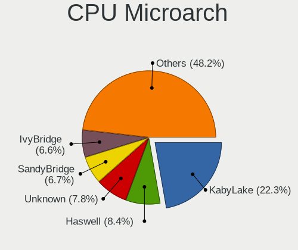
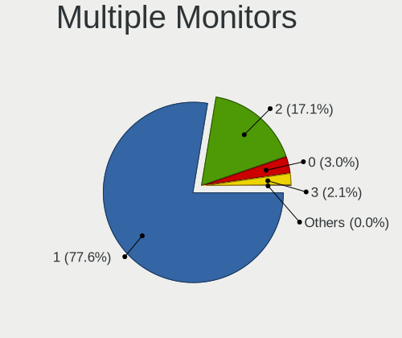
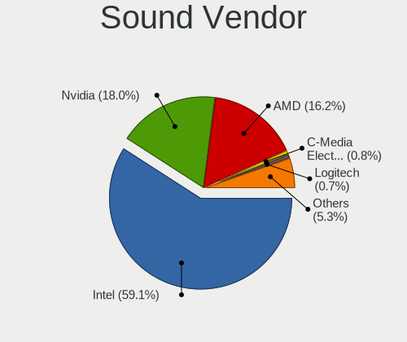
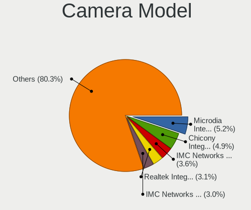
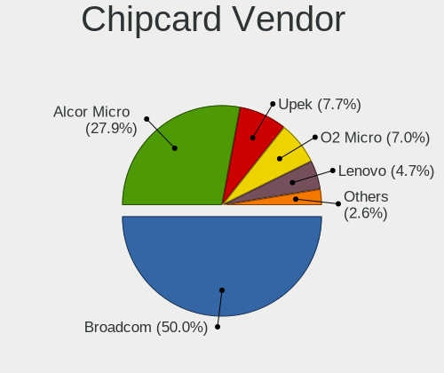

Pop!_OS - Tested Hardware & Statistics (Notebooks)
--------------------------------------------------

A project to collect tested hardware configurations for Pop!_OS.

Anyone can contribute to this report by the [hw-probe](https://github.com/linuxhw/hw-probe) tool:

    sudo -E hw-probe -all -upload

Please contribute! Especially if your hardware is rare.

Contents
--------

* [ Test Cases ](#test-cases)

* [ System ](#system)
  - [ OS                       ](#os)
  - [ OS Family                ](#os-family)
  - [ Kernel                   ](#kernel)
  - [ Kernel Family            ](#kernel-family)
  - [ Kernel Major Ver.        ](#kernel-major-ver)
  - [ Arch                     ](#arch)
  - [ DE                       ](#de)
  - [ Display Server           ](#display-server)
  - [ Display Manager          ](#display-manager)
  - [ OS Lang                  ](#os-lang)
  - [ Boot Mode                ](#boot-mode)
  - [ Filesystem               ](#filesystem)
  - [ Part. scheme             ](#part-scheme)
  - [ Dual Boot with Linux/BSD ](#dual-boot-with-linuxbsd)
  - [ Dual Boot (Win)          ](#dual-boot-win)

* [ Board ](#board)
  - [ Vendor                   ](#vendor)
  - [ Model                    ](#model)
  - [ Model Family             ](#model-family)
  - [ MFG Year                 ](#mfg-year)
  - [ Form Factor              ](#form-factor)
  - [ Secure Boot              ](#secure-boot)
  - [ Coreboot                 ](#coreboot)
  - [ RAM Size                 ](#ram-size)
  - [ RAM Used                 ](#ram-used)
  - [ Total Drives             ](#total-drives)
  - [ Has CD-ROM               ](#has-cd-rom)
  - [ Has Ethernet             ](#has-ethernet)
  - [ Has WiFi                 ](#has-wifi)
  - [ Has Bluetooth            ](#has-bluetooth)

* [ Location ](#location)
  - [ Country                  ](#country)
  - [ City                     ](#city)

* [ Drives ](#drives)
  - [ Drive Vendor             ](#drive-vendor)
  - [ Drive Model              ](#drive-model)
  - [ HDD Vendor               ](#hdd-vendor)
  - [ SSD Vendor               ](#ssd-vendor)
  - [ Drive Kind               ](#drive-kind)
  - [ Drive Connector          ](#drive-connector)
  - [ Drive Size               ](#drive-size)
  - [ Space Total              ](#space-total)
  - [ Space Used               ](#space-used)
  - [ Malfunc. Drives          ](#malfunc-drives)
  - [ Malfunc. Drive Vendor    ](#malfunc-drive-vendor)
  - [ Malfunc. HDD Vendor      ](#malfunc-hdd-vendor)
  - [ Malfunc. Drive Kind      ](#malfunc-drive-kind)
  - [ Failed Drives            ](#failed-drives)
  - [ Failed Drive Vendor      ](#failed-drive-vendor)
  - [ Drive Status             ](#drive-status)

* [ Storage controller ](#storage-controller)
  - [ Storage Vendor           ](#storage-vendor)
  - [ Storage Model            ](#storage-model)
  - [ Storage Kind             ](#storage-kind)

* [ Processor ](#processor)
  - [ CPU Vendor               ](#cpu-vendor)
  - [ CPU Model                ](#cpu-model)
  - [ CPU Model Family         ](#cpu-model-family)
  - [ CPU Cores                ](#cpu-cores)
  - [ CPU Sockets              ](#cpu-sockets)
  - [ CPU Threads              ](#cpu-threads)
  - [ CPU Op-Modes             ](#cpu-op-modes)
  - [ CPU Microcode            ](#cpu-microcode)
  - [ CPU Microarch            ](#cpu-microarch)

* [ Graphics ](#graphics)
  - [ GPU Vendor               ](#gpu-vendor)
  - [ GPU Model                ](#gpu-model)
  - [ GPU Combo                ](#gpu-combo)
  - [ GPU Driver               ](#gpu-driver)
  - [ GPU Memory               ](#gpu-memory)

* [ Monitor ](#monitor)
  - [ Monitor Vendor           ](#monitor-vendor)
  - [ Monitor Model            ](#monitor-model)
  - [ Monitor Resolution       ](#monitor-resolution)
  - [ Monitor Diagonal         ](#monitor-diagonal)
  - [ Monitor Width            ](#monitor-width)
  - [ Aspect Ratio             ](#aspect-ratio)
  - [ Monitor Area             ](#monitor-area)
  - [ Pixel Density            ](#pixel-density)
  - [ Multiple Monitors        ](#multiple-monitors)

* [ Network ](#network)
  - [ Net Controller Vendor    ](#net-controller-vendor)
  - [ Net Controller Model     ](#net-controller-model)
  - [ Wireless Vendor          ](#wireless-vendor)
  - [ Wireless Model           ](#wireless-model)
  - [ Ethernet Vendor          ](#ethernet-vendor)
  - [ Ethernet Model           ](#ethernet-model)
  - [ Net Controller Kind      ](#net-controller-kind)
  - [ Used Controller          ](#used-controller)
  - [ NICs                     ](#nics)
  - [ IPv6                     ](#ipv6)

* [ Bluetooth ](#bluetooth)
  - [ Bluetooth Vendor         ](#bluetooth-vendor)
  - [ Bluetooth Model          ](#bluetooth-model)

* [ Sound ](#sound)
  - [ Sound Vendor             ](#sound-vendor)
  - [ Sound Model              ](#sound-model)

* [ Memory ](#memory)
  - [ Memory Vendor            ](#memory-vendor)
  - [ Memory Model             ](#memory-model)
  - [ Memory Kind              ](#memory-kind)
  - [ Memory Form Factor       ](#memory-form-factor)
  - [ Memory Size              ](#memory-size)
  - [ Memory Speed             ](#memory-speed)

* [ Printers & scanners ](#printers--scanners)
  - [ Printer Vendor           ](#printer-vendor)
  - [ Printer Model            ](#printer-model)
  - [ Scanner Vendor           ](#scanner-vendor)
  - [ Scanner Model            ](#scanner-model)

* [ Camera ](#camera)
  - [ Camera Vendor            ](#camera-vendor)
  - [ Camera Model             ](#camera-model)

* [ Security ](#security)
  - [ Fingerprint Vendor       ](#fingerprint-vendor)
  - [ Fingerprint Model        ](#fingerprint-model)
  - [ Chipcard Vendor          ](#chipcard-vendor)
  - [ Chipcard Model           ](#chipcard-model)

* [ Unsupported ](#unsupported)
  - [ Unsupported Devices      ](#unsupported-devices)
  - [ Unsupported Device Types ](#unsupported-device-types)

Test Cases
----------

Total: 6030

| Vendor        | Model                       | Probe                                                      | Date         |
|---------------|-----------------------------|------------------------------------------------------------|--------------|
| Lenovo        | ThinkPad Yoga 11e 20DAS0... | [d9de10d93e](https://linux-hardware.org/?probe=d9de10d93e) | Nov 02, 2022 |
| Acer          | Aspire A114-32              | [036ff9e51f](https://linux-hardware.org/?probe=036ff9e51f) | Nov 02, 2022 |
| Acer          | Aspire A114-32              | [d5d1583252](https://linux-hardware.org/?probe=d5d1583252) | Nov 02, 2022 |
| Apple         | MacBookPro9,2               | [0f40b36846](https://linux-hardware.org/?probe=0f40b36846) | Nov 02, 2022 |
| PC Special... | Elimina Iv 15               | [f462ba9c43](https://linux-hardware.org/?probe=f462ba9c43) | Nov 02, 2022 |
| Fujitsu       | LIFEBOOK A532               | [d4af3b0745](https://linux-hardware.org/?probe=d4af3b0745) | Nov 01, 2022 |
| Intel Clie... | CMCN1CC                     | [719731b244](https://linux-hardware.org/?probe=719731b244) | Nov 01, 2022 |
| Dell          | Latitude E7240              | [effafc033d](https://linux-hardware.org/?probe=effafc033d) | Nov 01, 2022 |
| Apple         | MacBookPro12,1              | [e08326bc94](https://linux-hardware.org/?probe=e08326bc94) | Nov 01, 2022 |
| Dell          | G5 5587                     | [a4e32e9eb8](https://linux-hardware.org/?probe=a4e32e9eb8) | Nov 01, 2022 |
| Lenovo        | IdeaPad 330S-14IKB 81JM     | [da8fec7ac4](https://linux-hardware.org/?probe=da8fec7ac4) | Nov 01, 2022 |
| Lenovo        | IdeaPad 3 15ADA05 81W1      | [6db184e152](https://linux-hardware.org/?probe=6db184e152) | Nov 01, 2022 |
| Lenovo        | IdeaPad 3 15ADA05 81W1      | [60cfb7dcc6](https://linux-hardware.org/?probe=60cfb7dcc6) | Nov 01, 2022 |
| Dell          | Latitude E7240              | [d8ae1a7195](https://linux-hardware.org/?probe=d8ae1a7195) | Nov 01, 2022 |
| Dell          | XPS 13 9310                 | [d284b1709a](https://linux-hardware.org/?probe=d284b1709a) | Oct 31, 2022 |
| ASUSTek       | ASUS TUF Gaming F15 FX50... | [325516bbce](https://linux-hardware.org/?probe=325516bbce) | Oct 31, 2022 |
| ASUSTek       | ASUS TUF Gaming F15 FX50... | [740d19ba42](https://linux-hardware.org/?probe=740d19ba42) | Oct 31, 2022 |
| Lenovo        | ThinkPad T495 20NKS01Y00    | [c6a13e1ab3](https://linux-hardware.org/?probe=c6a13e1ab3) | Oct 31, 2022 |
| Lenovo        | IdeaPad 700-15ISK 80RU      | [b4fedd7c20](https://linux-hardware.org/?probe=b4fedd7c20) | Oct 31, 2022 |
| Dell          | Precision M6700             | [e5952f6f57](https://linux-hardware.org/?probe=e5952f6f57) | Oct 31, 2022 |
| HP            | ENVY NOTEBOOK PC            | [f2893aaedf](https://linux-hardware.org/?probe=f2893aaedf) | Oct 31, 2022 |
| Apple         | MacBookPro11,3              | [64d1c159aa](https://linux-hardware.org/?probe=64d1c159aa) | Oct 30, 2022 |
| Fujitsu       | LIFEBOOK T904               | [4591ea2ad6](https://linux-hardware.org/?probe=4591ea2ad6) | Oct 30, 2022 |
| Fujitsu       | LIFEBOOK T904               | [5dd8b365d6](https://linux-hardware.org/?probe=5dd8b365d6) | Oct 30, 2022 |
| ASUSTek       | ASUS TUF Gaming F15 FX50... | [424aaaf5bd](https://linux-hardware.org/?probe=424aaaf5bd) | Oct 30, 2022 |
| Toshiba       | Satellite C855-1T5          | [c07f6a167a](https://linux-hardware.org/?probe=c07f6a167a) | Oct 30, 2022 |
| GPU Compan... | GWTN141-10                  | [189fca8ab3](https://linux-hardware.org/?probe=189fca8ab3) | Oct 30, 2022 |
| Tactus        | GeoBook 140                 | [71f32a229a](https://linux-hardware.org/?probe=71f32a229a) | Oct 30, 2022 |
| HP            | Pavilion dv7                | [6ff9a469f7](https://linux-hardware.org/?probe=6ff9a469f7) | Oct 30, 2022 |
| Apple         | MacBookPro3,1               | [27a5553057](https://linux-hardware.org/?probe=27a5553057) | Oct 29, 2022 |
| MSI           | GF63 Thin 11UD              | [8f48ae7586](https://linux-hardware.org/?probe=8f48ae7586) | Oct 29, 2022 |
| MSI           | GE60 0NC\0ND                | [79bd38da8f](https://linux-hardware.org/?probe=79bd38da8f) | Oct 29, 2022 |
| Samsung       | 800G5M/800G5W               | [d688233d28](https://linux-hardware.org/?probe=d688233d28) | Oct 29, 2022 |
| MSI           | GF63 Thin 11UD              | [8f1f41f3b0](https://linux-hardware.org/?probe=8f1f41f3b0) | Oct 29, 2022 |
| Acer          | Aspire E5-571G              | [cc0f34a2fa](https://linux-hardware.org/?probe=cc0f34a2fa) | Oct 29, 2022 |
| MSI           | Prestige 15 A12UC           | [3d4c4364f1](https://linux-hardware.org/?probe=3d4c4364f1) | Oct 28, 2022 |
| Notebook      | NV4xPZ                      | [86e7370778](https://linux-hardware.org/?probe=86e7370778) | Oct 28, 2022 |
| HP            | Laptop 15s-eq2xxx           | [9dcb685f5e](https://linux-hardware.org/?probe=9dcb685f5e) | Oct 28, 2022 |
| Lenovo        | ThinkPad T14 Gen 2i 20W0... | [df9ef8c115](https://linux-hardware.org/?probe=df9ef8c115) | Oct 28, 2022 |
| Apple         | MacBookPro5,3               | [4fa08c7d6f](https://linux-hardware.org/?probe=4fa08c7d6f) | Oct 28, 2022 |
| HP            | Pavilion Gaming Laptop 1... | [3e6896ee0a](https://linux-hardware.org/?probe=3e6896ee0a) | Oct 28, 2022 |
| Samsung       | 950XDB/951XDB/950XDY        | [2fdc53f0f3](https://linux-hardware.org/?probe=2fdc53f0f3) | Oct 28, 2022 |
| Acer          | Aspire E5-575G              | [04d54cb9c8](https://linux-hardware.org/?probe=04d54cb9c8) | Oct 28, 2022 |
| Dell          | Precision 5530              | [bb4d35f452](https://linux-hardware.org/?probe=bb4d35f452) | Oct 28, 2022 |
| Dell          | XPS 15 9520                 | [d04e962e56](https://linux-hardware.org/?probe=d04e962e56) | Oct 28, 2022 |
| HP            | EliteBook 845 G7 Noteboo... | [0957761dea](https://linux-hardware.org/?probe=0957761dea) | Oct 28, 2022 |
| Lenovo        | Legion Y540-15IRH 81RJ      | [a90eba59e8](https://linux-hardware.org/?probe=a90eba59e8) | Oct 28, 2022 |
| HP            | Laptop 15-db0xxx            | [b82aebb005](https://linux-hardware.org/?probe=b82aebb005) | Oct 28, 2022 |
| Samsung       | 950XDB/951XDB/950XDY        | [f27c4e1041](https://linux-hardware.org/?probe=f27c4e1041) | Oct 27, 2022 |
| System76      | Oryx Pro                    | [ff42b6e74a](https://linux-hardware.org/?probe=ff42b6e74a) | Oct 27, 2022 |
| Novatech      | NLx0MU                      | [41c5d984a0](https://linux-hardware.org/?probe=41c5d984a0) | Oct 27, 2022 |
| HP            | ProBook 450 G8 Notebook ... | [e7db99be75](https://linux-hardware.org/?probe=e7db99be75) | Oct 27, 2022 |
| Apple         | MacBookAir6,2               | [cca0d420fe](https://linux-hardware.org/?probe=cca0d420fe) | Oct 27, 2022 |
| HP            | Laptop 15-dy2xxx            | [304a013939](https://linux-hardware.org/?probe=304a013939) | Oct 27, 2022 |
| MSI           | GF63 Thin 11UD              | [9f7121381b](https://linux-hardware.org/?probe=9f7121381b) | Oct 27, 2022 |
| ASUSTek       | ASUS TUF Gaming F17 FX70... | [ada4cec1b7](https://linux-hardware.org/?probe=ada4cec1b7) | Oct 27, 2022 |
| Lenovo        | IdeaPad 3 15IIL05 81WE      | [022cfe6707](https://linux-hardware.org/?probe=022cfe6707) | Oct 26, 2022 |
| Acer          | Aspire A515-52              | [81371581d1](https://linux-hardware.org/?probe=81371581d1) | Oct 26, 2022 |
| Gigabyte      | AERO 15 Classic-SA          | [7977a48aca](https://linux-hardware.org/?probe=7977a48aca) | Oct 26, 2022 |
| Dell          | XPS 15 9520                 | [1ede815931](https://linux-hardware.org/?probe=1ede815931) | Oct 26, 2022 |
| Acer          | Nitro AN515-58              | [9deeea3723](https://linux-hardware.org/?probe=9deeea3723) | Oct 26, 2022 |
| MSI           | GF63 Thin 11UD              | [2b6b8d3854](https://linux-hardware.org/?probe=2b6b8d3854) | Oct 26, 2022 |
| Apple         | MacBookAir7,2               | [892c5e2cda](https://linux-hardware.org/?probe=892c5e2cda) | Oct 26, 2022 |
| Lenovo        | IdeaPad Gaming 3 15IMH05... | [b98bd6b361](https://linux-hardware.org/?probe=b98bd6b361) | Oct 26, 2022 |
| Lenovo        | ThinkPad X260 20F600A4MD    | [50cce404c7](https://linux-hardware.org/?probe=50cce404c7) | Oct 25, 2022 |
| Avell High... | A62 LIV                     | [673f411692](https://linux-hardware.org/?probe=673f411692) | Oct 25, 2022 |
| Lenovo        | Yoga Slim 7 Pro 14ACH5 8... | [3375318388](https://linux-hardware.org/?probe=3375318388) | Oct 25, 2022 |
| Dell          | XPS 15 7590                 | [7f9028d036](https://linux-hardware.org/?probe=7f9028d036) | Oct 25, 2022 |
| Toshiba       | Satellite Pro S500          | [a26efdcfb5](https://linux-hardware.org/?probe=a26efdcfb5) | Oct 25, 2022 |
| HP            | ZBook 15                    | [b2d2352668](https://linux-hardware.org/?probe=b2d2352668) | Oct 25, 2022 |
| HP            | EliteBook 820 G2            | [b31fec75e1](https://linux-hardware.org/?probe=b31fec75e1) | Oct 25, 2022 |
| Dell          | G15 5511                    | [0f47c64bab](https://linux-hardware.org/?probe=0f47c64bab) | Oct 25, 2022 |
| Acer          | Nitro AN515-58              | [d03f6896eb](https://linux-hardware.org/?probe=d03f6896eb) | Oct 25, 2022 |
| Dell          | Latitude E7240              | [6966cfc71f](https://linux-hardware.org/?probe=6966cfc71f) | Oct 25, 2022 |
| MSI           | Prestige 14Evo A11M         | [7c4edd1a6d](https://linux-hardware.org/?probe=7c4edd1a6d) | Oct 24, 2022 |
| Dell          | XPS 15 9570                 | [d76c41ef1b](https://linux-hardware.org/?probe=d76c41ef1b) | Oct 24, 2022 |
| Dell          | Inspiron 16 7610            | [47a3e2b5f6](https://linux-hardware.org/?probe=47a3e2b5f6) | Oct 24, 2022 |
| HP            | Laptop 15s-fq0xxx           | [2510215a0b](https://linux-hardware.org/?probe=2510215a0b) | Oct 24, 2022 |
| Apple         | MacBookAir6,2               | [c271de3628](https://linux-hardware.org/?probe=c271de3628) | Oct 24, 2022 |
| System76      | Gazelle                     | [77686d0854](https://linux-hardware.org/?probe=77686d0854) | Oct 24, 2022 |
| HP            | Laptop 15s-gy0xxx           | [d1219c1387](https://linux-hardware.org/?probe=d1219c1387) | Oct 23, 2022 |
| Razer         | Blade 15 (2022) - RZ09-0... | [c70d6b90b6](https://linux-hardware.org/?probe=c70d6b90b6) | Oct 23, 2022 |
| ASUSTek       | ROG Zephyrus G14 GA402RK... | [bd25fa1073](https://linux-hardware.org/?probe=bd25fa1073) | Oct 23, 2022 |
| Apple         | MacBookAir6,2               | [edd13bcc76](https://linux-hardware.org/?probe=edd13bcc76) | Oct 23, 2022 |
| Apple         | MacBookPro10,1              | [9380dfc8b7](https://linux-hardware.org/?probe=9380dfc8b7) | Oct 23, 2022 |
| Lenovo        | IdeaPad 5 15ALC05 82LN      | [4884be1a24](https://linux-hardware.org/?probe=4884be1a24) | Oct 22, 2022 |
| Dell          | Inspiron 3576               | [426ddc8fdb](https://linux-hardware.org/?probe=426ddc8fdb) | Oct 22, 2022 |
| Lenovo        | G50-30 80G0                 | [32a9b1de4f](https://linux-hardware.org/?probe=32a9b1de4f) | Oct 22, 2022 |
| Lenovo        | IdeaPad 5 15ALC05 82LN      | [079a05485d](https://linux-hardware.org/?probe=079a05485d) | Oct 22, 2022 |
| System76      | Oryx Pro                    | [7de5d55c99](https://linux-hardware.org/?probe=7de5d55c99) | Oct 22, 2022 |
| Intel         | Montevina CRB               | [11cb344c52](https://linux-hardware.org/?probe=11cb344c52) | Oct 22, 2022 |
| Lenovo        | Legion Y530-15ICH 81FV      | [1227d6561e](https://linux-hardware.org/?probe=1227d6561e) | Oct 22, 2022 |
| Lenovo        | IdeaPad Gaming 3 15IMH05... | [ed692d6080](https://linux-hardware.org/?probe=ed692d6080) | Oct 21, 2022 |
| Razer x La... | TensorBook (late 2021)      | [27cae45787](https://linux-hardware.org/?probe=27cae45787) | Oct 20, 2022 |
| ASUSTek       | Zenbook Pro Duo UX582ZW_... | [504036a2f6](https://linux-hardware.org/?probe=504036a2f6) | Oct 20, 2022 |
| ASUSTek       | VivoBook_ASUSLaptop M350... | [ddee1b5408](https://linux-hardware.org/?probe=ddee1b5408) | Oct 20, 2022 |
| System76      | Lemur Pro                   | [df61411c9d](https://linux-hardware.org/?probe=df61411c9d) | Oct 20, 2022 |
| ASUSTek       | ASUS TUF Gaming A15 FA50... | [c14937070e](https://linux-hardware.org/?probe=c14937070e) | Oct 19, 2022 |
| Dell          | Inspiron 3583               | [a8170f7786](https://linux-hardware.org/?probe=a8170f7786) | Oct 19, 2022 |
| MSI           | GF63 Thin 11UD              | [ca39605260](https://linux-hardware.org/?probe=ca39605260) | Oct 18, 2022 |
| HP            | ProBook 450 G8 Notebook ... | [08327d561d](https://linux-hardware.org/?probe=08327d561d) | Oct 18, 2022 |
| Apple         | MacBookPro5,4               | [2a51555c53](https://linux-hardware.org/?probe=2a51555c53) | Oct 18, 2022 |
| ASUSTek       | ROG Zephyrus G14 GA401IH... | [ed64a103f1](https://linux-hardware.org/?probe=ed64a103f1) | Oct 18, 2022 |
| HP            | Laptop 15-dy0xxx            | [2d1482e433](https://linux-hardware.org/?probe=2d1482e433) | Oct 18, 2022 |
| System76      | Lemur Pro                   | [53226822f5](https://linux-hardware.org/?probe=53226822f5) | Oct 18, 2022 |
| MSI           | GF63 Thin 11UD              | [d522208941](https://linux-hardware.org/?probe=d522208941) | Oct 17, 2022 |
| ASUSTek       | ZenBook UX333FA_UX333FA     | [40771441a2](https://linux-hardware.org/?probe=40771441a2) | Oct 17, 2022 |
| Lenovo        | Legion Y740-17IRH 81UG      | [67aec6ad33](https://linux-hardware.org/?probe=67aec6ad33) | Oct 17, 2022 |
| MSI           | GP72VR 7RF                  | [86a4902866](https://linux-hardware.org/?probe=86a4902866) | Oct 17, 2022 |
| Dell          | Latitude E6430s             | [ca202dddd6](https://linux-hardware.org/?probe=ca202dddd6) | Oct 17, 2022 |
| Acer          | Aspire E5-553G              | [bab2e8dad2](https://linux-hardware.org/?probe=bab2e8dad2) | Oct 17, 2022 |
| HP            | G62                         | [839b09744e](https://linux-hardware.org/?probe=839b09744e) | Oct 17, 2022 |
| Dell          | Vostro 15-3568              | [b7ea5640c2](https://linux-hardware.org/?probe=b7ea5640c2) | Oct 17, 2022 |
| HP            | ENVY 17                     | [ab25d54223](https://linux-hardware.org/?probe=ab25d54223) | Oct 16, 2022 |
| Framework     | Laptop (12th Gen Intel C... | [502f19e8b3](https://linux-hardware.org/?probe=502f19e8b3) | Oct 16, 2022 |
| HP            | Pavilion g6                 | [2729d4b101](https://linux-hardware.org/?probe=2729d4b101) | Oct 14, 2022 |
| ASUSTek       | TUF Gaming FX505DY_FX505... | [2ba7e8c424](https://linux-hardware.org/?probe=2ba7e8c424) | Oct 14, 2022 |
| Lenovo        | ThinkPad E14 Gen 4 21EBC... | [128cccafa6](https://linux-hardware.org/?probe=128cccafa6) | Oct 14, 2022 |
| HP            | Pavilion g6                 | [4fbce46637](https://linux-hardware.org/?probe=4fbce46637) | Oct 14, 2022 |
| System76      | Galago Pro                  | [ec92c5a918](https://linux-hardware.org/?probe=ec92c5a918) | Oct 14, 2022 |
| KELYX ARGE... | KL9120                      | [a14b57c22c](https://linux-hardware.org/?probe=a14b57c22c) | Oct 14, 2022 |
| ASUSTek       | ROG Zephyrus G14 GA401IV... | [e2db064195](https://linux-hardware.org/?probe=e2db064195) | Oct 13, 2022 |
| Google        | Kefka                       | [4775b995dd](https://linux-hardware.org/?probe=4775b995dd) | Oct 13, 2022 |
| System76      | Lemur Pro                   | [ec569ddc8f](https://linux-hardware.org/?probe=ec569ddc8f) | Oct 13, 2022 |
| MSI           | Katana GF76 11UD            | [3c11d61a58](https://linux-hardware.org/?probe=3c11d61a58) | Oct 13, 2022 |
| MSI           | Katana GF76 11UD            | [236e24530f](https://linux-hardware.org/?probe=236e24530f) | Oct 12, 2022 |
| Dell          | Precision M6700             | [4c867e9075](https://linux-hardware.org/?probe=4c867e9075) | Oct 12, 2022 |
| Acer          | Aspire 5740                 | [273721cef2](https://linux-hardware.org/?probe=273721cef2) | Oct 12, 2022 |
| Razer         | Blade                       | [c7386df23f](https://linux-hardware.org/?probe=c7386df23f) | Oct 12, 2022 |
| Lenovo        | Legion 5 15IMH05H 81Y6      | [2d102e0f1e](https://linux-hardware.org/?probe=2d102e0f1e) | Oct 12, 2022 |
| HP            | Pavilion 15                 | [8b93ec27f4](https://linux-hardware.org/?probe=8b93ec27f4) | Oct 12, 2022 |
| GPU Compan... | GWTN141-10                  | [1feb5d7501](https://linux-hardware.org/?probe=1feb5d7501) | Oct 12, 2022 |
| Alienware     | 15 R3                       | [bfdbf12cbb](https://linux-hardware.org/?probe=bfdbf12cbb) | Oct 11, 2022 |
| Acer          | Aspire A715-75G             | [93ca81946a](https://linux-hardware.org/?probe=93ca81946a) | Oct 11, 2022 |
| Acer          | Aspire A715-75G             | [921c4a26d1](https://linux-hardware.org/?probe=921c4a26d1) | Oct 11, 2022 |
| KELYX ARGE... | KL9120                      | [477851891a](https://linux-hardware.org/?probe=477851891a) | Oct 11, 2022 |
| MSI           | MS-7A34                     | [9850074c97](https://linux-hardware.org/?probe=9850074c97) | Oct 10, 2022 |
| Dell          | Inspiron 15 7000 Gaming     | [f4a46537c2](https://linux-hardware.org/?probe=f4a46537c2) | Oct 10, 2022 |
| Acer          | Predator PH317-52           | [379aad9180](https://linux-hardware.org/?probe=379aad9180) | Oct 10, 2022 |
| Gigabyte      | P34V7                       | [c1423fce9e](https://linux-hardware.org/?probe=c1423fce9e) | Oct 10, 2022 |
| System76      | Galago Pro                  | [28e36afa26](https://linux-hardware.org/?probe=28e36afa26) | Oct 10, 2022 |
| Dell          | Latitude 5501               | [9051fd0e00](https://linux-hardware.org/?probe=9051fd0e00) | Oct 09, 2022 |
| Dell          | Latitude 5501               | [3396ccdbab](https://linux-hardware.org/?probe=3396ccdbab) | Oct 09, 2022 |
| HP            | Laptop 15-bw0xx             | [7231761ea1](https://linux-hardware.org/?probe=7231761ea1) | Oct 09, 2022 |
| MSI           | GV62 8RD                    | [8902a355f4](https://linux-hardware.org/?probe=8902a355f4) | Oct 09, 2022 |
| ASUSTek       | ZenBook UX482EA_UX482EA     | [1f013f181d](https://linux-hardware.org/?probe=1f013f181d) | Oct 09, 2022 |
| Sony          | VPCEB46FG                   | [71e2273974](https://linux-hardware.org/?probe=71e2273974) | Oct 08, 2022 |
| HP            | ProBook 640 G3              | [03112f2830](https://linux-hardware.org/?probe=03112f2830) | Oct 08, 2022 |
| Dell          | G7 7500                     | [e50429ccfa](https://linux-hardware.org/?probe=e50429ccfa) | Oct 08, 2022 |
| Dell          | Inspiron 5458               | [d6742b3ec0](https://linux-hardware.org/?probe=d6742b3ec0) | Oct 08, 2022 |
| ASUSTek       | G752VS                      | [df98c91ed6](https://linux-hardware.org/?probe=df98c91ed6) | Oct 08, 2022 |
| Lenovo        | V155-15API 81V5             | [c08e4bed15](https://linux-hardware.org/?probe=c08e4bed15) | Oct 07, 2022 |
| Lenovo        | ThinkPad X1 Carbon Gen 1... | [ff847da23a](https://linux-hardware.org/?probe=ff847da23a) | Oct 07, 2022 |
| Lenovo        | ThinkPad X1 Carbon Gen 1... | [fceffec337](https://linux-hardware.org/?probe=fceffec337) | Oct 07, 2022 |
| Sony          | VPCEH3LFX                   | [fbb59e09fc](https://linux-hardware.org/?probe=fbb59e09fc) | Oct 07, 2022 |
| Alienware     | 17 R4                       | [cac06d6050](https://linux-hardware.org/?probe=cac06d6050) | Oct 07, 2022 |
| Positivo      | Mobile                      | [f26e597436](https://linux-hardware.org/?probe=f26e597436) | Oct 06, 2022 |
| MSI           | GP66 Leopard 10UG           | [c2082a042d](https://linux-hardware.org/?probe=c2082a042d) | Oct 06, 2022 |
| Acer          | Aspire 5520                 | [05e6a5cb26](https://linux-hardware.org/?probe=05e6a5cb26) | Oct 06, 2022 |
| Lenovo        | IdeaPad Y560                | [15e2c8994f](https://linux-hardware.org/?probe=15e2c8994f) | Oct 06, 2022 |
| ASUSTek       | ZenBook UX434IQ_Q407IQ      | [fa7e7d106e](https://linux-hardware.org/?probe=fa7e7d106e) | Oct 06, 2022 |
| Dell          | Vostro 15-3568              | [ed969ece24](https://linux-hardware.org/?probe=ed969ece24) | Oct 05, 2022 |
| ASUSTek       | ROG Zephyrus G14 GA401QM... | [72163c289e](https://linux-hardware.org/?probe=72163c289e) | Oct 05, 2022 |
| Valve         | Jupiter                     | [2fda8270f0](https://linux-hardware.org/?probe=2fda8270f0) | Oct 05, 2022 |
| Acer          | Aspire A315-21              | [48901aff3f](https://linux-hardware.org/?probe=48901aff3f) | Oct 04, 2022 |
| Lenovo        | Z51-70 80K6                 | [736ded7422](https://linux-hardware.org/?probe=736ded7422) | Oct 04, 2022 |
| Dell          | Latitude E7240              | [0a41ea4b4c](https://linux-hardware.org/?probe=0a41ea4b4c) | Oct 04, 2022 |
| HP            | EliteBook 1040 G4           | [8a19b834c8](https://linux-hardware.org/?probe=8a19b834c8) | Oct 04, 2022 |
| MSI           | GF63 Thin 11UD              | [b8237b1bd7](https://linux-hardware.org/?probe=b8237b1bd7) | Oct 04, 2022 |
| Lenovo        | Yoga S740-15IRH 81NX        | [eb1ee8ad1f](https://linux-hardware.org/?probe=eb1ee8ad1f) | Oct 04, 2022 |
| System76      | Lemur Pro                   | [8842585a92](https://linux-hardware.org/?probe=8842585a92) | Oct 03, 2022 |
| Lenovo        | ThinkPad T470 20HES2SH2B    | [50d641ecf9](https://linux-hardware.org/?probe=50d641ecf9) | Oct 03, 2022 |
| Dell          | Latitude E6420              | [652b18aabe](https://linux-hardware.org/?probe=652b18aabe) | Oct 03, 2022 |
| ASUSTek       | ROG Strix G713QM_G713QM     | [1e0190a274](https://linux-hardware.org/?probe=1e0190a274) | Oct 03, 2022 |
| Google        | Banon                       | [269a819905](https://linux-hardware.org/?probe=269a819905) | Oct 03, 2022 |
| Fujitsu       | LIFEBOOK T5010              | [2637a452d0](https://linux-hardware.org/?probe=2637a452d0) | Oct 03, 2022 |
| Samsung       | 550XDA                      | [418d32112e](https://linux-hardware.org/?probe=418d32112e) | Oct 03, 2022 |
| Lenovo        | Flex 2-14 20404             | [b3a9474c83](https://linux-hardware.org/?probe=b3a9474c83) | Oct 03, 2022 |
| HP            | Pavilion Gaming Laptop 1... | [0382d1ec36](https://linux-hardware.org/?probe=0382d1ec36) | Oct 02, 2022 |
| Lenovo        | ThinkPad T470 20HES2SH2B    | [8d405f5135](https://linux-hardware.org/?probe=8d405f5135) | Oct 02, 2022 |
| Dell          | XPS L421X                   | [aedcc42b0a](https://linux-hardware.org/?probe=aedcc42b0a) | Oct 02, 2022 |
| Apple         | MacBookPro5,2               | [b0a6dc4162](https://linux-hardware.org/?probe=b0a6dc4162) | Oct 02, 2022 |
| Acer          | Aspire ES1-522              | [b5c516677a](https://linux-hardware.org/?probe=b5c516677a) | Oct 02, 2022 |
| Acer          | Aspire ES1-522              | [86e57e249a](https://linux-hardware.org/?probe=86e57e249a) | Oct 02, 2022 |
| Alienware     | 15 R3                       | [28e4e84fb1](https://linux-hardware.org/?probe=28e4e84fb1) | Oct 02, 2022 |
| Lenovo        | Yoga 510-14ISK 80S7         | [8731307ce6](https://linux-hardware.org/?probe=8731307ce6) | Oct 02, 2022 |
| ASUSTek       | GL502VM                     | [1d1616405d](https://linux-hardware.org/?probe=1d1616405d) | Oct 02, 2022 |
| ASUSTek       | ASUS TUF Gaming F15 FX50... | [32dba0444e](https://linux-hardware.org/?probe=32dba0444e) | Oct 02, 2022 |
| Apple         | MacBook7,1                  | [49595ef8f4](https://linux-hardware.org/?probe=49595ef8f4) | Oct 02, 2022 |
| ASUSTek       | ASUS TUF Gaming F15 FX50... | [46d6046fce](https://linux-hardware.org/?probe=46d6046fce) | Oct 02, 2022 |
| Micro Elec... | Element                     | [9cee0f76c1](https://linux-hardware.org/?probe=9cee0f76c1) | Oct 02, 2022 |
| Apple         | MacBookPro5,5               | [42113dd7e3](https://linux-hardware.org/?probe=42113dd7e3) | Oct 01, 2022 |
| HUAWEI        | HN-WX9X                     | [4168f641b5](https://linux-hardware.org/?probe=4168f641b5) | Oct 01, 2022 |
| HP            | Laptop 15s-eq1xxx           | [a4252ba03a](https://linux-hardware.org/?probe=a4252ba03a) | Oct 01, 2022 |
| Dell          | Latitude E5530 non-vPro     | [b2d146f923](https://linux-hardware.org/?probe=b2d146f923) | Oct 01, 2022 |
| HP            | Pavilion                    | [124e8b760a](https://linux-hardware.org/?probe=124e8b760a) | Oct 01, 2022 |
| HP            | Pavilion Gaming Laptop 1... | [3595e90895](https://linux-hardware.org/?probe=3595e90895) | Oct 01, 2022 |
| System76      | Darter Pro                  | [2829e72506](https://linux-hardware.org/?probe=2829e72506) | Oct 01, 2022 |
| System76      | Darter Pro                  | [c142cf370a](https://linux-hardware.org/?probe=c142cf370a) | Oct 01, 2022 |
| HP            | Pavilion Gaming Laptop 1... | [29648b493a](https://linux-hardware.org/?probe=29648b493a) | Oct 01, 2022 |
| Lenovo        | ThinkPad P1 Gen 5 21DCCT... | [bde2b36c88](https://linux-hardware.org/?probe=bde2b36c88) | Oct 01, 2022 |
| Lenovo        | ThinkPad T480 20L5001FUS    | [a7e0da7aa4](https://linux-hardware.org/?probe=a7e0da7aa4) | Sep 30, 2022 |
| Dell          | Latitude 5400               | [66a5bc26f0](https://linux-hardware.org/?probe=66a5bc26f0) | Sep 30, 2022 |
| Apple         | MacBookPro14,3              | [3ccd7ea5d6](https://linux-hardware.org/?probe=3ccd7ea5d6) | Sep 30, 2022 |
| Fujitsu       | LIFEBOOK A6210              | [81653ba834](https://linux-hardware.org/?probe=81653ba834) | Sep 30, 2022 |
| HUAWEI        | VLT-WX0                     | [1669dae0a6](https://linux-hardware.org/?probe=1669dae0a6) | Sep 30, 2022 |
| Fujitsu       | LIFEBOOK A6210              | [d31b97630d](https://linux-hardware.org/?probe=d31b97630d) | Sep 29, 2022 |
| Dell          | Latitude 5400               | [4536a4b473](https://linux-hardware.org/?probe=4536a4b473) | Sep 29, 2022 |
| Dell          | Latitude 5400               | [972e4ab3fa](https://linux-hardware.org/?probe=972e4ab3fa) | Sep 29, 2022 |
| Dell          | Precision M4800             | [d4142adadc](https://linux-hardware.org/?probe=d4142adadc) | Sep 29, 2022 |
| Lenovo        | ThinkPad X230 Tablet 343... | [d06b40ddf1](https://linux-hardware.org/?probe=d06b40ddf1) | Sep 29, 2022 |
| ASUSTek       | TUF Gaming FX505DT_TUF50... | [f758c22d98](https://linux-hardware.org/?probe=f758c22d98) | Sep 28, 2022 |
| Lenovo        | ThinkPad X220 4286PJ2       | [2d0c850c3a](https://linux-hardware.org/?probe=2d0c850c3a) | Sep 28, 2022 |
| ASUSTek       | TUF Gaming FX505DT_TUF50... | [b08fc47990](https://linux-hardware.org/?probe=b08fc47990) | Sep 28, 2022 |
| Lenovo        | G510 20238                  | [46cba6613f](https://linux-hardware.org/?probe=46cba6613f) | Sep 28, 2022 |
| Dell          | Latitude E7450              | [daeb4afb69](https://linux-hardware.org/?probe=daeb4afb69) | Sep 28, 2022 |
| Apple         | MacBookPro9,2               | [5ce350f38b](https://linux-hardware.org/?probe=5ce350f38b) | Sep 28, 2022 |
| Lenovo        | Legion 7 16ITHg6 82K6       | [a3c4032d28](https://linux-hardware.org/?probe=a3c4032d28) | Sep 27, 2022 |
| Gigabyte      | P34V7                       | [27b9651432](https://linux-hardware.org/?probe=27b9651432) | Sep 27, 2022 |
| Lenovo        | Legion 5 15ACH6 82JW        | [99b6a53bd2](https://linux-hardware.org/?probe=99b6a53bd2) | Sep 27, 2022 |
| ASUSTek       | GL702VSK                    | [3b69ddb263](https://linux-hardware.org/?probe=3b69ddb263) | Sep 27, 2022 |
| MSI           | GS73 Stealth 8RF            | [37d9172163](https://linux-hardware.org/?probe=37d9172163) | Sep 26, 2022 |
| Acer          | Nitro AN515-45              | [8579eba471](https://linux-hardware.org/?probe=8579eba471) | Sep 26, 2022 |
| ASUSTek       | GL702VSK                    | [e91056ceab](https://linux-hardware.org/?probe=e91056ceab) | Sep 26, 2022 |
| Dell          | Inspiron N5110              | [eff6424aa4](https://linux-hardware.org/?probe=eff6424aa4) | Sep 26, 2022 |
| System76      | Galago Pro                  | [6b2de473b7](https://linux-hardware.org/?probe=6b2de473b7) | Sep 26, 2022 |
| Razer         | Blade 15 Base Model (Ear... | [1b4db0c30c](https://linux-hardware.org/?probe=1b4db0c30c) | Sep 26, 2022 |
| ASUSTek       | K52N                        | [8d7b00011f](https://linux-hardware.org/?probe=8d7b00011f) | Sep 26, 2022 |
| ASUSTek       | VivoBook_ASUSLaptop X515... | [acbd9cc9af](https://linux-hardware.org/?probe=acbd9cc9af) | Sep 25, 2022 |
| Acer          | Aspire V5-573G              | [50792d0ac6](https://linux-hardware.org/?probe=50792d0ac6) | Sep 25, 2022 |
| HP            | Pavilion Gaming Laptop 1... | [27d8d35004](https://linux-hardware.org/?probe=27d8d35004) | Sep 25, 2022 |
| ASUSTek       | ROG Zephyrus G14 GA401IH... | [e9de38d8eb](https://linux-hardware.org/?probe=e9de38d8eb) | Sep 25, 2022 |
| System76      | Oryx Pro                    | [3cf39a6993](https://linux-hardware.org/?probe=3cf39a6993) | Sep 24, 2022 |
| Lenovo        | ThinkPad E480 20KQ000EBR    | [5c39bdf4ab](https://linux-hardware.org/?probe=5c39bdf4ab) | Sep 24, 2022 |
| Razer         | Blade 15 Base Model (Ear... | [029c059963](https://linux-hardware.org/?probe=029c059963) | Sep 24, 2022 |
| HP            | Laptop 15s-eq1xxx           | [2bc6e102ef](https://linux-hardware.org/?probe=2bc6e102ef) | Sep 24, 2022 |
| MSI           | GF63 Thin 11UD              | [fac56b0962](https://linux-hardware.org/?probe=fac56b0962) | Sep 24, 2022 |
| HP            | OMEN Laptop 15-en1xxx       | [214a55ad3e](https://linux-hardware.org/?probe=214a55ad3e) | Sep 24, 2022 |
| Apple         | MacBookPro9,2               | [86b6d46191](https://linux-hardware.org/?probe=86b6d46191) | Sep 24, 2022 |
| MSI           | Prestige 14Evo A11M         | [609225524a](https://linux-hardware.org/?probe=609225524a) | Sep 23, 2022 |
| System76      | Darter Pro                  | [012968a4a3](https://linux-hardware.org/?probe=012968a4a3) | Sep 22, 2022 |
| ASUSTek       | ROG Strix G513IC_G513IC     | [7910fab01e](https://linux-hardware.org/?probe=7910fab01e) | Sep 22, 2022 |
| System76      | Darter Pro                  | [8d3bdb7585](https://linux-hardware.org/?probe=8d3bdb7585) | Sep 22, 2022 |
| Dell          | Inspiron 5520               | [032bbec1e3](https://linux-hardware.org/?probe=032bbec1e3) | Sep 22, 2022 |
| Lenovo        | IdeaPad 3 15ALC6 82MF       | [3c93753c6c](https://linux-hardware.org/?probe=3c93753c6c) | Sep 22, 2022 |
| Dell          | Latitude 3490               | [de749eeeb8](https://linux-hardware.org/?probe=de749eeeb8) | Sep 21, 2022 |
| Dell          | Precision 3561              | [b924a86b79](https://linux-hardware.org/?probe=b924a86b79) | Sep 21, 2022 |
| Acer          | Nitro AN715-51              | [36fb85e6cb](https://linux-hardware.org/?probe=36fb85e6cb) | Sep 21, 2022 |
| Dell          | Latitude 7490               | [b8c3a5519a](https://linux-hardware.org/?probe=b8c3a5519a) | Sep 21, 2022 |
| Dell          | XPS 13 9370                 | [facc4c1755](https://linux-hardware.org/?probe=facc4c1755) | Sep 21, 2022 |
| Acer          | Aspire A515-54              | [8116705a81](https://linux-hardware.org/?probe=8116705a81) | Sep 21, 2022 |
| Dell          | Vostro 3500                 | [7fa417e9a6](https://linux-hardware.org/?probe=7fa417e9a6) | Sep 21, 2022 |
| Apple         | MacBookAir6,2               | [7fc6799a48](https://linux-hardware.org/?probe=7fc6799a48) | Sep 21, 2022 |
| Dell          | Inspiron 5577               | [c6f4124e49](https://linux-hardware.org/?probe=c6f4124e49) | Sep 21, 2022 |
| Lenovo        | ThinkPad E490 20N8005JMH    | [8e78f3c776](https://linux-hardware.org/?probe=8e78f3c776) | Sep 20, 2022 |
| ASUSTek       | ROG Strix G712LV_G712LV     | [1e7ca74f13](https://linux-hardware.org/?probe=1e7ca74f13) | Sep 20, 2022 |
| HP            | ProBook 455 G8 Notebook ... | [b1df3aa03f](https://linux-hardware.org/?probe=b1df3aa03f) | Sep 20, 2022 |
| Itronix       | GD8200                      | [d9f515b935](https://linux-hardware.org/?probe=d9f515b935) | Sep 20, 2022 |
| Lenovo        | Legion 5-15ACH6H 82JU       | [1f48647e32](https://linux-hardware.org/?probe=1f48647e32) | Sep 20, 2022 |
| GPU Compan... | GWTN141-10                  | [6d43012457](https://linux-hardware.org/?probe=6d43012457) | Sep 20, 2022 |
| HONOR         | NMH-WCX9                    | [dd2687098a](https://linux-hardware.org/?probe=dd2687098a) | Sep 19, 2022 |
| ASUSTek       | GL502VSK                    | [a6dc9b627f](https://linux-hardware.org/?probe=a6dc9b627f) | Sep 19, 2022 |
| HONOR         | NMH-WCX9                    | [060f3bd895](https://linux-hardware.org/?probe=060f3bd895) | Sep 19, 2022 |
| Apple         | MacBookPro10,2              | [ecc3b7e71d](https://linux-hardware.org/?probe=ecc3b7e71d) | Sep 19, 2022 |
| Lenovo        | ThinkBook 16p Gen 2 20YM    | [4fcfd69ec1](https://linux-hardware.org/?probe=4fcfd69ec1) | Sep 19, 2022 |
| HP            | OMEN by Laptop 15z-en100    | [47b0aed151](https://linux-hardware.org/?probe=47b0aed151) | Sep 19, 2022 |
| Framework     | Laptop                      | [8dbbe54af9](https://linux-hardware.org/?probe=8dbbe54af9) | Sep 18, 2022 |
| HUAWEI        | KLVL-WXXW                   | [37b4da9922](https://linux-hardware.org/?probe=37b4da9922) | Sep 18, 2022 |
| Gateway       | NV55C                       | [e00587af22](https://linux-hardware.org/?probe=e00587af22) | Sep 18, 2022 |
| Dell          | Latitude E7470              | [ceed7544ab](https://linux-hardware.org/?probe=ceed7544ab) | Sep 18, 2022 |
| Lenovo        | ThinkBook 14 G2 ITL 20VD    | [f40cc0db8a](https://linux-hardware.org/?probe=f40cc0db8a) | Sep 18, 2022 |
| HP            | Pavilion Gaming Laptop 1... | [1ad10d3c4b](https://linux-hardware.org/?probe=1ad10d3c4b) | Sep 18, 2022 |
| Dell          | Precision 5530              | [8fc00af945](https://linux-hardware.org/?probe=8fc00af945) | Sep 18, 2022 |
| HP            | Pavilion Gaming Laptop 1... | [50da0a8acf](https://linux-hardware.org/?probe=50da0a8acf) | Sep 18, 2022 |
| MSI           | Sword 15 A11UD              | [e749154c3d](https://linux-hardware.org/?probe=e749154c3d) | Sep 18, 2022 |
| Dell          | Latitude E6330              | [5a1085f939](https://linux-hardware.org/?probe=5a1085f939) | Sep 18, 2022 |
| ASUSTek       | S550CA                      | [a403b2a79d](https://linux-hardware.org/?probe=a403b2a79d) | Sep 17, 2022 |
| MSI           | Prestige 15 A12UC           | [48437ccf94](https://linux-hardware.org/?probe=48437ccf94) | Sep 17, 2022 |
| OriginPC      | NT17-PRO                    | [962138caa9](https://linux-hardware.org/?probe=962138caa9) | Sep 17, 2022 |
| System76      | Darter Pro                  | [5d1e0ddc1a](https://linux-hardware.org/?probe=5d1e0ddc1a) | Sep 16, 2022 |
| ASUSTek       | ASUS TUF Gaming A17 FA70... | [7099830d0a](https://linux-hardware.org/?probe=7099830d0a) | Sep 16, 2022 |
| Dell          | Inspiron 5547               | [d66cbae64b](https://linux-hardware.org/?probe=d66cbae64b) | Sep 16, 2022 |
| ASUSTek       | E402NA                      | [9d97fe89bb](https://linux-hardware.org/?probe=9d97fe89bb) | Sep 16, 2022 |
| Lenovo        | Yoga Slim 7 Pro 14IAH7 8... | [4dd83a1b80](https://linux-hardware.org/?probe=4dd83a1b80) | Sep 16, 2022 |
| Lenovo        | ThinkPad T15 Gen 2i 20W4... | [b0e6601fbf](https://linux-hardware.org/?probe=b0e6601fbf) | Sep 16, 2022 |
| ASUSTek       | N550LF                      | [73f2edfe65](https://linux-hardware.org/?probe=73f2edfe65) | Sep 16, 2022 |
| Apple         | MacBookPro5,4               | [9cc24963d4](https://linux-hardware.org/?probe=9cc24963d4) | Sep 16, 2022 |
| Apple         | MacBookPro5,4               | [6d28bb81ce](https://linux-hardware.org/?probe=6d28bb81ce) | Sep 16, 2022 |
| Toshiba       | Satellite C55t-C            | [9c45d5a042](https://linux-hardware.org/?probe=9c45d5a042) | Sep 16, 2022 |
| Dell          | XPS 13 9380                 | [6d94f648e4](https://linux-hardware.org/?probe=6d94f648e4) | Sep 16, 2022 |
| GPD           | MicroPC                     | [dadac68a23](https://linux-hardware.org/?probe=dadac68a23) | Sep 15, 2022 |
| HP            | Laptop 15s-fq1xxx           | [dc870b4e8a](https://linux-hardware.org/?probe=dc870b4e8a) | Sep 15, 2022 |
| ASUSTek       | TUF Gaming FX505DT_FX505... | [3196144640](https://linux-hardware.org/?probe=3196144640) | Sep 15, 2022 |
| Lenovo        | ThinkPad P53 MFG_IN_GO     | [d39fd89ab8](https://linux-hardware.org/?probe=d39fd89ab8) | Sep 15, 2022 |
| Dell          | Precision 3561              | [b61765a085](https://linux-hardware.org/?probe=b61765a085) | Sep 15, 2022 |
| Fujitsu       | LIFEBOOK A512               | [2d33f80fbd](https://linux-hardware.org/?probe=2d33f80fbd) | Sep 15, 2022 |
| Dell          | Latitude 3420               | [5c00a1875c](https://linux-hardware.org/?probe=5c00a1875c) | Sep 14, 2022 |
| ASUSTek       | ASUS TUF Gaming F15 FX50... | [ed284e43fb](https://linux-hardware.org/?probe=ed284e43fb) | Sep 14, 2022 |
| Dell          | XPS 13 9360                 | [750bf03293](https://linux-hardware.org/?probe=750bf03293) | Sep 14, 2022 |
| MSI           | Katana GF66 12UE            | [955b9787eb](https://linux-hardware.org/?probe=955b9787eb) | Sep 14, 2022 |
| ASUSTek       | X555LN                      | [64b85307ec](https://linux-hardware.org/?probe=64b85307ec) | Sep 14, 2022 |
| ASUSTek       | X405UA                      | [3b098addea](https://linux-hardware.org/?probe=3b098addea) | Sep 14, 2022 |
| Lenovo        | ThinkPad P53 MFG_IN_GO     | [aa0553a310](https://linux-hardware.org/?probe=aa0553a310) | Sep 13, 2022 |
| Lenovo        | ThinkBook 13x ITG 20WJ      | [2e6e759434](https://linux-hardware.org/?probe=2e6e759434) | Sep 13, 2022 |
| Lenovo        | Flex 2-14 20404             | [a27c60fbde](https://linux-hardware.org/?probe=a27c60fbde) | Sep 13, 2022 |
| ASUSTek       | ROG Zephyrus G15 GA503RS... | [81b9b18da4](https://linux-hardware.org/?probe=81b9b18da4) | Sep 13, 2022 |
| ASUSTek       | VivoBook_ASUSLaptop X513... | [b502b7938d](https://linux-hardware.org/?probe=b502b7938d) | Sep 13, 2022 |
| Dell          | Studio 1555                 | [0d0f3de3b4](https://linux-hardware.org/?probe=0d0f3de3b4) | Sep 12, 2022 |
| Apple         | MacBook5,1                  | [8bdaf4361b](https://linux-hardware.org/?probe=8bdaf4361b) | Sep 12, 2022 |
| Lenovo        | ThinkPad P53 MFG_IN_GO     | [0c3d0800eb](https://linux-hardware.org/?probe=0c3d0800eb) | Sep 12, 2022 |
| Lenovo        | IdeaPad 5 15ARE05 81YQ      | [e1d128b56a](https://linux-hardware.org/?probe=e1d128b56a) | Sep 12, 2022 |
| ASUSTek       | ROG STRIX Z590-E GAMING ... | [1889334e1f](https://linux-hardware.org/?probe=1889334e1f) | Sep 12, 2022 |
| ASUSTek       | ROG Zephyrus G15 GA503RS... | [f9add8f93d](https://linux-hardware.org/?probe=f9add8f93d) | Sep 11, 2022 |
| MSI           | Modern 15 A11M              | [931f4d2ca7](https://linux-hardware.org/?probe=931f4d2ca7) | Sep 11, 2022 |
| Acer          | Aspire A315-42G             | [34964d8e2d](https://linux-hardware.org/?probe=34964d8e2d) | Sep 11, 2022 |
| Lenovo        | ThinkPad T430 2350A26       | [7374ee44fa](https://linux-hardware.org/?probe=7374ee44fa) | Sep 10, 2022 |
| MSI           | Modern 15 A11M              | [4f1849370d](https://linux-hardware.org/?probe=4f1849370d) | Sep 10, 2022 |
| Lenovo        | ThinkPad X1 Carbon 2nd 2... | [f19e04efc1](https://linux-hardware.org/?probe=f19e04efc1) | Sep 10, 2022 |
| System76      | Oryx Pro                    | [d84de42ab6](https://linux-hardware.org/?probe=d84de42ab6) | Sep 10, 2022 |
| HP            | Laptop 15s-eq2xxx           | [c0adc468b3](https://linux-hardware.org/?probe=c0adc468b3) | Sep 10, 2022 |
| Dell          | Inspiron 16 5625            | [5ae1f0d923](https://linux-hardware.org/?probe=5ae1f0d923) | Sep 10, 2022 |
| Lenovo        | IdeaPad S340-14IIL 81VV     | [6c1c4c8712](https://linux-hardware.org/?probe=6c1c4c8712) | Sep 10, 2022 |
| HP            | Dev One Notebook PC         | [bb72f0c2f4](https://linux-hardware.org/?probe=bb72f0c2f4) | Sep 10, 2022 |
| Dell          | Vostro 3550                 | [2e9e331465](https://linux-hardware.org/?probe=2e9e331465) | Sep 10, 2022 |
| Lenovo        | Legion 5 15ACH6H 82JU       | [5811e17863](https://linux-hardware.org/?probe=5811e17863) | Sep 09, 2022 |
| ASUSTek       | ASUS TUF Gaming A15 FA50... | [4d3543d03f](https://linux-hardware.org/?probe=4d3543d03f) | Sep 09, 2022 |
| Dell          | Precision 3551              | [78f7c77b35](https://linux-hardware.org/?probe=78f7c77b35) | Sep 09, 2022 |
| System76      | Galago Pro                  | [8d52d900f2](https://linux-hardware.org/?probe=8d52d900f2) | Sep 09, 2022 |
| Dell          | Inspiron 5457               | [e44e9d3a85](https://linux-hardware.org/?probe=e44e9d3a85) | Sep 08, 2022 |
| AZW           | SEi                         | [d3531738fa](https://linux-hardware.org/?probe=d3531738fa) | Sep 08, 2022 |
| Lenovo        | ThinkPad T460 20FN003LGE    | [6108c677a2](https://linux-hardware.org/?probe=6108c677a2) | Sep 08, 2022 |
| Lenovo        | ThinkPad T460 20FN003LGE    | [0f8da1f0c8](https://linux-hardware.org/?probe=0f8da1f0c8) | Sep 08, 2022 |
| Dell          | Latitude 5420               | [511ef8a105](https://linux-hardware.org/?probe=511ef8a105) | Sep 08, 2022 |
| Dell          | Latitude 5420               | [48db2c3954](https://linux-hardware.org/?probe=48db2c3954) | Sep 08, 2022 |
| Lenovo        | ThinkPad E480 20KQ000EBR    | [09e8283762](https://linux-hardware.org/?probe=09e8283762) | Sep 08, 2022 |
| HP            | 245 G6                      | [054d226709](https://linux-hardware.org/?probe=054d226709) | Sep 07, 2022 |
| Lenovo        | ThinkPad E480 20KQ000EBR    | [e73c83b5c7](https://linux-hardware.org/?probe=e73c83b5c7) | Sep 07, 2022 |
| HP            | EliteBook 840 G6            | [132a8e025a](https://linux-hardware.org/?probe=132a8e025a) | Sep 07, 2022 |
| HP            | Pavilion Gaming Laptop 1... | [af2641c077](https://linux-hardware.org/?probe=af2641c077) | Sep 07, 2022 |
| Acer          | Aspire S3                   | [cb62300974](https://linux-hardware.org/?probe=cb62300974) | Sep 07, 2022 |
| Lenovo        | ThinkPad T470s 20HGA039U... | [43c002ad40](https://linux-hardware.org/?probe=43c002ad40) | Sep 07, 2022 |
| ASUSTek       | ASUS TUF Gaming F15 FX50... | [11b9de78b5](https://linux-hardware.org/?probe=11b9de78b5) | Sep 06, 2022 |
| Lenovo        | ThinkPad T480s 20L8SC160... | [b860019cf4](https://linux-hardware.org/?probe=b860019cf4) | Sep 06, 2022 |
| HP            | ZBook Firefly 15.6 inch ... | [40d6a47565](https://linux-hardware.org/?probe=40d6a47565) | Sep 05, 2022 |
| Clevo         | P65_P67SE                   | [9a38027b73](https://linux-hardware.org/?probe=9a38027b73) | Sep 05, 2022 |
| Lenovo        | Legion 5 15ARH05 82B5       | [cb787086fa](https://linux-hardware.org/?probe=cb787086fa) | Sep 05, 2022 |
| Lenovo        | IdeaPad 330S-15IKB 81F5     | [61e1164988](https://linux-hardware.org/?probe=61e1164988) | Sep 04, 2022 |
| Dell          | XPS 15 9500                 | [ea5f9662d7](https://linux-hardware.org/?probe=ea5f9662d7) | Sep 04, 2022 |
| Dell          | Inspiron 3576               | [8f5998a9e4](https://linux-hardware.org/?probe=8f5998a9e4) | Sep 04, 2022 |
| Apple         | MacBookPro11,3              | [c40b757ca3](https://linux-hardware.org/?probe=c40b757ca3) | Sep 04, 2022 |
| MSI           | GP72 7RDX                   | [5d4efc6589](https://linux-hardware.org/?probe=5d4efc6589) | Sep 04, 2022 |
| Apple         | MacBookPro5,5               | [70de682c06](https://linux-hardware.org/?probe=70de682c06) | Sep 03, 2022 |
| Lenovo        | ThinkPad T460s 20FAS30D0... | [b75636bf8b](https://linux-hardware.org/?probe=b75636bf8b) | Sep 03, 2022 |
| Dell          | Inspiron 13-7378            | [0ab8b4e169](https://linux-hardware.org/?probe=0ab8b4e169) | Sep 03, 2022 |
| Dell          | XPS 15 9520                 | [39e1d43301](https://linux-hardware.org/?probe=39e1d43301) | Sep 03, 2022 |
| Lenovo        | IdeaPad S145-15API 81V7     | [db5a53a31c](https://linux-hardware.org/?probe=db5a53a31c) | Sep 03, 2022 |
| HUAWEI        | KPL-W0X                     | [cfb4e75518](https://linux-hardware.org/?probe=cfb4e75518) | Sep 03, 2022 |
| Lenovo        | IdeaPad 5 15ARE05 81YQ      | [5472c45d04](https://linux-hardware.org/?probe=5472c45d04) | Sep 03, 2022 |
| ASUSTek       | X550CL                      | [6e45ea1408](https://linux-hardware.org/?probe=6e45ea1408) | Sep 03, 2022 |
| Lenovo        | IdeaPad 5 Pro 16ARH7 82S... | [6d1fcccbb8](https://linux-hardware.org/?probe=6d1fcccbb8) | Sep 03, 2022 |
| Dell          | Latitude E5570              | [20350411cf](https://linux-hardware.org/?probe=20350411cf) | Sep 03, 2022 |
| HUAWEI        | KPL-W0X                     | [2e3f16bc80](https://linux-hardware.org/?probe=2e3f16bc80) | Sep 02, 2022 |
| Lenovo        | ThinkPad T480 20L6S80G00    | [bd599c876c](https://linux-hardware.org/?probe=bd599c876c) | Sep 02, 2022 |
| Lenovo        | Legion Y530-15ICH 81FV      | [d8505e212b](https://linux-hardware.org/?probe=d8505e212b) | Sep 02, 2022 |
| TUXEDO        | Pulse 15 Gen2               | [9b42566191](https://linux-hardware.org/?probe=9b42566191) | Sep 02, 2022 |
| Lenovo        | Legion Y530-15ICH 81FV      | [8e366d7e21](https://linux-hardware.org/?probe=8e366d7e21) | Sep 02, 2022 |
| Dell          | Precision 5530              | [0151d15e28](https://linux-hardware.org/?probe=0151d15e28) | Sep 02, 2022 |
| Lenovo        | IdeaPad 5 15ARE05 81YQ      | [b6e6d0a261](https://linux-hardware.org/?probe=b6e6d0a261) | Sep 02, 2022 |
| Samsung       | 270E5G/270E5U               | [7ef3570396](https://linux-hardware.org/?probe=7ef3570396) | Sep 02, 2022 |
| Dell          | XPS 13 9305                 | [1746053c5b](https://linux-hardware.org/?probe=1746053c5b) | Sep 01, 2022 |
| Lenovo        | IdeaPad 5 Pro 16ARH7 82S... | [46e67b2b16](https://linux-hardware.org/?probe=46e67b2b16) | Sep 01, 2022 |
| Dell          | G3 3590                     | [cbe6c26276](https://linux-hardware.org/?probe=cbe6c26276) | Sep 01, 2022 |
| ASUSTek       | N552VW                      | [99d4a9be86](https://linux-hardware.org/?probe=99d4a9be86) | Sep 01, 2022 |
| Lenovo        | ThinkPad T440p 20AWS1200... | [55073b08dc](https://linux-hardware.org/?probe=55073b08dc) | Sep 01, 2022 |
| Lenovo        | Z50-70 20354                | [8ac8531142](https://linux-hardware.org/?probe=8ac8531142) | Sep 01, 2022 |
| Toshiba       | Satellite C850              | [6cf6d8fca8](https://linux-hardware.org/?probe=6cf6d8fca8) | Sep 01, 2022 |
| Apple         | MacBookAir9,1               | [51c4002c97](https://linux-hardware.org/?probe=51c4002c97) | Sep 01, 2022 |
| Lenovo        | Legion S7 15ACH6 82K8       | [d96b24b7f3](https://linux-hardware.org/?probe=d96b24b7f3) | Sep 01, 2022 |
| Lenovo        | IdeaPad S145-15API 81V7     | [838e09c9cf](https://linux-hardware.org/?probe=838e09c9cf) | Sep 01, 2022 |
| Lenovo        | Z50-70 20354                | [6e245e4c63](https://linux-hardware.org/?probe=6e245e4c63) | Sep 01, 2022 |
| Lenovo        | ThinkPad T580 20L9CTO1WW    | [d6e9455a63](https://linux-hardware.org/?probe=d6e9455a63) | Aug 31, 2022 |
| Dell          | Inspiron 13-7378            | [42666a5460](https://linux-hardware.org/?probe=42666a5460) | Aug 31, 2022 |
| Samsung       | 305E4A/305E5A/305E7A        | [6eeadaf886](https://linux-hardware.org/?probe=6eeadaf886) | Aug 31, 2022 |
| Samsung       | 305E4A/305E5A/305E7A        | [56e8f54a3e](https://linux-hardware.org/?probe=56e8f54a3e) | Aug 31, 2022 |
| Acer          | Aspire E1-571               | [4db54180a8](https://linux-hardware.org/?probe=4db54180a8) | Aug 31, 2022 |
| Lenovo        | IdeaPad 5 15IIL05 81YK      | [6d04d534fa](https://linux-hardware.org/?probe=6d04d534fa) | Aug 31, 2022 |
| Lenovo        | IdeaPad S145-15API 81V7     | [988032b933](https://linux-hardware.org/?probe=988032b933) | Aug 31, 2022 |
| Toshiba       | Satellite C850              | [5d7cb36794](https://linux-hardware.org/?probe=5d7cb36794) | Aug 31, 2022 |
| Dell          | Inspiron 3493               | [dc23941a16](https://linux-hardware.org/?probe=dc23941a16) | Aug 31, 2022 |
| ASUSTek       | G75VX                       | [e249508d61](https://linux-hardware.org/?probe=e249508d61) | Aug 30, 2022 |
| Lenovo        | V330 81AX                   | [1457fc2903](https://linux-hardware.org/?probe=1457fc2903) | Aug 30, 2022 |
| Dell          | XPS 9320                    | [7fe70d3907](https://linux-hardware.org/?probe=7fe70d3907) | Aug 30, 2022 |
| Lenovo        | V330 81AX                   | [0699372547](https://linux-hardware.org/?probe=0699372547) | Aug 30, 2022 |
| Lenovo        | IdeaPad 330-15IKB 81DE      | [e5545fc36a](https://linux-hardware.org/?probe=e5545fc36a) | Aug 30, 2022 |
| Toshiba       | Satellite C845              | [58d3152512](https://linux-hardware.org/?probe=58d3152512) | Aug 29, 2022 |
| ASUSTek       | N550JV                      | [059ab7e21e](https://linux-hardware.org/?probe=059ab7e21e) | Aug 29, 2022 |
| HP            | EliteBook 8570w             | [907d5f36e6](https://linux-hardware.org/?probe=907d5f36e6) | Aug 29, 2022 |
| ASUSTek       | ROG Strix G513RW_G513RW     | [aa5f4a0207](https://linux-hardware.org/?probe=aa5f4a0207) | Aug 29, 2022 |
| Lenovo        | Legion 5 Pro 16ARH7H 82R... | [065da8ca1e](https://linux-hardware.org/?probe=065da8ca1e) | Aug 29, 2022 |
| Apple         | MacBook5,2                  | [780e5cbb44](https://linux-hardware.org/?probe=780e5cbb44) | Aug 28, 2022 |
| Dell          | XPS 13 9305                 | [d8bd3d6fc6](https://linux-hardware.org/?probe=d8bd3d6fc6) | Aug 28, 2022 |
| Lenovo        | ThinkPad W520 4270CTO       | [c4be3fe1b6](https://linux-hardware.org/?probe=c4be3fe1b6) | Aug 28, 2022 |
| Lenovo        | ThinkPad W520 4270CTO       | [568802fb43](https://linux-hardware.org/?probe=568802fb43) | Aug 28, 2022 |
| HP            | ENVY dv7                    | [cbd3824347](https://linux-hardware.org/?probe=cbd3824347) | Aug 28, 2022 |
| Lenovo        | IdeaPad 320-15ABR 80XS      | [2e085a419b](https://linux-hardware.org/?probe=2e085a419b) | Aug 27, 2022 |
| Lenovo        | IdeaPad 320-15ABR 80XS      | [c47cd7c7ed](https://linux-hardware.org/?probe=c47cd7c7ed) | Aug 27, 2022 |
| ASUSTek       | X556UQK                     | [262ff7d08a](https://linux-hardware.org/?probe=262ff7d08a) | Aug 27, 2022 |
| ASUSTek       | Zenbook UX5401ZAS_UX5401... | [e3c7cd81e8](https://linux-hardware.org/?probe=e3c7cd81e8) | Aug 27, 2022 |
| Lenovo        | ThinkPad X1 Extreme Gen ... | [1746f3874c](https://linux-hardware.org/?probe=1746f3874c) | Aug 27, 2022 |
| HP            | Pavilion Gaming Laptop 1... | [1c75cbf917](https://linux-hardware.org/?probe=1c75cbf917) | Aug 27, 2022 |
| Lenovo        | ThinkPad T470p 20J7S0CF0... | [7f2e793766](https://linux-hardware.org/?probe=7f2e793766) | Aug 27, 2022 |
| Lenovo        | ThinkPad T470p 20J7S0CF0... | [8aeb1b057b](https://linux-hardware.org/?probe=8aeb1b057b) | Aug 27, 2022 |
| Dell          | XPS 9315                    | [6ab1d7417d](https://linux-hardware.org/?probe=6ab1d7417d) | Aug 27, 2022 |
| Apple         | MacBook4,1                  | [fdb7c715b3](https://linux-hardware.org/?probe=fdb7c715b3) | Aug 26, 2022 |
| Panasonic     | FZ55-1                      | [a45848f10f](https://linux-hardware.org/?probe=a45848f10f) | Aug 26, 2022 |
| Acer          | Aspire A515-45              | [88467a99ae](https://linux-hardware.org/?probe=88467a99ae) | Aug 26, 2022 |
| Dell          | Precision M4600             | [de9a03d9be](https://linux-hardware.org/?probe=de9a03d9be) | Aug 26, 2022 |
| HP            | Laptop 15-da1xxx            | [51e23209a4](https://linux-hardware.org/?probe=51e23209a4) | Aug 26, 2022 |
| Samsung       | 3570R/370R/470R/450R/510... | [8aa6fdef16](https://linux-hardware.org/?probe=8aa6fdef16) | Aug 26, 2022 |
| Panasonic     | FZ55-1                      | [0ec106ca31](https://linux-hardware.org/?probe=0ec106ca31) | Aug 26, 2022 |
| Dell          | Precision M4600             | [83c727c6db](https://linux-hardware.org/?probe=83c727c6db) | Aug 26, 2022 |
| Dell          | Latitude E6400              | [714643ef93](https://linux-hardware.org/?probe=714643ef93) | Aug 25, 2022 |
| ASUSTek       | X540LJ                      | [edac754e93](https://linux-hardware.org/?probe=edac754e93) | Aug 25, 2022 |
| Acer          | Swift SFX14-41G             | [8d1cad5e52](https://linux-hardware.org/?probe=8d1cad5e52) | Aug 25, 2022 |
| Lenovo        | IdeaPad 5 Pro 16ARH7 82S... | [945109f9f8](https://linux-hardware.org/?probe=945109f9f8) | Aug 25, 2022 |
| Lenovo        | IdeaPad 3 15ALC6 Ub 82KU    | [5237518074](https://linux-hardware.org/?probe=5237518074) | Aug 25, 2022 |
| HONOR         | NBR-WAX9                    | [7e2c842043](https://linux-hardware.org/?probe=7e2c842043) | Aug 25, 2022 |
| HUAWEI        | KPL-W0X                     | [b502ab922f](https://linux-hardware.org/?probe=b502ab922f) | Aug 25, 2022 |
| ASUSTek       | ROG Flow X13 GV301QE_GV3... | [b008775e13](https://linux-hardware.org/?probe=b008775e13) | Aug 24, 2022 |
| HP            | Dev One Notebook PC         | [4263165650](https://linux-hardware.org/?probe=4263165650) | Aug 24, 2022 |
| MSI           | Prestige 15 A10SC           | [35ffc8d54b](https://linux-hardware.org/?probe=35ffc8d54b) | Aug 23, 2022 |
| Lenovo        | ThinkPad E14 Gen 4 21ECS... | [6cb194ca87](https://linux-hardware.org/?probe=6cb194ca87) | Aug 23, 2022 |
| Acer          | Aspire V3-772G              | [92b070c9be](https://linux-hardware.org/?probe=92b070c9be) | Aug 23, 2022 |
| Positivo      | W942SV_SV1                  | [24ad2b387d](https://linux-hardware.org/?probe=24ad2b387d) | Aug 23, 2022 |
| ASUSTek       | X556UQK                     | [62dbb0625f](https://linux-hardware.org/?probe=62dbb0625f) | Aug 23, 2022 |
| ASUSTek       | X556UQK                     | [e5442dd2d4](https://linux-hardware.org/?probe=e5442dd2d4) | Aug 23, 2022 |
| MSI           | PS63 Modern 8RC             | [33a1092c01](https://linux-hardware.org/?probe=33a1092c01) | Aug 22, 2022 |
| Dell          | XPS 15 9520                 | [33ff4e4962](https://linux-hardware.org/?probe=33ff4e4962) | Aug 22, 2022 |
| Lenovo        | IdeaPad 3 14ITL6 82H7       | [b41e95cd1b](https://linux-hardware.org/?probe=b41e95cd1b) | Aug 22, 2022 |
| Acer          | Swift SFX14-41G             | [959dda5404](https://linux-hardware.org/?probe=959dda5404) | Aug 22, 2022 |
| Apple         | MacBookPro6,1               | [52a1f16ef3](https://linux-hardware.org/?probe=52a1f16ef3) | Aug 22, 2022 |
| Apple         | MacBookPro6,1               | [ae19610f33](https://linux-hardware.org/?probe=ae19610f33) | Aug 21, 2022 |
| Acer          | Swift SFX14-41G             | [3de1fd7f2c](https://linux-hardware.org/?probe=3de1fd7f2c) | Aug 21, 2022 |
| System76      | Oryx Pro                    | [7c763e43c6](https://linux-hardware.org/?probe=7c763e43c6) | Aug 21, 2022 |
| Dell          | Inspiron 5547               | [f67221bd42](https://linux-hardware.org/?probe=f67221bd42) | Aug 21, 2022 |
| Acer          | Aspire 5740                 | [19158f2e35](https://linux-hardware.org/?probe=19158f2e35) | Aug 21, 2022 |
| HP            | ENVY TS m6 Sleekbook        | [314250b1d7](https://linux-hardware.org/?probe=314250b1d7) | Aug 21, 2022 |
| MSI           | Katana GF76 11UD            | [256a057752](https://linux-hardware.org/?probe=256a057752) | Aug 21, 2022 |
| Lenovo        | ThinkBook 15p 20V3          | [9c31fff4b2](https://linux-hardware.org/?probe=9c31fff4b2) | Aug 20, 2022 |
| Dell          | Vostro 15 3515              | [3f12b83029](https://linux-hardware.org/?probe=3f12b83029) | Aug 20, 2022 |
| ASUSTek       | ROG Strix G513QM_G513QM     | [0cef35b44a](https://linux-hardware.org/?probe=0cef35b44a) | Aug 20, 2022 |
| MSI           | GF63 Thin 10UC              | [b04f79d93a](https://linux-hardware.org/?probe=b04f79d93a) | Aug 20, 2022 |
| ASUSTek       | GL703VD                     | [54f9d46a7d](https://linux-hardware.org/?probe=54f9d46a7d) | Aug 19, 2022 |
| Gateway       | NV55C                       | [377412b832](https://linux-hardware.org/?probe=377412b832) | Aug 18, 2022 |
| System76      | Oryx Pro                    | [1583fbab76](https://linux-hardware.org/?probe=1583fbab76) | Aug 18, 2022 |
| Lenovo        | ThinkPad P15 Gen 2i 20YQ... | [0887012e66](https://linux-hardware.org/?probe=0887012e66) | Aug 18, 2022 |
| Lenovo        | ThinkPad E15 Gen 2 20T80... | [5967f639c3](https://linux-hardware.org/?probe=5967f639c3) | Aug 16, 2022 |
| Acer          | Aspire A515-43              | [bec0e1fbd6](https://linux-hardware.org/?probe=bec0e1fbd6) | Aug 16, 2022 |
| Apple         | MacBookPro13,3              | [6cf76ee482](https://linux-hardware.org/?probe=6cf76ee482) | Aug 15, 2022 |
| Acer          | Aspire ES1-512              | [cb59c4a321](https://linux-hardware.org/?probe=cb59c4a321) | Aug 15, 2022 |
| Acer          | Aspire ES1-512              | [496f0834ae](https://linux-hardware.org/?probe=496f0834ae) | Aug 15, 2022 |
| ASUSTek       | UX310UQ                     | [f058aa0bf2](https://linux-hardware.org/?probe=f058aa0bf2) | Aug 15, 2022 |
| Lenovo        | IdeaPad 3 14ADA05 81W0      | [332459de48](https://linux-hardware.org/?probe=332459de48) | Aug 15, 2022 |
| System76      | Oryx Pro                    | [b2c1b403b8](https://linux-hardware.org/?probe=b2c1b403b8) | Aug 14, 2022 |
| Acer          | Aspire 4752                 | [9854c38629](https://linux-hardware.org/?probe=9854c38629) | Aug 14, 2022 |
| MSI           | GF63 Thin 11UD              | [82bfe63c71](https://linux-hardware.org/?probe=82bfe63c71) | Aug 14, 2022 |
| MSI           | Prestige 15 A10SC           | [58d3be66c0](https://linux-hardware.org/?probe=58d3be66c0) | Aug 14, 2022 |
| Dell          | Latitude E7470              | [1c49732e63](https://linux-hardware.org/?probe=1c49732e63) | Aug 14, 2022 |
| Apple         | MacBookAir3,2               | [0756ed833b](https://linux-hardware.org/?probe=0756ed833b) | Aug 14, 2022 |
| Apple         | MacBookAir6,2               | [2c210a5825](https://linux-hardware.org/?probe=2c210a5825) | Aug 14, 2022 |
| Dell          | Inspiron 3521               | [ebf974be3e](https://linux-hardware.org/?probe=ebf974be3e) | Aug 13, 2022 |
| ASUSTek       | G74Sx                       | [309312e25d](https://linux-hardware.org/?probe=309312e25d) | Aug 13, 2022 |
| Dell          | Inspiron 3521               | [6dd71dbcf3](https://linux-hardware.org/?probe=6dd71dbcf3) | Aug 12, 2022 |
| Lenovo        | IdeaPad 3 15ITL6 82H8       | [fa9cdcd977](https://linux-hardware.org/?probe=fa9cdcd977) | Aug 12, 2022 |
| Lenovo        | IdeaPad 3 14ADA05 81W0      | [da7cc3fcb6](https://linux-hardware.org/?probe=da7cc3fcb6) | Aug 12, 2022 |
| HP            | EliteBook 840 G3            | [d7735b3387](https://linux-hardware.org/?probe=d7735b3387) | Aug 12, 2022 |
| Dell          | Inspiron N5110              | [74624820da](https://linux-hardware.org/?probe=74624820da) | Aug 12, 2022 |
| Lenovo        | IdeaPad 330S-15IKB 81F5     | [5e0a6f08b1](https://linux-hardware.org/?probe=5e0a6f08b1) | Aug 12, 2022 |
| Dell          | Inspiron 13-7378            | [097cd944e0](https://linux-hardware.org/?probe=097cd944e0) | Aug 12, 2022 |
| HP            | Laptop 15-db1xxx            | [0644c9f46c](https://linux-hardware.org/?probe=0644c9f46c) | Aug 12, 2022 |
| ASUSTek       | ROG Zephyrus G15 GA502IU... | [688ae71abc](https://linux-hardware.org/?probe=688ae71abc) | Aug 12, 2022 |
| HP            | OMEN by Laptop 15-dc0xxx    | [31a967ba05](https://linux-hardware.org/?probe=31a967ba05) | Aug 12, 2022 |
| HP            | OMEN by Laptop 15-dc0xxx    | [ff6370169f](https://linux-hardware.org/?probe=ff6370169f) | Aug 11, 2022 |
| ASUSTek       | ROG Strix G512LV_G512LV     | [fe91d8cdd3](https://linux-hardware.org/?probe=fe91d8cdd3) | Aug 11, 2022 |
| Dell          | XPS 9320                    | [bdb29b0481](https://linux-hardware.org/?probe=bdb29b0481) | Aug 11, 2022 |
| ASUSTek       | X455LJ                      | [f90572b8e2](https://linux-hardware.org/?probe=f90572b8e2) | Aug 11, 2022 |
| Lenovo        | ThinkPad T450s 20BWS1RT0... | [b2f479d0b0](https://linux-hardware.org/?probe=b2f479d0b0) | Aug 11, 2022 |
| HP            | ENVY TS m6 Sleekbook        | [1f0a966a58](https://linux-hardware.org/?probe=1f0a966a58) | Aug 11, 2022 |
| Dell          | XPS 9320                    | [1d0ef5711d](https://linux-hardware.org/?probe=1d0ef5711d) | Aug 11, 2022 |
| Acer          | Aspire 4736Z                | [16cf1afc2a](https://linux-hardware.org/?probe=16cf1afc2a) | Aug 11, 2022 |
| Dell          | Inspiron 13-7378            | [637b0f0905](https://linux-hardware.org/?probe=637b0f0905) | Aug 11, 2022 |
| System76      | Galago UltraPro             | [8c38c1dac4](https://linux-hardware.org/?probe=8c38c1dac4) | Aug 11, 2022 |
| Dell          | Latitude 3330               | [e1f58ad934](https://linux-hardware.org/?probe=e1f58ad934) | Aug 10, 2022 |
| Dell          | Latitude 3330               | [24c9c3fe68](https://linux-hardware.org/?probe=24c9c3fe68) | Aug 10, 2022 |
| Dell          | Inspiron 13-7378            | [4093a81a8d](https://linux-hardware.org/?probe=4093a81a8d) | Aug 10, 2022 |
| Lenovo        | ThinkPad E14 Gen 2 20TB0... | [84453db535](https://linux-hardware.org/?probe=84453db535) | Aug 10, 2022 |
| ASUSTek       | K55A                        | [fb75627e6c](https://linux-hardware.org/?probe=fb75627e6c) | Aug 10, 2022 |
| Lenovo        | ThinkPad E14 Gen 2 20TB0... | [87e84c988f](https://linux-hardware.org/?probe=87e84c988f) | Aug 10, 2022 |
| Fujitsu       | LIFEBOOK UH552              | [cbcfa4fc6e](https://linux-hardware.org/?probe=cbcfa4fc6e) | Aug 10, 2022 |
| Apple         | MacBookPro15,4              | [494f3495c8](https://linux-hardware.org/?probe=494f3495c8) | Aug 10, 2022 |
| Apple         | MacBookPro16,2              | [c0813b6c4e](https://linux-hardware.org/?probe=c0813b6c4e) | Aug 10, 2022 |
| Apple         | MacBookPro16,2              | [d93b98ed98](https://linux-hardware.org/?probe=d93b98ed98) | Aug 10, 2022 |
| GPU Compan... | GWTC116-2                   | [fa15ec0e79](https://linux-hardware.org/?probe=fa15ec0e79) | Aug 09, 2022 |
| MSI           | Creator Z16 Hiroshi F A1... | [6ca46e8126](https://linux-hardware.org/?probe=6ca46e8126) | Aug 09, 2022 |
| MSI           | Creator Z16 Hiroshi F A1... | [ad3cfbb4c9](https://linux-hardware.org/?probe=ad3cfbb4c9) | Aug 09, 2022 |
| HUAWEI        | NBD-WXX9                    | [6f0c6f7474](https://linux-hardware.org/?probe=6f0c6f7474) | Aug 09, 2022 |
| System76      | Gazelle                     | [a251ef0ac1](https://linux-hardware.org/?probe=a251ef0ac1) | Aug 08, 2022 |
| ASUSTek       | Zenbook UM3402YA_UM3402Y... | [10d18cd30b](https://linux-hardware.org/?probe=10d18cd30b) | Aug 08, 2022 |
| HP            | Laptop 14s-dk0xxx           | [49ab4e0197](https://linux-hardware.org/?probe=49ab4e0197) | Aug 08, 2022 |
| Dell          | XPS 13 7390                 | [15c1c667af](https://linux-hardware.org/?probe=15c1c667af) | Aug 08, 2022 |
| HP            | Laptop 15-db1xxx            | [9e849a1708](https://linux-hardware.org/?probe=9e849a1708) | Aug 07, 2022 |
| MSI           | GF63 Thin 11UD              | [67e1664484](https://linux-hardware.org/?probe=67e1664484) | Aug 07, 2022 |
| Avell High... | B.ON                        | [d16f62f2b9](https://linux-hardware.org/?probe=d16f62f2b9) | Aug 07, 2022 |
| HP            | Pavilion g7                 | [ecd57742f3](https://linux-hardware.org/?probe=ecd57742f3) | Aug 07, 2022 |
| Apple         | MacBookPro11,5              | [221e16bfb1](https://linux-hardware.org/?probe=221e16bfb1) | Aug 07, 2022 |
| ASUSTek       | ROG Zephyrus G15 GA503RW... | [7e5a0c0004](https://linux-hardware.org/?probe=7e5a0c0004) | Aug 06, 2022 |
| Lenovo        | ThinkPad E14 Gen 2 20TA0... | [80794c55e8](https://linux-hardware.org/?probe=80794c55e8) | Aug 06, 2022 |
| Lenovo        | IdeaPad S145-15IIL 82DJ     | [a711d41e0d](https://linux-hardware.org/?probe=a711d41e0d) | Aug 05, 2022 |
| Dell          | Inspiron 3480               | [637d2f9f41](https://linux-hardware.org/?probe=637d2f9f41) | Aug 05, 2022 |
| Lenovo        | XiaoXinPro 16 ARH7 82SN     | [abaec227ae](https://linux-hardware.org/?probe=abaec227ae) | Aug 05, 2022 |
| Lenovo        | XiaoXinPro 16 ARH7 82SN     | [a1effa04c3](https://linux-hardware.org/?probe=a1effa04c3) | Aug 05, 2022 |
| Lenovo        | ThinkPad T16 Gen 1 21CH0... | [e4d16e5adf](https://linux-hardware.org/?probe=e4d16e5adf) | Aug 05, 2022 |
| Dell          | Inspiron 3583               | [508f6ab592](https://linux-hardware.org/?probe=508f6ab592) | Aug 04, 2022 |
| ASUSTek       | ROG Strix G713RS_G713RS     | [707ab083b3](https://linux-hardware.org/?probe=707ab083b3) | Aug 04, 2022 |
| HP            | ProBook 645 G1              | [0183d60d2c](https://linux-hardware.org/?probe=0183d60d2c) | Aug 04, 2022 |
| Lenovo        | V15-IIL 82C5                | [cc2c2e7ceb](https://linux-hardware.org/?probe=cc2c2e7ceb) | Aug 04, 2022 |
| Lenovo        | ThinkPad E470c 20H3A000C... | [047888752c](https://linux-hardware.org/?probe=047888752c) | Aug 04, 2022 |
| Lenovo        | V15-IIL 82C5                | [e0153e91b7](https://linux-hardware.org/?probe=e0153e91b7) | Aug 04, 2022 |
| Lenovo        | IdeaPad U410                | [048c78d129](https://linux-hardware.org/?probe=048c78d129) | Aug 04, 2022 |
| ASUSTek       | G550JK                      | [e73f25c149](https://linux-hardware.org/?probe=e73f25c149) | Aug 03, 2022 |
| Lenovo        | ThinkPad L590 20Q7001HGE    | [3549ef85b6](https://linux-hardware.org/?probe=3549ef85b6) | Aug 03, 2022 |
| Dell          | XPS 15 9520                 | [385e290982](https://linux-hardware.org/?probe=385e290982) | Aug 03, 2022 |
| Dell          | XPS 15 9520                 | [c7789bc8ca](https://linux-hardware.org/?probe=c7789bc8ca) | Aug 03, 2022 |
| Lenovo        | Legion 5 15ACH6 82JW        | [85f64b5fa5](https://linux-hardware.org/?probe=85f64b5fa5) | Aug 03, 2022 |
| Dell          | G7 7500                     | [981382d336](https://linux-hardware.org/?probe=981382d336) | Aug 03, 2022 |
| Lenovo        | ThinkPad L512 44444WG       | [06da05d12b](https://linux-hardware.org/?probe=06da05d12b) | Aug 03, 2022 |
| Dell          | Inspiron N5040              | [2da4d2a843](https://linux-hardware.org/?probe=2da4d2a843) | Aug 03, 2022 |
| Alienware     | x17 R2                      | [48772fabd8](https://linux-hardware.org/?probe=48772fabd8) | Aug 02, 2022 |
| Acer          | Aspire A115-32              | [d7eb24100d](https://linux-hardware.org/?probe=d7eb24100d) | Aug 02, 2022 |
| Samsung       | 300E4C/300E5C/300E7C        | [ed743724e7](https://linux-hardware.org/?probe=ed743724e7) | Aug 02, 2022 |
| Lenovo        | Legion 5 15ITH6H 82JH       | [0b8452087a](https://linux-hardware.org/?probe=0b8452087a) | Aug 02, 2022 |
| Dell          | Latitude 5520               | [0406990128](https://linux-hardware.org/?probe=0406990128) | Aug 01, 2022 |
| Notebook      | NV4XMB,ME,MZ                | [7b369e1cdf](https://linux-hardware.org/?probe=7b369e1cdf) | Aug 01, 2022 |
| ASUSTek       | VivoBook_ASUSLaptop X512... | [4e2361dd88](https://linux-hardware.org/?probe=4e2361dd88) | Aug 01, 2022 |
| GPU Compan... | GWTN141-10                  | [d73365fe3e](https://linux-hardware.org/?probe=d73365fe3e) | Jul 31, 2022 |
| ASUSTek       | VivoBook_ASUS Laptop X51... | [bdc243bf9f](https://linux-hardware.org/?probe=bdc243bf9f) | Jul 31, 2022 |
| ASUSTek       | VivoBook_ASUS Laptop X51... | [41a0eba80f](https://linux-hardware.org/?probe=41a0eba80f) | Jul 31, 2022 |
| HP            | Pavilion 17                 | [b2c0846cf5](https://linux-hardware.org/?probe=b2c0846cf5) | Jul 31, 2022 |
| Dell          | Precision M6800             | [3584b1693d](https://linux-hardware.org/?probe=3584b1693d) | Jul 31, 2022 |
| Acer          | Swift SF314-51              | [f9a61fd8ad](https://linux-hardware.org/?probe=f9a61fd8ad) | Jul 31, 2022 |
| Acer          | Swift SF314-43              | [36659d2410](https://linux-hardware.org/?probe=36659d2410) | Jul 30, 2022 |
| Toshiba       | Satellite C75D-C            | [f4a9c3bc7f](https://linux-hardware.org/?probe=f4a9c3bc7f) | Jul 30, 2022 |
| Toshiba       | Satellite C75D-C            | [f017593574](https://linux-hardware.org/?probe=f017593574) | Jul 30, 2022 |
| Dell          | Vostro 15 3515              | [74b9e88d97](https://linux-hardware.org/?probe=74b9e88d97) | Jul 30, 2022 |
| Lenovo        | ThinkPad X270 20HMS12K00    | [b3d3ab37ef](https://linux-hardware.org/?probe=b3d3ab37ef) | Jul 30, 2022 |
| Intel Clie... | LAPKC71F                    | [0783ac445f](https://linux-hardware.org/?probe=0783ac445f) | Jul 30, 2022 |
| Lenovo        | ThinkPad P53 20QN003TUS     | [bf8e504209](https://linux-hardware.org/?probe=bf8e504209) | Jul 30, 2022 |
| PC Special... | NS50MU                      | [b5dd220296](https://linux-hardware.org/?probe=b5dd220296) | Jul 29, 2022 |
| Positivo      | C4128E-S                    | [a06c799159](https://linux-hardware.org/?probe=a06c799159) | Jul 29, 2022 |
| Lenovo        | ThinkPad P53 20QN003TUS     | [cf54e60bf1](https://linux-hardware.org/?probe=cf54e60bf1) | Jul 29, 2022 |
| GPU Compan... | GWTN141-10                  | [e392f0348d](https://linux-hardware.org/?probe=e392f0348d) | Jul 29, 2022 |
| GPU Compan... | GWTN141-10                  | [dea75365be](https://linux-hardware.org/?probe=dea75365be) | Jul 29, 2022 |
| HP            | Pavilion 13 x360 PC         | [a5220ea2c0](https://linux-hardware.org/?probe=a5220ea2c0) | Jul 28, 2022 |
| Lenovo        | IdeaPad S145-15API 81V7     | [adb71c8acc](https://linux-hardware.org/?probe=adb71c8acc) | Jul 28, 2022 |
| Dell          | Inspiron 3542               | [d0ff2340b1](https://linux-hardware.org/?probe=d0ff2340b1) | Jul 28, 2022 |
| Sony          | VPCEG27FM                   | [b8c840d19a](https://linux-hardware.org/?probe=b8c840d19a) | Jul 28, 2022 |
| MSI           | Modern 15 A5M               | [c6643cb779](https://linux-hardware.org/?probe=c6643cb779) | Jul 28, 2022 |
| ASUSTek       | ASUS TUF Gaming A15 FA50... | [be9941b639](https://linux-hardware.org/?probe=be9941b639) | Jul 28, 2022 |
| HP            | OMEN by Laptop 15-ce0xx     | [c884d7548c](https://linux-hardware.org/?probe=c884d7548c) | Jul 28, 2022 |
| ASUSTek       | ASUS TUF Gaming A15 FA50... | [56faf89859](https://linux-hardware.org/?probe=56faf89859) | Jul 28, 2022 |
| MSI           | Prestige 15 A10SC           | [0fe8633425](https://linux-hardware.org/?probe=0fe8633425) | Jul 27, 2022 |
| MSI           | Prestige 15 A10SC           | [36001f3112](https://linux-hardware.org/?probe=36001f3112) | Jul 27, 2022 |
| Dell          | Vostro 5470                 | [82192dcb1d](https://linux-hardware.org/?probe=82192dcb1d) | Jul 27, 2022 |
| Apple         | MacBookAir7,2               | [a33f728c24](https://linux-hardware.org/?probe=a33f728c24) | Jul 27, 2022 |
| HP            | OMEN by Laptop 15-ce0xx     | [8e76bb6095](https://linux-hardware.org/?probe=8e76bb6095) | Jul 27, 2022 |
| HP            | Pavilion dv6                | [577c3ce56c](https://linux-hardware.org/?probe=577c3ce56c) | Jul 27, 2022 |
| Sony          | VPCF11M1E                   | [97a18303ee](https://linux-hardware.org/?probe=97a18303ee) | Jul 26, 2022 |
| MSI           | GF63 Thin 11UD              | [ce18b4e9ab](https://linux-hardware.org/?probe=ce18b4e9ab) | Jul 26, 2022 |
| Lenovo        | Legion 5 15IMH05H 81Y6      | [04ae47501b](https://linux-hardware.org/?probe=04ae47501b) | Jul 26, 2022 |
| Lenovo        | IdeaPad S145-15API 81V7     | [7005989783](https://linux-hardware.org/?probe=7005989783) | Jul 26, 2022 |
| Acer          | Ferrari One 200             | [023ff9a691](https://linux-hardware.org/?probe=023ff9a691) | Jul 25, 2022 |
| Acer          | Ferrari One 200             | [447f8a06ea](https://linux-hardware.org/?probe=447f8a06ea) | Jul 25, 2022 |
| System76      | Lemur Pro                   | [c6269208fe](https://linux-hardware.org/?probe=c6269208fe) | Jul 25, 2022 |
| Acer          | Nitro AN515-42              | [8c5e11fe0e](https://linux-hardware.org/?probe=8c5e11fe0e) | Jul 25, 2022 |
| Dynabook      | Satellite Pro C50D-B        | [bd7ef0af73](https://linux-hardware.org/?probe=bd7ef0af73) | Jul 25, 2022 |
| GPU Compan... | GWTC116-2                   | [ac0f2b51c0](https://linux-hardware.org/?probe=ac0f2b51c0) | Jul 25, 2022 |
| Lenovo        | E41-25 81FS                 | [51b984566a](https://linux-hardware.org/?probe=51b984566a) | Jul 24, 2022 |
| Acer          | Aspire V3-551G              | [970f226406](https://linux-hardware.org/?probe=970f226406) | Jul 24, 2022 |
| Intel Clie... | LAPKC71F                    | [baf09f6525](https://linux-hardware.org/?probe=baf09f6525) | Jul 24, 2022 |
| Lenovo        | IdeaPad 330-15IKB 81FE      | [c1515e724a](https://linux-hardware.org/?probe=c1515e724a) | Jul 24, 2022 |
| Timi          | Redmi Book Pro 15 2022      | [147556bf0a](https://linux-hardware.org/?probe=147556bf0a) | Jul 23, 2022 |
| Apple         | MacBookPro12,1              | [752155f862](https://linux-hardware.org/?probe=752155f862) | Jul 23, 2022 |
| Apple         | MacBookPro8,2               | [e31685e3ae](https://linux-hardware.org/?probe=e31685e3ae) | Jul 23, 2022 |
| Apple         | MacBookAir7,2               | [a86b33bdc2](https://linux-hardware.org/?probe=a86b33bdc2) | Jul 22, 2022 |
| Lenovo        | IdeaPad 330-15ARR 81D2      | [f9e9de55c0](https://linux-hardware.org/?probe=f9e9de55c0) | Jul 22, 2022 |
| ASUSTek       | K52Dr                       | [efd71c663d](https://linux-hardware.org/?probe=efd71c663d) | Jul 22, 2022 |
| ASUSTek       | K93SM                       | [add292129b](https://linux-hardware.org/?probe=add292129b) | Jul 22, 2022 |
| Samsung       | 760XDA                      | [c3e04193b8](https://linux-hardware.org/?probe=c3e04193b8) | Jul 22, 2022 |
| GPU Compan... | GWTC116-2                   | [4763ba77ba](https://linux-hardware.org/?probe=4763ba77ba) | Jul 22, 2022 |
| Lenovo        | ThinkPad E14 Gen 4 21ECS... | [da25f9d9b4](https://linux-hardware.org/?probe=da25f9d9b4) | Jul 22, 2022 |
| HP            | ProBook 450 G3              | [c35f07bb03](https://linux-hardware.org/?probe=c35f07bb03) | Jul 21, 2022 |
| HP            | ProBook 450 G3              | [a1cab26fa9](https://linux-hardware.org/?probe=a1cab26fa9) | Jul 21, 2022 |
| Lenovo        | ThinkPad P52 20MAS1R100     | [7a01b8819c](https://linux-hardware.org/?probe=7a01b8819c) | Jul 21, 2022 |
| Notebook      | NV4XMB,ME,MZ                | [f965008c98](https://linux-hardware.org/?probe=f965008c98) | Jul 21, 2022 |
| Toshiba       | BLB                         | [997a7c93d7](https://linux-hardware.org/?probe=997a7c93d7) | Jul 21, 2022 |
| Dell          | Vostro 5470                 | [e73fa302e0](https://linux-hardware.org/?probe=e73fa302e0) | Jul 21, 2022 |
| HP            | ZBook Firefly 14 G7 Mobi... | [ed3f7b7f50](https://linux-hardware.org/?probe=ed3f7b7f50) | Jul 21, 2022 |
| Dell          | Vostro 5470                 | [c6dcb4ffa6](https://linux-hardware.org/?probe=c6dcb4ffa6) | Jul 21, 2022 |
| Apple         | MacBookPro9,2               | [add1e46d7e](https://linux-hardware.org/?probe=add1e46d7e) | Jul 20, 2022 |
| Acer          | Aspire V3-551G              | [f5675c45dc](https://linux-hardware.org/?probe=f5675c45dc) | Jul 20, 2022 |
| Lenovo        | ThinkPad E14 Gen 3 20YES... | [48e2fa9544](https://linux-hardware.org/?probe=48e2fa9544) | Jul 19, 2022 |
| ASUSTek       | K52Dr                       | [31471e3583](https://linux-hardware.org/?probe=31471e3583) | Jul 19, 2022 |
| Apple         | MacBookPro5,1               | [8a81341ecd](https://linux-hardware.org/?probe=8a81341ecd) | Jul 18, 2022 |
| Dell          | Latitude D430               | [22c020a070](https://linux-hardware.org/?probe=22c020a070) | Jul 18, 2022 |
| HP            | Laptop 14-bw0xx             | [df814add04](https://linux-hardware.org/?probe=df814add04) | Jul 18, 2022 |
| Acer          | Aspire V3-551G              | [2baa51bbc9](https://linux-hardware.org/?probe=2baa51bbc9) | Jul 18, 2022 |
| Lenovo        | Legion S7 15ACH6 82K8       | [b903541b55](https://linux-hardware.org/?probe=b903541b55) | Jul 18, 2022 |
| ASUSTek       | X555LAB                     | [8ae373a79c](https://linux-hardware.org/?probe=8ae373a79c) | Jul 17, 2022 |
| Acer          | Aspire 5520                 | [a471c15853](https://linux-hardware.org/?probe=a471c15853) | Jul 17, 2022 |
| ASUSTek       | K53SJ                       | [515f269efc](https://linux-hardware.org/?probe=515f269efc) | Jul 17, 2022 |
| Acer          | Nitro AN515-57              | [b9429f25d1](https://linux-hardware.org/?probe=b9429f25d1) | Jul 17, 2022 |
| Gigabyte      | Blade Pro                   | [3c2576e897](https://linux-hardware.org/?probe=3c2576e897) | Jul 16, 2022 |
| MSI           | GS75 Stealth 9SG            | [8707f3e800](https://linux-hardware.org/?probe=8707f3e800) | Jul 16, 2022 |
| Alienware     | 15 R2                       | [8a6bd6054f](https://linux-hardware.org/?probe=8a6bd6054f) | Jul 16, 2022 |
| MSI           | Katana GF76 11UD            | [61b03607fa](https://linux-hardware.org/?probe=61b03607fa) | Jul 15, 2022 |
| Dell          | Precision M4600             | [96f8364d87](https://linux-hardware.org/?probe=96f8364d87) | Jul 15, 2022 |
| HUAWEI        | MACH-WX9                    | [76035ea427](https://linux-hardware.org/?probe=76035ea427) | Jul 15, 2022 |
| HP            | Laptop 17z-ca200            | [1159e9b888](https://linux-hardware.org/?probe=1159e9b888) | Jul 15, 2022 |
| System76      | Pangolin                    | [690b7b5984](https://linux-hardware.org/?probe=690b7b5984) | Jul 15, 2022 |
| Lenovo        | ThinkPad T470 W10DG 20JN... | [1dac03f80a](https://linux-hardware.org/?probe=1dac03f80a) | Jul 15, 2022 |
| ASUSTek       | X555LAB                     | [5c5b387f6c](https://linux-hardware.org/?probe=5c5b387f6c) | Jul 14, 2022 |
| Dell          | XPS 15 9520                 | [271277c36b](https://linux-hardware.org/?probe=271277c36b) | Jul 14, 2022 |
| Lenovo        | ThinkPad X230 2325YHU       | [4720a42a7f](https://linux-hardware.org/?probe=4720a42a7f) | Jul 14, 2022 |
| HP            | Laptop 14-fq0xxx            | [c21113bf90](https://linux-hardware.org/?probe=c21113bf90) | Jul 14, 2022 |
| Lenovo        | IdeaPad Gaming 3 15ACH6 ... | [285e41f0aa](https://linux-hardware.org/?probe=285e41f0aa) | Jul 14, 2022 |
| Samsung       | 950XED                      | [b7f59889a0](https://linux-hardware.org/?probe=b7f59889a0) | Jul 14, 2022 |
| Lenovo        | Legion Y530-15ICH 81FV      | [27f79db974](https://linux-hardware.org/?probe=27f79db974) | Jul 13, 2022 |
| MSI           | GF63 Thin 11UD              | [b4cf81df26](https://linux-hardware.org/?probe=b4cf81df26) | Jul 13, 2022 |
| Lenovo        | Legion Y540-17IRH 81UJ      | [b70dfefc75](https://linux-hardware.org/?probe=b70dfefc75) | Jul 13, 2022 |
| Dell          | Latitude 3500               | [f42f32c17f](https://linux-hardware.org/?probe=f42f32c17f) | Jul 12, 2022 |
| HP            | EliteBook 8570w             | [495c5afa4b](https://linux-hardware.org/?probe=495c5afa4b) | Jul 12, 2022 |
| Apple         | MacBookPro10,2              | [facbace782](https://linux-hardware.org/?probe=facbace782) | Jul 12, 2022 |
| GPU Compan... | GWTN141-10                  | [0ce04e7b03](https://linux-hardware.org/?probe=0ce04e7b03) | Jul 12, 2022 |
| Apple         | MacBookPro7,1               | [821459e114](https://linux-hardware.org/?probe=821459e114) | Jul 12, 2022 |
| Dell          | Vostro 5470                 | [aedb7a18da](https://linux-hardware.org/?probe=aedb7a18da) | Jul 11, 2022 |
| HP            | EliteBook 855 G8 Noteboo... | [34c2c24b3b](https://linux-hardware.org/?probe=34c2c24b3b) | Jul 11, 2022 |
| HP            | Pavilion Laptop 15-cd0xx    | [ebbc4ebc1d](https://linux-hardware.org/?probe=ebbc4ebc1d) | Jul 11, 2022 |
| HP            | Pavilion Laptop 15-cd0xx    | [d200cc6f06](https://linux-hardware.org/?probe=d200cc6f06) | Jul 11, 2022 |
| Lenovo        | 14w 81MQ0013AU              | [a93743a911](https://linux-hardware.org/?probe=a93743a911) | Jul 11, 2022 |
| ASUSTek       | K53SJ                       | [1a9d6df3b5](https://linux-hardware.org/?probe=1a9d6df3b5) | Jul 11, 2022 |
| Dell          | Latitude E5440              | [2b94e70ac9](https://linux-hardware.org/?probe=2b94e70ac9) | Jul 11, 2022 |
| Dell          | Inspiron 1750               | [c39e03e656](https://linux-hardware.org/?probe=c39e03e656) | Jul 10, 2022 |
| MSI           | Katana GF76 11UG            | [8f152d3669](https://linux-hardware.org/?probe=8f152d3669) | Jul 10, 2022 |
| Dell          | Inspiron 1750               | [a885fd8b41](https://linux-hardware.org/?probe=a885fd8b41) | Jul 10, 2022 |
| Medion        | Erazer P6661 MD60303        | [35fbb2c055](https://linux-hardware.org/?probe=35fbb2c055) | Jul 10, 2022 |
| Apple         | MacBookPro11,3              | [9b65b57a57](https://linux-hardware.org/?probe=9b65b57a57) | Jul 10, 2022 |
| Acer          | Aspire A515-52              | [9dc5c32b9f](https://linux-hardware.org/?probe=9dc5c32b9f) | Jul 09, 2022 |
| HP            | ProBook 440 G2              | [a2a01affe3](https://linux-hardware.org/?probe=a2a01affe3) | Jul 09, 2022 |
| Lenovo        | ThinkPad T480s 20L8S2330... | [4718003bb5](https://linux-hardware.org/?probe=4718003bb5) | Jul 09, 2022 |
| Dell          | Latitude E7450              | [d0c3f69765](https://linux-hardware.org/?probe=d0c3f69765) | Jul 09, 2022 |
| MSI           | MS-16G4                     | [53f40f3420](https://linux-hardware.org/?probe=53f40f3420) | Jul 09, 2022 |
| Dell          | Vostro 15 3515              | [38e90a5b4d](https://linux-hardware.org/?probe=38e90a5b4d) | Jul 08, 2022 |
| Apple         | MacBookPro9,2               | [663a6c9413](https://linux-hardware.org/?probe=663a6c9413) | Jul 08, 2022 |
| ASUSTek       | G751JT                      | [92eb60a700](https://linux-hardware.org/?probe=92eb60a700) | Jul 08, 2022 |
| Panasonic     | CF-C2AQAZXLM                | [be9cf3127a](https://linux-hardware.org/?probe=be9cf3127a) | Jul 08, 2022 |
| ASUSTek       | K53SJ                       | [f9d5ea94ec](https://linux-hardware.org/?probe=f9d5ea94ec) | Jul 08, 2022 |
| Lenovo        | ThinkPad X1 Carbon 3460A... | [e34a9c3166](https://linux-hardware.org/?probe=e34a9c3166) | Jul 08, 2022 |
| ASUSTek       | X55CR                       | [9e40e3f8ad](https://linux-hardware.org/?probe=9e40e3f8ad) | Jul 08, 2022 |
| HUAWEI        | MACH-WX9                    | [486d051b71](https://linux-hardware.org/?probe=486d051b71) | Jul 08, 2022 |
| Dell          | Vostro 5625                 | [b2fde3bdef](https://linux-hardware.org/?probe=b2fde3bdef) | Jul 07, 2022 |
| HP            | Victus by Laptop 16-e0xx... | [842c5317f7](https://linux-hardware.org/?probe=842c5317f7) | Jul 07, 2022 |
| Lenovo        | Yoga Slim 7 14ITL05 82A3    | [3b7528beab](https://linux-hardware.org/?probe=3b7528beab) | Jul 07, 2022 |
| System76      | Lemur Pro                   | [bdc2ddb608](https://linux-hardware.org/?probe=bdc2ddb608) | Jul 07, 2022 |
| Toshiba       | Satellite L650              | [76de8069a0](https://linux-hardware.org/?probe=76de8069a0) | Jul 07, 2022 |
| Lenovo        | ThinkPad X220 Tablet 429... | [861d7b3714](https://linux-hardware.org/?probe=861d7b3714) | Jul 07, 2022 |
| Acer          | Nitro AN515-53              | [d31c5d1c11](https://linux-hardware.org/?probe=d31c5d1c11) | Jul 06, 2022 |
| Acer          | Nitro AN515-53              | [0304267499](https://linux-hardware.org/?probe=0304267499) | Jul 06, 2022 |
| Pegatron      | H36FF                       | [87eac99d1b](https://linux-hardware.org/?probe=87eac99d1b) | Jul 06, 2022 |
| Acer          | Aspire E3-112M              | [6de763aad6](https://linux-hardware.org/?probe=6de763aad6) | Jul 06, 2022 |
| ASUSTek       | ROG Zephyrus Duo 15 SE G... | [a9d516466a](https://linux-hardware.org/?probe=a9d516466a) | Jul 06, 2022 |
| ASUSTek       | K50ID                       | [a194cebb73](https://linux-hardware.org/?probe=a194cebb73) | Jul 06, 2022 |
| ASUSTek       | K50ID                       | [90ccec43bf](https://linux-hardware.org/?probe=90ccec43bf) | Jul 06, 2022 |
| HP            | EliteBook 745 G2            | [21b712ca64](https://linux-hardware.org/?probe=21b712ca64) | Jul 05, 2022 |
| MSI           | Katana GF76 11UD            | [ece534d446](https://linux-hardware.org/?probe=ece534d446) | Jul 05, 2022 |
| MSI           | Katana GF76 11UD            | [1c52419886](https://linux-hardware.org/?probe=1c52419886) | Jul 05, 2022 |
| HP            | OMEN Laptop 15-en0xxx       | [b4732a4bda](https://linux-hardware.org/?probe=b4732a4bda) | Jul 05, 2022 |
| Dell          | Precision M4700             | [48cbbf8dd2](https://linux-hardware.org/?probe=48cbbf8dd2) | Jul 05, 2022 |
| Dell          | Latitude 7280               | [b7ed5b72a9](https://linux-hardware.org/?probe=b7ed5b72a9) | Jul 05, 2022 |
| HP            | ProBook 640 G1              | [2f88b6162e](https://linux-hardware.org/?probe=2f88b6162e) | Jul 05, 2022 |
| HP            | Pavilion 15                 | [abbd7fd848](https://linux-hardware.org/?probe=abbd7fd848) | Jul 05, 2022 |
| ASUSTek       | VivoBook_ASUSLaptop X512... | [a673b1557d](https://linux-hardware.org/?probe=a673b1557d) | Jul 05, 2022 |
| Toshiba       | Satellite C650D             | [23da2ae018](https://linux-hardware.org/?probe=23da2ae018) | Jul 04, 2022 |
| Apple         | MacBookPro10,2              | [40d0cb89c5](https://linux-hardware.org/?probe=40d0cb89c5) | Jul 04, 2022 |
| Acer          | Aspire E1-572G              | [6f24a453bf](https://linux-hardware.org/?probe=6f24a453bf) | Jul 04, 2022 |
| Lenovo        | ThinkPad T440p 20AN009CU... | [67d4a66421](https://linux-hardware.org/?probe=67d4a66421) | Jul 04, 2022 |
| ASUSTek       | X541UJ                      | [d3f8e6dee5](https://linux-hardware.org/?probe=d3f8e6dee5) | Jul 04, 2022 |
| Lenovo        | ThinkBook 16p Gen 2 20YM    | [903fedb0aa](https://linux-hardware.org/?probe=903fedb0aa) | Jul 03, 2022 |
| Notebook      | P65xHP                      | [2b81391bb4](https://linux-hardware.org/?probe=2b81391bb4) | Jul 03, 2022 |
| MSI           | MPG B550 GAMING CARBON W... | [80c5bb3483](https://linux-hardware.org/?probe=80c5bb3483) | Jul 03, 2022 |
| Acer          | Aspire A515-51G             | [98ef915ec8](https://linux-hardware.org/?probe=98ef915ec8) | Jul 03, 2022 |
| Acer          | Aspire E5-473G              | [11b488a036](https://linux-hardware.org/?probe=11b488a036) | Jul 03, 2022 |
| MSI           | GE62 2QF                    | [789826020e](https://linux-hardware.org/?probe=789826020e) | Jul 03, 2022 |
| HUAWEI        | NBLK-WAX9X                  | [8999ce3eca](https://linux-hardware.org/?probe=8999ce3eca) | Jul 03, 2022 |
| HUAWEI        | NBLK-WAX9X                  | [6e6839a1d0](https://linux-hardware.org/?probe=6e6839a1d0) | Jul 03, 2022 |
| ASUSTek       | G751JT                      | [f437b1ee99](https://linux-hardware.org/?probe=f437b1ee99) | Jul 03, 2022 |
| Lenovo        | IdeaPad 3 15ALC6 82MF       | [a8c5e48dc8](https://linux-hardware.org/?probe=a8c5e48dc8) | Jul 03, 2022 |
| Dell          | Latitude E6420              | [ede3298bf4](https://linux-hardware.org/?probe=ede3298bf4) | Jul 02, 2022 |
| ASUSTek       | ASUS TUF Gaming A15 FA50... | [fdb841889e](https://linux-hardware.org/?probe=fdb841889e) | Jul 02, 2022 |
| ASUSTek       | TUF Gaming FX705DD_FX705... | [048a900062](https://linux-hardware.org/?probe=048a900062) | Jul 02, 2022 |
| Lenovo        | Y720-15IKB 80VR             | [516b60430c](https://linux-hardware.org/?probe=516b60430c) | Jul 02, 2022 |
| Lenovo        | Y720-15IKB 80VR             | [c70a95cfc1](https://linux-hardware.org/?probe=c70a95cfc1) | Jul 02, 2022 |
| Apple         | MacBookPro9,2               | [4f6364d861](https://linux-hardware.org/?probe=4f6364d861) | Jul 02, 2022 |
| ASUSTek       | ASUS TUF Gaming F17 FX70... | [eef50332e8](https://linux-hardware.org/?probe=eef50332e8) | Jul 02, 2022 |
| Dell          | Precision 7510              | [4831b50f9a](https://linux-hardware.org/?probe=4831b50f9a) | Jul 02, 2022 |
| MSI           | GF63 Thin 11UD              | [7847c0275c](https://linux-hardware.org/?probe=7847c0275c) | Jul 02, 2022 |
| Dell          | Precision M4600             | [ea07b9e45f](https://linux-hardware.org/?probe=ea07b9e45f) | Jul 01, 2022 |
| Dell          | Precision M4600             | [535d6029bc](https://linux-hardware.org/?probe=535d6029bc) | Jul 01, 2022 |
| Lenovo        | IdeaPad 700-15ISK 80RU      | [10ff366630](https://linux-hardware.org/?probe=10ff366630) | Jul 01, 2022 |
| Samsung       | 930XED                      | [56a04fa69d](https://linux-hardware.org/?probe=56a04fa69d) | Jul 01, 2022 |
| ASUSTek       | S550CA                      | [8ed63bbdfd](https://linux-hardware.org/?probe=8ed63bbdfd) | Jul 01, 2022 |
| Dell          | Precision 5530              | [d6dc0ecd91](https://linux-hardware.org/?probe=d6dc0ecd91) | Jul 01, 2022 |
| Dell          | Precision 5550              | [0ddb8905e5](https://linux-hardware.org/?probe=0ddb8905e5) | Jul 01, 2022 |
| MSI           | GF63 Thin 11UD              | [325fec2ac6](https://linux-hardware.org/?probe=325fec2ac6) | Jul 01, 2022 |
| HP            | Pavilion 15                 | [e35e3b2e52](https://linux-hardware.org/?probe=e35e3b2e52) | Jul 01, 2022 |
| Dell          | Precision 7510              | [c82cc3cb0f](https://linux-hardware.org/?probe=c82cc3cb0f) | Jul 01, 2022 |
| Dell          | Inspiron 5547               | [c2a91cc81e](https://linux-hardware.org/?probe=c2a91cc81e) | Jul 01, 2022 |
| Lenovo        | ThinkBook 15 G3 ACL 21A4    | [ccb50bd0f4](https://linux-hardware.org/?probe=ccb50bd0f4) | Jun 30, 2022 |
| Apple         | MacBookAir7,2               | [ab31abf1d5](https://linux-hardware.org/?probe=ab31abf1d5) | Jun 30, 2022 |
| HP            | Pavilion 15                 | [f76f8dff7a](https://linux-hardware.org/?probe=f76f8dff7a) | Jun 30, 2022 |
| HP            | ProBook 445 G8 Notebook ... | [35ca7c4868](https://linux-hardware.org/?probe=35ca7c4868) | Jun 30, 2022 |
| HP            | Pavilion Gaming Laptop 1... | [1f66ba5535](https://linux-hardware.org/?probe=1f66ba5535) | Jun 30, 2022 |
| Notebook      | P7xxDM3(-G)                 | [6abdc9b40d](https://linux-hardware.org/?probe=6abdc9b40d) | Jun 29, 2022 |
| Dell          | Latitude E5470              | [2440e59a5a](https://linux-hardware.org/?probe=2440e59a5a) | Jun 29, 2022 |
| Dell          | Inspiron 7460               | [c5e8b7f098](https://linux-hardware.org/?probe=c5e8b7f098) | Jun 29, 2022 |
| Eluktronic... | MECH-15 G3                  | [d307b13800](https://linux-hardware.org/?probe=d307b13800) | Jun 28, 2022 |
| Lenovo        | Legion 5 15ACH6H 82JU       | [c14a32dd6b](https://linux-hardware.org/?probe=c14a32dd6b) | Jun 28, 2022 |
| ASUSTek       | ROG Strix G512LW_G512LW     | [843cbccc63](https://linux-hardware.org/?probe=843cbccc63) | Jun 27, 2022 |
| HP            | Pavilion Notebook           | [8e17cfd388](https://linux-hardware.org/?probe=8e17cfd388) | Jun 26, 2022 |
| HP            | EliteBook 820 G2            | [e568c96372](https://linux-hardware.org/?probe=e568c96372) | Jun 25, 2022 |
| Lenovo        | ThinkPad X230 23331R5       | [c6589e02c4](https://linux-hardware.org/?probe=c6589e02c4) | Jun 25, 2022 |
| Dell          | Vostro 3460                 | [90c701411f](https://linux-hardware.org/?probe=90c701411f) | Jun 25, 2022 |
| Dell          | Vostro 3460                 | [fb02c13e80](https://linux-hardware.org/?probe=fb02c13e80) | Jun 25, 2022 |
| HUAWEI        | MACHC-WAX9                  | [00089c4dbe](https://linux-hardware.org/?probe=00089c4dbe) | Jun 25, 2022 |
| ASUSTek       | ROG Zephyrus G14 GA401IV... | [490c1074fe](https://linux-hardware.org/?probe=490c1074fe) | Jun 25, 2022 |
| ASUSTek       | ROG Zephyrus G14 GA401IV... | [51d3a22bf6](https://linux-hardware.org/?probe=51d3a22bf6) | Jun 25, 2022 |
| Lenovo        | IdeaPad S145-15API 81V7     | [289b09bf25](https://linux-hardware.org/?probe=289b09bf25) | Jun 24, 2022 |
| System76      | Darter Pro                  | [db7f217878](https://linux-hardware.org/?probe=db7f217878) | Jun 24, 2022 |
| HP            | EliteBook 745 G2            | [fe87d16f84](https://linux-hardware.org/?probe=fe87d16f84) | Jun 24, 2022 |
| Dell          | Latitude E7470              | [c2a22e5a3d](https://linux-hardware.org/?probe=c2a22e5a3d) | Jun 24, 2022 |
| Dell          | Latitude E7470              | [962571591a](https://linux-hardware.org/?probe=962571591a) | Jun 24, 2022 |
| Alienware     | 14                          | [8846f2e474](https://linux-hardware.org/?probe=8846f2e474) | Jun 24, 2022 |
| Toshiba       | Satellite S50-A             | [c2e7c1b26d](https://linux-hardware.org/?probe=c2e7c1b26d) | Jun 24, 2022 |
| ASUSTek       | S550CA                      | [c7c236e5a1](https://linux-hardware.org/?probe=c7c236e5a1) | Jun 23, 2022 |
| Acer          | Swift SF314-54              | [47420af7dc](https://linux-hardware.org/?probe=47420af7dc) | Jun 23, 2022 |
| Dell          | Vostro 5470                 | [592f0a2f63](https://linux-hardware.org/?probe=592f0a2f63) | Jun 23, 2022 |
| Dell          | Precision 5520              | [2216faa750](https://linux-hardware.org/?probe=2216faa750) | Jun 22, 2022 |
| Dell          | Inspiron 7560               | [a65b832b57](https://linux-hardware.org/?probe=a65b832b57) | Jun 22, 2022 |
| Lenovo        | V14-IIL 82C4                | [c288025720](https://linux-hardware.org/?probe=c288025720) | Jun 21, 2022 |
| HP            | Dev One Notebook PC         | [3086580cf5](https://linux-hardware.org/?probe=3086580cf5) | Jun 21, 2022 |
| HP            | Dev One Notebook PC         | [0bc7456f92](https://linux-hardware.org/?probe=0bc7456f92) | Jun 21, 2022 |
| Dell          | Latitude E7240              | [1c76f3cdf4](https://linux-hardware.org/?probe=1c76f3cdf4) | Jun 21, 2022 |
| Quanta        | TWC                         | [6a466d7eac](https://linux-hardware.org/?probe=6a466d7eac) | Jun 21, 2022 |
| Dell          | Latitude E7240              | [2974c5fa7c](https://linux-hardware.org/?probe=2974c5fa7c) | Jun 21, 2022 |
| Dell          | XPS 15 9570                 | [c6c4eda2cb](https://linux-hardware.org/?probe=c6c4eda2cb) | Jun 21, 2022 |
| System76      | Lemur Pro                   | [0350f8d8f7](https://linux-hardware.org/?probe=0350f8d8f7) | Jun 21, 2022 |
| HP            | ProBook 440 G7              | [3bbbcaea72](https://linux-hardware.org/?probe=3bbbcaea72) | Jun 20, 2022 |
| ASUSTek       | ZenBook UX391FA_UX391FA     | [faa0749731](https://linux-hardware.org/?probe=faa0749731) | Jun 20, 2022 |
| Acer          | Iconia                      | [2d1f1a2c32](https://linux-hardware.org/?probe=2d1f1a2c32) | Jun 20, 2022 |
| System76      | Lemur Pro                   | [38b04af23d](https://linux-hardware.org/?probe=38b04af23d) | Jun 20, 2022 |
| MSI           | Pulse GL66 12UEK            | [9bffffd652](https://linux-hardware.org/?probe=9bffffd652) | Jun 20, 2022 |
| MSI           | Pulse GL66 12UEK            | [a8d859700b](https://linux-hardware.org/?probe=a8d859700b) | Jun 20, 2022 |
| HP            | ZBook 15 G3                 | [8c6f371222](https://linux-hardware.org/?probe=8c6f371222) | Jun 19, 2022 |
| ASUSTek       | N550JV                      | [d1d647724c](https://linux-hardware.org/?probe=d1d647724c) | Jun 19, 2022 |
| Apple         | MacBookPro11,1              | [b88b88ba84](https://linux-hardware.org/?probe=b88b88ba84) | Jun 19, 2022 |
| Apple         | MacBookPro11,1              | [ec132b0ba5](https://linux-hardware.org/?probe=ec132b0ba5) | Jun 19, 2022 |
| HP            | ProBook 450 G1              | [7ef2bab71d](https://linux-hardware.org/?probe=7ef2bab71d) | Jun 19, 2022 |
| Dell          | Inspiron 5537               | [2b31dedd45](https://linux-hardware.org/?probe=2b31dedd45) | Jun 19, 2022 |
| HP            | 15 Notebook PC              | [b3efe3d4b5](https://linux-hardware.org/?probe=b3efe3d4b5) | Jun 19, 2022 |
| Apple         | MacBookPro11,5              | [b04866cc36](https://linux-hardware.org/?probe=b04866cc36) | Jun 19, 2022 |
| Apple         | MacBook5,1                  | [e601e834f2](https://linux-hardware.org/?probe=e601e834f2) | Jun 18, 2022 |
| Lenovo        | ThinkPad X240 20AMS75900    | [47b7f42708](https://linux-hardware.org/?probe=47b7f42708) | Jun 18, 2022 |
| Lenovo        | ThinkPad X240 20AMS75900    | [e0eb6f7475](https://linux-hardware.org/?probe=e0eb6f7475) | Jun 18, 2022 |
| Dell          | XPS 13 7390                 | [6d1dcb879d](https://linux-hardware.org/?probe=6d1dcb879d) | Jun 18, 2022 |
| Apple         | MacBookPro7,1               | [41eb5a7de2](https://linux-hardware.org/?probe=41eb5a7de2) | Jun 18, 2022 |
| ASUSTek       | VivoBook_ASUSLaptop X512... | [cb268bf1ab](https://linux-hardware.org/?probe=cb268bf1ab) | Jun 18, 2022 |
| ASUSTek       | VivoBook_ASUSLaptop X415... | [ed83fdd673](https://linux-hardware.org/?probe=ed83fdd673) | Jun 18, 2022 |
| Lenovo        | ThinkPad T450 20BUS1110E    | [77dd393da8](https://linux-hardware.org/?probe=77dd393da8) | Jun 18, 2022 |
| Apple         | MacBookPro7,1               | [d542c2f694](https://linux-hardware.org/?probe=d542c2f694) | Jun 18, 2022 |
| Dell          | Latitude E7240              | [2ed64f08f3](https://linux-hardware.org/?probe=2ed64f08f3) | Jun 17, 2022 |
| Dell          | Latitude E7240              | [31340542c2](https://linux-hardware.org/?probe=31340542c2) | Jun 17, 2022 |
| HP            | Unknown                     | [4c4cdf6526](https://linux-hardware.org/?probe=4c4cdf6526) | Jun 17, 2022 |
| Apple         | MacBookAir7,2               | [13d72fd6f0](https://linux-hardware.org/?probe=13d72fd6f0) | Jun 17, 2022 |
| Dell          | Latitude E7240              | [08efb8dcc5](https://linux-hardware.org/?probe=08efb8dcc5) | Jun 17, 2022 |
| Schenker      | VIA 15 Pro                  | [1d1727713f](https://linux-hardware.org/?probe=1d1727713f) | Jun 17, 2022 |
| HP            | EliteBook 8560p             | [8f60c0fb25](https://linux-hardware.org/?probe=8f60c0fb25) | Jun 17, 2022 |
| Dell          | Precision 5540              | [6d3f2c188b](https://linux-hardware.org/?probe=6d3f2c188b) | Jun 17, 2022 |
| Acer          | Aspire E5-574G              | [23c2dd37fe](https://linux-hardware.org/?probe=23c2dd37fe) | Jun 17, 2022 |
| Dell          | Latitude E7240              | [b6978a823c](https://linux-hardware.org/?probe=b6978a823c) | Jun 17, 2022 |
| Acer          | Aspire 4741                 | [9f25816784](https://linux-hardware.org/?probe=9f25816784) | Jun 16, 2022 |
| Dell          | Inspiron 3442               | [10304caa6b](https://linux-hardware.org/?probe=10304caa6b) | Jun 16, 2022 |
| Lenovo        | ThinkBook 15 G2 ITL 20VE    | [b136496151](https://linux-hardware.org/?probe=b136496151) | Jun 16, 2022 |
| System76      | Oryx Pro                    | [4daa6c7d77](https://linux-hardware.org/?probe=4daa6c7d77) | Jun 16, 2022 |
| Dell          | Latitude E6540              | [93f049609f](https://linux-hardware.org/?probe=93f049609f) | Jun 16, 2022 |
| System76      | Galago Pro                  | [440ba53ef9](https://linux-hardware.org/?probe=440ba53ef9) | Jun 16, 2022 |
| Apple         | MacBookPro8,1               | [145a1e77fc](https://linux-hardware.org/?probe=145a1e77fc) | Jun 16, 2022 |
| Dell          | Inspiron 7520               | [d6e4d7642d](https://linux-hardware.org/?probe=d6e4d7642d) | Jun 16, 2022 |
| Lenovo        | Legion 7 15IMH05 81YT       | [cc1947a21b](https://linux-hardware.org/?probe=cc1947a21b) | Jun 15, 2022 |
| Acer          | Aspire E5-575G              | [aa390f3eaa](https://linux-hardware.org/?probe=aa390f3eaa) | Jun 15, 2022 |
| Sony          | SVF15A1M2ES                 | [bdcd4a90fc](https://linux-hardware.org/?probe=bdcd4a90fc) | Jun 15, 2022 |
| Dell          | Latitude E6540              | [03fb6fa23c](https://linux-hardware.org/?probe=03fb6fa23c) | Jun 15, 2022 |
| Dell          | Precision 5550              | [f5f815ceed](https://linux-hardware.org/?probe=f5f815ceed) | Jun 14, 2022 |
| Acer          | Swift SF314-54              | [06bccc3696](https://linux-hardware.org/?probe=06bccc3696) | Jun 14, 2022 |
| Dell          | Precision 7720              | [8b4da2326e](https://linux-hardware.org/?probe=8b4da2326e) | Jun 14, 2022 |
| Dell          | Precision 7720              | [bf25929cec](https://linux-hardware.org/?probe=bf25929cec) | Jun 14, 2022 |
| Dell          | Latitude E6540              | [44b876534d](https://linux-hardware.org/?probe=44b876534d) | Jun 14, 2022 |
| Lenovo        | ThinkPad L13 Yoga Gen 2a... | [f4ef35b902](https://linux-hardware.org/?probe=f4ef35b902) | Jun 14, 2022 |
| Dell          | Inspiron 7737               | [6fa74e19b1](https://linux-hardware.org/?probe=6fa74e19b1) | Jun 13, 2022 |
| Notebook      | P65_P67SE                   | [590b7204da](https://linux-hardware.org/?probe=590b7204da) | Jun 13, 2022 |
| HP            | EliteBook 820 G2            | [45ca271974](https://linux-hardware.org/?probe=45ca271974) | Jun 13, 2022 |
| Lenovo        | B40-80 80F6                 | [7449f0f8d2](https://linux-hardware.org/?probe=7449f0f8d2) | Jun 13, 2022 |
| ASUSTek       | K70IJ                       | [2eb24f0195](https://linux-hardware.org/?probe=2eb24f0195) | Jun 13, 2022 |
| ASUSTek       | K70IJ                       | [110ff08266](https://linux-hardware.org/?probe=110ff08266) | Jun 13, 2022 |
| Apple         | MacBookPro11,1              | [7222fb776a](https://linux-hardware.org/?probe=7222fb776a) | Jun 13, 2022 |
| Dell          | Latitude E6540              | [91e07b8f2d](https://linux-hardware.org/?probe=91e07b8f2d) | Jun 12, 2022 |
| ASUSTek       | UX430UQ                     | [9754c7394d](https://linux-hardware.org/?probe=9754c7394d) | Jun 12, 2022 |
| Dell          | System XPS L702X            | [b79115e065](https://linux-hardware.org/?probe=b79115e065) | Jun 12, 2022 |
| MSI           | Alpha 17 A4DEK              | [42171e02bb](https://linux-hardware.org/?probe=42171e02bb) | Jun 11, 2022 |
| HP            | EliteBook 820 G2            | [0a0828f262](https://linux-hardware.org/?probe=0a0828f262) | Jun 11, 2022 |
| ASUSTek       | GL552VW                     | [8ed24a5d98](https://linux-hardware.org/?probe=8ed24a5d98) | Jun 11, 2022 |
| Acer          | Aspire 4349                 | [7c8c3427a9](https://linux-hardware.org/?probe=7c8c3427a9) | Jun 11, 2022 |
| HP            | ProBook 455 G3              | [bac60198a3](https://linux-hardware.org/?probe=bac60198a3) | Jun 10, 2022 |
| ASUSTek       | K50IJ                       | [c8bac63870](https://linux-hardware.org/?probe=c8bac63870) | Jun 10, 2022 |
| Dell          | Latitude E7270              | [8d8f0db52c](https://linux-hardware.org/?probe=8d8f0db52c) | Jun 10, 2022 |
| ASUSTek       | K50IJ                       | [addb86fcb0](https://linux-hardware.org/?probe=addb86fcb0) | Jun 10, 2022 |
| ASUSTek       | Unknown                     | [1cc4adfa36](https://linux-hardware.org/?probe=1cc4adfa36) | Jun 09, 2022 |
| HP            | Elite x2 1012 G1            | [ad03ec2516](https://linux-hardware.org/?probe=ad03ec2516) | Jun 09, 2022 |
| Dell          | Inspiron 7520               | [ebbea30b2b](https://linux-hardware.org/?probe=ebbea30b2b) | Jun 09, 2022 |
| Dell          | G7 7790                     | [58cfc35862](https://linux-hardware.org/?probe=58cfc35862) | Jun 09, 2022 |
| Dell          | G7 7790                     | [495cfbb6f3](https://linux-hardware.org/?probe=495cfbb6f3) | Jun 09, 2022 |
| ASUSTek       | S550CA                      | [9ba4a449c6](https://linux-hardware.org/?probe=9ba4a449c6) | Jun 09, 2022 |
| System76      | Oryx Pro                    | [2f96b6b08d](https://linux-hardware.org/?probe=2f96b6b08d) | Jun 08, 2022 |
| Lenovo        | Legion 5 15ACH6 82JW        | [5c2fedfca8](https://linux-hardware.org/?probe=5c2fedfca8) | Jun 08, 2022 |
| Dell          | Vostro 5402                 | [ebf8dce138](https://linux-hardware.org/?probe=ebf8dce138) | Jun 07, 2022 |
| Dell          | Precision M4800             | [2607169dfe](https://linux-hardware.org/?probe=2607169dfe) | Jun 06, 2022 |
| System76      | Oryx Pro                    | [ec0e78e0f6](https://linux-hardware.org/?probe=ec0e78e0f6) | Jun 06, 2022 |
| Lenovo        | ThinkPad Edge E531 6885C... | [d98f987b46](https://linux-hardware.org/?probe=d98f987b46) | Jun 06, 2022 |
| Framework     | Laptop                      | [ed8e682778](https://linux-hardware.org/?probe=ed8e682778) | Jun 06, 2022 |
| Samsung       | 760XDA                      | [46350b515c](https://linux-hardware.org/?probe=46350b515c) | Jun 06, 2022 |
| MSI           | GS75 Stealth 9SF            | [9d18e7094e](https://linux-hardware.org/?probe=9d18e7094e) | Jun 05, 2022 |
| ASUSTek       | X556URK                     | [d6da70c8bd](https://linux-hardware.org/?probe=d6da70c8bd) | Jun 05, 2022 |
| Lenovo        | ThinkPad T450 20BVA02TCD    | [1485986503](https://linux-hardware.org/?probe=1485986503) | Jun 05, 2022 |
| Lenovo        | ThinkPad T450 20BVA02TCD    | [2f60fd04bf](https://linux-hardware.org/?probe=2f60fd04bf) | Jun 05, 2022 |
| Acer          | Aspire A715-75G             | [d8a8c3c8b4](https://linux-hardware.org/?probe=d8a8c3c8b4) | Jun 05, 2022 |
| Lenovo        | ThinkPad Edge E531 6885C... | [1b09ad54c8](https://linux-hardware.org/?probe=1b09ad54c8) | Jun 05, 2022 |
| Dell          | Inspiron 3502               | [afa1c5cd74](https://linux-hardware.org/?probe=afa1c5cd74) | Jun 04, 2022 |
| Timi          | RedmiBook Pro 14S           | [f729442cad](https://linux-hardware.org/?probe=f729442cad) | Jun 04, 2022 |
| Dell          | Precision M4800             | [3bd843466c](https://linux-hardware.org/?probe=3bd843466c) | Jun 04, 2022 |
| ASUSTek       | ZenBook UX425QA_UM425QA     | [0b2aab3dc7](https://linux-hardware.org/?probe=0b2aab3dc7) | Jun 04, 2022 |
| Lenovo        | G470 20078                  | [44e0643923](https://linux-hardware.org/?probe=44e0643923) | Jun 03, 2022 |
| ASUSTek       | Zenbook UX5401ZAS_UX5401... | [27301ce2e8](https://linux-hardware.org/?probe=27301ce2e8) | Jun 03, 2022 |
| Samsung       | 900X3C/900X3D/900X3E/900... | [54fb76191c](https://linux-hardware.org/?probe=54fb76191c) | Jun 03, 2022 |
| Lenovo        | ThinkBook 16p Gen 2 20YM    | [605cbc489f](https://linux-hardware.org/?probe=605cbc489f) | Jun 03, 2022 |
| Acer          | Aspire A515-43              | [a8c04eea72](https://linux-hardware.org/?probe=a8c04eea72) | Jun 03, 2022 |
| Lenovo        | IdeaPad 3 14ALC6 82KT       | [562348dd07](https://linux-hardware.org/?probe=562348dd07) | Jun 03, 2022 |
| Toshiba       | Satellite L850-1D5          | [c8a260ef80](https://linux-hardware.org/?probe=c8a260ef80) | Jun 03, 2022 |
| Lenovo        | IdeaPad 3 14ALC6 82KT       | [f1f4aec562](https://linux-hardware.org/?probe=f1f4aec562) | Jun 02, 2022 |
| ASUSTek       | N53SV                       | [d793b451f6](https://linux-hardware.org/?probe=d793b451f6) | Jun 02, 2022 |
| Lenovo        | ThinkBook 14 G2 ITL 20VD    | [9299688b01](https://linux-hardware.org/?probe=9299688b01) | Jun 02, 2022 |
| Dell          | Latitude E7470              | [f9a9090c54](https://linux-hardware.org/?probe=f9a9090c54) | Jun 02, 2022 |
| Dell          | Latitude 7390               | [0c7c9778aa](https://linux-hardware.org/?probe=0c7c9778aa) | Jun 02, 2022 |
| Dell          | Latitude E6540              | [de2e1727bc](https://linux-hardware.org/?probe=de2e1727bc) | Jun 01, 2022 |
| Lenovo        | ThinkPad P17 Gen 1 20SQS... | [491a4105d8](https://linux-hardware.org/?probe=491a4105d8) | Jun 01, 2022 |
| Dell          | Latitude E7240              | [e3c9cca7e1](https://linux-hardware.org/?probe=e3c9cca7e1) | Jun 01, 2022 |
| Acer          | Aspire ES1-572              | [6f6e6c038a](https://linux-hardware.org/?probe=6f6e6c038a) | Jun 01, 2022 |
| Lenovo        | ThinkPad T410 2537HN3       | [e373330c8b](https://linux-hardware.org/?probe=e373330c8b) | Jun 01, 2022 |
| Lenovo        | Yoga Slim 7 Pro 14ACH5 D... | [57f540db26](https://linux-hardware.org/?probe=57f540db26) | Jun 01, 2022 |
| Dell          | Inspiron 13 5310            | [70eccb19d4](https://linux-hardware.org/?probe=70eccb19d4) | Jun 01, 2022 |
| Dell          | Inspiron 5537               | [506d3fb361](https://linux-hardware.org/?probe=506d3fb361) | Jun 01, 2022 |
| Lenovo        | IdeaPad Y700-17ISK 80Q0     | [d0dbd3d75e](https://linux-hardware.org/?probe=d0dbd3d75e) | Jun 01, 2022 |
| Dell          | G7 7700                     | [25e22bc243](https://linux-hardware.org/?probe=25e22bc243) | May 31, 2022 |
| Lenovo        | V14-IIL 82C4                | [871738fea2](https://linux-hardware.org/?probe=871738fea2) | May 31, 2022 |
| Lenovo        | ThinkPad T14s Gen 1 20UJ... | [ed28d49715](https://linux-hardware.org/?probe=ed28d49715) | May 30, 2022 |
| HP            | ProBook 455 G8 Notebook ... | [ce6b717155](https://linux-hardware.org/?probe=ce6b717155) | May 30, 2022 |
| HP            | Laptop 14-dq2xxx            | [14f581788f](https://linux-hardware.org/?probe=14f581788f) | May 30, 2022 |
| Acer          | Aspire A515-45              | [72b7fc79d4](https://linux-hardware.org/?probe=72b7fc79d4) | May 29, 2022 |
| Dell          | Vostro V130                 | [abefbba5b8](https://linux-hardware.org/?probe=abefbba5b8) | May 29, 2022 |
| Apple         | MacBookPro9,1               | [6fe2c4a416](https://linux-hardware.org/?probe=6fe2c4a416) | May 29, 2022 |
| MSI           | GF63 Thin 10SCXR            | [0d556408f3](https://linux-hardware.org/?probe=0d556408f3) | May 29, 2022 |
| HP            | OMEN by Laptop 15z-en100    | [35e3478a5d](https://linux-hardware.org/?probe=35e3478a5d) | May 28, 2022 |
| Medion        | X6816                       | [6d7996894c](https://linux-hardware.org/?probe=6d7996894c) | May 28, 2022 |
| HUAWEI        | NBLB-WAX9N                  | [7ae101b473](https://linux-hardware.org/?probe=7ae101b473) | May 28, 2022 |
| HUAWEI        | NBLB-WAX9N                  | [469ed3f68b](https://linux-hardware.org/?probe=469ed3f68b) | May 28, 2022 |
| Lenovo        | ThinkPad E14 Gen 3 20Y70... | [96bc0699c3](https://linux-hardware.org/?probe=96bc0699c3) | May 28, 2022 |
| Dell          | Inspiron 5566               | [88c420d481](https://linux-hardware.org/?probe=88c420d481) | May 28, 2022 |
| Toshiba       | IS 1413G                    | [c7a5f5eef3](https://linux-hardware.org/?probe=c7a5f5eef3) | May 28, 2022 |
| MSI           | MS-7D52                     | [f70c160542](https://linux-hardware.org/?probe=f70c160542) | May 28, 2022 |
| ASUSTek       | S400CA                      | [dadda333d2](https://linux-hardware.org/?probe=dadda333d2) | May 28, 2022 |
| PC Special... | NH5x_7xDCx_DDx              | [bd70d45ed2](https://linux-hardware.org/?probe=bd70d45ed2) | May 28, 2022 |
| Acer          | Nitro AN515-42              | [a2f2dc2eee](https://linux-hardware.org/?probe=a2f2dc2eee) | May 27, 2022 |
| Lenovo        | ThinkPad T14 Gen 1 20S00... | [65bccd9c04](https://linux-hardware.org/?probe=65bccd9c04) | May 27, 2022 |
| Dell          | Vostro 5402                 | [323fc36eb6](https://linux-hardware.org/?probe=323fc36eb6) | May 27, 2022 |
| Toshiba       | QOSMIO X770                 | [8f7d0ba9f9](https://linux-hardware.org/?probe=8f7d0ba9f9) | May 27, 2022 |
| HP            | 255 G6 Notebook PC          | [8746b1aa23](https://linux-hardware.org/?probe=8746b1aa23) | May 27, 2022 |
| Dell          | Precision 5530              | [2ecf3390bf](https://linux-hardware.org/?probe=2ecf3390bf) | May 27, 2022 |
| Acer          | Aspire A315-57G             | [d0400f8d02](https://linux-hardware.org/?probe=d0400f8d02) | May 26, 2022 |
| Fujitsu       | CELSIUS H730                | [6f0b24d450](https://linux-hardware.org/?probe=6f0b24d450) | May 26, 2022 |
| Lenovo        | Legion 5 15IMH05H 81Y6      | [ab2cd65153](https://linux-hardware.org/?probe=ab2cd65153) | May 26, 2022 |
| System76      | Galago Pro                  | [3baddb9faa](https://linux-hardware.org/?probe=3baddb9faa) | May 26, 2022 |
| Dell          | Inspiron 3721               | [d4af21adb8](https://linux-hardware.org/?probe=d4af21adb8) | May 25, 2022 |
| A-DATA Tec... | XENIA 15                    | [1d7941d921](https://linux-hardware.org/?probe=1d7941d921) | May 25, 2022 |
| Lenovo        | ThinkPad X220 4286CTO       | [4c0d37687e](https://linux-hardware.org/?probe=4c0d37687e) | May 25, 2022 |
| Toshiba       | Satellite P850              | [9ec49310ff](https://linux-hardware.org/?probe=9ec49310ff) | May 25, 2022 |
| Dell          | Inspiron 7501               | [81f3b14e0a](https://linux-hardware.org/?probe=81f3b14e0a) | May 25, 2022 |
| Apple         | MacBookPro14,3              | [ca090207b8](https://linux-hardware.org/?probe=ca090207b8) | May 25, 2022 |
| Monster       | TULPAR T5 V14.1             | [647e502881](https://linux-hardware.org/?probe=647e502881) | May 25, 2022 |
| Monster       | TULPAR T5 V14.1             | [0db0bd7aa8](https://linux-hardware.org/?probe=0db0bd7aa8) | May 25, 2022 |
| ASUSTek       | G551JM                      | [3db2e28ef2](https://linux-hardware.org/?probe=3db2e28ef2) | May 24, 2022 |
| Toshiba       | IS 1413G                    | [a34eaa3e4a](https://linux-hardware.org/?probe=a34eaa3e4a) | May 24, 2022 |
| Dell          | Precision 5550              | [6b17026494](https://linux-hardware.org/?probe=6b17026494) | May 24, 2022 |
| Toshiba       | IS 1413G                    | [e6e080d6e0](https://linux-hardware.org/?probe=e6e080d6e0) | May 24, 2022 |
| Lenovo        | ThinkPad P14s Gen 1 20Y1... | [a59234d081](https://linux-hardware.org/?probe=a59234d081) | May 24, 2022 |
| Lenovo        | IdeaPad 3 15ADA05 81W1      | [bf692d5408](https://linux-hardware.org/?probe=bf692d5408) | May 23, 2022 |
| Acer          | Swift SF314-54              | [39f85b46d7](https://linux-hardware.org/?probe=39f85b46d7) | May 23, 2022 |
| Dell          | XPS 15 7590                 | [b5f49ae2e9](https://linux-hardware.org/?probe=b5f49ae2e9) | May 23, 2022 |
| Lenovo        | IdeaPad Gaming 3 15ARH05... | [f2e32c336d](https://linux-hardware.org/?probe=f2e32c336d) | May 23, 2022 |
| ASUSTek       | ASUS TUF Gaming A15 FA50... | [7fa4ca7312](https://linux-hardware.org/?probe=7fa4ca7312) | May 23, 2022 |
| Acer          | TravelMate 7750G            | [3ff0c1c7f2](https://linux-hardware.org/?probe=3ff0c1c7f2) | May 23, 2022 |
| Acer          | TravelMate 7750G            | [80bfe5a0c6](https://linux-hardware.org/?probe=80bfe5a0c6) | May 23, 2022 |
| Apple         | MacBookPro11,1              | [1d4f3a60c0](https://linux-hardware.org/?probe=1d4f3a60c0) | May 23, 2022 |
| ASUSTek       | X505BA                      | [685c1f7378](https://linux-hardware.org/?probe=685c1f7378) | May 22, 2022 |
| Apple         | MacBookAir7,2               | [b620a51628](https://linux-hardware.org/?probe=b620a51628) | May 22, 2022 |
| Lenovo        | ThinkPad T480 20L5S00F00    | [7a1f70c8aa](https://linux-hardware.org/?probe=7a1f70c8aa) | May 22, 2022 |
| Dell          | G3 3500                     | [49f86cc226](https://linux-hardware.org/?probe=49f86cc226) | May 22, 2022 |
| Intel Clie... | LAPKC71F                    | [1f67896c5c](https://linux-hardware.org/?probe=1f67896c5c) | May 22, 2022 |
| MSI           | Katana GF76 12UGS           | [06cb917381](https://linux-hardware.org/?probe=06cb917381) | May 22, 2022 |
| Google        | Lulu                        | [e7a0842114](https://linux-hardware.org/?probe=e7a0842114) | May 21, 2022 |
| MSI           | Modern 14 A10M              | [97a0996658](https://linux-hardware.org/?probe=97a0996658) | May 21, 2022 |
| HP            | Pavilion Notebook           | [1cd571d585](https://linux-hardware.org/?probe=1cd571d585) | May 21, 2022 |
| ASUSTek       | X510UR                      | [40b1695a67](https://linux-hardware.org/?probe=40b1695a67) | May 21, 2022 |
| ASUSTek       | X510UR                      | [e7cea85f09](https://linux-hardware.org/?probe=e7cea85f09) | May 21, 2022 |
| ASUSTek       | ROG Zephyrus G15 GA503QM... | [bc911a9c04](https://linux-hardware.org/?probe=bc911a9c04) | May 21, 2022 |
| MSI           | Katana GF76 12UGS           | [556940f73e](https://linux-hardware.org/?probe=556940f73e) | May 21, 2022 |
| MSI           | Katana GF76 12UGS           | [fbea498a36](https://linux-hardware.org/?probe=fbea498a36) | May 21, 2022 |
| PC Special... | NP5x_NP6x_NP7xPNK_PNH_PN... | [e002072665](https://linux-hardware.org/?probe=e002072665) | May 21, 2022 |
| MSI           | MS-7D52                     | [1144b23f51](https://linux-hardware.org/?probe=1144b23f51) | May 21, 2022 |
| HP            | EliteBook 8570w             | [3f21c66d5c](https://linux-hardware.org/?probe=3f21c66d5c) | May 20, 2022 |
| Lenovo        | G40-30 80FY                 | [4280810a31](https://linux-hardware.org/?probe=4280810a31) | May 20, 2022 |
| Intel Clie... | LAPKC71F                    | [a227af798c](https://linux-hardware.org/?probe=a227af798c) | May 20, 2022 |
| System76      | Oryx Pro                    | [d705be052a](https://linux-hardware.org/?probe=d705be052a) | May 20, 2022 |
| Dell          | Inspiron 5555               | [35c2610913](https://linux-hardware.org/?probe=35c2610913) | May 20, 2022 |
| HP            | EliteBook 855 G8 Noteboo... | [2320338e52](https://linux-hardware.org/?probe=2320338e52) | May 19, 2022 |
| Dell          | XPS 15 9570                 | [ba19473e18](https://linux-hardware.org/?probe=ba19473e18) | May 19, 2022 |
| Gigabyte      | AERO 15 KC                  | [5ebc19bd4c](https://linux-hardware.org/?probe=5ebc19bd4c) | May 18, 2022 |
| Lenovo        | ThinkPad X1 Carbon 7th 2... | [c9a82e1be0](https://linux-hardware.org/?probe=c9a82e1be0) | May 18, 2022 |
| ASUSTek       | ROG Zephyrus G14 GA402RJ... | [8ef2235464](https://linux-hardware.org/?probe=8ef2235464) | May 17, 2022 |
| System76      | Oryx Pro                    | [b68edfe15c](https://linux-hardware.org/?probe=b68edfe15c) | May 17, 2022 |
| Samsung       | 550XCJ/550XCR               | [5bc959890b](https://linux-hardware.org/?probe=5bc959890b) | May 17, 2022 |
| Samsung       | RV411/RV511/E3511/S3511/... | [e4bf8d23b8](https://linux-hardware.org/?probe=e4bf8d23b8) | May 17, 2022 |
| HUAWEI        | HN-WX9X                     | [f5ade437dc](https://linux-hardware.org/?probe=f5ade437dc) | May 17, 2022 |
| HP            | Laptop 14-dk1xxx            | [77a8cae8a0](https://linux-hardware.org/?probe=77a8cae8a0) | May 17, 2022 |
| ASUSTek       | G73Jh                       | [2d96e5ecba](https://linux-hardware.org/?probe=2d96e5ecba) | May 17, 2022 |
| Toshiba       | Satellite L50D-C            | [f06e254906](https://linux-hardware.org/?probe=f06e254906) | May 17, 2022 |
| Alienware     | 18                          | [7aa82b2786](https://linux-hardware.org/?probe=7aa82b2786) | May 17, 2022 |
| Acer          | Aspire 7560G                | [d3d9aa988f](https://linux-hardware.org/?probe=d3d9aa988f) | May 16, 2022 |
| Lenovo        | IdeaPad 110-15ACL 80TJ      | [eb5345a5c6](https://linux-hardware.org/?probe=eb5345a5c6) | May 16, 2022 |
| Google        | Lulu                        | [c402204a03](https://linux-hardware.org/?probe=c402204a03) | May 16, 2022 |
| Fujitsu       | LIFEBOOK T5010              | [e0aab70a85](https://linux-hardware.org/?probe=e0aab70a85) | May 16, 2022 |
| Infinix       | INBook X1 Pro               | [bb99e2b6ad](https://linux-hardware.org/?probe=bb99e2b6ad) | May 16, 2022 |
| Lenovo        | ThinkPad L13 Yoga Gen 2a... | [3a369eed6d](https://linux-hardware.org/?probe=3a369eed6d) | May 16, 2022 |
| HP            | Victus by Laptop 16-e0xx... | [a8fffad424](https://linux-hardware.org/?probe=a8fffad424) | May 16, 2022 |
| ASUSTek       | VivoBook_ASUS Laptop E21... | [b1afeba24a](https://linux-hardware.org/?probe=b1afeba24a) | May 16, 2022 |
| Apple         | MacBookPro16,2              | [ceb6a7e5a3](https://linux-hardware.org/?probe=ceb6a7e5a3) | May 16, 2022 |
| Apple         | MacBookPro16,2              | [5c4ebc223f](https://linux-hardware.org/?probe=5c4ebc223f) | May 16, 2022 |
| Lenovo        | IdeaPad S340-15API 81NC     | [3ecda9477c](https://linux-hardware.org/?probe=3ecda9477c) | May 16, 2022 |
| Apple         | MacBookPro14,1              | [2d4d81086f](https://linux-hardware.org/?probe=2d4d81086f) | May 15, 2022 |
| Acer          | TravelMate P249-G2-MG       | [e6f35b116a](https://linux-hardware.org/?probe=e6f35b116a) | May 15, 2022 |
| Lenovo        | Y520-15IKBM 80YY            | [67b9691645](https://linux-hardware.org/?probe=67b9691645) | May 15, 2022 |
| Dell          | Vostro 5471                 | [62e934492d](https://linux-hardware.org/?probe=62e934492d) | May 15, 2022 |
| Dell          | XPS 15 9510                 | [653725bdde](https://linux-hardware.org/?probe=653725bdde) | May 15, 2022 |
| Dell          | XPS 15 9560                 | [04f0e074cb](https://linux-hardware.org/?probe=04f0e074cb) | May 14, 2022 |
| Lenovo        | ThinkPad L13 Yoga Gen 2a... | [7a2fd723d6](https://linux-hardware.org/?probe=7a2fd723d6) | May 14, 2022 |
| HP            | OMEN Laptop 15-en0xxx       | [98db0dde2a](https://linux-hardware.org/?probe=98db0dde2a) | May 13, 2022 |
| HP            | OMEN Laptop 15-en0xxx       | [66e43801f0](https://linux-hardware.org/?probe=66e43801f0) | May 13, 2022 |
| Google        | Lulu                        | [8d7f1657d0](https://linux-hardware.org/?probe=8d7f1657d0) | May 13, 2022 |
| Acer          | Swift SF314-54              | [a31c36956a](https://linux-hardware.org/?probe=a31c36956a) | May 13, 2022 |
| HP            | Pavilion Notebook           | [44952d0fff](https://linux-hardware.org/?probe=44952d0fff) | May 13, 2022 |
| Lenovo        | ThinkPad L13 Yoga Gen 2a... | [30bb58501e](https://linux-hardware.org/?probe=30bb58501e) | May 13, 2022 |
| Apple         | MacBookPro5,2               | [0a3017f333](https://linux-hardware.org/?probe=0a3017f333) | May 13, 2022 |
| Acer          | Nitro AN515-44              | [fe8e3837f4](https://linux-hardware.org/?probe=fe8e3837f4) | May 12, 2022 |
| System76      | Pangolin                    | [0f05fa93a8](https://linux-hardware.org/?probe=0f05fa93a8) | May 12, 2022 |
| HP            | EliteBook 855 G8 Noteboo... | [ea75711bf8](https://linux-hardware.org/?probe=ea75711bf8) | May 12, 2022 |
| Apple         | MacBookAir7,2               | [114ef2756f](https://linux-hardware.org/?probe=114ef2756f) | May 12, 2022 |
| Dell          | Inspiron 15 7000 Gaming     | [915b95cae4](https://linux-hardware.org/?probe=915b95cae4) | May 11, 2022 |
| ASUSTek       | G750JM                      | [1bcf5cc7ea](https://linux-hardware.org/?probe=1bcf5cc7ea) | May 11, 2022 |
| Samsung       | 550XCJ/550XCR               | [2dd9e88806](https://linux-hardware.org/?probe=2dd9e88806) | May 11, 2022 |
| Google        | Cyan                        | [cec3bd0a88](https://linux-hardware.org/?probe=cec3bd0a88) | May 11, 2022 |
| HP            | ZBook Studio G7 Mobile W... | [4f25a82453](https://linux-hardware.org/?probe=4f25a82453) | May 11, 2022 |
| Apple         | MacBook5,2                  | [0913ac4c8e](https://linux-hardware.org/?probe=0913ac4c8e) | May 11, 2022 |
| System76      | Pangolin                    | [da80a33b86](https://linux-hardware.org/?probe=da80a33b86) | May 11, 2022 |
| Dell          | G15 5511                    | [17b75bcced](https://linux-hardware.org/?probe=17b75bcced) | May 10, 2022 |
| Dell          | XPS 13 9305                 | [0066686d1d](https://linux-hardware.org/?probe=0066686d1d) | May 10, 2022 |

...

See full list of test cases in the file [Test_Cases.md](</Dist/Pop!_OS/Notebook/Test_Cases.md>).

System
------

OS
--

Installed operating systems

| Name          | Notebooks | Percent |
|---------------|-----------|---------|
| Pop!_OS 20.04 | 1145      | 25.95%  |
| Pop!_OS 21.04 | 956       | 21.66%  |
| Pop!_OS 20.10 | 856       | 19.4%   |
| Pop!_OS 22.04 | 811       | 18.38%  |
| Pop!_OS 21.10 | 598       | 13.55%  |
| Pop!_OS 19.10 | 30        | 0.68%   |
| Pop!_OS 18.04 | 7         | 0.16%   |
| Pop!_OS 19.04 | 6         | 0.14%   |
| Pop!_OS 18.10 | 4         | 0.09%   |

OS Family
---------

OS without a version

| Name    | Notebooks | Percent |
|---------|-----------|---------|
| Pop!_OS | 4187      | 100%    |

Kernel
------

Version of the Linux kernel

| Version                  | Notebooks | Percent |
|--------------------------|-----------|---------|
| 5.11.0-7620-generic      | 441       | 9.45%   |
| 5.8.0-7630-generic       | 381       | 8.17%   |
| 5.4.0-7634-generic       | 346       | 7.42%   |
| 5.13.0-7614-generic      | 262       | 5.62%   |
| 5.19.0-76051900-generic  | 260       | 5.57%   |
| 5.4.0-7642-generic       | 256       | 5.49%   |
| 5.8.0-7642-generic       | 242       | 5.19%   |
| 5.17.5-76051705-generic  | 241       | 5.17%   |
| 5.11.0-7614-generic      | 227       | 4.86%   |
| 5.13.0-7620-generic      | 217       | 4.65%   |
| 5.15.15-76051515-generic | 154       | 3.3%    |
| 5.16.11-76051611-generic | 138       | 2.96%   |
| 5.11.0-7612-generic      | 127       | 2.72%   |
| 5.15.5-76051505-generic  | 122       | 2.61%   |
| 5.18.10-76051810-generic | 112       | 2.4%    |
| 5.8.0-7625-generic       | 105       | 2.25%   |
| 5.17.15-76051715-generic | 105       | 2.25%   |
| 5.11.0-7633-generic      | 99        | 2.12%   |
| 5.15.8-76051508-generic  | 98        | 2.1%    |
| 5.16.19-76051619-generic | 95        | 2.04%   |
| 5.16.15-76051615-generic | 91        | 1.95%   |
| 5.4.0-7626-generic       | 84        | 1.8%    |
| 5.15.11-76051511-generic | 60        | 1.29%   |
| 5.15.23-76051523-generic | 56        | 1.2%    |
| 5.4.0-7625-generic       | 44        | 0.94%   |
| 6.0.2-76060002-generic   | 43        | 0.92%   |
| 5.4.0-7629-generic       | 35        | 0.75%   |
| 5.19.16-76051916-generic | 19        | 0.41%   |
| 5.3.0-7625-generic       | 10        | 0.21%   |
| 5.3.0-7648-generic       | 6         | 0.13%   |
| 5.11.0-051100-generic    | 6         | 0.13%   |
| 5.3.0-7642-generic       | 4         | 0.09%   |
| 5.3.0-7629-generic       | 4         | 0.09%   |
| 5.3.0-20-generic         | 4         | 0.09%   |
| 5.7.1-050701-generic     | 3         | 0.06%   |
| 4.18.0-16-generic        | 3         | 0.06%   |
| 6.0.3-76060003-generic   | 2         | 0.04%   |
| 5.9.12-xanmod1           | 2         | 0.04%   |
| 5.8.9-050809-generic     | 2         | 0.04%   |
| 5.8.6-xanmod1            | 2         | 0.04%   |

Kernel Family
-------------

Linux kernel without a distro release

| Version | Notebooks | Percent |
|---------|-----------|---------|
| 5.11.0  | 872       | 19.11%  |
| 5.4.0   | 744       | 16.31%  |
| 5.8.0   | 698       | 15.3%   |
| 5.13.0  | 466       | 10.21%  |
| 5.19.0  | 262       | 5.74%   |
| 5.17.5  | 244       | 5.35%   |
| 5.15.15 | 154       | 3.37%   |
| 5.16.11 | 138       | 3.02%   |
| 5.15.5  | 122       | 2.67%   |
| 5.18.10 | 112       | 2.45%   |
| 5.17.15 | 105       | 2.3%    |
| 5.15.8  | 98        | 2.15%   |
| 5.16.19 | 95        | 2.08%   |
| 5.16.15 | 91        | 1.99%   |
| 5.15.11 | 60        | 1.31%   |
| 5.15.23 | 56        | 1.23%   |
| 6.0.2   | 44        | 0.96%   |
| 5.3.0   | 32        | 0.7%    |
| 5.19.16 | 19        | 0.42%   |
| 5.0.0   | 6         | 0.13%   |
| 4.18.0  | 6         | 0.13%   |
| 5.7.0   | 4         | 0.09%   |
| 5.8.6   | 3         | 0.07%   |
| 5.8.11  | 3         | 0.07%   |
| 5.7.1   | 3         | 0.07%   |
| 5.15.0  | 3         | 0.07%   |
| 5.14.0  | 3         | 0.07%   |
| 5.12.14 | 3         | 0.07%   |
| 5.10.0  | 3         | 0.07%   |
| 6.0.3   | 2         | 0.04%   |
| 6.0.0   | 2         | 0.04%   |
| 5.9.12  | 2         | 0.04%   |
| 5.8.9   | 2         | 0.04%   |
| 5.8.1   | 2         | 0.04%   |
| 5.7.15  | 2         | 0.04%   |
| 5.6.7   | 2         | 0.04%   |
| 5.6.16  | 2         | 0.04%   |
| 5.15.4  | 2         | 0.04%   |
| 5.14.10 | 2         | 0.04%   |
| 5.13.4  | 2         | 0.04%   |

Kernel Major Ver.
-----------------

Linux kernel major version

| Version | Notebooks | Percent |
|---------|-----------|---------|
| 5.11    | 878       | 19.37%  |
| 5.4     | 745       | 16.44%  |
| 5.8     | 712       | 15.71%  |
| 5.15    | 488       | 10.77%  |
| 5.13    | 477       | 10.52%  |
| 5.17    | 348       | 7.68%   |
| 5.16    | 322       | 7.1%    |
| 5.19    | 282       | 6.22%   |
| 5.18    | 116       | 2.56%   |
| 6.0     | 48        | 1.06%   |
| 5.3     | 32        | 0.71%   |
| 5.10    | 18        | 0.4%    |
| 5.12    | 13        | 0.29%   |
| 5.7     | 11        | 0.24%   |
| 5.14    | 11        | 0.24%   |
| 5.9     | 9         | 0.2%    |
| 5.6     | 7         | 0.15%   |
| 4.18    | 7         | 0.15%   |
| 5.0     | 6         | 0.13%   |
| 4.15    | 2         | 0.04%   |
| 4.9     | 1         | 0.02%   |

Arch
----

OS architecture (x86_64, i586, etc.)

| Name   | Notebooks | Percent |
|--------|-----------|---------|
| x86_64 | 4187      | 100%    |

DE
--

Desktop Environment

| Name            | Notebooks | Percent |
|-----------------|-----------|---------|
| GNOME           | 4049      | 96.13%  |
| KDE5            | 36        | 0.85%   |
| Unknown         | 36        | 0.85%   |
| KDE             | 25        | 0.59%   |
| X-Cinnamon      | 15        | 0.36%   |
| GNOME Flashback | 10        | 0.24%   |
| XFCE            | 9         | 0.21%   |
| MATE            | 8         | 0.19%   |
| LXQt            | 8         | 0.19%   |
| Cinnamon        | 6         | 0.14%   |
| Unity           | 4         | 0.09%   |
| Budgie          | 4         | 0.09%   |
| Deepin          | 1         | 0.02%   |
| awesome         | 1         | 0.02%   |

Display Server
--------------

X11 or Wayland

| Name    | Notebooks | Percent |
|---------|-----------|---------|
| X11     | 4059      | 96.46%  |
| Wayland | 128       | 3.04%   |
| Unknown | 14        | 0.33%   |
| Tty     | 7         | 0.17%   |

Display Manager
---------------

SDDM, LightDM, etc.

| Name    | Notebooks | Percent |
|---------|-----------|---------|
| Unknown | 3227      | 76.29%  |
| GDM     | 770       | 18.2%   |
| GDM3    | 221       | 5.22%   |
| SDDM    | 6         | 0.14%   |
| TDM     | 5         | 0.12%   |
| LightDM | 1         | 0.02%   |

OS Lang
-------

Language

| Lang    | Notebooks | Percent |
|---------|-----------|---------|
| en_US   | 2415      | 57.32%  |
| pt_BR   | 323       | 7.67%   |
| en_GB   | 300       | 7.12%   |
| de_DE   | 176       | 4.18%   |
| C       | 102       | 2.42%   |
| en_AU   | 90        | 2.14%   |
| es_ES   | 87        | 2.07%   |
| fr_FR   | 86        | 2.04%   |
| it_IT   | 84        | 1.99%   |
| en_CA   | 80        | 1.9%    |
| ru_RU   | 59        | 1.4%    |
| Unknown | 47        | 1.12%   |
| pt_PT   | 38        | 0.9%    |
| pl_PL   | 37        | 0.88%   |
| sv_SE   | 28        | 0.66%   |
| en_IN   | 25        | 0.59%   |
| nl_NL   | 18        | 0.43%   |
| en_ZA   | 16        | 0.38%   |
| nb_NO   | 15        | 0.36%   |
| fi_FI   | 15        | 0.36%   |
| es_MX   | 15        | 0.36%   |
| tr_TR   | 11        | 0.26%   |
| es_AR   | 10        | 0.24%   |
| hr_HR   | 8         | 0.19%   |
| fr_CA   | 8         | 0.19%   |
| en_NZ   | 8         | 0.19%   |
| en_DK   | 8         | 0.19%   |
| hu_HU   | 7         | 0.17%   |
| da_DK   | 7         | 0.17%   |
| ro_RO   | 6         | 0.14%   |
| en_IE   | 6         | 0.14%   |
| cs_CZ   | 6         | 0.14%   |
| sk_SK   | 5         | 0.12%   |
| es_CL   | 5         | 0.12%   |
| de_CH   | 5         | 0.12%   |
| zh_CN   | 4         | 0.09%   |
| nl_BE   | 4         | 0.09%   |
| es_CO   | 4         | 0.09%   |
| zh_TW   | 3         | 0.07%   |
| es_PE   | 3         | 0.07%   |

Boot Mode
---------

EFI or BIOS

| Mode | Notebooks | Percent |
|------|-----------|---------|
| BIOS | 2952      | 69.38%  |
| EFI  | 1303      | 30.62%  |

Filesystem
----------

Type of filesystem

| Type    | Notebooks | Percent |
|---------|-----------|---------|
| Ext4    | 4025      | 95.83%  |
| Btrfs   | 93        | 2.21%   |
| Overlay | 58        | 1.38%   |
| Xfs     | 17        | 0.4%    |
| Unknown | 7         | 0.17%   |

Part. scheme
------------

Scheme of partitioning

| Type    | Notebooks | Percent |
|---------|-----------|---------|
| Unknown | 3199      | 75.72%  |
| GPT     | 930       | 22.01%  |
| MBR     | 96        | 2.27%   |

Dual Boot with Linux/BSD
------------------------

Hosting more than one Linux/BSD

| Dual boot | Notebooks | Percent |
|-----------|-----------|---------|
| No        | 4093      | 97.5%   |
| Yes       | 105       | 2.5%    |

Dual Boot (Win)
---------------

Hosting Linux and Windows

| Dual boot | Notebooks | Percent |
|-----------|-----------|---------|
| No        | 3824      | 90.92%  |
| Yes       | 382       | 9.08%   |

Board
-----

Vendor
------

Motherboard manufacturer

| Name                   | Notebooks | Percent |
|------------------------|-----------|---------|
| Lenovo                 | 798       | 19.06%  |
| Dell                   | 748       | 17.86%  |
| Hewlett-Packard        | 563       | 13.45%  |
| ASUSTek Computer       | 481       | 11.49%  |
| Acer                   | 338       | 8.07%   |
| Apple                  | 235       | 5.61%   |
| System76               | 158       | 3.77%   |
| MSI                    | 144       | 3.44%   |
| Toshiba                | 88        | 2.1%    |
| Samsung Electronics    | 77        | 1.84%   |
| HUAWEI                 | 49        | 1.17%   |
| Sony                   | 45        | 1.07%   |
| Notebook               | 41        | 0.98%   |
| Alienware              | 32        | 0.76%   |
| Google                 | 31        | 0.74%   |
| Fujitsu                | 26        | 0.62%   |
| Positivo               | 24        | 0.57%   |
| Razer                  | 20        | 0.48%   |
| PC Specialist          | 16        | 0.38%   |
| Gigabyte Technology    | 14        | 0.33%   |
| Timi                   | 13        | 0.31%   |
| TUXEDO                 | 11        | 0.26%   |
| Medion                 | 11        | 0.26%   |
| LG Electronics         | 11        | 0.26%   |
| Framework              | 10        | 0.24%   |
| Packard Bell           | 9         | 0.21%   |
| GPU Company            | 9         | 0.21%   |
| Unknown                | 9         | 0.21%   |
| Eluktronics            | 7         | 0.17%   |
| Avell High Performance | 7         | 0.17%   |
| Teclast                | 6         | 0.14%   |
| Panasonic              | 6         | 0.14%   |
| Intel                  | 6         | 0.14%   |
| Gateway                | 6         | 0.14%   |
| Chuwi                  | 5         | 0.12%   |
| SLIMBOOK               | 4         | 0.1%    |
| Schenker               | 4         | 0.1%    |
| Quanta                 | 4         | 0.1%    |
| MOTILE                 | 4         | 0.1%    |
| HASEE Computer         | 4         | 0.1%    |

Model
-----

Motherboard model

| Name                                      | Notebooks | Percent |
|-------------------------------------------|-----------|---------|
| System76 Oryx Pro                         | 40        | 0.96%   |
| System76 Lemur Pro                        | 33        | 0.79%   |
| Dell XPS 15 7590                          | 28        | 0.67%   |
| Apple MacBookPro9,2                       | 22        | 0.53%   |
| Unknown                                   | 20        | 0.48%   |
| System76 Galago Pro                       | 19        | 0.45%   |
| HP Pavilion Notebook                      | 19        | 0.45%   |
| Dell XPS 15 9500                          | 19        | 0.45%   |
| System76 Gazelle                          | 18        | 0.43%   |
| System76 Darter Pro                       | 16        | 0.38%   |
| Apple MacBookPro8,1                       | 16        | 0.38%   |
| HP Pavilion 15                            | 15        | 0.36%   |
| HP Notebook                               | 14        | 0.33%   |
| Dell XPS 15 9560                          | 14        | 0.33%   |
| Apple MacBookPro12,1                      | 14        | 0.33%   |
| HP Pavilion dv6                           | 13        | 0.31%   |
| Dell Latitude E6420                       | 13        | 0.31%   |
| Apple MacBookAir7,2                       | 13        | 0.31%   |
| Apple MacBookAir6,2                       | 13        | 0.31%   |
| Dell XPS 15 9570                          | 12        | 0.29%   |
| Lenovo IdeaPad S145-15API 81V7            | 11        | 0.26%   |
| Dell XPS 17 9700                          | 11        | 0.26%   |
| Dell XPS 13 9380                          | 11        | 0.26%   |
| Apple MacBookPro7,1                       | 11        | 0.26%   |
| Apple MacBookPro5,5                       | 11        | 0.26%   |
| Acer Aspire E5-575G                       | 11        | 0.26%   |
| HP Pavilion g6                            | 10        | 0.24%   |
| Dell Inspiron N5110                       | 10        | 0.24%   |
| ASUS TUF Gaming FX505DT_FX505DT           | 10        | 0.24%   |
| Samsung 340XAA/350XAA/550XAA              | 9         | 0.21%   |
| Lenovo ThinkPad X1 Extreme 2nd 20QVCTO1WW | 9         | 0.21%   |
| Lenovo IdeaPad Gaming 3 15ARH05 82EY      | 9         | 0.21%   |
| HP Pavilion Laptop 15-cw1xxx              | 9         | 0.21%   |
| Framework Laptop                          | 9         | 0.21%   |
| Dell Latitude E7470                       | 9         | 0.21%   |
| Dell Latitude E7240                       | 9         | 0.21%   |
| Dell Inspiron 3542                        | 9         | 0.21%   |
| Acer Aspire A315-42                       | 9         | 0.21%   |
| Lenovo Legion Y530-15ICH 81FV             | 8         | 0.19%   |
| Lenovo IdeaPad 330-15IKB 81FE             | 8         | 0.19%   |

Model Family
------------

Motherboard model prefix

| Name               | Notebooks | Percent |
|--------------------|-----------|---------|
| Lenovo ThinkPad    | 397       | 9.48%   |
| Dell Inspiron      | 248       | 5.92%   |
| Acer Aspire        | 238       | 5.68%   |
| Lenovo IdeaPad     | 218       | 5.21%   |
| Dell Latitude      | 178       | 4.25%   |
| Dell XPS           | 164       | 3.92%   |
| HP Pavilion        | 143       | 3.42%   |
| HP EliteBook       | 87        | 2.08%   |
| HP Laptop          | 83        | 1.98%   |
| Toshiba Satellite  | 76        | 1.82%   |
| ASUS ROG           | 71        | 1.7%    |
| HP ProBook         | 65        | 1.55%   |
| ASUS VivoBook      | 64        | 1.53%   |
| Lenovo Legion      | 57        | 1.36%   |
| Dell Precision     | 48        | 1.15%   |
| Dell Vostro        | 45        | 1.07%   |
| Acer Nitro         | 41        | 0.98%   |
| System76 Oryx      | 40        | 0.96%   |
| System76 Lemur     | 36        | 0.86%   |
| ASUS ASUS          | 32        | 0.76%   |
| ASUS TUF           | 30        | 0.72%   |
| Apple MacBookPro9  | 29        | 0.69%   |
| HP ENVY            | 28        | 0.67%   |
| Apple MacBookPro11 | 27        | 0.64%   |
| ASUS ZenBook       | 26        | 0.62%   |
| HP OMEN            | 25        | 0.6%    |
| Acer Swift         | 25        | 0.6%    |
| Apple MacBookPro8  | 23        | 0.55%   |
| Apple MacBookPro5  | 23        | 0.55%   |
| System76 Galago    | 22        | 0.53%   |
| System76 Gazelle   | 20        | 0.48%   |
| Razer Blade        | 20        | 0.48%   |
| Fujitsu LIFEBOOK   | 20        | 0.48%   |
| Unknown            | 20        | 0.48%   |
| Lenovo ThinkBook   | 19        | 0.45%   |
| Lenovo Yoga        | 17        | 0.41%   |
| System76 Darter    | 16        | 0.38%   |
| HP ZBook           | 15        | 0.36%   |
| Apple MacBookAir6  | 15        | 0.36%   |
| HP Notebook        | 14        | 0.33%   |

MFG Year
--------

Motherboard manufacture year

| Year    | Notebooks | Percent |
|---------|-----------|---------|
| 2019    | 559       | 13.35%  |
| 2020    | 515       | 12.3%   |
| 2018    | 410       | 9.79%   |
| 2021    | 379       | 9.05%   |
| 2012    | 311       | 7.43%   |
| 2017    | 275       | 6.57%   |
| 2013    | 275       | 6.57%   |
| 2011    | 263       | 6.28%   |
| 2015    | 257       | 6.14%   |
| 2016    | 229       | 5.47%   |
| 2014    | 212       | 5.06%   |
| 2010    | 174       | 4.16%   |
| 2009    | 111       | 2.65%   |
| 2008    | 98        | 2.34%   |
| 2022    | 72        | 1.72%   |
| 2007    | 34        | 0.81%   |
| 2006    | 9         | 0.21%   |
| Unknown | 2         | 0.05%   |
| 2005    | 1         | 0.02%   |
| 2004    | 1         | 0.02%   |

Form Factor
-----------

Physical design of the computer

| Name     | Notebooks | Percent |
|----------|-----------|---------|
| Notebook | 4187      | 100%    |

Secure Boot
-----------

Enabled or disabled

| State    | Notebooks | Percent |
|----------|-----------|---------|
| Disabled | 4184      | 99.93%  |
| Enabled  | 3         | 0.07%   |

Coreboot
--------

Have coreboot on board

| Used | Notebooks | Percent |
|------|-----------|---------|
| No   | 4061      | 96.99%  |
| Yes  | 126       | 3.01%   |

RAM Size
--------

Total RAM memory

| Size in GB  | Notebooks | Percent |
|-------------|-----------|---------|
| 4.01-8.0    | 1238      | 29.34%  |
| 16.01-24.0  | 946       | 22.42%  |
| 8.01-16.0   | 772       | 18.29%  |
| 3.01-4.0    | 659       | 15.62%  |
| 32.01-64.0  | 378       | 8.96%   |
| 64.01-256.0 | 82        | 1.94%   |
| 1.01-2.0    | 66        | 1.56%   |
| 24.01-32.0  | 48        | 1.14%   |
| 2.01-3.0    | 31        | 0.73%   |

RAM Used
--------

Used RAM memory

| Used GB    | Notebooks | Percent |
|------------|-----------|---------|
| 2.01-3.0   | 1493      | 32.88%  |
| 1.01-2.0   | 1256      | 27.66%  |
| 3.01-4.0   | 806       | 17.75%  |
| 4.01-8.0   | 770       | 16.96%  |
| 8.01-16.0  | 181       | 3.99%   |
| 16.01-24.0 | 19        | 0.42%   |
| 0.51-1.0   | 10        | 0.22%   |
| 24.01-32.0 | 5         | 0.11%   |
| 0.01-0.5   | 1         | 0.02%   |

Total Drives
------------

Number of drives on board

| Drives | Notebooks | Percent |
|--------|-----------|---------|
| 1      | 2940      | 69.08%  |
| 2      | 1129      | 26.53%  |
| 3      | 141       | 3.31%   |
| 0      | 20        | 0.47%   |
| 4      | 18        | 0.42%   |
| 5      | 6         | 0.14%   |
| 7      | 1         | 0.02%   |
| 6      | 1         | 0.02%   |

Has CD-ROM
----------

Has CD-ROM on board

| Presented | Notebooks | Percent |
|-----------|-----------|---------|
| No        | 2962      | 70.54%  |
| Yes       | 1237      | 29.46%  |

Has Ethernet
------------

Has Ethernet on board

| Presented | Notebooks | Percent |
|-----------|-----------|---------|
| Yes       | 3382      | 80.37%  |
| No        | 826       | 19.63%  |

Has WiFi
--------

Has WiFi module

| Presented | Notebooks | Percent |
|-----------|-----------|---------|
| Yes       | 4139      | 98.78%  |
| No        | 51        | 1.22%   |

Has Bluetooth
-------------

Has Bluetooth module

| Presented | Notebooks | Percent |
|-----------|-----------|---------|
| Yes       | 3533      | 83.62%  |
| No        | 692       | 16.38%  |

Location
--------

Country
-------

Geographic location (country)

| Country      | Notebooks | Percent |
|--------------|-----------|---------|
| USA          | 1118      | 26.58%  |
| Brazil       | 449       | 10.68%  |
| Germany      | 254       | 6.04%   |
| UK           | 184       | 4.37%   |
| India        | 180       | 4.28%   |
| Canada       | 151       | 3.59%   |
| Italy        | 131       | 3.11%   |
| France       | 124       | 2.95%   |
| Australia    | 98        | 2.33%   |
| Netherlands  | 87        | 2.07%   |
| Russia       | 76        | 1.81%   |
| Sweden       | 70        | 1.66%   |
| Spain        | 66        | 1.57%   |
| Mexico       | 63        | 1.5%    |
| Poland       | 62        | 1.47%   |
| Portugal     | 60        | 1.43%   |
| Romania      | 50        | 1.19%   |
| Switzerland  | 44        | 1.05%   |
| Norway       | 42        | 1%      |
| South Africa | 41        | 0.97%   |
| Turkey       | 35        | 0.83%   |
| Finland      | 34        | 0.81%   |
| Greece       | 33        | 0.78%   |
| Belgium      | 32        | 0.76%   |
| Argentina    | 32        | 0.76%   |
| Philippines  | 31        | 0.74%   |
| Indonesia    | 30        | 0.71%   |
| Denmark      | 30        | 0.71%   |
| Austria      | 28        | 0.67%   |
| New Zealand  | 25        | 0.59%   |
| Croatia      | 22        | 0.52%   |
| Chile        | 21        | 0.5%    |
| Malaysia     | 19        | 0.45%   |
| Hungary      | 19        | 0.45%   |
| Colombia     | 19        | 0.45%   |
| Czechia      | 18        | 0.43%   |
| Vietnam      | 17        | 0.4%    |
| Ireland      | 17        | 0.4%    |
| Ukraine      | 16        | 0.38%   |
| Japan        | 16        | 0.38%   |

City
----

Geographic location (city)

| City           | Notebooks | Percent |
|----------------|-----------|---------|
| Sao Paulo      | 49        | 1.12%   |
| Bengaluru      | 27        | 0.62%   |
| Milan          | 26        | 0.59%   |
| Brisbane       | 26        | 0.59%   |
| Sydney         | 24        | 0.55%   |
| Rio de Janeiro | 23        | 0.53%   |
| Dallas         | 23        | 0.53%   |
| Paris          | 22        | 0.5%    |
| Bucharest      | 20        | 0.46%   |
| Vienna         | 19        | 0.43%   |
| Moscow         | 19        | 0.43%   |
| Melbourne      | 19        | 0.43%   |
| London         | 19        | 0.43%   |
| New York       | 18        | 0.41%   |
| Athens         | 18        | 0.41%   |
| Zagreb         | 17        | 0.39%   |
| Rome           | 17        | 0.39%   |
| Madrid         | 16        | 0.37%   |
| Helsinki       | 16        | 0.37%   |
| Berlin         | 16        | 0.37%   |
| Amsterdam      | 16        | 0.37%   |
| Warsaw         | 15        | 0.34%   |
| Johannesburg   | 15        | 0.34%   |
| Zurich         | 14        | 0.32%   |
| Toronto        | 14        | 0.32%   |
| Stockholm      | 14        | 0.32%   |
| Mexico City    | 14        | 0.32%   |
| Los Angeles    | 14        | 0.32%   |
| Istanbul       | 14        | 0.32%   |
| Oslo           | 13        | 0.3%    |
| Fortaleza      | 13        | 0.3%    |
| Braslia      | 13        | 0.3%    |
| Auckland       | 13        | 0.3%    |
| St Petersburg  | 12        | 0.27%   |
| Sofia          | 12        | 0.27%   |
| Hyderabad      | 12        | 0.27%   |
| Edmonton       | 12        | 0.27%   |
| Chicago        | 12        | 0.27%   |
| Buenos Aires   | 12        | 0.27%   |
| Brooklyn       | 12        | 0.27%   |

Drives
------

Drive Vendor
------------

Hard drive vendors

| Vendor                         | Notebooks | Drives | Percent |
|--------------------------------|-----------|--------|---------|
| Samsung Electronics            | 970       | 1294   | 17.98%  |
| WDC                            | 580       | 661    | 10.75%  |
| Seagate                        | 546       | 641    | 10.12%  |
| SanDisk                        | 379       | 494    | 7.02%   |
| Toshiba                        | 364       | 428    | 6.75%   |
| Kingston                       | 300       | 352    | 5.56%   |
| Unknown                        | 257       | 310    | 4.76%   |
| SK hynix                       | 252       | 325    | 4.67%   |
| Crucial                        | 189       | 220    | 3.5%    |
| Intel                          | 169       | 208    | 3.13%   |
| HGST                           | 168       | 193    | 3.11%   |
| Micron Technology              | 134       | 148    | 2.48%   |
| Apple                          | 111       | 118    | 2.06%   |
| Hitachi                        | 90        | 97     | 1.67%   |
| A-DATA Technology              | 82        | 98     | 1.52%   |
| Phison                         | 70        | 87     | 1.3%    |
| China                          | 41        | 46     | 0.76%   |
| PNY                            | 40        | 45     | 0.74%   |
| LITEON                         | 39        | 44     | 0.72%   |
| Silicon Motion                 | 35        | 43     | 0.65%   |
| KIOXIA                         | 32        | 38     | 0.59%   |
| Transcend                      | 30        | 34     | 0.56%   |
| Micron/Crucial Technology      | 28        | 38     | 0.52%   |
| LITEONIT                       | 26        | 34     | 0.48%   |
| ADATA Technology               | 21        | 30     | 0.39%   |
| Fujitsu                        | 18        | 19     | 0.33%   |
| Team                           | 17        | 21     | 0.32%   |
| SPCC                           | 16        | 17     | 0.3%    |
| JMicron Technology             | 15        | 21     | 0.28%   |
| KingSpec                       | 14        | 15     | 0.26%   |
| Union Memory (Shenzhen)        | 12        | 15     | 0.22%   |
| Solid State Storage Technology | 12        | 15     | 0.22%   |
| Patriot                        | 12        | 12     | 0.22%   |
| OCZ                            | 12        | 12     | 0.22%   |
| Corsair                        | 12        | 14     | 0.22%   |
| Hewlett-Packard                | 11        | 13     | 0.2%    |
| Lexar                          | 9         | 9      | 0.17%   |
| Unknown                        | 9         | 10     | 0.17%   |
| XPG                            | 8         | 9      | 0.15%   |
| UMIS                           | 8         | 8      | 0.15%   |

Drive Model
-----------

Hard drive models

| Model                                  | Notebooks | Percent |
|----------------------------------------|-----------|---------|
| Seagate ST1000LM035-1RK172 1TB         | 93        | 1.65%   |
| Samsung NVMe SSD Drive 512GB           | 80        | 1.42%   |
| Kingston SA400S37240G 240GB SSD        | 79        | 1.4%    |
| HGST HTS721010A9E630 1TB               | 73        | 1.29%   |
| Samsung NVMe SSD Drive 1TB             | 64        | 1.13%   |
| Unknown MMC Card  64GB                 | 63        | 1.12%   |
| SK hynix NVMe SSD Drive 512GB          | 59        | 1.04%   |
| Samsung SM963 2.5" NVMe PCIe SSD 256GB | 57        | 1.01%   |
| Toshiba MQ01ABD100 1TB                 | 55        | 0.97%   |
| Samsung NVMe SSD Drive 500GB           | 52        | 0.92%   |
| SanDisk NVMe SSD Drive 512GB           | 51        | 0.9%    |
| Seagate ST1000LM024 HN-M101MBB 1TB     | 50        | 0.89%   |
| Intel NVMe SSD Drive 512GB             | 47        | 0.83%   |
| Unknown MMC Card  32GB                 | 45        | 0.8%    |
| Toshiba MQ04ABF100 1TB                 | 42        | 0.74%   |
| Samsung NVMe SSD Drive 1024GB          | 40        | 0.71%   |
| WDC WD10SPZX-24Z10 1TB                 | 37        | 0.66%   |
| SanDisk NVMe SSD Drive 1TB             | 36        | 0.64%   |
| Seagate ST9500325AS 500GB              | 34        | 0.6%    |
| SanDisk NVMe SSD Drive 256GB           | 34        | 0.6%    |
| Samsung SSD 860 EVO 500GB              | 33        | 0.58%   |
| WDC WD10SPZX-21Z10T0 1TB               | 31        | 0.55%   |
| SK hynix NVMe SSD Drive 1024GB         | 31        | 0.55%   |
| Seagate ST1000LM049-2GH172 1TB         | 31        | 0.55%   |
| SK hynix NVMe SSD Drive 256GB          | 29        | 0.51%   |
| Kingston SA400S37480G 480GB SSD        | 29        | 0.51%   |
| Toshiba NVMe SSD Drive 512GB           | 28        | 0.5%    |
| Seagate ST500LT012-1DG142 500GB        | 28        | 0.5%    |
| SanDisk NVMe SSD Drive 500GB           | 28        | 0.5%    |
| Samsung SSD 850 EVO 250GB              | 28        | 0.5%    |
| Crucial CT500MX500SSD1 500GB           | 27        | 0.48%   |
| Unknown MMC Card  128GB                | 26        | 0.46%   |
| Samsung NVMe SSD Drive 2TB             | 26        | 0.46%   |
| Micron NVMe SSD Drive 512GB            | 26        | 0.46%   |
| Kingston SA400S37120G 120GB SSD        | 26        | 0.46%   |
| HGST HTS541010A9E680 1TB               | 26        | 0.46%   |
| Samsung SSD 860 EVO 1TB                | 25        | 0.44%   |
| Samsung SSD 850 EVO 500GB              | 24        | 0.42%   |
| Crucial CT240BX500SSD1 240GB           | 24        | 0.42%   |
| Samsung SSD 970 EVO Plus 1TB           | 23        | 0.41%   |

HDD Vendor
----------

Hard disk drive vendors

| Vendor              | Notebooks | Drives | Percent |
|---------------------|-----------|--------|---------|
| Seagate             | 522       | 601    | 35.53%  |
| WDC                 | 362       | 396    | 24.64%  |
| Toshiba             | 226       | 254    | 15.38%  |
| HGST                | 168       | 193    | 11.44%  |
| Hitachi             | 90        | 97     | 6.13%   |
| Samsung Electronics | 28        | 29     | 1.91%   |
| Unknown             | 22        | 24     | 1.5%    |
| Fujitsu             | 18        | 19     | 1.23%   |
| Apple               | 15        | 15     | 1.02%   |
| SABRENT             | 5         | 6      | 0.34%   |
| JMicron Technology  | 2         | 5      | 0.14%   |
| Intenso             | 2         | 2      | 0.14%   |
| USB3.0              | 1         | 1      | 0.07%   |
| SATAFIRM            | 1         | 1      | 0.07%   |
| RSH-339             | 1         | 1      | 0.07%   |
| PHD 3.0             | 1         | 1      | 0.07%   |
| Inateck             | 1         | 1      | 0.07%   |
| HGST HDN            | 1         | 1      | 0.07%   |
| DAS                 | 1         | 4      | 0.07%   |
| ASMT                | 1         | 2      | 0.07%   |
| Asm                 | 1         | 1      | 0.07%   |

SSD Vendor
----------

Solid state drive vendors

| Vendor              | Notebooks | Drives | Percent |
|---------------------|-----------|--------|---------|
| Samsung Electronics | 415       | 531    | 22.07%  |
| Kingston            | 231       | 256    | 12.29%  |
| SanDisk             | 192       | 234    | 10.21%  |
| Crucial             | 174       | 205    | 9.26%   |
| WDC                 | 120       | 145    | 6.38%   |
| Apple               | 81        | 85     | 4.31%   |
| A-DATA Technology   | 58        | 68     | 3.09%   |
| SK hynix            | 48        | 56     | 2.55%   |
| Micron Technology   | 48        | 51     | 2.55%   |
| Toshiba             | 47        | 57     | 2.5%    |
| PNY                 | 40        | 45     | 2.13%   |
| China               | 40        | 45     | 2.13%   |
| Intel               | 39        | 41     | 2.07%   |
| LITEON              | 37        | 42     | 1.97%   |
| Transcend           | 29        | 33     | 1.54%   |
| LITEONIT            | 26        | 34     | 1.38%   |
| SPCC                | 15        | 16     | 0.8%    |
| Seagate             | 14        | 15     | 0.74%   |
| KingSpec            | 13        | 14     | 0.69%   |
| Patriot             | 12        | 12     | 0.64%   |
| OCZ                 | 12        | 12     | 0.64%   |
| Team                | 11        | 15     | 0.59%   |
| Corsair             | 9         | 10     | 0.48%   |
| Lexar               | 8         | 8      | 0.43%   |
| Hewlett-Packard     | 8         | 10     | 0.43%   |
| Netac               | 7         | 7      | 0.37%   |
| KingDian            | 7         | 8      | 0.37%   |
| Dogfish             | 6         | 8      | 0.32%   |
| BHT                 | 6         | 6      | 0.32%   |
| Apacer              | 6         | 8      | 0.32%   |
| TO Exter            | 5         | 5      | 0.27%   |
| Plextor             | 5         | 7      | 0.27%   |
| GOODRAM             | 5         | 6      | 0.27%   |
| ASMT                | 5         | 5      | 0.27%   |
| Mushkin             | 4         | 4      | 0.21%   |
| Maxtor              | 4         | 4      | 0.21%   |
| Intenso             | 4         | 4      | 0.21%   |
| Gigabyte Technology | 4         | 6      | 0.21%   |
| FORESEE             | 4         | 5      | 0.21%   |
| Unknown             | 3         | 3      | 0.16%   |

Drive Kind
----------

HDD or SSD

| Kind    | Notebooks | Drives | Percent |
|---------|-----------|--------|---------|
| SSD     | 1748      | 2207   | 34.16%  |
| NVMe    | 1667      | 2328   | 32.58%  |
| HDD     | 1425      | 1654   | 27.85%  |
| MMC     | 208       | 251    | 4.06%   |
| Unknown | 69        | 89     | 1.35%   |

Drive Connector
---------------

SATA, SAS, NVMe, etc.

| Type | Notebooks | Drives | Percent |
|------|-----------|--------|---------|
| SATA | 2777      | 3732   | 57.52%  |
| NVMe | 1661      | 2313   | 34.4%   |
| MMC  | 208       | 251    | 4.31%   |
| SAS  | 182       | 233    | 3.77%   |

Drive Size
----------

Size of hard drive

| Size in TB | Notebooks | Drives | Percent |
|------------|-----------|--------|---------|
| 0.01-0.5   | 1988      | 2505   | 63.33%  |
| 0.51-1.0   | 1017      | 1188   | 32.4%   |
| 1.01-2.0   | 121       | 150    | 3.85%   |
| 3.01-4.0   | 5         | 6      | 0.16%   |
| 4.01-10.0  | 5         | 8      | 0.16%   |
| 10.01-20.0 | 2         | 3      | 0.06%   |
| 2.01-3.0   | 1         | 1      | 0.03%   |

Space Total
-----------

Amount of disk space available on the file system

| Size in GB     | Notebooks | Percent |
|----------------|-----------|---------|
| 101-250        | 1474      | 34.18%  |
| 251-500        | 1214      | 28.15%  |
| 501-1000       | 772       | 17.9%   |
| 1001-2000      | 289       | 6.7%    |
| 51-100         | 221       | 5.13%   |
| 21-50          | 112       | 2.6%    |
| 1-20           | 97        | 2.25%   |
| 2001-3000      | 60        | 1.39%   |
| More than 3000 | 45        | 1.04%   |
| Unknown        | 28        | 0.65%   |

Space Used
----------

Amount of used disk space

| Used GB        | Notebooks | Percent |
|----------------|-----------|---------|
| 1-20           | 1838      | 40.67%  |
| 21-50          | 974       | 21.55%  |
| 101-250        | 579       | 12.81%  |
| 51-100         | 579       | 12.81%  |
| 251-500        | 284       | 6.28%   |
| 501-1000       | 157       | 3.47%   |
| 1001-2000      | 57        | 1.26%   |
| Unknown        | 28        | 0.62%   |
| More than 3000 | 13        | 0.29%   |
| 2001-3000      | 10        | 0.22%   |

Malfunc. Drives
---------------

Drive models with a malfunction

| Model                                    | Notebooks | Drives | Percent |
|------------------------------------------|-----------|--------|---------|
| HGST HTS725050A7E630 500GB               | 5         | 8      | 5%      |
| Seagate ST1000LM035-1RK172 1TB           | 4         | 4      | 4%      |
| HGST HTS721010A9E630 1TB                 | 4         | 4      | 4%      |
| Seagate ST500LT012-1DG142 500GB          | 3         | 3      | 3%      |
| Seagate ST1000LX015-1U7172 1TB           | 3         | 3      | 3%      |
| Hitachi HTS545050A7E380 500GB            | 3         | 5      | 3%      |
| HGST HTS541010A9E680 1TB                 | 3         | 3      | 3%      |
| WDC WD10JPCX-24UE4T0 1TB                 | 2         | 2      | 2%      |
| Seagate ST9500325AS 500GB                | 2         | 3      | 2%      |
| Seagate ST500LT012-9WS142 500GB          | 2         | 2      | 2%      |
| Seagate ST500LM012 HN-M500MBB 500GB      | 2         | 2      | 2%      |
| Seagate ST1000LM024 HN-M101MBB 1TB       | 2         | 2      | 2%      |
| SanDisk SD9SN8W-128G-1006 128GB SSD      | 2         | 2      | 2%      |
| Kingston SUV400S37120G 120GB SSD         | 2         | 2      | 2%      |
| Crucial CT1000P1SSD8 1TB                 | 2         | 2      | 2%      |
| WDC WDS240G2G0A-00JH30 240GB SSD         | 1         | 1      | 1%      |
| WDC WD5000LPCX-60VHAT0 500GB             | 1         | 1      | 1%      |
| WDC WD5000LPCX-21VHAT0 500GB             | 1         | 1      | 1%      |
| WDC WD5000BPVT-22HXZT3 500GB             | 1         | 1      | 1%      |
| WDC WD5000BPVT-08HXZT3 500GB             | 1         | 1      | 1%      |
| WDC WD2500BEVT-22A23T0 250GB             | 1         | 1      | 1%      |
| WDC WD1600BJKT-75F4T0 160GB              | 1         | 1      | 1%      |
| WDC WD10SPZX-75Z10T1 1TB                 | 1         | 1      | 1%      |
| WDC WD10SPZX-24Z10 1TB                   | 1         | 1      | 1%      |
| WDC WD10SPCX-24HWST1 1TB                 | 1         | 1      | 1%      |
| WDC WD10JPVX-75JC3T0 1TB                 | 1         | 1      | 1%      |
| Toshiba THNSNK128GVN8 M.2 2280 128GB SSD | 1         | 2      | 1%      |
| Toshiba MQ02ABD100H 1TB                  | 1         | 1      | 1%      |
| Toshiba MQ01ACF050 500GB                 | 1         | 1      | 1%      |
| Toshiba MQ01ABD100 1TB                   | 1         | 1      | 1%      |
| Toshiba MQ01ABD032 320GB                 | 1         | 1      | 1%      |
| Toshiba MK7559GSXP 752GB                 | 1         | 1      | 1%      |
| Toshiba MK5059GSXP 500GB                 | 1         | 1      | 1%      |
| Toshiba MK2035GSS 200GB                  | 1         | 1      | 1%      |
| Toshiba KSG60ZMV256G M.2 2280 256GB SSD  | 1         | 1      | 1%      |
| Team TM8FP4004T 4TB                      | 1         | 1      | 1%      |
| SK hynix SC210 mSATA 256GB SSD           | 1         | 2      | 1%      |
| SK hynix PC711 HFS001TDE9X073N 1024GB    | 1         | 1      | 1%      |
| SK hynix HFS512G39TND-N210A 512GB SSD    | 1         | 1      | 1%      |
| SK hynix HFS128G39TND-N210A 128GB SSD    | 1         | 1      | 1%      |

Malfunc. Drive Vendor
---------------------

Vendors of faulty drives

| Vendor              | Notebooks | Drives | Percent |
|---------------------|-----------|--------|---------|
| Seagate             | 24        | 25     | 24%     |
| WDC                 | 13        | 13     | 13%     |
| HGST                | 12        | 15     | 12%     |
| Toshiba             | 9         | 10     | 9%      |
| Hitachi             | 6         | 8      | 6%      |
| SK hynix            | 5         | 6      | 5%      |
| Samsung Electronics | 5         | 5      | 5%      |
| Crucial             | 5         | 5      | 5%      |
| Micron Technology   | 4         | 4      | 4%      |
| Kingston            | 4         | 4      | 4%      |
| A-DATA Technology   | 4         | 4      | 4%      |
| Intel               | 3         | 3      | 3%      |
| SanDisk             | 2         | 2      | 2%      |
| Team                | 1         | 1      | 1%      |
| Lexar               | 1         | 1      | 1%      |
| Leven               | 1         | 1      | 1%      |
| China               | 1         | 1      | 1%      |

Malfunc. HDD Vendor
-------------------

Vendors of faulty HDD drives

| Vendor  | Notebooks | Drives | Percent |
|---------|-----------|--------|---------|
| Seagate | 24        | 25     | 39.34%  |
| WDC     | 12        | 12     | 19.67%  |
| HGST    | 12        | 15     | 19.67%  |
| Toshiba | 7         | 7      | 11.48%  |
| Hitachi | 6         | 8      | 9.84%   |

Malfunc. Drive Kind
-------------------

Kinds of faulty drives

| Kind | Notebooks | Drives | Percent |
|------|-----------|--------|---------|
| HDD  | 61        | 67     | 61%     |
| SSD  | 27        | 29     | 27%     |
| NVMe | 12        | 12     | 12%     |

Failed Drives
-------------

Failed drive models

| Model                             | Notebooks | Drives | Percent |
|-----------------------------------|-----------|--------|---------|
| Samsung Electronics HM321HI 320GB | 1         | 1      | 100%    |

Failed Drive Vendor
-------------------

Failed drive vendors

| Vendor              | Notebooks | Drives | Percent |
|---------------------|-----------|--------|---------|
| Samsung Electronics | 1         | 1      | 100%    |

Drive Status
------------

Number of failed and malfunc. drives

| Status   | Notebooks | Drives | Percent |
|----------|-----------|--------|---------|
| Detected | 3258      | 5048   | 74.47%  |
| Works    | 1016      | 1372   | 23.22%  |
| Malfunc  | 100       | 108    | 2.29%   |
| Failed   | 1         | 1      | 0.02%   |

Storage controller
------------------

Storage Vendor
--------------

Storage controller vendors

| Vendor                           | Notebooks | Percent |
|----------------------------------|-----------|---------|
| Intel                            | 2866      | 54.9%   |
| Samsung Electronics              | 613       | 11.74%  |
| AMD                              | 533       | 10.21%  |
| SanDisk                          | 281       | 5.38%   |
| SK hynix                         | 203       | 3.89%   |
| Toshiba America Info Systems     | 100       | 1.92%   |
| Micron Technology                | 86        | 1.65%   |
| Phison Electronics               | 76        | 1.46%   |
| Nvidia                           | 70        | 1.34%   |
| Kingston Technology Company      | 70        | 1.34%   |
| ADATA Technology                 | 47        | 0.9%    |
| Silicon Motion                   | 42        | 0.8%    |
| Micron/Crucial Technology        | 39        | 0.75%   |
| KIOXIA                           | 35        | 0.67%   |
| Solid State Storage Technology   | 28        | 0.54%   |
| Union Memory (Shenzhen)          | 26        | 0.5%    |
| Realtek Semiconductor            | 16        | 0.31%   |
| Marvell Technology Group         | 16        | 0.31%   |
| Apple                            | 15        | 0.29%   |
| Seagate Technology               | 11        | 0.21%   |
| Silicon Integrated Systems [SiS] | 8         | 0.15%   |
| Shenzhen Longsys Electronics     | 7         | 0.13%   |
| Lite-On Technology               | 7         | 0.13%   |
| Lenovo                           | 6         | 0.11%   |
| MAXIO Technology (Hangzhou)      | 4         | 0.08%   |
| JMicron Technology               | 4         | 0.08%   |
| ASMedia Technology               | 3         | 0.06%   |
| Unknown                          | 2         | 0.04%   |
| Yangtze Memory Technologies      | 1         | 0.02%   |
| Silicon Image                    | 1         | 0.02%   |
| OCZ Technology Group             | 1         | 0.02%   |
| O2 Micro                         | 1         | 0.02%   |
| Enmotus                          | 1         | 0.02%   |
| Biwin Storage Technology         | 1         | 0.02%   |

Storage Model
-------------

Storage controller models

| Model                                                                          | Notebooks | Percent |
|--------------------------------------------------------------------------------|-----------|---------|
| AMD FCH SATA Controller [AHCI mode]                                            | 504       | 9.23%   |
| Samsung NVMe SSD Controller SM981/PM981/PM983                                  | 353       | 6.46%   |
| Intel Sunrise Point-LP SATA Controller [AHCI mode]                             | 342       | 6.26%   |
| Intel 7 Series Chipset Family 6-port SATA Controller [AHCI mode]               | 307       | 5.62%   |
| Intel 82801 Mobile SATA Controller [RAID mode]                                 | 276       | 5.05%   |
| Intel 6 Series/C200 Series Chipset Family 6 port Mobile SATA AHCI Controller   | 238       | 4.36%   |
| Intel Cannon Lake Mobile PCH SATA AHCI Controller                              | 221       | 4.05%   |
| Intel 8 Series SATA Controller 1 [AHCI mode]                                   | 181       | 3.31%   |
| Intel HM170/QM170 Chipset SATA Controller [AHCI Mode]                          | 145       | 2.65%   |
| Intel 8 Series/C220 Series Chipset Family 6-port SATA Controller 1 [AHCI mode] | 121       | 2.21%   |
| Intel Wildcat Point-LP SATA Controller [AHCI Mode]                             | 104       | 1.9%    |
| Intel Volume Management Device NVMe RAID Controller                            | 98        | 1.79%   |
| Intel 82801IBM/IEM (ICH9M/ICH9M-E) 4 port SATA Controller [AHCI mode]          | 93        | 1.7%    |
| Samsung NVMe SSD Controller 980                                                | 89        | 1.63%   |
| Intel 5 Series/3400 Series Chipset 4 port SATA AHCI Controller                 | 89        | 1.63%   |
| Micron Non-Volatile memory controller                                          | 86        | 1.57%   |
| SanDisk WD Blue SN550 NVMe SSD                                                 | 78        | 1.43%   |
| Intel SSD 660P Series                                                          | 77        | 1.41%   |
| SK hynix Gold P31 SSD                                                          | 74        | 1.35%   |
| Intel 400 Series Chipset Family SATA AHCI Controller                           | 73        | 1.34%   |
| SanDisk WD Black SN750 / PC SN730 NVMe SSD                                     | 72        | 1.32%   |
| Intel Comet Lake SATA AHCI Controller                                          | 72        | 1.32%   |
| Intel Cannon Point-LP SATA Controller [AHCI Mode]                              | 62        | 1.13%   |
| Samsung NVMe SSD Controller SM961/PM961/SM963                                  | 60        | 1.1%    |
| Samsung NVMe SSD Controller PM9A1/PM9A3/980PRO                                 | 57        | 1.04%   |
| SanDisk Non-Volatile memory controller                                         | 49        | 0.9%    |
| Intel 82801HM/HEM (ICH8M/ICH8M-E) IDE Controller                               | 47        | 0.86%   |
| Intel 82801HM/HEM (ICH8M/ICH8M-E) SATA Controller [AHCI mode]                  | 45        | 0.82%   |
| SK hynix BC501 NVMe Solid State Drive                                          | 44        | 0.81%   |
| Phison E12 NVMe Controller                                                     | 43        | 0.79%   |
| SK hynix Non-Volatile memory controller                                        | 42        | 0.77%   |
| Intel 5 Series/3400 Series Chipset 6 port SATA AHCI Controller                 | 42        | 0.77%   |
| Nvidia MCP79 AHCI Controller                                                   | 41        | 0.75%   |
| Toshiba America Info Systems XG6 NVMe SSD Controller                           | 38        | 0.7%    |
| Intel Celeron/Pentium Silver Processor SATA Controller                         | 38        | 0.7%    |
| Intel Tiger Lake-LP SATA Controller                                            | 37        | 0.68%   |
| Silicon Motion SM2263EN/SM2263XT SSD Controller                                | 36        | 0.66%   |
| Samsung Electronics SATA controller                                            | 35        | 0.64%   |
| KIOXIA NVMe SSD Controller BG4                                                 | 33        | 0.6%    |
| ADATA Non-Volatile memory controller                                           | 33        | 0.6%    |

Storage Kind
------------

Kind of storage controller (IDE, SATA, NVMe, SAS, ...)

| Kind | Notebooks | Percent |
|------|-----------|---------|
| SATA | 3034      | 57.91%  |
| NVMe | 1660      | 31.69%  |
| RAID | 396       | 7.56%   |
| IDE  | 149       | 2.84%   |

Processor
---------

CPU Vendor
----------

Processor vendors

| Vendor | Notebooks | Percent |
|--------|-----------|---------|
| Intel  | 3430      | 81.92%  |
| AMD    | 757       | 18.08%  |

CPU Model
---------

Processor models

| Model                                         | Notebooks | Percent |
|-----------------------------------------------|-----------|---------|
| Intel Core i7-9750H CPU @ 2.60GHz             | 109       | 2.6%    |
| Intel Core i7-7700HQ CPU @ 2.80GHz            | 90        | 2.15%   |
| Intel Core i7-8750H CPU @ 2.20GHz             | 85        | 2.03%   |
| Intel 11th Gen Core i7-1165G7 @ 2.80GHz       | 74        | 1.77%   |
| Intel Core i5-8250U CPU @ 1.60GHz             | 71        | 1.69%   |
| Intel Core i7-10750H CPU @ 2.60GHz            | 64        | 1.53%   |
| Intel Core i7-8550U CPU @ 1.80GHz             | 62        | 1.48%   |
| Intel Core i5-7200U CPU @ 2.50GHz             | 60        | 1.43%   |
| Intel Core i5-8265U CPU @ 1.60GHz             | 59        | 1.41%   |
| Intel 11th Gen Core i5-1135G7 @ 2.40GHz       | 58        | 1.38%   |
| AMD Ryzen 5 3500U with Radeon Vega Mobile Gfx | 58        | 1.38%   |
| Intel Core i7-8565U CPU @ 1.80GHz             | 56        | 1.34%   |
| Intel Core i7-10510U CPU @ 1.80GHz            | 50        | 1.19%   |
| Intel Core i5-10210U CPU @ 1.60GHz            | 49        | 1.17%   |
| Intel Core i5-6200U CPU @ 2.30GHz             | 47        | 1.12%   |
| Intel Core i7-6700HQ CPU @ 2.60GHz            | 45        | 1.07%   |
| Intel 11th Gen Core i7-11800H @ 2.30GHz       | 45        | 1.07%   |
| AMD Ryzen 7 4800H with Radeon Graphics        | 45        | 1.07%   |
| Intel Core i5-3210M CPU @ 2.50GHz             | 44        | 1.05%   |
| Intel Core i5-2520M CPU @ 2.50GHz             | 39        | 0.93%   |
| Intel Core i5-9300H CPU @ 2.40GHz             | 38        | 0.91%   |
| Intel Core i7-7500U CPU @ 2.70GHz             | 36        | 0.86%   |
| Intel Core i7-6500U CPU @ 2.50GHz             | 36        | 0.86%   |
| Intel Core i5-4200U CPU @ 1.60GHz             | 35        | 0.84%   |
| Intel Core i5-3320M CPU @ 2.60GHz             | 35        | 0.84%   |
| Intel Core i7-2670QM CPU @ 2.20GHz            | 32        | 0.76%   |
| Intel Core i5-5200U CPU @ 2.20GHz             | 32        | 0.76%   |
| Intel Core i5-2450M CPU @ 2.50GHz             | 32        | 0.76%   |
| Intel Core i5-6300U CPU @ 2.40GHz             | 31        | 0.74%   |
| AMD Ryzen 7 5800H with Radeon Graphics        | 30        | 0.72%   |
| Intel Core i5-8300H CPU @ 2.30GHz             | 29        | 0.69%   |
| AMD Ryzen 5 2500U with Radeon Vega Mobile Gfx | 29        | 0.69%   |
| AMD Ryzen 7 3700U with Radeon Vega Mobile Gfx | 28        | 0.67%   |
| Intel Core i7-10875H CPU @ 2.30GHz            | 27        | 0.64%   |
| AMD Ryzen 3 3200U with Radeon Vega Mobile Gfx | 27        | 0.64%   |
| Intel Core i7-4510U CPU @ 2.00GHz             | 26        | 0.62%   |
| AMD Ryzen 5 4600H with Radeon Graphics        | 26        | 0.62%   |
| Intel Core 2 Duo CPU P8600 @ 2.40GHz          | 25        | 0.6%    |
| AMD Ryzen 7 5700U with Radeon Graphics        | 25        | 0.6%    |
| AMD Ryzen 5 4500U with Radeon Graphics        | 25        | 0.6%    |

CPU Model Family
----------------

Processor model prefix

| Model                   | Notebooks | Percent |
|-------------------------|-----------|---------|
| Intel Core i7           | 1276      | 30.48%  |
| Intel Core i5           | 1088      | 25.99%  |
| Other                   | 286       | 6.83%   |
| Intel Core i3           | 271       | 6.47%   |
| AMD Ryzen 5             | 211       | 5.04%   |
| AMD Ryzen 7             | 195       | 4.66%   |
| Intel Core 2 Duo        | 158       | 3.77%   |
| Intel Celeron           | 137       | 3.27%   |
| Intel Pentium           | 53        | 1.27%   |
| AMD Ryzen 3             | 53        | 1.27%   |
| Intel Core i9           | 48        | 1.15%   |
| AMD Ryzen 9             | 48        | 1.15%   |
| AMD A6                  | 47        | 1.12%   |
| Intel Pentium Dual-Core | 30        | 0.72%   |
| AMD A8                  | 30        | 0.72%   |
| AMD A10                 | 27        | 0.64%   |
| AMD A4                  | 24        | 0.57%   |
| AMD Ryzen 7 PRO         | 22        | 0.53%   |
| Intel Atom              | 19        | 0.45%   |
| Intel Core 2            | 15        | 0.36%   |
| Intel Pentium Dual      | 13        | 0.31%   |
| Intel Genuine           | 12        | 0.29%   |
| Intel Core m3           | 12        | 0.29%   |
| Intel Xeon              | 10        | 0.24%   |
| AMD Athlon              | 10        | 0.24%   |
| AMD E1                  | 9         | 0.21%   |
| AMD E                   | 8         | 0.19%   |
| AMD Ryzen 5 PRO         | 7         | 0.17%   |
| AMD E2                  | 7         | 0.17%   |
| AMD Turion 64 X2 Mobile | 6         | 0.14%   |
| AMD FX                  | 6         | 0.14%   |
| AMD A12                 | 6         | 0.14%   |
| Intel Core M            | 4         | 0.1%    |
| Intel Celeron Dual-Core | 4         | 0.1%    |
| AMD C-60                | 4         | 0.1%    |
| Intel Pentium Silver    | 3         | 0.07%   |
| Intel Core m5           | 3         | 0.07%   |
| AMD Athlon X2           | 3         | 0.07%   |
| AMD V120                | 2         | 0.05%   |
| AMD PRO A10             | 2         | 0.05%   |

CPU Cores
---------

Number of processor cores

| Number | Notebooks | Percent |
|--------|-----------|---------|
| 2      | 1872      | 44.71%  |
| 4      | 1468      | 35.06%  |
| 6      | 426       | 10.17%  |
| 8      | 357       | 8.53%   |
| 14     | 22        | 0.53%   |
| 1      | 22        | 0.53%   |
| 12     | 12        | 0.29%   |
| 10     | 5         | 0.12%   |
| 16     | 1         | 0.02%   |
| 7      | 1         | 0.02%   |
| 5      | 1         | 0.02%   |

CPU Sockets
-----------

Number of sockets

| Number | Notebooks | Percent |
|--------|-----------|---------|
| 1      | 4187      | 100%    |

CPU Threads
-----------

Threads per core (Hyper-Threading)

| Number | Notebooks | Percent |
|--------|-----------|---------|
| 2      | 3483      | 83.15%  |
| 1      | 706       | 16.85%  |

CPU Op-Modes
------------

CPU Operation Modes (32-bit, 64-bit)

| Op mode        | Notebooks | Percent |
|----------------|-----------|---------|
| 32-bit, 64-bit | 4180      | 99.83%  |
| Unknown        | 7         | 0.17%   |

CPU Microcode
-------------

Microcode number

| Number     | Notebooks | Percent |
|------------|-----------|---------|
| Unknown    | 2657      | 61.88%  |
| 0x906ea    | 144       | 3.35%   |
| 0x806ea    | 98        | 2.28%   |
| 0x306a9    | 96        | 2.24%   |
| 0x806ec    | 92        | 2.14%   |
| 0x206a7    | 88        | 2.05%   |
| 0x406e3    | 81        | 1.89%   |
| 0x806c1    | 77        | 1.79%   |
| 0x40651    | 76        | 1.77%   |
| 0xa0652    | 66        | 1.54%   |
| 0x806e9    | 56        | 1.3%    |
| 0x306c3    | 54        | 1.26%   |
| 0x906e9    | 53        | 1.23%   |
| 0x08108102 | 43        | 1%      |
| 0x306d4    | 36        | 0.84%   |
| 0x0a50000c | 34        | 0.79%   |
| 0x806eb    | 33        | 0.77%   |
| 0x806d1    | 32        | 0.75%   |
| 0x506e3    | 32        | 0.75%   |
| 0x1067a    | 30        | 0.7%    |
| 0x906ed    | 27        | 0.63%   |
| 0x08600106 | 26        | 0.61%   |
| 0x08108109 | 25        | 0.58%   |
| 0x20655    | 21        | 0.49%   |
| 0x08600104 | 21        | 0.49%   |
| 0x706e5    | 19        | 0.44%   |
| 0x08600103 | 17        | 0.4%    |
| 0x06006705 | 17        | 0.4%    |
| 0x906a3    | 16        | 0.37%   |
| 0x0810100b | 15        | 0.35%   |
| 0x08608103 | 14        | 0.33%   |
| 0x706a1    | 13        | 0.3%    |
| 0x40661    | 11        | 0.26%   |
| 0x10676    | 11        | 0.26%   |
| 0xa0660    | 9         | 0.21%   |
| 0x07030105 | 9         | 0.21%   |
| 0x08600102 | 8         | 0.19%   |
| 0x06001119 | 8         | 0.19%   |
| 0x406c4    | 7         | 0.16%   |
| 0x0a404101 | 7         | 0.16%   |

CPU Microarch
-------------

Microarchitecture

| Name             | Notebooks | Percent |
|------------------|-----------|---------|
| KabyLake         | 1022      | 24.4%   |
| Haswell          | 380       | 9.07%   |
| SandyBridge      | 310       | 7.4%    |
| IvyBridge        | 308       | 7.35%   |
| Skylake          | 246       | 5.87%   |
| TigerLake        | 176       | 4.2%    |
| Zen+             | 172       | 4.11%   |
| Penryn           | 171       | 4.08%   |
| CometLake        | 168       | 4.01%   |
| Zen 2            | 158       | 3.77%   |
| Broadwell        | 146       | 3.49%   |
| Westmere         | 130       | 3.1%    |
| Unknown          | 118       | 2.82%   |
| Zen 3            | 108       | 2.58%   |
| IceLake          | 80        | 1.91%   |
| Silvermont       | 72        | 1.72%   |
| Core             | 68        | 1.62%   |
| Excavator        | 62        | 1.48%   |
| Zen              | 45        | 1.07%   |
| Goldmont plus    | 43        | 1.03%   |
| Puma             | 36        | 0.86%   |
| Piledriver       | 32        | 0.76%   |
| Bobcat           | 21        | 0.5%    |
| Goldmont         | 20        | 0.48%   |
| Nehalem          | 15        | 0.36%   |
| Alderlake Hybrid | 15        | 0.36%   |
| Steamroller      | 12        | 0.29%   |
| K10 Llano        | 12        | 0.29%   |
| Jaguar           | 12        | 0.29%   |
| K8 Hammer        | 11        | 0.26%   |
| K10              | 8         | 0.19%   |
| K8 & K10 hybrid  | 7         | 0.17%   |
| Bonnell          | 4         | 0.1%    |
| Tremont          | 1         | 0.02%   |

Graphics
--------

GPU Vendor
----------

Vendors of graphics cards

| Vendor                           | Notebooks | Percent |
|----------------------------------|-----------|---------|
| Intel                            | 3099      | 55.4%   |
| Nvidia                           | 1523      | 27.23%  |
| AMD                              | 965       | 17.25%  |
| Silicon Integrated Systems [SiS] | 6         | 0.11%   |
| S3 Graphics                      | 1         | 0.02%   |

GPU Model
---------

Graphics card models

| Model                                                                                    | Notebooks | Percent |
|------------------------------------------------------------------------------------------|-----------|---------|
| Intel CoffeeLake-H GT2 [UHD Graphics 630]                                                | 298       | 5.2%    |
| Intel 3rd Gen Core processor Graphics Controller                                         | 282       | 4.92%   |
| Intel 2nd Generation Core Processor Family Integrated Graphics Controller                | 282       | 4.92%   |
| Intel Haswell-ULT Integrated Graphics Controller                                         | 216       | 3.77%   |
| Intel UHD Graphics 620                                                                   | 173       | 3.02%   |
| AMD Picasso/Raven 2 [Radeon Vega Series / Radeon Vega Mobile Series]                     | 173       | 3.02%   |
| Intel TigerLake-LP GT2 [Iris Xe Graphics]                                                | 165       | 2.88%   |
| Intel Skylake GT2 [HD Graphics 520]                                                      | 149       | 2.6%    |
| AMD Renoir                                                                               | 149       | 2.6%    |
| Intel CometLake-H GT2 [UHD Graphics]                                                     | 139       | 2.43%   |
| Intel WhiskeyLake-U GT2 [UHD Graphics 620]                                               | 132       | 2.31%   |
| Intel HD Graphics 620                                                                    | 123       | 2.15%   |
| Intel 4th Gen Core Processor Integrated Graphics Controller                              | 121       | 2.11%   |
| Intel HD Graphics 630                                                                    | 111       | 1.94%   |
| Intel CometLake-U GT2 [UHD Graphics]                                                     | 109       | 1.9%    |
| Intel HD Graphics 5500                                                                   | 105       | 1.83%   |
| Nvidia TU117M [GeForce GTX 1650 Mobile / Max-Q]                                          | 103       | 1.8%    |
| Intel Core Processor Integrated Graphics Controller                                      | 97        | 1.69%   |
| AMD Cezanne                                                                              | 96        | 1.68%   |
| Intel Mobile 4 Series Chipset Integrated Graphics Controller                             | 78        | 1.36%   |
| Nvidia GP107M [GeForce GTX 1050 Mobile]                                                  | 76        | 1.33%   |
| Intel HD Graphics 530                                                                    | 63        | 1.1%    |
| Nvidia GA106M [GeForce RTX 3060 Mobile / Max-Q]                                          | 61        | 1.07%   |
| Intel TigerLake-H GT1 [UHD Graphics]                                                     | 61        | 1.07%   |
| Nvidia GP107M [GeForce GTX 1050 Ti Mobile]                                               | 59        | 1.03%   |
| Nvidia TU106M [GeForce RTX 2060 Mobile]                                                  | 52        | 0.91%   |
| Nvidia GP106M [GeForce GTX 1060 Mobile]                                                  | 51        | 0.89%   |
| Nvidia TU117M [GeForce GTX 1650 Ti Mobile]                                               | 49        | 0.86%   |
| Nvidia GP108M [GeForce MX150]                                                            | 49        | 0.86%   |
| Nvidia TU116M [GeForce GTX 1660 Ti Mobile]                                               | 48        | 0.84%   |
| AMD Lucienne                                                                             | 47        | 0.82%   |
| AMD Topaz XT [Radeon R7 M260/M265 / M340/M360 / M440/M445 / 530/535 / 620/625 Mobile]    | 45        | 0.79%   |
| Nvidia TU117M                                                                            | 44        | 0.77%   |
| Intel Atom/Celeron/Pentium Processor x5-E8000/J3xxx/N3xxx Integrated Graphics Controller | 44        | 0.77%   |
| AMD Stoney [Radeon R2/R3/R4/R5 Graphics]                                                 | 44        | 0.77%   |
| AMD Raven Ridge [Radeon Vega Series / Radeon Vega Mobile Series]                         | 41        | 0.72%   |
| Intel GeminiLake [UHD Graphics 600]                                                      | 40        | 0.7%    |
| AMD Sun XT [Radeon HD 8670A/8670M/8690M / R5 M330 / M430 / Radeon 520 Mobile]            | 35        | 0.61%   |
| Nvidia GM108M [GeForce 940MX]                                                            | 33        | 0.58%   |
| Nvidia C79 [GeForce 9400M]                                                               | 33        | 0.58%   |

GPU Combo
---------

Combinations of graphics cards

| Name            | Notebooks | Percent |
|-----------------|-----------|---------|
| 1 x Intel       | 1896      | 44.98%  |
| Intel + Nvidia  | 1049      | 24.89%  |
| 1 x AMD         | 554       | 13.14%  |
| 1 x Nvidia      | 288       | 6.83%   |
| AMD + Nvidia    | 166       | 3.94%   |
| Intel + AMD     | 162       | 3.84%   |
| 2 x AMD         | 84        | 1.99%   |
| 2 x Nvidia      | 9         | 0.21%   |
| 1 x SiS         | 6         | 0.14%   |
| 1 x S3 Graphics | 1         | 0.02%   |

GPU Driver
----------

Free vs proprietary

| Driver      | Notebooks | Percent |
|-------------|-----------|---------|
| Free        | 2881      | 68.19%  |
| Proprietary | 1219      | 28.85%  |
| Unknown     | 125       | 2.96%   |

GPU Memory
----------

Total video memory

| Size in GB | Notebooks | Percent |
|------------|-----------|---------|
| Unknown    | 3096      | 72.68%  |
| 1.01-2.0   | 315       | 7.39%   |
| 3.01-4.0   | 301       | 7.07%   |
| 5.01-6.0   | 173       | 4.06%   |
| 0.01-0.5   | 153       | 3.59%   |
| 7.01-8.0   | 98        | 2.3%    |
| 0.51-1.0   | 85        | 2%      |
| 2.01-3.0   | 29        | 0.68%   |
| 8.01-16.0  | 10        | 0.23%   |

Monitor
-------

Monitor Vendor
--------------

Monitor vendors

| Vendor                  | Notebooks | Percent |
|-------------------------|-----------|---------|
| AU Optronics            | 885       | 18.17%  |
| LG Display              | 705       | 14.48%  |
| Chimei Innolux          | 701       | 14.39%  |
| BOE                     | 602       | 12.36%  |
| Samsung Electronics     | 458       | 9.4%    |
| Apple                   | 195       | 4%      |
| Sharp                   | 180       | 3.7%    |
| Goldstar                | 151       | 3.1%    |
| Dell                    | 141       | 2.9%    |
| PANDA                   | 120       | 2.46%   |
| Chi Mei Optoelectronics | 78        | 1.6%    |
| Lenovo                  | 61        | 1.25%   |
| AOC                     | 51        | 1.05%   |
| Hewlett-Packard         | 50        | 1.03%   |
| Acer                    | 50        | 1.03%   |
| BenQ                    | 39        | 0.8%    |
| Philips                 | 36        | 0.74%   |
| InfoVision              | 34        | 0.7%    |
| Ancor Communications    | 29        | 0.6%    |
| ASUSTek Computer        | 24        | 0.49%   |
| CSO                     | 22        | 0.45%   |
| ViewSonic               | 18        | 0.37%   |
| Sony                    | 13        | 0.27%   |
| LG Philips              | 13        | 0.27%   |
| TMX                     | 12        | 0.25%   |
| Vizio                   | 11        | 0.23%   |
| Panasonic               | 10        | 0.21%   |
| InnoLux Display         | 10        | 0.21%   |
| Sceptre Tech            | 8         | 0.16%   |
| Iiyama                  | 8         | 0.16%   |
| Toshiba                 | 7         | 0.14%   |
| JDI                     | 7         | 0.14%   |
| MSI                     | 6         | 0.12%   |
| Vestel Elektronik       | 5         | 0.1%    |
| LGD                     | 5         | 0.1%    |
| HannStar                | 4         | 0.08%   |
| Eizo                    | 4         | 0.08%   |
| CPT                     | 4         | 0.08%   |
| Viotek                  | 3         | 0.06%   |
| TCL                     | 3         | 0.06%   |

Monitor Model
-------------

Monitor models

| Model                                                                     | Notebooks | Percent |
|---------------------------------------------------------------------------|-----------|---------|
| AU Optronics LCD Monitor AUO38ED 1920x1080 344x193mm 15.5-inch            | 54        | 1.1%    |
| Chimei Innolux LCD Monitor CMN14D4 1920x1080 309x173mm 13.9-inch          | 44        | 0.89%   |
| AU Optronics LCD Monitor AUO21ED 1920x1080 344x193mm 15.5-inch            | 40        | 0.81%   |
| Chimei Innolux LCD Monitor CMN15F5 1920x1080 344x193mm 15.5-inch          | 39        | 0.79%   |
| Chimei Innolux LCD Monitor CMN14D5 1920x1080 309x173mm 13.9-inch          | 38        | 0.77%   |
| LG Display LCD Monitor LGD05E5 1920x1080 344x194mm 15.5-inch              | 33        | 0.67%   |
| AU Optronics LCD Monitor AUO22EC 1366x768 344x193mm 15.5-inch             | 33        | 0.67%   |
| PANDA LCD Monitor NCP004D 1920x1080 344x194mm 15.5-inch                   | 32        | 0.65%   |
| LG Display LCD Monitor LGD046F 1920x1080 345x194mm 15.6-inch              | 25        | 0.51%   |
| Chimei Innolux LCD Monitor CMN15DC 1366x768 344x193mm 15.5-inch           | 24        | 0.49%   |
| Samsung Electronics LCD Monitor SDCA029 3840x2160 344x194mm 15.5-inch     | 23        | 0.47%   |
| Chimei Innolux LCD Monitor CMN15DB 1366x768 344x193mm 15.5-inch           | 23        | 0.47%   |
| Samsung Electronics LCD Monitor SEC5441 1366x768 344x194mm 15.5-inch      | 22        | 0.45%   |
| LG Display LCD Monitor LGD02DC 1366x768 344x194mm 15.5-inch               | 22        | 0.45%   |
| Chimei Innolux LCD Monitor CMN1521 1920x1080 344x193mm 15.5-inch          | 22        | 0.45%   |
| AU Optronics LCD Monitor AUO61ED 1920x1080 344x194mm 15.5-inch            | 22        | 0.45%   |
| Chimei Innolux LCD Monitor CMN15E6 1366x768 344x193mm 15.5-inch           | 20        | 0.41%   |
| Goldstar ULTRAWIDE GSM59F1 2560x1080 798x334mm 34.1-inch                  | 19        | 0.39%   |
| Chimei Innolux LCD Monitor CMN15E8 1920x1080 344x193mm 15.5-inch          | 19        | 0.39%   |
| Chimei Innolux LCD Monitor CMN15E7 1920x1080 344x193mm 15.5-inch          | 19        | 0.39%   |
| AU Optronics LCD Monitor AUO71EC 1366x768 344x193mm 15.5-inch             | 19        | 0.39%   |
| Chimei Innolux LCD Monitor CMN15D2 1920x1080 344x193mm 15.5-inch          | 18        | 0.37%   |
| AU Optronics LCD Monitor AUO403D 1920x1080 309x173mm 13.9-inch            | 18        | 0.37%   |
| Chimei Innolux LCD Monitor CMN14C3 1366x768 309x173mm 13.9-inch           | 17        | 0.35%   |
| BOE LCD Monitor BOE0812 1920x1080 344x194mm 15.5-inch                     | 17        | 0.35%   |
| AU Optronics LCD Monitor AUO26EC 1366x768 344x193mm 15.5-inch             | 16        | 0.33%   |
| Sharp LCD Monitor SHP14D1 1920x1200 336x210mm 15.6-inch                   | 15        | 0.3%    |
| PANDA LCD Monitor NCP0036 1920x1080 344x194mm 15.5-inch                   | 15        | 0.3%    |
| AU Optronics LCD Monitor AUO70EC 1366x768 344x193mm 15.5-inch             | 15        | 0.3%    |
| AU Optronics LCD Monitor AUO183C 1366x768 309x173mm 13.9-inch             | 15        | 0.3%    |
| Sharp LCD Monitor SHP14BA 1920x1080 344x194mm 15.5-inch                   | 14        | 0.28%   |
| AU Optronics LCD Monitor AUO5B2D 1920x1080 293x162mm 13.2-inch            | 14        | 0.28%   |
| Apple LCD Monitor APP9CC5 1280x800 286x179mm 13.3-inch                    | 14        | 0.28%   |
| Apple Color LCD APP9CDF 1440x900 286x179mm 13.3-inch                      | 14        | 0.28%   |
| Samsung Electronics LCD Monitor SEC544B 1600x900 344x194mm 15.5-inch      | 13        | 0.26%   |
| PANDA LCD Monitor NCP002D 1920x1080 344x194mm 15.5-inch                   | 13        | 0.26%   |
| LG Display LCD Monitor LGD053F 1920x1080 344x194mm 15.5-inch              | 13        | 0.26%   |
| LG Display LCD Monitor LGD0521 1920x1080 309x174mm 14.0-inch              | 13        | 0.26%   |
| Chi Mei Optoelectronics LCD Monitor CMO1720 1920x1080 382x215mm 17.3-inch | 13        | 0.26%   |
| BOE LCD Monitor BOE06A4 1366x768 344x194mm 15.5-inch                      | 13        | 0.26%   |

Monitor Resolution
------------------

Monitor screen resolution

| Resolution         | Notebooks | Percent |
|--------------------|-----------|---------|
| 1920x1080 (FHD)    | 2141      | 47.02%  |
| 1366x768 (WXGA)    | 1197      | 26.29%  |
| 3840x2160 (4K)     | 232       | 5.1%    |
| 1600x900 (HD+)     | 200       | 4.39%   |
| 2560x1440 (QHD)    | 138       | 3.03%   |
| 1280x800 (WXGA)    | 112       | 2.46%   |
| 1920x1200 (WUXGA)  | 84        | 1.84%   |
| 1440x900 (WXGA+)   | 82        | 1.8%    |
| 2560x1600          | 55        | 1.21%   |
| 2880x1800          | 43        | 0.94%   |
| 2560x1080          | 41        | 0.9%    |
| 3440x1440          | 28        | 0.61%   |
| 3840x2400          | 26        | 0.57%   |
| 1680x1050 (WSXGA+) | 26        | 0.57%   |
| 2160x1440          | 16        | 0.35%   |
| 3200x1800 (QHD+)   | 15        | 0.33%   |
| 1360x768           | 15        | 0.33%   |
| 2256x1504          | 12        | 0.26%   |
| 1920x540           | 12        | 0.26%   |
| 3000x2000          | 11        | 0.24%   |
| 1280x1024 (SXGA)   | 10        | 0.22%   |
| 3840x1080          | 9         | 0.2%    |
| 3456x2160          | 6         | 0.13%   |
| Unknown            | 6         | 0.13%   |
| 3200x2000          | 4         | 0.09%   |
| 3840x1100          | 3         | 0.07%   |
| 3072x1920          | 3         | 0.07%   |
| 3840x1600          | 2         | 0.04%   |
| 3840x1200          | 2         | 0.04%   |
| 2560x1700          | 2         | 0.04%   |
| 2288x1287          | 2         | 0.04%   |
| 1920x515           | 2         | 0.04%   |
| 1680x945           | 2         | 0.04%   |
| 1024x768 (XGA)     | 2         | 0.04%   |
| 1024x600           | 2         | 0.04%   |
| 800x1280           | 1         | 0.02%   |
| 7680x2160          | 1         | 0.02%   |
| 5120x1080          | 1         | 0.02%   |
| 3280x1080          | 1         | 0.02%   |
| 2400x1600          | 1         | 0.02%   |

Monitor Diagonal
----------------

Diagonal size in inches

| Inches  | Notebooks | Percent |
|---------|-----------|---------|
| 15      | 2077      | 42.69%  |
| 13      | 744       | 15.29%  |
| 14      | 536       | 11.02%  |
| 17      | 366       | 7.52%   |
| 27      | 163       | 3.35%   |
| 24      | 142       | 2.92%   |
| 23      | 123       | 2.53%   |
| 12      | 104       | 2.14%   |
| 21      | 90        | 1.85%   |
| 31      | 73        | 1.5%    |
| 11      | 60        | 1.23%   |
| 34      | 59        | 1.21%   |
| 16      | 51        | 1.05%   |
| 18      | 44        | 0.9%    |
| Unknown | 39        | 0.8%    |
| 19      | 24        | 0.49%   |
| 32      | 18        | 0.37%   |
| 20      | 17        | 0.35%   |
| 84      | 15        | 0.31%   |
| 22      | 12        | 0.25%   |
| 72      | 11        | 0.23%   |
| 40      | 11        | 0.23%   |
| 48      | 10        | 0.21%   |
| 54      | 9         | 0.18%   |
| 25      | 7         | 0.14%   |
| 52      | 5         | 0.1%    |
| 28      | 5         | 0.1%    |
| 26      | 5         | 0.1%    |
| 10      | 5         | 0.1%    |
| 65      | 4         | 0.08%   |
| 49      | 4         | 0.08%   |
| 46      | 4         | 0.08%   |
| 39      | 4         | 0.08%   |
| 35      | 4         | 0.08%   |
| 33      | 4         | 0.08%   |
| 47      | 3         | 0.06%   |
| 37      | 3         | 0.06%   |
| 29      | 3         | 0.06%   |
| 99      | 1         | 0.02%   |
| 69      | 1         | 0.02%   |

Monitor Width
-------------

Physical width

| Width in mm    | Notebooks | Percent |
|----------------|-----------|---------|
| 301-350        | 2974      | 61.56%  |
| 201-300        | 525       | 10.87%  |
| 351-400        | 443       | 9.17%   |
| 501-600        | 390       | 8.07%   |
| 401-500        | 182       | 3.77%   |
| 601-700        | 104       | 2.15%   |
| 701-800        | 80        | 1.66%   |
| 1001-1500      | 42        | 0.87%   |
| Unknown        | 39        | 0.81%   |
| 1501-2000      | 27        | 0.56%   |
| 801-900        | 20        | 0.41%   |
| 901-1000       | 3         | 0.06%   |
| More than 2000 | 1         | 0.02%   |
| 101-200        | 1         | 0.02%   |

Aspect Ratio
------------

Proportional relationship between the width and the height

| Ratio   | Notebooks | Percent |
|---------|-----------|---------|
| 16/9    | 3605      | 85.37%  |
| 16/10   | 441       | 10.44%  |
| 21/9    | 70        | 1.66%   |
| 3/2     | 48        | 1.14%   |
| Unknown | 23        | 0.54%   |
| 5/4     | 12        | 0.28%   |
| 32/9    | 9         | 0.21%   |
| 4/3     | 6         | 0.14%   |
| 3.40    | 3         | 0.07%   |
| 3.73    | 2         | 0.05%   |
| 0.62    | 2         | 0.05%   |
| 6/5     | 1         | 0.02%   |
| 3.20    | 1         | 0.02%   |

Monitor Area
------------

Area in inch

| Area in inch | Notebooks | Percent |
|----------------|-----------|---------|
| 101-110        | 2088      | 43.01%  |
| 81-90          | 1038      | 21.38%  |
| 121-130        | 345       | 7.11%   |
| 201-250        | 304       | 6.26%   |
| 71-80          | 242       | 4.98%   |
| 301-350        | 167       | 3.44%   |
| 351-500        | 156       | 3.21%   |
| 61-70          | 98        | 2.02%   |
| 51-60          | 63        | 1.3%    |
| 151-200        | 63        | 1.3%    |
| More than 1000 | 54        | 1.11%   |
| 251-300        | 51        | 1.05%   |
| 141-150        | 46        | 0.95%   |
| Unknown        | 39        | 0.8%    |
| 501-1000       | 37        | 0.76%   |
| 111-120        | 35        | 0.72%   |
| 131-140        | 18        | 0.37%   |
| 41-50          | 5         | 0.1%    |
| 91-100         | 5         | 0.1%    |
| 1-40           | 1         | 0.02%   |

Pixel Density
-------------

Pixels per inch

| Density       | Notebooks | Percent |
|---------------|-----------|---------|
| 121-160       | 2090      | 43.97%  |
| 101-120       | 1356      | 28.53%  |
| 51-100        | 667       | 14.03%  |
| 161-240       | 335       | 7.05%   |
| More than 240 | 205       | 4.31%   |
| 1-50          | 61        | 1.28%   |
| Unknown       | 39        | 0.82%   |

Multiple Monitors
-----------------

Total monitors connected

| Total | Notebooks | Percent |
|-------|-----------|---------|
| 1     | 3305      | 77.2%   |
| 2     | 737       | 17.22%  |
| 0     | 153       | 3.57%   |
| 3     | 80        | 1.87%   |
| 4     | 6         | 0.14%   |

Network
-------

Net Controller Vendor
---------------------

Controller vendors

| Vendor                            | Notebooks | Percent |
|-----------------------------------|-----------|---------|
| Realtek Semiconductor             | 2298      | 33.69%  |
| Intel                             | 2245      | 32.91%  |
| Qualcomm Atheros                  | 978       | 14.34%  |
| Broadcom                          | 470       | 6.89%   |
| Broadcom Limited                  | 130       | 1.91%   |
| MediaTek                          | 87        | 1.28%   |
| Marvell Technology Group          | 60        | 0.88%   |
| Nvidia                            | 51        | 0.75%   |
| Ralink                            | 49        | 0.72%   |
| TP-Link                           | 45        | 0.66%   |
| ASIX Electronics                  | 39        | 0.57%   |
| Ralink Technology                 | 36        | 0.53%   |
| Samsung Electronics               | 33        | 0.48%   |
| DisplayLink                       | 26        | 0.38%   |
| Dell                              | 22        | 0.32%   |
| Lenovo                            | 20        | 0.29%   |
| Ericsson Business Mobile Networks | 20        | 0.29%   |
| Sierra Wireless                   | 19        | 0.28%   |
| Qualcomm                          | 15        | 0.22%   |
| JMicron Technology                | 15        | 0.22%   |
| Xiaomi                            | 14        | 0.21%   |
| Google                            | 13        | 0.19%   |
| Hewlett-Packard                   | 12        | 0.18%   |
| ASUSTek Computer                  | 11        | 0.16%   |
| NetGear                           | 10        | 0.15%   |
| Huawei Technologies               | 10        | 0.15%   |
| Silicon Integrated Systems [SiS]  | 8         | 0.12%   |
| OnePlus                           | 8         | 0.12%   |
| D-Link                            | 8         | 0.12%   |
| Motorola PCS                      | 7         | 0.1%    |
| Apple                             | 6         | 0.09%   |
| OPPO Electronics                  | 5         | 0.07%   |
| Microsoft                         | 4         | 0.06%   |
| Linksys                           | 4         | 0.06%   |
| Qualcomm Atheros Communications   | 3         | 0.04%   |
| FIBOCOM                           | 3         | 0.04%   |
| Edimax Technology                 | 3         | 0.04%   |
| U-Blox                            | 2         | 0.03%   |
| T & A Mobile Phones               | 2         | 0.03%   |
| LSI                               | 2         | 0.03%   |

Net Controller Model
--------------------

Controller models

| Model                                                             | Notebooks | Percent |
|-------------------------------------------------------------------|-----------|---------|
| Realtek RTL8111/8168/8411 PCI Express Gigabit Ethernet Controller | 1498      | 18.69%  |
| Realtek RTL810xE PCI Express Fast Ethernet controller             | 384       | 4.79%   |
| Intel Wi-Fi 6 AX200                                               | 284       | 3.54%   |
| Qualcomm Atheros QCA9377 802.11ac Wireless Network Adapter        | 216       | 2.69%   |
| Realtek RTL8153 Gigabit Ethernet Adapter                          | 171       | 2.13%   |
| Intel Wireless 8265 / 8275                                        | 163       | 2.03%   |
| Intel 82579LM Gigabit Network Connection (Lewisville)             | 162       | 2.02%   |
| Intel Cannon Lake PCH CNVi WiFi                                   | 154       | 1.92%   |
| Intel Wireless 7260                                               | 147       | 1.83%   |
| Qualcomm Atheros QCA9565 / AR9565 Wireless Network Adapter        | 145       | 1.81%   |
| Qualcomm Atheros QCA6174 802.11ac Wireless Network Adapter        | 142       | 1.77%   |
| Realtek RTL8821CE 802.11ac PCIe Wireless Network Adapter          | 131       | 1.63%   |
| Intel Wireless 7265                                               | 130       | 1.62%   |
| Intel Wi-Fi 6 AX201                                               | 130       | 1.62%   |
| Intel Comet Lake PCH CNVi WiFi                                    | 127       | 1.58%   |
| Intel Wireless 8260                                               | 105       | 1.31%   |
| Intel Comet Lake PCH-LP CNVi WiFi                                 | 101       | 1.26%   |
| Qualcomm Atheros AR9485 Wireless Network Adapter                  | 100       | 1.25%   |
| Realtek RTL8822CE 802.11ac PCIe Wireless Network Adapter          | 98        | 1.22%   |
| Qualcomm Atheros AR9285 Wireless Network Adapter (PCI-Express)    | 97        | 1.21%   |
| Intel Centrino Advanced-N 6205 [Taylor Peak]                      | 95        | 1.19%   |
| Intel Cannon Point-LP CNVi [Wireless-AC]                          | 77        | 0.96%   |
| Broadcom BCM43142 802.11b/g/n                                     | 73        | 0.91%   |
| Intel Wireless 3165                                               | 68        | 0.85%   |
| MediaTek MT7921 802.11ax PCI Express Wireless Network Adapter     | 64        | 0.8%    |
| Broadcom BCM4331 802.11a/b/g/n                                    | 55        | 0.69%   |
| Broadcom BCM4313 802.11bgn Wireless Network Adapter               | 54        | 0.67%   |
| Broadcom NetXtreme BCM57765 Gigabit Ethernet PCIe                 | 52        | 0.65%   |
| Qualcomm Atheros AR9462 Wireless Network Adapter                  | 51        | 0.64%   |
| Broadcom BCM4322 802.11a/b/g/n Wireless LAN Controller            | 51        | 0.64%   |
| Intel Wireless 3160                                               | 50        | 0.62%   |
| Intel Ethernet Connection I218-LM                                 | 50        | 0.62%   |
| Intel Tiger Lake PCH CNVi WiFi                                    | 49        | 0.61%   |
| Intel Ethernet Connection (4) I219-LM                             | 49        | 0.61%   |
| Intel Wireless-AC 9260                                            | 46        | 0.57%   |
| Intel Ethernet Connection I219-LM                                 | 46        | 0.57%   |
| Qualcomm Atheros AR8151 v2.0 Gigabit Ethernet                     | 45        | 0.56%   |
| Intel Wi-Fi 6 AX210/AX211/AX411 160MHz                            | 43        | 0.54%   |
| Intel Centrino Ultimate-N 6300                                    | 43        | 0.54%   |
| Broadcom Limited BCM4360 802.11ac Wireless Network Adapter        | 41        | 0.51%   |

Wireless Vendor
---------------

Wireless vendors

| Vendor                                | Notebooks | Percent |
|---------------------------------------|-----------|---------|
| Intel                                 | 2164      | 49.64%  |
| Qualcomm Atheros                      | 813       | 18.65%  |
| Realtek Semiconductor                 | 567       | 13.01%  |
| Broadcom                              | 399       | 9.15%   |
| Broadcom Limited                      | 103       | 2.36%   |
| MediaTek                              | 83        | 1.9%    |
| Ralink                                | 49        | 1.12%   |
| TP-Link                               | 40        | 0.92%   |
| Ralink Technology                     | 36        | 0.83%   |
| Sierra Wireless                       | 19        | 0.44%   |
| Dell                                  | 19        | 0.44%   |
| Qualcomm                              | 12        | 0.28%   |
| NetGear                               | 9         | 0.21%   |
| ASUSTek Computer                      | 9         | 0.21%   |
| D-Link                                | 8         | 0.18%   |
| Hewlett-Packard                       | 4         | 0.09%   |
| Qualcomm Atheros Communications       | 3         | 0.07%   |
| Microsoft                             | 3         | 0.07%   |
| FIBOCOM                               | 3         | 0.07%   |
| Edimax Technology                     | 3         | 0.07%   |
| D-Link System                         | 2         | 0.05%   |
| 802.11g Adapter [Linksys WUSB54GC v3] | 2         | 0.05%   |
| Wilocity                              | 1         | 0.02%   |
| Sitecom Europe                        | 1         | 0.02%   |
| Samsung Electronics                   | 1         | 0.02%   |
| Philips (or NXP)                      | 1         | 0.02%   |
| Ovislink                              | 1         | 0.02%   |
| Micro Star International              | 1         | 0.02%   |
| Linksys                               | 1         | 0.02%   |
| Chu Yuen Enterprise                   | 1         | 0.02%   |
| Arduino SA                            | 1         | 0.02%   |

Wireless Model
--------------

Wireless models

| Model                                                          | Notebooks | Percent |
|----------------------------------------------------------------|-----------|---------|
| Intel Wi-Fi 6 AX200                                            | 284       | 6.47%   |
| Qualcomm Atheros QCA9377 802.11ac Wireless Network Adapter     | 216       | 4.92%   |
| Intel Wireless 8265 / 8275                                     | 163       | 3.71%   |
| Intel Cannon Lake PCH CNVi WiFi                                | 154       | 3.51%   |
| Intel Wireless 7260                                            | 147       | 3.35%   |
| Qualcomm Atheros QCA9565 / AR9565 Wireless Network Adapter     | 145       | 3.3%    |
| Qualcomm Atheros QCA6174 802.11ac Wireless Network Adapter     | 142       | 3.24%   |
| Realtek RTL8821CE 802.11ac PCIe Wireless Network Adapter       | 131       | 2.98%   |
| Intel Wireless 7265                                            | 130       | 2.96%   |
| Intel Wi-Fi 6 AX201                                            | 130       | 2.96%   |
| Intel Comet Lake PCH CNVi WiFi                                 | 127       | 2.89%   |
| Intel Wireless 8260                                            | 105       | 2.39%   |
| Intel Comet Lake PCH-LP CNVi WiFi                              | 101       | 2.3%    |
| Qualcomm Atheros AR9485 Wireless Network Adapter               | 100       | 2.28%   |
| Realtek RTL8822CE 802.11ac PCIe Wireless Network Adapter       | 98        | 2.23%   |
| Qualcomm Atheros AR9285 Wireless Network Adapter (PCI-Express) | 97        | 2.21%   |
| Intel Centrino Advanced-N 6205 [Taylor Peak]                   | 95        | 2.16%   |
| Intel Cannon Point-LP CNVi [Wireless-AC]                       | 77        | 1.75%   |
| Broadcom BCM43142 802.11b/g/n                                  | 73        | 1.66%   |
| Intel Wireless 3165                                            | 68        | 1.55%   |
| MediaTek MT7921 802.11ax PCI Express Wireless Network Adapter  | 64        | 1.46%   |
| Broadcom BCM4331 802.11a/b/g/n                                 | 55        | 1.25%   |
| Broadcom BCM4313 802.11bgn Wireless Network Adapter            | 54        | 1.23%   |
| Qualcomm Atheros AR9462 Wireless Network Adapter               | 51        | 1.16%   |
| Broadcom BCM4322 802.11a/b/g/n Wireless LAN Controller         | 51        | 1.16%   |
| Intel Wireless 3160                                            | 50        | 1.14%   |
| Intel Tiger Lake PCH CNVi WiFi                                 | 49        | 1.12%   |
| Intel Wireless-AC 9260                                         | 46        | 1.05%   |
| Intel Wi-Fi 6 AX210/AX211/AX411 160MHz                         | 43        | 0.98%   |
| Intel Centrino Ultimate-N 6300                                 | 43        | 0.98%   |
| Broadcom Limited BCM4360 802.11ac Wireless Network Adapter     | 41        | 0.93%   |
| Realtek RTL8723BE PCIe Wireless Network Adapter                | 40        | 0.91%   |
| Intel Dual Band Wireless-AC 3165 Plus Bluetooth                | 38        | 0.87%   |
| Realtek RTL8822BE 802.11a/b/g/n/ac WiFi adapter                | 37        | 0.84%   |
| Intel Centrino Advanced-N 6235                                 | 37        | 0.84%   |
| Realtek RTL8852AE 802.11ax PCIe Wireless Network Adapter       | 34        | 0.77%   |
| Realtek RTL8188CE 802.11b/g/n WiFi Adapter                     | 33        | 0.75%   |
| Intel Dual Band Wireless-AC 3168NGW [Stone Peak]               | 32        | 0.73%   |
| Intel Centrino Wireless-N 2230                                 | 28        | 0.64%   |
| Intel Alder Lake-P PCH CNVi WiFi                               | 28        | 0.64%   |

Ethernet Vendor
---------------

Ethernet vendors

| Vendor                           | Notebooks | Percent |
|----------------------------------|-----------|---------|
| Realtek Semiconductor            | 2096      | 59.31%  |
| Intel                            | 644       | 18.22%  |
| Qualcomm Atheros                 | 261       | 7.39%   |
| Broadcom                         | 159       | 4.5%    |
| Marvell Technology Group         | 60        | 1.7%    |
| Nvidia                           | 51        | 1.44%   |
| ASIX Electronics                 | 39        | 1.1%    |
| Samsung Electronics              | 32        | 0.91%   |
| Broadcom Limited                 | 31        | 0.88%   |
| DisplayLink                      | 26        | 0.74%   |
| Lenovo                           | 20        | 0.57%   |
| JMicron Technology               | 15        | 0.42%   |
| Xiaomi                           | 14        | 0.4%    |
| Google                           | 13        | 0.37%   |
| Silicon Integrated Systems [SiS] | 8         | 0.23%   |
| OnePlus                          | 8         | 0.23%   |
| Huawei Technologies              | 7         | 0.2%    |
| TP-Link                          | 5         | 0.14%   |
| OPPO Electronics                 | 5         | 0.14%   |
| Motorola PCS                     | 5         | 0.14%   |
| Apple                            | 5         | 0.14%   |
| Qualcomm                         | 3         | 0.08%   |
| MediaTek                         | 3         | 0.08%   |
| Linksys                          | 3         | 0.08%   |
| T & A Mobile Phones              | 2         | 0.06%   |
| LSI                              | 2         | 0.06%   |
| LG Electronics                   | 2         | 0.06%   |
| ICS Advent                       | 2         | 0.06%   |
| Hewlett-Packard                  | 2         | 0.06%   |
| ASUSTek Computer                 | 2         | 0.06%   |
| Aquantia                         | 2         | 0.06%   |
| Research In Motion               | 1         | 0.03%   |
| NTmore                           | 1         | 0.03%   |
| NetGear                          | 1         | 0.03%   |
| Microsoft                        | 1         | 0.03%   |
| Foxconn / Hon Hai                | 1         | 0.03%   |
| Cypress Semiconductor            | 1         | 0.03%   |
| Attansic Technology              | 1         | 0.03%   |

Ethernet Model
--------------

Ethernet models

| Model                                                             | Notebooks | Percent |
|-------------------------------------------------------------------|-----------|---------|
| Realtek RTL8111/8168/8411 PCI Express Gigabit Ethernet Controller | 1498      | 41.89%  |
| Realtek RTL810xE PCI Express Fast Ethernet controller             | 384       | 10.74%  |
| Realtek RTL8153 Gigabit Ethernet Adapter                          | 171       | 4.78%   |
| Intel 82579LM Gigabit Network Connection (Lewisville)             | 162       | 4.53%   |
| Broadcom NetXtreme BCM57765 Gigabit Ethernet PCIe                 | 52        | 1.45%   |
| Intel Ethernet Connection I218-LM                                 | 50        | 1.4%    |
| Intel Ethernet Connection (4) I219-LM                             | 49        | 1.37%   |
| Intel Ethernet Connection I219-LM                                 | 46        | 1.29%   |
| Qualcomm Atheros AR8151 v2.0 Gigabit Ethernet                     | 45        | 1.26%   |
| Intel Ethernet Connection I217-LM                                 | 39        | 1.09%   |
| Qualcomm Atheros Killer E2500 Gigabit Ethernet Controller         | 38        | 1.06%   |
| Nvidia MCP79 Ethernet                                             | 37        | 1.03%   |
| Qualcomm Atheros Killer E2400 Gigabit Ethernet Controller         | 33        | 0.92%   |
| Intel Ethernet Connection (3) I218-LM                             | 32        | 0.89%   |
| ASIX AX88179 Gigabit Ethernet                                     | 31        | 0.87%   |
| Qualcomm Atheros QCA8171 Gigabit Ethernet                         | 29        | 0.81%   |
| Intel 82577LM Gigabit Network Connection                          | 28        | 0.78%   |
| Broadcom NetLink BCM57785 Gigabit Ethernet PCIe                   | 26        | 0.73%   |
| Intel Ethernet Connection (7) I219-LM                             | 25        | 0.7%    |
| Intel Ethernet Connection (4) I219-V                              | 25        | 0.7%    |
| Qualcomm Atheros Killer E220x Gigabit Ethernet Controller         | 24        | 0.67%   |
| Qualcomm Atheros AR8161 Gigabit Ethernet                          | 22        | 0.62%   |
| Realtek RTL8125 2.5GbE Controller                                 | 19        | 0.53%   |
| Qualcomm Atheros AR8131 Gigabit Ethernet                          | 18        | 0.5%    |
| Intel Ethernet Connection (7) I219-V                              | 18        | 0.5%    |
| Samsung GT-I9070 (network tethering, USB debugging enabled)       | 17        | 0.48%   |
| Realtek Killer E2600 Gigabit Ethernet Controller                  | 17        | 0.48%   |
| Marvell Group 88E8058 PCI-E Gigabit Ethernet Controller           | 17        | 0.48%   |
| Intel 82567LM Gigabit Network Connection                          | 17        | 0.48%   |
| Broadcom NetXtreme BCM5764M Gigabit Ethernet PCIe                 | 17        | 0.48%   |
| Broadcom NetLink BCM57780 Gigabit Ethernet PCIe                   | 17        | 0.48%   |
| Broadcom NetXtreme BCM57786 Gigabit Ethernet PCIe                 | 16        | 0.45%   |
| Samsung Galaxy series, misc. (tethering mode)                     | 15        | 0.42%   |
| Qualcomm Atheros AR8152 v2.0 Fast Ethernet                        | 15        | 0.42%   |
| Marvell Group 88E8040 PCI-E Fast Ethernet Controller              | 15        | 0.42%   |
| Intel Ethernet Connection I219-V                                  | 15        | 0.42%   |
| Intel Ethernet Connection (13) I219-V                             | 15        | 0.42%   |
| JMicron JMC250 PCI Express Gigabit Ethernet Controller            | 14        | 0.39%   |
| Intel Ethernet Connection (6) I219-V                              | 14        | 0.39%   |
| Intel Ethernet Connection (2) I219-LM                             | 13        | 0.36%   |

Net Controller Kind
-------------------

Ethernet, WiFi or modem

| Kind     | Notebooks | Percent |
|----------|-----------|---------|
| WiFi     | 4143      | 54.75%  |
| Ethernet | 3374      | 44.59%  |
| Modem    | 38        | 0.5%    |
| Unknown  | 12        | 0.16%   |

Used Controller
---------------

Currently used network controller

| Kind     | Notebooks | Percent |
|----------|-----------|---------|
| WiFi     | 3511      | 78.56%  |
| Ethernet | 958       | 21.44%  |

NICs
----

Total network controllers on board

| Total | Notebooks | Percent |
|-------|-----------|---------|
| 2     | 3089      | 73.72%  |
| 1     | 1046      | 24.96%  |
| 0     | 28        | 0.67%   |
| 3     | 27        | 0.64%   |

IPv6
----

IPv6 vs IPv4

| Used | Notebooks | Percent |
|------|-----------|---------|
| No   | 3408      | 80.43%  |
| Yes  | 829       | 19.57%  |

Bluetooth
---------

Bluetooth Vendor
----------------

Controller vendors

| Vendor                          | Notebooks | Percent |
|---------------------------------|-----------|---------|
| Intel                           | 1810      | 50.87%  |
| Qualcomm Atheros Communications | 354       | 9.95%   |
| Realtek Semiconductor           | 286       | 8.04%   |
| Apple                           | 216       | 6.07%   |
| IMC Networks                    | 187       | 5.26%   |
| Broadcom                        | 179       | 5.03%   |
| Lite-On Technology              | 176       | 4.95%   |
| Foxconn / Hon Hai               | 94        | 2.64%   |
| Dell                            | 59        | 1.66%   |
| Cambridge Silicon Radio         | 36        | 1.01%   |
| Ralink                          | 27        | 0.76%   |
| Toshiba                         | 26        | 0.73%   |
| Realtek                         | 25        | 0.7%    |
| Hewlett-Packard                 | 24        | 0.67%   |
| ASUSTek Computer                | 14        | 0.39%   |
| Foxconn International           | 10        | 0.28%   |
| Ralink Technology               | 7         | 0.2%    |
| Alps Electric                   | 7         | 0.2%    |
| Askey Computer                  | 4         | 0.11%   |
| USI                             | 3         | 0.08%   |
| Taiyo Yuden                     | 3         | 0.08%   |
| Qcom                            | 3         | 0.08%   |
| Unknown                         | 2         | 0.06%   |
| Opticis                         | 2         | 0.06%   |
| SINO WEALTH                     | 1         | 0.03%   |
| Fujitsu                         | 1         | 0.03%   |
| Dynex                           | 1         | 0.03%   |
| Creative Technology             | 1         | 0.03%   |

Bluetooth Model
---------------

Controller models

| Model                                               | Notebooks | Percent |
|-----------------------------------------------------|-----------|---------|
| Intel Bluetooth wireless interface                  | 651       | 18.29%  |
| Intel AX201 Bluetooth                               | 343       | 9.64%   |
| Intel Bluetooth 9460/9560 Jefferson Peak (JfP)      | 311       | 8.74%   |
| Intel AX200 Bluetooth                               | 280       | 7.87%   |
| Qualcomm Atheros  Bluetooth Device                  | 195       | 5.48%   |
| Realtek Bluetooth Radio                             | 163       | 4.58%   |
| Apple Bluetooth Host Controller                     | 118       | 3.32%   |
| Realtek  Bluetooth 4.2 Adapter                      | 86        | 2.42%   |
| Lite-On Qualcomm Atheros QCA9377 Bluetooth          | 70        | 1.97%   |
| Apple Bluetooth USB Host Controller                 | 69        | 1.94%   |
| IMC Networks Bluetooth Radio                        | 59        | 1.66%   |
| Intel Centrino Bluetooth Wireless Transceiver       | 57        | 1.6%    |
| IMC Networks Wireless_Device                        | 47        | 1.32%   |
| Qualcomm Atheros QCA61x4 Bluetooth 4.0              | 45        | 1.26%   |
| Intel AX210 Bluetooth                               | 43        | 1.21%   |
| Intel Wireless-AC 9260 Bluetooth Adapter            | 42        | 1.18%   |
| Foxconn / Hon Hai Bluetooth Device                  | 42        | 1.18%   |
| IMC Networks Bluetooth Device                       | 41        | 1.15%   |
| Lite-On Bluetooth Device                            | 39        | 1.1%    |
| Qualcomm Atheros AR9462 Bluetooth                   | 36        | 1.01%   |
| Cambridge Silicon Radio Bluetooth Dongle (HCI mode) | 36        | 1.01%   |
| Qualcomm Atheros AR3012 Bluetooth 4.0               | 34        | 0.96%   |
| Qualcomm Atheros AR3011 Bluetooth                   | 32        | 0.9%    |
| Intel Wireless-AC 3168 Bluetooth                    | 32        | 0.9%    |
| Intel Centrino Advanced-N 6230 Bluetooth adapter    | 31        | 0.87%   |
| Broadcom BCM2045B (BDC-2.1)                         | 28        | 0.79%   |
| Ralink RT3290 Bluetooth                             | 27        | 0.76%   |
| Realtek Bluetooth Radio                             | 25        | 0.7%    |
| Broadcom BCM20702 Bluetooth 4.0 [ThinkPad]          | 24        | 0.67%   |
| Dell DW375 Bluetooth Module                         | 22        | 0.62%   |
| Intel Bluetooth Device                              | 21        | 0.59%   |
| Lite-On Atheros AR3012 Bluetooth                    | 20        | 0.56%   |
| IMC Networks Atheros AR3012 Bluetooth 4.0 Adapter   | 19        | 0.53%   |
| Apple Bluetooth HCI                                 | 18        | 0.51%   |
| HP Broadcom 2070 Bluetooth Combo                    | 15        | 0.42%   |
| Foxconn / Hon Hai Wireless_Device                   | 15        | 0.42%   |
| Broadcom BCM43142A0 Bluetooth 4.0                   | 15        | 0.42%   |
| Realtek RTL8822BE Bluetooth 4.2 Adapter             | 14        | 0.39%   |
| Broadcom BCM43142 Bluetooth 4.0                     | 14        | 0.39%   |
| Lite-On Wireless_Device                             | 13        | 0.37%   |

Sound
-----

Sound Vendor
------------

Sound card vendors

| Vendor                               | Notebooks | Percent |
|--------------------------------------|-----------|---------|
| Intel                                | 3344      | 61.07%  |
| Nvidia                               | 954       | 17.42%  |
| AMD                                  | 829       | 15.14%  |
| C-Media Electronics                  | 45        | 0.82%   |
| Realtek Semiconductor                | 34        | 0.62%   |
| Logitech                             | 33        | 0.6%    |
| Lenovo                               | 19        | 0.35%   |
| JMTek                                | 19        | 0.35%   |
| GN Netcom                            | 18        | 0.33%   |
| Texas Instruments                    | 13        | 0.24%   |
| Kingston Technology                  | 13        | 0.24%   |
| Apple                                | 12        | 0.22%   |
| Silicon Integrated Systems [SiS]     | 8         | 0.15%   |
| Razer USA                            | 8         | 0.15%   |
| Corsair                              | 8         | 0.15%   |
| SteelSeries ApS                      | 7         | 0.13%   |
| Sony                                 | 7         | 0.13%   |
| Plantronics                          | 7         | 0.13%   |
| Hewlett-Packard                      | 7         | 0.13%   |
| Generalplus Technology               | 6         | 0.11%   |
| Sennheiser Communications            | 4         | 0.07%   |
| Focusrite-Novation                   | 4         | 0.07%   |
| Creative Technology                  | 4         | 0.07%   |
| Tenx Technology                      | 3         | 0.05%   |
| Samson Technologies                  | 3         | 0.05%   |
| No brand                             | 3         | 0.05%   |
| Yamaha                               | 2         | 0.04%   |
| XMOS                                 | 2         | 0.04%   |
| Thesycon Systemsoftware & Consulting | 2         | 0.04%   |
| TerraTec Electronic                  | 2         | 0.04%   |
| Pioneer DJ                           | 2         | 0.04%   |
| GYROCOM C&C                          | 2         | 0.04%   |
| FiiO Electronics Technology          | 2         | 0.04%   |
| DSEA A/S                             | 2         | 0.04%   |
| Blue Microphones                     | 2         | 0.04%   |
| AudioQuest                           | 2         | 0.04%   |
| ASUSTek Computer                     | 2         | 0.04%   |
| Astro Gaming                         | 2         | 0.04%   |
| Vestax                               | 1         | 0.02%   |
| Vault                                | 1         | 0.02%   |

Sound Model
-----------

Sound card models

| Model                                                                      | Notebooks | Percent |
|----------------------------------------------------------------------------|-----------|---------|
| AMD Family 17h/19h HD Audio Controller                                     | 528       | 8%      |
| Intel Sunrise Point-LP HD Audio                                            | 482       | 7.3%    |
| Intel 7 Series/C216 Chipset Family High Definition Audio Controller        | 350       | 5.3%    |
| Intel Cannon Lake PCH cAVS                                                 | 321       | 4.86%   |
| Intel 6 Series/C200 Series Chipset Family High Definition Audio Controller | 266       | 4.03%   |
| AMD Renoir Radeon High Definition Audio Controller                         | 228       | 3.45%   |
| Intel 8 Series HD Audio Controller                                         | 217       | 3.29%   |
| Intel Haswell-ULT HD Audio Controller                                      | 215       | 3.26%   |
| AMD Raven/Raven2/Fenghuang HDMI/DP Audio Controller                        | 191       | 2.89%   |
| Intel Tiger Lake-LP Smart Sound Technology Audio Controller                | 176       | 2.67%   |
| Intel 8 Series/C220 Series Chipset High Definition Audio Controller        | 166       | 2.51%   |
| Intel Comet Lake PCH cAVS                                                  | 154       | 2.33%   |
| Intel Broadwell-U Audio Controller                                         | 146       | 2.21%   |
| Intel 5 Series/3400 Series Chipset High Definition Audio                   | 145       | 2.2%    |
| Intel Wildcat Point-LP High Definition Audio Controller                    | 139       | 2.11%   |
| Intel Cannon Point-LP High Definition Audio Controller                     | 139       | 2.11%   |
| Nvidia TU107 GeForce GTX 1650 High Definition Audio Controller             | 137       | 2.07%   |
| Intel Comet Lake PCH-LP cAVS                                               | 124       | 1.88%   |
| Intel CM238 HD Audio Controller                                            | 123       | 1.86%   |
| Nvidia TU106 High Definition Audio Controller                              | 120       | 1.82%   |
| Intel Xeon E3-1200 v3/4th Gen Core Processor HD Audio Controller           | 115       | 1.74%   |
| AMD FCH Azalia Controller                                                  | 114       | 1.73%   |
| Intel 82801I (ICH9 Family) HD Audio Controller                             | 106       | 1.61%   |
| Nvidia GP107GL High Definition Audio Controller                            | 88        | 1.33%   |
| Intel 100 Series/C230 Series Chipset Family HD Audio Controller            | 80        | 1.21%   |
| Intel Tiger Lake-H HD Audio Controller                                     | 66        | 1%      |
| AMD Kabini HDMI/DP Audio                                                   | 66        | 1%      |
| Nvidia GP106 High Definition Audio Controller                              | 63        | 0.95%   |
| AMD Family 15h (Models 60h-6fh) Audio Controller                           | 62        | 0.94%   |
| Nvidia GA106 High Definition Audio Controller                              | 61        | 0.92%   |
| Nvidia GA104 High Definition Audio Controller                              | 57        | 0.86%   |
| Intel 82801H (ICH8 Family) HD Audio Controller                             | 51        | 0.77%   |
| Nvidia TU116 High Definition Audio Controller                              | 50        | 0.76%   |
| Intel Ice Lake-LP Smart Sound Technology Audio Controller                  | 46        | 0.7%    |
| AMD High Definition Audio Controller                                       | 44        | 0.67%   |
| Intel Celeron/Pentium Silver Processor High Definition Audio               | 43        | 0.65%   |
| Nvidia MCP79 High Definition Audio                                         | 41        | 0.62%   |
| Nvidia GK107 HDMI Audio Controller                                         | 39        | 0.59%   |
| Nvidia GF108 High Definition Audio Controller                              | 37        | 0.56%   |
| Realtek Semiconductor USB Audio                                            | 32        | 0.48%   |

Memory
------

Memory Vendor
-------------

Memory module vendors

| Vendor              | Notebooks | Percent |
|---------------------|-----------|---------|
| Samsung Electronics | 390       | 29.17%  |
| SK hynix            | 296       | 22.14%  |
| Micron Technology   | 176       | 13.16%  |
| Kingston            | 117       | 8.75%   |
| Crucial             | 73        | 5.46%   |
| Unknown             | 46        | 3.44%   |
| A-DATA Technology   | 31        | 2.32%   |
| Smart               | 27        | 2.02%   |
| Ramaxel Technology  | 23        | 1.72%   |
| Corsair             | 21        | 1.57%   |
| Elpida              | 18        | 1.35%   |
| Goldkey             | 16        | 1.2%    |
| Neo Forza           | 15        | 1.12%   |
| G.Skill             | 12        | 0.9%    |
| Unknown (ABCD)      | 9         | 0.67%   |
| Smart Brazil        | 9         | 0.67%   |
| Teikon              | 6         | 0.45%   |
| Unknown             | 6         | 0.45%   |
| Team                | 5         | 0.37%   |
| Nanya Technology    | 5         | 0.37%   |
| Apacer              | 5         | 0.37%   |
| Patriot             | 3         | 0.22%   |
| High Bridge         | 3         | 0.22%   |
| Avant               | 3         | 0.22%   |
| Timetec             | 2         | 0.15%   |
| PNY                 | 2         | 0.15%   |
| GSkill              | 2         | 0.15%   |
| GOODRAM             | 2         | 0.15%   |
| Gold Key            | 2         | 0.15%   |
| Unknown (8A02)      | 1         | 0.07%   |
| Unknown (898F)      | 1         | 0.07%   |
| Silicon Power       | 1         | 0.07%   |
| RZX                 | 1         | 0.07%   |
| PUSKILL             | 1         | 0.07%   |
| Multilaser          | 1         | 0.07%   |
| Magnum Tech         | 1         | 0.07%   |
| Lenovo              | 1         | 0.07%   |
| Hewlett-Packard     | 1         | 0.07%   |
| CSX                 | 1         | 0.07%   |
| ChangXin Memory     | 1         | 0.07%   |

Memory Model
------------

Memory module models

| Model                                                               | Notebooks | Percent |
|---------------------------------------------------------------------|-----------|---------|
| Samsung RAM M471A1G44AB0-CWE 8GB SODIMM DDR4 3200MT/s               | 34        | 2.42%   |
| SK hynix RAM HMA81GS6AFR8N-UH 8GB SODIMM DDR4 2667MT/s              | 26        | 1.85%   |
| Samsung RAM M471A5244CB0-CTD 4GB SODIMM DDR4 3266MT/s               | 23        | 1.64%   |
| Samsung RAM M471A1K43CB1-CTD 8GB SODIMM DDR4 2667MT/s               | 20        | 1.42%   |
| Samsung RAM M471A5244CB0-CRC 4GB SODIMM DDR4 2667MT/s               | 17        | 1.21%   |
| SK hynix RAM HMA81GS6JJR8N-VK 8GB SODIMM DDR4 2667MT/s              | 16        | 1.14%   |
| Samsung RAM M471A2K43CB1-CTD 16GB SODIMM DDR4 8400MT/s              | 16        | 1.14%   |
| Samsung RAM M471A4G43MB1-CTD 32GB SODIMM DDR4 2667MT/s              | 15        | 1.07%   |
| Samsung RAM M471A1K43CB1-CRC 8GB SODIMM DDR4 2667MT/s               | 15        | 1.07%   |
| Micron RAM 8ATF1G64HZ-3G2J1 8GB SODIMM DDR4 3200MT/s                | 14        | 1%      |
| Samsung RAM M471A1G44AB0-CWE 8GB Row Of Chips DDR4 3200MT/s         | 12        | 0.85%   |
| SK hynix RAM HMA851S6CJR6N-VK 4GB SODIMM DDR4 2667MT/s              | 11        | 0.78%   |
| Samsung RAM M471B5173QH0-YK0 4GB SODIMM DDR3 1600MT/s               | 11        | 0.78%   |
| Samsung RAM M471A1K43EB1-CWE 8GB SODIMM DDR4 3200MT/s               | 11        | 0.78%   |
| SK hynix RAM HMT351S6CFR8C-PB 4GB SODIMM DDR3 1600MT/s              | 10        | 0.71%   |
| SK hynix RAM HMA851S6JJR6N-VK 4GB SODIMM DDR4 2667MT/s              | 10        | 0.71%   |
| Samsung RAM M471A1K43DB1-CWE 8GB SODIMM DDR4 3200MT/s               | 10        | 0.71%   |
| Samsung RAM M471A1K43DB1-CTD 8GB SODIMM DDR4 2667MT/s               | 10        | 0.71%   |
| Unknown (ABCD) RAM 123456789012345678 2GB SODIMM LPDDR4 2400MT/s    | 9         | 0.64%   |
| SK hynix RAM HMT451S6BFR8A-PB 4GB SODIMM DDR3 1600MT/s              | 9         | 0.64%   |
| SK hynix RAM HMA81GS6DJR8N-XN 8GB SODIMM DDR4 3200MT/s              | 9         | 0.64%   |
| SK hynix RAM HMA41GS6AFR8N-TF 8192MB SODIMM DDR4 2667MT/s           | 9         | 0.64%   |
| Samsung RAM M471A2K43DB1-CTD 16GB SODIMM DDR4 2667MT/s              | 9         | 0.64%   |
| Samsung RAM M471A1K43BB1-CRC 8GB SODIMM DDR4 2667MT/s               | 9         | 0.64%   |
| Samsung RAM K4E6E304EC-EGCG 4GB Row Of Chips LPDDR3 2133MT/s        | 9         | 0.64%   |
| Micron RAM 4ATF51264HZ-2G6E1 4GB SODIMM DDR4 2667MT/s               | 9         | 0.64%   |
| SK hynix RAM HMAA1GS6CJR6N-XN 8GB SODIMM DDR4 3200MT/s              | 8         | 0.57%   |
| SK hynix RAM HMA81GS6CJR8N-VK 8GB SODIMM DDR4 2667MT/s              | 8         | 0.57%   |
| Samsung RAM M471B1G73QH0-YK0 8GB SODIMM DDR3 1600MT/s               | 8         | 0.57%   |
| Samsung RAM M471A2G43AB2-CWE 16GB SODIMM DDR4 3200MT/s              | 8         | 0.57%   |
| Micron RAM 4ATF1G64HZ-3G2E1 8GB SODIMM DDR4 3200MT/s                | 8         | 0.57%   |
| Micron RAM 16KTF1G64HZ-1G6E1 8GB SODIMM DDR3 1600MT/s               | 8         | 0.57%   |
| SK hynix RAM HMT41GS6BFR8A-PB 8GB SODIMM DDR3 1600MT/s              | 7         | 0.5%    |
| SK hynix RAM HMAB2GS6AMR6N-XN 16GB SODIMM DDR4 3200MT/s             | 7         | 0.5%    |
| SK hynix RAM HMA82GS6JJR8N-VK 16GB SODIMM DDR4 2667MT/s             | 7         | 0.5%    |
| SK hynix RAM HMA82GS6DJR8N-XN 16GB SODIMM DDR4 3200MT/s             | 7         | 0.5%    |
| SK hynix RAM H9CCNNNCLGALAR-NVD 8192MB Row Of Chips LPDDR3 2133MT/s | 7         | 0.5%    |
| Samsung RAM M471B1G73DB0-YK0 8GB SODIMM DDR3 1600MT/s               | 7         | 0.5%    |
| Samsung RAM K4AAG165WA-BCTD 8GB SODIMM DDR4 2667MT/s                | 7         | 0.5%    |
| Neo Forza RAM NMSO432F82-3200E 32GB SODIMM DDR4 3200MT/s            | 7         | 0.5%    |

Memory Kind
-----------

Memory module kinds

| Kind    | Notebooks | Percent |
|---------|-----------|---------|
| DDR4    | 742       | 66.85%  |
| DDR3    | 221       | 19.91%  |
| LPDDR4  | 55        | 4.95%   |
| LPDDR3  | 54        | 4.86%   |
| DDR5    | 11        | 0.99%   |
| DDR2    | 9         | 0.81%   |
| LPDDR5  | 7         | 0.63%   |
| Unknown | 7         | 0.63%   |
| SDRAM   | 4         | 0.36%   |

Memory Form Factor
------------------

Physical design of the memory module

| Name         | Notebooks | Percent |
|--------------|-----------|---------|
| SODIMM       | 974       | 86.12%  |
| Row Of Chips | 142       | 12.56%  |
| Chip         | 11        | 0.97%   |
| DIMM         | 3         | 0.27%   |
| Unknown      | 1         | 0.09%   |

Memory Size
-----------

Memory module size

| Size  | Notebooks | Percent |
|-------|-----------|---------|
| 8192  | 537       | 44.12%  |
| 4096  | 315       | 25.88%  |
| 16384 | 238       | 19.56%  |
| 2048  | 63        | 5.18%   |
| 32768 | 58        | 4.77%   |
| 1024  | 6         | 0.49%   |

Memory Speed
------------

Memory module speed

| Speed   | Notebooks | Percent |
|---------|-----------|---------|
| 2667    | 374       | 30.81%  |
| 3200    | 261       | 21.5%   |
| 1600    | 181       | 14.91%  |
| 2400    | 122       | 10.05%  |
| 2133    | 77        | 6.34%   |
| 4267    | 25        | 2.06%   |
| 1334    | 25        | 2.06%   |
| 3266    | 23        | 1.89%   |
| 1333    | 20        | 1.65%   |
| 8400    | 16        | 1.32%   |
| 1867    | 15        | 1.24%   |
| 4800    | 13        | 1.07%   |
| 4266    | 9         | 0.74%   |
| 6400    | 8         | 0.66%   |
| 800     | 8         | 0.66%   |
| 1067    | 7         | 0.58%   |
| 3733    | 6         | 0.49%   |
| 1866    | 5         | 0.41%   |
| 667     | 4         | 0.33%   |
| Unknown | 3         | 0.25%   |
| 4199    | 2         | 0.16%   |
| 2933    | 2         | 0.16%   |
| 2048    | 2         | 0.16%   |
| 3466    | 1         | 0.08%   |
| 3400    | 1         | 0.08%   |
| 3333    | 1         | 0.08%   |
| 3000    | 1         | 0.08%   |
| 1200    | 1         | 0.08%   |
| 1066    | 1         | 0.08%   |

Printers & scanners
-------------------

Printer Vendor
--------------

Printer device vendors

| Vendor              | Notebooks | Percent |
|---------------------|-----------|---------|
| Hewlett-Packard     | 6         | 30%     |
| Seiko Epson         | 5         | 25%     |
| Canon               | 3         | 15%     |
| Brother Industries  | 3         | 15%     |
| Samsung Electronics | 1         | 5%      |
| MIIIW               | 1         | 5%      |
| ICS Advent          | 1         | 5%      |

Printer Model
-------------

Printer device models

| Model                           | Notebooks | Percent |
|---------------------------------|-----------|---------|
| Seiko Epson WF-3520 Series      | 1         | 5%      |
| Seiko Epson L4150 Series        | 1         | 5%      |
| Seiko Epson L3110 Series        | 1         | 5%      |
| Seiko Epson L132 Series         | 1         | 5%      |
| Seiko Epson ET-3750 Series      | 1         | 5%      |
| Samsung M2020 Series            | 1         | 5%      |
| MIIIW MW Keyboard Air Mini      | 1         | 5%      |
| ICS Advent Parallel Adapter     | 1         | 5%      |
| HP Ink Tank Wireless 410 series | 1         | 5%      |
| HP ENVY Photo 7800 series       | 1         | 5%      |
| HP ENVY 4520 series             | 1         | 5%      |
| HP Deskjet 3050 J610 series     | 1         | 5%      |
| HP Deskjet 2540 series          | 1         | 5%      |
| HP Deskjet 2050 J510            | 1         | 5%      |
| Canon GX7000 series             | 1         | 5%      |
| Canon G4010 series              | 1         | 5%      |
| Canon E400 series               | 1         | 5%      |
| Brother HL-L2320D series        | 1         | 5%      |
| Brother HL-3170CDW series       | 1         | 5%      |
| Brother HL-2270DW Laser Printer | 1         | 5%      |

Scanner Vendor
--------------

Scanner device vendors

Zero info for selected period =(

Scanner Model
-------------

Scanner device models

Zero info for selected period =(

Camera
------

Camera Vendor
-------------

Camera device vendors

| Vendor                                 | Notebooks | Percent |
|----------------------------------------|-----------|---------|
| Chicony Electronics                    | 908       | 24.37%  |
| IMC Networks                           | 405       | 10.87%  |
| Microdia                               | 380       | 10.2%   |
| Acer                                   | 374       | 10.04%  |
| Realtek Semiconductor                  | 309       | 8.29%   |
| Sunplus Innovation Technology          | 213       | 5.72%   |
| Quanta                                 | 179       | 4.8%    |
| Apple                                  | 165       | 4.43%   |
| Cheng Uei Precision Industry (Foxlink) | 134       | 3.6%    |
| Suyin                                  | 117       | 3.14%   |
| Syntek                                 | 92        | 2.47%   |
| Lite-On Technology                     | 72        | 1.93%   |
| Silicon Motion                         | 55        | 1.48%   |
| Logitech                               | 48        | 1.29%   |
| Luxvisions Innotech Limited            | 45        | 1.21%   |
| Ricoh                                  | 36        | 0.97%   |
| Alcor Micro                            | 27        | 0.72%   |
| Samsung Electronics                    | 20        | 0.54%   |
| ALi                                    | 11        | 0.3%    |
| SunplusIT                              | 10        | 0.27%   |
| DigiTech                               | 10        | 0.27%   |
| Sonix Technology                       | 9         | 0.24%   |
| Primax Electronics                     | 9         | 0.24%   |
| Microsoft                              | 9         | 0.24%   |
| Importek                               | 9         | 0.24%   |
| Z-Star Microelectronics                | 7         | 0.19%   |
| Lenovo                                 | 7         | 0.19%   |
| Intel                                  | 6         | 0.16%   |
| Unknown                                | 5         | 0.13%   |
| OmniVision Technologies                | 5         | 0.13%   |
| Generalplus Technology                 | 5         | 0.13%   |
| Foxconn / Hon Hai                      | 4         | 0.11%   |
| Razer USA                              | 3         | 0.08%   |
| MacroSilicon                           | 3         | 0.08%   |
| AVerMedia Technologies                 | 3         | 0.08%   |
| Tobii Technology AB                    | 2         | 0.05%   |
| Sunplus Technology                     | 2         | 0.05%   |
| Mustek Systems                         | 2         | 0.05%   |
| LG Electronics                         | 2         | 0.05%   |
| KYE Systems (Mouse Systems)            | 2         | 0.05%   |

Camera Model
------------

Camera device models

| Model                                               | Notebooks | Percent |
|-----------------------------------------------------|-----------|---------|
| Microdia Integrated_Webcam_HD                       | 201       | 5.37%   |
| Chicony Integrated Camera                           | 164       | 4.38%   |
| IMC Networks USB2.0 HD UVC WebCam                   | 129       | 3.44%   |
| Chicony HD WebCam                                   | 126       | 3.36%   |
| Realtek Integrated_Webcam_HD                        | 119       | 3.18%   |
| IMC Networks Integrated Camera                      | 113       | 3.02%   |
| Chicony USB2.0 Camera                               | 88        | 2.35%   |
| Acer BisonCam,NB Pro                                | 83        | 2.22%   |
| Acer Integrated Camera                              | 68        | 1.82%   |
| Sunplus Integrated_Webcam_HD                        | 62        | 1.66%   |
| Syntek Integrated Camera                            | 56        | 1.49%   |
| Apple Built-in iSight                               | 56        | 1.49%   |
| Apple FaceTime HD Camera                            | 53        | 1.41%   |
| Acer HD Webcam                                      | 47        | 1.25%   |
| Quanta HD User Facing                               | 44        | 1.17%   |
| IMC Networks USB2.0 VGA UVC WebCam                  | 42        | 1.12%   |
| Acer BisonCam, NB Pro                               | 38        | 1.01%   |
| Chicony USB 2.0 Camera                              | 37        | 0.99%   |
| Apple iPhone 5/5C/5S/6/SE                           | 35        | 0.93%   |
| Quanta HD Webcam                                    | 31        | 0.83%   |
| Chicony TOSHIBA Web Camera - HD                     | 31        | 0.83%   |
| Microdia Laptop_Integrated_Webcam_HD                | 30        | 0.8%    |
| Sunplus HD WebCam                                   | 29        | 0.77%   |
| Microdia Integrated Webcam                          | 29        | 0.77%   |
| Lite-On Integrated Camera                           | 29        | 0.77%   |
| Chicony Integrated Camera (1280x720@30)             | 29        | 0.77%   |
| Sunplus ASUS Webcam                                 | 27        | 0.72%   |
| Chicony USB2.0 HD UVC WebCam                        | 27        | 0.72%   |
| Acer SunplusIT Integrated Camera                    | 25        | 0.67%   |
| Chicony USB2.0 VGA UVC WebCam                       | 24        | 0.64%   |
| Chicony HD User Facing                              | 24        | 0.64%   |
| Quanta VGA WebCam                                   | 21        | 0.56%   |
| Chicony HP HD Camera                                | 21        | 0.56%   |
| Realtek Integrated Webcam HD                        | 20        | 0.53%   |
| Realtek Integrated Webcam                           | 20        | 0.53%   |
| Quanta HP TrueVision HD Camera                      | 20        | 0.53%   |
| Luxvisions Innotech Limited HP TrueVision HD Camera | 20        | 0.53%   |
| Chicony HP Wide Vision HD Camera                    | 20        | 0.53%   |
| Acer Lenovo EasyCamera                              | 20        | 0.53%   |
| Acer EasyCamera                                     | 20        | 0.53%   |

Security
--------

Fingerprint Vendor
------------------

Fingerprint sensor vendors

| Vendor                     | Notebooks | Percent |
|----------------------------|-----------|---------|
| Synaptics                  | 216       | 30.42%  |
| Validity Sensors           | 215       | 30.28%  |
| Shenzhen Goodix Technology | 130       | 18.31%  |
| Upek                       | 41        | 5.77%   |
| Elan Microelectronics      | 37        | 5.21%   |
| LighTuning Technology      | 34        | 4.79%   |
| AuthenTec                  | 25        | 3.52%   |
| STMicroelectronics         | 7         | 0.99%   |
| HOLTEK                     | 2         | 0.28%   |
| Samsung Electronics        | 1         | 0.14%   |
| Focal-systems.Corp         | 1         | 0.14%   |
| DigitalPersona             | 1         | 0.14%   |

Fingerprint Model
-----------------

Fingerprint sensor models

| Model                                                                      | Notebooks | Percent |
|----------------------------------------------------------------------------|-----------|---------|
| Synaptics Prometheus MIS Touch Fingerprint Reader                          | 65        | 9.15%   |
| Unknown                                                                    | 64        | 9.01%   |
| Shenzhen Goodix  FingerPrint Device                                        | 61        | 8.59%   |
| Validity Sensors VFS495 Fingerprint Reader                                 | 50        | 7.04%   |
| Shenzhen Goodix FingerPrint                                                | 42        | 5.92%   |
| Synaptics Metallica MIS Touch Fingerprint Reader                           | 41        | 5.77%   |
| Upek Biometric Touchchip/Touchstrip Fingerprint Sensor                     | 38        | 5.35%   |
| Elan ELAN:Fingerprint                                                      | 30        | 4.23%   |
| Validity Sensors VFS 5011 fingerprint sensor                               | 29        | 4.08%   |
| Shenzhen Goodix Fingerprint Reader                                         | 27        | 3.8%    |
| Validity Sensors VFS5011 Fingerprint Reader                                | 19        | 2.68%   |
| Validity Sensors VFS491                                                    | 18        | 2.54%   |
| Synaptics WBDI Device                                                      | 18        | 2.54%   |
| LighTuning EgisTec_ES603                                                   | 18        | 2.54%   |
| Validity Sensors Synaptics WBDI                                            | 17        | 2.39%   |
| Validity Sensors Fingerprint scanner                                       | 16        | 2.25%   |
| Validity Sensors VFS471 Fingerprint Reader                                 | 15        | 2.11%   |
| LighTuning EgisTec Touch Fingerprint Sensor                                | 14        | 1.97%   |
| Validity Sensors Swipe Fingerprint Sensor                                  | 13        | 1.83%   |
| Validity Sensors VFS7552 Touch Fingerprint Sensor                          | 9         | 1.27%   |
| Validity Sensors VFS7500 Touch Fingerprint Sensor                          | 9         | 1.27%   |
| Synaptics  WBDI                                                            | 8         | 1.13%   |
| Synaptics  FS7604 Touch Fingerprint Sensor with PurePrint                  | 8         | 1.13%   |
| Synaptics  VFS7552 Touch Fingerprint Sensor with PurePrint                 | 7         | 0.99%   |
| STMicroelectronics Fingerprint Reader                                      | 7         | 0.99%   |
| Elan ELAN:ARM-M4                                                           | 7         | 0.99%   |
| AuthenTec AES2810                                                          | 7         | 0.99%   |
| Validity Sensors VFS451 Fingerprint Reader                                 | 6         | 0.85%   |
| Synaptics Metallica MOH Touch Fingerprint Reader                           | 5         | 0.7%    |
| AuthenTec Fingerprint Sensor                                               | 5         | 0.7%    |
| AuthenTec AES2501 Fingerprint Sensor                                       | 5         | 0.7%    |
| Validity Sensors Synaptics VFS7552 Touch Fingerprint Sensor with PurePrint | 4         | 0.56%   |
| Validity Sensors VFS101 Fingerprint Reader                                 | 3         | 0.42%   |
| Validity Sensors VFS Fingerprint sensor                                    | 3         | 0.42%   |
| Upek TCS5B Fingerprint sensor                                              | 3         | 0.42%   |
| AuthenTec AES2550 Fingerprint Sensor                                       | 3         | 0.42%   |
| AuthenTec AES1600                                                          | 3         | 0.42%   |
| Validity Sensors VFS301 Fingerprint Reader                                 | 2         | 0.28%   |
| Validity Sensors Synaptics VFS7552 Touch Fingerprint Sensor                | 2         | 0.28%   |
| LighTuning Fingerprint Reader                                              | 2         | 0.28%   |

Chipcard Vendor
---------------

Chipcard module vendors

| Vendor                    | Notebooks | Percent |
|---------------------------|-----------|---------|
| Broadcom                  | 128       | 46.21%  |
| Alcor Micro               | 75        | 27.08%  |
| Upek                      | 28        | 10.11%  |
| O2 Micro                  | 22        | 7.94%   |
| Lenovo                    | 16        | 5.78%   |
| Aladdin Knowledge Systems | 2         | 0.72%   |
| SCM Microsystems          | 1         | 0.36%   |
| OmniKey                   | 1         | 0.36%   |
| Giesecke & Devrient       | 1         | 0.36%   |
| Gemalto (was Gemplus)     | 1         | 0.36%   |
| Clay Logic                | 1         | 0.36%   |
| Advanced Card Systems     | 1         | 0.36%   |

Chipcard Model
--------------

Chipcard module models

| Model                                                                        | Notebooks | Percent |
|------------------------------------------------------------------------------|-----------|---------|
| Alcor Micro AU9540 Smartcard Reader                                          | 75        | 27.08%  |
| Broadcom BCM5880 Secure Applications Processor                               | 42        | 15.16%  |
| Broadcom BCM5880 Secure Applications Processor with fingerprint swipe sensor | 35        | 12.64%  |
| Broadcom 5880                                                                | 35        | 12.64%  |
| Upek TouchChip Fingerprint Coprocessor (WBF advanced mode)                   | 28        | 10.11%  |
| O2 Micro OZ776 CCID Smartcard Reader                                         | 18        | 6.5%    |
| Lenovo Integrated Smart Card Reader                                          | 16        | 5.78%   |
| Broadcom 58200                                                               | 14        | 5.05%   |
| O2 Micro Oz776 SmartCard Reader                                              | 4         | 1.44%   |
| Broadcom BCM5880 Secure Applications Processor with fingerprint touch sensor | 2         | 0.72%   |
| Aladdin Knowledge Systems Token JC                                           | 2         | 0.72%   |
| SCM Microsystems SCR331-LC1 / SCR3310 SmartCard Reader                       | 1         | 0.36%   |
| OmniKey CardMan 4321                                                         | 1         | 0.36%   |
| Giesecke & Devrient StarSign CUT                                             | 1         | 0.36%   |
| Gemalto (was Gemplus) Compact Smart Card Reader Writer                       | 1         | 0.36%   |
| Clay Logic Nitrokey Pro                                                      | 1         | 0.36%   |
| Advanced Card Systems ACR38 SmartCard Reader                                 | 1         | 0.36%   |

Unsupported
-----------

Unsupported Devices
-------------------

Total unsupported devices on board

| Total | Notebooks | Percent |
|-------|-----------|---------|
| 0     | 2671      | 62.76%  |
| 1     | 1242      | 29.18%  |
| 2     | 295       | 6.93%   |
| 3     | 42        | 0.99%   |
| 4     | 5         | 0.12%   |
| 5     | 1         | 0.02%   |

Unsupported Device Types
------------------------

Types of unsupported devices

| Type                     | Notebooks | Percent |
|--------------------------|-----------|---------|
| Fingerprint reader       | 692       | 36.14%  |
| Chipcard                 | 269       | 14.05%  |
| Multimedia controller    | 260       | 13.58%  |
| Net/wireless             | 235       | 12.27%  |
| Graphics card            | 222       | 11.59%  |
| Bluetooth                | 63        | 3.29%   |
| Storage                  | 37        | 1.93%   |
| Camera                   | 35        | 1.83%   |
| Net/ethernet             | 25        | 1.31%   |
| Sound                    | 21        | 1.1%    |
| Card reader              | 14        | 0.73%   |
| Communication controller | 13        | 0.68%   |
| Network                  | 8         | 0.42%   |
| Modem                    | 8         | 0.42%   |
| Storage/ide              | 5         | 0.26%   |
| Storage/nvme             | 2         | 0.1%    |
| Flash memory             | 2         | 0.1%    |
| Firewire controller      | 2         | 0.1%    |
| Unclassified device      | 1         | 0.05%   |
| Dvb card                 | 1         | 0.05%   |

