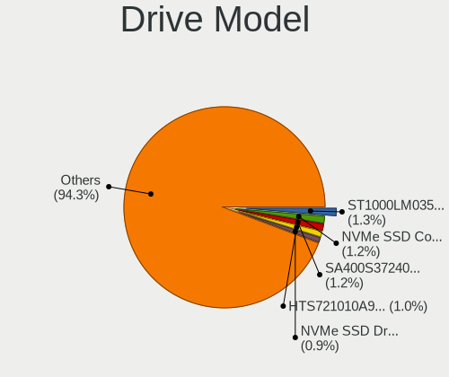
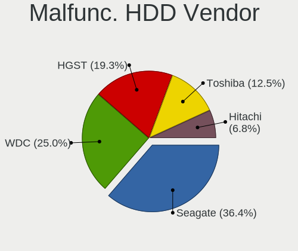
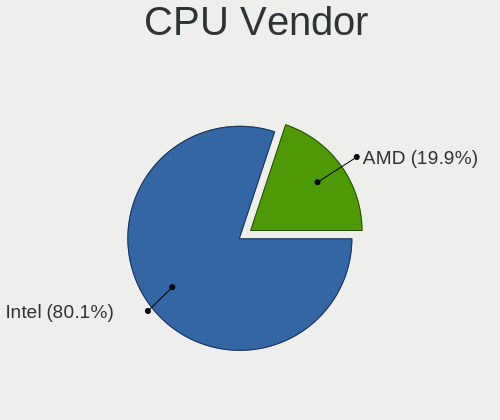
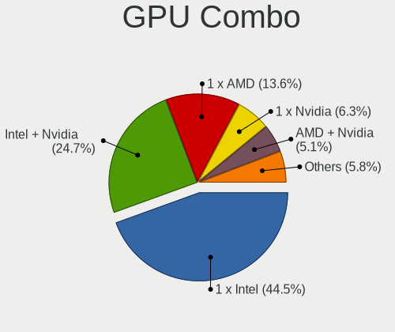
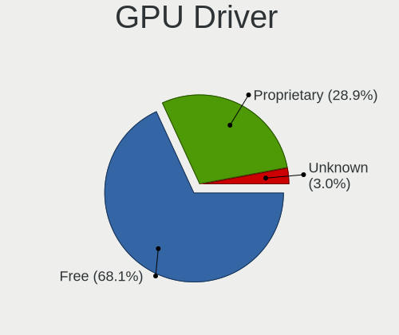
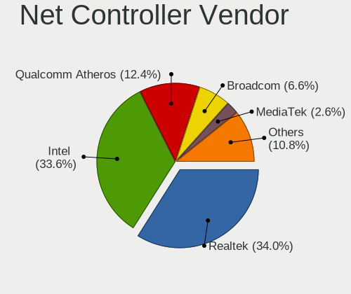
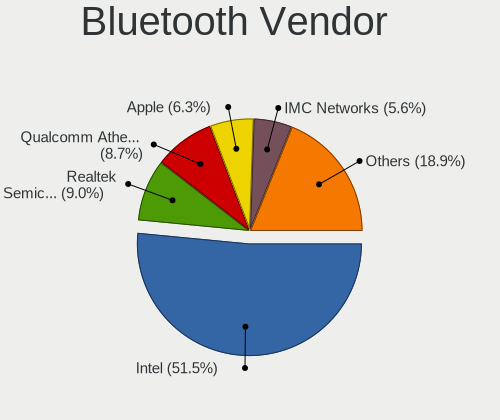
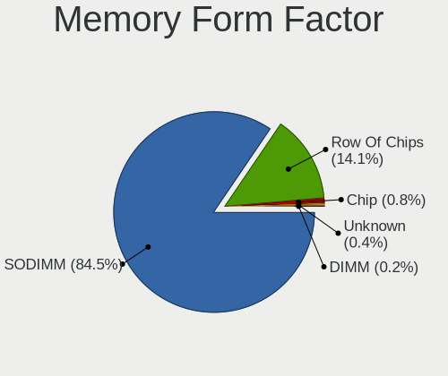

Pop!_OS - Tested Hardware & Statistics (Notebooks)
--------------------------------------------------

A project to collect tested hardware configurations for Pop!_OS.

Anyone can contribute to this report by the [hw-probe](https://github.com/linuxhw/hw-probe) tool:

    sudo -E hw-probe -all -upload

Please contribute! Especially if your hardware is rare.

Contents
--------

* [ Test Cases ](#test-cases)

* [ System ](#system)
  - [ OS                       ](#os)
  - [ OS Family                ](#os-family)
  - [ Kernel                   ](#kernel)
  - [ Kernel Family            ](#kernel-family)
  - [ Kernel Major Ver.        ](#kernel-major-ver)
  - [ Arch                     ](#arch)
  - [ DE                       ](#de)
  - [ Display Server           ](#display-server)
  - [ Display Manager          ](#display-manager)
  - [ OS Lang                  ](#os-lang)
  - [ Boot Mode                ](#boot-mode)
  - [ Filesystem               ](#filesystem)
  - [ Part. scheme             ](#part-scheme)
  - [ Dual Boot with Linux/BSD ](#dual-boot-with-linuxbsd)
  - [ Dual Boot (Win)          ](#dual-boot-win)

* [ Board ](#board)
  - [ Vendor                   ](#vendor)
  - [ Model                    ](#model)
  - [ Model Family             ](#model-family)
  - [ MFG Year                 ](#mfg-year)
  - [ Form Factor              ](#form-factor)
  - [ Secure Boot              ](#secure-boot)
  - [ Coreboot                 ](#coreboot)
  - [ RAM Size                 ](#ram-size)
  - [ RAM Used                 ](#ram-used)
  - [ Total Drives             ](#total-drives)
  - [ Has CD-ROM               ](#has-cd-rom)
  - [ Has Ethernet             ](#has-ethernet)
  - [ Has WiFi                 ](#has-wifi)
  - [ Has Bluetooth            ](#has-bluetooth)

* [ Location ](#location)
  - [ Country                  ](#country)
  - [ City                     ](#city)

* [ Drives ](#drives)
  - [ Drive Vendor             ](#drive-vendor)
  - [ Drive Model              ](#drive-model)
  - [ HDD Vendor               ](#hdd-vendor)
  - [ SSD Vendor               ](#ssd-vendor)
  - [ Drive Kind               ](#drive-kind)
  - [ Drive Connector          ](#drive-connector)
  - [ Drive Size               ](#drive-size)
  - [ Space Total              ](#space-total)
  - [ Space Used               ](#space-used)
  - [ Malfunc. Drives          ](#malfunc-drives)
  - [ Malfunc. Drive Vendor    ](#malfunc-drive-vendor)
  - [ Malfunc. HDD Vendor      ](#malfunc-hdd-vendor)
  - [ Malfunc. Drive Kind      ](#malfunc-drive-kind)
  - [ Failed Drives            ](#failed-drives)
  - [ Failed Drive Vendor      ](#failed-drive-vendor)
  - [ Drive Status             ](#drive-status)

* [ Storage controller ](#storage-controller)
  - [ Storage Vendor           ](#storage-vendor)
  - [ Storage Model            ](#storage-model)
  - [ Storage Kind             ](#storage-kind)

* [ Processor ](#processor)
  - [ CPU Vendor               ](#cpu-vendor)
  - [ CPU Model                ](#cpu-model)
  - [ CPU Model Family         ](#cpu-model-family)
  - [ CPU Cores                ](#cpu-cores)
  - [ CPU Sockets              ](#cpu-sockets)
  - [ CPU Threads              ](#cpu-threads)
  - [ CPU Op-Modes             ](#cpu-op-modes)
  - [ CPU Microcode            ](#cpu-microcode)
  - [ CPU Microarch            ](#cpu-microarch)

* [ Graphics ](#graphics)
  - [ GPU Vendor               ](#gpu-vendor)
  - [ GPU Model                ](#gpu-model)
  - [ GPU Combo                ](#gpu-combo)
  - [ GPU Driver               ](#gpu-driver)
  - [ GPU Memory               ](#gpu-memory)

* [ Monitor ](#monitor)
  - [ Monitor Vendor           ](#monitor-vendor)
  - [ Monitor Model            ](#monitor-model)
  - [ Monitor Resolution       ](#monitor-resolution)
  - [ Monitor Diagonal         ](#monitor-diagonal)
  - [ Monitor Width            ](#monitor-width)
  - [ Aspect Ratio             ](#aspect-ratio)
  - [ Monitor Area             ](#monitor-area)
  - [ Pixel Density            ](#pixel-density)
  - [ Multiple Monitors        ](#multiple-monitors)

* [ Network ](#network)
  - [ Net Controller Vendor    ](#net-controller-vendor)
  - [ Net Controller Model     ](#net-controller-model)
  - [ Wireless Vendor          ](#wireless-vendor)
  - [ Wireless Model           ](#wireless-model)
  - [ Ethernet Vendor          ](#ethernet-vendor)
  - [ Ethernet Model           ](#ethernet-model)
  - [ Net Controller Kind      ](#net-controller-kind)
  - [ Used Controller          ](#used-controller)
  - [ NICs                     ](#nics)
  - [ IPv6                     ](#ipv6)

* [ Bluetooth ](#bluetooth)
  - [ Bluetooth Vendor         ](#bluetooth-vendor)
  - [ Bluetooth Model          ](#bluetooth-model)

* [ Sound ](#sound)
  - [ Sound Vendor             ](#sound-vendor)
  - [ Sound Model              ](#sound-model)

* [ Memory ](#memory)
  - [ Memory Vendor            ](#memory-vendor)
  - [ Memory Model             ](#memory-model)
  - [ Memory Kind              ](#memory-kind)
  - [ Memory Form Factor       ](#memory-form-factor)
  - [ Memory Size              ](#memory-size)
  - [ Memory Speed             ](#memory-speed)

* [ Printers & scanners ](#printers--scanners)
  - [ Printer Vendor           ](#printer-vendor)
  - [ Printer Model            ](#printer-model)
  - [ Scanner Vendor           ](#scanner-vendor)
  - [ Scanner Model            ](#scanner-model)

* [ Camera ](#camera)
  - [ Camera Vendor            ](#camera-vendor)
  - [ Camera Model             ](#camera-model)

* [ Security ](#security)
  - [ Fingerprint Vendor       ](#fingerprint-vendor)
  - [ Fingerprint Model        ](#fingerprint-model)
  - [ Chipcard Vendor          ](#chipcard-vendor)
  - [ Chipcard Model           ](#chipcard-model)

* [ Unsupported ](#unsupported)
  - [ Unsupported Devices      ](#unsupported-devices)
  - [ Unsupported Device Types ](#unsupported-device-types)

Test Cases
----------

Total: 8655

| Vendor        | Model                       | Probe                                                      | Date         |
|---------------|-----------------------------|------------------------------------------------------------|--------------|
| Dell          | Latitude 5290 2-in-1        | [56d2614671](https://linux-hardware.org/?probe=56d2614671) | May 09, 2024 |
| Lenovo        | Legion Y540-15IRH 81SX      | [03e53efb87](https://linux-hardware.org/?probe=03e53efb87) | May 08, 2024 |
| HP            | Laptop 15s-eq2xxx           | [2786d2f8f8](https://linux-hardware.org/?probe=2786d2f8f8) | May 08, 2024 |
| ASUSTek       | VivoBook 14_ASUS Laptop ... | [73ee3d2b74](https://linux-hardware.org/?probe=73ee3d2b74) | May 08, 2024 |
| Lenovo        | ThinkPad T420s 417032U      | [e6839a3d70](https://linux-hardware.org/?probe=e6839a3d70) | May 07, 2024 |
| Lenovo        | IdeaPad 310-15ISK 80SM      | [9122522638](https://linux-hardware.org/?probe=9122522638) | May 07, 2024 |
| Lenovo        | IdeaPad 310-15ISK 80SM      | [3064d4fb1f](https://linux-hardware.org/?probe=3064d4fb1f) | May 07, 2024 |
| System76      | Gazelle                     | [fbe88df732](https://linux-hardware.org/?probe=fbe88df732) | May 07, 2024 |
| System76      | Darter Pro                  | [e6da92d97e](https://linux-hardware.org/?probe=e6da92d97e) | May 06, 2024 |
| Dell          | XPS 13 7390                 | [3132f4ff24](https://linux-hardware.org/?probe=3132f4ff24) | May 06, 2024 |
| ASUSTek       | X550CC                      | [db900f1cd1](https://linux-hardware.org/?probe=db900f1cd1) | May 05, 2024 |
| Lenovo        | ThinkPad T420s 41732AU      | [be5eeed803](https://linux-hardware.org/?probe=be5eeed803) | May 05, 2024 |
| ASUSTek       | GL753VD                     | [05c21dbea4](https://linux-hardware.org/?probe=05c21dbea4) | May 05, 2024 |
| Apple         | MacBookAir6,2               | [672e653276](https://linux-hardware.org/?probe=672e653276) | May 05, 2024 |
| System76      | Oryx Pro                    | [6d05743481](https://linux-hardware.org/?probe=6d05743481) | May 05, 2024 |
| Getac         | S410                        | [a05cbbe577](https://linux-hardware.org/?probe=a05cbbe577) | May 04, 2024 |
| Dell          | Latitude 5290 2-in-1        | [2e9e3f6434](https://linux-hardware.org/?probe=2e9e3f6434) | May 04, 2024 |
| Dell          | Inspiron 5520               | [bb83948d6a](https://linux-hardware.org/?probe=bb83948d6a) | May 04, 2024 |
| HP            | Victus by Gaming Laptop ... | [1f42d0fe27](https://linux-hardware.org/?probe=1f42d0fe27) | May 04, 2024 |
| Lenovo        | IdeaPad L340-15IRH Gamin... | [0839696375](https://linux-hardware.org/?probe=0839696375) | May 04, 2024 |
| Dell          | XPS 13 9310                 | [868dd4d0bd](https://linux-hardware.org/?probe=868dd4d0bd) | May 03, 2024 |
| Dell          | XPS 13 9340                 | [4446c73008](https://linux-hardware.org/?probe=4446c73008) | May 03, 2024 |
| Dell          | Latitude E6330              | [02c85088bc](https://linux-hardware.org/?probe=02c85088bc) | May 03, 2024 |
| Alienware     | M14xR1                      | [501de2a1ec](https://linux-hardware.org/?probe=501de2a1ec) | May 02, 2024 |
| Lenovo        | IdeaPad Gaming 3 15ACH6 ... | [c23a3238c0](https://linux-hardware.org/?probe=c23a3238c0) | May 02, 2024 |
| HP            | Pavilion dv7                | [d191e30bf7](https://linux-hardware.org/?probe=d191e30bf7) | May 01, 2024 |
| ASUSTek       | UX430UNR                    | [5712b06d98](https://linux-hardware.org/?probe=5712b06d98) | Apr 30, 2024 |
| ASUSTek       | UX430UNR                    | [a032f50d3f](https://linux-hardware.org/?probe=a032f50d3f) | Apr 30, 2024 |
| ASUSTek       | VivoBook_ASUSLaptop M160... | [701927cf4d](https://linux-hardware.org/?probe=701927cf4d) | Apr 30, 2024 |
| Alienware     | M14xR1                      | [dc1461c536](https://linux-hardware.org/?probe=dc1461c536) | Apr 29, 2024 |
| MSI           | Katana 15 B12VGK            | [c8e4cb337e](https://linux-hardware.org/?probe=c8e4cb337e) | Apr 29, 2024 |
| ASUSTek       | X451CA                      | [30d9b5f4ee](https://linux-hardware.org/?probe=30d9b5f4ee) | Apr 28, 2024 |
| Dell          | Inspiron 16 7610            | [2427197c56](https://linux-hardware.org/?probe=2427197c56) | Apr 28, 2024 |
| ASUSTek       | VivoBook_ASUSLaptop M160... | [b024eb05d1](https://linux-hardware.org/?probe=b024eb05d1) | Apr 28, 2024 |
| Lenovo        | IdeaPad 1 15IJL7 82LX       | [3fbd54c33d](https://linux-hardware.org/?probe=3fbd54c33d) | Apr 27, 2024 |
| Dell          | Precision 5680              | [95bc853549](https://linux-hardware.org/?probe=95bc853549) | Apr 27, 2024 |
| Medion        | Akoya E6227                 | [76bfce53f4](https://linux-hardware.org/?probe=76bfce53f4) | Apr 26, 2024 |
| ASUSTek       | VivoBook_ASUSLaptop M650... | [6d6b67129d](https://linux-hardware.org/?probe=6d6b67129d) | Apr 26, 2024 |
| Lenovo        | IdeaPad 5 14ARE05 81YM      | [ce253ebd01](https://linux-hardware.org/?probe=ce253ebd01) | Apr 26, 2024 |
| HP            | EliteBook 745 G6            | [5354993cb7](https://linux-hardware.org/?probe=5354993cb7) | Apr 25, 2024 |
| HP            | EliteBook 745 G6            | [3b5f41d264](https://linux-hardware.org/?probe=3b5f41d264) | Apr 25, 2024 |
| HP            | ENVY 15                     | [20cb7a828b](https://linux-hardware.org/?probe=20cb7a828b) | Apr 24, 2024 |
| Dell          | Inspiron N4050              | [cbcc357ce6](https://linux-hardware.org/?probe=cbcc357ce6) | Apr 24, 2024 |
| ASRock        | FM2A68M-HD+                 | [74967df09a](https://linux-hardware.org/?probe=74967df09a) | Apr 23, 2024 |
| Apple         | MacBookPro8,2               | [965595373d](https://linux-hardware.org/?probe=965595373d) | Apr 23, 2024 |
| Lenovo        | ThinkPad E16 Gen 1 21JN0... | [5453cfa265](https://linux-hardware.org/?probe=5453cfa265) | Apr 23, 2024 |
| Acer          | Aspire A315-59              | [ecc36cef1b](https://linux-hardware.org/?probe=ecc36cef1b) | Apr 23, 2024 |
| MSI           | GE62VR 6RF                  | [68b99dae1a](https://linux-hardware.org/?probe=68b99dae1a) | Apr 23, 2024 |
| Acer          | Aspire A315-59              | [5a88798ad6](https://linux-hardware.org/?probe=5a88798ad6) | Apr 22, 2024 |
| ASUSTek       | ROG Strix SCAR 18 G834JZ... | [28007aea7c](https://linux-hardware.org/?probe=28007aea7c) | Apr 22, 2024 |
| Dell          | XPS 13 9340                 | [5b25704805](https://linux-hardware.org/?probe=5b25704805) | Apr 22, 2024 |
| System76      | Lemur Pro                   | [3b7243efe7](https://linux-hardware.org/?probe=3b7243efe7) | Apr 21, 2024 |
| Lenovo        | Legion 5 15ACH6H 82JU       | [63baa07920](https://linux-hardware.org/?probe=63baa07920) | Apr 21, 2024 |
| ASUSTek       | ASUS TUF Gaming A15 FA50... | [ee83ed7c12](https://linux-hardware.org/?probe=ee83ed7c12) | Apr 20, 2024 |
| Apple         | MacBookPro9,2               | [f8fa58a83b](https://linux-hardware.org/?probe=f8fa58a83b) | Apr 19, 2024 |
| Apple         | MacBookPro9,2               | [8dde47a60c](https://linux-hardware.org/?probe=8dde47a60c) | Apr 19, 2024 |
| Google        | Morphius                    | [a8361bc931](https://linux-hardware.org/?probe=a8361bc931) | Apr 19, 2024 |
| Lenovo        | Legion 5 15ARH05H 82B1      | [5bcf08b4b0](https://linux-hardware.org/?probe=5bcf08b4b0) | Apr 19, 2024 |
| HP            | OMEN by Latpop 16-c0100n... | [0ee401b99c](https://linux-hardware.org/?probe=0ee401b99c) | Apr 19, 2024 |
| Toshiba       | Satellite L755D             | [47d623ed44](https://linux-hardware.org/?probe=47d623ed44) | Apr 19, 2024 |
| Lenovo        | IdeaPad L340-15IRH Gamin... | [8f4cd3f89d](https://linux-hardware.org/?probe=8f4cd3f89d) | Apr 19, 2024 |
| Dell          | Precision 5680              | [165f135e49](https://linux-hardware.org/?probe=165f135e49) | Apr 18, 2024 |
| Lenovo        | Slim Pro 9 14IRP8 83BV      | [7b5eee5473](https://linux-hardware.org/?probe=7b5eee5473) | Apr 18, 2024 |
| ASUSTek       | ASUS TUF Gaming A15 FA50... | [bcbc28897f](https://linux-hardware.org/?probe=bcbc28897f) | Apr 17, 2024 |
| Dell          | XPS 15 7590                 | [5b510f5ccd](https://linux-hardware.org/?probe=5b510f5ccd) | Apr 17, 2024 |
| Acer          | Nitro AN515-45              | [224785342d](https://linux-hardware.org/?probe=224785342d) | Apr 17, 2024 |
| ASUSTek       | UX305CA                     | [0793f271ed](https://linux-hardware.org/?probe=0793f271ed) | Apr 17, 2024 |
| HP            | 255 G8 Notebook PC          | [9945f26789](https://linux-hardware.org/?probe=9945f26789) | Apr 17, 2024 |
| Samsung       | 940X3G/930X3G               | [7ae2ace4e3](https://linux-hardware.org/?probe=7ae2ace4e3) | Apr 17, 2024 |
| Samsung       | 940X3G/930X3G               | [ebcb51ed9c](https://linux-hardware.org/?probe=ebcb51ed9c) | Apr 16, 2024 |
| Apple         | MacBookAir4,1               | [fd0c46bab2](https://linux-hardware.org/?probe=fd0c46bab2) | Apr 16, 2024 |
| Dell          | Inspiron 5547               | [088cb90432](https://linux-hardware.org/?probe=088cb90432) | Apr 16, 2024 |
| Acer          | Aspire E1-572G              | [96b786aa6f](https://linux-hardware.org/?probe=96b786aa6f) | Apr 15, 2024 |
| Dell          | Vostro 3400                 | [ddb98658ed](https://linux-hardware.org/?probe=ddb98658ed) | Apr 15, 2024 |
| Acer          | Aspire 5742G                | [91d047cef5](https://linux-hardware.org/?probe=91d047cef5) | Apr 15, 2024 |
| HUAWEI        | BOHB-WAX9                   | [e27137024f](https://linux-hardware.org/?probe=e27137024f) | Apr 15, 2024 |
| Lenovo        | ThinkPad L14 Gen 2a 20X6... | [0e240e7a70](https://linux-hardware.org/?probe=0e240e7a70) | Apr 14, 2024 |
| Acer          | Nitro AN515-51              | [46d9c6bc98](https://linux-hardware.org/?probe=46d9c6bc98) | Apr 14, 2024 |
| Lenovo        | ThinkPad L14 Gen 2a 20X6... | [b120a1a8eb](https://linux-hardware.org/?probe=b120a1a8eb) | Apr 13, 2024 |
| System76      | Lemur Pro                   | [7c9425e33a](https://linux-hardware.org/?probe=7c9425e33a) | Apr 13, 2024 |
| Dell          | Latitude E5520              | [0f03f7a01f](https://linux-hardware.org/?probe=0f03f7a01f) | Apr 13, 2024 |
| Lenovo        | IdeaPad 5 Pro 16ARH7 82S... | [858512aecf](https://linux-hardware.org/?probe=858512aecf) | Apr 12, 2024 |
| HP            | Victus by Gaming Laptop ... | [7ee4741505](https://linux-hardware.org/?probe=7ee4741505) | Apr 12, 2024 |
| Lenovo        | ThinkPad S5-S540 20B3007... | [696b2e9290](https://linux-hardware.org/?probe=696b2e9290) | Apr 12, 2024 |
| Lenovo        | ThinkPad S5-S540 20B3007... | [7d473643db](https://linux-hardware.org/?probe=7d473643db) | Apr 12, 2024 |
| System76      | Oryx Pro                    | [0204db931b](https://linux-hardware.org/?probe=0204db931b) | Apr 12, 2024 |
| Lenovo        | ThinkPad T470s 20HFCT01W... | [e72d400eb3](https://linux-hardware.org/?probe=e72d400eb3) | Apr 11, 2024 |
| Acer          | Aspire A515-44              | [bcff49116b](https://linux-hardware.org/?probe=bcff49116b) | Apr 11, 2024 |
| Lenovo        | ThinkPad E470 20H10056MZ    | [589fd95069](https://linux-hardware.org/?probe=589fd95069) | Apr 11, 2024 |
| MSI           | Modern 15 A5M               | [df536172a9](https://linux-hardware.org/?probe=df536172a9) | Apr 10, 2024 |
| System76      | Oryx Pro                    | [ea8426e115](https://linux-hardware.org/?probe=ea8426e115) | Apr 10, 2024 |
| Lenovo        | ThinkPad T14s Gen 2a 20X... | [2b7f101b88](https://linux-hardware.org/?probe=2b7f101b88) | Apr 10, 2024 |
| HP            | EliteBook 8560p             | [e9b9656231](https://linux-hardware.org/?probe=e9b9656231) | Apr 09, 2024 |
| HP            | 250 G4                      | [8f21075772](https://linux-hardware.org/?probe=8f21075772) | Apr 09, 2024 |
| Lenovo        | ThinkPad T470 20HEA0TLUS    | [fac79c8b6b](https://linux-hardware.org/?probe=fac79c8b6b) | Apr 09, 2024 |
| ASUSTek       | ROG Zephyrus G15 GA502IU... | [03de80c7da](https://linux-hardware.org/?probe=03de80c7da) | Apr 08, 2024 |
| ASUSTek       | ROG Zephyrus G15 GA502IU... | [7b9ff3d8a5](https://linux-hardware.org/?probe=7b9ff3d8a5) | Apr 08, 2024 |
| Dell          | Latitude E7240              | [a323cf8e2e](https://linux-hardware.org/?probe=a323cf8e2e) | Apr 08, 2024 |
| Alienware     | m15 R7                      | [5b8340f20c](https://linux-hardware.org/?probe=5b8340f20c) | Apr 08, 2024 |
| Alienware     | m15 R7                      | [2b7f9cd75d](https://linux-hardware.org/?probe=2b7f9cd75d) | Apr 08, 2024 |
| Lenovo        | ThinkPad T14s Gen 1 20UJ... | [471a22d2d2](https://linux-hardware.org/?probe=471a22d2d2) | Apr 08, 2024 |
| HP            | 15                          | [6cb916bc6b](https://linux-hardware.org/?probe=6cb916bc6b) | Apr 08, 2024 |
| MSI           | Titan GT77HX 13VI           | [81cf9688bd](https://linux-hardware.org/?probe=81cf9688bd) | Apr 08, 2024 |
| HP            | 15                          | [c3dd3707a8](https://linux-hardware.org/?probe=c3dd3707a8) | Apr 08, 2024 |
| Dell          | Latitude 5401               | [50c9a92ed4](https://linux-hardware.org/?probe=50c9a92ed4) | Apr 07, 2024 |
| Acer          | Swift SF314-71              | [071a57efd2](https://linux-hardware.org/?probe=071a57efd2) | Apr 07, 2024 |
| Lenovo        | Legion Pro 5 16ARX8 82WM    | [25ee9e6b9c](https://linux-hardware.org/?probe=25ee9e6b9c) | Apr 07, 2024 |
| HP            | 255 G8 Notebook PC          | [85dd650b73](https://linux-hardware.org/?probe=85dd650b73) | Apr 07, 2024 |
| Acer          | Nitro AN515-52              | [b36f589241](https://linux-hardware.org/?probe=b36f589241) | Apr 06, 2024 |
| Lenovo        | IdeaPad 710S-13ISK 80SW     | [75363d665b](https://linux-hardware.org/?probe=75363d665b) | Apr 06, 2024 |
| HP            | OMEN Laptop 15-en1xxx       | [3242172c38](https://linux-hardware.org/?probe=3242172c38) | Apr 06, 2024 |
| HP            | Stream 11 Pro G5            | [60dbf47721](https://linux-hardware.org/?probe=60dbf47721) | Apr 06, 2024 |
| Dell          | Inspiron 15 7000 Gaming     | [20ceba9415](https://linux-hardware.org/?probe=20ceba9415) | Apr 06, 2024 |
| Lenovo        | LOQ 15IRH8 82XV             | [cf5333f4e5](https://linux-hardware.org/?probe=cf5333f4e5) | Apr 06, 2024 |
| Lenovo        | ThinkBook 15 G2 ITL 20VE    | [9afed2e851](https://linux-hardware.org/?probe=9afed2e851) | Apr 06, 2024 |
| HP            | EliteBook 8730w             | [342f90f8c1](https://linux-hardware.org/?probe=342f90f8c1) | Apr 05, 2024 |
| HP            | EliteBook 8730w             | [b4c4b71cdb](https://linux-hardware.org/?probe=b4c4b71cdb) | Apr 05, 2024 |
| Lenovo        | ThinkPad P50 20ENCTO1WW     | [bf584291d2](https://linux-hardware.org/?probe=bf584291d2) | Apr 04, 2024 |
| Lenovo        | Legion 5 17ACH6H 82JY       | [bbc6cfb633](https://linux-hardware.org/?probe=bbc6cfb633) | Apr 04, 2024 |
| HP            | EliteBook 840 G1            | [ed6e28b85c](https://linux-hardware.org/?probe=ed6e28b85c) | Apr 04, 2024 |
| MSI           | Titan GT77HX 13VI           | [c6da8fe194](https://linux-hardware.org/?probe=c6da8fe194) | Apr 02, 2024 |
| Acer          | TravelMate P277-MG          | [49a90af61e](https://linux-hardware.org/?probe=49a90af61e) | Apr 02, 2024 |
| Lenovo        | ThinkPad X1 Extreme 20MF... | [0855016a44](https://linux-hardware.org/?probe=0855016a44) | Apr 01, 2024 |
| Lenovo        | ThinkPad X1 Extreme 20MF... | [43a3819af7](https://linux-hardware.org/?probe=43a3819af7) | Apr 01, 2024 |
| Dell          | Latitude E6430              | [bf9cac92e7](https://linux-hardware.org/?probe=bf9cac92e7) | Apr 01, 2024 |
| GPD           | G1619-04                    | [4d8878864a](https://linux-hardware.org/?probe=4d8878864a) | Apr 01, 2024 |
| HP            | Pavilion Gaming Laptop 1... | [2a00b77a69](https://linux-hardware.org/?probe=2a00b77a69) | Apr 01, 2024 |
| Acer          | Aspire A315-35              | [554a38529a](https://linux-hardware.org/?probe=554a38529a) | Mar 31, 2024 |
| Dell          | Latitude E6430              | [c871f1007a](https://linux-hardware.org/?probe=c871f1007a) | Mar 31, 2024 |
| Apple         | MacBookPro7,1               | [a02628f1b4](https://linux-hardware.org/?probe=a02628f1b4) | Mar 31, 2024 |
| Lenovo        | ThinkPad E14 Gen 4 21ECC... | [c19f043267](https://linux-hardware.org/?probe=c19f043267) | Mar 31, 2024 |
| HP            | 250 G4                      | [fbf0b206e8](https://linux-hardware.org/?probe=fbf0b206e8) | Mar 31, 2024 |
| ASUSTek       | ZenBook UX325UA_UM325UA     | [449d0ad45b](https://linux-hardware.org/?probe=449d0ad45b) | Mar 31, 2024 |
| Lenovo        | ThinkPad T14 Gen 2i 20W1... | [77d2d8ef3e](https://linux-hardware.org/?probe=77d2d8ef3e) | Mar 31, 2024 |
| Toshiba       | Satellite P105              | [7b87f631be](https://linux-hardware.org/?probe=7b87f631be) | Mar 31, 2024 |
| Apple         | MacBookAir7,2               | [fd278af3a5](https://linux-hardware.org/?probe=fd278af3a5) | Mar 31, 2024 |
| Dell          | Latitude E5520              | [875fc34b64](https://linux-hardware.org/?probe=875fc34b64) | Mar 31, 2024 |
| Timi          | TM1604                      | [9ef2ec37c2](https://linux-hardware.org/?probe=9ef2ec37c2) | Mar 29, 2024 |
| Timi          | TM1604                      | [ec2ab8fb5f](https://linux-hardware.org/?probe=ec2ab8fb5f) | Mar 29, 2024 |
| Acer          | Swift SFX14-51G             | [a0aaa7eb1d](https://linux-hardware.org/?probe=a0aaa7eb1d) | Mar 29, 2024 |
| ASUSTek       | ProArt Studiobook H7604J... | [ce5acdd8b0](https://linux-hardware.org/?probe=ce5acdd8b0) | Mar 29, 2024 |
| ASUSTek       | VivoBook_ASUSLaptop X415... | [90614a5f0b](https://linux-hardware.org/?probe=90614a5f0b) | Mar 28, 2024 |
| Acer          | Aspire 4349                 | [8bf51e5557](https://linux-hardware.org/?probe=8bf51e5557) | Mar 28, 2024 |
| HP            | Victus by Gaming Laptop ... | [d93e2bd101](https://linux-hardware.org/?probe=d93e2bd101) | Mar 28, 2024 |
| ASUSTek       | VivoBook_ASUSLaptop M150... | [951f003b12](https://linux-hardware.org/?probe=951f003b12) | Mar 28, 2024 |
| ASUSTek       | ROG Zephyrus G16 GU603ZI... | [c1a3cee107](https://linux-hardware.org/?probe=c1a3cee107) | Mar 28, 2024 |
| HP            | EliteBook 855 G8 Noteboo... | [deae5b6cdf](https://linux-hardware.org/?probe=deae5b6cdf) | Mar 27, 2024 |
| HP            | EliteBook 855 G8 Noteboo... | [602d79d663](https://linux-hardware.org/?probe=602d79d663) | Mar 27, 2024 |
| Acer          | Aspire A515-57G             | [95c573af0a](https://linux-hardware.org/?probe=95c573af0a) | Mar 27, 2024 |
| Dell          | Inspiron 5520               | [27255ef603](https://linux-hardware.org/?probe=27255ef603) | Mar 26, 2024 |
| Dell          | Inspiron 1440               | [e7bae8d9bc](https://linux-hardware.org/?probe=e7bae8d9bc) | Mar 26, 2024 |
| ASUSTek       | G750JZA                     | [12d8540af3](https://linux-hardware.org/?probe=12d8540af3) | Mar 26, 2024 |
| HP            | ENVY 15                     | [11821b80b7](https://linux-hardware.org/?probe=11821b80b7) | Mar 26, 2024 |
| Apple         | MacBookAir4,2               | [d31e841f4d](https://linux-hardware.org/?probe=d31e841f4d) | Mar 25, 2024 |
| Alienware     | m15 R4                      | [3f0488b05c](https://linux-hardware.org/?probe=3f0488b05c) | Mar 25, 2024 |
| System76      | Bonobo WS                   | [856360e11c](https://linux-hardware.org/?probe=856360e11c) | Mar 25, 2024 |
| Acer          | Aspire 5755G                | [4aa12cd64e](https://linux-hardware.org/?probe=4aa12cd64e) | Mar 24, 2024 |
| Google        | Markarth                    | [9987cda5ae](https://linux-hardware.org/?probe=9987cda5ae) | Mar 24, 2024 |
| Lenovo        | G510 20238                  | [b63a7b1490](https://linux-hardware.org/?probe=b63a7b1490) | Mar 24, 2024 |
| ASUSTek       | ROG Strix G713PI_G713PI     | [fad6108f0a](https://linux-hardware.org/?probe=fad6108f0a) | Mar 24, 2024 |
| System76      | Gazelle                     | [a2b4d889db](https://linux-hardware.org/?probe=a2b4d889db) | Mar 24, 2024 |
| Alienware     | m15 R7                      | [27cc6ca1d6](https://linux-hardware.org/?probe=27cc6ca1d6) | Mar 24, 2024 |
| Dell          | Vostro 1015                 | [5cea7dba17](https://linux-hardware.org/?probe=5cea7dba17) | Mar 23, 2024 |
| Lenovo        | IdeaPad 3 15IIL05 81WE      | [7fc01abc25](https://linux-hardware.org/?probe=7fc01abc25) | Mar 23, 2024 |
| HUAWEI        | BOHB-WAX9                   | [90d0e194f9](https://linux-hardware.org/?probe=90d0e194f9) | Mar 23, 2024 |
| MSI           | Cyborg 15 A12VE             | [012a9393ab](https://linux-hardware.org/?probe=012a9393ab) | Mar 22, 2024 |
| Lenovo        | ThinkPad P14s Gen 4 21HF... | [a0855ed46b](https://linux-hardware.org/?probe=a0855ed46b) | Mar 22, 2024 |
| HP            | Victus by Gaming Laptop ... | [899cb71147](https://linux-hardware.org/?probe=899cb71147) | Mar 22, 2024 |
| Lenovo        | IdeaPad 3 15ALC6 82MF       | [2c74228344](https://linux-hardware.org/?probe=2c74228344) | Mar 22, 2024 |
| Dell          | Latitude E7240              | [a295e64d94](https://linux-hardware.org/?probe=a295e64d94) | Mar 21, 2024 |
| Dell          | Inspiron 5558               | [2202cb6328](https://linux-hardware.org/?probe=2202cb6328) | Mar 21, 2024 |
| HUAWEI        | BOHB-WAX9                   | [eecdc4a970](https://linux-hardware.org/?probe=eecdc4a970) | Mar 21, 2024 |
| HUAWEI        | BOHB-WAX9                   | [0a1b9c732b](https://linux-hardware.org/?probe=0a1b9c732b) | Mar 21, 2024 |
| Lenovo        | ThinkPad X395 20NMS13801    | [bf71f2099b](https://linux-hardware.org/?probe=bf71f2099b) | Mar 21, 2024 |
| Dell          | Precision M4700             | [212d29f26d](https://linux-hardware.org/?probe=212d29f26d) | Mar 21, 2024 |
| HP            | 255 G8 Notebook PC          | [0293382f9b](https://linux-hardware.org/?probe=0293382f9b) | Mar 21, 2024 |
| Dell          | Latitude E6540              | [c3883595b9](https://linux-hardware.org/?probe=c3883595b9) | Mar 21, 2024 |
| MSI           | Cyborg 15 A12VE             | [e0dce5359f](https://linux-hardware.org/?probe=e0dce5359f) | Mar 20, 2024 |
| Lenovo        | ThinkPad T480s 20L8002UM... | [b912e786a3](https://linux-hardware.org/?probe=b912e786a3) | Mar 20, 2024 |
| Samsung       | 530U3C/530U4C/532U3C        | [a06517f205](https://linux-hardware.org/?probe=a06517f205) | Mar 20, 2024 |
| Lenovo        | ThinkPad E470 20H10056MZ    | [0e0638700d](https://linux-hardware.org/?probe=0e0638700d) | Mar 20, 2024 |
| Lenovo        | ThinkPad E470 20H10056MZ    | [e8c3803d3c](https://linux-hardware.org/?probe=e8c3803d3c) | Mar 20, 2024 |
| Dell          | Latitude 5410               | [291ea4843c](https://linux-hardware.org/?probe=291ea4843c) | Mar 20, 2024 |
| Acer          | Aspire A315-59              | [6c38602470](https://linux-hardware.org/?probe=6c38602470) | Mar 19, 2024 |
| HONOR         | GLO-GXXX                    | [aa0a3c2273](https://linux-hardware.org/?probe=aa0a3c2273) | Mar 19, 2024 |
| HONOR         | GLO-GXXX                    | [e6fbe7ffad](https://linux-hardware.org/?probe=e6fbe7ffad) | Mar 19, 2024 |
| HUAWEI        | KLVL-WXXW                   | [7400d40886](https://linux-hardware.org/?probe=7400d40886) | Mar 19, 2024 |
| HUAWEI        | KLVD-WXX9                   | [f8a39666b9](https://linux-hardware.org/?probe=f8a39666b9) | Mar 19, 2024 |
| HUAWEI        | KLVD-WXX9                   | [74127be2ca](https://linux-hardware.org/?probe=74127be2ca) | Mar 19, 2024 |
| Lenovo        | ThinkPad P15s Gen 1 20T4... | [3bef14d11e](https://linux-hardware.org/?probe=3bef14d11e) | Mar 19, 2024 |
| Dell          | Latitude 7440               | [143c9f9828](https://linux-hardware.org/?probe=143c9f9828) | Mar 19, 2024 |
| HP            | EliteBook 840 14 inch G9... | [eaea13606f](https://linux-hardware.org/?probe=eaea13606f) | Mar 19, 2024 |
| Lenovo        | ThinkPad T480s 20L8SCLH0... | [a568c4313e](https://linux-hardware.org/?probe=a568c4313e) | Mar 18, 2024 |
| ASUSTek       | ROG Zephyrus G14 GA402NU... | [10d62d48f9](https://linux-hardware.org/?probe=10d62d48f9) | Mar 18, 2024 |
| Lenovo        | IdeaPad 3 15ALC6 82MF       | [2d61b43821](https://linux-hardware.org/?probe=2d61b43821) | Mar 18, 2024 |
| Notebook      | N15_N17RD1                  | [7bf6fa9d9f](https://linux-hardware.org/?probe=7bf6fa9d9f) | Mar 18, 2024 |
| Lenovo        | Legion 5 15ARH05H 82B1      | [2cc34ee9da](https://linux-hardware.org/?probe=2cc34ee9da) | Mar 18, 2024 |
| Lenovo        | Legion 7 15IMH05 81YT       | [6e83554006](https://linux-hardware.org/?probe=6e83554006) | Mar 17, 2024 |
| Lenovo        | Y520-15IKBM 80YY            | [aae3b4bf83](https://linux-hardware.org/?probe=aae3b4bf83) | Mar 17, 2024 |
| Lenovo        | ThinkPad X260 20F6006XUK    | [72eb92fb02](https://linux-hardware.org/?probe=72eb92fb02) | Mar 16, 2024 |
| Lenovo        | ThinkPad T480s 20L8SCLH0... | [fd91f6e0b8](https://linux-hardware.org/?probe=fd91f6e0b8) | Mar 15, 2024 |
| ASUSTek       | ROG Zephyrus M16 GU604VI... | [0ba8678964](https://linux-hardware.org/?probe=0ba8678964) | Mar 15, 2024 |
| Lenovo        | ThinkPad X260 20F6006XUK    | [d1bf96e346](https://linux-hardware.org/?probe=d1bf96e346) | Mar 14, 2024 |
| Lenovo        | ThinkPad T420 4236PFG       | [66167283a7](https://linux-hardware.org/?probe=66167283a7) | Mar 14, 2024 |
| Lenovo        | ThinkPad T14 Gen 4 21K4S... | [37260aa51d](https://linux-hardware.org/?probe=37260aa51d) | Mar 14, 2024 |
| Jumper        | EZbook                      | [65469deb97](https://linux-hardware.org/?probe=65469deb97) | Mar 14, 2024 |
| Lenovo        | IdeaPad 5 Pro 16ARH7 82S... | [d2921f8721](https://linux-hardware.org/?probe=d2921f8721) | Mar 13, 2024 |
| Dell          | Inspiron 5575               | [982b876f87](https://linux-hardware.org/?probe=982b876f87) | Mar 13, 2024 |
| Lenovo        | Legion 5 Pro 16ARH7H 82R... | [6a41c6be0e](https://linux-hardware.org/?probe=6a41c6be0e) | Mar 13, 2024 |
| Lenovo        | Legion 5 Pro 16ARH7H 82R... | [3eb6a86b95](https://linux-hardware.org/?probe=3eb6a86b95) | Mar 13, 2024 |
| Dell          | XPS 15 9530                 | [4cfd0ba254](https://linux-hardware.org/?probe=4cfd0ba254) | Mar 13, 2024 |
| Google        | Gallop                      | [eeaa5535f7](https://linux-hardware.org/?probe=eeaa5535f7) | Mar 12, 2024 |
| HP            | ProBook 470 G3              | [7acbeb9e50](https://linux-hardware.org/?probe=7acbeb9e50) | Mar 12, 2024 |
| Lenovo        | IdeaPad 3 15IML05 81WR      | [006a9be33e](https://linux-hardware.org/?probe=006a9be33e) | Mar 12, 2024 |
| Acer          | Nitro AN515-45              | [d5d941f35c](https://linux-hardware.org/?probe=d5d941f35c) | Mar 12, 2024 |
| Dell          | Latitude 5420               | [e49cabfe78](https://linux-hardware.org/?probe=e49cabfe78) | Mar 12, 2024 |
| Dell          | G7 7588                     | [201e08795e](https://linux-hardware.org/?probe=201e08795e) | Mar 11, 2024 |
| Lenovo        | ThinkPad T14 Gen 2i 20W1... | [66ebc0d790](https://linux-hardware.org/?probe=66ebc0d790) | Mar 11, 2024 |
| Dell          | Vostro 15 5510              | [1635f8ee88](https://linux-hardware.org/?probe=1635f8ee88) | Mar 11, 2024 |
| Apple         | MacBookAir7,2               | [03dbb01a57](https://linux-hardware.org/?probe=03dbb01a57) | Mar 11, 2024 |
| ASUSTek       | ROG Strix G513IE_G513IE     | [695773aa7b](https://linux-hardware.org/?probe=695773aa7b) | Mar 10, 2024 |
| ASUSTek       | VivoBook_ASUSLaptop X570... | [a56ff930d5](https://linux-hardware.org/?probe=a56ff930d5) | Mar 10, 2024 |
| Dell          | Latitude 7490               | [93e3272d83](https://linux-hardware.org/?probe=93e3272d83) | Mar 10, 2024 |
| Lenovo        | IdeaPad 3 15IML05 81WR      | [174fa8b213](https://linux-hardware.org/?probe=174fa8b213) | Mar 09, 2024 |
| Dell          | Latitude 7490               | [d8c5dd5832](https://linux-hardware.org/?probe=d8c5dd5832) | Mar 09, 2024 |
| eMachines     | E525                        | [4a4a1ac342](https://linux-hardware.org/?probe=4a4a1ac342) | Mar 09, 2024 |
| Dell          | Inspiron 15 7000 Gaming     | [35cdd04e44](https://linux-hardware.org/?probe=35cdd04e44) | Mar 08, 2024 |
| HP            | Laptop 15s-eq0xxx           | [e4a401d044](https://linux-hardware.org/?probe=e4a401d044) | Mar 08, 2024 |
| Dell          | Latitude 5530               | [474a88cccf](https://linux-hardware.org/?probe=474a88cccf) | Mar 08, 2024 |
| Dell          | Inspiron 5520               | [ded3e0cf33](https://linux-hardware.org/?probe=ded3e0cf33) | Mar 08, 2024 |
| System76      | Gazelle                     | [c054444856](https://linux-hardware.org/?probe=c054444856) | Mar 08, 2024 |
| HP            | Pavilion Gaming Laptop 1... | [439a24ca9f](https://linux-hardware.org/?probe=439a24ca9f) | Mar 07, 2024 |
| Dell          | Latitude 5530               | [252c53438e](https://linux-hardware.org/?probe=252c53438e) | Mar 07, 2024 |
| ASUSTek       | TUF Gaming FX505DT_FX505... | [635244de96](https://linux-hardware.org/?probe=635244de96) | Mar 07, 2024 |
| HP            | EliteBook 840 G2            | [431439414a](https://linux-hardware.org/?probe=431439414a) | Mar 07, 2024 |
| HP            | EliteBook 840 G2            | [571cf278dd](https://linux-hardware.org/?probe=571cf278dd) | Mar 07, 2024 |
| HP            | OMEN by Laptop 16-c0xxx     | [bb4c0ce2be](https://linux-hardware.org/?probe=bb4c0ce2be) | Mar 06, 2024 |
| Lenovo        | ThinkPad E15 20RD0014RT     | [b12b855825](https://linux-hardware.org/?probe=b12b855825) | Mar 06, 2024 |
| HP            | ProBook 650 G1              | [994590f6a8](https://linux-hardware.org/?probe=994590f6a8) | Mar 06, 2024 |
| HP            | EliteBook 840 14 inch G1... | [b62ec8f9a0](https://linux-hardware.org/?probe=b62ec8f9a0) | Mar 06, 2024 |
| HP            | Pavilion Gaming Laptop 1... | [1446f9eae8](https://linux-hardware.org/?probe=1446f9eae8) | Mar 05, 2024 |
| ASUSTek       | ASUS TUF Gaming A15 FA50... | [bc08a4f316](https://linux-hardware.org/?probe=bc08a4f316) | Mar 05, 2024 |
| Alienware     | M14xR1                      | [67cc7d7e63](https://linux-hardware.org/?probe=67cc7d7e63) | Mar 05, 2024 |
| Dell          | G7 7500                     | [89b81d9c37](https://linux-hardware.org/?probe=89b81d9c37) | Mar 05, 2024 |
| ASUSTek       | VivoBook_ASUSLaptop X409... | [b11673c68a](https://linux-hardware.org/?probe=b11673c68a) | Mar 05, 2024 |
| ASUSTek       | ZenBook Pro Duo UX582LR_... | [141c46ed9d](https://linux-hardware.org/?probe=141c46ed9d) | Mar 05, 2024 |
| Lenovo        | ThinkPad T14 Gen 4 21HES... | [3b0efc2689](https://linux-hardware.org/?probe=3b0efc2689) | Mar 05, 2024 |
| Lenovo        | ThinkPad X1 Carbon 6th 2... | [c3d8b404f8](https://linux-hardware.org/?probe=c3d8b404f8) | Mar 04, 2024 |
| Lenovo        | ThinkPad X1 Carbon 6th 2... | [ce218789c2](https://linux-hardware.org/?probe=ce218789c2) | Mar 04, 2024 |
| ASUSTek       | ROG Strix G513QY_G513QY     | [2f64045bb9](https://linux-hardware.org/?probe=2f64045bb9) | Mar 04, 2024 |
| Acer          | Nitro AN515-57              | [d65faae98f](https://linux-hardware.org/?probe=d65faae98f) | Mar 03, 2024 |
| ASUSTek       | GL552VX                     | [01ea0912c3](https://linux-hardware.org/?probe=01ea0912c3) | Mar 03, 2024 |
| Lenovo        | ThinkPad T470p 20J7S0CF0... | [b957a4b5d8](https://linux-hardware.org/?probe=b957a4b5d8) | Mar 03, 2024 |
| Alienware     | M14xR1                      | [5b5b4ae985](https://linux-hardware.org/?probe=5b5b4ae985) | Mar 03, 2024 |
| Dell          | XPS 15 9570                 | [73bd3cf050](https://linux-hardware.org/?probe=73bd3cf050) | Mar 03, 2024 |
| Dell          | Inspiron 1525               | [7749349961](https://linux-hardware.org/?probe=7749349961) | Mar 02, 2024 |
| ASUSTek       | ROG Zephyrus G14 GA401IV... | [67a9619322](https://linux-hardware.org/?probe=67a9619322) | Mar 02, 2024 |
| System76      | Pangolin                    | [a130fc52f6](https://linux-hardware.org/?probe=a130fc52f6) | Mar 02, 2024 |
| ASUSTek       | ROG Strix G513QM_G513QM     | [78090262bb](https://linux-hardware.org/?probe=78090262bb) | Mar 02, 2024 |
| System76      | Oryx Pro                    | [6f389be12b](https://linux-hardware.org/?probe=6f389be12b) | Mar 01, 2024 |
| Lenovo        | IdeaPad L3 15IML05 81Y3     | [cda628788e](https://linux-hardware.org/?probe=cda628788e) | Mar 01, 2024 |
| HP            | Laptop 15-dw0xxx            | [6e720badd3](https://linux-hardware.org/?probe=6e720badd3) | Mar 01, 2024 |
| Apple         | MacBookPro11,3              | [d418108f92](https://linux-hardware.org/?probe=d418108f92) | Feb 29, 2024 |
| Lenovo        | ThinkPad T420 4236BD5       | [470be089f8](https://linux-hardware.org/?probe=470be089f8) | Feb 29, 2024 |
| HP            | Laptop 14s-dq0xxx           | [07e47bd9aa](https://linux-hardware.org/?probe=07e47bd9aa) | Feb 29, 2024 |
| Acer          | Nitro AN515-57              | [ecfd2b2c9f](https://linux-hardware.org/?probe=ecfd2b2c9f) | Feb 28, 2024 |
| Lenovo        | IdeaPad Gaming 3 15ACH6 ... | [bccc7e9b25](https://linux-hardware.org/?probe=bccc7e9b25) | Feb 27, 2024 |
| ASUSTek       | N53SN                       | [c628351d6c](https://linux-hardware.org/?probe=c628351d6c) | Feb 27, 2024 |
| Lenovo        | IdeaPad L340-15IRH Gamin... | [df29939277](https://linux-hardware.org/?probe=df29939277) | Feb 27, 2024 |
| ASUSTek       | VivoBook_ASUSLaptop K340... | [3ea80caf07](https://linux-hardware.org/?probe=3ea80caf07) | Feb 27, 2024 |
| Casper        | NIRVANA NOTEBOOK            | [19a2ccc504](https://linux-hardware.org/?probe=19a2ccc504) | Feb 27, 2024 |
| Lenovo        | ThinkBook 15 G2 ARE 20VG    | [ac48e41763](https://linux-hardware.org/?probe=ac48e41763) | Feb 27, 2024 |
| Dell          | Inspiron 5547               | [a7e7b853e8](https://linux-hardware.org/?probe=a7e7b853e8) | Feb 27, 2024 |
| ASUSTek       | ROG Strix G513IC_G513IC     | [1817f5af30](https://linux-hardware.org/?probe=1817f5af30) | Feb 27, 2024 |
| ASUSTek       | VivoBook_ASUSLaptop X509... | [0ef3ee0033](https://linux-hardware.org/?probe=0ef3ee0033) | Feb 27, 2024 |
| Acer          | Aspire V3-372               | [fcd3114d4b](https://linux-hardware.org/?probe=fcd3114d4b) | Feb 26, 2024 |
| Dell          | Latitude 5300               | [8ab46e0ae3](https://linux-hardware.org/?probe=8ab46e0ae3) | Feb 26, 2024 |
| TrekStor      | Notebook Slim S130          | [534a53e131](https://linux-hardware.org/?probe=534a53e131) | Feb 26, 2024 |
| Apple         | MacBookPro8,2               | [2ddd148d6c](https://linux-hardware.org/?probe=2ddd148d6c) | Feb 26, 2024 |
| ASUSTek       | Strix GL704GW_GL704GW       | [4f5f9307d6](https://linux-hardware.org/?probe=4f5f9307d6) | Feb 25, 2024 |
| Sony          | VPCCA2S0E                   | [ded9134c14](https://linux-hardware.org/?probe=ded9134c14) | Feb 25, 2024 |
| Sony          | VPCCA2S0E                   | [360e87199c](https://linux-hardware.org/?probe=360e87199c) | Feb 25, 2024 |
| TrekStor      | Notebook Slim S130          | [829f6953a7](https://linux-hardware.org/?probe=829f6953a7) | Feb 25, 2024 |
| Dell          | Inspiron 7559               | [678e86bdeb](https://linux-hardware.org/?probe=678e86bdeb) | Feb 25, 2024 |
| Apple         | MacBookAir3,2               | [82df38cf02](https://linux-hardware.org/?probe=82df38cf02) | Feb 24, 2024 |
| HP            | ProBook 4730s               | [9441592753](https://linux-hardware.org/?probe=9441592753) | Feb 24, 2024 |
| HP            | ProBook 4730s               | [558fc0a500](https://linux-hardware.org/?probe=558fc0a500) | Feb 24, 2024 |
| Dell          | Precision 3571              | [4392bfe153](https://linux-hardware.org/?probe=4392bfe153) | Feb 24, 2024 |
| Acer          | Swift SFX14-41G             | [edd37fc93e](https://linux-hardware.org/?probe=edd37fc93e) | Feb 24, 2024 |
| HP            | EliteBook 840 14 inch G9... | [be154598ff](https://linux-hardware.org/?probe=be154598ff) | Feb 23, 2024 |
| HP            | EliteBook 850 G6            | [7ed2cffcae](https://linux-hardware.org/?probe=7ed2cffcae) | Feb 23, 2024 |
| Dell          | Precision 5550              | [f362deda15](https://linux-hardware.org/?probe=f362deda15) | Feb 22, 2024 |
| Dell          | Latitude E5420              | [910bc98f57](https://linux-hardware.org/?probe=910bc98f57) | Feb 21, 2024 |
| Dell          | Precision M4800             | [60660b2530](https://linux-hardware.org/?probe=60660b2530) | Feb 21, 2024 |
| Dell          | Latitude 5580               | [b83380f87b](https://linux-hardware.org/?probe=b83380f87b) | Feb 21, 2024 |
| Dream Mach... | Gaming Laptop               | [fb169a7c4d](https://linux-hardware.org/?probe=fb169a7c4d) | Feb 20, 2024 |
| Razer         | Blade 14 - RZ09-0370        | [119689a507](https://linux-hardware.org/?probe=119689a507) | Feb 20, 2024 |
| Dell          | Latitude 7480               | [99c8492288](https://linux-hardware.org/?probe=99c8492288) | Feb 20, 2024 |
| Lenovo        | ThinkPad T420 4236Y54       | [801c073182](https://linux-hardware.org/?probe=801c073182) | Feb 20, 2024 |
| Acer          | Aspire A315-24P             | [a5ad93fa0a](https://linux-hardware.org/?probe=a5ad93fa0a) | Feb 20, 2024 |
| Acer          | Aspire A315-24P             | [08191524c7](https://linux-hardware.org/?probe=08191524c7) | Feb 20, 2024 |
| HP            | EliteBook 845 G7 Noteboo... | [caf3ea0d9a](https://linux-hardware.org/?probe=caf3ea0d9a) | Feb 20, 2024 |
| Acer          | SF314-71-50E8               | [109256318a](https://linux-hardware.org/?probe=109256318a) | Feb 20, 2024 |
| Apple         | MacBookPro8,1               | [f8d09630be](https://linux-hardware.org/?probe=f8d09630be) | Feb 20, 2024 |
| Apple         | MacBookPro8,1               | [5eb44e20c3](https://linux-hardware.org/?probe=5eb44e20c3) | Feb 20, 2024 |
| Lenovo        | LOQ 15IRH8 82XV             | [f0a5c0c659](https://linux-hardware.org/?probe=f0a5c0c659) | Feb 19, 2024 |
| Dell          | Latitude E7250              | [4dbb95d349](https://linux-hardware.org/?probe=4dbb95d349) | Feb 19, 2024 |
| Lenovo        | ThinkBook 15 G2 ARE 20VG    | [748c41cfa2](https://linux-hardware.org/?probe=748c41cfa2) | Feb 19, 2024 |
| Acer          | SF314-71-50E8               | [b05150cb04](https://linux-hardware.org/?probe=b05150cb04) | Feb 19, 2024 |
| HP            | ZBook Firefly 15.6 inch ... | [d0562f4f40](https://linux-hardware.org/?probe=d0562f4f40) | Feb 19, 2024 |
| Pegatron      | B34C                        | [a062b68bf6](https://linux-hardware.org/?probe=a062b68bf6) | Feb 18, 2024 |
| Acer          | Aspire A515-56              | [11f162f567](https://linux-hardware.org/?probe=11f162f567) | Feb 18, 2024 |
| Lenovo        | LOQ 15IRH8 82XV             | [1a618047be](https://linux-hardware.org/?probe=1a618047be) | Feb 18, 2024 |
| Lenovo        | LOQ 15IRH8 82XV             | [a7cb58e0b9](https://linux-hardware.org/?probe=a7cb58e0b9) | Feb 18, 2024 |
| System76      | Gazelle                     | [6e2b31138f](https://linux-hardware.org/?probe=6e2b31138f) | Feb 18, 2024 |
| Dell          | XPS 12 9Q23                 | [7246414ea4](https://linux-hardware.org/?probe=7246414ea4) | Feb 18, 2024 |
| Unknown       | Unknown                     | [df466668e4](https://linux-hardware.org/?probe=df466668e4) | Feb 17, 2024 |
| MSI           | GE72 6QC                    | [bf8edb1354](https://linux-hardware.org/?probe=bf8edb1354) | Feb 17, 2024 |
| Acer          | SF314-71-50E8               | [8c9f92e873](https://linux-hardware.org/?probe=8c9f92e873) | Feb 17, 2024 |
| ASUSTek       | K95VJ                       | [c82a491d01](https://linux-hardware.org/?probe=c82a491d01) | Feb 16, 2024 |
| Acer          | Aspire S3                   | [015a6bdb09](https://linux-hardware.org/?probe=015a6bdb09) | Feb 16, 2024 |
| HP            | Pavilion dv6                | [27bd273fa1](https://linux-hardware.org/?probe=27bd273fa1) | Feb 16, 2024 |
| Lenovo        | IdeaPad 5 14ABA7 82SE       | [176496db32](https://linux-hardware.org/?probe=176496db32) | Feb 16, 2024 |
| Apple         | MacBookAir7,2               | [17be6d540f](https://linux-hardware.org/?probe=17be6d540f) | Feb 16, 2024 |
| Lenovo        | IdeaPad L340-15IWL 81LG     | [c98ffdb659](https://linux-hardware.org/?probe=c98ffdb659) | Feb 16, 2024 |
| Dell          | Precision 7510              | [c6c77a8fc8](https://linux-hardware.org/?probe=c6c77a8fc8) | Feb 16, 2024 |
| HP            | Pavilion dv6                | [fd84d867f4](https://linux-hardware.org/?probe=fd84d867f4) | Feb 15, 2024 |
| ASUSTek       | ROG Strix G713RS_G713RS     | [8e7c6becd2](https://linux-hardware.org/?probe=8e7c6becd2) | Feb 14, 2024 |
| HP            | Pavilion Gaming Laptop 1... | [cef87c0391](https://linux-hardware.org/?probe=cef87c0391) | Feb 14, 2024 |
| Acer          | Aspire A515-56              | [8145ab17cc](https://linux-hardware.org/?probe=8145ab17cc) | Feb 14, 2024 |
| Dell          | XPS 15 9510                 | [25f5e2c229](https://linux-hardware.org/?probe=25f5e2c229) | Feb 12, 2024 |
| Dell          | XPS 15 9510                 | [1e8eb3e275](https://linux-hardware.org/?probe=1e8eb3e275) | Feb 12, 2024 |
| Casper        | NIRVANA NOTEBOOK            | [6fb885473c](https://linux-hardware.org/?probe=6fb885473c) | Feb 12, 2024 |
| ASUSTek       | ROG Zephyrus G14 GA401IV    | [07b16ebca5](https://linux-hardware.org/?probe=07b16ebca5) | Feb 11, 2024 |
| Dell          | Latitude E7270              | [cd13d3c338](https://linux-hardware.org/?probe=cd13d3c338) | Feb 11, 2024 |
| Acer          | Aspire A514-53              | [70b16c69f0](https://linux-hardware.org/?probe=70b16c69f0) | Feb 10, 2024 |
| Lenovo        | ThinkPad T14 Gen 3 21CGC... | [8567f0b4d1](https://linux-hardware.org/?probe=8567f0b4d1) | Feb 10, 2024 |
| HP            | EliteBook 845 14 inch G9... | [bc3902b1d1](https://linux-hardware.org/?probe=bc3902b1d1) | Feb 09, 2024 |
| MSI           | Summit E13FlipEvo A12MT     | [b87e3aded5](https://linux-hardware.org/?probe=b87e3aded5) | Feb 09, 2024 |
| MSI           | Summit E13FlipEvo A12MT     | [0d1cdf2ae8](https://linux-hardware.org/?probe=0d1cdf2ae8) | Feb 09, 2024 |
| Casper        | NIRVANA NOTEBOOK            | [5ecacd2214](https://linux-hardware.org/?probe=5ecacd2214) | Feb 09, 2024 |
| Dell          | Inspiron 3558               | [76eb2071c4](https://linux-hardware.org/?probe=76eb2071c4) | Feb 09, 2024 |
| Digibras      | NH4CU03                     | [7f77d98ba4](https://linux-hardware.org/?probe=7f77d98ba4) | Feb 09, 2024 |
| HP            | ProBook 6450b               | [423b15dea2](https://linux-hardware.org/?probe=423b15dea2) | Feb 09, 2024 |
| Acer          | Aspire 6530G                | [a52bd02af6](https://linux-hardware.org/?probe=a52bd02af6) | Feb 08, 2024 |
| ASUSTek       | VivoBook_ASUSLaptop K340... | [34d8638e1b](https://linux-hardware.org/?probe=34d8638e1b) | Feb 08, 2024 |
| ASUSTek       | VivoBook_ASUSLaptop K340... | [0d70b31ec1](https://linux-hardware.org/?probe=0d70b31ec1) | Feb 08, 2024 |
| Gigabyte      | AORUS 17H BXF               | [4146726cc9](https://linux-hardware.org/?probe=4146726cc9) | Feb 08, 2024 |
| Lenovo        | ThinkPad T14s Gen 2i 20W... | [661b2efa7b](https://linux-hardware.org/?probe=661b2efa7b) | Feb 08, 2024 |
| HP            | Laptop 14-dq2xxx            | [f7a3dcea60](https://linux-hardware.org/?probe=f7a3dcea60) | Feb 07, 2024 |
| HP            | Laptop 14-dq2xxx            | [b38c4f6d04](https://linux-hardware.org/?probe=b38c4f6d04) | Feb 07, 2024 |
| System76      | Pangolin                    | [c5d7319f7c](https://linux-hardware.org/?probe=c5d7319f7c) | Feb 07, 2024 |
| Apple         | MacBookAir6,2               | [692854bb38](https://linux-hardware.org/?probe=692854bb38) | Feb 07, 2024 |
| Acer          | Aspire A315-510P            | [4c44ba2081](https://linux-hardware.org/?probe=4c44ba2081) | Feb 07, 2024 |
| Lenovo        | ThinkPad P50 20EQS2GL00     | [ebd3065955](https://linux-hardware.org/?probe=ebd3065955) | Feb 06, 2024 |
| MSI           | GF63 Thin 10SC              | [0e9a586cf0](https://linux-hardware.org/?probe=0e9a586cf0) | Feb 06, 2024 |
| Lenovo        | ThinkPad T480 20L50011US    | [a820fbd52d](https://linux-hardware.org/?probe=a820fbd52d) | Feb 06, 2024 |
| Acer          | SF314-71-50E8               | [0d44d5cc60](https://linux-hardware.org/?probe=0d44d5cc60) | Feb 06, 2024 |
| ASUSTek       | X555LB                      | [5f19079461](https://linux-hardware.org/?probe=5f19079461) | Feb 06, 2024 |
| Lenovo        | G40-45 80E1                 | [0f58d5d24e](https://linux-hardware.org/?probe=0f58d5d24e) | Feb 06, 2024 |
| Acer          | Aspire A315-510P            | [e90f84656d](https://linux-hardware.org/?probe=e90f84656d) | Feb 06, 2024 |
| Apple         | MacBookPro5,1               | [965e14a38d](https://linux-hardware.org/?probe=965e14a38d) | Feb 06, 2024 |
| Apple         | MacBookPro5,1               | [0f0883d52e](https://linux-hardware.org/?probe=0f0883d52e) | Feb 06, 2024 |
| Lenovo        | ThinkPad P14s Gen 2i 20V... | [bfccd0df6e](https://linux-hardware.org/?probe=bfccd0df6e) | Feb 06, 2024 |
| Samsung       | 300E5EV/300E4EV/270E5EV/... | [50d7951466](https://linux-hardware.org/?probe=50d7951466) | Feb 05, 2024 |
| Lenovo        | ThinkPad E480 20KQ000EBR    | [8700336241](https://linux-hardware.org/?probe=8700336241) | Feb 05, 2024 |
| Samsung       | 300E5EV/300E4EV/270E5EV/... | [a688c4fc6e](https://linux-hardware.org/?probe=a688c4fc6e) | Feb 05, 2024 |
| Apple         | MacBookAir6,2               | [ca4e5e8f49](https://linux-hardware.org/?probe=ca4e5e8f49) | Feb 05, 2024 |
| Lenovo        | ThinkPad T14s Gen 1 20UJ... | [708ee3c7ac](https://linux-hardware.org/?probe=708ee3c7ac) | Feb 05, 2024 |
| Dell          | Inspiron 3558               | [ddb4c7f91a](https://linux-hardware.org/?probe=ddb4c7f91a) | Feb 05, 2024 |
| HP            | Stream Laptop 14-ax0XX      | [d83dd7b361](https://linux-hardware.org/?probe=d83dd7b361) | Feb 05, 2024 |
| Dell          | Precision 7710              | [93bdd1915c](https://linux-hardware.org/?probe=93bdd1915c) | Feb 04, 2024 |
| ASUSTek       | ROG Zephyrus G14 GA401IV... | [34e9a5b730](https://linux-hardware.org/?probe=34e9a5b730) | Feb 04, 2024 |
| System76      | Galago Pro                  | [a6e796d4a9](https://linux-hardware.org/?probe=a6e796d4a9) | Feb 04, 2024 |
| Dell          | XPS 9320                    | [74d4b364f8](https://linux-hardware.org/?probe=74d4b364f8) | Feb 03, 2024 |
| Dell          | Precision 3550              | [780747a577](https://linux-hardware.org/?probe=780747a577) | Feb 03, 2024 |
| Lenovo        | Y50-70 20378                | [b3a0560548](https://linux-hardware.org/?probe=b3a0560548) | Feb 03, 2024 |
| Lenovo        | Y50-70 20378                | [67951a8bdd](https://linux-hardware.org/?probe=67951a8bdd) | Feb 03, 2024 |
| HP            | ZBook 15 G4                 | [72ea56fdbe](https://linux-hardware.org/?probe=72ea56fdbe) | Feb 03, 2024 |
| HP            | Dragonfly Pro Laptop PC     | [671c2add93](https://linux-hardware.org/?probe=671c2add93) | Feb 03, 2024 |
| HP            | Dragonfly Pro Laptop PC     | [2994236383](https://linux-hardware.org/?probe=2994236383) | Feb 03, 2024 |
| HP            | Pavilion g6                 | [795109303b](https://linux-hardware.org/?probe=795109303b) | Feb 02, 2024 |
| Dell          | G7 7588                     | [fdc746ce61](https://linux-hardware.org/?probe=fdc746ce61) | Feb 02, 2024 |
| Lenovo        | ThinkPad P14s Gen 2a 21A... | [6d6e6af46b](https://linux-hardware.org/?probe=6d6e6af46b) | Feb 02, 2024 |
| Lenovo        | ThinkPad T14s Gen 2a 20X... | [f659cc07fc](https://linux-hardware.org/?probe=f659cc07fc) | Feb 01, 2024 |
| Lenovo        | ThinkPad T480 20L50011US    | [bb6dd71048](https://linux-hardware.org/?probe=bb6dd71048) | Feb 01, 2024 |
| Lenovo        | ThinkPad X1 Carbon Gen 9... | [7adc6ac4b3](https://linux-hardware.org/?probe=7adc6ac4b3) | Feb 01, 2024 |
| ASUSTek       | ASUS TUF Gaming F15 FX50... | [e94976b6d9](https://linux-hardware.org/?probe=e94976b6d9) | Feb 01, 2024 |
| Samsung       | 750XFH                      | [47d573ccf5](https://linux-hardware.org/?probe=47d573ccf5) | Feb 01, 2024 |
| Lenovo        | ThinkPad P14s Gen 2i 20V... | [4e6e527f34](https://linux-hardware.org/?probe=4e6e527f34) | Feb 01, 2024 |
| Lenovo        | ThinkPad X1 Carbon 7th 2... | [16a348ccd1](https://linux-hardware.org/?probe=16a348ccd1) | Feb 01, 2024 |
| Lenovo        | ThinkPad X1 Carbon Gen 8... | [fc52040fc1](https://linux-hardware.org/?probe=fc52040fc1) | Feb 01, 2024 |
| Lenovo        | ThinkPad P14s Gen 2a 21A... | [f833c48d57](https://linux-hardware.org/?probe=f833c48d57) | Feb 01, 2024 |
| Lenovo        | ThinkPad P14s Gen 2i 20V... | [bc7890c0fe](https://linux-hardware.org/?probe=bc7890c0fe) | Feb 01, 2024 |
| Lenovo        | ThinkPad X1 Carbon Gen 8... | [ef62bb8257](https://linux-hardware.org/?probe=ef62bb8257) | Feb 01, 2024 |
| Lenovo        | ThinkPad X1 Carbon 7th 2... | [841cef0b98](https://linux-hardware.org/?probe=841cef0b98) | Feb 01, 2024 |
| HP            | Pavilion dv6                | [9d58677c2a](https://linux-hardware.org/?probe=9d58677c2a) | Feb 01, 2024 |
| ASUSTek       | X556UQK                     | [970dc5b87d](https://linux-hardware.org/?probe=970dc5b87d) | Jan 31, 2024 |
| Lenovo        | V330-14ARR 81B1             | [5dcee96cdb](https://linux-hardware.org/?probe=5dcee96cdb) | Jan 31, 2024 |
| Hot Pepper... | HPPMC10                     | [1bfdadd09f](https://linux-hardware.org/?probe=1bfdadd09f) | Jan 30, 2024 |
| Lenovo        | IdeaPad Gaming 3 15IMH05... | [0b6e8d1e4b](https://linux-hardware.org/?probe=0b6e8d1e4b) | Jan 30, 2024 |
| Apple         | MacBook9,1                  | [e81979cbdf](https://linux-hardware.org/?probe=e81979cbdf) | Jan 29, 2024 |
| HP            | ProBook 4540s               | [ba6e31a8d3](https://linux-hardware.org/?probe=ba6e31a8d3) | Jan 29, 2024 |
| Acer          | Nitro AN515-58              | [dda1c0dfa9](https://linux-hardware.org/?probe=dda1c0dfa9) | Jan 29, 2024 |
| HP            | Laptop 15s-eq2xxx           | [0bba02c4c8](https://linux-hardware.org/?probe=0bba02c4c8) | Jan 29, 2024 |
| Lenovo        | ThinkBook 15 G2 ARE 20VG    | [9fcbf2b096](https://linux-hardware.org/?probe=9fcbf2b096) | Jan 29, 2024 |
| Dell          | Inspiron 3558               | [c347f95f5e](https://linux-hardware.org/?probe=c347f95f5e) | Jan 28, 2024 |
| ASUSTek       | X541UJ                      | [14f153b6c9](https://linux-hardware.org/?probe=14f153b6c9) | Jan 28, 2024 |
| HP            | Laptop 15-db0xxx            | [077619fc48](https://linux-hardware.org/?probe=077619fc48) | Jan 27, 2024 |
| Acer          | Aspire 6530G                | [cd71356945](https://linux-hardware.org/?probe=cd71356945) | Jan 26, 2024 |
| Lenovo        | ThinkPad T420 4236Y54       | [43bf0c55e8](https://linux-hardware.org/?probe=43bf0c55e8) | Jan 26, 2024 |
| MSI           | GF65 Thin 9SEXR             | [5be9da4fbd](https://linux-hardware.org/?probe=5be9da4fbd) | Jan 26, 2024 |
| Lenovo        | G460 0677                   | [d4624cb524](https://linux-hardware.org/?probe=d4624cb524) | Jan 26, 2024 |
| Dell          | XPS 15 9570                 | [4b9ba374ee](https://linux-hardware.org/?probe=4b9ba374ee) | Jan 25, 2024 |
| Acer          | Aspire VX5-591G             | [3e5671c66a](https://linux-hardware.org/?probe=3e5671c66a) | Jan 24, 2024 |
| MSI           | P65 Creator 9SE             | [863ad9098e](https://linux-hardware.org/?probe=863ad9098e) | Jan 24, 2024 |
| HP            | ProBook 4530s               | [db169567f6](https://linux-hardware.org/?probe=db169567f6) | Jan 24, 2024 |
| Toshiba       | Satellite C55-C             | [3f59e64e0e](https://linux-hardware.org/?probe=3f59e64e0e) | Jan 24, 2024 |
| System76      | Oryx Pro                    | [cb490beb63](https://linux-hardware.org/?probe=cb490beb63) | Jan 24, 2024 |
| Acer          | Nitro AN515-58              | [d195c1f908](https://linux-hardware.org/?probe=d195c1f908) | Jan 23, 2024 |
| ASUSTek       | VivoBook_ASUSLaptop X571... | [3bc0546f62](https://linux-hardware.org/?probe=3bc0546f62) | Jan 23, 2024 |
| ASUSTek       | VivoBook_ASUSLaptop X571... | [95692e9f04](https://linux-hardware.org/?probe=95692e9f04) | Jan 23, 2024 |
| ASUSTek       | ROG Zephyrus G15 GA503QM... | [5d754d0510](https://linux-hardware.org/?probe=5d754d0510) | Jan 23, 2024 |
| Lenovo        | Legion 7 16ACHg6 82N6       | [2f77e5be01](https://linux-hardware.org/?probe=2f77e5be01) | Jan 22, 2024 |
| Dell          | Inspiron 5490               | [e879f5dd00](https://linux-hardware.org/?probe=e879f5dd00) | Jan 22, 2024 |
| HP            | Laptop 14-fq1xxx            | [dcb0ce6ffa](https://linux-hardware.org/?probe=dcb0ce6ffa) | Jan 22, 2024 |
| HP            | Notebook                    | [efbf2736f3](https://linux-hardware.org/?probe=efbf2736f3) | Jan 21, 2024 |
| ASUSTek       | VivoBook_ASUSLaptop K340... | [9fd92c9632](https://linux-hardware.org/?probe=9fd92c9632) | Jan 20, 2024 |
| Acer          | Nitro AN515-57              | [e9423fb2cd](https://linux-hardware.org/?probe=e9423fb2cd) | Jan 19, 2024 |
| HP            | ProBook 450 G1              | [09fe6e6426](https://linux-hardware.org/?probe=09fe6e6426) | Jan 19, 2024 |
| ASUSTek       | ROG Zephyrus G14 GA401QM... | [35c8f1855d](https://linux-hardware.org/?probe=35c8f1855d) | Jan 19, 2024 |
| ASUSTek       | ROG Zephyrus G14 GA401QM... | [e555a2c32c](https://linux-hardware.org/?probe=e555a2c32c) | Jan 19, 2024 |
| HP            | ENVY TS 15                  | [4d83b8cef9](https://linux-hardware.org/?probe=4d83b8cef9) | Jan 19, 2024 |
| ASUSTek       | N55SL                       | [a6c913a5e2](https://linux-hardware.org/?probe=a6c913a5e2) | Jan 19, 2024 |
| Lenovo        | ThinkPad P52s 20LCS1H100    | [9efd333805](https://linux-hardware.org/?probe=9efd333805) | Jan 18, 2024 |
| Apple         | MacBookAir6,2               | [8f90ab1bfb](https://linux-hardware.org/?probe=8f90ab1bfb) | Jan 18, 2024 |
| Acer          | Swift SFX14-41G             | [612d6f9b0e](https://linux-hardware.org/?probe=612d6f9b0e) | Jan 17, 2024 |
| ASUSTek       | VivoBook_ASUSLaptop K340... | [048d450a50](https://linux-hardware.org/?probe=048d450a50) | Jan 17, 2024 |
| Lenovo        | ThinkPad T420 4236Y54       | [1364b82d7c](https://linux-hardware.org/?probe=1364b82d7c) | Jan 17, 2024 |
| HP            | EliteBook 840 G3            | [0b16d083fa](https://linux-hardware.org/?probe=0b16d083fa) | Jan 17, 2024 |
| ASRock        | FM2A68M-HD+                 | [8ba2ab423f](https://linux-hardware.org/?probe=8ba2ab423f) | Jan 17, 2024 |
| Lenovo        | ThinkPad X1 Carbon 4th 2... | [dd442d6fef](https://linux-hardware.org/?probe=dd442d6fef) | Jan 17, 2024 |
| Lenovo        | IdeaPad Y700-15ACZ 80NY     | [3cdf937732](https://linux-hardware.org/?probe=3cdf937732) | Jan 17, 2024 |
| Compaq        | 430                         | [a8dc50fedd](https://linux-hardware.org/?probe=a8dc50fedd) | Jan 16, 2024 |
| ASUSTek       | VivoBook_ASUSLaptop K660... | [d124634554](https://linux-hardware.org/?probe=d124634554) | Jan 15, 2024 |
| Acer          | Swift SF315-52G             | [b1df864ab5](https://linux-hardware.org/?probe=b1df864ab5) | Jan 15, 2024 |
| ASUSTek       | X550JK                      | [1e70a82b32](https://linux-hardware.org/?probe=1e70a82b32) | Jan 15, 2024 |
| System76      | Pangolin                    | [bb8766a339](https://linux-hardware.org/?probe=bb8766a339) | Jan 15, 2024 |
| Lenovo        | ThinkPad T470 W10DG 20JN... | [6ede7a7cc8](https://linux-hardware.org/?probe=6ede7a7cc8) | Jan 14, 2024 |
| ASUSTek       | VivoBook_ASUSLaptop K350... | [19467f2a4d](https://linux-hardware.org/?probe=19467f2a4d) | Jan 14, 2024 |
| Acer          | Aspire 5560                 | [fcc49083ec](https://linux-hardware.org/?probe=fcc49083ec) | Jan 14, 2024 |
| Lenovo        | Legion Y740-15IRHg 81UH     | [f1b5487574](https://linux-hardware.org/?probe=f1b5487574) | Jan 13, 2024 |
| Samsung       | 550XED                      | [a9cdc1201c](https://linux-hardware.org/?probe=a9cdc1201c) | Jan 13, 2024 |
| HP            | EliteBook 840 G5            | [60f88b1f3f](https://linux-hardware.org/?probe=60f88b1f3f) | Jan 13, 2024 |
| HP            | Victus by Laptop 16-d0xx... | [3d70c9ce2f](https://linux-hardware.org/?probe=3d70c9ce2f) | Jan 13, 2024 |
| Dell          | Inspiron 5447               | [12ec54ffaf](https://linux-hardware.org/?probe=12ec54ffaf) | Jan 12, 2024 |
| Lenovo        | ThinkPad X260 20F5S4A901    | [75e671c163](https://linux-hardware.org/?probe=75e671c163) | Jan 12, 2024 |
| System76      | Adder WS                    | [94120ee028](https://linux-hardware.org/?probe=94120ee028) | Jan 11, 2024 |
| Lenovo        | ThinkPad P16v Gen 1 21FC... | [9066b38bfc](https://linux-hardware.org/?probe=9066b38bfc) | Jan 11, 2024 |
| Acer          | Swift SF314-54              | [c947abcab4](https://linux-hardware.org/?probe=c947abcab4) | Jan 11, 2024 |
| ASUSTek       | G73Jh                       | [9f34698cbf](https://linux-hardware.org/?probe=9f34698cbf) | Jan 11, 2024 |
| Dell          | Latitude E7240              | [5661525290](https://linux-hardware.org/?probe=5661525290) | Jan 11, 2024 |
| Lenovo        | Yoga Pro 9 14IRP8 83BU      | [5e75e6b11a](https://linux-hardware.org/?probe=5e75e6b11a) | Jan 10, 2024 |
| ASUSTek       | ASUS TUF Gaming A17 FA70... | [6462a9e611](https://linux-hardware.org/?probe=6462a9e611) | Jan 10, 2024 |
| ASUSTek       | ASUS TUF Gaming A17 FA70... | [145f213442](https://linux-hardware.org/?probe=145f213442) | Jan 10, 2024 |
| ASUSTek       | N55SL                       | [b2c935edc3](https://linux-hardware.org/?probe=b2c935edc3) | Jan 10, 2024 |
| ASUSTek       | X550JK                      | [53f8040dbd](https://linux-hardware.org/?probe=53f8040dbd) | Jan 10, 2024 |
| Dell          | Precision 7510              | [8902e4fb7f](https://linux-hardware.org/?probe=8902e4fb7f) | Jan 10, 2024 |
| Lenovo        | ThinkPad S5-S540 20B3002... | [374798f039](https://linux-hardware.org/?probe=374798f039) | Jan 09, 2024 |
| Unknown       | Unknown                     | [76fb94009e](https://linux-hardware.org/?probe=76fb94009e) | Jan 09, 2024 |
| Acer          | Aspire A715-51G             | [d4a9b3c259](https://linux-hardware.org/?probe=d4a9b3c259) | Jan 09, 2024 |
| Lenovo        | ThinkPad T470 W10DG 20JN... | [b85af627bb](https://linux-hardware.org/?probe=b85af627bb) | Jan 09, 2024 |
| Dell          | Precision 5480              | [17ef519eb9](https://linux-hardware.org/?probe=17ef519eb9) | Jan 09, 2024 |
| Lenovo        | ThinkPad T14 Gen 1 20S1S... | [8107ad3adc](https://linux-hardware.org/?probe=8107ad3adc) | Jan 09, 2024 |
| Dell          | Precision 5560              | [947f10a53a](https://linux-hardware.org/?probe=947f10a53a) | Jan 09, 2024 |
| Apple         | MacBookPro11,4              | [a0e28b82f1](https://linux-hardware.org/?probe=a0e28b82f1) | Jan 08, 2024 |
| MSI           | P65 Creator 9SE             | [33a2ceb954](https://linux-hardware.org/?probe=33a2ceb954) | Jan 08, 2024 |
| Dell          | Vostro 5402                 | [4c1d546ae0](https://linux-hardware.org/?probe=4c1d546ae0) | Jan 08, 2024 |
| Lenovo        | ThinkPad X220 4291RD2       | [dc1b40ea6f](https://linux-hardware.org/?probe=dc1b40ea6f) | Jan 08, 2024 |
| Lenovo        | Y50-70 20378                | [1bd4e00b2a](https://linux-hardware.org/?probe=1bd4e00b2a) | Jan 08, 2024 |
| Lenovo        | IdeaPad 330S-15IKB D 81F... | [2068373a62](https://linux-hardware.org/?probe=2068373a62) | Jan 08, 2024 |
| Dell          | Inspiron 15 7000 Gaming     | [e2b86aade4](https://linux-hardware.org/?probe=e2b86aade4) | Jan 07, 2024 |
| Dell          | Inspiron 15 7000 Gaming     | [e9337be795](https://linux-hardware.org/?probe=e9337be795) | Jan 07, 2024 |
| HUAWEI        | CREM-WXX9                   | [29104c358b](https://linux-hardware.org/?probe=29104c358b) | Jan 07, 2024 |
| Lenovo        | ThinkBook 15 G2 ARE 20VG    | [040fa6a049](https://linux-hardware.org/?probe=040fa6a049) | Jan 07, 2024 |
| HP            | EliteBook 850 G6            | [605ea399c5](https://linux-hardware.org/?probe=605ea399c5) | Jan 07, 2024 |
| Apple         | MacBookPro8,1               | [cdc7802fc3](https://linux-hardware.org/?probe=cdc7802fc3) | Jan 07, 2024 |
| HP            | OMEN by Laptop 17-cb1xxx    | [8363cb44ef](https://linux-hardware.org/?probe=8363cb44ef) | Jan 06, 2024 |
| Apple         | MacBookPro11,1              | [fcf858ac50](https://linux-hardware.org/?probe=fcf858ac50) | Jan 06, 2024 |
| Apple         | MacBookPro11,1              | [a10fc58132](https://linux-hardware.org/?probe=a10fc58132) | Jan 06, 2024 |
| Dell          | XPS 15 9570                 | [8ca8b318eb](https://linux-hardware.org/?probe=8ca8b318eb) | Jan 06, 2024 |
| Lenovo        | ThinkPad X390 20Q1S7RB00    | [cfcb27d0b7](https://linux-hardware.org/?probe=cfcb27d0b7) | Jan 06, 2024 |
| Lenovo        | ThinkPad X1 Carbon Gen 8... | [ae18260ba9](https://linux-hardware.org/?probe=ae18260ba9) | Jan 06, 2024 |
| Lenovo        | IdeaPad S145-14AST 81ST     | [4572d32ab9](https://linux-hardware.org/?probe=4572d32ab9) | Jan 06, 2024 |
| Apple         | MacBookPro8,1               | [a620a3be8d](https://linux-hardware.org/?probe=a620a3be8d) | Jan 06, 2024 |
| Dell          | Latitude 3420               | [39d522ead5](https://linux-hardware.org/?probe=39d522ead5) | Jan 05, 2024 |
| Lenovo        | ThinkPad X1 Carbon Gen 9... | [4c5cb3c1d4](https://linux-hardware.org/?probe=4c5cb3c1d4) | Jan 05, 2024 |
| Unknown       | Unknown                     | [d135277737](https://linux-hardware.org/?probe=d135277737) | Jan 05, 2024 |
| HP            | 83E9                        | [5794eaa509](https://linux-hardware.org/?probe=5794eaa509) | Jan 05, 2024 |
| HP            | 83E9                        | [ca6565530d](https://linux-hardware.org/?probe=ca6565530d) | Jan 05, 2024 |
| Unknown       | Unknown                     | [5e7209bd1a](https://linux-hardware.org/?probe=5e7209bd1a) | Jan 05, 2024 |
| Lenovo        | Legion Slim 5 16IRH8 82Y... | [41a278e922](https://linux-hardware.org/?probe=41a278e922) | Jan 04, 2024 |
| Lenovo        | ThinkPad X1 Carbon Gen 1... | [1973735eec](https://linux-hardware.org/?probe=1973735eec) | Jan 04, 2024 |
| Lenovo        | ThinkPad X1 Carbon Gen 1... | [b1484cba42](https://linux-hardware.org/?probe=b1484cba42) | Jan 04, 2024 |
| Lenovo        | ThinkPad X1 Carbon Gen 1... | [cb3946a0b0](https://linux-hardware.org/?probe=cb3946a0b0) | Jan 04, 2024 |
| Apple         | MacBookPro8,1               | [1593858ec2](https://linux-hardware.org/?probe=1593858ec2) | Jan 04, 2024 |
| Dell          | Latitude E5270              | [c0a4dbd80f](https://linux-hardware.org/?probe=c0a4dbd80f) | Jan 03, 2024 |
| Dell          | Vostro 3500                 | [70cf9e639e](https://linux-hardware.org/?probe=70cf9e639e) | Jan 03, 2024 |
| Lenovo        | Z50-75 80EC                 | [0e5397d3f1](https://linux-hardware.org/?probe=0e5397d3f1) | Jan 03, 2024 |
| HP            | OMEN by Laptop 15-dh0xxx    | [cd96de915f](https://linux-hardware.org/?probe=cd96de915f) | Jan 03, 2024 |
| Lenovo        | IdeaPad Pro 5 16ARP8 83A... | [d29c58fd8a](https://linux-hardware.org/?probe=d29c58fd8a) | Jan 03, 2024 |
| Lenovo        | Yoga 3 Pro-1370 80HE        | [95995dd66f](https://linux-hardware.org/?probe=95995dd66f) | Jan 03, 2024 |
| Lenovo        | ThinkPad T490 20RYS06R00    | [8fe843e69b](https://linux-hardware.org/?probe=8fe843e69b) | Jan 02, 2024 |
| Lenovo        | Legion Slim 7 16APH8 82Y... | [09d807a864](https://linux-hardware.org/?probe=09d807a864) | Jan 02, 2024 |
| Acer          | SF314-71-50E8               | [b74d7acff4](https://linux-hardware.org/?probe=b74d7acff4) | Jan 02, 2024 |
| ASUSTek       | G75VX                       | [7f8494ffcf](https://linux-hardware.org/?probe=7f8494ffcf) | Jan 02, 2024 |
| Dell          | Latitude 5540               | [96e1aad010](https://linux-hardware.org/?probe=96e1aad010) | Jan 02, 2024 |
| System76      | Oryx Pro                    | [07e4e6a0a8](https://linux-hardware.org/?probe=07e4e6a0a8) | Jan 02, 2024 |
| Lenovo        | IdeaPad 330-15IKB 81FE      | [14df5ebb53](https://linux-hardware.org/?probe=14df5ebb53) | Jan 02, 2024 |
| Lenovo        | IdeaPad 330-15IKB 81FE      | [00ee13cdb6](https://linux-hardware.org/?probe=00ee13cdb6) | Jan 01, 2024 |
| Apple         | MacBookPro7,1               | [9181cf5581](https://linux-hardware.org/?probe=9181cf5581) | Jan 01, 2024 |
| MSI           | P65 Creator 9SE             | [2e5c1a6b06](https://linux-hardware.org/?probe=2e5c1a6b06) | Jan 01, 2024 |
| Lenovo        | ThinkPad P50 20EQS3YS00     | [34294e5b8b](https://linux-hardware.org/?probe=34294e5b8b) | Dec 31, 2023 |
| Apple         | MacBookPro10,2              | [386449d6f7](https://linux-hardware.org/?probe=386449d6f7) | Dec 31, 2023 |
| Dell          | Latitude 7480               | [9872ef6241](https://linux-hardware.org/?probe=9872ef6241) | Dec 31, 2023 |
| Dell          | Latitude 7480               | [527544c2de](https://linux-hardware.org/?probe=527544c2de) | Dec 31, 2023 |
| Google        | Delbin                      | [51a51a978d](https://linux-hardware.org/?probe=51a51a978d) | Dec 31, 2023 |
| Lenovo        | Y50-70 20378                | [ff5e2959f8](https://linux-hardware.org/?probe=ff5e2959f8) | Dec 31, 2023 |
| Lenovo        | IdeaPad Gaming 3 15IMH05... | [b94c50cb10](https://linux-hardware.org/?probe=b94c50cb10) | Dec 30, 2023 |
| Acer          | Nitro AN515-58              | [a0039ef79d](https://linux-hardware.org/?probe=a0039ef79d) | Dec 30, 2023 |
| ASUSTek       | ROG Strix G533ZW_G533ZW     | [f48ada0e7b](https://linux-hardware.org/?probe=f48ada0e7b) | Dec 30, 2023 |
| Metabox       | Alpha-X NH58HP              | [983844e1c8](https://linux-hardware.org/?probe=983844e1c8) | Dec 30, 2023 |
| Acer          | SF314-71-50E8               | [a2704f17ea](https://linux-hardware.org/?probe=a2704f17ea) | Dec 29, 2023 |
| Lenovo        | IdeaPad 330-17IKB 81DM      | [bbe4e7af60](https://linux-hardware.org/?probe=bbe4e7af60) | Dec 29, 2023 |
| Lenovo        | B490 37722KP                | [194971e987](https://linux-hardware.org/?probe=194971e987) | Dec 29, 2023 |
| Lenovo        | ThinkPad L590 20Q8S0QB00    | [21c14a621b](https://linux-hardware.org/?probe=21c14a621b) | Dec 29, 2023 |
| ASUSTek       | G73Jh                       | [05dc836501](https://linux-hardware.org/?probe=05dc836501) | Dec 28, 2023 |
| Notebook      | NL40_50CU                   | [a91c55ef9f](https://linux-hardware.org/?probe=a91c55ef9f) | Dec 28, 2023 |
| Lenovo        | ThinkPad L14 Gen 2a 20X5... | [2e6989112a](https://linux-hardware.org/?probe=2e6989112a) | Dec 28, 2023 |
| ASUSTek       | ROG Zephyrus G16 GU603ZU... | [0f8be1187e](https://linux-hardware.org/?probe=0f8be1187e) | Dec 28, 2023 |
| ASUSTek       | ASUS TUF Gaming F15 FX50... | [a5c652bcef](https://linux-hardware.org/?probe=a5c652bcef) | Dec 28, 2023 |
| ASUSTek       | ASUS TUF Gaming F15 FX50... | [02799d9fc9](https://linux-hardware.org/?probe=02799d9fc9) | Dec 28, 2023 |
| Lenovo        | ThinkPad E14 Gen 2 20T7S... | [341b25443b](https://linux-hardware.org/?probe=341b25443b) | Dec 28, 2023 |
| ASUSTek       | K75VM                       | [4f1fddffba](https://linux-hardware.org/?probe=4f1fddffba) | Dec 27, 2023 |
| Lenovo        | IdeaPad Gaming 3 15IAH7 ... | [f2e13b11bd](https://linux-hardware.org/?probe=f2e13b11bd) | Dec 27, 2023 |
| ASUSTek       | ROG Strix G513RC_G513RC     | [2eb4d57b39](https://linux-hardware.org/?probe=2eb4d57b39) | Dec 27, 2023 |
| Acer          | Swift SFX14-41G             | [72e733aa23](https://linux-hardware.org/?probe=72e733aa23) | Dec 27, 2023 |
| Acer          | Predator PHN16-71           | [f7d4fcd885](https://linux-hardware.org/?probe=f7d4fcd885) | Dec 27, 2023 |
| Acer          | Predator PHN16-71           | [865ecc4a8b](https://linux-hardware.org/?probe=865ecc4a8b) | Dec 27, 2023 |
| Framework     | Laptop 13 (AMD Ryzen 704... | [8017d1c054](https://linux-hardware.org/?probe=8017d1c054) | Dec 27, 2023 |
| Lenovo        | Legion Pro 5 16ARX8 82WM    | [db50c73272](https://linux-hardware.org/?probe=db50c73272) | Dec 26, 2023 |
| Lenovo        | ThinkPad E14 Gen 2 20T7S... | [34060a7062](https://linux-hardware.org/?probe=34060a7062) | Dec 26, 2023 |
| Dell          | Latitude E6520              | [634e14ff4c](https://linux-hardware.org/?probe=634e14ff4c) | Dec 25, 2023 |
| MicroByte     | ezbook                      | [a03eec4fc7](https://linux-hardware.org/?probe=a03eec4fc7) | Dec 25, 2023 |
| HP            | EliteBook 840 G5            | [f385a26e94](https://linux-hardware.org/?probe=f385a26e94) | Dec 25, 2023 |
| HP            | EliteBook 840 G5            | [744adae48d](https://linux-hardware.org/?probe=744adae48d) | Dec 25, 2023 |
| HP            | 255 G8 Notebook PC          | [1f14807c5e](https://linux-hardware.org/?probe=1f14807c5e) | Dec 25, 2023 |
| Lenovo        | ThinkPad T540p 20BFS0620... | [5cceadde0c](https://linux-hardware.org/?probe=5cceadde0c) | Dec 25, 2023 |
| PC Special... | N150CU                      | [5697f18262](https://linux-hardware.org/?probe=5697f18262) | Dec 24, 2023 |
| PC Special... | GK7NP5R                     | [1d97edcad7](https://linux-hardware.org/?probe=1d97edcad7) | Dec 23, 2023 |
| System76      | Serval WS                   | [92d124a8aa](https://linux-hardware.org/?probe=92d124a8aa) | Dec 23, 2023 |
| System76      | Gazelle                     | [6671df79bd](https://linux-hardware.org/?probe=6671df79bd) | Dec 23, 2023 |
| Lenovo        | ThinkBook 15 G2 ARE 20VG    | [f5f4795192](https://linux-hardware.org/?probe=f5f4795192) | Dec 22, 2023 |
| Dell          | Latitude E6430s             | [2b580a7725](https://linux-hardware.org/?probe=2b580a7725) | Dec 21, 2023 |
| Lenovo        | ThinkBook 15 G2 ARE 20VG    | [1e223a9ea1](https://linux-hardware.org/?probe=1e223a9ea1) | Dec 21, 2023 |
| DEXP          | Atlas M15-I3W302            | [176dd6f77a](https://linux-hardware.org/?probe=176dd6f77a) | Dec 20, 2023 |
| Acer          | Aspire VN7-591G             | [9a3cef62bc](https://linux-hardware.org/?probe=9a3cef62bc) | Dec 20, 2023 |
| HUAWEI        | KLVD-WXX9                   | [ff06842733](https://linux-hardware.org/?probe=ff06842733) | Dec 20, 2023 |
| Dell          | Precision 5680              | [b8b5bc0292](https://linux-hardware.org/?probe=b8b5bc0292) | Dec 20, 2023 |
| Lenovo        | ThinkPad E14 Gen 2 20T7S... | [00b16e835d](https://linux-hardware.org/?probe=00b16e835d) | Dec 20, 2023 |
| Lenovo        | ThinkPad E14 Gen 2 20T7S... | [0b6e9c4c26](https://linux-hardware.org/?probe=0b6e9c4c26) | Dec 20, 2023 |
| Apple         | MacBookPro8,1               | [24ff90d774](https://linux-hardware.org/?probe=24ff90d774) | Dec 20, 2023 |
| HP            | ZBook Fury 16 G9 Mobile ... | [a7044c8c2a](https://linux-hardware.org/?probe=a7044c8c2a) | Dec 19, 2023 |
| HUAWEI        | KLVD-WXX9                   | [5eca78aa43](https://linux-hardware.org/?probe=5eca78aa43) | Dec 19, 2023 |
| Dell          | Latitude E5270              | [c25a5b1bc7](https://linux-hardware.org/?probe=c25a5b1bc7) | Dec 19, 2023 |
| System76      | Pangolin                    | [a0cf57c6d1](https://linux-hardware.org/?probe=a0cf57c6d1) | Dec 19, 2023 |
| HP            | Dev One Notebook PC         | [b10cd89445](https://linux-hardware.org/?probe=b10cd89445) | Dec 19, 2023 |
| Lenovo        | Legion Pro 5 16ARX8 82WM    | [e7ed0c7c8a](https://linux-hardware.org/?probe=e7ed0c7c8a) | Dec 18, 2023 |
| HP            | Dev One Notebook PC         | [3c5fc22ea0](https://linux-hardware.org/?probe=3c5fc22ea0) | Dec 17, 2023 |
| Lenovo        | ThinkPad P15s Gen 2i 20W... | [f8cfc75a8a](https://linux-hardware.org/?probe=f8cfc75a8a) | Dec 17, 2023 |
| ASUSTek       | VivoBook_ASUSLaptop K360... | [6e359357d4](https://linux-hardware.org/?probe=6e359357d4) | Dec 17, 2023 |
| HP            | ProBook 4535s               | [80aa5bd12b](https://linux-hardware.org/?probe=80aa5bd12b) | Dec 17, 2023 |
| Dell          | Latitude E7450              | [f429af38c1](https://linux-hardware.org/?probe=f429af38c1) | Dec 17, 2023 |
| Lenovo        | ThinkPad Edge E540 20C60... | [801f62b573](https://linux-hardware.org/?probe=801f62b573) | Dec 17, 2023 |
| Lenovo        | ThinkPad Edge E540 20C60... | [d16bd87505](https://linux-hardware.org/?probe=d16bd87505) | Dec 17, 2023 |
| Lenovo        | ThinkPad Edge E540 20C60... | [7f32922e8f](https://linux-hardware.org/?probe=7f32922e8f) | Dec 17, 2023 |
| Dell          | Latitude 5290 2-in-1        | [b90524a691](https://linux-hardware.org/?probe=b90524a691) | Dec 16, 2023 |
| Dell          | Inspiron 14 5420            | [ef0c78ce49](https://linux-hardware.org/?probe=ef0c78ce49) | Dec 16, 2023 |
| Dell          | XPS 15 9530                 | [c35aa056cf](https://linux-hardware.org/?probe=c35aa056cf) | Dec 16, 2023 |
| Apple         | MacBookAir7,2               | [d227968843](https://linux-hardware.org/?probe=d227968843) | Dec 16, 2023 |
| Toshiba       | TECRA Z50-A                 | [8717000b31](https://linux-hardware.org/?probe=8717000b31) | Dec 16, 2023 |
| Lenovo        | ThinkPad E14 Gen 4 21E30... | [10f1017f04](https://linux-hardware.org/?probe=10f1017f04) | Dec 16, 2023 |
| realme        | RMNBXXXX                    | [c5e74761c7](https://linux-hardware.org/?probe=c5e74761c7) | Dec 15, 2023 |
| HP            | Laptop 15s-eq0xxx           | [cee2ad1e7c](https://linux-hardware.org/?probe=cee2ad1e7c) | Dec 15, 2023 |
| Toshiba       | IS 1413G                    | [09d89c7989](https://linux-hardware.org/?probe=09d89c7989) | Dec 15, 2023 |
| Lenovo        | ThinkPad X1 Carbon 6th 2... | [4919d10355](https://linux-hardware.org/?probe=4919d10355) | Dec 14, 2023 |
| Samsung       | 300E5E/300E4E/300E5V/300... | [e7d5f85bea](https://linux-hardware.org/?probe=e7d5f85bea) | Dec 13, 2023 |
| Acer          | Swift SF314-57              | [5a796a43bd](https://linux-hardware.org/?probe=5a796a43bd) | Dec 12, 2023 |
| Apple         | MacBookPro11,1              | [539d1d09fe](https://linux-hardware.org/?probe=539d1d09fe) | Dec 11, 2023 |
| System76      | Lemur Pro                   | [05062ae2dd](https://linux-hardware.org/?probe=05062ae2dd) | Dec 10, 2023 |
| MSI           | GT72VR 6RD                  | [832dd09409](https://linux-hardware.org/?probe=832dd09409) | Dec 10, 2023 |
| MSI           | GT72VR 6RD                  | [b17b809ccf](https://linux-hardware.org/?probe=b17b809ccf) | Dec 10, 2023 |
| Acer          | Aspire A515-57              | [1adc377142](https://linux-hardware.org/?probe=1adc377142) | Dec 10, 2023 |
| ASUSTek       | X542URR                     | [3e42bedcd3](https://linux-hardware.org/?probe=3e42bedcd3) | Dec 10, 2023 |
| ASUSTek       | X550JK                      | [06e9cf1c8d](https://linux-hardware.org/?probe=06e9cf1c8d) | Dec 10, 2023 |
| Lenovo        | IdeaPad 5 15ARE05 81YQ      | [296e90c442](https://linux-hardware.org/?probe=296e90c442) | Dec 09, 2023 |
| Lenovo        | IdeaPad 5 15ARE05 81YQ      | [cea0431bcb](https://linux-hardware.org/?probe=cea0431bcb) | Dec 09, 2023 |
| Razer         | Blade                       | [bf9ad5f7df](https://linux-hardware.org/?probe=bf9ad5f7df) | Dec 09, 2023 |
| HP            | ZBook Firefly 15 inch G8... | [e7d15edec4](https://linux-hardware.org/?probe=e7d15edec4) | Dec 09, 2023 |
| ASUSTek       | ROG Strix G513RC_G513RC     | [7fdc3ff8fd](https://linux-hardware.org/?probe=7fdc3ff8fd) | Dec 08, 2023 |
| ASUSTek       | G53SX                       | [6d01f19f82](https://linux-hardware.org/?probe=6d01f19f82) | Dec 08, 2023 |
| MSI           | GP66 Leopard 11UG           | [944218c6ec](https://linux-hardware.org/?probe=944218c6ec) | Dec 08, 2023 |
| Dell          | Inspiron 1525               | [0ee42c0440](https://linux-hardware.org/?probe=0ee42c0440) | Dec 08, 2023 |
| MSI           | GP66 Leopard 11UG           | [2499101d89](https://linux-hardware.org/?probe=2499101d89) | Dec 08, 2023 |
| Lenovo        | ThinkPad T460s 20FAS30D0... | [87477ed836](https://linux-hardware.org/?probe=87477ed836) | Dec 07, 2023 |
| ASUSTek       | ASUS TUF Dash F15 FX516P... | [13080ba71b](https://linux-hardware.org/?probe=13080ba71b) | Dec 07, 2023 |
| HP            | EliteBook 845 14 inch G9... | [0d809d54ad](https://linux-hardware.org/?probe=0d809d54ad) | Dec 06, 2023 |
| HP            | ProBook 640 G5              | [419da197bb](https://linux-hardware.org/?probe=419da197bb) | Dec 05, 2023 |
| HP            | ProBook 640 G5              | [745d537d97](https://linux-hardware.org/?probe=745d537d97) | Dec 05, 2023 |
| Lenovo        | IdeaPad S145-15API 81UT     | [48a8d668d9](https://linux-hardware.org/?probe=48a8d668d9) | Dec 04, 2023 |
| Lenovo        | ThinkPad T14 Gen 1 20S00... | [2ace6b74e5](https://linux-hardware.org/?probe=2ace6b74e5) | Dec 04, 2023 |
| Lenovo        | G400 20235                  | [b3bc756e27](https://linux-hardware.org/?probe=b3bc756e27) | Dec 04, 2023 |
| Lenovo        | G400 20235                  | [9af224bc40](https://linux-hardware.org/?probe=9af224bc40) | Dec 04, 2023 |
| Acer          | Aspire A515-44G             | [7e41d52591](https://linux-hardware.org/?probe=7e41d52591) | Dec 03, 2023 |
| Lenovo        | IdeaPad Gaming 3 15ACH6 ... | [a63677b9e1](https://linux-hardware.org/?probe=a63677b9e1) | Dec 03, 2023 |
| Lenovo        | IdeaPad S540-15IWL GTX 8... | [1b6b67ba62](https://linux-hardware.org/?probe=1b6b67ba62) | Dec 03, 2023 |
| MSI           | Modern 14 B4MW              | [69c3f996db](https://linux-hardware.org/?probe=69c3f996db) | Dec 02, 2023 |
| Lenovo        | ThinkBook 15 G2 ARE 20VG    | [5568b58564](https://linux-hardware.org/?probe=5568b58564) | Dec 02, 2023 |
| Dell          | Latitude E7240              | [e5ac912c4c](https://linux-hardware.org/?probe=e5ac912c4c) | Dec 02, 2023 |
| Notebook      | NJ50_70CU                   | [613d0fb4a0](https://linux-hardware.org/?probe=613d0fb4a0) | Dec 01, 2023 |
| Dell          | XPS 15 9560                 | [17577fa161](https://linux-hardware.org/?probe=17577fa161) | Dec 01, 2023 |
| Dell          | Latitude E6420              | [ebd186f423](https://linux-hardware.org/?probe=ebd186f423) | Dec 01, 2023 |
| ASUSTek       | Zenbook 15 UM3504DA_UM35... | [ea481bfb9d](https://linux-hardware.org/?probe=ea481bfb9d) | Dec 01, 2023 |
| HP            | 15 Notebook PC              | [b431f0a398](https://linux-hardware.org/?probe=b431f0a398) | Dec 01, 2023 |
| ASUSTek       | ASUS TUF Gaming A15 FA50... | [863d4d2b8f](https://linux-hardware.org/?probe=863d4d2b8f) | Nov 30, 2023 |
| ASUSTek       | Zenbook UX6404VI_UX6404V... | [e52dad2488](https://linux-hardware.org/?probe=e52dad2488) | Nov 30, 2023 |
| Acer          | Aspire A314-22              | [d91455d676](https://linux-hardware.org/?probe=d91455d676) | Nov 30, 2023 |
| Apple         | MacBookPro11,1              | [21a183f050](https://linux-hardware.org/?probe=21a183f050) | Nov 30, 2023 |
| HP            | Victus by Gaming Laptop ... | [2f5a407d09](https://linux-hardware.org/?probe=2f5a407d09) | Nov 29, 2023 |
| Dell          | Latitude 5420               | [56ad64e87a](https://linux-hardware.org/?probe=56ad64e87a) | Nov 29, 2023 |
| ASUSTek       | ROG Zephyrus G16 GU603ZI... | [f7d5f758c6](https://linux-hardware.org/?probe=f7d5f758c6) | Nov 29, 2023 |
| Dell          | Precision 3550              | [935b0dba56](https://linux-hardware.org/?probe=935b0dba56) | Nov 28, 2023 |
| Lenovo        | ThinkPad E480 20KQ000EBR    | [3531e02313](https://linux-hardware.org/?probe=3531e02313) | Nov 27, 2023 |
| Dell          | Precision M4700             | [e63ddd94ec](https://linux-hardware.org/?probe=e63ddd94ec) | Nov 27, 2023 |
| Lenovo        | Legion 5 17ACH6H 82JY       | [abbb97fea2](https://linux-hardware.org/?probe=abbb97fea2) | Nov 27, 2023 |
| Lenovo        | Yoga Pro 9 14IRP8 83BU      | [0bc55c4101](https://linux-hardware.org/?probe=0bc55c4101) | Nov 27, 2023 |
| Apple         | MacBookPro8,1               | [b305057bc5](https://linux-hardware.org/?probe=b305057bc5) | Nov 27, 2023 |
| ASUSTek       | GL553VW                     | [dba63ed53c](https://linux-hardware.org/?probe=dba63ed53c) | Nov 26, 2023 |
| HP            | ProBook 4540s               | [6f65f2ceeb](https://linux-hardware.org/?probe=6f65f2ceeb) | Nov 26, 2023 |
| HP            | Pavilion 14                 | [af5d0c670a](https://linux-hardware.org/?probe=af5d0c670a) | Nov 26, 2023 |
| Lenovo        | Legion 5 15ACH6H 82JU       | [6007599bc5](https://linux-hardware.org/?probe=6007599bc5) | Nov 25, 2023 |
| Casper        | NIRVANA NOTEBOOK            | [a2fbff15e7](https://linux-hardware.org/?probe=a2fbff15e7) | Nov 25, 2023 |
| HP            | Laptop 15-fc0xxx            | [6f3cf47d7d](https://linux-hardware.org/?probe=6f3cf47d7d) | Nov 25, 2023 |
| Dell          | Studio XPS 1640             | [3b9a32eb3f](https://linux-hardware.org/?probe=3b9a32eb3f) | Nov 24, 2023 |
| Lenovo        | ThinkPad L14 Gen 2 20X2S... | [4515ea6be6](https://linux-hardware.org/?probe=4515ea6be6) | Nov 24, 2023 |
| HP            | EliteBook 840 G5            | [4e7c1f967f](https://linux-hardware.org/?probe=4e7c1f967f) | Nov 24, 2023 |
| HP            | EliteBook 840 G5            | [a886bd351a](https://linux-hardware.org/?probe=a886bd351a) | Nov 24, 2023 |
| HP            | EliteBook 840 G5            | [386171f14d](https://linux-hardware.org/?probe=386171f14d) | Nov 24, 2023 |
| HP            | EliteBook 840 G5            | [ac1dfd9609](https://linux-hardware.org/?probe=ac1dfd9609) | Nov 24, 2023 |
| Lenovo        | IdeaPad Gaming 3 15IAH7 ... | [2c505c0b1e](https://linux-hardware.org/?probe=2c505c0b1e) | Nov 24, 2023 |
| Acer          | Swift SF314-41              | [23f539995b](https://linux-hardware.org/?probe=23f539995b) | Nov 24, 2023 |
| Dell          | Inspiron 1750               | [4d256b493c](https://linux-hardware.org/?probe=4d256b493c) | Nov 23, 2023 |
| Casper        | NIRVANA NOTEBOOK            | [2127112b3a](https://linux-hardware.org/?probe=2127112b3a) | Nov 23, 2023 |
| Lenovo        | IdeaPad Gaming 3 15ACH6 ... | [8416c7e558](https://linux-hardware.org/?probe=8416c7e558) | Nov 23, 2023 |
| Lenovo        | IdeaPad Gaming 3 15ACH6 ... | [9aada56395](https://linux-hardware.org/?probe=9aada56395) | Nov 23, 2023 |
| Acer          | Aspire 5733                 | [7b6e215012](https://linux-hardware.org/?probe=7b6e215012) | Nov 22, 2023 |
| Acer          | Aspire A515-51              | [b8a36c00e8](https://linux-hardware.org/?probe=b8a36c00e8) | Nov 22, 2023 |
| Dell          | XPS 15 9530                 | [2720b6f6d4](https://linux-hardware.org/?probe=2720b6f6d4) | Nov 22, 2023 |
| MSI           | Prestige 15 A10SC           | [e1abb4721b](https://linux-hardware.org/?probe=e1abb4721b) | Nov 21, 2023 |
| Dell          | Inspiron 5547               | [d679a12a36](https://linux-hardware.org/?probe=d679a12a36) | Nov 21, 2023 |
| MSI           | Stealth 16Studio A13VG      | [03d7d46dd0](https://linux-hardware.org/?probe=03d7d46dd0) | Nov 21, 2023 |
| Samsung       | RC530/RC730                 | [8d328f4394](https://linux-hardware.org/?probe=8d328f4394) | Nov 21, 2023 |
| Acer          | Aspire 5733                 | [348094cd98](https://linux-hardware.org/?probe=348094cd98) | Nov 21, 2023 |
| Lenovo        | ThinkPad Helix 3701CTO      | [f200cae4b1](https://linux-hardware.org/?probe=f200cae4b1) | Nov 20, 2023 |
| Lenovo        | ThinkPad E520 11437UG       | [422931d9a6](https://linux-hardware.org/?probe=422931d9a6) | Nov 19, 2023 |
| Dell          | Latitude E6330              | [3c6e547f2a](https://linux-hardware.org/?probe=3c6e547f2a) | Nov 19, 2023 |
| Notebook      | NS5x_NS7xPU                 | [7e047fc166](https://linux-hardware.org/?probe=7e047fc166) | Nov 19, 2023 |
| MSI           | GE76 Raider 11UE            | [9d0a216d82](https://linux-hardware.org/?probe=9d0a216d82) | Nov 19, 2023 |
| Lenovo        | ThinkBook 15 G2 ARE 20VG    | [91f7d584f3](https://linux-hardware.org/?probe=91f7d584f3) | Nov 19, 2023 |
| Lenovo        | ThinkBook 15 G2 ARE 20VG    | [ef77e621d0](https://linux-hardware.org/?probe=ef77e621d0) | Nov 19, 2023 |
| MSI           | Cyborg 15 A12VF             | [fc41df67a4](https://linux-hardware.org/?probe=fc41df67a4) | Nov 19, 2023 |
| HP            | Victus by Gaming Laptop ... | [d086db0563](https://linux-hardware.org/?probe=d086db0563) | Nov 18, 2023 |
| Dell          | XPS 13 7390                 | [4735287055](https://linux-hardware.org/?probe=4735287055) | Nov 18, 2023 |
| HP            | ProBook 450 15.6 inch G9... | [c7b3d39644](https://linux-hardware.org/?probe=c7b3d39644) | Nov 17, 2023 |
| HP            | 250 G8 Notebook PC          | [a6d12193c7](https://linux-hardware.org/?probe=a6d12193c7) | Nov 17, 2023 |
| Dell          | Precision 5680              | [a2957d2ece](https://linux-hardware.org/?probe=a2957d2ece) | Nov 16, 2023 |
| Dell          | Precision 5680              | [2c6c6027a6](https://linux-hardware.org/?probe=2c6c6027a6) | Nov 16, 2023 |
| MSI           | Katana GF66 11UE            | [07a03ff43b](https://linux-hardware.org/?probe=07a03ff43b) | Nov 16, 2023 |
| Lenovo        | ThinkPad E550 20DF001HAU    | [44968b500c](https://linux-hardware.org/?probe=44968b500c) | Nov 16, 2023 |
| Lenovo        | ThinkPad T470s W10DG 20J... | [fade86e55e](https://linux-hardware.org/?probe=fade86e55e) | Nov 16, 2023 |
| Apple         | MacBookPro8,1               | [68dbf5814b](https://linux-hardware.org/?probe=68dbf5814b) | Nov 15, 2023 |
| Notebook      | PA70Hx                      | [14799f850b](https://linux-hardware.org/?probe=14799f850b) | Nov 15, 2023 |
| HP            | ProBook 4540s               | [48705484f5](https://linux-hardware.org/?probe=48705484f5) | Nov 15, 2023 |
| Dell          | XPS 9320                    | [f0435ea4b7](https://linux-hardware.org/?probe=f0435ea4b7) | Nov 15, 2023 |
| ASUSTek       | VivoBook_ASUSLaptop K340... | [386519f50c](https://linux-hardware.org/?probe=386519f50c) | Nov 15, 2023 |
| Acer          | Aspire V3-471G              | [f027c1d470](https://linux-hardware.org/?probe=f027c1d470) | Nov 14, 2023 |
| Dell          | XPS 15 7590                 | [da50e3550f](https://linux-hardware.org/?probe=da50e3550f) | Nov 14, 2023 |
| HP            | ProBook 4540s               | [f8e4ef7043](https://linux-hardware.org/?probe=f8e4ef7043) | Nov 14, 2023 |
| MSI           | Cyborg 15 A12VF             | [3cd966cd6a](https://linux-hardware.org/?probe=3cd966cd6a) | Nov 14, 2023 |
| System76      | Adder WS                    | [7135955eda](https://linux-hardware.org/?probe=7135955eda) | Nov 13, 2023 |
| ASUSTek       | X55U                        | [04a09add31](https://linux-hardware.org/?probe=04a09add31) | Nov 13, 2023 |
| Dell          | Precision 7720              | [1f358e68ee](https://linux-hardware.org/?probe=1f358e68ee) | Nov 13, 2023 |
| Dell          | Precision 7720              | [facdc5c2a4](https://linux-hardware.org/?probe=facdc5c2a4) | Nov 13, 2023 |
| MSI           | GT70                        | [e2c0bb5bfe](https://linux-hardware.org/?probe=e2c0bb5bfe) | Nov 13, 2023 |
| HP            | Laptop 14-dq2xxx            | [e384b513f0](https://linux-hardware.org/?probe=e384b513f0) | Nov 13, 2023 |
| Unknown       | Unknown                     | [f9ee628d93](https://linux-hardware.org/?probe=f9ee628d93) | Nov 13, 2023 |
| System76      | Lemur Pro                   | [35e6e1214c](https://linux-hardware.org/?probe=35e6e1214c) | Nov 12, 2023 |
| HP            | Pavilion Gaming Laptop 1... | [b9ad1f18d8](https://linux-hardware.org/?probe=b9ad1f18d8) | Nov 12, 2023 |
| MSI           | Delta 15 A5EFK              | [091eaf746f](https://linux-hardware.org/?probe=091eaf746f) | Nov 12, 2023 |
| Google        | Edgar                       | [838bd73737](https://linux-hardware.org/?probe=838bd73737) | Nov 12, 2023 |
| Google        | Edgar                       | [42f8059f62](https://linux-hardware.org/?probe=42f8059f62) | Nov 11, 2023 |
| Lenovo        | Legion Slim 7 16APH8 82Y... | [1946d2a10c](https://linux-hardware.org/?probe=1946d2a10c) | Nov 11, 2023 |
| HP            | G42                         | [8a331f427d](https://linux-hardware.org/?probe=8a331f427d) | Nov 11, 2023 |
| Dell          | Inspiron 1525               | [d9b24edac8](https://linux-hardware.org/?probe=d9b24edac8) | Nov 11, 2023 |
| Dell          | Latitude E5420              | [ac31e56717](https://linux-hardware.org/?probe=ac31e56717) | Nov 11, 2023 |
| Notebook      | PA70Hx                      | [f22d74d5eb](https://linux-hardware.org/?probe=f22d74d5eb) | Nov 11, 2023 |
| HP            | Pavilion g7                 | [f963761c30](https://linux-hardware.org/?probe=f963761c30) | Nov 10, 2023 |
| Lenovo        | IdeaPad 300-15ISK 80RS      | [0cacf99f8a](https://linux-hardware.org/?probe=0cacf99f8a) | Nov 09, 2023 |
| Lenovo        | Legion 5 Pro 16ACH6H 82J... | [93d7b2bcdc](https://linux-hardware.org/?probe=93d7b2bcdc) | Nov 09, 2023 |
| Lenovo        | IdeaPad 5 14ARE05 81YM      | [0bb1ba6267](https://linux-hardware.org/?probe=0bb1ba6267) | Nov 09, 2023 |
| Lenovo        | Legion Slim 7 16APH8 82Y... | [03b4295585](https://linux-hardware.org/?probe=03b4295585) | Nov 09, 2023 |
| Dell          | Inspiron 1525               | [ab3577cc31](https://linux-hardware.org/?probe=ab3577cc31) | Nov 09, 2023 |
| Lenovo        | IdeaPad L340-15IRH Gamin... | [b221326a48](https://linux-hardware.org/?probe=b221326a48) | Nov 09, 2023 |
| ASUSTek       | ASUS TUF Gaming A16 FA61... | [c048c3b791](https://linux-hardware.org/?probe=c048c3b791) | Nov 09, 2023 |
| HP            | G42                         | [f440217af5](https://linux-hardware.org/?probe=f440217af5) | Nov 09, 2023 |
| Dell          | Precision 5520              | [1166f1d95d](https://linux-hardware.org/?probe=1166f1d95d) | Nov 08, 2023 |
| Dell          | Latitude E7270              | [0410c1ba06](https://linux-hardware.org/?probe=0410c1ba06) | Nov 08, 2023 |
| Lenovo        | ThinkPad E560 20EV002FUS    | [d2ce7f8ca6](https://linux-hardware.org/?probe=d2ce7f8ca6) | Nov 08, 2023 |
| Lenovo        | ThinkPad E560 20EV002FUS    | [e4f3bd771d](https://linux-hardware.org/?probe=e4f3bd771d) | Nov 08, 2023 |
| HONOR         | NBR-WAX9                    | [173692c48a](https://linux-hardware.org/?probe=173692c48a) | Nov 08, 2023 |
| Acer          | Aspire A517-51              | [9b0700130f](https://linux-hardware.org/?probe=9b0700130f) | Nov 08, 2023 |
| System76      | Lemur Pro                   | [92d1345459](https://linux-hardware.org/?probe=92d1345459) | Nov 07, 2023 |
| Lenovo        | IdeaPad 3 14ALC6 82KT       | [c28217d1ed](https://linux-hardware.org/?probe=c28217d1ed) | Nov 07, 2023 |
| Lenovo        | Legion 5 15ACH6H 82JU       | [41fd02095e](https://linux-hardware.org/?probe=41fd02095e) | Nov 07, 2023 |
| Lenovo        | ThinkPad X1 Carbon Gen 9... | [9755c6bf31](https://linux-hardware.org/?probe=9755c6bf31) | Nov 06, 2023 |
| Lenovo        | IdeaPad 5 14ALC05 82LM      | [c2ae66ef2b](https://linux-hardware.org/?probe=c2ae66ef2b) | Nov 06, 2023 |
| Dell          | Vostro 5402                 | [2716ef5f71](https://linux-hardware.org/?probe=2716ef5f71) | Nov 06, 2023 |
| Lenovo        | Y720-15IKB 80VR             | [7cc876dcfa](https://linux-hardware.org/?probe=7cc876dcfa) | Nov 06, 2023 |
| Lenovo        | IdeaPad 320-15ABR 80XS      | [290be8911e](https://linux-hardware.org/?probe=290be8911e) | Nov 06, 2023 |
| Acer          | Aspire 5750G                | [a782c6c087](https://linux-hardware.org/?probe=a782c6c087) | Nov 05, 2023 |
| Lenovo        | IdeaPad 330-17ICH 81FL      | [e25bb48957](https://linux-hardware.org/?probe=e25bb48957) | Nov 05, 2023 |
| MSI           | Cyborg 15 A12VF             | [be39067306](https://linux-hardware.org/?probe=be39067306) | Nov 05, 2023 |
| ASUSTek       | G53SX                       | [7834b537a1](https://linux-hardware.org/?probe=7834b537a1) | Nov 05, 2023 |
| Lenovo        | ThinkPad T470s W10DG 20J... | [f1d00fbb93](https://linux-hardware.org/?probe=f1d00fbb93) | Nov 05, 2023 |
| Lenovo        | IdeaPad Gaming 3 15IAH7 ... | [1db5fee13c](https://linux-hardware.org/?probe=1db5fee13c) | Nov 05, 2023 |
| Lenovo        | ThinkPad T470s W10DG 20J... | [50306c96e2](https://linux-hardware.org/?probe=50306c96e2) | Nov 05, 2023 |
| Google        | Taeko                       | [d148b001d9](https://linux-hardware.org/?probe=d148b001d9) | Nov 05, 2023 |
| HP            | Pavilion Laptop 15-cw0xx... | [279f1b8b4f](https://linux-hardware.org/?probe=279f1b8b4f) | Nov 05, 2023 |
| System76      | Lemur Pro                   | [dacc229f22](https://linux-hardware.org/?probe=dacc229f22) | Nov 04, 2023 |
| Lenovo        | IdeaPad 5 15ITL05 82FG      | [cfdf343144](https://linux-hardware.org/?probe=cfdf343144) | Nov 04, 2023 |
| Lenovo        | IdeaPad 5 15ITL05 82FG      | [237bd5cfb2](https://linux-hardware.org/?probe=237bd5cfb2) | Nov 04, 2023 |
| System76      | Lemur Pro                   | [80b1ef75d6](https://linux-hardware.org/?probe=80b1ef75d6) | Nov 04, 2023 |
| System76      | Oryx Pro                    | [ea89273272](https://linux-hardware.org/?probe=ea89273272) | Nov 04, 2023 |
| HP            | 655                         | [8cf9aa61c7](https://linux-hardware.org/?probe=8cf9aa61c7) | Nov 04, 2023 |
| Apple         | MacBookAir6,2               | [f8507f333d](https://linux-hardware.org/?probe=f8507f333d) | Nov 04, 2023 |
| MSI           | Bravo 15 C7VE               | [5db0e7314a](https://linux-hardware.org/?probe=5db0e7314a) | Nov 04, 2023 |
| ASUSTek       | VivoBook_ASUSLaptop X415... | [972ef88623](https://linux-hardware.org/?probe=972ef88623) | Nov 04, 2023 |
| ASUSTek       | VivoBook_ASUSLaptop X415... | [927b50091e](https://linux-hardware.org/?probe=927b50091e) | Nov 04, 2023 |
| System76      | Oryx Pro                    | [1704acc89b](https://linux-hardware.org/?probe=1704acc89b) | Nov 03, 2023 |
| Lenovo        | ThinkPad T420s 417032U      | [76247c39f4](https://linux-hardware.org/?probe=76247c39f4) | Nov 03, 2023 |
| Lenovo        | IdeaPad C340-14API 81N6     | [3a8d337535](https://linux-hardware.org/?probe=3a8d337535) | Nov 03, 2023 |
| HP            | ProBook 6450b               | [75ad2cf5f8](https://linux-hardware.org/?probe=75ad2cf5f8) | Nov 02, 2023 |
| MSI           | Prestige 14Evo A11M         | [12414485a5](https://linux-hardware.org/?probe=12414485a5) | Nov 02, 2023 |
| Apple         | MacBookPro14,1              | [7d93bb6f25](https://linux-hardware.org/?probe=7d93bb6f25) | Nov 02, 2023 |
| ASUSTek       | N550JV                      | [200e3255d9](https://linux-hardware.org/?probe=200e3255d9) | Nov 02, 2023 |
| ASUSTek       | N550JV                      | [43a84b57f0](https://linux-hardware.org/?probe=43a84b57f0) | Nov 01, 2023 |
| Lenovo        | ThinkPad T480 20L6S68T00    | [dba91e5612](https://linux-hardware.org/?probe=dba91e5612) | Nov 01, 2023 |
| HP            | ENVY 15                     | [74dae44745](https://linux-hardware.org/?probe=74dae44745) | Nov 01, 2023 |
| Lenovo        | ThinkPad X260 20F5A28AUK    | [c1e44a55c8](https://linux-hardware.org/?probe=c1e44a55c8) | Nov 01, 2023 |
| Lenovo        | ThinkPad X260 20F5A28AUK    | [84ca0a285d](https://linux-hardware.org/?probe=84ca0a285d) | Nov 01, 2023 |
| Dell          | XPS 15 9520                 | [6b6da0ca4a](https://linux-hardware.org/?probe=6b6da0ca4a) | Nov 01, 2023 |
| System76      | Lemur Pro                   | [847ae1ea8d](https://linux-hardware.org/?probe=847ae1ea8d) | Nov 01, 2023 |
| Lenovo        | IdeaPad 320-14IKB 80YF      | [643c7ccd9b](https://linux-hardware.org/?probe=643c7ccd9b) | Nov 01, 2023 |
| Lenovo        | IdeaPad 5 14ALC05 82LM      | [f08e4e21a0](https://linux-hardware.org/?probe=f08e4e21a0) | Nov 01, 2023 |
| HUAWEI        | CREF-XX                     | [a10aa3c3e5](https://linux-hardware.org/?probe=a10aa3c3e5) | Oct 31, 2023 |
| MSI           | GP66 Leopard 11UG           | [cb013304f5](https://linux-hardware.org/?probe=cb013304f5) | Oct 31, 2023 |
| MSI           | GP66 Leopard 11UG           | [d6ac483e43](https://linux-hardware.org/?probe=d6ac483e43) | Oct 31, 2023 |
| Lenovo        | G50-80 80E5                 | [ee528fce07](https://linux-hardware.org/?probe=ee528fce07) | Oct 31, 2023 |
| Lenovo        | G50-80 80E5                 | [4e0042e20c](https://linux-hardware.org/?probe=4e0042e20c) | Oct 31, 2023 |
| Acer          | Aspire E5-553G              | [7c76f143a4](https://linux-hardware.org/?probe=7c76f143a4) | Oct 31, 2023 |
| HP            | ZBook Fury 15.6 inch G8 ... | [56f24de5ff](https://linux-hardware.org/?probe=56f24de5ff) | Oct 30, 2023 |
| Lenovo        | V15 G2 ALC 82KD             | [81a7cabe4f](https://linux-hardware.org/?probe=81a7cabe4f) | Oct 30, 2023 |
| HP            | Dev One Notebook PC         | [d5ace42b13](https://linux-hardware.org/?probe=d5ace42b13) | Oct 30, 2023 |
| Lenovo        | ThinkBook 15 G2 ARE 20VG    | [d51c491524](https://linux-hardware.org/?probe=d51c491524) | Oct 30, 2023 |
| Apple         | MacBookAir6,2               | [65f24e332a](https://linux-hardware.org/?probe=65f24e332a) | Oct 30, 2023 |
| System76      | Adder WS                    | [57478f4561](https://linux-hardware.org/?probe=57478f4561) | Oct 30, 2023 |
| System76      | Adder WS                    | [a10fcac3f4](https://linux-hardware.org/?probe=a10fcac3f4) | Oct 30, 2023 |
| ASUSTek       | ZenBook UX425EA_UX425EA     | [5863bd6189](https://linux-hardware.org/?probe=5863bd6189) | Oct 30, 2023 |
| ASUSTek       | VivoBook_ASUSLaptop X421... | [7301c9b3df](https://linux-hardware.org/?probe=7301c9b3df) | Oct 29, 2023 |
| Apple         | MacBookPro5,5               | [2815a5477f](https://linux-hardware.org/?probe=2815a5477f) | Oct 29, 2023 |
| SLIMBOOK      | TITAN                       | [8697e4de09](https://linux-hardware.org/?probe=8697e4de09) | Oct 29, 2023 |
| Lenovo        | ThinkBook 15 G2 ARE 20VG    | [c90dd43290](https://linux-hardware.org/?probe=c90dd43290) | Oct 29, 2023 |
| ASUSTek       | VivoBook_ASUSLaptop M650... | [d621a72336](https://linux-hardware.org/?probe=d621a72336) | Oct 28, 2023 |
| Lenovo        | ThinkPad T480 20L6S68T00    | [57e3abc23d](https://linux-hardware.org/?probe=57e3abc23d) | Oct 28, 2023 |
| Lenovo        | IdeaPad Gaming 3 15ARH05... | [0f9adbc34d](https://linux-hardware.org/?probe=0f9adbc34d) | Oct 28, 2023 |
| Maibenben     | MaiBook X series            | [63e0cb487a](https://linux-hardware.org/?probe=63e0cb487a) | Oct 28, 2023 |
| Lenovo        | IdeaPad 5 14ABA7 82SE       | [e08a8fa43b](https://linux-hardware.org/?probe=e08a8fa43b) | Oct 28, 2023 |
| Apple         | MacBookAir6,2               | [96b76fc377](https://linux-hardware.org/?probe=96b76fc377) | Oct 28, 2023 |
| Lenovo        | Z50-70 20354                | [2e5ee0032d](https://linux-hardware.org/?probe=2e5ee0032d) | Oct 27, 2023 |
| System76      | Lemur Pro                   | [e5b2c76907](https://linux-hardware.org/?probe=e5b2c76907) | Oct 27, 2023 |
| Samsung       | 550XCJ/550XCR               | [9d34ff8710](https://linux-hardware.org/?probe=9d34ff8710) | Oct 27, 2023 |
| System76      | Darter Pro                  | [9dcbc85a23](https://linux-hardware.org/?probe=9dcbc85a23) | Oct 27, 2023 |
| HP            | OMEN LAPTOP - 15-EK0013D... | [0c582fd597](https://linux-hardware.org/?probe=0c582fd597) | Oct 27, 2023 |
| Acer          | Aspire A315-42G             | [114e1e6d66](https://linux-hardware.org/?probe=114e1e6d66) | Oct 27, 2023 |
| Lenovo        | Legion 5 15IMH05H 81Y6      | [f0641b8822](https://linux-hardware.org/?probe=f0641b8822) | Oct 26, 2023 |
| Haier         | U1520SD                     | [3de6c48f15](https://linux-hardware.org/?probe=3de6c48f15) | Oct 26, 2023 |
| Dell          | Latitude E6530              | [ec57b86fe6](https://linux-hardware.org/?probe=ec57b86fe6) | Oct 26, 2023 |
| Acer          | Aspire VN7-793G             | [e4a7d4f368](https://linux-hardware.org/?probe=e4a7d4f368) | Oct 26, 2023 |
| Panasonic     | CF-31SBM08DM                | [820f042ba6](https://linux-hardware.org/?probe=820f042ba6) | Oct 26, 2023 |
| Haier         | U1520SD                     | [25229c3d32](https://linux-hardware.org/?probe=25229c3d32) | Oct 25, 2023 |
| Dell          | Inspiron 3442               | [7fc2a154e5](https://linux-hardware.org/?probe=7fc2a154e5) | Oct 25, 2023 |
| Lenovo        | IdeaPad 3 15ALC6 82MF       | [9a4561dabf](https://linux-hardware.org/?probe=9a4561dabf) | Oct 25, 2023 |
| HP            | Victus by Laptop 16-e0xx... | [ecde45a506](https://linux-hardware.org/?probe=ecde45a506) | Oct 24, 2023 |
| Apple         | MacBookAir6,2               | [f15ecd1759](https://linux-hardware.org/?probe=f15ecd1759) | Oct 24, 2023 |
| Dell          | Latitude E7240              | [6fead70e93](https://linux-hardware.org/?probe=6fead70e93) | Oct 23, 2023 |
| Lenovo        | ThinkBook 15 G2 ARE 20VG    | [47fdb21256](https://linux-hardware.org/?probe=47fdb21256) | Oct 23, 2023 |
| Dell          | XPS 13 9370                 | [7e9d761b35](https://linux-hardware.org/?probe=7e9d761b35) | Oct 23, 2023 |
| MSI           | Sword 15 A11UD              | [d07a7c777c](https://linux-hardware.org/?probe=d07a7c777c) | Oct 23, 2023 |
| HP            | EliteBook 820 G3            | [73c1b49eab](https://linux-hardware.org/?probe=73c1b49eab) | Oct 23, 2023 |
| HP            | EliteBook 820 G3            | [b6169d3a96](https://linux-hardware.org/?probe=b6169d3a96) | Oct 23, 2023 |
| ASUSTek       | G750JW                      | [9bafdb8250](https://linux-hardware.org/?probe=9bafdb8250) | Oct 22, 2023 |
| Dell          | Latitude 5520               | [f5664b02d2](https://linux-hardware.org/?probe=f5664b02d2) | Oct 22, 2023 |
| Toshiba       | Satellite C70D-B            | [7f1637fdb9](https://linux-hardware.org/?probe=7f1637fdb9) | Oct 22, 2023 |
| ASUSTek       | G53SX                       | [d19756d24b](https://linux-hardware.org/?probe=d19756d24b) | Oct 22, 2023 |
| Acer          | Aspire A315-23              | [14ed4adf6c](https://linux-hardware.org/?probe=14ed4adf6c) | Oct 22, 2023 |
| EUROCOM       | Tornado F5                  | [3056eeecf5](https://linux-hardware.org/?probe=3056eeecf5) | Oct 21, 2023 |
| ASUSTek       | N551JK                      | [010dd78352](https://linux-hardware.org/?probe=010dd78352) | Oct 21, 2023 |
| EUROCOM       | Tornado F5                  | [25b7095754](https://linux-hardware.org/?probe=25b7095754) | Oct 21, 2023 |
| MSI           | Cyborg 15 A12VF             | [b1a3bf1a75](https://linux-hardware.org/?probe=b1a3bf1a75) | Oct 21, 2023 |
| ASUSTek       | ASUS TUF Gaming F15 FX50... | [97d1264314](https://linux-hardware.org/?probe=97d1264314) | Oct 21, 2023 |
| HONOR         | NBR-WAX9                    | [5966a36809](https://linux-hardware.org/?probe=5966a36809) | Oct 21, 2023 |
| ASUSTek       | ASUS TUF Gaming F15 FX50... | [a2756e1d2b](https://linux-hardware.org/?probe=a2756e1d2b) | Oct 21, 2023 |
| ASUSTek       | VivoBook_ASUSLaptop X705... | [148be53a91](https://linux-hardware.org/?probe=148be53a91) | Oct 20, 2023 |
| Toshiba       | Satellite C70D-B            | [793d71f1d2](https://linux-hardware.org/?probe=793d71f1d2) | Oct 20, 2023 |
| Lenovo        | Y50-70 20378                | [e51b067a88](https://linux-hardware.org/?probe=e51b067a88) | Oct 20, 2023 |
| Acer          | Swift SFX14-51G             | [2adde1171a](https://linux-hardware.org/?probe=2adde1171a) | Oct 20, 2023 |
| ASUSTek       | X551MA                      | [6ee41b351a](https://linux-hardware.org/?probe=6ee41b351a) | Oct 20, 2023 |
| Acer          | Aspire 5253                 | [871f28b131](https://linux-hardware.org/?probe=871f28b131) | Oct 20, 2023 |
| Dell          | Latitude 5520               | [281fdb7e86](https://linux-hardware.org/?probe=281fdb7e86) | Oct 20, 2023 |
| HP            | Pavilion 17                 | [36613b2f1f](https://linux-hardware.org/?probe=36613b2f1f) | Oct 19, 2023 |
| MSI           | Cyborg 15 A12VF             | [7fab57f39a](https://linux-hardware.org/?probe=7fab57f39a) | Oct 19, 2023 |
| Acer          | Aspire VN7-591G             | [7148bf6db9](https://linux-hardware.org/?probe=7148bf6db9) | Oct 19, 2023 |
| Samsung       | 355V4C/356V4C/3445VC/354... | [4312e9a007](https://linux-hardware.org/?probe=4312e9a007) | Oct 19, 2023 |
| Acer          | Aspire VN7-591G             | [9cbbb0364b](https://linux-hardware.org/?probe=9cbbb0364b) | Oct 19, 2023 |
| ASUSTek       | VivoBook_ASUSLaptop X150... | [2f2d05a226](https://linux-hardware.org/?probe=2f2d05a226) | Oct 19, 2023 |
| HP            | Pavilion Laptop 15t-eg30... | [b2cba37968](https://linux-hardware.org/?probe=b2cba37968) | Oct 19, 2023 |
| Lenovo        | Legion R7000P APH8 82Y9     | [cd80438b02](https://linux-hardware.org/?probe=cd80438b02) | Oct 19, 2023 |
| Lenovo        | IdeaPad S145-15API 81V7     | [315376a82a](https://linux-hardware.org/?probe=315376a82a) | Oct 18, 2023 |
| Lenovo        | ThinkPad E14 Gen 4 21E30... | [52e7bc3407](https://linux-hardware.org/?probe=52e7bc3407) | Oct 18, 2023 |
| System76      | Gazelle                     | [061012cdb0](https://linux-hardware.org/?probe=061012cdb0) | Oct 17, 2023 |
| Apple         | MacBookPro11,1              | [ffeb95bd95](https://linux-hardware.org/?probe=ffeb95bd95) | Oct 17, 2023 |
| HP            | 250 G4                      | [a45d8a13df](https://linux-hardware.org/?probe=a45d8a13df) | Oct 16, 2023 |
| HP            | Laptop 15-dw4xxx            | [44ba7f4015](https://linux-hardware.org/?probe=44ba7f4015) | Oct 16, 2023 |
| HP            | Pavilion Gaming Laptop 1... | [471a6f3119](https://linux-hardware.org/?probe=471a6f3119) | Oct 16, 2023 |
| ASUSTek       | N551ZU                      | [e56a6c7957](https://linux-hardware.org/?probe=e56a6c7957) | Oct 16, 2023 |
| HP            | ProBook 4730s               | [42a7295a49](https://linux-hardware.org/?probe=42a7295a49) | Oct 15, 2023 |
| MECHREVO      | WUJIE14 PRO                 | [40cfeec2b2](https://linux-hardware.org/?probe=40cfeec2b2) | Oct 15, 2023 |
| Lenovo        | ThinkPad T480 20L50011US    | [7a732e8a25](https://linux-hardware.org/?probe=7a732e8a25) | Oct 15, 2023 |
| ASUSTek       | VivoBook_ASUSLaptop X513... | [22b5b65e16](https://linux-hardware.org/?probe=22b5b65e16) | Oct 15, 2023 |
| System76      | Lemur Pro                   | [f969d7a459](https://linux-hardware.org/?probe=f969d7a459) | Oct 15, 2023 |
| Acer          | Aspire A314-23P             | [142bc36a3f](https://linux-hardware.org/?probe=142bc36a3f) | Oct 14, 2023 |
| Notebook      | P9XXEN_EF_ED                | [89eae06fc2](https://linux-hardware.org/?probe=89eae06fc2) | Oct 13, 2023 |
| Acer          | Aspire E1-571               | [94754c98ce](https://linux-hardware.org/?probe=94754c98ce) | Oct 12, 2023 |
| Apple         | MacBookPro11,4              | [107524e9ec](https://linux-hardware.org/?probe=107524e9ec) | Oct 12, 2023 |
| Apple         | MacBookPro11,4              | [f9fee05f72](https://linux-hardware.org/?probe=f9fee05f72) | Oct 12, 2023 |
| Dell          | Inspiron 16 7610            | [ee849775df](https://linux-hardware.org/?probe=ee849775df) | Oct 12, 2023 |
| Lenovo        | Yoga Slim 7 Pro 14ACH5 8... | [c815acfae8](https://linux-hardware.org/?probe=c815acfae8) | Oct 11, 2023 |
| Gateway       | NE570                       | [533fec5226](https://linux-hardware.org/?probe=533fec5226) | Oct 11, 2023 |
| Acer          | Predator PH315-54           | [552e952ebe](https://linux-hardware.org/?probe=552e952ebe) | Oct 11, 2023 |
| Acer          | Aspire A515-44G             | [58d145f207](https://linux-hardware.org/?probe=58d145f207) | Oct 11, 2023 |
| HP            | Pavilion Sleekbook 15 PC    | [7d7f268cec](https://linux-hardware.org/?probe=7d7f268cec) | Oct 11, 2023 |
| Dell          | Inspiron 15 3525            | [66bd7ea744](https://linux-hardware.org/?probe=66bd7ea744) | Oct 10, 2023 |
| Lenovo        | ThinkPad P1 20MES05502      | [869264ad64](https://linux-hardware.org/?probe=869264ad64) | Oct 10, 2023 |
| Lenovo        | ThinkPad T480 20L50011US    | [5d606c8b1c](https://linux-hardware.org/?probe=5d606c8b1c) | Oct 10, 2023 |
| HP            | ZBook Fury 16 G9 Mobile ... | [6591296a12](https://linux-hardware.org/?probe=6591296a12) | Oct 10, 2023 |
| Gigabyte      | AORUS 17H BXF               | [4fcbae7a75](https://linux-hardware.org/?probe=4fcbae7a75) | Oct 10, 2023 |
| System76      | Darter Pro                  | [71e1a67b2a](https://linux-hardware.org/?probe=71e1a67b2a) | Oct 10, 2023 |
| Razer         | Blade                       | [22de5dfe50](https://linux-hardware.org/?probe=22de5dfe50) | Oct 09, 2023 |
| Gigabyte      | AERO 15 Classic-SA          | [420f5d5de9](https://linux-hardware.org/?probe=420f5d5de9) | Oct 09, 2023 |
| Lenovo        | ThinkPad P1 Gen 6 21FV00... | [c0a093d7d2](https://linux-hardware.org/?probe=c0a093d7d2) | Oct 08, 2023 |
| Lenovo        | ThinkPad T14s Gen 4 21F8... | [63cbb26f44](https://linux-hardware.org/?probe=63cbb26f44) | Oct 08, 2023 |
| Dell          | Inspiron 7375               | [3b54f5530b](https://linux-hardware.org/?probe=3b54f5530b) | Oct 08, 2023 |
| System76      | Serval WS                   | [509cc872ee](https://linux-hardware.org/?probe=509cc872ee) | Oct 07, 2023 |
| Alienware     | m15 R7                      | [7bd2b6300f](https://linux-hardware.org/?probe=7bd2b6300f) | Oct 07, 2023 |
| HP            | EliteBook 850 G3            | [f773c3004e](https://linux-hardware.org/?probe=f773c3004e) | Oct 07, 2023 |
| HP            | ProBook 6450b               | [70e33902c1](https://linux-hardware.org/?probe=70e33902c1) | Oct 07, 2023 |
| HP            | ProBook 6450b               | [ddd8417a28](https://linux-hardware.org/?probe=ddd8417a28) | Oct 07, 2023 |
| MSI           | GE62 2QF                    | [cd73adb01d](https://linux-hardware.org/?probe=cd73adb01d) | Oct 07, 2023 |
| HP            | Laptop 15-db1xxx            | [687a37a00f](https://linux-hardware.org/?probe=687a37a00f) | Oct 06, 2023 |
| Dell          | XPS 15 7590                 | [f4c0266602](https://linux-hardware.org/?probe=f4c0266602) | Oct 06, 2023 |
| Dell          | XPS 15 7590                 | [8978850a77](https://linux-hardware.org/?probe=8978850a77) | Oct 06, 2023 |
| System76      | Serval WS                   | [f8e3cd9fd0](https://linux-hardware.org/?probe=f8e3cd9fd0) | Oct 06, 2023 |
| ASUSTek       | VivoBook_ASUSLaptop K660... | [b6caf35101](https://linux-hardware.org/?probe=b6caf35101) | Oct 05, 2023 |
| ASUSTek       | ROG Zephyrus G14 GA401QM... | [3e6f44ce5c](https://linux-hardware.org/?probe=3e6f44ce5c) | Oct 05, 2023 |
| Google        | Morphius                    | [735ed70d9c](https://linux-hardware.org/?probe=735ed70d9c) | Oct 05, 2023 |
| Lenovo        | ThinkBook 14 G4 IAP 21DH    | [34ff66e3a9](https://linux-hardware.org/?probe=34ff66e3a9) | Oct 05, 2023 |
| Lenovo        | ThinkBook 14 G4 IAP 21DH    | [314a6f2edf](https://linux-hardware.org/?probe=314a6f2edf) | Oct 05, 2023 |
| Dell          | Inspiron 5490               | [5ab40107ce](https://linux-hardware.org/?probe=5ab40107ce) | Oct 04, 2023 |
| Lenovo        | ThinkPad X1 Carbon 7th 2... | [234f939987](https://linux-hardware.org/?probe=234f939987) | Oct 04, 2023 |
| Lenovo        | ThinkPad L14 Gen 2a 20X5... | [8f0fc826ae](https://linux-hardware.org/?probe=8f0fc826ae) | Oct 04, 2023 |
| ASUSTek       | Zenbook UX3402ZA_Q409ZA     | [1dcdef2d17](https://linux-hardware.org/?probe=1dcdef2d17) | Oct 04, 2023 |
| Dell          | Latitude 7400               | [bd6eee3b51](https://linux-hardware.org/?probe=bd6eee3b51) | Oct 03, 2023 |
| Apple         | MacBookAir6,2               | [23c850d9d3](https://linux-hardware.org/?probe=23c850d9d3) | Oct 03, 2023 |
| Apple         | MacBookAir7,2               | [efcc70945c](https://linux-hardware.org/?probe=efcc70945c) | Oct 03, 2023 |
| Lenovo        | ThinkPad W540 20BG001EUK    | [6d78bda800](https://linux-hardware.org/?probe=6d78bda800) | Oct 02, 2023 |
| MSI           | GF65 Thin 9SEXR             | [1d315fb87d](https://linux-hardware.org/?probe=1d315fb87d) | Oct 02, 2023 |
| Dell          | Inspiron 5437               | [a348906862](https://linux-hardware.org/?probe=a348906862) | Oct 02, 2023 |
| Dell          | Inspiron 3543               | [1c681f7a14](https://linux-hardware.org/?probe=1c681f7a14) | Oct 02, 2023 |
| ASUSTek       | G74Sx                       | [2e57173dd9](https://linux-hardware.org/?probe=2e57173dd9) | Oct 02, 2023 |
| System76      | Lemur Pro                   | [8486fb3080](https://linux-hardware.org/?probe=8486fb3080) | Oct 02, 2023 |
| ASUSTek       | ROG Strix G713RW_G713RW     | [3bb0e0c792](https://linux-hardware.org/?probe=3bb0e0c792) | Oct 01, 2023 |
| Lenovo        | ThinkPad W540 20BG001EUK    | [55f747d352](https://linux-hardware.org/?probe=55f747d352) | Oct 01, 2023 |
| HP            | 250 G4                      | [30947c6039](https://linux-hardware.org/?probe=30947c6039) | Oct 01, 2023 |
| MSI           | Cyborg 15 A12VF             | [5f76307503](https://linux-hardware.org/?probe=5f76307503) | Oct 01, 2023 |
| Dell          | Latitude E7440              | [8e74ff2f99](https://linux-hardware.org/?probe=8e74ff2f99) | Oct 01, 2023 |
| HP            | ProBook 440 G4              | [810959ffa7](https://linux-hardware.org/?probe=810959ffa7) | Oct 01, 2023 |
| ASUSTek       | TUF Gaming FX505DV_FX505... | [6c314cd812](https://linux-hardware.org/?probe=6c314cd812) | Oct 01, 2023 |
| Lenovo        | IdeaPad Y700-15ACZ 80NY     | [12d98aba86](https://linux-hardware.org/?probe=12d98aba86) | Oct 01, 2023 |
| HP            | Dragonfly 13.5 inch G4 N... | [8fabc36e1c](https://linux-hardware.org/?probe=8fabc36e1c) | Oct 01, 2023 |
| Apple         | MacBookPro7,1               | [c69ebf2472](https://linux-hardware.org/?probe=c69ebf2472) | Oct 01, 2023 |
| ASUSTek       | VivoBook_ASUSLaptop K340... | [59dcd18330](https://linux-hardware.org/?probe=59dcd18330) | Sep 30, 2023 |
| ASUSTek       | VivoBook_ASUSLaptop K340... | [a6d0762090](https://linux-hardware.org/?probe=a6d0762090) | Sep 30, 2023 |
| HP            | Pro Tablet 608 G1           | [14fcb9ce4b](https://linux-hardware.org/?probe=14fcb9ce4b) | Sep 30, 2023 |
| HP            | Pro Tablet 608 G1           | [ab84386c83](https://linux-hardware.org/?probe=ab84386c83) | Sep 30, 2023 |
| Positivo      | C14CR01                     | [11b171838d](https://linux-hardware.org/?probe=11b171838d) | Sep 29, 2023 |
| HP            | Pavilion Laptop 15-eh1xx... | [55b44bb456](https://linux-hardware.org/?probe=55b44bb456) | Sep 29, 2023 |
| System76      | Darter Pro                  | [d8b78103d5](https://linux-hardware.org/?probe=d8b78103d5) | Sep 29, 2023 |
| ASUSTek       | VivoBook S14 X411UF         | [fb1c2503cf](https://linux-hardware.org/?probe=fb1c2503cf) | Sep 29, 2023 |
| Acer          | Aspire E5-575G              | [109490039d](https://linux-hardware.org/?probe=109490039d) | Sep 29, 2023 |
| MSI           | Cyborg 15 A12VF             | [960cd34617](https://linux-hardware.org/?probe=960cd34617) | Sep 29, 2023 |
| Lenovo        | Legion 5 17ACH6H 82JY       | [e23bfd302c](https://linux-hardware.org/?probe=e23bfd302c) | Sep 28, 2023 |
| Toshiba       | Satellite P775              | [7269165fd9](https://linux-hardware.org/?probe=7269165fd9) | Sep 28, 2023 |
| Apple         | MacBookAir6,2               | [b0c2b630a6](https://linux-hardware.org/?probe=b0c2b630a6) | Sep 28, 2023 |
| System76      | Oryx Pro                    | [f06316545d](https://linux-hardware.org/?probe=f06316545d) | Sep 28, 2023 |
| Acer          | Aspire VN7-791G             | [0cfe515d00](https://linux-hardware.org/?probe=0cfe515d00) | Sep 27, 2023 |
| ASUSTek       | VivoBook_ASUSLaptop K660... | [7c13a64c8a](https://linux-hardware.org/?probe=7c13a64c8a) | Sep 27, 2023 |
| Dell          | Latitude 5480               | [8dd1695b2c](https://linux-hardware.org/?probe=8dd1695b2c) | Sep 27, 2023 |
| System76      | Lemur Pro                   | [6013ab7f8a](https://linux-hardware.org/?probe=6013ab7f8a) | Sep 27, 2023 |
| Dell          | Latitude E7440              | [9e117fe599](https://linux-hardware.org/?probe=9e117fe599) | Sep 27, 2023 |
| HONOR         | NBR-WAX9                    | [68556b1e09](https://linux-hardware.org/?probe=68556b1e09) | Sep 27, 2023 |
| HONOR         | NBR-WAX9                    | [056de6b9b3](https://linux-hardware.org/?probe=056de6b9b3) | Sep 27, 2023 |
| ASUSTek       | VivoBook_ASUSLaptop K660... | [d9665a6ffd](https://linux-hardware.org/?probe=d9665a6ffd) | Sep 27, 2023 |
| Apple         | MacBookAir7,2               | [f9f08875e1](https://linux-hardware.org/?probe=f9f08875e1) | Sep 26, 2023 |
| MSI           | Summit E13FlipEvo A12MT     | [5fa9f0dde2](https://linux-hardware.org/?probe=5fa9f0dde2) | Sep 26, 2023 |
| HUAWEI        | NbDE-WXX9                   | [b3990570ee](https://linux-hardware.org/?probe=b3990570ee) | Sep 25, 2023 |
| HP            | 250 G4                      | [6e475cbb1f](https://linux-hardware.org/?probe=6e475cbb1f) | Sep 25, 2023 |
| HP            | 250 G4                      | [9543354fea](https://linux-hardware.org/?probe=9543354fea) | Sep 25, 2023 |
| Acer          | Swift SFX14-41G             | [ae755aa7e3](https://linux-hardware.org/?probe=ae755aa7e3) | Sep 25, 2023 |
| HP            | OMEN by Gaming Laptop 16... | [cb2b1325cc](https://linux-hardware.org/?probe=cb2b1325cc) | Sep 25, 2023 |
| MSI           | Cyborg 15 A12VF             | [f934062b23](https://linux-hardware.org/?probe=f934062b23) | Sep 25, 2023 |
| Lenovo        | ThinkPad X1 Carbon 3rd 2... | [7d18eb441e](https://linux-hardware.org/?probe=7d18eb441e) | Sep 24, 2023 |
| Fujitsu       | LIFEBOOK A557               | [e66c8c9ca7](https://linux-hardware.org/?probe=e66c8c9ca7) | Sep 24, 2023 |
| ASUSTek       | ASUS TUF Gaming F17 FX70... | [dfe5d4faaa](https://linux-hardware.org/?probe=dfe5d4faaa) | Sep 24, 2023 |
| ASUSTek       | ASUS TUF Gaming A15 FA50... | [8318fdeb5b](https://linux-hardware.org/?probe=8318fdeb5b) | Sep 24, 2023 |
| Dell          | System XPS L502X            | [22d93fe76c](https://linux-hardware.org/?probe=22d93fe76c) | Sep 24, 2023 |
| MSI           | Cyborg 15 A12VF             | [7aa2ea2853](https://linux-hardware.org/?probe=7aa2ea2853) | Sep 24, 2023 |
| Dell          | System XPS L502X            | [a1d4f683c1](https://linux-hardware.org/?probe=a1d4f683c1) | Sep 24, 2023 |
| Acer          | Swift SFX14-41G             | [7980181fcb](https://linux-hardware.org/?probe=7980181fcb) | Sep 24, 2023 |
| Dell          | XPS 15 9520                 | [b358b656c6](https://linux-hardware.org/?probe=b358b656c6) | Sep 24, 2023 |
| Toshiba       | TECRA X40-E                 | [280f949acc](https://linux-hardware.org/?probe=280f949acc) | Sep 24, 2023 |
| HP            | 250 G4                      | [5290896e7d](https://linux-hardware.org/?probe=5290896e7d) | Sep 23, 2023 |
| System76      | Gazelle                     | [2e31a65d58](https://linux-hardware.org/?probe=2e31a65d58) | Sep 23, 2023 |
| HP            | Laptop 15-db1xxx            | [8b16720f22](https://linux-hardware.org/?probe=8b16720f22) | Sep 23, 2023 |
| Dell          | Vostro 5481                 | [c416e12adb](https://linux-hardware.org/?probe=c416e12adb) | Sep 22, 2023 |
| ASUSTek       | ROG Strix G814JZ_G814JZ     | [2a6c2ef738](https://linux-hardware.org/?probe=2a6c2ef738) | Sep 22, 2023 |
| HP            | EliteBook 725 G4            | [1ef194c5fd](https://linux-hardware.org/?probe=1ef194c5fd) | Sep 22, 2023 |
| Lenovo        | Legion Slim 5 16APH8 82Y... | [726a5f4cf5](https://linux-hardware.org/?probe=726a5f4cf5) | Sep 22, 2023 |
| HUAWEI        | KPL-W0X                     | [3154e03d3f](https://linux-hardware.org/?probe=3154e03d3f) | Sep 22, 2023 |
| HP            | Laptop 15-db1xxx            | [504ed03ead](https://linux-hardware.org/?probe=504ed03ead) | Sep 22, 2023 |
| Lenovo        | IdeaPad 5 Pro 14ACN6 82L... | [1d9ae81bf1](https://linux-hardware.org/?probe=1d9ae81bf1) | Sep 22, 2023 |
| Notebook      | NH50_70RH                   | [57070abf3c](https://linux-hardware.org/?probe=57070abf3c) | Sep 21, 2023 |
| System76      | Darter Pro                  | [3266f46a3b](https://linux-hardware.org/?probe=3266f46a3b) | Sep 20, 2023 |
| Dell          | Precision 5680              | [a75a75f080](https://linux-hardware.org/?probe=a75a75f080) | Sep 20, 2023 |
| Lenovo        | IdeaPad 320-15ISK 80XH      | [a97463154d](https://linux-hardware.org/?probe=a97463154d) | Sep 20, 2023 |
| Lenovo        | IdeaPad Gaming 3 15ACH6 ... | [cbc4ec2df0](https://linux-hardware.org/?probe=cbc4ec2df0) | Sep 20, 2023 |
| Apple         | MacBookPro8,1               | [43edd5f49f](https://linux-hardware.org/?probe=43edd5f49f) | Sep 20, 2023 |
| ASUSTek       | Vivobook Go E1504FA_E150... | [a8b35a2b8f](https://linux-hardware.org/?probe=a8b35a2b8f) | Sep 19, 2023 |
| Lenovo        | IdeaPad 320-15ISK 80XH      | [8adb5c3a12](https://linux-hardware.org/?probe=8adb5c3a12) | Sep 19, 2023 |
| Framework     | Laptop                      | [f379873c4b](https://linux-hardware.org/?probe=f379873c4b) | Sep 19, 2023 |
| HP            | Pavilion 15                 | [eb15fe383c](https://linux-hardware.org/?probe=eb15fe383c) | Sep 18, 2023 |
| HP            | Pavilion 15                 | [fb86634643](https://linux-hardware.org/?probe=fb86634643) | Sep 18, 2023 |
| HP            | Dev One Notebook PC         | [2606a8d1c1](https://linux-hardware.org/?probe=2606a8d1c1) | Sep 17, 2023 |
| HONOR         | BMH-WCX9                    | [96a8945a17](https://linux-hardware.org/?probe=96a8945a17) | Sep 17, 2023 |
| Lenovo        | IdeaPad 100-15IBD 80QQ      | [797e19424f](https://linux-hardware.org/?probe=797e19424f) | Sep 16, 2023 |
| Notebook      | NV4XMB,ME,MZ                | [35bc7480cb](https://linux-hardware.org/?probe=35bc7480cb) | Sep 15, 2023 |
| Unknown       | Unknown                     | [ae1fde8210](https://linux-hardware.org/?probe=ae1fde8210) | Sep 15, 2023 |
| Lenovo        | Yoga Pro 7 14ARP8 83AU      | [98dbf213e7](https://linux-hardware.org/?probe=98dbf213e7) | Sep 15, 2023 |
| Lenovo        | ThinkPad X13 Gen 2a 20XH... | [5150bae6bd](https://linux-hardware.org/?probe=5150bae6bd) | Sep 15, 2023 |
| HP            | OMEN by Gaming Laptop 16... | [175e57d54f](https://linux-hardware.org/?probe=175e57d54f) | Sep 15, 2023 |
| Digibras      | CL341                       | [a358f5d40c](https://linux-hardware.org/?probe=a358f5d40c) | Sep 15, 2023 |
| Lenovo        | Slim Pro 9 14IRP8 83BV      | [bc86928972](https://linux-hardware.org/?probe=bc86928972) | Sep 15, 2023 |
| Lenovo        | Yoga Pro 7 14ARP8 83AU      | [4f6e19f508](https://linux-hardware.org/?probe=4f6e19f508) | Sep 14, 2023 |
| ASUSTek       | X556URK                     | [0996de9eac](https://linux-hardware.org/?probe=0996de9eac) | Sep 14, 2023 |
| Dell          | Latitude 7440               | [cd8e3aa6ed](https://linux-hardware.org/?probe=cd8e3aa6ed) | Sep 14, 2023 |
| realme        | RMNBXXXX                    | [7f93463d6a](https://linux-hardware.org/?probe=7f93463d6a) | Sep 14, 2023 |
| realme        | RMNBXXXX                    | [a635ea5599](https://linux-hardware.org/?probe=a635ea5599) | Sep 14, 2023 |
| Toshiba       | Satellite L735              | [fee724f874](https://linux-hardware.org/?probe=fee724f874) | Sep 14, 2023 |
| System76      | Pangolin                    | [c3803d0977](https://linux-hardware.org/?probe=c3803d0977) | Sep 13, 2023 |
| ASUSTek       | VivoBook E14 E402YA_E402... | [ef5a6433f3](https://linux-hardware.org/?probe=ef5a6433f3) | Sep 13, 2023 |
| Lenovo        | IdeaPad 310-15ISK 80UH      | [df7945af41](https://linux-hardware.org/?probe=df7945af41) | Sep 13, 2023 |
| Apple         | MacBookPro9,2               | [c159157024](https://linux-hardware.org/?probe=c159157024) | Sep 13, 2023 |

...

See full list of test cases in the file [Test_Cases.md](</Dist/Pop!_OS/Notebook/Test_Cases.md>).

System
------

OS
--

Installed operating systems

| Name          | Notebooks | Percent |
|---------------|-----------|---------|
| Pop!_OS 22.04 | 2564      | 41.47%  |
| Pop!_OS 20.04 | 1153      | 18.65%  |
| Pop!_OS 21.04 | 962       | 15.56%  |
| Pop!_OS 20.10 | 857       | 13.86%  |
| Pop!_OS 21.10 | 600       | 9.7%    |
| Pop!_OS 19.10 | 30        | 0.49%   |
| Pop!_OS 18.04 | 7         | 0.11%   |
| Pop!_OS 19.04 | 6         | 0.1%    |
| Pop!_OS 18.10 | 4         | 0.06%   |

OS Family
---------

OS without a version

| Name    | Notebooks | Percent |
|---------|-----------|---------|
| Pop!_OS | 5915      | 100%    |

Kernel
------

Version of the Linux kernel

| Version                             | Notebooks | Percent |
|-------------------------------------|-----------|---------|
| 6.2.6-76060206-generic              | 471       | 7.03%   |
| 5.11.0-7620-generic                 | 442       | 6.6%    |
| 5.8.0-7630-generic                  | 380       | 5.67%   |
| 5.4.0-7634-generic                  | 346       | 5.16%   |
| 5.19.0-76051900-generic             | 274       | 4.09%   |
| 6.0.12-76060006-generic             | 269       | 4.01%   |
| 5.13.0-7614-generic                 | 263       | 3.93%   |
| 5.4.0-7642-generic                  | 256       | 3.82%   |
| 5.17.5-76051705-generic             | 254       | 3.79%   |
| 5.8.0-7642-generic                  | 243       | 3.63%   |
| 5.11.0-7614-generic                 | 229       | 3.42%   |
| 5.13.0-7620-generic                 | 216       | 3.22%   |
| 6.6.10-76060610-generic             | 190       | 2.84%   |
| 6.4.6-76060406-generic              | 187       | 2.79%   |
| 6.0.6-76060006-generic              | 164       | 2.45%   |
| 6.5.6-76060506-generic              | 162       | 2.42%   |
| 5.15.15-76051515-generic            | 155       | 2.31%   |
| 5.16.11-76051611-generic            | 139       | 2.07%   |
| 6.6.6-76060606-generic              | 127       | 1.9%    |
| 5.11.0-7612-generic                 | 127       | 1.9%    |
| 5.15.5-76051505-generic             | 124       | 1.85%   |
| 5.18.10-76051810-generic            | 121       | 1.81%   |
| 6.8.0-76060800daily20240311-generic | 116       | 1.73%   |
| 5.17.15-76051715-generic            | 106       | 1.58%   |
| 5.8.0-7625-generic                  | 105       | 1.57%   |
| 5.11.0-7633-generic                 | 99        | 1.48%   |
| 5.16.19-76051619-generic            | 97        | 1.45%   |
| 5.15.8-76051508-generic             | 97        | 1.45%   |
| 5.16.15-76051615-generic            | 92        | 1.37%   |
| 5.4.0-7626-generic                  | 84        | 1.25%   |
| 6.2.0-76060200-generic              | 79        | 1.18%   |
| 6.5.4-76060504-generic              | 66        | 0.99%   |
| 5.15.11-76051511-generic            | 63        | 0.94%   |
| 6.0.2-76060002-generic              | 58        | 0.87%   |
| 5.15.23-76051523-generic            | 56        | 0.84%   |
| 6.1.11-76060111-generic             | 54        | 0.81%   |
| 5.4.0-7625-generic                  | 44        | 0.66%   |
| 5.4.0-7629-generic                  | 35        | 0.52%   |
| 6.0.3-76060003-generic              | 24        | 0.36%   |
| 5.19.16-76051916-generic            | 21        | 0.31%   |

Kernel Family
-------------

Linux kernel without a distro release

| Version | Notebooks | Percent |
|---------|-----------|---------|
| 5.11.0  | 874       | 13.25%  |
| 5.4.0   | 744       | 11.28%  |
| 5.8.0   | 698       | 10.58%  |
| 6.2.6   | 472       | 7.16%   |
| 5.13.0  | 466       | 7.07%   |
| 5.19.0  | 277       | 4.2%    |
| 6.0.12  | 275       | 4.17%   |
| 5.17.5  | 257       | 3.9%    |
| 6.6.10  | 190       | 2.88%   |
| 6.4.6   | 187       | 2.84%   |
| 6.0.6   | 164       | 2.49%   |
| 6.5.6   | 162       | 2.46%   |
| 5.15.15 | 155       | 2.35%   |
| 5.16.11 | 139       | 2.11%   |
| 6.6.6   | 127       | 1.93%   |
| 5.15.5  | 124       | 1.88%   |
| 5.18.10 | 121       | 1.83%   |
| 6.8.0   | 117       | 1.77%   |
| 5.17.15 | 106       | 1.61%   |
| 5.16.19 | 97        | 1.47%   |
| 5.15.8  | 97        | 1.47%   |
| 5.16.15 | 92        | 1.39%   |
| 6.2.0   | 79        | 1.2%    |
| 6.5.4   | 66        | 1%      |
| 5.15.11 | 63        | 0.96%   |
| 6.0.2   | 59        | 0.89%   |
| 5.15.23 | 56        | 0.85%   |
| 6.1.11  | 54        | 0.82%   |
| 5.3.0   | 32        | 0.49%   |
| 6.0.3   | 24        | 0.36%   |
| 5.19.16 | 21        | 0.32%   |
| 5.0.0   | 6         | 0.09%   |
| 4.18.0  | 6         | 0.09%   |
| 5.15.0  | 5         | 0.08%   |
| 5.7.0   | 4         | 0.06%   |
| 6.5.7   | 3         | 0.05%   |
| 5.8.6   | 3         | 0.05%   |
| 5.8.11  | 3         | 0.05%   |
| 5.7.1   | 3         | 0.05%   |
| 5.14.0  | 3         | 0.05%   |

Kernel Major Ver.
-----------------

Linux kernel major version

| Version | Notebooks | Percent |
|---------|-----------|---------|
| 5.11    | 881       | 13.5%   |
| 5.4     | 745       | 11.41%  |
| 5.8     | 712       | 10.91%  |
| 6.2     | 552       | 8.46%   |
| 6.0     | 507       | 7.77%   |
| 5.15    | 496       | 7.6%    |
| 5.13    | 478       | 7.32%   |
| 5.17    | 363       | 5.56%   |
| 5.16    | 327       | 5.01%   |
| 6.6     | 310       | 4.75%   |
| 5.19    | 300       | 4.6%    |
| 6.5     | 233       | 3.57%   |
| 6.4     | 191       | 2.93%   |
| 5.18    | 125       | 1.92%   |
| 6.8     | 117       | 1.79%   |
| 6.1     | 61        | 0.93%   |
| 5.3     | 32        | 0.49%   |
| 5.10    | 18        | 0.28%   |
| 5.12    | 14        | 0.21%   |
| 5.7     | 11        | 0.17%   |
| 5.14    | 11        | 0.17%   |
| 5.9     | 9         | 0.14%   |
| 6.3     | 8         | 0.12%   |
| 5.6     | 7         | 0.11%   |
| 4.18    | 7         | 0.11%   |
| 5.0     | 6         | 0.09%   |
| 6.7     | 3         | 0.05%   |
| 4.15    | 2         | 0.03%   |
| 4.9     | 1         | 0.02%   |

Arch
----

OS architecture (x86_64, i586, etc.)

| Name   | Notebooks | Percent |
|--------|-----------|---------|
| x86_64 | 5915      | 100%    |

DE
--

Desktop Environment

| Name            | Notebooks | Percent |
|-----------------|-----------|---------|
| GNOME           | 5734      | 96.45%  |
| KDE5            | 53        | 0.89%   |
| Unknown         | 47        | 0.79%   |
| KDE             | 25        | 0.42%   |
| X-Cinnamon      | 21        | 0.35%   |
| GNOME Flashback | 13        | 0.22%   |
| MATE            | 10        | 0.17%   |
| XFCE            | 9         | 0.15%   |
| LXQt            | 9         | 0.15%   |
| Cinnamon        | 8         | 0.13%   |
| Unity           | 7         | 0.12%   |
| Budgie          | 4         | 0.07%   |
| awesome         | 3         | 0.05%   |
| i3              | 1         | 0.02%   |
| Deepin          | 1         | 0.02%   |

Display Server
--------------

X11 or Wayland

| Name    | Notebooks | Percent |
|---------|-----------|---------|
| X11     | 5698      | 95.8%   |
| Wayland | 219       | 3.68%   |
| Unknown | 22        | 0.37%   |
| Tty     | 9         | 0.15%   |

Display Manager
---------------

SDDM, LightDM, etc.

| Name    | Notebooks | Percent |
|---------|-----------|---------|
| Unknown | 4393      | 73.29%  |
| GDM3    | 796       | 13.28%  |
| GDM     | 789       | 13.16%  |
| SDDM    | 9         | 0.15%   |
| TDM     | 5         | 0.08%   |
| LightDM | 2         | 0.03%   |

OS Lang
-------

Language

| Lang    | Notebooks | Percent |
|---------|-----------|---------|
| en_US   | 3415      | 57.33%  |
| pt_BR   | 418       | 7.02%   |
| en_GB   | 414       | 6.95%   |
| de_DE   | 257       | 4.31%   |
| C       | 160       | 2.69%   |
| en_AU   | 134       | 2.25%   |
| fr_FR   | 130       | 2.18%   |
| it_IT   | 116       | 1.95%   |
| es_ES   | 111       | 1.86%   |
| en_CA   | 109       | 1.83%   |
| ru_RU   | 82        | 1.38%   |
| Unknown | 59        | 0.99%   |
| pt_PT   | 56        | 0.94%   |
| pl_PL   | 55        | 0.92%   |
| sv_SE   | 39        | 0.65%   |
| en_IN   | 36        | 0.6%    |
| nb_NO   | 25        | 0.42%   |
| tr_TR   | 23        | 0.39%   |
| nl_NL   | 23        | 0.39%   |
| es_MX   | 21        | 0.35%   |
| en_ZA   | 21        | 0.35%   |
| fi_FI   | 19        | 0.32%   |
| en_NZ   | 17        | 0.29%   |
| cs_CZ   | 14        | 0.24%   |
| fr_CA   | 13        | 0.22%   |
| es_AR   | 12        | 0.2%    |
| en_DK   | 12        | 0.2%    |
| hu_HU   | 11        | 0.18%   |
| en_IE   | 11        | 0.18%   |
| da_DK   | 11        | 0.18%   |
| de_CH   | 10        | 0.17%   |
| hr_HR   | 8         | 0.13%   |
| es_CL   | 8         | 0.13%   |
| zh_CN   | 7         | 0.12%   |
| sk_SK   | 7         | 0.12%   |
| zh_TW   | 6         | 0.1%    |
| ro_RO   | 6         | 0.1%    |
| es_CO   | 6         | 0.1%    |
| de_AT   | 6         | 0.1%    |
| nl_BE   | 5         | 0.08%   |

Boot Mode
---------

EFI or BIOS

| Mode | Notebooks | Percent |
|------|-----------|---------|
| BIOS | 4142      | 68.93%  |
| EFI  | 1867      | 31.07%  |

Filesystem
----------

Type of filesystem

| Type    | Notebooks | Percent |
|---------|-----------|---------|
| Ext4    | 5671      | 95.52%  |
| Btrfs   | 147       | 2.48%   |
| Overlay | 90        | 1.52%   |
| Xfs     | 21        | 0.35%   |
| Unknown | 7         | 0.12%   |
| Zfs     | 1         | 0.02%   |

Part. scheme
------------

Scheme of partitioning

| Type    | Notebooks | Percent |
|---------|-----------|---------|
| Unknown | 4354      | 72.77%  |
| GPT     | 1496      | 25%     |
| MBR     | 133       | 2.22%   |

Dual Boot with Linux/BSD
------------------------

Hosting more than one Linux/BSD

| Dual boot | Notebooks | Percent |
|-----------|-----------|---------|
| No        | 5775      | 97.3%   |
| Yes       | 160       | 2.7%    |

Dual Boot (Win)
---------------

Hosting Linux and Windows

| Dual boot | Notebooks | Percent |
|-----------|-----------|---------|
| No        | 5353      | 90.04%  |
| Yes       | 592       | 9.96%   |

Board
-----

Vendor
------

Motherboard manufacturer

| Name                   | Notebooks | Percent |
|------------------------|-----------|---------|
| Lenovo                 | 1192      | 20.15%  |
| Dell                   | 1013      | 17.13%  |
| Hewlett-Packard        | 822       | 13.9%   |
| ASUSTek Computer       | 697       | 11.78%  |
| Acer                   | 464       | 7.84%   |
| Apple                  | 346       | 5.85%   |
| System76               | 213       | 3.6%    |
| MSI                    | 197       | 3.33%   |
| Toshiba                | 111       | 1.88%   |
| Samsung Electronics    | 102       | 1.72%   |
| HUAWEI                 | 73        | 1.23%   |
| Notebook               | 55        | 0.93%   |
| Sony                   | 51        | 0.86%   |
| Google                 | 49        | 0.83%   |
| Alienware              | 46        | 0.78%   |
| Positivo               | 30        | 0.51%   |
| Fujitsu                | 30        | 0.51%   |
| Razer                  | 28        | 0.47%   |
| Timi                   | 20        | 0.34%   |
| Gigabyte Technology    | 20        | 0.34%   |
| Unknown                | 19        | 0.32%   |
| PC Specialist          | 18        | 0.3%    |
| Framework              | 15        | 0.25%   |
| TUXEDO                 | 14        | 0.24%   |
| Medion                 | 13        | 0.22%   |
| LG Electronics         | 13        | 0.22%   |
| GPU Company            | 13        | 0.22%   |
| Packard Bell           | 11        | 0.19%   |
| Avell High Performance | 11        | 0.19%   |
| HONOR                  | 8         | 0.14%   |
| Teclast                | 7         | 0.12%   |
| Schenker               | 7         | 0.12%   |
| Panasonic              | 7         | 0.12%   |
| Gateway                | 7         | 0.12%   |
| Eluktronics            | 7         | 0.12%   |
| Clevo                  | 7         | 0.12%   |
| Intel                  | 6         | 0.1%    |
| SLIMBOOK               | 5         | 0.08%   |
| GPD                    | 5         | 0.08%   |
| eMachines              | 5         | 0.08%   |

Model
-----

Motherboard model

| Name                            | Notebooks | Percent |
|---------------------------------|-----------|---------|
| System76 Oryx Pro               | 51        | 0.86%   |
| System76 Lemur Pro              | 42        | 0.71%   |
| Dell XPS 15 7590                | 35        | 0.59%   |
| Unknown                         | 34        | 0.57%   |
| System76 Gazelle                | 30        | 0.51%   |
| Apple MacBookPro9,2             | 28        | 0.47%   |
| Apple MacBookPro8,1             | 27        | 0.46%   |
| System76 Galago Pro             | 23        | 0.39%   |
| Apple MacBookPro12,1            | 23        | 0.39%   |
| Apple MacBookAir7,2             | 23        | 0.39%   |
| System76 Darter Pro             | 22        | 0.37%   |
| Dell XPS 15 9500                | 22        | 0.37%   |
| Apple MacBookAir6,2             | 22        | 0.37%   |
| HP Notebook                     | 21        | 0.36%   |
| HP Pavilion Notebook            | 20        | 0.34%   |
| HP Pavilion 15                  | 18        | 0.3%    |
| HP Pavilion dv6                 | 17        | 0.29%   |
| Dell XPS 15 9570                | 17        | 0.29%   |
| Apple MacBookPro7,1             | 17        | 0.29%   |
| Dell XPS 15 9560                | 16        | 0.27%   |
| Dell Latitude E6420             | 15        | 0.25%   |
| Lenovo IdeaPad S145-15API 81V7  | 14        | 0.24%   |
| Apple MacBookPro5,5             | 14        | 0.24%   |
| System76 Pangolin               | 13        | 0.22%   |
| HP Dev One Notebook PC          | 13        | 0.22%   |
| Apple MacBookPro11,3            | 13        | 0.22%   |
| Apple MacBookPro11,1            | 13        | 0.22%   |
| Lenovo IdeaPad 330-15IKB 81FE   | 12        | 0.2%    |
| HP Pavilion g6                  | 12        | 0.2%    |
| Dell XPS 17 9700                | 12        | 0.2%    |
| Dell Latitude E7240             | 12        | 0.2%    |
| Dell Inspiron 15 7000 Gaming    | 12        | 0.2%    |
| ASUS TUF Gaming FX505DT_FX505DT | 12        | 0.2%    |
| Acer Aspire E5-575G             | 12        | 0.2%    |
| Lenovo IdeaPad 330-15IKB 81DE   | 11        | 0.19%   |
| HP Pavilion Laptop 15-cw1xxx    | 11        | 0.19%   |
| Framework Laptop                | 11        | 0.19%   |
| Dell XPS 13 9380                | 11        | 0.19%   |
| Dell XPS 13 9370                | 11        | 0.19%   |
| Dell XPS 13 9310                | 11        | 0.19%   |

Model Family
------------

Motherboard model prefix

| Name               | Notebooks | Percent |
|--------------------|-----------|---------|
| Lenovo ThinkPad    | 587       | 9.92%   |
| Lenovo IdeaPad     | 320       | 5.41%   |
| Dell Inspiron      | 316       | 5.34%   |
| Acer Aspire        | 311       | 5.26%   |
| Dell Latitude      | 255       | 4.31%   |
| Dell XPS           | 215       | 3.63%   |
| HP Pavilion        | 186       | 3.14%   |
| HP EliteBook       | 133       | 2.25%   |
| ASUS VivoBook      | 124       | 2.1%    |
| HP Laptop          | 119       | 2.01%   |
| ASUS ROG           | 113       | 1.91%   |
| Lenovo Legion      | 96        | 1.62%   |
| Toshiba Satellite  | 95        | 1.61%   |
| HP ProBook         | 91        | 1.54%   |
| Dell Precision     | 78        | 1.32%   |
| ASUS ASUS          | 61        | 1.03%   |
| Acer Nitro         | 60        | 1.01%   |
| Dell Vostro        | 57        | 0.96%   |
| System76 Oryx      | 51        | 0.86%   |
| Acer Swift         | 46        | 0.78%   |
| System76 Lemur     | 45        | 0.76%   |
| Apple MacBookPro11 | 45        | 0.76%   |
| ASUS ZenBook       | 39        | 0.66%   |
| HP OMEN            | 38        | 0.64%   |
| Apple MacBookPro8  | 38        | 0.64%   |
| HP ENVY            | 37        | 0.63%   |
| HP ZBook           | 35        | 0.59%   |
| Apple MacBookPro9  | 35        | 0.59%   |
| ASUS TUF           | 34        | 0.57%   |
| Unknown            | 34        | 0.57%   |
| System76 Gazelle   | 32        | 0.54%   |
| Lenovo ThinkBook   | 29        | 0.49%   |
| Apple MacBookPro5  | 29        | 0.49%   |
| Razer Blade        | 28        | 0.47%   |
| Lenovo Yoga        | 27        | 0.46%   |
| System76 Galago    | 26        | 0.44%   |
| Apple MacBookAir6  | 25        | 0.42%   |
| Apple MacBookAir7  | 24        | 0.41%   |
| Fujitsu LIFEBOOK   | 23        | 0.39%   |
| Apple MacBookPro12 | 23        | 0.39%   |

MFG Year
--------

Motherboard manufacture year

| Year    | Notebooks | Percent |
|---------|-----------|---------|
| 2019    | 682       | 11.53%  |
| 2020    | 670       | 11.33%  |
| 2021    | 633       | 10.7%   |
| 2018    | 534       | 9.03%   |
| 2012    | 422       | 7.13%   |
| 2013    | 388       | 6.56%   |
| 2011    | 358       | 6.05%   |
| 2017    | 354       | 5.98%   |
| 2015    | 318       | 5.38%   |
| 2022    | 295       | 4.99%   |
| 2016    | 288       | 4.87%   |
| 2014    | 285       | 4.82%   |
| 2010    | 209       | 3.53%   |
| 2008    | 137       | 2.32%   |
| 2009    | 132       | 2.23%   |
| 2023    | 128       | 2.16%   |
| 2007    | 62        | 1.05%   |
| 2006    | 11        | 0.19%   |
| 2024    | 4         | 0.07%   |
| Unknown | 3         | 0.05%   |
| 2005    | 1         | 0.02%   |
| 2004    | 1         | 0.02%   |

Form Factor
-----------

Physical design of the computer

| Name     | Notebooks | Percent |
|----------|-----------|---------|
| Notebook | 5915      | 100%    |

Secure Boot
-----------

Enabled or disabled

| State    | Notebooks | Percent |
|----------|-----------|---------|
| Disabled | 5912      | 99.95%  |
| Enabled  | 3         | 0.05%   |

Coreboot
--------

Have coreboot on board

| Used | Notebooks | Percent |
|------|-----------|---------|
| No   | 5730      | 96.87%  |
| Yes  | 185       | 3.13%   |

RAM Size
--------

Total RAM memory

| Size in GB  | Notebooks | Percent |
|-------------|-----------|---------|
| 4.01-8.0    | 1713      | 28.7%   |
| 16.01-24.0  | 1354      | 22.68%  |
| 8.01-16.0   | 1114      | 18.66%  |
| 3.01-4.0    | 846       | 14.17%  |
| 32.01-64.0  | 604       | 10.12%  |
| 64.01-256.0 | 135       | 2.26%   |
| 24.01-32.0  | 91        | 1.52%   |
| 1.01-2.0    | 74        | 1.24%   |
| 2.01-3.0    | 38        | 0.64%   |

RAM Used
--------

Used RAM memory

| Used GB    | Notebooks | Percent |
|------------|-----------|---------|
| 2.01-3.0   | 1899      | 29.4%   |
| 4.01-8.0   | 1520      | 23.53%  |
| 1.01-2.0   | 1371      | 21.23%  |
| 3.01-4.0   | 1205      | 18.66%  |
| 8.01-16.0  | 385       | 5.96%   |
| 16.01-24.0 | 52        | 0.81%   |
| 24.01-32.0 | 14        | 0.22%   |
| 0.51-1.0   | 12        | 0.19%   |
| 0.01-0.5   | 1         | 0.02%   |

Total Drives
------------

Number of drives on board

| Drives | Notebooks | Percent |
|--------|-----------|---------|
| 1      | 4200      | 69.76%  |
| 2      | 1560      | 25.91%  |
| 3      | 196       | 3.26%   |
| 0      | 30        | 0.5%    |
| 4      | 26        | 0.43%   |
| 5      | 7         | 0.12%   |
| 7      | 1         | 0.02%   |
| 6      | 1         | 0.02%   |

Has CD-ROM
----------

Has CD-ROM on board

| Presented | Notebooks | Percent |
|-----------|-----------|---------|
| No        | 4346      | 73.26%  |
| Yes       | 1586      | 26.74%  |

Has Ethernet
------------

Has Ethernet on board

| Presented | Notebooks | Percent |
|-----------|-----------|---------|
| Yes       | 4672      | 78.51%  |
| No        | 1279      | 21.49%  |

Has WiFi
--------

Has WiFi module

| Presented | Notebooks | Percent |
|-----------|-----------|---------|
| Yes       | 5845      | 98.75%  |
| No        | 74        | 1.25%   |

Has Bluetooth
-------------

Has Bluetooth module

| Presented | Notebooks | Percent |
|-----------|-----------|---------|
| Yes       | 5022      | 84.13%  |
| No        | 947       | 15.87%  |

Location
--------

Country
-------

Geographic location (country)

| Country      | Notebooks | Percent |
|--------------|-----------|---------|
| USA          | 1567      | 26.37%  |
| Brazil       | 582       | 9.79%   |
| Germany      | 366       | 6.16%   |
| UK           | 263       | 4.43%   |
| India        | 244       | 4.11%   |
| Canada       | 215       | 3.62%   |
| Italy        | 191       | 3.21%   |
| France       | 181       | 3.05%   |
| Australia    | 156       | 2.62%   |
| Netherlands  | 120       | 2.02%   |
| Russia       | 115       | 1.94%   |
| Sweden       | 100       | 1.68%   |
| Spain        | 100       | 1.68%   |
| Poland       | 94        | 1.58%   |
| Portugal     | 87        | 1.46%   |
| Mexico       | 82        | 1.38%   |
| Norway       | 61        | 1.03%   |
| Switzerland  | 60        | 1.01%   |
| Romania      | 60        | 1.01%   |
| Turkey       | 58        | 0.98%   |
| Indonesia    | 52        | 0.87%   |
| South Africa | 51        | 0.86%   |
| Philippines  | 49        | 0.82%   |
| Finland      | 46        | 0.77%   |
| Denmark      | 45        | 0.76%   |
| Czechia      | 44        | 0.74%   |
| Belgium      | 42        | 0.71%   |
| Greece       | 40        | 0.67%   |
| New Zealand  | 39        | 0.66%   |
| Austria      | 39        | 0.66%   |
| Argentina    | 39        | 0.66%   |
| Chile        | 31        | 0.52%   |
| Hungary      | 29        | 0.49%   |
| Bulgaria     | 28        | 0.47%   |
| Croatia      | 27        | 0.45%   |
| Ireland      | 25        | 0.42%   |
| Serbia       | 24        | 0.4%    |
| Malaysia     | 23        | 0.39%   |
| Vietnam      | 22        | 0.37%   |
| Colombia     | 22        | 0.37%   |

City
----

Geographic location (city)

| City           | Notebooks | Percent |
|----------------|-----------|---------|
| Sao Paulo      | 68        | 1.09%   |
| Melbourne      | 45        | 0.72%   |
| Bengaluru      | 37        | 0.59%   |
| Sydney         | 36        | 0.58%   |
| Milan          | 35        | 0.56%   |
| Brisbane       | 34        | 0.54%   |
| Rio de Janeiro | 31        | 0.5%    |
| New York       | 30        | 0.48%   |
| Warsaw         | 29        | 0.46%   |
| Paris          | 29        | 0.46%   |
| Moscow         | 28        | 0.45%   |
| Berlin         | 28        | 0.45%   |
| Helsinki       | 27        | 0.43%   |
| Dallas         | 27        | 0.43%   |
| Vienna         | 26        | 0.42%   |
| Madrid         | 25        | 0.4%    |
| London         | 25        | 0.4%    |
| Bucharest      | 24        | 0.38%   |
| Amsterdam      | 24        | 0.38%   |
| Istanbul       | 23        | 0.37%   |
| Chicago        | 23        | 0.37%   |
| Oslo           | 22        | 0.35%   |
| Los Angeles    | 22        | 0.35%   |
| Athens         | 22        | 0.35%   |
| Rome           | 21        | 0.34%   |
| Sofia          | 20        | 0.32%   |
| Auckland       | 20        | 0.32%   |
| Stockholm      | 19        | 0.3%    |
| St Petersburg  | 19        | 0.3%    |
| Prague         | 19        | 0.3%    |
| Denver         | 19        | 0.3%    |
| Toronto        | 18        | 0.29%   |
| Lisbon         | 18        | 0.29%   |
| Johannesburg   | 18        | 0.29%   |
| Fortaleza      | 18        | 0.29%   |
| Zagreb         | 17        | 0.27%   |
| Mexico City    | 17        | 0.27%   |
| Singapore      | 16        | 0.26%   |
| Seattle        | 16        | 0.26%   |
| Hyderabad      | 16        | 0.26%   |

Drives
------

Drive Vendor
------------

Hard drive vendors

| Vendor                         | Notebooks | Drives | Percent |
|--------------------------------|-----------|--------|---------|
| Samsung Electronics            | 1388      | 1901   | 18.25%  |
| WDC                            | 766       | 890    | 10.07%  |
| Seagate                        | 683       | 807    | 8.98%   |
| Sandisk                        | 573       | 753    | 7.53%   |
| Toshiba                        | 460       | 550    | 6.05%   |
| Kingston                       | 408       | 488    | 5.36%   |
| SK hynix                       | 379       | 478    | 4.98%   |
| Unknown                        | 337       | 412    | 4.43%   |
| Crucial                        | 261       | 310    | 3.43%   |
| Micron Technology              | 255       | 288    | 3.35%   |
| Intel                          | 253       | 311    | 3.33%   |
| HGST                           | 202       | 234    | 2.66%   |
| Apple                          | 177       | 196    | 2.33%   |
| Hitachi                        | 110       | 122    | 1.45%   |
| A-DATA Technology              | 104       | 127    | 1.37%   |
| Phison                         | 84        | 102    | 1.1%    |
| KIOXIA                         | 81        | 94     | 1.06%   |
| China                          | 64        | 74     | 0.84%   |
| Micron/Crucial Technology      | 59        | 75     | 0.78%   |
| PNY                            | 56        | 67     | 0.74%   |
| Silicon Motion                 | 52        | 65     | 0.68%   |
| LITEON                         | 48        | 56     | 0.63%   |
| Transcend                      | 43        | 49     | 0.57%   |
| LITEONIT                       | 33        | 51     | 0.43%   |
| Phison Electronics             | 32        | 37     | 0.42%   |
| ADATA Technology               | 29        | 38     | 0.38%   |
| Kingston Technology Company    | 28        | 29     | 0.37%   |
| SPCC                           | 25        | 26     | 0.33%   |
| ASMT                           | 24        | 26     | 0.32%   |
| Team                           | 23        | 27     | 0.3%    |
| JMicron Technology             | 21        | 28     | 0.28%   |
| Unknown                        | 20        | 24     | 0.26%   |
| KingSpec                       | 19        | 21     | 0.25%   |
| Fujitsu                        | 19        | 20     | 0.25%   |
| Solid State Storage Technology | 17        | 20     | 0.22%   |
| Patriot                        | 17        | 20     | 0.22%   |
| Union Memory (Shenzhen)        | 16        | 20     | 0.21%   |
| Netac                          | 16        | 20     | 0.21%   |
| Lexar                          | 15        | 16     | 0.2%    |
| Intenso                        | 15        | 21     | 0.2%    |

Drive Model
-----------

Hard drive models

| Model                                              | Notebooks | Percent |
|----------------------------------------------------|-----------|---------|
| Seagate ST1000LM035-1RK172 1TB                     | 116       | 1.46%   |
| Kingston SA400S37240G 240GB SSD                    | 102       | 1.28%   |
| HGST HTS721010A9E630 1TB                           | 83        | 1.04%   |
| Samsung NVMe SSD Drive 512GB                       | 80        | 1%      |
| Unknown MMC Card  64GB                             | 77        | 0.97%   |
| Samsung NVMe SSD Controller SM981/PM981/PM983 1TB  | 77        | 0.97%   |
| Toshiba MQ01ABD100 1TB                             | 67        | 0.84%   |
| Samsung NVMe SSD Drive 1TB                         | 64        | 0.8%    |
| Unknown MMC Card  32GB                             | 60        | 0.75%   |
| SK hynix NVMe SSD Drive 512GB                      | 59        | 0.74%   |
| Seagate ST1000LM024 HN-M101MBB 1TB                 | 58        | 0.73%   |
| Samsung PM963 2.5" NVMe PCIe SSD 256GB             | 57        | 0.72%   |
| Toshiba MQ04ABF100 1TB                             | 56        | 0.7%    |
| SanDisk NVMe SSD Drive 512GB                       | 56        | 0.7%    |
| Samsung NVMe SSD Drive 500GB                       | 52        | 0.65%   |
| Samsung NVMe SSD Controller PM9A1/PM9A3/980PRO 1TB | 50        | 0.63%   |
| Intel NVMe SSD Drive 512GB                         | 47        | 0.59%   |
| SanDisk NVMe SSD Drive 1TB                         | 46        | 0.58%   |
| WDC WD10SPZX-24Z10 1TB                             | 44        | 0.55%   |
| Kingston SA400S37480G 480GB SSD                    | 41        | 0.51%   |
| Samsung NVMe SSD Drive 1024GB                      | 40        | 0.5%    |
| Seagate ST9500325AS 500GB                          | 39        | 0.49%   |
| Seagate ST500LT012-1DG142 500GB                    | 38        | 0.48%   |
| Seagate ST1000LM049-2GH172 1TB                     | 38        | 0.48%   |
| SanDisk NVMe SSD Drive 256GB                       | 38        | 0.48%   |
| Unknown MMC Card  128GB                            | 37        | 0.46%   |
| Samsung SSD 860 EVO 500GB                          | 37        | 0.46%   |
| Crucial CT500MX500SSD1 500GB                       | 35        | 0.44%   |
| WDC WD10SPZX-21Z10T0 1TB                           | 34        | 0.43%   |
| Crucial CT240BX500SSD1 240GB                       | 34        | 0.43%   |
| Samsung SSD 850 EVO 250GB                          | 33        | 0.41%   |
| Kingston SA400S37120G 120GB SSD                    | 32        | 0.4%    |
| Apple SSD SM0128G 121GB                            | 32        | 0.4%    |
| SK hynix NVMe SSD Drive 1024GB                     | 31        | 0.39%   |
| HGST HTS541010A9E680 1TB                           | 31        | 0.39%   |
| Samsung SSD 850 EVO 500GB                          | 30        | 0.38%   |
| SK hynix NVMe SSD Drive 256GB                      | 29        | 0.36%   |
| Seagate Expansion 2TB                              | 29        | 0.36%   |
| SanDisk NVMe SSD Drive 500GB                       | 29        | 0.36%   |
| Toshiba NVMe SSD Drive 512GB                       | 28        | 0.35%   |

HDD Vendor
----------

Hard disk drive vendors

| Vendor              | Notebooks | Drives | Percent |
|---------------------|-----------|--------|---------|
| Seagate             | 655       | 762    | 35.52%  |
| WDC                 | 454       | 508    | 24.62%  |
| Toshiba             | 285       | 326    | 15.46%  |
| HGST                | 202       | 234    | 10.95%  |
| Hitachi             | 110       | 122    | 5.97%   |
| Samsung Electronics | 34        | 35     | 1.84%   |
| Unknown             | 27        | 29     | 1.46%   |
| Fujitsu             | 19        | 20     | 1.03%   |
| Apple               | 18        | 20     | 0.98%   |
| JMicron Technology  | 14        | 20     | 0.76%   |
| SABRENT             | 7         | 9      | 0.38%   |
| TO Exter            | 6         | 6      | 0.33%   |
| Intenso             | 3         | 7      | 0.16%   |
| ASMT                | 2         | 4      | 0.11%   |
| StoreJet            | 1         | 1      | 0.05%   |
| RSH-339             | 1         | 1      | 0.05%   |
| MaxDigital          | 1         | 1      | 0.05%   |
| Inateck             | 1         | 1      | 0.05%   |
| HGST HDN            | 1         | 1      | 0.05%   |
| External            | 1         | 1      | 0.05%   |
| DAS                 | 1         | 4      | 0.05%   |
| Asm                 | 1         | 1      | 0.05%   |

SSD Vendor
----------

Solid state drive vendors

| Vendor              | Notebooks | Drives | Percent |
|---------------------|-----------|--------|---------|
| Samsung Electronics | 527       | 691    | 21.03%  |
| Kingston            | 310       | 355    | 12.37%  |
| SanDisk             | 249       | 312    | 9.94%   |
| Crucial             | 238       | 286    | 9.5%    |
| WDC                 | 157       | 197    | 6.26%   |
| Apple               | 136       | 149    | 5.43%   |
| Micron Technology   | 70        | 76     | 2.79%   |
| A-DATA Technology   | 67        | 79     | 2.67%   |
| China               | 64        | 74     | 2.55%   |
| SK hynix            | 63        | 72     | 2.51%   |
| Toshiba             | 58        | 69     | 2.31%   |
| PNY                 | 54        | 65     | 2.15%   |
| Intel               | 47        | 52     | 1.88%   |
| LITEON              | 44        | 52     | 1.76%   |
| Transcend           | 40        | 46     | 1.6%    |
| LITEONIT            | 33        | 51     | 1.32%   |
| SPCC                | 22        | 23     | 0.88%   |
| KingSpec            | 19        | 21     | 0.76%   |
| Patriot             | 16        | 19     | 0.64%   |
| Team                | 14        | 18     | 0.56%   |
| Seagate             | 14        | 15     | 0.56%   |
| OCZ                 | 13        | 13     | 0.52%   |
| Netac               | 13        | 16     | 0.52%   |
| Lexar               | 12        | 13     | 0.48%   |
| Hewlett-Packard     | 12        | 14     | 0.48%   |
| Corsair             | 12        | 13     | 0.48%   |
| Intenso             | 9         | 10     | 0.36%   |
| Apacer              | 9         | 14     | 0.36%   |
| Dogfish             | 8         | 12     | 0.32%   |
| KingDian            | 7         | 8      | 0.28%   |
| KIOXIA-EXCERIA      | 6         | 6      | 0.24%   |
| GOODRAM             | 6         | 7      | 0.24%   |
| BHT                 | 6         | 6      | 0.24%   |
| ASMT                | 6         | 6      | 0.24%   |
| Plextor             | 5         | 7      | 0.2%    |
| Mushkin             | 5         | 6      | 0.2%    |
| Gigabyte Technology | 5         | 7      | 0.2%    |
| Teclast             | 4         | 4      | 0.16%   |
| Maxtor              | 4         | 4      | 0.16%   |
| FORESEE             | 4         | 5      | 0.16%   |

Drive Kind
----------

HDD or SSD

| Kind    | Notebooks | Drives | Percent |
|---------|-----------|--------|---------|
| NVMe    | 2652      | 3729   | 37.12%  |
| SSD     | 2321      | 3019   | 32.48%  |
| HDD     | 1782      | 2113   | 24.94%  |
| MMC     | 282       | 345    | 3.95%   |
| Unknown | 108       | 137    | 1.51%   |

Drive Connector
---------------

SATA, SAS, NVMe, etc.

| Type | Notebooks | Drives | Percent |
|------|-----------|--------|---------|
| SATA | 3578      | 4916   | 52.72%  |
| NVMe | 2650      | 3724   | 39.05%  |
| MMC  | 282       | 345    | 4.16%   |
| SAS  | 277       | 358    | 4.08%   |

Drive Size
----------

Size of hard drive

| Size in TB | Notebooks | Drives | Percent |
|------------|-----------|--------|---------|
| 0.01-0.5   | 2591      | 3358   | 63.74%  |
| 0.51-1.0   | 1288      | 1536   | 31.69%  |
| 1.01-2.0   | 158       | 193    | 3.89%   |
| 3.01-4.0   | 13        | 19     | 0.32%   |
| 4.01-10.0  | 7         | 13     | 0.17%   |
| 2.01-3.0   | 5         | 9      | 0.12%   |
| 10.01-20.0 | 3         | 4      | 0.07%   |

Space Total
-----------

Amount of disk space available on the file system

| Size in GB     | Notebooks | Percent |
|----------------|-----------|---------|
| 101-250        | 2039      | 33.33%  |
| 251-500        | 1746      | 28.54%  |
| 501-1000       | 1137      | 18.59%  |
| 1001-2000      | 421       | 6.88%   |
| 51-100         | 285       | 4.66%   |
| 1-20           | 136       | 2.22%   |
| 21-50          | 134       | 2.19%   |
| 2001-3000      | 98        | 1.6%    |
| More than 3000 | 82        | 1.34%   |
| Unknown        | 39        | 0.64%   |

Space Used
----------

Amount of used disk space

| Used GB        | Notebooks | Percent |
|----------------|-----------|---------|
| 1-20           | 2407      | 37.43%  |
| 21-50          | 1450      | 22.55%  |
| 101-250        | 858       | 13.34%  |
| 51-100         | 840       | 13.06%  |
| 251-500        | 460       | 7.15%   |
| 501-1000       | 249       | 3.87%   |
| 1001-2000      | 85        | 1.32%   |
| Unknown        | 39        | 0.61%   |
| More than 3000 | 25        | 0.39%   |
| 2001-3000      | 18        | 0.28%   |

Malfunc. Drives
---------------

Drive models with a malfunction

| Model                                 | Notebooks | Drives | Percent |
|---------------------------------------|-----------|--------|---------|
| Seagate ST1000LM035-1RK172 1TB        | 6         | 6      | 4.17%   |
| HGST HTS725050A7E630 500GB            | 5         | 8      | 3.47%   |
| SK hynix PC711 HFS001TDE9X073N 1024GB | 4         | 4      | 2.78%   |
| Seagate ST1000LX015-1U7172 1TB        | 4         | 4      | 2.78%   |
| HGST HTS721010A9E630 1TB              | 4         | 4      | 2.78%   |
| HGST HTS541010A9E680 1TB              | 4         | 4      | 2.78%   |
| Seagate ST500LT012-9WS142 500GB       | 3         | 3      | 2.08%   |
| Seagate ST500LT012-1DG142 500GB       | 3         | 3      | 2.08%   |
| Seagate ST1000LM024 HN-M101MBB 1TB    | 3         | 3      | 2.08%   |
| Hitachi HTS545050A7E380 500GB         | 3         | 5      | 2.08%   |
| WDC WD10JPCX-24UE4T0 1TB              | 2         | 2      | 1.39%   |
| Toshiba MK7559GSXP 752GB              | 2         | 2      | 1.39%   |
| SK hynix HFS128G39TND-N210A 128GB SSD | 2         | 2      | 1.39%   |
| Seagate ST9500325AS 500GB             | 2         | 3      | 1.39%   |
| Seagate ST500LM012 HN-M500MBB 500GB   | 2         | 2      | 1.39%   |
| Seagate ST1000LM049-2GH172 1TB        | 2         | 2      | 1.39%   |
| SanDisk SD9SN8W-128G-1006 128GB SSD   | 2         | 2      | 1.39%   |
| Kingston SUV400S37120G 120GB SSD      | 2         | 2      | 1.39%   |
| HGST HTS545050A7E680 500GB            | 2         | 2      | 1.39%   |
| Crucial CT525MX300SSD1 528GB          | 2         | 2      | 1.39%   |
| Crucial CT1000P1SSD8 1TB              | 2         | 2      | 1.39%   |
| WDC WDS480G2G0B-00EPW0 480GB SSD      | 1         | 1      | 0.69%   |
| WDC WDS240G2G0A-00JH30 240GB SSD      | 1         | 1      | 0.69%   |
| WDC WDS100T2B0B-00YS70 1TB SSD        | 1         | 1      | 0.69%   |
| WDC WD5000LPVX-22V0TT0 500GB          | 1         | 1      | 0.69%   |
| WDC WD5000LPCX-60VHAT0 500GB          | 1         | 1      | 0.69%   |
| WDC WD5000LPCX-21VHAT0 500GB          | 1         | 1      | 0.69%   |
| WDC WD5000BPVT-22HXZT3 500GB          | 1         | 1      | 0.69%   |
| WDC WD5000BPVT-08HXZT3 500GB          | 1         | 1      | 0.69%   |
| WDC WD3200BEKX-75B7WT0 320GB          | 1         | 1      | 0.69%   |
| WDC WD3200BEKT-60PVMT0 320GB          | 1         | 1      | 0.69%   |
| WDC WD2500BEVT-22A23T0 250GB          | 1         | 1      | 0.69%   |
| WDC WD1600BJKT-75F4T0 160GB           | 1         | 1      | 0.69%   |
| WDC WD10SPZX-75Z10T1 1TB              | 1         | 1      | 0.69%   |
| WDC WD10SPZX-24Z10T0 1TB              | 1         | 1      | 0.69%   |
| WDC WD10SPZX-24Z10 1TB                | 1         | 1      | 0.69%   |
| WDC WD10SPZX-22Z10T0 1TB              | 1         | 1      | 0.69%   |
| WDC WD10SPZX-16Z10T0 1TB              | 1         | 1      | 0.69%   |
| WDC WD10SPCX-24HWST1 1TB              | 1         | 1      | 0.69%   |
| WDC WD10JPVX-75JC3T0 1TB              | 1         | 1      | 0.69%   |

Malfunc. Drive Vendor
---------------------

Vendors of faulty drives

| Vendor              | Notebooks | Drives | Percent |
|---------------------|-----------|--------|---------|
| Seagate             | 31        | 32     | 21.53%  |
| WDC                 | 24        | 24     | 16.67%  |
| HGST                | 16        | 19     | 11.11%  |
| Toshiba             | 13        | 14     | 9.03%   |
| SK hynix            | 11        | 13     | 7.64%   |
| Samsung Electronics | 8         | 8      | 5.56%   |
| Hitachi             | 6         | 8      | 4.17%   |
| Crucial             | 6         | 6      | 4.17%   |
| A-DATA Technology   | 6         | 6      | 4.17%   |
| Kingston            | 5         | 5      | 3.47%   |
| Micron Technology   | 4         | 4      | 2.78%   |
| Intel               | 4         | 4      | 2.78%   |
| SanDisk             | 3         | 3      | 2.08%   |
| Team                | 1         | 1      | 0.69%   |
| Silicon Motion      | 1         | 1      | 0.69%   |
| LITEON              | 1         | 1      | 0.69%   |
| Lexar               | 1         | 1      | 0.69%   |
| Leven               | 1         | 1      | 0.69%   |
| China               | 1         | 1      | 0.69%   |
| Apacer              | 1         | 1      | 0.69%   |

Malfunc. HDD Vendor
-------------------

Vendors of faulty HDD drives

| Vendor  | Notebooks | Drives | Percent |
|---------|-----------|--------|---------|
| Seagate | 31        | 32     | 37.35%  |
| WDC     | 20        | 20     | 24.1%   |
| HGST    | 16        | 19     | 19.28%  |
| Toshiba | 10        | 10     | 12.05%  |
| Hitachi | 6         | 8      | 7.23%   |

Malfunc. Drive Kind
-------------------

Kinds of faulty drives

| Kind | Notebooks | Drives | Percent |
|------|-----------|--------|---------|
| HDD  | 83        | 89     | 57.64%  |
| SSD  | 36        | 39     | 25%     |
| NVMe | 25        | 25     | 17.36%  |

Failed Drives
-------------

Failed drive models

| Model                             | Notebooks | Drives | Percent |
|-----------------------------------|-----------|--------|---------|
| Samsung Electronics HM321HI 320GB | 1         | 1      | 50%     |
| Intenso JAJP600M1TB               | 1         | 1      | 50%     |

Failed Drive Vendor
-------------------

Failed drive vendors

| Vendor              | Notebooks | Drives | Percent |
|---------------------|-----------|--------|---------|
| Samsung Electronics | 1         | 1      | 50%     |
| Intenso             | 1         | 1      | 50%     |

Drive Status
------------

Number of failed and malfunc. drives

| Status   | Notebooks | Drives | Percent |
|----------|-----------|--------|---------|
| Detected | 4502      | 7110   | 72.71%  |
| Works    | 1545      | 2078   | 24.95%  |
| Malfunc  | 143       | 153    | 2.31%   |
| Failed   | 2         | 2      | 0.03%   |

Storage controller
------------------

Storage Vendor
--------------

Storage controller vendors

| Vendor                                  | Notebooks | Percent |
|-----------------------------------------|-----------|---------|
| Intel                                   | 3834      | 51.41%  |
| Samsung Electronics                     | 957       | 12.83%  |
| AMD                                     | 715       | 9.59%   |
| SanDisk                                 | 467       | 6.26%   |
| SK hynix                                | 315       | 4.22%   |
| Micron Technology                       | 185       | 2.48%   |
| Toshiba America Info Systems            | 132       | 1.77%   |
| Kingston Technology Company             | 126       | 1.69%   |
| Phison Electronics                      | 122       | 1.64%   |
| Nvidia                                  | 88        | 1.18%   |
| KIOXIA                                  | 79        | 1.06%   |
| Micron/Crucial Technology               | 75        | 1.01%   |
| ADATA Technology                        | 67        | 0.9%    |
| Silicon Motion                          | 64        | 0.86%   |
| Solid State Storage Technology          | 45        | 0.6%    |
| Union Memory (Shenzhen)                 | 32        | 0.43%   |
| Marvell Technology Group                | 26        | 0.35%   |
| Apple                                   | 23        | 0.31%   |
| Realtek Semiconductor                   | 21        | 0.28%   |
| Seagate Technology                      | 12        | 0.16%   |
| Shenzhen Longsys Electronics            | 11        | 0.15%   |
| Silicon Integrated Systems [SiS]        | 8         | 0.11%   |
| MAXIO Technology (Hangzhou)             | 8         | 0.11%   |
| Lite-On Technology                      | 8         | 0.11%   |
| Solidigm                                | 6         | 0.08%   |
| Lenovo                                  | 6         | 0.08%   |
| JMicron Technology                      | 4         | 0.05%   |
| ASMedia Technology                      | 4         | 0.05%   |
| Yangtze Memory Technologies             | 3         | 0.04%   |
| INNOGRIT                                | 3         | 0.04%   |
| Transcend                               | 2         | 0.03%   |
| Netac Technology                        | 2         | 0.03%   |
| Silicon Image                           | 1         | 0.01%   |
| Shenzhen Unionmemory Information System | 1         | 0.01%   |
| OCZ Technology Group                    | 1         | 0.01%   |
| O2 Micro                                | 1         | 0.01%   |
| Hosin Global Electronics                | 1         | 0.01%   |
| Enmotus                                 | 1         | 0.01%   |
| Biwin Storage Technology                | 1         | 0.01%   |

Storage Model
-------------

Storage controller models

| Model                                                                          | Notebooks | Percent |
|--------------------------------------------------------------------------------|-----------|---------|
| AMD FCH SATA Controller [AHCI mode]                                            | 680       | 8.71%   |
| Samsung NVMe SSD Controller SM981/PM981/PM983                                  | 471       | 6.03%   |
| Intel Sunrise Point-LP SATA Controller [AHCI mode]                             | 453       | 5.8%    |
| Intel 7 Series Chipset Family 6-port SATA Controller [AHCI mode]               | 379       | 4.86%   |
| Intel 82801 Mobile SATA Controller [RAID mode]                                 | 348       | 4.46%   |
| Intel 6 Series/C200 Series Chipset Family 6 port Mobile SATA AHCI Controller   | 333       | 4.27%   |
| Intel Cannon Lake Mobile PCH SATA AHCI Controller                              | 273       | 3.5%    |
| Intel 8 Series SATA Controller 1 [AHCI mode]                                   | 218       | 2.79%   |
| Intel Volume Management Device NVMe RAID Controller                            | 206       | 2.64%   |
| Intel 8 Series/C220 Series Chipset Family 6-port SATA Controller 1 [AHCI mode] | 172       | 2.2%    |
| Intel HM170/QM170 Chipset SATA Controller [AHCI Mode]                          | 170       | 2.18%   |
| Samsung NVMe SSD Controller 980 (DRAM-less)                                    | 164       | 2.1%    |
| Intel Wildcat Point-LP SATA Controller [AHCI Mode]                             | 145       | 1.86%   |
| Samsung NVMe SSD Controller PM9A1/PM9A3/980PRO                                 | 140       | 1.79%   |
| SK hynix Gold P31/BC711/PC711 NVMe Solid State Drive                           | 124       | 1.59%   |
| SanDisk Ultra 3D / WD Blue SN550 NVMe SSD                                      | 114       | 1.46%   |
| Intel SSD 660P Series                                                          | 107       | 1.37%   |
| Intel 82801IBM/IEM (ICH9M/ICH9M-E) 4 port SATA Controller [AHCI mode]          | 107       | 1.37%   |
| SanDisk Extreme Pro / WD Black SN750 / PC SN730 / Red SN700 NVMe SSD           | 106       | 1.36%   |
| Intel 5 Series/3400 Series Chipset 4 port SATA AHCI Controller                 | 106       | 1.36%   |
| Intel Comet Lake SATA AHCI Controller                                          | 101       | 1.29%   |
| Intel 400 Series Chipset Family SATA AHCI Controller                           | 99        | 1.27%   |
| Samsung NVMe SSD Controller SM961/PM961/SM963                                  | 89        | 1.14%   |
| Intel Cannon Point-LP SATA Controller [AHCI Mode]                              | 74        | 0.95%   |
| Phison E12 NVMe Controller                                                     | 59        | 0.76%   |
| Intel Tiger Lake-LP SATA Controller                                            | 58        | 0.74%   |
| Toshiba America Info Systems XG6 NVMe SSD Controller                           | 56        | 0.72%   |
| SK hynix BC501 NVMe Solid State Drive                                          | 55        | 0.7%    |
| Samsung S4LN058A01[SSUBX] AHCI SSD Controller (Apple slot)                     | 55        | 0.7%    |
| Intel Celeron/Pentium Silver Processor SATA Controller                         | 55        | 0.7%    |
| Intel 82801HM/HEM (ICH8M/ICH8M-E) IDE Controller                               | 55        | 0.7%    |
| Silicon Motion SM2263EN/SM2263XT (DRAM-less) NVMe SSD Controllers              | 54        | 0.69%   |
| KIOXIA NVMe SSD Controller BG4 (DRAM-less)                                     | 54        | 0.69%   |
| Intel 82801HM/HEM (ICH8M/ICH8M-E) SATA Controller [AHCI mode]                  | 53        | 0.68%   |
| Intel 5 Series/3400 Series Chipset 6 port SATA AHCI Controller                 | 52        | 0.67%   |
| Nvidia MCP79 AHCI Controller                                                   | 50        | 0.64%   |
| Intel Tiger Lake SATA AHCI Controller                                          | 47        | 0.6%    |
| SanDisk WD Blue SN500 / PC SN520 x2 M.2 2280 NVMe SSD                          | 44        | 0.56%   |
| Micron/Crucial P2 [Nick P2] / P3 / P3 Plus NVMe PCIe SSD (DRAM-less)           | 41        | 0.53%   |
| SK hynix BC511 NVMe SSD                                                        | 40        | 0.51%   |

Storage Kind
------------

Kind of storage controller (IDE, SATA, NVMe, SAS, ...)

| Kind | Notebooks | Percent |
|------|-----------|---------|
| SATA | 4016      | 53.99%  |
| NVMe | 2648      | 35.6%   |
| RAID | 602       | 8.09%   |
| IDE  | 172       | 2.31%   |

Processor
---------

CPU Vendor
----------

Processor vendors

| Vendor | Notebooks | Percent |
|--------|-----------|---------|
| Intel  | 4745      | 80.22%  |
| AMD    | 1170      | 19.78%  |

CPU Model
---------

Processor models

| Model                                         | Notebooks | Percent |
|-----------------------------------------------|-----------|---------|
| Intel Core i7-9750H CPU @ 2.60GHz             | 142       | 2.4%    |
| Intel Core i7-8750H CPU @ 2.20GHz             | 111       | 1.88%   |
| Intel Core i7-7700HQ CPU @ 2.80GHz            | 108       | 1.83%   |
| Intel Core i5-8250U CPU @ 1.60GHz             | 102       | 1.72%   |
| Intel 11th Gen Core i7-1165G7 @ 2.80GHz       | 100       | 1.69%   |
| Intel 11th Gen Core i5-1135G7 @ 2.40GHz       | 90        | 1.52%   |
| Intel Core i7-10750H CPU @ 2.60GHz            | 85        | 1.44%   |
| Intel Core i7-8550U CPU @ 1.80GHz             | 81        | 1.37%   |
| AMD Ryzen 5 3500U with Radeon Vega Mobile Gfx | 80        | 1.35%   |
| Intel Core i5-7200U CPU @ 2.50GHz             | 79        | 1.34%   |
| Intel 11th Gen Core i7-11800H @ 2.30GHz       | 70        | 1.18%   |
| Intel Core i5-8265U CPU @ 1.60GHz             | 69        | 1.17%   |
| Intel Core i5-10210U CPU @ 1.60GHz            | 69        | 1.17%   |
| Intel Core i7-8565U CPU @ 1.80GHz             | 68        | 1.15%   |
| Intel Core i5-6200U CPU @ 2.30GHz             | 65        | 1.1%    |
| Intel Core i7-10510U CPU @ 1.80GHz            | 64        | 1.08%   |
| AMD Ryzen 7 4800H with Radeon Graphics        | 61        | 1.03%   |
| AMD Ryzen 7 5800H with Radeon Graphics        | 56        | 0.95%   |
| Intel Core i7-6700HQ CPU @ 2.60GHz            | 55        | 0.93%   |
| Intel Core i5-3210M CPU @ 2.50GHz             | 55        | 0.93%   |
| Intel Core i5-2520M CPU @ 2.50GHz             | 52        | 0.88%   |
| Intel Core i5-6300U CPU @ 2.40GHz             | 48        | 0.81%   |
| Intel Core i5-9300H CPU @ 2.40GHz             | 47        | 0.79%   |
| Intel Core i7-7500U CPU @ 2.70GHz             | 43        | 0.73%   |
| Intel Core i5-5200U CPU @ 2.20GHz             | 43        | 0.73%   |
| Intel Core i5-4200U CPU @ 1.60GHz             | 43        | 0.73%   |
| Intel Core i5-3320M CPU @ 2.60GHz             | 41        | 0.69%   |
| Intel 12th Gen Core i7-12700H                 | 41        | 0.69%   |
| AMD Ryzen 7 5700U with Radeon Graphics        | 41        | 0.69%   |
| AMD Ryzen 5 5500U with Radeon Graphics        | 41        | 0.69%   |
| Intel Core i7-6500U CPU @ 2.50GHz             | 40        | 0.68%   |
| Intel Core i7-2670QM CPU @ 2.20GHz            | 39        | 0.66%   |
| AMD Ryzen 5 2500U with Radeon Vega Mobile Gfx | 39        | 0.66%   |
| Intel Core i5-2450M CPU @ 2.50GHz             | 38        | 0.64%   |
| Intel Core 2 Duo CPU P8600 @ 2.40GHz          | 37        | 0.63%   |
| AMD Ryzen 7 3700U with Radeon Vega Mobile Gfx | 36        | 0.61%   |
| Intel Core i7-4510U CPU @ 2.00GHz             | 35        | 0.59%   |
| Intel Core i5-2430M CPU @ 2.40GHz             | 34        | 0.57%   |
| AMD Ryzen 5 4600H with Radeon Graphics        | 34        | 0.57%   |
| Intel Core i7-8650U CPU @ 1.90GHz             | 33        | 0.56%   |

CPU Model Family
----------------

Processor model prefix

| Model                   | Notebooks | Percent |
|-------------------------|-----------|---------|
| Intel Core i7           | 1667      | 28.18%  |
| Intel Core i5           | 1453      | 24.56%  |
| Other                   | 622       | 10.52%  |
| Intel Core i3           | 358       | 6.05%   |
| AMD Ryzen 7             | 344       | 5.82%   |
| AMD Ryzen 5             | 327       | 5.53%   |
| Intel Celeron           | 196       | 3.31%   |
| Intel Core 2 Duo        | 192       | 3.25%   |
| AMD Ryzen 9             | 80        | 1.35%   |
| AMD Ryzen 3             | 64        | 1.08%   |
| Intel Pentium           | 63        | 1.07%   |
| Intel Core i9           | 55        | 0.93%   |
| AMD A6                  | 53        | 0.9%    |
| AMD Ryzen 7 PRO         | 51        | 0.86%   |
| AMD A8                  | 42        | 0.71%   |
| Intel Pentium Dual-Core | 35        | 0.59%   |
| AMD A10                 | 35        | 0.59%   |
| AMD A4                  | 28        | 0.47%   |
| AMD Ryzen 5 PRO         | 21        | 0.36%   |
| Intel Atom              | 20        | 0.34%   |
| Intel Core 2            | 18        | 0.3%    |
| Intel Xeon              | 16        | 0.27%   |
| Intel Pentium Dual      | 14        | 0.24%   |
| Intel Core m3           | 14        | 0.24%   |
| AMD E1                  | 14        | 0.24%   |
| AMD Athlon              | 14        | 0.24%   |
| Intel Genuine           | 13        | 0.22%   |
| AMD E                   | 12        | 0.2%    |
| Intel Pentium Silver    | 10        | 0.17%   |
| AMD E2                  | 10        | 0.17%   |
| AMD FX                  | 8         | 0.14%   |
| AMD A12                 | 7         | 0.12%   |
| Intel Core M            | 6         | 0.1%    |
| AMD Turion 64 X2 Mobile | 6         | 0.1%    |
| Intel Core m5           | 5         | 0.08%   |
| AMD Athlon X2           | 5         | 0.08%   |
| Intel Celeron Dual-Core | 4         | 0.07%   |
| AMD C-60                | 4         | 0.07%   |
| AMD Phenom II           | 3         | 0.05%   |
| Intel Core              | 2         | 0.03%   |

CPU Cores
---------

Number of processor cores

| Number | Notebooks | Percent |
|--------|-----------|---------|
| 2      | 2430      | 41.08%  |
| 4      | 2015      | 34.07%  |
| 6      | 612       | 10.35%  |
| 8      | 604       | 10.21%  |
| 14     | 95        | 1.61%   |
| 10     | 53        | 0.9%    |
| 12     | 50        | 0.85%   |
| 1      | 27        | 0.46%   |
| 16     | 14        | 0.24%   |
| 24     | 12        | 0.2%    |
| 7      | 1         | 0.02%   |
| 5      | 1         | 0.02%   |
| 3      | 1         | 0.02%   |

CPU Sockets
-----------

Number of sockets

| Number | Notebooks | Percent |
|--------|-----------|---------|
| 1      | 5915      | 100%    |

CPU Threads
-----------

Threads per core (Hyper-Threading)

| Number | Notebooks | Percent |
|--------|-----------|---------|
| 2      | 5011      | 84.66%  |
| 1      | 908       | 15.34%  |

CPU Op-Modes
------------

CPU Operation Modes (32-bit, 64-bit)

| Op mode        | Notebooks | Percent |
|----------------|-----------|---------|
| 32-bit, 64-bit | 5908      | 99.88%  |
| Unknown        | 7         | 0.12%   |

CPU Microcode
-------------

Microcode number

| Number     | Notebooks | Percent |
|------------|-----------|---------|
| Unknown    | 4154      | 68.6%   |
| 0x906ea    | 152       | 2.51%   |
| 0x806ea    | 108       | 1.78%   |
| 0x306a9    | 101       | 1.67%   |
| 0x806ec    | 98        | 1.62%   |
| 0x806c1    | 94        | 1.55%   |
| 0x206a7    | 92        | 1.52%   |
| 0x406e3    | 86        | 1.42%   |
| 0x40651    | 80        | 1.32%   |
| 0xa0652    | 75        | 1.24%   |
| 0x806e9    | 62        | 1.02%   |
| 0x0a50000c | 62        | 1.02%   |
| 0x306c3    | 57        | 0.94%   |
| 0x906e9    | 53        | 0.88%   |
| 0x08108102 | 48        | 0.79%   |
| 0x08600106 | 41        | 0.68%   |
| 0x306d4    | 40        | 0.66%   |
| 0x806d1    | 37        | 0.61%   |
| 0x1067a    | 35        | 0.58%   |
| 0x806eb    | 34        | 0.56%   |
| 0x506e3    | 34        | 0.56%   |
| 0x08108109 | 33        | 0.55%   |
| 0x08608103 | 29        | 0.48%   |
| 0x906ed    | 28        | 0.46%   |
| 0x08600104 | 26        | 0.43%   |
| 0x906a3    | 25        | 0.41%   |
| 0x20655    | 22        | 0.36%   |
| 0x706e5    | 20        | 0.33%   |
| 0x0a404102 | 20        | 0.33%   |
| 0x08600103 | 20        | 0.33%   |
| 0x06006705 | 18        | 0.3%    |
| 0x0810100b | 16        | 0.26%   |
| 0x0a50000d | 14        | 0.23%   |
| 0x706a1    | 13        | 0.21%   |
| 0x0a404101 | 13        | 0.21%   |
| 0x40661    | 11        | 0.18%   |
| 0x10676    | 11        | 0.18%   |
| 0x07030105 | 10        | 0.17%   |
| 0xa0660    | 9         | 0.15%   |
| 0x906a4    | 9         | 0.15%   |

CPU Microarch
-------------

Microarchitecture

| Name             | Notebooks | Percent |
|------------------|-----------|---------|
| KabyLake         | 1334      | 22.52%  |
| Haswell          | 506       | 8.54%   |
| SandyBridge      | 419       | 7.07%   |
| IvyBridge        | 386       | 6.52%   |
| Unknown          | 367       | 6.2%    |
| Skylake          | 334       | 5.64%   |
| TigerLake        | 276       | 4.66%   |
| Zen+             | 228       | 3.85%   |
| CometLake        | 219       | 3.7%    |
| Zen 3            | 216       | 3.65%   |
| Zen 2            | 215       | 3.63%   |
| Broadwell        | 212       | 3.58%   |
| Penryn           | 209       | 3.53%   |
| Westmere         | 156       | 2.63%   |
| Icelake          | 117       | 1.98%   |
| Alderlake Hybrid | 110       | 1.86%   |
| Silvermont       | 91        | 1.54%   |
| Core             | 76        | 1.28%   |
| Excavator        | 74        | 1.25%   |
| Goldmont plus    | 69        | 1.16%   |
| Zen              | 60        | 1.01%   |
| Puma             | 46        | 0.78%   |
| Piledriver       | 38        | 0.64%   |
| Bobcat           | 28        | 0.47%   |
| Goldmont         | 27        | 0.46%   |
| Nehalem          | 18        | 0.3%    |
| K10 Llano        | 18        | 0.3%    |
| Steamroller      | 17        | 0.29%   |
| Jaguar           | 16        | 0.27%   |
| K8 Hammer        | 12        | 0.2%    |
| K8 & K10 hybrid  | 9         | 0.15%   |
| K10              | 9         | 0.15%   |
| Tremont          | 4         | 0.07%   |
| Bonnell          | 4         | 0.07%   |
| Gracemont        | 3         | 0.05%   |

Graphics
--------

GPU Vendor
----------

Vendors of graphics cards

| Vendor                           | Notebooks | Percent |
|----------------------------------|-----------|---------|
| Intel                            | 4330      | 54.62%  |
| Nvidia                           | 2151      | 27.14%  |
| AMD                              | 1439      | 18.15%  |
| Silicon Integrated Systems [SiS] | 6         | 0.08%   |
| S3 Graphics                      | 1         | 0.01%   |

GPU Model
---------

Graphics card models

| Model                                                                                    | Notebooks | Percent |
|------------------------------------------------------------------------------------------|-----------|---------|
| Intel 2nd Generation Core Processor Family Integrated Graphics Controller                | 380       | 4.69%   |
| Intel CoffeeLake-H GT2 [UHD Graphics 630]                                                | 365       | 4.5%    |
| Intel 3rd Gen Core processor Graphics Controller                                         | 355       | 4.38%   |
| Intel Haswell-ULT Integrated Graphics Controller                                         | 273       | 3.37%   |
| Intel TigerLake-LP GT2 [Iris Xe Graphics]                                                | 256       | 3.16%   |
| Intel UHD Graphics 620                                                                   | 253       | 3.12%   |
| AMD Picasso/Raven 2 [Radeon Vega Series / Radeon Vega Mobile Series]                     | 228       | 2.81%   |
| Intel Skylake GT2 [HD Graphics 520]                                                      | 206       | 2.54%   |
| AMD Renoir [Radeon RX Vega 6 (Ryzen 4000/5000 Mobile Series)]                            | 204       | 2.52%   |
| Nvidia TU117M [GeForce GTX 1650 Mobile / Max-Q]                                          | 198       | 2.44%   |
| AMD Cezanne [Radeon Vega Series / Radeon Vega Mobile Series]                             | 188       | 2.32%   |
| Intel CometLake-H GT2 [UHD Graphics]                                                     | 179       | 2.21%   |
| Intel 4th Gen Core Processor Integrated Graphics Controller                              | 172       | 2.12%   |
| Intel HD Graphics 620                                                                    | 166       | 2.05%   |
| Intel WhiskeyLake-U GT2 [UHD Graphics 620]                                               | 163       | 2.01%   |
| Intel CometLake-U GT2 [UHD Graphics]                                                     | 153       | 1.89%   |
| Intel HD Graphics 5500                                                                   | 149       | 1.84%   |
| Intel HD Graphics 630                                                                    | 134       | 1.65%   |
| Intel Core Processor Integrated Graphics Controller                                      | 121       | 1.49%   |
| Nvidia GA106M [GeForce RTX 3060 Mobile / Max-Q]                                          | 102       | 1.26%   |
| Intel TigerLake-H GT1 [UHD Graphics]                                                     | 101       | 1.25%   |
| Intel Alder Lake-P GT2 [Iris Xe Graphics]                                                | 93        | 1.15%   |
| Nvidia GP107M [GeForce GTX 1050 Mobile]                                                  | 90        | 1.11%   |
| Intel Mobile 4 Series Chipset Integrated Graphics Controller                             | 87        | 1.07%   |
| AMD Lucienne                                                                             | 85        | 1.05%   |
| Intel HD Graphics 530                                                                    | 80        | 0.99%   |
| Nvidia GP107M [GeForce GTX 1050 Ti Mobile]                                               | 74        | 0.91%   |
| Nvidia TU106M [GeForce RTX 2060 Mobile]                                                  | 70        | 0.86%   |
| AMD Rembrandt [Radeon 680M]                                                              | 66        | 0.81%   |
| Nvidia TU116M [GeForce GTX 1660 Ti Mobile]                                               | 64        | 0.79%   |
| Nvidia TU117M [GeForce GTX 1650 Ti Mobile]                                               | 63        | 0.78%   |
| Intel GeminiLake [UHD Graphics 600]                                                      | 62        | 0.76%   |
| Nvidia GP106M [GeForce GTX 1060 Mobile]                                                  | 61        | 0.75%   |
| Nvidia GA107M [GeForce RTX 3050 Ti Mobile]                                               | 60        | 0.74%   |
| Nvidia GA107M [GeForce RTX 3050 Mobile]                                                  | 60        | 0.74%   |
| AMD Topaz XT [Radeon R7 M260/M265 / M340/M360 / M440/M445 / 530/535 / 620/625 Mobile]    | 58        | 0.72%   |
| Nvidia GP108M [GeForce MX150]                                                            | 57        | 0.7%    |
| AMD Raven Ridge [Radeon Vega Series / Radeon Vega Mobile Series]                         | 55        | 0.68%   |
| Intel Atom/Celeron/Pentium Processor x5-E8000/J3xxx/N3xxx Integrated Graphics Controller | 54        | 0.67%   |
| Nvidia GA104M [GeForce RTX 3070 Mobile / Max-Q]                                          | 51        | 0.63%   |

GPU Combo
---------

Combinations of graphics cards

| Name               | Notebooks | Percent |
|--------------------|-----------|---------|
| 1 x Intel          | 2657      | 44.6%   |
| Intel + Nvidia     | 1462      | 24.54%  |
| 1 x AMD            | 817       | 13.71%  |
| 1 x Nvidia         | 373       | 6.26%   |
| AMD + Nvidia       | 291       | 4.88%   |
| Intel + AMD        | 218       | 3.66%   |
| 2 x AMD            | 116       | 1.95%   |
| 2 x Nvidia         | 11        | 0.18%   |
| 1 x SiS            | 6         | 0.1%    |
| Other              | 3         | 0.05%   |
| Intel + 2 x Nvidia | 2         | 0.03%   |
| 2 x Intel          | 1         | 0.02%   |
| 1 x S3 Graphics    | 1         | 0.02%   |

GPU Driver
----------

Free vs proprietary

| Driver      | Notebooks | Percent |
|-------------|-----------|---------|
| Free        | 4124      | 68.97%  |
| Proprietary | 1710      | 28.6%   |
| Unknown     | 145       | 2.43%   |

GPU Memory
----------

Total video memory

| Size in GB | Notebooks | Percent |
|------------|-----------|---------|
| Unknown    | 4617      | 76.75%  |
| 1.01-2.0   | 364       | 6.05%   |
| 3.01-4.0   | 326       | 5.42%   |
| 0.01-0.5   | 260       | 4.32%   |
| 5.01-6.0   | 192       | 3.19%   |
| 7.01-8.0   | 112       | 1.86%   |
| 0.51-1.0   | 100       | 1.66%   |
| 2.01-3.0   | 30        | 0.5%    |
| 8.01-16.0  | 15        | 0.25%   |

Monitor
-------

Monitor Vendor
--------------

Monitor vendors

| Vendor                  | Notebooks | Percent |
|-------------------------|-----------|---------|
| AU Optronics            | 1235      | 17.92%  |
| Chimei Innolux          | 1001      | 14.52%  |
| BOE                     | 931       | 13.51%  |
| LG Display              | 925       | 13.42%  |
| Samsung Electronics     | 617       | 8.95%   |
| Apple                   | 291       | 4.22%   |
| Sharp                   | 250       | 3.63%   |
| Dell                    | 209       | 3.03%   |
| Goldstar                | 203       | 2.95%   |
| PANDA                   | 164       | 2.38%   |
| Chi Mei Optoelectronics | 106       | 1.54%   |
| Lenovo                  | 95        | 1.38%   |
| Acer                    | 71        | 1.03%   |
| AOC                     | 70        | 1.02%   |
| Hewlett-Packard         | 67        | 0.97%   |
| InfoVision              | 65        | 0.94%   |
| Philips                 | 55        | 0.8%    |
| BenQ                    | 51        | 0.74%   |
| CSO                     | 46        | 0.67%   |
| ASUSTek Computer        | 38        | 0.55%   |
| Ancor Communications    | 37        | 0.54%   |
| ViewSonic               | 24        | 0.35%   |
| TMX                     | 22        | 0.32%   |
| Iiyama                  | 18        | 0.26%   |
| Sony                    | 15        | 0.22%   |
| LG Philips              | 15        | 0.22%   |
| Panasonic               | 14        | 0.2%    |
| Vizio                   | 12        | 0.17%   |
| MSI                     | 10        | 0.15%   |
| InnoLux Display         | 10        | 0.15%   |
| Toshiba                 | 9         | 0.13%   |
| Sceptre Tech            | 9         | 0.13%   |
| JDI                     | 9         | 0.13%   |
| Vestel Elektronik       | 8         | 0.12%   |
| HKC                     | 6         | 0.09%   |
| Hitachi                 | 6         | 0.09%   |
| Gigabyte Technology     | 6         | 0.09%   |
| RTK                     | 5         | 0.07%   |
| NEC Computers           | 5         | 0.07%   |
| LGD                     | 5         | 0.07%   |

Monitor Model
-------------

Monitor models

| Model                                                                     | Notebooks | Percent |
|---------------------------------------------------------------------------|-----------|---------|
| Chimei Innolux LCD Monitor CMN14D4 1920x1080 309x173mm 13.9-inch          | 65        | 0.93%   |
| AU Optronics LCD Monitor AUO38ED 1920x1080 344x193mm 15.5-inch            | 59        | 0.85%   |
| Chimei Innolux LCD Monitor CMN15F5 1920x1080 344x193mm 15.5-inch          | 56        | 0.8%    |
| AU Optronics LCD Monitor AUO21ED 1920x1080 344x193mm 15.5-inch            | 54        | 0.78%   |
| Chimei Innolux LCD Monitor CMN1521 1920x1080 344x193mm 15.5-inch          | 51        | 0.73%   |
| PANDA LCD Monitor NCP004D 1920x1080 344x194mm 15.5-inch                   | 50        | 0.72%   |
| Chimei Innolux LCD Monitor CMN14D5 1920x1080 309x173mm 13.9-inch          | 50        | 0.72%   |
| LG Display LCD Monitor LGD05E5 1920x1080 344x194mm 15.5-inch              | 40        | 0.57%   |
| AU Optronics LCD Monitor AUO22EC 1366x768 344x193mm 15.5-inch             | 34        | 0.49%   |
| LG Display LCD Monitor LGD046F 1920x1080 340x190mm 15.3-inch              | 32        | 0.46%   |
| Chimei Innolux LCD Monitor CMN15E7 1920x1080 344x193mm 15.5-inch          | 32        | 0.46%   |
| Chimei Innolux LCD Monitor CMN15DB 1366x768 344x193mm 15.5-inch           | 32        | 0.46%   |
| Chimei Innolux LCD Monitor CMN15E6 1366x768 344x193mm 15.5-inch           | 30        | 0.43%   |
| Samsung Electronics LCD Monitor SDCA029 3840x2160 344x194mm 15.5-inch     | 27        | 0.39%   |
| LG Display LCD Monitor LGD02DC 1366x768 344x194mm 15.5-inch               | 27        | 0.39%   |
| Chimei Innolux LCD Monitor CMN15DC 1366x768 344x193mm 15.5-inch           | 27        | 0.39%   |
| Samsung Electronics LCD Monitor SEC5441 1366x768 344x194mm 15.5-inch      | 26        | 0.37%   |
| AU Optronics LCD Monitor AUO403D 1920x1080 309x174mm 14.0-inch            | 26        | 0.37%   |
| Apple Color LCD APP9CDF 1440x900 286x179mm 13.3-inch                      | 26        | 0.37%   |
| Goldstar ULTRAWIDE GSM59F1 2560x1080 673x284mm 28.8-inch                  | 24        | 0.34%   |
| Chimei Innolux LCD Monitor CMN15E8 1920x1080 344x193mm 15.5-inch          | 24        | 0.34%   |
| BOE LCD Monitor BOE0812 1920x1080 344x194mm 15.5-inch                     | 23        | 0.33%   |
| AU Optronics LCD Monitor AUO26EC 1366x768 344x193mm 15.5-inch             | 23        | 0.33%   |
| AU Optronics LCD Monitor AUO71EC 1366x768 344x193mm 15.5-inch             | 21        | 0.3%    |
| Chimei Innolux LCD Monitor CMN15D2 1920x1080 344x193mm 15.5-inch          | 20        | 0.29%   |
| Apple Color LCD APP9CF0 1440x900 290x180mm 13.4-inch                      | 20        | 0.29%   |
| PANDA LCD Monitor NCP0036 1920x1080 344x194mm 15.5-inch                   | 19        | 0.27%   |
| Chi Mei Optoelectronics LCD Monitor CMO1720 1920x1080 382x215mm 17.3-inch | 19        | 0.27%   |
| AU Optronics LCD Monitor AUO133D 1920x1080 309x173mm 13.9-inch            | 19        | 0.27%   |
| Apple LCD Monitor APP9CC5 1280x800 286x179mm 13.3-inch                    | 19        | 0.27%   |
| Sharp LCD Monitor SHP14BA 1920x1080 344x194mm 15.5-inch                   | 18        | 0.26%   |
| Chimei Innolux LCD Monitor CMN14C3 1366x768 309x173mm 13.9-inch           | 18        | 0.26%   |
| AU Optronics LCD Monitor AUO183C 1366x768 309x173mm 13.9-inch             | 18        | 0.26%   |
| Apple Color LCD APP9CC7 1280x800 286x179mm 13.3-inch                      | 18        | 0.26%   |
| Sharp LCD Monitor SHP14D1 1920x1200 336x210mm 15.6-inch                   | 17        | 0.24%   |
| LG Display LCD Monitor LGD053F 1920x1080 344x194mm 15.5-inch              | 17        | 0.24%   |
| Chimei Innolux LCD Monitor CMN1408 1920x1080 309x173mm 13.9-inch          | 17        | 0.24%   |
| AU Optronics LCD Monitor AUOD1ED 1920x1080 344x193mm 15.5-inch            | 17        | 0.24%   |
| AU Optronics LCD Monitor AUOAF90 1920x1080 344x193mm 15.5-inch            | 17        | 0.24%   |
| AU Optronics LCD Monitor AUO243D 1920x1080 309x173mm 13.9-inch            | 17        | 0.24%   |

Monitor Resolution
------------------

Monitor screen resolution

| Resolution         | Notebooks | Percent |
|--------------------|-----------|---------|
| 1920x1080 (FHD)    | 3071      | 47.55%  |
| 1366x768 (WXGA)    | 1548      | 23.97%  |
| 3840x2160 (4K)     | 327       | 5.06%   |
| 1600x900 (HD+)     | 250       | 3.87%   |
| 2560x1440 (QHD)    | 240       | 3.72%   |
| 1920x1200 (WUXGA)  | 158       | 2.45%   |
| 1280x800 (WXGA)    | 146       | 2.26%   |
| 1440x900 (WXGA+)   | 118       | 1.83%   |
| 2560x1600          | 113       | 1.75%   |
| 2880x1800          | 82        | 1.27%   |
| 2560x1080          | 54        | 0.84%   |
| 3840x2400          | 42        | 0.65%   |
| 3440x1440          | 40        | 0.62%   |
| 1680x1050 (WSXGA+) | 39        | 0.6%    |
| 2160x1440          | 24        | 0.37%   |
| 3200x1800 (QHD+)   | 21        | 0.33%   |
| 1360x768           | 19        | 0.29%   |
| 3072x1920          | 16        | 0.25%   |
| 2256x1504          | 16        | 0.25%   |
| 1280x1024 (SXGA)   | 16        | 0.25%   |
| 1920x540           | 13        | 0.2%    |
| 3840x1080          | 12        | 0.19%   |
| 3000x2000          | 10        | 0.15%   |
| 3456x2160          | 9         | 0.14%   |
| 3200x2000          | 9         | 0.14%   |
| Unknown            | 6         | 0.09%   |
| 3840x1100          | 5         | 0.08%   |
| 1920x1280          | 5         | 0.08%   |
| 2520x1680          | 4         | 0.06%   |
| 2304x1440          | 4         | 0.06%   |
| 2240x1400          | 4         | 0.06%   |
| 2880x1620          | 3         | 0.05%   |
| 2560x1700          | 3         | 0.05%   |
| 1680x945           | 3         | 0.05%   |
| 1280x720 (HD)      | 3         | 0.05%   |
| 800x1280           | 2         | 0.03%   |
| 3840x1600          | 2         | 0.03%   |
| 3840x1200          | 2         | 0.03%   |
| 2288x1287          | 2         | 0.03%   |
| 1920x515           | 2         | 0.03%   |

Monitor Diagonal
----------------

Diagonal size in inches

| Inches  | Notebooks | Percent |
|---------|-----------|---------|
| 15      | 2850      | 41.44%  |
| 13      | 1047      | 15.22%  |
| 14      | 804       | 11.69%  |
| 17      | 485       | 7.05%   |
| 27      | 246       | 3.58%   |
| 24      | 212       | 3.08%   |
| 23      | 155       | 2.25%   |
| 16      | 154       | 2.24%   |
| 12      | 139       | 2.02%   |
| 21      | 132       | 1.92%   |
| 31      | 103       | 1.5%    |
| 11      | 81        | 1.18%   |
| 34      | 80        | 1.16%   |
| 18      | 58        | 0.84%   |
| Unknown | 46        | 0.67%   |
| 19      | 36        | 0.52%   |
| 40      | 24        | 0.35%   |
| 84      | 23        | 0.33%   |
| 32      | 23        | 0.33%   |
| 20      | 21        | 0.31%   |
| 22      | 19        | 0.28%   |
| 72      | 16        | 0.23%   |
| 54      | 14        | 0.2%    |
| 48      | 12        | 0.17%   |
| 25      | 9         | 0.13%   |
| 26      | 8         | 0.12%   |
| 52      | 7         | 0.1%    |
| 35      | 7         | 0.1%    |
| 28      | 7         | 0.1%    |
| 49      | 5         | 0.07%   |
| 46      | 5         | 0.07%   |
| 39      | 5         | 0.07%   |
| 33      | 5         | 0.07%   |
| 29      | 5         | 0.07%   |
| 10      | 5         | 0.07%   |
| 65      | 3         | 0.04%   |
| 47      | 3         | 0.04%   |
| 42      | 3         | 0.04%   |
| 37      | 3         | 0.04%   |
| 8       | 3         | 0.04%   |

Monitor Width
-------------

Physical width

| Width in mm    | Notebooks | Percent |
|----------------|-----------|---------|
| 301-350        | 4236      | 62.04%  |
| 201-300        | 739       | 10.82%  |
| 351-400        | 590       | 8.64%   |
| 501-600        | 563       | 8.25%   |
| 401-500        | 253       | 3.71%   |
| 601-700        | 147       | 2.15%   |
| 701-800        | 109       | 1.6%    |
| 1001-1500      | 53        | 0.78%   |
| Unknown        | 46        | 0.67%   |
| 1501-2000      | 43        | 0.63%   |
| 801-900        | 36        | 0.53%   |
| 901-1000       | 7         | 0.1%    |
| 101-200        | 3         | 0.04%   |
| 1-100          | 2         | 0.03%   |
| More than 2000 | 1         | 0.01%   |

Aspect Ratio
------------

Proportional relationship between the width and the height

| Ratio   | Notebooks | Percent |
|---------|-----------|---------|
| 16/9    | 5020      | 83.57%  |
| 16/10   | 742       | 12.35%  |
| 21/9    | 97        | 1.61%   |
| 3/2     | 70        | 1.17%   |
| Unknown | 23        | 0.38%   |
| 5/4     | 19        | 0.32%   |
| 32/9    | 13        | 0.22%   |
| 4/3     | 8         | 0.13%   |
| 3.40    | 5         | 0.08%   |
| 6/5     | 2         | 0.03%   |
| 3.73    | 2         | 0.03%   |
| 0.62    | 2         | 0.03%   |
| 3.20    | 1         | 0.02%   |
| 0.67    | 1         | 0.02%   |
| 0.63    | 1         | 0.02%   |
| 0.56    | 1         | 0.02%   |

Monitor Area
------------

Area in inch

| Area in inch | Notebooks | Percent |
|----------------|-----------|---------|
| 101-110        | 2846      | 41.46%  |
| 81-90          | 1489      | 21.69%  |
| 121-130        | 452       | 6.59%   |
| 201-250        | 426       | 6.21%   |
| 71-80          | 346       | 5.04%   |
| 301-350        | 253       | 3.69%   |
| 351-500        | 218       | 3.18%   |
| 111-120        | 142       | 2.07%   |
| 61-70          | 132       | 1.92%   |
| 151-200        | 89        | 1.3%    |
| 51-60          | 86        | 1.25%   |
| More than 1000 | 78        | 1.14%   |
| 251-300        | 72        | 1.05%   |
| 141-150        | 62        | 0.9%    |
| 501-1000       | 59        | 0.86%   |
| Unknown        | 46        | 0.67%   |
| 131-140        | 40        | 0.58%   |
| 91-100         | 18        | 0.26%   |
| 41-50          | 5         | 0.07%   |
| 1-40           | 5         | 0.07%   |

Pixel Density
-------------

Pixels per inch

| Density       | Notebooks | Percent |
|---------------|-----------|---------|
| 121-160       | 3003      | 44.64%  |
| 101-120       | 1802      | 26.79%  |
| 51-100        | 917       | 13.63%  |
| 161-240       | 571       | 8.49%   |
| More than 240 | 303       | 4.5%    |
| 1-50          | 85        | 1.26%   |
| Unknown       | 46        | 0.68%   |

Multiple Monitors
-----------------

Total monitors connected

| Total | Notebooks | Percent |
|-------|-----------|---------|
| 1     | 4704      | 77.6%   |
| 2     | 1038      | 17.12%  |
| 0     | 185       | 3.05%   |
| 3     | 127       | 2.1%    |
| 4     | 8         | 0.13%   |

Network
-------

Net Controller Vendor
---------------------

Controller vendors

| Vendor                                | Notebooks | Percent |
|---------------------------------------|-----------|---------|
| Realtek Semiconductor                 | 3239      | 34.04%  |
| Intel                                 | 3174      | 33.36%  |
| Qualcomm Atheros                      | 1227      | 12.9%   |
| Broadcom                              | 626       | 6.58%   |
| MediaTek                              | 212       | 2.23%   |
| Broadcom Limited                      | 186       | 1.95%   |
| ASIX Electronics                      | 71        | 0.75%   |
| Marvell Technology Group              | 69        | 0.73%   |
| Ralink                                | 64        | 0.67%   |
| Nvidia                                | 60        | 0.63%   |
| TP-Link                               | 55        | 0.58%   |
| Ralink Technology                     | 47        | 0.49%   |
| Samsung Electronics                   | 46        | 0.48%   |
| DisplayLink                           | 35        | 0.37%   |
| Dell                                  | 35        | 0.37%   |
| Qualcomm                              | 31        | 0.33%   |
| Lenovo                                | 31        | 0.33%   |
| Xiaomi                                | 27        | 0.28%   |
| Sierra Wireless                       | 27        | 0.28%   |
| Ericsson Business Mobile Networks     | 24        | 0.25%   |
| JMicron Technology                    | 21        | 0.22%   |
| Hewlett-Packard                       | 17        | 0.18%   |
| Google                                | 17        | 0.18%   |
| ASUSTek Computer                      | 17        | 0.18%   |
| NetGear                               | 13        | 0.14%   |
| OnePlus Technology (Shenzhen)         | 12        | 0.13%   |
| OPPO Electronics                      | 11        | 0.12%   |
| Huawei Technologies                   | 11        | 0.12%   |
| Motorola PCS                          | 10        | 0.11%   |
| D-Link                                | 10        | 0.11%   |
| Silicon Integrated Systems [SiS]      | 8         | 0.08%   |
| Microsoft                             | 6         | 0.06%   |
| Linksys                               | 6         | 0.06%   |
| FIBOCOM                               | 6         | 0.06%   |
| Edimax Technology                     | 6         | 0.06%   |
| Apple                                 | 6         | 0.06%   |
| Qualcomm Atheros Communications       | 5         | 0.05%   |
| Arduino SA                            | 4         | 0.04%   |
| ICS Advent                            | 3         | 0.03%   |
| 802.11g Adapter [Linksys WUSB54GC v3] | 3         | 0.03%   |

Net Controller Model
--------------------

Controller models

| Model                                                                  | Notebooks | Percent |
|------------------------------------------------------------------------|-----------|---------|
| Realtek RTL8111/8168/8211/8411 PCI Express Gigabit Ethernet Controller | 2066      | 18.42%  |
| Realtek RTL810xE PCI Express Fast Ethernet controller                  | 473       | 4.22%   |
| Intel Wi-Fi 6 AX200                                                    | 390       | 3.48%   |
| Qualcomm Atheros QCA9377 802.11ac Wireless Network Adapter             | 271       | 2.42%   |
| Realtek RTL8153 Gigabit Ethernet Adapter                               | 264       | 2.35%   |
| Intel Wireless 8265 / 8275                                             | 243       | 2.17%   |
| Intel Wi-Fi 6 AX201                                                    | 208       | 1.85%   |
| Intel 82579LM Gigabit Network Connection (Lewisville)                  | 200       | 1.78%   |
| Intel Cannon Lake PCH CNVi WiFi                                        | 186       | 1.66%   |
| Qualcomm Atheros QCA9565 / AR9565 Wireless Network Adapter             | 184       | 1.64%   |
| Qualcomm Atheros QCA6174 802.11ac Wireless Network Adapter             | 184       | 1.64%   |
| Realtek RTL8821CE 802.11ac PCIe Wireless Network Adapter               | 183       | 1.63%   |
| Intel Wireless 7260                                                    | 183       | 1.63%   |
| Intel Wireless 7265                                                    | 166       | 1.48%   |
| Intel Comet Lake PCH CNVi WiFi                                         | 163       | 1.45%   |
| Intel Wireless 8260                                                    | 151       | 1.35%   |
| Realtek RTL8822CE 802.11ac PCIe Wireless Network Adapter               | 149       | 1.33%   |
| Intel Comet Lake PCH-LP CNVi WiFi                                      | 140       | 1.25%   |
| Qualcomm Atheros AR9485 Wireless Network Adapter                       | 137       | 1.22%   |
| MediaTek MT7921 802.11ax PCI Express Wireless Network Adapter          | 133       | 1.19%   |
| Intel Alder Lake-P PCH CNVi WiFi                                       | 124       | 1.11%   |
| Qualcomm Atheros AR9285 Wireless Network Adapter (PCI-Express)         | 117       | 1.04%   |
| Intel Centrino Advanced-N 6205 [Taylor Peak]                           | 117       | 1.04%   |
| Intel Cannon Point-LP CNVi [Wireless-AC]                               | 101       | 0.9%    |
| Broadcom BCM43142 802.11b/g/n                                          | 90        | 0.8%    |
| Intel Wireless 3165                                                    | 85        | 0.76%   |
| Intel Ethernet Connection (4) I219-LM                                  | 83        | 0.74%   |
| Intel Tiger Lake PCH CNVi WiFi                                         | 81        | 0.72%   |
| Broadcom BCM4331 802.11a/b/g/n                                         | 76        | 0.68%   |
| Intel Ethernet Connection I219-LM                                      | 73        | 0.65%   |
| Broadcom NetXtreme BCM57765 Gigabit Ethernet PCIe                      | 73        | 0.65%   |
| Intel Wi-Fi 6E(802.11ax) AX210/AX1675* 2x2 [Typhoon Peak]              | 68        | 0.61%   |
| Broadcom BCM4322 802.11a/b/g/n Wireless LAN Controller                 | 68        | 0.61%   |
| Broadcom BCM4313 802.11bgn Wireless Network Adapter                    | 68        | 0.61%   |
| Broadcom Limited BCM4360 802.11ac Dual Band Wireless Network Adapter   | 67        | 0.6%    |
| Intel Wireless 3160                                                    | 63        | 0.56%   |
| Realtek RTL8852AE 802.11ax PCIe Wireless Network Adapter               | 61        | 0.54%   |
| Qualcomm Atheros AR9462 Wireless Network Adapter                       | 60        | 0.53%   |
| Intel Ethernet Connection I218-LM                                      | 60        | 0.53%   |
| Intel Wi-Fi 5(802.11ac) Wireless-AC 9x6x [Thunder Peak]                | 59        | 0.53%   |

Wireless Vendor
---------------

Wireless vendors

| Vendor                                | Notebooks | Percent |
|---------------------------------------|-----------|---------|
| Intel                                 | 3066      | 49.8%   |
| Qualcomm Atheros                      | 1027      | 16.68%  |
| Realtek Semiconductor                 | 846       | 13.74%  |
| Broadcom                              | 536       | 8.71%   |
| MediaTek                              | 208       | 3.38%   |
| Broadcom Limited                      | 150       | 2.44%   |
| Ralink                                | 64        | 1.04%   |
| TP-Link                               | 47        | 0.76%   |
| Ralink Technology                     | 47        | 0.76%   |
| Dell                                  | 29        | 0.47%   |
| Sierra Wireless                       | 27        | 0.44%   |
| Qualcomm                              | 27        | 0.44%   |
| ASUSTek Computer                      | 14        | 0.23%   |
| NetGear                               | 11        | 0.18%   |
| D-Link                                | 9         | 0.15%   |
| Hewlett-Packard                       | 7         | 0.11%   |
| FIBOCOM                               | 6         | 0.1%    |
| Edimax Technology                     | 6         | 0.1%    |
| Qualcomm Atheros Communications       | 5         | 0.08%   |
| Microsoft                             | 5         | 0.08%   |
| Linksys                               | 3         | 0.05%   |
| 802.11g Adapter [Linksys WUSB54GC v3] | 3         | 0.05%   |
| D-Link System                         | 2         | 0.03%   |
| ZyDAS                                 | 1         | 0.02%   |
| Wilocity                              | 1         | 0.02%   |
| Sitecom Europe                        | 1         | 0.02%   |
| Samsung Electronics                   | 1         | 0.02%   |
| Qualcomm Technologies                 | 1         | 0.02%   |
| Philips (or NXP)                      | 1         | 0.02%   |
| Ovislink                              | 1         | 0.02%   |
| Micro Star International              | 1         | 0.02%   |
| Chu Yuen Enterprise                   | 1         | 0.02%   |
| AVM                                   | 1         | 0.02%   |
| Arduino SA                            | 1         | 0.02%   |
| Accton Technology                     | 1         | 0.02%   |

Wireless Model
--------------

Wireless models

| Model                                                                | Notebooks | Percent |
|----------------------------------------------------------------------|-----------|---------|
| Intel Wi-Fi 6 AX200                                                  | 390       | 6.3%    |
| Qualcomm Atheros QCA9377 802.11ac Wireless Network Adapter           | 271       | 4.38%   |
| Intel Wireless 8265 / 8275                                           | 243       | 3.92%   |
| Intel Wi-Fi 6 AX201                                                  | 208       | 3.36%   |
| Intel Cannon Lake PCH CNVi WiFi                                      | 186       | 3%      |
| Qualcomm Atheros QCA9565 / AR9565 Wireless Network Adapter           | 184       | 2.97%   |
| Qualcomm Atheros QCA6174 802.11ac Wireless Network Adapter           | 184       | 2.97%   |
| Realtek RTL8821CE 802.11ac PCIe Wireless Network Adapter             | 183       | 2.95%   |
| Intel Wireless 7260                                                  | 183       | 2.95%   |
| Intel Wireless 7265                                                  | 166       | 2.68%   |
| Intel Comet Lake PCH CNVi WiFi                                       | 163       | 2.63%   |
| Intel Wireless 8260                                                  | 151       | 2.44%   |
| Realtek RTL8822CE 802.11ac PCIe Wireless Network Adapter             | 149       | 2.41%   |
| Intel Comet Lake PCH-LP CNVi WiFi                                    | 140       | 2.26%   |
| Qualcomm Atheros AR9485 Wireless Network Adapter                     | 137       | 2.21%   |
| MediaTek MT7921 802.11ax PCI Express Wireless Network Adapter        | 133       | 2.15%   |
| Intel Alder Lake-P PCH CNVi WiFi                                     | 124       | 2%      |
| Qualcomm Atheros AR9285 Wireless Network Adapter (PCI-Express)       | 117       | 1.89%   |
| Intel Centrino Advanced-N 6205 [Taylor Peak]                         | 117       | 1.89%   |
| Intel Cannon Point-LP CNVi [Wireless-AC]                             | 101       | 1.63%   |
| Broadcom BCM43142 802.11b/g/n                                        | 90        | 1.45%   |
| Intel Wireless 3165                                                  | 85        | 1.37%   |
| Intel Tiger Lake PCH CNVi WiFi                                       | 81        | 1.31%   |
| Broadcom BCM4331 802.11a/b/g/n                                       | 76        | 1.23%   |
| Intel Wi-Fi 6E(802.11ax) AX210/AX1675* 2x2 [Typhoon Peak]            | 68        | 1.1%    |
| Broadcom BCM4322 802.11a/b/g/n Wireless LAN Controller               | 68        | 1.1%    |
| Broadcom BCM4313 802.11bgn Wireless Network Adapter                  | 68        | 1.1%    |
| Broadcom Limited BCM4360 802.11ac Dual Band Wireless Network Adapter | 67        | 1.08%   |
| Intel Wireless 3160                                                  | 63        | 1.02%   |
| Realtek RTL8852AE 802.11ax PCIe Wireless Network Adapter             | 61        | 0.98%   |
| Qualcomm Atheros AR9462 Wireless Network Adapter                     | 60        | 0.97%   |
| Intel Wi-Fi 5(802.11ac) Wireless-AC 9x6x [Thunder Peak]              | 59        | 0.95%   |
| Intel Centrino Ultimate-N 6300                                       | 56        | 0.9%    |
| Realtek RTL8723BE PCIe Wireless Network Adapter                      | 52        | 0.84%   |
| Intel Dual Band Wireless-AC 3165 Plus Bluetooth                      | 52        | 0.84%   |
| Realtek RTL8822BE 802.11a/b/g/n/ac WiFi adapter                      | 48        | 0.77%   |
| Intel Centrino Advanced-N 6235                                       | 47        | 0.76%   |
| Intel Dual Band Wireless-AC 3168NGW [Stone Peak]                     | 46        | 0.74%   |
| Realtek RTL8188CE 802.11b/g/n WiFi Adapter                           | 45        | 0.73%   |
| MediaTek MT7922 802.11ax PCI Express Wireless Network Adapter        | 43        | 0.69%   |

Ethernet Vendor
---------------

Ethernet vendors

| Vendor                                 | Notebooks | Percent |
|----------------------------------------|-----------|---------|
| Realtek Semiconductor                  | 2911      | 59.41%  |
| Intel                                  | 938       | 19.14%  |
| Qualcomm Atheros                       | 321       | 6.55%   |
| Broadcom                               | 215       | 4.39%   |
| ASIX Electronics                       | 71        | 1.45%   |
| Marvell Technology Group               | 69        | 1.41%   |
| Nvidia                                 | 60        | 1.22%   |
| Samsung Electronics                    | 45        | 0.92%   |
| Broadcom Limited                       | 40        | 0.82%   |
| DisplayLink                            | 35        | 0.71%   |
| Lenovo                                 | 31        | 0.63%   |
| Xiaomi                                 | 27        | 0.55%   |
| JMicron Technology                     | 21        | 0.43%   |
| Google                                 | 17        | 0.35%   |
| OPPO Electronics                       | 11        | 0.22%   |
| OnePlus Technology (Shenzhen)          | 11        | 0.22%   |
| TP-Link                                | 8         | 0.16%   |
| Silicon Integrated Systems [SiS]       | 8         | 0.16%   |
| Huawei Technologies                    | 8         | 0.16%   |
| Motorola PCS                           | 7         | 0.14%   |
| Apple                                  | 5         | 0.1%    |
| Qualcomm                               | 4         | 0.08%   |
| Hewlett-Packard                        | 4         | 0.08%   |
| MediaTek                               | 3         | 0.06%   |
| Linksys                                | 3         | 0.06%   |
| ICS Advent                             | 3         | 0.06%   |
| ASUSTek Computer                       | 3         | 0.06%   |
| ZTE WCDMA Technologies MSM             | 2         | 0.04%   |
| T & A Mobile Phones                    | 2         | 0.04%   |
| Sony Ericsson Mobile Communications AB | 2         | 0.04%   |
| NetGear                                | 2         | 0.04%   |
| LSI                                    | 2         | 0.04%   |
| LG Electronics                         | 2         | 0.04%   |
| Aquantia                               | 2         | 0.04%   |
| Research In Motion                     | 1         | 0.02%   |
| NTmore                                 | 1         | 0.02%   |
| Microsoft                              | 1         | 0.02%   |
| Foxconn / Hon Hai                      | 1         | 0.02%   |
| D-Link                                 | 1         | 0.02%   |
| Cypress Semiconductor                  | 1         | 0.02%   |

Ethernet Model
--------------

Ethernet models

| Model                                                                  | Notebooks | Percent |
|------------------------------------------------------------------------|-----------|---------|
| Realtek RTL8111/8168/8211/8411 PCI Express Gigabit Ethernet Controller | 2066      | 41.64%  |
| Realtek RTL810xE PCI Express Fast Ethernet controller                  | 473       | 9.53%   |
| Realtek RTL8153 Gigabit Ethernet Adapter                               | 264       | 5.32%   |
| Intel 82579LM Gigabit Network Connection (Lewisville)                  | 200       | 4.03%   |
| Intel Ethernet Connection (4) I219-LM                                  | 83        | 1.67%   |
| Intel Ethernet Connection I219-LM                                      | 73        | 1.47%   |
| Broadcom NetXtreme BCM57765 Gigabit Ethernet PCIe                      | 73        | 1.47%   |
| Intel Ethernet Connection I218-LM                                      | 60        | 1.21%   |
| ASIX AX88179 Gigabit Ethernet                                          | 58        | 1.17%   |
| Qualcomm Atheros AR8151 v2.0 Gigabit Ethernet                          | 56        | 1.13%   |
| Intel Ethernet Connection I217-LM                                      | 56        | 1.13%   |
| Realtek RTL8125 2.5GbE Controller                                      | 52        | 1.05%   |
| Nvidia MCP79 Ethernet                                                  | 46        | 0.93%   |
| Intel Ethernet Connection (3) I218-LM                                  | 45        | 0.91%   |
| Qualcomm Atheros Killer E2500 Gigabit Ethernet Controller              | 44        | 0.89%   |
| Qualcomm Atheros Killer E2400 Gigabit Ethernet Controller              | 40        | 0.81%   |
| Realtek Killer E2600 GbE Controller                                    | 38        | 0.77%   |
| Qualcomm Atheros QCA8171 Gigabit Ethernet                              | 37        | 0.75%   |
| Intel Ethernet Connection (4) I219-V                                   | 37        | 0.75%   |
| Intel 82577LM Gigabit Network Connection                               | 33        | 0.67%   |
| Broadcom NetLink BCM57785 Gigabit Ethernet PCIe                        | 33        | 0.67%   |
| Intel Ethernet Connection (7) I219-LM                                  | 31        | 0.62%   |
| Qualcomm Atheros Killer E220x Gigabit Ethernet Controller              | 30        | 0.6%    |
| Broadcom NetXtreme BCM5764M Gigabit Ethernet PCIe                      | 27        | 0.54%   |
| Qualcomm Atheros AR8161 Gigabit Ethernet                               | 25        | 0.5%    |
| Intel Ethernet Connection (13) I219-V                                  | 25        | 0.5%    |
| Samsung Galaxy series, misc. (tethering mode)                          | 24        | 0.48%   |
| Intel Ethernet Connection (2) I219-LM                                  | 24        | 0.48%   |
| Xiaomi Mi/Redmi series (RNDIS)                                         | 23        | 0.46%   |
| Realtek Killer E3000 2.5GbE Controller                                 | 23        | 0.46%   |
| Intel Ethernet Connection I219-V                                       | 23        | 0.46%   |
| Intel Ethernet Connection (6) I219-V                                   | 23        | 0.46%   |
| Intel 82567LM Gigabit Network Connection                               | 23        | 0.46%   |
| Broadcom NetXtreme BCM57786 Gigabit Ethernet PCIe                      | 23        | 0.46%   |
| Qualcomm Atheros AR8131 Gigabit Ethernet                               | 22        | 0.44%   |
| Intel Ethernet Connection (7) I219-V                                   | 22        | 0.44%   |
| Samsung GT-I9070 (network tethering, USB debugging enabled)            | 21        | 0.42%   |
| Qualcomm Atheros AR8152 v2.0 Fast Ethernet                             | 20        | 0.4%    |
| Broadcom NetLink BCM57780 Gigabit Ethernet PCIe                        | 20        | 0.4%    |
| Marvell Group 88E8058 PCI-E Gigabit Ethernet Controller                | 19        | 0.38%   |

Net Controller Kind
-------------------

Ethernet, WiFi or modem

| Kind     | Notebooks | Percent |
|----------|-----------|---------|
| WiFi     | 5848      | 55.34%  |
| Ethernet | 4658      | 44.08%  |
| Modem    | 48        | 0.45%   |
| Unknown  | 13        | 0.12%   |

Used Controller
---------------

Currently used network controller

| Kind     | Notebooks | Percent |
|----------|-----------|---------|
| WiFi     | 4984      | 78.99%  |
| Ethernet | 1326      | 21.01%  |

NICs
----

Total network controllers on board

| Total | Notebooks | Percent |
|-------|-----------|---------|
| 2     | 4231      | 71.48%  |
| 1     | 1608      | 27.17%  |
| 0     | 45        | 0.76%   |
| 3     | 35        | 0.59%   |

IPv6
----

IPv6 vs IPv4

| Used | Notebooks | Percent |
|------|-----------|---------|
| No   | 4612      | 76.73%  |
| Yes  | 1399      | 23.27%  |

Bluetooth
---------

Bluetooth Vendor
----------------

Controller vendors

| Vendor                          | Notebooks | Percent |
|---------------------------------|-----------|---------|
| Intel                           | 2604      | 51.44%  |
| Qualcomm Atheros Communications | 466       | 9.21%   |
| Realtek Semiconductor           | 454       | 8.97%   |
| Apple                           | 311       | 6.14%   |
| IMC Networks                    | 280       | 5.53%   |
| Lite-On Technology              | 219       | 4.33%   |
| Broadcom                        | 209       | 4.13%   |
| Foxconn / Hon Hai               | 175       | 3.46%   |
| Dell                            | 75        | 1.48%   |
| Cambridge Silicon Radio         | 47        | 0.93%   |
| Realtek                         | 35        | 0.69%   |
| Ralink                          | 33        | 0.65%   |
| Toshiba                         | 32        | 0.63%   |
| Hewlett-Packard                 | 31        | 0.61%   |
| ASUSTek Computer                | 17        | 0.34%   |
| MediaTek                        | 13        | 0.26%   |
| Foxconn International           | 12        | 0.24%   |
| Ralink Technology               | 8         | 0.16%   |
| USI                             | 7         | 0.14%   |
| Alps Electric                   | 7         | 0.14%   |
| Smart Modular Technologies      | 4         | 0.08%   |
| Askey Computer                  | 4         | 0.08%   |
| Taiyo Yuden                     | 3         | 0.06%   |
| Qcom                            | 3         | 0.06%   |
| Opticis                         | 3         | 0.06%   |
| TP-Link                         | 2         | 0.04%   |
| Fujitsu                         | 2         | 0.04%   |
| SINO WEALTH                     | 1         | 0.02%   |
| Micro Star International        | 1         | 0.02%   |
| Integrated System Solution      | 1         | 0.02%   |
| Dynex                           | 1         | 0.02%   |
| Creative Technology             | 1         | 0.02%   |
| Actions                         | 1         | 0.02%   |

Bluetooth Model
---------------

Controller models

| Model                                               | Notebooks | Percent |
|-----------------------------------------------------|-----------|---------|
| Intel AX201 Bluetooth                               | 531       | 10.49%  |
| Intel Bluetooth wireless interface                  | 518       | 10.23%  |
| Intel Bluetooth 9460/9560 Jefferson Peak (JfP)      | 402       | 7.94%   |
| Intel AX200 Bluetooth                               | 383       | 7.56%   |
| Intel Bluetooth Device                              | 350       | 6.91%   |
| Realtek Bluetooth Radio                             | 263       | 5.19%   |
| Qualcomm Atheros  Bluetooth Device                  | 257       | 5.08%   |
| Apple Bluetooth Host Controller                     | 179       | 3.53%   |
| Intel AX211 Bluetooth                               | 139       | 2.74%   |
| Apple Bluetooth USB Host Controller                 | 95        | 1.88%   |
| IMC Networks Wireless_Device                        | 93        | 1.84%   |
| Realtek  Bluetooth 4.2 Adapter                      | 91        | 1.8%    |
| IMC Networks Bluetooth Radio                        | 83        | 1.64%   |
| Lite-On Qualcomm Atheros QCA9377 Bluetooth          | 78        | 1.54%   |
| Intel Centrino Bluetooth Wireless Transceiver       | 75        | 1.48%   |
| Intel AX210 Bluetooth                               | 65        | 1.28%   |
| Foxconn / Hon Hai Bluetooth Device                  | 61        | 1.2%    |
| Qualcomm Atheros QCA61x4 Bluetooth 4.0              | 55        | 1.09%   |
| Intel Wireless-AC 9260 Bluetooth Adapter            | 54        | 1.07%   |
| IMC Networks Bluetooth Device                       | 52        | 1.03%   |
| Lite-On Bluetooth Device                            | 49        | 0.97%   |
| Qualcomm Atheros AR3012 Bluetooth 4.0               | 48        | 0.95%   |
| Realtek 802.11ac WLAN Adapter                       | 47        | 0.93%   |
| Cambridge Silicon Radio Bluetooth Dongle (HCI mode) | 47        | 0.93%   |
| Intel Wireless-AC 3168 Bluetooth                    | 46        | 0.91%   |
| Qualcomm Atheros AR3011 Bluetooth                   | 44        | 0.87%   |
| Qualcomm Atheros AR9462 Bluetooth                   | 43        | 0.85%   |
| Intel Centrino Advanced-N 6230 Bluetooth adapter    | 43        | 0.85%   |
| Broadcom BCM2045B (BDC-2.1)                         | 40        | 0.79%   |
| Realtek Bluetooth Radio                             | 35        | 0.69%   |
| Ralink RT3290 Bluetooth                             | 33        | 0.65%   |
| Foxconn / Hon Hai Wireless_Device                   | 31        | 0.61%   |
| Dell DW375 Bluetooth Module                         | 28        | 0.55%   |
| Foxconn / Hon Hai MediaTek Bluetooth Adapter        | 27        | 0.53%   |
| Broadcom BCM20702 Bluetooth 4.0 [ThinkPad]          | 26        | 0.51%   |
| Lite-On Wireless_Device                             | 25        | 0.49%   |
| Lite-On Atheros AR3012 Bluetooth                    | 25        | 0.49%   |
| IMC Networks Atheros AR3012 Bluetooth 4.0 Adapter   | 20        | 0.39%   |
| Apple Bluetooth HCI                                 | 20        | 0.39%   |
| Realtek RTL8822BE Bluetooth 4.2 Adapter             | 19        | 0.38%   |

Sound
-----

Sound Vendor
------------

Sound card vendors

| Vendor                               | Notebooks | Percent |
|--------------------------------------|-----------|---------|
| Intel                                | 4636      | 59.39%  |
| Nvidia                               | 1376      | 17.63%  |
| AMD                                  | 1263      | 16.18%  |
| C-Media Electronics                  | 61        | 0.78%   |
| Logitech                             | 52        | 0.67%   |
| Realtek Semiconductor                | 47        | 0.6%    |
| Lenovo                               | 33        | 0.42%   |
| GN Netcom                            | 27        | 0.35%   |
| JMTek                                | 26        | 0.33%   |
| Kingston Technology                  | 20        | 0.26%   |
| Generalplus Technology               | 18        | 0.23%   |
| Apple                                | 18        | 0.23%   |
| Texas Instruments                    | 16        | 0.2%    |
| Sony                                 | 14        | 0.18%   |
| Razer USA                            | 13        | 0.17%   |
| Corsair                              | 13        | 0.17%   |
| SteelSeries ApS                      | 12        | 0.15%   |
| Plantronics                          | 12        | 0.15%   |
| Hewlett-Packard                      | 12        | 0.15%   |
| Silicon Integrated Systems [SiS]     | 8         | 0.1%    |
| Focusrite-Novation                   | 8         | 0.1%    |
| FiiO Electronics Technology          | 6         | 0.08%   |
| Creative Technology                  | 6         | 0.08%   |
| DSEA A/S                             | 5         | 0.06%   |
| ASUSTek Computer                     | 5         | 0.06%   |
| Sennheiser Communications            | 4         | 0.05%   |
| Samson Technologies                  | 4         | 0.05%   |
| Blue Microphones                     | 4         | 0.05%   |
| Yamaha                               | 3         | 0.04%   |
| TerraTec Electronic                  | 3         | 0.04%   |
| Tenx Technology                      | 3         | 0.04%   |
| No brand                             | 3         | 0.04%   |
| Microsoft                            | 3         | 0.04%   |
| GYROCOM C&C                          | 3         | 0.04%   |
| Dell                                 | 3         | 0.04%   |
| Bose                                 | 3         | 0.04%   |
| XMOS                                 | 2         | 0.03%   |
| Turtle Beach                         | 2         | 0.03%   |
| Thesycon Systemsoftware & Consulting | 2         | 0.03%   |
| Roland                               | 2         | 0.03%   |

Sound Model
-----------

Sound card models

| Model                                                                      | Notebooks | Percent |
|----------------------------------------------------------------------------|-----------|---------|
| AMD Family 17h/19h HD Audio Controller                                     | 872       | 9.2%    |
| Intel Sunrise Point-LP HD Audio                                            | 672       | 7.09%   |
| Intel 7 Series/C216 Chipset Family High Definition Audio Controller        | 437       | 4.61%   |
| Intel Cannon Lake PCH cAVS                                                 | 398       | 4.2%    |
| AMD Renoir Radeon High Definition Audio Controller                         | 398       | 4.2%    |
| Intel 6 Series/C200 Series Chipset Family High Definition Audio Controller | 366       | 3.86%   |
| Intel Tiger Lake-LP Smart Sound Technology Audio Controller                | 276       | 2.91%   |
| Intel 8 Series HD Audio Controller                                         | 275       | 2.9%    |
| Intel Haswell-ULT HD Audio Controller                                      | 273       | 2.88%   |
| AMD Raven/Raven2/Fenghuang HDMI/DP Audio Controller                        | 253       | 2.67%   |
| Intel 8 Series/C220 Series Chipset High Definition Audio Controller        | 234       | 2.47%   |
| Intel Broadwell-U Audio Controller                                         | 212       | 2.24%   |
| Intel Wildcat Point-LP High Definition Audio Controller                    | 204       | 2.15%   |
| Intel Comet Lake PCH cAVS                                                  | 200       | 2.11%   |
| Nvidia TU107 GeForce GTX 1650 High Definition Audio Controller             | 182       | 1.92%   |
| Intel 5 Series/3400 Series Chipset High Definition Audio                   | 174       | 1.84%   |
| Intel Comet Lake PCH-LP cAVS                                               | 173       | 1.83%   |
| Intel Cannon Point-LP High Definition Audio Controller                     | 172       | 1.82%   |
| Intel Xeon E3-1200 v3/4th Gen Core Processor HD Audio Controller           | 165       | 1.74%   |
| Nvidia TU106 High Definition Audio Controller                              | 154       | 1.63%   |
| Intel Alder Lake PCH-P High Definition Audio Controller                    | 153       | 1.61%   |
| Intel CM238 HD Audio Controller                                            | 151       | 1.59%   |
| AMD FCH Azalia Controller                                                  | 150       | 1.58%   |
| Nvidia Audio device                                                        | 147       | 1.55%   |
| Intel 82801I (ICH9 Family) HD Audio Controller                             | 124       | 1.31%   |
| Intel Tiger Lake-H HD Audio Controller                                     | 107       | 1.13%   |
| Nvidia GP107GL High Definition Audio Controller                            | 104       | 1.1%    |
| Nvidia GA106 High Definition Audio Controller                              | 103       | 1.09%   |
| Intel 100 Series/C230 Series Chipset Family HD Audio Controller            | 103       | 1.09%   |
| Nvidia GA104 High Definition Audio Controller                              | 98        | 1.03%   |
| AMD Kabini HDMI/DP Audio                                                   | 87        | 0.92%   |
| AMD Rembrandt Radeon High Definition Audio Controller                      | 79        | 0.83%   |
| Nvidia GP106 High Definition Audio Controller                              | 78        | 0.82%   |
| AMD Family 15h (Models 60h-6fh) Audio Controller                           | 72        | 0.76%   |
| Intel Celeron/Pentium Silver Processor High Definition Audio               | 69        | 0.73%   |
| Nvidia TU116 High Definition Audio Controller                              | 68        | 0.72%   |
| Intel Ice Lake-LP Smart Sound Technology Audio Controller                  | 61        | 0.64%   |
| Intel 82801H (ICH8 Family) HD Audio Controller                             | 59        | 0.62%   |
| Nvidia GK107 HDMI Audio Controller                                         | 53        | 0.56%   |
| Nvidia MCP79 High Definition Audio                                         | 50        | 0.53%   |

Memory
------

Memory Vendor
-------------

Memory module vendors

| Vendor              | Notebooks | Percent |
|---------------------|-----------|---------|
| Samsung Electronics | 598       | 29.3%   |
| SK hynix            | 463       | 22.68%  |
| Micron Technology   | 293       | 14.36%  |
| Kingston            | 162       | 7.94%   |
| Crucial             | 110       | 5.39%   |
| Unknown             | 61        | 2.99%   |
| A-DATA Technology   | 42        | 2.06%   |
| Smart               | 34        | 1.67%   |
| Ramaxel Technology  | 33        | 1.62%   |
| Corsair             | 32        | 1.57%   |
| Elpida              | 24        | 1.18%   |
| Unknown             | 23        | 1.13%   |
| Goldkey             | 22        | 1.08%   |
| Neo Forza           | 20        | 0.98%   |
| G.Skill             | 18        | 0.88%   |
| Unknown (ABCD)      | 12        | 0.59%   |
| Team                | 12        | 0.59%   |
| Smart Brazil        | 10        | 0.49%   |
| Teikon              | 7         | 0.34%   |
| Nanya Technology    | 7         | 0.34%   |
| PNY                 | 5         | 0.24%   |
| Apacer              | 5         | 0.24%   |
| Timetec             | 4         | 0.2%    |
| Transcend           | 3         | 0.15%   |
| Patriot             | 3         | 0.15%   |
| High Bridge         | 3         | 0.15%   |
| GSkill              | 3         | 0.15%   |
| ChangXin Memory     | 3         | 0.15%   |
| Avant               | 3         | 0.15%   |
| Silicon Power       | 2         | 0.1%    |
| GOODRAM             | 2         | 0.1%    |
| Gold Key            | 2         | 0.1%    |
| CSX                 | 2         | 0.1%    |
| Wilk                | 1         | 0.05%   |
| Unknown (8A02)      | 1         | 0.05%   |
| Unknown (898F)      | 1         | 0.05%   |
| Unknown (0x0CAB)    | 1         | 0.05%   |
| Unknown (0x0C26)    | 1         | 0.05%   |
| Unknown (09B6)      | 1         | 0.05%   |
| Unknown (09A4)      | 1         | 0.05%   |

Memory Model
------------

Memory module models

| Model                                                            | Notebooks | Percent |
|------------------------------------------------------------------|-----------|---------|
| Samsung RAM M471A1G44AB0-CWE 8192MB SODIMM DDR4 3200MT/s         | 51        | 2.38%   |
| SK hynix RAM HMA81GS6AFR8N-UH 8GB SODIMM DDR4 2667MT/s           | 32        | 1.49%   |
| Samsung RAM M471A5244CB0-CTD 4GB SODIMM DDR4 3266MT/s            | 31        | 1.45%   |
| Samsung RAM M471A1K43EB1-CWE 8GB SODIMM DDR4 3200MT/s            | 27        | 1.26%   |
| Samsung RAM M471A1K43CB1-CTD 8GB SODIMM DDR4 2667MT/s            | 26        | 1.21%   |
| Unknown                                                          | 23        | 1.07%   |
| Samsung RAM M471A1K43CB1-CRC 8GB SODIMM DDR4 2667MT/s            | 22        | 1.03%   |
| SK hynix RAM HMA81GS6JJR8N-VK 8GB SODIMM DDR4 2667MT/s           | 19        | 0.89%   |
| Samsung RAM M471A5244CB0-CRC 4GB SODIMM DDR4 2667MT/s            | 19        | 0.89%   |
| Samsung RAM M471A2K43CB1-CTD 16GB SODIMM DDR4 8400MT/s           | 19        | 0.89%   |
| SK hynix RAM HMAA1GS6CJR6N-XN 8GB SODIMM DDR4 3200MT/s           | 18        | 0.84%   |
| SK hynix RAM HMT451S6BFR8A-PB 4GB SODIMM DDR3 1600MT/s           | 17        | 0.79%   |
| Samsung RAM M471A1G44AB0-CWE 8GB Row Of Chips DDR4 3200MT/s      | 16        | 0.75%   |
| Micron RAM 8ATF1G64HZ-3G2J1 8GB SODIMM DDR4 3200MT/s             | 16        | 0.75%   |
| SK hynix RAM HMT41GS6BFR8A-PB 8GB SODIMM DDR3 1600MT/s           | 15        | 0.7%    |
| Samsung RAM M471A4G43MB1-CTD 32GB SODIMM DDR4 2667MT/s           | 15        | 0.7%    |
| Samsung RAM M471A2G43AB2-CWE 16GB SODIMM DDR4 3200MT/s           | 15        | 0.7%    |
| Samsung RAM M471A1K43DB1-CWE 8GB SODIMM DDR4 3200MT/s            | 15        | 0.7%    |
| Micron RAM 4ATF51264HZ-2G6E1 4GB SODIMM DDR4 2667MT/s            | 15        | 0.7%    |
| Samsung RAM M471B5173QH0-YK0 4GB SODIMM DDR3 1600MT/s            | 14        | 0.65%   |
| SK hynix RAM HMA851S6CJR6N-VK 8GB SODIMM DDR4 2667MT/s           | 13        | 0.61%   |
| SK hynix RAM HMA81GS6CJR8N-VK 8GB SODIMM DDR4 2667MT/s           | 13        | 0.61%   |
| Samsung RAM M471A5244CB0-CWE 4GB SODIMM DDR4 3200MT/s            | 13        | 0.61%   |
| Samsung RAM M471A1G44BB0-CWE 8GB SODIMM DDR4 3200MT/s            | 13        | 0.61%   |
| Micron RAM 8ATF1G64HZ-3G2R1 8GB SODIMM DDR4 3200MT/s             | 13        | 0.61%   |
| Unknown (ABCD) RAM 123456789012345678 2GB SODIMM LPDDR4 2400MT/s | 12        | 0.56%   |
| Samsung RAM M471B1G73QH0-YK0 8GB SODIMM DDR3 1600MT/s            | 12        | 0.56%   |
| Samsung RAM M471B1G73EB0-YK0 8GB SODIMM DDR3 1600MT/s            | 12        | 0.56%   |
| Samsung RAM M471A1K43DB1-CTD 8GB SODIMM DDR4 2667MT/s            | 12        | 0.56%   |
| Samsung RAM M471A1K43BB1-CRC 8192MB SODIMM DDR4 2667MT/s         | 12        | 0.56%   |
| Micron RAM 4ATF1G64HZ-3G2E1 8GB SODIMM DDR4 3200MT/s             | 12        | 0.56%   |
| SK hynix RAM HMA851S6JJR6N-VK 4GB SODIMM DDR4 2667MT/s           | 11        | 0.51%   |
| SK hynix RAM HMA82GS6JJR8N-VK 16GB SODIMM DDR4 2667MT/s          | 11        | 0.51%   |
| Samsung RAM M471A2K43DB1-CTD 16GB SODIMM DDR4 2667MT/s           | 11        | 0.51%   |
| SK hynix RAM HMT351S6CFR8C-PB 4GB SODIMM DDR3 1600MT/s           | 10        | 0.47%   |
| SK hynix RAM HMA82GS6AFR8N-UH 16GB SODIMM DDR4 2667MT/s          | 10        | 0.47%   |
| SK hynix RAM HMA81GS6DJR8N-XN 8GB SODIMM DDR4 3200MT/s           | 10        | 0.47%   |
| SK hynix RAM HMA41GS6AFR8N-TF 8GB SODIMM DDR4 2667MT/s           | 10        | 0.47%   |
| Samsung RAM M471B1G73DB0-YK0 8GB SODIMM DDR3 1600MT/s            | 10        | 0.47%   |
| Samsung RAM K4E6E304EC-EGCG 4GB Row Of Chips LPDDR3 2133MT/s     | 10        | 0.47%   |

Memory Kind
-----------

Memory module kinds

| Kind    | Notebooks | Percent |
|---------|-----------|---------|
| DDR4    | 1100      | 64.18%  |
| DDR3    | 306       | 17.85%  |
| LPDDR4  | 87        | 5.08%   |
| DDR5    | 79        | 4.61%   |
| LPDDR3  | 72        | 4.2%    |
| LPDDR5  | 50        | 2.92%   |
| DDR2    | 10        | 0.58%   |
| SDRAM   | 6         | 0.35%   |
| Unknown | 4         | 0.23%   |

Memory Form Factor
------------------

Physical design of the memory module

| Name         | Notebooks | Percent |
|--------------|-----------|---------|
| SODIMM       | 1489      | 85.33%  |
| Row Of Chips | 234       | 13.41%  |
| Chip         | 13        | 0.74%   |
| Unknown      | 5         | 0.29%   |
| DIMM         | 4         | 0.23%   |

Memory Size
-----------

Memory module size

| Size  | Notebooks | Percent |
|-------|-----------|---------|
| 8192  | 833       | 44.47%  |
| 4096  | 428       | 22.85%  |
| 16384 | 405       | 21.62%  |
| 32768 | 109       | 5.82%   |
| 2048  | 87        | 4.64%   |
| 1024  | 11        | 0.59%   |

Memory Speed
------------

Memory module speed

| Speed   | Notebooks | Percent |
|---------|-----------|---------|
| 2667    | 493       | 26.56%  |
| 3200    | 480       | 25.86%  |
| 1600    | 245       | 13.2%   |
| 2400    | 151       | 8.14%   |
| 2133    | 105       | 5.66%   |
| 4800    | 60        | 3.23%   |
| 6400    | 48        | 2.59%   |
| 4267    | 43        | 2.32%   |
| 1334    | 34        | 1.83%   |
| 3266    | 31        | 1.67%   |
| 1867    | 25        | 1.35%   |
| 1333    | 24        | 1.29%   |
| 8400    | 19        | 1.02%   |
| 5600    | 18        | 0.97%   |
| 4266    | 14        | 0.75%   |
| 1067    | 12        | 0.65%   |
| 800     | 9         | 0.48%   |
| 3733    | 8         | 0.43%   |
| 2933    | 6         | 0.32%   |
| 1866    | 5         | 0.27%   |
| 667     | 4         | 0.22%   |
| 4199    | 3         | 0.16%   |
| 2048    | 3         | 0.16%   |
| Unknown | 3         | 0.16%   |
| 5200    | 2         | 0.11%   |
| 3000    | 2         | 0.11%   |
| 1066    | 2         | 0.11%   |
| 7500    | 1         | 0.05%   |
| 5500    | 1         | 0.05%   |
| 3466    | 1         | 0.05%   |
| 3400    | 1         | 0.05%   |
| 3333    | 1         | 0.05%   |
| 1200    | 1         | 0.05%   |
| 666     | 1         | 0.05%   |

Printers & scanners
-------------------

Printer Vendor
--------------

Printer device vendors

| Vendor              | Notebooks | Percent |
|---------------------|-----------|---------|
| Hewlett-Packard     | 9         | 30%     |
| Seiko Epson         | 6         | 20%     |
| Canon               | 5         | 16.67%  |
| Brother Industries  | 4         | 13.33%  |
| Samsung Electronics | 2         | 6.67%   |
| Xerox               | 1         | 3.33%   |
| MIIIW               | 1         | 3.33%   |
| ICS Advent          | 1         | 3.33%   |
| Dymo-CoStar         | 1         | 3.33%   |

Printer Model
-------------

Printer device models

| Model                           | Notebooks | Percent |
|---------------------------------|-----------|---------|
| Samsung M2020 Series            | 2         | 6.67%   |
| Canon PIXMA MX920 Series        | 2         | 6.67%   |
| Xerox B215                      | 1         | 3.33%   |
| Seiko Epson WF-3520 Series      | 1         | 3.33%   |
| Seiko Epson L6160 Series        | 1         | 3.33%   |
| Seiko Epson L382 Series         | 1         | 3.33%   |
| Seiko Epson L3110 Series        | 1         | 3.33%   |
| Seiko Epson L132 Series         | 1         | 3.33%   |
| Seiko Epson ET-2700 Series      | 1         | 3.33%   |
| MIIIW MW Keyboard Air Mini      | 1         | 3.33%   |
| ICS Advent Parallel Adapter     | 1         | 3.33%   |
| HP OfficeJet 3830 series        | 1         | 3.33%   |
| HP Ink Tank Wireless 410 series | 1         | 3.33%   |
| HP ENVY Photo 7800 series       | 1         | 3.33%   |
| HP ENVY 4520 series             | 1         | 3.33%   |
| HP DeskJet Plus 4100 series     | 1         | 3.33%   |
| HP Deskjet 3050 J610 series     | 1         | 3.33%   |
| HP Deskjet 2540 series          | 1         | 3.33%   |
| HP Deskjet 2050 J510            | 1         | 3.33%   |
| HP Color LaserJet CP2025dn      | 1         | 3.33%   |
| Dymo-CoStar LabelWriter 450     | 1         | 3.33%   |
| Canon GX7000 series             | 1         | 3.33%   |
| Canon G4010 series              | 1         | 3.33%   |
| Canon E400 series               | 1         | 3.33%   |
| Brother HL-L2370DW series       | 1         | 3.33%   |
| Brother HL-L2320D series        | 1         | 3.33%   |
| Brother HL-3170CDW series       | 1         | 3.33%   |
| Brother HL-2270DW Laser Printer | 1         | 3.33%   |

Scanner Vendor
--------------

Scanner device vendors

Zero info for selected period =(

Scanner Model
-------------

Scanner device models

Zero info for selected period =(

Camera
------

Camera Vendor
-------------

Camera device vendors

| Vendor                                 | Notebooks | Percent |
|----------------------------------------|-----------|---------|
| Chicony Electronics                    | 1237      | 23.34%  |
| IMC Networks                           | 578       | 10.91%  |
| Microdia                               | 514       | 9.7%    |
| Realtek Semiconductor                  | 427       | 8.06%   |
| Bison Electronics                      | 411       | 7.75%   |
| Sunplus Innovation Technology          | 292       | 5.51%   |
| Quanta                                 | 284       | 5.36%   |
| Apple                                  | 232       | 4.38%   |
| Cheng Uei Precision Industry (Foxlink) | 176       | 3.32%   |
| Suyin                                  | 138       | 2.6%    |
| Syntek                                 | 136       | 2.57%   |
| Acer                                   | 134       | 2.53%   |
| Luxvisions Innotech Limited            | 111       | 2.09%   |
| Lite-On Technology                     | 111       | 2.09%   |
| Silicon Motion                         | 73        | 1.38%   |
| Logitech                               | 69        | 1.3%    |
| Ricoh                                  | 41        | 0.77%   |
| Sonix Technology                       | 40        | 0.75%   |
| Alcor Micro                            | 38        | 0.72%   |
| Samsung Electronics                    | 31        | 0.58%   |
| SunplusIT                              | 17        | 0.32%   |
| ALi                                    | 15        | 0.28%   |
| Primax Electronics                     | 14        | 0.26%   |
| Microsoft                              | 13        | 0.25%   |
| Z-Star Microelectronics                | 11        | 0.21%   |
| Lenovo                                 | 11        | 0.21%   |
| Importek                               | 11        | 0.21%   |
| DigiTech                               | 10        | 0.19%   |
| Intel                                  | 8         | 0.15%   |
| ShineTech                              | 7         | 0.13%   |
| OmniVision Technologies                | 7         | 0.13%   |
| Generalplus Technology                 | 7         | 0.13%   |
| icSpring                               | 6         | 0.11%   |
| Razer USA                              | 5         | 0.09%   |
| AVerMedia Technologies                 | 5         | 0.09%   |
| Tobii Technology AB                    | 4         | 0.08%   |
| MacroSilicon                           | 4         | 0.08%   |
| Foxconn / Hon Hai                      | 4         | 0.08%   |
| Unknown                                | 3         | 0.06%   |
| Sunplus Technology                     | 3         | 0.06%   |

Camera Model
------------

Camera device models

| Model                                               | Notebooks | Percent |
|-----------------------------------------------------|-----------|---------|
| Microdia Integrated_Webcam_HD                       | 275       | 5.16%   |
| Chicony integrated camera                           | 261       | 4.9%    |
| IMC Networks USB2.0 HD UVC WebCam                   | 186       | 3.49%   |
| Realtek Integrated_Webcam_HD                        | 165       | 3.1%    |
| IMC Networks Integrated Camera                      | 161       | 3.02%   |
| Chicony HD WebCam                                   | 145       | 2.72%   |
| Bison BisonCam,NB Pro                               | 118       | 2.22%   |
| Chicony USB2.0 Camera                               | 104       | 1.95%   |
| Syntek Integrated Camera                            | 85        | 1.6%    |
| Sunplus Integrated_Webcam_HD                        | 83        | 1.56%   |
| Apple FaceTime HD Camera                            | 74        | 1.39%   |
| Apple Built-in iSight                               | 74        | 1.39%   |
| Bison Integrated Camera                             | 71        | 1.33%   |
| Bison HD Webcam                                     | 66        | 1.24%   |
| Quanta HD User Facing                               | 64        | 1.2%    |
| IMC Networks USB2.0 VGA UVC WebCam                  | 62        | 1.16%   |
| Acer Integrated Camera                              | 54        | 1.01%   |
| Apple iPhone 5/5C/5S/6/SE/7/8/X                     | 50        | 0.94%   |
| Realtek USB Camera                                  | 46        | 0.86%   |
| Lite-On Integrated Camera                           | 45        | 0.84%   |
| Chicony HP HD Camera                                | 42        | 0.79%   |
| Microdia Integrated Webcam                          | 40        | 0.75%   |
| Chicony HD User Facing                              | 39        | 0.73%   |
| Bison SunplusIT Integrated Camera                   | 37        | 0.69%   |
| Microdia Laptop_Integrated_Webcam_HD                | 36        | 0.68%   |
| Chicony Integrated Camera (1280x720@30)             | 36        | 0.68%   |
| Sunplus Asus Webcam                                 | 35        | 0.66%   |
| Luxvisions Innotech Limited HP TrueVision HD Camera | 35        | 0.66%   |
| Chicony USB2.0 HD UVC WebCam                        | 35        | 0.66%   |
| Chicony TOSHIBA Web Camera - HD                     | 34        | 0.64%   |
| Sunplus HD WebCam                                   | 33        | 0.62%   |
| Quanta HP TrueVision HD Camera                      | 33        | 0.62%   |
| Quanta HD Webcam                                    | 32        | 0.6%    |
| Chicony HP Truevision HD camera                     | 32        | 0.6%    |
| Bison BisonCam, NB Pro                              | 31        | 0.58%   |
| Realtek Integrated Webcam                           | 30        | 0.56%   |
| Chicony USB2.0 VGA UVC WebCam                       | 30        | 0.56%   |
| Chicony Integrated IR Camera                        | 30        | 0.56%   |
| Chicony HP Wide Vision HD Camera                    | 30        | 0.56%   |
| Samsung Galaxy series, misc. (MTP mode)             | 28        | 0.53%   |

Security
--------

Fingerprint Vendor
------------------

Fingerprint sensor vendors

| Vendor                             | Notebooks | Percent |
|------------------------------------|-----------|---------|
| Synaptics                          | 329       | 32.07%  |
| Validity Sensors                   | 306       | 29.82%  |
| Shenzhen Goodix Technology         | 175       | 17.06%  |
| Elan Microelectronics              | 59        | 5.75%   |
| Upek                               | 56        | 5.46%   |
| LighTuning Technology              | 44        | 4.29%   |
| AuthenTec                          | 30        | 2.92%   |
| STMicroelectronics                 | 8         | 0.78%   |
| Realtek USB2.0 Finger Print Bridge | 8         | 0.78%   |
| Focal-systems.Corp                 | 5         | 0.49%   |
| HOLTEK                             | 4         | 0.39%   |
| Samsung Electronics                | 1         | 0.1%    |
| DigitalPersona                     | 1         | 0.1%    |

Fingerprint Model
-----------------

Fingerprint sensor models

| Model                                                                      | Notebooks | Percent |
|----------------------------------------------------------------------------|-----------|---------|
| Synaptics Prometheus MIS Touch Fingerprint Reader                          | 103       | 10.04%  |
| Shenzhen Goodix  Fingerprint Device                                        | 88        | 8.58%   |
| Validity Sensors VFS495 Fingerprint Reader                                 | 70        | 6.82%   |
| Synaptics Metallica MIS Touch Fingerprint Reader                           | 63        | 6.14%   |
| Shenzhen Goodix FingerPrint                                                | 52        | 5.07%   |
| Upek Biometric Touchchip/Touchstrip Fingerprint Sensor                     | 51        | 4.97%   |
| Validity Sensors VFS 5011 fingerprint sensor                               | 42        | 4.09%   |
| Elan ELAN:Fingerprint                                                      | 42        | 4.09%   |
| Shenzhen Goodix Fingerprint Reader                                         | 35        | 3.41%   |
| Synaptics TouchPad                                                         | 28        | 2.73%   |
| Validity Sensors VFS5011 Fingerprint Reader                                | 24        | 2.34%   |
| Validity Sensors Synaptics WBDI                                            | 24        | 2.34%   |
| Validity Sensors VFS471 Fingerprint Reader                                 | 23        | 2.24%   |
| Synaptics WBDI Device                                                      | 23        | 2.24%   |
| Validity Sensors Fingerprint scanner                                       | 22        | 2.14%   |
| LighTuning ES603 Swipe Fingerprint Sensor                                  | 22        | 2.14%   |
| Validity Sensors VFS491                                                    | 21        | 2.05%   |
| Synaptics WBDI Fingerprint Reader USB 086                                  | 21        | 2.05%   |
| LighTuning EgisTec Touch Fingerprint Sensor                                | 20        | 1.95%   |
| Validity Sensors Swipe Fingerprint Sensor                                  | 18        | 1.75%   |
| Synaptics FS7604 Touch Fingerprint Sensor with PurePrint                   | 18        | 1.75%   |
| Validity Sensors VFS7500 Touch Fingerprint Sensor                          | 17        | 1.66%   |
| Elan ELAN:ARM-M4                                                           | 17        | 1.66%   |
| Unknown                                                                    | 17        | 1.66%   |
| Synaptics Fingerprint reader [HP G6]                                       | 14        | 1.36%   |
| Validity Sensors VFS451 Fingerprint Reader                                 | 12        | 1.17%   |
| Synaptics  WBDI                                                            | 11        | 1.07%   |
| Validity Sensors VFS7552 Touch Fingerprint Sensor                          | 10        | 0.97%   |
| Validity Sensors Synaptics VFS7552 Touch Fingerprint Sensor with PurePrint | 10        | 0.97%   |
| Synaptics  FS7604 Touch Fingerprint Sensor with PurePrint                  | 10        | 0.97%   |
| Synaptics Metallica MOH Touch Fingerprint Reader                           | 9         | 0.88%   |
| STMicroelectronics Fingerprint Reader                                      | 8         | 0.78%   |
| Realtek USB2.0 Finger Print Bridge FocalTech Fingerprint Device            | 8         | 0.78%   |
| AuthenTec AES2810                                                          | 8         | 0.78%   |
| Synaptics UWP WBDI Device                                                  | 7         | 0.68%   |
| AuthenTec Fingerprint Sensor                                               | 7         | 0.68%   |
| AuthenTec AES2501 Fingerprint Sensor                                       | 7         | 0.68%   |
| Validity Sensors VFS Fingerprint sensor                                    | 6         | 0.58%   |
| Upek TCS5B Fingerprint sensor                                              | 5         | 0.49%   |
| Focal-systems.Corp FT9201Fingerprint.                                      | 5         | 0.49%   |

Chipcard Vendor
---------------

Chipcard module vendors

| Vendor                    | Notebooks | Percent |
|---------------------------|-----------|---------|
| Broadcom                  | 187       | 50%     |
| Alcor Micro               | 103       | 27.54%  |
| Upek                      | 29        | 7.75%   |
| O2 Micro                  | 28        | 7.49%   |
| Lenovo                    | 18        | 4.81%   |
| Gemalto (was Gemplus)     | 2         | 0.53%   |
| Aladdin Knowledge Systems | 2         | 0.53%   |
| SCM Microsystems          | 1         | 0.27%   |
| OmniKey                   | 1         | 0.27%   |
| Giesecke & Devrient       | 1         | 0.27%   |
| Clay Logic                | 1         | 0.27%   |
| Advanced Card Systems     | 1         | 0.27%   |

Chipcard Model
--------------

Chipcard module models

| Model                                                                        | Notebooks | Percent |
|------------------------------------------------------------------------------|-----------|---------|
| Alcor Micro AU9540 Smartcard Reader                                          | 103       | 27.54%  |
| Broadcom BCM5880 Secure Applications Processor                               | 52        | 13.9%   |
| Broadcom 5880                                                                | 50        | 13.37%  |
| Broadcom BCM5880 Secure Applications Processor with fingerprint swipe sensor | 42        | 11.23%  |
| Broadcom 58200                                                               | 40        | 10.7%   |
| Upek TouchChip Fingerprint Coprocessor (WBF advanced mode)                   | 29        | 7.75%   |
| O2 Micro OZ776 CCID Smartcard Reader                                         | 24        | 6.42%   |
| Lenovo Integrated Smart Card Reader                                          | 18        | 4.81%   |
| O2 Micro Oz776 SmartCard Reader                                              | 4         | 1.07%   |
| Broadcom BCM5880 Secure Applications Processor with fingerprint touch sensor | 3         | 0.8%    |
| Aladdin Knowledge Systems Token JC                                           | 2         | 0.53%   |
| SCM Microsystems SCR331-LC1 / SCR3310 SmartCard Reader                       | 1         | 0.27%   |
| OmniKey CardMan 4321                                                         | 1         | 0.27%   |
| Giesecke & Devrient StarSign CUT                                             | 1         | 0.27%   |
| Gemalto (was Gemplus) GemPC Twin SmartCard Reader                            | 1         | 0.27%   |
| Gemalto (was Gemplus) Compact Smart Card Reader Writer                       | 1         | 0.27%   |
| Clay Logic Nitrokey Pro                                                      | 1         | 0.27%   |
| Advanced Card Systems ACR38 SmartCard Reader                                 | 1         | 0.27%   |

Unsupported
-----------

Unsupported Devices
-------------------

Total unsupported devices on board

| Total | Notebooks | Percent |
|-------|-----------|---------|
| 0     | 3696      | 61.24%  |
| 1     | 1858      | 30.79%  |
| 2     | 418       | 6.93%   |
| 3     | 53        | 0.88%   |
| 4     | 8         | 0.13%   |
| 6     | 1         | 0.02%   |
| 5     | 1         | 0.02%   |

Unsupported Device Types
------------------------

Types of unsupported devices

| Type                     | Notebooks | Percent |
|--------------------------|-----------|---------|
| Fingerprint reader       | 1001      | 35.71%  |
| Multimedia controller    | 397       | 14.16%  |
| Chipcard                 | 364       | 12.99%  |
| Graphics card            | 339       | 12.09%  |
| Net/wireless             | 319       | 11.38%  |
| Bluetooth                | 94        | 3.35%   |
| Camera                   | 93        | 3.32%   |
| Storage                  | 46        | 1.64%   |
| Net/ethernet             | 35        | 1.25%   |
| Sound                    | 32        | 1.14%   |
| Card reader              | 22        | 0.78%   |
| Communication controller | 18        | 0.64%   |
| Modem                    | 15        | 0.54%   |
| Network                  | 14        | 0.5%    |
| Storage/ide              | 5         | 0.18%   |
| Storage/nvme             | 3         | 0.11%   |
| Flash memory             | 2         | 0.07%   |
| Firewire controller      | 2         | 0.07%   |
| Unclassified device      | 1         | 0.04%   |
| Dvb card                 | 1         | 0.04%   |

