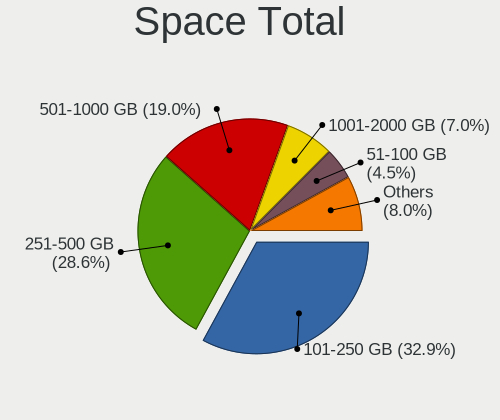
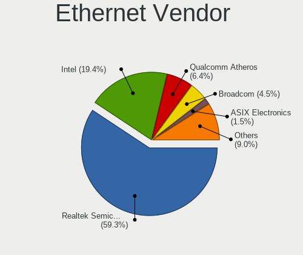

Pop!_OS - Tested Hardware & Statistics (Notebooks)
--------------------------------------------------

A project to collect tested hardware configurations for Pop!_OS.

Anyone can contribute to this report by the [hw-probe](https://github.com/linuxhw/hw-probe) tool:

    sudo -E hw-probe -all -upload

Please contribute! Especially if your hardware is rare.

Contents
--------

* [ Test Cases ](#test-cases)

* [ System ](#system)
  - [ OS                       ](#os)
  - [ OS Family                ](#os-family)
  - [ Kernel                   ](#kernel)
  - [ Kernel Family            ](#kernel-family)
  - [ Kernel Major Ver.        ](#kernel-major-ver)
  - [ Arch                     ](#arch)
  - [ DE                       ](#de)
  - [ Display Server           ](#display-server)
  - [ Display Manager          ](#display-manager)
  - [ OS Lang                  ](#os-lang)
  - [ Boot Mode                ](#boot-mode)
  - [ Filesystem               ](#filesystem)
  - [ Part. scheme             ](#part-scheme)
  - [ Dual Boot with Linux/BSD ](#dual-boot-with-linuxbsd)
  - [ Dual Boot (Win)          ](#dual-boot-win)

* [ Board ](#board)
  - [ Vendor                   ](#vendor)
  - [ Model                    ](#model)
  - [ Model Family             ](#model-family)
  - [ MFG Year                 ](#mfg-year)
  - [ Form Factor              ](#form-factor)
  - [ Secure Boot              ](#secure-boot)
  - [ Coreboot                 ](#coreboot)
  - [ RAM Size                 ](#ram-size)
  - [ RAM Used                 ](#ram-used)
  - [ Total Drives             ](#total-drives)
  - [ Has CD-ROM               ](#has-cd-rom)
  - [ Has Ethernet             ](#has-ethernet)
  - [ Has WiFi                 ](#has-wifi)
  - [ Has Bluetooth            ](#has-bluetooth)

* [ Location ](#location)
  - [ Country                  ](#country)
  - [ City                     ](#city)

* [ Drives ](#drives)
  - [ Drive Vendor             ](#drive-vendor)
  - [ Drive Model              ](#drive-model)
  - [ HDD Vendor               ](#hdd-vendor)
  - [ SSD Vendor               ](#ssd-vendor)
  - [ Drive Kind               ](#drive-kind)
  - [ Drive Connector          ](#drive-connector)
  - [ Drive Size               ](#drive-size)
  - [ Space Total              ](#space-total)
  - [ Space Used               ](#space-used)
  - [ Malfunc. Drives          ](#malfunc-drives)
  - [ Malfunc. Drive Vendor    ](#malfunc-drive-vendor)
  - [ Malfunc. HDD Vendor      ](#malfunc-hdd-vendor)
  - [ Malfunc. Drive Kind      ](#malfunc-drive-kind)
  - [ Failed Drives            ](#failed-drives)
  - [ Failed Drive Vendor      ](#failed-drive-vendor)
  - [ Drive Status             ](#drive-status)

* [ Storage controller ](#storage-controller)
  - [ Storage Vendor           ](#storage-vendor)
  - [ Storage Model            ](#storage-model)
  - [ Storage Kind             ](#storage-kind)

* [ Processor ](#processor)
  - [ CPU Vendor               ](#cpu-vendor)
  - [ CPU Model                ](#cpu-model)
  - [ CPU Model Family         ](#cpu-model-family)
  - [ CPU Cores                ](#cpu-cores)
  - [ CPU Sockets              ](#cpu-sockets)
  - [ CPU Threads              ](#cpu-threads)
  - [ CPU Op-Modes             ](#cpu-op-modes)
  - [ CPU Microcode            ](#cpu-microcode)
  - [ CPU Microarch            ](#cpu-microarch)

* [ Graphics ](#graphics)
  - [ GPU Vendor               ](#gpu-vendor)
  - [ GPU Model                ](#gpu-model)
  - [ GPU Combo                ](#gpu-combo)
  - [ GPU Driver               ](#gpu-driver)
  - [ GPU Memory               ](#gpu-memory)

* [ Monitor ](#monitor)
  - [ Monitor Vendor           ](#monitor-vendor)
  - [ Monitor Model            ](#monitor-model)
  - [ Monitor Resolution       ](#monitor-resolution)
  - [ Monitor Diagonal         ](#monitor-diagonal)
  - [ Monitor Width            ](#monitor-width)
  - [ Aspect Ratio             ](#aspect-ratio)
  - [ Monitor Area             ](#monitor-area)
  - [ Pixel Density            ](#pixel-density)
  - [ Multiple Monitors        ](#multiple-monitors)

* [ Network ](#network)
  - [ Net Controller Vendor    ](#net-controller-vendor)
  - [ Net Controller Model     ](#net-controller-model)
  - [ Wireless Vendor          ](#wireless-vendor)
  - [ Wireless Model           ](#wireless-model)
  - [ Ethernet Vendor          ](#ethernet-vendor)
  - [ Ethernet Model           ](#ethernet-model)
  - [ Net Controller Kind      ](#net-controller-kind)
  - [ Used Controller          ](#used-controller)
  - [ NICs                     ](#nics)
  - [ IPv6                     ](#ipv6)

* [ Bluetooth ](#bluetooth)
  - [ Bluetooth Vendor         ](#bluetooth-vendor)
  - [ Bluetooth Model          ](#bluetooth-model)

* [ Sound ](#sound)
  - [ Sound Vendor             ](#sound-vendor)
  - [ Sound Model              ](#sound-model)

* [ Memory ](#memory)
  - [ Memory Vendor            ](#memory-vendor)
  - [ Memory Model             ](#memory-model)
  - [ Memory Kind              ](#memory-kind)
  - [ Memory Form Factor       ](#memory-form-factor)
  - [ Memory Size              ](#memory-size)
  - [ Memory Speed             ](#memory-speed)

* [ Printers & scanners ](#printers--scanners)
  - [ Printer Vendor           ](#printer-vendor)
  - [ Printer Model            ](#printer-model)
  - [ Scanner Vendor           ](#scanner-vendor)
  - [ Scanner Model            ](#scanner-model)

* [ Camera ](#camera)
  - [ Camera Vendor            ](#camera-vendor)
  - [ Camera Model             ](#camera-model)

* [ Security ](#security)
  - [ Fingerprint Vendor       ](#fingerprint-vendor)
  - [ Fingerprint Model        ](#fingerprint-model)
  - [ Chipcard Vendor          ](#chipcard-vendor)
  - [ Chipcard Model           ](#chipcard-model)

* [ Unsupported ](#unsupported)
  - [ Unsupported Devices      ](#unsupported-devices)
  - [ Unsupported Device Types ](#unsupported-device-types)

Test Cases
----------

Total: 9611

| Vendor        | Model                       | Probe                                                      | Date         |
|---------------|-----------------------------|------------------------------------------------------------|--------------|
| ASUSTek       | F5N                         | [b04fac9072](https://linux-hardware.org/?probe=b04fac9072) | Jan 06, 2025 |
| MSI           | Modern 15 H AI C1MTG        | [4e43ee30f8](https://linux-hardware.org/?probe=4e43ee30f8) | Jan 06, 2025 |
| MSI           | Modern 15 H AI C1MTG        | [ed4c4c8261](https://linux-hardware.org/?probe=ed4c4c8261) | Jan 06, 2025 |
| Dell          | Latitude 5320               | [c7f4eada6c](https://linux-hardware.org/?probe=c7f4eada6c) | Jan 06, 2025 |
| Lenovo        | ThinkPad T440s 20ARS46M0... | [17ac336e9c](https://linux-hardware.org/?probe=17ac336e9c) | Jan 05, 2025 |
| Lenovo        | ThinkPad T540p 20BFS0Y00... | [8e40087118](https://linux-hardware.org/?probe=8e40087118) | Jan 05, 2025 |
| Apple         | MacBookPro12,1              | [0699689325](https://linux-hardware.org/?probe=0699689325) | Jan 05, 2025 |
| ASUSTek       | X71Sr                       | [c76c5d5a1c](https://linux-hardware.org/?probe=c76c5d5a1c) | Jan 05, 2025 |
| Apple         | MacBookPro11,1              | [e994e68b69](https://linux-hardware.org/?probe=e994e68b69) | Jan 05, 2025 |
| Apple         | MacBookPro5,5               | [de39de3147](https://linux-hardware.org/?probe=de39de3147) | Jan 05, 2025 |
| Lenovo        | IdeaPad Slim 5 14AHP9 83... | [370ebbc151](https://linux-hardware.org/?probe=370ebbc151) | Jan 04, 2025 |
| Apple         | MacBookPro11,1              | [370a49426e](https://linux-hardware.org/?probe=370a49426e) | Jan 04, 2025 |
| ASUSTek       | X71Sr                       | [c17afe99ee](https://linux-hardware.org/?probe=c17afe99ee) | Jan 03, 2025 |
| Lenovo        | Legion Pro 5 16ARX8 82WM    | [427c508e21](https://linux-hardware.org/?probe=427c508e21) | Jan 03, 2025 |
| System76      | Oryx Pro                    | [3e45c3caac](https://linux-hardware.org/?probe=3e45c3caac) | Jan 02, 2025 |
| Dell          | Inspiron 3558               | [06fdffd5e6](https://linux-hardware.org/?probe=06fdffd5e6) | Jan 02, 2025 |
| ASUSTek       | Vivobook Go E1504FA_E150... | [3bb27ee500](https://linux-hardware.org/?probe=3bb27ee500) | Jan 02, 2025 |
| Lenovo        | ThinkPad T14 Gen 3 21CGS... | [f2f5dbd7b9](https://linux-hardware.org/?probe=f2f5dbd7b9) | Jan 01, 2025 |
| Lenovo        | ThinkPad X1 Carbon 7th 2... | [497be29097](https://linux-hardware.org/?probe=497be29097) | Jan 01, 2025 |
| Lenovo        | IdeaPad L340-15IRH Gamin... | [8782970610](https://linux-hardware.org/?probe=8782970610) | Jan 01, 2025 |
| Dell          | Inspiron 7520               | [d24db96b79](https://linux-hardware.org/?probe=d24db96b79) | Jan 01, 2025 |
| Dell          | G15 5520                    | [19d5a43273](https://linux-hardware.org/?probe=19d5a43273) | Jan 01, 2025 |
| Apple         | MacBookPro9,2               | [e6da658e0f](https://linux-hardware.org/?probe=e6da658e0f) | Jan 01, 2025 |
| Acer          | Aspire ES1-572              | [419ddbb177](https://linux-hardware.org/?probe=419ddbb177) | Dec 31, 2024 |
| Acer          | Aspire ES1-572              | [dc58f6466e](https://linux-hardware.org/?probe=dc58f6466e) | Dec 31, 2024 |
| Acer          | Aspire A114-32              | [3af2175d58](https://linux-hardware.org/?probe=3af2175d58) | Dec 31, 2024 |
| Apple         | MacBookAir6,2               | [903e299f16](https://linux-hardware.org/?probe=903e299f16) | Dec 30, 2024 |
| Apple         | MacBookPro9,2               | [a509973046](https://linux-hardware.org/?probe=a509973046) | Dec 30, 2024 |
| Apple         | MacBookPro9,2               | [1e4cb7054c](https://linux-hardware.org/?probe=1e4cb7054c) | Dec 30, 2024 |
| ASUSTek       | ASUS TUF Gaming A15 FA50... | [b16417fac3](https://linux-hardware.org/?probe=b16417fac3) | Dec 30, 2024 |
| HP            | EliteBook 840 Aero G8 No... | [af5219d90f](https://linux-hardware.org/?probe=af5219d90f) | Dec 30, 2024 |
| Acer          | Aspire A515-57              | [4bccbc5b01](https://linux-hardware.org/?probe=4bccbc5b01) | Dec 29, 2024 |
| ASUSTek       | TP500LN                     | [beeccb21e7](https://linux-hardware.org/?probe=beeccb21e7) | Dec 29, 2024 |
| ASUSTek       | TP500LN                     | [e71efdddcc](https://linux-hardware.org/?probe=e71efdddcc) | Dec 29, 2024 |
| Lenovo        | Legion Pro 7 16ARX8H 82W... | [702096b561](https://linux-hardware.org/?probe=702096b561) | Dec 29, 2024 |
| Lenovo        | Legion Pro 7 16ARX8H 82W... | [968258cf48](https://linux-hardware.org/?probe=968258cf48) | Dec 29, 2024 |
| HUAWEI        | KLVL-WXX9                   | [eb1589c7c0](https://linux-hardware.org/?probe=eb1589c7c0) | Dec 28, 2024 |
| HP            | EliteBook 8540p             | [3fba3ebc56](https://linux-hardware.org/?probe=3fba3ebc56) | Dec 27, 2024 |
| Acer          | Aspire VX5-591G             | [723f61dbcf](https://linux-hardware.org/?probe=723f61dbcf) | Dec 27, 2024 |
| Acer          | Aspire VX5-591G             | [773ac488ff](https://linux-hardware.org/?probe=773ac488ff) | Dec 27, 2024 |
| Framework     | Laptop 16 (AMD Ryzen 704... | [b892b107e9](https://linux-hardware.org/?probe=b892b107e9) | Dec 27, 2024 |
| System76      | Gazelle                     | [cb477659f5](https://linux-hardware.org/?probe=cb477659f5) | Dec 27, 2024 |
| Chuwi         | MiniBook X                  | [2959afdb7e](https://linux-hardware.org/?probe=2959afdb7e) | Dec 27, 2024 |
| Apple         | MacBookPro11,3              | [8c323a18f3](https://linux-hardware.org/?probe=8c323a18f3) | Dec 26, 2024 |
| Apple         | MacBookPro11,3              | [68bd4716f4](https://linux-hardware.org/?probe=68bd4716f4) | Dec 26, 2024 |
| Dell          | G15 5510                    | [e381abffc2](https://linux-hardware.org/?probe=e381abffc2) | Dec 26, 2024 |
| Acer          | Aspire E1-731               | [e633d3e555](https://linux-hardware.org/?probe=e633d3e555) | Dec 26, 2024 |
| System76      | Oryx Pro                    | [336ade52bd](https://linux-hardware.org/?probe=336ade52bd) | Dec 25, 2024 |
| Lenovo        | ThinkPad T14 Gen 4 21K4S... | [658f4969be](https://linux-hardware.org/?probe=658f4969be) | Dec 24, 2024 |
| Dell          | Precision 7670              | [7b879477ba](https://linux-hardware.org/?probe=7b879477ba) | Dec 24, 2024 |
| Lenovo        | IdeaPad Y700 Touch-15ISK... | [5e9a07ac33](https://linux-hardware.org/?probe=5e9a07ac33) | Dec 23, 2024 |
| HP            | Pavilion Plus Laptop 14-... | [a1beeae5b9](https://linux-hardware.org/?probe=a1beeae5b9) | Dec 22, 2024 |
| ASUSTek       | X510UQR                     | [f0c040e507](https://linux-hardware.org/?probe=f0c040e507) | Dec 22, 2024 |
| HUAWEI        | KLVD-WXX9                   | [a5df0d3fd9](https://linux-hardware.org/?probe=a5df0d3fd9) | Dec 22, 2024 |
| Acer          | Aspire E1-731               | [24c0bfe676](https://linux-hardware.org/?probe=24c0bfe676) | Dec 21, 2024 |
| Dell          | Inspiron 3542               | [81c6c26fa4](https://linux-hardware.org/?probe=81c6c26fa4) | Dec 21, 2024 |
| Lenovo        | ThinkPad P1 Gen 2 20QUS0... | [8eaf87896d](https://linux-hardware.org/?probe=8eaf87896d) | Dec 21, 2024 |
| Lenovo        | ThinkPad X230 2306CTO       | [5fddd22cc1](https://linux-hardware.org/?probe=5fddd22cc1) | Dec 20, 2024 |
| Medion        | S6445 MD61489               | [678fefd644](https://linux-hardware.org/?probe=678fefd644) | Dec 18, 2024 |
| Medion        | S6445 MD61489               | [ddd924a519](https://linux-hardware.org/?probe=ddd924a519) | Dec 18, 2024 |
| HP            | Notebook                    | [c08a1bb97f](https://linux-hardware.org/?probe=c08a1bb97f) | Dec 18, 2024 |
| ASUSTek       | X540LJ                      | [dff11ceadc](https://linux-hardware.org/?probe=dff11ceadc) | Dec 18, 2024 |
| Framework     | Laptop 16 (AMD Ryzen 704... | [f332a63f55](https://linux-hardware.org/?probe=f332a63f55) | Dec 18, 2024 |
| Lenovo        | ThinkPad P53 MWS 15.6 (Q... | [a86913fde1](https://linux-hardware.org/?probe=a86913fde1) | Dec 18, 2024 |
| Apple         | MacBookAir3,1               | [29d91557b3](https://linux-hardware.org/?probe=29d91557b3) | Dec 17, 2024 |
| Apple         | MacBookAir3,1               | [62e2c7fe7b](https://linux-hardware.org/?probe=62e2c7fe7b) | Dec 17, 2024 |
| Lenovo        | ThinkPad L490 20Q6S23200    | [a13840a70a](https://linux-hardware.org/?probe=a13840a70a) | Dec 17, 2024 |
| Dell          | System XPS L502X            | [74f4e14d27](https://linux-hardware.org/?probe=74f4e14d27) | Dec 17, 2024 |
| Dell          | System XPS L502X            | [8aa720a976](https://linux-hardware.org/?probe=8aa720a976) | Dec 17, 2024 |
| ASUSTek       | VivoBook_ASUSLaptop X160... | [e7ce325050](https://linux-hardware.org/?probe=e7ce325050) | Dec 16, 2024 |
| Dell          | Latitude 7340               | [01bf0e0d2c](https://linux-hardware.org/?probe=01bf0e0d2c) | Dec 16, 2024 |
| Lenovo        | Legion Y7000 81FW           | [b74286b627](https://linux-hardware.org/?probe=b74286b627) | Dec 16, 2024 |
| ASUSTek       | VivoBook_ASUSLaptop X140... | [eaa6397d5e](https://linux-hardware.org/?probe=eaa6397d5e) | Dec 16, 2024 |
| System76      | Lemur Pro                   | [96252caa1e](https://linux-hardware.org/?probe=96252caa1e) | Dec 16, 2024 |
| HUAWEI        | KLVL-WXX9                   | [3d5e444772](https://linux-hardware.org/?probe=3d5e444772) | Dec 16, 2024 |
| Apple         | MacBookPro10,1              | [e27d08b364](https://linux-hardware.org/?probe=e27d08b364) | Dec 15, 2024 |
| ASUSTek       | VivoBook_ASUSLaptop X509... | [ec283efd6e](https://linux-hardware.org/?probe=ec283efd6e) | Dec 15, 2024 |
| Lenovo        | ThinkBook 15-IIL 20SM       | [edc19c7235](https://linux-hardware.org/?probe=edc19c7235) | Dec 15, 2024 |
| Apple         | MacBookPro10,1              | [96ffa04014](https://linux-hardware.org/?probe=96ffa04014) | Dec 15, 2024 |
| Fujitsu       | FMVU14003                   | [2d5271bca3](https://linux-hardware.org/?probe=2d5271bca3) | Dec 15, 2024 |
| Lenovo        | LOQ 15IRX9 83DV             | [68a32fe043](https://linux-hardware.org/?probe=68a32fe043) | Dec 15, 2024 |
| Apple         | MacBookPro8,2               | [b3db914035](https://linux-hardware.org/?probe=b3db914035) | Dec 15, 2024 |
| Apple         | MacBookPro8,2               | [ee05cf00fc](https://linux-hardware.org/?probe=ee05cf00fc) | Dec 15, 2024 |
| Dell          | Latitude E6420              | [ed611bf07e](https://linux-hardware.org/?probe=ed611bf07e) | Dec 15, 2024 |
| LG Electro... | 17ZB90R-K.ADC8U1            | [a98308a8ff](https://linux-hardware.org/?probe=a98308a8ff) | Dec 14, 2024 |
| System76      | Galago Pro                  | [263161107b](https://linux-hardware.org/?probe=263161107b) | Dec 14, 2024 |
| Lenovo        | ThinkPad X1 Carbon 7th 2... | [c5cf3c9a58](https://linux-hardware.org/?probe=c5cf3c9a58) | Dec 14, 2024 |
| Lenovo        | ThinkBook 15-IIL 20SM       | [8fd0a47047](https://linux-hardware.org/?probe=8fd0a47047) | Dec 13, 2024 |
| Acer          | Nitro ANV15-41              | [d58a585fc6](https://linux-hardware.org/?probe=d58a585fc6) | Dec 13, 2024 |
| AMI           | Intel                       | [744da97070](https://linux-hardware.org/?probe=744da97070) | Dec 13, 2024 |
| Lenovo        | IdeaPad 1 15ADA7 82R1       | [adb22b56eb](https://linux-hardware.org/?probe=adb22b56eb) | Dec 12, 2024 |
| System76      | Oryx Pro                    | [c87371b1cb](https://linux-hardware.org/?probe=c87371b1cb) | Dec 12, 2024 |
| Apple         | MacBookPro8,1               | [802c98fd5c](https://linux-hardware.org/?probe=802c98fd5c) | Dec 12, 2024 |
| Lenovo        | IdeaPad 320-15IKB 80YH      | [5979a585ea](https://linux-hardware.org/?probe=5979a585ea) | Dec 12, 2024 |
| Lenovo        | ThinkBook 16 G6 ABP 21KK    | [0913e12416](https://linux-hardware.org/?probe=0913e12416) | Dec 12, 2024 |
| Dell          | Latitude E7470              | [300b02bb07](https://linux-hardware.org/?probe=300b02bb07) | Dec 12, 2024 |
| Dell          | Latitude 7490               | [f97f9efaf8](https://linux-hardware.org/?probe=f97f9efaf8) | Dec 12, 2024 |
| Lenovo        | IdeaPad Z570 HuronRiver ... | [e5be77487d](https://linux-hardware.org/?probe=e5be77487d) | Dec 11, 2024 |
| Dell          | Inspiron 16 5645            | [0437f5d57e](https://linux-hardware.org/?probe=0437f5d57e) | Dec 11, 2024 |
| Notebook      | N85_N87,HJ,HJ1,HK1          | [c252814d3e](https://linux-hardware.org/?probe=c252814d3e) | Dec 11, 2024 |
| Lenovo        | ThinkPad X1 Carbon Gen 9... | [9105942b15](https://linux-hardware.org/?probe=9105942b15) | Dec 10, 2024 |
| Lenovo        | IdeaPad 320-15IKB 80YH      | [d595bcedb4](https://linux-hardware.org/?probe=d595bcedb4) | Dec 10, 2024 |
| Lenovo        | B5400 20278                 | [e1b20f6c0b](https://linux-hardware.org/?probe=e1b20f6c0b) | Dec 10, 2024 |
| Lenovo        | ThinkPad X270 20HN001HUS    | [ef25178fec](https://linux-hardware.org/?probe=ef25178fec) | Dec 10, 2024 |
| Lenovo        | ThinkPad X270 20HN001HUS    | [954578185e](https://linux-hardware.org/?probe=954578185e) | Dec 10, 2024 |
| ASUSTek       | ASUS TUF Gaming F15 FX50... | [861b5550d3](https://linux-hardware.org/?probe=861b5550d3) | Dec 10, 2024 |
| Dell          | Latitude E6330              | [dfc2aca866](https://linux-hardware.org/?probe=dfc2aca866) | Dec 09, 2024 |
| HP            | ZBook 17 G5                 | [0f14052159](https://linux-hardware.org/?probe=0f14052159) | Dec 09, 2024 |
| Apple         | MacBookPro5,4               | [751741e751](https://linux-hardware.org/?probe=751741e751) | Dec 09, 2024 |
| Apple         | MacBookPro5,4               | [fd85f5ad8f](https://linux-hardware.org/?probe=fd85f5ad8f) | Dec 09, 2024 |
| Apple         | MacBookPro8,1               | [58a0bf4e65](https://linux-hardware.org/?probe=58a0bf4e65) | Dec 09, 2024 |
| ASUSTek       | ROG Zephyrus G14 GA403UV... | [e8f69e44e3](https://linux-hardware.org/?probe=e8f69e44e3) | Dec 09, 2024 |
| ASUSTek       | ASUS TUF Gaming A15 FA50... | [4fef924a63](https://linux-hardware.org/?probe=4fef924a63) | Dec 09, 2024 |
| Eluktronic... | RP-15                       | [bc1a09c984](https://linux-hardware.org/?probe=bc1a09c984) | Dec 08, 2024 |
| Google        | Samus                       | [362b80bc7d](https://linux-hardware.org/?probe=362b80bc7d) | Dec 08, 2024 |
| Unknown       | Unknown                     | [954625623a](https://linux-hardware.org/?probe=954625623a) | Dec 08, 2024 |
| HP            | OMEN by Laptop 17-cb1xxx    | [4c1f450872](https://linux-hardware.org/?probe=4c1f450872) | Dec 08, 2024 |
| Dell          | Inspiron N4050              | [7194f36c08](https://linux-hardware.org/?probe=7194f36c08) | Dec 08, 2024 |
| HP            | ProBook 650 G1              | [62f3ba4cc6](https://linux-hardware.org/?probe=62f3ba4cc6) | Dec 07, 2024 |
| Lenovo        | ThinkPad X1 Extreme Gen ... | [88d9510fcb](https://linux-hardware.org/?probe=88d9510fcb) | Dec 07, 2024 |
| Dell          | Inspiron 15 5510            | [bd969c198e](https://linux-hardware.org/?probe=bd969c198e) | Dec 07, 2024 |
| Lenovo        | ThinkPad P52 20MAS1WD0S     | [49359bfaf2](https://linux-hardware.org/?probe=49359bfaf2) | Dec 07, 2024 |
| Lenovo        | ThinkPad T420s 417032U      | [4ac33e7516](https://linux-hardware.org/?probe=4ac33e7516) | Dec 07, 2024 |
| Lenovo        | Yoga Pro 7 14AHP9 83E3      | [8ff09eea32](https://linux-hardware.org/?probe=8ff09eea32) | Dec 06, 2024 |
| ASUSTek       | Zenbook UM3402YA_UM3402Y... | [2616e6e6d0](https://linux-hardware.org/?probe=2616e6e6d0) | Dec 06, 2024 |
| Lenovo        | ThinkPad E14 Gen 2 20TA0... | [a324fb8617](https://linux-hardware.org/?probe=a324fb8617) | Dec 06, 2024 |
| HP            | Dragonfly Pro ONE           | [6db18a33b7](https://linux-hardware.org/?probe=6db18a33b7) | Dec 06, 2024 |
| Dell          | Latitude 5490               | [04d3dd2626](https://linux-hardware.org/?probe=04d3dd2626) | Dec 05, 2024 |
| Dell          | Inspiron 16 7640 2-in-1     | [3af8e24702](https://linux-hardware.org/?probe=3af8e24702) | Dec 05, 2024 |
| ASUSTek       | N550JV                      | [e0700722fa](https://linux-hardware.org/?probe=e0700722fa) | Dec 04, 2024 |
| Acer          | Aspire A315-44P             | [67fde295de](https://linux-hardware.org/?probe=67fde295de) | Dec 04, 2024 |
| Dell          | Latitude 7214               | [e84846c90c](https://linux-hardware.org/?probe=e84846c90c) | Dec 03, 2024 |
| Fujitsu       | CELSIUS H920                | [8b524abe47](https://linux-hardware.org/?probe=8b524abe47) | Dec 03, 2024 |
| Apple         | MacBookPro9,2               | [2749a746c7](https://linux-hardware.org/?probe=2749a746c7) | Dec 03, 2024 |
| Apple         | MacBookPro9,2               | [e36eea22b1](https://linux-hardware.org/?probe=e36eea22b1) | Dec 03, 2024 |
| Acer          | Aspire A315-41              | [629a42a94d](https://linux-hardware.org/?probe=629a42a94d) | Dec 03, 2024 |
| Acer          | Aspire A315-41              | [dff6e368e4](https://linux-hardware.org/?probe=dff6e368e4) | Dec 02, 2024 |
| ASUSTek       | ASUS TUF Dash F15 FX516P... | [8240d92fbc](https://linux-hardware.org/?probe=8240d92fbc) | Dec 02, 2024 |
| Lenovo        | IdeaPad 3 15ALC6 82KU       | [e702910c8e](https://linux-hardware.org/?probe=e702910c8e) | Dec 02, 2024 |
| Dell          | XPS 13 9380                 | [265dad936c](https://linux-hardware.org/?probe=265dad936c) | Dec 01, 2024 |
| Framework     | Laptop                      | [dd1492ec61](https://linux-hardware.org/?probe=dd1492ec61) | Dec 01, 2024 |
| Fujitsu       | CELSIUS H920                | [bae9e145b7](https://linux-hardware.org/?probe=bae9e145b7) | Nov 30, 2024 |
| ASUSTek       | ROG Zephyrus G14 GA403UI... | [296918a3b8](https://linux-hardware.org/?probe=296918a3b8) | Nov 30, 2024 |
| Dell          | Inspiron 3543               | [a87d08ca42](https://linux-hardware.org/?probe=a87d08ca42) | Nov 28, 2024 |
| Lenovo        | IdeaPad Gaming 3 15ARH05... | [f8c81ccbdb](https://linux-hardware.org/?probe=f8c81ccbdb) | Nov 28, 2024 |
| Lenovo        | ThinkPad X1 Carbon 6th 2... | [90cef362ad](https://linux-hardware.org/?probe=90cef362ad) | Nov 27, 2024 |
| Dell          | Inspiron 15 7000 Gaming     | [b04303ec82](https://linux-hardware.org/?probe=b04303ec82) | Nov 26, 2024 |
| Dell          | Inspiron 3543               | [bcc801145a](https://linux-hardware.org/?probe=bcc801145a) | Nov 25, 2024 |
| Notebook      | NLxxPUx                     | [1f935fe7fc](https://linux-hardware.org/?probe=1f935fe7fc) | Nov 25, 2024 |
| Lenovo        | IdeaPad 1 15AMN7 82X5       | [ce9660e165](https://linux-hardware.org/?probe=ce9660e165) | Nov 25, 2024 |
| Dell          | Inspiron 5480               | [ce8745ed99](https://linux-hardware.org/?probe=ce8745ed99) | Nov 24, 2024 |
| Lenovo        | ThinkPad T480s 20L8S27M0... | [8cf2b4511a](https://linux-hardware.org/?probe=8cf2b4511a) | Nov 24, 2024 |
| ASUSTek       | GL503VMF                    | [cb79d7ac34](https://linux-hardware.org/?probe=cb79d7ac34) | Nov 24, 2024 |
| MSI           | GF63 8RC                    | [86cd8d621b](https://linux-hardware.org/?probe=86cd8d621b) | Nov 23, 2024 |
| Acer          | Aspire E1-731               | [f8b734fdc4](https://linux-hardware.org/?probe=f8b734fdc4) | Nov 23, 2024 |
| Lenovo        | IdeaPad 3 15ALC6 82KU       | [5730687f62](https://linux-hardware.org/?probe=5730687f62) | Nov 23, 2024 |
| ASUSTek       | ROG Zephyrus G15 GA503QS... | [603ece14b5](https://linux-hardware.org/?probe=603ece14b5) | Nov 23, 2024 |
| HP            | Pavilion Gaming Laptop 1... | [2c25bb8e66](https://linux-hardware.org/?probe=2c25bb8e66) | Nov 23, 2024 |
| Dell          | XPS 15 9570                 | [3da1cde3bf](https://linux-hardware.org/?probe=3da1cde3bf) | Nov 23, 2024 |
| HP            | Dragonfly Pro Laptop PC     | [4512acb105](https://linux-hardware.org/?probe=4512acb105) | Nov 23, 2024 |
| Apple         | MacBookPro11,3              | [9ad6cf1e22](https://linux-hardware.org/?probe=9ad6cf1e22) | Nov 22, 2024 |
| Lenovo        | ThinkPad T490s 20NYS3NT0... | [89cbb90e46](https://linux-hardware.org/?probe=89cbb90e46) | Nov 21, 2024 |
| System76      | Gazelle                     | [b3ba386916](https://linux-hardware.org/?probe=b3ba386916) | Nov 21, 2024 |
| Dell          | Precision 5490              | [32bacf2696](https://linux-hardware.org/?probe=32bacf2696) | Nov 21, 2024 |
| Alienware     | 15 R2                       | [e19cff46a5](https://linux-hardware.org/?probe=e19cff46a5) | Nov 21, 2024 |
| Lenovo        | ThinkPad T15p Gen 3 21DA... | [13b235f8ac](https://linux-hardware.org/?probe=13b235f8ac) | Nov 21, 2024 |
| Fujitsu       | LIFEBOOK AH532/G21          | [51cbd9f492](https://linux-hardware.org/?probe=51cbd9f492) | Nov 20, 2024 |
| Acer          | Aspire A315-51              | [291ffae1d7](https://linux-hardware.org/?probe=291ffae1d7) | Nov 20, 2024 |
| Lenovo        | ThinkPad T430s 2356CU8      | [88c764ac54](https://linux-hardware.org/?probe=88c764ac54) | Nov 20, 2024 |
| ASUSTek       | ROG Strix G18 G834JZR_G8... | [fbfffc7976](https://linux-hardware.org/?probe=fbfffc7976) | Nov 19, 2024 |
| Dell          | Inspiron 15 7000 Gaming     | [e208cd8e71](https://linux-hardware.org/?probe=e208cd8e71) | Nov 19, 2024 |
| Lenovo        | Legion 5 15ARH05H 82B1      | [8801ad76a4](https://linux-hardware.org/?probe=8801ad76a4) | Nov 19, 2024 |
| HUAWEI        | NBLB-WAX9N                  | [63467331fb](https://linux-hardware.org/?probe=63467331fb) | Nov 19, 2024 |
| PC Special... | NH5xAx                      | [61b94b9412](https://linux-hardware.org/?probe=61b94b9412) | Nov 18, 2024 |
| Apple         | MacBookPro9,2               | [024e56ebca](https://linux-hardware.org/?probe=024e56ebca) | Nov 17, 2024 |
| Matsushita... | CF-19FDGADCM                | [9fadfe6a9b](https://linux-hardware.org/?probe=9fadfe6a9b) | Nov 17, 2024 |
| Dell          | Inspiron 3558               | [f1630ad0da](https://linux-hardware.org/?probe=f1630ad0da) | Nov 17, 2024 |
| MSI           | GP60 2PE                    | [3d4814126b](https://linux-hardware.org/?probe=3d4814126b) | Nov 16, 2024 |
| ASUSTek       | Strix GL703GS_GL703GS       | [6ea29cc14a](https://linux-hardware.org/?probe=6ea29cc14a) | Nov 16, 2024 |
| Apple         | MacBookPro11,5              | [c2a112f067](https://linux-hardware.org/?probe=c2a112f067) | Nov 16, 2024 |
| Lenovo        | ThinkPad T460 20FN003LGE    | [06d3c3c63f](https://linux-hardware.org/?probe=06d3c3c63f) | Nov 16, 2024 |
| Lenovo        | IdeaPad 5 14ABA7 82SE       | [5f6a56e720](https://linux-hardware.org/?probe=5f6a56e720) | Nov 16, 2024 |
| ASUSTek       | ROG Zephyrus M16 GU604VI... | [a14710d282](https://linux-hardware.org/?probe=a14710d282) | Nov 16, 2024 |
| Lenovo        | Legion 5 Pro 16ARH7H 82R... | [b7df8d7127](https://linux-hardware.org/?probe=b7df8d7127) | Nov 16, 2024 |
| ASUSTek       | ASUS TUF Gaming A15 FA50... | [48b24cce4c](https://linux-hardware.org/?probe=48b24cce4c) | Nov 16, 2024 |
| Apple         | MacBookPro9,1               | [e839fa544a](https://linux-hardware.org/?probe=e839fa544a) | Nov 15, 2024 |
| Apple         | MacBookPro9,1               | [ff147ff990](https://linux-hardware.org/?probe=ff147ff990) | Nov 15, 2024 |
| Razer         | Blade                       | [0d6640fb39](https://linux-hardware.org/?probe=0d6640fb39) | Nov 15, 2024 |
| Lenovo        | IdeaPad 5 14ABA7 82SE       | [1ff2d7429c](https://linux-hardware.org/?probe=1ff2d7429c) | Nov 15, 2024 |
| Lenovo        | ThinkPad P16 Gen 1 21D6C... | [ec728fd727](https://linux-hardware.org/?probe=ec728fd727) | Nov 14, 2024 |
| Acer          | Nitro AN515-51              | [b4bf8cdee4](https://linux-hardware.org/?probe=b4bf8cdee4) | Nov 13, 2024 |
| MSI           | Vector 16 HX A13VHG         | [afef5ca6c4](https://linux-hardware.org/?probe=afef5ca6c4) | Nov 13, 2024 |
| Lenovo        | IdeaPad 320S-14IKB 80X4     | [b27354f1ee](https://linux-hardware.org/?probe=b27354f1ee) | Nov 13, 2024 |
| Lenovo        | IdeaPad Slim 5 16AHP9 83... | [14d794125a](https://linux-hardware.org/?probe=14d794125a) | Nov 12, 2024 |
| Lenovo        | ThinkPad T470p 20J7S0CF0... | [5ddb463c28](https://linux-hardware.org/?probe=5ddb463c28) | Nov 12, 2024 |
| Lenovo        | ThinkPad T470p 20J7S0CF0... | [b50cd6c13b](https://linux-hardware.org/?probe=b50cd6c13b) | Nov 12, 2024 |
| Lenovo        | IdeaPad Gaming 3 15IHU6 ... | [feb8fd8dbc](https://linux-hardware.org/?probe=feb8fd8dbc) | Nov 12, 2024 |
| MSI           | Modern 14 A10RB             | [e0bf66102b](https://linux-hardware.org/?probe=e0bf66102b) | Nov 12, 2024 |
| Dell          | Precision 3561              | [43f06770e1](https://linux-hardware.org/?probe=43f06770e1) | Nov 11, 2024 |
| Acer          | Aspire 4752                 | [2f02f5ff8b](https://linux-hardware.org/?probe=2f02f5ff8b) | Nov 11, 2024 |
| Infinix       | INBOOK Y1 PLUS              | [53ea4dc826](https://linux-hardware.org/?probe=53ea4dc826) | Nov 11, 2024 |
| Lenovo        | IdeaPad 320-15IKB 80YH      | [d39f3e11a8](https://linux-hardware.org/?probe=d39f3e11a8) | Nov 11, 2024 |
| Toshiba       | Satellite L655D             | [9a6af30aa7](https://linux-hardware.org/?probe=9a6af30aa7) | Nov 10, 2024 |
| Lenovo        | V330-14IKB 81B0             | [d244f80fd9](https://linux-hardware.org/?probe=d244f80fd9) | Nov 10, 2024 |
| Acer          | Aspire E1-571G              | [b2eba6e770](https://linux-hardware.org/?probe=b2eba6e770) | Nov 09, 2024 |
| Lenovo        | ThinkPad T490 20N3000KGE    | [8f487ff101](https://linux-hardware.org/?probe=8f487ff101) | Nov 09, 2024 |
| Acer          | Aspire A315-24PT            | [a780b016b5](https://linux-hardware.org/?probe=a780b016b5) | Nov 09, 2024 |
| Toshiba       | Satellite S40Dt-A           | [9df604ab8c](https://linux-hardware.org/?probe=9df604ab8c) | Nov 08, 2024 |
| Lenovo        | ThinkPad T490 20N3000KGE    | [97d3495f24](https://linux-hardware.org/?probe=97d3495f24) | Nov 08, 2024 |
| Gigabyte      | AERO 15XV8                  | [ad28b2f598](https://linux-hardware.org/?probe=ad28b2f598) | Nov 07, 2024 |
| Acer          | Predator PT14-51            | [89ab08c4d5](https://linux-hardware.org/?probe=89ab08c4d5) | Nov 07, 2024 |
| Acer          | SF314-71-50E8               | [026f2ca004](https://linux-hardware.org/?probe=026f2ca004) | Nov 07, 2024 |
| ASUSTek       | ROG Zephyrus G15 GA503QR... | [de1c2a77a8](https://linux-hardware.org/?probe=de1c2a77a8) | Nov 07, 2024 |
| Apple         | MacBookPro8,3               | [86b3f8139b](https://linux-hardware.org/?probe=86b3f8139b) | Nov 06, 2024 |
| ASUSTek       | VivoBook_ASUSLaptop M740... | [92d4a2f482](https://linux-hardware.org/?probe=92d4a2f482) | Nov 05, 2024 |
| Lenovo        | V145-15AST 81MT             | [7f51e7a50a](https://linux-hardware.org/?probe=7f51e7a50a) | Nov 05, 2024 |
| Acer          | Nitro AN515-58              | [49b45e8170](https://linux-hardware.org/?probe=49b45e8170) | Nov 04, 2024 |
| Dell          | XPS 13 9370                 | [488431591c](https://linux-hardware.org/?probe=488431591c) | Nov 04, 2024 |
| MSI           | Summit E16FlipEvo A11MT     | [70c39b3a00](https://linux-hardware.org/?probe=70c39b3a00) | Nov 04, 2024 |
| Framework     | Laptop 13 (AMD Ryzen 704... | [9f80547082](https://linux-hardware.org/?probe=9f80547082) | Nov 04, 2024 |
| ASUSTek       | Zenbook UX3404VA_Q420VA     | [2dd904a978](https://linux-hardware.org/?probe=2dd904a978) | Nov 03, 2024 |
| HP            | Victus by Laptop 16-e0xx... | [bb50b544e2](https://linux-hardware.org/?probe=bb50b544e2) | Nov 03, 2024 |
| System76      | Serval WS                   | [3325ac75c2](https://linux-hardware.org/?probe=3325ac75c2) | Nov 03, 2024 |
| HP            | OMEN by Laptop 15-dh0xxx    | [a073c7cb1e](https://linux-hardware.org/?probe=a073c7cb1e) | Nov 03, 2024 |
| System76      | Pangolin                    | [d1958d8e54](https://linux-hardware.org/?probe=d1958d8e54) | Nov 02, 2024 |
| Lenovo        | IdeaPad S145-15API 81V7     | [0f0375d12d](https://linux-hardware.org/?probe=0f0375d12d) | Nov 02, 2024 |
| Apple         | MacBookPro10,1              | [1c42e6c25f](https://linux-hardware.org/?probe=1c42e6c25f) | Nov 02, 2024 |
| HP            | Victus by Gaming Laptop ... | [5370c39b49](https://linux-hardware.org/?probe=5370c39b49) | Nov 02, 2024 |
| ASUSTek       | ASUS EXPERTBOOK B1502CBA... | [2831ff1766](https://linux-hardware.org/?probe=2831ff1766) | Nov 02, 2024 |
| Dell          | Precision 3590              | [bc82f6333a](https://linux-hardware.org/?probe=bc82f6333a) | Nov 02, 2024 |
| Dell          | Latitude E4300              | [90b6823b82](https://linux-hardware.org/?probe=90b6823b82) | Nov 02, 2024 |
| Lenovo        | ThinkPad P1 Gen 3 20TH00... | [d6283216f3](https://linux-hardware.org/?probe=d6283216f3) | Nov 02, 2024 |
| Lenovo        | IdeaPad L340-17IRH Gamin... | [67f2f24139](https://linux-hardware.org/?probe=67f2f24139) | Nov 02, 2024 |
| Google        | Samus                       | [6c26c1cab1](https://linux-hardware.org/?probe=6c26c1cab1) | Nov 01, 2024 |
| Google        | Samus                       | [190f904324](https://linux-hardware.org/?probe=190f904324) | Nov 01, 2024 |
| Lenovo        | IdeaPad 330-15AST 81D6      | [06801a2213](https://linux-hardware.org/?probe=06801a2213) | Nov 01, 2024 |
| HP            | Pavilion dv9700             | [e649cb0d93](https://linux-hardware.org/?probe=e649cb0d93) | Nov 01, 2024 |
| Dell          | Latitude E4300              | [2c7555b016](https://linux-hardware.org/?probe=2c7555b016) | Oct 31, 2024 |
| Gigabyte      | AERO 15XV8                  | [10526455a3](https://linux-hardware.org/?probe=10526455a3) | Oct 31, 2024 |
| System76      | Darter Pro                  | [47e11617c9](https://linux-hardware.org/?probe=47e11617c9) | Oct 31, 2024 |
| Lenovo        | IdeaPad Slim 3 15IAN8 82... | [8a23e0e1bf](https://linux-hardware.org/?probe=8a23e0e1bf) | Oct 31, 2024 |
| Dell          | Inspiron 16 7640 2-in-1     | [f0a61a6b62](https://linux-hardware.org/?probe=f0a61a6b62) | Oct 31, 2024 |
| Dell          | Inspiron 3543               | [ca851926b9](https://linux-hardware.org/?probe=ca851926b9) | Oct 31, 2024 |
| Dell          | Inspiron 3543               | [3872f48485](https://linux-hardware.org/?probe=3872f48485) | Oct 30, 2024 |
| Gigabyte      | Z590I AORUS ULTRA           | [816bafe83f](https://linux-hardware.org/?probe=816bafe83f) | Oct 30, 2024 |
| Lenovo        | ThinkPad E14 Gen 5 21JR0... | [9589e6f064](https://linux-hardware.org/?probe=9589e6f064) | Oct 30, 2024 |
| Acer          | Aspire A515-54G             | [8b1abbd55e](https://linux-hardware.org/?probe=8b1abbd55e) | Oct 30, 2024 |
| Dell          | XPS 15 9510                 | [3e6d95febe](https://linux-hardware.org/?probe=3e6d95febe) | Oct 29, 2024 |
| MSI           | Modern 14 B11MOU            | [1347b3862f](https://linux-hardware.org/?probe=1347b3862f) | Oct 29, 2024 |
| Lenovo        | ThinkPad T14 Gen 4 21K4S... | [8c5b5946e9](https://linux-hardware.org/?probe=8c5b5946e9) | Oct 29, 2024 |
| Toshiba       | Satellite C850-B225         | [962858a9aa](https://linux-hardware.org/?probe=962858a9aa) | Oct 29, 2024 |
| Lenovo        | IdeaPad 1 15AMN7 82VG       | [2e04817d43](https://linux-hardware.org/?probe=2e04817d43) | Oct 28, 2024 |
| ASUSTek       | VivoBook_ASUSLaptop M150... | [e71f961f6b](https://linux-hardware.org/?probe=e71f961f6b) | Oct 28, 2024 |
| Dell          | Latitude E6430              | [3a0bf739f0](https://linux-hardware.org/?probe=3a0bf739f0) | Oct 28, 2024 |
| Lenovo        | ThinkPad X390 20Q1S6W600    | [8e5f1a7f66](https://linux-hardware.org/?probe=8e5f1a7f66) | Oct 27, 2024 |
| MSI           | Bravo 17 C7VFK              | [a7adfb673d](https://linux-hardware.org/?probe=a7adfb673d) | Oct 27, 2024 |
| Lenovo        | IdeaPad 1 15AMN7 82VG       | [e2335cbea6](https://linux-hardware.org/?probe=e2335cbea6) | Oct 27, 2024 |
| Apple         | MacBookAir7,2               | [6b3fb2ce2d](https://linux-hardware.org/?probe=6b3fb2ce2d) | Oct 26, 2024 |
| System76      | Pangolin                    | [fb57203d8e](https://linux-hardware.org/?probe=fb57203d8e) | Oct 26, 2024 |
| Lenovo        | 3 15ADA05 81W1              | [909b98bfa8](https://linux-hardware.org/?probe=909b98bfa8) | Oct 26, 2024 |
| System76      | Lemur Pro                   | [c9d662ba98](https://linux-hardware.org/?probe=c9d662ba98) | Oct 26, 2024 |
| MSI           | Modern 14 B11MOU            | [e854e6170d](https://linux-hardware.org/?probe=e854e6170d) | Oct 25, 2024 |
| Alienware     | m16 R1                      | [da15c91477](https://linux-hardware.org/?probe=da15c91477) | Oct 25, 2024 |
| Alienware     | m16 R1                      | [1e49172947](https://linux-hardware.org/?probe=1e49172947) | Oct 25, 2024 |
| Lenovo        | ThinkPad E14 Gen 4 21E3C... | [085e6bccdb](https://linux-hardware.org/?probe=085e6bccdb) | Oct 25, 2024 |
| ASUSTek       | ASUS TUF Gaming A14 FA40... | [100c697e15](https://linux-hardware.org/?probe=100c697e15) | Oct 25, 2024 |
| ASUSTek       | ASUS TUF Gaming A14 FA40... | [e8bafa71e4](https://linux-hardware.org/?probe=e8bafa71e4) | Oct 25, 2024 |
| HP            | Pavilion dv6                | [e0742f5a71](https://linux-hardware.org/?probe=e0742f5a71) | Oct 25, 2024 |
| HP            | Pavilion dv6                | [6038c991fd](https://linux-hardware.org/?probe=6038c991fd) | Oct 25, 2024 |
| Dell          | Latitude E5530 non-vPro     | [81b90346d4](https://linux-hardware.org/?probe=81b90346d4) | Oct 25, 2024 |
| Dell          | Latitude E5530 non-vPro     | [3f56d7a7f5](https://linux-hardware.org/?probe=3f56d7a7f5) | Oct 25, 2024 |
| HP            | Victus by Gaming Laptop ... | [84f4f906f2](https://linux-hardware.org/?probe=84f4f906f2) | Oct 24, 2024 |
| ASUSTek       | GL553VE                     | [ac2e87e2ce](https://linux-hardware.org/?probe=ac2e87e2ce) | Oct 23, 2024 |
| Itautec       | Infoway w7730               | [031ee64761](https://linux-hardware.org/?probe=031ee64761) | Oct 23, 2024 |
| ASUSTek       | ASUS TUF Gaming F15 FX50... | [cb81bdd86a](https://linux-hardware.org/?probe=cb81bdd86a) | Oct 23, 2024 |
| System76      | Pangolin                    | [802316e70a](https://linux-hardware.org/?probe=802316e70a) | Oct 23, 2024 |
| MSI           | GS60 6QE                    | [7e1d315d47](https://linux-hardware.org/?probe=7e1d315d47) | Oct 22, 2024 |
| IT Channel... | NP5x_6x_7x_SNx              | [f92a3a6051](https://linux-hardware.org/?probe=f92a3a6051) | Oct 21, 2024 |
| Positivo      | Schoolmate SF20GM7          | [4b0b1bae90](https://linux-hardware.org/?probe=4b0b1bae90) | Oct 21, 2024 |
| IT Channel... | PCX0DX                      | [c8d8110356](https://linux-hardware.org/?probe=c8d8110356) | Oct 21, 2024 |
| System76      | Gazelle                     | [d1a78e6ac2](https://linux-hardware.org/?probe=d1a78e6ac2) | Oct 20, 2024 |
| HP            | ProBook 4740s               | [b2dd7236f6](https://linux-hardware.org/?probe=b2dd7236f6) | Oct 20, 2024 |
| Acer          | Aspire 7745G                | [48cc1c84fc](https://linux-hardware.org/?probe=48cc1c84fc) | Oct 20, 2024 |
| HP            | Pavilion dv7                | [77e53f9398](https://linux-hardware.org/?probe=77e53f9398) | Oct 19, 2024 |
| HP            | Pavilion HDX9200            | [1098a89014](https://linux-hardware.org/?probe=1098a89014) | Oct 19, 2024 |
| Dell          | Studio 1555                 | [709087cbff](https://linux-hardware.org/?probe=709087cbff) | Oct 19, 2024 |
| Sony          | VPCEH1M9R                   | [78491a0382](https://linux-hardware.org/?probe=78491a0382) | Oct 18, 2024 |
| Lenovo        | IdeaPad 310-15ISK 80UH      | [065239fc07](https://linux-hardware.org/?probe=065239fc07) | Oct 18, 2024 |
| Lenovo        | IdeaPad Slim 5 14IRL8 82... | [62c3d2eddd](https://linux-hardware.org/?probe=62c3d2eddd) | Oct 17, 2024 |
| MSI           | Katana 15 B13VFK            | [45d00541c0](https://linux-hardware.org/?probe=45d00541c0) | Oct 17, 2024 |
| HP            | ProBook 650 G2              | [8b6dc142e9](https://linux-hardware.org/?probe=8b6dc142e9) | Oct 17, 2024 |
| Lenovo        | ThinkPad P50 20EQS29A00     | [9cee201a44](https://linux-hardware.org/?probe=9cee201a44) | Oct 17, 2024 |
| Toshiba       | QOSMIO X775                 | [de226c2b19](https://linux-hardware.org/?probe=de226c2b19) | Oct 16, 2024 |
| Dell          | XPS 13 9370                 | [7d89635983](https://linux-hardware.org/?probe=7d89635983) | Oct 16, 2024 |
| Notebook      | W65_W67RB                   | [69df44fe32](https://linux-hardware.org/?probe=69df44fe32) | Oct 16, 2024 |
| Notebook      | W65_W67RB                   | [a787a5ebbb](https://linux-hardware.org/?probe=a787a5ebbb) | Oct 16, 2024 |
| MSI           | Summit E13FlipEvo A12MT     | [9b12651c67](https://linux-hardware.org/?probe=9b12651c67) | Oct 16, 2024 |
| HP            | Pavilion Laptop 15-cd0xx    | [b83fb99eb1](https://linux-hardware.org/?probe=b83fb99eb1) | Oct 16, 2024 |
| ASUSTek       | VivoBook_ASUSLaptop X521... | [a3e77b53eb](https://linux-hardware.org/?probe=a3e77b53eb) | Oct 16, 2024 |
| ASUSTek       | ROG Strix G513IC_G513IC     | [56fa2a9b2a](https://linux-hardware.org/?probe=56fa2a9b2a) | Oct 15, 2024 |
| Apple         | MacBookPro8,1               | [18cc7921db](https://linux-hardware.org/?probe=18cc7921db) | Oct 15, 2024 |
| Apple         | MacBookPro8,1               | [e6891ad523](https://linux-hardware.org/?probe=e6891ad523) | Oct 15, 2024 |
| Lenovo        | ThinkPad T490s 20NYS3NT0... | [7dd8855689](https://linux-hardware.org/?probe=7dd8855689) | Oct 15, 2024 |
| Dell          | Latitude E7250              | [ce90b269d6](https://linux-hardware.org/?probe=ce90b269d6) | Oct 14, 2024 |
| Lenovo        | Legion Y540-15IRH 81SX      | [4b04c405ca](https://linux-hardware.org/?probe=4b04c405ca) | Oct 14, 2024 |
| ASUSTek       | ROG Zephyrus G15 GA503QR... | [00304ae6db](https://linux-hardware.org/?probe=00304ae6db) | Oct 14, 2024 |
| Apple         | MacBookPro8,2               | [f20e6b3dc8](https://linux-hardware.org/?probe=f20e6b3dc8) | Oct 13, 2024 |
| Apple         | MacBookPro8,2               | [ecf92c84fe](https://linux-hardware.org/?probe=ecf92c84fe) | Oct 13, 2024 |
| ASUSTek       | E403NA                      | [9ae450e44c](https://linux-hardware.org/?probe=9ae450e44c) | Oct 13, 2024 |
| Alienware     | m15 R7                      | [5322ba17a8](https://linux-hardware.org/?probe=5322ba17a8) | Oct 13, 2024 |
| System76      | Lemur                       | [61343c26b9](https://linux-hardware.org/?probe=61343c26b9) | Oct 13, 2024 |
| HP            | ZBook 15 G3                 | [396d9b1508](https://linux-hardware.org/?probe=396d9b1508) | Oct 12, 2024 |
| MSI           | Katana 15 B13VFK            | [d5a97499e2](https://linux-hardware.org/?probe=d5a97499e2) | Oct 12, 2024 |
| HP            | EliteBook 845 G8 Noteboo... | [8dc9ff9d77](https://linux-hardware.org/?probe=8dc9ff9d77) | Oct 12, 2024 |
| Framework     | Laptop                      | [5a875a182c](https://linux-hardware.org/?probe=5a875a182c) | Oct 11, 2024 |
| Framework     | Laptop                      | [829aae35c2](https://linux-hardware.org/?probe=829aae35c2) | Oct 11, 2024 |
| Dell          | XPS 13 9350                 | [d4ae2f6f73](https://linux-hardware.org/?probe=d4ae2f6f73) | Oct 11, 2024 |
| Acer          | Aspire A515-57              | [4e4e4b33ec](https://linux-hardware.org/?probe=4e4e4b33ec) | Oct 11, 2024 |
| Apple         | MacBookPro8,2               | [b40e0a8447](https://linux-hardware.org/?probe=b40e0a8447) | Oct 11, 2024 |
| HP            | EliteBook 640 14 inch G1... | [eb78247aef](https://linux-hardware.org/?probe=eb78247aef) | Oct 11, 2024 |
| HP            | Laptop 14-dk0xxx            | [530feba7a4](https://linux-hardware.org/?probe=530feba7a4) | Oct 11, 2024 |
| Dell          | G3 3579                     | [3f29ebd856](https://linux-hardware.org/?probe=3f29ebd856) | Oct 11, 2024 |
| MSI           | Katana 15 B13VFK            | [2dd48ca806](https://linux-hardware.org/?probe=2dd48ca806) | Oct 10, 2024 |
| MSI           | Modern 14 A10RB             | [148147f2d5](https://linux-hardware.org/?probe=148147f2d5) | Oct 10, 2024 |
| Timi          | Xiaomi Book Pro 14 2022     | [c6cc33d55b](https://linux-hardware.org/?probe=c6cc33d55b) | Oct 10, 2024 |
| HP            | Laptop 14-dk0xxx            | [0658548720](https://linux-hardware.org/?probe=0658548720) | Oct 10, 2024 |
| System76      | Oryx Pro                    | [4a122791a4](https://linux-hardware.org/?probe=4a122791a4) | Oct 09, 2024 |
| ASUSTek       | ROG Zephyrus G14 GA402RJ... | [a3deb73e2b](https://linux-hardware.org/?probe=a3deb73e2b) | Oct 09, 2024 |
| System76      | Lemur Pro                   | [0e513dcca4](https://linux-hardware.org/?probe=0e513dcca4) | Oct 09, 2024 |
| Lenovo        | ThinkPad W530 24382MU       | [afbcd71537](https://linux-hardware.org/?probe=afbcd71537) | Oct 09, 2024 |
| MSI           | Modern 14 A10RB             | [f1b16a12ac](https://linux-hardware.org/?probe=f1b16a12ac) | Oct 09, 2024 |
| Dell          | Precision M4800             | [87e17e0353](https://linux-hardware.org/?probe=87e17e0353) | Oct 09, 2024 |
| Alienware     | m16 R2                      | [5fe417e971](https://linux-hardware.org/?probe=5fe417e971) | Oct 09, 2024 |
| Dell          | Latitude 7400               | [22047a3cd0](https://linux-hardware.org/?probe=22047a3cd0) | Oct 09, 2024 |
| HP            | Victus by Gaming Laptop ... | [ea25986093](https://linux-hardware.org/?probe=ea25986093) | Oct 09, 2024 |
| ASUSTek       | ROG Zephyrus G16 GU603ZI... | [4a70fc8e54](https://linux-hardware.org/?probe=4a70fc8e54) | Oct 08, 2024 |
| HP            | Laptop 15-dy5xxx            | [0e2f27c078](https://linux-hardware.org/?probe=0e2f27c078) | Oct 08, 2024 |
| Dell          | Inspiron 5537               | [ae9d9a4bb9](https://linux-hardware.org/?probe=ae9d9a4bb9) | Oct 07, 2024 |
| Framework     | Laptop 16 (AMD Ryzen 704... | [4dc891703c](https://linux-hardware.org/?probe=4dc891703c) | Oct 07, 2024 |
| Apple         | MacBookPro12,1              | [78f8401511](https://linux-hardware.org/?probe=78f8401511) | Oct 07, 2024 |
| Dell          | Latitude 3420               | [6a7a1635f1](https://linux-hardware.org/?probe=6a7a1635f1) | Oct 07, 2024 |
| Apple         | MacBookAir7,2               | [2894d8b661](https://linux-hardware.org/?probe=2894d8b661) | Oct 07, 2024 |
| MSI           | Cyborg 15 A12VF             | [08cfc5774e](https://linux-hardware.org/?probe=08cfc5774e) | Oct 06, 2024 |
| MSI           | Cyborg 15 A12VF             | [910f2543e2](https://linux-hardware.org/?probe=910f2543e2) | Oct 06, 2024 |
| System76      | Bonobo WS                   | [cb3f9574d5](https://linux-hardware.org/?probe=cb3f9574d5) | Oct 05, 2024 |
| Dell          | Inspiron 5379               | [d4ec7c3588](https://linux-hardware.org/?probe=d4ec7c3588) | Oct 05, 2024 |
| Lenovo        | Legion S7 15ACH6 82K8       | [73a4fb7e13](https://linux-hardware.org/?probe=73a4fb7e13) | Oct 04, 2024 |
| Dell          | Inspiron 3543               | [b675409877](https://linux-hardware.org/?probe=b675409877) | Oct 04, 2024 |
| HP            | Pavilion g6                 | [1a77adf7d3](https://linux-hardware.org/?probe=1a77adf7d3) | Oct 04, 2024 |
| Apple         | MacBookPro12,1              | [db53c1e876](https://linux-hardware.org/?probe=db53c1e876) | Oct 04, 2024 |
| Lenovo        | ThinkPad E15 Gen 4 21E70... | [28caf4f8a8](https://linux-hardware.org/?probe=28caf4f8a8) | Oct 04, 2024 |
| MSI           | Katana 17 B13VGK            | [554bc53d9e](https://linux-hardware.org/?probe=554bc53d9e) | Oct 03, 2024 |
| HP            | OMEN by Laptop 17-ck0xxx    | [666ea6e8cf](https://linux-hardware.org/?probe=666ea6e8cf) | Oct 03, 2024 |
| MSI           | GP72M 7REX                  | [ed03e0a42a](https://linux-hardware.org/?probe=ed03e0a42a) | Oct 03, 2024 |
| Apple         | MacBookAir7,2               | [7d968335d4](https://linux-hardware.org/?probe=7d968335d4) | Oct 03, 2024 |
| HP            | Compaq Presario CQ41        | [8883290af4](https://linux-hardware.org/?probe=8883290af4) | Oct 03, 2024 |
| Unknown       | Unknown                     | [724da43eb0](https://linux-hardware.org/?probe=724da43eb0) | Oct 03, 2024 |
| HP            | Victus by Gaming Laptop ... | [0b81ce4446](https://linux-hardware.org/?probe=0b81ce4446) | Oct 03, 2024 |
| HP            | Laptop 15s-eq2xxx           | [caae52edaa](https://linux-hardware.org/?probe=caae52edaa) | Oct 02, 2024 |
| ASUSTek       | ASUS TUF Gaming F15 FX50... | [6f1403e89a](https://linux-hardware.org/?probe=6f1403e89a) | Oct 02, 2024 |
| Dell          | Inspiron 3521               | [603ca0f8d7](https://linux-hardware.org/?probe=603ca0f8d7) | Oct 02, 2024 |
| Toshiba       | Satellite Pro C50-B         | [73cecf0985](https://linux-hardware.org/?probe=73cecf0985) | Oct 02, 2024 |
| HP            | EliteBook 860 16 inch G1... | [e0b7091ba1](https://linux-hardware.org/?probe=e0b7091ba1) | Oct 01, 2024 |
| Lenovo        | Legion Pro 5 16IRX9 83DF    | [041554f4bd](https://linux-hardware.org/?probe=041554f4bd) | Oct 01, 2024 |
| Dell          | XPS 13 9350                 | [4b43e1f37c](https://linux-hardware.org/?probe=4b43e1f37c) | Oct 01, 2024 |
| Lenovo        | ThinkPad T14 Gen 1 20UES... | [8f6ef31fc0](https://linux-hardware.org/?probe=8f6ef31fc0) | Oct 01, 2024 |
| Lenovo        | Legion 5 Pro 16ACH6H 82J... | [5719cacbe1](https://linux-hardware.org/?probe=5719cacbe1) | Oct 01, 2024 |
| Acer          | Aspire A515-55              | [38c3405231](https://linux-hardware.org/?probe=38c3405231) | Oct 01, 2024 |
| Apple         | MacBookPro12,1              | [7ca3c3aec3](https://linux-hardware.org/?probe=7ca3c3aec3) | Sep 30, 2024 |
| HUAWEI        | BOM-WXX9                    | [2d94aeca06](https://linux-hardware.org/?probe=2d94aeca06) | Sep 30, 2024 |
| Dell          | Latitude E6320              | [e83def8251](https://linux-hardware.org/?probe=e83def8251) | Sep 30, 2024 |
| Dynabook      | TECRA A40-E                 | [78617fd33a](https://linux-hardware.org/?probe=78617fd33a) | Sep 30, 2024 |
| Samsung       | 750XED                      | [4678fb79d7](https://linux-hardware.org/?probe=4678fb79d7) | Sep 30, 2024 |
| HUAWEI        | BOM-WXX9                    | [958be4ca06](https://linux-hardware.org/?probe=958be4ca06) | Sep 30, 2024 |
| ASUSTek       | ROG Zephyrus G14 GA401QM... | [a6e4176354](https://linux-hardware.org/?probe=a6e4176354) | Sep 30, 2024 |
| Lenovo        | ThinkBook 14-IML 20RV       | [b71712ef82](https://linux-hardware.org/?probe=b71712ef82) | Sep 30, 2024 |
| HP            | Laptop 15s-eq2xxx           | [dbc07b818f](https://linux-hardware.org/?probe=dbc07b818f) | Sep 29, 2024 |
| Apple         | MacBookAir7,2               | [f267e0be7a](https://linux-hardware.org/?probe=f267e0be7a) | Sep 29, 2024 |
| Sony          | SVE15126CAB                 | [f60413658c](https://linux-hardware.org/?probe=f60413658c) | Sep 28, 2024 |
| Apple         | MacBookPro11,3              | [5bbf147e3a](https://linux-hardware.org/?probe=5bbf147e3a) | Sep 28, 2024 |
| Apple         | MacBookPro11,3              | [2660b5ddef](https://linux-hardware.org/?probe=2660b5ddef) | Sep 28, 2024 |
| PC Special... | Ionico 15 M                 | [1f586c152d](https://linux-hardware.org/?probe=1f586c152d) | Sep 27, 2024 |
| Lenovo        | ThinkPad W550s 20E2000QU... | [5adcba6b0e](https://linux-hardware.org/?probe=5adcba6b0e) | Sep 27, 2024 |
| Lenovo        | ThinkPad Z16 Gen 1 21D40... | [1af97168e8](https://linux-hardware.org/?probe=1af97168e8) | Sep 27, 2024 |
| Fujitsu       | LIFEBOOK T902               | [7b4b348c98](https://linux-hardware.org/?probe=7b4b348c98) | Sep 27, 2024 |
| ASUSTek       | K95VM                       | [ff438ad161](https://linux-hardware.org/?probe=ff438ad161) | Sep 27, 2024 |
| Lenovo        | IdeaPad Gaming 3 15IHU6 ... | [35ddc3009c](https://linux-hardware.org/?probe=35ddc3009c) | Sep 27, 2024 |
| Apple         | MacBookPro8,1               | [93e19e497d](https://linux-hardware.org/?probe=93e19e497d) | Sep 27, 2024 |
| ASRock        | N68-GS4 FX R2.0             | [5e82748806](https://linux-hardware.org/?probe=5e82748806) | Sep 26, 2024 |
| Lenovo        | IdeaPad 3 15IAU7 82RK       | [48982f9836](https://linux-hardware.org/?probe=48982f9836) | Sep 26, 2024 |
| Lenovo        | ThinkPad W550s 20E2000QU... | [fe8af671af](https://linux-hardware.org/?probe=fe8af671af) | Sep 26, 2024 |
| PC Special... | P65_67HSHP                  | [2313271b0b](https://linux-hardware.org/?probe=2313271b0b) | Sep 26, 2024 |
| HP            | EliteBook 745 G2            | [6f10a18bc8](https://linux-hardware.org/?probe=6f10a18bc8) | Sep 25, 2024 |
| ASUSTek       | VivoBook_ASUSLaptop X509... | [0e0ec9b83b](https://linux-hardware.org/?probe=0e0ec9b83b) | Sep 25, 2024 |
| HP            | ZBook 15 G5                 | [d62ce9aa5a](https://linux-hardware.org/?probe=d62ce9aa5a) | Sep 25, 2024 |
| System76      | Lemur Pro                   | [31bd01c8bf](https://linux-hardware.org/?probe=31bd01c8bf) | Sep 25, 2024 |
| Lenovo        | IdeaPad Slim 5 14AHP9 83... | [624d235669](https://linux-hardware.org/?probe=624d235669) | Sep 25, 2024 |
| Acer          | Swift SFX14-41G             | [ec357b358b](https://linux-hardware.org/?probe=ec357b358b) | Sep 24, 2024 |
| Apple         | MacBookPro11,1              | [05bb9f7907](https://linux-hardware.org/?probe=05bb9f7907) | Sep 24, 2024 |
| Lenovo        | ThinkPad X1 Carbon 6th 2... | [2091c77d29](https://linux-hardware.org/?probe=2091c77d29) | Sep 24, 2024 |
| HP            | EliteBook 840 G2            | [e7c859dacc](https://linux-hardware.org/?probe=e7c859dacc) | Sep 24, 2024 |
| GPD           | G1619-04                    | [058bd4c7ff](https://linux-hardware.org/?probe=058bd4c7ff) | Sep 23, 2024 |
| Lenovo        | Legion 5 17IMH05H 81Y8      | [20e79a1fff](https://linux-hardware.org/?probe=20e79a1fff) | Sep 23, 2024 |
| Lenovo        | ThinkPad E15 Gen 4 21E70... | [df85d46568](https://linux-hardware.org/?probe=df85d46568) | Sep 23, 2024 |
| HP            | EliteBook 840 G2            | [3702cf8035](https://linux-hardware.org/?probe=3702cf8035) | Sep 23, 2024 |
| Lenovo        | IdeaPad 3 15ALC6 82MF       | [e6d5ee9fc0](https://linux-hardware.org/?probe=e6d5ee9fc0) | Sep 23, 2024 |
| ASUSTek       | ASUS TUF Dash F15 FX516P... | [76e2b2a322](https://linux-hardware.org/?probe=76e2b2a322) | Sep 22, 2024 |
| HP            | EliteBook 840 G2            | [78e3642c86](https://linux-hardware.org/?probe=78e3642c86) | Sep 22, 2024 |
| MSI           | Katana GF76 11UE            | [e49bd98e54](https://linux-hardware.org/?probe=e49bd98e54) | Sep 22, 2024 |
| ASUSTek       | VivoBook_ASUSLaptop X509... | [28d162298f](https://linux-hardware.org/?probe=28d162298f) | Sep 22, 2024 |
| ASUSTek       | X541UJ                      | [cc2936a90c](https://linux-hardware.org/?probe=cc2936a90c) | Sep 22, 2024 |
| MSI           | Katana GF76 11UE            | [89bb8dc2c6](https://linux-hardware.org/?probe=89bb8dc2c6) | Sep 21, 2024 |
| Lenovo        | IdeaPad Gaming 3 15ARH05... | [fdc7cf356a](https://linux-hardware.org/?probe=fdc7cf356a) | Sep 21, 2024 |
| System76      | Oryx Pro                    | [6610d42db1](https://linux-hardware.org/?probe=6610d42db1) | Sep 20, 2024 |
| Lenovo        | ThinkPad T490 20N2S07G00    | [4a36fced72](https://linux-hardware.org/?probe=4a36fced72) | Sep 20, 2024 |
| HP            | Dragonfly Pro Laptop PC     | [9fb2ecaa2b](https://linux-hardware.org/?probe=9fb2ecaa2b) | Sep 20, 2024 |
| ASUSTek       | G751JM                      | [87122432ea](https://linux-hardware.org/?probe=87122432ea) | Sep 19, 2024 |
| HP            | Elite Dragonfly 13.5 inc... | [dfc03a83e8](https://linux-hardware.org/?probe=dfc03a83e8) | Sep 19, 2024 |
| Dell          | Inspiron 7460               | [15df31e515](https://linux-hardware.org/?probe=15df31e515) | Sep 19, 2024 |
| Toshiba       | Satellite Pro C50-B         | [42a9f50fe0](https://linux-hardware.org/?probe=42a9f50fe0) | Sep 19, 2024 |
| Lenovo        | IdeaPad 100-15IBD 80QQ      | [e6a4fd809a](https://linux-hardware.org/?probe=e6a4fd809a) | Sep 18, 2024 |
| Dell          | XPS 13 9343                 | [da87bf7199](https://linux-hardware.org/?probe=da87bf7199) | Sep 18, 2024 |
| Lenovo        | ThinkPad T490 20N2S07G00    | [b44af6782f](https://linux-hardware.org/?probe=b44af6782f) | Sep 18, 2024 |
| Lenovo        | ThinkPad T470p 20J6003DG... | [bc3c822394](https://linux-hardware.org/?probe=bc3c822394) | Sep 17, 2024 |
| Lenovo        | ThinkBook 14-IML 20RV       | [546a79a8e1](https://linux-hardware.org/?probe=546a79a8e1) | Sep 17, 2024 |
| Lenovo        | ThinkPad T470p 20J6003DG... | [8d70e14b2c](https://linux-hardware.org/?probe=8d70e14b2c) | Sep 17, 2024 |
| HP            | Notebook                    | [e7a6a098de](https://linux-hardware.org/?probe=e7a6a098de) | Sep 16, 2024 |
| Acer          | Aspire E5-575G              | [4cec70b2ed](https://linux-hardware.org/?probe=4cec70b2ed) | Sep 16, 2024 |
| Acer          | Aspire E5-575G              | [72effb4ee2](https://linux-hardware.org/?probe=72effb4ee2) | Sep 16, 2024 |
| Lenovo        | ThinkPad T495 20NKS0JH00    | [9c1b1955e0](https://linux-hardware.org/?probe=9c1b1955e0) | Sep 16, 2024 |
| ASUSTek       | ZenBook Pro Duo UX582LR_... | [0f1839e516](https://linux-hardware.org/?probe=0f1839e516) | Sep 16, 2024 |
| HP            | Laptop 14-dq2xxx            | [bc22f163ca](https://linux-hardware.org/?probe=bc22f163ca) | Sep 16, 2024 |
| Google        | Bobba                       | [2b41ad3d59](https://linux-hardware.org/?probe=2b41ad3d59) | Sep 16, 2024 |
| Lenovo        | ThinkPad T14 Gen 4 21K3C... | [8e2cbf4a4c](https://linux-hardware.org/?probe=8e2cbf4a4c) | Sep 15, 2024 |
| Lenovo        | ThinkPad T14 Gen 4 21K3C... | [ba58290a64](https://linux-hardware.org/?probe=ba58290a64) | Sep 15, 2024 |
| Lenovo        | ThinkBook 16 G5+ APH 21K... | [27a7675f10](https://linux-hardware.org/?probe=27a7675f10) | Sep 15, 2024 |
| Dell          | Latitude 5310               | [f0c48c0f9b](https://linux-hardware.org/?probe=f0c48c0f9b) | Sep 15, 2024 |
| Apple         | MacBookPro11,1              | [74c6dede90](https://linux-hardware.org/?probe=74c6dede90) | Sep 15, 2024 |
| Dell          | XPS 15 7590                 | [fc5fb22b68](https://linux-hardware.org/?probe=fc5fb22b68) | Sep 15, 2024 |
| Lenovo        | ThinkPad T490s 20NX0036U... | [67e46acf77](https://linux-hardware.org/?probe=67e46acf77) | Sep 15, 2024 |
| Apple         | MacBookPro11,1              | [bccbd4f8b4](https://linux-hardware.org/?probe=bccbd4f8b4) | Sep 15, 2024 |
| Dell          | Latitude 5310               | [7f39ee7afe](https://linux-hardware.org/?probe=7f39ee7afe) | Sep 14, 2024 |
| Lenovo        | IdeaPad L340-15IRH Gamin... | [bc6a4c8d93](https://linux-hardware.org/?probe=bc6a4c8d93) | Sep 14, 2024 |
| Lenovo        | ThinkPad X1 Carbon 6th 2... | [7c8b25d3fc](https://linux-hardware.org/?probe=7c8b25d3fc) | Sep 14, 2024 |
| ASUSTek       | ASUS TUF Gaming A15 FA50... | [c303f60d53](https://linux-hardware.org/?probe=c303f60d53) | Sep 12, 2024 |
| Lenovo        | ThinkBook 15 G2 ITL 20VE    | [f7f43b9e05](https://linux-hardware.org/?probe=f7f43b9e05) | Sep 12, 2024 |
| Lenovo        | ThinkPad P1 Gen 6 21FWS1... | [286d8bff4c](https://linux-hardware.org/?probe=286d8bff4c) | Sep 12, 2024 |
| HP            | EliteBook 8470w             | [a4891795bf](https://linux-hardware.org/?probe=a4891795bf) | Sep 12, 2024 |
| HP            | ProBook 440 G6              | [05e673b163](https://linux-hardware.org/?probe=05e673b163) | Sep 12, 2024 |
| Dell          | Inspiron 3543               | [8af7dfeb86](https://linux-hardware.org/?probe=8af7dfeb86) | Sep 12, 2024 |
| Dell          | Latitude 5285               | [c6cfa428e6](https://linux-hardware.org/?probe=c6cfa428e6) | Sep 11, 2024 |
| Lenovo        | Legion S7 15ACH6 82K8       | [67b8e095f4](https://linux-hardware.org/?probe=67b8e095f4) | Sep 11, 2024 |
| Dell          | Latitude 5285               | [c01121651d](https://linux-hardware.org/?probe=c01121651d) | Sep 11, 2024 |
| Dell          | Vostro 2520                 | [39215cb0ac](https://linux-hardware.org/?probe=39215cb0ac) | Sep 11, 2024 |
| ASUSTek       | U36JC                       | [17939b0154](https://linux-hardware.org/?probe=17939b0154) | Sep 11, 2024 |
| Framework     | Laptop 16 (AMD Ryzen 704... | [7d69f47d2e](https://linux-hardware.org/?probe=7d69f47d2e) | Sep 11, 2024 |
| Lenovo        | ThinkPad P1 20MDS0LX00      | [19682cb902](https://linux-hardware.org/?probe=19682cb902) | Sep 10, 2024 |
| HP            | Elite Dragonfly 13.5 inc... | [e8ae45a202](https://linux-hardware.org/?probe=e8ae45a202) | Sep 10, 2024 |
| Dell          | Inspiron 15 7000 Gaming     | [d9d1b453e2](https://linux-hardware.org/?probe=d9d1b453e2) | Sep 10, 2024 |
| Dell          | Inspiron 15 7000 Gaming     | [35ebae4c04](https://linux-hardware.org/?probe=35ebae4c04) | Sep 10, 2024 |
| Dell          | Inspiron 15 7000 Gaming     | [d8b1c359a7](https://linux-hardware.org/?probe=d8b1c359a7) | Sep 10, 2024 |
| HP            | ZBook Firefly 15 inch G8... | [80d75616ad](https://linux-hardware.org/?probe=80d75616ad) | Sep 10, 2024 |
| Notebook      | N85_N87,HJ,HJ1,HK1          | [cf75a7672b](https://linux-hardware.org/?probe=cf75a7672b) | Sep 10, 2024 |
| Dell          | Inspiron 15 7000 Gaming     | [8a13bf7683](https://linux-hardware.org/?probe=8a13bf7683) | Sep 10, 2024 |
| Dell          | Latitude E7450              | [c44971afd2](https://linux-hardware.org/?probe=c44971afd2) | Sep 10, 2024 |
| Notebook      | NJx0PU                      | [a3df6e5e48](https://linux-hardware.org/?probe=a3df6e5e48) | Sep 09, 2024 |
| Lenovo        | ThinkPad T420 4236PFG       | [7d198fc2a8](https://linux-hardware.org/?probe=7d198fc2a8) | Sep 09, 2024 |
| HP            | Notebook                    | [7392bbfc0f](https://linux-hardware.org/?probe=7392bbfc0f) | Sep 09, 2024 |
| Lenovo        | IdeaPad 1 15AMN7 82X5       | [7c88f99720](https://linux-hardware.org/?probe=7c88f99720) | Sep 09, 2024 |
| HP            | 242 G1                      | [b3dea9f0da](https://linux-hardware.org/?probe=b3dea9f0da) | Sep 08, 2024 |
| HP            | Victus by Laptop PC         | [9e793a27cc](https://linux-hardware.org/?probe=9e793a27cc) | Sep 08, 2024 |
| MSI           | Summit E13FlipEvo A12MT     | [7cb36d2589](https://linux-hardware.org/?probe=7cb36d2589) | Sep 07, 2024 |
| Lenovo        | Legion Y9000P IAH7H 82RF    | [3ccc7931f9](https://linux-hardware.org/?probe=3ccc7931f9) | Sep 07, 2024 |
| Lenovo        | Legion Y9000P IAH7H 82RF    | [347ed4b41d](https://linux-hardware.org/?probe=347ed4b41d) | Sep 07, 2024 |
| Apple         | MacBookPro9,2               | [8062c8c6db](https://linux-hardware.org/?probe=8062c8c6db) | Sep 07, 2024 |
| Lenovo        | ThinkPad P53s 20N60024US    | [641f3bbdd3](https://linux-hardware.org/?probe=641f3bbdd3) | Sep 06, 2024 |
| Lenovo        | IdeaPad 3 15ALC6 82MF       | [825f329b50](https://linux-hardware.org/?probe=825f329b50) | Sep 05, 2024 |
| MSI           | Prestige 16 AI Evo B1MG     | [4d8f25ca50](https://linux-hardware.org/?probe=4d8f25ca50) | Sep 04, 2024 |
| Acer          | Aspire 7741                 | [7454e59875](https://linux-hardware.org/?probe=7454e59875) | Sep 04, 2024 |
| HUAWEI        | BOHB-WAX9                   | [865f1eb417](https://linux-hardware.org/?probe=865f1eb417) | Sep 04, 2024 |
| ASUSTek       | VivoBook_ASUSLaptop X512... | [0f5f95ee18](https://linux-hardware.org/?probe=0f5f95ee18) | Sep 04, 2024 |
| HUAWEI        | BOHB-WAX9                   | [f77ded39c0](https://linux-hardware.org/?probe=f77ded39c0) | Sep 04, 2024 |
| ASUSTek       | UX390UAK                    | [242fa7cdab](https://linux-hardware.org/?probe=242fa7cdab) | Sep 04, 2024 |
| EXTRA Comp... | exone go Premico 1580 X1... | [1703bad8ec](https://linux-hardware.org/?probe=1703bad8ec) | Sep 03, 2024 |
| Dell          | Inspiron 5566               | [84f12b65b5](https://linux-hardware.org/?probe=84f12b65b5) | Sep 03, 2024 |
| Lenovo        | ThinkPad W520 427637U       | [ca76b9cc1f](https://linux-hardware.org/?probe=ca76b9cc1f) | Sep 03, 2024 |
| MSI           | Prestige 16 AI Evo B1MG     | [6218dfd8cc](https://linux-hardware.org/?probe=6218dfd8cc) | Sep 03, 2024 |
| Samsung       | 300V3A/300V4A/300V5A/200... | [e22706262c](https://linux-hardware.org/?probe=e22706262c) | Sep 03, 2024 |
| ASUSTek       | N550LF                      | [62e647ec99](https://linux-hardware.org/?probe=62e647ec99) | Sep 02, 2024 |
| Avell         | A52i                        | [c3a2ce627d](https://linux-hardware.org/?probe=c3a2ce627d) | Sep 02, 2024 |
| ASUSTek       | VivoBook_ASUSLaptop X512... | [a1e397371d](https://linux-hardware.org/?probe=a1e397371d) | Sep 02, 2024 |
| Dell          | G7 7588                     | [ea9cfd2431](https://linux-hardware.org/?probe=ea9cfd2431) | Sep 02, 2024 |
| Toshiba       | Satellite P200D             | [ee90ede472](https://linux-hardware.org/?probe=ee90ede472) | Sep 02, 2024 |
| ASUSTek       | Q551LNB                     | [1b15832563](https://linux-hardware.org/?probe=1b15832563) | Sep 02, 2024 |
| HP            | ENVY dv7                    | [d097b50f4b](https://linux-hardware.org/?probe=d097b50f4b) | Sep 01, 2024 |
| Dell          | Vostro 5490                 | [93c5d6537d](https://linux-hardware.org/?probe=93c5d6537d) | Sep 01, 2024 |
| HP            | Pavilion Gaming Laptop 1... | [db303fb0b8](https://linux-hardware.org/?probe=db303fb0b8) | Sep 01, 2024 |
| Lenovo        | IdeaPad Slim 5 14AHP9 83... | [10ffbf2041](https://linux-hardware.org/?probe=10ffbf2041) | Aug 31, 2024 |
| HP            | ProBook 650 G1              | [1275536428](https://linux-hardware.org/?probe=1275536428) | Aug 30, 2024 |
| HP            | OMEN Laptop 15-en0xxx       | [1e19fc2c83](https://linux-hardware.org/?probe=1e19fc2c83) | Aug 30, 2024 |
| Lenovo        | IdeaPad Y580                | [6173a7b633](https://linux-hardware.org/?probe=6173a7b633) | Aug 29, 2024 |
| Lenovo        | Z710 20250                  | [c3ff73a027](https://linux-hardware.org/?probe=c3ff73a027) | Aug 29, 2024 |
| Dell          | G15 Special Edition 5521    | [c48740cc71](https://linux-hardware.org/?probe=c48740cc71) | Aug 29, 2024 |
| ASUSTek       | ROG Strix G533ZM_G533ZM     | [a65838a8cd](https://linux-hardware.org/?probe=a65838a8cd) | Aug 29, 2024 |
| HP            | ProBook 6570b               | [6790f5a0e7](https://linux-hardware.org/?probe=6790f5a0e7) | Aug 29, 2024 |
| Lenovo        | IdeaPad Slim 3 15IAN8 82... | [778ec7792e](https://linux-hardware.org/?probe=778ec7792e) | Aug 28, 2024 |
| Google        | Peppy                       | [14671acbf5](https://linux-hardware.org/?probe=14671acbf5) | Aug 28, 2024 |
| Apple         | MacBookPro14,1              | [266e0dc6f8](https://linux-hardware.org/?probe=266e0dc6f8) | Aug 28, 2024 |
| Acer          | Predator PH16-71            | [345d56e949](https://linux-hardware.org/?probe=345d56e949) | Aug 28, 2024 |
| Lenovo        | Y720-15IKB 80VR             | [cb760202a2](https://linux-hardware.org/?probe=cb760202a2) | Aug 28, 2024 |
| Lenovo        | IdeaPad Slim 1-14AST-05 ... | [225d291dce](https://linux-hardware.org/?probe=225d291dce) | Aug 28, 2024 |
| Avell         | A70 ION                     | [afe0116751](https://linux-hardware.org/?probe=afe0116751) | Aug 28, 2024 |
| Avell         | A70 ION                     | [690eb5e9c8](https://linux-hardware.org/?probe=690eb5e9c8) | Aug 27, 2024 |
| Lenovo        | ThinkPad E560 20EV002FCA    | [2fbb53bccc](https://linux-hardware.org/?probe=2fbb53bccc) | Aug 27, 2024 |
| ASUSTek       | G751JM                      | [a445b313f7](https://linux-hardware.org/?probe=a445b313f7) | Aug 27, 2024 |
| ASUSTek       | G751JM                      | [03a0eaa1e2](https://linux-hardware.org/?probe=03a0eaa1e2) | Aug 27, 2024 |
| Apple         | MacBook7,1                  | [f49415cc86](https://linux-hardware.org/?probe=f49415cc86) | Aug 27, 2024 |
| Lenovo        | Legion Pro 5 16IRX9 83DF    | [4d7cca554c](https://linux-hardware.org/?probe=4d7cca554c) | Aug 27, 2024 |
| Apple         | MacBookPro6,2               | [051889efb2](https://linux-hardware.org/?probe=051889efb2) | Aug 27, 2024 |
| ASUSTek       | ASUS TUF Gaming F15 FX50... | [3745bf6bc8](https://linux-hardware.org/?probe=3745bf6bc8) | Aug 27, 2024 |
| Acer          | Nitro AN515-58              | [d87a56b08b](https://linux-hardware.org/?probe=d87a56b08b) | Aug 27, 2024 |
| Acer          | Aspire A315-51              | [ac66939839](https://linux-hardware.org/?probe=ac66939839) | Aug 27, 2024 |
| Lenovo        | ThinkPad T460s 20FAS2CM0... | [d93fcd5f93](https://linux-hardware.org/?probe=d93fcd5f93) | Aug 26, 2024 |
| HUAWEI        | KLVL-WXXW                   | [d27ecef002](https://linux-hardware.org/?probe=d27ecef002) | Aug 26, 2024 |
| MSI           | PRO B760-P WIFI DDR4        | [4c795126c5](https://linux-hardware.org/?probe=4c795126c5) | Aug 26, 2024 |
| Apple         | MacBookPro14,1              | [66f202b859](https://linux-hardware.org/?probe=66f202b859) | Aug 26, 2024 |
| Acer          | Aspire 5755G                | [0482183a93](https://linux-hardware.org/?probe=0482183a93) | Aug 26, 2024 |
| HP            | 250 G8 Notebook PC          | [293d053b9d](https://linux-hardware.org/?probe=293d053b9d) | Aug 26, 2024 |
| HUAWEI        | NBLB-WAX9N                  | [b28769357e](https://linux-hardware.org/?probe=b28769357e) | Aug 26, 2024 |
| ASUSTek       | ASUS TUF Gaming F15 FX50... | [f8c21d6744](https://linux-hardware.org/?probe=f8c21d6744) | Aug 26, 2024 |
| Acer          | Nitro AN515-43              | [38dbf54973](https://linux-hardware.org/?probe=38dbf54973) | Aug 26, 2024 |
| Lenovo        | Legion 5 Pro 16ACH6H 82J... | [ed97ff0bc3](https://linux-hardware.org/?probe=ed97ff0bc3) | Aug 26, 2024 |
| Apple         | MacBook7,1                  | [5fcc847c66](https://linux-hardware.org/?probe=5fcc847c66) | Aug 26, 2024 |
| Apple         | MacBookAir7,2               | [9367a60aa0](https://linux-hardware.org/?probe=9367a60aa0) | Aug 25, 2024 |
| Apple         | MacBookPro14,1              | [43ef764a33](https://linux-hardware.org/?probe=43ef764a33) | Aug 25, 2024 |
| Lenovo        | ThinkPad T430 2347GU8       | [599d1526be](https://linux-hardware.org/?probe=599d1526be) | Aug 25, 2024 |
| HP            | 250 G4                      | [ce0e70beac](https://linux-hardware.org/?probe=ce0e70beac) | Aug 25, 2024 |
| Google        | Swanky                      | [588990c2bb](https://linux-hardware.org/?probe=588990c2bb) | Aug 25, 2024 |
| Acer          | Aspire A315-58              | [8b48db79d9](https://linux-hardware.org/?probe=8b48db79d9) | Aug 25, 2024 |
| Lenovo        | ThinkPad E560 20EV002FCA    | [314ebec0d5](https://linux-hardware.org/?probe=314ebec0d5) | Aug 25, 2024 |
| Lenovo        | Yoga Pro 9 16IMH9 83DN      | [18052b4a90](https://linux-hardware.org/?probe=18052b4a90) | Aug 25, 2024 |
| HP            | Pavilion g4                 | [c9131e779e](https://linux-hardware.org/?probe=c9131e779e) | Aug 24, 2024 |
| Lenovo        | ThinkPad E16 Gen 2 21MA0... | [93731e82be](https://linux-hardware.org/?probe=93731e82be) | Aug 24, 2024 |
| Lenovo        | ThinkPad X280 20KES4XS00    | [fc32fd9284](https://linux-hardware.org/?probe=fc32fd9284) | Aug 24, 2024 |
| ASUSTek       | ROG Zephyrus G16 GU603ZU... | [3226ae443d](https://linux-hardware.org/?probe=3226ae443d) | Aug 24, 2024 |
| Acer          | Aspire5750G                 | [3bfc89a964](https://linux-hardware.org/?probe=3bfc89a964) | Aug 23, 2024 |
| Lenovo        | ThinkPad T431s 20AA0016G... | [d2267de5e7](https://linux-hardware.org/?probe=d2267de5e7) | Aug 23, 2024 |
| Dell          | Latitude 14 Rugged (5404... | [98393b8796](https://linux-hardware.org/?probe=98393b8796) | Aug 23, 2024 |
| Dell          | Latitude 14 Rugged (5404... | [8457bf32ea](https://linux-hardware.org/?probe=8457bf32ea) | Aug 23, 2024 |
| Framework     | Laptop 13 (AMD Ryzen 704... | [9716059b63](https://linux-hardware.org/?probe=9716059b63) | Aug 23, 2024 |
| ASUSTek       | ASUS TUF Gaming A17 FA70... | [b8511c939d](https://linux-hardware.org/?probe=b8511c939d) | Aug 23, 2024 |
| Dell          | Latitude 7410               | [7599e02582](https://linux-hardware.org/?probe=7599e02582) | Aug 23, 2024 |
| Notebook      | N85_N87,HJ,HJ1,HK1          | [2eb4a32e24](https://linux-hardware.org/?probe=2eb4a32e24) | Aug 23, 2024 |
| HP            | Pavilion g6                 | [6d362ed565](https://linux-hardware.org/?probe=6d362ed565) | Aug 23, 2024 |
| HP            | EliteBook 8470w             | [41ca7ce107](https://linux-hardware.org/?probe=41ca7ce107) | Aug 22, 2024 |
| Lenovo        | Legion 5 Pro 16IAH7 82S0    | [d8dd107aff](https://linux-hardware.org/?probe=d8dd107aff) | Aug 22, 2024 |
| HP            | EliteBook 8470w             | [42a6e42a14](https://linux-hardware.org/?probe=42a6e42a14) | Aug 22, 2024 |
| Dell          | Latitude 5530               | [1d1d36a896](https://linux-hardware.org/?probe=1d1d36a896) | Aug 22, 2024 |
| Lenovo        | ThinkPad T431s 20AA0016G... | [886551740f](https://linux-hardware.org/?probe=886551740f) | Aug 22, 2024 |
| ASUSTek       | VivoBook_ASUSLaptop M140... | [200dac2a14](https://linux-hardware.org/?probe=200dac2a14) | Aug 21, 2024 |
| HP            | Laptop 15s-eq0xxx           | [0bb57c91c7](https://linux-hardware.org/?probe=0bb57c91c7) | Aug 21, 2024 |
| HP            | Laptop 15-dy2xxx            | [738040b6c7](https://linux-hardware.org/?probe=738040b6c7) | Aug 21, 2024 |
| Lenovo        | ThinkPad W541 20EF000HUS    | [45c924bd76](https://linux-hardware.org/?probe=45c924bd76) | Aug 21, 2024 |
| MSI           | Vector 16 HX A13VHG         | [d63070557d](https://linux-hardware.org/?probe=d63070557d) | Aug 20, 2024 |
| Lenovo        | ThinkPad T440p 20AWS1MK0... | [2fca02ea81](https://linux-hardware.org/?probe=2fca02ea81) | Aug 20, 2024 |
| Acer          | Nitro AN515-55              | [8efd1866d7](https://linux-hardware.org/?probe=8efd1866d7) | Aug 20, 2024 |
| Lenovo        | IdeaPad L340-15IRH Gamin... | [e06d0034c0](https://linux-hardware.org/?probe=e06d0034c0) | Aug 20, 2024 |
| Lenovo        | ThinkPad E14 Gen 5 21JR0... | [80e61cfbd1](https://linux-hardware.org/?probe=80e61cfbd1) | Aug 20, 2024 |
| HP            | OMEN by Laptop              | [a81b5c0a55](https://linux-hardware.org/?probe=a81b5c0a55) | Aug 19, 2024 |
| HP            | Victus by Laptop 16-e0xx... | [d2a5d429a4](https://linux-hardware.org/?probe=d2a5d429a4) | Aug 19, 2024 |
| HP            | Victus by Laptop 16-e0xx... | [dfe46ace3b](https://linux-hardware.org/?probe=dfe46ace3b) | Aug 19, 2024 |
| HP            | EliteBook 8570p             | [1dff9e4f43](https://linux-hardware.org/?probe=1dff9e4f43) | Aug 19, 2024 |
| Apple         | MacBookPro9,2               | [4b39a4746d](https://linux-hardware.org/?probe=4b39a4746d) | Aug 19, 2024 |
| Acer          | Aspire E5-771G              | [806535f037](https://linux-hardware.org/?probe=806535f037) | Aug 19, 2024 |
| Apple         | MacBookPro11,1              | [373ebf324f](https://linux-hardware.org/?probe=373ebf324f) | Aug 18, 2024 |
| Lenovo        | IdeaPad 530S-14IKB 81EU     | [f1dce9d246](https://linux-hardware.org/?probe=f1dce9d246) | Aug 18, 2024 |
| ASUSTek       | ASUS TUF Gaming A17 FA70... | [82c27e10b6](https://linux-hardware.org/?probe=82c27e10b6) | Aug 18, 2024 |
| HP            | Dragonfly Pro Laptop PC     | [5ac3ebe458](https://linux-hardware.org/?probe=5ac3ebe458) | Aug 18, 2024 |
| HP            | ZBook 17 G6                 | [e6928ca128](https://linux-hardware.org/?probe=e6928ca128) | Aug 17, 2024 |
| HP            | G62                         | [a81c67e624](https://linux-hardware.org/?probe=a81c67e624) | Aug 17, 2024 |
| HP            | G62                         | [1cd8015652](https://linux-hardware.org/?probe=1cd8015652) | Aug 17, 2024 |
| ASUSTek       | Zephyrus M GM501GS          | [bb4bf7b39c](https://linux-hardware.org/?probe=bb4bf7b39c) | Aug 17, 2024 |
| Acer          | Nitro AN17-41               | [da4f23c3b8](https://linux-hardware.org/?probe=da4f23c3b8) | Aug 16, 2024 |
| Lenovo        | IdeaPad 3 14IML05 81WA      | [baa230a51b](https://linux-hardware.org/?probe=baa230a51b) | Aug 16, 2024 |
| Irbis         | TW118                       | [cb50f40f41](https://linux-hardware.org/?probe=cb50f40f41) | Aug 15, 2024 |
| Dell          | Vostro 3405                 | [e0edcf5178](https://linux-hardware.org/?probe=e0edcf5178) | Aug 15, 2024 |
| Lenovo        | ThinkPad T460 20FMS5DX00    | [fab5ffbd76](https://linux-hardware.org/?probe=fab5ffbd76) | Aug 15, 2024 |
| Toshiba       | Satellite L50D-A            | [fac7ed2f09](https://linux-hardware.org/?probe=fac7ed2f09) | Aug 15, 2024 |
| Toshiba       | Satellite L50D-A            | [fb54610e9a](https://linux-hardware.org/?probe=fb54610e9a) | Aug 15, 2024 |
| Lenovo        | ThinkPad T495 20NJ000XRT    | [19a31bef91](https://linux-hardware.org/?probe=19a31bef91) | Aug 14, 2024 |
| Lenovo        | ThinkPad L15 Gen 3 21C7C... | [5e9f9c2509](https://linux-hardware.org/?probe=5e9f9c2509) | Aug 14, 2024 |
| HP            | Pavilion Gaming Laptop 1... | [6d80717dbe](https://linux-hardware.org/?probe=6d80717dbe) | Aug 14, 2024 |
| HP            | ProBook 4740s               | [d515f60fdf](https://linux-hardware.org/?probe=d515f60fdf) | Aug 14, 2024 |
| HP            | ENVY Notebook               | [fa59ee7fd3](https://linux-hardware.org/?probe=fa59ee7fd3) | Aug 14, 2024 |
| Lenovo        | IdeaPad 3 15ITL6 82MD       | [b9d3a6f664](https://linux-hardware.org/?probe=b9d3a6f664) | Aug 14, 2024 |
| Apple         | MacBook7,1                  | [7d0c6194ef](https://linux-hardware.org/?probe=7d0c6194ef) | Aug 14, 2024 |
| Apple         | MacBook7,1                  | [f42c4dacab](https://linux-hardware.org/?probe=f42c4dacab) | Aug 14, 2024 |
| System76      | Galago Pro                  | [50dd4a443b](https://linux-hardware.org/?probe=50dd4a443b) | Aug 14, 2024 |
| Alienware     | 17 R4                       | [c88b350309](https://linux-hardware.org/?probe=c88b350309) | Aug 14, 2024 |
| HUAWEI        | RLEF-XX                     | [01008e9053](https://linux-hardware.org/?probe=01008e9053) | Aug 13, 2024 |
| Teclast       | F6                          | [04899994bb](https://linux-hardware.org/?probe=04899994bb) | Aug 13, 2024 |
| Dell          | Latitude E7250              | [d36fafcd47](https://linux-hardware.org/?probe=d36fafcd47) | Aug 13, 2024 |
| Lenovo        | Legion 5 15ACH6H 82JU       | [a87596a92c](https://linux-hardware.org/?probe=a87596a92c) | Aug 13, 2024 |
| Lenovo        | G50-70 20351                | [b7cfbf4166](https://linux-hardware.org/?probe=b7cfbf4166) | Aug 13, 2024 |
| MSI           | GF63 Thin 9SCX              | [c82fa1eaec](https://linux-hardware.org/?probe=c82fa1eaec) | Aug 13, 2024 |
| Lenovo        | ThinkPad P53 20QQS1PT00     | [4dd35339c8](https://linux-hardware.org/?probe=4dd35339c8) | Aug 13, 2024 |
| Dell          | Inspiron 3593               | [2ac25d0139](https://linux-hardware.org/?probe=2ac25d0139) | Aug 13, 2024 |
| ASUSTek       | Vivobook Go E1504FA_E150... | [5fa457df46](https://linux-hardware.org/?probe=5fa457df46) | Aug 12, 2024 |
| Dell          | XPS 15 9550                 | [7e92b61f1f](https://linux-hardware.org/?probe=7e92b61f1f) | Aug 12, 2024 |
| GPD           | G1619-01                    | [f01b31246d](https://linux-hardware.org/?probe=f01b31246d) | Aug 12, 2024 |
| Dell          | XPS 15 9550                 | [ea9f861de4](https://linux-hardware.org/?probe=ea9f861de4) | Aug 12, 2024 |
| Lenovo        | ThinkPad T560 20FJS3X800    | [6a14a30f0c](https://linux-hardware.org/?probe=6a14a30f0c) | Aug 11, 2024 |
| Medion        | Unknown                     | [4858654f26](https://linux-hardware.org/?probe=4858654f26) | Aug 10, 2024 |
| HP            | Dragonfly Pro Laptop PC     | [0569bb5626](https://linux-hardware.org/?probe=0569bb5626) | Aug 10, 2024 |
| Lenovo        | IdeaPad S145-15AST 81N3     | [4bc5b1dcaa](https://linux-hardware.org/?probe=4bc5b1dcaa) | Aug 10, 2024 |
| Lenovo        | IdeaPad Slim 5 14AHP9 83... | [7e17066807](https://linux-hardware.org/?probe=7e17066807) | Aug 09, 2024 |
| Gigabyte      | B560 DS3H AC-Y1             | [1603003755](https://linux-hardware.org/?probe=1603003755) | Aug 09, 2024 |
| Chuwi         | FreeBook                    | [a38a5d83a2](https://linux-hardware.org/?probe=a38a5d83a2) | Aug 09, 2024 |
| Lenovo        | ThinkPad T560 20FHS1EE00    | [519cf559d5](https://linux-hardware.org/?probe=519cf559d5) | Aug 09, 2024 |
| System76      | Bonobo Extreme              | [2c8c1b1c9d](https://linux-hardware.org/?probe=2c8c1b1c9d) | Aug 09, 2024 |
| ASUSTek       | ROG Zephyrus G14 GA402RJ... | [0d1b4d0ac4](https://linux-hardware.org/?probe=0d1b4d0ac4) | Aug 09, 2024 |
| ASUSTek       | ROG Zephyrus G14 GA402RJ... | [8561a6bc16](https://linux-hardware.org/?probe=8561a6bc16) | Aug 09, 2024 |
| MSI           | GF63 8RD                    | [35cb330aea](https://linux-hardware.org/?probe=35cb330aea) | Aug 08, 2024 |
| ASUSTek       | X555LF                      | [54630e35eb](https://linux-hardware.org/?probe=54630e35eb) | Aug 08, 2024 |
| Lenovo        | IdeaPad U530 Touch 20289    | [a08e92ba45](https://linux-hardware.org/?probe=a08e92ba45) | Aug 08, 2024 |
| ASUSTek       | X555LF                      | [cfb3e05d31](https://linux-hardware.org/?probe=cfb3e05d31) | Aug 08, 2024 |
| Acer          | Nitro ANV15-41              | [edc39e3b63](https://linux-hardware.org/?probe=edc39e3b63) | Aug 08, 2024 |
| HP            | Pavilion Plus Laptop 14-... | [d80eec693d](https://linux-hardware.org/?probe=d80eec693d) | Aug 07, 2024 |
| HP            | Laptop 15s-eq0xxx           | [959b339997](https://linux-hardware.org/?probe=959b339997) | Aug 07, 2024 |
| HP            | Laptop 15s-eq0xxx           | [6a79a09c14](https://linux-hardware.org/?probe=6a79a09c14) | Aug 07, 2024 |
| MSI           | Stealth 16 AI Studio A1V... | [3a5fc2d641](https://linux-hardware.org/?probe=3a5fc2d641) | Aug 07, 2024 |
| HP            | Pavilion Gaming Laptop 1... | [ea0fee7c1b](https://linux-hardware.org/?probe=ea0fee7c1b) | Aug 07, 2024 |
| Dell          | Inspiron 3558               | [6c5260f3ee](https://linux-hardware.org/?probe=6c5260f3ee) | Aug 07, 2024 |
| Lenovo        | Legion 5 15ACH6H 82JU       | [dd637d2621](https://linux-hardware.org/?probe=dd637d2621) | Aug 06, 2024 |
| HP            | ProBook 640 G8 Notebook ... | [6c0d4e1016](https://linux-hardware.org/?probe=6c0d4e1016) | Aug 05, 2024 |
| Acer          | Aspire A315-24P             | [86141fc5e8](https://linux-hardware.org/?probe=86141fc5e8) | Aug 05, 2024 |
| Lenovo        | ThinkPad T14 Gen 1 20UD0... | [b74b8e3c65](https://linux-hardware.org/?probe=b74b8e3c65) | Aug 04, 2024 |
| Dell          | Latitude 5400               | [a10df67a2c](https://linux-hardware.org/?probe=a10df67a2c) | Aug 04, 2024 |
| ASUSTek       | ASUS Vivobook S 14 M5406... | [ec4802e83f](https://linux-hardware.org/?probe=ec4802e83f) | Aug 03, 2024 |
| ASUSTek       | Zenbook UX3404VA_Q420VA     | [85608395f2](https://linux-hardware.org/?probe=85608395f2) | Aug 03, 2024 |
| Unknown       | Alder Lake N                | [c1fc9502d2](https://linux-hardware.org/?probe=c1fc9502d2) | Aug 03, 2024 |
| Lenovo        | IdeaPad 530S-14IKB 81EU     | [76a4575a53](https://linux-hardware.org/?probe=76a4575a53) | Aug 03, 2024 |
| Unknown       | Alder Lake N                | [827d3a9aad](https://linux-hardware.org/?probe=827d3a9aad) | Aug 03, 2024 |
| HP            | Laptop 17t-cn200            | [937e050040](https://linux-hardware.org/?probe=937e050040) | Aug 03, 2024 |
| HP            | Laptop 17t-cn200            | [9fe5496875](https://linux-hardware.org/?probe=9fe5496875) | Aug 03, 2024 |
| Lenovo        | Yoga Pro 9 16IMH9 83DN      | [2c21e380ca](https://linux-hardware.org/?probe=2c21e380ca) | Aug 02, 2024 |
| ASUSTek       | VivoBook_ASUSLaptop X415... | [0155d5f659](https://linux-hardware.org/?probe=0155d5f659) | Aug 02, 2024 |
| Dell          | Latitude E6440              | [9102489602](https://linux-hardware.org/?probe=9102489602) | Aug 02, 2024 |
| Apple         | MacBookPro10,1              | [f5ab931e82](https://linux-hardware.org/?probe=f5ab931e82) | Aug 02, 2024 |
| HUAWEI        | KLVD-WXX9                   | [ca2053f1f3](https://linux-hardware.org/?probe=ca2053f1f3) | Aug 01, 2024 |
| XIAOMI        | Redmi Book Pro 14 2024      | [5a51521541](https://linux-hardware.org/?probe=5a51521541) | Aug 01, 2024 |
| Lenovo        | IdeaPad L340-15IRH Gamin... | [15d899f5d6](https://linux-hardware.org/?probe=15d899f5d6) | Aug 01, 2024 |
| Dell          | Vostro 5490                 | [8582fd1c71](https://linux-hardware.org/?probe=8582fd1c71) | Aug 01, 2024 |
| ASUSTek       | ZenBook UX534FTC_UX534FT    | [e1048b263b](https://linux-hardware.org/?probe=e1048b263b) | Aug 01, 2024 |
| Apple         | MacBookAir4,1               | [f65048efaa](https://linux-hardware.org/?probe=f65048efaa) | Aug 01, 2024 |
| Apple         | MacBookAir4,1               | [c7ffe318c6](https://linux-hardware.org/?probe=c7ffe318c6) | Aug 01, 2024 |
| Acer          | Aspire A515-52G             | [1cc3b703fd](https://linux-hardware.org/?probe=1cc3b703fd) | Jul 31, 2024 |
| Dell          | Latitude 5290               | [2252d3473f](https://linux-hardware.org/?probe=2252d3473f) | Jul 31, 2024 |
| Lenovo        | ThinkPad T440s 20ARS2410... | [a3226495ea](https://linux-hardware.org/?probe=a3226495ea) | Jul 31, 2024 |
| Lenovo        | IdeaPad Slim 3 15IAN8 82... | [5bf5981935](https://linux-hardware.org/?probe=5bf5981935) | Jul 30, 2024 |
| System76      | Oryx Pro                    | [e599b5c5c6](https://linux-hardware.org/?probe=e599b5c5c6) | Jul 30, 2024 |
| Apple         | MacBookPro10,1              | [523817080f](https://linux-hardware.org/?probe=523817080f) | Jul 30, 2024 |
| ASUSTek       | ASUS TUF Gaming F15 FX50... | [2f53cf4143](https://linux-hardware.org/?probe=2f53cf4143) | Jul 30, 2024 |
| ASUSTek       | ZenBook UX534FTC_UX534FT    | [c77623de7c](https://linux-hardware.org/?probe=c77623de7c) | Jul 30, 2024 |
| Notebook      | V54x_6x_TU                  | [3118d3303f](https://linux-hardware.org/?probe=3118d3303f) | Jul 29, 2024 |
| System76      | Darter Pro                  | [73924f0f4c](https://linux-hardware.org/?probe=73924f0f4c) | Jul 29, 2024 |
| Lenovo        | B590 20206                  | [9c18477079](https://linux-hardware.org/?probe=9c18477079) | Jul 28, 2024 |
| Lenovo        | B590 20206                  | [52540f6cac](https://linux-hardware.org/?probe=52540f6cac) | Jul 28, 2024 |
| Acer          | Aspire A315-23              | [75024afb37](https://linux-hardware.org/?probe=75024afb37) | Jul 28, 2024 |
| System76      | Gazelle                     | [fec67421f6](https://linux-hardware.org/?probe=fec67421f6) | Jul 28, 2024 |
| Dell          | Latitude 7490               | [4053c575bd](https://linux-hardware.org/?probe=4053c575bd) | Jul 27, 2024 |
| HUAWEI        | BOM-WXX9                    | [b11bd3da5e](https://linux-hardware.org/?probe=b11bd3da5e) | Jul 27, 2024 |
| Lenovo        | IdeaPad 5 14ABA7 82SE       | [2e002b034a](https://linux-hardware.org/?probe=2e002b034a) | Jul 26, 2024 |
| Notebook      | NL40_50CU                   | [8298c29f96](https://linux-hardware.org/?probe=8298c29f96) | Jul 26, 2024 |
| Dell          | Precision 7710              | [cd66ec6c4f](https://linux-hardware.org/?probe=cd66ec6c4f) | Jul 26, 2024 |
| Apple         | MacBookPro8,1               | [93b0846a8a](https://linux-hardware.org/?probe=93b0846a8a) | Jul 26, 2024 |
| Dell          | Vostro 7570                 | [78d272585d](https://linux-hardware.org/?probe=78d272585d) | Jul 26, 2024 |
| Alienware     | M17xR4                      | [4464fd207d](https://linux-hardware.org/?probe=4464fd207d) | Jul 25, 2024 |
| ASUSTek       | GL702VMK                    | [47b0561d4f](https://linux-hardware.org/?probe=47b0561d4f) | Jul 25, 2024 |
| Dell          | Latitude E7450              | [ba9d36e59d](https://linux-hardware.org/?probe=ba9d36e59d) | Jul 25, 2024 |
| ASUSTek       | N53Jg                       | [0d2baab72b](https://linux-hardware.org/?probe=0d2baab72b) | Jul 25, 2024 |
| ASUSTek       | VivoBook_ASUSLaptop X571... | [0ee0fc3367](https://linux-hardware.org/?probe=0ee0fc3367) | Jul 25, 2024 |
| HP            | Compaq Presario CQ60        | [4ce24fa84b](https://linux-hardware.org/?probe=4ce24fa84b) | Jul 25, 2024 |
| HP            | Laptop 15s-eq1xxx           | [8936eea25d](https://linux-hardware.org/?probe=8936eea25d) | Jul 25, 2024 |
| ASUSTek       | GL702VMK                    | [9e3c872bf0](https://linux-hardware.org/?probe=9e3c872bf0) | Jul 24, 2024 |
| HP            | Laptop 14-fq1xxx            | [a1578c19a4](https://linux-hardware.org/?probe=a1578c19a4) | Jul 24, 2024 |
| Lenovo        | Legion Slim 5 16APH8 82Y... | [b505ebec8c](https://linux-hardware.org/?probe=b505ebec8c) | Jul 24, 2024 |
| Dell          | G15 5535                    | [cf73f42320](https://linux-hardware.org/?probe=cf73f42320) | Jul 24, 2024 |
| HP            | ProBook 440 14 inch G10 ... | [11a73bf48c](https://linux-hardware.org/?probe=11a73bf48c) | Jul 23, 2024 |
| Lenovo        | YogaPro 14s APH8 82Y8       | [2b41283766](https://linux-hardware.org/?probe=2b41283766) | Jul 23, 2024 |
| HP            | 250 G5 Notebook PC          | [7124648707](https://linux-hardware.org/?probe=7124648707) | Jul 23, 2024 |
| Lenovo        | YogaPro 14s APH8 82Y8       | [3d7bb2e0f5](https://linux-hardware.org/?probe=3d7bb2e0f5) | Jul 23, 2024 |
| ASUSTek       | G75VX                       | [54bea2fd99](https://linux-hardware.org/?probe=54bea2fd99) | Jul 23, 2024 |
| HP            | Dragonfly 13.5 inch G4 N... | [19dbbe1ce6](https://linux-hardware.org/?probe=19dbbe1ce6) | Jul 23, 2024 |
| Dell          | Latitude E5470              | [d2229f1d02](https://linux-hardware.org/?probe=d2229f1d02) | Jul 23, 2024 |
| Apple         | MacBookPro11,3              | [bd5f65d8e6](https://linux-hardware.org/?probe=bd5f65d8e6) | Jul 22, 2024 |
| ASUSTek       | K50IN                       | [0bf5e888bb](https://linux-hardware.org/?probe=0bf5e888bb) | Jul 22, 2024 |
| SLIMBOOK      | PROX-AMD5                   | [9ff30b3a99](https://linux-hardware.org/?probe=9ff30b3a99) | Jul 21, 2024 |
| Acer          | Nitro AN515-45              | [19cb8f5e37](https://linux-hardware.org/?probe=19cb8f5e37) | Jul 21, 2024 |
| Dell          | Latitude 14 Rugged (5404... | [212537f148](https://linux-hardware.org/?probe=212537f148) | Jul 21, 2024 |
| HP            | 250 G4                      | [55f1ab783f](https://linux-hardware.org/?probe=55f1ab783f) | Jul 20, 2024 |
| Acer          | Predator PH16-71            | [edc46c2a54](https://linux-hardware.org/?probe=edc46c2a54) | Jul 20, 2024 |
| Dell          | G7 7588                     | [500011a5f7](https://linux-hardware.org/?probe=500011a5f7) | Jul 20, 2024 |
| Lenovo        | Legion Pro 5 16ARX8 82WM    | [a8a25153b0](https://linux-hardware.org/?probe=a8a25153b0) | Jul 19, 2024 |
| HUAWEI        | BOHB-WAX9                   | [342f5b74f4](https://linux-hardware.org/?probe=342f5b74f4) | Jul 19, 2024 |
| HP            | Pavilion Gaming Laptop 1... | [bf416ca62e](https://linux-hardware.org/?probe=bf416ca62e) | Jul 19, 2024 |
| Monster       | TULPAR T7 V20.6             | [3fa804d733](https://linux-hardware.org/?probe=3fa804d733) | Jul 18, 2024 |
| ASUSTek       | N750JK                      | [153b50caa5](https://linux-hardware.org/?probe=153b50caa5) | Jul 18, 2024 |
| Lenovo        | ThinkPad E14 Gen 4 21E30... | [b6d76397c7](https://linux-hardware.org/?probe=b6d76397c7) | Jul 18, 2024 |
| Lenovo        | IdeaPad Slim 5 14AHP9 83... | [4f76bfd9bc](https://linux-hardware.org/?probe=4f76bfd9bc) | Jul 18, 2024 |
| HP            | Pavilion 15                 | [9a417a6d47](https://linux-hardware.org/?probe=9a417a6d47) | Jul 18, 2024 |
| MSI           | Katana GF76 11UD            | [970f29e1af](https://linux-hardware.org/?probe=970f29e1af) | Jul 18, 2024 |
| Lenovo        | ThinkPad T530 2394EM4       | [0153f0e417](https://linux-hardware.org/?probe=0153f0e417) | Jul 17, 2024 |
| Dell          | Precision M4600             | [ae485ec60d](https://linux-hardware.org/?probe=ae485ec60d) | Jul 17, 2024 |
| ASUSTek       | S550CM                      | [effe093e11](https://linux-hardware.org/?probe=effe093e11) | Jul 17, 2024 |
| Lenovo        | IdeaPad Gaming 3 15IMH05... | [1bb4a1f3ee](https://linux-hardware.org/?probe=1bb4a1f3ee) | Jul 17, 2024 |
| ASUSTek       | ASUS TUF Gaming F15 FX50... | [97a6642e86](https://linux-hardware.org/?probe=97a6642e86) | Jul 16, 2024 |
| Lenovo        | IdeaPad Gaming 3 15ACH6 ... | [d7fcdc7953](https://linux-hardware.org/?probe=d7fcdc7953) | Jul 16, 2024 |
| Dell          | Latitude 5420               | [6bcce50c01](https://linux-hardware.org/?probe=6bcce50c01) | Jul 16, 2024 |
| Dell          | Latitude 7300               | [6df91d1224](https://linux-hardware.org/?probe=6df91d1224) | Jul 16, 2024 |
| Apple         | MacBookAir7,2               | [fb2b18385d](https://linux-hardware.org/?probe=fb2b18385d) | Jul 16, 2024 |
| Apple         | MacBookAir7,2               | [a4156a8d93](https://linux-hardware.org/?probe=a4156a8d93) | Jul 15, 2024 |
| Acer          | Predator PH315-52           | [a914faf95f](https://linux-hardware.org/?probe=a914faf95f) | Jul 15, 2024 |
| ASUSTek       | VivoBook_ASUSLaptop K660... | [1af716d016](https://linux-hardware.org/?probe=1af716d016) | Jul 15, 2024 |
| HP            | Compaq Presario CQ40        | [d1e485d3c7](https://linux-hardware.org/?probe=d1e485d3c7) | Jul 15, 2024 |
| Medion        | Unknown                     | [d70e4741b2](https://linux-hardware.org/?probe=d70e4741b2) | Jul 14, 2024 |
| Samsung       | 300E5E/300E4E/300E5V/300... | [ca43efc3a4](https://linux-hardware.org/?probe=ca43efc3a4) | Jul 14, 2024 |
| Lenovo        | ThinkPad E14 Gen 5 21JR0... | [6ed4e23d97](https://linux-hardware.org/?probe=6ed4e23d97) | Jul 14, 2024 |
| Dell          | Latitude 7300               | [d28ba6dc8b](https://linux-hardware.org/?probe=d28ba6dc8b) | Jul 14, 2024 |
| Teclast       | F7 Plus                     | [ceec3db3b3](https://linux-hardware.org/?probe=ceec3db3b3) | Jul 13, 2024 |
| HP            | Pavilion dv7                | [54f99671a4](https://linux-hardware.org/?probe=54f99671a4) | Jul 12, 2024 |
| Apple         | MacBookPro12,1              | [54bbc20d8b](https://linux-hardware.org/?probe=54bbc20d8b) | Jul 12, 2024 |
| Apple         | MacBookPro12,1              | [ae8d2e9d45](https://linux-hardware.org/?probe=ae8d2e9d45) | Jul 12, 2024 |
| Apple         | MacBookPro11,1              | [31b40b4ff0](https://linux-hardware.org/?probe=31b40b4ff0) | Jul 12, 2024 |
| Framework     | Laptop (12th Gen Intel C... | [d2c62dfa17](https://linux-hardware.org/?probe=d2c62dfa17) | Jul 11, 2024 |
| Lenovo        | ThinkPad T440p 20AW000RU... | [5b113db58e](https://linux-hardware.org/?probe=5b113db58e) | Jul 10, 2024 |
| Acidanther... | MacBookPro16,1              | [bf5642784f](https://linux-hardware.org/?probe=bf5642784f) | Jul 10, 2024 |
| Apple         | MacBookAir9,1               | [509b70f889](https://linux-hardware.org/?probe=509b70f889) | Jul 09, 2024 |
| DERE          | V14                         | [4475968bb7](https://linux-hardware.org/?probe=4475968bb7) | Jul 09, 2024 |
| System76      | Gazelle                     | [7738eb7b67](https://linux-hardware.org/?probe=7738eb7b67) | Jul 09, 2024 |
| Fujitsu       | LIFEBOOK AH532/G52          | [f9abf3b9eb](https://linux-hardware.org/?probe=f9abf3b9eb) | Jul 09, 2024 |
| Dell          | Inspiron 5567               | [03d2cff74e](https://linux-hardware.org/?probe=03d2cff74e) | Jul 09, 2024 |
| System76      | Bonobo WS                   | [f29db971cf](https://linux-hardware.org/?probe=f29db971cf) | Jul 09, 2024 |
| ASUSTek       | ROG Zephyrus G14 GA402XV... | [a0cb1ea15b](https://linux-hardware.org/?probe=a0cb1ea15b) | Jul 08, 2024 |
| Apple         | MacBookPro9,2               | [06199956d3](https://linux-hardware.org/?probe=06199956d3) | Jul 08, 2024 |
| Lenovo        | IdeaPad Slim 3 15ABR8 82... | [89528fc843](https://linux-hardware.org/?probe=89528fc843) | Jul 08, 2024 |
| HP            | EliteBook 840 G6            | [ff7b2c54f1](https://linux-hardware.org/?probe=ff7b2c54f1) | Jul 07, 2024 |
| HP            | Pavilion Gaming Laptop 1... | [9999aa95d2](https://linux-hardware.org/?probe=9999aa95d2) | Jul 07, 2024 |
| Dell          | Inspiron 15 5518            | [b2a5e8f87e](https://linux-hardware.org/?probe=b2a5e8f87e) | Jul 07, 2024 |
| HP            | 250 G4                      | [54e9d01e97](https://linux-hardware.org/?probe=54e9d01e97) | Jul 07, 2024 |
| Lenovo        | 3000 G530 4151/200          | [e5dda11a53](https://linux-hardware.org/?probe=e5dda11a53) | Jul 07, 2024 |
| MSI           | Creator M16 HX C14VFG       | [f53a34f3c7](https://linux-hardware.org/?probe=f53a34f3c7) | Jul 07, 2024 |
| Medion        | Unknown                     | [1a6f991fa1](https://linux-hardware.org/?probe=1a6f991fa1) | Jul 06, 2024 |
| Dell          | Inspiron 11-3168            | [dda9042e33](https://linux-hardware.org/?probe=dda9042e33) | Jul 06, 2024 |
| Apple         | MacBookPro11,3              | [1d4a0d0185](https://linux-hardware.org/?probe=1d4a0d0185) | Jul 06, 2024 |
| System76      | Darter Pro                  | [38e13c5e90](https://linux-hardware.org/?probe=38e13c5e90) | Jul 06, 2024 |
| Medion        | P6689 MD60968               | [dbbcaac405](https://linux-hardware.org/?probe=dbbcaac405) | Jul 05, 2024 |
| Alienware     | x17 R2                      | [ffd0134dc6](https://linux-hardware.org/?probe=ffd0134dc6) | Jul 04, 2024 |
| HP            | Dragonfly 13.5 inch G4 N... | [10c9d1a180](https://linux-hardware.org/?probe=10c9d1a180) | Jul 04, 2024 |
| HUAWEI        | VLT-WX0                     | [f81bb40cb8](https://linux-hardware.org/?probe=f81bb40cb8) | Jul 03, 2024 |
| Lenovo        | IdeaPad Slim 3 15IAN8 82... | [11d3c82806](https://linux-hardware.org/?probe=11d3c82806) | Jul 02, 2024 |
| Dell          | G7 7588                     | [53fc2778ac](https://linux-hardware.org/?probe=53fc2778ac) | Jul 02, 2024 |
| Lenovo        | IdeaPad Gaming 3 15ACH6 ... | [43eb169014](https://linux-hardware.org/?probe=43eb169014) | Jul 02, 2024 |
| Lenovo        | ThinkPad L480 20LTS2A30U    | [c89bdf0032](https://linux-hardware.org/?probe=c89bdf0032) | Jul 02, 2024 |
| HP            | Pavilion Gaming Laptop 1... | [8f7463bc2d](https://linux-hardware.org/?probe=8f7463bc2d) | Jul 01, 2024 |
| Dell          | G15 5535                    | [c6e745bd08](https://linux-hardware.org/?probe=c6e745bd08) | Jul 01, 2024 |
| SLIMBOOK      | TITAN                       | [74bc85df70](https://linux-hardware.org/?probe=74bc85df70) | Jul 01, 2024 |
| Dell          | Vostro 3550                 | [1538916e34](https://linux-hardware.org/?probe=1538916e34) | Jun 30, 2024 |
| HP            | Laptop 14s-fq1xxx           | [f706b8cf5a](https://linux-hardware.org/?probe=f706b8cf5a) | Jun 30, 2024 |
| Dell          | Latitude E7240              | [0fa0d32428](https://linux-hardware.org/?probe=0fa0d32428) | Jun 29, 2024 |
| ASUSTek       | ASUS Vivobook Pro 15 N65... | [60ca4af7d3](https://linux-hardware.org/?probe=60ca4af7d3) | Jun 29, 2024 |
| MSI           | GE60 2PE                    | [b7a466ecc5](https://linux-hardware.org/?probe=b7a466ecc5) | Jun 29, 2024 |
| HP            | EliteBook 840 G6            | [55e4321d88](https://linux-hardware.org/?probe=55e4321d88) | Jun 29, 2024 |
| HUAWEI        | BOM-WXX9                    | [aa6b79b180](https://linux-hardware.org/?probe=aa6b79b180) | Jun 29, 2024 |
| System76      | Gazelle                     | [77c78ff63c](https://linux-hardware.org/?probe=77c78ff63c) | Jun 29, 2024 |
| MSI           | GP62M 7RD                   | [f7fc713d82](https://linux-hardware.org/?probe=f7fc713d82) | Jun 28, 2024 |
| MSI           | Creator 15 A10SGS           | [9d64eab3a9](https://linux-hardware.org/?probe=9d64eab3a9) | Jun 28, 2024 |
| Lenovo        | ThinkPad E14 Gen 5 21JR0... | [f37e384bd9](https://linux-hardware.org/?probe=f37e384bd9) | Jun 28, 2024 |
| Gigabyte      | G6 KF                       | [e524f43718](https://linux-hardware.org/?probe=e524f43718) | Jun 28, 2024 |
| Lenovo        | ThinkPad E14 Gen 5 21JR0... | [fb7d22b01d](https://linux-hardware.org/?probe=fb7d22b01d) | Jun 28, 2024 |
| MSI           | GP62M 7RD                   | [7eaf8587d4](https://linux-hardware.org/?probe=7eaf8587d4) | Jun 27, 2024 |
| HP            | OMEN Laptop 15-en1xxx       | [c9f7dbd623](https://linux-hardware.org/?probe=c9f7dbd623) | Jun 27, 2024 |
| ASUSTek       | VivoBook_ASUSLaptop X412... | [63282f0687](https://linux-hardware.org/?probe=63282f0687) | Jun 27, 2024 |
| System76      | Serval WS                   | [ac24763016](https://linux-hardware.org/?probe=ac24763016) | Jun 27, 2024 |
| Lenovo        | IdeaPad Slim 5 14AHP9 83... | [ca8dd46553](https://linux-hardware.org/?probe=ca8dd46553) | Jun 26, 2024 |
| Lenovo        | IdeaPad Slim 5 14AHP9 83... | [d0136ee04f](https://linux-hardware.org/?probe=d0136ee04f) | Jun 26, 2024 |
| LG Electro... | 17Z90N-R.AAC8U1             | [c2b18d0b6c](https://linux-hardware.org/?probe=c2b18d0b6c) | Jun 26, 2024 |
| HUAWEI        | BOM-WXX9                    | [54cab18b2c](https://linux-hardware.org/?probe=54cab18b2c) | Jun 26, 2024 |
| HP            | Pavilion Gaming Laptop 1... | [08fec730c6](https://linux-hardware.org/?probe=08fec730c6) | Jun 26, 2024 |
| HP            | ZBook 15u G5                | [13113deb85](https://linux-hardware.org/?probe=13113deb85) | Jun 26, 2024 |
| Framework     | Laptop 13 (AMD Ryzen 704... | [154f861888](https://linux-hardware.org/?probe=154f861888) | Jun 26, 2024 |
| Dell          | XPS 13 7390                 | [003d750771](https://linux-hardware.org/?probe=003d750771) | Jun 25, 2024 |
| ASUSTek       | ASUS TUF Gaming F15 FX50... | [0964e757e8](https://linux-hardware.org/?probe=0964e757e8) | Jun 25, 2024 |
| Acer          | Nitro AN515-44              | [88342fd6d5](https://linux-hardware.org/?probe=88342fd6d5) | Jun 25, 2024 |
| Lenovo        | ThinkPad E14 Gen 4 21E3C... | [6269725733](https://linux-hardware.org/?probe=6269725733) | Jun 25, 2024 |
| HP            | EliteBook 8570p             | [6650b4e93d](https://linux-hardware.org/?probe=6650b4e93d) | Jun 24, 2024 |
| ASUSTek       | ROG Strix G512LI_G512LI     | [186d1f827c](https://linux-hardware.org/?probe=186d1f827c) | Jun 24, 2024 |
| ASUSTek       | ROG Strix G512LI_G512LI     | [ab244cc45f](https://linux-hardware.org/?probe=ab244cc45f) | Jun 24, 2024 |
| Lenovo        | Legion 5P 15IMH05H 82AW     | [f172d83ec7](https://linux-hardware.org/?probe=f172d83ec7) | Jun 24, 2024 |
| Lenovo        | ThinkPad X230 2325IG8       | [e64978a6d7](https://linux-hardware.org/?probe=e64978a6d7) | Jun 23, 2024 |
| HP            | Victus by Laptop 16-e0xx... | [29d58408c1](https://linux-hardware.org/?probe=29d58408c1) | Jun 23, 2024 |
| ASUSTek       | VivoBook_ASUSLaptop K340... | [4ff8cf43c2](https://linux-hardware.org/?probe=4ff8cf43c2) | Jun 22, 2024 |
| Acer          | Predator G3-572             | [4852d6964a](https://linux-hardware.org/?probe=4852d6964a) | Jun 22, 2024 |
| ASUSTek       | VivoBook_ASUSLaptop X415... | [11bcad49f7](https://linux-hardware.org/?probe=11bcad49f7) | Jun 22, 2024 |
| Samsung       | 350V5C/351V5C/3540VC/344... | [5d284c7c8b](https://linux-hardware.org/?probe=5d284c7c8b) | Jun 22, 2024 |
| Framework     | Laptop 13 (AMD Ryzen 704... | [25528affa1](https://linux-hardware.org/?probe=25528affa1) | Jun 21, 2024 |
| HP            | Dragonfly Pro Laptop PC     | [14d0fa062f](https://linux-hardware.org/?probe=14d0fa062f) | Jun 21, 2024 |
| Toshiba       | Satellite E45t-B            | [cc45700d6c](https://linux-hardware.org/?probe=cc45700d6c) | Jun 21, 2024 |
| Apple         | MacBook4,1                  | [e1c1042d53](https://linux-hardware.org/?probe=e1c1042d53) | Jun 20, 2024 |
| HP            | ZBook 17 G6                 | [2095486226](https://linux-hardware.org/?probe=2095486226) | Jun 19, 2024 |
| HP            | OMEN by Laptop              | [d9937127b8](https://linux-hardware.org/?probe=d9937127b8) | Jun 19, 2024 |
| Apple         | MacBook4,1                  | [d604c80259](https://linux-hardware.org/?probe=d604c80259) | Jun 18, 2024 |
| ASUSTek       | GL702VMK                    | [53899b0651](https://linux-hardware.org/?probe=53899b0651) | Jun 18, 2024 |
| Lenovo        | ThinkBook 16 G7 IML 21MS    | [18860f34be](https://linux-hardware.org/?probe=18860f34be) | Jun 18, 2024 |
| ASUSTek       | VivoBook_ASUSLaptop X512... | [81eda92b61](https://linux-hardware.org/?probe=81eda92b61) | Jun 17, 2024 |
| Lenovo        | ThinkPad T540p 20BE003AU... | [b350339d8b](https://linux-hardware.org/?probe=b350339d8b) | Jun 17, 2024 |
| Acer          | Aspire A515-54G             | [637324b29c](https://linux-hardware.org/?probe=637324b29c) | Jun 16, 2024 |
| Dell          | Latitude E7240              | [10ea2586d7](https://linux-hardware.org/?probe=10ea2586d7) | Jun 16, 2024 |
| HP            | 15                          | [944d944a3e](https://linux-hardware.org/?probe=944d944a3e) | Jun 16, 2024 |
| Lenovo        | ThinkPad E14 Gen 4 21E3C... | [0245272548](https://linux-hardware.org/?probe=0245272548) | Jun 16, 2024 |
| Acer          | Swift SFX14-51G             | [812391b40a](https://linux-hardware.org/?probe=812391b40a) | Jun 16, 2024 |
| Lenovo        | ThinkPad T440s 20ARS0HB0... | [6c013b4999](https://linux-hardware.org/?probe=6c013b4999) | Jun 16, 2024 |
| Apple         | MacBookPro11,2              | [d8be2fc568](https://linux-hardware.org/?probe=d8be2fc568) | Jun 16, 2024 |
| Apple         | MacBookPro11,2              | [5d51b394ff](https://linux-hardware.org/?probe=5d51b394ff) | Jun 16, 2024 |
| HP            | EliteBook 840 G1            | [181b4d6023](https://linux-hardware.org/?probe=181b4d6023) | Jun 16, 2024 |
| HP            | EliteBook 840 G1            | [ffffb8e33b](https://linux-hardware.org/?probe=ffffb8e33b) | Jun 16, 2024 |
| PC Special... | NH5x_7xDPx                  | [c264f3cd40](https://linux-hardware.org/?probe=c264f3cd40) | Jun 16, 2024 |
| HP            | ProBook 450 15.6 inch G9... | [54e7691c73](https://linux-hardware.org/?probe=54e7691c73) | Jun 15, 2024 |
| Lenovo        | Yoga Pro 7 14ARP8 83AU      | [269c4f0a9d](https://linux-hardware.org/?probe=269c4f0a9d) | Jun 13, 2024 |
| LG Electro... | 15Z90N-V.AR52A2             | [36bb248eac](https://linux-hardware.org/?probe=36bb248eac) | Jun 13, 2024 |
| Dell          | Latitude 7480               | [c9ce520244](https://linux-hardware.org/?probe=c9ce520244) | Jun 13, 2024 |
| LG Electro... | 15Z90N-V.AR52A2             | [22fa5f71bb](https://linux-hardware.org/?probe=22fa5f71bb) | Jun 13, 2024 |
| System76      | Lemur Pro                   | [b42a31d837](https://linux-hardware.org/?probe=b42a31d837) | Jun 13, 2024 |
| Lenovo        | Yoga Pro 9 16IMH9 83DN      | [ae087c3229](https://linux-hardware.org/?probe=ae087c3229) | Jun 12, 2024 |
| Dell          | Precision 5520              | [f9af7ebdcc](https://linux-hardware.org/?probe=f9af7ebdcc) | Jun 12, 2024 |
| Dell          | Precision 5520              | [5ffc5b066f](https://linux-hardware.org/?probe=5ffc5b066f) | Jun 12, 2024 |
| Lenovo        | Legion 5P 15IMH05H 82AW     | [bf1706da47](https://linux-hardware.org/?probe=bf1706da47) | Jun 11, 2024 |
| Sony          | SVE14A2X1EW                 | [2048f499be](https://linux-hardware.org/?probe=2048f499be) | Jun 11, 2024 |
| Acer          | Predator PH315-54           | [b0bd7d0e16](https://linux-hardware.org/?probe=b0bd7d0e16) | Jun 11, 2024 |
| HP            | Laptop 15q-ds0xxx           | [4636977750](https://linux-hardware.org/?probe=4636977750) | Jun 11, 2024 |
| Dell          | Inspiron 1525               | [4750960106](https://linux-hardware.org/?probe=4750960106) | Jun 11, 2024 |
| Dell          | Precision M6700             | [910ca08946](https://linux-hardware.org/?probe=910ca08946) | Jun 11, 2024 |
| HP            | mt41                        | [8979029b5d](https://linux-hardware.org/?probe=8979029b5d) | Jun 10, 2024 |
| HP            | ProBook 450 G8 Notebook ... | [9687674156](https://linux-hardware.org/?probe=9687674156) | Jun 10, 2024 |
| Lenovo        | ThinkPad T420 418065U       | [9f7eaa959f](https://linux-hardware.org/?probe=9f7eaa959f) | Jun 10, 2024 |
| Apple         | MacBookPro9,2               | [c9eb5827e7](https://linux-hardware.org/?probe=c9eb5827e7) | Jun 10, 2024 |
| Dell          | Precision M6700             | [ff2f8661e9](https://linux-hardware.org/?probe=ff2f8661e9) | Jun 10, 2024 |
| Lenovo        | ThinkPad T16 Gen 1 21BV0... | [2ec712b156](https://linux-hardware.org/?probe=2ec712b156) | Jun 09, 2024 |
| HP            | 250 G7 Notebook PC          | [218c416abf](https://linux-hardware.org/?probe=218c416abf) | Jun 09, 2024 |
| Toshiba       | Satellite E45t-B            | [7879555acc](https://linux-hardware.org/?probe=7879555acc) | Jun 09, 2024 |
| Lenovo        | B5400 80B6QB0               | [05953da264](https://linux-hardware.org/?probe=05953da264) | Jun 09, 2024 |
| Dell          | Latitude E6540              | [36e561a31a](https://linux-hardware.org/?probe=36e561a31a) | Jun 08, 2024 |
| ASUSTek       | ZenBook UX325UA_UM325UA     | [8462e256b8](https://linux-hardware.org/?probe=8462e256b8) | Jun 08, 2024 |
| HP            | EliteBook 840 G1            | [c197b954a9](https://linux-hardware.org/?probe=c197b954a9) | Jun 07, 2024 |
| MSI           | GX60 3CC                    | [aca5045aba](https://linux-hardware.org/?probe=aca5045aba) | Jun 07, 2024 |
| ASUSTek       | ASUS TUF Gaming A15 FA50... | [a787bc6449](https://linux-hardware.org/?probe=a787bc6449) | Jun 07, 2024 |
| ASUSTek       | ASUS TUF Gaming A15 FA50... | [7627078958](https://linux-hardware.org/?probe=7627078958) | Jun 07, 2024 |
| Acer          | Aspire A715-42G             | [167f1c0e9c](https://linux-hardware.org/?probe=167f1c0e9c) | Jun 06, 2024 |
| Lenovo        | IdeaPad S145-15IWL 81MV     | [d9ab37fa2b](https://linux-hardware.org/?probe=d9ab37fa2b) | Jun 06, 2024 |
| Lenovo        | ThinkPad T480 20L6S68T2W    | [9c7b8ae370](https://linux-hardware.org/?probe=9c7b8ae370) | Jun 06, 2024 |
| Lenovo        | ThinkPad X1 Carbon 6th 2... | [b71f68fad4](https://linux-hardware.org/?probe=b71f68fad4) | Jun 06, 2024 |
| HUAWEI        | KLVL-WXXW                   | [beca655132](https://linux-hardware.org/?probe=beca655132) | Jun 05, 2024 |
| Dell          | Vostro 3583                 | [f64f416f04](https://linux-hardware.org/?probe=f64f416f04) | Jun 05, 2024 |
| Dell          | Vostro 1510                 | [f92564cf0f](https://linux-hardware.org/?probe=f92564cf0f) | Jun 05, 2024 |
| HP            | Laptop 15-db0xxx            | [dd2101b09a](https://linux-hardware.org/?probe=dd2101b09a) | Jun 05, 2024 |
| Lenovo        | IdeaPad 1 15AMN7 82VG       | [389cba5dac](https://linux-hardware.org/?probe=389cba5dac) | Jun 05, 2024 |
| Apple         | MacBookPro9,2               | [6c88f789c6](https://linux-hardware.org/?probe=6c88f789c6) | Jun 05, 2024 |
| HUAWEI        | KPL-W0X                     | [6809cd5638](https://linux-hardware.org/?probe=6809cd5638) | Jun 04, 2024 |
| MSI           | GX60 3CC                    | [9413730d19](https://linux-hardware.org/?probe=9413730d19) | Jun 04, 2024 |
| ASUSTek       | G750JX                      | [a5580ec212](https://linux-hardware.org/?probe=a5580ec212) | Jun 04, 2024 |
| Lenovo        | ThinkPad X1 Carbon Gen 8... | [0a84719b87](https://linux-hardware.org/?probe=0a84719b87) | Jun 04, 2024 |
| Dell          | G7 7588                     | [bfe5545e97](https://linux-hardware.org/?probe=bfe5545e97) | Jun 03, 2024 |
| HP            | ENVY NOTEBOOK PC            | [378d0eb91f](https://linux-hardware.org/?probe=378d0eb91f) | Jun 03, 2024 |
| System76      | Pangolin                    | [753cbecca4](https://linux-hardware.org/?probe=753cbecca4) | Jun 03, 2024 |
| LG Electro... | 16Z90R-A.ADC8U1             | [4f91df1047](https://linux-hardware.org/?probe=4f91df1047) | Jun 02, 2024 |
| Apple         | MacBookPro11,1              | [3292a7b915](https://linux-hardware.org/?probe=3292a7b915) | Jun 01, 2024 |
| Lenovo        | IdeaPad Pro 5 14APH8 83A... | [fa1fa5d6ef](https://linux-hardware.org/?probe=fa1fa5d6ef) | Jun 01, 2024 |
| ASUSTek       | TUF Gaming FX505DD          | [9b075c083c](https://linux-hardware.org/?probe=9b075c083c) | May 31, 2024 |
| Apple         | MacBookPro11,1              | [4235731e7a](https://linux-hardware.org/?probe=4235731e7a) | May 31, 2024 |
| ASUSTek       | VivoBook_ASUSLaptop X415... | [8ae832a443](https://linux-hardware.org/?probe=8ae832a443) | May 31, 2024 |
| Lenovo        | IdeaPad 3 15IGL05 81WQ      | [0fd5ee3376](https://linux-hardware.org/?probe=0fd5ee3376) | May 30, 2024 |
| Acer          | Nitro AN515-53              | [81f35f1ca4](https://linux-hardware.org/?probe=81f35f1ca4) | May 30, 2024 |
| HP            | mt41                        | [634924505d](https://linux-hardware.org/?probe=634924505d) | May 30, 2024 |
| Dell          | Inspiron 7348               | [a513ee6746](https://linux-hardware.org/?probe=a513ee6746) | May 30, 2024 |
| ASUSTek       | ASUS TUF Dash F15 FX516P... | [b7a6d5af96](https://linux-hardware.org/?probe=b7a6d5af96) | May 29, 2024 |
| System76      | Galago Pro                  | [8ba7fb6cb9](https://linux-hardware.org/?probe=8ba7fb6cb9) | May 29, 2024 |
| Apple         | MacBookPro9,2               | [3f75dcac27](https://linux-hardware.org/?probe=3f75dcac27) | May 29, 2024 |
| MSI           | Thin GF63 12VE              | [e4303f496e](https://linux-hardware.org/?probe=e4303f496e) | May 29, 2024 |
| System76      | Gazelle                     | [5a9dfce35b](https://linux-hardware.org/?probe=5a9dfce35b) | May 28, 2024 |
| HP            | Laptop 15-bw0xx             | [2204f31974](https://linux-hardware.org/?probe=2204f31974) | May 28, 2024 |
| HP            | Laptop 15-bw0xx             | [ffc4a9774f](https://linux-hardware.org/?probe=ffc4a9774f) | May 28, 2024 |
| Lenovo        | IdeaPad Y530                | [9f15055ea9](https://linux-hardware.org/?probe=9f15055ea9) | May 27, 2024 |
| Acer          | Aspire A515-51G             | [d6150bbab6](https://linux-hardware.org/?probe=d6150bbab6) | May 27, 2024 |
| Acer          | Aspire A715-51G             | [43419cff12](https://linux-hardware.org/?probe=43419cff12) | May 27, 2024 |
| Acer          | Aspire A715-51G             | [3fca192cfc](https://linux-hardware.org/?probe=3fca192cfc) | May 27, 2024 |
| MSI           | GF63 Thin 10SCXR            | [fd86d63cb4](https://linux-hardware.org/?probe=fd86d63cb4) | May 26, 2024 |
| HP            | EliteBook 8440p             | [6fd773583d](https://linux-hardware.org/?probe=6fd773583d) | May 25, 2024 |
| Dell          | Precision M4800             | [17de9adc2b](https://linux-hardware.org/?probe=17de9adc2b) | May 25, 2024 |
| Lenovo        | ThinkPad E490 20N8001BUS    | [26a1242842](https://linux-hardware.org/?probe=26a1242842) | May 24, 2024 |
| Framework     | Laptop                      | [6d309f7ade](https://linux-hardware.org/?probe=6d309f7ade) | May 24, 2024 |
| HP            | Laptop 15-fd0xxx            | [d316eb38eb](https://linux-hardware.org/?probe=d316eb38eb) | May 24, 2024 |
| MSI           | Cyborg 15 A12VF             | [c2cc910423](https://linux-hardware.org/?probe=c2cc910423) | May 24, 2024 |
| HP            | Dragonfly Pro Laptop PC     | [dd730250f5](https://linux-hardware.org/?probe=dd730250f5) | May 24, 2024 |
| Lenovo        | LOQ 16IRH8 82XW             | [2918fb5b8f](https://linux-hardware.org/?probe=2918fb5b8f) | May 24, 2024 |
| ASUSTek       | VivoBook_ASUSLaptop X513... | [78c2a15247](https://linux-hardware.org/?probe=78c2a15247) | May 24, 2024 |
| HUAWEI        | BOHB-WAX9                   | [911fac36a6](https://linux-hardware.org/?probe=911fac36a6) | May 23, 2024 |
| Dell          | Inspiron 1525               | [23100c0c11](https://linux-hardware.org/?probe=23100c0c11) | May 23, 2024 |
| Lenovo        | ThinkPad T420s 41732AU      | [136ea95f4e](https://linux-hardware.org/?probe=136ea95f4e) | May 23, 2024 |
| Lenovo        | ThinkPad T420s 41732AU      | [711d96e5e9](https://linux-hardware.org/?probe=711d96e5e9) | May 23, 2024 |
| Apple         | MacBookPro8,2               | [685d17ccba](https://linux-hardware.org/?probe=685d17ccba) | May 23, 2024 |
| System76      | Gazelle                     | [50af32b27d](https://linux-hardware.org/?probe=50af32b27d) | May 23, 2024 |
| MSI           | GS65 Stealth 9SF            | [f8a0862274](https://linux-hardware.org/?probe=f8a0862274) | May 23, 2024 |
| MSI           | GS65 Stealth 9SF            | [321be6fff1](https://linux-hardware.org/?probe=321be6fff1) | May 23, 2024 |
| Dell          | G15 5520                    | [9a01d7e17e](https://linux-hardware.org/?probe=9a01d7e17e) | May 22, 2024 |
| Lenovo        | Legion 5 15ACH6H 82JU       | [1e579e7bc9](https://linux-hardware.org/?probe=1e579e7bc9) | May 22, 2024 |
| Lenovo        | ThinkBook 15 G2 ARE 20VG    | [21a9db0e69](https://linux-hardware.org/?probe=21a9db0e69) | May 22, 2024 |
| Lenovo        | ThinkPad X230 2325S3E       | [e07f9a3df9](https://linux-hardware.org/?probe=e07f9a3df9) | May 22, 2024 |
| Positivo      | VJF154                      | [b0d472cf6d](https://linux-hardware.org/?probe=b0d472cf6d) | May 21, 2024 |
| Acer          | Aspire M5-481T              | [fb89268b87](https://linux-hardware.org/?probe=fb89268b87) | May 21, 2024 |
| Dell          | Precision 7720              | [33d11f209f](https://linux-hardware.org/?probe=33d11f209f) | May 20, 2024 |
| ASUSTek       | VivoBook_ASUSLaptop X160... | [2d3edc3820](https://linux-hardware.org/?probe=2d3edc3820) | May 20, 2024 |
| Dell          | Latitude E5550              | [4657e1c466](https://linux-hardware.org/?probe=4657e1c466) | May 20, 2024 |
| ASUSTek       | ASUS TUF Gaming A16 FA61... | [3f4de89e2b](https://linux-hardware.org/?probe=3f4de89e2b) | May 19, 2024 |
| Lenovo        | ThinkPad S2 3rd Gen 20L1... | [a4489ca0de](https://linux-hardware.org/?probe=a4489ca0de) | May 19, 2024 |
| Toshiba       | Satellite L50D-A            | [9b860dd740](https://linux-hardware.org/?probe=9b860dd740) | May 19, 2024 |
| Lenovo        | ThinkPad T14 Gen 3 21CF0... | [82688ce846](https://linux-hardware.org/?probe=82688ce846) | May 18, 2024 |
| Lenovo        | ThinkPad T460s 20FAS2EW0... | [1473ab54b3](https://linux-hardware.org/?probe=1473ab54b3) | May 18, 2024 |
| Lenovo        | ThinkPad T460s 20FAS2EW0... | [f67b5a2892](https://linux-hardware.org/?probe=f67b5a2892) | May 18, 2024 |
| Acer          | Nitro AN515-58              | [653b100af0](https://linux-hardware.org/?probe=653b100af0) | May 17, 2024 |
| Dell          | XPS 13 7390                 | [a68eeebb7a](https://linux-hardware.org/?probe=a68eeebb7a) | May 17, 2024 |
| Acer          | Predator PH315-52           | [0e1cd73732](https://linux-hardware.org/?probe=0e1cd73732) | May 17, 2024 |
| Dell          | Inspiron 3501               | [292980492d](https://linux-hardware.org/?probe=292980492d) | May 16, 2024 |
| ASUSTek       | VivoBook_ASUSLaptop X570... | [2521e5e116](https://linux-hardware.org/?probe=2521e5e116) | May 16, 2024 |
| ASUSTek       | ROG Zephyrus Duo 16 GX65... | [71db51fa59](https://linux-hardware.org/?probe=71db51fa59) | May 15, 2024 |
| HP            | Pavilion Plus Laptop 16-... | [6b2fc8959e](https://linux-hardware.org/?probe=6b2fc8959e) | May 15, 2024 |
| ASUSTek       | VivoBook_ASUSLaptop X150... | [7b1593c5ca](https://linux-hardware.org/?probe=7b1593c5ca) | May 15, 2024 |
| Dell          | G15 5520                    | [3897d69dcc](https://linux-hardware.org/?probe=3897d69dcc) | May 14, 2024 |
| Alienware     | m15 R7                      | [9c3fade56c](https://linux-hardware.org/?probe=9c3fade56c) | May 13, 2024 |
| Lenovo        | Legion 5 15IMH05 82AU       | [d6772feb93](https://linux-hardware.org/?probe=d6772feb93) | May 13, 2024 |
| System76      | Oryx Pro                    | [59c2ff7705](https://linux-hardware.org/?probe=59c2ff7705) | May 12, 2024 |
| Casper        | NIRVANA NOTEBOOK            | [c945be80a4](https://linux-hardware.org/?probe=c945be80a4) | May 12, 2024 |
| ASUSTek       | VivoBook_ASUSLaptop X712... | [832dafe2b6](https://linux-hardware.org/?probe=832dafe2b6) | May 12, 2024 |
| ASUSTek       | ZenBook Pro Duo UX582LR_... | [84350e6996](https://linux-hardware.org/?probe=84350e6996) | May 12, 2024 |
| Dell          | Latitude 7490               | [3c17460acb](https://linux-hardware.org/?probe=3c17460acb) | May 12, 2024 |
| System76      | Gazelle                     | [34b24c6d53](https://linux-hardware.org/?probe=34b24c6d53) | May 11, 2024 |
| System76      | Gazelle                     | [8423d56805](https://linux-hardware.org/?probe=8423d56805) | May 11, 2024 |
| MSI           | Pulse 17 B13VFK             | [3411bfb0da](https://linux-hardware.org/?probe=3411bfb0da) | May 10, 2024 |
| Lenovo        | V720-14 80Y1                | [b7b48be001](https://linux-hardware.org/?probe=b7b48be001) | May 10, 2024 |
| Lenovo        | IdeaPad Gaming 3 15ACH6 ... | [a5031a990b](https://linux-hardware.org/?probe=a5031a990b) | May 10, 2024 |
| HP            | Pavilion Gaming Laptop 1... | [32e0d82f4f](https://linux-hardware.org/?probe=32e0d82f4f) | May 10, 2024 |
| MSI           | GS40 6QE Phantom            | [445dc9e3b3](https://linux-hardware.org/?probe=445dc9e3b3) | May 10, 2024 |
| ASUSTek       | VivoBook_ASUSLaptop X150... | [283dc2954f](https://linux-hardware.org/?probe=283dc2954f) | May 10, 2024 |
| Lenovo        | Flex 2-15 20405             | [b5c875cdac](https://linux-hardware.org/?probe=b5c875cdac) | May 10, 2024 |
| MSI           | Pulse 17 B13VFK             | [d7c64d7d11](https://linux-hardware.org/?probe=d7c64d7d11) | May 09, 2024 |
| HP            | Dragonfly 13.5 inch G4 N... | [6b95752773](https://linux-hardware.org/?probe=6b95752773) | May 09, 2024 |
| Acer          | Swift SFX14-41G             | [b514ef4494](https://linux-hardware.org/?probe=b514ef4494) | May 09, 2024 |
| HP            | Dragonfly 13.5 inch G4 N... | [ad31abdb42](https://linux-hardware.org/?probe=ad31abdb42) | May 09, 2024 |
| Lenovo        | Legion Y540-15IRH 81SX      | [03e53efb87](https://linux-hardware.org/?probe=03e53efb87) | May 08, 2024 |
| HP            | Laptop 15s-eq2xxx           | [2786d2f8f8](https://linux-hardware.org/?probe=2786d2f8f8) | May 08, 2024 |
| ASUSTek       | VivoBook 14_ASUS Laptop ... | [73ee3d2b74](https://linux-hardware.org/?probe=73ee3d2b74) | May 08, 2024 |
| Lenovo        | ThinkPad T420s 417032U      | [e6839a3d70](https://linux-hardware.org/?probe=e6839a3d70) | May 07, 2024 |
| Lenovo        | IdeaPad 310-15ISK 80SM      | [9122522638](https://linux-hardware.org/?probe=9122522638) | May 07, 2024 |
| Lenovo        | IdeaPad 310-15ISK 80SM      | [3064d4fb1f](https://linux-hardware.org/?probe=3064d4fb1f) | May 07, 2024 |
| System76      | Gazelle                     | [fbe88df732](https://linux-hardware.org/?probe=fbe88df732) | May 07, 2024 |
| System76      | Darter Pro                  | [e6da92d97e](https://linux-hardware.org/?probe=e6da92d97e) | May 06, 2024 |
| Dell          | XPS 13 7390                 | [3132f4ff24](https://linux-hardware.org/?probe=3132f4ff24) | May 06, 2024 |
| ASUSTek       | X550CC                      | [db900f1cd1](https://linux-hardware.org/?probe=db900f1cd1) | May 05, 2024 |
| Lenovo        | ThinkPad T420s 41732AU      | [be5eeed803](https://linux-hardware.org/?probe=be5eeed803) | May 05, 2024 |
| ASUSTek       | GL753VD                     | [05c21dbea4](https://linux-hardware.org/?probe=05c21dbea4) | May 05, 2024 |
| Apple         | MacBookAir6,2               | [672e653276](https://linux-hardware.org/?probe=672e653276) | May 05, 2024 |
| System76      | Oryx Pro                    | [6d05743481](https://linux-hardware.org/?probe=6d05743481) | May 05, 2024 |
| Getac         | S410                        | [a05cbbe577](https://linux-hardware.org/?probe=a05cbbe577) | May 04, 2024 |
| Dell          | Inspiron 5520               | [bb83948d6a](https://linux-hardware.org/?probe=bb83948d6a) | May 04, 2024 |
| HP            | Victus by Gaming Laptop ... | [1f42d0fe27](https://linux-hardware.org/?probe=1f42d0fe27) | May 04, 2024 |
| Lenovo        | IdeaPad L340-15IRH Gamin... | [0839696375](https://linux-hardware.org/?probe=0839696375) | May 04, 2024 |
| Dell          | XPS 13 9310                 | [868dd4d0bd](https://linux-hardware.org/?probe=868dd4d0bd) | May 03, 2024 |
| Dell          | XPS 13 9340                 | [4446c73008](https://linux-hardware.org/?probe=4446c73008) | May 03, 2024 |
| Dell          | Latitude E6330              | [02c85088bc](https://linux-hardware.org/?probe=02c85088bc) | May 03, 2024 |
| Alienware     | M14xR1                      | [501de2a1ec](https://linux-hardware.org/?probe=501de2a1ec) | May 02, 2024 |
| Lenovo        | IdeaPad Gaming 3 15ACH6 ... | [c23a3238c0](https://linux-hardware.org/?probe=c23a3238c0) | May 02, 2024 |
| HP            | Pavilion dv7                | [d191e30bf7](https://linux-hardware.org/?probe=d191e30bf7) | May 01, 2024 |
| ASUSTek       | UX430UNR                    | [5712b06d98](https://linux-hardware.org/?probe=5712b06d98) | Apr 30, 2024 |
| ASUSTek       | UX430UNR                    | [a032f50d3f](https://linux-hardware.org/?probe=a032f50d3f) | Apr 30, 2024 |
| ASUSTek       | VivoBook_ASUSLaptop M160... | [701927cf4d](https://linux-hardware.org/?probe=701927cf4d) | Apr 30, 2024 |
| Alienware     | M14xR1                      | [dc1461c536](https://linux-hardware.org/?probe=dc1461c536) | Apr 29, 2024 |
| MSI           | Katana 15 B12VGK            | [c8e4cb337e](https://linux-hardware.org/?probe=c8e4cb337e) | Apr 29, 2024 |
| ASUSTek       | X451CA                      | [30d9b5f4ee](https://linux-hardware.org/?probe=30d9b5f4ee) | Apr 28, 2024 |
| Dell          | Inspiron 16 7610            | [2427197c56](https://linux-hardware.org/?probe=2427197c56) | Apr 28, 2024 |
| ASUSTek       | VivoBook_ASUSLaptop M160... | [b024eb05d1](https://linux-hardware.org/?probe=b024eb05d1) | Apr 28, 2024 |
| Lenovo        | IdeaPad 1 15IJL7 82LX       | [3fbd54c33d](https://linux-hardware.org/?probe=3fbd54c33d) | Apr 27, 2024 |
| Dell          | Precision 5680              | [95bc853549](https://linux-hardware.org/?probe=95bc853549) | Apr 27, 2024 |
| Medion        | Akoya E6227                 | [76bfce53f4](https://linux-hardware.org/?probe=76bfce53f4) | Apr 26, 2024 |
| ASUSTek       | VivoBook_ASUSLaptop M650... | [6d6b67129d](https://linux-hardware.org/?probe=6d6b67129d) | Apr 26, 2024 |
| Lenovo        | IdeaPad 5 14ARE05 81YM      | [ce253ebd01](https://linux-hardware.org/?probe=ce253ebd01) | Apr 26, 2024 |
| HP            | EliteBook 745 G6            | [5354993cb7](https://linux-hardware.org/?probe=5354993cb7) | Apr 25, 2024 |
| HP            | EliteBook 745 G6            | [3b5f41d264](https://linux-hardware.org/?probe=3b5f41d264) | Apr 25, 2024 |
| HP            | ENVY 15                     | [20cb7a828b](https://linux-hardware.org/?probe=20cb7a828b) | Apr 24, 2024 |
| Dell          | Inspiron N4050              | [cbcc357ce6](https://linux-hardware.org/?probe=cbcc357ce6) | Apr 24, 2024 |
| ASRock        | FM2A68M-HD+                 | [74967df09a](https://linux-hardware.org/?probe=74967df09a) | Apr 23, 2024 |
| Apple         | MacBookPro8,2               | [965595373d](https://linux-hardware.org/?probe=965595373d) | Apr 23, 2024 |
| Lenovo        | ThinkPad E16 Gen 1 21JN0... | [5453cfa265](https://linux-hardware.org/?probe=5453cfa265) | Apr 23, 2024 |

...

See full list of test cases in the file [Test_Cases.md](</Dist/Pop!_OS/Notebook/Test_Cases.md>).

System
------

OS
--

Installed operating systems

| Name          | Notebooks | Percent |
|---------------|-----------|---------|
| Pop!_OS 22.04 | 3209      | 46.68%  |
| Pop!_OS 20.04 | 1156      | 16.81%  |
| Pop!_OS 21.04 | 965       | 14.04%  |
| Pop!_OS 20.10 | 857       | 12.47%  |
| Pop!_OS 21.10 | 600       | 8.73%   |
| Pop!_OS 24.04 | 41        | 0.6%    |
| Pop!_OS 19.10 | 30        | 0.44%   |
| Pop!_OS 18.04 | 7         | 0.1%    |
| Pop!_OS 19.04 | 6         | 0.09%   |
| Pop!_OS 18.10 | 4         | 0.06%   |

OS Family
---------

OS without a version

| Name    | Notebooks | Percent |
|---------|-----------|---------|
| Pop!_OS | 6593      | 100%    |

Kernel
------

Version of the Linux kernel

| Version                             | Notebooks | Percent |
|-------------------------------------|-----------|---------|
| 6.9.3-76060903-generic              | 587       | 7.87%   |
| 6.2.6-76060206-generic              | 477       | 6.39%   |
| 5.11.0-7620-generic                 | 443       | 5.94%   |
| 5.8.0-7630-generic                  | 380       | 5.09%   |
| 5.4.0-7634-generic                  | 347       | 4.65%   |
| 5.19.0-76051900-generic             | 276       | 3.7%    |
| 6.0.12-76060006-generic             | 272       | 3.65%   |
| 5.13.0-7614-generic                 | 263       | 3.52%   |
| 6.8.0-76060800daily20240311-generic | 257       | 3.44%   |
| 5.4.0-7642-generic                  | 257       | 3.44%   |
| 5.17.5-76051705-generic             | 255       | 3.42%   |
| 5.8.0-7642-generic                  | 243       | 3.26%   |
| 5.11.0-7614-generic                 | 229       | 3.07%   |
| 5.13.0-7620-generic                 | 216       | 2.89%   |
| 6.6.10-76060610-generic             | 191       | 2.56%   |
| 6.4.6-76060406-generic              | 188       | 2.52%   |
| 6.0.6-76060006-generic              | 165       | 2.21%   |
| 6.5.6-76060506-generic              | 163       | 2.18%   |
| 5.15.15-76051515-generic            | 155       | 2.08%   |
| 5.16.11-76051611-generic            | 139       | 1.86%   |
| 6.6.6-76060606-generic              | 128       | 1.72%   |
| 5.11.0-7612-generic                 | 127       | 1.7%    |
| 5.15.5-76051505-generic             | 124       | 1.66%   |
| 5.18.10-76051810-generic            | 123       | 1.65%   |
| 5.17.15-76051715-generic            | 106       | 1.42%   |
| 5.8.0-7625-generic                  | 105       | 1.41%   |
| 5.11.0-7633-generic                 | 99        | 1.33%   |
| 5.16.19-76051619-generic            | 97        | 1.3%    |
| 5.15.8-76051508-generic             | 97        | 1.3%    |
| 5.16.15-76051615-generic            | 92        | 1.23%   |
| 5.4.0-7626-generic                  | 84        | 1.13%   |
| 6.2.0-76060200-generic              | 79        | 1.06%   |
| 6.5.4-76060504-generic              | 66        | 0.88%   |
| 5.15.11-76051511-generic            | 63        | 0.84%   |
| 6.0.2-76060002-generic              | 58        | 0.78%   |
| 5.15.23-76051523-generic            | 56        | 0.75%   |
| 6.1.11-76060111-generic             | 54        | 0.72%   |
| 5.4.0-7625-generic                  | 44        | 0.59%   |
| 5.4.0-7629-generic                  | 35        | 0.47%   |
| 6.0.3-76060003-generic              | 24        | 0.32%   |

Kernel Family
-------------

Linux kernel without a distro release

| Version | Notebooks | Percent |
|---------|-----------|---------|
| 5.11.0  | 875       | 11.9%   |
| 5.4.0   | 746       | 10.14%  |
| 5.8.0   | 698       | 9.49%   |
| 6.9.3   | 587       | 7.98%   |
| 6.2.6   | 478       | 6.5%    |
| 5.13.0  | 466       | 6.33%   |
| 6.0.12  | 279       | 3.79%   |
| 5.19.0  | 279       | 3.79%   |
| 6.8.0   | 258       | 3.51%   |
| 5.17.5  | 258       | 3.51%   |
| 6.6.10  | 191       | 2.6%    |
| 6.4.6   | 188       | 2.56%   |
| 6.0.6   | 165       | 2.24%   |
| 6.5.6   | 163       | 2.22%   |
| 5.15.15 | 155       | 2.11%   |
| 5.16.11 | 139       | 1.89%   |
| 6.6.6   | 128       | 1.74%   |
| 5.15.5  | 124       | 1.69%   |
| 5.18.10 | 123       | 1.67%   |
| 5.17.15 | 106       | 1.44%   |
| 5.16.19 | 97        | 1.32%   |
| 5.15.8  | 97        | 1.32%   |
| 5.16.15 | 92        | 1.25%   |
| 6.2.0   | 79        | 1.07%   |
| 6.5.4   | 66        | 0.9%    |
| 5.15.11 | 63        | 0.86%   |
| 6.0.2   | 59        | 0.8%    |
| 5.15.23 | 56        | 0.76%   |
| 6.1.11  | 54        | 0.73%   |
| 5.3.0   | 32        | 0.44%   |
| 6.0.3   | 24        | 0.33%   |
| 5.19.16 | 21        | 0.29%   |
| 5.0.0   | 6         | 0.08%   |
| 4.18.0  | 6         | 0.08%   |
| 5.15.0  | 5         | 0.07%   |
| 5.7.0   | 4         | 0.05%   |
| 6.5.7   | 3         | 0.04%   |
| 5.8.6   | 3         | 0.04%   |
| 5.8.11  | 3         | 0.04%   |
| 5.7.1   | 3         | 0.04%   |

Kernel Major Ver.
-----------------

Linux kernel major version

| Version | Notebooks | Percent |
|---------|-----------|---------|
| 5.11    | 882       | 12.1%   |
| 5.4     | 747       | 10.25%  |
| 5.8     | 712       | 9.77%   |
| 6.9     | 588       | 8.07%   |
| 6.2     | 557       | 7.64%   |
| 6.0     | 512       | 7.03%   |
| 5.15    | 496       | 6.81%   |
| 5.13    | 478       | 6.56%   |
| 5.17    | 364       | 5%      |
| 5.16    | 327       | 4.49%   |
| 6.6     | 312       | 4.28%   |
| 5.19    | 302       | 4.14%   |
| 6.8     | 259       | 3.55%   |
| 6.5     | 235       | 3.22%   |
| 6.4     | 192       | 2.63%   |
| 5.18    | 127       | 1.74%   |
| 6.1     | 61        | 0.84%   |
| 5.3     | 32        | 0.44%   |
| 5.10    | 18        | 0.25%   |
| 5.12    | 14        | 0.19%   |
| 5.7     | 11        | 0.15%   |
| 5.14    | 11        | 0.15%   |
| 5.9     | 9         | 0.12%   |
| 6.3     | 8         | 0.11%   |
| 5.6     | 7         | 0.1%    |
| 4.18    | 7         | 0.1%    |
| 5.0     | 6         | 0.08%   |
| 6.7     | 3         | 0.04%   |
| 6.10    | 3         | 0.04%   |
| 6.12    | 2         | 0.03%   |
| 6.11    | 2         | 0.03%   |
| 4.15    | 2         | 0.03%   |
| 4.9     | 1         | 0.01%   |

Arch
----

OS architecture (x86_64, i586, etc.)

| Name   | Notebooks | Percent |
|--------|-----------|---------|
| x86_64 | 6593      | 100%    |

DE
--

Desktop Environment

| Name            | Notebooks | Percent |
|-----------------|-----------|---------|
| GNOME           | 6356      | 95.82%  |
| KDE5            | 59        | 0.89%   |
| Unknown         | 51        | 0.77%   |
| COSMIC          | 50        | 0.75%   |
| KDE             | 25        | 0.38%   |
| X-Cinnamon      | 23        | 0.35%   |
| GNOME Flashback | 13        | 0.2%    |
| XFCE            | 11        | 0.17%   |
| MATE            | 10        | 0.15%   |
| LXQt            | 9         | 0.14%   |
| Cinnamon        | 9         | 0.14%   |
| Unity           | 8         | 0.12%   |
| Budgie          | 4         | 0.06%   |
| awesome         | 3         | 0.05%   |
| i3              | 1         | 0.02%   |
| Deepin          | 1         | 0.02%   |

Display Server
--------------

X11 or Wayland

| Name    | Notebooks | Percent |
|---------|-----------|---------|
| X11     | 6294      | 94.85%  |
| Wayland | 307       | 4.63%   |
| Unknown | 26        | 0.39%   |
| Tty     | 9         | 0.14%   |

Display Manager
---------------

SDDM, LightDM, etc.

| Name           | Notebooks | Percent |
|----------------|-----------|---------|
| Unknown        | 4872      | 72.88%  |
| GDM3           | 994       | 14.87%  |
| GDM            | 791       | 11.83%  |
| SDDM           | 12        | 0.18%   |
| COSMIC-GREETER | 8         | 0.12%   |
| TDM            | 5         | 0.07%   |
| LightDM        | 3         | 0.04%   |

OS Lang
-------

Language

| Lang    | Notebooks | Percent |
|---------|-----------|---------|
| en_US   | 3802      | 57.19%  |
| pt_BR   | 455       | 6.84%   |
| en_GB   | 449       | 6.75%   |
| de_DE   | 287       | 4.32%   |
| C       | 198       | 2.98%   |
| en_AU   | 154       | 2.32%   |
| fr_FR   | 140       | 2.11%   |
| it_IT   | 129       | 1.94%   |
| es_ES   | 122       | 1.84%   |
| en_CA   | 122       | 1.84%   |
| ru_RU   | 89        | 1.34%   |
| pl_PL   | 68        | 1.02%   |
| Unknown | 63        | 0.95%   |
| pt_PT   | 61        | 0.92%   |
| en_IN   | 42        | 0.63%   |
| sv_SE   | 41        | 0.62%   |
| tr_TR   | 27        | 0.41%   |
| nl_NL   | 26        | 0.39%   |
| nb_NO   | 25        | 0.38%   |
| es_MX   | 23        | 0.35%   |
| en_ZA   | 23        | 0.35%   |
| fi_FI   | 22        | 0.33%   |
| en_NZ   | 18        | 0.27%   |
| hu_HU   | 17        | 0.26%   |
| es_AR   | 16        | 0.24%   |
| en_DK   | 16        | 0.24%   |
| cs_CZ   | 16        | 0.24%   |
| es_CL   | 14        | 0.21%   |
| fr_CA   | 13        | 0.2%    |
| en_IE   | 13        | 0.2%    |
| da_DK   | 12        | 0.18%   |
| de_CH   | 10        | 0.15%   |
| zh_CN   | 8         | 0.12%   |
| hr_HR   | 8         | 0.12%   |
| de_AT   | 8         | 0.12%   |
| sk_SK   | 7         | 0.11%   |
| es_CO   | 7         | 0.11%   |
| zh_TW   | 6         | 0.09%   |
| ro_RO   | 6         | 0.09%   |
| fr_CH   | 6         | 0.09%   |

Boot Mode
---------

EFI or BIOS

| Mode | Notebooks | Percent |
|------|-----------|---------|
| BIOS | 4634      | 69.22%  |
| EFI  | 2061      | 30.78%  |

Filesystem
----------

Type of filesystem

| Type    | Notebooks | Percent |
|---------|-----------|---------|
| Ext4    | 6314      | 95.42%  |
| Btrfs   | 170       | 2.57%   |
| Overlay | 103       | 1.56%   |
| Xfs     | 22        | 0.33%   |
| Unknown | 7         | 0.11%   |
| Zfs     | 1         | 0.02%   |

Part. scheme
------------

Scheme of partitioning

| Type    | Notebooks | Percent |
|---------|-----------|---------|
| Unknown | 4828      | 72.39%  |
| GPT     | 1693      | 25.39%  |
| MBR     | 148       | 2.22%   |

Dual Boot with Linux/BSD
------------------------

Hosting more than one Linux/BSD

| Dual boot | Notebooks | Percent |
|-----------|-----------|---------|
| No        | 6439      | 97.31%  |
| Yes       | 178       | 2.69%   |

Dual Boot (Win)
---------------

Hosting Linux and Windows

| Dual boot | Notebooks | Percent |
|-----------|-----------|---------|
| No        | 5976      | 90.12%  |
| Yes       | 655       | 9.88%   |

Board
-----

Vendor
------

Motherboard manufacturer

| Name                   | Notebooks | Percent |
|------------------------|-----------|---------|
| Lenovo                 | 1341      | 20.34%  |
| Dell                   | 1107      | 16.79%  |
| Hewlett-Packard        | 916       | 13.89%  |
| ASUSTek Computer       | 785       | 11.91%  |
| Acer                   | 508       | 7.71%   |
| Apple                  | 397       | 6.02%   |
| System76               | 240       | 3.64%   |
| MSI                    | 228       | 3.46%   |
| Toshiba                | 119       | 1.8%    |
| Samsung Electronics    | 106       | 1.61%   |
| HUAWEI                 | 89        | 1.35%   |
| Notebook               | 62        | 0.94%   |
| Sony                   | 54        | 0.82%   |
| Alienware              | 53        | 0.8%    |
| Google                 | 52        | 0.79%   |
| Fujitsu                | 35        | 0.53%   |
| Positivo               | 32        | 0.49%   |
| Razer                  | 28        | 0.42%   |
| Gigabyte Technology    | 23        | 0.35%   |
| Framework              | 23        | 0.35%   |
| PC Specialist          | 21        | 0.32%   |
| Unknown                | 21        | 0.32%   |
| Timi                   | 20        | 0.3%    |
| LG Electronics         | 17        | 0.26%   |
| Medion                 | 16        | 0.24%   |
| TUXEDO                 | 14        | 0.21%   |
| GPU Company            | 13        | 0.2%    |
| Packard Bell           | 11        | 0.17%   |
| Avell High Performance | 11        | 0.17%   |
| Teclast                | 8         | 0.12%   |
| HONOR                  | 8         | 0.12%   |
| Eluktronics            | 8         | 0.12%   |
| Schenker               | 7         | 0.11%   |
| Panasonic              | 7         | 0.11%   |
| GPD                    | 7         | 0.11%   |
| Gateway                | 7         | 0.11%   |
| Clevo                  | 7         | 0.11%   |
| Chuwi                  | 7         | 0.11%   |
| SLIMBOOK               | 6         | 0.09%   |
| Intel                  | 6         | 0.09%   |

Model
-----

Motherboard model

| Name                                 | Notebooks | Percent |
|--------------------------------------|-----------|---------|
| System76 Oryx Pro                    | 57        | 0.86%   |
| System76 Lemur Pro                   | 46        | 0.7%    |
| Unknown                              | 38        | 0.58%   |
| Apple MacBookPro9,2                  | 37        | 0.56%   |
| Dell XPS 15 7590                     | 36        | 0.55%   |
| System76 Gazelle                     | 35        | 0.53%   |
| Apple MacBookPro8,1                  | 31        | 0.47%   |
| Apple MacBookAir7,2                  | 28        | 0.42%   |
| Apple MacBookPro12,1                 | 27        | 0.41%   |
| System76 Galago Pro                  | 25        | 0.38%   |
| System76 Darter Pro                  | 24        | 0.36%   |
| HP Notebook                          | 24        | 0.36%   |
| Dell XPS 15 9500                     | 22        | 0.33%   |
| Apple MacBookAir6,2                  | 22        | 0.33%   |
| HP Pavilion Notebook                 | 20        | 0.3%    |
| HP Pavilion 15                       | 19        | 0.29%   |
| Apple MacBookPro11,1                 | 19        | 0.29%   |
| HP Pavilion dv6                      | 18        | 0.27%   |
| Dell XPS 15 9570                     | 18        | 0.27%   |
| Apple MacBookPro11,3                 | 18        | 0.27%   |
| Apple MacBookPro7,1                  | 17        | 0.26%   |
| System76 Pangolin                    | 16        | 0.24%   |
| Dell XPS 15 9560                     | 16        | 0.24%   |
| Dell Latitude E6420                  | 16        | 0.24%   |
| Apple MacBookPro5,5                  | 15        | 0.23%   |
| Lenovo IdeaPad S145-15API 81V7       | 14        | 0.21%   |
| HP Pavilion g6                       | 14        | 0.21%   |
| Dell Inspiron 15 7000 Gaming         | 14        | 0.21%   |
| Apple MacBookPro8,2                  | 14        | 0.21%   |
| HP Dev One Notebook PC               | 13        | 0.2%    |
| Framework Laptop                     | 13        | 0.2%    |
| Dell XPS 13 9370                     | 13        | 0.2%    |
| Apple MacBookPro10,1                 | 13        | 0.2%    |
| Acer Aspire E5-575G                  | 13        | 0.2%    |
| Lenovo Legion 5 15ACH6H 82JU         | 12        | 0.18%   |
| Lenovo IdeaPad Gaming 3 15ARH05 82EY | 12        | 0.18%   |
| Lenovo IdeaPad 330-15IKB 81FE        | 12        | 0.18%   |
| Dell XPS 17 9700                     | 12        | 0.18%   |
| Dell XPS 13 9380                     | 12        | 0.18%   |
| Dell Latitude E7240                  | 12        | 0.18%   |

Model Family
------------

Motherboard model prefix

| Name               | Notebooks | Percent |
|--------------------|-----------|---------|
| Lenovo ThinkPad    | 656       | 9.95%   |
| Lenovo IdeaPad     | 359       | 5.45%   |
| Dell Inspiron      | 342       | 5.19%   |
| Acer Aspire        | 335       | 5.08%   |
| Dell Latitude      | 285       | 4.32%   |
| Dell XPS           | 226       | 3.43%   |
| HP Pavilion        | 205       | 3.11%   |
| HP EliteBook       | 149       | 2.26%   |
| ASUS VivoBook      | 146       | 2.21%   |
| HP Laptop          | 133       | 2.02%   |
| ASUS ROG           | 126       | 1.91%   |
| Lenovo Legion      | 114       | 1.73%   |
| Toshiba Satellite  | 102       | 1.55%   |
| HP ProBook         | 101       | 1.53%   |
| Dell Precision     | 88        | 1.33%   |
| ASUS ASUS          | 83        | 1.26%   |
| Acer Nitro         | 71        | 1.08%   |
| Dell Vostro        | 65        | 0.99%   |
| Apple MacBookPro11 | 58        | 0.88%   |
| System76 Oryx      | 57        | 0.86%   |
| System76 Lemur     | 50        | 0.76%   |
| Acer Swift         | 47        | 0.71%   |
| Apple MacBookPro8  | 46        | 0.7%    |
| HP OMEN            | 45        | 0.68%   |
| Apple MacBookPro9  | 45        | 0.68%   |
| ASUS ZenBook       | 44        | 0.67%   |
| HP ZBook           | 41        | 0.62%   |
| HP ENVY            | 38        | 0.58%   |
| Unknown            | 38        | 0.58%   |
| System76 Gazelle   | 37        | 0.56%   |
| Lenovo ThinkBook   | 35        | 0.53%   |
| ASUS TUF           | 35        | 0.53%   |
| Lenovo Yoga        | 32        | 0.49%   |
| Apple MacBookPro5  | 31        | 0.47%   |
| Apple MacBookAir7  | 29        | 0.44%   |
| System76 Galago    | 28        | 0.42%   |
| Razer Blade        | 28        | 0.42%   |
| Apple MacBookPro12 | 27        | 0.41%   |
| Fujitsu LIFEBOOK   | 26        | 0.39%   |
| Apple MacBookAir6  | 25        | 0.38%   |

MFG Year
--------

Motherboard manufacture year

| Year    | Notebooks | Percent |
|---------|-----------|---------|
| 2019    | 746       | 11.32%  |
| 2020    | 721       | 10.94%  |
| 2021    | 701       | 10.63%  |
| 2018    | 580       | 8.8%    |
| 2012    | 471       | 7.14%   |
| 2013    | 428       | 6.49%   |
| 2017    | 388       | 5.89%   |
| 2011    | 377       | 5.72%   |
| 2022    | 347       | 5.26%   |
| 2015    | 340       | 5.16%   |
| 2014    | 320       | 4.85%   |
| 2016    | 309       | 4.69%   |
| 2010    | 220       | 3.34%   |
| 2023    | 209       | 3.17%   |
| 2008    | 157       | 2.38%   |
| 2009    | 134       | 2.03%   |
| 2007    | 71        | 1.08%   |
| 2024    | 57        | 0.86%   |
| 2006    | 12        | 0.18%   |
| Unknown | 3         | 0.05%   |
| 2005    | 1         | 0.02%   |
| 2004    | 1         | 0.02%   |

Form Factor
-----------

Physical design of the computer

| Name     | Notebooks | Percent |
|----------|-----------|---------|
| Notebook | 6593      | 100%    |

Secure Boot
-----------

Enabled or disabled

| State    | Notebooks | Percent |
|----------|-----------|---------|
| Disabled | 6590      | 99.95%  |
| Enabled  | 3         | 0.05%   |

Coreboot
--------

Have coreboot on board

| Used | Notebooks | Percent |
|------|-----------|---------|
| No   | 6386      | 96.86%  |
| Yes  | 207       | 3.14%   |

RAM Size
--------

Total RAM memory

| Size in GB  | Notebooks | Percent |
|-------------|-----------|---------|
| 4.01-8.0    | 1873      | 28.14%  |
| 16.01-24.0  | 1526      | 22.93%  |
| 8.01-16.0   | 1254      | 18.84%  |
| 3.01-4.0    | 894       | 13.43%  |
| 32.01-64.0  | 703       | 10.56%  |
| 64.01-256.0 | 165       | 2.48%   |
| 24.01-32.0  | 118       | 1.77%   |
| 1.01-2.0    | 78        | 1.17%   |
| 2.01-3.0    | 45        | 0.68%   |

RAM Used
--------

Used RAM memory

| Used GB    | Notebooks | Percent |
|------------|-----------|---------|
| 2.01-3.0   | 2002      | 27.79%  |
| 4.01-8.0   | 1866      | 25.91%  |
| 1.01-2.0   | 1387      | 19.26%  |
| 3.01-4.0   | 1368      | 18.99%  |
| 8.01-16.0  | 486       | 6.75%   |
| 16.01-24.0 | 65        | 0.9%    |
| 24.01-32.0 | 15        | 0.21%   |
| 0.51-1.0   | 12        | 0.17%   |
| 32.01-64.0 | 1         | 0.01%   |
| 0.01-0.5   | 1         | 0.01%   |

Total Drives
------------

Number of drives on board

| Drives | Notebooks | Percent |
|--------|-----------|---------|
| 1      | 4691      | 69.89%  |
| 2      | 1731      | 25.79%  |
| 3      | 214       | 3.19%   |
| 0      | 35        | 0.52%   |
| 4      | 32        | 0.48%   |
| 5      | 7         | 0.1%    |
| 7      | 1         | 0.01%   |
| 6      | 1         | 0.01%   |

Has CD-ROM
----------

Has CD-ROM on board

| Presented | Notebooks | Percent |
|-----------|-----------|---------|
| No        | 4891      | 73.97%  |
| Yes       | 1721      | 26.03%  |

Has Ethernet
------------

Has Ethernet on board

| Presented | Notebooks | Percent |
|-----------|-----------|---------|
| Yes       | 5200      | 78.41%  |
| No        | 1432      | 21.59%  |

Has WiFi
--------

Has WiFi module

| Presented | Notebooks | Percent |
|-----------|-----------|---------|
| Yes       | 6472      | 98.11%  |
| No        | 125       | 1.89%   |

Has Bluetooth
-------------

Has Bluetooth module

| Presented | Notebooks | Percent |
|-----------|-----------|---------|
| Yes       | 5646      | 84.92%  |
| No        | 1003      | 15.08%  |

Location
--------

Country
-------

Geographic location (country)

| Country      | Notebooks | Percent |
|--------------|-----------|---------|
| USA          | 1738      | 26.23%  |
| Brazil       | 632       | 9.54%   |
| Germany      | 411       | 6.2%    |
| UK           | 287       | 4.33%   |
| India        | 274       | 4.13%   |
| Canada       | 246       | 3.71%   |
| Italy        | 217       | 3.27%   |
| France       | 198       | 2.99%   |
| Australia    | 180       | 2.72%   |
| Netherlands  | 133       | 2.01%   |
| Russia       | 130       | 1.96%   |
| Poland       | 117       | 1.77%   |
| Spain        | 116       | 1.75%   |
| Sweden       | 105       | 1.58%   |
| Portugal     | 91        | 1.37%   |
| Mexico       | 89        | 1.34%   |
| Romania      | 66        | 1%      |
| Norway       | 66        | 1%      |
| Turkey       | 64        | 0.97%   |
| Switzerland  | 64        | 0.97%   |
| Indonesia    | 60        | 0.91%   |
| South Africa | 56        | 0.85%   |
| Philippines  | 55        | 0.83%   |
| Finland      | 54        | 0.81%   |
| Denmark      | 51        | 0.77%   |
| Czechia      | 50        | 0.75%   |
| Belgium      | 47        | 0.71%   |
| Austria      | 46        | 0.69%   |
| New Zealand  | 44        | 0.66%   |
| Greece       | 44        | 0.66%   |
| Argentina    | 44        | 0.66%   |
| Hungary      | 39        | 0.59%   |
| Chile        | 38        | 0.57%   |
| Bulgaria     | 30        | 0.45%   |
| Ireland      | 29        | 0.44%   |
| Croatia      | 29        | 0.44%   |
| Serbia       | 27        | 0.41%   |
| Vietnam      | 26        | 0.39%   |
| Colombia     | 26        | 0.39%   |
| Malaysia     | 24        | 0.36%   |

City
----

Geographic location (city)

| City           | Notebooks | Percent |
|----------------|-----------|---------|
| Sao Paulo      | 74        | 1.06%   |
| Melbourne      | 49        | 0.7%    |
| Sydney         | 42        | 0.6%    |
| Milan          | 42        | 0.6%    |
| Bengaluru      | 41        | 0.59%   |
| Brisbane       | 40        | 0.57%   |
| Warsaw         | 35        | 0.5%    |
| Helsinki       | 34        | 0.49%   |
| New York       | 33        | 0.47%   |
| Paris          | 32        | 0.46%   |
| Moscow         | 32        | 0.46%   |
| Berlin         | 32        | 0.46%   |
| Rio de Janeiro | 31        | 0.44%   |
| Vienna         | 30        | 0.43%   |
| Dallas         | 29        | 0.42%   |
| Madrid         | 27        | 0.39%   |
| Chicago        | 27        | 0.39%   |
| Bucharest      | 27        | 0.39%   |
| Istanbul       | 26        | 0.37%   |
| Amsterdam      | 26        | 0.37%   |
| Rome           | 25        | 0.36%   |
| London         | 25        | 0.36%   |
| Los Angeles    | 24        | 0.34%   |
| Auckland       | 24        | 0.34%   |
| Toronto        | 22        | 0.32%   |
| Oslo           | 22        | 0.32%   |
| Johannesburg   | 22        | 0.32%   |
| Athens         | 22        | 0.32%   |
| Sofia          | 21        | 0.3%    |
| Denver         | 21        | 0.3%    |
| Stockholm      | 20        | 0.29%   |
| St Petersburg  | 20        | 0.29%   |
| Prague         | 20        | 0.29%   |
| Lisbon         | 20        | 0.29%   |
| Seattle        | 19        | 0.27%   |
| Mexico City    | 19        | 0.27%   |
| Fortaleza      | 19        | 0.27%   |
| Dublin         | 19        | 0.27%   |
| Zagreb         | 18        | 0.26%   |
| Jakarta        | 18        | 0.26%   |

Drives
------

Drive Vendor
------------

Hard drive vendors

| Vendor                         | Notebooks | Drives | Percent |
|--------------------------------|-----------|--------|---------|
| Samsung Electronics            | 1577      | 2143   | 18.59%  |
| WDC                            | 824       | 958    | 9.71%   |
| Seagate                        | 719       | 852    | 8.48%   |
| SanDisk                        | 653       | 862    | 7.7%    |
| Toshiba                        | 498       | 590    | 5.87%   |
| Kingston                       | 439       | 537    | 5.18%   |
| SK hynix                       | 431       | 542    | 5.08%   |
| Unknown                        | 366       | 443    | 4.31%   |
| Intel                          | 287       | 350    | 3.38%   |
| Micron Technology              | 286       | 327    | 3.37%   |
| Crucial                        | 286       | 342    | 3.37%   |
| HGST                           | 216       | 249    | 2.55%   |
| Apple                          | 203       | 228    | 2.39%   |
| Hitachi                        | 123       | 136    | 1.45%   |
| A-DATA Technology              | 111       | 135    | 1.31%   |
| KIOXIA                         | 102       | 120    | 1.2%    |
| Phison                         | 92        | 116    | 1.08%   |
| Micron/Crucial Technology      | 73        | 94     | 0.86%   |
| China                          | 73        | 83     | 0.86%   |
| Silicon Motion                 | 63        | 77     | 0.74%   |
| PNY                            | 59        | 71     | 0.7%    |
| LITEON                         | 54        | 64     | 0.64%   |
| Transcend                      | 45        | 52     | 0.53%   |
| Phison Electronics             | 41        | 50     | 0.48%   |
| Kingston Technology Company    | 40        | 41     | 0.47%   |
| LITEONIT                       | 35        | 53     | 0.41%   |
| ADATA Technology               | 34        | 44     | 0.4%    |
| SPCC                           | 29        | 31     | 0.34%   |
| Team                           | 28        | 33     | 0.33%   |
| ASMT                           | 25        | 27     | 0.29%   |
| JMicron Technology             | 24        | 32     | 0.28%   |
| Unknown                        | 24        | 28     | 0.28%   |
| KingSpec                       | 21        | 23     | 0.25%   |
| Patriot                        | 20        | 24     | 0.24%   |
| Fujitsu                        | 20        | 21     | 0.24%   |
| Hewlett-Packard                | 19        | 20     | 0.22%   |
| Union Memory (Shenzhen)        | 18        | 22     | 0.21%   |
| Solid State Storage Technology | 18        | 21     | 0.21%   |
| Lexar                          | 18        | 21     | 0.21%   |
| Netac                          | 17        | 23     | 0.2%    |

Drive Model
-----------

Hard drive models

| Model                                                | Notebooks | Percent |
|------------------------------------------------------|-----------|---------|
| Seagate ST1000LM035-1RK172 1TB                       | 119       | 1.34%   |
| Samsung NVMe SSD Controller SM981/PM981/PM983 512GB  | 111       | 1.25%   |
| Kingston SA400S37240G 240GB SSD                      | 106       | 1.19%   |
| HGST HTS721010A9E630 1TB                             | 91        | 1.02%   |
| Samsung NVMe SSD Drive 512GB                         | 80        | 0.9%    |
| Unknown MMC Card  64GB                               | 79        | 0.89%   |
| Toshiba MQ01ABD100 1TB                               | 70        | 0.79%   |
| Samsung NVMe SSD Controller PM9A1/PM9A3/980PRO 512GB | 66        | 0.74%   |
| Unknown MMC Card  32GB                               | 65        | 0.73%   |
| Samsung NVMe SSD Drive 1TB                           | 64        | 0.72%   |
| Seagate ST1000LM024 HN-M101MBB 1TB                   | 63        | 0.71%   |
| SanDisk NVMe SSD Drive 512GB                         | 61        | 0.69%   |
| SK hynix NVMe SSD Drive 512GB                        | 59        | 0.66%   |
| Toshiba MQ04ABF100 1TB                               | 58        | 0.65%   |
| Samsung NVMe SSD Drive 256GB                         | 57        | 0.64%   |
| SanDisk NVMe SSD Drive 1TB                           | 55        | 0.62%   |
| Samsung NVMe SSD Drive 500GB                         | 52        | 0.59%   |
| Intel NVMe SSD Drive 512GB                           | 47        | 0.53%   |
| Kingston SA400S37480G 480GB SSD                      | 46        | 0.52%   |
| WDC WD10SPZX-24Z10 1TB                               | 45        | 0.51%   |
| Samsung SSD 860 EVO 500GB                            | 45        | 0.51%   |
| Unknown MMC Card  128GB                              | 41        | 0.46%   |
| Seagate ST500LT012-1DG142 500GB                      | 40        | 0.45%   |
| Samsung NVMe SSD Drive 1024GB                        | 40        | 0.45%   |
| Seagate ST9500325AS 500GB                            | 39        | 0.44%   |
| Seagate ST1000LM049-2GH172 1TB                       | 39        | 0.44%   |
| Crucial CT500MX500SSD1 500GB                         | 39        | 0.44%   |
| SanDisk NVMe SSD Drive 256GB                         | 38        | 0.43%   |
| Apple SSD SM0128G 121GB                              | 36        | 0.41%   |
| WDC WD10SPZX-21Z10T0 1TB                             | 35        | 0.39%   |
| Samsung SSD 850 EVO 250GB                            | 35        | 0.39%   |
| HGST HTS541010A9E680 1TB                             | 34        | 0.38%   |
| Crucial CT240BX500SSD1 240GB                         | 34        | 0.38%   |
| Samsung SSD 850 EVO 500GB                            | 33        | 0.37%   |
| Samsung NVMe SSD Controller SM961/PM961/SM963 256GB  | 33        | 0.37%   |
| Kingston SA400S37120G 120GB SSD                      | 33        | 0.37%   |
| Toshiba MQ01ABF050 500GB                             | 32        | 0.36%   |
| SanDisk NVMe SSD Drive 500GB                         | 32        | 0.36%   |
| SK hynix NVMe SSD Drive 1024GB                       | 31        | 0.35%   |
| Samsung SSD 860 EVO 1TB                              | 31        | 0.35%   |

HDD Vendor
----------

Hard disk drive vendors

| Vendor              | Notebooks | Drives | Percent |
|---------------------|-----------|--------|---------|
| Seagate             | 689       | 805    | 34.78%  |
| WDC                 | 486       | 544    | 24.53%  |
| Toshiba             | 306       | 348    | 15.45%  |
| HGST                | 216       | 249    | 10.9%   |
| Hitachi             | 123       | 136    | 6.21%   |
| Samsung Electronics | 36        | 37     | 1.82%   |
| Unknown             | 26        | 28     | 1.31%   |
| Apple               | 21        | 24     | 1.06%   |
| Fujitsu             | 20        | 21     | 1.01%   |
| JMicron Technology  | 14        | 20     | 0.71%   |
| SABRENT             | 10        | 12     | 0.5%    |
| ASMT                | 9         | 11     | 0.45%   |
| TO Exter            | 6         | 6      | 0.3%    |
| External            | 5         | 5      | 0.25%   |
| Intenso             | 3         | 8      | 0.15%   |
| MaxDigital          | 2         | 2      | 0.1%    |
| StoreJet            | 1         | 1      | 0.05%   |
| RSH-339             | 1         | 1      | 0.05%   |
| Min Yi U            | 1         | 1      | 0.05%   |
| KESU                | 1         | 1      | 0.05%   |
| Inateck             | 1         | 1      | 0.05%   |
| HGST HDN            | 1         | 1      | 0.05%   |
| DAS                 | 1         | 4      | 0.05%   |
| ASMedia             | 1         | 1      | 0.05%   |
| Asm                 | 1         | 1      | 0.05%   |

SSD Vendor
----------

Solid state drive vendors

| Vendor              | Notebooks | Drives | Percent |
|---------------------|-----------|--------|---------|
| Samsung Electronics | 583       | 757    | 21.33%  |
| Kingston            | 331       | 385    | 12.11%  |
| SanDisk             | 269       | 338    | 9.84%   |
| Crucial             | 257       | 311    | 9.4%    |
| WDC                 | 172       | 216    | 6.29%   |
| Apple               | 157       | 175    | 5.74%   |
| China               | 73        | 83     | 2.67%   |
| Micron Technology   | 71        | 78     | 2.6%    |
| A-DATA Technology   | 71        | 84     | 2.6%    |
| SK hynix            | 68        | 77     | 2.49%   |
| Toshiba             | 59        | 70     | 2.16%   |
| PNY                 | 56        | 67     | 2.05%   |
| Intel               | 53        | 58     | 1.94%   |
| LITEON              | 50        | 60     | 1.83%   |
| Transcend           | 42        | 49     | 1.54%   |
| LITEONIT            | 35        | 53     | 1.28%   |
| SPCC                | 26        | 28     | 0.95%   |
| KingSpec            | 21        | 23     | 0.77%   |
| Patriot             | 18        | 21     | 0.66%   |
| Team                | 17        | 22     | 0.62%   |
| Netac               | 16        | 20     | 0.59%   |
| Seagate             | 14        | 15     | 0.51%   |
| OCZ                 | 13        | 13     | 0.48%   |
| Lexar               | 13        | 15     | 0.48%   |
| Hewlett-Packard     | 13        | 15     | 0.48%   |
| Corsair             | 12        | 13     | 0.44%   |
| Apacer              | 10        | 15     | 0.37%   |
| Intenso             | 9         | 10     | 0.33%   |
| KingDian            | 8         | 9      | 0.29%   |
| Dogfish             | 8         | 12     | 0.29%   |
| KIOXIA-EXCERIA      | 7         | 7      | 0.26%   |
| BHT                 | 7         | 7      | 0.26%   |
| Verbatim            | 6         | 7      | 0.22%   |
| Plextor             | 6         | 8      | 0.22%   |
| GOODRAM             | 6         | 7      | 0.22%   |
| Gigabyte Technology | 5         | 7      | 0.18%   |
| Unknown             | 5         | 5      | 0.18%   |
| Unknown             | 4         | 4      | 0.15%   |
| Teclast             | 4         | 5      | 0.15%   |
| Mushkin             | 4         | 4      | 0.15%   |

Drive Kind
----------

HDD or SSD

| Kind    | Notebooks | Drives | Percent |
|---------|-----------|--------|---------|
| NVMe    | 3063      | 4340   | 38.58%  |
| SSD     | 2537      | 3298   | 31.96%  |
| HDD     | 1912      | 2268   | 24.08%  |
| MMC     | 304       | 369    | 3.83%   |
| Unknown | 123       | 154    | 1.55%   |

Drive Connector
---------------

SATA, SAS, NVMe, etc.

| Type | Notebooks | Drives | Percent |
|------|-----------|--------|---------|
| SATA | 3884      | 5333   | 51.37%  |
| NVMe | 3059      | 4324   | 40.46%  |
| SAS  | 314       | 403    | 4.15%   |
| MMC  | 304       | 369    | 4.02%   |

Drive Size
----------

Size of hard drive

| Size in TB | Notebooks | Drives | Percent |
|------------|-----------|--------|---------|
| 0.01-0.5   | 2804      | 3599   | 63.57%  |
| 0.51-1.0   | 1400      | 1699   | 31.74%  |
| 1.01-2.0   | 174       | 222    | 3.94%   |
| 3.01-4.0   | 15        | 18     | 0.34%   |
| 4.01-10.0  | 10        | 19     | 0.23%   |
| 10.01-20.0 | 5         | 6      | 0.11%   |
| 2.01-3.0   | 3         | 3      | 0.07%   |

Space Total
-----------

Amount of disk space available on the file system

| Size in GB     | Notebooks | Percent |
|----------------|-----------|---------|
| 101-250        | 2248      | 32.93%  |
| 251-500        | 1953      | 28.61%  |
| 501-1000       | 1294      | 18.96%  |
| 1001-2000      | 476       | 6.97%   |
| 51-100         | 310       | 4.54%   |
| 1-20           | 150       | 2.2%    |
| 21-50          | 145       | 2.12%   |
| 2001-3000      | 109       | 1.6%    |
| More than 3000 | 98        | 1.44%   |
| Unknown        | 43        | 0.63%   |

Space Used
----------

Amount of used disk space

| Used GB        | Notebooks | Percent |
|----------------|-----------|---------|
| 1-20           | 2622      | 36.51%  |
| 21-50          | 1651      | 22.99%  |
| 101-250        | 984       | 13.7%   |
| 51-100         | 933       | 12.99%  |
| 251-500        | 515       | 7.17%   |
| 501-1000       | 286       | 3.98%   |
| 1001-2000      | 98        | 1.36%   |
| Unknown        | 43        | 0.6%    |
| More than 3000 | 28        | 0.39%   |
| 2001-3000      | 21        | 0.29%   |

Malfunc. Drives
---------------

Drive models with a malfunction

| Model                                 | Notebooks | Drives | Percent |
|---------------------------------------|-----------|--------|---------|
| Seagate ST1000LM035-1RK172 1TB        | 6         | 6      | 3.77%   |
| HGST HTS725050A7E630 500GB            | 5         | 8      | 3.14%   |
| HGST HTS541010A9E680 1TB              | 5         | 5      | 3.14%   |
| SK hynix PC711 HFS001TDE9X073N 1TB    | 4         | 4      | 2.52%   |
| Seagate ST500LT012-9WS142 500GB       | 4         | 4      | 2.52%   |
| Seagate ST1000LX015-1U7172 1TB        | 4         | 4      | 2.52%   |
| HGST HTS721010A9E630 1TB              | 4         | 4      | 2.52%   |
| Seagate ST500LT012-1DG142 500GB       | 3         | 3      | 1.89%   |
| Seagate ST1000LM024 HN-M101MBB 1TB    | 3         | 3      | 1.89%   |
| Hitachi HTS545050A7E380 500GB         | 3         | 5      | 1.89%   |
| WDC WD10JPCX-24UE4T0 1TB              | 2         | 2      | 1.26%   |
| Toshiba MK7559GSXP 752GB              | 2         | 2      | 1.26%   |
| SK hynix PC711 HFS512GDE9X073N 512GB  | 2         | 2      | 1.26%   |
| SK hynix HFS128G39TND-N210A 128GB SSD | 2         | 2      | 1.26%   |
| Seagate ST9500325AS 500GB             | 2         | 3      | 1.26%   |
| Seagate ST500LM012 HN-M500MBB 500GB   | 2         | 2      | 1.26%   |
| Seagate ST1000LM049-2GH172 1TB        | 2         | 2      | 1.26%   |
| SanDisk SD9SN8W-128G-1006 128GB SSD   | 2         | 2      | 1.26%   |
| Kingston SUV400S37120G 120GB SSD      | 2         | 2      | 1.26%   |
| Kingston SA400S37240G 240GB SSD       | 2         | 2      | 1.26%   |
| Intel SSDSCKKF256G8H 256GB            | 2         | 2      | 1.26%   |
| HGST HTS545050A7E680 500GB            | 2         | 2      | 1.26%   |
| Crucial CT525MX300SSD1 528GB          | 2         | 2      | 1.26%   |
| Crucial CT1000P1SSD8 1TB              | 2         | 2      | 1.26%   |
| XPG GAMMIX S41 256GB                  | 1         | 1      | 0.63%   |
| WHALEKOM SSD 512GB                    | 1         | 1      | 0.63%   |
| WDC WDS480G2G0B-00EPW0 480GB SSD      | 1         | 2      | 0.63%   |
| WDC WDS240G2G0A-00JH30 240GB SSD      | 1         | 1      | 0.63%   |
| WDC WDS200T2B0B-00YS70 2TB SSD        | 1         | 1      | 0.63%   |
| WDC WDS100T2B0B-00YS70 1TB SSD        | 1         | 1      | 0.63%   |
| WDC WD5000LPVX-75V0TT0 500GB          | 1         | 1      | 0.63%   |
| WDC WD5000LPVX-22V0TT0 500GB          | 1         | 1      | 0.63%   |
| WDC WD5000LPCX-60VHAT0 500GB          | 1         | 1      | 0.63%   |
| WDC WD5000LPCX-21VHAT0 500GB          | 1         | 1      | 0.63%   |
| WDC WD5000BPVT-22HXZT3 500GB          | 1         | 1      | 0.63%   |
| WDC WD5000BPVT-08HXZT3 500GB          | 1         | 1      | 0.63%   |
| WDC WD3200BEKX-75B7WT0 320GB          | 1         | 1      | 0.63%   |
| WDC WD3200BEKT-60PVMT0 320GB          | 1         | 1      | 0.63%   |
| WDC WD2500BEVT-22A23T0 250GB          | 1         | 1      | 0.63%   |
| WDC WD1600BJKT-75F4T0 160GB           | 1         | 1      | 0.63%   |

Malfunc. Drive Vendor
---------------------

Vendors of faulty drives

| Vendor              | Notebooks | Drives | Percent |
|---------------------|-----------|--------|---------|
| Seagate             | 32        | 33     | 20.13%  |
| WDC                 | 27        | 28     | 16.98%  |
| HGST                | 17        | 20     | 10.69%  |
| Toshiba             | 14        | 15     | 8.81%   |
| SK hynix            | 12        | 14     | 7.55%   |
| Samsung Electronics | 9         | 9      | 5.66%   |
| Crucial             | 7         | 7      | 4.4%    |
| Kingston            | 6         | 6      | 3.77%   |
| Hitachi             | 6         | 8      | 3.77%   |
| A-DATA Technology   | 6         | 6      | 3.77%   |
| Intel               | 5         | 5      | 3.14%   |
| Micron Technology   | 4         | 4      | 2.52%   |
| SanDisk             | 3         | 3      | 1.89%   |
| XPG                 | 1         | 1      | 0.63%   |
| WHALEKOM            | 1         | 1      | 0.63%   |
| Team                | 1         | 1      | 0.63%   |
| SPCC                | 1         | 1      | 0.63%   |
| Silicon Motion      | 1         | 1      | 0.63%   |
| LITEON              | 1         | 1      | 0.63%   |
| Lexar               | 1         | 1      | 0.63%   |
| Leven               | 1         | 1      | 0.63%   |
| Hewlett-Packard     | 1         | 1      | 0.63%   |
| China               | 1         | 1      | 0.63%   |
| Apacer              | 1         | 1      | 0.63%   |

Malfunc. HDD Vendor
-------------------

Vendors of faulty HDD drives

| Vendor  | Notebooks | Drives | Percent |
|---------|-----------|--------|---------|
| Seagate | 32        | 33     | 36.36%  |
| WDC     | 22        | 22     | 25%     |
| HGST    | 17        | 20     | 19.32%  |
| Toshiba | 11        | 11     | 12.5%   |
| Hitachi | 6         | 8      | 6.82%   |

Malfunc. Drive Kind
-------------------

Kinds of faulty drives

| Kind | Notebooks | Drives | Percent |
|------|-----------|--------|---------|
| HDD  | 88        | 94     | 55.35%  |
| SSD  | 42        | 46     | 26.42%  |
| NVMe | 29        | 29     | 18.24%  |

Failed Drives
-------------

Failed drive models

| Model                             | Notebooks | Drives | Percent |
|-----------------------------------|-----------|--------|---------|
| Samsung Electronics HM321HI 320GB | 1         | 1      | 50%     |
| Intenso JAJP600M1TB               | 1         | 1      | 50%     |

Failed Drive Vendor
-------------------

Failed drive vendors

| Vendor              | Notebooks | Drives | Percent |
|---------------------|-----------|--------|---------|
| Samsung Electronics | 1         | 1      | 50%     |
| Intenso             | 1         | 1      | 50%     |

Drive Status
------------

Number of failed and malfunc. drives

| Status   | Notebooks | Drives | Percent |
|----------|-----------|--------|---------|
| Detected | 5005      | 7923   | 72.61%  |
| Works    | 1728      | 2335   | 25.07%  |
| Malfunc  | 158       | 169    | 2.29%   |
| Failed   | 2         | 2      | 0.03%   |

Storage controller
------------------

Storage Vendor
--------------

Storage controller vendors

| Vendor                                  | Notebooks | Percent |
|-----------------------------------------|-----------|---------|
| Intel                                   | 4226      | 50.55%  |
| Samsung Electronics                     | 1103      | 13.19%  |
| AMD                                     | 763       | 9.13%   |
| SanDisk                                 | 537       | 6.42%   |
| SK hynix                                | 362       | 4.33%   |
| Micron Technology                       | 217       | 2.6%    |
| Toshiba America Info Systems            | 149       | 1.78%   |
| Kingston Technology Company             | 148       | 1.77%   |
| Phison Electronics                      | 139       | 1.66%   |
| KIOXIA                                  | 99        | 1.18%   |
| Nvidia                                  | 96        | 1.15%   |
| Micron/Crucial Technology               | 93        | 1.11%   |
| Silicon Motion                          | 80        | 0.96%   |
| ADATA Technology                        | 75        | 0.9%    |
| Solid State Storage Technology          | 48        | 0.57%   |
| Union Memory (Shenzhen)                 | 33        | 0.39%   |
| Marvell Technology Group                | 28        | 0.33%   |
| Realtek Semiconductor                   | 25        | 0.3%    |
| Apple                                   | 24        | 0.29%   |
| MAXIO Technology (Hangzhou)             | 19        | 0.23%   |
| Shenzhen Longsys Electronics            | 15        | 0.18%   |
| Solidigm                                | 12        | 0.14%   |
| Seagate Technology                      | 12        | 0.14%   |
| Silicon Integrated Systems [SiS]        | 8         | 0.1%    |
| Lite-On Technology                      | 8         | 0.1%    |
| Lenovo                                  | 7         | 0.08%   |
| JMicron Technology                      | 5         | 0.06%   |
| INNOGRIT                                | 5         | 0.06%   |
| ASMedia Technology                      | 4         | 0.05%   |
| Yangtze Memory Technologies             | 3         | 0.04%   |
| Shenzhen Unionmemory Information System | 3         | 0.04%   |
| Hosin Global Electronics                | 3         | 0.04%   |
| Transcend                               | 2         | 0.02%   |
| Silicon Image                           | 2         | 0.02%   |
| OCZ Technology Group                    | 2         | 0.02%   |
| Netac Technology                        | 2         | 0.02%   |
| O2 Micro                                | 1         | 0.01%   |
| Enmotus                                 | 1         | 0.01%   |
| Biwin Storage Technology                | 1         | 0.01%   |

Storage Model
-------------

Storage controller models

| Model                                                                          | Notebooks | Percent |
|--------------------------------------------------------------------------------|-----------|---------|
| AMD FCH SATA Controller [AHCI mode]                                            | 723       | 8.25%   |
| Samsung NVMe SSD Controller SM981/PM981/PM983                                  | 518       | 5.91%   |
| Intel Sunrise Point-LP SATA Controller [AHCI mode]                             | 487       | 5.56%   |
| Intel 7 Series Chipset Family 6-port SATA Controller [AHCI mode]               | 425       | 4.85%   |
| Intel 82801 Mobile SATA Controller [RAID mode]                                 | 374       | 4.27%   |
| Intel 6 Series/C200 Series Chipset Family 6 port Mobile SATA AHCI Controller   | 357       | 4.08%   |
| Intel Cannon Lake Mobile PCH SATA AHCI Controller                              | 296       | 3.38%   |
| Intel Volume Management Device NVMe RAID Controller                            | 240       | 2.74%   |
| Intel 8 Series SATA Controller 1 [AHCI mode]                                   | 233       | 2.66%   |
| Intel HM170/QM170 Chipset SATA Controller [AHCI Mode]                          | 189       | 2.16%   |
| Samsung NVMe SSD Controller 980 (DRAM-less)                                    | 188       | 2.15%   |
| Intel 8 Series/C220 Series Chipset Family 6-port SATA Controller 1 [AHCI mode] | 187       | 2.13%   |
| Samsung NVMe SSD Controller PM9A1/PM9A3/980PRO                                 | 172       | 1.96%   |
| Intel Wildcat Point-LP SATA Controller [AHCI Mode]                             | 165       | 1.88%   |
| SK hynix Gold P31/BC711/PC711 NVMe Solid State Drive                           | 135       | 1.54%   |
| SanDisk Ultra 3D / WD PC SN530, IX SN530, Blue SN550 NVMe SSD (DRAM-less)      | 117       | 1.34%   |
| SanDisk Extreme Pro / WD Black SN750 / PC SN730 / Red SN700 NVMe SSD           | 117       | 1.34%   |
| Intel SSD 660P Series                                                          | 116       | 1.32%   |
| Intel Comet Lake SATA AHCI Controller                                          | 114       | 1.3%    |
| Intel 5 Series/3400 Series Chipset 4 port SATA AHCI Controller                 | 113       | 1.29%   |
| Intel 82801IBM/IEM (ICH9M/ICH9M-E) 4 port SATA Controller [AHCI mode]          | 111       | 1.27%   |
| Intel 400 Series Chipset Family SATA AHCI Controller                           | 110       | 1.26%   |
| Samsung NVMe SSD Controller SM961/PM961/SM963                                  | 98        | 1.12%   |
| Intel Cannon Point-LP SATA Controller [AHCI Mode]                              | 82        | 0.94%   |
| Intel Tiger Lake-LP SATA Controller                                            | 67        | 0.76%   |
| Toshiba America Info Systems XG6 NVMe SSD Controller                           | 66        | 0.75%   |
| Silicon Motion SM2263EN/SM2263XT (DRAM-less) NVMe SSD Controllers              | 66        | 0.75%   |
| KIOXIA NVMe SSD Controller BG4 (DRAM-less)                                     | 63        | 0.72%   |
| Intel 82801HM/HEM (ICH8M/ICH8M-E) IDE Controller                               | 63        | 0.72%   |
| Samsung S4LN058A01[SSUBX] AHCI SSD Controller (Apple slot)                     | 62        | 0.71%   |
| Phison E12 NVMe Controller                                                     | 62        | 0.71%   |
| Intel 82801HM/HEM (ICH8M/ICH8M-E) SATA Controller [AHCI mode]                  | 61        | 0.7%    |
| Intel Celeron/Pentium Silver Processor SATA Controller                         | 59        | 0.67%   |
| SK hynix BC501 NVMe Solid State Drive                                          | 57        | 0.65%   |
| Intel 5 Series/3400 Series Chipset 6 port SATA AHCI Controller                 | 55        | 0.63%   |
| Nvidia MCP79 AHCI Controller                                                   | 53        | 0.61%   |
| Intel Tiger Lake SATA AHCI Controller                                          | 51        | 0.58%   |
| Intel Alder Lake-P SATA AHCI Controller                                        | 51        | 0.58%   |
| Intel SSD 670p Series [Keystone Harbor]                                        | 50        | 0.57%   |
| Micron/Crucial P2 [Nick P2] / P3 / P3 Plus NVMe PCIe SSD (DRAM-less)           | 49        | 0.56%   |

Storage Kind
------------

Kind of storage controller (IDE, SATA, NVMe, SAS, ...)

| Kind | Notebooks | Percent |
|------|-----------|---------|
| SATA | 4381      | 52.67%  |
| NVMe | 3055      | 36.73%  |
| RAID | 691       | 8.31%   |
| IDE  | 191       | 2.3%    |

Processor
---------

CPU Vendor
----------

Processor vendors

| Vendor | Notebooks | Percent |
|--------|-----------|---------|
| Intel  | 5281      | 80.09%  |
| AMD    | 1313      | 19.91%  |

CPU Model
---------

Processor models

| Model                                         | Notebooks | Percent |
|-----------------------------------------------|-----------|---------|
| Intel Core i7-9750H CPU @ 2.60GHz             | 152       | 2.3%    |
| Intel Core i7-7700HQ CPU @ 2.80GHz            | 122       | 1.85%   |
| Intel Core i7-8750H CPU @ 2.20GHz             | 119       | 1.8%    |
| Intel Core i5-8250U CPU @ 1.60GHz             | 115       | 1.74%   |
| Intel 11th Gen Core i7-1165G7 @ 2.80GHz       | 106       | 1.61%   |
| Intel 11th Gen Core i5-1135G7 @ 2.40GHz       | 102       | 1.55%   |
| Intel Core i7-10750H CPU @ 2.60GHz            | 92        | 1.39%   |
| Intel Core i7-8550U CPU @ 1.80GHz             | 87        | 1.32%   |
| Intel Core i5-7200U CPU @ 2.50GHz             | 87        | 1.32%   |
| AMD Ryzen 5 3500U with Radeon Vega Mobile Gfx | 81        | 1.23%   |
| Intel Core i5-10210U CPU @ 1.60GHz            | 80        | 1.21%   |
| Intel Core i5-8265U CPU @ 1.60GHz             | 79        | 1.2%    |
| Intel 11th Gen Core i7-11800H @ 2.30GHz       | 75        | 1.14%   |
| Intel Core i7-10510U CPU @ 1.80GHz            | 72        | 1.09%   |
| Intel Core i7-8565U CPU @ 1.80GHz             | 71        | 1.08%   |
| Intel Core i5-6200U CPU @ 2.30GHz             | 70        | 1.06%   |
| AMD Ryzen 7 4800H with Radeon Graphics        | 68        | 1.03%   |
| Intel Core i5-3210M CPU @ 2.50GHz             | 67        | 1.02%   |
| AMD Ryzen 7 5800H with Radeon Graphics        | 66        | 1%      |
| Intel Core i7-6700HQ CPU @ 2.60GHz            | 59        | 0.89%   |
| Intel Core i5-6300U CPU @ 2.40GHz             | 55        | 0.83%   |
| Intel Core i5-2520M CPU @ 2.50GHz             | 53        | 0.8%    |
| Intel Core i5-5200U CPU @ 2.20GHz             | 51        | 0.77%   |
| Intel Core i5-9300H CPU @ 2.40GHz             | 50        | 0.76%   |
| AMD Ryzen 5 5500U with Radeon Graphics        | 49        | 0.74%   |
| AMD Ryzen 7 5700U with Radeon Graphics        | 48        | 0.73%   |
| Intel Core i7-7500U CPU @ 2.70GHz             | 47        | 0.71%   |
| Intel 12th Gen Core i7-12700H                 | 47        | 0.71%   |
| Intel Core i5-3320M CPU @ 2.60GHz             | 45        | 0.68%   |
| Intel Core i5-4200U CPU @ 1.60GHz             | 44        | 0.67%   |
| Intel Core i7-6500U CPU @ 2.50GHz             | 43        | 0.65%   |
| Intel Core i7-2670QM CPU @ 2.20GHz            | 41        | 0.62%   |
| AMD Ryzen 5 2500U with Radeon Vega Mobile Gfx | 41        | 0.62%   |
| AMD Ryzen 7 3700U with Radeon Vega Mobile Gfx | 39        | 0.59%   |
| AMD Ryzen 5 5600H with Radeon Graphics        | 39        | 0.59%   |
| Intel Core i5-8300H CPU @ 2.30GHz             | 38        | 0.58%   |
| Intel Core i5-2450M CPU @ 2.50GHz             | 38        | 0.58%   |
| Intel Core 2 Duo CPU P8600 @ 2.40GHz          | 38        | 0.58%   |
| Intel Core i7-4510U CPU @ 2.00GHz             | 37        | 0.56%   |
| AMD Ryzen 5 4600H with Radeon Graphics        | 37        | 0.56%   |

CPU Model Family
----------------

Processor model prefix

| Model                          | Notebooks | Percent |
|--------------------------------|-----------|---------|
| Intel Core i7                  | 1823      | 27.65%  |
| Intel Core i5                  | 1620      | 24.57%  |
| Other                          | 748       | 11.34%  |
| AMD Ryzen 7                    | 399       | 6.05%   |
| Intel Core i3                  | 389       | 5.9%    |
| AMD Ryzen 5                    | 363       | 5.51%   |
| Intel Core 2 Duo               | 206       | 3.12%   |
| Intel Celeron                  | 205       | 3.11%   |
| AMD Ryzen 9                    | 93        | 1.41%   |
| AMD Ryzen 3                    | 68        | 1.03%   |
| Intel Pentium                  | 67        | 1.02%   |
| Intel Core i9                  | 62        | 0.94%   |
| AMD A6                         | 57        | 0.86%   |
| AMD Ryzen 7 PRO                | 56        | 0.85%   |
| AMD A8                         | 43        | 0.65%   |
| Intel Pentium Dual-Core        | 39        | 0.59%   |
| AMD A10                        | 38        | 0.58%   |
| AMD A4                         | 32        | 0.49%   |
| AMD Ryzen 5 PRO                | 25        | 0.38%   |
| Intel Atom                     | 21        | 0.32%   |
| Intel Core                     | 19        | 0.29%   |
| Intel Xeon                     | 18        | 0.27%   |
| Intel Core 2                   | 18        | 0.27%   |
| AMD Athlon                     | 17        | 0.26%   |
| Intel Pentium Dual             | 14        | 0.21%   |
| Intel Core m3                  | 14        | 0.21%   |
| AMD E1                         | 14        | 0.21%   |
| Intel Genuine                  | 13        | 0.2%    |
| AMD E                          | 12        | 0.18%   |
| Intel Pentium Silver           | 11        | 0.17%   |
| AMD E2                         | 10        | 0.15%   |
| AMD FX                         | 9         | 0.14%   |
| AMD A12                        | 8         | 0.12%   |
| AMD Turion 64 X2 Mobile        | 7         | 0.11%   |
| Intel Core M                   | 6         | 0.09%   |
| Intel Core m5                  | 5         | 0.08%   |
| AMD Athlon X2                  | 5         | 0.08%   |
| Intel Celeron Dual-Core        | 4         | 0.06%   |
| AMD C-60                       | 4         | 0.06%   |
| AMD Turion X2 Dual-Core Mobile | 3         | 0.05%   |

CPU Cores
---------

Number of processor cores

| Number | Notebooks | Percent |
|--------|-----------|---------|
| 2      | 2633      | 39.93%  |
| 4      | 2234      | 33.88%  |
| 8      | 695       | 10.54%  |
| 6      | 679       | 10.3%   |
| 14     | 118       | 1.79%   |
| 10     | 82        | 1.24%   |
| 12     | 65        | 0.99%   |
| 16     | 33        | 0.5%    |
| 1      | 29        | 0.44%   |
| 24     | 22        | 0.33%   |
| 3      | 2         | 0.03%   |
| 7      | 1         | 0.02%   |
| 5      | 1         | 0.02%   |

CPU Sockets
-----------

Number of sockets

| Number | Notebooks | Percent |
|--------|-----------|---------|
| 1      | 6591      | 99.97%  |
| 2      | 2         | 0.03%   |

CPU Threads
-----------

Threads per core (Hyper-Threading)

| Number | Notebooks | Percent |
|--------|-----------|---------|
| 2      | 5628      | 85.31%  |
| 1      | 969       | 14.69%  |

CPU Op-Modes
------------

CPU Operation Modes (32-bit, 64-bit)

| Op mode        | Notebooks | Percent |
|----------------|-----------|---------|
| 32-bit, 64-bit | 6586      | 99.89%  |
| Unknown        | 7         | 0.11%   |

CPU Microcode
-------------

Microcode number

| Number     | Notebooks | Percent |
|------------|-----------|---------|
| Unknown    | 4834      | 71.69%  |
| 0x906ea    | 153       | 2.27%   |
| 0x806ea    | 109       | 1.62%   |
| 0x306a9    | 102       | 1.51%   |
| 0x806ec    | 98        | 1.45%   |
| 0x806c1    | 94        | 1.39%   |
| 0x206a7    | 93        | 1.38%   |
| 0x406e3    | 87        | 1.29%   |
| 0x40651    | 80        | 1.19%   |
| 0xa0652    | 75        | 1.11%   |
| 0x806e9    | 62        | 0.92%   |
| 0x0a50000c | 62        | 0.92%   |
| 0x306c3    | 57        | 0.85%   |
| 0x906e9    | 53        | 0.79%   |
| 0x08108102 | 48        | 0.71%   |
| 0x08600106 | 41        | 0.61%   |
| 0x306d4    | 40        | 0.59%   |
| 0x806d1    | 37        | 0.55%   |
| 0x1067a    | 35        | 0.52%   |
| 0x806eb    | 34        | 0.5%    |
| 0x506e3    | 34        | 0.5%    |
| 0x08108109 | 33        | 0.49%   |
| 0x08608103 | 29        | 0.43%   |
| 0x906ed    | 28        | 0.42%   |
| 0x08600104 | 26        | 0.39%   |
| 0x906a3    | 25        | 0.37%   |
| 0x20655    | 22        | 0.33%   |
| 0x706e5    | 20        | 0.3%    |
| 0x0a404102 | 20        | 0.3%    |
| 0x08600103 | 20        | 0.3%    |
| 0x06006705 | 18        | 0.27%   |
| 0x0810100b | 16        | 0.24%   |
| 0x0a50000d | 14        | 0.21%   |
| 0x706a1    | 13        | 0.19%   |
| 0x0a404101 | 13        | 0.19%   |
| 0x40661    | 11        | 0.16%   |
| 0x10676    | 11        | 0.16%   |
| 0x07030105 | 10        | 0.15%   |
| 0xa0660    | 9         | 0.13%   |
| 0x906a4    | 9         | 0.13%   |

CPU Microarch
-------------

Microarchitecture

| Name              | Notebooks | Percent |
|-------------------|-----------|---------|
| KabyLake          | 1470      | 22.26%  |
| Haswell           | 554       | 8.39%   |
| Unknown           | 517       | 7.83%   |
| SandyBridge       | 445       | 6.74%   |
| IvyBridge         | 436       | 6.6%    |
| Skylake           | 363       | 5.5%    |
| TigerLake         | 307       | 4.65%   |
| CometLake         | 241       | 3.65%   |
| Broadwell         | 241       | 3.65%   |
| Zen+              | 240       | 3.63%   |
| Zen 3             | 240       | 3.63%   |
| Zen 2             | 227       | 3.44%   |
| Penryn            | 221       | 3.35%   |
| Westmere          | 165       | 2.5%    |
| Alderlake Hybrid  | 138       | 2.09%   |
| Icelake           | 131       | 1.98%   |
| Silvermont        | 92        | 1.39%   |
| Core              | 82        | 1.24%   |
| Excavator         | 81        | 1.23%   |
| Goldmont plus     | 74        | 1.12%   |
| Zen               | 63        | 0.95%   |
| Puma              | 46        | 0.7%    |
| Piledriver        | 42        | 0.64%   |
| Goldmont          | 31        | 0.47%   |
| Bobcat            | 28        | 0.42%   |
| Nehalem           | 19        | 0.29%   |
| Steamroller       | 18        | 0.27%   |
| K10 Llano         | 18        | 0.27%   |
| Jaguar            | 18        | 0.27%   |
| K8 Hammer         | 14        | 0.21%   |
| K8 & K10 hybrid   | 11        | 0.17%   |
| K10               | 11        | 0.17%   |
| Meteorlake Hybrid | 6         | 0.09%   |
| Gracemont         | 5         | 0.08%   |
| Tremont           | 4         | 0.06%   |
| Bonnell           | 4         | 0.06%   |

Graphics
--------

GPU Vendor
----------

Vendors of graphics cards

| Vendor                           | Notebooks | Percent |
|----------------------------------|-----------|---------|
| Intel                            | 4823      | 54.47%  |
| Nvidia                           | 2427      | 27.41%  |
| AMD                              | 1597      | 18.04%  |
| Silicon Integrated Systems [SiS] | 6         | 0.07%   |
| S3 Graphics                      | 1         | 0.01%   |

GPU Model
---------

Graphics card models

| Model                                                                                 | Notebooks | Percent |
|---------------------------------------------------------------------------------------|-----------|---------|
| Intel 2nd Generation Core Processor Family Integrated Graphics Controller             | 406       | 4.49%   |
| Intel 3rd Gen Core processor Graphics Controller                                      | 400       | 4.42%   |
| Intel CoffeeLake-H GT2 [UHD Graphics 630]                                             | 394       | 4.35%   |
| Intel Haswell-ULT Integrated Graphics Controller                                      | 296       | 3.27%   |
| Intel TigerLake-LP GT2 [Iris Xe Graphics]                                             | 284       | 3.14%   |
| Intel UHD Graphics 620                                                                | 280       | 3.09%   |
| AMD Picasso/Raven 2 [Radeon Vega Series / Radeon Vega Mobile Series]                  | 241       | 2.66%   |
| Intel Skylake GT2 [HD Graphics 520]                                                   | 224       | 2.48%   |
| Nvidia TU117M [GeForce GTX 1650 Mobile / Max-Q]                                       | 219       | 2.42%   |
| AMD Renoir [Radeon Vega Series / Radeon Vega Mobile Series]                           | 216       | 2.39%   |
| AMD Cezanne [Radeon Vega Series / Radeon Vega Mobile Series]                          | 205       | 2.27%   |
| Intel CometLake-H GT2 [UHD Graphics]                                                  | 198       | 2.19%   |
| Intel 4th Gen Core Processor Integrated Graphics Controller                           | 188       | 2.08%   |
| Intel WhiskeyLake-U GT2 [UHD Graphics 620]                                            | 185       | 2.04%   |
| Intel HD Graphics 620                                                                 | 179       | 1.98%   |
| Intel CometLake-U GT2 [UHD Graphics]                                                  | 176       | 1.94%   |
| Intel HD Graphics 5500                                                                | 169       | 1.87%   |
| Intel HD Graphics 630                                                                 | 149       | 1.65%   |
| Intel Core Processor Integrated Graphics Controller                                   | 127       | 1.4%    |
| Nvidia GA106M [GeForce RTX 3060 Mobile / Max-Q]                                       | 116       | 1.28%   |
| Intel TigerLake-H GT1 [UHD Graphics]                                                  | 110       | 1.22%   |
| Intel Alder Lake-P GT2 [Iris Xe Graphics]                                             | 108       | 1.19%   |
| AMD Lucienne                                                                          | 101       | 1.12%   |
| Nvidia GP107M [GeForce GTX 1050 Mobile]                                               | 94        | 1.04%   |
| Intel Mobile 4 Series Chipset Integrated Graphics Controller                          | 90        | 0.99%   |
| Intel HD Graphics 530                                                                 | 88        | 0.97%   |
| Nvidia GP107M [GeForce GTX 1050 Ti Mobile]                                            | 85        | 0.94%   |
| AMD Rembrandt [Radeon 680M]                                                           | 81        | 0.9%    |
| Nvidia TU106M [GeForce RTX 2060 Mobile]                                               | 76        | 0.84%   |
| Nvidia TU117M [GeForce GTX 1650 Ti Mobile]                                            | 71        | 0.78%   |
| Nvidia GA107M [GeForce RTX 3050 Mobile]                                               | 71        | 0.78%   |
| Nvidia TU116M [GeForce GTX 1660 Ti Mobile]                                            | 67        | 0.74%   |
| Nvidia GA107M [GeForce RTX 3050 Ti Mobile]                                            | 66        | 0.73%   |
| Intel GeminiLake [UHD Graphics 600]                                                   | 66        | 0.73%   |
| Nvidia GP106M [GeForce GTX 1060 Mobile]                                               | 65        | 0.72%   |
| AMD Topaz XT [Radeon R7 M260/M265 / M340/M360 / M440/M445 / 530/535 / 620/625 Mobile] | 61        | 0.67%   |
| Nvidia GA104M [GeForce RTX 3070 Mobile / Max-Q]                                       | 60        | 0.66%   |
| Nvidia GP108M [GeForce MX150]                                                         | 58        | 0.64%   |
| Intel Raptor Lake-P [Iris Xe Graphics]                                                | 58        | 0.64%   |
| AMD Raven Ridge [Radeon Vega Series / Radeon Vega Mobile Series]                      | 57        | 0.63%   |

GPU Combo
---------

Combinations of graphics cards

| Name               | Notebooks | Percent |
|--------------------|-----------|---------|
| 1 x Intel          | 2953      | 44.48%  |
| Intel + Nvidia     | 1642      | 24.73%  |
| 1 x AMD            | 901       | 13.57%  |
| 1 x Nvidia         | 418       | 6.3%    |
| AMD + Nvidia       | 341       | 5.14%   |
| Intel + AMD        | 233       | 3.51%   |
| 2 x AMD            | 125       | 1.88%   |
| 2 x Nvidia         | 11        | 0.17%   |
| 1 x SiS            | 6         | 0.09%   |
| Other              | 4         | 0.06%   |
| 2 x Intel          | 2         | 0.03%   |
| Intel + 2 x Nvidia | 2         | 0.03%   |
| 1 x S3 Graphics    | 1         | 0.02%   |

GPU Driver
----------

Free vs proprietary

| Driver      | Notebooks | Percent |
|-------------|-----------|---------|
| Free        | 4541      | 68.12%  |
| Proprietary | 1928      | 28.92%  |
| Unknown     | 197       | 2.96%   |

GPU Memory
----------

Total video memory

| Size in GB | Notebooks | Percent |
|------------|-----------|---------|
| Unknown    | 5212      | 77.76%  |
| 1.01-2.0   | 379       | 5.65%   |
| 3.01-4.0   | 342       | 5.1%    |
| 0.01-0.5   | 296       | 4.42%   |
| 5.01-6.0   | 202       | 3.01%   |
| 7.01-8.0   | 118       | 1.76%   |
| 0.51-1.0   | 108       | 1.61%   |
| 2.01-3.0   | 30        | 0.45%   |
| 8.01-16.0  | 16        | 0.24%   |

Monitor
-------

Monitor Vendor
--------------

Monitor vendors

| Vendor                  | Notebooks | Percent |
|-------------------------|-----------|---------|
| AU Optronics            | 1365      | 17.73%  |
| Chimei Innolux          | 1113      | 14.46%  |
| BOE                     | 1071      | 13.91%  |
| LG Display              | 1032      | 13.4%   |
| Samsung Electronics     | 683       | 8.87%   |
| Apple                   | 340       | 4.42%   |
| Sharp                   | 264       | 3.43%   |
| Dell                    | 229       | 2.97%   |
| Goldstar                | 225       | 2.92%   |
| PANDA                   | 180       | 2.34%   |
| Chi Mei Optoelectronics | 117       | 1.52%   |
| Lenovo                  | 105       | 1.36%   |
| Acer                    | 82        | 1.07%   |
| AOC                     | 80        | 1.04%   |
| Hewlett-Packard         | 75        | 0.97%   |
| InfoVision              | 72        | 0.94%   |
| Philips                 | 61        | 0.79%   |
| CSO                     | 53        | 0.69%   |
| BenQ                    | 53        | 0.69%   |
| ASUSTek Computer        | 42        | 0.55%   |
| Ancor Communications    | 39        | 0.51%   |
| ViewSonic               | 28        | 0.36%   |
| TMX                     | 27        | 0.35%   |
| Iiyama                  | 20        | 0.26%   |
| LG Philips              | 19        | 0.25%   |
| Sony                    | 17        | 0.22%   |
| Panasonic               | 14        | 0.18%   |
| Vizio                   | 12        | 0.16%   |
| Toshiba                 | 11        | 0.14%   |
| MSI                     | 11        | 0.14%   |
| HKC                     | 11        | 0.14%   |
| JDI                     | 10        | 0.13%   |
| InnoLux Display         | 10        | 0.13%   |
| RTK                     | 9         | 0.12%   |
| Vestel Elektronik       | 8         | 0.1%    |
| Sceptre Tech            | 8         | 0.1%    |
| Gigabyte Technology     | 7         | 0.09%   |
| Eizo                    | 7         | 0.09%   |
| HUAWEI                  | 6         | 0.08%   |
| Hitachi                 | 6         | 0.08%   |

Monitor Model
-------------

Monitor models

| Model                                                                     | Notebooks | Percent |
|---------------------------------------------------------------------------|-----------|---------|
| Chimei Innolux LCD Monitor CMN14D4 1920x1080 309x173mm 13.9-inch          | 69        | 0.89%   |
| Chimei Innolux LCD Monitor CMN15F5 1920x1080 344x193mm 15.5-inch          | 65        | 0.84%   |
| Chimei Innolux LCD Monitor CMN1521 1920x1080 344x193mm 15.5-inch          | 64        | 0.82%   |
| AU Optronics LCD Monitor AUO38ED 1920x1080 344x193mm 15.5-inch            | 62        | 0.8%    |
| PANDA LCD Monitor NCP004D 1920x1080 344x194mm 15.5-inch                   | 57        | 0.73%   |
| AU Optronics LCD Monitor AUO21ED 1920x1080 344x193mm 15.5-inch            | 55        | 0.71%   |
| Chimei Innolux LCD Monitor CMN14D5 1920x1080 309x173mm 13.9-inch          | 53        | 0.68%   |
| LG Display LCD Monitor LGD05E5 1920x1080 344x194mm 15.5-inch              | 45        | 0.58%   |
| Chimei Innolux LCD Monitor CMN15E7 1920x1080 344x193mm 15.5-inch          | 38        | 0.49%   |
| LG Display LCD Monitor LGD046F 1920x1080 344x194mm 15.5-inch              | 37        | 0.48%   |
| AU Optronics LCD Monitor AUO22EC 1366x768 344x193mm 15.5-inch             | 36        | 0.46%   |
| Chimei Innolux LCD Monitor CMN15DB 1366x768 344x193mm 15.5-inch           | 33        | 0.42%   |
| Chimei Innolux LCD Monitor CMN15E6 1366x768 344x193mm 15.5-inch           | 32        | 0.41%   |
| AU Optronics LCD Monitor AUO403D 1920x1080 309x174mm 14.0-inch            | 32        | 0.41%   |
| Samsung Electronics Color LCD SDCA029 2160x1440 252x168mm 11.9-inch       | 28        | 0.36%   |
| LG Display LCD Monitor LGD02DC 1366x768 344x194mm 15.5-inch               | 28        | 0.36%   |
| Apple Color LCD APP9CDF 1440x900 286x179mm 13.3-inch                      | 28        | 0.36%   |
| Samsung Electronics LCD Monitor SEC5441 1280x800 286x179mm 13.3-inch      | 27        | 0.35%   |
| Chimei Innolux LCD Monitor CMN15E8 1920x1080 344x193mm 15.5-inch          | 27        | 0.35%   |
| Chimei Innolux LCD Monitor CMN15DC 1366x768 344x193mm 15.5-inch           | 27        | 0.35%   |
| Goldstar ULTRAWIDE GSM59F1 2560x1080 677x290mm 29.0-inch                  | 26        | 0.33%   |
| BOE LCD Monitor BOE0812 1920x1080 344x194mm 15.5-inch                     | 26        | 0.33%   |
| AU Optronics LCD Monitor AUO26EC 1366x768 344x193mm 15.5-inch             | 24        | 0.31%   |
| Apple Color LCD APP9CC7 1280x800 286x179mm 13.3-inch                      | 23        | 0.3%    |
| PANDA LCD Monitor NCP0036 1920x1080 344x194mm 15.5-inch                   | 21        | 0.27%   |
| AU Optronics LCD Monitor AUO71EC 1366x768 344x193mm 15.5-inch             | 21        | 0.27%   |
| Chimei Innolux LCD Monitor CMN15D2 1920x1080 344x193mm 15.5-inch          | 20        | 0.26%   |
| Chi Mei Optoelectronics LCD Monitor CMO1720 1920x1080 382x215mm 17.3-inch | 20        | 0.26%   |
| AU Optronics LCD Monitor AUO70EC 1366x768 344x193mm 15.5-inch             | 20        | 0.26%   |
| AU Optronics LCD Monitor AUO183C 1366x768 309x173mm 13.9-inch             | 20        | 0.26%   |
| AU Optronics LCD Monitor AUO133D 1920x1080 309x173mm 13.9-inch            | 20        | 0.26%   |
| Apple LCD Monitor APP9CC5 1280x800 286x179mm 13.3-inch                    | 20        | 0.26%   |
| Apple Color LCD APP9CF0 1440x900 290x180mm 13.4-inch                      | 20        | 0.26%   |
| LG Display LCD Monitor LGD053F 1920x1080 344x194mm 15.5-inch              | 19        | 0.24%   |
| Chimei Innolux LCD Monitor CMN1408 1920x1080 309x173mm 13.9-inch          | 19        | 0.24%   |
| BOE LCD Monitor BOE095F 2256x1504 285x190mm 13.5-inch                     | 19        | 0.24%   |
| BOE LCD Monitor BOE0893 2160x1440 296x197mm 14.0-inch                     | 19        | 0.24%   |
| AU Optronics LCD Monitor AUOAF90 1920x1080 344x193mm 15.5-inch            | 19        | 0.24%   |
| AU Optronics LCD Monitor AUO5B2D 1920x1080 293x162mm 13.2-inch            | 19        | 0.24%   |
| AU Optronics LCD Monitor AUO243D 1920x1080 309x173mm 13.9-inch            | 19        | 0.24%   |

Monitor Resolution
------------------

Monitor screen resolution

| Resolution         | Notebooks | Percent |
|--------------------|-----------|---------|
| 1920x1080 (FHD)    | 3437      | 47.62%  |
| 1366x768 (WXGA)    | 1653      | 22.9%   |
| 3840x2160 (4K)     | 359       | 4.97%   |
| 2560x1440 (QHD)    | 277       | 3.84%   |
| 1600x900 (HD+)     | 268       | 3.71%   |
| 1920x1200 (WUXGA)  | 200       | 2.77%   |
| 1280x800 (WXGA)    | 169       | 2.34%   |
| 2560x1600          | 158       | 2.19%   |
| 1440x900 (WXGA+)   | 127       | 1.76%   |
| 2880x1800          | 102       | 1.41%   |
| 2560x1080          | 61        | 0.85%   |
| 3840x2400          | 47        | 0.65%   |
| 3440x1440          | 45        | 0.62%   |
| 1680x1050 (WSXGA+) | 42        | 0.58%   |
| 2160x1440          | 30        | 0.42%   |
| 2256x1504          | 23        | 0.32%   |
| 3200x1800 (QHD+)   | 22        | 0.3%    |
| 1360x768           | 20        | 0.28%   |
| 1280x1024 (SXGA)   | 20        | 0.28%   |
| 3072x1920          | 19        | 0.26%   |
| 3840x1080          | 15        | 0.21%   |
| 1920x540           | 14        | 0.19%   |
| 3200x2000          | 12        | 0.17%   |
| 3000x2000          | 12        | 0.17%   |
| 3456x2160          | 9         | 0.12%   |
| 3840x1100          | 8         | 0.11%   |
| Unknown            | 7         | 0.1%    |
| 1920x1280          | 6         | 0.08%   |
| 2240x1400          | 5         | 0.07%   |
| 2880x1620          | 4         | 0.06%   |
| 2560x1700          | 4         | 0.06%   |
| 2520x1680          | 4         | 0.06%   |
| 2304x1440          | 4         | 0.06%   |
| 1680x945           | 3         | 0.04%   |
| 1280x720 (HD)      | 3         | 0.04%   |
| 800x1280           | 2         | 0.03%   |
| 3840x1600          | 2         | 0.03%   |
| 3840x1200          | 2         | 0.03%   |
| 2560x2880          | 2         | 0.03%   |
| 2288x1287          | 2         | 0.03%   |

Monitor Diagonal
----------------

Diagonal size in inches

| Inches  | Notebooks | Percent |
|---------|-----------|---------|
| 15      | 3145      | 40.91%  |
| 13      | 1150      | 14.96%  |
| 14      | 919       | 11.96%  |
| 17      | 538       | 7%      |
| 27      | 279       | 3.63%   |
| 24      | 243       | 3.16%   |
| 16      | 208       | 2.71%   |
| 23      | 168       | 2.19%   |
| 12      | 148       | 1.93%   |
| 31      | 145       | 1.89%   |
| 21      | 139       | 1.81%   |
| 34      | 93        | 1.21%   |
| 11      | 86        | 1.12%   |
| 18      | 64        | 0.83%   |
| Unknown | 48        | 0.62%   |
| 19      | 38        | 0.49%   |
| 84      | 28        | 0.36%   |
| 40      | 25        | 0.33%   |
| 32      | 24        | 0.31%   |
| 20      | 21        | 0.27%   |
| 22      | 19        | 0.25%   |
| 72      | 17        | 0.22%   |
| 48      | 16        | 0.21%   |
| 54      | 15        | 0.2%    |
| 25      | 11        | 0.14%   |
| 35      | 9         | 0.12%   |
| 26      | 9         | 0.12%   |
| 28      | 8         | 0.1%    |
| 52      | 7         | 0.09%   |
| 46      | 6         | 0.08%   |
| 49      | 5         | 0.07%   |
| 39      | 5         | 0.07%   |
| 33      | 5         | 0.07%   |
| 29      | 5         | 0.07%   |
| 10      | 5         | 0.07%   |
| 65      | 4         | 0.05%   |
| 8       | 4         | 0.05%   |
| 47      | 3         | 0.04%   |
| 43      | 3         | 0.04%   |
| 42      | 3         | 0.04%   |

Monitor Width
-------------

Physical width

| Width in mm    | Notebooks | Percent |
|----------------|-----------|---------|
| 301-350        | 4725      | 61.95%  |
| 201-300        | 823       | 10.79%  |
| 351-400        | 648       | 8.5%    |
| 501-600        | 633       | 8.3%    |
| 401-500        | 267       | 3.5%    |
| 601-700        | 193       | 2.53%   |
| 701-800        | 124       | 1.63%   |
| 1001-1500      | 61        | 0.8%    |
| 1501-2000      | 50        | 0.66%   |
| Unknown        | 48        | 0.63%   |
| 801-900        | 39        | 0.51%   |
| 901-1000       | 9         | 0.12%   |
| 101-200        | 4         | 0.05%   |
| 1-100          | 2         | 0.03%   |
| More than 2000 | 1         | 0.01%   |

Aspect Ratio
------------

Proportional relationship between the width and the height

| Ratio   | Notebooks | Percent |
|---------|-----------|---------|
| 16/9    | 5537      | 82.37%  |
| 16/10   | 892       | 13.27%  |
| 21/9    | 111       | 1.65%   |
| 3/2     | 87        | 1.29%   |
| 5/4     | 24        | 0.36%   |
| Unknown | 24        | 0.36%   |
| 32/9    | 16        | 0.24%   |
| 4/3     | 8         | 0.12%   |
| 3.40    | 8         | 0.12%   |
| 6/5     | 2         | 0.03%   |
| 3.73    | 2         | 0.03%   |
| 0.89    | 2         | 0.03%   |
| 0.63    | 2         | 0.03%   |
| 0.62    | 2         | 0.03%   |
| 0.56    | 2         | 0.03%   |
| 3.20    | 1         | 0.01%   |
| 1.96    | 1         | 0.01%   |
| 0.67    | 1         | 0.01%   |

Monitor Area
------------

Area in inch

| Area in inch | Notebooks | Percent |
|----------------|-----------|---------|
| 101-110        | 3142      | 40.99%  |
| 81-90          | 1670      | 21.78%  |
| 121-130        | 494       | 6.44%   |
| 201-250        | 466       | 6.08%   |
| 71-80          | 377       | 4.92%   |
| 301-350        | 284       | 3.7%    |
| 351-500        | 277       | 3.61%   |
| 111-120        | 193       | 2.52%   |
| 61-70          | 140       | 1.83%   |
| 51-60          | 94        | 1.23%   |
| 151-200        | 92        | 1.2%    |
| More than 1000 | 88        | 1.15%   |
| 251-300        | 81        | 1.06%   |
| 141-150        | 71        | 0.93%   |
| 501-1000       | 67        | 0.87%   |
| 131-140        | 48        | 0.63%   |
| Unknown        | 48        | 0.63%   |
| 91-100         | 23        | 0.3%    |
| 1-40           | 6         | 0.08%   |
| 41-50          | 5         | 0.07%   |

Pixel Density
-------------

Pixels per inch

| Density       | Notebooks | Percent |
|---------------|-----------|---------|
| 121-160       | 3360      | 44.65%  |
| 101-120       | 1959      | 26.03%  |
| 51-100        | 1048      | 13.93%  |
| 161-240       | 690       | 9.17%   |
| More than 240 | 327       | 4.34%   |
| 1-50          | 94        | 1.25%   |
| Unknown       | 48        | 0.64%   |

Multiple Monitors
-----------------

Total monitors connected

| Total | Notebooks | Percent |
|-------|-----------|---------|
| 1     | 5243      | 77.61%  |
| 2     | 1158      | 17.14%  |
| 0     | 202       | 2.99%   |
| 3     | 142       | 2.1%    |
| 4     | 10        | 0.15%   |
| 6     | 1         | 0.01%   |

Network
-------

Net Controller Vendor
---------------------

Controller vendors

| Vendor                                | Notebooks | Percent |
|---------------------------------------|-----------|---------|
| Realtek Semiconductor                 | 3597      | 33.97%  |
| Intel                                 | 3557      | 33.59%  |
| Qualcomm Atheros                      | 1315      | 12.42%  |
| Broadcom                              | 701       | 6.62%   |
| MediaTek                              | 276       | 2.61%   |
| Broadcom Limited                      | 203       | 1.92%   |
| ASIX Electronics                      | 81        | 0.77%   |
| Marvell Technology Group              | 75        | 0.71%   |
| Ralink                                | 67        | 0.63%   |
| Nvidia                                | 66        | 0.62%   |
| TP-Link                               | 60        | 0.57%   |
| Samsung Electronics                   | 52        | 0.49%   |
| Ralink Technology                     | 52        | 0.49%   |
| Dell                                  | 41        | 0.39%   |
| Qualcomm                              | 37        | 0.35%   |
| DisplayLink                           | 37        | 0.35%   |
| Lenovo                                | 35        | 0.33%   |
| Xiaomi                                | 31        | 0.29%   |
| Sierra Wireless                       | 29        | 0.27%   |
| Ericsson Business Mobile Networks     | 24        | 0.23%   |
| JMicron Technology                    | 21        | 0.2%    |
| Hewlett-Packard                       | 19        | 0.18%   |
| Google                                | 18        | 0.17%   |
| ASUSTek Computer                      | 17        | 0.16%   |
| NetGear                               | 16        | 0.15%   |
| Huawei Technologies                   | 15        | 0.14%   |
| OPPO Electronics                      | 12        | 0.11%   |
| OnePlus Technology (Shenzhen)         | 12        | 0.11%   |
| Motorola PCS                          | 11        | 0.1%    |
| D-Link                                | 11        | 0.1%    |
| Fibocom                               | 9         | 0.09%   |
| Silicon Integrated Systems [SiS]      | 8         | 0.08%   |
| Qualcomm Atheros Communications       | 6         | 0.06%   |
| Microsoft                             | 6         | 0.06%   |
| Edimax Technology                     | 6         | 0.06%   |
| Apple                                 | 6         | 0.06%   |
| Linksys                               | 5         | 0.05%   |
| Arduino SA                            | 4         | 0.04%   |
| ICS Advent                            | 3         | 0.03%   |
| 802.11g Adapter [Linksys WUSB54GC v3] | 3         | 0.03%   |

Net Controller Model
--------------------

Controller models

| Model                                                                  | Notebooks | Percent |
|------------------------------------------------------------------------|-----------|---------|
| Realtek RTL8111/8168/8211/8411 PCI Express Gigabit Ethernet Controller | 2292      | 18.35%  |
| Realtek RTL810xE PCI Express Fast Ethernet controller                  | 508       | 4.07%   |
| Intel Wi-Fi 6 AX200                                                    | 419       | 3.36%   |
| Realtek RTL8153 Gigabit Ethernet Adapter                               | 298       | 2.39%   |
| Qualcomm Atheros QCA9377 802.11ac Wireless Network Adapter             | 287       | 2.3%    |
| Intel Wireless 8265 / 8275                                             | 266       | 2.13%   |
| Intel Wi-Fi 6 AX201                                                    | 233       | 1.87%   |
| Intel 82579LM Gigabit Network Connection (Lewisville)                  | 218       | 1.75%   |
| Intel Cannon Lake PCH CNVi WiFi                                        | 204       | 1.63%   |
| Realtek RTL8821CE 802.11ac PCIe Wireless Network Adapter               | 203       | 1.63%   |
| Intel Wireless 7260                                                    | 203       | 1.63%   |
| Qualcomm Atheros QCA9565 / AR9565 Wireless Network Adapter             | 198       | 1.59%   |
| Qualcomm Atheros QCA6174 802.11ac Wireless Network Adapter             | 197       | 1.58%   |
| Intel Wireless 7265                                                    | 180       | 1.44%   |
| Intel Comet Lake PCH CNVi WiFi                                         | 180       | 1.44%   |
| Realtek RTL8822CE 802.11ac PCIe Wireless Network Adapter               | 171       | 1.37%   |
| Intel Wireless 8260                                                    | 167       | 1.34%   |
| MediaTek MT7921 802.11ax PCI Express Wireless Network Adapter          | 159       | 1.27%   |
| Intel Comet Lake PCH-LP CNVi WiFi                                      | 159       | 1.27%   |
| Intel Alder Lake-P PCH CNVi WiFi                                       | 155       | 1.24%   |
| Qualcomm Atheros AR9485 Wireless Network Adapter                       | 147       | 1.18%   |
| Qualcomm Atheros AR9285 Wireless Network Adapter (PCI-Express)         | 125       | 1%      |
| Intel Centrino Advanced-N 6205 [Taylor Peak]                           | 125       | 1%      |
| Intel Cannon Point-LP CNVi [Wireless-AC]                               | 114       | 0.91%   |
| Broadcom BCM43142 802.11b/g/n                                          | 99        | 0.79%   |
| Intel Ethernet Connection (4) I219-LM                                  | 94        | 0.75%   |
| Broadcom BCM4331 802.11a/b/g/n                                         | 94        | 0.75%   |
| Intel Wireless 3165                                                    | 92        | 0.74%   |
| Broadcom NetXtreme BCM57765 Gigabit Ethernet PCIe                      | 91        | 0.73%   |
| Intel Tiger Lake PCH CNVi WiFi                                         | 89        | 0.71%   |
| Intel Wi-Fi 6E(802.11ax) AX210/AX1675* 2x2 [Typhoon Peak]              | 83        | 0.66%   |
| Intel Ethernet Connection I219-LM                                      | 80        | 0.64%   |
| Broadcom Limited BCM4360 802.11ac Dual Band Wireless Network Adapter   | 78        | 0.62%   |
| Broadcom BCM4313 802.11bgn Wireless Network Adapter                    | 73        | 0.58%   |
| Broadcom BCM4322 802.11a/b/g/n Wireless LAN Controller                 | 71        | 0.57%   |
| MediaTek MT7922 802.11ax PCI Express Wireless Network Adapter          | 69        | 0.55%   |
| Realtek RTL8852AE 802.11ax PCIe Wireless Network Adapter               | 68        | 0.54%   |
| ASIX AX88179 Gigabit Ethernet                                          | 68        | 0.54%   |
| Intel Ethernet Connection I218-LM                                      | 67        | 0.54%   |
| Intel Wireless 3160                                                    | 65        | 0.52%   |

Wireless Vendor
---------------

Wireless vendors

| Vendor                                | Notebooks | Percent |
|---------------------------------------|-----------|---------|
| Intel                                 | 3432      | 50.29%  |
| Qualcomm Atheros                      | 1098      | 16.09%  |
| Realtek Semiconductor                 | 925       | 13.55%  |
| Broadcom                              | 604       | 8.85%   |
| MediaTek                              | 241       | 3.53%   |
| Broadcom Limited                      | 166       | 2.43%   |
| Ralink                                | 67        | 0.98%   |
| TP-Link                               | 52        | 0.76%   |
| Ralink Technology                     | 52        | 0.76%   |
| Dell                                  | 34        | 0.5%    |
| Qualcomm                              | 32        | 0.47%   |
| Sierra Wireless                       | 29        | 0.42%   |
| NetGear                               | 14        | 0.21%   |
| ASUSTek Computer                      | 14        | 0.21%   |
| D-Link                                | 10        | 0.15%   |
| Fibocom                               | 9         | 0.13%   |
| Hewlett-Packard                       | 8         | 0.12%   |
| Qualcomm Atheros Communications       | 6         | 0.09%   |
| Edimax Technology                     | 6         | 0.09%   |
| Microsoft                             | 5         | 0.07%   |
| 802.11g Adapter [Linksys WUSB54GC v3] | 3         | 0.04%   |
| Qualcomm Technologies                 | 2         | 0.03%   |
| Linksys                               | 2         | 0.03%   |
| D-Link System                         | 2         | 0.03%   |
| AVM                                   | 2         | 0.03%   |
| ZyDAS                                 | 1         | 0.01%   |
| Wilocity                              | 1         | 0.01%   |
| Sitecom Europe                        | 1         | 0.01%   |
| Samsung Electronics                   | 1         | 0.01%   |
| Philips (or NXP)                      | 1         | 0.01%   |
| Ovislink                              | 1         | 0.01%   |
| Micro Star International              | 1         | 0.01%   |
| Chu Yuen Enterprise                   | 1         | 0.01%   |
| Arduino SA                            | 1         | 0.01%   |
| Accton Technology                     | 1         | 0.01%   |

Wireless Model
--------------

Wireless models

| Model                                                                | Notebooks | Percent |
|----------------------------------------------------------------------|-----------|---------|
| Intel Wi-Fi 6 AX200                                                  | 419       | 6.1%    |
| Qualcomm Atheros QCA9377 802.11ac Wireless Network Adapter           | 287       | 4.18%   |
| Intel Wireless 8265 / 8275                                           | 266       | 3.87%   |
| Intel Wi-Fi 6 AX201                                                  | 233       | 3.39%   |
| Intel Cannon Lake PCH CNVi WiFi                                      | 204       | 2.97%   |
| Realtek RTL8821CE 802.11ac PCIe Wireless Network Adapter             | 203       | 2.96%   |
| Intel Wireless 7260                                                  | 203       | 2.96%   |
| Qualcomm Atheros QCA9565 / AR9565 Wireless Network Adapter           | 198       | 2.88%   |
| Qualcomm Atheros QCA6174 802.11ac Wireless Network Adapter           | 197       | 2.87%   |
| Intel Wireless 7265                                                  | 180       | 2.62%   |
| Intel Comet Lake PCH CNVi WiFi                                       | 180       | 2.62%   |
| Realtek RTL8822CE 802.11ac PCIe Wireless Network Adapter             | 171       | 2.49%   |
| Intel Wireless 8260                                                  | 167       | 2.43%   |
| MediaTek MT7921 802.11ax PCI Express Wireless Network Adapter        | 159       | 2.32%   |
| Intel Comet Lake PCH-LP CNVi WiFi                                    | 159       | 2.32%   |
| Intel Alder Lake-P PCH CNVi WiFi                                     | 155       | 2.26%   |
| Qualcomm Atheros AR9485 Wireless Network Adapter                     | 147       | 2.14%   |
| Qualcomm Atheros AR9285 Wireless Network Adapter (PCI-Express)       | 125       | 1.82%   |
| Intel Centrino Advanced-N 6205 [Taylor Peak]                         | 125       | 1.82%   |
| Intel Cannon Point-LP CNVi [Wireless-AC]                             | 114       | 1.66%   |
| Broadcom BCM43142 802.11b/g/n                                        | 99        | 1.44%   |
| Broadcom BCM4331 802.11a/b/g/n                                       | 94        | 1.37%   |
| Intel Wireless 3165                                                  | 92        | 1.34%   |
| Intel Tiger Lake PCH CNVi WiFi                                       | 89        | 1.3%    |
| Intel Wi-Fi 6E(802.11ax) AX210/AX1675* 2x2 [Typhoon Peak]            | 83        | 1.21%   |
| Broadcom Limited BCM4360 802.11ac Dual Band Wireless Network Adapter | 78        | 1.14%   |
| Broadcom BCM4313 802.11bgn Wireless Network Adapter                  | 73        | 1.06%   |
| Broadcom BCM4322 802.11a/b/g/n Wireless LAN Controller               | 71        | 1.03%   |
| Realtek RTL8852AE 802.11ax PCIe Wireless Network Adapter             | 68        | 0.99%   |
| Intel Wireless 3160                                                  | 65        | 0.95%   |
| Intel Wi-Fi 5(802.11ac) Wireless-AC 9x6x [Thunder Peak]              | 64        | 0.93%   |
| Intel Raptor Lake PCH CNVi WiFi                                      | 64        | 0.93%   |
| Qualcomm Atheros AR9462 Wireless Network Adapter                     | 63        | 0.92%   |
| Intel Centrino Ultimate-N 6300                                       | 61        | 0.89%   |
| Realtek RTL8723BE PCIe Wireless Network Adapter                      | 55        | 0.8%    |
| Intel Dual Band Wireless-AC 3165 Plus Bluetooth                      | 54        | 0.79%   |
| Realtek RTL8822BE 802.11a/b/g/n/ac WiFi adapter                      | 52        | 0.76%   |
| Intel Dual Band Wireless-AC 3168NGW [Stone Peak]                     | 52        | 0.76%   |
| Intel Centrino Advanced-N 6235                                       | 50        | 0.73%   |
| Realtek RTL8852BE PCIe 802.11ax Wireless Network Controller          | 47        | 0.68%   |

Ethernet Vendor
---------------

Ethernet vendors

| Vendor                                 | Notebooks | Percent |
|----------------------------------------|-----------|---------|
| Realtek Semiconductor                  | 3230      | 59.29%  |
| Intel                                  | 1059      | 19.44%  |
| Qualcomm Atheros                       | 346       | 6.35%   |
| Broadcom                               | 243       | 4.46%   |
| ASIX Electronics                       | 81        | 1.49%   |
| Marvell Technology Group               | 75        | 1.38%   |
| Nvidia                                 | 66        | 1.21%   |
| Broadcom Limited                       | 42        | 0.77%   |
| DisplayLink                            | 37        | 0.68%   |
| Lenovo                                 | 35        | 0.64%   |
| MediaTek                               | 34        | 0.62%   |
| Xiaomi                                 | 31        | 0.57%   |
| Samsung Electronics                    | 28        | 0.51%   |
| JMicron Technology                     | 21        | 0.39%   |
| Google                                 | 15        | 0.28%   |
| OPPO Electronics                       | 12        | 0.22%   |
| OnePlus Technology (Shenzhen)          | 11        | 0.2%    |
| Motorola PCS                           | 11        | 0.2%    |
| Huawei Technologies                    | 11        | 0.2%    |
| TP-Link                                | 8         | 0.15%   |
| Silicon Integrated Systems [SiS]       | 8         | 0.15%   |
| Qualcomm                               | 5         | 0.09%   |
| Apple                                  | 5         | 0.09%   |
| Hewlett-Packard                        | 4         | 0.07%   |
| Linksys                                | 3         | 0.06%   |
| ICS Advent                             | 3         | 0.06%   |
| ASUSTek Computer                       | 3         | 0.06%   |
| T & A Mobile Phones                    | 2         | 0.04%   |
| Sony Ericsson Mobile Communications AB | 2         | 0.04%   |
| NetGear                                | 2         | 0.04%   |
| LSI                                    | 2         | 0.04%   |
| LG Electronics                         | 2         | 0.04%   |
| Aquantia                               | 2         | 0.04%   |
| TP-Link Corporation Limited.           | 1         | 0.02%   |
| Research In Motion                     | 1         | 0.02%   |
| Microsoft                              | 1         | 0.02%   |
| Foxconn / Hon Hai                      | 1         | 0.02%   |
| D-Link                                 | 1         | 0.02%   |
| Cypress Semiconductor                  | 1         | 0.02%   |
| Belkin Components                      | 1         | 0.02%   |

Ethernet Model
--------------

Ethernet models

| Model                                                                  | Notebooks | Percent |
|------------------------------------------------------------------------|-----------|---------|
| Realtek RTL8111/8168/8211/8411 PCI Express Gigabit Ethernet Controller | 2292      | 41.45%  |
| Realtek RTL810xE PCI Express Fast Ethernet controller                  | 508       | 9.19%   |
| Realtek RTL8153 Gigabit Ethernet Adapter                               | 298       | 5.39%   |
| Intel 82579LM Gigabit Network Connection (Lewisville)                  | 218       | 3.94%   |
| Intel Ethernet Connection (4) I219-LM                                  | 94        | 1.7%    |
| Broadcom NetXtreme BCM57765 Gigabit Ethernet PCIe                      | 91        | 1.65%   |
| Intel Ethernet Connection I219-LM                                      | 80        | 1.45%   |
| ASIX AX88179 Gigabit Ethernet                                          | 68        | 1.23%   |
| Intel Ethernet Connection I218-LM                                      | 67        | 1.21%   |
| Intel Ethernet Connection I217-LM                                      | 62        | 1.12%   |
| Realtek RTL8125 2.5GbE Controller                                      | 59        | 1.07%   |
| Qualcomm Atheros AR8151 v2.0 Gigabit Ethernet                          | 58        | 1.05%   |
| Intel Ethernet Connection (3) I218-LM                                  | 52        | 0.94%   |
| Realtek Killer E2600 GbE Controller                                    | 49        | 0.89%   |
| Qualcomm Atheros Killer E2500 Gigabit Ethernet Controller              | 49        | 0.89%   |
| Nvidia MCP79 Ethernet                                                  | 48        | 0.87%   |
| Qualcomm Atheros Killer E2400 Gigabit Ethernet Controller              | 45        | 0.81%   |
| Qualcomm Atheros QCA8171 Gigabit Ethernet                              | 43        | 0.78%   |
| Intel Ethernet Connection (4) I219-V                                   | 42        | 0.76%   |
| Intel Ethernet Connection (7) I219-LM                                  | 36        | 0.65%   |
| Broadcom NetLink BCM57785 Gigabit Ethernet PCIe                        | 36        | 0.65%   |
| Intel 82577LM Gigabit Network Connection                               | 35        | 0.63%   |
| Qualcomm Atheros Killer E220x Gigabit Ethernet Controller              | 33        | 0.6%    |
| MediaTek MT7922 802.11ax PCI Express Wireless Network Adapter          | 31        | 0.56%   |
| Samsung Galaxy series, misc. (tethering mode)                          | 28        | 0.51%   |
| Realtek Killer E3000 2.5GbE Controller                                 | 28        | 0.51%   |
| Broadcom NetXtreme BCM5764M Gigabit Ethernet PCIe                      | 28        | 0.51%   |
| Intel Ethernet Connection I219-V                                       | 27        | 0.49%   |
| Intel Ethernet Connection (6) I219-V                                   | 27        | 0.49%   |
| Intel Ethernet Connection (13) I219-V                                  | 27        | 0.49%   |
| Qualcomm Atheros AR8161 Gigabit Ethernet                               | 26        | 0.47%   |
| Intel Ethernet Connection (2) I219-LM                                  | 26        | 0.47%   |
| Xiaomi Mi/Redmi series (RNDIS)                                         | 25        | 0.45%   |
| Broadcom NetXtreme BCM57786 Gigabit Ethernet PCIe                      | 25        | 0.45%   |
| Intel 82567LM Gigabit Network Connection                               | 24        | 0.43%   |
| Qualcomm Atheros AR8131 Gigabit Ethernet                               | 23        | 0.42%   |
| Intel Ethernet Connection (7) I219-V                                   | 23        | 0.42%   |
| Intel Ethernet Connection (6) I219-LM                                  | 22        | 0.4%    |
| Broadcom NetLink BCM57780 Gigabit Ethernet PCIe                        | 22        | 0.4%    |
| Marvell Group 88E8040 PCI-E Fast Ethernet Controller                   | 21        | 0.38%   |

Net Controller Kind
-------------------

Ethernet, WiFi or modem

| Kind     | Notebooks | Percent |
|----------|-----------|---------|
| WiFi     | 6476      | 55.11%  |
| Ethernet | 5182      | 44.1%   |
| Modem    | 82        | 0.7%    |
| Unknown  | 11        | 0.09%   |

Used Controller
---------------

Currently used network controller

| Kind     | Notebooks | Percent |
|----------|-----------|---------|
| WiFi     | 5532      | 78.75%  |
| Ethernet | 1491      | 21.22%  |
| Modem    | 2         | 0.03%   |

NICs
----

Total network controllers on board

| Total | Notebooks | Percent |
|-------|-----------|---------|
| 2     | 4696      | 71.18%  |
| 1     | 1813      | 27.48%  |
| 0     | 47        | 0.71%   |
| 3     | 41        | 0.62%   |

IPv6
----

IPv6 vs IPv4

| Used | Notebooks | Percent |
|------|-----------|---------|
| No   | 5046      | 75.22%  |
| Yes  | 1662      | 24.78%  |

Bluetooth
---------

Bluetooth Vendor
----------------

Controller vendors

| Vendor                          | Notebooks | Percent |
|---------------------------------|-----------|---------|
| Intel                           | 2933      | 51.52%  |
| Realtek Semiconductor           | 510       | 8.96%   |
| Qualcomm Atheros Communications | 498       | 8.75%   |
| Apple                           | 359       | 6.31%   |
| IMC Networks                    | 316       | 5.55%   |
| Lite-On Technology              | 242       | 4.25%   |
| Broadcom                        | 235       | 4.13%   |
| Foxconn / Hon Hai               | 206       | 3.62%   |
| Dell                            | 84        | 1.48%   |
| Cambridge Silicon Radio         | 50        | 0.88%   |
| Realtek                         | 42        | 0.74%   |
| Toshiba                         | 36        | 0.63%   |
| Hewlett-Packard                 | 36        | 0.63%   |
| Ralink                          | 34        | 0.6%    |
| MediaTek                        | 23        | 0.4%    |
| ASUSTek Computer                | 19        | 0.33%   |
| USI                             | 13        | 0.23%   |
| Foxconn International           | 13        | 0.23%   |
| Ralink Technology               | 9         | 0.16%   |
| Alps Electric                   | 8         | 0.14%   |
| Smart Modular Technologies      | 4         | 0.07%   |
| Askey Computer                  | 4         | 0.07%   |
| Taiyo Yuden                     | 3         | 0.05%   |
| Qcom                            | 3         | 0.05%   |
| Opticis                         | 3         | 0.05%   |
| TP-Link                         | 2         | 0.04%   |
| Fujitsu                         | 2         | 0.04%   |
| SINO WEALTH                     | 1         | 0.02%   |
| Micro Star International        | 1         | 0.02%   |
| Integrated System Solution      | 1         | 0.02%   |
| Dynex                           | 1         | 0.02%   |
| Creative Technology             | 1         | 0.02%   |
| Actions                         | 1         | 0.02%   |

Bluetooth Model
---------------

Controller models

| Model                                               | Notebooks | Percent |
|-----------------------------------------------------|-----------|---------|
| Intel Bluetooth wireless interface                  | 940       | 16.51%  |
| Intel AX201 Bluetooth                               | 619       | 10.87%  |
| Intel Bluetooth 9460/9560 Jefferson Peak (JfP)      | 452       | 7.94%   |
| Intel AX200 Bluetooth                               | 411       | 7.22%   |
| Realtek Bluetooth Radio                             | 293       | 5.14%   |
| Qualcomm Atheros  Bluetooth Device                  | 273       | 4.79%   |
| Apple Bluetooth Host Controller                     | 209       | 3.67%   |
| Intel AX211 Bluetooth                               | 188       | 3.3%    |
| Realtek  Bluetooth 4.2 Adapter                      | 124       | 2.18%   |
| IMC Networks Wireless_Device                        | 117       | 2.05%   |
| Apple Bluetooth USB Host Controller                 | 112       | 1.97%   |
| IMC Networks Bluetooth Radio                        | 89        | 1.56%   |
| Lite-On Qualcomm Atheros QCA9377 Bluetooth          | 85        | 1.49%   |
| Intel Centrino Bluetooth Wireless Transceiver       | 83        | 1.46%   |
| Intel AX210 Bluetooth                               | 80        | 1.4%    |
| Foxconn / Hon Hai Bluetooth Device                  | 66        | 1.16%   |
| Intel Wireless-AC 9260 Bluetooth Adapter            | 59        | 1.04%   |
| Qualcomm Atheros QCA61x4 Bluetooth 4.0              | 58        | 1.02%   |
| Lite-On Bluetooth Device                            | 53        | 0.93%   |
| IMC Networks Bluetooth Device                       | 53        | 0.93%   |
| Qualcomm Atheros AR3012 Bluetooth 4.0               | 52        | 0.91%   |
| Intel Wireless-AC 3168 Bluetooth                    | 51        | 0.9%    |
| Cambridge Silicon Radio Bluetooth Dongle (HCI mode) | 50        | 0.88%   |
| Qualcomm Atheros AR3011 Bluetooth                   | 48        | 0.84%   |
| Qualcomm Atheros AR9462 Bluetooth                   | 47        | 0.83%   |
| Foxconn / Hon Hai Wireless_Device                   | 47        | 0.83%   |
| Intel Centrino Advanced-N 6230 Bluetooth adapter    | 46        | 0.81%   |
| Realtek Bluetooth Radio                             | 42        | 0.74%   |
| Broadcom BCM2045B (BDC-2.1)                         | 42        | 0.74%   |
| Realtek 802.11ac WLAN Adapter                       | 36        | 0.63%   |
| Ralink RT3290 Bluetooth                             | 34        | 0.6%    |
| Foxconn / Hon Hai MediaTek Bluetooth Adapter        | 32        | 0.56%   |
| Lite-On Wireless_Device                             | 31        | 0.54%   |
| Dell DW375 Bluetooth Module                         | 30        | 0.53%   |
| Broadcom BCM20702 Bluetooth 4.0 [ThinkPad]          | 29        | 0.51%   |
| Lite-On Atheros AR3012 Bluetooth                    | 26        | 0.46%   |
| MediaTek Wireless_Device                            | 23        | 0.4%    |
| HP Broadcom 2070 Bluetooth Combo                    | 23        | 0.4%    |
| Dell BCM20702A0 Bluetooth Module                    | 23        | 0.4%    |
| Realtek RTL8822BE Bluetooth 4.2 Adapter             | 21        | 0.37%   |

Sound
-----

Sound Vendor
------------

Sound card vendors

| Vendor                           | Notebooks | Percent |
|----------------------------------|-----------|---------|
| Intel                            | 5167      | 59.1%   |
| Nvidia                           | 1570      | 17.96%  |
| AMD                              | 1414      | 16.17%  |
| C-Media Electronics              | 67        | 0.77%   |
| Logitech                         | 58        | 0.66%   |
| Realtek Semiconductor            | 50        | 0.57%   |
| Lenovo                           | 38        | 0.43%   |
| JMTek                            | 29        | 0.33%   |
| GN Netcom                        | 29        | 0.33%   |
| Kingston Technology              | 20        | 0.23%   |
| Apple                            | 20        | 0.23%   |
| Generalplus Technology           | 18        | 0.21%   |
| Texas Instruments                | 16        | 0.18%   |
| Sony                             | 15        | 0.17%   |
| Plantronics                      | 15        | 0.17%   |
| Razer USA                        | 14        | 0.16%   |
| Hewlett-Packard                  | 14        | 0.16%   |
| SteelSeries ApS                  | 13        | 0.15%   |
| Corsair                          | 13        | 0.15%   |
| Focusrite-Novation               | 10        | 0.11%   |
| Silicon Integrated Systems [SiS] | 8         | 0.09%   |
| FiiO Electronics Technology      | 7         | 0.08%   |
| ASUSTek Computer                 | 7         | 0.08%   |
| DSEA A/S                         | 6         | 0.07%   |
| Creative Technology              | 6         | 0.07%   |
| Turtle Beach                     | 4         | 0.05%   |
| Samson Technologies              | 4         | 0.05%   |
| Blue Microphones                 | 4         | 0.05%   |
| Yamaha                           | 3         | 0.03%   |
| Walmart                          | 3         | 0.03%   |
| TerraTec Electronic              | 3         | 0.03%   |
| Tenx Technology                  | 3         | 0.03%   |
| Sennheiser Communications        | 3         | 0.03%   |
| Nordic Semiconductor ASA         | 3         | 0.03%   |
| No brand                         | 3         | 0.03%   |
| Microsoft                        | 3         | 0.03%   |
| GYROCOM C&C                      | 3         | 0.03%   |
| Dell                             | 3         | 0.03%   |
| Bose                             | 3         | 0.03%   |
| ZOOM                             | 2         | 0.02%   |

Sound Model
-----------

Sound card models

| Model                                                                      | Notebooks | Percent |
|----------------------------------------------------------------------------|-----------|---------|
| AMD Family 17h/19h/1ah HD Audio Controller                                 | 986       | 9.3%    |
| Intel Sunrise Point-LP HD Audio                                            | 732       | 6.91%   |
| Intel 7 Series/C216 Chipset Family High Definition Audio Controller        | 488       | 4.61%   |
| AMD Renoir Radeon High Definition Audio Controller                         | 435       | 4.1%    |
| Intel Cannon Lake PCH cAVS                                                 | 430       | 4.06%   |
| Intel 6 Series/C200 Series Chipset Family High Definition Audio Controller | 391       | 3.69%   |
| Intel Tiger Lake-LP Smart Sound Technology Audio Controller                | 307       | 2.9%    |
| Intel 8 Series HD Audio Controller                                         | 298       | 2.81%   |
| Intel Haswell-ULT HD Audio Controller                                      | 296       | 2.79%   |
| AMD Raven/Raven2/Fenghuang HDMI/DP Audio Controller                        | 267       | 2.52%   |
| Intel 8 Series/C220 Series Chipset High Definition Audio Controller        | 259       | 2.44%   |
| Intel Broadwell-U Audio Controller                                         | 241       | 2.27%   |
| Intel Wildcat Point-LP High Definition Audio Controller                    | 232       | 2.19%   |
| Intel Comet Lake PCH cAVS                                                  | 221       | 2.09%   |
| Nvidia TU107 GeForce GTX 1650 High Definition Audio Controller             | 205       | 1.93%   |
| Intel Comet Lake PCH-LP cAVS                                               | 197       | 1.86%   |
| Intel Cannon Point-LP High Definition Audio Controller                     | 194       | 1.83%   |
| Intel Alder Lake PCH-P High Definition Audio Controller                    | 190       | 1.79%   |
| Intel 5 Series/3400 Series Chipset High Definition Audio                   | 184       | 1.74%   |
| Intel Xeon E3-1200 v3/4th Gen Core Processor HD Audio Controller           | 181       | 1.71%   |
| Intel CM238 HD Audio Controller                                            | 170       | 1.6%    |
| Nvidia TU106 High Definition Audio Controller                              | 163       | 1.54%   |
| AMD FCH Azalia Controller                                                  | 156       | 1.47%   |
| Intel 82801I (ICH9 Family) HD Audio Controller                             | 129       | 1.22%   |
| AMD Rembrandt Radeon High Definition Audio Controller                      | 129       | 1.22%   |
| Nvidia GA106 High Definition Audio Controller                              | 118       | 1.11%   |
| Intel Tiger Lake-H HD Audio Controller                                     | 118       | 1.11%   |
| Nvidia GP107GL High Definition Audio Controller                            | 117       | 1.1%    |
| Nvidia GA104 High Definition Audio Controller                              | 112       | 1.06%   |
| Intel 100 Series/C230 Series Chipset Family HD Audio Controller            | 112       | 1.06%   |
| Nvidia GA107 High Definition Audio Controller                              | 99        | 0.93%   |
| AMD Kabini HDMI/DP Audio                                                   | 91        | 0.86%   |
| Nvidia GP106 High Definition Audio Controller                              | 87        | 0.82%   |
| AMD Family 15h (Models 60h-6fh) Audio Controller                           | 79        | 0.75%   |
| Intel Ice Lake-LP Smart Sound Technology Audio Controller                  | 77        | 0.73%   |
| Intel Raptor Lake-P/U/H cAVS                                               | 74        | 0.7%    |
| Intel Celeron/Pentium Silver Processor High Definition Audio               | 74        | 0.7%    |
| Nvidia TU116 High Definition Audio Controller                              | 70        | 0.66%   |
| Intel 82801H (ICH8 Family) HD Audio Controller                             | 67        | 0.63%   |
| Nvidia AD107 High Definition Audio Controller                              | 66        | 0.62%   |

Memory
------

Memory Vendor
-------------

Memory module vendors

| Vendor              | Notebooks | Percent |
|---------------------|-----------|---------|
| Samsung Electronics | 662       | 28.87%  |
| SK hynix            | 523       | 22.81%  |
| Micron Technology   | 329       | 14.35%  |
| Kingston            | 174       | 7.59%   |
| Crucial             | 131       | 5.71%   |
| Unknown             | 71        | 3.1%    |
| A-DATA Technology   | 47        | 2.05%   |
| Corsair             | 44        | 1.92%   |
| Ramaxel Technology  | 39        | 1.7%    |
| Smart               | 35        | 1.53%   |
| Unknown             | 28        | 1.22%   |
| Elpida              | 26        | 1.13%   |
| Goldkey             | 24        | 1.05%   |
| Neo Forza           | 23        | 1%      |
| G.Skill             | 20        | 0.87%   |
| Team                | 14        | 0.61%   |
| Unknown (ABCD)      | 13        | 0.57%   |
| Smart Brazil        | 11        | 0.48%   |
| Teikon              | 7         | 0.31%   |
| Nanya Technology    | 7         | 0.31%   |
| PNY                 | 5         | 0.22%   |
| Apacer              | 5         | 0.22%   |
| Timetec             | 4         | 0.17%   |
| Transcend           | 3         | 0.13%   |
| Patriot             | 3         | 0.13%   |
| High Bridge         | 3         | 0.13%   |
| GSkill              | 3         | 0.13%   |
| ChangXin Memory     | 3         | 0.13%   |
| Avant               | 3         | 0.13%   |
| Silicon Power       | 2         | 0.09%   |
| GOODRAM             | 2         | 0.09%   |
| Gold Key            | 2         | 0.09%   |
| CSX                 | 2         | 0.09%   |
| Wilk                | 1         | 0.04%   |
| Unknown (8A02)      | 1         | 0.04%   |
| Unknown (898F)      | 1         | 0.04%   |
| Unknown (0x0CAB)    | 1         | 0.04%   |
| Unknown (0x0C26)    | 1         | 0.04%   |
| Unknown (09B6)      | 1         | 0.04%   |
| Unknown (09A4)      | 1         | 0.04%   |

Memory Model
------------

Memory module models

| Model                                                            | Notebooks | Percent |
|------------------------------------------------------------------|-----------|---------|
| Samsung RAM M471A1G44AB0-CWE 8GB SODIMM DDR4 3200MT/s            | 53        | 2.2%    |
| SK hynix RAM HMA81GS6AFR8N-UH 8GB SODIMM DDR4 2667MT/s           | 36        | 1.5%    |
| Samsung RAM M471A1K43EB1-CWE 8GB SODIMM DDR4 3200MT/s            | 32        | 1.33%   |
| Samsung RAM M471A5244CB0-CTD 4GB SODIMM DDR4 3266MT/s            | 31        | 1.29%   |
| Samsung RAM M471A1K43CB1-CTD 8GB SODIMM DDR4 2667MT/s            | 28        | 1.16%   |
| Unknown                                                          | 28        | 1.16%   |
| SK hynix RAM HMA81GS6DJR8N-XN 8GB SODIMM DDR4 3200MT/s           | 23        | 0.96%   |
| SK hynix RAM HMAA1GS6CJR6N-XN 8GB SODIMM DDR4 3200MT/s           | 22        | 0.91%   |
| Samsung RAM M471A1K43CB1-CRC 8GB SODIMM DDR4 2667MT/s            | 22        | 0.91%   |
| Samsung RAM M471A1G44AB0-CWE 8GB Row Of Chips DDR4 3200MT/s      | 20        | 0.83%   |
| SK hynix RAM HMA81GS6JJR8N-VK 8GB SODIMM DDR4 2667MT/s           | 19        | 0.79%   |
| Samsung RAM M471A5244CB0-CRC 4GB SODIMM DDR4 2667MT/s            | 19        | 0.79%   |
| Samsung RAM M471A2K43CB1-CTD 16GB SODIMM DDR4 8400MT/s           | 19        | 0.79%   |
| Micron RAM 8ATF1G64HZ-3G2J1 8GB SODIMM DDR4 3200MT/s             | 17        | 0.71%   |
| SK hynix RAM HMA851S6CJR6N-VK 4GB SODIMM DDR4 2667MT/s           | 16        | 0.66%   |
| Samsung RAM M471A4G43MB1-CTD 32GB SODIMM DDR4 2667MT/s           | 16        | 0.66%   |
| Samsung RAM M471A1G44BB0-CWE 8GB SODIMM DDR4 3200MT/s            | 16        | 0.66%   |
| SK hynix RAM HMT41GS6BFR8A-PB 8GB SODIMM DDR3 1600MT/s           | 15        | 0.62%   |
| Samsung RAM M471A2G43AB2-CWE 16GB SODIMM DDR4 3200MT/s           | 15        | 0.62%   |
| Samsung RAM M471A1K43DB1-CWE 8GB SODIMM DDR4 3200MT/s            | 15        | 0.62%   |
| Micron RAM 4ATF51264HZ-2G6E1 4GB SODIMM DDR4 2667MT/s            | 15        | 0.62%   |
| Micron RAM 4ATF1G64HZ-3G2E1 8GB SODIMM DDR4 3200MT/s             | 15        | 0.62%   |
| SK hynix RAM HMA81GS6CJR8N-VK 8GB SODIMM DDR4 2667MT/s           | 14        | 0.58%   |
| Samsung RAM M471B5173QH0-YK0 4GB SODIMM DDR3 1600MT/s            | 14        | 0.58%   |
| Samsung RAM M471A1K43DB1-CTD 8GB SODIMM DDR4 2667MT/s            | 14        | 0.58%   |
| Micron RAM 8ATF1G64HZ-3G2R1 8GB SODIMM DDR4 3200MT/s             | 14        | 0.58%   |
| Unknown (ABCD) RAM 123456789012345678 2GB SODIMM LPDDR3 2400MT/s | 13        | 0.54%   |
| Samsung RAM M471B1G73QH0-YK0 8GB SODIMM DDR3 1600MT/s            | 13        | 0.54%   |
| Samsung RAM M471B1G73EB0-YK0 8GB SODIMM DDR3 1600MT/s            | 13        | 0.54%   |
| Samsung RAM M471A5244CB0-CWE 4096MB SODIMM DDR4 3200MT/s         | 13        | 0.54%   |
| Neo Forza RAM NMSO432F82-3200E 32GB SODIMM DDR4 3200MT/s         | 13        | 0.54%   |
| SK hynix RAM HMT351S6CFR8C-PB 4GB SODIMM DDR3 1600MT/s           | 12        | 0.5%    |
| SK hynix RAM HMA851S6JJR6N-VK 4GB SODIMM DDR4 2667MT/s           | 12        | 0.5%    |
| SK hynix RAM HMA82GS6JJR8N-VK 16GB SODIMM DDR4 2667MT/s          | 12        | 0.5%    |
| Samsung RAM M471A2K43DB1-CTD 16GB SODIMM DDR4 2667MT/s           | 12        | 0.5%    |
| Samsung RAM M471A1K43BB1-CRC 8GB SODIMM DDR4 2667MT/s            | 12        | 0.5%    |
| Samsung RAM M425R1GB4BB0-CQKOL 8GB SODIMM DDR5 4800MT/s          | 12        | 0.5%    |
| SK hynix RAM HMAA1GS6CJR6N-XN 8GB Row Of Chips DDR4 3200MT/s     | 11        | 0.46%   |
| SK hynix RAM HMA82GS6AFR8N-UH 16GB SODIMM DDR4 2667MT/s          | 10        | 0.42%   |
| SK hynix RAM HMA41GS6AFR8N-TF 8GB SODIMM DDR4 2667MT/s           | 10        | 0.42%   |

Memory Kind
-----------

Memory module kinds

| Kind    | Notebooks | Percent |
|---------|-----------|---------|
| DDR4    | 1216      | 62.78%  |
| DDR3    | 337       | 17.4%   |
| DDR5    | 112       | 5.78%   |
| LPDDR4  | 95        | 4.9%    |
| LPDDR3  | 80        | 4.13%   |
| LPDDR5  | 76        | 3.92%   |
| DDR2    | 11        | 0.57%   |
| SDRAM   | 6         | 0.31%   |
| Unknown | 4         | 0.21%   |

Memory Form Factor
------------------

Physical design of the memory module

| Name         | Notebooks | Percent |
|--------------|-----------|---------|
| SODIMM       | 1667      | 84.49%  |
| Row Of Chips | 279       | 14.14%  |
| Chip         | 16        | 0.81%   |
| Unknown      | 7         | 0.35%   |
| DIMM         | 4         | 0.2%    |

Memory Size
-----------

Memory module size

| Size  | Notebooks | Percent |
|-------|-----------|---------|
| 8192  | 933       | 43.99%  |
| 4096  | 479       | 22.58%  |
| 16384 | 477       | 22.49%  |
| 32768 | 126       | 5.94%   |
| 2048  | 91        | 4.29%   |
| 1024  | 12        | 0.57%   |
| 3072  | 2         | 0.09%   |
| 49152 | 1         | 0.05%   |

Memory Speed
------------

Memory module speed

| Speed   | Notebooks | Percent |
|---------|-----------|---------|
| 3200    | 549       | 26.24%  |
| 2667    | 533       | 25.48%  |
| 1600    | 265       | 12.67%  |
| 2400    | 174       | 8.32%   |
| 2133    | 111       | 5.31%   |
| 4800    | 75        | 3.59%   |
| 6400    | 54        | 2.58%   |
| 4267    | 45        | 2.15%   |
| 5600    | 38        | 1.82%   |
| 1334    | 36        | 1.72%   |
| 3266    | 31        | 1.48%   |
| 1867    | 27        | 1.29%   |
| 1333    | 27        | 1.29%   |
| 8400    | 19        | 0.91%   |
| 4266    | 16        | 0.76%   |
| 1067    | 15        | 0.72%   |
| 7500    | 13        | 0.62%   |
| 800     | 9         | 0.43%   |
| 3733    | 8         | 0.38%   |
| 2933    | 6         | 0.29%   |
| 1866    | 5         | 0.24%   |
| 667     | 5         | 0.24%   |
| Unknown | 4         | 0.19%   |
| 8600    | 3         | 0.14%   |
| 4199    | 3         | 0.14%   |
| 3000    | 3         | 0.14%   |
| 2048    | 3         | 0.14%   |
| 8533    | 2         | 0.1%    |
| 7467    | 2         | 0.1%    |
| 5500    | 2         | 0.1%    |
| 5200    | 2         | 0.1%    |
| 1066    | 2         | 0.1%    |
| 3466    | 1         | 0.05%   |
| 3400    | 1         | 0.05%   |
| 3333    | 1         | 0.05%   |
| 1200    | 1         | 0.05%   |
| 666     | 1         | 0.05%   |

Printers & scanners
-------------------

Printer Vendor
--------------

Printer device vendors

| Vendor              | Notebooks | Percent |
|---------------------|-----------|---------|
| Hewlett-Packard     | 10        | 30.3%   |
| Seiko Epson         | 6         | 18.18%  |
| Canon               | 6         | 18.18%  |
| Brother Industries  | 4         | 12.12%  |
| Samsung Electronics | 3         | 9.09%   |
| Xerox               | 1         | 3.03%   |
| MIIIW               | 1         | 3.03%   |
| ICS Advent          | 1         | 3.03%   |
| Dymo-CoStar         | 1         | 3.03%   |

Printer Model
-------------

Printer device models

| Model                           | Notebooks | Percent |
|---------------------------------|-----------|---------|
| Samsung M2020 Series            | 2         | 6.06%   |
| Canon PIXMA MX920 Series        | 2         | 6.06%   |
| Xerox B215                      | 1         | 3.03%   |
| Seiko Epson WF-3520 Series      | 1         | 3.03%   |
| Seiko Epson L382 Series         | 1         | 3.03%   |
| Seiko Epson L3110 Series        | 1         | 3.03%   |
| Seiko Epson ET-3750 Series      | 1         | 3.03%   |
| Seiko Epson ET-2700 Series      | 1         | 3.03%   |
| Seiko Epson EPSON L132 Series   | 1         | 3.03%   |
| Samsung SCX-4600 Series         | 1         | 3.03%   |
| MIIIW MW Keyboard Air Mini      | 1         | 3.03%   |
| ICS Advent Parallel Adapter     | 1         | 3.03%   |
| HP OfficeJet 3830 series        | 1         | 3.03%   |
| HP Ink Tank Wireless 410 series | 1         | 3.03%   |
| HP ENVY Photo 7800 series       | 1         | 3.03%   |
| HP ENVY 4520 series             | 1         | 3.03%   |
| HP DeskJet Plus 4100 series     | 1         | 3.03%   |
| HP Deskjet 3050 J610 series     | 1         | 3.03%   |
| HP Deskjet 2540 series          | 1         | 3.03%   |
| HP DeskJet 2130 series          | 1         | 3.03%   |
| HP Deskjet 2050 J510            | 1         | 3.03%   |
| HP Color LaserJet CP2025dn      | 1         | 3.03%   |
| Dymo-CoStar LabelWriter 450     | 1         | 3.03%   |
| Canon TR4700 series             | 1         | 3.03%   |
| Canon GX7000 series             | 1         | 3.03%   |
| Canon G4010 series              | 1         | 3.03%   |
| Canon E400 series               | 1         | 3.03%   |
| Brother HL-L2370DW series       | 1         | 3.03%   |
| Brother HL-L2320D series        | 1         | 3.03%   |
| Brother HL-3170CDW series       | 1         | 3.03%   |
| Brother HL-2270DW Laser Printer | 1         | 3.03%   |

Scanner Vendor
--------------

Scanner device vendors

Zero info for selected period =(

Scanner Model
-------------

Scanner device models

Zero info for selected period =(

Camera
------

Camera Vendor
-------------

Camera device vendors

| Vendor                                 | Notebooks | Percent |
|----------------------------------------|-----------|---------|
| Chicony Electronics                    | 1358      | 23%     |
| IMC Networks                           | 638       | 10.8%   |
| Microdia                               | 560       | 9.48%   |
| Realtek Semiconductor                  | 469       | 7.94%   |
| Bison Electronics                      | 398       | 6.74%   |
| Quanta                                 | 322       | 5.45%   |
| Sunplus Innovation Technology          | 321       | 5.44%   |
| Apple                                  | 262       | 4.44%   |
| Acer                                   | 217       | 3.67%   |
| Cheng Uei Precision Industry (Foxlink) | 193       | 3.27%   |
| Syntek                                 | 154       | 2.61%   |
| Suyin                                  | 149       | 2.52%   |
| Luxvisions Innotech Limited            | 139       | 2.35%   |
| Lite-On Technology                     | 131       | 2.22%   |
| Logitech                               | 80        | 1.35%   |
| Silicon Motion                         | 77        | 1.3%    |
| Sonix Technology                       | 57        | 0.97%   |
| Alcor Micro                            | 43        | 0.73%   |
| Ricoh                                  | 42        | 0.71%   |
| Samsung Electronics                    | 36        | 0.61%   |
| SunplusIT                              | 22        | 0.37%   |
| ShineTech                              | 16        | 0.27%   |
| Primax Electronics                     | 15        | 0.25%   |
| ALi                                    | 15        | 0.25%   |
| Microsoft                              | 14        | 0.24%   |
| Importek                               | 12        | 0.2%    |
| Z-Star Microelectronics                | 11        | 0.19%   |
| Lenovo                                 | 11        | 0.19%   |
| DigiTech                               | 10        | 0.17%   |
| OmniVision Technologies                | 9         | 0.15%   |
| Intel                                  | 9         | 0.15%   |
| Generalplus Technology                 | 8         | 0.14%   |
| icSpring                               | 6         | 0.1%    |
| Tobii Technology AB                    | 5         | 0.08%   |
| Razer USA                              | 5         | 0.08%   |
| kingcome                               | 5         | 0.08%   |
| AVerMedia Technologies                 | 5         | 0.08%   |
| Unknown                                | 4         | 0.07%   |
| Sunplus Technology                     | 4         | 0.07%   |
| MacroSilicon                           | 4         | 0.07%   |

Camera Model
------------

Camera device models

| Model                                               | Notebooks | Percent |
|-----------------------------------------------------|-----------|---------|
| Microdia Integrated_Webcam_HD                       | 306       | 5.15%   |
| Chicony Integrated Camera                           | 291       | 4.9%    |
| IMC Networks USB2.0 HD UVC WebCam                   | 213       | 3.59%   |
| Realtek Integrated_Webcam_HD                        | 182       | 3.07%   |
| IMC Networks Integrated Camera                      | 179       | 3.01%   |
| Chicony HD Webcam                                   | 147       | 2.48%   |
| Acer BisonCam,NB Pro                                | 124       | 2.09%   |
| Chicony USB2.0 Camera                               | 103       | 1.73%   |
| Syntek Integrated Camera                            | 100       | 1.68%   |
| Bison Integrated Camera                             | 93        | 1.57%   |
| Apple FaceTime HD Camera                            | 92        | 1.55%   |
| Sunplus Integrated_Webcam_HD                        | 91        | 1.53%   |
| Apple Built-in iSight                               | 78        | 1.31%   |
| Quanta HD User Facing                               | 73        | 1.23%   |
| Bison HD Webcam                                     | 73        | 1.23%   |
| IMC Networks USB2.0 VGA UVC WebCam                  | 65        | 1.09%   |
| Apple iPhone 5/5C/5S/6/SE/7/8/X/XR                  | 56        | 0.94%   |
| Lite-On Integrated Camera                           | 55        | 0.93%   |
| Chicony HP HD Camera                                | 50        | 0.84%   |
| Bison SunplusIT Integrated Camera                   | 45        | 0.76%   |
| Chicony HD User Facing                              | 43        | 0.72%   |
| Luxvisions Innotech Limited HP TrueVision HD Camera | 42        | 0.71%   |
| Microdia Integrated Webcam                          | 41        | 0.69%   |
| Chicony USB 2.0 Camera                              | 40        | 0.67%   |
| Sunplus HD WebCam                                   | 39        | 0.66%   |
| Acer Integrated Camera                              | 39        | 0.66%   |
| Quanta HD Webcam                                    | 38        | 0.64%   |
| Chicony USB2.0 HD UVC WebCam                        | 38        | 0.64%   |
| Chicony Integrated Camera (1280x720@30)             | 38        | 0.64%   |
| Quanta HP TrueVision HD Camera                      | 37        | 0.62%   |
| Sonix USB2.0 HD UVC WebCam                          | 36        | 0.61%   |
| Chicony TOSHIBA Web Camera - HD                     | 36        | 0.61%   |
| Sunplus ASUS Webcam                                 | 35        | 0.59%   |
| Chicony HP Wide Vision HD Camera                    | 35        | 0.59%   |
| Chicony HP Truevision HD camera                     | 35        | 0.59%   |
| Samsung Galaxy series, misc. (MTP mode)             | 33        | 0.56%   |
| Realtek USB Camera                                  | 32        | 0.54%   |
| Microdia Laptop_Integrated_Webcam_HD                | 32        | 0.54%   |
| Luxvisions Innotech Limited Integrated Camera       | 32        | 0.54%   |
| Chicony USB2.0 VGA UVC WebCam                       | 32        | 0.54%   |

Security
--------

Fingerprint Vendor
------------------

Fingerprint sensor vendors

| Vendor                             | Notebooks | Percent |
|------------------------------------|-----------|---------|
| Synaptics                          | 375       | 33.13%  |
| Validity Sensors                   | 337       | 29.77%  |
| Shenzhen Goodix Technology         | 189       | 16.7%   |
| Elan Microelectronics              | 64        | 5.65%   |
| Upek                               | 58        | 5.12%   |
| LighTuning Technology              | 48        | 4.24%   |
| AuthenTec                          | 33        | 2.92%   |
| Realtek USB2.0 Finger Print Bridge | 9         | 0.8%    |
| STMicroelectronics                 | 8         | 0.71%   |
| Focal-systems.Corp                 | 5         | 0.44%   |
| HOLTEK                             | 4         | 0.35%   |
| Samsung Electronics                | 1         | 0.09%   |
| DigitalPersona                     | 1         | 0.09%   |

Fingerprint Model
-----------------

Fingerprint sensor models

| Model                                                                      | Notebooks | Percent |
|----------------------------------------------------------------------------|-----------|---------|
| Synaptics Prometheus MIS Touch Fingerprint Reader                          | 119       | 10.51%  |
| Shenzhen Goodix  Fingerprint Device                                        | 102       | 9.01%   |
| Validity Sensors VFS495 Fingerprint Reader                                 | 75        | 6.63%   |
| Synaptics Metallica MIS Touch Fingerprint Reader                           | 69        | 6.1%    |
| Upek Biometric Touchchip/Touchstrip Fingerprint Sensor                     | 53        | 4.68%   |
| Shenzhen Goodix FingerPrint                                                | 52        | 4.59%   |
| Validity Sensors VFS 5011 fingerprint sensor                               | 47        | 4.15%   |
| Elan ELAN:Fingerprint                                                      | 38        | 3.36%   |
| Shenzhen Goodix Fingerprint Reader                                         | 35        | 3.09%   |
| Synaptics TouchPad                                                         | 31        | 2.74%   |
| Validity Sensors VFS5011 Fingerprint Reader                                | 26        | 2.3%    |
| Validity Sensors VFS491                                                    | 26        | 2.3%    |
| Validity Sensors Synaptics WBDI                                            | 26        | 2.3%    |
| LighTuning ES603 Swipe Fingerprint Sensor                                  | 26        | 2.3%    |
| Validity Sensors VFS471 Fingerprint Reader                                 | 23        | 2.03%   |
| Validity Sensors Fingerprint scanner                                       | 23        | 2.03%   |
| Synaptics WBDI Device                                                      | 23        | 2.03%   |
| Synaptics WBDI Fingerprint Reader USB 086                                  | 22        | 1.94%   |
| Synaptics FS7604 Touch Fingerprint Sensor with PurePrint                   | 22        | 1.94%   |
| Validity Sensors VFS7500 Touch Fingerprint Sensor                          | 20        | 1.77%   |
| LighTuning EgisTec Touch Fingerprint Sensor                                | 20        | 1.77%   |
| Validity Sensors Swipe Fingerprint Sensor                                  | 19        | 1.68%   |
| Elan ELAN:ARM-M4                                                           | 19        | 1.68%   |
| Synaptics Fingerprint reader [HP G6]                                       | 17        | 1.5%    |
| Unknown                                                                    | 17        | 1.5%    |
| Validity Sensors VFS451 Fingerprint Reader                                 | 14        | 1.24%   |
| Validity Sensors Synaptics VFS7552 Touch Fingerprint Sensor with PurePrint | 14        | 1.24%   |
| Synaptics  WBDI                                                            | 14        | 1.24%   |
| Synaptics Metallica MOH Touch Fingerprint Reader                           | 11        | 0.97%   |
| Validity Sensors VFS7552 Touch Fingerprint Sensor                          | 10        | 0.88%   |
| Synaptics  FS7604 Touch Fingerprint Sensor with PurePrint                  | 10        | 0.88%   |
| Realtek USB2.0 Finger Print Bridge FocalTech Fingerprint Device            | 9         | 0.8%    |
| AuthenTec Fingerprint Sensor                                               | 9         | 0.8%    |
| Synaptics UWP WBDI Device                                                  | 8         | 0.71%   |
| STMicroelectronics Fingerprint Reader                                      | 8         | 0.71%   |
| AuthenTec AES2810                                                          | 8         | 0.71%   |
| Synaptics Prometheus Fingerprint Reader                                    | 7         | 0.62%   |
| Elan WBF Fingerprint Sensor                                                | 7         | 0.62%   |
| AuthenTec AES2501 Fingerprint Sensor                                       | 7         | 0.62%   |
| Validity Sensors VFS Fingerprint sensor                                    | 6         | 0.53%   |

Chipcard Vendor
---------------

Chipcard module vendors

| Vendor                    | Notebooks | Percent |
|---------------------------|-----------|---------|
| Broadcom                  | 213       | 50%     |
| Alcor Micro               | 119       | 27.93%  |
| Upek                      | 33        | 7.75%   |
| O2 Micro                  | 30        | 7.04%   |
| Lenovo                    | 20        | 4.69%   |
| SCM Microsystems          | 2         | 0.47%   |
| Gemalto (was Gemplus)     | 2         | 0.47%   |
| Aladdin Knowledge Systems | 2         | 0.47%   |
| Yubico.com                | 1         | 0.23%   |
| OmniKey                   | 1         | 0.23%   |
| Giesecke & Devrient       | 1         | 0.23%   |
| Clay Logic                | 1         | 0.23%   |
| Advanced Card Systems     | 1         | 0.23%   |

Chipcard Model
--------------

Chipcard module models

| Model                                                                        | Notebooks | Percent |
|------------------------------------------------------------------------------|-----------|---------|
| Alcor Micro AU9540 Smartcard Reader                                          | 119       | 27.93%  |
| Broadcom BCM5880 Secure Applications Processor                               | 60        | 14.08%  |
| Broadcom 5880                                                                | 55        | 12.91%  |
| Broadcom 58200                                                               | 49        | 11.5%   |
| Broadcom BCM5880 Secure Applications Processor with fingerprint swipe sensor | 46        | 10.8%   |
| Upek TouchChip Fingerprint Coprocessor (WBF advanced mode)                   | 33        | 7.75%   |
| O2 Micro OZ776 CCID Smartcard Reader                                         | 26        | 6.1%    |
| Lenovo Integrated Smart Card Reader                                          | 20        | 4.69%   |
| O2 Micro Oz776 SmartCard Reader                                              | 4         | 0.94%   |
| Broadcom BCM5880 Secure Applications Processor with fingerprint touch sensor | 3         | 0.7%    |
| SCM Microsystems SCR331-LC1 / SCR3310 SmartCard Reader                       | 2         | 0.47%   |
| Aladdin Knowledge Systems Token JC                                           | 2         | 0.47%   |
| Yubico.com Yubikey 4/5 U2F+CCID                                              | 1         | 0.23%   |
| OmniKey CardMan 4321                                                         | 1         | 0.23%   |
| Giesecke & Devrient StarSign CUT                                             | 1         | 0.23%   |
| Gemalto (was Gemplus) GemPC Twin SmartCard Reader                            | 1         | 0.23%   |
| Gemalto (was Gemplus) Compact Smart Card Reader Writer                       | 1         | 0.23%   |
| Clay Logic Nitrokey Pro                                                      | 1         | 0.23%   |
| Advanced Card Systems ACR38 SmartCard Reader                                 | 1         | 0.23%   |

Unsupported
-----------

Unsupported Devices
-------------------

Total unsupported devices on board

| Total | Notebooks | Percent |
|-------|-----------|---------|
| 0     | 4120      | 61.24%  |
| 1     | 2078      | 30.89%  |
| 2     | 459       | 6.82%   |
| 3     | 61        | 0.91%   |
| 4     | 7         | 0.1%    |
| 5     | 2         | 0.03%   |
| 6     | 1         | 0.01%   |

Unsupported Device Types
------------------------

Types of unsupported devices

| Type                     | Notebooks | Percent |
|--------------------------|-----------|---------|
| Fingerprint reader       | 1105      | 35.43%  |
| Multimedia controller    | 445       | 14.27%  |
| Chipcard                 | 411       | 13.18%  |
| Graphics card            | 401       | 12.86%  |
| Net/wireless             | 336       | 10.77%  |
| Camera                   | 114       | 3.66%   |
| Bluetooth                | 99        | 3.17%   |
| Storage                  | 49        | 1.57%   |
| Net/ethernet             | 37        | 1.19%   |
| Sound                    | 34        | 1.09%   |
| Card reader              | 24        | 0.77%   |
| Communication controller | 19        | 0.61%   |
| Network                  | 16        | 0.51%   |
| Modem                    | 15        | 0.48%   |
| Storage/ide              | 5         | 0.16%   |
| Storage/nvme             | 3         | 0.1%    |
| Flash memory             | 2         | 0.06%   |
| Firewire controller      | 2         | 0.06%   |
| Unclassified device      | 1         | 0.03%   |
| Dvb card                 | 1         | 0.03%   |

