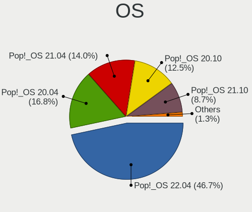
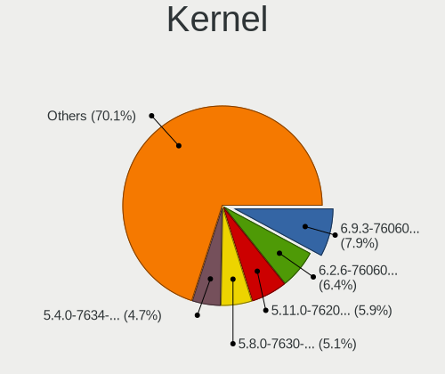
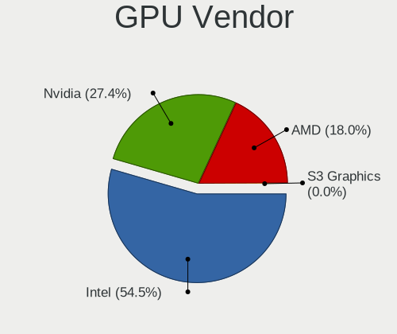
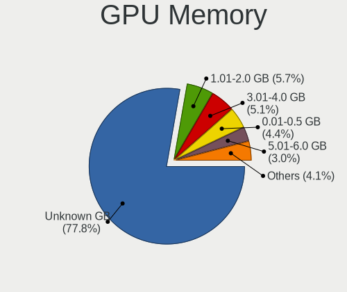

Pop!_OS - Tested Hardware & Statistics (Notebooks)
--------------------------------------------------

A project to collect tested hardware configurations for Pop!_OS.

Anyone can contribute to this report by the [hw-probe](https://github.com/linuxhw/hw-probe) tool:

    sudo -E hw-probe -all -upload

Please contribute! Especially if your hardware is rare.

Contents
--------

* [ Test Cases ](#test-cases)

* [ System ](#system)
  - [ OS                       ](#os)
  - [ OS Family                ](#os-family)
  - [ Kernel                   ](#kernel)
  - [ Kernel Family            ](#kernel-family)
  - [ Kernel Major Ver.        ](#kernel-major-ver)
  - [ Arch                     ](#arch)
  - [ DE                       ](#de)
  - [ Display Server           ](#display-server)
  - [ Display Manager          ](#display-manager)
  - [ OS Lang                  ](#os-lang)
  - [ Boot Mode                ](#boot-mode)
  - [ Filesystem               ](#filesystem)
  - [ Part. scheme             ](#part-scheme)
  - [ Dual Boot with Linux/BSD ](#dual-boot-with-linuxbsd)
  - [ Dual Boot (Win)          ](#dual-boot-win)

* [ Board ](#board)
  - [ Vendor                   ](#vendor)
  - [ Model                    ](#model)
  - [ Model Family             ](#model-family)
  - [ MFG Year                 ](#mfg-year)
  - [ Form Factor              ](#form-factor)
  - [ Secure Boot              ](#secure-boot)
  - [ Coreboot                 ](#coreboot)
  - [ RAM Size                 ](#ram-size)
  - [ RAM Used                 ](#ram-used)
  - [ Total Drives             ](#total-drives)
  - [ Has CD-ROM               ](#has-cd-rom)
  - [ Has Ethernet             ](#has-ethernet)
  - [ Has WiFi                 ](#has-wifi)
  - [ Has Bluetooth            ](#has-bluetooth)

* [ Location ](#location)
  - [ Country                  ](#country)
  - [ City                     ](#city)

* [ Drives ](#drives)
  - [ Drive Vendor             ](#drive-vendor)
  - [ Drive Model              ](#drive-model)
  - [ HDD Vendor               ](#hdd-vendor)
  - [ SSD Vendor               ](#ssd-vendor)
  - [ Drive Kind               ](#drive-kind)
  - [ Drive Connector          ](#drive-connector)
  - [ Drive Size               ](#drive-size)
  - [ Space Total              ](#space-total)
  - [ Space Used               ](#space-used)
  - [ Malfunc. Drives          ](#malfunc-drives)
  - [ Malfunc. Drive Vendor    ](#malfunc-drive-vendor)
  - [ Malfunc. HDD Vendor      ](#malfunc-hdd-vendor)
  - [ Malfunc. Drive Kind      ](#malfunc-drive-kind)
  - [ Failed Drives            ](#failed-drives)
  - [ Failed Drive Vendor      ](#failed-drive-vendor)
  - [ Drive Status             ](#drive-status)

* [ Storage controller ](#storage-controller)
  - [ Storage Vendor           ](#storage-vendor)
  - [ Storage Model            ](#storage-model)
  - [ Storage Kind             ](#storage-kind)

* [ Processor ](#processor)
  - [ CPU Vendor               ](#cpu-vendor)
  - [ CPU Model                ](#cpu-model)
  - [ CPU Model Family         ](#cpu-model-family)
  - [ CPU Cores                ](#cpu-cores)
  - [ CPU Sockets              ](#cpu-sockets)
  - [ CPU Threads              ](#cpu-threads)
  - [ CPU Op-Modes             ](#cpu-op-modes)
  - [ CPU Microcode            ](#cpu-microcode)
  - [ CPU Microarch            ](#cpu-microarch)

* [ Graphics ](#graphics)
  - [ GPU Vendor               ](#gpu-vendor)
  - [ GPU Model                ](#gpu-model)
  - [ GPU Combo                ](#gpu-combo)
  - [ GPU Driver               ](#gpu-driver)
  - [ GPU Memory               ](#gpu-memory)

* [ Monitor ](#monitor)
  - [ Monitor Vendor           ](#monitor-vendor)
  - [ Monitor Model            ](#monitor-model)
  - [ Monitor Resolution       ](#monitor-resolution)
  - [ Monitor Diagonal         ](#monitor-diagonal)
  - [ Monitor Width            ](#monitor-width)
  - [ Aspect Ratio             ](#aspect-ratio)
  - [ Monitor Area             ](#monitor-area)
  - [ Pixel Density            ](#pixel-density)
  - [ Multiple Monitors        ](#multiple-monitors)

* [ Network ](#network)
  - [ Net Controller Vendor    ](#net-controller-vendor)
  - [ Net Controller Model     ](#net-controller-model)
  - [ Wireless Vendor          ](#wireless-vendor)
  - [ Wireless Model           ](#wireless-model)
  - [ Ethernet Vendor          ](#ethernet-vendor)
  - [ Ethernet Model           ](#ethernet-model)
  - [ Net Controller Kind      ](#net-controller-kind)
  - [ Used Controller          ](#used-controller)
  - [ NICs                     ](#nics)
  - [ IPv6                     ](#ipv6)

* [ Bluetooth ](#bluetooth)
  - [ Bluetooth Vendor         ](#bluetooth-vendor)
  - [ Bluetooth Model          ](#bluetooth-model)

* [ Sound ](#sound)
  - [ Sound Vendor             ](#sound-vendor)
  - [ Sound Model              ](#sound-model)

* [ Memory ](#memory)
  - [ Memory Vendor            ](#memory-vendor)
  - [ Memory Model             ](#memory-model)
  - [ Memory Kind              ](#memory-kind)
  - [ Memory Form Factor       ](#memory-form-factor)
  - [ Memory Size              ](#memory-size)
  - [ Memory Speed             ](#memory-speed)

* [ Printers & scanners ](#printers--scanners)
  - [ Printer Vendor           ](#printer-vendor)
  - [ Printer Model            ](#printer-model)
  - [ Scanner Vendor           ](#scanner-vendor)
  - [ Scanner Model            ](#scanner-model)

* [ Camera ](#camera)
  - [ Camera Vendor            ](#camera-vendor)
  - [ Camera Model             ](#camera-model)

* [ Security ](#security)
  - [ Fingerprint Vendor       ](#fingerprint-vendor)
  - [ Fingerprint Model        ](#fingerprint-model)
  - [ Chipcard Vendor          ](#chipcard-vendor)
  - [ Chipcard Model           ](#chipcard-model)

* [ Unsupported ](#unsupported)
  - [ Unsupported Devices      ](#unsupported-devices)
  - [ Unsupported Device Types ](#unsupported-device-types)

Test Cases
----------

Total: 5200

| Vendor        | Model                       | Probe                                                      | Date         |
|---------------|-----------------------------|------------------------------------------------------------|--------------|
| HP            | ProBook 455 G7              | [88fcea9210](https://linux-hardware.org/?probe=88fcea9210) | Apr 30, 2022 |
| Lenovo        | ThinkPad L15 Gen 2 20X4S... | [48d3759522](https://linux-hardware.org/?probe=48d3759522) | Apr 30, 2022 |
| Apple         | MacBookPro8,1               | [8826e1d451](https://linux-hardware.org/?probe=8826e1d451) | Apr 30, 2022 |
| Toshiba       | Satellite L10W-B-101        | [8383d306f3](https://linux-hardware.org/?probe=8383d306f3) | Apr 30, 2022 |
| Dell          | XPS 13 9343                 | [b48ccc106e](https://linux-hardware.org/?probe=b48ccc106e) | Apr 30, 2022 |
| Toshiba       | IS 1413G                    | [8074a86bc7](https://linux-hardware.org/?probe=8074a86bc7) | Apr 30, 2022 |
| Dell          | XPS 15 9510                 | [b92517268e](https://linux-hardware.org/?probe=b92517268e) | Apr 30, 2022 |
| ASUSTek       | G55VW                       | [6bd8a1b04a](https://linux-hardware.org/?probe=6bd8a1b04a) | Apr 29, 2022 |
| Dell          | Inspiron 3542               | [19f5e16bce](https://linux-hardware.org/?probe=19f5e16bce) | Apr 29, 2022 |
| Lenovo        | ThinkPad E14 Gen 4 21ECS... | [61bb949815](https://linux-hardware.org/?probe=61bb949815) | Apr 29, 2022 |
| Dell          | G5 5500                     | [c6064853ad](https://linux-hardware.org/?probe=c6064853ad) | Apr 29, 2022 |
| HP            | Pavilion 15                 | [2484213956](https://linux-hardware.org/?probe=2484213956) | Apr 29, 2022 |
| Lenovo        | ThinkPad T480 20L50004UK    | [34015c4874](https://linux-hardware.org/?probe=34015c4874) | Apr 29, 2022 |
| ASUSTek       | X540SAA                     | [6c8e397ca3](https://linux-hardware.org/?probe=6c8e397ca3) | Apr 29, 2022 |
| System76      | Oryx Pro                    | [cf999d4581](https://linux-hardware.org/?probe=cf999d4581) | Apr 29, 2022 |
| Dell          | Inspiron 5547               | [a5d8e73a23](https://linux-hardware.org/?probe=a5d8e73a23) | Apr 28, 2022 |
| Dell          | Inspiron 5547               | [be4ab0fd27](https://linux-hardware.org/?probe=be4ab0fd27) | Apr 28, 2022 |
| Toshiba       | IS 1413G                    | [995f77010e](https://linux-hardware.org/?probe=995f77010e) | Apr 28, 2022 |
| Toshiba       | IS 1413G                    | [e2293170b3](https://linux-hardware.org/?probe=e2293170b3) | Apr 28, 2022 |
| HP            | Pavilion 13 x360 PC         | [f898a6a476](https://linux-hardware.org/?probe=f898a6a476) | Apr 28, 2022 |
| Lenovo        | ThinkPad T431s 20ACS03P0... | [3c0878aee3](https://linux-hardware.org/?probe=3c0878aee3) | Apr 28, 2022 |
| System76      | Oryx Pro                    | [ae46ece731](https://linux-hardware.org/?probe=ae46ece731) | Apr 28, 2022 |
| HP            | Pavilion 15                 | [fee7e96d70](https://linux-hardware.org/?probe=fee7e96d70) | Apr 28, 2022 |
| Toshiba       | IS 1413G                    | [a63dc69025](https://linux-hardware.org/?probe=a63dc69025) | Apr 28, 2022 |
| HP            | Stream Laptop 14-ds0xxx     | [59a8e467c6](https://linux-hardware.org/?probe=59a8e467c6) | Apr 28, 2022 |
| Apple         | MacBookPro10,2              | [2d79aab0aa](https://linux-hardware.org/?probe=2d79aab0aa) | Apr 28, 2022 |
| ASUSTek       | K40IN                       | [ab6a95da52](https://linux-hardware.org/?probe=ab6a95da52) | Apr 28, 2022 |
| HP            | Pavilion 13 x360 PC         | [d48ed77abc](https://linux-hardware.org/?probe=d48ed77abc) | Apr 28, 2022 |
| Dell          | Inspiron 5566               | [695d362d8f](https://linux-hardware.org/?probe=695d362d8f) | Apr 27, 2022 |
| ASUSTek       | FX503VM                     | [c227966510](https://linux-hardware.org/?probe=c227966510) | Apr 27, 2022 |
| ASUSTek       | FX503VM                     | [1275aa643d](https://linux-hardware.org/?probe=1275aa643d) | Apr 27, 2022 |
| HP            | ENVY Laptop 14-eb0xxx       | [495a74c914](https://linux-hardware.org/?probe=495a74c914) | Apr 27, 2022 |
| Dell          | XPS 13 9310                 | [d394f4e0d9](https://linux-hardware.org/?probe=d394f4e0d9) | Apr 27, 2022 |
| HUAWEI        | HVY-WXX9                    | [824ccc1317](https://linux-hardware.org/?probe=824ccc1317) | Apr 27, 2022 |
| HP            | Pavilion 13 x360 PC         | [3e5933fe0d](https://linux-hardware.org/?probe=3e5933fe0d) | Apr 27, 2022 |
| Lenovo        | IdeaPad 110-15ISK 80UD      | [e51ff27a5a](https://linux-hardware.org/?probe=e51ff27a5a) | Apr 27, 2022 |
| Dell          | Vostro 15 3515              | [7c99d7d4c5](https://linux-hardware.org/?probe=7c99d7d4c5) | Apr 27, 2022 |
| Lenovo        | ThinkPad T480 20L6SJN400    | [294a5ef80c](https://linux-hardware.org/?probe=294a5ef80c) | Apr 27, 2022 |
| ASUSTek       | ROG Zephyrus G14 GA401IH... | [863612cc05](https://linux-hardware.org/?probe=863612cc05) | Apr 27, 2022 |
| Purism        | Librem 15 v3                | [d2a13c9d0a](https://linux-hardware.org/?probe=d2a13c9d0a) | Apr 27, 2022 |
| Toshiba       | Satellite C55t-C            | [1fe2032839](https://linux-hardware.org/?probe=1fe2032839) | Apr 27, 2022 |
| Toshiba       | Satellite C55t-C            | [cabf0c7464](https://linux-hardware.org/?probe=cabf0c7464) | Apr 27, 2022 |
| Lenovo        | IdeaPad S145-15API 81V7     | [b7ac79ff8f](https://linux-hardware.org/?probe=b7ac79ff8f) | Apr 27, 2022 |
| MSI           | GS66 Stealth 10UG           | [77b699045a](https://linux-hardware.org/?probe=77b699045a) | Apr 27, 2022 |
| Dell          | XPS 13 9305                 | [edf60be002](https://linux-hardware.org/?probe=edf60be002) | Apr 26, 2022 |
| Acer          | Aspire E1-570               | [1621e22812](https://linux-hardware.org/?probe=1621e22812) | Apr 26, 2022 |
| Acer          | Swift SF316-51              | [fe42983639](https://linux-hardware.org/?probe=fe42983639) | Apr 26, 2022 |
| MSI           | GF63 Thin 10SC              | [bc3cbdbc1f](https://linux-hardware.org/?probe=bc3cbdbc1f) | Apr 26, 2022 |
| Acer          | TravelMate P249-G2-MG       | [2e0bd790c6](https://linux-hardware.org/?probe=2e0bd790c6) | Apr 26, 2022 |
| ASUSTek       | X455LD                      | [9f98b410f6](https://linux-hardware.org/?probe=9f98b410f6) | Apr 26, 2022 |
| Dell          | Inspiron 3442               | [d4b7580074](https://linux-hardware.org/?probe=d4b7580074) | Apr 26, 2022 |
| Dell          | Inspiron 3442               | [d994ff2a13](https://linux-hardware.org/?probe=d994ff2a13) | Apr 26, 2022 |
| Unknown       | Unknown                     | [885f468161](https://linux-hardware.org/?probe=885f468161) | Apr 26, 2022 |
| Acer          | Aspire A315-41              | [a42b1cda2c](https://linux-hardware.org/?probe=a42b1cda2c) | Apr 26, 2022 |
| ASUSTek       | X555LF                      | [0aa3a88c0c](https://linux-hardware.org/?probe=0aa3a88c0c) | Apr 25, 2022 |
| HP            | ENVY Laptop 17-ch0xxx       | [256f703e7e](https://linux-hardware.org/?probe=256f703e7e) | Apr 25, 2022 |
| Acer          | Nitro AN515-53              | [8a96f457bb](https://linux-hardware.org/?probe=8a96f457bb) | Apr 25, 2022 |
| MSI           | Katana GF76 11UD            | [2e4a211c66](https://linux-hardware.org/?probe=2e4a211c66) | Apr 24, 2022 |
| Lenovo        | V15 G2 ALC 82KD             | [743177a467](https://linux-hardware.org/?probe=743177a467) | Apr 24, 2022 |
| Lenovo        | IdeaPad 5 Pro 14ACN6 82L... | [803959fe3c](https://linux-hardware.org/?probe=803959fe3c) | Apr 24, 2022 |
| Dell          | Inspiron 5559               | [e9676d63f9](https://linux-hardware.org/?probe=e9676d63f9) | Apr 24, 2022 |
| ASUSTek       | X450LCP                     | [a2ed4903be](https://linux-hardware.org/?probe=a2ed4903be) | Apr 23, 2022 |
| Toshiba       | IS 1413G                    | [d5918f0d93](https://linux-hardware.org/?probe=d5918f0d93) | Apr 23, 2022 |
| Acer          | Aspire 1410                 | [0399a90ade](https://linux-hardware.org/?probe=0399a90ade) | Apr 23, 2022 |
| Apple         | MacBookPro6,1               | [e73885a94d](https://linux-hardware.org/?probe=e73885a94d) | Apr 23, 2022 |
| ASUSTek       | UX32VD                      | [6f956cd55c](https://linux-hardware.org/?probe=6f956cd55c) | Apr 23, 2022 |
| Apple         | MacBookPro10,2              | [477b1e873f](https://linux-hardware.org/?probe=477b1e873f) | Apr 23, 2022 |
| Toshiba       | Satellite L50D-B            | [f283519d44](https://linux-hardware.org/?probe=f283519d44) | Apr 22, 2022 |
| ASUSTek       | GL552JX                     | [dae470212d](https://linux-hardware.org/?probe=dae470212d) | Apr 22, 2022 |
| ASUSTek       | X541UJ                      | [4043c70a42](https://linux-hardware.org/?probe=4043c70a42) | Apr 22, 2022 |
| ASUSTek       | ROG Zephyrus M16 GU603HE... | [2c48c81559](https://linux-hardware.org/?probe=2c48c81559) | Apr 22, 2022 |
| Apple         | MacBookPro10,2              | [9936062b3c](https://linux-hardware.org/?probe=9936062b3c) | Apr 22, 2022 |
| Acer          | Aspire F5-573G              | [c4cfcaf69e](https://linux-hardware.org/?probe=c4cfcaf69e) | Apr 22, 2022 |
| CyberPower... | Tracer II                   | [4582a60770](https://linux-hardware.org/?probe=4582a60770) | Apr 21, 2022 |
| ASUSTek       | TUF Gaming FX705DT_FX705... | [329905cab9](https://linux-hardware.org/?probe=329905cab9) | Apr 21, 2022 |
| ASUSTek       | GL502VMK                    | [cc5ed34db8](https://linux-hardware.org/?probe=cc5ed34db8) | Apr 21, 2022 |
| Lenovo        | ThinkPad T450s 20BWS19E0... | [c6a1ec3df0](https://linux-hardware.org/?probe=c6a1ec3df0) | Apr 20, 2022 |
| Samsung       | 550XDA                      | [66cb0691e0](https://linux-hardware.org/?probe=66cb0691e0) | Apr 20, 2022 |
| Dell          | Latitude D430               | [00ddfbe46f](https://linux-hardware.org/?probe=00ddfbe46f) | Apr 20, 2022 |
| HP            | ENVY Laptop 14-eb0xxx       | [5d95841f54](https://linux-hardware.org/?probe=5d95841f54) | Apr 20, 2022 |
| Toshiba       | Satellite S75-A             | [90ba54ad32](https://linux-hardware.org/?probe=90ba54ad32) | Apr 20, 2022 |
| Dell          | XPS 13 9360                 | [ffb9cf10be](https://linux-hardware.org/?probe=ffb9cf10be) | Apr 20, 2022 |
| Dell          | XPS 13 9360                 | [f174d4ced7](https://linux-hardware.org/?probe=f174d4ced7) | Apr 20, 2022 |
| Lenovo        | Legion Y530-15ICH 81FV      | [88764ed497](https://linux-hardware.org/?probe=88764ed497) | Apr 20, 2022 |
| GPU Compan... | GWTN141-10                  | [6c4022059c](https://linux-hardware.org/?probe=6c4022059c) | Apr 19, 2022 |
| System76      | Galago Pro                  | [32b09fd215](https://linux-hardware.org/?probe=32b09fd215) | Apr 19, 2022 |
| Acer          | Nitro AN515-45              | [c4456aaa4f](https://linux-hardware.org/?probe=c4456aaa4f) | Apr 19, 2022 |
| ASUSTek       | ASUS TUF Gaming A15 FA50... | [7f4254b1b1](https://linux-hardware.org/?probe=7f4254b1b1) | Apr 19, 2022 |
| Positivo      | N1250                       | [c2dfeaab53](https://linux-hardware.org/?probe=c2dfeaab53) | Apr 19, 2022 |
| HP            | ENVY Laptop 15-ep1xxx       | [29f92aa75f](https://linux-hardware.org/?probe=29f92aa75f) | Apr 19, 2022 |
| HUAWEI        | NBLK-WAX9X                  | [bbc4928d39](https://linux-hardware.org/?probe=bbc4928d39) | Apr 19, 2022 |
| Acer          | Aspire A315-42G             | [3654d1f0fa](https://linux-hardware.org/?probe=3654d1f0fa) | Apr 19, 2022 |
| Dell          | Inspiron 5521               | [7290650d08](https://linux-hardware.org/?probe=7290650d08) | Apr 19, 2022 |
| Lenovo        | IdeaPad S145-15API 81V7     | [746e2ea0d2](https://linux-hardware.org/?probe=746e2ea0d2) | Apr 18, 2022 |
| Toshiba       | IS 1413G                    | [1b3267b605](https://linux-hardware.org/?probe=1b3267b605) | Apr 18, 2022 |
| ASUSTek       | UL30VT                      | [faad37ee2e](https://linux-hardware.org/?probe=faad37ee2e) | Apr 18, 2022 |
| HP            | 15 Notebook PC              | [e1d2871cd8](https://linux-hardware.org/?probe=e1d2871cd8) | Apr 18, 2022 |
| MSI           | Katana GF76 11UG            | [f460a6924f](https://linux-hardware.org/?probe=f460a6924f) | Apr 18, 2022 |
| Dell          | Inspiron 3542               | [196f849315](https://linux-hardware.org/?probe=196f849315) | Apr 18, 2022 |
| Apple         | MacBookPro8,2               | [a315b0490b](https://linux-hardware.org/?probe=a315b0490b) | Apr 18, 2022 |
| Lenovo        | G50-80 80E5                 | [a07c515f60](https://linux-hardware.org/?probe=a07c515f60) | Apr 17, 2022 |
| Framework     | Laptop                      | [acad8f1ccb](https://linux-hardware.org/?probe=acad8f1ccb) | Apr 17, 2022 |
| HP            | Pavilion g6                 | [0c4c081e71](https://linux-hardware.org/?probe=0c4c081e71) | Apr 17, 2022 |
| Dell          | Latitude 5590               | [ade3f33fb9](https://linux-hardware.org/?probe=ade3f33fb9) | Apr 16, 2022 |
| Apple         | MacBookPro8,1               | [a8c0eeb473](https://linux-hardware.org/?probe=a8c0eeb473) | Apr 16, 2022 |
| ASUSTek       | G752VY                      | [a497ac3b95](https://linux-hardware.org/?probe=a497ac3b95) | Apr 16, 2022 |
| Toshiba       | Satellite L10W-B-101        | [65edd32378](https://linux-hardware.org/?probe=65edd32378) | Apr 16, 2022 |
| Toshiba       | IS 1413G                    | [e9e45e7f91](https://linux-hardware.org/?probe=e9e45e7f91) | Apr 16, 2022 |
| HP            | EliteBook 840 G1            | [d9c6549322](https://linux-hardware.org/?probe=d9c6549322) | Apr 16, 2022 |
| Toshiba       | IS 1413G                    | [e51d0544a1](https://linux-hardware.org/?probe=e51d0544a1) | Apr 16, 2022 |
| Acer          | Nitro AN515-57              | [b824b88050](https://linux-hardware.org/?probe=b824b88050) | Apr 15, 2022 |
| Dell          | Precision 5760              | [ba2ce021d0](https://linux-hardware.org/?probe=ba2ce021d0) | Apr 15, 2022 |
| Lenovo        | ThinkPad X1 Carbon 6th 2... | [7e8c906437](https://linux-hardware.org/?probe=7e8c906437) | Apr 15, 2022 |
| Toshiba       | Satellite L505              | [92da438638](https://linux-hardware.org/?probe=92da438638) | Apr 15, 2022 |
| Lenovo        | V130-14IKB 81HQ             | [19299bc16d](https://linux-hardware.org/?probe=19299bc16d) | Apr 14, 2022 |
| Wortmann      | 1220663_1470189             | [59eed1073a](https://linux-hardware.org/?probe=59eed1073a) | Apr 14, 2022 |
| Dell          | Inspiron N4010              | [d29ff8a54e](https://linux-hardware.org/?probe=d29ff8a54e) | Apr 14, 2022 |
| Lenovo        | IdeaPad L340-15IRH Gamin... | [b40d10cb81](https://linux-hardware.org/?probe=b40d10cb81) | Apr 14, 2022 |
| HP            | Laptop 14s-dk0xxx           | [ef76ce862d](https://linux-hardware.org/?probe=ef76ce862d) | Apr 14, 2022 |
| HP            | OMEN Laptop 15-en0xxx       | [7025b1689c](https://linux-hardware.org/?probe=7025b1689c) | Apr 14, 2022 |
| TUXEDO        | InfinityBook Pro 14 Gen6    | [4d46d1ce45](https://linux-hardware.org/?probe=4d46d1ce45) | Apr 14, 2022 |
| ASUSTek       | UX310UQK                    | [5064c36f02](https://linux-hardware.org/?probe=5064c36f02) | Apr 14, 2022 |
| Toshiba       | IS 1413G                    | [f8f13d5514](https://linux-hardware.org/?probe=f8f13d5514) | Apr 14, 2022 |
| Lenovo        | IdeaPad S145-15IWL 81S9     | [3752ecab33](https://linux-hardware.org/?probe=3752ecab33) | Apr 14, 2022 |
| Lenovo        | IdeaPad S145-15IWL 81S9     | [a8061e68ff](https://linux-hardware.org/?probe=a8061e68ff) | Apr 14, 2022 |
| ASUSTek       | ROG Strix G533ZM_G533ZM     | [4a159b7cd8](https://linux-hardware.org/?probe=4a159b7cd8) | Apr 14, 2022 |
| Dell          | XPS 15 7590                 | [9715d61366](https://linux-hardware.org/?probe=9715d61366) | Apr 14, 2022 |
| System76      | Oryx Pro                    | [8521355f49](https://linux-hardware.org/?probe=8521355f49) | Apr 13, 2022 |
| Acer          | Aspire 5755G                | [e13fc569ce](https://linux-hardware.org/?probe=e13fc569ce) | Apr 13, 2022 |
| Dell          | XPS 15 9500                 | [b64e82a4a6](https://linux-hardware.org/?probe=b64e82a4a6) | Apr 13, 2022 |
| ASUSTek       | N56VV                       | [8ae8e89c42](https://linux-hardware.org/?probe=8ae8e89c42) | Apr 13, 2022 |
| System76      | Pangolin                    | [3976805ed7](https://linux-hardware.org/?probe=3976805ed7) | Apr 13, 2022 |
| Lenovo        | ThinkPad X230 Tablet 343... | [8a64db97de](https://linux-hardware.org/?probe=8a64db97de) | Apr 13, 2022 |
| Dell          | XPS 13 9370                 | [3e26cc6c66](https://linux-hardware.org/?probe=3e26cc6c66) | Apr 13, 2022 |
| Lenovo        | Legion 5 Pro 16ACH6H 82J... | [7fe8e51699](https://linux-hardware.org/?probe=7fe8e51699) | Apr 13, 2022 |
| System76      | Oryx Pro                    | [bfba9dbec0](https://linux-hardware.org/?probe=bfba9dbec0) | Apr 13, 2022 |
| Dell          | Latitude 5590               | [1638db9ad7](https://linux-hardware.org/?probe=1638db9ad7) | Apr 13, 2022 |
| Acer          | Swift SF314-59              | [a6c665d142](https://linux-hardware.org/?probe=a6c665d142) | Apr 13, 2022 |
| Dell          | Inspiron N4010              | [9fa510fc02](https://linux-hardware.org/?probe=9fa510fc02) | Apr 13, 2022 |
| Dell          | Vostro 3500                 | [080cbf45eb](https://linux-hardware.org/?probe=080cbf45eb) | Apr 13, 2022 |
| System76      | Darter Pro                  | [669d3cf4e4](https://linux-hardware.org/?probe=669d3cf4e4) | Apr 12, 2022 |
| Lenovo        | Y70-70 Touch 80DU           | [9ae1f72e77](https://linux-hardware.org/?probe=9ae1f72e77) | Apr 12, 2022 |
| Lenovo        | Yoga710-14ISK 80TY          | [839b9579c3](https://linux-hardware.org/?probe=839b9579c3) | Apr 12, 2022 |
| Lenovo        | ThinkPad L15 Gen 2 20X4S... | [9bcf0f1e4f](https://linux-hardware.org/?probe=9bcf0f1e4f) | Apr 12, 2022 |
| Lenovo        | ThinkPad L15 Gen 2 20X4S... | [52e0e2e934](https://linux-hardware.org/?probe=52e0e2e934) | Apr 12, 2022 |
| Lenovo        | ThinkPad E490 20N8005JMH    | [c3ac98aa71](https://linux-hardware.org/?probe=c3ac98aa71) | Apr 11, 2022 |
| Fujitsu       | LIFEBOOK NH570              | [92f7a3b948](https://linux-hardware.org/?probe=92f7a3b948) | Apr 11, 2022 |
| TUXEDO        | Polaris AMD Gen2 (REN)      | [20e831b4af](https://linux-hardware.org/?probe=20e831b4af) | Apr 11, 2022 |
| ASUSTek       | ROG Zephyrus G14 GA401QC... | [bae30f6939](https://linux-hardware.org/?probe=bae30f6939) | Apr 11, 2022 |
| Dell          | Inspiron 5415               | [6c85a524a1](https://linux-hardware.org/?probe=6c85a524a1) | Apr 11, 2022 |
| ASUSTek       | N56DY                       | [8fdcef45a9](https://linux-hardware.org/?probe=8fdcef45a9) | Apr 10, 2022 |
| HP            | EliteBook Folio 9470m       | [c42f3e3b5b](https://linux-hardware.org/?probe=c42f3e3b5b) | Apr 10, 2022 |
| HP            | EliteBook 840 G4            | [dd511f4bf0](https://linux-hardware.org/?probe=dd511f4bf0) | Apr 09, 2022 |
| MSI           | GS66 Stealth 11UG           | [1fc8942ea4](https://linux-hardware.org/?probe=1fc8942ea4) | Apr 09, 2022 |
| Samsung       | 870Z5E/880Z5E/680Z5E        | [19450f9d90](https://linux-hardware.org/?probe=19450f9d90) | Apr 09, 2022 |
| Lenovo        | ThinkPad P14s Gen 2i 20V... | [10d0d3a721](https://linux-hardware.org/?probe=10d0d3a721) | Apr 09, 2022 |
| Dell          | G7 7700                     | [62180a0287](https://linux-hardware.org/?probe=62180a0287) | Apr 09, 2022 |
| Dell          | Latitude E5520              | [3f3548b57e](https://linux-hardware.org/?probe=3f3548b57e) | Apr 09, 2022 |
| Dell          | Latitude E5520              | [dbd85ba35f](https://linux-hardware.org/?probe=dbd85ba35f) | Apr 09, 2022 |
| Dell          | XPS 13 9370                 | [2d822ae226](https://linux-hardware.org/?probe=2d822ae226) | Apr 08, 2022 |
| Toshiba       | Satellite L10W-B-101        | [4f36b2c97c](https://linux-hardware.org/?probe=4f36b2c97c) | Apr 08, 2022 |
| CyberPower... | Tracer II                   | [735f98bbb9](https://linux-hardware.org/?probe=735f98bbb9) | Apr 08, 2022 |
| Dell          | G7 7700                     | [86fff99f90](https://linux-hardware.org/?probe=86fff99f90) | Apr 08, 2022 |
| Dell          | Latitude E7270              | [79cc908dcc](https://linux-hardware.org/?probe=79cc908dcc) | Apr 08, 2022 |
| Lenovo        | Y720-15IKB 80VR             | [4119278c12](https://linux-hardware.org/?probe=4119278c12) | Apr 08, 2022 |
| Lenovo        | Y720-15IKB 80VR             | [95f7ceba3b](https://linux-hardware.org/?probe=95f7ceba3b) | Apr 08, 2022 |
| Apple         | MacBookPro12,1              | [7ec2454548](https://linux-hardware.org/?probe=7ec2454548) | Apr 08, 2022 |
| Acer          | Aspire 1410                 | [41ed1dae3d](https://linux-hardware.org/?probe=41ed1dae3d) | Apr 08, 2022 |
| Lenovo        | IdeaPad S145-15IWL 81S9     | [297454c537](https://linux-hardware.org/?probe=297454c537) | Apr 07, 2022 |
| Lenovo        | Legion 5 15ARH05H 82B1      | [19623aa8b6](https://linux-hardware.org/?probe=19623aa8b6) | Apr 07, 2022 |
| Lenovo        | Legion 5 15ARH05H 82B1      | [287aa3ba8e](https://linux-hardware.org/?probe=287aa3ba8e) | Apr 07, 2022 |
| HP            | ZBook 15 G6                 | [d98ca9a688](https://linux-hardware.org/?probe=d98ca9a688) | Apr 07, 2022 |
| MSI           | Katana GF66 11UE            | [36c4b80dbb](https://linux-hardware.org/?probe=36c4b80dbb) | Apr 07, 2022 |
| Lenovo        | ThinkPad W520 4284EE6       | [444497b8b6](https://linux-hardware.org/?probe=444497b8b6) | Apr 07, 2022 |
| Lenovo        | ThinkPad X1 Carbon 7th 2... | [f4c5281aa9](https://linux-hardware.org/?probe=f4c5281aa9) | Apr 07, 2022 |
| HP            | Pavilion TS 15              | [944ffb7e3f](https://linux-hardware.org/?probe=944ffb7e3f) | Apr 06, 2022 |
| HP            | EliteBook 820 G1            | [e3d9b54f28](https://linux-hardware.org/?probe=e3d9b54f28) | Apr 06, 2022 |
| Toshiba       | Satellite A205              | [a10f998cea](https://linux-hardware.org/?probe=a10f998cea) | Apr 06, 2022 |
| Dell          | XPS 15 9560                 | [83ec935bc4](https://linux-hardware.org/?probe=83ec935bc4) | Apr 06, 2022 |
| Acer          | Aspire E5-576               | [520cbf0afa](https://linux-hardware.org/?probe=520cbf0afa) | Apr 06, 2022 |
| Toshiba       | Satellite L10W-B-101        | [a956f8afcb](https://linux-hardware.org/?probe=a956f8afcb) | Apr 05, 2022 |
| ASUSTek       | ASUS TUF Gaming F15 FX50... | [3403cf3b8a](https://linux-hardware.org/?probe=3403cf3b8a) | Apr 05, 2022 |
| ASUSTek       | ASUS TUF Gaming F15 FX50... | [4c7231b52a](https://linux-hardware.org/?probe=4c7231b52a) | Apr 05, 2022 |
| HP            | Pavilion TS 15              | [568f9433a9](https://linux-hardware.org/?probe=568f9433a9) | Apr 05, 2022 |
| MSI           | GF63 Thin 10SC              | [f1a7708b3c](https://linux-hardware.org/?probe=f1a7708b3c) | Apr 05, 2022 |
| ASUSTek       | GL502VT                     | [7f0692eb54](https://linux-hardware.org/?probe=7f0692eb54) | Apr 05, 2022 |
| MSI           | GT70 2OC/2OD                | [a8ad77f915](https://linux-hardware.org/?probe=a8ad77f915) | Apr 04, 2022 |
| Lenovo        | ThinkPad X230 2306CTO       | [188a7794dd](https://linux-hardware.org/?probe=188a7794dd) | Apr 04, 2022 |
| Lenovo        | ThinkPad T470p 20J7S0CF0... | [a28b76d4ba](https://linux-hardware.org/?probe=a28b76d4ba) | Apr 04, 2022 |
| Acer          | Aspire V5-573G              | [2b608bcde8](https://linux-hardware.org/?probe=2b608bcde8) | Apr 04, 2022 |
| MSI           | GT70 2OC/2OD                | [fb9ba92aa8](https://linux-hardware.org/?probe=fb9ba92aa8) | Apr 04, 2022 |
| Dell          | Inspiron 7559               | [4efbcf88a2](https://linux-hardware.org/?probe=4efbcf88a2) | Apr 04, 2022 |
| Lenovo        | G510 20238                  | [beeceac759](https://linux-hardware.org/?probe=beeceac759) | Apr 04, 2022 |
| HP            | EliteBook 855 G8 Noteboo... | [59eedbbc1b](https://linux-hardware.org/?probe=59eedbbc1b) | Apr 04, 2022 |
| HP            | Pavilion TS 15              | [3e3b21e230](https://linux-hardware.org/?probe=3e3b21e230) | Apr 04, 2022 |
| Lenovo        | G400s VILG1                 | [93c2d9ec80](https://linux-hardware.org/?probe=93c2d9ec80) | Apr 03, 2022 |
| HP            | EliteBook 840 G8 Noteboo... | [086d7749d3](https://linux-hardware.org/?probe=086d7749d3) | Apr 03, 2022 |
| Dell          | Inspiron 7559               | [312811bfc3](https://linux-hardware.org/?probe=312811bfc3) | Apr 02, 2022 |
| Dell          | Inspiron 7559               | [a4c9ba22ca](https://linux-hardware.org/?probe=a4c9ba22ca) | Apr 02, 2022 |
| HP            | Stream Laptop 11-y0XX       | [4c2eb85ea8](https://linux-hardware.org/?probe=4c2eb85ea8) | Apr 02, 2022 |
| MOTILE        | M141                        | [d93780c02c](https://linux-hardware.org/?probe=d93780c02c) | Apr 02, 2022 |
| Dell          | G7 7588                     | [3ca575dc99](https://linux-hardware.org/?probe=3ca575dc99) | Apr 01, 2022 |
| Avell High... | C62 MOB                     | [ca7d796269](https://linux-hardware.org/?probe=ca7d796269) | Apr 01, 2022 |
| Samsung       | 3570R/370R/470R/450R/510... | [27836be76e](https://linux-hardware.org/?probe=27836be76e) | Apr 01, 2022 |
| ASUSTek       | X555LJ                      | [f9bbaea819](https://linux-hardware.org/?probe=f9bbaea819) | Apr 01, 2022 |
| ASUSTek       | X555LJ                      | [944f40aa28](https://linux-hardware.org/?probe=944f40aa28) | Apr 01, 2022 |
| Dell          | G5 5500                     | [56b5d0d490](https://linux-hardware.org/?probe=56b5d0d490) | Apr 01, 2022 |
| Lenovo        | ThinkPad P14s Gen 2a 21A... | [07efb6a561](https://linux-hardware.org/?probe=07efb6a561) | Apr 01, 2022 |
| Acer          | Nitro AN515-54              | [cb8702ec94](https://linux-hardware.org/?probe=cb8702ec94) | Apr 01, 2022 |
| HP            | EliteBook 840 G4            | [16262ac312](https://linux-hardware.org/?probe=16262ac312) | Mar 31, 2022 |
| HP            | EliteBook 855 G8 Noteboo... | [e69dbda259](https://linux-hardware.org/?probe=e69dbda259) | Mar 31, 2022 |
| Razer         | Blade 15 Base Model (Ear... | [e983db3f40](https://linux-hardware.org/?probe=e983db3f40) | Mar 31, 2022 |
| HP            | 300-240                     | [ce3af573e2](https://linux-hardware.org/?probe=ce3af573e2) | Mar 30, 2022 |
| ASUSTek       | FX503VM                     | [1f2167e189](https://linux-hardware.org/?probe=1f2167e189) | Mar 30, 2022 |
| Dell          | Latitude E5440              | [82d2c39d98](https://linux-hardware.org/?probe=82d2c39d98) | Mar 30, 2022 |
| MSI           | Modern 14 B11M              | [3cdc036c09](https://linux-hardware.org/?probe=3cdc036c09) | Mar 30, 2022 |
| Acer          | Swift SF313-53              | [15d4d13a68](https://linux-hardware.org/?probe=15d4d13a68) | Mar 30, 2022 |
| Gigabyte      | AERO 15WV8                  | [8fdae867c0](https://linux-hardware.org/?probe=8fdae867c0) | Mar 30, 2022 |
| MSI           | GV62 8RD                    | [d219905770](https://linux-hardware.org/?probe=d219905770) | Mar 30, 2022 |
| HP            | 300-240                     | [5b2c959cb9](https://linux-hardware.org/?probe=5b2c959cb9) | Mar 30, 2022 |
| Lenovo        | IdeaPad S145-15IIL 82DJ     | [af894bb443](https://linux-hardware.org/?probe=af894bb443) | Mar 30, 2022 |
| Dell          | Latitude D531               | [8aa1b4069b](https://linux-hardware.org/?probe=8aa1b4069b) | Mar 30, 2022 |
| Lenovo        | IdeaPad 3 15ITL6 82H8       | [dddc946b70](https://linux-hardware.org/?probe=dddc946b70) | Mar 29, 2022 |
| Acer          | Aspire E5-771               | [74e7884f94](https://linux-hardware.org/?probe=74e7884f94) | Mar 29, 2022 |
| Sony          | SVE15115FXS                 | [fd28d82701](https://linux-hardware.org/?probe=fd28d82701) | Mar 28, 2022 |
| HP            | 300-240                     | [48bfec0c03](https://linux-hardware.org/?probe=48bfec0c03) | Mar 28, 2022 |
| Dell          | Inspiron 14 5410            | [314bd42e78](https://linux-hardware.org/?probe=314bd42e78) | Mar 28, 2022 |
| Lenovo        | ThinkPad E14 Gen 2 20T60... | [9554184dcd](https://linux-hardware.org/?probe=9554184dcd) | Mar 28, 2022 |
| Positivo      | Q464C                       | [16e296228a](https://linux-hardware.org/?probe=16e296228a) | Mar 28, 2022 |
| Acer          | Aspire A315-41              | [1c9b405e1b](https://linux-hardware.org/?probe=1c9b405e1b) | Mar 27, 2022 |
| Toshiba       | Satellite A135              | [cf23c9bdb5](https://linux-hardware.org/?probe=cf23c9bdb5) | Mar 27, 2022 |
| HP            | Pavilion g4                 | [893eaf3bca](https://linux-hardware.org/?probe=893eaf3bca) | Mar 27, 2022 |
| Dell          | Latitude E6430              | [1e9495c4f6](https://linux-hardware.org/?probe=1e9495c4f6) | Mar 27, 2022 |
| Dell          | Inspiron 5548               | [710ec26531](https://linux-hardware.org/?probe=710ec26531) | Mar 27, 2022 |
| HP            | EliteBook 8770w             | [3d5b596cf4](https://linux-hardware.org/?probe=3d5b596cf4) | Mar 27, 2022 |
| ASUSTek       | ROG Zephyrus G15 GA503QR... | [6298903ec7](https://linux-hardware.org/?probe=6298903ec7) | Mar 27, 2022 |
| Acer          | Aspire E5-771               | [2a9d489c50](https://linux-hardware.org/?probe=2a9d489c50) | Mar 27, 2022 |
| ASUSTek       | VivoBook_ASUSLaptop X570... | [d4655e802a](https://linux-hardware.org/?probe=d4655e802a) | Mar 26, 2022 |
| MSI           | GE72 2QF                    | [3966a755c3](https://linux-hardware.org/?probe=3966a755c3) | Mar 26, 2022 |
| Dell          | Inspiron 5758               | [ddd5e24256](https://linux-hardware.org/?probe=ddd5e24256) | Mar 26, 2022 |
| Acer          | Aspire 8930                 | [6774be59d3](https://linux-hardware.org/?probe=6774be59d3) | Mar 26, 2022 |
| ASUSTek       | ROG Zephyrus G15 GA503QR... | [9298b99a93](https://linux-hardware.org/?probe=9298b99a93) | Mar 26, 2022 |
| ASUSTek       | X55A                        | [9b02d587bf](https://linux-hardware.org/?probe=9b02d587bf) | Mar 26, 2022 |
| ASUSTek       | X542UR                      | [4d4477bd16](https://linux-hardware.org/?probe=4d4477bd16) | Mar 26, 2022 |
| Dell          | Inspiron M5040              | [74a1c6bd00](https://linux-hardware.org/?probe=74a1c6bd00) | Mar 26, 2022 |
| Dell          | Inspiron M5040              | [e352bc299f](https://linux-hardware.org/?probe=e352bc299f) | Mar 26, 2022 |
| HP            | 255 G6 Notebook PC          | [2e45272bc9](https://linux-hardware.org/?probe=2e45272bc9) | Mar 26, 2022 |
| MSI           | Modern 14 B11M              | [a2921a6b4c](https://linux-hardware.org/?probe=a2921a6b4c) | Mar 25, 2022 |
| MSI           | Modern 14 B11M              | [ca5720c46b](https://linux-hardware.org/?probe=ca5720c46b) | Mar 25, 2022 |
| ASUSTek       | ROG Strix G531GT_G531GT     | [a56ed819d1](https://linux-hardware.org/?probe=a56ed819d1) | Mar 25, 2022 |
| Toshiba       | Satellite L10W-B-101        | [35dacb370c](https://linux-hardware.org/?probe=35dacb370c) | Mar 25, 2022 |
| Lenovo        | V330-15IKB 81AX             | [be7bbfb988](https://linux-hardware.org/?probe=be7bbfb988) | Mar 25, 2022 |
| Acer          | Nitro AN515-44              | [ca13a081ff](https://linux-hardware.org/?probe=ca13a081ff) | Mar 25, 2022 |
| Toshiba       | Satellite L10W-B-101        | [8064b23bf4](https://linux-hardware.org/?probe=8064b23bf4) | Mar 25, 2022 |
| MSI           | GT70 2OC/2OD                | [faf19b248a](https://linux-hardware.org/?probe=faf19b248a) | Mar 25, 2022 |
| Dell          | Latitude 9420               | [5227a4fbe3](https://linux-hardware.org/?probe=5227a4fbe3) | Mar 24, 2022 |
| MSI           | GT70 2OC/2OD                | [aa7d01e08b](https://linux-hardware.org/?probe=aa7d01e08b) | Mar 24, 2022 |
| Lenovo        | IdeaPad S340-15IWL 81N8     | [7f92319a04](https://linux-hardware.org/?probe=7f92319a04) | Mar 24, 2022 |
| Dell          | Vostro 5490                 | [1017a921d7](https://linux-hardware.org/?probe=1017a921d7) | Mar 24, 2022 |
| Toshiba       | Satellite P50-B-10V         | [1f6acfd782](https://linux-hardware.org/?probe=1f6acfd782) | Mar 24, 2022 |
| Dell          | Vostro 5490                 | [bc18447c4b](https://linux-hardware.org/?probe=bc18447c4b) | Mar 24, 2022 |
| Dell          | Latitude E6420              | [ace3fe8d13](https://linux-hardware.org/?probe=ace3fe8d13) | Mar 23, 2022 |
| ASUSTek       | ASUS TUF Dash F15 FX516P... | [3fbd06d734](https://linux-hardware.org/?probe=3fbd06d734) | Mar 23, 2022 |
| Apple         | MacBookAir6,2               | [7c31f8a6ac](https://linux-hardware.org/?probe=7c31f8a6ac) | Mar 23, 2022 |
| Lenovo        | ThinkPad P14s Gen 2a 21A... | [72da14a2b2](https://linux-hardware.org/?probe=72da14a2b2) | Mar 23, 2022 |
| HP            | EliteBook 855 G8 Noteboo... | [aa729dad71](https://linux-hardware.org/?probe=aa729dad71) | Mar 23, 2022 |
| System76      | Lemur Pro                   | [cd847b5e6a](https://linux-hardware.org/?probe=cd847b5e6a) | Mar 23, 2022 |
| Lenovo        | ThinkPad X1 Extreme 2nd ... | [20f2d24112](https://linux-hardware.org/?probe=20f2d24112) | Mar 23, 2022 |
| HP            | Pavilion Gaming Laptop 1... | [24d5a323cc](https://linux-hardware.org/?probe=24d5a323cc) | Mar 23, 2022 |
| MSI           | GS30 2M Shadow              | [5a117cae70](https://linux-hardware.org/?probe=5a117cae70) | Mar 23, 2022 |
| MSI           | Katana GF76 11UD            | [ad7882c51c](https://linux-hardware.org/?probe=ad7882c51c) | Mar 23, 2022 |
| Lenovo        | ThinkPad E490 20N8005JMH    | [1a8680a665](https://linux-hardware.org/?probe=1a8680a665) | Mar 23, 2022 |
| Acer          | Aspire 5830TG               | [681005049f](https://linux-hardware.org/?probe=681005049f) | Mar 22, 2022 |
| Dell          | Inspiron 5567               | [3208ae7baf](https://linux-hardware.org/?probe=3208ae7baf) | Mar 22, 2022 |
| HP            | EliteBook 8740w             | [3ae23e0d6b](https://linux-hardware.org/?probe=3ae23e0d6b) | Mar 22, 2022 |
| Lenovo        | ThinkPad T430u 3351CTO      | [4d54a6af03](https://linux-hardware.org/?probe=4d54a6af03) | Mar 22, 2022 |
| HP            | EliteBook 855 G8 Noteboo... | [9fb46d3913](https://linux-hardware.org/?probe=9fb46d3913) | Mar 22, 2022 |
| Apple         | MacBookPro5,5               | [0e17f0194f](https://linux-hardware.org/?probe=0e17f0194f) | Mar 22, 2022 |
| MSI           | GE70 2PE                    | [67066e47d3](https://linux-hardware.org/?probe=67066e47d3) | Mar 22, 2022 |
| MSI           | Modern 14 B10MW             | [e8bbca6adf](https://linux-hardware.org/?probe=e8bbca6adf) | Mar 21, 2022 |
| Dell          | Latitude 5420               | [b1a1e20ab3](https://linux-hardware.org/?probe=b1a1e20ab3) | Mar 21, 2022 |
| HUAWEI        | KLVL-WXX9                   | [95acb8d0af](https://linux-hardware.org/?probe=95acb8d0af) | Mar 21, 2022 |
| Apple         | MacBookPro7,1               | [9ff3211d28](https://linux-hardware.org/?probe=9ff3211d28) | Mar 20, 2022 |
| Dell          | Latitude E6430              | [50348e45ec](https://linux-hardware.org/?probe=50348e45ec) | Mar 20, 2022 |
| Razer         | Blade 15 Base Model (Ear... | [1ef1ffe2a3](https://linux-hardware.org/?probe=1ef1ffe2a3) | Mar 20, 2022 |
| Dell          | Latitude E5530 non-vPro     | [30d244eb42](https://linux-hardware.org/?probe=30d244eb42) | Mar 20, 2022 |
| ASUSTek       | UL50VT                      | [6911af9ce1](https://linux-hardware.org/?probe=6911af9ce1) | Mar 20, 2022 |
| Chuwi         | GemiBook                    | [f7e06f0d6a](https://linux-hardware.org/?probe=f7e06f0d6a) | Mar 20, 2022 |
| Samsung       | 550XDA                      | [a5d8eebb8c](https://linux-hardware.org/?probe=a5d8eebb8c) | Mar 20, 2022 |
| Acer          | Aspire V5-573G              | [bf745ddd2b](https://linux-hardware.org/?probe=bf745ddd2b) | Mar 19, 2022 |
| Dell          | Latitude 3540               | [6d95fdc85c](https://linux-hardware.org/?probe=6d95fdc85c) | Mar 19, 2022 |
| ASUSTek       | ROG Zephyrus G15 GA503QR... | [c2085f4682](https://linux-hardware.org/?probe=c2085f4682) | Mar 19, 2022 |
| Dell          | System Vostro 3450          | [78750d86f5](https://linux-hardware.org/?probe=78750d86f5) | Mar 19, 2022 |
| Dell          | System XPS L502X            | [1c178b66d4](https://linux-hardware.org/?probe=1c178b66d4) | Mar 19, 2022 |
| Dell          | System XPS L502X            | [6de37bd23c](https://linux-hardware.org/?probe=6de37bd23c) | Mar 19, 2022 |
| Lenovo        | IdeaPad 330-15IKB 81FE      | [3693169add](https://linux-hardware.org/?probe=3693169add) | Mar 19, 2022 |
| Fujitsu       | LIFEBOOK AH544              | [08a511ac81](https://linux-hardware.org/?probe=08a511ac81) | Mar 18, 2022 |
| Fujitsu       | LIFEBOOK AH544              | [61b36dcd42](https://linux-hardware.org/?probe=61b36dcd42) | Mar 18, 2022 |
| Acer          | Aspire 8930                 | [79f6f7d9c1](https://linux-hardware.org/?probe=79f6f7d9c1) | Mar 18, 2022 |
| ASUSTek       | ROG Zephyrus G15 GA503QR... | [188141a9c9](https://linux-hardware.org/?probe=188141a9c9) | Mar 18, 2022 |
| Lenovo        | ThinkPad T530 23943J8       | [5531c7e4aa](https://linux-hardware.org/?probe=5531c7e4aa) | Mar 18, 2022 |
| Toshiba       | Satellite C70D-B            | [461d8aa18b](https://linux-hardware.org/?probe=461d8aa18b) | Mar 17, 2022 |
| Dell          | Inspiron 7577               | [1b90446e3a](https://linux-hardware.org/?probe=1b90446e3a) | Mar 17, 2022 |
| MSI           | GE70 2PE                    | [f1223c0781](https://linux-hardware.org/?probe=f1223c0781) | Mar 17, 2022 |
| HUAWEI        | MACHD-WXX9                  | [5813e3000a](https://linux-hardware.org/?probe=5813e3000a) | Mar 17, 2022 |
| Acer          | Swift SF314-43              | [6415b33b34](https://linux-hardware.org/?probe=6415b33b34) | Mar 17, 2022 |
| MSI           | GE70 2PE                    | [f0cd55f2b2](https://linux-hardware.org/?probe=f0cd55f2b2) | Mar 17, 2022 |
| Dell          | Inspiron 5593               | [421906c2ff](https://linux-hardware.org/?probe=421906c2ff) | Mar 17, 2022 |
| Dell          | XPS 13 9350                 | [ffa4f295ea](https://linux-hardware.org/?probe=ffa4f295ea) | Mar 16, 2022 |
| Notebook      | P65xHP                      | [3222aab43a](https://linux-hardware.org/?probe=3222aab43a) | Mar 16, 2022 |
| Lenovo        | ThinkBook 15-IIL 20SM       | [147ab6c35e](https://linux-hardware.org/?probe=147ab6c35e) | Mar 16, 2022 |
| Dell          | Inspiron 5502               | [09340e0b12](https://linux-hardware.org/?probe=09340e0b12) | Mar 16, 2022 |
| Acer          | Nitro AN515-54              | [1fea8c1b2b](https://linux-hardware.org/?probe=1fea8c1b2b) | Mar 16, 2022 |
| Lenovo        | IdeaPad Flex-14API 81SS     | [f1f12206d5](https://linux-hardware.org/?probe=f1f12206d5) | Mar 15, 2022 |
| ASUSTek       | ASUS TUF Gaming F17 FX70... | [38dfe1da08](https://linux-hardware.org/?probe=38dfe1da08) | Mar 15, 2022 |
| HP            | Pavilion Gaming Laptop 1... | [33980f3303](https://linux-hardware.org/?probe=33980f3303) | Mar 15, 2022 |
| ASUSTek       | VivoBook_ASUSLaptop X712... | [5af008b464](https://linux-hardware.org/?probe=5af008b464) | Mar 15, 2022 |
| Lenovo        | IdeaPad 3 15ALC6 82MF       | [be15e65580](https://linux-hardware.org/?probe=be15e65580) | Mar 15, 2022 |
| HP            | Pavilion Gaming Laptop 1... | [5b83093837](https://linux-hardware.org/?probe=5b83093837) | Mar 15, 2022 |
| Notebook      | NV4XMB,ME,MZ                | [ce34107bae](https://linux-hardware.org/?probe=ce34107bae) | Mar 14, 2022 |
| Dell          | G3 3500                     | [7c50a4be17](https://linux-hardware.org/?probe=7c50a4be17) | Mar 14, 2022 |
| Google        | Samus                       | [9e3da82a58](https://linux-hardware.org/?probe=9e3da82a58) | Mar 14, 2022 |
| Dell          | G5 5500                     | [12a4380cad](https://linux-hardware.org/?probe=12a4380cad) | Mar 14, 2022 |
| Dell          | Latitude E6410              | [a604ce30de](https://linux-hardware.org/?probe=a604ce30de) | Mar 14, 2022 |
| Toshiba       | Satellite C855D             | [ae1bd048b6](https://linux-hardware.org/?probe=ae1bd048b6) | Mar 14, 2022 |
| ASUSTek       | VivoBook_ASUS Laptop E21... | [ef6a4d20a7](https://linux-hardware.org/?probe=ef6a4d20a7) | Mar 14, 2022 |
| Apple         | MacBookPro9,1               | [9c1fd2beff](https://linux-hardware.org/?probe=9c1fd2beff) | Mar 14, 2022 |
| Apple         | MacBookAir7,2               | [911881e47f](https://linux-hardware.org/?probe=911881e47f) | Mar 14, 2022 |
| Lenovo        | Flex 3-1120 80LX            | [181446e2e8](https://linux-hardware.org/?probe=181446e2e8) | Mar 14, 2022 |
| HP            | ENVY Pro 4-b000 Ultraboo... | [38f9d1058f](https://linux-hardware.org/?probe=38f9d1058f) | Mar 14, 2022 |
| Fujitsu Si... | ESPRIMO Mobile V5535        | [3aded823d8](https://linux-hardware.org/?probe=3aded823d8) | Mar 13, 2022 |
| Lenovo        | ThinkPad X1 Carbon Gen 8... | [51ecff9e53](https://linux-hardware.org/?probe=51ecff9e53) | Mar 13, 2022 |
| ASUSTek       | ROG Zephyrus G14 GA401IH... | [c27fb51c94](https://linux-hardware.org/?probe=c27fb51c94) | Mar 13, 2022 |
| Lenovo        | IdeaPad 3 15ITL6 82H8       | [8748617cf6](https://linux-hardware.org/?probe=8748617cf6) | Mar 13, 2022 |
| Lenovo        | IdeaPad 3 15ITL6 82H8       | [a4a0bfd589](https://linux-hardware.org/?probe=a4a0bfd589) | Mar 13, 2022 |
| Lenovo        | IdeaPad 3 15IML05 81WR      | [69776eaddb](https://linux-hardware.org/?probe=69776eaddb) | Mar 13, 2022 |
| ASUSTek       | ROG Zephyrus G14 GA401IH... | [15b0517729](https://linux-hardware.org/?probe=15b0517729) | Mar 13, 2022 |
| HP            | 15 Notebook PC              | [d9e67c0484](https://linux-hardware.org/?probe=d9e67c0484) | Mar 12, 2022 |
| Lenovo        | G510 20238                  | [c82a0d33a2](https://linux-hardware.org/?probe=c82a0d33a2) | Mar 12, 2022 |
| Dell          | Latitude E5450              | [0e4fb3e1fd](https://linux-hardware.org/?probe=0e4fb3e1fd) | Mar 12, 2022 |
| Toshiba       | Satellite C850-1GD          | [79b2741217](https://linux-hardware.org/?probe=79b2741217) | Mar 12, 2022 |
| System76      | Oryx Pro                    | [d27fc1966e](https://linux-hardware.org/?probe=d27fc1966e) | Mar 12, 2022 |
| System76      | Oryx Pro                    | [1d225e4863](https://linux-hardware.org/?probe=1d225e4863) | Mar 12, 2022 |
| Acer          | Aspire V5-552PG             | [5f0d6016fc](https://linux-hardware.org/?probe=5f0d6016fc) | Mar 11, 2022 |
| Dell          | XPS 15 9500                 | [f306866523](https://linux-hardware.org/?probe=f306866523) | Mar 11, 2022 |
| PC Special... | NH5xAx                      | [ebf60d959f](https://linux-hardware.org/?probe=ebf60d959f) | Mar 11, 2022 |
| System76      | Oryx Pro                    | [0c4ce09431](https://linux-hardware.org/?probe=0c4ce09431) | Mar 11, 2022 |
| Samsung       | 270E5K/270E5Q/271E5K/257... | [734698831b](https://linux-hardware.org/?probe=734698831b) | Mar 11, 2022 |
| ASUSTek       | Q501LA                      | [bf2f9b2c1d](https://linux-hardware.org/?probe=bf2f9b2c1d) | Mar 11, 2022 |
| Dell          | G7 7588                     | [bd49253351](https://linux-hardware.org/?probe=bd49253351) | Mar 11, 2022 |
| Lenovo        | ThinkPad T15 Gen 2i 20W4... | [9bb17a1c87](https://linux-hardware.org/?probe=9bb17a1c87) | Mar 10, 2022 |
| Dell          | Latitude 3500               | [6b355ab81f](https://linux-hardware.org/?probe=6b355ab81f) | Mar 10, 2022 |
| Acer          | Aspire A515-51              | [8e7b1db68f](https://linux-hardware.org/?probe=8e7b1db68f) | Mar 09, 2022 |
| ASUSTek       | UX430UNR                    | [86dc3583ca](https://linux-hardware.org/?probe=86dc3583ca) | Mar 09, 2022 |
| MSI           | GT70 2OC/2OD                | [3e80ef6096](https://linux-hardware.org/?probe=3e80ef6096) | Mar 09, 2022 |
| Dell          | Inspiron 1750               | [60550484ba](https://linux-hardware.org/?probe=60550484ba) | Mar 09, 2022 |
| HP            | EliteBook 8440p             | [64ff6efbda](https://linux-hardware.org/?probe=64ff6efbda) | Mar 09, 2022 |
| HUAWEI        | WRT-WX9                     | [2bd4f9201a](https://linux-hardware.org/?probe=2bd4f9201a) | Mar 09, 2022 |
| ASUSTek       | X541UV                      | [aef8901d13](https://linux-hardware.org/?probe=aef8901d13) | Mar 08, 2022 |
| Lenovo        | IdeaPad S145-15IIL 82DJ     | [e1e3698dbc](https://linux-hardware.org/?probe=e1e3698dbc) | Mar 08, 2022 |
| Dell          | Latitude E6410              | [b17f80ef48](https://linux-hardware.org/?probe=b17f80ef48) | Mar 08, 2022 |
| Dell          | Latitude 9420               | [6cb4dd22ee](https://linux-hardware.org/?probe=6cb4dd22ee) | Mar 08, 2022 |
| Razer         | Blade 15 Base Model (Ear... | [41cf1e13aa](https://linux-hardware.org/?probe=41cf1e13aa) | Mar 08, 2022 |
| Razer         | Blade 15 Base Model (Ear... | [35c65c10b0](https://linux-hardware.org/?probe=35c65c10b0) | Mar 08, 2022 |
| Dell          | Latitude XT3                | [780d68029c](https://linux-hardware.org/?probe=780d68029c) | Mar 08, 2022 |
| Notebook      | PCx0Dx                      | [00b59d57b7](https://linux-hardware.org/?probe=00b59d57b7) | Mar 08, 2022 |
| Dell          | XPS 15 9570                 | [dd0ebc18ce](https://linux-hardware.org/?probe=dd0ebc18ce) | Mar 07, 2022 |
| ASUSTek       | UL50VT                      | [5a711af850](https://linux-hardware.org/?probe=5a711af850) | Mar 07, 2022 |
| System76      | Lemur Pro                   | [69ce23b9f3](https://linux-hardware.org/?probe=69ce23b9f3) | Mar 07, 2022 |
| Samsung       | 340XAA/350XAA/550XAA        | [88c5f71c1d](https://linux-hardware.org/?probe=88c5f71c1d) | Mar 07, 2022 |
| Lenovo        | ThinkPad X1 Extreme 20MF... | [561f82adc5](https://linux-hardware.org/?probe=561f82adc5) | Mar 07, 2022 |
| Apple         | MacBookPro6,1               | [b227e92b83](https://linux-hardware.org/?probe=b227e92b83) | Mar 07, 2022 |
| Apple         | MacBookPro6,1               | [ef72c023ac](https://linux-hardware.org/?probe=ef72c023ac) | Mar 07, 2022 |
| ASUSTek       | ASUS TUF Dash F15 FX516P... | [a54e3f7d94](https://linux-hardware.org/?probe=a54e3f7d94) | Mar 07, 2022 |
| Dell          | Inspiron 5515               | [6bb35842eb](https://linux-hardware.org/?probe=6bb35842eb) | Mar 06, 2022 |
| Dell          | Latitude 5590               | [86796279cb](https://linux-hardware.org/?probe=86796279cb) | Mar 06, 2022 |
| ASUSTek       | UX430UNR                    | [4c45b3ea17](https://linux-hardware.org/?probe=4c45b3ea17) | Mar 06, 2022 |
| ASUSTek       | UX430UNR                    | [a76e22e410](https://linux-hardware.org/?probe=a76e22e410) | Mar 06, 2022 |
| ASUSTek       | ASUS TUF Dash F15 FX516P... | [c838207e1b](https://linux-hardware.org/?probe=c838207e1b) | Mar 06, 2022 |
| Acer          | Aspire A515-44G             | [7f95a3373c](https://linux-hardware.org/?probe=7f95a3373c) | Mar 06, 2022 |
| Acer          | Aspire A515-44G             | [ea17b9cff2](https://linux-hardware.org/?probe=ea17b9cff2) | Mar 06, 2022 |
| Samsung       | 270E5K/270E5Q/271E5K/257... | [632b62bd7c](https://linux-hardware.org/?probe=632b62bd7c) | Mar 06, 2022 |
| Dell          | Inspiron 5547               | [d7c3e61995](https://linux-hardware.org/?probe=d7c3e61995) | Mar 06, 2022 |
| Dell          | Inspiron 1545               | [4b98ae2c5e](https://linux-hardware.org/?probe=4b98ae2c5e) | Mar 06, 2022 |
| Acer          | Swift SF314-42              | [2afe92c38f](https://linux-hardware.org/?probe=2afe92c38f) | Mar 06, 2022 |
| Dell          | Latitude E5540              | [52a16c13b1](https://linux-hardware.org/?probe=52a16c13b1) | Mar 06, 2022 |
| AZW           | GT-R                        | [a97ebeedcc](https://linux-hardware.org/?probe=a97ebeedcc) | Mar 06, 2022 |
| System76      | Gazelle                     | [13946c778f](https://linux-hardware.org/?probe=13946c778f) | Mar 05, 2022 |
| ASUSTek       | ASUS TUF Dash F15 FX516P... | [eb0e69e637](https://linux-hardware.org/?probe=eb0e69e637) | Mar 05, 2022 |
| Dell          | XPS 15 9550                 | [d7d139723f](https://linux-hardware.org/?probe=d7d139723f) | Mar 05, 2022 |
| MOTILE        | M141                        | [932800cf07](https://linux-hardware.org/?probe=932800cf07) | Mar 05, 2022 |
| Lenovo        | ThinkPad S1 Yoga 20CD00B... | [4c83283b70](https://linux-hardware.org/?probe=4c83283b70) | Mar 05, 2022 |
| System76      | Gazelle                     | [2fcfb8f348](https://linux-hardware.org/?probe=2fcfb8f348) | Mar 05, 2022 |
| Positivo B... | VJFE42F11X-XXXXXX           | [be345eb07f](https://linux-hardware.org/?probe=be345eb07f) | Mar 04, 2022 |
| Positivo B... | VJFE42F11X-XXXXXX           | [779a3314fd](https://linux-hardware.org/?probe=779a3314fd) | Mar 04, 2022 |
| Lenovo        | G500 20236                  | [9a400ff743](https://linux-hardware.org/?probe=9a400ff743) | Mar 04, 2022 |
| HP            | EliteBook 8440p             | [7c9250a463](https://linux-hardware.org/?probe=7c9250a463) | Mar 04, 2022 |
| MSI           | GS60 6QE                    | [caec25c98b](https://linux-hardware.org/?probe=caec25c98b) | Mar 04, 2022 |
| MSI           | GS60 6QE                    | [3e98f59715](https://linux-hardware.org/?probe=3e98f59715) | Mar 04, 2022 |
| Avell High... | C62 MOB                     | [7557a0afed](https://linux-hardware.org/?probe=7557a0afed) | Mar 03, 2022 |
| Acer          | Aspire VN7-591G             | [57452c9459](https://linux-hardware.org/?probe=57452c9459) | Mar 03, 2022 |
| ASUSTek       | X102BA                      | [dd03a06a21](https://linux-hardware.org/?probe=dd03a06a21) | Mar 03, 2022 |
| Lenovo        | G40-70 20369                | [fd797ac0c1](https://linux-hardware.org/?probe=fd797ac0c1) | Mar 03, 2022 |
| Avell High... | A70 MOB                     | [09b1cd7548](https://linux-hardware.org/?probe=09b1cd7548) | Mar 03, 2022 |
| ASUSTek       | G74Sx                       | [5b318b52ed](https://linux-hardware.org/?probe=5b318b52ed) | Mar 03, 2022 |
| HP            | EliteBook 8440p             | [84811329cc](https://linux-hardware.org/?probe=84811329cc) | Mar 03, 2022 |
| ASUSTek       | ASUS TUF Dash F15 FX516P... | [03f080d534](https://linux-hardware.org/?probe=03f080d534) | Mar 03, 2022 |
| Lenovo        | ThinkPad T15 Gen 1 20S7S... | [2861edc794](https://linux-hardware.org/?probe=2861edc794) | Mar 02, 2022 |
| Lenovo        | ThinkPad 13 20GJ0048MS      | [6590a539cf](https://linux-hardware.org/?probe=6590a539cf) | Mar 02, 2022 |
| Lenovo        | IdeaPad 3 15ALC6 82MF       | [9444d52862](https://linux-hardware.org/?probe=9444d52862) | Mar 02, 2022 |
| Apple         | MacBookPro9,2               | [7fc2d5d090](https://linux-hardware.org/?probe=7fc2d5d090) | Mar 02, 2022 |
| Schenker      | XMG CORE (CZN/E21)          | [c2aa5e4261](https://linux-hardware.org/?probe=c2aa5e4261) | Mar 02, 2022 |
| MSI           | GF63 Thin 9SC               | [3327e56999](https://linux-hardware.org/?probe=3327e56999) | Mar 01, 2022 |
| MSI           | GF63 Thin 9SC               | [5e3f7f344c](https://linux-hardware.org/?probe=5e3f7f344c) | Mar 01, 2022 |
| Dell          | XPS 15 7590                 | [96f81d9300](https://linux-hardware.org/?probe=96f81d9300) | Mar 01, 2022 |
| ASUSTek       | G750JM                      | [c93f5b5bc5](https://linux-hardware.org/?probe=c93f5b5bc5) | Mar 01, 2022 |
| ASUSTek       | VivoBook_ASUSLaptop X513... | [65a9b832d2](https://linux-hardware.org/?probe=65a9b832d2) | Mar 01, 2022 |
| ASUSTek       | VivoBook_ASUSLaptop X513... | [738744d850](https://linux-hardware.org/?probe=738744d850) | Mar 01, 2022 |
| ASUSTek       | VivoBook 15_ASUS Laptop ... | [809dad2888](https://linux-hardware.org/?probe=809dad2888) | Mar 01, 2022 |
| Lenovo        | ThinkPad X13 Gen 2i 20WL... | [3d50d924b6](https://linux-hardware.org/?probe=3d50d924b6) | Mar 01, 2022 |
| Dell          | XPS 13 9305                 | [8807d99cb4](https://linux-hardware.org/?probe=8807d99cb4) | Mar 01, 2022 |
| Apple         | MacBookAir6,2               | [2660f37932](https://linux-hardware.org/?probe=2660f37932) | Mar 01, 2022 |
| ASUSTek       | ASUS TUF Dash F15 FX516P... | [965172e73e](https://linux-hardware.org/?probe=965172e73e) | Feb 28, 2022 |
| Dell          | Inspiron 5566               | [f0c13794e9](https://linux-hardware.org/?probe=f0c13794e9) | Feb 28, 2022 |
| HP            | ProBook 440 G5              | [39d48e6d79](https://linux-hardware.org/?probe=39d48e6d79) | Feb 28, 2022 |
| ASUSTek       | X556UQK                     | [9c482a1888](https://linux-hardware.org/?probe=9c482a1888) | Feb 28, 2022 |
| Positivo B... | VJFE42F11X-XXXXXX           | [122a25202d](https://linux-hardware.org/?probe=122a25202d) | Feb 28, 2022 |
| Positivo B... | VJFE42F11X-XXXXXX           | [846c33b65f](https://linux-hardware.org/?probe=846c33b65f) | Feb 28, 2022 |
| Apple         | MacBookPro16,2              | [1afd9c4ebc](https://linux-hardware.org/?probe=1afd9c4ebc) | Feb 28, 2022 |
| Toshiba       | Satellite S75-A             | [fd969044ad](https://linux-hardware.org/?probe=fd969044ad) | Feb 28, 2022 |
| HP            | ZBook 15 G6                 | [e7a8b4af9f](https://linux-hardware.org/?probe=e7a8b4af9f) | Feb 27, 2022 |
| Dell          | Inspiron 5323               | [0f8594072f](https://linux-hardware.org/?probe=0f8594072f) | Feb 27, 2022 |
| System76      | Oryx Pro                    | [fe9b58fb6f](https://linux-hardware.org/?probe=fe9b58fb6f) | Feb 27, 2022 |
| Positivo B... | VJFE42F11X-XXXXXX           | [7cc9909959](https://linux-hardware.org/?probe=7cc9909959) | Feb 27, 2022 |
| Acer          | Swift SFX14-41G             | [84540806f9](https://linux-hardware.org/?probe=84540806f9) | Feb 27, 2022 |
| Samsung       | RF511/RF411/RF711           | [567a2d4073](https://linux-hardware.org/?probe=567a2d4073) | Feb 26, 2022 |
| Acer          | Aspire V5-573G              | [9266f58b25](https://linux-hardware.org/?probe=9266f58b25) | Feb 26, 2022 |
| Lenovo        | ThinkPad X13 Gen 2i 20WL... | [434e981fa5](https://linux-hardware.org/?probe=434e981fa5) | Feb 26, 2022 |
| Lenovo        | ThinkPad X13 Gen 2i 20WL... | [772d89dccf](https://linux-hardware.org/?probe=772d89dccf) | Feb 26, 2022 |
| Apple         | MacBookPro5,5               | [678e1eb19b](https://linux-hardware.org/?probe=678e1eb19b) | Feb 26, 2022 |
| Dell          | Latitude 9420               | [c5fb6caa91](https://linux-hardware.org/?probe=c5fb6caa91) | Feb 26, 2022 |
| Dell          | Latitude 9420               | [47a60ff67c](https://linux-hardware.org/?probe=47a60ff67c) | Feb 25, 2022 |
| Lenovo        | IdeaPad 3 17IIL05 81WF      | [8cf0979b6f](https://linux-hardware.org/?probe=8cf0979b6f) | Feb 25, 2022 |
| Lenovo        | ThinkPad T460s 20FAS21F0... | [51c148c501](https://linux-hardware.org/?probe=51c148c501) | Feb 25, 2022 |
| ASUSTek       | X751LD                      | [7159c22bcd](https://linux-hardware.org/?probe=7159c22bcd) | Feb 25, 2022 |
| LG Electro... | S425-G.BC31P1               | [d08e9c2b6c](https://linux-hardware.org/?probe=d08e9c2b6c) | Feb 24, 2022 |
| HP            | Laptop 14-dk1xxx            | [8aacf2ed8e](https://linux-hardware.org/?probe=8aacf2ed8e) | Feb 24, 2022 |
| HP            | 15                          | [9fad172623](https://linux-hardware.org/?probe=9fad172623) | Feb 24, 2022 |
| ASUSTek       | ASUS TUF Gaming A15 FA50... | [e54a0d2f67](https://linux-hardware.org/?probe=e54a0d2f67) | Feb 24, 2022 |
| ASUSTek       | ASUS TUF Gaming A15 FA50... | [319fac3323](https://linux-hardware.org/?probe=319fac3323) | Feb 24, 2022 |
| ASUSTek       | ROG Zephyrus G14 GA401QM... | [95ff70277e](https://linux-hardware.org/?probe=95ff70277e) | Feb 24, 2022 |
| Apple         | MacBookPro12,1              | [e9d9cfb3e9](https://linux-hardware.org/?probe=e9d9cfb3e9) | Feb 24, 2022 |
| Samsung       | QX310/QX410/QX510/SF310/... | [20b0cf0db9](https://linux-hardware.org/?probe=20b0cf0db9) | Feb 24, 2022 |
| Acer          | Aspire 5734Z                | [d23f71000a](https://linux-hardware.org/?probe=d23f71000a) | Feb 23, 2022 |
| Dell          | Vostro 5515                 | [7707d7dc14](https://linux-hardware.org/?probe=7707d7dc14) | Feb 23, 2022 |
| Lenovo        | ThinkPad P14s Gen 2a 21A... | [fa5d4846df](https://linux-hardware.org/?probe=fa5d4846df) | Feb 23, 2022 |
| Lenovo        | ThinkBook 15 G2 ITL 20VE    | [fc6097a447](https://linux-hardware.org/?probe=fc6097a447) | Feb 23, 2022 |
| Lenovo        | ThinkPad T450s 20BWS19E0... | [b1ea22a167](https://linux-hardware.org/?probe=b1ea22a167) | Feb 23, 2022 |
| SLIMBOOK      | TITAN                       | [182750aa6b](https://linux-hardware.org/?probe=182750aa6b) | Feb 23, 2022 |
| Lenovo        | ThinkPad A485 20MU000NUS    | [86f99d5ba8](https://linux-hardware.org/?probe=86f99d5ba8) | Feb 23, 2022 |
| Apple         | MacBookAir7,1               | [48b7e73a88](https://linux-hardware.org/?probe=48b7e73a88) | Feb 23, 2022 |
| Lenovo        | ThinkPad X220 429136G       | [324d66c0fc](https://linux-hardware.org/?probe=324d66c0fc) | Feb 23, 2022 |
| HP            | EliteBook 840 G4            | [7bb148611f](https://linux-hardware.org/?probe=7bb148611f) | Feb 23, 2022 |
| Lenovo        | ThinkPad P14s Gen 2a 21A... | [59846bd87b](https://linux-hardware.org/?probe=59846bd87b) | Feb 22, 2022 |
| Dell          | Inspiron 3521               | [16cc6721c4](https://linux-hardware.org/?probe=16cc6721c4) | Feb 22, 2022 |
| Medion        | Erazer P7647 MD60803        | [e958bf729a](https://linux-hardware.org/?probe=e958bf729a) | Feb 22, 2022 |
| Dell          | Inspiron 5515               | [883e979d85](https://linux-hardware.org/?probe=883e979d85) | Feb 22, 2022 |
| LG Electro... | R410-L.D211P1               | [db073c90fd](https://linux-hardware.org/?probe=db073c90fd) | Feb 22, 2022 |
| ASUSTek       | ROG Zephyrus G15 GA503QS... | [672f08c769](https://linux-hardware.org/?probe=672f08c769) | Feb 22, 2022 |
| HP            | Pavilion Laptop 15-cw1xx... | [a7e2bf2206](https://linux-hardware.org/?probe=a7e2bf2206) | Feb 22, 2022 |
| System76      | Oryx Pro                    | [8809e21feb](https://linux-hardware.org/?probe=8809e21feb) | Feb 22, 2022 |
| Lenovo        | ThinkPad T420 4180LVP       | [f044c1a44d](https://linux-hardware.org/?probe=f044c1a44d) | Feb 21, 2022 |
| Lenovo        | ThinkPad X1 Carbon 7th 2... | [505e1dc8cc](https://linux-hardware.org/?probe=505e1dc8cc) | Feb 21, 2022 |
| HP            | Laptop 15-db0xxx            | [5f4ae11597](https://linux-hardware.org/?probe=5f4ae11597) | Feb 21, 2022 |
| Lenovo        | ThinkPad X1 Carbon 5th 2... | [d8c0892058](https://linux-hardware.org/?probe=d8c0892058) | Feb 21, 2022 |
| Lenovo        | ThinkPad X1 Carbon 5th 2... | [fa1b42a476](https://linux-hardware.org/?probe=fa1b42a476) | Feb 21, 2022 |
| MSI           | GL63 8SE                    | [5bdd3eb21e](https://linux-hardware.org/?probe=5bdd3eb21e) | Feb 21, 2022 |
| Lenovo        | ThinkPad T430 2349U15       | [38a194c33d](https://linux-hardware.org/?probe=38a194c33d) | Feb 20, 2022 |
| Dell          | XPS 13 9360                 | [544609e7d5](https://linux-hardware.org/?probe=544609e7d5) | Feb 20, 2022 |
| Apple         | MacBookPro10,1              | [83b3333eb0](https://linux-hardware.org/?probe=83b3333eb0) | Feb 20, 2022 |
| HP            | Laptop 14-dk0xxx            | [f0964465f1](https://linux-hardware.org/?probe=f0964465f1) | Feb 20, 2022 |
| HP            | ProBook 6475b               | [d1ec585515](https://linux-hardware.org/?probe=d1ec585515) | Feb 19, 2022 |
| MSI           | GF75 Thin 10UEK             | [07cbf077d9](https://linux-hardware.org/?probe=07cbf077d9) | Feb 19, 2022 |
| Dell          | Inspiron 15 7000 Gaming     | [8a64c8dde8](https://linux-hardware.org/?probe=8a64c8dde8) | Feb 19, 2022 |
| Acer          | Aspire A315-41G             | [565ef5309f](https://linux-hardware.org/?probe=565ef5309f) | Feb 19, 2022 |
| Acer          | Aspire A315-41G             | [21e91da000](https://linux-hardware.org/?probe=21e91da000) | Feb 19, 2022 |
| MSI           | GT60 2OC/2OD                | [a7401b2ad7](https://linux-hardware.org/?probe=a7401b2ad7) | Feb 19, 2022 |
| Samsung       | RC420/RC520/RC720           | [0b554c2d97](https://linux-hardware.org/?probe=0b554c2d97) | Feb 19, 2022 |
| Apple         | MacBookPro10,1              | [bce5253028](https://linux-hardware.org/?probe=bce5253028) | Feb 19, 2022 |
| HP            | ProBook 440 G5              | [edf1beb25c](https://linux-hardware.org/?probe=edf1beb25c) | Feb 19, 2022 |
| Acer          | Aspire 4750                 | [b8f02b07fb](https://linux-hardware.org/?probe=b8f02b07fb) | Feb 18, 2022 |
| Acer          | Aspire 4750                 | [3269f565c4](https://linux-hardware.org/?probe=3269f565c4) | Feb 18, 2022 |
| HP            | EliteBook 840 G6            | [b6f947ed63](https://linux-hardware.org/?probe=b6f947ed63) | Feb 18, 2022 |
| Acer          | Aspire 5741Z                | [93f3b53e77](https://linux-hardware.org/?probe=93f3b53e77) | Feb 18, 2022 |
| Acer          | Aspire E5-576               | [bca6717713](https://linux-hardware.org/?probe=bca6717713) | Feb 18, 2022 |
| Lenovo        | ThinkPad X1 Extreme 2nd ... | [f7e1ab4276](https://linux-hardware.org/?probe=f7e1ab4276) | Feb 18, 2022 |
| Dell          | Precision M4600             | [9f1f4fcf9c](https://linux-hardware.org/?probe=9f1f4fcf9c) | Feb 18, 2022 |
| Lenovo        | ThinkPad T440 20B7003LBR    | [74fa6de20d](https://linux-hardware.org/?probe=74fa6de20d) | Feb 18, 2022 |
| Dell          | Latitude E6540              | [dfc7dad0ee](https://linux-hardware.org/?probe=dfc7dad0ee) | Feb 17, 2022 |
| Lenovo        | ThinkPad X1 Carbon 7th 2... | [917db2bac9](https://linux-hardware.org/?probe=917db2bac9) | Feb 17, 2022 |
| Lenovo        | ThinkPad X1 Extreme 2nd ... | [8791991562](https://linux-hardware.org/?probe=8791991562) | Feb 17, 2022 |
| Lenovo        | ThinkPad E14 20RA001LMX     | [19edff5659](https://linux-hardware.org/?probe=19edff5659) | Feb 17, 2022 |
| MSI           | Stealth GS66 12UHS          | [76d8378c4f](https://linux-hardware.org/?probe=76d8378c4f) | Feb 17, 2022 |
| ASUSTek       | N76VZ                       | [924a8f6b7f](https://linux-hardware.org/?probe=924a8f6b7f) | Feb 16, 2022 |
| Acer          | Aspire M3-581T              | [1229cec202](https://linux-hardware.org/?probe=1229cec202) | Feb 16, 2022 |
| System76      | Galago Pro                  | [01db998e51](https://linux-hardware.org/?probe=01db998e51) | Feb 16, 2022 |
| ASUSTek       | X550CA                      | [b889f04704](https://linux-hardware.org/?probe=b889f04704) | Feb 16, 2022 |
| HP            | Laptop 17-ca0xxx            | [f3ee6f9dbb](https://linux-hardware.org/?probe=f3ee6f9dbb) | Feb 16, 2022 |
| HP            | Laptop 14s-dq3xxx           | [357bc81fab](https://linux-hardware.org/?probe=357bc81fab) | Feb 16, 2022 |
| HP            | DevX                        | [8dc3513586](https://linux-hardware.org/?probe=8dc3513586) | Feb 16, 2022 |
| HP            | DevX                        | [c6f8c8e65b](https://linux-hardware.org/?probe=c6f8c8e65b) | Feb 16, 2022 |
| HP            | Laptop 14s-dq3xxx           | [81c6849a8d](https://linux-hardware.org/?probe=81c6849a8d) | Feb 15, 2022 |
| Gigabyte      | P65                         | [cdf1c189f5](https://linux-hardware.org/?probe=cdf1c189f5) | Feb 15, 2022 |
| Lenovo        | ThinkPad P14s Gen 2a 21A... | [9dda4043d1](https://linux-hardware.org/?probe=9dda4043d1) | Feb 15, 2022 |
| ASUSTek       | ROG Zephyrus G15 GA503QM... | [2dd964cf93](https://linux-hardware.org/?probe=2dd964cf93) | Feb 15, 2022 |
| Sony          | VPCEH38FG                   | [15472f67f5](https://linux-hardware.org/?probe=15472f67f5) | Feb 15, 2022 |
| ASUSTek       | X55A                        | [141454ad00](https://linux-hardware.org/?probe=141454ad00) | Feb 15, 2022 |
| Lenovo        | IdeaPad Y700-15ACZ 80NY     | [34fff5bf39](https://linux-hardware.org/?probe=34fff5bf39) | Feb 15, 2022 |
| HP            | 250 G7 Notebook PC          | [00251b219f](https://linux-hardware.org/?probe=00251b219f) | Feb 14, 2022 |
| Dell          | Latitude 5510               | [380cb3e46b](https://linux-hardware.org/?probe=380cb3e46b) | Feb 14, 2022 |
| Dell          | Latitude 5510               | [37a6c67d71](https://linux-hardware.org/?probe=37a6c67d71) | Feb 14, 2022 |
| HP            | Laptop 14-fq1xxx            | [74173b18da](https://linux-hardware.org/?probe=74173b18da) | Feb 14, 2022 |
| Dell          | Inspiron 15-5568            | [515a271915](https://linux-hardware.org/?probe=515a271915) | Feb 14, 2022 |
| HP            | EliteBook 8460p             | [f093ba7890](https://linux-hardware.org/?probe=f093ba7890) | Feb 14, 2022 |
| System76      | Oryx Pro                    | [edaa07bb1f](https://linux-hardware.org/?probe=edaa07bb1f) | Feb 14, 2022 |
| Lenovo        | IdeaPad 330S-14IKB 81JM     | [aa3ec329c6](https://linux-hardware.org/?probe=aa3ec329c6) | Feb 14, 2022 |
| System76      | Pangolin                    | [f078284029](https://linux-hardware.org/?probe=f078284029) | Feb 14, 2022 |
| HP            | 250 G5 Notebook PC          | [7cdffcccb7](https://linux-hardware.org/?probe=7cdffcccb7) | Feb 13, 2022 |
| Lenovo        | ThinkPad T450 20BUS0GT00    | [08d79afb4a](https://linux-hardware.org/?probe=08d79afb4a) | Feb 13, 2022 |
| HP            | Pavilion Notebook           | [0d41a14486](https://linux-hardware.org/?probe=0d41a14486) | Feb 13, 2022 |
| HP            | ProBook 440 G5              | [ae28eeda22](https://linux-hardware.org/?probe=ae28eeda22) | Feb 13, 2022 |
| ASUSTek       | K84C                        | [4ca657e962](https://linux-hardware.org/?probe=4ca657e962) | Feb 12, 2022 |
| Lenovo        | ThinkPad L380 20M5S08R00    | [a505a2ae47](https://linux-hardware.org/?probe=a505a2ae47) | Feb 12, 2022 |
| Lenovo        | ThinkPad L380 20M5S08R00    | [315d27f7d7](https://linux-hardware.org/?probe=315d27f7d7) | Feb 12, 2022 |
| HP            | Laptop 15-db0xxx            | [2d8b23b026](https://linux-hardware.org/?probe=2d8b23b026) | Feb 12, 2022 |
| HP            | ProBook 640 G1              | [640d06ac28](https://linux-hardware.org/?probe=640d06ac28) | Feb 12, 2022 |
| Lenovo        | IdeaPad Yoga 13 20226       | [b08c29e9fd](https://linux-hardware.org/?probe=b08c29e9fd) | Feb 12, 2022 |
| Lenovo        | G50-80 80E5                 | [61e1bce7ae](https://linux-hardware.org/?probe=61e1bce7ae) | Feb 12, 2022 |
| Lenovo        | Yoga710-15ISK 80U0          | [79662ddb24](https://linux-hardware.org/?probe=79662ddb24) | Feb 12, 2022 |
| System76      | Galago Pro                  | [3795018074](https://linux-hardware.org/?probe=3795018074) | Feb 12, 2022 |
| System76      | Lemur Pro                   | [a0e5f04131](https://linux-hardware.org/?probe=a0e5f04131) | Feb 12, 2022 |
| HP            | ProBook 440 G5              | [4769ae7351](https://linux-hardware.org/?probe=4769ae7351) | Feb 12, 2022 |
| Samsung       | 530XBB                      | [4da9be49c4](https://linux-hardware.org/?probe=4da9be49c4) | Feb 12, 2022 |
| Dell          | Latitude E6430              | [4b91478aaa](https://linux-hardware.org/?probe=4b91478aaa) | Feb 11, 2022 |
| Apple         | MacBookPro7,1               | [b059819620](https://linux-hardware.org/?probe=b059819620) | Feb 11, 2022 |
| ASUSTek       | K84C                        | [338aea772f](https://linux-hardware.org/?probe=338aea772f) | Feb 11, 2022 |
| Apple         | MacBookPro7,1               | [87f4740598](https://linux-hardware.org/?probe=87f4740598) | Feb 11, 2022 |
| Dell          | G3 3590                     | [2e84266d29](https://linux-hardware.org/?probe=2e84266d29) | Feb 11, 2022 |
| System76      | Galago Pro                  | [0277e9ff33](https://linux-hardware.org/?probe=0277e9ff33) | Feb 11, 2022 |
| Lenovo        | IdeaPad 330S-14IKB 81JM     | [c400d6b3f2](https://linux-hardware.org/?probe=c400d6b3f2) | Feb 11, 2022 |
| Toshiba       | Satellite A200              | [fcc19d0759](https://linux-hardware.org/?probe=fcc19d0759) | Feb 11, 2022 |
| Toshiba       | Satellite A200              | [1a59a757f0](https://linux-hardware.org/?probe=1a59a757f0) | Feb 11, 2022 |
| Dell          | XPS 15 7590                 | [4756364ef6](https://linux-hardware.org/?probe=4756364ef6) | Feb 10, 2022 |
| ASUSTek       | X580VD                      | [5826f694e9](https://linux-hardware.org/?probe=5826f694e9) | Feb 10, 2022 |
| Dell          | Inspiron 5577               | [8f0eb971ec](https://linux-hardware.org/?probe=8f0eb971ec) | Feb 10, 2022 |
| Dell          | Inspiron 5577               | [97fe6ef143](https://linux-hardware.org/?probe=97fe6ef143) | Feb 10, 2022 |
| ASUSTek       | Q501LA                      | [3077b6cafc](https://linux-hardware.org/?probe=3077b6cafc) | Feb 10, 2022 |
| Lenovo        | ThinkPad L15 Gen 1 20U30... | [b29422e3cd](https://linux-hardware.org/?probe=b29422e3cd) | Feb 10, 2022 |
| ASUSTek       | Z450UAK                     | [d619483cc3](https://linux-hardware.org/?probe=d619483cc3) | Feb 10, 2022 |
| Apple         | MacBookPro11,1              | [3f8cee48c5](https://linux-hardware.org/?probe=3f8cee48c5) | Feb 10, 2022 |
| Lenovo        | IdeaPad G485 QAWGE          | [6e92f61334](https://linux-hardware.org/?probe=6e92f61334) | Feb 09, 2022 |
| System76      | Pangolin                    | [2910f58d41](https://linux-hardware.org/?probe=2910f58d41) | Feb 09, 2022 |
| Samsung       | 530XBB                      | [dd0298264f](https://linux-hardware.org/?probe=dd0298264f) | Feb 09, 2022 |
| Lenovo        | G50-80 80E5                 | [72b880911a](https://linux-hardware.org/?probe=72b880911a) | Feb 08, 2022 |
| Dell          | Inspiron 7720               | [5b2eb74790](https://linux-hardware.org/?probe=5b2eb74790) | Feb 08, 2022 |
| Acer          | Aspire ES1-111              | [8f36d1baac](https://linux-hardware.org/?probe=8f36d1baac) | Feb 08, 2022 |
| Acer          | Aspire ES1-111              | [accf5c8a43](https://linux-hardware.org/?probe=accf5c8a43) | Feb 08, 2022 |
| Dell          | Inspiron 1545               | [032a9ffa7a](https://linux-hardware.org/?probe=032a9ffa7a) | Feb 08, 2022 |
| ASUSTek       | UX305FA                     | [ce2c94c97c](https://linux-hardware.org/?probe=ce2c94c97c) | Feb 07, 2022 |
| Jumper        | EZbook                      | [30a733224e](https://linux-hardware.org/?probe=30a733224e) | Feb 07, 2022 |
| Jumper        | EZbook                      | [91c92e09fc](https://linux-hardware.org/?probe=91c92e09fc) | Feb 07, 2022 |
| Dell          | G5 5500                     | [de24d5a5f8](https://linux-hardware.org/?probe=de24d5a5f8) | Feb 07, 2022 |
| ASUSTek       | X55A                        | [dbbb7b1213](https://linux-hardware.org/?probe=dbbb7b1213) | Feb 07, 2022 |
| ASUSTek       | X555LP                      | [be0f6bd68e](https://linux-hardware.org/?probe=be0f6bd68e) | Feb 07, 2022 |
| Apple         | MacBook5,1                  | [f619840852](https://linux-hardware.org/?probe=f619840852) | Feb 07, 2022 |
| Fujitsu       | LIFEBOOK A544               | [0892485b4b](https://linux-hardware.org/?probe=0892485b4b) | Feb 07, 2022 |
| Apple         | MacBookAir6,2               | [084f4469b2](https://linux-hardware.org/?probe=084f4469b2) | Feb 07, 2022 |
| Apple         | MacBookAir6,2               | [2a1df5c52b](https://linux-hardware.org/?probe=2a1df5c52b) | Feb 06, 2022 |
| ASUSTek       | X455LD                      | [324512f303](https://linux-hardware.org/?probe=324512f303) | Feb 06, 2022 |
| HUAWEI        | HVY-WXX9                    | [9ed4001ca5](https://linux-hardware.org/?probe=9ed4001ca5) | Feb 06, 2022 |
| Dell          | G5 5587                     | [33819e0316](https://linux-hardware.org/?probe=33819e0316) | Feb 06, 2022 |
| Dell          | G5 5587                     | [6fcaa54ab0](https://linux-hardware.org/?probe=6fcaa54ab0) | Feb 06, 2022 |
| Toshiba       | Satellite L55t-B            | [9cc401fb9e](https://linux-hardware.org/?probe=9cc401fb9e) | Feb 06, 2022 |
| ASUSTek       | VivoBook_ASUSLaptop X509... | [e5f7c593d7](https://linux-hardware.org/?probe=e5f7c593d7) | Feb 06, 2022 |
| Lenovo        | Legion 5 15ARH05 82B5       | [87c57369ab](https://linux-hardware.org/?probe=87c57369ab) | Feb 06, 2022 |
| Dell          | XPS 15 7590                 | [425dcf3bb9](https://linux-hardware.org/?probe=425dcf3bb9) | Feb 06, 2022 |
| Dell          | Inspiron 1545               | [4512482f07](https://linux-hardware.org/?probe=4512482f07) | Feb 06, 2022 |
| Acer          | Nitro AN515-43              | [bf8d058c93](https://linux-hardware.org/?probe=bf8d058c93) | Feb 05, 2022 |
| Dell          | Precision M4700             | [5de24590cc](https://linux-hardware.org/?probe=5de24590cc) | Feb 05, 2022 |
| ASUSTek       | ROG Zephyrus G14 GA401QM... | [65a6ca3880](https://linux-hardware.org/?probe=65a6ca3880) | Feb 05, 2022 |
| ASUSTek       | Q501LA                      | [dba764a522](https://linux-hardware.org/?probe=dba764a522) | Feb 05, 2022 |
| Dell          | XPS 15 9500                 | [b8f7e7d9d8](https://linux-hardware.org/?probe=b8f7e7d9d8) | Feb 05, 2022 |
| ASUSTek       | Q501LA                      | [40ffb91a0d](https://linux-hardware.org/?probe=40ffb91a0d) | Feb 05, 2022 |
| Dell          | G5 5500                     | [edd04957d8](https://linux-hardware.org/?probe=edd04957d8) | Feb 05, 2022 |
| Dell          | Latitude E6410              | [a79460f50d](https://linux-hardware.org/?probe=a79460f50d) | Feb 05, 2022 |
| Samsung       | 530XBB                      | [ccc2c811de](https://linux-hardware.org/?probe=ccc2c811de) | Feb 05, 2022 |
| Apple         | MacBookPro9,2               | [63f2430481](https://linux-hardware.org/?probe=63f2430481) | Feb 05, 2022 |
| Lenovo        | G510 20238                  | [4975c3b6b7](https://linux-hardware.org/?probe=4975c3b6b7) | Feb 05, 2022 |
| Toshiba       | Satellite C55-C             | [379d3b37b1](https://linux-hardware.org/?probe=379d3b37b1) | Feb 05, 2022 |
| Dell          | XPS 13 9370                 | [813388a4b1](https://linux-hardware.org/?probe=813388a4b1) | Feb 04, 2022 |
| System76      | Galago Pro                  | [9d10a7c279](https://linux-hardware.org/?probe=9d10a7c279) | Feb 04, 2022 |
| HP            | ProBook 450 G8 Notebook ... | [3928781324](https://linux-hardware.org/?probe=3928781324) | Feb 04, 2022 |
| ASUSTek       | ROG Zephyrus G14 GA401QM... | [144717a1f1](https://linux-hardware.org/?probe=144717a1f1) | Feb 04, 2022 |
| Dell          | Latitude E6410              | [a5a7eac778](https://linux-hardware.org/?probe=a5a7eac778) | Feb 04, 2022 |
| HP            | ENVY TS 15                  | [becd915336](https://linux-hardware.org/?probe=becd915336) | Feb 04, 2022 |
| Notebook      | PCx0Dx                      | [d14bd1019f](https://linux-hardware.org/?probe=d14bd1019f) | Feb 04, 2022 |
| Apple         | MacBookPro8,2               | [5b314a7764](https://linux-hardware.org/?probe=5b314a7764) | Feb 04, 2022 |
| Acer          | Aspire V3-571               | [9a2365cd5c](https://linux-hardware.org/?probe=9a2365cd5c) | Feb 04, 2022 |
| Notebook      | PCx0Dx                      | [6a6b14cdb5](https://linux-hardware.org/?probe=6a6b14cdb5) | Feb 04, 2022 |
| Dell          | Precision 7720              | [7d1d38b364](https://linux-hardware.org/?probe=7d1d38b364) | Feb 04, 2022 |
| Casper        | EXCALIBUR G860              | [dfa7d6bf8c](https://linux-hardware.org/?probe=dfa7d6bf8c) | Feb 03, 2022 |
| ASUSTek       | VivoBook_ASUSLaptop X712... | [1d86468b90](https://linux-hardware.org/?probe=1d86468b90) | Feb 03, 2022 |
| ASUSTek       | UX303UB                     | [cba6a6b5a6](https://linux-hardware.org/?probe=cba6a6b5a6) | Feb 02, 2022 |
| Lenovo        | IdeaPad S145-15IWL 81S9     | [6ad31c02f7](https://linux-hardware.org/?probe=6ad31c02f7) | Feb 02, 2022 |
| HP            | Pavilion g7                 | [520f4ed91f](https://linux-hardware.org/?probe=520f4ed91f) | Feb 02, 2022 |
| HP            | Pavilion g7                 | [7ff4adf123](https://linux-hardware.org/?probe=7ff4adf123) | Feb 02, 2022 |
| Panasonic     | CF-C2ACAZXLM                | [9de7e5f3b9](https://linux-hardware.org/?probe=9de7e5f3b9) | Feb 02, 2022 |
| System76      | Oryx Pro                    | [ffc510ba8e](https://linux-hardware.org/?probe=ffc510ba8e) | Feb 02, 2022 |
| Acer          | Nitro AN515-55              | [f12174ddb8](https://linux-hardware.org/?probe=f12174ddb8) | Feb 02, 2022 |
| MSI           | GF75 Thin 10UEK             | [09274c49c4](https://linux-hardware.org/?probe=09274c49c4) | Feb 02, 2022 |
| Notebook      | W35xSTQ_370ST               | [7b278e62d8](https://linux-hardware.org/?probe=7b278e62d8) | Feb 01, 2022 |
| Lenovo        | IdeaPad 5 15ALC05 82LN      | [ad29a7f260](https://linux-hardware.org/?probe=ad29a7f260) | Feb 01, 2022 |
| Notebook      | W35xSTQ_370ST               | [5cc8e8f8d3](https://linux-hardware.org/?probe=5cc8e8f8d3) | Feb 01, 2022 |
| Samsung       | 270E5J/2570EJ               | [ac0fd77d33](https://linux-hardware.org/?probe=ac0fd77d33) | Feb 01, 2022 |
| ASUSTek       | X555UB                      | [b12edb18d5](https://linux-hardware.org/?probe=b12edb18d5) | Feb 01, 2022 |
| Dell          | XPS 15 7590                 | [c8025340af](https://linux-hardware.org/?probe=c8025340af) | Feb 01, 2022 |
| Wortmann      | 1220663_1470189             | [3f09a29186](https://linux-hardware.org/?probe=3f09a29186) | Feb 01, 2022 |
| Acer          | Aspire 1830T                | [15dc80f08b](https://linux-hardware.org/?probe=15dc80f08b) | Feb 01, 2022 |
| ASUSTek       | N82JV                       | [8a93115cc9](https://linux-hardware.org/?probe=8a93115cc9) | Feb 01, 2022 |
| ASUSTek       | N82JV                       | [1c29e0d77e](https://linux-hardware.org/?probe=1c29e0d77e) | Feb 01, 2022 |
| Dell          | Precision 5530              | [5408c7e9ce](https://linux-hardware.org/?probe=5408c7e9ce) | Feb 01, 2022 |
| Lenovo        | ThinkPad Edge 05782GP       | [fc49fcb2f6](https://linux-hardware.org/?probe=fc49fcb2f6) | Jan 31, 2022 |
| Dell          | Precision 5530              | [54fbbcf16a](https://linux-hardware.org/?probe=54fbbcf16a) | Jan 31, 2022 |
| Lenovo        | ThinkPad T470p 20J7S0CF0... | [5d451a6858](https://linux-hardware.org/?probe=5d451a6858) | Jan 31, 2022 |
| System76      | Oryx Pro                    | [c6b13cfa37](https://linux-hardware.org/?probe=c6b13cfa37) | Jan 31, 2022 |
| Lenovo        | ThinkPad E15 Gen 2 20TD0... | [a7d1f29451](https://linux-hardware.org/?probe=a7d1f29451) | Jan 31, 2022 |
| Lenovo        | IdeaPad S145-15IWL 81S9     | [54b9aa9f99](https://linux-hardware.org/?probe=54b9aa9f99) | Jan 31, 2022 |
| Lenovo        | G510 20238                  | [b61bba90ad](https://linux-hardware.org/?probe=b61bba90ad) | Jan 30, 2022 |
| System76      | Galago Pro                  | [a7f5f19cbd](https://linux-hardware.org/?probe=a7f5f19cbd) | Jan 30, 2022 |
| Alienware     | 13 R2                       | [bc3b8ba7d5](https://linux-hardware.org/?probe=bc3b8ba7d5) | Jan 30, 2022 |
| Lenovo        | ThinkPad X1 Extreme 20MF... | [d3f7315d42](https://linux-hardware.org/?probe=d3f7315d42) | Jan 30, 2022 |
| Lenovo        | ThinkPad E14 Gen 2 20TA0... | [b4f3d4f1ee](https://linux-hardware.org/?probe=b4f3d4f1ee) | Jan 30, 2022 |
| Lenovo        | ThinkPad T470p 20J7S0CF0... | [c0a89bd11d](https://linux-hardware.org/?probe=c0a89bd11d) | Jan 30, 2022 |
| ASUSTek       | GR8                         | [1d8f5be27c](https://linux-hardware.org/?probe=1d8f5be27c) | Jan 30, 2022 |
| Acer          | Aspire A315-21              | [98f458a763](https://linux-hardware.org/?probe=98f458a763) | Jan 30, 2022 |
| MSI           | GL65 Leopard 10SFKV         | [30eb9a3b75](https://linux-hardware.org/?probe=30eb9a3b75) | Jan 30, 2022 |
| Lenovo        | ThinkPad T470p 20J7S0CF0... | [ba372feee9](https://linux-hardware.org/?probe=ba372feee9) | Jan 30, 2022 |
| Alienware     | 13 R2                       | [112514da64](https://linux-hardware.org/?probe=112514da64) | Jan 29, 2022 |
| HP            | Notebook                    | [f0fa0c4619](https://linux-hardware.org/?probe=f0fa0c4619) | Jan 29, 2022 |
| Acer          | Aspire E5-551G              | [435c894ed4](https://linux-hardware.org/?probe=435c894ed4) | Jan 29, 2022 |
| Positivo      | Mobile                      | [c461425f95](https://linux-hardware.org/?probe=c461425f95) | Jan 28, 2022 |
| MSI           | GF65 Thin 9SD               | [e834b8aaf6](https://linux-hardware.org/?probe=e834b8aaf6) | Jan 28, 2022 |
| HP            | Pavilion 15                 | [952dbe0fcf](https://linux-hardware.org/?probe=952dbe0fcf) | Jan 28, 2022 |
| Lenovo        | E41-25 81FS                 | [692c64fd48](https://linux-hardware.org/?probe=692c64fd48) | Jan 28, 2022 |
| Sony          | VGN-FE31H                   | [a53478c6b1](https://linux-hardware.org/?probe=a53478c6b1) | Jan 28, 2022 |
| Sony          | VGN-FE31H                   | [90e1046590](https://linux-hardware.org/?probe=90e1046590) | Jan 28, 2022 |
| Google        | Elemi                       | [6f39a73d02](https://linux-hardware.org/?probe=6f39a73d02) | Jan 28, 2022 |
| System76      | Serval                      | [4cc9003536](https://linux-hardware.org/?probe=4cc9003536) | Jan 28, 2022 |
| Monster       | HUMA H4 V4.1                | [5d7886a578](https://linux-hardware.org/?probe=5d7886a578) | Jan 28, 2022 |
| System76      | Oryx Pro                    | [b0738bc88e](https://linux-hardware.org/?probe=b0738bc88e) | Jan 28, 2022 |
| Apple         | MacBookPro4,1               | [e9a9670c47](https://linux-hardware.org/?probe=e9a9670c47) | Jan 28, 2022 |
| Acer          | Nitro AN515-54              | [9e1ad7154f](https://linux-hardware.org/?probe=9e1ad7154f) | Jan 28, 2022 |
| Apple         | MacBook3,1                  | [db9add8409](https://linux-hardware.org/?probe=db9add8409) | Jan 27, 2022 |
| Lenovo        | ThinkPad T420 4236VJ7       | [1d8bb5fbe6](https://linux-hardware.org/?probe=1d8bb5fbe6) | Jan 27, 2022 |
| Lenovo        | ThinkPad T420 4236VJ7       | [87aa03d881](https://linux-hardware.org/?probe=87aa03d881) | Jan 27, 2022 |
| Dell          | Studio 1555                 | [b287edf684](https://linux-hardware.org/?probe=b287edf684) | Jan 27, 2022 |
| Dell          | Studio 1555                 | [85efbe1575](https://linux-hardware.org/?probe=85efbe1575) | Jan 27, 2022 |
| HP            | Notebook                    | [2a363c2ced](https://linux-hardware.org/?probe=2a363c2ced) | Jan 27, 2022 |
| Dell          | Inspiron 5502               | [d3df4ed8e6](https://linux-hardware.org/?probe=d3df4ed8e6) | Jan 26, 2022 |
| HP            | Pavilion dv7                | [e6ec9b5f6a](https://linux-hardware.org/?probe=e6ec9b5f6a) | Jan 26, 2022 |
| Acer          | Aspire 5750G                | [fe518d8966](https://linux-hardware.org/?probe=fe518d8966) | Jan 26, 2022 |
| Acer          | Aspire 4741                 | [bb695da9c9](https://linux-hardware.org/?probe=bb695da9c9) | Jan 26, 2022 |
| HP            | 255 G6 Notebook PC          | [39624646b6](https://linux-hardware.org/?probe=39624646b6) | Jan 26, 2022 |
| ASUSTek       | ROG Strix G533QS_G533QS     | [f82dab294e](https://linux-hardware.org/?probe=f82dab294e) | Jan 26, 2022 |
| Dell          | XPS 15 9560                 | [9db505b8b6](https://linux-hardware.org/?probe=9db505b8b6) | Jan 26, 2022 |
| Dell          | Latitude 5500               | [28d1ea6a16](https://linux-hardware.org/?probe=28d1ea6a16) | Jan 26, 2022 |
| HP            | ProBook 650 G1              | [446b36de5b](https://linux-hardware.org/?probe=446b36de5b) | Jan 25, 2022 |
| Dell          | Inspiron 3521               | [6ed68d9c3c](https://linux-hardware.org/?probe=6ed68d9c3c) | Jan 25, 2022 |
| ASUSTek       | VivoBook_ASUSLaptop X509... | [de0a100d06](https://linux-hardware.org/?probe=de0a100d06) | Jan 24, 2022 |
| Lenovo        | Legion Y530-15ICH 81FV      | [8b4f45d131](https://linux-hardware.org/?probe=8b4f45d131) | Jan 24, 2022 |
| Apple         | MacBookPro12,1              | [c5c764ccd7](https://linux-hardware.org/?probe=c5c764ccd7) | Jan 24, 2022 |
| Alienware     | m15 R6                      | [5e64f0e9a7](https://linux-hardware.org/?probe=5e64f0e9a7) | Jan 23, 2022 |
| Acer          | Aspire A615-51              | [a7cd7b1960](https://linux-hardware.org/?probe=a7cd7b1960) | Jan 23, 2022 |
| ASUSTek       | VivoBook 15_ASUS Laptop ... | [e4b1312fe9](https://linux-hardware.org/?probe=e4b1312fe9) | Jan 23, 2022 |
| Lenovo        | ThinkPad E15 Gen 2 20TD0... | [29ce7637f6](https://linux-hardware.org/?probe=29ce7637f6) | Jan 23, 2022 |
| HP            | EliteBook 840 G6            | [ded9015aff](https://linux-hardware.org/?probe=ded9015aff) | Jan 23, 2022 |
| Acer          | Aspire 5738                 | [619ebd38aa](https://linux-hardware.org/?probe=619ebd38aa) | Jan 23, 2022 |
| Acer          | Aspire 5738                 | [cfb12999e8](https://linux-hardware.org/?probe=cfb12999e8) | Jan 23, 2022 |
| Acer          | Aspire F5-573G              | [cb60b63849](https://linux-hardware.org/?probe=cb60b63849) | Jan 23, 2022 |
| Apple         | MacBookPro14,1              | [c13943f074](https://linux-hardware.org/?probe=c13943f074) | Jan 23, 2022 |
| HUAWEI        | KPL-W0X                     | [2816cb0172](https://linux-hardware.org/?probe=2816cb0172) | Jan 23, 2022 |
| Dell          | XPS 13 9380                 | [428c34414b](https://linux-hardware.org/?probe=428c34414b) | Jan 22, 2022 |
| Lenovo        | ThinkPad T430u 3351CTO      | [846db3a265](https://linux-hardware.org/?probe=846db3a265) | Jan 22, 2022 |
| HP            | OMEN by Laptop 15-dc1xxx    | [cbf995ff80](https://linux-hardware.org/?probe=cbf995ff80) | Jan 22, 2022 |
| Apple         | MacBookPro9,2               | [90249388ff](https://linux-hardware.org/?probe=90249388ff) | Jan 22, 2022 |
| HP            | Pavilion Gaming Laptop 1... | [d00bdfa39a](https://linux-hardware.org/?probe=d00bdfa39a) | Jan 22, 2022 |
| Dell          | Precision M6500             | [2a4d4ca6dc](https://linux-hardware.org/?probe=2a4d4ca6dc) | Jan 22, 2022 |
| Acer          | Aspire A315-42              | [e01afda31f](https://linux-hardware.org/?probe=e01afda31f) | Jan 22, 2022 |
| Lenovo        | Legion Y530-15ICH 81FV      | [cf76a7fc3f](https://linux-hardware.org/?probe=cf76a7fc3f) | Jan 22, 2022 |
| Dell          | Latitude E6430s             | [cb552c995b](https://linux-hardware.org/?probe=cb552c995b) | Jan 22, 2022 |
| Lenovo        | IdeaPad 3 15ADA05 81W1      | [33079ee3bf](https://linux-hardware.org/?probe=33079ee3bf) | Jan 22, 2022 |
| Dell          | Latitude 3420               | [5cb8ff854b](https://linux-hardware.org/?probe=5cb8ff854b) | Jan 21, 2022 |
| Acer          | Predator PH315-51           | [291f22ae53](https://linux-hardware.org/?probe=291f22ae53) | Jan 21, 2022 |
| ASUSTek       | ROG Strix G513QM_G513QM     | [b626f9fc62](https://linux-hardware.org/?probe=b626f9fc62) | Jan 21, 2022 |
| MSI           | GE72 2QE                    | [cbd609290e](https://linux-hardware.org/?probe=cbd609290e) | Jan 21, 2022 |
| ASUSTek       | ROG Flow X13 GV301QE_GV3... | [d3eba9c339](https://linux-hardware.org/?probe=d3eba9c339) | Jan 21, 2022 |
| Dell          | Latitude 3420               | [2882c1a5d4](https://linux-hardware.org/?probe=2882c1a5d4) | Jan 21, 2022 |
| Lenovo        | ThinkPad E15 Gen 2 20TD0... | [634d45ff9e](https://linux-hardware.org/?probe=634d45ff9e) | Jan 21, 2022 |
| Avell High... | C62 MOB                     | [11de4173b1](https://linux-hardware.org/?probe=11de4173b1) | Jan 21, 2022 |
| ASUSTek       | ZenBook UX325EA_UX325EA     | [b122aab045](https://linux-hardware.org/?probe=b122aab045) | Jan 21, 2022 |
| HP            | EliteBook 840 G1            | [ce8cb0b6e7](https://linux-hardware.org/?probe=ce8cb0b6e7) | Jan 21, 2022 |
| HP            | Laptop 14z-fq0000           | [85c2fdbe47](https://linux-hardware.org/?probe=85c2fdbe47) | Jan 21, 2022 |
| Acer          | Nitro AN515-55              | [822b247272](https://linux-hardware.org/?probe=822b247272) | Jan 20, 2022 |
| Dell          | Inspiron 3542               | [f94829df35](https://linux-hardware.org/?probe=f94829df35) | Jan 20, 2022 |
| Acer          | Nitro AN515-54              | [37561394c5](https://linux-hardware.org/?probe=37561394c5) | Jan 20, 2022 |
| Lenovo        | Yoga Slim 7 14ITL05 82A3    | [0f956f27ad](https://linux-hardware.org/?probe=0f956f27ad) | Jan 20, 2022 |
| Dell          | G15 5511                    | [b1a127367b](https://linux-hardware.org/?probe=b1a127367b) | Jan 20, 2022 |
| Dell          | Inspiron 3583               | [1ab15ca104](https://linux-hardware.org/?probe=1ab15ca104) | Jan 20, 2022 |
| System76      | Lemur Pro                   | [7702d19e13](https://linux-hardware.org/?probe=7702d19e13) | Jan 20, 2022 |
| Acer          | Nitro AN515-55              | [be5ef45fee](https://linux-hardware.org/?probe=be5ef45fee) | Jan 19, 2022 |
| Acer          | Aspire V5-471G              | [7c07d2e27d](https://linux-hardware.org/?probe=7c07d2e27d) | Jan 19, 2022 |
| MSI           | GF75 Thin 10UEK             | [50ce7dd079](https://linux-hardware.org/?probe=50ce7dd079) | Jan 19, 2022 |
| Dell          | Inspiron 7501               | [6d72c9d945](https://linux-hardware.org/?probe=6d72c9d945) | Jan 19, 2022 |
| ASUSTek       | N46VM                       | [0a88f88571](https://linux-hardware.org/?probe=0a88f88571) | Jan 18, 2022 |
| Positivo      | S14SL01                     | [01a64fab08](https://linux-hardware.org/?probe=01a64fab08) | Jan 18, 2022 |
| ASUSTek       | N46VM                       | [4d85d5ff13](https://linux-hardware.org/?probe=4d85d5ff13) | Jan 18, 2022 |
| HP            | EliteBook 840 G6            | [c6b20915de](https://linux-hardware.org/?probe=c6b20915de) | Jan 17, 2022 |
| ASUSTek       | ASUS TUF Gaming A15 FA50... | [14e649684c](https://linux-hardware.org/?probe=14e649684c) | Jan 17, 2022 |
| Acer          | Aspire ES1-111              | [2dfe5563ef](https://linux-hardware.org/?probe=2dfe5563ef) | Jan 17, 2022 |
| Gigabyte      | P65                         | [4664ba9c41](https://linux-hardware.org/?probe=4664ba9c41) | Jan 17, 2022 |
| HP            | OMEN by Laptop 15-ce0xx     | [faba7de732](https://linux-hardware.org/?probe=faba7de732) | Jan 17, 2022 |
| Toshiba       | Satellite A205              | [73774c2271](https://linux-hardware.org/?probe=73774c2271) | Jan 17, 2022 |
| Toshiba       | TECRA Z50-A                 | [229902d68f](https://linux-hardware.org/?probe=229902d68f) | Jan 17, 2022 |
| HUAWEI        | BOHK-WAX9X                  | [2d411179d3](https://linux-hardware.org/?probe=2d411179d3) | Jan 17, 2022 |
| Acer          | Aspire E5-575               | [e7c451f797](https://linux-hardware.org/?probe=e7c451f797) | Jan 16, 2022 |
| HP            | ProBook 4540s               | [cdac0ade76](https://linux-hardware.org/?probe=cdac0ade76) | Jan 16, 2022 |
| Acer          | Aspire 5749Z                | [8441e54928](https://linux-hardware.org/?probe=8441e54928) | Jan 16, 2022 |
| ASUSTek       | X751YI                      | [7b3834fb55](https://linux-hardware.org/?probe=7b3834fb55) | Jan 16, 2022 |
| HP            | Pavilion Aero Laptop 13-... | [b70c5a1312](https://linux-hardware.org/?probe=b70c5a1312) | Jan 16, 2022 |
| HP            | EliteBook 850 G3            | [35b6de7b5d](https://linux-hardware.org/?probe=35b6de7b5d) | Jan 16, 2022 |
| Dell          | Latitude 7280               | [d05eb9657d](https://linux-hardware.org/?probe=d05eb9657d) | Jan 16, 2022 |
| Lenovo        | IdeaPad L340-15IRH Gamin... | [30c9fe2f5f](https://linux-hardware.org/?probe=30c9fe2f5f) | Jan 16, 2022 |
| ASUSTek       | TUF Gaming FX505DV_FX505... | [7345361fc2](https://linux-hardware.org/?probe=7345361fc2) | Jan 16, 2022 |
| Acer          | Aspire 5749Z                | [b375496bb6](https://linux-hardware.org/?probe=b375496bb6) | Jan 15, 2022 |
| Dell          | Latitude 3500               | [2b439cb70b](https://linux-hardware.org/?probe=2b439cb70b) | Jan 15, 2022 |
| Dell          | Latitude E4300              | [9112d33b24](https://linux-hardware.org/?probe=9112d33b24) | Jan 15, 2022 |
| HP            | 255 G4 Notebook PC          | [34060f3357](https://linux-hardware.org/?probe=34060f3357) | Jan 15, 2022 |
| Dell          | Inspiron 1420               | [35d076d3df](https://linux-hardware.org/?probe=35d076d3df) | Jan 15, 2022 |
| Dell          | Inspiron 3583               | [fdac2f87fe](https://linux-hardware.org/?probe=fdac2f87fe) | Jan 14, 2022 |
| HP            | ENVY Laptop 13-ad1xx        | [8ed424ecb0](https://linux-hardware.org/?probe=8ed424ecb0) | Jan 14, 2022 |
| MSI           | GS66 Stealth 10SFS          | [eff3de9e51](https://linux-hardware.org/?probe=eff3de9e51) | Jan 14, 2022 |
| HP            | ENVY Laptop 13-ad1xx        | [d60c747d92](https://linux-hardware.org/?probe=d60c747d92) | Jan 14, 2022 |
| Lenovo        | IdeaPad 5 14ITL05 82FE      | [8ab84f13d3](https://linux-hardware.org/?probe=8ab84f13d3) | Jan 14, 2022 |
| MSI           | GE72 2QE                    | [72843af2fc](https://linux-hardware.org/?probe=72843af2fc) | Jan 14, 2022 |
| ASUSTek       | ROG Zephyrus G15 GA503QM... | [71480de13b](https://linux-hardware.org/?probe=71480de13b) | Jan 14, 2022 |
| ASUSTek       | TP500LNG                    | [85762ec0a0](https://linux-hardware.org/?probe=85762ec0a0) | Jan 14, 2022 |
| HP            | OMEN Laptop 15-en0xxx       | [23160ed698](https://linux-hardware.org/?probe=23160ed698) | Jan 14, 2022 |
| ASUSTek       | ASUS EXPERTBOOK B1400CEP... | [7dbb72c69c](https://linux-hardware.org/?probe=7dbb72c69c) | Jan 14, 2022 |
| Lenovo        | IdeaPad 3 15ADA05 81W1      | [3927618884](https://linux-hardware.org/?probe=3927618884) | Jan 13, 2022 |
| Lenovo        | G50-70 20351                | [615ed31a98](https://linux-hardware.org/?probe=615ed31a98) | Jan 13, 2022 |
| Dell          | Vostro 3300                 | [d9ee3ea8d1](https://linux-hardware.org/?probe=d9ee3ea8d1) | Jan 13, 2022 |
| HP            | Laptop 14-dk0xxx            | [4bbc688f9d](https://linux-hardware.org/?probe=4bbc688f9d) | Jan 13, 2022 |
| Lenovo        | IdeaPad S340-15API 81NC     | [1f065ea4dd](https://linux-hardware.org/?probe=1f065ea4dd) | Jan 12, 2022 |
| Acer          | Aspire F5-573G              | [ffb245749e](https://linux-hardware.org/?probe=ffb245749e) | Jan 12, 2022 |
| HP            | Pavilion dv4                | [56d9d85d29](https://linux-hardware.org/?probe=56d9d85d29) | Jan 12, 2022 |
| HUAWEI        | NBLB-WAX9N                  | [13b34d87ce](https://linux-hardware.org/?probe=13b34d87ce) | Jan 12, 2022 |
| Lenovo        | ThinkBook 16p Gen 2 20YM    | [3f856caf75](https://linux-hardware.org/?probe=3f856caf75) | Jan 12, 2022 |
| ASUSTek       | ASUS TUF Gaming F15 FX50... | [2b44f3e733](https://linux-hardware.org/?probe=2b44f3e733) | Jan 12, 2022 |
| Lenovo        | Legion 5 15ACH6H 82JU       | [a8ff8d111b](https://linux-hardware.org/?probe=a8ff8d111b) | Jan 11, 2022 |
| Dell          | Vostro 3300                 | [5ed8f41517](https://linux-hardware.org/?probe=5ed8f41517) | Jan 11, 2022 |
| Dell          | Vostro 3300                 | [f67eed490e](https://linux-hardware.org/?probe=f67eed490e) | Jan 11, 2022 |
| MSI           | GF63 Thin 9SCXR             | [10fa8cf150](https://linux-hardware.org/?probe=10fa8cf150) | Jan 11, 2022 |
| Lenovo        | IdeaPad Gaming 3 15ACH6 ... | [18943ac7c5](https://linux-hardware.org/?probe=18943ac7c5) | Jan 11, 2022 |
| Dell          | Vostro 1520                 | [2278a225cd](https://linux-hardware.org/?probe=2278a225cd) | Jan 11, 2022 |
| Lenovo        | Legion 5 17IMH05H 81Y8      | [61a66b9311](https://linux-hardware.org/?probe=61a66b9311) | Jan 11, 2022 |
| Acer          | Nitro AN515-55              | [33159068d9](https://linux-hardware.org/?probe=33159068d9) | Jan 10, 2022 |
| ASUSTek       | 1215N                       | [faf4d2a7a7](https://linux-hardware.org/?probe=faf4d2a7a7) | Jan 10, 2022 |
| HP            | Pavilion 15                 | [6f97aded30](https://linux-hardware.org/?probe=6f97aded30) | Jan 09, 2022 |
| System76      | Serval                      | [3348f9fdec](https://linux-hardware.org/?probe=3348f9fdec) | Jan 09, 2022 |
| ASUSTek       | ZenBook UX325EA_UX325EA     | [13f90b99ef](https://linux-hardware.org/?probe=13f90b99ef) | Jan 09, 2022 |
| Lenovo        | Yoga Slim 7 14ARE05 82A2    | [f212038b15](https://linux-hardware.org/?probe=f212038b15) | Jan 09, 2022 |
| Acer          | Aspire A514-52G             | [5f6504d850](https://linux-hardware.org/?probe=5f6504d850) | Jan 09, 2022 |
| Acer          | Aspire F5-573               | [2bf3f44e95](https://linux-hardware.org/?probe=2bf3f44e95) | Jan 09, 2022 |
| Dell          | Latitude 7370               | [8126818188](https://linux-hardware.org/?probe=8126818188) | Jan 09, 2022 |
| Lenovo        | ThinkBook 15 G2 ARE 20VG    | [d65648c445](https://linux-hardware.org/?probe=d65648c445) | Jan 09, 2022 |
| Dell          | Inspiron 5720               | [8c04c2517c](https://linux-hardware.org/?probe=8c04c2517c) | Jan 09, 2022 |
| Lenovo        | ThinkPad T530 239242U       | [9478dbdc5f](https://linux-hardware.org/?probe=9478dbdc5f) | Jan 09, 2022 |
| Dell          | Inspiron 5557               | [fb29216e68](https://linux-hardware.org/?probe=fb29216e68) | Jan 09, 2022 |
| Dynabook      | TECRA A50-J                 | [0ce434e4d9](https://linux-hardware.org/?probe=0ce434e4d9) | Jan 09, 2022 |
| Apple         | MacBookPro5,5               | [5c480976ea](https://linux-hardware.org/?probe=5c480976ea) | Jan 08, 2022 |
| Medion        | BEAST X25                   | [5687f78ea3](https://linux-hardware.org/?probe=5687f78ea3) | Jan 08, 2022 |
| Medion        | BEAST X25                   | [7e8d4b82bc](https://linux-hardware.org/?probe=7e8d4b82bc) | Jan 08, 2022 |
| Dell          | Latitude E6430              | [55794dd17d](https://linux-hardware.org/?probe=55794dd17d) | Jan 08, 2022 |
| Alienware     | M14xR1                      | [cad4426e11](https://linux-hardware.org/?probe=cad4426e11) | Jan 08, 2022 |
| ASUSTek       | TUF Gaming FX505DT_FX505... | [edc40344ef](https://linux-hardware.org/?probe=edc40344ef) | Jan 08, 2022 |
| HP            | Pavilion Gaming Laptop 1... | [a23bb3d2c0](https://linux-hardware.org/?probe=a23bb3d2c0) | Jan 08, 2022 |
| Lenovo        | Yoga 2 13 20344             | [581a4abb8e](https://linux-hardware.org/?probe=581a4abb8e) | Jan 08, 2022 |
| ASUSTek       | G56JR                       | [2e4539087b](https://linux-hardware.org/?probe=2e4539087b) | Jan 08, 2022 |
| Lenovo        | IdeaPad S540-14API 81NH     | [eb23bd590c](https://linux-hardware.org/?probe=eb23bd590c) | Jan 07, 2022 |
| Lenovo        | Y520-15IKBN 80WK            | [6be1bf5b86](https://linux-hardware.org/?probe=6be1bf5b86) | Jan 07, 2022 |
| Dell          | Latitude 7370               | [f958ca0b10](https://linux-hardware.org/?probe=f958ca0b10) | Jan 07, 2022 |
| System76      | Serval WS                   | [3c09405e80](https://linux-hardware.org/?probe=3c09405e80) | Jan 07, 2022 |
| Samsung       | R530/R730                   | [d07e567173](https://linux-hardware.org/?probe=d07e567173) | Jan 07, 2022 |
| MSI           | GE62 2QF                    | [4a961cb5c6](https://linux-hardware.org/?probe=4a961cb5c6) | Jan 06, 2022 |
| Acer          | Aspire A315-41G             | [647b2f2da2](https://linux-hardware.org/?probe=647b2f2da2) | Jan 06, 2022 |
| Lenovo        | ThinkPad X1 Carbon 3rd 2... | [2ec9bc4c20](https://linux-hardware.org/?probe=2ec9bc4c20) | Jan 06, 2022 |
| Lenovo        | ThinkPad X1 Carbon 3rd 2... | [27181ec03b](https://linux-hardware.org/?probe=27181ec03b) | Jan 06, 2022 |
| HP            | EliteBook 820 G2            | [b5ab89a508](https://linux-hardware.org/?probe=b5ab89a508) | Jan 05, 2022 |
| HP            | EliteBook 2170p             | [4598e643d1](https://linux-hardware.org/?probe=4598e643d1) | Jan 05, 2022 |
| Acer          | Aspire A315-42              | [5222b66726](https://linux-hardware.org/?probe=5222b66726) | Jan 05, 2022 |
| Lenovo        | ThinkPad X200 Tablet 744... | [4245c1aed0](https://linux-hardware.org/?probe=4245c1aed0) | Jan 05, 2022 |
| Lenovo        | ThinkPad X200 Tablet 744... | [7ecf7d2f17](https://linux-hardware.org/?probe=7ecf7d2f17) | Jan 05, 2022 |
| Acer          | Swift SF314-42              | [01462567ad](https://linux-hardware.org/?probe=01462567ad) | Jan 05, 2022 |
| Dell          | Vostro 1520                 | [e010eae144](https://linux-hardware.org/?probe=e010eae144) | Jan 04, 2022 |
| ASUSTek       | X550VL                      | [46ed51f6ef](https://linux-hardware.org/?probe=46ed51f6ef) | Jan 04, 2022 |
| Lenovo        | ThinkBook 13s-IWL 20R9      | [27d434def2](https://linux-hardware.org/?probe=27d434def2) | Jan 04, 2022 |
| Apple         | MacBookAir6,2               | [faaaf3cc89](https://linux-hardware.org/?probe=faaaf3cc89) | Jan 04, 2022 |
| Dell          | Vostro 5402                 | [c66b09770b](https://linux-hardware.org/?probe=c66b09770b) | Jan 04, 2022 |
| Dell          | Vostro 5402                 | [e41a208158](https://linux-hardware.org/?probe=e41a208158) | Jan 04, 2022 |
| Lenovo        | ThinkPad X250 20CLS0E705    | [80a5a608e3](https://linux-hardware.org/?probe=80a5a608e3) | Jan 04, 2022 |
| Dell          | XPS 13 9350                 | [492d47c1fa](https://linux-hardware.org/?probe=492d47c1fa) | Jan 04, 2022 |
| HP            | OMEN by Laptop 16-c0xxx     | [a7ec771949](https://linux-hardware.org/?probe=a7ec771949) | Jan 03, 2022 |
| Alienware     | M14xR1                      | [1f15b5b620](https://linux-hardware.org/?probe=1f15b5b620) | Jan 03, 2022 |
| System76      | Lemur Pro                   | [6eda434d87](https://linux-hardware.org/?probe=6eda434d87) | Jan 03, 2022 |
| Alienware     | M14xR1                      | [35a093192f](https://linux-hardware.org/?probe=35a093192f) | Jan 03, 2022 |
| Lenovo        | ThinkPad X220 4291B78       | [76350af57f](https://linux-hardware.org/?probe=76350af57f) | Jan 03, 2022 |
| Acer          | Aspire A315-51              | [e325f203ea](https://linux-hardware.org/?probe=e325f203ea) | Jan 03, 2022 |
| MSI           | GS60 2PC Ghost              | [a39693267b](https://linux-hardware.org/?probe=a39693267b) | Jan 03, 2022 |
| HP            | Pavilion dv4                | [85e045e249](https://linux-hardware.org/?probe=85e045e249) | Jan 03, 2022 |
| Lenovo        | ThinkPad E15 Gen 2 20TDS... | [69b65282f8](https://linux-hardware.org/?probe=69b65282f8) | Jan 03, 2022 |
| Gateway       | NE56R                       | [cf4e3649ab](https://linux-hardware.org/?probe=cf4e3649ab) | Jan 03, 2022 |
| Acer          | Nitro AN515-53              | [ac32062ec1](https://linux-hardware.org/?probe=ac32062ec1) | Jan 02, 2022 |
| Acer          | Aspire V5-573G              | [a7e3940936](https://linux-hardware.org/?probe=a7e3940936) | Jan 02, 2022 |
| Dell          | Inspiron 1750               | [d727392c87](https://linux-hardware.org/?probe=d727392c87) | Jan 02, 2022 |
| Dell          | Inspiron 5458               | [47887a95e0](https://linux-hardware.org/?probe=47887a95e0) | Jan 02, 2022 |
| Dell          | Latitude E5470              | [f1623fdbd5](https://linux-hardware.org/?probe=f1623fdbd5) | Jan 02, 2022 |
| Lenovo        | ThinkPad E14 Gen 3 20Y7C... | [b93cc280ea](https://linux-hardware.org/?probe=b93cc280ea) | Jan 02, 2022 |
| Dell          | XPS 13 9370                 | [2565bdbcf2](https://linux-hardware.org/?probe=2565bdbcf2) | Jan 02, 2022 |
| Lenovo        | ThinkPad X1 Carbon 5th 2... | [ded316d4d3](https://linux-hardware.org/?probe=ded316d4d3) | Jan 02, 2022 |
| ASUSTek       | ROG Zephyrus M16 GU603HM... | [f6393f5788](https://linux-hardware.org/?probe=f6393f5788) | Jan 01, 2022 |
| System76      | Galago Pro                  | [e5ac474fa4](https://linux-hardware.org/?probe=e5ac474fa4) | Jan 01, 2022 |
| Samsung       | 340XAA/350XAA/550XAA        | [d7774870db](https://linux-hardware.org/?probe=d7774870db) | Jan 01, 2022 |
| Apple         | MacBookPro11,3              | [4a20cd5429](https://linux-hardware.org/?probe=4a20cd5429) | Jan 01, 2022 |
| HP            | Laptop 14s-dq2xxx           | [8e8da56e93](https://linux-hardware.org/?probe=8e8da56e93) | Jan 01, 2022 |
| ASUSTek       | ROG Zephyrus M16 GU603HM... | [74de092c5f](https://linux-hardware.org/?probe=74de092c5f) | Jan 01, 2022 |
| Dell          | Latitude E5540              | [1a112d75bc](https://linux-hardware.org/?probe=1a112d75bc) | Jan 01, 2022 |
| Positivo      | SW6H                        | [a7566e6187](https://linux-hardware.org/?probe=a7566e6187) | Jan 01, 2022 |
| Schenker      | XMG CORE (CZN/E21)          | [32295fe4be](https://linux-hardware.org/?probe=32295fe4be) | Dec 31, 2021 |
| Dell          | XPS M1530                   | [1d058a526e](https://linux-hardware.org/?probe=1d058a526e) | Dec 31, 2021 |
| Acer          | Aspire VX5-591G             | [0a7a64e88d](https://linux-hardware.org/?probe=0a7a64e88d) | Dec 31, 2021 |
| Lenovo        | ThinkPad E15 Gen 3 20YGC... | [3b65c20517](https://linux-hardware.org/?probe=3b65c20517) | Dec 31, 2021 |
| Apple         | MacBookAir6,1               | [33497966ff](https://linux-hardware.org/?probe=33497966ff) | Dec 31, 2021 |
| Lenovo        | Yoga Slim 9 14ITL5 82D1     | [b5709d8fd1](https://linux-hardware.org/?probe=b5709d8fd1) | Dec 31, 2021 |
| Lenovo        | Yoga Slim 9 14ITL5 82D1     | [b79036063e](https://linux-hardware.org/?probe=b79036063e) | Dec 31, 2021 |
| Samsung       | 550XDA                      | [8f01f7ab00](https://linux-hardware.org/?probe=8f01f7ab00) | Dec 30, 2021 |
| Apple         | MacBookPro11,5              | [7e02c5721d](https://linux-hardware.org/?probe=7e02c5721d) | Dec 30, 2021 |
| Dell          | Latitude E6220              | [f90bddad5c](https://linux-hardware.org/?probe=f90bddad5c) | Dec 30, 2021 |
| Google        | Rammus                      | [6f13aafbd1](https://linux-hardware.org/?probe=6f13aafbd1) | Dec 30, 2021 |
| HP            | Compaq 6730s                | [bd8962f904](https://linux-hardware.org/?probe=bd8962f904) | Dec 30, 2021 |
| Google        | Rammus                      | [89d97778ab](https://linux-hardware.org/?probe=89d97778ab) | Dec 29, 2021 |
| ASUSTek       | G751JY                      | [e7a5fad002](https://linux-hardware.org/?probe=e7a5fad002) | Dec 29, 2021 |
| HUAWEI        | WRTD-WXX9                   | [0184868fb6](https://linux-hardware.org/?probe=0184868fb6) | Dec 29, 2021 |
| System76      | Lemur Pro                   | [287aa601fe](https://linux-hardware.org/?probe=287aa601fe) | Dec 29, 2021 |
| Schenker      | XMG CORE (CZN/E21)          | [fa7695f068](https://linux-hardware.org/?probe=fa7695f068) | Dec 29, 2021 |
| ASUSTek       | GL503VD                     | [8918ebec98](https://linux-hardware.org/?probe=8918ebec98) | Dec 28, 2021 |
| Dell          | XPS 15 9500                 | [59d2f4a4da](https://linux-hardware.org/?probe=59d2f4a4da) | Dec 28, 2021 |
| Lenovo        | Legion 5 Pro 16ACH6H 82J... | [ad0d3ae135](https://linux-hardware.org/?probe=ad0d3ae135) | Dec 28, 2021 |
| ASUSTek       | E402NA                      | [6341af3f2e](https://linux-hardware.org/?probe=6341af3f2e) | Dec 28, 2021 |
| Lenovo        | ThinkPad T570 W10DG 20JX... | [9682b75331](https://linux-hardware.org/?probe=9682b75331) | Dec 28, 2021 |
| Acer          | Nitro AN515-44              | [8fba60c1a8](https://linux-hardware.org/?probe=8fba60c1a8) | Dec 28, 2021 |
| Dell          | XPS 17 9710                 | [469c053f33](https://linux-hardware.org/?probe=469c053f33) | Dec 28, 2021 |
| Dell          | Inspiron 5537               | [f4878864ec](https://linux-hardware.org/?probe=f4878864ec) | Dec 27, 2021 |
| Lenovo        | Legion 5 Pro 16ACH6H 82J... | [2273dcdf3b](https://linux-hardware.org/?probe=2273dcdf3b) | Dec 27, 2021 |
| ASUSTek       | GL503VD                     | [3ef04a0fe1](https://linux-hardware.org/?probe=3ef04a0fe1) | Dec 27, 2021 |
| System76      | Lemur Pro                   | [6dbfd95ccb](https://linux-hardware.org/?probe=6dbfd95ccb) | Dec 27, 2021 |
| Dell          | G15 5515                    | [72c6f7ef61](https://linux-hardware.org/?probe=72c6f7ef61) | Dec 27, 2021 |
| MSI           | GL63 9RCX                   | [ad2628ee28](https://linux-hardware.org/?probe=ad2628ee28) | Dec 27, 2021 |
| Dell          | XPS 13 9350                 | [20c1236a23](https://linux-hardware.org/?probe=20c1236a23) | Dec 27, 2021 |
| OEM           | I38II                       | [52bc5190dd](https://linux-hardware.org/?probe=52bc5190dd) | Dec 27, 2021 |
| Dell          | Inspiron 3543               | [2a6cc98221](https://linux-hardware.org/?probe=2a6cc98221) | Dec 27, 2021 |
| Dell          | Venue 11 Pro 7130 vPro      | [c3cbdf9c8e](https://linux-hardware.org/?probe=c3cbdf9c8e) | Dec 26, 2021 |
| Dell          | Venue 11 Pro 7130 vPro      | [788a656eea](https://linux-hardware.org/?probe=788a656eea) | Dec 26, 2021 |
| HP            | ZBook Firefly 14 G7 Mobi... | [8b1b16e186](https://linux-hardware.org/?probe=8b1b16e186) | Dec 26, 2021 |
| Lenovo        | ThinkPad L512 44444WG       | [0f7bd5b933](https://linux-hardware.org/?probe=0f7bd5b933) | Dec 26, 2021 |
| System76      | Gazelle                     | [168d3284d3](https://linux-hardware.org/?probe=168d3284d3) | Dec 26, 2021 |
| System76      | Gazelle                     | [1e5b07c8e5](https://linux-hardware.org/?probe=1e5b07c8e5) | Dec 26, 2021 |
| Acer          | Predator PT515-51           | [6b0ffc93de](https://linux-hardware.org/?probe=6b0ffc93de) | Dec 26, 2021 |
| SLIMBOOK      | PROX15-AMD                  | [a8fbe33d19](https://linux-hardware.org/?probe=a8fbe33d19) | Dec 26, 2021 |
| ASUSTek       | VivoBook_ASUSLaptop X570... | [b64750f465](https://linux-hardware.org/?probe=b64750f465) | Dec 26, 2021 |
| Dell          | XPS 13 7390                 | [65b994f10f](https://linux-hardware.org/?probe=65b994f10f) | Dec 26, 2021 |
| Lenovo        | IdeaPad L340 81ly           | [b830077023](https://linux-hardware.org/?probe=b830077023) | Dec 26, 2021 |
| Acer          | TravelMate P255             | [1efdd6ce09](https://linux-hardware.org/?probe=1efdd6ce09) | Dec 26, 2021 |
| Avell High... | A62 LIV                     | [06de3a03ad](https://linux-hardware.org/?probe=06de3a03ad) | Dec 26, 2021 |
| Dell          | XPS 13 9310                 | [eb095b1264](https://linux-hardware.org/?probe=eb095b1264) | Dec 25, 2021 |
| Apple         | MacBookPro10,1              | [381c7dee2d](https://linux-hardware.org/?probe=381c7dee2d) | Dec 25, 2021 |
| HP            | Victus by Laptop 16-e0xx... | [6cd5ebfce7](https://linux-hardware.org/?probe=6cd5ebfce7) | Dec 25, 2021 |
| Lenovo        | ThinkPad T420 4236B28       | [1c9b796c43](https://linux-hardware.org/?probe=1c9b796c43) | Dec 25, 2021 |
| Acer          | Aspire A315-42G             | [453f75585c](https://linux-hardware.org/?probe=453f75585c) | Dec 25, 2021 |
| Toshiba       | Satellite C660              | [b13c6ceb2c](https://linux-hardware.org/?probe=b13c6ceb2c) | Dec 25, 2021 |
| Dell          | Latitude E6420              | [4f5dab610b](https://linux-hardware.org/?probe=4f5dab610b) | Dec 25, 2021 |
| ASUSTek       | VivoBook_ASUSLaptop X513... | [93e3145404](https://linux-hardware.org/?probe=93e3145404) | Dec 24, 2021 |
| MSI           | GL62 6QC                    | [6f94b1e700](https://linux-hardware.org/?probe=6f94b1e700) | Dec 24, 2021 |
| Dell          | Latitude E6420              | [8018acdc13](https://linux-hardware.org/?probe=8018acdc13) | Dec 24, 2021 |
| HP            | Pavilion Aero Laptop 13-... | [3f3fd8aa2e](https://linux-hardware.org/?probe=3f3fd8aa2e) | Dec 24, 2021 |
| Lenovo        | Yoga Slim 7 Carbon 14ACN... | [964f340f94](https://linux-hardware.org/?probe=964f340f94) | Dec 24, 2021 |
| Lenovo        | IdeaPad 730S-13IWL 81JB     | [ddcf17ca01](https://linux-hardware.org/?probe=ddcf17ca01) | Dec 24, 2021 |
| Lenovo        | ThinkPad X220 4291B78       | [2c8a912b3e](https://linux-hardware.org/?probe=2c8a912b3e) | Dec 24, 2021 |
| Apple         | MacBookPro3,1               | [e4e2085912](https://linux-hardware.org/?probe=e4e2085912) | Dec 23, 2021 |
| ASUSTek       | ZenBook UX433FN_UX433FN     | [082e803629](https://linux-hardware.org/?probe=082e803629) | Dec 23, 2021 |
| HP            | EliteBook 850 G2            | [e4dc4b8711](https://linux-hardware.org/?probe=e4dc4b8711) | Dec 23, 2021 |
| Apple         | MacBookPro3,1               | [1dd9331f30](https://linux-hardware.org/?probe=1dd9331f30) | Dec 23, 2021 |
| Lenovo        | IdeaPad 3 15ADA05 81W1      | [7830e84ce4](https://linux-hardware.org/?probe=7830e84ce4) | Dec 23, 2021 |
| Sony          | VGN-AW21M_H                 | [b4cf74ec7d](https://linux-hardware.org/?probe=b4cf74ec7d) | Dec 23, 2021 |
| HP            | EliteBook 745 G3            | [ea071b8d0b](https://linux-hardware.org/?probe=ea071b8d0b) | Dec 23, 2021 |
| Lenovo        | V470 439627U                | [71387b4f47](https://linux-hardware.org/?probe=71387b4f47) | Dec 23, 2021 |
| HP            | EliteBook 745 G3            | [fd30ba561a](https://linux-hardware.org/?probe=fd30ba561a) | Dec 23, 2021 |
| HP            | ProBook 4740s               | [149c7edca2](https://linux-hardware.org/?probe=149c7edca2) | Dec 23, 2021 |
| Dell          | G3 3590                     | [0d08aececa](https://linux-hardware.org/?probe=0d08aececa) | Dec 23, 2021 |
| Dell          | Inspiron 5547               | [605e3df140](https://linux-hardware.org/?probe=605e3df140) | Dec 22, 2021 |
| ASUSTek       | VivoBook_ASUSLaptop X509... | [1638195805](https://linux-hardware.org/?probe=1638195805) | Dec 22, 2021 |
| Dell          | Vostro 3580                 | [a57edf2ddc](https://linux-hardware.org/?probe=a57edf2ddc) | Dec 22, 2021 |
| Dell          | Latitude E6420              | [d630ae711a](https://linux-hardware.org/?probe=d630ae711a) | Dec 22, 2021 |
| HP            | 15 Notebook PC              | [88a422a8a4](https://linux-hardware.org/?probe=88a422a8a4) | Dec 22, 2021 |
| MSI           | GF75 Thin 10UEK             | [5d2da923d8](https://linux-hardware.org/?probe=5d2da923d8) | Dec 22, 2021 |
| Dell          | Inspiron N5110              | [27a68b2bf6](https://linux-hardware.org/?probe=27a68b2bf6) | Dec 21, 2021 |
| Dell          | Inspiron N5110              | [f5da6616cc](https://linux-hardware.org/?probe=f5da6616cc) | Dec 21, 2021 |
| Dell          | Inspiron 3542               | [be6550186c](https://linux-hardware.org/?probe=be6550186c) | Dec 21, 2021 |
| EVOO          | EV-C-116-7                  | [76a0bc48de](https://linux-hardware.org/?probe=76a0bc48de) | Dec 20, 2021 |
| HP            | G42                         | [9253a8caf5](https://linux-hardware.org/?probe=9253a8caf5) | Dec 20, 2021 |
| Dell          | G7 7700                     | [4d9c5113e2](https://linux-hardware.org/?probe=4d9c5113e2) | Dec 20, 2021 |
| Google        | Akemi                       | [aaf0a3e10e](https://linux-hardware.org/?probe=aaf0a3e10e) | Dec 20, 2021 |
| ASUSTek       | ASUS TUF Gaming A15 FA50... | [86ed52c6c1](https://linux-hardware.org/?probe=86ed52c6c1) | Dec 20, 2021 |
| Dell          | G7 7700                     | [58e0b0cb22](https://linux-hardware.org/?probe=58e0b0cb22) | Dec 20, 2021 |
| Lenovo        | ThinkPad E560 20EV000TUK    | [609264397b](https://linux-hardware.org/?probe=609264397b) | Dec 19, 2021 |
| Google        | Delbin                      | [81442ef3da](https://linux-hardware.org/?probe=81442ef3da) | Dec 19, 2021 |
| Lenovo        | Y520-15IKBN 80WK            | [b76cc36b22](https://linux-hardware.org/?probe=b76cc36b22) | Dec 19, 2021 |
| Lenovo        | IdeaPad Flex-14API 81SS     | [a270d3c7c5](https://linux-hardware.org/?probe=a270d3c7c5) | Dec 19, 2021 |
| Dell          | XPS 13 9305                 | [3468bb99d3](https://linux-hardware.org/?probe=3468bb99d3) | Dec 19, 2021 |
| Lenovo        | ThinkPad E560 20EV000TUK    | [eefaa1b951](https://linux-hardware.org/?probe=eefaa1b951) | Dec 18, 2021 |
| System76      | Lemur Pro                   | [aebe0acb39](https://linux-hardware.org/?probe=aebe0acb39) | Dec 18, 2021 |
| Dell          | Latitude E6420              | [ae21d724ad](https://linux-hardware.org/?probe=ae21d724ad) | Dec 18, 2021 |
| ASUSTek       | K52Jc                       | [f6789bc7ac](https://linux-hardware.org/?probe=f6789bc7ac) | Dec 18, 2021 |
| Dell          | Inspiron N5010              | [5ae44ae2be](https://linux-hardware.org/?probe=5ae44ae2be) | Dec 17, 2021 |
| Schenker      | XMG PRO (Late 2021)         | [f78514a539](https://linux-hardware.org/?probe=f78514a539) | Dec 17, 2021 |
| Lenovo        | ThinkBook 15 G2 ITL 20VE    | [45bee865bc](https://linux-hardware.org/?probe=45bee865bc) | Dec 17, 2021 |
| Lenovo        | IdeaPad 530S-14ARR 81H1     | [00868d9166](https://linux-hardware.org/?probe=00868d9166) | Dec 17, 2021 |
| Acer          | V5-171                      | [2058672bcf](https://linux-hardware.org/?probe=2058672bcf) | Dec 17, 2021 |
| System76      | Oryx Pro                    | [bb7fdaaa22](https://linux-hardware.org/?probe=bb7fdaaa22) | Dec 17, 2021 |
| System76      | Lemur Pro                   | [91634b0347](https://linux-hardware.org/?probe=91634b0347) | Dec 17, 2021 |
| Lenovo        | ThinkPad T460 20FMS0BX00    | [e056a8147a](https://linux-hardware.org/?probe=e056a8147a) | Dec 17, 2021 |
| Positivo      | C14CR21TV                   | [e9cbfcb4b8](https://linux-hardware.org/?probe=e9cbfcb4b8) | Dec 17, 2021 |
| Acer          | Aspire A515-52              | [c21343c233](https://linux-hardware.org/?probe=c21343c233) | Dec 17, 2021 |
| Dell          | G5 5590                     | [b628b14dea](https://linux-hardware.org/?probe=b628b14dea) | Dec 16, 2021 |
| Lenovo        | ThinkPad X230 2324K84       | [fd2fbac9b7](https://linux-hardware.org/?probe=fd2fbac9b7) | Dec 16, 2021 |
| Lenovo        | ThinkPad T470 W10DG 20JN... | [a42a1e13ab](https://linux-hardware.org/?probe=a42a1e13ab) | Dec 16, 2021 |
| Lenovo        | Legion 5 15IMH05H 82CF      | [7ca51b2384](https://linux-hardware.org/?probe=7ca51b2384) | Dec 16, 2021 |
| Lenovo        | ThinkPad T490 20RYS07R00    | [0bdc5ce080](https://linux-hardware.org/?probe=0bdc5ce080) | Dec 16, 2021 |
| ASUSTek       | ZenBook UX433FN_UX433FN     | [7cb6974555](https://linux-hardware.org/?probe=7cb6974555) | Dec 16, 2021 |
| MSI           | GF75 Thin 10UEK             | [02bc8cb963](https://linux-hardware.org/?probe=02bc8cb963) | Dec 16, 2021 |
| HP            | Pavilion Laptop 15-cw1xx... | [66c985876e](https://linux-hardware.org/?probe=66c985876e) | Dec 16, 2021 |
| Lenovo        | ThinkPad X230 23254UY       | [99dbb19723](https://linux-hardware.org/?probe=99dbb19723) | Dec 15, 2021 |
| ASUSTek       | ZenBook UX481FLY_UX481FL    | [d680085d25](https://linux-hardware.org/?probe=d680085d25) | Dec 15, 2021 |
| HP            | Presario CQ57               | [70fc50deb9](https://linux-hardware.org/?probe=70fc50deb9) | Dec 15, 2021 |
| HP            | Pavilion Gaming Laptop 1... | [a25098712e](https://linux-hardware.org/?probe=a25098712e) | Dec 15, 2021 |
| Lenovo        | ThinkPad T460 20FMS4U300    | [475a1f75a2](https://linux-hardware.org/?probe=475a1f75a2) | Dec 15, 2021 |
| HP            | Pavilion Laptop 15-eh0xx... | [c8c2b14c7e](https://linux-hardware.org/?probe=c8c2b14c7e) | Dec 15, 2021 |
| Toshiba       | Satellite C50t-B            | [9c7132e324](https://linux-hardware.org/?probe=9c7132e324) | Dec 15, 2021 |
| Dell          | G5 5505                     | [e4a5edb629](https://linux-hardware.org/?probe=e4a5edb629) | Dec 14, 2021 |
| MSI           | Modern 14 B10MW             | [1771ceeb4e](https://linux-hardware.org/?probe=1771ceeb4e) | Dec 14, 2021 |
| ASUSTek       | ZenBook UX433FN_UX433FN     | [c0e72732c6](https://linux-hardware.org/?probe=c0e72732c6) | Dec 14, 2021 |
| HP            | 15                          | [70e648805f](https://linux-hardware.org/?probe=70e648805f) | Dec 14, 2021 |
| Lenovo        | IdeaPad Gaming 3 15IMH05... | [397525b971](https://linux-hardware.org/?probe=397525b971) | Dec 14, 2021 |
| Acer          | Nitro AN515-45              | [d4bed6e3e7](https://linux-hardware.org/?probe=d4bed6e3e7) | Dec 14, 2021 |
| Dell          | Inspiron 1525               | [b93d5f0c9c](https://linux-hardware.org/?probe=b93d5f0c9c) | Dec 14, 2021 |
| HP            | ProBook 450 G8 Notebook ... | [ea596baf39](https://linux-hardware.org/?probe=ea596baf39) | Dec 14, 2021 |
| Lenovo        | ThinkPad X230 23252CG       | [e2ed9e27c3](https://linux-hardware.org/?probe=e2ed9e27c3) | Dec 14, 2021 |
| HP            | EliteBook 840 G6            | [a20ecb525c](https://linux-hardware.org/?probe=a20ecb525c) | Dec 13, 2021 |
| Acer          | Aspire A114-32              | [dd9fb384ea](https://linux-hardware.org/?probe=dd9fb384ea) | Dec 13, 2021 |
| Acer          | Aspire A515-52              | [ef791632cf](https://linux-hardware.org/?probe=ef791632cf) | Dec 13, 2021 |
| HP            | EliteBook 8560w             | [4a0647be87](https://linux-hardware.org/?probe=4a0647be87) | Dec 13, 2021 |
| HP            | EliteBook 8560w             | [32652b9e76](https://linux-hardware.org/?probe=32652b9e76) | Dec 13, 2021 |
| Dell          | Latitude E6430              | [aadf9bd175](https://linux-hardware.org/?probe=aadf9bd175) | Dec 13, 2021 |
| Dell          | G7 7700                     | [5814c7f594](https://linux-hardware.org/?probe=5814c7f594) | Dec 12, 2021 |
| Dell          | Latitude E6530              | [6dad09df7e](https://linux-hardware.org/?probe=6dad09df7e) | Dec 12, 2021 |
| OBSIDIAN-P... | P65xHP                      | [73bbe1f2d5](https://linux-hardware.org/?probe=73bbe1f2d5) | Dec 12, 2021 |
| Medion        | Erazer X7841 MD99556        | [be7c56cb5c](https://linux-hardware.org/?probe=be7c56cb5c) | Dec 12, 2021 |
| Acer          | Aspire A515-52              | [d9958d2f46](https://linux-hardware.org/?probe=d9958d2f46) | Dec 12, 2021 |
| Toshiba       | Satellite L55D-B            | [ba89ea8182](https://linux-hardware.org/?probe=ba89ea8182) | Dec 12, 2021 |
| Dell          | Precision M6700             | [dd5d0dc75d](https://linux-hardware.org/?probe=dd5d0dc75d) | Dec 12, 2021 |
| ASUSTek       | Zephyrus S GX701GWR_GX70... | [57c068b681](https://linux-hardware.org/?probe=57c068b681) | Dec 11, 2021 |
| Dell          | Latitude E6400              | [38c4f40bce](https://linux-hardware.org/?probe=38c4f40bce) | Dec 11, 2021 |
| Lenovo        | IdeaPad 510-15IKB 80SV      | [eb77365d4e](https://linux-hardware.org/?probe=eb77365d4e) | Dec 11, 2021 |
| ASUSTek       | F7Z                         | [ecfa43fe3b](https://linux-hardware.org/?probe=ecfa43fe3b) | Dec 11, 2021 |
| HP            | ProBook 450 G8 Notebook ... | [1576089d35](https://linux-hardware.org/?probe=1576089d35) | Dec 11, 2021 |
| Framework     | Laptop                      | [a48ace44e8](https://linux-hardware.org/?probe=a48ace44e8) | Dec 11, 2021 |
| Dell          | XPS 15 9500                 | [71aee46d69](https://linux-hardware.org/?probe=71aee46d69) | Dec 11, 2021 |
| ASUSTek       | G60JX                       | [fa6b821544](https://linux-hardware.org/?probe=fa6b821544) | Dec 11, 2021 |
| Toshiba       | Satellite L55D-B            | [62711db76c](https://linux-hardware.org/?probe=62711db76c) | Dec 11, 2021 |
| ASUSTek       | G60JX                       | [01ba59bc22](https://linux-hardware.org/?probe=01ba59bc22) | Dec 11, 2021 |
| Acer          | Aspire E5-575G              | [37cd7ae0c0](https://linux-hardware.org/?probe=37cd7ae0c0) | Dec 10, 2021 |
| Dell          | Inspiron 5547               | [6b6f86a9f7](https://linux-hardware.org/?probe=6b6f86a9f7) | Dec 10, 2021 |
| Fujitsu       | FMVNQ8P9                    | [fe3a7ec790](https://linux-hardware.org/?probe=fe3a7ec790) | Dec 10, 2021 |
| Fujitsu       | FMVNQ8P9                    | [209150aa33](https://linux-hardware.org/?probe=209150aa33) | Dec 10, 2021 |
| Lenovo        | ThinkPad T15 Gen 2i 20W4... | [da984826eb](https://linux-hardware.org/?probe=da984826eb) | Dec 10, 2021 |
| Acer          | Aspire A514-53              | [eb51cb66cb](https://linux-hardware.org/?probe=eb51cb66cb) | Dec 10, 2021 |
| Lenovo        | ThinkPad T430 2344BZU       | [40f91d4414](https://linux-hardware.org/?probe=40f91d4414) | Dec 10, 2021 |
| Razer         | Blade 14 - RZ09-0370        | [01cddd0145](https://linux-hardware.org/?probe=01cddd0145) | Dec 10, 2021 |
| OEM           | I38II                       | [b4db17dc1d](https://linux-hardware.org/?probe=b4db17dc1d) | Dec 10, 2021 |
| Dell          | Latitude E7450              | [f5f9fd93f9](https://linux-hardware.org/?probe=f5f9fd93f9) | Dec 09, 2021 |
| Acer          | Aspire A514-53              | [90975ac5a8](https://linux-hardware.org/?probe=90975ac5a8) | Dec 09, 2021 |
| Fujitsu       | FMVNQ8P9                    | [c6f3827cb1](https://linux-hardware.org/?probe=c6f3827cb1) | Dec 09, 2021 |
| Razer         | Blade                       | [4fb43417d3](https://linux-hardware.org/?probe=4fb43417d3) | Dec 09, 2021 |
| HP            | ZBook 14u G5                | [21df45023e](https://linux-hardware.org/?probe=21df45023e) | Dec 09, 2021 |
| HP            | ZBook 14u G5                | [b01068d8cc](https://linux-hardware.org/?probe=b01068d8cc) | Dec 09, 2021 |
| Fujitsu       | FMVNQ8P9                    | [04ca55ea2b](https://linux-hardware.org/?probe=04ca55ea2b) | Dec 09, 2021 |
| System76      | Darter Pro                  | [324e5f7aa9](https://linux-hardware.org/?probe=324e5f7aa9) | Dec 09, 2021 |
| Lenovo        | Legion Y540-15IRH-PG0 81... | [9e41ceb42d](https://linux-hardware.org/?probe=9e41ceb42d) | Dec 09, 2021 |
| HP            | Laptop 15s-gr0xxx           | [b87ba06410](https://linux-hardware.org/?probe=b87ba06410) | Dec 09, 2021 |
| HP            | Laptop 15g-dx0xxx           | [1bdf2932b8](https://linux-hardware.org/?probe=1bdf2932b8) | Dec 09, 2021 |
| Lenovo        | ThinkPad E14 Gen 3 20Y70... | [631165b7a9](https://linux-hardware.org/?probe=631165b7a9) | Dec 08, 2021 |
| System76      | Lemur Pro                   | [6e54a15cf2](https://linux-hardware.org/?probe=6e54a15cf2) | Dec 08, 2021 |
| HP            | Laptop 15g-dx0xxx           | [ec251b5172](https://linux-hardware.org/?probe=ec251b5172) | Dec 08, 2021 |
| Lenovo        | IdeaPad S145-15IWL 81MV     | [8a99ae8fb7](https://linux-hardware.org/?probe=8a99ae8fb7) | Dec 08, 2021 |
| Apple         | MacBookPro14,3              | [6e7dbbfd7a](https://linux-hardware.org/?probe=6e7dbbfd7a) | Dec 08, 2021 |
| Lenovo        | IdeaPad S145-15IWL 81MV     | [406f1424c9](https://linux-hardware.org/?probe=406f1424c9) | Dec 08, 2021 |
| Exo           | C14C                        | [2e0765b245](https://linux-hardware.org/?probe=2e0765b245) | Dec 08, 2021 |
| System76      | Serval                      | [69911cb882](https://linux-hardware.org/?probe=69911cb882) | Dec 08, 2021 |
| Lenovo        | Legion 5 Pro 16ACH6H 82J... | [d64e657861](https://linux-hardware.org/?probe=d64e657861) | Dec 07, 2021 |
| Lenovo        | Legion 5 Pro 16ACH6H 82J... | [8ee1603edc](https://linux-hardware.org/?probe=8ee1603edc) | Dec 07, 2021 |
| HP            | Laptop 15g-dx0xxx           | [646587b02b](https://linux-hardware.org/?probe=646587b02b) | Dec 07, 2021 |
| Dell          | Inspiron 7520               | [d4b308c0c8](https://linux-hardware.org/?probe=d4b308c0c8) | Dec 07, 2021 |
| Acer          | Aspire A315-42              | [c5d73b2d3a](https://linux-hardware.org/?probe=c5d73b2d3a) | Dec 07, 2021 |
| System76      | Gazelle                     | [7c14f115ad](https://linux-hardware.org/?probe=7c14f115ad) | Dec 07, 2021 |
| Lenovo        | ThinkPad T440p 20AWS1200... | [6c0b436855](https://linux-hardware.org/?probe=6c0b436855) | Dec 07, 2021 |
| Acer          | Aspire A315-21              | [2425031333](https://linux-hardware.org/?probe=2425031333) | Dec 07, 2021 |
| Exo           | C14C                        | [1d4221ab9e](https://linux-hardware.org/?probe=1d4221ab9e) | Dec 06, 2021 |
| Acer          | Aspire A515-52              | [9df7d7ad8f](https://linux-hardware.org/?probe=9df7d7ad8f) | Dec 06, 2021 |
| HP            | OMEN by Laptop              | [b44117a400](https://linux-hardware.org/?probe=b44117a400) | Dec 06, 2021 |
| Lenovo        | IdeaPad Gaming 3 15ARH05... | [ee7ae7b860](https://linux-hardware.org/?probe=ee7ae7b860) | Dec 06, 2021 |
| Lenovo        | IdeaPad 3 15ARE05 81W4      | [3c678945c5](https://linux-hardware.org/?probe=3c678945c5) | Dec 06, 2021 |
| Dell          | Latitude 7490               | [7803fb89df](https://linux-hardware.org/?probe=7803fb89df) | Dec 06, 2021 |
| HUAWEI        | KLVD-WXX9                   | [4e6e60b6b1](https://linux-hardware.org/?probe=4e6e60b6b1) | Dec 06, 2021 |
| Dell          | Precision 7710              | [c41229e574](https://linux-hardware.org/?probe=c41229e574) | Dec 05, 2021 |
| Chuwi         | HeroBox Pro                 | [a18fff612e](https://linux-hardware.org/?probe=a18fff612e) | Dec 05, 2021 |
| Sony          | SVP1121M1EBI                | [65e9211e33](https://linux-hardware.org/?probe=65e9211e33) | Dec 05, 2021 |
| Apple         | MacBookPro9,2               | [c41080ef38](https://linux-hardware.org/?probe=c41080ef38) | Dec 05, 2021 |
| Toshiba       | Satellite L775D             | [8d5d6d2305](https://linux-hardware.org/?probe=8d5d6d2305) | Dec 05, 2021 |
| Toshiba       | Satellite L775D             | [881a0dee03](https://linux-hardware.org/?probe=881a0dee03) | Dec 05, 2021 |
| HP            | ProBook 440 G2              | [0d522a3c93](https://linux-hardware.org/?probe=0d522a3c93) | Dec 05, 2021 |
| HP            | Compaq CQ58                 | [dd578dae69](https://linux-hardware.org/?probe=dd578dae69) | Dec 05, 2021 |
| HP            | Compaq CQ58                 | [d15350584d](https://linux-hardware.org/?probe=d15350584d) | Dec 05, 2021 |
| Gateway       | P-78                        | [1cfe858e35](https://linux-hardware.org/?probe=1cfe858e35) | Dec 05, 2021 |
| Apple         | MacBookPro14,3              | [b08702eb1e](https://linux-hardware.org/?probe=b08702eb1e) | Dec 05, 2021 |
| Positivo      | NB50TH                      | [705bae2d39](https://linux-hardware.org/?probe=705bae2d39) | Dec 04, 2021 |
| Sony          | SVF1531GSFB                 | [fb251b93e9](https://linux-hardware.org/?probe=fb251b93e9) | Dec 04, 2021 |
| HUAWEI        | VLT-WX0                     | [3e01a8673d](https://linux-hardware.org/?probe=3e01a8673d) | Dec 04, 2021 |
| Lenovo        | IdeaPad 330-15IKB 81FE      | [2b7412b23b](https://linux-hardware.org/?probe=2b7412b23b) | Dec 04, 2021 |
| Dell          | G5 5505                     | [20371a8d9d](https://linux-hardware.org/?probe=20371a8d9d) | Dec 04, 2021 |
| Toshiba       | Satellite L500              | [5cc2fbfef5](https://linux-hardware.org/?probe=5cc2fbfef5) | Dec 04, 2021 |
| Lenovo        | ThinkPad T470p 20J7S0CF0... | [b38dd7fc41](https://linux-hardware.org/?probe=b38dd7fc41) | Dec 04, 2021 |
| HP            | ProBook 450 G4              | [0cc317d213](https://linux-hardware.org/?probe=0cc317d213) | Dec 04, 2021 |
| Lenovo        | ThinkPad T470p 20J7S0CF0... | [efc98eab3c](https://linux-hardware.org/?probe=efc98eab3c) | Dec 04, 2021 |
| Dell          | G5 5505                     | [008e8e2b7b](https://linux-hardware.org/?probe=008e8e2b7b) | Dec 03, 2021 |
| Lenovo        | ThinkPad T500 2089R97       | [6a2cd8a43a](https://linux-hardware.org/?probe=6a2cd8a43a) | Dec 03, 2021 |
| Acer          | Nitro AN515-45              | [a4df8020ea](https://linux-hardware.org/?probe=a4df8020ea) | Dec 03, 2021 |
| Acer          | Aspire E5-574G              | [982df1ad36](https://linux-hardware.org/?probe=982df1ad36) | Dec 03, 2021 |
| Acer          | Aspire E1-522               | [3111a073e8](https://linux-hardware.org/?probe=3111a073e8) | Dec 03, 2021 |
| Lenovo        | ThinkPad T500 2089R97       | [690a59fee2](https://linux-hardware.org/?probe=690a59fee2) | Dec 03, 2021 |
| PC Special... | NH5x_7xDCx_DDx              | [c7f6dbb8de](https://linux-hardware.org/?probe=c7f6dbb8de) | Dec 03, 2021 |
| Dell          | Inspiron 15-3567            | [4012763f85](https://linux-hardware.org/?probe=4012763f85) | Dec 03, 2021 |
| Dell          | XPS 13 9310                 | [4d1d806bf8](https://linux-hardware.org/?probe=4d1d806bf8) | Dec 02, 2021 |
| Dell          | Inspiron 15-3567            | [6491dbee12](https://linux-hardware.org/?probe=6491dbee12) | Dec 02, 2021 |
| Apple         | MacBookPro4,1               | [6d4816f322](https://linux-hardware.org/?probe=6d4816f322) | Dec 02, 2021 |
| Apple         | MacBookPro4,1               | [aa8c361e26](https://linux-hardware.org/?probe=aa8c361e26) | Dec 02, 2021 |
| GPU Compan... | GWTN156-1                   | [0f7052d7f4](https://linux-hardware.org/?probe=0f7052d7f4) | Dec 01, 2021 |
| ASUSTek       | VivoBook_ASUSLaptop X509... | [f6f5b0f374](https://linux-hardware.org/?probe=f6f5b0f374) | Dec 01, 2021 |
| ASUSTek       | UX430UQ                     | [cf0cd5c862](https://linux-hardware.org/?probe=cf0cd5c862) | Dec 01, 2021 |
| ASUSTek       | UX430UQ                     | [5cd208a361](https://linux-hardware.org/?probe=5cd208a361) | Dec 01, 2021 |
| Lenovo        | ThinkPad E15 Gen 3 20YHS... | [89b56db565](https://linux-hardware.org/?probe=89b56db565) | Dec 01, 2021 |
| LG Electro... | 14Z990-V.AR52A2             | [316684da39](https://linux-hardware.org/?probe=316684da39) | Dec 01, 2021 |
| HP            | OMEN Laptop 15-en1xxx       | [fa59cc1ea9](https://linux-hardware.org/?probe=fa59cc1ea9) | Dec 01, 2021 |
| Dell          | Inspiron 5521               | [0a1de49219](https://linux-hardware.org/?probe=0a1de49219) | Dec 01, 2021 |
| ASUSTek       | GL553VW                     | [4ad555a692](https://linux-hardware.org/?probe=4ad555a692) | Dec 01, 2021 |
| Lenovo        | G510 20238                  | [d3040ac7d5](https://linux-hardware.org/?probe=d3040ac7d5) | Nov 30, 2021 |
| Framework     | Laptop                      | [4163fab746](https://linux-hardware.org/?probe=4163fab746) | Nov 30, 2021 |
| Acer          | Aspire A114-32              | [64005f7018](https://linux-hardware.org/?probe=64005f7018) | Nov 30, 2021 |
| HP            | OMEN Laptop 15-en1xxx       | [66f2018614](https://linux-hardware.org/?probe=66f2018614) | Nov 30, 2021 |
| Acer          | Swift SF314-43              | [01ce77a927](https://linux-hardware.org/?probe=01ce77a927) | Nov 30, 2021 |
| Toshiba       | Satellite P50-C             | [6f78408a96](https://linux-hardware.org/?probe=6f78408a96) | Nov 30, 2021 |
| Toshiba       | Satellite P50-C             | [80a1234b6a](https://linux-hardware.org/?probe=80a1234b6a) | Nov 30, 2021 |
| Dell          | Latitude E7470              | [ff9005d79f](https://linux-hardware.org/?probe=ff9005d79f) | Nov 30, 2021 |
| Dell          | Latitude E7470              | [8159c765ab](https://linux-hardware.org/?probe=8159c765ab) | Nov 30, 2021 |
| ASUSTek       | X455LD                      | [8fcb88c027](https://linux-hardware.org/?probe=8fcb88c027) | Nov 30, 2021 |
| Apple         | MacBookPro9,1               | [6c194a1d68](https://linux-hardware.org/?probe=6c194a1d68) | Nov 29, 2021 |
| Lenovo        | IdeaPad C340-14API 81N6     | [9dd7b3ad9b](https://linux-hardware.org/?probe=9dd7b3ad9b) | Nov 29, 2021 |
| Lenovo        | Yoga 2 Pro 20266            | [850666540b](https://linux-hardware.org/?probe=850666540b) | Nov 29, 2021 |
| Acer          | V5-171                      | [63a4cced51](https://linux-hardware.org/?probe=63a4cced51) | Nov 29, 2021 |
| Lenovo        | Legion 5 15ARH05H 82B1      | [c4883be3f0](https://linux-hardware.org/?probe=c4883be3f0) | Nov 29, 2021 |
| Acer          | Aspire A114-32              | [a380d2a0c8](https://linux-hardware.org/?probe=a380d2a0c8) | Nov 29, 2021 |
| Sony          | VPCZ12V9R                   | [19d2baf5bf](https://linux-hardware.org/?probe=19d2baf5bf) | Nov 28, 2021 |
| Lenovo        | Y40-70 20347                | [b1f12baf08](https://linux-hardware.org/?probe=b1f12baf08) | Nov 28, 2021 |
| HP            | EliteBook 8760w             | [febc9d2faa](https://linux-hardware.org/?probe=febc9d2faa) | Nov 28, 2021 |
| HP            | Pavilion Gaming Laptop 1... | [97d18ac1df](https://linux-hardware.org/?probe=97d18ac1df) | Nov 28, 2021 |
| GPU Compan... | GWTN156-1                   | [5aace6ef30](https://linux-hardware.org/?probe=5aace6ef30) | Nov 28, 2021 |
| HUAWEI        | KPL-W0X                     | [11e8a78550](https://linux-hardware.org/?probe=11e8a78550) | Nov 28, 2021 |
| Acer          | Aspire A114-32              | [2135c64df3](https://linux-hardware.org/?probe=2135c64df3) | Nov 28, 2021 |
| Lenovo        | ThinkPad T470p 20J7S0CF0... | [ee56bc0d39](https://linux-hardware.org/?probe=ee56bc0d39) | Nov 28, 2021 |
| HP            | ProBook 430 G1              | [7ea99f6af0](https://linux-hardware.org/?probe=7ea99f6af0) | Nov 27, 2021 |
| GPU Compan... | GWTN156-1                   | [450b474fd7](https://linux-hardware.org/?probe=450b474fd7) | Nov 27, 2021 |
| Lenovo        | G50-70 20351                | [6de772fed7](https://linux-hardware.org/?probe=6de772fed7) | Nov 27, 2021 |
| Apple         | MacBookPro11,2              | [25c2d882e7](https://linux-hardware.org/?probe=25c2d882e7) | Nov 27, 2021 |
| Lenovo        | ThinkPad T470p 20J7S0CF0... | [d140375a6d](https://linux-hardware.org/?probe=d140375a6d) | Nov 27, 2021 |
| HP            | Pavilion Notebook           | [092ae35663](https://linux-hardware.org/?probe=092ae35663) | Nov 27, 2021 |
| Lenovo        | ThinkPad E520 1143AD5       | [c76e2c7b06](https://linux-hardware.org/?probe=c76e2c7b06) | Nov 27, 2021 |
| Dell          | Inspiron 7559               | [e2b7b798a8](https://linux-hardware.org/?probe=e2b7b798a8) | Nov 27, 2021 |
| Toshiba       | Satellite L775D             | [4625301b6c](https://linux-hardware.org/?probe=4625301b6c) | Nov 27, 2021 |
| Acer          | Aspire A114-32              | [1a5573373d](https://linux-hardware.org/?probe=1a5573373d) | Nov 26, 2021 |
| Dell          | XPS 13 9360                 | [4e9a979bca](https://linux-hardware.org/?probe=4e9a979bca) | Nov 26, 2021 |
| Apple         | MacBook4,1                  | [e69007b550](https://linux-hardware.org/?probe=e69007b550) | Nov 26, 2021 |
| HUAWEI        | KLVL-WXX9                   | [19f2a1dd2f](https://linux-hardware.org/?probe=19f2a1dd2f) | Nov 26, 2021 |
| Dell          | G3 3779                     | [cd6dace549](https://linux-hardware.org/?probe=cd6dace549) | Nov 26, 2021 |
| HUAWEI        | KLVL-WXX9                   | [90f2d59148](https://linux-hardware.org/?probe=90f2d59148) | Nov 26, 2021 |
| Dell          | XPS 13 9310                 | [2e9f47c5fb](https://linux-hardware.org/?probe=2e9f47c5fb) | Nov 26, 2021 |
| Lenovo        | ThinkPad L14 Gen 2 20X10... | [3861d9baa5](https://linux-hardware.org/?probe=3861d9baa5) | Nov 26, 2021 |
| MSI           | GE62VR 6RF                  | [48db051c10](https://linux-hardware.org/?probe=48db051c10) | Nov 26, 2021 |
| ENTITY        | ENTYA11Q120                 | [38796d7825](https://linux-hardware.org/?probe=38796d7825) | Nov 25, 2021 |
| System76      | Darter Pro                  | [0f577e388f](https://linux-hardware.org/?probe=0f577e388f) | Nov 25, 2021 |
| Apple         | MacBookPro8,1               | [89df3f3fb5](https://linux-hardware.org/?probe=89df3f3fb5) | Nov 25, 2021 |
| MSI           | GE66 Raider 11UG            | [f8c0fc5008](https://linux-hardware.org/?probe=f8c0fc5008) | Nov 25, 2021 |
| Dell          | Latitude D430               | [ade3c9d36c](https://linux-hardware.org/?probe=ade3c9d36c) | Nov 25, 2021 |
| Samsung       | RF511/RF411/RF711           | [df371e2ae6](https://linux-hardware.org/?probe=df371e2ae6) | Nov 25, 2021 |
| Lenovo        | Legion Y540-15IRH 81SX      | [7ac3b720be](https://linux-hardware.org/?probe=7ac3b720be) | Nov 25, 2021 |
| Dell          | Inspiron 1545               | [d8d0d4f7e5](https://linux-hardware.org/?probe=d8d0d4f7e5) | Nov 25, 2021 |
| HP            | ProBook 6460b               | [a072a6246d](https://linux-hardware.org/?probe=a072a6246d) | Nov 25, 2021 |
| ASUSTek       | TUF Gaming FX505DT_FX505... | [0d0596e9ea](https://linux-hardware.org/?probe=0d0596e9ea) | Nov 25, 2021 |
| ASUSTek       | K55A                        | [fe6037c10c](https://linux-hardware.org/?probe=fe6037c10c) | Nov 25, 2021 |
| LG Electro... | S425-L.BC24P1               | [6d6d4fca9b](https://linux-hardware.org/?probe=6d6d4fca9b) | Nov 24, 2021 |
| Dell          | Inspiron 1564               | [7cb7c080e6](https://linux-hardware.org/?probe=7cb7c080e6) | Nov 24, 2021 |
| Dell          | Latitude E6440              | [e0e5edfc03](https://linux-hardware.org/?probe=e0e5edfc03) | Nov 24, 2021 |
| Apple         | MacBookPro9,2               | [ab60997b9e](https://linux-hardware.org/?probe=ab60997b9e) | Nov 24, 2021 |
| HP            | Laptop 15s-gr0xxx           | [839f56bd09](https://linux-hardware.org/?probe=839f56bd09) | Nov 24, 2021 |
| ASUSTek       | ASUSPRO P1440FAC_P1440FA    | [540612a510](https://linux-hardware.org/?probe=540612a510) | Nov 23, 2021 |
| HP            | EliteBook 2530p             | [08f1548a45](https://linux-hardware.org/?probe=08f1548a45) | Nov 23, 2021 |
| ASUSTek       | GL503VD                     | [f6c3e5dc79](https://linux-hardware.org/?probe=f6c3e5dc79) | Nov 23, 2021 |
| ASUSTek       | X455LD                      | [34d8f7fdbb](https://linux-hardware.org/?probe=34d8f7fdbb) | Nov 23, 2021 |
| Google        | Akemi                       | [ee405bcedc](https://linux-hardware.org/?probe=ee405bcedc) | Nov 23, 2021 |
| MSI           | GF75 Thin 10UEK             | [71b626421a](https://linux-hardware.org/?probe=71b626421a) | Nov 23, 2021 |
| ASUSTek       | VivoBook_ASUSLaptop X509... | [1d84ad842a](https://linux-hardware.org/?probe=1d84ad842a) | Nov 23, 2021 |
| Samsung       | Q430/Q530                   | [a8184ab96c](https://linux-hardware.org/?probe=a8184ab96c) | Nov 22, 2021 |
| Fujitsu       | STYLISTIC Q702              | [b874076152](https://linux-hardware.org/?probe=b874076152) | Nov 22, 2021 |
| ASUSTek       | ASUS TUF Gaming F15 FX50... | [bb48a45349](https://linux-hardware.org/?probe=bb48a45349) | Nov 22, 2021 |
| Apple         | MacBook3,1                  | [990a15b0b4](https://linux-hardware.org/?probe=990a15b0b4) | Nov 22, 2021 |
| Lenovo        | ThinkBook 16p Gen 2 20YM    | [b7acd26b0b](https://linux-hardware.org/?probe=b7acd26b0b) | Nov 22, 2021 |
| Lenovo        | ThinkPad X1 Carbon Gen 9... | [f185531ac6](https://linux-hardware.org/?probe=f185531ac6) | Nov 22, 2021 |
| Google        | Akemi                       | [6d746e4862](https://linux-hardware.org/?probe=6d746e4862) | Nov 22, 2021 |
| ASUSTek       | K45VD                       | [4a655e0c04](https://linux-hardware.org/?probe=4a655e0c04) | Nov 22, 2021 |
| Fujitsu       | LIFEBOOK A512               | [c1362131de](https://linux-hardware.org/?probe=c1362131de) | Nov 22, 2021 |
| ASUSTek       | VivoBook_ASUSLaptop X580... | [63fca17ae1](https://linux-hardware.org/?probe=63fca17ae1) | Nov 21, 2021 |
| Acer          | Aspire E5-575G              | [9cbe162cf7](https://linux-hardware.org/?probe=9cbe162cf7) | Nov 21, 2021 |
| Dell          | XPS 13 9370                 | [9f8a07614e](https://linux-hardware.org/?probe=9f8a07614e) | Nov 21, 2021 |
| Acer          | Aspire A315-42              | [aa83ee865b](https://linux-hardware.org/?probe=aa83ee865b) | Nov 21, 2021 |
| Lenovo        | ThinkPad X1 Carbon Gen 9... | [1a2abdb47e](https://linux-hardware.org/?probe=1a2abdb47e) | Nov 21, 2021 |
| MSI           | GF75 Thin 10UEK             | [afc01e4eac](https://linux-hardware.org/?probe=afc01e4eac) | Nov 21, 2021 |
| Clevo         | M7X0SU                      | [a9638079c6](https://linux-hardware.org/?probe=a9638079c6) | Nov 20, 2021 |
| MSI           | GL65 9SE                    | [153bfebb8e](https://linux-hardware.org/?probe=153bfebb8e) | Nov 20, 2021 |
| ASUSTek       | K43E                        | [5d93c9b5e1](https://linux-hardware.org/?probe=5d93c9b5e1) | Nov 20, 2021 |
| ASUSTek       | X550CC                      | [9915f9e908](https://linux-hardware.org/?probe=9915f9e908) | Nov 20, 2021 |
| ASUSTek       | VivoBook_ASUSLaptop X509... | [9f4e86b760](https://linux-hardware.org/?probe=9f4e86b760) | Nov 20, 2021 |
| Dell          | Latitude E6320              | [179194350b](https://linux-hardware.org/?probe=179194350b) | Nov 20, 2021 |
| Apple         | MacBookPro5,2               | [216f1d2d13](https://linux-hardware.org/?probe=216f1d2d13) | Nov 20, 2021 |
| ASUSTek       | ROG Strix G513IH_G513IH     | [8a1a3f0661](https://linux-hardware.org/?probe=8a1a3f0661) | Nov 20, 2021 |
| Lenovo        | ThinkPad L512 44444WG       | [1d12ea147a](https://linux-hardware.org/?probe=1d12ea147a) | Nov 20, 2021 |
| HP            | ProBook 4420s               | [2e24dd8185](https://linux-hardware.org/?probe=2e24dd8185) | Nov 20, 2021 |
| Google        | Kindred                     | [3db7efdc6b](https://linux-hardware.org/?probe=3db7efdc6b) | Nov 20, 2021 |
| Lenovo        | ThinkPad T480 20L5001DUS    | [041b00ca04](https://linux-hardware.org/?probe=041b00ca04) | Nov 20, 2021 |
| Notebook      | PA70ES                      | [55d43af19e](https://linux-hardware.org/?probe=55d43af19e) | Nov 20, 2021 |
| ASUSTek       | GL503VD                     | [d05444bdb9](https://linux-hardware.org/?probe=d05444bdb9) | Nov 20, 2021 |
| ASUSTek       | ROG Strix G513IH_G513IH     | [eace5e1302](https://linux-hardware.org/?probe=eace5e1302) | Nov 19, 2021 |
| Acer          | NC-E5-572G-7222             | [1c2a0c3295](https://linux-hardware.org/?probe=1c2a0c3295) | Nov 19, 2021 |
| MSI           | MS-1688                     | [c773cbb1a7](https://linux-hardware.org/?probe=c773cbb1a7) | Nov 19, 2021 |
| Dell          | G5 5590                     | [b5f78f62d1](https://linux-hardware.org/?probe=b5f78f62d1) | Nov 19, 2021 |
| HP            | Pavilion Gaming Laptop 1... | [c02811aa1a](https://linux-hardware.org/?probe=c02811aa1a) | Nov 19, 2021 |
| Lenovo        | ThinkPad T15 Gen 1 20S6S... | [73b9b15b14](https://linux-hardware.org/?probe=73b9b15b14) | Nov 19, 2021 |
| Lenovo        | IdeaPad S210 Touch 20257    | [00818a52ce](https://linux-hardware.org/?probe=00818a52ce) | Nov 19, 2021 |
| HP            | ZBook 15 G2                 | [3e956a35e5](https://linux-hardware.org/?probe=3e956a35e5) | Nov 19, 2021 |
| ASUSTek       | VivoBook_ASUSLaptop X509... | [07d8d5b1ae](https://linux-hardware.org/?probe=07d8d5b1ae) | Nov 19, 2021 |
| ASUSTek       | VivoBook_ASUSLaptop X509... | [6c7411070d](https://linux-hardware.org/?probe=6c7411070d) | Nov 19, 2021 |
| HP            | Compaq Presario CQ50        | [75700ea22a](https://linux-hardware.org/?probe=75700ea22a) | Nov 19, 2021 |
| Dell          | XPS 13 9305                 | [294350e1a2](https://linux-hardware.org/?probe=294350e1a2) | Nov 19, 2021 |
| Dell          | Latitude 5480               | [0d20c308b5](https://linux-hardware.org/?probe=0d20c308b5) | Nov 18, 2021 |
| Acer          | Aspire E5-574G              | [c8e95916ef](https://linux-hardware.org/?probe=c8e95916ef) | Nov 18, 2021 |
| Acer          | Aspire ES1-111M             | [7b2d514d80](https://linux-hardware.org/?probe=7b2d514d80) | Nov 18, 2021 |
| HP            | EliteBook 840 G3            | [5c72a7da42](https://linux-hardware.org/?probe=5c72a7da42) | Nov 18, 2021 |
| AFTERSHOCK... | VAPOR 15X                   | [6433612bed](https://linux-hardware.org/?probe=6433612bed) | Nov 18, 2021 |
| AFTERSHOCK... | VAPOR 15X                   | [2737b8a68a](https://linux-hardware.org/?probe=2737b8a68a) | Nov 18, 2021 |
| Lenovo        | ThinkPad X260 20F5S3H000    | [14fd8f5878](https://linux-hardware.org/?probe=14fd8f5878) | Nov 18, 2021 |
| Apple         | MacBook3,1                  | [ee6a3c4240](https://linux-hardware.org/?probe=ee6a3c4240) | Nov 18, 2021 |
| Acer          | Aspire F5-573G              | [ac573c69d3](https://linux-hardware.org/?probe=ac573c69d3) | Nov 18, 2021 |
| ASUSTek       | X441NA                      | [da21de67fb](https://linux-hardware.org/?probe=da21de67fb) | Nov 18, 2021 |
| MSI           | GS73 Stealth 8RF            | [6808d215ec](https://linux-hardware.org/?probe=6808d215ec) | Nov 17, 2021 |
| ASUSTek       | X705UNR                     | [8c7b7fb0cf](https://linux-hardware.org/?probe=8c7b7fb0cf) | Nov 17, 2021 |
| Sony          | VPCF24C5E                   | [1878ad8c7b](https://linux-hardware.org/?probe=1878ad8c7b) | Nov 17, 2021 |
| Dell          | XPS 13 9310                 | [0b75c888bb](https://linux-hardware.org/?probe=0b75c888bb) | Nov 17, 2021 |
| Dell          | Inspiron 5437               | [dc16c3ef7d](https://linux-hardware.org/?probe=dc16c3ef7d) | Nov 17, 2021 |
| Samsung       | 550XDA                      | [607bff4b5f](https://linux-hardware.org/?probe=607bff4b5f) | Nov 17, 2021 |
| Acer          | Aspire F5-573G              | [217880cca8](https://linux-hardware.org/?probe=217880cca8) | Nov 17, 2021 |
| Lenovo        | ThinkPad E490 20N8005JMH    | [0c603f1589](https://linux-hardware.org/?probe=0c603f1589) | Nov 16, 2021 |
| MSI           | GL63 8SE                    | [25d1fe252c](https://linux-hardware.org/?probe=25d1fe252c) | Nov 16, 2021 |
| System76      | Darter Pro                  | [3a1b98eec7](https://linux-hardware.org/?probe=3a1b98eec7) | Nov 16, 2021 |
| Acer          | Aspire E5-574G              | [b9aa24e607](https://linux-hardware.org/?probe=b9aa24e607) | Nov 16, 2021 |
| Acer          | Aspire E1-421               | [52cc14391a](https://linux-hardware.org/?probe=52cc14391a) | Nov 16, 2021 |
| ASUSTek       | K43E                        | [ce875ce67c](https://linux-hardware.org/?probe=ce875ce67c) | Nov 16, 2021 |
| ASUSTek       | K43E                        | [bd2dad5f8e](https://linux-hardware.org/?probe=bd2dad5f8e) | Nov 16, 2021 |
| Teclast       | F6 Plus                     | [7e5836dbaa](https://linux-hardware.org/?probe=7e5836dbaa) | Nov 16, 2021 |
| MSI           | GF63 Thin 10SCXR            | [890e8ec1d4](https://linux-hardware.org/?probe=890e8ec1d4) | Nov 16, 2021 |
| Lenovo        | ThinkBook 15 G2 ITL 20VE    | [6509634210](https://linux-hardware.org/?probe=6509634210) | Nov 16, 2021 |
| Lenovo        | IdeaPad 120S-14IAP 81A5     | [d8acfef1ef](https://linux-hardware.org/?probe=d8acfef1ef) | Nov 16, 2021 |
| HP            | ZBook 15 G2                 | [f40c4458aa](https://linux-hardware.org/?probe=f40c4458aa) | Nov 16, 2021 |
| ENTITY        | ENTYA11Q120                 | [d67e7a19dd](https://linux-hardware.org/?probe=d67e7a19dd) | Nov 16, 2021 |
| Dell          | Latitude E6430s             | [6a71d05015](https://linux-hardware.org/?probe=6a71d05015) | Nov 16, 2021 |
| Apple         | MacBookPro9,1               | [84569cfaa8](https://linux-hardware.org/?probe=84569cfaa8) | Nov 16, 2021 |
| Lenovo        | Legion S7 15ACH6 82K8       | [4f71123025](https://linux-hardware.org/?probe=4f71123025) | Nov 15, 2021 |
| HP            | ProBook 455 G7              | [51ee9169de](https://linux-hardware.org/?probe=51ee9169de) | Nov 15, 2021 |
| MSI           | GS75 Stealth 9SF            | [d132799377](https://linux-hardware.org/?probe=d132799377) | Nov 15, 2021 |
| HP            | Pavilion Gaming Laptop 1... | [bcc134c400](https://linux-hardware.org/?probe=bcc134c400) | Nov 15, 2021 |
| HP            | Pavilion Gaming Laptop 1... | [a38c16b0e5](https://linux-hardware.org/?probe=a38c16b0e5) | Nov 15, 2021 |
| HP            | EliteBook 8560w             | [5bed28d52e](https://linux-hardware.org/?probe=5bed28d52e) | Nov 15, 2021 |
| Jumper        | EZbook                      | [ad03e39baf](https://linux-hardware.org/?probe=ad03e39baf) | Nov 15, 2021 |
| Dell          | XPS 15 9500                 | [691e7450a0](https://linux-hardware.org/?probe=691e7450a0) | Nov 15, 2021 |
| PC Special... | X170SM                      | [a177a36d19](https://linux-hardware.org/?probe=a177a36d19) | Nov 15, 2021 |
| Dell          | Inspiron 7520               | [ca5c253749](https://linux-hardware.org/?probe=ca5c253749) | Nov 14, 2021 |
| ASUSTek       | X550CC                      | [e39729aec8](https://linux-hardware.org/?probe=e39729aec8) | Nov 14, 2021 |
| HP            | Pavilion dv6                | [bd95885a92](https://linux-hardware.org/?probe=bd95885a92) | Nov 14, 2021 |
| Lenovo        | IdeaPad 330-15ARR 81D2      | [6677eae4da](https://linux-hardware.org/?probe=6677eae4da) | Nov 14, 2021 |
| HP            | Pavilion 15                 | [6092ab718a](https://linux-hardware.org/?probe=6092ab718a) | Nov 14, 2021 |
| HP            | ZBook Studio G5             | [1950fdf9f7](https://linux-hardware.org/?probe=1950fdf9f7) | Nov 14, 2021 |
| HP            | ZBook Studio G5             | [aa05f8421b](https://linux-hardware.org/?probe=aa05f8421b) | Nov 14, 2021 |
| Apple         | MacBookPro11,3              | [f3df8717c6](https://linux-hardware.org/?probe=f3df8717c6) | Nov 14, 2021 |
| OEM           | I38II                       | [0b2d349414](https://linux-hardware.org/?probe=0b2d349414) | Nov 14, 2021 |
| Samsung       | RF511/RF411/RF711           | [ffbf11ec7f](https://linux-hardware.org/?probe=ffbf11ec7f) | Nov 14, 2021 |
| Samsung       | RF511/RF411/RF711           | [8968b7142d](https://linux-hardware.org/?probe=8968b7142d) | Nov 14, 2021 |
| Samsung       | 270E5J/2570EJ               | [bb0216f047](https://linux-hardware.org/?probe=bb0216f047) | Nov 13, 2021 |
| ENTITY        | ENTYA11Q120                 | [0ee98ad50e](https://linux-hardware.org/?probe=0ee98ad50e) | Nov 13, 2021 |
| Lenovo        | ThinkPad P50 20EQS0R400     | [c715fdbf34](https://linux-hardware.org/?probe=c715fdbf34) | Nov 13, 2021 |
| Lenovo        | IdeaPad MIIX 700-12ISK 8... | [b455b4457c](https://linux-hardware.org/?probe=b455b4457c) | Nov 13, 2021 |
| Dell          | Latitude E4300              | [5ef8c6ca9d](https://linux-hardware.org/?probe=5ef8c6ca9d) | Nov 13, 2021 |
| HP            | Pavilion g6                 | [084a162b81](https://linux-hardware.org/?probe=084a162b81) | Nov 13, 2021 |
| Dell          | Studio XPS 1640             | [665758857d](https://linux-hardware.org/?probe=665758857d) | Nov 13, 2021 |
| Dell          | Studio XPS 1640             | [3bfd81a845](https://linux-hardware.org/?probe=3bfd81a845) | Nov 13, 2021 |
| HP            | ProBook 470 G3              | [49f973804a](https://linux-hardware.org/?probe=49f973804a) | Nov 13, 2021 |
| Dell          | XPS 15 9510                 | [91c3288e4e](https://linux-hardware.org/?probe=91c3288e4e) | Nov 12, 2021 |
| Acer          | Aspire E5-574G              | [980728749b](https://linux-hardware.org/?probe=980728749b) | Nov 12, 2021 |
| System76      | Darter Pro                  | [5fba44e5a2](https://linux-hardware.org/?probe=5fba44e5a2) | Nov 12, 2021 |
| HP            | Laptop 15-dw3xxx            | [be61c60b41](https://linux-hardware.org/?probe=be61c60b41) | Nov 12, 2021 |
| HP            | Laptop 15-dw3xxx            | [9fa65491aa](https://linux-hardware.org/?probe=9fa65491aa) | Nov 12, 2021 |
| MSI           | GF63 Thin 9SCXR             | [62a1e024b0](https://linux-hardware.org/?probe=62a1e024b0) | Nov 12, 2021 |
| Apple         | MacBookPro7,1               | [62af0283db](https://linux-hardware.org/?probe=62af0283db) | Nov 12, 2021 |
| Apple         | MacBookPro7,1               | [a4179da526](https://linux-hardware.org/?probe=a4179da526) | Nov 12, 2021 |
| ASUSTek       | ROG Strix G731GW_G731GW     | [c64aae1257](https://linux-hardware.org/?probe=c64aae1257) | Nov 12, 2021 |
| Dell          | G5 5590                     | [5965461af0](https://linux-hardware.org/?probe=5965461af0) | Nov 12, 2021 |
| ASUSTek       | GL503VD                     | [02a09f7b3c](https://linux-hardware.org/?probe=02a09f7b3c) | Nov 12, 2021 |
| Dell          | G5 5590                     | [42c0049b50](https://linux-hardware.org/?probe=42c0049b50) | Nov 12, 2021 |
| Dell          | XPS 17 9710                 | [6e776d4d23](https://linux-hardware.org/?probe=6e776d4d23) | Nov 11, 2021 |
| ASUSTek       | N53SN                       | [438a1236fb](https://linux-hardware.org/?probe=438a1236fb) | Nov 11, 2021 |
| Dell          | Inspiron 5584               | [ae7c7124b8](https://linux-hardware.org/?probe=ae7c7124b8) | Nov 11, 2021 |
| Acer          | Aspire A515-52              | [665fa7f7f2](https://linux-hardware.org/?probe=665fa7f7f2) | Nov 11, 2021 |
| Acer          | Nitro AN515-55              | [b0556699a5](https://linux-hardware.org/?probe=b0556699a5) | Nov 11, 2021 |
| Samsung       | 370E4K                      | [a296e36d75](https://linux-hardware.org/?probe=a296e36d75) | Nov 11, 2021 |
| TUXEDO        | InfinityBook S 14 v5        | [fe64477039](https://linux-hardware.org/?probe=fe64477039) | Nov 11, 2021 |
| Dell          | G5 5505                     | [2f5b4290fd](https://linux-hardware.org/?probe=2f5b4290fd) | Nov 11, 2021 |
| ASUSTek       | ASUS TUF Dash F15 FX516P... | [9fc484d01e](https://linux-hardware.org/?probe=9fc484d01e) | Nov 11, 2021 |
| ASUSTek       | ASUS TUF Dash F15 FX516P... | [edc363bc59](https://linux-hardware.org/?probe=edc363bc59) | Nov 11, 2021 |
| Dell          | Vostro 3480                 | [25a0c10009](https://linux-hardware.org/?probe=25a0c10009) | Nov 11, 2021 |
| Dell          | Vostro 3480                 | [a4167ceb73](https://linux-hardware.org/?probe=a4167ceb73) | Nov 11, 2021 |
| Lenovo        | ThinkPad P14s Gen 2a 21A... | [e03bf03f1d](https://linux-hardware.org/?probe=e03bf03f1d) | Nov 10, 2021 |
| HP            | Pavilion 14                 | [1ed6c4bf90](https://linux-hardware.org/?probe=1ed6c4bf90) | Nov 10, 2021 |
| HP            | Pavilion 14                 | [4772b8de9b](https://linux-hardware.org/?probe=4772b8de9b) | Nov 10, 2021 |
| Lenovo        | ThinkPad T420 4180W1A       | [d287c4fa59](https://linux-hardware.org/?probe=d287c4fa59) | Nov 10, 2021 |
| Lenovo        | ThinkPad T470 20HES1RS00    | [549f20dcf3](https://linux-hardware.org/?probe=549f20dcf3) | Nov 10, 2021 |
| HP            | ProBook 450 G8 Notebook ... | [a008880313](https://linux-hardware.org/?probe=a008880313) | Nov 10, 2021 |
| Framework     | Laptop                      | [10fda11401](https://linux-hardware.org/?probe=10fda11401) | Nov 10, 2021 |
| Acer          | AOD257                      | [f9faa5980e](https://linux-hardware.org/?probe=f9faa5980e) | Nov 10, 2021 |
| Acer          | AOD257                      | [3ecb22f1c0](https://linux-hardware.org/?probe=3ecb22f1c0) | Nov 10, 2021 |
| Acer          | Nitro AN515-55              | [d3b67380f0](https://linux-hardware.org/?probe=d3b67380f0) | Nov 10, 2021 |
| System76      | Galago Pro                  | [0aff467123](https://linux-hardware.org/?probe=0aff467123) | Nov 10, 2021 |
| Lenovo        | ThinkBook 16p Gen 2 20YM    | [ce33b6d1ca](https://linux-hardware.org/?probe=ce33b6d1ca) | Nov 10, 2021 |
| Dell          | Inspiron 7520               | [580bcd40a3](https://linux-hardware.org/?probe=580bcd40a3) | Nov 10, 2021 |
| HP            | ProBook 450 G8 Notebook ... | [498eb8af8b](https://linux-hardware.org/?probe=498eb8af8b) | Nov 09, 2021 |
| ASUSTek       | X550ZE                      | [b27a794243](https://linux-hardware.org/?probe=b27a794243) | Nov 09, 2021 |
| Lenovo        | IdeaPad 330-15IKB 81FE      | [bc08546f3f](https://linux-hardware.org/?probe=bc08546f3f) | Nov 09, 2021 |
| Lenovo        | ThinkPad E15 Gen 3 20YGC... | [f8888515f4](https://linux-hardware.org/?probe=f8888515f4) | Nov 09, 2021 |
| System76      | Lemur Pro                   | [92a5e9c183](https://linux-hardware.org/?probe=92a5e9c183) | Nov 09, 2021 |
| Toshiba       | Satellite S55t-B            | [0ed9af1b55](https://linux-hardware.org/?probe=0ed9af1b55) | Nov 09, 2021 |
| Lenovo        | IdeaPad 330-15IKB 81FE      | [325cc5e53a](https://linux-hardware.org/?probe=325cc5e53a) | Nov 09, 2021 |
| Dell          | Latitude E6530              | [b545b74052](https://linux-hardware.org/?probe=b545b74052) | Nov 09, 2021 |
| Dell          | Latitude E6530              | [3cecf27e42](https://linux-hardware.org/?probe=3cecf27e42) | Nov 09, 2021 |
| ASUSTek       | TP550LAB                    | [a65ab5c4ae](https://linux-hardware.org/?probe=a65ab5c4ae) | Nov 08, 2021 |
| ASUSTek       | TP550LAB                    | [a036930e89](https://linux-hardware.org/?probe=a036930e89) | Nov 08, 2021 |
| Dell          | XPS 15 9570                 | [a990ce7acd](https://linux-hardware.org/?probe=a990ce7acd) | Nov 08, 2021 |
| Dell          | Latitude 7480               | [db025270b7](https://linux-hardware.org/?probe=db025270b7) | Nov 08, 2021 |
| Acer          | Aspire V3-571               | [0c1d65f646](https://linux-hardware.org/?probe=0c1d65f646) | Nov 08, 2021 |
| Lenovo        | ThinkPad T400 6474CTO       | [f3cf3218f7](https://linux-hardware.org/?probe=f3cf3218f7) | Nov 08, 2021 |
| Dell          | Latitude E6420              | [5a217de09c](https://linux-hardware.org/?probe=5a217de09c) | Nov 08, 2021 |
| System76      | Lemur Pro                   | [a2d783cee3](https://linux-hardware.org/?probe=a2d783cee3) | Nov 08, 2021 |
| MSI           | GL62 7QF                    | [ec782a7e88](https://linux-hardware.org/?probe=ec782a7e88) | Nov 07, 2021 |
| Unknown       | D15D                        | [5b15ae8ff3](https://linux-hardware.org/?probe=5b15ae8ff3) | Nov 07, 2021 |
| AFTERSHOCK... | VAPOR 15X                   | [cc21cf13c8](https://linux-hardware.org/?probe=cc21cf13c8) | Nov 07, 2021 |
| HP            | Laptop 15s-eq1xxx           | [e9f038aeae](https://linux-hardware.org/?probe=e9f038aeae) | Nov 07, 2021 |
| Dell          | Inspiron 5490               | [abf9aa4a6c](https://linux-hardware.org/?probe=abf9aa4a6c) | Nov 07, 2021 |
| HP            | Pavilion dv6                | [bd084f3ccd](https://linux-hardware.org/?probe=bd084f3ccd) | Nov 07, 2021 |
| Lenovo        | ThinkPad P14s Gen 2a 21A... | [d2a33ad9d9](https://linux-hardware.org/?probe=d2a33ad9d9) | Nov 07, 2021 |
| Lenovo        | IdeaPad S145-15IIL 82DJ     | [4b98da95b0](https://linux-hardware.org/?probe=4b98da95b0) | Nov 06, 2021 |
| ASUSTek       | X75A1                       | [5cc75684a1](https://linux-hardware.org/?probe=5cc75684a1) | Nov 06, 2021 |
| Lenovo        | Legion Y530-15ICH 81FV      | [72769ff542](https://linux-hardware.org/?probe=72769ff542) | Nov 06, 2021 |
| Lenovo        | ThinkPad X1 Carbon 34601... | [69c0a68229](https://linux-hardware.org/?probe=69c0a68229) | Nov 06, 2021 |
| Apple         | MacBookPro15,2              | [33180d8c3b](https://linux-hardware.org/?probe=33180d8c3b) | Nov 06, 2021 |
| MSI           | GT72 2QD                    | [d558e0270e](https://linux-hardware.org/?probe=d558e0270e) | Nov 06, 2021 |
| Dell          | Inspiron 5758               | [e48c6982b6](https://linux-hardware.org/?probe=e48c6982b6) | Nov 06, 2021 |
| Lenovo        | ThinkPad E14 Gen 3 20Y7C... | [28363f1eea](https://linux-hardware.org/?probe=28363f1eea) | Nov 05, 2021 |
| Lenovo        | G500s 20245                 | [e16940fe24](https://linux-hardware.org/?probe=e16940fe24) | Nov 05, 2021 |
| Acer          | Aspire 4820TG               | [d96d0d9697](https://linux-hardware.org/?probe=d96d0d9697) | Nov 04, 2021 |
| Dell          | Inspiron 5547               | [6ebd71080f](https://linux-hardware.org/?probe=6ebd71080f) | Nov 04, 2021 |
| Dell          | Inspiron 5547               | [df08a534fa](https://linux-hardware.org/?probe=df08a534fa) | Nov 04, 2021 |
| Gigabyte      | P17FV5                      | [379e023c65](https://linux-hardware.org/?probe=379e023c65) | Nov 04, 2021 |
| Lenovo        | IdeaPad 330-15IKB 81FE      | [3e926045ee](https://linux-hardware.org/?probe=3e926045ee) | Nov 04, 2021 |
| Fujitsu       | LIFEBOOK AH532              | [c5e111be13](https://linux-hardware.org/?probe=c5e111be13) | Nov 04, 2021 |
| Fujitsu       | LIFEBOOK AH532              | [6cc81555db](https://linux-hardware.org/?probe=6cc81555db) | Nov 04, 2021 |
| Apple         | MacBookPro16,1              | [79c5690cf2](https://linux-hardware.org/?probe=79c5690cf2) | Nov 04, 2021 |
| Lenovo        | IdeaPad Gaming 3 15ARH05... | [6f2a987a42](https://linux-hardware.org/?probe=6f2a987a42) | Nov 04, 2021 |
| Toshiba       | Satellite A355              | [4b961f517b](https://linux-hardware.org/?probe=4b961f517b) | Nov 04, 2021 |
| HP            | Pavilion dv6                | [0f40b6f961](https://linux-hardware.org/?probe=0f40b6f961) | Nov 04, 2021 |
| HP            | Pavilion dv6                | [91497e1d93](https://linux-hardware.org/?probe=91497e1d93) | Nov 04, 2021 |
| Acer          | Aspire E5-571G              | [a6509cbba9](https://linux-hardware.org/?probe=a6509cbba9) | Nov 03, 2021 |
| Sony          | VPCEJ2L1E                   | [be178f59f4](https://linux-hardware.org/?probe=be178f59f4) | Nov 03, 2021 |
| Lenovo        | ThinkPad W540 20BHS0NQ00    | [69f4b3d974](https://linux-hardware.org/?probe=69f4b3d974) | Nov 03, 2021 |
| HP            | ZBook Firefly 15 inch G8... | [f39a8bca04](https://linux-hardware.org/?probe=f39a8bca04) | Nov 03, 2021 |
| ASUSTek       | VivoBook_ASUSLaptop X513... | [bd5646426b](https://linux-hardware.org/?probe=bd5646426b) | Nov 03, 2021 |
| HP            | EliteBook 850 G2            | [c1bd9abdd2](https://linux-hardware.org/?probe=c1bd9abdd2) | Nov 03, 2021 |
| YJKC          | vBook                       | [42ccc640d7](https://linux-hardware.org/?probe=42ccc640d7) | Nov 03, 2021 |
| HP            | ProBook 650 G2              | [510bf1ba13](https://linux-hardware.org/?probe=510bf1ba13) | Nov 03, 2021 |
| Lenovo        | Yoga Slim 7 Pro 14ACH5 8... | [0b7ae3ebf5](https://linux-hardware.org/?probe=0b7ae3ebf5) | Nov 03, 2021 |
| Apple         | MacBookPro9,2               | [34b9284bc8](https://linux-hardware.org/?probe=34b9284bc8) | Nov 03, 2021 |
| HP            | Laptop 15-bs1xx             | [35c2fe2e6f](https://linux-hardware.org/?probe=35c2fe2e6f) | Nov 03, 2021 |
| Alienware     | m17 R4                      | [b6e2f86556](https://linux-hardware.org/?probe=b6e2f86556) | Nov 03, 2021 |
| Dell          | Vostro 3560                 | [cc1347a298](https://linux-hardware.org/?probe=cc1347a298) | Nov 03, 2021 |
| HP            | EliteBook 8730w             | [c823608925](https://linux-hardware.org/?probe=c823608925) | Nov 02, 2021 |
| Sony          | VPCEJ2J1E                   | [cd894f4d05](https://linux-hardware.org/?probe=cd894f4d05) | Nov 02, 2021 |
| Toshiba       | Satellite C660              | [c22b81abd4](https://linux-hardware.org/?probe=c22b81abd4) | Nov 02, 2021 |
| Dell          | XPS 13 9310                 | [f3fb593382](https://linux-hardware.org/?probe=f3fb593382) | Nov 02, 2021 |
| Lenovo        | IdeaPad 330-14AST 81D5      | [1cef1efaf7](https://linux-hardware.org/?probe=1cef1efaf7) | Nov 02, 2021 |
| Acer          | Aspire E5-571G              | [1c57a8d14c](https://linux-hardware.org/?probe=1c57a8d14c) | Nov 02, 2021 |
| ASUSTek       | UX303UA                     | [dfabde2e20](https://linux-hardware.org/?probe=dfabde2e20) | Nov 02, 2021 |
| Lenovo        | Unknown                     | [b430222e65](https://linux-hardware.org/?probe=b430222e65) | Nov 02, 2021 |
| ASUSTek       | ZenBook UX425UG_Q408UG      | [98663e1c6b](https://linux-hardware.org/?probe=98663e1c6b) | Nov 01, 2021 |
| Acer          | Aspire V3-771               | [98a6324a75](https://linux-hardware.org/?probe=98a6324a75) | Nov 01, 2021 |
| ASUSTek       | ASUS TUF Gaming A15 FA50... | [6641b46f0d](https://linux-hardware.org/?probe=6641b46f0d) | Nov 01, 2021 |
| Dell          | Inspiron 5437               | [0f2394b49d](https://linux-hardware.org/?probe=0f2394b49d) | Oct 31, 2021 |
| HP            | 255 G7 Notebook PC          | [c227daea26](https://linux-hardware.org/?probe=c227daea26) | Oct 31, 2021 |
| Toshiba       | Satellite A355              | [01eb2c3459](https://linux-hardware.org/?probe=01eb2c3459) | Oct 31, 2021 |
| ASUSTek       | ROG Zephyrus G14 GA401QM... | [0f6d7bcf66](https://linux-hardware.org/?probe=0f6d7bcf66) | Oct 31, 2021 |
| Lenovo        | ThinkPad T430 2349U15       | [c9d8efc9b9](https://linux-hardware.org/?probe=c9d8efc9b9) | Oct 31, 2021 |
| Dell          | Inspiron 5437               | [3e3fea2e0f](https://linux-hardware.org/?probe=3e3fea2e0f) | Oct 30, 2021 |
| Acer          | TravelMate P459-G2-MG       | [05087f89c1](https://linux-hardware.org/?probe=05087f89c1) | Oct 30, 2021 |
| HP            | ProBook 450 G5              | [9347a8d008](https://linux-hardware.org/?probe=9347a8d008) | Oct 30, 2021 |
| Acer          | TravelMate P459-G2-MG       | [4a80b949aa](https://linux-hardware.org/?probe=4a80b949aa) | Oct 30, 2021 |
| Apple         | MacBookPro11,3              | [355f4fc9f1](https://linux-hardware.org/?probe=355f4fc9f1) | Oct 30, 2021 |
| Apple         | MacBookPro11,3              | [ad4caccf9c](https://linux-hardware.org/?probe=ad4caccf9c) | Oct 30, 2021 |
| Dell          | Vostro 5402                 | [3914304341](https://linux-hardware.org/?probe=3914304341) | Oct 30, 2021 |
| Dell          | Inspiron N5110              | [532a1d3d01](https://linux-hardware.org/?probe=532a1d3d01) | Oct 29, 2021 |
| Lenovo        | Legion 5 15ARH05 82B5       | [3cdc08297e](https://linux-hardware.org/?probe=3cdc08297e) | Oct 29, 2021 |
| HP            | OMEN by Laptop 15-dc0xxx    | [5fbdc9f939](https://linux-hardware.org/?probe=5fbdc9f939) | Oct 29, 2021 |
| PC Special... | NP5x_NP6x_NP7xHP            | [621aa75bf6](https://linux-hardware.org/?probe=621aa75bf6) | Oct 29, 2021 |
| Apple         | MacBookPro11,1              | [8f9d1c19ad](https://linux-hardware.org/?probe=8f9d1c19ad) | Oct 29, 2021 |
| HP            | G42                         | [5ee39658a8](https://linux-hardware.org/?probe=5ee39658a8) | Oct 28, 2021 |
| Dell          | Vostro 14-5480              | [e2c5f1bdea](https://linux-hardware.org/?probe=e2c5f1bdea) | Oct 28, 2021 |
| HP            | EliteBook 8760w             | [99fb47dc2b](https://linux-hardware.org/?probe=99fb47dc2b) | Oct 28, 2021 |
| HP            | Pavilion 15                 | [d932ac65a5](https://linux-hardware.org/?probe=d932ac65a5) | Oct 28, 2021 |
| Timi          | RedmiBook 14-APCS           | [d31c8b483c](https://linux-hardware.org/?probe=d31c8b483c) | Oct 28, 2021 |
| Apple         | MacBookPro14,1              | [68ebc1af79](https://linux-hardware.org/?probe=68ebc1af79) | Oct 28, 2021 |
| Lenovo        | Legion 5 15ACH6H 82JU       | [c7a45f22c5](https://linux-hardware.org/?probe=c7a45f22c5) | Oct 27, 2021 |
| Lenovo        | IdeaPad 330-15IKB 81FE      | [27d2383b87](https://linux-hardware.org/?probe=27d2383b87) | Oct 27, 2021 |
| Acer          | Aspire 5732Z                | [9d4f7a1a4b](https://linux-hardware.org/?probe=9d4f7a1a4b) | Oct 27, 2021 |
| HP            | Pavilion 15                 | [1621201fb8](https://linux-hardware.org/?probe=1621201fb8) | Oct 27, 2021 |
| Dell          | Latitude E5570              | [e7a049a026](https://linux-hardware.org/?probe=e7a049a026) | Oct 27, 2021 |
| Dell          | XPS 13 9310                 | [22bc284f45](https://linux-hardware.org/?probe=22bc284f45) | Oct 27, 2021 |
| Dell          | XPS 15 7590                 | [e68ff3079c](https://linux-hardware.org/?probe=e68ff3079c) | Oct 27, 2021 |
| Dell          | Venue 11 Pro 7130 vPro      | [fd3aefd54a](https://linux-hardware.org/?probe=fd3aefd54a) | Oct 27, 2021 |
| HP            | Pavilion g7                 | [9ce9b3750d](https://linux-hardware.org/?probe=9ce9b3750d) | Oct 27, 2021 |
| System76      | Gazelle                     | [a16445083c](https://linux-hardware.org/?probe=a16445083c) | Oct 27, 2021 |
| Acer          | Predator PH317-51           | [4150c71628](https://linux-hardware.org/?probe=4150c71628) | Oct 27, 2021 |
| Acer          | Predator PH317-51           | [b2754900b9](https://linux-hardware.org/?probe=b2754900b9) | Oct 27, 2021 |
| ASUSTek       | X540SAA                     | [2ce3b8f43c](https://linux-hardware.org/?probe=2ce3b8f43c) | Oct 27, 2021 |
| Lenovo        | ThinkPad T480 20L6SCWK00    | [feb7f2a285](https://linux-hardware.org/?probe=feb7f2a285) | Oct 27, 2021 |
| System76      | Gazelle                     | [3d75b0767e](https://linux-hardware.org/?probe=3d75b0767e) | Oct 27, 2021 |
| HP            | EliteBook 820 G3            | [fe1d484f1b](https://linux-hardware.org/?probe=fe1d484f1b) | Oct 26, 2021 |
| Sony          | VPCZ13M9E                   | [2d1739dc58](https://linux-hardware.org/?probe=2d1739dc58) | Oct 26, 2021 |
| Dell          | System Inspiron N7110       | [3f5d6aaab8](https://linux-hardware.org/?probe=3f5d6aaab8) | Oct 26, 2021 |
| HP            | Laptop 14-dq2xxx            | [ec802d2f0b](https://linux-hardware.org/?probe=ec802d2f0b) | Oct 26, 2021 |
| HP            | Laptop 14-dq2xxx            | [da306dcc51](https://linux-hardware.org/?probe=da306dcc51) | Oct 26, 2021 |
| Acer          | Aspire 5739G                | [b3906ec979](https://linux-hardware.org/?probe=b3906ec979) | Oct 26, 2021 |
| Acer          | Aspire 5739G                | [93135e550d](https://linux-hardware.org/?probe=93135e550d) | Oct 26, 2021 |
| HP            | Pavilion dv6                | [609150d606](https://linux-hardware.org/?probe=609150d606) | Oct 26, 2021 |
| Samsung       | 930XCJ/931XCJ/930XCR        | [5b6045b064](https://linux-hardware.org/?probe=5b6045b064) | Oct 26, 2021 |
| HUAWEI        | MACHD-WXX9                  | [1876547e8e](https://linux-hardware.org/?probe=1876547e8e) | Oct 25, 2021 |
| HUAWEI        | MACHD-WXX9                  | [078863a9b7](https://linux-hardware.org/?probe=078863a9b7) | Oct 25, 2021 |
| ASUSTek       | T100HAN                     | [c518746ece](https://linux-hardware.org/?probe=c518746ece) | Oct 25, 2021 |
| ASUSTek       | T100HAN                     | [5f27dd2f45](https://linux-hardware.org/?probe=5f27dd2f45) | Oct 25, 2021 |
| Toshiba       | TECRA R950                  | [a7d6145c50](https://linux-hardware.org/?probe=a7d6145c50) | Oct 25, 2021 |
| Toshiba       | TECRA R950                  | [6f7ed35487](https://linux-hardware.org/?probe=6f7ed35487) | Oct 25, 2021 |
| Timi          | A35S                        | [99eff2370b](https://linux-hardware.org/?probe=99eff2370b) | Oct 24, 2021 |
| Acer          | Nitro AN515-45              | [f6ddc3a2da](https://linux-hardware.org/?probe=f6ddc3a2da) | Oct 24, 2021 |
| Dell          | Studio 1555                 | [3fed161971](https://linux-hardware.org/?probe=3fed161971) | Oct 24, 2021 |
| Lenovo        | ThinkPad T430 2349H2G       | [b868085bfc](https://linux-hardware.org/?probe=b868085bfc) | Oct 24, 2021 |
| Lenovo        | IdeaPad 5 14IIL05 81YH      | [3d42bc888b](https://linux-hardware.org/?probe=3d42bc888b) | Oct 24, 2021 |
| Lenovo        | IdeaPad 5 14IIL05 81YH      | [54e54e71bd](https://linux-hardware.org/?probe=54e54e71bd) | Oct 24, 2021 |
| Dell          | Inspiron N4050              | [b5606f7f92](https://linux-hardware.org/?probe=b5606f7f92) | Oct 24, 2021 |
| Lenovo        | IdeaPad L340-15IRH Gamin... | [eaf7694813](https://linux-hardware.org/?probe=eaf7694813) | Oct 24, 2021 |
| Lenovo        | U310                        | [986ba47618](https://linux-hardware.org/?probe=986ba47618) | Oct 24, 2021 |
| Lenovo        | U310                        | [c74a07756c](https://linux-hardware.org/?probe=c74a07756c) | Oct 24, 2021 |
| Toshiba       | Satellite T130              | [b3e2853259](https://linux-hardware.org/?probe=b3e2853259) | Oct 24, 2021 |
| Toshiba       | Satellite T130              | [5af2c96114](https://linux-hardware.org/?probe=5af2c96114) | Oct 24, 2021 |
| HP            | G42                         | [a8181c9c9b](https://linux-hardware.org/?probe=a8181c9c9b) | Oct 24, 2021 |
| Lenovo        | IdeaPad L340-15IRH Gamin... | [44b5186950](https://linux-hardware.org/?probe=44b5186950) | Oct 24, 2021 |
| Lenovo        | IdeaPad Z500 20202          | [52a7bba547](https://linux-hardware.org/?probe=52a7bba547) | Oct 24, 2021 |
| Sony          | VPCZ13M9E                   | [d727cf6e00](https://linux-hardware.org/?probe=d727cf6e00) | Oct 23, 2021 |
| Lenovo        | IdeaPad Y570 20091          | [5d292b28e6](https://linux-hardware.org/?probe=5d292b28e6) | Oct 23, 2021 |
| Fujitsu Si... | AMILO Li 2727               | [e706532a44](https://linux-hardware.org/?probe=e706532a44) | Oct 23, 2021 |
| Samsung       | 340XAA/350XAA/550XAA        | [80a124f9cd](https://linux-hardware.org/?probe=80a124f9cd) | Oct 23, 2021 |
| ASUSTek       | UX303UA                     | [58530127af](https://linux-hardware.org/?probe=58530127af) | Oct 23, 2021 |
| System76      | Galago Pro                  | [f0dd536c5e](https://linux-hardware.org/?probe=f0dd536c5e) | Oct 23, 2021 |
| Lenovo        | ThinkPad E14 Gen 2 20T60... | [cd58be2ec1](https://linux-hardware.org/?probe=cd58be2ec1) | Oct 23, 2021 |
| HP            | Presario CQ57               | [cab086ba87](https://linux-hardware.org/?probe=cab086ba87) | Oct 22, 2021 |
| Sony          | VPCZ13M9E                   | [6ccc652e28](https://linux-hardware.org/?probe=6ccc652e28) | Oct 22, 2021 |
| Dell          | XPS 15 9500                 | [994b96d25d](https://linux-hardware.org/?probe=994b96d25d) | Oct 22, 2021 |
| Unknown       | Unknown                     | [f0368052cb](https://linux-hardware.org/?probe=f0368052cb) | Oct 22, 2021 |
| IT Channel... | PCX0DX                      | [fb1bf80085](https://linux-hardware.org/?probe=fb1bf80085) | Oct 22, 2021 |
| Samsung       | 340XAA/350XAA/550XAA        | [f06d6b9f20](https://linux-hardware.org/?probe=f06d6b9f20) | Oct 22, 2021 |
| HP            | Laptop 15-dw3xxx            | [9bde1214a9](https://linux-hardware.org/?probe=9bde1214a9) | Oct 22, 2021 |
| Lenovo        | ThinkPad T61p 64575KG       | [87aad99434](https://linux-hardware.org/?probe=87aad99434) | Oct 22, 2021 |
| Apple         | MacBookPro12,1              | [8a199e27bf](https://linux-hardware.org/?probe=8a199e27bf) | Oct 22, 2021 |
| ASUSTek       | PRIME X570-PRO              | [e02455114e](https://linux-hardware.org/?probe=e02455114e) | Oct 21, 2021 |
| Dell          | G3 3779                     | [a84248c5d5](https://linux-hardware.org/?probe=a84248c5d5) | Oct 21, 2021 |
| Lenovo        | Legion 5 15ACH6 82JW        | [12eca97bbe](https://linux-hardware.org/?probe=12eca97bbe) | Oct 21, 2021 |
| ASUSTek       | PRIME X570-PRO              | [bd9a1ffe76](https://linux-hardware.org/?probe=bd9a1ffe76) | Oct 21, 2021 |
| Lenovo        | Legion 5 15ACH6 82JW        | [6e519d90c4](https://linux-hardware.org/?probe=6e519d90c4) | Oct 21, 2021 |
| Lenovo        | ThinkBook 15 G3 ACL 21A4    | [44537c7fba](https://linux-hardware.org/?probe=44537c7fba) | Oct 20, 2021 |
| HP            | Pavilion Gaming Laptop 1... | [f0c049fc34](https://linux-hardware.org/?probe=f0c049fc34) | Oct 20, 2021 |
| HP            | Pavilion Gaming Laptop 1... | [d550d04ac7](https://linux-hardware.org/?probe=d550d04ac7) | Oct 20, 2021 |
| Dell          | Inspiron 3543               | [f16233e3e4](https://linux-hardware.org/?probe=f16233e3e4) | Oct 20, 2021 |
| Apple         | MacBookPro16,2              | [2fdc29f9cb](https://linux-hardware.org/?probe=2fdc29f9cb) | Oct 20, 2021 |
| System76      | Gazelle                     | [9632461c09](https://linux-hardware.org/?probe=9632461c09) | Oct 19, 2021 |
| Apple         | MacBookAir4,2               | [f092832b93](https://linux-hardware.org/?probe=f092832b93) | Oct 19, 2021 |
| Dell          | Latitude E6440              | [3020581460](https://linux-hardware.org/?probe=3020581460) | Oct 19, 2021 |
| HP            | Pavilion Notebook           | [fe8dbfde1b](https://linux-hardware.org/?probe=fe8dbfde1b) | Oct 19, 2021 |
| Dell          | Inspiron 5559               | [f7ee774d7e](https://linux-hardware.org/?probe=f7ee774d7e) | Oct 19, 2021 |
| HP            | Pavilion Notebook           | [4b53959f48](https://linux-hardware.org/?probe=4b53959f48) | Oct 19, 2021 |
| Apple         | MacBookAir4,2               | [370034dd85](https://linux-hardware.org/?probe=370034dd85) | Oct 19, 2021 |
| System76      | Lemur Pro                   | [7f77cbd934](https://linux-hardware.org/?probe=7f77cbd934) | Oct 19, 2021 |
| Lenovo        | Legion 5 Pro 16ACH6H 82J... | [bfe1992b00](https://linux-hardware.org/?probe=bfe1992b00) | Oct 19, 2021 |
| MSI           | CX70 2QF                    | [f91a0f1380](https://linux-hardware.org/?probe=f91a0f1380) | Oct 19, 2021 |
| Lenovo        | IdeaPad 5 Pro 16ACH6 82L... | [644553839a](https://linux-hardware.org/?probe=644553839a) | Oct 18, 2021 |
| Dell          | Latitude 7275               | [bf9cc483f0](https://linux-hardware.org/?probe=bf9cc483f0) | Oct 18, 2021 |
| Dell          | XPS 15 9570                 | [bd21626122](https://linux-hardware.org/?probe=bd21626122) | Oct 18, 2021 |
| Lenovo        | ThinkPad X230 23245NG       | [8daf8f0501](https://linux-hardware.org/?probe=8daf8f0501) | Oct 18, 2021 |
| HP            | Pavilion TS 15              | [ec95bd4ee4](https://linux-hardware.org/?probe=ec95bd4ee4) | Oct 18, 2021 |
| Medion        | X681X                       | [e36fa3ed65](https://linux-hardware.org/?probe=e36fa3ed65) | Oct 18, 2021 |
| ASUSTek       | ASUS EXPERTBOOK B9450FA_... | [bd39d63927](https://linux-hardware.org/?probe=bd39d63927) | Oct 18, 2021 |
| Lenovo        | IdeaPad Gaming 3 15ACH6 ... | [457d352edb](https://linux-hardware.org/?probe=457d352edb) | Oct 18, 2021 |
| MSI           | CX70 2QF                    | [9d4c9ccf89](https://linux-hardware.org/?probe=9d4c9ccf89) | Oct 18, 2021 |
| Lenovo        | IdeaPad Gaming 3 15ACH6 ... | [ed43f2d39d](https://linux-hardware.org/?probe=ed43f2d39d) | Oct 18, 2021 |
| Dell          | Inspiron 7559               | [ea2a771aac](https://linux-hardware.org/?probe=ea2a771aac) | Oct 18, 2021 |
| HASEE Comp... | HNX4S                       | [aba8e89b9a](https://linux-hardware.org/?probe=aba8e89b9a) | Oct 17, 2021 |
| ASUSTek       | GL553VW                     | [df6d62524f](https://linux-hardware.org/?probe=df6d62524f) | Oct 17, 2021 |
| Dell          | Inspiron 7559               | [235ee7e3e2](https://linux-hardware.org/?probe=235ee7e3e2) | Oct 17, 2021 |
| HP            | ZBook Studio G4             | [d79ba35f27](https://linux-hardware.org/?probe=d79ba35f27) | Oct 17, 2021 |
| ASUSTek       | TUF Gaming FX505DT_FX505... | [6a7baac937](https://linux-hardware.org/?probe=6a7baac937) | Oct 17, 2021 |
| Lenovo        | ThinkPad T440 20B7S1XU00    | [fc5e995432](https://linux-hardware.org/?probe=fc5e995432) | Oct 17, 2021 |
| Timi          | A35                         | [fc77f73aaf](https://linux-hardware.org/?probe=fc77f73aaf) | Oct 17, 2021 |
| Lenovo        | ThinkPad T440 20B7S1XU00    | [8a55b6762a](https://linux-hardware.org/?probe=8a55b6762a) | Oct 17, 2021 |
| ASUSTek       | GL703VD                     | [50201617d4](https://linux-hardware.org/?probe=50201617d4) | Oct 17, 2021 |
| Dell          | Latitude E7470              | [3bbcb85b9f](https://linux-hardware.org/?probe=3bbcb85b9f) | Oct 16, 2021 |
| Samsung       | 550XDA                      | [b4026018fe](https://linux-hardware.org/?probe=b4026018fe) | Oct 16, 2021 |
| ASUSTek       | M50Vn                       | [0cfa6348db](https://linux-hardware.org/?probe=0cfa6348db) | Oct 16, 2021 |
| ASUSTek       | M50Vn                       | [b3f6b4fdd8](https://linux-hardware.org/?probe=b3f6b4fdd8) | Oct 16, 2021 |
| HP            | Pavilion g6                 | [cd78947861](https://linux-hardware.org/?probe=cd78947861) | Oct 16, 2021 |
| Lenovo        | IdeaPad 5 14ALC05 82LM      | [a376d9680f](https://linux-hardware.org/?probe=a376d9680f) | Oct 16, 2021 |
| HP            | Pavilion g6                 | [603173c8b3](https://linux-hardware.org/?probe=603173c8b3) | Oct 16, 2021 |
| Lenovo        | ThinkPad T420 4236A71       | [002840ea37](https://linux-hardware.org/?probe=002840ea37) | Oct 16, 2021 |
| Sony          | VGN-NR38S_S                 | [f7636d73e3](https://linux-hardware.org/?probe=f7636d73e3) | Oct 16, 2021 |
| Sony          | VGN-NR38S_S                 | [dfc2df1a7c](https://linux-hardware.org/?probe=dfc2df1a7c) | Oct 16, 2021 |
| MSI           | CR610                       | [e623706ed2](https://linux-hardware.org/?probe=e623706ed2) | Oct 15, 2021 |
| Dell          | Vostro 5515                 | [d35349e075](https://linux-hardware.org/?probe=d35349e075) | Oct 15, 2021 |
| HP            | Pavilion Aero Laptop 13-... | [22fe7977f0](https://linux-hardware.org/?probe=22fe7977f0) | Oct 15, 2021 |
| Clevo         | P65_P67SE                   | [9fbcbe3f46](https://linux-hardware.org/?probe=9fbcbe3f46) | Oct 15, 2021 |
| Acer          | Nitro AN515-54              | [ea80159b6c](https://linux-hardware.org/?probe=ea80159b6c) | Oct 15, 2021 |
| Acer          | Nitro AN515-54              | [980b7ab1ce](https://linux-hardware.org/?probe=980b7ab1ce) | Oct 14, 2021 |
| HP            | Laptop 14s-fq1xxx           | [61d5829888](https://linux-hardware.org/?probe=61d5829888) | Oct 14, 2021 |
| Lenovo        | ThinkPad X270 W10DG 20K5... | [cc3eb1805e](https://linux-hardware.org/?probe=cc3eb1805e) | Oct 14, 2021 |
| Dell          | Latitude E5250              | [793091ac6a](https://linux-hardware.org/?probe=793091ac6a) | Oct 14, 2021 |
| HP            | Laptop 14s-fq1xxx           | [c42ff576c7](https://linux-hardware.org/?probe=c42ff576c7) | Oct 14, 2021 |
| Dell          | Latitude 5410               | [bdd46a0cd7](https://linux-hardware.org/?probe=bdd46a0cd7) | Oct 14, 2021 |
| Lenovo        | ThinkPad T470 20HEA0TLUK    | [ca50fa4ac4](https://linux-hardware.org/?probe=ca50fa4ac4) | Oct 14, 2021 |
| HUAWEI        | NBLK-WAX9X                  | [233ebafa95](https://linux-hardware.org/?probe=233ebafa95) | Oct 14, 2021 |
| Dell          | XPS 15 9570                 | [32af488b86](https://linux-hardware.org/?probe=32af488b86) | Oct 14, 2021 |
| HP            | ZBook Firefly 15 inch G8... | [136b1d3804](https://linux-hardware.org/?probe=136b1d3804) | Oct 14, 2021 |
| Dell          | Inspiron 7520               | [9a64d0961f](https://linux-hardware.org/?probe=9a64d0961f) | Oct 14, 2021 |
| Acer          | Aspire ES1-531              | [e24a348b5f](https://linux-hardware.org/?probe=e24a348b5f) | Oct 13, 2021 |
| ASUSTek       | K55N                        | [92825fbad1](https://linux-hardware.org/?probe=92825fbad1) | Oct 13, 2021 |
| Acer          | Aspire ES1-531              | [023faa0df4](https://linux-hardware.org/?probe=023faa0df4) | Oct 13, 2021 |
| Acer          | Aspire 7741                 | [fa8303072e](https://linux-hardware.org/?probe=fa8303072e) | Oct 13, 2021 |
| Alienware     | M17xR3                      | [defe1f021f](https://linux-hardware.org/?probe=defe1f021f) | Oct 13, 2021 |
| Acer          | Aspire 7741                 | [fc301ed2ab](https://linux-hardware.org/?probe=fc301ed2ab) | Oct 13, 2021 |
| Dell          | XPS 13 9310                 | [e4c6fc4231](https://linux-hardware.org/?probe=e4c6fc4231) | Oct 13, 2021 |
| Dell          | XPS 13 9310                 | [8e7dbefd88](https://linux-hardware.org/?probe=8e7dbefd88) | Oct 13, 2021 |
| ASUSTek       | X541NA                      | [64bc2367ef](https://linux-hardware.org/?probe=64bc2367ef) | Oct 13, 2021 |
| Lenovo        | ThinkPad T440p 20AWS1200... | [8fe4b6921b](https://linux-hardware.org/?probe=8fe4b6921b) | Oct 13, 2021 |
| Medion        | P15648                      | [5ea319450e](https://linux-hardware.org/?probe=5ea319450e) | Oct 13, 2021 |
| Lenovo        | IdeaPad 310-15ISK 80UH      | [60b294879d](https://linux-hardware.org/?probe=60b294879d) | Oct 12, 2021 |
| MSI           | GF75 Thin 10UEK             | [d7ca508313](https://linux-hardware.org/?probe=d7ca508313) | Oct 12, 2021 |
| Acer          | Aspire E5-575G              | [191d265aa2](https://linux-hardware.org/?probe=191d265aa2) | Oct 12, 2021 |
| Lenovo        | ThinkPad T440p 20AWS1200... | [92401f2840](https://linux-hardware.org/?probe=92401f2840) | Oct 12, 2021 |
| HP            | Pavilion dv2000 (RP408UA... | [31a42ed2b6](https://linux-hardware.org/?probe=31a42ed2b6) | Oct 12, 2021 |
| Avell High... | A60 MUV                     | [e6b31a5408](https://linux-hardware.org/?probe=e6b31a5408) | Oct 12, 2021 |
| ASUSTek       | ROG Zephyrus GX550LWS_GX... | [1952252a77](https://linux-hardware.org/?probe=1952252a77) | Oct 12, 2021 |
| HP            | Laptop 14s-fq1xxx           | [1e047e7a9a](https://linux-hardware.org/?probe=1e047e7a9a) | Oct 12, 2021 |
| HUAWEI        | HBL-WX9                     | [4598e8498d](https://linux-hardware.org/?probe=4598e8498d) | Oct 12, 2021 |
| Lenovo        | ThinkPad P50 20EQS10T00     | [22d8de017e](https://linux-hardware.org/?probe=22d8de017e) | Oct 12, 2021 |
| Lenovo        | ThinkPad T530 2429BT7       | [42d542cdf5](https://linux-hardware.org/?probe=42d542cdf5) | Oct 12, 2021 |
| Dell          | Latitude E6420              | [e307cd98f8](https://linux-hardware.org/?probe=e307cd98f8) | Oct 12, 2021 |
| HP            | Pavilion Laptop 15-cw1xx... | [bdc66de1e6](https://linux-hardware.org/?probe=bdc66de1e6) | Oct 11, 2021 |
| Dell          | Inspiron 3541               | [957024f0b6](https://linux-hardware.org/?probe=957024f0b6) | Oct 11, 2021 |
| Dell          | Inspiron 3541               | [71df253ae7](https://linux-hardware.org/?probe=71df253ae7) | Oct 11, 2021 |
| HP            | 346 G3                      | [f743b5e0cb](https://linux-hardware.org/?probe=f743b5e0cb) | Oct 11, 2021 |
| Dell          | Inspiron 13-7378            | [43f15f79df](https://linux-hardware.org/?probe=43f15f79df) | Oct 11, 2021 |
| Acer          | Aspire VN7-593G             | [d9f2adbdfc](https://linux-hardware.org/?probe=d9f2adbdfc) | Oct 11, 2021 |
| Lenovo        | ThinkPad P50 20EQS10T00     | [92e0f6153b](https://linux-hardware.org/?probe=92e0f6153b) | Oct 11, 2021 |
| Fujitsu Si... | AMILO Li3910                | [bca672fee4](https://linux-hardware.org/?probe=bca672fee4) | Oct 11, 2021 |
| System76      | Darter Pro                  | [4b16d7ce84](https://linux-hardware.org/?probe=4b16d7ce84) | Oct 11, 2021 |
| Samsung       | 340XAA/350XAA/550XAA        | [61e272a119](https://linux-hardware.org/?probe=61e272a119) | Oct 10, 2021 |
| Digibras      | NH4CU53                     | [2d576fc462](https://linux-hardware.org/?probe=2d576fc462) | Oct 10, 2021 |
| ASUSTek       | G752VY                      | [c29952fb78](https://linux-hardware.org/?probe=c29952fb78) | Oct 10, 2021 |
| Dell          | Latitude E6430s             | [8fec769c1c](https://linux-hardware.org/?probe=8fec769c1c) | Oct 10, 2021 |
| Acer          | Aspire VN7-792G             | [4985d6b90c](https://linux-hardware.org/?probe=4985d6b90c) | Oct 10, 2021 |
| ASUSTek       | VivoBook_ASUSLaptop X421... | [5310a67717](https://linux-hardware.org/?probe=5310a67717) | Oct 10, 2021 |
| Apple         | MacBookPro9,1               | [2dc4899d8b](https://linux-hardware.org/?probe=2dc4899d8b) | Oct 10, 2021 |
| Apple         | MacBookPro9,1               | [1f8b4b1bc3](https://linux-hardware.org/?probe=1f8b4b1bc3) | Oct 10, 2021 |
| Dell          | XPS 13 9310                 | [dfacb48739](https://linux-hardware.org/?probe=dfacb48739) | Oct 09, 2021 |
| ASUSTek       | G752VY                      | [635126af58](https://linux-hardware.org/?probe=635126af58) | Oct 09, 2021 |
| Lenovo        | G500 20236                  | [23f236b807](https://linux-hardware.org/?probe=23f236b807) | Oct 09, 2021 |
| Lenovo        | G500 20236                  | [975e0a4b03](https://linux-hardware.org/?probe=975e0a4b03) | Oct 09, 2021 |
| Dell          | XPS 13 9370                 | [cff9e801b7](https://linux-hardware.org/?probe=cff9e801b7) | Oct 09, 2021 |
| MSI           | GL63 8RD                    | [b2a1bd6d76](https://linux-hardware.org/?probe=b2a1bd6d76) | Oct 09, 2021 |
| HP            | Notebook                    | [6ac2c09585](https://linux-hardware.org/?probe=6ac2c09585) | Oct 09, 2021 |
| Acer          | Swift SF515-51T             | [ad5c3b5d7e](https://linux-hardware.org/?probe=ad5c3b5d7e) | Oct 09, 2021 |
| Lenovo        | IdeaPad Y510P 20217         | [4e1f134c9a](https://linux-hardware.org/?probe=4e1f134c9a) | Oct 09, 2021 |
| Acer          | Aspire A515-45              | [4b45531984](https://linux-hardware.org/?probe=4b45531984) | Oct 09, 2021 |
| Lenovo        | IdeaPad Y500 20193          | [e909f97920](https://linux-hardware.org/?probe=e909f97920) | Oct 09, 2021 |
| ASUSTek       | ROG Zephyrus G15 GA503QM... | [33f88867d6](https://linux-hardware.org/?probe=33f88867d6) | Oct 08, 2021 |
| ASUSTek       | X510UAR                     | [4dfa08ceb3](https://linux-hardware.org/?probe=4dfa08ceb3) | Oct 08, 2021 |
| ASUSTek       | X510UAR                     | [451bd0db2b](https://linux-hardware.org/?probe=451bd0db2b) | Oct 08, 2021 |
| Dell          | Latitude E6410              | [bd65cdda08](https://linux-hardware.org/?probe=bd65cdda08) | Oct 08, 2021 |
| HP            | Pavilion dv6                | [0ccd47fca0](https://linux-hardware.org/?probe=0ccd47fca0) | Oct 08, 2021 |
| Samsung       | 550P5C/550P7C               | [8f23eabf26](https://linux-hardware.org/?probe=8f23eabf26) | Oct 08, 2021 |
| Medion        | X681X                       | [6e99c65e47](https://linux-hardware.org/?probe=6e99c65e47) | Oct 08, 2021 |
| ASUSTek       | K43SV                       | [6c0858f414](https://linux-hardware.org/?probe=6c0858f414) | Oct 08, 2021 |
| ASUSTek       | ASUS EXPERTBOOK B1400CEP... | [9b53c63fcb](https://linux-hardware.org/?probe=9b53c63fcb) | Oct 08, 2021 |
| ASUSTek       | K43SV                       | [cff7419d9e](https://linux-hardware.org/?probe=cff7419d9e) | Oct 08, 2021 |
| Apple         | MacBookPro9,2               | [d804de918d](https://linux-hardware.org/?probe=d804de918d) | Oct 08, 2021 |
| Lenovo        | IdeaPad Y510P 20217         | [7633f9d05a](https://linux-hardware.org/?probe=7633f9d05a) | Oct 08, 2021 |
| Medion        | X681X                       | [62396b3ca7](https://linux-hardware.org/?probe=62396b3ca7) | Oct 07, 2021 |
| Lenovo        | IdeaPad Gaming 3 15ACH6 ... | [da5916f709](https://linux-hardware.org/?probe=da5916f709) | Oct 07, 2021 |
| Apple         | MacBookAir4,2               | [8163e064d3](https://linux-hardware.org/?probe=8163e064d3) | Oct 07, 2021 |
| Lenovo        | ThinkPad E15 Gen 3 20YGC... | [d95a437845](https://linux-hardware.org/?probe=d95a437845) | Oct 07, 2021 |
| Dell          | Inspiron 5520               | [bc44782624](https://linux-hardware.org/?probe=bc44782624) | Oct 07, 2021 |
| HP            | 250 G5 Notebook PC          | [d72905575e](https://linux-hardware.org/?probe=d72905575e) | Oct 06, 2021 |
| ASUSTek       | VivoBook 15_ASUS Laptop ... | [080e5a9a9f](https://linux-hardware.org/?probe=080e5a9a9f) | Oct 06, 2021 |
| Notebook      | PB50_70RF,RD,RC             | [0bdc4aaf4f](https://linux-hardware.org/?probe=0bdc4aaf4f) | Oct 06, 2021 |
| MSI           | GF75 Thin 10UEK             | [9fb9daffbc](https://linux-hardware.org/?probe=9fb9daffbc) | Oct 06, 2021 |
| Acer          | Nitro AN515-45              | [09b2cd1736](https://linux-hardware.org/?probe=09b2cd1736) | Oct 06, 2021 |
| Google        | Swanky                      | [31d6cff990](https://linux-hardware.org/?probe=31d6cff990) | Oct 06, 2021 |
| Sony          | VPCEH40EB                   | [aa24653464](https://linux-hardware.org/?probe=aa24653464) | Oct 06, 2021 |
| Notebook      | N95_KP6                     | [28f8445385](https://linux-hardware.org/?probe=28f8445385) | Oct 06, 2021 |
| Sony          | VPCEH40EB                   | [ea7ca4b810](https://linux-hardware.org/?probe=ea7ca4b810) | Oct 06, 2021 |
| ASUSTek       | TUF GAMING FX504GM_FX80G... | [d4b69cd83e](https://linux-hardware.org/?probe=d4b69cd83e) | Oct 05, 2021 |
| ASUSTek       | TUF GAMING FX504GM_FX80G... | [d8d3dbe4a2](https://linux-hardware.org/?probe=d8d3dbe4a2) | Oct 05, 2021 |
| Acer          | Aspire E5-573G              | [669024a52d](https://linux-hardware.org/?probe=669024a52d) | Oct 05, 2021 |
| ASUSTek       | VivoBook 15_ASUS Laptop ... | [f85d75b229](https://linux-hardware.org/?probe=f85d75b229) | Oct 05, 2021 |
| Dell          | XPS 13 9380                 | [52dea66c52](https://linux-hardware.org/?probe=52dea66c52) | Oct 05, 2021 |
| Lenovo        | ThinkPad Edge E530 32597... | [5837eadc8b](https://linux-hardware.org/?probe=5837eadc8b) | Oct 05, 2021 |
| Medion        | X681X                       | [88b5078a3e](https://linux-hardware.org/?probe=88b5078a3e) | Oct 05, 2021 |
| Medion        | X681X                       | [c5eaecc577](https://linux-hardware.org/?probe=c5eaecc577) | Oct 05, 2021 |
| Apple         | MacBookPro12,1              | [0870aabb39](https://linux-hardware.org/?probe=0870aabb39) | Oct 05, 2021 |
| Apple         | MacBookPro12,1              | [b17ecbe303](https://linux-hardware.org/?probe=b17ecbe303) | Oct 05, 2021 |
| HP            | Pavilion Gaming Laptop 1... | [97be3fb7f0](https://linux-hardware.org/?probe=97be3fb7f0) | Oct 05, 2021 |
| HP            | Pavilion Gaming Laptop 1... | [84ac45681c](https://linux-hardware.org/?probe=84ac45681c) | Oct 05, 2021 |
| Google        | Candy                       | [0faaf180ef](https://linux-hardware.org/?probe=0faaf180ef) | Oct 05, 2021 |
| HP            | ENVY m6                     | [fe216a064a](https://linux-hardware.org/?probe=fe216a064a) | Oct 05, 2021 |
| HP            | ENVY m6                     | [4506b219d8](https://linux-hardware.org/?probe=4506b219d8) | Oct 05, 2021 |
| Dell          | Inspiron N4010              | [717531e025](https://linux-hardware.org/?probe=717531e025) | Oct 05, 2021 |
| Lenovo        | IdeaPad Y510P 20217         | [20a735413b](https://linux-hardware.org/?probe=20a735413b) | Oct 05, 2021 |
| Samsung       | QX310/QX410/QX510/SF310/... | [e05d931966](https://linux-hardware.org/?probe=e05d931966) | Oct 04, 2021 |
| ASUSTek       | ZenBook UX431DA_UM431DA     | [e1d941008f](https://linux-hardware.org/?probe=e1d941008f) | Oct 04, 2021 |
| ASUSTek       | ZenBook UX431DA_UM431DA     | [a7f212e6ad](https://linux-hardware.org/?probe=a7f212e6ad) | Oct 04, 2021 |
| ASUSTek       | ROG Zephyrus G14 GA401QC... | [56ce2c44cb](https://linux-hardware.org/?probe=56ce2c44cb) | Oct 04, 2021 |
| ASUSTek       | ROG Zephyrus G14 GA401QC... | [4d0eb4ccf2](https://linux-hardware.org/?probe=4d0eb4ccf2) | Oct 04, 2021 |
| ASUSTek       | X450LD                      | [84565148d2](https://linux-hardware.org/?probe=84565148d2) | Oct 04, 2021 |
| Lenovo        | ThinkPad E490 20N8005JMH    | [96b4a3fe5a](https://linux-hardware.org/?probe=96b4a3fe5a) | Oct 04, 2021 |
| Lenovo        | ThinkBook 16p Gen 2 20YM    | [d5199453f5](https://linux-hardware.org/?probe=d5199453f5) | Oct 04, 2021 |
| Lenovo        | ThinkBook 16p Gen 2 20YM    | [068d8ff3b0](https://linux-hardware.org/?probe=068d8ff3b0) | Oct 04, 2021 |
| ASUSTek       | ASUS TUF Gaming F15 FX50... | [1afc2f89dc](https://linux-hardware.org/?probe=1afc2f89dc) | Oct 03, 2021 |
| ASUSTek       | T102HA                      | [0a301456dc](https://linux-hardware.org/?probe=0a301456dc) | Oct 03, 2021 |
| Alienware     | 17                          | [595987afa9](https://linux-hardware.org/?probe=595987afa9) | Oct 03, 2021 |
| Alienware     | 17                          | [aa1c717db2](https://linux-hardware.org/?probe=aa1c717db2) | Oct 03, 2021 |
| ASUSTek       | T102HA                      | [16e83f5564](https://linux-hardware.org/?probe=16e83f5564) | Oct 03, 2021 |
| Toshiba       | Satellite L55D-B            | [b751d415ad](https://linux-hardware.org/?probe=b751d415ad) | Oct 02, 2021 |
| HP            | 14                          | [71ed61e3e0](https://linux-hardware.org/?probe=71ed61e3e0) | Oct 02, 2021 |
| HP            | 14                          | [8fc4fceaa1](https://linux-hardware.org/?probe=8fc4fceaa1) | Oct 02, 2021 |
| Toshiba       | Satellite L755              | [e8a8c115ab](https://linux-hardware.org/?probe=e8a8c115ab) | Oct 01, 2021 |
| Acer          | Aspire E5-575G              | [c384ab6ddb](https://linux-hardware.org/?probe=c384ab6ddb) | Oct 01, 2021 |
| Lenovo        | IdeaPad L340-17IRH Gamin... | [9c3c1f9a85](https://linux-hardware.org/?probe=9c3c1f9a85) | Oct 01, 2021 |
| Notebook      | P7xxTM1                     | [ad788dd7dd](https://linux-hardware.org/?probe=ad788dd7dd) | Oct 01, 2021 |
| ASUSTek       | X450LD                      | [1fb155805b](https://linux-hardware.org/?probe=1fb155805b) | Oct 01, 2021 |
| ASUSTek       | ROG Zephyrus G14 GA401IV... | [de6b4e47d4](https://linux-hardware.org/?probe=de6b4e47d4) | Oct 01, 2021 |
| ASUSTek       | ROG Flow X13 GV301QE_GV3... | [e197ab281b](https://linux-hardware.org/?probe=e197ab281b) | Oct 01, 2021 |
| Lenovo        | Legion 5 15IMH05 82AU       | [ebe4382dbe](https://linux-hardware.org/?probe=ebe4382dbe) | Oct 01, 2021 |
| Razer         | Blade 14 - RZ09-0370        | [f424437bd1](https://linux-hardware.org/?probe=f424437bd1) | Oct 01, 2021 |
| Dell          | Inspiron 3521               | [81bcb997bc](https://linux-hardware.org/?probe=81bcb997bc) | Oct 01, 2021 |
| Dell          | Inspiron 7520               | [2968458879](https://linux-hardware.org/?probe=2968458879) | Oct 01, 2021 |
| Gigabyte      | AERO 15 KD                  | [d2f4637fa6](https://linux-hardware.org/?probe=d2f4637fa6) | Sep 30, 2021 |
| Gigabyte      | AERO 15 KD                  | [3a5a010d78](https://linux-hardware.org/?probe=3a5a010d78) | Sep 30, 2021 |
| Apple         | MacBookPro5,5               | [514642d183](https://linux-hardware.org/?probe=514642d183) | Sep 30, 2021 |
| Lenovo        | IdeaPad 5 15ARE05 81YQ      | [ca273872f4](https://linux-hardware.org/?probe=ca273872f4) | Sep 30, 2021 |
| Lenovo        | IdeaPad 3 15ADA05 81W1      | [ac9ea9b008](https://linux-hardware.org/?probe=ac9ea9b008) | Sep 30, 2021 |
| Dell          | Inspiron 7520               | [964476869c](https://linux-hardware.org/?probe=964476869c) | Sep 30, 2021 |
| Dell          | Inspiron 7520               | [2fe59d03eb](https://linux-hardware.org/?probe=2fe59d03eb) | Sep 30, 2021 |
| ASUSTek       | ROG Zephyrus M15 GU502LV... | [d8cfd8462b](https://linux-hardware.org/?probe=d8cfd8462b) | Sep 30, 2021 |
| HP            | Laptop 15-bw0xx             | [275b1d0834](https://linux-hardware.org/?probe=275b1d0834) | Sep 30, 2021 |
| Dell          | Latitude E6420              | [b067b5865d](https://linux-hardware.org/?probe=b067b5865d) | Sep 30, 2021 |
| HP            | Laptop 15-bw0xx             | [6d5425f7aa](https://linux-hardware.org/?probe=6d5425f7aa) | Sep 30, 2021 |
| HP            | OMEN by Laptop 15-ce0xx     | [7aa9bbcbaf](https://linux-hardware.org/?probe=7aa9bbcbaf) | Sep 30, 2021 |
| ASUSTek       | PRIME X570-PRO              | [0cef5dde38](https://linux-hardware.org/?probe=0cef5dde38) | Sep 30, 2021 |
| Acer          | Aspire A114-32              | [7820ed30d6](https://linux-hardware.org/?probe=7820ed30d6) | Sep 30, 2021 |
| Acer          | Aspire A114-32              | [e1dc7a64a4](https://linux-hardware.org/?probe=e1dc7a64a4) | Sep 30, 2021 |
| ASUSTek       | GL553VW                     | [93158b3129](https://linux-hardware.org/?probe=93158b3129) | Sep 29, 2021 |
| Samsung       | 270E5G/270E5U               | [5b9a273adf](https://linux-hardware.org/?probe=5b9a273adf) | Sep 29, 2021 |
| Acer          | Aspire VX5-591G             | [949ac66eff](https://linux-hardware.org/?probe=949ac66eff) | Sep 29, 2021 |
| Lenovo        | Z50-70 20354                | [0aef47a401](https://linux-hardware.org/?probe=0aef47a401) | Sep 29, 2021 |
| Clevo         | P65_P67SE                   | [c7d36fe67f](https://linux-hardware.org/?probe=c7d36fe67f) | Sep 29, 2021 |
| Razer         | Blade 14 - RZ09-0370        | [c85622ebee](https://linux-hardware.org/?probe=c85622ebee) | Sep 29, 2021 |
| Dell          | Inspiron 7520               | [f3e306d3de](https://linux-hardware.org/?probe=f3e306d3de) | Sep 29, 2021 |
| Acer          | TravelMate P449-G2-M        | [17a839112e](https://linux-hardware.org/?probe=17a839112e) | Sep 28, 2021 |
| Acer          | TravelMate P449-G2-M        | [bde64491bc](https://linux-hardware.org/?probe=bde64491bc) | Sep 28, 2021 |
| Lenovo        | ThinkPad T15g Gen 1 20UR... | [e70eb33df5](https://linux-hardware.org/?probe=e70eb33df5) | Sep 28, 2021 |
| Dell          | XPS 13 9370                 | [f70219a0dc](https://linux-hardware.org/?probe=f70219a0dc) | Sep 28, 2021 |
| Dell          | XPS 13 9370                 | [a3051614d7](https://linux-hardware.org/?probe=a3051614d7) | Sep 28, 2021 |
| CCE           | Capella & IbexPeak-M Chi... | [062fa178c0](https://linux-hardware.org/?probe=062fa178c0) | Sep 28, 2021 |
| Positivo      | S14BW01                     | [6a9cecbb0e](https://linux-hardware.org/?probe=6a9cecbb0e) | Sep 27, 2021 |
| Dell          | XPS 13 9380                 | [54fa350156](https://linux-hardware.org/?probe=54fa350156) | Sep 27, 2021 |
| Lenovo        | G510 20238                  | [1df80706d4](https://linux-hardware.org/?probe=1df80706d4) | Sep 27, 2021 |
| Acer          | Aspire 6530G                | [0cabe05cd9](https://linux-hardware.org/?probe=0cabe05cd9) | Sep 27, 2021 |
| Toshiba       | TECRA Z40-A                 | [2e3766ca1a](https://linux-hardware.org/?probe=2e3766ca1a) | Sep 27, 2021 |
| Dell          | Inspiron 1420               | [2d74e1dee2](https://linux-hardware.org/?probe=2d74e1dee2) | Sep 27, 2021 |
| ASUSTek       | ZenBook UX433FN_UX433FN     | [560598d6fb](https://linux-hardware.org/?probe=560598d6fb) | Sep 26, 2021 |
| Acer          | TravelMate P255             | [c6b7f1d5d9](https://linux-hardware.org/?probe=c6b7f1d5d9) | Sep 26, 2021 |
| Dell          | Inspiron 1420               | [6786f73aaa](https://linux-hardware.org/?probe=6786f73aaa) | Sep 26, 2021 |
| MSI           | PS63 Modern 8RC             | [91194a3fe1](https://linux-hardware.org/?probe=91194a3fe1) | Sep 26, 2021 |
| Alienware     | 17 R2                       | [cbe7430492](https://linux-hardware.org/?probe=cbe7430492) | Sep 26, 2021 |
| Packard Be... | EasyNote TM98               | [0308468347](https://linux-hardware.org/?probe=0308468347) | Sep 26, 2021 |
| ASUSTek       | FX503VD                     | [c91cad59c2](https://linux-hardware.org/?probe=c91cad59c2) | Sep 25, 2021 |
| Dell          | Latitude E4300              | [dfb70246d8](https://linux-hardware.org/?probe=dfb70246d8) | Sep 25, 2021 |
| Lenovo        | ThinkPad P50 20EQS10T00     | [3a4004e40e](https://linux-hardware.org/?probe=3a4004e40e) | Sep 25, 2021 |
| Acer          | Swift SF314-56              | [73eca9fd70](https://linux-hardware.org/?probe=73eca9fd70) | Sep 25, 2021 |
| Acer          | Aspire VN7-792G             | [b555c8cd95](https://linux-hardware.org/?probe=b555c8cd95) | Sep 25, 2021 |
| Acer          | Aspire F5-573G              | [a62e03df32](https://linux-hardware.org/?probe=a62e03df32) | Sep 25, 2021 |
| MSI           | GF63 Thin 10SC              | [9901d02ea5](https://linux-hardware.org/?probe=9901d02ea5) | Sep 25, 2021 |
| HP            | ENVY TS 15                  | [2822e5f0b3](https://linux-hardware.org/?probe=2822e5f0b3) | Sep 25, 2021 |
| Acer          | TravelMate 8572G            | [dafac228b8](https://linux-hardware.org/?probe=dafac228b8) | Sep 25, 2021 |
| Apple         | MacBookPro5,1               | [7ce7ee8a13](https://linux-hardware.org/?probe=7ce7ee8a13) | Sep 25, 2021 |
| ASUSTek       | TUF Gaming FX505DY_FX505... | [1a10a2253b](https://linux-hardware.org/?probe=1a10a2253b) | Sep 25, 2021 |
| HP            | ProBook 4730s               | [69a47c5b5d](https://linux-hardware.org/?probe=69a47c5b5d) | Sep 25, 2021 |
| System76      | Pangolin                    | [7770353f9c](https://linux-hardware.org/?probe=7770353f9c) | Sep 24, 2021 |
| System76      | Pangolin                    | [012650cdf1](https://linux-hardware.org/?probe=012650cdf1) | Sep 24, 2021 |
| Lenovo        | ThinkPad T460s 20FAS20W0... | [c35f15ccff](https://linux-hardware.org/?probe=c35f15ccff) | Sep 24, 2021 |
| ASUSTek       | VivoBook_ASUSLaptop X415... | [e3a2a08368](https://linux-hardware.org/?probe=e3a2a08368) | Sep 24, 2021 |
| HP            | Laptop                      | [a12360b5dc](https://linux-hardware.org/?probe=a12360b5dc) | Sep 24, 2021 |
| Google        | Ekko                        | [8760e0b36c](https://linux-hardware.org/?probe=8760e0b36c) | Sep 24, 2021 |
| Dell          | Inspiron 5758               | [68df4cb542](https://linux-hardware.org/?probe=68df4cb542) | Sep 24, 2021 |
| Lenovo        | IdeaPad 330S-15IKB D 81F... | [2dd60fc133](https://linux-hardware.org/?probe=2dd60fc133) | Sep 24, 2021 |
| ASUSTek       | GL553VE                     | [c55708bb3f](https://linux-hardware.org/?probe=c55708bb3f) | Sep 23, 2021 |
| Acer          | Aspire A515-44G             | [fceda20a86](https://linux-hardware.org/?probe=fceda20a86) | Sep 23, 2021 |
| Lenovo        | ThinkPad L480 20LS0026GE    | [c8c0317266](https://linux-hardware.org/?probe=c8c0317266) | Sep 23, 2021 |
| Lenovo        | Z50-75 80EC                 | [f6e6b621fc](https://linux-hardware.org/?probe=f6e6b621fc) | Sep 23, 2021 |
| Notebook      | W840SN Series               | [15f25a62a8](https://linux-hardware.org/?probe=15f25a62a8) | Sep 23, 2021 |
| HP            | Pavilion Laptop 14-bf1xx    | [6174640bb5](https://linux-hardware.org/?probe=6174640bb5) | Sep 23, 2021 |
| HP            | Pavilion Laptop 14-bf1xx    | [97a692e271](https://linux-hardware.org/?probe=97a692e271) | Sep 23, 2021 |
| ASUSTek       | P52F                        | [c2b1320139](https://linux-hardware.org/?probe=c2b1320139) | Sep 23, 2021 |
| ASUSTek       | P52F                        | [4bffba8efe](https://linux-hardware.org/?probe=4bffba8efe) | Sep 23, 2021 |
| Google        | Ekko                        | [0d6d5cc44a](https://linux-hardware.org/?probe=0d6d5cc44a) | Sep 23, 2021 |
| Lenovo        | ThinkPad T480 20L6SCWK00    | [d8f862995c](https://linux-hardware.org/?probe=d8f862995c) | Sep 22, 2021 |
| MSI           | GS73 Stealth 8RF            | [c5e6cd2079](https://linux-hardware.org/?probe=c5e6cd2079) | Sep 22, 2021 |
| Samsung       | 340XAA/350XAA/550XAA        | [86fcd8882b](https://linux-hardware.org/?probe=86fcd8882b) | Sep 22, 2021 |
| ASUSTek       | TUF Gaming FX505DY_FX505... | [f4a4e754c5](https://linux-hardware.org/?probe=f4a4e754c5) | Sep 22, 2021 |
| Apple         | MacBookPro16,1              | [ab55e1ade6](https://linux-hardware.org/?probe=ab55e1ade6) | Sep 22, 2021 |
| Dell          | Inspiron 3180               | [4dfa5f5d2e](https://linux-hardware.org/?probe=4dfa5f5d2e) | Sep 22, 2021 |
| EVOO          | EG-LP10                     | [e6ab927226](https://linux-hardware.org/?probe=e6ab927226) | Sep 22, 2021 |
| System76      | Serval                      | [e115135f6b](https://linux-hardware.org/?probe=e115135f6b) | Sep 22, 2021 |
| Samsung       | 535U4C                      | [e79b1309cb](https://linux-hardware.org/?probe=e79b1309cb) | Sep 21, 2021 |
| Framework     | Laptop                      | [cc45d3a553](https://linux-hardware.org/?probe=cc45d3a553) | Sep 21, 2021 |
| Apple         | MacBook7,1                  | [5164ba24f6](https://linux-hardware.org/?probe=5164ba24f6) | Sep 21, 2021 |
| Acer          | Aspire V3-571G              | [9d9796386e](https://linux-hardware.org/?probe=9d9796386e) | Sep 21, 2021 |
| Acer          | Aspire V3-571G              | [33781ae35f](https://linux-hardware.org/?probe=33781ae35f) | Sep 21, 2021 |
| Lenovo        | ThinkPad T430 2349DB9       | [0a1f1d80c0](https://linux-hardware.org/?probe=0a1f1d80c0) | Sep 21, 2021 |
| Lenovo        | ThinkPad T430 2347H6U       | [2e75298bae](https://linux-hardware.org/?probe=2e75298bae) | Sep 21, 2021 |
| Sony          | SVE14A15FGW                 | [f1049f7db1](https://linux-hardware.org/?probe=f1049f7db1) | Sep 21, 2021 |
| Lenovo        | ThinkPad W520 4284JN3       | [bd604f9684](https://linux-hardware.org/?probe=bd604f9684) | Sep 21, 2021 |
| MSI           | GF75 Thin 9SC               | [cb82176a86](https://linux-hardware.org/?probe=cb82176a86) | Sep 20, 2021 |
| Acer          | Aspire A114-32              | [da860f1378](https://linux-hardware.org/?probe=da860f1378) | Sep 20, 2021 |
| ASUSTek       | GL503VD                     | [3341a9acf3](https://linux-hardware.org/?probe=3341a9acf3) | Sep 20, 2021 |
| Apple         | MacBookPro8,2               | [59aca516bd](https://linux-hardware.org/?probe=59aca516bd) | Sep 20, 2021 |
| ASUSTek       | GL752VW                     | [ec4b89fd42](https://linux-hardware.org/?probe=ec4b89fd42) | Sep 20, 2021 |
| Lenovo        | IdeaPad S145-15API 81V7     | [fb681f1d38](https://linux-hardware.org/?probe=fb681f1d38) | Sep 20, 2021 |
| Dell          | Latitude E7240              | [f74551fa23](https://linux-hardware.org/?probe=f74551fa23) | Sep 20, 2021 |
| Lenovo        | Legion Y7000 2019 PG0 81... | [75c71d1f1e](https://linux-hardware.org/?probe=75c71d1f1e) | Sep 20, 2021 |
| Acer          | Aspire A515-56              | [7b95b06b4d](https://linux-hardware.org/?probe=7b95b06b4d) | Sep 20, 2021 |
| Dell          | Inspiron 14 5410 2-in-1     | [439f4b690a](https://linux-hardware.org/?probe=439f4b690a) | Sep 20, 2021 |
| Dell          | Inspiron 14 5410 2-in-1     | [a9edf67742](https://linux-hardware.org/?probe=a9edf67742) | Sep 20, 2021 |
| Dell          | Latitude E5420              | [4e68ffab50](https://linux-hardware.org/?probe=4e68ffab50) | Sep 19, 2021 |
| Acer          | Nitro AN515-54              | [3ce1e91a45](https://linux-hardware.org/?probe=3ce1e91a45) | Sep 19, 2021 |
| Dell          | XPS 15 9500                 | [239dced9a1](https://linux-hardware.org/?probe=239dced9a1) | Sep 19, 2021 |
| Dell          | XPS 17 9700                 | [10ebb253a5](https://linux-hardware.org/?probe=10ebb253a5) | Sep 19, 2021 |
| Lenovo        | Legion 5 15IMH05H 81Y6      | [2d0d73c751](https://linux-hardware.org/?probe=2d0d73c751) | Sep 19, 2021 |
| HP            | Pavilion Laptop 15-cs3xx... | [e40396d278](https://linux-hardware.org/?probe=e40396d278) | Sep 19, 2021 |
| Dell          | Latitude E5420              | [58be5075be](https://linux-hardware.org/?probe=58be5075be) | Sep 19, 2021 |
| MSI           | GX780R/GT780R/GT780DXR      | [a22116bc23](https://linux-hardware.org/?probe=a22116bc23) | Sep 19, 2021 |
| MSI           | GX780R/GT780R/GT780DXR      | [09e94e313c](https://linux-hardware.org/?probe=09e94e313c) | Sep 19, 2021 |
| Dell          | XPS 15 9570                 | [a1dd9ddd31](https://linux-hardware.org/?probe=a1dd9ddd31) | Sep 18, 2021 |
| Lenovo        | Legion 5 15IMH05H 81Y6      | [a2bbae72c0](https://linux-hardware.org/?probe=a2bbae72c0) | Sep 18, 2021 |
| PC Special... | NH5x_7xDCx_DDx              | [6e347c5a75](https://linux-hardware.org/?probe=6e347c5a75) | Sep 18, 2021 |
| System76      | Oryx Pro                    | [9a185f41ac](https://linux-hardware.org/?probe=9a185f41ac) | Sep 18, 2021 |
| Lenovo        | ThinkPad Edge E540 20C60... | [5f6c98d219](https://linux-hardware.org/?probe=5f6c98d219) | Sep 18, 2021 |
| MSI           | GF63 Thin 10SC              | [c91f893a5d](https://linux-hardware.org/?probe=c91f893a5d) | Sep 18, 2021 |
| Lenovo        | IdeaPad Gaming 3 15ARH05... | [eb5215553d](https://linux-hardware.org/?probe=eb5215553d) | Sep 18, 2021 |
| Dell          | Precision 5540              | [5f6d259dce](https://linux-hardware.org/?probe=5f6d259dce) | Sep 18, 2021 |
| HUAWEI        | MACHD-WXX9                  | [4db5d51b06](https://linux-hardware.org/?probe=4db5d51b06) | Sep 17, 2021 |
| ASUSTek       | TUF Gaming FX505DT_FX505... | [ba0e1028c3](https://linux-hardware.org/?probe=ba0e1028c3) | Sep 17, 2021 |
| Samsung       | 305V4A/305V5A               | [a29bb4e284](https://linux-hardware.org/?probe=a29bb4e284) | Sep 17, 2021 |
| ASUSTek       | TUF Gaming FA506IH_FA506... | [5854fbcaed](https://linux-hardware.org/?probe=5854fbcaed) | Sep 17, 2021 |
| Dell          | Inspiron 5737               | [398766dd64](https://linux-hardware.org/?probe=398766dd64) | Sep 17, 2021 |
| Dell          | Inspiron 5737               | [d9aabe02dd](https://linux-hardware.org/?probe=d9aabe02dd) | Sep 17, 2021 |
| Acer          | Nitro AN515-45              | [1292424ff8](https://linux-hardware.org/?probe=1292424ff8) | Sep 17, 2021 |
| Apple         | MacBookPro10,2              | [6b5440b83f](https://linux-hardware.org/?probe=6b5440b83f) | Sep 17, 2021 |
| Apple         | MacBookPro10,2              | [3da3c8df88](https://linux-hardware.org/?probe=3da3c8df88) | Sep 17, 2021 |
| MSI           | GE66 Raider 10SF            | [9d11ef435a](https://linux-hardware.org/?probe=9d11ef435a) | Sep 16, 2021 |
| Dell          | XPS 15 9570                 | [388f014c63](https://linux-hardware.org/?probe=388f014c63) | Sep 16, 2021 |
| Dell          | XPS 15 9570                 | [cc48078a68](https://linux-hardware.org/?probe=cc48078a68) | Sep 16, 2021 |
| HP            | G60                         | [40747bfe24](https://linux-hardware.org/?probe=40747bfe24) | Sep 16, 2021 |
| Dell          | Inspiron 7520               | [1141e79a29](https://linux-hardware.org/?probe=1141e79a29) | Sep 16, 2021 |
| HP            | Laptop 14-dk1xxx            | [a3d5ce24d5](https://linux-hardware.org/?probe=a3d5ce24d5) | Sep 16, 2021 |
| Lenovo        | ThinkPad T430 2347H6U       | [df1c40747d](https://linux-hardware.org/?probe=df1c40747d) | Sep 16, 2021 |
| Lenovo        | ThinkPad X220 4291WAY       | [ca0ab89977](https://linux-hardware.org/?probe=ca0ab89977) | Sep 16, 2021 |
| HP            | Laptop 15-bs1xx             | [226f916086](https://linux-hardware.org/?probe=226f916086) | Sep 15, 2021 |
| Acer          | Aspire V3-571G              | [81ab7840d1](https://linux-hardware.org/?probe=81ab7840d1) | Sep 15, 2021 |
| Dell          | Inspiron 7520               | [28e7ace40d](https://linux-hardware.org/?probe=28e7ace40d) | Sep 15, 2021 |
| HP            | Pavilion dv6                | [c625f120d7](https://linux-hardware.org/?probe=c625f120d7) | Sep 15, 2021 |
| Apple         | MacBookPro10,2              | [59791cf495](https://linux-hardware.org/?probe=59791cf495) | Sep 15, 2021 |
| Chuwi         | GemiBook Pro                | [b01c27ab07](https://linux-hardware.org/?probe=b01c27ab07) | Sep 15, 2021 |
| Dell          | Inspiron 14-3452            | [ec9da4ca73](https://linux-hardware.org/?probe=ec9da4ca73) | Sep 14, 2021 |
| Lenovo        | ThinkPad E15 Gen 3 20YG0... | [dc1b85b8c9](https://linux-hardware.org/?probe=dc1b85b8c9) | Sep 14, 2021 |
| Dell          | XPS 15 9500                 | [9337cf4182](https://linux-hardware.org/?probe=9337cf4182) | Sep 14, 2021 |
| Apple         | MacBookPro11,4              | [0c17be4850](https://linux-hardware.org/?probe=0c17be4850) | Sep 14, 2021 |
| HP            | 655                         | [3778f219e8](https://linux-hardware.org/?probe=3778f219e8) | Sep 14, 2021 |
| Lenovo        | ThinkPad X230 2320A9U       | [00503fbe13](https://linux-hardware.org/?probe=00503fbe13) | Sep 14, 2021 |
| HP            | Pavilion Laptop 15-ck0xx    | [d238092077](https://linux-hardware.org/?probe=d238092077) | Sep 14, 2021 |
| Chuwi         | GemiBook Pro                | [463b1c68ed](https://linux-hardware.org/?probe=463b1c68ed) | Sep 14, 2021 |
| Lenovo        | ThinkPad E14 Gen 2 20TAC... | [81b2529522](https://linux-hardware.org/?probe=81b2529522) | Sep 14, 2021 |
| Dell          | Inspiron 15-7568            | [d2e08434a9](https://linux-hardware.org/?probe=d2e08434a9) | Sep 13, 2021 |
| HP            | ProBook 4540s               | [3c48edf452](https://linux-hardware.org/?probe=3c48edf452) | Sep 13, 2021 |
| System76      | Oryx Pro                    | [3331abe172](https://linux-hardware.org/?probe=3331abe172) | Sep 13, 2021 |
| Dell          | Inspiron 5402               | [f6865a8228](https://linux-hardware.org/?probe=f6865a8228) | Sep 13, 2021 |
| Acer          | Aspire A515-54              | [d27165285a](https://linux-hardware.org/?probe=d27165285a) | Sep 13, 2021 |
| Lenovo        | ThinkPad E580 20KS0039GE    | [d85ddde9ba](https://linux-hardware.org/?probe=d85ddde9ba) | Sep 13, 2021 |
| Lenovo        | ThinkPad T14s Gen 1 20UH... | [216f21f8d5](https://linux-hardware.org/?probe=216f21f8d5) | Sep 13, 2021 |
| ASUSTek       | VivoBook_ASUSLaptop X515... | [7e31c12fab](https://linux-hardware.org/?probe=7e31c12fab) | Sep 13, 2021 |
| HP            | G72                         | [ff030e1b7d](https://linux-hardware.org/?probe=ff030e1b7d) | Sep 13, 2021 |
| HP            | G60                         | [9a49c34d61](https://linux-hardware.org/?probe=9a49c34d61) | Sep 13, 2021 |
| Pegatron      | H36ST                       | [227291fede](https://linux-hardware.org/?probe=227291fede) | Sep 12, 2021 |
| HP            | Pavilion Notebook           | [50666feb6a](https://linux-hardware.org/?probe=50666feb6a) | Sep 12, 2021 |
| HP            | ProBook 640 G1              | [61d4ea0a74](https://linux-hardware.org/?probe=61d4ea0a74) | Sep 12, 2021 |
| ASUSTek       | ASUS TUF Gaming F15 FX50... | [2f4eaa69ad](https://linux-hardware.org/?probe=2f4eaa69ad) | Sep 12, 2021 |
| HP            | Pavilion 15                 | [2efabbe11e](https://linux-hardware.org/?probe=2efabbe11e) | Sep 12, 2021 |
| HP            | Pavilion Notebook           | [70eb22c07e](https://linux-hardware.org/?probe=70eb22c07e) | Sep 12, 2021 |
| Lenovo        | IdeaPad 3 14ITL6 82H7       | [5a3dd09759](https://linux-hardware.org/?probe=5a3dd09759) | Sep 12, 2021 |
| Acer          | Aspire 6935                 | [fc440eee50](https://linux-hardware.org/?probe=fc440eee50) | Sep 12, 2021 |
| Acer          | Aspire 6935                 | [24cfb86539](https://linux-hardware.org/?probe=24cfb86539) | Sep 12, 2021 |
| HP            | Pavilion 15                 | [b339989818](https://linux-hardware.org/?probe=b339989818) | Sep 11, 2021 |
| Framework     | Laptop                      | [37c0373390](https://linux-hardware.org/?probe=37c0373390) | Sep 11, 2021 |
| HP            | G60                         | [99a2bce116](https://linux-hardware.org/?probe=99a2bce116) | Sep 11, 2021 |
| System76      | Kudu Professional           | [6e23530533](https://linux-hardware.org/?probe=6e23530533) | Sep 11, 2021 |
| HP            | G60                         | [510268d014](https://linux-hardware.org/?probe=510268d014) | Sep 11, 2021 |
| Acer          | Aspire 6935                 | [a54da4db51](https://linux-hardware.org/?probe=a54da4db51) | Sep 11, 2021 |
| ASUSTek       | ROG Zephyrus G14 GA401IV... | [6ec541d1d5](https://linux-hardware.org/?probe=6ec541d1d5) | Sep 11, 2021 |
| Lenovo        | IdeaPad 720S-13IKB 81BV     | [1a50956037](https://linux-hardware.org/?probe=1a50956037) | Sep 11, 2021 |
| Dell          | XPS 15 9510                 | [1b80533734](https://linux-hardware.org/?probe=1b80533734) | Sep 11, 2021 |
| Dell          | Inspiron 3542               | [7d21484da0](https://linux-hardware.org/?probe=7d21484da0) | Sep 11, 2021 |
| Dell          | XPS 15 9510                 | [4befd2306c](https://linux-hardware.org/?probe=4befd2306c) | Sep 11, 2021 |
| Dell          | Vostro 7590                 | [8f4e694845](https://linux-hardware.org/?probe=8f4e694845) | Sep 10, 2021 |
| Packard Be... | EasyNote LS11HR             | [ba3bf57ec9](https://linux-hardware.org/?probe=ba3bf57ec9) | Sep 10, 2021 |
| Lenovo        | ThinkPad W540 20BHS27X02    | [60ee8c9731](https://linux-hardware.org/?probe=60ee8c9731) | Sep 10, 2021 |
| Lenovo        | ThinkPad W540 20BHS27X02    | [c11d22f126](https://linux-hardware.org/?probe=c11d22f126) | Sep 10, 2021 |
| Dell          | XPS 15 9560                 | [b33af6d329](https://linux-hardware.org/?probe=b33af6d329) | Sep 10, 2021 |
| PC Special... | Standard                    | [5db42ad932](https://linux-hardware.org/?probe=5db42ad932) | Sep 10, 2021 |
| Toshiba       | Satellite L55-B             | [52b7f831cd](https://linux-hardware.org/?probe=52b7f831cd) | Sep 10, 2021 |
| Toshiba       | Satellite L55-B             | [015ccea6f8](https://linux-hardware.org/?probe=015ccea6f8) | Sep 10, 2021 |
| Dell          | Inspiron 5575               | [92b24f370c](https://linux-hardware.org/?probe=92b24f370c) | Sep 09, 2021 |
| PC Special... | Standard                    | [d2721605f6](https://linux-hardware.org/?probe=d2721605f6) | Sep 09, 2021 |
| Lenovo        | ThinkBook 15 G2 ARE 20VG    | [dce0b57cdc](https://linux-hardware.org/?probe=dce0b57cdc) | Sep 09, 2021 |
| Lenovo        | ThinkPad L15 Gen 1 20U7S... | [da01ae06a6](https://linux-hardware.org/?probe=da01ae06a6) | Sep 09, 2021 |
| ASUSTek       | X540UV                      | [b0a231831a](https://linux-hardware.org/?probe=b0a231831a) | Sep 09, 2021 |
| Apple         | MacBookPro9,1               | [5276f3e38e](https://linux-hardware.org/?probe=5276f3e38e) | Sep 08, 2021 |
| HP            | G42                         | [bd7069bf8d](https://linux-hardware.org/?probe=bd7069bf8d) | Sep 07, 2021 |
| Dell          | Inspiron 5577               | [908e4ad9f0](https://linux-hardware.org/?probe=908e4ad9f0) | Sep 07, 2021 |
| Eluktronic... | MAG-15 2070                 | [b6ff026e89](https://linux-hardware.org/?probe=b6ff026e89) | Sep 07, 2021 |
| HP            | ENVY m6                     | [8ed274aa74](https://linux-hardware.org/?probe=8ed274aa74) | Sep 07, 2021 |
| HP            | ZBook 17 G3                 | [7e85c2791f](https://linux-hardware.org/?probe=7e85c2791f) | Sep 07, 2021 |
| Lenovo        | N22 80S6                    | [fb185c69ad](https://linux-hardware.org/?probe=fb185c69ad) | Sep 06, 2021 |
| Dell          | Latitude E6430              | [84839ad058](https://linux-hardware.org/?probe=84839ad058) | Sep 06, 2021 |
| LG Electro... | S425-L.BC24P1               | [f3a726fe5e](https://linux-hardware.org/?probe=f3a726fe5e) | Sep 06, 2021 |
| HP            | 250 G4                      | [6c66581e62](https://linux-hardware.org/?probe=6c66581e62) | Sep 06, 2021 |
| HP            | ProBook 450 G5              | [beefff4447](https://linux-hardware.org/?probe=beefff4447) | Sep 06, 2021 |
| ASUSTek       | VivoBook_ASUSLaptop X403... | [28e7ef2fa0](https://linux-hardware.org/?probe=28e7ef2fa0) | Sep 06, 2021 |
| Acer          | Aspire VX5-591G             | [db32fd41f7](https://linux-hardware.org/?probe=db32fd41f7) | Sep 06, 2021 |
| ASUSTek       | VivoBook_ASUSLaptop X403... | [bbab91fdd7](https://linux-hardware.org/?probe=bbab91fdd7) | Sep 06, 2021 |
| HP            | Laptop 15s-eq1xxx           | [5ca84f9e19](https://linux-hardware.org/?probe=5ca84f9e19) | Sep 06, 2021 |
| Samsung       | 550XBE/350XBE               | [b6ebf59cfa](https://linux-hardware.org/?probe=b6ebf59cfa) | Sep 06, 2021 |
| Apple         | MacBookPro10,1              | [000b8096af](https://linux-hardware.org/?probe=000b8096af) | Sep 06, 2021 |
| HP            | ProBook 4540s               | [41d764faaf](https://linux-hardware.org/?probe=41d764faaf) | Sep 06, 2021 |
| Dell          | XPS 13 9305                 | [6139009738](https://linux-hardware.org/?probe=6139009738) | Sep 05, 2021 |
| System76      | Lemur Pro                   | [fd6691e632](https://linux-hardware.org/?probe=fd6691e632) | Sep 05, 2021 |
| Acer          | TravelMate 8572G            | [3cb180e970](https://linux-hardware.org/?probe=3cb180e970) | Sep 05, 2021 |
| Metabox       | NP50DE                      | [355939bc8d](https://linux-hardware.org/?probe=355939bc8d) | Sep 05, 2021 |
| Apple         | MacBookPro10,2              | [bf01319296](https://linux-hardware.org/?probe=bf01319296) | Sep 05, 2021 |
| Dell          | Inspiron 5585               | [abd2d134d0](https://linux-hardware.org/?probe=abd2d134d0) | Sep 05, 2021 |
| HP            | 250 G4                      | [de78b88f40](https://linux-hardware.org/?probe=de78b88f40) | Sep 05, 2021 |
| Lenovo        | ThinkPad E15 Gen 2 20TDS... | [c74e02cb70](https://linux-hardware.org/?probe=c74e02cb70) | Sep 04, 2021 |
| Dell          | G3 3590                     | [caaab11f09](https://linux-hardware.org/?probe=caaab11f09) | Sep 04, 2021 |
| Dell          | Inspiron 5577               | [c6cd4f4893](https://linux-hardware.org/?probe=c6cd4f4893) | Sep 04, 2021 |
| HP            | 250 G4                      | [619fff9116](https://linux-hardware.org/?probe=619fff9116) | Sep 04, 2021 |
| MSI           | GL72M 7REX                  | [6ddcc375f1](https://linux-hardware.org/?probe=6ddcc375f1) | Sep 04, 2021 |
| MSI           | GL72M 7REX                  | [4415e0e739](https://linux-hardware.org/?probe=4415e0e739) | Sep 04, 2021 |
| Metabox       | Alpha-S NP70HJ              | [7b477b4fae](https://linux-hardware.org/?probe=7b477b4fae) | Sep 04, 2021 |
| Metabox       | Alpha-S NP70HJ              | [a72cca0cf9](https://linux-hardware.org/?probe=a72cca0cf9) | Sep 04, 2021 |
| Dell          | Inspiron 5585               | [aecbfe3262](https://linux-hardware.org/?probe=aecbfe3262) | Sep 04, 2021 |
| Acer          | Nitro AN515-44              | [01078048fe](https://linux-hardware.org/?probe=01078048fe) | Sep 04, 2021 |
| Acer          | Nitro AN515-44              | [328451404d](https://linux-hardware.org/?probe=328451404d) | Sep 04, 2021 |
| HP            | EliteBook 840 G5            | [af864a132a](https://linux-hardware.org/?probe=af864a132a) | Sep 04, 2021 |
| Dell          | XPS 15 7590                 | [ade2cb462d](https://linux-hardware.org/?probe=ade2cb462d) | Sep 03, 2021 |
| Dell          | Latitude E6410              | [4370197a2d](https://linux-hardware.org/?probe=4370197a2d) | Sep 03, 2021 |
| Alienware     | m17 R4                      | [48a0c22c60](https://linux-hardware.org/?probe=48a0c22c60) | Sep 03, 2021 |
| Alienware     | m17 R4                      | [cc7a7b1a03](https://linux-hardware.org/?probe=cc7a7b1a03) | Sep 03, 2021 |
| Apple         | MacBookPro10,2              | [8c92ec93da](https://linux-hardware.org/?probe=8c92ec93da) | Sep 03, 2021 |
| Acer          | Aspire 6935                 | [74aaff6c7a](https://linux-hardware.org/?probe=74aaff6c7a) | Sep 02, 2021 |
| HP            | Pavilion g4                 | [383792988a](https://linux-hardware.org/?probe=383792988a) | Sep 02, 2021 |
| ASUSTek       | TUF Gaming FX505DY_FX505... | [b7ff195931](https://linux-hardware.org/?probe=b7ff195931) | Sep 02, 2021 |
| Lenovo        | ThinkPad T450s 20BX001LU... | [3e861c0824](https://linux-hardware.org/?probe=3e861c0824) | Sep 02, 2021 |
| HP            | Pavilion 14                 | [351766240c](https://linux-hardware.org/?probe=351766240c) | Sep 02, 2021 |
| HP            | ProBook 450 G5              | [1579919ebb](https://linux-hardware.org/?probe=1579919ebb) | Sep 01, 2021 |
| Acer          | Aspire 6935                 | [ed7db1ed07](https://linux-hardware.org/?probe=ed7db1ed07) | Sep 01, 2021 |
| Acer          | Aspire A515-45              | [16a250faf6](https://linux-hardware.org/?probe=16a250faf6) | Sep 01, 2021 |
| HP            | Presario CQ58               | [313af01ef8](https://linux-hardware.org/?probe=313af01ef8) | Sep 01, 2021 |
| Lenovo        | Edge 15 80K9                | [56c763ecda](https://linux-hardware.org/?probe=56c763ecda) | Sep 01, 2021 |
| Dell          | Vostro 3578                 | [0d25c4f1d0](https://linux-hardware.org/?probe=0d25c4f1d0) | Sep 01, 2021 |
| Acer          | Nitro AN515-51              | [3a9af067b3](https://linux-hardware.org/?probe=3a9af067b3) | Sep 01, 2021 |
| HP            | Pavilion dv6                | [109f9a2b37](https://linux-hardware.org/?probe=109f9a2b37) | Sep 01, 2021 |
| Apple         | MacBookAir7,2               | [ce314026c5](https://linux-hardware.org/?probe=ce314026c5) | Sep 01, 2021 |
| Apple         | MacBookAir7,2               | [c47a6f999e](https://linux-hardware.org/?probe=c47a6f999e) | Sep 01, 2021 |
| HP            | EliteBook 8470p             | [6b2bbcef65](https://linux-hardware.org/?probe=6b2bbcef65) | Sep 01, 2021 |
| Acer          | Aspire A315-54              | [402fd1200d](https://linux-hardware.org/?probe=402fd1200d) | Aug 31, 2021 |
| HP            | Pavilion dv6                | [20e136bd56](https://linux-hardware.org/?probe=20e136bd56) | Aug 31, 2021 |
| HP            | EliteBook 820 G1            | [32eee16f4c](https://linux-hardware.org/?probe=32eee16f4c) | Aug 31, 2021 |
| MSI           | Alpha 15 A3DDK              | [37b9634480](https://linux-hardware.org/?probe=37b9634480) | Aug 31, 2021 |
| ASUSTek       | TUF Gaming FX505DD_FX505... | [62e286b6bc](https://linux-hardware.org/?probe=62e286b6bc) | Aug 31, 2021 |
| MSI           | Alpha 15 A3DDK              | [2a803bb36a](https://linux-hardware.org/?probe=2a803bb36a) | Aug 31, 2021 |
| Lenovo        | IdeaPad 5 Pro 16ACH6 82L... | [93a7aa0485](https://linux-hardware.org/?probe=93a7aa0485) | Aug 31, 2021 |
| Lenovo        | ThinkPad T420 4180WDN       | [8e46956f05](https://linux-hardware.org/?probe=8e46956f05) | Aug 31, 2021 |
| Gigabyte      | X7V2                        | [320c23f0d7](https://linux-hardware.org/?probe=320c23f0d7) | Aug 31, 2021 |
| HP            | Presario CQ62               | [da35a133c7](https://linux-hardware.org/?probe=da35a133c7) | Aug 31, 2021 |
| Dell          | Inspiron 3537               | [cad80329d8](https://linux-hardware.org/?probe=cad80329d8) | Aug 31, 2021 |
| Lenovo        | IdeaPad S145-15IWL 81S9     | [372bae9a90](https://linux-hardware.org/?probe=372bae9a90) | Aug 31, 2021 |
| Google        | Rammus                      | [11e8aa9323](https://linux-hardware.org/?probe=11e8aa9323) | Aug 31, 2021 |
| Dell          | Inspiron 5577               | [68e8821d0e](https://linux-hardware.org/?probe=68e8821d0e) | Aug 31, 2021 |
| ASUSTek       | VivoBook_ASUS Laptop X50... | [808ff28683](https://linux-hardware.org/?probe=808ff28683) | Aug 31, 2021 |
| MSI           | GS73 Stealth 8RE            | [0a5f2d49f9](https://linux-hardware.org/?probe=0a5f2d49f9) | Aug 30, 2021 |
| Dell          | Inspiron 5420               | [e2c3cab1e6](https://linux-hardware.org/?probe=e2c3cab1e6) | Aug 30, 2021 |
| Lenovo        | IdeaPad 520-15IKB 81BF      | [a900c9c170](https://linux-hardware.org/?probe=a900c9c170) | Aug 30, 2021 |
| Apple         | MacBookPro12,1              | [fc8a707f37](https://linux-hardware.org/?probe=fc8a707f37) | Aug 30, 2021 |
| HP            | Laptop 14-df0xxx            | [2c02984207](https://linux-hardware.org/?probe=2c02984207) | Aug 30, 2021 |
| Dell          | Inspiron 3521               | [b9c7f7743e](https://linux-hardware.org/?probe=b9c7f7743e) | Aug 29, 2021 |
| Dell          | Inspiron 3521               | [a58c929d42](https://linux-hardware.org/?probe=a58c929d42) | Aug 29, 2021 |
| Lenovo        | ThinkPad T420 4180WDN       | [8512904445](https://linux-hardware.org/?probe=8512904445) | Aug 29, 2021 |
| Samsung       | 700G7C                      | [9bdbd478e5](https://linux-hardware.org/?probe=9bdbd478e5) | Aug 29, 2021 |
| ASUSTek       | N55SF                       | [37589f5a69](https://linux-hardware.org/?probe=37589f5a69) | Aug 29, 2021 |
| HP            | Pavilion 15                 | [07fa7a60ab](https://linux-hardware.org/?probe=07fa7a60ab) | Aug 29, 2021 |
| Lenovo        | ThinkPad X1 Carbon 6th 2... | [31846a6b58](https://linux-hardware.org/?probe=31846a6b58) | Aug 29, 2021 |
| HP            | 2000                        | [c1d490dc62](https://linux-hardware.org/?probe=c1d490dc62) | Aug 29, 2021 |
| System76      | Darter Pro                  | [b0648e4363](https://linux-hardware.org/?probe=b0648e4363) | Aug 29, 2021 |
| LincPlus      | P1                          | [105d4d29d3](https://linux-hardware.org/?probe=105d4d29d3) | Aug 29, 2021 |
| Apple         | MacBook4,1                  | [e7c2d9f956](https://linux-hardware.org/?probe=e7c2d9f956) | Aug 28, 2021 |
| Packard Be... | EasyNote TN65               | [f4c458342d](https://linux-hardware.org/?probe=f4c458342d) | Aug 28, 2021 |
| Teclast       | F15 Plus                    | [68843ef68c](https://linux-hardware.org/?probe=68843ef68c) | Aug 28, 2021 |
| HP            | Pavilion dv6                | [c1ad958c3f](https://linux-hardware.org/?probe=c1ad958c3f) | Aug 28, 2021 |
| Toshiba       | PORTEGE M780                | [3062a1ac2f](https://linux-hardware.org/?probe=3062a1ac2f) | Aug 28, 2021 |
| MSI           | GS66 Stealth 10SE           | [d4e7a6f1c9](https://linux-hardware.org/?probe=d4e7a6f1c9) | Aug 28, 2021 |
| Apple         | MacBookAir6,2               | [003cf3be9f](https://linux-hardware.org/?probe=003cf3be9f) | Aug 28, 2021 |
| System76      | Lemur Pro                   | [23cf0036a1](https://linux-hardware.org/?probe=23cf0036a1) | Aug 28, 2021 |
| Lenovo        | ThinkPad W520 4284JN3       | [4470d52ee6](https://linux-hardware.org/?probe=4470d52ee6) | Aug 28, 2021 |
| Lenovo        | IdeaPad 500-15ISK 80NT      | [0fe92adfb6](https://linux-hardware.org/?probe=0fe92adfb6) | Aug 27, 2021 |
| ASUSTek       | TUF Gaming FX505DY_FX505... | [b4e19fb76a](https://linux-hardware.org/?probe=b4e19fb76a) | Aug 27, 2021 |
| eMachines     | E725                        | [2bb66813c2](https://linux-hardware.org/?probe=2bb66813c2) | Aug 27, 2021 |
| eMachines     | E725                        | [1cfbccadc6](https://linux-hardware.org/?probe=1cfbccadc6) | Aug 27, 2021 |
| Dell          | XPS 17 9700                 | [32d740d977](https://linux-hardware.org/?probe=32d740d977) | Aug 27, 2021 |
| Acer          | Aspire one 1-431            | [e7d69fa110](https://linux-hardware.org/?probe=e7d69fa110) | Aug 27, 2021 |
| Apple         | MacBookPro12,1              | [ff9acc44ce](https://linux-hardware.org/?probe=ff9acc44ce) | Aug 27, 2021 |
| MSI           | GF75 Thin 10SCXR            | [d235a337fa](https://linux-hardware.org/?probe=d235a337fa) | Aug 27, 2021 |
| ASUSTek       | TUF Gaming FX505DY_FX505... | [c5ebbbd9c2](https://linux-hardware.org/?probe=c5ebbbd9c2) | Aug 27, 2021 |
| Teclast       | F15 Plus                    | [1da9444bdf](https://linux-hardware.org/?probe=1da9444bdf) | Aug 26, 2021 |
| Lenovo        | ThinkPad E14 Gen 2 20T6S... | [aa5161faee](https://linux-hardware.org/?probe=aa5161faee) | Aug 26, 2021 |
| Razer         | Blade Stealth 13 (Early ... | [d29fcfd047](https://linux-hardware.org/?probe=d29fcfd047) | Aug 26, 2021 |
| System76      | Oryx Pro                    | [03792453d7](https://linux-hardware.org/?probe=03792453d7) | Aug 26, 2021 |
| Acer          | Nitro AN515-45              | [ebee6d7bb9](https://linux-hardware.org/?probe=ebee6d7bb9) | Aug 25, 2021 |
| Acer          | Nitro AN515-45              | [cd3b96cd8f](https://linux-hardware.org/?probe=cd3b96cd8f) | Aug 25, 2021 |
| Positivo      | C14CU51                     | [76dacbccfb](https://linux-hardware.org/?probe=76dacbccfb) | Aug 25, 2021 |
| HP            | EliteBook 840 G1            | [82b2192d48](https://linux-hardware.org/?probe=82b2192d48) | Aug 25, 2021 |
| Dell          | Inspiron 1564               | [2447fab09a](https://linux-hardware.org/?probe=2447fab09a) | Aug 25, 2021 |
| Dell          | Inspiron 5490               | [0899ac7f63](https://linux-hardware.org/?probe=0899ac7f63) | Aug 24, 2021 |
| KOGAN         | KAL11C250SB                 | [1c38937a42](https://linux-hardware.org/?probe=1c38937a42) | Aug 24, 2021 |
| Dell          | Latitude E6510              | [25c1bd8e0e](https://linux-hardware.org/?probe=25c1bd8e0e) | Aug 24, 2021 |
| ONE-NETBOO... | One-Mix3 Pro                | [463c103e5e](https://linux-hardware.org/?probe=463c103e5e) | Aug 24, 2021 |
| Mustek        | W35xSS_370SS                | [ee70b31c91](https://linux-hardware.org/?probe=ee70b31c91) | Aug 24, 2021 |
| Lenovo        | G50-80 80E5                 | [2be33fc8c1](https://linux-hardware.org/?probe=2be33fc8c1) | Aug 23, 2021 |
| Acer          | Aspire one 1-431            | [1d73bf7163](https://linux-hardware.org/?probe=1d73bf7163) | Aug 23, 2021 |
| HP            | Pavilion Gaming Notebook    | [3b8bef3c61](https://linux-hardware.org/?probe=3b8bef3c61) | Aug 23, 2021 |
| Dell          | Latitude E5440              | [ed4911006a](https://linux-hardware.org/?probe=ed4911006a) | Aug 23, 2021 |
| HP            | Notebook                    | [99c987fc26](https://linux-hardware.org/?probe=99c987fc26) | Aug 23, 2021 |
| Google        | Cave                        | [5f5f127850](https://linux-hardware.org/?probe=5f5f127850) | Aug 22, 2021 |
| Acer          | Aspire 7741                 | [849c1fe7e3](https://linux-hardware.org/?probe=849c1fe7e3) | Aug 22, 2021 |
| Lenovo        | ThinkPad T430 2349S53       | [b0087ef7c8](https://linux-hardware.org/?probe=b0087ef7c8) | Aug 22, 2021 |
| HP            | Pavilion dv6                | [7a13eb86c2](https://linux-hardware.org/?probe=7a13eb86c2) | Aug 22, 2021 |
| ASUSTek       | TUF Gaming FX505DY_FX505... | [8abd40f681](https://linux-hardware.org/?probe=8abd40f681) | Aug 22, 2021 |
| Acer          | Aspire one 1-431            | [8213322486](https://linux-hardware.org/?probe=8213322486) | Aug 22, 2021 |
| Apple         | MacBookPro9,2               | [6d55c7bc5f](https://linux-hardware.org/?probe=6d55c7bc5f) | Aug 22, 2021 |
| HP            | ENVY Laptop 13-aq0xxx       | [d78370156a](https://linux-hardware.org/?probe=d78370156a) | Aug 22, 2021 |
| HP            | ProBook 6475b               | [769fbd3a89](https://linux-hardware.org/?probe=769fbd3a89) | Aug 22, 2021 |
| Acer          | Nitro AN515-51              | [5b131edda4](https://linux-hardware.org/?probe=5b131edda4) | Aug 22, 2021 |
| Dell          | Precision M4700             | [8516551e92](https://linux-hardware.org/?probe=8516551e92) | Aug 21, 2021 |
| Teclast       | F15S                        | [29cf2b77a8](https://linux-hardware.org/?probe=29cf2b77a8) | Aug 21, 2021 |
| Lenovo        | Z50-75 80EC                 | [90a3a840c5](https://linux-hardware.org/?probe=90a3a840c5) | Aug 21, 2021 |
| Lenovo        | IdeaPad 5 Pro 14ACN6 82L... | [80dfc52333](https://linux-hardware.org/?probe=80dfc52333) | Aug 21, 2021 |
| ASUSTek       | GL552VW                     | [b48b810fc9](https://linux-hardware.org/?probe=b48b810fc9) | Aug 21, 2021 |
| Acer          | Aspire A515-43              | [32f81dc962](https://linux-hardware.org/?probe=32f81dc962) | Aug 21, 2021 |
| Apple         | MacBookPro5,2               | [d7a956af53](https://linux-hardware.org/?probe=d7a956af53) | Aug 21, 2021 |
| Lenovo        | ThinkPad T430 2349I62       | [8463ad2005](https://linux-hardware.org/?probe=8463ad2005) | Aug 21, 2021 |
| Lenovo        | ThinkPad X1 Carbon 4th 2... | [efeb81eaea](https://linux-hardware.org/?probe=efeb81eaea) | Aug 21, 2021 |
| HP            | EliteBook 8560p             | [97a8f28916](https://linux-hardware.org/?probe=97a8f28916) | Aug 21, 2021 |
| Teclast       | F15S                        | [256a38cfc0](https://linux-hardware.org/?probe=256a38cfc0) | Aug 20, 2021 |
| HP            | Pavilion dv6                | [25bb094a96](https://linux-hardware.org/?probe=25bb094a96) | Aug 20, 2021 |
| Dell          | Inspiron 5558               | [eb664f1a19](https://linux-hardware.org/?probe=eb664f1a19) | Aug 20, 2021 |
| HP            | Pavilion dv6                | [948ef9fd3e](https://linux-hardware.org/?probe=948ef9fd3e) | Aug 20, 2021 |
| Lenovo        | Z50-75 80EC                 | [72d1104fb9](https://linux-hardware.org/?probe=72d1104fb9) | Aug 20, 2021 |
| HP            | Presario CQ56               | [35c9d58492](https://linux-hardware.org/?probe=35c9d58492) | Aug 20, 2021 |
| Eluktronic... | MECH-15 G3                  | [6eb0e7e87c](https://linux-hardware.org/?probe=6eb0e7e87c) | Aug 20, 2021 |
| HP            | Compaq Presario CQ50        | [afde6653db](https://linux-hardware.org/?probe=afde6653db) | Aug 20, 2021 |
| Acer          | Nitro AN515-45              | [1083b28f53](https://linux-hardware.org/?probe=1083b28f53) | Aug 20, 2021 |
| Google        | Rammus                      | [e20f8d407b](https://linux-hardware.org/?probe=e20f8d407b) | Aug 20, 2021 |
| Acer          | Nitro AN517-41              | [a8167e162f](https://linux-hardware.org/?probe=a8167e162f) | Aug 20, 2021 |
| Acer          | Nitro AN517-41              | [e389faae6b](https://linux-hardware.org/?probe=e389faae6b) | Aug 19, 2021 |
| ASUSTek       | N53SM                       | [cf9c1726af](https://linux-hardware.org/?probe=cf9c1726af) | Aug 19, 2021 |
| HP            | EliteBook 820 G1            | [cc95a4d3a9](https://linux-hardware.org/?probe=cc95a4d3a9) | Aug 19, 2021 |
| Dell          | Latitude 3500               | [c1e12fe07a](https://linux-hardware.org/?probe=c1e12fe07a) | Aug 19, 2021 |
| Gateway       | NV57H                       | [f5cd159848](https://linux-hardware.org/?probe=f5cd159848) | Aug 19, 2021 |
| Gateway       | NV57H                       | [392fa0d902](https://linux-hardware.org/?probe=392fa0d902) | Aug 19, 2021 |
| Acer          | Aspire A315-42              | [5d7d169777](https://linux-hardware.org/?probe=5d7d169777) | Aug 19, 2021 |
| Positivo      | C14CR01                     | [3840d4dd93](https://linux-hardware.org/?probe=3840d4dd93) | Aug 19, 2021 |
| ASUSTek       | X540LA                      | [83543635de](https://linux-hardware.org/?probe=83543635de) | Aug 18, 2021 |
| Lenovo        | IdeaPad S145-14API 81UV     | [b9f7569d62](https://linux-hardware.org/?probe=b9f7569d62) | Aug 18, 2021 |
| ASUSTek       | X540LA                      | [fef2099d70](https://linux-hardware.org/?probe=fef2099d70) | Aug 18, 2021 |
| Apple         | MacBook4,1                  | [550df707b9](https://linux-hardware.org/?probe=550df707b9) | Aug 18, 2021 |
| HP            | G72                         | [8b660fbca4](https://linux-hardware.org/?probe=8b660fbca4) | Aug 18, 2021 |
| MSI           | GE66 Raider 11UH            | [df3d4bfff1](https://linux-hardware.org/?probe=df3d4bfff1) | Aug 18, 2021 |
| MSI           | GE66 Raider 11UH            | [dde539e1b1](https://linux-hardware.org/?probe=dde539e1b1) | Aug 18, 2021 |
| Dell          | Precision M90               | [4536700034](https://linux-hardware.org/?probe=4536700034) | Aug 18, 2021 |
| ASUSTek       | K53BY                       | [d85faa09ac](https://linux-hardware.org/?probe=d85faa09ac) | Aug 18, 2021 |
| ONE-NETBOO... | One-Mix3 Pro                | [0904418721](https://linux-hardware.org/?probe=0904418721) | Aug 18, 2021 |
| Dell          | Inspiron 3481               | [9ed5edd900](https://linux-hardware.org/?probe=9ed5edd900) | Aug 18, 2021 |
| ASUSTek       | X580VD                      | [bcaeda71f9](https://linux-hardware.org/?probe=bcaeda71f9) | Aug 17, 2021 |
| HP            | Laptop 14s-fq0xxx           | [0cdcd7cac9](https://linux-hardware.org/?probe=0cdcd7cac9) | Aug 17, 2021 |
| Intel         | SandyBridge Platform        | [91ef1010bc](https://linux-hardware.org/?probe=91ef1010bc) | Aug 17, 2021 |
| Lenovo        | IdeaPad S145-14API 81UV     | [78377f3635](https://linux-hardware.org/?probe=78377f3635) | Aug 17, 2021 |
| Lenovo        | IdeaPad S145-14API 81UV     | [e91d03b0c4](https://linux-hardware.org/?probe=e91d03b0c4) | Aug 17, 2021 |
| Dell          | Inspiron N4010              | [c83e0428a8](https://linux-hardware.org/?probe=c83e0428a8) | Aug 17, 2021 |
| Dell          | Vostro 3590                 | [079bb1f26a](https://linux-hardware.org/?probe=079bb1f26a) | Aug 17, 2021 |
| Lenovo        | IdeaPad 3 15ADA05 81W1      | [7465dcb16d](https://linux-hardware.org/?probe=7465dcb16d) | Aug 17, 2021 |
| Alienware     | m17                         | [5fdd4a64a3](https://linux-hardware.org/?probe=5fdd4a64a3) | Aug 17, 2021 |
| Apple         | MacBook4,1                  | [3de24f5824](https://linux-hardware.org/?probe=3de24f5824) | Aug 17, 2021 |
| HP            | ProBook 430 G1              | [9567d77449](https://linux-hardware.org/?probe=9567d77449) | Aug 17, 2021 |
| HP            | ProBook 430 G1              | [027527410c](https://linux-hardware.org/?probe=027527410c) | Aug 17, 2021 |
| Dell          | Inspiron 7520               | [124324c600](https://linux-hardware.org/?probe=124324c600) | Aug 16, 2021 |
| System76      | Oryx Pro                    | [216c39f22a](https://linux-hardware.org/?probe=216c39f22a) | Aug 16, 2021 |
| Dell          | Inspiron 7520               | [bfd895d451](https://linux-hardware.org/?probe=bfd895d451) | Aug 16, 2021 |
| MSI           | GP63 Leopard 8RE            | [40a8ec3a95](https://linux-hardware.org/?probe=40a8ec3a95) | Aug 16, 2021 |
| Fujitsu       | FMVNA6HG                    | [3af7eec32c](https://linux-hardware.org/?probe=3af7eec32c) | Aug 16, 2021 |
| Dell          | XPS 17 9700                 | [0c38591981](https://linux-hardware.org/?probe=0c38591981) | Aug 16, 2021 |
| ASUSTek       | VivoBook_ASUSLaptop X412... | [cc35647b5b](https://linux-hardware.org/?probe=cc35647b5b) | Aug 16, 2021 |
| System76      | Gazelle                     | [4e1d017dde](https://linux-hardware.org/?probe=4e1d017dde) | Aug 16, 2021 |
| ASUSTek       | ROG Zephyrus G14 GA401QM... | [5d3d75196b](https://linux-hardware.org/?probe=5d3d75196b) | Aug 16, 2021 |
| MSI           | GE63VR 7RF                  | [d7bffa1592](https://linux-hardware.org/?probe=d7bffa1592) | Aug 15, 2021 |
| HP            | Stream Laptop 14-cb1xxx     | [e02680ddd7](https://linux-hardware.org/?probe=e02680ddd7) | Aug 15, 2021 |
| Dell          | Latitude 5580               | [1c57f7bb76](https://linux-hardware.org/?probe=1c57f7bb76) | Aug 15, 2021 |
| Acer          | Aspire E5-575G              | [3c4fba3670](https://linux-hardware.org/?probe=3c4fba3670) | Aug 15, 2021 |
| HP            | Notebook                    | [907132fe94](https://linux-hardware.org/?probe=907132fe94) | Aug 15, 2021 |
| Lenovo        | ThinkPad P15s Gen 1 20T4... | [c19230b59a](https://linux-hardware.org/?probe=c19230b59a) | Aug 15, 2021 |
| MSI           | GS66 Stealth 10SE           | [7753315b49](https://linux-hardware.org/?probe=7753315b49) | Aug 15, 2021 |
| HP            | G62                         | [4adea9bed4](https://linux-hardware.org/?probe=4adea9bed4) | Aug 14, 2021 |
| MSI           | Alpha 15 A3DDK              | [7322d0e982](https://linux-hardware.org/?probe=7322d0e982) | Aug 14, 2021 |
| Dell          | XPS 15 9570                 | [3a677218c5](https://linux-hardware.org/?probe=3a677218c5) | Aug 14, 2021 |
| ASUSTek       | VivoBook_ASUSLaptop X571... | [966a09526a](https://linux-hardware.org/?probe=966a09526a) | Aug 14, 2021 |
| HP            | Pavilion Gaming Laptop 1... | [88a838b294](https://linux-hardware.org/?probe=88a838b294) | Aug 14, 2021 |
| ASUSTek       | P52F                        | [fc349f9fbb](https://linux-hardware.org/?probe=fc349f9fbb) | Aug 14, 2021 |
| HP            | Stream Laptop 11-ah0XX      | [1741cc3bb1](https://linux-hardware.org/?probe=1741cc3bb1) | Aug 13, 2021 |
| Acer          | Predator PH315-51           | [ba639d6606](https://linux-hardware.org/?probe=ba639d6606) | Aug 13, 2021 |
| Lenovo        | IdeaPad Gaming 3 15ARH05... | [9097b32d41](https://linux-hardware.org/?probe=9097b32d41) | Aug 13, 2021 |
| Toshiba       | STI NI 1401                 | [29e772749b](https://linux-hardware.org/?probe=29e772749b) | Aug 13, 2021 |
| Lenovo        | Yoga Slim 7 14ARE05 82A2    | [eb8c86aba1](https://linux-hardware.org/?probe=eb8c86aba1) | Aug 13, 2021 |
| Dell          | Latitude 7490               | [f78358fed7](https://linux-hardware.org/?probe=f78358fed7) | Aug 13, 2021 |
| Dell          | Latitude 7490               | [3c3c535058](https://linux-hardware.org/?probe=3c3c535058) | Aug 13, 2021 |
| ASUSTek       | ZenBook UX391FA_UX391FA     | [5d33b12497](https://linux-hardware.org/?probe=5d33b12497) | Aug 13, 2021 |
| Lenovo        | ThinkPad R61/R61i 7733AY... | [b074276477](https://linux-hardware.org/?probe=b074276477) | Aug 13, 2021 |
| Lenovo        | IdeaPad L340-15IRH Gamin... | [a858b600af](https://linux-hardware.org/?probe=a858b600af) | Aug 13, 2021 |
| Lenovo        | IdeaPad L340-15IRH Gamin... | [7f2119c011](https://linux-hardware.org/?probe=7f2119c011) | Aug 13, 2021 |
| Toshiba       | Satellite L775              | [2f5fa0e280](https://linux-hardware.org/?probe=2f5fa0e280) | Aug 13, 2021 |
| MSI           | GE63VR 7RF                  | [d661a3a186](https://linux-hardware.org/?probe=d661a3a186) | Aug 12, 2021 |
| MSI           | GE63VR 7RF                  | [15a5918df5](https://linux-hardware.org/?probe=15a5918df5) | Aug 12, 2021 |
| Lenovo        | G50-80 80E5                 | [8ada6c01e7](https://linux-hardware.org/?probe=8ada6c01e7) | Aug 12, 2021 |
| MSI           | Alpha 15 A3DDK              | [569059c4cd](https://linux-hardware.org/?probe=569059c4cd) | Aug 12, 2021 |
| HP            | Pavilion dv4                | [bc1ab4b47e](https://linux-hardware.org/?probe=bc1ab4b47e) | Aug 12, 2021 |
| Teclast       | TbooK 11                    | [d045383640](https://linux-hardware.org/?probe=d045383640) | Aug 12, 2021 |
| HP            | Notebook                    | [a727e4a122](https://linux-hardware.org/?probe=a727e4a122) | Aug 12, 2021 |
| HP            | Pavilion Gaming Notebook    | [c2a3d9da9e](https://linux-hardware.org/?probe=c2a3d9da9e) | Aug 12, 2021 |
| Lenovo        | ThinkPad P14s Gen 1 20Y1... | [c1fe9dc989](https://linux-hardware.org/?probe=c1fe9dc989) | Aug 12, 2021 |
| ASUSTek       | S400CA                      | [30f4447442](https://linux-hardware.org/?probe=30f4447442) | Aug 12, 2021 |
| Teclast       | TbooK 11                    | [f3e17cb791](https://linux-hardware.org/?probe=f3e17cb791) | Aug 12, 2021 |
| Apple         | MacBookPro11,4              | [f43d0cd8fe](https://linux-hardware.org/?probe=f43d0cd8fe) | Aug 12, 2021 |
| Apple         | MacBookPro11,4              | [6005bfb399](https://linux-hardware.org/?probe=6005bfb399) | Aug 12, 2021 |
| Notebook      | W35xSS_370SS                | [4d41036338](https://linux-hardware.org/?probe=4d41036338) | Aug 11, 2021 |
| Dell          | Inspiron 3421               | [c7b2e290c1](https://linux-hardware.org/?probe=c7b2e290c1) | Aug 11, 2021 |
| ASUSTek       | K43E                        | [26bc81cf3a](https://linux-hardware.org/?probe=26bc81cf3a) | Aug 11, 2021 |
| eMachines     | E520 V1.06                  | [4f4024098f](https://linux-hardware.org/?probe=4f4024098f) | Aug 10, 2021 |
| Dell          | Inspiron 5520               | [8824e040d8](https://linux-hardware.org/?probe=8824e040d8) | Aug 10, 2021 |
| Lenovo        | ThinkPad T14 Gen 2i 20W1... | [f77c5c4c48](https://linux-hardware.org/?probe=f77c5c4c48) | Aug 10, 2021 |
| Lenovo        | ThinkPad T15g Gen 1 20UR... | [46d7997f75](https://linux-hardware.org/?probe=46d7997f75) | Aug 10, 2021 |
| ASUSTek       | K43SD                       | [bb82d97c94](https://linux-hardware.org/?probe=bb82d97c94) | Aug 10, 2021 |
| ASUSTek       | K43SD                       | [38abf3b8e9](https://linux-hardware.org/?probe=38abf3b8e9) | Aug 10, 2021 |
| Lenovo        | IdeaPad 3 15ADA05 81W1      | [ea69d45c4e](https://linux-hardware.org/?probe=ea69d45c4e) | Aug 10, 2021 |
| Sony          | SVF15N17CXB                 | [a65958cd6d](https://linux-hardware.org/?probe=a65958cd6d) | Aug 10, 2021 |
| Sony          | SVF15N17CXB                 | [6347ebf7cd](https://linux-hardware.org/?probe=6347ebf7cd) | Aug 10, 2021 |
| Acer          | Swift SF314-57              | [215a6c3074](https://linux-hardware.org/?probe=215a6c3074) | Aug 10, 2021 |
| Dell          | XPS 13 9380                 | [1a5cd300fd](https://linux-hardware.org/?probe=1a5cd300fd) | Aug 10, 2021 |
| Samsung       | R430/R480/R440              | [bd73bb6812](https://linux-hardware.org/?probe=bd73bb6812) | Aug 10, 2021 |
| Apple         | MacBookPro9,2               | [4ce376fe6b](https://linux-hardware.org/?probe=4ce376fe6b) | Aug 09, 2021 |
| Timi          | Mi NoteBook 14              | [6c8b6c5471](https://linux-hardware.org/?probe=6c8b6c5471) | Aug 09, 2021 |
| HP            | Pavilion dv4                | [abf1192f31](https://linux-hardware.org/?probe=abf1192f31) | Aug 09, 2021 |
| Lenovo        | IdeaPad 1 14IGL05 81VU      | [ed4774910f](https://linux-hardware.org/?probe=ed4774910f) | Aug 09, 2021 |
| MSI           | Alpha 15 A4DEK              | [f8bd1ccc54](https://linux-hardware.org/?probe=f8bd1ccc54) | Aug 09, 2021 |
| Dell          | Latitude E7470              | [1cc51aab6f](https://linux-hardware.org/?probe=1cc51aab6f) | Aug 09, 2021 |
| Lenovo        | ThinkPad T440p 20AW0004U... | [d8fe0c6208](https://linux-hardware.org/?probe=d8fe0c6208) | Aug 09, 2021 |
| HP            | EliteBook 855 G7 Noteboo... | [05628cae80](https://linux-hardware.org/?probe=05628cae80) | Aug 09, 2021 |
| HP            | Pavilion dv4                | [34b7ad0d24](https://linux-hardware.org/?probe=34b7ad0d24) | Aug 09, 2021 |
| Apple         | MacBookAir4,1               | [cc00e74712](https://linux-hardware.org/?probe=cc00e74712) | Aug 09, 2021 |
| HP            | ProBook 6570b               | [dc2cf67f4e](https://linux-hardware.org/?probe=dc2cf67f4e) | Aug 09, 2021 |
| System76      | Gazelle                     | [98d071b503](https://linux-hardware.org/?probe=98d071b503) | Aug 09, 2021 |
| HP            | ProBook 430 G1              | [f7438f6cab](https://linux-hardware.org/?probe=f7438f6cab) | Aug 08, 2021 |
| PC Special... | GK7NR0R                     | [97aec9c50f](https://linux-hardware.org/?probe=97aec9c50f) | Aug 08, 2021 |
| IP3 Tech      | AP1                         | [b27a94c64c](https://linux-hardware.org/?probe=b27a94c64c) | Aug 08, 2021 |
| Acer          | Aspire 5741G                | [a57dec8f4f](https://linux-hardware.org/?probe=a57dec8f4f) | Aug 08, 2021 |
| ASUSTek       | ASUS TUF Gaming A15 FA50... | [6d691b88f0](https://linux-hardware.org/?probe=6d691b88f0) | Aug 08, 2021 |
| HP            | 240 G6 Notebook PC          | [1344db8d42](https://linux-hardware.org/?probe=1344db8d42) | Aug 08, 2021 |
| HP            | 240 G6 Notebook PC          | [261f5fbbe7](https://linux-hardware.org/?probe=261f5fbbe7) | Aug 08, 2021 |
| Dell          | Latitude E6520              | [e2f15907b9](https://linux-hardware.org/?probe=e2f15907b9) | Aug 07, 2021 |
| ASUSTek       | ROG Flow X13 GV301QE_GV3... | [13a4cfda3b](https://linux-hardware.org/?probe=13a4cfda3b) | Aug 07, 2021 |
| Toshiba       | Satellite C55-C             | [271679d8d0](https://linux-hardware.org/?probe=271679d8d0) | Aug 07, 2021 |
| ASUSTek       | K43E                        | [eddd994d41](https://linux-hardware.org/?probe=eddd994d41) | Aug 07, 2021 |
| ASUSTek       | K43E                        | [b2b2898af3](https://linux-hardware.org/?probe=b2b2898af3) | Aug 07, 2021 |
| Medion        | P8614                       | [fdaa9c77ce](https://linux-hardware.org/?probe=fdaa9c77ce) | Aug 07, 2021 |
| Dell          | XPS 13 9305                 | [33674e8363](https://linux-hardware.org/?probe=33674e8363) | Aug 07, 2021 |
| Dell          | Precision 5560              | [5127d46bd1](https://linux-hardware.org/?probe=5127d46bd1) | Aug 07, 2021 |
| Carbon Sys... | Iridium 14                  | [c243833d2b](https://linux-hardware.org/?probe=c243833d2b) | Aug 07, 2021 |
| ASUSTek       | ASUS TUF Gaming F17 FX70... | [e5de8fa002](https://linux-hardware.org/?probe=e5de8fa002) | Aug 07, 2021 |
| System76      | Gazelle                     | [ce62702f68](https://linux-hardware.org/?probe=ce62702f68) | Aug 07, 2021 |
| Lenovo        | ThinkPad X1 Extreme 20MF... | [bc3df872b2](https://linux-hardware.org/?probe=bc3df872b2) | Aug 07, 2021 |
| ASUSTek       | ASUS TUF Gaming F17 FX70... | [30a2b1b06a](https://linux-hardware.org/?probe=30a2b1b06a) | Aug 07, 2021 |
| ASUSTek       | VivoBook_ASUSLaptop X512... | [f6189bceee](https://linux-hardware.org/?probe=f6189bceee) | Aug 07, 2021 |
| SLIMBOOK      | PROX15-AMD                  | [3147760301](https://linux-hardware.org/?probe=3147760301) | Aug 07, 2021 |
| Toshiba       | Satellite Pro L450          | [3eb3ad0e80](https://linux-hardware.org/?probe=3eb3ad0e80) | Aug 06, 2021 |
| Notebook      | PCX0DX                      | [fe9c787f69](https://linux-hardware.org/?probe=fe9c787f69) | Aug 06, 2021 |
| HUAWEI        | KLVC-WXX9                   | [a2eb52ef08](https://linux-hardware.org/?probe=a2eb52ef08) | Aug 06, 2021 |
| HP            | Laptop 15q-bu0xx            | [e772a79cbe](https://linux-hardware.org/?probe=e772a79cbe) | Aug 06, 2021 |
| HP            | Compaq Presario CQ50        | [342512bcae](https://linux-hardware.org/?probe=342512bcae) | Aug 06, 2021 |
| Google        | Rammus                      | [0ff28114bf](https://linux-hardware.org/?probe=0ff28114bf) | Aug 06, 2021 |
| Dell          | Precision 5540              | [f0e5719b08](https://linux-hardware.org/?probe=f0e5719b08) | Aug 06, 2021 |
| System76      | Serval                      | [179778fe50](https://linux-hardware.org/?probe=179778fe50) | Aug 06, 2021 |
| HUAWEI        | BOHK-WAX9X                  | [e715646b33](https://linux-hardware.org/?probe=e715646b33) | Aug 05, 2021 |
| Lenovo        | ThinkPad X201 Tablet 298... | [e6c0360793](https://linux-hardware.org/?probe=e6c0360793) | Aug 05, 2021 |
| Lenovo        | ThinkPad X201 Tablet 298... | [f675ec589f](https://linux-hardware.org/?probe=f675ec589f) | Aug 05, 2021 |
| HUAWEI        | KLVC-WXX9                   | [ebae7488a0](https://linux-hardware.org/?probe=ebae7488a0) | Aug 05, 2021 |
| TUXEDO        | InfinityBook S 14 Gen6      | [07f8448d85](https://linux-hardware.org/?probe=07f8448d85) | Aug 05, 2021 |
| Dell          | Inspiron 1545               | [d11f412a80](https://linux-hardware.org/?probe=d11f412a80) | Aug 05, 2021 |
| Lenovo        | ThinkPad T510 43494JG       | [80fafef64f](https://linux-hardware.org/?probe=80fafef64f) | Aug 05, 2021 |
| HP            | Laptop 15-da1xxx            | [b16ad0bcb8](https://linux-hardware.org/?probe=b16ad0bcb8) | Aug 05, 2021 |
| Framework     | Laptop                      | [b09372eebc](https://linux-hardware.org/?probe=b09372eebc) | Aug 05, 2021 |
| Framework     | Laptop                      | [79ffe0ce9b](https://linux-hardware.org/?probe=79ffe0ce9b) | Aug 05, 2021 |
| Apple         | MacBookPro9,2               | [741e45f4df](https://linux-hardware.org/?probe=741e45f4df) | Aug 05, 2021 |
| MSI           | Alpha 15 A4DEK              | [77c994366c](https://linux-hardware.org/?probe=77c994366c) | Aug 04, 2021 |
| Apple         | MacBookPro9,2               | [70c1c23dee](https://linux-hardware.org/?probe=70c1c23dee) | Aug 04, 2021 |
| Lenovo        | ThinkPad T430 2349AK2       | [c51aebd74f](https://linux-hardware.org/?probe=c51aebd74f) | Aug 04, 2021 |
| Lenovo        | ThinkPad S1 Yoga 12 20DK... | [1a6e7a1825](https://linux-hardware.org/?probe=1a6e7a1825) | Aug 04, 2021 |
| Lenovo        | ThinkPad E585 20KV000XUS    | [e93c38a8c8](https://linux-hardware.org/?probe=e93c38a8c8) | Aug 04, 2021 |
| Samsung       | RC410/RC510/RC710           | [4e03a59c3f](https://linux-hardware.org/?probe=4e03a59c3f) | Aug 03, 2021 |
| Samsung       | RC410/RC510/RC710           | [37550654db](https://linux-hardware.org/?probe=37550654db) | Aug 03, 2021 |
| ONDA          | OBOOK 20 PLUS               | [90881c19e5](https://linux-hardware.org/?probe=90881c19e5) | Aug 03, 2021 |
| Toshiba       | PORTEGE M780                | [0b4712cca4](https://linux-hardware.org/?probe=0b4712cca4) | Aug 03, 2021 |
| Apple         | MacBookPro8,1               | [ea96dd2fc0](https://linux-hardware.org/?probe=ea96dd2fc0) | Aug 03, 2021 |
| ASUSTek       | E205SA                      | [43c5f73997](https://linux-hardware.org/?probe=43c5f73997) | Aug 03, 2021 |
| Dell          | Latitude E6420              | [6c0d4fc9f3](https://linux-hardware.org/?probe=6c0d4fc9f3) | Aug 03, 2021 |
| Apple         | MacBookPro5,5               | [276cd32018](https://linux-hardware.org/?probe=276cd32018) | Aug 03, 2021 |
| ASUSTek       | G75VW                       | [3eb6dad962](https://linux-hardware.org/?probe=3eb6dad962) | Aug 03, 2021 |
| Packard Be... | EasyNote TS11SB             | [aa9468a3de](https://linux-hardware.org/?probe=aa9468a3de) | Aug 03, 2021 |
| Acer          | Swift SF315-52G             | [37e360d74c](https://linux-hardware.org/?probe=37e360d74c) | Aug 03, 2021 |
| Acer          | Swift SF315-52G             | [16d14230f3](https://linux-hardware.org/?probe=16d14230f3) | Aug 03, 2021 |
| Packard Be... | EasyNote TS11SB             | [57fbaedb1e](https://linux-hardware.org/?probe=57fbaedb1e) | Aug 03, 2021 |
| Lenovo        | ThinkPad T440p 20AN007FM... | [ba75506849](https://linux-hardware.org/?probe=ba75506849) | Aug 02, 2021 |
| HP            | Pavilion g6                 | [df95184640](https://linux-hardware.org/?probe=df95184640) | Aug 02, 2021 |
| HP            | ProBook 455 G7              | [d4376db404](https://linux-hardware.org/?probe=d4376db404) | Aug 02, 2021 |
| HP            | ProBook 455 G7              | [1ace2453e2](https://linux-hardware.org/?probe=1ace2453e2) | Aug 02, 2021 |
| ASUSTek       | TUF Gaming FX505DY_FX505... | [39a1e755d8](https://linux-hardware.org/?probe=39a1e755d8) | Aug 02, 2021 |
| Lenovo        | IdeaPad 320-15ISK 80XH      | [462a00dded](https://linux-hardware.org/?probe=462a00dded) | Aug 02, 2021 |
| Lenovo        | IdeaPad 320-15ISK 80XH      | [5f2773a82c](https://linux-hardware.org/?probe=5f2773a82c) | Aug 02, 2021 |
| PC Special... | P9XXEN_EF_ED                | [3235fd7f87](https://linux-hardware.org/?probe=3235fd7f87) | Aug 02, 2021 |
| Lenovo        | ThinkPad T440s 20ARCTO      | [376eb2ee90](https://linux-hardware.org/?probe=376eb2ee90) | Aug 02, 2021 |
| Lenovo        | ThinkPad T440s 20ARCTO      | [cf7184bef3](https://linux-hardware.org/?probe=cf7184bef3) | Aug 02, 2021 |
| Acer          | Aspire A315-41G             | [24a1d5180b](https://linux-hardware.org/?probe=24a1d5180b) | Aug 02, 2021 |
| Acer          | Nitro AN515-54              | [f46595224c](https://linux-hardware.org/?probe=f46595224c) | Aug 02, 2021 |
| Sony          | VPCF23M1E                   | [7894f9c389](https://linux-hardware.org/?probe=7894f9c389) | Aug 02, 2021 |
| Dell          | Precision 5540              | [beac3a4550](https://linux-hardware.org/?probe=beac3a4550) | Aug 02, 2021 |
| Razer         | Blade 14 - RZ09-0370        | [88adf1f929](https://linux-hardware.org/?probe=88adf1f929) | Aug 02, 2021 |
| TUXEDO        | InfinityBook S 14 Gen6      | [e2a1aaff91](https://linux-hardware.org/?probe=e2a1aaff91) | Aug 02, 2021 |
| Toshiba       | Satellite L50-B             | [c95950bb09](https://linux-hardware.org/?probe=c95950bb09) | Aug 02, 2021 |
| Sony          | VPCF23M1E                   | [66b1fbc566](https://linux-hardware.org/?probe=66b1fbc566) | Aug 02, 2021 |
| Dell          | XPS 15 9560                 | [e9b64bc705](https://linux-hardware.org/?probe=e9b64bc705) | Aug 02, 2021 |
| Google        | Rammus                      | [42eca1acd6](https://linux-hardware.org/?probe=42eca1acd6) | Aug 02, 2021 |
| Dell          | G5 5505                     | [b11bd373d3](https://linux-hardware.org/?probe=b11bd373d3) | Aug 02, 2021 |
| Acer          | Aspire VN7-572G             | [48d3f0d2ef](https://linux-hardware.org/?probe=48d3f0d2ef) | Aug 02, 2021 |
| HP            | Pavilion g6                 | [0e0aaaac98](https://linux-hardware.org/?probe=0e0aaaac98) | Aug 02, 2021 |
| Acer          | Aspire E5-575G              | [14b333750a](https://linux-hardware.org/?probe=14b333750a) | Aug 02, 2021 |
| Dell          | Inspiron 3421               | [b91e9c9b04](https://linux-hardware.org/?probe=b91e9c9b04) | Aug 01, 2021 |
| Toshiba       | Satellite C650              | [3b5f090e84](https://linux-hardware.org/?probe=3b5f090e84) | Aug 01, 2021 |
| Dell          | Inspiron 14-3452            | [8032849b4c](https://linux-hardware.org/?probe=8032849b4c) | Aug 01, 2021 |
| HP            | ENVY Laptop 13-aq0xxx       | [eec2f28a27](https://linux-hardware.org/?probe=eec2f28a27) | Aug 01, 2021 |
| HP            | Stream Laptop 14-cb1xxx     | [cfe5d87500](https://linux-hardware.org/?probe=cfe5d87500) | Aug 01, 2021 |
| Apple         | MacBookPro8,1               | [f064adeffb](https://linux-hardware.org/?probe=f064adeffb) | Aug 01, 2021 |
| Dell          | Inspiron 14-3452            | [9e9f56980e](https://linux-hardware.org/?probe=9e9f56980e) | Aug 01, 2021 |
| HP            | ProBook 430 G2              | [d0a3bc75ca](https://linux-hardware.org/?probe=d0a3bc75ca) | Aug 01, 2021 |
| Apple         | MacBookPro8,1               | [a3626a6e1c](https://linux-hardware.org/?probe=a3626a6e1c) | Aug 01, 2021 |
| Acer          | Aspire V3-571G              | [8f049503c9](https://linux-hardware.org/?probe=8f049503c9) | Aug 01, 2021 |
| Google        | Rammus                      | [39242b065b](https://linux-hardware.org/?probe=39242b065b) | Aug 01, 2021 |
| Acer          | Nitro AN515-54              | [80dfa52021](https://linux-hardware.org/?probe=80dfa52021) | Aug 01, 2021 |
| HP            | G72                         | [b7e21fe10f](https://linux-hardware.org/?probe=b7e21fe10f) | Aug 01, 2021 |
| HP            | G72                         | [2b041e5382](https://linux-hardware.org/?probe=2b041e5382) | Aug 01, 2021 |
| ASUSTek       | G73Jh                       | [ca58d82201](https://linux-hardware.org/?probe=ca58d82201) | Aug 01, 2021 |
| ASUSTek       | G73Jh                       | [9b82193183](https://linux-hardware.org/?probe=9b82193183) | Aug 01, 2021 |
| Apple         | MacBookAir4,2               | [7a5c84cd8a](https://linux-hardware.org/?probe=7a5c84cd8a) | Aug 01, 2021 |
| ASUSTek       | UX305CA                     | [7fec0c7d28](https://linux-hardware.org/?probe=7fec0c7d28) | Aug 01, 2021 |
| Lenovo        | ThinkPad X131e 33682YU      | [b10f021bef](https://linux-hardware.org/?probe=b10f021bef) | Aug 01, 2021 |
| Notebook      | N8xxEP6                     | [36470c803d](https://linux-hardware.org/?probe=36470c803d) | Jul 31, 2021 |
| System76      | Serval                      | [2d184dd286](https://linux-hardware.org/?probe=2d184dd286) | Jul 31, 2021 |
| Dell          | Inspiron 5458               | [bd589490df](https://linux-hardware.org/?probe=bd589490df) | Jul 31, 2021 |
| Lenovo        | ThinkPad Edge E135 33596... | [5444895751](https://linux-hardware.org/?probe=5444895751) | Jul 31, 2021 |
| GPD           | P2 MAX                      | [78f79b2790](https://linux-hardware.org/?probe=78f79b2790) | Jul 31, 2021 |
| Apple         | MacBookPro11,5              | [938ff270ef](https://linux-hardware.org/?probe=938ff270ef) | Jul 31, 2021 |
| Eluktronic... | RP-17                       | [50028480cc](https://linux-hardware.org/?probe=50028480cc) | Jul 31, 2021 |
| Lenovo        | ThinkPad Edge E135 33596... | [8d93872429](https://linux-hardware.org/?probe=8d93872429) | Jul 31, 2021 |
| Dell          | Inspiron N5110              | [0283581712](https://linux-hardware.org/?probe=0283581712) | Jul 31, 2021 |
| Apple         | MacBook5,2                  | [cf4db185a2](https://linux-hardware.org/?probe=cf4db185a2) | Jul 30, 2021 |
| Lenovo        | G70-35 80Q5                 | [f7980feab1](https://linux-hardware.org/?probe=f7980feab1) | Jul 30, 2021 |
| ASUSTek       | ASUS TUF Gaming A15 FA50... | [fc49f4c09c](https://linux-hardware.org/?probe=fc49f4c09c) | Jul 30, 2021 |
| TENKU         | SB14                        | [b59b680689](https://linux-hardware.org/?probe=b59b680689) | Jul 30, 2021 |
| Lenovo        | ThinkPad T14 Gen 1 20UD0... | [d1450d6167](https://linux-hardware.org/?probe=d1450d6167) | Jul 30, 2021 |
| Lenovo        | ThinkPad T14 Gen 1 20UD0... | [c5adb7024d](https://linux-hardware.org/?probe=c5adb7024d) | Jul 30, 2021 |
| HP            | EliteBook 840 G1            | [a4d0bd11cf](https://linux-hardware.org/?probe=a4d0bd11cf) | Jul 30, 2021 |
| ASUSTek       | GL702VM                     | [bb9d228646](https://linux-hardware.org/?probe=bb9d228646) | Jul 29, 2021 |
| HP            | EliteBook 840 G5            | [86cdb0fc90](https://linux-hardware.org/?probe=86cdb0fc90) | Jul 29, 2021 |
| Acer          | Nitro AN515-55              | [43b20b25c7](https://linux-hardware.org/?probe=43b20b25c7) | Jul 29, 2021 |
| Acer          | Nitro AN515-55              | [40bb3424a8](https://linux-hardware.org/?probe=40bb3424a8) | Jul 29, 2021 |
| Acer          | Aspire E5-574               | [cfe7be64c7](https://linux-hardware.org/?probe=cfe7be64c7) | Jul 29, 2021 |
| Lenovo        | G450 2949                   | [fcdd9d6dd7](https://linux-hardware.org/?probe=fcdd9d6dd7) | Jul 29, 2021 |
| Dell          | Inspiron 5758               | [56af172171](https://linux-hardware.org/?probe=56af172171) | Jul 29, 2021 |
| TrekStor      | SURFBOOK E11B               | [d445dd42ee](https://linux-hardware.org/?probe=d445dd42ee) | Jul 28, 2021 |
| TUXEDO        | InfinityBook S 14 Gen6      | [7ac3b73ffd](https://linux-hardware.org/?probe=7ac3b73ffd) | Jul 28, 2021 |
| Lenovo        | ThinkPad T410 2537CJ0       | [3722a27c42](https://linux-hardware.org/?probe=3722a27c42) | Jul 28, 2021 |
| Dell          | Inspiron 3793               | [4775094423](https://linux-hardware.org/?probe=4775094423) | Jul 28, 2021 |
| Fujitsu       | LIFEBOOK T902               | [025ea198b3](https://linux-hardware.org/?probe=025ea198b3) | Jul 28, 2021 |
| Apple         | MacBookPro11,5              | [8714af82c9](https://linux-hardware.org/?probe=8714af82c9) | Jul 28, 2021 |
| Toshiba       | Satellite L750              | [822adc34c6](https://linux-hardware.org/?probe=822adc34c6) | Jul 28, 2021 |
| Dell          | Inspiron 5758               | [743f45662e](https://linux-hardware.org/?probe=743f45662e) | Jul 28, 2021 |
| Packard Be... | EasyNote TK37               | [0bb3a8a239](https://linux-hardware.org/?probe=0bb3a8a239) | Jul 28, 2021 |
| Dell          | Inspiron 14-3467            | [a5b40bdc89](https://linux-hardware.org/?probe=a5b40bdc89) | Jul 28, 2021 |
| Dell          | XPS 15 7590                 | [b423307c7c](https://linux-hardware.org/?probe=b423307c7c) | Jul 28, 2021 |
| ASUSTek       | TUF Gaming FX505DT_FX505... | [ab4d5dfa6d](https://linux-hardware.org/?probe=ab4d5dfa6d) | Jul 28, 2021 |
| Dell          | Latitude E7470              | [9d580f1809](https://linux-hardware.org/?probe=9d580f1809) | Jul 28, 2021 |
| Lenovo        | ThinkPad X1 Carbon 3444C... | [253fc98687](https://linux-hardware.org/?probe=253fc98687) | Jul 28, 2021 |
| Timi          | TM1707                      | [f4da5cf7da](https://linux-hardware.org/?probe=f4da5cf7da) | Jul 28, 2021 |
| Acer          | Nitro AN515-55              | [6355762450](https://linux-hardware.org/?probe=6355762450) | Jul 28, 2021 |
| Acer          | Nitro AN515-55              | [d83b05ee2d](https://linux-hardware.org/?probe=d83b05ee2d) | Jul 28, 2021 |
| HP            | OMEN by Laptop 17-cb1xxx    | [b4033c4af7](https://linux-hardware.org/?probe=b4033c4af7) | Jul 28, 2021 |
| ASUSTek       | TUF Gaming FX505DT_FX505... | [e184c22f47](https://linux-hardware.org/?probe=e184c22f47) | Jul 27, 2021 |
| MSI           | GE72MVR 7RG                 | [72aaf963e8](https://linux-hardware.org/?probe=72aaf963e8) | Jul 27, 2021 |
| HP            | EliteBook 840 G5            | [de9cc3e7d5](https://linux-hardware.org/?probe=de9cc3e7d5) | Jul 27, 2021 |
| Lenovo        | ThinkPad X131e 33682YU      | [ded860ce52](https://linux-hardware.org/?probe=ded860ce52) | Jul 27, 2021 |
| Dell          | Inspiron 5758               | [5d2b6f4915](https://linux-hardware.org/?probe=5d2b6f4915) | Jul 27, 2021 |
| Dell          | Inspiron 5758               | [61d9eb047f](https://linux-hardware.org/?probe=61d9eb047f) | Jul 27, 2021 |
| Lenovo        | ThinkPad X131e 33682YU      | [4cf28c3600](https://linux-hardware.org/?probe=4cf28c3600) | Jul 27, 2021 |
| Alienware     | M17xR4                      | [bd3bf6b728](https://linux-hardware.org/?probe=bd3bf6b728) | Jul 27, 2021 |
| Apple         | MacBookPro11,1              | [7eaeac41b0](https://linux-hardware.org/?probe=7eaeac41b0) | Jul 27, 2021 |
| ASUSTek       | X556UQ                      | [9dee8d2c07](https://linux-hardware.org/?probe=9dee8d2c07) | Jul 27, 2021 |
| HP            | EliteBook 840 G5            | [510c00a299](https://linux-hardware.org/?probe=510c00a299) | Jul 27, 2021 |
| Dell          | Inspiron 3458               | [43d4236000](https://linux-hardware.org/?probe=43d4236000) | Jul 27, 2021 |
| HP            | ProBook 4540s               | [0decc673fe](https://linux-hardware.org/?probe=0decc673fe) | Jul 27, 2021 |
| Dell          | Inspiron 5758               | [977f6569c0](https://linux-hardware.org/?probe=977f6569c0) | Jul 27, 2021 |
| Dell          | Inspiron 5758               | [385f3652b7](https://linux-hardware.org/?probe=385f3652b7) | Jul 27, 2021 |
| Samsung       | QX310/QX410/QX510/SF310/... | [ac0d1596c6](https://linux-hardware.org/?probe=ac0d1596c6) | Jul 26, 2021 |
| Lenovo        | ThinkPad T480 20L5A00PCD    | [000f7a827b](https://linux-hardware.org/?probe=000f7a827b) | Jul 26, 2021 |
| Google        | Coral                       | [47db023e2a](https://linux-hardware.org/?probe=47db023e2a) | Jul 26, 2021 |
| Fujitsu       | LIFEBOOK A530               | [643094a68a](https://linux-hardware.org/?probe=643094a68a) | Jul 26, 2021 |
| ASUSTek       | X556UQ                      | [88b38f3c6b](https://linux-hardware.org/?probe=88b38f3c6b) | Jul 26, 2021 |
| Lenovo        | Y520-15IKBM 80YY            | [850a748733](https://linux-hardware.org/?probe=850a748733) | Jul 26, 2021 |
| Dell          | Latitude E5470              | [c15da7be8e](https://linux-hardware.org/?probe=c15da7be8e) | Jul 26, 2021 |
| ASUSTek       | ROG Zephyrus G15 GA503QR... | [2c519b3e33](https://linux-hardware.org/?probe=2c519b3e33) | Jul 26, 2021 |
| Dell          | Latitude E6420              | [5ef7f36835](https://linux-hardware.org/?probe=5ef7f36835) | Jul 26, 2021 |
| Apple         | MacBookPro11,1              | [ac933ee119](https://linux-hardware.org/?probe=ac933ee119) | Jul 26, 2021 |
| HP            | G70                         | [70a70f922e](https://linux-hardware.org/?probe=70a70f922e) | Jul 26, 2021 |
| Google        | Cave                        | [b497cfc213](https://linux-hardware.org/?probe=b497cfc213) | Jul 25, 2021 |
| ASUSTek       | VivoBook_ASUSLaptop X509... | [c0dfd03b32](https://linux-hardware.org/?probe=c0dfd03b32) | Jul 25, 2021 |
| Acer          | Aspire A717-72G             | [1d1f8cb836](https://linux-hardware.org/?probe=1d1f8cb836) | Jul 25, 2021 |
| HP            | Pavilion dv6500             | [896e1bc2a0](https://linux-hardware.org/?probe=896e1bc2a0) | Jul 25, 2021 |
| HP            | Pavilion dv6500             | [1325b6d6c2](https://linux-hardware.org/?probe=1325b6d6c2) | Jul 25, 2021 |
| Sony          | VPCEH3D0E                   | [2d04f2e0e8](https://linux-hardware.org/?probe=2d04f2e0e8) | Jul 25, 2021 |
| ASUSTek       | E402NA                      | [1320dd559b](https://linux-hardware.org/?probe=1320dd559b) | Jul 25, 2021 |
| ASUSTek       | ASUS TUF Gaming A15 FA50... | [4402dc1e62](https://linux-hardware.org/?probe=4402dc1e62) | Jul 25, 2021 |
| HP            | 250 G7 Notebook PC          | [726ed18d47](https://linux-hardware.org/?probe=726ed18d47) | Jul 25, 2021 |
| Samsung       | RF511/RF411/RF711           | [42762c8986](https://linux-hardware.org/?probe=42762c8986) | Jul 25, 2021 |
| Samsung       | RF511/RF411/RF711           | [b5d92e9f80](https://linux-hardware.org/?probe=b5d92e9f80) | Jul 25, 2021 |
| Acer          | Aspire 5741G                | [05953a23b7](https://linux-hardware.org/?probe=05953a23b7) | Jul 24, 2021 |
| Alienware     | 14                          | [670a69567e](https://linux-hardware.org/?probe=670a69567e) | Jul 24, 2021 |
| ASUSTek       | X540SAA                     | [34bb1d000b](https://linux-hardware.org/?probe=34bb1d000b) | Jul 24, 2021 |
| HP            | G70                         | [ca61f66774](https://linux-hardware.org/?probe=ca61f66774) | Jul 24, 2021 |
| Apple         | MacBook4,1                  | [f133121e2e](https://linux-hardware.org/?probe=f133121e2e) | Jul 24, 2021 |
| MSI           | GE62 6QF                    | [ff7e7dfc1a](https://linux-hardware.org/?probe=ff7e7dfc1a) | Jul 24, 2021 |
| Sony          | VPCF24C5E                   | [80505eb1c5](https://linux-hardware.org/?probe=80505eb1c5) | Jul 24, 2021 |
| HP            | Laptop 15s-eq1xxx           | [5de2604652](https://linux-hardware.org/?probe=5de2604652) | Jul 23, 2021 |
| Lenovo        | Legion Y540-17IRH 81Q4      | [32483749bc](https://linux-hardware.org/?probe=32483749bc) | Jul 23, 2021 |
| Lenovo        | Legion Y540-17IRH 81Q4      | [ed6220aba6](https://linux-hardware.org/?probe=ed6220aba6) | Jul 23, 2021 |
| ASUSTek       | ROG Zephyrus G15 GA503QM... | [a02dac8dff](https://linux-hardware.org/?probe=a02dac8dff) | Jul 23, 2021 |
| ASUSTek       | ROG Flow X13 GV301QE_GV3... | [9576a81942](https://linux-hardware.org/?probe=9576a81942) | Jul 23, 2021 |
| ASUSTek       | ROG Flow X13 GV301QE_GV3... | [d86a6d7c9a](https://linux-hardware.org/?probe=d86a6d7c9a) | Jul 23, 2021 |
| Apple         | MacBook5,2                  | [684756b6c5](https://linux-hardware.org/?probe=684756b6c5) | Jul 23, 2021 |
| Acer          | Aspire ES1-522              | [7731b4d11f](https://linux-hardware.org/?probe=7731b4d11f) | Jul 23, 2021 |
| HP            | Presario CQ42               | [fa65f13c3b](https://linux-hardware.org/?probe=fa65f13c3b) | Jul 23, 2021 |
| Lenovo        | ThinkPad P15s Gen 2i 20W... | [90d1bc7c26](https://linux-hardware.org/?probe=90d1bc7c26) | Jul 22, 2021 |
| Dell          | System XPS L502X            | [b505b6a8fe](https://linux-hardware.org/?probe=b505b6a8fe) | Jul 22, 2021 |
| Lenovo        | ThinkPad P15s Gen 2i 20W... | [c7bb07dad2](https://linux-hardware.org/?probe=c7bb07dad2) | Jul 22, 2021 |
| Lenovo        | ThinkPad T430u 3351CTO      | [2c7ad3bb43](https://linux-hardware.org/?probe=2c7ad3bb43) | Jul 22, 2021 |
| Dell          | Latitude E6420              | [ef835b268f](https://linux-hardware.org/?probe=ef835b268f) | Jul 22, 2021 |
| GPU Compan... | GWTN141-1                   | [d4351ae10e](https://linux-hardware.org/?probe=d4351ae10e) | Jul 22, 2021 |
| GPU Compan... | GWTN141-1                   | [6dd87e56cb](https://linux-hardware.org/?probe=6dd87e56cb) | Jul 22, 2021 |
| Dell          | Latitude 3410               | [4446f22eb0](https://linux-hardware.org/?probe=4446f22eb0) | Jul 22, 2021 |
| Dell          | Inspiron N4030              | [e4d4d87612](https://linux-hardware.org/?probe=e4d4d87612) | Jul 22, 2021 |
| Dell          | Latitude 3410               | [15a8bcf96d](https://linux-hardware.org/?probe=15a8bcf96d) | Jul 21, 2021 |
| Dell          | Latitude 5590               | [eed7897b2e](https://linux-hardware.org/?probe=eed7897b2e) | Jul 21, 2021 |
| Dell          | Latitude 5580               | [856fe55ef0](https://linux-hardware.org/?probe=856fe55ef0) | Jul 21, 2021 |
| Lenovo        | ThinkPad E14 Gen 2 20TA0... | [aeb61148cb](https://linux-hardware.org/?probe=aeb61148cb) | Jul 21, 2021 |
| Lenovo        | ThinkPad X1 Carbon 7th 2... | [94ee455a91](https://linux-hardware.org/?probe=94ee455a91) | Jul 21, 2021 |
| HP            | EliteBook 830 G6            | [cdeb3f5272](https://linux-hardware.org/?probe=cdeb3f5272) | Jul 21, 2021 |
| ASUSTek       | K43SA                       | [3c81cd98ac](https://linux-hardware.org/?probe=3c81cd98ac) | Jul 21, 2021 |
| Lenovo        | IdeaPad 320-14IKB 80YF      | [e8094ccb5e](https://linux-hardware.org/?probe=e8094ccb5e) | Jul 20, 2021 |
| HP            | 340S G7                     | [2551be381b](https://linux-hardware.org/?probe=2551be381b) | Jul 20, 2021 |
| Acer          | Aspire E5-573G              | [752b78a545](https://linux-hardware.org/?probe=752b78a545) | Jul 20, 2021 |
| ASUSTek       | K43SA                       | [3da0ea28fa](https://linux-hardware.org/?probe=3da0ea28fa) | Jul 20, 2021 |
| Apple         | MacBook8,1                  | [1220a734d7](https://linux-hardware.org/?probe=1220a734d7) | Jul 20, 2021 |
| ASUSTek       | UX390UAK                    | [4019af749e](https://linux-hardware.org/?probe=4019af749e) | Jul 20, 2021 |
| ASUSTek       | UX390UAK                    | [d25e4c78e7](https://linux-hardware.org/?probe=d25e4c78e7) | Jul 20, 2021 |
| Timi          | TM1707                      | [f8cfdb4059](https://linux-hardware.org/?probe=f8cfdb4059) | Jul 20, 2021 |
| ASUSTek       | VivoBook_ASUSLaptop X513... | [948f6a4934](https://linux-hardware.org/?probe=948f6a4934) | Jul 20, 2021 |
| Lenovo        | ThinkBook 15 G2 ITL 20VE    | [9d9600aa00](https://linux-hardware.org/?probe=9d9600aa00) | Jul 19, 2021 |
| Acer          | Aspire VX5-591G             | [c726cd767b](https://linux-hardware.org/?probe=c726cd767b) | Jul 19, 2021 |
| ASUSTek       | X510UR                      | [deab3977f1](https://linux-hardware.org/?probe=deab3977f1) | Jul 19, 2021 |
| ASUSTek       | X510UR                      | [ded2c79fd6](https://linux-hardware.org/?probe=ded2c79fd6) | Jul 19, 2021 |
| Dynabook      | Satellite Pro C50-H         | [593e35f7de](https://linux-hardware.org/?probe=593e35f7de) | Jul 18, 2021 |
| Dynabook      | Satellite Pro C50-H         | [30760fd197](https://linux-hardware.org/?probe=30760fd197) | Jul 18, 2021 |
| ASUSTek       | VivoBook_ASUSLaptop X570... | [d3561fadd3](https://linux-hardware.org/?probe=d3561fadd3) | Jul 18, 2021 |
| HP            | Pavilion Laptop 15-cw1xx... | [a0cb6576ed](https://linux-hardware.org/?probe=a0cb6576ed) | Jul 17, 2021 |
| Acer          | Nitro AN515-42              | [366a946860](https://linux-hardware.org/?probe=366a946860) | Jul 17, 2021 |
| ASUSTek       | ROG Strix G513IH_G513IH     | [77ab0c578d](https://linux-hardware.org/?probe=77ab0c578d) | Jul 17, 2021 |
| ASUSTek       | ROG Strix G513IH_G513IH     | [06ba47ee9a](https://linux-hardware.org/?probe=06ba47ee9a) | Jul 17, 2021 |
| MSI           | GS60 2PC Ghost              | [cf537038dd](https://linux-hardware.org/?probe=cf537038dd) | Jul 17, 2021 |
| Notebook      | W35xSTQ_370ST               | [b6e8dea799](https://linux-hardware.org/?probe=b6e8dea799) | Jul 17, 2021 |
| Lenovo        | Legion 5 15ARH05 82B5       | [167ddb49ce](https://linux-hardware.org/?probe=167ddb49ce) | Jul 16, 2021 |
| Acer          | Swift SF314-55              | [1ba77ad32d](https://linux-hardware.org/?probe=1ba77ad32d) | Jul 16, 2021 |
| HP            | EliteBook 8440p             | [d89b69a6a3](https://linux-hardware.org/?probe=d89b69a6a3) | Jul 16, 2021 |
| HP            | Chell                       | [65ace01769](https://linux-hardware.org/?probe=65ace01769) | Jul 16, 2021 |
| HP            | Chell                       | [a9d0a1f34f](https://linux-hardware.org/?probe=a9d0a1f34f) | Jul 16, 2021 |
| ASUSTek       | VivoBook_ASUSLaptop X570... | [4e75379022](https://linux-hardware.org/?probe=4e75379022) | Jul 16, 2021 |
| Dell          | Inspiron 15 7000 Gaming     | [ccf13b3d1d](https://linux-hardware.org/?probe=ccf13b3d1d) | Jul 16, 2021 |
| Lenovo        | ThinkPad T530 239242U       | [d0ce86dd80](https://linux-hardware.org/?probe=d0ce86dd80) | Jul 16, 2021 |
| Apple         | MacBookAir7,2               | [390e755619](https://linux-hardware.org/?probe=390e755619) | Jul 16, 2021 |
| System76      | Serval                      | [2e4269e982](https://linux-hardware.org/?probe=2e4269e982) | Jul 16, 2021 |
| Notebook      | W840SN Series               | [4414afdecf](https://linux-hardware.org/?probe=4414afdecf) | Jul 16, 2021 |
| Dell          | Latitude E6420              | [51689d6ed1](https://linux-hardware.org/?probe=51689d6ed1) | Jul 16, 2021 |
| Lenovo        | ThinkPad T530 239242U       | [af5a50890a](https://linux-hardware.org/?probe=af5a50890a) | Jul 16, 2021 |
| System76      | Serval                      | [fb256b3e71](https://linux-hardware.org/?probe=fb256b3e71) | Jul 16, 2021 |
| Lenovo        | IdeaPad 3 14IIL05 81WD      | [6eb11aed64](https://linux-hardware.org/?probe=6eb11aed64) | Jul 15, 2021 |
| Apple         | MacBookPro5,5               | [63feee4495](https://linux-hardware.org/?probe=63feee4495) | Jul 15, 2021 |
| Dell          | Latitude E6420              | [beeb9e8bba](https://linux-hardware.org/?probe=beeb9e8bba) | Jul 15, 2021 |
| BESSTAR Te... | X400                        | [0f6898869b](https://linux-hardware.org/?probe=0f6898869b) | Jul 15, 2021 |
| Acer          | Aspire E5-575G              | [70a71832f4](https://linux-hardware.org/?probe=70a71832f4) | Jul 15, 2021 |
| Acer          | Nitro AN515-45              | [0e8b29c721](https://linux-hardware.org/?probe=0e8b29c721) | Jul 15, 2021 |
| Acer          | Nitro AN515-45              | [da8679ccca](https://linux-hardware.org/?probe=da8679ccca) | Jul 14, 2021 |
| Lenovo        | IdeaPad 330S-14IKB 81F4     | [a087510823](https://linux-hardware.org/?probe=a087510823) | Jul 14, 2021 |
| Lenovo        | Y50-70 20378                | [4544d706e3](https://linux-hardware.org/?probe=4544d706e3) | Jul 14, 2021 |
| Lenovo        | Y50-70 20378                | [fa38a3ca0b](https://linux-hardware.org/?probe=fa38a3ca0b) | Jul 14, 2021 |
| Lenovo        | ThinkPad X1 Extreme 20MF... | [5459662ec3](https://linux-hardware.org/?probe=5459662ec3) | Jul 14, 2021 |
| Lenovo        | IdeaPad S145-15IWL 81S9     | [d3a3591561](https://linux-hardware.org/?probe=d3a3591561) | Jul 14, 2021 |
| Lenovo        | IdeaPad S145-15IWL 81S9     | [f4d511f3fa](https://linux-hardware.org/?probe=f4d511f3fa) | Jul 14, 2021 |
| Dell          | G3 3590                     | [45698fcf51](https://linux-hardware.org/?probe=45698fcf51) | Jul 14, 2021 |
| ASUSTek       | UX32A                       | [0c2a7bcf53](https://linux-hardware.org/?probe=0c2a7bcf53) | Jul 14, 2021 |
| Notebook      | NV4XMB,ME,MZ                | [eba2e6ade8](https://linux-hardware.org/?probe=eba2e6ade8) | Jul 13, 2021 |
| MSI           | GP62M 7RD                   | [38a0d0f0a9](https://linux-hardware.org/?probe=38a0d0f0a9) | Jul 13, 2021 |
| HP            | Laptop 15-bs1xx             | [05b00c95f2](https://linux-hardware.org/?probe=05b00c95f2) | Jul 13, 2021 |
| Lenovo        | ThinkPad E490 20N8005JMH    | [4ffde7a90a](https://linux-hardware.org/?probe=4ffde7a90a) | Jul 13, 2021 |
| ASUSTek       | ROG Zephyrus M15 GU502LW... | [8b9139b974](https://linux-hardware.org/?probe=8b9139b974) | Jul 13, 2021 |
| Dell          | XPS 15 9560                 | [83217f19d3](https://linux-hardware.org/?probe=83217f19d3) | Jul 12, 2021 |
| Dell          | Precision 7540              | [813d72e9ad](https://linux-hardware.org/?probe=813d72e9ad) | Jul 12, 2021 |
| Lenovo        | Z70-80 80FG                 | [3389d4947a](https://linux-hardware.org/?probe=3389d4947a) | Jul 12, 2021 |
| Lenovo        | ThinkPad T510 4384CJ7       | [744091f92e](https://linux-hardware.org/?probe=744091f92e) | Jul 12, 2021 |
| Lenovo        | Legion 5 15IMH05H 82CF      | [afedd27cb5](https://linux-hardware.org/?probe=afedd27cb5) | Jul 12, 2021 |
| ASUSTek       | VivoBook_ASUSLaptop X512... | [277f6a1374](https://linux-hardware.org/?probe=277f6a1374) | Jul 12, 2021 |
| HP            | EliteBook 840 G4            | [ec79bb16f9](https://linux-hardware.org/?probe=ec79bb16f9) | Jul 12, 2021 |
| HP            | EliteBook Folio 9480m       | [ef04d9f71c](https://linux-hardware.org/?probe=ef04d9f71c) | Jul 11, 2021 |
| Dell          | Precision 5540              | [29bcf08396](https://linux-hardware.org/?probe=29bcf08396) | Jul 11, 2021 |
| Lenovo        | ThinkPad T510 4384CJ7       | [9f572c562f](https://linux-hardware.org/?probe=9f572c562f) | Jul 11, 2021 |
| HP            | Laptop 15-da0xxx            | [4d1df11784](https://linux-hardware.org/?probe=4d1df11784) | Jul 11, 2021 |
| HP            | Compaq 6530b (VA036PA#UU... | [ac0b6b96cc](https://linux-hardware.org/?probe=ac0b6b96cc) | Jul 11, 2021 |
| ASUSTek       | ROG Zephyrus G14 GA401IU... | [4b10f54ff4](https://linux-hardware.org/?probe=4b10f54ff4) | Jul 11, 2021 |
| ASUSTek       | ROG Zephyrus G14 GA401IU... | [294cf848cf](https://linux-hardware.org/?probe=294cf848cf) | Jul 11, 2021 |
| Lenovo        | ThinkPad T430 2347G7U       | [e21c02ac68](https://linux-hardware.org/?probe=e21c02ac68) | Jul 11, 2021 |
| HP            | 250 G4                      | [d507cdb634](https://linux-hardware.org/?probe=d507cdb634) | Jul 11, 2021 |
| ASUSTek       | ROG Zephyrus M15 GU502LW... | [ac0a831bd6](https://linux-hardware.org/?probe=ac0a831bd6) | Jul 10, 2021 |
| HP            | EliteBook Folio 9480m       | [50833943a3](https://linux-hardware.org/?probe=50833943a3) | Jul 10, 2021 |
| ASUSTek       | VivoBook 15_ASUS Laptop ... | [d52de582e8](https://linux-hardware.org/?probe=d52de582e8) | Jul 10, 2021 |
| HP            | EliteBook 8570p             | [eb056b143b](https://linux-hardware.org/?probe=eb056b143b) | Jul 09, 2021 |
| HP            | Pavilion Laptop 14-ce0xx... | [3dab621700](https://linux-hardware.org/?probe=3dab621700) | Jul 09, 2021 |
| Dell          | Latitude E5470              | [fc7dbcf3f4](https://linux-hardware.org/?probe=fc7dbcf3f4) | Jul 09, 2021 |
| Dell          | Inspiron 5559               | [2601ab120c](https://linux-hardware.org/?probe=2601ab120c) | Jul 09, 2021 |
| HP            | Pavilion g7                 | [da5ffb759b](https://linux-hardware.org/?probe=da5ffb759b) | Jul 09, 2021 |
| Dell          | Precision M4700             | [95aad7772b](https://linux-hardware.org/?probe=95aad7772b) | Jul 09, 2021 |
| Panasonic     | CF-C2CQEZXCM                | [2618ae8b20](https://linux-hardware.org/?probe=2618ae8b20) | Jul 08, 2021 |
| HP            | 15                          | [73bd1763a0](https://linux-hardware.org/?probe=73bd1763a0) | Jul 08, 2021 |
| Apple         | MacBookPro7,1               | [7da86207b8](https://linux-hardware.org/?probe=7da86207b8) | Jul 08, 2021 |
| Apple         | MacBookPro7,1               | [97361c6ef0](https://linux-hardware.org/?probe=97361c6ef0) | Jul 08, 2021 |
| Dell          | Inspiron 7577               | [a0c54a833f](https://linux-hardware.org/?probe=a0c54a833f) | Jul 08, 2021 |
| System76      | Adder WS                    | [d128c1d16b](https://linux-hardware.org/?probe=d128c1d16b) | Jul 08, 2021 |
| Dell          | Inspiron 3421               | [3731513550](https://linux-hardware.org/?probe=3731513550) | Jul 08, 2021 |
| Acer          | Aspire F5-573G              | [40424da04c](https://linux-hardware.org/?probe=40424da04c) | Jul 08, 2021 |
| Dell          | Inspiron 3421               | [38c7582eb5](https://linux-hardware.org/?probe=38c7582eb5) | Jul 08, 2021 |
| ASUSTek       | TUF Gaming FX505DT_FX505... | [7d426cda13](https://linux-hardware.org/?probe=7d426cda13) | Jul 07, 2021 |
| Lenovo        | ThinkPad L480 20LS0026GE    | [1025134bcd](https://linux-hardware.org/?probe=1025134bcd) | Jul 07, 2021 |
| HP            | OMEN Laptop 15-en0xxx       | [b2c74f71e2](https://linux-hardware.org/?probe=b2c74f71e2) | Jul 07, 2021 |
| Sony          | SVF15A16CGS                 | [93408236cc](https://linux-hardware.org/?probe=93408236cc) | Jul 07, 2021 |
| Acer          | Nitro AN515-45              | [416014c8b8](https://linux-hardware.org/?probe=416014c8b8) | Jul 07, 2021 |
| ASUSTek       | ASUS TUF Gaming A15 FA50... | [2f1b7c1f84](https://linux-hardware.org/?probe=2f1b7c1f84) | Jul 07, 2021 |
| ASUSTek       | ASUS TUF Gaming A15 FA50... | [6709e5b5c5](https://linux-hardware.org/?probe=6709e5b5c5) | Jul 07, 2021 |
| Sony          | SVF15A16CGS                 | [afe44e2c41](https://linux-hardware.org/?probe=afe44e2c41) | Jul 07, 2021 |
| Dell          | Inspiron 3593               | [6eb9d9116c](https://linux-hardware.org/?probe=6eb9d9116c) | Jul 07, 2021 |
| Lenovo        | ThinkPad T470p 20J7S1860... | [6b3e194f93](https://linux-hardware.org/?probe=6b3e194f93) | Jul 06, 2021 |
| Dell          | Latitude 5580               | [fc2bc03cd2](https://linux-hardware.org/?probe=fc2bc03cd2) | Jul 06, 2021 |
| Dell          | Latitude D531               | [5a671e0dc0](https://linux-hardware.org/?probe=5a671e0dc0) | Jul 06, 2021 |
| Dell          | Latitude D531               | [bc3e80d306](https://linux-hardware.org/?probe=bc3e80d306) | Jul 06, 2021 |
| HP            | Pavilion Gaming Laptop 1... | [98862925dc](https://linux-hardware.org/?probe=98862925dc) | Jul 06, 2021 |
| HP            | Pavilion Gaming Laptop 1... | [b6ce3d213a](https://linux-hardware.org/?probe=b6ce3d213a) | Jul 06, 2021 |
| HP            | EliteBook 840 G1            | [474d63ae60](https://linux-hardware.org/?probe=474d63ae60) | Jul 06, 2021 |
| Acer          | Nitro AN515-45              | [a630867e0a](https://linux-hardware.org/?probe=a630867e0a) | Jul 06, 2021 |
| Lenovo        | IdeaPad S340-15IWL 81N8     | [8fad40cd01](https://linux-hardware.org/?probe=8fad40cd01) | Jul 06, 2021 |
| Dell          | Latitude 5490               | [baf09f99e3](https://linux-hardware.org/?probe=baf09f99e3) | Jul 06, 2021 |
| Apple         | MacBookPro8,1               | [dfab938dd7](https://linux-hardware.org/?probe=dfab938dd7) | Jul 06, 2021 |
| Lenovo        | ThinkPad L460 20FVA0G400    | [378021c178](https://linux-hardware.org/?probe=378021c178) | Jul 06, 2021 |
| System76      | Serval                      | [ce3bd2fe94](https://linux-hardware.org/?probe=ce3bd2fe94) | Jul 06, 2021 |
| Lenovo        | IdeaPad S145-15API 81V7     | [273cea91c3](https://linux-hardware.org/?probe=273cea91c3) | Jul 06, 2021 |
| Acer          | V5-171                      | [1000a5aa83](https://linux-hardware.org/?probe=1000a5aa83) | Jul 06, 2021 |
| ASUSTek       | GL552VX                     | [e67cb25813](https://linux-hardware.org/?probe=e67cb25813) | Jul 05, 2021 |
| HP            | Laptop 15s-eq1xxx           | [ae2dac42fe](https://linux-hardware.org/?probe=ae2dac42fe) | Jul 05, 2021 |
| HP            | Laptop 15s-eq1xxx           | [edd575658c](https://linux-hardware.org/?probe=edd575658c) | Jul 05, 2021 |
| Apple         | MacBookAir7,2               | [727c55a426](https://linux-hardware.org/?probe=727c55a426) | Jul 05, 2021 |
| System76      | Darter Pro                  | [acb8a59b26](https://linux-hardware.org/?probe=acb8a59b26) | Jul 05, 2021 |
| Timi          | TM1707                      | [640d3f9eac](https://linux-hardware.org/?probe=640d3f9eac) | Jul 05, 2021 |
| HP            | Notebook                    | [f336a5302b](https://linux-hardware.org/?probe=f336a5302b) | Jul 05, 2021 |
| Lenovo        | IdeaPad 3 15IIL05 81WE      | [dbc79833a4](https://linux-hardware.org/?probe=dbc79833a4) | Jul 05, 2021 |
| Dell          | Inspiron 5559               | [2845f0fad1](https://linux-hardware.org/?probe=2845f0fad1) | Jul 05, 2021 |
| MSI           | GE66 Raider 10UG            | [942ad9168d](https://linux-hardware.org/?probe=942ad9168d) | Jul 05, 2021 |
| Lenovo        | ThinkPad L590 20Q7CTO1WW    | [c20ceeea94](https://linux-hardware.org/?probe=c20ceeea94) | Jul 04, 2021 |
| Lenovo        | ThinkPad X1 Extreme 20MF... | [e39ebb5e0f](https://linux-hardware.org/?probe=e39ebb5e0f) | Jul 04, 2021 |
| Timi          | TM1707                      | [7d4bf3f5a1](https://linux-hardware.org/?probe=7d4bf3f5a1) | Jul 04, 2021 |
| System76      | Galago Pro                  | [e773458e46](https://linux-hardware.org/?probe=e773458e46) | Jul 04, 2021 |
| HUAWEI        | MACHD-WXX9                  | [217cedb6ab](https://linux-hardware.org/?probe=217cedb6ab) | Jul 04, 2021 |
| HUAWEI        | MACHD-WXX9                  | [6c81924dac](https://linux-hardware.org/?probe=6c81924dac) | Jul 04, 2021 |
| Lenovo        | ThinkPad X1C 5th W10DG 2... | [0d21d43f7c](https://linux-hardware.org/?probe=0d21d43f7c) | Jul 04, 2021 |
| Lenovo        | ThinkBook 13s G2 ITL 20V... | [c204e1ddda](https://linux-hardware.org/?probe=c204e1ddda) | Jul 04, 2021 |
| Dell          | Inspiron 3542               | [1d4bca7294](https://linux-hardware.org/?probe=1d4bca7294) | Jul 03, 2021 |
| System76      | Kudu                        | [25fef1d464](https://linux-hardware.org/?probe=25fef1d464) | Jul 03, 2021 |
| Lenovo        | ThinkPad X1 Carbon 7th 2... | [8e2af6ab61](https://linux-hardware.org/?probe=8e2af6ab61) | Jul 03, 2021 |
| Notebook      | W54_55SU1,SUW               | [ebbd7b52d5](https://linux-hardware.org/?probe=ebbd7b52d5) | Jul 03, 2021 |
| Dell          | Inspiron 5567               | [1387eb5740](https://linux-hardware.org/?probe=1387eb5740) | Jul 03, 2021 |
| HP            | Pavilion 11                 | [02856a7ef0](https://linux-hardware.org/?probe=02856a7ef0) | Jul 03, 2021 |
| Acer          | Aspire A515-41G             | [a16bbe7db7](https://linux-hardware.org/?probe=a16bbe7db7) | Jul 03, 2021 |
| Acer          | Aspire A515-41G             | [ce5d5b0086](https://linux-hardware.org/?probe=ce5d5b0086) | Jul 03, 2021 |
| Dell          | Vostro 5402                 | [24be989ee1](https://linux-hardware.org/?probe=24be989ee1) | Jul 03, 2021 |
| HP            | ProBook 450 G5              | [42600f6032](https://linux-hardware.org/?probe=42600f6032) | Jul 03, 2021 |
| HP            | Pavilion Notebook           | [3486af0d9c](https://linux-hardware.org/?probe=3486af0d9c) | Jul 03, 2021 |
| Lenovo        | ThinkPad T400 2767W4V       | [04603d2857](https://linux-hardware.org/?probe=04603d2857) | Jul 02, 2021 |
| System76      | Lemur Pro                   | [c8866c48e0](https://linux-hardware.org/?probe=c8866c48e0) | Jul 02, 2021 |
| Lenovo        | IdeaPad L340-15IRH Gamin... | [88c9ccda6d](https://linux-hardware.org/?probe=88c9ccda6d) | Jul 02, 2021 |
| Dell          | XPS 15 9570                 | [f8f823ef89](https://linux-hardware.org/?probe=f8f823ef89) | Jul 02, 2021 |
| Lenovo        | ThinkPad X230 2306CTO       | [00f9a7d064](https://linux-hardware.org/?probe=00f9a7d064) | Jul 02, 2021 |
| Apple         | MacBookPro14,3              | [ee24e8e2f1](https://linux-hardware.org/?probe=ee24e8e2f1) | Jul 02, 2021 |
| Lenovo        | ThinkBook 14-IML 20RV       | [93cf61716d](https://linux-hardware.org/?probe=93cf61716d) | Jul 02, 2021 |
| Dell          | Inspiron 5547               | [8065b0496a](https://linux-hardware.org/?probe=8065b0496a) | Jul 02, 2021 |
| Dell          | Inspiron 5547               | [f866d3b521](https://linux-hardware.org/?probe=f866d3b521) | Jul 02, 2021 |
| Lenovo        | ThinkPad X220 4287CTO       | [5ab36ab2e8](https://linux-hardware.org/?probe=5ab36ab2e8) | Jul 02, 2021 |
| Dell          | Precision 7540              | [973fc83d1d](https://linux-hardware.org/?probe=973fc83d1d) | Jul 02, 2021 |
| Dell          | Latitude 5580               | [2167c4a9ac](https://linux-hardware.org/?probe=2167c4a9ac) | Jul 02, 2021 |
| Dell          | Precision 7540              | [37d05c7b0a](https://linux-hardware.org/?probe=37d05c7b0a) | Jul 02, 2021 |
| Lenovo        | ThinkPad X260 20F5S3H000    | [50b4c57b0b](https://linux-hardware.org/?probe=50b4c57b0b) | Jul 02, 2021 |
| Acer          | Nitro AN515-54              | [51732673f5](https://linux-hardware.org/?probe=51732673f5) | Jul 02, 2021 |
| ASUSTek       | ROG Zephyrus G14 GA401IV... | [a5f5521a73](https://linux-hardware.org/?probe=a5f5521a73) | Jul 02, 2021 |
| Dell          | Latitude 7490               | [a57352ca65](https://linux-hardware.org/?probe=a57352ca65) | Jul 02, 2021 |
| Lenovo        | ThinkPad X1 Extreme 20MF... | [d4729bce99](https://linux-hardware.org/?probe=d4729bce99) | Jul 02, 2021 |
| System76      | Oryx Pro                    | [f7b88ff623](https://linux-hardware.org/?probe=f7b88ff623) | Jul 02, 2021 |
| Lenovo        | ThinkPad T400 2767W4V       | [611996750d](https://linux-hardware.org/?probe=611996750d) | Jul 01, 2021 |
| ASUSTek       | ROG Zephyrus G14 GA401QM... | [778e4ba0c0](https://linux-hardware.org/?probe=778e4ba0c0) | Jul 01, 2021 |
| ASUSTek       | ROG Zephyrus G14 GA401QM... | [4ea804924f](https://linux-hardware.org/?probe=4ea804924f) | Jul 01, 2021 |
| HP            | Pavilion dv2600             | [6db4e087c0](https://linux-hardware.org/?probe=6db4e087c0) | Jul 01, 2021 |
| Dell          | XPS 15 9500                 | [ceedeef480](https://linux-hardware.org/?probe=ceedeef480) | Jul 01, 2021 |
| Lenovo        | ThinkPad X1 Extreme 20MF... | [b877ddc727](https://linux-hardware.org/?probe=b877ddc727) | Jul 01, 2021 |
| Entroware     | Apollo                      | [3cbf412b11](https://linux-hardware.org/?probe=3cbf412b11) | Jul 01, 2021 |
| Acer          | Nitro AN515-45              | [939fe39f71](https://linux-hardware.org/?probe=939fe39f71) | Jul 01, 2021 |
| Lenovo        | ThinkPad T14 Gen 1 20UES... | [6fde0ddd03](https://linux-hardware.org/?probe=6fde0ddd03) | Jul 01, 2021 |
| Dell          | Latitude E7240              | [29c76bb021](https://linux-hardware.org/?probe=29c76bb021) | Jul 01, 2021 |
| Dell          | Precision 5540              | [a685a9c5bb](https://linux-hardware.org/?probe=a685a9c5bb) | Jun 30, 2021 |
| Lenovo        | ThinkPad X140e 20BL000BU... | [19c0e274e8](https://linux-hardware.org/?probe=19c0e274e8) | Jun 30, 2021 |
| Dell          | XPS 15 9560                 | [749db754ad](https://linux-hardware.org/?probe=749db754ad) | Jun 30, 2021 |
| Dell          | XPS 15 9560                 | [17a0bef397](https://linux-hardware.org/?probe=17a0bef397) | Jun 30, 2021 |
| Dell          | XPS 15 9560                 | [2d009670bb](https://linux-hardware.org/?probe=2d009670bb) | Jun 30, 2021 |
| HUAWEI        | KLVL-WXX9                   | [a8f90b8625](https://linux-hardware.org/?probe=a8f90b8625) | Jun 30, 2021 |
| Dell          | XPS 15 9560                 | [bcf70cbabe](https://linux-hardware.org/?probe=bcf70cbabe) | Jun 30, 2021 |
| System76      | Pangolin Performance        | [b5e2545232](https://linux-hardware.org/?probe=b5e2545232) | Jun 30, 2021 |
| Dell          | Latitude E6420              | [36ce4a9a5d](https://linux-hardware.org/?probe=36ce4a9a5d) | Jun 30, 2021 |
| Dell          | Latitude E6420              | [eb04911d42](https://linux-hardware.org/?probe=eb04911d42) | Jun 30, 2021 |
| ASUSTek       | ROG Flow X13 GV301QE_GV3... | [a310b24860](https://linux-hardware.org/?probe=a310b24860) | Jun 30, 2021 |
| ASUSTek       | ROG Flow X13 GV301QE_GV3... | [d972a437c1](https://linux-hardware.org/?probe=d972a437c1) | Jun 30, 2021 |
| ASUSTek       | X55A                        | [28ea924ca4](https://linux-hardware.org/?probe=28ea924ca4) | Jun 30, 2021 |
| Dell          | Latitude 3440               | [6139da799f](https://linux-hardware.org/?probe=6139da799f) | Jun 30, 2021 |
| Dell          | Latitude E5520              | [27d8a253b9](https://linux-hardware.org/?probe=27d8a253b9) | Jun 30, 2021 |
| Acer          | Nitro AN515-45              | [44c1472c85](https://linux-hardware.org/?probe=44c1472c85) | Jun 30, 2021 |
| Dell          | Inspiron 15-3567            | [15b5a3deae](https://linux-hardware.org/?probe=15b5a3deae) | Jun 29, 2021 |
| System76      | Oryx Pro                    | [28425708c9](https://linux-hardware.org/?probe=28425708c9) | Jun 29, 2021 |
| Dell          | Inspiron N5110              | [d4e8e626d8](https://linux-hardware.org/?probe=d4e8e626d8) | Jun 29, 2021 |
| Dell          | Inspiron N5110              | [e6ed64ca6d](https://linux-hardware.org/?probe=e6ed64ca6d) | Jun 29, 2021 |
| HP            | Pavilion dv7                | [5c153559b6](https://linux-hardware.org/?probe=5c153559b6) | Jun 29, 2021 |
| HP            | Pavilion Laptop 15-cw0xx... | [c92e11a5de](https://linux-hardware.org/?probe=c92e11a5de) | Jun 29, 2021 |
| ASUSTek       | X555LJ                      | [a18a5c2798](https://linux-hardware.org/?probe=a18a5c2798) | Jun 28, 2021 |
| System76      | Galago Pro                  | [61930f42df](https://linux-hardware.org/?probe=61930f42df) | Jun 28, 2021 |
| Samsung       | 300E5K/300E5Q               | [ae7eded1e1](https://linux-hardware.org/?probe=ae7eded1e1) | Jun 28, 2021 |
| Dell          | G5 5505                     | [3f479ce8c8](https://linux-hardware.org/?probe=3f479ce8c8) | Jun 28, 2021 |
| ASUSTek       | ROG Strix G512LW_G512LW     | [f01cf445bf](https://linux-hardware.org/?probe=f01cf445bf) | Jun 28, 2021 |
| ASUSTek       | UX360CA                     | [e1ecaa45f4](https://linux-hardware.org/?probe=e1ecaa45f4) | Jun 28, 2021 |
| Toshiba       | Satellite L855              | [45df91892a](https://linux-hardware.org/?probe=45df91892a) | Jun 27, 2021 |
| Dell          | Inspiron 7537               | [02548ca78d](https://linux-hardware.org/?probe=02548ca78d) | Jun 27, 2021 |
| HP            | Pavilion dv7                | [abc0d17af2](https://linux-hardware.org/?probe=abc0d17af2) | Jun 27, 2021 |
| Dell          | Latitude E7240              | [92dbcfc5e1](https://linux-hardware.org/?probe=92dbcfc5e1) | Jun 27, 2021 |
| Acer          | Nitro AN515-45              | [de1dbcbd7f](https://linux-hardware.org/?probe=de1dbcbd7f) | Jun 27, 2021 |
| Acer          | Nitro AN515-45              | [ddb8152ea4](https://linux-hardware.org/?probe=ddb8152ea4) | Jun 27, 2021 |
| System76      | Serval                      | [137ca00cbc](https://linux-hardware.org/?probe=137ca00cbc) | Jun 27, 2021 |
| Dell          | Latitude E7450              | [389cf1b81d](https://linux-hardware.org/?probe=389cf1b81d) | Jun 27, 2021 |
| HP            | Pavilion dv6                | [3018fb21e7](https://linux-hardware.org/?probe=3018fb21e7) | Jun 27, 2021 |
| Toshiba       | Satellite L855              | [5fc995dac3](https://linux-hardware.org/?probe=5fc995dac3) | Jun 27, 2021 |
| HP            | Pavilion dv7                | [93d2d0e853](https://linux-hardware.org/?probe=93d2d0e853) | Jun 26, 2021 |
| HP            | Pavilion dv6                | [7f27dab916](https://linux-hardware.org/?probe=7f27dab916) | Jun 26, 2021 |
| Dell          | Latitude 5410               | [9b8e7a4fc4](https://linux-hardware.org/?probe=9b8e7a4fc4) | Jun 25, 2021 |
| ASUSTek       | X555LJ                      | [bc67bdbe97](https://linux-hardware.org/?probe=bc67bdbe97) | Jun 25, 2021 |
| Acer          | Aspire A515-56              | [1909c1a9d1](https://linux-hardware.org/?probe=1909c1a9d1) | Jun 25, 2021 |
| Lenovo        | IdeaPad 520-15IKB 81BF      | [4c41f705b0](https://linux-hardware.org/?probe=4c41f705b0) | Jun 25, 2021 |
| Dell          | Latitude E5470              | [1f337bb262](https://linux-hardware.org/?probe=1f337bb262) | Jun 25, 2021 |
| Lenovo        | ThinkPad L590 20Q7CTO1WW    | [6a49414a8f](https://linux-hardware.org/?probe=6a49414a8f) | Jun 24, 2021 |
| Dell          | Inspiron 3785               | [4effcbded4](https://linux-hardware.org/?probe=4effcbded4) | Jun 24, 2021 |
| MOTILE        | M142                        | [570bd362cd](https://linux-hardware.org/?probe=570bd362cd) | Jun 24, 2021 |
| ASUSTek       | GL753VE                     | [0f6a170a0b](https://linux-hardware.org/?probe=0f6a170a0b) | Jun 23, 2021 |
| ASUSTek       | ROG Strix G731GW_G731GW     | [85a0c7c512](https://linux-hardware.org/?probe=85a0c7c512) | Jun 23, 2021 |
| Lenovo        | IdeaPad S145-15IWL 81S9     | [598de53955](https://linux-hardware.org/?probe=598de53955) | Jun 23, 2021 |
| Apple         | MacBookPro5,3               | [866a49c6e5](https://linux-hardware.org/?probe=866a49c6e5) | Jun 22, 2021 |
| Dell          | Latitude 3440               | [abc3010962](https://linux-hardware.org/?probe=abc3010962) | Jun 22, 2021 |
| Razer         | Blade 14 - RZ09-0370        | [b680753e5b](https://linux-hardware.org/?probe=b680753e5b) | Jun 22, 2021 |
| HP            | ENVY 17                     | [c6b33cf692](https://linux-hardware.org/?probe=c6b33cf692) | Jun 22, 2021 |
| Lenovo        | IdeaPad 5 15ARE05 81YQ      | [ca6df82553](https://linux-hardware.org/?probe=ca6df82553) | Jun 22, 2021 |
| ASUSTek       | ZenBook UX434IQ_UM433IQ     | [be4f9d53b1](https://linux-hardware.org/?probe=be4f9d53b1) | Jun 22, 2021 |
| HP            | Compaq nx7400 (RU429EA#A... | [ce0542775b](https://linux-hardware.org/?probe=ce0542775b) | Jun 22, 2021 |
| ASUSTek       | X510UR                      | [6e3f8bf6f9](https://linux-hardware.org/?probe=6e3f8bf6f9) | Jun 21, 2021 |
| Google        | Kip                         | [d352c64a86](https://linux-hardware.org/?probe=d352c64a86) | Jun 21, 2021 |
| Dell          | Inspiron 5577               | [6db44f23fa](https://linux-hardware.org/?probe=6db44f23fa) | Jun 20, 2021 |
| Lenovo        | IdeaPad 320S-14IKB 80X4     | [9d9ecee1b9](https://linux-hardware.org/?probe=9d9ecee1b9) | Jun 20, 2021 |
| Dell          | Inspiron 5577               | [87e162640e](https://linux-hardware.org/?probe=87e162640e) | Jun 20, 2021 |
| ASUSTek       | VivoBook_ASUSLaptop X509... | [c1abf6c844](https://linux-hardware.org/?probe=c1abf6c844) | Jun 20, 2021 |
| ASUSTek       | VivoBook_ASUSLaptop X509... | [aa95a9d75f](https://linux-hardware.org/?probe=aa95a9d75f) | Jun 20, 2021 |
| ASUSTek       | VivoBook_ASUSLaptop X513... | [b9607a8d06](https://linux-hardware.org/?probe=b9607a8d06) | Jun 20, 2021 |
| Lenovo        | ThinkPad T460s 20FA0047M... | [eeb383631b](https://linux-hardware.org/?probe=eeb383631b) | Jun 20, 2021 |
| ASUSTek       | X510UR                      | [54866c0b56](https://linux-hardware.org/?probe=54866c0b56) | Jun 20, 2021 |
| Timi          | A35S                        | [226823eb5b](https://linux-hardware.org/?probe=226823eb5b) | Jun 19, 2021 |
| ASUSTek       | ROG Strix G513IH_G513IH     | [3980434b64](https://linux-hardware.org/?probe=3980434b64) | Jun 19, 2021 |
| Samsung       | 300E4Z/300E5Z/300E7Z        | [8f8e3d7a3d](https://linux-hardware.org/?probe=8f8e3d7a3d) | Jun 19, 2021 |
| Panasonic     | CF-53SALZYLM                | [fb350d2e92](https://linux-hardware.org/?probe=fb350d2e92) | Jun 19, 2021 |
| Panasonic     | CF-53SALZYLM                | [5935d91d9d](https://linux-hardware.org/?probe=5935d91d9d) | Jun 19, 2021 |
| ASUSTek       | VivoBook_ASUSLaptop X409... | [7dabaa0925](https://linux-hardware.org/?probe=7dabaa0925) | Jun 19, 2021 |
| HP            | Pavilion Laptop 14-dv0xx... | [862f1d2ad1](https://linux-hardware.org/?probe=862f1d2ad1) | Jun 19, 2021 |
| HP            | Pavilion dv6500             | [135215864a](https://linux-hardware.org/?probe=135215864a) | Jun 19, 2021 |
| ASRock        | Golden Series               | [1de0fb3d4d](https://linux-hardware.org/?probe=1de0fb3d4d) | Jun 19, 2021 |
| ASRock        | Golden Series               | [9052f6779e](https://linux-hardware.org/?probe=9052f6779e) | Jun 19, 2021 |
| Samsung       | 300E4Z/300E5Z/300E7Z        | [37f59ab277](https://linux-hardware.org/?probe=37f59ab277) | Jun 19, 2021 |
| Lenovo        | ThinkPad T470 W10DG 20JN... | [d1c7b5962a](https://linux-hardware.org/?probe=d1c7b5962a) | Jun 19, 2021 |
| Lenovo        | ThinkPad T470 W10DG 20JN... | [592d026476](https://linux-hardware.org/?probe=592d026476) | Jun 19, 2021 |
| HP            | ProBook 4730s               | [e3b655f59f](https://linux-hardware.org/?probe=e3b655f59f) | Jun 19, 2021 |
| Dell          | Latitude 7420               | [ed7f35fd9a](https://linux-hardware.org/?probe=ed7f35fd9a) | Jun 19, 2021 |
| HP            | ProBook 640 G4              | [415b6916f3](https://linux-hardware.org/?probe=415b6916f3) | Jun 18, 2021 |
| Lenovo        | ThinkPad X1 Carbon 7th 2... | [763f6c3ab0](https://linux-hardware.org/?probe=763f6c3ab0) | Jun 18, 2021 |
| System76      | Adder WS                    | [5ac75f80f1](https://linux-hardware.org/?probe=5ac75f80f1) | Jun 18, 2021 |
| Razer         | Blade 14 - RZ09-0370        | [63fa0bb397](https://linux-hardware.org/?probe=63fa0bb397) | Jun 18, 2021 |
| HP            | EliteBook 8470p             | [14f9468258](https://linux-hardware.org/?probe=14f9468258) | Jun 18, 2021 |
| Dell          | Inspiron 5567               | [b8ac6f97cb](https://linux-hardware.org/?probe=b8ac6f97cb) | Jun 17, 2021 |
| HP            | EliteBook 820 G1            | [09ff787c3f](https://linux-hardware.org/?probe=09ff787c3f) | Jun 17, 2021 |
| HP            | EliteBook 820 G1            | [b64bd1afcd](https://linux-hardware.org/?probe=b64bd1afcd) | Jun 17, 2021 |
| Chuwi         | GemiBook Pro                | [03f12de5a1](https://linux-hardware.org/?probe=03f12de5a1) | Jun 17, 2021 |
| Apple         | MacBook5,1                  | [ea18c72c5d](https://linux-hardware.org/?probe=ea18c72c5d) | Jun 17, 2021 |
| Toshiba       | Satellite C50-B             | [0135e1a2cb](https://linux-hardware.org/?probe=0135e1a2cb) | Jun 16, 2021 |
| HP            | Pavilion Laptop 15-cw0xx... | [490fa8038c](https://linux-hardware.org/?probe=490fa8038c) | Jun 16, 2021 |
| Alienware     | m15                         | [ab2cf19b21](https://linux-hardware.org/?probe=ab2cf19b21) | Jun 16, 2021 |
| Dell          | Inspiron 3558               | [53acd6f7cd](https://linux-hardware.org/?probe=53acd6f7cd) | Jun 16, 2021 |
| HP            | EliteBook 850 G3            | [60db08cb7c](https://linux-hardware.org/?probe=60db08cb7c) | Jun 16, 2021 |
| HP            | EliteBook 850 G3            | [d17dbd0158](https://linux-hardware.org/?probe=d17dbd0158) | Jun 16, 2021 |
| Dell          | Latitude E7440              | [bd73a86e1f](https://linux-hardware.org/?probe=bd73a86e1f) | Jun 15, 2021 |
| Acer          | Aspire E5-475G              | [c1c0f815dc](https://linux-hardware.org/?probe=c1c0f815dc) | Jun 15, 2021 |
| SLIMBOOK      | PROX15-INTEL                | [f471ae0176](https://linux-hardware.org/?probe=f471ae0176) | Jun 15, 2021 |
| Lenovo        | ThinkPad Edge E145 20BC0... | [06c7a7d72c](https://linux-hardware.org/?probe=06c7a7d72c) | Jun 15, 2021 |
| Fujitsu       | LIFEBOOK E782               | [be2a32c3f5](https://linux-hardware.org/?probe=be2a32c3f5) | Jun 14, 2021 |
| Fujitsu       | LIFEBOOK E782               | [aa955794f7](https://linux-hardware.org/?probe=aa955794f7) | Jun 14, 2021 |
| Positivo B... | VJC141F11X-B0111L           | [116a3f8f3e](https://linux-hardware.org/?probe=116a3f8f3e) | Jun 13, 2021 |
| Chuwi         | GemiBook Pro                | [7a4b730903](https://linux-hardware.org/?probe=7a4b730903) | Jun 13, 2021 |
| ASRock        | Golden Series               | [965c3a2851](https://linux-hardware.org/?probe=965c3a2851) | Jun 13, 2021 |
| Lenovo        | ThinkPad T440p 20AW0048G... | [8b1ba139f9](https://linux-hardware.org/?probe=8b1ba139f9) | Jun 13, 2021 |
| Dell          | Latitude E7240              | [85301dced1](https://linux-hardware.org/?probe=85301dced1) | Jun 13, 2021 |
| Lenovo        | IdeaPad S145-15IIL 82DJ     | [51991fb796](https://linux-hardware.org/?probe=51991fb796) | Jun 13, 2021 |
| Lenovo        | IdeaPad S145-15IIL 82DJ     | [aa066e1c37](https://linux-hardware.org/?probe=aa066e1c37) | Jun 13, 2021 |
| LG Electro... | 14Z980-G.BH51P1             | [d77b922d69](https://linux-hardware.org/?probe=d77b922d69) | Jun 13, 2021 |
| Positivo B... | VJC141F11X-B0111L           | [94ffffd81e](https://linux-hardware.org/?probe=94ffffd81e) | Jun 13, 2021 |
| Lenovo        | ThinkPad T460 20FMS1J703    | [92b571f761](https://linux-hardware.org/?probe=92b571f761) | Jun 12, 2021 |
| LG Electro... | 14Z980-G.BH51P1             | [ee4b73374d](https://linux-hardware.org/?probe=ee4b73374d) | Jun 12, 2021 |
| Lenovo        | ThinkPad E495 20NE001TTX    | [78a14d0e1c](https://linux-hardware.org/?probe=78a14d0e1c) | Jun 12, 2021 |
| HP            | Stream Notebook PC 11       | [624c575b07](https://linux-hardware.org/?probe=624c575b07) | Jun 12, 2021 |
| ASUSTek       | ASUS TUF Gaming A15 FA50... | [4c7e2e2691](https://linux-hardware.org/?probe=4c7e2e2691) | Jun 11, 2021 |
| Lenovo        | Legion 5 15ARH05 82B5       | [6cfa2ffc15](https://linux-hardware.org/?probe=6cfa2ffc15) | Jun 11, 2021 |
| Intel         | W7645                       | [8341b70970](https://linux-hardware.org/?probe=8341b70970) | Jun 11, 2021 |
| Lenovo        | ThinkPad T440s 20ARS0Y70... | [5e57af6782](https://linux-hardware.org/?probe=5e57af6782) | Jun 11, 2021 |
| HP            | ProBook 640 G2              | [b4c6c47243](https://linux-hardware.org/?probe=b4c6c47243) | Jun 10, 2021 |
| Lenovo        | ThinkPad T420 4180BJ7       | [4291003ff9](https://linux-hardware.org/?probe=4291003ff9) | Jun 10, 2021 |
| LG Electro... | 14Z980-G.BH51P1             | [7c80f3ebd2](https://linux-hardware.org/?probe=7c80f3ebd2) | Jun 10, 2021 |
| ASUSTek       | E402NA                      | [bdff253349](https://linux-hardware.org/?probe=bdff253349) | Jun 09, 2021 |
| ASUSTek       | E402NA                      | [001b9c1253](https://linux-hardware.org/?probe=001b9c1253) | Jun 09, 2021 |
| Avell         | 1711                        | [8fb30a5f8f](https://linux-hardware.org/?probe=8fb30a5f8f) | Jun 09, 2021 |
| HUAWEI        | NBLK-WAX9X                  | [0494b18e24](https://linux-hardware.org/?probe=0494b18e24) | Jun 09, 2021 |
| Chuwi         | HeroBook Pro+               | [a443e59eb7](https://linux-hardware.org/?probe=a443e59eb7) | Jun 09, 2021 |
| HP            | Laptop 15-bs2xx             | [8158d617d8](https://linux-hardware.org/?probe=8158d617d8) | Jun 09, 2021 |
| Razer         | Blade                       | [a52d8fff19](https://linux-hardware.org/?probe=a52d8fff19) | Jun 09, 2021 |
| HP            | Pavilion Laptop 14-dv0xx... | [b3ce161c0a](https://linux-hardware.org/?probe=b3ce161c0a) | Jun 08, 2021 |
| HP            | Pavilion Gaming Laptop 1... | [631db93ce1](https://linux-hardware.org/?probe=631db93ce1) | Jun 08, 2021 |
| Razer         | Blade Stealth 13 (Early ... | [f6fd68c42a](https://linux-hardware.org/?probe=f6fd68c42a) | Jun 08, 2021 |
| HP            | Pavilion Laptop 14-dv0xx... | [a97b188f8e](https://linux-hardware.org/?probe=a97b188f8e) | Jun 08, 2021 |
| Lenovo        | Y520-15IKBN 80WK            | [d15f22008c](https://linux-hardware.org/?probe=d15f22008c) | Jun 08, 2021 |
| System76      | Oryx Pro                    | [5752961db2](https://linux-hardware.org/?probe=5752961db2) | Jun 07, 2021 |
| Lenovo        | Y520-15IKBN 80WK            | [82dff2688d](https://linux-hardware.org/?probe=82dff2688d) | Jun 07, 2021 |
| Lenovo        | ThinkPad P53 20QNZ4RBUS     | [3f5925d0f5](https://linux-hardware.org/?probe=3f5925d0f5) | Jun 07, 2021 |
| Lenovo        | ThinkPad X201 4492W36       | [f309552e6e](https://linux-hardware.org/?probe=f309552e6e) | Jun 07, 2021 |
| HP            | Pavilion dv7                | [575ea21698](https://linux-hardware.org/?probe=575ea21698) | Jun 07, 2021 |
| Lenovo        | Legion Y530-15ICH-1060 8... | [055351be31](https://linux-hardware.org/?probe=055351be31) | Jun 06, 2021 |
| Apple         | MacBookPro8,1               | [e4a2d2d3c9](https://linux-hardware.org/?probe=e4a2d2d3c9) | Jun 06, 2021 |
| Lenovo        | IdeaPad Gaming 3 15ARH05... | [9551aa9271](https://linux-hardware.org/?probe=9551aa9271) | Jun 06, 2021 |
| Lenovo        | ThinkPad S1 Yoga 20C0A01... | [818682d156](https://linux-hardware.org/?probe=818682d156) | Jun 06, 2021 |
| Dell          | G7 7588                     | [3e4b181cd8](https://linux-hardware.org/?probe=3e4b181cd8) | Jun 05, 2021 |
| Dell          | Inspiron 3543               | [184390c71d](https://linux-hardware.org/?probe=184390c71d) | Jun 05, 2021 |
| Dell          | Inspiron 3543               | [c0186e4617](https://linux-hardware.org/?probe=c0186e4617) | Jun 05, 2021 |
| Acer          | Nitro AN515-55              | [eba4267910](https://linux-hardware.org/?probe=eba4267910) | Jun 05, 2021 |
| HP            | Laptop 15-bs2xx             | [132ed957ba](https://linux-hardware.org/?probe=132ed957ba) | Jun 05, 2021 |
| HP            | Pavilion Gaming Laptop 1... | [de5f0d967b](https://linux-hardware.org/?probe=de5f0d967b) | Jun 05, 2021 |
| Lenovo        | ThinkPad T440 20B7A04RGE    | [5b0de3fa72](https://linux-hardware.org/?probe=5b0de3fa72) | Jun 04, 2021 |
| Dixonsxp      | Unknown                     | [53428cc56a](https://linux-hardware.org/?probe=53428cc56a) | Jun 04, 2021 |
| ASUSTek       | E402NA                      | [1772050781](https://linux-hardware.org/?probe=1772050781) | Jun 04, 2021 |
| ASUSTek       | E402NA                      | [3ee56a85df](https://linux-hardware.org/?probe=3ee56a85df) | Jun 04, 2021 |
| ASUSTek       | ROG Zephyrus M15 GU502LV... | [55457184cf](https://linux-hardware.org/?probe=55457184cf) | Jun 04, 2021 |
| Dell          | XPS 13 9380                 | [c1183d6d2f](https://linux-hardware.org/?probe=c1183d6d2f) | Jun 04, 2021 |
| Lenovo        | IdeaPad 3 15IIL05 81WE      | [ef4e2ca66f](https://linux-hardware.org/?probe=ef4e2ca66f) | Jun 03, 2021 |
| Dell          | Precision 5540              | [0391795292](https://linux-hardware.org/?probe=0391795292) | Jun 03, 2021 |
| System76      | Adder WS                    | [6f1721c390](https://linux-hardware.org/?probe=6f1721c390) | Jun 03, 2021 |
| ASUSTek       | G752VY                      | [ee3bd00385](https://linux-hardware.org/?probe=ee3bd00385) | Jun 03, 2021 |
| Dell          | Inspiron 15 7000 Gaming     | [2ff583b918](https://linux-hardware.org/?probe=2ff583b918) | Jun 02, 2021 |
| MSI           | CR500                       | [93f6fd0ae4](https://linux-hardware.org/?probe=93f6fd0ae4) | Jun 02, 2021 |
| Lenovo        | ThinkPad T510 4349BL3       | [1959d35d95](https://linux-hardware.org/?probe=1959d35d95) | Jun 02, 2021 |
| System76      | Lemur Pro                   | [f89762e438](https://linux-hardware.org/?probe=f89762e438) | Jun 02, 2021 |
| Clevo         | P65_P67SE                   | [336cc6f919](https://linux-hardware.org/?probe=336cc6f919) | Jun 01, 2021 |
| Dell          | Inspiron 5559               | [7ea11300c7](https://linux-hardware.org/?probe=7ea11300c7) | Jun 01, 2021 |
| ASUSTek       | ROG Zephyrus G14 GA401QM... | [51b5746d72](https://linux-hardware.org/?probe=51b5746d72) | Jun 01, 2021 |
| ASUSTek       | ROG Strix G512LW_G512LW     | [3a3bf28c3a](https://linux-hardware.org/?probe=3a3bf28c3a) | Jun 01, 2021 |
| ASUSTek       | ROG Strix G512LW_G512LW     | [8d96a9222f](https://linux-hardware.org/?probe=8d96a9222f) | Jun 01, 2021 |
| Lenovo        | ThinkPad E595 20NF001PTX    | [4de4650899](https://linux-hardware.org/?probe=4de4650899) | May 31, 2021 |
| Lenovo        | IdeaPad 3 15IIL05 81WE      | [bd16a61719](https://linux-hardware.org/?probe=bd16a61719) | May 31, 2021 |
| Lenovo        | IdeaPad 3 15IIL05 81WE      | [da0e32387a](https://linux-hardware.org/?probe=da0e32387a) | May 31, 2021 |
| Dell          | XPS 15 7590                 | [9cde952049](https://linux-hardware.org/?probe=9cde952049) | May 31, 2021 |
| Dell          | Inspiron 3558               | [e942befc75](https://linux-hardware.org/?probe=e942befc75) | May 31, 2021 |
| ASUSTek       | ROG Zephyrus G14 GA401QM... | [db4a212405](https://linux-hardware.org/?probe=db4a212405) | May 31, 2021 |
| System76      | Darter Pro                  | [db75e4e24f](https://linux-hardware.org/?probe=db75e4e24f) | May 31, 2021 |
| ASUSTek       | N53SV                       | [438d785f0e](https://linux-hardware.org/?probe=438d785f0e) | May 31, 2021 |
| ASUSTek       | N53SV                       | [6cf318e0c6](https://linux-hardware.org/?probe=6cf318e0c6) | May 31, 2021 |
| Fujitsu       | LIFEBOOK E782               | [b2d4a08d24](https://linux-hardware.org/?probe=b2d4a08d24) | May 31, 2021 |
| ASUSTek       | T100HAN                     | [ca42a42366](https://linux-hardware.org/?probe=ca42a42366) | May 30, 2021 |
| Dell          | G7 7588                     | [ac76d208ab](https://linux-hardware.org/?probe=ac76d208ab) | May 30, 2021 |
| HP            | Laptop 15-bs0xx             | [04350c36d5](https://linux-hardware.org/?probe=04350c36d5) | May 30, 2021 |
| HP            | Notebook                    | [7d85368e1c](https://linux-hardware.org/?probe=7d85368e1c) | May 29, 2021 |
| Dell          | Inspiron N4050              | [7ba7aedccd](https://linux-hardware.org/?probe=7ba7aedccd) | May 28, 2021 |
| Lenovo        | ThinkPad Yoga 11e 20DAS0... | [b1500a1319](https://linux-hardware.org/?probe=b1500a1319) | May 28, 2021 |
| Lenovo        | ThinkPad Yoga 11e 20DAS0... | [abc55fc46d](https://linux-hardware.org/?probe=abc55fc46d) | May 28, 2021 |
| Dell          | Inspiron N4050              | [e6b666b3f4](https://linux-hardware.org/?probe=e6b666b3f4) | May 28, 2021 |
| Acer          | Aspire E5-475               | [5b883a30b7](https://linux-hardware.org/?probe=5b883a30b7) | May 28, 2021 |
| HP            | Laptop 15s-eq1xxx           | [f0eec3e2aa](https://linux-hardware.org/?probe=f0eec3e2aa) | May 28, 2021 |
| Dell          | XPS 17 9700                 | [f7d3f28b3d](https://linux-hardware.org/?probe=f7d3f28b3d) | May 28, 2021 |
| ASUSTek       | VivoBook_ASUS Laptop E21... | [759f7a0b1c](https://linux-hardware.org/?probe=759f7a0b1c) | May 27, 2021 |
| HP            | EliteBook 840 G3            | [0fa8058eeb](https://linux-hardware.org/?probe=0fa8058eeb) | May 27, 2021 |
| Lenovo        | ThinkPad Edge E440 20C5A... | [0940e4c035](https://linux-hardware.org/?probe=0940e4c035) | May 27, 2021 |
| HP            | Pavilion Laptop 15-cs0xx... | [86ad62b166](https://linux-hardware.org/?probe=86ad62b166) | May 27, 2021 |
| HP            | Pavilion Laptop 15-cs0xx... | [7e665d55fe](https://linux-hardware.org/?probe=7e665d55fe) | May 27, 2021 |
| HP            | ProBook 645 G1              | [a92458c2db](https://linux-hardware.org/?probe=a92458c2db) | May 26, 2021 |
| Lenovo        | IdeaPad 310-15ISK 80SM      | [bdc11965b8](https://linux-hardware.org/?probe=bdc11965b8) | May 26, 2021 |
| ASUSTek       | T100HAN                     | [5d5fd53164](https://linux-hardware.org/?probe=5d5fd53164) | May 25, 2021 |
| Apple         | MacBookPro14,2              | [8030b99150](https://linux-hardware.org/?probe=8030b99150) | May 25, 2021 |
| ASUSTek       | N73SV                       | [d704c014b5](https://linux-hardware.org/?probe=d704c014b5) | May 25, 2021 |
| ASUSTek       | T100HAN                     | [9ad9fd2a90](https://linux-hardware.org/?probe=9ad9fd2a90) | May 25, 2021 |
| Lenovo        | IdeaPad Y560                | [7e61f0d180](https://linux-hardware.org/?probe=7e61f0d180) | May 25, 2021 |
| ASUSTek       | T100HAN                     | [20badd4bf8](https://linux-hardware.org/?probe=20badd4bf8) | May 24, 2021 |
| Acer          | Aspire 4333                 | [9f3738469d](https://linux-hardware.org/?probe=9f3738469d) | May 24, 2021 |
| Acer          | Aspire 5738                 | [5f717de2ce](https://linux-hardware.org/?probe=5f717de2ce) | May 23, 2021 |
| Acer          | Aspire E5-523               | [16d7b82a2c](https://linux-hardware.org/?probe=16d7b82a2c) | May 23, 2021 |
| Acer          | Aspire E5-523               | [c036d9168b](https://linux-hardware.org/?probe=c036d9168b) | May 23, 2021 |
| Dell          | Precision 3541              | [be2dfeaa9d](https://linux-hardware.org/?probe=be2dfeaa9d) | May 22, 2021 |
| HP            | ENVY Laptop 15-ep0xxx       | [02d50458ce](https://linux-hardware.org/?probe=02d50458ce) | May 22, 2021 |
| Dell          | Precision M4700             | [1d14e22fbd](https://linux-hardware.org/?probe=1d14e22fbd) | May 22, 2021 |
| Dell          | Latitude 3500               | [c6bc8d9ac2](https://linux-hardware.org/?probe=c6bc8d9ac2) | May 22, 2021 |
| Dell          | Latitude E6420              | [4ef6253092](https://linux-hardware.org/?probe=4ef6253092) | May 22, 2021 |
| OEM           | U50SI1                      | [660022b46f](https://linux-hardware.org/?probe=660022b46f) | May 21, 2021 |
| Acer          | Aspire A515-51              | [e922639ff6](https://linux-hardware.org/?probe=e922639ff6) | May 21, 2021 |
| Acer          | Aspire A515-51              | [fb6d9ec50b](https://linux-hardware.org/?probe=fb6d9ec50b) | May 21, 2021 |
| Razer         | Blade Stealth 13 Late 20... | [3cac30df5b](https://linux-hardware.org/?probe=3cac30df5b) | May 21, 2021 |
| ASUSTek       | ROG Zephyrus G15 GA502IV... | [5515030001](https://linux-hardware.org/?probe=5515030001) | May 21, 2021 |
| Notebook      | NHxxRZQ                     | [f74dd50825](https://linux-hardware.org/?probe=f74dd50825) | May 21, 2021 |
| Lenovo        | ThinkPad E555 20DHA001RT    | [bc130f46ba](https://linux-hardware.org/?probe=bc130f46ba) | May 21, 2021 |
| Lenovo        | ThinkPad E555 20DHA001RT    | [1833b1c61e](https://linux-hardware.org/?probe=1833b1c61e) | May 21, 2021 |
| Lenovo        | ThinkPad X230 23243PU       | [fa2561417a](https://linux-hardware.org/?probe=fa2561417a) | May 21, 2021 |
| Dell          | Inspiron 5584               | [5e2e76f838](https://linux-hardware.org/?probe=5e2e76f838) | May 20, 2021 |
| Acer          | Aspire 5738                 | [af28ac9435](https://linux-hardware.org/?probe=af28ac9435) | May 20, 2021 |
| HP            | G62                         | [72f8505e51](https://linux-hardware.org/?probe=72f8505e51) | May 20, 2021 |
| ASUSTek       | N501JW                      | [e71097ea3f](https://linux-hardware.org/?probe=e71097ea3f) | May 20, 2021 |
| Razer         | Blade 15 Advanced Model ... | [c9c9d02ede](https://linux-hardware.org/?probe=c9c9d02ede) | May 20, 2021 |
| Lenovo        | Y720-15IKB 80VR             | [dcc3f43c5b](https://linux-hardware.org/?probe=dcc3f43c5b) | May 19, 2021 |
| Lenovo        | Y720-15IKB 80VR             | [9a395856c5](https://linux-hardware.org/?probe=9a395856c5) | May 19, 2021 |
| MSI           | GV62 7RD                    | [52f6278051](https://linux-hardware.org/?probe=52f6278051) | May 19, 2021 |
| HP            | 15                          | [9912e504f2](https://linux-hardware.org/?probe=9912e504f2) | May 19, 2021 |
| HP            | EliteBook 855 G7 Noteboo... | [57fe99e52b](https://linux-hardware.org/?probe=57fe99e52b) | May 19, 2021 |
| Google        | Nami                        | [36aa4b2b34](https://linux-hardware.org/?probe=36aa4b2b34) | May 19, 2021 |
| Matsushita... | CF-74JDMBD2M                | [35dfafe477](https://linux-hardware.org/?probe=35dfafe477) | May 19, 2021 |
| HP            | EliteBook 840 G1            | [81df28d3af](https://linux-hardware.org/?probe=81df28d3af) | May 19, 2021 |
| Dell          | Latitude 3500               | [3e1f47deb5](https://linux-hardware.org/?probe=3e1f47deb5) | May 19, 2021 |
| HP            | Compaq 6710b (RM221UT#AB... | [faf6b7c949](https://linux-hardware.org/?probe=faf6b7c949) | May 19, 2021 |
| Alienware     | m15 R2                      | [edbc78b196](https://linux-hardware.org/?probe=edbc78b196) | May 19, 2021 |
| Alienware     | m15 R2                      | [4ad510a9f4](https://linux-hardware.org/?probe=4ad510a9f4) | May 18, 2021 |
| Alienware     | m15 R2                      | [d01a501e34](https://linux-hardware.org/?probe=d01a501e34) | May 18, 2021 |
| Dell          | Latitude E7240              | [4a565ec7de](https://linux-hardware.org/?probe=4a565ec7de) | May 18, 2021 |
| Acer          | Aspire E1-532               | [2729e1919c](https://linux-hardware.org/?probe=2729e1919c) | May 18, 2021 |
| Dell          | Latitude E6410              | [1cf0dbbcb7](https://linux-hardware.org/?probe=1cf0dbbcb7) | May 18, 2021 |
| HP            | Stream Notebook PC 11       | [1519a572ee](https://linux-hardware.org/?probe=1519a572ee) | May 18, 2021 |
| HP            | ProBook 4710s               | [7c743eff61](https://linux-hardware.org/?probe=7c743eff61) | May 17, 2021 |
| Acer          | Swift SF314-42              | [b052762f2f](https://linux-hardware.org/?probe=b052762f2f) | May 17, 2021 |
| Lenovo        | ThinkPad X1 Extreme Gen ... | [26cce89c1f](https://linux-hardware.org/?probe=26cce89c1f) | May 17, 2021 |
| Dell          | Vostro 13 5310              | [ed812af95a](https://linux-hardware.org/?probe=ed812af95a) | May 17, 2021 |
| Notebook      | PCx0Dx                      | [b093a6f0ee](https://linux-hardware.org/?probe=b093a6f0ee) | May 17, 2021 |
| Dell          | XPS M1530                   | [ae0878fad3](https://linux-hardware.org/?probe=ae0878fad3) | May 17, 2021 |
| HP            | Stream Notebook PC 11       | [cc7f828773](https://linux-hardware.org/?probe=cc7f828773) | May 16, 2021 |
| HP            | 240 G7                      | [9fff9c48ab](https://linux-hardware.org/?probe=9fff9c48ab) | May 16, 2021 |
| Acer          | Aspire V3-771               | [03831239e1](https://linux-hardware.org/?probe=03831239e1) | May 16, 2021 |
| HP            | ProBook 4710s               | [e0c66c6a52](https://linux-hardware.org/?probe=e0c66c6a52) | May 16, 2021 |
| HP            | ENVY 17                     | [0f6a907976](https://linux-hardware.org/?probe=0f6a907976) | May 16, 2021 |
| Metabox       | Alpha-X NH58RHQ             | [bae61addd8](https://linux-hardware.org/?probe=bae61addd8) | May 16, 2021 |
| Lenovo        | IdeaPad 320-15IKB 80YH      | [1bdd9ddf9f](https://linux-hardware.org/?probe=1bdd9ddf9f) | May 15, 2021 |
| HP            | ENVY 17                     | [2d3e66c46c](https://linux-hardware.org/?probe=2d3e66c46c) | May 15, 2021 |
| Dell          | Inspiron 7370               | [ee3ff1a75d](https://linux-hardware.org/?probe=ee3ff1a75d) | May 15, 2021 |
| Dell          | Inspiron 5448               | [6b49f5eb63](https://linux-hardware.org/?probe=6b49f5eb63) | May 15, 2021 |
| Dell          | Latitude E6520              | [eeae263935](https://linux-hardware.org/?probe=eeae263935) | May 15, 2021 |
| Lenovo        | Unknown                     | [f13106d67b](https://linux-hardware.org/?probe=f13106d67b) | May 14, 2021 |
| ASUSTek       | X401A1                      | [642fdb02d6](https://linux-hardware.org/?probe=642fdb02d6) | May 14, 2021 |
| Dell          | Latitude E6230              | [6a136b3ef5](https://linux-hardware.org/?probe=6a136b3ef5) | May 13, 2021 |
| HP            | Stream Notebook PC 11       | [01670ea99c](https://linux-hardware.org/?probe=01670ea99c) | May 13, 2021 |
| HP            | Pavilion Notebook           | [5ecff726cf](https://linux-hardware.org/?probe=5ecff726cf) | May 13, 2021 |
| ASUSTek       | G750JX                      | [77c3bbc977](https://linux-hardware.org/?probe=77c3bbc977) | May 13, 2021 |
| Notebook      | W65_67SF                    | [342074c2e1](https://linux-hardware.org/?probe=342074c2e1) | May 13, 2021 |
| Notebook      | W65_67SF                    | [54aedd8090](https://linux-hardware.org/?probe=54aedd8090) | May 13, 2021 |
| Dell          | Inspiron 5448               | [c023a99051](https://linux-hardware.org/?probe=c023a99051) | May 12, 2021 |
| Dell          | Inspiron 5448               | [a29c60aea5](https://linux-hardware.org/?probe=a29c60aea5) | May 12, 2021 |
| ASUSTek       | G750JX                      | [c0a4c5f12c](https://linux-hardware.org/?probe=c0a4c5f12c) | May 12, 2021 |
| Acer          | Aspire E5-573G              | [bf96a7d90d](https://linux-hardware.org/?probe=bf96a7d90d) | May 12, 2021 |
| Apple         | MacBookPro7,1               | [1644a8c7ca](https://linux-hardware.org/?probe=1644a8c7ca) | May 12, 2021 |
| Apple         | MacBookPro7,1               | [3ea73b6512](https://linux-hardware.org/?probe=3ea73b6512) | May 12, 2021 |
| Apple         | MacBookPro11,5              | [3ec3ae2845](https://linux-hardware.org/?probe=3ec3ae2845) | May 11, 2021 |
| Lenovo        | ThinkPad X1 Carbon 4th 2... | [4069c09cec](https://linux-hardware.org/?probe=4069c09cec) | May 11, 2021 |
| Acer          | Aspire A515-52G             | [88bcad1e01](https://linux-hardware.org/?probe=88bcad1e01) | May 11, 2021 |
| Lenovo        | ThinkPad T420 4236RM8       | [11fdc99047](https://linux-hardware.org/?probe=11fdc99047) | May 11, 2021 |
| Acer          | Aspire A715-75G             | [dd8dec2a48](https://linux-hardware.org/?probe=dd8dec2a48) | May 10, 2021 |
| Acer          | Aspire A715-75G             | [96839adfaf](https://linux-hardware.org/?probe=96839adfaf) | May 10, 2021 |
| Apple         | MacBookPro7,1               | [f46c4ef44d](https://linux-hardware.org/?probe=f46c4ef44d) | May 10, 2021 |
| Dell          | Inspiron 3583               | [7e3064fadf](https://linux-hardware.org/?probe=7e3064fadf) | May 10, 2021 |
| Dell          | Inspiron 3583               | [29e5e6b501](https://linux-hardware.org/?probe=29e5e6b501) | May 10, 2021 |
| Lenovo        | ThinkPad X1 Carbon 6th 2... | [34a2d7725b](https://linux-hardware.org/?probe=34a2d7725b) | May 10, 2021 |
| Lenovo        | Legion 5 15ARH05 82B5       | [3f4b15a31d](https://linux-hardware.org/?probe=3f4b15a31d) | May 10, 2021 |
| LG Electro... | R590-X.ARU4BT               | [c33f99576f](https://linux-hardware.org/?probe=c33f99576f) | May 09, 2021 |
| HP            | EliteBook 725 G2            | [5dddeca3e8](https://linux-hardware.org/?probe=5dddeca3e8) | May 09, 2021 |
| Dell          | Inspiron 5570               | [3b091ec023](https://linux-hardware.org/?probe=3b091ec023) | May 09, 2021 |
| Lenovo        | IdeaPad 330S-15ARR 81FB     | [cbe08b6f59](https://linux-hardware.org/?probe=cbe08b6f59) | May 09, 2021 |
| Lenovo        | IdeaPad 330S-15ARR 81FB     | [b2e6deb92e](https://linux-hardware.org/?probe=b2e6deb92e) | May 09, 2021 |
| Google        | Lars                        | [2cba94fe45](https://linux-hardware.org/?probe=2cba94fe45) | May 08, 2021 |
| ASUSTek       | ROG Strix G512LU_G512LU     | [30c81532cd](https://linux-hardware.org/?probe=30c81532cd) | May 08, 2021 |
| Acer          | Swift SF314-42              | [1750d3294c](https://linux-hardware.org/?probe=1750d3294c) | May 08, 2021 |
| Acer          | Swift SF314-42              | [64a0369220](https://linux-hardware.org/?probe=64a0369220) | May 08, 2021 |
| ASUSTek       | VivoBook_ASUSLaptop X412... | [9a69a064a2](https://linux-hardware.org/?probe=9a69a064a2) | May 08, 2021 |
| ASUSTek       | ASUS TUF Gaming F15 FX50... | [20f49f94f6](https://linux-hardware.org/?probe=20f49f94f6) | May 08, 2021 |
| ASUSTek       | ASUS TUF Gaming F15 FX50... | [a4a9d8692a](https://linux-hardware.org/?probe=a4a9d8692a) | May 07, 2021 |
| Dell          | Inspiron 7520               | [518dc99f15](https://linux-hardware.org/?probe=518dc99f15) | May 07, 2021 |
| Apple         | MacBookPro8,1               | [46673a820d](https://linux-hardware.org/?probe=46673a820d) | May 07, 2021 |
| Apple         | MacBookPro8,1               | [643a5c80c7](https://linux-hardware.org/?probe=643a5c80c7) | May 07, 2021 |
| Lenovo        | ThinkPad X260 20F5S3H000    | [ff72a34439](https://linux-hardware.org/?probe=ff72a34439) | May 07, 2021 |
| HP            | ENVY 15                     | [bb1176b164](https://linux-hardware.org/?probe=bb1176b164) | May 07, 2021 |
| Lenovo        | ThinkPad E450 20DC004UUS    | [72ba483d5f](https://linux-hardware.org/?probe=72ba483d5f) | May 07, 2021 |
| Lenovo        | ThinkPad E450 20DC004UUS    | [30778026b1](https://linux-hardware.org/?probe=30778026b1) | May 06, 2021 |
| Positivo      | MOBILE                      | [645443231f](https://linux-hardware.org/?probe=645443231f) | May 06, 2021 |
| Samsung       | 340XAA/350XAA/550XAA        | [f6fb2d4e35](https://linux-hardware.org/?probe=f6fb2d4e35) | May 06, 2021 |
| Samsung       | 340XAA/350XAA/550XAA        | [b2dbc7da71](https://linux-hardware.org/?probe=b2dbc7da71) | May 06, 2021 |
| Lenovo        | B71-80 80RJ                 | [da5da7d713](https://linux-hardware.org/?probe=da5da7d713) | May 05, 2021 |
| Acer          | Nitro AN515-54              | [fba713de6b](https://linux-hardware.org/?probe=fba713de6b) | May 05, 2021 |
| Acer          | Nitro AN515-54              | [236a42921f](https://linux-hardware.org/?probe=236a42921f) | May 05, 2021 |
| Dell          | Precision M4800             | [de3ac862aa](https://linux-hardware.org/?probe=de3ac862aa) | May 05, 2021 |
| ASUSTek       | ASUS TUF Gaming A17 FA70... | [dbad55c117](https://linux-hardware.org/?probe=dbad55c117) | May 05, 2021 |
| Dell          | System XPS L502X            | [a004dc1637](https://linux-hardware.org/?probe=a004dc1637) | May 05, 2021 |
| ASUSTek       | X550LC                      | [23a000c11b](https://linux-hardware.org/?probe=23a000c11b) | May 05, 2021 |
| ASUSTek       | X550LC                      | [d50b1f77d7](https://linux-hardware.org/?probe=d50b1f77d7) | May 05, 2021 |
| Dell          | System XPS L502X            | [b522eb06d1](https://linux-hardware.org/?probe=b522eb06d1) | May 05, 2021 |
| Dell          | XPS 13 9380                 | [5dcf8f5bc1](https://linux-hardware.org/?probe=5dcf8f5bc1) | May 04, 2021 |
| Dell          | XPS 13 9360                 | [f001bddea6](https://linux-hardware.org/?probe=f001bddea6) | May 04, 2021 |
| HP            | Stream Notebook PC 11       | [849a411cd3](https://linux-hardware.org/?probe=849a411cd3) | May 04, 2021 |
| Acer          | Swift SF314-42              | [1fe5325c5e](https://linux-hardware.org/?probe=1fe5325c5e) | May 04, 2021 |
| Acer          | Swift SF314-42              | [afc6a20999](https://linux-hardware.org/?probe=afc6a20999) | May 04, 2021 |
| Acer          | Swift SF314-42              | [ecb10aec9a](https://linux-hardware.org/?probe=ecb10aec9a) | May 03, 2021 |
| Lenovo        | G475 20080                  | [96a1f98d92](https://linux-hardware.org/?probe=96a1f98d92) | May 03, 2021 |
| ASUSTek       | EB1033                      | [c3694759d1](https://linux-hardware.org/?probe=c3694759d1) | May 03, 2021 |
| ASUSTek       | EB1033                      | [3285bee205](https://linux-hardware.org/?probe=3285bee205) | May 03, 2021 |
| Apple         | MacBookPro8,1               | [ad00f41e81](https://linux-hardware.org/?probe=ad00f41e81) | May 02, 2021 |
| HP            | Pavilion Gaming Notebook    | [f514df9912](https://linux-hardware.org/?probe=f514df9912) | May 02, 2021 |
| ASUSTek       | T100HAN                     | [12e1b01848](https://linux-hardware.org/?probe=12e1b01848) | May 02, 2021 |
| Acer          | Aspire F5-573               | [f5a8b02dc3](https://linux-hardware.org/?probe=f5a8b02dc3) | May 02, 2021 |
| HP            | Laptop 15-db1xxx            | [67c4f975b8](https://linux-hardware.org/?probe=67c4f975b8) | May 01, 2021 |
| Dell          | Inspiron 1420               | [cd894786df](https://linux-hardware.org/?probe=cd894786df) | May 01, 2021 |
| HP            | ProBook 640 G1              | [c48920b807](https://linux-hardware.org/?probe=c48920b807) | May 01, 2021 |
| Sony          | SVE14A1V1EB                 | [e61b623334](https://linux-hardware.org/?probe=e61b623334) | May 01, 2021 |
| ASUSTek       | ROG Zephyrus G14 GA401IV... | [1d4c05756f](https://linux-hardware.org/?probe=1d4c05756f) | May 01, 2021 |
| Lenovo        | IdeaPad 130-15IKB 81H7      | [89cfbb6a0e](https://linux-hardware.org/?probe=89cfbb6a0e) | May 01, 2021 |
| Purism        | Librem 15 v4                | [387654e13f](https://linux-hardware.org/?probe=387654e13f) | May 01, 2021 |
| HP            | OMEN by Laptop 15-ce0xx     | [471a5fed37](https://linux-hardware.org/?probe=471a5fed37) | May 01, 2021 |
| System76      | Lemur Pro                   | [9fe61d1252](https://linux-hardware.org/?probe=9fe61d1252) | Apr 30, 2021 |
| Acer          | Aspire E5-475               | [3b880fe748](https://linux-hardware.org/?probe=3b880fe748) | Apr 30, 2021 |
| CONNEX        | L1420                       | [048b79fa6b](https://linux-hardware.org/?probe=048b79fa6b) | Apr 30, 2021 |
| HP            | G62                         | [327a8383cf](https://linux-hardware.org/?probe=327a8383cf) | Apr 30, 2021 |
| HP            | G62                         | [d2eaf7d20f](https://linux-hardware.org/?probe=d2eaf7d20f) | Apr 30, 2021 |
| HP            | ENVY 15                     | [22bcfa5b87](https://linux-hardware.org/?probe=22bcfa5b87) | Apr 30, 2021 |
| Dell          | Inspiron 5570               | [d310246b09](https://linux-hardware.org/?probe=d310246b09) | Apr 30, 2021 |
| HP            | Pavilion dv6                | [d363966e4c](https://linux-hardware.org/?probe=d363966e4c) | Apr 30, 2021 |
| HP            | Pavilion dv6                | [204cd9c44f](https://linux-hardware.org/?probe=204cd9c44f) | Apr 30, 2021 |
| HP            | Pavilion dv6                | [e20fc33e2b](https://linux-hardware.org/?probe=e20fc33e2b) | Apr 29, 2021 |
| HP            | Pavilion Gaming Laptop 1... | [ea69344051](https://linux-hardware.org/?probe=ea69344051) | Apr 29, 2021 |
| Dell          | Inspiron 3541               | [88d0f731fd](https://linux-hardware.org/?probe=88d0f731fd) | Apr 29, 2021 |
| HP            | Pavilion dm4                | [dd8938cac1](https://linux-hardware.org/?probe=dd8938cac1) | Apr 29, 2021 |
| Dell          | Inspiron 3541               | [4267385ad8](https://linux-hardware.org/?probe=4267385ad8) | Apr 29, 2021 |
| Lenovo        | Legion 5 15IMH05 82AU       | [7b8f1ed8a1](https://linux-hardware.org/?probe=7b8f1ed8a1) | Apr 29, 2021 |
| Positivo      | W942SW_SW1                  | [8e09ae02e6](https://linux-hardware.org/?probe=8e09ae02e6) | Apr 29, 2021 |
| Positivo      | W942SW_SW1                  | [4c63d890bc](https://linux-hardware.org/?probe=4c63d890bc) | Apr 29, 2021 |
| HP            | Pavilion Notebook           | [23338b5afc](https://linux-hardware.org/?probe=23338b5afc) | Apr 28, 2021 |
| HP            | ProBook 6460b               | [cb765f8ea9](https://linux-hardware.org/?probe=cb765f8ea9) | Apr 28, 2021 |
| System76      | Gazelle Pro                 | [ecafa3303f](https://linux-hardware.org/?probe=ecafa3303f) | Apr 28, 2021 |
| Lenovo        | ThinkPad T470 20HES5800H    | [d4f37f1ff8](https://linux-hardware.org/?probe=d4f37f1ff8) | Apr 28, 2021 |
| ASUSTek       | ROG Strix G512LW_G512LW     | [8c48fdca52](https://linux-hardware.org/?probe=8c48fdca52) | Apr 28, 2021 |
| Lenovo        | ThinkPad W510 43192RU       | [ed0088f25e](https://linux-hardware.org/?probe=ed0088f25e) | Apr 27, 2021 |
| ASUSTek       | ROG Zephyrus G14 GA401IV... | [9b03874730](https://linux-hardware.org/?probe=9b03874730) | Apr 27, 2021 |
| Apple         | MacBookPro12,1              | [f96442f3e2](https://linux-hardware.org/?probe=f96442f3e2) | Apr 27, 2021 |
| Apple         | MacBookPro12,1              | [36d9c14fcd](https://linux-hardware.org/?probe=36d9c14fcd) | Apr 27, 2021 |
| Xplore        | iX101B2                     | [cf0d2e4dbf](https://linux-hardware.org/?probe=cf0d2e4dbf) | Apr 27, 2021 |
| ASUSTek       | ASUS TUF Gaming A17 FA70... | [2f4026fc95](https://linux-hardware.org/?probe=2f4026fc95) | Apr 27, 2021 |
| Toshiba       | Satellite L500              | [e4d75bde9d](https://linux-hardware.org/?probe=e4d75bde9d) | Apr 27, 2021 |
| Toshiba       | Satellite L500              | [62dbdbb496](https://linux-hardware.org/?probe=62dbdbb496) | Apr 27, 2021 |
| Sony          | VPCF121FX                   | [6de1770865](https://linux-hardware.org/?probe=6de1770865) | Apr 27, 2021 |
| Apple         | MacBookPro8,1               | [909c049308](https://linux-hardware.org/?probe=909c049308) | Apr 26, 2021 |
| Dell          | Inspiron 5577               | [9eb611a9dc](https://linux-hardware.org/?probe=9eb611a9dc) | Apr 26, 2021 |
| Dell          | Inspiron 3721               | [e5983b0033](https://linux-hardware.org/?probe=e5983b0033) | Apr 26, 2021 |
| Dell          | Inspiron 3721               | [29bde37fe1](https://linux-hardware.org/?probe=29bde37fe1) | Apr 26, 2021 |
| MSI           | GF65 Thin 9SD               | [cbe77fb50e](https://linux-hardware.org/?probe=cbe77fb50e) | Apr 26, 2021 |
| HP            | EliteBook 2170p             | [98a664ebcc](https://linux-hardware.org/?probe=98a664ebcc) | Apr 26, 2021 |
| Apple         | MacBookPro12,1              | [336b1ea839](https://linux-hardware.org/?probe=336b1ea839) | Apr 26, 2021 |
| Acer          | Aspire E1-731               | [524da36ac2](https://linux-hardware.org/?probe=524da36ac2) | Apr 25, 2021 |
| Acer          | Aspire A515-51              | [fa63002527](https://linux-hardware.org/?probe=fa63002527) | Apr 25, 2021 |
| OriginPC      | ND-17                       | [8ff850fe97](https://linux-hardware.org/?probe=8ff850fe97) | Apr 25, 2021 |
| Apple         | MacBook5,1                  | [572691bef5](https://linux-hardware.org/?probe=572691bef5) | Apr 25, 2021 |
| Lenovo        | Legion Y540-15IRH 81RJ      | [05bd929025](https://linux-hardware.org/?probe=05bd929025) | Apr 25, 2021 |
| HP            | Laptop 17-ca1xxx            | [1ba4ea62ff](https://linux-hardware.org/?probe=1ba4ea62ff) | Apr 25, 2021 |
| HP            | Laptop 17-ca1xxx            | [e88a641af3](https://linux-hardware.org/?probe=e88a641af3) | Apr 25, 2021 |
| Lenovo        | ThinkPad X1 Carbon 4th 2... | [046aa45464](https://linux-hardware.org/?probe=046aa45464) | Apr 24, 2021 |
| Lenovo        | ThinkPad X1 Carbon 4th 2... | [abaa41e2ff](https://linux-hardware.org/?probe=abaa41e2ff) | Apr 24, 2021 |
| Acer          | Aspire V5-572               | [b1e4ebb53f](https://linux-hardware.org/?probe=b1e4ebb53f) | Apr 24, 2021 |
| Lenovo        | IdeaPad S145-15IWL 81S9     | [c2e0fc28f8](https://linux-hardware.org/?probe=c2e0fc28f8) | Apr 23, 2021 |
| Dell          | XPS 13 9360                 | [dae1fdda5f](https://linux-hardware.org/?probe=dae1fdda5f) | Apr 23, 2021 |
| HP            | EliteBook 8440p             | [05febf7abc](https://linux-hardware.org/?probe=05febf7abc) | Apr 23, 2021 |
| Apple         | MacBookPro8,1               | [9d8493134a](https://linux-hardware.org/?probe=9d8493134a) | Apr 23, 2021 |
| Lenovo        | IdeaPad Gaming 3 15IMH05... | [b6bf66b28e](https://linux-hardware.org/?probe=b6bf66b28e) | Apr 23, 2021 |
| Lenovo        | G570 20079                  | [aaa7df3cd0](https://linux-hardware.org/?probe=aaa7df3cd0) | Apr 22, 2021 |
| Lenovo        | ThinkPad T530 2394BK7       | [ff01911cb6](https://linux-hardware.org/?probe=ff01911cb6) | Apr 22, 2021 |
| HP            | Snappy                      | [7b973470b7](https://linux-hardware.org/?probe=7b973470b7) | Apr 22, 2021 |
| Acer          | AO756                       | [f398615a01](https://linux-hardware.org/?probe=f398615a01) | Apr 22, 2021 |
| Panasonic     | CF-53JCLBX1M                | [712e9c245c](https://linux-hardware.org/?probe=712e9c245c) | Apr 22, 2021 |
| Dell          | Latitude E7250              | [8f57fef409](https://linux-hardware.org/?probe=8f57fef409) | Apr 22, 2021 |
| ASUSTek       | N53SV                       | [f17ed783f4](https://linux-hardware.org/?probe=f17ed783f4) | Apr 21, 2021 |
| System76      | Galago Pro                  | [e712e1fadc](https://linux-hardware.org/?probe=e712e1fadc) | Apr 21, 2021 |
| CONNEX        | L1420                       | [eb5985fa85](https://linux-hardware.org/?probe=eb5985fa85) | Apr 21, 2021 |
| CONNEX        | L1420                       | [4abc009f2e](https://linux-hardware.org/?probe=4abc009f2e) | Apr 21, 2021 |
| Lenovo        | IdeaPad S145-15IWL 81S9     | [9866eb07e6](https://linux-hardware.org/?probe=9866eb07e6) | Apr 21, 2021 |
| ASUSTek       | G750JW                      | [603e9d50a0](https://linux-hardware.org/?probe=603e9d50a0) | Apr 20, 2021 |
| HUAWEI        | HLYL-WXX9                   | [985aae83e6](https://linux-hardware.org/?probe=985aae83e6) | Apr 20, 2021 |
| Lenovo        | IdeaPad Gaming 3 15IMH05... | [d7a945866a](https://linux-hardware.org/?probe=d7a945866a) | Apr 20, 2021 |
| HP            | Pavilion Laptop 15-cs3xx... | [e70ae3b8a9](https://linux-hardware.org/?probe=e70ae3b8a9) | Apr 20, 2021 |
| ASUSTek       | X550LA                      | [69647941af](https://linux-hardware.org/?probe=69647941af) | Apr 20, 2021 |
| Itautec       | Infoway w7440               | [084490a1f9](https://linux-hardware.org/?probe=084490a1f9) | Apr 20, 2021 |
| HP            | Laptop 14-dk1xxx            | [61a5b2ed1e](https://linux-hardware.org/?probe=61a5b2ed1e) | Apr 20, 2021 |
| Samsung       | 800G5M/800G5W               | [536f1dd4fe](https://linux-hardware.org/?probe=536f1dd4fe) | Apr 20, 2021 |
| HP            | Pavilion Gaming Laptop 1... | [9f3189e59c](https://linux-hardware.org/?probe=9f3189e59c) | Apr 20, 2021 |
| HP            | Pavilion Gaming Laptop 1... | [644309ff4c](https://linux-hardware.org/?probe=644309ff4c) | Apr 20, 2021 |
| MSI           | GS65 Stealth Thin 8RF       | [91bed95d04](https://linux-hardware.org/?probe=91bed95d04) | Apr 19, 2021 |
| Acer          | Aspire E5-575G              | [afac2ccc92](https://linux-hardware.org/?probe=afac2ccc92) | Apr 19, 2021 |
| Sony          | VGN-FE41M                   | [82bd19c032](https://linux-hardware.org/?probe=82bd19c032) | Apr 18, 2021 |
| ASUSTek       | X450LCP                     | [2e6844c2a0](https://linux-hardware.org/?probe=2e6844c2a0) | Apr 18, 2021 |
| Lenovo        | IdeaPad 330-15AST 81D6      | [4c7a397037](https://linux-hardware.org/?probe=4c7a397037) | Apr 18, 2021 |
| Schenker      | XMG CORE 17(M20, RTX 206... | [578a5e5b7b](https://linux-hardware.org/?probe=578a5e5b7b) | Apr 18, 2021 |
| Acer          | Aspire A515-43              | [cc8b2ef650](https://linux-hardware.org/?probe=cc8b2ef650) | Apr 18, 2021 |
| MSI           | GS63VR 7RF                  | [4a7125aec0](https://linux-hardware.org/?probe=4a7125aec0) | Apr 18, 2021 |
| MSI           | GS63VR 7RF                  | [76126cd5fd](https://linux-hardware.org/?probe=76126cd5fd) | Apr 18, 2021 |
| ASUSTek       | ASUS TUF Gaming A15 FA50... | [3c027406a8](https://linux-hardware.org/?probe=3c027406a8) | Apr 17, 2021 |
| HP            | Unknown                     | [7fc1a2df02](https://linux-hardware.org/?probe=7fc1a2df02) | Apr 17, 2021 |
| HP            | Unknown                     | [16a9f3cde3](https://linux-hardware.org/?probe=16a9f3cde3) | Apr 17, 2021 |
| Lenovo        | ThinkPad L15 Gen 1 20U70... | [89f0d02e79](https://linux-hardware.org/?probe=89f0d02e79) | Apr 17, 2021 |
| Lenovo        | ThinkPad L15 Gen 1 20U70... | [7ab7f52e05](https://linux-hardware.org/?probe=7ab7f52e05) | Apr 17, 2021 |
| ASUSTek       | VivoBook_ASUSLaptop X512... | [14fd40d980](https://linux-hardware.org/?probe=14fd40d980) | Apr 17, 2021 |
| ASUSTek       | VivoBook_ASUSLaptop X512... | [0b31da2d02](https://linux-hardware.org/?probe=0b31da2d02) | Apr 16, 2021 |
| HP            | Pavilion dv6                | [cc367d13cf](https://linux-hardware.org/?probe=cc367d13cf) | Apr 16, 2021 |
| Lenovo        | G555 0873                   | [ace0ecbf49](https://linux-hardware.org/?probe=ace0ecbf49) | Apr 16, 2021 |
| Acer          | Aspire V5-572               | [0e3054df28](https://linux-hardware.org/?probe=0e3054df28) | Apr 16, 2021 |
| HP            | Pavilion dv6                | [d5b4576543](https://linux-hardware.org/?probe=d5b4576543) | Apr 16, 2021 |
| Dell          | Latitude E6520              | [cfa4762bca](https://linux-hardware.org/?probe=cfa4762bca) | Apr 16, 2021 |
| Dell          | Inspiron 15 7000 Gaming     | [1759cb61d3](https://linux-hardware.org/?probe=1759cb61d3) | Apr 16, 2021 |
| HP            | ENVY Laptop 17-cg1xxx       | [9cdb8f2706](https://linux-hardware.org/?probe=9cdb8f2706) | Apr 16, 2021 |
| Lenovo        | ThinkPad T470p 20J6S08M0... | [84619b1b45](https://linux-hardware.org/?probe=84619b1b45) | Apr 15, 2021 |
| Dell          | Vostro 3500                 | [5480240e10](https://linux-hardware.org/?probe=5480240e10) | Apr 15, 2021 |
| Dell          | Studio 1555                 | [819f67c61d](https://linux-hardware.org/?probe=819f67c61d) | Apr 15, 2021 |
| Lenovo        | ThinkPad T470p 20J6S08M0... | [c07c58ac04](https://linux-hardware.org/?probe=c07c58ac04) | Apr 14, 2021 |
| Dell          | XPS 15 9500                 | [17cdb5adb7](https://linux-hardware.org/?probe=17cdb5adb7) | Apr 14, 2021 |
| Lenovo        | ThinkPad P53 20QQS2KB00     | [9f7d3fce4b](https://linux-hardware.org/?probe=9f7d3fce4b) | Apr 14, 2021 |
| Quanta        | TWJ                         | [a53bd3833a](https://linux-hardware.org/?probe=a53bd3833a) | Apr 14, 2021 |
| Lenovo        | ThinkPad P53 20QQS2KB00     | [33efde8314](https://linux-hardware.org/?probe=33efde8314) | Apr 14, 2021 |
| Lenovo        | IdeaPad S145-15IWL 81S9     | [5af507f808](https://linux-hardware.org/?probe=5af507f808) | Apr 14, 2021 |
| Lenovo        | ThinkPad X230 2325OR2       | [7b8ac4cb2f](https://linux-hardware.org/?probe=7b8ac4cb2f) | Apr 14, 2021 |
| Dell          | Vostro 3550                 | [c897f5b9d3](https://linux-hardware.org/?probe=c897f5b9d3) | Apr 13, 2021 |
| Dell          | Vostro 3550                 | [f9f103fbd9](https://linux-hardware.org/?probe=f9f103fbd9) | Apr 13, 2021 |
| Dell          | Vostro 3500                 | [00c5001233](https://linux-hardware.org/?probe=00c5001233) | Apr 13, 2021 |
| Toshiba       | PORTEGE M930                | [aac37423e5](https://linux-hardware.org/?probe=aac37423e5) | Apr 13, 2021 |
| Lenovo        | ThinkPad T420 4180AZ5       | [0891eb65ba](https://linux-hardware.org/?probe=0891eb65ba) | Apr 13, 2021 |
| Apple         | MacBookPro11,1              | [9ea04fafa7](https://linux-hardware.org/?probe=9ea04fafa7) | Apr 13, 2021 |
| Lenovo        | IdeaPad Y700-15ACZ 80NY     | [666c09f493](https://linux-hardware.org/?probe=666c09f493) | Apr 13, 2021 |
| Lenovo        | IdeaPad Y700-15ACZ 80NY     | [e5008f2ec8](https://linux-hardware.org/?probe=e5008f2ec8) | Apr 13, 2021 |
| Apple         | MacBookPro9,2               | [6923eb04e5](https://linux-hardware.org/?probe=6923eb04e5) | Apr 12, 2021 |
| HP            | Pavilion Laptop 15-cw0xx... | [d2aec2f67a](https://linux-hardware.org/?probe=d2aec2f67a) | Apr 12, 2021 |
| HP            | Pavilion dv6                | [10a2c15ac0](https://linux-hardware.org/?probe=10a2c15ac0) | Apr 12, 2021 |
| Dell          | Precision M4800             | [dbcbfe6204](https://linux-hardware.org/?probe=dbcbfe6204) | Apr 12, 2021 |
| System76      | Lemur Pro                   | [0a647b0ba4](https://linux-hardware.org/?probe=0a647b0ba4) | Apr 12, 2021 |
| ASUSTek       | G53JW                       | [dd1c553b36](https://linux-hardware.org/?probe=dd1c553b36) | Apr 11, 2021 |
| Apple         | MacBookPro12,1              | [2e70efeadf](https://linux-hardware.org/?probe=2e70efeadf) | Apr 11, 2021 |
| Lenovo        | IdeaPad S340-14IWL 81N7     | [eabe0d0de0](https://linux-hardware.org/?probe=eabe0d0de0) | Apr 11, 2021 |
| MSI           | GS65 Stealth Thin 8RF       | [68a28aad12](https://linux-hardware.org/?probe=68a28aad12) | Apr 11, 2021 |
| HP            | EliteBook 8460p             | [cf8b627aa4](https://linux-hardware.org/?probe=cf8b627aa4) | Apr 11, 2021 |
| HP            | EliteBook 8460p             | [bd04b1367f](https://linux-hardware.org/?probe=bd04b1367f) | Apr 11, 2021 |
| Dell          | Precision 7520              | [70b16fb3b6](https://linux-hardware.org/?probe=70b16fb3b6) | Apr 11, 2021 |
| Google        | Rammus                      | [11068700f7](https://linux-hardware.org/?probe=11068700f7) | Apr 11, 2021 |
| Lenovo        | ThinkPad L15 Gen 1 20U70... | [ff61fab765](https://linux-hardware.org/?probe=ff61fab765) | Apr 11, 2021 |
| Lenovo        | ThinkPad L14 Gen 1 20U1S... | [6f2efbb083](https://linux-hardware.org/?probe=6f2efbb083) | Apr 10, 2021 |
| Positivo      | Mobile                      | [93b0e6ebe1](https://linux-hardware.org/?probe=93b0e6ebe1) | Apr 10, 2021 |
| Acer          | Nitro AN515-43              | [32ccac63a4](https://linux-hardware.org/?probe=32ccac63a4) | Apr 10, 2021 |
| Lenovo        | ThinkPad T400 2767W4V       | [018121c14d](https://linux-hardware.org/?probe=018121c14d) | Apr 10, 2021 |
| HP            | Pavilion Laptop 15-cw1xx... | [6acc50d7e3](https://linux-hardware.org/?probe=6acc50d7e3) | Apr 10, 2021 |
| ASUSTek       | VivoBook_ASUSLaptop X570... | [82b38fb1dc](https://linux-hardware.org/?probe=82b38fb1dc) | Apr 10, 2021 |
| TrekStor      | Notebook Slim S130          | [15a723bc0a](https://linux-hardware.org/?probe=15a723bc0a) | Apr 10, 2021 |
| Dell          | G3 3500                     | [012de58047](https://linux-hardware.org/?probe=012de58047) | Apr 10, 2021 |
| Dell          | XPS 13 9343                 | [4d759a05db](https://linux-hardware.org/?probe=4d759a05db) | Apr 09, 2021 |
| Apple         | MacBookPro5,5               | [e22cd8013e](https://linux-hardware.org/?probe=e22cd8013e) | Apr 09, 2021 |
| Lenovo        | ThinkPad E595 20NFCTO1WW    | [640c6ed455](https://linux-hardware.org/?probe=640c6ed455) | Apr 09, 2021 |
| Shenzhen B... | Philbook                    | [b6b7d4a5d0](https://linux-hardware.org/?probe=b6b7d4a5d0) | Apr 09, 2021 |
| SLIMBOOK      | PROX15-AMD                  | [c5e7a3d16e](https://linux-hardware.org/?probe=c5e7a3d16e) | Apr 09, 2021 |
| ASUSTek       | K53SV                       | [1598c6ea75](https://linux-hardware.org/?probe=1598c6ea75) | Apr 09, 2021 |
| Lenovo        | IdeaPad L340-15IRH Gamin... | [820db16b30](https://linux-hardware.org/?probe=820db16b30) | Apr 08, 2021 |
| HP            | Notebook                    | [023066c915](https://linux-hardware.org/?probe=023066c915) | Apr 08, 2021 |
| HP            | EliteBook 8760w             | [9067d9bf55](https://linux-hardware.org/?probe=9067d9bf55) | Apr 08, 2021 |
| Dell          | Precision 5540              | [35b7cbfdb5](https://linux-hardware.org/?probe=35b7cbfdb5) | Apr 08, 2021 |
| Dell          | Precision 5540              | [530164fc1f](https://linux-hardware.org/?probe=530164fc1f) | Apr 08, 2021 |
| Lenovo        | IdeaPad S145-15IWL 81S9     | [2d750934a8](https://linux-hardware.org/?probe=2d750934a8) | Apr 08, 2021 |
| Dell          | Latitude E4300              | [9f4a51f124](https://linux-hardware.org/?probe=9f4a51f124) | Apr 08, 2021 |
| Gateway       | NV55C                       | [fc76d1d975](https://linux-hardware.org/?probe=fc76d1d975) | Apr 08, 2021 |
| HP            | EliteBook 8760w             | [59247a25b1](https://linux-hardware.org/?probe=59247a25b1) | Apr 07, 2021 |
| Lenovo        | IdeaPad S145-15IWL 81MV     | [14e58f968d](https://linux-hardware.org/?probe=14e58f968d) | Apr 07, 2021 |
| TrekStor      | Primebook U13B              | [8851947f73](https://linux-hardware.org/?probe=8851947f73) | Apr 06, 2021 |
| TrekStor      | Primebook U13B              | [4d52fff524](https://linux-hardware.org/?probe=4d52fff524) | Apr 06, 2021 |
| HP            | Pavilion Laptop 14-bf0xx    | [d0f483046c](https://linux-hardware.org/?probe=d0f483046c) | Apr 06, 2021 |
| HP            | Laptop 15-da0xxx            | [9030541e8d](https://linux-hardware.org/?probe=9030541e8d) | Apr 06, 2021 |
| Dell          | Precision M4800             | [951e5805bd](https://linux-hardware.org/?probe=951e5805bd) | Apr 06, 2021 |
| Acer          | Aspire A315-54              | [7178c22794](https://linux-hardware.org/?probe=7178c22794) | Apr 06, 2021 |
| Apple         | MacBookPro9,2               | [6c925ae270](https://linux-hardware.org/?probe=6c925ae270) | Apr 05, 2021 |
| SLIMBOOK      | PROX15-AMD                  | [51931e3821](https://linux-hardware.org/?probe=51931e3821) | Apr 05, 2021 |
| HP            | Laptop 15-bw0xx             | [44efde8890](https://linux-hardware.org/?probe=44efde8890) | Apr 05, 2021 |
| Acer          | Aspire E5-575G              | [f81ea5c830](https://linux-hardware.org/?probe=f81ea5c830) | Apr 05, 2021 |
| ASUSTek       | VivoBook_ASUSLaptop X421... | [cfc34dded2](https://linux-hardware.org/?probe=cfc34dded2) | Apr 04, 2021 |
| Dell          | Latitude E6330              | [929d29d6a1](https://linux-hardware.org/?probe=929d29d6a1) | Apr 04, 2021 |
| Dell          | Latitude E7470              | [dc4321cf7d](https://linux-hardware.org/?probe=dc4321cf7d) | Apr 04, 2021 |
| Dell          | XPS 17 9700                 | [d658d559d1](https://linux-hardware.org/?probe=d658d559d1) | Apr 04, 2021 |
| Dell          | XPS 15 7590                 | [4b5d46fe3a](https://linux-hardware.org/?probe=4b5d46fe3a) | Apr 03, 2021 |
| Acer          | Aspire A515-51G             | [0af274abed](https://linux-hardware.org/?probe=0af274abed) | Apr 03, 2021 |
| Acer          | Aspire A515-51G             | [21263e72df](https://linux-hardware.org/?probe=21263e72df) | Apr 03, 2021 |
| ASUSTek       | ROG Zephyrus G14 GA401IH... | [941b588cf9](https://linux-hardware.org/?probe=941b588cf9) | Apr 03, 2021 |
| Panasonic     | CF-53JCLBX1M                | [d8eb0024a2](https://linux-hardware.org/?probe=d8eb0024a2) | Apr 03, 2021 |
| HP            | EliteBook 8770w             | [54b51a6211](https://linux-hardware.org/?probe=54b51a6211) | Apr 03, 2021 |
| Dell          | Latitude E5520              | [d447c74ae3](https://linux-hardware.org/?probe=d447c74ae3) | Apr 03, 2021 |
| ASUSTek       | ROG Zephyrus G14 GA401IV... | [ac55f062d9](https://linux-hardware.org/?probe=ac55f062d9) | Apr 03, 2021 |
| System76      | Lemur                       | [ca37bd8ac2](https://linux-hardware.org/?probe=ca37bd8ac2) | Apr 02, 2021 |
| System76      | Lemur                       | [79071488c6](https://linux-hardware.org/?probe=79071488c6) | Apr 02, 2021 |
| System76      | Lemur Pro                   | [23eda219a4](https://linux-hardware.org/?probe=23eda219a4) | Apr 02, 2021 |
| ASUSTek       | K53SV                       | [9d62793b0d](https://linux-hardware.org/?probe=9d62793b0d) | Apr 02, 2021 |
| ASUSTek       | K53SV                       | [1b9d761779](https://linux-hardware.org/?probe=1b9d761779) | Apr 02, 2021 |
| Apple         | MacBookPro8,1               | [6632391038](https://linux-hardware.org/?probe=6632391038) | Apr 02, 2021 |
| HP            | 250 G6 Notebook PC          | [3eb9d0d809](https://linux-hardware.org/?probe=3eb9d0d809) | Apr 02, 2021 |
| HP            | Pavilion Notebook           | [8c87b24c9b](https://linux-hardware.org/?probe=8c87b24c9b) | Apr 02, 2021 |
| Phoenix/Si... | M7X0SU                      | [44b42fe693](https://linux-hardware.org/?probe=44b42fe693) | Apr 02, 2021 |
| Lenovo        | ThinkPad T400 2767W4V       | [a89636c673](https://linux-hardware.org/?probe=a89636c673) | Apr 01, 2021 |
| HP            | EliteBook 8770w             | [87f1497fb6](https://linux-hardware.org/?probe=87f1497fb6) | Apr 01, 2021 |
| Dell          | XPS 13 9300                 | [6e8dfa2ed3](https://linux-hardware.org/?probe=6e8dfa2ed3) | Apr 01, 2021 |
| Dell          | Inspiron 5755               | [fefe0c7d71](https://linux-hardware.org/?probe=fefe0c7d71) | Apr 01, 2021 |
| Lenovo        | Legion Y530-15ICH 81FV      | [22d8eb6543](https://linux-hardware.org/?probe=22d8eb6543) | Apr 01, 2021 |
| Dell          | XPS L502X                   | [a3402d909f](https://linux-hardware.org/?probe=a3402d909f) | Apr 01, 2021 |
| Lenovo        | V310-14ISK 80SX             | [463bdc0444](https://linux-hardware.org/?probe=463bdc0444) | Apr 01, 2021 |
| Lenovo        | IdeaPad Gaming 3 15ARH05... | [90a928bdc8](https://linux-hardware.org/?probe=90a928bdc8) | Apr 01, 2021 |
| Lenovo        | IdeaPad Gaming 3 15ARH05... | [7c54b51c61](https://linux-hardware.org/?probe=7c54b51c61) | Apr 01, 2021 |
| Lenovo        | IdeaPad S145-15IWL 81S9     | [d2ce2b9010](https://linux-hardware.org/?probe=d2ce2b9010) | Apr 01, 2021 |
| ASUSTek       | ROG Strix G712LV_G712LV     | [a82050e3ae](https://linux-hardware.org/?probe=a82050e3ae) | Apr 01, 2021 |
| ASUSTek       | ROG Strix G712LV_G712LV     | [e905f6462c](https://linux-hardware.org/?probe=e905f6462c) | Apr 01, 2021 |
| Dell          | Inspiron 15-3567            | [af96971538](https://linux-hardware.org/?probe=af96971538) | Apr 01, 2021 |
| Dell          | XPS 17 9700                 | [201b6b4513](https://linux-hardware.org/?probe=201b6b4513) | Mar 31, 2021 |
| Lenovo        | IdeaPad S145-15API 81V7     | [0c579f1339](https://linux-hardware.org/?probe=0c579f1339) | Mar 31, 2021 |

...

See full list of test cases in the file [Test_Cases.md](</Dist/Pop!_OS/Notebook/Test_Cases.md>).

System
------

OS
--

Installed operating systems

| Name          | Notebooks | Percent |
|---------------|-----------|---------|
| Pop!_OS 20.04 | 1134      | 31.51%  |
| Pop!_OS 21.04 | 952       | 26.45%  |
| Pop!_OS 20.10 | 850       | 23.62%  |
| Pop!_OS 21.10 | 584       | 16.23%  |
| Pop!_OS 22.04 | 39        | 1.08%   |
| Pop!_OS 19.10 | 24        | 0.67%   |
| Pop!_OS 19.04 | 6         | 0.17%   |
| Pop!_OS 18.04 | 6         | 0.17%   |
| Pop!_OS 18.10 | 4         | 0.11%   |

OS Family
---------

OS without a version

| Name    | Notebooks | Percent |
|---------|-----------|---------|
| Pop!_OS | 3428      | 100%    |

Kernel
------

Version of the Linux kernel

| Version                  | Notebooks | Percent |
|--------------------------|-----------|---------|
| 5.11.0-7620-generic      | 441       | 11.56%  |
| 5.8.0-7630-generic       | 383       | 10.04%  |
| 5.4.0-7634-generic       | 348       | 9.12%   |
| 5.13.0-7614-generic      | 262       | 6.87%   |
| 5.4.0-7642-generic       | 256       | 6.71%   |
| 5.8.0-7642-generic       | 241       | 6.32%   |
| 5.11.0-7614-generic      | 227       | 5.95%   |
| 5.13.0-7620-generic      | 214       | 5.61%   |
| 5.15.15-76051515-generic | 153       | 4.01%   |
| 5.16.11-76051611-generic | 139       | 3.64%   |
| 5.11.0-7612-generic      | 126       | 3.3%    |
| 5.15.5-76051505-generic  | 122       | 3.2%    |
| 5.8.0-7625-generic       | 105       | 2.75%   |
| 5.11.0-7633-generic      | 99        | 2.6%    |
| 5.15.8-76051508-generic  | 98        | 2.57%   |
| 5.16.15-76051615-generic | 89        | 2.33%   |
| 5.4.0-7626-generic       | 84        | 2.2%    |
| 5.16.19-76051619-generic | 57        | 1.49%   |
| 5.15.23-76051523-generic | 56        | 1.47%   |
| 5.15.11-76051511-generic | 56        | 1.47%   |
| 5.4.0-7625-generic       | 43        | 1.13%   |
| 5.4.0-7629-generic       | 35        | 0.92%   |
| 5.3.0-7625-generic       | 8         | 0.21%   |
| 5.11.0-051100-generic    | 6         | 0.16%   |
| 5.3.0-7648-generic       | 4         | 0.1%    |
| 5.3.0-20-generic         | 4         | 0.1%    |
| 5.7.1-050701-generic     | 3         | 0.08%   |
| 5.3.0-7629-generic       | 3         | 0.08%   |
| 4.18.0-16-generic        | 3         | 0.08%   |
| 5.9.12-xanmod1           | 2         | 0.05%   |
| 5.8.9-050809-generic     | 2         | 0.05%   |
| 5.8.6-xanmod1            | 2         | 0.05%   |
| 5.8.11-050811-generic    | 2         | 0.05%   |
| 5.8.1-050801-generic     | 2         | 0.05%   |
| 5.7.15-050715-generic    | 2         | 0.05%   |
| 5.7.0-050700-generic     | 2         | 0.05%   |
| 5.6.7-050607-generic     | 2         | 0.05%   |
| 5.6.16-xanmod1           | 2         | 0.05%   |
| 5.4.0-7624-generic       | 2         | 0.05%   |
| 5.3.0-7642-generic       | 2         | 0.05%   |
| 5.3.0-22-generic         | 2         | 0.05%   |
| 5.3.0-18-generic         | 2         | 0.05%   |
| 5.13.4-051304-generic    | 2         | 0.05%   |
| 5.13.13-xanmod1          | 2         | 0.05%   |
| 5.12.14-xanmod1          | 2         | 0.05%   |
| 5.12.0-051200-generic    | 2         | 0.05%   |
| 5.10.2-051002-generic    | 2         | 0.05%   |
| 5.9.9-xanmod1            | 1         | 0.03%   |
| 5.9.6-050906-generic     | 1         | 0.03%   |
| 5.9.3-050903-generic     | 1         | 0.03%   |
| 5.9.16-xanmod1           | 1         | 0.03%   |
| 5.9.14-xanmod1           | 1         | 0.03%   |
| 5.9.10-050910-generic    | 1         | 0.03%   |
| 5.9.0-050900rc2-generic  | 1         | 0.03%   |
| 5.8.6-050806-generic     | 1         | 0.03%   |
| 5.8.3-xanmod2            | 1         | 0.03%   |
| 5.8.2-050802-generic     | 1         | 0.03%   |
| 5.8.17-050817-generic    | 1         | 0.03%   |
| 5.8.16-050816-generic    | 1         | 0.03%   |
| 5.8.12-050812-generic    | 1         | 0.03%   |

Kernel Family
-------------

Linux kernel without a distro release

| Version | Notebooks | Percent |
|---------|-----------|---------|
| 5.11.0  | 870       | 23.48%  |
| 5.4.0   | 743       | 20.05%  |
| 5.8.0   | 695       | 18.76%  |
| 5.13.0  | 464       | 12.52%  |
| 5.15.15 | 153       | 4.13%   |
| 5.16.11 | 139       | 3.75%   |
| 5.15.5  | 122       | 3.29%   |
| 5.15.8  | 98        | 2.65%   |
| 5.16.15 | 89        | 2.4%    |
| 5.16.19 | 57        | 1.54%   |
| 5.15.23 | 56        | 1.51%   |
| 5.15.11 | 56        | 1.51%   |
| 5.3.0   | 25        | 0.67%   |
| 5.0.0   | 6         | 0.16%   |
| 4.18.0  | 6         | 0.16%   |
| 5.7.0   | 4         | 0.11%   |
| 5.8.6   | 3         | 0.08%   |
| 5.8.11  | 3         | 0.08%   |
| 5.7.1   | 3         | 0.08%   |
| 5.14.0  | 3         | 0.08%   |
| 5.12.14 | 3         | 0.08%   |
| 5.10.0  | 3         | 0.08%   |
| 5.9.12  | 2         | 0.05%   |
| 5.8.9   | 2         | 0.05%   |
| 5.8.1   | 2         | 0.05%   |
| 5.7.15  | 2         | 0.05%   |
| 5.6.7   | 2         | 0.05%   |
| 5.6.16  | 2         | 0.05%   |
| 5.15.4  | 2         | 0.05%   |
| 5.15.0  | 2         | 0.05%   |
| 5.14.9  | 2         | 0.05%   |
| 5.14.10 | 2         | 0.05%   |
| 5.13.4  | 2         | 0.05%   |
| 5.13.13 | 2         | 0.05%   |
| 5.13.12 | 2         | 0.05%   |
| 5.12.12 | 2         | 0.05%   |
| 5.12.0  | 2         | 0.05%   |
| 5.10.2  | 2         | 0.05%   |
| 5.10.11 | 2         | 0.05%   |
| 4.15.0  | 2         | 0.05%   |
| 5.9.9   | 1         | 0.03%   |
| 5.9.6   | 1         | 0.03%   |
| 5.9.3   | 1         | 0.03%   |
| 5.9.16  | 1         | 0.03%   |
| 5.9.14  | 1         | 0.03%   |
| 5.9.10  | 1         | 0.03%   |
| 5.9.0   | 1         | 0.03%   |
| 5.8.3   | 1         | 0.03%   |
| 5.8.2   | 1         | 0.03%   |
| 5.8.17  | 1         | 0.03%   |
| 5.8.16  | 1         | 0.03%   |
| 5.8.12  | 1         | 0.03%   |
| 5.8.10  | 1         | 0.03%   |
| 5.7.9   | 1         | 0.03%   |
| 5.7.8   | 1         | 0.03%   |
| 5.7.10  | 1         | 0.03%   |
| 5.6.5   | 1         | 0.03%   |
| 5.6.14  | 1         | 0.03%   |
| 5.6.0   | 1         | 0.03%   |
| 5.4.53  | 1         | 0.03%   |

Kernel Major Ver.
-----------------

Linux kernel major version

| Version | Notebooks | Percent |
|---------|-----------|---------|
| 5.11    | 876       | 23.82%  |
| 5.4     | 744       | 20.23%  |
| 5.8     | 709       | 19.28%  |
| 5.15    | 481       | 13.08%  |
| 5.13    | 475       | 12.91%  |
| 5.16    | 281       | 7.64%   |
| 5.3     | 25        | 0.68%   |
| 5.10    | 18        | 0.49%   |
| 5.12    | 13        | 0.35%   |
| 5.7     | 11        | 0.3%    |
| 5.14    | 11        | 0.3%    |
| 5.9     | 9         | 0.24%   |
| 5.6     | 7         | 0.19%   |
| 4.18    | 7         | 0.19%   |
| 5.0     | 6         | 0.16%   |
| 5.17    | 2         | 0.05%   |
| 4.15    | 2         | 0.05%   |
| 4.9     | 1         | 0.03%   |

Arch
----

OS architecture (x86_64, i586, etc.)

| Name   | Notebooks | Percent |
|--------|-----------|---------|
| x86_64 | 3428      | 100%    |

DE
--

Desktop Environment

| Name            | Notebooks | Percent |
|-----------------|-----------|---------|
| GNOME           | 3315      | 96.11%  |
| Unknown         | 27        | 0.78%   |
| KDE             | 25        | 0.72%   |
| KDE5            | 23        | 0.67%   |
| X-Cinnamon      | 13        | 0.38%   |
| GNOME Flashback | 9         | 0.26%   |
| XFCE            | 8         | 0.23%   |
| MATE            | 8         | 0.23%   |
| LXQt            | 7         | 0.2%    |
| Cinnamon        | 6         | 0.17%   |
| Unity           | 3         | 0.09%   |
| Budgie          | 3         | 0.09%   |
| Deepin          | 1         | 0.03%   |
| awesome         | 1         | 0.03%   |

Display Server
--------------

X11 or Wayland

| Name    | Notebooks | Percent |
|---------|-----------|---------|
| X11     | 3340      | 97.01%  |
| Wayland | 89        | 2.58%   |
| Unknown | 9         | 0.26%   |
| Tty     | 5         | 0.15%   |

Display Manager
---------------

SDDM, LightDM, etc.

| Name    | Notebooks | Percent |
|---------|-----------|---------|
| Unknown | 2680      | 77.52%  |
| GDM     | 755       | 21.84%  |
| GDM3    | 13        | 0.38%   |
| TDM     | 5         | 0.14%   |
| SDDM    | 3         | 0.09%   |
| LightDM | 1         | 0.03%   |

OS Lang
-------

Language

| Lang    | Notebooks | Percent |
|---------|-----------|---------|
| en_US   | 1957      | 56.77%  |
| pt_BR   | 281       | 8.15%   |
| en_GB   | 251       | 7.28%   |
| de_DE   | 144       | 4.18%   |
| C       | 86        | 2.49%   |
| es_ES   | 77        | 2.23%   |
| fr_FR   | 74        | 2.15%   |
| en_CA   | 69        | 2%      |
| en_AU   | 67        | 1.94%   |
| it_IT   | 62        | 1.8%    |
| ru_RU   | 50        | 1.45%   |
| Unknown | 40        | 1.16%   |
| pt_PT   | 36        | 1.04%   |
| pl_PL   | 30        | 0.87%   |
| sv_SE   | 22        | 0.64%   |
| en_IN   | 22        | 0.64%   |
| nl_NL   | 15        | 0.44%   |
| en_ZA   | 14        | 0.41%   |
| es_MX   | 11        | 0.32%   |
| tr_TR   | 10        | 0.29%   |
| fi_FI   | 10        | 0.29%   |
| nb_NO   | 9         | 0.26%   |
| hu_HU   | 7         | 0.2%    |
| hr_HR   | 7         | 0.2%    |
| es_AR   | 7         | 0.2%    |
| fr_CA   | 6         | 0.17%   |
| en_DK   | 6         | 0.17%   |
| da_DK   | 6         | 0.17%   |
| cs_CZ   | 6         | 0.17%   |
| sk_SK   | 5         | 0.15%   |
| ro_RO   | 5         | 0.15%   |
| en_NZ   | 5         | 0.15%   |
| zh_CN   | 4         | 0.12%   |
| nl_BE   | 4         | 0.12%   |
| zh_TW   | 3         | 0.09%   |
| es_CL   | 3         | 0.09%   |
| en_IL   | 3         | 0.09%   |
| ja_JP   | 2         | 0.06%   |
| fr_BE   | 2         | 0.06%   |
| es_PE   | 2         | 0.06%   |
| el_GR   | 2         | 0.06%   |
| de_CH   | 2         | 0.06%   |
| de_AT   | 2         | 0.06%   |
| ca_ES   | 2         | 0.06%   |
| vi_VN   | 1         | 0.03%   |
| szl_PL  | 1         | 0.03%   |
| sv_FI   | 1         | 0.03%   |
| ru_UA   | 1         | 0.03%   |
| lv_LV   | 1         | 0.03%   |
| lt_LT   | 1         | 0.03%   |
| ks_IN   | 1         | 0.03%   |
| ko_KR   | 1         | 0.03%   |
| jv_ID   | 1         | 0.03%   |
| fr_LU   | 1         | 0.03%   |
| et_EE   | 1         | 0.03%   |
| es_EC   | 1         | 0.03%   |
| es_CO   | 1         | 0.03%   |
| eo_US   | 1         | 0.03%   |
| en_PH   | 1         | 0.03%   |
| en_IE   | 1         | 0.03%   |

Boot Mode
---------

EFI or BIOS

| Mode | Notebooks | Percent |
|------|-----------|---------|
| BIOS | 2394      | 68.66%  |
| EFI  | 1093      | 31.34%  |

Filesystem
----------

Type of filesystem

| Type    | Notebooks | Percent |
|---------|-----------|---------|
| Ext4    | 3299      | 96.01%  |
| Btrfs   | 67        | 1.95%   |
| Overlay | 49        | 1.43%   |
| Xfs     | 14        | 0.41%   |
| Unknown | 7         | 0.2%    |

Part. scheme
------------

Scheme of partitioning

| Type    | Notebooks | Percent |
|---------|-----------|---------|
| Unknown | 2660      | 76.95%  |
| GPT     | 716       | 20.71%  |
| MBR     | 81        | 2.34%   |

Dual Boot with Linux/BSD
------------------------

Hosting more than one Linux/BSD

| Dual boot | Notebooks | Percent |
|-----------|-----------|---------|
| No        | 3364      | 97.93%  |
| Yes       | 71        | 2.07%   |

Dual Boot (Win)
---------------

Hosting Linux and Windows

| Dual boot | Notebooks | Percent |
|-----------|-----------|---------|
| No        | 3142      | 91.28%  |
| Yes       | 300       | 8.72%   |

Board
-----

Vendor
------

Motherboard manufacturer

| Name                           | Notebooks | Percent |
|--------------------------------|-----------|---------|
| Lenovo                         | 659       | 19.22%  |
| Dell                           | 624       | 18.2%   |
| Hewlett-Packard                | 469       | 13.68%  |
| ASUSTek Computer               | 385       | 11.23%  |
| Acer                           | 280       | 8.17%   |
| Apple                          | 179       | 5.22%   |
| System76                       | 128       | 3.73%   |
| MSI                            | 109       | 3.18%   |
| Toshiba                        | 73        | 2.13%   |
| Samsung Electronics            | 61        | 1.78%   |
| Sony                           | 40        | 1.17%   |
| HUAWEI                         | 38        | 1.11%   |
| Notebook                       | 37        | 1.08%   |
| Alienware                      | 26        | 0.76%   |
| Google                         | 25        | 0.73%   |
| Positivo                       | 22        | 0.64%   |
| Fujitsu                        | 19        | 0.55%   |
| Razer                          | 17        | 0.5%    |
| PC Specialist                  | 13        | 0.38%   |
| Timi                           | 11        | 0.32%   |
| LG Electronics                 | 10        | 0.29%   |
| TUXEDO                         | 9         | 0.26%   |
| Packard Bell                   | 9         | 0.26%   |
| Medion                         | 9         | 0.26%   |
| Gigabyte Technology            | 9         | 0.26%   |
| Unknown                        | 9         | 0.26%   |
| Teclast                        | 6         | 0.18%   |
| Framework                      | 6         | 0.18%   |
| Eluktronics                    | 6         | 0.18%   |
| Chuwi                          | 6         | 0.18%   |
| Intel                          | 5         | 0.15%   |
| Gateway                        | 5         | 0.15%   |
| Avell High Performance         | 5         | 0.15%   |
| SLIMBOOK                       | 4         | 0.12%   |
| Panasonic                      | 4         | 0.12%   |
| MOTILE                         | 4         | 0.12%   |
| HASEE Computer                 | 4         | 0.12%   |
| GPU Company                    | 4         | 0.12%   |
| Fujitsu Siemens                | 4         | 0.12%   |
| EVOO                           | 4         | 0.12%   |
| eMachines                      | 4         | 0.12%   |
| Clevo                          | 4         | 0.12%   |
| TrekStor                       | 3         | 0.09%   |
| Schenker                       | 3         | 0.09%   |
| Quanta                         | 3         | 0.09%   |
| Purism                         | 3         | 0.09%   |
| Positivo Bahia - VAIO          | 3         | 0.09%   |
| OEM                            | 3         | 0.09%   |
| Metabox                        | 3         | 0.09%   |
| Wortmann AG                    | 2         | 0.06%   |
| Semp Toshiba                   | 2         | 0.06%   |
| Pegatron                       | 2         | 0.06%   |
| Matsushita Electric Industrial | 2         | 0.06%   |
| LincPlus                       | 2         | 0.06%   |
| Jumper                         | 2         | 0.06%   |
| Itautec                        | 2         | 0.06%   |
| Dynabook                       | 2         | 0.06%   |
| YJKC                           | 1         | 0.03%   |
| Xplore                         | 1         | 0.03%   |
| TENKU                          | 1         | 0.03%   |

Model
-----

Motherboard model

| Name                                      | Notebooks | Percent |
|-------------------------------------------|-----------|---------|
| System76 Oryx Pro                         | 30        | 0.88%   |
| System76 Lemur Pro                        | 26        | 0.76%   |
| Dell XPS 15 7590                          | 26        | 0.76%   |
| Dell XPS 15 9500                          | 18        | 0.53%   |
| Apple MacBookPro9,2                       | 17        | 0.5%    |
| System76 Gazelle                          | 16        | 0.47%   |
| Unknown                                   | 16        | 0.47%   |
| System76 Galago Pro                       | 15        | 0.44%   |
| HP Pavilion Notebook                      | 15        | 0.44%   |
| Apple MacBookPro8,1                       | 15        | 0.44%   |
| HP Notebook                               | 14        | 0.41%   |
| System76 Darter Pro                       | 13        | 0.38%   |
| HP Pavilion 15                            | 13        | 0.38%   |
| HP Pavilion dv6                           | 12        | 0.35%   |
| Dell XPS 15 9560                          | 12        | 0.35%   |
| Dell XPS 17 9700                          | 11        | 0.32%   |
| Dell Latitude E6420                       | 11        | 0.32%   |
| Apple MacBookPro12,1                      | 11        | 0.32%   |
| Dell XPS 15 9570                          | 10        | 0.29%   |
| Dell XPS 13 9380                          | 10        | 0.29%   |
| Apple MacBookPro5,5                       | 10        | 0.29%   |
| Samsung 340XAA/350XAA/550XAA              | 9         | 0.26%   |
| Lenovo ThinkPad X1 Extreme 2nd 20QVCTO1WW | 9         | 0.26%   |
| HP Pavilion Laptop 15-cw1xxx              | 9         | 0.26%   |
| ASUS TUF Gaming FX505DT_FX505DT           | 9         | 0.26%   |
| Acer Aspire E5-575G                       | 9         | 0.26%   |
| Acer Aspire A315-42                       | 9         | 0.26%   |
| Lenovo IdeaPad Gaming 3 15ARH05 82EY      | 8         | 0.23%   |
| HP Pavilion g6                            | 8         | 0.23%   |
| HP EliteBook 840 G1                       | 8         | 0.23%   |
| Dell Latitude E6410                       | 8         | 0.23%   |
| Dell Inspiron N5110                       | 8         | 0.23%   |
| Dell Inspiron 3542                        | 8         | 0.23%   |
| Apple MacBookPro7,1                       | 8         | 0.23%   |
| Acer Nitro AN515-54                       | 8         | 0.23%   |
| Lenovo IdeaPad S145-15API 81V7            | 7         | 0.2%    |
| Lenovo IdeaPad 330-15IKB 81FE             | 7         | 0.2%    |
| Dell XPS 13 9370                          | 7         | 0.2%    |
| Dell Latitude E7470                       | 7         | 0.2%    |
| Dell Latitude E6430                       | 7         | 0.2%    |
| Dell Inspiron 3521                        | 7         | 0.2%    |
| Apple MacBookPro8,2                       | 7         | 0.2%    |
| Apple MacBookAir6,2                       | 7         | 0.2%    |
| Positivo Mobile                           | 6         | 0.18%   |
| Lenovo IdeaPad L340-15IRH Gaming 81LK     | 6         | 0.18%   |
| Lenovo IdeaPad 5 15ARE05 81YQ             | 6         | 0.18%   |
| Lenovo IdeaPad 330-15IKB 81DE             | 6         | 0.18%   |
| HP Laptop 15-db1xxx                       | 6         | 0.18%   |
| HP Laptop 15-bs1xx                        | 6         | 0.18%   |
| Framework Laptop                          | 6         | 0.18%   |
| Dell XPS 13 9310                          | 6         | 0.18%   |
| Dell Latitude E7240                       | 6         | 0.18%   |
| Dell Inspiron 7559                        | 6         | 0.18%   |
| Dell Inspiron 1545                        | 6         | 0.18%   |
| Dell Inspiron 15-3567                     | 6         | 0.18%   |
| Dell Inspiron 15 7000 Gaming              | 6         | 0.18%   |
| Dell G7 7588                              | 6         | 0.18%   |
| ASUS ROG Zephyrus G14 GA401IV_GA401IV     | 6         | 0.18%   |
| Apple MacBookPro9,1                       | 6         | 0.18%   |
| Apple MacBookPro11,5                      | 6         | 0.18%   |

Model Family
------------

Motherboard model prefix

| Name                  | Notebooks | Percent |
|-----------------------|-----------|---------|
| Lenovo ThinkPad       | 337       | 9.83%   |
| Dell Inspiron         | 216       | 6.3%    |
| Acer Aspire           | 197       | 5.75%   |
| Lenovo IdeaPad        | 185       | 5.4%    |
| Dell Latitude         | 149       | 4.35%   |
| Dell XPS              | 143       | 4.17%   |
| HP Pavilion           | 122       | 3.56%   |
| HP EliteBook          | 75        | 2.19%   |
| Toshiba Satellite     | 64        | 1.87%   |
| HP Laptop             | 61        | 1.78%   |
| ASUS VivoBook         | 55        | 1.6%    |
| HP ProBook            | 54        | 1.58%   |
| ASUS ROG              | 50        | 1.46%   |
| Lenovo Legion         | 37        | 1.08%   |
| Dell Vostro           | 33        | 0.96%   |
| Dell Precision        | 33        | 0.96%   |
| Acer Nitro            | 33        | 0.96%   |
| System76 Oryx         | 30        | 0.88%   |
| System76 Lemur        | 29        | 0.85%   |
| ASUS TUF              | 26        | 0.76%   |
| ASUS ASUS             | 24        | 0.7%    |
| HP ENVY               | 23        | 0.67%   |
| Apple MacBookPro9     | 23        | 0.67%   |
| Apple MacBookPro8     | 22        | 0.64%   |
| Apple MacBookPro11    | 20        | 0.58%   |
| Acer Swift            | 20        | 0.58%   |
| System76 Gazelle      | 18        | 0.53%   |
| HP OMEN               | 18        | 0.53%   |
| Apple MacBookPro5     | 18        | 0.53%   |
| System76 Galago       | 17        | 0.5%    |
| Razer Blade           | 17        | 0.5%    |
| ASUS ZenBook          | 16        | 0.47%   |
| Unknown               | 16        | 0.47%   |
| Lenovo ThinkBook      | 14        | 0.41%   |
| HP Notebook           | 14        | 0.41%   |
| HP Compaq             | 14        | 0.41%   |
| Fujitsu LIFEBOOK      | 14        | 0.41%   |
| System76 Darter       | 13        | 0.38%   |
| Lenovo Yoga           | 13        | 0.38%   |
| Dell G3               | 12        | 0.35%   |
| Dell G5               | 11        | 0.32%   |
| Apple MacBookPro12    | 11        | 0.32%   |
| HP ZBook              | 10        | 0.29%   |
| HP 250                | 10        | 0.29%   |
| Acer Predator         | 10        | 0.29%   |
| System76 Serval       | 9         | 0.26%   |
| Samsung 340XAA        | 9         | 0.26%   |
| HP Stream             | 9         | 0.26%   |
| Dell G7               | 9         | 0.26%   |
| Apple MacBookAir6     | 9         | 0.26%   |
| Packard Bell EasyNote | 8         | 0.23%   |
| MSI GF63              | 8         | 0.23%   |
| HP 15                 | 8         | 0.23%   |
| Apple MacBookPro7     | 8         | 0.23%   |
| Apple MacBookPro10    | 8         | 0.23%   |
| Apple MacBook5        | 8         | 0.23%   |
| HP 255                | 7         | 0.2%    |
| Apple MacBookAir7     | 7         | 0.2%    |
| Acer TravelMate       | 7         | 0.2%    |
| Timi RedmiBook        | 6         | 0.18%   |

MFG Year
--------

Motherboard manufacture year

| Year    | Notebooks | Percent |
|---------|-----------|---------|
| 2019    | 487       | 14.21%  |
| 2020    | 423       | 12.34%  |
| 2018    | 357       | 10.41%  |
| 2012    | 261       | 7.61%   |
| 2021    | 254       | 7.41%   |
| 2011    | 231       | 6.74%   |
| 2017    | 230       | 6.71%   |
| 2015    | 213       | 6.21%   |
| 2013    | 209       | 6.1%    |
| 2016    | 195       | 5.69%   |
| 2014    | 189       | 5.51%   |
| 2010    | 151       | 4.4%    |
| 2008    | 93        | 2.71%   |
| 2009    | 86        | 2.51%   |
| 2007    | 32        | 0.93%   |
| 2006    | 9         | 0.26%   |
| 2022    | 4         | 0.12%   |
| Unknown | 2         | 0.06%   |
| 2005    | 1         | 0.03%   |
| 2004    | 1         | 0.03%   |

Form Factor
-----------

Physical design of the computer

| Name     | Notebooks | Percent |
|----------|-----------|---------|
| Notebook | 3428      | 100%    |

Secure Boot
-----------

Enabled or disabled

| State    | Notebooks | Percent |
|----------|-----------|---------|
| Disabled | 3425      | 99.91%  |
| Enabled  | 3         | 0.09%   |

Coreboot
--------

Have coreboot on board

| Used | Notebooks | Percent |
|------|-----------|---------|
| No   | 3329      | 97.11%  |
| Yes  | 99        | 2.89%   |

RAM Size
--------

Total RAM memory

| Size in GB  | Notebooks | Percent |
|-------------|-----------|---------|
| 4.01-8.0    | 1032      | 29.87%  |
| 16.01-24.0  | 749       | 21.68%  |
| 8.01-16.0   | 630       | 18.23%  |
| 3.01-4.0    | 560       | 16.21%  |
| 32.01-64.0  | 290       | 8.39%   |
| 64.01-256.0 | 64        | 1.85%   |
| 1.01-2.0    | 64        | 1.85%   |
| 24.01-32.0  | 36        | 1.04%   |
| 2.01-3.0    | 30        | 0.87%   |

RAM Used
--------

Used RAM memory

| Used GB    | Notebooks | Percent |
|------------|-----------|---------|
| 2.01-3.0   | 1209      | 32.47%  |
| 1.01-2.0   | 1148      | 30.84%  |
| 3.01-4.0   | 630       | 16.92%  |
| 4.01-8.0   | 579       | 15.55%  |
| 8.01-16.0  | 130       | 3.49%   |
| 16.01-24.0 | 12        | 0.32%   |
| 0.51-1.0   | 10        | 0.27%   |
| 24.01-32.0 | 4         | 0.11%   |
| 0.01-0.5   | 1         | 0.03%   |

Total Drives
------------

Number of drives on board

| Drives | Notebooks | Percent |
|--------|-----------|---------|
| 1      | 2394      | 68.6%   |
| 2      | 937       | 26.85%  |
| 3      | 116       | 3.32%   |
| 4      | 18        | 0.52%   |
| 0      | 18        | 0.52%   |
| 5      | 6         | 0.17%   |
| 6      | 1         | 0.03%   |

Has CD-ROM
----------

Has CD-ROM on board

| Presented | Notebooks | Percent |
|-----------|-----------|---------|
| No        | 2379      | 69.24%  |
| Yes       | 1057      | 30.76%  |

Has Ethernet
------------

Has Ethernet on board

| Presented | Notebooks | Percent |
|-----------|-----------|---------|
| Yes       | 2796      | 81.21%  |
| No        | 647       | 18.79%  |

Has WiFi
--------

Has WiFi module

| Presented | Notebooks | Percent |
|-----------|-----------|---------|
| Yes       | 3384      | 98.63%  |
| No        | 47        | 1.37%   |

Has Bluetooth
-------------

Has Bluetooth module

| Presented | Notebooks | Percent |
|-----------|-----------|---------|
| Yes       | 2874      | 83.06%  |
| No        | 586       | 16.94%  |

Location
--------

Country
-------

Geographic location (country)

| Country                | Notebooks | Percent |
|------------------------|-----------|---------|
| USA                    | 915       | 26.59%  |
| Brazil                 | 382       | 11.1%   |
| Germany                | 206       | 5.99%   |
| UK                     | 158       | 4.59%   |
| India                  | 151       | 4.39%   |
| Canada                 | 121       | 3.52%   |
| France                 | 104       | 3.02%   |
| Italy                  | 93        | 2.7%    |
| Netherlands            | 72        | 2.09%   |
| Australia              | 72        | 2.09%   |
| Sweden                 | 59        | 1.71%   |
| Russia                 | 58        | 1.69%   |
| Spain                  | 55        | 1.6%    |
| Portugal               | 53        | 1.54%   |
| Poland                 | 52        | 1.51%   |
| Mexico                 | 51        | 1.48%   |
| Romania                | 44        | 1.28%   |
| South Africa           | 38        | 1.1%    |
| Switzerland            | 34        | 0.99%   |
| Norway                 | 30        | 0.87%   |
| Turkey                 | 29        | 0.84%   |
| Finland                | 27        | 0.78%   |
| Belgium                | 27        | 0.78%   |
| Philippines            | 26        | 0.76%   |
| Indonesia              | 26        | 0.76%   |
| Greece                 | 26        | 0.76%   |
| Denmark                | 25        | 0.73%   |
| Argentina              | 25        | 0.73%   |
| Austria                | 24        | 0.7%    |
| Croatia                | 19        | 0.55%   |
| Ukraine                | 16        | 0.46%   |
| New Zealand            | 16        | 0.46%   |
| Chile                  | 16        | 0.46%   |
| Malaysia               | 15        | 0.44%   |
| Japan                  | 15        | 0.44%   |
| Hungary                | 15        | 0.44%   |
| Vietnam                | 14        | 0.41%   |
| Czechia                | 14        | 0.41%   |
| Israel                 | 13        | 0.38%   |
| Ireland                | 13        | 0.38%   |
| Colombia               | 13        | 0.38%   |
| Bulgaria               | 13        | 0.38%   |
| Lithuania              | 12        | 0.35%   |
| Taiwan                 | 10        | 0.29%   |
| Slovakia               | 10        | 0.29%   |
| Latvia                 | 10        | 0.29%   |
| Egypt                  | 10        | 0.29%   |
| Bosnia and Herzegovina | 10        | 0.29%   |
| Singapore              | 9         | 0.26%   |
| Peru                   | 9         | 0.26%   |
| Iceland                | 9         | 0.26%   |
| Serbia                 | 8         | 0.23%   |
| Pakistan               | 8         | 0.23%   |
| Ecuador                | 7         | 0.2%    |
| China                  | 7         | 0.2%    |
| Thailand               | 6         | 0.17%   |
| Kenya                  | 6         | 0.17%   |
| Saudi Arabia           | 5         | 0.15%   |
| Luxembourg             | 5         | 0.15%   |
| Iran                   | 5         | 0.15%   |

City
----

Geographic location (city)

| City           | Notebooks | Percent |
|----------------|-----------|---------|
| Sao Paulo      | 40        | 1.11%   |
| Sydney         | 21        | 0.58%   |
| Bengaluru      | 20        | 0.56%   |
| Vienna         | 18        | 0.5%    |
| Rio de Janeiro | 18        | 0.5%    |
| Bucharest      | 18        | 0.5%    |
| Dallas         | 17        | 0.47%   |
| Brisbane       | 17        | 0.47%   |
| Paris          | 16        | 0.44%   |
| Athens         | 16        | 0.44%   |
| Zagreb         | 15        | 0.42%   |
| Milan          | 15        | 0.42%   |
| Stockholm      | 14        | 0.39%   |
| Moscow         | 14        | 0.39%   |
| Madrid         | 14        | 0.39%   |
| London         | 14        | 0.39%   |
| Helsinki       | 14        | 0.39%   |
| Amsterdam      | 14        | 0.39%   |
| Warsaw         | 13        | 0.36%   |
| New York       | 13        | 0.36%   |
| Melbourne      | 13        | 0.36%   |
| Fortaleza      | 13        | 0.36%   |
| Los Angeles    | 12        | 0.33%   |
| Johannesburg   | 12        | 0.33%   |
| Chicago        | 12        | 0.33%   |
| Buenos Aires   | 12        | 0.33%   |
| Brooklyn       | 12        | 0.33%   |
| Lisbon         | 11        | 0.31%   |
| Berlin         | 11        | 0.31%   |
| Sofia          | 10        | 0.28%   |
| Rome           | 10        | 0.28%   |
| Hyderabad      | 10        | 0.28%   |
| Hamburg        | 10        | 0.28%   |
| Edmonton       | 10        | 0.28%   |
| Singapore      | 9         | 0.25%   |
| Salt Lake City | 9         | 0.25%   |
| Pune           | 9         | 0.25%   |
| Mexico City    | 9         | 0.25%   |
| Kyiv           | 9         | 0.25%   |
| Jakarta        | 9         | 0.25%   |
| Istanbul       | 9         | 0.25%   |
| Dublin         | 9         | 0.25%   |
| Chennai        | 9         | 0.25%   |
| Cape Town      | 9         | 0.25%   |
| Auckland       | 9         | 0.25%   |
| Atlanta        | 9         | 0.25%   |
| Washington     | 8         | 0.22%   |
| Toronto        | 8         | 0.22%   |
| Reykjavik      | 8         | 0.22%   |
| Porto Alegre   | 8         | 0.22%   |
| Oslo           | 8         | 0.22%   |
| Montreal       | 8         | 0.22%   |
| Houston        | 8         | 0.22%   |
| Denver         | 8         | 0.22%   |
| Charlotte      | 8         | 0.22%   |
| Budapest       | 8         | 0.22%   |
| Belo Horizonte | 8         | 0.22%   |
| Austin         | 8         | 0.22%   |
| Zurich         | 7         | 0.19%   |
| St Petersburg  | 7         | 0.19%   |

Drives
------

Drive Vendor
------------

Hard drive vendors

| Vendor                         | Notebooks | Drives | Percent |
|--------------------------------|-----------|--------|---------|
| Samsung Electronics            | 787       | 1063   | 17.78%  |
| WDC                            | 494       | 563    | 11.16%  |
| Seagate                        | 479       | 563    | 10.82%  |
| Toshiba                        | 305       | 358    | 6.89%   |
| Sandisk                        | 303       | 395    | 6.84%   |
| Kingston                       | 241       | 288    | 5.44%   |
| Unknown                        | 227       | 277    | 5.13%   |
| SK Hynix                       | 198       | 259    | 4.47%   |
| Crucial                        | 155       | 185    | 3.5%    |
| Intel                          | 144       | 180    | 3.25%   |
| HGST                           | 138       | 161    | 3.12%   |
| Micron Technology              | 93        | 102    | 2.1%    |
| Apple                          | 80        | 84     | 1.81%   |
| Hitachi                        | 79        | 84     | 1.78%   |
| A-DATA Technology              | 74        | 88     | 1.67%   |
| Phison                         | 51        | 64     | 1.15%   |
| LITEON                         | 34        | 39     | 0.77%   |
| China                          | 32        | 36     | 0.72%   |
| PNY                            | 31        | 34     | 0.7%    |
| Transcend                      | 30        | 33     | 0.68%   |
| Silicon Motion                 | 27        | 36     | 0.61%   |
| KIOXIA                         | 22        | 27     | 0.5%    |
| Micron/Crucial Technology      | 21        | 30     | 0.47%   |
| LITEONIT                       | 21        | 27     | 0.47%   |
| ADATA Technology               | 18        | 26     | 0.41%   |
| Fujitsu                        | 15        | 18     | 0.34%   |
| JMicron                        | 14        | 20     | 0.32%   |
| Team                           | 13        | 18     | 0.29%   |
| SPCC                           | 13        | 14     | 0.29%   |
| OCZ                            | 12        | 12     | 0.27%   |
| Patriot                        | 11        | 11     | 0.25%   |
| Corsair                        | 10        | 12     | 0.23%   |
| Hewlett-Packard                | 9         | 11     | 0.2%    |
| Union Memory (Shenzhen)        | 8         | 11     | 0.18%   |
| Realtek Semiconductor          | 8         | 8      | 0.18%   |
| KingSpec                       | 8         | 8      | 0.18%   |
| XPG                            | 7         | 8      | 0.16%   |
| UMIS                           | 7         | 7      | 0.16%   |
| Solid State Storage Technology | 7         | 10     | 0.16%   |
| Lexar                          | 7         | 7      | 0.16%   |
| ASMT                           | 7         | 8      | 0.16%   |
| Netac                          | 6         | 6      | 0.14%   |
| Lenovo                         | 6         | 7      | 0.14%   |
| KingDian                       | 6         | 6      | 0.14%   |
| DOGFISH                        | 6         | 8      | 0.14%   |
| TO Exter                       | 5         | 5      | 0.11%   |
| SABRENT                        | 5         | 6      | 0.11%   |
| PLEXTOR                        | 5         | 7      | 0.11%   |
| Mushkin                        | 5         | 5      | 0.11%   |
| KIOXIA-EXCERIA                 | 5         | 5      | 0.11%   |
| BHT                            | 5         | 5      | 0.11%   |
| Union Memory                   | 4         | 4      | 0.09%   |
| MAXTOR                         | 4         | 4      | 0.09%   |
| LaCie                          | 4         | 4      | 0.09%   |
| GOODRAM                        | 4         | 5      | 0.09%   |
| Gigabyte Technology            | 4         | 6      | 0.09%   |
| Apacer                         | 4         | 4      | 0.09%   |
| Unknown                        | 4         | 4      | 0.09%   |
| Zheino                         | 3         | 3      | 0.07%   |
| SSSTC                          | 3         | 3      | 0.07%   |

Drive Model
-----------

Hard drive models

| Model                               | Notebooks | Percent |
|-------------------------------------|-----------|---------|
| Seagate ST1000LM035-1RK172 1TB      | 80        | 1.73%   |
| Samsung NVMe SSD Drive 512GB        | 65        | 1.41%   |
| Kingston SA400S37240G 240GB SSD     | 62        | 1.34%   |
| Unknown MMC Card  64GB              | 60        | 1.3%    |
| HGST HTS721010A9E630 1TB            | 59        | 1.28%   |
| Samsung NVMe SSD Drive 1TB          | 55        | 1.19%   |
| SK Hynix NVMe SSD Drive 512GB       | 51        | 1.1%    |
| Samsung NVMe SSD Drive 256GB        | 47        | 1.02%   |
| Toshiba MQ01ABD100 1TB              | 46        | 0.99%   |
| Seagate ST1000LM024 HN-M101MBB 1TB  | 45        | 0.97%   |
| Sandisk NVMe SSD Drive 512GB        | 44        | 0.95%   |
| Samsung NVMe SSD Drive 500GB        | 43        | 0.93%   |
| Intel NVMe SSD Drive 512GB          | 43        | 0.93%   |
| Unknown MMC Card  32GB              | 40        | 0.87%   |
| Toshiba MQ04ABF100 1TB              | 33        | 0.71%   |
| Seagate ST9500325AS 500GB           | 33        | 0.71%   |
| WDC WD10SPZX-24Z10 1TB              | 32        | 0.69%   |
| Samsung NVMe SSD Drive 1024GB       | 32        | 0.69%   |
| WDC WD10SPZX-21Z10T0 1TB            | 28        | 0.61%   |
| Samsung SSD 860 EVO 500GB           | 28        | 0.61%   |
| SK Hynix NVMe SSD Drive 256GB       | 26        | 0.56%   |
| Sandisk NVMe SSD Drive 256GB        | 26        | 0.56%   |
| Samsung SSD 850 EVO 250GB           | 26        | 0.56%   |
| Toshiba NVMe SSD Drive 512GB        | 25        | 0.54%   |
| Seagate ST500LT012-1DG142 500GB     | 25        | 0.54%   |
| Samsung SSD 860 EVO 1TB             | 25        | 0.54%   |
| Seagate ST1000LM049-2GH172 1TB      | 24        | 0.52%   |
| Sandisk NVMe SSD Drive 1TB          | 24        | 0.52%   |
| Crucial CT500MX500SSD1 500GB        | 24        | 0.52%   |
| Unknown MMC Card  128GB             | 23        | 0.5%    |
| Intel NVMe SSD Drive 1024GB         | 23        | 0.5%    |
| SK Hynix NVMe SSD Drive 1024GB      | 22        | 0.48%   |
| Sandisk NVMe SSD Drive 500GB        | 22        | 0.48%   |
| HGST HTS541010A9E680 1TB            | 22        | 0.48%   |
| Kingston SA400S37480G 480GB SSD     | 21        | 0.45%   |
| Toshiba MQ01ABF050 500GB            | 20        | 0.43%   |
| Samsung SSD 970 EVO Plus 500GB      | 20        | 0.43%   |
| Samsung NVMe SSD Drive 2TB          | 20        | 0.43%   |
| Kingston SA400S37120G 120GB SSD     | 20        | 0.43%   |
| Toshiba KBG30ZMS128G 128GB NVMe SSD | 19        | 0.41%   |
| Seagate Expansion+ 2TB              | 19        | 0.41%   |
| Samsung NVMe SSD Drive 250GB        | 19        | 0.41%   |
| WDC WDS240G2G0B-00EPW0 240GB SSD    | 18        | 0.39%   |
| Unknown SD/MMC/MS PRO 16GB          | 18        | 0.39%   |
| Seagate ST1000LX015-1U7172 1TB      | 18        | 0.39%   |
| Samsung SSD 850 EVO 500GB           | 18        | 0.39%   |
| Micron NVMe SSD Drive 512GB         | 18        | 0.39%   |
| WDC WD10JPVX-22JC3T0 1TB            | 17        | 0.37%   |
| Crucial CT240BX500SSD1 240GB        | 17        | 0.37%   |
| Unknown MMC Card  16GB              | 16        | 0.35%   |
| Seagate ST1000LM014-1EJ164 1TB      | 16        | 0.35%   |
| Sandisk NVMe SSD Drive 1024GB       | 16        | 0.35%   |
| Samsung SSD 970 EVO Plus 1TB        | 16        | 0.35%   |
| Seagate ST1000LM048-2E7172 1TB      | 15        | 0.32%   |
| HGST HTS545050A7E680 500GB          | 15        | 0.32%   |
| Crucial CT1000MX500SSD1 1TB         | 15        | 0.32%   |
| Seagate ST500LM012 HN-M500MBB 500GB | 14        | 0.3%    |
| Samsung SSD 860 EVO 250GB           | 14        | 0.3%    |
| Kingston NVMe SSD Drive 512GB       | 14        | 0.3%    |
| WDC WD10JPVX-75JC3T0 1TB            | 13        | 0.28%   |

HDD Vendor
----------

Hard disk drive vendors

| Vendor              | Notebooks | Drives | Percent |
|---------------------|-----------|--------|---------|
| Seagate             | 456       | 520    | 36.1%   |
| WDC                 | 312       | 339    | 24.7%   |
| Toshiba             | 190       | 210    | 15.04%  |
| HGST                | 138       | 161    | 10.93%  |
| Hitachi             | 79        | 84     | 6.25%   |
| Samsung Electronics | 25        | 26     | 1.98%   |
| Unknown             | 19        | 21     | 1.5%    |
| Fujitsu             | 15        | 18     | 1.19%   |
| Apple               | 13        | 13     | 1.03%   |
| SABRENT             | 5         | 6      | 0.4%    |
| ASMT                | 4         | 5      | 0.32%   |
| JMicron             | 2         | 5      | 0.16%   |
| RSH-339             | 1         | 1      | 0.08%   |
| PHD 3.0             | 1         | 1      | 0.08%   |
| Intenso             | 1         | 1      | 0.08%   |
| Inateck             | 1         | 1      | 0.08%   |
| DAS                 | 1         | 4      | 0.08%   |

SSD Vendor
----------

Solid state drive vendors

| Vendor              | Notebooks | Drives | Percent |
|---------------------|-----------|--------|---------|
| Samsung Electronics | 352       | 460    | 22.25%  |
| Kingston            | 189       | 214    | 11.95%  |
| SanDisk             | 164       | 198    | 10.37%  |
| Crucial             | 146       | 176    | 9.23%   |
| WDC                 | 106       | 128    | 6.7%    |
| Apple               | 57        | 59     | 3.6%    |
| A-DATA Technology   | 55        | 63     | 3.48%   |
| Micron Technology   | 41        | 44     | 2.59%   |
| SK Hynix            | 40        | 47     | 2.53%   |
| Toshiba             | 39        | 49     | 2.47%   |
| Intel               | 34        | 35     | 2.15%   |
| LITEON              | 32        | 37     | 2.02%   |
| PNY                 | 31        | 34     | 1.96%   |
| China               | 31        | 35     | 1.96%   |
| Transcend           | 29        | 32     | 1.83%   |
| LITEONIT            | 21        | 27     | 1.33%   |
| Seagate             | 14        | 15     | 0.88%   |
| SPCC                | 13        | 14     | 0.82%   |
| OCZ                 | 12        | 12     | 0.76%   |
| Team                | 11        | 16     | 0.7%    |
| Patriot             | 11        | 11     | 0.7%    |
| Corsair             | 9         | 10     | 0.57%   |
| Lexar               | 7         | 7      | 0.44%   |
| KingSpec            | 7         | 7      | 0.44%   |
| JMicron             | 7         | 8      | 0.44%   |
| Hewlett-Packard     | 7         | 9      | 0.44%   |
| Netac               | 6         | 6      | 0.38%   |
| KingDian            | 6         | 6      | 0.38%   |
| DOGFISH             | 6         | 8      | 0.38%   |
| TO Exter            | 5         | 5      | 0.32%   |
| PLEXTOR             | 5         | 7      | 0.32%   |
| BHT                 | 5         | 5      | 0.32%   |
| Mushkin             | 4         | 4      | 0.25%   |
| MAXTOR              | 4         | 4      | 0.25%   |
| GOODRAM             | 4         | 5      | 0.25%   |
| Gigabyte Technology | 4         | 6      | 0.25%   |
| Apacer              | 4         | 4      | 0.25%   |
| Unknown             | 3         | 3      | 0.19%   |
| KIOXIA-EXCERIA      | 3         | 3      | 0.19%   |
| FORESEE             | 3         | 4      | 0.19%   |
| Teclast             | 2         | 2      | 0.13%   |
| PNY USB             | 2         | 2      | 0.13%   |
| Phison              | 2         | 2      | 0.13%   |
| KINGBANK            | 2         | 2      | 0.13%   |
| INTEL SS            | 2         | 2      | 0.13%   |
| External            | 2         | 2      | 0.13%   |
| Dell                | 2         | 2      | 0.13%   |
| Colorful            | 2         | 2      | 0.13%   |
| BIWIN               | 2         | 2      | 0.13%   |
| ASMT                | 2         | 2      | 0.13%   |
| Unknown             | 2         | 2      | 0.13%   |
| ZOTAC               | 1         | 1      | 0.06%   |
| Zheino              | 1         | 1      | 0.06%   |
| WDC WDS4            | 1         | 1      | 0.06%   |
| WDC WDS2            | 1         | 1      | 0.06%   |
| WDC WDB             | 1         | 1      | 0.06%   |
| W800S               | 1         | 1      | 0.06%   |
| Verbatim            | 1         | 1      | 0.06%   |
| Vaseky              | 1         | 1      | 0.06%   |
| V-GeN               | 1         | 1      | 0.06%   |

Drive Kind
----------

HDD or SSD

| Kind    | Notebooks | Drives | Percent |
|---------|-----------|--------|---------|
| SSD     | 1466      | 1875   | 34.83%  |
| NVMe    | 1284      | 1813   | 30.51%  |
| HDD     | 1222      | 1416   | 29.03%  |
| MMC     | 181       | 222    | 4.3%    |
| Unknown | 56        | 70     | 1.33%   |

Drive Connector
---------------

SATA, SAS, NVMe, etc.

| Type | Notebooks | Drives | Percent |
|------|-----------|--------|---------|
| SATA | 2347      | 3167   | 59.28%  |
| NVMe | 1283      | 1811   | 32.41%  |
| MMC  | 181       | 222    | 4.57%   |
| SAS  | 148       | 196    | 3.74%   |

Drive Size
----------

Size of hard drive

| Size in TB | Notebooks | Drives | Percent |
|------------|-----------|--------|---------|
| 0.01-0.5   | 1706      | 2163   | 64.14%  |
| 0.51-1.0   | 848       | 997    | 31.88%  |
| 1.01-2.0   | 99        | 121    | 3.72%   |
| 3.01-4.0   | 4         | 7      | 0.15%   |
| 2.01-3.0   | 3         | 3      | 0.11%   |

Space Total
-----------

Amount of disk space available on the file system

| Size in GB     | Notebooks | Percent |
|----------------|-----------|---------|
| 101-250        | 1213      | 34.38%  |
| 251-500        | 994       | 28.17%  |
| 501-1000       | 608       | 17.23%  |
| 1001-2000      | 238       | 6.75%   |
| 51-100         | 197       | 5.58%   |
| 21-50          | 96        | 2.72%   |
| 1-20           | 83        | 2.35%   |
| 2001-3000      | 45        | 1.28%   |
| More than 3000 | 33        | 0.94%   |
| Unknown        | 21        | 0.6%    |

Space Used
----------

Amount of used disk space

| Used GB        | Notebooks | Percent |
|----------------|-----------|---------|
| 1-20           | 1565      | 42.31%  |
| 21-50          | 781       | 21.11%  |
| 101-250        | 460       | 12.44%  |
| 51-100         | 459       | 12.41%  |
| 251-500        | 223       | 6.03%   |
| 501-1000       | 121       | 3.27%   |
| 1001-2000      | 49        | 1.32%   |
| Unknown        | 21        | 0.57%   |
| More than 3000 | 10        | 0.27%   |
| 2001-3000      | 10        | 0.27%   |

Malfunc. Drives
---------------

Drive models with a malfunction

| Model                                          | Notebooks | Drives | Percent |
|------------------------------------------------|-----------|--------|---------|
| Seagate ST1000LM035-1RK172 1TB                 | 4         | 4      | 4.76%   |
| HGST HTS725050A7E630 500GB                     | 4         | 5      | 4.76%   |
| HGST HTS721010A9E630 1TB                       | 3         | 3      | 3.57%   |
| HGST HTS541010A9E680 1TB                       | 3         | 3      | 3.57%   |
| WDC WD10JPCX-24UE4T0 1TB                       | 2         | 2      | 2.38%   |
| Seagate ST9500325AS 500GB                      | 2         | 3      | 2.38%   |
| Seagate ST500LT012-9WS142 500GB                | 2         | 2      | 2.38%   |
| Seagate ST500LT012-1DG142 500GB                | 2         | 2      | 2.38%   |
| Seagate ST500LM012 HN-M500MBB 500GB            | 2         | 2      | 2.38%   |
| Seagate ST1000LX015-1U7172 1TB                 | 2         | 2      | 2.38%   |
| Seagate ST1000LM024 HN-M101MBB 1TB             | 2         | 2      | 2.38%   |
| SanDisk SD9SN8W-128G-1006 128GB SSD            | 2         | 2      | 2.38%   |
| Kingston SUV400S37120G 120GB SSD               | 2         | 2      | 2.38%   |
| Hitachi HTS545050A7E380 500GB                  | 2         | 2      | 2.38%   |
| Crucial CT1000P1SSD8 1TB                       | 2         | 2      | 2.38%   |
| WDC WD5000LPCX-60VHAT0 500GB                   | 1         | 1      | 1.19%   |
| WDC WD5000LPCX-21VHAT0 500GB                   | 1         | 1      | 1.19%   |
| WDC WD5000BPVT-22HXZT3 500GB                   | 1         | 1      | 1.19%   |
| WDC WD5000BPVT-08HXZT3 500GB                   | 1         | 1      | 1.19%   |
| WDC WD2500BEVT-22A23T0 250GB                   | 1         | 1      | 1.19%   |
| WDC WD1600BJKT-75F4T0 160GB                    | 1         | 1      | 1.19%   |
| WDC WD10SPZX-75Z10T1 1TB                       | 1         | 1      | 1.19%   |
| WDC WD10SPZX-24Z10 1TB                         | 1         | 1      | 1.19%   |
| WDC WD10SPCX-24HWST1 1TB                       | 1         | 1      | 1.19%   |
| WDC WD10JPVX-75JC3T0 1TB                       | 1         | 1      | 1.19%   |
| Toshiba THNSNK128GVN8 M.2 2280 128GB SSD       | 1         | 1      | 1.19%   |
| Toshiba MQ02ABD100H 1TB                        | 1         | 1      | 1.19%   |
| Toshiba MQ01ACF050 500GB                       | 1         | 1      | 1.19%   |
| Toshiba MQ01ABD100 1TB                         | 1         | 1      | 1.19%   |
| Toshiba MQ01ABD032 320GB                       | 1         | 1      | 1.19%   |
| Toshiba MK7559GSXP 752GB                       | 1         | 1      | 1.19%   |
| Toshiba MK5059GSXP 500GB                       | 1         | 1      | 1.19%   |
| Toshiba MK2035GSS 200GB                        | 1         | 1      | 1.19%   |
| Toshiba KSG60ZMV256G M.2 2280 256GB SSD        | 1         | 1      | 1.19%   |
| SK Hynix SC210 mSATA 256GB SSD                 | 1         | 2      | 1.19%   |
| SK Hynix HFS512G39TND-N210A 512GB SSD          | 1         | 1      | 1.19%   |
| SK Hynix BC501 HFM256GDJTNG-8310A 256GB        | 1         | 1      | 1.19%   |
| Seagate ST9750420AS 752GB                      | 1         | 1      | 1.19%   |
| Seagate ST2000LM007-1R8174 2TB                 | 1         | 1      | 1.19%   |
| Seagate ST2000DM 001-1CH164 2TB                | 1         | 1      | 1.19%   |
| Seagate ST1000LM049-2GH172 1TB                 | 1         | 1      | 1.19%   |
| Samsung Electronics SSD 970 EVO 2TB            | 1         | 1      | 1.19%   |
| Samsung Electronics SSD 840 PRO Series 256GB   | 1         | 1      | 1.19%   |
| Samsung Electronics PM9A1 NVMe 2048GB          | 1         | 1      | 1.19%   |
| Samsung Electronics PM961 NVMe 512GB           | 1         | 1      | 1.19%   |
| Micron Technology 1100_MTFDDAV512TBN 512GB SSD | 1         | 1      | 1.19%   |
| Micron Technology 1100 SATA 512GB SSD          | 1         | 1      | 1.19%   |
| Kingston SA400S37240G 240GB SSD                | 1         | 1      | 1.19%   |
| Kingston RBU-SNS8350DES3128GP 128GB SSD        | 1         | 1      | 1.19%   |
| Intel SSDSCKKF256G8H 256GB                     | 1         | 1      | 1.19%   |
| Intel SSDSC2BF180A4L 180GB                     | 1         | 1      | 1.19%   |
| Intel SSDPEKKW256G7 256GB                      | 1         | 1      | 1.19%   |
| Hitachi HTS727550A9E364 500GB                  | 1         | 1      | 1.19%   |
| Hitachi HTS547564A9E384 640GB                  | 1         | 1      | 1.19%   |
| Hitachi HTS545025B9SA02 250GB                  | 1         | 1      | 1.19%   |
| Crucial CT525MX300SSD4 528GB                   | 1         | 1      | 1.19%   |
| Crucial CT525MX300SSD1 528GB                   | 1         | 1      | 1.19%   |
| Crucial CT256M550SSD1 256GB                    | 1         | 1      | 1.19%   |
| China ESA3ASA2PSTBT120GB                       | 1         | 1      | 1.19%   |
| A-DATA Technology SX8200PNP 256GB              | 1         | 1      | 1.19%   |

Malfunc. Drive Vendor
---------------------

Vendors of faulty drives

| Vendor              | Notebooks | Drives | Percent |
|---------------------|-----------|--------|---------|
| Seagate             | 20        | 21     | 23.81%  |
| WDC                 | 12        | 12     | 14.29%  |
| HGST                | 10        | 11     | 11.9%   |
| Toshiba             | 9         | 9      | 10.71%  |
| Hitachi             | 5         | 5      | 5.95%   |
| Crucial             | 5         | 5      | 5.95%   |
| Samsung Electronics | 4         | 4      | 4.76%   |
| Kingston            | 4         | 4      | 4.76%   |
| A-DATA Technology   | 4         | 4      | 4.76%   |
| SK Hynix            | 3         | 4      | 3.57%   |
| Intel               | 3         | 3      | 3.57%   |
| SanDisk             | 2         | 2      | 2.38%   |
| Micron Technology   | 2         | 2      | 2.38%   |
| China               | 1         | 1      | 1.19%   |

Malfunc. HDD Vendor
-------------------

Vendors of faulty HDD drives

| Vendor  | Notebooks | Drives | Percent |
|---------|-----------|--------|---------|
| Seagate | 20        | 21     | 37.04%  |
| WDC     | 12        | 12     | 22.22%  |
| HGST    | 10        | 11     | 18.52%  |
| Toshiba | 7         | 7      | 12.96%  |
| Hitachi | 5         | 5      | 9.26%   |

Malfunc. Drive Kind
-------------------

Kinds of faulty drives

| Kind | Notebooks | Drives | Percent |
|------|-----------|--------|---------|
| HDD  | 54        | 56     | 64.29%  |
| SSD  | 21        | 22     | 25%     |
| NVMe | 9         | 9      | 10.71%  |

Failed Drives
-------------

Failed drive models

Zero info for selected period =(

Failed Drive Vendor
-------------------

Failed drive vendors

Zero info for selected period =(

Drive Status
------------

Number of failed and malfunc. drives

| Status   | Notebooks | Drives | Percent |
|----------|-----------|--------|---------|
| Detected | 2699      | 4239   | 75.67%  |
| Works    | 784       | 1070   | 21.98%  |
| Malfunc  | 84        | 87     | 2.35%   |

Storage controller
------------------

Storage Vendor
--------------

Storage controller vendors

| Vendor                           | Notebooks | Percent |
|----------------------------------|-----------|---------|
| Intel                            | 2408      | 57.01%  |
| Samsung Electronics              | 475       | 11.25%  |
| AMD                              | 430       | 10.18%  |
| Sandisk                          | 212       | 5.02%   |
| SK Hynix                         | 157       | 3.72%   |
| Toshiba America Info Systems     | 83        | 1.96%   |
| Nvidia                           | 54        | 1.28%   |
| Phison Electronics               | 53        | 1.25%   |
| Micron Technology                | 53        | 1.25%   |
| Kingston Technology Company      | 52        | 1.23%   |
| ADATA Technology                 | 38        | 0.9%    |
| Silicon Motion                   | 32        | 0.76%   |
| Micron/Crucial Technology        | 27        | 0.64%   |
| KIOXIA                           | 25        | 0.59%   |
| Union Memory (Shenzhen)          | 21        | 0.5%    |
| Solid State Storage Technology   | 20        | 0.47%   |
| Realtek Semiconductor            | 15        | 0.36%   |
| Seagate Technology               | 11        | 0.26%   |
| Marvell Technology Group         | 10        | 0.24%   |
| Apple                            | 10        | 0.24%   |
| Silicon Integrated Systems [SiS] | 8         | 0.19%   |
| Lite-On Technology               | 6         | 0.14%   |
| Lenovo                           | 6         | 0.14%   |
| JMicron Technology               | 4         | 0.09%   |
| Shenzhen Longsys Electronics     | 3         | 0.07%   |
| MAXIO Technology (Hangzhou)      | 3         | 0.07%   |
| ASMedia Technology               | 3         | 0.07%   |
| Yangtze Memory Technologies      | 1         | 0.02%   |
| Silicon Image                    | 1         | 0.02%   |
| OCZ Technology Group             | 1         | 0.02%   |
| Enmotus                          | 1         | 0.02%   |
| Biwin Storage Technology         | 1         | 0.02%   |

Storage Model
-------------

Storage controller models

| Model                                                                            | Notebooks | Percent |
|----------------------------------------------------------------------------------|-----------|---------|
| AMD FCH SATA Controller [AHCI mode]                                              | 404       | 9.14%   |
| Samsung NVMe SSD Controller SM981/PM981/PM983                                    | 296       | 6.69%   |
| Intel Sunrise Point-LP SATA Controller [AHCI mode]                               | 293       | 6.63%   |
| Intel 7 Series Chipset Family 6-port SATA Controller [AHCI mode]                 | 261       | 5.9%    |
| Intel 82801 Mobile SATA Controller [RAID mode]                                   | 227       | 5.13%   |
| Intel 6 Series/C200 Series Chipset Family 6 port Mobile SATA AHCI Controller     | 207       | 4.68%   |
| Intel Cannon Lake Mobile PCH SATA AHCI Controller                                | 195       | 4.41%   |
| Intel 8 Series SATA Controller 1 [AHCI mode]                                     | 157       | 3.55%   |
| Intel HM170/QM170 Chipset SATA Controller [AHCI Mode]                            | 122       | 2.76%   |
| Intel 8 Series/C220 Series Chipset Family 6-port SATA Controller 1 [AHCI mode]   | 102       | 2.31%   |
| Intel Wildcat Point-LP SATA Controller [AHCI Mode]                               | 89        | 2.01%   |
| Intel 82801IBM/IEM (ICH9M/ICH9M-E) 4 port SATA Controller [AHCI mode]            | 83        | 1.88%   |
| Intel 5 Series/3400 Series Chipset 4 port SATA AHCI Controller                   | 76        | 1.72%   |
| Intel SSD 660P Series                                                            | 68        | 1.54%   |
| Intel Volume Management Device NVMe RAID Controller                              | 64        | 1.45%   |
| Samsung NVMe SSD Controller 980                                                  | 62        | 1.4%    |
| Sandisk WD Black SN750 / PC SN730 NVMe SSD                                       | 61        | 1.38%   |
| Intel Comet Lake SATA AHCI Controller                                            | 60        | 1.36%   |
| Intel 400 Series Chipset Family SATA AHCI Controller                             | 58        | 1.31%   |
| Sandisk WD Blue SN550 NVMe SSD                                                   | 57        | 1.29%   |
| Intel Cannon Point-LP SATA Controller [AHCI Mode]                                | 55        | 1.24%   |
| Micron Non-Volatile memory controller                                            | 53        | 1.2%    |
| SK Hynix Gold P31 SSD                                                            | 49        | 1.11%   |
| Samsung NVMe SSD Controller SM961/PM961/SM963                                    | 46        | 1.04%   |
| Intel 82801HM/HEM (ICH8M/ICH8M-E) IDE Controller                                 | 44        | 1%      |
| Intel 82801HM/HEM (ICH8M/ICH8M-E) SATA Controller [AHCI mode]                    | 42        | 0.95%   |
| Intel 5 Series/3400 Series Chipset 6 port SATA AHCI Controller                   | 39        | 0.88%   |
| SK Hynix BC501 NVMe Solid State Drive                                            | 38        | 0.86%   |
| Nvidia MCP79 AHCI Controller                                                     | 32        | 0.72%   |
| Toshiba America Info Systems XG6 NVMe SSD Controller                             | 31        | 0.7%    |
| Sandisk Non-Volatile memory controller                                           | 31        | 0.7%    |
| Phison E12 NVMe Controller                                                       | 30        | 0.68%   |
| Intel Celeron/Pentium Silver Processor SATA Controller                           | 30        | 0.68%   |
| SK Hynix Non-Volatile memory controller                                          | 29        | 0.66%   |
| Samsung NVMe SSD Controller PM9A1/PM9A3/980PRO                                   | 29        | 0.66%   |
| SK Hynix BC511                                                                   | 27        | 0.61%   |
| Silicon Motion SM2263EN/SM2263XT SSD Controller                                  | 26        | 0.59%   |
| Sandisk WD Blue SN500 / PC SN520 NVMe SSD                                        | 26        | 0.59%   |
| ADATA Non-Volatile memory controller                                             | 26        | 0.59%   |
| Intel Tiger Lake-LP SATA Controller [AHCI mode]                                  | 25        | 0.57%   |
| KIOXIA Non-Volatile memory controller                                            | 24        | 0.54%   |
| Samsung Electronics SATA controller                                              | 23        | 0.52%   |
| Kingston Company U-SNS8154P3 NVMe SSD                                            | 22        | 0.5%    |
| Intel SSD Pro 7600p/760p/E 6100p Series                                          | 22        | 0.5%    |
| Toshiba America Info Systems Toshiba America Info Non-Volatile memory controller | 20        | 0.45%   |
| Solid State Storage Non-Volatile memory controller                               | 20        | 0.45%   |
| AMD SB7x0/SB8x0/SB9x0 SATA Controller [AHCI mode]                                | 20        | 0.45%   |
| Union Memory (Shenzhen) Non-Volatile memory controller                           | 18        | 0.41%   |
| Sandisk WD Black 2018/SN750 / PC SN720 NVMe SSD                                  | 18        | 0.41%   |
| Intel Celeron N3350/Pentium N4200/Atom E3900 Series SATA AHCI Controller         | 18        | 0.41%   |
| Sandisk PC SN520 NVMe SSD                                                        | 17        | 0.38%   |
| Intel Q170/Q150/B150/H170/H110/Z170/CM236 Chipset SATA Controller [AHCI Mode]    | 17        | 0.38%   |
| Intel Atom/Celeron/Pentium Processor x5-E8000/J3xxx/N3xxx Series SATA Controller | 17        | 0.38%   |
| Toshiba America Info Systems BG3 NVMe SSD Controller                             | 16        | 0.36%   |
| Kingston Company Company Non-Volatile memory controller                          | 16        | 0.36%   |
| Intel Ice Lake-LP SATA Controller [AHCI mode]                                    | 16        | 0.36%   |
| Intel Atom Processor E3800 Series SATA AHCI Controller                           | 16        | 0.36%   |
| Phison PS5013 E13 NVMe Controller                                                | 14        | 0.32%   |
| Samsung NVMe SSD Controller SM951/PM951                                          | 13        | 0.29%   |
| Intel 500 Series Chipset Family SATA AHCI Controller                             | 13        | 0.29%   |

Storage Kind
------------

Kind of storage controller (IDE, SATA, NVMe, SAS, ...)

| Kind | Notebooks | Percent |
|------|-----------|---------|
| SATA | 2536      | 59.59%  |
| NVMe | 1283      | 30.15%  |
| RAID | 309       | 7.26%   |
| IDE  | 128       | 3.01%   |

Processor
---------

CPU Vendor
----------

Processor vendors

| Vendor | Notebooks | Percent |
|--------|-----------|---------|
| Intel  | 2842      | 82.91%  |
| AMD    | 586       | 17.09%  |

CPU Model
---------

Processor models

| Model                                         | Notebooks | Percent |
|-----------------------------------------------|-----------|---------|
| Intel Core i7-9750H CPU @ 2.60GHz             | 97        | 2.83%   |
| Intel Core i7-8750H CPU @ 2.20GHz             | 76        | 2.22%   |
| Intel Core i7-7700HQ CPU @ 2.80GHz            | 74        | 2.16%   |
| Intel Core i5-8250U CPU @ 1.60GHz             | 63        | 1.84%   |
| Intel 11th Gen Core i7-1165G7 @ 2.80GHz       | 58        | 1.69%   |
| Intel Core i7-8550U CPU @ 1.80GHz             | 53        | 1.55%   |
| Intel Core i5-8265U CPU @ 1.60GHz             | 51        | 1.49%   |
| AMD Ryzen 5 3500U with Radeon Vega Mobile Gfx | 51        | 1.49%   |
| Intel Core i7-8565U CPU @ 1.80GHz             | 49        | 1.43%   |
| Intel Core i7-10750H CPU @ 2.60GHz            | 49        | 1.43%   |
| Intel Core i5-7200U CPU @ 2.50GHz             | 49        | 1.43%   |
| Intel Core i5-10210U CPU @ 1.60GHz            | 42        | 1.22%   |
| Intel 11th Gen Core i5-1135G7 @ 2.40GHz       | 42        | 1.22%   |
| Intel Core i5-6200U CPU @ 2.30GHz             | 41        | 1.2%    |
| Intel Core i7-10510U CPU @ 1.80GHz            | 40        | 1.17%   |
| Intel Core i5-3210M CPU @ 2.50GHz             | 39        | 1.14%   |
| Intel Core i7-6700HQ CPU @ 2.60GHz            | 37        | 1.08%   |
| AMD Ryzen 7 4800H with Radeon Graphics        | 37        | 1.08%   |
| Intel Core i5-9300H CPU @ 2.40GHz             | 36        | 1.05%   |
| Intel Core i5-2520M CPU @ 2.50GHz             | 34        | 0.99%   |
| Intel Core i5-3320M CPU @ 2.60GHz             | 33        | 0.96%   |
| Intel Core i7-7500U CPU @ 2.70GHz             | 31        | 0.9%    |
| Intel Core i7-6500U CPU @ 2.50GHz             | 31        | 0.9%    |
| Intel Core i5-4200U CPU @ 1.60GHz             | 31        | 0.9%    |
| Intel Core i7-2670QM CPU @ 2.20GHz            | 29        | 0.85%   |
| Intel Core i5-2450M CPU @ 2.50GHz             | 29        | 0.85%   |
| Intel Core i5-5200U CPU @ 2.20GHz             | 28        | 0.82%   |
| Intel Core i7-10875H CPU @ 2.30GHz            | 26        | 0.76%   |
| Intel 11th Gen Core i7-11800H @ 2.30GHz       | 25        | 0.73%   |
| AMD Ryzen 5 2500U with Radeon Vega Mobile Gfx | 25        | 0.73%   |
| Intel Core i5-6300U CPU @ 2.40GHz             | 24        | 0.7%    |
| AMD Ryzen 7 3700U with Radeon Vega Mobile Gfx | 24        | 0.7%    |
| Intel Core i5-8300H CPU @ 2.30GHz             | 23        | 0.67%   |
| AMD Ryzen 5 4500U with Radeon Graphics        | 23        | 0.67%   |
| AMD Ryzen 3 3200U with Radeon Vega Mobile Gfx | 23        | 0.67%   |
| Intel Core i7-4510U CPU @ 2.00GHz             | 22        | 0.64%   |
| Intel Core i5-4210U CPU @ 1.70GHz             | 21        | 0.61%   |
| AMD Ryzen 5 4600H with Radeon Graphics        | 21        | 0.61%   |
| Intel Core i7-4600U CPU @ 2.10GHz             | 20        | 0.58%   |
| Intel Core i5-7300HQ CPU @ 2.50GHz            | 20        | 0.58%   |
| Intel Core i5 CPU M 460 @ 2.53GHz             | 20        | 0.58%   |
| AMD Ryzen 7 5800H with Radeon Graphics        | 20        | 0.58%   |
| Intel Core i7-4500U CPU @ 1.80GHz             | 18        | 0.52%   |
| Intel Core i5-3230M CPU @ 2.60GHz             | 18        | 0.52%   |
| Intel Core i5-2430M CPU @ 2.40GHz             | 18        | 0.52%   |
| Intel Core i5-10300H CPU @ 2.50GHz            | 18        | 0.52%   |
| Intel Core i7-5500U CPU @ 2.40GHz             | 17        | 0.5%    |
| Intel Core 2 Duo CPU P8600 @ 2.40GHz          | 17        | 0.5%    |
| Intel Core i7-4700MQ CPU @ 2.40GHz            | 16        | 0.47%   |
| Intel Core i7-2630QM CPU @ 2.00GHz            | 16        | 0.47%   |
| Intel Core i5 CPU M 520 @ 2.40GHz             | 16        | 0.47%   |
| Intel Core i3-6006U CPU @ 2.00GHz             | 16        | 0.47%   |
| Intel Celeron N4000 CPU @ 1.10GHz             | 16        | 0.47%   |
| AMD Ryzen 5 3550H with Radeon Vega Mobile Gfx | 16        | 0.47%   |
| Intel Core i7-3632QM CPU @ 2.20GHz            | 15        | 0.44%   |
| Intel Core i5-4300U CPU @ 1.90GHz             | 15        | 0.44%   |
| Intel Core i3-4005U CPU @ 1.70GHz             | 15        | 0.44%   |
| AMD Ryzen 7 4700U with Radeon Graphics        | 15        | 0.44%   |
| Intel Core i7-6600U CPU @ 2.60GHz             | 14        | 0.41%   |
| Intel Core i7-3630QM CPU @ 2.40GHz            | 14        | 0.41%   |

CPU Model Family
----------------

Processor model prefix

| Model                          | Notebooks | Percent |
|--------------------------------|-----------|---------|
| Intel Core i7                  | 1072      | 31.27%  |
| Intel Core i5                  | 915       | 26.69%  |
| Intel Core i3                  | 233       | 6.8%    |
| Other                          | 178       | 5.19%   |
| AMD Ryzen 5                    | 165       | 4.81%   |
| AMD Ryzen 7                    | 142       | 4.14%   |
| Intel Core 2 Duo               | 133       | 3.88%   |
| Intel Celeron                  | 118       | 3.44%   |
| Intel Core i9                  | 43        | 1.25%   |
| AMD Ryzen 3                    | 43        | 1.25%   |
| Intel Pentium                  | 42        | 1.23%   |
| AMD A6                         | 39        | 1.14%   |
| AMD Ryzen 9                    | 35        | 1.02%   |
| Intel Pentium Dual-Core        | 26        | 0.76%   |
| AMD A8                         | 23        | 0.67%   |
| AMD A4                         | 21        | 0.61%   |
| Intel Atom                     | 18        | 0.53%   |
| AMD A10                        | 18        | 0.53%   |
| Intel Core 2                   | 15        | 0.44%   |
| AMD Ryzen 7 PRO                | 15        | 0.44%   |
| Intel Pentium Dual             | 13        | 0.38%   |
| Intel Genuine                  | 11        | 0.32%   |
| Intel Core m3                  | 11        | 0.32%   |
| Intel Xeon                     | 9         | 0.26%   |
| AMD E1                         | 9         | 0.26%   |
| AMD E                          | 8         | 0.23%   |
| AMD Athlon                     | 8         | 0.23%   |
| AMD FX                         | 6         | 0.18%   |
| AMD E2                         | 6         | 0.18%   |
| AMD Turion 64 X2 Mobile        | 5         | 0.15%   |
| AMD A12                        | 5         | 0.15%   |
| Intel Core M                   | 4         | 0.12%   |
| Intel Celeron Dual-Core        | 4         | 0.12%   |
| AMD Ryzen 5 PRO                | 4         | 0.12%   |
| AMD C-60                       | 4         | 0.12%   |
| Intel Pentium Silver           | 3         | 0.09%   |
| Intel Core m5                  | 3         | 0.09%   |
| AMD V120                       | 2         | 0.06%   |
| AMD PRO A10                    | 2         | 0.06%   |
| AMD C-50                       | 2         | 0.06%   |
| AMD Athlon X2                  | 2         | 0.06%   |
| AMD Athlon 64 X2               | 2         | 0.06%   |
| Intel Core m7                  | 1         | 0.03%   |
| Intel Core 2 Extreme           | 1         | 0.03%   |
| AMD Turion X2 Dual-Core Mobile | 1         | 0.03%   |
| AMD Turion II Dual-Core        | 1         | 0.03%   |
| AMD Turion II                  | 1         | 0.03%   |
| AMD Turion 64 X2               | 1         | 0.03%   |
| AMD Quad-Core                  | 1         | 0.03%   |
| AMD Phenom II                  | 1         | 0.03%   |
| AMD Mobile Sempron             | 1         | 0.03%   |
| AMD Athlon II Dual-Core        | 1         | 0.03%   |
| AMD Athlon II                  | 1         | 0.03%   |

CPU Cores
---------

Number of processor cores

| Number | Notebooks | Percent |
|--------|-----------|---------|
| 2      | 1589      | 46.35%  |
| 4      | 1216      | 35.47%  |
| 6      | 338       | 9.86%   |
| 8      | 255       | 7.44%   |
| 1      | 19        | 0.55%   |
| 10     | 4         | 0.12%   |
| 12     | 3         | 0.09%   |
| 16     | 1         | 0.03%   |
| 14     | 1         | 0.03%   |
| 7      | 1         | 0.03%   |
| 5      | 1         | 0.03%   |

CPU Sockets
-----------

Number of sockets

| Number | Notebooks | Percent |
|--------|-----------|---------|
| 1      | 3428      | 100%    |

CPU Threads
-----------

Threads per core (Hyper-Threading)

| Number | Notebooks | Percent |
|--------|-----------|---------|
| 2      | 2825      | 82.36%  |
| 1      | 605       | 17.64%  |

CPU Op-Modes
------------

CPU Operation Modes (32-bit, 64-bit)

| Op mode        | Notebooks | Percent |
|----------------|-----------|---------|
| 32-bit, 64-bit | 3421      | 99.8%   |
| Unknown        | 7         | 0.2%    |

CPU Microcode
-------------

Microcode number

| Number     | Notebooks | Percent |
|------------|-----------|---------|
| Unknown    | 2117      | 60.16%  |
| 0x906ea    | 132       | 3.75%   |
| 0x806ea    | 89        | 2.53%   |
| 0x306a9    | 85        | 2.42%   |
| 0x206a7    | 83        | 2.36%   |
| 0x806ec    | 79        | 2.24%   |
| 0x406e3    | 74        | 2.1%    |
| 0x40651    | 69        | 1.96%   |
| 0x806c1    | 58        | 1.65%   |
| 0xa0652    | 55        | 1.56%   |
| 0x806e9    | 51        | 1.45%   |
| 0x906e9    | 48        | 1.36%   |
| 0x306c3    | 48        | 1.36%   |
| 0x08108102 | 41        | 1.17%   |
| 0x306d4    | 32        | 0.91%   |
| 0x806eb    | 28        | 0.8%    |
| 0x1067a    | 28        | 0.8%    |
| 0x506e3    | 27        | 0.77%   |
| 0x906ed    | 26        | 0.74%   |
| 0x08600106 | 23        | 0.65%   |
| 0x20655    | 21        | 0.6%    |
| 0x08108109 | 20        | 0.57%   |
| 0x0a50000c | 18        | 0.51%   |
| 0x06006705 | 16        | 0.45%   |
| 0x806d1    | 15        | 0.43%   |
| 0x08600104 | 15        | 0.43%   |
| 0x08600103 | 14        | 0.4%    |
| 0x0810100b | 13        | 0.37%   |
| 0x706e5    | 12        | 0.34%   |
| 0x706a1    | 12        | 0.34%   |
| 0x40661    | 11        | 0.31%   |
| 0x10676    | 11        | 0.31%   |
| 0x08608103 | 8         | 0.23%   |
| 0x08600102 | 8         | 0.23%   |
| 0x07030105 | 8         | 0.23%   |
| 0x06001119 | 8         | 0.23%   |
| 0x406c4    | 7         | 0.2%    |
| 0x05000119 | 7         | 0.2%    |
| 0xa0660    | 6         | 0.17%   |
| 0x6fd      | 6         | 0.17%   |
| 0x20652    | 6         | 0.17%   |
| 0x0600611a | 6         | 0.17%   |
| 0x406c3    | 5         | 0.14%   |
| 0x30678    | 5         | 0.14%   |
| 0x106e5    | 5         | 0.14%   |
| 0x08101007 | 5         | 0.14%   |
| 0x06003109 | 5         | 0.14%   |
| 0x0a50000b | 4         | 0.11%   |
| 0x0700010f | 4         | 0.11%   |
| 0xa0655    | 3         | 0.09%   |
| 0x706a8    | 3         | 0.09%   |
| 0x6f6      | 3         | 0.09%   |
| 0x506c9    | 3         | 0.09%   |
| 0x08701013 | 3         | 0.09%   |
| 0x08608102 | 3         | 0.09%   |
| 0x06006704 | 3         | 0.09%   |
| 0x06006118 | 3         | 0.09%   |
| 0x6fb      | 2         | 0.06%   |
| 0x6fa      | 2         | 0.06%   |
| 0x106ca    | 2         | 0.06%   |

CPU Microarch
-------------

Microarchitecture

| Name             | Notebooks | Percent |
|------------------|-----------|---------|
| KabyLake         | 876       | 25.55%  |
| Haswell          | 314       | 9.16%   |
| SandyBridge      | 267       | 7.79%   |
| IvyBridge        | 259       | 7.55%   |
| Skylake          | 210       | 6.12%   |
| Zen+             | 146       | 4.26%   |
| Penryn           | 142       | 4.14%   |
| Zen 2            | 133       | 3.88%   |
| CometLake        | 133       | 3.88%   |
| TigerLake        | 131       | 3.82%   |
| Broadwell        | 119       | 3.47%   |
| Westmere         | 114       | 3.32%   |
| Core             | 67        | 1.95%   |
| Zen 3            | 66        | 1.92%   |
| Silvermont       | 62        | 1.81%   |
| Unknown          | 54        | 1.57%   |
| Excavator        | 50        | 1.46%   |
| IceLake          | 47        | 1.37%   |
| Zen              | 38        | 1.11%   |
| Goldmont plus    | 35        | 1.02%   |
| Puma             | 28        | 0.82%   |
| Piledriver       | 25        | 0.73%   |
| Bobcat           | 21        | 0.61%   |
| Goldmont         | 20        | 0.58%   |
| Nehalem          | 14        | 0.41%   |
| Jaguar           | 12        | 0.35%   |
| Steamroller      | 10        | 0.29%   |
| K8 Hammer        | 9         | 0.26%   |
| K10 Llano        | 8         | 0.23%   |
| K8 & K10 hybrid  | 7         | 0.2%    |
| K10              | 7         | 0.2%    |
| Bonnell          | 4         | 0.12%   |
| Alderlake Hybrid | 1         | 0.03%   |

Graphics
--------

GPU Vendor
----------

Vendors of graphics cards

| Vendor                           | Notebooks | Percent |
|----------------------------------|-----------|---------|
| Intel                            | 2567      | 56.1%   |
| Nvidia                           | 1233      | 26.94%  |
| AMD                              | 769       | 16.81%  |
| Silicon Integrated Systems [SiS] | 6         | 0.13%   |
| S3 Graphics                      | 1         | 0.02%   |

GPU Model
---------

Graphics card models

| Model                                                                                    | Notebooks | Percent |
|------------------------------------------------------------------------------------------|-----------|---------|
| Intel CoffeeLake-H GT2 [UHD Graphics 630]                                                | 264       | 5.63%   |
| Intel 2nd Generation Core Processor Family Integrated Graphics Controller                | 243       | 5.18%   |
| Intel 3rd Gen Core processor Graphics Controller                                         | 235       | 5.01%   |
| Intel Haswell-ULT Integrated Graphics Controller                                         | 182       | 3.88%   |
| Intel UHD Graphics 620                                                                   | 150       | 3.2%    |
| AMD Picasso/Raven 2 [Radeon Vega Series / Radeon Vega Mobile Series]                     | 147       | 3.13%   |
| Intel Skylake GT2 [HD Graphics 520]                                                      | 127       | 2.71%   |
| Intel TigerLake-LP GT2 [Iris Xe Graphics]                                                | 125       | 2.67%   |
| AMD Renoir                                                                               | 125       | 2.67%   |
| Intel WhiskeyLake-U GT2 [UHD Graphics 620]                                               | 113       | 2.41%   |
| Intel CometLake-H GT2 [UHD Graphics]                                                     | 113       | 2.41%   |
| Intel HD Graphics 620                                                                    | 102       | 2.18%   |
| Intel 4th Gen Core Processor Integrated Graphics Controller                              | 98        | 2.09%   |
| Intel HD Graphics 630                                                                    | 93        | 1.98%   |
| Nvidia TU117M [GeForce GTX 1650 Mobile / Max-Q]                                          | 91        | 1.94%   |
| Intel CometLake-U GT2 [UHD Graphics]                                                     | 91        | 1.94%   |
| Intel HD Graphics 5500                                                                   | 89        | 1.9%    |
| Intel Core Processor Integrated Graphics Controller                                      | 85        | 1.81%   |
| Intel Mobile 4 Series Chipset Integrated Graphics Controller                             | 67        | 1.43%   |
| AMD Cezanne                                                                              | 62        | 1.32%   |
| Nvidia GP107M [GeForce GTX 1050 Mobile]                                                  | 61        | 1.3%    |
| Nvidia GP107M [GeForce GTX 1050 Ti Mobile]                                               | 55        | 1.17%   |
| Intel HD Graphics 530                                                                    | 53        | 1.13%   |
| Nvidia TU106M [GeForce RTX 2060 Mobile]                                                  | 44        | 0.94%   |
| Nvidia GP108M [GeForce MX150]                                                            | 44        | 0.94%   |
| Nvidia GP106M [GeForce GTX 1060 Mobile]                                                  | 43        | 0.92%   |
| Nvidia TU117M [GeForce GTX 1650 Ti Mobile]                                               | 42        | 0.9%    |
| Intel Atom/Celeron/Pentium Processor x5-E8000/J3xxx/N3xxx Integrated Graphics Controller | 40        | 0.85%   |
| Nvidia TU116M [GeForce GTX 1660 Ti Mobile]                                               | 39        | 0.83%   |
| Nvidia GA106M [GeForce RTX 3060 Mobile / Max-Q]                                          | 39        | 0.83%   |
| Intel TigerLake-H GT1 [UHD Graphics]                                                     | 37        | 0.79%   |
| AMD Topaz XT [Radeon R7 M260/M265 / M340/M360 / M440/M445 / 530/535 / 620/625 Mobile]    | 37        | 0.79%   |
| AMD Stoney [Radeon R2/R3/R4/R5 Graphics]                                                 | 36        | 0.77%   |
| Nvidia TU117M                                                                            | 35        | 0.75%   |
| AMD Raven Ridge [Radeon Vega Series / Radeon Vega Mobile Series]                         | 35        | 0.75%   |
| Intel GeminiLake [UHD Graphics 600]                                                      | 32        | 0.68%   |
| Intel Mobile GM965/GL960 Integrated Graphics Controller (secondary)                      | 30        | 0.64%   |
| Intel Mobile GM965/GL960 Integrated Graphics Controller (primary)                        | 30        | 0.64%   |
| AMD Sun XT [Radeon HD 8670A/8670M/8690M / R5 M330 / M430 / Radeon 520 Mobile]            | 30        | 0.64%   |
| Nvidia GM108M [GeForce 940MX]                                                            | 28        | 0.6%    |
| Nvidia GM107M [GeForce GTX 960M]                                                         | 26        | 0.55%   |
| Nvidia C79 [GeForce 9400M]                                                               | 26        | 0.55%   |
| AMD Lucienne                                                                             | 26        | 0.55%   |
| Intel Atom Processor Z36xxx/Z37xxx Series Graphics & Display                             | 22        | 0.47%   |
| AMD Mullins [Radeon R4/R5 Graphics]                                                      | 21        | 0.45%   |
| Nvidia GF117M [GeForce 610M/710M/810M/820M / GT 620M/625M/630M/720M]                     | 20        | 0.43%   |
| Nvidia GA104M [GeForce RTX 3070 Mobile / Max-Q]                                          | 20        | 0.43%   |
| AMD Seymour [Radeon HD 6400M/7400M Series]                                               | 20        | 0.43%   |
| Nvidia TU106M [GeForce RTX 2060 Max-Q]                                                   | 19        | 0.41%   |
| Nvidia GM107M [GeForce GTX 950M]                                                         | 19        | 0.41%   |
| Nvidia GM108M [GeForce 840M]                                                             | 18        | 0.38%   |
| Intel HD Graphics 500                                                                    | 18        | 0.38%   |
| Nvidia TU106M [GeForce RTX 2070 Mobile]                                                  | 17        | 0.36%   |
| Nvidia TU106M [GeForce RTX 2070 Mobile / Max-Q Refresh]                                  | 17        | 0.36%   |
| Intel Iris Plus Graphics G7                                                              | 16        | 0.34%   |
| Intel Iris Plus Graphics G1 (Ice Lake)                                                   | 16        | 0.34%   |
| AMD Thames [Radeon HD 7500M/7600M Series]                                                | 15        | 0.32%   |
| AMD Wani [Radeon R5/R6/R7 Graphics]                                                      | 14        | 0.3%    |
| Nvidia GP108M [GeForce MX250]                                                            | 13        | 0.28%   |
| Nvidia GP107M [GeForce GTX 1050 3 GB Max-Q]                                              | 13        | 0.28%   |

GPU Combo
---------

Combinations of graphics cards

| Name            | Notebooks | Percent |
|-----------------|-----------|---------|
| 1 x Intel       | 1569      | 45.44%  |
| Intel + Nvidia  | 864       | 25.02%  |
| 1 x AMD         | 443       | 12.83%  |
| 1 x Nvidia      | 236       | 6.83%   |
| Intel + AMD     | 143       | 4.14%   |
| AMD + Nvidia    | 116       | 3.36%   |
| 2 x AMD         | 68        | 1.97%   |
| 2 x Nvidia      | 7         | 0.2%    |
| 1 x SiS         | 6         | 0.17%   |
| 1 x S3 Graphics | 1         | 0.03%   |

GPU Driver
----------

Free vs proprietary

| Driver      | Notebooks | Percent |
|-------------|-----------|---------|
| Free        | 2364      | 68.32%  |
| Proprietary | 987       | 28.53%  |
| Unknown     | 109       | 3.15%   |

GPU Memory
----------

Total video memory

| Size in GB | Notebooks | Percent |
|------------|-----------|---------|
| Unknown    | 2433      | 69.79%  |
| 1.01-2.0   | 293       | 8.41%   |
| 3.01-4.0   | 277       | 7.95%   |
| 5.01-6.0   | 161       | 4.62%   |
| 0.01-0.5   | 130       | 3.73%   |
| 7.01-8.0   | 81        | 2.32%   |
| 0.51-1.0   | 79        | 2.27%   |
| 2.01-3.0   | 25        | 0.72%   |
| 8.01-16.0  | 7         | 0.2%    |

Monitor
-------

Monitor Vendor
--------------

Monitor vendors

| Vendor                  | Notebooks | Percent |
|-------------------------|-----------|---------|
| AU Optronics            | 699       | 17.62%  |
| LG Display              | 582       | 14.67%  |
| Chimei Innolux          | 577       | 14.54%  |
| BOE                     | 476       | 12%     |
| Samsung Electronics     | 389       | 9.81%   |
| Sharp                   | 156       | 3.93%   |
| Apple                   | 151       | 3.81%   |
| Goldstar                | 121       | 3.05%   |
| Dell                    | 108       | 2.72%   |
| PANDA                   | 100       | 2.52%   |
| Chi Mei Optoelectronics | 72        | 1.81%   |
| Lenovo                  | 50        | 1.26%   |
| AOC                     | 45        | 1.13%   |
| Hewlett-Packard         | 39        | 0.98%   |
| Acer                    | 38        | 0.96%   |
| BenQ                    | 37        | 0.93%   |
| Philips                 | 34        | 0.86%   |
| Ancor Communications    | 27        | 0.68%   |
| InfoVision              | 25        | 0.63%   |
| ASUSTek Computer        | 17        | 0.43%   |
| ViewSonic               | 15        | 0.38%   |
| CSO                     | 14        | 0.35%   |
| LG Philips              | 13        | 0.33%   |
| Sony                    | 11        | 0.28%   |
| InnoLux Display         | 10        | 0.25%   |
| Panasonic               | 9         | 0.23%   |
| Vizio                   | 8         | 0.2%    |
| Toshiba                 | 7         | 0.18%   |
| TMX                     | 7         | 0.18%   |
| Sceptre Tech            | 6         | 0.15%   |
| Iiyama                  | 6         | 0.15%   |
| JDI                     | 5         | 0.13%   |
| LGD                     | 4         | 0.1%    |
| HannStar                | 4         | 0.1%    |
| CPT                     | 4         | 0.1%    |
| Viotek                  | 3         | 0.08%   |
| Vestel Elektronik       | 3         | 0.08%   |
| KDC                     | 3         | 0.08%   |
| Insignia                | 3         | 0.08%   |
| Fujitsu Siemens         | 3         | 0.08%   |
| Eizo                    | 3         | 0.08%   |
| Westinghouse            | 2         | 0.05%   |
| Unknown (XXX)           | 2         | 0.05%   |
| TCL                     | 2         | 0.05%   |
| SGT                     | 2         | 0.05%   |
| RTK                     | 2         | 0.05%   |
| Onkyo                   | 2         | 0.05%   |
| Olevia                  | 2         | 0.05%   |
| MStar                   | 2         | 0.05%   |
| MSI                     | 2         | 0.05%   |
| MiTAC                   | 2         | 0.05%   |
| Mi                      | 2         | 0.05%   |
| Medion                  | 2         | 0.05%   |
| LG Electronics          | 2         | 0.05%   |
| HYD                     | 2         | 0.05%   |
| HUAWEI                  | 2         | 0.05%   |
| Hitachi                 | 2         | 0.05%   |
| GDH                     | 2         | 0.05%   |
| Gateway                 | 2         | 0.05%   |
| FOX                     | 2         | 0.05%   |

Monitor Model
-------------

Monitor models

| Model                                                                     | Notebooks | Percent |
|---------------------------------------------------------------------------|-----------|---------|
| AU Optronics LCD Monitor AUO38ED 1920x1080 344x193mm 15.5-inch            | 47        | 1.17%   |
| Chimei Innolux LCD Monitor CMN14D4 1920x1080 309x173mm 13.9-inch          | 38        | 0.95%   |
| AU Optronics LCD Monitor AUO21ED 1920x1080 344x194mm 15.5-inch            | 33        | 0.82%   |
| Chimei Innolux LCD Monitor CMN15F5 1920x1080 344x193mm 15.5-inch          | 32        | 0.8%    |
| Chimei Innolux LCD Monitor CMN14D5 1920x1080 309x173mm 13.9-inch          | 29        | 0.72%   |
| LG Display LCD Monitor LGD05E5 1920x1080 344x194mm 15.5-inch              | 26        | 0.65%   |
| PANDA LCD Monitor NCP004D 1920x1080 344x194mm 15.5-inch                   | 25        | 0.62%   |
| AU Optronics LCD Monitor AUO22EC 1366x768 344x193mm 15.5-inch             | 24        | 0.6%    |
| Chimei Innolux LCD Monitor CMN15DC 1366x768 344x193mm 15.5-inch           | 23        | 0.57%   |
| Samsung Electronics LCD Monitor SEC5441 1366x768 309x174mm 14.0-inch      | 21        | 0.52%   |
| Chimei Innolux LCD Monitor CMN15DB 1366x768 344x193mm 15.5-inch           | 21        | 0.52%   |
| Samsung Electronics LCD Monitor SDCA029 3840x2160 344x194mm 15.5-inch     | 20        | 0.5%    |
| LG Display LCD Monitor LGD046F 1920x1080 344x194mm 15.5-inch              | 19        | 0.47%   |
| Chimei Innolux LCD Monitor CMN15D2 1920x1080 344x193mm 15.5-inch          | 18        | 0.45%   |
| LG Display LCD Monitor LGD02DC 1366x768 344x194mm 15.5-inch               | 17        | 0.42%   |
| Goldstar ULTRAWIDE GSM59F1 2560x1080 677x290mm 29.0-inch                  | 17        | 0.42%   |
| Chimei Innolux LCD Monitor CMN15E7 1920x1080 344x193mm 15.5-inch          | 17        | 0.42%   |
| Chimei Innolux LCD Monitor CMN15E6 1366x768 344x193mm 15.5-inch           | 17        | 0.42%   |
| AU Optronics LCD Monitor AUO71EC 1366x768 344x193mm 15.5-inch             | 17        | 0.42%   |
| AU Optronics LCD Monitor AUO403D 1920x1080 309x174mm 14.0-inch            | 17        | 0.42%   |
| Chimei Innolux LCD Monitor CMN1521 1920x1080 344x193mm 15.5-inch          | 16        | 0.4%    |
| AU Optronics LCD Monitor AUO61ED 1920x1080 344x194mm 15.5-inch            | 16        | 0.4%    |
| Chimei Innolux LCD Monitor CMN15E8 1920x1080 344x193mm 15.5-inch          | 15        | 0.37%   |
| PANDA LCD Monitor NCP0036 1920x1080 344x194mm 15.5-inch                   | 14        | 0.35%   |
| Chimei Innolux LCD Monitor CMN14C3 1366x768 309x173mm 13.9-inch           | 14        | 0.35%   |
| AU Optronics LCD Monitor AUO26EC 1366x768 344x193mm 15.5-inch             | 14        | 0.35%   |
| Sharp LCD Monitor SHP14BA 1920x1080 344x194mm 15.5-inch                   | 13        | 0.32%   |
| BOE LCD Monitor BOE0812 1920x1080 344x194mm 15.5-inch                     | 13        | 0.32%   |
| AU Optronics LCD Monitor AUO183C 1366x768 309x173mm 13.9-inch             | 13        | 0.32%   |
| Sharp LCD Monitor SHP14D1 1920x1200 336x210mm 15.6-inch                   | 12        | 0.3%    |
| LG Display LCD Monitor LGD0521 1920x1080 309x174mm 14.0-inch              | 12        | 0.3%    |
| Chimei Innolux LCD Monitor CMN1738 1920x1080 381x214mm 17.2-inch          | 12        | 0.3%    |
| Chimei Innolux LCD Monitor CMN15D5 1920x1080 344x193mm 15.5-inch          | 12        | 0.3%    |
| Chi Mei Optoelectronics LCD Monitor CMO1720 1920x1080 382x215mm 17.3-inch | 12        | 0.3%    |
| BOE LCD Monitor BOE06A4 1366x768 344x194mm 15.5-inch                      | 12        | 0.3%    |
| Apple LCD Monitor APP9CC5 1280x800 286x179mm 13.3-inch                    | 12        | 0.3%    |
| LG Display LCD Monitor LGD053F 1920x1080 344x194mm 15.5-inch              | 11        | 0.27%   |
| Goldstar FULL HD GSM5B55 1920x1080 480x270mm 21.7-inch                    | 11        | 0.27%   |
| AU Optronics LCD Monitor AUO70EC 1366x768 344x193mm 15.5-inch             | 11        | 0.27%   |
| AU Optronics LCD Monitor AUO106C 1366x768 277x156mm 12.5-inch             | 11        | 0.27%   |
| Apple Color LCD APP9CC7 1280x800 286x179mm 13.3-inch                      | 11        | 0.27%   |
| PANDA LCD Monitor NCP002D 1920x1080 344x194mm 15.5-inch                   | 10        | 0.25%   |
| Dell P2419H DELD0DA 1920x1080 527x296mm 23.8-inch                         | 10        | 0.25%   |
| Chimei Innolux LCD Monitor CMN1735 1920x1080 382x215mm 17.3-inch          | 10        | 0.25%   |
| Apple LCD Monitor APP9CA3 1440x900 331x207mm 15.4-inch                    | 10        | 0.25%   |
| Apple Color LCD APP9CDF 1440x900 286x179mm 13.3-inch                      | 10        | 0.25%   |
| Sharp LCD Monitor SHP14D6 3840x2400 366x229mm 17.0-inch                   | 9         | 0.22%   |
| Sharp LCD Monitor SHP1476 3840x2160 346x194mm 15.6-inch                   | 9         | 0.22%   |
| Samsung Electronics LCD Monitor SEC544B 1600x900 382x214mm 17.2-inch      | 9         | 0.22%   |
| Samsung Electronics LCD Monitor SEC314C 1920x1080 340x190mm 15.3-inch     | 9         | 0.22%   |
| LG Display LCD Monitor LGD05FA 1920x1080 309x174mm 14.0-inch              | 9         | 0.22%   |
| Lenovo LCD Monitor LEN40B1 1600x900 345x194mm 15.6-inch                   | 9         | 0.22%   |
| Chimei Innolux LCD Monitor CMN1602 1920x1080 355x199mm 16.0-inch          | 9         | 0.22%   |
| Chimei Innolux LCD Monitor CMN15CA 1366x768 344x193mm 15.5-inch           | 9         | 0.22%   |
| BOE LCD Monitor BOE0672 1366x768 344x194mm 15.5-inch                      | 9         | 0.22%   |
| AU Optronics LCD Monitor AUO82ED 1920x1080 344x193mm 15.5-inch            | 9         | 0.22%   |
| AU Optronics LCD Monitor AUO5B2D 1920x1080 293x162mm 13.2-inch            | 9         | 0.22%   |
| AU Optronics LCD Monitor AUO45EC 1366x768 344x193mm 15.5-inch             | 9         | 0.22%   |
| AU Optronics LCD Monitor AUO133D 1920x1080 309x173mm 13.9-inch            | 9         | 0.22%   |
| AU Optronics LCD Monitor AUO10ED 1920x1080 344x193mm 15.5-inch            | 9         | 0.22%   |

Monitor Resolution
------------------

Monitor screen resolution

| Resolution         | Notebooks | Percent |
|--------------------|-----------|---------|
| 1920x1080 (FHD)    | 1738      | 46.88%  |
| 1366x768 (WXGA)    | 1017      | 27.43%  |
| 3840x2160 (4K)     | 191       | 5.15%   |
| 1600x900 (HD+)     | 164       | 4.42%   |
| 2560x1440 (QHD)    | 104       | 2.81%   |
| 1280x800 (WXGA)    | 100       | 2.7%    |
| 1440x900 (WXGA+)   | 63        | 1.7%    |
| 1920x1200 (WUXGA)  | 55        | 1.48%   |
| 2560x1600          | 34        | 0.92%   |
| 2880x1800          | 32        | 0.86%   |
| 2560x1080          | 32        | 0.86%   |
| 1680x1050 (WSXGA+) | 23        | 0.62%   |
| 3840x2400          | 22        | 0.59%   |
| 3440x1440          | 16        | 0.43%   |
| 3200x1800 (QHD+)   | 16        | 0.43%   |
| 2160x1440          | 13        | 0.35%   |
| 1360x768           | 13        | 0.35%   |
| 1920x540           | 10        | 0.27%   |
| 3000x2000          | 8         | 0.22%   |
| 2256x1504          | 8         | 0.22%   |
| 3840x1080          | 7         | 0.19%   |
| 1280x1024 (SXGA)   | 7         | 0.19%   |
| Unknown            | 5         | 0.13%   |
| 3456x2160          | 3         | 0.08%   |
| 3840x1600          | 2         | 0.05%   |
| 3840x1200          | 2         | 0.05%   |
| 3200x2000          | 2         | 0.05%   |
| 3072x1920          | 2         | 0.05%   |
| 2560x1700          | 2         | 0.05%   |
| 2288x1287          | 2         | 0.05%   |
| 1680x945           | 2         | 0.05%   |
| 1024x768 (XGA)     | 2         | 0.05%   |
| 1024x600           | 2         | 0.05%   |
| 7680x2160          | 1         | 0.03%   |
| 5120x1080          | 1         | 0.03%   |
| 3840x1100          | 1         | 0.03%   |
| 3280x1080          | 1         | 0.03%   |
| 2400x1600          | 1         | 0.03%   |
| 2304x1440          | 1         | 0.03%   |
| 2048x1152          | 1         | 0.03%   |
| 1920x515           | 1         | 0.03%   |

Monitor Diagonal
----------------

Diagonal size in inches

| Inches  | Notebooks | Percent |
|---------|-----------|---------|
| 15      | 1709      | 43.15%  |
| 13      | 589       | 14.87%  |
| 14      | 446       | 11.26%  |
| 17      | 295       | 7.45%   |
| 27      | 132       | 3.33%   |
| 24      | 110       | 2.78%   |
| 23      | 102       | 2.58%   |
| 12      | 85        | 2.15%   |
| 21      | 77        | 1.94%   |
| 31      | 58        | 1.46%   |
| 11      | 53        | 1.34%   |
| 34      | 41        | 1.04%   |
| 18      | 40        | 1.01%   |
| 16      | 34        | 0.86%   |
| Unknown | 34        | 0.86%   |
| 19      | 19        | 0.48%   |
| 32      | 14        | 0.35%   |
| 20      | 13        | 0.33%   |
| 84      | 12        | 0.3%    |
| 72      | 10        | 0.25%   |
| 40      | 10        | 0.25%   |
| 22      | 9         | 0.23%   |
| 54      | 8         | 0.2%    |
| 48      | 7         | 0.18%   |
| 25      | 7         | 0.18%   |
| 26      | 5         | 0.13%   |
| 10      | 5         | 0.13%   |
| 49      | 4         | 0.1%    |
| 39      | 4         | 0.1%    |
| 33      | 4         | 0.1%    |
| 28      | 4         | 0.1%    |
| 65      | 3         | 0.08%   |
| 52      | 3         | 0.08%   |
| 46      | 3         | 0.08%   |
| 47      | 2         | 0.05%   |
| 37      | 2         | 0.05%   |
| 99      | 1         | 0.03%   |
| 59      | 1         | 0.03%   |
| 55      | 1         | 0.03%   |
| 43      | 1         | 0.03%   |
| 42      | 1         | 0.03%   |
| 35      | 1         | 0.03%   |
| 29      | 1         | 0.03%   |
| 8       | 1         | 0.03%   |

Monitor Width
-------------

Physical width

| Width in mm    | Notebooks | Percent |
|----------------|-----------|---------|
| 301-350        | 2424      | 61.59%  |
| 201-300        | 426       | 10.82%  |
| 351-400        | 366       | 9.3%    |
| 501-600        | 319       | 8.1%    |
| 401-500        | 155       | 3.94%   |
| 601-700        | 79        | 2.01%   |
| 701-800        | 58        | 1.47%   |
| Unknown        | 34        | 0.86%   |
| 1001-1500      | 33        | 0.84%   |
| 1501-2000      | 22        | 0.56%   |
| 801-900        | 15        | 0.38%   |
| 901-1000       | 3         | 0.08%   |
| More than 2000 | 1         | 0.03%   |
| 101-200        | 1         | 0.03%   |

Aspect Ratio
------------

Proportional relationship between the width and the height

| Ratio   | Notebooks | Percent |
|---------|-----------|---------|
| 16/9    | 2966      | 86.42%  |
| 16/10   | 335       | 9.76%   |
| 21/9    | 48        | 1.4%    |
| 3/2     | 36        | 1.05%   |
| Unknown | 20        | 0.58%   |
| 5/4     | 9         | 0.26%   |
| 32/9    | 7         | 0.2%    |
| 4/3     | 6         | 0.17%   |
| 6/5     | 1         | 0.03%   |
| 3.73    | 1         | 0.03%   |
| 3.40    | 1         | 0.03%   |
| 3.20    | 1         | 0.03%   |
| 0.62    | 1         | 0.03%   |

Monitor Area
------------

Area in inch

| Area in inch | Notebooks | Percent |
|----------------|-----------|---------|
| 101-110        | 1723      | 43.59%  |
| 81-90          | 837       | 21.17%  |
| 121-130        | 278       | 7.03%   |
| 201-250        | 252       | 6.37%   |
| 71-80          | 199       | 5.03%   |
| 301-350        | 135       | 3.42%   |
| 351-500        | 115       | 2.91%   |
| 61-70          | 80        | 2.02%   |
| 51-60          | 54        | 1.37%   |
| 151-200        | 49        | 1.24%   |
| More than 1000 | 44        | 1.11%   |
| 141-150        | 41        | 1.04%   |
| 251-300        | 39        | 0.99%   |
| Unknown        | 34        | 0.86%   |
| 501-1000       | 31        | 0.78%   |
| 111-120        | 17        | 0.43%   |
| 131-140        | 15        | 0.38%   |
| 41-50          | 5         | 0.13%   |
| 91-100         | 4         | 0.1%    |
| 1-40           | 1         | 0.03%   |

Pixel Density
-------------

Pixels per inch

| Density       | Notebooks | Percent |
|---------------|-----------|---------|
| 121-160       | 1676      | 43.3%   |
| 101-120       | 1135      | 29.32%  |
| 51-100        | 552       | 14.26%  |
| 161-240       | 252       | 6.51%   |
| More than 240 | 173       | 4.47%   |
| 1-50          | 49        | 1.27%   |
| Unknown       | 34        | 0.88%   |

Multiple Monitors
-----------------

Total monitors connected

| Total | Notebooks | Percent |
|-------|-----------|---------|
| 1     | 2717      | 77.5%   |
| 2     | 597       | 17.03%  |
| 0     | 128       | 3.65%   |
| 3     | 59        | 1.68%   |
| 4     | 5         | 0.14%   |

Network
-------

Net Controller Vendor
---------------------

Controller vendors

| Vendor                            | Notebooks | Percent |
|-----------------------------------|-----------|---------|
| Realtek Semiconductor             | 1882      | 33.63%  |
| Intel                             | 1842      | 32.92%  |
| Qualcomm Atheros                  | 823       | 14.71%  |
| Broadcom                          | 397       | 7.09%   |
| Broadcom Limited                  | 98        | 1.75%   |
| Marvell Technology Group          | 52        | 0.93%   |
| MEDIATEK                          | 49        | 0.88%   |
| Ralink                            | 44        | 0.79%   |
| Nvidia                            | 40        | 0.71%   |
| TP-Link                           | 36        | 0.64%   |
| Ralink Technology                 | 33        | 0.59%   |
| ASIX Electronics                  | 30        | 0.54%   |
| Samsung Electronics               | 23        | 0.41%   |
| DisplayLink                       | 19        | 0.34%   |
| Ericsson Business Mobile Networks | 18        | 0.32%   |
| Lenovo                            | 17        | 0.3%    |
| Dell                              | 16        | 0.29%   |
| Sierra Wireless                   | 15        | 0.27%   |
| JMicron Technology                | 13        | 0.23%   |
| Xiaomi                            | 12        | 0.21%   |
| Qualcomm                          | 12        | 0.21%   |
| Google                            | 12        | 0.21%   |
| ASUSTek Computer                  | 9         | 0.16%   |
| Silicon Integrated Systems [SiS]  | 8         | 0.14%   |
| Huawei Technologies               | 8         | 0.14%   |
| Hewlett-Packard                   | 8         | 0.14%   |
| NetGear                           | 7         | 0.13%   |
| D-Link                            | 7         | 0.13%   |
| OnePlus Technology (Shenzhen)     | 6         | 0.11%   |
| Motorola PCS                      | 6         | 0.11%   |
| Microsoft                         | 4         | 0.07%   |
| Linksys                           | 4         | 0.07%   |
| Apple                             | 4         | 0.07%   |
| OPPO Electronics                  | 3         | 0.05%   |
| Edimax Technology                 | 3         | 0.05%   |
| T & A Mobile Phones               | 2         | 0.04%   |
| Realtek                           | 2         | 0.04%   |
| Qualcomm Atheros Communications   | 2         | 0.04%   |
| LSI                               | 2         | 0.04%   |
| LG Electronics                    | 2         | 0.04%   |
| ICS Advent                        | 2         | 0.04%   |
| D-Link System                     | 2         | 0.04%   |
| Aquantia                          | 2         | 0.04%   |
| Wilocity                          | 1         | 0.02%   |
| UltiMachine (ultimachine.com)     | 1         | 0.02%   |
| U-Blox                            | 1         | 0.02%   |
| SparkFun                          | 1         | 0.02%   |
| Sitecom Europe                    | 1         | 0.02%   |
| Shenzhen Goodix Technology        | 1         | 0.02%   |
| ROCCAT                            | 1         | 0.02%   |
| Research In Motion                | 1         | 0.02%   |
| Philips (or NXP)                  | 1         | 0.02%   |
| Ovislink                          | 1         | 0.02%   |
| OnePlus                           | 1         | 0.02%   |
| NTmore                            | 1         | 0.02%   |
| Micro Star International          | 1         | 0.02%   |
| Foxconn / Hon Hai                 | 1         | 0.02%   |
| Fibocom                           | 1         | 0.02%   |
| Cypress Semiconductor             | 1         | 0.02%   |
| Chu Yuen Enterprise               | 1         | 0.02%   |

Net Controller Model
--------------------

Controller models

| Model                                                             | Notebooks | Percent |
|-------------------------------------------------------------------|-----------|---------|
| Realtek RTL8111/8168/8411 PCI Express Gigabit Ethernet Controller | 1219      | 18.54%  |
| Realtek RTL810xE PCI Express Fast Ethernet controller             | 342       | 5.2%    |
| Intel Wi-Fi 6 AX200                                               | 241       | 3.66%   |
| Qualcomm Atheros QCA9377 802.11ac Wireless Network Adapter        | 187       | 2.84%   |
| Intel 82579LM Gigabit Network Connection (Lewisville)             | 141       | 2.14%   |
| Intel Cannon Lake PCH CNVi WiFi                                   | 138       | 2.1%    |
| Realtek RTL8153 Gigabit Ethernet Adapter                          | 135       | 2.05%   |
| Intel Wireless 8265 / 8275                                        | 134       | 2.04%   |
| Qualcomm Atheros QCA9565 / AR9565 Wireless Network Adapter        | 122       | 1.86%   |
| Intel Wireless 7260                                               | 121       | 1.84%   |
| Qualcomm Atheros QCA6174 802.11ac Wireless Network Adapter        | 119       | 1.81%   |
| Intel Wireless 7265                                               | 112       | 1.7%    |
| Realtek RTL8821CE 802.11ac PCIe Wireless Network Adapter          | 109       | 1.66%   |
| Intel Wi-Fi 6 AX201                                               | 99        | 1.51%   |
| Intel Comet Lake PCH CNVi WiFi                                    | 99        | 1.51%   |
| Intel Wireless 8260                                               | 85        | 1.29%   |
| Intel Centrino Advanced-N 6205 [Taylor Peak]                      | 85        | 1.29%   |
| Intel Comet Lake PCH-LP CNVi WiFi                                 | 82        | 1.25%   |
| Qualcomm Atheros AR9485 Wireless Network Adapter                  | 81        | 1.23%   |
| Qualcomm Atheros AR9285 Wireless Network Adapter (PCI-Express)    | 81        | 1.23%   |
| Realtek RTL8822CE 802.11ac PCIe Wireless Network Adapter          | 73        | 1.11%   |
| Intel Cannon Point-LP CNVi [Wireless-AC]                          | 64        | 0.97%   |
| Intel Wireless 3165                                               | 63        | 0.96%   |
| Broadcom BCM43142 802.11b/g/n                                     | 61        | 0.93%   |
| Broadcom BCM4313 802.11bgn Wireless Network Adapter               | 53        | 0.81%   |
| Broadcom BCM4331 802.11a/b/g/n                                    | 47        | 0.71%   |
| Intel Wireless 3160                                               | 46        | 0.7%    |
| Broadcom NetXtreme BCM57765 Gigabit Ethernet PCIe                 | 45        | 0.68%   |
| Qualcomm Atheros AR9462 Wireless Network Adapter                  | 44        | 0.67%   |
| Intel Ethernet Connection I218-LM                                 | 42        | 0.64%   |
| MEDIATEK MT7921 802.11ax PCI Express Wireless Network Adapter     | 40        | 0.61%   |
| Intel Ethernet Connection (4) I219-LM                             | 40        | 0.61%   |
| Realtek RTL8723BE PCIe Wireless Network Adapter                   | 38        | 0.58%   |
| Intel Ethernet Connection I219-LM                                 | 38        | 0.58%   |
| Intel Centrino Ultimate-N 6300                                    | 38        | 0.58%   |
| Qualcomm Atheros AR8151 v2.0 Gigabit Ethernet                     | 37        | 0.56%   |
| Broadcom BCM4322 802.11a/b/g/n Wireless LAN Controller            | 37        | 0.56%   |
| Intel Wireless-AC 9260                                            | 36        | 0.55%   |
| Intel Dual Band Wireless-AC 3165 Plus Bluetooth                   | 33        | 0.5%    |
| Realtek RTL8822BE 802.11a/b/g/n/ac WiFi adapter                   | 32        | 0.49%   |
| Qualcomm Atheros Killer E2500 Gigabit Ethernet Controller         | 31        | 0.47%   |
| Intel Centrino Advanced-N 6235                                    | 29        | 0.44%   |
| Qualcomm Atheros Killer E2400 Gigabit Ethernet Controller         | 28        | 0.43%   |
| Nvidia MCP79 Ethernet                                             | 28        | 0.43%   |
| Intel Wi-Fi 6 AX210/AX211/AX411 160MHz                            | 28        | 0.43%   |
| Intel Ethernet Connection I217-LM                                 | 28        | 0.43%   |
| Realtek RTL8188CE 802.11b/g/n WiFi Adapter                        | 27        | 0.41%   |
| Intel Tiger Lake PCH CNVi WiFi                                    | 27        | 0.41%   |
| Intel Ethernet Connection (3) I218-LM                             | 27        | 0.41%   |
| Intel Dual Band Wireless-AC 3168NGW [Stone Peak]                  | 27        | 0.41%   |
| Intel 82577LM Gigabit Network Connection                          | 27        | 0.41%   |
| Ralink RT3290 Wireless 802.11n 1T/1R PCIe                         | 26        | 0.4%    |
| Qualcomm Atheros QCA8171 Gigabit Ethernet                         | 26        | 0.4%    |
| Intel Centrino Wireless-N 2230                                    | 25        | 0.38%   |
| Broadcom Limited BCM4360 802.11ac Wireless Network Adapter        | 24        | 0.36%   |
| Intel Centrino Wireless-N 1030 [Rainbow Peak]                     | 23        | 0.35%   |
| Broadcom NetLink BCM57785 Gigabit Ethernet PCIe                   | 23        | 0.35%   |
| Broadcom BCM43228 802.11a/b/g/n                                   | 23        | 0.35%   |
| ASIX AX88179 Gigabit Ethernet                                     | 23        | 0.35%   |
| Realtek RTL8852AE 802.11ax PCIe Wireless Network Adapter          | 22        | 0.33%   |

Wireless Vendor
---------------

Wireless vendors

| Vendor                                | Notebooks | Percent |
|---------------------------------------|-----------|---------|
| Intel                                 | 1774      | 49.89%  |
| Qualcomm Atheros                      | 684       | 19.24%  |
| Realtek Semiconductor                 | 452       | 12.71%  |
| Broadcom                              | 336       | 9.45%   |
| Broadcom Limited                      | 74        | 2.08%   |
| MEDIATEK                              | 46        | 1.29%   |
| Ralink                                | 44        | 1.24%   |
| Ralink Technology                     | 33        | 0.93%   |
| TP-Link                               | 31        | 0.87%   |
| Sierra Wireless                       | 15        | 0.42%   |
| Dell                                  | 13        | 0.37%   |
| Qualcomm                              | 9         | 0.25%   |
| ASUSTek Computer                      | 8         | 0.22%   |
| D-Link                                | 7         | 0.2%    |
| NetGear                               | 6         | 0.17%   |
| Microsoft                             | 3         | 0.08%   |
| Edimax Technology                     | 3         | 0.08%   |
| Realtek                               | 2         | 0.06%   |
| Qualcomm Atheros Communications       | 2         | 0.06%   |
| Hewlett-Packard                       | 2         | 0.06%   |
| D-Link System                         | 2         | 0.06%   |
| Wilocity                              | 1         | 0.03%   |
| Sitecom Europe                        | 1         | 0.03%   |
| Samsung Electronics                   | 1         | 0.03%   |
| Philips (or NXP)                      | 1         | 0.03%   |
| Ovislink                              | 1         | 0.03%   |
| Micro Star International              | 1         | 0.03%   |
| Linksys                               | 1         | 0.03%   |
| Fibocom                               | 1         | 0.03%   |
| Chu Yuen Enterprise                   | 1         | 0.03%   |
| 802.11g Adapter [Linksys WUSB54GC v3] | 1         | 0.03%   |

Wireless Model
--------------

Wireless models

| Model                                                          | Notebooks | Percent |
|----------------------------------------------------------------|-----------|---------|
| Intel Wi-Fi 6 AX200                                            | 241       | 6.73%   |
| Qualcomm Atheros QCA9377 802.11ac Wireless Network Adapter     | 187       | 5.22%   |
| Intel Cannon Lake PCH CNVi WiFi                                | 138       | 3.85%   |
| Intel Wireless 8265 / 8275                                     | 134       | 3.74%   |
| Qualcomm Atheros QCA9565 / AR9565 Wireless Network Adapter     | 122       | 3.41%   |
| Intel Wireless 7260                                            | 121       | 3.38%   |
| Qualcomm Atheros QCA6174 802.11ac Wireless Network Adapter     | 119       | 3.32%   |
| Intel Wireless 7265                                            | 112       | 3.13%   |
| Realtek RTL8821CE 802.11ac PCIe Wireless Network Adapter       | 109       | 3.04%   |
| Intel Wi-Fi 6 AX201                                            | 99        | 2.77%   |
| Intel Comet Lake PCH CNVi WiFi                                 | 99        | 2.77%   |
| Intel Wireless 8260                                            | 85        | 2.37%   |
| Intel Centrino Advanced-N 6205 [Taylor Peak]                   | 85        | 2.37%   |
| Intel Comet Lake PCH-LP CNVi WiFi                              | 82        | 2.29%   |
| Qualcomm Atheros AR9485 Wireless Network Adapter               | 81        | 2.26%   |
| Qualcomm Atheros AR9285 Wireless Network Adapter (PCI-Express) | 81        | 2.26%   |
| Realtek RTL8822CE 802.11ac PCIe Wireless Network Adapter       | 73        | 2.04%   |
| Intel Cannon Point-LP CNVi [Wireless-AC]                       | 64        | 1.79%   |
| Intel Wireless 3165                                            | 63        | 1.76%   |
| Broadcom BCM43142 802.11b/g/n                                  | 61        | 1.7%    |
| Broadcom BCM4313 802.11bgn Wireless Network Adapter            | 53        | 1.48%   |
| Broadcom BCM4331 802.11a/b/g/n                                 | 47        | 1.31%   |
| Intel Wireless 3160                                            | 46        | 1.28%   |
| Qualcomm Atheros AR9462 Wireless Network Adapter               | 44        | 1.23%   |
| MEDIATEK MT7921 802.11ax PCI Express Wireless Network Adapter  | 40        | 1.12%   |
| Realtek RTL8723BE PCIe Wireless Network Adapter                | 38        | 1.06%   |
| Intel Centrino Ultimate-N 6300                                 | 38        | 1.06%   |
| Broadcom BCM4322 802.11a/b/g/n Wireless LAN Controller         | 37        | 1.03%   |
| Intel Wireless-AC 9260                                         | 36        | 1.01%   |
| Intel Dual Band Wireless-AC 3165 Plus Bluetooth                | 33        | 0.92%   |
| Realtek RTL8822BE 802.11a/b/g/n/ac WiFi adapter                | 32        | 0.89%   |
| Intel Centrino Advanced-N 6235                                 | 29        | 0.81%   |
| Intel Wi-Fi 6 AX210/AX211/AX411 160MHz                         | 28        | 0.78%   |
| Realtek RTL8188CE 802.11b/g/n WiFi Adapter                     | 27        | 0.75%   |
| Intel Tiger Lake PCH CNVi WiFi                                 | 27        | 0.75%   |
| Intel Dual Band Wireless-AC 3168NGW [Stone Peak]               | 27        | 0.75%   |
| Ralink RT3290 Wireless 802.11n 1T/1R PCIe                      | 26        | 0.73%   |
| Intel Centrino Wireless-N 2230                                 | 25        | 0.7%    |
| Broadcom Limited BCM4360 802.11ac Wireless Network Adapter     | 24        | 0.67%   |
| Intel Centrino Wireless-N 1030 [Rainbow Peak]                  | 23        | 0.64%   |
| Broadcom BCM43228 802.11a/b/g/n                                | 23        | 0.64%   |
| Realtek RTL8852AE 802.11ax PCIe Wireless Network Adapter       | 22        | 0.61%   |
| Broadcom BCM43602 802.11ac Wireless LAN SoC                    | 22        | 0.61%   |
| Intel WiFi Link 5100                                           | 21        | 0.59%   |
| Broadcom BCM43224 802.11a/b/g/n                                | 21        | 0.59%   |
| Intel Centrino Advanced-N 6200                                 | 20        | 0.56%   |
| Realtek RTL8188EE Wireless Network Adapter                     | 19        | 0.53%   |
| Intel Ice Lake-LP PCH CNVi WiFi                                | 18        | 0.5%    |
| Realtek RTL88x2bu [AC1200 Techkey]                             | 17        | 0.47%   |
| Realtek RTL8821AE 802.11ac PCIe Wireless Network Adapter       | 17        | 0.47%   |
| Intel PRO/Wireless 3945ABG [Golan] Network Connection          | 17        | 0.47%   |
| Realtek RTL8723DE Wireless Network Adapter                     | 16        | 0.45%   |
| Qualcomm Atheros AR928X Wireless Network Adapter (PCI-Express) | 16        | 0.45%   |
| Qualcomm Atheros AR9287 Wireless Network Adapter (PCI-Express) | 16        | 0.45%   |
| Broadcom BCM4321 802.11a/b/g/n                                 | 16        | 0.45%   |
| Intel Centrino Wireless-N 1000 [Condor Peak]                   | 15        | 0.42%   |
| Broadcom Limited BCM4312 802.11b/g LP-PHY                      | 15        | 0.42%   |
| Realtek RTL8188EUS 802.11n Wireless Network Adapter            | 14        | 0.39%   |
| Realtek 802.11ac NIC                                           | 13        | 0.36%   |
| Intel PRO/Wireless 4965 AG or AGN [Kedron] Network Connection  | 13        | 0.36%   |

Ethernet Vendor
---------------

Ethernet vendors

| Vendor                           | Notebooks | Percent |
|----------------------------------|-----------|---------|
| Realtek Semiconductor            | 1729      | 59.19%  |
| Intel                            | 533       | 18.25%  |
| Qualcomm Atheros                 | 219       | 7.5%    |
| Broadcom                         | 135       | 4.62%   |
| Marvell Technology Group         | 52        | 1.78%   |
| Nvidia                           | 40        | 1.37%   |
| ASIX Electronics                 | 30        | 1.03%   |
| Broadcom Limited                 | 28        | 0.96%   |
| Samsung Electronics              | 22        | 0.75%   |
| DisplayLink                      | 19        | 0.65%   |
| Lenovo                           | 17        | 0.58%   |
| JMicron Technology               | 13        | 0.45%   |
| Xiaomi                           | 12        | 0.41%   |
| Google                           | 9         | 0.31%   |
| Silicon Integrated Systems [SiS] | 8         | 0.27%   |
| OnePlus Technology (Shenzhen)    | 6         | 0.21%   |
| Huawei Technologies              | 6         | 0.21%   |
| TP-Link                          | 5         | 0.17%   |
| Motorola PCS                     | 4         | 0.14%   |
| Qualcomm                         | 3         | 0.1%    |
| OPPO Electronics                 | 3         | 0.1%    |
| MediaTek                         | 3         | 0.1%    |
| Linksys                          | 3         | 0.1%    |
| Apple                            | 3         | 0.1%    |
| T & A Mobile Phones              | 2         | 0.07%   |
| LSI                              | 2         | 0.07%   |
| LG Electronics                   | 2         | 0.07%   |
| ICS Advent                       | 2         | 0.07%   |
| Aquantia                         | 2         | 0.07%   |
| Research In Motion               | 1         | 0.03%   |
| NTmore                           | 1         | 0.03%   |
| NetGear                          | 1         | 0.03%   |
| Microsoft                        | 1         | 0.03%   |
| Hewlett-Packard                  | 1         | 0.03%   |
| Foxconn / Hon Hai                | 1         | 0.03%   |
| Cypress Semiconductor            | 1         | 0.03%   |
| Attansic Technology              | 1         | 0.03%   |
| ASUSTek Computer                 | 1         | 0.03%   |

Ethernet Model
--------------

Ethernet models

| Model                                                                          | Notebooks | Percent |
|--------------------------------------------------------------------------------|-----------|---------|
| Realtek RTL8111/8168/8411 PCI Express Gigabit Ethernet Controller              | 1219      | 41.32%  |
| Realtek RTL810xE PCI Express Fast Ethernet controller                          | 342       | 11.59%  |
| Intel 82579LM Gigabit Network Connection (Lewisville)                          | 141       | 4.78%   |
| Realtek RTL8153 Gigabit Ethernet Adapter                                       | 135       | 4.58%   |
| Broadcom NetXtreme BCM57765 Gigabit Ethernet PCIe                              | 45        | 1.53%   |
| Intel Ethernet Connection I218-LM                                              | 42        | 1.42%   |
| Intel Ethernet Connection (4) I219-LM                                          | 40        | 1.36%   |
| Intel Ethernet Connection I219-LM                                              | 38        | 1.29%   |
| Qualcomm Atheros AR8151 v2.0 Gigabit Ethernet                                  | 37        | 1.25%   |
| Qualcomm Atheros Killer E2500 Gigabit Ethernet Controller                      | 31        | 1.05%   |
| Qualcomm Atheros Killer E2400 Gigabit Ethernet Controller                      | 28        | 0.95%   |
| Nvidia MCP79 Ethernet                                                          | 28        | 0.95%   |
| Intel Ethernet Connection I217-LM                                              | 28        | 0.95%   |
| Intel Ethernet Connection (3) I218-LM                                          | 27        | 0.92%   |
| Intel 82577LM Gigabit Network Connection                                       | 27        | 0.92%   |
| Qualcomm Atheros QCA8171 Gigabit Ethernet                                      | 26        | 0.88%   |
| Broadcom NetLink BCM57785 Gigabit Ethernet PCIe                                | 23        | 0.78%   |
| ASIX AX88179 Gigabit Ethernet                                                  | 23        | 0.78%   |
| Intel Ethernet Connection (4) I219-V                                           | 21        | 0.71%   |
| Qualcomm Atheros Killer E220x Gigabit Ethernet Controller                      | 20        | 0.68%   |
| Intel Ethernet Connection (7) I219-LM                                          | 20        | 0.68%   |
| Qualcomm Atheros AR8161 Gigabit Ethernet                                       | 18        | 0.61%   |
| Intel Ethernet Connection (7) I219-V                                           | 18        | 0.61%   |
| Qualcomm Atheros AR8131 Gigabit Ethernet                                       | 15        | 0.51%   |
| Marvell Group 88E8058 PCI-E Gigabit Ethernet Controller                        | 14        | 0.47%   |
| Marvell Group 88E8040 PCI-E Fast Ethernet Controller                           | 14        | 0.47%   |
| Broadcom NetLink BCM57780 Gigabit Ethernet PCIe                                | 14        | 0.47%   |
| Realtek Killer E2600 Gigabit Ethernet Controller                               | 13        | 0.44%   |
| Intel Ethernet Connection (6) I219-V                                           | 13        | 0.44%   |
| Intel 82567LM Gigabit Network Connection                                       | 13        | 0.44%   |
| Broadcom NetXtreme BCM57786 Gigabit Ethernet PCIe                              | 13        | 0.44%   |
| Broadcom NetXtreme BCM5764M Gigabit Ethernet PCIe                              | 13        | 0.44%   |
| JMicron JMC250 PCI Express Gigabit Ethernet Controller                         | 12        | 0.41%   |
| Intel Ethernet Connection I219-V                                               | 12        | 0.41%   |
| Intel Ethernet Connection (13) I219-V                                          | 12        | 0.41%   |
| Samsung GT-I9070 (network tethering, USB debugging enabled)                    | 11        | 0.37%   |
| Samsung Galaxy series, misc. (tethering mode)                                  | 11        | 0.37%   |
| Intel Ethernet Connection (2) I219-LM                                          | 11        | 0.37%   |
| Realtek RTL8125 2.5GbE Controller                                              | 10        | 0.34%   |
| Realtek Killer E3000 2.5GbE Controller                                         | 10        | 0.34%   |
| Xiaomi Mi/Redmi series (RNDIS)                                                 | 9         | 0.31%   |
| Realtek Killer E2500 Gigabit Ethernet Controller                               | 9         | 0.31%   |
| Qualcomm Atheros AR8162 Fast Ethernet                                          | 9         | 0.31%   |
| Qualcomm Atheros AR8152 v2.0 Fast Ethernet                                     | 9         | 0.31%   |
| Qualcomm Atheros AR8132 Fast Ethernet                                          | 9         | 0.31%   |
| Marvell Group 88E8055 PCI-E Gigabit Ethernet Controller                        | 9         | 0.31%   |
| Broadcom Limited NetLink BCM57780 Gigabit Ethernet PCIe                        | 9         | 0.31%   |
| Silicon Integrated Systems [SiS] 191 Gigabit Ethernet Adapter                  | 8         | 0.27%   |
| Intel Ethernet Connection I217-V                                               | 8         | 0.27%   |
| Google Nexus/Pixel Device (tether)                                             | 8         | 0.27%   |
| Realtek RTL8152 Fast Ethernet Adapter                                          | 7         | 0.24%   |
| Qualcomm Atheros QCA8172 Fast Ethernet                                         | 7         | 0.24%   |
| Intel Ethernet controller                                                      | 7         | 0.24%   |
| Intel Ethernet Connection (10) I219-V                                          | 7         | 0.24%   |
| Realtek Realtek Ethernet controller                                            | 6         | 0.2%    |
| OnePlus (Shenzhen) AC2001                                                      | 6         | 0.2%    |
| Lenovo USB-C Dock Ethernet                                                     | 6         | 0.2%    |
| Intel Ethernet Connection (5) I219-LM                                          | 6         | 0.2%    |
| Broadcom NetXtreme BCM57762 Gigabit Ethernet PCIe                              | 6         | 0.2%    |
| Marvell Group Yukon Optima 88E8059 [PCIe Gigabit Ethernet Controller with AVB] | 5         | 0.17%   |

Net Controller Kind
-------------------

Ethernet, WiFi or modem

| Kind     | Notebooks | Percent |
|----------|-----------|---------|
| WiFi     | 3387      | 54.41%  |
| Ethernet | 2792      | 44.85%  |
| Modem    | 36        | 0.58%   |
| Unknown  | 10        | 0.16%   |

Used Controller
---------------

Currently used network controller

| Kind     | Notebooks | Percent |
|----------|-----------|---------|
| WiFi     | 3180      | 58.52%  |
| Ethernet | 2245      | 41.31%  |
| Modem    | 9         | 0.17%   |

NICs
----

Total network controllers on board

| Total | Notebooks | Percent |
|-------|-----------|---------|
| 2     | 2558      | 74.56%  |
| 1     | 827       | 24.1%   |
| 3     | 23        | 0.67%   |
| 0     | 23        | 0.67%   |

IPv6
----

IPv6 vs IPv4

| Used | Notebooks | Percent |
|------|-----------|---------|
| No   | 2868      | 82.7%   |
| Yes  | 600       | 17.3%   |

Bluetooth
---------

Bluetooth Vendor
----------------

Controller vendors

| Vendor                          | Notebooks | Percent |
|---------------------------------|-----------|---------|
| Intel                           | 1463      | 50.57%  |
| Qualcomm Atheros Communications | 296       | 10.23%  |
| Realtek Semiconductor           | 230       | 7.95%   |
| Apple                           | 166       | 5.74%   |
| Broadcom                        | 157       | 5.43%   |
| Lite-On Technology              | 147       | 5.08%   |
| IMC Networks                    | 143       | 4.94%   |
| Foxconn / Hon Hai               | 73        | 2.52%   |
| Dell                            | 51        | 1.76%   |
| Cambridge Silicon Radio         | 29        | 1%      |
| Ralink                          | 26        | 0.9%    |
| Toshiba                         | 22        | 0.76%   |
| Hewlett-Packard                 | 22        | 0.76%   |
| Realtek                         | 20        | 0.69%   |
| ASUSTek Computer                | 13        | 0.45%   |
| Foxconn International           | 8         | 0.28%   |
| Alps Electric                   | 7         | 0.24%   |
| Ralink Technology               | 6         | 0.21%   |
| Askey Computer                  | 4         | 0.14%   |
| Qcom                            | 3         | 0.1%    |
| USI                             | 2         | 0.07%   |
| Unknown                         | 2         | 0.07%   |
| Taiyo Yuden                     | 1         | 0.03%   |
| Dynex                           | 1         | 0.03%   |
| Creative Technology             | 1         | 0.03%   |

Bluetooth Model
---------------

Controller models

| Model                                               | Notebooks | Percent |
|-----------------------------------------------------|-----------|---------|
| Intel Bluetooth wireless interface                  | 550       | 19%     |
| Intel Bluetooth Device                              | 258       | 8.91%   |
| Intel Bluetooth 9460/9560 Jefferson Peak (JfP)      | 257       | 8.88%   |
| Intel AX200 Bluetooth                               | 238       | 8.22%   |
| Qualcomm Atheros  Bluetooth Device                  | 165       | 5.7%    |
| Realtek Bluetooth Radio                             | 125       | 4.32%   |
| Lite-On Bluetooth Device                            | 101       | 3.49%   |
| Apple Bluetooth Host Controller                     | 84        | 2.9%    |
| Realtek  Bluetooth 4.2 Adapter                      | 71        | 2.45%   |
| Apple Bluetooth USB Host Controller                 | 58        | 2%      |
| IMC Networks Bluetooth Radio                        | 53        | 1.83%   |
| Intel Centrino Bluetooth Wireless Transceiver       | 46        | 1.59%   |
| Qualcomm Atheros QCA61x4 Bluetooth 4.0              | 34        | 1.17%   |
| Foxconn / Hon Hai Bluetooth Device                  | 34        | 1.17%   |
| Qualcomm Atheros AR9462 Bluetooth                   | 33        | 1.14%   |
| Intel Wireless-AC 9260 Bluetooth Adapter            | 33        | 1.14%   |
| IMC Networks Bluetooth Device                       | 33        | 1.14%   |
| Cambridge Silicon Radio Bluetooth Dongle (HCI mode) | 29        | 1%      |
| Qualcomm Atheros AR3012 Bluetooth 4.0               | 28        | 0.97%   |
| Intel AX210 Bluetooth                               | 28        | 0.97%   |
| Qualcomm Atheros AR3011 Bluetooth                   | 27        | 0.93%   |
| Intel Wireless-AC 3168 Bluetooth                    | 27        | 0.93%   |
| Intel Centrino Advanced-N 6230 Bluetooth adapter    | 27        | 0.93%   |
| Ralink RT3290 Bluetooth                             | 26        | 0.9%    |
| IMC Networks Wireless_Device                        | 26        | 0.9%    |
| Broadcom BCM2045B (BDC-2.1)                         | 25        | 0.86%   |
| Broadcom BCM20702 Bluetooth 4.0 [ThinkPad]          | 21        | 0.73%   |
| Realtek Bluetooth Radio                             | 20        | 0.69%   |
| Dell DW375 Bluetooth Module                         | 20        | 0.69%   |
| Lite-On Atheros AR3012 Bluetooth                    | 15        | 0.52%   |
| IMC Networks Atheros AR3012 Bluetooth 4.0 Adapter   | 15        | 0.52%   |
| Apple Bluetooth HCI                                 | 15        | 0.52%   |
| HP Broadcom 2070 Bluetooth Combo                    | 14        | 0.48%   |
| Realtek RTL8821A Bluetooth                          | 12        | 0.41%   |
| Dell BCM20702A0 Bluetooth Module                    | 12        | 0.41%   |
| Broadcom BCM43142A0 Bluetooth 4.0                   | 12        | 0.41%   |
| Broadcom BCM43142 Bluetooth 4.0                     | 12        | 0.41%   |
| Realtek RTL8822BE Bluetooth 4.2 Adapter             | 11        | 0.38%   |
| Broadcom HP Portable SoftSailing                    | 11        | 0.38%   |
| Dell Wireless 365 Bluetooth                         | 10        | 0.35%   |
| Qualcomm Atheros Bluetooth USB Host Controller      | 9         | 0.31%   |
| Foxconn / Hon Hai Broadcom Bluetooth 2.1 Device     | 9         | 0.31%   |
| Foxconn / Hon Hai BCM20702A0                        | 9         | 0.31%   |
| Broadcom HP Portable Bumble Bee                     | 9         | 0.31%   |
| Broadcom BCM43142A0 Bluetooth Device                | 9         | 0.31%   |
| Broadcom BCM2070 Bluetooth Device                   | 9         | 0.31%   |
| Broadcom BCM2070 Bluetooth 2.1 + EDR                | 9         | 0.31%   |
| Apple Built-in Bluetooth 2.0+EDR HCI                | 9         | 0.31%   |
| Lite-On Bluetooth Radio                             | 8         | 0.28%   |
| Foxconn International BCM43142A0 Bluetooth module   | 8         | 0.28%   |
| Realtek RTL8723B Bluetooth                          | 7         | 0.24%   |
| Lite-On Wireless_Device                             | 7         | 0.24%   |
| Lite-On Qualcomm Atheros Bluetooth                  | 7         | 0.24%   |
| Foxconn / Hon Hai Wireless_Device                   | 7         | 0.24%   |
| IMC Networks BCM20702A0                             | 6         | 0.21%   |
| HP Bluetooth 2.0 Interface [Broadcom BCM2045]       | 6         | 0.21%   |
| Broadcom BCM20702A0                                 | 6         | 0.21%   |
| Broadcom BCM2045 Bluetooth                          | 6         | 0.21%   |
| ASUS BT-253 Bluetooth Adapter                       | 6         | 0.21%   |
| Toshiba Bluetooth Device                            | 5         | 0.17%   |

Sound
-----

Sound Vendor
------------

Sound card vendors

| Vendor                                          | Notebooks | Percent |
|-------------------------------------------------|-----------|---------|
| Intel                                           | 2772      | 62.21%  |
| Nvidia                                          | 766       | 17.19%  |
| AMD                                             | 647       | 14.52%  |
| C-Media Electronics                             | 36        | 0.81%   |
| Realtek Semiconductor                           | 31        | 0.7%    |
| Logitech                                        | 27        | 0.61%   |
| JMTek                                           | 16        | 0.36%   |
| Lenovo                                          | 14        | 0.31%   |
| GN Netcom                                       | 11        | 0.25%   |
| Texas Instruments                               | 10        | 0.22%   |
| Kingston Technology                             | 9         | 0.2%    |
| Silicon Integrated Systems [SiS]                | 8         | 0.18%   |
| Apple                                           | 8         | 0.18%   |
| Razer USA                                       | 7         | 0.16%   |
| Corsair                                         | 7         | 0.16%   |
| Plantronics                                     | 6         | 0.13%   |
| Sony                                            | 4         | 0.09%   |
| Sennheiser Communications                       | 4         | 0.09%   |
| Hewlett-Packard                                 | 4         | 0.09%   |
| Generalplus Technology                          | 4         | 0.09%   |
| Creative Technology                             | 4         | 0.09%   |
| Tenx Technology                                 | 3         | 0.07%   |
| SteelSeries ApS                                 | 3         | 0.07%   |
| FiiO Electronics Technology                     | 3         | 0.07%   |
| Yamaha                                          | 2         | 0.04%   |
| XMOS                                            | 2         | 0.04%   |
| Samson Technologies                             | 2         | 0.04%   |
| No brand                                        | 2         | 0.04%   |
| GYROCOM C&C                                     | 2         | 0.04%   |
| Focusrite-Novation                              | 2         | 0.04%   |
| Blue Microphones                                | 2         | 0.04%   |
| AudioQuest                                      | 2         | 0.04%   |
| Vestax                                          | 1         | 0.02%   |
| Vault                                           | 1         | 0.02%   |
| Trust                                           | 1         | 0.02%   |
| Thesycon Systemsoftware & Consulting            | 1         | 0.02%   |
| TerraTec Electronic                             | 1         | 0.02%   |
| Syntek                                          | 1         | 0.02%   |
| Sonicstar                                       | 1         | 0.02%   |
| SCUF Gaming                                     | 1         | 0.02%   |
| Roland                                          | 1         | 0.02%   |
| ROCCAT                                          | 1         | 0.02%   |
| Pro-Ject                                        | 1         | 0.02%   |
| Pioneer DJ                                      | 1         | 0.02%   |
| Pioneer                                         | 1         | 0.02%   |
| Other World Computing                           | 1         | 0.02%   |
| OPPO Electronics                                | 1         | 0.02%   |
| OnePlus Technology (Shenzhen)                   | 1         | 0.02%   |
| Numark                                          | 1         | 0.02%   |
| Native Instruments                              | 1         | 0.02%   |
| miniDSP                                         | 1         | 0.02%   |
| Microsoft                                       | 1         | 0.02%   |
| Micronas                                        | 1         | 0.02%   |
| Meizu                                           | 1         | 0.02%   |
| Mark of the Unicorn                             | 1         | 0.02%   |
| Lynx                                            | 1         | 0.02%   |
| Licensed by Sony Computer Entertainment America | 1         | 0.02%   |
| EGO SYStems                                     | 1         | 0.02%   |
| Dell                                            | 1         | 0.02%   |
| CMX Systems                                     | 1         | 0.02%   |

Sound Model
-----------

Sound card models

| Model                                                                                             | Notebooks | Percent |
|---------------------------------------------------------------------------------------------------|-----------|---------|
| Intel Sunrise Point-LP HD Audio                                                                   | 413       | 7.71%   |
| AMD Family 17h/19h HD Audio Controller                                                            | 398       | 7.43%   |
| Intel 7 Series/C216 Chipset Family High Definition Audio Controller                               | 294       | 5.49%   |
| Intel Cannon Lake PCH cAVS                                                                        | 283       | 5.28%   |
| Intel 6 Series/C200 Series Chipset Family High Definition Audio Controller                        | 230       | 4.29%   |
| Intel 8 Series HD Audio Controller                                                                | 184       | 3.44%   |
| Intel Haswell-ULT HD Audio Controller                                                             | 181       | 3.38%   |
| AMD Renoir Radeon High Definition Audio Controller                                                | 163       | 3.04%   |
| AMD Raven/Raven2/Fenghuang HDMI/DP Audio Controller                                               | 163       | 3.04%   |
| Intel 8 Series/C220 Series Chipset High Definition Audio Controller                               | 134       | 2.5%    |
| Intel Tiger Lake-LP Smart Sound Technology Audio Controller                                       | 131       | 2.45%   |
| Intel 5 Series/3400 Series Chipset High Definition Audio                                          | 128       | 2.39%   |
| Intel Comet Lake PCH cAVS                                                                         | 125       | 2.33%   |
| Intel Broadwell-U Audio Controller                                                                | 119       | 2.22%   |
| Intel Cannon Point-LP High Definition Audio Controller                                            | 118       | 2.2%    |
| Nvidia TU107 GeForce GTX 1650 High Definition Audio Controller                                    | 113       | 2.11%   |
| Intel Wildcat Point-LP High Definition Audio Controller                                           | 112       | 2.09%   |
| Nvidia TU106 High Definition Audio Controller                                                     | 104       | 1.94%   |
| Intel CM238 HD Audio Controller                                                                   | 101       | 1.89%   |
| Intel Comet Lake PCH-LP cAVS                                                                      | 100       | 1.87%   |
| Intel 82801I (ICH9 Family) HD Audio Controller                                                    | 94        | 1.76%   |
| Intel Xeon E3-1200 v3/4th Gen Core Processor HD Audio Controller                                  | 93        | 1.74%   |
| AMD FCH Azalia Controller                                                                         | 93        | 1.74%   |
| Nvidia GP107GL High Definition Audio Controller                                                   | 76        | 1.42%   |
| Intel 100 Series/C230 Series Chipset Family HD Audio Controller                                   | 67        | 1.25%   |
| AMD Kabini HDMI/DP Audio                                                                          | 54        | 1.01%   |
| Nvidia Audio device                                                                               | 52        | 0.97%   |
| Nvidia GP106 High Definition Audio Controller                                                     | 51        | 0.95%   |
| AMD Family 15h (Models 60h-6fh) Audio Controller                                                  | 50        | 0.93%   |
| Intel 82801H (ICH8 Family) HD Audio Controller                                                    | 48        | 0.9%    |
| Nvidia TU116 High Definition Audio Controller                                                     | 41        | 0.77%   |
| Intel Tiger Lake-H HD Audio Controller                                                            | 37        | 0.69%   |
| AMD High Definition Audio Controller                                                              | 36        | 0.67%   |
| Nvidia GA104 High Definition Audio Controller                                                     | 35        | 0.65%   |
| Intel Celeron/Pentium Silver Processor High Definition Audio                                      | 35        | 0.65%   |
| Nvidia GF108 High Definition Audio Controller                                                     | 34        | 0.63%   |
| Nvidia GK107 HDMI Audio Controller                                                                | 33        | 0.62%   |
| Intel Ice Lake-LP Smart Sound Technology Audio Controller                                         | 32        | 0.6%    |
| Nvidia MCP79 High Definition Audio                                                                | 31        | 0.58%   |
| Realtek Semiconductor USB Audio                                                                   | 29        | 0.54%   |
| Intel Atom/Celeron/Pentium Processor x5-E8000/J3xxx/N3xxx Series High Definition Audio Controller | 26        | 0.49%   |
| AMD Trinity HDMI Audio Controller                                                                 | 25        | 0.47%   |
| Nvidia High Definition Audio Controller                                                           | 24        | 0.45%   |
| AMD SBx00 Azalia (Intel HDA)                                                                      | 24        | 0.45%   |
| Nvidia GM107 High Definition Audio Controller [GeForce 940MX]                                     | 23        | 0.43%   |
| Intel Atom Processor Z36xxx/Z37xxx Series High Definition Audio Controller                        | 22        | 0.41%   |
| Intel NM10/ICH7 Family High Definition Audio Controller                                           | 20        | 0.37%   |
| Intel Celeron N3350/Pentium N4200/Atom E3900 Series Audio Cluster                                 | 20        | 0.37%   |
| Nvidia GP104 High Definition Audio Controller                                                     | 19        | 0.35%   |
| Nvidia TU104 HD Audio Controller                                                                  | 18        | 0.34%   |
| AMD Wrestler HDMI Audio                                                                           | 15        | 0.28%   |
| Nvidia GM204 High Definition Audio Controller                                                     | 14        | 0.26%   |
| Nvidia GK208 HDMI/DP Audio Controller                                                             | 14        | 0.26%   |
| Nvidia GK106 HDMI Audio Controller                                                                | 14        | 0.26%   |
| AMD Turks HDMI Audio [Radeon HD 6500/6600 / 6700M Series]                                         | 13        | 0.24%   |
| AMD Oland/Hainan/Cape Verde/Pitcairn HDMI Audio [Radeon HD 7000 Series]                           | 13        | 0.24%   |
| Nvidia MCP89 High Definition Audio                                                                | 12        | 0.22%   |
| Nvidia GT216 HDMI Audio Controller                                                                | 12        | 0.22%   |
| Nvidia GF119 HDMI Audio Controller                                                                | 12        | 0.22%   |
| AMD Redwood HDMI Audio [Radeon HD 5000 Series]                                                    | 11        | 0.21%   |

Memory
------

Memory Vendor
-------------

Memory module vendors

| Vendor              | Notebooks | Percent |
|---------------------|-----------|---------|
| Samsung Electronics | 295       | 28.39%  |
| SK Hynix            | 235       | 22.62%  |
| Micron Technology   | 131       | 12.61%  |
| Kingston            | 96        | 9.24%   |
| Crucial             | 57        | 5.49%   |
| Unknown             | 40        | 3.85%   |
| A-DATA Technology   | 25        | 2.41%   |
| Smart               | 22        | 2.12%   |
| Ramaxel Technology  | 20        | 1.92%   |
| Corsair             | 18        | 1.73%   |
| Elpida              | 14        | 1.35%   |
| Goldkey             | 13        | 1.25%   |
| Neo Forza           | 11        | 1.06%   |
| G.Skill             | 9         | 0.87%   |
| Unknown (ABCD)      | 8         | 0.77%   |
| Smart Brazil        | 8         | 0.77%   |
| Teikon              | 5         | 0.48%   |
| Apacer              | 4         | 0.38%   |
| Patriot             | 3         | 0.29%   |
| Nanya Technology    | 3         | 0.29%   |
| High Bridge         | 3         | 0.29%   |
| Team                | 2         | 0.19%   |
| GOODRAM             | 2         | 0.19%   |
| Avant               | 2         | 0.19%   |
| Unknown             | 2         | 0.19%   |
| Unknown (898F)      | 1         | 0.1%    |
| TIMETEC             | 1         | 0.1%    |
| Silicon Power       | 1         | 0.1%    |
| RZX                 | 1         | 0.1%    |
| Puskill             | 1         | 0.1%    |
| Multilaser          | 1         | 0.1%    |
| Magnum Tech         | 1         | 0.1%    |
| Hewlett-Packard     | 1         | 0.1%    |
| CSX                 | 1         | 0.1%    |
| ChangXin Memory     | 1         | 0.1%    |
| AMD                 | 1         | 0.1%    |

Memory Model
------------

Memory module models

| Model                                                            | Notebooks | Percent |
|------------------------------------------------------------------|-----------|---------|
| Samsung RAM M471A1G44AB0-CWE 8192MB SODIMM DDR4 3200MT/s         | 26        | 2.39%   |
| SK Hynix RAM HMA81GS6AFR8N-UH 8GB SODIMM DDR4 2667MT/s           | 22        | 2.02%   |
| Samsung RAM M471A5244CB0-CTD 4096MB SODIMM DDR4 3266MT/s         | 19        | 1.74%   |
| SK Hynix RAM HMA81GS6JJR8N-VK 8GB SODIMM DDR4 2667MT/s           | 15        | 1.38%   |
| Samsung RAM M471A5244CB0-CRC 4GB SODIMM DDR4 2667MT/s            | 14        | 1.29%   |
| Samsung RAM M471A1K43CB1-CTD 8192MB SODIMM DDR4 2667MT/s         | 14        | 1.29%   |
| Samsung RAM M471A1K43CB1-CRC 8GB SODIMM DDR4 2667MT/s            | 12        | 1.1%    |
| Samsung RAM M471B5173QH0-YK0 4GB SODIMM DDR3 1600MT/s            | 11        | 1.01%   |
| Samsung RAM M471A2K43CB1-CTD 16GB SODIMM DDR4 2667MT/s           | 11        | 1.01%   |
| SK Hynix RAM HMA851S6CJR6N-VK 4GB SODIMM DDR4 2667MT/s           | 10        | 0.92%   |
| Samsung RAM M471A4G43MB1-CTD 32GB SODIMM DDR4 2667MT/s           | 10        | 0.92%   |
| Samsung RAM M471A1G44AB0-CWE 8GB Row Of Chips DDR4 3200MT/s      | 10        | 0.92%   |
| SK Hynix RAM HMT451S6BFR8A-PB 4096MB SODIMM DDR3 1600MT/s        | 9         | 0.83%   |
| Samsung RAM M471A1K43DB1-CTD 8GB SODIMM DDR4 2667MT/s            | 9         | 0.83%   |
| Micron RAM 8ATF1G64HZ-3G2J1 8192MB SODIMM DDR4 3200MT/s          | 9         | 0.83%   |
| Unknown (ABCD) RAM 123456789012345678 3GB SODIMM LPDDR4 2400MT/s | 8         | 0.73%   |
| SK Hynix RAM HMA851S6JJR6N-VK 4GB SODIMM DDR4 2667MT/s           | 8         | 0.73%   |
| SK Hynix RAM HMA82GS6DJR8N-XN 16384MB SODIMM DDR4 3200MT/s       | 8         | 0.73%   |
| Samsung RAM M471A1K43DB1-CWE 8192MB SODIMM DDR4 3200MT/s         | 8         | 0.73%   |
| Samsung RAM M471A1K43BB1-CRC 8192MB SODIMM DDR4 2667MT/s         | 8         | 0.73%   |
| SK Hynix RAM HMA82GS6JJR8N-VK 16GB SODIMM DDR4 2667MT/s          | 7         | 0.64%   |
| SK Hynix RAM HMA81GS6CJR8N-VK 8192MB SODIMM DDR4 2667MT/s        | 7         | 0.64%   |
| Samsung RAM M471B1G73DB0-YK0 8GB SODIMM DDR3 1600MT/s            | 7         | 0.64%   |
| Samsung RAM M471A2K43DB1-CTD 16GB SODIMM DDR4 2667MT/s           | 7         | 0.64%   |
| Micron RAM 4ATF1G64HZ-3G2E1 8GB SODIMM DDR4 3200MT/s             | 7         | 0.64%   |
| SMART Brazil RAM SMS4TDC3C0K0446SCG 4GB SODIMM DDR4 2667MT/s     | 6         | 0.55%   |
| SK Hynix RAM HMA82GS6AFR8N-UH 16384MB SODIMM DDR4 2667MT/s       | 6         | 0.55%   |
| SK Hynix RAM H9CCNNNCLGALAR-NVD 8GB Row Of Chips LPDDR3 2133MT/s | 6         | 0.55%   |
| Samsung RAM K4E6E304EC-EGCG 4GB Row Of Chips LPDDR3 2133MT/s     | 6         | 0.55%   |
| Samsung RAM K4AAG165WA-BCTD 8GB SODIMM DDR4 2667MT/s             | 6         | 0.55%   |
| Neo Forza RAM NMSO432F82-3200E 32GB SODIMM DDR4 3200MT/s         | 6         | 0.55%   |
| Micron RAM 8ATF1G64HZ-2G3B1 8GB SODIMM DDR4 2400MT/s             | 6         | 0.55%   |
| Micron RAM 4ATF51264HZ-2G6E1 4GB SODIMM DDR4 2667MT/s            | 6         | 0.55%   |
| Micron RAM 16KTF1G64HZ-1G6E1 8GB SODIMM DDR3 1600MT/s            | 6         | 0.55%   |
| SK Hynix RAM HMT451S6AFR8A-PB 4GB SODIMM DDR3 1600MT/s           | 5         | 0.46%   |
| SK Hynix RAM HMT351S6CFR8C-PB 4GB SODIMM DDR3 1600MT/s           | 5         | 0.46%   |
| SK Hynix RAM HMA851S6CJR6N-VK 4GB Row Of Chips DDR4 2667MT/s     | 5         | 0.46%   |
| SK Hynix RAM HMA81GS6AFR8N-UH 8GB SODIMM DDR4 2400MT/s           | 5         | 0.46%   |
| SK Hynix RAM HMA41GS6AFR8N-TF 8GB SODIMM DDR4 2667MT/s           | 5         | 0.46%   |
| Samsung RAM M471B1G73QH0-YK0 8GB SODIMM DDR3 1600MT/s            | 5         | 0.46%   |
| Samsung RAM M471B1G73EB0-YK0 8192MB SODIMM DDR3 1600MT/s         | 5         | 0.46%   |
| Samsung RAM M471A2G43AB2-CWE 16GB SODIMM DDR4 3200MT/s           | 5         | 0.46%   |
| Samsung RAM M471A1G44AB0-CTD 8GB SODIMM DDR4 2667MT/s            | 5         | 0.46%   |
| Samsung RAM K4EBE304EC-EGCG 8GB Row Of Chips LPDDR3 2133MT/s     | 5         | 0.46%   |
| Micron RAM MT52L1G32D4PG-093 8GB Row Of Chips LPDDR3 2133MT/s    | 5         | 0.46%   |
| Micron RAM 4ATF51264HZ-2G3B1 4GB SODIMM DDR4 2400MT/s            | 5         | 0.46%   |
| Micron RAM 16ATF2G64HZ-2G6E1 16GB SODIMM DDR4 2667MT/s           | 5         | 0.46%   |
| Kingston RAM KHX2666C15S4/16G 16GB SODIMM DDR4 2667MT/s          | 5         | 0.46%   |
| Kingston RAM ACR26D4S9S8ME-8 8GB SODIMM DDR4 2667MT/s            | 5         | 0.46%   |
| Goldkey RAM GKE160SO102408-2666 16GB SODIMM DDR4 2667MT/s        | 5         | 0.46%   |
| Crucial RAM CT32G4SFD832A.C16FE 32GB SODIMM DDR4 3200MT/s        | 5         | 0.46%   |
| Crucial RAM CT102464BF160B.C16 8GB SODIMM DDR3 1600MT/s          | 5         | 0.46%   |
| Unknown RAM Module 2GB Row Of Chips LPDDR4 4267MT/s              | 4         | 0.37%   |
| SK Hynix RAM HMT41GS6BFR8A-PB 8GB SODIMM DDR3 1600MT/s           | 4         | 0.37%   |
| SK Hynix RAM HMAA2GS6CJR8N-XN 16GB SODIMM DDR4 3200MT/s          | 4         | 0.37%   |
| SK Hynix RAM HMAA1GS6CJR6N-XN 8GB SODIMM DDR4 3200MT/s           | 4         | 0.37%   |
| SK Hynix RAM HMA81GS6DJR8N-XN 8GB SODIMM DDR4 3200MT/s           | 4         | 0.37%   |
| Samsung RAM Module 8GB Row Of Chips LPDDR3 2133MT/s              | 4         | 0.37%   |
| Samsung RAM M471A4G43AB1-CWE 32GB SODIMM DDR4 3200MT/s           | 4         | 0.37%   |
| Samsung RAM M471A2K43DB1-CWE 16GB SODIMM DDR4 3200MT/s           | 4         | 0.37%   |

Memory Kind
-----------

Memory module kinds

| Kind    | Notebooks | Percent |
|---------|-----------|---------|
| DDR4    | 580       | 67.44%  |
| DDR3    | 182       | 21.16%  |
| LPDDR3  | 44        | 5.12%   |
| LPDDR4  | 39        | 4.53%   |
| DDR2    | 8         | 0.93%   |
| Unknown | 5         | 0.58%   |
| SDRAM   | 2         | 0.23%   |

Memory Form Factor
------------------

Physical design of the memory module

| Name         | Notebooks | Percent |
|--------------|-----------|---------|
| SODIMM       | 762       | 87.39%  |
| Row Of Chips | 98        | 11.24%  |
| Chip         | 9         | 1.03%   |
| DIMM         | 2         | 0.23%   |
| Unknown      | 1         | 0.11%   |

Memory Size
-----------

Memory module size

| Size  | Notebooks | Percent |
|-------|-----------|---------|
| 8192  | 418       | 44.28%  |
| 4096  | 252       | 26.69%  |
| 16384 | 178       | 18.86%  |
| 2048  | 51        | 5.4%    |
| 32768 | 39        | 4.13%   |
| 1024  | 6         | 0.64%   |

Memory Speed
------------

Memory module speed

| Speed   | Notebooks | Percent |
|---------|-----------|---------|
| 2667    | 324       | 34.39%  |
| 3200    | 171       | 18.15%  |
| 1600    | 152       | 16.14%  |
| 2400    | 104       | 11.04%  |
| 2133    | 63        | 6.69%   |
| 1334    | 21        | 2.23%   |
| 3266    | 19        | 2.02%   |
| 4267    | 17        | 1.8%    |
| 1333    | 17        | 1.8%    |
| 1867    | 12        | 1.27%   |
| 4266    | 7         | 0.74%   |
| 800     | 7         | 0.74%   |
| 1866    | 5         | 0.53%   |
| 1067    | 5         | 0.53%   |
| 3733    | 4         | 0.42%   |
| 667     | 4         | 0.42%   |
| Unknown | 3         | 0.32%   |
| 2933    | 2         | 0.21%   |
| 4800    | 1         | 0.11%   |
| 4199    | 1         | 0.11%   |
| 3000    | 1         | 0.11%   |
| 2048    | 1         | 0.11%   |
| 1066    | 1         | 0.11%   |

Printers & scanners
-------------------

Printer Vendor
--------------

Printer device vendors

| Vendor              | Notebooks | Percent |
|---------------------|-----------|---------|
| Seiko Epson         | 5         | 29.41%  |
| Hewlett-Packard     | 5         | 29.41%  |
| Brother Industries  | 3         | 17.65%  |
| Canon               | 2         | 11.76%  |
| Samsung Electronics | 1         | 5.88%   |
| MIIIW               | 1         | 5.88%   |

Printer Model
-------------

Printer device models

| Model                           | Notebooks | Percent |
|---------------------------------|-----------|---------|
| Seiko Epson WF-3520 Series      | 1         | 5.88%   |
| Seiko Epson L4150 Series        | 1         | 5.88%   |
| Seiko Epson L3110 Series        | 1         | 5.88%   |
| Seiko Epson L132 Series         | 1         | 5.88%   |
| Seiko Epson ET-3750 Series      | 1         | 5.88%   |
| Samsung M2020 Series            | 1         | 5.88%   |
| MIIIW MW Keyboard Air Mini      | 1         | 5.88%   |
| HP ENVY Photo 7800 series       | 1         | 5.88%   |
| HP ENVY 4520 series             | 1         | 5.88%   |
| HP Deskjet 3050 J610 series     | 1         | 5.88%   |
| HP Deskjet 2540 series          | 1         | 5.88%   |
| HP Deskjet 2050 J510            | 1         | 5.88%   |
| Canon GX7000 series             | 1         | 5.88%   |
| Canon G4010 series              | 1         | 5.88%   |
| Brother HL-L2320D series        | 1         | 5.88%   |
| Brother HL-3170CDW series       | 1         | 5.88%   |
| Brother HL-2270DW Laser Printer | 1         | 5.88%   |

Scanner Vendor
--------------

Scanner device vendors

Zero info for selected period =(

Scanner Model
-------------

Scanner device models

Zero info for selected period =(

Camera
------

Camera Vendor
-------------

Camera device vendors

| Vendor                                 | Notebooks | Percent |
|----------------------------------------|-----------|---------|
| Chicony Electronics                    | 759       | 25%     |
| IMC Networks                           | 333       | 10.97%  |
| Microdia                               | 307       | 10.11%  |
| Acer                                   | 292       | 9.62%   |
| Realtek Semiconductor                  | 255       | 8.4%    |
| Sunplus Innovation Technology          | 176       | 5.8%    |
| Quanta                                 | 139       | 4.58%   |
| Apple                                  | 131       | 4.31%   |
| Cheng Uei Precision Industry (Foxlink) | 112       | 3.69%   |
| Suyin                                  | 99        | 3.26%   |
| Syntek                                 | 73        | 2.4%    |
| Lite-On Technology                     | 61        | 2.01%   |
| Silicon Motion                         | 47        | 1.55%   |
| Logitech                               | 40        | 1.32%   |
| Ricoh                                  | 34        | 1.12%   |
| Luxvisions Innotech Limited            | 30        | 0.99%   |
| Alcor Micro                            | 25        | 0.82%   |
| Samsung Electronics                    | 15        | 0.49%   |
| ALi                                    | 11        | 0.36%   |
| DigiTech                               | 10        | 0.33%   |
| Importek                               | 8         | 0.26%   |
| Primax Electronics                     | 7         | 0.23%   |
| Lenovo                                 | 7         | 0.23%   |
| Microsoft                              | 6         | 0.2%    |
| OmniVision Technologies                | 5         | 0.16%   |
| Intel                                  | 5         | 0.16%   |
| Unknown                                | 4         | 0.13%   |
| Sonix Technology                       | 4         | 0.13%   |
| Foxconn / Hon Hai                      | 4         | 0.13%   |
| Z-Star Microelectronics                | 3         | 0.1%    |
| MacroSilicon                           | 3         | 0.1%    |
| USB Camera                             | 2         | 0.07%   |
| SunplusIT                              | 2         | 0.07%   |
| Sunplus Technology                     | 2         | 0.07%   |
| Mustek Systems                         | 2         | 0.07%   |
| Generalplus Technology                 | 2         | 0.07%   |
| GEMBIRD                                | 2         | 0.07%   |
| AVerMedia Technologies                 | 2         | 0.07%   |
| Alpha Imaging Technology               | 2         | 0.07%   |
| Xiongmai                               | 1         | 0.03%   |
| Tobii Technology AB                    | 1         | 0.03%   |
| PCTV Systems                           | 1         | 0.03%   |
| Nebraska Furniture Mart                | 1         | 0.03%   |
| MSD                                    | 1         | 0.03%   |
| Magic Control Technology               | 1         | 0.03%   |
| LG Electronics                         | 1         | 0.03%   |
| KYE Systems (Mouse Systems)            | 1         | 0.03%   |
| kingcome                               | 1         | 0.03%   |
| Jieli Technology                       | 1         | 0.03%   |
| Image Processor                        | 1         | 0.03%   |
| Goodong Industry                       | 1         | 0.03%   |
| Goertek Electronics                    | 1         | 0.03%   |
| Genesys Logic                          | 1         | 0.03%   |
| Fitipower Integrated Technology        | 1         | 0.03%   |

Camera Model
------------

Camera device models

| Model                                               | Notebooks | Percent |
|-----------------------------------------------------|-----------|---------|
| Microdia Integrated_Webcam_HD                       | 166       | 5.44%   |
| Chicony Integrated Camera                           | 134       | 4.39%   |
| Chicony HD WebCam                                   | 112       | 3.67%   |
| IMC Networks USB2.0 HD UVC WebCam                   | 102       | 3.34%   |
| IMC Networks Integrated Camera                      | 100       | 3.28%   |
| Realtek Integrated_Webcam_HD                        | 98        | 3.21%   |
| Chicony USB2.0 Camera                               | 75        | 2.46%   |
| Acer BisonCam,NB Pro                                | 68        | 2.23%   |
| Sunplus Integrated_Webcam_HD                        | 59        | 1.93%   |
| Acer Integrated Camera                              | 59        | 1.93%   |
| Apple FaceTime HD Camera                            | 45        | 1.47%   |
| Apple Built-in iSight                               | 44        | 1.44%   |
| Syntek Integrated Camera                            | 39        | 1.28%   |
| IMC Networks USB2.0 VGA UVC WebCam                  | 38        | 1.25%   |
| Quanta HD User Facing                               | 33        | 1.08%   |
| Acer BisonCam, NB Pro                               | 33        | 1.08%   |
| Acer HD Webcam                                      | 32        | 1.05%   |
| Quanta HD WebCam                                    | 28        | 0.92%   |
| Chicony USB 2.0 Camera                              | 27        | 0.88%   |
| Sunplus HD WebCam                                   | 25        | 0.82%   |
| Chicony TOSHIBA Web Camera - HD                     | 25        | 0.82%   |
| Apple iPhone 5/5C/5S/6/SE                           | 25        | 0.82%   |
| Sunplus ASUS Webcam                                 | 24        | 0.79%   |
| Microdia Laptop_Integrated_Webcam_HD                | 24        | 0.79%   |
| Lite-On Integrated Camera                           | 23        | 0.75%   |
| Chicony USB2.0 HD UVC WebCam                        | 23        | 0.75%   |
| Chicony Integrated Camera (1280x720@30)             | 23        | 0.75%   |
| Quanta VGA WebCam                                   | 20        | 0.66%   |
| Acer SunplusIT Integrated Camera                    | 20        | 0.66%   |
| Realtek USB Camera                                  | 19        | 0.62%   |
| Microdia Integrated Webcam                          | 19        | 0.62%   |
| Chicony HD User Facing                              | 19        | 0.62%   |
| Realtek Integrated Webcam HD                        | 18        | 0.59%   |
| Chicony HP Wide Vision HD Camera                    | 18        | 0.59%   |
| Syntek EasyCamera                                   | 17        | 0.56%   |
| Chicony VGA WebCam                                  | 17        | 0.56%   |
| Chicony HP HD Camera                                | 17        | 0.56%   |
| Chicony EasyCamera                                  | 17        | 0.56%   |
| Acer EasyCamera                                     | 17        | 0.56%   |
| Syntek Lenovo EasyCamera                            | 16        | 0.52%   |
| Realtek Integrated Webcam                           | 16        | 0.52%   |
| Realtek HD WebCam                                   | 16        | 0.52%   |
| Chicony USB2.0 VGA UVC WebCam                       | 16        | 0.52%   |
| Chicony HP Truevision HD camera                     | 16        | 0.52%   |
| Chicony HP TrueVision HD                            | 16        | 0.52%   |
| Chicony HP HD Webcam                                | 16        | 0.52%   |
| Silicon Motion Web Camera                           | 15        | 0.49%   |
| Quanta HP TrueVision HD Camera                      | 15        | 0.49%   |
| Lite-On HP HD Camera                                | 15        | 0.49%   |
| Cheng Uei Precision Industry (Foxlink) HP Webcam    | 15        | 0.49%   |
| Realtek USB2.0 HD UVC WebCam                        | 14        | 0.46%   |
| Microdia Dell Laptop Integrated Webcam HD           | 14        | 0.46%   |
| Luxvisions Innotech Limited HP TrueVision HD Camera | 14        | 0.46%   |
| Acer Lenovo EasyCamera                              | 14        | 0.46%   |
| Suyin HP Truevision HD                              | 13        | 0.43%   |
| Realtek Lenovo EasyCamera                           | 13        | 0.43%   |
| Cheng Uei Precision Industry (Foxlink) Webcam       | 13        | 0.43%   |
| Samsung Galaxy A5 (MTP)                             | 12        | 0.39%   |
| Realtek EasyCamera                                  | 12        | 0.39%   |
| Microdia Integrated Webcam HD                       | 12        | 0.39%   |

Security
--------

Fingerprint Vendor
------------------

Fingerprint sensor vendors

| Vendor                     | Notebooks | Percent |
|----------------------------|-----------|---------|
| Validity Sensors           | 187       | 31.17%  |
| Synaptics                  | 177       | 29.5%   |
| Shenzhen Goodix Technology | 108       | 18%     |
| Upek                       | 38        | 6.33%   |
| Elan Microelectronics      | 33        | 5.5%    |
| LighTuning Technology      | 27        | 4.5%    |
| AuthenTec                  | 21        | 3.5%    |
| STMicroelectronics         | 7         | 1.17%   |
| Samsung Electronics        | 1         | 0.17%   |
| DigitalPersona             | 1         | 0.17%   |

Fingerprint Model
-----------------

Fingerprint sensor models

| Model                                                                      | Notebooks | Percent |
|----------------------------------------------------------------------------|-----------|---------|
| Synaptics Prometheus MIS Touch Fingerprint Reader                          | 53        | 8.83%   |
| Unknown                                                                    | 52        | 8.67%   |
| Shenzhen Goodix  Fingerprint Device                                        | 48        | 8%      |
| Validity Sensors VFS495 Fingerprint Reader                                 | 41        | 6.83%   |
| Shenzhen Goodix FingerPrint                                                | 37        | 6.17%   |
| Upek Biometric Touchchip/Touchstrip Fingerprint Sensor                     | 35        | 5.83%   |
| Synaptics Metallica MIS Touch Fingerprint Reader                           | 35        | 5.83%   |
| Elan ELAN:Fingerprint                                                      | 29        | 4.83%   |
| Validity Sensors VFS 5011 fingerprint sensor                               | 25        | 4.17%   |
| Shenzhen Goodix Fingerprint Reader                                         | 23        | 3.83%   |
| Validity Sensors VFS491                                                    | 16        | 2.67%   |
| Validity Sensors VFS5011 Fingerprint Reader                                | 15        | 2.5%    |
| Validity Sensors VFS471 Fingerprint Reader                                 | 15        | 2.5%    |
| Validity Sensors Synaptics WBDI                                            | 14        | 2.33%   |
| Synaptics WBDI Device                                                      | 14        | 2.33%   |
| Validity Sensors Fingerprint scanner                                       | 13        | 2.17%   |
| LighTuning ES603 Swipe Fingerprint Sensor                                  | 13        | 2.17%   |
| LighTuning EgisTec Touch Fingerprint Sensor                                | 12        | 2%      |
| Validity Sensors Swipe Fingerprint Sensor                                  | 11        | 1.83%   |
| Validity Sensors VFS7552 Touch Fingerprint Sensor                          | 9         | 1.5%    |
| Validity Sensors VFS7500 Touch Fingerprint Sensor                          | 9         | 1.5%    |
| Synaptics  WBDI                                                            | 7         | 1.17%   |
| Synaptics  VFS7552 Touch Fingerprint Sensor with PurePrint                 | 7         | 1.17%   |
| STMicroelectronics Fingerprint Reader                                      | 7         | 1.17%   |
| Validity Sensors VFS451 Fingerprint Reader                                 | 6         | 1%      |
| AuthenTec AES2810                                                          | 6         | 1%      |
| Synaptics  FS7604 Touch Fingerprint Sensor with PurePrint                  | 5         | 0.83%   |
| AuthenTec AES2501 Fingerprint Sensor                                       | 5         | 0.83%   |
| Validity Sensors Synaptics VFS7552 Touch Fingerprint Sensor with PurePrint | 4         | 0.67%   |
| Synaptics Metallica MOH Touch Fingerprint Reader                           | 4         | 0.67%   |
| Elan ELAN:ARM-M4                                                           | 4         | 0.67%   |
| AuthenTec Fingerprint Sensor                                               | 4         | 0.67%   |
| Validity Sensors VFS101 Fingerprint Reader                                 | 3         | 0.5%    |
| Upek TCS5B Fingerprint sensor                                              | 3         | 0.5%    |
| AuthenTec AES1600                                                          | 3         | 0.5%    |
| Validity Sensors VFS301 Fingerprint Reader                                 | 2         | 0.33%   |
| Validity Sensors VFS Fingerprint sensor                                    | 2         | 0.33%   |
| Validity Sensors Synaptics VFS7552 Touch Fingerprint Sensor                | 2         | 0.33%   |
| LighTuning Fingerprint Reader                                              | 2         | 0.33%   |
| AuthenTec AES1660 Fingerprint Sensor                                       | 2         | 0.33%   |
| Samsung Fingerprint Sensor Device - 730B                                   | 1         | 0.17%   |
| DigitalPersona Fingerprint Reader                                          | 1         | 0.17%   |
| AuthenTec AES2550 Fingerprint Sensor                                       | 1         | 0.17%   |

Chipcard Vendor
---------------

Chipcard module vendors

| Vendor                    | Notebooks | Percent |
|---------------------------|-----------|---------|
| Broadcom                  | 100       | 43.29%  |
| Alcor Micro               | 64        | 27.71%  |
| Upek                      | 27        | 11.69%  |
| O2 Micro                  | 19        | 8.23%   |
| Lenovo                    | 15        | 6.49%   |
| Aladdin Knowledge Systems | 2         | 0.87%   |
| SCM Microsystems          | 1         | 0.43%   |
| Giesecke & Devrient       | 1         | 0.43%   |
| Gemalto (was Gemplus)     | 1         | 0.43%   |
| Advanced Card Systems     | 1         | 0.43%   |

Chipcard Model
--------------

Chipcard module models

| Model                                                                        | Notebooks | Percent |
|------------------------------------------------------------------------------|-----------|---------|
| Alcor Micro AU9540 Smartcard Reader                                          | 64        | 27.71%  |
| Broadcom BCM5880 Secure Applications Processor with fingerprint swipe sensor | 31        | 13.42%  |
| Broadcom BCM5880 Secure Applications Processor                               | 31        | 13.42%  |
| Broadcom 5880                                                                | 28        | 12.12%  |
| Upek TouchChip Fingerprint Coprocessor (WBF advanced mode)                   | 27        | 11.69%  |
| O2 Micro OZ776 CCID Smartcard Reader                                         | 15        | 6.49%   |
| Lenovo Integrated Smart Card Reader                                          | 15        | 6.49%   |
| Broadcom 58200                                                               | 8         | 3.46%   |
| O2 Micro Oz776 SmartCard Reader                                              | 4         | 1.73%   |
| Broadcom BCM5880 Secure Applications Processor with fingerprint touch sensor | 2         | 0.87%   |
| Aladdin Knowledge Systems Token JC                                           | 2         | 0.87%   |
| SCM Microsystems SCR331-LC1 / SCR3310 SmartCard Reader                       | 1         | 0.43%   |
| Giesecke & Devrient StarSign CUT                                             | 1         | 0.43%   |
| Gemalto (was Gemplus) Compact Smart Card Reader Writer                       | 1         | 0.43%   |
| Advanced Card Systems ACR38 SmartCard Reader                                 | 1         | 0.43%   |

Unsupported
-----------

Unsupported Devices
-------------------

Total unsupported devices on board

| Total | Notebooks | Percent |
|-------|-----------|---------|
| 0     | 2208      | 63.43%  |
| 1     | 996       | 28.61%  |
| 2     | 244       | 7.01%   |
| 3     | 29        | 0.83%   |
| 4     | 4         | 0.11%   |

Unsupported Device Types
------------------------

Types of unsupported devices

| Type                     | Notebooks | Percent |
|--------------------------|-----------|---------|
| Fingerprint reader       | 588       | 38.26%  |
| Chipcard                 | 225       | 14.64%  |
| Multimedia controller    | 195       | 12.69%  |
| Net/wireless             | 192       | 12.49%  |
| Graphics card            | 161       | 10.47%  |
| Bluetooth                | 45        | 2.93%   |
| Storage                  | 31        | 2.02%   |
| Net/ethernet             | 22        | 1.43%   |
| Camera                   | 21        | 1.37%   |
| Sound                    | 14        | 0.91%   |
| Card reader              | 12        | 0.78%   |
| Communication controller | 9         | 0.59%   |
| Modem                    | 6         | 0.39%   |
| Network                  | 5         | 0.33%   |
| Storage/ide              | 3         | 0.2%    |
| Storage/nvme             | 2         | 0.13%   |
| Flash memory             | 2         | 0.13%   |
| Firewire controller      | 2         | 0.13%   |
| Unclassified device      | 1         | 0.07%   |
| Dvb card                 | 1         | 0.07%   |

