Pop!_OS - Tested Hardware & Statistics
--------------------------------------

A project to collect tested hardware configurations for Pop!_OS.

Anyone can contribute to this report by the [hw-probe](https://github.com/linuxhw/hw-probe) tool:

    sudo -E hw-probe -all -upload

Please contribute! Especially if your hardware is rare.

This is a report for all computer types. See also reports for [desktops](/Dist/Pop!_OS/Desktop/README.md) and [notebooks](/Dist/Pop!_OS/Notebook/README.md).

Contents
--------

* [ Test Cases ](#test-cases)

* [ System ](#system)
  - [ OS                       ](#os)
  - [ OS Family                ](#os-family)
  - [ Kernel                   ](#kernel)
  - [ Kernel Family            ](#kernel-family)
  - [ Kernel Major Ver.        ](#kernel-major-ver)
  - [ Arch                     ](#arch)
  - [ DE                       ](#de)
  - [ Display Server           ](#display-server)
  - [ Display Manager          ](#display-manager)
  - [ OS Lang                  ](#os-lang)
  - [ Boot Mode                ](#boot-mode)
  - [ Filesystem               ](#filesystem)
  - [ Part. scheme             ](#part-scheme)
  - [ Dual Boot with Linux/BSD ](#dual-boot-with-linuxbsd)
  - [ Dual Boot (Win)          ](#dual-boot-win)

* [ Board ](#board)
  - [ Vendor                   ](#vendor)
  - [ Model                    ](#model)
  - [ Model Family             ](#model-family)
  - [ MFG Year                 ](#mfg-year)
  - [ Form Factor              ](#form-factor)
  - [ Secure Boot              ](#secure-boot)
  - [ Coreboot                 ](#coreboot)
  - [ RAM Size                 ](#ram-size)
  - [ RAM Used                 ](#ram-used)
  - [ Total Drives             ](#total-drives)
  - [ Has CD-ROM               ](#has-cd-rom)
  - [ Has Ethernet             ](#has-ethernet)
  - [ Has WiFi                 ](#has-wifi)
  - [ Has Bluetooth            ](#has-bluetooth)

* [ Location ](#location)
  - [ Country                  ](#country)
  - [ City                     ](#city)

* [ Drives ](#drives)
  - [ Drive Vendor             ](#drive-vendor)
  - [ Drive Model              ](#drive-model)
  - [ HDD Vendor               ](#hdd-vendor)
  - [ SSD Vendor               ](#ssd-vendor)
  - [ Drive Kind               ](#drive-kind)
  - [ Drive Connector          ](#drive-connector)
  - [ Drive Size               ](#drive-size)
  - [ Space Total              ](#space-total)
  - [ Space Used               ](#space-used)
  - [ Malfunc. Drives          ](#malfunc-drives)
  - [ Malfunc. Drive Vendor    ](#malfunc-drive-vendor)
  - [ Malfunc. HDD Vendor      ](#malfunc-hdd-vendor)
  - [ Malfunc. Drive Kind      ](#malfunc-drive-kind)
  - [ Failed Drives            ](#failed-drives)
  - [ Failed Drive Vendor      ](#failed-drive-vendor)
  - [ Drive Status             ](#drive-status)

* [ Storage controller ](#storage-controller)
  - [ Storage Vendor           ](#storage-vendor)
  - [ Storage Model            ](#storage-model)
  - [ Storage Kind             ](#storage-kind)

* [ Processor ](#processor)
  - [ CPU Vendor               ](#cpu-vendor)
  - [ CPU Model                ](#cpu-model)
  - [ CPU Model Family         ](#cpu-model-family)
  - [ CPU Cores                ](#cpu-cores)
  - [ CPU Sockets              ](#cpu-sockets)
  - [ CPU Threads              ](#cpu-threads)
  - [ CPU Op-Modes             ](#cpu-op-modes)
  - [ CPU Microcode            ](#cpu-microcode)
  - [ CPU Microarch            ](#cpu-microarch)

* [ Graphics ](#graphics)
  - [ GPU Vendor               ](#gpu-vendor)
  - [ GPU Model                ](#gpu-model)
  - [ GPU Combo                ](#gpu-combo)
  - [ GPU Driver               ](#gpu-driver)
  - [ GPU Memory               ](#gpu-memory)

* [ Monitor ](#monitor)
  - [ Monitor Vendor           ](#monitor-vendor)
  - [ Monitor Model            ](#monitor-model)
  - [ Monitor Resolution       ](#monitor-resolution)
  - [ Monitor Diagonal         ](#monitor-diagonal)
  - [ Monitor Width            ](#monitor-width)
  - [ Aspect Ratio             ](#aspect-ratio)
  - [ Monitor Area             ](#monitor-area)
  - [ Pixel Density            ](#pixel-density)
  - [ Multiple Monitors        ](#multiple-monitors)

* [ Network ](#network)
  - [ Net Controller Vendor    ](#net-controller-vendor)
  - [ Net Controller Model     ](#net-controller-model)
  - [ Wireless Vendor          ](#wireless-vendor)
  - [ Wireless Model           ](#wireless-model)
  - [ Ethernet Vendor          ](#ethernet-vendor)
  - [ Ethernet Model           ](#ethernet-model)
  - [ Net Controller Kind      ](#net-controller-kind)
  - [ Used Controller          ](#used-controller)
  - [ NICs                     ](#nics)
  - [ IPv6                     ](#ipv6)

* [ Bluetooth ](#bluetooth)
  - [ Bluetooth Vendor         ](#bluetooth-vendor)
  - [ Bluetooth Model          ](#bluetooth-model)

* [ Sound ](#sound)
  - [ Sound Vendor             ](#sound-vendor)
  - [ Sound Model              ](#sound-model)

* [ Memory ](#memory)
  - [ Memory Vendor            ](#memory-vendor)
  - [ Memory Model             ](#memory-model)
  - [ Memory Kind              ](#memory-kind)
  - [ Memory Form Factor       ](#memory-form-factor)
  - [ Memory Size              ](#memory-size)
  - [ Memory Speed             ](#memory-speed)

* [ Printers & scanners ](#printers--scanners)
  - [ Printer Vendor           ](#printer-vendor)
  - [ Printer Model            ](#printer-model)
  - [ Scanner Vendor           ](#scanner-vendor)
  - [ Scanner Model            ](#scanner-model)

* [ Camera ](#camera)
  - [ Camera Vendor            ](#camera-vendor)
  - [ Camera Model             ](#camera-model)

* [ Security ](#security)
  - [ Fingerprint Vendor       ](#fingerprint-vendor)
  - [ Fingerprint Model        ](#fingerprint-model)
  - [ Chipcard Vendor          ](#chipcard-vendor)
  - [ Chipcard Model           ](#chipcard-model)

* [ Unsupported ](#unsupported)
  - [ Unsupported Devices      ](#unsupported-devices)
  - [ Unsupported Device Types ](#unsupported-device-types)

Test Cases
----------

Total: 20189

| Vendor        | Model                       | Form-Factor | Probe                                                      | Date         |
|---------------|-----------------------------|-------------|------------------------------------------------------------|--------------|
| Lenovo        | ThinkPad E14 Gen 7 21U2C... | Notebook    | [51d91615d7](https://linux-hardware.org/?probe=51d91615d7) | Jan 03, 2026 |
| Dell          | Latitude 7490               | Notebook    | [42472aa091](https://linux-hardware.org/?probe=42472aa091) | Jan 03, 2026 |
| Lenovo        | IdeaPad Gaming 3 15ARH05... | Notebook    | [a6b7bccaea](https://linux-hardware.org/?probe=a6b7bccaea) | Jan 03, 2026 |
| Lenovo        | ThinkCentre M90 5485WHG     | Desktop     | [f8da681374](https://linux-hardware.org/?probe=f8da681374) | Jan 03, 2026 |
| Google        | Akemi                       | Notebook    | [fd80c4525c](https://linux-hardware.org/?probe=fd80c4525c) | Jan 03, 2026 |
| Lenovo        | ThinkPad T440 20B7004EUK    | Notebook    | [2403f68590](https://linux-hardware.org/?probe=2403f68590) | Jan 03, 2026 |
| Dell          | Latitude E5470              | Notebook    | [7f142bf72e](https://linux-hardware.org/?probe=7f142bf72e) | Jan 02, 2026 |
| Dell          | Latitude E5470              | Notebook    | [60654750be](https://linux-hardware.org/?probe=60654750be) | Jan 02, 2026 |
| Lenovo        | ThinkPad A485 20MVS03800    | Notebook    | [796ad0a7f2](https://linux-hardware.org/?probe=796ad0a7f2) | Jan 02, 2026 |
| Fujitsu       | D3230-A1 S26361-D3230-A1    | Desktop     | [8f17e68870](https://linux-hardware.org/?probe=8f17e68870) | Jan 02, 2026 |
| Gigabyte      | B650 GAMING X AX            | Desktop     | [a43d09ccc1](https://linux-hardware.org/?probe=a43d09ccc1) | Jan 02, 2026 |
| Gigabyte      | B650M GAMING PLUS WIFI      | Desktop     | [515f2ee055](https://linux-hardware.org/?probe=515f2ee055) | Dec 31, 2025 |
| Lenovo        | ThinkPad T14s Gen 1 20T0... | Notebook    | [752f7202d0](https://linux-hardware.org/?probe=752f7202d0) | Dec 31, 2025 |
| MSI           | PRO H510M-B                 | Desktop     | [8036e7a91b](https://linux-hardware.org/?probe=8036e7a91b) | Dec 31, 2025 |
| Dell          | 0NW6H5 A00                  | Desktop     | [09c67dda57](https://linux-hardware.org/?probe=09c67dda57) | Dec 31, 2025 |
| HUAWEI        | BOM-WXX9                    | Notebook    | [e1c9e06b22](https://linux-hardware.org/?probe=e1c9e06b22) | Dec 31, 2025 |
| ASUSTek       | Z170-A                      | Desktop     | [6ec42a46f4](https://linux-hardware.org/?probe=6ec42a46f4) | Dec 31, 2025 |
| HUAWEI        | HVY-WXX9                    | Notebook    | [d74dabcc34](https://linux-hardware.org/?probe=d74dabcc34) | Dec 31, 2025 |
| ASUSTek       | ZenBook UX564EI_Q538EI      | Convertible | [9a1b3a0e0c](https://linux-hardware.org/?probe=9a1b3a0e0c) | Dec 31, 2025 |
| Apple         | Mac-F2218EA9                | All in one  | [867115add3](https://linux-hardware.org/?probe=867115add3) | Dec 30, 2025 |
| ASRock        | B550M-HDV                   | Desktop     | [dd17bbedaf](https://linux-hardware.org/?probe=dd17bbedaf) | Dec 30, 2025 |
| ASUSTek       | PRIME Z790-P WIFI           | Desktop     | [1f02c0cdd6](https://linux-hardware.org/?probe=1f02c0cdd6) | Dec 30, 2025 |
| Fujitsu       | LIFEBOOK A514               | Notebook    | [e2a3c805a5](https://linux-hardware.org/?probe=e2a3c805a5) | Dec 30, 2025 |
| Dell          | Pro 14 Plus PB14250         | Notebook    | [436aef9d4e](https://linux-hardware.org/?probe=436aef9d4e) | Dec 30, 2025 |
| Apple         | MacBookPro6,2               | Notebook    | [7a7ff29fba](https://linux-hardware.org/?probe=7a7ff29fba) | Dec 30, 2025 |
| Apple         | MacBookPro6,2               | Notebook    | [0926958b4a](https://linux-hardware.org/?probe=0926958b4a) | Dec 30, 2025 |
| Gigabyte      | 990FXA-UD3                  | Desktop     | [60443ef738](https://linux-hardware.org/?probe=60443ef738) | Dec 30, 2025 |
| Fujitsu Si... | D2811-A1 S26361-D2811-A1    | Desktop     | [1b91792792](https://linux-hardware.org/?probe=1b91792792) | Dec 30, 2025 |
| Gigabyte      | 990FXA-UD3                  | Desktop     | [bd9db1c966](https://linux-hardware.org/?probe=bd9db1c966) | Dec 30, 2025 |
| ASUSTek       | STRIX Z270F GAMING          | Desktop     | [438c445499](https://linux-hardware.org/?probe=438c445499) | Dec 30, 2025 |
| Unknown       | Unknown                     | Desktop     | [d78cc8f286](https://linux-hardware.org/?probe=d78cc8f286) | Dec 30, 2025 |
| MSI           | GT73VR 7RF                  | Notebook    | [aba4402e58](https://linux-hardware.org/?probe=aba4402e58) | Dec 30, 2025 |
| Dell          | 0XJ8C4 A00                  | Desktop     | [e4617ec8bc](https://linux-hardware.org/?probe=e4617ec8bc) | Dec 29, 2025 |
| Gigabyte      | X870E AORUS XTREME AI TO... | Desktop     | [3706804c22](https://linux-hardware.org/?probe=3706804c22) | Dec 29, 2025 |
| Dell          | Inspiron 3541               | Notebook    | [c10dcd1d28](https://linux-hardware.org/?probe=c10dcd1d28) | Dec 29, 2025 |
| HP            | Laptop 15s-eq2xxx           | Notebook    | [86fd33cc78](https://linux-hardware.org/?probe=86fd33cc78) | Dec 29, 2025 |
| Toshiba       | TECRA Z50-A                 | Notebook    | [32c23759c8](https://linux-hardware.org/?probe=32c23759c8) | Dec 29, 2025 |
| Dell          | Inspiron 5570               | Notebook    | [0efac634e7](https://linux-hardware.org/?probe=0efac634e7) | Dec 29, 2025 |
| Gigabyte      | A520M K V2                  | Desktop     | [9226dfb506](https://linux-hardware.org/?probe=9226dfb506) | Dec 29, 2025 |
| Dell          | Latitude 5400               | Notebook    | [0216bb8035](https://linux-hardware.org/?probe=0216bb8035) | Dec 29, 2025 |
| Razer         | Blade                       | Notebook    | [b1387f76df](https://linux-hardware.org/?probe=b1387f76df) | Dec 29, 2025 |
| Acer          | Aspire A715-43G             | Notebook    | [c7197c1477](https://linux-hardware.org/?probe=c7197c1477) | Dec 29, 2025 |
| ASRock        | B550 Extreme4               | Desktop     | [5441fcc076](https://linux-hardware.org/?probe=5441fcc076) | Dec 29, 2025 |
| ASRock        | B360M IB-R1                 | Desktop     | [38a6afd2fc](https://linux-hardware.org/?probe=38a6afd2fc) | Dec 28, 2025 |
| Sony          | SVF15A1BCXB                 | Notebook    | [bb4052c955](https://linux-hardware.org/?probe=bb4052c955) | Dec 28, 2025 |
| Gigabyte      | X870 AORUS ELITE WIFI7      | Desktop     | [6e610df56f](https://linux-hardware.org/?probe=6e610df56f) | Dec 28, 2025 |
| Acer          | Aspire E1-572G              | Notebook    | [c6ecd95a1b](https://linux-hardware.org/?probe=c6ecd95a1b) | Dec 28, 2025 |
| ASUSTek       | M5A78L-M/USB3               | Desktop     | [fc5fecbe2d](https://linux-hardware.org/?probe=fc5fecbe2d) | Dec 28, 2025 |
| System76      | Pangolin                    | Notebook    | [69c6f92c89](https://linux-hardware.org/?probe=69c6f92c89) | Dec 28, 2025 |
| Dell          | 04Y8V0 A02                  | Desktop     | [7d844ec9de](https://linux-hardware.org/?probe=7d844ec9de) | Dec 28, 2025 |
| MSI           | MAG X570 TOMAHAWK WIFI      | Desktop     | [1c7694ea7a](https://linux-hardware.org/?probe=1c7694ea7a) | Dec 28, 2025 |
| ASUSTek       | H81M-C                      | Desktop     | [b4cfb3f1d2](https://linux-hardware.org/?probe=b4cfb3f1d2) | Dec 28, 2025 |
| ASUSTek       | P8B75-M LX                  | Desktop     | [271e9d3d9b](https://linux-hardware.org/?probe=271e9d3d9b) | Dec 28, 2025 |
| MSI           | B550-A PRO                  | Desktop     | [1c4fb988c8](https://linux-hardware.org/?probe=1c4fb988c8) | Dec 28, 2025 |
| Apple         | MacBookPro12,1              | Notebook    | [63ec0146cc](https://linux-hardware.org/?probe=63ec0146cc) | Dec 28, 2025 |
| Unknown       | Unknown                     | Desktop     | [69e30f3ae7](https://linux-hardware.org/?probe=69e30f3ae7) | Dec 28, 2025 |
| ASUSTek       | ROG CROSSHAIR X870E HERO    | Desktop     | [0f78f6bc68](https://linux-hardware.org/?probe=0f78f6bc68) | Dec 28, 2025 |
| Unknown       | Unknown                     | Desktop     | [249d2d491f](https://linux-hardware.org/?probe=249d2d491f) | Dec 28, 2025 |
| Gigabyte      | B550M K                     | Desktop     | [0cec765a3c](https://linux-hardware.org/?probe=0cec765a3c) | Dec 28, 2025 |
| ASUSTek       | ROG CROSSHAIR X870E HERO    | Desktop     | [10952a16c3](https://linux-hardware.org/?probe=10952a16c3) | Dec 28, 2025 |
| Apple         | MacBookPro9,2               | Notebook    | [305a0aa40c](https://linux-hardware.org/?probe=305a0aa40c) | Dec 28, 2025 |
| Gigabyte      | B650 UD AX-Y1               | Desktop     | [246383b980](https://linux-hardware.org/?probe=246383b980) | Dec 27, 2025 |
| ASUSTek       | ASUS TUF Gaming A14 FA40... | Notebook    | [3cd2a723f5](https://linux-hardware.org/?probe=3cd2a723f5) | Dec 27, 2025 |
| Unknown       | Unknown                     | Desktop     | [c7157eef56](https://linux-hardware.org/?probe=c7157eef56) | Dec 27, 2025 |
| Dell          | 0WPMFG A00                  | Desktop     | [a842e5a5e0](https://linux-hardware.org/?probe=a842e5a5e0) | Dec 27, 2025 |
| MSI           | PRO B550M-VC WIFI           | Desktop     | [5dc6665a42](https://linux-hardware.org/?probe=5dc6665a42) | Dec 27, 2025 |
| Gigabyte      | Z170N-Gaming 5              | Notebook    | [ee8d31ac61](https://linux-hardware.org/?probe=ee8d31ac61) | Dec 27, 2025 |
| MSI           | B550M PRO-VDH WIFI          | Desktop     | [bfd2ab96d8](https://linux-hardware.org/?probe=bfd2ab96d8) | Dec 27, 2025 |
| Acer          | Aspire XC-895 V:1.0         | Desktop     | [c4dc80f25c](https://linux-hardware.org/?probe=c4dc80f25c) | Dec 27, 2025 |
| ASUSTek       | GL553VD                     | Notebook    | [0889a8f71a](https://linux-hardware.org/?probe=0889a8f71a) | Dec 27, 2025 |
| Dell          | 00V62H A00                  | Desktop     | [e7d7c0660b](https://linux-hardware.org/?probe=e7d7c0660b) | Dec 27, 2025 |
| Dell          | G7 7588                     | Notebook    | [db4f0c9c08](https://linux-hardware.org/?probe=db4f0c9c08) | Dec 27, 2025 |
| Framework     | Laptop                      | Notebook    | [f68799061a](https://linux-hardware.org/?probe=f68799061a) | Dec 27, 2025 |
| Star Labs     | StarBook                    | Notebook    | [57c1ab9df3](https://linux-hardware.org/?probe=57c1ab9df3) | Dec 26, 2025 |
| HP            | OmniBook X Laptop 17-dd0... | Notebook    | [e34851bd60](https://linux-hardware.org/?probe=e34851bd60) | Dec 26, 2025 |
| Lenovo        | Yoga 3 11 80J8              | Notebook    | [ff5720da27](https://linux-hardware.org/?probe=ff5720da27) | Dec 26, 2025 |
| MSI           | MAG X570S TORPEDO MAX       | Desktop     | [7430ee5a08](https://linux-hardware.org/?probe=7430ee5a08) | Dec 26, 2025 |
| Apple         | Mac-031AEE4D24BFF0B1 Mac... | Mini pc     | [3f5df53fd0](https://linux-hardware.org/?probe=3f5df53fd0) | Dec 26, 2025 |
| ASUSTek       | ASUS Zenbook 14 UX3405CA... | Notebook    | [1868dce98f](https://linux-hardware.org/?probe=1868dce98f) | Dec 26, 2025 |
| HP            | OMEN by Laptop 17-an0xx     | Notebook    | [01fbd779d8](https://linux-hardware.org/?probe=01fbd779d8) | Dec 26, 2025 |
| Dell          | Latitude 7290               | Notebook    | [2ab1b03b53](https://linux-hardware.org/?probe=2ab1b03b53) | Dec 26, 2025 |
| ASUSTek       | Strix GL704GW               | Notebook    | [297317bc4f](https://linux-hardware.org/?probe=297317bc4f) | Dec 26, 2025 |
| HP            | EliteBook 840 G6            | Notebook    | [f81f5c4885](https://linux-hardware.org/?probe=f81f5c4885) | Dec 26, 2025 |
| ASRock        | X870 Pro RS WiFi            | Desktop     | [bdb20e95ee](https://linux-hardware.org/?probe=bdb20e95ee) | Dec 26, 2025 |
| ASUSTek       | TUF Gaming X570-PLUS        | Desktop     | [a8807a455d](https://linux-hardware.org/?probe=a8807a455d) | Dec 26, 2025 |
| Lenovo        | IdeaPad D330-10IGM 81MD     | Tablet      | [93631456a3](https://linux-hardware.org/?probe=93631456a3) | Dec 26, 2025 |
| MSI           | B550-A PRO[CEC]             | Desktop     | [f479da3d55](https://linux-hardware.org/?probe=f479da3d55) | Dec 26, 2025 |
| ASUSTek       | TUF Gaming B450-PLUS II     | Desktop     | [a36b063235](https://linux-hardware.org/?probe=a36b063235) | Dec 25, 2025 |
| Apple         | MacBook5,2                  | Notebook    | [af68a4c625](https://linux-hardware.org/?probe=af68a4c625) | Dec 25, 2025 |
| Huanan        | X99-F8 GAMING V5.0          | Desktop     | [b73e8a3f3a](https://linux-hardware.org/?probe=b73e8a3f3a) | Dec 25, 2025 |
| Google        | Jinlon                      | Notebook    | [b49ee8ad45](https://linux-hardware.org/?probe=b49ee8ad45) | Dec 25, 2025 |
| ASUSTek       | TUF Gaming B450-PLUS II     | Desktop     | [2c2cb1c2bb](https://linux-hardware.org/?probe=2c2cb1c2bb) | Dec 25, 2025 |
| Dell          | Vostro 16 5635              | Notebook    | [ce966db0f6](https://linux-hardware.org/?probe=ce966db0f6) | Dec 25, 2025 |
| ASRock        | B850M Pro-A WiFi            | Desktop     | [95e186f2a8](https://linux-hardware.org/?probe=95e186f2a8) | Dec 25, 2025 |
| System76      | Gazelle                     | Notebook    | [f3e752bc4d](https://linux-hardware.org/?probe=f3e752bc4d) | Dec 25, 2025 |
| ASUSTek       | TUF Gaming FX505DT_FX505... | Notebook    | [9eb998d759](https://linux-hardware.org/?probe=9eb998d759) | Dec 25, 2025 |
| Apple         | MacBookPro11,5              | Notebook    | [09d99ee98a](https://linux-hardware.org/?probe=09d99ee98a) | Dec 25, 2025 |
| Lenovo        | Yoga 720-15IKB 80X7         | Convertible | [9425916d02](https://linux-hardware.org/?probe=9425916d02) | Dec 25, 2025 |
| Gigabyte      | B450M DS3H WIFI-CF          | Desktop     | [6bfbb555fd](https://linux-hardware.org/?probe=6bfbb555fd) | Dec 25, 2025 |
| ASUSTek       | SABERTOOTH 990FX R2.0       | Desktop     | [f086149978](https://linux-hardware.org/?probe=f086149978) | Dec 25, 2025 |
| Lenovo        | G500 20236                  | Notebook    | [404ebf223e](https://linux-hardware.org/?probe=404ebf223e) | Dec 25, 2025 |
| ASUSTek       | SABERTOOTH 990FX R2.0       | Desktop     | [3158013ada](https://linux-hardware.org/?probe=3158013ada) | Dec 24, 2025 |
| SZQFTX        | MI2-SC                      | Desktop     | [ae70515a6e](https://linux-hardware.org/?probe=ae70515a6e) | Dec 24, 2025 |
| HP            | OmniBook X Laptop 17-dd0... | Notebook    | [d727addfb2](https://linux-hardware.org/?probe=d727addfb2) | Dec 24, 2025 |
| Acer          | Nitro ANV15-41              | Notebook    | [7a17abcef8](https://linux-hardware.org/?probe=7a17abcef8) | Dec 24, 2025 |
| HP            | EliteBook 840 G6            | Notebook    | [a03d7d2337](https://linux-hardware.org/?probe=a03d7d2337) | Dec 24, 2025 |
| ASRock        | B650M-H/M.2+ WiFi           | Desktop     | [cc16ae3bde](https://linux-hardware.org/?probe=cc16ae3bde) | Dec 24, 2025 |
| Gigabyte      | Z97X-UD3H-CF                | Desktop     | [6ee709c5dc](https://linux-hardware.org/?probe=6ee709c5dc) | Dec 24, 2025 |
| Acer          | Aspire VN7-593G             | Notebook    | [059d7078c4](https://linux-hardware.org/?probe=059d7078c4) | Dec 23, 2025 |
| ASRock        | B550M PG Riptide            | Desktop     | [ec0cb6636f](https://linux-hardware.org/?probe=ec0cb6636f) | Dec 23, 2025 |
| ASUSTek       | H97-PLUS                    | Desktop     | [2c641418ff](https://linux-hardware.org/?probe=2c641418ff) | Dec 23, 2025 |
| ASRock        | B150M Pro4                  | Desktop     | [5379543544](https://linux-hardware.org/?probe=5379543544) | Dec 23, 2025 |
| ASUSTek       | TUF Gaming B550M-PLUS       | Desktop     | [82cb92e41f](https://linux-hardware.org/?probe=82cb92e41f) | Dec 23, 2025 |
| ASUSTek       | PRIME Z270-P                | Desktop     | [1696744ca9](https://linux-hardware.org/?probe=1696744ca9) | Dec 23, 2025 |
| Apple         | MacBookAir6,2               | Notebook    | [9eb0435d6b](https://linux-hardware.org/?probe=9eb0435d6b) | Dec 23, 2025 |
| HP            | 15                          | Notebook    | [3e11bcc056](https://linux-hardware.org/?probe=3e11bcc056) | Dec 23, 2025 |
| MSI           | PRO B760-VC WIFI 7 BULK     | Desktop     | [f0b6bc913a](https://linux-hardware.org/?probe=f0b6bc913a) | Dec 23, 2025 |
| Gigabyte      | B550M AORUS ELITE           | Desktop     | [92f1e09a9f](https://linux-hardware.org/?probe=92f1e09a9f) | Dec 23, 2025 |
| Apple         | MacBookPro11,1              | Notebook    | [ffa7550e0a](https://linux-hardware.org/?probe=ffa7550e0a) | Dec 23, 2025 |
| ASRock        | ALiveNF6G-VSTA              | Desktop     | [78c2fee771](https://linux-hardware.org/?probe=78c2fee771) | Dec 23, 2025 |
| Dell          | Inspiron 7506 2n1           | Convertible | [c7b6c0635e](https://linux-hardware.org/?probe=c7b6c0635e) | Dec 23, 2025 |
| HP            | ENVY x360 2-in-1 Laptop ... | Convertible | [ca0d9f516c](https://linux-hardware.org/?probe=ca0d9f516c) | Dec 23, 2025 |
| ASRock        | B550M PG Riptide            | Desktop     | [0023cd5f96](https://linux-hardware.org/?probe=0023cd5f96) | Dec 22, 2025 |
| Lenovo        | ThinkPad L13 Yoga Gen 2 ... | Convertible | [f2233119f6](https://linux-hardware.org/?probe=f2233119f6) | Dec 22, 2025 |
| ORIGIMAGIC    | ADB19D                      | Mini pc     | [f9b181c89d](https://linux-hardware.org/?probe=f9b181c89d) | Dec 22, 2025 |
| Fujitsu Si... | D2608-A1 S26361-D2608-A1    | Desktop     | [52b522c1f8](https://linux-hardware.org/?probe=52b522c1f8) | Dec 22, 2025 |
| ASUSTek       | X550JK                      | Notebook    | [83a132cff6](https://linux-hardware.org/?probe=83a132cff6) | Dec 22, 2025 |
| Acer          | Aspire A315-24P             | Notebook    | [251bc0aff0](https://linux-hardware.org/?probe=251bc0aff0) | Dec 22, 2025 |
| ASUSTek       | TUF X470-PLUS GAMING        | Desktop     | [44722befcf](https://linux-hardware.org/?probe=44722befcf) | Dec 22, 2025 |
| ASUSTek       | PRIME B550M-A               | Desktop     | [89f56a9dcc](https://linux-hardware.org/?probe=89f56a9dcc) | Dec 22, 2025 |
| ASUSTek       | TUF X470-PLUS GAMING        | Desktop     | [0ca24c2585](https://linux-hardware.org/?probe=0ca24c2585) | Dec 22, 2025 |
| HP            | Laptop 15-fc0xxx            | Notebook    | [091f0afb02](https://linux-hardware.org/?probe=091f0afb02) | Dec 22, 2025 |
| Gigabyte      | B650 EAGLE AX               | Desktop     | [819b645423](https://linux-hardware.org/?probe=819b645423) | Dec 22, 2025 |
| ASUSTek       | VivoBook_ASUSLaptop X515... | Notebook    | [bfe61e1f6a](https://linux-hardware.org/?probe=bfe61e1f6a) | Dec 21, 2025 |
| ASRock        | X470 Taichi                 | Desktop     | [c8ff3b62f2](https://linux-hardware.org/?probe=c8ff3b62f2) | Dec 21, 2025 |
| MSI           | MEG Z490 UNIFY              | Desktop     | [231bcc1089](https://linux-hardware.org/?probe=231bcc1089) | Dec 21, 2025 |
| MSI           | B550M PRO-VDH WIFI          | Desktop     | [12e71927ab](https://linux-hardware.org/?probe=12e71927ab) | Dec 21, 2025 |
| Apple         | MacBookPro9,2               | Notebook    | [64a3ef7f26](https://linux-hardware.org/?probe=64a3ef7f26) | Dec 21, 2025 |
| HP            | Pavilion dv7                | Notebook    | [2c19c5d034](https://linux-hardware.org/?probe=2c19c5d034) | Dec 21, 2025 |
| ASUSTek       | P8Z77-V LX                  | Desktop     | [43529e98e0](https://linux-hardware.org/?probe=43529e98e0) | Dec 21, 2025 |
| ASUSTek       | VivoBook_ASUSLaptop M160... | Notebook    | [755b8d057f](https://linux-hardware.org/?probe=755b8d057f) | Dec 21, 2025 |
| Monster       | HUMA H4 V6.1                | Notebook    | [a98517af0d](https://linux-hardware.org/?probe=a98517af0d) | Dec 21, 2025 |
| Monster       | HUMA H4 V6.1                | Notebook    | [a1c122c47d](https://linux-hardware.org/?probe=a1c122c47d) | Dec 21, 2025 |
| Lenovo        | G50-80 80L0                 | Notebook    | [d703cc2721](https://linux-hardware.org/?probe=d703cc2721) | Dec 21, 2025 |
| ASUSTek       | VivoBook_ASUSLaptop M160... | Notebook    | [06d8f2f419](https://linux-hardware.org/?probe=06d8f2f419) | Dec 21, 2025 |
| Biostar       | B450MHP                     | Desktop     | [f1be78596b](https://linux-hardware.org/?probe=f1be78596b) | Dec 21, 2025 |
| ASUSTek       | SABERTOOTH Z87              | Desktop     | [7cf367f714](https://linux-hardware.org/?probe=7cf367f714) | Dec 21, 2025 |
| HP            | Laptop 15-fc0xxx            | Notebook    | [b1193c38c8](https://linux-hardware.org/?probe=b1193c38c8) | Dec 21, 2025 |
| ASUSTek       | ROG Zephyrus G14 GA403UU... | Notebook    | [5a998ab588](https://linux-hardware.org/?probe=5a998ab588) | Dec 21, 2025 |
| ASUSTek       | G750JX                      | Notebook    | [f9d6799459](https://linux-hardware.org/?probe=f9d6799459) | Dec 21, 2025 |
| MSI           | MEG Z490 UNIFY              | Desktop     | [eed2877cda](https://linux-hardware.org/?probe=eed2877cda) | Dec 21, 2025 |
| Dell          | Studio XPS 1340             | Notebook    | [ec3928d9b4](https://linux-hardware.org/?probe=ec3928d9b4) | Dec 21, 2025 |
| Intel         | H61                         | Desktop     | [ba6d50b43d](https://linux-hardware.org/?probe=ba6d50b43d) | Dec 21, 2025 |
| PC Special... | X6AR558Y                    | Notebook    | [61d457afc8](https://linux-hardware.org/?probe=61d457afc8) | Dec 20, 2025 |
| ASUSTek       | ROG Maximus X CODE          | Desktop     | [406ceeaba9](https://linux-hardware.org/?probe=406ceeaba9) | Dec 20, 2025 |
| ASRock        | A620M-C R2.0                | Desktop     | [a3200dc1a9](https://linux-hardware.org/?probe=a3200dc1a9) | Dec 20, 2025 |
| ASRock        | A620M-C R2.0                | Desktop     | [8491e98b9c](https://linux-hardware.org/?probe=8491e98b9c) | Dec 20, 2025 |
| Gigabyte      | B450M GAMING                | Desktop     | [3c2b56c3da](https://linux-hardware.org/?probe=3c2b56c3da) | Dec 20, 2025 |
| HP            | Pavilion dv7                | Notebook    | [18eda031c2](https://linux-hardware.org/?probe=18eda031c2) | Dec 20, 2025 |
| Microsoft     | Surface Book 3              | Tablet      | [b995d20de7](https://linux-hardware.org/?probe=b995d20de7) | Dec 20, 2025 |
| Apple         | MacBookPro9,2               | Notebook    | [005eafea55](https://linux-hardware.org/?probe=005eafea55) | Dec 20, 2025 |
| Framework     | Laptop 16 (AMD Ryzen 704... | Notebook    | [297ab467bd](https://linux-hardware.org/?probe=297ab467bd) | Dec 20, 2025 |
| ASUSTek       | PRIME B650M-A AX II         | Desktop     | [c7dd8cb223](https://linux-hardware.org/?probe=c7dd8cb223) | Dec 20, 2025 |
| Lenovo        | ThinkPad T520 42404CG       | Notebook    | [b074073ee3](https://linux-hardware.org/?probe=b074073ee3) | Dec 20, 2025 |
| Lenovo        | ThinkPad T15p Gen 1 20TN... | Notebook    | [52321fecc4](https://linux-hardware.org/?probe=52321fecc4) | Dec 20, 2025 |
| MSI           | GT70 2PC                    | Notebook    | [ffd88a8766](https://linux-hardware.org/?probe=ffd88a8766) | Dec 20, 2025 |
| Dell          | Latitude E6230              | Notebook    | [6aa39f5ba0](https://linux-hardware.org/?probe=6aa39f5ba0) | Dec 20, 2025 |
| PC Special... | Lafite Pro 15 AMD           | Notebook    | [8d495e25e2](https://linux-hardware.org/?probe=8d495e25e2) | Dec 20, 2025 |
| Gigabyte      | H81M-DS2                    | Desktop     | [cc1f98d125](https://linux-hardware.org/?probe=cc1f98d125) | Dec 20, 2025 |
| Biostar       | A520MHP                     | Desktop     | [7d41d5e71c](https://linux-hardware.org/?probe=7d41d5e71c) | Dec 19, 2025 |
| ASUSTek       | ROG STRIX B650-A GAMING ... | Desktop     | [9a84b4182d](https://linux-hardware.org/?probe=9a84b4182d) | Dec 19, 2025 |
| Gigabyte      | B85M-D3H                    | Desktop     | [cccd9b0dea](https://linux-hardware.org/?probe=cccd9b0dea) | Dec 19, 2025 |
| Biostar       | A520MHP                     | Desktop     | [3ed2f518d3](https://linux-hardware.org/?probe=3ed2f518d3) | Dec 19, 2025 |
| Gigabyte      | B560M DS3H                  | Desktop     | [300d8c438c](https://linux-hardware.org/?probe=300d8c438c) | Dec 19, 2025 |
| Lenovo        | ThinkPad T440 20B7004EUK    | Notebook    | [41b99981d5](https://linux-hardware.org/?probe=41b99981d5) | Dec 19, 2025 |
| HP            | Pavilion Plus Laptop 14-... | Notebook    | [8cd7ab62b9](https://linux-hardware.org/?probe=8cd7ab62b9) | Dec 19, 2025 |
| ASUSTek       | X751LAB                     | Notebook    | [6cb38a35a5](https://linux-hardware.org/?probe=6cb38a35a5) | Dec 19, 2025 |
| Lenovo        | ThinkPad T440 20B7004EUK    | Notebook    | [732c42fb5e](https://linux-hardware.org/?probe=732c42fb5e) | Dec 19, 2025 |
| Apple         | MacBookPro9,2               | Notebook    | [ad44f617c3](https://linux-hardware.org/?probe=ad44f617c3) | Dec 19, 2025 |
| ASUSTek       | ROG STRIX X570-F GAMING     | Desktop     | [f8b4382a36](https://linux-hardware.org/?probe=f8b4382a36) | Dec 19, 2025 |
| Gigabyte      | Z270X-Gaming K5             | Desktop     | [3576b0ffec](https://linux-hardware.org/?probe=3576b0ffec) | Dec 19, 2025 |
| Lenovo        | Y50-70 20378                | Notebook    | [a917205ad7](https://linux-hardware.org/?probe=a917205ad7) | Dec 18, 2025 |
| Apple         | MacBookPro11,1              | Notebook    | [7e5e3dfc96](https://linux-hardware.org/?probe=7e5e3dfc96) | Dec 18, 2025 |
| Gigabyte      | Z370P D3-CF                 | Desktop     | [a352ae0ded](https://linux-hardware.org/?probe=a352ae0ded) | Dec 18, 2025 |
| Dell          | Inspiron 5402               | Notebook    | [b761587255](https://linux-hardware.org/?probe=b761587255) | Dec 18, 2025 |
| CompuLab      | Intense-PC                  | Mini pc     | [ee540c6a97](https://linux-hardware.org/?probe=ee540c6a97) | Dec 18, 2025 |
| ASUSTek       | TUF Gaming B460M-PLUS       | Desktop     | [6d69d9f7cf](https://linux-hardware.org/?probe=6d69d9f7cf) | Dec 18, 2025 |
| System76      | Darter Pro                  | Notebook    | [1136a615cd](https://linux-hardware.org/?probe=1136a615cd) | Dec 18, 2025 |
| ASUSTek       | M5A78L-M PLUS/USB3          | Desktop     | [6241b95237](https://linux-hardware.org/?probe=6241b95237) | Dec 18, 2025 |
| Lenovo        | ThinkPad E16 Gen 3 21SR0... | Notebook    | [b9a1275ba6](https://linux-hardware.org/?probe=b9a1275ba6) | Dec 17, 2025 |
| HP            | Victus by Laptop 16-e0xx... | Notebook    | [9c4738faec](https://linux-hardware.org/?probe=9c4738faec) | Dec 17, 2025 |
| HP            | Victus by Laptop 16-e0xx... | Notebook    | [6fe0087b6f](https://linux-hardware.org/?probe=6fe0087b6f) | Dec 17, 2025 |
| Lenovo        | Legion Slim 5 14APH8 82Y... | Notebook    | [ff470ec7e5](https://linux-hardware.org/?probe=ff470ec7e5) | Dec 17, 2025 |
| ASUSTek       | Maximus VIII HERO           | Desktop     | [d71c1ad5f1](https://linux-hardware.org/?probe=d71c1ad5f1) | Dec 17, 2025 |
| ASUSTek       | ROG Maximus XIII HERO       | Desktop     | [be4cfe525d](https://linux-hardware.org/?probe=be4cfe525d) | Dec 17, 2025 |
| CompuLab      | Intense-PC                  | Mini pc     | [e1100e43aa](https://linux-hardware.org/?probe=e1100e43aa) | Dec 17, 2025 |
| Razer         | Blade 15 Advanced Model ... | Notebook    | [a37322d11a](https://linux-hardware.org/?probe=a37322d11a) | Dec 17, 2025 |
| HP            | OMEN by Laptop 15-dh1xxx    | Notebook    | [4afb48efb2](https://linux-hardware.org/?probe=4afb48efb2) | Dec 17, 2025 |
| HP            | OMEN by Laptop 15-dh1xxx    | Notebook    | [7233aeadbb](https://linux-hardware.org/?probe=7233aeadbb) | Dec 17, 2025 |
| ASRock        | B450M-HDV R4.0              | Desktop     | [aaedaa2027](https://linux-hardware.org/?probe=aaedaa2027) | Dec 17, 2025 |
| Lenovo        | ThinkPad P1 Gen 8 21Q800... | Notebook    | [a758307875](https://linux-hardware.org/?probe=a758307875) | Dec 17, 2025 |
| Apple         | Mac-35C5E08120C7EEAF Mac... | Mini pc     | [82836f9fcd](https://linux-hardware.org/?probe=82836f9fcd) | Dec 16, 2025 |
| MSI           | Summit E14Evo A12M          | Notebook    | [2d49308a04](https://linux-hardware.org/?probe=2d49308a04) | Dec 16, 2025 |
| Google        | Laser14                     | Notebook    | [91aa82c6dc](https://linux-hardware.org/?probe=91aa82c6dc) | Dec 16, 2025 |
| Lenovo        | Legion 5 15IAX10 83F0       | Notebook    | [789489ae23](https://linux-hardware.org/?probe=789489ae23) | Dec 16, 2025 |
| HP            | Pavilion Laptop 15-eh1xx... | Notebook    | [f121c369e7](https://linux-hardware.org/?probe=f121c369e7) | Dec 16, 2025 |
| ASUSTek       | E3 PRO GAMING V5            | Desktop     | [dafa640a04](https://linux-hardware.org/?probe=dafa640a04) | Dec 16, 2025 |
| ASUSTek       | ROG Zephyrus G15 GA503RM... | Notebook    | [bdff06b914](https://linux-hardware.org/?probe=bdff06b914) | Dec 16, 2025 |
| Fujitsu       | D3224-A1 S26361-D3224-A1    | Desktop     | [13c0fb7796](https://linux-hardware.org/?probe=13c0fb7796) | Dec 16, 2025 |
| Avell         | 350r                        | Notebook    | [dd8a378bad](https://linux-hardware.org/?probe=dd8a378bad) | Dec 16, 2025 |
| Lenovo        | ThinkPad E470 20H2A083BR    | Notebook    | [f2ac65dba0](https://linux-hardware.org/?probe=f2ac65dba0) | Dec 16, 2025 |
| ASUSTek       | ASUS Zenbook 14 UX3405CA... | Notebook    | [341a6407f6](https://linux-hardware.org/?probe=341a6407f6) | Dec 16, 2025 |
| MSI           | MAG B550 TOMAHAWK           | Desktop     | [8383240fb6](https://linux-hardware.org/?probe=8383240fb6) | Dec 15, 2025 |
| Intel         | B75                         | Desktop     | [31661cdbba](https://linux-hardware.org/?probe=31661cdbba) | Dec 15, 2025 |
| Gigabyte      | B550M DS3H                  | Desktop     | [4d1f632947](https://linux-hardware.org/?probe=4d1f632947) | Dec 15, 2025 |
| ASUSTek       | VivoBook_ASUSLaptop X512... | Notebook    | [8ad2c3fd5c](https://linux-hardware.org/?probe=8ad2c3fd5c) | Dec 15, 2025 |
| Gigabyte      | H510M K V2                  | Desktop     | [4a0f5f2d4c](https://linux-hardware.org/?probe=4a0f5f2d4c) | Dec 15, 2025 |
| Alienware     | M17xR4                      | Notebook    | [d53c636aca](https://linux-hardware.org/?probe=d53c636aca) | Dec 15, 2025 |
| Lenovo        | ThinkPad X380 Yoga 20LJS... | Convertible | [e0ffdcc4d3](https://linux-hardware.org/?probe=e0ffdcc4d3) | Dec 15, 2025 |
| Lenovo        | Yoga Pro 9 16IMH9 83DN      | Notebook    | [68d637696d](https://linux-hardware.org/?probe=68d637696d) | Dec 15, 2025 |
| HP            | EliteBook x360 1030 G7 N... | Convertible | [1752027975](https://linux-hardware.org/?probe=1752027975) | Dec 15, 2025 |
| HP            | Pavilion 15                 | Notebook    | [3b5b17cf33](https://linux-hardware.org/?probe=3b5b17cf33) | Dec 15, 2025 |
| ASUSTek       | ROG STRIX X870E-E GAMING... | Desktop     | [19c70885bc](https://linux-hardware.org/?probe=19c70885bc) | Dec 14, 2025 |
| Apple         | Mac-942B5BF58194151B        | All in one  | [67ab2a4811](https://linux-hardware.org/?probe=67ab2a4811) | Dec 14, 2025 |
| Apple         | MacBookPro9,2               | Notebook    | [3580e5c6a3](https://linux-hardware.org/?probe=3580e5c6a3) | Dec 14, 2025 |
| ASUSTek       | TUF B450M-PRO GAMING        | Desktop     | [205f6767c8](https://linux-hardware.org/?probe=205f6767c8) | Dec 14, 2025 |
| ASUSTek       | EX-B250-V7                  | Desktop     | [8cc7d81f1c](https://linux-hardware.org/?probe=8cc7d81f1c) | Dec 14, 2025 |
| MSI           | B450M PRO-VDH PLUS          | Desktop     | [0dc8cf39a6](https://linux-hardware.org/?probe=0dc8cf39a6) | Dec 14, 2025 |
| MSI           | B450 TOMAHAWK MAX           | Desktop     | [ba6482536d](https://linux-hardware.org/?probe=ba6482536d) | Dec 14, 2025 |
| ASUSTek       | ROG STRIX X570-I GAMING     | Desktop     | [7c873250b5](https://linux-hardware.org/?probe=7c873250b5) | Dec 14, 2025 |
| Dell          | Inspiron 16 7620 2-in-1     | Convertible | [de58f0eec6](https://linux-hardware.org/?probe=de58f0eec6) | Dec 14, 2025 |
| Gigabyte      | H77N-WIFI                   | Desktop     | [6b3fe254d3](https://linux-hardware.org/?probe=6b3fe254d3) | Dec 14, 2025 |
| Gigabyte      | H77N-WIFI                   | Desktop     | [7fe8596672](https://linux-hardware.org/?probe=7fe8596672) | Dec 14, 2025 |
| ASUSTek       | ROG STRIX B550-F GAMING     | Desktop     | [640381dbb0](https://linux-hardware.org/?probe=640381dbb0) | Dec 14, 2025 |
| Lenovo        | ThinkPad W530 243857U       | Notebook    | [93e57d7342](https://linux-hardware.org/?probe=93e57d7342) | Dec 14, 2025 |
| MSI           | Prestige 16 AI Studio B1... | Notebook    | [eb4bd00e01](https://linux-hardware.org/?probe=eb4bd00e01) | Dec 14, 2025 |
| HP            | Laptop 14-dk0xxx            | Notebook    | [c03e61af95](https://linux-hardware.org/?probe=c03e61af95) | Dec 14, 2025 |
| Lenovo        | ThinkPad X1 Carbon 3rd 2... | Notebook    | [6be8a35324](https://linux-hardware.org/?probe=6be8a35324) | Dec 14, 2025 |
| Acer          | Aspire A315-24P             | Notebook    | [56fb9838ce](https://linux-hardware.org/?probe=56fb9838ce) | Dec 13, 2025 |
| MSI           | Thin 15 B12VE               | Notebook    | [e92adcbcc8](https://linux-hardware.org/?probe=e92adcbcc8) | Dec 13, 2025 |
| Lenovo        | Y40-70 20347                | Notebook    | [15b80e1e91](https://linux-hardware.org/?probe=15b80e1e91) | Dec 13, 2025 |
| Lenovo        | Y40-70 20347                | Notebook    | [50d8db10cb](https://linux-hardware.org/?probe=50d8db10cb) | Dec 13, 2025 |
| Lenovo        | ThinkPad L14 Gen 2 20X20... | Notebook    | [b29aec059d](https://linux-hardware.org/?probe=b29aec059d) | Dec 13, 2025 |
| Samsung       | 750XDA                      | Notebook    | [e9709477e7](https://linux-hardware.org/?probe=e9709477e7) | Dec 13, 2025 |
| Apple         | MacBookPro14,1              | Notebook    | [0642c7e97f](https://linux-hardware.org/?probe=0642c7e97f) | Dec 13, 2025 |
| Gigabyte      | A520M K V2                  | Desktop     | [66f23f0ead](https://linux-hardware.org/?probe=66f23f0ead) | Dec 13, 2025 |
| MSI           | MPG B550 GAMING PLUS        | Desktop     | [cfc56adf3a](https://linux-hardware.org/?probe=cfc56adf3a) | Dec 13, 2025 |
| ASUSTek       | ProArt X670E-CREATOR WIF... | Desktop     | [c14c21a368](https://linux-hardware.org/?probe=c14c21a368) | Dec 13, 2025 |
| HP            | 3031h                       | Desktop     | [68b5d8293b](https://linux-hardware.org/?probe=68b5d8293b) | Dec 13, 2025 |
| MSI           | MAG B650 TOMAHAWK WIFI      | Desktop     | [150bec88af](https://linux-hardware.org/?probe=150bec88af) | Dec 13, 2025 |
| HP            | 3031h                       | Desktop     | [a8df00a12c](https://linux-hardware.org/?probe=a8df00a12c) | Dec 13, 2025 |
| Dell          | Inspiron 16 7620 2-in-1     | Convertible | [7919075ac5](https://linux-hardware.org/?probe=7919075ac5) | Dec 13, 2025 |
| ASUSTek       | PRIME X370-A                | Desktop     | [476fcd9561](https://linux-hardware.org/?probe=476fcd9561) | Dec 13, 2025 |
| System76      | Adder WS                    | Notebook    | [6c4c3d426e](https://linux-hardware.org/?probe=6c4c3d426e) | Dec 13, 2025 |
| ASUSTek       | ROG STRIX Z790-E GAMING ... | Desktop     | [2da52221ca](https://linux-hardware.org/?probe=2da52221ca) | Dec 13, 2025 |
| ASRock        | B450M Pro4                  | Desktop     | [6a414670ad](https://linux-hardware.org/?probe=6a414670ad) | Dec 13, 2025 |
| ASUSTek       | PRIME B850-PLUS             | Desktop     | [3319d6f365](https://linux-hardware.org/?probe=3319d6f365) | Dec 13, 2025 |
| ASUSTek       | K56CM                       | Notebook    | [e1460005f2](https://linux-hardware.org/?probe=e1460005f2) | Dec 12, 2025 |
| HP            | Pavilion Gaming Laptop 1... | Notebook    | [6374abd589](https://linux-hardware.org/?probe=6374abd589) | Dec 12, 2025 |
| Gigabyte      | Z390 I AORUS PRO WIFI-CF    | Desktop     | [3584c933ad](https://linux-hardware.org/?probe=3584c933ad) | Dec 12, 2025 |
| ASUSTek       | TUF Gaming B650-PLUS WIF... | Desktop     | [32bedbfaf6](https://linux-hardware.org/?probe=32bedbfaf6) | Dec 12, 2025 |
| System76      | Thelio Mira thelio-mira-... | Desktop     | [6deebf3acf](https://linux-hardware.org/?probe=6deebf3acf) | Dec 12, 2025 |
| System76      | Thelio Mira thelio-mira-... | Desktop     | [fa9d9671cf](https://linux-hardware.org/?probe=fa9d9671cf) | Dec 12, 2025 |
| HP            | 806A                        | Desktop     | [7fef3c0c3e](https://linux-hardware.org/?probe=7fef3c0c3e) | Dec 12, 2025 |
| Lenovo        | ThinkPad X13 Gen 2a 20XH... | Notebook    | [d527d95d6f](https://linux-hardware.org/?probe=d527d95d6f) | Dec 12, 2025 |
| Gigabyte      | X870I AORUS PRO ICE         | Desktop     | [f7403e8760](https://linux-hardware.org/?probe=f7403e8760) | Dec 11, 2025 |
| MSI           | PRO Z690-A WIFI             | Notebook    | [562e932c3a](https://linux-hardware.org/?probe=562e932c3a) | Dec 11, 2025 |
| HP            | 89D8 SMVB                   | Desktop     | [314751990d](https://linux-hardware.org/?probe=314751990d) | Dec 11, 2025 |
| Gigabyte      | X870I AORUS PRO ICE         | Desktop     | [e074efea98](https://linux-hardware.org/?probe=e074efea98) | Dec 11, 2025 |
| MARIUS        | 2016 Mainframe 4000MHz 1... | Desktop     | [276c9090ac](https://linux-hardware.org/?probe=276c9090ac) | Dec 10, 2025 |
| Gigabyte      | X670E AORUS PRO X           | Desktop     | [4094002427](https://linux-hardware.org/?probe=4094002427) | Dec 10, 2025 |
| Dell          | 0D28YY A00                  | Desktop     | [05523e53ef](https://linux-hardware.org/?probe=05523e53ef) | Dec 10, 2025 |
| Lenovo        | ThinkPad T420 4178BAG       | Notebook    | [e16316c3e2](https://linux-hardware.org/?probe=e16316c3e2) | Dec 10, 2025 |
| Gigabyte      | H110M-Gaming3-CF            | Desktop     | [9c6c9201cb](https://linux-hardware.org/?probe=9c6c9201cb) | Dec 10, 2025 |
| Lenovo        | ThinkPad T460s 20FAS0KH0... | Notebook    | [4b6c2b8bd0](https://linux-hardware.org/?probe=4b6c2b8bd0) | Dec 10, 2025 |
| MSI           | MAG B550 TOMAHAWK           | Desktop     | [776d7ce967](https://linux-hardware.org/?probe=776d7ce967) | Dec 10, 2025 |
| Gigabyte      | X670E AORUS PRO X           | Desktop     | [606a67fef4](https://linux-hardware.org/?probe=606a67fef4) | Dec 10, 2025 |
| ASUSTek       | ROG CROSSHAIR X870E HERO... | Desktop     | [42d34857cd](https://linux-hardware.org/?probe=42d34857cd) | Dec 10, 2025 |
| ASUSTek       | TUF Gaming X570-PLUS        | Desktop     | [0aa72bbcee](https://linux-hardware.org/?probe=0aa72bbcee) | Dec 10, 2025 |
| ASUSTek       | TUF Gaming B560M-PLUS WI... | Desktop     | [4d06edb238](https://linux-hardware.org/?probe=4d06edb238) | Dec 10, 2025 |
| Microsoft     | Surface Pro 4               | Tablet      | [66078b0262](https://linux-hardware.org/?probe=66078b0262) | Dec 09, 2025 |
| LG Electro... | 17Z990-GPV03                | Notebook    | [d97bee2710](https://linux-hardware.org/?probe=d97bee2710) | Dec 09, 2025 |
| ASUSTek       | ROG STRIX Z390-F GAMING     | Desktop     | [045750805c](https://linux-hardware.org/?probe=045750805c) | Dec 09, 2025 |
| HP            | 0B4Ch D                     | Desktop     | [e6d202c541](https://linux-hardware.org/?probe=e6d202c541) | Dec 09, 2025 |
| Unknown (1... | MAG B550M MORTAR            | Desktop     | [2678a6e567](https://linux-hardware.org/?probe=2678a6e567) | Dec 09, 2025 |
| Unknown (1... | MAG B550M MORTAR            | Desktop     | [a44bff56ff](https://linux-hardware.org/?probe=a44bff56ff) | Dec 09, 2025 |
| ASRock        | X370 Gaming-ITX/ac          | Desktop     | [e46e529197](https://linux-hardware.org/?probe=e46e529197) | Dec 09, 2025 |
| ASUSTek       | ROG CROSSHAIR X870E HERO    | Desktop     | [7619505c0d](https://linux-hardware.org/?probe=7619505c0d) | Dec 09, 2025 |
| Dell          | Latitude E6510              | Notebook    | [0e61ffb576](https://linux-hardware.org/?probe=0e61ffb576) | Dec 09, 2025 |
| MSI           | H510M-A PRO                 | Desktop     | [bb697ee959](https://linux-hardware.org/?probe=bb697ee959) | Dec 08, 2025 |
| Lenovo        | IdeaPad 1 15AMN7 82VG       | Notebook    | [1406d5b8ce](https://linux-hardware.org/?probe=1406d5b8ce) | Dec 08, 2025 |
| Gigabyte      | X570 AORUS ELITE            | Desktop     | [b5a91c4f78](https://linux-hardware.org/?probe=b5a91c4f78) | Dec 08, 2025 |
| Apple         | MacBookPro9,1               | Notebook    | [9e1d9798af](https://linux-hardware.org/?probe=9e1d9798af) | Dec 08, 2025 |
| Apple         | MacBookPro9,1               | Notebook    | [edbb6ad45a](https://linux-hardware.org/?probe=edbb6ad45a) | Dec 08, 2025 |
| Lenovo        | ThinkPad T14 Gen 1 20S0C... | Notebook    | [5b9be5ec63](https://linux-hardware.org/?probe=5b9be5ec63) | Dec 08, 2025 |
| ASUSTek       | NUC15JNBU9X9 60AS00I0-MB... | Mini pc     | [1580cc5e2d](https://linux-hardware.org/?probe=1580cc5e2d) | Dec 08, 2025 |
| ASUSTek       | TUF Gaming B650-PLUS WIF... | Notebook    | [91f31882b9](https://linux-hardware.org/?probe=91f31882b9) | Dec 08, 2025 |
| MSI           | MAG X870E TOMAHAWK WIFI     | Desktop     | [ac2b0f9bf9](https://linux-hardware.org/?probe=ac2b0f9bf9) | Dec 08, 2025 |
| ASUSTek       | TUF Gaming B650M-PLUS WI... | Desktop     | [cfb8d44b95](https://linux-hardware.org/?probe=cfb8d44b95) | Dec 08, 2025 |
| ASUSTek       | ROG STRIX B550-F GAMING ... | Desktop     | [8f67fecdd0](https://linux-hardware.org/?probe=8f67fecdd0) | Dec 08, 2025 |
| Dell          | Latitude 9410               | Convertible | [6733335761](https://linux-hardware.org/?probe=6733335761) | Dec 08, 2025 |
| Shenzhen M... | F8BAC                       | Mini pc     | [f4f132df5c](https://linux-hardware.org/?probe=f4f132df5c) | Dec 07, 2025 |
| HP            | ProBook 445 G8 Notebook ... | Notebook    | [5c85ce99c8](https://linux-hardware.org/?probe=5c85ce99c8) | Dec 07, 2025 |
| ASUSTek       | GL553VE                     | Notebook    | [792423abe6](https://linux-hardware.org/?probe=792423abe6) | Dec 07, 2025 |
| ASUSTek       | PRIME B550-PLUS             | Desktop     | [1c40ea2a35](https://linux-hardware.org/?probe=1c40ea2a35) | Dec 07, 2025 |
| Acer          | Nitro ANV15-41              | Notebook    | [0747d333f7](https://linux-hardware.org/?probe=0747d333f7) | Dec 07, 2025 |
| System76      | Kudu                        | Notebook    | [343e4d2304](https://linux-hardware.org/?probe=343e4d2304) | Dec 07, 2025 |
| Microsoft     | Surface Pro 7               | Tablet      | [e9d6ee1c75](https://linux-hardware.org/?probe=e9d6ee1c75) | Dec 07, 2025 |
| Acer          | Aspire V7-481P              | Notebook    | [f4f893a793](https://linux-hardware.org/?probe=f4f893a793) | Dec 07, 2025 |
| HP            | ProLiant DL380p Gen8        | Server      | [3fcf246530](https://linux-hardware.org/?probe=3fcf246530) | Dec 07, 2025 |
| Dell          | Inspiron 7591 2n1           | Convertible | [9b233bf9fc](https://linux-hardware.org/?probe=9b233bf9fc) | Dec 07, 2025 |
| ASUSTek       | ROG STRIX Z790-E GAMING ... | Desktop     | [c6d9d447bb](https://linux-hardware.org/?probe=c6d9d447bb) | Dec 07, 2025 |
| Acer          | Nitro ANV15-41              | Notebook    | [cf099ccdea](https://linux-hardware.org/?probe=cf099ccdea) | Dec 06, 2025 |
| ASUSTek       | TUF Gaming B550-PLUS WIF... | Desktop     | [c315ba293c](https://linux-hardware.org/?probe=c315ba293c) | Dec 06, 2025 |
| Dell          | Latitude 5401               | Notebook    | [3168d7525f](https://linux-hardware.org/?probe=3168d7525f) | Dec 06, 2025 |
| ASRock        | X870 Pro RS WiFi            | Desktop     | [22e6605eca](https://linux-hardware.org/?probe=22e6605eca) | Dec 06, 2025 |
| ASUSTek       | VivoBook_ASUSLaptop X571... | Notebook    | [fb31831872](https://linux-hardware.org/?probe=fb31831872) | Dec 06, 2025 |
| Toshiba       | Satellite A300              | Notebook    | [50a0c8532c](https://linux-hardware.org/?probe=50a0c8532c) | Dec 06, 2025 |
| Intel         | NUC7i7BNB J31145-306        | Mini pc     | [5d32820e90](https://linux-hardware.org/?probe=5d32820e90) | Dec 05, 2025 |
| ASRock        | B550M Pro4                  | Desktop     | [233048ee4b](https://linux-hardware.org/?probe=233048ee4b) | Dec 05, 2025 |
| ASRock        | B550M Pro4                  | Desktop     | [b206dfea93](https://linux-hardware.org/?probe=b206dfea93) | Dec 05, 2025 |
| ASUSTek       | PRIME B550M-A WIFI II       | Desktop     | [657991261f](https://linux-hardware.org/?probe=657991261f) | Dec 05, 2025 |
| Lenovo        | ThinkPad T440s 20ARS3K60... | Notebook    | [e484da64b7](https://linux-hardware.org/?probe=e484da64b7) | Dec 05, 2025 |
| HP            | 8711                        | Mini pc     | [826abb8ccb](https://linux-hardware.org/?probe=826abb8ccb) | Dec 04, 2025 |
| Dell          | Pro 16 Plus PB16255         | Notebook    | [2a31ed9ec3](https://linux-hardware.org/?probe=2a31ed9ec3) | Dec 04, 2025 |
| Lenovo        | ThinkPad T14 Gen 1 20S0C... | Notebook    | [a77f953076](https://linux-hardware.org/?probe=a77f953076) | Dec 04, 2025 |
| ASRock        | H110M-HDV R3.0              | Desktop     | [1c5b6b5d0b](https://linux-hardware.org/?probe=1c5b6b5d0b) | Dec 04, 2025 |
| Acer          | Nitro AN515-45              | Notebook    | [7d7962356d](https://linux-hardware.org/?probe=7d7962356d) | Dec 04, 2025 |
| ASUSTek       | ROG Zephyrus G15 GA503QR... | Notebook    | [d858bcbd94](https://linux-hardware.org/?probe=d858bcbd94) | Dec 04, 2025 |
| Samsung       | 550XDA                      | Notebook    | [dc3a0648fa](https://linux-hardware.org/?probe=dc3a0648fa) | Dec 04, 2025 |
| System76      | Darter Pro                  | Notebook    | [21b9b327c2](https://linux-hardware.org/?probe=21b9b327c2) | Dec 04, 2025 |
| Lenovo        | ThinkPad X1 Yoga 4th 20S... | Convertible | [60045c9904](https://linux-hardware.org/?probe=60045c9904) | Dec 04, 2025 |
| ASUSTek       | PN50                        | Mini pc     | [e8715b40b9](https://linux-hardware.org/?probe=e8715b40b9) | Dec 04, 2025 |
| Gigabyte      | X570 AORUS ELITE            | Desktop     | [aa65b940b0](https://linux-hardware.org/?probe=aa65b940b0) | Dec 03, 2025 |
| Samsung       | 750QFG                      | Convertible | [9660d32dd2](https://linux-hardware.org/?probe=9660d32dd2) | Dec 03, 2025 |
| Gigabyte      | Z490I AORUS ULTRA           | Desktop     | [2a7c023dc6](https://linux-hardware.org/?probe=2a7c023dc6) | Dec 03, 2025 |
| MSI           | PRO B650-VC WIFI III        | Desktop     | [472308ddbd](https://linux-hardware.org/?probe=472308ddbd) | Dec 03, 2025 |
| MSI           | MPG Z390 GAMING PLUS        | Desktop     | [74cbecb5e0](https://linux-hardware.org/?probe=74cbecb5e0) | Dec 03, 2025 |
| HP            | 15                          | Notebook    | [0322173c14](https://linux-hardware.org/?probe=0322173c14) | Dec 02, 2025 |
| ASUSTek       | PRIME B850-PLUS             | Desktop     | [957ce1e8c2](https://linux-hardware.org/?probe=957ce1e8c2) | Dec 02, 2025 |
| HP            | 15                          | Notebook    | [da5232ce02](https://linux-hardware.org/?probe=da5232ce02) | Dec 02, 2025 |
| Tianbei       | GEM12                       | Desktop     | [1942420532](https://linux-hardware.org/?probe=1942420532) | Dec 02, 2025 |
| Intel         | X99-D4-V5 BSF Ver:1.00      | Desktop     | [e954ec2a59](https://linux-hardware.org/?probe=e954ec2a59) | Dec 02, 2025 |
| HP            | 3397                        | Desktop     | [0d46b84a31](https://linux-hardware.org/?probe=0d46b84a31) | Dec 02, 2025 |
| MSI           | B350 PC MATE                | Desktop     | [b9ac6748b3](https://linux-hardware.org/?probe=b9ac6748b3) | Dec 01, 2025 |
| System76      | Thelio thelio-r1            | Desktop     | [3be8f52f2b](https://linux-hardware.org/?probe=3be8f52f2b) | Dec 01, 2025 |
| Intel         | B75                         | Desktop     | [8098a7c057](https://linux-hardware.org/?probe=8098a7c057) | Dec 01, 2025 |
| Acer          | Aspire TC-1760              | Desktop     | [1e383a6e65](https://linux-hardware.org/?probe=1e383a6e65) | Nov 30, 2025 |
| MSI           | B350 PC MATE                | Desktop     | [d7d04c7e51](https://linux-hardware.org/?probe=d7d04c7e51) | Nov 30, 2025 |
| ASUSTek       | X555LJ                      | Notebook    | [3c12e5e01b](https://linux-hardware.org/?probe=3c12e5e01b) | Nov 30, 2025 |
| Dell          | 0T10XW A01                  | Desktop     | [5bc3a2f132](https://linux-hardware.org/?probe=5bc3a2f132) | Nov 30, 2025 |
| Gigabyte      | B450 AORUS ELITE            | Desktop     | [1d9976ca91](https://linux-hardware.org/?probe=1d9976ca91) | Nov 29, 2025 |
| Intel         | H81                         | Desktop     | [0e235d2382](https://linux-hardware.org/?probe=0e235d2382) | Nov 29, 2025 |
| ASUSTek       | P8H67-M LE                  | Desktop     | [de393a1e85](https://linux-hardware.org/?probe=de393a1e85) | Nov 29, 2025 |
| ASUSTek       | P8H67-M LE                  | Desktop     | [6e680a4a29](https://linux-hardware.org/?probe=6e680a4a29) | Nov 29, 2025 |
| ASUSTek       | P8H67-M LE                  | Desktop     | [6de0611554](https://linux-hardware.org/?probe=6de0611554) | Nov 29, 2025 |
| HP            | Laptop 14-ck2xxx            | Notebook    | [62525d79fc](https://linux-hardware.org/?probe=62525d79fc) | Nov 29, 2025 |
| ASUSTek       | TUF Gaming B550-PLUS WIF... | Desktop     | [c5ee043d40](https://linux-hardware.org/?probe=c5ee043d40) | Nov 29, 2025 |
| Intel         | H81                         | Desktop     | [1ec4172ab3](https://linux-hardware.org/?probe=1ec4172ab3) | Nov 29, 2025 |
| Google        | Volet                       | Notebook    | [dba215a8ea](https://linux-hardware.org/?probe=dba215a8ea) | Nov 29, 2025 |
| Kllisre       | E5-X99 V1.0                 | Desktop     | [063285bc11](https://linux-hardware.org/?probe=063285bc11) | Nov 29, 2025 |
| Panasonic     | CF-31WB91TFM                | Notebook    | [577b0783d3](https://linux-hardware.org/?probe=577b0783d3) | Nov 28, 2025 |
| ASUSTek       | ROG CROSSHAIR X870E HERO    | Desktop     | [1921803972](https://linux-hardware.org/?probe=1921803972) | Nov 28, 2025 |
| ASUSTek       | N501VW                      | Notebook    | [218eecb3bb](https://linux-hardware.org/?probe=218eecb3bb) | Nov 28, 2025 |
| Kllisre       | E5-X99 V1.0                 | Desktop     | [16c2db011b](https://linux-hardware.org/?probe=16c2db011b) | Nov 28, 2025 |
| Apple         | Mac-8ED6AF5B48C039E1 Mac... | Mini pc     | [dd87497fa9](https://linux-hardware.org/?probe=dd87497fa9) | Nov 28, 2025 |
| Lenovo        | ThinkPad T480 20L6S42300    | Notebook    | [90a2ec7f39](https://linux-hardware.org/?probe=90a2ec7f39) | Nov 28, 2025 |
| MSI           | PRESTIGE X570 CREATION      | Desktop     | [6cbd6de07e](https://linux-hardware.org/?probe=6cbd6de07e) | Nov 27, 2025 |
| ASUSTek       | H81M-C/BR                   | Desktop     | [f10dcf6a5b](https://linux-hardware.org/?probe=f10dcf6a5b) | Nov 27, 2025 |
| System76      | Bonobo WS                   | Notebook    | [1ac83f26c0](https://linux-hardware.org/?probe=1ac83f26c0) | Nov 27, 2025 |
| ASRock        | B550 Phantom Gaming 4       | Desktop     | [87d31af2c0](https://linux-hardware.org/?probe=87d31af2c0) | Nov 27, 2025 |
| Gigabyte      | B460M DS3H AC-Y1            | Desktop     | [8b3ea003ac](https://linux-hardware.org/?probe=8b3ea003ac) | Nov 26, 2025 |
| ASUSTek       | VivoBook_ASUSLaptop M740... | Notebook    | [f3dfdebe8e](https://linux-hardware.org/?probe=f3dfdebe8e) | Nov 26, 2025 |
| Lenovo        | Legion Pro 5 16ADR10 83L... | Notebook    | [8f4ede36af](https://linux-hardware.org/?probe=8f4ede36af) | Nov 26, 2025 |
| Apple         | Mac-42FD25EABCABB274 iMa... | All in one  | [9cf3af2e2d](https://linux-hardware.org/?probe=9cf3af2e2d) | Nov 26, 2025 |
| Apple         | Mac-42FD25EABCABB274 iMa... | All in one  | [f847b73a96](https://linux-hardware.org/?probe=f847b73a96) | Nov 26, 2025 |
| MSI           | Thin 15 B13UC               | Notebook    | [6776dfcf29](https://linux-hardware.org/?probe=6776dfcf29) | Nov 26, 2025 |
| ASUSTek       | ZenBook Q526FA_Q526FA       | Convertible | [9a6add7ba3](https://linux-hardware.org/?probe=9a6add7ba3) | Nov 26, 2025 |
| ASUSTek       | ROG STRIX X570-I GAMING     | Desktop     | [570ff21afb](https://linux-hardware.org/?probe=570ff21afb) | Nov 25, 2025 |
| Gigabyte      | B450M DS3H-CF               | Desktop     | [4870f169f6](https://linux-hardware.org/?probe=4870f169f6) | Nov 25, 2025 |
| Lenovo        | Yoga Pro 7 14AHP9 83E3      | Notebook    | [269a52cf1d](https://linux-hardware.org/?probe=269a52cf1d) | Nov 25, 2025 |
| Gigabyte      | B550M DS3H AC               | Desktop     | [99fe3b60f2](https://linux-hardware.org/?probe=99fe3b60f2) | Nov 25, 2025 |
| MSI           | A88X-G45 GAMING             | Desktop     | [116c288959](https://linux-hardware.org/?probe=116c288959) | Nov 25, 2025 |
| HP            | 3397                        | Desktop     | [8576ee683a](https://linux-hardware.org/?probe=8576ee683a) | Nov 25, 2025 |
| MSI           | MAG B650 TOMAHAWK WIFI      | Desktop     | [5f26212622](https://linux-hardware.org/?probe=5f26212622) | Nov 25, 2025 |
| ASRock        | 760GM-HD                    | Desktop     | [f8a558bc3b](https://linux-hardware.org/?probe=f8a558bc3b) | Nov 25, 2025 |
| ASRock        | 760GM-HD                    | Desktop     | [a9172032f6](https://linux-hardware.org/?probe=a9172032f6) | Nov 25, 2025 |
| ASUSTek       | TUF Gaming B650-PLUS WIF... | Desktop     | [469b0e2c48](https://linux-hardware.org/?probe=469b0e2c48) | Nov 25, 2025 |
| MSI           | GF63 Thin 10UD              | Notebook    | [76ae648a67](https://linux-hardware.org/?probe=76ae648a67) | Nov 25, 2025 |
| TongFang      | GX5MRXL                     | Notebook    | [ea88de111d](https://linux-hardware.org/?probe=ea88de111d) | Nov 24, 2025 |
| ASUSTek       | P6T                         | Desktop     | [549ea5c8f6](https://linux-hardware.org/?probe=549ea5c8f6) | Nov 24, 2025 |
| MSI           | H310M PRO-VDH PLUS          | Desktop     | [90e2b7fb98](https://linux-hardware.org/?probe=90e2b7fb98) | Nov 24, 2025 |
| ASUSTek       | PRIME B450M-GAMING/BR       | Desktop     | [b65d33482e](https://linux-hardware.org/?probe=b65d33482e) | Nov 24, 2025 |
| Intel         | X99E V1.0                   | Desktop     | [417424c46c](https://linux-hardware.org/?probe=417424c46c) | Nov 24, 2025 |
| Dell          | 0TP412                      | Desktop     | [89c9c1bf9d](https://linux-hardware.org/?probe=89c9c1bf9d) | Nov 23, 2025 |
| ASUSTek       | ROG STRIX B850-I GAMING ... | Desktop     | [1c30e18293](https://linux-hardware.org/?probe=1c30e18293) | Nov 23, 2025 |
| GMKtec        | NucBoxG2 Plus               | Desktop     | [54f90eb360](https://linux-hardware.org/?probe=54f90eb360) | Nov 23, 2025 |
| MSI           | MAG X670E TOMAHAWK WIFI     | Desktop     | [49a66cf66f](https://linux-hardware.org/?probe=49a66cf66f) | Nov 23, 2025 |
| ASUSTek       | GL752VW                     | Notebook    | [78933458ca](https://linux-hardware.org/?probe=78933458ca) | Nov 23, 2025 |
| HP            | Laptop 15-bs0xx             | Notebook    | [b441b41b34](https://linux-hardware.org/?probe=b441b41b34) | Nov 22, 2025 |
| Lenovo        | ThinkPad P15s Gen 1 20T4... | Notebook    | [d7b549283e](https://linux-hardware.org/?probe=d7b549283e) | Nov 22, 2025 |
| ASUSTek       | GL552VW                     | Notebook    | [26f205d4ad](https://linux-hardware.org/?probe=26f205d4ad) | Nov 22, 2025 |
| ASUSTek       | TUF H310M-PLUS GAMING/BR    | Desktop     | [58bb243b4c](https://linux-hardware.org/?probe=58bb243b4c) | Nov 21, 2025 |
| GMKtec        | NucBoxG2 Plus               | Desktop     | [131c880d29](https://linux-hardware.org/?probe=131c880d29) | Nov 21, 2025 |
| ASUSTek       | TUF Gaming B760-PLUS WIF... | Desktop     | [f853bbd9bf](https://linux-hardware.org/?probe=f853bbd9bf) | Nov 21, 2025 |
| Intel         | X99 V1.0                    | Desktop     | [7aabf3c2ad](https://linux-hardware.org/?probe=7aabf3c2ad) | Nov 21, 2025 |
| SIEMENS       | SIMATIC Field PG M2         | Notebook    | [eca5a420e8](https://linux-hardware.org/?probe=eca5a420e8) | Nov 21, 2025 |
| Apple         | MacBookAir7,2               | Notebook    | [17b46cb92c](https://linux-hardware.org/?probe=17b46cb92c) | Nov 21, 2025 |
| Alienware     | M17xR4                      | Notebook    | [17fad449e7](https://linux-hardware.org/?probe=17fad449e7) | Nov 21, 2025 |
| Dell          | Inspiron 7586               | Convertible | [4b0e19c7cf](https://linux-hardware.org/?probe=4b0e19c7cf) | Nov 20, 2025 |
| Lenovo        | ThinkPad P15 Gen 1 20SUS... | Notebook    | [7785d53587](https://linux-hardware.org/?probe=7785d53587) | Nov 20, 2025 |
| ASUSTek       | SABERTOOTH X79              | Desktop     | [77d79f02db](https://linux-hardware.org/?probe=77d79f02db) | Nov 20, 2025 |
| Intel         | H81                         | Desktop     | [fc4726b6b1](https://linux-hardware.org/?probe=fc4726b6b1) | Nov 19, 2025 |
| Lenovo        | ThinkPad X260 20F5S5E200    | Notebook    | [1bee0e8895](https://linux-hardware.org/?probe=1bee0e8895) | Nov 19, 2025 |
| Lenovo        | ThinkPad L13 Gen 2 20VJ0... | Notebook    | [08a0993e67](https://linux-hardware.org/?probe=08a0993e67) | Nov 19, 2025 |
| Gigabyte      | Z170X-Ultra Gaming-CF       | Desktop     | [5b62ac1768](https://linux-hardware.org/?probe=5b62ac1768) | Nov 19, 2025 |
| Gigabyte      | AB350-Gaming 3-CF           | Desktop     | [6c0b265a6d](https://linux-hardware.org/?probe=6c0b265a6d) | Nov 19, 2025 |
| Novatech      | P65_67RSRP                  | Notebook    | [65b61d4558](https://linux-hardware.org/?probe=65b61d4558) | Nov 19, 2025 |
| HP            | 8433 11                     | Desktop     | [7a3344ccfb](https://linux-hardware.org/?probe=7a3344ccfb) | Nov 19, 2025 |
| HP            | Laptop 15-fc0xxx            | Notebook    | [32ef98c225](https://linux-hardware.org/?probe=32ef98c225) | Nov 18, 2025 |
| ASUSTek       | Z87-A                       | Desktop     | [2526aecc7d](https://linux-hardware.org/?probe=2526aecc7d) | Nov 18, 2025 |
| Gigabyte      | B650 GAMING X               | Desktop     | [93382f8594](https://linux-hardware.org/?probe=93382f8594) | Nov 18, 2025 |
| Lenovo        | ThinkPad E14 Gen 4 21E3C... | Notebook    | [7229df3f9d](https://linux-hardware.org/?probe=7229df3f9d) | Nov 17, 2025 |
| ASUSTek       | VivoBook_ASUSLaptop X160... | Notebook    | [7ad3e3af10](https://linux-hardware.org/?probe=7ad3e3af10) | Nov 17, 2025 |
| Lenovo        | ThinkPad T430 2342CTO       | Notebook    | [1b53d1b84c](https://linux-hardware.org/?probe=1b53d1b84c) | Nov 17, 2025 |
| MSI           | GP62 6QE                    | Notebook    | [7569598435](https://linux-hardware.org/?probe=7569598435) | Nov 17, 2025 |
| System76      | Thelio thelio-r1            | Desktop     | [39e4998b22](https://linux-hardware.org/?probe=39e4998b22) | Nov 17, 2025 |
| Gigabyte      | B450M DS3H WIFI-CF          | Desktop     | [146a23d283](https://linux-hardware.org/?probe=146a23d283) | Nov 17, 2025 |
| Dell          | Inspiron 7506 2n1           | Convertible | [12478829d8](https://linux-hardware.org/?probe=12478829d8) | Nov 16, 2025 |
| MSI           | MPG X570 GAMING EDGE WIF... | Desktop     | [fd68b94208](https://linux-hardware.org/?probe=fd68b94208) | Nov 16, 2025 |
| Foxconn       | A74MX-S/A74MX-K             | Desktop     | [d86e6f4e5e](https://linux-hardware.org/?probe=d86e6f4e5e) | Nov 16, 2025 |
| Lenovo        | ThinkPad T14 Gen 2i 20W1... | Notebook    | [450c917ed3](https://linux-hardware.org/?probe=450c917ed3) | Nov 15, 2025 |
| ASUSTek       | ROG STRIX B550-F GAMING     | Desktop     | [dc847e15c8](https://linux-hardware.org/?probe=dc847e15c8) | Nov 15, 2025 |
| MSI           | MPG X570 GAMING EDGE WIF... | Desktop     | [acf3543886](https://linux-hardware.org/?probe=acf3543886) | Nov 15, 2025 |
| Gigabyte      | A520M DS3H                  | Desktop     | [09744da28b](https://linux-hardware.org/?probe=09744da28b) | Nov 15, 2025 |
| HP            | 3397                        | Desktop     | [6ce8d91610](https://linux-hardware.org/?probe=6ce8d91610) | Nov 15, 2025 |
| GPU Compan... | GWTN141-10                  | Notebook    | [162bf83945](https://linux-hardware.org/?probe=162bf83945) | Nov 15, 2025 |
| Gigabyte      | B450 AORUS ELITE            | Desktop     | [fd5750ef89](https://linux-hardware.org/?probe=fd5750ef89) | Nov 15, 2025 |
| GMKtec        | V1.1                        | Mini pc     | [b6114062be](https://linux-hardware.org/?probe=b6114062be) | Nov 14, 2025 |
| ASRock        | B250 Pro4                   | Desktop     | [cb22bd169a](https://linux-hardware.org/?probe=cb22bd169a) | Nov 14, 2025 |
| Dell          | Inspiron 5559               | Notebook    | [5bde4bcb56](https://linux-hardware.org/?probe=5bde4bcb56) | Nov 14, 2025 |
| PC Special... | Standard                    | Notebook    | [dcffada0f7](https://linux-hardware.org/?probe=dcffada0f7) | Nov 14, 2025 |
| Dell          | Latitude E5470              | Notebook    | [ea504a74cc](https://linux-hardware.org/?probe=ea504a74cc) | Nov 14, 2025 |
| ASRock        | A320M-HDV                   | Desktop     | [5b57fb0f99](https://linux-hardware.org/?probe=5b57fb0f99) | Nov 14, 2025 |
| ASRock        | A320M-HDV                   | Desktop     | [2e904cc5a3](https://linux-hardware.org/?probe=2e904cc5a3) | Nov 14, 2025 |
| HP            | Spectre x360 Convertible... | Convertible | [1823f73085](https://linux-hardware.org/?probe=1823f73085) | Nov 14, 2025 |
| Alienware     | 0RV30W A00                  | Desktop     | [3c338acd89](https://linux-hardware.org/?probe=3c338acd89) | Nov 14, 2025 |
| ASRock        | B450 Steel Legend           | Desktop     | [b647cbf1a6](https://linux-hardware.org/?probe=b647cbf1a6) | Nov 14, 2025 |
| Acer          | Nitro ANV15-51              | Notebook    | [abf3c85360](https://linux-hardware.org/?probe=abf3c85360) | Nov 13, 2025 |
| MSI           | Z270 GAMING PRO CARBON      | Desktop     | [739c2b146d](https://linux-hardware.org/?probe=739c2b146d) | Nov 13, 2025 |
| ASUSTek       | ROG STRIX Z790-I GAMING ... | Desktop     | [002a0ee63b](https://linux-hardware.org/?probe=002a0ee63b) | Nov 13, 2025 |
| ASUSTek       | SABERTOOTH Z170 S           | Desktop     | [3cbf396e1b](https://linux-hardware.org/?probe=3cbf396e1b) | Nov 13, 2025 |
| Sapphire      | FS-FP5V I955T029            | Desktop     | [a9aa85c0db](https://linux-hardware.org/?probe=a9aa85c0db) | Nov 13, 2025 |
| ASRock        | B650M-C                     | Desktop     | [24f4a82cd1](https://linux-hardware.org/?probe=24f4a82cd1) | Nov 13, 2025 |
| ASUSTek       | VivoBook_ASUSLaptop X150... | Notebook    | [3ee9e47377](https://linux-hardware.org/?probe=3ee9e47377) | Nov 12, 2025 |
| ASRock        | B650M-C                     | Desktop     | [ef610ea320](https://linux-hardware.org/?probe=ef610ea320) | Nov 12, 2025 |
| HP            | Spectre Pro x360 G2         | Notebook    | [5d4c553ea0](https://linux-hardware.org/?probe=5d4c553ea0) | Nov 12, 2025 |
| ASUSTek       | VivoBook_ASUSLaptop X150... | Notebook    | [b0edef25ef](https://linux-hardware.org/?probe=b0edef25ef) | Nov 12, 2025 |
| Dell          | Vostro 15 3510              | Notebook    | [c130697ced](https://linux-hardware.org/?probe=c130697ced) | Nov 12, 2025 |
| ASRock        | Z87 Pro3                    | Desktop     | [12fc2bd17c](https://linux-hardware.org/?probe=12fc2bd17c) | Nov 12, 2025 |
| ASUSTek       | ASUS TUF Gaming A16 FA60... | Notebook    | [eb20e28600](https://linux-hardware.org/?probe=eb20e28600) | Nov 12, 2025 |
| HP            | Pavilion dv6                | Notebook    | [b40aa4d651](https://linux-hardware.org/?probe=b40aa4d651) | Nov 12, 2025 |
| HP            | Pavilion dv6                | Notebook    | [8149bfcaf0](https://linux-hardware.org/?probe=8149bfcaf0) | Nov 12, 2025 |
| Apple         | MacBookPro8,1               | Notebook    | [ff3931a1d8](https://linux-hardware.org/?probe=ff3931a1d8) | Nov 12, 2025 |
| HP            | OmniBook X Flip Laptop 1... | Convertible | [090515f117](https://linux-hardware.org/?probe=090515f117) | Nov 11, 2025 |
| Apple         | Mac-F65AE981FFA204ED Mac... | Mini pc     | [8574532430](https://linux-hardware.org/?probe=8574532430) | Nov 11, 2025 |
| Apple         | Mac-F65AE981FFA204ED Mac... | Mini pc     | [bd35f0b57b](https://linux-hardware.org/?probe=bd35f0b57b) | Nov 11, 2025 |
| Intel         | X99-P4 V9.01                | Desktop     | [e88b0e2914](https://linux-hardware.org/?probe=e88b0e2914) | Nov 11, 2025 |
| Dell          | G5 5587                     | Notebook    | [fa3534d695](https://linux-hardware.org/?probe=fa3534d695) | Nov 11, 2025 |
| Apple         | MacBookPro10,1              | Notebook    | [58f9ed8a15](https://linux-hardware.org/?probe=58f9ed8a15) | Nov 11, 2025 |
| HP            | Spectre x360 2-in-1 Lapt... | Convertible | [75791bb5f1](https://linux-hardware.org/?probe=75791bb5f1) | Nov 10, 2025 |
| Lenovo        | ThinkPad T14 Gen 2i 20W0... | Notebook    | [26f4e7fa03](https://linux-hardware.org/?probe=26f4e7fa03) | Nov 10, 2025 |
| Lenovo        | ThinkPad T14 Gen 2i 20W0... | Notebook    | [fbc7e7c93c](https://linux-hardware.org/?probe=fbc7e7c93c) | Nov 10, 2025 |
| Dell          | Inspiron 5559               | Notebook    | [d433c6be01](https://linux-hardware.org/?probe=d433c6be01) | Nov 10, 2025 |
| Dell          | 03KWTV A00                  | Desktop     | [2c8a78ad06](https://linux-hardware.org/?probe=2c8a78ad06) | Nov 10, 2025 |
| Dell          | 03KWTV A00                  | Desktop     | [32fd69dcd0](https://linux-hardware.org/?probe=32fd69dcd0) | Nov 10, 2025 |
| HP            | Spectre x360 2-in-1 Lapt... | Convertible | [a48436372c](https://linux-hardware.org/?probe=a48436372c) | Nov 10, 2025 |
| Lenovo        | SHARKBAY 0B98401 PRO        | Desktop     | [1aadb8bed7](https://linux-hardware.org/?probe=1aadb8bed7) | Nov 09, 2025 |
| Acer          | Nitro AN515-58              | Notebook    | [143b87d1fa](https://linux-hardware.org/?probe=143b87d1fa) | Nov 09, 2025 |
| ASRock        | Z87 Pro3                    | Desktop     | [4cb6c44f9f](https://linux-hardware.org/?probe=4cb6c44f9f) | Nov 09, 2025 |
| System76      | Thelio Major thelio-majo... | Desktop     | [316f1fdb00](https://linux-hardware.org/?probe=316f1fdb00) | Nov 09, 2025 |
| HP            | Victus by Gaming Laptop ... | Notebook    | [9482407841](https://linux-hardware.org/?probe=9482407841) | Nov 09, 2025 |
| ASUSTek       | TUF Gaming X870-PLUS WIF... | Desktop     | [c4ce15fe85](https://linux-hardware.org/?probe=c4ce15fe85) | Nov 08, 2025 |
| ASUSTek       | TUF Gaming X870-PLUS WIF... | Desktop     | [6dfd08c7ed](https://linux-hardware.org/?probe=6dfd08c7ed) | Nov 08, 2025 |
| ASRock        | Z87 Extreme4                | Desktop     | [948480a24e](https://linux-hardware.org/?probe=948480a24e) | Nov 08, 2025 |
| Acer          | Nitro AN515-52              | Notebook    | [3aedcd3bbf](https://linux-hardware.org/?probe=3aedcd3bbf) | Nov 08, 2025 |
| ASUSTek       | PRIME A320M-K               | Desktop     | [540b772ca7](https://linux-hardware.org/?probe=540b772ca7) | Nov 08, 2025 |
| ASUSTek       | TUF Gaming A520M-PLUS II    | Desktop     | [f0b4e8d121](https://linux-hardware.org/?probe=f0b4e8d121) | Nov 08, 2025 |
| Dell          | Inspiron 5420               | Notebook    | [df8c24bc92](https://linux-hardware.org/?probe=df8c24bc92) | Nov 08, 2025 |
| Gigabyte      | Z690 UD DDR4                | Desktop     | [848962f6ab](https://linux-hardware.org/?probe=848962f6ab) | Nov 07, 2025 |
| Dell          | 0YXT71 A02                  | Desktop     | [04d83d930d](https://linux-hardware.org/?probe=04d83d930d) | Nov 07, 2025 |
| Acer          | Aspire A517-51              | Notebook    | [ee9d4faa34](https://linux-hardware.org/?probe=ee9d4faa34) | Nov 07, 2025 |
| ASUSTek       | ROG Zephyrus G14 GA401QM... | Notebook    | [5c3a4a6731](https://linux-hardware.org/?probe=5c3a4a6731) | Nov 07, 2025 |
| Lenovo        | Legion Go 8APU1 83E1        | Tablet      | [e7a4455cf2](https://linux-hardware.org/?probe=e7a4455cf2) | Nov 07, 2025 |
| ASUSTek       | ROG Maximus X HERO          | Desktop     | [1c83849e66](https://linux-hardware.org/?probe=1c83849e66) | Nov 06, 2025 |
| ASUSTek       | TUF Gaming B550M-PLUS       | Desktop     | [1b6064170b](https://linux-hardware.org/?probe=1b6064170b) | Nov 06, 2025 |
| ASUSTek       | ROG Maximus X HERO          | Desktop     | [d55cef6f3f](https://linux-hardware.org/?probe=d55cef6f3f) | Nov 06, 2025 |
| MSI           | B450M MORTAR MAX            | Desktop     | [3cf344e190](https://linux-hardware.org/?probe=3cf344e190) | Nov 06, 2025 |
| Lenovo        | Yoga 2 13 20344             | Notebook    | [ff2c624155](https://linux-hardware.org/?probe=ff2c624155) | Nov 06, 2025 |
| Sapphire      | FS-FP5V I955T029            | Desktop     | [870f7ae608](https://linux-hardware.org/?probe=870f7ae608) | Nov 06, 2025 |
| Gigabyte      | X870E AORUS PRO ICE         | Desktop     | [1d2a5a0826](https://linux-hardware.org/?probe=1d2a5a0826) | Nov 06, 2025 |
| Dell          | 0YU822 A00                  | Desktop     | [f2cfcce379](https://linux-hardware.org/?probe=f2cfcce379) | Nov 05, 2025 |
| Acer          | Nitro AN517-54              | Notebook    | [adc57d859c](https://linux-hardware.org/?probe=adc57d859c) | Nov 05, 2025 |
| Lenovo        | ThinkPad X395 20NMS0YF00    | Notebook    | [abd881e5b4](https://linux-hardware.org/?probe=abd881e5b4) | Nov 05, 2025 |
| Acer          | TravelMate P259-M           | Notebook    | [fd2fb3a425](https://linux-hardware.org/?probe=fd2fb3a425) | Nov 05, 2025 |
| Acer          | TravelMate P259-M           | Notebook    | [e3c5b73ea5](https://linux-hardware.org/?probe=e3c5b73ea5) | Nov 05, 2025 |
| ASRock        | Z690 Pro RS                 | Desktop     | [0e5093495d](https://linux-hardware.org/?probe=0e5093495d) | Nov 05, 2025 |
| HUAWEI        | WRT-WX9                     | Notebook    | [ce057ca73d](https://linux-hardware.org/?probe=ce057ca73d) | Nov 05, 2025 |
| Dell          | Inspiron 20-3052            | All in one  | [7ffb399bce](https://linux-hardware.org/?probe=7ffb399bce) | Nov 04, 2025 |
| Gigabyte      | H110M-H DDR3-CF             | Desktop     | [e6f53e648c](https://linux-hardware.org/?probe=e6f53e648c) | Nov 04, 2025 |
| Dell          | 0RCPW3 A03                  | Desktop     | [729aabae9f](https://linux-hardware.org/?probe=729aabae9f) | Nov 04, 2025 |
| MSI           | MPG X870E CARBON WIFI       | Desktop     | [b8980caef2](https://linux-hardware.org/?probe=b8980caef2) | Nov 04, 2025 |
| Dell          | 06D7TR A00                  | Desktop     | [c7dd234359](https://linux-hardware.org/?probe=c7dd234359) | Nov 04, 2025 |
| Dell          | 0YXT71 A01                  | Desktop     | [db2d733040](https://linux-hardware.org/?probe=db2d733040) | Nov 04, 2025 |
| MSI           | MAG Z490 TOMAHAWK           | Desktop     | [df3e6c7b17](https://linux-hardware.org/?probe=df3e6c7b17) | Nov 03, 2025 |
| Dell          | Inspiron 1545               | Notebook    | [1591a14b52](https://linux-hardware.org/?probe=1591a14b52) | Nov 03, 2025 |
| Apple         | MacBookPro11,3              | Notebook    | [7cd39452f2](https://linux-hardware.org/?probe=7cd39452f2) | Nov 03, 2025 |
| Acer          | Aspire A515-41G             | Notebook    | [f00f5c43a6](https://linux-hardware.org/?probe=f00f5c43a6) | Nov 03, 2025 |
| Acer          | Nitro AN515-43              | Notebook    | [f7d3b086b8](https://linux-hardware.org/?probe=f7d3b086b8) | Nov 02, 2025 |
| ASUSTek       | ROG STRIX X570-I GAMING     | Desktop     | [0584626cbd](https://linux-hardware.org/?probe=0584626cbd) | Nov 02, 2025 |
| AZW           | EQ                          | Mini pc     | [d797d87a41](https://linux-hardware.org/?probe=d797d87a41) | Nov 02, 2025 |
| HP            | 255R 15.6 inch G10 Noteb... | Notebook    | [98e59fc506](https://linux-hardware.org/?probe=98e59fc506) | Nov 02, 2025 |
| HP            | 212B                        | Desktop     | [0e093bcc0a](https://linux-hardware.org/?probe=0e093bcc0a) | Nov 01, 2025 |
| MSI           | B450M PRO-VDH MAX           | Desktop     | [1db545ee34](https://linux-hardware.org/?probe=1db545ee34) | Nov 01, 2025 |
| HP            | 3048h                       | Desktop     | [abf6592ec3](https://linux-hardware.org/?probe=abf6592ec3) | Nov 01, 2025 |
| HP            | 3048h                       | Desktop     | [eead500873](https://linux-hardware.org/?probe=eead500873) | Nov 01, 2025 |
| ASUSTek       | Z170-E                      | Desktop     | [e4178ae6f7](https://linux-hardware.org/?probe=e4178ae6f7) | Nov 01, 2025 |
| Gigabyte      | Z790 AORUS ELITE AX         | Desktop     | [05c2f8012d](https://linux-hardware.org/?probe=05c2f8012d) | Nov 01, 2025 |
| ASUSTek       | TUF Gaming B550-PLUS WIF... | Desktop     | [a4d3938f5c](https://linux-hardware.org/?probe=a4d3938f5c) | Nov 01, 2025 |
| ASUSTek       | P8Z68 DELUXE                | Desktop     | [b6963df9f9](https://linux-hardware.org/?probe=b6963df9f9) | Nov 01, 2025 |
| ASUSTek       | TUF Gaming B550-PLUS WIF... | Desktop     | [f24af2596b](https://linux-hardware.org/?probe=f24af2596b) | Nov 01, 2025 |
| Gigabyte      | B850M FORCE WIFI6E          | Desktop     | [5aaa0d6f63](https://linux-hardware.org/?probe=5aaa0d6f63) | Nov 01, 2025 |
| Gigabyte      | 970A-DS3P                   | Desktop     | [5e8311413c](https://linux-hardware.org/?probe=5e8311413c) | Nov 01, 2025 |
| Gigabyte      | H370M D3H GSM-CF            | Desktop     | [c83f367116](https://linux-hardware.org/?probe=c83f367116) | Nov 01, 2025 |
| Lenovo        | 30FD SDK0J40705 WIN 3425... | Mini pc     | [ab851ea853](https://linux-hardware.org/?probe=ab851ea853) | Nov 01, 2025 |
| Dell          | Inspiron 7559               | Notebook    | [1651066ba0](https://linux-hardware.org/?probe=1651066ba0) | Nov 01, 2025 |
| Dell          | 0Y7WYT A00                  | Desktop     | [5c60c9a614](https://linux-hardware.org/?probe=5c60c9a614) | Nov 01, 2025 |
| Apple         | MacBookPro11,3              | Notebook    | [37770f9c3b](https://linux-hardware.org/?probe=37770f9c3b) | Oct 31, 2025 |
| Gigabyte      | Z97X-SOC-CF                 | Desktop     | [5b683efd20](https://linux-hardware.org/?probe=5b683efd20) | Oct 31, 2025 |
| Dell          | Inspiron 7577               | Notebook    | [a60a901cde](https://linux-hardware.org/?probe=a60a901cde) | Oct 31, 2025 |
| HP            | ProBook 455 15.6 inch G1... | Notebook    | [3694ccaf63](https://linux-hardware.org/?probe=3694ccaf63) | Oct 31, 2025 |
| ASRock        | B150M Pro4                  | Desktop     | [47f9a45f65](https://linux-hardware.org/?probe=47f9a45f65) | Oct 31, 2025 |
| ASUSTek       | G750JM                      | Notebook    | [d85db49611](https://linux-hardware.org/?probe=d85db49611) | Oct 31, 2025 |
| Dell          | Latitude E5470              | Notebook    | [8d9999b2c7](https://linux-hardware.org/?probe=8d9999b2c7) | Oct 30, 2025 |
| Dell          | Inspiron 3558               | Notebook    | [1d2cc9f24a](https://linux-hardware.org/?probe=1d2cc9f24a) | Oct 30, 2025 |
| Dell          | 088DT1 A01                  | Desktop     | [c103112bc1](https://linux-hardware.org/?probe=c103112bc1) | Oct 30, 2025 |
| ASUSTek       | TUF Gaming X570-PLUS        | Desktop     | [170038a33e](https://linux-hardware.org/?probe=170038a33e) | Oct 30, 2025 |
| ASUSTek       | P8H61-M LX2 R2.0            | Desktop     | [660344157f](https://linux-hardware.org/?probe=660344157f) | Oct 30, 2025 |
| ASUSTek       | G750JM                      | Notebook    | [af826bdb3b](https://linux-hardware.org/?probe=af826bdb3b) | Oct 30, 2025 |
| Dell          | 0WMJ54 A01                  | Desktop     | [f282d60359](https://linux-hardware.org/?probe=f282d60359) | Oct 29, 2025 |
| ASUSTek       | X750JB                      | Notebook    | [f9fcacc64a](https://linux-hardware.org/?probe=f9fcacc64a) | Oct 29, 2025 |
| DUEX          | A320 Ver:1.21               | Desktop     | [d38354d384](https://linux-hardware.org/?probe=d38354d384) | Oct 29, 2025 |
| MSI           | PRO B650M-P                 | Notebook    | [41c89f7d32](https://linux-hardware.org/?probe=41c89f7d32) | Oct 29, 2025 |
| Huanan        | X11D-16D V1.0               | Desktop     | [e678133d03](https://linux-hardware.org/?probe=e678133d03) | Oct 28, 2025 |
| ASUSTek       | ProArt PX13 HN7306WU_HN7... | Convertible | [869d3d4164](https://linux-hardware.org/?probe=869d3d4164) | Oct 28, 2025 |
| HP            | Victus by Gaming Laptop ... | Notebook    | [c056d7e704](https://linux-hardware.org/?probe=c056d7e704) | Oct 28, 2025 |
| ASUSTek       | ROG STRIX B450-F GAMING     | Desktop     | [9742c2a83d](https://linux-hardware.org/?probe=9742c2a83d) | Oct 28, 2025 |
| Dell          | 0R849J A01                  | Desktop     | [e2d53eb637](https://linux-hardware.org/?probe=e2d53eb637) | Oct 28, 2025 |
| ASRock        | B450M Pro4                  | Desktop     | [f628c84427](https://linux-hardware.org/?probe=f628c84427) | Oct 28, 2025 |
| ASRock        | X870E Taichi Lite           | Desktop     | [2d8aeaf2ab](https://linux-hardware.org/?probe=2d8aeaf2ab) | Oct 28, 2025 |
| Unknown       | Unknown                     | Notebook    | [6324a95442](https://linux-hardware.org/?probe=6324a95442) | Oct 28, 2025 |
| ASUSTek       | Zenbook UX3404VA_Q420VA     | Notebook    | [7cd36b25bd](https://linux-hardware.org/?probe=7cd36b25bd) | Oct 28, 2025 |
| MSI           | Raider GE78HX 13VG          | Notebook    | [577de92c78](https://linux-hardware.org/?probe=577de92c78) | Oct 28, 2025 |
| Lenovo        | Yoga C930-13IKB 81C4        | Convertible | [b933406b33](https://linux-hardware.org/?probe=b933406b33) | Oct 27, 2025 |
| Gigabyte      | Z790 AORUS ELITE AX         | Desktop     | [d2d30274b4](https://linux-hardware.org/?probe=d2d30274b4) | Oct 27, 2025 |
| PRIXTON       | Flex_Pro_F100               | Convertible | [d772c37b87](https://linux-hardware.org/?probe=d772c37b87) | Oct 27, 2025 |
| ASRock        | X670E Taichi                | Desktop     | [33d6d16a57](https://linux-hardware.org/?probe=33d6d16a57) | Oct 27, 2025 |
| Lenovo        | ThinkPad X250 20CMA03VHH    | Notebook    | [da27460399](https://linux-hardware.org/?probe=da27460399) | Oct 27, 2025 |
| MSI           | X370 GAMING PRO CARBON      | Desktop     | [71123aefe7](https://linux-hardware.org/?probe=71123aefe7) | Oct 27, 2025 |
| Lenovo        | IdeaPad 320-15IKB 81BG      | Notebook    | [70b0413204](https://linux-hardware.org/?probe=70b0413204) | Oct 27, 2025 |
| Dell          | 0YXT71 A01                  | Desktop     | [b76f26b0be](https://linux-hardware.org/?probe=b76f26b0be) | Oct 26, 2025 |
| Lenovo        | ThinkPad X250 20CMA03VHH    | Notebook    | [b2b1b4f09c](https://linux-hardware.org/?probe=b2b1b4f09c) | Oct 26, 2025 |
| MSI           | MPG X870E CARBON WIFI       | Desktop     | [5ab30e6ad1](https://linux-hardware.org/?probe=5ab30e6ad1) | Oct 26, 2025 |
| MSI           | MPG X870E CARBON WIFI       | Desktop     | [c9c946fc40](https://linux-hardware.org/?probe=c9c946fc40) | Oct 26, 2025 |
| Dell          | Inspiron 3551               | Notebook    | [8f9ba33ef1](https://linux-hardware.org/?probe=8f9ba33ef1) | Oct 26, 2025 |
| Apple         | MacBookPro11,1              | Notebook    | [6779d87d3c](https://linux-hardware.org/?probe=6779d87d3c) | Oct 26, 2025 |
| Apple         | MacBookPro11,1              | Notebook    | [88f73b217d](https://linux-hardware.org/?probe=88f73b217d) | Oct 25, 2025 |
| MSI           | MPG X570 GAMING EDGE WIF... | Desktop     | [d1a7e67528](https://linux-hardware.org/?probe=d1a7e67528) | Oct 25, 2025 |
| Gigabyte      | B450M S2H                   | Desktop     | [ce37916ab8](https://linux-hardware.org/?probe=ce37916ab8) | Oct 25, 2025 |
| HP            | Victus by Laptop 16-e0xx... | Notebook    | [33f82d394b](https://linux-hardware.org/?probe=33f82d394b) | Oct 25, 2025 |
| ASUSTek       | PRIME B650-PLUS WIFI        | Desktop     | [96252c54de](https://linux-hardware.org/?probe=96252c54de) | Oct 25, 2025 |
| ASUSTek       | CROSSHAIR V FORMULA-Z       | Desktop     | [540adbe6d4](https://linux-hardware.org/?probe=540adbe6d4) | Oct 24, 2025 |
| ASUSTek       | ROG Strix G16 G614PR_G61... | Notebook    | [37ca4c334d](https://linux-hardware.org/?probe=37ca4c334d) | Oct 24, 2025 |
| Gigabyte      | Q2432M                      | Notebook    | [d7ed236336](https://linux-hardware.org/?probe=d7ed236336) | Oct 24, 2025 |
| ASUSTek       | B650EM MAX GAMING WIFI      | Desktop     | [1f1cb10b5f](https://linux-hardware.org/?probe=1f1cb10b5f) | Oct 24, 2025 |
| Lenovo        | SHARKBAY 0B98401 PRO        | Desktop     | [f55fc2692f](https://linux-hardware.org/?probe=f55fc2692f) | Oct 24, 2025 |
| Gigabyte      | Z170N-Gaming 5              | Notebook    | [b7211ed996](https://linux-hardware.org/?probe=b7211ed996) | Oct 23, 2025 |
| Timi          | Mi Laptop Pro 15            | Notebook    | [bd95569a02](https://linux-hardware.org/?probe=bd95569a02) | Oct 23, 2025 |
| System76      | Oryx Pro                    | Notebook    | [8cc15aaeaf](https://linux-hardware.org/?probe=8cc15aaeaf) | Oct 23, 2025 |
| Acer          | Aspire A515-45              | Notebook    | [3cb422437c](https://linux-hardware.org/?probe=3cb422437c) | Oct 22, 2025 |
| Dell          | 03KWTV A00                  | Desktop     | [4de8ccf53d](https://linux-hardware.org/?probe=4de8ccf53d) | Oct 22, 2025 |
| HP            | EliteBook 850 G5            | Notebook    | [187ad354a0](https://linux-hardware.org/?probe=187ad354a0) | Oct 22, 2025 |
| MSI           | MEG Z790 ACE MAX            | Desktop     | [8d6d331205](https://linux-hardware.org/?probe=8d6d331205) | Oct 22, 2025 |
| Apple         | MacBookPro14,3              | Notebook    | [531e9f22bf](https://linux-hardware.org/?probe=531e9f22bf) | Oct 22, 2025 |
| Dell          | XPS 9320                    | Notebook    | [2e806f33a7](https://linux-hardware.org/?probe=2e806f33a7) | Oct 22, 2025 |
| Apple         | Mac-F2208EC8                | Mini pc     | [bb4586d9eb](https://linux-hardware.org/?probe=bb4586d9eb) | Oct 22, 2025 |
| ASUSTek       | A68HM-PLUS                  | Desktop     | [ebb3f14b94](https://linux-hardware.org/?probe=ebb3f14b94) | Oct 21, 2025 |
| Lenovo        | IdeaPad 5 14ALC05 82LM      | Notebook    | [1162e01f43](https://linux-hardware.org/?probe=1162e01f43) | Oct 21, 2025 |
| HP            | 8876 11                     | Desktop     | [68ca76146c](https://linux-hardware.org/?probe=68ca76146c) | Oct 21, 2025 |
| ASRock        | Z690M-ITX/ax                | Desktop     | [b2bd5628a2](https://linux-hardware.org/?probe=b2bd5628a2) | Oct 21, 2025 |
| Gigabyte      | B550 AORUS ELITE V2         | Desktop     | [271e9f5956](https://linux-hardware.org/?probe=271e9f5956) | Oct 21, 2025 |
| ASUSTek       | ROG STRIX B450-F GAMING     | Desktop     | [0e9a3ecedc](https://linux-hardware.org/?probe=0e9a3ecedc) | Oct 20, 2025 |
| ASUSTek       | Maximus VII IMPACT          | Desktop     | [1a5768ec08](https://linux-hardware.org/?probe=1a5768ec08) | Oct 20, 2025 |
| Intel         | X99 V1.0                    | Desktop     | [19388c27b6](https://linux-hardware.org/?probe=19388c27b6) | Oct 20, 2025 |
| Apple         | Mac-F2268CC8                | All in one  | [c0c93e2eb4](https://linux-hardware.org/?probe=c0c93e2eb4) | Oct 20, 2025 |
| ASUSTek       | ROG STRIX B450-F GAMING     | Desktop     | [e00cd88d2b](https://linux-hardware.org/?probe=e00cd88d2b) | Oct 20, 2025 |
| ASUSTek       | ROG STRIX B450-F GAMING     | Desktop     | [f57b4ed52c](https://linux-hardware.org/?probe=f57b4ed52c) | Oct 20, 2025 |
| ASUSTek       | X99-PRO                     | Desktop     | [cb6b246534](https://linux-hardware.org/?probe=cb6b246534) | Oct 20, 2025 |
| ASUSTek       | PRIME B550-PLUS             | Desktop     | [d1c0ee0903](https://linux-hardware.org/?probe=d1c0ee0903) | Oct 20, 2025 |
| HP            | OmniBook X Flip Laptop 1... | Convertible | [8caee55c96](https://linux-hardware.org/?probe=8caee55c96) | Oct 20, 2025 |
| ASUSTek       | ROG STRIX B550-F GAMING     | Notebook    | [b1a5cd062d](https://linux-hardware.org/?probe=b1a5cd062d) | Oct 19, 2025 |
| PRIXTON       | Flex_Pro_F100               | Convertible | [38ba929f2a](https://linux-hardware.org/?probe=38ba929f2a) | Oct 19, 2025 |
| Lenovo        | Legion 5 15ACH6H 82JU       | Notebook    | [a67169b1f7](https://linux-hardware.org/?probe=a67169b1f7) | Oct 19, 2025 |
| ASRock        | B550 Phantom Gaming 4/ac    | Desktop     | [924e2695b4](https://linux-hardware.org/?probe=924e2695b4) | Oct 19, 2025 |
| Lenovo        | ThinkPad X280 20KESBL212    | Notebook    | [7e86893e24](https://linux-hardware.org/?probe=7e86893e24) | Oct 19, 2025 |
| ASUSTek       | P6T                         | Desktop     | [cd77346086](https://linux-hardware.org/?probe=cd77346086) | Oct 19, 2025 |
| MSI           | MAG B650 TOMAHAWK WIFI      | Desktop     | [9bc47cc33e](https://linux-hardware.org/?probe=9bc47cc33e) | Oct 19, 2025 |
| MSI           | MAG B550 TOMAHAWK           | Desktop     | [c3626f6d99](https://linux-hardware.org/?probe=c3626f6d99) | Oct 19, 2025 |
| ASUSTek       | ROG STRIX B550-F GAMING     | Notebook    | [d4ceda7b1f](https://linux-hardware.org/?probe=d4ceda7b1f) | Oct 19, 2025 |
| Lenovo        | IdeaPad Flex-14API 81SS     | Notebook    | [9986ff06ec](https://linux-hardware.org/?probe=9986ff06ec) | Oct 19, 2025 |
| Apple         | MacBookPro16,2              | Notebook    | [15dee65c7f](https://linux-hardware.org/?probe=15dee65c7f) | Oct 19, 2025 |
| Lenovo        | AntWerp SDK0J40688 WIN 3... | All in one  | [7cf390b213](https://linux-hardware.org/?probe=7cf390b213) | Oct 18, 2025 |
| Lenovo        | Legion 5 Pro 16IAH7 82S0    | Notebook    | [1167e372aa](https://linux-hardware.org/?probe=1167e372aa) | Oct 18, 2025 |
| MSI           | MAG Z590 TOMAHAWK WIFI      | Desktop     | [68108e4a14](https://linux-hardware.org/?probe=68108e4a14) | Oct 18, 2025 |
| Lenovo        | V15 G2 IJL 82QY             | Notebook    | [f99bf36d26](https://linux-hardware.org/?probe=f99bf36d26) | Oct 18, 2025 |
| MSI           | MPG Z690 EDGE WIFI DDR4     | Desktop     | [c96f5d356f](https://linux-hardware.org/?probe=c96f5d356f) | Oct 18, 2025 |
| Gigabyte      | H610M S2H V2 DDR4           | Desktop     | [b374216b64](https://linux-hardware.org/?probe=b374216b64) | Oct 18, 2025 |
| ASUSTek       | X542UAR                     | Notebook    | [0f43076953](https://linux-hardware.org/?probe=0f43076953) | Oct 18, 2025 |
| ASUSTek       | X542UAR                     | Notebook    | [106a113cb9](https://linux-hardware.org/?probe=106a113cb9) | Oct 18, 2025 |
| Gigabyte      | B850 EAGLE WIFI6E           | Desktop     | [0e414ce35f](https://linux-hardware.org/?probe=0e414ce35f) | Oct 18, 2025 |
| Dell          | 06D7TR A00                  | Desktop     | [4dbdb5fb9d](https://linux-hardware.org/?probe=4dbdb5fb9d) | Oct 18, 2025 |
| Acer          | Aspire A315-24P             | Notebook    | [dff9bd1563](https://linux-hardware.org/?probe=dff9bd1563) | Oct 18, 2025 |
| Microsoft     | Surface Book 2              | Tablet      | [8aeefbfe45](https://linux-hardware.org/?probe=8aeefbfe45) | Oct 18, 2025 |
| ASUSTek       | P8Z77-V LX                  | Desktop     | [81ab1902f3](https://linux-hardware.org/?probe=81ab1902f3) | Oct 17, 2025 |
| MSI           | MPG Z690 EDGE WIFI DDR4     | Desktop     | [1daa4e7576](https://linux-hardware.org/?probe=1daa4e7576) | Oct 17, 2025 |
| MSI           | B550M-A PRO                 | Desktop     | [3d8c0ea992](https://linux-hardware.org/?probe=3d8c0ea992) | Oct 17, 2025 |
| MSI           | B550M-A PRO                 | Desktop     | [ab763eaf68](https://linux-hardware.org/?probe=ab763eaf68) | Oct 17, 2025 |
| Microsoft     | Surface Book 2              | Tablet      | [dc7c8633d8](https://linux-hardware.org/?probe=dc7c8633d8) | Oct 17, 2025 |
| MSI           | MPG X570 GAMING EDGE WIF... | Desktop     | [57f38a2149](https://linux-hardware.org/?probe=57f38a2149) | Oct 17, 2025 |
| ASRock        | X670E Taichi                | Desktop     | [faeec61f32](https://linux-hardware.org/?probe=faeec61f32) | Oct 17, 2025 |
| Gigabyte      | X870I AORUS PRO ICE         | Desktop     | [58a03fe854](https://linux-hardware.org/?probe=58a03fe854) | Oct 17, 2025 |
| ASUSTek       | GL552VW                     | Notebook    | [bdbf41c651](https://linux-hardware.org/?probe=bdbf41c651) | Oct 17, 2025 |
| Acer          | Aspire A315-24P             | Notebook    | [621c2dccf9](https://linux-hardware.org/?probe=621c2dccf9) | Oct 17, 2025 |
| ASUSTek       | ProArt B650-CREATOR         | Desktop     | [97932dd11e](https://linux-hardware.org/?probe=97932dd11e) | Oct 17, 2025 |
| Gigabyte      | B650 GAMING X AX            | Desktop     | [a03f4edfab](https://linux-hardware.org/?probe=a03f4edfab) | Oct 16, 2025 |
| ASUSTek       | VivoBook_ASUSLaptop X512... | Notebook    | [0de54a78a5](https://linux-hardware.org/?probe=0de54a78a5) | Oct 16, 2025 |
| ASUSTek       | TUF Gaming X570-PLUS        | Desktop     | [005a1980d4](https://linux-hardware.org/?probe=005a1980d4) | Oct 16, 2025 |
| Lenovo        | Legion Pro 5 16ADR10 83L... | Notebook    | [d8fd0c5623](https://linux-hardware.org/?probe=d8fd0c5623) | Oct 16, 2025 |
| ASUSTek       | H110M-A/M.2                 | Desktop     | [ae5173dc55](https://linux-hardware.org/?probe=ae5173dc55) | Oct 16, 2025 |
| Gigabyte      | B550M AORUS ELITE           | Desktop     | [f969b3fe6b](https://linux-hardware.org/?probe=f969b3fe6b) | Oct 16, 2025 |
| Huanan        | X99-8M-F V1.1               | Desktop     | [99cdf43524](https://linux-hardware.org/?probe=99cdf43524) | Oct 15, 2025 |
| ASUSTek       | GL552VX                     | Notebook    | [f57fa6bf75](https://linux-hardware.org/?probe=f57fa6bf75) | Oct 15, 2025 |
| ASUSTek       | PRIME X670E-PRO WIFI        | Desktop     | [bba3a4b740](https://linux-hardware.org/?probe=bba3a4b740) | Oct 15, 2025 |
| Lenovo        | Yoga Duet 7 13IML05 82AS    | Tablet      | [765c569afc](https://linux-hardware.org/?probe=765c569afc) | Oct 15, 2025 |
| Apple         | MacBookAir7,2               | Notebook    | [5b1c3dd71b](https://linux-hardware.org/?probe=5b1c3dd71b) | Oct 15, 2025 |
| Lenovo        | ThinkPad T14 Gen 1 20S0C... | Notebook    | [07a638d182](https://linux-hardware.org/?probe=07a638d182) | Oct 15, 2025 |
| Lenovo        | ThinkPad T14 Gen 1 20S0C... | Notebook    | [190ec7b2a9](https://linux-hardware.org/?probe=190ec7b2a9) | Oct 15, 2025 |
| Apple         | Mac-00BE6ED71E35EB86 iMa... | All in one  | [3657b8ad2a](https://linux-hardware.org/?probe=3657b8ad2a) | Oct 15, 2025 |
| ASUSTek       | P6T                         | Desktop     | [ae6f6106da](https://linux-hardware.org/?probe=ae6f6106da) | Oct 15, 2025 |
| ASUSTek       | TUF Gaming B550M-PLUS WI... | Desktop     | [1e1b6ad657](https://linux-hardware.org/?probe=1e1b6ad657) | Oct 15, 2025 |
| Lenovo        | 14w Gen 2 82N9              | Notebook    | [7405452bf1](https://linux-hardware.org/?probe=7405452bf1) | Oct 14, 2025 |
| MSI           | Z490-A PRO                  | Desktop     | [796fcac7de](https://linux-hardware.org/?probe=796fcac7de) | Oct 14, 2025 |
| Gigabyte      | B550M DS3H                  | Desktop     | [5def16f0e5](https://linux-hardware.org/?probe=5def16f0e5) | Oct 14, 2025 |
| HP            | Pavilion Notebook           | Notebook    | [d885387d06](https://linux-hardware.org/?probe=d885387d06) | Oct 14, 2025 |
| Lenovo        | Yoga Duet 7 13IML05 82AS    | Tablet      | [9643750897](https://linux-hardware.org/?probe=9643750897) | Oct 14, 2025 |
| Lenovo        | IdeaPad S145-15IGM 81WT     | Notebook    | [9622cb9b0a](https://linux-hardware.org/?probe=9622cb9b0a) | Oct 14, 2025 |
| Toshiba       | Satellite Pro L450          | Notebook    | [b3f3e56595](https://linux-hardware.org/?probe=b3f3e56595) | Oct 13, 2025 |
| Lenovo        | SKYBAY SDK0J40709 WIN 32... | All in one  | [163269698a](https://linux-hardware.org/?probe=163269698a) | Oct 13, 2025 |
| MSI           | Z490-A PRO                  | Desktop     | [835dfbf88b](https://linux-hardware.org/?probe=835dfbf88b) | Oct 13, 2025 |
| Lenovo        | ThinkPad T480s 20L8S02D0... | Notebook    | [8b1cd3d9aa](https://linux-hardware.org/?probe=8b1cd3d9aa) | Oct 13, 2025 |
| Apple         | Mac-F60DEB81FF30ACF6 Mac... | Desktop     | [1344efde3b](https://linux-hardware.org/?probe=1344efde3b) | Oct 13, 2025 |
| HP            | Pavilion dv6                | Notebook    | [69bfabc62a](https://linux-hardware.org/?probe=69bfabc62a) | Oct 13, 2025 |
| Lenovo        | V130-14IGM 81HM             | Notebook    | [122738a4fb](https://linux-hardware.org/?probe=122738a4fb) | Oct 13, 2025 |
| ASUSTek       | Q302LA                      | Notebook    | [b26c7fe470](https://linux-hardware.org/?probe=b26c7fe470) | Oct 13, 2025 |
| ASUSTek       | N550JV                      | Notebook    | [f3cd853d66](https://linux-hardware.org/?probe=f3cd853d66) | Oct 12, 2025 |
| ASUSTek       | ROG STRIX TRX40-E GAMING    | Desktop     | [e06fc42d72](https://linux-hardware.org/?probe=e06fc42d72) | Oct 12, 2025 |
| ASUSTek       | G750JX                      | Notebook    | [baa25ae52f](https://linux-hardware.org/?probe=baa25ae52f) | Oct 12, 2025 |
| Intel         | B75                         | Desktop     | [e9ee6830cf](https://linux-hardware.org/?probe=e9ee6830cf) | Oct 12, 2025 |
| AXIOO         | Mybook Hype 5 AMD           | Notebook    | [7638cca9f5](https://linux-hardware.org/?probe=7638cca9f5) | Oct 12, 2025 |
| HP            | Pavilion dv6                | Notebook    | [d1231e1a26](https://linux-hardware.org/?probe=d1231e1a26) | Oct 12, 2025 |
| ASRock        | B650M Pro RS WiFi           | Desktop     | [71a0b3549d](https://linux-hardware.org/?probe=71a0b3549d) | Oct 12, 2025 |
| Google        | Kano                        | Notebook    | [47b78d5097](https://linux-hardware.org/?probe=47b78d5097) | Oct 12, 2025 |
| AXIOO         | Mybook Hype 5 AMD           | Notebook    | [bcabd89eee](https://linux-hardware.org/?probe=bcabd89eee) | Oct 12, 2025 |
| HP            | Victus by Laptop 16-e0xx... | Notebook    | [76b40af27d](https://linux-hardware.org/?probe=76b40af27d) | Oct 11, 2025 |
| ASUSTek       | ROG CROSSHAIR X670E HERO    | Desktop     | [d879e77b8b](https://linux-hardware.org/?probe=d879e77b8b) | Oct 11, 2025 |
| Microsoft     | Surface Pro                 | Tablet      | [c89995806f](https://linux-hardware.org/?probe=c89995806f) | Oct 11, 2025 |
| ASUSTek       | G750JX                      | Notebook    | [f94027975d](https://linux-hardware.org/?probe=f94027975d) | Oct 11, 2025 |
| MSI           | Z270 SLI PLUS               | Desktop     | [b44aded4b0](https://linux-hardware.org/?probe=b44aded4b0) | Oct 11, 2025 |
| Dell          | 03KWTV A00                  | Desktop     | [5e0fa36944](https://linux-hardware.org/?probe=5e0fa36944) | Oct 10, 2025 |
| ECS           | IC43T-A2                    | Desktop     | [24e54ee3bb](https://linux-hardware.org/?probe=24e54ee3bb) | Oct 10, 2025 |
| ECS           | IC43T-A2                    | Desktop     | [504fa45ef9](https://linux-hardware.org/?probe=504fa45ef9) | Oct 10, 2025 |
| Alienware     | 15 R3                       | Notebook    | [f98229db74](https://linux-hardware.org/?probe=f98229db74) | Oct 10, 2025 |
| System76      | Pangolin                    | Notebook    | [0853a09e2c](https://linux-hardware.org/?probe=0853a09e2c) | Oct 10, 2025 |
| Gigabyte      | AERO 15XV8                  | Notebook    | [4422e3170a](https://linux-hardware.org/?probe=4422e3170a) | Oct 09, 2025 |
| MSI           | Raider 18 HX AI A2XWIG      | Notebook    | [ec60a4ddf0](https://linux-hardware.org/?probe=ec60a4ddf0) | Oct 09, 2025 |
| Lenovo        | IdeaPadFlex 5 14ARE05 81... | Convertible | [c8330d829d](https://linux-hardware.org/?probe=c8330d829d) | Oct 09, 2025 |
| Acer          | Veriton X2610               | Desktop     | [09c0b8ea84](https://linux-hardware.org/?probe=09c0b8ea84) | Oct 09, 2025 |
| HP            | Pavilion x360 Convertibl... | Convertible | [f7a4020276](https://linux-hardware.org/?probe=f7a4020276) | Oct 09, 2025 |
| ASUSTek       | ROG Strix G513QY_G513QY     | Notebook    | [9d12f5c210](https://linux-hardware.org/?probe=9d12f5c210) | Oct 09, 2025 |
| Dell          | 03KWTV A00                  | Desktop     | [8d21cd8ec8](https://linux-hardware.org/?probe=8d21cd8ec8) | Oct 09, 2025 |
| Alienware     | Aurora R6                   | Desktop     | [ad6c6c0210](https://linux-hardware.org/?probe=ad6c6c0210) | Oct 08, 2025 |
| ASUSTek       | ROG STRIX Z390-F GAMING     | Desktop     | [a337b16baf](https://linux-hardware.org/?probe=a337b16baf) | Oct 08, 2025 |
| MSI           | Z270 GAMING PRO CARBON      | Desktop     | [8809dd754d](https://linux-hardware.org/?probe=8809dd754d) | Oct 08, 2025 |
| Lenovo        | 376A SDK0T76461 WIN 3422... | Desktop     | [d226504061](https://linux-hardware.org/?probe=d226504061) | Oct 08, 2025 |
| Intel         | B75                         | Desktop     | [119bc0844e](https://linux-hardware.org/?probe=119bc0844e) | Oct 08, 2025 |
| ASUSTek       | TUF X470-PLUS GAMING        | Desktop     | [da8edc054d](https://linux-hardware.org/?probe=da8edc054d) | Oct 08, 2025 |
| ASUSTek       | STRIX Z270F GAMING          | Desktop     | [df9639d16a](https://linux-hardware.org/?probe=df9639d16a) | Oct 08, 2025 |
| Lenovo        | IdeaPad Slim 5 16AKP10 8... | Notebook    | [48256c6580](https://linux-hardware.org/?probe=48256c6580) | Oct 08, 2025 |
| ASUSTek       | TUF Gaming X570-PLUS        | Desktop     | [4099055418](https://linux-hardware.org/?probe=4099055418) | Oct 08, 2025 |
| ASUSTek       | PRIME B560M-A               | Desktop     | [b010295581](https://linux-hardware.org/?probe=b010295581) | Oct 08, 2025 |
| Dell          | Inspiron 5584               | Notebook    | [b92b86e6c1](https://linux-hardware.org/?probe=b92b86e6c1) | Oct 08, 2025 |
| Dell          | Inspiron 5584               | Notebook    | [3854293ef5](https://linux-hardware.org/?probe=3854293ef5) | Oct 08, 2025 |
| System76      | Pangolin                    | Notebook    | [db6eb68e15](https://linux-hardware.org/?probe=db6eb68e15) | Oct 07, 2025 |
| ASUSTek       | PRIME A320M-E               | Desktop     | [23f1424924](https://linux-hardware.org/?probe=23f1424924) | Oct 06, 2025 |
| HP            | ZBook Firefly 15 G7 Mobi... | Notebook    | [30bb9ebd08](https://linux-hardware.org/?probe=30bb9ebd08) | Oct 06, 2025 |
| HP            | EliteBook 850 G2            | Notebook    | [ab26bded85](https://linux-hardware.org/?probe=ab26bded85) | Oct 06, 2025 |
| Lenovo        | ThinkPad E490 20N8005JMH    | Notebook    | [9899d172db](https://linux-hardware.org/?probe=9899d172db) | Oct 05, 2025 |
| ASUSTek       | VivoBook_ASUSLaptop K660... | Notebook    | [8fd82ecdaa](https://linux-hardware.org/?probe=8fd82ecdaa) | Oct 05, 2025 |
| Apple         | Mac-F2268CC8                | All in one  | [33b83136f9](https://linux-hardware.org/?probe=33b83136f9) | Oct 05, 2025 |
| HP            | EliteBook 850 G2            | Notebook    | [b253442711](https://linux-hardware.org/?probe=b253442711) | Oct 05, 2025 |
| Google        | Osiris                      | Notebook    | [bddf80eec3](https://linux-hardware.org/?probe=bddf80eec3) | Oct 05, 2025 |
| Gigabyte      | B450M DS3H WIFI-CF          | Desktop     | [1ab04d3c7c](https://linux-hardware.org/?probe=1ab04d3c7c) | Oct 05, 2025 |
| ASUSTek       | TUF Gaming FX505DD_FX505... | Notebook    | [62d7416ff3](https://linux-hardware.org/?probe=62d7416ff3) | Oct 04, 2025 |
| ASUSTek       | TUF Gaming FX505DD_FX505... | Notebook    | [0f5eb683d5](https://linux-hardware.org/?probe=0f5eb683d5) | Oct 04, 2025 |
| ASRock        | B560M-C                     | Desktop     | [6c01d7afea](https://linux-hardware.org/?probe=6c01d7afea) | Oct 04, 2025 |
| ASRock        | B550 Phantom Gaming 4/ac    | Desktop     | [10800520d4](https://linux-hardware.org/?probe=10800520d4) | Oct 04, 2025 |
| ASUSTek       | TUF Gaming B650M-PLUS       | Desktop     | [1f808d3b27](https://linux-hardware.org/?probe=1f808d3b27) | Oct 04, 2025 |
| Lenovo        | V130-14IGM 81HM             | Notebook    | [bbbe41fd8d](https://linux-hardware.org/?probe=bbbe41fd8d) | Oct 04, 2025 |
| ASUSTek       | ProArt X870E-CREATOR WIF... | Desktop     | [8d2e865029](https://linux-hardware.org/?probe=8d2e865029) | Oct 04, 2025 |
| ASUSTek       | ROG Maximus X HERO          | Desktop     | [883c61a5b9](https://linux-hardware.org/?probe=883c61a5b9) | Oct 04, 2025 |
| System76      | Thelio Major thelio-majo... | Desktop     | [a649ef1ffe](https://linux-hardware.org/?probe=a649ef1ffe) | Oct 04, 2025 |
| System76      | Thelio Major thelio-majo... | Desktop     | [52aa590635](https://linux-hardware.org/?probe=52aa590635) | Oct 04, 2025 |
| Alienware     | 15 R3                       | Notebook    | [67b5a1ab45](https://linux-hardware.org/?probe=67b5a1ab45) | Oct 04, 2025 |
| ASRock        | WRX90 WS EVO                | Desktop     | [6b0d76d08b](https://linux-hardware.org/?probe=6b0d76d08b) | Oct 04, 2025 |
| Apple         | MacBookPro14,1              | Notebook    | [8e3129a05c](https://linux-hardware.org/?probe=8e3129a05c) | Oct 04, 2025 |
| MSI           | Thin 15 B12UCX              | Notebook    | [1813ba8f32](https://linux-hardware.org/?probe=1813ba8f32) | Oct 03, 2025 |
| ASUSTek       | ROG Strix G614JV_G614JV     | Notebook    | [fdb617a02c](https://linux-hardware.org/?probe=fdb617a02c) | Oct 03, 2025 |
| Acer          | Aspire A315-59              | Notebook    | [237fef86c6](https://linux-hardware.org/?probe=237fef86c6) | Oct 02, 2025 |
| Acer          | Aspire A315-59              | Notebook    | [e9967e6aca](https://linux-hardware.org/?probe=e9967e6aca) | Oct 02, 2025 |
| ASUSTek       | G751JY                      | Notebook    | [339328a6f3](https://linux-hardware.org/?probe=339328a6f3) | Oct 02, 2025 |
| Apple         | Mac-AA95B1DDAB278B95 iMa... | All in one  | [eb7c52473c](https://linux-hardware.org/?probe=eb7c52473c) | Oct 02, 2025 |
| ASRock        | Z690 Steel Legend           | Desktop     | [8cb3ab91e0](https://linux-hardware.org/?probe=8cb3ab91e0) | Oct 01, 2025 |
| Gigabyte      | H370M D3H GSM-CF            | Desktop     | [fd7e4d8e98](https://linux-hardware.org/?probe=fd7e4d8e98) | Oct 01, 2025 |
| TGT           | H310M-T V1.0                | Desktop     | [74fb190de6](https://linux-hardware.org/?probe=74fb190de6) | Oct 01, 2025 |
| ASUSTek       | TUF Gaming B650-PLUS WIF... | Desktop     | [5986ff65fd](https://linux-hardware.org/?probe=5986ff65fd) | Oct 01, 2025 |
| Alienware     | 17 R4                       | Notebook    | [c280da3eef](https://linux-hardware.org/?probe=c280da3eef) | Oct 01, 2025 |
| ASRock        | X99 Extreme4                | Desktop     | [417035527a](https://linux-hardware.org/?probe=417035527a) | Sep 30, 2025 |
| HP            | Pavilion Aero Laptop 13-... | Notebook    | [62ce33cf19](https://linux-hardware.org/?probe=62ce33cf19) | Sep 30, 2025 |
| ASUSTek       | ROG Strix G614JV_G614JV     | Notebook    | [35f3d1fa8e](https://linux-hardware.org/?probe=35f3d1fa8e) | Sep 30, 2025 |
| HP            | Pavilion Power Laptop 15... | Notebook    | [d883af4704](https://linux-hardware.org/?probe=d883af4704) | Sep 30, 2025 |
| Lenovo        | ThinkPad T470s 20HFCT01W... | Notebook    | [77e99df618](https://linux-hardware.org/?probe=77e99df618) | Sep 30, 2025 |
| Alienware     | 17 R3                       | Notebook    | [66840f8eda](https://linux-hardware.org/?probe=66840f8eda) | Sep 29, 2025 |
| HP            | 15                          | Notebook    | [c770879416](https://linux-hardware.org/?probe=c770879416) | Sep 29, 2025 |
| ASUSTek       | VivoBook_ASUSLaptop X515... | Notebook    | [6869b0a724](https://linux-hardware.org/?probe=6869b0a724) | Sep 29, 2025 |
| ASUSTek       | Z170-A                      | Desktop     | [2fed9be81c](https://linux-hardware.org/?probe=2fed9be81c) | Sep 29, 2025 |
| Dell          | XPS 15 9510                 | Notebook    | [4ea379bba1](https://linux-hardware.org/?probe=4ea379bba1) | Sep 29, 2025 |
| Gigabyte      | B850 GAMING X WIFI6E        | Desktop     | [e0bd9d5ab0](https://linux-hardware.org/?probe=e0bd9d5ab0) | Sep 29, 2025 |
| ASUSTek       | ROG Zephyrus M15 GU502LV... | Notebook    | [e53f6b5af7](https://linux-hardware.org/?probe=e53f6b5af7) | Sep 29, 2025 |
| Acer          | Aspire A315-57G             | Notebook    | [ff753de962](https://linux-hardware.org/?probe=ff753de962) | Sep 28, 2025 |
| Fujitsu       | D3230-A1 S26361-D3230-A1    | Desktop     | [aa67870e05](https://linux-hardware.org/?probe=aa67870e05) | Sep 28, 2025 |
| Lenovo        | IdeaPad 3 14IIL05 81WD      | Notebook    | [5b23458051](https://linux-hardware.org/?probe=5b23458051) | Sep 28, 2025 |
| System76      | Darter Pro                  | Notebook    | [93e47e0ea8](https://linux-hardware.org/?probe=93e47e0ea8) | Sep 28, 2025 |
| HP            | 84EE 1100                   | All in one  | [2a6722e49a](https://linux-hardware.org/?probe=2a6722e49a) | Sep 28, 2025 |
| ASUSTek       | M5A97 LE R2.0               | Desktop     | [9846e21f5b](https://linux-hardware.org/?probe=9846e21f5b) | Sep 28, 2025 |
| ASUSTek       | PRIME Z270-P                | Desktop     | [70c5196108](https://linux-hardware.org/?probe=70c5196108) | Sep 28, 2025 |
| ASUSTek       | K52Jr                       | Notebook    | [ebd100c700](https://linux-hardware.org/?probe=ebd100c700) | Sep 28, 2025 |
| ASUSTek       | K52Jr                       | Notebook    | [03eb120b31](https://linux-hardware.org/?probe=03eb120b31) | Sep 28, 2025 |
| Toshiba       | Satellite C75D-B            | Notebook    | [5d98b6e7fc](https://linux-hardware.org/?probe=5d98b6e7fc) | Sep 28, 2025 |
| System76      | Galago Pro                  | Notebook    | [25170bbf0b](https://linux-hardware.org/?probe=25170bbf0b) | Sep 28, 2025 |
| Dell          | 06D7TR A00                  | Desktop     | [914857445a](https://linux-hardware.org/?probe=914857445a) | Sep 28, 2025 |
| HUAWEI        | HVY-WXX9                    | Notebook    | [2b2abd6b25](https://linux-hardware.org/?probe=2b2abd6b25) | Sep 27, 2025 |
| ASUSTek       | H110M-A/M.2                 | Desktop     | [3de2a87347](https://linux-hardware.org/?probe=3de2a87347) | Sep 27, 2025 |
| System76      | Adder WS                    | Notebook    | [9e5cb93bfd](https://linux-hardware.org/?probe=9e5cb93bfd) | Sep 27, 2025 |
| System76      | Adder WS                    | Notebook    | [95c8214086](https://linux-hardware.org/?probe=95c8214086) | Sep 27, 2025 |
| ASUSTek       | PRIME Z690-P D4             | Desktop     | [c42f538718](https://linux-hardware.org/?probe=c42f538718) | Sep 27, 2025 |
| HP            | Pavilion Laptop 15-eh1xx... | Notebook    | [811cff1bd8](https://linux-hardware.org/?probe=811cff1bd8) | Sep 27, 2025 |
| Lenovo        | ThinkPad T14 Gen 2a 20XL... | Notebook    | [54003117c4](https://linux-hardware.org/?probe=54003117c4) | Sep 27, 2025 |
| ASUSTek       | H97-PLUS                    | Desktop     | [0953a679fc](https://linux-hardware.org/?probe=0953a679fc) | Sep 26, 2025 |
| ASUSTek       | ROG STRIX B350-F GAMING     | Desktop     | [34d252367d](https://linux-hardware.org/?probe=34d252367d) | Sep 26, 2025 |
| HP            | Pavilion Laptop 15-cs1xx... | Notebook    | [d255281ce9](https://linux-hardware.org/?probe=d255281ce9) | Sep 26, 2025 |
| Unknown       | AX16                        | Notebook    | [f726e79267](https://linux-hardware.org/?probe=f726e79267) | Sep 25, 2025 |
| ASRock        | 990FX Extreme9              | Desktop     | [d72b29d699](https://linux-hardware.org/?probe=d72b29d699) | Sep 25, 2025 |
| ASRock        | FM2A68M-DG3+                | Desktop     | [a00b5767de](https://linux-hardware.org/?probe=a00b5767de) | Sep 25, 2025 |
| HP            | OMEN by Laptop 15-dc0xxx    | Notebook    | [3d69eba5d8](https://linux-hardware.org/?probe=3d69eba5d8) | Sep 25, 2025 |
| ASUSTek       | TUF Gaming B650M-E WIFI     | Desktop     | [1ab9d22415](https://linux-hardware.org/?probe=1ab9d22415) | Sep 25, 2025 |
| Lenovo        | ThinkPad X260 20F6006XUK    | Notebook    | [61f9c39c6b](https://linux-hardware.org/?probe=61f9c39c6b) | Sep 25, 2025 |
| HP            | EliteBook 840 G3            | Notebook    | [ca1ccdb44c](https://linux-hardware.org/?probe=ca1ccdb44c) | Sep 25, 2025 |
| MSI           | X99A GAMING 9 ACK           | Desktop     | [973b064889](https://linux-hardware.org/?probe=973b064889) | Sep 25, 2025 |
| Shenzhen M... | A5WSP                       | Desktop     | [82a824615e](https://linux-hardware.org/?probe=82a824615e) | Sep 24, 2025 |
| Shenzhen M... | A5WSP                       | Desktop     | [7ad92ee7ce](https://linux-hardware.org/?probe=7ad92ee7ce) | Sep 24, 2025 |
| Dell          | Latitude 5290 2-in-1        | Notebook    | [4d0b21ca58](https://linux-hardware.org/?probe=4d0b21ca58) | Sep 24, 2025 |
| Dell          | Latitude 5290 2-in-1        | Notebook    | [8f4940716a](https://linux-hardware.org/?probe=8f4940716a) | Sep 24, 2025 |
| MSI           | Z270 GAMING PRO             | Desktop     | [39a6e2fda4](https://linux-hardware.org/?probe=39a6e2fda4) | Sep 24, 2025 |
| Chuwi         | CoreBook X                  | Notebook    | [06cf58ce96](https://linux-hardware.org/?probe=06cf58ce96) | Sep 23, 2025 |
| ASUSTek       | VivoBook_ASUSLaptop X409... | Notebook    | [2d4415cdad](https://linux-hardware.org/?probe=2d4415cdad) | Sep 23, 2025 |
| HP            | EliteBook 840 G3 Y2Q29UP    | Notebook    | [3cd7fdcebd](https://linux-hardware.org/?probe=3cd7fdcebd) | Sep 23, 2025 |
| ASUSTek       | M5A78L-M LX PLUS            | Desktop     | [c4f00607c2](https://linux-hardware.org/?probe=c4f00607c2) | Sep 23, 2025 |
| HP            | EliteBook 840 G3 Y2Q29UP    | Notebook    | [1326cd8d09](https://linux-hardware.org/?probe=1326cd8d09) | Sep 23, 2025 |
| HP            | 894A 10                     | Notebook    | [8088421b09](https://linux-hardware.org/?probe=8088421b09) | Sep 22, 2025 |
| Dell          | 0PC5F7 A02                  | Desktop     | [801babd2d0](https://linux-hardware.org/?probe=801babd2d0) | Sep 22, 2025 |
| ASRock        | X470 Taichi                 | Desktop     | [ead3a22c80](https://linux-hardware.org/?probe=ead3a22c80) | Sep 22, 2025 |
| Gigabyte      | B550M DS3H                  | Desktop     | [fe775d015e](https://linux-hardware.org/?probe=fe775d015e) | Sep 21, 2025 |
| Apple         | Mac-942B59F58194171B iMa... | All in one  | [a029d968ca](https://linux-hardware.org/?probe=a029d968ca) | Sep 21, 2025 |
| ASUSTek       | TUF Z390-PRO GAMING         | Desktop     | [ffe3bb72ff](https://linux-hardware.org/?probe=ffe3bb72ff) | Sep 21, 2025 |
| ASUSTek       | P8H67-M LE                  | Desktop     | [0810153573](https://linux-hardware.org/?probe=0810153573) | Sep 21, 2025 |
| ASUSTek       | ASUS V16 V3607VH_V3607VH    | Notebook    | [9d18be4221](https://linux-hardware.org/?probe=9d18be4221) | Sep 21, 2025 |
| ASUSTek       | ROG Strix G614JV_G614JV     | Notebook    | [71740d836c](https://linux-hardware.org/?probe=71740d836c) | Sep 20, 2025 |
| ASUSTek       | ROG Strix G531GV_G531GV     | Notebook    | [eb6e349b90](https://linux-hardware.org/?probe=eb6e349b90) | Sep 20, 2025 |
| HP            | Pavilion Aero Laptop 13-... | Notebook    | [a33c158e83](https://linux-hardware.org/?probe=a33c158e83) | Sep 20, 2025 |
| Lenovo        | ThinkPad L14 Gen 1 20U6S... | Notebook    | [61e4fbea47](https://linux-hardware.org/?probe=61e4fbea47) | Sep 20, 2025 |
| HP            | Victus by Gaming Laptop ... | Notebook    | [c1ca57c81b](https://linux-hardware.org/?probe=c1ca57c81b) | Sep 20, 2025 |
| HP            | 18E4                        | Desktop     | [aa4300a05c](https://linux-hardware.org/?probe=aa4300a05c) | Sep 20, 2025 |
| Lenovo        | Legion 5 15ACH6H 82JU       | Notebook    | [b2518bb0e5](https://linux-hardware.org/?probe=b2518bb0e5) | Sep 20, 2025 |
| Gigabyte      | B550 AORUS ELITE AX V2      | Desktop     | [6b397d668e](https://linux-hardware.org/?probe=6b397d668e) | Sep 20, 2025 |
| HP            | Victus by Gaming Laptop ... | Notebook    | [43093c7216](https://linux-hardware.org/?probe=43093c7216) | Sep 19, 2025 |
| Dell          | Latitude 5300               | Notebook    | [fd3f70070b](https://linux-hardware.org/?probe=fd3f70070b) | Sep 19, 2025 |
| Gigabyte      | B550M AORUS PRO-P           | Desktop     | [48932f95c5](https://linux-hardware.org/?probe=48932f95c5) | Sep 19, 2025 |
| HP            | Pavilion Gaming Laptop 1... | Notebook    | [1e4b5219a8](https://linux-hardware.org/?probe=1e4b5219a8) | Sep 19, 2025 |
| HP            | 8AB6 SMVB                   | Desktop     | [422151447b](https://linux-hardware.org/?probe=422151447b) | Sep 19, 2025 |
| HP            | 81C5 MVB                    | Desktop     | [a3e4a3ff7b](https://linux-hardware.org/?probe=a3e4a3ff7b) | Sep 18, 2025 |
| Lenovo        | ThinkPad E490 20N80006AD    | Notebook    | [58873d4a7c](https://linux-hardware.org/?probe=58873d4a7c) | Sep 18, 2025 |
| MSI           | Z270 SLI PLUS               | Desktop     | [4a3a4e8f9b](https://linux-hardware.org/?probe=4a3a4e8f9b) | Sep 18, 2025 |
| Dell          | Latitude 5300               | Notebook    | [9c6489b4c4](https://linux-hardware.org/?probe=9c6489b4c4) | Sep 18, 2025 |
| Lenovo        | ThinkPad X9-14 Gen 1 21Q... | Notebook    | [39876fc827](https://linux-hardware.org/?probe=39876fc827) | Sep 18, 2025 |
| Gigabyte      | A520 AORUS ELITE            | Desktop     | [dc5d457f4c](https://linux-hardware.org/?probe=dc5d457f4c) | Sep 18, 2025 |
| Lenovo        | IdeaPad 1 15IAU7 82VY       | Notebook    | [bd7eb0c153](https://linux-hardware.org/?probe=bd7eb0c153) | Sep 17, 2025 |
| ASUSTek       | Z790 MAX GAMING WIFI7       | Desktop     | [62d4e94e77](https://linux-hardware.org/?probe=62d4e94e77) | Sep 17, 2025 |
| ASUSTek       | Z790 MAX GAMING WIFI7       | Desktop     | [2a4df5cb8b](https://linux-hardware.org/?probe=2a4df5cb8b) | Sep 17, 2025 |
| Dell          | 0NK70N A04                  | Desktop     | [b093b0f2db](https://linux-hardware.org/?probe=b093b0f2db) | Sep 17, 2025 |
| Dell          | Pro 14 Plus PB14250         | Notebook    | [0c9a5a7368](https://linux-hardware.org/?probe=0c9a5a7368) | Sep 17, 2025 |
| Lenovo        | 31900058 STD                | All in one  | [137f061915](https://linux-hardware.org/?probe=137f061915) | Sep 17, 2025 |
| ASUSTek       | ROG Strix G531GV_G531GV     | Notebook    | [d09ad6a8dd](https://linux-hardware.org/?probe=d09ad6a8dd) | Sep 16, 2025 |
| HP            | OMEN by Laptop 15-ce0xx     | Notebook    | [a08ee6c630](https://linux-hardware.org/?probe=a08ee6c630) | Sep 16, 2025 |
| Dell          | Inspiron N5110              | Notebook    | [cc981ff69a](https://linux-hardware.org/?probe=cc981ff69a) | Sep 16, 2025 |
| HP            | Victus by Gaming Laptop ... | Notebook    | [f1d8834c2c](https://linux-hardware.org/?probe=f1d8834c2c) | Sep 16, 2025 |
| HP            | 15                          | Notebook    | [ff431a5619](https://linux-hardware.org/?probe=ff431a5619) | Sep 15, 2025 |
| MSI           | Z270 SLI PLUS               | Desktop     | [3bceb41e80](https://linux-hardware.org/?probe=3bceb41e80) | Sep 15, 2025 |
| Gigabyte      | Z170X-Ultra Gaming-CF       | Desktop     | [3f2fca08b4](https://linux-hardware.org/?probe=3f2fca08b4) | Sep 14, 2025 |
| Lenovo        | IdeaPad Slim 5 14AHP9 83... | Notebook    | [493bc4fb5c](https://linux-hardware.org/?probe=493bc4fb5c) | Sep 14, 2025 |
| ASUSTek       | P8Z77-V LK                  | Desktop     | [6c6fe02e8c](https://linux-hardware.org/?probe=6c6fe02e8c) | Sep 14, 2025 |
| ASUSTek       | P8Z77-V LK                  | Desktop     | [29d10c3330](https://linux-hardware.org/?probe=29d10c3330) | Sep 14, 2025 |
| Dell          | Latitude E5540              | Notebook    | [546e2a45d8](https://linux-hardware.org/?probe=546e2a45d8) | Sep 14, 2025 |
| System76      | Thelio Mira thelio-mira-... | Desktop     | [45bbea22ad](https://linux-hardware.org/?probe=45bbea22ad) | Sep 14, 2025 |
| Framework     | Laptop 16 (AMD Ryzen 704... | Notebook    | [aad39cd43b](https://linux-hardware.org/?probe=aad39cd43b) | Sep 14, 2025 |
| ASRock        | X670E PG Lightning          | Desktop     | [b1f4572c4d](https://linux-hardware.org/?probe=b1f4572c4d) | Sep 13, 2025 |
| MSI           | B450 TOMAHAWK MAX           | Desktop     | [cd64055ce9](https://linux-hardware.org/?probe=cd64055ce9) | Sep 13, 2025 |
| Apple         | MacBookAir6,2               | Notebook    | [6102c1fe2c](https://linux-hardware.org/?probe=6102c1fe2c) | Sep 13, 2025 |
| System76      | Darter Pro                  | Notebook    | [ea73200ad1](https://linux-hardware.org/?probe=ea73200ad1) | Sep 13, 2025 |
| Lenovo        | 3769 SDK0T76461 WIN 3422... | Desktop     | [ef05cc291f](https://linux-hardware.org/?probe=ef05cc291f) | Sep 12, 2025 |
| Dell          | Precision 7670              | Notebook    | [97364bbe98](https://linux-hardware.org/?probe=97364bbe98) | Sep 12, 2025 |
| ASUSTek       | ROG STRIX Z370-F GAMING     | Desktop     | [b7dbfac0e0](https://linux-hardware.org/?probe=b7dbfac0e0) | Sep 12, 2025 |
| MSI           | PRO B550M-VC WIFI           | Desktop     | [fbf592bf5d](https://linux-hardware.org/?probe=fbf592bf5d) | Sep 12, 2025 |
| Dell          | Inspiron N5110              | Notebook    | [c22cb6375c](https://linux-hardware.org/?probe=c22cb6375c) | Sep 12, 2025 |
| Dell          | Inspiron N5110              | Notebook    | [423987696b](https://linux-hardware.org/?probe=423987696b) | Sep 12, 2025 |
| Dell          | Pro 14 Plus PB14250         | Notebook    | [601e9f576e](https://linux-hardware.org/?probe=601e9f576e) | Sep 11, 2025 |
| ASRock        | X300M-STX                   | Desktop     | [ecf5edd56b](https://linux-hardware.org/?probe=ecf5edd56b) | Sep 11, 2025 |
| ASUSTek       | Z97M-PLUS                   | Desktop     | [bd95faf2aa](https://linux-hardware.org/?probe=bd95faf2aa) | Sep 11, 2025 |
| ASUSTek       | X541UVK                     | Notebook    | [bda837e806](https://linux-hardware.org/?probe=bda837e806) | Sep 11, 2025 |
| ASUSTek       | ROG STRIX X870-A GAMING ... | Desktop     | [645aabd88e](https://linux-hardware.org/?probe=645aabd88e) | Sep 11, 2025 |
| Dell          | Pro Max 16 Premium MA162... | Notebook    | [823574cc07](https://linux-hardware.org/?probe=823574cc07) | Sep 11, 2025 |
| Lenovo        | IdeaPad 130-15AST 81H5      | Notebook    | [8fe1178583](https://linux-hardware.org/?probe=8fe1178583) | Sep 11, 2025 |
| Lenovo        | ThinkPad X13 Gen 1 20T3S... | Notebook    | [d080073069](https://linux-hardware.org/?probe=d080073069) | Sep 11, 2025 |
| Dell          | Precision 3571              | Notebook    | [775d877896](https://linux-hardware.org/?probe=775d877896) | Sep 11, 2025 |
| ASRock        | B560M-HDV                   | Desktop     | [70da52fd1e](https://linux-hardware.org/?probe=70da52fd1e) | Sep 10, 2025 |
| ASUSTek       | ASUS TUF Gaming F15 FX50... | Notebook    | [ab02cb504d](https://linux-hardware.org/?probe=ab02cb504d) | Sep 10, 2025 |
| ASUSTek       | ROG Zephyrus G14 GA403UI... | Notebook    | [b262c6617f](https://linux-hardware.org/?probe=b262c6617f) | Sep 10, 2025 |
| MSI           | GF75 Thin 10SCSXR           | Notebook    | [3673e61f21](https://linux-hardware.org/?probe=3673e61f21) | Sep 10, 2025 |
| Samsung       | 340XAA/350XAA/550XAA        | Notebook    | [6228fcbc78](https://linux-hardware.org/?probe=6228fcbc78) | Sep 10, 2025 |
| Gigabyte      | A520M K V2                  | Desktop     | [2411d964f4](https://linux-hardware.org/?probe=2411d964f4) | Sep 10, 2025 |
| Lenovo        | 330B SDK0T76538 WIN 3556... | Mini pc     | [5d1949aafa](https://linux-hardware.org/?probe=5d1949aafa) | Sep 09, 2025 |
| ASUSTek       | ASUS TUF Gaming A15 FA50... | Notebook    | [8f5ba85a93](https://linux-hardware.org/?probe=8f5ba85a93) | Sep 09, 2025 |
| Packard Be... | ENBFXS                      | Notebook    | [79eb425f5d](https://linux-hardware.org/?probe=79eb425f5d) | Sep 09, 2025 |
| Dell          | G5 5587                     | Notebook    | [58f00d3e45](https://linux-hardware.org/?probe=58f00d3e45) | Sep 08, 2025 |
| HP            | 3561                        | All in one  | [eafedaa650](https://linux-hardware.org/?probe=eafedaa650) | Sep 08, 2025 |
| MSI           | Z97 GAMING 5                | Desktop     | [64bcd11a7d](https://linux-hardware.org/?probe=64bcd11a7d) | Sep 08, 2025 |
| Apple         | Mac-942B59F58194171B iMa... | All in one  | [11fb2338f7](https://linux-hardware.org/?probe=11fb2338f7) | Sep 08, 2025 |
| ASUSTek       | TUF Gaming B760-PLUS WIF... | Desktop     | [24cf7a8f3a](https://linux-hardware.org/?probe=24cf7a8f3a) | Sep 07, 2025 |
| ASUSTek       | PRIME B550-PLUS             | Desktop     | [b2dd61caee](https://linux-hardware.org/?probe=b2dd61caee) | Sep 07, 2025 |
| Intel         | MATX-CS612 plus V1.1        | Desktop     | [4861509c3d](https://linux-hardware.org/?probe=4861509c3d) | Sep 07, 2025 |
| MSI           | Z97 GAMING 5                | Desktop     | [235f45fbf4](https://linux-hardware.org/?probe=235f45fbf4) | Sep 07, 2025 |
| ASRock        | X300M-STX                   | Desktop     | [d73a77ca97](https://linux-hardware.org/?probe=d73a77ca97) | Sep 07, 2025 |
| Apple         | MacBookAir7,2               | Notebook    | [ee893f6f70](https://linux-hardware.org/?probe=ee893f6f70) | Sep 07, 2025 |
| Acer          | Predator PT314-51s          | Notebook    | [662ce9b54b](https://linux-hardware.org/?probe=662ce9b54b) | Sep 07, 2025 |
| Dell          | 0X4H68 A00                  | Desktop     | [f512670388](https://linux-hardware.org/?probe=f512670388) | Sep 07, 2025 |
| Lenovo        | ThinkPad L13 Gen 1 20R40... | Notebook    | [c9c3c8f6b8](https://linux-hardware.org/?probe=c9c3c8f6b8) | Sep 06, 2025 |
| ASUSTek       | PRIME B550-PLUS             | Desktop     | [eed308bbb4](https://linux-hardware.org/?probe=eed308bbb4) | Sep 06, 2025 |
| Dell          | Latitude E6420              | Notebook    | [af83dd94a5](https://linux-hardware.org/?probe=af83dd94a5) | Sep 06, 2025 |
| ASUSTek       | PRIME Z790-P                | Desktop     | [bd81b067f6](https://linux-hardware.org/?probe=bd81b067f6) | Sep 06, 2025 |
| ASUSTek       | PRIME B550-PLUS             | Desktop     | [e5ce50a4f2](https://linux-hardware.org/?probe=e5ce50a4f2) | Sep 06, 2025 |
| ASUSTek       | PRIME B550-PLUS             | Desktop     | [33d708eff3](https://linux-hardware.org/?probe=33d708eff3) | Sep 06, 2025 |
| ASUSTek       | PRIME Z790-P                | Desktop     | [1044fd09c6](https://linux-hardware.org/?probe=1044fd09c6) | Sep 06, 2025 |
| Dell          | 0KV62T A00                  | Desktop     | [e60392368d](https://linux-hardware.org/?probe=e60392368d) | Sep 05, 2025 |
| Intel         | X79 (INTEL Xeon E5/Corei... | Desktop     | [0802078b18](https://linux-hardware.org/?probe=0802078b18) | Sep 05, 2025 |
| MSI           | Z390-A PRO                  | Desktop     | [f0ae304da1](https://linux-hardware.org/?probe=f0ae304da1) | Sep 05, 2025 |
| Dell          | Latitude E6420              | Notebook    | [4c1bda74d5](https://linux-hardware.org/?probe=4c1bda74d5) | Sep 04, 2025 |
| Apple         | Mac-F60DEB81FF30ACF6 Mac... | Desktop     | [bc91f55178](https://linux-hardware.org/?probe=bc91f55178) | Sep 04, 2025 |
| Apple         | Mac-00BE6ED71E35EB86 iMa... | All in one  | [bcb30912cb](https://linux-hardware.org/?probe=bcb30912cb) | Sep 04, 2025 |
| Apple         | Mac-00BE6ED71E35EB86 iMa... | All in one  | [8bae77cf24](https://linux-hardware.org/?probe=8bae77cf24) | Sep 04, 2025 |
| ASUSTek       | ProArt B660-CREATOR D4      | Desktop     | [2406c4e30d](https://linux-hardware.org/?probe=2406c4e30d) | Sep 04, 2025 |
| Dell          | Inspiron 5584               | Notebook    | [2c3427112f](https://linux-hardware.org/?probe=2c3427112f) | Sep 04, 2025 |
| MSI           | Z370 SLI PLUS               | Desktop     | [2bb7b44d81](https://linux-hardware.org/?probe=2bb7b44d81) | Sep 04, 2025 |
| Gigabyte      | B650 EAGLE                  | Desktop     | [b56edf5a75](https://linux-hardware.org/?probe=b56edf5a75) | Sep 03, 2025 |
| HP            | Pavilion x360 Convertibl... | Convertible | [240a901c8c](https://linux-hardware.org/?probe=240a901c8c) | Sep 03, 2025 |
| System76      | Darter Pro                  | Notebook    | [ca35503054](https://linux-hardware.org/?probe=ca35503054) | Sep 03, 2025 |
| Gigabyte      | Z890 EAGLE WIFI7            | Desktop     | [a399dadbfc](https://linux-hardware.org/?probe=a399dadbfc) | Sep 03, 2025 |
| Lenovo        | ThinkBook 14-IIL 20SL       | Notebook    | [e07bf31ecf](https://linux-hardware.org/?probe=e07bf31ecf) | Sep 03, 2025 |
| HP            | 2B2B                        | Desktop     | [df9fcc43bb](https://linux-hardware.org/?probe=df9fcc43bb) | Sep 03, 2025 |
| ASUSTek       | ROG STRIX X399-E GAMING     | Desktop     | [1de72e2057](https://linux-hardware.org/?probe=1de72e2057) | Sep 03, 2025 |
| MSI           | Katana A15 AI B8VF          | Notebook    | [17ef7b7521](https://linux-hardware.org/?probe=17ef7b7521) | Sep 03, 2025 |
| eMachines     | EL1350                      | Desktop     | [bd82a38e11](https://linux-hardware.org/?probe=bd82a38e11) | Sep 03, 2025 |
| HP            | 82A2                        | Desktop     | [60418cab31](https://linux-hardware.org/?probe=60418cab31) | Sep 03, 2025 |
| ASUSTek       | PRIME B550M-A               | Desktop     | [9d63ea1367](https://linux-hardware.org/?probe=9d63ea1367) | Sep 02, 2025 |
| HP            | ZBook 15                    | Notebook    | [8bd8e78e42](https://linux-hardware.org/?probe=8bd8e78e42) | Sep 02, 2025 |
| MSI           | GT72 6QD                    | Notebook    | [a47df5dd29](https://linux-hardware.org/?probe=a47df5dd29) | Sep 02, 2025 |
| Unknown       | Unknown                     | Tablet      | [bf3ae865b6](https://linux-hardware.org/?probe=bf3ae865b6) | Sep 02, 2025 |
| ASUSTek       | ProArt B660-CREATOR D4      | Desktop     | [ecc85ac387](https://linux-hardware.org/?probe=ecc85ac387) | Sep 02, 2025 |
| GEEKOM        | A5                          | Desktop     | [12e93a6e5f](https://linux-hardware.org/?probe=12e93a6e5f) | Sep 02, 2025 |
| Dell          | 00V62H A01                  | Desktop     | [d2f3c5f1a7](https://linux-hardware.org/?probe=d2f3c5f1a7) | Sep 02, 2025 |
| MSI           | MPG X570 GAMING PLUS        | Desktop     | [8156ebdf9f](https://linux-hardware.org/?probe=8156ebdf9f) | Sep 02, 2025 |
| MSI           | B650 GAMING PLUS WIFI       | Desktop     | [e1ad1ffd10](https://linux-hardware.org/?probe=e1ad1ffd10) | Sep 01, 2025 |
| Gigabyte      | H61M-D2P-B3                 | Desktop     | [7a3bdd9329](https://linux-hardware.org/?probe=7a3bdd9329) | Sep 01, 2025 |
| Acer          | Nitro AN17-41               | Notebook    | [c26091e9d8](https://linux-hardware.org/?probe=c26091e9d8) | Sep 01, 2025 |
| MSI           | PRO B550M-VC WIFI           | Desktop     | [8dacef5ca8](https://linux-hardware.org/?probe=8dacef5ca8) | Sep 01, 2025 |
| HP            | OmniBook X Flip Laptop 1... | Convertible | [02d12bf8a5](https://linux-hardware.org/?probe=02d12bf8a5) | Sep 01, 2025 |
| Google        | Blooglet                    | Notebook    | [370390ad2f](https://linux-hardware.org/?probe=370390ad2f) | Sep 01, 2025 |
| Lenovo        | IdeaPad 1 15AMN7 82X5       | Notebook    | [25d3ade113](https://linux-hardware.org/?probe=25d3ade113) | Sep 01, 2025 |
| HP            | Laptop 14-dk1xxx            | Notebook    | [c31e78ba72](https://linux-hardware.org/?probe=c31e78ba72) | Sep 01, 2025 |
| ASUSTek       | ROG STRIX B450-F GAMING ... | Desktop     | [d1f4a784ad](https://linux-hardware.org/?probe=d1f4a784ad) | Sep 01, 2025 |
| Apple         | MacBookAir5,2               | Notebook    | [a767dab6a6](https://linux-hardware.org/?probe=a767dab6a6) | Aug 31, 2025 |
| Lenovo        | ThinkPad L390 20NT0006US    | Convertible | [49ec214020](https://linux-hardware.org/?probe=49ec214020) | Aug 31, 2025 |
| ASUSTek       | ROG CROSSHAIR VII HERO      | Desktop     | [87e4b56ef9](https://linux-hardware.org/?probe=87e4b56ef9) | Aug 31, 2025 |
| MAXSUN        | MS-Challenger B650M         | Desktop     | [c8057dd7b6](https://linux-hardware.org/?probe=c8057dd7b6) | Aug 31, 2025 |
| HP            | 8595                        | Desktop     | [eb546aab25](https://linux-hardware.org/?probe=eb546aab25) | Aug 31, 2025 |
| HP            | Pavilion g7                 | Notebook    | [4ac250001b](https://linux-hardware.org/?probe=4ac250001b) | Aug 30, 2025 |
| Razer         | Blade                       | Notebook    | [cb98e123be](https://linux-hardware.org/?probe=cb98e123be) | Aug 30, 2025 |
| Dell          | Inspiron 5566               | Notebook    | [268a296123](https://linux-hardware.org/?probe=268a296123) | Aug 30, 2025 |
| MSI           | Z490-A PRO                  | Desktop     | [3ea4bb5b46](https://linux-hardware.org/?probe=3ea4bb5b46) | Aug 30, 2025 |
| System76      | Pangolin                    | Notebook    | [721dd30734](https://linux-hardware.org/?probe=721dd30734) | Aug 29, 2025 |
| Apple         | MacBookPro11,5              | Notebook    | [424d535907](https://linux-hardware.org/?probe=424d535907) | Aug 29, 2025 |
| System76      | Thelio Mira thelio-mira-... | Desktop     | [961c25d256](https://linux-hardware.org/?probe=961c25d256) | Aug 29, 2025 |
| Lenovo        | IdeaPad 710S-13ISK 80SW     | Notebook    | [80e83bee7f](https://linux-hardware.org/?probe=80e83bee7f) | Aug 29, 2025 |
| Acer          | TravelMate 5760             | Notebook    | [1b5e622c00](https://linux-hardware.org/?probe=1b5e622c00) | Aug 29, 2025 |
| Apple         | MacBookAir7,2               | Notebook    | [732677a76f](https://linux-hardware.org/?probe=732677a76f) | Aug 29, 2025 |
| Apple         | MacBookPro11,2              | Notebook    | [b7ce67e63b](https://linux-hardware.org/?probe=b7ce67e63b) | Aug 29, 2025 |
| ASUSTek       | PRIME B760-PLUS             | Desktop     | [d5cf97f3f0](https://linux-hardware.org/?probe=d5cf97f3f0) | Aug 29, 2025 |
| MACHINIST     | X99-D8 MAX V2.0             | Desktop     | [be53d67f7c](https://linux-hardware.org/?probe=be53d67f7c) | Aug 29, 2025 |
| ASUSTek       | ROG Ally RC71L              | Tablet      | [b9baffc55b](https://linux-hardware.org/?probe=b9baffc55b) | Aug 29, 2025 |
| ASUSTek       | ROG Ally RC71L              | Tablet      | [3f1d2128ba](https://linux-hardware.org/?probe=3f1d2128ba) | Aug 28, 2025 |
| MSI           | MPG B550 GAMING PLUS        | Desktop     | [3a07b8ef07](https://linux-hardware.org/?probe=3a07b8ef07) | Aug 28, 2025 |
| Chuwi         | UBook X                     | Tablet      | [2e5fef6b70](https://linux-hardware.org/?probe=2e5fef6b70) | Aug 28, 2025 |
| Apple         | Mac-A369DDC4E67F1C45 iMa... | All in one  | [3239f03aaa](https://linux-hardware.org/?probe=3239f03aaa) | Aug 28, 2025 |
| TongFang      | GX5MRXL                     | Notebook    | [e60a77d23d](https://linux-hardware.org/?probe=e60a77d23d) | Aug 27, 2025 |
| Lenovo        | IdeaPad 1 15IAU7 82VY       | Notebook    | [104f1ff19d](https://linux-hardware.org/?probe=104f1ff19d) | Aug 27, 2025 |
| Dell          | Vostro 3520                 | Notebook    | [3348304703](https://linux-hardware.org/?probe=3348304703) | Aug 27, 2025 |
| Lenovo        | ThinkPad Yoga 14 20FY000... | Notebook    | [8e35e58b46](https://linux-hardware.org/?probe=8e35e58b46) | Aug 27, 2025 |
| ASUSTek       | VivoBook_ASUSLaptop X150... | Notebook    | [151894ed32](https://linux-hardware.org/?probe=151894ed32) | Aug 27, 2025 |
| ASRock        | B650E Steel Legend WiFi     | Desktop     | [5074400a85](https://linux-hardware.org/?probe=5074400a85) | Aug 26, 2025 |
| Lenovo        | Unknown                     | Notebook    | [6ddd3c5199](https://linux-hardware.org/?probe=6ddd3c5199) | Aug 26, 2025 |
| LG Electro... | 16Z90TP-K.ADL6U1            | Notebook    | [341b1299f0](https://linux-hardware.org/?probe=341b1299f0) | Aug 26, 2025 |
| OEM           | X99-Turbo                   | Desktop     | [d17354036a](https://linux-hardware.org/?probe=d17354036a) | Aug 26, 2025 |
| System76      | Oryx Pro                    | Notebook    | [4eaaf90b5b](https://linux-hardware.org/?probe=4eaaf90b5b) | Aug 26, 2025 |
| Lenovo        | IdeaPad 1 15IAU7 82VY       | Notebook    | [f6a47466ad](https://linux-hardware.org/?probe=f6a47466ad) | Aug 25, 2025 |
| MSI           | Modern 14 C7M               | Notebook    | [798ffdf8f2](https://linux-hardware.org/?probe=798ffdf8f2) | Aug 25, 2025 |
| MSI           | MAG B550M BAZOOKA           | Desktop     | [133460a481](https://linux-hardware.org/?probe=133460a481) | Aug 25, 2025 |
| Lenovo        | ThinkPad P15v Gen 1 20TQ... | Notebook    | [30790b2256](https://linux-hardware.org/?probe=30790b2256) | Aug 25, 2025 |
| MSI           | Modern 14 B11MOU            | Notebook    | [400d26fa5d](https://linux-hardware.org/?probe=400d26fa5d) | Aug 25, 2025 |
| HP            | OMEN by Laptop 15-dh1xxx    | Notebook    | [3a4f0e662e](https://linux-hardware.org/?probe=3a4f0e662e) | Aug 25, 2025 |
| Acer          | Aspire V5-571G              | Notebook    | [d2155eeec3](https://linux-hardware.org/?probe=d2155eeec3) | Aug 25, 2025 |
| Intel         | B75                         | Desktop     | [99259aaa36](https://linux-hardware.org/?probe=99259aaa36) | Aug 25, 2025 |
| ASUSTek       | X555LPB                     | Notebook    | [ec0565afaf](https://linux-hardware.org/?probe=ec0565afaf) | Aug 25, 2025 |
| MSI           | B650M GAMING PLUS WIFI      | Desktop     | [f61820ef05](https://linux-hardware.org/?probe=f61820ef05) | Aug 25, 2025 |
| Lenovo        | V14 G3 IAP 82TS             | Notebook    | [b12d5ed99a](https://linux-hardware.org/?probe=b12d5ed99a) | Aug 24, 2025 |
| Gigabyte      | EX58-UD4P                   | Desktop     | [a1d6a85d21](https://linux-hardware.org/?probe=a1d6a85d21) | Aug 24, 2025 |
| Lenovo        | IdeaPad 1 15AMN7 82VG       | Notebook    | [0e8fa70a07](https://linux-hardware.org/?probe=0e8fa70a07) | Aug 24, 2025 |
| ASRock        | B650M-HDV/M.2 White         | Desktop     | [40d02f7288](https://linux-hardware.org/?probe=40d02f7288) | Aug 24, 2025 |
| MSI           | B650 GAMING PLUS WIFI       | Desktop     | [5277a6e202](https://linux-hardware.org/?probe=5277a6e202) | Aug 24, 2025 |
| Lenovo        | ThinkPad T15g Gen 2i 20Y... | Notebook    | [c1075d5215](https://linux-hardware.org/?probe=c1075d5215) | Aug 24, 2025 |
| ASRock        | Z97E-ITX/ac                 | Desktop     | [0479f60a65](https://linux-hardware.org/?probe=0479f60a65) | Aug 23, 2025 |
| Lenovo        | MAHOBAY NO DPK              | Desktop     | [a8bfb0e31d](https://linux-hardware.org/?probe=a8bfb0e31d) | Aug 23, 2025 |
| Dell          | Latitude E6230              | Notebook    | [e5eda492e5](https://linux-hardware.org/?probe=e5eda492e5) | Aug 23, 2025 |
| Gigabyte      | Z790I AORUS ULTRA           | Desktop     | [06a3039912](https://linux-hardware.org/?probe=06a3039912) | Aug 23, 2025 |
| Apple         | MacBookPro9,2               | Notebook    | [7e58a7f36f](https://linux-hardware.org/?probe=7e58a7f36f) | Aug 23, 2025 |
| MSI           | MAG B550M BAZOOKA           | Desktop     | [ffe5b2e13c](https://linux-hardware.org/?probe=ffe5b2e13c) | Aug 22, 2025 |
| HP            | ZBook 17 G3                 | Notebook    | [c7d807af40](https://linux-hardware.org/?probe=c7d807af40) | Aug 22, 2025 |
| HP            | ProBook 440 G2              | Notebook    | [6e73779cc7](https://linux-hardware.org/?probe=6e73779cc7) | Aug 22, 2025 |
| HP            | ProBook 440 G2              | Notebook    | [220639ed23](https://linux-hardware.org/?probe=220639ed23) | Aug 22, 2025 |
| ASRock        | Z77 Extreme4                | Desktop     | [264964c469](https://linux-hardware.org/?probe=264964c469) | Aug 22, 2025 |
| Dell          | XPS 15 9560                 | Notebook    | [03edd91283](https://linux-hardware.org/?probe=03edd91283) | Aug 22, 2025 |
| Dell          | XPS 15 9560                 | Notebook    | [b829688f84](https://linux-hardware.org/?probe=b829688f84) | Aug 22, 2025 |
| ASUSTek       | PRIME B450M-K               | Desktop     | [678102761a](https://linux-hardware.org/?probe=678102761a) | Aug 22, 2025 |
| HP            | Pavilion Sleekbook 14 PC    | Notebook    | [d9aa96ec2f](https://linux-hardware.org/?probe=d9aa96ec2f) | Aug 22, 2025 |
| HP            | Pavilion Sleekbook 14 PC    | Notebook    | [91b67e5ab5](https://linux-hardware.org/?probe=91b67e5ab5) | Aug 22, 2025 |
| ASUSTek       | ROG STRIX B360-G GAMING     | Desktop     | [7a7cb0a696](https://linux-hardware.org/?probe=7a7cb0a696) | Aug 21, 2025 |
| Razer         | Blade 15 Advanced Model ... | Notebook    | [718ec76478](https://linux-hardware.org/?probe=718ec76478) | Aug 21, 2025 |
| PC Special... | Lafite Pro 15 AMD           | Notebook    | [8335776c4d](https://linux-hardware.org/?probe=8335776c4d) | Aug 21, 2025 |
| Dell          | 0WG864                      | Desktop     | [3bce84843b](https://linux-hardware.org/?probe=3bce84843b) | Aug 21, 2025 |
| HP            | Presario C700 (GR582EA#A... | Notebook    | [4edf58541e](https://linux-hardware.org/?probe=4edf58541e) | Aug 21, 2025 |
| HP            | Presario C700 (GR582EA#A... | Notebook    | [4dfccf9cce](https://linux-hardware.org/?probe=4dfccf9cce) | Aug 21, 2025 |
| HP            | EliteBook 845 G7 Noteboo... | Notebook    | [c2a56b5473](https://linux-hardware.org/?probe=c2a56b5473) | Aug 21, 2025 |
| Apple         | MacBookAir6,2               | Notebook    | [e701852807](https://linux-hardware.org/?probe=e701852807) | Aug 21, 2025 |
| MSI           | B450-A PRO                  | Desktop     | [d27e0dffc8](https://linux-hardware.org/?probe=d27e0dffc8) | Aug 21, 2025 |

...

See full list of test cases in the file [Test_Cases.md](</Dist/Pop!_OS/All/Test_Cases.md>).

System
------

OS
--

Installed operating systems

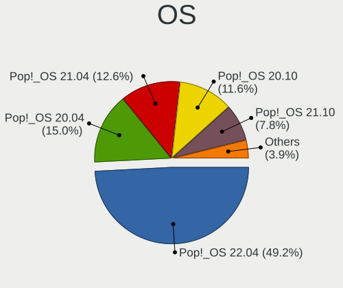

| Name          | Computers | Percent |
|---------------|-----------|---------|
| Pop!_OS 22.04 | 7035      | 49.18%  |
| Pop!_OS 20.04 | 2139      | 14.95%  |
| Pop!_OS 21.04 | 1808      | 12.64%  |
| Pop!_OS 20.10 | 1654      | 11.56%  |
| Pop!_OS 21.10 | 1114      | 7.79%   |
| Pop!_OS 24.04 | 479       | 3.35%   |
| Pop!_OS 19.10 | 47        | 0.33%   |
| Pop!_OS 19.04 | 12        | 0.08%   |
| Pop!_OS 18.04 | 11        | 0.08%   |
| Pop!_OS 18.10 | 5         | 0.03%   |

OS Family
---------

OS without a version

| Name    | Computers | Percent |
|---------|-----------|---------|
| Pop!_OS | 13705     | 100%    |

Kernel
------

Version of the Linux kernel

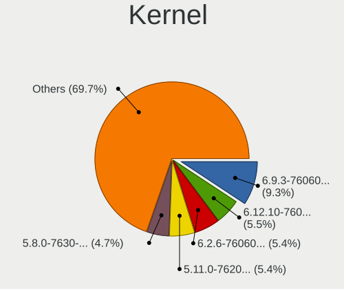

| Version                             | Computers | Percent |
|-------------------------------------|-----------|---------|
| 6.9.3-76060903-generic              | 1448      | 9.28%   |
| 6.12.10-76061203-generic            | 856       | 5.49%   |
| 6.2.6-76060206-generic              | 849       | 5.44%   |
| 5.11.0-7620-generic                 | 840       | 5.38%   |
| 5.8.0-7630-generic                  | 739       | 4.74%   |
| 5.4.0-7634-generic                  | 668       | 4.28%   |
| 5.13.0-7614-generic                 | 497       | 3.19%   |
| 6.0.12-76060006-generic             | 485       | 3.11%   |
| 5.8.0-7642-generic                  | 484       | 3.1%    |
| 6.8.0-76060800daily20240311-generic | 470       | 3.01%   |
| 5.17.5-76051705-generic             | 468       | 3%      |
| 5.4.0-7642-generic                  | 466       | 2.99%   |
| 5.19.0-76051900-generic             | 451       | 2.89%   |
| 5.11.0-7614-generic                 | 442       | 2.83%   |
| 5.13.0-7620-generic                 | 411       | 2.63%   |
| 6.16.3-76061603-generic             | 346       | 2.22%   |
| 6.6.10-76060610-generic             | 323       | 2.07%   |
| 6.5.6-76060506-generic              | 313       | 2.01%   |
| 6.0.6-76060006-generic              | 304       | 1.95%   |
| 6.4.6-76060406-generic              | 301       | 1.93%   |
| 5.15.15-76051515-generic            | 280       | 1.79%   |
| 5.16.11-76051611-generic            | 264       | 1.69%   |
| 5.15.5-76051505-generic             | 238       | 1.53%   |
| 6.6.6-76060606-generic              | 234       | 1.5%    |
| 5.11.0-7612-generic                 | 224       | 1.44%   |
| 5.18.10-76051810-generic            | 216       | 1.38%   |
| 5.8.0-7625-generic                  | 197       | 1.26%   |
| 5.17.15-76051715-generic            | 190       | 1.22%   |
| 5.16.19-76051619-generic            | 180       | 1.15%   |
| 5.11.0-7633-generic                 | 179       | 1.15%   |
| 6.17.9-76061709-generic             | 171       | 1.1%    |
| 5.15.8-76051508-generic             | 169       | 1.08%   |
| 6.17.4-76061704-generic             | 162       | 1.04%   |
| 5.16.15-76051615-generic            | 151       | 0.97%   |
| 5.4.0-7626-generic                  | 144       | 0.92%   |
| 6.5.4-76060504-generic              | 132       | 0.85%   |
| 6.2.0-76060200-generic              | 123       | 0.79%   |
| 5.15.11-76051511-generic            | 117       | 0.75%   |
| 6.0.2-76060002-generic              | 93        | 0.6%    |
| 6.1.11-76060111-generic             | 91        | 0.58%   |

Kernel Family
-------------

Linux kernel without a distro release

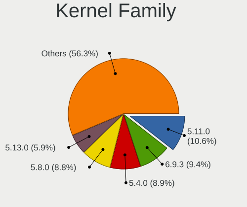

| Version | Computers | Percent |
|---------|-----------|---------|
| 5.11.0  | 1628      | 10.57%  |
| 6.9.3   | 1449      | 9.41%   |
| 5.4.0   | 1373      | 8.92%   |
| 5.8.0   | 1360      | 8.83%   |
| 5.13.0  | 910       | 5.91%   |
| 6.12.10 | 857       | 5.57%   |
| 6.2.6   | 850       | 5.52%   |
| 6.0.12  | 502       | 3.26%   |
| 6.8.0   | 473       | 3.07%   |
| 5.17.5  | 471       | 3.06%   |
| 5.19.0  | 455       | 2.96%   |
| 6.16.3  | 346       | 2.25%   |
| 6.6.10  | 323       | 2.1%    |
| 6.5.6   | 313       | 2.03%   |
| 6.0.6   | 305       | 1.98%   |
| 6.4.6   | 301       | 1.96%   |
| 5.15.15 | 281       | 1.83%   |
| 5.16.11 | 264       | 1.71%   |
| 5.15.5  | 238       | 1.55%   |
| 6.6.6   | 234       | 1.52%   |
| 5.18.10 | 216       | 1.4%    |
| 5.17.15 | 190       | 1.23%   |
| 5.16.19 | 180       | 1.17%   |
| 6.17.9  | 171       | 1.11%   |
| 5.15.8  | 169       | 1.1%    |
| 6.17.4  | 162       | 1.05%   |
| 5.16.15 | 151       | 0.98%   |
| 6.5.4   | 132       | 0.86%   |
| 6.2.0   | 124       | 0.81%   |
| 5.15.11 | 117       | 0.76%   |
| 6.0.2   | 96        | 0.62%   |
| 6.1.11  | 92        | 0.6%    |
| 5.15.23 | 91        | 0.59%   |
| 5.3.0   | 51        | 0.33%   |
| 5.19.16 | 43        | 0.28%   |
| 6.0.3   | 40        | 0.26%   |
| 5.15.0  | 16        | 0.1%    |
| 5.0.0   | 12        | 0.08%   |
| 5.8.5   | 8         | 0.05%   |
| 5.7.0   | 8         | 0.05%   |

Kernel Major Ver.
-----------------

Linux kernel major version

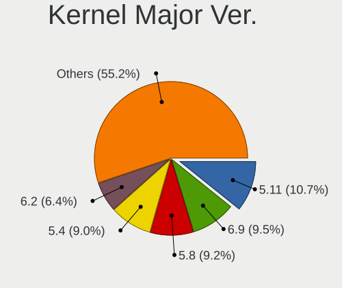

| Version | Computers | Percent |
|---------|-----------|---------|
| 5.11    | 1638      | 10.74%  |
| 6.9     | 1452      | 9.52%   |
| 5.8     | 1397      | 9.16%   |
| 5.4     | 1377      | 9.02%   |
| 6.2     | 972       | 6.37%   |
| 5.13    | 930       | 6.1%    |
| 6.0     | 921       | 6.04%   |
| 5.15    | 908       | 5.95%   |
| 6.12    | 867       | 5.68%   |
| 5.17    | 661       | 4.33%   |
| 5.16    | 586       | 3.84%   |
| 6.6     | 545       | 3.57%   |
| 5.19    | 500       | 3.28%   |
| 6.8     | 478       | 3.13%   |
| 6.5     | 452       | 2.96%   |
| 6.16    | 348       | 2.28%   |
| 6.17    | 334       | 2.19%   |
| 6.4     | 309       | 2.03%   |
| 5.18    | 223       | 1.46%   |
| 6.1     | 109       | 0.71%   |
| 5.3     | 51        | 0.33%   |
| 5.10    | 28        | 0.18%   |
| 5.7     | 27        | 0.18%   |
| 5.12    | 19        | 0.12%   |
| 6.3     | 18        | 0.12%   |
| 5.14    | 16        | 0.1%    |
| 5.9     | 15        | 0.1%    |
| 5.6     | 15        | 0.1%    |
| 5.0     | 12        | 0.08%   |
| 6.10    | 8         | 0.05%   |
| 4.18    | 8         | 0.05%   |
| 6.15    | 7         | 0.05%   |
| 6.11    | 6         | 0.04%   |
| 6.7     | 5         | 0.03%   |
| 6.14    | 5         | 0.03%   |
| 6.13    | 4         | 0.03%   |
| 4.15    | 3         | 0.02%   |
| 6.18    | 2         | 0.01%   |
| 5.1     | 1         | 0.01%   |
| 4.9     | 1         | 0.01%   |

Arch
----

OS architecture (x86_64, i586, etc.)

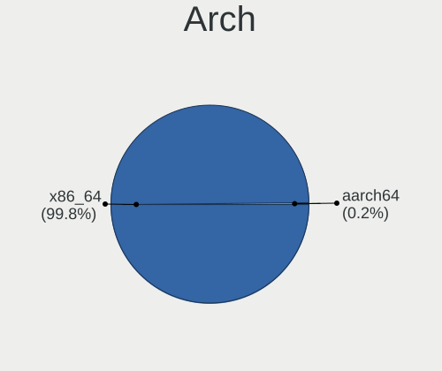

| Name    | Computers | Percent |
|---------|-----------|---------|
| x86_64  | 13683     | 99.84%  |
| aarch64 | 22        | 0.16%   |

DE
--

Desktop Environment

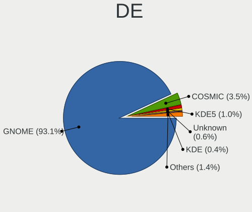

| Name            | Computers | Percent |
|-----------------|-----------|---------|
| GNOME           | 12866     | 93.1%   |
| COSMIC          | 486       | 3.52%   |
| KDE5            | 134       | 0.97%   |
| Unknown         | 86        | 0.62%   |
| KDE             | 60        | 0.43%   |
| X-Cinnamon      | 51        | 0.37%   |
| XFCE            | 24        | 0.17%   |
| MATE            | 24        | 0.17%   |
| GNOME Flashback | 20        | 0.14%   |
| Cinnamon        | 18        | 0.13%   |
| LXQt            | 15        | 0.11%   |
| Unity           | 13        | 0.09%   |
| i3              | 7         | 0.05%   |
| Budgie          | 6         | 0.04%   |
| awesome         | 3         | 0.02%   |
| Deepin          | 2         | 0.01%   |
| UKUI            | 1         | 0.01%   |
| pop             | 1         | 0.01%   |
| Pantheon        | 1         | 0.01%   |
| KDE6            | 1         | 0.01%   |
| GNOME Classic   | 1         | 0.01%   |

Display Server
--------------

X11 or Wayland

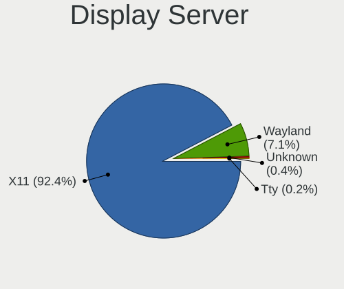

| Name    | Computers | Percent |
|---------|-----------|---------|
| X11     | 12768     | 92.36%  |
| Wayland | 980       | 7.09%   |
| Unknown | 49        | 0.35%   |
| Tty     | 27        | 0.2%    |

Display Manager
---------------

SDDM, LightDM, etc.

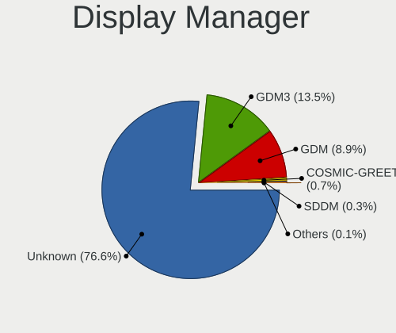

| Name           | Computers | Percent |
|----------------|-----------|---------|
| Unknown        | 10626     | 76.55%  |
| GDM3           | 1871      | 13.48%  |
| GDM            | 1241      | 8.94%   |
| COSMIC-GREETER | 91        | 0.66%   |
| SDDM           | 35        | 0.25%   |
| LightDM        | 9         | 0.06%   |
| TDM            | 8         | 0.06%   |

OS Lang
-------

Language

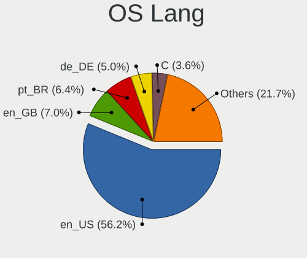

| Lang    | Computers | Percent |
|---------|-----------|---------|
| en_US   | 7778      | 56.17%  |
| en_GB   | 975       | 7.04%   |
| pt_BR   | 886       | 6.4%    |
| de_DE   | 698       | 5.04%   |
| C       | 503       | 3.63%   |
| en_AU   | 377       | 2.72%   |
| en_CA   | 313       | 2.26%   |
| fr_FR   | 290       | 2.09%   |
| it_IT   | 256       | 1.85%   |
| es_ES   | 211       | 1.52%   |
| ru_RU   | 166       | 1.2%    |
| pl_PL   | 140       | 1.01%   |
| Unknown | 97        | 0.7%    |
| pt_PT   | 88        | 0.64%   |
| sv_SE   | 81        | 0.58%   |
| nl_NL   | 73        | 0.53%   |
| en_IN   | 62        | 0.45%   |
| es_MX   | 47        | 0.34%   |
| tr_TR   | 43        | 0.31%   |
| fi_FI   | 42        | 0.3%    |
| en_ZA   | 42        | 0.3%    |
| nb_NO   | 40        | 0.29%   |
| es_AR   | 40        | 0.29%   |
| es_CL   | 35        | 0.25%   |
| en_NZ   | 35        | 0.25%   |
| en_DK   | 35        | 0.25%   |
| hu_HU   | 33        | 0.24%   |
| fr_CA   | 32        | 0.23%   |
| cs_CZ   | 30        | 0.22%   |
| da_DK   | 28        | 0.2%    |
| de_AT   | 25        | 0.18%   |
| sk_SK   | 24        | 0.17%   |
| de_CH   | 24        | 0.17%   |
| ja_JP   | 22        | 0.16%   |
| zh_CN   | 20        | 0.14%   |
| en_IE   | 20        | 0.14%   |
| es_CO   | 16        | 0.12%   |
| zh_TW   | 15        | 0.11%   |
| nl_BE   | 15        | 0.11%   |
| ro_RO   | 12        | 0.09%   |

Boot Mode
---------

EFI or BIOS

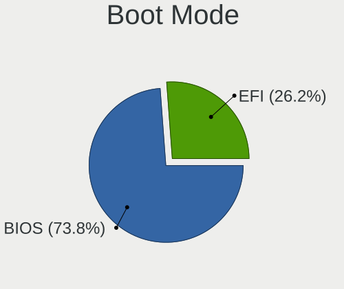

| Mode | Computers | Percent |
|------|-----------|---------|
| BIOS | 10252     | 73.82%  |
| EFI  | 3635      | 26.18%  |

Filesystem
----------

Type of filesystem

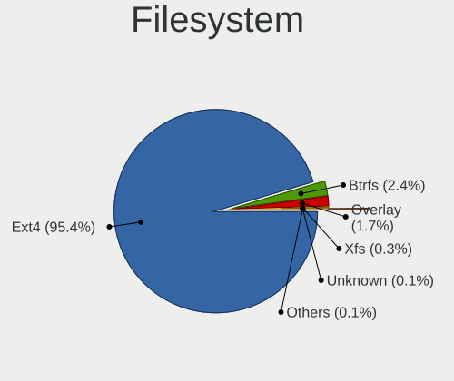

| Type    | Computers | Percent |
|---------|-----------|---------|
| Ext4    | 13126     | 95.39%  |
| Btrfs   | 337       | 2.45%   |
| Overlay | 232       | 1.69%   |
| Xfs     | 37        | 0.27%   |
| Unknown | 14        | 0.1%    |
| Zfs     | 10        | 0.07%   |
| Tmpfs   | 2         | 0.01%   |
| XXX4    | 1         | 0.01%   |
| Ext2    | 1         | 0.01%   |

Part. scheme
------------

Scheme of partitioning

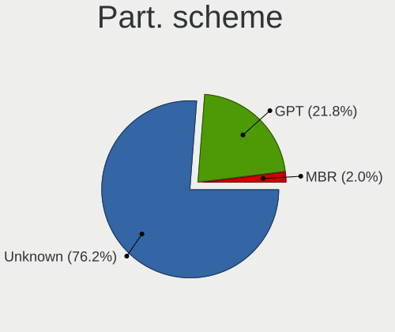

| Type    | Computers | Percent |
|---------|-----------|---------|
| Unknown | 10553     | 76.23%  |
| GPT     | 3020      | 21.81%  |
| MBR     | 271       | 1.96%   |

Dual Boot with Linux/BSD
------------------------

Hosting more than one Linux/BSD

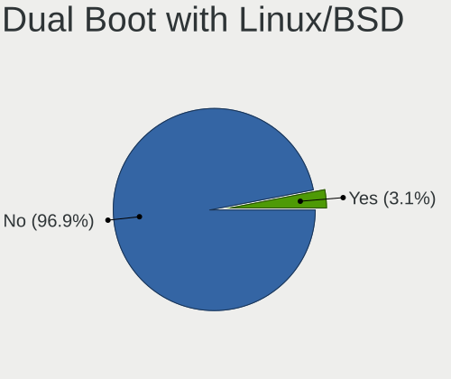

| Dual boot | Computers | Percent |
|-----------|-----------|---------|
| No        | 13341     | 96.95%  |
| Yes       | 420       | 3.05%   |

Dual Boot (Win)
---------------

Hosting Linux and Windows

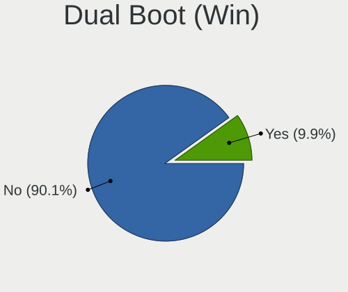

| Dual boot | Computers | Percent |
|-----------|-----------|---------|
| No        | 12428     | 90.1%   |
| Yes       | 1366      | 9.9%    |

Board
-----

Vendor
------

Motherboard manufacturer

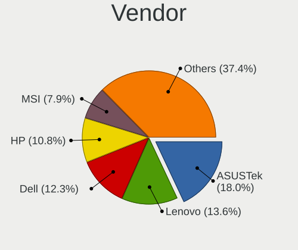

| Name                                 | Computers | Percent |
|--------------------------------------|-----------|---------|
| ASUSTek Computer                     | 2469      | 18.02%  |
| Lenovo                               | 1868      | 13.63%  |
| Dell                                 | 1686      | 12.3%   |
| Hewlett-Packard                      | 1481      | 10.81%  |
| MSI                                  | 1080      | 7.88%   |
| Gigabyte Technology                  | 1016      | 7.41%   |
| Apple                                | 651       | 4.75%   |
| Acer                                 | 628       | 4.58%   |
| ASRock                               | 508       | 3.71%   |
| System76                             | 328       | 2.39%   |
| Intel                                | 185       | 1.35%   |
| Toshiba                              | 129       | 0.94%   |
| Samsung Electronics                  | 127       | 0.93%   |
| HUAWEI                               | 103       | 0.75%   |
| Alienware                            | 90        | 0.66%   |
| Microsoft                            | 80        | 0.58%   |
| Unknown                              | 76        | 0.55%   |
| Notebook                             | 65        | 0.47%   |
| Google                               | 64        | 0.47%   |
| Fujitsu                              | 63        | 0.46%   |
| Sony                                 | 59        | 0.43%   |
| Positivo                             | 48        | 0.35%   |
| Biostar                              | 34        | 0.25%   |
| Razer                                | 32        | 0.23%   |
| Pegatron                             | 32        | 0.23%   |
| Medion                               | 29        | 0.21%   |
| PC Specialist                        | 24        | 0.18%   |
| LG Electronics                       | 24        | 0.18%   |
| Supermicro                           | 23        | 0.17%   |
| Framework                            | 23        | 0.17%   |
| Timi                                 | 22        | 0.16%   |
| Raspberry Pi Foundation              | 22        | 0.16%   |
| AZW                                  | 22        | 0.16%   |
| Foxconn                              | 21        | 0.15%   |
| ECS                                  | 18        | 0.13%   |
| Huanan                               | 17        | 0.12%   |
| Packard Bell                         | 16        | 0.12%   |
| Gateway                              | 16        | 0.12%   |
| Shenzhen Meigao Electronic Equipment | 15        | 0.11%   |
| GPU Company                          | 15        | 0.11%   |

Model
-----

Motherboard model

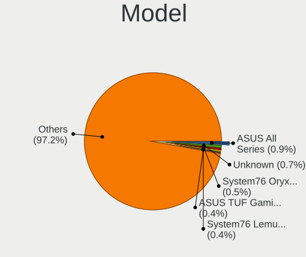

| Name                         | Computers | Percent |
|------------------------------|-----------|---------|
| ASUS All Series              | 119       | 0.87%   |
| Unknown                      | 101       | 0.74%   |
| System76 Oryx Pro            | 62        | 0.45%   |
| ASUS TUF Gaming X570-PLUS    | 56        | 0.41%   |
| System76 Lemur Pro           | 48        | 0.35%   |
| Apple MacBookPro9,2          | 45        | 0.33%   |
| ASUS ROG STRIX B550-F GAMING | 42        | 0.31%   |
| System76 Gazelle             | 39        | 0.28%   |
| MSI MS-7C37                  | 39        | 0.28%   |
| MSI MS-7C02                  | 39        | 0.28%   |
| Dell XPS 15 7590             | 37        | 0.27%   |
| Apple MacBookAir7,2          | 37        | 0.27%   |
| Gigabyte B450M DS3H          | 35        | 0.26%   |
| ASUS ROG STRIX B450-F GAMING | 35        | 0.26%   |
| Apple MacBookPro8,1          | 34        | 0.25%   |
| MSI MS-7B86                  | 33        | 0.24%   |
| Apple MacBookPro12,1         | 31        | 0.23%   |
| System76 Darter Pro          | 30        | 0.22%   |
| Dell OptiPlex 9020           | 30        | 0.22%   |
| System76 Thelio              | 27        | 0.2%    |
| System76 Galago Pro          | 27        | 0.2%    |
| MSI MS-7C91                  | 26        | 0.19%   |
| HP Notebook                  | 26        | 0.19%   |
| Dell OptiPlex 7010           | 26        | 0.19%   |
| MSI MS-7C56                  | 25        | 0.18%   |
| Gigabyte X570 AORUS ELITE    | 25        | 0.18%   |
| ASUS PRIME B450M-A           | 25        | 0.18%   |
| Apple MacBookPro11,1         | 25        | 0.18%   |
| Apple MacBookAir6,2          | 25        | 0.18%   |
| Dell XPS 15 9500             | 23        | 0.17%   |
| HP Pavilion Notebook         | 22        | 0.16%   |
| ASRock B450M Pro4            | 22        | 0.16%   |
| Apple MacBookPro11,3         | 22        | 0.16%   |
| HP Pavilion dv6              | 21        | 0.15%   |
| System76 Pangolin            | 20        | 0.15%   |
| MSI MS-7C95                  | 20        | 0.15%   |
| HP Pavilion 15               | 20        | 0.15%   |
| Gigabyte X570 AORUS MASTER   | 20        | 0.15%   |
| Gigabyte A320M-S2H           | 20        | 0.15%   |
| Dell XPS 15 9570             | 20        | 0.15%   |

Model Family
------------

Motherboard model prefix

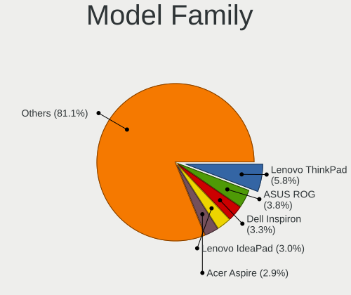

| Name               | Computers | Percent |
|--------------------|-----------|---------|
| Lenovo ThinkPad    | 791       | 5.77%   |
| ASUS ROG           | 522       | 3.81%   |
| Dell Inspiron      | 456       | 3.33%   |
| Lenovo IdeaPad     | 415       | 3.03%   |
| Acer Aspire        | 401       | 2.93%   |
| Dell Latitude      | 336       | 2.45%   |
| ASUS PRIME         | 299       | 2.18%   |
| Dell XPS           | 278       | 2.03%   |
| HP Pavilion        | 270       | 1.97%   |
| ASUS TUF           | 254       | 1.85%   |
| Dell OptiPlex      | 221       | 1.61%   |
| ASUS VivoBook      | 177       | 1.29%   |
| HP EliteBook       | 174       | 1.27%   |
| Dell Precision     | 161       | 1.17%   |
| HP Laptop          | 150       | 1.09%   |
| Lenovo Legion      | 143       | 1.04%   |
| ASUS All           | 119       | 0.87%   |
| HP ProBook         | 112       | 0.82%   |
| ASUS ASUS          | 111       | 0.81%   |
| Lenovo Yoga        | 110       | 0.8%    |
| Toshiba Satellite  | 109       | 0.8%    |
| Unknown            | 101       | 0.74%   |
| Gigabyte X570      | 97        | 0.71%   |
| HP Compaq          | 95        | 0.69%   |
| Acer Nitro         | 95        | 0.69%   |
| HP ENVY            | 94        | 0.69%   |
| Dell Vostro        | 89        | 0.65%   |
| Lenovo ThinkCentre | 82        | 0.6%    |
| Microsoft Surface  | 80        | 0.58%   |
| Apple MacBookPro11 | 75        | 0.55%   |
| HP OMEN            | 70        | 0.51%   |
| Gigabyte B450      | 63        | 0.46%   |
| ASUS ZenBook       | 63        | 0.46%   |
| System76 Oryx      | 62        | 0.45%   |
| Gigabyte B450M     | 58        | 0.42%   |
| System76 Thelio    | 55        | 0.4%    |
| Apple MacBookPro9  | 53        | 0.39%   |
| System76 Lemur     | 52        | 0.38%   |
| Gigabyte B550      | 50        | 0.36%   |
| Apple MacBookPro8  | 50        | 0.36%   |

MFG Year
--------

Motherboard manufacture year

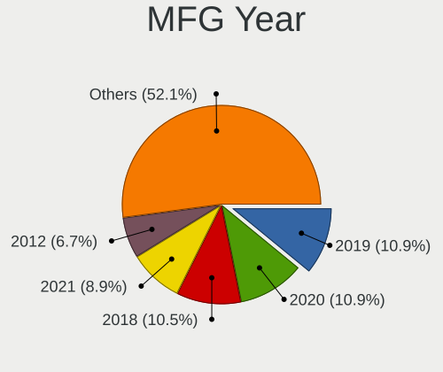

| Year    | Computers | Percent |
|---------|-----------|---------|
| 2019    | 1499      | 10.94%  |
| 2020    | 1495      | 10.91%  |
| 2018    | 1440      | 10.51%  |
| 2021    | 1216      | 8.87%   |
| 2012    | 913       | 6.66%   |
| 2017    | 860       | 6.28%   |
| 2013    | 809       | 5.9%    |
| 2022    | 745       | 5.44%   |
| 2011    | 694       | 5.06%   |
| 2014    | 687       | 5.01%   |
| 2015    | 672       | 4.9%    |
| 2016    | 635       | 4.63%   |
| 2023    | 475       | 3.47%   |
| 2010    | 405       | 2.96%   |
| 2009    | 349       | 2.55%   |
| 2024    | 269       | 1.96%   |
| 2008    | 267       | 1.95%   |
| 2007    | 119       | 0.87%   |
| 2025    | 69        | 0.5%    |
| 2006    | 62        | 0.45%   |
| Unknown | 22        | 0.16%   |
| 2005    | 2         | 0.01%   |
| 2004    | 1         | 0.01%   |

Form Factor
-----------

Physical design of the computer

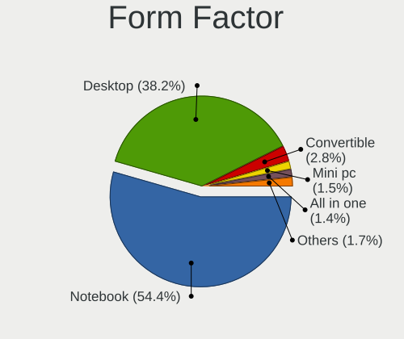

| Name           | Computers | Percent |
|----------------|-----------|---------|
| Notebook       | 7461      | 54.44%  |
| Desktop        | 5236      | 38.21%  |
| Convertible    | 386       | 2.82%   |
| Mini pc        | 200       | 1.46%   |
| All in one     | 193       | 1.41%   |
| Tablet         | 159       | 1.16%   |
| Server         | 44        | 0.32%   |
| System on chip | 23        | 0.17%   |
| Other          | 2         | 0.01%   |
| Stick pc       | 1         | 0.01%   |

Secure Boot
-----------

Enabled or disabled

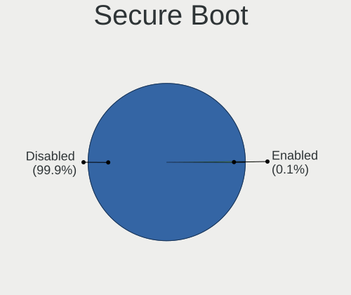

| State    | Computers | Percent |
|----------|-----------|---------|
| Disabled | 13696     | 99.92%  |
| Enabled  | 11        | 0.08%   |

Coreboot
--------

Have coreboot on board

| Used | Computers | Percent |
|------|-----------|---------|
| No   | 13462     | 98.23%  |
| Yes  | 243       | 1.77%   |

RAM Size
--------

Total RAM memory

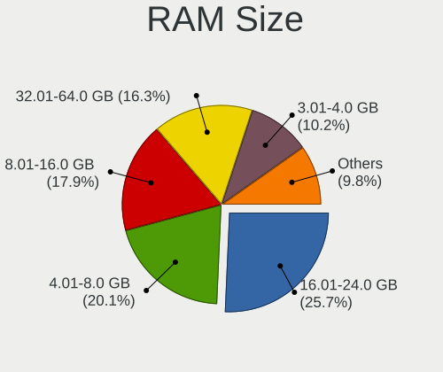

| Size in GB      | Computers | Percent |
|-----------------|-----------|---------|
| 16.01-24.0      | 3572      | 25.7%   |
| 4.01-8.0        | 2795      | 20.11%  |
| 8.01-16.0       | 2491      | 17.92%  |
| 32.01-64.0      | 2267      | 16.31%  |
| 3.01-4.0        | 1417      | 10.19%  |
| 64.01-256.0     | 695       | 5%      |
| 24.01-32.0      | 449       | 3.23%   |
| 1.01-2.0        | 134       | 0.96%   |
| 2.01-3.0        | 62        | 0.45%   |
| More than 256.0 | 17        | 0.12%   |
| 0.51-1.0        | 1         | 0.01%   |

RAM Used
--------

Used RAM memory

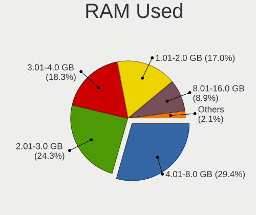

| Used GB     | Computers | Percent |
|-------------|-----------|---------|
| 4.01-8.0    | 4411      | 29.4%   |
| 2.01-3.0    | 3644      | 24.29%  |
| 3.01-4.0    | 2743      | 18.29%  |
| 1.01-2.0    | 2552      | 17.01%  |
| 8.01-16.0   | 1342      | 8.95%   |
| 16.01-24.0  | 191       | 1.27%   |
| 24.01-32.0  | 55        | 0.37%   |
| 32.01-64.0  | 33        | 0.22%   |
| 0.51-1.0    | 24        | 0.16%   |
| 64.01-256.0 | 5         | 0.03%   |
| 0.01-0.5    | 1         | 0.01%   |

Total Drives
------------

Number of drives on board

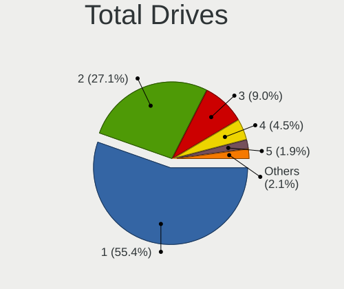

| Drives | Computers | Percent |
|--------|-----------|---------|
| 1      | 7781      | 55.39%  |
| 2      | 3805      | 27.09%  |
| 3      | 1267      | 9.02%   |
| 4      | 627       | 4.46%   |
| 5      | 270       | 1.92%   |
| 6      | 124       | 0.88%   |
| 0      | 67        | 0.48%   |
| 7      | 49        | 0.35%   |
| 8      | 19        | 0.14%   |
| 9      | 12        | 0.09%   |
| 11     | 10        | 0.07%   |
| 12     | 3         | 0.02%   |
| 10     | 3         | 0.02%   |
| 20     | 2         | 0.01%   |
| 14     | 2         | 0.01%   |
| 13     | 2         | 0.01%   |
| 26     | 1         | 0.01%   |
| 23     | 1         | 0.01%   |
| 22     | 1         | 0.01%   |
| 19     | 1         | 0.01%   |
| 18     | 1         | 0.01%   |

Has CD-ROM
----------

Has CD-ROM on board

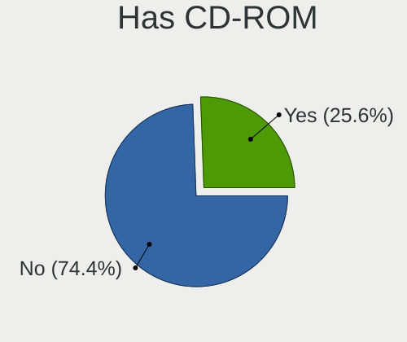

| Presented | Computers | Percent |
|-----------|-----------|---------|
| No        | 10249     | 74.42%  |
| Yes       | 3522      | 25.58%  |

Has Ethernet
------------

Has Ethernet on board

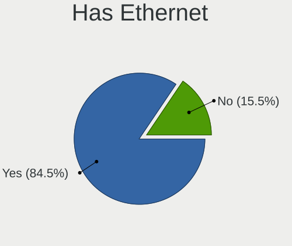

| Presented | Computers | Percent |
|-----------|-----------|---------|
| Yes       | 11629     | 84.47%  |
| No        | 2138      | 15.53%  |

Has WiFi
--------

Has WiFi module

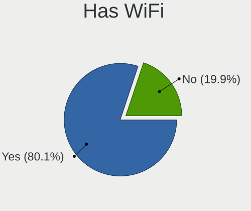

| Presented | Computers | Percent |
|-----------|-----------|---------|
| Yes       | 11031     | 80.14%  |
| No        | 2734      | 19.86%  |

Has Bluetooth
-------------

Has Bluetooth module

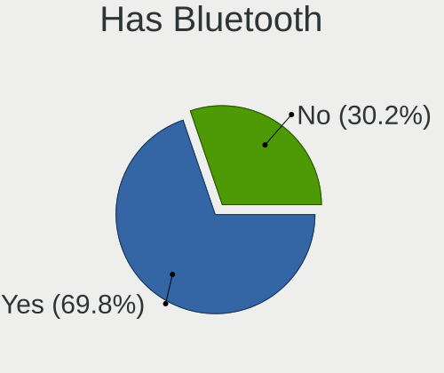

| Presented | Computers | Percent |
|-----------|-----------|---------|
| Yes       | 9649      | 69.77%  |
| No        | 4180      | 30.23%  |

Location
--------

Country
-------

Geographic location (country)

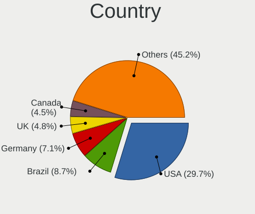

| Country      | Computers | Percent |
|--------------|-----------|---------|
| USA          | 4095      | 29.72%  |
| Brazil       | 1201      | 8.72%   |
| Germany      | 973       | 7.06%   |
| UK           | 663       | 4.81%   |
| Canada       | 624       | 4.53%   |
| Australia    | 441       | 3.2%    |
| Italy        | 422       | 3.06%   |
| France       | 377       | 2.74%   |
| India        | 361       | 2.62%   |
| Netherlands  | 296       | 2.15%   |
| Poland       | 246       | 1.79%   |
| Russia       | 234       | 1.7%    |
| Sweden       | 227       | 1.65%   |
| Spain        | 215       | 1.56%   |
| Mexico       | 159       | 1.15%   |
| Portugal     | 148       | 1.07%   |
| Switzerland  | 136       | 0.99%   |
| Norway       | 127       | 0.92%   |
| Finland      | 125       | 0.91%   |
| South Africa | 122       | 0.89%   |
| Romania      | 114       | 0.83%   |
| Austria      | 113       | 0.82%   |
| Denmark      | 101       | 0.73%   |
| Belgium      | 99        | 0.72%   |
| New Zealand  | 96        | 0.7%    |
| Indonesia    | 96        | 0.7%    |
| Turkey       | 95        | 0.69%   |
| Czechia      | 94        | 0.68%   |
| Argentina    | 91        | 0.66%   |
| Philippines  | 86        | 0.62%   |
| Hungary      | 80        | 0.58%   |
| Greece       | 78        | 0.57%   |
| Chile        | 71        | 0.52%   |
| Japan        | 62        | 0.45%   |
| Bulgaria     | 62        | 0.45%   |
| Ireland      | 54        | 0.39%   |
| Malaysia     | 51        | 0.37%   |
| Slovakia     | 49        | 0.36%   |
| Serbia       | 45        | 0.33%   |
| Colombia     | 42        | 0.3%    |

City
----

Geographic location (city)

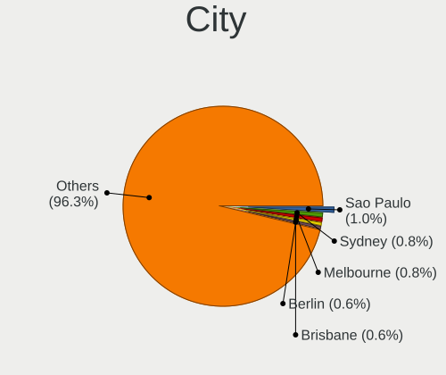

| City           | Computers | Percent |
|----------------|-----------|---------|
| Sao Paulo      | 143       | 0.99%   |
| Sydney         | 117       | 0.81%   |
| Melbourne      | 110       | 0.76%   |
| Berlin         | 87        | 0.6%    |
| Brisbane       | 80        | 0.55%   |
| Milan          | 78        | 0.54%   |
| Rio de Janeiro | 73        | 0.5%    |
| Warsaw         | 72        | 0.5%    |
| Helsinki       | 71        | 0.49%   |
| Vienna         | 66        | 0.46%   |
| Chicago        | 66        | 0.46%   |
| New York       | 60        | 0.41%   |
| Moscow         | 59        | 0.41%   |
| Seattle        | 58        | 0.4%    |
| Denver         | 57        | 0.39%   |
| Toronto        | 54        | 0.37%   |
| Dallas         | 52        | 0.36%   |
| Paris          | 51        | 0.35%   |
| Los Angeles    | 50        | 0.35%   |
| Bengaluru      | 50        | 0.35%   |
| Madrid         | 49        | 0.34%   |
| London         | 49        | 0.34%   |
| Rome           | 48        | 0.33%   |
| Montreal       | 48        | 0.33%   |
| Amsterdam      | 48        | 0.33%   |
| Auckland       | 47        | 0.32%   |
| Istanbul       | 43        | 0.3%    |
| Stockholm      | 39        | 0.27%   |
| Lisbon         | 39        | 0.27%   |
| Bucharest      | 39        | 0.27%   |
| Zurich         | 38        | 0.26%   |
| Sofia          | 38        | 0.26%   |
| Edmonton       | 38        | 0.26%   |
| Calgary        | 38        | 0.26%   |
| Hamburg        | 37        | 0.26%   |
| Budapest       | 37        | 0.26%   |
| Brasília      | 37        | 0.26%   |
| Porto Alegre   | 36        | 0.25%   |
| Miami          | 36        | 0.25%   |
| Mexico City    | 36        | 0.25%   |

Drives
------

Drive Vendor
------------

Hard drive vendors

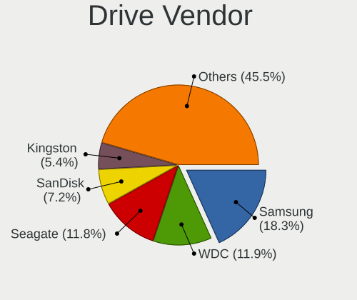

| Vendor                      | Computers | Drives | Percent |
|-----------------------------|-----------|--------|---------|
| Samsung Electronics         | 3894      | 6010   | 18.26%  |
| WDC                         | 2539      | 3593   | 11.9%   |
| Seagate                     | 2511      | 3675   | 11.77%  |
| SanDisk                     | 1540      | 2066   | 7.22%   |
| Kingston                    | 1146      | 1452   | 5.37%   |
| Toshiba                     | 1025      | 1271   | 4.81%   |
| Crucial                     | 857       | 1157   | 4.02%   |
| SK hynix                    | 663       | 835    | 3.11%   |
| Unknown                     | 601       | 814    | 2.82%   |
| Intel                       | 572       | 787    | 2.68%   |
| Micron Technology           | 447       | 528    | 2.1%    |
| Hitachi                     | 375       | 487    | 1.76%   |
| HGST                        | 327       | 391    | 1.53%   |
| Apple                       | 326       | 378    | 1.53%   |
| A-DATA Technology           | 292       | 360    | 1.37%   |
| Micron/Crucial Technology   | 271       | 363    | 1.27%   |
| Phison                      | 263       | 369    | 1.23%   |
| China                       | 206       | 277    | 0.97%   |
| Phison Electronics          | 202       | 292    | 0.95%   |
| Silicon Motion              | 195       | 256    | 0.91%   |
| PNY                         | 181       | 227    | 0.85%   |
| KIOXIA                      | 173       | 203    | 0.81%   |
| Kingston Technology Company | 151       | 190    | 0.71%   |
| SPCC                        | 109       | 149    | 0.51%   |
| LITEON                      | 85        | 103    | 0.4%    |
| Team                        | 84        | 101    | 0.39%   |
| ADATA Technology            | 84        | 101    | 0.39%   |
| OCZ                         | 79        | 101    | 0.37%   |
| Realtek Semiconductor       | 76        | 86     | 0.36%   |
| Patriot                     | 72        | 95     | 0.34%   |
| Unknown                     | 68        | 75     | 0.32%   |
| Transcend                   | 67        | 78     | 0.31%   |
| Corsair                     | 64        | 82     | 0.3%    |
| MAXIO Technology (Hangzhou) | 63        | 72     | 0.3%    |
| Intenso                     | 63        | 86     | 0.3%    |
| Hewlett-Packard             | 61        | 89     | 0.29%   |
| XPG                         | 56        | 75     | 0.26%   |
| JMicron Technology          | 56        | 82     | 0.26%   |
| Netac                       | 51        | 61     | 0.24%   |
| Lexar                       | 51        | 66     | 0.24%   |

Drive Model
-----------

Hard drive models

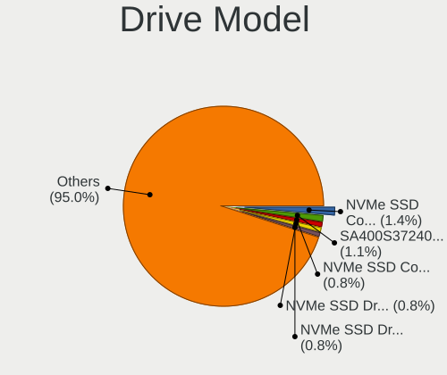

| Model                                                | Computers | Percent |
|------------------------------------------------------|-----------|---------|
| Samsung NVMe SSD Controller SM981/PM981/PM983 1TB    | 332       | 1.4%    |
| Kingston SA400S37240G 240GB SSD                      | 265       | 1.12%   |
| Samsung NVMe SSD Controller PM9A1/PM9A3/980PRO 1TB   | 200       | 0.85%   |
| Samsung NVMe SSD Drive 1TB                           | 198       | 0.84%   |
| Samsung NVMe SSD Drive 500GB                         | 178       | 0.75%   |
| Samsung SSD 850 EVO 250GB                            | 175       | 0.74%   |
| Seagate ST1000LM035-1RK172 1TB                       | 168       | 0.71%   |
| Samsung SSD 860 EVO 500GB                            | 161       | 0.68%   |
| SanDisk NVMe SSD Drive 1TB                           | 158       | 0.67%   |
| Samsung SSD 850 EVO 500GB                            | 153       | 0.65%   |
| Seagate ST2000DM008-2FR102 2TB                       | 145       | 0.61%   |
| Kingston SA400S37480G 480GB SSD                      | 142       | 0.6%    |
| Samsung SSD 860 EVO 1TB                              | 139       | 0.59%   |
| Seagate ST1000DM010-2EP102 1TB                       | 138       | 0.58%   |
| Unknown MMC Card  64GB                               | 127       | 0.54%   |
| Crucial CT1000MX500SSD1 1TB                          | 127       | 0.54%   |
| Kingston SA400S37120G 120GB SSD                      | 124       | 0.52%   |
| Samsung NVMe SSD Drive 512GB                         | 118       | 0.5%    |
| HGST HTS721010A9E630 1TB                             | 118       | 0.5%    |
| Crucial CT500MX500SSD1 500GB                         | 107       | 0.45%   |
| Seagate ST1000LM024 HN-M101MBB 1TB                   | 104       | 0.44%   |
| Micron/Crucial P2 NVMe PCIe SSD 2TB                  | 103       | 0.44%   |
| Seagate ST500DM002-1BD142 500GB                      | 101       | 0.43%   |
| SanDisk NVMe SSD Drive 500GB                         | 101       | 0.43%   |
| Toshiba MQ01ABD100 1TB                               | 99        | 0.42%   |
| WDC WD10EZEX-08WN4A0 1TB                             | 93        | 0.39%   |
| Samsung NVMe SSD Drive 256GB                         | 91        | 0.39%   |
| Unknown MMC Card  32GB                               | 87        | 0.37%   |
| SanDisk NVMe SSD Drive 512GB                         | 84        | 0.36%   |
| Crucial CT240BX500SSD1 240GB                         | 84        | 0.36%   |
| Sandisk WD Blue SN550 NVMe SSD 1024GB                | 81        | 0.34%   |
| Samsung NVMe SSD Controller SM961/PM961/SM963 1024GB | 77        | 0.33%   |
| Unknown MMC Card  128GB                              | 76        | 0.32%   |
| Samsung SSD 980 1TB                                  | 76        | 0.32%   |
| Seagate Expansion 2TB                                | 75        | 0.32%   |
| Samsung SSD 970 EVO Plus 1TB                         | 75        | 0.32%   |
| Samsung SSD 860 EVO 250GB                            | 75        | 0.32%   |
| Toshiba DT01ACA100 1TB                               | 74        | 0.31%   |
| Samsung SM963 2.5" NVMe PCIe SSD 250GB               | 74        | 0.31%   |
| Toshiba MQ04ABF100 1TB                               | 72        | 0.3%    |

HDD Vendor
----------

Hard disk drive vendors

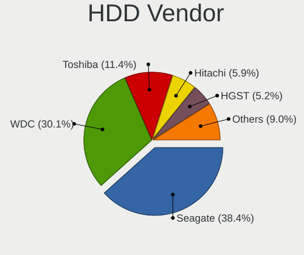

| Vendor              | Computers | Drives | Percent |
|---------------------|-----------|--------|---------|
| Seagate             | 2429      | 3491   | 38.35%  |
| WDC                 | 1909      | 2710   | 30.14%  |
| Toshiba             | 722       | 884    | 11.4%   |
| Hitachi             | 375       | 487    | 5.92%   |
| HGST                | 327       | 391    | 5.16%   |
| Samsung Electronics | 195       | 238    | 3.08%   |
| Apple               | 80        | 94     | 1.26%   |
| Unknown             | 70        | 84     | 1.11%   |
| Maxtor              | 31        | 33     | 0.49%   |
| JMicron Technology  | 30        | 48     | 0.47%   |
| Fujitsu             | 27        | 32     | 0.43%   |
| TO Exter            | 16        | 19     | 0.25%   |
| Hewlett-Packard     | 16        | 36     | 0.25%   |
| ASMT                | 16        | 18     | 0.25%   |
| External            | 10        | 10     | 0.16%   |
| T-FORCE             | 9         | 11     | 0.14%   |
| Intenso             | 6         | 13     | 0.09%   |
| USB                 | 4         | 6      | 0.06%   |
| SABRENT             | 4         | 6      | 0.06%   |
| MaxDigital          | 4         | 4      | 0.06%   |
| LaCie               | 4         | 6      | 0.06%   |
| ASMedia             | 4         | 4      | 0.06%   |
| WD MediaMax         | 3         | 9      | 0.05%   |
| USB3.0              | 3         | 3      | 0.05%   |
| SATAFIRM            | 3         | 3      | 0.05%   |
| Inateck             | 3         | 3      | 0.05%   |
| ExcelStor           | 3         | 3      | 0.05%   |
| Unknown             | 3         | 4      | 0.05%   |
| RSH-339             | 2         | 2      | 0.03%   |
| Magnetic Data       | 2         | 2      | 0.03%   |
| HPE                 | 2         | 4      | 0.03%   |
| HGST HTS            | 2         | 2      | 0.03%   |
| ASMT109x            | 2         | 2      | 0.03%   |
| XrayDisk            | 1         | 1      | 0.02%   |
| StoreJet            | 1         | 1      | 0.02%   |
| SSK                 | 1         | 1      | 0.02%   |
| Quantum             | 1         | 1      | 0.02%   |
| OEM                 | 1         | 1      | 0.02%   |
| Min Yi U            | 1         | 1      | 0.02%   |
| Maxone              | 1         | 1      | 0.02%   |

SSD Vendor
----------

Solid state drive vendors

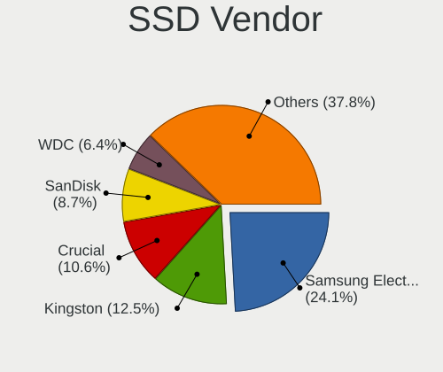

| Vendor              | Computers | Drives | Percent |
|---------------------|-----------|--------|---------|
| Samsung Electronics | 1722      | 2507   | 24.13%  |
| Kingston            | 890       | 1108   | 12.47%  |
| Crucial             | 757       | 1000   | 10.61%  |
| SanDisk             | 618       | 791    | 8.66%   |
| WDC                 | 454       | 567    | 6.36%   |
| A-DATA Technology   | 227       | 282    | 3.18%   |
| Apple               | 208       | 231    | 2.92%   |
| China               | 205       | 276    | 2.87%   |
| PNY                 | 175       | 219    | 2.45%   |
| Intel               | 154       | 200    | 2.16%   |
| SK hynix            | 129       | 163    | 1.81%   |
| Micron Technology   | 109       | 121    | 1.53%   |
| Toshiba             | 94        | 108    | 1.32%   |
| SPCC                | 92        | 112    | 1.29%   |
| OCZ                 | 78        | 97     | 1.09%   |
| LITEON              | 78        | 96     | 1.09%   |
| Patriot             | 70        | 92     | 0.98%   |
| Team                | 65        | 81     | 0.91%   |
| Transcend           | 64        | 75     | 0.9%    |
| LITEONIT            | 49        | 70     | 0.69%   |
| Intenso             | 48        | 64     | 0.67%   |
| KingSpec            | 47        | 55     | 0.66%   |
| Corsair             | 46        | 55     | 0.64%   |
| Seagate             | 42        | 60     | 0.59%   |
| Netac               | 41        | 48     | 0.57%   |
| Lexar               | 39        | 50     | 0.55%   |
| Hewlett-Packard     | 34        | 43     | 0.48%   |
| Apacer              | 30        | 39     | 0.42%   |
| SABRENT             | 28        | 33     | 0.39%   |
| GOODRAM             | 27        | 29     | 0.38%   |
| KingDian            | 20        | 32     | 0.28%   |
| Gigabyte Technology | 19        | 22     | 0.27%   |
| Verbatim            | 18        | 24     | 0.25%   |
| Plextor             | 18        | 23     | 0.25%   |
| Unknown             | 18        | 19     | 0.25%   |
| Mushkin             | 14        | 17     | 0.2%    |
| Fanxiang            | 14        | 20     | 0.2%    |
| Dogfish             | 14        | 22     | 0.2%    |
| ASMT                | 13        | 21     | 0.18%   |
| OWC                 | 12        | 22     | 0.17%   |

Drive Kind
----------

HDD or SSD

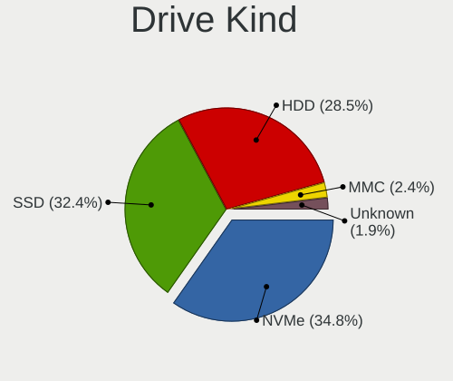

| Kind    | Computers | Drives | Percent |
|---------|-----------|--------|---------|
| NVMe    | 6572      | 10093  | 34.76%  |
| SSD     | 6130      | 9311   | 32.42%  |
| HDD     | 5388      | 8687   | 28.5%   |
| MMC     | 458       | 564    | 2.42%   |
| Unknown | 358       | 549    | 1.89%   |

Drive Connector
---------------

SATA, SAS, NVMe, etc.

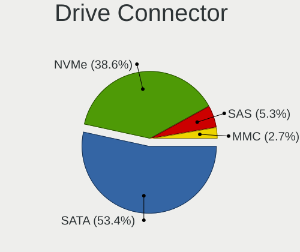

| Type | Computers | Drives | Percent |
|------|-----------|--------|---------|
| SATA | 9076      | 17214  | 53.41%  |
| NVMe | 6559      | 10019  | 38.6%   |
| SAS  | 901       | 1407   | 5.3%    |
| MMC  | 458       | 564    | 2.7%    |

Drive Size
----------

Size of hard drive

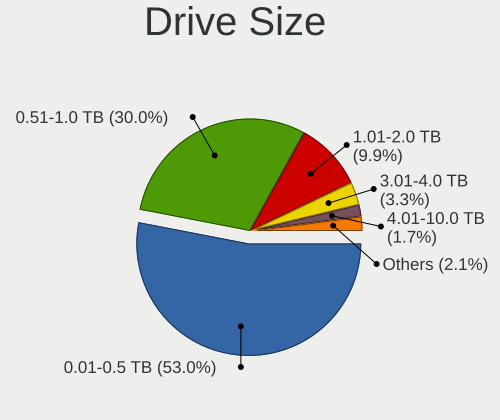

| Size in TB | Computers | Drives | Percent |
|------------|-----------|--------|---------|
| 0.01-0.5   | 6455      | 9671   | 53.04%  |
| 0.51-1.0   | 3651      | 5075   | 30%     |
| 1.01-2.0   | 1201      | 1786   | 9.87%   |
| 3.01-4.0   | 405       | 657    | 3.33%   |
| 4.01-10.0  | 207       | 384    | 1.7%    |
| 2.01-3.0   | 201       | 309    | 1.65%   |
| 10.01-20.0 | 46        | 109    | 0.38%   |
| 20.01-50.0 | 5         | 7      | 0.04%   |

Space Total
-----------

Amount of disk space available on the file system

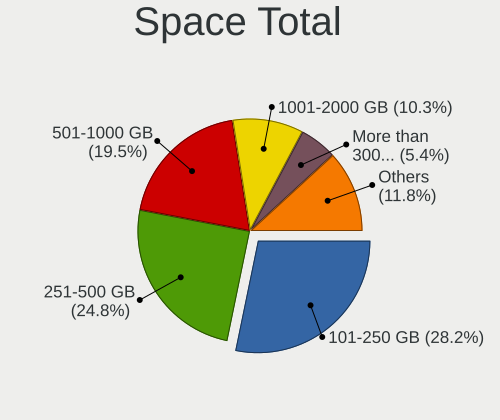

| Size in GB     | Computers | Percent |
|----------------|-----------|---------|
| 101-250        | 4029      | 28.23%  |
| 251-500        | 3537      | 24.79%  |
| 501-1000       | 2780      | 19.48%  |
| 1001-2000      | 1463      | 10.25%  |
| More than 3000 | 774       | 5.42%   |
| 51-100         | 565       | 3.96%   |
| 2001-3000      | 471       | 3.3%    |
| 1-20           | 305       | 2.14%   |
| 21-50          | 259       | 1.81%   |
| Unknown        | 87        | 0.61%   |

Space Used
----------

Amount of used disk space

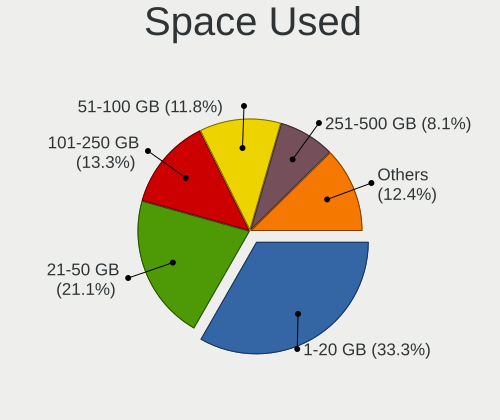

| Used GB        | Computers | Percent |
|----------------|-----------|---------|
| 1-20           | 4983      | 33.28%  |
| 21-50          | 3155      | 21.07%  |
| 101-250        | 1992      | 13.3%   |
| 51-100         | 1771      | 11.83%  |
| 251-500        | 1220      | 8.15%   |
| 501-1000       | 847       | 5.66%   |
| 1001-2000      | 491       | 3.28%   |
| More than 3000 | 263       | 1.76%   |
| 2001-3000      | 165       | 1.1%    |
| Unknown        | 87        | 0.58%   |

Malfunc. Drives
---------------

Drive models with a malfunction

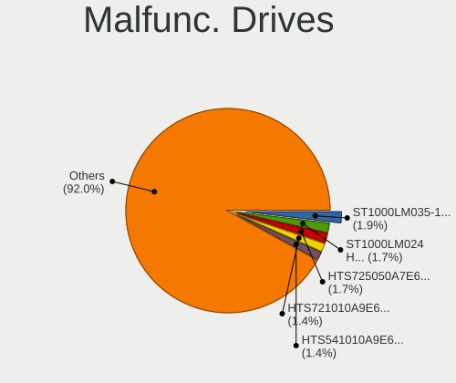

| Model                               | Computers | Drives | Percent |
|-------------------------------------|-----------|--------|---------|
| Seagate ST1000LM035-1RK172 1TB      | 8         | 8      | 1.89%   |
| Seagate ST1000LM024 HN-M101MBB 1TB  | 7         | 7      | 1.65%   |
| HGST HTS725050A7E630 500GB          | 7         | 10     | 1.65%   |
| HGST HTS721010A9E630 1TB            | 6         | 6      | 1.42%   |
| HGST HTS541010A9E680 1TB            | 6         | 6      | 1.42%   |
| Seagate ST500LT012-9WS142 500GB     | 5         | 6      | 1.18%   |
| Seagate ST1000LX015-1U7172 1TB      | 5         | 5      | 1.18%   |
| WDC WD10EZEX-08WN4A0 1TB            | 4         | 4      | 0.94%   |
| SK hynix PC711 HFS001TDE9X073N 1TB  | 4         | 4      | 0.94%   |
| Seagate ST500DM002-1BD142 500GB     | 4         | 4      | 0.94%   |
| Kingston SA400S37120G 120GB SSD     | 4         | 6      | 0.94%   |
| HGST HTS545050A7E680 500GB          | 4         | 4      | 0.94%   |
| Crucial CT525MX300SSD1 528GB        | 4         | 4      | 0.94%   |
| WDC WD10JPCX-24UE4T0 1TB            | 3         | 3      | 0.71%   |
| WDC WD10EZEX-60WN4A0 1TB            | 3         | 3      | 0.71%   |
| Toshiba MQ01ABD100 1TB              | 3         | 3      | 0.71%   |
| Seagate ST500LT012-1DG142 500GB     | 3         | 3      | 0.71%   |
| Seagate ST500LM012 HN-M500MBB 500GB | 3         | 3      | 0.71%   |
| Seagate ST3500418AS 500GB           | 3         | 4      | 0.71%   |
| Seagate ST2000DM008-2FR102 2TB      | 3         | 5      | 0.71%   |
| Seagate ST1500DL003-9VT16L 1TB      | 3         | 6      | 0.71%   |
| Seagate ST1000LM049-2GH172 1TB      | 3         | 3      | 0.71%   |
| Seagate ST1000DM003-9YN162 1TB      | 3         | 3      | 0.71%   |
| Samsung Electronics HD502HI 500GB   | 3         | 6      | 0.71%   |
| Kingston SV300S37A120G 120GB SSD    | 3         | 5      | 0.71%   |
| Kingston SUV400S37120G 120GB SSD    | 3         | 3      | 0.71%   |
| Kingston SA400S37480G 480GB SSD     | 3         | 3      | 0.71%   |
| Hitachi HTS545050A7E380 500GB       | 3         | 5      | 0.71%   |
| Hitachi HDS721010CLA332 1TB         | 3         | 3      | 0.71%   |
| Crucial CT1000P1SSD8 1TB            | 3         | 3      | 0.71%   |
| Apple HDD WDC WD10EALX-408EA0 1TB   | 3         | 3      | 0.71%   |
| WDC WDS100T2G0A-00JH30 1TB SSD      | 2         | 2      | 0.47%   |
| WDC WD5000AADS-00S9B0 500GB         | 2         | 2      | 0.47%   |
| WDC WD40EZRZ-00GXCB0 4TB            | 2         | 2      | 0.47%   |
| WDC WD3200AAKS-75B3A0 320GB         | 2         | 2      | 0.47%   |
| WDC WD20EZRZ-00Z5HB0 2TB            | 2         | 2      | 0.47%   |
| WDC WD20EFRX-68EUZN0 2TB            | 2         | 2      | 0.47%   |
| WDC WD10JPVX-60JC3T0 1TB            | 2         | 2      | 0.47%   |
| WDC WD10EZEX-00BN5A0 1TB            | 2         | 3      | 0.47%   |
| WDC WD1002FAEX-00Z3A0 1TB           | 2         | 2      | 0.47%   |

Malfunc. Drive Vendor
---------------------

Vendors of faulty drives

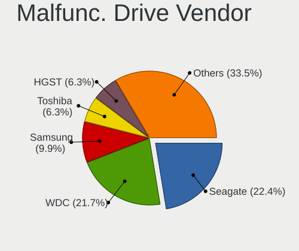

| Vendor                      | Computers | Drives | Percent |
|-----------------------------|-----------|--------|---------|
| Seagate                     | 93        | 113    | 22.41%  |
| WDC                         | 90        | 114    | 21.69%  |
| Samsung Electronics         | 41        | 51     | 9.88%   |
| Toshiba                     | 26        | 27     | 6.27%   |
| HGST                        | 26        | 29     | 6.27%   |
| Kingston                    | 18        | 22     | 4.34%   |
| Hitachi                     | 16        | 19     | 3.86%   |
| Crucial                     | 16        | 17     | 3.86%   |
| SK hynix                    | 15        | 17     | 3.61%   |
| A-DATA Technology           | 12        | 12     | 2.89%   |
| Intel                       | 11        | 11     | 2.65%   |
| SanDisk                     | 9         | 9      | 2.17%   |
| Micron Technology           | 6         | 8      | 1.45%   |
| Apple                       | 6         | 6      | 1.45%   |
| China                       | 3         | 3      | 0.72%   |
| Team                        | 2         | 2      | 0.48%   |
| SPCC                        | 2         | 2      | 0.48%   |
| LITEON                      | 2         | 2      | 0.48%   |
| Hewlett-Packard             | 2         | 2      | 0.48%   |
| ASMT                        | 2         | 2      | 0.48%   |
| XPG                         | 1         | 1      | 0.24%   |
| WHALEKOM                    | 1         | 1      | 0.24%   |
| Unknown                     | 1         | 1      | 0.24%   |
| SSSTC                       | 1         | 1      | 0.24%   |
| Silicon Motion              | 1         | 1      | 0.24%   |
| SABRENT                     | 1         | 1      | 0.24%   |
| S3+                         | 1         | 1      | 0.24%   |
| Plextor                     | 1         | 1      | 0.24%   |
| OWC                         | 1         | 1      | 0.24%   |
| Maxtor                      | 1         | 1      | 0.24%   |
| Lexar                       | 1         | 1      | 0.24%   |
| Leven                       | 1         | 1      | 0.24%   |
| Kingston Technology Company | 1         | 1      | 0.24%   |
| Intenso                     | 1         | 1      | 0.24%   |
| Flashwar                    | 1         | 1      | 0.24%   |
| BAITITON                    | 1         | 1      | 0.24%   |
| Apacer                      | 1         | 1      | 0.24%   |

Malfunc. HDD Vendor
-------------------

Vendors of faulty HDD drives

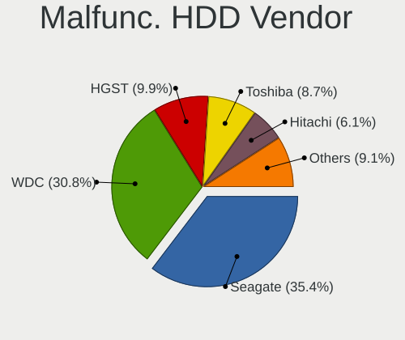

| Vendor              | Computers | Drives | Percent |
|---------------------|-----------|--------|---------|
| Seagate             | 93        | 113    | 35.36%  |
| WDC                 | 81        | 104    | 30.8%   |
| HGST                | 26        | 29     | 9.89%   |
| Toshiba             | 23        | 23     | 8.75%   |
| Hitachi             | 16        | 19     | 6.08%   |
| Samsung Electronics | 13        | 17     | 4.94%   |
| Apple               | 6         | 6      | 2.28%   |
| ASMT                | 2         | 2      | 0.76%   |
| Unknown             | 1         | 1      | 0.38%   |
| Maxtor              | 1         | 1      | 0.38%   |
| Hewlett-Packard     | 1         | 1      | 0.38%   |

Malfunc. Drive Kind
-------------------

Kinds of faulty drives

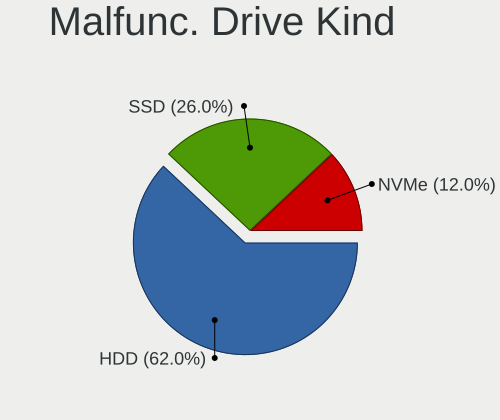

| Kind | Computers | Drives | Percent |
|------|-----------|--------|---------|
| HDD  | 248       | 316    | 62%     |
| SSD  | 104       | 119    | 26%     |
| NVMe | 48        | 50     | 12%     |

Failed Drives
-------------

Failed drive models

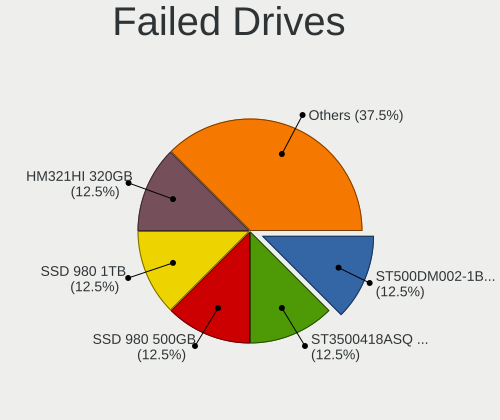

| Model                             | Computers | Drives | Percent |
|-----------------------------------|-----------|--------|---------|
| Seagate ST500DM002-1BD142 500GB   | 1         | 1      | 12.5%   |
| Seagate ST3500418ASQ 500GB        | 1         | 1      | 12.5%   |
| Samsung Electronics SSD 980 500GB | 1         | 1      | 12.5%   |
| Samsung Electronics SSD 980 1TB   | 1         | 1      | 12.5%   |
| Samsung Electronics HM321HI 320GB | 1         | 1      | 12.5%   |
| Patriot Pyro SSD 120GB            | 1         | 2      | 12.5%   |
| KingDian S400 120GB               | 1         | 2      | 12.5%   |
| Intenso JAJP600M1TB               | 1         | 1      | 12.5%   |

Failed Drive Vendor
-------------------

Failed drive vendors

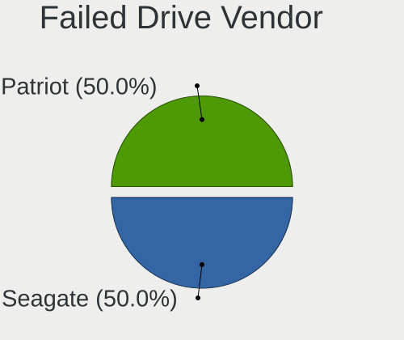

| Vendor              | Computers | Drives | Percent |
|---------------------|-----------|--------|---------|
| Samsung Electronics | 3         | 3      | 37.5%   |
| Seagate             | 2         | 2      | 25%     |
| Patriot             | 1         | 2      | 12.5%   |
| KingDian            | 1         | 2      | 12.5%   |
| Intenso             | 1         | 1      | 12.5%   |

Drive Status
------------

Number of failed and malfunc. drives

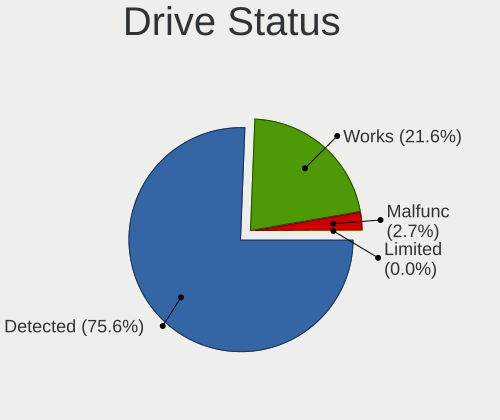

| Status   | Computers | Drives | Percent |
|----------|-----------|--------|---------|
| Detected | 10927     | 23397  | 75.62%  |
| Works    | 3127      | 5311   | 21.64%  |
| Malfunc  | 386       | 485    | 2.67%   |
| Failed   | 8         | 10     | 0.06%   |
| Limited  | 1         | 1      | 0.01%   |

Storage controller
------------------

Storage Vendor
--------------

Storage controller vendors

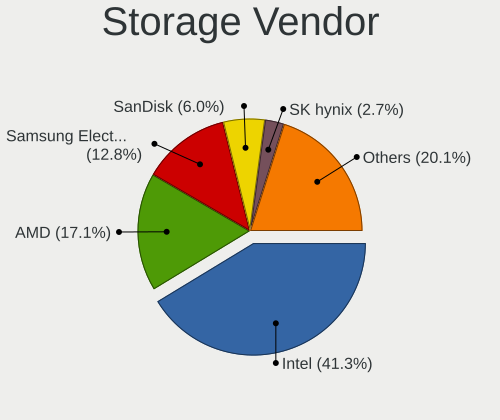

| Vendor                           | Computers | Percent |
|----------------------------------|-----------|---------|
| Intel                            | 8009      | 41.31%  |
| AMD                              | 3311      | 17.08%  |
| Samsung Electronics              | 2472      | 12.75%  |
| SanDisk                          | 1165      | 6.01%   |
| SK hynix                         | 533       | 2.75%   |
| Phison Electronics               | 492       | 2.54%   |
| Kingston Technology Company      | 408       | 2.1%    |
| Micron/Crucial Technology        | 356       | 1.84%   |
| Micron Technology                | 347       | 1.79%   |
| ASMedia Technology               | 318       | 1.64%   |
| Toshiba America Info Systems     | 237       | 1.22%   |
| Silicon Motion                   | 229       | 1.18%   |
| Nvidia                           | 205       | 1.06%   |
| ADATA Technology                 | 182       | 0.94%   |
| KIOXIA                           | 170       | 0.88%   |
| Marvell Technology Group         | 161       | 0.83%   |
| JMicron Technology               | 114       | 0.59%   |
| Realtek Semiconductor            | 99        | 0.51%   |
| MAXIO Technology (Hangzhou)      | 87        | 0.45%   |
| Solid State Storage Technology   | 60        | 0.31%   |
| Shenzhen Longsys Electronics     | 48        | 0.25%   |
| Union Memory (Shenzhen)          | 47        | 0.24%   |
| Apple                            | 41        | 0.21%   |
| Seagate Technology               | 40        | 0.21%   |
| Broadcom / LSI                   | 37        | 0.19%   |
| INNOGRIT                         | 30        | 0.15%   |
| Solidigm                         | 27        | 0.14%   |
| LSI Logic / Symbios Logic        | 24        | 0.12%   |
| Lite-On Technology               | 21        | 0.11%   |
| Lenovo                           | 13        | 0.07%   |
| VIA Technologies                 | 12        | 0.06%   |
| Silicon Integrated Systems [SiS] | 10        | 0.05%   |
| Silicon Image                    | 10        | 0.05%   |
| Netac Technology                 | 10        | 0.05%   |
| Hewlett-Packard                  | 10        | 0.05%   |
| Yangtze Memory Technologies      | 9         | 0.05%   |
| Biwin Storage Technology         | 9         | 0.05%   |
| Adaptec                          | 6         | 0.03%   |
| OCZ Technology Group             | 4         | 0.02%   |
| Hosin Global Electronics         | 4         | 0.02%   |

Storage Model
-------------

Storage controller models

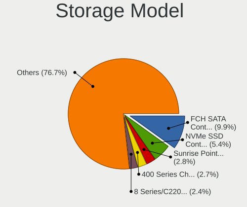

| Model                                                                          | Computers | Percent |
|--------------------------------------------------------------------------------|-----------|---------|
| AMD FCH SATA Controller [AHCI mode]                                            | 2151      | 9.94%   |
| Samsung NVMe SSD Controller SM981/PM981/PM983                                  | 1169      | 5.4%    |
| Intel Sunrise Point-LP SATA Controller [AHCI mode]                             | 601       | 2.78%   |
| AMD 400 Series Chipset SATA Controller                                         | 587       | 2.71%   |
| Intel 8 Series/C220 Series Chipset Family 6-port SATA Controller 1 [AHCI mode] | 526       | 2.43%   |
| Intel 7 Series Chipset Family 6-port SATA Controller [AHCI mode]               | 490       | 2.26%   |
| Intel 82801 Mobile SATA Controller [RAID mode]                                 | 444       | 2.05%   |
| AMD 500 Series Chipset SATA Controller                                         | 436       | 2.01%   |
| Samsung NVMe SSD Controller PM9A1/PM9A3/980PRO                                 | 415       | 1.92%   |
| Intel 6 Series/C200 Series Chipset Family 6 port Mobile SATA AHCI Controller   | 391       | 1.81%   |
| Intel Volume Management Device NVMe RAID Controller                            | 362       | 1.67%   |
| Samsung NVMe SSD Controller 980 (DRAM-less)                                    | 361       | 1.67%   |
| Intel Cannon Lake Mobile PCH SATA AHCI Controller                              | 319       | 1.47%   |
| Intel Q170/Q150/B150/H170/H110/Z170/CM236 Chipset SATA Controller [AHCI Mode]  | 316       | 1.46%   |
| ASMedia ASM1061/ASM1062 Serial ATA Controller                                  | 298       | 1.38%   |
| Intel 8 Series SATA Controller 1 [AHCI mode]                                   | 294       | 1.36%   |
| Intel SATA Controller [RAID mode]                                              | 262       | 1.21%   |
| Intel 200 Series PCH SATA controller [AHCI mode]                               | 259       | 1.2%    |
| AMD 600 Series Chipset SATA Controller                                         | 249       | 1.15%   |
| SanDisk Ultra 3D / WD PC SN530, IX SN530, Blue SN550 NVMe SSD (DRAM-less)      | 248       | 1.15%   |
| Samsung NVMe SSD Controller SM961/PM961/SM963                                  | 240       | 1.11%   |
| Intel 6 Series/C200 Series Chipset Family 6 port Desktop SATA AHCI Controller  | 232       | 1.07%   |
| Intel HM170/QM170 Chipset SATA Controller [AHCI Mode]                          | 219       | 1.01%   |
| Intel Comet Lake SATA AHCI Controller                                          | 210       | 0.97%   |
| SanDisk Extreme Pro / WD Black SN750 / PC SN730 / Red SN700 NVMe SSD           | 208       | 0.96%   |
| Phison E12 NVMe Controller                                                     | 207       | 0.96%   |
| Intel Wildcat Point-LP SATA Controller [AHCI Mode]                             | 203       | 0.94%   |
| Intel 7 Series/C210 Series Chipset Family 6-port SATA Controller [AHCI mode]   | 200       | 0.92%   |
| Intel SSD 660P Series                                                          | 193       | 0.89%   |
| Intel Cannon Lake PCH SATA AHCI Controller                                     | 188       | 0.87%   |
| SK hynix Gold P31/BC711/PC711 NVMe Solid State Drive                           | 184       | 0.85%   |
| Silicon Motion SM2263EN/SM2263XT (DRAM-less) NVMe SSD Controllers              | 182       | 0.84%   |
| Micron/Crucial P2 [Nick P2] / P3 / P3 Plus NVMe PCIe SSD (DRAM-less)           | 176       | 0.81%   |
| AMD SB7x0/SB8x0/SB9x0 SATA Controller [AHCI mode]                              | 176       | 0.81%   |
| AMD SB7x0/SB8x0/SB9x0 IDE Controller                                           | 161       | 0.74%   |
| Intel 400 Series Chipset Family SATA AHCI Controller                           | 155       | 0.72%   |
| SanDisk WD SN560/SN740/SN770/SN5000 NVMe SSD                                   | 132       | 0.61%   |
| Intel Cannon Point-LP SATA Controller [AHCI Mode]                              | 128       | 0.59%   |
| Intel 82801IBM/IEM (ICH9M/ICH9M-E) 4 port SATA Controller [AHCI mode]          | 120       | 0.55%   |
| Intel Alder Lake-S PCH SATA Controller [AHCI Mode]                             | 118       | 0.55%   |

Storage Kind
------------

Kind of storage controller (IDE, SATA, NVMe, SAS, ...)

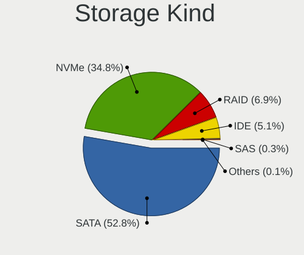

| Kind | Computers | Percent |
|------|-----------|---------|
| SATA | 9917      | 52.75%  |
| NVMe | 6547      | 34.83%  |
| RAID | 1302      | 6.93%   |
| IDE  | 956       | 5.09%   |
| SAS  | 59        | 0.31%   |
| SCSI | 18        | 0.1%    |

Processor
---------

CPU Vendor
----------

Processor vendors

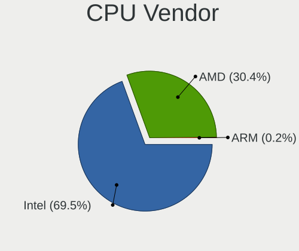

| Vendor | Computers | Percent |
|--------|-----------|---------|
| Intel  | 9519      | 69.45%  |
| AMD    | 4165      | 30.39%  |
| ARM    | 22        | 0.16%   |

CPU Model
---------

Processor models

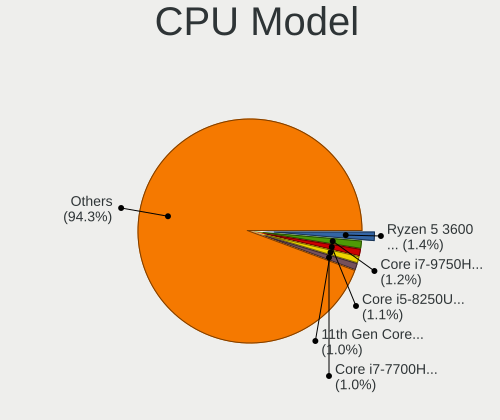

| Model                                         | Computers | Percent |
|-----------------------------------------------|-----------|---------|
| AMD Ryzen 5 3600 6-Core Processor             | 187       | 1.36%   |
| Intel Core i7-9750H CPU @ 2.60GHz             | 162       | 1.18%   |
| Intel Core i5-8250U CPU @ 1.60GHz             | 147       | 1.07%   |
| Intel 11th Gen Core i7-1165G7 @ 2.80GHz       | 142       | 1.03%   |
| Intel Core i7-7700HQ CPU @ 2.80GHz            | 140       | 1.02%   |
| AMD Ryzen 7 3700X 8-Core Processor            | 140       | 1.02%   |
| Intel 11th Gen Core i5-1135G7 @ 2.40GHz       | 136       | 0.99%   |
| Intel Core i7-8750H CPU @ 2.20GHz             | 128       | 0.93%   |
| AMD Ryzen 5 5600X 6-Core Processor            | 117       | 0.85%   |
| Intel Core i5-7200U CPU @ 2.50GHz             | 108       | 0.79%   |
| Intel Core i7-8550U CPU @ 1.80GHz             | 107       | 0.78%   |
| Intel Core i7-10750H CPU @ 2.60GHz            | 103       | 0.75%   |
| Intel Core i7-10510U CPU @ 1.80GHz            | 103       | 0.75%   |
| Intel Core i7-8565U CPU @ 1.80GHz             | 98        | 0.71%   |
| AMD Ryzen 7 5800X 8-Core Processor            | 96        | 0.7%    |
| Intel Core i5-10210U CPU @ 1.60GHz            | 95        | 0.69%   |
| AMD Ryzen 5 3500U with Radeon Vega Mobile Gfx | 95        | 0.69%   |
| Intel Core i5-8265U CPU @ 1.60GHz             | 94        | 0.68%   |
| Intel Core i5-3210M CPU @ 2.50GHz             | 85        | 0.62%   |
| Intel 11th Gen Core i7-11800H @ 2.30GHz       | 84        | 0.61%   |
| Intel Core i5-6200U CPU @ 2.30GHz             | 81        | 0.59%   |
| AMD Ryzen 9 5900X 12-Core Processor           | 81        | 0.59%   |
| AMD Ryzen 9 3900X 12-Core Processor           | 79        | 0.58%   |
| AMD Ryzen 7 5800H with Radeon Graphics        | 78        | 0.57%   |
| Intel Core i5-6300U CPU @ 2.40GHz             | 77        | 0.56%   |
| AMD Ryzen 5 5500U with Radeon Graphics        | 75        | 0.55%   |
| AMD Ryzen 7 5700U with Radeon Graphics        | 74        | 0.54%   |
| AMD Ryzen 7 4800H with Radeon Graphics        | 73        | 0.53%   |
| AMD Ryzen 7 2700X Eight-Core Processor        | 73        | 0.53%   |
| Intel Core i7-6700HQ CPU @ 2.60GHz            | 72        | 0.52%   |
| AMD Ryzen 5 2600 Six-Core Processor           | 72        | 0.52%   |
| AMD Ryzen 5 1600 Six-Core Processor           | 70        | 0.51%   |
| Intel Core i7-3770 CPU @ 3.40GHz              | 67        | 0.49%   |
| Intel Core i7-6700K CPU @ 4.00GHz             | 65        | 0.47%   |
| AMD Ryzen 9 5950X 16-Core Processor           | 64        | 0.47%   |
| Intel 12th Gen Core i7-12700H                 | 62        | 0.45%   |
| Intel Core i7-8650U CPU @ 1.90GHz             | 61        | 0.44%   |
| Intel Core i5-5200U CPU @ 2.20GHz             | 60        | 0.44%   |
| Intel Core i7-7500U CPU @ 2.70GHz             | 58        | 0.42%   |
| Intel Core i5-2520M CPU @ 2.50GHz             | 58        | 0.42%   |

CPU Model Family
----------------

Processor model prefix

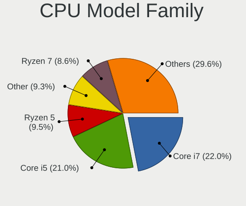

| Model                   | Computers | Percent |
|-------------------------|-----------|---------|
| Intel Core i7           | 3016      | 21.97%  |
| Intel Core i5           | 2884      | 21.01%  |
| AMD Ryzen 5             | 1308      | 9.53%   |
| Other                   | 1274      | 9.28%   |
| AMD Ryzen 7             | 1186      | 8.64%   |
| Intel Core i3           | 696       | 5.07%   |
| AMD Ryzen 9             | 490       | 3.57%   |
| Intel Core 2 Duo        | 333       | 2.43%   |
| Intel Xeon              | 318       | 2.32%   |
| Intel Celeron           | 310       | 2.26%   |
| Intel Core i9           | 176       | 1.28%   |
| AMD FX                  | 173       | 1.26%   |
| AMD Ryzen 3             | 171       | 1.25%   |
| Intel Pentium           | 145       | 1.06%   |
| AMD A6                  | 80        | 0.58%   |
| Intel Pentium Dual-Core | 79        | 0.58%   |
| AMD A8                  | 76        | 0.55%   |
| AMD A10                 | 75        | 0.55%   |
| AMD Ryzen 7 PRO         | 71        | 0.52%   |
| Intel Atom              | 70        | 0.51%   |
| Intel Core              | 66        | 0.48%   |
| AMD Ryzen Threadripper  | 62        | 0.45%   |
| Intel Core 2 Quad       | 57        | 0.42%   |
| AMD A4                  | 51        | 0.37%   |
| AMD Ryzen 5 PRO         | 50        | 0.36%   |
| AMD Phenom II X4        | 42        | 0.31%   |
| AMD Athlon              | 41        | 0.3%    |
| Intel Core 2            | 36        | 0.26%   |
| AMD Athlon II X2        | 30        | 0.22%   |
| Intel Pentium Dual      | 23        | 0.17%   |
| Intel Genuine           | 21        | 0.15%   |
| Intel Core m3           | 21        | 0.15%   |
| Intel Pentium Silver    | 20        | 0.15%   |
| AMD Athlon II X4        | 20        | 0.15%   |
| AMD E                   | 18        | 0.13%   |
| AMD Athlon 64 X2        | 17        | 0.12%   |
| AMD Phenom II X6        | 16        | 0.12%   |
| AMD E1                  | 16        | 0.12%   |
| Intel Pentium Gold      | 15        | 0.11%   |
| Intel Core M            | 12        | 0.09%   |

CPU Cores
---------

Number of processor cores

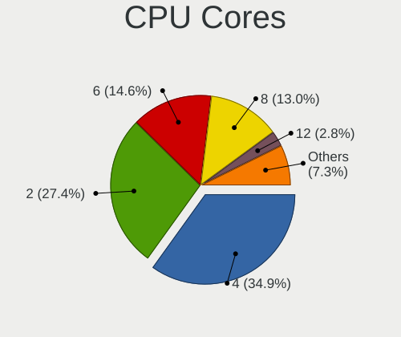

| Number  | Computers | Percent |
|---------|-----------|---------|
| 4       | 4796      | 34.93%  |
| 2       | 3765      | 27.42%  |
| 6       | 2001      | 14.57%  |
| 8       | 1790      | 13.04%  |
| 12      | 378       | 2.75%   |
| 16      | 297       | 2.16%   |
| 10      | 198       | 1.44%   |
| 14      | 186       | 1.35%   |
| 24      | 105       | 0.76%   |
| 1       | 75        | 0.55%   |
| 3       | 66        | 0.48%   |
| 20      | 20        | 0.15%   |
| 32      | 19        | 0.14%   |
| Unknown | 10        | 0.07%   |
| 64      | 6         | 0.04%   |
| 36      | 4         | 0.03%   |
| 40      | 3         | 0.02%   |
| 28      | 3         | 0.02%   |
| 18      | 3         | 0.02%   |
| 5       | 2         | 0.01%   |
| 52      | 1         | 0.01%   |
| 48      | 1         | 0.01%   |
| 22      | 1         | 0.01%   |
| 9       | 1         | 0.01%   |
| 7       | 1         | 0.01%   |

CPU Sockets
-----------

Number of sockets

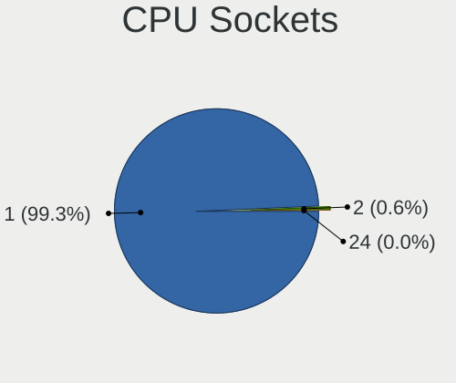

| Number  | Computers | Percent |
|---------|-----------|---------|
| 1       | 13610     | 99.3%   |
| 2       | 85        | 0.62%   |
| Unknown | 10        | 0.07%   |
| 24      | 1         | 0.01%   |

CPU Threads
-----------

Threads per core (Hyper-Threading)

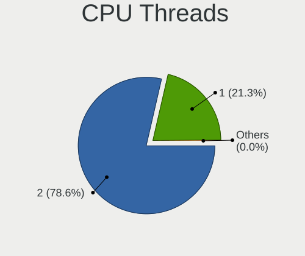

| Number  | Computers | Percent |
|---------|-----------|---------|
| 2       | 10787     | 78.6%   |
| 1       | 2919      | 21.27%  |
| Unknown | 10        | 0.07%   |
| 12      | 3         | 0.02%   |
| 8       | 3         | 0.02%   |
| 16      | 2         | 0.01%   |

CPU Op-Modes
------------

CPU Operation Modes (32-bit, 64-bit)

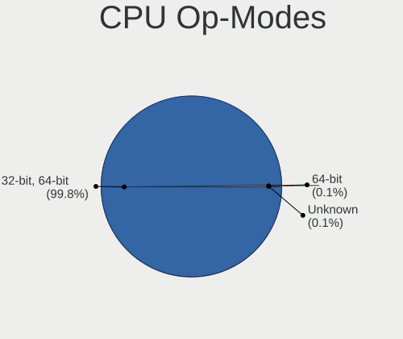

| Op mode        | Computers | Percent |
|----------------|-----------|---------|
| 32-bit, 64-bit | 13679     | 99.81%  |
| 64-bit         | 15        | 0.11%   |
| Unknown        | 11        | 0.08%   |

CPU Microcode
-------------

Microcode number

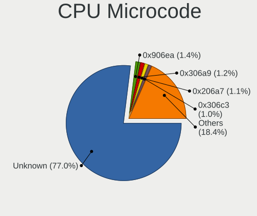

| Number     | Computers | Percent |
|------------|-----------|---------|
| Unknown    | 10757     | 76.96%  |
| 0x906ea    | 194       | 1.39%   |
| 0x306a9    | 170       | 1.22%   |
| 0x206a7    | 148       | 1.06%   |
| 0x306c3    | 136       | 0.97%   |
| 0x806ea    | 127       | 0.91%   |
| 0x806ec    | 124       | 0.89%   |
| 0x806c1    | 118       | 0.84%   |
| 0x08701021 | 112       | 0.8%    |
| 0x406e3    | 96        | 0.69%   |
| 0x906e9    | 88        | 0.63%   |
| 0x40651    | 87        | 0.62%   |
| 0x806e9    | 81        | 0.58%   |
| 0x506e3    | 79        | 0.57%   |
| 0x0800820d | 79        | 0.57%   |
| 0x08701013 | 77        | 0.55%   |
| 0xa0652    | 75        | 0.54%   |
| 0x0a50000c | 73        | 0.52%   |
| 0x1067a    | 63        | 0.45%   |
| 0x08108109 | 59        | 0.42%   |
| 0x08600106 | 54        | 0.39%   |
| 0x08108102 | 51        | 0.36%   |
| 0x906ed    | 44        | 0.31%   |
| 0x306d4    | 44        | 0.31%   |
| 0x806d1    | 38        | 0.27%   |
| 0x806eb    | 37        | 0.26%   |
| 0x08608103 | 36        | 0.26%   |
| 0x20655    | 30        | 0.21%   |
| 0x08600104 | 29        | 0.21%   |
| 0x0a201016 | 28        | 0.2%    |
| 0x08001138 | 28        | 0.2%    |
| 0x706e5    | 27        | 0.19%   |
| 0x906a3    | 26        | 0.19%   |
| 0x406c4    | 26        | 0.19%   |
| 0x0810100b | 26        | 0.19%   |
| 0x0a404102 | 25        | 0.18%   |
| 0x06000852 | 25        | 0.18%   |
| 0x0a50000d | 24        | 0.17%   |
| 0x06006705 | 23        | 0.16%   |
| 0x0a601203 | 22        | 0.16%   |

CPU Microarch
-------------

Microarchitecture

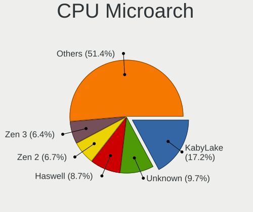

| Name               | Computers | Percent |
|--------------------|-----------|---------|
| KabyLake           | 2360      | 17.18%  |
| Unknown            | 1329      | 9.67%   |
| Haswell            | 1195      | 8.7%    |
| Zen 2              | 915       | 6.66%   |
| Zen 3              | 880       | 6.41%   |
| IvyBridge          | 865       | 6.3%    |
| SandyBridge        | 801       | 5.83%   |
| Skylake            | 759       | 5.52%   |
| Zen+               | 624       | 4.54%   |
| CometLake          | 439       | 3.2%    |
| Penryn             | 413       | 3.01%   |
| TigerLake          | 401       | 2.92%   |
| Broadwell          | 329       | 2.39%   |
| Zen                | 299       | 2.18%   |
| Westmere           | 254       | 1.85%   |
| Alderlake Hybrid   | 239       | 1.74%   |
| Piledriver         | 233       | 1.7%    |
| Icelake            | 186       | 1.35%   |
| Silvermont         | 169       | 1.23%   |
| Core               | 162       | 1.18%   |
| K10                | 146       | 1.06%   |
| Nehalem            | 130       | 0.95%   |
| Excavator          | 119       | 0.87%   |
| Goldmont plus      | 117       | 0.85%   |
| Puma               | 57        | 0.41%   |
| Steamroller        | 51        | 0.37%   |
| Goldmont           | 45        | 0.33%   |
| K8 Hammer          | 37        | 0.27%   |
| Bobcat             | 35        | 0.25%   |
| K10 Llano          | 34        | 0.25%   |
| Jaguar             | 28        | 0.2%    |
| Meteorlake Hybrid  | 19        | 0.14%   |
| Bulldozer          | 19        | 0.14%   |
| K8 & K10 hybrid    | 11        | 0.08%   |
| NetBurst           | 10        | 0.07%   |
| Gracemont          | 10        | 0.07%   |
| Bonnell            | 7         | 0.05%   |
| Tremont            | 5         | 0.04%   |
| Lunarlake Hybrid   | 5         | 0.04%   |
| ArrowLake-H Hybrid | 2         | 0.01%   |

Graphics
--------

GPU Vendor
----------

Vendors of graphics cards

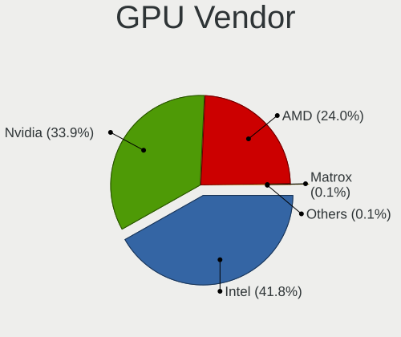

| Vendor                           | Computers | Percent |
|----------------------------------|-----------|---------|
| Intel                            | 7097      | 41.83%  |
| Nvidia                           | 5758      | 33.94%  |
| AMD                              | 4070      | 23.99%  |
| Matrox Electronics Systems       | 20        | 0.12%   |
| ASPEED Technology                | 12        | 0.07%   |
| Silicon Integrated Systems [SiS] | 8         | 0.05%   |
| S3 Graphics                      | 1         | 0.01%   |
| 3Dfx Interactive                 | 1         | 0.01%   |

GPU Model
---------

Graphics card models

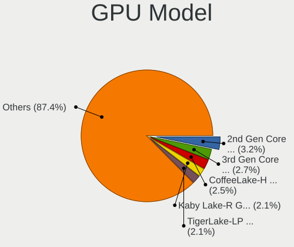

| Model                                                                                    | Computers | Percent |
|------------------------------------------------------------------------------------------|-----------|---------|
| Intel 2nd Generation Core Processor Family Integrated Graphics Controller                | 561       | 3.21%   |
| Intel 3rd Gen Core processor Graphics Controller                                         | 465       | 2.66%   |
| Intel CoffeeLake-H GT2 [UHD Graphics 630]                                                | 431       | 2.47%   |
| Intel Kaby Lake-R GT2 [UHD Graphics 620]                                                 | 369       | 2.11%   |
| Intel TigerLake-LP GT2 [Iris Xe Graphics]                                                | 368       | 2.11%   |
| Intel Haswell-ULT Integrated Graphics Controller                                         | 367       | 2.1%    |
| AMD Picasso/Raven 2 [Radeon Vega Series / Radeon Vega Mobile Series]                     | 360       | 2.06%   |
| AMD Ellesmere [Radeon RX 470/480/570/570X/580/580X/590]                                  | 354       | 2.03%   |
| AMD Cezanne [Radeon Vega Series / Radeon Vega Mobile Series]                             | 317       | 1.81%   |
| AMD Renoir [Radeon Vega Series / Radeon Vega Mobile Series]                              | 294       | 1.68%   |
| Intel Skylake-U GT2 [HD Graphics 520]                                                    | 278       | 1.59%   |
| Intel WhiskeyLake-U GT2 [UHD Graphics 620]                                               | 243       | 1.39%   |
| Intel CometLake-U GT2 [UHD Graphics]                                                     | 242       | 1.39%   |
| Nvidia TU117M [GeForce GTX 1650 Mobile / Max-Q]                                          | 241       | 1.38%   |
| Intel Kaby Lake-U GT2 [HD Graphics 620]                                                  | 234       | 1.34%   |
| Intel CometLake-H GT2 [UHD Graphics]                                                     | 221       | 1.27%   |
| Intel 4th Gen Core Processor Integrated Graphics Controller                              | 207       | 1.19%   |
| Intel Broadwell-U GT2 [HD Graphics 5500]                                                 | 196       | 1.12%   |
| Intel Xeon E3-1200 v3/4th Gen Core Processor Integrated Graphics Controller              | 188       | 1.08%   |
| Intel Kaby Lake-H GT2 [HD Graphics 630]                                                  | 176       | 1.01%   |
| AMD Raphael                                                                              | 171       | 0.98%   |
| AMD Lucienne                                                                             | 156       | 0.89%   |
| AMD Navi 10 [Radeon RX 5600 OEM/5600 XT / 5700/5700 XT]                                  | 155       | 0.89%   |
| Intel Core Processor Integrated Graphics Controller                                      | 148       | 0.85%   |
| Nvidia GP107 [GeForce GTX 1050 Ti]                                                       | 146       | 0.84%   |
| Intel Alder Lake-P GT2 [Iris Xe Graphics]                                                | 139       | 0.8%    |
| Nvidia GA106M [GeForce RTX 3060 Mobile / Max-Q]                                          | 134       | 0.77%   |
| AMD Rembrandt [Radeon 680M]                                                              | 130       | 0.74%   |
| Intel TigerLake-H GT1 [UHD Graphics]                                                     | 127       | 0.73%   |
| AMD Raven Ridge [Radeon Vega Series / Radeon Vega Mobile Series]                         | 118       | 0.68%   |
| Nvidia GP107M [GeForce GTX 1050 Mobile]                                                  | 116       | 0.66%   |
| Nvidia GP106 [GeForce GTX 1060 6GB]                                                      | 111       | 0.64%   |
| Intel CoffeeLake-S GT2 [UHD Graphics 630]                                                | 111       | 0.64%   |
| Nvidia GP104 [GeForce GTX 1070]                                                          | 109       | 0.62%   |
| Intel Atom/Celeron/Pentium Processor x5-E8000/J3xxx/N3xxx Integrated Graphics Controller | 108       | 0.62%   |
| Intel Skylake-H GT2 [HD Graphics 530]                                                    | 105       | 0.6%    |
| Intel GeminiLake [UHD Graphics 600]                                                      | 105       | 0.6%    |
| Intel Xeon E3-1200 v2/3rd Gen Core processor Graphics Controller                         | 98        | 0.56%   |
| Intel Mobile 4 Series Chipset Integrated Graphics Controller                             | 97        | 0.56%   |
| Nvidia GP104 [GeForce GTX 1080]                                                          | 95        | 0.54%   |

GPU Combo
---------

Combinations of graphics cards

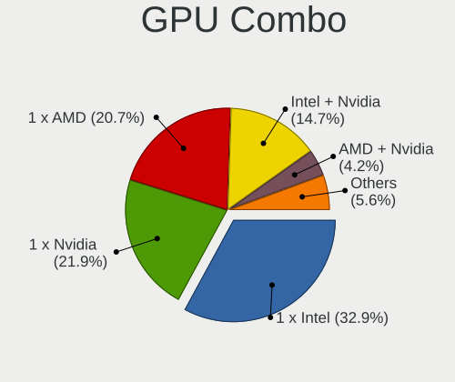

| Name                      | Computers | Percent |
|---------------------------|-----------|---------|
| 1 x Intel                 | 4563      | 32.93%  |
| 1 x Nvidia                | 3033      | 21.89%  |
| 1 x AMD                   | 2868      | 20.7%   |
| Intel + Nvidia            | 2034      | 14.68%  |
| AMD + Nvidia              | 583       | 4.21%   |
| Intel + AMD               | 312       | 2.25%   |
| 2 x AMD                   | 307       | 2.22%   |
| 2 x Nvidia                | 64        | 0.46%   |
| Other                     | 30        | 0.22%   |
| 1 x Matrox                | 10        | 0.07%   |
| 1 x SiS                   | 8         | 0.06%   |
| Nvidia + ASPEED           | 8         | 0.06%   |
| Nvidia + Matrox           | 7         | 0.05%   |
| Intel + 2 x Nvidia        | 6         | 0.04%   |
| 2 x Intel                 | 5         | 0.04%   |
| AMD + ASPEED              | 3         | 0.02%   |
| 4 x Nvidia                | 2         | 0.01%   |
| 3 x Nvidia                | 2         | 0.01%   |
| AMD + 2 x Nvidia          | 2         | 0.01%   |
| AMD + Matrox              | 2         | 0.01%   |
| 5 x Nvidia                | 1         | 0.01%   |
| 2 x Nvidia + 1 x Matrox   | 1         | 0.01%   |
| 2 x AMD + 2 x Nvidia      | 1         | 0.01%   |
| 2 x AMD + 1 x Nvidia      | 1         | 0.01%   |
| 1 x S3 Graphics           | 1         | 0.01%   |
| Nvidia + 3Dfx Interactive | 1         | 0.01%   |
| Intel + AMD + 2 x Nvidia  | 1         | 0.01%   |
| 1 x ASPEED                | 1         | 0.01%   |

GPU Driver
----------

Free vs proprietary

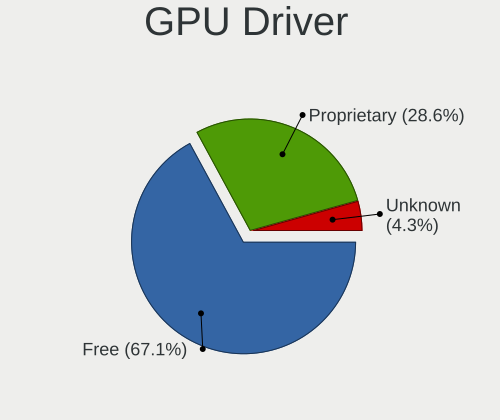

| Driver      | Computers | Percent |
|-------------|-----------|---------|
| Free        | 9319      | 67.09%  |
| Proprietary | 3968      | 28.57%  |
| Unknown     | 603       | 4.34%   |

GPU Memory
----------

Total video memory

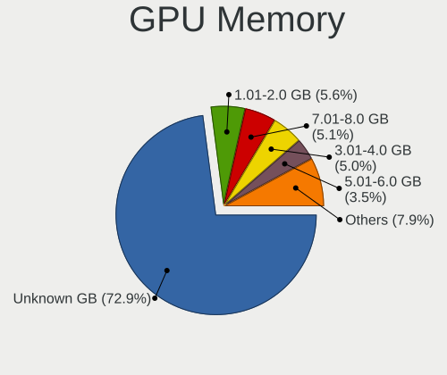

| Size in GB | Computers | Percent |
|------------|-----------|---------|
| Unknown    | 10195     | 72.94%  |
| 1.01-2.0   | 776       | 5.55%   |
| 7.01-8.0   | 706       | 5.05%   |
| 3.01-4.0   | 704       | 5.04%   |
| 5.01-6.0   | 493       | 3.53%   |
| 0.01-0.5   | 475       | 3.4%    |
| 8.01-16.0  | 269       | 1.92%   |
| 0.51-1.0   | 218       | 1.56%   |
| 2.01-3.0   | 91        | 0.65%   |
| 16.01-24.0 | 44        | 0.31%   |
| 4.01-5.0   | 3         | 0.02%   |
| 24.01-32.0 | 2         | 0.01%   |
| 32.01-64.0 | 1         | 0.01%   |

Monitor
-------

Monitor Vendor
--------------

Monitor vendors

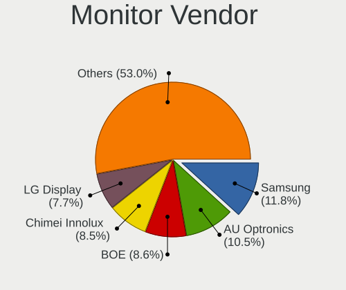

| Vendor                  | Computers | Percent |
|-------------------------|-----------|---------|
| Samsung Electronics     | 1850      | 11.78%  |
| AU Optronics            | 1643      | 10.46%  |
| BOE                     | 1348      | 8.58%   |
| Chimei Innolux          | 1334      | 8.49%   |
| LG Display              | 1215      | 7.73%   |
| Goldstar                | 1007      | 6.41%   |
| Dell                    | 940       | 5.98%   |
| Acer                    | 631       | 4.02%   |
| Apple                   | 515       | 3.28%   |
| Hewlett-Packard         | 493       | 3.14%   |
| AOC                     | 442       | 2.81%   |
| Sharp                   | 332       | 2.11%   |
| BenQ                    | 329       | 2.09%   |
| Ancor Communications    | 321       | 2.04%   |
| ASUSTek Computer        | 305       | 1.94%   |
| Philips                 | 253       | 1.61%   |
| Lenovo                  | 244       | 1.55%   |
| PANDA                   | 199       | 1.27%   |
| ViewSonic               | 138       | 0.88%   |
| Chi Mei Optoelectronics | 130       | 0.83%   |
| MSI                     | 125       | 0.8%    |
| Iiyama                  | 119       | 0.76%   |
| InfoVision              | 99        | 0.63%   |
| Sony                    | 96        | 0.61%   |
| Sceptre Tech            | 78        | 0.5%    |
| Vizio                   | 62        | 0.39%   |
| Panasonic               | 61        | 0.39%   |
| Gigabyte Technology     | 60        | 0.38%   |
| CSO                     | 54        | 0.34%   |
| Toshiba                 | 46        | 0.29%   |
| Unknown                 | 42        | 0.27%   |
| NEC Computers           | 34        | 0.22%   |
| Insignia                | 34        | 0.22%   |
| HKC                     | 34        | 0.22%   |
| Eizo                    | 32        | 0.2%    |
| TMX                     | 31        | 0.2%    |
| Fujitsu Siemens         | 31        | 0.2%    |
| Vestel Elektronik       | 29        | 0.18%   |
| Hitachi                 | 29        | 0.18%   |
| RTK                     | 28        | 0.18%   |

Monitor Model
-------------

Monitor models

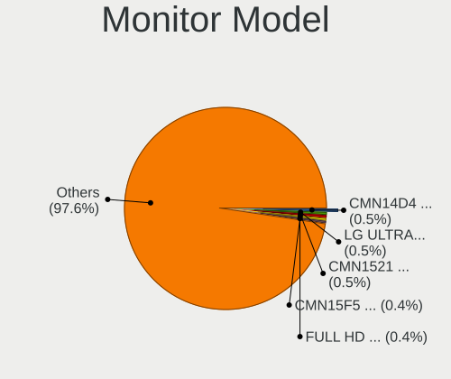

| Model                                                                     | Computers | Percent |
|---------------------------------------------------------------------------|-----------|---------|
| Chimei Innolux LCD Monitor CMN14D4 1920x1080 309x173mm 13.9-inch          | 88        | 0.54%   |
| Goldstar LG ULTRAWIDE GSM59F1 2560x1080 670x280mm 28.6-inch               | 80        | 0.49%   |
| Chimei Innolux LCD Monitor CMN1521 1920x1080 344x193mm 15.5-inch          | 79        | 0.49%   |
| Chimei Innolux LCD Monitor CMN15F5 1920x1080 344x193mm 15.5-inch          | 71        | 0.44%   |
| Goldstar FULL HD GSM5B55 1920x1080 480x270mm 21.7-inch                    | 66        | 0.41%   |
| AU Optronics LCD Monitor AUO21ED 1920x1080 344x193mm 15.5-inch            | 66        | 0.41%   |
| AU Optronics LCD Monitor AUO38ED 1920x1080 344x193mm 15.5-inch            | 64        | 0.39%   |
| PANDA LCD Monitor NCP004D 1920x1080 344x194mm 15.5-inch                   | 62        | 0.38%   |
| Chimei Innolux LCD Monitor CMN14D5 1920x1080 309x173mm 13.9-inch          | 56        | 0.35%   |
| LG Display LCD Monitor LGD05E5 1920x1080 344x194mm 15.5-inch              | 48        | 0.3%    |
| Chimei Innolux LCD Monitor CMN15E7 1920x1080 344x193mm 15.5-inch          | 47        | 0.29%   |
| LG Display LCD Monitor LGD046F 1920x1080 344x194mm 15.5-inch              | 42        | 0.26%   |
| Samsung Electronics C27F390 SAM0D32 1920x1080 598x336mm 27.0-inch         | 41        | 0.25%   |
| Samsung Electronics C24F390 SAM0D2C 1920x1080 521x293mm 23.5-inch         | 41        | 0.25%   |
| AU Optronics LCD Monitor AUO22EC 1366x768 344x193mm 15.5-inch             | 38        | 0.23%   |
| AOC 27G2G4 AOC2702 1920x1080 598x336mm 27.0-inch                          | 38        | 0.23%   |
| Goldstar HDR WFHD GSM7714 2560x1080 798x334mm 34.1-inch                   | 36        | 0.22%   |
| Chimei Innolux LCD Monitor CMN15E6 1366x768 344x193mm 15.5-inch           | 36        | 0.22%   |
| AU Optronics LCD Monitor AUO403D 1920x1080 309x174mm 14.0-inch            | 36        | 0.22%   |
| Chimei Innolux LCD Monitor CMN15DB 1366x768 344x193mm 15.5-inch           | 35        | 0.22%   |
| AOC 24G2W1G3 AOC2402 1920x1080 527x296mm 23.8-inch                        | 35        | 0.22%   |
| Samsung Electronics LCD Monitor SDCA029 3840x2160 344x194mm 15.5-inch     | 32        | 0.2%    |
| Goldstar LG IPS FULLHD GSM5AB8 1920x1080 480x270mm 21.7-inch              | 31        | 0.19%   |
| Apple Color LCD APP9CDF 1440x900 286x179mm 13.3-inch                      | 31        | 0.19%   |
| Samsung Electronics LCD Monitor SEC5441 1280x800 331x207mm 15.4-inch      | 30        | 0.18%   |
| LG Display LCD Monitor LGD02DC 1366x768 344x194mm 15.5-inch               | 30        | 0.18%   |
| Goldstar Ultra HD GSM5B09 3840x2160 600x340mm 27.2-inch                   | 30        | 0.18%   |
| Dell P2419H DELD0DA 1920x1080 527x296mm 23.8-inch                         | 30        | 0.18%   |
| Chimei Innolux LCD Monitor CMN15E8 1920x1080 344x193mm 15.5-inch          | 30        | 0.18%   |
| Vestel Elektronik 40UHD_LCD_TV VES3700 3840x2160 880x500mm 39.8-inch      | 29        | 0.18%   |
| BOE LCD Monitor BOE0812 1920x1080 344x194mm 15.5-inch                     | 29        | 0.18%   |
| Chimei Innolux LCD Monitor CMN15DC 1366x768 344x193mm 15.5-inch           | 28        | 0.17%   |
| Panasonic VVX11F009G00 MEI96A2 1920x1080 344x193mm 15.5-inch              | 27        | 0.17%   |
| AU Optronics LCD Monitor AUO26EC 1366x768 344x193mm 15.5-inch             | 27        | 0.17%   |
| Samsung Electronics U28E590 SAM0C4D 3840x2160 607x345mm 27.5-inch         | 26        | 0.16%   |
| Samsung Electronics S24F350 SAM0D20 1920x1080 521x293mm 23.5-inch         | 26        | 0.16%   |
| Chi Mei Optoelectronics LCD Monitor CMO1720 1920x1080 382x215mm 17.3-inch | 26        | 0.16%   |
| Apple Color LCD APP9CC7 1280x800 286x179mm 13.3-inch                      | 26        | 0.16%   |
| Goldstar HDR 4K GSM7706 3840x2160 600x340mm 27.2-inch                     | 25        | 0.15%   |
| Chimei Innolux LCD Monitor CMN14D6 1366x768 309x173mm 13.9-inch           | 25        | 0.15%   |

Monitor Resolution
------------------

Monitor screen resolution

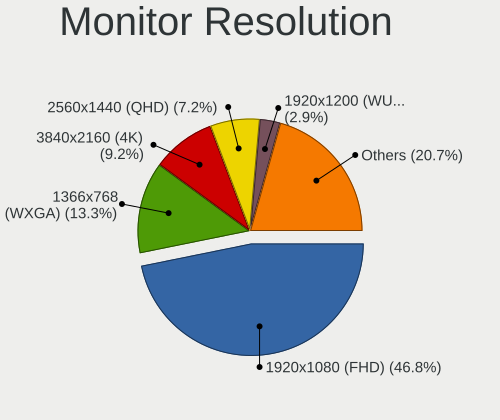

| Resolution         | Computers | Percent |
|--------------------|-----------|---------|
| 1920x1080 (FHD)    | 6953      | 46.82%  |
| 1366x768 (WXGA)    | 1968      | 13.25%  |
| 3840x2160 (4K)     | 1363      | 9.18%   |
| 2560x1440 (QHD)    | 1064      | 7.16%   |
| 1920x1200 (WUXGA)  | 436       | 2.94%   |
| 1600x900 (HD+)     | 411       | 2.77%   |
| 3440x1440          | 315       | 2.12%   |
| 1440x900 (WXGA+)   | 265       | 1.78%   |
| 1680x1050 (WSXGA+) | 258       | 1.74%   |
| 2560x1080          | 243       | 1.64%   |
| 2560x1600          | 228       | 1.54%   |
| 1280x800 (WXGA)    | 196       | 1.32%   |
| 1280x1024 (SXGA)   | 195       | 1.31%   |
| 2880x1800          | 150       | 1.01%   |
| 1360x768           | 93        | 0.63%   |
| 3840x1080          | 78        | 0.53%   |
| 3840x2400          | 69        | 0.46%   |
| 1920x540           | 66        | 0.44%   |
| 2160x1440          | 55        | 0.37%   |
| Unknown            | 55        | 0.37%   |
| 2880x1920          | 29        | 0.2%    |
| 2256x1504          | 26        | 0.18%   |
| 3840x1600          | 24        | 0.16%   |
| 3200x1800 (QHD+)   | 22        | 0.15%   |
| 3072x1920          | 21        | 0.14%   |
| 2288x1287          | 20        | 0.13%   |
| 1920x1280          | 19        | 0.13%   |
| 1024x768 (XGA)     | 19        | 0.13%   |
| 3200x2000          | 17        | 0.11%   |
| 3000x2000          | 17        | 0.11%   |
| 1280x720 (HD)      | 16        | 0.11%   |
| 1600x1200          | 14        | 0.09%   |
| 2736x1824          | 10        | 0.07%   |
| 3456x2160          | 9         | 0.06%   |
| 2304x1440          | 9         | 0.06%   |
| 3840x1200          | 8         | 0.05%   |
| 3840x1100          | 8         | 0.05%   |
| 2880x1620          | 6         | 0.04%   |
| 2520x1680          | 6         | 0.04%   |
| 2240x1400          | 6         | 0.04%   |

Monitor Diagonal
----------------

Diagonal size in inches

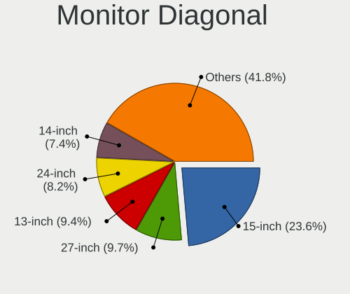

| Inches  | Computers | Percent |
|---------|-----------|---------|
| 15      | 3697      | 23.6%   |
| 27      | 1516      | 9.68%   |
| 13      | 1472      | 9.39%   |
| 24      | 1279      | 8.16%   |
| 14      | 1162      | 7.42%   |
| 23      | 918       | 5.86%   |
| 21      | 729       | 4.65%   |
| 17      | 710       | 4.53%   |
| 31      | 697       | 4.45%   |
| 34      | 447       | 2.85%   |
| 16      | 317       | 2.02%   |
| 19      | 257       | 1.64%   |
| Unknown | 256       | 1.63%   |
| 18      | 215       | 1.37%   |
| 12      | 204       | 1.3%    |
| 22      | 179       | 1.14%   |
| 84      | 170       | 1.09%   |
| 20      | 159       | 1.01%   |
| 32      | 130       | 0.83%   |
| 11      | 108       | 0.69%   |
| 40      | 102       | 0.65%   |
| 72      | 100       | 0.64%   |
| 54      | 75        | 0.48%   |
| 48      | 70        | 0.45%   |
| 63      | 60        | 0.38%   |
| 26      | 59        | 0.38%   |
| 25      | 52        | 0.33%   |
| 28      | 49        | 0.31%   |
| 65      | 37        | 0.24%   |
| 35      | 37        | 0.24%   |
| 52      | 36        | 0.23%   |
| 49      | 32        | 0.2%    |
| 29      | 30        | 0.19%   |
| 46      | 27        | 0.17%   |
| 37      | 27        | 0.17%   |
| 36      | 23        | 0.15%   |
| 74      | 21        | 0.13%   |
| 43      | 21        | 0.13%   |
| 42      | 20        | 0.13%   |
| 33      | 19        | 0.12%   |

Monitor Width
-------------

Physical width

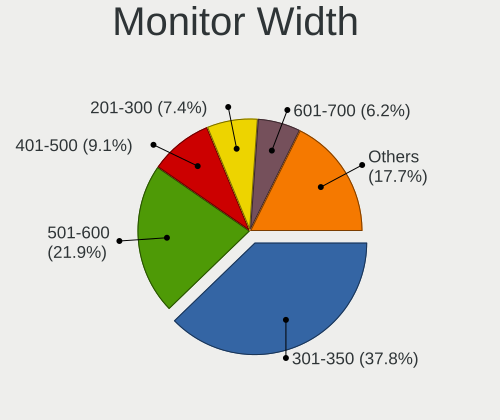

| Width in mm    | Computers | Percent |
|----------------|-----------|---------|
| 301-350        | 5785      | 37.77%  |
| 501-600        | 3351      | 21.88%  |
| 401-500        | 1395      | 9.11%   |
| 201-300        | 1127      | 7.36%   |
| 601-700        | 951       | 6.21%   |
| 351-400        | 872       | 5.69%   |
| 701-800        | 601       | 3.92%   |
| 1001-1500      | 396       | 2.59%   |
| 1501-2000      | 309       | 2.02%   |
| Unknown        | 256       | 1.67%   |
| 801-900        | 201       | 1.31%   |
| 901-1000       | 45        | 0.29%   |
| More than 2000 | 17        | 0.11%   |
| 101-200        | 6         | 0.04%   |
| 1-100          | 4         | 0.03%   |

Aspect Ratio
------------

Proportional relationship between the width and the height

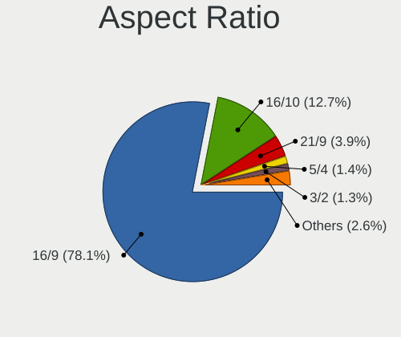

| Ratio   | Computers | Percent |
|---------|-----------|---------|
| 16/9    | 10746     | 78.06%  |
| 16/10   | 1753      | 12.73%  |
| 21/9    | 538       | 3.91%   |
| 5/4     | 192       | 1.39%   |
| 3/2     | 174       | 1.26%   |
| Unknown | 139       | 1.01%   |
| 32/9    | 89        | 0.65%   |
| 4/3     | 61        | 0.44%   |
| 1.00    | 17        | 0.12%   |
| 6/5     | 11        | 0.08%   |
| 1.96    | 10        | 0.07%   |
| 3.40    | 8         | 0.06%   |
| 3.20    | 7         | 0.05%   |
| 0.89    | 4         | 0.03%   |
| 0.67    | 3         | 0.02%   |
| 0.62    | 3         | 0.02%   |
| 0.56    | 3         | 0.02%   |
| 3.73    | 2         | 0.01%   |
| 0.63    | 2         | 0.01%   |
| 6.00    | 1         | 0.01%   |
| 3.75    | 1         | 0.01%   |
| 2.12    | 1         | 0.01%   |
| 2.00    | 1         | 0.01%   |

Monitor Area
------------

Area in inch²

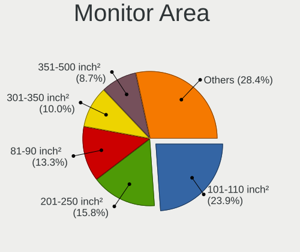

| Area in inch² | Computers | Percent |
|----------------|-----------|---------|
| 101-110        | 3694      | 23.88%  |
| 201-250        | 2437      | 15.75%  |
| 81-90          | 2052      | 13.26%  |
| 301-350        | 1553      | 10.04%  |
| 351-500        | 1340      | 8.66%   |
| 151-200        | 607       | 3.92%   |
| More than 1000 | 591       | 3.82%   |
| 121-130        | 574       | 3.71%   |
| 71-80          | 561       | 3.63%   |
| 251-300        | 472       | 3.05%   |
| 501-1000       | 353       | 2.28%   |
| 111-120        | 298       | 1.93%   |
| 141-150        | 268       | 1.73%   |
| Unknown        | 256       | 1.65%   |
| 61-70          | 187       | 1.21%   |
| 51-60          | 118       | 0.76%   |
| 131-140        | 64        | 0.41%   |
| 91-100         | 29        | 0.19%   |
| 1-40           | 10        | 0.06%   |
| 41-50          | 8         | 0.05%   |

Pixel Density
-------------

Pixels per inch

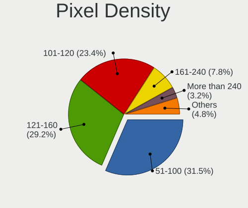

| Density       | Computers | Percent |
|---------------|-----------|---------|
| 51-100        | 4701      | 31.5%   |
| 121-160       | 4361      | 29.22%  |
| 101-120       | 3486      | 23.36%  |
| 161-240       | 1170      | 7.84%   |
| More than 240 | 484       | 3.24%   |
| 1-50          | 466       | 3.12%   |
| Unknown       | 256       | 1.72%   |

Multiple Monitors
-----------------

Total monitors connected

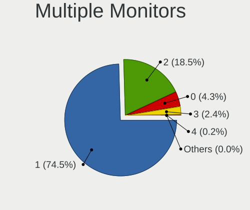

| Total | Computers | Percent |
|-------|-----------|---------|
| 1     | 10463     | 74.54%  |
| 2     | 2597      | 18.5%   |
| 0     | 605       | 4.31%   |
| 3     | 336       | 2.39%   |
| 4     | 31        | 0.22%   |
| 6     | 2         | 0.01%   |
| 5     | 2         | 0.01%   |

Network
-------

Net Controller Vendor
---------------------

Controller vendors

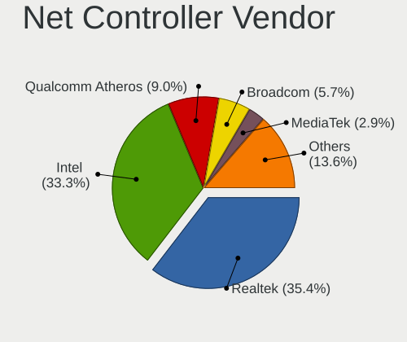

| Vendor                            | Computers | Percent |
|-----------------------------------|-----------|---------|
| Realtek Semiconductor             | 7536      | 35.44%  |
| Intel                             | 7075      | 33.27%  |
| Qualcomm Atheros                  | 1916      | 9.01%   |
| Broadcom                          | 1213      | 5.7%    |
| MediaTek                          | 626       | 2.94%   |
| Broadcom Limited                  | 286       | 1.34%   |
| TP-Link                           | 239       | 1.12%   |
| Ralink Technology                 | 186       | 0.87%   |
| Marvell Technology Group          | 183       | 0.86%   |
| Nvidia                            | 157       | 0.74%   |
| ASIX Electronics                  | 145       | 0.68%   |
| Ralink                            | 134       | 0.63%   |
| Samsung Electronics               | 131       | 0.62%   |
| Microsoft                         | 111       | 0.52%   |
| Shenzhen Goodix Technology        | 107       | 0.5%    |
| NetGear                           | 80        | 0.38%   |
| Aquantia                          | 70        | 0.33%   |
| Xiaomi                            | 62        | 0.29%   |
| DisplayLink                       | 57        | 0.27%   |
| Qualcomm Atheros Communications   | 55        | 0.26%   |
| Google                            | 53        | 0.25%   |
| InterBiometrics                   | 50        | 0.24%   |
| Qualcomm                          | 48        | 0.23%   |
| Lenovo                            | 48        | 0.23%   |
| Dell                              | 48        | 0.23%   |
| D-Link                            | 44        | 0.21%   |
| ASUSTek Computer                  | 42        | 0.2%    |
| Sierra Wireless                   | 41        | 0.19%   |
| Huawei Technologies               | 38        | 0.18%   |
| OPPO Electronics                  | 36        | 0.17%   |
| Linksys                           | 30        | 0.14%   |
| Motorola PCS                      | 26        | 0.12%   |
| Ericsson Business Mobile Networks | 25        | 0.12%   |
| JMicron Technology                | 23        | 0.11%   |
| Edimax Technology                 | 22        | 0.1%    |
| Qualcomm Technologies             | 20        | 0.09%   |
| OnePlus Technology (Shenzhen)     | 20        | 0.09%   |
| Hewlett-Packard                   | 20        | 0.09%   |
| Fibocom                           | 15        | 0.07%   |
| D-Link System                     | 15        | 0.07%   |

Net Controller Model
--------------------

Controller models

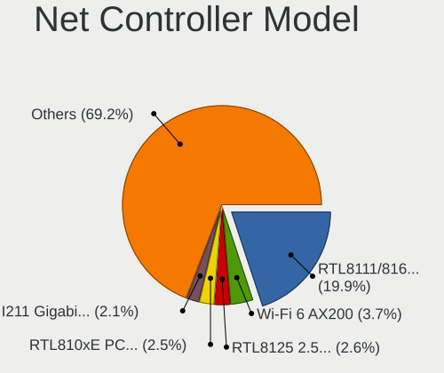

| Model                                                                  | Computers | Percent |
|------------------------------------------------------------------------|-----------|---------|
| Realtek RTL8111/8168/8211/8411 PCI Express Gigabit Ethernet Controller | 4982      | 19.92%  |
| Intel Wi-Fi 6 AX200                                                    | 935       | 3.74%   |
| Realtek RTL8125 2.5GbE Controller                                      | 647       | 2.59%   |
| Realtek RTL810xE PCI Express Fast Ethernet controller                  | 617       | 2.47%   |
| Intel I211 Gigabit Network Connection                                  | 525       | 2.1%    |
| Realtek RTL8153 Gigabit Ethernet Adapter                               | 444       | 1.78%   |
| Intel Wireless 8265 / 8275                                             | 407       | 1.63%   |
| Intel 82579LM Gigabit Network Connection (Lewisville)                  | 401       | 1.6%    |
| Qualcomm Atheros QCA9377 802.11ac Wireless Network Adapter             | 357       | 1.43%   |
| Intel Wi-Fi 6 AX201                                                    | 317       | 1.27%   |
| Intel Ethernet Controller I225-V                                       | 289       | 1.16%   |
| Intel Cannon Lake PCH CNVi WiFi                                        | 285       | 1.14%   |
| Realtek RTL8821CE 802.11ac PCIe Wireless Network Adapter               | 279       | 1.12%   |
| Intel Wireless 7265                                                    | 271       | 1.08%   |
| Qualcomm Atheros QCA6174 802.11ac Wireless Network Adapter             | 263       | 1.05%   |
| Intel Wireless 7260                                                    | 263       | 1.05%   |
| Realtek RTL8822CE 802.11ac PCIe Wireless Network Adapter               | 247       | 0.99%   |
| Intel Wireless 8260                                                    | 242       | 0.97%   |
| Intel Ethernet Connection (2) I219-V                                   | 237       | 0.95%   |
| Qualcomm Atheros QCA9565 / AR9565 Wireless Network Adapter             | 232       | 0.93%   |
| Intel Wi-Fi 6E(802.11ax) AX210/AX1675* 2x2 [Typhoon Peak]              | 231       | 0.92%   |
| MediaTek MT7921 802.11ax PCIe Wireless Network Adapter [Filogic 330]   | 230       | 0.92%   |
| Intel Comet Lake PCH CNVi WiFi                                         | 230       | 0.92%   |
| Intel Comet Lake PCH-LP CNVi WiFi                                      | 222       | 0.89%   |
| Intel Alder Lake-P PCH CNVi WiFi                                       | 210       | 0.84%   |
| MediaTek MT7922 802.11ax PCI Express Wireless Network Adapter          | 208       | 0.83%   |
| Intel Wi-Fi 5(802.11ac) Wireless-AC 9x6x [Thunder Peak]                | 203       | 0.81%   |
| Qualcomm Atheros AR9485 Wireless Network Adapter                       | 202       | 0.81%   |
| Intel Dual Band Wireless-AC 3168NGW [Stone Peak]                       | 201       | 0.8%    |
| Intel Ethernet Connection I217-LM                                      | 179       | 0.72%   |
| Intel Cannon Point-LP CNVi [Wireless-AC]                               | 166       | 0.66%   |
| Intel Ethernet Connection (7) I219-V                                   | 155       | 0.62%   |
| Qualcomm Atheros AR9285 Wireless Network Adapter (PCI-Express)         | 143       | 0.57%   |
| Intel Wireless 3165                                                    | 143       | 0.57%   |
| Broadcom BCM4360 802.11ac Dual Band Wireless Network Adapter           | 140       | 0.56%   |
| Broadcom NetXtreme BCM57765 Gigabit Ethernet PCIe                      | 135       | 0.54%   |
| Intel Centrino Advanced-N 6205 [Taylor Peak]                           | 134       | 0.54%   |
| Realtek 802.11ac NIC                                                   | 129       | 0.52%   |
| Broadcom BCM4331 802.11a/b/g/n                                         | 128       | 0.51%   |
| Realtek RTL8852BE PCIe 802.11ax Wireless Network Controller            | 126       | 0.5%    |

Wireless Vendor
---------------

Wireless vendors

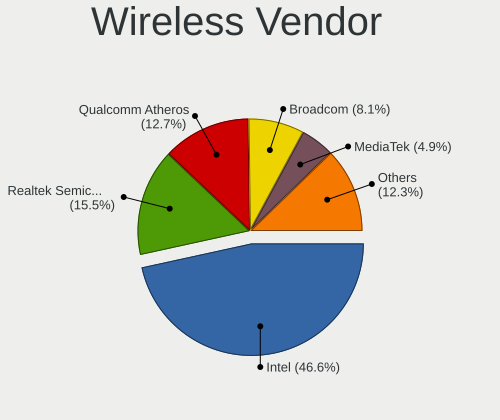

| Vendor                                | Computers | Percent |
|---------------------------------------|-----------|---------|
| Intel                                 | 5446      | 46.57%  |
| Realtek Semiconductor                 | 1810      | 15.48%  |
| Qualcomm Atheros                      | 1489      | 12.73%  |
| Broadcom                              | 945       | 8.08%   |
| MediaTek                              | 569       | 4.87%   |
| Broadcom Limited                      | 237       | 2.03%   |
| TP-Link                               | 220       | 1.88%   |
| Ralink Technology                     | 186       | 1.59%   |
| Ralink                                | 134       | 1.15%   |
| Microsoft                             | 103       | 0.88%   |
| NetGear                               | 76        | 0.65%   |
| Marvell Technology Group              | 57        | 0.49%   |
| Qualcomm Atheros Communications       | 55        | 0.47%   |
| Sierra Wireless                       | 41        | 0.35%   |
| D-Link                                | 41        | 0.35%   |
| Dell                                  | 40        | 0.34%   |
| ASUSTek Computer                      | 39        | 0.33%   |
| Qualcomm                              | 35        | 0.3%    |
| Linksys                               | 26        | 0.22%   |
| Edimax Technology                     | 22        | 0.19%   |
| Fibocom                               | 15        | 0.13%   |
| Belkin Components                     | 12        | 0.1%    |
| Qualcomm Technologies                 | 10        | 0.09%   |
| D-Link System                         | 10        | 0.09%   |
| AVM                                   | 9         | 0.08%   |
| 802.11g Adapter [Linksys WUSB54GC v3] | 9         | 0.08%   |
| Hewlett-Packard                       | 8         | 0.07%   |
| Sitecom Europe                        | 6         | 0.05%   |
| Realtek                               | 5         | 0.04%   |
| Mercucys                              | 5         | 0.04%   |
| Gemtek                                | 5         | 0.04%   |
| Accton Technology                     | 4         | 0.03%   |
| Micro Star International              | 3         | 0.03%   |
| IMC Networks                          | 3         | 0.03%   |
| ZyDAS                                 | 2         | 0.02%   |
| Wilocity                              | 2         | 0.02%   |
| Wacom                                 | 2         | 0.02%   |
| Samsung Electronics                   | 2         | 0.02%   |
| Ovislink                              | 2         | 0.02%   |
| BUFFALO                               | 2         | 0.02%   |

Wireless Model
--------------

Wireless models

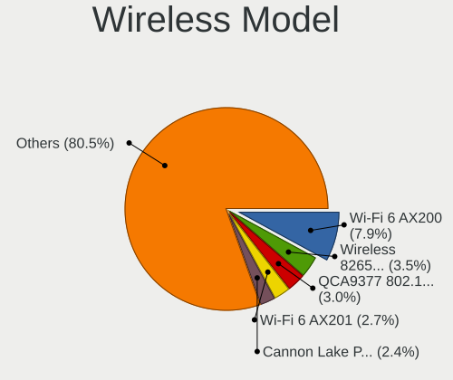

| Model                                                                | Computers | Percent |
|----------------------------------------------------------------------|-----------|---------|
| Intel Wi-Fi 6 AX200                                                  | 935       | 7.94%   |
| Intel Wireless 8265 / 8275                                           | 407       | 3.46%   |
| Qualcomm Atheros QCA9377 802.11ac Wireless Network Adapter           | 357       | 3.03%   |
| Intel Wi-Fi 6 AX201                                                  | 317       | 2.69%   |
| Intel Cannon Lake PCH CNVi WiFi                                      | 285       | 2.42%   |
| Realtek RTL8821CE 802.11ac PCIe Wireless Network Adapter             | 279       | 2.37%   |
| Intel Wireless 7265                                                  | 271       | 2.3%    |
| Qualcomm Atheros QCA6174 802.11ac Wireless Network Adapter           | 263       | 2.23%   |
| Intel Wireless 7260                                                  | 263       | 2.23%   |
| Realtek RTL8822CE 802.11ac PCIe Wireless Network Adapter             | 247       | 2.1%    |
| Intel Wireless 8260                                                  | 242       | 2.06%   |
| Qualcomm Atheros QCA9565 / AR9565 Wireless Network Adapter           | 232       | 1.97%   |
| Intel Wi-Fi 6E(802.11ax) AX210/AX1675* 2x2 [Typhoon Peak]            | 231       | 1.96%   |
| MediaTek MT7921 802.11ax PCIe Wireless Network Adapter [Filogic 330] | 230       | 1.95%   |
| Intel Comet Lake PCH CNVi WiFi                                       | 230       | 1.95%   |
| Intel Comet Lake PCH-LP CNVi WiFi                                    | 222       | 1.89%   |
| Intel Wi-Fi 5(802.11ac) Wireless-AC 9x6x [Thunder Peak]              | 203       | 1.72%   |
| Qualcomm Atheros AR9485 Wireless Network Adapter                     | 202       | 1.72%   |
| Intel Dual Band Wireless-AC 3168NGW [Stone Peak]                     | 201       | 1.71%   |
| MediaTek MT7922 802.11ax PCI Express Wireless Network Adapter        | 181       | 1.54%   |
| Intel Cannon Point-LP CNVi [Wireless-AC]                             | 166       | 1.41%   |
| Intel Alder Lake-P PCH CNVi WiFi                                     | 144       | 1.22%   |
| Qualcomm Atheros AR9285 Wireless Network Adapter (PCI-Express)       | 143       | 1.21%   |
| Intel Wireless 3165                                                  | 143       | 1.21%   |
| Broadcom BCM4360 802.11ac Dual Band Wireless Network Adapter         | 140       | 1.19%   |
| Intel Centrino Advanced-N 6205 [Taylor Peak]                         | 134       | 1.14%   |
| Realtek 802.11ac NIC                                                 | 129       | 1.1%    |
| Broadcom BCM4331 802.11a/b/g/n                                       | 128       | 1.09%   |
| Broadcom BCM43142 802.11b/g/n                                        | 115       | 0.98%   |
| Realtek RTL8822BE 802.11a/b/g/n/ac WiFi adapter                      | 113       | 0.96%   |
| Realtek RTL88x2bu [AC1200 Techkey]                                   | 111       | 0.94%   |
| Broadcom Limited BCM4360 802.11ac Dual Band Wireless Network Adapter | 110       | 0.93%   |
| Realtek RTL8852BE PCIe 802.11ax Wireless Network Controller          | 108       | 0.92%   |
| Intel Tiger Lake PCH CNVi WiFi                                       | 108       | 0.92%   |
| Realtek RTL8188EUS 802.11n Wireless Network Adapter                  | 103       | 0.87%   |
| Realtek RTL8852AE 802.11ax PCIe Wireless Network Adapter             | 93        | 0.79%   |
| Intel 700 Series Chipset CNVi WiFi                                   | 92        | 0.78%   |
| Broadcom BCM4322 802.11a/b/g/n Wireless LAN Controller               | 90        | 0.76%   |
| Intel Raptor Lake PCH CNVi WiFi                                      | 86        | 0.73%   |
| Broadcom BCM4313 802.11bgn Wireless Network Adapter                  | 85        | 0.72%   |

Ethernet Vendor
---------------

Ethernet vendors

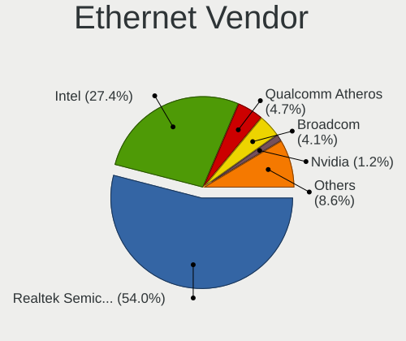

| Vendor                                 | Computers | Percent |
|----------------------------------------|-----------|---------|
| Realtek Semiconductor                  | 6792      | 54.02%  |
| Intel                                  | 3441      | 27.37%  |
| Qualcomm Atheros                       | 590       | 4.69%   |
| Broadcom                               | 515       | 4.1%    |
| Nvidia                                 | 157       | 1.25%   |
| ASIX Electronics                       | 145       | 1.15%   |
| Samsung Electronics                    | 129       | 1.03%   |
| Marvell Technology Group               | 126       | 1%      |
| Aquantia                               | 70        | 0.56%   |
| Xiaomi                                 | 62        | 0.49%   |
| DisplayLink                            | 57        | 0.45%   |
| Broadcom Limited                       | 54        | 0.43%   |
| Google                                 | 53        | 0.42%   |
| MediaTek                               | 49        | 0.39%   |
| Lenovo                                 | 48        | 0.38%   |
| OPPO Electronics                       | 36        | 0.29%   |
| Huawei Technologies                    | 32        | 0.25%   |
| Motorola PCS                           | 26        | 0.21%   |
| JMicron Technology                     | 23        | 0.18%   |
| TP-Link                                | 19        | 0.15%   |
| OnePlus Technology (Shenzhen)          | 16        | 0.13%   |
| Qualcomm                               | 13        | 0.1%    |
| Qualcomm Technologies                  | 10        | 0.08%   |
| Silicon Integrated Systems [SiS]       | 9         | 0.07%   |
| Apple                                  | 8         | 0.06%   |
| Microsoft                              | 7         | 0.06%   |
| ICS Advent                             | 7         | 0.06%   |
| Mellanox Technologies                  | 6         | 0.05%   |
| American Megatrends                    | 6         | 0.05%   |
| VIA Technologies                       | 5         | 0.04%   |
| T & A Mobile Phones                    | 5         | 0.04%   |
| Hewlett-Packard                        | 5         | 0.04%   |
| D-Link System                          | 5         | 0.04%   |
| NetGear                                | 4         | 0.03%   |
| Linksys                                | 4         | 0.03%   |
| LG Electronics                         | 3         | 0.02%   |
| D-Link                                 | 3         | 0.02%   |
| ASUSTek Computer                       | 3         | 0.02%   |
| ZTE WCDMA Technologies MSM             | 2         | 0.02%   |
| Suzhou Motorcomm Electronic Technology | 2         | 0.02%   |

Ethernet Model
--------------

Ethernet models

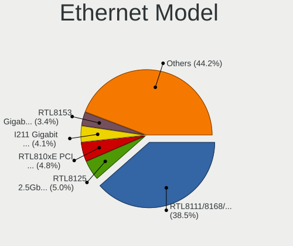

| Model                                                                  | Computers | Percent |
|------------------------------------------------------------------------|-----------|---------|
| Realtek RTL8111/8168/8211/8411 PCI Express Gigabit Ethernet Controller | 4982      | 38.52%  |
| Realtek RTL8125 2.5GbE Controller                                      | 647       | 5%      |
| Realtek RTL810xE PCI Express Fast Ethernet controller                  | 617       | 4.77%   |
| Intel I211 Gigabit Network Connection                                  | 525       | 4.06%   |
| Realtek RTL8153 Gigabit Ethernet Adapter                               | 444       | 3.43%   |
| Intel 82579LM Gigabit Network Connection (Lewisville)                  | 401       | 3.1%    |
| Intel Ethernet Controller I225-V                                       | 289       | 2.23%   |
| Intel Ethernet Connection (2) I219-V                                   | 237       | 1.83%   |
| Intel Ethernet Connection I217-LM                                      | 179       | 1.38%   |
| Intel Ethernet Connection (7) I219-V                                   | 155       | 1.2%    |
| Broadcom NetXtreme BCM57765 Gigabit Ethernet PCIe                      | 135       | 1.04%   |
| ASIX AX88179 Gigabit Ethernet                                          | 122       | 0.94%   |
| Intel Ethernet Connection (4) I219-LM                                  | 118       | 0.91%   |
| Qualcomm Atheros Killer E220x Gigabit Ethernet Controller              | 96        | 0.74%   |
| Intel Ethernet Connection I219-LM                                      | 93        | 0.72%   |
| Intel Ethernet Connection (2) I219-LM                                  | 92        | 0.71%   |
| Qualcomm Atheros AR8151 v2.0 Gigabit Ethernet                          | 90        | 0.7%    |
| Qualcomm Atheros Killer E2400 Gigabit Ethernet Controller              | 86        | 0.66%   |
| Broadcom NetXtreme BCM57766 Gigabit Ethernet PCIe                      | 86        | 0.66%   |
| Intel 82579V Gigabit Network Connection                                | 83        | 0.64%   |
| Samsung Galaxy series, misc. (tethering mode)                          | 81        | 0.63%   |
| Nvidia MCP79 Ethernet                                                  | 79        | 0.61%   |
| Qualcomm Atheros Killer E2500 Gigabit Ethernet Controller              | 78        | 0.6%    |
| Intel Ethernet Connection I218-LM                                      | 75        | 0.58%   |
| Intel Ethernet Connection I217-V                                       | 72        | 0.56%   |
| Realtek Killer E2600 GbE Controller                                    | 71        | 0.55%   |
| Intel Ethernet Connection (2) I218-V                                   | 66        | 0.51%   |
| Intel Alder Lake-P PCH CNVi WiFi                                       | 66        | 0.51%   |
| Intel Ethernet Connection (4) I219-V                                   | 60        | 0.46%   |
| Intel I210 Gigabit Network Connection                                  | 59        | 0.46%   |
| Intel Ethernet Connection (7) I219-LM                                  | 59        | 0.46%   |
| Qualcomm Atheros AR8161 Gigabit Ethernet                               | 57        | 0.44%   |
| Intel Ethernet Controller I226-V                                       | 56        | 0.43%   |
| Intel Ethernet Connection (3) I218-LM                                  | 56        | 0.43%   |
| Realtek Killer E3000 2.5GbE Controller                                 | 53        | 0.41%   |
| Qualcomm Atheros QCA8171 Gigabit Ethernet                              | 53        | 0.41%   |
| Broadcom NetXtreme BCM5764M Gigabit Ethernet PCIe                      | 50        | 0.39%   |
| Intel Ethernet Connection (6) I219-V                                   | 49        | 0.38%   |
| Samsung GT-I9070 (network tethering, USB debugging enabled)            | 48        | 0.37%   |
| Nvidia MCP61 Ethernet                                                  | 46        | 0.36%   |

Net Controller Kind
-------------------

Ethernet, WiFi or modem

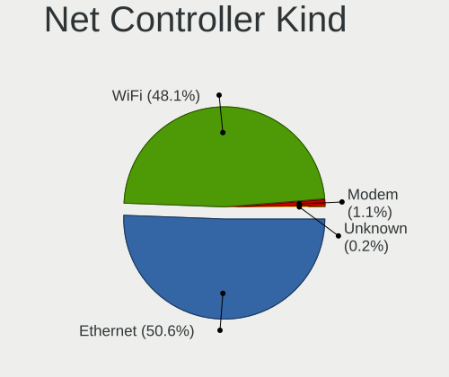

| Kind     | Computers | Percent |
|----------|-----------|---------|
| Ethernet | 11602     | 50.59%  |
| WiFi     | 11034     | 48.11%  |
| Modem    | 258       | 1.13%   |
| Unknown  | 39        | 0.17%   |

Used Controller
---------------

Currently used network controller

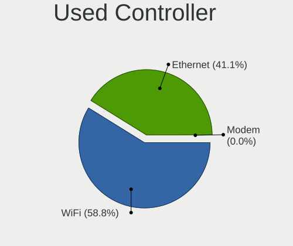

| Kind     | Computers | Percent |
|----------|-----------|---------|
| WiFi     | 8540      | 58.84%  |
| Ethernet | 5970      | 41.13%  |
| Unknown  | 3         | 0.02%   |
| Modem    | 1         | 0.01%   |

NICs
----

Total network controllers on board

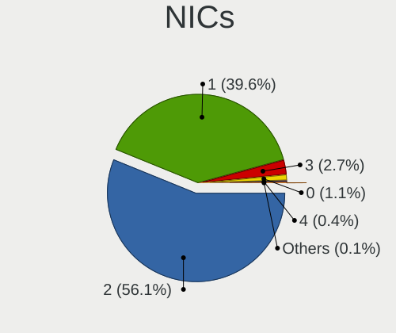

| Total | Computers | Percent |
|-------|-----------|---------|
| 2     | 7718      | 56.14%  |
| 1     | 5449      | 39.64%  |
| 3     | 365       | 2.66%   |
| 0     | 145       | 1.05%   |
| 4     | 54        | 0.39%   |
| 5     | 10        | 0.07%   |
| 6     | 4         | 0.03%   |
| 10    | 2         | 0.01%   |

IPv6
----

IPv6 vs IPv4

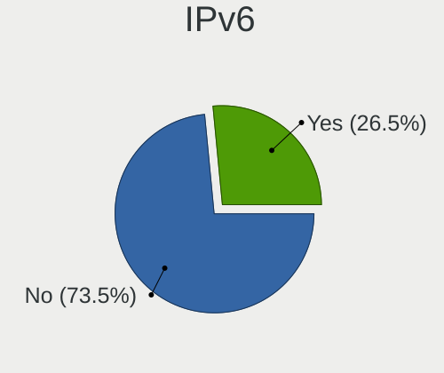

| Used | Computers | Percent |
|------|-----------|---------|
| No   | 10262     | 73.48%  |
| Yes  | 3704      | 26.52%  |

Bluetooth
---------

Bluetooth Vendor
----------------

Controller vendors

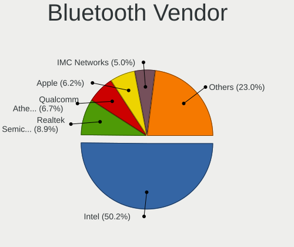

| Vendor                          | Computers | Percent |
|---------------------------------|-----------|---------|
| Intel                           | 4902      | 50.17%  |
| Realtek Semiconductor           | 872       | 8.92%   |
| Qualcomm Atheros Communications | 654       | 6.69%   |
| Apple                           | 606       | 6.2%    |
| IMC Networks                    | 490       | 5.01%   |
| Cambridge Silicon Radio         | 448       | 4.58%   |
| Foxconn / Hon Hai               | 357       | 3.65%   |
| Broadcom                        | 334       | 3.42%   |
| Lite-On Technology              | 276       | 2.82%   |
| MediaTek                        | 155       | 1.59%   |
| ASUSTek Computer                | 150       | 1.54%   |
| Dell                            | 101       | 1.03%   |
| Marvell Semiconductor           | 60        | 0.61%   |
| Realtek                         | 55        | 0.56%   |
| TP-Link                         | 51        | 0.52%   |
| Ralink                          | 44        | 0.45%   |
| Hewlett-Packard                 | 44        | 0.45%   |
| Toshiba                         | 40        | 0.41%   |
| Dynex                           | 14        | 0.14%   |
| USI                             | 13        | 0.13%   |
| Foxconn International           | 13        | 0.13%   |
| Actions                         | 11        | 0.11%   |
| Ralink Technology               | 9         | 0.09%   |
| Alps Electric                   | 9         | 0.09%   |
| Unknown                         | 7         | 0.07%   |
| Smart Modular Technologies      | 5         | 0.05%   |
| Integrated System Solution      | 5         | 0.05%   |
| SINO WEALTH                     | 4         | 0.04%   |
| Qcom                            | 4         | 0.04%   |
| Opticis                         | 4         | 0.04%   |
| HTC (High Tech Computer)        | 4         | 0.04%   |
| Edimax Technology               | 4         | 0.04%   |
| Askey Computer                  | 4         | 0.04%   |
| Taiyo Yuden                     | 3         | 0.03%   |
| Micro Star International        | 3         | 0.03%   |
| Logitech                        | 3         | 0.03%   |
| Creative Technology             | 3         | 0.03%   |
| Quectel Wireless Solutions      | 2         | 0.02%   |
| Fujitsu                         | 2         | 0.02%   |
| Conwise Technology              | 2         | 0.02%   |

Bluetooth Model
---------------

Controller models

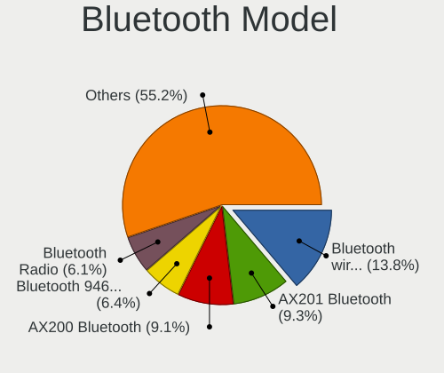

| Model                                               | Computers | Percent |
|-----------------------------------------------------|-----------|---------|
| Intel Bluetooth wireless interface                  | 1352      | 13.82%  |
| Intel AX201 Bluetooth                               | 912       | 9.33%   |
| Intel AX200 Bluetooth                               | 891       | 9.11%   |
| Intel Bluetooth 9460/9560 Jefferson Peak (JfP)      | 626       | 6.4%    |
| Realtek Bluetooth Radio                             | 597       | 6.1%    |
| Cambridge Silicon Radio Bluetooth Dongle (HCI mode) | 448       | 4.58%   |
| Intel Bluetooth Device                              | 375       | 3.83%   |
| Qualcomm Atheros  Bluetooth Device                  | 355       | 3.63%   |
| Apple Bluetooth Host Controller                     | 306       | 3.13%   |
| Intel AX210 Bluetooth                               | 218       | 2.23%   |
| IMC Networks Wireless_Device                        | 204       | 2.09%   |
| Intel Wireless-AC 3168 Bluetooth                    | 196       | 2%      |
| Apple Bluetooth USB Host Controller                 | 187       | 1.91%   |
| Intel Wireless-AC 9260 Bluetooth Adapter            | 186       | 1.9%    |
| Realtek  Bluetooth 4.2 Adapter                      | 177       | 1.81%   |
| MediaTek Wireless_Device                            | 155       | 1.58%   |
| IMC Networks Bluetooth Radio                        | 152       | 1.55%   |
| Foxconn / Hon Hai Wireless_Device                   | 121       | 1.24%   |
| Foxconn / Hon Hai Bluetooth Device                  | 106       | 1.08%   |
| Intel Centrino Bluetooth Wireless Transceiver       | 95        | 0.97%   |
| Lite-On Qualcomm Atheros QCA9377 Bluetooth          | 89        | 0.91%   |
| Qualcomm Atheros QCA61x4 Bluetooth 4.0              | 84        | 0.86%   |
| Apple Built-in Bluetooth 2.0+EDR HCI                | 71        | 0.73%   |
| IMC Networks Bluetooth Device                       | 69        | 0.71%   |
| Broadcom BCM20702A0 Bluetooth 4.0                   | 67        | 0.69%   |
| Qualcomm Atheros AR3011 Bluetooth                   | 66        | 0.67%   |
| Qualcomm Atheros AR3012 Bluetooth 4.0               | 61        | 0.62%   |
| Lite-On Bluetooth Device                            | 61        | 0.62%   |
| Qualcomm Atheros AR9462 Bluetooth                   | 57        | 0.58%   |
| Realtek Bluetooth Radio                             | 55        | 0.56%   |
| Intel Centrino Advanced-N 6230 Bluetooth adapter    | 55        | 0.56%   |
| TP-Link TP-T@- UB500 Adapter                        | 51        | 0.52%   |
| Broadcom BCM2045B (BDC-2.1)                         | 46        | 0.47%   |
| Ralink RT3290 Bluetooth                             | 44        | 0.45%   |
| Foxconn / Hon Hai MediaTek Bluetooth Adapter        | 43        | 0.44%   |
| Marvell Bluetooth and Wireless LAN Composite        | 42        | 0.43%   |
| ASUS Broadcom BCM20702A0 Bluetooth                  | 42        | 0.43%   |
| Apple Bluetooth HCI                                 | 42        | 0.43%   |
| Lite-On Wireless_Device                             | 38        | 0.39%   |
| Realtek RTL8822BE Bluetooth 4.2 Adapter             | 34        | 0.35%   |

Sound
-----

Sound Vendor
------------

Sound card vendors

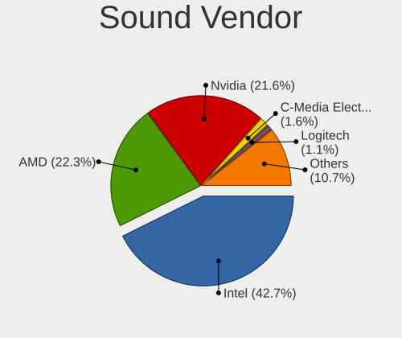

| Vendor                                       | Computers | Percent |
|----------------------------------------------|-----------|---------|
| Intel                                        | 9199      | 42.67%  |
| AMD                                          | 4805      | 22.29%  |
| Nvidia                                       | 4660      | 21.62%  |
| C-Media Electronics                          | 351       | 1.63%   |
| Logitech                                     | 242       | 1.12%   |
| Kingston Technology                          | 119       | 0.55%   |
| Razer USA                                    | 113       | 0.52%   |
| Creative Labs                                | 105       | 0.49%   |
| ASUSTek Computer                             | 105       | 0.49%   |
| JMTek                                        | 104       | 0.48%   |
| SteelSeries ApS                              | 100       | 0.46%   |
| Texas Instruments                            | 88        | 0.41%   |
| Corsair                                      | 87        | 0.4%    |
| Focusrite-Novation                           | 83        | 0.38%   |
| Realtek Semiconductor                        | 79        | 0.37%   |
| Generalplus Technology                       | 62        | 0.29%   |
| Micro Star International                     | 61        | 0.28%   |
| Creative Technology                          | 58        | 0.27%   |
| GN Netcom                                    | 57        | 0.26%   |
| Lenovo                                       | 56        | 0.26%   |
| Sony                                         | 52        | 0.24%   |
| Blue Microphones                             | 51        | 0.24%   |
| Hewlett-Packard                              | 49        | 0.23%   |
| Plantronics                                  | 40        | 0.19%   |
| Apple                                        | 36        | 0.17%   |
| DSEA A/S                                     | 33        | 0.15%   |
| Giga-Byte Technology                         | 27        | 0.13%   |
| Astro Gaming                                 | 26        | 0.12%   |
| FiiO Electronics Technology                  | 23        | 0.11%   |
| Valve Software                               | 20        | 0.09%   |
| Thesycon Systemsoftware & Consulting         | 19        | 0.09%   |
| Tenx Technology                              | 19        | 0.09%   |
| BEHRINGER International                      | 19        | 0.09%   |
| Turtle Beach                                 | 18        | 0.08%   |
| Samson Technologies                          | 17        | 0.08%   |
| KTMicro                                      | 16        | 0.07%   |
| Yamaha                                       | 15        | 0.07%   |
| M-Audio                                      | 15        | 0.07%   |
| Audio-Technica                               | 15        | 0.07%   |
| Zoran Co. Personal Media Division (Nogatech) | 14        | 0.06%   |

Sound Model
-----------

Sound card models

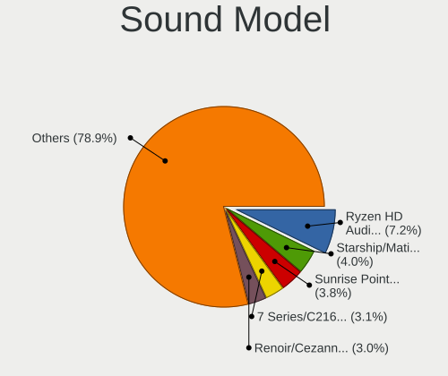

| Model                                                                      | Computers | Percent |
|----------------------------------------------------------------------------|-----------|---------|
| AMD Ryzen HD Audio Controller                                              | 1866      | 7.24%   |
| AMD Starship/Matisse HD Audio Controller                                   | 1021      | 3.96%   |
| Intel Sunrise Point-LP HD Audio                                            | 978       | 3.79%   |
| Intel 7 Series/C216 Chipset Family High Definition Audio Controller        | 806       | 3.13%   |
| AMD Renoir/Cezanne HDMI/DP Audio Controller                                | 764       | 2.96%   |
| Intel 6 Series/C200 Series Chipset Family High Definition Audio Controller | 752       | 2.92%   |
| Intel Cannon Lake PCH cAVS                                                 | 677       | 2.63%   |
| Intel 8 Series/C220 Series Chipset High Definition Audio Controller        | 651       | 2.52%   |
| AMD Radeon High Definition Audio Controller                                | 459       | 1.78%   |
| AMD Raven/Raven2/Fenghuang HDMI/DP Audio Controller                        | 442       | 1.71%   |
| Intel 100 Series/C230 Series Chipset Family HD Audio Controller            | 411       | 1.59%   |
| Intel Tiger Lake-LP Smart Sound Technology Audio Controller                | 400       | 1.55%   |
| Intel Xeon E3-1200 v3/4th Gen Core Processor HD Audio Controller           | 394       | 1.53%   |
| AMD Family 17h (Models 00h-0fh) HD Audio Controller                        | 387       | 1.5%    |
| AMD Ellesmere HDMI Audio [Radeon RX 470/480 / 570/580/590]                 | 378       | 1.47%   |
| Intel 8 Series HD Audio Controller                                         | 370       | 1.43%   |
| Intel Haswell-ULT HD Audio Controller                                      | 366       | 1.42%   |
| Nvidia TU106 High Definition Audio Controller                              | 329       | 1.28%   |
| Nvidia GP107GL High Definition Audio Controller                            | 319       | 1.24%   |
| Intel Comet Lake PCH cAVS                                                  | 319       | 1.24%   |
| Nvidia GA104 High Definition Audio Controller                              | 309       | 1.2%    |
| Intel Broadwell-U Audio Controller                                         | 301       | 1.17%   |
| Nvidia GP104 High Definition Audio Controller                              | 296       | 1.15%   |
| Intel 200 Series PCH HD Audio                                              | 292       | 1.13%   |
| AMD SBx00 Azalia (Intel HDA)                                               | 291       | 1.13%   |
| AMD Navi 21/23 HDMI/DP Audio Controller                                    | 285       | 1.11%   |
| Intel Wildcat Point-LP High Definition Audio Controller                    | 284       | 1.1%    |
| Nvidia TU107 GeForce GTX 1650 High Definition Audio Controller             | 279       | 1.08%   |
| Nvidia TU116 High Definition Audio Controller                              | 278       | 1.08%   |
| Intel Comet Lake PCH-LP cAVS                                               | 275       | 1.07%   |
| AMD FCH Azalia Controller                                                  | 271       | 1.05%   |
| Intel Cannon Point-LP High Definition Audio Controller                     | 270       | 1.05%   |
| Intel 5 Series/3400 Series Chipset High Definition Audio                   | 268       | 1.04%   |
| Nvidia GP106 High Definition Audio Controller                              | 262       | 1.02%   |
| Intel Alder Lake PCH-P High Definition Audio Controller                    | 261       | 1.01%   |
| Nvidia GA106 High Definition Audio Controller                              | 235       | 0.91%   |
| Intel CM238 HD Audio Controller                                            | 203       | 0.79%   |
| AMD Navi 10 HDMI Audio                                                     | 197       | 0.76%   |
| Nvidia TU104 HD Audio Controller                                           | 188       | 0.73%   |
| Intel Tiger Lake-H HD Audio Controller                                     | 181       | 0.7%    |

Memory
------

Memory Vendor
-------------

Memory module vendors

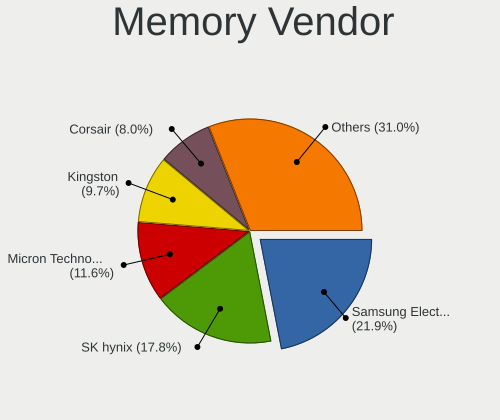

| Vendor                       | Computers | Percent |
|------------------------------|-----------|---------|
| Samsung Electronics          | 883       | 21.95%  |
| SK hynix                     | 715       | 17.77%  |
| Micron Technology            | 465       | 11.56%  |
| Kingston                     | 392       | 9.74%   |
| Corsair                      | 320       | 7.95%   |
| Crucial                      | 283       | 7.03%   |
| G.Skill                      | 204       | 5.07%   |
| Unknown                      | 151       | 3.75%   |
| A-DATA Technology            | 91        | 2.26%   |
| Team                         | 64        | 1.59%   |
| Unknown                      | 61        | 1.52%   |
| Ramaxel Technology           | 53        | 1.32%   |
| Smart                        | 39        | 0.97%   |
| Elpida                       | 38        | 0.94%   |
| Neo Forza                    | 29        | 0.72%   |
| Goldkey                      | 27        | 0.67%   |
| Unknown (ABCD)               | 22        | 0.55%   |
| Patriot                      | 21        | 0.52%   |
| Smart Brazil                 | 12        | 0.3%    |
| Nanya Technology             | 11        | 0.27%   |
| Apacer                       | 9         | 0.22%   |
| Teikon                       | 8         | 0.2%    |
| Timetec                      | 7         | 0.17%   |
| Avant                        | 7         | 0.17%   |
| Silicon Power                | 6         | 0.15%   |
| PNY                          | 6         | 0.15%   |
| Transcend                    | 5         | 0.12%   |
| GSkill                       | 5         | 0.12%   |
| GOODRAM                      | 5         | 0.12%   |
| Patriot Memory               | 4         | 0.1%    |
| ASint Technology             | 4         | 0.1%    |
| Wodposit                     | 3         | 0.07%   |
| Patriot Memory (PDP Systems) | 3         | 0.07%   |
| High Bridge                  | 3         | 0.07%   |
| CSX                          | 3         | 0.07%   |
| ChangXin Memory              | 3         | 0.07%   |
| Unifosa                      | 2         | 0.05%   |
| OLOY                         | 2         | 0.05%   |
| Lexar                        | 2         | 0.05%   |
| Juhor                        | 2         | 0.05%   |

Memory Model
------------

Memory module models

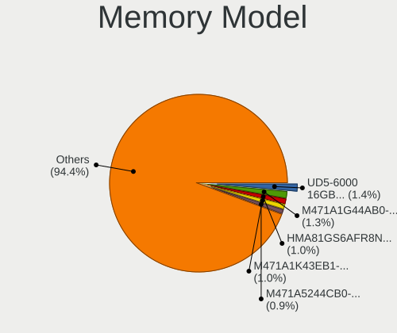

| Model                                                            | Computers | Percent |
|------------------------------------------------------------------|-----------|---------|
| Unknown                                                          | 61        | 1.44%   |
| Samsung RAM M471A1G44AB0-CWE 8GiB SODIMM DDR4 3200MT/s           | 57        | 1.35%   |
| SK hynix RAM HMA81GS6AFR8N-UH 8GB SODIMM DDR4 2667MT/s           | 43        | 1.01%   |
| Samsung RAM M471A1K43EB1-CWE 8GB SODIMM DDR4 3200MT/s            | 41        | 0.97%   |
| Samsung RAM M471A5244CB0-CTD 4GB SODIMM DDR4 3266MT/s            | 37        | 0.87%   |
| Samsung RAM M471A1K43CB1-CTD 8GB SODIMM DDR4 3200MT/s            | 33        | 0.78%   |
| SK hynix RAM HMA81GS6DJR8N-XN 8GB SODIMM DDR4 3200MT/s           | 29        | 0.68%   |
| Samsung RAM M471A1K43CB1-CRC 8GB SODIMM DDR4 8400MT/s            | 29        | 0.68%   |
| Samsung RAM M471A1G44AB0-CWE 8GB Row Of Chips DDR4 3200MT/s      | 28        | 0.66%   |
| SK hynix RAM HMAA1GS6CJR6N-XN 8GB SODIMM DDR4 3200MT/s           | 24        | 0.57%   |
| Corsair RAM CMK16GX4M2B3200C16 8GB DIMM DDR4 3600MT/s            | 24        | 0.57%   |
| Samsung RAM M471A2K43CB1-CTD 16GB SODIMM DDR4 8400MT/s           | 23        | 0.54%   |
| Samsung RAM M471A5244CB0-CRC 4GB SODIMM DDR4 2667MT/s            | 21        | 0.5%    |
| Samsung RAM M471A1K43DB1-CWE 8GB SODIMM DDR4 3200MT/s            | 21        | 0.5%    |
| SK hynix RAM HMT451S6BFR8A-PB 4GB SODIMM DDR3 1600MT/s           | 20        | 0.47%   |
| SK hynix RAM HMA81GS6JJR8N-VK 8GB SODIMM DDR4 2667MT/s           | 20        | 0.47%   |
| Corsair RAM CMK16GX4M2B3000C15 8GB DIMM DDR4 3600MT/s            | 20        | 0.47%   |
| Micron RAM 4ATF1G64HZ-3G2E1 8GB SODIMM DDR4 3200MT/s             | 19        | 0.45%   |
| Corsair RAM CMK32GX4M2E3200C16 16GB DIMM DDR4 3600MT/s           | 19        | 0.45%   |
| SK hynix RAM HMA81GS6CJR8N-VK 8GB SODIMM DDR4 2667MT/s           | 18        | 0.42%   |
| Samsung RAM M471A5244CB0-CWE 4GB SODIMM DDR4 3200MT/s            | 18        | 0.42%   |
| Samsung RAM M471A2G43AB2-CWE 16GB SODIMM DDR4 3200MT/s           | 18        | 0.42%   |
| Samsung RAM M471A1K43DB1-CTD 8GB SODIMM DDR4 2667MT/s            | 18        | 0.42%   |
| Samsung RAM M471A1G44BB0-CWE 8GB SODIMM DDR4 3200MT/s            | 18        | 0.42%   |
| Micron RAM 8ATF1G64HZ-3G2J1 8GB SODIMM DDR4 3200MT/s             | 18        | 0.42%   |
| SK hynix RAM HMA851S6CJR6N-VK 4GB SODIMM DDR4 2667MT/s           | 17        | 0.4%    |
| Micron RAM 8ATF1G64HZ-3G2R1 8GB SODIMM DDR4 3200MT/s             | 17        | 0.4%    |
| Micron RAM 4ATF51264HZ-2G6E1 4GB SODIMM DDR4 2667MT/s            | 17        | 0.4%    |
| SK hynix RAM HMA82GS6AFR8N-UH 16GB SODIMM DDR4 2667MT/s          | 16        | 0.38%   |
| Samsung RAM M471B5173QH0-YK0 4GB SODIMM DDR3 1600MT/s            | 16        | 0.38%   |
| Samsung RAM M471A4G43MB1-CTD 32GB SODIMM DDR4 2667MT/s           | 16        | 0.38%   |
| Unknown (ABCD) RAM 123456789012345678 2GB SODIMM LPDDR4 2400MT/s | 15        | 0.35%   |
| Samsung RAM M471B1G73QH0-YK0 8GB SODIMM DDR3 1600MT/s            | 15        | 0.35%   |
| Samsung RAM M471A5244CB0-CWE 4GB Row Of Chips DDR4 3200MT/s      | 15        | 0.35%   |
| Samsung RAM M471A2K43DB1-CTD 16GB SODIMM DDR4 2667MT/s           | 15        | 0.35%   |
| Samsung RAM M425R1GB4BB0-CQKOL 8GB SODIMM DDR5 4800MT/s          | 15        | 0.35%   |
| SK hynix RAM HMA851S6JJR6N-VK 4GB SODIMM DDR4 2667MT/s           | 14        | 0.33%   |
| Samsung RAM M471B5173DB0-YK0 4GB SODIMM DDR3 1600MT/s            | 14        | 0.33%   |
| Neo Forza RAM NMSO432F82-3200E 32GB SODIMM DDR4 3200MT/s         | 14        | 0.33%   |
| Samsung RAM M471B1G73EB0-YK0 8192MB SODIMM DDR3 1600MT/s         | 13        | 0.31%   |

Memory Kind
-----------

Memory module kinds

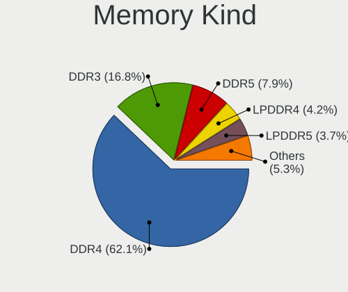

| Kind    | Computers | Percent |
|---------|-----------|---------|
| DDR4    | 2177      | 62.09%  |
| DDR3    | 589       | 16.8%   |
| DDR5    | 278       | 7.93%   |
| LPDDR4  | 147       | 4.19%   |
| LPDDR5  | 130       | 3.71%   |
| LPDDR3  | 108       | 3.08%   |
| DDR2    | 33        | 0.94%   |
| Unknown | 21        | 0.6%    |
| SDRAM   | 20        | 0.57%   |
| DDR     | 2         | 0.06%   |
| DRAM    | 1         | 0.03%   |

Memory Form Factor
------------------

Physical design of the memory module

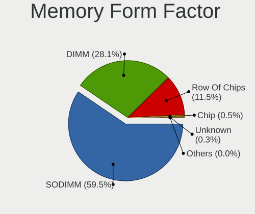

| Name         | Computers | Percent |
|--------------|-----------|---------|
| SODIMM       | 2106      | 59.51%  |
| DIMM         | 996       | 28.14%  |
| Row Of Chips | 408       | 11.53%  |
| Chip         | 19        | 0.54%   |
| Unknown      | 9         | 0.25%   |
| RIMM         | 1         | 0.03%   |

Memory Size
-----------

Memory module size

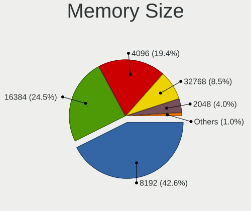

| Size  | Computers | Percent |
|-------|-----------|---------|
| 8192  | 1612      | 42.63%  |
| 16384 | 927       | 24.52%  |
| 4096  | 733       | 19.39%  |
| 32768 | 320       | 8.46%   |
| 2048  | 151       | 3.99%   |
| 1024  | 25        | 0.66%   |
| 49152 | 3         | 0.08%   |
| 65536 | 2         | 0.05%   |
| 24576 | 2         | 0.05%   |
| 3072  | 2         | 0.05%   |
| 512   | 2         | 0.05%   |
| 12288 | 1         | 0.03%   |
| 6144  | 1         | 0.03%   |

Memory Speed
------------

Memory module speed

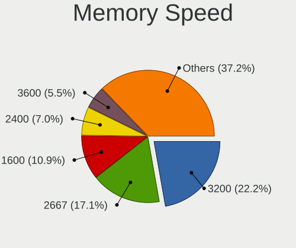

| Speed   | Computers | Percent |
|---------|-----------|---------|
| 3200    | 845       | 22.22%  |
| 2667    | 652       | 17.14%  |
| 1600    | 414       | 10.89%  |
| 2400    | 267       | 7.02%   |
| 3600    | 210       | 5.52%   |
| 2133    | 179       | 4.71%   |
| 4800    | 114       | 3%      |
| 6400    | 95        | 2.5%    |
| 1333    | 92        | 2.42%   |
| 5600    | 81        | 2.13%   |
| 4267    | 75        | 1.97%   |
| 3800    | 53        | 1.39%   |
| 1867    | 53        | 1.39%   |
| 8400    | 52        | 1.37%   |
| 3733    | 51        | 1.34%   |
| 3266    | 43        | 1.13%   |
| 6000    | 41        | 1.08%   |
| 3000    | 41        | 1.08%   |
| 1334    | 33        | 0.87%   |
| 7500    | 27        | 0.71%   |
| 3400    | 27        | 0.71%   |
| 4000    | 26        | 0.68%   |
| 800     | 26        | 0.68%   |
| 4266    | 23        | 0.6%    |
| 1067    | 21        | 0.55%   |
| 2666    | 19        | 0.5%    |
| 1866    | 19        | 0.5%    |
| 2933    | 16        | 0.42%   |
| 3466    | 15        | 0.39%   |
| 3866    | 14        | 0.37%   |
| 667     | 14        | 0.37%   |
| 1800    | 12        | 0.32%   |
| Unknown | 12        | 0.32%   |
| 5200    | 10        | 0.26%   |
| 8533    | 9         | 0.24%   |
| 2800    | 8         | 0.21%   |
| 12800   | 7         | 0.18%   |
| 6200    | 7         | 0.18%   |
| 4400    | 7         | 0.18%   |
| 3066    | 7         | 0.18%   |

Printers & scanners
-------------------

Printer Vendor
--------------

Printer device vendors

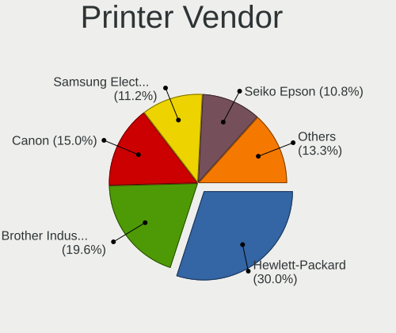

| Vendor                | Computers | Percent |
|-----------------------|-----------|---------|
| Hewlett-Packard       | 72        | 30%     |
| Brother Industries    | 47        | 19.58%  |
| Canon                 | 36        | 15%     |
| Samsung Electronics   | 27        | 11.25%  |
| Seiko Epson           | 26        | 10.83%  |
| Dymo-CoStar           | 8         | 3.33%   |
| STMicroelectronics    | 3         | 1.25%   |
| Fuji Xerox            | 3         | 1.25%   |
| Xerox                 | 2         | 0.83%   |
| QinHeng Electronics   | 2         | 0.83%   |
| Kyocera               | 2         | 0.83%   |
| Dell                  | 2         | 0.83%   |
| Sharp                 | 1         | 0.42%   |
| Ricoh                 | 1         | 0.42%   |
| Prolific Technology   | 1         | 0.42%   |
| PM                    | 1         | 0.42%   |
| Pantum                | 1         | 0.42%   |
| Oki Data              | 1         | 0.42%   |
| MIIIW                 | 1         | 0.42%   |
| Lexmark International | 1         | 0.42%   |
| ICS Advent            | 1         | 0.42%   |
| Apple                 | 1         | 0.42%   |

Printer Model
-------------

Printer device models

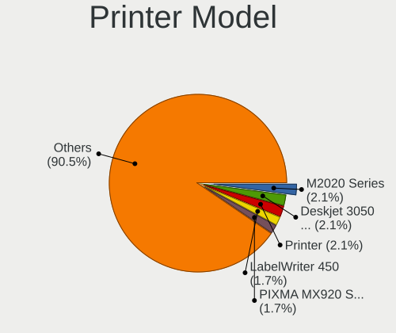

| Model                                                     | Computers | Percent |
|-----------------------------------------------------------|-----------|---------|
| Samsung M2020 Series                                      | 5         | 2.07%   |
| HP Deskjet 3050 J610 series                               | 5         | 2.07%   |
| Brother Printer                                           | 5         | 2.07%   |
| Dymo-CoStar LabelWriter 450                               | 4         | 1.65%   |
| Canon PIXMA MX920 Series                                  | 4         | 1.65%   |
| Brother HL-2130 series                                    | 4         | 1.65%   |
| Seiko Epson L3110 Series                                  | 3         | 1.24%   |
| Seiko Epson ET-2700 Series                                | 3         | 1.24%   |
| Samsung SCX-3400 Series                                   | 3         | 1.24%   |
| Samsung ML-1640 Series Laser Printer                      | 3         | 1.24%   |
| Samsung M2070 Series                                      | 3         | 1.24%   |
| HP LaserJet Professional P 1102w                          | 3         | 1.24%   |
| Dymo-CoStar DYMO LabelWriter 450 Turbo                    | 3         | 1.24%   |
| Canon PIXMA MG2500 Series                                 | 3         | 1.24%   |
| Brother HL-2270DW Laser Printer                           | 3         | 1.24%   |
| STMicroelectronics LED badge -- mini LED display -- 11x44 | 2         | 0.83%   |
| Seiko Epson WF-4830 Series                                | 2         | 0.83%   |
| Seiko Epson L355 Series                                   | 2         | 0.83%   |
| Seiko Epson L3050 Series                                  | 2         | 0.83%   |
| Seiko Epson ET-3710 Series                                | 2         | 0.83%   |
| Seiko Epson EPSON WF-3520 Series                          | 2         | 0.83%   |
| QinHeng CH340S                                            | 2         | 0.83%   |
| HP OfficeJet 3830 series                                  | 2         | 0.83%   |
| HP LaserJet M14-M17                                       | 2         | 0.83%   |
| HP ENVY Pro 6400 series                                   | 2         | 0.83%   |
| HP ENVY Photo 6200 series                                 | 2         | 0.83%   |
| HP ENVY 4520 series                                       | 2         | 0.83%   |
| HP ENVY 4500 series                                       | 2         | 0.83%   |
| HP DeskJet F4100 Printer series                           | 2         | 0.83%   |
| HP Deskjet F2280 series                                   | 2         | 0.83%   |
| HP DeskJet 2600 series                                    | 2         | 0.83%   |
| HP Deskjet 2540 series                                    | 2         | 0.83%   |
| HP DeskJet 2130 series                                    | 2         | 0.83%   |
| HP Deskjet 1050 J410                                      | 2         | 0.83%   |
| HP Deskjet 1000 J110 series                               | 2         | 0.83%   |
| Fuji Xerox DocuPrint CM315/318 z                          | 2         | 0.83%   |
| Canon TR4700 series                                       | 2         | 0.83%   |
| Canon LiDE 400                                            | 2         | 0.83%   |
| Brother HL-L3230CDW series                                | 2         | 0.83%   |
| Brother HL-3170CDW series                                 | 2         | 0.83%   |

Scanner Vendor
--------------

Scanner device vendors

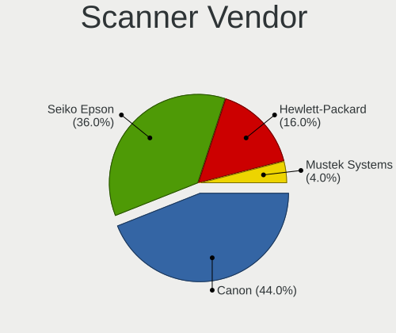

| Vendor          | Computers | Percent |
|-----------------|-----------|---------|
| Canon           | 11        | 44%     |
| Seiko Epson     | 9         | 36%     |
| Hewlett-Packard | 4         | 16%     |
| Mustek Systems  | 1         | 4%      |

Scanner Model
-------------

Scanner device models

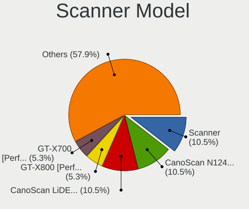

| Model                                                   | Computers | Percent |
|---------------------------------------------------------|-----------|---------|
| Seiko Epson Scanner                                     | 2         | 8%      |
| Seiko Epson Perfection V37/V370                         | 2         | 8%      |
| Canon CanoScan N1240U/LiDE 30                           | 2         | 8%      |
| Canon CanoScan LiDE 210                                 | 2         | 8%      |
| Seiko Epson GT-X800 [Perfection 4990 PHOTO]             | 1         | 4%      |
| Seiko Epson GT-X770 [Perfection V500]                   | 1         | 4%      |
| Seiko Epson GT-X700 [Perfection 4870]                   | 1         | 4%      |
| Seiko Epson GT-F720 [GT-S620/Perfection V30/V300 Photo] | 1         | 4%      |
| Seiko Epson GT-7200U [Perfection 1250/1250 PHOTO]       | 1         | 4%      |
| Mustek Systems ScanExpress 1200 UB                      | 1         | 4%      |
| HP Scanjet G2710                                        | 1         | 4%      |
| HP ScanJet 82x0C                                        | 1         | 4%      |
| HP ScanJet 2400c                                        | 1         | 4%      |
| HP HP Scanjet 300                                       | 1         | 4%      |
| Canon CanoScan N650U/N656U                              | 1         | 4%      |
| Canon CanoScan LiDE 60                                  | 1         | 4%      |
| Canon CanoScan LiDE 50/LiDE 35/LiDE 40                  | 1         | 4%      |
| Canon CanoScan LiDE 220                                 | 1         | 4%      |
| Canon CanoScan LiDE 200                                 | 1         | 4%      |
| Canon CanoScan LiDE 110                                 | 1         | 4%      |
| Canon CanoScan 9000F Mark II                            | 1         | 4%      |

Camera
------

Camera Vendor
-------------

Camera device vendors

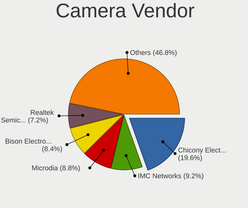

| Vendor                                 | Computers | Percent |
|----------------------------------------|-----------|---------|
| Chicony Electronics                    | 1633      | 19.59%  |
| IMC Networks                           | 768       | 9.21%   |
| Microdia                               | 734       | 8.81%   |
| Bison Electronics                      | 700       | 8.4%    |
| Realtek Semiconductor                  | 601       | 7.21%   |
| Logitech                               | 547       | 6.56%   |
| Apple                                  | 452       | 5.42%   |
| Sunplus Innovation Technology          | 423       | 5.07%   |
| Quanta                                 | 413       | 4.96%   |
| Cheng Uei Precision Industry (Foxlink) | 228       | 2.74%   |
| Syntek                                 | 206       | 2.47%   |
| Luxvisions Innotech Limited            | 188       | 2.26%   |
| Suyin                                  | 174       | 2.09%   |
| Lite-On Technology                     | 160       | 1.92%   |
| Microsoft                              | 94        | 1.13%   |
| Silicon Motion                         | 82        | 0.98%   |
| Sonix Technology                       | 76        | 0.91%   |
| Samsung Electronics                    | 65        | 0.78%   |
| Alcor Micro                            | 51        | 0.61%   |
| Ricoh                                  | 47        | 0.56%   |
| Acer                                   | 41        | 0.49%   |
| Generalplus Technology                 | 37        | 0.44%   |
| SunplusIT                              | 35        | 0.42%   |
| ShineTech                              | 31        | 0.37%   |
| Razer USA                              | 29        | 0.35%   |
| Z-Star Microelectronics                | 25        | 0.3%    |
| MacroSilicon                           | 20        | 0.24%   |
| ARC International                      | 19        | 0.23%   |
| Valve Software                         | 18        | 0.22%   |
| Jieli Technology                       | 17        | 0.2%    |
| Creative Technology                    | 16        | 0.19%   |
| Primax Electronics                     | 15        | 0.18%   |
| ALi                                    | 15        | 0.18%   |
| OmniVision Technologies                | 14        | 0.17%   |
| Lenovo                                 | 14        | 0.17%   |
| KYE Systems (Mouse Systems)            | 14        | 0.17%   |
| Intel                                  | 14        | 0.17%   |
| Importek                               | 13        | 0.16%   |
| AVerMedia Technologies                 | 12        | 0.14%   |
| Hewlett-Packard                        | 11        | 0.13%   |

Camera Model
------------

Camera device models

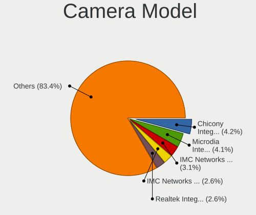

| Model                                               | Computers | Percent |
|-----------------------------------------------------|-----------|---------|
| Chicony Integrated Camera                           | 357       | 4.24%   |
| Microdia Integrated_Webcam_HD                       | 342       | 4.06%   |
| IMC Networks USB2.0 HD UVC WebCam                   | 258       | 3.07%   |
| IMC Networks Integrated Camera                      | 222       | 2.64%   |
| Realtek Integrated_Webcam_HD                        | 221       | 2.63%   |
| Chicony HD WebCam                                   | 177       | 2.1%    |
| Bison Integrated Camera                             | 160       | 1.9%    |
| Bison BisonCam,NB Pro                               | 154       | 1.83%   |
| Syntek Integrated Camera                            | 143       | 1.7%    |
| Apple Built-in iSight                               | 124       | 1.47%   |
| Logitech HD Pro Webcam C920                         | 111       | 1.32%   |
| Apple iPhone 5/5C/5S/6/SE/7/8/X                     | 106       | 1.26%   |
| Apple FaceTime HD Camera                            | 104       | 1.24%   |
| Apple FaceTime HD Camera (Built-in)                 | 102       | 1.21%   |
| Sunplus Integrated_Webcam_HD                        | 101       | 1.2%    |
| Logitech Webcam C270                                | 95        | 1.13%   |
| Quanta HD User Facing                               | 83        | 0.99%   |
| Bison HD Webcam                                     | 82        | 0.97%   |
| Chicony USB2.0 Camera                               | 80        | 0.95%   |
| IMC Networks USB2.0 VGA UVC WebCam                  | 72        | 0.86%   |
| Lite-On Integrated Camera                           | 63        | 0.75%   |
| Chicony Chicony USB2.0 Camera                       | 63        | 0.75%   |
| Samsung Galaxy series, misc. (MTP mode)             | 62        | 0.74%   |
| Chicony HP HD Camera                                | 60        | 0.71%   |
| Chicony HP Wide Vision HD Camera                    | 55        | 0.65%   |
| Microdia Webcam Vitade AF                           | 54        | 0.64%   |
| Logitech C922 Pro Stream Webcam                     | 54        | 0.64%   |
| Chicony HD User Facing                              | 54        | 0.64%   |
| Bison SunplusIT Integrated Camera                   | 54        | 0.64%   |
| Quanta HD Webcam                                    | 52        | 0.62%   |
| Sonix USB2.0 HD UVC WebCam                          | 49        | 0.58%   |
| Luxvisions Innotech Limited Integrated Camera       | 47        | 0.56%   |
| Microdia Laptop_Integrated_Webcam_HD                | 46        | 0.55%   |
| Microdia Integrated Webcam                          | 46        | 0.55%   |
| Chicony USB 2.0 Camera                              | 46        | 0.55%   |
| Chicony Integrated Camera (1280x720@30)             | 46        | 0.55%   |
| Luxvisions Innotech Limited HP TrueVision HD Camera | 45        | 0.53%   |
| Bison BisonCam, NB Pro                              | 45        | 0.53%   |
| Realtek USB Camera                                  | 44        | 0.52%   |
| Chicony USB2.0 HD UVC WebCam                        | 44        | 0.52%   |

Security
--------

Fingerprint Vendor
------------------

Fingerprint sensor vendors

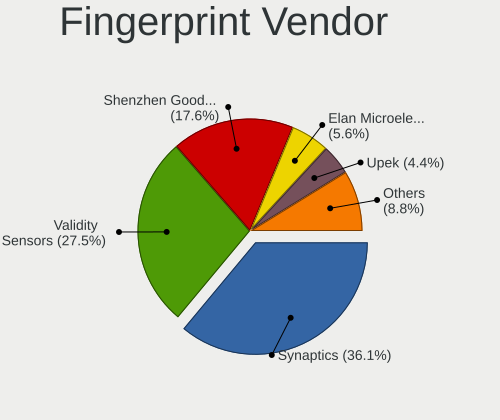

| Vendor                             | Computers | Percent |
|------------------------------------|-----------|---------|
| Synaptics                          | 521       | 36.06%  |
| Validity Sensors                   | 398       | 27.54%  |
| Shenzhen Goodix Technology         | 255       | 17.65%  |
| Elan Microelectronics              | 81        | 5.61%   |
| Upek                               | 63        | 4.36%   |
| LighTuning Technology              | 54        | 3.74%   |
| AuthenTec                          | 37        | 2.56%   |
| Realtek USB2.0 Finger Print Bridge | 10        | 0.69%   |
| STMicroelectronics                 | 9         | 0.62%   |
| Focal-systems.Corp                 | 6         | 0.42%   |
| HOLTEK                             | 5         | 0.35%   |
| Samsung Electronics                | 3         | 0.21%   |
| DigitalPersona                     | 3         | 0.21%   |

Fingerprint Model
-----------------

Fingerprint sensor models

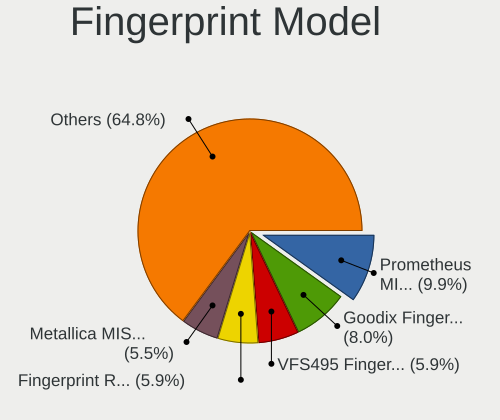

| Model                                                                      | Computers | Percent |
|----------------------------------------------------------------------------|-----------|---------|
| Synaptics Prometheus MIS Touch Fingerprint Reader                          | 143       | 9.9%    |
| Shenzhen Goodix  Fingerprint Device                                        | 116       | 8.03%   |
| Validity Sensors VFS495 Fingerprint Reader                                 | 85        | 5.88%   |
| Shenzhen Goodix Fingerprint Reader                                         | 85        | 5.88%   |
| Synaptics Metallica MIS Touch Fingerprint Reader                           | 79        | 5.47%   |
| Upek Biometric Touchchip/Touchstrip Fingerprint Sensor                     | 57        | 3.94%   |
| Shenzhen Goodix FingerPrint                                                | 54        | 3.74%   |
| Validity Sensors VFS 5011 fingerprint sensor                               | 52        | 3.6%    |
| Elan ELAN:Fingerprint                                                      | 52        | 3.6%    |
| Synaptics  WBDI                                                            | 37        | 2.56%   |
| Validity Sensors Synaptics WBDI                                            | 34        | 2.35%   |
| Synaptics TouchPad                                                         | 32        | 2.21%   |
| Validity Sensors VFS5011 Fingerprint Reader                                | 31        | 2.15%   |
| Synaptics UWP WBDI                                                         | 29        | 2.01%   |
| Validity Sensors VFS7500 Touch Fingerprint Sensor                          | 27        | 1.87%   |
| LighTuning ES603 Swipe Fingerprint Sensor                                  | 27        | 1.87%   |
| Elan ELAN:ARM-M4                                                           | 27        | 1.87%   |
| Validity Sensors VFS491                                                    | 26        | 1.8%    |
| Validity Sensors Fingerprint scanner                                       | 26        | 1.8%    |
| Synaptics WBDI                                                             | 26        | 1.8%    |
| Synaptics FS7604 Touch Fingerprint Sensor with PurePrint                   | 25        | 1.73%   |
| Validity Sensors VFS471 Fingerprint Reader                                 | 24        | 1.66%   |
| Synaptics WBDI Device                                                      | 24        | 1.66%   |
| Synaptics WBDI Fingerprint Reader USB 086                                  | 23        | 1.59%   |
| Validity Sensors Synaptics VFS7552 Touch Fingerprint Sensor with PurePrint | 21        | 1.45%   |
| LighTuning EgisTec Touch Fingerprint Sensor                                | 21        | 1.45%   |
| Validity Sensors Swipe Fingerprint Sensor                                  | 20        | 1.38%   |
| Synaptics Fingerprint reader [HP G6]                                       | 20        | 1.38%   |
| Unknown                                                                    | 17        | 1.18%   |
| Synaptics  FS7604 Touch Fingerprint Sensor with PurePrint                  | 15        | 1.04%   |
| Validity Sensors VFS7552 Touch Fingerprint Sensor                          | 14        | 0.97%   |
| Validity Sensors VFS451 Fingerprint Reader                                 | 14        | 0.97%   |
| Synaptics Metallica MOH Touch Fingerprint Reader                           | 14        | 0.97%   |
| Synaptics UWP WBDI Device                                                  | 13        | 0.9%    |
| Synaptics Prometheus Fingerprint Reader                                    | 13        | 0.9%    |
| Realtek USB2.0 Finger Print Bridge FocalTech Fingerprint Device            | 10        | 0.69%   |
| AuthenTec Fingerprint Sensor                                               | 10        | 0.69%   |
| Validity Sensors Synaptics VFS7552 Touch Fingerprint Sensor                | 9         | 0.62%   |
| STMicroelectronics Fingerprint Reader                                      | 9         | 0.62%   |
| AuthenTec AES2501 Fingerprint Sensor                                       | 9         | 0.62%   |

Chipcard Vendor
---------------

Chipcard module vendors

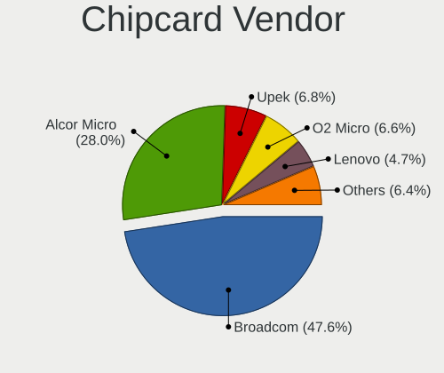

| Vendor                    | Computers | Percent |
|---------------------------|-----------|---------|
| Broadcom                  | 245       | 47.57%  |
| Alcor Micro               | 144       | 27.96%  |
| Upek                      | 35        | 6.8%    |
| O2 Micro                  | 34        | 6.6%    |
| Lenovo                    | 24        | 4.66%   |
| SCM Microsystems          | 11        | 2.14%   |
| OmniKey                   | 5         | 0.97%   |
| Realtek Semiconductor     | 3         | 0.58%   |
| Aladdin Knowledge Systems | 3         | 0.58%   |
| Yubico.com                | 2         | 0.39%   |
| Gemalto (was Gemplus)     | 2         | 0.39%   |
| Chicony Electronics       | 2         | 0.39%   |
| Advanced Card Systems     | 2         | 0.39%   |
| Jing-Mold Enterprise      | 1         | 0.19%   |
| Giesecke & Devrient       | 1         | 0.19%   |
| Clay Logic                | 1         | 0.19%   |

Chipcard Model
--------------

Chipcard module models

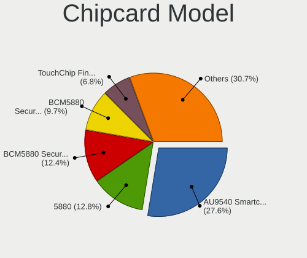

| Model                                                                        | Computers | Percent |
|------------------------------------------------------------------------------|-----------|---------|
| Alcor Micro AU9540 Smartcard Reader                                          | 142       | 27.57%  |
| Broadcom 5880                                                                | 66        | 12.82%  |
| Broadcom BCM5880 Secure Applications Processor                               | 64        | 12.43%  |
| Broadcom BCM5880 Secure Applications Processor with fingerprint swipe sensor | 50        | 9.71%   |
| Upek TouchChip Fingerprint Coprocessor (WBF advanced mode)                   | 35        | 6.8%    |
| Broadcom BCM58200 ControlVault 3 (FingerPrint sensor + Contacted SmartCard)  | 31        | 6.02%   |
| Broadcom 58200                                                               | 31        | 6.02%   |
| O2 Micro OZ776 CCID Smartcard Reader                                         | 30        | 5.83%   |
| Lenovo Integrated Smart Card Reader                                          | 24        | 4.66%   |
| SCM Microsystems SCR331-LC1 / SCR3310 SmartCard Reader                       | 7         | 1.36%   |
| O2 Micro Oz776 SmartCard Reader                                              | 4         | 0.78%   |
| Realtek Semiconductor Smart Card Reader Interface                            | 3         | 0.58%   |
| Broadcom BCM5880 Secure Applications Processor with fingerprint touch sensor | 3         | 0.58%   |
| Aladdin Knowledge Systems Token JC                                           | 3         | 0.58%   |
| Yubico.com Yubikey 4/5 U2F+CCID                                              | 2         | 0.39%   |
| OmniKey CardMan 3021 / 3121                                                  | 2         | 0.39%   |
| Chicony Electronics HP Skylab USB Smartcard Keyboard                         | 2         | 0.39%   |
| Alcor Micro Watchdata W 1981                                                 | 2         | 0.39%   |
| SCM Microsystems SCR35xx Smart Card Reader                                   | 1         | 0.19%   |
| SCM Microsystems SCR3500 C Contact Reader                                    | 1         | 0.19%   |
| SCM Microsystems SCR3500 A Contact Reader                                    | 1         | 0.19%   |
| SCM Microsystems SCR331 SmartCard Reader                                     | 1         | 0.19%   |
| OmniKey CardMan 4321                                                         | 1         | 0.19%   |
| OmniKey CardMan 1021                                                         | 1         | 0.19%   |
| OmniKey 3x21 Smart Card Reader                                               | 1         | 0.19%   |
| Jing-Mold Enterprise HP USB Business Slim Smartcard CCID Keyboard            | 1         | 0.19%   |
| Giesecke & Devrient Chipcard Reader                                          | 1         | 0.19%   |
| Gemalto (was Gemplus) GemPC Twin SmartCard Reader                            | 1         | 0.19%   |
| Gemalto (was Gemplus) Compact Smart Card Reader Writer                       | 1         | 0.19%   |
| Clay Logic Nitrokey Pro                                                      | 1         | 0.19%   |
| Advanced Card Systems ACR38 SmartCard Reader                                 | 1         | 0.19%   |
| Advanced Card Systems ACR1252 Dual Reader                                    | 1         | 0.19%   |

Unsupported
-----------

Unsupported Devices
-------------------

Total unsupported devices on board

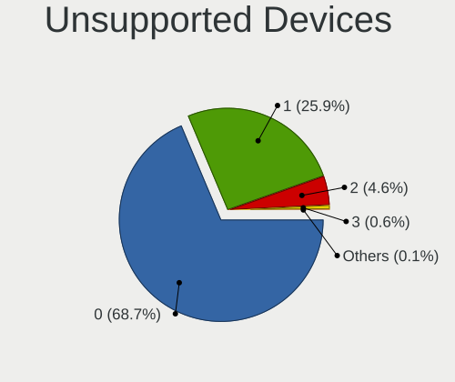

| Total | Computers | Percent |
|-------|-----------|---------|
| 0     | 9606      | 68.65%  |
| 1     | 3627      | 25.92%  |
| 2     | 649       | 4.64%   |
| 3     | 87        | 0.62%   |
| 4     | 13        | 0.09%   |
| 5     | 8         | 0.06%   |
| 7     | 1         | 0.01%   |
| 6     | 1         | 0.01%   |

Unsupported Device Types
------------------------

Types of unsupported devices

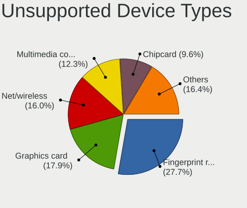

| Type                     | Computers | Percent |
|--------------------------|-----------|---------|
| Fingerprint reader       | 1417      | 27.74%  |
| Graphics card            | 915       | 17.91%  |
| Net/wireless             | 816       | 15.97%  |
| Multimedia controller    | 628       | 12.29%  |
| Chipcard                 | 492       | 9.63%   |
| Camera                   | 150       | 2.94%   |
| Bluetooth                | 147       | 2.88%   |
| Unassigned class         | 95        | 1.86%   |
| Communication controller | 91        | 1.78%   |
| Sound                    | 80        | 1.57%   |
| Net/ethernet             | 64        | 1.25%   |
| Storage                  | 51        | 1%      |
| Network                  | 50        | 0.98%   |
| Card reader              | 34        | 0.67%   |
| Storage/raid             | 30        | 0.59%   |
| Modem                    | 16        | 0.31%   |
| Storage/ide              | 11        | 0.22%   |
| Storage/nvme             | 8         | 0.16%   |
| Firewire controller      | 4         | 0.08%   |
| Dvb card                 | 4         | 0.08%   |
| Flash memory             | 2         | 0.04%   |
| Wireless                 | 1         | 0.02%   |
| Unclassified device      | 1         | 0.02%   |
| Tv card                  | 1         | 0.02%   |

