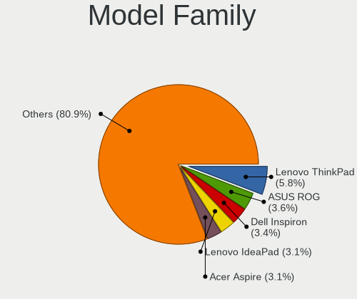
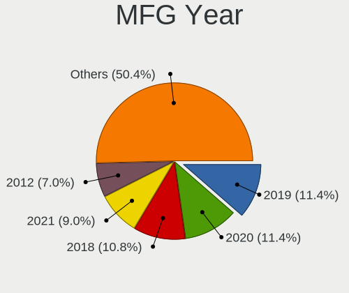
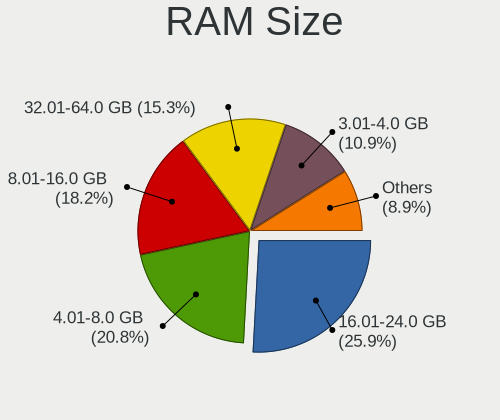
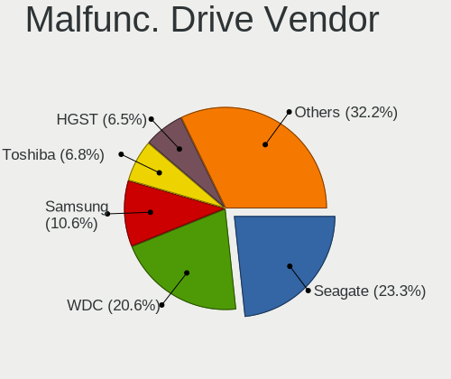
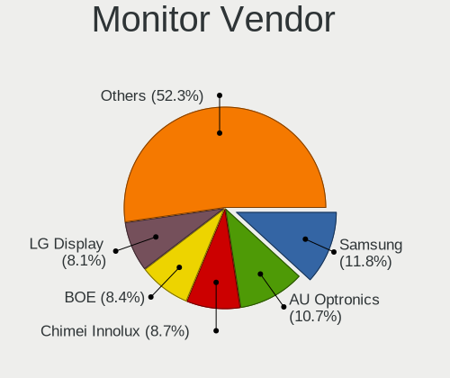
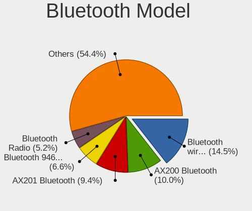
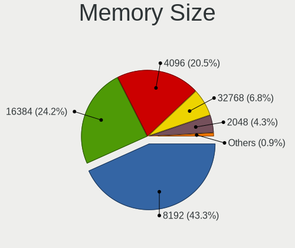
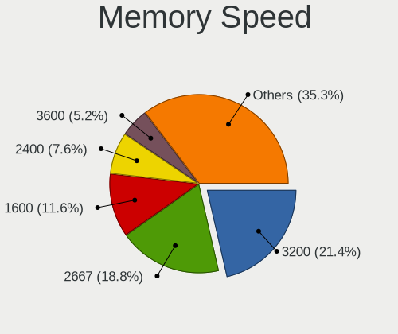

Pop!_OS - Tested Hardware & Statistics
--------------------------------------

A project to collect tested hardware configurations for Pop!_OS.

Anyone can contribute to this report by the [hw-probe](https://github.com/linuxhw/hw-probe) tool:

    sudo -E hw-probe -all -upload

Please contribute! Especially if your hardware is rare.

This is a report for all computer types. See also reports for [desktops](/Dist/Pop!_OS/Desktop/README.md) and [notebooks](/Dist/Pop!_OS/Notebook/README.md).

Contents
--------

* [ Test Cases ](#test-cases)

* [ System ](#system)
  - [ OS                       ](#os)
  - [ OS Family                ](#os-family)
  - [ Kernel                   ](#kernel)
  - [ Kernel Family            ](#kernel-family)
  - [ Kernel Major Ver.        ](#kernel-major-ver)
  - [ Arch                     ](#arch)
  - [ DE                       ](#de)
  - [ Display Server           ](#display-server)
  - [ Display Manager          ](#display-manager)
  - [ OS Lang                  ](#os-lang)
  - [ Boot Mode                ](#boot-mode)
  - [ Filesystem               ](#filesystem)
  - [ Part. scheme             ](#part-scheme)
  - [ Dual Boot with Linux/BSD ](#dual-boot-with-linuxbsd)
  - [ Dual Boot (Win)          ](#dual-boot-win)

* [ Board ](#board)
  - [ Vendor                   ](#vendor)
  - [ Model                    ](#model)
  - [ Model Family             ](#model-family)
  - [ MFG Year                 ](#mfg-year)
  - [ Form Factor              ](#form-factor)
  - [ Secure Boot              ](#secure-boot)
  - [ Coreboot                 ](#coreboot)
  - [ RAM Size                 ](#ram-size)
  - [ RAM Used                 ](#ram-used)
  - [ Total Drives             ](#total-drives)
  - [ Has CD-ROM               ](#has-cd-rom)
  - [ Has Ethernet             ](#has-ethernet)
  - [ Has WiFi                 ](#has-wifi)
  - [ Has Bluetooth            ](#has-bluetooth)

* [ Location ](#location)
  - [ Country                  ](#country)
  - [ City                     ](#city)

* [ Drives ](#drives)
  - [ Drive Vendor             ](#drive-vendor)
  - [ Drive Model              ](#drive-model)
  - [ HDD Vendor               ](#hdd-vendor)
  - [ SSD Vendor               ](#ssd-vendor)
  - [ Drive Kind               ](#drive-kind)
  - [ Drive Connector          ](#drive-connector)
  - [ Drive Size               ](#drive-size)
  - [ Space Total              ](#space-total)
  - [ Space Used               ](#space-used)
  - [ Malfunc. Drives          ](#malfunc-drives)
  - [ Malfunc. Drive Vendor    ](#malfunc-drive-vendor)
  - [ Malfunc. HDD Vendor      ](#malfunc-hdd-vendor)
  - [ Malfunc. Drive Kind      ](#malfunc-drive-kind)
  - [ Failed Drives            ](#failed-drives)
  - [ Failed Drive Vendor      ](#failed-drive-vendor)
  - [ Drive Status             ](#drive-status)

* [ Storage controller ](#storage-controller)
  - [ Storage Vendor           ](#storage-vendor)
  - [ Storage Model            ](#storage-model)
  - [ Storage Kind             ](#storage-kind)

* [ Processor ](#processor)
  - [ CPU Vendor               ](#cpu-vendor)
  - [ CPU Model                ](#cpu-model)
  - [ CPU Model Family         ](#cpu-model-family)
  - [ CPU Cores                ](#cpu-cores)
  - [ CPU Sockets              ](#cpu-sockets)
  - [ CPU Threads              ](#cpu-threads)
  - [ CPU Op-Modes             ](#cpu-op-modes)
  - [ CPU Microcode            ](#cpu-microcode)
  - [ CPU Microarch            ](#cpu-microarch)

* [ Graphics ](#graphics)
  - [ GPU Vendor               ](#gpu-vendor)
  - [ GPU Model                ](#gpu-model)
  - [ GPU Combo                ](#gpu-combo)
  - [ GPU Driver               ](#gpu-driver)
  - [ GPU Memory               ](#gpu-memory)

* [ Monitor ](#monitor)
  - [ Monitor Vendor           ](#monitor-vendor)
  - [ Monitor Model            ](#monitor-model)
  - [ Monitor Resolution       ](#monitor-resolution)
  - [ Monitor Diagonal         ](#monitor-diagonal)
  - [ Monitor Width            ](#monitor-width)
  - [ Aspect Ratio             ](#aspect-ratio)
  - [ Monitor Area             ](#monitor-area)
  - [ Pixel Density            ](#pixel-density)
  - [ Multiple Monitors        ](#multiple-monitors)

* [ Network ](#network)
  - [ Net Controller Vendor    ](#net-controller-vendor)
  - [ Net Controller Model     ](#net-controller-model)
  - [ Wireless Vendor          ](#wireless-vendor)
  - [ Wireless Model           ](#wireless-model)
  - [ Ethernet Vendor          ](#ethernet-vendor)
  - [ Ethernet Model           ](#ethernet-model)
  - [ Net Controller Kind      ](#net-controller-kind)
  - [ Used Controller          ](#used-controller)
  - [ NICs                     ](#nics)
  - [ IPv6                     ](#ipv6)

* [ Bluetooth ](#bluetooth)
  - [ Bluetooth Vendor         ](#bluetooth-vendor)
  - [ Bluetooth Model          ](#bluetooth-model)

* [ Sound ](#sound)
  - [ Sound Vendor             ](#sound-vendor)
  - [ Sound Model              ](#sound-model)

* [ Memory ](#memory)
  - [ Memory Vendor            ](#memory-vendor)
  - [ Memory Model             ](#memory-model)
  - [ Memory Kind              ](#memory-kind)
  - [ Memory Form Factor       ](#memory-form-factor)
  - [ Memory Size              ](#memory-size)
  - [ Memory Speed             ](#memory-speed)

* [ Printers & scanners ](#printers--scanners)
  - [ Printer Vendor           ](#printer-vendor)
  - [ Printer Model            ](#printer-model)
  - [ Scanner Vendor           ](#scanner-vendor)
  - [ Scanner Model            ](#scanner-model)

* [ Camera ](#camera)
  - [ Camera Vendor            ](#camera-vendor)
  - [ Camera Model             ](#camera-model)

* [ Security ](#security)
  - [ Fingerprint Vendor       ](#fingerprint-vendor)
  - [ Fingerprint Model        ](#fingerprint-model)
  - [ Chipcard Vendor          ](#chipcard-vendor)
  - [ Chipcard Model           ](#chipcard-model)

* [ Unsupported ](#unsupported)
  - [ Unsupported Devices      ](#unsupported-devices)
  - [ Unsupported Device Types ](#unsupported-device-types)

Test Cases
----------

Total: 10972

| Vendor        | Model                       | Form-Factor | Probe                                                      | Date         |
|---------------|-----------------------------|-------------|------------------------------------------------------------|--------------|
| Apple         | MacBookPro5,5               | Notebook    | [42113dd7e3](https://linux-hardware.org/?probe=42113dd7e3) | Oct 01, 2022 |
| Lenovo        | ThinkPad Yoga 260 20FE00... | Convertible | [4eaeb1d5ad](https://linux-hardware.org/?probe=4eaeb1d5ad) | Oct 01, 2022 |
| HUAWEI        | HN-WX9X                     | Notebook    | [4168f641b5](https://linux-hardware.org/?probe=4168f641b5) | Oct 01, 2022 |
| HP            | Laptop 15s-eq1xxx           | Notebook    | [a4252ba03a](https://linux-hardware.org/?probe=a4252ba03a) | Oct 01, 2022 |
| Dell          | Latitude E5530 non-vPro     | Notebook    | [b2d146f923](https://linux-hardware.org/?probe=b2d146f923) | Oct 01, 2022 |
| HP            | Pavilion                    | Notebook    | [124e8b760a](https://linux-hardware.org/?probe=124e8b760a) | Oct 01, 2022 |
| HP            | Pavilion Gaming Laptop 1... | Notebook    | [3595e90895](https://linux-hardware.org/?probe=3595e90895) | Oct 01, 2022 |
| System76      | Darter Pro                  | Notebook    | [2829e72506](https://linux-hardware.org/?probe=2829e72506) | Oct 01, 2022 |
| System76      | Darter Pro                  | Notebook    | [c142cf370a](https://linux-hardware.org/?probe=c142cf370a) | Oct 01, 2022 |
| Gigabyte      | GA-MA770T-UD3P              | Desktop     | [692b59019a](https://linux-hardware.org/?probe=692b59019a) | Oct 01, 2022 |
| HP            | Pavilion Gaming Laptop 1... | Notebook    | [29648b493a](https://linux-hardware.org/?probe=29648b493a) | Oct 01, 2022 |
| Lenovo        | IdeaPad C340-14IWL 81N4     | Convertible | [6f6704ea90](https://linux-hardware.org/?probe=6f6704ea90) | Oct 01, 2022 |
| Lenovo        | IdeaPad C340-14IWL 81N4     | Convertible | [5e9a9b60e6](https://linux-hardware.org/?probe=5e9a9b60e6) | Oct 01, 2022 |
| Lenovo        | ThinkPad P1 Gen 5 21DCCT... | Notebook    | [bde2b36c88](https://linux-hardware.org/?probe=bde2b36c88) | Oct 01, 2022 |
| Lenovo        | Yoga 7 15ITL5 82BJ          | Convertible | [2e9261e2a7](https://linux-hardware.org/?probe=2e9261e2a7) | Sep 30, 2022 |
| Lenovo        | ThinkPad T480 20L5001FUS    | Notebook    | [a7e0da7aa4](https://linux-hardware.org/?probe=a7e0da7aa4) | Sep 30, 2022 |
| MSI           | GF63 Thin 11UD              | Notebook    | [071194b58e](https://linux-hardware.org/?probe=071194b58e) | Sep 30, 2022 |
| MSI           | GF63 Thin 11UD              | Notebook    | [e29586cf56](https://linux-hardware.org/?probe=e29586cf56) | Sep 30, 2022 |
| Intel         | NUC11PABi5 K90634-305       | Mini pc     | [8856e3bf98](https://linux-hardware.org/?probe=8856e3bf98) | Sep 30, 2022 |
| Dell          | Latitude 5400               | Notebook    | [66a5bc26f0](https://linux-hardware.org/?probe=66a5bc26f0) | Sep 30, 2022 |
| ASUSTek       | GRYPHON Z87                 | Desktop     | [3f01bbaa12](https://linux-hardware.org/?probe=3f01bbaa12) | Sep 30, 2022 |
| Apple         | MacBookPro14,3              | Notebook    | [3ccd7ea5d6](https://linux-hardware.org/?probe=3ccd7ea5d6) | Sep 30, 2022 |
| Fujitsu       | LIFEBOOK A6210              | Notebook    | [81653ba834](https://linux-hardware.org/?probe=81653ba834) | Sep 30, 2022 |
| HUAWEI        | VLT-WX0                     | Notebook    | [1669dae0a6](https://linux-hardware.org/?probe=1669dae0a6) | Sep 30, 2022 |
| Fujitsu       | LIFEBOOK A6210              | Notebook    | [9ac200d143](https://linux-hardware.org/?probe=9ac200d143) | Sep 30, 2022 |
| Fujitsu       | LIFEBOOK A6210              | Notebook    | [d31b97630d](https://linux-hardware.org/?probe=d31b97630d) | Sep 29, 2022 |
| Dell          | Latitude 5400               | Notebook    | [4536a4b473](https://linux-hardware.org/?probe=4536a4b473) | Sep 29, 2022 |
| Gigabyte      | X570 AORUS PRO WIFI         | Desktop     | [7a2f334861](https://linux-hardware.org/?probe=7a2f334861) | Sep 29, 2022 |
| Dell          | Latitude 5400               | Notebook    | [972e4ab3fa](https://linux-hardware.org/?probe=972e4ab3fa) | Sep 29, 2022 |
| Dell          | Precision M4800             | Notebook    | [d4142adadc](https://linux-hardware.org/?probe=d4142adadc) | Sep 29, 2022 |
| Lenovo        | ThinkPad X230 Tablet 343... | Notebook    | [d06b40ddf1](https://linux-hardware.org/?probe=d06b40ddf1) | Sep 29, 2022 |
| Dell          | Inspiron 7405 2n1           | Convertible | [8196b8f736](https://linux-hardware.org/?probe=8196b8f736) | Sep 28, 2022 |
| ASUSTek       | TUF Gaming FX505DT_TUF50... | Notebook    | [f758c22d98](https://linux-hardware.org/?probe=f758c22d98) | Sep 28, 2022 |
| ASUSTek       | Maximus VII HERO            | Desktop     | [d23d86be40](https://linux-hardware.org/?probe=d23d86be40) | Sep 28, 2022 |
| Lenovo        | ThinkPad X220 4286PJ2       | Notebook    | [2d0c850c3a](https://linux-hardware.org/?probe=2d0c850c3a) | Sep 28, 2022 |
| ASUSTek       | TUF Gaming FX505DT_TUF50... | Notebook    | [b08fc47990](https://linux-hardware.org/?probe=b08fc47990) | Sep 28, 2022 |
| Lenovo        | G510 20238                  | Notebook    | [46cba6613f](https://linux-hardware.org/?probe=46cba6613f) | Sep 28, 2022 |
| Dell          | 0NDYHG A01                  | Desktop     | [7a5df20f28](https://linux-hardware.org/?probe=7a5df20f28) | Sep 28, 2022 |
| Dell          | Latitude E7450              | Notebook    | [daeb4afb69](https://linux-hardware.org/?probe=daeb4afb69) | Sep 28, 2022 |
| Apple         | MacBookPro9,2               | Notebook    | [5ce350f38b](https://linux-hardware.org/?probe=5ce350f38b) | Sep 28, 2022 |
| Dell          | 09M8Y8 A01                  | Desktop     | [f129c4da4a](https://linux-hardware.org/?probe=f129c4da4a) | Sep 28, 2022 |
| MSI           | GF63 Thin 11UD              | Notebook    | [455bfad933](https://linux-hardware.org/?probe=455bfad933) | Sep 28, 2022 |
| Lenovo        | Legion 7 16ITHg6 82K6       | Notebook    | [a3c4032d28](https://linux-hardware.org/?probe=a3c4032d28) | Sep 27, 2022 |
| HP            | 83E9                        | Desktop     | [c24faa3c5b](https://linux-hardware.org/?probe=c24faa3c5b) | Sep 27, 2022 |
| Gigabyte      | P34V7                       | Notebook    | [27b9651432](https://linux-hardware.org/?probe=27b9651432) | Sep 27, 2022 |
| Lenovo        | Legion 5 15ACH6 82JW        | Notebook    | [99b6a53bd2](https://linux-hardware.org/?probe=99b6a53bd2) | Sep 27, 2022 |
| ASUSTek       | ROG STRIX B550-F GAMING     | Desktop     | [2c52de3e56](https://linux-hardware.org/?probe=2c52de3e56) | Sep 27, 2022 |
| ASUSTek       | GL702VSK                    | Notebook    | [3b69ddb263](https://linux-hardware.org/?probe=3b69ddb263) | Sep 27, 2022 |
| MSI           | GS73 Stealth 8RF            | Notebook    | [37d9172163](https://linux-hardware.org/?probe=37d9172163) | Sep 26, 2022 |
| Acer          | Nitro AN515-45              | Notebook    | [8579eba471](https://linux-hardware.org/?probe=8579eba471) | Sep 26, 2022 |
| Gigabyte      | Z170MX-Gaming 5             | Desktop     | [fbc760a09c](https://linux-hardware.org/?probe=fbc760a09c) | Sep 26, 2022 |
| ASUSTek       | GL702VSK                    | Notebook    | [e91056ceab](https://linux-hardware.org/?probe=e91056ceab) | Sep 26, 2022 |
| Dell          | Inspiron N5110              | Notebook    | [eff6424aa4](https://linux-hardware.org/?probe=eff6424aa4) | Sep 26, 2022 |
| ASUSTek       | ROG CROSSHAIR VIII DARK ... | Desktop     | [9fff405744](https://linux-hardware.org/?probe=9fff405744) | Sep 26, 2022 |
| System76      | Galago Pro                  | Notebook    | [e815519fb7](https://linux-hardware.org/?probe=e815519fb7) | Sep 26, 2022 |
| System76      | Galago Pro                  | Notebook    | [6b2de473b7](https://linux-hardware.org/?probe=6b2de473b7) | Sep 26, 2022 |
| Razer         | Blade 15 Base Model (Ear... | Notebook    | [1b4db0c30c](https://linux-hardware.org/?probe=1b4db0c30c) | Sep 26, 2022 |
| ASUSTek       | K52N                        | Notebook    | [8d7b00011f](https://linux-hardware.org/?probe=8d7b00011f) | Sep 26, 2022 |
| System76      | Darter Pro                  | Notebook    | [7ad4ae7df4](https://linux-hardware.org/?probe=7ad4ae7df4) | Sep 25, 2022 |
| Gigabyte      | B550 GAMING X V2            | Desktop     | [34035b63b6](https://linux-hardware.org/?probe=34035b63b6) | Sep 25, 2022 |
| ASUSTek       | VivoBook_ASUSLaptop X515... | Notebook    | [acbd9cc9af](https://linux-hardware.org/?probe=acbd9cc9af) | Sep 25, 2022 |
| Acer          | Aspire V5-573G              | Notebook    | [50792d0ac6](https://linux-hardware.org/?probe=50792d0ac6) | Sep 25, 2022 |
| HP            | Pavilion Gaming Laptop 1... | Notebook    | [27d8d35004](https://linux-hardware.org/?probe=27d8d35004) | Sep 25, 2022 |
| ASUSTek       | ROG Zephyrus G14 GA401IH... | Notebook    | [e9de38d8eb](https://linux-hardware.org/?probe=e9de38d8eb) | Sep 25, 2022 |
| Microsoft     | Surface Pro 3               | Tablet      | [05dc7a54c7](https://linux-hardware.org/?probe=05dc7a54c7) | Sep 25, 2022 |
| HP            | Pavilion Gaming Laptop 1... | Notebook    | [65742b8b14](https://linux-hardware.org/?probe=65742b8b14) | Sep 25, 2022 |
| System76      | Oryx Pro                    | Notebook    | [3cf39a6993](https://linux-hardware.org/?probe=3cf39a6993) | Sep 24, 2022 |
| ASRock        | H97M Anniversary            | Desktop     | [289532b8bb](https://linux-hardware.org/?probe=289532b8bb) | Sep 24, 2022 |
| HP            | Pavilion Gaming Laptop 1... | Notebook    | [d9ceae039a](https://linux-hardware.org/?probe=d9ceae039a) | Sep 24, 2022 |
| Lenovo        | ThinkPad E480 20KQ000EBR    | Notebook    | [5c39bdf4ab](https://linux-hardware.org/?probe=5c39bdf4ab) | Sep 24, 2022 |
| Razer         | Blade 15 Base Model (Ear... | Notebook    | [029c059963](https://linux-hardware.org/?probe=029c059963) | Sep 24, 2022 |
| HP            | Pavilion x360 Convertibl... | Convertible | [d2327ba5d4](https://linux-hardware.org/?probe=d2327ba5d4) | Sep 24, 2022 |
| HP            | Spectre x360 2-in-1 Lapt... | Convertible | [b3f2c4694c](https://linux-hardware.org/?probe=b3f2c4694c) | Sep 24, 2022 |
| HP            | ENVY x360 Convertible 13... | Convertible | [61dd74082f](https://linux-hardware.org/?probe=61dd74082f) | Sep 24, 2022 |
| HP            | ENVY x360 Convertible 13... | Convertible | [d07b0cb7a0](https://linux-hardware.org/?probe=d07b0cb7a0) | Sep 24, 2022 |
| HP            | Laptop 15s-eq1xxx           | Notebook    | [2bc6e102ef](https://linux-hardware.org/?probe=2bc6e102ef) | Sep 24, 2022 |
| MSI           | GF63 Thin 11UD              | Notebook    | [fac56b0962](https://linux-hardware.org/?probe=fac56b0962) | Sep 24, 2022 |
| HP            | OMEN Laptop 15-en1xxx       | Notebook    | [214a55ad3e](https://linux-hardware.org/?probe=214a55ad3e) | Sep 24, 2022 |
| MSI           | Z97-G55 SLI                 | Desktop     | [dc60d66502](https://linux-hardware.org/?probe=dc60d66502) | Sep 24, 2022 |
| MSI           | GF63 Thin 11UD              | Notebook    | [f8448323d1](https://linux-hardware.org/?probe=f8448323d1) | Sep 24, 2022 |
| Apple         | MacBookPro9,2               | Notebook    | [86b6d46191](https://linux-hardware.org/?probe=86b6d46191) | Sep 24, 2022 |
| System76      | Thelio Mira                 | Desktop     | [2e9601d2a2](https://linux-hardware.org/?probe=2e9601d2a2) | Sep 24, 2022 |
| ASRock        | X570M Pro4                  | Desktop     | [9e8207dfb7](https://linux-hardware.org/?probe=9e8207dfb7) | Sep 23, 2022 |
| MSI           | MPG B550 GAMING PLUS        | Desktop     | [59c4a7e761](https://linux-hardware.org/?probe=59c4a7e761) | Sep 23, 2022 |
| MSI           | Z97-G55 SLI                 | Desktop     | [27b47d5592](https://linux-hardware.org/?probe=27b47d5592) | Sep 23, 2022 |
| MSI           | Prestige 14Evo A11M         | Notebook    | [609225524a](https://linux-hardware.org/?probe=609225524a) | Sep 23, 2022 |
| Dell          | 0HHV7N A00                  | Desktop     | [cda6d76f04](https://linux-hardware.org/?probe=cda6d76f04) | Sep 22, 2022 |
| Dell          | Latitude 7275               | Tablet      | [3ce0ab7672](https://linux-hardware.org/?probe=3ce0ab7672) | Sep 22, 2022 |
| System76      | Darter Pro                  | Notebook    | [012968a4a3](https://linux-hardware.org/?probe=012968a4a3) | Sep 22, 2022 |
| ASRock        | 4X4-V1000                   | Desktop     | [e73062fe01](https://linux-hardware.org/?probe=e73062fe01) | Sep 22, 2022 |
| HP            | EliteBook x360 1040 G8 N... | Convertible | [074a9f8433](https://linux-hardware.org/?probe=074a9f8433) | Sep 22, 2022 |
| ASUSTek       | ROG Strix G513IC_G513IC     | Notebook    | [7910fab01e](https://linux-hardware.org/?probe=7910fab01e) | Sep 22, 2022 |
| System76      | Darter Pro                  | Notebook    | [8d3bdb7585](https://linux-hardware.org/?probe=8d3bdb7585) | Sep 22, 2022 |
| Dell          | Inspiron 5520               | Notebook    | [032bbec1e3](https://linux-hardware.org/?probe=032bbec1e3) | Sep 22, 2022 |
| Lenovo        | IdeaPad 3 15ALC6 82MF       | Notebook    | [3c93753c6c](https://linux-hardware.org/?probe=3c93753c6c) | Sep 22, 2022 |
| Dell          | Latitude 3490               | Notebook    | [de749eeeb8](https://linux-hardware.org/?probe=de749eeeb8) | Sep 21, 2022 |
| Dell          | Precision 3561              | Notebook    | [b924a86b79](https://linux-hardware.org/?probe=b924a86b79) | Sep 21, 2022 |
| Acer          | Nitro AN715-51              | Notebook    | [36fb85e6cb](https://linux-hardware.org/?probe=36fb85e6cb) | Sep 21, 2022 |
| HP            | 829A                        | Mini pc     | [9fbbfa249d](https://linux-hardware.org/?probe=9fbbfa249d) | Sep 21, 2022 |
| MSI           | MPG X570 GAMING PLUS        | Desktop     | [dc49b2baf4](https://linux-hardware.org/?probe=dc49b2baf4) | Sep 21, 2022 |
| Dell          | Latitude 7490               | Notebook    | [b8c3a5519a](https://linux-hardware.org/?probe=b8c3a5519a) | Sep 21, 2022 |
| Dell          | XPS 13 9370                 | Notebook    | [facc4c1755](https://linux-hardware.org/?probe=facc4c1755) | Sep 21, 2022 |
| Dell          | 09M8Y8 A01                  | Desktop     | [07dd388834](https://linux-hardware.org/?probe=07dd388834) | Sep 21, 2022 |
| Acer          | Aspire A515-54              | Notebook    | [8116705a81](https://linux-hardware.org/?probe=8116705a81) | Sep 21, 2022 |
| Dell          | Vostro 3500                 | Notebook    | [7fa417e9a6](https://linux-hardware.org/?probe=7fa417e9a6) | Sep 21, 2022 |
| Apple         | MacBookAir6,2               | Notebook    | [7fc6799a48](https://linux-hardware.org/?probe=7fc6799a48) | Sep 21, 2022 |
| Dell          | 09M8Y8 A01                  | Desktop     | [2c7466119d](https://linux-hardware.org/?probe=2c7466119d) | Sep 21, 2022 |
| Dell          | Inspiron 5577               | Notebook    | [c6f4124e49](https://linux-hardware.org/?probe=c6f4124e49) | Sep 21, 2022 |
| HP            | 1589                        | Desktop     | [da376a40a1](https://linux-hardware.org/?probe=da376a40a1) | Sep 20, 2022 |
| Lenovo        | ThinkPad E490 20N8005JMH    | Notebook    | [8e78f3c776](https://linux-hardware.org/?probe=8e78f3c776) | Sep 20, 2022 |
| Gigabyte      | EX58-UD4P                   | Desktop     | [394aad4be9](https://linux-hardware.org/?probe=394aad4be9) | Sep 20, 2022 |
| ASUSTek       | ROG Strix G712LV_G712LV     | Notebook    | [1e7ca74f13](https://linux-hardware.org/?probe=1e7ca74f13) | Sep 20, 2022 |
| HP            | ProBook 455 G8 Notebook ... | Notebook    | [b1df3aa03f](https://linux-hardware.org/?probe=b1df3aa03f) | Sep 20, 2022 |
| Itronix       | GD8200                      | Notebook    | [d9f515b935](https://linux-hardware.org/?probe=d9f515b935) | Sep 20, 2022 |
| Lenovo        | Legion 5-15ACH6H 82JU       | Notebook    | [1f48647e32](https://linux-hardware.org/?probe=1f48647e32) | Sep 20, 2022 |
| ASRock        | AB350 Pro4                  | Desktop     | [61a4ab7c20](https://linux-hardware.org/?probe=61a4ab7c20) | Sep 20, 2022 |
| GPU Compan... | GWTN141-10                  | Notebook    | [6d43012457](https://linux-hardware.org/?probe=6d43012457) | Sep 20, 2022 |
| Gigabyte      | B450 I AORUS PRO WIFI-CF    | Desktop     | [df0348739e](https://linux-hardware.org/?probe=df0348739e) | Sep 20, 2022 |
| HONOR         | NMH-WCX9                    | Notebook    | [dd2687098a](https://linux-hardware.org/?probe=dd2687098a) | Sep 19, 2022 |
| Lenovo        | SHARKBAY SDK0E50510 WIN     | Desktop     | [a0d6f208fb](https://linux-hardware.org/?probe=a0d6f208fb) | Sep 19, 2022 |
| ASUSTek       | GL502VSK                    | Notebook    | [a6dc9b627f](https://linux-hardware.org/?probe=a6dc9b627f) | Sep 19, 2022 |
| Gigabyte      | B450 AORUS M                | Desktop     | [136eca7e32](https://linux-hardware.org/?probe=136eca7e32) | Sep 19, 2022 |
| Sony          | VAIO                        | All in one  | [0e3271f88f](https://linux-hardware.org/?probe=0e3271f88f) | Sep 19, 2022 |
| HONOR         | NMH-WCX9                    | Notebook    | [060f3bd895](https://linux-hardware.org/?probe=060f3bd895) | Sep 19, 2022 |
| Apple         | MacBookPro10,2              | Notebook    | [ecc3b7e71d](https://linux-hardware.org/?probe=ecc3b7e71d) | Sep 19, 2022 |
| Dell          | Latitude 9420               | Convertible | [1c6c42624d](https://linux-hardware.org/?probe=1c6c42624d) | Sep 19, 2022 |
| HP            | Pavilion Gaming Laptop 1... | Notebook    | [731d19459a](https://linux-hardware.org/?probe=731d19459a) | Sep 19, 2022 |
| Lenovo        | ThinkBook 16p Gen 2 20YM    | Notebook    | [4fcfd69ec1](https://linux-hardware.org/?probe=4fcfd69ec1) | Sep 19, 2022 |
| HP            | OMEN by Laptop 15z-en100    | Notebook    | [47b0aed151](https://linux-hardware.org/?probe=47b0aed151) | Sep 19, 2022 |
| Framework     | Laptop                      | Notebook    | [8dbbe54af9](https://linux-hardware.org/?probe=8dbbe54af9) | Sep 18, 2022 |
| Gigabyte      | Z97X-UD3H-BK-CF             | Desktop     | [83b0a59729](https://linux-hardware.org/?probe=83b0a59729) | Sep 18, 2022 |
| HUAWEI        | KLVL-WXXW                   | Notebook    | [37b4da9922](https://linux-hardware.org/?probe=37b4da9922) | Sep 18, 2022 |
| Dell          | Inspiron 7791 2n1           | Convertible | [31e3939680](https://linux-hardware.org/?probe=31e3939680) | Sep 18, 2022 |
| Dell          | Inspiron 7791 2n1           | Convertible | [f207769c14](https://linux-hardware.org/?probe=f207769c14) | Sep 18, 2022 |
| Gateway       | NV55C                       | Notebook    | [e00587af22](https://linux-hardware.org/?probe=e00587af22) | Sep 18, 2022 |
| Gigabyte      | GA-78LMT-USB3 SEx           | Desktop     | [fa4082533e](https://linux-hardware.org/?probe=fa4082533e) | Sep 18, 2022 |
| Gigabyte      | GA-78LMT-USB3 SEx           | Desktop     | [a418c3e997](https://linux-hardware.org/?probe=a418c3e997) | Sep 18, 2022 |
| Dell          | Latitude E7470              | Notebook    | [ceed7544ab](https://linux-hardware.org/?probe=ceed7544ab) | Sep 18, 2022 |
| Lenovo        | ThinkBook 14 G2 ITL 20VD    | Notebook    | [f40cc0db8a](https://linux-hardware.org/?probe=f40cc0db8a) | Sep 18, 2022 |
| HP            | Pavilion Gaming Laptop 1... | Notebook    | [1ad10d3c4b](https://linux-hardware.org/?probe=1ad10d3c4b) | Sep 18, 2022 |
| Dell          | Precision 5530              | Notebook    | [8fc00af945](https://linux-hardware.org/?probe=8fc00af945) | Sep 18, 2022 |
| HP            | Pavilion Gaming Laptop 1... | Notebook    | [50da0a8acf](https://linux-hardware.org/?probe=50da0a8acf) | Sep 18, 2022 |
| MSI           | Sword 15 A11UD              | Notebook    | [e749154c3d](https://linux-hardware.org/?probe=e749154c3d) | Sep 18, 2022 |
| Dell          | Latitude E6330              | Notebook    | [5a1085f939](https://linux-hardware.org/?probe=5a1085f939) | Sep 18, 2022 |
| Gigabyte      | X570 AORUS MASTER           | Desktop     | [bd7ddbf9f7](https://linux-hardware.org/?probe=bd7ddbf9f7) | Sep 18, 2022 |
| Alienware     | 0CPDXD A00                  | Desktop     | [f65bdb053d](https://linux-hardware.org/?probe=f65bdb053d) | Sep 18, 2022 |
| ASUSTek       | S550CA                      | Notebook    | [a403b2a79d](https://linux-hardware.org/?probe=a403b2a79d) | Sep 17, 2022 |
| MSI           | Prestige 15 A12UC           | Notebook    | [48437ccf94](https://linux-hardware.org/?probe=48437ccf94) | Sep 17, 2022 |
| OriginPC      | NT17-PRO                    | Notebook    | [962138caa9](https://linux-hardware.org/?probe=962138caa9) | Sep 17, 2022 |
| HP            | EliteBook x360 1030 G2      | Convertible | [4c919169ea](https://linux-hardware.org/?probe=4c919169ea) | Sep 17, 2022 |
| ASUSTek       | PRIME A520M-A II            | Desktop     | [0bec316a0b](https://linux-hardware.org/?probe=0bec316a0b) | Sep 17, 2022 |
| System76      | Darter Pro                  | Notebook    | [5d1e0ddc1a](https://linux-hardware.org/?probe=5d1e0ddc1a) | Sep 16, 2022 |
| ASUSTek       | ASUS TUF Gaming A17 FA70... | Notebook    | [7099830d0a](https://linux-hardware.org/?probe=7099830d0a) | Sep 16, 2022 |
| Dell          | Inspiron 5547               | Notebook    | [d66cbae64b](https://linux-hardware.org/?probe=d66cbae64b) | Sep 16, 2022 |
| Minix         | NEO Z83-4 V1.1              | Desktop     | [545552c43e](https://linux-hardware.org/?probe=545552c43e) | Sep 16, 2022 |
| ASUSTek       | E402NA                      | Notebook    | [9d97fe89bb](https://linux-hardware.org/?probe=9d97fe89bb) | Sep 16, 2022 |
| Lenovo        | Yoga Slim 7 Pro 14IAH7 8... | Notebook    | [4dd83a1b80](https://linux-hardware.org/?probe=4dd83a1b80) | Sep 16, 2022 |
| Lenovo        | ThinkPad T15 Gen 2i 20W4... | Notebook    | [b0e6601fbf](https://linux-hardware.org/?probe=b0e6601fbf) | Sep 16, 2022 |
| ASUSTek       | N550LF                      | Notebook    | [73f2edfe65](https://linux-hardware.org/?probe=73f2edfe65) | Sep 16, 2022 |
| Apple         | MacBookPro5,4               | Notebook    | [9cc24963d4](https://linux-hardware.org/?probe=9cc24963d4) | Sep 16, 2022 |
| Apple         | MacBookPro5,4               | Notebook    | [6d28bb81ce](https://linux-hardware.org/?probe=6d28bb81ce) | Sep 16, 2022 |
| Toshiba       | Satellite C55t-C            | Notebook    | [9c45d5a042](https://linux-hardware.org/?probe=9c45d5a042) | Sep 16, 2022 |
| NZXT          | N7 B550                     | Desktop     | [7deb3849db](https://linux-hardware.org/?probe=7deb3849db) | Sep 16, 2022 |
| ASRock        | Z97 Extreme6                | Desktop     | [2c90f58ae4](https://linux-hardware.org/?probe=2c90f58ae4) | Sep 16, 2022 |
| Dell          | XPS 13 9380                 | Notebook    | [6d94f648e4](https://linux-hardware.org/?probe=6d94f648e4) | Sep 16, 2022 |
| GPD           | MicroPC                     | Notebook    | [dadac68a23](https://linux-hardware.org/?probe=dadac68a23) | Sep 15, 2022 |
| HP            | Laptop 15s-fq1xxx           | Notebook    | [dc870b4e8a](https://linux-hardware.org/?probe=dc870b4e8a) | Sep 15, 2022 |
| ASUSTek       | TUF Gaming FX505DT_FX505... | Notebook    | [3196144640](https://linux-hardware.org/?probe=3196144640) | Sep 15, 2022 |
| Lenovo        | ThinkPad P53 MFG_IN_GO     | Notebook    | [d39fd89ab8](https://linux-hardware.org/?probe=d39fd89ab8) | Sep 15, 2022 |
| MACHINIST     | X99-RS9 V3.0                | Desktop     | [3f9fc3fc62](https://linux-hardware.org/?probe=3f9fc3fc62) | Sep 15, 2022 |
| Dell          | Precision 3561              | Notebook    | [b61765a085](https://linux-hardware.org/?probe=b61765a085) | Sep 15, 2022 |
| ASUSTek       | TUF Gaming B550M-PLUS       | Desktop     | [6de8f25119](https://linux-hardware.org/?probe=6de8f25119) | Sep 15, 2022 |
| Fujitsu       | LIFEBOOK A512               | Notebook    | [2d33f80fbd](https://linux-hardware.org/?probe=2d33f80fbd) | Sep 15, 2022 |
| Dell          | Latitude 3420               | Notebook    | [5c00a1875c](https://linux-hardware.org/?probe=5c00a1875c) | Sep 14, 2022 |
| ASUSTek       | TUF Gaming X570-PLUS_BR     | Desktop     | [9c97b9e2c1](https://linux-hardware.org/?probe=9c97b9e2c1) | Sep 14, 2022 |
| ASUSTek       | ASUS TUF Gaming F15 FX50... | Notebook    | [ed284e43fb](https://linux-hardware.org/?probe=ed284e43fb) | Sep 14, 2022 |
| Dell          | XPS 13 9360                 | Notebook    | [750bf03293](https://linux-hardware.org/?probe=750bf03293) | Sep 14, 2022 |
| MSI           | Katana GF66 12UE            | Notebook    | [955b9787eb](https://linux-hardware.org/?probe=955b9787eb) | Sep 14, 2022 |
| ASUSTek       | X555LN                      | Notebook    | [64b85307ec](https://linux-hardware.org/?probe=64b85307ec) | Sep 14, 2022 |
| ASUSTek       | X405UA                      | Notebook    | [3b098addea](https://linux-hardware.org/?probe=3b098addea) | Sep 14, 2022 |
| Lenovo        | ThinkPad P53 MFG_IN_GO     | Notebook    | [aa0553a310](https://linux-hardware.org/?probe=aa0553a310) | Sep 13, 2022 |
| Lenovo        | ThinkBook 13x ITG 20WJ      | Notebook    | [2e6e759434](https://linux-hardware.org/?probe=2e6e759434) | Sep 13, 2022 |
| MACHINIST     | X99-RS9 V3.0                | Desktop     | [64795f6f69](https://linux-hardware.org/?probe=64795f6f69) | Sep 13, 2022 |
| Lenovo        | Flex 2-14 20404             | Notebook    | [a27c60fbde](https://linux-hardware.org/?probe=a27c60fbde) | Sep 13, 2022 |
| ASUSTek       | ROG Zephyrus G15 GA503RS... | Notebook    | [81b9b18da4](https://linux-hardware.org/?probe=81b9b18da4) | Sep 13, 2022 |
| ASUSTek       | ROG STRIX B550-I GAMING     | Desktop     | [cacc85ca2e](https://linux-hardware.org/?probe=cacc85ca2e) | Sep 13, 2022 |
| ASUSTek       | ROG STRIX B550-I GAMING     | Desktop     | [0c6d5b57dd](https://linux-hardware.org/?probe=0c6d5b57dd) | Sep 13, 2022 |
| ASRock        | H97M Anniversary            | Desktop     | [1b5e2c2e0a](https://linux-hardware.org/?probe=1b5e2c2e0a) | Sep 13, 2022 |
| ASUSTek       | VivoBook_ASUSLaptop X513... | Notebook    | [b502b7938d](https://linux-hardware.org/?probe=b502b7938d) | Sep 13, 2022 |
| ASRock        | H97M Anniversary            | Desktop     | [649c5fb453](https://linux-hardware.org/?probe=649c5fb453) | Sep 13, 2022 |
| ASUSTek       | P8P67 DELUXE                | Desktop     | [89fb49d843](https://linux-hardware.org/?probe=89fb49d843) | Sep 13, 2022 |
| ASUSTek       | P8P67 DELUXE                | Desktop     | [a385e1220b](https://linux-hardware.org/?probe=a385e1220b) | Sep 13, 2022 |
| IP3 Tech      | GB3B                        | Mini pc     | [2548dada71](https://linux-hardware.org/?probe=2548dada71) | Sep 13, 2022 |
| Dell          | Studio 1555                 | Notebook    | [0d0f3de3b4](https://linux-hardware.org/?probe=0d0f3de3b4) | Sep 12, 2022 |
| Apple         | MacBook5,1                  | Notebook    | [8bdaf4361b](https://linux-hardware.org/?probe=8bdaf4361b) | Sep 12, 2022 |
| Lenovo        | ThinkPad P53 MFG_IN_GO     | Notebook    | [0c3d0800eb](https://linux-hardware.org/?probe=0c3d0800eb) | Sep 12, 2022 |
| ASRock        | X570 Phantom Gaming 4       | Desktop     | [4fbc7a765f](https://linux-hardware.org/?probe=4fbc7a765f) | Sep 12, 2022 |
| Lenovo        | IdeaPad 5 15ARE05 81YQ      | Notebook    | [e1d128b56a](https://linux-hardware.org/?probe=e1d128b56a) | Sep 12, 2022 |
| ASUSTek       | ROG STRIX Z590-E GAMING ... | Notebook    | [1889334e1f](https://linux-hardware.org/?probe=1889334e1f) | Sep 12, 2022 |
| ECS           | Nettle3                     | Desktop     | [23f7f8708c](https://linux-hardware.org/?probe=23f7f8708c) | Sep 12, 2022 |
| ASUSTek       | ROG Zephyrus G15 GA503RS... | Notebook    | [f9add8f93d](https://linux-hardware.org/?probe=f9add8f93d) | Sep 11, 2022 |
| Lenovo        | IdeaPad 5 15ARE05 81YQ      | Notebook    | [805f6366dc](https://linux-hardware.org/?probe=805f6366dc) | Sep 11, 2022 |
| MSI           | Modern 15 A11M              | Notebook    | [931f4d2ca7](https://linux-hardware.org/?probe=931f4d2ca7) | Sep 11, 2022 |
| System76      | Thelio thelio-r2            | Desktop     | [2f6745bad5](https://linux-hardware.org/?probe=2f6745bad5) | Sep 11, 2022 |
| Acer          | Aspire A315-42G             | Notebook    | [34964d8e2d](https://linux-hardware.org/?probe=34964d8e2d) | Sep 11, 2022 |
| ASUSTek       | TUF Gaming B550-PLUS        | Desktop     | [ce4fc6576c](https://linux-hardware.org/?probe=ce4fc6576c) | Sep 11, 2022 |
| Lenovo        | ThinkPad T430 2350A26       | Notebook    | [7374ee44fa](https://linux-hardware.org/?probe=7374ee44fa) | Sep 10, 2022 |
| MSI           | Modern 15 A11M              | Notebook    | [4f1849370d](https://linux-hardware.org/?probe=4f1849370d) | Sep 10, 2022 |
| Lenovo        | ThinkPad X1 Carbon 2nd 2... | Notebook    | [f19e04efc1](https://linux-hardware.org/?probe=f19e04efc1) | Sep 10, 2022 |
| System76      | Oryx Pro                    | Notebook    | [d84de42ab6](https://linux-hardware.org/?probe=d84de42ab6) | Sep 10, 2022 |
| HP            | Laptop 15s-eq2xxx           | Notebook    | [c0adc468b3](https://linux-hardware.org/?probe=c0adc468b3) | Sep 10, 2022 |
| Dell          | Inspiron 16 5625            | Notebook    | [5ae1f0d923](https://linux-hardware.org/?probe=5ae1f0d923) | Sep 10, 2022 |
| Lenovo        | IdeaPad S340-14IIL 81VV     | Notebook    | [6c1c4c8712](https://linux-hardware.org/?probe=6c1c4c8712) | Sep 10, 2022 |
| Dell          | 0P4T42 A01                  | All in one  | [21db941a5b](https://linux-hardware.org/?probe=21db941a5b) | Sep 10, 2022 |
| HP            | Dev One Notebook PC         | Notebook    | [bb72f0c2f4](https://linux-hardware.org/?probe=bb72f0c2f4) | Sep 10, 2022 |
| Dell          | Vostro 3550                 | Notebook    | [2e9e331465](https://linux-hardware.org/?probe=2e9e331465) | Sep 10, 2022 |
| MSI           | MPG Z490 GAMING EDGE WIF... | Desktop     | [29da7835e4](https://linux-hardware.org/?probe=29da7835e4) | Sep 10, 2022 |
| Lenovo        | Legion 5 15ACH6H 82JU       | Notebook    | [5811e17863](https://linux-hardware.org/?probe=5811e17863) | Sep 09, 2022 |
| ASUSTek       | M4N72-E                     | Desktop     | [83be030771](https://linux-hardware.org/?probe=83be030771) | Sep 09, 2022 |
| ASUSTek       | ASUS TUF Gaming A15 FA50... | Notebook    | [4d3543d03f](https://linux-hardware.org/?probe=4d3543d03f) | Sep 09, 2022 |
| ASUSTek       | ROG STRIX B550-I GAMING     | Desktop     | [b3aa7bd9ca](https://linux-hardware.org/?probe=b3aa7bd9ca) | Sep 09, 2022 |
| Dell          | Precision 3551              | Notebook    | [78f7c77b35](https://linux-hardware.org/?probe=78f7c77b35) | Sep 09, 2022 |
| Unknown       | Unknown                     | Desktop     | [87f754ac29](https://linux-hardware.org/?probe=87f754ac29) | Sep 09, 2022 |
| System76      | Galago Pro                  | Notebook    | [8d52d900f2](https://linux-hardware.org/?probe=8d52d900f2) | Sep 09, 2022 |
| Gigabyte      | GA-MA770T-UD3P              | Desktop     | [1be1b9b040](https://linux-hardware.org/?probe=1be1b9b040) | Sep 09, 2022 |
| HP            | ZBook Studio x360 G5        | Convertible | [5fe757d559](https://linux-hardware.org/?probe=5fe757d559) | Sep 09, 2022 |
| Intel         | X99                         | Desktop     | [9ebaa38244](https://linux-hardware.org/?probe=9ebaa38244) | Sep 08, 2022 |
| LattePanda    | 3 Delta CDJQ-BS-7-S70JR1... | Desktop     | [dbfdcae895](https://linux-hardware.org/?probe=dbfdcae895) | Sep 08, 2022 |
| LattePanda    | 3 Delta CDJQ-BS-7-S70JR1... | Desktop     | [4167167e38](https://linux-hardware.org/?probe=4167167e38) | Sep 08, 2022 |
| Dell          | 0TTDMJ A00                  | Desktop     | [66aa958693](https://linux-hardware.org/?probe=66aa958693) | Sep 08, 2022 |
| Dell          | Inspiron 5457               | Notebook    | [e44e9d3a85](https://linux-hardware.org/?probe=e44e9d3a85) | Sep 08, 2022 |
| AZW           | SEi                         | Notebook    | [d3531738fa](https://linux-hardware.org/?probe=d3531738fa) | Sep 08, 2022 |
| Lenovo        | ThinkPad T460 20FN003LGE    | Notebook    | [6108c677a2](https://linux-hardware.org/?probe=6108c677a2) | Sep 08, 2022 |
| Lenovo        | ThinkPad T460 20FN003LGE    | Notebook    | [0f8da1f0c8](https://linux-hardware.org/?probe=0f8da1f0c8) | Sep 08, 2022 |
| Dell          | Latitude 5420               | Notebook    | [511ef8a105](https://linux-hardware.org/?probe=511ef8a105) | Sep 08, 2022 |
| Dell          | Latitude 5420               | Notebook    | [48db2c3954](https://linux-hardware.org/?probe=48db2c3954) | Sep 08, 2022 |
| Lenovo        | MIIX 320-10ICR 80XF         | Tablet      | [bb2d82813c](https://linux-hardware.org/?probe=bb2d82813c) | Sep 08, 2022 |
| Lenovo        | MIIX 320-10ICR 80XF         | Tablet      | [e757b79169](https://linux-hardware.org/?probe=e757b79169) | Sep 08, 2022 |
| Lenovo        | ThinkPad E480 20KQ000EBR    | Notebook    | [09e8283762](https://linux-hardware.org/?probe=09e8283762) | Sep 08, 2022 |
| HP            | 245 G6                      | Notebook    | [054d226709](https://linux-hardware.org/?probe=054d226709) | Sep 07, 2022 |
| ASRock        | B450M/ac                    | Desktop     | [efb78c5d25](https://linux-hardware.org/?probe=efb78c5d25) | Sep 07, 2022 |
| Lenovo        | ThinkPad E480 20KQ000EBR    | Notebook    | [e73c83b5c7](https://linux-hardware.org/?probe=e73c83b5c7) | Sep 07, 2022 |
| HP            | EliteBook 840 G6            | Notebook    | [132a8e025a](https://linux-hardware.org/?probe=132a8e025a) | Sep 07, 2022 |
| HP            | Pavilion Gaming Laptop 1... | Notebook    | [af2641c077](https://linux-hardware.org/?probe=af2641c077) | Sep 07, 2022 |
| ASUSTek       | P6X58D PREMIUM              | Desktop     | [483a414289](https://linux-hardware.org/?probe=483a414289) | Sep 07, 2022 |
| Acer          | Aspire S3                   | Notebook    | [cb62300974](https://linux-hardware.org/?probe=cb62300974) | Sep 07, 2022 |
| Gigabyte      | B450M DS3H-CF               | Desktop     | [0efcfb2037](https://linux-hardware.org/?probe=0efcfb2037) | Sep 07, 2022 |
| Lenovo        | ThinkPad T470s 20HGA039U... | Notebook    | [43c002ad40](https://linux-hardware.org/?probe=43c002ad40) | Sep 07, 2022 |
| Acer          | 1.0                         | Desktop     | [b81c44ff15](https://linux-hardware.org/?probe=b81c44ff15) | Sep 06, 2022 |
| ASUSTek       | P6X58D PREMIUM              | Desktop     | [b68de7e7d1](https://linux-hardware.org/?probe=b68de7e7d1) | Sep 06, 2022 |
| Gigabyte      | Z77-D3H                     | Desktop     | [47d065ed5c](https://linux-hardware.org/?probe=47d065ed5c) | Sep 06, 2022 |
| ASUSTek       | ASUS TUF Gaming F15 FX50... | Notebook    | [11b9de78b5](https://linux-hardware.org/?probe=11b9de78b5) | Sep 06, 2022 |
| Lenovo        | ThinkPad T480s 20L8SC160... | Notebook    | [b860019cf4](https://linux-hardware.org/?probe=b860019cf4) | Sep 06, 2022 |
| HP            | ZBook Firefly 15.6 inch ... | Notebook    | [40d6a47565](https://linux-hardware.org/?probe=40d6a47565) | Sep 05, 2022 |
| Dell          | 088DT1 A01                  | Desktop     | [c17c4d475f](https://linux-hardware.org/?probe=c17c4d475f) | Sep 05, 2022 |
| Clevo         | P65_P67SE                   | Notebook    | [9a38027b73](https://linux-hardware.org/?probe=9a38027b73) | Sep 05, 2022 |
| Lenovo        | Legion 5 15ARH05 82B5       | Notebook    | [cb787086fa](https://linux-hardware.org/?probe=cb787086fa) | Sep 05, 2022 |
| HP            | EliteBook x360 1030 G3      | Convertible | [f6e3690dd8](https://linux-hardware.org/?probe=f6e3690dd8) | Sep 04, 2022 |
| Lenovo        | IdeaPad 330S-15IKB 81F5     | Notebook    | [61e1164988](https://linux-hardware.org/?probe=61e1164988) | Sep 04, 2022 |
| Dell          | XPS 15 9500                 | Notebook    | [ea5f9662d7](https://linux-hardware.org/?probe=ea5f9662d7) | Sep 04, 2022 |
| Gigabyte      | TRX40 DESIGNARE             | Desktop     | [a2962588fa](https://linux-hardware.org/?probe=a2962588fa) | Sep 04, 2022 |
| Dell          | Inspiron 3576               | Notebook    | [8f5998a9e4](https://linux-hardware.org/?probe=8f5998a9e4) | Sep 04, 2022 |
| ASUSTek       | ROG STRIX X570-I GAMING     | Desktop     | [8b964572d7](https://linux-hardware.org/?probe=8b964572d7) | Sep 04, 2022 |
| Alienware     | 0NWN7M A00                  | Desktop     | [e254b049c3](https://linux-hardware.org/?probe=e254b049c3) | Sep 04, 2022 |
| Apple         | MacBookPro11,3              | Notebook    | [c40b757ca3](https://linux-hardware.org/?probe=c40b757ca3) | Sep 04, 2022 |
| MSI           | GP72 7RDX                   | Notebook    | [5d4efc6589](https://linux-hardware.org/?probe=5d4efc6589) | Sep 04, 2022 |
| Apple         | MacBookPro5,5               | Notebook    | [5f36c97ec4](https://linux-hardware.org/?probe=5f36c97ec4) | Sep 03, 2022 |
| Apple         | MacBookPro5,5               | Notebook    | [70de682c06](https://linux-hardware.org/?probe=70de682c06) | Sep 03, 2022 |
| Lenovo        | ThinkPad T460s 20FAS30D0... | Notebook    | [b75636bf8b](https://linux-hardware.org/?probe=b75636bf8b) | Sep 03, 2022 |
| Dell          | 0KWVT8 A03                  | Desktop     | [bd0c518002](https://linux-hardware.org/?probe=bd0c518002) | Sep 03, 2022 |
| ASUSTek       | PRIME B550M-A               | Desktop     | [81eb6e9f4e](https://linux-hardware.org/?probe=81eb6e9f4e) | Sep 03, 2022 |
| Dell          | Inspiron 13-7378            | Notebook    | [0ab8b4e169](https://linux-hardware.org/?probe=0ab8b4e169) | Sep 03, 2022 |
| Dell          | XPS 15 9520                 | Notebook    | [39e1d43301](https://linux-hardware.org/?probe=39e1d43301) | Sep 03, 2022 |
| Lenovo        | IdeaPad S145-15API 81V7     | Notebook    | [db5a53a31c](https://linux-hardware.org/?probe=db5a53a31c) | Sep 03, 2022 |
| ASUSTek       | M5A97                       | Desktop     | [de7dc826b0](https://linux-hardware.org/?probe=de7dc826b0) | Sep 03, 2022 |
| Intel         | DX58SO AAE29331-702         | Desktop     | [24c48ddc3e](https://linux-hardware.org/?probe=24c48ddc3e) | Sep 03, 2022 |
| HUAWEI        | KPL-W0X                     | Notebook    | [cfb4e75518](https://linux-hardware.org/?probe=cfb4e75518) | Sep 03, 2022 |
| Gigabyte      | B450 I AORUS PRO WIFI-CF    | Desktop     | [7b914b0347](https://linux-hardware.org/?probe=7b914b0347) | Sep 03, 2022 |
| Lenovo        | IdeaPad 5 15ARE05 81YQ      | Notebook    | [5472c45d04](https://linux-hardware.org/?probe=5472c45d04) | Sep 03, 2022 |
| ASUSTek       | X550CL                      | Notebook    | [6e45ea1408](https://linux-hardware.org/?probe=6e45ea1408) | Sep 03, 2022 |
| Lenovo        | IdeaPad 5 Pro 16ARH7 82S... | Notebook    | [6d1fcccbb8](https://linux-hardware.org/?probe=6d1fcccbb8) | Sep 03, 2022 |
| Lenovo        | IdeaPad Flex-15IWL 81SR     | Convertible | [6723781de1](https://linux-hardware.org/?probe=6723781de1) | Sep 03, 2022 |
| Dell          | 0FGCC7 A01                  | Server      | [4689cac5c7](https://linux-hardware.org/?probe=4689cac5c7) | Sep 03, 2022 |
| HP            | 1497                        | Desktop     | [a8566c45a9](https://linux-hardware.org/?probe=a8566c45a9) | Sep 03, 2022 |
| MSI           | MEG Z390 ACE                | Desktop     | [1f702cfc06](https://linux-hardware.org/?probe=1f702cfc06) | Sep 03, 2022 |
| ASUSTek       | Pro WS WRX80E-SAGE SE WI... | Desktop     | [39cb364d6f](https://linux-hardware.org/?probe=39cb364d6f) | Sep 03, 2022 |
| Dell          | Latitude E5570              | Notebook    | [20350411cf](https://linux-hardware.org/?probe=20350411cf) | Sep 03, 2022 |
| HUAWEI        | KPL-W0X                     | Notebook    | [2e3f16bc80](https://linux-hardware.org/?probe=2e3f16bc80) | Sep 02, 2022 |
| Lenovo        | IdeaPad 5 Pro 16ARH7 82S... | Notebook    | [088dad5cba](https://linux-hardware.org/?probe=088dad5cba) | Sep 02, 2022 |
| MSI           | B450 GAMING PLUS            | Desktop     | [3561723d92](https://linux-hardware.org/?probe=3561723d92) | Sep 02, 2022 |
| Gigabyte      | H61M-S1                     | Desktop     | [b54a09966b](https://linux-hardware.org/?probe=b54a09966b) | Sep 02, 2022 |
| Lenovo        | ThinkPad T480 20L6S80G00    | Notebook    | [bd599c876c](https://linux-hardware.org/?probe=bd599c876c) | Sep 02, 2022 |
| Lenovo        | SHARKBAY SDK0E50510 WIN     | Desktop     | [d664029076](https://linux-hardware.org/?probe=d664029076) | Sep 02, 2022 |
| Lenovo        | Legion Y530-15ICH 81FV      | Notebook    | [d8505e212b](https://linux-hardware.org/?probe=d8505e212b) | Sep 02, 2022 |
| TUXEDO        | Pulse 15 Gen2               | Notebook    | [9b42566191](https://linux-hardware.org/?probe=9b42566191) | Sep 02, 2022 |
| Lenovo        | Legion Y530-15ICH 81FV      | Notebook    | [8e366d7e21](https://linux-hardware.org/?probe=8e366d7e21) | Sep 02, 2022 |
| HP            | 87D6 SMVB                   | Desktop     | [8efd1ba4e0](https://linux-hardware.org/?probe=8efd1ba4e0) | Sep 02, 2022 |
| Dell          | Precision 5530              | Notebook    | [0151d15e28](https://linux-hardware.org/?probe=0151d15e28) | Sep 02, 2022 |
| Gigabyte      | B85M-HD3                    | Desktop     | [4f4717cb85](https://linux-hardware.org/?probe=4f4717cb85) | Sep 02, 2022 |
| Lenovo        | IdeaPad 5 15ARE05 81YQ      | Notebook    | [b6e6d0a261](https://linux-hardware.org/?probe=b6e6d0a261) | Sep 02, 2022 |
| Samsung       | 270E5G/270E5U               | Notebook    | [7ef3570396](https://linux-hardware.org/?probe=7ef3570396) | Sep 02, 2022 |
| Dell          | XPS 13 9305                 | Notebook    | [1746053c5b](https://linux-hardware.org/?probe=1746053c5b) | Sep 01, 2022 |
| Gigabyte      | B450M DS3H WIFI-CF          | Desktop     | [fb12fe29dd](https://linux-hardware.org/?probe=fb12fe29dd) | Sep 01, 2022 |
| Lenovo        | IdeaPad 5 Pro 16ARH7 82S... | Notebook    | [46e67b2b16](https://linux-hardware.org/?probe=46e67b2b16) | Sep 01, 2022 |
| Dell          | G3 3590                     | Notebook    | [cbe6c26276](https://linux-hardware.org/?probe=cbe6c26276) | Sep 01, 2022 |
| ASUSTek       | N552VW                      | Notebook    | [99d4a9be86](https://linux-hardware.org/?probe=99d4a9be86) | Sep 01, 2022 |
| Dell          | Precision 5530              | Notebook    | [298ce27830](https://linux-hardware.org/?probe=298ce27830) | Sep 01, 2022 |
| Lenovo        | ThinkPad T440p 20AWS1200... | Notebook    | [55073b08dc](https://linux-hardware.org/?probe=55073b08dc) | Sep 01, 2022 |
| ASUSTek       | ROG STRIX Z590-A GAMING ... | Desktop     | [e311938d4a](https://linux-hardware.org/?probe=e311938d4a) | Sep 01, 2022 |
| Lenovo        | Z50-70 20354                | Notebook    | [8ac8531142](https://linux-hardware.org/?probe=8ac8531142) | Sep 01, 2022 |
| Toshiba       | Satellite C850              | Notebook    | [6cf6d8fca8](https://linux-hardware.org/?probe=6cf6d8fca8) | Sep 01, 2022 |
| Apple         | MacBookAir9,1               | Notebook    | [51c4002c97](https://linux-hardware.org/?probe=51c4002c97) | Sep 01, 2022 |
| Lenovo        | Legion S7 15ACH6 82K8       | Notebook    | [d96b24b7f3](https://linux-hardware.org/?probe=d96b24b7f3) | Sep 01, 2022 |
| Lenovo        | Legion S7 15ACH6 82K8       | Notebook    | [67eb62450a](https://linux-hardware.org/?probe=67eb62450a) | Sep 01, 2022 |
| ASRock        | B450M/ac                    | Desktop     | [393a08345e](https://linux-hardware.org/?probe=393a08345e) | Sep 01, 2022 |
| Lenovo        | IdeaPad S145-15API 81V7     | Notebook    | [838e09c9cf](https://linux-hardware.org/?probe=838e09c9cf) | Sep 01, 2022 |
| Lenovo        | Z50-70 20354                | Notebook    | [6e245e4c63](https://linux-hardware.org/?probe=6e245e4c63) | Sep 01, 2022 |
| Acer          | Aspire X3400                | Desktop     | [705a3242ae](https://linux-hardware.org/?probe=705a3242ae) | Sep 01, 2022 |
| Lenovo        | ThinkPad T580 20L9CTO1WW    | Notebook    | [d6e9455a63](https://linux-hardware.org/?probe=d6e9455a63) | Aug 31, 2022 |
| Acidanther... | Mac-F60DEB81FF30ACF6 Mac... | Desktop     | [1dd7a06125](https://linux-hardware.org/?probe=1dd7a06125) | Aug 31, 2022 |
| Dell          | Latitude 7275               | Tablet      | [fce77a6b4b](https://linux-hardware.org/?probe=fce77a6b4b) | Aug 31, 2022 |
| Dell          | Latitude 7275               | Tablet      | [896ceefe29](https://linux-hardware.org/?probe=896ceefe29) | Aug 31, 2022 |
| Acer          | Aspire X3400                | Desktop     | [cb5288e92d](https://linux-hardware.org/?probe=cb5288e92d) | Aug 31, 2022 |
| Acer          | Aspire X3400                | Desktop     | [5e9e5dd1ce](https://linux-hardware.org/?probe=5e9e5dd1ce) | Aug 31, 2022 |
| Dell          | Inspiron 13-7378            | Notebook    | [42666a5460](https://linux-hardware.org/?probe=42666a5460) | Aug 31, 2022 |
| Toshiba       | Satellite C850              | Notebook    | [d9505cea0a](https://linux-hardware.org/?probe=d9505cea0a) | Aug 31, 2022 |
| Samsung       | 305E4A/305E5A/305E7A        | Notebook    | [6eeadaf886](https://linux-hardware.org/?probe=6eeadaf886) | Aug 31, 2022 |
| Samsung       | 305E4A/305E5A/305E7A        | Notebook    | [56e8f54a3e](https://linux-hardware.org/?probe=56e8f54a3e) | Aug 31, 2022 |
| Acer          | Aspire E1-571               | Notebook    | [4db54180a8](https://linux-hardware.org/?probe=4db54180a8) | Aug 31, 2022 |
| Lenovo        | IdeaPad 5 15IIL05 81YK      | Notebook    | [6d04d534fa](https://linux-hardware.org/?probe=6d04d534fa) | Aug 31, 2022 |
| Lenovo        | IdeaPad S145-15API 81V7     | Notebook    | [988032b933](https://linux-hardware.org/?probe=988032b933) | Aug 31, 2022 |
| Toshiba       | Satellite C850              | Notebook    | [5d7cb36794](https://linux-hardware.org/?probe=5d7cb36794) | Aug 31, 2022 |
| Dell          | Inspiron 3493               | Notebook    | [dc23941a16](https://linux-hardware.org/?probe=dc23941a16) | Aug 31, 2022 |
| ASUSTek       | G75VX                       | Notebook    | [e249508d61](https://linux-hardware.org/?probe=e249508d61) | Aug 30, 2022 |
| Lenovo        | MAHOBAY                     | Desktop     | [53af4f5de7](https://linux-hardware.org/?probe=53af4f5de7) | Aug 30, 2022 |
| Lenovo        | V330 81AX                   | Notebook    | [1457fc2903](https://linux-hardware.org/?probe=1457fc2903) | Aug 30, 2022 |
| Dell          | XPS 9320                    | Notebook    | [7fe70d3907](https://linux-hardware.org/?probe=7fe70d3907) | Aug 30, 2022 |
| Lenovo        | V330 81AX                   | Notebook    | [0699372547](https://linux-hardware.org/?probe=0699372547) | Aug 30, 2022 |
| Lenovo        | IdeaPad 330-15IKB 81DE      | Notebook    | [e5545fc36a](https://linux-hardware.org/?probe=e5545fc36a) | Aug 30, 2022 |
| ASRock        | B450M Pro4 R2.0             | Desktop     | [d0ca11a18a](https://linux-hardware.org/?probe=d0ca11a18a) | Aug 29, 2022 |
| ASRock        | B450M Pro4 R2.0             | Desktop     | [fb155ef3bd](https://linux-hardware.org/?probe=fb155ef3bd) | Aug 29, 2022 |
| Toshiba       | Satellite C845              | Notebook    | [58d3152512](https://linux-hardware.org/?probe=58d3152512) | Aug 29, 2022 |
| Dell          | 0KWVT8 A03                  | Desktop     | [b91ce43523](https://linux-hardware.org/?probe=b91ce43523) | Aug 29, 2022 |
| HP            | ENVY x360 Convertible 15... | Convertible | [289c5dc0b6](https://linux-hardware.org/?probe=289c5dc0b6) | Aug 29, 2022 |
| ASUSTek       | N550JV                      | Notebook    | [059ab7e21e](https://linux-hardware.org/?probe=059ab7e21e) | Aug 29, 2022 |
| HP            | EliteBook 8570w             | Notebook    | [907d5f36e6](https://linux-hardware.org/?probe=907d5f36e6) | Aug 29, 2022 |
| HP            | 1497                        | Desktop     | [625185d1db](https://linux-hardware.org/?probe=625185d1db) | Aug 29, 2022 |
| ASUSTek       | ROG Strix G513RW_G513RW     | Notebook    | [aa5f4a0207](https://linux-hardware.org/?probe=aa5f4a0207) | Aug 29, 2022 |
| ASUSTek       | ROG STRIX B550-F GAMING     | Desktop     | [281360b58a](https://linux-hardware.org/?probe=281360b58a) | Aug 29, 2022 |
| Lenovo        | Legion 5 Pro 16ARH7H 82R... | Notebook    | [065da8ca1e](https://linux-hardware.org/?probe=065da8ca1e) | Aug 29, 2022 |
| BESSTAR Te... | UM700                       | Desktop     | [13fdf5ef5e](https://linux-hardware.org/?probe=13fdf5ef5e) | Aug 29, 2022 |
| Apple         | MacBook5,2                  | Notebook    | [780e5cbb44](https://linux-hardware.org/?probe=780e5cbb44) | Aug 28, 2022 |
| MSI           | B450M MORTAR MAX            | Desktop     | [2d89536f80](https://linux-hardware.org/?probe=2d89536f80) | Aug 28, 2022 |
| Dell          | XPS 13 9305                 | Notebook    | [d8bd3d6fc6](https://linux-hardware.org/?probe=d8bd3d6fc6) | Aug 28, 2022 |
| Gigabyte      | B450 I AORUS PRO WIFI-CF    | Desktop     | [a328df0016](https://linux-hardware.org/?probe=a328df0016) | Aug 28, 2022 |
| MSI           | B450 TOMAHAWK               | Desktop     | [3a448c33f9](https://linux-hardware.org/?probe=3a448c33f9) | Aug 28, 2022 |
| MSI           | B450 TOMAHAWK               | Desktop     | [4210c6a219](https://linux-hardware.org/?probe=4210c6a219) | Aug 28, 2022 |
| Gigabyte      | B450 AORUS ELITE            | Desktop     | [f07bd2b99b](https://linux-hardware.org/?probe=f07bd2b99b) | Aug 28, 2022 |
| Lenovo        | Bantry CRB 31900058 STD     | Desktop     | [d0c37f7188](https://linux-hardware.org/?probe=d0c37f7188) | Aug 28, 2022 |
| Lenovo        | ThinkPad W520 4270CTO       | Notebook    | [c4be3fe1b6](https://linux-hardware.org/?probe=c4be3fe1b6) | Aug 28, 2022 |
| Lenovo        | ThinkPad W520 4270CTO       | Notebook    | [568802fb43](https://linux-hardware.org/?probe=568802fb43) | Aug 28, 2022 |
| Gigabyte      | B450M DS3H WIFI-CF          | Desktop     | [dbb099ef3e](https://linux-hardware.org/?probe=dbb099ef3e) | Aug 28, 2022 |
| HP            | ENVY dv7                    | Notebook    | [cbd3824347](https://linux-hardware.org/?probe=cbd3824347) | Aug 28, 2022 |
| Gigabyte      | H67A-USB3-B3                | Desktop     | [b04fc1333e](https://linux-hardware.org/?probe=b04fc1333e) | Aug 28, 2022 |
| Gigabyte      | B450M DS3H WIFI-CF          | Desktop     | [a90735a9e9](https://linux-hardware.org/?probe=a90735a9e9) | Aug 27, 2022 |
| Lenovo        | IdeaPad 320-15ABR 80XS      | Notebook    | [2e085a419b](https://linux-hardware.org/?probe=2e085a419b) | Aug 27, 2022 |
| Lenovo        | IdeaPad 320-15ABR 80XS      | Notebook    | [c47cd7c7ed](https://linux-hardware.org/?probe=c47cd7c7ed) | Aug 27, 2022 |
| ASUSTek       | X556UQK                     | Notebook    | [262ff7d08a](https://linux-hardware.org/?probe=262ff7d08a) | Aug 27, 2022 |
| ASUSTek       | Zenbook UX5401ZAS_UX5401... | Notebook    | [e3c7cd81e8](https://linux-hardware.org/?probe=e3c7cd81e8) | Aug 27, 2022 |
| Lenovo        | ThinkPad X1 Extreme Gen ... | Notebook    | [1746f3874c](https://linux-hardware.org/?probe=1746f3874c) | Aug 27, 2022 |
| HP            | Pavilion Gaming Laptop 1... | Notebook    | [1c75cbf917](https://linux-hardware.org/?probe=1c75cbf917) | Aug 27, 2022 |
| Lenovo        | ThinkPad T470p 20J7S0CF0... | Notebook    | [7f2e793766](https://linux-hardware.org/?probe=7f2e793766) | Aug 27, 2022 |
| Lenovo        | ThinkPad T470p 20J7S0CF0... | Notebook    | [8aeb1b057b](https://linux-hardware.org/?probe=8aeb1b057b) | Aug 27, 2022 |
| ASUSTek       | TUF Gaming B550-PLUS        | Desktop     | [704ce84e6a](https://linux-hardware.org/?probe=704ce84e6a) | Aug 27, 2022 |
| Lenovo        | ThinkPad 20M8S1K100         | Convertible | [4e77e4b1a0](https://linux-hardware.org/?probe=4e77e4b1a0) | Aug 27, 2022 |
| Dell          | XPS 9315                    | Notebook    | [6ab1d7417d](https://linux-hardware.org/?probe=6ab1d7417d) | Aug 27, 2022 |
| Apple         | MacBook4,1                  | Notebook    | [fdb7c715b3](https://linux-hardware.org/?probe=fdb7c715b3) | Aug 26, 2022 |
| Panasonic     | FZ55-1                      | Notebook    | [a45848f10f](https://linux-hardware.org/?probe=a45848f10f) | Aug 26, 2022 |
| Acer          | Aspire A515-45              | Notebook    | [88467a99ae](https://linux-hardware.org/?probe=88467a99ae) | Aug 26, 2022 |
| ASRock        | B560 Steel Legend           | Desktop     | [55ebdff357](https://linux-hardware.org/?probe=55ebdff357) | Aug 26, 2022 |
| Dell          | Precision M4600             | Notebook    | [de9a03d9be](https://linux-hardware.org/?probe=de9a03d9be) | Aug 26, 2022 |
| HP            | 1850                        | Desktop     | [85b5eedc40](https://linux-hardware.org/?probe=85b5eedc40) | Aug 26, 2022 |
| HP            | Laptop 15-da1xxx            | Notebook    | [51e23209a4](https://linux-hardware.org/?probe=51e23209a4) | Aug 26, 2022 |
| Samsung       | 3570R/370R/470R/450R/510... | Notebook    | [8aa6fdef16](https://linux-hardware.org/?probe=8aa6fdef16) | Aug 26, 2022 |
| ASRock        | X570 Creator                | Desktop     | [612ada6405](https://linux-hardware.org/?probe=612ada6405) | Aug 26, 2022 |
| Panasonic     | FZ55-1                      | Notebook    | [0ec106ca31](https://linux-hardware.org/?probe=0ec106ca31) | Aug 26, 2022 |
| MSI           | X370 GAMING PRO CARBON      | Desktop     | [d988a14a82](https://linux-hardware.org/?probe=d988a14a82) | Aug 26, 2022 |
| Dell          | Precision M4600             | Notebook    | [83c727c6db](https://linux-hardware.org/?probe=83c727c6db) | Aug 26, 2022 |
| Dell          | Latitude E6400              | Notebook    | [714643ef93](https://linux-hardware.org/?probe=714643ef93) | Aug 25, 2022 |
| Acer          | Aspire X3400                | Desktop     | [81acff75f6](https://linux-hardware.org/?probe=81acff75f6) | Aug 25, 2022 |
| ASUSTek       | X540LJ                      | Notebook    | [edac754e93](https://linux-hardware.org/?probe=edac754e93) | Aug 25, 2022 |
| Acer          | Swift SFX14-41G             | Notebook    | [8d1cad5e52](https://linux-hardware.org/?probe=8d1cad5e52) | Aug 25, 2022 |
| Dell          | Latitude 7275               | Tablet      | [41f2262c86](https://linux-hardware.org/?probe=41f2262c86) | Aug 25, 2022 |
| Lenovo        | IdeaPad 5 Pro 16ARH7 82S... | Notebook    | [945109f9f8](https://linux-hardware.org/?probe=945109f9f8) | Aug 25, 2022 |
| Lenovo        | IdeaPad 3 15ALC6 Ub 82KU    | Notebook    | [5237518074](https://linux-hardware.org/?probe=5237518074) | Aug 25, 2022 |
| HONOR         | NBR-WAX9                    | Notebook    | [7e2c842043](https://linux-hardware.org/?probe=7e2c842043) | Aug 25, 2022 |
| HUAWEI        | KPL-W0X                     | Notebook    | [b502ab922f](https://linux-hardware.org/?probe=b502ab922f) | Aug 25, 2022 |
| Dell          | Latitude 7275               | Tablet      | [43d764b91f](https://linux-hardware.org/?probe=43d764b91f) | Aug 24, 2022 |
| ASUSTek       | ROG Flow X13 GV301QE_GV3... | Notebook    | [b008775e13](https://linux-hardware.org/?probe=b008775e13) | Aug 24, 2022 |
| Apple         | Mac-AA95B1DDAB278B95 iMa... | All in one  | [5e20db2905](https://linux-hardware.org/?probe=5e20db2905) | Aug 24, 2022 |
| Apple         | Mac-AA95B1DDAB278B95 iMa... | All in one  | [f0c2f3a689](https://linux-hardware.org/?probe=f0c2f3a689) | Aug 24, 2022 |
| Dell          | 0KWVT8 A03                  | Desktop     | [967ff51388](https://linux-hardware.org/?probe=967ff51388) | Aug 24, 2022 |
| Gigabyte      | B360 AORUS GAMING 3 WIFI... | Desktop     | [18102e8a9a](https://linux-hardware.org/?probe=18102e8a9a) | Aug 24, 2022 |
| HP            | Dev One Notebook PC         | Notebook    | [4263165650](https://linux-hardware.org/?probe=4263165650) | Aug 24, 2022 |
| ASRock        | B660-ITX                    | Desktop     | [316ae22af8](https://linux-hardware.org/?probe=316ae22af8) | Aug 24, 2022 |
| HP            | 3647h                       | Desktop     | [dc17a52501](https://linux-hardware.org/?probe=dc17a52501) | Aug 23, 2022 |
| MSI           | Prestige 15 A10SC           | Notebook    | [35ffc8d54b](https://linux-hardware.org/?probe=35ffc8d54b) | Aug 23, 2022 |
| Lenovo        | ThinkPad E14 Gen 4 21ECS... | Notebook    | [6cb194ca87](https://linux-hardware.org/?probe=6cb194ca87) | Aug 23, 2022 |
| Lenovo        | 370A SDK0J40700 WIN 3258... | Desktop     | [8118d6f78c](https://linux-hardware.org/?probe=8118d6f78c) | Aug 23, 2022 |
| MSI           | PRO Z690-A DDR4             | Desktop     | [beb3c92510](https://linux-hardware.org/?probe=beb3c92510) | Aug 23, 2022 |
| Acer          | Aspire V3-772G              | Notebook    | [92b070c9be](https://linux-hardware.org/?probe=92b070c9be) | Aug 23, 2022 |
| Positivo      | W942SV_SV1                  | Notebook    | [24ad2b387d](https://linux-hardware.org/?probe=24ad2b387d) | Aug 23, 2022 |
| ASUSTek       | X556UQK                     | Notebook    | [62dbb0625f](https://linux-hardware.org/?probe=62dbb0625f) | Aug 23, 2022 |
| ASUSTek       | X556UQK                     | Notebook    | [e5442dd2d4](https://linux-hardware.org/?probe=e5442dd2d4) | Aug 23, 2022 |
| MSI           | PRO Z690-A DDR4             | Desktop     | [8e57e188c9](https://linux-hardware.org/?probe=8e57e188c9) | Aug 23, 2022 |
| ASUSTek       | P9X79 LE                    | Desktop     | [1fbde15177](https://linux-hardware.org/?probe=1fbde15177) | Aug 22, 2022 |
| MSI           | PS63 Modern 8RC             | Notebook    | [33a1092c01](https://linux-hardware.org/?probe=33a1092c01) | Aug 22, 2022 |
| System76      | Thelio thelio-r2            | Desktop     | [6eb968883d](https://linux-hardware.org/?probe=6eb968883d) | Aug 22, 2022 |
| Dell          | XPS 15 9520                 | Notebook    | [33ff4e4962](https://linux-hardware.org/?probe=33ff4e4962) | Aug 22, 2022 |
| Lenovo        | IdeaPad 3 14ITL6 82H7       | Notebook    | [b41e95cd1b](https://linux-hardware.org/?probe=b41e95cd1b) | Aug 22, 2022 |
| Dell          | 02P9X9 A00                  | Server      | [b7d9a0c4a2](https://linux-hardware.org/?probe=b7d9a0c4a2) | Aug 22, 2022 |
| ASUSTek       | P6X58D PREMIUM              | Desktop     | [a44650a9d8](https://linux-hardware.org/?probe=a44650a9d8) | Aug 22, 2022 |
| ASRock        | X470 Taichi                 | Desktop     | [8f7d642c46](https://linux-hardware.org/?probe=8f7d642c46) | Aug 22, 2022 |
| Apple         | Mac-F2268DC8                | All in one  | [6b5ced2971](https://linux-hardware.org/?probe=6b5ced2971) | Aug 22, 2022 |
| Gigabyte      | B450M DS3H-CF               | Desktop     | [e8bee7737a](https://linux-hardware.org/?probe=e8bee7737a) | Aug 22, 2022 |
| Gigabyte      | B450M DS3H-CF               | Desktop     | [b182084c88](https://linux-hardware.org/?probe=b182084c88) | Aug 22, 2022 |
| Unknown       | GSUO H61V10C                | Desktop     | [1e7ccd0999](https://linux-hardware.org/?probe=1e7ccd0999) | Aug 22, 2022 |
| Acer          | Swift SFX14-41G             | Notebook    | [959dda5404](https://linux-hardware.org/?probe=959dda5404) | Aug 22, 2022 |
| Apple         | MacBookPro6,1               | Notebook    | [52a1f16ef3](https://linux-hardware.org/?probe=52a1f16ef3) | Aug 22, 2022 |
| Apple         | MacBookPro6,1               | Notebook    | [ae19610f33](https://linux-hardware.org/?probe=ae19610f33) | Aug 21, 2022 |
| Acer          | Swift SFX14-41G             | Notebook    | [3de1fd7f2c](https://linux-hardware.org/?probe=3de1fd7f2c) | Aug 21, 2022 |
| System76      | Oryx Pro                    | Notebook    | [7c763e43c6](https://linux-hardware.org/?probe=7c763e43c6) | Aug 21, 2022 |
| Dell          | Inspiron 5547               | Notebook    | [f67221bd42](https://linux-hardware.org/?probe=f67221bd42) | Aug 21, 2022 |
| MSI           | FM2-A55M-E33                | Desktop     | [fac0116bf7](https://linux-hardware.org/?probe=fac0116bf7) | Aug 21, 2022 |
| Acer          | Aspire 5740                 | Notebook    | [19158f2e35](https://linux-hardware.org/?probe=19158f2e35) | Aug 21, 2022 |
| HP            | ENVY TS m6 Sleekbook        | Notebook    | [314250b1d7](https://linux-hardware.org/?probe=314250b1d7) | Aug 21, 2022 |
| MSI           | Katana GF76 11UD            | Notebook    | [256a057752](https://linux-hardware.org/?probe=256a057752) | Aug 21, 2022 |
| Gigabyte      | M68MT-S2P                   | Desktop     | [23c07b5d2b](https://linux-hardware.org/?probe=23c07b5d2b) | Aug 21, 2022 |
| Acidanther... | Mac-F60DEB81FF30ACF6 Mac... | Desktop     | [c717f7c6d5](https://linux-hardware.org/?probe=c717f7c6d5) | Aug 21, 2022 |
| Lenovo        | ThinkBook 15p 20V3          | Notebook    | [9c31fff4b2](https://linux-hardware.org/?probe=9c31fff4b2) | Aug 20, 2022 |
| Dell          | Vostro 15 3515              | Notebook    | [3f12b83029](https://linux-hardware.org/?probe=3f12b83029) | Aug 20, 2022 |
| MSI           | Z170A PC MATE               | Desktop     | [8df71394cd](https://linux-hardware.org/?probe=8df71394cd) | Aug 20, 2022 |
| Intel         | NUC11TNBi5 M11904-404       | Mini pc     | [d7d2cfb261](https://linux-hardware.org/?probe=d7d2cfb261) | Aug 20, 2022 |
| Intel         | NUC11TNBi5 M11904-404       | Mini pc     | [d9b92f7c2c](https://linux-hardware.org/?probe=d9b92f7c2c) | Aug 20, 2022 |
| ASUSTek       | ROG Strix G513QM_G513QM     | Notebook    | [0cef35b44a](https://linux-hardware.org/?probe=0cef35b44a) | Aug 20, 2022 |
| Lenovo        | Yoga 7 15ITL5 82BJ          | Convertible | [b6df5aec25](https://linux-hardware.org/?probe=b6df5aec25) | Aug 20, 2022 |
| Gigabyte      | B550M DS3H                  | Desktop     | [774796ffbd](https://linux-hardware.org/?probe=774796ffbd) | Aug 20, 2022 |
| MSI           | GF63 Thin 10UC              | Notebook    | [b04f79d93a](https://linux-hardware.org/?probe=b04f79d93a) | Aug 20, 2022 |
| ASUSTek       | ROG STRIX X299-E GAMING     | Desktop     | [3a7a62f6f8](https://linux-hardware.org/?probe=3a7a62f6f8) | Aug 19, 2022 |
| MSI           | MAG B550 TOMAHAWK           | Desktop     | [93c5d7b0f9](https://linux-hardware.org/?probe=93c5d7b0f9) | Aug 19, 2022 |
| ASUSTek       | GL703VD                     | Notebook    | [54f9d46a7d](https://linux-hardware.org/?probe=54f9d46a7d) | Aug 19, 2022 |
| Gateway       | NV55C                       | Notebook    | [37dc8b6dd5](https://linux-hardware.org/?probe=37dc8b6dd5) | Aug 19, 2022 |
| Dell          | 0KWVT8 A03                  | Desktop     | [7af77fd850](https://linux-hardware.org/?probe=7af77fd850) | Aug 18, 2022 |
| Gigabyte      | X299 AORUS MASTER           | Desktop     | [8d76a030ca](https://linux-hardware.org/?probe=8d76a030ca) | Aug 18, 2022 |
| Gateway       | NV55C                       | Notebook    | [377412b832](https://linux-hardware.org/?probe=377412b832) | Aug 18, 2022 |
| Gigabyte      | B450M DS3H-CF               | Desktop     | [8a1a495053](https://linux-hardware.org/?probe=8a1a495053) | Aug 18, 2022 |
| ASUSTek       | B150M-C/BR                  | Desktop     | [b15c721e4c](https://linux-hardware.org/?probe=b15c721e4c) | Aug 18, 2022 |
| Acer          | Predator PO5-600s V:1.0     | Desktop     | [6e8b922033](https://linux-hardware.org/?probe=6e8b922033) | Aug 18, 2022 |
| MSI           | B450-A PRO MAX              | Desktop     | [9a1a049600](https://linux-hardware.org/?probe=9a1a049600) | Aug 18, 2022 |
| System76      | Oryx Pro                    | Notebook    | [1583fbab76](https://linux-hardware.org/?probe=1583fbab76) | Aug 18, 2022 |
| Lenovo        | ThinkPad P15 Gen 2i 20YQ... | Notebook    | [0887012e66](https://linux-hardware.org/?probe=0887012e66) | Aug 18, 2022 |
| ASUSTek       | ROG STRIX B550-F GAMING     | Desktop     | [169469e8b6](https://linux-hardware.org/?probe=169469e8b6) | Aug 18, 2022 |
| ASUSTek       | ROG STRIX B550-I GAMING     | Desktop     | [d98e5c8b5e](https://linux-hardware.org/?probe=d98e5c8b5e) | Aug 17, 2022 |
| Gigabyte      | B360 AORUS GAMING 3 WIFI... | Desktop     | [1e4e125d11](https://linux-hardware.org/?probe=1e4e125d11) | Aug 17, 2022 |
| HP            | 2215                        | Desktop     | [71a33dc713](https://linux-hardware.org/?probe=71a33dc713) | Aug 17, 2022 |
| HP            | 2215                        | Desktop     | [aa386126ad](https://linux-hardware.org/?probe=aa386126ad) | Aug 17, 2022 |
| MSI           | H110M PRO-VH PLUS           | Desktop     | [e6e4efd93a](https://linux-hardware.org/?probe=e6e4efd93a) | Aug 17, 2022 |
| Apple         | Mac-031B6874CF7F642A iMa... | All in one  | [45681a9dcc](https://linux-hardware.org/?probe=45681a9dcc) | Aug 17, 2022 |
| Gigabyte      | GA-MA770T-UD3P              | Desktop     | [8441adcca9](https://linux-hardware.org/?probe=8441adcca9) | Aug 17, 2022 |
| Lenovo        | ThinkPad E15 Gen 2 20T80... | Notebook    | [5967f639c3](https://linux-hardware.org/?probe=5967f639c3) | Aug 16, 2022 |
| Lenovo        | IdeaPad Duet 3 10IGL5 82... | Tablet      | [9ac20fda5a](https://linux-hardware.org/?probe=9ac20fda5a) | Aug 16, 2022 |
| Dell          | Inspiron 5491 2n1           | Convertible | [6c0375d442](https://linux-hardware.org/?probe=6c0375d442) | Aug 16, 2022 |
| ASUSTek       | ROG STRIX B550-A GAMING     | Desktop     | [5c2c3d81ef](https://linux-hardware.org/?probe=5c2c3d81ef) | Aug 16, 2022 |
| ASUSTek       | ROG STRIX B550-A GAMING     | Desktop     | [0a5775d3a8](https://linux-hardware.org/?probe=0a5775d3a8) | Aug 16, 2022 |
| Acer          | Aspire A515-43              | Notebook    | [bec0e1fbd6](https://linux-hardware.org/?probe=bec0e1fbd6) | Aug 16, 2022 |
| Apple         | MacBookPro13,3              | Notebook    | [6cf76ee482](https://linux-hardware.org/?probe=6cf76ee482) | Aug 15, 2022 |
| GEO           | GeoFlex 340                 | Convertible | [d844757fcc](https://linux-hardware.org/?probe=d844757fcc) | Aug 15, 2022 |
| Acer          | Aspire ES1-512              | Notebook    | [cb59c4a321](https://linux-hardware.org/?probe=cb59c4a321) | Aug 15, 2022 |
| Acer          | Aspire ES1-512              | Notebook    | [496f0834ae](https://linux-hardware.org/?probe=496f0834ae) | Aug 15, 2022 |
| ASUSTek       | UX310UQ                     | Notebook    | [f058aa0bf2](https://linux-hardware.org/?probe=f058aa0bf2) | Aug 15, 2022 |
| ASUSTek       | TUF Gaming B550-PLUS        | Desktop     | [e75de6c205](https://linux-hardware.org/?probe=e75de6c205) | Aug 15, 2022 |
| Lenovo        | IdeaPad 3 14ADA05 81W0      | Notebook    | [332459de48](https://linux-hardware.org/?probe=332459de48) | Aug 15, 2022 |
| Gigabyte      | Z77X-UD5H                   | Desktop     | [5262ee60e8](https://linux-hardware.org/?probe=5262ee60e8) | Aug 14, 2022 |
| System76      | Oryx Pro                    | Notebook    | [b2c1b403b8](https://linux-hardware.org/?probe=b2c1b403b8) | Aug 14, 2022 |
| Acer          | Aspire 4752                 | Notebook    | [9854c38629](https://linux-hardware.org/?probe=9854c38629) | Aug 14, 2022 |
| MSI           | GF63 Thin 11UD              | Notebook    | [82bfe63c71](https://linux-hardware.org/?probe=82bfe63c71) | Aug 14, 2022 |
| HP            | 8054                        | Desktop     | [75e3136f50](https://linux-hardware.org/?probe=75e3136f50) | Aug 14, 2022 |
| MSI           | Prestige 15 A10SC           | Notebook    | [58d3be66c0](https://linux-hardware.org/?probe=58d3be66c0) | Aug 14, 2022 |
| MSI           | B360-A PRO                  | Desktop     | [a5505919b5](https://linux-hardware.org/?probe=a5505919b5) | Aug 14, 2022 |
| Dell          | Latitude E7470              | Notebook    | [1c49732e63](https://linux-hardware.org/?probe=1c49732e63) | Aug 14, 2022 |
| Apple         | MacBookAir3,2               | Notebook    | [0756ed833b](https://linux-hardware.org/?probe=0756ed833b) | Aug 14, 2022 |
| Apple         | MacBookAir6,2               | Notebook    | [2c210a5825](https://linux-hardware.org/?probe=2c210a5825) | Aug 14, 2022 |
| ASUSTek       | ROG STRIX Z690-A GAMING ... | Desktop     | [5a5538ce52](https://linux-hardware.org/?probe=5a5538ce52) | Aug 13, 2022 |
| ASUSTek       | ROG STRIX X299-E GAMING     | Desktop     | [5ef85261aa](https://linux-hardware.org/?probe=5ef85261aa) | Aug 13, 2022 |
| Gigabyte      | H97N-WIFI                   | Desktop     | [966a3e1593](https://linux-hardware.org/?probe=966a3e1593) | Aug 13, 2022 |
| Dell          | Inspiron 3521               | Notebook    | [ebf974be3e](https://linux-hardware.org/?probe=ebf974be3e) | Aug 13, 2022 |
| BESSTAR Te... | UM700                       | Desktop     | [81a59240ea](https://linux-hardware.org/?probe=81a59240ea) | Aug 13, 2022 |
| Gigabyte      | GA-A55M-DS2                 | Desktop     | [29e8c10282](https://linux-hardware.org/?probe=29e8c10282) | Aug 13, 2022 |
| ASUSTek       | G74Sx                       | Notebook    | [309312e25d](https://linux-hardware.org/?probe=309312e25d) | Aug 13, 2022 |
| Dell          | Inspiron 3521               | Notebook    | [6dd71dbcf3](https://linux-hardware.org/?probe=6dd71dbcf3) | Aug 12, 2022 |
| Lenovo        | IdeaPad 3 15ITL6 82H8       | Notebook    | [fa9cdcd977](https://linux-hardware.org/?probe=fa9cdcd977) | Aug 12, 2022 |
| Lenovo        | IdeaPad 3 14ADA05 81W0      | Notebook    | [da7cc3fcb6](https://linux-hardware.org/?probe=da7cc3fcb6) | Aug 12, 2022 |
| Apple         | Mac-A369DDC4E67F1C45 iMa... | All in one  | [6440e9a054](https://linux-hardware.org/?probe=6440e9a054) | Aug 12, 2022 |
| Apple         | Mac-A369DDC4E67F1C45 iMa... | All in one  | [063c2efc80](https://linux-hardware.org/?probe=063c2efc80) | Aug 12, 2022 |
| HP            | EliteBook 840 G3            | Notebook    | [d7735b3387](https://linux-hardware.org/?probe=d7735b3387) | Aug 12, 2022 |
| Dell          | Inspiron N5110              | Notebook    | [74624820da](https://linux-hardware.org/?probe=74624820da) | Aug 12, 2022 |
| Lenovo        | IdeaPad 330S-15IKB 81F5     | Notebook    | [5e0a6f08b1](https://linux-hardware.org/?probe=5e0a6f08b1) | Aug 12, 2022 |
| MSI           | Z87-G45 GAMING              | Desktop     | [2f541727e1](https://linux-hardware.org/?probe=2f541727e1) | Aug 12, 2022 |
| Dell          | Inspiron 13-7378            | Notebook    | [097cd944e0](https://linux-hardware.org/?probe=097cd944e0) | Aug 12, 2022 |
| HP            | Laptop 15-db1xxx            | Notebook    | [0644c9f46c](https://linux-hardware.org/?probe=0644c9f46c) | Aug 12, 2022 |
| ASRock        | A320M                       | Desktop     | [1e0a574078](https://linux-hardware.org/?probe=1e0a574078) | Aug 12, 2022 |
| ASUSTek       | ROG Zephyrus G15 GA502IU... | Notebook    | [688ae71abc](https://linux-hardware.org/?probe=688ae71abc) | Aug 12, 2022 |
| HP            | OMEN by Laptop 15-dc0xxx    | Notebook    | [31a967ba05](https://linux-hardware.org/?probe=31a967ba05) | Aug 12, 2022 |
| ASUSTek       | H97-PLUS                    | Desktop     | [4ca1b1050d](https://linux-hardware.org/?probe=4ca1b1050d) | Aug 12, 2022 |
| ASUSTek       | PRIME B450M-A               | Desktop     | [230d7247c0](https://linux-hardware.org/?probe=230d7247c0) | Aug 11, 2022 |
| HP            | OMEN by Laptop 15-dc0xxx    | Notebook    | [ff6370169f](https://linux-hardware.org/?probe=ff6370169f) | Aug 11, 2022 |
| ASUSTek       | ROG Strix G512LV_G512LV     | Notebook    | [fe91d8cdd3](https://linux-hardware.org/?probe=fe91d8cdd3) | Aug 11, 2022 |
| Dell          | XPS 9320                    | Notebook    | [bdb29b0481](https://linux-hardware.org/?probe=bdb29b0481) | Aug 11, 2022 |
| ASUSTek       | X455LJ                      | Notebook    | [f90572b8e2](https://linux-hardware.org/?probe=f90572b8e2) | Aug 11, 2022 |
| Lenovo        | ThinkPad T450s 20BWS1RT0... | Notebook    | [b2f479d0b0](https://linux-hardware.org/?probe=b2f479d0b0) | Aug 11, 2022 |
| HP            | ENVY TS m6 Sleekbook        | Notebook    | [1f0a966a58](https://linux-hardware.org/?probe=1f0a966a58) | Aug 11, 2022 |
| ASUSTek       | M5A78L-M/USB3               | Desktop     | [aebe04abda](https://linux-hardware.org/?probe=aebe04abda) | Aug 11, 2022 |
| Dell          | XPS 9320                    | Notebook    | [1d0ef5711d](https://linux-hardware.org/?probe=1d0ef5711d) | Aug 11, 2022 |
| Acer          | Aspire 4736Z                | Notebook    | [16cf1afc2a](https://linux-hardware.org/?probe=16cf1afc2a) | Aug 11, 2022 |
| Dell          | Inspiron 13-7378            | Notebook    | [637b0f0905](https://linux-hardware.org/?probe=637b0f0905) | Aug 11, 2022 |
| System76      | Galago UltraPro             | Notebook    | [8c38c1dac4](https://linux-hardware.org/?probe=8c38c1dac4) | Aug 11, 2022 |
| Dell          | Latitude 3330               | Notebook    | [e1f58ad934](https://linux-hardware.org/?probe=e1f58ad934) | Aug 10, 2022 |
| Dell          | Latitude 3330               | Notebook    | [24c9c3fe68](https://linux-hardware.org/?probe=24c9c3fe68) | Aug 10, 2022 |
| Dell          | Inspiron 13-7378            | Notebook    | [4093a81a8d](https://linux-hardware.org/?probe=4093a81a8d) | Aug 10, 2022 |
| Lenovo        | ThinkPad E14 Gen 2 20TB0... | Notebook    | [84453db535](https://linux-hardware.org/?probe=84453db535) | Aug 10, 2022 |
| ASUSTek       | K55A                        | Notebook    | [fb75627e6c](https://linux-hardware.org/?probe=fb75627e6c) | Aug 10, 2022 |
| Lenovo        | ThinkPad E14 Gen 2 20TB0... | Notebook    | [87e84c988f](https://linux-hardware.org/?probe=87e84c988f) | Aug 10, 2022 |
| Fujitsu       | LIFEBOOK UH552              | Notebook    | [cbcfa4fc6e](https://linux-hardware.org/?probe=cbcfa4fc6e) | Aug 10, 2022 |
| Apple         | MacBookPro15,4              | Notebook    | [494f3495c8](https://linux-hardware.org/?probe=494f3495c8) | Aug 10, 2022 |
| Apple         | MacBookPro16,2              | Notebook    | [c0813b6c4e](https://linux-hardware.org/?probe=c0813b6c4e) | Aug 10, 2022 |
| Apple         | MacBookPro16,2              | Notebook    | [d93b98ed98](https://linux-hardware.org/?probe=d93b98ed98) | Aug 10, 2022 |
| HP            | 3397                        | Desktop     | [9beccd0ca8](https://linux-hardware.org/?probe=9beccd0ca8) | Aug 10, 2022 |
| GPU Compan... | GWTC116-2                   | Notebook    | [fa15ec0e79](https://linux-hardware.org/?probe=fa15ec0e79) | Aug 09, 2022 |
| MSI           | Creator Z16 Hiroshi F A1... | Notebook    | [6ca46e8126](https://linux-hardware.org/?probe=6ca46e8126) | Aug 09, 2022 |
| MSI           | Creator Z16 Hiroshi F A1... | Notebook    | [ad3cfbb4c9](https://linux-hardware.org/?probe=ad3cfbb4c9) | Aug 09, 2022 |
| HUAWEI        | NBD-WXX9                    | Notebook    | [6f0c6f7474](https://linux-hardware.org/?probe=6f0c6f7474) | Aug 09, 2022 |
| MSI           | MAG X570S TORPEDO MAX       | Desktop     | [d0b0186eb9](https://linux-hardware.org/?probe=d0b0186eb9) | Aug 09, 2022 |
| Intel         | NUC5i7RYB H73774-101        | Mini pc     | [1d9686de85](https://linux-hardware.org/?probe=1d9686de85) | Aug 09, 2022 |
| System76      | Gazelle                     | Notebook    | [a251ef0ac1](https://linux-hardware.org/?probe=a251ef0ac1) | Aug 08, 2022 |
| MSI           | GF63 Thin 11UD              | Notebook    | [29d3bf5483](https://linux-hardware.org/?probe=29d3bf5483) | Aug 08, 2022 |
| ASUSTek       | Zenbook UM3402YA_UM3402Y... | Notebook    | [10d18cd30b](https://linux-hardware.org/?probe=10d18cd30b) | Aug 08, 2022 |
| HP            | Laptop 14s-dk0xxx           | Notebook    | [49ab4e0197](https://linux-hardware.org/?probe=49ab4e0197) | Aug 08, 2022 |
| Dell          | XPS 13 7390                 | Notebook    | [15c1c667af](https://linux-hardware.org/?probe=15c1c667af) | Aug 08, 2022 |
| MSI           | GF63 Thin 11UD              | Notebook    | [d8a5d82c22](https://linux-hardware.org/?probe=d8a5d82c22) | Aug 08, 2022 |
| HP            | Laptop 15-db1xxx            | Notebook    | [9e849a1708](https://linux-hardware.org/?probe=9e849a1708) | Aug 07, 2022 |
| MSI           | GF63 Thin 11UD              | Notebook    | [53e660f72b](https://linux-hardware.org/?probe=53e660f72b) | Aug 07, 2022 |
| MSI           | GF63 Thin 11UD              | Notebook    | [67e1664484](https://linux-hardware.org/?probe=67e1664484) | Aug 07, 2022 |
| MSI           | GF63 Thin 11UD              | Notebook    | [ecb313e10d](https://linux-hardware.org/?probe=ecb313e10d) | Aug 07, 2022 |
| GPU Compan... | GWTN141-10                  | Notebook    | [c7a19f9e04](https://linux-hardware.org/?probe=c7a19f9e04) | Aug 07, 2022 |
| HP            | EliteBook x360 1030 G2      | Convertible | [6a73917b78](https://linux-hardware.org/?probe=6a73917b78) | Aug 07, 2022 |
| Avell High... | B.ON                        | Notebook    | [d16f62f2b9](https://linux-hardware.org/?probe=d16f62f2b9) | Aug 07, 2022 |
| HP            | Pavilion g7                 | Notebook    | [ecd57742f3](https://linux-hardware.org/?probe=ecd57742f3) | Aug 07, 2022 |
| Apple         | MacBookPro11,5              | Notebook    | [221e16bfb1](https://linux-hardware.org/?probe=221e16bfb1) | Aug 07, 2022 |
| AZW           | GTR V01                     | Mini pc     | [504142e8e0](https://linux-hardware.org/?probe=504142e8e0) | Aug 07, 2022 |
| ASUSTek       | P6X58D PREMIUM              | Desktop     | [80bb75a792](https://linux-hardware.org/?probe=80bb75a792) | Aug 07, 2022 |
| ASUSTek       | ROG Zephyrus G15 GA503RW... | Notebook    | [7e5a0c0004](https://linux-hardware.org/?probe=7e5a0c0004) | Aug 06, 2022 |
| Lenovo        | ThinkPad E14 Gen 2 20TA0... | Notebook    | [80794c55e8](https://linux-hardware.org/?probe=80794c55e8) | Aug 06, 2022 |
| GPU Compan... | GWTN141-10                  | Notebook    | [8a3db7da17](https://linux-hardware.org/?probe=8a3db7da17) | Aug 06, 2022 |
| ASUSTek       | Z87-K                       | Desktop     | [d1954b42ae](https://linux-hardware.org/?probe=d1954b42ae) | Aug 06, 2022 |
| HP            | 1998                        | Desktop     | [5164a156e2](https://linux-hardware.org/?probe=5164a156e2) | Aug 05, 2022 |
| Lenovo        | IdeaPad S145-15IIL 82DJ     | Notebook    | [a711d41e0d](https://linux-hardware.org/?probe=a711d41e0d) | Aug 05, 2022 |
| Intel         | NUC6CAYB J23203-410         | Mini pc     | [ca6ec44ac0](https://linux-hardware.org/?probe=ca6ec44ac0) | Aug 05, 2022 |
| Dell          | Inspiron 3480               | Notebook    | [637d2f9f41](https://linux-hardware.org/?probe=637d2f9f41) | Aug 05, 2022 |
| Intel         | NUC6CAYB J23203-410         | Mini pc     | [6ac26cb256](https://linux-hardware.org/?probe=6ac26cb256) | Aug 05, 2022 |
| Lenovo        | XiaoXinPro 16 ARH7 82SN     | Notebook    | [abaec227ae](https://linux-hardware.org/?probe=abaec227ae) | Aug 05, 2022 |
| Lenovo        | XiaoXinPro 16 ARH7 82SN     | Notebook    | [a1effa04c3](https://linux-hardware.org/?probe=a1effa04c3) | Aug 05, 2022 |
| Intel         | D955XBK AAC96732-501        | Desktop     | [d6463d7629](https://linux-hardware.org/?probe=d6463d7629) | Aug 05, 2022 |
| Lenovo        | ThinkPad T16 Gen 1 21CH0... | Notebook    | [e4d16e5adf](https://linux-hardware.org/?probe=e4d16e5adf) | Aug 05, 2022 |
| MSI           | 970A-G43                    | Desktop     | [a77e1878ae](https://linux-hardware.org/?probe=a77e1878ae) | Aug 05, 2022 |
| Dell          | Inspiron 3583               | Notebook    | [508f6ab592](https://linux-hardware.org/?probe=508f6ab592) | Aug 04, 2022 |
| ASUSTek       | ROG Strix G713RS_G713RS     | Notebook    | [707ab083b3](https://linux-hardware.org/?probe=707ab083b3) | Aug 04, 2022 |
| HP            | ProBook 645 G1              | Notebook    | [0183d60d2c](https://linux-hardware.org/?probe=0183d60d2c) | Aug 04, 2022 |
| ASUSTek       | TUF B450M-PLUS GAMING       | Desktop     | [56b0b42020](https://linux-hardware.org/?probe=56b0b42020) | Aug 04, 2022 |
| Lenovo        | V15-IIL 82C5                | Notebook    | [cc2c2e7ceb](https://linux-hardware.org/?probe=cc2c2e7ceb) | Aug 04, 2022 |
| Lenovo        | ThinkPad E470c 20H3A000C... | Notebook    | [047888752c](https://linux-hardware.org/?probe=047888752c) | Aug 04, 2022 |
| Lenovo        | V15-IIL 82C5                | Notebook    | [e0153e91b7](https://linux-hardware.org/?probe=e0153e91b7) | Aug 04, 2022 |
| Gigabyte      | B450M DS3H WIFI-CF          | Desktop     | [585bf3495e](https://linux-hardware.org/?probe=585bf3495e) | Aug 04, 2022 |
| Gigabyte      | B450M DS3H WIFI-CF          | Desktop     | [2d017b110e](https://linux-hardware.org/?probe=2d017b110e) | Aug 04, 2022 |
| Gigabyte      | AX370-Gaming K7             | Desktop     | [14447cf212](https://linux-hardware.org/?probe=14447cf212) | Aug 04, 2022 |
| Lenovo        | IdeaPad U410                | Notebook    | [048c78d129](https://linux-hardware.org/?probe=048c78d129) | Aug 04, 2022 |
| ASUSTek       | G550JK                      | Notebook    | [e73f25c149](https://linux-hardware.org/?probe=e73f25c149) | Aug 03, 2022 |
| Lenovo        | ThinkPad L590 20Q7001HGE    | Notebook    | [3549ef85b6](https://linux-hardware.org/?probe=3549ef85b6) | Aug 03, 2022 |
| Dell          | XPS 15 9520                 | Notebook    | [385e290982](https://linux-hardware.org/?probe=385e290982) | Aug 03, 2022 |
| Intel         | D955XBK AAC96732-501        | Desktop     | [53e0f1bc02](https://linux-hardware.org/?probe=53e0f1bc02) | Aug 03, 2022 |
| Dell          | XPS 15 9520                 | Notebook    | [c7789bc8ca](https://linux-hardware.org/?probe=c7789bc8ca) | Aug 03, 2022 |
| ASUSTek       | P8Z77-V LK                  | Desktop     | [9878a3365c](https://linux-hardware.org/?probe=9878a3365c) | Aug 03, 2022 |
| Lenovo        | Legion 5 15ACH6 82JW        | Notebook    | [85f64b5fa5](https://linux-hardware.org/?probe=85f64b5fa5) | Aug 03, 2022 |
| Dell          | G7 7500                     | Notebook    | [981382d336](https://linux-hardware.org/?probe=981382d336) | Aug 03, 2022 |
| Intel         | D955XBK AAC96732-501        | Desktop     | [ed4b3ec577](https://linux-hardware.org/?probe=ed4b3ec577) | Aug 03, 2022 |
| Lenovo        | ThinkPad L512 44444WG       | Notebook    | [06da05d12b](https://linux-hardware.org/?probe=06da05d12b) | Aug 03, 2022 |
| HP            | ENVY x360 Convertible 15... | Convertible | [83123dba6b](https://linux-hardware.org/?probe=83123dba6b) | Aug 03, 2022 |
| MSI           | GF63 Thin 11UD              | Notebook    | [bf4a2c0e11](https://linux-hardware.org/?probe=bf4a2c0e11) | Aug 03, 2022 |
| MSI           | GF63 Thin 11UD              | Notebook    | [f31ac48621](https://linux-hardware.org/?probe=f31ac48621) | Aug 03, 2022 |
| Dell          | Inspiron N5040              | Notebook    | [2da4d2a843](https://linux-hardware.org/?probe=2da4d2a843) | Aug 03, 2022 |
| Intel         | DP55WB AAE64798-208         | Desktop     | [0c66cac06d](https://linux-hardware.org/?probe=0c66cac06d) | Aug 03, 2022 |
| ASUSTek       | PRIME B550M-A               | Desktop     | [3f1ccf427a](https://linux-hardware.org/?probe=3f1ccf427a) | Aug 03, 2022 |
| Intel         | DQ35JO AAD82085-801         | Desktop     | [754017fe21](https://linux-hardware.org/?probe=754017fe21) | Aug 03, 2022 |
| ASUSTek       | TUF Gaming B550-PLUS        | Desktop     | [73b2c51a7e](https://linux-hardware.org/?probe=73b2c51a7e) | Aug 02, 2022 |
| Alienware     | x17 R2                      | Notebook    | [48772fabd8](https://linux-hardware.org/?probe=48772fabd8) | Aug 02, 2022 |
| MSI           | GF63 Thin 11UD              | Notebook    | [2e6cf4c0bd](https://linux-hardware.org/?probe=2e6cf4c0bd) | Aug 02, 2022 |
| Acer          | Aspire A115-32              | Notebook    | [d7eb24100d](https://linux-hardware.org/?probe=d7eb24100d) | Aug 02, 2022 |
| ASUSTek       | Zenbook UX3402ZA_UX3402Z... | Convertible | [77990d76cc](https://linux-hardware.org/?probe=77990d76cc) | Aug 02, 2022 |
| ASRock        | X370 Gaming-ITX/ac          | Desktop     | [6127d6e7a3](https://linux-hardware.org/?probe=6127d6e7a3) | Aug 02, 2022 |
| Samsung       | 300E4C/300E5C/300E7C        | Notebook    | [ed743724e7](https://linux-hardware.org/?probe=ed743724e7) | Aug 02, 2022 |
| Lenovo        | Legion 5 15ITH6H 82JH       | Notebook    | [0b8452087a](https://linux-hardware.org/?probe=0b8452087a) | Aug 02, 2022 |
| Dell          | Latitude 5520               | Notebook    | [0406990128](https://linux-hardware.org/?probe=0406990128) | Aug 01, 2022 |
| HP            | Spectre                     | Convertible | [4d0f459190](https://linux-hardware.org/?probe=4d0f459190) | Aug 01, 2022 |
| Notebook      | NV4XMB,ME,MZ                | Notebook    | [7b369e1cdf](https://linux-hardware.org/?probe=7b369e1cdf) | Aug 01, 2022 |
| ASUSTek       | VivoBook_ASUSLaptop X512... | Notebook    | [4e2361dd88](https://linux-hardware.org/?probe=4e2361dd88) | Aug 01, 2022 |
| GPU Compan... | GWTN141-10                  | Notebook    | [d73365fe3e](https://linux-hardware.org/?probe=d73365fe3e) | Jul 31, 2022 |
| Gigabyte      | A520I AC                    | Desktop     | [0bf3f1a8a2](https://linux-hardware.org/?probe=0bf3f1a8a2) | Jul 31, 2022 |
| ASUSTek       | VivoBook_ASUSLaptop TP42... | Convertible | [98e8e717df](https://linux-hardware.org/?probe=98e8e717df) | Jul 31, 2022 |
| ASUSTek       | VivoBook_ASUS Laptop X51... | Notebook    | [bdc243bf9f](https://linux-hardware.org/?probe=bdc243bf9f) | Jul 31, 2022 |
| ASUSTek       | VivoBook_ASUS Laptop X51... | Notebook    | [41a0eba80f](https://linux-hardware.org/?probe=41a0eba80f) | Jul 31, 2022 |
| HP            | Pavilion 17                 | Notebook    | [b2c0846cf5](https://linux-hardware.org/?probe=b2c0846cf5) | Jul 31, 2022 |
| Dell          | Precision M6800             | Notebook    | [3584b1693d](https://linux-hardware.org/?probe=3584b1693d) | Jul 31, 2022 |
| Acer          | Swift SF314-51              | Notebook    | [f9a61fd8ad](https://linux-hardware.org/?probe=f9a61fd8ad) | Jul 31, 2022 |
| Acer          | Swift SF314-43              | Notebook    | [36659d2410](https://linux-hardware.org/?probe=36659d2410) | Jul 30, 2022 |
| Toshiba       | Satellite C75D-C            | Notebook    | [f4a9c3bc7f](https://linux-hardware.org/?probe=f4a9c3bc7f) | Jul 30, 2022 |
| Toshiba       | Satellite C75D-C            | Notebook    | [f017593574](https://linux-hardware.org/?probe=f017593574) | Jul 30, 2022 |
| EVGA          | 134-KS-E377                 | Desktop     | [2624cfe274](https://linux-hardware.org/?probe=2624cfe274) | Jul 30, 2022 |
| Apple         | Mac-F42C88C8 Proto1         | Desktop     | [cc3deb0a17](https://linux-hardware.org/?probe=cc3deb0a17) | Jul 30, 2022 |
| Gigabyte      | B450M DS3H-CF               | Desktop     | [ea83758651](https://linux-hardware.org/?probe=ea83758651) | Jul 30, 2022 |
| MSI           | MEG Z690 UNIFY              | Desktop     | [571f500e5e](https://linux-hardware.org/?probe=571f500e5e) | Jul 30, 2022 |
| Dell          | Vostro 15 3515              | Notebook    | [74b9e88d97](https://linux-hardware.org/?probe=74b9e88d97) | Jul 30, 2022 |
| Lenovo        | ThinkPad X270 20HMS12K00    | Notebook    | [b3d3ab37ef](https://linux-hardware.org/?probe=b3d3ab37ef) | Jul 30, 2022 |
| Dell          | 0TP412                      | Desktop     | [c6138574f4](https://linux-hardware.org/?probe=c6138574f4) | Jul 30, 2022 |
| Gigabyte      | A520I AC                    | Desktop     | [f0d27ae2f0](https://linux-hardware.org/?probe=f0d27ae2f0) | Jul 30, 2022 |
| Intel Clie... | LAPKC71F                    | Notebook    | [0783ac445f](https://linux-hardware.org/?probe=0783ac445f) | Jul 30, 2022 |
| MSI           | B450M MORTAR MAX            | Desktop     | [1316e90024](https://linux-hardware.org/?probe=1316e90024) | Jul 30, 2022 |
| Intel         | NUC5i7RYB H73774-104        | Mini pc     | [773e4afb47](https://linux-hardware.org/?probe=773e4afb47) | Jul 30, 2022 |
| Lenovo        | ThinkPad P53 20QN003TUS     | Notebook    | [bf8e504209](https://linux-hardware.org/?probe=bf8e504209) | Jul 30, 2022 |
| HP            | 2215                        | Desktop     | [6e351e6da3](https://linux-hardware.org/?probe=6e351e6da3) | Jul 30, 2022 |
| PC Special... | NS50MU                      | Notebook    | [b5dd220296](https://linux-hardware.org/?probe=b5dd220296) | Jul 29, 2022 |
| Lenovo        | Yoga 530-14ARR 81H9         | Convertible | [a6c7b90642](https://linux-hardware.org/?probe=a6c7b90642) | Jul 29, 2022 |
| Gigabyte      | B450 AORUS ELITE            | Desktop     | [31b2d82a52](https://linux-hardware.org/?probe=31b2d82a52) | Jul 29, 2022 |
| Positivo      | C4128E-S                    | Notebook    | [a06c799159](https://linux-hardware.org/?probe=a06c799159) | Jul 29, 2022 |
| Lenovo        | ThinkPad P53 20QN003TUS     | Notebook    | [cf54e60bf1](https://linux-hardware.org/?probe=cf54e60bf1) | Jul 29, 2022 |
| Alienware     | 02XRCM A00                  | Desktop     | [622aa6421e](https://linux-hardware.org/?probe=622aa6421e) | Jul 29, 2022 |
| Alienware     | 02XRCM A00                  | Desktop     | [d8c0404bad](https://linux-hardware.org/?probe=d8c0404bad) | Jul 29, 2022 |
| MACHINIST     | X79 V2.82H                  | Desktop     | [29694e2098](https://linux-hardware.org/?probe=29694e2098) | Jul 29, 2022 |
| GPU Compan... | GWTN141-10                  | Notebook    | [e392f0348d](https://linux-hardware.org/?probe=e392f0348d) | Jul 29, 2022 |
| GPU Compan... | GWTN141-10                  | Notebook    | [dea75365be](https://linux-hardware.org/?probe=dea75365be) | Jul 29, 2022 |
| HP            | Pavilion 13 x360 PC         | Notebook    | [a5220ea2c0](https://linux-hardware.org/?probe=a5220ea2c0) | Jul 28, 2022 |
| Lenovo        | IdeaPad S145-15API 81V7     | Notebook    | [adb71c8acc](https://linux-hardware.org/?probe=adb71c8acc) | Jul 28, 2022 |
| ASUSTek       | ROG STRIX B450-F GAMING     | Desktop     | [e3dc0a4c49](https://linux-hardware.org/?probe=e3dc0a4c49) | Jul 28, 2022 |
| Dell          | Inspiron 3542               | Notebook    | [d0ff2340b1](https://linux-hardware.org/?probe=d0ff2340b1) | Jul 28, 2022 |
| Lenovo        | Yoga 530-14ARR 81H9         | Convertible | [830913d1ab](https://linux-hardware.org/?probe=830913d1ab) | Jul 28, 2022 |
| Sony          | VPCEG27FM                   | Notebook    | [b8c840d19a](https://linux-hardware.org/?probe=b8c840d19a) | Jul 28, 2022 |
| MSI           | Modern 15 A5M               | Notebook    | [c6643cb779](https://linux-hardware.org/?probe=c6643cb779) | Jul 28, 2022 |
| MSI           | GF63 Thin 11UD              | Notebook    | [7c25b2c2c7](https://linux-hardware.org/?probe=7c25b2c2c7) | Jul 28, 2022 |
| ASUSTek       | ASUS TUF Gaming A15 FA50... | Notebook    | [be9941b639](https://linux-hardware.org/?probe=be9941b639) | Jul 28, 2022 |
| ASUSTek       | ROG STRIX B450-F GAMING     | Desktop     | [36e0686495](https://linux-hardware.org/?probe=36e0686495) | Jul 28, 2022 |
| MSI           | GF63 Thin 11UD              | Notebook    | [97bbabec13](https://linux-hardware.org/?probe=97bbabec13) | Jul 28, 2022 |
| HP            | OMEN by Laptop 15-ce0xx     | Notebook    | [c884d7548c](https://linux-hardware.org/?probe=c884d7548c) | Jul 28, 2022 |
| ASUSTek       | ASUS TUF Gaming A15 FA50... | Notebook    | [56faf89859](https://linux-hardware.org/?probe=56faf89859) | Jul 28, 2022 |
| MSI           | Prestige 15 A10SC           | Notebook    | [0fe8633425](https://linux-hardware.org/?probe=0fe8633425) | Jul 27, 2022 |
| MSI           | Prestige 15 A10SC           | Notebook    | [36001f3112](https://linux-hardware.org/?probe=36001f3112) | Jul 27, 2022 |
| MSI           | X370 GAMING PLUS            | Desktop     | [a39ccd24ff](https://linux-hardware.org/?probe=a39ccd24ff) | Jul 27, 2022 |
| Gigabyte      | Z97X-UD3H-BK-CF             | Desktop     | [b25ca31168](https://linux-hardware.org/?probe=b25ca31168) | Jul 27, 2022 |
| Dell          | Vostro 5470                 | Notebook    | [82192dcb1d](https://linux-hardware.org/?probe=82192dcb1d) | Jul 27, 2022 |
| Apple         | MacBookAir7,2               | Notebook    | [a33f728c24](https://linux-hardware.org/?probe=a33f728c24) | Jul 27, 2022 |
| MSI           | PRO Z690-A DDR4             | Desktop     | [2d81f40aad](https://linux-hardware.org/?probe=2d81f40aad) | Jul 27, 2022 |
| HP            | OMEN by Laptop 15-ce0xx     | Notebook    | [8e76bb6095](https://linux-hardware.org/?probe=8e76bb6095) | Jul 27, 2022 |
| ASUSTek       | TUF Z370-PLUS GAMING        | Desktop     | [71f25aa9f5](https://linux-hardware.org/?probe=71f25aa9f5) | Jul 27, 2022 |
| ASUSTek       | Z170M-PLUS                  | Desktop     | [8d563bf194](https://linux-hardware.org/?probe=8d563bf194) | Jul 27, 2022 |
| Dell          | 0F896N A02                  | Desktop     | [ede9425ed8](https://linux-hardware.org/?probe=ede9425ed8) | Jul 27, 2022 |
| Gigabyte      | Z170X-Gaming 3              | Desktop     | [a3c2fdccfc](https://linux-hardware.org/?probe=a3c2fdccfc) | Jul 27, 2022 |
| HP            | Pavilion dv6                | Notebook    | [577c3ce56c](https://linux-hardware.org/?probe=577c3ce56c) | Jul 27, 2022 |
| Sony          | VPCF11M1E                   | Notebook    | [97a18303ee](https://linux-hardware.org/?probe=97a18303ee) | Jul 26, 2022 |
| MSI           | GF63 Thin 11UD              | Notebook    | [ce18b4e9ab](https://linux-hardware.org/?probe=ce18b4e9ab) | Jul 26, 2022 |
| HP            | ENVY x360 2-in-1 Laptop ... | Convertible | [cfb18dd008](https://linux-hardware.org/?probe=cfb18dd008) | Jul 26, 2022 |
| MSI           | Z490-A PRO                  | Desktop     | [fe48f1e5cd](https://linux-hardware.org/?probe=fe48f1e5cd) | Jul 26, 2022 |
| Lenovo        | Legion 5 15IMH05H 81Y6      | Notebook    | [04ae47501b](https://linux-hardware.org/?probe=04ae47501b) | Jul 26, 2022 |
| Lenovo        | IdeaPad S145-15API 81V7     | Notebook    | [7005989783](https://linux-hardware.org/?probe=7005989783) | Jul 26, 2022 |
| ASUSTek       | PRIME B450M-A               | Desktop     | [4812de622f](https://linux-hardware.org/?probe=4812de622f) | Jul 26, 2022 |
| Acer          | Ferrari One 200             | Notebook    | [023ff9a691](https://linux-hardware.org/?probe=023ff9a691) | Jul 25, 2022 |
| Acer          | Ferrari One 200             | Notebook    | [447f8a06ea](https://linux-hardware.org/?probe=447f8a06ea) | Jul 25, 2022 |
| ASUSTek       | ROG STRIX B550-I GAMING     | Desktop     | [1361193180](https://linux-hardware.org/?probe=1361193180) | Jul 25, 2022 |
| System76      | Lemur Pro                   | Notebook    | [c6269208fe](https://linux-hardware.org/?probe=c6269208fe) | Jul 25, 2022 |
| ASUSTek       | PRIME Z390-A                | Desktop     | [b8e8d2b6c4](https://linux-hardware.org/?probe=b8e8d2b6c4) | Jul 25, 2022 |
| Acer          | Nitro AN515-42              | Notebook    | [8c5e11fe0e](https://linux-hardware.org/?probe=8c5e11fe0e) | Jul 25, 2022 |
| Dynabook      | Satellite Pro C50D-B        | Notebook    | [bd7ef0af73](https://linux-hardware.org/?probe=bd7ef0af73) | Jul 25, 2022 |
| GPU Compan... | GWTC116-2                   | Notebook    | [ac0f2b51c0](https://linux-hardware.org/?probe=ac0f2b51c0) | Jul 25, 2022 |
| MSI           | GF63 Thin 11UD              | Notebook    | [03bb89eced](https://linux-hardware.org/?probe=03bb89eced) | Jul 24, 2022 |
| Fujitsu       | D3162-A1 S26361-D3162-A1    | Desktop     | [567addf380](https://linux-hardware.org/?probe=567addf380) | Jul 24, 2022 |
| ASRock        | B450 Gaming-ITX/ac          | Desktop     | [221bb14fbd](https://linux-hardware.org/?probe=221bb14fbd) | Jul 24, 2022 |
| Lenovo        | E41-25 81FS                 | Notebook    | [51b984566a](https://linux-hardware.org/?probe=51b984566a) | Jul 24, 2022 |
| Acer          | Aspire V3-551G              | Notebook    | [970f226406](https://linux-hardware.org/?probe=970f226406) | Jul 24, 2022 |
| Intel Clie... | LAPKC71F                    | Notebook    | [baf09f6525](https://linux-hardware.org/?probe=baf09f6525) | Jul 24, 2022 |
| MSI           | GF63 Thin 11UD              | Notebook    | [d41e7515af](https://linux-hardware.org/?probe=d41e7515af) | Jul 24, 2022 |
| MSI           | GF63 Thin 11UD              | Notebook    | [fdada0c3a6](https://linux-hardware.org/?probe=fdada0c3a6) | Jul 24, 2022 |
| Lenovo        | IdeaPad 330-15IKB 81FE      | Notebook    | [c1515e724a](https://linux-hardware.org/?probe=c1515e724a) | Jul 24, 2022 |
| HP            | 8433 11                     | Desktop     | [a66fb85e77](https://linux-hardware.org/?probe=a66fb85e77) | Jul 23, 2022 |
| Timi          | Redmi Book Pro 15 2022      | Notebook    | [147556bf0a](https://linux-hardware.org/?probe=147556bf0a) | Jul 23, 2022 |
| MSI           | MEG X570 ACE                | Desktop     | [f13fde648e](https://linux-hardware.org/?probe=f13fde648e) | Jul 23, 2022 |
| Apple         | MacBookPro12,1              | Notebook    | [752155f862](https://linux-hardware.org/?probe=752155f862) | Jul 23, 2022 |
| Apple         | MacBookPro8,2               | Notebook    | [e31685e3ae](https://linux-hardware.org/?probe=e31685e3ae) | Jul 23, 2022 |
| Apple         | MacBookAir7,2               | Notebook    | [a86b33bdc2](https://linux-hardware.org/?probe=a86b33bdc2) | Jul 22, 2022 |
| Lenovo        | IdeaPad 330-15ARR 81D2      | Notebook    | [f9e9de55c0](https://linux-hardware.org/?probe=f9e9de55c0) | Jul 22, 2022 |
| Dell          | Vostro 5470                 | Notebook    | [95c9916b84](https://linux-hardware.org/?probe=95c9916b84) | Jul 22, 2022 |
| ASUSTek       | K52Dr                       | Notebook    | [efd71c663d](https://linux-hardware.org/?probe=efd71c663d) | Jul 22, 2022 |
| ASUSTek       | K93SM                       | Notebook    | [add292129b](https://linux-hardware.org/?probe=add292129b) | Jul 22, 2022 |
| Samsung       | 760XDA                      | Notebook    | [c3e04193b8](https://linux-hardware.org/?probe=c3e04193b8) | Jul 22, 2022 |
| GPU Compan... | GWTC116-2                   | Notebook    | [4763ba77ba](https://linux-hardware.org/?probe=4763ba77ba) | Jul 22, 2022 |
| ASUSTek       | ROG STRIX B450-F GAMING     | Desktop     | [8f131b55b9](https://linux-hardware.org/?probe=8f131b55b9) | Jul 22, 2022 |
| Lenovo        | ThinkPad E14 Gen 4 21ECS... | Notebook    | [da25f9d9b4](https://linux-hardware.org/?probe=da25f9d9b4) | Jul 22, 2022 |
| MSI           | Z170A KRAIT GAMING 3X       | Desktop     | [1fef57c873](https://linux-hardware.org/?probe=1fef57c873) | Jul 22, 2022 |
| HP            | ProBook 450 G3              | Notebook    | [c35f07bb03](https://linux-hardware.org/?probe=c35f07bb03) | Jul 21, 2022 |
| Gigabyte      | H110M-S2H-CF                | Desktop     | [f70ea66873](https://linux-hardware.org/?probe=f70ea66873) | Jul 21, 2022 |
| HP            | ProBook 450 G3              | Notebook    | [a1cab26fa9](https://linux-hardware.org/?probe=a1cab26fa9) | Jul 21, 2022 |
| Lenovo        | ThinkPad P52 20MAS1R100     | Notebook    | [7a01b8819c](https://linux-hardware.org/?probe=7a01b8819c) | Jul 21, 2022 |
| ASUSTek       | ROG STRIX Z370-E GAMING     | Desktop     | [9689ac8020](https://linux-hardware.org/?probe=9689ac8020) | Jul 21, 2022 |
| Notebook      | NV4XMB,ME,MZ                | Notebook    | [f965008c98](https://linux-hardware.org/?probe=f965008c98) | Jul 21, 2022 |
| ASUSTek       | ROG STRIX B450-F GAMING     | Desktop     | [20d32236ad](https://linux-hardware.org/?probe=20d32236ad) | Jul 21, 2022 |
| ASUSTek       | TUF Gaming X570-PLUS        | Desktop     | [5a52692425](https://linux-hardware.org/?probe=5a52692425) | Jul 21, 2022 |
| Toshiba       | BLB                         | Notebook    | [997a7c93d7](https://linux-hardware.org/?probe=997a7c93d7) | Jul 21, 2022 |
| Dell          | Vostro 5470                 | Notebook    | [e73fa302e0](https://linux-hardware.org/?probe=e73fa302e0) | Jul 21, 2022 |
| HP            | ZBook Firefly 14 G7 Mobi... | Notebook    | [ed3f7b7f50](https://linux-hardware.org/?probe=ed3f7b7f50) | Jul 21, 2022 |
| Dell          | Vostro 5470                 | Notebook    | [c6dcb4ffa6](https://linux-hardware.org/?probe=c6dcb4ffa6) | Jul 21, 2022 |
| ASUSTek       | ROG STRIX B450-F GAMING     | Desktop     | [f524dac3fa](https://linux-hardware.org/?probe=f524dac3fa) | Jul 20, 2022 |
| Apple         | MacBookPro9,2               | Notebook    | [add1e46d7e](https://linux-hardware.org/?probe=add1e46d7e) | Jul 20, 2022 |
| Lenovo        | 3136 SDK0K17763 WIN 1801... | Mini pc     | [fd1c3f77f0](https://linux-hardware.org/?probe=fd1c3f77f0) | Jul 20, 2022 |
| Acer          | Aspire V3-551G              | Notebook    | [f5675c45dc](https://linux-hardware.org/?probe=f5675c45dc) | Jul 20, 2022 |
| Positivo      | POS-PIQ77CL                 | Desktop     | [ce9a0fdbbc](https://linux-hardware.org/?probe=ce9a0fdbbc) | Jul 20, 2022 |
| Lenovo        | ThinkPad E14 Gen 3 20YES... | Notebook    | [48e2fa9544](https://linux-hardware.org/?probe=48e2fa9544) | Jul 19, 2022 |
| MSI           | Z590-A PRO                  | Desktop     | [9500cfd7e1](https://linux-hardware.org/?probe=9500cfd7e1) | Jul 19, 2022 |
| Dell          | 02YYK5 A01                  | Desktop     | [94b2dc99fa](https://linux-hardware.org/?probe=94b2dc99fa) | Jul 19, 2022 |
| ASUSTek       | K52Dr                       | Notebook    | [31471e3583](https://linux-hardware.org/?probe=31471e3583) | Jul 19, 2022 |
| HP            | ENVY x360 2-in-1 Laptop ... | Convertible | [0cee82005e](https://linux-hardware.org/?probe=0cee82005e) | Jul 19, 2022 |
| Apple         | MacBookPro5,1               | Notebook    | [8a81341ecd](https://linux-hardware.org/?probe=8a81341ecd) | Jul 18, 2022 |
| Dell          | Latitude D430               | Notebook    | [22c020a070](https://linux-hardware.org/?probe=22c020a070) | Jul 18, 2022 |
| Lenovo        | MAHOBAY                     | Desktop     | [c1c146a0f9](https://linux-hardware.org/?probe=c1c146a0f9) | Jul 18, 2022 |
| HP            | Laptop 14-bw0xx             | Notebook    | [df814add04](https://linux-hardware.org/?probe=df814add04) | Jul 18, 2022 |
| Acer          | Aspire V3-551G              | Notebook    | [2baa51bbc9](https://linux-hardware.org/?probe=2baa51bbc9) | Jul 18, 2022 |
| Lenovo        | Legion S7 15ACH6 82K8       | Notebook    | [b903541b55](https://linux-hardware.org/?probe=b903541b55) | Jul 18, 2022 |
| HP            | ENVY x360 2-in-1 Laptop ... | Convertible | [219d908f50](https://linux-hardware.org/?probe=219d908f50) | Jul 17, 2022 |
| HP            | ENVY x360 2-in-1 Laptop ... | Convertible | [e423ccf90d](https://linux-hardware.org/?probe=e423ccf90d) | Jul 17, 2022 |
| ASUSTek       | X555LAB                     | Notebook    | [8ae373a79c](https://linux-hardware.org/?probe=8ae373a79c) | Jul 17, 2022 |
| HP            | ENVY x360 Convertible 15... | Convertible | [e02de9c624](https://linux-hardware.org/?probe=e02de9c624) | Jul 17, 2022 |
| Gigabyte      | B75M-D3H                    | Desktop     | [1c0d0a79d1](https://linux-hardware.org/?probe=1c0d0a79d1) | Jul 17, 2022 |
| Acer          | Aspire 5520                 | Notebook    | [a471c15853](https://linux-hardware.org/?probe=a471c15853) | Jul 17, 2022 |
| Lenovo        | 30BE SDK0J40705 WIN 3425... | Desktop     | [3c55557131](https://linux-hardware.org/?probe=3c55557131) | Jul 17, 2022 |
| ASUSTek       | K53SJ                       | Notebook    | [515f269efc](https://linux-hardware.org/?probe=515f269efc) | Jul 17, 2022 |
| Acer          | Nitro AN515-57              | Notebook    | [b9429f25d1](https://linux-hardware.org/?probe=b9429f25d1) | Jul 17, 2022 |
| Gigabyte      | H97M-Gaming 3               | Desktop     | [a72ad8ba14](https://linux-hardware.org/?probe=a72ad8ba14) | Jul 16, 2022 |
| Gigabyte      | Blade Pro                   | Notebook    | [3c2576e897](https://linux-hardware.org/?probe=3c2576e897) | Jul 16, 2022 |
| MSI           | GS75 Stealth 9SG            | Notebook    | [8707f3e800](https://linux-hardware.org/?probe=8707f3e800) | Jul 16, 2022 |
| MACHINIST     | X99-RS9 V2.0                | Desktop     | [36ad4a7384](https://linux-hardware.org/?probe=36ad4a7384) | Jul 16, 2022 |
| Alienware     | 15 R2                       | Notebook    | [8a6bd6054f](https://linux-hardware.org/?probe=8a6bd6054f) | Jul 16, 2022 |
| Lenovo        | SHARKBAY 0B98401 PRO        | Desktop     | [a23b73c3ff](https://linux-hardware.org/?probe=a23b73c3ff) | Jul 16, 2022 |
| MSI           | Katana GF76 11UD            | Notebook    | [61b03607fa](https://linux-hardware.org/?probe=61b03607fa) | Jul 15, 2022 |
| Gigabyte      | AB350-Gaming 3-CF           | Desktop     | [2e73a9947c](https://linux-hardware.org/?probe=2e73a9947c) | Jul 15, 2022 |
| Dell          | Precision M4600             | Notebook    | [96f8364d87](https://linux-hardware.org/?probe=96f8364d87) | Jul 15, 2022 |
| ASUSTek       | TUF Gaming B550M-PLUS       | Desktop     | [c9ff108124](https://linux-hardware.org/?probe=c9ff108124) | Jul 15, 2022 |
| Lenovo        | ThinkCentre M90p 5864A1U    | Desktop     | [406232d6c2](https://linux-hardware.org/?probe=406232d6c2) | Jul 15, 2022 |
| HUAWEI        | MACH-WX9                    | Notebook    | [76035ea427](https://linux-hardware.org/?probe=76035ea427) | Jul 15, 2022 |
| MSI           | Z170A GAMING M5             | Desktop     | [16d2d7469b](https://linux-hardware.org/?probe=16d2d7469b) | Jul 15, 2022 |
| HP            | Laptop 17z-ca200            | Notebook    | [1159e9b888](https://linux-hardware.org/?probe=1159e9b888) | Jul 15, 2022 |
| System76      | Pangolin                    | Notebook    | [690b7b5984](https://linux-hardware.org/?probe=690b7b5984) | Jul 15, 2022 |
| Lenovo        | ThinkPad T470 W10DG 20JN... | Notebook    | [1dac03f80a](https://linux-hardware.org/?probe=1dac03f80a) | Jul 15, 2022 |
| Gigabyte      | H310M S2 x.x                | Desktop     | [a55538b651](https://linux-hardware.org/?probe=a55538b651) | Jul 14, 2022 |
| ASUSTek       | X555LAB                     | Notebook    | [5c5b387f6c](https://linux-hardware.org/?probe=5c5b387f6c) | Jul 14, 2022 |
| Gigabyte      | X570 I AORUS PRO WIFI       | Desktop     | [608d209fe5](https://linux-hardware.org/?probe=608d209fe5) | Jul 14, 2022 |
| Dell          | XPS 15 9520                 | Notebook    | [271277c36b](https://linux-hardware.org/?probe=271277c36b) | Jul 14, 2022 |
| Lenovo        | ThinkPad X230 2325YHU       | Notebook    | [4720a42a7f](https://linux-hardware.org/?probe=4720a42a7f) | Jul 14, 2022 |
| ASRock        | Z77 Pro4-M                  | Desktop     | [69b486ea31](https://linux-hardware.org/?probe=69b486ea31) | Jul 14, 2022 |
| Dell          | 02YYK5 A01                  | Desktop     | [ca4bfe598b](https://linux-hardware.org/?probe=ca4bfe598b) | Jul 14, 2022 |
| HP            | Laptop 14-fq0xxx            | Notebook    | [c21113bf90](https://linux-hardware.org/?probe=c21113bf90) | Jul 14, 2022 |
| Lenovo        | IdeaPad Gaming 3 15ACH6 ... | Notebook    | [285e41f0aa](https://linux-hardware.org/?probe=285e41f0aa) | Jul 14, 2022 |
| Samsung       | 950XED                      | Notebook    | [b7f59889a0](https://linux-hardware.org/?probe=b7f59889a0) | Jul 14, 2022 |
| Lenovo        | Legion Y530-15ICH 81FV      | Notebook    | [27f79db974](https://linux-hardware.org/?probe=27f79db974) | Jul 13, 2022 |
| ASUSTek       | ROG Flow X13 GV301RE_GV3... | Convertible | [be07af7e99](https://linux-hardware.org/?probe=be07af7e99) | Jul 13, 2022 |
| ASUSTek       | M4A79XTD EVO                | Desktop     | [b12edadc03](https://linux-hardware.org/?probe=b12edadc03) | Jul 13, 2022 |
| MSI           | GF63 Thin 11UD              | Notebook    | [b4cf81df26](https://linux-hardware.org/?probe=b4cf81df26) | Jul 13, 2022 |
| Lenovo        | Legion Y540-17IRH 81UJ      | Notebook    | [b70dfefc75](https://linux-hardware.org/?probe=b70dfefc75) | Jul 13, 2022 |
| MSI           | GF63 Thin 11UD              | Notebook    | [7107c7c2eb](https://linux-hardware.org/?probe=7107c7c2eb) | Jul 13, 2022 |
| ASRock        | B450M Steel Legend          | Desktop     | [3732c0ad0c](https://linux-hardware.org/?probe=3732c0ad0c) | Jul 13, 2022 |
| MSI           | B450 GAMING PRO CARBON M... | Desktop     | [a6d5a615d0](https://linux-hardware.org/?probe=a6d5a615d0) | Jul 13, 2022 |
| Dell          | Latitude 3500               | Notebook    | [f42f32c17f](https://linux-hardware.org/?probe=f42f32c17f) | Jul 12, 2022 |
| MSI           | B450 TOMAHAWK MAX           | Desktop     | [97b45f9af7](https://linux-hardware.org/?probe=97b45f9af7) | Jul 12, 2022 |
| HP            | EliteBook 8570w             | Notebook    | [495c5afa4b](https://linux-hardware.org/?probe=495c5afa4b) | Jul 12, 2022 |
| Apple         | MacBookPro10,2              | Notebook    | [facbace782](https://linux-hardware.org/?probe=facbace782) | Jul 12, 2022 |
| Apple         | MacBookPro10,2              | Notebook    | [9cc1538196](https://linux-hardware.org/?probe=9cc1538196) | Jul 12, 2022 |
| ASUSTek       | K53SJ                       | Notebook    | [f3ead95b28](https://linux-hardware.org/?probe=f3ead95b28) | Jul 12, 2022 |
| GPU Compan... | GWTN141-10                  | Notebook    | [0ce04e7b03](https://linux-hardware.org/?probe=0ce04e7b03) | Jul 12, 2022 |
| Gigabyte      | G1.Sniper M3-CF             | Desktop     | [d7e4d34816](https://linux-hardware.org/?probe=d7e4d34816) | Jul 12, 2022 |
| Apple         | MacBookPro7,1               | Notebook    | [821459e114](https://linux-hardware.org/?probe=821459e114) | Jul 12, 2022 |
| Dell          | Vostro 5470                 | Notebook    | [aedb7a18da](https://linux-hardware.org/?probe=aedb7a18da) | Jul 11, 2022 |
| Gigabyte      | GB-BRR7H-4800               | Desktop     | [a3c14e06c9](https://linux-hardware.org/?probe=a3c14e06c9) | Jul 11, 2022 |
| HP            | EliteBook 855 G8 Noteboo... | Notebook    | [34c2c24b3b](https://linux-hardware.org/?probe=34c2c24b3b) | Jul 11, 2022 |
| Dell          | Latitude 9420               | Convertible | [afe463abbf](https://linux-hardware.org/?probe=afe463abbf) | Jul 11, 2022 |
| Dell          | Latitude 9420               | Convertible | [e1f5e84d11](https://linux-hardware.org/?probe=e1f5e84d11) | Jul 11, 2022 |
| HP            | Pavilion Laptop 15-cd0xx    | Notebook    | [ebbc4ebc1d](https://linux-hardware.org/?probe=ebbc4ebc1d) | Jul 11, 2022 |
| HP            | Pavilion Laptop 15-cd0xx    | Notebook    | [d200cc6f06](https://linux-hardware.org/?probe=d200cc6f06) | Jul 11, 2022 |
| Gigabyte      | A320M-S2H V2-CF             | Desktop     | [618141855c](https://linux-hardware.org/?probe=618141855c) | Jul 11, 2022 |
| Lenovo        | 14w 81MQ0013AU              | Notebook    | [a93743a911](https://linux-hardware.org/?probe=a93743a911) | Jul 11, 2022 |
| ASUSTek       | K53SJ                       | Notebook    | [1a9d6df3b5](https://linux-hardware.org/?probe=1a9d6df3b5) | Jul 11, 2022 |
| MSI           | P67A-C43                    | Desktop     | [c76725f62c](https://linux-hardware.org/?probe=c76725f62c) | Jul 11, 2022 |
| ASRock        | B550 Phantom Gaming-ITX/... | Desktop     | [84e5c2ab51](https://linux-hardware.org/?probe=84e5c2ab51) | Jul 11, 2022 |
| Dell          | Latitude E5440              | Notebook    | [2b94e70ac9](https://linux-hardware.org/?probe=2b94e70ac9) | Jul 11, 2022 |
| Dell          | Inspiron 1750               | Notebook    | [c39e03e656](https://linux-hardware.org/?probe=c39e03e656) | Jul 10, 2022 |
| MSI           | Katana GF76 11UG            | Notebook    | [8f152d3669](https://linux-hardware.org/?probe=8f152d3669) | Jul 10, 2022 |
| Dell          | Inspiron 1750               | Notebook    | [a885fd8b41](https://linux-hardware.org/?probe=a885fd8b41) | Jul 10, 2022 |
| Medion        | Erazer P6661 MD60303        | Notebook    | [35fbb2c055](https://linux-hardware.org/?probe=35fbb2c055) | Jul 10, 2022 |
| ASUSTek       | P5Q-PRO                     | Desktop     | [ad6eedb5e5](https://linux-hardware.org/?probe=ad6eedb5e5) | Jul 10, 2022 |
| ASUSTek       | Z170-A                      | Desktop     | [1ac13f76b1](https://linux-hardware.org/?probe=1ac13f76b1) | Jul 10, 2022 |
| Dell          | 042P49 A02                  | Desktop     | [1b8b98b54d](https://linux-hardware.org/?probe=1b8b98b54d) | Jul 10, 2022 |
| Microsoft     | Surface Laptop 2            | Tablet      | [b1749f4194](https://linux-hardware.org/?probe=b1749f4194) | Jul 10, 2022 |
| Apple         | MacBookPro11,3              | Notebook    | [9b65b57a57](https://linux-hardware.org/?probe=9b65b57a57) | Jul 10, 2022 |
| Gigabyte      | X570 AORUS MASTER           | Desktop     | [0e0d93b899](https://linux-hardware.org/?probe=0e0d93b899) | Jul 10, 2022 |
| Acer          | Aspire A515-52              | Notebook    | [9dc5c32b9f](https://linux-hardware.org/?probe=9dc5c32b9f) | Jul 09, 2022 |
| ASUSTek       | P5Q-PRO                     | Desktop     | [9860ca66f6](https://linux-hardware.org/?probe=9860ca66f6) | Jul 09, 2022 |
| HP            | ProBook 440 G2              | Notebook    | [a2a01affe3](https://linux-hardware.org/?probe=a2a01affe3) | Jul 09, 2022 |
| Gigabyte      | B450 AORUS M                | Desktop     | [5d50b40871](https://linux-hardware.org/?probe=5d50b40871) | Jul 09, 2022 |
| HP            | 1495                        | Desktop     | [3e67bd3405](https://linux-hardware.org/?probe=3e67bd3405) | Jul 09, 2022 |
| Lenovo        | ThinkPad T480s 20L8S2330... | Notebook    | [4718003bb5](https://linux-hardware.org/?probe=4718003bb5) | Jul 09, 2022 |
| Dell          | Latitude E7450              | Notebook    | [d0c3f69765](https://linux-hardware.org/?probe=d0c3f69765) | Jul 09, 2022 |
| Gigabyte      | GA-78LMT-S2P                | Desktop     | [a374367376](https://linux-hardware.org/?probe=a374367376) | Jul 09, 2022 |
| MSI           | MS-16G4                     | Notebook    | [53f40f3420](https://linux-hardware.org/?probe=53f40f3420) | Jul 09, 2022 |
| ASUSTek       | TUF Gaming B550-PLUS        | Desktop     | [fe383d7488](https://linux-hardware.org/?probe=fe383d7488) | Jul 09, 2022 |
| ASUSTek       | TUF Gaming B550-PLUS        | Desktop     | [786c9e341c](https://linux-hardware.org/?probe=786c9e341c) | Jul 09, 2022 |
| ASUSTek       | M5A78L-M/USB3               | Desktop     | [833f3df27a](https://linux-hardware.org/?probe=833f3df27a) | Jul 09, 2022 |
| ASUSTek       | M5A78L-M/USB3               | Desktop     | [199e7db55a](https://linux-hardware.org/?probe=199e7db55a) | Jul 09, 2022 |
| Dell          | Vostro 15 3515              | Notebook    | [38e90a5b4d](https://linux-hardware.org/?probe=38e90a5b4d) | Jul 08, 2022 |
| Apple         | MacBookPro9,2               | Notebook    | [663a6c9413](https://linux-hardware.org/?probe=663a6c9413) | Jul 08, 2022 |
| Intel         | NUC8BEB J72693-305          | Mini pc     | [b73dab7637](https://linux-hardware.org/?probe=b73dab7637) | Jul 08, 2022 |
| ASUSTek       | G751JT                      | Notebook    | [92eb60a700](https://linux-hardware.org/?probe=92eb60a700) | Jul 08, 2022 |
| HP            | ProLiant DL380 G7           | Server      | [d4426d8840](https://linux-hardware.org/?probe=d4426d8840) | Jul 08, 2022 |
| Gigabyte      | B550 AORUS PRO AX           | Desktop     | [9ad45447d4](https://linux-hardware.org/?probe=9ad45447d4) | Jul 08, 2022 |
| Panasonic     | CF-C2AQAZXLM                | Notebook    | [be9cf3127a](https://linux-hardware.org/?probe=be9cf3127a) | Jul 08, 2022 |
| ASUSTek       | K53SJ                       | Notebook    | [f9d5ea94ec](https://linux-hardware.org/?probe=f9d5ea94ec) | Jul 08, 2022 |
| Lenovo        | ThinkPad X1 Carbon 3460A... | Notebook    | [e34a9c3166](https://linux-hardware.org/?probe=e34a9c3166) | Jul 08, 2022 |
| Positivo      | POS-PIQ77CL                 | Desktop     | [1a40c954fc](https://linux-hardware.org/?probe=1a40c954fc) | Jul 08, 2022 |
| ASUSTek       | ROG STRIX B450-F GAMING     | Desktop     | [6ebe4f89b7](https://linux-hardware.org/?probe=6ebe4f89b7) | Jul 08, 2022 |
| Gigabyte      | X570 AORUS ELITE            | Desktop     | [3458084b51](https://linux-hardware.org/?probe=3458084b51) | Jul 08, 2022 |
| ASUSTek       | X55CR                       | Notebook    | [9e40e3f8ad](https://linux-hardware.org/?probe=9e40e3f8ad) | Jul 08, 2022 |
| HUAWEI        | MACH-WX9                    | Notebook    | [486d051b71](https://linux-hardware.org/?probe=486d051b71) | Jul 08, 2022 |
| Dell          | Vostro 5625                 | Notebook    | [b2fde3bdef](https://linux-hardware.org/?probe=b2fde3bdef) | Jul 07, 2022 |
| HP            | Victus by Laptop 16-e0xx... | Notebook    | [842c5317f7](https://linux-hardware.org/?probe=842c5317f7) | Jul 07, 2022 |
| HP            | 3398                        | Desktop     | [fb1290d5b3](https://linux-hardware.org/?probe=fb1290d5b3) | Jul 07, 2022 |
| Lenovo        | Yoga Slim 7 14ITL05 82A3    | Notebook    | [3b7528beab](https://linux-hardware.org/?probe=3b7528beab) | Jul 07, 2022 |
| Gigabyte      | B450M DS3H-CF               | Desktop     | [8b1a622249](https://linux-hardware.org/?probe=8b1a622249) | Jul 07, 2022 |
| System76      | Lemur Pro                   | Notebook    | [bdc2ddb608](https://linux-hardware.org/?probe=bdc2ddb608) | Jul 07, 2022 |
| Toshiba       | Satellite L650              | Notebook    | [76de8069a0](https://linux-hardware.org/?probe=76de8069a0) | Jul 07, 2022 |
| Lenovo        | ThinkPad X220 Tablet 429... | Notebook    | [861d7b3714](https://linux-hardware.org/?probe=861d7b3714) | Jul 07, 2022 |
| ASUSTek       | PRIME Z390-A                | Desktop     | [0e7b73b341](https://linux-hardware.org/?probe=0e7b73b341) | Jul 06, 2022 |
| Intel         | DQ35JO AAD82085-801         | Desktop     | [9c2efc454e](https://linux-hardware.org/?probe=9c2efc454e) | Jul 06, 2022 |
| Acer          | Nitro AN515-53              | Notebook    | [d31c5d1c11](https://linux-hardware.org/?probe=d31c5d1c11) | Jul 06, 2022 |
| Acer          | Nitro AN515-53              | Notebook    | [0304267499](https://linux-hardware.org/?probe=0304267499) | Jul 06, 2022 |
| MSI           | B360-A PRO                  | Desktop     | [4534101418](https://linux-hardware.org/?probe=4534101418) | Jul 06, 2022 |
| Intel         | DQ35JO AAD82085-801         | Desktop     | [eb5d4499aa](https://linux-hardware.org/?probe=eb5d4499aa) | Jul 06, 2022 |
| ASRock        | B550 Phantom Gaming 4/ac    | Desktop     | [e068e197b4](https://linux-hardware.org/?probe=e068e197b4) | Jul 06, 2022 |
| Dell          | 0200DY A00                  | Desktop     | [442b0c2a46](https://linux-hardware.org/?probe=442b0c2a46) | Jul 06, 2022 |
| Pegatron      | H36FF                       | Notebook    | [87eac99d1b](https://linux-hardware.org/?probe=87eac99d1b) | Jul 06, 2022 |
| Acer          | Aspire E3-112M              | Notebook    | [6de763aad6](https://linux-hardware.org/?probe=6de763aad6) | Jul 06, 2022 |
| ASUSTek       | ROG Zephyrus Duo 15 SE G... | Notebook    | [a9d516466a](https://linux-hardware.org/?probe=a9d516466a) | Jul 06, 2022 |
| Soyo          | SY-A68M FS V2.0             | Desktop     | [ab243c130a](https://linux-hardware.org/?probe=ab243c130a) | Jul 06, 2022 |
| ASUSTek       | Q405UA                      | Convertible | [4ca30672dc](https://linux-hardware.org/?probe=4ca30672dc) | Jul 06, 2022 |
| ASUSTek       | K50ID                       | Notebook    | [a194cebb73](https://linux-hardware.org/?probe=a194cebb73) | Jul 06, 2022 |
| ASUSTek       | K50ID                       | Notebook    | [90ccec43bf](https://linux-hardware.org/?probe=90ccec43bf) | Jul 06, 2022 |
| ASRock        | B550 Phantom Gaming 4       | Desktop     | [7a6f484b16](https://linux-hardware.org/?probe=7a6f484b16) | Jul 06, 2022 |
| ASUSTek       | ROG Maximus XI HERO         | Desktop     | [bfa2b2f092](https://linux-hardware.org/?probe=bfa2b2f092) | Jul 05, 2022 |
| HP            | EliteBook 745 G2            | Notebook    | [21b712ca64](https://linux-hardware.org/?probe=21b712ca64) | Jul 05, 2022 |
| MSI           | Katana GF76 11UD            | Notebook    | [ece534d446](https://linux-hardware.org/?probe=ece534d446) | Jul 05, 2022 |
| MSI           | Katana GF76 11UD            | Notebook    | [1c52419886](https://linux-hardware.org/?probe=1c52419886) | Jul 05, 2022 |
| HP            | OMEN Laptop 15-en0xxx       | Notebook    | [b4732a4bda](https://linux-hardware.org/?probe=b4732a4bda) | Jul 05, 2022 |
| Dell          | Precision M4700             | Notebook    | [48cbbf8dd2](https://linux-hardware.org/?probe=48cbbf8dd2) | Jul 05, 2022 |
| Dell          | Latitude 7280               | Notebook    | [b7ed5b72a9](https://linux-hardware.org/?probe=b7ed5b72a9) | Jul 05, 2022 |
| HP            | ProBook 640 G1              | Notebook    | [2f88b6162e](https://linux-hardware.org/?probe=2f88b6162e) | Jul 05, 2022 |
| HP            | Pavilion 15                 | Notebook    | [abbd7fd848](https://linux-hardware.org/?probe=abbd7fd848) | Jul 05, 2022 |
| ASUSTek       | VivoBook_ASUSLaptop X512... | Notebook    | [a673b1557d](https://linux-hardware.org/?probe=a673b1557d) | Jul 05, 2022 |
| Toshiba       | Satellite C650D             | Notebook    | [23da2ae018](https://linux-hardware.org/?probe=23da2ae018) | Jul 04, 2022 |
| Apple         | MacBookPro10,2              | Notebook    | [40d0cb89c5](https://linux-hardware.org/?probe=40d0cb89c5) | Jul 04, 2022 |
| Acer          | Aspire E1-572G              | Notebook    | [6f24a453bf](https://linux-hardware.org/?probe=6f24a453bf) | Jul 04, 2022 |
| Lenovo        | ThinkPad T440p 20AN009CU... | Notebook    | [67d4a66421](https://linux-hardware.org/?probe=67d4a66421) | Jul 04, 2022 |
| ASUSTek       | ROG Flow X13 GV301RE_GV3... | Convertible | [ad84993245](https://linux-hardware.org/?probe=ad84993245) | Jul 04, 2022 |
| ASUSTek       | TUF Gaming X570-PLUS        | Desktop     | [82fe9f31c7](https://linux-hardware.org/?probe=82fe9f31c7) | Jul 04, 2022 |
| ASUSTek       | X541UJ                      | Notebook    | [d3f8e6dee5](https://linux-hardware.org/?probe=d3f8e6dee5) | Jul 04, 2022 |
| Lenovo        | ThinkBook 16p Gen 2 20YM    | Notebook    | [903fedb0aa](https://linux-hardware.org/?probe=903fedb0aa) | Jul 03, 2022 |
| Intel         | NUC8BEB J72688-307          | Mini pc     | [a21d756ee1](https://linux-hardware.org/?probe=a21d756ee1) | Jul 03, 2022 |
| Notebook      | P65xHP                      | Notebook    | [2b81391bb4](https://linux-hardware.org/?probe=2b81391bb4) | Jul 03, 2022 |
| MSI           | MPG B550 GAMING CARBON W... | Notebook    | [80c5bb3483](https://linux-hardware.org/?probe=80c5bb3483) | Jul 03, 2022 |
| Acer          | Aspire A515-51G             | Notebook    | [98ef915ec8](https://linux-hardware.org/?probe=98ef915ec8) | Jul 03, 2022 |
| Acer          | Aspire E5-473G              | Notebook    | [11b488a036](https://linux-hardware.org/?probe=11b488a036) | Jul 03, 2022 |
| MSI           | MPG B460I GAMING EDGE WI... | Desktop     | [161f8c2665](https://linux-hardware.org/?probe=161f8c2665) | Jul 03, 2022 |
| MSI           | MPG B460I GAMING EDGE WI... | Desktop     | [15118ef9fd](https://linux-hardware.org/?probe=15118ef9fd) | Jul 03, 2022 |
| MSI           | GE62 2QF                    | Notebook    | [789826020e](https://linux-hardware.org/?probe=789826020e) | Jul 03, 2022 |
| HUAWEI        | NBLK-WAX9X                  | Notebook    | [8999ce3eca](https://linux-hardware.org/?probe=8999ce3eca) | Jul 03, 2022 |
| HUAWEI        | NBLK-WAX9X                  | Notebook    | [6e6839a1d0](https://linux-hardware.org/?probe=6e6839a1d0) | Jul 03, 2022 |
| ASUSTek       | VivoBook_ASUSLaptop TP42... | Convertible | [949457a05f](https://linux-hardware.org/?probe=949457a05f) | Jul 03, 2022 |
| HP            | ENVY x360 Convertible 15... | Convertible | [1b85081b50](https://linux-hardware.org/?probe=1b85081b50) | Jul 03, 2022 |
| ASUSTek       | G751JT                      | Notebook    | [f437b1ee99](https://linux-hardware.org/?probe=f437b1ee99) | Jul 03, 2022 |
| HP            | ProBook x360 435 G8 Note... | Convertible | [848a8591de](https://linux-hardware.org/?probe=848a8591de) | Jul 03, 2022 |
| Lenovo        | IdeaPad 3 15ALC6 82MF       | Notebook    | [a8c5e48dc8](https://linux-hardware.org/?probe=a8c5e48dc8) | Jul 03, 2022 |
| Dell          | Latitude E6420              | Notebook    | [ede3298bf4](https://linux-hardware.org/?probe=ede3298bf4) | Jul 02, 2022 |
| ASUSTek       | ASUS TUF Gaming A15 FA50... | Notebook    | [fdb841889e](https://linux-hardware.org/?probe=fdb841889e) | Jul 02, 2022 |
| ASUSTek       | TUF Gaming FX705DD_FX705... | Notebook    | [048a900062](https://linux-hardware.org/?probe=048a900062) | Jul 02, 2022 |
| Lenovo        | Y720-15IKB 80VR             | Notebook    | [516b60430c](https://linux-hardware.org/?probe=516b60430c) | Jul 02, 2022 |
| Lenovo        | Y720-15IKB 80VR             | Notebook    | [c70a95cfc1](https://linux-hardware.org/?probe=c70a95cfc1) | Jul 02, 2022 |
| Apple         | MacBookPro9,2               | Notebook    | [4f6364d861](https://linux-hardware.org/?probe=4f6364d861) | Jul 02, 2022 |
| HP            | 18E7                        | Desktop     | [8f2b2cb5e5](https://linux-hardware.org/?probe=8f2b2cb5e5) | Jul 02, 2022 |
| ASUSTek       | ASUS TUF Gaming F17 FX70... | Notebook    | [eef50332e8](https://linux-hardware.org/?probe=eef50332e8) | Jul 02, 2022 |
| Dell          | Precision 7510              | Notebook    | [4831b50f9a](https://linux-hardware.org/?probe=4831b50f9a) | Jul 02, 2022 |
| MSI           | GF63 Thin 11UD              | Notebook    | [7847c0275c](https://linux-hardware.org/?probe=7847c0275c) | Jul 02, 2022 |
| MSI           | GF63 Thin 11UD              | Notebook    | [6b1e1133e4](https://linux-hardware.org/?probe=6b1e1133e4) | Jul 01, 2022 |
| MSI           | MPG X570 GAMING EDGE WIF... | Desktop     | [7da3547526](https://linux-hardware.org/?probe=7da3547526) | Jul 01, 2022 |
| Dell          | Precision M4600             | Notebook    | [ea07b9e45f](https://linux-hardware.org/?probe=ea07b9e45f) | Jul 01, 2022 |
| Dell          | Precision M4600             | Notebook    | [535d6029bc](https://linux-hardware.org/?probe=535d6029bc) | Jul 01, 2022 |
| Lenovo        | IdeaPad 700-15ISK 80RU      | Notebook    | [10ff366630](https://linux-hardware.org/?probe=10ff366630) | Jul 01, 2022 |
| Samsung       | 930XED                      | Notebook    | [56a04fa69d](https://linux-hardware.org/?probe=56a04fa69d) | Jul 01, 2022 |
| Gigabyte      | X570 I AORUS PRO WIFI       | Desktop     | [d979555615](https://linux-hardware.org/?probe=d979555615) | Jul 01, 2022 |
| ASUSTek       | S550CA                      | Notebook    | [8ed63bbdfd](https://linux-hardware.org/?probe=8ed63bbdfd) | Jul 01, 2022 |
| Dell          | Precision 5530              | Notebook    | [d6dc0ecd91](https://linux-hardware.org/?probe=d6dc0ecd91) | Jul 01, 2022 |
| ASRock        | B450 Gaming K4              | Desktop     | [2bdfc5f472](https://linux-hardware.org/?probe=2bdfc5f472) | Jul 01, 2022 |
| MSI           | B250M PRO-VD                | Desktop     | [b48e88849b](https://linux-hardware.org/?probe=b48e88849b) | Jul 01, 2022 |
| Dell          | Precision 5550              | Notebook    | [0ddb8905e5](https://linux-hardware.org/?probe=0ddb8905e5) | Jul 01, 2022 |
| MSI           | GF63 Thin 11UD              | Notebook    | [63508059d3](https://linux-hardware.org/?probe=63508059d3) | Jul 01, 2022 |
| MSI           | GF63 Thin 11UD              | Notebook    | [b7aef43e9e](https://linux-hardware.org/?probe=b7aef43e9e) | Jul 01, 2022 |
| ASUSTek       | Maximus IX FORMULA          | Desktop     | [8c29343495](https://linux-hardware.org/?probe=8c29343495) | Jul 01, 2022 |
| ASUSTek       | Maximus IX FORMULA          | Desktop     | [2631bf2ae1](https://linux-hardware.org/?probe=2631bf2ae1) | Jul 01, 2022 |
| MSI           | GF63 Thin 11UD              | Notebook    | [325fec2ac6](https://linux-hardware.org/?probe=325fec2ac6) | Jul 01, 2022 |
| HP            | Pavilion 15                 | Notebook    | [e35e3b2e52](https://linux-hardware.org/?probe=e35e3b2e52) | Jul 01, 2022 |
| HP            | 18E7                        | Desktop     | [1808b6dee4](https://linux-hardware.org/?probe=1808b6dee4) | Jul 01, 2022 |
| Dell          | Precision 7510              | Notebook    | [c82cc3cb0f](https://linux-hardware.org/?probe=c82cc3cb0f) | Jul 01, 2022 |
| Dell          | Inspiron 5547               | Notebook    | [c2a91cc81e](https://linux-hardware.org/?probe=c2a91cc81e) | Jul 01, 2022 |
| Lenovo        | ThinkBook 15 G3 ACL 21A4    | Notebook    | [ccb50bd0f4](https://linux-hardware.org/?probe=ccb50bd0f4) | Jun 30, 2022 |
| Apple         | MacBookAir7,2               | Notebook    | [ab31abf1d5](https://linux-hardware.org/?probe=ab31abf1d5) | Jun 30, 2022 |
| HP            | Pavilion 15                 | Notebook    | [f76f8dff7a](https://linux-hardware.org/?probe=f76f8dff7a) | Jun 30, 2022 |
| Dell          | 0HHV7N A00                  | Desktop     | [41255f7150](https://linux-hardware.org/?probe=41255f7150) | Jun 30, 2022 |
| ASRock        | X399 Taichi                 | Desktop     | [caea75035f](https://linux-hardware.org/?probe=caea75035f) | Jun 30, 2022 |
| HP            | Pavilion Gaming Laptop 1... | Notebook    | [6095915fb5](https://linux-hardware.org/?probe=6095915fb5) | Jun 30, 2022 |
| HP            | ProBook 445 G8 Notebook ... | Notebook    | [35ca7c4868](https://linux-hardware.org/?probe=35ca7c4868) | Jun 30, 2022 |
| HP            | Pavilion Gaming Laptop 1... | Notebook    | [1f66ba5535](https://linux-hardware.org/?probe=1f66ba5535) | Jun 30, 2022 |
| Raspberry ... | Raspberry Pi 4 Model B R... | Soc         | [fce5196d19](https://linux-hardware.org/?probe=fce5196d19) | Jun 30, 2022 |
| Gigabyte      | B450 AORUS M                | Desktop     | [b85b1f9277](https://linux-hardware.org/?probe=b85b1f9277) | Jun 30, 2022 |
| ASUSTek       | B85M-E/BR                   | Desktop     | [adfbbd03b6](https://linux-hardware.org/?probe=adfbbd03b6) | Jun 29, 2022 |
| ASUSTek       | TUF Gaming X570-PLUS_BR     | Desktop     | [3bceb0a396](https://linux-hardware.org/?probe=3bceb0a396) | Jun 29, 2022 |
| Notebook      | P7xxDM3(-G)                 | Notebook    | [6abdc9b40d](https://linux-hardware.org/?probe=6abdc9b40d) | Jun 29, 2022 |
| Gigabyte      | B450 AORUS M                | Desktop     | [67dc174a62](https://linux-hardware.org/?probe=67dc174a62) | Jun 29, 2022 |
| Dell          | Latitude E5470              | Notebook    | [2440e59a5a](https://linux-hardware.org/?probe=2440e59a5a) | Jun 29, 2022 |
| Lenovo        | 36C5 NOK                    | Desktop     | [94d44ae5f2](https://linux-hardware.org/?probe=94d44ae5f2) | Jun 29, 2022 |
| Lenovo        | 36C5 NOK                    | Desktop     | [cd5e39b07a](https://linux-hardware.org/?probe=cd5e39b07a) | Jun 29, 2022 |
| Dell          | Inspiron 7460               | Notebook    | [c5e8b7f098](https://linux-hardware.org/?probe=c5e8b7f098) | Jun 29, 2022 |
| MSI           | B450M PRO-VDH MAX           | Desktop     | [f01192b57e](https://linux-hardware.org/?probe=f01192b57e) | Jun 29, 2022 |
| Gigabyte      | Z97X-SLI-CF                 | Desktop     | [0a66ce61c6](https://linux-hardware.org/?probe=0a66ce61c6) | Jun 29, 2022 |
| Apple         | Mac-031B6874CF7F642A iMa... | All in one  | [6d403c021c](https://linux-hardware.org/?probe=6d403c021c) | Jun 29, 2022 |
| Gigabyte      | Z97X-SLI-CF                 | Desktop     | [f2b790de57](https://linux-hardware.org/?probe=f2b790de57) | Jun 29, 2022 |
| ASRock        | N68-S                       | Desktop     | [cf9108c19a](https://linux-hardware.org/?probe=cf9108c19a) | Jun 28, 2022 |
| Eluktronic... | MECH-15 G3                  | Notebook    | [d307b13800](https://linux-hardware.org/?probe=d307b13800) | Jun 28, 2022 |
| Lenovo        | Legion 5 15ACH6H 82JU       | Notebook    | [c14a32dd6b](https://linux-hardware.org/?probe=c14a32dd6b) | Jun 28, 2022 |
| HP            | 3647h                       | Desktop     | [3227f38f98](https://linux-hardware.org/?probe=3227f38f98) | Jun 28, 2022 |
| Gigabyte      | Z170-Gaming K3              | Desktop     | [70dc9ba605](https://linux-hardware.org/?probe=70dc9ba605) | Jun 28, 2022 |
| MSI           | B250M PRO-VD                | Desktop     | [8efb1d3556](https://linux-hardware.org/?probe=8efb1d3556) | Jun 28, 2022 |
| ASUSTek       | S550CA                      | Notebook    | [93807824df](https://linux-hardware.org/?probe=93807824df) | Jun 28, 2022 |
| MSI           | B250M PRO-VD                | Desktop     | [5b239d8bba](https://linux-hardware.org/?probe=5b239d8bba) | Jun 28, 2022 |
| ASUSTek       | ROG Strix G512LW_G512LW     | Notebook    | [843cbccc63](https://linux-hardware.org/?probe=843cbccc63) | Jun 27, 2022 |
| ASRock        | B450 Gaming K4              | Desktop     | [6ecc609381](https://linux-hardware.org/?probe=6ecc609381) | Jun 27, 2022 |
| ASRock        | B450 Steel Legend           | Desktop     | [6f8f8a9df6](https://linux-hardware.org/?probe=6f8f8a9df6) | Jun 26, 2022 |
| ASRock        | B450 Steel Legend           | Desktop     | [547aab5039](https://linux-hardware.org/?probe=547aab5039) | Jun 26, 2022 |
| HP            | Pavilion Notebook           | Notebook    | [8e17cfd388](https://linux-hardware.org/?probe=8e17cfd388) | Jun 26, 2022 |
| ASUSTek       | VM40B                       | Desktop     | [35f67bace1](https://linux-hardware.org/?probe=35f67bace1) | Jun 26, 2022 |
| Dell          | 0D6H9T A00                  | Desktop     | [fd65f44d25](https://linux-hardware.org/?probe=fd65f44d25) | Jun 26, 2022 |
| MSI           | MPG B460I GAMING EDGE WI... | Desktop     | [6580b51e30](https://linux-hardware.org/?probe=6580b51e30) | Jun 25, 2022 |
| MSI           | MPG B460I GAMING EDGE WI... | Desktop     | [01fcd4495e](https://linux-hardware.org/?probe=01fcd4495e) | Jun 25, 2022 |
| Dell          | 040DDP A00                  | Desktop     | [02721926a7](https://linux-hardware.org/?probe=02721926a7) | Jun 25, 2022 |
| HP            | EliteBook 820 G2            | Notebook    | [e568c96372](https://linux-hardware.org/?probe=e568c96372) | Jun 25, 2022 |
| Lenovo        | ThinkPad X230 23331R5       | Notebook    | [c6589e02c4](https://linux-hardware.org/?probe=c6589e02c4) | Jun 25, 2022 |
| Dell          | Vostro 3460                 | Notebook    | [90c701411f](https://linux-hardware.org/?probe=90c701411f) | Jun 25, 2022 |
| Dell          | Vostro 3460                 | Notebook    | [fb02c13e80](https://linux-hardware.org/?probe=fb02c13e80) | Jun 25, 2022 |
| HUAWEI        | MACHC-WAX9                  | Notebook    | [00089c4dbe](https://linux-hardware.org/?probe=00089c4dbe) | Jun 25, 2022 |
| ASUSTek       | ROG Zephyrus G14 GA401IV... | Notebook    | [490c1074fe](https://linux-hardware.org/?probe=490c1074fe) | Jun 25, 2022 |
| ASUSTek       | ROG Zephyrus G14 GA401IV... | Notebook    | [51d3a22bf6](https://linux-hardware.org/?probe=51d3a22bf6) | Jun 25, 2022 |
| HP            | ENVY x360 Convertible 15... | Convertible | [0db95d58d4](https://linux-hardware.org/?probe=0db95d58d4) | Jun 24, 2022 |
| MSI           | MAG Z690 TORPEDO            | Desktop     | [44700880cf](https://linux-hardware.org/?probe=44700880cf) | Jun 24, 2022 |
| ASUSTek       | LEUCITE                     | Desktop     | [c4d2ed5723](https://linux-hardware.org/?probe=c4d2ed5723) | Jun 24, 2022 |
| MSI           | MAG Z690 TORPEDO            | Desktop     | [517a155f9b](https://linux-hardware.org/?probe=517a155f9b) | Jun 24, 2022 |
| Lenovo        | IdeaPad S145-15API 81V7     | Notebook    | [289b09bf25](https://linux-hardware.org/?probe=289b09bf25) | Jun 24, 2022 |
| System76      | Darter Pro                  | Notebook    | [db7f217878](https://linux-hardware.org/?probe=db7f217878) | Jun 24, 2022 |
| HP            | EliteBook 745 G2            | Notebook    | [fe87d16f84](https://linux-hardware.org/?probe=fe87d16f84) | Jun 24, 2022 |
| Dell          | Latitude E7470              | Notebook    | [c2a22e5a3d](https://linux-hardware.org/?probe=c2a22e5a3d) | Jun 24, 2022 |
| Dell          | Latitude E7470              | Notebook    | [962571591a](https://linux-hardware.org/?probe=962571591a) | Jun 24, 2022 |
| Alienware     | 14                          | Notebook    | [8846f2e474](https://linux-hardware.org/?probe=8846f2e474) | Jun 24, 2022 |
| Toshiba       | Satellite S50-A             | Notebook    | [c2e7c1b26d](https://linux-hardware.org/?probe=c2e7c1b26d) | Jun 24, 2022 |
| Dell          | 0WMJ54 A01                  | Desktop     | [ee865231c1](https://linux-hardware.org/?probe=ee865231c1) | Jun 24, 2022 |
| Gigabyte      | G1.Sniper M3-CF             | Desktop     | [055977bdee](https://linux-hardware.org/?probe=055977bdee) | Jun 23, 2022 |
| ASUSTek       | CROSSHAIR VI HERO           | Desktop     | [f3d1eeadb3](https://linux-hardware.org/?probe=f3d1eeadb3) | Jun 23, 2022 |
| MSI           | MAG X570S TOMAHAWK MAX W... | Desktop     | [1e7e58ae1d](https://linux-hardware.org/?probe=1e7e58ae1d) | Jun 23, 2022 |
| Gigabyte      | X570 AORUS ELITE            | Desktop     | [0bd1e7d592](https://linux-hardware.org/?probe=0bd1e7d592) | Jun 23, 2022 |
| ASUSTek       | PRIME B550M-A               | Desktop     | [d4492d1e5d](https://linux-hardware.org/?probe=d4492d1e5d) | Jun 23, 2022 |
| Microsoft     | Surface with Windows 8 P... | Tablet      | [ee06b837b0](https://linux-hardware.org/?probe=ee06b837b0) | Jun 23, 2022 |
| ASUSTek       | S550CA                      | Notebook    | [c7c236e5a1](https://linux-hardware.org/?probe=c7c236e5a1) | Jun 23, 2022 |
| ASUSTek       | TUF Gaming X570-PRO         | Desktop     | [c5a5527f1d](https://linux-hardware.org/?probe=c5a5527f1d) | Jun 23, 2022 |
| Acer          | Swift SF314-54              | Notebook    | [47420af7dc](https://linux-hardware.org/?probe=47420af7dc) | Jun 23, 2022 |
| Dell          | Vostro 5470                 | Notebook    | [592f0a2f63](https://linux-hardware.org/?probe=592f0a2f63) | Jun 23, 2022 |
| ASUSTek       | PRIME X570-PRO              | Desktop     | [ae30cadddf](https://linux-hardware.org/?probe=ae30cadddf) | Jun 22, 2022 |

...

See full list of test cases in the file [Test_Cases.md](</Dist/Pop!_OS/All/Test_Cases.md>).

System
------

OS
--

Installed operating systems

| Name          | Computers | Percent |
|---------------|-----------|---------|
| Pop!_OS 20.04 | 2114      | 26.75%  |
| Pop!_OS 21.04 | 1797      | 22.74%  |
| Pop!_OS 20.10 | 1649      | 20.87%  |
| Pop!_OS 22.04 | 1161      | 14.69%  |
| Pop!_OS 21.10 | 1107      | 14.01%  |
| Pop!_OS 19.10 | 47        | 0.59%   |
| Pop!_OS 19.04 | 12        | 0.15%   |
| Pop!_OS 18.04 | 11        | 0.14%   |
| Pop!_OS 18.10 | 5         | 0.06%   |

OS Family
---------

OS without a version

| Name    | Computers | Percent |
|---------|-----------|---------|
| Pop!_OS | 7455      | 100%    |

Kernel
------

Version of the Linux kernel

| Version                  | Computers | Percent |
|--------------------------|-----------|---------|
| 5.11.0-7620-generic      | 837       | 9.97%   |
| 5.8.0-7630-generic       | 741       | 8.83%   |
| 5.4.0-7634-generic       | 666       | 7.94%   |
| 5.13.0-7614-generic      | 496       | 5.91%   |
| 5.8.0-7642-generic       | 481       | 5.73%   |
| 5.4.0-7642-generic       | 465       | 5.54%   |
| 5.17.5-76051705-generic  | 440       | 5.24%   |
| 5.11.0-7614-generic      | 437       | 5.21%   |
| 5.13.0-7620-generic      | 412       | 4.91%   |
| 5.19.0-76051900-generic  | 296       | 3.53%   |
| 5.15.15-76051515-generic | 280       | 3.34%   |
| 5.16.11-76051611-generic | 262       | 3.12%   |
| 5.15.5-76051505-generic  | 235       | 2.8%    |
| 5.11.0-7612-generic      | 226       | 2.69%   |
| 5.18.10-76051810-generic | 197       | 2.35%   |
| 5.8.0-7625-generic       | 195       | 2.32%   |
| 5.17.15-76051715-generic | 184       | 2.19%   |
| 5.11.0-7633-generic      | 180       | 2.14%   |
| 5.16.19-76051619-generic | 174       | 2.07%   |
| 5.15.8-76051508-generic  | 171       | 2.04%   |
| 5.16.15-76051615-generic | 150       | 1.79%   |
| 5.4.0-7626-generic       | 144       | 1.72%   |
| 5.15.11-76051511-generic | 111       | 1.32%   |
| 5.15.23-76051523-generic | 91        | 1.08%   |
| 5.4.0-7625-generic       | 74        | 0.88%   |
| 5.4.0-7629-generic       | 62        | 0.74%   |
| 5.3.0-7625-generic       | 16        | 0.19%   |
| 5.3.0-7629-generic       | 10        | 0.12%   |
| 5.3.0-7648-generic       | 9         | 0.11%   |
| 5.11.0-051100-generic    | 9         | 0.11%   |
| 5.4.0-7624-generic       | 6         | 0.07%   |
| 5.13.0-1011-raspi        | 6         | 0.07%   |
| 5.3.0-22-generic         | 5         | 0.06%   |
| 5.15.0-76051500-generic  | 5         | 0.06%   |
| 5.8.5-xanmod1            | 4         | 0.05%   |
| 5.8.5-050805-generic     | 4         | 0.05%   |
| 5.8.12-xanmod1           | 4         | 0.05%   |
| 5.7.8-050708-generic     | 4         | 0.05%   |
| 5.7.1-050701-generic     | 4         | 0.05%   |
| 5.7.0-050700-generic     | 4         | 0.05%   |

Kernel Family
-------------

Linux kernel without a distro release

| Version | Computers | Percent |
|---------|-----------|---------|
| 5.11.0  | 1624      | 19.84%  |
| 5.4.0   | 1370      | 16.73%  |
| 5.8.0   | 1357      | 16.58%  |
| 5.13.0  | 910       | 11.12%  |
| 5.17.5  | 443       | 5.41%   |
| 5.19.0  | 298       | 3.64%   |
| 5.15.15 | 281       | 3.43%   |
| 5.16.11 | 262       | 3.2%    |
| 5.15.5  | 235       | 2.87%   |
| 5.18.10 | 197       | 2.41%   |
| 5.17.15 | 184       | 2.25%   |
| 5.16.19 | 174       | 2.13%   |
| 5.15.8  | 171       | 2.09%   |
| 5.16.15 | 150       | 1.83%   |
| 5.15.11 | 111       | 1.36%   |
| 5.15.23 | 91        | 1.11%   |
| 5.3.0   | 51        | 0.62%   |
| 5.0.0   | 12        | 0.15%   |
| 5.8.5   | 8         | 0.1%    |
| 5.7.0   | 8         | 0.1%    |
| 5.8.12  | 7         | 0.09%   |
| 5.15.0  | 7         | 0.09%   |
| 4.18.0  | 7         | 0.09%   |
| 5.13.12 | 6         | 0.07%   |
| 5.10.0  | 6         | 0.07%   |
| 5.8.6   | 5         | 0.06%   |
| 5.6.16  | 5         | 0.06%   |
| 5.7.8   | 4         | 0.05%   |
| 5.7.1   | 4         | 0.05%   |
| 5.14.0  | 4         | 0.05%   |
| 5.12.14 | 4         | 0.05%   |
| 5.9.1   | 3         | 0.04%   |
| 5.8.9   | 3         | 0.04%   |
| 5.8.11  | 3         | 0.04%   |
| 5.7.15  | 3         | 0.04%   |
| 5.7.12  | 3         | 0.04%   |
| 5.15.7  | 3         | 0.04%   |
| 5.15.2  | 3         | 0.04%   |
| 5.13.13 | 3         | 0.04%   |
| 5.12.0  | 3         | 0.04%   |

Kernel Major Ver.
-----------------

Linux kernel major version

| Version | Computers | Percent |
|---------|-----------|---------|
| 5.11    | 1633      | 20.1%   |
| 5.8     | 1394      | 17.16%  |
| 5.4     | 1374      | 16.91%  |
| 5.13    | 929       | 11.44%  |
| 5.15    | 891       | 10.97%  |
| 5.17    | 626       | 7.71%   |
| 5.16    | 575       | 7.08%   |
| 5.19    | 301       | 3.71%   |
| 5.18    | 204       | 2.51%   |
| 5.3     | 51        | 0.63%   |
| 5.10    | 28        | 0.34%   |
| 5.7     | 27        | 0.33%   |
| 5.12    | 18        | 0.22%   |
| 5.14    | 16        | 0.2%    |
| 5.9     | 15        | 0.18%   |
| 5.6     | 15        | 0.18%   |
| 5.0     | 12        | 0.15%   |
| 4.18    | 8         | 0.1%    |
| 4.15    | 3         | 0.04%   |
| 6.0     | 2         | 0.02%   |
| 5.1     | 1         | 0.01%   |
| 4.9     | 1         | 0.01%   |

Arch
----

OS architecture (x86_64, i586, etc.)

| Name    | Computers | Percent |
|---------|-----------|---------|
| x86_64  | 7440      | 99.8%   |
| aarch64 | 15        | 0.2%    |

DE
--

Desktop Environment

| Name            | Computers | Percent |
|-----------------|-----------|---------|
| GNOME           | 7207      | 96.07%  |
| KDE5            | 61        | 0.81%   |
| KDE             | 59        | 0.79%   |
| Unknown         | 53        | 0.71%   |
| X-Cinnamon      | 32        | 0.43%   |
| MATE            | 19        | 0.25%   |
| XFCE            | 16        | 0.21%   |
| GNOME Flashback | 14        | 0.19%   |
| Cinnamon        | 13        | 0.17%   |
| LXQt            | 10        | 0.13%   |
| Budgie          | 6         | 0.08%   |
| Unity           | 5         | 0.07%   |
| i3              | 3         | 0.04%   |
| pop             | 1         | 0.01%   |
| Pantheon        | 1         | 0.01%   |
| Deepin          | 1         | 0.01%   |
| awesome         | 1         | 0.01%   |

Display Server
--------------

X11 or Wayland

| Name    | Computers | Percent |
|---------|-----------|---------|
| X11     | 7268      | 97.05%  |
| Wayland | 186       | 2.48%   |
| Unknown | 22        | 0.29%   |
| Tty     | 13        | 0.17%   |

Display Manager
---------------

SDDM, LightDM, etc.

| Name    | Computers | Percent |
|---------|-----------|---------|
| Unknown | 6039      | 80.31%  |
| GDM     | 1193      | 15.86%  |
| GDM3    | 265       | 3.52%   |
| SDDM    | 13        | 0.17%   |
| TDM     | 8         | 0.11%   |
| LightDM | 2         | 0.03%   |

OS Lang
-------

Language

| Lang    | Computers | Percent |
|---------|-----------|---------|
| en_US   | 4256      | 56.72%  |
| en_GB   | 563       | 7.5%    |
| pt_BR   | 553       | 7.37%   |
| de_DE   | 354       | 4.72%   |
| C       | 229       | 3.05%   |
| en_AU   | 200       | 2.67%   |
| en_CA   | 171       | 2.28%   |
| fr_FR   | 155       | 2.07%   |
| es_ES   | 125       | 1.67%   |
| it_IT   | 118       | 1.57%   |
| ru_RU   | 101       | 1.35%   |
| Unknown | 69        | 0.92%   |
| pl_PL   | 66        | 0.88%   |
| sv_SE   | 53        | 0.71%   |
| pt_PT   | 51        | 0.68%   |
| nl_NL   | 47        | 0.63%   |
| en_IN   | 30        | 0.4%    |
| fi_FI   | 22        | 0.29%   |
| en_ZA   | 21        | 0.28%   |
| nb_NO   | 19        | 0.25%   |
| es_MX   | 19        | 0.25%   |
| fr_CA   | 18        | 0.24%   |
| es_AR   | 16        | 0.21%   |
| en_NZ   | 15        | 0.2%    |
| en_DK   | 15        | 0.2%    |
| tr_TR   | 14        | 0.19%   |
| hr_HR   | 12        | 0.16%   |
| da_DK   | 12        | 0.16%   |
| sk_SK   | 11        | 0.15%   |
| nl_BE   | 11        | 0.15%   |
| hu_HU   | 11        | 0.15%   |
| es_CL   | 11        | 0.15%   |
| cs_CZ   | 10        | 0.13%   |
| zh_TW   | 9         | 0.12%   |
| ja_JP   | 9         | 0.12%   |
| ro_RO   | 8         | 0.11%   |
| zh_CN   | 7         | 0.09%   |
| de_CH   | 7         | 0.09%   |
| de_AT   | 7         | 0.09%   |
| es_CO   | 6         | 0.08%   |

Boot Mode
---------

EFI or BIOS

| Mode | Computers | Percent |
|------|-----------|---------|
| BIOS | 5553      | 73.46%  |
| EFI  | 2006      | 26.54%  |

Filesystem
----------

Type of filesystem

| Type    | Computers | Percent |
|---------|-----------|---------|
| Ext4    | 7162      | 95.79%  |
| Btrfs   | 156       | 2.09%   |
| Overlay | 118       | 1.58%   |
| Xfs     | 24        | 0.32%   |
| Unknown | 12        | 0.16%   |
| Zfs     | 4         | 0.05%   |
| Ext2    | 1         | 0.01%   |

Part. scheme
------------

Scheme of partitioning

| Type    | Computers | Percent |
|---------|-----------|---------|
| Unknown | 5999      | 79.88%  |
| GPT     | 1344      | 17.9%   |
| MBR     | 167       | 2.22%   |

Dual Boot with Linux/BSD
------------------------

Hosting more than one Linux/BSD

| Dual boot | Computers | Percent |
|-----------|-----------|---------|
| No        | 7276      | 97.3%   |
| Yes       | 202       | 2.7%    |

Dual Boot (Win)
---------------

Hosting Linux and Windows

| Dual boot | Computers | Percent |
|-----------|-----------|---------|
| No        | 6838      | 91.25%  |
| Yes       | 656       | 8.75%   |

Board
-----

Vendor
------

Motherboard manufacturer

| Name                    | Computers | Percent |
|-------------------------|-----------|---------|
| ASUSTek Computer        | 1293      | 17.34%  |
| Dell                    | 1013      | 13.59%  |
| Lenovo                  | 971       | 13.02%  |
| Hewlett-Packard         | 776       | 10.41%  |
| Gigabyte Technology     | 597       | 8.01%   |
| MSI                     | 567       | 7.61%   |
| Acer                    | 359       | 4.82%   |
| Apple                   | 304       | 4.08%   |
| ASRock                  | 296       | 3.97%   |
| System76                | 179       | 2.4%    |
| Intel                   | 105       | 1.41%   |
| Toshiba                 | 86        | 1.15%   |
| Samsung Electronics     | 78        | 1.05%   |
| HUAWEI                  | 50        | 0.67%   |
| Alienware               | 46        | 0.62%   |
| Sony                    | 44        | 0.59%   |
| Notebook                | 40        | 0.54%   |
| Microsoft               | 37        | 0.5%    |
| Fujitsu                 | 35        | 0.47%   |
| Positivo                | 33        | 0.44%   |
| Google                  | 31        | 0.42%   |
| Unknown                 | 28        | 0.38%   |
| Pegatron                | 24        | 0.32%   |
| Medion                  | 21        | 0.28%   |
| Razer                   | 18        | 0.24%   |
| Biostar                 | 16        | 0.21%   |
| Raspberry Pi Foundation | 15        | 0.2%    |
| PC Specialist           | 15        | 0.2%    |
| Foxconn                 | 15        | 0.2%    |
| ECS                     | 15        | 0.2%    |
| Supermicro              | 14        | 0.19%   |
| Timi                    | 13        | 0.17%   |
| LG Electronics          | 13        | 0.17%   |
| Gateway                 | 12        | 0.16%   |
| TUXEDO                  | 11        | 0.15%   |
| Packard Bell            | 11        | 0.15%   |
| Huanan                  | 9         | 0.12%   |
| GPU Company             | 9         | 0.12%   |
| Framework               | 9         | 0.12%   |
| PCWare                  | 8         | 0.11%   |

Model
-----

Motherboard model

| Name                           | Computers | Percent |
|--------------------------------|-----------|---------|
| ASUS All Series                | 76        | 1.02%   |
| Unknown                        | 40        | 0.54%   |
| System76 Oryx Pro              | 38        | 0.51%   |
| ASUS TUF Gaming X570-PLUS      | 34        | 0.46%   |
| Gigabyte B450M DS3H            | 33        | 0.44%   |
| System76 Lemur Pro             | 29        | 0.39%   |
| MSI MS-7C02                    | 29        | 0.39%   |
| Dell XPS 15 7590               | 27        | 0.36%   |
| MSI MS-7C37                    | 26        | 0.35%   |
| MSI MS-7B86                    | 24        | 0.32%   |
| ASUS ROG STRIX B450-F GAMING   | 23        | 0.31%   |
| ASUS PRIME B450M-A             | 21        | 0.28%   |
| Apple MacBookPro9,2            | 21        | 0.28%   |
| Dell OptiPlex 9020             | 20        | 0.27%   |
| System76 Galago Pro            | 19        | 0.25%   |
| HP Pavilion Notebook           | 19        | 0.25%   |
| Dell XPS 15 9500               | 19        | 0.25%   |
| System76 Thelio                | 18        | 0.24%   |
| Gigabyte X570 AORUS ELITE      | 18        | 0.24%   |
| System76 Gazelle               | 17        | 0.23%   |
| ASUS ROG STRIX B550-F GAMING   | 17        | 0.23%   |
| System76 Darter Pro            | 16        | 0.21%   |
| Apple MacBookPro8,1            | 16        | 0.21%   |
| Dell OptiPlex 7010             | 15        | 0.2%    |
| ASRock B450M Steel Legend      | 15        | 0.2%    |
| ASRock B450M Pro4              | 15        | 0.2%    |
| HP Pavilion 15                 | 14        | 0.19%   |
| HP Notebook                    | 14        | 0.19%   |
| Dell XPS 15 9560               | 14        | 0.19%   |
| HP Pavilion dv6                | 13        | 0.17%   |
| Gigabyte B450 I AORUS PRO WIFI | 13        | 0.17%   |
| Apple MacBookPro12,1           | 13        | 0.17%   |
| MSI MS-7C91                    | 12        | 0.16%   |
| Gigabyte X570 AORUS MASTER     | 12        | 0.16%   |
| Gigabyte A320M-S2H             | 12        | 0.16%   |
| Dell XPS 15 9570               | 12        | 0.16%   |
| Dell Latitude E6420            | 12        | 0.16%   |
| Apple MacBookAir7,2            | 12        | 0.16%   |
| RPi Raspberry Pi               | 11        | 0.15%   |
| MSI MS-7B89                    | 11        | 0.15%   |

Model Family
------------

Motherboard model prefix

| Name               | Computers | Percent |
|--------------------|-----------|---------|
| Lenovo ThinkPad    | 412       | 5.53%   |
| Dell Inspiron      | 292       | 3.92%   |
| Acer Aspire        | 248       | 3.33%   |
| ASUS ROG           | 239       | 3.21%   |
| Lenovo IdeaPad     | 225       | 3.02%   |
| Dell Latitude      | 185       | 2.48%   |
| Dell XPS           | 184       | 2.47%   |
| ASUS PRIME         | 153       | 2.05%   |
| HP Pavilion        | 152       | 2.04%   |
| Dell OptiPlex      | 130       | 1.74%   |
| ASUS TUF           | 124       | 1.66%   |
| HP EliteBook       | 89        | 1.19%   |
| Dell Precision     | 87        | 1.17%   |
| HP Laptop          | 76        | 1.02%   |
| ASUS All           | 76        | 1.02%   |
| Toshiba Satellite  | 74        | 0.99%   |
| Gigabyte X570      | 66        | 0.89%   |
| ASUS VivoBook      | 65        | 0.87%   |
| HP ProBook         | 63        | 0.85%   |
| HP ENVY            | 63        | 0.85%   |
| HP Compaq          | 62        | 0.83%   |
| Lenovo Legion      | 60        | 0.8%    |
| Dell Vostro        | 54        | 0.72%   |
| Lenovo Yoga        | 51        | 0.68%   |
| Gigabyte B450M     | 45        | 0.6%    |
| Gigabyte B450      | 45        | 0.6%    |
| Lenovo ThinkCentre | 44        | 0.59%   |
| Acer Nitro         | 42        | 0.56%   |
| Unknown            | 40        | 0.54%   |
| System76 Oryx      | 38        | 0.51%   |
| Microsoft Surface  | 37        | 0.5%    |
| ASRock B450M       | 36        | 0.48%   |
| System76 Lemur     | 32        | 0.43%   |
| HP OMEN            | 32        | 0.43%   |
| ASUS ASUS          | 31        | 0.42%   |
| MSI MS-7C02        | 29        | 0.39%   |
| System76 Thelio    | 28        | 0.38%   |
| ASRock X570        | 28        | 0.38%   |
| Apple MacBookPro9  | 28        | 0.38%   |
| ASUS ZenBook       | 27        | 0.36%   |

MFG Year
--------

Motherboard manufacture year

| Year    | Computers | Percent |
|---------|-----------|---------|
| 2019    | 1004      | 13.47%  |
| 2018    | 941       | 12.62%  |
| 2020    | 886       | 11.88%  |
| 2012    | 556       | 7.46%   |
| 2017    | 537       | 7.2%    |
| 2021    | 528       | 7.08%   |
| 2013    | 471       | 6.32%   |
| 2011    | 457       | 6.13%   |
| 2014    | 404       | 5.42%   |
| 2015    | 403       | 5.41%   |
| 2016    | 383       | 5.14%   |
| 2010    | 294       | 3.94%   |
| 2009    | 218       | 2.92%   |
| 2008    | 166       | 2.23%   |
| 2007    | 87        | 1.17%   |
| 2022    | 82        | 1.1%    |
| 2006    | 20        | 0.27%   |
| Unknown | 16        | 0.21%   |
| 2005    | 1         | 0.01%   |
| 2004    | 1         | 0.01%   |

Form Factor
-----------

Physical design of the computer

| Name           | Computers | Percent |
|----------------|-----------|---------|
| Notebook       | 4056      | 54.41%  |
| Desktop        | 2893      | 38.81%  |
| Convertible    | 197       | 2.64%   |
| All in one     | 93        | 1.25%   |
| Tablet         | 90        | 1.21%   |
| Mini pc        | 88        | 1.18%   |
| Server         | 22        | 0.3%    |
| System on chip | 15        | 0.2%    |
| Stick pc       | 1         | 0.01%   |

Secure Boot
-----------

Enabled or disabled

| State    | Computers | Percent |
|----------|-----------|---------|
| Disabled | 7450      | 99.93%  |
| Enabled  | 5         | 0.07%   |

Coreboot
--------

Have coreboot on board

| Used | Computers | Percent |
|------|-----------|---------|
| No   | 7334      | 98.38%  |
| Yes  | 121       | 1.62%   |

RAM Size
--------

Total RAM memory

| Size in GB      | Computers | Percent |
|-----------------|-----------|---------|
| 16.01-24.0      | 1988      | 26.32%  |
| 4.01-8.0        | 1621      | 21.46%  |
| 8.01-16.0       | 1417      | 18.76%  |
| 32.01-64.0      | 981       | 12.99%  |
| 3.01-4.0        | 976       | 12.92%  |
| 64.01-256.0     | 266       | 3.52%   |
| 24.01-32.0      | 140       | 1.85%   |
| 1.01-2.0        | 111       | 1.47%   |
| 2.01-3.0        | 42        | 0.56%   |
| More than 256.0 | 9         | 0.12%   |
| 0.51-1.0        | 1         | 0.01%   |

RAM Used
--------

Used RAM memory

| Used GB     | Computers | Percent |
|-------------|-----------|---------|
| 2.01-3.0    | 2537      | 31.24%  |
| 1.01-2.0    | 2274      | 28%     |
| 4.01-8.0    | 1451      | 17.87%  |
| 3.01-4.0    | 1438      | 17.71%  |
| 8.01-16.0   | 327       | 4.03%   |
| 16.01-24.0  | 46        | 0.57%   |
| 0.51-1.0    | 18        | 0.22%   |
| 24.01-32.0  | 16        | 0.2%    |
| 32.01-64.0  | 11        | 0.14%   |
| 64.01-256.0 | 2         | 0.02%   |
| 0.01-0.5    | 1         | 0.01%   |

Total Drives
------------

Number of drives on board

| Drives | Computers | Percent |
|--------|-----------|---------|
| 1      | 4208      | 55.19%  |
| 2      | 2084      | 27.33%  |
| 3      | 691       | 9.06%   |
| 4      | 342       | 4.49%   |
| 5      | 139       | 1.82%   |
| 6      | 61        | 0.8%    |
| 0      | 42        | 0.55%   |
| 7      | 25        | 0.33%   |
| 8      | 9         | 0.12%   |
| 11     | 8         | 0.1%    |
| 9      | 7         | 0.09%   |
| 10     | 3         | 0.04%   |
| 23     | 1         | 0.01%   |
| 20     | 1         | 0.01%   |
| 14     | 1         | 0.01%   |
| 13     | 1         | 0.01%   |
| 12     | 1         | 0.01%   |

Has CD-ROM
----------

Has CD-ROM on board

| Presented | Computers | Percent |
|-----------|-----------|---------|
| No        | 5237      | 69.89%  |
| Yes       | 2256      | 30.11%  |

Has Ethernet
------------

Has Ethernet on board

| Presented | Computers | Percent |
|-----------|-----------|---------|
| Yes       | 6401      | 85.53%  |
| No        | 1083      | 14.47%  |

Has WiFi
--------

Has WiFi module

| Presented | Computers | Percent |
|-----------|-----------|---------|
| Yes       | 5997      | 80.07%  |
| No        | 1493      | 19.93%  |

Has Bluetooth
-------------

Has Bluetooth module

| Presented | Computers | Percent |
|-----------|-----------|---------|
| Yes       | 4973      | 66.04%  |
| No        | 2557      | 33.96%  |

Location
--------

Country
-------

Geographic location (country)

| Country      | Computers | Percent |
|--------------|-----------|---------|
| USA          | 2274      | 30.36%  |
| Brazil       | 743       | 9.92%   |
| Germany      | 491       | 6.56%   |
| UK           | 375       | 5.01%   |
| Canada       | 321       | 4.29%   |
| Australia    | 223       | 2.98%   |
| India        | 217       | 2.9%    |
| France       | 193       | 2.58%   |
| Italy        | 182       | 2.43%   |
| Netherlands  | 170       | 2.27%   |
| Sweden       | 133       | 1.78%   |
| Russia       | 125       | 1.67%   |
| Poland       | 111       | 1.48%   |
| Spain        | 99        | 1.32%   |
| Mexico       | 85        | 1.13%   |
| Portugal     | 82        | 1.09%   |
| Switzerland  | 78        | 1.04%   |
| South Africa | 78        | 1.04%   |
| Romania      | 77        | 1.03%   |
| Norway       | 66        | 0.88%   |
| Finland      | 61        | 0.81%   |
| Austria      | 56        | 0.75%   |
| Belgium      | 55        | 0.73%   |
| Philippines  | 53        | 0.71%   |
| New Zealand  | 53        | 0.71%   |
| Argentina    | 51        | 0.68%   |
| Greece       | 50        | 0.67%   |
| Denmark      | 48        | 0.64%   |
| Turkey       | 43        | 0.57%   |
| Indonesia    | 38        | 0.51%   |
| Chile        | 37        | 0.49%   |
| Japan        | 34        | 0.45%   |
| Czechia      | 33        | 0.44%   |
| Ireland      | 32        | 0.43%   |
| Croatia      | 32        | 0.43%   |
| Bulgaria     | 31        | 0.41%   |
| Ukraine      | 30        | 0.4%    |
| Malaysia     | 29        | 0.39%   |
| Hungary      | 28        | 0.37%   |
| Israel       | 25        | 0.33%   |

City
----

Geographic location (city)

| City           | Computers | Percent |
|----------------|-----------|---------|
| Sao Paulo      | 88        | 1.13%   |
| Sydney         | 61        | 0.78%   |
| Melbourne      | 44        | 0.57%   |
| Rio de Janeiro | 43        | 0.55%   |
| Brisbane       | 43        | 0.55%   |
| Berlin         | 43        | 0.55%   |
| Vienna         | 36        | 0.46%   |
| London         | 34        | 0.44%   |
| Dallas         | 34        | 0.44%   |
| Moscow         | 33        | 0.42%   |
| Warsaw         | 32        | 0.41%   |
| Milan          | 32        | 0.41%   |
| Paris          | 30        | 0.39%   |
| Helsinki       | 30        | 0.39%   |
| Bengaluru      | 29        | 0.37%   |
| New York       | 28        | 0.36%   |
| Bucharest      | 28        | 0.36%   |
| Amsterdam      | 28        | 0.36%   |
| Chicago        | 27        | 0.35%   |
| Athens         | 27        | 0.35%   |
| Toronto        | 26        | 0.33%   |
| Miami          | 26        | 0.33%   |
| Auckland       | 26        | 0.33%   |
| Zurich         | 25        | 0.32%   |
| Montreal       | 25        | 0.32%   |
| Denver         | 25        | 0.32%   |
| Rome           | 24        | 0.31%   |
| Madrid         | 23        | 0.3%    |
| Los Angeles    | 23        | 0.3%    |
| Johannesburg   | 23        | 0.3%    |
| Zagreb         | 22        | 0.28%   |
| Sofia          | 22        | 0.28%   |
| Calgary        | 22        | 0.28%   |
| Braslia      | 22        | 0.28%   |
| Stockholm      | 21        | 0.27%   |
| Seattle        | 21        | 0.27%   |
| Atlanta        | 21        | 0.27%   |
| Singapore      | 20        | 0.26%   |
| Istanbul       | 20        | 0.26%   |
| Edmonton       | 20        | 0.26%   |

Drives
------

Drive Vendor
------------

Hard drive vendors

| Vendor                    | Computers | Drives | Percent |
|---------------------------|-----------|--------|---------|
| Samsung Electronics       | 2050      | 3088   | 17.85%  |
| Seagate                   | 1606      | 2288   | 13.98%  |
| WDC                       | 1580      | 2188   | 13.76%  |
| SanDisk                   | 745       | 976    | 6.49%   |
| Kingston                  | 652       | 824    | 5.68%   |
| Toshiba                   | 631       | 770    | 5.49%   |
| Crucial                   | 449       | 585    | 3.91%   |
| Unknown                   | 376       | 472    | 3.27%   |
| Intel                     | 320       | 421    | 2.79%   |
| SK hynix                  | 309       | 391    | 2.69%   |
| Hitachi                   | 246       | 304    | 2.14%   |
| Phison                    | 221       | 311    | 1.92%   |
| HGST                      | 203       | 242    | 1.77%   |
| A-DATA Technology         | 174       | 220    | 1.51%   |
| Micron Technology         | 161       | 190    | 1.4%    |
| Apple                     | 138       | 161    | 1.2%    |
| PNY                       | 107       | 133    | 0.93%   |
| Silicon Motion            | 105       | 140    | 0.91%   |
| China                     | 103       | 136    | 0.9%    |
| Micron/Crucial Technology | 88        | 117    | 0.77%   |
| LITEON                    | 54        | 62     | 0.47%   |
| OCZ                       | 51        | 66     | 0.44%   |
| SPCC                      | 46        | 60     | 0.4%    |
| KIOXIA                    | 44        | 53     | 0.38%   |
| XPG                       | 43        | 56     | 0.37%   |
| Transcend                 | 41        | 47     | 0.36%   |
| Corsair                   | 40        | 50     | 0.35%   |
| Team                      | 38        | 46     | 0.33%   |
| Patriot                   | 37        | 49     | 0.32%   |
| Realtek Semiconductor     | 34        | 38     | 0.3%    |
| Maxtor                    | 34        | 35     | 0.3%    |
| LITEONIT                  | 33        | 40     | 0.29%   |
| JMicron Technology        | 27        | 34     | 0.24%   |
| KingSpec                  | 25        | 29     | 0.22%   |
| Hewlett-Packard           | 25        | 32     | 0.22%   |
| Fujitsu                   | 24        | 26     | 0.21%   |
| ADATA Technology          | 23        | 32     | 0.2%    |
| Lexar                     | 22        | 23     | 0.19%   |
| Intenso                   | 22        | 24     | 0.19%   |
| SABRENT                   | 16        | 18     | 0.14%   |

Drive Model
-----------

Hard drive models

| Model                              | Computers | Percent |
|------------------------------------|-----------|---------|
| Samsung NVMe SSD Drive 1TB         | 197       | 1.55%   |
| Samsung NVMe SSD Drive 500GB       | 178       | 1.4%    |
| Kingston SA400S37240G 240GB SSD    | 171       | 1.35%   |
| Samsung NVMe SSD Drive 512GB       | 118       | 0.93%   |
| Seagate ST1000LM035-1RK172 1TB     | 109       | 0.86%   |
| Samsung SSD 850 EVO 250GB          | 106       | 0.83%   |
| SanDisk NVMe SSD Drive 1TB         | 103       | 0.81%   |
| Samsung SSD 860 EVO 500GB          | 99        | 0.78%   |
| Unknown MMC Card  64GB             | 96        | 0.76%   |
| SanDisk NVMe SSD Drive 500GB       | 94        | 0.74%   |
| Samsung SSD 850 EVO 500GB          | 93        | 0.73%   |
| Samsung NVMe SSD Drive 256GB       | 91        | 0.72%   |
| Seagate ST2000DM008-2FR102 2TB     | 88        | 0.69%   |
| Samsung SSD 860 EVO 1TB            | 86        | 0.68%   |
| Kingston SA400S37120G 120GB SSD    | 83        | 0.65%   |
| Seagate ST1000DM010-2EP102 1TB     | 82        | 0.65%   |
| Samsung NVMe SSD Drive 250GB       | 74        | 0.58%   |
| HGST HTS721010A9E630 1TB           | 74        | 0.58%   |
| Seagate ST500DM002-1BD142 500GB    | 73        | 0.57%   |
| Seagate ST1000LM024 HN-M101MBB 1TB | 71        | 0.56%   |
| Kingston SA400S37480G 480GB SSD    | 70        | 0.55%   |
| SanDisk NVMe SSD Drive 512GB       | 69        | 0.54%   |
| Intel NVMe SSD Drive 512GB         | 69        | 0.54%   |
| Toshiba MQ01ABD100 1TB             | 66        | 0.52%   |
| Crucial CT1000MX500SSD1 1TB        | 63        | 0.5%    |
| WDC WD10EZEX-08WN4A0 1TB           | 62        | 0.49%   |
| Unknown MMC Card  32GB             | 62        | 0.49%   |
| SK hynix NVMe SSD Drive 512GB      | 61        | 0.48%   |
| Crucial CT500MX500SSD1 500GB       | 60        | 0.47%   |
| Samsung NVMe SSD Drive 2TB         | 59        | 0.46%   |
| Samsung NVMe SSD Drive 1024GB      | 58        | 0.46%   |
| Intel NVMe SSD Drive 1024GB        | 52        | 0.41%   |
| Crucial CT240BX500SSD1 240GB       | 50        | 0.39%   |
| Samsung SSD 970 EVO Plus 1TB       | 49        | 0.39%   |
| Samsung SSD 860 EVO 250GB          | 49        | 0.39%   |
| Phison NVMe SSD Drive 1TB          | 49        | 0.39%   |
| Micron/Crucial NVMe SSD Drive 1TB  | 49        | 0.39%   |
| Unknown MMC Card  128GB            | 46        | 0.36%   |
| SanDisk NVMe SSD Drive 256GB       | 45        | 0.35%   |
| Kingston SV300S37A120G 120GB SSD   | 45        | 0.35%   |

HDD Vendor
----------

Hard disk drive vendors

| Vendor              | Computers | Drives | Percent |
|---------------------|-----------|--------|---------|
| Seagate             | 1551      | 2167   | 38.87%  |
| WDC                 | 1229      | 1683   | 30.8%   |
| Toshiba             | 450       | 540    | 11.28%  |
| Hitachi             | 246       | 304    | 6.17%   |
| HGST                | 203       | 242    | 5.09%   |
| Samsung Electronics | 130       | 151    | 3.26%   |
| Unknown             | 45        | 52     | 1.13%   |
| Apple               | 42        | 50     | 1.05%   |
| Maxtor              | 26        | 27     | 0.65%   |
| Fujitsu             | 23        | 25     | 0.58%   |
| ASMT                | 8         | 9      | 0.2%    |
| JMicron Technology  | 4         | 7      | 0.1%    |
| USB                 | 3         | 4      | 0.08%   |
| SATAFIRM            | 3         | 3      | 0.08%   |
| Hewlett-Packard     | 3         | 5      | 0.08%   |
| ExcelStor           | 3         | 3      | 0.08%   |
| SABRENT             | 2         | 3      | 0.05%   |
| Magnetic Data       | 2         | 2      | 0.05%   |
| Intenso             | 2         | 2      | 0.05%   |
| USB3.0              | 1         | 1      | 0.03%   |
| RSH-339             | 1         | 1      | 0.03%   |
| Quantum             | 1         | 1      | 0.03%   |
| PHD 3.0             | 1         | 1      | 0.03%   |
| OEM                 | 1         | 1      | 0.03%   |
| MARVELL             | 1         | 2      | 0.03%   |
| LaCie               | 1         | 1      | 0.03%   |
| Inateck             | 1         | 1      | 0.03%   |
| HGST HTS            | 1         | 1      | 0.03%   |
| HGST HDN            | 1         | 1      | 0.03%   |
| H/W                 | 1         | 1      | 0.03%   |
| Glyph               | 1         | 2      | 0.03%   |
| DAS                 | 1         | 4      | 0.03%   |
| ASMT109x            | 1         | 1      | 0.03%   |
| Asm                 | 1         | 1      | 0.03%   |

SSD Vendor
----------

Solid state drive vendors

| Vendor              | Computers | Drives | Percent |
|---------------------|-----------|--------|---------|
| Samsung Electronics | 1001      | 1443   | 24.77%  |
| Kingston            | 530       | 651    | 13.12%  |
| Crucial             | 418       | 547    | 10.34%  |
| SanDisk             | 383       | 484    | 9.48%   |
| WDC                 | 273       | 343    | 6.76%   |
| A-DATA Technology   | 140       | 178    | 3.46%   |
| PNY                 | 105       | 131    | 2.6%    |
| China               | 101       | 134    | 2.5%    |
| Intel               | 95        | 112    | 2.35%   |
| Apple               | 80        | 86     | 1.98%   |
| SK hynix            | 77        | 95     | 1.91%   |
| Micron Technology   | 67        | 74     | 1.66%   |
| Toshiba             | 63        | 74     | 1.56%   |
| OCZ                 | 50        | 62     | 1.24%   |
| LITEON              | 50        | 58     | 1.24%   |
| SPCC                | 43        | 54     | 1.06%   |
| Transcend           | 40        | 46     | 0.99%   |
| Patriot             | 37        | 49     | 0.92%   |
| LITEONIT            | 33        | 40     | 0.82%   |
| Team                | 31        | 39     | 0.77%   |
| Seagate             | 31        | 45     | 0.77%   |
| Corsair             | 31        | 38     | 0.77%   |
| KingSpec            | 24        | 28     | 0.59%   |
| Lexar               | 21        | 22     | 0.52%   |
| Hewlett-Packard     | 18        | 23     | 0.45%   |
| Apacer              | 15        | 20     | 0.37%   |
| Netac               | 13        | 13     | 0.32%   |
| Intenso             | 13        | 15     | 0.32%   |
| GOODRAM             | 13        | 14     | 0.32%   |
| Plextor             | 12        | 16     | 0.3%    |
| KingDian            | 12        | 14     | 0.3%    |
| Gigabyte Technology | 12        | 14     | 0.3%    |
| TO Exter            | 11        | 14     | 0.27%   |
| Mushkin             | 10        | 12     | 0.25%   |
| Dogfish             | 9         | 11     | 0.22%   |
| Maxtor              | 8         | 8      | 0.2%    |
| OWC                 | 7         | 16     | 0.17%   |
| ASMT                | 7         | 12     | 0.17%   |
| PNY USB             | 6         | 13     | 0.15%   |
| BHT                 | 6         | 6      | 0.15%   |

Drive Kind
----------

HDD or SSD

| Kind    | Computers | Drives | Percent |
|---------|-----------|--------|---------|
| SSD     | 3514      | 5216   | 34.08%  |
| HDD     | 3409      | 5299   | 33.06%  |
| NVMe    | 2911      | 4309   | 28.23%  |
| MMC     | 287       | 358    | 2.78%   |
| Unknown | 191       | 256    | 1.85%   |

Drive Connector
---------------

SATA, SAS, NVMe, etc.

| Type | Computers | Drives | Percent |
|------|-----------|--------|---------|
| SATA | 5498      | 10184  | 60.34%  |
| NVMe | 2896      | 4264   | 31.79%  |
| SAS  | 430       | 632    | 4.72%   |
| MMC  | 287       | 358    | 3.15%   |

Drive Size
----------

Size of hard drive

| Size in TB | Computers | Drives | Percent |
|------------|-----------|--------|---------|
| 0.01-0.5   | 4031      | 5983   | 55.81%  |
| 0.51-1.0   | 2172      | 2988   | 30.07%  |
| 1.01-2.0   | 606       | 861    | 8.39%   |
| 3.01-4.0   | 168       | 270    | 2.33%   |
| 2.01-3.0   | 128       | 186    | 1.77%   |
| 4.01-10.0  | 102       | 190    | 1.41%   |
| 10.01-20.0 | 16        | 37     | 0.22%   |

Space Total
-----------

Amount of disk space available on the file system

| Size in GB     | Computers | Percent |
|----------------|-----------|---------|
| 101-250        | 2322      | 30%     |
| 251-500        | 1933      | 24.98%  |
| 501-1000       | 1398      | 18.06%  |
| 1001-2000      | 716       | 9.25%   |
| 51-100         | 367       | 4.74%   |
| More than 3000 | 358       | 4.63%   |
| 2001-3000      | 230       | 2.97%   |
| 21-50          | 182       | 2.35%   |
| 1-20           | 181       | 2.34%   |
| Unknown        | 52        | 0.67%   |

Space Used
----------

Amount of used disk space

| Used GB        | Computers | Percent |
|----------------|-----------|---------|
| 1-20           | 3113      | 38.54%  |
| 21-50          | 1598      | 19.78%  |
| 101-250        | 970       | 12.01%  |
| 51-100         | 941       | 11.65%  |
| 251-500        | 576       | 7.13%   |
| 501-1000       | 385       | 4.77%   |
| 1001-2000      | 239       | 2.96%   |
| More than 3000 | 131       | 1.62%   |
| 2001-3000      | 72        | 0.89%   |
| Unknown        | 52        | 0.64%   |

Malfunc. Drives
---------------

Drive models with a malfunction

| Model                                 | Computers | Drives | Percent |
|---------------------------------------|-----------|--------|---------|
| Seagate ST1000LM024 HN-M101MBB 1TB    | 6         | 6      | 2.61%   |
| HGST HTS725050A7E630 500GB            | 5         | 8      | 2.17%   |
| HGST HTS721010A9E630 1TB              | 5         | 5      | 2.17%   |
| Seagate ST1000LM035-1RK172 1TB        | 4         | 4      | 1.74%   |
| HGST HTS541010A9E680 1TB              | 4         | 4      | 1.74%   |
| WDC WD10JPCX-24UE4T0 1TB              | 3         | 3      | 1.3%    |
| Seagate ST500LT012-9WS142 500GB       | 3         | 4      | 1.3%    |
| Seagate ST500LT012-1DG142 500GB       | 3         | 3      | 1.3%    |
| Seagate ST500LM012 HN-M500MBB 500GB   | 3         | 3      | 1.3%    |
| Seagate ST500DM002-1BD142 500GB       | 3         | 3      | 1.3%    |
| Seagate ST1500DL003-9VT16L 1TB        | 3         | 3      | 1.3%    |
| Seagate ST1000LX015-1U7172 1TB        | 3         | 3      | 1.3%    |
| Seagate ST1000DM003-9YN162 1TB        | 3         | 3      | 1.3%    |
| Samsung Electronics HD502HI 500GB     | 3         | 3      | 1.3%    |
| Kingston SV300S37A120G 120GB SSD      | 3         | 5      | 1.3%    |
| Hitachi HTS545050A7E380 500GB         | 3         | 5      | 1.3%    |
| Crucial CT525MX300SSD1 528GB          | 3         | 3      | 1.3%    |
| Crucial CT1000P1SSD8 1TB              | 3         | 3      | 1.3%    |
| WDC WD3200AAKS-75B3A0 320GB           | 2         | 2      | 0.87%   |
| Toshiba MQ01ABD100 1TB                | 2         | 2      | 0.87%   |
| Toshiba HDWD110 1TB                   | 2         | 2      | 0.87%   |
| Seagate ST9750420AS 752GB             | 2         | 2      | 0.87%   |
| Seagate ST9500325AS 500GB             | 2         | 3      | 0.87%   |
| Seagate ST9320325AS 320GB             | 2         | 2      | 0.87%   |
| Seagate ST2000DM008-2FR102 2TB        | 2         | 2      | 0.87%   |
| SanDisk SD9SN8W-128G-1006 128GB SSD   | 2         | 2      | 0.87%   |
| Samsung Electronics SSD 850 EVO 500GB | 2         | 2      | 0.87%   |
| Samsung Electronics HD103SJ 1TB       | 2         | 2      | 0.87%   |
| Kingston SUV400S37120G 120GB SSD      | 2         | 2      | 0.87%   |
| Kingston SA400S37120G 120GB SSD       | 2         | 3      | 0.87%   |
| Hitachi HDP725050GLA360 500GB         | 2         | 2      | 0.87%   |
| A-DATA Technology SU800 512GB SSD     | 2         | 2      | 0.87%   |
| WDC WD7500BPVT-60HXZT1 752GB          | 1         | 1      | 0.43%   |
| WDC WD7500BPKT-75PK4T0 752GB          | 1         | 1      | 0.43%   |
| WDC WD6400AAKS-22A7B2 640GB           | 1         | 1      | 0.43%   |
| WDC WD5001AALS-00J7B1 500GB           | 1         | 1      | 0.43%   |
| WDC WD5000LPLX-00ZNTT0 500GB          | 1         | 2      | 0.43%   |
| WDC WD5000LPCX-60VHAT0 500GB          | 1         | 1      | 0.43%   |
| WDC WD5000LPCX-21VHAT0 500GB          | 1         | 1      | 0.43%   |
| WDC WD5000BPVT-22HXZT3 500GB          | 1         | 1      | 0.43%   |

Malfunc. Drive Vendor
---------------------

Vendors of faulty drives

| Vendor              | Computers | Drives | Percent |
|---------------------|-----------|--------|---------|
| Seagate             | 61        | 68     | 26.99%  |
| WDC                 | 44        | 50     | 19.47%  |
| Samsung Electronics | 22        | 26     | 9.73%   |
| HGST                | 16        | 19     | 7.08%   |
| Toshiba             | 15        | 16     | 6.64%   |
| Kingston            | 11        | 14     | 4.87%   |
| Hitachi             | 11        | 14     | 4.87%   |
| Crucial             | 8         | 8      | 3.54%   |
| Intel               | 6         | 6      | 2.65%   |
| SK hynix            | 5         | 6      | 2.21%   |
| Micron Technology   | 5         | 5      | 2.21%   |
| A-DATA Technology   | 5         | 5      | 2.21%   |
| SanDisk             | 3         | 3      | 1.33%   |
| China               | 2         | 2      | 0.88%   |
| Team                | 1         | 1      | 0.44%   |
| SPCC                | 1         | 1      | 0.44%   |
| SABRENT             | 1         | 1      | 0.44%   |
| S3+                 | 1         | 1      | 0.44%   |
| Plextor             | 1         | 1      | 0.44%   |
| Maxtor              | 1         | 1      | 0.44%   |
| LITEON              | 1         | 1      | 0.44%   |
| Lexar               | 1         | 1      | 0.44%   |
| Leven               | 1         | 1      | 0.44%   |
| Intenso             | 1         | 1      | 0.44%   |
| ASMT                | 1         | 1      | 0.44%   |
| Apple               | 1         | 1      | 0.44%   |

Malfunc. HDD Vendor
-------------------

Vendors of faulty HDD drives

| Vendor              | Computers | Drives | Percent |
|---------------------|-----------|--------|---------|
| Seagate             | 61        | 68     | 38.61%  |
| WDC                 | 44        | 50     | 27.85%  |
| HGST                | 16        | 19     | 10.13%  |
| Toshiba             | 13        | 13     | 8.23%   |
| Hitachi             | 11        | 14     | 6.96%   |
| Samsung Electronics | 10        | 10     | 6.33%   |
| Maxtor              | 1         | 1      | 0.63%   |
| ASMT                | 1         | 1      | 0.63%   |
| Apple               | 1         | 1      | 0.63%   |

Malfunc. Drive Kind
-------------------

Kinds of faulty drives

| Kind | Computers | Drives | Percent |
|------|-----------|--------|---------|
| HDD  | 147       | 177    | 68.37%  |
| SSD  | 52        | 61     | 24.19%  |
| NVMe | 16        | 16     | 7.44%   |

Failed Drives
-------------

Failed drive models

| Model                             | Computers | Drives | Percent |
|-----------------------------------|-----------|--------|---------|
| Seagate ST3500418ASQ 500GB        | 1         | 1      | 33.33%  |
| Samsung Electronics HM321HI 320GB | 1         | 1      | 33.33%  |
| Patriot Pyro SSD 120GB            | 1         | 2      | 33.33%  |

Failed Drive Vendor
-------------------

Failed drive vendors

| Vendor              | Computers | Drives | Percent |
|---------------------|-----------|--------|---------|
| Seagate             | 1         | 1      | 33.33%  |
| Samsung Electronics | 1         | 1      | 33.33%  |
| Patriot             | 1         | 2      | 33.33%  |

Drive Status
------------

Number of failed and malfunc. drives

| Status   | Computers | Drives | Percent |
|----------|-----------|--------|---------|
| Detected | 6079      | 12694  | 77.95%  |
| Works    | 1509      | 2485   | 19.35%  |
| Malfunc  | 207       | 254    | 2.65%   |
| Failed   | 3         | 4      | 0.04%   |
| Limited  | 1         | 1      | 0.01%   |

Storage controller
------------------

Storage Vendor
--------------

Storage controller vendors

| Vendor                           | Computers | Percent |
|----------------------------------|-----------|---------|
| Intel                            | 4673      | 46.25%  |
| AMD                              | 1832      | 18.13%  |
| Samsung Electronics              | 1167      | 11.55%  |
| SanDisk                          | 473       | 4.68%   |
| Phison Electronics               | 242       | 2.4%    |
| SK hynix                         | 231       | 2.29%   |
| ASMedia Technology               | 174       | 1.72%   |
| Nvidia                           | 139       | 1.38%   |
| Toshiba America Info Systems     | 134       | 1.33%   |
| Kingston Technology Company      | 127       | 1.26%   |
| Silicon Motion                   | 118       | 1.17%   |
| Micron/Crucial Technology        | 113       | 1.12%   |
| Micron Technology                | 96        | 0.95%   |
| Marvell Technology Group         | 92        | 0.91%   |
| ADATA Technology                 | 91        | 0.9%    |
| JMicron Technology               | 78        | 0.77%   |
| KIOXIA                           | 47        | 0.47%   |
| Realtek Semiconductor            | 46        | 0.46%   |
| Union Memory (Shenzhen)          | 30        | 0.3%    |
| Solid State Storage Technology   | 28        | 0.28%   |
| Seagate Technology               | 24        | 0.24%   |
| Broadcom / LSI                   | 23        | 0.23%   |
| LSI Logic / Symbios Logic        | 18        | 0.18%   |
| Apple                            | 18        | 0.18%   |
| Lite-On Technology               | 15        | 0.15%   |
| Shenzhen Longsys Electronics     | 11        | 0.11%   |
| VIA Technologies                 | 10        | 0.1%    |
| Silicon Integrated Systems [SiS] | 10        | 0.1%    |
| Silicon Image                    | 7         | 0.07%   |
| Lenovo                           | 7         | 0.07%   |
| Hewlett-Packard                  | 5         | 0.05%   |
| Adaptec                          | 5         | 0.05%   |
| Unknown                          | 4         | 0.04%   |
| MAXIO Technology (Hangzhou)      | 4         | 0.04%   |
| HighPoint Technologies           | 3         | 0.03%   |
| OCZ Technology Group             | 2         | 0.02%   |
| Yangtze Memory Technologies      | 1         | 0.01%   |
| Transcend                        | 1         | 0.01%   |
| Integrated Technology Express    | 1         | 0.01%   |
| Enmotus                          | 1         | 0.01%   |

Storage Model
-------------

Storage controller models

| Model                                                                          | Computers | Percent |
|--------------------------------------------------------------------------------|-----------|---------|
| AMD FCH SATA Controller [AHCI mode]                                            | 1388      | 12.13%  |
| Samsung NVMe SSD Controller SM981/PM981/PM983                                  | 703       | 6.14%   |
| AMD 400 Series Chipset SATA Controller                                         | 401       | 3.5%    |
| Intel Sunrise Point-LP SATA Controller [AHCI mode]                             | 379       | 3.31%   |
| Intel 7 Series Chipset Family 6-port SATA Controller [AHCI mode]               | 318       | 2.78%   |
| Intel 8 Series/C220 Series Chipset Family 6-port SATA Controller 1 [AHCI mode] | 306       | 2.67%   |
| Intel 82801 Mobile SATA Controller [RAID mode]                                 | 287       | 2.51%   |
| Intel 6 Series/C200 Series Chipset Family 6 port Mobile SATA AHCI Controller   | 241       | 2.11%   |
| Intel Cannon Lake Mobile PCH SATA AHCI Controller                              | 215       | 1.88%   |
| Intel 8 Series SATA Controller 1 [AHCI mode]                                   | 202       | 1.76%   |
| Intel Q170/Q150/B150/H170/H110/Z170/CM236 Chipset SATA Controller [AHCI Mode]  | 170       | 1.49%   |
| ASMedia ASM1062 Serial ATA Controller                                          | 167       | 1.46%   |
| AMD 500 Series Chipset SATA Controller                                         | 154       | 1.35%   |
| Intel 6 Series/C200 Series Chipset Family 6 port Desktop SATA AHCI Controller  | 153       | 1.34%   |
| Intel HM170/QM170 Chipset SATA Controller [AHCI Mode]                          | 144       | 1.26%   |
| Intel 200 Series PCH SATA controller [AHCI mode]                               | 144       | 1.26%   |
| Intel SATA Controller [RAID mode]                                              | 142       | 1.24%   |
| SanDisk WD Blue SN550 NVMe SSD                                                 | 141       | 1.23%   |
| Samsung NVMe SSD Controller SM961/PM961/SM963                                  | 141       | 1.23%   |
| Samsung NVMe SSD Controller 980                                                | 137       | 1.2%    |
| Phison E12 NVMe Controller                                                     | 128       | 1.12%   |
| Intel SSD 660P Series                                                          | 125       | 1.09%   |
| Intel 7 Series/C210 Series Chipset Family 6-port SATA Controller [AHCI mode]   | 121       | 1.06%   |
| Samsung NVMe SSD Controller PM9A1/PM9A3/980PRO                                 | 116       | 1.01%   |
| Intel Comet Lake SATA AHCI Controller                                          | 116       | 1.01%   |
| SanDisk WD Black SN750 / PC SN730 NVMe SSD                                     | 115       | 1%      |
| Intel Volume Management Device NVMe RAID Controller                            | 115       | 1%      |
| AMD SB7x0/SB8x0/SB9x0 SATA Controller [AHCI mode]                              | 113       | 0.99%   |
| Intel Wildcat Point-LP SATA Controller [AHCI Mode]                             | 110       | 0.96%   |
| Intel Cannon Lake PCH SATA AHCI Controller                                     | 103       | 0.9%    |
| AMD SB7x0/SB8x0/SB9x0 IDE Controller                                           | 103       | 0.9%    |
| Micron Non-Volatile memory controller                                          | 95        | 0.83%   |
| Silicon Motion SM2263EN/SM2263XT SSD Controller                                | 92        | 0.8%    |
| Intel 400 Series Chipset Family SATA AHCI Controller                           | 91        | 0.8%    |
| Intel 82801IBM/IEM (ICH9M/ICH9M-E) 4 port SATA Controller [AHCI mode]          | 90        | 0.79%   |
| Intel Cannon Point-LP SATA Controller [AHCI Mode]                              | 86        | 0.75%   |
| Intel 5 Series/3400 Series Chipset 4 port SATA AHCI Controller                 | 84        | 0.73%   |
| SK hynix Gold P31 SSD                                                          | 78        | 0.68%   |
| AMD SB7x0/SB8x0/SB9x0 SATA Controller [IDE mode]                               | 75        | 0.66%   |
| Intel 500 Series Chipset Family SATA AHCI Controller                           | 69        | 0.6%    |

Storage Kind
------------

Kind of storage controller (IDE, SATA, NVMe, SAS, ...)

| Kind | Computers | Percent |
|------|-----------|---------|
| SATA | 5679      | 57.22%  |
| NVMe | 2899      | 29.21%  |
| IDE  | 665       | 6.7%    |
| RAID | 632       | 6.37%   |
| SAS  | 35        | 0.35%   |
| SCSI | 14        | 0.14%   |

Processor
---------

CPU Vendor
----------

Processor vendors

| Vendor | Computers | Percent |
|--------|-----------|---------|
| Intel  | 5312      | 71.25%  |
| AMD    | 2128      | 28.54%  |
| ARM    | 15        | 0.2%    |

CPU Model
---------

Processor models

| Model                                         | Computers | Percent |
|-----------------------------------------------|-----------|---------|
| AMD Ryzen 5 3600 6-Core Processor             | 134       | 1.79%   |
| AMD Ryzen 7 3700X 8-Core Processor            | 105       | 1.4%    |
| Intel Core i7-9750H CPU @ 2.60GHz             | 104       | 1.39%   |
| Intel Core i7-7700HQ CPU @ 2.80GHz            | 90        | 1.2%    |
| Intel Core i5-8250U CPU @ 1.60GHz             | 84        | 1.12%   |
| Intel Core i7-8750H CPU @ 2.20GHz             | 82        | 1.1%    |
| Intel 11th Gen Core i7-1165G7 @ 2.80GHz       | 81        | 1.08%   |
| Intel Core i5-7200U CPU @ 2.50GHz             | 70        | 0.94%   |
| Intel Core i7-8550U CPU @ 1.80GHz             | 67        | 0.9%    |
| Intel 11th Gen Core i5-1135G7 @ 2.40GHz       | 67        | 0.9%    |
| Intel Core i7-8565U CPU @ 1.80GHz             | 65        | 0.87%   |
| AMD Ryzen 9 3900X 12-Core Processor           | 65        | 0.87%   |
| Intel Core i7-10510U CPU @ 1.80GHz            | 64        | 0.86%   |
| Intel Core i7-10750H CPU @ 2.60GHz            | 62        | 0.83%   |
| AMD Ryzen 5 3500U with Radeon Vega Mobile Gfx | 60        | 0.8%    |
| Intel Core i5-8265U CPU @ 1.60GHz             | 58        | 0.78%   |
| Intel Core i5-10210U CPU @ 1.60GHz            | 58        | 0.78%   |
| AMD Ryzen 5 5600X 6-Core Processor            | 52        | 0.7%    |
| Intel Core i5-6200U CPU @ 2.30GHz             | 49        | 0.66%   |
| AMD Ryzen 5 2600 Six-Core Processor           | 49        | 0.66%   |
| AMD Ryzen 7 2700X Eight-Core Processor        | 48        | 0.64%   |
| AMD Ryzen 5 1600 Six-Core Processor           | 47        | 0.63%   |
| Intel Core i5-3210M CPU @ 2.50GHz             | 46        | 0.62%   |
| AMD Ryzen 7 4800H with Radeon Graphics        | 45        | 0.6%    |
| Intel Core i7-3770 CPU @ 3.40GHz              | 44        | 0.59%   |
| Intel Core i7-6700HQ CPU @ 2.60GHz            | 43        | 0.58%   |
| Intel Atom x5-Z8350 CPU @ 1.44GHz             | 43        | 0.58%   |
| Intel 11th Gen Core i7-11800H @ 2.30GHz       | 42        | 0.56%   |
| Intel Core i7-6500U CPU @ 2.50GHz             | 41        | 0.55%   |
| Intel Core i5-2520M CPU @ 2.50GHz             | 40        | 0.54%   |
| Intel Core i7-7500U CPU @ 2.70GHz             | 38        | 0.51%   |
| Intel Core i5-9300H CPU @ 2.40GHz             | 38        | 0.51%   |
| Intel Core i5-4200U CPU @ 1.60GHz             | 38        | 0.51%   |
| Intel Core i5-2400 CPU @ 3.10GHz              | 38        | 0.51%   |
| AMD Ryzen 5 3400G with Radeon Vega Graphics   | 38        | 0.51%   |
| AMD Ryzen 5 3600X 6-Core Processor            | 37        | 0.49%   |
| Intel Core i5-6300U CPU @ 2.40GHz             | 36        | 0.48%   |
| AMD Ryzen 7 5800X 8-Core Processor            | 36        | 0.48%   |
| AMD Ryzen 5 2500U with Radeon Vega Mobile Gfx | 36        | 0.48%   |
| Intel Core i5-3320M CPU @ 2.60GHz             | 35        | 0.47%   |

CPU Model Family
----------------

Processor model prefix

| Model                   | Computers | Percent |
|-------------------------|-----------|---------|
| Intel Core i7           | 1829      | 24.49%  |
| Intel Core i5           | 1676      | 22.44%  |
| AMD Ryzen 5             | 690       | 9.24%   |
| AMD Ryzen 7             | 507       | 6.79%   |
| Intel Core i3           | 436       | 5.84%   |
| Other                   | 351       | 4.7%    |
| Intel Core 2 Duo        | 220       | 2.95%   |
| AMD Ryzen 9             | 196       | 2.62%   |
| Intel Celeron           | 190       | 2.54%   |
| Intel Xeon              | 162       | 2.17%   |
| AMD FX                  | 110       | 1.47%   |
| AMD Ryzen 3             | 109       | 1.46%   |
| Intel Core i9           | 102       | 1.37%   |
| Intel Pentium           | 98        | 1.31%   |
| AMD A6                  | 61        | 0.82%   |
| Intel Atom              | 60        | 0.8%    |
| Intel Pentium Dual-Core | 58        | 0.78%   |
| AMD A8                  | 54        | 0.72%   |
| AMD A10                 | 50        | 0.67%   |
| Intel Core 2 Quad       | 45        | 0.6%    |
| AMD Ryzen Threadripper  | 42        | 0.56%   |
| AMD A4                  | 34        | 0.46%   |
| Intel Core 2            | 31        | 0.42%   |
| AMD Phenom II X4        | 31        | 0.42%   |
| AMD Ryzen 7 PRO         | 26        | 0.35%   |
| AMD Athlon              | 25        | 0.33%   |
| Intel Pentium Dual      | 20        | 0.27%   |
| AMD Athlon II X2        | 19        | 0.25%   |
| Intel Core m3           | 16        | 0.21%   |
| Intel Genuine           | 15        | 0.2%    |
| AMD Ryzen 5 PRO         | 15        | 0.2%    |
| AMD Phenom II X6        | 12        | 0.16%   |
| AMD Athlon II X4        | 12        | 0.16%   |
| AMD Athlon 64 X2        | 12        | 0.16%   |
| AMD E1                  | 11        | 0.15%   |
| AMD E                   | 11        | 0.15%   |
| Intel Pentium Gold      | 9         | 0.12%   |
| AMD Phenom              | 9         | 0.12%   |
| AMD E2                  | 9         | 0.12%   |
| Intel Pentium Silver    | 8         | 0.11%   |

CPU Cores
---------

Number of processor cores

| Number  | Computers | Percent |
|---------|-----------|---------|
| 4       | 2804      | 37.55%  |
| 2       | 2421      | 32.42%  |
| 6       | 1054      | 14.12%  |
| 8       | 786       | 10.53%  |
| 12      | 146       | 1.96%   |
| 16      | 63        | 0.84%   |
| 1       | 50        | 0.67%   |
| 3       | 45        | 0.6%    |
| 10      | 36        | 0.48%   |
| 14      | 19        | 0.25%   |
| 32      | 16        | 0.21%   |
| 24      | 16        | 0.21%   |
| 64      | 3         | 0.04%   |
| Unknown | 3         | 0.04%   |
| 28      | 1         | 0.01%   |
| 20      | 1         | 0.01%   |
| 18      | 1         | 0.01%   |
| 7       | 1         | 0.01%   |
| 5       | 1         | 0.01%   |

CPU Sockets
-----------

Number of sockets

| Number  | Computers | Percent |
|---------|-----------|---------|
| 1       | 7410      | 99.4%   |
| 2       | 42        | 0.56%   |
| Unknown | 3         | 0.04%   |

CPU Threads
-----------

Threads per core (Hyper-Threading)

| Number  | Computers | Percent |
|---------|-----------|---------|
| 2       | 5650      | 75.7%   |
| 1       | 1811      | 24.26%  |
| Unknown | 3         | 0.04%   |

CPU Op-Modes
------------

CPU Operation Modes (32-bit, 64-bit)

| Op mode        | Computers | Percent |
|----------------|-----------|---------|
| 32-bit, 64-bit | 7432      | 99.69%  |
| 64-bit         | 12        | 0.16%   |
| Unknown        | 11        | 0.15%   |

CPU Microcode
-------------

Microcode number

| Number     | Computers | Percent |
|------------|-----------|---------|
| Unknown    | 4936      | 64.65%  |
| 0x906ea    | 180       | 2.36%   |
| 0x306a9    | 156       | 2.04%   |
| 0x206a7    | 140       | 1.83%   |
| 0x306c3    | 128       | 1.68%   |
| 0x806ec    | 114       | 1.49%   |
| 0x806ea    | 114       | 1.49%   |
| 0x08701021 | 93        | 1.22%   |
| 0x806c1    | 88        | 1.15%   |
| 0x406e3    | 88        | 1.15%   |
| 0x906e9    | 83        | 1.09%   |
| 0x40651    | 80        | 1.05%   |
| 0x08701013 | 75        | 0.98%   |
| 0x806e9    | 74        | 0.97%   |
| 0x506e3    | 72        | 0.94%   |
| 0x0800820d | 69        | 0.9%    |
| 0xa0652    | 65        | 0.85%   |
| 0x1067a    | 58        | 0.76%   |
| 0x08108109 | 45        | 0.59%   |
| 0x08108102 | 45        | 0.59%   |
| 0x906ed    | 41        | 0.54%   |
| 0x306d4    | 39        | 0.51%   |
| 0x0a50000c | 39        | 0.51%   |
| 0x806eb    | 34        | 0.45%   |
| 0x08600106 | 34        | 0.45%   |
| 0x806d1    | 29        | 0.38%   |
| 0x20655    | 29        | 0.38%   |
| 0x08001138 | 27        | 0.35%   |
| 0x406c4    | 26        | 0.34%   |
| 0x706e5    | 25        | 0.33%   |
| 0x0810100b | 25        | 0.33%   |
| 0x06000852 | 23        | 0.3%    |
| 0x08600104 | 21        | 0.28%   |
| 0x06006705 | 19        | 0.25%   |
| 0x06001119 | 19        | 0.25%   |
| 0x706a1    | 17        | 0.22%   |
| 0x08608103 | 17        | 0.22%   |
| 0x08600103 | 17        | 0.22%   |
| 0x0a201016 | 16        | 0.21%   |
| 0x906ec    | 15        | 0.2%    |

CPU Microarch
-------------

Microarchitecture

| Name             | Computers | Percent |
|------------------|-----------|---------|
| KabyLake         | 1408      | 18.85%  |
| Haswell          | 713       | 9.55%   |
| Zen 2            | 623       | 8.34%   |
| IvyBridge        | 536       | 7.18%   |
| SandyBridge      | 521       | 6.98%   |
| Skylake          | 427       | 5.72%   |
| Zen+             | 410       | 5.49%   |
| Zen 3            | 292       | 3.91%   |
| Penryn           | 284       | 3.8%    |
| CometLake        | 253       | 3.39%   |
| Zen              | 203       | 2.72%   |
| TigerLake        | 191       | 2.56%   |
| Unknown          | 190       | 2.54%   |
| Westmere         | 182       | 2.44%   |
| Broadwell        | 157       | 2.1%    |
| Piledriver       | 156       | 2.09%   |
| Silvermont       | 129       | 1.73%   |
| Core             | 127       | 1.7%    |
| K10              | 104       | 1.39%   |
| Icelake          | 96        | 1.29%   |
| Nehalem          | 84        | 1.12%   |
| Excavator        | 77        | 1.03%   |
| Goldmont plus    | 57        | 0.76%   |
| Puma             | 38        | 0.51%   |
| Steamroller      | 34        | 0.46%   |
| Goldmont         | 30        | 0.4%    |
| K8 Hammer        | 28        | 0.37%   |
| Bobcat           | 26        | 0.35%   |
| K10 Llano        | 25        | 0.33%   |
| Jaguar           | 18        | 0.24%   |
| Alderlake Hybrid | 14        | 0.19%   |
| Bulldozer        | 13        | 0.17%   |
| NetBurst         | 8         | 0.11%   |
| K8 & K10 hybrid  | 7         | 0.09%   |
| Bonnell          | 6         | 0.08%   |
| Tremont          | 1         | 0.01%   |

Graphics
--------

GPU Vendor
----------

Vendors of graphics cards

| Vendor                           | Computers | Percent |
|----------------------------------|-----------|---------|
| Intel                            | 3904      | 43%     |
| Nvidia                           | 3053      | 33.62%  |
| AMD                              | 2098      | 23.11%  |
| Matrox Electronics Systems       | 13        | 0.14%   |
| Silicon Integrated Systems [SiS] | 8         | 0.09%   |
| ASPEED Technology                | 3         | 0.03%   |
| S3 Graphics                      | 1         | 0.01%   |

GPU Model
---------

Graphics card models

| Model                                                                                    | Computers | Percent |
|------------------------------------------------------------------------------------------|-----------|---------|
| Intel 2nd Generation Core Processor Family Integrated Graphics Controller                | 363       | 3.9%    |
| Intel 3rd Gen Core processor Graphics Controller                                         | 289       | 3.1%    |
| Intel CoffeeLake-H GT2 [UHD Graphics 630]                                                | 287       | 3.08%   |
| Intel Haswell-ULT Integrated Graphics Controller                                         | 235       | 2.52%   |
| AMD Picasso/Raven 2 [Radeon Vega Series / Radeon Vega Mobile Series]                     | 229       | 2.46%   |
| AMD Ellesmere [Radeon RX 470/480/570/570X/580/580X/590]                                  | 229       | 2.46%   |
| Intel UHD Graphics 620                                                                   | 203       | 2.18%   |
| Intel TigerLake-LP GT2 [Iris Xe Graphics]                                                | 180       | 1.93%   |
| AMD Renoir                                                                               | 180       | 1.93%   |
| Intel Skylake GT2 [HD Graphics 520]                                                      | 163       | 1.75%   |
| Intel HD Graphics 620                                                                    | 147       | 1.58%   |
| Intel WhiskeyLake-U GT2 [UHD Graphics 620]                                               | 145       | 1.56%   |
| Intel CometLake-H GT2 [UHD Graphics]                                                     | 136       | 1.46%   |
| Intel HD Graphics 630                                                                    | 134       | 1.44%   |
| Intel CometLake-U GT2 [UHD Graphics]                                                     | 134       | 1.44%   |
| Intel 4th Gen Core Processor Integrated Graphics Controller                              | 121       | 1.3%    |
| AMD Cezanne                                                                              | 119       | 1.28%   |
| AMD Navi 10 [Radeon RX 5600 OEM/5600 XT / 5700/5700 XT]                                  | 113       | 1.21%   |
| Intel Xeon E3-1200 v3/4th Gen Core Processor Integrated Graphics Controller              | 108       | 1.16%   |
| Intel HD Graphics 5500                                                                   | 105       | 1.13%   |
| Intel Core Processor Integrated Graphics Controller                                      | 104       | 1.12%   |
| Nvidia TU117M [GeForce GTX 1650 Mobile / Max-Q]                                          | 102       | 1.1%    |
| Intel HD Graphics 530                                                                    | 101       | 1.08%   |
| Nvidia GP107 [GeForce GTX 1050 Ti]                                                       | 97        | 1.04%   |
| Intel Atom/Celeron/Pentium Processor x5-E8000/J3xxx/N3xxx Integrated Graphics Controller | 87        | 0.93%   |
| Nvidia GP107M [GeForce GTX 1050 Mobile]                                                  | 80        | 0.86%   |
| AMD Raven Ridge [Radeon Vega Series / Radeon Vega Mobile Series]                         | 78        | 0.84%   |
| Intel Mobile 4 Series Chipset Integrated Graphics Controller                             | 77        | 0.83%   |
| Nvidia GP106 [GeForce GTX 1060 6GB]                                                      | 70        | 0.75%   |
| Nvidia GP104 [GeForce GTX 1070]                                                          | 69        | 0.74%   |
| AMD Lucienne                                                                             | 65        | 0.7%    |
| Nvidia GK208B [GeForce GT 710]                                                           | 61        | 0.65%   |
| Intel Xeon E3-1200 v2/3rd Gen Core processor Graphics Controller                         | 59        | 0.63%   |
| Nvidia GP107M [GeForce GTX 1050 Ti Mobile]                                               | 58        | 0.62%   |
| Intel TigerLake-H GT1 [UHD Graphics]                                                     | 58        | 0.62%   |
| Nvidia GA106M [GeForce RTX 3060 Mobile / Max-Q]                                          | 57        | 0.61%   |
| Nvidia GP104 [GeForce GTX 1080]                                                          | 55        | 0.59%   |
| Intel CoffeeLake-S GT2 [UHD Graphics 630]                                                | 54        | 0.58%   |
| Nvidia GP108M [GeForce MX150]                                                            | 51        | 0.55%   |
| Nvidia TU106M [GeForce RTX 2060 Mobile]                                                  | 50        | 0.54%   |

GPU Combo
---------

Combinations of graphics cards

| Name                    | Computers | Percent |
|-------------------------|-----------|---------|
| 1 x Intel               | 2541      | 33.75%  |
| 1 x Nvidia              | 1710      | 22.71%  |
| 1 x AMD                 | 1605      | 21.32%  |
| Intel + Nvidia          | 1092      | 14.5%   |
| AMD + Nvidia            | 191       | 2.54%   |
| Intel + AMD             | 185       | 2.46%   |
| 2 x AMD                 | 119       | 1.58%   |
| 2 x Nvidia              | 39        | 0.52%   |
| Other                   | 16        | 0.21%   |
| 1 x SiS                 | 8         | 0.11%   |
| 1 x Matrox              | 7         | 0.09%   |
| Nvidia + Matrox         | 3         | 0.04%   |
| Nvidia + ASPEED         | 3         | 0.04%   |
| AMD + Matrox            | 2         | 0.03%   |
| 5 x Nvidia              | 1         | 0.01%   |
| 4 x Nvidia              | 1         | 0.01%   |
| 3 x Nvidia              | 1         | 0.01%   |
| 2 x Nvidia + 1 x Matrox | 1         | 0.01%   |
| 2 x AMD + 1 x Nvidia    | 1         | 0.01%   |
| 1 x S3 Graphics         | 1         | 0.01%   |
| Intel + 2 x Nvidia      | 1         | 0.01%   |
| AMD + 2 x Nvidia        | 1         | 0.01%   |

GPU Driver
----------

Free vs proprietary

| Driver      | Computers | Percent |
|-------------|-----------|---------|
| Free        | 4754      | 63.08%  |
| Proprietary | 2452      | 32.53%  |
| Unknown     | 331       | 4.39%   |

GPU Memory
----------

Total video memory

| Size in GB | Computers | Percent |
|------------|-----------|---------|
| Unknown    | 4874      | 64.16%  |
| 1.01-2.0   | 605       | 7.96%   |
| 3.01-4.0   | 576       | 7.58%   |
| 7.01-8.0   | 522       | 6.87%   |
| 5.01-6.0   | 393       | 5.17%   |
| 0.01-0.5   | 224       | 2.95%   |
| 0.51-1.0   | 173       | 2.28%   |
| 8.01-16.0  | 128       | 1.68%   |
| 2.01-3.0   | 80        | 1.05%   |
| 16.01-24.0 | 17        | 0.22%   |
| 4.01-5.0   | 3         | 0.04%   |
| 32.01-64.0 | 1         | 0.01%   |
| 24.01-32.0 | 1         | 0.01%   |

Monitor
-------

Monitor Vendor
--------------

Monitor vendors

| Vendor                  | Computers | Percent |
|-------------------------|-----------|---------|
| Samsung Electronics     | 1032      | 12.23%  |
| AU Optronics            | 913       | 10.82%  |
| LG Display              | 725       | 8.59%   |
| Chimei Innolux          | 724       | 8.58%   |
| BOE                     | 630       | 7.47%   |
| Goldstar                | 555       | 6.58%   |
| Dell                    | 532       | 6.31%   |
| Acer                    | 344       | 4.08%   |
| Hewlett-Packard         | 264       | 3.13%   |
| AOC                     | 242       | 2.87%   |
| Apple                   | 240       | 2.84%   |
| Sharp                   | 198       | 2.35%   |
| Ancor Communications    | 196       | 2.32%   |
| BenQ                    | 193       | 2.29%   |
| Philips                 | 134       | 1.59%   |
| ASUSTek Computer        | 125       | 1.48%   |
| Lenovo                  | 122       | 1.45%   |
| PANDA                   | 115       | 1.36%   |
| ViewSonic               | 79        | 0.94%   |
| Chi Mei Optoelectronics | 77        | 0.91%   |
| Sony                    | 60        | 0.71%   |
| Iiyama                  | 60        | 0.71%   |
| InfoVision              | 47        | 0.56%   |
| Sceptre Tech            | 44        | 0.52%   |
| MSI                     | 43        | 0.51%   |
| Vizio                   | 39        | 0.46%   |
| Panasonic               | 34        | 0.4%    |
| Toshiba                 | 30        | 0.36%   |
| Unknown                 | 22        | 0.26%   |
| Gigabyte Technology     | 22        | 0.26%   |
| CSO                     | 22        | 0.26%   |
| Insignia                | 17        | 0.2%    |
| Eizo                    | 17        | 0.2%    |
| LG Electronics          | 16        | 0.19%   |
| Fujitsu Siemens         | 16        | 0.19%   |
| Vestel Elektronik       | 15        | 0.18%   |
| MStar                   | 15        | 0.18%   |
| Hitachi                 | 15        | 0.18%   |
| NEC Computers           | 14        | 0.17%   |
| LG Philips              | 13        | 0.15%   |

Monitor Model
-------------

Monitor models

| Model                                                                 | Computers | Percent |
|-----------------------------------------------------------------------|-----------|---------|
| Goldstar ULTRAWIDE GSM59F1 2560x1080 673x284mm 28.8-inch              | 63        | 0.73%   |
| Chimei Innolux LCD Monitor CMN14D4 1920x1080 309x173mm 13.9-inch      | 53        | 0.61%   |
| AU Optronics LCD Monitor AUO38ED 1920x1080 344x193mm 15.5-inch        | 52        | 0.6%    |
| AU Optronics LCD Monitor AUO21ED 1920x1080 344x193mm 15.5-inch        | 39        | 0.45%   |
| Chimei Innolux LCD Monitor CMN15F5 1920x1080 344x193mm 15.5-inch      | 38        | 0.44%   |
| Goldstar FULL HD GSM5B55 1920x1080 480x270mm 21.7-inch                | 37        | 0.43%   |
| AU Optronics LCD Monitor AUO22EC 1366x768 344x193mm 15.5-inch         | 34        | 0.39%   |
| Chimei Innolux LCD Monitor CMN14D5 1920x1080 309x173mm 13.9-inch      | 33        | 0.38%   |
| PANDA LCD Monitor NCP004D 1920x1080 344x194mm 15.5-inch               | 32        | 0.37%   |
| LG Display LCD Monitor LGD05E5 1920x1080 344x194mm 15.5-inch          | 31        | 0.36%   |
| Samsung Electronics C24F390 SAM0D2C 1920x1080 521x293mm 23.5-inch     | 26        | 0.3%    |
| Samsung Electronics LCD Monitor SDCA029 3840x2160 344x194mm 15.5-inch | 25        | 0.29%   |
| LG Display LCD Monitor LGD046F 1920x1080 345x194mm 15.6-inch          | 24        | 0.28%   |
| Chimei Innolux LCD Monitor CMN15DC 1366x768 344x193mm 15.5-inch       | 24        | 0.28%   |
| Chimei Innolux LCD Monitor CMN15DB 1366x768 344x193mm 15.5-inch       | 23        | 0.26%   |
| Goldstar 27GL850 GSM5B7F 2560x1440 600x340mm 27.2-inch                | 22        | 0.25%   |
| Samsung Electronics LCD Monitor SEC5441 1366x768 353x198mm 15.9-inch  | 21        | 0.24%   |
| LG Display LCD Monitor LGD02DC 1366x768 344x194mm 15.5-inch           | 21        | 0.24%   |
| Chimei Innolux LCD Monitor CMN15E8 1920x1080 344x193mm 15.5-inch      | 21        | 0.24%   |
| Chimei Innolux LCD Monitor CMN15E7 1920x1080 344x193mm 15.5-inch      | 21        | 0.24%   |
| Chimei Innolux LCD Monitor CMN1521 1920x1080 344x193mm 15.5-inch      | 21        | 0.24%   |
| AU Optronics LCD Monitor AUO61ED 1920x1080 344x194mm 15.5-inch        | 21        | 0.24%   |
| Samsung Electronics C27F390 SAM0D32 1920x1080 600x340mm 27.2-inch     | 20        | 0.23%   |
| Chimei Innolux LCD Monitor CMN15E6 1366x768 344x193mm 15.5-inch       | 20        | 0.23%   |
| Chimei Innolux LCD Monitor CMN14C3 1366x768 309x173mm 13.9-inch       | 20        | 0.23%   |
| Goldstar HDR WFHD GSM7714 2560x1080 798x334mm 34.1-inch               | 19        | 0.22%   |
| AU Optronics LCD Monitor AUO403D 1920x1080 309x174mm 14.0-inch        | 19        | 0.22%   |
| AOC 24B2W1G5 AOC2402 1920x1080 527x296mm 23.8-inch                    | 19        | 0.22%   |
| Goldstar Ultra HD GSM5B09 3840x2160 600x340mm 27.2-inch               | 18        | 0.21%   |
| Dell P2419H DELD0DA 1920x1080 527x296mm 23.8-inch                     | 18        | 0.21%   |
| Chimei Innolux LCD Monitor CMN15D2 1920x1080 344x193mm 15.5-inch      | 18        | 0.21%   |
| AU Optronics LCD Monitor AUO71EC 1366x768 344x193mm 15.5-inch         | 17        | 0.2%    |
| Panasonic TDM13O56 MEI96A2 3000x2000 285x190mm 13.5-inch              | 16        | 0.18%   |
| Goldstar LG ULTRAWIDE GSM76F9 2560x1080 800x340mm 34.2-inch           | 16        | 0.18%   |
| AU Optronics LCD Monitor AUO26EC 1366x768 344x193mm 15.5-inch         | 16        | 0.18%   |
| Vestel Elektronik 24W_LCD_TV VES3700 1920x1080 706x398mm 31.9-inch    | 15        | 0.17%   |
| Sharp LCD Monitor SHP14D1 1920x1200 336x210mm 15.6-inch               | 15        | 0.17%   |
| PANDA LCD Monitor NCP0036 1920x1080 344x194mm 15.5-inch               | 15        | 0.17%   |
| MSI Optix MAG27C MSI1462 1920x1080 598x336mm 27.0-inch                | 15        | 0.17%   |
| Goldstar IPS FULLHD GSM5AB8 1920x1080 480x270mm 21.7-inch             | 15        | 0.17%   |

Monitor Resolution
------------------

Monitor screen resolution

| Resolution         | Computers | Percent |
|--------------------|-----------|---------|
| 1920x1080 (FHD)    | 3758      | 47.23%  |
| 1366x768 (WXGA)    | 1292      | 16.24%  |
| 3840x2160 (4K)     | 677       | 8.51%   |
| 2560x1440 (QHD)    | 463       | 5.82%   |
| 1600x900 (HD+)     | 265       | 3.33%   |
| 1680x1050 (WSXGA+) | 164       | 2.06%   |
| 1920x1200 (WUXGA)  | 162       | 2.04%   |
| 1440x900 (WXGA+)   | 156       | 1.96%   |
| 2560x1080          | 150       | 1.89%   |
| 1280x1024 (SXGA)   | 138       | 1.73%   |
| 3440x1440          | 136       | 1.71%   |
| 1280x800 (WXGA)    | 112       | 1.41%   |
| 2560x1600          | 63        | 0.79%   |
| 1360x768           | 55        | 0.69%   |
| 2880x1800          | 43        | 0.54%   |
| 1920x540           | 40        | 0.5%    |
| 3840x1080          | 33        | 0.41%   |
| Unknown            | 30        | 0.38%   |
| 3840x2400          | 27        | 0.34%   |
| 2160x1440          | 27        | 0.34%   |
| 3200x1800 (QHD+)   | 15        | 0.19%   |
| 2736x1824          | 15        | 0.19%   |
| 3000x2000          | 13        | 0.16%   |
| 1024x768 (XGA)     | 13        | 0.16%   |
| 3840x1600          | 12        | 0.15%   |
| 2256x1504          | 11        | 0.14%   |
| 1280x720 (HD)      | 10        | 0.13%   |
| 1600x1200          | 9         | 0.11%   |
| 2048x1152          | 5         | 0.06%   |
| 3840x1200          | 4         | 0.05%   |
| 3456x2160          | 4         | 0.05%   |
| 3200x2000          | 4         | 0.05%   |
| 2288x1287          | 3         | 0.04%   |
| 1920x1280          | 3         | 0.04%   |
| 7680x2160          | 2         | 0.03%   |
| 5120x1440          | 2         | 0.03%   |
| 4480x1440          | 2         | 0.03%   |
| 3840x1100          | 2         | 0.03%   |
| 3280x1080          | 2         | 0.03%   |
| 3072x1920          | 2         | 0.03%   |

Monitor Diagonal
----------------

Diagonal size in inches

| Inches  | Computers | Percent |
|---------|-----------|---------|
| 15      | 2135      | 25.39%  |
| 13      | 809       | 9.62%   |
| 27      | 771       | 9.17%   |
| 24      | 651       | 7.74%   |
| 14      | 571       | 6.79%   |
| 23      | 537       | 6.39%   |
| 21      | 444       | 5.28%   |
| 17      | 428       | 5.09%   |
| 31      | 267       | 3.18%   |
| 34      | 240       | 2.85%   |
| 19      | 159       | 1.89%   |
| Unknown | 147       | 1.75%   |
| 18      | 143       | 1.7%    |
| 12      | 126       | 1.5%    |
| 22      | 110       | 1.31%   |
| 20      | 101       | 1.2%    |
| 84      | 85        | 1.01%   |
| 32      | 74        | 0.88%   |
| 11      | 70        | 0.83%   |
| 72      | 64        | 0.76%   |
| 16      | 51        | 0.61%   |
| 54      | 41        | 0.49%   |
| 26      | 37        | 0.44%   |
| 25      | 33        | 0.39%   |
| 40      | 29        | 0.34%   |
| 48      | 27        | 0.32%   |
| 49      | 23        | 0.27%   |
| 52      | 22        | 0.26%   |
| 35      | 22        | 0.26%   |
| 65      | 20        | 0.24%   |
| 28      | 19        | 0.23%   |
| 46      | 18        | 0.21%   |
| 37      | 14        | 0.17%   |
| 29      | 14        | 0.17%   |
| 33      | 11        | 0.13%   |
| 47      | 10        | 0.12%   |
| 43      | 9         | 0.11%   |
| 42      | 8         | 0.1%    |
| 10      | 8         | 0.1%    |
| 39      | 7         | 0.08%   |

Monitor Width
-------------

Physical width

| Width in mm    | Computers | Percent |
|----------------|-----------|---------|
| 301-350        | 3137      | 38.1%   |
| 501-600        | 1769      | 21.49%  |
| 401-500        | 864       | 10.49%  |
| 201-300        | 611       | 7.42%   |
| 351-400        | 530       | 6.44%   |
| 601-700        | 406       | 4.93%   |
| 701-800        | 324       | 3.94%   |
| 1001-1500      | 182       | 2.21%   |
| 1501-2000      | 160       | 1.94%   |
| Unknown        | 147       | 1.79%   |
| 801-900        | 77        | 0.94%   |
| 901-1000       | 23        | 0.28%   |
| More than 2000 | 2         | 0.02%   |
| 101-200        | 1         | 0.01%   |

Aspect Ratio
------------

Proportional relationship between the width and the height

| Ratio   | Computers | Percent |
|---------|-----------|---------|
| 16/9    | 5917      | 80.15%  |
| 16/10   | 780       | 10.57%  |
| 21/9    | 289       | 3.91%   |
| 5/4     | 133       | 1.8%    |
| Unknown | 89        | 1.21%   |
| 3/2     | 78        | 1.06%   |
| 4/3     | 38        | 0.51%   |
| 32/9    | 36        | 0.49%   |
| 6/5     | 9         | 0.12%   |
| 1.96    | 5         | 0.07%   |
| 3.20    | 3         | 0.04%   |
| 3.40    | 2         | 0.03%   |
| 3.73    | 1         | 0.01%   |
| 1.00    | 1         | 0.01%   |
| 0.62    | 1         | 0.01%   |

Monitor Area
------------

Area in inch

| Area in inch | Computers | Percent |
|----------------|-----------|---------|
| 101-110        | 2137      | 25.72%  |
| 201-250        | 1374      | 16.54%  |
| 81-90          | 1083      | 13.03%  |
| 301-350        | 793       | 9.54%   |
| 351-500        | 615       | 7.4%    |
| 151-200        | 399       | 4.8%    |
| 121-130        | 348       | 4.19%   |
| 71-80          | 307       | 3.69%   |
| More than 1000 | 279       | 3.36%   |
| 251-300        | 246       | 2.96%   |
| 141-150        | 173       | 2.08%   |
| Unknown        | 147       | 1.77%   |
| 501-1000       | 145       | 1.75%   |
| 61-70          | 109       | 1.31%   |
| 51-60          | 72        | 0.87%   |
| 111-120        | 38        | 0.46%   |
| 131-140        | 24        | 0.29%   |
| 91-100         | 11        | 0.13%   |
| 41-50          | 8         | 0.1%    |
| 1-40           | 1         | 0.01%   |

Pixel Density
-------------

Pixels per inch

| Density       | Computers | Percent |
|---------------|-----------|---------|
| 51-100        | 2548      | 31.83%  |
| 121-160       | 2312      | 28.88%  |
| 101-120       | 2051      | 25.62%  |
| 161-240       | 467       | 5.83%   |
| More than 240 | 244       | 3.05%   |
| 1-50          | 236       | 2.95%   |
| Unknown       | 147       | 1.84%   |

Multiple Monitors
-----------------

Total monitors connected

| Total | Computers | Percent |
|-------|-----------|---------|
| 1     | 5696      | 74.68%  |
| 2     | 1377      | 18.05%  |
| 0     | 382       | 5.01%   |
| 3     | 157       | 2.06%   |
| 4     | 13        | 0.17%   |
| 6     | 1         | 0.01%   |
| 5     | 1         | 0.01%   |

Network
-------

Net Controller Vendor
---------------------

Controller vendors

| Vendor                            | Computers | Percent |
|-----------------------------------|-----------|---------|
| Realtek Semiconductor             | 4072      | 35.31%  |
| Intel                             | 3813      | 33.06%  |
| Qualcomm Atheros                  | 1265      | 10.97%  |
| Broadcom                          | 689       | 5.97%   |
| Broadcom Limited                  | 151       | 1.31%   |
| TP-Link                           | 132       | 1.14%   |
| Ralink Technology                 | 129       | 1.12%   |
| Marvell Technology Group          | 114       | 0.99%   |
| MediaTek                          | 108       | 0.94%   |
| Nvidia                            | 107       | 0.93%   |
| Ralink                            | 90        | 0.78%   |
| Samsung Electronics               | 69        | 0.6%    |
| Microsoft                         | 68        | 0.59%   |
| ASIX Electronics                  | 49        | 0.42%   |
| NetGear                           | 42        | 0.36%   |
| Qualcomm Atheros Communications   | 37        | 0.32%   |
| Xiaomi                            | 36        | 0.31%   |
| Aquantia                          | 31        | 0.27%   |
| InterBiometrics                   | 30        | 0.26%   |
| Google                            | 30        | 0.26%   |
| DisplayLink                       | 30        | 0.26%   |
| ASUSTek Computer                  | 27        | 0.23%   |
| Huawei Technologies               | 25        | 0.22%   |
| Dell                              | 25        | 0.22%   |
| D-Link                            | 23        | 0.2%    |
| Lenovo                            | 22        | 0.19%   |
| Ericsson Business Mobile Networks | 20        | 0.17%   |
| Sierra Wireless                   | 19        | 0.16%   |
| Linksys                           | 19        | 0.16%   |
| Qualcomm                          | 17        | 0.15%   |
| OnePlus Technology (Shenzhen)     | 16        | 0.14%   |
| JMicron Technology                | 15        | 0.13%   |
| Motorola PCS                      | 14        | 0.12%   |
| Edimax Technology                 | 14        | 0.12%   |
| Hewlett-Packard                   | 12        | 0.1%    |
| OPPO Electronics                  | 11        | 0.1%    |
| D-Link System                     | 10        | 0.09%   |
| Silicon Integrated Systems [SiS]  | 9         | 0.08%   |
| Belkin Components                 | 9         | 0.08%   |
| Apple                             | 8         | 0.07%   |

Net Controller Model
--------------------

Controller models

| Model                                                             | Computers | Percent |
|-------------------------------------------------------------------|-----------|---------|
| Realtek RTL8111/8168/8411 PCI Express Gigabit Ethernet Controller | 2856      | 21.15%  |
| Intel Wi-Fi 6 AX200                                               | 576       | 4.27%   |
| Realtek RTL810xE PCI Express Fast Ethernet controller             | 421       | 3.12%   |
| Intel I211 Gigabit Network Connection                             | 352       | 2.61%   |
| Intel 82579LM Gigabit Network Connection (Lewisville)             | 272       | 2.01%   |
| Qualcomm Atheros QCA9377 802.11ac Wireless Network Adapter        | 240       | 1.78%   |
| Intel Wireless 8265 / 8275                                        | 229       | 1.7%    |
| Realtek RTL8153 Gigabit Ethernet Adapter                          | 216       | 1.6%    |
| Realtek RTL8125 2.5GbE Controller                                 | 186       | 1.38%   |
| Intel Cannon Lake PCH CNVi WiFi                                   | 186       | 1.38%   |
| Intel Wireless 7265                                               | 172       | 1.27%   |
| Intel Wireless 7260                                               | 166       | 1.23%   |
| Qualcomm Atheros QCA6174 802.11ac Wireless Network Adapter        | 161       | 1.19%   |
| Qualcomm Atheros QCA9565 / AR9565 Wireless Network Adapter        | 156       | 1.16%   |
| Intel Wi-Fi 6 AX201                                               | 147       | 1.09%   |
| Realtek RTL8821CE 802.11ac PCIe Wireless Network Adapter          | 146       | 1.08%   |
| Intel Comet Lake PCH CNVi WiFi                                    | 142       | 1.05%   |
| Intel Wireless-AC 9260                                            | 139       | 1.03%   |
| Intel Wireless 8260                                               | 138       | 1.02%   |
| Intel Ethernet Connection (2) I219-V                              | 137       | 1.01%   |
| Realtek 802.11ac NIC                                              | 128       | 0.95%   |
| Qualcomm Atheros AR9485 Wireless Network Adapter                  | 126       | 0.93%   |
| Intel Comet Lake PCH-LP CNVi WiFi                                 | 126       | 0.93%   |
| Intel Dual Band Wireless-AC 3168NGW [Stone Peak]                  | 118       | 0.87%   |
| Realtek RTL8822CE 802.11ac PCIe Wireless Network Adapter          | 116       | 0.86%   |
| Intel Ethernet Connection I217-LM                                 | 106       | 0.78%   |
| Qualcomm Atheros AR9285 Wireless Network Adapter (PCI-Express)    | 99        | 0.73%   |
| Intel Ethernet Connection (7) I219-V                              | 99        | 0.73%   |
| Intel Cannon Point-LP CNVi [Wireless-AC]                          | 98        | 0.73%   |
| Intel Centrino Advanced-N 6205 [Taylor Peak]                      | 94        | 0.7%    |
| Intel Wireless 3165                                               | 91        | 0.67%   |
| Intel Ethernet Controller I225-V                                  | 91        | 0.67%   |
| Broadcom BCM43142 802.11b/g/n                                     | 76        | 0.56%   |
| Realtek RTL8822BE 802.11a/b/g/n/ac WiFi adapter                   | 67        | 0.5%    |
| Qualcomm Atheros AR8151 v2.0 Gigabit Ethernet                     | 67        | 0.5%    |
| MediaTek MT7921 802.11ax PCI Express Wireless Network Adapter     | 67        | 0.5%    |
| Intel Wi-Fi 6 AX210/AX211/AX411 160MHz                            | 65        | 0.48%   |
| Broadcom NetXtreme BCM57765 Gigabit Ethernet PCIe                 | 65        | 0.48%   |
| Broadcom BCM4331 802.11a/b/g/n                                    | 65        | 0.48%   |
| Realtek RTL8188EUS 802.11n Wireless Network Adapter               | 64        | 0.47%   |

Wireless Vendor
---------------

Wireless vendors

| Vendor                                | Computers | Percent |
|---------------------------------------|-----------|---------|
| Intel                                 | 2989      | 46.95%  |
| Qualcomm Atheros                      | 979       | 15.38%  |
| Realtek Semiconductor                 | 947       | 14.87%  |
| Broadcom                              | 523       | 8.21%   |
| Ralink Technology                     | 129       | 2.03%   |
| TP-Link                               | 122       | 1.92%   |
| Broadcom Limited                      | 116       | 1.82%   |
| MediaTek                              | 99        | 1.55%   |
| Ralink                                | 90        | 1.41%   |
| Microsoft                             | 63        | 0.99%   |
| NetGear                               | 40        | 0.63%   |
| Qualcomm Atheros Communications       | 37        | 0.58%   |
| Marvell Technology Group              | 30        | 0.47%   |
| ASUSTek Computer                      | 25        | 0.39%   |
| D-Link                                | 23        | 0.36%   |
| Dell                                  | 22        | 0.35%   |
| Sierra Wireless                       | 19        | 0.3%    |
| Linksys                               | 15        | 0.24%   |
| Edimax Technology                     | 14        | 0.22%   |
| Qualcomm                              | 11        | 0.17%   |
| Belkin Components                     | 9         | 0.14%   |
| AVM                                   | 7         | 0.11%   |
| Sitecom Europe                        | 6         | 0.09%   |
| FIBOCOM                               | 6         | 0.09%   |
| D-Link System                         | 6         | 0.09%   |
| Gemtek                                | 5         | 0.08%   |
| Mercucys                              | 4         | 0.06%   |
| Hewlett-Packard                       | 4         | 0.06%   |
| 802.11g Adapter [Linksys WUSB54GC v3] | 4         | 0.06%   |
| IMC Networks                          | 3         | 0.05%   |
| Wilocity                              | 2         | 0.03%   |
| Samsung Electronics                   | 2         | 0.03%   |
| Ovislink                              | 2         | 0.03%   |
| Micro Star International              | 2         | 0.03%   |
| Ericsson Business Mobile Networks     | 2         | 0.03%   |
| Accton Technology                     | 2         | 0.03%   |
| ZyDAS                                 | 1         | 0.02%   |
| Wacom                                 | 1         | 0.02%   |
| TRENDnet                              | 1         | 0.02%   |
| Texas Instruments                     | 1         | 0.02%   |

Wireless Model
--------------

Wireless models

| Model                                                          | Computers | Percent |
|----------------------------------------------------------------|-----------|---------|
| Intel Wi-Fi 6 AX200                                            | 576       | 8.98%   |
| Qualcomm Atheros QCA9377 802.11ac Wireless Network Adapter     | 240       | 3.74%   |
| Intel Wireless 8265 / 8275                                     | 229       | 3.57%   |
| Intel Cannon Lake PCH CNVi WiFi                                | 186       | 2.9%    |
| Intel Wireless 7265                                            | 172       | 2.68%   |
| Intel Wireless 7260                                            | 166       | 2.59%   |
| Qualcomm Atheros QCA6174 802.11ac Wireless Network Adapter     | 161       | 2.51%   |
| Qualcomm Atheros QCA9565 / AR9565 Wireless Network Adapter     | 156       | 2.43%   |
| Intel Wi-Fi 6 AX201                                            | 147       | 2.29%   |
| Realtek RTL8821CE 802.11ac PCIe Wireless Network Adapter       | 146       | 2.28%   |
| Intel Comet Lake PCH CNVi WiFi                                 | 142       | 2.21%   |
| Intel Wireless-AC 9260                                         | 139       | 2.17%   |
| Intel Wireless 8260                                            | 138       | 2.15%   |
| Realtek 802.11ac NIC                                           | 128       | 2%      |
| Qualcomm Atheros AR9485 Wireless Network Adapter               | 126       | 1.96%   |
| Intel Comet Lake PCH-LP CNVi WiFi                              | 126       | 1.96%   |
| Intel Dual Band Wireless-AC 3168NGW [Stone Peak]               | 118       | 1.84%   |
| Realtek RTL8822CE 802.11ac PCIe Wireless Network Adapter       | 116       | 1.81%   |
| Qualcomm Atheros AR9285 Wireless Network Adapter (PCI-Express) | 99        | 1.54%   |
| Intel Cannon Point-LP CNVi [Wireless-AC]                       | 98        | 1.53%   |
| Intel Centrino Advanced-N 6205 [Taylor Peak]                   | 94        | 1.47%   |
| Intel Wireless 3165                                            | 91        | 1.42%   |
| Broadcom BCM43142 802.11b/g/n                                  | 76        | 1.19%   |
| Realtek RTL8822BE 802.11a/b/g/n/ac WiFi adapter                | 67        | 1.04%   |
| MediaTek MT7921 802.11ax PCI Express Wireless Network Adapter  | 67        | 1.04%   |
| Intel Wi-Fi 6 AX210/AX211/AX411 160MHz                         | 65        | 1.01%   |
| Broadcom BCM4331 802.11a/b/g/n                                 | 65        | 1.01%   |
| Realtek RTL8188EUS 802.11n Wireless Network Adapter            | 64        | 1%      |
| Broadcom BCM4360 802.11ac Wireless Network Adapter             | 63        | 0.98%   |
| Qualcomm Atheros AR9462 Wireless Network Adapter               | 59        | 0.92%   |
| Broadcom BCM4313 802.11bgn Wireless Network Adapter            | 58        | 0.9%    |
| Broadcom BCM4322 802.11a/b/g/n Wireless LAN Controller         | 55        | 0.86%   |
| Intel Wireless 3160                                            | 53        | 0.83%   |
| Intel Tiger Lake PCH CNVi WiFi                                 | 52        | 0.81%   |
| Ralink MT7601U Wireless Adapter                                | 48        | 0.75%   |
| Realtek RTL8852AE 802.11ax PCIe Wireless Network Adapter       | 46        | 0.72%   |
| Realtek RTL8723BE PCIe Wireless Network Adapter                | 45        | 0.7%    |
| Intel Centrino Ultimate-N 6300                                 | 44        | 0.69%   |
| Intel Dual Band Wireless-AC 3165 Plus Bluetooth                | 43        | 0.67%   |
| Broadcom Limited BCM4360 802.11ac Wireless Network Adapter     | 42        | 0.65%   |

Ethernet Vendor
---------------

Ethernet vendors

| Vendor                           | Computers | Percent |
|----------------------------------|-----------|---------|
| Realtek Semiconductor            | 3700      | 53.98%  |
| Intel                            | 1814      | 26.46%  |
| Qualcomm Atheros                 | 390       | 5.69%   |
| Broadcom                         | 288       | 4.2%    |
| Nvidia                           | 107       | 1.56%   |
| Marvell Technology Group         | 84        | 1.23%   |
| Samsung Electronics              | 67        | 0.98%   |
| ASIX Electronics                 | 49        | 0.71%   |
| Broadcom Limited                 | 39        | 0.57%   |
| Xiaomi                           | 36        | 0.53%   |
| Aquantia                         | 31        | 0.45%   |
| Google                           | 30        | 0.44%   |
| DisplayLink                      | 30        | 0.44%   |
| Huawei Technologies              | 23        | 0.34%   |
| Lenovo                           | 21        | 0.31%   |
| JMicron Technology               | 15        | 0.22%   |
| OnePlus Technology (Shenzhen)    | 13        | 0.19%   |
| OPPO Electronics                 | 11        | 0.16%   |
| TP-Link                          | 10        | 0.15%   |
| Motorola PCS                     | 10        | 0.15%   |
| Silicon Integrated Systems [SiS] | 9         | 0.13%   |
| MediaTek                         | 8         | 0.12%   |
| Qualcomm                         | 6         | 0.09%   |
| Apple                            | 6         | 0.09%   |
| Microsoft                        | 5         | 0.07%   |
| ICS Advent                       | 5         | 0.07%   |
| VIA Technologies                 | 4         | 0.06%   |
| Linksys                          | 4         | 0.06%   |
| D-Link System                    | 4         | 0.06%   |
| Mellanox Technologies            | 3         | 0.04%   |
| LG Electronics                   | 3         | 0.04%   |
| ZTE WCDMA Technologies MSM       | 2         | 0.03%   |
| T & A Mobile Phones              | 2         | 0.03%   |
| NetGear                          | 2         | 0.03%   |
| LSI                              | 2         | 0.03%   |
| Hewlett-Packard                  | 2         | 0.03%   |
| ASUSTek Computer                 | 2         | 0.03%   |
| 3Com                             | 2         | 0.03%   |
| Unknown                          | 1         | 0.01%   |
| Tehuti Networks                  | 1         | 0.01%   |

Ethernet Model
--------------

Ethernet models

| Model                                                             | Computers | Percent |
|-------------------------------------------------------------------|-----------|---------|
| Realtek RTL8111/8168/8411 PCI Express Gigabit Ethernet Controller | 2856      | 40.92%  |
| Realtek RTL810xE PCI Express Fast Ethernet controller             | 421       | 6.03%   |
| Intel I211 Gigabit Network Connection                             | 352       | 5.04%   |
| Intel 82579LM Gigabit Network Connection (Lewisville)             | 272       | 3.9%    |
| Realtek RTL8153 Gigabit Ethernet Adapter                          | 216       | 3.09%   |
| Realtek RTL8125 2.5GbE Controller                                 | 186       | 2.66%   |
| Intel Ethernet Connection (2) I219-V                              | 137       | 1.96%   |
| Intel Ethernet Connection I217-LM                                 | 106       | 1.52%   |
| Intel Ethernet Connection (7) I219-V                              | 99        | 1.42%   |
| Intel Ethernet Controller I225-V                                  | 91        | 1.3%    |
| Qualcomm Atheros AR8151 v2.0 Gigabit Ethernet                     | 67        | 0.96%   |
| Broadcom NetXtreme BCM57765 Gigabit Ethernet PCIe                 | 65        | 0.93%   |
| Qualcomm Atheros Killer E220x Gigabit Ethernet Controller         | 62        | 0.89%   |
| Intel Ethernet Connection (4) I219-LM                             | 52        | 0.74%   |
| Intel 82579V Gigabit Network Connection                           | 52        | 0.74%   |
| Qualcomm Atheros Killer E2500 Gigabit Ethernet Controller         | 51        | 0.73%   |
| Intel Ethernet Connection I218-LM                                 | 49        | 0.7%    |
| Nvidia MCP79 Ethernet                                             | 48        | 0.69%   |
| Intel Ethernet Connection I219-LM                                 | 48        | 0.69%   |
| Qualcomm Atheros Killer E2400 Gigabit Ethernet Controller         | 47        | 0.67%   |
| Intel Ethernet Connection I217-V                                  | 43        | 0.62%   |
| Intel Ethernet Connection (2) I219-LM                             | 41        | 0.59%   |
| Qualcomm Atheros AR8161 Gigabit Ethernet                          | 40        | 0.57%   |
| Intel Ethernet Connection (2) I218-V                              | 39        | 0.56%   |
| Samsung Galaxy series, misc. (tethering mode)                     | 37        | 0.53%   |
| ASIX AX88179 Gigabit Ethernet                                     | 36        | 0.52%   |
| Nvidia MCP61 Ethernet                                             | 35        | 0.5%    |
| Broadcom NetXtreme BCM57766 Gigabit Ethernet PCIe                 | 34        | 0.49%   |
| Intel Ethernet Connection (4) I219-V                              | 33        | 0.47%   |
| Qualcomm Atheros QCA8171 Gigabit Ethernet                         | 32        | 0.46%   |
| Broadcom NetXtreme BCM5764M Gigabit Ethernet PCIe                 | 32        | 0.46%   |
| Intel Ethernet Connection (3) I218-LM                             | 31        | 0.44%   |
| Samsung GT-I9070 (network tethering, USB debugging enabled)       | 30        | 0.43%   |
| Intel 82577LM Gigabit Network Connection                          | 29        | 0.42%   |
| Intel Ethernet Connection (6) I219-V                              | 28        | 0.4%    |
| Intel I210 Gigabit Network Connection                             | 27        | 0.39%   |
| Intel Ethernet Connection (7) I219-LM                             | 27        | 0.39%   |
| Broadcom NetLink BCM57785 Gigabit Ethernet PCIe                   | 26        | 0.37%   |
| Xiaomi Mi/Redmi series (RNDIS)                                    | 25        | 0.36%   |
| Google Nexus/Pixel Device (tether)                                | 25        | 0.36%   |

Net Controller Kind
-------------------

Ethernet, WiFi or modem

| Kind     | Computers | Percent |
|----------|-----------|---------|
| Ethernet | 6393      | 51.12%  |
| WiFi     | 6004      | 48.01%  |
| Modem    | 85        | 0.68%   |
| Unknown  | 25        | 0.2%    |

Used Controller
---------------

Currently used network controller

| Kind     | Computers | Percent |
|----------|-----------|---------|
| WiFi     | 4641      | 58.81%  |
| Ethernet | 3246      | 41.14%  |
| Unknown  | 4         | 0.05%   |

NICs
----

Total network controllers on board

| Total | Computers | Percent |
|-------|-----------|---------|
| 2     | 4178      | 55.87%  |
| 1     | 2987      | 39.94%  |
| 3     | 179       | 2.39%   |
| 0     | 97        | 1.3%    |
| 4     | 28        | 0.37%   |
| 5     | 5         | 0.07%   |
| 10    | 2         | 0.03%   |
| 6     | 2         | 0.03%   |

IPv6
----

IPv6 vs IPv4

| Used | Computers | Percent |
|------|-----------|---------|
| No   | 6094      | 80.64%  |
| Yes  | 1463      | 19.36%  |

Bluetooth
---------

Bluetooth Vendor
----------------

Controller vendors

| Vendor                          | Computers | Percent |
|---------------------------------|-----------|---------|
| Intel                           | 2581      | 51.33%  |
| Qualcomm Atheros Communications | 408       | 8.11%   |
| Realtek Semiconductor           | 381       | 7.58%   |
| Apple                           | 289       | 5.75%   |
| Cambridge Silicon Radio         | 284       | 5.65%   |
| Broadcom                        | 239       | 4.75%   |
| IMC Networks                    | 198       | 3.94%   |
| Lite-On Technology              | 177       | 3.52%   |
| Foxconn / Hon Hai               | 107       | 2.13%   |
| ASUSTek Computer                | 92        | 1.83%   |
| Dell                            | 61        | 1.21%   |
| Marvell Semiconductor           | 32        | 0.64%   |
| Ralink                          | 30        | 0.6%    |
| Realtek                         | 27        | 0.54%   |
| Toshiba                         | 26        | 0.52%   |
| Hewlett-Packard                 | 26        | 0.52%   |
| Foxconn International           | 10        | 0.2%    |
| Ralink Technology               | 7         | 0.14%   |
| Alps Electric                   | 7         | 0.14%   |
| TP-Link                         | 4         | 0.08%   |
| MediaTek                        | 4         | 0.08%   |
| Askey Computer                  | 4         | 0.08%   |
| USI                             | 3         | 0.06%   |
| Qcom                            | 3         | 0.06%   |
| HTC (High Tech Computer)        | 3         | 0.06%   |
| Dynex                           | 3         | 0.06%   |
| Creative Technology             | 3         | 0.06%   |
| Unknown                         | 2         | 0.04%   |
| Taiyo Yuden                     | 2         | 0.04%   |
| SINO WEALTH                     | 2         | 0.04%   |
| Opticis                         | 2         | 0.04%   |
| Integrated System Solution      | 2         | 0.04%   |
| Conwise Technology              | 2         | 0.04%   |
| Belkin Components               | 2         | 0.04%   |
| Primax Electronics              | 1         | 0.02%   |
| Micro Star International        | 1         | 0.02%   |
| Logitech                        | 1         | 0.02%   |
| Fujitsu                         | 1         | 0.02%   |
| Edimax Technology               | 1         | 0.02%   |

Bluetooth Model
---------------

Controller models

| Model                                               | Computers | Percent |
|-----------------------------------------------------|-----------|---------|
| Intel Bluetooth wireless interface                  | 824       | 16.38%  |
| Intel AX200 Bluetooth                               | 551       | 10.95%  |
| Intel AX201 Bluetooth                               | 411       | 8.17%   |
| Intel Bluetooth 9460/9560 Jefferson Peak (JfP)      | 375       | 7.45%   |
| Cambridge Silicon Radio Bluetooth Dongle (HCI mode) | 284       | 5.64%   |
| Realtek Bluetooth Radio                             | 245       | 4.87%   |
| Qualcomm Atheros  Bluetooth Device                  | 222       | 4.41%   |
| Intel Wireless-AC 9260 Bluetooth Adapter            | 129       | 2.56%   |
| Apple Bluetooth Host Controller                     | 122       | 2.42%   |
| Intel Wireless-AC 3168 Bluetooth                    | 117       | 2.33%   |
| Apple Bluetooth USB Host Controller                 | 104       | 2.07%   |
| Realtek  Bluetooth 4.2 Adapter                      | 103       | 2.05%   |
| Lite-On Qualcomm Atheros QCA9377 Bluetooth          | 69        | 1.37%   |
| Intel AX210 Bluetooth                               | 62        | 1.23%   |
| IMC Networks Bluetooth Radio                        | 62        | 1.23%   |
| Intel Centrino Bluetooth Wireless Transceiver       | 59        | 1.17%   |
| Qualcomm Atheros QCA61x4 Bluetooth 4.0              | 52        | 1.03%   |
| Foxconn / Hon Hai Bluetooth Device                  | 50        | 0.99%   |
| Broadcom BCM20702A0 Bluetooth 4.0                   | 50        | 0.99%   |
| IMC Networks Wireless_Device                        | 47        | 0.93%   |
| IMC Networks Bluetooth Device                       | 46        | 0.91%   |
| Qualcomm Atheros AR9462 Bluetooth                   | 43        | 0.85%   |
| Qualcomm Atheros AR3011 Bluetooth                   | 42        | 0.83%   |
| Lite-On Bluetooth Device                            | 41        | 0.81%   |
| Apple Built-in Bluetooth 2.0+EDR HCI                | 35        | 0.7%    |
| Qualcomm Atheros AR3012 Bluetooth 4.0               | 34        | 0.68%   |
| Intel Centrino Advanced-N 6230 Bluetooth adapter    | 34        | 0.68%   |
| Ralink RT3290 Bluetooth                             | 30        | 0.6%    |
| ASUS Broadcom BCM20702A0 Bluetooth                  | 29        | 0.58%   |
| Broadcom BCM2045B (BDC-2.1)                         | 28        | 0.56%   |
| Apple Bluetooth HCI                                 | 28        | 0.56%   |
| Realtek Bluetooth Radio                             | 27        | 0.54%   |
| Broadcom BCM20702 Bluetooth 4.0 [ThinkPad]          | 24        | 0.48%   |
| Intel Bluetooth Device                              | 23        | 0.46%   |
| Dell DW375 Bluetooth Module                         | 22        | 0.44%   |
| Marvell Bluetooth and Wireless LAN Composite        | 20        | 0.4%    |
| ASUS Bluetooth Radio                                | 20        | 0.4%    |
| Realtek RTL8822BE Bluetooth 4.2 Adapter             | 19        | 0.38%   |
| Lite-On Atheros AR3012 Bluetooth                    | 19        | 0.38%   |
| IMC Networks Atheros AR3012 Bluetooth 4.0 Adapter   | 19        | 0.38%   |

Sound
-----

Sound Vendor
------------

Sound card vendors

| Vendor                                          | Computers | Percent |
|-------------------------------------------------|-----------|---------|
| Intel                                           | 5084      | 44.84%  |
| AMD                                             | 2490      | 21.96%  |
| Nvidia                                          | 2412      | 21.27%  |
| C-Media Electronics                             | 204       | 1.8%    |
| Logitech                                        | 111       | 0.98%   |
| JMTek                                           | 59        | 0.52%   |
| Creative Labs                                   | 59        | 0.52%   |
| Kingston Technology                             | 54        | 0.48%   |
| Corsair                                         | 54        | 0.48%   |
| Texas Instruments                               | 52        | 0.46%   |
| Realtek Semiconductor                           | 45        | 0.4%    |
| Razer USA                                       | 44        | 0.39%   |
| SteelSeries ApS                                 | 41        | 0.36%   |
| Focusrite-Novation                              | 33        | 0.29%   |
| GN Netcom                                       | 30        | 0.26%   |
| Creative Technology                             | 26        | 0.23%   |
| ASUSTek Computer                                | 25        | 0.22%   |
| Blue Microphones                                | 24        | 0.21%   |
| Generalplus Technology                          | 23        | 0.2%    |
| Lenovo                                          | 21        | 0.19%   |
| Sony                                            | 20        | 0.18%   |
| Plantronics                                     | 18        | 0.16%   |
| Sennheiser Communications                       | 16        | 0.14%   |
| Apple                                           | 16        | 0.14%   |
| Astro Gaming                                    | 15        | 0.13%   |
| Samson Technologies                             | 14        | 0.12%   |
| Giga-Byte Technology                            | 14        | 0.12%   |
| Tenx Technology                                 | 12        | 0.11%   |
| Yamaha                                          | 11        | 0.1%    |
| Turtle Beach                                    | 11        | 0.1%    |
| Thesycon Systemsoftware & Consulting            | 10        | 0.09%   |
| Silicon Integrated Systems [SiS]                | 10        | 0.09%   |
| SAVITECH                                        | 10        | 0.09%   |
| M-Audio                                         | 10        | 0.09%   |
| Valve Software                                  | 9         | 0.08%   |
| Hewlett-Packard                                 | 9         | 0.08%   |
| FiiO Electronics Technology                     | 9         | 0.08%   |
| Licensed by Sony Computer Entertainment America | 8         | 0.07%   |
| Audio-Technica                                  | 8         | 0.07%   |
| Micro Star International                        | 7         | 0.06%   |

Sound Model
-----------

Sound card models

| Model                                                                      | Computers | Percent |
|----------------------------------------------------------------------------|-----------|---------|
| AMD Family 17h/19h HD Audio Controller                                     | 732       | 5.44%   |
| AMD Starship/Matisse HD Audio Controller                                   | 575       | 4.27%   |
| Intel Sunrise Point-LP HD Audio                                            | 571       | 4.25%   |
| Intel 7 Series/C216 Chipset Family High Definition Audio Controller        | 509       | 3.78%   |
| Intel 6 Series/C200 Series Chipset Family High Definition Audio Controller | 483       | 3.59%   |
| Intel Cannon Lake PCH cAVS                                                 | 428       | 3.18%   |
| Intel 8 Series/C220 Series Chipset High Definition Audio Controller        | 369       | 2.74%   |
| AMD Renoir Radeon High Definition Audio Controller                         | 312       | 2.32%   |
| AMD Raven/Raven2/Fenghuang HDMI/DP Audio Controller                        | 283       | 2.1%    |
| AMD Family 17h (Models 00h-0fh) HD Audio Controller                        | 266       | 1.98%   |
| Intel 8 Series HD Audio Controller                                         | 237       | 1.76%   |
| Intel Xeon E3-1200 v3/4th Gen Core Processor HD Audio Controller           | 233       | 1.73%   |
| Intel Haswell-ULT HD Audio Controller                                      | 233       | 1.73%   |
| Intel 100 Series/C230 Series Chipset Family HD Audio Controller            | 229       | 1.7%    |
| AMD Ellesmere HDMI Audio [Radeon RX 470/480 / 570/580/590]                 | 229       | 1.7%    |
| Nvidia GP107GL High Definition Audio Controller                            | 213       | 1.58%   |
| Nvidia TU106 High Definition Audio Controller                              | 205       | 1.52%   |
| Intel Tiger Lake-LP Smart Sound Technology Audio Controller                | 191       | 1.42%   |
| AMD FCH Azalia Controller                                                  | 191       | 1.42%   |
| AMD SBx00 Azalia (Intel HDA)                                               | 190       | 1.41%   |
| Intel 5 Series/3400 Series Chipset High Definition Audio                   | 187       | 1.39%   |
| Intel Comet Lake PCH cAVS                                                  | 184       | 1.37%   |
| Nvidia GP104 High Definition Audio Controller                              | 179       | 1.33%   |
| Nvidia GP106 High Definition Audio Controller                              | 165       | 1.23%   |
| Intel Cannon Point-LP High Definition Audio Controller                     | 165       | 1.23%   |
| Nvidia TU107 GeForce GTX 1650 High Definition Audio Controller             | 160       | 1.19%   |
| Intel 200 Series PCH HD Audio                                              | 160       | 1.19%   |
| Intel Comet Lake PCH-LP cAVS                                               | 157       | 1.17%   |
| Nvidia TU116 High Definition Audio Controller                              | 156       | 1.16%   |
| Intel Broadwell-U Audio Controller                                         | 152       | 1.13%   |
| Intel Wildcat Point-LP High Definition Audio Controller                    | 143       | 1.06%   |
| AMD Navi 10 HDMI Audio                                                     | 141       | 1.05%   |
| Intel 82801I (ICH9 Family) HD Audio Controller                             | 134       | 1%      |
| Intel CM238 HD Audio Controller                                            | 123       | 0.91%   |
| Nvidia TU104 HD Audio Controller                                           | 121       | 0.9%    |
| Nvidia GA104 High Definition Audio Controller                              | 108       | 0.8%    |
| AMD Oland/Hainan/Cape Verde/Pitcairn HDMI Audio [Radeon HD 7000 Series]    | 108       | 0.8%    |
| Nvidia GK208 HDMI/DP Audio Controller                                      | 93        | 0.69%   |
| AMD Navi 21/23 HDMI/DP Audio Controller                                    | 90        | 0.67%   |
| Intel Tiger Lake-H HD Audio Controller                                     | 83        | 0.62%   |

Memory
------

Memory Vendor
-------------

Memory module vendors

| Vendor              | Computers | Percent |
|---------------------|-----------|---------|
| Samsung Electronics | 438       | 22.48%  |
| SK hynix            | 347       | 17.81%  |
| Kingston            | 212       | 10.88%  |
| Micron Technology   | 203       | 10.42%  |
| Corsair             | 138       | 7.08%   |
| Crucial             | 135       | 6.93%   |
| Unknown             | 101       | 5.18%   |
| G.Skill             | 93        | 4.77%   |
| A-DATA Technology   | 47        | 2.41%   |
| Smart               | 29        | 1.49%   |
| Ramaxel Technology  | 26        | 1.33%   |
| Team                | 24        | 1.23%   |
| Elpida              | 19        | 0.98%   |
| Goldkey             | 17        | 0.87%   |
| Neo Forza           | 15        | 0.77%   |
| Unknown (ABCD)      | 11        | 0.56%   |
| Patriot             | 10        | 0.51%   |
| Smart Brazil        | 9         | 0.46%   |
| Unknown             | 9         | 0.46%   |
| Teikon              | 7         | 0.36%   |
| Apacer              | 6         | 0.31%   |
| Nanya Technology    | 5         | 0.26%   |
| Avant               | 5         | 0.26%   |
| Silicon Power       | 3         | 0.15%   |
| High Bridge         | 3         | 0.15%   |
| GOODRAM             | 3         | 0.15%   |
| Transcend           | 2         | 0.1%    |
| Timetec             | 2         | 0.1%    |
| PNY                 | 2         | 0.1%    |
| Patriot Memory      | 2         | 0.1%    |
| OLOY                | 2         | 0.1%    |
| GSkill              | 2         | 0.1%    |
| CSX                 | 2         | 0.1%    |
| AMD                 | 2         | 0.1%    |
| Unknown (8A02)      | 1         | 0.05%   |
| Unknown (898F)      | 1         | 0.05%   |
| Unifosa             | 1         | 0.05%   |
| Toshiba             | 1         | 0.05%   |
| RZX                 | 1         | 0.05%   |
| PUSKILL             | 1         | 0.05%   |

Memory Model
------------

Memory module models

| Model                                                            | Computers | Percent |
|------------------------------------------------------------------|-----------|---------|
| Samsung RAM M471A1G44AB0-CWE 8GB SODIMM DDR4 3200MT/s            | 33        | 1.61%   |
| SK hynix RAM HMA81GS6AFR8N-UH 8192MB SODIMM DDR4 2667MT/s        | 28        | 1.37%   |
| Samsung RAM M471A5244CB0-CTD 4GB SODIMM DDR4 3266MT/s            | 26        | 1.27%   |
| Samsung RAM M471A1K43CB1-CTD 8GB SODIMM DDR4 2667MT/s            | 20        | 0.98%   |
| Samsung RAM M471A2K43CB1-CTD 16384MB SODIMM DDR4 8400MT/s        | 18        | 0.88%   |
| Samsung RAM M471A1K43CB1-CRC 8GB SODIMM DDR4 2667MT/s            | 17        | 0.83%   |
| Corsair RAM CMK16GX4M2B3200C16 8GB DIMM DDR4 3600MT/s            | 17        | 0.83%   |
| SK hynix RAM HMA81GS6JJR8N-VK 8GB SODIMM DDR4 2667MT/s           | 16        | 0.78%   |
| Samsung RAM M471A5244CB0-CRC 4GB SODIMM DDR4 2667MT/s            | 16        | 0.78%   |
| Samsung RAM M471A1G44AB0-CWE 8GB Row Of Chips DDR4 3200MT/s      | 15        | 0.73%   |
| Samsung RAM M471A4G43MB1-CTD 32GB SODIMM DDR4 2667MT/s           | 14        | 0.68%   |
| Micron RAM 8ATF1G64HZ-3G2J1 8GB SODIMM DDR4 3200MT/s             | 14        | 0.68%   |
| SK hynix RAM HMA851S6JJR6N-VK 4GB SODIMM DDR4 2667MT/s           | 12        | 0.59%   |
| Samsung RAM M471A1K43EB1-CWE 8GB SODIMM DDR4 3200MT/s            | 12        | 0.59%   |
| SK hynix RAM HMA851S6CJR6N-VK 4GB SODIMM DDR4 2667MT/s           | 11        | 0.54%   |
| Samsung RAM M471B5173QH0-YK0 4GB SODIMM DDR3 1600MT/s            | 11        | 0.54%   |
| Samsung RAM M471A1K43DB1-CWE 8192MB SODIMM DDR4 3200MT/s         | 11        | 0.54%   |
| Samsung RAM M471A1K43DB1-CTD 8GB SODIMM DDR4 2667MT/s            | 11        | 0.54%   |
| G.Skill RAM F4-3200C16-8GVKB 8GB DIMM DDR4 3200MT/s              | 11        | 0.54%   |
| SK hynix RAM HMT351S6CFR8C-PB 4GB SODIMM DDR3 1600MT/s           | 10        | 0.49%   |
| SK hynix RAM HMAA1GS6CJR6N-XN 8GB SODIMM DDR4 3200MT/s           | 10        | 0.49%   |
| Unknown (ABCD) RAM 123456789012345678 1GB SODIMM LPDDR4 2400MT/s | 9         | 0.44%   |
| SK hynix RAM HMA41GS6AFR8N-TF 8GB SODIMM DDR4 2667MT/s           | 9         | 0.44%   |
| Samsung RAM M471A1K43BB1-CRC 8GB SODIMM DDR4 2667MT/s            | 9         | 0.44%   |
| Micron RAM 4ATF1G64HZ-3G2E1 8192MB SODIMM DDR4 3200MT/s          | 9         | 0.44%   |
| Corsair RAM CMK16GX4M2B3000C15 8GB DIMM DDR4 3200MT/s            | 9         | 0.44%   |
| Unknown                                                          | 9         | 0.44%   |
| SK hynix RAM HMT451S6BFR8A-PB 4GB SODIMM DDR3 1600MT/s           | 8         | 0.39%   |
| SK hynix RAM HMA81GS6DJR8N-XN 8GB SODIMM DDR4 3200MT/s           | 8         | 0.39%   |
| SK hynix RAM HMA81GS6CJR8N-VK 8192MB SODIMM DDR4 2667MT/s        | 8         | 0.39%   |
| Samsung RAM M471B1G73DB0-YK0 8GB SODIMM DDR3 1600MT/s            | 8         | 0.39%   |
| Samsung RAM M471A2K43DB1-CTD 16GB SODIMM DDR4 2667MT/s           | 8         | 0.39%   |
| Samsung RAM M471A2G43AB2-CWE 16GB SODIMM DDR4 3200MT/s           | 8         | 0.39%   |
| Samsung RAM K4E6E304EC-EGCG 4GB Row Of Chips LPDDR3 2133MT/s     | 8         | 0.39%   |
| Micron RAM 4ATF51264HZ-2G6E1 4GB SODIMM DDR4 2667MT/s            | 8         | 0.39%   |
| Micron RAM 16KTF1G64HZ-1G6E1 8GB SODIMM DDR3 1600MT/s            | 8         | 0.39%   |
| Kingston RAM KHX3200C16D4/16GX 16GB DIMM DDR4 3600MT/s           | 8         | 0.39%   |
| Kingston RAM KHX1600C10D3/8G 8GB DIMM DDR3 1600MT/s              | 8         | 0.39%   |
| SK hynix RAM HMT451S6BFR8A-PB 4096MB SODIMM DDR3 1600MT/s        | 7         | 0.34%   |
| SK hynix RAM HMA82GS6JJR8N-VK 16GB SODIMM DDR4 2667MT/s          | 7         | 0.34%   |

Memory Kind
-----------

Memory module kinds

| Kind    | Computers | Percent |
|---------|-----------|---------|
| DDR4    | 1130      | 67.54%  |
| DDR3    | 344       | 20.56%  |
| LPDDR4  | 67        | 4%      |
| LPDDR3  | 62        | 3.71%   |
| Unknown | 24        | 1.43%   |
| DDR2    | 21        | 1.26%   |
| SDRAM   | 11        | 0.66%   |
| LPDDR5  | 6         | 0.36%   |
| DDR5    | 6         | 0.36%   |
| DDR     | 2         | 0.12%   |

Memory Form Factor
------------------

Physical design of the memory module

| Name         | Computers | Percent |
|--------------|-----------|---------|
| SODIMM       | 1025      | 60.72%  |
| DIMM         | 479       | 28.38%  |
| Row Of Chips | 171       | 10.13%  |
| Chip         | 11        | 0.65%   |
| RIMM         | 1         | 0.06%   |
| Unknown      | 1         | 0.06%   |

Memory Size
-----------

Memory module size

| Size  | Computers | Percent |
|-------|-----------|---------|
| 8192  | 821       | 45.26%  |
| 4096  | 433       | 23.87%  |
| 16384 | 355       | 19.57%  |
| 2048  | 99        | 5.46%   |
| 32768 | 88        | 4.85%   |
| 1024  | 16        | 0.88%   |
| 512   | 2         | 0.11%   |

Memory Speed
------------

Memory module speed

| Speed   | Computers | Percent |
|---------|-----------|---------|
| 2667    | 406       | 22.36%  |
| 3200    | 350       | 19.27%  |
| 1600    | 245       | 13.49%  |
| 2400    | 168       | 9.25%   |
| 2133    | 105       | 5.78%   |
| 3600    | 95        | 5.23%   |
| 1333    | 69        | 3.8%    |
| 1867    | 34        | 1.87%   |
| 4267    | 33        | 1.82%   |
| 3266    | 28        | 1.54%   |
| 3466    | 25        | 1.38%   |
| 3000    | 25        | 1.38%   |
| 1334    | 24        | 1.32%   |
| 8400    | 18        | 0.99%   |
| 800     | 17        | 0.94%   |
| 2933    | 16        | 0.88%   |
| 3400    | 12        | 0.66%   |
| 1866    | 12        | 0.66%   |
| 4266    | 11        | 0.61%   |
| 3733    | 11        | 0.61%   |
| 667     | 11        | 0.61%   |
| 4800    | 9         | 0.5%    |
| 2666    | 9         | 0.5%    |
| 6400    | 8         | 0.44%   |
| Unknown | 8         | 0.44%   |
| 2800    | 7         | 0.39%   |
| 1067    | 7         | 0.39%   |
| 3800    | 4         | 0.22%   |
| 1800    | 4         | 0.22%   |
| 4000    | 3         | 0.17%   |
| 3866    | 3         | 0.17%   |
| 3333    | 3         | 0.17%   |
| 1066    | 3         | 0.17%   |
| 4400    | 2         | 0.11%   |
| 4199    | 2         | 0.11%   |
| 3666    | 2         | 0.11%   |
| 3533    | 2         | 0.11%   |
| 3334    | 2         | 0.11%   |
| 3151    | 2         | 0.11%   |
| 3100    | 2         | 0.11%   |

Printers & scanners
-------------------

Printer Vendor
--------------

Printer device vendors

| Vendor                | Computers | Percent |
|-----------------------|-----------|---------|
| Hewlett-Packard       | 47        | 30.72%  |
| Brother Industries    | 30        | 19.61%  |
| Canon                 | 23        | 15.03%  |
| Seiko Epson           | 18        | 11.76%  |
| Samsung Electronics   | 18        | 11.76%  |
| Dymo-CoStar           | 4         | 2.61%   |
| Fuji Xerox            | 3         | 1.96%   |
| QinHeng Electronics   | 2         | 1.31%   |
| Xerox                 | 1         | 0.65%   |
| STMicroelectronics    | 1         | 0.65%   |
| Prolific Technology   | 1         | 0.65%   |
| Oki Data              | 1         | 0.65%   |
| MIIIW                 | 1         | 0.65%   |
| Lexmark International | 1         | 0.65%   |
| Kyocera               | 1         | 0.65%   |
| Apple                 | 1         | 0.65%   |

Printer Model
-------------

Printer device models

| Model                                                      | Computers | Percent |
|------------------------------------------------------------|-----------|---------|
| HP Deskjet 3050 J610 series                                | 5         | 3.25%   |
| Seiko Epson L4150 Series                                   | 3         | 1.95%   |
| Samsung SCX-3400 Series                                    | 3         | 1.95%   |
| Samsung ML-1640 Series Laser Printer                       | 3         | 1.95%   |
| Samsung M2020 Series                                       | 3         | 1.95%   |
| Brother Printer                                            | 3         | 1.95%   |
| Brother HL-2270DW Laser Printer                            | 3         | 1.95%   |
| Seiko Epson WF-3520 Series                                 | 2         | 1.3%    |
| Seiko Epson L395 Series                                    | 2         | 1.3%    |
| Seiko Epson L355 Series                                    | 2         | 1.3%    |
| Seiko Epson L3110 Series                                   | 2         | 1.3%    |
| Samsung M2070 Series                                       | 2         | 1.3%    |
| QinHeng CH340S                                             | 2         | 1.3%    |
| HP LaserJet Professional P 1102w                           | 2         | 1.3%    |
| HP ENVY Photo 6200 series                                  | 2         | 1.3%    |
| HP ENVY 4520 series                                        | 2         | 1.3%    |
| HP ENVY 4500 series                                        | 2         | 1.3%    |
| HP DeskJet F4100 Printer series                            | 2         | 1.3%    |
| HP Deskjet 2540 series                                     | 2         | 1.3%    |
| HP Deskjet 1000 J110 series                                | 2         | 1.3%    |
| Fuji Xerox DocuPrint CM315/318 z                           | 2         | 1.3%    |
| Dymo-CoStar DYMO LabelWriter 450 Turbo                     | 2         | 1.3%    |
| Canon PIXMA MX920 Series                                   | 2         | 1.3%    |
| Brother HL-L3230CDW series                                 | 2         | 1.3%    |
| Brother HL-1110 series                                     | 2         | 1.3%    |
| Xerox Phaser 6000B                                         | 1         | 0.65%   |
| STMicroelectronics LED badge -- mini LED display -- 11x44  | 1         | 0.65%   |
| Seiko Epson WF-4830 Series                                 | 1         | 0.65%   |
| Seiko Epson L365 Series                                    | 1         | 0.65%   |
| Seiko Epson L132 Series                                    | 1         | 0.65%   |
| Seiko Epson ET-4750 [WorkForce ET-4750 EcoTank All-in-One] | 1         | 0.65%   |
| Seiko Epson ET-3760 Series                                 | 1         | 0.65%   |
| Seiko Epson ET-3750 Series                                 | 1         | 0.65%   |
| Seiko Epson ET-2800 Series                                 | 1         | 0.65%   |
| Samsung SCX-4200 series                                    | 1         | 0.65%   |
| Samsung ML-2540 Series Laser Printer                       | 1         | 0.65%   |
| Samsung ML-191x/ML-252x Laser Printer                      | 1         | 0.65%   |
| Samsung ML-1670 Series                                     | 1         | 0.65%   |
| Samsung ML-1660 Series                                     | 1         | 0.65%   |
| Samsung Composite Device                                   | 1         | 0.65%   |

Scanner Vendor
--------------

Scanner device vendors

| Vendor          | Computers | Percent |
|-----------------|-----------|---------|
| Canon           | 10        | 62.5%   |
| Seiko Epson     | 3         | 18.75%  |
| Hewlett-Packard | 2         | 12.5%   |
| Mustek Systems  | 1         | 6.25%   |

Scanner Model
-------------

Scanner device models

| Model                                  | Computers | Percent |
|----------------------------------------|-----------|---------|
| Seiko Epson Scanner                    | 2         | 12.5%   |
| Canon CanoScan N1240U/LiDE 30          | 2         | 12.5%   |
| Canon CanoScan LiDE 210                | 2         | 12.5%   |
| Seiko Epson GT-X700 [Perfection 4870]  | 1         | 6.25%   |
| Mustek Systems ScanExpress 1200 UB     | 1         | 6.25%   |
| HP Scanjet 300                         | 1         | 6.25%   |
| HP ScanJet 2400c                       | 1         | 6.25%   |
| Canon CanoScan N650U/N656U             | 1         | 6.25%   |
| Canon CanoScan LiDE 60                 | 1         | 6.25%   |
| Canon CanoScan LiDE 50/LiDE 35/LiDE 40 | 1         | 6.25%   |
| Canon CanoScan LiDE 220                | 1         | 6.25%   |
| Canon CanoScan LiDE 200                | 1         | 6.25%   |
| Canon CanoScan LiDE 110                | 1         | 6.25%   |

Camera
------

Camera Vendor
-------------

Camera device vendors

| Vendor                                 | Computers | Percent |
|----------------------------------------|-----------|---------|
| Chicony Electronics                    | 939       | 21.08%  |
| Microdia                               | 418       | 9.38%   |
| IMC Networks                           | 415       | 9.32%   |
| Acer                                   | 392       | 8.8%    |
| Realtek Semiconductor                  | 337       | 7.57%   |
| Logitech                               | 301       | 6.76%   |
| Sunplus Innovation Technology          | 237       | 5.32%   |
| Apple                                  | 224       | 5.03%   |
| Quanta                                 | 191       | 4.29%   |
| Cheng Uei Precision Industry (Foxlink) | 140       | 3.14%   |
| Suyin                                  | 119       | 2.67%   |
| Syntek                                 | 105       | 2.36%   |
| Lite-On Technology                     | 85        | 1.91%   |
| Silicon Motion                         | 56        | 1.26%   |
| Microsoft                              | 53        | 1.19%   |
| Luxvisions Innotech Limited            | 41        | 0.92%   |
| Samsung Electronics                    | 36        | 0.81%   |
| Ricoh                                  | 36        | 0.81%   |
| Alcor Micro                            | 30        | 0.67%   |
| Generalplus Technology                 | 21        | 0.47%   |
| Z-Star Microelectronics                | 16        | 0.36%   |
| MacroSilicon                           | 12        | 0.27%   |
| ARC International                      | 12        | 0.27%   |
| Razer USA                              | 11        | 0.25%   |
| ALi                                    | 11        | 0.25%   |
| KYE Systems (Mouse Systems)            | 10        | 0.22%   |
| DigiTech                               | 10        | 0.22%   |
| Valve Software                         | 9         | 0.2%    |
| Unknown                                | 9         | 0.2%    |
| Sonix Technology                       | 9         | 0.2%    |
| Primax Electronics                     | 9         | 0.2%    |
| Jieli Technology                       | 9         | 0.2%    |
| Importek                               | 9         | 0.2%    |
| SunplusIT                              | 8         | 0.18%   |
| Intel                                  | 8         | 0.18%   |
| AVerMedia Technologies                 | 8         | 0.18%   |
| Lenovo                                 | 7         | 0.16%   |
| OmniVision Technologies                | 6         | 0.13%   |
| Creative Technology                    | 6         | 0.13%   |
| Huawei Technologies                    | 5         | 0.11%   |

Camera Model
------------

Camera device models

| Model                                   | Computers | Percent |
|-----------------------------------------|-----------|---------|
| Microdia Integrated_Webcam_HD           | 205       | 4.56%   |
| Chicony Integrated Camera               | 174       | 3.87%   |
| Realtek Integrated_Webcam_HD            | 130       | 2.89%   |
| IMC Networks USB2.0 HD UVC WebCam       | 128       | 2.85%   |
| IMC Networks Integrated Camera          | 125       | 2.78%   |
| Chicony HD WebCam                       | 125       | 2.78%   |
| Acer Integrated Camera                  | 85        | 1.89%   |
| Chicony USB2.0 Camera                   | 82        | 1.82%   |
| Acer BisonCam,NB Pro                    | 80        | 1.78%   |
| Apple Built-in iSight                   | 72        | 1.6%    |
| Logitech HD Pro Webcam C920             | 67        | 1.49%   |
| Syntek Integrated Camera                | 66        | 1.47%   |
| Sunplus Integrated_Webcam_HD            | 66        | 1.47%   |
| Logitech Webcam C270                    | 55        | 1.22%   |
| Apple FaceTime HD Camera                | 52        | 1.16%   |
| Apple iPhone5/5C/5S/6                   | 49        | 1.09%   |
| Acer HD Webcam                          | 46        | 1.02%   |
| Quanta HD User Facing                   | 43        | 0.96%   |
| IMC Networks USB2.0 VGA UVC WebCam      | 43        | 0.96%   |
| Apple FaceTime HD Camera (Built-in)     | 40        | 0.89%   |
| Chicony USB 2.0 Camera                  | 38        | 0.85%   |
| Acer BisonCam, NB Pro                   | 38        | 0.85%   |
| Samsung Galaxy A5 (MTP)                 | 33        | 0.73%   |
| Lite-On Integrated Camera               | 32        | 0.71%   |
| Quanta HD Webcam                        | 31        | 0.69%   |
| Chicony TOSHIBA Web Camera - HD         | 30        | 0.67%   |
| Sunplus HD WebCam                       | 29        | 0.64%   |
| Microdia Integrated Webcam              | 29        | 0.64%   |
| Logitech C922 Pro Stream Webcam         | 28        | 0.62%   |
| Chicony USB2.0 HD UVC WebCam            | 28        | 0.62%   |
| Chicony Integrated Camera (1280x720@30) | 28        | 0.62%   |
| Chicony HP Wide Vision HD Camera        | 28        | 0.62%   |
| Microdia Webcam Vitade AF               | 26        | 0.58%   |
| Microdia Laptop_Integrated_Webcam_HD    | 26        | 0.58%   |
| Acer SunplusIT Integrated Camera        | 25        | 0.56%   |
| Acer EasyCamera                         | 25        | 0.56%   |
| Chicony USB2.0 VGA UVC WebCam           | 24        | 0.53%   |
| Realtek USB Camera                      | 23        | 0.51%   |
| Chicony HP HD Camera                    | 23        | 0.51%   |
| Chicony HD User Facing                  | 23        | 0.51%   |

Security
--------

Fingerprint Vendor
------------------

Fingerprint sensor vendors

| Vendor                     | Computers | Percent |
|----------------------------|-----------|---------|
| Synaptics                  | 269       | 33.5%   |
| Validity Sensors           | 229       | 28.52%  |
| Shenzhen Goodix Technology | 154       | 19.18%  |
| Upek                       | 41        | 5.11%   |
| Elan Microelectronics      | 40        | 4.98%   |
| LighTuning Technology      | 33        | 4.11%   |
| AuthenTec                  | 24        | 2.99%   |
| STMicroelectronics         | 7         | 0.87%   |
| Samsung Electronics        | 2         | 0.25%   |
| HOLTEK                     | 2         | 0.25%   |
| DigitalPersona             | 2         | 0.25%   |

Fingerprint Model
-----------------

Fingerprint sensor models

| Model                                                                      | Computers | Percent |
|----------------------------------------------------------------------------|-----------|---------|
| Unknown                                                                    | 99        | 12.33%  |
| Synaptics Prometheus MIS Touch Fingerprint Reader                          | 65        | 8.09%   |
| Shenzhen Goodix  Fingerprint Device                                        | 60        | 7.47%   |
| Shenzhen Goodix Fingerprint Reader                                         | 53        | 6.6%    |
| Validity Sensors VFS495 Fingerprint Reader                                 | 49        | 6.1%    |
| Synaptics Metallica MIS Touch Fingerprint Reader                           | 42        | 5.23%   |
| Shenzhen Goodix FingerPrint                                                | 41        | 5.11%   |
| Upek Biometric Touchchip/Touchstrip Fingerprint Sensor                     | 38        | 4.73%   |
| Elan ELAN:Fingerprint                                                      | 33        | 4.11%   |
| Validity Sensors VFS 5011 fingerprint sensor                               | 29        | 3.61%   |
| Synaptics  WBDI                                                            | 22        | 2.74%   |
| Validity Sensors Synaptics WBDI                                            | 20        | 2.49%   |
| Validity Sensors VFS5011 Fingerprint Reader                                | 19        | 2.37%   |
| Validity Sensors VFS491                                                    | 18        | 2.24%   |
| Synaptics WBDI Device                                                      | 18        | 2.24%   |
| Validity Sensors Fingerprint scanner                                       | 16        | 1.99%   |
| LighTuning ES603 Swipe Fingerprint Sensor                                  | 16        | 1.99%   |
| Validity Sensors VFS471 Fingerprint Reader                                 | 15        | 1.87%   |
| LighTuning EgisTec Touch Fingerprint Sensor                                | 14        | 1.74%   |
| Validity Sensors VFS7552 Touch Fingerprint Sensor                          | 12        | 1.49%   |
| Validity Sensors VFS7500 Touch Fingerprint Sensor                          | 12        | 1.49%   |
| Validity Sensors Swipe Fingerprint Sensor                                  | 12        | 1.49%   |
| Synaptics  FS7604 Touch Fingerprint Sensor with PurePrint                  | 9         | 1.12%   |
| Validity Sensors Synaptics VFS7552 Touch Fingerprint Sensor                | 8         | 1%      |
| Synaptics  VFS7552 Touch Fingerprint Sensor with PurePrint                 | 7         | 0.87%   |
| STMicroelectronics Fingerprint Reader                                      | 7         | 0.87%   |
| AuthenTec AES2810                                                          | 7         | 0.87%   |
| Validity Sensors VFS451 Fingerprint Reader                                 | 6         | 0.75%   |
| Validity Sensors Synaptics VFS7552 Touch Fingerprint Sensor with PurePrint | 6         | 0.75%   |
| Elan ELAN:ARM-M4                                                           | 6         | 0.75%   |
| Synaptics Metallica MOH Touch Fingerprint Reader                           | 5         | 0.62%   |
| AuthenTec Fingerprint Sensor                                               | 5         | 0.62%   |
| AuthenTec AES2501 Fingerprint Sensor                                       | 5         | 0.62%   |
| Validity Sensors VFS101 Fingerprint Reader                                 | 3         | 0.37%   |
| Upek TCS5B Fingerprint sensor                                              | 3         | 0.37%   |
| AuthenTec AES1600                                                          | 3         | 0.37%   |
| Validity Sensors VFS301 Fingerprint Reader                                 | 2         | 0.25%   |
| Validity Sensors VFS Fingerprint sensor                                    | 2         | 0.25%   |
| Synaptics  WBDI Fingerprint Reader - USB 052                               | 2         | 0.25%   |
| Samsung Fingerprint Sensor Device - 730B                                   | 2         | 0.25%   |

Chipcard Vendor
---------------

Chipcard module vendors

| Vendor                    | Computers | Percent |
|---------------------------|-----------|---------|
| Broadcom                  | 129       | 43.88%  |
| Alcor Micro               | 77        | 26.19%  |
| Upek                      | 28        | 9.52%   |
| O2 Micro                  | 21        | 7.14%   |
| Lenovo                    | 18        | 6.12%   |
| SCM Microsystems          | 7         | 2.38%   |
| OmniKey                   | 4         | 1.36%   |
| Realtek Semiconductor     | 2         | 0.68%   |
| Aladdin Knowledge Systems | 2         | 0.68%   |
| Advanced Card Systems     | 2         | 0.68%   |
| Giesecke & Devrient       | 1         | 0.34%   |
| Gemalto (was Gemplus)     | 1         | 0.34%   |
| Clay Logic                | 1         | 0.34%   |
| Chicony Electronics       | 1         | 0.34%   |

Chipcard Model
--------------

Chipcard module models

| Model                                                                        | Computers | Percent |
|------------------------------------------------------------------------------|-----------|---------|
| Alcor Micro AU9540 Smartcard Reader                                          | 76        | 25.85%  |
| Broadcom BCM5880 Secure Applications Processor                               | 41        | 13.95%  |
| Broadcom 5880                                                                | 37        | 12.59%  |
| Broadcom BCM5880 Secure Applications Processor with fingerprint swipe sensor | 35        | 11.9%   |
| Upek TouchChip Fingerprint Coprocessor (WBF advanced mode)                   | 28        | 9.52%   |
| Lenovo Integrated Smart Card Reader                                          | 18        | 6.12%   |
| O2 Micro OZ776 CCID Smartcard Reader                                         | 17        | 5.78%   |
| Broadcom 58200                                                               | 14        | 4.76%   |
| SCM Microsystems SCR331-LC1 / SCR3310 SmartCard Reader                       | 5         | 1.7%    |
| O2 Micro Oz776 SmartCard Reader                                              | 4         | 1.36%   |
| Realtek Semiconductor Smart Card Reader Interface                            | 2         | 0.68%   |
| OmniKey CardMan 3021 / 3121                                                  | 2         | 0.68%   |
| Broadcom BCM5880 Secure Applications Processor with fingerprint touch sensor | 2         | 0.68%   |
| Aladdin Knowledge Systems Token JC                                           | 2         | 0.68%   |
| SCM Microsystems SCR3500 A Contact Reader                                    | 1         | 0.34%   |
| SCM Microsystems SCR331 SmartCard Reader                                     | 1         | 0.34%   |
| OmniKey CardMan 4321                                                         | 1         | 0.34%   |
| OmniKey CardMan 1021                                                         | 1         | 0.34%   |
| Giesecke & Devrient StarSign CUT                                             | 1         | 0.34%   |
| Gemalto (was Gemplus) Compact Smart Card Reader Writer                       | 1         | 0.34%   |
| Clay Logic Nitrokey Pro                                                      | 1         | 0.34%   |
| Chicony Electronics HP Skylab USB Smartcard Keyboard                         | 1         | 0.34%   |
| Alcor Micro Watchdata W 1981                                                 | 1         | 0.34%   |
| Advanced Card Systems ACR38 SmartCard Reader                                 | 1         | 0.34%   |
| Advanced Card Systems ACR1252 Dual Reader                                    | 1         | 0.34%   |

Unsupported
-----------

Unsupported Devices
-------------------

Total unsupported devices on board

| Total | Computers | Percent |
|-------|-----------|---------|
| 0     | 5261      | 69.3%   |
| 1     | 1909      | 25.14%  |
| 2     | 362       | 4.77%   |
| 3     | 50        | 0.66%   |
| 4     | 7         | 0.09%   |
| 5     | 2         | 0.03%   |
| 7     | 1         | 0.01%   |

Unsupported Device Types
------------------------

Types of unsupported devices

| Type                     | Computers | Percent |
|--------------------------|-----------|---------|
| Fingerprint reader       | 786       | 28.81%  |
| Net/wireless             | 495       | 18.15%  |
| Graphics card            | 455       | 16.68%  |
| Multimedia controller    | 308       | 11.29%  |
| Chipcard                 | 284       | 10.41%  |
| Bluetooth                | 79        | 2.9%    |
| Communication controller | 51        | 1.87%   |
| Sound                    | 42        | 1.54%   |
| Unassigned class         | 40        | 1.47%   |
| Net/ethernet             | 38        | 1.39%   |
| Camera                   | 36        | 1.32%   |
| Storage                  | 35        | 1.28%   |
| Network                  | 19        | 0.7%    |
| Card reader              | 18        | 0.66%   |
| Storage/raid             | 11        | 0.4%    |
| Storage/ide              | 10        | 0.37%   |
| Modem                    | 8         | 0.29%   |
| Firewire controller      | 4         | 0.15%   |
| Storage/nvme             | 3         | 0.11%   |
| Flash memory             | 2         | 0.07%   |
| Dvb card                 | 2         | 0.07%   |
| Wireless                 | 1         | 0.04%   |
| Unclassified device      | 1         | 0.04%   |

