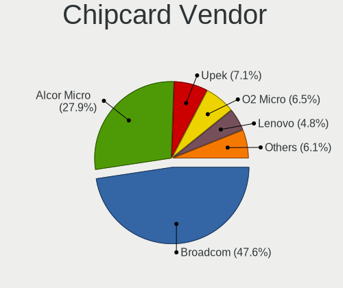

Pop!_OS - Tested Hardware & Statistics
--------------------------------------

A project to collect tested hardware configurations for Pop!_OS.

Anyone can contribute to this report by the [hw-probe](https://github.com/linuxhw/hw-probe) tool:

    sudo -E hw-probe -all -upload

Please contribute! Especially if your hardware is rare.

This is a report for all computer types. See also reports for [desktops](/Dist/Pop!_OS/Desktop/README.md) and [notebooks](/Dist/Pop!_OS/Notebook/README.md).

Contents
--------

* [ Test Cases ](#test-cases)

* [ System ](#system)
  - [ OS                       ](#os)
  - [ OS Family                ](#os-family)
  - [ Kernel                   ](#kernel)
  - [ Kernel Family            ](#kernel-family)
  - [ Kernel Major Ver.        ](#kernel-major-ver)
  - [ Arch                     ](#arch)
  - [ DE                       ](#de)
  - [ Display Server           ](#display-server)
  - [ Display Manager          ](#display-manager)
  - [ OS Lang                  ](#os-lang)
  - [ Boot Mode                ](#boot-mode)
  - [ Filesystem               ](#filesystem)
  - [ Part. scheme             ](#part-scheme)
  - [ Dual Boot with Linux/BSD ](#dual-boot-with-linuxbsd)
  - [ Dual Boot (Win)          ](#dual-boot-win)

* [ Board ](#board)
  - [ Vendor                   ](#vendor)
  - [ Model                    ](#model)
  - [ Model Family             ](#model-family)
  - [ MFG Year                 ](#mfg-year)
  - [ Form Factor              ](#form-factor)
  - [ Secure Boot              ](#secure-boot)
  - [ Coreboot                 ](#coreboot)
  - [ RAM Size                 ](#ram-size)
  - [ RAM Used                 ](#ram-used)
  - [ Total Drives             ](#total-drives)
  - [ Has CD-ROM               ](#has-cd-rom)
  - [ Has Ethernet             ](#has-ethernet)
  - [ Has WiFi                 ](#has-wifi)
  - [ Has Bluetooth            ](#has-bluetooth)

* [ Location ](#location)
  - [ Country                  ](#country)
  - [ City                     ](#city)

* [ Drives ](#drives)
  - [ Drive Vendor             ](#drive-vendor)
  - [ Drive Model              ](#drive-model)
  - [ HDD Vendor               ](#hdd-vendor)
  - [ SSD Vendor               ](#ssd-vendor)
  - [ Drive Kind               ](#drive-kind)
  - [ Drive Connector          ](#drive-connector)
  - [ Drive Size               ](#drive-size)
  - [ Space Total              ](#space-total)
  - [ Space Used               ](#space-used)
  - [ Malfunc. Drives          ](#malfunc-drives)
  - [ Malfunc. Drive Vendor    ](#malfunc-drive-vendor)
  - [ Malfunc. HDD Vendor      ](#malfunc-hdd-vendor)
  - [ Malfunc. Drive Kind      ](#malfunc-drive-kind)
  - [ Failed Drives            ](#failed-drives)
  - [ Failed Drive Vendor      ](#failed-drive-vendor)
  - [ Drive Status             ](#drive-status)

* [ Storage controller ](#storage-controller)
  - [ Storage Vendor           ](#storage-vendor)
  - [ Storage Model            ](#storage-model)
  - [ Storage Kind             ](#storage-kind)

* [ Processor ](#processor)
  - [ CPU Vendor               ](#cpu-vendor)
  - [ CPU Model                ](#cpu-model)
  - [ CPU Model Family         ](#cpu-model-family)
  - [ CPU Cores                ](#cpu-cores)
  - [ CPU Sockets              ](#cpu-sockets)
  - [ CPU Threads              ](#cpu-threads)
  - [ CPU Op-Modes             ](#cpu-op-modes)
  - [ CPU Microcode            ](#cpu-microcode)
  - [ CPU Microarch            ](#cpu-microarch)

* [ Graphics ](#graphics)
  - [ GPU Vendor               ](#gpu-vendor)
  - [ GPU Model                ](#gpu-model)
  - [ GPU Combo                ](#gpu-combo)
  - [ GPU Driver               ](#gpu-driver)
  - [ GPU Memory               ](#gpu-memory)

* [ Monitor ](#monitor)
  - [ Monitor Vendor           ](#monitor-vendor)
  - [ Monitor Model            ](#monitor-model)
  - [ Monitor Resolution       ](#monitor-resolution)
  - [ Monitor Diagonal         ](#monitor-diagonal)
  - [ Monitor Width            ](#monitor-width)
  - [ Aspect Ratio             ](#aspect-ratio)
  - [ Monitor Area             ](#monitor-area)
  - [ Pixel Density            ](#pixel-density)
  - [ Multiple Monitors        ](#multiple-monitors)

* [ Network ](#network)
  - [ Net Controller Vendor    ](#net-controller-vendor)
  - [ Net Controller Model     ](#net-controller-model)
  - [ Wireless Vendor          ](#wireless-vendor)
  - [ Wireless Model           ](#wireless-model)
  - [ Ethernet Vendor          ](#ethernet-vendor)
  - [ Ethernet Model           ](#ethernet-model)
  - [ Net Controller Kind      ](#net-controller-kind)
  - [ Used Controller          ](#used-controller)
  - [ NICs                     ](#nics)
  - [ IPv6                     ](#ipv6)

* [ Bluetooth ](#bluetooth)
  - [ Bluetooth Vendor         ](#bluetooth-vendor)
  - [ Bluetooth Model          ](#bluetooth-model)

* [ Sound ](#sound)
  - [ Sound Vendor             ](#sound-vendor)
  - [ Sound Model              ](#sound-model)

* [ Memory ](#memory)
  - [ Memory Vendor            ](#memory-vendor)
  - [ Memory Model             ](#memory-model)
  - [ Memory Kind              ](#memory-kind)
  - [ Memory Form Factor       ](#memory-form-factor)
  - [ Memory Size              ](#memory-size)
  - [ Memory Speed             ](#memory-speed)

* [ Printers & scanners ](#printers--scanners)
  - [ Printer Vendor           ](#printer-vendor)
  - [ Printer Model            ](#printer-model)
  - [ Scanner Vendor           ](#scanner-vendor)
  - [ Scanner Model            ](#scanner-model)

* [ Camera ](#camera)
  - [ Camera Vendor            ](#camera-vendor)
  - [ Camera Model             ](#camera-model)

* [ Security ](#security)
  - [ Fingerprint Vendor       ](#fingerprint-vendor)
  - [ Fingerprint Model        ](#fingerprint-model)
  - [ Chipcard Vendor          ](#chipcard-vendor)
  - [ Chipcard Model           ](#chipcard-model)

* [ Unsupported ](#unsupported)
  - [ Unsupported Devices      ](#unsupported-devices)
  - [ Unsupported Device Types ](#unsupported-device-types)

Test Cases
----------

Total: 12442

| Vendor        | Model                       | Form-Factor | Probe                                                      | Date         |
|---------------|-----------------------------|-------------|------------------------------------------------------------|--------------|
| Gigabyte      | Z77X-UP4 TH                 | Desktop     | [b80cb49656](https://linux-hardware.org/?probe=b80cb49656) | Mar 01, 2023 |
| Gigabyte      | B450 AORUS ELITE V2         | Desktop     | [0e0b3360ba](https://linux-hardware.org/?probe=0e0b3360ba) | Feb 28, 2023 |
| ASUSTek       | Zenbook UX5401ZA_UX5401Z... | Notebook    | [5aad25779a](https://linux-hardware.org/?probe=5aad25779a) | Feb 28, 2023 |
| Lenovo        | 30D9 SDK0J40705 WIN 3425... | Desktop     | [7f53a53eba](https://linux-hardware.org/?probe=7f53a53eba) | Feb 28, 2023 |
| Acer          | Aspire A515-57              | Notebook    | [6c511739eb](https://linux-hardware.org/?probe=6c511739eb) | Feb 28, 2023 |
| Lenovo        | ThinkPad X270 20HN001RUS    | Notebook    | [ff84200b75](https://linux-hardware.org/?probe=ff84200b75) | Feb 28, 2023 |
| ASUSTek       | VivoBook S14 X411UF         | Notebook    | [88745e1f03](https://linux-hardware.org/?probe=88745e1f03) | Feb 28, 2023 |
| Lenovo        | ThinkPad X1 Carbon 7th 2... | Notebook    | [357c1abb1d](https://linux-hardware.org/?probe=357c1abb1d) | Feb 27, 2023 |
| MSI           | MAG Z690 TOMAHAWK WIFI D... | Desktop     | [13edc00539](https://linux-hardware.org/?probe=13edc00539) | Feb 27, 2023 |
| AZW           | SER                         | Mini pc     | [f5b64e8716](https://linux-hardware.org/?probe=f5b64e8716) | Feb 27, 2023 |
| Razer         | Blade 15 Base Model (Ear... | Notebook    | [425567e8f3](https://linux-hardware.org/?probe=425567e8f3) | Feb 27, 2023 |
| Lenovo        | ThinkPad T480s 20L8S7AS0... | Notebook    | [bd62e34a09](https://linux-hardware.org/?probe=bd62e34a09) | Feb 27, 2023 |
| HCL Infosy... | HCL ME LAPTOP               | Notebook    | [82a40f1881](https://linux-hardware.org/?probe=82a40f1881) | Feb 27, 2023 |
| Acer          | Aspire A515-56              | Notebook    | [97e3001416](https://linux-hardware.org/?probe=97e3001416) | Feb 26, 2023 |
| Dell          | 03KWTV A02                  | Desktop     | [8b6eae9fd5](https://linux-hardware.org/?probe=8b6eae9fd5) | Feb 26, 2023 |
| MSI           | MPG Z390 GAMING EDGE AC     | Desktop     | [a3b8430bad](https://linux-hardware.org/?probe=a3b8430bad) | Feb 26, 2023 |
| MSI           | MAG Z690 TOMAHAWK WIFI D... | Desktop     | [fe1c90a3aa](https://linux-hardware.org/?probe=fe1c90a3aa) | Feb 26, 2023 |
| MSI           | B450-A PRO MAX              | Desktop     | [f081452f55](https://linux-hardware.org/?probe=f081452f55) | Feb 26, 2023 |
| Dell          | XPS 13 7390                 | Notebook    | [2a8830034a](https://linux-hardware.org/?probe=2a8830034a) | Feb 26, 2023 |
| Acer          | Nitro AN515-58              | Notebook    | [1c93095718](https://linux-hardware.org/?probe=1c93095718) | Feb 26, 2023 |
| Sony          | VPCZ12V9R                   | Notebook    | [3014067c24](https://linux-hardware.org/?probe=3014067c24) | Feb 26, 2023 |
| MACHINIST     | X99-RS9 V2.0                | Desktop     | [f991f0e9df](https://linux-hardware.org/?probe=f991f0e9df) | Feb 26, 2023 |
| Gigabyte      | 970A-DS3P                   | Desktop     | [87647b8c76](https://linux-hardware.org/?probe=87647b8c76) | Feb 26, 2023 |
| ASUSTek       | SABERTOOTH 990FX R2.0       | Desktop     | [42fe607d11](https://linux-hardware.org/?probe=42fe607d11) | Feb 25, 2023 |
| GPU Compan... | GWTN141-10                  | Notebook    | [1550bec17e](https://linux-hardware.org/?probe=1550bec17e) | Feb 25, 2023 |
| GPU Compan... | GWTN141-10                  | Notebook    | [aa535b0731](https://linux-hardware.org/?probe=aa535b0731) | Feb 25, 2023 |
| Dell          | G7 7588                     | Notebook    | [82f1398a69](https://linux-hardware.org/?probe=82f1398a69) | Feb 25, 2023 |
| Alienware     | 15 R3                       | Notebook    | [72543030d5](https://linux-hardware.org/?probe=72543030d5) | Feb 25, 2023 |
| Lenovo        | IdeaPad 305-15IBD 80NJ      | Notebook    | [42b9d60137](https://linux-hardware.org/?probe=42b9d60137) | Feb 25, 2023 |
| HP            | Pavilion Gaming Laptop 1... | Notebook    | [b5f840e593](https://linux-hardware.org/?probe=b5f840e593) | Feb 25, 2023 |
| System76      | Galago Pro                  | Notebook    | [3e4391562b](https://linux-hardware.org/?probe=3e4391562b) | Feb 25, 2023 |
| Packard Be... | EasyNote TS11HR             | Notebook    | [0a63352761](https://linux-hardware.org/?probe=0a63352761) | Feb 25, 2023 |
| MSI           | PRO Z790-P WIFI DDR4        | Desktop     | [59b7e1da6d](https://linux-hardware.org/?probe=59b7e1da6d) | Feb 25, 2023 |
| Dell          | XPS 15 9500                 | Notebook    | [96e6c2c201](https://linux-hardware.org/?probe=96e6c2c201) | Feb 25, 2023 |
| Dell          | Latitude 3310               | Notebook    | [d989647d9d](https://linux-hardware.org/?probe=d989647d9d) | Feb 25, 2023 |
| Acer          | Aspire A515-56              | Notebook    | [517a6211c9](https://linux-hardware.org/?probe=517a6211c9) | Feb 24, 2023 |
| ZOTAC         | MEK1                        | Desktop     | [a61a52d794](https://linux-hardware.org/?probe=a61a52d794) | Feb 24, 2023 |
| HP            | ProBook 450 G1              | Notebook    | [f7c4b009f1](https://linux-hardware.org/?probe=f7c4b009f1) | Feb 24, 2023 |
| ASUSTek       | VivoBook_ASUSLaptop X509... | Notebook    | [297c37ec04](https://linux-hardware.org/?probe=297c37ec04) | Feb 24, 2023 |
| Lenovo        | ThinkPad X220 Tablet 429... | Notebook    | [2f561a23c3](https://linux-hardware.org/?probe=2f561a23c3) | Feb 24, 2023 |
| HP            | 8433 11                     | Desktop     | [881b062090](https://linux-hardware.org/?probe=881b062090) | Feb 24, 2023 |
| ASUSTek       | SABERTOOTH 990FX R2.0       | Desktop     | [59d0e692ef](https://linux-hardware.org/?probe=59d0e692ef) | Feb 24, 2023 |
| ASUSTek       | ROG Strix G513RC_G513RC     | Notebook    | [041c57ebe6](https://linux-hardware.org/?probe=041c57ebe6) | Feb 24, 2023 |
| HP            | Pavilion x360 Convertibl... | Convertible | [f2a29f6d2e](https://linux-hardware.org/?probe=f2a29f6d2e) | Feb 24, 2023 |
| HP            | Pavilion x360 Convertibl... | Convertible | [2913081292](https://linux-hardware.org/?probe=2913081292) | Feb 24, 2023 |
| Apple         | MacBookPro9,2               | Notebook    | [c591acd5d6](https://linux-hardware.org/?probe=c591acd5d6) | Feb 24, 2023 |
| Lenovo        | Yoga 6 13ARE05 82FN         | Convertible | [10ffde0986](https://linux-hardware.org/?probe=10ffde0986) | Feb 24, 2023 |
| ASUSTek       | TUF Gaming X570-PLUS        | Desktop     | [27a3c3c4c1](https://linux-hardware.org/?probe=27a3c3c4c1) | Feb 24, 2023 |
| Lenovo        | Yoga 6 13ARE05 82FN         | Convertible | [7ad94e1be6](https://linux-hardware.org/?probe=7ad94e1be6) | Feb 24, 2023 |
| Dell          | Inspiron 5423               | Notebook    | [7cf47f3118](https://linux-hardware.org/?probe=7cf47f3118) | Feb 23, 2023 |
| Lenovo        | Legion 5 15ARH05H 82B1      | Notebook    | [00591dc764](https://linux-hardware.org/?probe=00591dc764) | Feb 23, 2023 |
| Lenovo        | ThinkPad T430s 2356CU8      | Notebook    | [bb0d8e868d](https://linux-hardware.org/?probe=bb0d8e868d) | Feb 23, 2023 |
| Toshiba       | Satellite C855-1T5          | Notebook    | [8a96579c89](https://linux-hardware.org/?probe=8a96579c89) | Feb 23, 2023 |
| System76      | Gazelle                     | Notebook    | [609f452af9](https://linux-hardware.org/?probe=609f452af9) | Feb 23, 2023 |
| ONE-NETBOO... | ONE XPLAYER 1002-C          | Notebook    | [33a4731a5e](https://linux-hardware.org/?probe=33a4731a5e) | Feb 23, 2023 |
| Dell          | 0M6C7G A00                  | Desktop     | [8d8af65e26](https://linux-hardware.org/?probe=8d8af65e26) | Feb 23, 2023 |
| Dell          | 0M6C7G A00                  | Desktop     | [f8f5ea8885](https://linux-hardware.org/?probe=f8f5ea8885) | Feb 23, 2023 |
| Huanan        | X99-QD4 V1.0                | Desktop     | [205f7c6f50](https://linux-hardware.org/?probe=205f7c6f50) | Feb 23, 2023 |
| Dell          | Latitude E7240              | Notebook    | [7f8278ff44](https://linux-hardware.org/?probe=7f8278ff44) | Feb 23, 2023 |
| ASUSTek       | Zenbook Pro Duo UX582ZW_... | Notebook    | [34016a67d9](https://linux-hardware.org/?probe=34016a67d9) | Feb 22, 2023 |
| Lenovo        | IdeaPad 5 14ITL05 82FE      | Notebook    | [312937f0d0](https://linux-hardware.org/?probe=312937f0d0) | Feb 22, 2023 |
| Apple         | Mac-F226BEC8 PVT            | All in one  | [d032f0a547](https://linux-hardware.org/?probe=d032f0a547) | Feb 22, 2023 |
| ASUSTek       | M5A78L-M/USB3               | Desktop     | [ec6ab709e5](https://linux-hardware.org/?probe=ec6ab709e5) | Feb 22, 2023 |
| Lenovo        | 102F SBB0J05441 WIN 3305... | Desktop     | [ea890b85f3](https://linux-hardware.org/?probe=ea890b85f3) | Feb 22, 2023 |
| Gigabyte      | H81M-HD3                    | Desktop     | [d19e079879](https://linux-hardware.org/?probe=d19e079879) | Feb 22, 2023 |
| Lenovo        | ThinkPad T450 20BUS0B000    | Notebook    | [6ab727e8c0](https://linux-hardware.org/?probe=6ab727e8c0) | Feb 22, 2023 |
| Apple         | MacBookPro11,4              | Notebook    | [c4eab564b3](https://linux-hardware.org/?probe=c4eab564b3) | Feb 22, 2023 |
| HP            | EliteBook 845 G8 Noteboo... | Notebook    | [af2d2bd596](https://linux-hardware.org/?probe=af2d2bd596) | Feb 21, 2023 |
| HP            | EliteBook 845 G8 Noteboo... | Notebook    | [41b4e0957f](https://linux-hardware.org/?probe=41b4e0957f) | Feb 21, 2023 |
| ASRock        | B550 Extreme4               | Desktop     | [db2686086b](https://linux-hardware.org/?probe=db2686086b) | Feb 21, 2023 |
| HP            | EliteBook Folio 1040 G2     | Notebook    | [265018acd3](https://linux-hardware.org/?probe=265018acd3) | Feb 21, 2023 |
| Apple         | MacBookPro16,1              | Notebook    | [a5cff07fd8](https://linux-hardware.org/?probe=a5cff07fd8) | Feb 21, 2023 |
| ASUSTek       | PRIME B450M-A               | Desktop     | [8c97a04c10](https://linux-hardware.org/?probe=8c97a04c10) | Feb 21, 2023 |
| ASUSTek       | VivoBook_ASUSLaptop X580... | Notebook    | [022527aa4c](https://linux-hardware.org/?probe=022527aa4c) | Feb 21, 2023 |
| ASUSTek       | VivoBook_ASUSLaptop X580... | Notebook    | [3b1afb00a2](https://linux-hardware.org/?probe=3b1afb00a2) | Feb 21, 2023 |
| Dell          | G15 5525                    | Notebook    | [63bd2ac7b9](https://linux-hardware.org/?probe=63bd2ac7b9) | Feb 21, 2023 |
| ASUSTek       | PRIME B550M-A               | Desktop     | [7dd9134373](https://linux-hardware.org/?probe=7dd9134373) | Feb 21, 2023 |
| ASUSTek       | PRIME B550M-A               | Desktop     | [fafea002be](https://linux-hardware.org/?probe=fafea002be) | Feb 21, 2023 |
| ASUSTek       | B75M-A                      | Desktop     | [c0c41ca089](https://linux-hardware.org/?probe=c0c41ca089) | Feb 21, 2023 |
| Alienware     | 0NWN7M A00                  | Desktop     | [eef5c2f68f](https://linux-hardware.org/?probe=eef5c2f68f) | Feb 21, 2023 |
| ASUSTek       | B75M-A                      | Desktop     | [2ea45a0d80](https://linux-hardware.org/?probe=2ea45a0d80) | Feb 21, 2023 |
| Acer          | Swift SF114-34              | Notebook    | [e9f5a9d293](https://linux-hardware.org/?probe=e9f5a9d293) | Feb 21, 2023 |
| Microsoft     | Surface Pro 7               | Tablet      | [5fd759f0ba](https://linux-hardware.org/?probe=5fd759f0ba) | Feb 21, 2023 |
| ASUSTek       | PRIME B550M-A               | Desktop     | [edbf6ce468](https://linux-hardware.org/?probe=edbf6ce468) | Feb 20, 2023 |
| Dell          | Precision M4800             | Notebook    | [b8e31b63ce](https://linux-hardware.org/?probe=b8e31b63ce) | Feb 20, 2023 |
| Microsoft     | Surface Pro 7               | Tablet      | [1862dee971](https://linux-hardware.org/?probe=1862dee971) | Feb 20, 2023 |
| ASRock        | A520M-HVS                   | Desktop     | [cc8628ae2c](https://linux-hardware.org/?probe=cc8628ae2c) | Feb 20, 2023 |
| HP            | Laptop 14s-fq0xxx           | Notebook    | [0bc03f3b39](https://linux-hardware.org/?probe=0bc03f3b39) | Feb 20, 2023 |
| Dell          | 09KPNV A01                  | Desktop     | [b335ec1cc3](https://linux-hardware.org/?probe=b335ec1cc3) | Feb 20, 2023 |
| HP            | ProBook 450 G1              | Notebook    | [b5e8826f8c](https://linux-hardware.org/?probe=b5e8826f8c) | Feb 20, 2023 |
| Lenovo        | Yoga 6 13ALC7 82UD          | Convertible | [1d62ae4e43](https://linux-hardware.org/?probe=1d62ae4e43) | Feb 20, 2023 |
| Intel         | NUC8i7HNB J68197-502        | Mini pc     | [2f702c3f2f](https://linux-hardware.org/?probe=2f702c3f2f) | Feb 19, 2023 |
| Dell          | XPS 15 7590                 | Notebook    | [297b06716d](https://linux-hardware.org/?probe=297b06716d) | Feb 19, 2023 |
| Lenovo        | Legion 5 Pro 16ARH7H 82R... | Notebook    | [d4fdbbf1ba](https://linux-hardware.org/?probe=d4fdbbf1ba) | Feb 19, 2023 |
| Lenovo        | Legion 5 Pro 16ARH7H 82R... | Notebook    | [a11d164d69](https://linux-hardware.org/?probe=a11d164d69) | Feb 19, 2023 |
| Apple         | MacBook4,1                  | Notebook    | [2011c2060b](https://linux-hardware.org/?probe=2011c2060b) | Feb 19, 2023 |
| ASRock        | H87 Performance             | Desktop     | [a28df01cad](https://linux-hardware.org/?probe=a28df01cad) | Feb 19, 2023 |
| Gigabyte      | Z590I AORUS ULTRA           | Desktop     | [9805ab5764](https://linux-hardware.org/?probe=9805ab5764) | Feb 19, 2023 |
| Gigabyte      | GA-78LMT-S2P                | Desktop     | [8df8fe9ae8](https://linux-hardware.org/?probe=8df8fe9ae8) | Feb 19, 2023 |
| Apple         | Mac-F226BEC8 PVT            | All in one  | [813066eda5](https://linux-hardware.org/?probe=813066eda5) | Feb 19, 2023 |
| Lenovo        | 1036 NO DPK                 | Desktop     | [b99541f6ad](https://linux-hardware.org/?probe=b99541f6ad) | Feb 19, 2023 |
| Dell          | 0NNNCT A01                  | Desktop     | [a301dac224](https://linux-hardware.org/?probe=a301dac224) | Feb 18, 2023 |
| ASUSTek       | ROG Flow X13 GV301RC_GV3... | Convertible | [e87ff10942](https://linux-hardware.org/?probe=e87ff10942) | Feb 18, 2023 |
| HP            | 8437                        | Desktop     | [f8f0f71bf5](https://linux-hardware.org/?probe=f8f0f71bf5) | Feb 18, 2023 |
| HP            | Pavilion Laptop 15-cw0xx... | Notebook    | [cc0e711862](https://linux-hardware.org/?probe=cc0e711862) | Feb 18, 2023 |
| HP            | 240 G6 Notebook PC          | Notebook    | [fc39dde214](https://linux-hardware.org/?probe=fc39dde214) | Feb 18, 2023 |
| Dell          | Latitude E7240              | Notebook    | [461873da2d](https://linux-hardware.org/?probe=461873da2d) | Feb 18, 2023 |
| Lenovo        | ThinkPad P14s Gen 2a 21A... | Notebook    | [5cc4ff8271](https://linux-hardware.org/?probe=5cc4ff8271) | Feb 18, 2023 |
| Lenovo        | ThinkPad P14s Gen 2a 21A... | Notebook    | [75f9e575b3](https://linux-hardware.org/?probe=75f9e575b3) | Feb 18, 2023 |
| Lenovo        | ThinkPad P14s Gen 2a 21A... | Notebook    | [f120e182a1](https://linux-hardware.org/?probe=f120e182a1) | Feb 17, 2023 |
| HUAWEI        | BOD-WXX9                    | Notebook    | [a56a788adf](https://linux-hardware.org/?probe=a56a788adf) | Feb 17, 2023 |
| HP            | EliteBook 830 G5            | Notebook    | [7ef47e7131](https://linux-hardware.org/?probe=7ef47e7131) | Feb 17, 2023 |
| HONOR         | NBR-WAX9                    | Notebook    | [b16ea0055d](https://linux-hardware.org/?probe=b16ea0055d) | Feb 17, 2023 |
| Dell          | Latitude E4200              | Notebook    | [18868db8a1](https://linux-hardware.org/?probe=18868db8a1) | Feb 17, 2023 |
| Gigabyte      | X570 AORUS ELITE            | Desktop     | [4101f152f5](https://linux-hardware.org/?probe=4101f152f5) | Feb 17, 2023 |
| ASRock        | B550M-HDV                   | Desktop     | [755006e226](https://linux-hardware.org/?probe=755006e226) | Feb 17, 2023 |
| Lenovo        | ThinkPad P14s Gen 2a 21A... | Notebook    | [91c566ccc9](https://linux-hardware.org/?probe=91c566ccc9) | Feb 16, 2023 |
| Apple         | MacBookPro9,2               | Notebook    | [e67f600749](https://linux-hardware.org/?probe=e67f600749) | Feb 16, 2023 |
| Lenovo        | ThinkPad L15 Gen 3 21C7C... | Notebook    | [2b0904349a](https://linux-hardware.org/?probe=2b0904349a) | Feb 16, 2023 |
| Lenovo        | G50-80 80E5                 | Notebook    | [64c385ee36](https://linux-hardware.org/?probe=64c385ee36) | Feb 16, 2023 |
| Apple         | Mac-F226BEC8 PVT            | All in one  | [3206e7be82](https://linux-hardware.org/?probe=3206e7be82) | Feb 16, 2023 |
| OriginPC      | Voyager a1600               | Notebook    | [9608c5afd5](https://linux-hardware.org/?probe=9608c5afd5) | Feb 16, 2023 |
| Google        | Blorb                       | Notebook    | [286353731c](https://linux-hardware.org/?probe=286353731c) | Feb 16, 2023 |
| Lenovo        | 3136 SDK0K17763 WIN 1801... | Mini pc     | [01d39bc0ca](https://linux-hardware.org/?probe=01d39bc0ca) | Feb 16, 2023 |
| Lenovo        | ThinkPad T530 2392AQU       | Notebook    | [1b89c43b58](https://linux-hardware.org/?probe=1b89c43b58) | Feb 16, 2023 |
| Gigabyte      | B450M DS3H-CF               | Desktop     | [684445aeab](https://linux-hardware.org/?probe=684445aeab) | Feb 16, 2023 |
| MSI           | G41M-P33 Combo              | Desktop     | [5a6d751e4b](https://linux-hardware.org/?probe=5a6d751e4b) | Feb 15, 2023 |
| Gigabyte      | X570 I AORUS PRO WIFI       | Desktop     | [c82882e708](https://linux-hardware.org/?probe=c82882e708) | Feb 15, 2023 |
| HP            | EliteBook 850 G2            | Notebook    | [ed0641ce38](https://linux-hardware.org/?probe=ed0641ce38) | Feb 15, 2023 |
| Lenovo        | ThinkBook 15 G3 ACL 21A4    | Notebook    | [74a61dff13](https://linux-hardware.org/?probe=74a61dff13) | Feb 15, 2023 |
| Intel         | X99 V1.x                    | Desktop     | [31da77bea8](https://linux-hardware.org/?probe=31da77bea8) | Feb 15, 2023 |
| ASUSTek       | B85M-G                      | Desktop     | [c803a7f9e8](https://linux-hardware.org/?probe=c803a7f9e8) | Feb 15, 2023 |
| ASUSTek       | B85M-G                      | Desktop     | [3a660768c0](https://linux-hardware.org/?probe=3a660768c0) | Feb 15, 2023 |
| Apple         | MacBookPro12,1              | Notebook    | [bdb6e585b0](https://linux-hardware.org/?probe=bdb6e585b0) | Feb 15, 2023 |
| Apple         | Mac-F226BEC8 PVT            | All in one  | [011e8929fa](https://linux-hardware.org/?probe=011e8929fa) | Feb 15, 2023 |
| Gigabyte      | G41MT-S2                    | Desktop     | [9dfc369401](https://linux-hardware.org/?probe=9dfc369401) | Feb 15, 2023 |
| MSI           | G41M-P33 Combo              | Desktop     | [1161e39e43](https://linux-hardware.org/?probe=1161e39e43) | Feb 15, 2023 |
| Lenovo        | ThinkPad T450s 20BWS14G0... | Notebook    | [5c4a26ada0](https://linux-hardware.org/?probe=5c4a26ada0) | Feb 14, 2023 |
| Dell          | 07JJ74 A01                  | Server      | [c008b1943f](https://linux-hardware.org/?probe=c008b1943f) | Feb 14, 2023 |
| Gigabyte      | GA-MA770T-UD3P              | Desktop     | [2ca590a85e](https://linux-hardware.org/?probe=2ca590a85e) | Feb 14, 2023 |
| Dell          | Precision M3800             | Notebook    | [98b54858cb](https://linux-hardware.org/?probe=98b54858cb) | Feb 14, 2023 |
| Dell          | Inspiron 15 3511            | Notebook    | [1028ef9686](https://linux-hardware.org/?probe=1028ef9686) | Feb 14, 2023 |
| Gigabyte      | X570 I AORUS PRO WIFI       | Desktop     | [27c2ee6ee0](https://linux-hardware.org/?probe=27c2ee6ee0) | Feb 14, 2023 |
| Apple         | Mac-F2268CC8                | All in one  | [826959e69e](https://linux-hardware.org/?probe=826959e69e) | Feb 13, 2023 |
| MSI           | Prestige 14Evo A11M         | Notebook    | [abeebd4312](https://linux-hardware.org/?probe=abeebd4312) | Feb 13, 2023 |
| Sony          | VPCEG27FM                   | Notebook    | [748a67669f](https://linux-hardware.org/?probe=748a67669f) | Feb 13, 2023 |
| Lenovo        | IdeaPad Slim 7 Pro 14IHU... | Notebook    | [a6af7624cd](https://linux-hardware.org/?probe=a6af7624cd) | Feb 13, 2023 |
| Samsung       | 730U3E/740U3E               | Notebook    | [91ac69dfa1](https://linux-hardware.org/?probe=91ac69dfa1) | Feb 13, 2023 |
| Lenovo        | ThinkPad T410 2522G76       | Notebook    | [b15d4051cd](https://linux-hardware.org/?probe=b15d4051cd) | Feb 13, 2023 |
| Lenovo        | ThinkPad X1 Extreme 20MF... | Notebook    | [d38212ee96](https://linux-hardware.org/?probe=d38212ee96) | Feb 13, 2023 |
| Apple         | MacBookPro11,2              | Notebook    | [2314b98760](https://linux-hardware.org/?probe=2314b98760) | Feb 12, 2023 |
| Apple         | MacBookPro12,1              | Notebook    | [139b92595a](https://linux-hardware.org/?probe=139b92595a) | Feb 12, 2023 |
| Dell          | 0Y7WYT A00                  | Desktop     | [d94084bbee](https://linux-hardware.org/?probe=d94084bbee) | Feb 12, 2023 |
| ASRock        | B550M Steel Legend          | Desktop     | [2a6f501cb1](https://linux-hardware.org/?probe=2a6f501cb1) | Feb 12, 2023 |
| Haier         | GG1500A                     | Notebook    | [4c4598157f](https://linux-hardware.org/?probe=4c4598157f) | Feb 12, 2023 |
| Dell          | 08WKV3 A00                  | Desktop     | [89ba42b53e](https://linux-hardware.org/?probe=89ba42b53e) | Feb 12, 2023 |
| ASUSTek       | CROSSHAIR VI HERO           | Desktop     | [687ecdce15](https://linux-hardware.org/?probe=687ecdce15) | Feb 12, 2023 |
| Dell          | Latitude XT2                | Notebook    | [9b98bf4722](https://linux-hardware.org/?probe=9b98bf4722) | Feb 12, 2023 |
| Dell          | Precision M4700             | Notebook    | [1a44cb5ef9](https://linux-hardware.org/?probe=1a44cb5ef9) | Feb 11, 2023 |
| Apple         | MacBookPro11,1              | Notebook    | [fb407bfc13](https://linux-hardware.org/?probe=fb407bfc13) | Feb 11, 2023 |
| ASUSTek       | CROSSHAIR VI HERO           | Desktop     | [2c1562b21f](https://linux-hardware.org/?probe=2c1562b21f) | Feb 11, 2023 |
| Lenovo        | ThinkPad T470s 20HFCT01W... | Notebook    | [322a9d340e](https://linux-hardware.org/?probe=322a9d340e) | Feb 11, 2023 |
| Acer          | Aspire 5742G                | Notebook    | [1315dbeb6c](https://linux-hardware.org/?probe=1315dbeb6c) | Feb 11, 2023 |
| Gigabyte      | X570 AORUS ELITE            | Desktop     | [2d776f8810](https://linux-hardware.org/?probe=2d776f8810) | Feb 11, 2023 |
| Gigabyte      | X399 AORUS Gaming 7         | Desktop     | [b82ab8816d](https://linux-hardware.org/?probe=b82ab8816d) | Feb 11, 2023 |
| HP            | 18E4                        | Desktop     | [55972b87dd](https://linux-hardware.org/?probe=55972b87dd) | Feb 11, 2023 |
| Lenovo        | G50-45 80E3                 | Notebook    | [ab07f075d8](https://linux-hardware.org/?probe=ab07f075d8) | Feb 11, 2023 |
| Apple         | MacBook8,1                  | Notebook    | [2f1c5b90a8](https://linux-hardware.org/?probe=2f1c5b90a8) | Feb 11, 2023 |
| Lenovo        | G50-45 80E3                 | Notebook    | [24cb179c5a](https://linux-hardware.org/?probe=24cb179c5a) | Feb 11, 2023 |
| ASUSTek       | CROSSHAIR VI HERO           | Desktop     | [0b14ee6551](https://linux-hardware.org/?probe=0b14ee6551) | Feb 11, 2023 |
| ASUSTek       | ASUS EXPERTBOOK B2502FBA... | Convertible | [dd34aed5d9](https://linux-hardware.org/?probe=dd34aed5d9) | Feb 11, 2023 |
| Lenovo        | Yoga 6 13ALC7 82UD          | Convertible | [c17ac89917](https://linux-hardware.org/?probe=c17ac89917) | Feb 11, 2023 |
| Gigabyte      | B85M-DS3H-A                 | Desktop     | [181c0e03e2](https://linux-hardware.org/?probe=181c0e03e2) | Feb 10, 2023 |
| MSI           | GF63 Thin 9RCX              | Notebook    | [9cbcfdd748](https://linux-hardware.org/?probe=9cbcfdd748) | Feb 10, 2023 |
| Dell          | Latitude 5290 2-in-1        | Notebook    | [cb03f9e72e](https://linux-hardware.org/?probe=cb03f9e72e) | Feb 10, 2023 |
| Dell          | 0Y7WYT A00                  | Desktop     | [e4369afe1e](https://linux-hardware.org/?probe=e4369afe1e) | Feb 10, 2023 |
| ASUSTek       | A55BM-PLUS                  | Desktop     | [7c9763c23f](https://linux-hardware.org/?probe=7c9763c23f) | Feb 10, 2023 |
| Dell          | G15 5520                    | Notebook    | [121b06f3cc](https://linux-hardware.org/?probe=121b06f3cc) | Feb 10, 2023 |
| Samsung       | DeskTop System              | Desktop     | [2437c4afda](https://linux-hardware.org/?probe=2437c4afda) | Feb 10, 2023 |
| Dell          | 0CR1TT A00                  | All in one  | [be588e52b7](https://linux-hardware.org/?probe=be588e52b7) | Feb 09, 2023 |
| Dell          | Venue 11 Pro 7130 MS        | Notebook    | [d0cc5f80fc](https://linux-hardware.org/?probe=d0cc5f80fc) | Feb 09, 2023 |
| HP            | EliteBook 840 G5            | Notebook    | [39dbdb0fa9](https://linux-hardware.org/?probe=39dbdb0fa9) | Feb 09, 2023 |
| Lenovo        | ThinkPad T450 20BUA0PNUK    | Notebook    | [8837c33007](https://linux-hardware.org/?probe=8837c33007) | Feb 09, 2023 |
| Biostar       | H81MHV3 5.0                 | Desktop     | [390c8dd03a](https://linux-hardware.org/?probe=390c8dd03a) | Feb 09, 2023 |
| Dell          | Venue 11 Pro 7130 MS        | Notebook    | [74dd2176ff](https://linux-hardware.org/?probe=74dd2176ff) | Feb 09, 2023 |
| ASUSTek       | ROG STRIX X570-E GAMING     | Desktop     | [17bf959fd0](https://linux-hardware.org/?probe=17bf959fd0) | Feb 09, 2023 |
| Acer          | Aspire M3970                | Desktop     | [718cc13462](https://linux-hardware.org/?probe=718cc13462) | Feb 09, 2023 |
| TUXEDO        | Polaris AMD Gen3 (CZN)      | Notebook    | [93afe9ddeb](https://linux-hardware.org/?probe=93afe9ddeb) | Feb 09, 2023 |
| Dell          | Inspiron 3576               | Notebook    | [a025641dfc](https://linux-hardware.org/?probe=a025641dfc) | Feb 09, 2023 |
| Acer          | Aspire A315-59              | Notebook    | [edc6b0a3af](https://linux-hardware.org/?probe=edc6b0a3af) | Feb 09, 2023 |
| Dell          | XPS 13 9360                 | Notebook    | [db7e89340f](https://linux-hardware.org/?probe=db7e89340f) | Feb 09, 2023 |
| ASUSTek       | ROG STRIX B550-F GAMING     | Desktop     | [16af8175a4](https://linux-hardware.org/?probe=16af8175a4) | Feb 08, 2023 |
| ASUSTek       | ZenBook UX463FA_UX463FA     | Convertible | [e43aebc69d](https://linux-hardware.org/?probe=e43aebc69d) | Feb 08, 2023 |
| System76      | Lemur Pro                   | Notebook    | [94cf78a9d9](https://linux-hardware.org/?probe=94cf78a9d9) | Feb 08, 2023 |
| Apple         | Mac-F226BEC8 PVT            | All in one  | [43b52ad56f](https://linux-hardware.org/?probe=43b52ad56f) | Feb 08, 2023 |
| Gigabyte      | B650I AORUS ULTRA           | Desktop     | [1c07b901bb](https://linux-hardware.org/?probe=1c07b901bb) | Feb 08, 2023 |
| HP            | 2129                        | Desktop     | [80920d0d75](https://linux-hardware.org/?probe=80920d0d75) | Feb 08, 2023 |
| Dell          | G15 5520                    | Notebook    | [7f4d36cea1](https://linux-hardware.org/?probe=7f4d36cea1) | Feb 08, 2023 |
| ASUSTek       | TUF Gaming B550-PLUS        | Desktop     | [d8dcaddb54](https://linux-hardware.org/?probe=d8dcaddb54) | Feb 08, 2023 |
| Apple         | Mac-F226BEC8 PVT            | All in one  | [275ce1a7fc](https://linux-hardware.org/?probe=275ce1a7fc) | Feb 08, 2023 |
| ASRock        | B660 Pro-C/ax               | Desktop     | [31e10f0e68](https://linux-hardware.org/?probe=31e10f0e68) | Feb 07, 2023 |
| HP            | EliteBook 830 G5            | Notebook    | [5554154df2](https://linux-hardware.org/?probe=5554154df2) | Feb 07, 2023 |
| Dell          | System XPS L702X            | Notebook    | [cdbc3578d0](https://linux-hardware.org/?probe=cdbc3578d0) | Feb 07, 2023 |
| Alienware     | m15 R7                      | Notebook    | [254ab40fcf](https://linux-hardware.org/?probe=254ab40fcf) | Feb 07, 2023 |
| ASRock        | FM2A68M-HD+                 | Desktop     | [8588a36683](https://linux-hardware.org/?probe=8588a36683) | Feb 07, 2023 |
| Lenovo        | 3743 SDK0T76463 WIN 3422... | Desktop     | [81ece9483e](https://linux-hardware.org/?probe=81ece9483e) | Feb 07, 2023 |
| Gigabyte      | F2A55M-HD2                  | Desktop     | [fe95bfe3d3](https://linux-hardware.org/?probe=fe95bfe3d3) | Feb 07, 2023 |
| Dell          | 0HHV7N A00                  | Desktop     | [e67a1c86b7](https://linux-hardware.org/?probe=e67a1c86b7) | Feb 07, 2023 |
| Gigabyte      | Z170X-UD5-CF                | Desktop     | [03a392d41f](https://linux-hardware.org/?probe=03a392d41f) | Feb 07, 2023 |
| Apple         | Mac-F226BEC8 PVT            | All in one  | [aef988ae85](https://linux-hardware.org/?probe=aef988ae85) | Feb 07, 2023 |
| Dell          | 02GDWG A00                  | Desktop     | [c0660c15fb](https://linux-hardware.org/?probe=c0660c15fb) | Feb 07, 2023 |
| Lenovo        | IdeaPad 330-15IKB 81FE      | Notebook    | [f6c24b1ea8](https://linux-hardware.org/?probe=f6c24b1ea8) | Feb 07, 2023 |
| HP            | Pavilion x360 Convertibl... | Convertible | [209a38d937](https://linux-hardware.org/?probe=209a38d937) | Feb 07, 2023 |
| MSI           | MAG Z690 TOMAHAWK WIFI      | Desktop     | [25fbfe1d66](https://linux-hardware.org/?probe=25fbfe1d66) | Feb 07, 2023 |
| System76      | Thelio thelio-r2            | Desktop     | [4cdf7d2895](https://linux-hardware.org/?probe=4cdf7d2895) | Feb 06, 2023 |
| Lenovo        | IdeaPad 5 Pro 16ARH7 82S... | Notebook    | [50af8c9fe6](https://linux-hardware.org/?probe=50af8c9fe6) | Feb 06, 2023 |
| ASUSTek       | UX430UNR                    | Notebook    | [96d7a1938a](https://linux-hardware.org/?probe=96d7a1938a) | Feb 06, 2023 |
| Gigabyte      | B550I AORUS PRO AX          | Desktop     | [42dba6bdb3](https://linux-hardware.org/?probe=42dba6bdb3) | Feb 06, 2023 |
| ASUSTek       | TUF B450M-PLUS GAMING       | Desktop     | [a9bfc9669d](https://linux-hardware.org/?probe=a9bfc9669d) | Feb 06, 2023 |
| Acer          | Swift SF114-34              | Notebook    | [28aad1fae5](https://linux-hardware.org/?probe=28aad1fae5) | Feb 06, 2023 |
| ASUSTek       | X751LD                      | Notebook    | [12d5592082](https://linux-hardware.org/?probe=12d5592082) | Feb 06, 2023 |
| Notebook      | NJ50_70CU                   | Notebook    | [c0c9951f8d](https://linux-hardware.org/?probe=c0c9951f8d) | Feb 05, 2023 |
| ASUSTek       | ROG Flow X13 GV301RC_GV3... | Convertible | [2e5b18f7c5](https://linux-hardware.org/?probe=2e5b18f7c5) | Feb 05, 2023 |
| Dell          | Latitude 7380               | Notebook    | [7b9d4ef8b4](https://linux-hardware.org/?probe=7b9d4ef8b4) | Feb 05, 2023 |
| Acer          | Swift SF114-34              | Notebook    | [ea8a0e0617](https://linux-hardware.org/?probe=ea8a0e0617) | Feb 05, 2023 |
| VANT          | MOOVE3-14                   | Notebook    | [5c2bd1284d](https://linux-hardware.org/?probe=5c2bd1284d) | Feb 05, 2023 |
| Alienware     | 17 R5                       | Notebook    | [7f5f8bdb1f](https://linux-hardware.org/?probe=7f5f8bdb1f) | Feb 05, 2023 |
| ASUSTek       | H81M-K                      | Desktop     | [6f09d6cd6c](https://linux-hardware.org/?probe=6f09d6cd6c) | Feb 05, 2023 |
| Fujitsu       | LIFEBOOK T902               | Notebook    | [9c92a1772d](https://linux-hardware.org/?probe=9c92a1772d) | Feb 05, 2023 |
| HP            | 8054                        | Desktop     | [c709653825](https://linux-hardware.org/?probe=c709653825) | Feb 05, 2023 |
| ASUSTek       | ASUS TUF Gaming F15 FX50... | Notebook    | [d95f28d447](https://linux-hardware.org/?probe=d95f28d447) | Feb 05, 2023 |
| Apple         | MacBookPro5,4               | Notebook    | [a705eb3101](https://linux-hardware.org/?probe=a705eb3101) | Feb 05, 2023 |
| Apple         | MacBookPro5,4               | Notebook    | [7a80b2d6d7](https://linux-hardware.org/?probe=7a80b2d6d7) | Feb 05, 2023 |
| Lenovo        | ThinkPad E580 20KSCTO1WW    | Notebook    | [e5e8537cef](https://linux-hardware.org/?probe=e5e8537cef) | Feb 05, 2023 |
| HP            | Laptop 15-bw0xx             | Notebook    | [0cb9ba3cf9](https://linux-hardware.org/?probe=0cb9ba3cf9) | Feb 05, 2023 |
| ASUSTek       | X751LD                      | Notebook    | [13948b75ae](https://linux-hardware.org/?probe=13948b75ae) | Feb 05, 2023 |
| VANT          | MOOVE3-14                   | Notebook    | [b5ac9ebd7c](https://linux-hardware.org/?probe=b5ac9ebd7c) | Feb 05, 2023 |
| MSI           | PRO Z690-A DDR4             | Desktop     | [403785d1ec](https://linux-hardware.org/?probe=403785d1ec) | Feb 05, 2023 |
| HP            | Notebook                    | Notebook    | [0ad701667d](https://linux-hardware.org/?probe=0ad701667d) | Feb 05, 2023 |
| HP            | Notebook                    | Notebook    | [37f601798c](https://linux-hardware.org/?probe=37f601798c) | Feb 05, 2023 |
| Dell          | G15 5515                    | Notebook    | [7418ca82c1](https://linux-hardware.org/?probe=7418ca82c1) | Feb 04, 2023 |
| HP            | EliteBook 850 G8 Noteboo... | Notebook    | [fd2b67e6ab](https://linux-hardware.org/?probe=fd2b67e6ab) | Feb 04, 2023 |
| Dell          | Latitude 3520               | Notebook    | [ce594f431c](https://linux-hardware.org/?probe=ce594f431c) | Feb 04, 2023 |
| Dell          | 07JJ74 A01                  | Server      | [db5c0dd7b2](https://linux-hardware.org/?probe=db5c0dd7b2) | Feb 04, 2023 |
| Dell          | 07JJ74 A01                  | Server      | [85ce5298e5](https://linux-hardware.org/?probe=85ce5298e5) | Feb 04, 2023 |
| Acer          | Aspire A515-51G             | Notebook    | [149465f225](https://linux-hardware.org/?probe=149465f225) | Feb 04, 2023 |
| ASUSTek       | PRIME X299-DELUXE II        | Desktop     | [c66fb39891](https://linux-hardware.org/?probe=c66fb39891) | Feb 04, 2023 |
| Gigabyte      | Z170X-UD5-CF                | Desktop     | [cd9d867630](https://linux-hardware.org/?probe=cd9d867630) | Feb 04, 2023 |
| ASUSTek       | VivoBook_ASUSLaptop X515... | Notebook    | [448d3800ac](https://linux-hardware.org/?probe=448d3800ac) | Feb 04, 2023 |
| Apple         | Mac-F226BEC8 PVT            | All in one  | [0f24e9c32c](https://linux-hardware.org/?probe=0f24e9c32c) | Feb 04, 2023 |
| Toshiba       | Satellite C855-233          | Notebook    | [8fc7835588](https://linux-hardware.org/?probe=8fc7835588) | Feb 04, 2023 |
| Lenovo        | ThinkPad P50 20EN0017US     | Notebook    | [43c5ab14ec](https://linux-hardware.org/?probe=43c5ab14ec) | Feb 03, 2023 |
| Dell          | Latitude E7240              | Notebook    | [da54499919](https://linux-hardware.org/?probe=da54499919) | Feb 03, 2023 |
| Haier         | GG1500A                     | Notebook    | [b54ce000d3](https://linux-hardware.org/?probe=b54ce000d3) | Feb 03, 2023 |
| Biostar       | H81MHV3 5.0                 | Desktop     | [084eee2317](https://linux-hardware.org/?probe=084eee2317) | Feb 03, 2023 |
| Star Labs     | StarBook                    | Notebook    | [98ad1bcab4](https://linux-hardware.org/?probe=98ad1bcab4) | Feb 03, 2023 |
| Star Labs     | StarBook                    | Notebook    | [5fe174bdd1](https://linux-hardware.org/?probe=5fe174bdd1) | Feb 03, 2023 |
| Acer          | Aspire A315-59              | Notebook    | [704c6e370c](https://linux-hardware.org/?probe=704c6e370c) | Feb 03, 2023 |
| AZW           | SER                         | Mini pc     | [198a217d13](https://linux-hardware.org/?probe=198a217d13) | Feb 03, 2023 |
| Timi          | RedmiBook Pro 15S           | Notebook    | [8a1c423c67](https://linux-hardware.org/?probe=8a1c423c67) | Feb 03, 2023 |
| Apple         | MacBookPro8,1               | Notebook    | [c441c159c1](https://linux-hardware.org/?probe=c441c159c1) | Feb 03, 2023 |
| HP            | 834F                        | Desktop     | [9a4a1839d3](https://linux-hardware.org/?probe=9a4a1839d3) | Feb 02, 2023 |
| HP            | Laptop 15-db1xxx            | Notebook    | [8944f22b68](https://linux-hardware.org/?probe=8944f22b68) | Feb 02, 2023 |
| Apple         | Mac-F226BEC8 PVT            | All in one  | [0b0eaa5c48](https://linux-hardware.org/?probe=0b0eaa5c48) | Feb 02, 2023 |
| Acer          | Swift SF114-32              | Notebook    | [96b48bebd2](https://linux-hardware.org/?probe=96b48bebd2) | Feb 02, 2023 |
| Dell          | Inspiron 3584               | Notebook    | [4bfcbe7c13](https://linux-hardware.org/?probe=4bfcbe7c13) | Feb 02, 2023 |
| HP            | 872E                        | Mini pc     | [c73d160043](https://linux-hardware.org/?probe=c73d160043) | Feb 02, 2023 |
| Dell          | Precision 3571              | Notebook    | [8ee8f6f768](https://linux-hardware.org/?probe=8ee8f6f768) | Feb 02, 2023 |
| Dell          | Precision 3571              | Notebook    | [9453f26568](https://linux-hardware.org/?probe=9453f26568) | Feb 02, 2023 |
| Apple         | Mac-F226BEC8 PVT            | All in one  | [2fe2d2d279](https://linux-hardware.org/?probe=2fe2d2d279) | Feb 02, 2023 |
| Dell          | Latitude 7320 Detachable    | Tablet      | [7560429d05](https://linux-hardware.org/?probe=7560429d05) | Feb 02, 2023 |
| MSI           | MPG B560I GAMING EDGE WI... | Desktop     | [6d4ee8a3c6](https://linux-hardware.org/?probe=6d4ee8a3c6) | Feb 02, 2023 |
| ASUSTek       | TUF Gaming X570-PLUS        | Desktop     | [ffabf45521](https://linux-hardware.org/?probe=ffabf45521) | Feb 02, 2023 |
| Apple         | Mac-F2268DC8                | All in one  | [0811d3d2f0](https://linux-hardware.org/?probe=0811d3d2f0) | Feb 02, 2023 |
| MSI           | B450 TOMAHAWK MAX           | Desktop     | [a899b18189](https://linux-hardware.org/?probe=a899b18189) | Feb 02, 2023 |
| Lenovo        | ThinkPad L13 Yoga Gen 2a... | Notebook    | [8db619716a](https://linux-hardware.org/?probe=8db619716a) | Feb 02, 2023 |
| Lenovo        | ThinkPad L13 Yoga Gen 2a... | Notebook    | [7019bd88e0](https://linux-hardware.org/?probe=7019bd88e0) | Feb 01, 2023 |
| HP            | Pavilion 15                 | Notebook    | [946fec8f7d](https://linux-hardware.org/?probe=946fec8f7d) | Feb 01, 2023 |
| Lenovo        | IdeaPad C340-14API 81N6     | Notebook    | [6294616fc6](https://linux-hardware.org/?probe=6294616fc6) | Feb 01, 2023 |
| Apple         | Mac-F2268DC8                | All in one  | [b13dd2d455](https://linux-hardware.org/?probe=b13dd2d455) | Feb 01, 2023 |
| Lenovo        | IdeaPad S530-13IWL 81J7     | Notebook    | [6ed194a014](https://linux-hardware.org/?probe=6ed194a014) | Feb 01, 2023 |
| Timi          | Mi NoteBook Ultra           | Notebook    | [d897ec0114](https://linux-hardware.org/?probe=d897ec0114) | Feb 01, 2023 |
| Lenovo        | ThinkPad X220 Tablet 429... | Notebook    | [c4869ecf2c](https://linux-hardware.org/?probe=c4869ecf2c) | Feb 01, 2023 |
| Acer          | Predator PH517-61           | Notebook    | [b16ddc31d8](https://linux-hardware.org/?probe=b16ddc31d8) | Feb 01, 2023 |
| Dell          | Latitude E7240              | Notebook    | [fe655eca77](https://linux-hardware.org/?probe=fe655eca77) | Jan 31, 2023 |
| Lenovo        | IdeaPad S145-15IIL 82DJ     | Notebook    | [3803fd2405](https://linux-hardware.org/?probe=3803fd2405) | Jan 31, 2023 |
| Lenovo        | ThinkPad T14 Gen 2a 20XK... | Notebook    | [db8bdbd72b](https://linux-hardware.org/?probe=db8bdbd72b) | Jan 31, 2023 |
| Dell          | Inspiron 7400               | Notebook    | [a6b124fd34](https://linux-hardware.org/?probe=a6b124fd34) | Jan 31, 2023 |
| Apple         | MacBookPro12,1              | Notebook    | [228ab40738](https://linux-hardware.org/?probe=228ab40738) | Jan 31, 2023 |
| HP            | Notebook                    | Notebook    | [82d58b21c4](https://linux-hardware.org/?probe=82d58b21c4) | Jan 31, 2023 |
| HP            | ZBook Studio G3             | Notebook    | [506988f4ba](https://linux-hardware.org/?probe=506988f4ba) | Jan 31, 2023 |
| HP            | ENVY Laptop 13-ah0xxx       | Notebook    | [7636aeaacc](https://linux-hardware.org/?probe=7636aeaacc) | Jan 31, 2023 |
| ASUSTek       | VivoBook_ASUSLaptop TP42... | Convertible | [84278c514e](https://linux-hardware.org/?probe=84278c514e) | Jan 31, 2023 |
| ASUSTek       | VivoBook_ASUSLaptop TP42... | Convertible | [e91278bf3b](https://linux-hardware.org/?probe=e91278bf3b) | Jan 31, 2023 |
| Lenovo        | ThinkPad X220 Tablet 429... | Notebook    | [230b38f8e6](https://linux-hardware.org/?probe=230b38f8e6) | Jan 31, 2023 |
| Acer          | Swift SF114-32              | Notebook    | [82d317899e](https://linux-hardware.org/?probe=82d317899e) | Jan 31, 2023 |
| Dell          | XPS 15 9500                 | Notebook    | [6a0af9dbcb](https://linux-hardware.org/?probe=6a0af9dbcb) | Jan 31, 2023 |
| ASUSTek       | ROG STRIX B550-I GAMING     | Desktop     | [33ae030343](https://linux-hardware.org/?probe=33ae030343) | Jan 31, 2023 |
| Intel         | NUC6i5SYB H81131-504        | Mini pc     | [d079e3930d](https://linux-hardware.org/?probe=d079e3930d) | Jan 31, 2023 |
| MSI           | PRO Z690-P DDR4             | Desktop     | [a434328de5](https://linux-hardware.org/?probe=a434328de5) | Jan 30, 2023 |
| Lenovo        | IdeaPad S145-15API 81V7     | Notebook    | [2474b4641c](https://linux-hardware.org/?probe=2474b4641c) | Jan 30, 2023 |
| GPU Compan... | GWTN141-10                  | Notebook    | [f012d6d71c](https://linux-hardware.org/?probe=f012d6d71c) | Jan 30, 2023 |
| ASUSTek       | UX310UQK                    | Notebook    | [d4aec33c44](https://linux-hardware.org/?probe=d4aec33c44) | Jan 30, 2023 |
| ASUSTek       | UX310UQK                    | Notebook    | [58e7588538](https://linux-hardware.org/?probe=58e7588538) | Jan 30, 2023 |
| Acer          | Swift SF114-32              | Notebook    | [1228d6d0f7](https://linux-hardware.org/?probe=1228d6d0f7) | Jan 30, 2023 |
| Dell          | G15 5511                    | Notebook    | [36214ba4de](https://linux-hardware.org/?probe=36214ba4de) | Jan 30, 2023 |
| MSI           | H310M PRO-M2 PLUS           | Desktop     | [a96d93846a](https://linux-hardware.org/?probe=a96d93846a) | Jan 30, 2023 |
| Dell          | Latitude E7240              | Notebook    | [a1f713f6e3](https://linux-hardware.org/?probe=a1f713f6e3) | Jan 30, 2023 |
| Avell High... | B11 MOB                     | Notebook    | [dd9d29ddc7](https://linux-hardware.org/?probe=dd9d29ddc7) | Jan 30, 2023 |
| ASUSTek       | ROG STRIX B550-I GAMING     | Desktop     | [3d555e69f7](https://linux-hardware.org/?probe=3d555e69f7) | Jan 30, 2023 |
| Acer          | Aspire A515-45              | Notebook    | [42405a6a0c](https://linux-hardware.org/?probe=42405a6a0c) | Jan 30, 2023 |
| HP            | Pavilion dv6                | Notebook    | [0966ae419c](https://linux-hardware.org/?probe=0966ae419c) | Jan 30, 2023 |
| Intel         | H61                         | Desktop     | [87a72c61f2](https://linux-hardware.org/?probe=87a72c61f2) | Jan 29, 2023 |
| ASUSTek       | X555LD                      | Notebook    | [b70d834fe5](https://linux-hardware.org/?probe=b70d834fe5) | Jan 29, 2023 |
| Gigabyte      | Z690 AORUS PRO              | Desktop     | [b07e189d3c](https://linux-hardware.org/?probe=b07e189d3c) | Jan 29, 2023 |
| Dell          | G15 5515                    | Notebook    | [1be125c3cd](https://linux-hardware.org/?probe=1be125c3cd) | Jan 29, 2023 |
| Gigabyte      | X570 AORUS MASTER           | Desktop     | [6b71ec1a01](https://linux-hardware.org/?probe=6b71ec1a01) | Jan 28, 2023 |
| Gigabyte      | H77M-D3H                    | Desktop     | [a9367f87d4](https://linux-hardware.org/?probe=a9367f87d4) | Jan 28, 2023 |
| ASUSTek       | GA35DX                      | Desktop     | [697b0d8654](https://linux-hardware.org/?probe=697b0d8654) | Jan 28, 2023 |
| Lenovo        | ThinkPad Edge E540 20C60... | Notebook    | [ff3381fe1a](https://linux-hardware.org/?probe=ff3381fe1a) | Jan 28, 2023 |
| ASUSTek       | PRIME B560M-K               | Desktop     | [c74b6b90f0](https://linux-hardware.org/?probe=c74b6b90f0) | Jan 28, 2023 |
| Lenovo        | IdeaPad C340-14API 81N6     | Notebook    | [c6770f3828](https://linux-hardware.org/?probe=c6770f3828) | Jan 28, 2023 |
| HP            | Pavilion dv6500             | Notebook    | [ec9bed5b5d](https://linux-hardware.org/?probe=ec9bed5b5d) | Jan 28, 2023 |
| ASUSTek       | ET2321I                     | Notebook    | [dbb162975e](https://linux-hardware.org/?probe=dbb162975e) | Jan 28, 2023 |
| MSI           | Vector GP76 12UHSO          | Notebook    | [549b690251](https://linux-hardware.org/?probe=549b690251) | Jan 28, 2023 |
| HP            | Pavilion dv6500             | Notebook    | [e225ce26a1](https://linux-hardware.org/?probe=e225ce26a1) | Jan 28, 2023 |
| MSI           | Vector GP76 12UHSO          | Notebook    | [cbbd1d3e3e](https://linux-hardware.org/?probe=cbbd1d3e3e) | Jan 28, 2023 |
| Dell          | XPS 13 9305                 | Notebook    | [684b829dbb](https://linux-hardware.org/?probe=684b829dbb) | Jan 28, 2023 |
| Apple         | Mac-F226BEC8 PVT            | All in one  | [995da6b474](https://linux-hardware.org/?probe=995da6b474) | Jan 27, 2023 |
| HP            | Pavilion Gaming Laptop 1... | Notebook    | [ce2955973a](https://linux-hardware.org/?probe=ce2955973a) | Jan 27, 2023 |
| Gigabyte      | GA-78LMT-USB3               | Desktop     | [55d50f6d18](https://linux-hardware.org/?probe=55d50f6d18) | Jan 27, 2023 |
| System76      | Lemur Pro                   | Notebook    | [40c5731c48](https://linux-hardware.org/?probe=40c5731c48) | Jan 27, 2023 |
| HP            | 1495                        | Desktop     | [8c1f7b5fbd](https://linux-hardware.org/?probe=8c1f7b5fbd) | Jan 27, 2023 |
| ASRock        | B450 Steel Legend           | Desktop     | [c2a36422b4](https://linux-hardware.org/?probe=c2a36422b4) | Jan 27, 2023 |
| ASUSTek       | ROG STRIX X570-E GAMING     | Desktop     | [df315d8050](https://linux-hardware.org/?probe=df315d8050) | Jan 27, 2023 |
| ASUSTek       | ROG STRIX X570-E GAMING     | Desktop     | [14a0252d88](https://linux-hardware.org/?probe=14a0252d88) | Jan 27, 2023 |
| Clevo         | W150HNM/W170HN              | Notebook    | [63709a14ca](https://linux-hardware.org/?probe=63709a14ca) | Jan 27, 2023 |
| ASUSTek       | G10DK                       | Desktop     | [0b70a364b7](https://linux-hardware.org/?probe=0b70a364b7) | Jan 27, 2023 |
| ASUSTek       | G10DK                       | Desktop     | [a42ba7ef9e](https://linux-hardware.org/?probe=a42ba7ef9e) | Jan 26, 2023 |
| ASUSTek       | P8B75-V                     | Desktop     | [1f8bd6b38e](https://linux-hardware.org/?probe=1f8bd6b38e) | Jan 26, 2023 |
| Dell          | Latitude E7240              | Notebook    | [d88cdedff3](https://linux-hardware.org/?probe=d88cdedff3) | Jan 26, 2023 |
| Lenovo        | ThinkPad L14 Gen 1 20U6S... | Notebook    | [df04ffbd50](https://linux-hardware.org/?probe=df04ffbd50) | Jan 26, 2023 |
| Lenovo        | ThinkPad L14 Gen 1 20U6S... | Notebook    | [b2ffc58bb1](https://linux-hardware.org/?probe=b2ffc58bb1) | Jan 26, 2023 |
| Dell          | G3 3590                     | Notebook    | [8a7e4e4db0](https://linux-hardware.org/?probe=8a7e4e4db0) | Jan 26, 2023 |
| System76      | Lemur Pro                   | Notebook    | [097cd4c9f8](https://linux-hardware.org/?probe=097cd4c9f8) | Jan 26, 2023 |
| Apple         | Mac-F226BEC8 PVT            | All in one  | [2fe7cc7865](https://linux-hardware.org/?probe=2fe7cc7865) | Jan 25, 2023 |
| Gigabyte      | A5 K1                       | Notebook    | [e0771eb5f6](https://linux-hardware.org/?probe=e0771eb5f6) | Jan 25, 2023 |
| MSI           | B460M PRO-VDH WIFI          | Desktop     | [e32b0f2c79](https://linux-hardware.org/?probe=e32b0f2c79) | Jan 25, 2023 |
| Apple         | Mac-F226BEC8 PVT            | All in one  | [c7c957ccb3](https://linux-hardware.org/?probe=c7c957ccb3) | Jan 25, 2023 |
| HP            | ProBook 6550b               | Notebook    | [c7983e417c](https://linux-hardware.org/?probe=c7983e417c) | Jan 25, 2023 |
| Timi          | RedmiBook Pro 15S           | Notebook    | [4629dc82aa](https://linux-hardware.org/?probe=4629dc82aa) | Jan 25, 2023 |
| ASUSTek       | VivoBook_ASUSLaptop X340... | Notebook    | [bc56140257](https://linux-hardware.org/?probe=bc56140257) | Jan 25, 2023 |
| Gigabyte      | A5 K1                       | Notebook    | [d5e00555ca](https://linux-hardware.org/?probe=d5e00555ca) | Jan 25, 2023 |
| Lenovo        | ThinkPad T460s 20FAS2M30... | Notebook    | [f201c986f0](https://linux-hardware.org/?probe=f201c986f0) | Jan 25, 2023 |
| Dell          | Inspiron 13-7353            | Notebook    | [5ebcba8c52](https://linux-hardware.org/?probe=5ebcba8c52) | Jan 25, 2023 |
| Dell          | Latitude E7240              | Notebook    | [2d488752b6](https://linux-hardware.org/?probe=2d488752b6) | Jan 25, 2023 |
| Dell          | System Inspiron N7110       | Notebook    | [935a295b28](https://linux-hardware.org/?probe=935a295b28) | Jan 25, 2023 |
| ASUSTek       | N551JW                      | Notebook    | [9694a30eff](https://linux-hardware.org/?probe=9694a30eff) | Jan 25, 2023 |
| ASUSTek       | TUF Gaming B550-PRO         | Desktop     | [10f149abb7](https://linux-hardware.org/?probe=10f149abb7) | Jan 24, 2023 |
| MeLE          | Rev GMLR1                   | Mini pc     | [1f294d6a67](https://linux-hardware.org/?probe=1f294d6a67) | Jan 24, 2023 |
| Dell          | 02P9X9 A00                  | Server      | [be7339e967](https://linux-hardware.org/?probe=be7339e967) | Jan 24, 2023 |
| Acer          | Aspire M3970                | Desktop     | [c822a510e5](https://linux-hardware.org/?probe=c822a510e5) | Jan 24, 2023 |
| Dell          | Latitude E7240              | Notebook    | [9d44efa2f9](https://linux-hardware.org/?probe=9d44efa2f9) | Jan 24, 2023 |
| ASUSTek       | TUF Gaming X570-PLUS        | Desktop     | [3221475cc8](https://linux-hardware.org/?probe=3221475cc8) | Jan 24, 2023 |
| Acer          | Swift SFA16-41              | Notebook    | [1c05334105](https://linux-hardware.org/?probe=1c05334105) | Jan 24, 2023 |
| LG Electro... | 17Z90Q-K.AAC7U1             | Notebook    | [73a0023203](https://linux-hardware.org/?probe=73a0023203) | Jan 24, 2023 |
| Google        | Link                        | Notebook    | [5c44e38153](https://linux-hardware.org/?probe=5c44e38153) | Jan 23, 2023 |
| MSI           | B450M MORTAR MAX            | Desktop     | [4f5be0720a](https://linux-hardware.org/?probe=4f5be0720a) | Jan 23, 2023 |
| ASRock        | B450M Steel Legend          | Desktop     | [c87ce45f84](https://linux-hardware.org/?probe=c87ce45f84) | Jan 23, 2023 |
| Lenovo        | ThinkPad L13 Yoga Gen 2a... | Notebook    | [f6e09cc9fb](https://linux-hardware.org/?probe=f6e09cc9fb) | Jan 23, 2023 |
| Lenovo        | ThinkPad L13 Yoga Gen 2a... | Notebook    | [306e6ae925](https://linux-hardware.org/?probe=306e6ae925) | Jan 23, 2023 |
| ASUSTek       | Rampage II GENE             | Desktop     | [112b5304d9](https://linux-hardware.org/?probe=112b5304d9) | Jan 23, 2023 |
| MACHINIST     | X79 Z9-D7 V2.0              | Desktop     | [9d5d06d342](https://linux-hardware.org/?probe=9d5d06d342) | Jan 23, 2023 |
| ASUSTek       | TUF Gaming X570-PLUS        | Desktop     | [75acbba6b1](https://linux-hardware.org/?probe=75acbba6b1) | Jan 23, 2023 |
| ASRock        | AM1H-ITX                    | Desktop     | [82b094a66b](https://linux-hardware.org/?probe=82b094a66b) | Jan 23, 2023 |
| ASUSTek       | PRIME A320M-K               | Desktop     | [bfb889f5d5](https://linux-hardware.org/?probe=bfb889f5d5) | Jan 23, 2023 |
| MSI           | MAG B550 TOMAHAWK           | Desktop     | [6597dd71bc](https://linux-hardware.org/?probe=6597dd71bc) | Jan 23, 2023 |
| Gigabyte      | G41MT-S2                    | Desktop     | [8f19cbfb31](https://linux-hardware.org/?probe=8f19cbfb31) | Jan 22, 2023 |
| HP            | Pavilion Laptop 14-dv0xx... | Notebook    | [821e7b4330](https://linux-hardware.org/?probe=821e7b4330) | Jan 22, 2023 |
| Purism        | Librem 15 v3                | Notebook    | [fcb1d44df6](https://linux-hardware.org/?probe=fcb1d44df6) | Jan 22, 2023 |
| MSI           | H81M-E34                    | Desktop     | [c11041ba13](https://linux-hardware.org/?probe=c11041ba13) | Jan 22, 2023 |
| ASUSTek       | H61M-E                      | Desktop     | [eec3fddef5](https://linux-hardware.org/?probe=eec3fddef5) | Jan 22, 2023 |
| ASRock        | B450 Pro4                   | Desktop     | [758ea69493](https://linux-hardware.org/?probe=758ea69493) | Jan 22, 2023 |
| Apple         | Mac-F226BEC8 PVT            | All in one  | [4f65820da4](https://linux-hardware.org/?probe=4f65820da4) | Jan 22, 2023 |
| Dell          | Latitude E5470              | Notebook    | [1a2810f035](https://linux-hardware.org/?probe=1a2810f035) | Jan 22, 2023 |
| ASUSTek       | ROG STRIX B550-A GAMING     | Desktop     | [d1b63bbd2d](https://linux-hardware.org/?probe=d1b63bbd2d) | Jan 22, 2023 |
| HP            | Notebook                    | Notebook    | [57bf6826ef](https://linux-hardware.org/?probe=57bf6826ef) | Jan 22, 2023 |
| Apple         | Mac-F226BEC8 PVT            | All in one  | [01e83b7640](https://linux-hardware.org/?probe=01e83b7640) | Jan 22, 2023 |
| Lenovo        | ThinkPad L380 20M50013UK    | Notebook    | [0729d0a10f](https://linux-hardware.org/?probe=0729d0a10f) | Jan 22, 2023 |
| ASUSTek       | TUF Gaming B550-PRO         | Desktop     | [ebab459512](https://linux-hardware.org/?probe=ebab459512) | Jan 22, 2023 |
| Dell          | XPS 13 9350                 | Notebook    | [223ab1f016](https://linux-hardware.org/?probe=223ab1f016) | Jan 22, 2023 |
| Apple         | Mac-F226BEC8 PVT            | All in one  | [70b4ca8de7](https://linux-hardware.org/?probe=70b4ca8de7) | Jan 22, 2023 |
| ASUSTek       | ASUS TUF Dash F15 FX516P... | Notebook    | [9b3b21f5b7](https://linux-hardware.org/?probe=9b3b21f5b7) | Jan 21, 2023 |
| HP            | Pavilion Laptop 14-dv0xx... | Notebook    | [22d9f43ef5](https://linux-hardware.org/?probe=22d9f43ef5) | Jan 21, 2023 |
| ASUSTek       | G10DK                       | Desktop     | [1a27b660c2](https://linux-hardware.org/?probe=1a27b660c2) | Jan 21, 2023 |
| ASUSTek       | P8H77-V LE                  | Desktop     | [6dd531590e](https://linux-hardware.org/?probe=6dd531590e) | Jan 21, 2023 |
| Razer x La... | TensorBook (late 2021)      | Notebook    | [9062d4274f](https://linux-hardware.org/?probe=9062d4274f) | Jan 21, 2023 |
| Dell          | Latitude 5300               | Notebook    | [e8c4218110](https://linux-hardware.org/?probe=e8c4218110) | Jan 21, 2023 |
| MSI           | B550M PRO-VDH WIFI          | Desktop     | [bd601f83d3](https://linux-hardware.org/?probe=bd601f83d3) | Jan 21, 2023 |
| ASRock        | X99 Professional Gaming ... | Desktop     | [d203633f83](https://linux-hardware.org/?probe=d203633f83) | Jan 21, 2023 |
| Dell          | 0KC9NP A01                  | Desktop     | [ce0ba337df](https://linux-hardware.org/?probe=ce0ba337df) | Jan 21, 2023 |
| ASRock        | X99 Professional Gaming ... | Desktop     | [e47d5b2419](https://linux-hardware.org/?probe=e47d5b2419) | Jan 21, 2023 |
| Lenovo        | ThinkPad T530 23943J8       | Notebook    | [1da6722b35](https://linux-hardware.org/?probe=1da6722b35) | Jan 21, 2023 |
| ASUSTek       | P6T SE                      | Desktop     | [011553878f](https://linux-hardware.org/?probe=011553878f) | Jan 21, 2023 |
| Intel         | DQ67SW AAG12527-310         | Desktop     | [b7b8f92df1](https://linux-hardware.org/?probe=b7b8f92df1) | Jan 21, 2023 |
| Dell          | Inspiron 5505               | Notebook    | [9a17165647](https://linux-hardware.org/?probe=9a17165647) | Jan 20, 2023 |
| Dell          | Inspiron 5505               | Notebook    | [e1003a85c9](https://linux-hardware.org/?probe=e1003a85c9) | Jan 20, 2023 |
| Apple         | Mac-F226BEC8 PVT            | All in one  | [2ad3ad8258](https://linux-hardware.org/?probe=2ad3ad8258) | Jan 20, 2023 |
| ASUSTek       | X442URR                     | Notebook    | [6104ee1f65](https://linux-hardware.org/?probe=6104ee1f65) | Jan 20, 2023 |
| ASUSTek       | P8Z77-V LK                  | Desktop     | [a10fc5f5a9](https://linux-hardware.org/?probe=a10fc5f5a9) | Jan 20, 2023 |
| Dell          | Latitude E7240              | Notebook    | [a4e01b187f](https://linux-hardware.org/?probe=a4e01b187f) | Jan 20, 2023 |
| ASRock        | X99 Professional Gaming ... | Desktop     | [266b8bc492](https://linux-hardware.org/?probe=266b8bc492) | Jan 20, 2023 |
| Alienware     | 0N43JM A00                  | Desktop     | [06a6ec74c0](https://linux-hardware.org/?probe=06a6ec74c0) | Jan 20, 2023 |
| HP            | Laptop 15-bw0xx             | Notebook    | [0bf7ea6726](https://linux-hardware.org/?probe=0bf7ea6726) | Jan 20, 2023 |
| Lenovo        | Legion 5 15ARH05H 82B1      | Notebook    | [c1169d55de](https://linux-hardware.org/?probe=c1169d55de) | Jan 19, 2023 |
| Lenovo        | 3767 WIN SDK0T76461 3422... | All in one  | [f9f38488a8](https://linux-hardware.org/?probe=f9f38488a8) | Jan 19, 2023 |
| Lenovo        | ThinkPad T460s 20FAS2M30... | Notebook    | [641654df50](https://linux-hardware.org/?probe=641654df50) | Jan 19, 2023 |
| Dell          | Latitude E7240              | Notebook    | [475187029d](https://linux-hardware.org/?probe=475187029d) | Jan 19, 2023 |
| ASUSTek       | ROG Strix G512LU_G512LU     | Notebook    | [edc36777f0](https://linux-hardware.org/?probe=edc36777f0) | Jan 19, 2023 |
| ASRock        | X99 Professional Gaming ... | Desktop     | [0fbcb3df67](https://linux-hardware.org/?probe=0fbcb3df67) | Jan 19, 2023 |
| ASUSTek       | PRIME B450M-K               | Desktop     | [cbad1c4df4](https://linux-hardware.org/?probe=cbad1c4df4) | Jan 19, 2023 |
| HP            | ZBook Power 15.6 inch G9... | Notebook    | [b318baed4f](https://linux-hardware.org/?probe=b318baed4f) | Jan 19, 2023 |
| ASUSTek       | VivoBook_ASUSLaptop X515... | Notebook    | [eddf4927eb](https://linux-hardware.org/?probe=eddf4927eb) | Jan 19, 2023 |
| ASUSTek       | PRIME B450M-K               | Desktop     | [3ff2eaf5ed](https://linux-hardware.org/?probe=3ff2eaf5ed) | Jan 19, 2023 |
| Dell          | Inspiron 5491 2n1           | Convertible | [061608feaa](https://linux-hardware.org/?probe=061608feaa) | Jan 19, 2023 |
| Razer         | Blade                       | Notebook    | [b3f154ac11](https://linux-hardware.org/?probe=b3f154ac11) | Jan 19, 2023 |
| Dell          | G5 5590                     | Notebook    | [01888c3049](https://linux-hardware.org/?probe=01888c3049) | Jan 19, 2023 |
| ASUSTek       | P6T SE                      | Desktop     | [d13ca33fcf](https://linux-hardware.org/?probe=d13ca33fcf) | Jan 18, 2023 |
| Dell          | Latitude E6540              | Notebook    | [440b0eec1c](https://linux-hardware.org/?probe=440b0eec1c) | Jan 18, 2023 |
| MSI           | Alpha 15 A3DDK              | Notebook    | [832ee11e43](https://linux-hardware.org/?probe=832ee11e43) | Jan 18, 2023 |
| HP            | OMEN Laptop 15-en1xxx       | Notebook    | [81d4385a14](https://linux-hardware.org/?probe=81d4385a14) | Jan 18, 2023 |
| Lenovo        | ThinkPad T560 20FH001QUS    | Notebook    | [933f67b6b5](https://linux-hardware.org/?probe=933f67b6b5) | Jan 18, 2023 |
| Dell          | Precision 7670              | Notebook    | [5c70243651](https://linux-hardware.org/?probe=5c70243651) | Jan 18, 2023 |
| Intel         | NUC12EDBi9 M27907-302       | Mini pc     | [b43c8a95b7](https://linux-hardware.org/?probe=b43c8a95b7) | Jan 18, 2023 |
| Lenovo        | ThinkPad T560 20FH001QUS    | Notebook    | [48a56bd8c2](https://linux-hardware.org/?probe=48a56bd8c2) | Jan 18, 2023 |
| HP            | ZBook Firefly 15.6 inch ... | Notebook    | [ac28c1fba4](https://linux-hardware.org/?probe=ac28c1fba4) | Jan 18, 2023 |
| HP            | ZBook Firefly 15.6 inch ... | Notebook    | [45e2d0fb2d](https://linux-hardware.org/?probe=45e2d0fb2d) | Jan 18, 2023 |
| Apple         | Mac-F226BEC8 PVT            | All in one  | [b5b4cde08e](https://linux-hardware.org/?probe=b5b4cde08e) | Jan 18, 2023 |
| ASRock        | H510M-HVS R2.0              | Desktop     | [3ee772766c](https://linux-hardware.org/?probe=3ee772766c) | Jan 18, 2023 |
| Dell          | Latitude E5440              | Notebook    | [eb945eac4e](https://linux-hardware.org/?probe=eb945eac4e) | Jan 18, 2023 |
| ASUSTek       | G10DK                       | Desktop     | [ebc45fdfd5](https://linux-hardware.org/?probe=ebc45fdfd5) | Jan 18, 2023 |
| ASUSTek       | G10DK                       | Desktop     | [0eae2f92fa](https://linux-hardware.org/?probe=0eae2f92fa) | Jan 17, 2023 |
| ASRock        | B450 Pro4                   | Desktop     | [f908807ed9](https://linux-hardware.org/?probe=f908807ed9) | Jan 17, 2023 |
| Lenovo        | IdeaPad 110-15ISK 80UD      | Notebook    | [8bf0f8c8fe](https://linux-hardware.org/?probe=8bf0f8c8fe) | Jan 17, 2023 |
| Lenovo        | IdeaPad 3 15IML05 82BS      | Notebook    | [18d3c84771](https://linux-hardware.org/?probe=18d3c84771) | Jan 17, 2023 |
| Lenovo        | IdeaPad 3 15IML05 82BS      | Notebook    | [bd0bc47120](https://linux-hardware.org/?probe=bd0bc47120) | Jan 17, 2023 |
| Apple         | Mac-F226BEC8 PVT            | All in one  | [24d62d6974](https://linux-hardware.org/?probe=24d62d6974) | Jan 17, 2023 |
| Gigabyte      | B550I AORUS PRO AX          | Desktop     | [564482477e](https://linux-hardware.org/?probe=564482477e) | Jan 17, 2023 |
| Framework     | Laptop                      | Notebook    | [e94774a411](https://linux-hardware.org/?probe=e94774a411) | Jan 17, 2023 |
| ASUSTek       | ROG STRIX B450-F GAMING     | Desktop     | [6e8f360d6e](https://linux-hardware.org/?probe=6e8f360d6e) | Jan 17, 2023 |
| ASRock        | H87 Performance             | Desktop     | [a71c911bcf](https://linux-hardware.org/?probe=a71c911bcf) | Jan 17, 2023 |
| Gigabyte      | B550M DS3H AC               | Desktop     | [22fca13d2b](https://linux-hardware.org/?probe=22fca13d2b) | Jan 17, 2023 |
| Gigabyte      | B450M S2H                   | Desktop     | [2ba8d32a71](https://linux-hardware.org/?probe=2ba8d32a71) | Jan 17, 2023 |
| Gateway       | WG43M                       | Desktop     | [af3a009366](https://linux-hardware.org/?probe=af3a009366) | Jan 17, 2023 |
| ASRock        | B450 Pro4                   | Desktop     | [48cc2e0e69](https://linux-hardware.org/?probe=48cc2e0e69) | Jan 17, 2023 |
| Gateway       | WG43M                       | Desktop     | [b0aa3af22f](https://linux-hardware.org/?probe=b0aa3af22f) | Jan 17, 2023 |
| ASRock        | H87 Performance             | Desktop     | [9e2cd66ef5](https://linux-hardware.org/?probe=9e2cd66ef5) | Jan 16, 2023 |
| ASRock        | B450 Pro4                   | Desktop     | [2e65fc8357](https://linux-hardware.org/?probe=2e65fc8357) | Jan 16, 2023 |
| Gigabyte      | B450 AORUS PRO WIFI-CF      | Desktop     | [ba736834cd](https://linux-hardware.org/?probe=ba736834cd) | Jan 16, 2023 |
| HC            | HCAR357-MI V1.0             | Desktop     | [ef934af180](https://linux-hardware.org/?probe=ef934af180) | Jan 16, 2023 |
| Acer          | Aspire 5625G                | Notebook    | [244d8473fc](https://linux-hardware.org/?probe=244d8473fc) | Jan 16, 2023 |
| Dell          | Latitude E7240              | Notebook    | [dc47f005d6](https://linux-hardware.org/?probe=dc47f005d6) | Jan 16, 2023 |
| Dell          | Inspiron 14 7420 2-in-1     | Convertible | [7eabefdc79](https://linux-hardware.org/?probe=7eabefdc79) | Jan 16, 2023 |
| Lenovo        | IdeaPad Y570 0862           | Notebook    | [8c43e56714](https://linux-hardware.org/?probe=8c43e56714) | Jan 16, 2023 |
| Chuwi         | GemiBook Pro                | Notebook    | [b51cc41cb3](https://linux-hardware.org/?probe=b51cc41cb3) | Jan 16, 2023 |
| System76      | Lemur Pro                   | Notebook    | [fde9d32359](https://linux-hardware.org/?probe=fde9d32359) | Jan 16, 2023 |
| ASRock        | B550 Extreme4               | Desktop     | [01f850d2fb](https://linux-hardware.org/?probe=01f850d2fb) | Jan 15, 2023 |
| Dell          | 0PXWHK A00                  | Desktop     | [82f04ecd77](https://linux-hardware.org/?probe=82f04ecd77) | Jan 15, 2023 |
| Apple         | MacBook8,1                  | Notebook    | [64b089dfb7](https://linux-hardware.org/?probe=64b089dfb7) | Jan 15, 2023 |
| ASUSTek       | VivoBook_ASUSLaptop X421... | Notebook    | [db57593b81](https://linux-hardware.org/?probe=db57593b81) | Jan 14, 2023 |
| Dell          | 0PXWHK A00                  | Desktop     | [25db796fd6](https://linux-hardware.org/?probe=25db796fd6) | Jan 14, 2023 |
| MAXSUN        | MS-TZZ B460M                | Desktop     | [14758fc3e7](https://linux-hardware.org/?probe=14758fc3e7) | Jan 14, 2023 |
| ASUSTek       | TUF Gaming Z590-PLUS        | Desktop     | [f5499bf32a](https://linux-hardware.org/?probe=f5499bf32a) | Jan 14, 2023 |
| ASUSTek       | ROG STRIX X570-I GAMING     | Desktop     | [d3896698c8](https://linux-hardware.org/?probe=d3896698c8) | Jan 14, 2023 |
| MSI           | Bravo 15 B5DD               | Notebook    | [ffb8653d34](https://linux-hardware.org/?probe=ffb8653d34) | Jan 14, 2023 |
| ASUSTek       | G10DK                       | Desktop     | [a92296f2e7](https://linux-hardware.org/?probe=a92296f2e7) | Jan 14, 2023 |
| Dell          | Latitude E7240              | Notebook    | [76f54ae84c](https://linux-hardware.org/?probe=76f54ae84c) | Jan 14, 2023 |
| Dell          | Precision 3571              | Notebook    | [c71e32c6ea](https://linux-hardware.org/?probe=c71e32c6ea) | Jan 14, 2023 |
| Acer          | Predator PT315-52           | Notebook    | [149941b52c](https://linux-hardware.org/?probe=149941b52c) | Jan 14, 2023 |
| Dell          | Latitude E7240              | Notebook    | [9eed89d744](https://linux-hardware.org/?probe=9eed89d744) | Jan 14, 2023 |
| Acer          | Aspire XC-603G              | Desktop     | [21e24944ad](https://linux-hardware.org/?probe=21e24944ad) | Jan 14, 2023 |
| HP            | Pavilion Laptop 15-eh1xx... | Notebook    | [d10834c7df](https://linux-hardware.org/?probe=d10834c7df) | Jan 14, 2023 |
| System76      | Oryx Pro                    | Notebook    | [da1374fa1c](https://linux-hardware.org/?probe=da1374fa1c) | Jan 14, 2023 |
| ASUSTek       | M4A78                       | Desktop     | [4ce5e1fd02](https://linux-hardware.org/?probe=4ce5e1fd02) | Jan 14, 2023 |
| Apple         | Mac-F226BEC8 PVT            | All in one  | [4c3d300ccc](https://linux-hardware.org/?probe=4c3d300ccc) | Jan 14, 2023 |
| ASUSTek       | M4A78                       | Desktop     | [09560460b9](https://linux-hardware.org/?probe=09560460b9) | Jan 14, 2023 |
| Dell          | Latitude E7240              | Notebook    | [ed7ff7569c](https://linux-hardware.org/?probe=ed7ff7569c) | Jan 14, 2023 |
| ASUSTek       | P9X79-E WS                  | Desktop     | [e868d6909e](https://linux-hardware.org/?probe=e868d6909e) | Jan 14, 2023 |
| Lenovo        | ThinkPad Edge E540 20C60... | Notebook    | [2860788f11](https://linux-hardware.org/?probe=2860788f11) | Jan 14, 2023 |
| MSI           | B450 GAMING PRO CARBON M... | Desktop     | [c01da2fcf9](https://linux-hardware.org/?probe=c01da2fcf9) | Jan 14, 2023 |
| MSI           | B450 GAMING PRO CARBON M... | Desktop     | [d4a8ff871f](https://linux-hardware.org/?probe=d4a8ff871f) | Jan 14, 2023 |
| HONOR         | NMH-WCX9                    | Notebook    | [10a9c33aed](https://linux-hardware.org/?probe=10a9c33aed) | Jan 13, 2023 |
| HP            | EliteBook 855 G8 Noteboo... | Notebook    | [362d8c4594](https://linux-hardware.org/?probe=362d8c4594) | Jan 13, 2023 |
| Dell          | Latitude 5300               | Notebook    | [148745c883](https://linux-hardware.org/?probe=148745c883) | Jan 13, 2023 |
| HP            | EliteBook 8570w             | Notebook    | [84035db95c](https://linux-hardware.org/?probe=84035db95c) | Jan 13, 2023 |
| Gigabyte      | B450 AORUS PRO WIFI-CF      | Desktop     | [1921b19009](https://linux-hardware.org/?probe=1921b19009) | Jan 13, 2023 |
| Apple         | Mac-F226BEC8 PVT            | All in one  | [1ad37ae4cc](https://linux-hardware.org/?probe=1ad37ae4cc) | Jan 13, 2023 |
| Lenovo        | ThinkPad T500 2081CTO       | Notebook    | [96a079dbf8](https://linux-hardware.org/?probe=96a079dbf8) | Jan 13, 2023 |
| Lenovo        | ThinkPad T500 2081CTO       | Notebook    | [53b39e47e9](https://linux-hardware.org/?probe=53b39e47e9) | Jan 13, 2023 |
| HP            | 8299                        | Desktop     | [e4e0920f71](https://linux-hardware.org/?probe=e4e0920f71) | Jan 12, 2023 |
| Lenovo        | ThinkPad T460 20FMS2BM00    | Notebook    | [afefa18c04](https://linux-hardware.org/?probe=afefa18c04) | Jan 12, 2023 |
| HP            | Dev One Notebook PC         | Notebook    | [f7304c0af2](https://linux-hardware.org/?probe=f7304c0af2) | Jan 12, 2023 |
| Samsung       | 270E5J/2570EJ               | Notebook    | [22f9a03d68](https://linux-hardware.org/?probe=22f9a03d68) | Jan 12, 2023 |
| HP            | EliteBook 840 G5            | Notebook    | [a62af2c5a8](https://linux-hardware.org/?probe=a62af2c5a8) | Jan 11, 2023 |
| Dell          | Latitude E7240              | Notebook    | [93d832d08f](https://linux-hardware.org/?probe=93d832d08f) | Jan 11, 2023 |
| ASUSTek       | H61M-E                      | Desktop     | [38691cf2cc](https://linux-hardware.org/?probe=38691cf2cc) | Jan 11, 2023 |
| Lenovo        | IdeaPad Y570 20091          | Notebook    | [3538dd1b8a](https://linux-hardware.org/?probe=3538dd1b8a) | Jan 11, 2023 |
| Acer          | TravelMate P245-M           | Notebook    | [1722e41c8d](https://linux-hardware.org/?probe=1722e41c8d) | Jan 11, 2023 |
| ASUSTek       | ASUS TUF Dash F15 FX517Z... | Notebook    | [0f1f6b2662](https://linux-hardware.org/?probe=0f1f6b2662) | Jan 11, 2023 |
| Lenovo        | ThinkCentre M71e 3157W8B    | Desktop     | [70078ceabd](https://linux-hardware.org/?probe=70078ceabd) | Jan 11, 2023 |
| Dell          | Inspiron 14 7420 2-in-1     | Convertible | [aa36c50a9f](https://linux-hardware.org/?probe=aa36c50a9f) | Jan 11, 2023 |
| ASUSTek       | ROG STRIX B560-I GAMING ... | Desktop     | [ae12526ceb](https://linux-hardware.org/?probe=ae12526ceb) | Jan 11, 2023 |
| Dell          | 07JJ74 A01                  | Server      | [6694d6e805](https://linux-hardware.org/?probe=6694d6e805) | Jan 11, 2023 |
| Dell          | 07JJ74 A01                  | Server      | [8d12a9a7ea](https://linux-hardware.org/?probe=8d12a9a7ea) | Jan 11, 2023 |
| Lenovo        | Legion 5 15ACH6H 82JU       | Notebook    | [a2363c6939](https://linux-hardware.org/?probe=a2363c6939) | Jan 11, 2023 |
| Acer          | Swift SF314-56              | Notebook    | [456445a93c](https://linux-hardware.org/?probe=456445a93c) | Jan 10, 2023 |
| Dell          | Latitude E7240              | Notebook    | [83a785903b](https://linux-hardware.org/?probe=83a785903b) | Jan 10, 2023 |
| ReachingTe... | DreamQuest Pro 2022         | Mini pc     | [06eee6367f](https://linux-hardware.org/?probe=06eee6367f) | Jan 10, 2023 |
| ASUSTek       | P9X79-E WS                  | Desktop     | [f3b4e5135f](https://linux-hardware.org/?probe=f3b4e5135f) | Jan 10, 2023 |
| HP            | ENVY x360 2-in-1 Laptop ... | Convertible | [547fc87531](https://linux-hardware.org/?probe=547fc87531) | Jan 10, 2023 |
| Intel         | NUC10i7FNB K61360-306       | Mini pc     | [f03ae5d905](https://linux-hardware.org/?probe=f03ae5d905) | Jan 10, 2023 |
| Intel         | NUC10i7FNB K61360-306       | Mini pc     | [9645ad91cc](https://linux-hardware.org/?probe=9645ad91cc) | Jan 10, 2023 |
| HP            | EliteBook 840 G5            | Notebook    | [0eb6418a53](https://linux-hardware.org/?probe=0eb6418a53) | Jan 10, 2023 |
| HP            | 8433 11                     | Desktop     | [5e26cba33b](https://linux-hardware.org/?probe=5e26cba33b) | Jan 10, 2023 |
| Lenovo        | ThinkPad 10 2nd 20E30013... | Tablet      | [4bcaff2f2b](https://linux-hardware.org/?probe=4bcaff2f2b) | Jan 09, 2023 |
| HP            | OMEN by Laptop              | Notebook    | [a365222a35](https://linux-hardware.org/?probe=a365222a35) | Jan 09, 2023 |
| Razer x La... | TensorBook (late 2021)      | Notebook    | [d798473e75](https://linux-hardware.org/?probe=d798473e75) | Jan 09, 2023 |
| Microsoft     | Surface Pro 6               | Tablet      | [a9ee630b0b](https://linux-hardware.org/?probe=a9ee630b0b) | Jan 09, 2023 |
| ASUSTek       | M5A97 EVO R2.0              | Desktop     | [b39213e4d0](https://linux-hardware.org/?probe=b39213e4d0) | Jan 09, 2023 |
| Apple         | Mac-F226BEC8 PVT            | All in one  | [aef797585c](https://linux-hardware.org/?probe=aef797585c) | Jan 09, 2023 |
| Lenovo        | Legion 5 15ACH6H 82JU       | Notebook    | [e384aea51e](https://linux-hardware.org/?probe=e384aea51e) | Jan 09, 2023 |
| ASUSTek       | ROG STRIX B450-F GAMING     | Desktop     | [3982bc570e](https://linux-hardware.org/?probe=3982bc570e) | Jan 09, 2023 |
| Lenovo        | ThinkPad X1 Extreme Gen ... | Notebook    | [1829eed17a](https://linux-hardware.org/?probe=1829eed17a) | Jan 09, 2023 |
| Gigabyte      | B550 GAMING X V2            | Desktop     | [e64cca399f](https://linux-hardware.org/?probe=e64cca399f) | Jan 09, 2023 |
| MSI           | B350M BAZOOKA               | Desktop     | [e7d2bcfcfb](https://linux-hardware.org/?probe=e7d2bcfcfb) | Jan 09, 2023 |
| Dell          | Latitude E7240              | Notebook    | [c191d76ac2](https://linux-hardware.org/?probe=c191d76ac2) | Jan 09, 2023 |
| ASRock        | X370 Gaming K4              | Desktop     | [0ed2f96ba8](https://linux-hardware.org/?probe=0ed2f96ba8) | Jan 09, 2023 |
| ASUSTek       | ROG CROSSHAIR VIII DARK ... | Desktop     | [36ed66f057](https://linux-hardware.org/?probe=36ed66f057) | Jan 08, 2023 |
| ASRock        | B550 Phantom Gaming 4       | Desktop     | [1b055dc79d](https://linux-hardware.org/?probe=1b055dc79d) | Jan 08, 2023 |
| Wortmann      | NA92                        | All in one  | [7e4e12aab4](https://linux-hardware.org/?probe=7e4e12aab4) | Jan 08, 2023 |
| Lenovo        | IdeaPadFlex 5 14ALC7 82R... | Convertible | [22b35f0197](https://linux-hardware.org/?probe=22b35f0197) | Jan 08, 2023 |
| HP            | Pavilion Gaming Laptop 1... | Notebook    | [07cc23f1cd](https://linux-hardware.org/?probe=07cc23f1cd) | Jan 08, 2023 |
| HP            | Pavilion Gaming Laptop 1... | Notebook    | [d784655474](https://linux-hardware.org/?probe=d784655474) | Jan 08, 2023 |
| ASRock        | B550 Phantom Gaming-ITX/... | Desktop     | [0b85968e35](https://linux-hardware.org/?probe=0b85968e35) | Jan 08, 2023 |
| Notebook      | PCX0DX                      | Notebook    | [7e17526b20](https://linux-hardware.org/?probe=7e17526b20) | Jan 08, 2023 |
| Notebook      | PCX0DX                      | Notebook    | [698649c9ae](https://linux-hardware.org/?probe=698649c9ae) | Jan 08, 2023 |
| MSI           | MPG X570S EDGE MAX WIFI     | Desktop     | [15f31fc9a5](https://linux-hardware.org/?probe=15f31fc9a5) | Jan 07, 2023 |
| Dell          | Latitude E7240              | Notebook    | [c7cf2afdd9](https://linux-hardware.org/?probe=c7cf2afdd9) | Jan 07, 2023 |
| HP            | ENVY dv6                    | Notebook    | [2a01900cb1](https://linux-hardware.org/?probe=2a01900cb1) | Jan 07, 2023 |
| ASUSTek       | VivoBook_ASUSLaptop X430... | Notebook    | [f191d63ace](https://linux-hardware.org/?probe=f191d63ace) | Jan 07, 2023 |
| Lenovo        | 314D SDK0J40697 WIN 3305... | Mini pc     | [4673ec60ea](https://linux-hardware.org/?probe=4673ec60ea) | Jan 07, 2023 |
| HP            | 2B4B                        | Desktop     | [57273c7b72](https://linux-hardware.org/?probe=57273c7b72) | Jan 07, 2023 |
| Dell          | Latitude E7240              | Notebook    | [7018e90a09](https://linux-hardware.org/?probe=7018e90a09) | Jan 07, 2023 |
| Dell          | 04GJJT A00                  | Desktop     | [85142569a6](https://linux-hardware.org/?probe=85142569a6) | Jan 07, 2023 |
| HUAWEI        | DRC-WXX                     | Tablet      | [b598f4182c](https://linux-hardware.org/?probe=b598f4182c) | Jan 07, 2023 |
| System76      | Bonobo WS                   | Notebook    | [afb9abd3c6](https://linux-hardware.org/?probe=afb9abd3c6) | Jan 07, 2023 |
| Dell          | Latitude E7240              | Notebook    | [d4dc080444](https://linux-hardware.org/?probe=d4dc080444) | Jan 07, 2023 |
| Lenovo        | Y720-15IKB 80VR             | Notebook    | [ab9f1d1812](https://linux-hardware.org/?probe=ab9f1d1812) | Jan 07, 2023 |
| Lenovo        | Y720-15IKB 80VR             | Notebook    | [bf425a41f8](https://linux-hardware.org/?probe=bf425a41f8) | Jan 07, 2023 |
| Lenovo        | G580 20157                  | Notebook    | [63bc1e725c](https://linux-hardware.org/?probe=63bc1e725c) | Jan 07, 2023 |
| Lenovo        | 314D SDK0J40697 WIN 3305... | Mini pc     | [89eccb038f](https://linux-hardware.org/?probe=89eccb038f) | Jan 06, 2023 |
| Lenovo        | IdeaPad 330S-14IKB 81F4     | Notebook    | [43f6676d9d](https://linux-hardware.org/?probe=43f6676d9d) | Jan 06, 2023 |
| Dell          | Latitude 7520               | Notebook    | [f4f253a52b](https://linux-hardware.org/?probe=f4f253a52b) | Jan 06, 2023 |
| Apple         | MacBookPro12,1              | Notebook    | [67f40c78ec](https://linux-hardware.org/?probe=67f40c78ec) | Jan 06, 2023 |
| Apple         | MacBookPro12,1              | Notebook    | [58f2e834d8](https://linux-hardware.org/?probe=58f2e834d8) | Jan 06, 2023 |
| Dell          | Precision M4700             | Notebook    | [414d8c4701](https://linux-hardware.org/?probe=414d8c4701) | Jan 06, 2023 |
| Dell          | Latitude E7240              | Notebook    | [b00208bba7](https://linux-hardware.org/?probe=b00208bba7) | Jan 06, 2023 |
| ASUSTek       | ROG CROSSHAIR VIII HERO     | Desktop     | [f2024a8808](https://linux-hardware.org/?probe=f2024a8808) | Jan 06, 2023 |
| Acer          | Aspire M3970                | Desktop     | [2ef35b6d4b](https://linux-hardware.org/?probe=2ef35b6d4b) | Jan 05, 2023 |
| MSI           | B250M PRO-VD                | Desktop     | [0abf746107](https://linux-hardware.org/?probe=0abf746107) | Jan 05, 2023 |
| Dell          | Latitude E7240              | Notebook    | [6eae9dc932](https://linux-hardware.org/?probe=6eae9dc932) | Jan 05, 2023 |
| Lenovo        | ThinkPad X13 Yoga Gen 1 ... | Convertible | [1396e4d561](https://linux-hardware.org/?probe=1396e4d561) | Jan 05, 2023 |
| ASUSTek       | Zephyrus G GU502DU_GA502... | Notebook    | [7acb37a2f5](https://linux-hardware.org/?probe=7acb37a2f5) | Jan 05, 2023 |
| Lenovo        | ThinkPad T460s 20FAS2M30... | Notebook    | [1178b43f82](https://linux-hardware.org/?probe=1178b43f82) | Jan 05, 2023 |
| Intel         | HM570                       | Desktop     | [8728d2372a](https://linux-hardware.org/?probe=8728d2372a) | Jan 05, 2023 |
| AZW           | GTR V02                     | Desktop     | [2cf7a814cb](https://linux-hardware.org/?probe=2cf7a814cb) | Jan 05, 2023 |
| HP            | ZBook Power 15.6 inch G8... | Notebook    | [28eb8d09fa](https://linux-hardware.org/?probe=28eb8d09fa) | Jan 05, 2023 |
| Acer          | Aspire 7745G                | Notebook    | [4f54cd1f61](https://linux-hardware.org/?probe=4f54cd1f61) | Jan 05, 2023 |
| Acer          | Aspire 7745G                | Notebook    | [0393900e99](https://linux-hardware.org/?probe=0393900e99) | Jan 05, 2023 |
| Gigabyte      | X570S AERO G                | Desktop     | [04ca884448](https://linux-hardware.org/?probe=04ca884448) | Jan 05, 2023 |
| ASRock        | B550 Phantom Gaming 4       | Desktop     | [98fafd877d](https://linux-hardware.org/?probe=98fafd877d) | Jan 04, 2023 |
| HP            | 3047h                       | Desktop     | [2c75b0b4ee](https://linux-hardware.org/?probe=2c75b0b4ee) | Jan 04, 2023 |
| System76      | Gazelle                     | Notebook    | [b603d1ecc7](https://linux-hardware.org/?probe=b603d1ecc7) | Jan 04, 2023 |
| Apple         | Mac-F226BEC8 PVT            | All in one  | [81269f2363](https://linux-hardware.org/?probe=81269f2363) | Jan 04, 2023 |
| HP            | EliteBook 840 G3            | Notebook    | [8f42c7bc8c](https://linux-hardware.org/?probe=8f42c7bc8c) | Jan 04, 2023 |
| Datto         | Unknown                     | Notebook    | [e8c9c2e91f](https://linux-hardware.org/?probe=e8c9c2e91f) | Jan 04, 2023 |
| Lenovo        | IdeaPadFlex 4-1470 80SA     | Convertible | [afb6056f1d](https://linux-hardware.org/?probe=afb6056f1d) | Jan 04, 2023 |
| ASRock        | 760GM-HDV                   | Desktop     | [f994e91031](https://linux-hardware.org/?probe=f994e91031) | Jan 04, 2023 |
| HP            | ENVY x360 Convertible 13... | Convertible | [d50cf83414](https://linux-hardware.org/?probe=d50cf83414) | Jan 04, 2023 |
| ASUSTek       | M5A97 R2.0                  | Desktop     | [6da268e22f](https://linux-hardware.org/?probe=6da268e22f) | Jan 03, 2023 |
| System76      | Thelio Mira thelio-mira-... | Desktop     | [78367dd37f](https://linux-hardware.org/?probe=78367dd37f) | Jan 03, 2023 |
| HP            | Pavilion x360 Convertibl... | Convertible | [bd01380cb3](https://linux-hardware.org/?probe=bd01380cb3) | Jan 03, 2023 |
| Dell          | XPS 13 9300                 | Notebook    | [7b1ce41c16](https://linux-hardware.org/?probe=7b1ce41c16) | Jan 03, 2023 |
| ASRock        | FM2A55M-VG3+                | Desktop     | [741f0d79a1](https://linux-hardware.org/?probe=741f0d79a1) | Jan 03, 2023 |
| Lenovo        | Y720-15IKB 80VR             | Notebook    | [f6d1d35842](https://linux-hardware.org/?probe=f6d1d35842) | Jan 02, 2023 |
| Dell          | Inspiron 7706 2n1           | Convertible | [71ebcdc5ff](https://linux-hardware.org/?probe=71ebcdc5ff) | Jan 02, 2023 |
| ASRock        | B550M Steel Legend          | Desktop     | [e8ad216a59](https://linux-hardware.org/?probe=e8ad216a59) | Jan 02, 2023 |
| HP            | Pro x360 435 13.3 inch G... | Convertible | [097761efca](https://linux-hardware.org/?probe=097761efca) | Jan 02, 2023 |
| Panasonic     | FZ55-1                      | Notebook    | [b09d64c936](https://linux-hardware.org/?probe=b09d64c936) | Jan 02, 2023 |
| ASUSTek       | P6T                         | Desktop     | [e648b2523e](https://linux-hardware.org/?probe=e648b2523e) | Jan 02, 2023 |
| Acer          | Aspire XC-603G              | Desktop     | [b2e25a20de](https://linux-hardware.org/?probe=b2e25a20de) | Jan 02, 2023 |
| Fujitsu       | FMVNS6C3                    | Notebook    | [49d8591166](https://linux-hardware.org/?probe=49d8591166) | Jan 02, 2023 |
| ASUSTek       | ROG STRIX B550-I GAMING     | Desktop     | [0e4b6aa6c2](https://linux-hardware.org/?probe=0e4b6aa6c2) | Jan 02, 2023 |
| ASUSTek       | Zephyrus G GU502DU_GA502... | Notebook    | [1490ccc480](https://linux-hardware.org/?probe=1490ccc480) | Jan 02, 2023 |
| Gigabyte      | A320M-S2H-CF                | Desktop     | [e26cc7285f](https://linux-hardware.org/?probe=e26cc7285f) | Jan 02, 2023 |
| Win elemen... | M600                        | Desktop     | [5d4320db68](https://linux-hardware.org/?probe=5d4320db68) | Jan 02, 2023 |
| Dell          | Latitude E7240              | Notebook    | [ccf48432e0](https://linux-hardware.org/?probe=ccf48432e0) | Jan 02, 2023 |
| Lenovo        | Yoga 7 14ITL5 82BH          | Convertible | [9be0f7265e](https://linux-hardware.org/?probe=9be0f7265e) | Jan 02, 2023 |
| Lenovo        | Legion Y540-15IRH 81SX      | Notebook    | [5e52308407](https://linux-hardware.org/?probe=5e52308407) | Jan 02, 2023 |
| Lenovo        | ThinkPad X1 Carbon 6th 2... | Notebook    | [d841c27fe1](https://linux-hardware.org/?probe=d841c27fe1) | Jan 02, 2023 |
| ASUSTek       | UX310UQK                    | Notebook    | [79baf6f82a](https://linux-hardware.org/?probe=79baf6f82a) | Jan 01, 2023 |
| MSI           | PRO B550-VC                 | Desktop     | [f5574e6e00](https://linux-hardware.org/?probe=f5574e6e00) | Jan 01, 2023 |
| Dell          | Latitude E7270              | Notebook    | [09f72d101d](https://linux-hardware.org/?probe=09f72d101d) | Jan 01, 2023 |
| Dell          | XPS 9320                    | Notebook    | [28342f1b5c](https://linux-hardware.org/?probe=28342f1b5c) | Jan 01, 2023 |
| HP            | ZBook 15 G3                 | Notebook    | [a53517f382](https://linux-hardware.org/?probe=a53517f382) | Jan 01, 2023 |
| Dell          | XPS 9320                    | Notebook    | [4ef3eb6975](https://linux-hardware.org/?probe=4ef3eb6975) | Jan 01, 2023 |
| ASUSTek       | TUF Gaming B550M-PLUS       | Desktop     | [28f9b91b32](https://linux-hardware.org/?probe=28f9b91b32) | Jan 01, 2023 |
| ASUSTek       | TUF Gaming B550M-PLUS       | Desktop     | [6b98637c82](https://linux-hardware.org/?probe=6b98637c82) | Jan 01, 2023 |
| Acer          | Aspire XC-603G              | Desktop     | [660548d31c](https://linux-hardware.org/?probe=660548d31c) | Jan 01, 2023 |
| ASUSTek       | TUF Gaming B550-PLUS        | Desktop     | [34528f04fe](https://linux-hardware.org/?probe=34528f04fe) | Jan 01, 2023 |
| Apple         | Mac-F226BEC8 PVT            | All in one  | [a51048ad0a](https://linux-hardware.org/?probe=a51048ad0a) | Jan 01, 2023 |
| Acer          | Predator PO3-600 V:1.1      | Desktop     | [e5f5073bcd](https://linux-hardware.org/?probe=e5f5073bcd) | Dec 31, 2022 |
| Acidanther... | Mac-7BA5B2D9E42DDD94 iMa... | All in one  | [a470da90e8](https://linux-hardware.org/?probe=a470da90e8) | Dec 31, 2022 |
| Lenovo        | Y520-15IKBN 80WK            | Notebook    | [9f2441851f](https://linux-hardware.org/?probe=9f2441851f) | Dec 31, 2022 |
| MSI           | B250M BAZOOKA               | Desktop     | [5b204eade4](https://linux-hardware.org/?probe=5b204eade4) | Dec 31, 2022 |
| Dell          | 0KWVT8 A03                  | Desktop     | [ad32666c8c](https://linux-hardware.org/?probe=ad32666c8c) | Dec 31, 2022 |
| ASUSTek       | Z97-A                       | Desktop     | [6f61aac097](https://linux-hardware.org/?probe=6f61aac097) | Dec 31, 2022 |
| HP            | EliteBook 8740w (WH274UT... | Notebook    | [e42d4e66a0](https://linux-hardware.org/?probe=e42d4e66a0) | Dec 31, 2022 |
| MSI           | GE60 2OC\2OE                | Notebook    | [c307379c36](https://linux-hardware.org/?probe=c307379c36) | Dec 30, 2022 |
| Dell          | G3 3500                     | Notebook    | [6be65a4ee5](https://linux-hardware.org/?probe=6be65a4ee5) | Dec 30, 2022 |
| Lenovo        | Z50-70 20354                | Notebook    | [29984f68c6](https://linux-hardware.org/?probe=29984f68c6) | Dec 30, 2022 |
| Dell          | 0KWVT8 A03                  | Desktop     | [17fc3a4abc](https://linux-hardware.org/?probe=17fc3a4abc) | Dec 30, 2022 |
| ASUSTek       | TUF Gaming B550-PLUS        | Desktop     | [76e9829e66](https://linux-hardware.org/?probe=76e9829e66) | Dec 30, 2022 |
| Apple         | MacBookPro7,1               | Notebook    | [db4379ed1e](https://linux-hardware.org/?probe=db4379ed1e) | Dec 30, 2022 |
| ASUSTek       | ASUS TUF Gaming A15 FA50... | Notebook    | [3f1ca6740d](https://linux-hardware.org/?probe=3f1ca6740d) | Dec 30, 2022 |
| Dell          | Latitude E7240              | Notebook    | [5f83c8f4ad](https://linux-hardware.org/?probe=5f83c8f4ad) | Dec 30, 2022 |
| ASUSTek       | Z87-PLUS                    | Desktop     | [85bfa942e6](https://linux-hardware.org/?probe=85bfa942e6) | Dec 30, 2022 |
| Lenovo        | IdeaPad 330-15IKB 81FE      | Notebook    | [d048930c78](https://linux-hardware.org/?probe=d048930c78) | Dec 30, 2022 |
| Gigabyte      | B450 AORUS ELITE V2         | Desktop     | [4b3cfd1d9c](https://linux-hardware.org/?probe=4b3cfd1d9c) | Dec 30, 2022 |
| Dell          | G5 5590                     | Notebook    | [dada63bf04](https://linux-hardware.org/?probe=dada63bf04) | Dec 30, 2022 |
| MSI           | B550M PRO-VDH WIFI          | Desktop     | [17f72460f6](https://linux-hardware.org/?probe=17f72460f6) | Dec 29, 2022 |
| Intel         | DP55WB AAE64798-206         | Desktop     | [2373b5141b](https://linux-hardware.org/?probe=2373b5141b) | Dec 29, 2022 |
| HP            | Pavilion 15                 | Notebook    | [956866bbdd](https://linux-hardware.org/?probe=956866bbdd) | Dec 29, 2022 |
| ASUSTek       | Zephyrus G GU502DU_GA502... | Notebook    | [aa2aad674b](https://linux-hardware.org/?probe=aa2aad674b) | Dec 29, 2022 |
| Lenovo        | ThinkPad W510 4389W14       | Notebook    | [c83a9ac8a9](https://linux-hardware.org/?probe=c83a9ac8a9) | Dec 29, 2022 |
| Lenovo        | Legion 5 Pro 16ITH6H 82J... | Notebook    | [467a749806](https://linux-hardware.org/?probe=467a749806) | Dec 29, 2022 |
| Acer          | Aspire XC-603G              | Desktop     | [08dc8ac6b7](https://linux-hardware.org/?probe=08dc8ac6b7) | Dec 29, 2022 |
| System76      | Lemur Pro                   | Notebook    | [0a61e4fe8d](https://linux-hardware.org/?probe=0a61e4fe8d) | Dec 29, 2022 |
| HP            | ENVY dv7                    | Notebook    | [97e029af78](https://linux-hardware.org/?probe=97e029af78) | Dec 29, 2022 |
| Apple         | MacBookPro14,1              | Notebook    | [2bd4899c8a](https://linux-hardware.org/?probe=2bd4899c8a) | Dec 29, 2022 |
| ASRock        | Z790 PG Riptide             | Desktop     | [19c8814aba](https://linux-hardware.org/?probe=19c8814aba) | Dec 29, 2022 |
| Apple         | MacBookPro14,1              | Notebook    | [919cfc2c9c](https://linux-hardware.org/?probe=919cfc2c9c) | Dec 29, 2022 |
| Dell          | 0NNGP2 A00                  | Desktop     | [12638171d9](https://linux-hardware.org/?probe=12638171d9) | Dec 28, 2022 |
| HP            | Pavilion Notebook 15-bc5... | Notebook    | [f2ea0a18c8](https://linux-hardware.org/?probe=f2ea0a18c8) | Dec 28, 2022 |
| HP            | Pavilion Notebook 15-bc5... | Notebook    | [2e62e57e1c](https://linux-hardware.org/?probe=2e62e57e1c) | Dec 28, 2022 |
| ASUSTek       | P453UA                      | Notebook    | [0bf89f0f8f](https://linux-hardware.org/?probe=0bf89f0f8f) | Dec 28, 2022 |
| Lenovo        | No DPK                      | Desktop     | [944f84567a](https://linux-hardware.org/?probe=944f84567a) | Dec 28, 2022 |
| Lenovo        | Y50-70 20378                | Notebook    | [fe7926d39a](https://linux-hardware.org/?probe=fe7926d39a) | Dec 28, 2022 |
| Lenovo        | ThinkPad P14s Gen 2a 21A... | Notebook    | [c844147ffd](https://linux-hardware.org/?probe=c844147ffd) | Dec 28, 2022 |
| Alienware     | M11x R2                     | Notebook    | [a0da72bec0](https://linux-hardware.org/?probe=a0da72bec0) | Dec 28, 2022 |
| Dell          | Inspiron 5505               | Notebook    | [ba2d75cfa7](https://linux-hardware.org/?probe=ba2d75cfa7) | Dec 28, 2022 |
| ASRock        | Z790M-ITX WiFi              | Desktop     | [c1c0ab5824](https://linux-hardware.org/?probe=c1c0ab5824) | Dec 28, 2022 |
| HP            | Pavilion Notebook 15-bc5... | Notebook    | [9cc79e51c0](https://linux-hardware.org/?probe=9cc79e51c0) | Dec 28, 2022 |
| HUAWEI        | HVY-WXX9                    | Notebook    | [069f0917d6](https://linux-hardware.org/?probe=069f0917d6) | Dec 28, 2022 |
| Dell          | 00CV7F A00                  | Desktop     | [49a36278c4](https://linux-hardware.org/?probe=49a36278c4) | Dec 28, 2022 |
| Apple         | MacBookPro8,2               | Notebook    | [e4255e8ed7](https://linux-hardware.org/?probe=e4255e8ed7) | Dec 28, 2022 |
| Gigabyte      | AB350M-DS3H V2-CF           | Desktop     | [2522f716da](https://linux-hardware.org/?probe=2522f716da) | Dec 28, 2022 |
| HP            | 2B4B                        | Desktop     | [b07e2ecc23](https://linux-hardware.org/?probe=b07e2ecc23) | Dec 28, 2022 |
| MSI           | MAG X570S TOMAHAWK MAX W... | Desktop     | [1522e4a536](https://linux-hardware.org/?probe=1522e4a536) | Dec 28, 2022 |
| Acer          | Aspire XC-603G              | Desktop     | [e8adbb63a4](https://linux-hardware.org/?probe=e8adbb63a4) | Dec 28, 2022 |
| HP            | Laptop 15s-eq2xxx           | Notebook    | [6a2f859c67](https://linux-hardware.org/?probe=6a2f859c67) | Dec 27, 2022 |
| ASUSTek       | ROG STRIX B550-F GAMING     | Desktop     | [20ca7dd779](https://linux-hardware.org/?probe=20ca7dd779) | Dec 27, 2022 |
| Gigabyte      | B450 I AORUS PRO WIFI-CF    | Desktop     | [dab993d989](https://linux-hardware.org/?probe=dab993d989) | Dec 27, 2022 |
| ASUSTek       | PRIME B450-PLUS             | Desktop     | [ee1658b320](https://linux-hardware.org/?probe=ee1658b320) | Dec 27, 2022 |
| HP            | 876C SMVB                   | Desktop     | [7926807626](https://linux-hardware.org/?probe=7926807626) | Dec 27, 2022 |
| Microsoft     | Surface Book                | Tablet      | [c374cd1b63](https://linux-hardware.org/?probe=c374cd1b63) | Dec 27, 2022 |
| ASUSTek       | Z87-K                       | Desktop     | [9c65749eb1](https://linux-hardware.org/?probe=9c65749eb1) | Dec 27, 2022 |
| Acer          | Aspire A515-57              | Notebook    | [470c8d54ba](https://linux-hardware.org/?probe=470c8d54ba) | Dec 27, 2022 |
| Apple         | MacBookPro8,2               | Notebook    | [c62b37d15c](https://linux-hardware.org/?probe=c62b37d15c) | Dec 27, 2022 |
| MSI           | B450M PRO-M2                | Desktop     | [89d9265559](https://linux-hardware.org/?probe=89d9265559) | Dec 27, 2022 |
| Acer          | Aspire A515-57              | Notebook    | [c0a659dbb1](https://linux-hardware.org/?probe=c0a659dbb1) | Dec 27, 2022 |
| Dell          | XPS 15 9500                 | Notebook    | [d1d8257c05](https://linux-hardware.org/?probe=d1d8257c05) | Dec 27, 2022 |
| ASRock        | Z390M-ITX/ac                | Desktop     | [23d6589918](https://linux-hardware.org/?probe=23d6589918) | Dec 27, 2022 |
| Gigabyte      | H61M-S2PV                   | Desktop     | [4403153e04](https://linux-hardware.org/?probe=4403153e04) | Dec 27, 2022 |
| Lenovo        | ThinkBook 15-IML 20RW       | Notebook    | [2195143f19](https://linux-hardware.org/?probe=2195143f19) | Dec 27, 2022 |
| Lenovo        | ThinkBook 15-IML 20RW       | Notebook    | [73e9da47ae](https://linux-hardware.org/?probe=73e9da47ae) | Dec 27, 2022 |
| HP            | Pavilion dv6                | Notebook    | [d759125511](https://linux-hardware.org/?probe=d759125511) | Dec 26, 2022 |
| Acer          | Swift SF314-511             | Notebook    | [b8ad48c33c](https://linux-hardware.org/?probe=b8ad48c33c) | Dec 26, 2022 |
| Apple         | MacBookPro14,1              | Notebook    | [eb6c6ee49e](https://linux-hardware.org/?probe=eb6c6ee49e) | Dec 26, 2022 |
| ASUSTek       | N550JV                      | Notebook    | [748284a21e](https://linux-hardware.org/?probe=748284a21e) | Dec 26, 2022 |
| Dell          | XPS 13 9360                 | Notebook    | [bddcc1503f](https://linux-hardware.org/?probe=bddcc1503f) | Dec 26, 2022 |
| Microsoft     | Surface Book                | Tablet      | [e9380c21e6](https://linux-hardware.org/?probe=e9380c21e6) | Dec 26, 2022 |
| Acer          | Aspire A114-32              | Notebook    | [593969da1f](https://linux-hardware.org/?probe=593969da1f) | Dec 26, 2022 |
| Avell High... | C62 MOB                     | Notebook    | [658f34e70d](https://linux-hardware.org/?probe=658f34e70d) | Dec 26, 2022 |
| Lenovo        | IdeaPad S145-15API 81V7     | Notebook    | [46687a6be3](https://linux-hardware.org/?probe=46687a6be3) | Dec 26, 2022 |
| Sony          | SVF15213CBB                 | Notebook    | [f8a95f249c](https://linux-hardware.org/?probe=f8a95f249c) | Dec 26, 2022 |
| Sony          | VGN-FW21E                   | Notebook    | [e5eb6c865f](https://linux-hardware.org/?probe=e5eb6c865f) | Dec 25, 2022 |
| GPD           | G1621-02                    | Notebook    | [10a7e912f8](https://linux-hardware.org/?probe=10a7e912f8) | Dec 25, 2022 |
| Lenovo        | Y520-15IKBN 80WK            | Notebook    | [576fb3852f](https://linux-hardware.org/?probe=576fb3852f) | Dec 25, 2022 |
| ASUSTek       | ASUS TUF Gaming F15 FX50... | Notebook    | [9ea4a13b0f](https://linux-hardware.org/?probe=9ea4a13b0f) | Dec 25, 2022 |
| Lenovo        | Yoga 7 14ARB7 82QF          | Convertible | [5ca8ddb512](https://linux-hardware.org/?probe=5ca8ddb512) | Dec 24, 2022 |
| HP            | 255 G8 Notebook PC          | Notebook    | [3f72d88324](https://linux-hardware.org/?probe=3f72d88324) | Dec 24, 2022 |
| Gigabyte      | 970-GAMING                  | Desktop     | [c49123106a](https://linux-hardware.org/?probe=c49123106a) | Dec 24, 2022 |
| ASUSTek       | VivoBook_ASUSLaptop M160... | Notebook    | [de111c3be5](https://linux-hardware.org/?probe=de111c3be5) | Dec 24, 2022 |
| HP            | EliteBook 865 16 inch G9... | Notebook    | [857cb922f9](https://linux-hardware.org/?probe=857cb922f9) | Dec 24, 2022 |
| Dell          | Latitude E7470              | Notebook    | [8e6bdc1809](https://linux-hardware.org/?probe=8e6bdc1809) | Dec 24, 2022 |
| System76      | Pangolin                    | Notebook    | [2ee273cbcf](https://linux-hardware.org/?probe=2ee273cbcf) | Dec 24, 2022 |
| Lenovo        | 3111 SDK0J40697 WIN 3305... | Mini pc     | [b88840bfdf](https://linux-hardware.org/?probe=b88840bfdf) | Dec 24, 2022 |
| Lenovo        | ThinkPad T14 Gen 1 20UD0... | Notebook    | [214b2a3235](https://linux-hardware.org/?probe=214b2a3235) | Dec 23, 2022 |
| HP            | Laptop 14s-dk0xxx           | Notebook    | [53aa474cf5](https://linux-hardware.org/?probe=53aa474cf5) | Dec 23, 2022 |
| Lenovo        | IdeaPad Duet 5 12IAU7 82... | Tablet      | [44d3b06704](https://linux-hardware.org/?probe=44d3b06704) | Dec 23, 2022 |
| Timi          | TM1703                      | Notebook    | [5e25655f36](https://linux-hardware.org/?probe=5e25655f36) | Dec 23, 2022 |
| Toshiba       | Satellite Pro C50-A-1MX     | Notebook    | [78487975ce](https://linux-hardware.org/?probe=78487975ce) | Dec 23, 2022 |
| Dell          | Latitude E7240              | Notebook    | [918223cece](https://linux-hardware.org/?probe=918223cece) | Dec 23, 2022 |
| Medion        | X6816                       | Notebook    | [bafbf1ea90](https://linux-hardware.org/?probe=bafbf1ea90) | Dec 23, 2022 |
| Medion        | X6816                       | Notebook    | [ac9627e5d4](https://linux-hardware.org/?probe=ac9627e5d4) | Dec 23, 2022 |
| Dell          | Latitude E7240              | Notebook    | [7bd2309063](https://linux-hardware.org/?probe=7bd2309063) | Dec 23, 2022 |
| Lenovo        | IdeaPad 5 15ARE05 81YQ      | Notebook    | [d7b8ef01e2](https://linux-hardware.org/?probe=d7b8ef01e2) | Dec 23, 2022 |
| HP            | ENVY x360 Convertible 15... | Convertible | [313bf04928](https://linux-hardware.org/?probe=313bf04928) | Dec 22, 2022 |
| Lenovo        | Legion 5 15ARH05H 82B1      | Notebook    | [db7dc4fa25](https://linux-hardware.org/?probe=db7dc4fa25) | Dec 22, 2022 |
| Lenovo        | Legion 5 15ARH05H 82B1      | Notebook    | [e8ac233c29](https://linux-hardware.org/?probe=e8ac233c29) | Dec 22, 2022 |
| ASUSTek       | K53SJ                       | Notebook    | [341becfd8a](https://linux-hardware.org/?probe=341becfd8a) | Dec 22, 2022 |
| Gigabyte      | MJPLNBB-00                  | Desktop     | [17c300ac96](https://linux-hardware.org/?probe=17c300ac96) | Dec 22, 2022 |
| Intel         | NUC10i3FNB M38070-306       | Mini pc     | [24e1fb5674](https://linux-hardware.org/?probe=24e1fb5674) | Dec 22, 2022 |
| Lenovo        | SDK0H15299 WIN              | All in one  | [837c6c4be9](https://linux-hardware.org/?probe=837c6c4be9) | Dec 22, 2022 |
| ASUSTek       | ROG Zephyrus G14 GA401QM... | Notebook    | [ad4be7f0fa](https://linux-hardware.org/?probe=ad4be7f0fa) | Dec 22, 2022 |
| ASUSTek       | ROG Zephyrus G14 GA401QM... | Notebook    | [a70ba97a7a](https://linux-hardware.org/?probe=a70ba97a7a) | Dec 22, 2022 |
| ASUSTek       | K53SJ                       | Notebook    | [e60df2d8ba](https://linux-hardware.org/?probe=e60df2d8ba) | Dec 22, 2022 |
| Acer          | Swift SF314-512             | Notebook    | [505ab3f60a](https://linux-hardware.org/?probe=505ab3f60a) | Dec 22, 2022 |
| ASUSTek       | P7P55D PRO                  | Desktop     | [7402ac8671](https://linux-hardware.org/?probe=7402ac8671) | Dec 22, 2022 |
| Dell          | Latitude E7240              | Notebook    | [d81efafde1](https://linux-hardware.org/?probe=d81efafde1) | Dec 22, 2022 |
| Lenovo        | Yoga 6 13ARE05 82FN         | Convertible | [1ef05442e9](https://linux-hardware.org/?probe=1ef05442e9) | Dec 22, 2022 |
| System76      | Lemur Pro                   | Notebook    | [ed549bfe74](https://linux-hardware.org/?probe=ed549bfe74) | Dec 21, 2022 |
| System76      | Lemur Pro                   | Notebook    | [30be17e71c](https://linux-hardware.org/?probe=30be17e71c) | Dec 21, 2022 |
| Dell          | Precision 3520              | Notebook    | [1763494294](https://linux-hardware.org/?probe=1763494294) | Dec 21, 2022 |
| MSI           | B85M-E45                    | Desktop     | [b60edb092f](https://linux-hardware.org/?probe=b60edb092f) | Dec 21, 2022 |
| ASUSTek       | Strix 15 GL503GE            | Notebook    | [0377cc3170](https://linux-hardware.org/?probe=0377cc3170) | Dec 21, 2022 |
| Dell          | Latitude E7240              | Notebook    | [545294a23a](https://linux-hardware.org/?probe=545294a23a) | Dec 21, 2022 |
| Apple         | MacBookPro12,1              | Notebook    | [debd2eb829](https://linux-hardware.org/?probe=debd2eb829) | Dec 21, 2022 |
| Dell          | Inspiron 5515               | Notebook    | [b0df20f3d1](https://linux-hardware.org/?probe=b0df20f3d1) | Dec 21, 2022 |
| ASUSTek       | ASUS TUF Gaming F15 FX50... | Notebook    | [7d5914dcb2](https://linux-hardware.org/?probe=7d5914dcb2) | Dec 21, 2022 |
| MSI           | MPG B550 GAMING PLUS        | Desktop     | [07dc9b96c1](https://linux-hardware.org/?probe=07dc9b96c1) | Dec 21, 2022 |
| Dell          | 02GDWG A00                  | Desktop     | [d20f5b0751](https://linux-hardware.org/?probe=d20f5b0751) | Dec 21, 2022 |
| Dell          | Latitude E7240              | Notebook    | [a368a7be00](https://linux-hardware.org/?probe=a368a7be00) | Dec 21, 2022 |
| ASUSTek       | VivoBook S14 X411UF         | Notebook    | [894f0ab5df](https://linux-hardware.org/?probe=894f0ab5df) | Dec 21, 2022 |
| ASUSTek       | N53SM                       | Notebook    | [9c9b1d3f5b](https://linux-hardware.org/?probe=9c9b1d3f5b) | Dec 21, 2022 |
| Intel         | X99 V1.x                    | Desktop     | [5e961d12dc](https://linux-hardware.org/?probe=5e961d12dc) | Dec 21, 2022 |
| Lenovo        | 3190 SDK0J40697 WIN 3305... | Mini pc     | [5ab7ccb4cc](https://linux-hardware.org/?probe=5ab7ccb4cc) | Dec 20, 2022 |
| Lenovo        | Y70-70 Touch 80DU           | Notebook    | [d5a877b2c6](https://linux-hardware.org/?probe=d5a877b2c6) | Dec 20, 2022 |
| Supermicro    | X9DR3-F                     | Desktop     | [0a1557ab4a](https://linux-hardware.org/?probe=0a1557ab4a) | Dec 20, 2022 |
| Gigabyte      | B550I AORUS PRO AX          | Desktop     | [33fce09f33](https://linux-hardware.org/?probe=33fce09f33) | Dec 20, 2022 |
| Gigabyte      | B550I AORUS PRO AX          | Desktop     | [858931394a](https://linux-hardware.org/?probe=858931394a) | Dec 20, 2022 |
| HP            | 18E7                        | Desktop     | [c3b91e80df](https://linux-hardware.org/?probe=c3b91e80df) | Dec 20, 2022 |
| Acer          | Aspire A315-23G             | Notebook    | [b7999f8a61](https://linux-hardware.org/?probe=b7999f8a61) | Dec 20, 2022 |
| Acer          | Aspire A315-23G             | Notebook    | [04b9163920](https://linux-hardware.org/?probe=04b9163920) | Dec 19, 2022 |
| Lenovo        | IdeaPad Z410 20292          | Notebook    | [e46710b0cf](https://linux-hardware.org/?probe=e46710b0cf) | Dec 19, 2022 |
| ASUSTek       | ROG STRIX B550-I GAMING     | Desktop     | [03dfcb8079](https://linux-hardware.org/?probe=03dfcb8079) | Dec 19, 2022 |
| ASUSTek       | ROG STRIX B550-I GAMING     | Desktop     | [1f6885ef2f](https://linux-hardware.org/?probe=1f6885ef2f) | Dec 19, 2022 |
| Gigabyte      | H110M-S2H-CF                | Desktop     | [cdbf94efce](https://linux-hardware.org/?probe=cdbf94efce) | Dec 19, 2022 |
| ASUSTek       | ROG CROSSHAIR VIII HERO     | Desktop     | [c7b01f9875](https://linux-hardware.org/?probe=c7b01f9875) | Dec 19, 2022 |
| MSI           | MAG X570 TOMAHAWK WIFI      | Desktop     | [c168fe495f](https://linux-hardware.org/?probe=c168fe495f) | Dec 19, 2022 |
| Dell          | Vostro 15 3510              | Notebook    | [f2467d713d](https://linux-hardware.org/?probe=f2467d713d) | Dec 19, 2022 |
| Dell          | Inspiron 7572               | Notebook    | [418178c3ca](https://linux-hardware.org/?probe=418178c3ca) | Dec 19, 2022 |
| Lenovo        | ThinkPad T480s 20L8S1QX0... | Notebook    | [76771fa0aa](https://linux-hardware.org/?probe=76771fa0aa) | Dec 19, 2022 |
| Chuwi         | GemiBook Pro                | Notebook    | [b34ce3474d](https://linux-hardware.org/?probe=b34ce3474d) | Dec 19, 2022 |
| System76      | Gazelle                     | Notebook    | [da46fb926a](https://linux-hardware.org/?probe=da46fb926a) | Dec 19, 2022 |
| Dell          | Inspiron 15-3567            | Notebook    | [f58039213b](https://linux-hardware.org/?probe=f58039213b) | Dec 18, 2022 |
| ASUSTek       | ROG STRIX B550-F GAMING     | Desktop     | [d179359230](https://linux-hardware.org/?probe=d179359230) | Dec 18, 2022 |
| HP            | 8433 11                     | Desktop     | [4368b19d60](https://linux-hardware.org/?probe=4368b19d60) | Dec 18, 2022 |
| GPU Compan... | GWNR71517                   | Notebook    | [e680612eb4](https://linux-hardware.org/?probe=e680612eb4) | Dec 18, 2022 |
| Lenovo        | ThinkPad Edge E430 62718... | Notebook    | [92fede3d5a](https://linux-hardware.org/?probe=92fede3d5a) | Dec 18, 2022 |
| Gigabyte      | B550 VISION D-P             | Desktop     | [163b883ce2](https://linux-hardware.org/?probe=163b883ce2) | Dec 17, 2022 |
| Samsung       | 730QED                      | Convertible | [8ac065bd83](https://linux-hardware.org/?probe=8ac065bd83) | Dec 17, 2022 |
| Avell High... | B.ON                        | Notebook    | [9661ece374](https://linux-hardware.org/?probe=9661ece374) | Dec 17, 2022 |
| Dell          | XPS 15 9510                 | Notebook    | [1641d91910](https://linux-hardware.org/?probe=1641d91910) | Dec 17, 2022 |
| ASUSTek       | ROG CROSSHAIR VIII HERO     | Desktop     | [2a0f5be3bf](https://linux-hardware.org/?probe=2a0f5be3bf) | Dec 17, 2022 |
| Dell          | 02GDWG A00                  | Desktop     | [d7e869aded](https://linux-hardware.org/?probe=d7e869aded) | Dec 17, 2022 |
| Unknown       | Unknown                     | Desktop     | [988a2e80c0](https://linux-hardware.org/?probe=988a2e80c0) | Dec 17, 2022 |
| Dell          | 02GDWG A00                  | Desktop     | [f12e6b75b5](https://linux-hardware.org/?probe=f12e6b75b5) | Dec 16, 2022 |
| ASUSTek       | SABERTOOTH X58              | Desktop     | [b31e9dfa64](https://linux-hardware.org/?probe=b31e9dfa64) | Dec 16, 2022 |
| MSI           | X370 GAMING PLUS            | Desktop     | [893af38c43](https://linux-hardware.org/?probe=893af38c43) | Dec 16, 2022 |
| Fujitsu       | D3230-A1 S26361-D3230-A1    | Desktop     | [90912f0bba](https://linux-hardware.org/?probe=90912f0bba) | Dec 16, 2022 |
| Intel         | X79M-S                      | Desktop     | [f99b1f2b67](https://linux-hardware.org/?probe=f99b1f2b67) | Dec 16, 2022 |
| HP            | Pavilion x360 2-in-1 Lap... | Convertible | [00437ce174](https://linux-hardware.org/?probe=00437ce174) | Dec 16, 2022 |
| Dell          | Inspiron 5458               | Notebook    | [8ed4687f2f](https://linux-hardware.org/?probe=8ed4687f2f) | Dec 16, 2022 |
| System76      | Gazelle                     | Notebook    | [b5ef8cec53](https://linux-hardware.org/?probe=b5ef8cec53) | Dec 16, 2022 |
| Acer          | Aspire V5-571G              | Notebook    | [575a61802b](https://linux-hardware.org/?probe=575a61802b) | Dec 16, 2022 |
| Dell          | Latitude 3310               | Notebook    | [4066d1434e](https://linux-hardware.org/?probe=4066d1434e) | Dec 16, 2022 |
| ASUSTek       | SABERTOOTH X58              | Desktop     | [9cff930a2e](https://linux-hardware.org/?probe=9cff930a2e) | Dec 16, 2022 |
| ASUSTek       | PRIME H310M-E R2.0          | Desktop     | [0b1367de2f](https://linux-hardware.org/?probe=0b1367de2f) | Dec 16, 2022 |
| ASUSTek       | M51BC                       | Desktop     | [3b744c3d0c](https://linux-hardware.org/?probe=3b744c3d0c) | Dec 16, 2022 |
| Lenovo        | Yoga 7 15ITL5 82BJ          | Convertible | [3986f30292](https://linux-hardware.org/?probe=3986f30292) | Dec 16, 2022 |
| ASUSTek       | PRIME A320M-K/BR            | Desktop     | [60848aa48e](https://linux-hardware.org/?probe=60848aa48e) | Dec 16, 2022 |
| ASUSTek       | PRIME X570-PRO              | Desktop     | [af4e397bbe](https://linux-hardware.org/?probe=af4e397bbe) | Dec 16, 2022 |
| Lenovo        | IdeaPad 5 15ARE05 81YQ      | Notebook    | [544e464dab](https://linux-hardware.org/?probe=544e464dab) | Dec 15, 2022 |
| System76      | Thelio thelio-r2            | Desktop     | [d2065497b9](https://linux-hardware.org/?probe=d2065497b9) | Dec 15, 2022 |
| Samsung       | 350V5C/351V5C/3540VC/344... | Notebook    | [18d67ba2ab](https://linux-hardware.org/?probe=18d67ba2ab) | Dec 15, 2022 |
| ASUSTek       | ROG STRIX Z390-H GAMING     | Desktop     | [1d1a225cde](https://linux-hardware.org/?probe=1d1a225cde) | Dec 15, 2022 |
| MSI           | Z170A PC MATE               | Desktop     | [e6f5c32627](https://linux-hardware.org/?probe=e6f5c32627) | Dec 15, 2022 |
| ALLDOCUBE     | i1405C                      | Notebook    | [10d8101488](https://linux-hardware.org/?probe=10d8101488) | Dec 15, 2022 |
| Fujitsu       | FMVNS6C3                    | Notebook    | [d7a6961431](https://linux-hardware.org/?probe=d7a6961431) | Dec 15, 2022 |
| Gigabyte      | B550 AORUS ELITE AX V2      | Desktop     | [35ef32b165](https://linux-hardware.org/?probe=35ef32b165) | Dec 14, 2022 |
| Supermicro    | X8DT3                       | Server      | [c2bd925732](https://linux-hardware.org/?probe=c2bd925732) | Dec 14, 2022 |
| Apple         | MacBookPro10,1              | Notebook    | [a22dd35e04](https://linux-hardware.org/?probe=a22dd35e04) | Dec 14, 2022 |
| ASRock        | B450M-HDV R4.0              | Desktop     | [b4d843d4c2](https://linux-hardware.org/?probe=b4d843d4c2) | Dec 14, 2022 |
| Apple         | MacBookPro11,3              | Notebook    | [d0c2bf600a](https://linux-hardware.org/?probe=d0c2bf600a) | Dec 14, 2022 |
| Apple         | Mac-77EB7D7DAF985301 iMa... | All in one  | [d1eaff3d4b](https://linux-hardware.org/?probe=d1eaff3d4b) | Dec 14, 2022 |
| ASRock        | X670E PG Lightning          | Desktop     | [08e4e03d36](https://linux-hardware.org/?probe=08e4e03d36) | Dec 13, 2022 |
| ASRock        | X670E PG Lightning          | Desktop     | [3a6a347ff9](https://linux-hardware.org/?probe=3a6a347ff9) | Dec 13, 2022 |
| Lenovo        | IdeaPad 330-15ARR 81D2      | Notebook    | [d623f983cd](https://linux-hardware.org/?probe=d623f983cd) | Dec 13, 2022 |
| Lenovo        | G505 20240                  | Notebook    | [e6777c2fbc](https://linux-hardware.org/?probe=e6777c2fbc) | Dec 13, 2022 |
| HP            | Pavilion Aero Laptop 13-... | Notebook    | [b08795ce45](https://linux-hardware.org/?probe=b08795ce45) | Dec 13, 2022 |
| Lenovo        | ThinkPad T530 23943J8       | Notebook    | [e5d69d9f81](https://linux-hardware.org/?probe=e5d69d9f81) | Dec 13, 2022 |
| Acer          | Aspire T3-100               | Desktop     | [918ad73eb1](https://linux-hardware.org/?probe=918ad73eb1) | Dec 13, 2022 |
| ASUSTek       | TUF Gaming X570-PLUS        | Desktop     | [e583774bc6](https://linux-hardware.org/?probe=e583774bc6) | Dec 13, 2022 |
| Apple         | MacBookPro9,2               | Notebook    | [2981da7231](https://linux-hardware.org/?probe=2981da7231) | Dec 12, 2022 |
| MSI           | Summit E16Flip A12UCT       | Notebook    | [1db3976bb5](https://linux-hardware.org/?probe=1db3976bb5) | Dec 12, 2022 |
| Toshiba       | Satellite C55-C             | Notebook    | [777b365c04](https://linux-hardware.org/?probe=777b365c04) | Dec 12, 2022 |
| System76      | Gazelle                     | Notebook    | [8498636db6](https://linux-hardware.org/?probe=8498636db6) | Dec 12, 2022 |
| HP            | Spectre x360 Convertible... | Convertible | [7d1cc147b9](https://linux-hardware.org/?probe=7d1cc147b9) | Dec 12, 2022 |
| Lenovo        | Legion S7 16ARHA7 82UG      | Notebook    | [d438f3f50a](https://linux-hardware.org/?probe=d438f3f50a) | Dec 12, 2022 |
| Apple         | MacBookPro13,3              | Notebook    | [10b29f88c5](https://linux-hardware.org/?probe=10b29f88c5) | Dec 12, 2022 |
| Lenovo        | ThinkPad P17 Gen 2i 20YU... | Notebook    | [75a9a0c076](https://linux-hardware.org/?probe=75a9a0c076) | Dec 12, 2022 |
| ASUSTek       | K56CB                       | Notebook    | [94b056f1f4](https://linux-hardware.org/?probe=94b056f1f4) | Dec 12, 2022 |
| Lenovo        | ThinkPad E14 Gen 4 21E4C... | Notebook    | [7ffd00681b](https://linux-hardware.org/?probe=7ffd00681b) | Dec 12, 2022 |
| Lenovo        | Legion 5 15ACH6H 82JU       | Notebook    | [6de2a0ad33](https://linux-hardware.org/?probe=6de2a0ad33) | Dec 11, 2022 |
| ASUSTek       | ROG Flow X13 GV301QH_GV3... | Notebook    | [4b0492b053](https://linux-hardware.org/?probe=4b0492b053) | Dec 11, 2022 |
| Dell          | Latitude E7240              | Notebook    | [d6dddd9632](https://linux-hardware.org/?probe=d6dddd9632) | Dec 11, 2022 |
| Acer          | Aspire A515-44G             | Notebook    | [b85a211b25](https://linux-hardware.org/?probe=b85a211b25) | Dec 11, 2022 |
| Raspberry ... | Raspberry Pi 4 Model B R... | Soc         | [8b4b187193](https://linux-hardware.org/?probe=8b4b187193) | Dec 11, 2022 |
| Gigabyte      | F2A88XM-D3H                 | Desktop     | [cdc6f36d8c](https://linux-hardware.org/?probe=cdc6f36d8c) | Dec 11, 2022 |
| ASUSTek       | ROG Flow X13 GV301QH_GV3... | Notebook    | [ca7d835a38](https://linux-hardware.org/?probe=ca7d835a38) | Dec 11, 2022 |
| System76      | Gazelle                     | Notebook    | [8b0297b19e](https://linux-hardware.org/?probe=8b0297b19e) | Dec 11, 2022 |
| Lenovo        | G470 20078                  | Notebook    | [65264ef208](https://linux-hardware.org/?probe=65264ef208) | Dec 11, 2022 |
| Fujitsu       | FMVNS6C3                    | Notebook    | [2cdacbc923](https://linux-hardware.org/?probe=2cdacbc923) | Dec 11, 2022 |
| ASRock        | X570 Extreme4 WiFi ax       | Desktop     | [8f45bcde64](https://linux-hardware.org/?probe=8f45bcde64) | Dec 11, 2022 |
| Dell          | 02GDWG A00                  | Desktop     | [229065f67f](https://linux-hardware.org/?probe=229065f67f) | Dec 11, 2022 |
| Lenovo        | ThinkPad P17 Gen 2i 20YU... | Notebook    | [15695e4deb](https://linux-hardware.org/?probe=15695e4deb) | Dec 11, 2022 |
| MSI           | A55M-E33                    | Desktop     | [327967e6a4](https://linux-hardware.org/?probe=327967e6a4) | Dec 11, 2022 |
| Dell          | 02GDWG A00                  | Desktop     | [5cea05fe88](https://linux-hardware.org/?probe=5cea05fe88) | Dec 11, 2022 |
| Apple         | Mac-F221BEC8                | Desktop     | [55a5f34bf0](https://linux-hardware.org/?probe=55a5f34bf0) | Dec 10, 2022 |
| ASUSTek       | ROG CROSSHAIR VIII DARK ... | Desktop     | [d83227cce9](https://linux-hardware.org/?probe=d83227cce9) | Dec 10, 2022 |
| ASUSTek       | PRIME B550M-A               | Desktop     | [05f65af47e](https://linux-hardware.org/?probe=05f65af47e) | Dec 10, 2022 |
| Supermicro    | C7Q67 V1.01                 | Desktop     | [8f571548fd](https://linux-hardware.org/?probe=8f571548fd) | Dec 10, 2022 |
| Gigabyte      | B450 AORUS ELITE            | Desktop     | [8f38dcc9d4](https://linux-hardware.org/?probe=8f38dcc9d4) | Dec 10, 2022 |
| ASUSTek       | VivoBook_ASUSLaptop X513... | Notebook    | [1a7d599cd5](https://linux-hardware.org/?probe=1a7d599cd5) | Dec 10, 2022 |
| ASUSTek       | TUF Gaming A520M-PLUS WI... | Desktop     | [e8d8a922a2](https://linux-hardware.org/?probe=e8d8a922a2) | Dec 10, 2022 |
| MSI           | MAG X570S TORPEDO MAX       | Desktop     | [560e61c57f](https://linux-hardware.org/?probe=560e61c57f) | Dec 10, 2022 |
| ASUSTek       | ASUS TUF Gaming A17 FA70... | Notebook    | [040652df3d](https://linux-hardware.org/?probe=040652df3d) | Dec 10, 2022 |
| Dell          | 0HY9JP A02                  | Desktop     | [94a6153aeb](https://linux-hardware.org/?probe=94a6153aeb) | Dec 09, 2022 |
| Samsung       | 730QED                      | Convertible | [1c1a65cd12](https://linux-hardware.org/?probe=1c1a65cd12) | Dec 09, 2022 |
| Apple         | Mac-F2268DC8                | All in one  | [9c4d6a19fe](https://linux-hardware.org/?probe=9c4d6a19fe) | Dec 09, 2022 |
| Lenovo        | G470 20078                  | Notebook    | [ea75ebf831](https://linux-hardware.org/?probe=ea75ebf831) | Dec 09, 2022 |
| Lenovo        | IdeaPad Gaming 3 15IAH7 ... | Notebook    | [2dc32e31b3](https://linux-hardware.org/?probe=2dc32e31b3) | Dec 09, 2022 |
| ASUSTek       | PRIME B550M-A               | Desktop     | [1b848d1587](https://linux-hardware.org/?probe=1b848d1587) | Dec 09, 2022 |
| Lenovo        | ThinkPad L560 20F2S0DA00    | Notebook    | [e8fe4392be](https://linux-hardware.org/?probe=e8fe4392be) | Dec 09, 2022 |
| Lenovo        | ThinkPad L560 20F2S0DA00    | Notebook    | [cf32d7158c](https://linux-hardware.org/?probe=cf32d7158c) | Dec 09, 2022 |
| GPU Compan... | GWNR71517                   | Notebook    | [ef20df1d4f](https://linux-hardware.org/?probe=ef20df1d4f) | Dec 09, 2022 |
| ASUSTek       | TUF Gaming B550-PLUS        | Desktop     | [e61897fa56](https://linux-hardware.org/?probe=e61897fa56) | Dec 09, 2022 |
| ASUSTek       | ROG STRIX B550-F GAMING     | Desktop     | [1280df2c5d](https://linux-hardware.org/?probe=1280df2c5d) | Dec 08, 2022 |
| Lenovo        | ThinkPad T440p 20AWS1200... | Notebook    | [8ce314db56](https://linux-hardware.org/?probe=8ce314db56) | Dec 08, 2022 |
| Lenovo        | ThinkPad T440p 20AWS1200... | Notebook    | [858f06f0e5](https://linux-hardware.org/?probe=858f06f0e5) | Dec 08, 2022 |
| Lenovo        | IdeaPad 500-15ISK 80NT      | Notebook    | [30cc472125](https://linux-hardware.org/?probe=30cc472125) | Dec 08, 2022 |
| Acer          | TravelMate P214-41-G2       | Notebook    | [cb52e49fa2](https://linux-hardware.org/?probe=cb52e49fa2) | Dec 08, 2022 |
| Apple         | Mac-F4238CC8 PVT            | All in one  | [f9629ee2d7](https://linux-hardware.org/?probe=f9629ee2d7) | Dec 08, 2022 |
| Apple         | Mac-4BC72D62AD45599E Mac... | Mini pc     | [300d062122](https://linux-hardware.org/?probe=300d062122) | Dec 08, 2022 |
| Dell          | G15 5515                    | Notebook    | [861bd0cabf](https://linux-hardware.org/?probe=861bd0cabf) | Dec 08, 2022 |
| Lenovo        | V15 G2 ITL 82KB             | Notebook    | [ca25d43c56](https://linux-hardware.org/?probe=ca25d43c56) | Dec 08, 2022 |
| Lenovo        | V15 G2 ITL 82KB             | Notebook    | [104e0e02d1](https://linux-hardware.org/?probe=104e0e02d1) | Dec 08, 2022 |
| MSI           | PRO Z790-A WIFI             | Desktop     | [9dfb20d74f](https://linux-hardware.org/?probe=9dfb20d74f) | Dec 08, 2022 |
| ASRock        | Z97 Extreme6                | Desktop     | [f000ea7b78](https://linux-hardware.org/?probe=f000ea7b78) | Dec 08, 2022 |
| ASUSTek       | PRIME Z390-A                | Desktop     | [d2c01d70df](https://linux-hardware.org/?probe=d2c01d70df) | Dec 08, 2022 |
| LG Electro... | 16Z90P-K.AA78A1             | Notebook    | [1646f1763d](https://linux-hardware.org/?probe=1646f1763d) | Dec 08, 2022 |
| Avell High... | A62 LIV                     | Notebook    | [a4f96694c4](https://linux-hardware.org/?probe=a4f96694c4) | Dec 07, 2022 |
| Intel         | NUC8i7HVB J68196-504        | Mini pc     | [1a4bdc4874](https://linux-hardware.org/?probe=1a4bdc4874) | Dec 07, 2022 |
| HP            | ENVY x360 Convertible 15... | Convertible | [0789961766](https://linux-hardware.org/?probe=0789961766) | Dec 07, 2022 |
| BESSTAR Te... | B550                        | Desktop     | [5471ce4bdc](https://linux-hardware.org/?probe=5471ce4bdc) | Dec 07, 2022 |
| ASUSTek       | ROG STRIX B550-E GAMING     | Desktop     | [c376825cca](https://linux-hardware.org/?probe=c376825cca) | Dec 07, 2022 |
| Acer          | Aspire A515-45              | Notebook    | [7eebb7f601](https://linux-hardware.org/?probe=7eebb7f601) | Dec 07, 2022 |
| Dell          | Latitude E7240              | Notebook    | [632cda6ecd](https://linux-hardware.org/?probe=632cda6ecd) | Dec 07, 2022 |
| HP            | ENVY 17                     | Notebook    | [a19d90a89f](https://linux-hardware.org/?probe=a19d90a89f) | Dec 07, 2022 |
| ASUSTek       | VivoBook_ASUSLaptop X421... | Notebook    | [b5f311cc8f](https://linux-hardware.org/?probe=b5f311cc8f) | Dec 07, 2022 |
| ASUSTek       | PRIME Z690M-PLUS D4         | Desktop     | [7abcfecd34](https://linux-hardware.org/?probe=7abcfecd34) | Dec 07, 2022 |
| Dell          | Inspiron 1750               | Notebook    | [e369c14198](https://linux-hardware.org/?probe=e369c14198) | Dec 07, 2022 |
| ASUSTek       | ROG STRIX B550-E GAMING     | Desktop     | [6abdbbb7e7](https://linux-hardware.org/?probe=6abdbbb7e7) | Dec 07, 2022 |
| Lenovo        | IdeaPad Y560                | Notebook    | [64abd8c6fe](https://linux-hardware.org/?probe=64abd8c6fe) | Dec 06, 2022 |
| Fujitsu       | FMVNS6C3                    | Notebook    | [5b60c9dfd0](https://linux-hardware.org/?probe=5b60c9dfd0) | Dec 06, 2022 |
| Gigabyte      | A320M-S2H-CF                | Desktop     | [3c65af8425](https://linux-hardware.org/?probe=3c65af8425) | Dec 06, 2022 |
| Gigabyte      | 990FXA-UD3                  | Desktop     | [6ff5feb92c](https://linux-hardware.org/?probe=6ff5feb92c) | Dec 06, 2022 |
| Gigabyte      | A320M-S2H-CF                | Desktop     | [d66311f833](https://linux-hardware.org/?probe=d66311f833) | Dec 06, 2022 |
| ASUSTek       | PRIME B450M-K               | Desktop     | [7e82777792](https://linux-hardware.org/?probe=7e82777792) | Dec 06, 2022 |
| Lenovo        | ThinkPad T440p 20AWS1200... | Notebook    | [05f4b7d7cf](https://linux-hardware.org/?probe=05f4b7d7cf) | Dec 06, 2022 |
| MSI           | B150M MORTAR                | Desktop     | [9a87b35e1c](https://linux-hardware.org/?probe=9a87b35e1c) | Dec 06, 2022 |
| Gigabyte      | B450 AORUS PRO-CF           | Desktop     | [310ff494e7](https://linux-hardware.org/?probe=310ff494e7) | Dec 06, 2022 |
| Gigabyte      | 990FXA-UD3                  | Desktop     | [c0f26cbe79](https://linux-hardware.org/?probe=c0f26cbe79) | Dec 06, 2022 |
| MSI           | 760GM-P23                   | Desktop     | [df9ebcbba6](https://linux-hardware.org/?probe=df9ebcbba6) | Dec 06, 2022 |
| Lenovo        | ThinkPad L13 Yoga Gen 2a... | Notebook    | [86cd634760](https://linux-hardware.org/?probe=86cd634760) | Dec 06, 2022 |
| Lenovo        | ThinkPad T440p 20AWS1200... | Notebook    | [6f0ceb7a46](https://linux-hardware.org/?probe=6f0ceb7a46) | Dec 05, 2022 |
| Dell          | G5 5505                     | Notebook    | [f19a76c344](https://linux-hardware.org/?probe=f19a76c344) | Dec 05, 2022 |
| ASUSTek       | ROG STRIX B550-E GAMING     | Desktop     | [69cc6b3ad3](https://linux-hardware.org/?probe=69cc6b3ad3) | Dec 05, 2022 |
| Samsung       | 300E4A/300E5A/300E7A/343... | Notebook    | [1798adf382](https://linux-hardware.org/?probe=1798adf382) | Dec 05, 2022 |
| ASUSTek       | UL50VT                      | Notebook    | [ff4edb7010](https://linux-hardware.org/?probe=ff4edb7010) | Dec 05, 2022 |
| ASUSTek       | ROG STRIX X670E-I GAMING... | Desktop     | [b9d333782f](https://linux-hardware.org/?probe=b9d333782f) | Dec 05, 2022 |
| Apple         | Mac-942B5BF58194151B        | All in one  | [86e9e1e21e](https://linux-hardware.org/?probe=86e9e1e21e) | Dec 05, 2022 |
| HP            | ProBook 6450b               | Notebook    | [f602f6c0bc](https://linux-hardware.org/?probe=f602f6c0bc) | Dec 05, 2022 |
| HP            | ProBook 6450b               | Notebook    | [de39c86a4c](https://linux-hardware.org/?probe=de39c86a4c) | Dec 05, 2022 |
| System76      | Gazelle                     | Notebook    | [deb2c9b6c9](https://linux-hardware.org/?probe=deb2c9b6c9) | Dec 04, 2022 |
| HUAWEI        | KLVL-WXX9                   | Notebook    | [7687bdc111](https://linux-hardware.org/?probe=7687bdc111) | Dec 04, 2022 |
| Acer          | Nitro AN515-54              | Notebook    | [33f26cca4f](https://linux-hardware.org/?probe=33f26cca4f) | Dec 04, 2022 |
| HP            | Notebook                    | Notebook    | [610cea9ebc](https://linux-hardware.org/?probe=610cea9ebc) | Dec 04, 2022 |
| ASUSTek       | ROG Maximus Z690 HERO       | Desktop     | [c74d870263](https://linux-hardware.org/?probe=c74d870263) | Dec 04, 2022 |
| Dell          | Latitude E7240              | Notebook    | [6f34110d45](https://linux-hardware.org/?probe=6f34110d45) | Dec 04, 2022 |
| MSI           | B350 TOMAHAWK               | Desktop     | [2607a15d58](https://linux-hardware.org/?probe=2607a15d58) | Dec 03, 2022 |
| ASRock        | Z370 Pro4                   | Desktop     | [76cd787c24](https://linux-hardware.org/?probe=76cd787c24) | Dec 03, 2022 |
| Unknown       | Unknown                     | Notebook    | [54c6593c53](https://linux-hardware.org/?probe=54c6593c53) | Dec 03, 2022 |
| Unknown       | Unknown                     | Notebook    | [7668b4d9a2](https://linux-hardware.org/?probe=7668b4d9a2) | Dec 03, 2022 |
| HP            | EliteBook 820 G3            | Notebook    | [6913ec89c8](https://linux-hardware.org/?probe=6913ec89c8) | Dec 03, 2022 |
| ASUSTek       | ROG STRIX X470-F GAMING     | Desktop     | [dd1874248c](https://linux-hardware.org/?probe=dd1874248c) | Dec 02, 2022 |
| ASUSTek       | ROG STRIX X470-F GAMING     | Desktop     | [eaf129dcfe](https://linux-hardware.org/?probe=eaf129dcfe) | Dec 02, 2022 |
| Dell          | 07JJ74 A01                  | Server      | [8e1a0482b0](https://linux-hardware.org/?probe=8e1a0482b0) | Dec 02, 2022 |
| Dell          | 07JJ74 A01                  | Server      | [1f96acf40f](https://linux-hardware.org/?probe=1f96acf40f) | Dec 02, 2022 |
| ASUSTek       | VivoBook_ASUS Laptop X50... | Notebook    | [4f36906529](https://linux-hardware.org/?probe=4f36906529) | Dec 02, 2022 |
| MSI           | MAG B650M MORTAR WIFI       | Desktop     | [8e317647dc](https://linux-hardware.org/?probe=8e317647dc) | Dec 02, 2022 |
| HP            | ProBook 450 G7 HP NOTEBO... | Notebook    | [2fe5c76c3c](https://linux-hardware.org/?probe=2fe5c76c3c) | Dec 02, 2022 |
| HP            | Notebook                    | Notebook    | [4184c8fa06](https://linux-hardware.org/?probe=4184c8fa06) | Dec 02, 2022 |
| Framework     | Laptop (12th Gen Intel C... | Notebook    | [9c5bc7ca10](https://linux-hardware.org/?probe=9c5bc7ca10) | Dec 02, 2022 |
| ASUSTek       | ROG STRIX B550-A GAMING     | Desktop     | [953943c231](https://linux-hardware.org/?probe=953943c231) | Dec 02, 2022 |
| Lenovo        | ThinkPad X1 Extreme Gen ... | Notebook    | [0ade3eaab1](https://linux-hardware.org/?probe=0ade3eaab1) | Dec 02, 2022 |
| ASRock        | H97 Pro4                    | Desktop     | [0e0ed0822c](https://linux-hardware.org/?probe=0e0ed0822c) | Dec 02, 2022 |
| ASRock        | H97 Pro4                    | Desktop     | [adeb151478](https://linux-hardware.org/?probe=adeb151478) | Dec 02, 2022 |
| Lenovo        | ThinkPad X1 Extreme Gen ... | Notebook    | [a3746e8985](https://linux-hardware.org/?probe=a3746e8985) | Dec 01, 2022 |
| Dell          | 0W7H8C A09                  | Server      | [6d411b5c44](https://linux-hardware.org/?probe=6d411b5c44) | Dec 01, 2022 |
| Lenovo        | IdeaPad Gaming 3 15IAH7 ... | Notebook    | [562e1f4b92](https://linux-hardware.org/?probe=562e1f4b92) | Dec 01, 2022 |
| Lenovo        | IdeaPad 3 15ALC6 82MF       | Notebook    | [c8ef49d294](https://linux-hardware.org/?probe=c8ef49d294) | Dec 01, 2022 |
| ASUSTek       | Maximus VIII RANGER         | Desktop     | [c8d4cd1faf](https://linux-hardware.org/?probe=c8d4cd1faf) | Dec 01, 2022 |
| ASUSTek       | Maximus VIII RANGER         | Desktop     | [866e8151d7](https://linux-hardware.org/?probe=866e8151d7) | Dec 01, 2022 |
| HP            | Pavilion dv7                | Notebook    | [aa6cdce8f8](https://linux-hardware.org/?probe=aa6cdce8f8) | Dec 01, 2022 |
| Dell          | 07JJ74 A01                  | Server      | [7096492ea2](https://linux-hardware.org/?probe=7096492ea2) | Dec 01, 2022 |
| Dell          | 07JJ74 A01                  | Server      | [cb373247ed](https://linux-hardware.org/?probe=cb373247ed) | Dec 01, 2022 |
| ASUSTek       | VivoBook_ASUSLaptop E410... | Notebook    | [62ae8cb7dc](https://linux-hardware.org/?probe=62ae8cb7dc) | Dec 01, 2022 |
| System76      | Thelio thelio-r2            | Desktop     | [a7ae37f43e](https://linux-hardware.org/?probe=a7ae37f43e) | Dec 01, 2022 |
| Apple         | Mac-942B59F58194171B iMa... | All in one  | [ce6f6fcaad](https://linux-hardware.org/?probe=ce6f6fcaad) | Dec 01, 2022 |
| Unknown       | 1.0                         | Desktop     | [c8cfeaf2be](https://linux-hardware.org/?probe=c8cfeaf2be) | Dec 01, 2022 |
| Dell          | Inspiron 13-5378            | Notebook    | [9d25b2f6e0](https://linux-hardware.org/?probe=9d25b2f6e0) | Dec 01, 2022 |
| MSI           | MPG Z390 GAMING PRO CARB... | Desktop     | [f8a7663037](https://linux-hardware.org/?probe=f8a7663037) | Dec 01, 2022 |
| Dell          | XPS 13 9310                 | Notebook    | [aadf1c39a0](https://linux-hardware.org/?probe=aadf1c39a0) | Dec 01, 2022 |
| MSI           | B350 GAMING PLUS            | Desktop     | [b840a0d02e](https://linux-hardware.org/?probe=b840a0d02e) | Dec 01, 2022 |
| Google        | Cyan                        | Notebook    | [4aa7125981](https://linux-hardware.org/?probe=4aa7125981) | Nov 30, 2022 |
| HP            | ZBook 14 G2                 | Notebook    | [b2bba919b2](https://linux-hardware.org/?probe=b2bba919b2) | Nov 30, 2022 |
| ASUSTek       | ASUS TUF Gaming A15 FA50... | Notebook    | [66b6e49eb5](https://linux-hardware.org/?probe=66b6e49eb5) | Nov 30, 2022 |
| Acer          | Nitro AN515-43              | Notebook    | [b315e85bda](https://linux-hardware.org/?probe=b315e85bda) | Nov 30, 2022 |
| MSI           | Modern 14 B5M               | Notebook    | [8277ece293](https://linux-hardware.org/?probe=8277ece293) | Nov 30, 2022 |
| HP            | ENVY x360 Convertible 15... | Convertible | [9ad34fe6e2](https://linux-hardware.org/?probe=9ad34fe6e2) | Nov 30, 2022 |
| HP            | ENVY x360 Convertible 15... | Convertible | [99e23cf04d](https://linux-hardware.org/?probe=99e23cf04d) | Nov 30, 2022 |
| Lenovo        | IdeaPad S145-15API 81V7     | Notebook    | [53ee9a8fb9](https://linux-hardware.org/?probe=53ee9a8fb9) | Nov 30, 2022 |
| HP            | Laptop 14-dq1xxx            | Notebook    | [b12534f13d](https://linux-hardware.org/?probe=b12534f13d) | Nov 30, 2022 |
| ASRock        | H77M                        | Desktop     | [ffa3496b0d](https://linux-hardware.org/?probe=ffa3496b0d) | Nov 30, 2022 |
| ASUSTek       | M5A97 EVO R2.0              | Desktop     | [a42a4d6080](https://linux-hardware.org/?probe=a42a4d6080) | Nov 29, 2022 |
| Lenovo        | Yoga 6 13ALC6 82ND          | Convertible | [48319e6f46](https://linux-hardware.org/?probe=48319e6f46) | Nov 29, 2022 |
| Dell          | Latitude E7240              | Notebook    | [8b0b984870](https://linux-hardware.org/?probe=8b0b984870) | Nov 29, 2022 |
| HP            | ProBook 450 G8              | Notebook    | [eec30c7857](https://linux-hardware.org/?probe=eec30c7857) | Nov 29, 2022 |
| MSI           | B560M PRO-VDH               | Desktop     | [cee0622b1f](https://linux-hardware.org/?probe=cee0622b1f) | Nov 29, 2022 |
| HUAWEI        | NBD-WXX9                    | Notebook    | [e9932df850](https://linux-hardware.org/?probe=e9932df850) | Nov 29, 2022 |
| HUAWEI        | NBD-WXX9                    | Notebook    | [179ff76e75](https://linux-hardware.org/?probe=179ff76e75) | Nov 29, 2022 |
| HP            | Pavilion dv7                | Notebook    | [1ba2fdd19b](https://linux-hardware.org/?probe=1ba2fdd19b) | Nov 29, 2022 |
| HP            | Compaq nc6320 (GB940ES#A... | Notebook    | [bb417133ee](https://linux-hardware.org/?probe=bb417133ee) | Nov 29, 2022 |
| HP            | Compaq nc6320 (GB940ES#A... | Notebook    | [ddb2f42bcc](https://linux-hardware.org/?probe=ddb2f42bcc) | Nov 29, 2022 |
| Dell          | Latitude 5411               | Notebook    | [122facad78](https://linux-hardware.org/?probe=122facad78) | Nov 28, 2022 |
| HP            | Pavilion dv7                | Notebook    | [db7897d2fc](https://linux-hardware.org/?probe=db7897d2fc) | Nov 28, 2022 |
| ASUSTek       | Pro WS WRX80E-SAGE SE WI... | Desktop     | [40c84f5af9](https://linux-hardware.org/?probe=40c84f5af9) | Nov 28, 2022 |
| Gigabyte      | A520M S2H                   | Desktop     | [151f18b424](https://linux-hardware.org/?probe=151f18b424) | Nov 28, 2022 |
| Apple         | MacBookPro10,1              | Notebook    | [c0c2f77cdb](https://linux-hardware.org/?probe=c0c2f77cdb) | Nov 28, 2022 |
| Lenovo        | IdeaPad Y560                | Notebook    | [4918810cd1](https://linux-hardware.org/?probe=4918810cd1) | Nov 28, 2022 |
| MSI           | B450M PRO-VDH MAX           | Desktop     | [dee60b9f35](https://linux-hardware.org/?probe=dee60b9f35) | Nov 28, 2022 |
| MSI           | B450M PRO-VDH MAX           | Desktop     | [1651962e5a](https://linux-hardware.org/?probe=1651962e5a) | Nov 28, 2022 |
| Lenovo        | ThinkPad E15 Gen 4 21E60... | Notebook    | [16705fe86c](https://linux-hardware.org/?probe=16705fe86c) | Nov 28, 2022 |
| Dell          | Inspiron 15 5510            | Notebook    | [5ec5306c0f](https://linux-hardware.org/?probe=5ec5306c0f) | Nov 28, 2022 |
| Clevo         | W55xEU                      | Notebook    | [5ed799ba64](https://linux-hardware.org/?probe=5ed799ba64) | Nov 28, 2022 |
| MSI           | GP72 7RDX                   | Notebook    | [648eb6d88a](https://linux-hardware.org/?probe=648eb6d88a) | Nov 28, 2022 |
| Acer          | Aspire A515-57              | Notebook    | [984e01118e](https://linux-hardware.org/?probe=984e01118e) | Nov 28, 2022 |
| HP            | Laptop 14-fq1xxx            | Notebook    | [7837242848](https://linux-hardware.org/?probe=7837242848) | Nov 27, 2022 |
| Toshiba       | Satellite L775D             | Notebook    | [bf6fc6fd49](https://linux-hardware.org/?probe=bf6fc6fd49) | Nov 27, 2022 |
| Dell          | Latitude E6230              | Notebook    | [f3536b80de](https://linux-hardware.org/?probe=f3536b80de) | Nov 27, 2022 |
| Dell          | Latitude E6230              | Notebook    | [dbaae2beb7](https://linux-hardware.org/?probe=dbaae2beb7) | Nov 27, 2022 |
| Acer          | Nitro N50-610               | Desktop     | [1a50d26810](https://linux-hardware.org/?probe=1a50d26810) | Nov 27, 2022 |
| Acer          | Nitro N50-610               | Desktop     | [b924b1fdd6](https://linux-hardware.org/?probe=b924b1fdd6) | Nov 27, 2022 |
| Apple         | MacBookPro6,2               | Notebook    | [409c3edc19](https://linux-hardware.org/?probe=409c3edc19) | Nov 27, 2022 |
| HP            | 872E                        | Mini pc     | [9d8a2595d7](https://linux-hardware.org/?probe=9d8a2595d7) | Nov 27, 2022 |
| Alienware     | 17                          | Notebook    | [08ebf1e9a2](https://linux-hardware.org/?probe=08ebf1e9a2) | Nov 27, 2022 |
| HP            | Laptop 14-fq1xxx            | Notebook    | [49dc64dc76](https://linux-hardware.org/?probe=49dc64dc76) | Nov 27, 2022 |
| MSI           | Z97A GAMING 7               | Desktop     | [74341c948b](https://linux-hardware.org/?probe=74341c948b) | Nov 27, 2022 |
| MSI           | B350 GAMING PLUS            | Desktop     | [1e016dcb9b](https://linux-hardware.org/?probe=1e016dcb9b) | Nov 26, 2022 |
| Lenovo        | IdeaPad Gaming 3 15IAH7 ... | Notebook    | [935c9528be](https://linux-hardware.org/?probe=935c9528be) | Nov 26, 2022 |
| Dell          | Inspiron 3521               | Notebook    | [015854e59a](https://linux-hardware.org/?probe=015854e59a) | Nov 26, 2022 |
| Dell          | 04MFRM A02                  | Desktop     | [43239e45b1](https://linux-hardware.org/?probe=43239e45b1) | Nov 26, 2022 |
| Gigabyte      | B650M AORUS ELITE AX        | Desktop     | [a8a722921c](https://linux-hardware.org/?probe=a8a722921c) | Nov 26, 2022 |
| HP            | ZBook 15                    | Notebook    | [2ff5969ae6](https://linux-hardware.org/?probe=2ff5969ae6) | Nov 26, 2022 |
| HP            | ZBook 15                    | Notebook    | [55e4fb5ba0](https://linux-hardware.org/?probe=55e4fb5ba0) | Nov 26, 2022 |
| ASUSTek       | ROG Flow X13 GV301QE_GV3... | Notebook    | [e784cdc15d](https://linux-hardware.org/?probe=e784cdc15d) | Nov 26, 2022 |
| Gigabyte      | AORUS 5 SE                  | Notebook    | [d9e1ceb3c1](https://linux-hardware.org/?probe=d9e1ceb3c1) | Nov 26, 2022 |
| HP            | 872E                        | Mini pc     | [c7ff015966](https://linux-hardware.org/?probe=c7ff015966) | Nov 26, 2022 |

...

See full list of test cases in the file [Test_Cases.md](</Dist/Pop!_OS/All/Test_Cases.md>).

System
------

OS
--

Installed operating systems

| Name          | Computers | Percent |
|---------------|-----------|---------|
| Pop!_OS 22.04 | 2172      | 24.33%  |
| Pop!_OS 20.04 | 2121      | 23.75%  |
| Pop!_OS 21.04 | 1800      | 20.16%  |
| Pop!_OS 20.10 | 1650      | 18.48%  |
| Pop!_OS 21.10 | 1111      | 12.44%  |
| Pop!_OS 19.10 | 47        | 0.53%   |
| Pop!_OS 19.04 | 12        | 0.13%   |
| Pop!_OS 18.04 | 11        | 0.12%   |
| Pop!_OS 18.10 | 5         | 0.06%   |

OS Family
---------

OS without a version

| Name    | Computers | Percent |
|---------|-----------|---------|
| Pop!_OS | 8432      | 100%    |

Kernel
------

Version of the Linux kernel

| Version                  | Computers | Percent |
|--------------------------|-----------|---------|
| 5.11.0-7620-generic      | 837       | 8.77%   |
| 5.8.0-7630-generic       | 741       | 7.76%   |
| 5.4.0-7634-generic       | 666       | 6.98%   |
| 5.13.0-7614-generic      | 496       | 5.2%    |
| 5.8.0-7642-generic       | 482       | 5.05%   |
| 5.4.0-7642-generic       | 465       | 4.87%   |
| 5.17.5-76051705-generic  | 454       | 4.76%   |
| 5.19.0-76051900-generic  | 442       | 4.63%   |
| 5.11.0-7614-generic      | 437       | 4.58%   |
| 6.0.12-76060006-generic  | 428       | 4.48%   |
| 5.13.0-7620-generic      | 413       | 4.33%   |
| 6.0.6-76060006-generic   | 296       | 3.1%    |
| 5.15.15-76051515-generic | 280       | 2.93%   |
| 5.16.11-76051611-generic | 262       | 2.74%   |
| 5.15.5-76051505-generic  | 236       | 2.47%   |
| 5.11.0-7612-generic      | 226       | 2.37%   |
| 5.18.10-76051810-generic | 210       | 2.2%    |
| 5.8.0-7625-generic       | 195       | 2.04%   |
| 5.17.15-76051715-generic | 188       | 1.97%   |
| 5.11.0-7633-generic      | 180       | 1.89%   |
| 5.16.19-76051619-generic | 178       | 1.86%   |
| 5.15.8-76051508-generic  | 171       | 1.79%   |
| 5.16.15-76051615-generic | 150       | 1.57%   |
| 5.4.0-7626-generic       | 144       | 1.51%   |
| 5.15.11-76051511-generic | 114       | 1.19%   |
| 5.15.23-76051523-generic | 91        | 0.95%   |
| 6.0.2-76060002-generic   | 86        | 0.9%    |
| 5.4.0-7625-generic       | 74        | 0.78%   |
| 5.4.0-7629-generic       | 62        | 0.65%   |
| 5.19.16-76051916-generic | 43        | 0.45%   |
| 6.0.3-76060003-generic   | 39        | 0.41%   |
| 6.1.11-76060111-generic  | 36        | 0.38%   |
| 5.3.0-7625-generic       | 16        | 0.17%   |
| 5.3.0-7629-generic       | 10        | 0.1%    |
| 5.3.0-7648-generic       | 9         | 0.09%   |
| 5.11.0-051100-generic    | 9         | 0.09%   |
| 5.4.0-7624-generic       | 6         | 0.06%   |
| 5.13.0-1011-raspi        | 6         | 0.06%   |
| 5.3.0-22-generic         | 5         | 0.05%   |
| 5.15.0-76051500-generic  | 5         | 0.05%   |

Kernel Family
-------------

Linux kernel without a distro release

| Version | Computers | Percent |
|---------|-----------|---------|
| 5.11.0  | 1624      | 17.39%  |
| 5.4.0   | 1370      | 14.67%  |
| 5.8.0   | 1358      | 14.54%  |
| 5.13.0  | 911       | 9.75%   |
| 5.17.5  | 457       | 4.89%   |
| 5.19.0  | 445       | 4.76%   |
| 6.0.12  | 429       | 4.59%   |
| 6.0.6   | 297       | 3.18%   |
| 5.15.15 | 281       | 3.01%   |
| 5.16.11 | 262       | 2.81%   |
| 5.15.5  | 236       | 2.53%   |
| 5.18.10 | 210       | 2.25%   |
| 5.17.15 | 188       | 2.01%   |
| 5.16.19 | 178       | 1.91%   |
| 5.15.8  | 171       | 1.83%   |
| 5.16.15 | 150       | 1.61%   |
| 5.15.11 | 114       | 1.22%   |
| 5.15.23 | 91        | 0.97%   |
| 6.0.2   | 89        | 0.95%   |
| 5.3.0   | 51        | 0.55%   |
| 5.19.16 | 43        | 0.46%   |
| 6.0.3   | 39        | 0.42%   |
| 6.1.11  | 37        | 0.4%    |
| 5.0.0   | 12        | 0.13%   |
| 5.15.0  | 10        | 0.11%   |
| 5.8.5   | 8         | 0.09%   |
| 5.7.0   | 8         | 0.09%   |
| 5.8.12  | 7         | 0.07%   |
| 4.18.0  | 7         | 0.07%   |
| 6.1.0   | 6         | 0.06%   |
| 5.13.12 | 6         | 0.06%   |
| 5.10.0  | 6         | 0.06%   |
| 5.8.6   | 5         | 0.05%   |
| 5.6.16  | 5         | 0.05%   |
| 5.7.8   | 4         | 0.04%   |
| 5.7.1   | 4         | 0.04%   |
| 5.14.0  | 4         | 0.04%   |
| 5.12.14 | 4         | 0.04%   |
| 6.1.8   | 3         | 0.03%   |
| 6.0.9   | 3         | 0.03%   |

Kernel Major Ver.
-----------------

Linux kernel major version

| Version | Computers | Percent |
|---------|-----------|---------|
| 5.11    | 1633      | 17.66%  |
| 5.8     | 1395      | 15.09%  |
| 5.4     | 1374      | 14.86%  |
| 5.13    | 930       | 10.06%  |
| 5.15    | 899       | 9.72%   |
| 6.0     | 837       | 9.05%   |
| 5.17    | 645       | 6.98%   |
| 5.16    | 579       | 6.26%   |
| 5.19    | 490       | 5.3%    |
| 5.18    | 217       | 2.35%   |
| 6.1     | 53        | 0.57%   |
| 5.3     | 51        | 0.55%   |
| 5.10    | 28        | 0.3%    |
| 5.7     | 27        | 0.29%   |
| 5.12    | 18        | 0.19%   |
| 5.14    | 16        | 0.17%   |
| 5.9     | 15        | 0.16%   |
| 5.6     | 15        | 0.16%   |
| 5.0     | 12        | 0.13%   |
| 4.18    | 8         | 0.09%   |
| 4.15    | 3         | 0.03%   |
| 5.1     | 1         | 0.01%   |
| 4.9     | 1         | 0.01%   |

Arch
----

OS architecture (x86_64, i586, etc.)

| Name    | Computers | Percent |
|---------|-----------|---------|
| x86_64  | 8416      | 99.81%  |
| aarch64 | 16        | 0.19%   |

DE
--

Desktop Environment

| Name            | Computers | Percent |
|-----------------|-----------|---------|
| GNOME           | 8170      | 96.32%  |
| KDE5            | 71        | 0.84%   |
| KDE             | 59        | 0.7%    |
| Unknown         | 54        | 0.64%   |
| X-Cinnamon      | 36        | 0.42%   |
| MATE            | 19        | 0.22%   |
| XFCE            | 16        | 0.19%   |
| GNOME Flashback | 15        | 0.18%   |
| Cinnamon        | 13        | 0.15%   |
| LXQt            | 11        | 0.13%   |
| Budgie          | 6         | 0.07%   |
| Unity           | 5         | 0.06%   |
| i3              | 3         | 0.04%   |
| pop             | 1         | 0.01%   |
| Pantheon        | 1         | 0.01%   |
| Deepin          | 1         | 0.01%   |
| awesome         | 1         | 0.01%   |

Display Server
--------------

X11 or Wayland

| Name    | Computers | Percent |
|---------|-----------|---------|
| X11     | 8206      | 96.83%  |
| Wayland | 232       | 2.74%   |
| Unknown | 24        | 0.28%   |
| Tty     | 13        | 0.15%   |

Display Manager
---------------

SDDM, LightDM, etc.

| Name    | Computers | Percent |
|---------|-----------|---------|
| Unknown | 6765      | 79.45%  |
| GDM     | 1199      | 14.08%  |
| GDM3    | 526       | 6.18%   |
| SDDM    | 14        | 0.16%   |
| TDM     | 8         | 0.09%   |
| LightDM | 3         | 0.04%   |

OS Lang
-------

Language

| Lang    | Computers | Percent |
|---------|-----------|---------|
| en_US   | 4844      | 57.04%  |
| en_GB   | 642       | 7.56%   |
| pt_BR   | 607       | 7.15%   |
| de_DE   | 399       | 4.7%    |
| C       | 257       | 3.03%   |
| en_AU   | 215       | 2.53%   |
| en_CA   | 190       | 2.24%   |
| fr_FR   | 168       | 1.98%   |
| it_IT   | 151       | 1.78%   |
| es_ES   | 138       | 1.63%   |
| ru_RU   | 109       | 1.28%   |
| pl_PL   | 76        | 0.89%   |
| Unknown | 71        | 0.84%   |
| sv_SE   | 57        | 0.67%   |
| pt_PT   | 53        | 0.62%   |
| nl_NL   | 53        | 0.62%   |
| en_IN   | 34        | 0.4%    |
| fi_FI   | 30        | 0.35%   |
| nb_NO   | 24        | 0.28%   |
| en_ZA   | 23        | 0.27%   |
| es_MX   | 22        | 0.26%   |
| fr_CA   | 21        | 0.25%   |
| es_AR   | 21        | 0.25%   |
| en_NZ   | 20        | 0.24%   |
| tr_TR   | 16        | 0.19%   |
| en_DK   | 16        | 0.19%   |
| es_CL   | 13        | 0.15%   |
| da_DK   | 13        | 0.15%   |
| cs_CZ   | 13        | 0.15%   |
| sk_SK   | 12        | 0.14%   |
| nl_BE   | 12        | 0.14%   |
| hu_HU   | 12        | 0.14%   |
| hr_HR   | 12        | 0.14%   |
| en_IE   | 12        | 0.14%   |
| ja_JP   | 11        | 0.13%   |
| zh_TW   | 10        | 0.12%   |
| de_CH   | 10        | 0.12%   |
| ro_RO   | 9         | 0.11%   |
| de_AT   | 9         | 0.11%   |
| zh_CN   | 7         | 0.08%   |

Boot Mode
---------

EFI or BIOS

| Mode | Computers | Percent |
|------|-----------|---------|
| BIOS | 6293      | 73.62%  |
| EFI  | 2255      | 26.38%  |

Filesystem
----------

Type of filesystem

| Type    | Computers | Percent |
|---------|-----------|---------|
| Ext4    | 8083      | 95.57%  |
| Btrfs   | 190       | 2.25%   |
| Overlay | 138       | 1.63%   |
| Xfs     | 27        | 0.32%   |
| Unknown | 13        | 0.15%   |
| Zfs     | 6         | 0.07%   |
| Ext2    | 1         | 0.01%   |

Part. scheme
------------

Scheme of partitioning

| Type    | Computers | Percent |
|---------|-----------|---------|
| Unknown | 6722      | 79.09%  |
| GPT     | 1596      | 18.78%  |
| MBR     | 181       | 2.13%   |

Dual Boot with Linux/BSD
------------------------

Hosting more than one Linux/BSD

| Dual boot | Computers | Percent |
|-----------|-----------|---------|
| No        | 8231      | 97.25%  |
| Yes       | 233       | 2.75%   |

Dual Boot (Win)
---------------

Hosting Linux and Windows

| Dual boot | Computers | Percent |
|-----------|-----------|---------|
| No        | 7720      | 91.1%   |
| Yes       | 754       | 8.9%    |

Board
-----

Vendor
------

Motherboard manufacturer

| Name                    | Computers | Percent |
|-------------------------|-----------|---------|
| ASUSTek Computer        | 1474      | 17.48%  |
| Dell                    | 1133      | 13.44%  |
| Lenovo                  | 1113      | 13.2%   |
| Hewlett-Packard         | 888       | 10.53%  |
| Gigabyte Technology     | 647       | 7.67%   |
| MSI                     | 635       | 7.53%   |
| Acer                    | 406       | 4.81%   |
| Apple                   | 349       | 4.14%   |
| ASRock                  | 334       | 3.96%   |
| System76                | 203       | 2.41%   |
| Intel                   | 120       | 1.42%   |
| Toshiba                 | 92        | 1.09%   |
| Samsung Electronics     | 88        | 1.04%   |
| HUAWEI                  | 57        | 0.68%   |
| Alienware               | 54        | 0.64%   |
| Sony                    | 48        | 0.57%   |
| Notebook                | 43        | 0.51%   |
| Microsoft               | 43        | 0.51%   |
| Fujitsu                 | 41        | 0.49%   |
| Google                  | 37        | 0.44%   |
| Positivo                | 34        | 0.4%    |
| Unknown                 | 32        | 0.38%   |
| Pegatron                | 27        | 0.32%   |
| Razer                   | 21        | 0.25%   |
| Medion                  | 21        | 0.25%   |
| Timi                    | 17        | 0.2%    |
| Supermicro              | 17        | 0.2%    |
| Biostar                 | 17        | 0.2%    |
| Raspberry Pi Foundation | 16        | 0.19%   |
| PC Specialist           | 16        | 0.19%   |
| Foxconn                 | 16        | 0.19%   |
| LG Electronics          | 15        | 0.18%   |
| ECS                     | 15        | 0.18%   |
| Gateway                 | 13        | 0.15%   |
| TUXEDO                  | 12        | 0.14%   |
| Packard Bell            | 12        | 0.14%   |
| Framework               | 12        | 0.14%   |
| GPU Company             | 11        | 0.13%   |
| Huanan                  | 10        | 0.12%   |
| Avell High Performance  | 10        | 0.12%   |

Model
-----

Motherboard model

| Name                           | Computers | Percent |
|--------------------------------|-----------|---------|
| ASUS All Series                | 83        | 0.98%   |
| Unknown                        | 45        | 0.53%   |
| System76 Oryx Pro              | 42        | 0.5%    |
| ASUS TUF Gaming X570-PLUS      | 39        | 0.46%   |
| System76 Lemur Pro             | 38        | 0.45%   |
| Gigabyte B450M DS3H            | 34        | 0.4%    |
| MSI MS-7C02                    | 30        | 0.36%   |
| Dell XPS 15 7590               | 30        | 0.36%   |
| ASUS ROG STRIX B450-F GAMING   | 27        | 0.32%   |
| MSI MS-7C37                    | 26        | 0.31%   |
| MSI MS-7B86                    | 26        | 0.31%   |
| Apple MacBookPro9,2            | 24        | 0.28%   |
| System76 Gazelle               | 23        | 0.27%   |
| ASUS ROG STRIX B550-F GAMING   | 23        | 0.27%   |
| ASUS PRIME B450M-A             | 22        | 0.26%   |
| System76 Galago Pro            | 21        | 0.25%   |
| Dell XPS 15 9500               | 21        | 0.25%   |
| Dell OptiPlex 9020             | 21        | 0.25%   |
| System76 Thelio                | 20        | 0.24%   |
| Gigabyte X570 AORUS ELITE      | 20        | 0.24%   |
| HP Pavilion Notebook           | 19        | 0.23%   |
| HP Notebook                    | 18        | 0.21%   |
| Apple MacBookPro12,1           | 18        | 0.21%   |
| Apple MacBookPro8,1            | 17        | 0.2%    |
| System76 Darter Pro            | 16        | 0.19%   |
| HP Pavilion 15                 | 16        | 0.19%   |
| ASRock B450M Pro4              | 16        | 0.19%   |
| HP Pavilion dv6                | 15        | 0.18%   |
| Dell OptiPlex 7010             | 15        | 0.18%   |
| ASRock B450M Steel Legend      | 15        | 0.18%   |
| Gigabyte A320M-S2H             | 14        | 0.17%   |
| Dell XPS 15 9560               | 14        | 0.17%   |
| Apple MacBookAir7,2            | 14        | 0.17%   |
| Apple MacBookAir6,2            | 14        | 0.17%   |
| MSI MS-7C91                    | 13        | 0.15%   |
| Lenovo IdeaPad S145-15API 81V7 | 13        | 0.15%   |
| Gigabyte B450 I AORUS PRO WIFI | 13        | 0.15%   |
| Dell Latitude E6420            | 13        | 0.15%   |
| Apple MacBookPro7,1            | 13        | 0.15%   |
| RPi Raspberry Pi               | 12        | 0.14%   |

Model Family
------------

Motherboard model prefix

| Name               | Computers | Percent |
|--------------------|-----------|---------|
| Lenovo ThinkPad    | 467       | 5.54%   |
| Dell Inspiron      | 322       | 3.82%   |
| ASUS ROG           | 284       | 3.37%   |
| Acer Aspire        | 275       | 3.26%   |
| Lenovo IdeaPad     | 255       | 3.02%   |
| Dell Latitude      | 210       | 2.49%   |
| Dell XPS           | 204       | 2.42%   |
| HP Pavilion        | 172       | 2.04%   |
| ASUS PRIME         | 172       | 2.04%   |
| ASUS TUF           | 145       | 1.72%   |
| Dell OptiPlex      | 138       | 1.64%   |
| HP EliteBook       | 103       | 1.22%   |
| Dell Precision     | 102       | 1.21%   |
| HP Laptop          | 90        | 1.07%   |
| ASUS VivoBook      | 88        | 1.04%   |
| ASUS All           | 83        | 0.98%   |
| Toshiba Satellite  | 80        | 0.95%   |
| HP ProBook         | 74        | 0.88%   |
| HP ENVY            | 74        | 0.88%   |
| Lenovo Legion      | 72        | 0.85%   |
| HP Compaq          | 69        | 0.82%   |
| Gigabyte X570      | 69        | 0.82%   |
| Lenovo Yoga        | 60        | 0.71%   |
| Dell Vostro        | 57        | 0.68%   |
| Lenovo ThinkCentre | 54        | 0.64%   |
| Gigabyte B450      | 50        | 0.59%   |
| Gigabyte B450M     | 47        | 0.56%   |
| Acer Nitro         | 46        | 0.55%   |
| Unknown            | 45        | 0.53%   |
| Microsoft Surface  | 43        | 0.51%   |
| ASUS ASUS          | 43        | 0.51%   |
| System76 Oryx      | 42        | 0.5%    |
| System76 Lemur     | 41        | 0.49%   |
| ASRock B450M       | 37        | 0.44%   |
| HP OMEN            | 36        | 0.43%   |
| ASUS ZenBook       | 35        | 0.42%   |
| Acer Swift         | 34        | 0.4%    |
| ASRock X570        | 32        | 0.38%   |
| Apple MacBookPro11 | 32        | 0.38%   |
| System76 Thelio    | 31        | 0.37%   |

MFG Year
--------

Motherboard manufacture year

| Year    | Computers | Percent |
|---------|-----------|---------|
| 2019    | 1099      | 13.03%  |
| 2020    | 1022      | 12.12%  |
| 2018    | 1007      | 11.94%  |
| 2021    | 687       | 8.15%   |
| 2012    | 623       | 7.39%   |
| 2017    | 591       | 7.01%   |
| 2013    | 530       | 6.29%   |
| 2011    | 492       | 5.83%   |
| 2015    | 449       | 5.32%   |
| 2016    | 428       | 5.08%   |
| 2014    | 427       | 5.06%   |
| 2010    | 321       | 3.81%   |
| 2009    | 240       | 2.85%   |
| 2022    | 204       | 2.42%   |
| 2008    | 177       | 2.1%    |
| 2007    | 93        | 1.1%    |
| 2006    | 21        | 0.25%   |
| Unknown | 17        | 0.2%    |
| 2023    | 2         | 0.02%   |
| 2005    | 1         | 0.01%   |
| 2004    | 1         | 0.01%   |

Form Factor
-----------

Physical design of the computer

| Name           | Computers | Percent |
|----------------|-----------|---------|
| Notebook       | 4614      | 54.72%  |
| Desktop        | 3232      | 38.33%  |
| Convertible    | 233       | 2.76%   |
| Mini pc        | 106       | 1.26%   |
| All in one     | 103       | 1.22%   |
| Tablet         | 101       | 1.2%    |
| Server         | 25        | 0.3%    |
| System on chip | 17        | 0.2%    |
| Stick pc       | 1         | 0.01%   |

Secure Boot
-----------

Enabled or disabled

| State    | Computers | Percent |
|----------|-----------|---------|
| Disabled | 8427      | 99.93%  |
| Enabled  | 6         | 0.07%   |

Coreboot
--------

Have coreboot on board

| Used | Computers | Percent |
|------|-----------|---------|
| No   | 8288      | 98.29%  |
| Yes  | 144       | 1.71%   |

RAM Size
--------

Total RAM memory

| Size in GB      | Computers | Percent |
|-----------------|-----------|---------|
| 16.01-24.0      | 2246      | 26.29%  |
| 4.01-8.0        | 1851      | 21.67%  |
| 8.01-16.0       | 1587      | 18.58%  |
| 32.01-64.0      | 1157      | 13.54%  |
| 3.01-4.0        | 1054      | 12.34%  |
| 64.01-256.0     | 310       | 3.63%   |
| 24.01-32.0      | 169       | 1.98%   |
| 1.01-2.0        | 111       | 1.3%    |
| 2.01-3.0        | 46        | 0.54%   |
| More than 256.0 | 10        | 0.12%   |
| 0.51-1.0        | 1         | 0.01%   |

RAM Used
--------

Used RAM memory

| Used GB     | Computers | Percent |
|-------------|-----------|---------|
| 2.01-3.0    | 2835      | 30.79%  |
| 1.01-2.0    | 2359      | 25.62%  |
| 4.01-8.0    | 1793      | 19.47%  |
| 3.01-4.0    | 1696      | 18.42%  |
| 8.01-16.0   | 410       | 4.45%   |
| 16.01-24.0  | 60        | 0.65%   |
| 24.01-32.0  | 20        | 0.22%   |
| 0.51-1.0    | 19        | 0.21%   |
| 32.01-64.0  | 12        | 0.13%   |
| 64.01-256.0 | 4         | 0.04%   |
| 0.01-0.5    | 1         | 0.01%   |

Total Drives
------------

Number of drives on board

| Drives | Computers | Percent |
|--------|-----------|---------|
| 1      | 4799      | 55.64%  |
| 2      | 2343      | 27.17%  |
| 3      | 761       | 8.82%   |
| 4      | 384       | 4.45%   |
| 5      | 162       | 1.88%   |
| 6      | 67        | 0.78%   |
| 0      | 49        | 0.57%   |
| 7      | 27        | 0.31%   |
| 8      | 9         | 0.1%    |
| 11     | 8         | 0.09%   |
| 9      | 7         | 0.08%   |
| 10     | 3         | 0.03%   |
| 23     | 1         | 0.01%   |
| 20     | 1         | 0.01%   |
| 19     | 1         | 0.01%   |
| 14     | 1         | 0.01%   |
| 13     | 1         | 0.01%   |
| 12     | 1         | 0.01%   |

Has CD-ROM
----------

Has CD-ROM on board

| Presented | Computers | Percent |
|-----------|-----------|---------|
| No        | 5996      | 70.74%  |
| Yes       | 2480      | 29.26%  |

Has Ethernet
------------

Has Ethernet on board

| Presented | Computers | Percent |
|-----------|-----------|---------|
| Yes       | 7183      | 84.89%  |
| No        | 1279      | 15.11%  |

Has WiFi
--------

Has WiFi module

| Presented | Computers | Percent |
|-----------|-----------|---------|
| Yes       | 6808      | 80.34%  |
| No        | 1666      | 19.66%  |

Has Bluetooth
-------------

Has Bluetooth module

| Presented | Computers | Percent |
|-----------|-----------|---------|
| Yes       | 5685      | 66.76%  |
| No        | 2831      | 33.24%  |

Location
--------

Country
-------

Geographic location (country)

| Country      | Computers | Percent |
|--------------|-----------|---------|
| USA          | 2554      | 30.15%  |
| Brazil       | 809       | 9.55%   |
| Germany      | 558       | 6.59%   |
| UK           | 428       | 5.05%   |
| Canada       | 372       | 4.39%   |
| Australia    | 249       | 2.94%   |
| India        | 247       | 2.92%   |
| Italy        | 245       | 2.89%   |
| France       | 217       | 2.56%   |
| Netherlands  | 187       | 2.21%   |
| Sweden       | 145       | 1.71%   |
| Russia       | 140       | 1.65%   |
| Poland       | 130       | 1.53%   |
| Spain        | 115       | 1.36%   |
| Portugal     | 94        | 1.11%   |
| Mexico       | 91        | 1.07%   |
| Switzerland  | 87        | 1.03%   |
| Romania      | 84        | 0.99%   |
| South Africa | 83        | 0.98%   |
| Norway       | 79        | 0.93%   |
| Finland      | 77        | 0.91%   |
| Austria      | 64        | 0.76%   |
| Belgium      | 63        | 0.74%   |
| Greece       | 62        | 0.73%   |
| New Zealand  | 61        | 0.72%   |
| Argentina    | 60        | 0.71%   |
| Philippines  | 59        | 0.7%    |
| Denmark      | 52        | 0.61%   |
| Turkey       | 50        | 0.59%   |
| Indonesia    | 47        | 0.55%   |
| Chile        | 42        | 0.5%    |
| Japan        | 38        | 0.45%   |
| Ireland      | 38        | 0.45%   |
| Czechia      | 38        | 0.45%   |
| Hungary      | 37        | 0.44%   |
| Bulgaria     | 36        | 0.42%   |
| Malaysia     | 33        | 0.39%   |
| Croatia      | 32        | 0.38%   |
| Ukraine      | 31        | 0.37%   |
| Serbia       | 28        | 0.33%   |

City
----

Geographic location (city)

| City           | Computers | Percent |
|----------------|-----------|---------|
| Sao Paulo      | 93        | 1.05%   |
| Sydney         | 65        | 0.74%   |
| Melbourne      | 51        | 0.58%   |
| Berlin         | 50        | 0.57%   |
| Rio de Janeiro | 48        | 0.54%   |
| Brisbane       | 47        | 0.53%   |
| Milan          | 46        | 0.52%   |
| Vienna         | 41        | 0.46%   |
| London         | 40        | 0.45%   |
| Helsinki       | 39        | 0.44%   |
| Moscow         | 38        | 0.43%   |
| Dallas         | 38        | 0.43%   |
| Warsaw         | 34        | 0.39%   |
| Bengaluru      | 34        | 0.39%   |
| Rome           | 31        | 0.35%   |
| Paris          | 31        | 0.35%   |
| New York       | 31        | 0.35%   |
| Chicago        | 31        | 0.35%   |
| Athens         | 31        | 0.35%   |
| Amsterdam      | 31        | 0.35%   |
| Bucharest      | 30        | 0.34%   |
| Auckland       | 30        | 0.34%   |
| Toronto        | 29        | 0.33%   |
| Zurich         | 28        | 0.32%   |
| Denver         | 28        | 0.32%   |
| Miami          | 27        | 0.31%   |
| Montreal       | 26        | 0.29%   |
| Calgary        | 26        | 0.29%   |
| Sofia          | 25        | 0.28%   |
| Seattle        | 25        | 0.28%   |
| Madrid         | 25        | 0.28%   |
| Los Angeles    | 25        | 0.28%   |
| Johannesburg   | 25        | 0.28%   |
| Istanbul       | 25        | 0.28%   |
| Edmonton       | 25        | 0.28%   |
| Lisbon         | 24        | 0.27%   |
| Dublin         | 23        | 0.26%   |
| Braslia      | 23        | 0.26%   |
| Zagreb         | 22        | 0.25%   |
| Singapore      | 22        | 0.25%   |

Drives
------

Drive Vendor
------------

Hard drive vendors

| Vendor                    | Computers | Drives | Percent |
|---------------------------|-----------|--------|---------|
| Samsung Electronics       | 2340      | 3535   | 18.03%  |
| WDC                       | 1756      | 2431   | 13.53%  |
| Seagate                   | 1752      | 2505   | 13.5%   |
| SanDisk                   | 869       | 1137   | 6.7%    |
| Kingston                  | 722       | 908    | 5.56%   |
| Toshiba                   | 689       | 840    | 5.31%   |
| Crucial                   | 521       | 680    | 4.02%   |
| Unknown                   | 422       | 540    | 3.25%   |
| Intel                     | 364       | 487    | 2.81%   |
| SK hynix                  | 361       | 465    | 2.78%   |
| Hitachi                   | 261       | 327    | 2.01%   |
| Phison                    | 228       | 319    | 1.76%   |
| HGST                      | 223       | 266    | 1.72%   |
| Micron Technology         | 198       | 235    | 1.53%   |
| A-DATA Technology         | 195       | 243    | 1.5%    |
| Apple                     | 163       | 189    | 1.26%   |
| PNY                       | 125       | 159    | 0.96%   |
| Silicon Motion            | 117       | 157    | 0.9%    |
| China                     | 114       | 152    | 0.88%   |
| Micron/Crucial Technology | 110       | 144    | 0.85%   |
| KIOXIA                    | 62        | 74     | 0.48%   |
| LITEON                    | 59        | 70     | 0.45%   |
| OCZ                       | 56        | 72     | 0.43%   |
| SPCC                      | 55        | 71     | 0.42%   |
| XPG                       | 49        | 64     | 0.38%   |
| Transcend                 | 43        | 50     | 0.33%   |
| Team                      | 43        | 52     | 0.33%   |
| Phison Electronics        | 42        | 55     | 0.32%   |
| Patriot                   | 42        | 56     | 0.32%   |
| Corsair                   | 42        | 55     | 0.32%   |
| Realtek Semiconductor     | 41        | 46     | 0.32%   |
| LITEONIT                  | 38        | 47     | 0.29%   |
| Maxtor                    | 35        | 36     | 0.27%   |
| JMicron Technology        | 33        | 49     | 0.25%   |
| ADATA Technology          | 31        | 40     | 0.24%   |
| Intenso                   | 30        | 32     | 0.23%   |
| KingSpec                  | 28        | 33     | 0.22%   |
| Lexar                     | 27        | 29     | 0.21%   |
| Hewlett-Packard           | 27        | 34     | 0.21%   |
| Netac                     | 25        | 26     | 0.19%   |

Drive Model
-----------

Hard drive models

| Model                                               | Computers | Percent |
|-----------------------------------------------------|-----------|---------|
| Samsung NVMe SSD Drive 1TB                          | 197       | 1.37%   |
| Kingston SA400S37240G 240GB SSD                     | 191       | 1.33%   |
| Samsung NVMe SSD Drive 500GB                        | 178       | 1.24%   |
| Seagate ST1000LM035-1RK172 1TB                      | 122       | 0.85%   |
| Samsung NVMe SSD Drive 512GB                        | 118       | 0.82%   |
| Samsung SSD 850 EVO 250GB                           | 117       | 0.81%   |
| SanDisk NVMe SSD Drive 1TB                          | 107       | 0.74%   |
| Samsung SSD 860 EVO 500GB                           | 107       | 0.74%   |
| Unknown MMC Card  64GB                              | 104       | 0.72%   |
| Samsung SSD 850 EVO 500GB                           | 104       | 0.72%   |
| Samsung SSD 860 EVO 1TB                             | 98        | 0.68%   |
| Seagate ST2000DM008-2FR102 2TB                      | 97        | 0.68%   |
| SanDisk NVMe SSD Drive 500GB                        | 96        | 0.67%   |
| Seagate ST1000DM010-2EP102 1TB                      | 92        | 0.64%   |
| Samsung SM963 2.5" NVMe PCIe SSD 256GB              | 91        | 0.63%   |
| Kingston SA400S37120G 120GB SSD                     | 87        | 0.61%   |
| Kingston SA400S37480G 480GB SSD                     | 83        | 0.58%   |
| HGST HTS721010A9E630 1TB                            | 80        | 0.56%   |
| Seagate ST1000LM024 HN-M101MBB 1TB                  | 78        | 0.54%   |
| Seagate ST500DM002-1BD142 500GB                     | 76        | 0.53%   |
| Toshiba MQ01ABD100 1TB                              | 74        | 0.52%   |
| Samsung SM963 2.5" NVMe PCIe SSD 250GB              | 74        | 0.52%   |
| Crucial CT1000MX500SSD1 1TB                         | 74        | 0.52%   |
| SanDisk NVMe SSD Drive 512GB                        | 71        | 0.49%   |
| Crucial CT500MX500SSD1 500GB                        | 70        | 0.49%   |
| Samsung NVMe SSD Controller SM981/PM981/PM983 250GB | 69        | 0.48%   |
| Intel NVMe SSD Drive 512GB                          | 69        | 0.48%   |
| Unknown MMC Card  32GB                              | 67        | 0.47%   |
| WDC WD10EZEX-08WN4A0 1TB                            | 66        | 0.46%   |
| Crucial CT240BX500SSD1 240GB                        | 64        | 0.45%   |
| SK hynix NVMe SSD Drive 512GB                       | 61        | 0.42%   |
| Samsung NVMe SSD Drive 2TB                          | 59        | 0.41%   |
| Samsung NVMe SSD Drive 1024GB                       | 58        | 0.4%    |
| Unknown MMC Card  128GB                             | 53        | 0.37%   |
| Seagate Expansion 1TB                               | 52        | 0.36%   |
| Samsung SSD 970 EVO Plus 1TB                        | 52        | 0.36%   |
| Samsung SSD 860 EVO 250GB                           | 52        | 0.36%   |
| Intel NVMe SSD Drive 1024GB                         | 52        | 0.36%   |
| Unknown SD/MMC/MS PRO 16GB                          | 50        | 0.35%   |
| Phison NVMe SSD Drive 1TB                           | 49        | 0.34%   |

HDD Vendor
----------

Hard disk drive vendors

| Vendor              | Computers | Drives | Percent |
|---------------------|-----------|--------|---------|
| Seagate             | 1695      | 2379   | 38.7%   |
| WDC                 | 1350      | 1853   | 30.82%  |
| Toshiba             | 486       | 584    | 11.1%   |
| Hitachi             | 261       | 327    | 5.96%   |
| HGST                | 223       | 266    | 5.09%   |
| Samsung Electronics | 137       | 161    | 3.13%   |
| Unknown             | 54        | 66     | 1.23%   |
| Apple               | 46        | 57     | 1.05%   |
| Maxtor              | 27        | 28     | 0.62%   |
| Fujitsu             | 23        | 25     | 0.53%   |
| JMicron Technology  | 21        | 30     | 0.48%   |
| SABRENT             | 17        | 20     | 0.39%   |
| ASMT                | 9         | 13     | 0.21%   |
| USB                 | 3         | 4      | 0.07%   |
| Intenso             | 3         | 3      | 0.07%   |
| Hewlett-Packard     | 3         | 5      | 0.07%   |
| ExcelStor           | 3         | 3      | 0.07%   |
| RSH-339             | 2         | 2      | 0.05%   |
| Magnetic Data       | 2         | 2      | 0.05%   |
| HGST HTS            | 2         | 2      | 0.05%   |
| USB3.0              | 1         | 1      | 0.02%   |
| Quantum             | 1         | 1      | 0.02%   |
| PHD 3.0             | 1         | 1      | 0.02%   |
| OEM                 | 1         | 1      | 0.02%   |
| MARVELL             | 1         | 2      | 0.02%   |
| LaCie               | 1         | 1      | 0.02%   |
| HGST HDN            | 1         | 1      | 0.02%   |
| H/W                 | 1         | 1      | 0.02%   |
| Glyph               | 1         | 2      | 0.02%   |
| DAS                 | 1         | 4      | 0.02%   |
| ASMT109x            | 1         | 1      | 0.02%   |
| ASMedia             | 1         | 1      | 0.02%   |
| Asm                 | 1         | 1      | 0.02%   |

SSD Vendor
----------

Solid state drive vendors

| Vendor              | Computers | Drives | Percent |
|---------------------|-----------|--------|---------|
| Samsung Electronics | 1105      | 1611   | 24.44%  |
| Kingston            | 588       | 725    | 13.01%  |
| Crucial             | 483       | 630    | 10.68%  |
| SanDisk             | 428       | 540    | 9.47%   |
| WDC                 | 307       | 384    | 6.79%   |
| A-DATA Technology   | 152       | 191    | 3.36%   |
| PNY                 | 122       | 156    | 2.7%    |
| China               | 112       | 150    | 2.48%   |
| Intel               | 104       | 125    | 2.3%    |
| Apple               | 98        | 104    | 2.17%   |
| SK hynix            | 84        | 109    | 1.86%   |
| Micron Technology   | 73        | 80     | 1.61%   |
| Toshiba             | 68        | 79     | 1.5%    |
| OCZ                 | 55        | 68     | 1.22%   |
| LITEON              | 54        | 65     | 1.19%   |
| SPCC                | 50        | 61     | 1.11%   |
| Transcend           | 42        | 49     | 0.93%   |
| Patriot             | 42        | 56     | 0.93%   |
| LITEONIT            | 38        | 47     | 0.84%   |
| Team                | 36        | 45     | 0.8%    |
| Seagate             | 32        | 47     | 0.71%   |
| Corsair             | 32        | 39     | 0.71%   |
| KingSpec            | 27        | 32     | 0.6%    |
| Lexar               | 24        | 25     | 0.53%   |
| Netac               | 22        | 23     | 0.49%   |
| Hewlett-Packard     | 20        | 25     | 0.44%   |
| Intenso             | 19        | 21     | 0.42%   |
| GOODRAM             | 15        | 17     | 0.33%   |
| Apacer              | 15        | 22     | 0.33%   |
| KingDian            | 13        | 18     | 0.29%   |
| TO Exter            | 12        | 15     | 0.27%   |
| Plextor             | 12        | 16     | 0.27%   |
| Gigabyte Technology | 12        | 14     | 0.27%   |
| Mushkin             | 10        | 12     | 0.22%   |
| Dogfish             | 9         | 13     | 0.2%    |
| OWC                 | 8         | 17     | 0.18%   |
| Maxtor              | 8         | 8      | 0.18%   |
| ASMT                | 7         | 9      | 0.15%   |
| PNY USB             | 6         | 13     | 0.13%   |
| KIOXIA-EXCERIA      | 6         | 6      | 0.13%   |

Drive Kind
----------

HDD or SSD

| Kind    | Computers | Drives | Percent |
|---------|-----------|--------|---------|
| SSD     | 3925      | 5862   | 33.72%  |
| HDD     | 3736      | 5848   | 32.1%   |
| NVMe    | 3440      | 5083   | 29.55%  |
| MMC     | 324       | 401    | 2.78%   |
| Unknown | 215       | 301    | 1.85%   |

Drive Connector
---------------

SATA, SAS, NVMe, etc.

| Type | Computers | Drives | Percent |
|------|-----------|--------|---------|
| SATA | 6066      | 11273  | 58.71%  |
| NVMe | 3435      | 5065   | 33.24%  |
| SAS  | 508       | 756    | 4.92%   |
| MMC  | 324       | 401    | 3.14%   |

Drive Size
----------

Size of hard drive

| Size in TB | Computers | Drives | Percent |
|------------|-----------|--------|---------|
| 0.01-0.5   | 4432      | 6600   | 55.5%   |
| 0.51-1.0   | 2425      | 3365   | 30.37%  |
| 1.01-2.0   | 648       | 919    | 8.12%   |
| 3.01-4.0   | 184       | 308    | 2.3%    |
| 2.01-3.0   | 141       | 216    | 1.77%   |
| 4.01-10.0  | 140       | 259    | 1.75%   |
| 10.01-20.0 | 15        | 43     | 0.19%   |

Space Total
-----------

Amount of disk space available on the file system

| Size in GB     | Computers | Percent |
|----------------|-----------|---------|
| 101-250        | 2609      | 29.78%  |
| 251-500        | 2178      | 24.86%  |
| 501-1000       | 1624      | 18.54%  |
| 1001-2000      | 813       | 9.28%   |
| 51-100         | 403       | 4.6%    |
| More than 3000 | 402       | 4.59%   |
| 2001-3000      | 274       | 3.13%   |
| 1-20           | 207       | 2.36%   |
| 21-50          | 197       | 2.25%   |
| Unknown        | 53        | 0.61%   |

Space Used
----------

Amount of used disk space

| Used GB        | Computers | Percent |
|----------------|-----------|---------|
| 1-20           | 3411      | 37.25%  |
| 21-50          | 1828      | 19.96%  |
| 101-250        | 1139      | 12.44%  |
| 51-100         | 1089      | 11.89%  |
| 251-500        | 684       | 7.47%   |
| 501-1000       | 453       | 4.95%   |
| 1001-2000      | 266       | 2.9%    |
| More than 3000 | 146       | 1.59%   |
| 2001-3000      | 88        | 0.96%   |
| Unknown        | 53        | 0.58%   |

Malfunc. Drives
---------------

Drive models with a malfunction

| Model                                 | Computers | Drives | Percent |
|---------------------------------------|-----------|--------|---------|
| Seagate ST1000LM024 HN-M101MBB 1TB    | 7         | 7      | 2.73%   |
| HGST HTS725050A7E630 500GB            | 6         | 9      | 2.34%   |
| HGST HTS721010A9E630 1TB              | 5         | 5      | 1.95%   |
| Seagate ST1000LM035-1RK172 1TB        | 4         | 4      | 1.56%   |
| HGST HTS541010A9E680 1TB              | 4         | 4      | 1.56%   |
| WDC WD10JPCX-24UE4T0 1TB              | 3         | 3      | 1.17%   |
| Seagate ST500LT012-9WS142 500GB       | 3         | 4      | 1.17%   |
| Seagate ST500LT012-1DG142 500GB       | 3         | 3      | 1.17%   |
| Seagate ST500LM012 HN-M500MBB 500GB   | 3         | 3      | 1.17%   |
| Seagate ST500DM002-1BD142 500GB       | 3         | 3      | 1.17%   |
| Seagate ST1500DL003-9VT16L 1TB        | 3         | 4      | 1.17%   |
| Seagate ST1000LX015-1U7172 1TB        | 3         | 3      | 1.17%   |
| Seagate ST1000DM003-9YN162 1TB        | 3         | 3      | 1.17%   |
| Samsung Electronics HD502HI 500GB     | 3         | 4      | 1.17%   |
| Kingston SV300S37A120G 120GB SSD      | 3         | 5      | 1.17%   |
| Kingston SA400S37120G 120GB SSD       | 3         | 4      | 1.17%   |
| Hitachi HTS545050A7E380 500GB         | 3         | 5      | 1.17%   |
| Crucial CT525MX300SSD1 528GB          | 3         | 3      | 1.17%   |
| Crucial CT1000P1SSD8 1TB              | 3         | 3      | 1.17%   |
| WDC WD3200AAKS-75B3A0 320GB           | 2         | 2      | 0.78%   |
| WDC WD10EZEX-60WN4A0 1TB              | 2         | 2      | 0.78%   |
| WDC WD1002FAEX-00Z3A0 1TB             | 2         | 2      | 0.78%   |
| Toshiba MQ01ABD100 1TB                | 2         | 2      | 0.78%   |
| Toshiba HDWD110 1TB                   | 2         | 2      | 0.78%   |
| Seagate ST9750420AS 752GB             | 2         | 2      | 0.78%   |
| Seagate ST9500325AS 500GB             | 2         | 3      | 0.78%   |
| Seagate ST9320325AS 320GB             | 2         | 2      | 0.78%   |
| Seagate ST2000DM008-2FR102 2TB        | 2         | 2      | 0.78%   |
| SanDisk SD9SN8W-128G-1006 128GB SSD   | 2         | 2      | 0.78%   |
| Samsung Electronics SSD 850 EVO 500GB | 2         | 2      | 0.78%   |
| Samsung Electronics HD103SJ 1TB       | 2         | 2      | 0.78%   |
| Kingston SUV400S37120G 120GB SSD      | 2         | 2      | 0.78%   |
| Hitachi HDP725050GLA360 500GB         | 2         | 2      | 0.78%   |
| HGST HTS545050A7E680 500GB            | 2         | 2      | 0.78%   |
| A-DATA Technology SU800 512GB SSD     | 2         | 2      | 0.78%   |
| WDC WDS240G2G0A-00JH30 240GB SSD      | 1         | 1      | 0.39%   |
| WDC WD7500BPVT-60HXZT1 752GB          | 1         | 1      | 0.39%   |
| WDC WD7500BPKT-75PK4T0 752GB          | 1         | 1      | 0.39%   |
| WDC WD6400AAKS-22A7B2 640GB           | 1         | 1      | 0.39%   |
| WDC WD60EFRX-68L0BN1 6TB              | 1         | 1      | 0.39%   |

Malfunc. Drive Vendor
---------------------

Vendors of faulty drives

| Vendor              | Computers | Drives | Percent |
|---------------------|-----------|--------|---------|
| Seagate             | 62        | 71     | 24.6%   |
| WDC                 | 52        | 60     | 20.63%  |
| Samsung Electronics | 25        | 30     | 9.92%   |
| Toshiba             | 18        | 19     | 7.14%   |
| HGST                | 18        | 21     | 7.14%   |
| Kingston            | 12        | 15     | 4.76%   |
| Hitachi             | 12        | 15     | 4.76%   |
| Crucial             | 9         | 9      | 3.57%   |
| SK hynix            | 7         | 9      | 2.78%   |
| Intel               | 7         | 7      | 2.78%   |
| Micron Technology   | 6         | 8      | 2.38%   |
| A-DATA Technology   | 6         | 6      | 2.38%   |
| SanDisk             | 3         | 3      | 1.19%   |
| China               | 2         | 2      | 0.79%   |
| Team                | 1         | 1      | 0.4%    |
| SPCC                | 1         | 1      | 0.4%    |
| SABRENT             | 1         | 1      | 0.4%    |
| S3+                 | 1         | 1      | 0.4%    |
| Plextor             | 1         | 1      | 0.4%    |
| Maxtor              | 1         | 1      | 0.4%    |
| LITEON              | 1         | 1      | 0.4%    |
| Lexar               | 1         | 1      | 0.4%    |
| Leven               | 1         | 1      | 0.4%    |
| Intenso             | 1         | 1      | 0.4%    |
| BAITITON            | 1         | 1      | 0.4%    |
| ASMT                | 1         | 1      | 0.4%    |
| Apple               | 1         | 1      | 0.4%    |

Malfunc. HDD Vendor
-------------------

Vendors of faulty HDD drives

| Vendor              | Computers | Drives | Percent |
|---------------------|-----------|--------|---------|
| Seagate             | 62        | 71     | 36.26%  |
| WDC                 | 50        | 58     | 29.24%  |
| HGST                | 18        | 21     | 10.53%  |
| Toshiba             | 15        | 15     | 8.77%   |
| Hitachi             | 12        | 15     | 7.02%   |
| Samsung Electronics | 10        | 11     | 5.85%   |
| SABRENT             | 1         | 1      | 0.58%   |
| Maxtor              | 1         | 1      | 0.58%   |
| ASMT                | 1         | 1      | 0.58%   |
| Apple               | 1         | 1      | 0.58%   |

Malfunc. Drive Kind
-------------------

Kinds of faulty drives

| Kind | Computers | Drives | Percent |
|------|-----------|--------|---------|
| HDD  | 159       | 195    | 66.25%  |
| SSD  | 61        | 71     | 25.42%  |
| NVMe | 20        | 22     | 8.33%   |

Failed Drives
-------------

Failed drive models

| Model                             | Computers | Drives | Percent |
|-----------------------------------|-----------|--------|---------|
| Seagate ST3500418ASQ 500GB        | 1         | 1      | 25%     |
| Samsung Electronics HM321HI 320GB | 1         | 1      | 25%     |
| Patriot Pyro SSD 120GB            | 1         | 2      | 25%     |
| KingDian S400 120GB SSD           | 1         | 2      | 25%     |

Failed Drive Vendor
-------------------

Failed drive vendors

| Vendor              | Computers | Drives | Percent |
|---------------------|-----------|--------|---------|
| Seagate             | 1         | 1      | 25%     |
| Samsung Electronics | 1         | 1      | 25%     |
| Patriot             | 1         | 2      | 25%     |
| KingDian            | 1         | 2      | 25%     |

Drive Status
------------

Number of failed and malfunc. drives

| Status   | Computers | Drives | Percent |
|----------|-----------|--------|---------|
| Detected | 6839      | 14298  | 77.37%  |
| Works    | 1762      | 2902   | 19.93%  |
| Malfunc  | 233       | 288    | 2.64%   |
| Failed   | 4         | 6      | 0.05%   |
| Limited  | 1         | 1      | 0.01%   |

Storage controller
------------------

Storage Vendor
--------------

Storage controller vendors

| Vendor                           | Computers | Percent |
|----------------------------------|-----------|---------|
| Intel                            | 5196      | 45.17%  |
| AMD                              | 2083      | 18.11%  |
| Samsung Electronics              | 1378      | 11.98%  |
| SanDisk                          | 580       | 5.04%   |
| Phison Electronics               | 283       | 2.46%   |
| SK hynix                         | 276       | 2.4%    |
| ASMedia Technology               | 194       | 1.69%   |
| Toshiba America Info Systems     | 149       | 1.3%    |
| Nvidia                           | 148       | 1.29%   |
| Kingston Technology Company      | 147       | 1.28%   |
| Micron/Crucial Technology        | 143       | 1.24%   |
| Silicon Motion                   | 129       | 1.12%   |
| Micron Technology                | 128       | 1.11%   |
| ADATA Technology                 | 109       | 0.95%   |
| Marvell Technology Group         | 102       | 0.89%   |
| JMicron Technology               | 82        | 0.71%   |
| KIOXIA                           | 66        | 0.57%   |
| Realtek Semiconductor            | 55        | 0.48%   |
| Union Memory (Shenzhen)          | 34        | 0.3%    |
| Solid State Storage Technology   | 32        | 0.28%   |
| Broadcom / LSI                   | 26        | 0.23%   |
| Seagate Technology               | 24        | 0.21%   |
| Apple                            | 21        | 0.18%   |
| LSI Logic / Symbios Logic        | 19        | 0.17%   |
| Lite-On Technology               | 16        | 0.14%   |
| Shenzhen Longsys Electronics     | 13        | 0.11%   |
| VIA Technologies                 | 10        | 0.09%   |
| Silicon Integrated Systems [SiS] | 10        | 0.09%   |
| Silicon Image                    | 7         | 0.06%   |
| Lenovo                           | 7         | 0.06%   |
| INNOGRIT                         | 6         | 0.05%   |
| MAXIO Technology (Hangzhou)      | 5         | 0.04%   |
| Hewlett-Packard                  | 5         | 0.04%   |
| Adaptec                          | 5         | 0.04%   |
| HighPoint Technologies           | 3         | 0.03%   |
| OCZ Technology Group             | 2         | 0.02%   |
| Yangtze Memory Technologies      | 1         | 0.01%   |
| Transcend                        | 1         | 0.01%   |
| O2 Micro                         | 1         | 0.01%   |
| Netac Technology                 | 1         | 0.01%   |

Storage Model
-------------

Storage controller models

| Model                                                                          | Computers | Percent |
|--------------------------------------------------------------------------------|-----------|---------|
| AMD FCH SATA Controller [AHCI mode]                                            | 1554      | 11.96%  |
| Samsung NVMe SSD Controller SM981/PM981/PM983                                  | 787       | 6.05%   |
| AMD 400 Series Chipset SATA Controller                                         | 433       | 3.33%   |
| Intel Sunrise Point-LP SATA Controller [AHCI mode]                             | 423       | 3.25%   |
| Intel 7 Series Chipset Family 6-port SATA Controller [AHCI mode]               | 343       | 2.64%   |
| Intel 8 Series/C220 Series Chipset Family 6-port SATA Controller 1 [AHCI mode] | 341       | 2.62%   |
| Intel 82801 Mobile SATA Controller [RAID mode]                                 | 319       | 2.45%   |
| Intel 6 Series/C200 Series Chipset Family 6 port Mobile SATA AHCI Controller   | 260       | 2%      |
| Intel Cannon Lake Mobile PCH SATA AHCI Controller                              | 236       | 1.82%   |
| Intel 8 Series SATA Controller 1 [AHCI mode]                                   | 216       | 1.66%   |
| AMD 500 Series Chipset SATA Controller                                         | 209       | 1.61%   |
| Samsung NVMe SSD Controller 980                                                | 186       | 1.43%   |
| Intel Q170/Q150/B150/H170/H110/Z170/CM236 Chipset SATA Controller [AHCI Mode]  | 185       | 1.42%   |
| ASMedia ASM1062 Serial ATA Controller                                          | 185       | 1.42%   |
| Intel Volume Management Device NVMe RAID Controller                            | 172       | 1.32%   |
| Intel 6 Series/C200 Series Chipset Family 6 port Desktop SATA AHCI Controller  | 172       | 1.32%   |
| Samsung NVMe SSD Controller SM961/PM961/SM963                                  | 167       | 1.28%   |
| SanDisk WD Blue SN550 NVMe SSD                                                 | 165       | 1.27%   |
| Intel 200 Series PCH SATA controller [AHCI mode]                               | 157       | 1.21%   |
| Samsung NVMe SSD Controller PM9A1/PM9A3/980PRO                                 | 156       | 1.2%    |
| Intel SATA Controller [RAID mode]                                              | 155       | 1.19%   |
| Intel HM170/QM170 Chipset SATA Controller [AHCI Mode]                          | 149       | 1.15%   |
| Phison E12 NVMe Controller                                                     | 146       | 1.12%   |
| Intel SSD 660P Series                                                          | 143       | 1.1%    |
| SanDisk WD Black SN750 / PC SN730 NVMe SSD                                     | 138       | 1.06%   |
| AMD SB7x0/SB8x0/SB9x0 SATA Controller [AHCI mode]                              | 128       | 0.98%   |
| Intel Comet Lake SATA AHCI Controller                                          | 127       | 0.98%   |
| Micron Non-Volatile memory controller                                          | 126       | 0.97%   |
| Intel 7 Series/C210 Series Chipset Family 6-port SATA Controller [AHCI mode]   | 126       | 0.97%   |
| Intel Wildcat Point-LP SATA Controller [AHCI Mode]                             | 124       | 0.95%   |
| AMD SB7x0/SB8x0/SB9x0 IDE Controller                                           | 112       | 0.86%   |
| Intel Cannon Lake PCH SATA AHCI Controller                                     | 111       | 0.85%   |
| Intel 400 Series Chipset Family SATA AHCI Controller                           | 107       | 0.82%   |
| Silicon Motion SM2263EN/SM2263XT SSD Controller                                | 100       | 0.77%   |
| SanDisk Non-Volatile memory controller                                         | 98        | 0.75%   |
| SK hynix Gold P31/PC711 NVMe Solid State Drive                                 | 97        | 0.75%   |
| Intel 82801IBM/IEM (ICH9M/ICH9M-E) 4 port SATA Controller [AHCI mode]          | 97        | 0.75%   |
| Intel 5 Series/3400 Series Chipset 4 port SATA AHCI Controller                 | 94        | 0.72%   |
| Intel Cannon Point-LP SATA Controller [AHCI Mode]                              | 90        | 0.69%   |
| Intel 500 Series Chipset Family SATA AHCI Controller                           | 82        | 0.63%   |

Storage Kind
------------

Kind of storage controller (IDE, SATA, NVMe, SAS, ...)

| Kind | Computers | Percent |
|------|-----------|---------|
| SATA | 6358      | 56.26%  |
| NVMe | 3435      | 30.39%  |
| RAID | 741       | 6.56%   |
| IDE  | 716       | 6.34%   |
| SAS  | 38        | 0.34%   |
| SCSI | 14        | 0.12%   |

Processor
---------

CPU Vendor
----------

Processor vendors

| Vendor | Computers | Percent |
|--------|-----------|---------|
| Intel  | 5968      | 70.78%  |
| AMD    | 2448      | 29.03%  |
| ARM    | 16        | 0.19%   |

CPU Model
---------

Processor models

| Model                                         | Computers | Percent |
|-----------------------------------------------|-----------|---------|
| AMD Ryzen 5 3600 6-Core Processor             | 146       | 1.73%   |
| Intel Core i7-9750H CPU @ 2.60GHz             | 118       | 1.4%    |
| AMD Ryzen 7 3700X 8-Core Processor            | 112       | 1.32%   |
| Intel 11th Gen Core i7-1165G7 @ 2.80GHz       | 101       | 1.19%   |
| Intel Core i5-8250U CPU @ 1.60GHz             | 98        | 1.16%   |
| Intel Core i7-7700HQ CPU @ 2.80GHz            | 95        | 1.12%   |
| Intel Core i7-8750H CPU @ 2.20GHz             | 92        | 1.09%   |
| Intel 11th Gen Core i5-1135G7 @ 2.40GHz       | 86        | 1.02%   |
| Intel Core i5-7200U CPU @ 2.50GHz             | 78        | 0.92%   |
| Intel Core i7-8550U CPU @ 1.80GHz             | 72        | 0.85%   |
| Intel Core i7-10750H CPU @ 2.60GHz            | 72        | 0.85%   |
| Intel Core i7-8565U CPU @ 1.80GHz             | 71        | 0.84%   |
| Intel Core i7-10510U CPU @ 1.80GHz            | 70        | 0.83%   |
| AMD Ryzen 9 3900X 12-Core Processor           | 69        | 0.82%   |
| AMD Ryzen 5 3500U with Radeon Vega Mobile Gfx | 68        | 0.8%    |
| Intel Core i5-8265U CPU @ 1.60GHz             | 67        | 0.79%   |
| Intel Core i5-10210U CPU @ 1.60GHz            | 66        | 0.78%   |
| AMD Ryzen 5 5600X 6-Core Processor            | 64        | 0.76%   |
| Intel Core i5-6200U CPU @ 2.30GHz             | 59        | 0.7%    |
| AMD Ryzen 7 2700X Eight-Core Processor        | 55        | 0.65%   |
| AMD Ryzen 5 2600 Six-Core Processor           | 54        | 0.64%   |
| Intel 11th Gen Core i7-11800H @ 2.30GHz       | 51        | 0.6%    |
| AMD Ryzen 7 4800H with Radeon Graphics        | 51        | 0.6%    |
| AMD Ryzen 5 1600 Six-Core Processor           | 50        | 0.59%   |
| Intel Core i5-3210M CPU @ 2.50GHz             | 48        | 0.57%   |
| Intel Core i7-3770 CPU @ 3.40GHz              | 47        | 0.56%   |
| Intel Core i7-6700HQ CPU @ 2.60GHz            | 45        | 0.53%   |
| AMD Ryzen 7 5800X 8-Core Processor            | 45        | 0.53%   |
| Intel Core i7-6500U CPU @ 2.50GHz             | 44        | 0.52%   |
| Intel Core i5-2400 CPU @ 3.10GHz              | 43        | 0.51%   |
| Intel Atom x5-Z8350 CPU @ 1.44GHz             | 43        | 0.51%   |
| AMD Ryzen 5 3600X 6-Core Processor            | 43        | 0.51%   |
| Intel Core i5-6300U CPU @ 2.40GHz             | 42        | 0.5%    |
| AMD Ryzen 9 5900X 12-Core Processor           | 42        | 0.5%    |
| Intel Core i5-2520M CPU @ 2.50GHz             | 41        | 0.49%   |
| AMD Ryzen 5 5500U with Radeon Graphics        | 41        | 0.49%   |
| Intel Core i7-7500U CPU @ 2.70GHz             | 40        | 0.47%   |
| Intel Core i5-9300H CPU @ 2.40GHz             | 40        | 0.47%   |
| AMD Ryzen 7 5800H with Radeon Graphics        | 40        | 0.47%   |
| AMD Ryzen 5 3400G with Radeon Vega Graphics   | 40        | 0.47%   |

CPU Model Family
----------------

Processor model prefix

| Model                   | Computers | Percent |
|-------------------------|-----------|---------|
| Intel Core i7           | 2014      | 23.85%  |
| Intel Core i5           | 1862      | 22.05%  |
| AMD Ryzen 5             | 791       | 9.37%   |
| AMD Ryzen 7             | 608       | 7.2%    |
| Other                   | 508       | 6.01%   |
| Intel Core i3           | 475       | 5.62%   |
| Intel Core 2 Duo        | 244       | 2.89%   |
| AMD Ryzen 9             | 232       | 2.75%   |
| Intel Celeron           | 212       | 2.51%   |
| Intel Xeon              | 185       | 2.19%   |
| AMD FX                  | 123       | 1.46%   |
| AMD Ryzen 3             | 122       | 1.44%   |
| Intel Pentium           | 106       | 1.26%   |
| Intel Core i9           | 104       | 1.23%   |
| AMD A6                  | 63        | 0.75%   |
| Intel Atom              | 61        | 0.72%   |
| Intel Pentium Dual-Core | 60        | 0.71%   |
| AMD A8                  | 60        | 0.71%   |
| AMD A10                 | 57        | 0.67%   |
| Intel Core 2 Quad       | 49        | 0.58%   |
| AMD Ryzen Threadripper  | 46        | 0.54%   |
| AMD A4                  | 37        | 0.44%   |
| Intel Core 2            | 32        | 0.38%   |
| AMD Ryzen 7 PRO         | 32        | 0.38%   |
| AMD Phenom II X4        | 31        | 0.37%   |
| AMD Athlon              | 27        | 0.32%   |
| Intel Pentium Dual      | 21        | 0.25%   |
| AMD Athlon II X2        | 21        | 0.25%   |
| AMD Ryzen 5 PRO         | 20        | 0.24%   |
| Intel Genuine           | 16        | 0.19%   |
| Intel Core m3           | 16        | 0.19%   |
| AMD Athlon II X4        | 14        | 0.17%   |
| AMD E1                  | 13        | 0.15%   |
| Intel Pentium Silver    | 12        | 0.14%   |
| AMD Phenom II X6        | 12        | 0.14%   |
| AMD Athlon 64 X2        | 12        | 0.14%   |
| AMD E                   | 11        | 0.13%   |
| Intel Pentium Gold      | 9         | 0.11%   |
| AMD Phenom              | 9         | 0.11%   |
| AMD E2                  | 9         | 0.11%   |

CPU Cores
---------

Number of processor cores

| Number  | Computers | Percent |
|---------|-----------|---------|
| 4       | 3152      | 37.32%  |
| 2       | 2648      | 31.35%  |
| 6       | 1204      | 14.26%  |
| 8       | 921       | 10.9%   |
| 12      | 180       | 2.13%   |
| 16      | 84        | 0.99%   |
| 10      | 56        | 0.66%   |
| 1       | 55        | 0.65%   |
| 3       | 51        | 0.6%    |
| 14      | 44        | 0.52%   |
| 24      | 19        | 0.22%   |
| 32      | 16        | 0.19%   |
| Unknown | 5         | 0.06%   |
| 64      | 4         | 0.05%   |
| 40      | 1         | 0.01%   |
| 36      | 1         | 0.01%   |
| 28      | 1         | 0.01%   |
| 20      | 1         | 0.01%   |
| 18      | 1         | 0.01%   |
| 7       | 1         | 0.01%   |
| 5       | 1         | 0.01%   |

CPU Sockets
-----------

Number of sockets

| Number  | Computers | Percent |
|---------|-----------|---------|
| 1       | 8380      | 99.37%  |
| 2       | 48        | 0.57%   |
| Unknown | 5         | 0.06%   |

CPU Threads
-----------

Threads per core (Hyper-Threading)

| Number  | Computers | Percent |
|---------|-----------|---------|
| 2       | 6461      | 76.52%  |
| 1       | 1978      | 23.42%  |
| Unknown | 5         | 0.06%   |

CPU Op-Modes
------------

CPU Operation Modes (32-bit, 64-bit)

| Op mode        | Computers | Percent |
|----------------|-----------|---------|
| 32-bit, 64-bit | 8408      | 99.72%  |
| 64-bit         | 13        | 0.15%   |
| Unknown        | 11        | 0.13%   |

CPU Microcode
-------------

Microcode number

| Number     | Computers | Percent |
|------------|-----------|---------|
| Unknown    | 5668      | 65.6%   |
| 0x906ea    | 192       | 2.22%   |
| 0x306a9    | 166       | 1.92%   |
| 0x206a7    | 146       | 1.69%   |
| 0x306c3    | 132       | 1.53%   |
| 0x806ea    | 125       | 1.45%   |
| 0x806ec    | 124       | 1.44%   |
| 0x806c1    | 114       | 1.32%   |
| 0x08701021 | 103       | 1.19%   |
| 0x406e3    | 93        | 1.08%   |
| 0x906e9    | 88        | 1.02%   |
| 0x40651    | 85        | 0.98%   |
| 0x806e9    | 79        | 0.91%   |
| 0x506e3    | 78        | 0.9%    |
| 0x08701013 | 75        | 0.87%   |
| 0xa0652    | 73        | 0.84%   |
| 0x0800820d | 73        | 0.84%   |
| 0x1067a    | 63        | 0.73%   |
| 0x0a50000c | 54        | 0.63%   |
| 0x08108109 | 51        | 0.59%   |
| 0x08108102 | 47        | 0.54%   |
| 0x306d4    | 44        | 0.51%   |
| 0x906ed    | 43        | 0.5%    |
| 0x08600106 | 43        | 0.5%    |
| 0x806eb    | 37        | 0.43%   |
| 0x806d1    | 37        | 0.43%   |
| 0x20655    | 30        | 0.35%   |
| 0x706e5    | 27        | 0.31%   |
| 0x08001138 | 27        | 0.31%   |
| 0x406c4    | 26        | 0.3%    |
| 0x0a201016 | 25        | 0.29%   |
| 0x08600104 | 25        | 0.29%   |
| 0x0810100b | 25        | 0.29%   |
| 0x906a3    | 24        | 0.28%   |
| 0x08608103 | 24        | 0.28%   |
| 0x06000852 | 24        | 0.28%   |
| 0x06006705 | 19        | 0.22%   |
| 0x06001119 | 19        | 0.22%   |
| 0x706a1    | 18        | 0.21%   |
| 0x08600103 | 17        | 0.2%    |

CPU Microarch
-------------

Microarchitecture

| Name             | Computers | Percent |
|------------------|-----------|---------|
| KabyLake         | 1556      | 18.42%  |
| Haswell          | 786       | 9.31%   |
| Zen 2            | 689       | 8.16%   |
| IvyBridge        | 578       | 6.84%   |
| SandyBridge      | 569       | 6.74%   |
| Skylake          | 472       | 5.59%   |
| Zen+             | 456       | 5.4%    |
| Zen 3            | 389       | 4.61%   |
| Penryn           | 310       | 3.67%   |
| Unknown          | 294       | 3.48%   |
| CometLake        | 280       | 3.32%   |
| TigerLake        | 253       | 3%      |
| Zen              | 225       | 2.66%   |
| Westmere         | 203       | 2.4%    |
| Broadwell        | 183       | 2.17%   |
| Piledriver       | 177       | 2.1%    |
| Silvermont       | 139       | 1.65%   |
| Core             | 134       | 1.59%   |
| K10              | 110       | 1.3%    |
| IceLake          | 109       | 1.29%   |
| Nehalem          | 93        | 1.1%    |
| Excavator        | 85        | 1.01%   |
| Goldmont plus    | 68        | 0.81%   |
| Puma             | 43        | 0.51%   |
| Alderlake Hybrid | 40        | 0.47%   |
| Steamroller      | 38        | 0.45%   |
| Goldmont         | 31        | 0.37%   |
| K8 Hammer        | 29        | 0.34%   |
| Bobcat           | 26        | 0.31%   |
| K10 Llano        | 25        | 0.3%    |
| Jaguar           | 19        | 0.22%   |
| Bulldozer        | 13        | 0.15%   |
| NetBurst         | 8         | 0.09%   |
| K8 & K10 hybrid  | 7         | 0.08%   |
| Bonnell          | 6         | 0.07%   |
| Tremont          | 3         | 0.04%   |

Graphics
--------

GPU Vendor
----------

Vendors of graphics cards

| Vendor                           | Computers | Percent |
|----------------------------------|-----------|---------|
| Intel                            | 4423      | 43.02%  |
| Nvidia                           | 3422      | 33.28%  |
| AMD                              | 2410      | 23.44%  |
| Matrox Electronics Systems       | 14        | 0.14%   |
| Silicon Integrated Systems [SiS] | 8         | 0.08%   |
| ASPEED Technology                | 3         | 0.03%   |
| S3 Graphics                      | 1         | 0.01%   |

GPU Model
---------

Graphics card models

| Model                                                                                    | Computers | Percent |
|------------------------------------------------------------------------------------------|-----------|---------|
| Intel 2nd Generation Core Processor Family Integrated Graphics Controller                | 397       | 3.76%   |
| Intel 3rd Gen Core processor Graphics Controller                                         | 315       | 2.99%   |
| Intel CoffeeLake-H GT2 [UHD Graphics 630]                                                | 314       | 2.98%   |
| AMD Picasso/Raven 2 [Radeon Vega Series / Radeon Vega Mobile Series]                     | 258       | 2.45%   |
| Intel Haswell-ULT Integrated Graphics Controller                                         | 253       | 2.4%    |
| AMD Ellesmere [Radeon RX 470/480/570/570X/580/580X/590]                                  | 247       | 2.34%   |
| Intel TigerLake-LP GT2 [Iris Xe Graphics]                                                | 235       | 2.23%   |
| Intel UHD Graphics 620                                                                   | 230       | 2.18%   |
| AMD Renoir                                                                               | 206       | 1.95%   |
| Intel Skylake GT2 [HD Graphics 520]                                                      | 185       | 1.75%   |
| Intel HD Graphics 620                                                                    | 167       | 1.58%   |
| Intel WhiskeyLake-U GT2 [UHD Graphics 620]                                               | 162       | 1.54%   |
| AMD Cezanne [Radeon Vega Series / Radeon Vega Mobile Series]                             | 161       | 1.53%   |
| Intel CometLake-H GT2 [UHD Graphics]                                                     | 153       | 1.45%   |
| Intel CometLake-U GT2 [UHD Graphics]                                                     | 149       | 1.41%   |
| Intel HD Graphics 630                                                                    | 145       | 1.37%   |
| Intel 4th Gen Core Processor Integrated Graphics Controller                              | 135       | 1.28%   |
| AMD Navi 10 [Radeon RX 5600 OEM/5600 XT / 5700/5700 XT]                                  | 122       | 1.16%   |
| Intel HD Graphics 5500                                                                   | 120       | 1.14%   |
| Intel Core Processor Integrated Graphics Controller                                      | 119       | 1.13%   |
| Intel Xeon E3-1200 v3/4th Gen Core Processor Integrated Graphics Controller              | 117       | 1.11%   |
| Nvidia TU117M [GeForce GTX 1650 Mobile / Max-Q]                                          | 113       | 1.07%   |
| Intel HD Graphics 530                                                                    | 113       | 1.07%   |
| Nvidia GP107 [GeForce GTX 1050 Ti]                                                       | 105       | 1%      |
| Intel Atom/Celeron/Pentium Processor x5-E8000/J3xxx/N3xxx Integrated Graphics Controller | 91        | 0.86%   |
| AMD Raven Ridge [Radeon Vega Series / Radeon Vega Mobile Series]                         | 86        | 0.82%   |
| Nvidia GP107M [GeForce GTX 1050 Mobile]                                                  | 84        | 0.8%    |
| Intel Mobile 4 Series Chipset Integrated Graphics Controller                             | 83        | 0.79%   |
| AMD Lucienne                                                                             | 82        | 0.78%   |
| Nvidia GP104 [GeForce GTX 1070]                                                          | 78        | 0.74%   |
| Nvidia GP106 [GeForce GTX 1060 6GB]                                                      | 75        | 0.71%   |
| Nvidia GA106M [GeForce RTX 3060 Mobile / Max-Q]                                          | 75        | 0.71%   |
| Intel TigerLake-H GT1 [UHD Graphics]                                                     | 68        | 0.64%   |
| Intel Xeon E3-1200 v2/3rd Gen Core processor Graphics Controller                         | 66        | 0.63%   |
| Nvidia GK208B [GeForce GT 710]                                                           | 65        | 0.62%   |
| Nvidia GP107M [GeForce GTX 1050 Ti Mobile]                                               | 64        | 0.61%   |
| Nvidia GP104 [GeForce GTX 1080]                                                          | 61        | 0.58%   |
| Intel CoffeeLake-S GT2 [UHD Graphics 630]                                                | 61        | 0.58%   |
| Intel GeminiLake [UHD Graphics 600]                                                      | 60        | 0.57%   |
| Intel Alder Lake-P Integrated Graphics Controller                                        | 58        | 0.55%   |

GPU Combo
---------

Combinations of graphics cards

| Name                    | Computers | Percent |
|-------------------------|-----------|---------|
| 1 x Intel               | 2891      | 33.94%  |
| 1 x Nvidia              | 1888      | 22.17%  |
| 1 x AMD                 | 1834      | 21.53%  |
| Intel + Nvidia          | 1229      | 14.43%  |
| AMD + Nvidia            | 235       | 2.76%   |
| Intel + AMD             | 207       | 2.43%   |
| 2 x AMD                 | 138       | 1.62%   |
| 2 x Nvidia              | 42        | 0.49%   |
| Other                   | 18        | 0.21%   |
| 1 x SiS                 | 8         | 0.09%   |
| 1 x Matrox              | 8         | 0.09%   |
| Intel + 2 x Nvidia      | 4         | 0.05%   |
| Nvidia + Matrox         | 3         | 0.04%   |
| Nvidia + ASPEED         | 3         | 0.04%   |
| AMD + Matrox            | 2         | 0.02%   |
| 5 x Nvidia              | 1         | 0.01%   |
| 4 x Nvidia              | 1         | 0.01%   |
| 3 x Nvidia              | 1         | 0.01%   |
| 2 x Nvidia + 1 x Matrox | 1         | 0.01%   |
| 2 x AMD + 1 x Nvidia    | 1         | 0.01%   |
| 1 x S3 Graphics         | 1         | 0.01%   |
| AMD + 2 x Nvidia        | 1         | 0.01%   |

GPU Driver
----------

Free vs proprietary

| Driver      | Computers | Percent |
|-------------|-----------|---------|
| Free        | 5424      | 63.62%  |
| Proprietary | 2746      | 32.21%  |
| Unknown     | 356       | 4.18%   |

GPU Memory
----------

Total video memory

| Size in GB | Computers | Percent |
|------------|-----------|---------|
| Unknown    | 5710      | 66.36%  |
| 1.01-2.0   | 636       | 7.39%   |
| 3.01-4.0   | 595       | 6.91%   |
| 7.01-8.0   | 549       | 6.38%   |
| 5.01-6.0   | 418       | 4.86%   |
| 0.01-0.5   | 262       | 3.04%   |
| 0.51-1.0   | 183       | 2.13%   |
| 8.01-16.0  | 149       | 1.73%   |
| 2.01-3.0   | 80        | 0.93%   |
| 16.01-24.0 | 18        | 0.21%   |
| 4.01-5.0   | 3         | 0.03%   |
| 32.01-64.0 | 1         | 0.01%   |
| 24.01-32.0 | 1         | 0.01%   |

Monitor
-------

Monitor Vendor
--------------

Monitor vendors

| Vendor                  | Computers | Percent |
|-------------------------|-----------|---------|
| Samsung Electronics     | 1153      | 12.03%  |
| AU Optronics            | 1047      | 10.92%  |
| Chimei Innolux          | 824       | 8.6%    |
| LG Display              | 811       | 8.46%   |
| BOE                     | 736       | 7.68%   |
| Goldstar                | 634       | 6.62%   |
| Dell                    | 597       | 6.23%   |
| Acer                    | 393       | 4.1%    |
| Hewlett-Packard         | 290       | 3.03%   |
| Apple                   | 274       | 2.86%   |
| AOC                     | 268       | 2.8%    |
| Sharp                   | 224       | 2.34%   |
| Ancor Communications    | 221       | 2.31%   |
| BenQ                    | 216       | 2.25%   |
| Philips                 | 155       | 1.62%   |
| ASUSTek Computer        | 153       | 1.6%    |
| Lenovo                  | 143       | 1.49%   |
| PANDA                   | 138       | 1.44%   |
| ViewSonic               | 88        | 0.92%   |
| Chi Mei Optoelectronics | 83        | 0.87%   |
| Iiyama                  | 68        | 0.71%   |
| Sony                    | 67        | 0.7%    |
| InfoVision              | 56        | 0.58%   |
| MSI                     | 53        | 0.55%   |
| Sceptre Tech            | 49        | 0.51%   |
| Vizio                   | 43        | 0.45%   |
| Panasonic               | 41        | 0.43%   |
| Toshiba                 | 31        | 0.32%   |
| CSO                     | 29        | 0.3%    |
| Unknown                 | 24        | 0.25%   |
| Gigabyte Technology     | 24        | 0.25%   |
| Insignia                | 20        | 0.21%   |
| Eizo                    | 20        | 0.21%   |
| Fujitsu Siemens         | 19        | 0.2%    |
| Vestel Elektronik       | 17        | 0.18%   |
| NEC Computers           | 17        | 0.18%   |
| Hitachi                 | 17        | 0.18%   |
| LG Electronics          | 16        | 0.17%   |
| MStar                   | 15        | 0.16%   |
| TMX                     | 14        | 0.15%   |

Monitor Model
-------------

Monitor models

| Model                                                                 | Computers | Percent |
|-----------------------------------------------------------------------|-----------|---------|
| Goldstar ULTRAWIDE GSM59F1 2560x1080 798x334mm 34.1-inch              | 69        | 0.7%    |
| Chimei Innolux LCD Monitor CMN14D4 1920x1080 309x173mm 13.9-inch      | 63        | 0.64%   |
| AU Optronics LCD Monitor AUO38ED 1920x1080 344x193mm 15.5-inch        | 55        | 0.56%   |
| AU Optronics LCD Monitor AUO21ED 1920x1080 344x193mm 15.5-inch        | 47        | 0.48%   |
| Goldstar FULL HD GSM5B55 1920x1080 480x270mm 21.7-inch                | 43        | 0.44%   |
| Chimei Innolux LCD Monitor CMN14D5 1920x1080 309x173mm 13.9-inch      | 43        | 0.44%   |
| Chimei Innolux LCD Monitor CMN15F5 1920x1080 344x193mm 15.5-inch      | 40        | 0.41%   |
| PANDA LCD Monitor NCP004D 1920x1080 344x194mm 15.5-inch               | 39        | 0.39%   |
| LG Display LCD Monitor LGD05E5 1920x1080 344x194mm 15.5-inch          | 35        | 0.35%   |
| AU Optronics LCD Monitor AUO22EC 1366x768 344x193mm 15.5-inch         | 34        | 0.34%   |
| Samsung Electronics LCD Monitor SDCA029 3840x2160 344x194mm 15.5-inch | 28        | 0.28%   |
| Samsung Electronics C24F390 SAM0D2C 1920x1080 521x293mm 23.5-inch     | 28        | 0.28%   |
| LG Display LCD Monitor LGD046F 1920x1080 344x194mm 15.5-inch          | 26        | 0.26%   |
| Chimei Innolux LCD Monitor CMN15DB 1366x768 344x193mm 15.5-inch       | 26        | 0.26%   |
| AU Optronics LCD Monitor AUO61ED 1920x1080 344x193mm 15.5-inch        | 26        | 0.26%   |
| Chimei Innolux LCD Monitor CMN15E7 1920x1080 344x193mm 15.5-inch      | 25        | 0.25%   |
| Chimei Innolux LCD Monitor CMN15E6 1366x768 344x193mm 15.5-inch       | 25        | 0.25%   |
| Chimei Innolux LCD Monitor CMN15DC 1366x768 344x193mm 15.5-inch       | 24        | 0.24%   |
| Chimei Innolux LCD Monitor CMN1521 1920x1080 344x193mm 15.5-inch      | 24        | 0.24%   |
| Samsung Electronics LCD Monitor SEC5441 1366x768 293x165mm 13.2-inch  | 23        | 0.23%   |
| Samsung Electronics C27F390 SAM0D32 1920x1080 598x336mm 27.0-inch     | 23        | 0.23%   |
| LG Display LCD Monitor LGD02DC 1366x768 344x194mm 15.5-inch           | 23        | 0.23%   |
| Goldstar ULTRAGEAR GSM5B7F 2560x1440 597x336mm 27.0-inch              | 23        | 0.23%   |
| AU Optronics LCD Monitor AUO403D 1920x1080 309x173mm 13.9-inch        | 22        | 0.22%   |
| Chimei Innolux LCD Monitor CMN15E8 1920x1080 344x193mm 15.5-inch      | 21        | 0.21%   |
| AOC 24B2W1G5 AOC2402 1920x1080 527x296mm 23.8-inch                    | 21        | 0.21%   |
| Goldstar IPS FULLHD GSM5AB8 1920x1080 480x270mm 21.7-inch             | 20        | 0.2%    |
| Goldstar HDR WFHD GSM7714 2560x1080 798x334mm 34.1-inch               | 20        | 0.2%    |
| Dell P2419H DELD0DA 1920x1080 527x296mm 23.8-inch                     | 20        | 0.2%    |
| Chimei Innolux LCD Monitor CMN14C3 1366x768 309x173mm 13.9-inch       | 20        | 0.2%    |
| Panasonic VVX14P048M00 MEI96A2 3000x2000 285x190mm 13.5-inch          | 19        | 0.19%   |
| Goldstar Ultra HD GSM5B09 3840x2160 600x340mm 27.2-inch               | 19        | 0.19%   |
| BOE LCD Monitor BOE0812 1920x1080 344x194mm 15.5-inch                 | 19        | 0.19%   |
| AU Optronics LCD Monitor AUO71EC 1366x768 344x193mm 15.5-inch         | 19        | 0.19%   |
| PANDA LCD Monitor NCP0036 1920x1080 344x194mm 15.5-inch               | 18        | 0.18%   |
| Goldstar HDR 4K GSM7707 3840x2160 600x340mm 27.2-inch                 | 18        | 0.18%   |
| Chimei Innolux LCD Monitor CMN15D2 1920x1080 344x193mm 15.5-inch      | 18        | 0.18%   |
| Vestel Elektronik 42 FHD_LCD-TV VES3700 1920x540                      | 17        | 0.17%   |
| Goldstar ULTRAWIDE GSM76F9 2560x1080 531x298mm 24.0-inch              | 17        | 0.17%   |
| Goldstar HDR 4K GSM7706 3840x2160 600x340mm 27.2-inch                 | 17        | 0.17%   |

Monitor Resolution
------------------

Monitor screen resolution

| Resolution         | Computers | Percent |
|--------------------|-----------|---------|
| 1920x1080 (FHD)    | 4269      | 47.23%  |
| 1366x768 (WXGA)    | 1413      | 15.63%  |
| 3840x2160 (4K)     | 772       | 8.54%   |
| 2560x1440 (QHD)    | 554       | 6.13%   |
| 1600x900 (HD+)     | 291       | 3.22%   |
| 1920x1200 (WUXGA)  | 201       | 2.22%   |
| 1680x1050 (WSXGA+) | 173       | 1.91%   |
| 1440x900 (WXGA+)   | 173       | 1.91%   |
| 2560x1080          | 166       | 1.84%   |
| 3440x1440          | 163       | 1.8%    |
| 1280x1024 (SXGA)   | 154       | 1.7%    |
| 1280x800 (WXGA)    | 123       | 1.36%   |
| 2560x1600          | 83        | 0.92%   |
| 2880x1800          | 59        | 0.65%   |
| 1360x768           | 59        | 0.65%   |
| 3840x1080          | 44        | 0.49%   |
| 1920x540           | 43        | 0.48%   |
| 3840x2400          | 33        | 0.37%   |
| Unknown            | 32        | 0.35%   |
| 2160x1440          | 29        | 0.32%   |
| 3200x1800 (QHD+)   | 18        | 0.2%    |
| 2736x1824          | 17        | 0.19%   |
| 2256x1504          | 15        | 0.17%   |
| 3840x1600          | 14        | 0.15%   |
| 1024x768 (XGA)     | 14        | 0.15%   |
| 3000x2000          | 13        | 0.14%   |
| 1600x1200          | 13        | 0.14%   |
| 1280x720 (HD)      | 12        | 0.13%   |
| 3456x2160          | 6         | 0.07%   |
| 3200x2000          | 6         | 0.07%   |
| 1920x1280          | 6         | 0.07%   |
| 2048x1152          | 5         | 0.06%   |
| 3840x1200          | 4         | 0.04%   |
| 3072x1920          | 4         | 0.04%   |
| 4480x1440          | 3         | 0.03%   |
| 3840x1100          | 3         | 0.03%   |
| 2560x1700          | 3         | 0.03%   |
| 2304x1440          | 3         | 0.03%   |
| 2288x1287          | 3         | 0.03%   |
| 800x1280           | 2         | 0.02%   |

Monitor Diagonal
----------------

Diagonal size in inches

| Inches  | Computers | Percent |
|---------|-----------|---------|
| 15      | 2420      | 25.28%  |
| 13      | 934       | 9.76%   |
| 27      | 878       | 9.17%   |
| 24      | 736       | 7.69%   |
| 14      | 655       | 6.84%   |
| 23      | 612       | 6.39%   |
| 21      | 490       | 5.12%   |
| 17      | 479       | 5%      |
| 31      | 311       | 3.25%   |
| 34      | 281       | 2.94%   |
| 19      | 183       | 1.91%   |
| Unknown | 168       | 1.75%   |
| 18      | 150       | 1.57%   |
| 12      | 147       | 1.54%   |
| 22      | 119       | 1.24%   |
| 20      | 107       | 1.12%   |
| 84      | 97        | 1.01%   |
| 32      | 85        | 0.89%   |
| 11      | 75        | 0.78%   |
| 72      | 71        | 0.74%   |
| 16      | 69        | 0.72%   |
| 40      | 53        | 0.55%   |
| 54      | 43        | 0.45%   |
| 26      | 40        | 0.42%   |
| 25      | 36        | 0.38%   |
| 48      | 35        | 0.37%   |
| 49      | 27        | 0.28%   |
| 35      | 25        | 0.26%   |
| 28      | 24        | 0.25%   |
| 65      | 22        | 0.23%   |
| 52      | 22        | 0.23%   |
| 46      | 17        | 0.18%   |
| 37      | 16        | 0.17%   |
| 29      | 16        | 0.17%   |
| 47      | 13        | 0.14%   |
| 33      | 13        | 0.14%   |
| 42      | 11        | 0.11%   |
| 43      | 9         | 0.09%   |
| 36      | 8         | 0.08%   |
| 10      | 8         | 0.08%   |

Monitor Width
-------------

Physical width

| Width in mm    | Computers | Percent |
|----------------|-----------|---------|
| 301-350        | 3583      | 38.26%  |
| 501-600        | 2005      | 21.41%  |
| 401-500        | 943       | 10.07%  |
| 201-300        | 705       | 7.53%   |
| 351-400        | 587       | 6.27%   |
| 601-700        | 468       | 5%      |
| 701-800        | 380       | 4.06%   |
| 1001-1500      | 208       | 2.22%   |
| 1501-2000      | 181       | 1.93%   |
| Unknown        | 168       | 1.79%   |
| 801-900        | 108       | 1.15%   |
| 901-1000       | 25        | 0.27%   |
| More than 2000 | 2         | 0.02%   |
| 101-200        | 2         | 0.02%   |
| 1-100          | 1         | 0.01%   |

Aspect Ratio
------------

Proportional relationship between the width and the height

| Ratio   | Computers | Percent |
|---------|-----------|---------|
| 16/9    | 6682      | 79.64%  |
| 16/10   | 910       | 10.85%  |
| 21/9    | 335       | 3.99%   |
| 5/4     | 152       | 1.81%   |
| Unknown | 97        | 1.16%   |
| 3/2     | 91        | 1.08%   |
| 32/9    | 49        | 0.58%   |
| 4/3     | 46        | 0.55%   |
| 6/5     | 9         | 0.11%   |
| 1.96    | 5         | 0.06%   |
| 3.40    | 3         | 0.04%   |
| 3.20    | 3         | 0.04%   |
| 3.73    | 2         | 0.02%   |
| 0.62    | 2         | 0.02%   |
| 1.00    | 1         | 0.01%   |
| 0.67    | 1         | 0.01%   |
| 0.63    | 1         | 0.01%   |
| 0.56    | 1         | 0.01%   |

Monitor Area
------------

Area in inch

| Area in inch | Computers | Percent |
|----------------|-----------|---------|
| 101-110        | 2422      | 25.6%   |
| 201-250        | 1545      | 16.33%  |
| 81-90          | 1242      | 13.13%  |
| 301-350        | 902       | 9.53%   |
| 351-500        | 716       | 7.57%   |
| 151-200        | 435       | 4.6%    |
| 121-130        | 382       | 4.04%   |
| 71-80          | 359       | 3.79%   |
| More than 1000 | 313       | 3.31%   |
| 251-300        | 281       | 2.97%   |
| 141-150        | 191       | 2.02%   |
| 501-1000       | 190       | 2.01%   |
| Unknown        | 168       | 1.78%   |
| 61-70          | 124       | 1.31%   |
| 51-60          | 78        | 0.82%   |
| 111-120        | 55        | 0.58%   |
| 131-140        | 32        | 0.34%   |
| 91-100         | 15        | 0.16%   |
| 41-50          | 8         | 0.08%   |
| 1-40           | 3         | 0.03%   |

Pixel Density
-------------

Pixels per inch

| Density       | Computers | Percent |
|---------------|-----------|---------|
| 51-100        | 2874      | 31.54%  |
| 121-160       | 2656      | 29.15%  |
| 101-120       | 2289      | 25.12%  |
| 161-240       | 580       | 6.36%   |
| More than 240 | 282       | 3.09%   |
| 1-50          | 264       | 2.9%    |
| Unknown       | 168       | 1.84%   |

Multiple Monitors
-----------------

Total monitors connected

| Total | Computers | Percent |
|-------|-----------|---------|
| 1     | 6434      | 74.59%  |
| 2     | 1570      | 18.2%   |
| 0     | 418       | 4.85%   |
| 3     | 187       | 2.17%   |
| 4     | 15        | 0.17%   |
| 6     | 1         | 0.01%   |
| 5     | 1         | 0.01%   |

Network
-------

Net Controller Vendor
---------------------

Controller vendors

| Vendor                            | Computers | Percent |
|-----------------------------------|-----------|---------|
| Realtek Semiconductor             | 4585      | 35.3%   |
| Intel                             | 4355      | 33.53%  |
| Qualcomm Atheros                  | 1383      | 10.65%  |
| Broadcom                          | 757       | 5.83%   |
| Broadcom Limited                  | 174       | 1.34%   |
| TP-Link                           | 151       | 1.16%   |
| MediaTek                          | 148       | 1.14%   |
| Ralink Technology                 | 140       | 1.08%   |
| Marvell Technology Group          | 126       | 0.97%   |
| Nvidia                            | 113       | 0.87%   |
| Ralink                            | 94        | 0.72%   |
| Samsung Electronics               | 76        | 0.59%   |
| Microsoft                         | 71        | 0.55%   |
| ASIX Electronics                  | 65        | 0.5%    |
| NetGear                           | 47        | 0.36%   |
| Xiaomi                            | 41        | 0.32%   |
| Qualcomm Atheros Communications   | 37        | 0.28%   |
| DisplayLink                       | 37        | 0.28%   |
| InterBiometrics                   | 33        | 0.25%   |
| Google                            | 33        | 0.25%   |
| Aquantia                          | 33        | 0.25%   |
| Dell                              | 29        | 0.22%   |
| D-Link                            | 29        | 0.22%   |
| Huawei Technologies               | 28        | 0.22%   |
| Lenovo                            | 27        | 0.21%   |
| ASUSTek Computer                  | 27        | 0.21%   |
| Qualcomm                          | 24        | 0.18%   |
| Sierra Wireless                   | 23        | 0.18%   |
| Ericsson Business Mobile Networks | 20        | 0.15%   |
| Linksys                           | 19        | 0.15%   |
| OnePlus Technology (Shenzhen)     | 18        | 0.14%   |
| JMicron Technology                | 17        | 0.13%   |
| Motorola PCS                      | 15        | 0.12%   |
| Edimax Technology                 | 15        | 0.12%   |
| D-Link System                     | 14        | 0.11%   |
| Hewlett-Packard                   | 13        | 0.1%    |
| OPPO                              | 11        | 0.08%   |
| Silicon Integrated Systems [SiS]  | 9         | 0.07%   |
| Belkin Components                 | 9         | 0.07%   |
| Apple                             | 8         | 0.06%   |

Net Controller Model
--------------------

Controller models

| Model                                                             | Computers | Percent |
|-------------------------------------------------------------------|-----------|---------|
| Realtek RTL8111/8168/8411 PCI Express Gigabit Ethernet Controller | 3191      | 20.95%  |
| Intel Wi-Fi 6 AX200                                               | 668       | 4.39%   |
| Realtek RTL810xE PCI Express Fast Ethernet controller             | 451       | 2.96%   |
| Intel I211 Gigabit Network Connection                             | 386       | 2.53%   |
| Intel 82579LM Gigabit Network Connection (Lewisville)             | 292       | 1.92%   |
| Qualcomm Atheros QCA9377 802.11ac Wireless Network Adapter        | 263       | 1.73%   |
| Intel Wireless 8265 / 8275                                        | 259       | 1.7%    |
| Realtek RTL8153 Gigabit Ethernet Adapter                          | 257       | 1.69%   |
| Realtek RTL8125 2.5GbE Controller                                 | 235       | 1.54%   |
| Intel Cannon Lake PCH CNVi WiFi                                   | 207       | 1.36%   |
| Intel Wi-Fi 6 AX201                                               | 196       | 1.29%   |
| Intel Wireless 7265                                               | 188       | 1.23%   |
| Intel Wireless 7260                                               | 174       | 1.14%   |
| Realtek RTL8821CE 802.11ac PCIe Wireless Network Adapter          | 173       | 1.14%   |
| Qualcomm Atheros QCA9565 / AR9565 Wireless Network Adapter        | 172       | 1.13%   |
| Qualcomm Atheros QCA6174 802.11ac Wireless Network Adapter        | 172       | 1.13%   |
| Intel Comet Lake PCH CNVi WiFi                                    | 158       | 1.04%   |
| Intel Wireless 8260                                               | 156       | 1.02%   |
| Intel Wireless-AC 9260                                            | 151       | 0.99%   |
| Intel Ethernet Connection (2) I219-V                              | 147       | 0.97%   |
| Intel Comet Lake PCH-LP CNVi WiFi                                 | 141       | 0.93%   |
| Qualcomm Atheros AR9485 Wireless Network Adapter                  | 140       | 0.92%   |
| Realtek RTL8822CE 802.11ac PCIe Wireless Network Adapter          | 134       | 0.88%   |
| Intel Dual Band Wireless-AC 3168NGW [Stone Peak]                  | 134       | 0.88%   |
| Intel Ethernet Controller I225-V                                  | 131       | 0.86%   |
| Intel Ethernet Connection I217-LM                                 | 117       | 0.77%   |
| Intel Cannon Point-LP CNVi [Wireless-AC]                          | 111       | 0.73%   |
| Qualcomm Atheros AR9285 Wireless Network Adapter (PCI-Express)    | 107       | 0.7%    |
| Intel Ethernet Connection (7) I219-V                              | 104       | 0.68%   |
| Intel Centrino Advanced-N 6205 [Taylor Peak]                      | 101       | 0.66%   |
| Intel Wireless 3165                                               | 99        | 0.65%   |
| MediaTek MT7921 802.11ax PCI Express Wireless Network Adapter     | 85        | 0.56%   |
| Intel Wi-Fi 6 AX210/AX211/AX411 160MHz                            | 85        | 0.56%   |
| Realtek RTL88x2bu [AC1200 Techkey]                                | 82        | 0.54%   |
| Broadcom BCM43142 802.11b/g/n                                     | 81        | 0.53%   |
| Realtek RTL8822BE 802.11a/b/g/n/ac WiFi adapter                   | 77        | 0.51%   |
| Broadcom BCM4360 802.11ac Wireless Network Adapter                | 74        | 0.49%   |
| Broadcom NetXtreme BCM57765 Gigabit Ethernet PCIe                 | 73        | 0.48%   |
| Broadcom BCM4331 802.11a/b/g/n                                    | 70        | 0.46%   |
| Qualcomm Atheros AR8151 v2.0 Gigabit Ethernet                     | 69        | 0.45%   |

Wireless Vendor
---------------

Wireless vendors

| Vendor                                | Computers | Percent |
|---------------------------------------|-----------|---------|
| Intel                                 | 3437      | 47.65%  |
| Realtek Semiconductor                 | 1078      | 14.95%  |
| Qualcomm Atheros                      | 1074      | 14.89%  |
| Broadcom                              | 579       | 8.03%   |
| Ralink Technology                     | 140       | 1.94%   |
| TP-Link                               | 138       | 1.91%   |
| Broadcom Limited                      | 134       | 1.86%   |
| MediaTek                              | 125       | 1.73%   |
| Ralink                                | 94        | 1.3%    |
| Microsoft                             | 66        | 0.92%   |
| NetGear                               | 45        | 0.62%   |
| Qualcomm Atheros Communications       | 37        | 0.51%   |
| Marvell Technology Group              | 34        | 0.47%   |
| D-Link                                | 28        | 0.39%   |
| Dell                                  | 26        | 0.36%   |
| ASUSTek Computer                      | 25        | 0.35%   |
| Sierra Wireless                       | 23        | 0.32%   |
| Qualcomm                              | 18        | 0.25%   |
| Linksys                               | 15        | 0.21%   |
| Edimax Technology                     | 15        | 0.21%   |
| D-Link System                         | 10        | 0.14%   |
| Belkin Components                     | 9         | 0.12%   |
| AVM                                   | 7         | 0.1%    |
| Sitecom Europe                        | 6         | 0.08%   |
| Fibocom                               | 6         | 0.08%   |
| 802.11g Adapter [Linksys WUSB54GC v3] | 6         | 0.08%   |
| Hewlett-Packard                       | 5         | 0.07%   |
| Gemtek                                | 5         | 0.07%   |
| Mercucys                              | 4         | 0.06%   |
| IMC Networks                          | 3         | 0.04%   |
| Accton Technology                     | 3         | 0.04%   |
| Wilocity                              | 2         | 0.03%   |
| Samsung Electronics                   | 2         | 0.03%   |
| Ovislink                              | 2         | 0.03%   |
| Micro Star International              | 2         | 0.03%   |
| Ericsson Business Mobile Networks     | 2         | 0.03%   |
| ZyDAS                                 | 1         | 0.01%   |
| Wacom                                 | 1         | 0.01%   |
| TRENDnet                              | 1         | 0.01%   |
| Texas Instruments                     | 1         | 0.01%   |

Wireless Model
--------------

Wireless models

| Model                                                          | Computers | Percent |
|----------------------------------------------------------------|-----------|---------|
| Intel Wi-Fi 6 AX200                                            | 668       | 9.19%   |
| Qualcomm Atheros QCA9377 802.11ac Wireless Network Adapter     | 263       | 3.62%   |
| Intel Wireless 8265 / 8275                                     | 259       | 3.56%   |
| Intel Cannon Lake PCH CNVi WiFi                                | 207       | 2.85%   |
| Intel Wi-Fi 6 AX201                                            | 196       | 2.7%    |
| Intel Wireless 7265                                            | 188       | 2.59%   |
| Intel Wireless 7260                                            | 174       | 2.39%   |
| Realtek RTL8821CE 802.11ac PCIe Wireless Network Adapter       | 173       | 2.38%   |
| Qualcomm Atheros QCA9565 / AR9565 Wireless Network Adapter     | 172       | 2.37%   |
| Qualcomm Atheros QCA6174 802.11ac Wireless Network Adapter     | 172       | 2.37%   |
| Intel Comet Lake PCH CNVi WiFi                                 | 158       | 2.17%   |
| Intel Wireless 8260                                            | 156       | 2.15%   |
| Intel Wireless-AC 9260                                         | 151       | 2.08%   |
| Intel Comet Lake PCH-LP CNVi WiFi                              | 141       | 1.94%   |
| Qualcomm Atheros AR9485 Wireless Network Adapter               | 140       | 1.93%   |
| Realtek RTL8822CE 802.11ac PCIe Wireless Network Adapter       | 134       | 1.84%   |
| Intel Dual Band Wireless-AC 3168NGW [Stone Peak]               | 134       | 1.84%   |
| Intel Cannon Point-LP CNVi [Wireless-AC]                       | 111       | 1.53%   |
| Qualcomm Atheros AR9285 Wireless Network Adapter (PCI-Express) | 107       | 1.47%   |
| Intel Centrino Advanced-N 6205 [Taylor Peak]                   | 101       | 1.39%   |
| Intel Wireless 3165                                            | 99        | 1.36%   |
| Intel Wi-Fi 6 AX210/AX211/AX411 160MHz                         | 85        | 1.17%   |
| Realtek RTL88x2bu [AC1200 Techkey]                             | 82        | 1.13%   |
| Broadcom BCM43142 802.11b/g/n                                  | 81        | 1.11%   |
| Realtek RTL8822BE 802.11a/b/g/n/ac WiFi adapter                | 77        | 1.06%   |
| Broadcom BCM4360 802.11ac Wireless Network Adapter             | 74        | 1.02%   |
| MediaTek MT7921 802.11ax PCI Express Wireless Network Adapter  | 71        | 0.98%   |
| Broadcom BCM4331 802.11a/b/g/n                                 | 70        | 0.96%   |
| Realtek RTL8188EUS 802.11n Wireless Network Adapter            | 67        | 0.92%   |
| Realtek 802.11ac NIC                                           | 66        | 0.91%   |
| Intel Alder Lake-P PCH CNVi WiFi                               | 65        | 0.89%   |
| Qualcomm Atheros AR9462 Wireless Network Adapter               | 64        | 0.88%   |
| Broadcom BCM4322 802.11a/b/g/n Wireless LAN Controller         | 63        | 0.87%   |
| Broadcom BCM4313 802.11bgn Wireless Network Adapter            | 62        | 0.85%   |
| Intel Tiger Lake PCH CNVi WiFi                                 | 61        | 0.84%   |
| Intel Wireless 3160                                            | 58        | 0.8%    |
| Realtek RTL8852AE 802.11ax PCIe Wireless Network Adapter       | 57        | 0.78%   |
| Ralink MT7601U Wireless Adapter                                | 52        | 0.72%   |
| Realtek RTL8723BE PCIe Wireless Network Adapter                | 50        | 0.69%   |
| Broadcom Limited BCM4360 802.11ac Wireless Network Adapter     | 50        | 0.69%   |

Ethernet Vendor
---------------

Ethernet vendors

| Vendor                           | Computers | Percent |
|----------------------------------|-----------|---------|
| Realtek Semiconductor            | 4160      | 54.05%  |
| Intel                            | 2048      | 26.61%  |
| Qualcomm Atheros                 | 422       | 5.48%   |
| Broadcom                         | 311       | 4.04%   |
| Nvidia                           | 113       | 1.47%   |
| Marvell Technology Group         | 92        | 1.2%    |
| Samsung Electronics              | 74        | 0.96%   |
| ASIX Electronics                 | 65        | 0.84%   |
| Broadcom Limited                 | 44        | 0.57%   |
| Xiaomi                           | 41        | 0.53%   |
| DisplayLink                      | 37        | 0.48%   |
| Google                           | 33        | 0.43%   |
| Aquantia                         | 33        | 0.43%   |
| Lenovo                           | 27        | 0.35%   |
| Huawei Technologies              | 25        | 0.32%   |
| MediaTek                         | 22        | 0.29%   |
| JMicron Technology               | 17        | 0.22%   |
| OnePlus Technology (Shenzhen)    | 15        | 0.19%   |
| TP-Link                          | 13        | 0.17%   |
| OPPO                             | 11        | 0.14%   |
| Motorola PCS                     | 11        | 0.14%   |
| Silicon Integrated Systems [SiS] | 9         | 0.12%   |
| Qualcomm                         | 6         | 0.08%   |
| Apple                            | 6         | 0.08%   |
| VIA Technologies                 | 5         | 0.06%   |
| Microsoft                        | 5         | 0.06%   |
| ICS Advent                       | 5         | 0.06%   |
| Linksys                          | 4         | 0.05%   |
| D-Link System                    | 4         | 0.05%   |
| T & A Mobile Phones              | 3         | 0.04%   |
| Mellanox Technologies            | 3         | 0.04%   |
| LG Electronics                   | 3         | 0.04%   |
| ZTE WCDMA Technologies MSM       | 2         | 0.03%   |
| NetGear                          | 2         | 0.03%   |
| LSI                              | 2         | 0.03%   |
| Hewlett-Packard                  | 2         | 0.03%   |
| ASUSTek Computer                 | 2         | 0.03%   |
| 3Com                             | 2         | 0.03%   |
| Tehuti Networks                  | 1         | 0.01%   |
| Solarflare Communications        | 1         | 0.01%   |

Ethernet Model
--------------

Ethernet models

| Model                                                             | Computers | Percent |
|-------------------------------------------------------------------|-----------|---------|
| Realtek RTL8111/8168/8411 PCI Express Gigabit Ethernet Controller | 3191      | 40.68%  |
| Realtek RTL810xE PCI Express Fast Ethernet controller             | 451       | 5.75%   |
| Intel I211 Gigabit Network Connection                             | 386       | 4.92%   |
| Intel 82579LM Gigabit Network Connection (Lewisville)             | 292       | 3.72%   |
| Realtek RTL8153 Gigabit Ethernet Adapter                          | 257       | 3.28%   |
| Realtek RTL8125 2.5GbE Controller                                 | 235       | 3%      |
| Intel Ethernet Connection (2) I219-V                              | 147       | 1.87%   |
| Intel Ethernet Controller I225-V                                  | 131       | 1.67%   |
| Intel Ethernet Connection I217-LM                                 | 117       | 1.49%   |
| Intel Ethernet Connection (7) I219-V                              | 104       | 1.33%   |
| Broadcom NetXtreme BCM57765 Gigabit Ethernet PCIe                 | 73        | 0.93%   |
| Qualcomm Atheros AR8151 v2.0 Gigabit Ethernet                     | 69        | 0.88%   |
| Qualcomm Atheros Killer E220x Gigabit Ethernet Controller         | 66        | 0.84%   |
| Intel Ethernet Connection (4) I219-LM                             | 62        | 0.79%   |
| Qualcomm Atheros Killer E2500 Gigabit Ethernet Controller         | 57        | 0.73%   |
| Nvidia MCP79 Ethernet                                             | 53        | 0.68%   |
| Intel Ethernet Connection I219-LM                                 | 53        | 0.68%   |
| Intel 82579V Gigabit Network Connection                           | 53        | 0.68%   |
| Qualcomm Atheros Killer E2400 Gigabit Ethernet Controller         | 52        | 0.66%   |
| Intel Ethernet Connection I218-LM                                 | 52        | 0.66%   |
| Intel Ethernet Connection (2) I219-LM                             | 49        | 0.62%   |
| ASIX AX88179 Gigabit Ethernet                                     | 48        | 0.61%   |
| Intel Ethernet Connection I217-V                                  | 46        | 0.59%   |
| Intel Ethernet Connection (2) I218-V                              | 45        | 0.57%   |
| Qualcomm Atheros AR8161 Gigabit Ethernet                          | 44        | 0.56%   |
| Samsung Galaxy series, misc. (tethering mode)                     | 42        | 0.54%   |
| Intel Ethernet Connection (3) I218-LM                             | 38        | 0.48%   |
| Intel Ethernet Connection (4) I219-V                              | 36        | 0.46%   |
| Nvidia MCP61 Ethernet                                             | 35        | 0.45%   |
| Broadcom NetXtreme BCM57766 Gigabit Ethernet PCIe                 | 35        | 0.45%   |
| Broadcom NetXtreme BCM5764M Gigabit Ethernet PCIe                 | 35        | 0.45%   |
| Qualcomm Atheros QCA8171 Gigabit Ethernet                         | 34        | 0.43%   |
| Samsung GT-I9070 (network tethering, USB debugging enabled)       | 32        | 0.41%   |
| Intel I210 Gigabit Network Connection                             | 32        | 0.41%   |
| Intel Ethernet Connection (7) I219-LM                             | 32        | 0.41%   |
| Intel Ethernet Connection (6) I219-V                              | 32        | 0.41%   |
| Intel 82577LM Gigabit Network Connection                          | 32        | 0.41%   |
| Xiaomi Mi/Redmi series (RNDIS)                                    | 29        | 0.37%   |
| Broadcom NetLink BCM57785 Gigabit Ethernet PCIe                   | 27        | 0.34%   |
| Marvell Group 88E8058 PCI-E Gigabit Ethernet Controller           | 26        | 0.33%   |

Net Controller Kind
-------------------

Ethernet, WiFi or modem

| Kind     | Computers | Percent |
|----------|-----------|---------|
| Ethernet | 7172      | 50.87%  |
| WiFi     | 6810      | 48.3%   |
| Modem    | 91        | 0.65%   |
| Unknown  | 26        | 0.18%   |

Used Controller
---------------

Currently used network controller

| Kind     | Computers | Percent |
|----------|-----------|---------|
| WiFi     | 5283      | 59.16%  |
| Ethernet | 3644      | 40.81%  |
| Unknown  | 3         | 0.03%   |

NICs
----

Total network controllers on board

| Total | Computers | Percent |
|-------|-----------|---------|
| 2     | 4707      | 55.65%  |
| 1     | 3407      | 40.28%  |
| 3     | 200       | 2.36%   |
| 0     | 106       | 1.25%   |
| 4     | 29        | 0.34%   |
| 5     | 5         | 0.06%   |
| 10    | 2         | 0.02%   |
| 6     | 2         | 0.02%   |

IPv6
----

IPv6 vs IPv4

| Used | Computers | Percent |
|------|-----------|---------|
| No   | 6772      | 79.13%  |
| Yes  | 1786      | 20.87%  |

Bluetooth
---------

Bluetooth Vendor
----------------

Controller vendors

| Vendor                          | Computers | Percent |
|---------------------------------|-----------|---------|
| Intel                           | 2983      | 51.93%  |
| Qualcomm Atheros Communications | 452       | 7.87%   |
| Realtek Semiconductor           | 450       | 7.83%   |
| Apple                           | 330       | 5.75%   |
| Cambridge Silicon Radio         | 318       | 5.54%   |
| Broadcom                        | 248       | 4.32%   |
| IMC Networks                    | 226       | 3.93%   |
| Lite-On Technology              | 191       | 3.33%   |
| Foxconn / Hon Hai               | 134       | 2.33%   |
| ASUSTek Computer                | 98        | 1.71%   |
| Dell                            | 64        | 1.11%   |
| Marvell Semiconductor           | 36        | 0.63%   |
| Ralink                          | 30        | 0.52%   |
| Realtek                         | 29        | 0.5%    |
| Hewlett-Packard                 | 29        | 0.5%    |
| Toshiba                         | 28        | 0.49%   |
| MediaTek                        | 13        | 0.23%   |
| Foxconn International           | 11        | 0.19%   |
| TP-Link                         | 9         | 0.16%   |
| Ralink Technology               | 7         | 0.12%   |
| Dynex                           | 7         | 0.12%   |
| Alps Electric                   | 7         | 0.12%   |
| Unknown                         | 4         | 0.07%   |
| HTC (High Tech Computer)        | 4         | 0.07%   |
| Askey Computer                  | 4         | 0.07%   |
| USI                             | 3         | 0.05%   |
| Taiyo Yuden                     | 3         | 0.05%   |
| SINO WEALTH                     | 3         | 0.05%   |
| Qcom                            | 3         | 0.05%   |
| Opticis                         | 3         | 0.05%   |
| Integrated System Solution      | 3         | 0.05%   |
| Creative Technology             | 3         | 0.05%   |
| Micro Star International        | 2         | 0.03%   |
| Conwise Technology              | 2         | 0.03%   |
| Belkin Components               | 2         | 0.03%   |
| Primax Electronics              | 1         | 0.02%   |
| Logitech                        | 1         | 0.02%   |
| Fujitsu                         | 1         | 0.02%   |
| Edimax Technology               | 1         | 0.02%   |
| Actions                         | 1         | 0.02%   |

Bluetooth Model
---------------

Controller models

| Model                                               | Computers | Percent |
|-----------------------------------------------------|-----------|---------|
| Intel Bluetooth wireless interface                  | 901       | 15.67%  |
| Intel AX200 Bluetooth                               | 640       | 11.13%  |
| Intel AX201 Bluetooth                               | 509       | 8.85%   |
| Intel Bluetooth 9460/9560 Jefferson Peak (JfP)      | 422       | 7.34%   |
| Cambridge Silicon Radio Bluetooth Dongle (HCI mode) | 318       | 5.53%   |
| Realtek Bluetooth Radio                             | 275       | 4.78%   |
| Qualcomm Atheros  Bluetooth Device                  | 249       | 4.33%   |
| Apple Bluetooth Host Controller                     | 143       | 2.49%   |
| Intel Wireless-AC 9260 Bluetooth Adapter            | 142       | 2.47%   |
| Intel Wireless-AC 3168 Bluetooth                    | 132       | 2.3%    |
| Realtek  Bluetooth 4.2 Adapter                      | 121       | 2.1%    |
| Apple Bluetooth USB Host Controller                 | 117       | 2.04%   |
| Intel AX210 Bluetooth                               | 80        | 1.39%   |
| IMC Networks Bluetooth Radio                        | 74        | 1.29%   |
| Lite-On Qualcomm Atheros QCA9377 Bluetooth          | 71        | 1.23%   |
| Intel Centrino Bluetooth Wireless Transceiver       | 68        | 1.18%   |
| Foxconn / Hon Hai Bluetooth Device                  | 58        | 1.01%   |
| IMC Networks Wireless_Device                        | 57        | 0.99%   |
| Intel Bluetooth Device                              | 56        | 0.97%   |
| Qualcomm Atheros QCA61x4 Bluetooth 4.0              | 55        | 0.96%   |
| Broadcom BCM20702A0 Bluetooth 4.0                   | 52        | 0.9%    |
| IMC Networks Bluetooth Device                       | 49        | 0.85%   |
| Qualcomm Atheros AR9462 Bluetooth                   | 45        | 0.78%   |
| Qualcomm Atheros AR3011 Bluetooth                   | 44        | 0.77%   |
| Lite-On Bluetooth Device                            | 44        | 0.77%   |
| Qualcomm Atheros AR3012 Bluetooth 4.0               | 41        | 0.71%   |
| Apple Built-in Bluetooth 2.0+EDR HCI                | 39        | 0.68%   |
| Intel Centrino Advanced-N 6230 Bluetooth adapter    | 38        | 0.66%   |
| Foxconn / Hon Hai Wireless_Device                   | 33        | 0.57%   |
| ASUS Broadcom BCM20702A0 Bluetooth                  | 31        | 0.54%   |
| Apple Bluetooth HCI                                 | 31        | 0.54%   |
| Ralink RT3290 Bluetooth                             | 30        | 0.52%   |
| Broadcom BCM2045B (BDC-2.1)                         | 29        | 0.5%    |
| Broadcom BCM20702 Bluetooth 4.0 [ThinkPad]          | 25        | 0.43%   |
| Marvell Bluetooth and Wireless LAN Composite        | 24        | 0.42%   |
| Realtek RTL8822BE Bluetooth 4.2 Adapter             | 22        | 0.38%   |
| Dell DW375 Bluetooth Module                         | 22        | 0.38%   |
| Lite-On Atheros AR3012 Bluetooth                    | 21        | 0.37%   |
| ASUS Bluetooth Radio                                | 21        | 0.37%   |
| Realtek 802.11ac WLAN Adapter                       | 20        | 0.35%   |

Sound
-----

Sound Vendor
------------

Sound card vendors

| Vendor                                          | Computers | Percent |
|-------------------------------------------------|-----------|---------|
| Intel                                           | 5718      | 44.48%  |
| AMD                                             | 2860      | 22.25%  |
| Nvidia                                          | 2706      | 21.05%  |
| C-Media Electronics                             | 229       | 1.78%   |
| Logitech                                        | 130       | 1.01%   |
| JMTek                                           | 68        | 0.53%   |
| Creative Labs                                   | 65        | 0.51%   |
| Kingston Technology                             | 62        | 0.48%   |
| Razer USA                                       | 60        | 0.47%   |
| Corsair                                         | 59        | 0.46%   |
| Texas Instruments                               | 55        | 0.43%   |
| Realtek Semiconductor                           | 52        | 0.4%    |
| SteelSeries ApS                                 | 45        | 0.35%   |
| Focusrite-Novation                              | 41        | 0.32%   |
| ASUSTek Computer                                | 35        | 0.27%   |
| GN Netcom                                       | 33        | 0.26%   |
| Generalplus Technology                          | 32        | 0.25%   |
| Creative Technology                             | 30        | 0.23%   |
| Blue Microphones                                | 28        | 0.22%   |
| Lenovo                                          | 26        | 0.2%    |
| Sony                                            | 23        | 0.18%   |
| Plantronics                                     | 19        | 0.15%   |
| Apple                                           | 18        | 0.14%   |
| Astro Gaming                                    | 17        | 0.13%   |
| Micro Star International                        | 16        | 0.12%   |
| Giga-Byte Technology                            | 16        | 0.12%   |
| Samson Technologies                             | 15        | 0.12%   |
| Tenx Technology                                 | 14        | 0.11%   |
| Hewlett-Packard                                 | 14        | 0.11%   |
| Yamaha                                          | 12        | 0.09%   |
| Turtle Beach                                    | 12        | 0.09%   |
| FiiO Electronics Technology                     | 12        | 0.09%   |
| DSEA A/S                                        | 12        | 0.09%   |
| SAVITECH                                        | 11        | 0.09%   |
| M-Audio                                         | 11        | 0.09%   |
| Valve Software                                  | 10        | 0.08%   |
| Thesycon Systemsoftware & Consulting            | 10        | 0.08%   |
| Silicon Integrated Systems [SiS]                | 10        | 0.08%   |
| Sennheiser Communications                       | 9         | 0.07%   |
| Licensed by Sony Computer Entertainment America | 9         | 0.07%   |

Sound Model
-----------

Sound card models

| Model                                                                      | Computers | Percent |
|----------------------------------------------------------------------------|-----------|---------|
| AMD Family 17h/19h HD Audio Controller                                     | 882       | 5.77%   |
| AMD Starship/Matisse HD Audio Controller                                   | 659       | 4.31%   |
| Intel Sunrise Point-LP HD Audio                                            | 642       | 4.2%    |
| Intel 7 Series/C216 Chipset Family High Definition Audio Controller        | 549       | 3.59%   |
| Intel 6 Series/C200 Series Chipset Family High Definition Audio Controller | 525       | 3.44%   |
| Intel Cannon Lake PCH cAVS                                                 | 468       | 3.06%   |
| Intel 8 Series/C220 Series Chipset High Definition Audio Controller        | 413       | 2.7%    |
| AMD Renoir Radeon High Definition Audio Controller                         | 397       | 2.6%    |
| AMD Raven/Raven2/Fenghuang HDMI/DP Audio Controller                        | 319       | 2.09%   |
| AMD Family 17h (Models 00h-0fh) HD Audio Controller                        | 295       | 1.93%   |
| Intel Xeon E3-1200 v3/4th Gen Core Processor HD Audio Controller           | 257       | 1.68%   |
| Intel 8 Series HD Audio Controller                                         | 256       | 1.68%   |
| Intel Tiger Lake-LP Smart Sound Technology Audio Controller                | 253       | 1.66%   |
| Intel Haswell-ULT HD Audio Controller                                      | 252       | 1.65%   |
| Intel 100 Series/C230 Series Chipset Family HD Audio Controller            | 248       | 1.62%   |
| AMD Ellesmere HDMI Audio [Radeon RX 470/480 / 570/580/590]                 | 248       | 1.62%   |
| Nvidia GP107GL High Definition Audio Controller                            | 230       | 1.51%   |
| Nvidia TU106 High Definition Audio Controller                              | 228       | 1.49%   |
| Intel 5 Series/3400 Series Chipset High Definition Audio                   | 209       | 1.37%   |
| AMD SBx00 Azalia (Intel HDA)                                               | 209       | 1.37%   |
| AMD FCH Azalia Controller                                                  | 209       | 1.37%   |
| Intel Comet Lake PCH cAVS                                                  | 205       | 1.34%   |
| Nvidia GP104 High Definition Audio Controller                              | 200       | 1.31%   |
| Nvidia TU116 High Definition Audio Controller                              | 184       | 1.2%    |
| Intel Cannon Point-LP High Definition Audio Controller                     | 184       | 1.2%    |
| Nvidia GP106 High Definition Audio Controller                              | 180       | 1.18%   |
| Nvidia TU107 GeForce GTX 1650 High Definition Audio Controller             | 176       | 1.15%   |
| Intel Broadwell-U Audio Controller                                         | 176       | 1.15%   |
| Intel 200 Series PCH HD Audio                                              | 175       | 1.15%   |
| Intel Comet Lake PCH-LP cAVS                                               | 174       | 1.14%   |
| Intel Wildcat Point-LP High Definition Audio Controller                    | 167       | 1.09%   |
| AMD Navi 10 HDMI Audio                                                     | 157       | 1.03%   |
| Intel 82801I (ICH9 Family) HD Audio Controller                             | 145       | 0.95%   |
| Nvidia GA104 High Definition Audio Controller                              | 139       | 0.91%   |
| Intel CM238 HD Audio Controller                                            | 134       | 0.88%   |
| AMD Navi 21/23 HDMI/DP Audio Controller                                    | 133       | 0.87%   |
| Nvidia TU104 HD Audio Controller                                           | 126       | 0.82%   |
| AMD Oland/Hainan/Cape Verde/Pitcairn HDMI Audio [Radeon HD 7000 Series]    | 113       | 0.74%   |
| Nvidia GA106 High Definition Audio Controller                              | 109       | 0.71%   |
| Intel Tiger Lake-H HD Audio Controller                                     | 101       | 0.66%   |

Memory
------

Memory Vendor
-------------

Memory module vendors

| Vendor              | Computers | Percent |
|---------------------|-----------|---------|
| Samsung Electronics | 525       | 23.15%  |
| SK hynix            | 407       | 17.95%  |
| Micron Technology   | 245       | 10.8%   |
| Kingston            | 242       | 10.67%  |
| Corsair             | 161       | 7.1%    |
| Crucial             | 149       | 6.57%   |
| Unknown             | 111       | 4.89%   |
| G.Skill             | 103       | 4.54%   |
| A-DATA Technology   | 51        | 2.25%   |
| Team                | 30        | 1.32%   |
| Smart               | 30        | 1.32%   |
| Ramaxel Technology  | 27        | 1.19%   |
| Goldkey             | 21        | 0.93%   |
| Elpida              | 21        | 0.93%   |
| Neo Forza           | 19        | 0.84%   |
| Unknown             | 14        | 0.62%   |
| Unknown (ABCD)      | 12        | 0.53%   |
| Patriot             | 11        | 0.49%   |
| Smart Brazil        | 10        | 0.44%   |
| Teikon              | 7         | 0.31%   |
| Nanya Technology    | 7         | 0.31%   |
| Apacer              | 6         | 0.26%   |
| Avant               | 5         | 0.22%   |
| Transcend           | 3         | 0.13%   |
| Silicon Power       | 3         | 0.13%   |
| PNY                 | 3         | 0.13%   |
| High Bridge         | 3         | 0.13%   |
| GSkill              | 3         | 0.13%   |
| Goodram             | 3         | 0.13%   |
| CSX                 | 3         | 0.13%   |
| Timetec             | 2         | 0.09%   |
| Patriot Memory      | 2         | 0.09%   |
| OLOY                | 2         | 0.09%   |
| Gold Key            | 2         | 0.09%   |
| ChangXin Memory     | 2         | 0.09%   |
| AMD                 | 2         | 0.09%   |
| Unknown (8A02)      | 1         | 0.04%   |
| Unknown (898F)      | 1         | 0.04%   |
| Unknown (09B6)      | 1         | 0.04%   |
| Unknown (09A4)      | 1         | 0.04%   |

Memory Model
------------

Memory module models

| Model                                                            | Computers | Percent |
|------------------------------------------------------------------|-----------|---------|
| Samsung RAM M471A1G44AB0-CWE 8GB SODIMM DDR4 3200MT/s            | 39        | 1.64%   |
| SK hynix RAM HMA81GS6AFR8N-UH 8GB SODIMM DDR4 2667MT/s           | 30        | 1.26%   |
| Samsung RAM M471A5244CB0-CTD 4GB SODIMM DDR4 3266MT/s            | 28        | 1.17%   |
| Samsung RAM M471A1K43CB1-CTD 8GB SODIMM DDR4 2667MT/s            | 24        | 1.01%   |
| Corsair RAM CMK16GX4M2B3200C16 8GB DIMM DDR4 3600MT/s            | 20        | 0.84%   |
| Samsung RAM M471A5244CB0-CRC 4GB SODIMM DDR4 2667MT/s            | 19        | 0.8%    |
| Samsung RAM M471A2K43CB1-CTD 16GB SODIMM DDR4 8400MT/s           | 19        | 0.8%    |
| SK hynix RAM HMA81GS6JJR8N-VK 8GB SODIMM DDR4 2667MT/s           | 18        | 0.76%   |
| SK hynix RAM HMT451S6BFR8A-PB 4GB SODIMM DDR3 1600MT/s           | 17        | 0.71%   |
| Samsung RAM M471A1K43CB1-CRC 8GB SODIMM DDR4 2667MT/s            | 17        | 0.71%   |
| Samsung RAM M471A1G44AB0-CWE 8GB Row Of Chips DDR4 3200MT/s      | 17        | 0.71%   |
| Samsung RAM M471A4G43MB1-CTD 32GB SODIMM DDR4 2667MT/s           | 15        | 0.63%   |
| Samsung RAM M471A1K43EB1-CWE 8GB SODIMM DDR4 3200MT/s            | 14        | 0.59%   |
| Samsung RAM M471A1K43DB1-CWE 8GB SODIMM DDR4 3200MT/s            | 14        | 0.59%   |
| Micron RAM 8ATF1G64HZ-3G2J1 8GB SODIMM DDR4 3200MT/s             | 14        | 0.59%   |
| Unknown                                                          | 14        | 0.59%   |
| SK hynix RAM HMA81GS6DJR8N-XN 8GB SODIMM DDR4 3200MT/s           | 13        | 0.55%   |
| Samsung RAM M471A1K43DB1-CTD 8GB SODIMM DDR4 2667MT/s            | 13        | 0.55%   |
| Micron RAM 4ATF1G64HZ-3G2E1 8GB SODIMM DDR4 3200MT/s             | 13        | 0.55%   |
| SK hynix RAM HMA851S6JJR6N-VK 4GB SODIMM DDR4 2667MT/s           | 12        | 0.5%    |
| SK hynix RAM HMA851S6CJR6N-VK 4GB SODIMM DDR4 2667MT/s           | 12        | 0.5%    |
| Samsung RAM M471B5173QH0-YK0 4GB SODIMM DDR3 1600MT/s            | 12        | 0.5%    |
| G.Skill RAM F4-3200C16-8GVKB 8GB DIMM DDR4 3866MT/s              | 12        | 0.5%    |
| Corsair RAM CMK16GX4M2B3000C15 8GB DIMM DDR4 3200MT/s            | 12        | 0.5%    |
| Micron RAM 4ATF51264HZ-2G6E1 4GB SODIMM DDR4 2667MT/s            | 11        | 0.46%   |
| SK hynix RAM HMT351S6CFR8C-PB 4GB SODIMM DDR3 1600MT/s           | 10        | 0.42%   |
| SK hynix RAM HMAA1GS6CJR6N-XN 8192MB SODIMM DDR4 3200MT/s        | 10        | 0.42%   |
| SK hynix RAM HMA81GS6CJR8N-VK 8GB SODIMM DDR4 2667MT/s           | 10        | 0.42%   |
| Samsung RAM M471B1G73QH0-YK0 8GB SODIMM DDR3 1867MT/s            | 10        | 0.42%   |
| Unknown (ABCD) RAM 123456789012345678 2GB SODIMM LPDDR4 2400MT/s | 9         | 0.38%   |
| SK hynix RAM HMT41GS6BFR8A-PB 8GB SODIMM DDR3 1600MT/s           | 9         | 0.38%   |
| SK hynix RAM HMA41GS6AFR8N-TF 8GB SODIMM DDR4 2667MT/s           | 9         | 0.38%   |
| Samsung RAM M471B1G73EB0-YK0 8192MB SODIMM DDR3 1600MT/s         | 9         | 0.38%   |
| Samsung RAM M471A2K43DB1-CTD 16GB SODIMM DDR4 2667MT/s           | 9         | 0.38%   |
| Samsung RAM M471A2G43AB2-CWE 16GB SODIMM DDR4 3200MT/s           | 9         | 0.38%   |
| Samsung RAM M471A1K43BB1-CRC 8GB SODIMM DDR4 2667MT/s            | 9         | 0.38%   |
| Samsung RAM K4E6E304EC-EGCG 4GB Row Of Chips LPDDR3 2133MT/s     | 9         | 0.38%   |
| Kingston RAM KHX3200C16D4/16GX 16GB DIMM DDR4 3600MT/s           | 9         | 0.38%   |
| SK hynix RAM HMA82GS6JJR8N-VK 16GB SODIMM DDR4 2667MT/s          | 8         | 0.34%   |
| Samsung RAM M471B1G73DB0-YK0 8192MB SODIMM DDR3 1600MT/s         | 8         | 0.34%   |

Memory Kind
-----------

Memory module kinds

| Kind    | Computers | Percent |
|---------|-----------|---------|
| DDR4    | 1324      | 67.69%  |
| DDR3    | 386       | 19.73%  |
| LPDDR4  | 84        | 4.29%   |
| LPDDR3  | 70        | 3.58%   |
| DDR2    | 23        | 1.18%   |
| DDR5    | 22        | 1.12%   |
| Unknown | 19        | 0.97%   |
| LPDDR5  | 15        | 0.77%   |
| SDRAM   | 11        | 0.56%   |
| DDR     | 2         | 0.1%    |

Memory Form Factor
------------------

Physical design of the memory module

| Name         | Computers | Percent |
|--------------|-----------|---------|
| SODIMM       | 1214      | 61.44%  |
| DIMM         | 539       | 27.28%  |
| Row Of Chips | 209       | 10.58%  |
| Chip         | 12        | 0.61%   |
| RIMM         | 1         | 0.05%   |
| Unknown      | 1         | 0.05%   |

Memory Size
-----------

Memory module size

| Size  | Computers | Percent |
|-------|-----------|---------|
| 8192  | 970       | 45.78%  |
| 4096  | 482       | 22.75%  |
| 16384 | 421       | 19.87%  |
| 2048  | 115       | 5.43%   |
| 32768 | 109       | 5.14%   |
| 1024  | 20        | 0.94%   |
| 512   | 2         | 0.09%   |

Memory Speed
------------

Memory module speed

| Speed   | Computers | Percent |
|---------|-----------|---------|
| 2667    | 455       | 21.48%  |
| 3200    | 435       | 20.54%  |
| 1600    | 271       | 12.8%   |
| 2400    | 186       | 8.78%   |
| 2133    | 114       | 5.38%   |
| 3600    | 104       | 4.91%   |
| 1333    | 72        | 3.4%    |
| 4267    | 46        | 2.17%   |
| 1867    | 40        | 1.89%   |
| 3266    | 30        | 1.42%   |
| 1334    | 29        | 1.37%   |
| 3000    | 26        | 1.23%   |
| 3400    | 22        | 1.04%   |
| 4800    | 21        | 0.99%   |
| 8400    | 19        | 0.9%    |
| 800     | 19        | 0.9%    |
| 3466    | 18        | 0.85%   |
| 3800    | 17        | 0.8%    |
| 3733    | 17        | 0.8%    |
| 6400    | 16        | 0.76%   |
| 3866    | 15        | 0.71%   |
| 2933    | 15        | 0.71%   |
| 4266    | 13        | 0.61%   |
| 1866    | 12        | 0.57%   |
| 1067    | 12        | 0.57%   |
| 667     | 11        | 0.52%   |
| 2800    | 9         | 0.42%   |
| 2666    | 8         | 0.38%   |
| Unknown | 8         | 0.38%   |
| 3666    | 5         | 0.24%   |
| 3534    | 5         | 0.24%   |
| 3333    | 5         | 0.24%   |
| 1800    | 4         | 0.19%   |
| 1066    | 4         | 0.19%   |
| 4400    | 3         | 0.14%   |
| 4000    | 3         | 0.14%   |
| 3100    | 3         | 0.14%   |
| 4199    | 2         | 0.09%   |
| 3533    | 2         | 0.09%   |
| 3334    | 2         | 0.09%   |

Printers & scanners
-------------------

Printer Vendor
--------------

Printer device vendors

| Vendor                | Computers | Percent |
|-----------------------|-----------|---------|
| Hewlett-Packard       | 55        | 32.35%  |
| Brother Industries    | 33        | 19.41%  |
| Canon                 | 26        | 15.29%  |
| Seiko Epson           | 18        | 10.59%  |
| Samsung Electronics   | 18        | 10.59%  |
| Dymo-CoStar           | 4         | 2.35%   |
| Fuji Xerox            | 3         | 1.76%   |
| Xerox                 | 2         | 1.18%   |
| STMicroelectronics    | 2         | 1.18%   |
| QinHeng Electronics   | 2         | 1.18%   |
| Prolific Technology   | 1         | 0.59%   |
| Oki Data              | 1         | 0.59%   |
| MIIIW                 | 1         | 0.59%   |
| Lexmark International | 1         | 0.59%   |
| Kyocera               | 1         | 0.59%   |
| ICS Advent            | 1         | 0.59%   |
| Apple                 | 1         | 0.59%   |

Printer Model
-------------

Printer device models

| Model                                                      | Computers | Percent |
|------------------------------------------------------------|-----------|---------|
| HP Deskjet 3050 J610 series                                | 5         | 2.92%   |
| Seiko Epson ET-2700 Series                                 | 3         | 1.75%   |
| Samsung SCX-3400 Series                                    | 3         | 1.75%   |
| Samsung ML-1640 Series Laser Printer                       | 3         | 1.75%   |
| Samsung M2020 Series                                       | 3         | 1.75%   |
| Canon PIXMA MX920 Series                                   | 3         | 1.75%   |
| Brother Printer                                            | 3         | 1.75%   |
| Brother HL-2270DW Laser Printer                            | 3         | 1.75%   |
| Brother HL-2130 series                                     | 3         | 1.75%   |
| STMicroelectronics LED badge -- mini LED display -- 11x44  | 2         | 1.17%   |
| Seiko Epson WF-3520 Series                                 | 2         | 1.17%   |
| Seiko Epson L396 Series                                    | 2         | 1.17%   |
| Seiko Epson L355 Series                                    | 2         | 1.17%   |
| Seiko Epson L3110 Series                                   | 2         | 1.17%   |
| Samsung M2070 Series                                       | 2         | 1.17%   |
| QinHeng CH340S                                             | 2         | 1.17%   |
| HP OfficeJet 3830 series                                   | 2         | 1.17%   |
| HP LaserJet Professional P 1102w                           | 2         | 1.17%   |
| HP ENVY Photo 6200 series                                  | 2         | 1.17%   |
| HP ENVY 4520 series                                        | 2         | 1.17%   |
| HP ENVY 4500 series                                        | 2         | 1.17%   |
| HP DeskJet F4100 Printer series                            | 2         | 1.17%   |
| HP DeskJet 2620 All-in-One Printer                         | 2         | 1.17%   |
| HP Deskjet 2540 series                                     | 2         | 1.17%   |
| HP Deskjet 1000 J110 series                                | 2         | 1.17%   |
| Fuji Xerox DocuPrint CM315/318 z                           | 2         | 1.17%   |
| Dymo-CoStar DYMO LabelWriter 450 Turbo                     | 2         | 1.17%   |
| Canon PIXMA MG2500 Series                                  | 2         | 1.17%   |
| Brother HL-L3230CDW series                                 | 2         | 1.17%   |
| Brother HL-1110 series                                     | 2         | 1.17%   |
| Xerox Phaser 6000B                                         | 1         | 0.58%   |
| Xerox B215                                                 | 1         | 0.58%   |
| Seiko Epson WF-4830 Series                                 | 1         | 0.58%   |
| Seiko Epson L365 Series                                    | 1         | 0.58%   |
| Seiko Epson L132 Series                                    | 1         | 0.58%   |
| Seiko Epson ET-4750 [WorkForce ET-4750 EcoTank All-in-One] | 1         | 0.58%   |
| Seiko Epson ET-3760 Series                                 | 1         | 0.58%   |
| Seiko Epson ET-3750 Series                                 | 1         | 0.58%   |
| Seiko Epson ET-2800 Series                                 | 1         | 0.58%   |
| Samsung SCX-4200 series                                    | 1         | 0.58%   |

Scanner Vendor
--------------

Scanner device vendors

| Vendor          | Computers | Percent |
|-----------------|-----------|---------|
| Canon           | 10        | 62.5%   |
| Seiko Epson     | 3         | 18.75%  |
| Hewlett-Packard | 2         | 12.5%   |
| Mustek Systems  | 1         | 6.25%   |

Scanner Model
-------------

Scanner device models

| Model                                  | Computers | Percent |
|----------------------------------------|-----------|---------|
| Seiko Epson Scanner                    | 2         | 12.5%   |
| Canon CanoScan N1240U/LiDE 30          | 2         | 12.5%   |
| Canon CanoScan LiDE 210                | 2         | 12.5%   |
| Seiko Epson GT-X700 [Perfection 4870]  | 1         | 6.25%   |
| Mustek Systems ScanExpress 1200 UB     | 1         | 6.25%   |
| HP Scanjet 300                         | 1         | 6.25%   |
| HP ScanJet 2400c                       | 1         | 6.25%   |
| Canon CanoScan N650U/N656U             | 1         | 6.25%   |
| Canon CanoScan LiDE 60                 | 1         | 6.25%   |
| Canon CanoScan LiDE 50/LiDE 35/LiDE 40 | 1         | 6.25%   |
| Canon CanoScan LiDE 220                | 1         | 6.25%   |
| Canon CanoScan LiDE 200                | 1         | 6.25%   |
| Canon CanoScan LiDE 110                | 1         | 6.25%   |

Camera
------

Camera Vendor
-------------

Camera device vendors

| Vendor                                 | Computers | Percent |
|----------------------------------------|-----------|---------|
| Chicony Electronics                    | 1059      | 20.81%  |
| IMC Networks                           | 482       | 9.47%   |
| Microdia                               | 479       | 9.41%   |
| Acer                                   | 450       | 8.84%   |
| Realtek Semiconductor                  | 381       | 7.49%   |
| Logitech                               | 341       | 6.7%    |
| Sunplus Innovation Technology          | 260       | 5.11%   |
| Apple                                  | 257       | 5.05%   |
| Quanta                                 | 224       | 4.4%    |
| Cheng Uei Precision Industry (Foxlink) | 161       | 3.16%   |
| Suyin                                  | 125       | 2.46%   |
| Syntek                                 | 118       | 2.32%   |
| Lite-On Technology                     | 96        | 1.89%   |
| Microsoft                              | 63        | 1.24%   |
| Silicon Motion                         | 61        | 1.2%    |
| Luxvisions Innotech Limited            | 52        | 1.02%   |
| Samsung Electronics                    | 38        | 0.75%   |
| Ricoh                                  | 37        | 0.73%   |
| Alcor Micro                            | 31        | 0.61%   |
| Generalplus Technology                 | 22        | 0.43%   |
| Sonix Technology                       | 19        | 0.37%   |
| Z-Star Microelectronics                | 18        | 0.35%   |
| ARC International                      | 15        | 0.29%   |
| Razer USA                              | 14        | 0.28%   |
| MacroSilicon                           | 14        | 0.28%   |
| SunplusIT                              | 12        | 0.24%   |
| ALi                                    | 12        | 0.24%   |
| DLEQNA19IFK6G2                         | 11        | 0.22%   |
| Unknown                                | 10        | 0.2%    |
| Primax Electronics                     | 10        | 0.2%    |
| Lenovo                                 | 10        | 0.2%    |
| KYE Systems (Mouse Systems)            | 10        | 0.2%    |
| Jieli Technology                       | 10        | 0.2%    |
| Intel                                  | 10        | 0.2%    |
| DigiTech                               | 10        | 0.2%    |
| Valve Software                         | 9         | 0.18%   |
| Importek                               | 9         | 0.18%   |
| Creative Technology                    | 9         | 0.18%   |
| AVerMedia Technologies                 | 8         | 0.16%   |
| LG Electronics                         | 7         | 0.14%   |

Camera Model
------------

Camera device models

| Model                                   | Computers | Percent |
|-----------------------------------------|-----------|---------|
| Microdia Integrated_Webcam_HD           | 234       | 4.55%   |
| Chicony Integrated Camera               | 198       | 3.85%   |
| IMC Networks USB2.0 HD UVC WebCam       | 154       | 3%      |
| Realtek Integrated_Webcam_HD            | 148       | 2.88%   |
| Chicony HD Webcam                       | 144       | 2.8%    |
| IMC Networks Integrated Camera          | 142       | 2.76%   |
| Chicony USB2.0 Camera                   | 97        | 1.89%   |
| Acer Integrated Camera                  | 97        | 1.89%   |
| Acer BisonCam,NB Pro                    | 95        | 1.85%   |
| Apple Built-in iSight                   | 83        | 1.62%   |
| Syntek Integrated Camera                | 74        | 1.44%   |
| Logitech HD Pro Webcam C920             | 73        | 1.42%   |
| Sunplus Integrated_Webcam_HD            | 72        | 1.4%    |
| Logitech Webcam C270                    | 65        | 1.27%   |
| Apple iPhone 5/5C/5S/6/SE               | 60        | 1.17%   |
| Apple FaceTime HD Camera                | 57        | 1.11%   |
| Acer HD Webcam                          | 53        | 1.03%   |
| Quanta HD User Facing                   | 50        | 0.97%   |
| IMC Networks USB2.0 VGA UVC WebCam      | 47        | 0.91%   |
| Apple FaceTime HD Camera (Built-in)     | 46        | 0.9%    |
| Acer BisonCam, NB Pro                   | 41        | 0.8%    |
| Lite-On Integrated Camera               | 36        | 0.7%    |
| Samsung Galaxy A5 (MTP)                 | 35        | 0.68%   |
| Chicony USB 2.0 Camera                  | 35        | 0.68%   |
| Microdia Integrated Webcam              | 33        | 0.64%   |
| Chicony TOSHIBA Web Camera - HD         | 33        | 0.64%   |
| Chicony HP Wide Vision HD Camera        | 33        | 0.64%   |
| Quanta HD Webcam                        | 32        | 0.62%   |
| Logitech C922 Pro Stream Webcam         | 32        | 0.62%   |
| Chicony Integrated Camera (1280x720@30) | 32        | 0.62%   |
| Sunplus HD WebCam                       | 31        | 0.6%    |
| Microdia Webcam Vitade AF               | 31        | 0.6%    |
| Chicony HD User Facing                  | 31        | 0.6%    |
| Chicony HP HD Camera                    | 30        | 0.58%   |
| Microdia Laptop_Integrated_Webcam_HD    | 29        | 0.56%   |
| Chicony USB2.0 HD UVC WebCam            | 29        | 0.56%   |
| Sunplus ASUS Webcam                     | 28        | 0.54%   |
| Acer SunplusIT Integrated Camera        | 28        | 0.54%   |
| Chicony USB2.0 VGA UVC WebCam           | 26        | 0.51%   |
| Acer EasyCamera                         | 25        | 0.49%   |

Security
--------

Fingerprint Vendor
------------------

Fingerprint sensor vendors

| Vendor                             | Computers | Percent |
|------------------------------------|-----------|---------|
| Synaptics                          | 304       | 33.04%  |
| Validity Sensors                   | 259       | 28.15%  |
| Shenzhen Goodix Technology         | 176       | 19.13%  |
| Elan Microelectronics              | 51        | 5.54%   |
| Upek                               | 45        | 4.89%   |
| LighTuning Technology              | 38        | 4.13%   |
| AuthenTec                          | 28        | 3.04%   |
| STMicroelectronics                 | 7         | 0.76%   |
| Realtek USB2.0 Finger Print Bridge | 3         | 0.33%   |
| Focal-systems.Corp                 | 3         | 0.33%   |
| Samsung Electronics                | 2         | 0.22%   |
| HOLTEK                             | 2         | 0.22%   |
| DigitalPersona                     | 2         | 0.22%   |

Fingerprint Model
-----------------

Fingerprint sensor models

| Model                                                                      | Computers | Percent |
|----------------------------------------------------------------------------|-----------|---------|
| Unknown                                                                    | 114       | 12.39%  |
| Synaptics Prometheus MIS Touch Fingerprint Reader                          | 75        | 8.15%   |
| Shenzhen Goodix  Fingerprint Device                                        | 69        | 7.5%    |
| Shenzhen Goodix Fingerprint Reader                                         | 60        | 6.52%   |
| Validity Sensors VFS495 Fingerprint Reader                                 | 55        | 5.98%   |
| Shenzhen Goodix FingerPrint                                                | 47        | 5.11%   |
| Synaptics Metallica MIS Touch Fingerprint Reader                           | 46        | 5%      |
| Upek Biometric Touchchip/Touchstrip Fingerprint Sensor                     | 41        | 4.46%   |
| Elan ELAN:Fingerprint                                                      | 36        | 3.91%   |
| Validity Sensors VFS 5011 fingerprint sensor                               | 34        | 3.7%    |
| Synaptics  WBDI                                                            | 23        | 2.5%    |
| Validity Sensors Synaptics WBDI                                            | 21        | 2.28%   |
| Validity Sensors Fingerprint scanner                                       | 20        | 2.17%   |
| Validity Sensors VFS5011 Fingerprint Reader                                | 19        | 2.07%   |
| LighTuning ES603 Swipe Fingerprint Sensor                                  | 19        | 2.07%   |
| Validity Sensors VFS491                                                    | 18        | 1.96%   |
| Synaptics WBDI Device                                                      | 18        | 1.96%   |
| Validity Sensors VFS471 Fingerprint Reader                                 | 15        | 1.63%   |
| LighTuning EgisTec Touch Fingerprint Sensor                                | 15        | 1.63%   |
| Validity Sensors VFS7500 Touch Fingerprint Sensor                          | 14        | 1.52%   |
| Validity Sensors Swipe Fingerprint Sensor                                  | 14        | 1.52%   |
| Elan ELAN:ARM-M4                                                           | 14        | 1.52%   |
| Validity Sensors VFS7552 Touch Fingerprint Sensor                          | 12        | 1.3%    |
| Validity Sensors VFS451 Fingerprint Reader                                 | 10        | 1.09%   |
| Validity Sensors Synaptics VFS7552 Touch Fingerprint Sensor with PurePrint | 10        | 1.09%   |
| Synaptics  FS7604 Touch Fingerprint Sensor with PurePrint                  | 9         | 0.98%   |
| Synaptics Metallica MOH Touch Fingerprint Reader                           | 9         | 0.98%   |
| Validity Sensors Synaptics VFS7552 Touch Fingerprint Sensor                | 8         | 0.87%   |
| Synaptics  VFS7552 Touch Fingerprint Sensor with PurePrint                 | 8         | 0.87%   |
| STMicroelectronics Fingerprint Reader                                      | 7         | 0.76%   |
| AuthenTec Fingerprint Sensor                                               | 7         | 0.76%   |
| AuthenTec AES2810                                                          | 7         | 0.76%   |
| AuthenTec AES2501 Fingerprint Sensor                                       | 6         | 0.65%   |
| Validity Sensors VFS Fingerprint sensor                                    | 4         | 0.43%   |
| Upek TCS5B Fingerprint sensor                                              | 4         | 0.43%   |
| Validity Sensors VFS101 Fingerprint Reader                                 | 3         | 0.33%   |
| Realtek USB2.0 Finger Print Bridge FocalTech Fingerprint Device            | 3         | 0.33%   |
| Focal-systems.Corp FT9201Fingerprint.                                      | 3         | 0.33%   |
| AuthenTec AES2550 Fingerprint Sensor                                       | 3         | 0.33%   |
| AuthenTec AES1600                                                          | 3         | 0.33%   |

Chipcard Vendor
---------------

Chipcard module vendors

| Vendor                    | Computers | Percent |
|---------------------------|-----------|---------|
| Broadcom                  | 149       | 45.15%  |
| Alcor Micro               | 87        | 26.36%  |
| Upek                      | 29        | 8.79%   |
| O2 Micro                  | 24        | 7.27%   |
| Lenovo                    | 19        | 5.76%   |
| SCM Microsystems          | 7         | 2.12%   |
| OmniKey                   | 5         | 1.52%   |
| Realtek Semiconductor     | 2         | 0.61%   |
| Aladdin Knowledge Systems | 2         | 0.61%   |
| Advanced Card Systems     | 2         | 0.61%   |
| Giesecke & Devrient       | 1         | 0.3%    |
| Gemalto (was Gemplus)     | 1         | 0.3%    |
| Clay Logic                | 1         | 0.3%    |
| Chicony Electronics       | 1         | 0.3%    |

Chipcard Model
--------------

Chipcard module models

| Model                                                                        | Computers | Percent |
|------------------------------------------------------------------------------|-----------|---------|
| Alcor Micro AU9540 Smartcard Reader                                          | 86        | 26.06%  |
| Broadcom BCM5880 Secure Applications Processor                               | 44        | 13.33%  |
| Broadcom 5880                                                                | 42        | 12.73%  |
| Broadcom BCM5880 Secure Applications Processor with fingerprint swipe sensor | 40        | 12.12%  |
| Upek TouchChip Fingerprint Coprocessor (WBF advanced mode)                   | 29        | 8.79%   |
| Broadcom 58200                                                               | 21        | 6.36%   |
| O2 Micro OZ776 CCID Smartcard Reader                                         | 20        | 6.06%   |
| Lenovo Integrated Smart Card Reader                                          | 19        | 5.76%   |
| SCM Microsystems SCR331-LC1 / SCR3310 SmartCard Reader                       | 5         | 1.52%   |
| O2 Micro Oz776 SmartCard Reader                                              | 4         | 1.21%   |
| Realtek Semiconductor Smart Card Reader Interface                            | 2         | 0.61%   |
| OmniKey CardMan 3021 / 3121                                                  | 2         | 0.61%   |
| Broadcom BCM5880 Secure Applications Processor with fingerprint touch sensor | 2         | 0.61%   |
| Aladdin Knowledge Systems Token JC                                           | 2         | 0.61%   |
| SCM Microsystems SCR3500 A Contact Reader                                    | 1         | 0.3%    |
| SCM Microsystems SCR331 SmartCard Reader                                     | 1         | 0.3%    |
| OmniKey CardMan 4321                                                         | 1         | 0.3%    |
| OmniKey CardMan 1021                                                         | 1         | 0.3%    |
| OmniKey 3x21 Smart Card Reader                                               | 1         | 0.3%    |
| Giesecke & Devrient StarSign CUT                                             | 1         | 0.3%    |
| Gemalto (was Gemplus) Compact Smart Card Reader Writer                       | 1         | 0.3%    |
| Clay Logic Nitrokey Pro                                                      | 1         | 0.3%    |
| Chicony Electronics HP Skylab USB Smartcard Keyboard                         | 1         | 0.3%    |
| Alcor Micro Watchdata W 1981                                                 | 1         | 0.3%    |
| Advanced Card Systems ACR38 SmartCard Reader                                 | 1         | 0.3%    |
| Advanced Card Systems ACR1252 Dual Reader                                    | 1         | 0.3%    |

Unsupported
-----------

Unsupported Devices
-------------------

Total unsupported devices on board

| Total | Computers | Percent |
|-------|-----------|---------|
| 0     | 5945      | 69.2%   |
| 1     | 2167      | 25.22%  |
| 2     | 412       | 4.8%    |
| 3     | 56        | 0.65%   |
| 4     | 8         | 0.09%   |
| 5     | 2         | 0.02%   |
| 7     | 1         | 0.01%   |

Unsupported Device Types
------------------------

Types of unsupported devices

| Type                     | Computers | Percent |
|--------------------------|-----------|---------|
| Fingerprint reader       | 900       | 29.11%  |
| Net/wireless             | 545       | 17.63%  |
| Graphics card            | 508       | 16.43%  |
| Multimedia controller    | 359       | 11.61%  |
| Chipcard                 | 319       | 10.32%  |
| Bluetooth                | 84        | 2.72%   |
| Communication controller | 57        | 1.84%   |
| Camera                   | 54        | 1.75%   |
| Unassigned class         | 48        | 1.55%   |
| Sound                    | 48        | 1.55%   |
| Net/ethernet             | 41        | 1.33%   |
| Storage                  | 37        | 1.2%    |
| Network                  | 22        | 0.71%   |
| Card reader              | 22        | 0.71%   |
| Storage/raid             | 13        | 0.42%   |
| Storage/ide              | 11        | 0.36%   |
| Modem                    | 9         | 0.29%   |
| Storage/nvme             | 5         | 0.16%   |
| Firewire controller      | 4         | 0.13%   |
| Flash memory             | 2         | 0.06%   |
| Dvb card                 | 2         | 0.06%   |
| Wireless                 | 1         | 0.03%   |
| Unclassified device      | 1         | 0.03%   |

