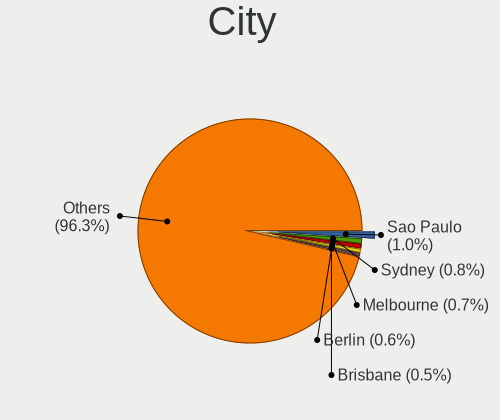
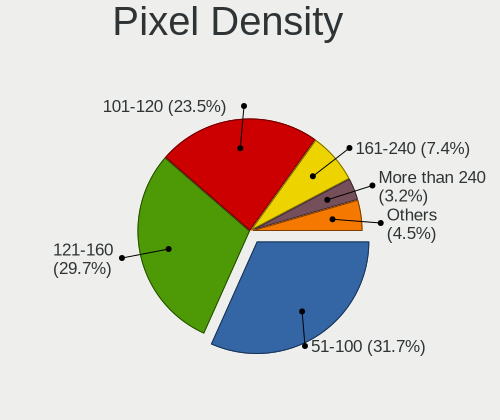
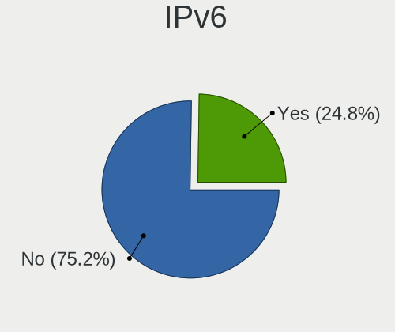
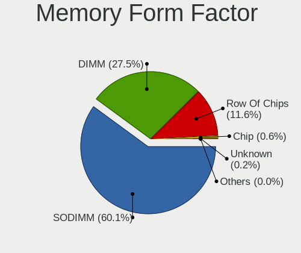
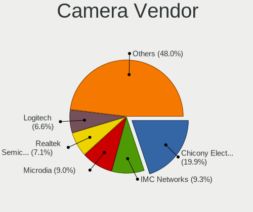

Pop!_OS - Tested Hardware & Statistics
--------------------------------------

A project to collect tested hardware configurations for Pop!_OS.

Anyone can contribute to this report by the [hw-probe](https://github.com/linuxhw/hw-probe) tool:

    sudo -E hw-probe -all -upload

Please contribute! Especially if your hardware is rare.

This is a report for all computer types. See also reports for [desktops](/Dist/Pop!_OS/Desktop/README.md) and [notebooks](/Dist/Pop!_OS/Notebook/README.md).

Contents
--------

* [ Test Cases ](#test-cases)

* [ System ](#system)
  - [ OS                       ](#os)
  - [ OS Family                ](#os-family)
  - [ Kernel                   ](#kernel)
  - [ Kernel Family            ](#kernel-family)
  - [ Kernel Major Ver.        ](#kernel-major-ver)
  - [ Arch                     ](#arch)
  - [ DE                       ](#de)
  - [ Display Server           ](#display-server)
  - [ Display Manager          ](#display-manager)
  - [ OS Lang                  ](#os-lang)
  - [ Boot Mode                ](#boot-mode)
  - [ Filesystem               ](#filesystem)
  - [ Part. scheme             ](#part-scheme)
  - [ Dual Boot with Linux/BSD ](#dual-boot-with-linuxbsd)
  - [ Dual Boot (Win)          ](#dual-boot-win)

* [ Board ](#board)
  - [ Vendor                   ](#vendor)
  - [ Model                    ](#model)
  - [ Model Family             ](#model-family)
  - [ MFG Year                 ](#mfg-year)
  - [ Form Factor              ](#form-factor)
  - [ Secure Boot              ](#secure-boot)
  - [ Coreboot                 ](#coreboot)
  - [ RAM Size                 ](#ram-size)
  - [ RAM Used                 ](#ram-used)
  - [ Total Drives             ](#total-drives)
  - [ Has CD-ROM               ](#has-cd-rom)
  - [ Has Ethernet             ](#has-ethernet)
  - [ Has WiFi                 ](#has-wifi)
  - [ Has Bluetooth            ](#has-bluetooth)

* [ Location ](#location)
  - [ Country                  ](#country)
  - [ City                     ](#city)

* [ Drives ](#drives)
  - [ Drive Vendor             ](#drive-vendor)
  - [ Drive Model              ](#drive-model)
  - [ HDD Vendor               ](#hdd-vendor)
  - [ SSD Vendor               ](#ssd-vendor)
  - [ Drive Kind               ](#drive-kind)
  - [ Drive Connector          ](#drive-connector)
  - [ Drive Size               ](#drive-size)
  - [ Space Total              ](#space-total)
  - [ Space Used               ](#space-used)
  - [ Malfunc. Drives          ](#malfunc-drives)
  - [ Malfunc. Drive Vendor    ](#malfunc-drive-vendor)
  - [ Malfunc. HDD Vendor      ](#malfunc-hdd-vendor)
  - [ Malfunc. Drive Kind      ](#malfunc-drive-kind)
  - [ Failed Drives            ](#failed-drives)
  - [ Failed Drive Vendor      ](#failed-drive-vendor)
  - [ Drive Status             ](#drive-status)

* [ Storage controller ](#storage-controller)
  - [ Storage Vendor           ](#storage-vendor)
  - [ Storage Model            ](#storage-model)
  - [ Storage Kind             ](#storage-kind)

* [ Processor ](#processor)
  - [ CPU Vendor               ](#cpu-vendor)
  - [ CPU Model                ](#cpu-model)
  - [ CPU Model Family         ](#cpu-model-family)
  - [ CPU Cores                ](#cpu-cores)
  - [ CPU Sockets              ](#cpu-sockets)
  - [ CPU Threads              ](#cpu-threads)
  - [ CPU Op-Modes             ](#cpu-op-modes)
  - [ CPU Microcode            ](#cpu-microcode)
  - [ CPU Microarch            ](#cpu-microarch)

* [ Graphics ](#graphics)
  - [ GPU Vendor               ](#gpu-vendor)
  - [ GPU Model                ](#gpu-model)
  - [ GPU Combo                ](#gpu-combo)
  - [ GPU Driver               ](#gpu-driver)
  - [ GPU Memory               ](#gpu-memory)

* [ Monitor ](#monitor)
  - [ Monitor Vendor           ](#monitor-vendor)
  - [ Monitor Model            ](#monitor-model)
  - [ Monitor Resolution       ](#monitor-resolution)
  - [ Monitor Diagonal         ](#monitor-diagonal)
  - [ Monitor Width            ](#monitor-width)
  - [ Aspect Ratio             ](#aspect-ratio)
  - [ Monitor Area             ](#monitor-area)
  - [ Pixel Density            ](#pixel-density)
  - [ Multiple Monitors        ](#multiple-monitors)

* [ Network ](#network)
  - [ Net Controller Vendor    ](#net-controller-vendor)
  - [ Net Controller Model     ](#net-controller-model)
  - [ Wireless Vendor          ](#wireless-vendor)
  - [ Wireless Model           ](#wireless-model)
  - [ Ethernet Vendor          ](#ethernet-vendor)
  - [ Ethernet Model           ](#ethernet-model)
  - [ Net Controller Kind      ](#net-controller-kind)
  - [ Used Controller          ](#used-controller)
  - [ NICs                     ](#nics)
  - [ IPv6                     ](#ipv6)

* [ Bluetooth ](#bluetooth)
  - [ Bluetooth Vendor         ](#bluetooth-vendor)
  - [ Bluetooth Model          ](#bluetooth-model)

* [ Sound ](#sound)
  - [ Sound Vendor             ](#sound-vendor)
  - [ Sound Model              ](#sound-model)

* [ Memory ](#memory)
  - [ Memory Vendor            ](#memory-vendor)
  - [ Memory Model             ](#memory-model)
  - [ Memory Kind              ](#memory-kind)
  - [ Memory Form Factor       ](#memory-form-factor)
  - [ Memory Size              ](#memory-size)
  - [ Memory Speed             ](#memory-speed)

* [ Printers & scanners ](#printers--scanners)
  - [ Printer Vendor           ](#printer-vendor)
  - [ Printer Model            ](#printer-model)
  - [ Scanner Vendor           ](#scanner-vendor)
  - [ Scanner Model            ](#scanner-model)

* [ Camera ](#camera)
  - [ Camera Vendor            ](#camera-vendor)
  - [ Camera Model             ](#camera-model)

* [ Security ](#security)
  - [ Fingerprint Vendor       ](#fingerprint-vendor)
  - [ Fingerprint Model        ](#fingerprint-model)
  - [ Chipcard Vendor          ](#chipcard-vendor)
  - [ Chipcard Model           ](#chipcard-model)

* [ Unsupported ](#unsupported)
  - [ Unsupported Devices      ](#unsupported-devices)
  - [ Unsupported Device Types ](#unsupported-device-types)

Test Cases
----------

Total: 14584

| Vendor        | Model                       | Form-Factor | Probe                                                      | Date         |
|---------------|-----------------------------|-------------|------------------------------------------------------------|--------------|
| HP            | 89E9 0100                   | All in one  | [5e98ad51b6](https://linux-hardware.org/?probe=5e98ad51b6) | Nov 06, 2023 |
| ASRock        | Z97 Killer                  | Desktop     | [f575f3121e](https://linux-hardware.org/?probe=f575f3121e) | Nov 06, 2023 |
| Lenovo        | Y720-15IKB 80VR             | Notebook    | [7cc876dcfa](https://linux-hardware.org/?probe=7cc876dcfa) | Nov 06, 2023 |
| Lenovo        | IdeaPad 320-15ABR 80XS      | Notebook    | [290be8911e](https://linux-hardware.org/?probe=290be8911e) | Nov 06, 2023 |
| Acer          | Aspire 5750G                | Notebook    | [a782c6c087](https://linux-hardware.org/?probe=a782c6c087) | Nov 05, 2023 |
| Lenovo        | IdeaPad 330-17ICH 81FL      | Notebook    | [e25bb48957](https://linux-hardware.org/?probe=e25bb48957) | Nov 05, 2023 |
| ASRock        | Z68 Pro3                    | Desktop     | [e6c695d4a7](https://linux-hardware.org/?probe=e6c695d4a7) | Nov 05, 2023 |
| MSI           | Cyborg 15 A12VF             | Notebook    | [be39067306](https://linux-hardware.org/?probe=be39067306) | Nov 05, 2023 |
| ASUSTek       | G53SX                       | Notebook    | [7834b537a1](https://linux-hardware.org/?probe=7834b537a1) | Nov 05, 2023 |
| Lenovo        | ThinkPad T470s W10DG 20J... | Notebook    | [f1d00fbb93](https://linux-hardware.org/?probe=f1d00fbb93) | Nov 05, 2023 |
| Lenovo        | IdeaPad Gaming 3 15IAH7 ... | Notebook    | [1db5fee13c](https://linux-hardware.org/?probe=1db5fee13c) | Nov 05, 2023 |
| Lenovo        | ThinkPad T470s W10DG 20J... | Notebook    | [50306c96e2](https://linux-hardware.org/?probe=50306c96e2) | Nov 05, 2023 |
| Google        | Taeko                       | Notebook    | [d148b001d9](https://linux-hardware.org/?probe=d148b001d9) | Nov 05, 2023 |
| HP            | Pavilion Laptop 15-cw0xx... | Notebook    | [279f1b8b4f](https://linux-hardware.org/?probe=279f1b8b4f) | Nov 05, 2023 |
| ASUSTek       | ROG STRIX B650E-F GAMING... | Desktop     | [6f11758faa](https://linux-hardware.org/?probe=6f11758faa) | Nov 04, 2023 |
| Gigabyte      | H410M S2H V2                | Desktop     | [8bbce8a378](https://linux-hardware.org/?probe=8bbce8a378) | Nov 04, 2023 |
| System76      | Lemur Pro                   | Notebook    | [dacc229f22](https://linux-hardware.org/?probe=dacc229f22) | Nov 04, 2023 |
| Lenovo        | IdeaPad 5 15ITL05 82FG      | Notebook    | [cfdf343144](https://linux-hardware.org/?probe=cfdf343144) | Nov 04, 2023 |
| Lenovo        | IdeaPad 5 15ITL05 82FG      | Notebook    | [237bd5cfb2](https://linux-hardware.org/?probe=237bd5cfb2) | Nov 04, 2023 |
| System76      | Lemur Pro                   | Notebook    | [80b1ef75d6](https://linux-hardware.org/?probe=80b1ef75d6) | Nov 04, 2023 |
| System76      | Oryx Pro                    | Notebook    | [ea89273272](https://linux-hardware.org/?probe=ea89273272) | Nov 04, 2023 |
| HP            | 655                         | Notebook    | [8cf9aa61c7](https://linux-hardware.org/?probe=8cf9aa61c7) | Nov 04, 2023 |
| Apple         | MacBookAir6,2               | Notebook    | [f8507f333d](https://linux-hardware.org/?probe=f8507f333d) | Nov 04, 2023 |
| MSI           | Bravo 15 C7VE               | Notebook    | [5db0e7314a](https://linux-hardware.org/?probe=5db0e7314a) | Nov 04, 2023 |
| ASUSTek       | VivoBook_ASUSLaptop X415... | Notebook    | [972ef88623](https://linux-hardware.org/?probe=972ef88623) | Nov 04, 2023 |
| ASUSTek       | VivoBook_ASUSLaptop X415... | Notebook    | [927b50091e](https://linux-hardware.org/?probe=927b50091e) | Nov 04, 2023 |
| ASUSTek       | PRIME X670E-PRO WIFI        | Desktop     | [f27bded4c1](https://linux-hardware.org/?probe=f27bded4c1) | Nov 04, 2023 |
| ASRock        | B450 Steel Legend           | Desktop     | [26aff1917e](https://linux-hardware.org/?probe=26aff1917e) | Nov 04, 2023 |
| System76      | Oryx Pro                    | Notebook    | [1704acc89b](https://linux-hardware.org/?probe=1704acc89b) | Nov 03, 2023 |
| Intel         | X79 V1.0                    | Desktop     | [9483a097a1](https://linux-hardware.org/?probe=9483a097a1) | Nov 03, 2023 |
| ASUSTek       | TUF Gaming B650-PLUS WIF... | Desktop     | [d35fc5aa78](https://linux-hardware.org/?probe=d35fc5aa78) | Nov 03, 2023 |
| Lenovo        | ThinkPad T420s 417032U      | Notebook    | [76247c39f4](https://linux-hardware.org/?probe=76247c39f4) | Nov 03, 2023 |
| Lenovo        | IdeaPad C340-14API 81N6     | Notebook    | [3a8d337535](https://linux-hardware.org/?probe=3a8d337535) | Nov 03, 2023 |
| HP            | ProBook 6450b               | Notebook    | [75ad2cf5f8](https://linux-hardware.org/?probe=75ad2cf5f8) | Nov 02, 2023 |
| ASUSTek       | TUF Gaming B650-PLUS WIF... | Desktop     | [9a5c45e54b](https://linux-hardware.org/?probe=9a5c45e54b) | Nov 02, 2023 |
| MSI           | Prestige 14Evo A11M         | Notebook    | [12414485a5](https://linux-hardware.org/?probe=12414485a5) | Nov 02, 2023 |
| Apple         | MacBookPro14,1              | Notebook    | [7d93bb6f25](https://linux-hardware.org/?probe=7d93bb6f25) | Nov 02, 2023 |
| ASUSTek       | ROG CROSSHAIR VII HERO      | Desktop     | [fc0052213d](https://linux-hardware.org/?probe=fc0052213d) | Nov 02, 2023 |
| ASUSTek       | Z170-A                      | Desktop     | [7812f09d39](https://linux-hardware.org/?probe=7812f09d39) | Nov 02, 2023 |
| ASUSTek       | Z170-A                      | Desktop     | [b45e25ec01](https://linux-hardware.org/?probe=b45e25ec01) | Nov 02, 2023 |
| HP            | 2AF7                        | Desktop     | [65ac8348d7](https://linux-hardware.org/?probe=65ac8348d7) | Nov 02, 2023 |
| HP            | ENVY x360 2-in-1 Laptop ... | Convertible | [04f3946d05](https://linux-hardware.org/?probe=04f3946d05) | Nov 02, 2023 |
| Supermicro    | X9DRE-TF+/X9DR7-TF+         | Server      | [1274766930](https://linux-hardware.org/?probe=1274766930) | Nov 02, 2023 |
| ASUSTek       | N550JV                      | Notebook    | [200e3255d9](https://linux-hardware.org/?probe=200e3255d9) | Nov 02, 2023 |
| MSI           | B550M PRO-VDH WIFI          | Desktop     | [cd018c7ab7](https://linux-hardware.org/?probe=cd018c7ab7) | Nov 02, 2023 |
| ASUSTek       | N550JV                      | Notebook    | [43a84b57f0](https://linux-hardware.org/?probe=43a84b57f0) | Nov 01, 2023 |
| Gigabyte      | H61M-S2PV                   | Desktop     | [523fd59139](https://linux-hardware.org/?probe=523fd59139) | Nov 01, 2023 |
| ASRock        | X470 Taichi Ultimate        | Desktop     | [d85d5f59c2](https://linux-hardware.org/?probe=d85d5f59c2) | Nov 01, 2023 |
| Lenovo        | ThinkPad T480 20L6S68T00    | Notebook    | [dba91e5612](https://linux-hardware.org/?probe=dba91e5612) | Nov 01, 2023 |
| HP            | ENVY 15                     | Notebook    | [74dae44745](https://linux-hardware.org/?probe=74dae44745) | Nov 01, 2023 |
| Lenovo        | 370A SDK0J40700 WIN 3258... | Desktop     | [39f8a7c959](https://linux-hardware.org/?probe=39f8a7c959) | Nov 01, 2023 |
| Lenovo        | ThinkPad X260 20F5A28AUK    | Notebook    | [c1e44a55c8](https://linux-hardware.org/?probe=c1e44a55c8) | Nov 01, 2023 |
| Lenovo        | ThinkPad X260 20F5A28AUK    | Notebook    | [84ca0a285d](https://linux-hardware.org/?probe=84ca0a285d) | Nov 01, 2023 |
| MSI           | B550M PRO-VDH WIFI          | Desktop     | [38d664802f](https://linux-hardware.org/?probe=38d664802f) | Nov 01, 2023 |
| ASUSTek       | PRIME B550-PLUS             | Desktop     | [037e92aebd](https://linux-hardware.org/?probe=037e92aebd) | Nov 01, 2023 |
| Intel         | NUC11PHBi7 M26151-404       | Mini pc     | [0ec8ac4d00](https://linux-hardware.org/?probe=0ec8ac4d00) | Nov 01, 2023 |
| Dell          | XPS 15 9520                 | Notebook    | [6b6da0ca4a](https://linux-hardware.org/?probe=6b6da0ca4a) | Nov 01, 2023 |
| ASRock        | B85M Pro4                   | Desktop     | [0ea7f00b4e](https://linux-hardware.org/?probe=0ea7f00b4e) | Nov 01, 2023 |
| ASUSTek       | ROG STRIX Z690-F GAMING ... | Desktop     | [7d5fd28d41](https://linux-hardware.org/?probe=7d5fd28d41) | Nov 01, 2023 |
| System76      | Lemur Pro                   | Notebook    | [847ae1ea8d](https://linux-hardware.org/?probe=847ae1ea8d) | Nov 01, 2023 |
| HP            | 829A                        | Mini pc     | [d6ef1b58ed](https://linux-hardware.org/?probe=d6ef1b58ed) | Nov 01, 2023 |
| Lenovo        | IdeaPad 320-14IKB 80YF      | Notebook    | [643c7ccd9b](https://linux-hardware.org/?probe=643c7ccd9b) | Nov 01, 2023 |
| LG Electro... | 16T90R-K.ADB9U1             | Convertible | [e9f8c192f1](https://linux-hardware.org/?probe=e9f8c192f1) | Nov 01, 2023 |
| Lenovo        | IdeaPad 5 14ALC05 82LM      | Notebook    | [f08e4e21a0](https://linux-hardware.org/?probe=f08e4e21a0) | Nov 01, 2023 |
| Unknown       | Unknown                     | Desktop     | [d58a78a617](https://linux-hardware.org/?probe=d58a78a617) | Oct 31, 2023 |
| HUAWEI        | CREF-XX                     | Notebook    | [a10aa3c3e5](https://linux-hardware.org/?probe=a10aa3c3e5) | Oct 31, 2023 |
| ASRockRack    | X570D4U-2L2T/BCM            | Server      | [66607ff17c](https://linux-hardware.org/?probe=66607ff17c) | Oct 31, 2023 |
| eMachines     | EL1352G                     | Desktop     | [e133fecf3e](https://linux-hardware.org/?probe=e133fecf3e) | Oct 31, 2023 |
| ASRock        | A520M Phantom Gaming 4      | Desktop     | [a63d934992](https://linux-hardware.org/?probe=a63d934992) | Oct 31, 2023 |
| MSI           | GP66 Leopard 11UG           | Notebook    | [cb013304f5](https://linux-hardware.org/?probe=cb013304f5) | Oct 31, 2023 |
| MSI           | GP66 Leopard 11UG           | Notebook    | [d6ac483e43](https://linux-hardware.org/?probe=d6ac483e43) | Oct 31, 2023 |
| Lenovo        | G50-80 80E5                 | Notebook    | [ee528fce07](https://linux-hardware.org/?probe=ee528fce07) | Oct 31, 2023 |
| Lenovo        | G50-80 80E5                 | Notebook    | [4e0042e20c](https://linux-hardware.org/?probe=4e0042e20c) | Oct 31, 2023 |
| Acer          | Aspire E5-553G              | Notebook    | [7c76f143a4](https://linux-hardware.org/?probe=7c76f143a4) | Oct 31, 2023 |
| HP            | 8299                        | Desktop     | [e45f46df9d](https://linux-hardware.org/?probe=e45f46df9d) | Oct 30, 2023 |
| HP            | ZBook Fury 15.6 inch G8 ... | Notebook    | [56f24de5ff](https://linux-hardware.org/?probe=56f24de5ff) | Oct 30, 2023 |
| Lenovo        | V15 G2 ALC 82KD             | Notebook    | [81a7cabe4f](https://linux-hardware.org/?probe=81a7cabe4f) | Oct 30, 2023 |
| HP            | Dev One Notebook PC         | Notebook    | [d5ace42b13](https://linux-hardware.org/?probe=d5ace42b13) | Oct 30, 2023 |
| Lenovo        | ThinkBook 15 G2 ARE 20VG    | Notebook    | [d51c491524](https://linux-hardware.org/?probe=d51c491524) | Oct 30, 2023 |
| Apple         | MacBookAir6,2               | Notebook    | [65f24e332a](https://linux-hardware.org/?probe=65f24e332a) | Oct 30, 2023 |
| MSI           | MPG X570 GAMING PLUS        | Desktop     | [e231035f6e](https://linux-hardware.org/?probe=e231035f6e) | Oct 30, 2023 |
| System76      | Adder WS                    | Notebook    | [57478f4561](https://linux-hardware.org/?probe=57478f4561) | Oct 30, 2023 |
| System76      | Adder WS                    | Notebook    | [a10fcac3f4](https://linux-hardware.org/?probe=a10fcac3f4) | Oct 30, 2023 |
| MSI           | PRO Z790-P WIFI             | Desktop     | [b62cfa508b](https://linux-hardware.org/?probe=b62cfa508b) | Oct 30, 2023 |
| ASUSTek       | ZenBook UX425EA_UX425EA     | Notebook    | [5863bd6189](https://linux-hardware.org/?probe=5863bd6189) | Oct 30, 2023 |
| ASUSTek       | VivoBook_ASUSLaptop X421... | Notebook    | [7301c9b3df](https://linux-hardware.org/?probe=7301c9b3df) | Oct 29, 2023 |
| Intel         | NUC10i7FNB M38062-307       | Mini pc     | [48040bae06](https://linux-hardware.org/?probe=48040bae06) | Oct 29, 2023 |
| HP            | 2AF7                        | Desktop     | [1960b3a243](https://linux-hardware.org/?probe=1960b3a243) | Oct 29, 2023 |
| Apple         | MacBookPro5,5               | Notebook    | [2815a5477f](https://linux-hardware.org/?probe=2815a5477f) | Oct 29, 2023 |
| SLIMBOOK      | TITAN                       | Notebook    | [8697e4de09](https://linux-hardware.org/?probe=8697e4de09) | Oct 29, 2023 |
| Lenovo        | ThinkBook 15 G2 ARE 20VG    | Notebook    | [c90dd43290](https://linux-hardware.org/?probe=c90dd43290) | Oct 29, 2023 |
| Gigabyte      | B450 GAMING X               | Desktop     | [c1785bec94](https://linux-hardware.org/?probe=c1785bec94) | Oct 29, 2023 |
| ASUSTek       | VivoBook_ASUSLaptop M650... | Notebook    | [d621a72336](https://linux-hardware.org/?probe=d621a72336) | Oct 28, 2023 |
| Lenovo        | ThinkPad T480 20L6S68T00    | Notebook    | [57e3abc23d](https://linux-hardware.org/?probe=57e3abc23d) | Oct 28, 2023 |
| Lenovo        | IdeaPad Gaming 3 15ARH05... | Notebook    | [0f9adbc34d](https://linux-hardware.org/?probe=0f9adbc34d) | Oct 28, 2023 |
| Maibenben     | MaiBook X series            | Notebook    | [63e0cb487a](https://linux-hardware.org/?probe=63e0cb487a) | Oct 28, 2023 |
| Samsung       | DM700A4K-KN27 SGL8559A1A... | All in one  | [e6c0db51c1](https://linux-hardware.org/?probe=e6c0db51c1) | Oct 28, 2023 |
| Lenovo        | IdeaPad 5 14ABA7 82SE       | Notebook    | [e08a8fa43b](https://linux-hardware.org/?probe=e08a8fa43b) | Oct 28, 2023 |
| MSI           | MPG X570 GAMING PLUS        | Desktop     | [6b8560a943](https://linux-hardware.org/?probe=6b8560a943) | Oct 28, 2023 |
| HP            | ENVY x360 Convertible 15... | Convertible | [9a6fdf5543](https://linux-hardware.org/?probe=9a6fdf5543) | Oct 28, 2023 |
| HP            | ENVY x360 Convertible 15... | Convertible | [85b2c39c93](https://linux-hardware.org/?probe=85b2c39c93) | Oct 28, 2023 |
| Apple         | MacBookAir6,2               | Notebook    | [96b76fc377](https://linux-hardware.org/?probe=96b76fc377) | Oct 28, 2023 |
| ASUSTek       | ProArt B650-CREATOR         | Desktop     | [fdb96441a0](https://linux-hardware.org/?probe=fdb96441a0) | Oct 27, 2023 |
| ASUSTek       | ProArt B650-CREATOR         | Desktop     | [dde83d5de1](https://linux-hardware.org/?probe=dde83d5de1) | Oct 27, 2023 |
| Lenovo        | Z50-70 20354                | Notebook    | [2e5ee0032d](https://linux-hardware.org/?probe=2e5ee0032d) | Oct 27, 2023 |
| Lenovo        | SHARKBAY SDK0E50510 WIN     | Desktop     | [880bf38f49](https://linux-hardware.org/?probe=880bf38f49) | Oct 27, 2023 |
| System76      | Lemur Pro                   | Notebook    | [e5b2c76907](https://linux-hardware.org/?probe=e5b2c76907) | Oct 27, 2023 |
| Samsung       | 550XCJ/550XCR               | Notebook    | [9d34ff8710](https://linux-hardware.org/?probe=9d34ff8710) | Oct 27, 2023 |
| Apple         | Mac-031B6874CF7F642A iMa... | All in one  | [fc29a80949](https://linux-hardware.org/?probe=fc29a80949) | Oct 27, 2023 |
| System76      | Darter Pro                  | Notebook    | [9dcbc85a23](https://linux-hardware.org/?probe=9dcbc85a23) | Oct 27, 2023 |
| HP            | OMEN LAPTOP - 15-EK0013D... | Notebook    | [0c582fd597](https://linux-hardware.org/?probe=0c582fd597) | Oct 27, 2023 |
| Acer          | Aspire A315-42G             | Notebook    | [114e1e6d66](https://linux-hardware.org/?probe=114e1e6d66) | Oct 27, 2023 |
| Lenovo        | 1038 NO DPK                 | Server      | [4938c66cd8](https://linux-hardware.org/?probe=4938c66cd8) | Oct 27, 2023 |
| ASUSTek       | PRIME X570-PRO              | Desktop     | [815b0a4bc4](https://linux-hardware.org/?probe=815b0a4bc4) | Oct 27, 2023 |
| MSI           | X370 GAMING PRO CARBON      | Desktop     | [61bdfadaa0](https://linux-hardware.org/?probe=61bdfadaa0) | Oct 26, 2023 |
| Lenovo        | Legion 5 15IMH05H 81Y6      | Notebook    | [f0641b8822](https://linux-hardware.org/?probe=f0641b8822) | Oct 26, 2023 |
| Haier         | U1520SD                     | Notebook    | [3de6c48f15](https://linux-hardware.org/?probe=3de6c48f15) | Oct 26, 2023 |
| Dell          | Latitude E6530              | Notebook    | [ec57b86fe6](https://linux-hardware.org/?probe=ec57b86fe6) | Oct 26, 2023 |
| Acer          | Aspire VN7-793G             | Notebook    | [e4a7d4f368](https://linux-hardware.org/?probe=e4a7d4f368) | Oct 26, 2023 |
| Panasonic     | CF-31SBM08DM                | Notebook    | [820f042ba6](https://linux-hardware.org/?probe=820f042ba6) | Oct 26, 2023 |
| ASUSTek       | P8H61-M LE/USB3             | Desktop     | [13ad3bb316](https://linux-hardware.org/?probe=13ad3bb316) | Oct 26, 2023 |
| ASUSTek       | P8H61-M LE/USB3             | Desktop     | [a8d850eef8](https://linux-hardware.org/?probe=a8d850eef8) | Oct 26, 2023 |
| Haier         | U1520SD                     | Notebook    | [25229c3d32](https://linux-hardware.org/?probe=25229c3d32) | Oct 25, 2023 |
| Lenovo        | SHARKBAY NOK                | Desktop     | [023bd4d497](https://linux-hardware.org/?probe=023bd4d497) | Oct 25, 2023 |
| Dell          | Inspiron 3442               | Notebook    | [7fc2a154e5](https://linux-hardware.org/?probe=7fc2a154e5) | Oct 25, 2023 |
| MSI           | PRO Z690-A DDR4             | Desktop     | [638386d33c](https://linux-hardware.org/?probe=638386d33c) | Oct 25, 2023 |
| HP            | 3047h                       | Desktop     | [cdd7fbc37f](https://linux-hardware.org/?probe=cdd7fbc37f) | Oct 25, 2023 |
| HP            | 3047h                       | Desktop     | [4235f287b2](https://linux-hardware.org/?probe=4235f287b2) | Oct 25, 2023 |
| HP            | EliteBook x360 1040 G5      | Convertible | [dab53e45c9](https://linux-hardware.org/?probe=dab53e45c9) | Oct 25, 2023 |
| ASUSTek       | TUF Gaming B650-PLUS WIF... | Desktop     | [b7447f21b5](https://linux-hardware.org/?probe=b7447f21b5) | Oct 25, 2023 |
| Lenovo        | IdeaPad 3 15ALC6 82MF       | Notebook    | [9a4561dabf](https://linux-hardware.org/?probe=9a4561dabf) | Oct 25, 2023 |
| Gigabyte      | X570S AORUS ELITE AX        | Desktop     | [5ad24eb928](https://linux-hardware.org/?probe=5ad24eb928) | Oct 24, 2023 |
| Dell          | 02P9X9 A00                  | Server      | [85fac54d6a](https://linux-hardware.org/?probe=85fac54d6a) | Oct 24, 2023 |
| HP            | Victus by Laptop 16-e0xx... | Notebook    | [ecde45a506](https://linux-hardware.org/?probe=ecde45a506) | Oct 24, 2023 |
| Danuri        | B550M-PX                    | Desktop     | [e24df1ad61](https://linux-hardware.org/?probe=e24df1ad61) | Oct 24, 2023 |
| Apple         | MacBookAir6,2               | Notebook    | [f15ecd1759](https://linux-hardware.org/?probe=f15ecd1759) | Oct 24, 2023 |
| Intel         | H61 V124                    | Desktop     | [034689793f](https://linux-hardware.org/?probe=034689793f) | Oct 24, 2023 |
| Gigabyte      | Z390 M GAMING-CF            | Desktop     | [b1f52f8dc1](https://linux-hardware.org/?probe=b1f52f8dc1) | Oct 23, 2023 |
| Gigabyte      | 970A-DS3P                   | Desktop     | [a9af589ace](https://linux-hardware.org/?probe=a9af589ace) | Oct 23, 2023 |
| Dell          | Latitude E7240              | Notebook    | [6fead70e93](https://linux-hardware.org/?probe=6fead70e93) | Oct 23, 2023 |
| Lenovo        | ThinkBook 15 G2 ARE 20VG    | Notebook    | [47fdb21256](https://linux-hardware.org/?probe=47fdb21256) | Oct 23, 2023 |
| Dell          | XPS 13 9370                 | Notebook    | [7e9d761b35](https://linux-hardware.org/?probe=7e9d761b35) | Oct 23, 2023 |
| ASUSTek       | PRIME B450M-A               | Desktop     | [cf347b4567](https://linux-hardware.org/?probe=cf347b4567) | Oct 23, 2023 |
| MSI           | Sword 15 A11UD              | Notebook    | [d07a7c777c](https://linux-hardware.org/?probe=d07a7c777c) | Oct 23, 2023 |
| Dell          | 096JG8 A01                  | Desktop     | [ce5ff412d1](https://linux-hardware.org/?probe=ce5ff412d1) | Oct 23, 2023 |
| HP            | EliteBook 820 G3            | Notebook    | [73c1b49eab](https://linux-hardware.org/?probe=73c1b49eab) | Oct 23, 2023 |
| HP            | EliteBook 820 G3            | Notebook    | [b6169d3a96](https://linux-hardware.org/?probe=b6169d3a96) | Oct 23, 2023 |
| ASUSTek       | PRIME B450M-A               | Desktop     | [e0f48fec00](https://linux-hardware.org/?probe=e0f48fec00) | Oct 22, 2023 |
| ASUSTek       | G750JW                      | Notebook    | [9bafdb8250](https://linux-hardware.org/?probe=9bafdb8250) | Oct 22, 2023 |
| Dell          | Latitude 5520               | Notebook    | [f5664b02d2](https://linux-hardware.org/?probe=f5664b02d2) | Oct 22, 2023 |
| Toshiba       | Satellite C70D-B            | Notebook    | [7f1637fdb9](https://linux-hardware.org/?probe=7f1637fdb9) | Oct 22, 2023 |
| ASUSTek       | PRIME H310-PLUS R2.0        | Desktop     | [58a9a7a091](https://linux-hardware.org/?probe=58a9a7a091) | Oct 22, 2023 |
| ASUSTek       | G53SX                       | Notebook    | [d19756d24b](https://linux-hardware.org/?probe=d19756d24b) | Oct 22, 2023 |
| Acer          | Aspire A315-23              | Notebook    | [14ed4adf6c](https://linux-hardware.org/?probe=14ed4adf6c) | Oct 22, 2023 |
| ASUSTek       | PRIME H310-PLUS R2.0        | Desktop     | [9b380c5e6a](https://linux-hardware.org/?probe=9b380c5e6a) | Oct 22, 2023 |
| EUROCOM       | Tornado F5                  | Notebook    | [3056eeecf5](https://linux-hardware.org/?probe=3056eeecf5) | Oct 21, 2023 |
| ASUSTek       | N551JK                      | Notebook    | [010dd78352](https://linux-hardware.org/?probe=010dd78352) | Oct 21, 2023 |
| EUROCOM       | Tornado F5                  | Notebook    | [25b7095754](https://linux-hardware.org/?probe=25b7095754) | Oct 21, 2023 |
| MSI           | Cyborg 15 A12VF             | Notebook    | [b1a3bf1a75](https://linux-hardware.org/?probe=b1a3bf1a75) | Oct 21, 2023 |
| ASUSTek       | ASUS TUF Gaming F15 FX50... | Notebook    | [97d1264314](https://linux-hardware.org/?probe=97d1264314) | Oct 21, 2023 |
| ASRock        | N68C-S UCC                  | Desktop     | [6468bd6335](https://linux-hardware.org/?probe=6468bd6335) | Oct 21, 2023 |
| Dell          | 00V62H A01                  | Desktop     | [85894d27fe](https://linux-hardware.org/?probe=85894d27fe) | Oct 21, 2023 |
| ASUSTek       | ROG STRIX B550-F GAMING     | Desktop     | [3b8a5a44c7](https://linux-hardware.org/?probe=3b8a5a44c7) | Oct 21, 2023 |
| Dell          | 06FW8P A01                  | Desktop     | [356c2f38aa](https://linux-hardware.org/?probe=356c2f38aa) | Oct 21, 2023 |
| HONOR         | NBR-WAX9                    | Notebook    | [5966a36809](https://linux-hardware.org/?probe=5966a36809) | Oct 21, 2023 |
| ASUSTek       | ASUS TUF Gaming F15 FX50... | Notebook    | [a2756e1d2b](https://linux-hardware.org/?probe=a2756e1d2b) | Oct 21, 2023 |
| Gigabyte      | Z77-DS3H                    | Desktop     | [ca61a8649a](https://linux-hardware.org/?probe=ca61a8649a) | Oct 21, 2023 |
| Gigabyte      | Z77-DS3H                    | Desktop     | [6108985945](https://linux-hardware.org/?probe=6108985945) | Oct 21, 2023 |
| ASUSTek       | PRIME Z790-P WIFI           | Desktop     | [e7cd525d35](https://linux-hardware.org/?probe=e7cd525d35) | Oct 21, 2023 |
| ASUSTek       | VivoBook_ASUSLaptop X705... | Notebook    | [148be53a91](https://linux-hardware.org/?probe=148be53a91) | Oct 20, 2023 |
| Toshiba       | Satellite C70D-B            | Notebook    | [793d71f1d2](https://linux-hardware.org/?probe=793d71f1d2) | Oct 20, 2023 |
| Lenovo        | Y50-70 20378                | Notebook    | [e51b067a88](https://linux-hardware.org/?probe=e51b067a88) | Oct 20, 2023 |
| Acer          | Swift SFX14-51G             | Notebook    | [2adde1171a](https://linux-hardware.org/?probe=2adde1171a) | Oct 20, 2023 |
| ASUSTek       | X551MA                      | Notebook    | [6ee41b351a](https://linux-hardware.org/?probe=6ee41b351a) | Oct 20, 2023 |
| Acer          | Aspire 5253                 | Notebook    | [871f28b131](https://linux-hardware.org/?probe=871f28b131) | Oct 20, 2023 |
| Dell          | Latitude 5520               | Notebook    | [281fdb7e86](https://linux-hardware.org/?probe=281fdb7e86) | Oct 20, 2023 |
| HP            | Pavilion 17                 | Notebook    | [36613b2f1f](https://linux-hardware.org/?probe=36613b2f1f) | Oct 19, 2023 |
| MSI           | Cyborg 15 A12VF             | Notebook    | [7fab57f39a](https://linux-hardware.org/?probe=7fab57f39a) | Oct 19, 2023 |
| Intel         | DG965RY AAD41691-301        | Desktop     | [0bdf442d3d](https://linux-hardware.org/?probe=0bdf442d3d) | Oct 19, 2023 |
| Acer          | Aspire VN7-591G             | Notebook    | [7148bf6db9](https://linux-hardware.org/?probe=7148bf6db9) | Oct 19, 2023 |
| Samsung       | 355V4C/356V4C/3445VC/354... | Notebook    | [4312e9a007](https://linux-hardware.org/?probe=4312e9a007) | Oct 19, 2023 |
| Acer          | Aspire VN7-591G             | Notebook    | [9cbbb0364b](https://linux-hardware.org/?probe=9cbbb0364b) | Oct 19, 2023 |
| ASUSTek       | VivoBook_ASUSLaptop X150... | Notebook    | [2f2d05a226](https://linux-hardware.org/?probe=2f2d05a226) | Oct 19, 2023 |
| LG Electro... | 16T90R-K.ADB9U1             | Convertible | [81f32f2ac2](https://linux-hardware.org/?probe=81f32f2ac2) | Oct 19, 2023 |
| HP            | Pavilion Laptop 15t-eg30... | Notebook    | [b2cba37968](https://linux-hardware.org/?probe=b2cba37968) | Oct 19, 2023 |
| Lenovo        | Legion R7000P APH8 82Y9     | Notebook    | [cd80438b02](https://linux-hardware.org/?probe=cd80438b02) | Oct 19, 2023 |
| ASUSTek       | ROG CROSSHAIR VIII HERO     | Desktop     | [ed3ce7aaa6](https://linux-hardware.org/?probe=ed3ce7aaa6) | Oct 18, 2023 |
| Lenovo        | IdeaPad S145-15API 81V7     | Notebook    | [315376a82a](https://linux-hardware.org/?probe=315376a82a) | Oct 18, 2023 |
| Dell          | 0JYF1T A03                  | Server      | [93ada2329e](https://linux-hardware.org/?probe=93ada2329e) | Oct 18, 2023 |
| HP            | EliteBook x360 1040 G8 N... | Convertible | [b6b4b14ba1](https://linux-hardware.org/?probe=b6b4b14ba1) | Oct 18, 2023 |
| Lenovo        | ThinkPad E14 Gen 4 21E30... | Notebook    | [52e7bc3407](https://linux-hardware.org/?probe=52e7bc3407) | Oct 18, 2023 |
| HP            | 85A2                        | All in one  | [67234a41ca](https://linux-hardware.org/?probe=67234a41ca) | Oct 18, 2023 |
| MSI           | X470 GAMING PRO             | Desktop     | [e275cfc499](https://linux-hardware.org/?probe=e275cfc499) | Oct 18, 2023 |
| ASUSTek       | Z97-PRO GAMER               | Desktop     | [d652b15856](https://linux-hardware.org/?probe=d652b15856) | Oct 17, 2023 |
| System76      | Gazelle                     | Notebook    | [061012cdb0](https://linux-hardware.org/?probe=061012cdb0) | Oct 17, 2023 |
| ASUSTek       | ROG Rampage VI EXTREME E... | Desktop     | [3d5d8ee9e6](https://linux-hardware.org/?probe=3d5d8ee9e6) | Oct 17, 2023 |
| Apple         | MacBookPro11,1              | Notebook    | [ffeb95bd95](https://linux-hardware.org/?probe=ffeb95bd95) | Oct 17, 2023 |
| ASUSTek       | PN53-G                      | Mini pc     | [464e218144](https://linux-hardware.org/?probe=464e218144) | Oct 17, 2023 |
| Gigabyte      | Z590 VISION D               | Desktop     | [f9d3acd4e2](https://linux-hardware.org/?probe=f9d3acd4e2) | Oct 16, 2023 |
| Lenovo        | Yoga 7 15ITL5 82BJ          | Convertible | [0ebd0d4ce6](https://linux-hardware.org/?probe=0ebd0d4ce6) | Oct 16, 2023 |
| HP            | 250 G4                      | Notebook    | [a45d8a13df](https://linux-hardware.org/?probe=a45d8a13df) | Oct 16, 2023 |
| HP            | Laptop 15-dw4xxx            | Notebook    | [44ba7f4015](https://linux-hardware.org/?probe=44ba7f4015) | Oct 16, 2023 |
| HP            | Pavilion Gaming Laptop 1... | Notebook    | [471a6f3119](https://linux-hardware.org/?probe=471a6f3119) | Oct 16, 2023 |
| ASUSTek       | N551ZU                      | Notebook    | [e56a6c7957](https://linux-hardware.org/?probe=e56a6c7957) | Oct 16, 2023 |
| MSI           | MPG Z690 FORCE WIFI         | Desktop     | [5631fc0230](https://linux-hardware.org/?probe=5631fc0230) | Oct 16, 2023 |
| ASUSTek       | TUF Gaming B450-PLUS II     | Desktop     | [04afaee575](https://linux-hardware.org/?probe=04afaee575) | Oct 15, 2023 |
| HP            | ProBook 4730s               | Notebook    | [42a7295a49](https://linux-hardware.org/?probe=42a7295a49) | Oct 15, 2023 |
| ASUSTek       | PRIME B450M-A II            | Desktop     | [98224c65b6](https://linux-hardware.org/?probe=98224c65b6) | Oct 15, 2023 |
| Huanan        | X99-QD4 V1.0                | Desktop     | [47788537bf](https://linux-hardware.org/?probe=47788537bf) | Oct 15, 2023 |
| Huanan        | X99-QD4 V1.0                | Desktop     | [30723700f1](https://linux-hardware.org/?probe=30723700f1) | Oct 15, 2023 |
| Huanan        | X99-QD4 V1.0                | Desktop     | [e4dc0eeb72](https://linux-hardware.org/?probe=e4dc0eeb72) | Oct 15, 2023 |
| MSI           | MPG Z690 FORCE WIFI         | Desktop     | [abc6dc18ab](https://linux-hardware.org/?probe=abc6dc18ab) | Oct 15, 2023 |
| MECHREVO      | WUJIE14 PRO                 | Notebook    | [40cfeec2b2](https://linux-hardware.org/?probe=40cfeec2b2) | Oct 15, 2023 |
| Lenovo        | ThinkPad T480 20L50011US    | Notebook    | [7a732e8a25](https://linux-hardware.org/?probe=7a732e8a25) | Oct 15, 2023 |
| ASUSTek       | VivoBook_ASUSLaptop X513... | Notebook    | [22b5b65e16](https://linux-hardware.org/?probe=22b5b65e16) | Oct 15, 2023 |
| HP            | 212B                        | Desktop     | [c0b9765d6e](https://linux-hardware.org/?probe=c0b9765d6e) | Oct 15, 2023 |
| Gigabyte      | Z270P-D3-CF                 | Desktop     | [5bbd5682e8](https://linux-hardware.org/?probe=5bbd5682e8) | Oct 15, 2023 |
| System76      | Lemur Pro                   | Notebook    | [f969d7a459](https://linux-hardware.org/?probe=f969d7a459) | Oct 15, 2023 |
| ASUSTek       | Z97-PRO GAMER               | Desktop     | [5a1df4c4df](https://linux-hardware.org/?probe=5a1df4c4df) | Oct 14, 2023 |
| MSI           | MPG X570 GAMING PRO CARB... | Desktop     | [a8e7e9b968](https://linux-hardware.org/?probe=a8e7e9b968) | Oct 14, 2023 |
| Gigabyte      | Z590I VISION D              | Desktop     | [725929fa07](https://linux-hardware.org/?probe=725929fa07) | Oct 14, 2023 |
| ASRock        | H97M Anniversary            | Desktop     | [7df48c5c5d](https://linux-hardware.org/?probe=7df48c5c5d) | Oct 14, 2023 |
| Acer          | Aspire A314-23P             | Notebook    | [142bc36a3f](https://linux-hardware.org/?probe=142bc36a3f) | Oct 14, 2023 |
| Dell          | 0NW6H5 A00                  | Desktop     | [0594aaa28b](https://linux-hardware.org/?probe=0594aaa28b) | Oct 13, 2023 |
| Dell          | 0NW6H5 A00                  | Desktop     | [596e3973bc](https://linux-hardware.org/?probe=596e3973bc) | Oct 13, 2023 |
| Notebook      | P9XXEN_EF_ED                | Notebook    | [89eae06fc2](https://linux-hardware.org/?probe=89eae06fc2) | Oct 13, 2023 |
| ASUSTek       | PRIME A320M-K               | Desktop     | [4d6379353d](https://linux-hardware.org/?probe=4d6379353d) | Oct 13, 2023 |
| MSI           | MPG B550 GAMING PLUS        | Desktop     | [52fdfb249e](https://linux-hardware.org/?probe=52fdfb249e) | Oct 12, 2023 |
| Acer          | Aspire E1-571               | Notebook    | [94754c98ce](https://linux-hardware.org/?probe=94754c98ce) | Oct 12, 2023 |
| Gigabyte      | B550M AORUS PRO             | Desktop     | [d7d6c5206f](https://linux-hardware.org/?probe=d7d6c5206f) | Oct 12, 2023 |
| Apple         | MacBookPro11,4              | Notebook    | [107524e9ec](https://linux-hardware.org/?probe=107524e9ec) | Oct 12, 2023 |
| Biostar       | B550GTQ                     | Desktop     | [63f1b39dd4](https://linux-hardware.org/?probe=63f1b39dd4) | Oct 12, 2023 |
| Apple         | MacBookPro11,4              | Notebook    | [f9fee05f72](https://linux-hardware.org/?probe=f9fee05f72) | Oct 12, 2023 |
| HP            | Unknown                     | Convertible | [8fe4fae90f](https://linux-hardware.org/?probe=8fe4fae90f) | Oct 12, 2023 |
| Microsoft     | Surface Laptop              | Tablet      | [df15a4cce8](https://linux-hardware.org/?probe=df15a4cce8) | Oct 12, 2023 |
| Gigabyte      | B550M AORUS PRO             | Desktop     | [5e2f8bdc4d](https://linux-hardware.org/?probe=5e2f8bdc4d) | Oct 12, 2023 |
| Dell          | Inspiron 16 7610            | Notebook    | [ee849775df](https://linux-hardware.org/?probe=ee849775df) | Oct 12, 2023 |
| Shenzhen M... | F6BFC                       | Desktop     | [e71b9295ca](https://linux-hardware.org/?probe=e71b9295ca) | Oct 11, 2023 |
| System76      | Thelio Mega thelio-mega-... | Desktop     | [abb07364c1](https://linux-hardware.org/?probe=abb07364c1) | Oct 11, 2023 |
| Lenovo        | Yoga Slim 7 Pro 14ACH5 8... | Notebook    | [c815acfae8](https://linux-hardware.org/?probe=c815acfae8) | Oct 11, 2023 |
| Gateway       | NE570                       | Notebook    | [533fec5226](https://linux-hardware.org/?probe=533fec5226) | Oct 11, 2023 |
| Acer          | Predator PH315-54           | Notebook    | [552e952ebe](https://linux-hardware.org/?probe=552e952ebe) | Oct 11, 2023 |
| Acer          | Aspire A515-44G             | Notebook    | [58d145f207](https://linux-hardware.org/?probe=58d145f207) | Oct 11, 2023 |
| ASUSTek       | ROG CROSSHAIR VIII HERO     | Desktop     | [4ce0d26e3c](https://linux-hardware.org/?probe=4ce0d26e3c) | Oct 11, 2023 |
| HP            | Pavilion Sleekbook 15 PC    | Notebook    | [7d7f268cec](https://linux-hardware.org/?probe=7d7f268cec) | Oct 11, 2023 |
| ASUSTek       | ROG Maximus X HERO          | Desktop     | [835f369588](https://linux-hardware.org/?probe=835f369588) | Oct 11, 2023 |
| ASUSTek       | ROG Maximus X HERO          | Desktop     | [9acd34e892](https://linux-hardware.org/?probe=9acd34e892) | Oct 11, 2023 |
| HP            | ProLiant SE1220             | Server      | [da67ae4335](https://linux-hardware.org/?probe=da67ae4335) | Oct 11, 2023 |
| ASUSTek       | PRIME Z590-V                | Desktop     | [ee15914a37](https://linux-hardware.org/?probe=ee15914a37) | Oct 10, 2023 |
| Dell          | Inspiron 15 3525            | Notebook    | [66bd7ea744](https://linux-hardware.org/?probe=66bd7ea744) | Oct 10, 2023 |
| Lenovo        | ThinkPad P1 20MES05502      | Notebook    | [869264ad64](https://linux-hardware.org/?probe=869264ad64) | Oct 10, 2023 |
| ASRock        | B450 Gaming-ITX/ac          | Desktop     | [3d02079672](https://linux-hardware.org/?probe=3d02079672) | Oct 10, 2023 |
| Gigabyte      | X570 GAMING X               | Desktop     | [b09f4a3a8a](https://linux-hardware.org/?probe=b09f4a3a8a) | Oct 10, 2023 |
| Lenovo        | ThinkPad T480 20L50011US    | Notebook    | [5d606c8b1c](https://linux-hardware.org/?probe=5d606c8b1c) | Oct 10, 2023 |
| HP            | ZBook Fury 16 G9 Mobile ... | Notebook    | [6591296a12](https://linux-hardware.org/?probe=6591296a12) | Oct 10, 2023 |
| Gigabyte      | B550M AORUS PRO             | Desktop     | [c39ce018d6](https://linux-hardware.org/?probe=c39ce018d6) | Oct 10, 2023 |
| Gigabyte      | AORUS 17H BXF               | Notebook    | [4fcbae7a75](https://linux-hardware.org/?probe=4fcbae7a75) | Oct 10, 2023 |
| System76      | Darter Pro                  | Notebook    | [71e1a67b2a](https://linux-hardware.org/?probe=71e1a67b2a) | Oct 10, 2023 |
| Razer         | Blade                       | Notebook    | [22de5dfe50](https://linux-hardware.org/?probe=22de5dfe50) | Oct 09, 2023 |
| Gigabyte      | AERO 15 Classic-SA          | Notebook    | [420f5d5de9](https://linux-hardware.org/?probe=420f5d5de9) | Oct 09, 2023 |
| Gigabyte      | Z77MX-D3H                   | Desktop     | [2d033cba6c](https://linux-hardware.org/?probe=2d033cba6c) | Oct 08, 2023 |
| Lenovo        | ThinkPad P1 Gen 6 21FV00... | Notebook    | [c0a093d7d2](https://linux-hardware.org/?probe=c0a093d7d2) | Oct 08, 2023 |
| Lenovo        | ThinkPad T14s Gen 4 21F8... | Notebook    | [63cbb26f44](https://linux-hardware.org/?probe=63cbb26f44) | Oct 08, 2023 |
| MSI           | MPG X570 GAMING PLUS        | Desktop     | [3d510e53b4](https://linux-hardware.org/?probe=3d510e53b4) | Oct 08, 2023 |
| Dell          | Inspiron 7375               | Notebook    | [3b54f5530b](https://linux-hardware.org/?probe=3b54f5530b) | Oct 08, 2023 |
| MSI           | B450M-A PRO MAX             | Desktop     | [3ac34a911c](https://linux-hardware.org/?probe=3ac34a911c) | Oct 08, 2023 |
| ASRock        | B550 Phantom Gaming 4       | Desktop     | [a3190a6c6d](https://linux-hardware.org/?probe=a3190a6c6d) | Oct 07, 2023 |
| Dell          | Latitude 7210 2-in-1        | Tablet      | [e223a799bc](https://linux-hardware.org/?probe=e223a799bc) | Oct 07, 2023 |
| Lenovo        | Yoga 7 16ARP8 83BS          | Notebook    | [36d48fe6f7](https://linux-hardware.org/?probe=36d48fe6f7) | Oct 07, 2023 |
| HP            | 8058                        | All in one  | [1e3047c572](https://linux-hardware.org/?probe=1e3047c572) | Oct 07, 2023 |
| System76      | Serval WS                   | Notebook    | [509cc872ee](https://linux-hardware.org/?probe=509cc872ee) | Oct 07, 2023 |
| Alienware     | m15 R7                      | Notebook    | [7bd2b6300f](https://linux-hardware.org/?probe=7bd2b6300f) | Oct 07, 2023 |
| Gigabyte      | B75M-D3V                    | Desktop     | [17cdd65d6b](https://linux-hardware.org/?probe=17cdd65d6b) | Oct 07, 2023 |
| HP            | EliteBook 850 G3            | Notebook    | [f773c3004e](https://linux-hardware.org/?probe=f773c3004e) | Oct 07, 2023 |
| Huanan        | X99-BD4 V1.33               | Desktop     | [9477d90e51](https://linux-hardware.org/?probe=9477d90e51) | Oct 07, 2023 |
| HP            | ProBook 6450b               | Notebook    | [70e33902c1](https://linux-hardware.org/?probe=70e33902c1) | Oct 07, 2023 |
| HP            | ProBook 6450b               | Notebook    | [ddd8417a28](https://linux-hardware.org/?probe=ddd8417a28) | Oct 07, 2023 |
| MSI           | GE62 2QF                    | Notebook    | [cd73adb01d](https://linux-hardware.org/?probe=cd73adb01d) | Oct 07, 2023 |
| MSI           | PRO Z690-A WIFI             | Desktop     | [5ec4f81683](https://linux-hardware.org/?probe=5ec4f81683) | Oct 06, 2023 |
| HP            | Laptop 15-db1xxx            | Notebook    | [687a37a00f](https://linux-hardware.org/?probe=687a37a00f) | Oct 06, 2023 |
| Lenovo        | Yoga 7 15ITL5 82BJ          | Convertible | [95d81c3bb1](https://linux-hardware.org/?probe=95d81c3bb1) | Oct 06, 2023 |
| Dell          | 0WR7PY A02                  | Desktop     | [6507df947b](https://linux-hardware.org/?probe=6507df947b) | Oct 06, 2023 |
| Dell          | XPS 15 7590                 | Notebook    | [f4c0266602](https://linux-hardware.org/?probe=f4c0266602) | Oct 06, 2023 |
| Dell          | XPS 15 7590                 | Notebook    | [8978850a77](https://linux-hardware.org/?probe=8978850a77) | Oct 06, 2023 |
| System76      | Serval WS                   | Notebook    | [f8e3cd9fd0](https://linux-hardware.org/?probe=f8e3cd9fd0) | Oct 06, 2023 |
| ASUSTek       | ROG STRIX B450-F GAMING ... | Desktop     | [a308ec4180](https://linux-hardware.org/?probe=a308ec4180) | Oct 06, 2023 |
| HP            | Unknown                     | Convertible | [46bfa371c4](https://linux-hardware.org/?probe=46bfa371c4) | Oct 05, 2023 |
| ASUSTek       | VivoBook_ASUSLaptop K660... | Notebook    | [b6caf35101](https://linux-hardware.org/?probe=b6caf35101) | Oct 05, 2023 |
| Gigabyte      | X570 GAMING X               | Desktop     | [ebbd23f352](https://linux-hardware.org/?probe=ebbd23f352) | Oct 05, 2023 |
| ASUSTek       | ROG Zephyrus G14 GA401QM... | Notebook    | [3e6f44ce5c](https://linux-hardware.org/?probe=3e6f44ce5c) | Oct 05, 2023 |
| Google        | Morphius                    | Notebook    | [735ed70d9c](https://linux-hardware.org/?probe=735ed70d9c) | Oct 05, 2023 |
| Lenovo        | ThinkBook 14 G4 IAP 21DH    | Notebook    | [34ff66e3a9](https://linux-hardware.org/?probe=34ff66e3a9) | Oct 05, 2023 |
| Lenovo        | ThinkBook 14 G4 IAP 21DH    | Notebook    | [314a6f2edf](https://linux-hardware.org/?probe=314a6f2edf) | Oct 05, 2023 |
| Unknown       | Unknown                     | Desktop     | [3f779c87f6](https://linux-hardware.org/?probe=3f779c87f6) | Oct 05, 2023 |
| Dell          | Inspiron 5490               | Notebook    | [5ab40107ce](https://linux-hardware.org/?probe=5ab40107ce) | Oct 04, 2023 |
| Lenovo        | ThinkPad X1 Carbon 7th 2... | Notebook    | [234f939987](https://linux-hardware.org/?probe=234f939987) | Oct 04, 2023 |
| Lenovo        | ThinkPad L14 Gen 2a 20X5... | Notebook    | [8f0fc826ae](https://linux-hardware.org/?probe=8f0fc826ae) | Oct 04, 2023 |
| ASUSTek       | Zenbook UX3402ZA_Q409ZA     | Notebook    | [1dcdef2d17](https://linux-hardware.org/?probe=1dcdef2d17) | Oct 04, 2023 |
| Apple         | Mac-35C5E08120C7EEAF Mac... | Mini pc     | [eb2aacccb0](https://linux-hardware.org/?probe=eb2aacccb0) | Oct 03, 2023 |
| HP            | 0AA4h                       | Desktop     | [8e4a645689](https://linux-hardware.org/?probe=8e4a645689) | Oct 03, 2023 |
| ASUSTek       | ROG STRIX B550-F GAMING     | Desktop     | [5932daaa4e](https://linux-hardware.org/?probe=5932daaa4e) | Oct 03, 2023 |
| Dell          | Latitude 7400               | Notebook    | [bd6eee3b51](https://linux-hardware.org/?probe=bd6eee3b51) | Oct 03, 2023 |
| ASRock        | Z790 PG Riptide             | Desktop     | [82630a534f](https://linux-hardware.org/?probe=82630a534f) | Oct 03, 2023 |
| Kllisre       | X79 V1.2                    | Desktop     | [fb9b29c804](https://linux-hardware.org/?probe=fb9b29c804) | Oct 03, 2023 |
| Apple         | MacBookAir6,2               | Notebook    | [23c850d9d3](https://linux-hardware.org/?probe=23c850d9d3) | Oct 03, 2023 |
| Apple         | MacBookAir7,2               | Notebook    | [efcc70945c](https://linux-hardware.org/?probe=efcc70945c) | Oct 03, 2023 |
| Apple         | Mac-35C5E08120C7EEAF Mac... | Mini pc     | [b5965220de](https://linux-hardware.org/?probe=b5965220de) | Oct 03, 2023 |
| Lenovo        | ThinkPad W540 20BG001EUK    | Notebook    | [6d78bda800](https://linux-hardware.org/?probe=6d78bda800) | Oct 02, 2023 |
| ASUSTek       | P8H77-M PRO                 | Desktop     | [bc03d7f758](https://linux-hardware.org/?probe=bc03d7f758) | Oct 02, 2023 |
| MSI           | GF65 Thin 9SEXR             | Notebook    | [1d315fb87d](https://linux-hardware.org/?probe=1d315fb87d) | Oct 02, 2023 |
| ASUSTek       | B150M-C/BR                  | Desktop     | [2435f20a18](https://linux-hardware.org/?probe=2435f20a18) | Oct 02, 2023 |
| Dell          | Inspiron 5437               | Notebook    | [a348906862](https://linux-hardware.org/?probe=a348906862) | Oct 02, 2023 |
| Dell          | Inspiron 3543               | Notebook    | [1c681f7a14](https://linux-hardware.org/?probe=1c681f7a14) | Oct 02, 2023 |
| ASUSTek       | G74Sx                       | Notebook    | [2e57173dd9](https://linux-hardware.org/?probe=2e57173dd9) | Oct 02, 2023 |
| System76      | Lemur Pro                   | Notebook    | [8486fb3080](https://linux-hardware.org/?probe=8486fb3080) | Oct 02, 2023 |
| MSI           | B450M-A PRO MAX             | Desktop     | [57ddb0f758](https://linux-hardware.org/?probe=57ddb0f758) | Oct 01, 2023 |
| ASUSTek       | ROG Strix G713RW_G713RW     | Notebook    | [3bb0e0c792](https://linux-hardware.org/?probe=3bb0e0c792) | Oct 01, 2023 |
| Gigabyte      | Z390 AORUS ULTRA-CF         | Desktop     | [d16a64a7e1](https://linux-hardware.org/?probe=d16a64a7e1) | Oct 01, 2023 |
| Lenovo        | ThinkPad W540 20BG001EUK    | Notebook    | [55f747d352](https://linux-hardware.org/?probe=55f747d352) | Oct 01, 2023 |
| HP            | 250 G4                      | Notebook    | [30947c6039](https://linux-hardware.org/?probe=30947c6039) | Oct 01, 2023 |
| Gigabyte      | H61M-S2PV                   | Desktop     | [691c015f6f](https://linux-hardware.org/?probe=691c015f6f) | Oct 01, 2023 |
| MSI           | Cyborg 15 A12VF             | Notebook    | [5f76307503](https://linux-hardware.org/?probe=5f76307503) | Oct 01, 2023 |
| Dell          | Latitude E7440              | Notebook    | [8e74ff2f99](https://linux-hardware.org/?probe=8e74ff2f99) | Oct 01, 2023 |
| HP            | ProBook 440 G4              | Notebook    | [810959ffa7](https://linux-hardware.org/?probe=810959ffa7) | Oct 01, 2023 |
| ASUSTek       | TUF Gaming FX505DV_FX505... | Notebook    | [6c314cd812](https://linux-hardware.org/?probe=6c314cd812) | Oct 01, 2023 |
| Lenovo        | IdeaPad Y700-15ACZ 80NY     | Notebook    | [12d98aba86](https://linux-hardware.org/?probe=12d98aba86) | Oct 01, 2023 |
| HP            | Dragonfly 13.5 inch G4 N... | Notebook    | [8fabc36e1c](https://linux-hardware.org/?probe=8fabc36e1c) | Oct 01, 2023 |
| Apple         | MacBookPro7,1               | Notebook    | [c69ebf2472](https://linux-hardware.org/?probe=c69ebf2472) | Oct 01, 2023 |
| ASUSTek       | VivoBook_ASUSLaptop K340... | Notebook    | [59dcd18330](https://linux-hardware.org/?probe=59dcd18330) | Sep 30, 2023 |
| ASUSTek       | VivoBook_ASUSLaptop K340... | Notebook    | [a6d0762090](https://linux-hardware.org/?probe=a6d0762090) | Sep 30, 2023 |
| HP            | Pro Tablet 608 G1           | Notebook    | [14fcb9ce4b](https://linux-hardware.org/?probe=14fcb9ce4b) | Sep 30, 2023 |
| HP            | Pro Tablet 608 G1           | Notebook    | [ab84386c83](https://linux-hardware.org/?probe=ab84386c83) | Sep 30, 2023 |
| HP            | 8054                        | Desktop     | [20f337b1e7](https://linux-hardware.org/?probe=20f337b1e7) | Sep 29, 2023 |
| Positivo      | C14CR01                     | Notebook    | [11b171838d](https://linux-hardware.org/?probe=11b171838d) | Sep 29, 2023 |
| HP            | Pavilion Laptop 15-eh1xx... | Notebook    | [55b44bb456](https://linux-hardware.org/?probe=55b44bb456) | Sep 29, 2023 |
| System76      | Darter Pro                  | Notebook    | [d8b78103d5](https://linux-hardware.org/?probe=d8b78103d5) | Sep 29, 2023 |
| ASUSTek       | VivoBook S14 X411UF         | Notebook    | [fb1c2503cf](https://linux-hardware.org/?probe=fb1c2503cf) | Sep 29, 2023 |
| Acer          | Aspire E5-575G              | Notebook    | [109490039d](https://linux-hardware.org/?probe=109490039d) | Sep 29, 2023 |
| MSI           | Cyborg 15 A12VF             | Notebook    | [960cd34617](https://linux-hardware.org/?probe=960cd34617) | Sep 29, 2023 |
| Lenovo        | Legion 5 17ACH6H 82JY       | Notebook    | [e23bfd302c](https://linux-hardware.org/?probe=e23bfd302c) | Sep 28, 2023 |
| AZW           | SER V1                      | Desktop     | [10660522cb](https://linux-hardware.org/?probe=10660522cb) | Sep 28, 2023 |
| Toshiba       | Satellite P775              | Notebook    | [7269165fd9](https://linux-hardware.org/?probe=7269165fd9) | Sep 28, 2023 |
| Apple         | MacBookAir6,2               | Notebook    | [b0c2b630a6](https://linux-hardware.org/?probe=b0c2b630a6) | Sep 28, 2023 |
| ASRock        | A520M-HDV                   | Desktop     | [d19f334f02](https://linux-hardware.org/?probe=d19f334f02) | Sep 28, 2023 |
| MSI           | PRO Z690-A WIFI             | Desktop     | [2ede90f6eb](https://linux-hardware.org/?probe=2ede90f6eb) | Sep 28, 2023 |
| System76      | Oryx Pro                    | Notebook    | [f06316545d](https://linux-hardware.org/?probe=f06316545d) | Sep 28, 2023 |
| Acer          | Aspire VN7-791G             | Notebook    | [0cfe515d00](https://linux-hardware.org/?probe=0cfe515d00) | Sep 27, 2023 |
| ASUSTek       | VivoBook_ASUSLaptop K660... | Notebook    | [7c13a64c8a](https://linux-hardware.org/?probe=7c13a64c8a) | Sep 27, 2023 |
| Dell          | Latitude 5480               | Notebook    | [8dd1695b2c](https://linux-hardware.org/?probe=8dd1695b2c) | Sep 27, 2023 |
| System76      | Lemur Pro                   | Notebook    | [6013ab7f8a](https://linux-hardware.org/?probe=6013ab7f8a) | Sep 27, 2023 |
| Dell          | Latitude E7440              | Notebook    | [9e117fe599](https://linux-hardware.org/?probe=9e117fe599) | Sep 27, 2023 |
| HONOR         | NBR-WAX9                    | Notebook    | [68556b1e09](https://linux-hardware.org/?probe=68556b1e09) | Sep 27, 2023 |
| HONOR         | NBR-WAX9                    | Notebook    | [056de6b9b3](https://linux-hardware.org/?probe=056de6b9b3) | Sep 27, 2023 |
| Apple         | Mac-77F17D7DA9285301 iMa... | All in one  | [9d86e194aa](https://linux-hardware.org/?probe=9d86e194aa) | Sep 27, 2023 |
| ASUSTek       | M5A97 LE R2.0               | Desktop     | [240ff7b72a](https://linux-hardware.org/?probe=240ff7b72a) | Sep 27, 2023 |
| ASUSTek       | VivoBook_ASUSLaptop K660... | Notebook    | [d9665a6ffd](https://linux-hardware.org/?probe=d9665a6ffd) | Sep 27, 2023 |
| Apple         | MacBookAir7,2               | Notebook    | [f9f08875e1](https://linux-hardware.org/?probe=f9f08875e1) | Sep 26, 2023 |
| Fujitsu       | D3233-A1 S26361-D3233-A1    | Desktop     | [09a71cddc4](https://linux-hardware.org/?probe=09a71cddc4) | Sep 26, 2023 |
| Lenovo        | Yoga 710-14IKB 80V4         | Convertible | [f11867f0b7](https://linux-hardware.org/?probe=f11867f0b7) | Sep 26, 2023 |
| ASUSTek       | ROG STRIX B450-F GAMING     | Desktop     | [5a73611f4d](https://linux-hardware.org/?probe=5a73611f4d) | Sep 26, 2023 |
| ASUSTek       | Z97-PRO GAMER               | Desktop     | [0a5cc18946](https://linux-hardware.org/?probe=0a5cc18946) | Sep 26, 2023 |
| ASUSTek       | P5QPL-AM                    | Desktop     | [4259a21921](https://linux-hardware.org/?probe=4259a21921) | Sep 26, 2023 |
| MSI           | Summit E13FlipEvo A12MT     | Notebook    | [5fa9f0dde2](https://linux-hardware.org/?probe=5fa9f0dde2) | Sep 26, 2023 |
| Gigabyte      | B760I AORUS PRO DDR4        | Desktop     | [2fe436c443](https://linux-hardware.org/?probe=2fe436c443) | Sep 26, 2023 |
| Gigabyte      | B550I AORUS PRO AX          | Desktop     | [a58111d9ae](https://linux-hardware.org/?probe=a58111d9ae) | Sep 25, 2023 |
| HUAWEI        | NbDE-WXX9                   | Notebook    | [b3990570ee](https://linux-hardware.org/?probe=b3990570ee) | Sep 25, 2023 |
| HP            | 250 G4                      | Notebook    | [6e475cbb1f](https://linux-hardware.org/?probe=6e475cbb1f) | Sep 25, 2023 |
| HP            | 250 G4                      | Notebook    | [9543354fea](https://linux-hardware.org/?probe=9543354fea) | Sep 25, 2023 |
| Acer          | Swift SFX14-41G             | Notebook    | [ae755aa7e3](https://linux-hardware.org/?probe=ae755aa7e3) | Sep 25, 2023 |
| Apple         | Mac-942B5BF58194151B        | All in one  | [9de1c7395f](https://linux-hardware.org/?probe=9de1c7395f) | Sep 25, 2023 |
| ASUSTek       | M4A79T Deluxe               | Desktop     | [ac151127e1](https://linux-hardware.org/?probe=ac151127e1) | Sep 25, 2023 |
| HP            | OMEN by Gaming Laptop 16... | Notebook    | [cb2b1325cc](https://linux-hardware.org/?probe=cb2b1325cc) | Sep 25, 2023 |
| MSI           | Cyborg 15 A12VF             | Notebook    | [f934062b23](https://linux-hardware.org/?probe=f934062b23) | Sep 25, 2023 |
| Apple         | Mac-942B5BF58194151B        | All in one  | [a7eb798aed](https://linux-hardware.org/?probe=a7eb798aed) | Sep 25, 2023 |
| Apple         | Mac-942B5BF58194151B        | All in one  | [ac45698051](https://linux-hardware.org/?probe=ac45698051) | Sep 25, 2023 |
| Lenovo        | ThinkPad X1 Carbon 3rd 2... | Notebook    | [7d18eb441e](https://linux-hardware.org/?probe=7d18eb441e) | Sep 24, 2023 |
| Fujitsu       | LIFEBOOK A557               | Notebook    | [e66c8c9ca7](https://linux-hardware.org/?probe=e66c8c9ca7) | Sep 24, 2023 |
| ASUSTek       | ASUS TUF Gaming F17 FX70... | Notebook    | [dfe5d4faaa](https://linux-hardware.org/?probe=dfe5d4faaa) | Sep 24, 2023 |
| ASUSTek       | ASUS TUF Gaming A15 FA50... | Notebook    | [8318fdeb5b](https://linux-hardware.org/?probe=8318fdeb5b) | Sep 24, 2023 |
| Dell          | System XPS L502X            | Notebook    | [22d93fe76c](https://linux-hardware.org/?probe=22d93fe76c) | Sep 24, 2023 |
| MSI           | Cyborg 15 A12VF             | Notebook    | [7aa2ea2853](https://linux-hardware.org/?probe=7aa2ea2853) | Sep 24, 2023 |
| Dell          | System XPS L502X            | Notebook    | [a1d4f683c1](https://linux-hardware.org/?probe=a1d4f683c1) | Sep 24, 2023 |
| ASUSTek       | TUF Gaming X670E-PLUS       | Desktop     | [3346cccd71](https://linux-hardware.org/?probe=3346cccd71) | Sep 24, 2023 |
| Acer          | Swift SFX14-41G             | Notebook    | [7980181fcb](https://linux-hardware.org/?probe=7980181fcb) | Sep 24, 2023 |
| MSI           | B350 TOMAHAWK               | Desktop     | [7119229a1b](https://linux-hardware.org/?probe=7119229a1b) | Sep 24, 2023 |
| ASUSTek       | PRIME A320M-K               | Desktop     | [a3e2e5f3c0](https://linux-hardware.org/?probe=a3e2e5f3c0) | Sep 24, 2023 |
| Dell          | XPS 15 9520                 | Notebook    | [b358b656c6](https://linux-hardware.org/?probe=b358b656c6) | Sep 24, 2023 |
| ASUSTek       | PN53-G                      | Mini pc     | [f4a96c9156](https://linux-hardware.org/?probe=f4a96c9156) | Sep 24, 2023 |
| Toshiba       | TECRA X40-E                 | Notebook    | [280f949acc](https://linux-hardware.org/?probe=280f949acc) | Sep 24, 2023 |
| Unknown       | Unknown                     | Desktop     | [9be7572b83](https://linux-hardware.org/?probe=9be7572b83) | Sep 23, 2023 |
| Unknown       | Unknown                     | Desktop     | [b063963175](https://linux-hardware.org/?probe=b063963175) | Sep 23, 2023 |
| HP            | 250 G4                      | Notebook    | [5290896e7d](https://linux-hardware.org/?probe=5290896e7d) | Sep 23, 2023 |
| System76      | Gazelle                     | Notebook    | [2e31a65d58](https://linux-hardware.org/?probe=2e31a65d58) | Sep 23, 2023 |
| MSI           | X399 SLI PLUS               | Desktop     | [1c755bb49f](https://linux-hardware.org/?probe=1c755bb49f) | Sep 23, 2023 |
| ASUSTek       | ROG Maximus Z690 HERO EV... | Desktop     | [32b162a364](https://linux-hardware.org/?probe=32b162a364) | Sep 23, 2023 |
| ASUSTek       | TUF Gaming B550-PLUS WIF... | Desktop     | [6656c28ec7](https://linux-hardware.org/?probe=6656c28ec7) | Sep 23, 2023 |
| HP            | Laptop 15-db1xxx            | Notebook    | [8b16720f22](https://linux-hardware.org/?probe=8b16720f22) | Sep 23, 2023 |
| Lenovo        | 3111 SDK0J40697 WIN 3305... | Desktop     | [9867cb03bb](https://linux-hardware.org/?probe=9867cb03bb) | Sep 23, 2023 |
| Dell          | 0GWHMW A00                  | Desktop     | [d344d1e396](https://linux-hardware.org/?probe=d344d1e396) | Sep 23, 2023 |
| Dell          | Vostro 5481                 | Notebook    | [c416e12adb](https://linux-hardware.org/?probe=c416e12adb) | Sep 22, 2023 |
| Apple         | Mac-00BE6ED71E35EB86 iMa... | All in one  | [31fc587bda](https://linux-hardware.org/?probe=31fc587bda) | Sep 22, 2023 |
| ASUSTek       | Crosshair IV Formula        | Desktop     | [4679088d4e](https://linux-hardware.org/?probe=4679088d4e) | Sep 22, 2023 |
| ASUSTek       | ROG Strix G814JZ_G814JZ     | Notebook    | [2a6c2ef738](https://linux-hardware.org/?probe=2a6c2ef738) | Sep 22, 2023 |
| HP            | EliteBook 725 G4            | Notebook    | [1ef194c5fd](https://linux-hardware.org/?probe=1ef194c5fd) | Sep 22, 2023 |
| Lenovo        | Legion Slim 5 16APH8 82Y... | Notebook    | [726a5f4cf5](https://linux-hardware.org/?probe=726a5f4cf5) | Sep 22, 2023 |
| HUAWEI        | KPL-W0X                     | Notebook    | [3154e03d3f](https://linux-hardware.org/?probe=3154e03d3f) | Sep 22, 2023 |
| HP            | Laptop 15-db1xxx            | Notebook    | [504ed03ead](https://linux-hardware.org/?probe=504ed03ead) | Sep 22, 2023 |
| Lenovo        | IdeaPad 5 Pro 14ACN6 82L... | Notebook    | [1d9ae81bf1](https://linux-hardware.org/?probe=1d9ae81bf1) | Sep 22, 2023 |
| Notebook      | NH50_70RH                   | Notebook    | [57070abf3c](https://linux-hardware.org/?probe=57070abf3c) | Sep 21, 2023 |
| Hardkernel    | ODROID-H3                   | Desktop     | [19d1333b4f](https://linux-hardware.org/?probe=19d1333b4f) | Sep 21, 2023 |
| Dell          | 0F6X5P A00                  | Desktop     | [5e45e8b196](https://linux-hardware.org/?probe=5e45e8b196) | Sep 21, 2023 |
| System76      | Darter Pro                  | Notebook    | [3266f46a3b](https://linux-hardware.org/?probe=3266f46a3b) | Sep 20, 2023 |
| Dell          | Precision 5680              | Notebook    | [a75a75f080](https://linux-hardware.org/?probe=a75a75f080) | Sep 20, 2023 |
| Lenovo        | IdeaPad 320-15ISK 80XH      | Notebook    | [a97463154d](https://linux-hardware.org/?probe=a97463154d) | Sep 20, 2023 |
| Lenovo        | IdeaPad Gaming 3 15ACH6 ... | Notebook    | [cbc4ec2df0](https://linux-hardware.org/?probe=cbc4ec2df0) | Sep 20, 2023 |
| Apple         | MacBookPro8,1               | Notebook    | [43edd5f49f](https://linux-hardware.org/?probe=43edd5f49f) | Sep 20, 2023 |
| ASUSTek       | Vivobook Go E1504FA_E150... | Notebook    | [a8b35a2b8f](https://linux-hardware.org/?probe=a8b35a2b8f) | Sep 19, 2023 |
| Lenovo        | IdeaPad 320-15ISK 80XH      | Notebook    | [8adb5c3a12](https://linux-hardware.org/?probe=8adb5c3a12) | Sep 19, 2023 |
| Framework     | Laptop                      | Notebook    | [f379873c4b](https://linux-hardware.org/?probe=f379873c4b) | Sep 19, 2023 |
| HP            | Pavilion 15                 | Notebook    | [eb15fe383c](https://linux-hardware.org/?probe=eb15fe383c) | Sep 18, 2023 |
| HP            | Pavilion 15                 | Notebook    | [fb86634643](https://linux-hardware.org/?probe=fb86634643) | Sep 18, 2023 |
| ASUSTek       | M5A78L/USB3                 | Desktop     | [e1805d26c3](https://linux-hardware.org/?probe=e1805d26c3) | Sep 17, 2023 |
| HP            | Dev One Notebook PC         | Notebook    | [2606a8d1c1](https://linux-hardware.org/?probe=2606a8d1c1) | Sep 17, 2023 |
| HONOR         | BMH-WCX9                    | Notebook    | [96a8945a17](https://linux-hardware.org/?probe=96a8945a17) | Sep 17, 2023 |
| ASRockRack    | Z490D4U-2L2T                | Desktop     | [0d43dbb11d](https://linux-hardware.org/?probe=0d43dbb11d) | Sep 17, 2023 |
| ASUSTek       | M5A97 LE R2.0               | Desktop     | [e0371fc03e](https://linux-hardware.org/?probe=e0371fc03e) | Sep 17, 2023 |
| ASUSTek       | M5A97 LE R2.0               | Desktop     | [43bf92a01b](https://linux-hardware.org/?probe=43bf92a01b) | Sep 17, 2023 |
| Lenovo        | IdeaPad 100-15IBD 80QQ      | Notebook    | [797e19424f](https://linux-hardware.org/?probe=797e19424f) | Sep 16, 2023 |
| Gigabyte      | Z270X-UD5-CF                | Desktop     | [5c77a043ae](https://linux-hardware.org/?probe=5c77a043ae) | Sep 15, 2023 |
| Notebook      | NV4XMB,ME,MZ                | Notebook    | [35bc7480cb](https://linux-hardware.org/?probe=35bc7480cb) | Sep 15, 2023 |
| Unknown       | Unknown                     | Notebook    | [ae1fde8210](https://linux-hardware.org/?probe=ae1fde8210) | Sep 15, 2023 |
| Lenovo        | Yoga Pro 7 14ARP8 83AU      | Notebook    | [98dbf213e7](https://linux-hardware.org/?probe=98dbf213e7) | Sep 15, 2023 |
| Lenovo        | ThinkPad X13 Gen 2a 20XH... | Notebook    | [5150bae6bd](https://linux-hardware.org/?probe=5150bae6bd) | Sep 15, 2023 |
| ASUSTek       | ROG STRIX B660-A GAMING ... | Desktop     | [efda5ec51a](https://linux-hardware.org/?probe=efda5ec51a) | Sep 15, 2023 |
| HP            | OMEN by Gaming Laptop 16... | Notebook    | [175e57d54f](https://linux-hardware.org/?probe=175e57d54f) | Sep 15, 2023 |
| Digibras      | CL341                       | Notebook    | [a358f5d40c](https://linux-hardware.org/?probe=a358f5d40c) | Sep 15, 2023 |
| Lenovo        | Slim Pro 9 14IRP8 83BV      | Notebook    | [bc86928972](https://linux-hardware.org/?probe=bc86928972) | Sep 15, 2023 |
| Lenovo        | Yoga Pro 7 14ARP8 83AU      | Notebook    | [4f6e19f508](https://linux-hardware.org/?probe=4f6e19f508) | Sep 14, 2023 |
| ASUSTek       | ROG STRIX B550-XE GAMING... | Desktop     | [ebac37bdbd](https://linux-hardware.org/?probe=ebac37bdbd) | Sep 14, 2023 |
| ASUSTek       | X556URK                     | Notebook    | [0996de9eac](https://linux-hardware.org/?probe=0996de9eac) | Sep 14, 2023 |
| Dell          | Latitude 7440               | Notebook    | [cd8e3aa6ed](https://linux-hardware.org/?probe=cd8e3aa6ed) | Sep 14, 2023 |
| realme        | RMNBXXXX                    | Notebook    | [7f93463d6a](https://linux-hardware.org/?probe=7f93463d6a) | Sep 14, 2023 |
| realme        | RMNBXXXX                    | Notebook    | [a635ea5599](https://linux-hardware.org/?probe=a635ea5599) | Sep 14, 2023 |
| Toshiba       | Satellite L735              | Notebook    | [fee724f874](https://linux-hardware.org/?probe=fee724f874) | Sep 14, 2023 |
| System76      | Pangolin                    | Notebook    | [c3803d0977](https://linux-hardware.org/?probe=c3803d0977) | Sep 13, 2023 |
| ASRock        | X470 Taichi                 | Desktop     | [49aca37979](https://linux-hardware.org/?probe=49aca37979) | Sep 13, 2023 |
| Lenovo        | 3717 NO DPK                 | Desktop     | [13870a17b4](https://linux-hardware.org/?probe=13870a17b4) | Sep 13, 2023 |
| ASUSTek       | VivoBook E14 E402YA_E402... | Notebook    | [ef5a6433f3](https://linux-hardware.org/?probe=ef5a6433f3) | Sep 13, 2023 |
| Lenovo        | IdeaPad 310-15ISK 80UH      | Notebook    | [df7945af41](https://linux-hardware.org/?probe=df7945af41) | Sep 13, 2023 |
| Apple         | MacBookPro9,2               | Notebook    | [c159157024](https://linux-hardware.org/?probe=c159157024) | Sep 13, 2023 |
| ASUSTek       | VivoBook 15_ASUS Laptop ... | Notebook    | [03e666ab42](https://linux-hardware.org/?probe=03e666ab42) | Sep 12, 2023 |
| Lenovo        | MIIX 320-10ICR 80XF         | Tablet      | [97909e20b1](https://linux-hardware.org/?probe=97909e20b1) | Sep 12, 2023 |
| Dell          | 0YXT71 A01                  | Desktop     | [36991ac5a6](https://linux-hardware.org/?probe=36991ac5a6) | Sep 11, 2023 |
| MSI           | Stealth 15M B12UE           | Notebook    | [9a23215875](https://linux-hardware.org/?probe=9a23215875) | Sep 11, 2023 |
| Schenker      | XMG NEO (TGL/M21)           | Notebook    | [8f9ada75e9](https://linux-hardware.org/?probe=8f9ada75e9) | Sep 11, 2023 |
| Dell          | Latitude E7250              | Notebook    | [44983ff513](https://linux-hardware.org/?probe=44983ff513) | Sep 11, 2023 |
| ASUSTek       | ZenBook UX433FA_UX433FA     | Notebook    | [1b2d76894b](https://linux-hardware.org/?probe=1b2d76894b) | Sep 10, 2023 |
| Lenovo        | Yoga C740-14IML 81TC        | Convertible | [6fdfbcc425](https://linux-hardware.org/?probe=6fdfbcc425) | Sep 10, 2023 |
| Shenzhen M... | F6BFC                       | Desktop     | [ca89a07b9e](https://linux-hardware.org/?probe=ca89a07b9e) | Sep 10, 2023 |
| Gigabyte      | B450 AORUS ELITE            | Desktop     | [56bef39b59](https://linux-hardware.org/?probe=56bef39b59) | Sep 10, 2023 |
| Lenovo        | IdeaPad 5 14ABA7 82SE       | Notebook    | [a9caf49f0e](https://linux-hardware.org/?probe=a9caf49f0e) | Sep 09, 2023 |
| ASUSTek       | Z170-A                      | Desktop     | [a812c1659b](https://linux-hardware.org/?probe=a812c1659b) | Sep 09, 2023 |
| Lenovo        | Yoga 7 15ITL5 82BJ          | Convertible | [375f82dc0c](https://linux-hardware.org/?probe=375f82dc0c) | Sep 09, 2023 |
| Lenovo        | Yoga 7 15ITL5 82BJ          | Convertible | [de7d9282cd](https://linux-hardware.org/?probe=de7d9282cd) | Sep 09, 2023 |
| Lenovo        | V720-14 80Y1                | Notebook    | [ec869beffd](https://linux-hardware.org/?probe=ec869beffd) | Sep 09, 2023 |
| MSI           | MAG B560M BAZOOKA           | Desktop     | [c3ba2033e2](https://linux-hardware.org/?probe=c3ba2033e2) | Sep 09, 2023 |
| Gigabyte      | Q87M-MK                     | Desktop     | [1c45c834fe](https://linux-hardware.org/?probe=1c45c834fe) | Sep 09, 2023 |
| HP            | 1495                        | Desktop     | [b56f622d7a](https://linux-hardware.org/?probe=b56f622d7a) | Sep 09, 2023 |
| Apple         | Mac-65CE76090165799A iMa... | All in one  | [8442c861ed](https://linux-hardware.org/?probe=8442c861ed) | Sep 08, 2023 |
| ASUSTek       | VivoBook_ASUSLaptop X509... | Notebook    | [5fc227a0e8](https://linux-hardware.org/?probe=5fc227a0e8) | Sep 08, 2023 |
| Dell          | Vostro 5502                 | Notebook    | [a131efa36e](https://linux-hardware.org/?probe=a131efa36e) | Sep 08, 2023 |
| Gigabyte      | F2A68HM-H                   | Desktop     | [bad7c8bf82](https://linux-hardware.org/?probe=bad7c8bf82) | Sep 08, 2023 |
| HP            | Laptop 14-dk0xxx            | Notebook    | [57b82728d8](https://linux-hardware.org/?probe=57b82728d8) | Sep 08, 2023 |
| HP            | EliteBook 745 G5            | Notebook    | [05d61b5c23](https://linux-hardware.org/?probe=05d61b5c23) | Sep 08, 2023 |
| MSI           | P65 Creator 8RD             | Notebook    | [3eab920cfc](https://linux-hardware.org/?probe=3eab920cfc) | Sep 07, 2023 |
| HP            | Laptop 15-dy2xxx            | Notebook    | [eae373ebd4](https://linux-hardware.org/?probe=eae373ebd4) | Sep 07, 2023 |
| MSI           | Alpha 15 A3DDK              | Notebook    | [9a87dfb80b](https://linux-hardware.org/?probe=9a87dfb80b) | Sep 07, 2023 |
| HP            | EliteBook 8760w             | Notebook    | [d061b57b29](https://linux-hardware.org/?probe=d061b57b29) | Sep 07, 2023 |
| MSI           | MAG B650 TOMAHAWK WIFI      | Desktop     | [3221a3e5dd](https://linux-hardware.org/?probe=3221a3e5dd) | Sep 07, 2023 |
| MSI           | MAG B650 TOMAHAWK WIFI      | Desktop     | [13bae1c4e9](https://linux-hardware.org/?probe=13bae1c4e9) | Sep 07, 2023 |
| Alienware     | m15 R7                      | Notebook    | [9e6b80bbf2](https://linux-hardware.org/?probe=9e6b80bbf2) | Sep 07, 2023 |
| Dell          | 0WN7Y6 A02                  | Desktop     | [aaf64e4624](https://linux-hardware.org/?probe=aaf64e4624) | Sep 07, 2023 |
| Biostar       | A58MD                       | Desktop     | [40f078fcfc](https://linux-hardware.org/?probe=40f078fcfc) | Sep 06, 2023 |
| Apple         | MacBookPro11,3              | Notebook    | [bfdd099826](https://linux-hardware.org/?probe=bfdd099826) | Sep 06, 2023 |
| HP            | Victus by Laptop 16-e0xx... | Notebook    | [0692b6f878](https://linux-hardware.org/?probe=0692b6f878) | Sep 06, 2023 |
| Acer          | Swift SFX14-41G             | Notebook    | [611bb4fe1a](https://linux-hardware.org/?probe=611bb4fe1a) | Sep 06, 2023 |
| Acer          | Swift SFX14-41G             | Notebook    | [38f9d1abd9](https://linux-hardware.org/?probe=38f9d1abd9) | Sep 05, 2023 |
| MSI           | H310M PRO-VH PLUS           | Desktop     | [56f00eec4a](https://linux-hardware.org/?probe=56f00eec4a) | Sep 05, 2023 |
| Lenovo        | Legion Slim 5 16APH8 82Y... | Notebook    | [27575898fe](https://linux-hardware.org/?probe=27575898fe) | Sep 05, 2023 |
| ZOTAC         | ZBOX-ECM73070C/53060C       | Mini pc     | [613e4acc75](https://linux-hardware.org/?probe=613e4acc75) | Sep 05, 2023 |
| HP            | Victus by Laptop 16-e0xx... | Notebook    | [dda5b7f9c9](https://linux-hardware.org/?probe=dda5b7f9c9) | Sep 05, 2023 |
| Dell          | Inspiron 14 5420            | Notebook    | [70d0d79f77](https://linux-hardware.org/?probe=70d0d79f77) | Sep 05, 2023 |
| Shenzhen M... | F6BFC                       | Desktop     | [a33ec74b50](https://linux-hardware.org/?probe=a33ec74b50) | Sep 05, 2023 |
| Shenzhen M... | F6BFC                       | Desktop     | [d5cd8916d0](https://linux-hardware.org/?probe=d5cd8916d0) | Sep 05, 2023 |
| Gigabyte      | Z590 AORUS MASTER           | Desktop     | [40785211e9](https://linux-hardware.org/?probe=40785211e9) | Sep 05, 2023 |
| Apple         | MacBookPro10,1              | Notebook    | [11c016fb1b](https://linux-hardware.org/?probe=11c016fb1b) | Sep 05, 2023 |
| ASUSTek       | ROG STRIX B460-H GAMING     | Desktop     | [865ce7b55b](https://linux-hardware.org/?probe=865ce7b55b) | Sep 04, 2023 |
| Dell          | Latitude E5430 non-vPro     | Notebook    | [ee1a881e82](https://linux-hardware.org/?probe=ee1a881e82) | Sep 04, 2023 |
| System76      | Lemur Pro                   | Notebook    | [9ea11da090](https://linux-hardware.org/?probe=9ea11da090) | Sep 04, 2023 |
| Lenovo        | ThinkPad L14 Gen 1 20U10... | Notebook    | [68e90ee0cb](https://linux-hardware.org/?probe=68e90ee0cb) | Sep 04, 2023 |
| ASUSTek       | K53E                        | Notebook    | [5604fe515d](https://linux-hardware.org/?probe=5604fe515d) | Sep 04, 2023 |
| Dell          | XPS 17 9700                 | Notebook    | [e758c8955e](https://linux-hardware.org/?probe=e758c8955e) | Sep 03, 2023 |
| ASUSTek       | Rampage V EDITION 10        | Desktop     | [a30ea8885d](https://linux-hardware.org/?probe=a30ea8885d) | Sep 03, 2023 |
| ASUSTek       | VivoBook_ASUSLaptop X412... | Notebook    | [2ddf0c5c61](https://linux-hardware.org/?probe=2ddf0c5c61) | Sep 03, 2023 |
| HP            | 240 G8 Notebook PC          | Notebook    | [092ae0b34d](https://linux-hardware.org/?probe=092ae0b34d) | Sep 03, 2023 |
| Gigabyte      | Z170X-Gaming 7              | Desktop     | [e9faf4759d](https://linux-hardware.org/?probe=e9faf4759d) | Sep 03, 2023 |
| Gigabyte      | Z97X-SLI-CF                 | Desktop     | [ffc201e884](https://linux-hardware.org/?probe=ffc201e884) | Sep 02, 2023 |
| ASUSTek       | VivoBook_ASUSLaptop N760... | Notebook    | [f2f5e496f1](https://linux-hardware.org/?probe=f2f5e496f1) | Sep 02, 2023 |
| HP            | Stream Laptop 14-cb1xxx     | Notebook    | [515e1f4bce](https://linux-hardware.org/?probe=515e1f4bce) | Sep 02, 2023 |
| Apple         | MacBookAir3,2               | Notebook    | [5ee8cbf433](https://linux-hardware.org/?probe=5ee8cbf433) | Sep 02, 2023 |
| Schenker      | VIA 15 Pro                  | Notebook    | [4a31ab4d2b](https://linux-hardware.org/?probe=4a31ab4d2b) | Sep 02, 2023 |
| Apple         | Mac-F2268CC8                | All in one  | [1c82c8d8b5](https://linux-hardware.org/?probe=1c82c8d8b5) | Sep 02, 2023 |
| ASUSTek       | M5A78L-M LX PLUS            | Desktop     | [b4907a6220](https://linux-hardware.org/?probe=b4907a6220) | Sep 02, 2023 |
| Apple         | MacBookAir6,2               | Notebook    | [da8d60051c](https://linux-hardware.org/?probe=da8d60051c) | Sep 02, 2023 |
| Dell          | Inspiron 15 7000 Gaming     | Notebook    | [87e1726495](https://linux-hardware.org/?probe=87e1726495) | Sep 01, 2023 |
| Dell          | Inspiron 15 7000 Gaming     | Notebook    | [e73e853358](https://linux-hardware.org/?probe=e73e853358) | Sep 01, 2023 |
| MSI           | A320M-A PRO M2              | Desktop     | [6745b7e37d](https://linux-hardware.org/?probe=6745b7e37d) | Sep 01, 2023 |
| Gigabyte      | Z370 AORUS Gaming 7         | Desktop     | [6ddc9b767d](https://linux-hardware.org/?probe=6ddc9b767d) | Sep 01, 2023 |
| MSI           | 760GM-P23                   | Desktop     | [76b83d4e93](https://linux-hardware.org/?probe=76b83d4e93) | Sep 01, 2023 |
| System76      | Thelio thelio-r3            | Desktop     | [d0cdea5d23](https://linux-hardware.org/?probe=d0cdea5d23) | Sep 01, 2023 |
| ASUSTek       | N550JV                      | Notebook    | [b2effdc956](https://linux-hardware.org/?probe=b2effdc956) | Sep 01, 2023 |
| Lenovo        | Legion 5 Pro 16IAH7H 82R... | Notebook    | [2433535726](https://linux-hardware.org/?probe=2433535726) | Sep 01, 2023 |
| Dell          | Inspiron 5558               | Notebook    | [77c6379594](https://linux-hardware.org/?probe=77c6379594) | Sep 01, 2023 |
| Acer          | Swift SFX14-41G             | Notebook    | [67f553625a](https://linux-hardware.org/?probe=67f553625a) | Sep 01, 2023 |
| Dell          | Latitude E7470              | Notebook    | [0580f1c293](https://linux-hardware.org/?probe=0580f1c293) | Sep 01, 2023 |
| Lenovo        | ThinkPad T450 20BUS0B000    | Notebook    | [1213d3bf46](https://linux-hardware.org/?probe=1213d3bf46) | Aug 31, 2023 |
| Acer          | Aspire E5-551G              | Notebook    | [628d865373](https://linux-hardware.org/?probe=628d865373) | Aug 31, 2023 |
| Gigabyte      | H97-HD3                     | Desktop     | [ba11958a48](https://linux-hardware.org/?probe=ba11958a48) | Aug 31, 2023 |
| Gigabyte      | H97-HD3                     | Desktop     | [158ed240bf](https://linux-hardware.org/?probe=158ed240bf) | Aug 31, 2023 |
| ASRock        | Q1900B-ITX                  | Desktop     | [875427cd72](https://linux-hardware.org/?probe=875427cd72) | Aug 31, 2023 |
| Framework     | Laptop (12th Gen Intel C... | Notebook    | [3b890e064f](https://linux-hardware.org/?probe=3b890e064f) | Aug 31, 2023 |
| Acer          | Nitro AN515-55              | Notebook    | [6c5da44516](https://linux-hardware.org/?probe=6c5da44516) | Aug 31, 2023 |
| MSI           | MAG B550 TOMAHAWK           | Desktop     | [085b3d4330](https://linux-hardware.org/?probe=085b3d4330) | Aug 31, 2023 |
| Google        | Kefka                       | Notebook    | [284517c2b3](https://linux-hardware.org/?probe=284517c2b3) | Aug 31, 2023 |
| MSI           | MAG B550 TOMAHAWK           | Desktop     | [98b18bb67a](https://linux-hardware.org/?probe=98b18bb67a) | Aug 31, 2023 |
| Apple         | Mac-F60DEB81FF30ACF6 Mac... | Desktop     | [45f86c066d](https://linux-hardware.org/?probe=45f86c066d) | Aug 30, 2023 |
| Lenovo        | ThinkPad W520 427637U       | Notebook    | [5f995c7c48](https://linux-hardware.org/?probe=5f995c7c48) | Aug 30, 2023 |
| Apple         | Mac-35C5E08120C7EEAF Mac... | Mini pc     | [84f61e2225](https://linux-hardware.org/?probe=84f61e2225) | Aug 30, 2023 |
| Apple         | MacBookPro5,5               | Notebook    | [641243c308](https://linux-hardware.org/?probe=641243c308) | Aug 30, 2023 |
| Lenovo        | G50-80 80E5                 | Notebook    | [5ba6fd6ca3](https://linux-hardware.org/?probe=5ba6fd6ca3) | Aug 30, 2023 |
| Google        | Kefka                       | Notebook    | [a018ae3fb5](https://linux-hardware.org/?probe=a018ae3fb5) | Aug 30, 2023 |
| Acer          | Aspire E5-571               | Notebook    | [500ef94276](https://linux-hardware.org/?probe=500ef94276) | Aug 29, 2023 |
| HP            | Pavilion Laptop 15-cw0xx... | Notebook    | [90a72df8ef](https://linux-hardware.org/?probe=90a72df8ef) | Aug 29, 2023 |
| Lenovo        | IdeaPad S540-15IWL GTX 8... | Notebook    | [4904c007c7](https://linux-hardware.org/?probe=4904c007c7) | Aug 29, 2023 |
| Lenovo        | IdeaPad Gaming 3 15IAH7 ... | Notebook    | [ba9dd7a62d](https://linux-hardware.org/?probe=ba9dd7a62d) | Aug 29, 2023 |
| Lenovo        | ThinkPad T470p 20J7S0CF0... | Notebook    | [f1b8efb723](https://linux-hardware.org/?probe=f1b8efb723) | Aug 29, 2023 |
| ASUSTek       | ROG Strix G634JZ_G634JZ     | Notebook    | [481b37b0fc](https://linux-hardware.org/?probe=481b37b0fc) | Aug 29, 2023 |
| Unknown       | Unknown                     | Desktop     | [ebebe5ddf7](https://linux-hardware.org/?probe=ebebe5ddf7) | Aug 29, 2023 |
| Dell          | Latitude 5330               | Notebook    | [7e63575d10](https://linux-hardware.org/?probe=7e63575d10) | Aug 29, 2023 |
| ASUSTek       | ROG STRIX B660-A GAMING ... | Desktop     | [0be67de1c9](https://linux-hardware.org/?probe=0be67de1c9) | Aug 29, 2023 |
| Lenovo        | ThinkPad T430s 2356CU8      | Notebook    | [2f669d797f](https://linux-hardware.org/?probe=2f669d797f) | Aug 29, 2023 |
| Lenovo        | ThinkPad T430s 2356CU8      | Notebook    | [39f2feeed5](https://linux-hardware.org/?probe=39f2feeed5) | Aug 29, 2023 |
| Apple         | Mac-F65AE981FFA204ED Mac... | Mini pc     | [4cdf174574](https://linux-hardware.org/?probe=4cdf174574) | Aug 29, 2023 |
| Apple         | Mac-942B59F58194171B iMa... | All in one  | [6d2186fdd9](https://linux-hardware.org/?probe=6d2186fdd9) | Aug 28, 2023 |
| Lenovo        | ThinkPad E15 Gen 3 20YHC... | Notebook    | [de65d63e10](https://linux-hardware.org/?probe=de65d63e10) | Aug 28, 2023 |
| Lenovo        | Legion 5 15IMH 82CF         | Notebook    | [4d8ac47399](https://linux-hardware.org/?probe=4d8ac47399) | Aug 28, 2023 |
| Lenovo        | ThinkPad E15 Gen 3 20YHC... | Notebook    | [dc9a79314c](https://linux-hardware.org/?probe=dc9a79314c) | Aug 28, 2023 |
| Dell          | XPS 15 7590                 | Notebook    | [ef97f75590](https://linux-hardware.org/?probe=ef97f75590) | Aug 28, 2023 |
| Dell          | Precision 5510              | Notebook    | [c6d08d9c28](https://linux-hardware.org/?probe=c6d08d9c28) | Aug 27, 2023 |
| HP            | EliteBook 865 16 inch G9... | Notebook    | [b07775a194](https://linux-hardware.org/?probe=b07775a194) | Aug 27, 2023 |
| HP            | 250 G7 Notebook PC          | Notebook    | [c4be1d7e95](https://linux-hardware.org/?probe=c4be1d7e95) | Aug 27, 2023 |
| Lenovo        | ThinkPad T460 20FMS05K05    | Notebook    | [747e8d4f6a](https://linux-hardware.org/?probe=747e8d4f6a) | Aug 27, 2023 |
| Dell          | Precision M4600             | Notebook    | [b7fca4d2f9](https://linux-hardware.org/?probe=b7fca4d2f9) | Aug 27, 2023 |
| Unknown       | V00                         | Mini pc     | [b63adaac28](https://linux-hardware.org/?probe=b63adaac28) | Aug 27, 2023 |
| Apple         | MacBookPro8,2               | Notebook    | [9e0b5b0b7e](https://linux-hardware.org/?probe=9e0b5b0b7e) | Aug 26, 2023 |
| Dell          | Precision M6800             | Notebook    | [6aa5f8e441](https://linux-hardware.org/?probe=6aa5f8e441) | Aug 26, 2023 |
| Dell          | 0VRWRC A00                  | Desktop     | [e3a47f55c9](https://linux-hardware.org/?probe=e3a47f55c9) | Aug 26, 2023 |
| MSI           | PRO Z790-A WIFI             | Desktop     | [f3874bf2fc](https://linux-hardware.org/?probe=f3874bf2fc) | Aug 26, 2023 |
| HP            | ProBook 4730s               | Notebook    | [32f610b810](https://linux-hardware.org/?probe=32f610b810) | Aug 26, 2023 |
| Google        | Kasumi                      | Notebook    | [9af5f77257](https://linux-hardware.org/?probe=9af5f77257) | Aug 25, 2023 |
| System76      | Gazelle                     | Notebook    | [b3fb438915](https://linux-hardware.org/?probe=b3fb438915) | Aug 25, 2023 |
| ASUSTek       | PRIME B365M-A               | Desktop     | [8d952e28e1](https://linux-hardware.org/?probe=8d952e28e1) | Aug 25, 2023 |
| MSI           | B550M PRO-VDH WIFI          | Desktop     | [51d4eefbc9](https://linux-hardware.org/?probe=51d4eefbc9) | Aug 25, 2023 |
| System76      | Thelio Major thelio-majo... | Desktop     | [e5caa63b77](https://linux-hardware.org/?probe=e5caa63b77) | Aug 25, 2023 |
| HP            | 0B4Ch D                     | Desktop     | [958521d2be](https://linux-hardware.org/?probe=958521d2be) | Aug 25, 2023 |
| MSI           | GE60 2OC\2OD\2OE            | Notebook    | [e2e304c9eb](https://linux-hardware.org/?probe=e2e304c9eb) | Aug 25, 2023 |
| MSI           | X470 GAMING PLUS MAX        | Desktop     | [254f8aee40](https://linux-hardware.org/?probe=254f8aee40) | Aug 25, 2023 |
| MSI           | X470 GAMING PLUS MAX        | Desktop     | [6f72852248](https://linux-hardware.org/?probe=6f72852248) | Aug 25, 2023 |
| Microsoft     | Surface Pro                 | Tablet      | [acc5fdd0f3](https://linux-hardware.org/?probe=acc5fdd0f3) | Aug 25, 2023 |
| HP            | EliteBook 865 16 inch G9... | Notebook    | [34fc2a5f83](https://linux-hardware.org/?probe=34fc2a5f83) | Aug 24, 2023 |
| Dell          | Latitude E7240              | Notebook    | [cb61859037](https://linux-hardware.org/?probe=cb61859037) | Aug 24, 2023 |
| ASUSTek       | ProArt X670E-CREATOR WIF... | Desktop     | [c0bf920a5b](https://linux-hardware.org/?probe=c0bf920a5b) | Aug 24, 2023 |
| HP            | Victus by Laptop 16-e0xx... | Notebook    | [6cf9db7da7](https://linux-hardware.org/?probe=6cf9db7da7) | Aug 24, 2023 |
| ASRock        | B450 Steel Legend           | Desktop     | [40660610aa](https://linux-hardware.org/?probe=40660610aa) | Aug 24, 2023 |
| Dell          | Latitude 7430               | Notebook    | [7daf0301c5](https://linux-hardware.org/?probe=7daf0301c5) | Aug 24, 2023 |
| Toshiba       | Satellite L655              | Notebook    | [18df557333](https://linux-hardware.org/?probe=18df557333) | Aug 24, 2023 |
| Lenovo        | 3111 SDK0J40697 WIN 3305... | Mini pc     | [82be53cac0](https://linux-hardware.org/?probe=82be53cac0) | Aug 23, 2023 |
| Lenovo        | 3111 SDK0J40697 WIN 3305... | Mini pc     | [2970428ad3](https://linux-hardware.org/?probe=2970428ad3) | Aug 23, 2023 |
| HP            | 0B4Ch D                     | Desktop     | [5abce3a991](https://linux-hardware.org/?probe=5abce3a991) | Aug 23, 2023 |
| HP            | Pavilion Notebook           | Notebook    | [b0ca2ee250](https://linux-hardware.org/?probe=b0ca2ee250) | Aug 23, 2023 |
| MSI           | GE60 2OC\2OD\2OE            | Notebook    | [50f079ae44](https://linux-hardware.org/?probe=50f079ae44) | Aug 23, 2023 |
| Dell          | XPS 13 9310                 | Notebook    | [6f0e38b5e8](https://linux-hardware.org/?probe=6f0e38b5e8) | Aug 23, 2023 |
| HP            | 18E7                        | Desktop     | [a78496c36e](https://linux-hardware.org/?probe=a78496c36e) | Aug 23, 2023 |
| Samsung       | 750TDA                      | Notebook    | [7b1ec96afa](https://linux-hardware.org/?probe=7b1ec96afa) | Aug 23, 2023 |
| ASUSTek       | Zenbook UX3402ZA_Q409ZA     | Notebook    | [4cd19df49e](https://linux-hardware.org/?probe=4cd19df49e) | Aug 23, 2023 |
| Gigabyte      | B550 VISION D-P             | Desktop     | [145d800029](https://linux-hardware.org/?probe=145d800029) | Aug 23, 2023 |
| Lenovo        | ThinkPad T460s 20FAS2RV0... | Notebook    | [e8d2c8e1d5](https://linux-hardware.org/?probe=e8d2c8e1d5) | Aug 22, 2023 |
| System76      | Darter Pro                  | Notebook    | [a244cb8283](https://linux-hardware.org/?probe=a244cb8283) | Aug 22, 2023 |
| Lenovo        | IdeaPad Gaming 3 15ARH7 ... | Notebook    | [fdd24243bf](https://linux-hardware.org/?probe=fdd24243bf) | Aug 22, 2023 |
| Acer          | Aspire A715-75G             | Notebook    | [54794fb9e8](https://linux-hardware.org/?probe=54794fb9e8) | Aug 22, 2023 |
| Supermicro    | X12SPA-TF                   | Server      | [b0d65c559f](https://linux-hardware.org/?probe=b0d65c559f) | Aug 22, 2023 |
| ASUSTek       | P7P55-M                     | Desktop     | [0f5028d5fc](https://linux-hardware.org/?probe=0f5028d5fc) | Aug 22, 2023 |
| Dell          | 07JJ74 A01                  | Server      | [d86049c586](https://linux-hardware.org/?probe=d86049c586) | Aug 21, 2023 |
| Apple         | Mac-942B59F58194171B iMa... | All in one  | [be53b5931f](https://linux-hardware.org/?probe=be53b5931f) | Aug 21, 2023 |
| HP            | ProBook 4730s               | Notebook    | [5b4d88bc67](https://linux-hardware.org/?probe=5b4d88bc67) | Aug 21, 2023 |
| AZW           | GTR V02                     | Desktop     | [d699113f95](https://linux-hardware.org/?probe=d699113f95) | Aug 21, 2023 |
| Samsung       | 270E5G/270E5U               | Notebook    | [930d312c36](https://linux-hardware.org/?probe=930d312c36) | Aug 21, 2023 |
| Samsung       | 270E5G/270E5U               | Notebook    | [2bc8c24081](https://linux-hardware.org/?probe=2bc8c24081) | Aug 21, 2023 |
| ASUSTek       | ASUS TUF Dash F15 FX516P... | Notebook    | [b66d308d42](https://linux-hardware.org/?probe=b66d308d42) | Aug 21, 2023 |
| MSI           | Modern 15 A5M               | Notebook    | [f9742049fc](https://linux-hardware.org/?probe=f9742049fc) | Aug 20, 2023 |
| ASUSTek       | ROG Flow Z13 GZ301ZE_GZ3... | Tablet      | [83b6cab3cd](https://linux-hardware.org/?probe=83b6cab3cd) | Aug 20, 2023 |
| System76      | Oryx Pro                    | Notebook    | [b7e0bd11e5](https://linux-hardware.org/?probe=b7e0bd11e5) | Aug 20, 2023 |
| Dell          | Precision 5520              | Notebook    | [42587aac96](https://linux-hardware.org/?probe=42587aac96) | Aug 20, 2023 |
| Dell          | Precision 5520              | Notebook    | [bec735d800](https://linux-hardware.org/?probe=bec735d800) | Aug 20, 2023 |
| NZXT          | N7 B550                     | Desktop     | [1f105eadd8](https://linux-hardware.org/?probe=1f105eadd8) | Aug 20, 2023 |
| System76      | Kudu Pro                    | Notebook    | [0fc481c5fc](https://linux-hardware.org/?probe=0fc481c5fc) | Aug 20, 2023 |
| Gigabyte      | X570 I AORUS PRO WIFI       | Desktop     | [31861c8357](https://linux-hardware.org/?probe=31861c8357) | Aug 20, 2023 |
| Gigabyte      | Z270X-UD5-CF                | Desktop     | [04df52e837](https://linux-hardware.org/?probe=04df52e837) | Aug 20, 2023 |
| ASUSTek       | ROG Zephyrus G15 GA503QR    | Notebook    | [5d063a6e59](https://linux-hardware.org/?probe=5d063a6e59) | Aug 19, 2023 |
| Lenovo        | B490 377224P                | Notebook    | [0e516ea22b](https://linux-hardware.org/?probe=0e516ea22b) | Aug 19, 2023 |
| ASUSTek       | ROG STRIX X470-F GAMING     | Desktop     | [63d06430e4](https://linux-hardware.org/?probe=63d06430e4) | Aug 18, 2023 |
| HP            | 0266                        | Desktop     | [636546711d](https://linux-hardware.org/?probe=636546711d) | Aug 18, 2023 |
| Apple         | Mac-27ADBB7B4CEE8E61 iMa... | All in one  | [70eda3a12d](https://linux-hardware.org/?probe=70eda3a12d) | Aug 18, 2023 |
| Apple         | Mac-27ADBB7B4CEE8E61 iMa... | All in one  | [a77f908bb5](https://linux-hardware.org/?probe=a77f908bb5) | Aug 18, 2023 |
| HP            | Pavilion Laptop 15-cw1xx... | Notebook    | [a1ab007f7f](https://linux-hardware.org/?probe=a1ab007f7f) | Aug 18, 2023 |
| ASUSTek       | P8Z77-I DELUXE              | Desktop     | [53c4af621d](https://linux-hardware.org/?probe=53c4af621d) | Aug 18, 2023 |
| ASUSTek       | U38N                        | Notebook    | [0e0f709353](https://linux-hardware.org/?probe=0e0f709353) | Aug 17, 2023 |
| HP            | EliteBook 850 G3            | Notebook    | [a6a7224d63](https://linux-hardware.org/?probe=a6a7224d63) | Aug 17, 2023 |
| Dell          | XPS 13 9310                 | Notebook    | [680fae2274](https://linux-hardware.org/?probe=680fae2274) | Aug 17, 2023 |
| HP            | 2AF7                        | Desktop     | [4e55d08586](https://linux-hardware.org/?probe=4e55d08586) | Aug 17, 2023 |
| ASUSTek       | Vivobook Go E1404FA_E140... | Notebook    | [43fd1aad67](https://linux-hardware.org/?probe=43fd1aad67) | Aug 17, 2023 |
| MSI           | Z87-GD65 GAMING             | Desktop     | [7c09135f98](https://linux-hardware.org/?probe=7c09135f98) | Aug 17, 2023 |
| System76      | Lemur Pro                   | Notebook    | [af3b387574](https://linux-hardware.org/?probe=af3b387574) | Aug 16, 2023 |
| HP            | Elite Dragonfly             | Convertible | [7419fe990e](https://linux-hardware.org/?probe=7419fe990e) | Aug 16, 2023 |
| Acer          | Aspire 5750                 | Notebook    | [ec4afb1917](https://linux-hardware.org/?probe=ec4afb1917) | Aug 16, 2023 |
| A-DATA Tec... | XENIA 14                    | Notebook    | [59faf4a458](https://linux-hardware.org/?probe=59faf4a458) | Aug 15, 2023 |
| A-DATA Tec... | XENIA 14                    | Notebook    | [537cce8a8e](https://linux-hardware.org/?probe=537cce8a8e) | Aug 15, 2023 |
| Positivo      | POS-RIQ470EN 11190998       | Desktop     | [1eec60309a](https://linux-hardware.org/?probe=1eec60309a) | Aug 15, 2023 |
| HP            | Laptop 15s-eq2xxx           | Notebook    | [c2cfa9bd7a](https://linux-hardware.org/?probe=c2cfa9bd7a) | Aug 15, 2023 |
| Gigabyte      | X570 AORUS MASTER           | Desktop     | [0927025cfc](https://linux-hardware.org/?probe=0927025cfc) | Aug 15, 2023 |
| Apple         | MacBookAir6,2               | Notebook    | [431ac1b880](https://linux-hardware.org/?probe=431ac1b880) | Aug 15, 2023 |
| Dell          | XPS 15 9570                 | Notebook    | [ce22773504](https://linux-hardware.org/?probe=ce22773504) | Aug 15, 2023 |
| Intel         | B75A                        | Desktop     | [c081fb2ca8](https://linux-hardware.org/?probe=c081fb2ca8) | Aug 15, 2023 |
| System76      | Galago Pro                  | Notebook    | [54348f9c55](https://linux-hardware.org/?probe=54348f9c55) | Aug 14, 2023 |
| Apple         | MacBookPro9,2               | Notebook    | [61ff7ac5f1](https://linux-hardware.org/?probe=61ff7ac5f1) | Aug 14, 2023 |
| Apple         | MacBookPro16,1              | Notebook    | [18b513f5f0](https://linux-hardware.org/?probe=18b513f5f0) | Aug 14, 2023 |
| Lenovo        | ThinkPad T480s 20L7CTO1W... | Notebook    | [1f27d0f994](https://linux-hardware.org/?probe=1f27d0f994) | Aug 14, 2023 |
| ASUSTek       | ROG STRIX B650E-E GAMING... | Desktop     | [0b194349eb](https://linux-hardware.org/?probe=0b194349eb) | Aug 14, 2023 |
| ASUSTek       | PRIME B550M-A WIFI II       | Desktop     | [9a8e4bc08d](https://linux-hardware.org/?probe=9a8e4bc08d) | Aug 14, 2023 |
| Gigabyte      | 970A-DS3P                   | Desktop     | [302fb03dce](https://linux-hardware.org/?probe=302fb03dce) | Aug 13, 2023 |
| HP            | ProBook 4540s               | Notebook    | [84dbf6b759](https://linux-hardware.org/?probe=84dbf6b759) | Aug 13, 2023 |
| ASUSTek       | PRIME B350M-A               | Desktop     | [2c2aca991d](https://linux-hardware.org/?probe=2c2aca991d) | Aug 13, 2023 |
| ASUSTek       | TUF Gaming B450-PLUS II     | Desktop     | [ee66d3a81c](https://linux-hardware.org/?probe=ee66d3a81c) | Aug 13, 2023 |
| MSI           | X99A GODLIKE GAMING         | Desktop     | [b87f112952](https://linux-hardware.org/?probe=b87f112952) | Aug 13, 2023 |
| Alienware     | 0K9TKY A00                  | Desktop     | [edf714498f](https://linux-hardware.org/?probe=edf714498f) | Aug 13, 2023 |
| Alienware     | 0K9TKY A00                  | Desktop     | [213d229837](https://linux-hardware.org/?probe=213d229837) | Aug 13, 2023 |
| Dell          | Inspiron 3542               | Notebook    | [ae586a02aa](https://linux-hardware.org/?probe=ae586a02aa) | Aug 13, 2023 |
| ASUSTek       | Vivobook Go E1504FA_E150... | Notebook    | [823e276406](https://linux-hardware.org/?probe=823e276406) | Aug 13, 2023 |
| GPU Compan... | GWNR71517                   | Notebook    | [a38cee5cc9](https://linux-hardware.org/?probe=a38cee5cc9) | Aug 12, 2023 |
| Lenovo        | IdeaPadFlex 5 14ABR8 82X... | Convertible | [eb83156c5f](https://linux-hardware.org/?probe=eb83156c5f) | Aug 12, 2023 |
| Intel         | B75A                        | Desktop     | [91f9e56ace](https://linux-hardware.org/?probe=91f9e56ace) | Aug 12, 2023 |
| Acer          | Aspire ES1-520              | Notebook    | [a47415983e](https://linux-hardware.org/?probe=a47415983e) | Aug 12, 2023 |
| Lenovo        | ThinkPad L13 20R3CTO1WW     | Notebook    | [6ac135c81c](https://linux-hardware.org/?probe=6ac135c81c) | Aug 12, 2023 |
| ASUSTek       | K53TK                       | Notebook    | [db9f130ade](https://linux-hardware.org/?probe=db9f130ade) | Aug 12, 2023 |
| Dell          | G7 7588                     | Notebook    | [48faf46c2c](https://linux-hardware.org/?probe=48faf46c2c) | Aug 12, 2023 |
| HP            | 8643 SMVB                   | Desktop     | [2832e701f2](https://linux-hardware.org/?probe=2832e701f2) | Aug 12, 2023 |
| Lenovo        | Yoga Pro 9 14IRP8 83BU      | Notebook    | [f46a14b981](https://linux-hardware.org/?probe=f46a14b981) | Aug 12, 2023 |
| MSI           | MPG X570 GAMING PLUS        | Desktop     | [2c92ed92eb](https://linux-hardware.org/?probe=2c92ed92eb) | Aug 12, 2023 |
| HP            | EliteBook 820 G3            | Notebook    | [544810db31](https://linux-hardware.org/?probe=544810db31) | Aug 12, 2023 |
| ASUSTek       | ROG STRIX B550-F GAMING ... | Desktop     | [580fda2e6b](https://linux-hardware.org/?probe=580fda2e6b) | Aug 12, 2023 |
| MSI           | A55M-E33                    | Desktop     | [7d538db764](https://linux-hardware.org/?probe=7d538db764) | Aug 12, 2023 |
| MSI           | A55M-E33                    | Desktop     | [9e64865fbc](https://linux-hardware.org/?probe=9e64865fbc) | Aug 12, 2023 |
| ASUSTek       | ZenBook UX425EA_UX425EA     | Notebook    | [0d45e9e048](https://linux-hardware.org/?probe=0d45e9e048) | Aug 12, 2023 |
| Dell          | Precision M4600             | Notebook    | [f97367efac](https://linux-hardware.org/?probe=f97367efac) | Aug 11, 2023 |
| Lenovo        | IdeaPad 310-15IAP 80TT      | Notebook    | [361e073b5c](https://linux-hardware.org/?probe=361e073b5c) | Aug 11, 2023 |
| Gigabyte      | Z790 GAMING X AX            | Desktop     | [a6d2358585](https://linux-hardware.org/?probe=a6d2358585) | Aug 11, 2023 |
| Acer          | Nitro AN715-51              | Notebook    | [ea972c8686](https://linux-hardware.org/?probe=ea972c8686) | Aug 11, 2023 |
| Unknown       | Unknown                     | Desktop     | [cf0d6729b4](https://linux-hardware.org/?probe=cf0d6729b4) | Aug 11, 2023 |
| ASRock        | B650M-HDV/M.2               | Desktop     | [ffd395aee0](https://linux-hardware.org/?probe=ffd395aee0) | Aug 11, 2023 |
| ASUSTek       | ROG Zephyrus G14 GA401QM... | Notebook    | [e22f71b79d](https://linux-hardware.org/?probe=e22f71b79d) | Aug 11, 2023 |
| ASUSTek       | X751LD                      | Notebook    | [e98d8d116d](https://linux-hardware.org/?probe=e98d8d116d) | Aug 10, 2023 |
| Gigabyte      | H410M S2 V2                 | Desktop     | [d4c5a12d06](https://linux-hardware.org/?probe=d4c5a12d06) | Aug 10, 2023 |
| HP            | 2AF9                        | Desktop     | [b31b796804](https://linux-hardware.org/?probe=b31b796804) | Aug 10, 2023 |
| Apple         | MacBookAir5,2               | Notebook    | [7f91d6f9d8](https://linux-hardware.org/?probe=7f91d6f9d8) | Aug 10, 2023 |
| Gigabyte      | B450 AORUS M                | Desktop     | [739bc450b8](https://linux-hardware.org/?probe=739bc450b8) | Aug 09, 2023 |
| Acer          | Nitro AN517-55              | Notebook    | [b77ff095f8](https://linux-hardware.org/?probe=b77ff095f8) | Aug 09, 2023 |
| Gigabyte      | 970A-UD3P                   | Desktop     | [b1a8fc0704](https://linux-hardware.org/?probe=b1a8fc0704) | Aug 09, 2023 |
| Gigabyte      | 970A-UD3P                   | Desktop     | [920797388b](https://linux-hardware.org/?probe=920797388b) | Aug 09, 2023 |
| Lenovo        | IdeaPad 5 14ABA7 82SE       | Notebook    | [6415840d5b](https://linux-hardware.org/?probe=6415840d5b) | Aug 09, 2023 |
| HP            | ProBook 4330s               | Notebook    | [5c854bed9f](https://linux-hardware.org/?probe=5c854bed9f) | Aug 09, 2023 |
| HP            | ProBook 4330s               | Notebook    | [d23ce497d2](https://linux-hardware.org/?probe=d23ce497d2) | Aug 09, 2023 |
| Gigabyte      | X570 AORUS ELITE            | Desktop     | [13b739e83a](https://linux-hardware.org/?probe=13b739e83a) | Aug 09, 2023 |
| System76      | Darter Pro                  | Notebook    | [5162d61c01](https://linux-hardware.org/?probe=5162d61c01) | Aug 09, 2023 |
| NZXT          | N7 Z590                     | Desktop     | [3831033bdc](https://linux-hardware.org/?probe=3831033bdc) | Aug 09, 2023 |
| MSI           | Cyborg 15 A12VF             | Notebook    | [b041192310](https://linux-hardware.org/?probe=b041192310) | Aug 09, 2023 |
| Gigabyte      | H410M H V3                  | Desktop     | [c4ac4952a4](https://linux-hardware.org/?probe=c4ac4952a4) | Aug 09, 2023 |
| Gigabyte      | H410M H V3                  | Desktop     | [62a5817462](https://linux-hardware.org/?probe=62a5817462) | Aug 09, 2023 |
| Alienware     | 14                          | Notebook    | [192b13997d](https://linux-hardware.org/?probe=192b13997d) | Aug 09, 2023 |
| HP            | Victus by 15.6 inch Gami... | Notebook    | [67f88ab571](https://linux-hardware.org/?probe=67f88ab571) | Aug 08, 2023 |
| ASUSTek       | ROG STRIX B550-F GAMING     | Desktop     | [6abad99081](https://linux-hardware.org/?probe=6abad99081) | Aug 08, 2023 |
| Dell          | Inspiron 5482               | Convertible | [7e2aa092cf](https://linux-hardware.org/?probe=7e2aa092cf) | Aug 08, 2023 |
| ASUSTek       | Zenbook Pro Duo UX582ZW_... | Notebook    | [afa081b440](https://linux-hardware.org/?probe=afa081b440) | Aug 08, 2023 |
| Acer          | Ferrari One 200             | Notebook    | [be688aa584](https://linux-hardware.org/?probe=be688aa584) | Aug 08, 2023 |
| ASUSTek       | P5Q                         | Desktop     | [f485bf4b6e](https://linux-hardware.org/?probe=f485bf4b6e) | Aug 08, 2023 |
| Apple         | MacBookPro10,1              | Notebook    | [00b169d241](https://linux-hardware.org/?probe=00b169d241) | Aug 08, 2023 |
| Lenovo        | IdeaPad Gaming 3 15IMH05... | Notebook    | [ec7a911951](https://linux-hardware.org/?probe=ec7a911951) | Aug 08, 2023 |
| Apple         | MacBookPro11,3              | Notebook    | [c415fd317b](https://linux-hardware.org/?probe=c415fd317b) | Aug 08, 2023 |
| Apple         | MacBookPro10,1              | Notebook    | [5e0c7f7bfc](https://linux-hardware.org/?probe=5e0c7f7bfc) | Aug 08, 2023 |
| Acer          | Aspire A715-75G             | Notebook    | [57f1225daf](https://linux-hardware.org/?probe=57f1225daf) | Aug 08, 2023 |
| ASUSTek       | TUF Gaming Z590-PLUS WIF... | Desktop     | [58208c1f16](https://linux-hardware.org/?probe=58208c1f16) | Aug 08, 2023 |
| Lenovo        | Legion 5 17ACH6H 82JY       | Notebook    | [088a8fad47](https://linux-hardware.org/?probe=088a8fad47) | Aug 08, 2023 |
| Unknown       | Unknown                     | Desktop     | [45fe14954d](https://linux-hardware.org/?probe=45fe14954d) | Aug 07, 2023 |
| Unknown       | Unknown                     | Desktop     | [d1bca9ae8b](https://linux-hardware.org/?probe=d1bca9ae8b) | Aug 07, 2023 |
| System76      | Oryx Pro                    | Notebook    | [c5b97761d3](https://linux-hardware.org/?probe=c5b97761d3) | Aug 07, 2023 |
| MSI           | Cyborg 15 A12VF             | Notebook    | [5fe9a17769](https://linux-hardware.org/?probe=5fe9a17769) | Aug 07, 2023 |
| MSI           | GP72 7RDX                   | Notebook    | [43eb53850c](https://linux-hardware.org/?probe=43eb53850c) | Aug 06, 2023 |
| Clevo         | W150HRM                     | Notebook    | [1ddcfcbecc](https://linux-hardware.org/?probe=1ddcfcbecc) | Aug 06, 2023 |
| Apple         | MacBookPro9,2               | Notebook    | [16936ef482](https://linux-hardware.org/?probe=16936ef482) | Aug 06, 2023 |
| Dell          | Inspiron 5482               | Convertible | [9c910c0949](https://linux-hardware.org/?probe=9c910c0949) | Aug 06, 2023 |
| MSI           | GP72 7RDX                   | Notebook    | [6d2bc8aa9e](https://linux-hardware.org/?probe=6d2bc8aa9e) | Aug 06, 2023 |
| Fujitsu       | D3128-A1 S26361-D3128-A1    | Desktop     | [ac2bdfc67b](https://linux-hardware.org/?probe=ac2bdfc67b) | Aug 06, 2023 |
| Timi          | RedmiBook Pro 15S           | Notebook    | [576241bbd4](https://linux-hardware.org/?probe=576241bbd4) | Aug 06, 2023 |
| ASUSTek       | PRIME B650-PLUS             | Desktop     | [93917e587f](https://linux-hardware.org/?probe=93917e587f) | Aug 06, 2023 |
| Notebook      | 1745                        | Notebook    | [3561a5dbbe](https://linux-hardware.org/?probe=3561a5dbbe) | Aug 06, 2023 |
| HP            | Pavilion dm4                | Notebook    | [521b8518ed](https://linux-hardware.org/?probe=521b8518ed) | Aug 06, 2023 |
| Microsoft     | Surface Pro 4               | Tablet      | [9a45c9f834](https://linux-hardware.org/?probe=9a45c9f834) | Aug 05, 2023 |
| Dell          | Latitude 5430               | Notebook    | [f63444b0be](https://linux-hardware.org/?probe=f63444b0be) | Aug 05, 2023 |
| Lenovo        | 3178 SDK0J40700 WIN 3258... | Desktop     | [4e0084cd74](https://linux-hardware.org/?probe=4e0084cd74) | Aug 05, 2023 |
| Apple         | MacBookPro11,2              | Notebook    | [32f8bbeff7](https://linux-hardware.org/?probe=32f8bbeff7) | Aug 05, 2023 |
| Lenovo        | Yoga 7 15ITL5 82BJ          | Convertible | [3cfd827251](https://linux-hardware.org/?probe=3cfd827251) | Aug 05, 2023 |
| MSI           | Modern 15 A5M               | Notebook    | [a4a6f81455](https://linux-hardware.org/?probe=a4a6f81455) | Aug 05, 2023 |
| MSI           | Modern 15 A5M               | Notebook    | [ef010c9d51](https://linux-hardware.org/?probe=ef010c9d51) | Aug 05, 2023 |
| Lenovo        | ThinkPad X13 Gen 2a 20XH... | Notebook    | [7d17fc9ff6](https://linux-hardware.org/?probe=7d17fc9ff6) | Aug 05, 2023 |
| MSI           | 760GM-P23                   | Desktop     | [5746742389](https://linux-hardware.org/?probe=5746742389) | Aug 04, 2023 |
| ASRock        | X370 Taichi                 | Desktop     | [af453d6ef1](https://linux-hardware.org/?probe=af453d6ef1) | Aug 04, 2023 |
| Lenovo        | V15 G3 ABA 82TV             | Notebook    | [0147060507](https://linux-hardware.org/?probe=0147060507) | Aug 04, 2023 |
| ASUSTek       | P8Z77-V LX                  | Desktop     | [92ef92268a](https://linux-hardware.org/?probe=92ef92268a) | Aug 04, 2023 |
| ASUSTek       | P8Z77-V LX                  | Desktop     | [ca1a97268c](https://linux-hardware.org/?probe=ca1a97268c) | Aug 04, 2023 |
| HP            | ProBook 650 G1              | Notebook    | [286cc8b0dd](https://linux-hardware.org/?probe=286cc8b0dd) | Aug 04, 2023 |
| Dell          | 0KWVT8 A03                  | Desktop     | [6ec952b536](https://linux-hardware.org/?probe=6ec952b536) | Aug 04, 2023 |
| MSI           | MAG B650 TOMAHAWK WIFI      | Desktop     | [983329d56b](https://linux-hardware.org/?probe=983329d56b) | Aug 03, 2023 |
| Lenovo        | ThinkPad W541 20EGS0GY0R    | Notebook    | [4d618e08b3](https://linux-hardware.org/?probe=4d618e08b3) | Aug 03, 2023 |
| System76      | Bonobo WS                   | Notebook    | [64ba21a272](https://linux-hardware.org/?probe=64ba21a272) | Aug 03, 2023 |
| JHZD          | X830                        | Desktop     | [7de7f6bb75](https://linux-hardware.org/?probe=7de7f6bb75) | Aug 03, 2023 |
| Lenovo        | ThinkPad P16 Gen 1 21D6C... | Notebook    | [a97312771e](https://linux-hardware.org/?probe=a97312771e) | Aug 03, 2023 |
| JHZD          | X830                        | Desktop     | [4fed3648c0](https://linux-hardware.org/?probe=4fed3648c0) | Aug 03, 2023 |
| Dell          | XPS 13 9370                 | Notebook    | [cf49ff3004](https://linux-hardware.org/?probe=cf49ff3004) | Aug 03, 2023 |
| ASUSTek       | P5QPL-AM                    | Desktop     | [2254be2ae2](https://linux-hardware.org/?probe=2254be2ae2) | Aug 03, 2023 |
| Gigabyte      | X570S AORUS ELITE AX        | Desktop     | [1a9566fa0a](https://linux-hardware.org/?probe=1a9566fa0a) | Aug 03, 2023 |
| Dell          | Latitude E7240              | Notebook    | [ec5ec88e59](https://linux-hardware.org/?probe=ec5ec88e59) | Aug 02, 2023 |
| Lenovo        | ThinkPad X270 W10DG 20K5... | Notebook    | [99ccd043cb](https://linux-hardware.org/?probe=99ccd043cb) | Aug 02, 2023 |
| Lenovo        | ThinkPad X270 W10DG 20K5... | Notebook    | [d4e267a214](https://linux-hardware.org/?probe=d4e267a214) | Aug 02, 2023 |
| HP            | ProBook 650 G4              | Notebook    | [d041df173b](https://linux-hardware.org/?probe=d041df173b) | Aug 02, 2023 |
| Dell          | 07PR60 A00                  | Desktop     | [590695e09f](https://linux-hardware.org/?probe=590695e09f) | Aug 02, 2023 |
| HP            | 8054                        | Desktop     | [f53df18325](https://linux-hardware.org/?probe=f53df18325) | Aug 02, 2023 |
| Dell          | Inspiron 7706 2n1           | Convertible | [542578b4cf](https://linux-hardware.org/?probe=542578b4cf) | Aug 02, 2023 |
| Apple         | MacBookPro11,3              | Notebook    | [1eb6fd9620](https://linux-hardware.org/?probe=1eb6fd9620) | Aug 02, 2023 |
| HP            | 8309                        | Desktop     | [6cb1cfc925](https://linux-hardware.org/?probe=6cb1cfc925) | Aug 02, 2023 |
| Apple         | MacBookPro7,1               | Notebook    | [0a3c5e5c4d](https://linux-hardware.org/?probe=0a3c5e5c4d) | Aug 02, 2023 |
| Apple         | MacBookPro7,1               | Notebook    | [9f852ea211](https://linux-hardware.org/?probe=9f852ea211) | Aug 02, 2023 |
| ASUSTek       | GL502VSK                    | Notebook    | [0ed7feaa05](https://linux-hardware.org/?probe=0ed7feaa05) | Aug 01, 2023 |
| Lenovo        | Legion 5 15ARH7 82RE        | Notebook    | [e1a79e094e](https://linux-hardware.org/?probe=e1a79e094e) | Aug 01, 2023 |
| Dell          | Inspiron 5567               | Notebook    | [d252fa93be](https://linux-hardware.org/?probe=d252fa93be) | Aug 01, 2023 |
| ASUSTek       | ASUS TUF Gaming F15 FX50... | Notebook    | [9fbfc590ad](https://linux-hardware.org/?probe=9fbfc590ad) | Aug 01, 2023 |
| Dell          | Latitude 3500               | Notebook    | [df5211a816](https://linux-hardware.org/?probe=df5211a816) | Aug 01, 2023 |
| MSI           | X399 GAMING PRO CARBON A... | Desktop     | [41d4bd6cfe](https://linux-hardware.org/?probe=41d4bd6cfe) | Aug 01, 2023 |
| MSI           | X399 GAMING PRO CARBON A... | Desktop     | [3a655f04e1](https://linux-hardware.org/?probe=3a655f04e1) | Aug 01, 2023 |
| Dell          | Latitude 5490               | Notebook    | [e24a9f877c](https://linux-hardware.org/?probe=e24a9f877c) | Aug 01, 2023 |
| Apple         | Mac-F2218FC8                | All in one  | [1e13eec6e4](https://linux-hardware.org/?probe=1e13eec6e4) | Aug 01, 2023 |
| System76      | Lemur Pro                   | Notebook    | [1ba844bc69](https://linux-hardware.org/?probe=1ba844bc69) | Aug 01, 2023 |
| System76      | Lemur Pro                   | Notebook    | [e019d33faf](https://linux-hardware.org/?probe=e019d33faf) | Aug 01, 2023 |
| ASRock        | B450M/ac                    | Desktop     | [82be4b3dfb](https://linux-hardware.org/?probe=82be4b3dfb) | Aug 01, 2023 |
| ASUSTek       | ROG STRIX B550-F GAMING     | Desktop     | [1c44863a1c](https://linux-hardware.org/?probe=1c44863a1c) | Jul 31, 2023 |
| MSI           | Katana GF66 12UC            | Notebook    | [d590bcd619](https://linux-hardware.org/?probe=d590bcd619) | Jul 31, 2023 |
| ASRock        | X570 Phantom Gaming 4       | Desktop     | [030f8afe2d](https://linux-hardware.org/?probe=030f8afe2d) | Jul 31, 2023 |
| ASUSTek       | Z87-K                       | Desktop     | [ed53779d9a](https://linux-hardware.org/?probe=ed53779d9a) | Jul 31, 2023 |
| Gigabyte      | B450M DS3H WIFI-CF          | Desktop     | [d1d59592c3](https://linux-hardware.org/?probe=d1d59592c3) | Jul 30, 2023 |
| ASUSTek       | K95VM                       | Notebook    | [1ec08c4cf9](https://linux-hardware.org/?probe=1ec08c4cf9) | Jul 30, 2023 |
| Lenovo        | IdeaPad 5 14ARE05 81YM      | Notebook    | [60cfcb00e9](https://linux-hardware.org/?probe=60cfcb00e9) | Jul 30, 2023 |
| ASUSTek       | Z170-PRO                    | Desktop     | [ac4682042f](https://linux-hardware.org/?probe=ac4682042f) | Jul 30, 2023 |
| Dell          | Latitude E7440              | Notebook    | [7509a5f756](https://linux-hardware.org/?probe=7509a5f756) | Jul 30, 2023 |
| MSI           | MAG B760M MORTAR WIFI       | Desktop     | [44937ea360](https://linux-hardware.org/?probe=44937ea360) | Jul 30, 2023 |
| System76      | Darter Pro                  | Notebook    | [0220d19f38](https://linux-hardware.org/?probe=0220d19f38) | Jul 30, 2023 |
| Dell          | Latitude E7240              | Notebook    | [b794bcdde6](https://linux-hardware.org/?probe=b794bcdde6) | Jul 29, 2023 |
| ASUSTek       | TUF Gaming B550M-PLUS WI... | Desktop     | [96b197dffc](https://linux-hardware.org/?probe=96b197dffc) | Jul 29, 2023 |
| HP            | Pavilion 11 x360 PC         | Notebook    | [d693783e7a](https://linux-hardware.org/?probe=d693783e7a) | Jul 29, 2023 |
| Unknown       | Unknown                     | Notebook    | [73836c0a75](https://linux-hardware.org/?probe=73836c0a75) | Jul 29, 2023 |
| HP            | 3646h                       | Desktop     | [e00952810b](https://linux-hardware.org/?probe=e00952810b) | Jul 29, 2023 |
| HP            | EliteBook 850 G8 Noteboo... | Notebook    | [59f0eb6b57](https://linux-hardware.org/?probe=59f0eb6b57) | Jul 28, 2023 |
| ASUSTek       | TUF Gaming X570-PLUS_BR     | Desktop     | [bc88e3dbae](https://linux-hardware.org/?probe=bc88e3dbae) | Jul 28, 2023 |
| ASUSTek       | ROG Strix G713PI_G713PI     | Notebook    | [cb2f78abf0](https://linux-hardware.org/?probe=cb2f78abf0) | Jul 28, 2023 |
| ASRock        | X670E PG Lightning          | Desktop     | [b5fec7d5ff](https://linux-hardware.org/?probe=b5fec7d5ff) | Jul 28, 2023 |
| Dell          | Precision 3550              | Notebook    | [0ecac77f90](https://linux-hardware.org/?probe=0ecac77f90) | Jul 28, 2023 |
| Dell          | Precision 3550              | Notebook    | [95ae018833](https://linux-hardware.org/?probe=95ae018833) | Jul 28, 2023 |
| System76      | Oryx Pro                    | Notebook    | [0ad8c1d8a7](https://linux-hardware.org/?probe=0ad8c1d8a7) | Jul 28, 2023 |
| Gigabyte      | X570 AORUS ELITE WIFI       | Desktop     | [f4941e530b](https://linux-hardware.org/?probe=f4941e530b) | Jul 28, 2023 |
| Acer          | Aspire A315-42G             | Notebook    | [0e3aa83494](https://linux-hardware.org/?probe=0e3aa83494) | Jul 28, 2023 |
| System76      | Thelio Mira thelio-mira-... | Desktop     | [785fb534be](https://linux-hardware.org/?probe=785fb534be) | Jul 27, 2023 |
| ASUSTek       | ROG CROSSHAIR VIII HERO     | Desktop     | [aac37c9ed6](https://linux-hardware.org/?probe=aac37c9ed6) | Jul 27, 2023 |
| Lenovo        | Yoga 7 15ITL5 82BJ          | Convertible | [fba35d8a25](https://linux-hardware.org/?probe=fba35d8a25) | Jul 27, 2023 |
| HP            | EliteBook 840 G3            | Notebook    | [5a1f6f3395](https://linux-hardware.org/?probe=5a1f6f3395) | Jul 27, 2023 |
| Dell          | G15 5520                    | Notebook    | [7a5b503737](https://linux-hardware.org/?probe=7a5b503737) | Jul 27, 2023 |
| Gigabyte      | H61M-S2PV                   | Desktop     | [0be5bf84c6](https://linux-hardware.org/?probe=0be5bf84c6) | Jul 27, 2023 |
| ASUSTek       | VivoBook_ASUSLaptop X509... | Notebook    | [4152e1f98e](https://linux-hardware.org/?probe=4152e1f98e) | Jul 27, 2023 |
| Dell          | Latitude E7440              | Notebook    | [619c6e4b99](https://linux-hardware.org/?probe=619c6e4b99) | Jul 27, 2023 |
| Gigabyte      | A320M-S2H-CF SE1            | Desktop     | [b9bba11373](https://linux-hardware.org/?probe=b9bba11373) | Jul 27, 2023 |
| Samsung       | 300E5M/300E5L               | Notebook    | [23b23d59aa](https://linux-hardware.org/?probe=23b23d59aa) | Jul 27, 2023 |
| Gigabyte      | B550 VISION D-P             | Desktop     | [2c300ff820](https://linux-hardware.org/?probe=2c300ff820) | Jul 27, 2023 |
| HP            | Dev One Notebook PC         | Notebook    | [b54bb52258](https://linux-hardware.org/?probe=b54bb52258) | Jul 27, 2023 |
| Dell          | 07PR60 A00                  | Desktop     | [67ef05bdd5](https://linux-hardware.org/?probe=67ef05bdd5) | Jul 27, 2023 |
| Intel         | H81                         | Desktop     | [6fa9f0cd2d](https://linux-hardware.org/?probe=6fa9f0cd2d) | Jul 27, 2023 |
| HP            | Pavilion x360 Convertibl... | Convertible | [65b9117b13](https://linux-hardware.org/?probe=65b9117b13) | Jul 27, 2023 |
| ASUSTek       | ROG Zephyrus G15 GA503RW... | Notebook    | [9920824f1f](https://linux-hardware.org/?probe=9920824f1f) | Jul 27, 2023 |
| Gigabyte      | B450 AORUS PRO WIFI-CF      | Desktop     | [247f6d8816](https://linux-hardware.org/?probe=247f6d8816) | Jul 27, 2023 |
| Acer          | Nitro AN515-55              | Notebook    | [00e9bb8973](https://linux-hardware.org/?probe=00e9bb8973) | Jul 26, 2023 |
| Dell          | Inspiron 5548               | Notebook    | [22b2519a90](https://linux-hardware.org/?probe=22b2519a90) | Jul 26, 2023 |
| Dell          | 0YXG0N A00                  | Desktop     | [fb365f50a0](https://linux-hardware.org/?probe=fb365f50a0) | Jul 26, 2023 |
| Acer          | Aspire A515-56              | Notebook    | [7e0e30c1cf](https://linux-hardware.org/?probe=7e0e30c1cf) | Jul 26, 2023 |
| Dell          | Inspiron 5548               | Notebook    | [b583a1fbee](https://linux-hardware.org/?probe=b583a1fbee) | Jul 26, 2023 |
| ASUSTek       | 970 PRO GAMING/AURA         | Desktop     | [c950e4d2f9](https://linux-hardware.org/?probe=c950e4d2f9) | Jul 25, 2023 |
| Dell          | Inspiron 5548               | Notebook    | [3d3696e8fa](https://linux-hardware.org/?probe=3d3696e8fa) | Jul 25, 2023 |
| HP            | Laptop 14-bs0xx             | Notebook    | [e074ee90be](https://linux-hardware.org/?probe=e074ee90be) | Jul 25, 2023 |
| MSI           | GF63 Thin 10SCXR            | Notebook    | [b34b7fa5fb](https://linux-hardware.org/?probe=b34b7fa5fb) | Jul 25, 2023 |
| Dell          | Inspiron 5490               | Notebook    | [25f155c61a](https://linux-hardware.org/?probe=25f155c61a) | Jul 24, 2023 |
| Dell          | Inspiron 5490               | Notebook    | [6b80b41fee](https://linux-hardware.org/?probe=6b80b41fee) | Jul 24, 2023 |
| Dell          | XPS 15 7590                 | Notebook    | [fa64a82283](https://linux-hardware.org/?probe=fa64a82283) | Jul 24, 2023 |
| ASUSTek       | ASUS TUF Gaming A16 FA61... | Notebook    | [88cfdb061d](https://linux-hardware.org/?probe=88cfdb061d) | Jul 24, 2023 |
| ASUSTek       | ROG Strix G713PV_G713PV     | Notebook    | [61c84247e6](https://linux-hardware.org/?probe=61c84247e6) | Jul 24, 2023 |
| Apple         | MacBookAir4,2               | Notebook    | [e220379405](https://linux-hardware.org/?probe=e220379405) | Jul 24, 2023 |
| ASUSTek       | ROG Strix G533ZW_G533ZW     | Notebook    | [53bab7ac5e](https://linux-hardware.org/?probe=53bab7ac5e) | Jul 24, 2023 |
| Apple         | MacBookPro5,5               | Notebook    | [b2b0895194](https://linux-hardware.org/?probe=b2b0895194) | Jul 24, 2023 |
| Lenovo        | Y520-15IKBN 80WK            | Notebook    | [3d8ec4447b](https://linux-hardware.org/?probe=3d8ec4447b) | Jul 24, 2023 |
| Lenovo        | Yoga Slim 7 ProX 14ARH7 ... | Notebook    | [fe2ff0c21f](https://linux-hardware.org/?probe=fe2ff0c21f) | Jul 23, 2023 |
| Apple         | MacBookPro8,1               | Notebook    | [2cd0946aba](https://linux-hardware.org/?probe=2cd0946aba) | Jul 23, 2023 |
| Sony          | SVF1521A6EW                 | Notebook    | [3c39100c6f](https://linux-hardware.org/?probe=3c39100c6f) | Jul 23, 2023 |
| PC Special... | Standard                    | Notebook    | [992aec5bb8](https://linux-hardware.org/?probe=992aec5bb8) | Jul 23, 2023 |
| Gigabyte      | H81M-H                      | Desktop     | [50cf88ae28](https://linux-hardware.org/?probe=50cf88ae28) | Jul 23, 2023 |
| ASUSTek       | ROG STRIX X570-F GAMING     | Desktop     | [bf4dff1328](https://linux-hardware.org/?probe=bf4dff1328) | Jul 23, 2023 |
| HP            | ZBook Studio G3             | Notebook    | [bcfc5b64f4](https://linux-hardware.org/?probe=bcfc5b64f4) | Jul 23, 2023 |
| Google        | Snappy                      | Notebook    | [a3e6774e43](https://linux-hardware.org/?probe=a3e6774e43) | Jul 23, 2023 |
| Lenovo        | IdeaPadFlex 5 14IAU7 82R... | Convertible | [c78a2441ee](https://linux-hardware.org/?probe=c78a2441ee) | Jul 23, 2023 |
| Dell          | Latitude 3500               | Notebook    | [0755576e96](https://linux-hardware.org/?probe=0755576e96) | Jul 22, 2023 |
| Dell          | Latitude E6430s             | Notebook    | [8e74e2a524](https://linux-hardware.org/?probe=8e74e2a524) | Jul 22, 2023 |
| MSI           | Boston                      | Desktop     | [d71010f2a7](https://linux-hardware.org/?probe=d71010f2a7) | Jul 22, 2023 |
| Dell          | Vostro 3560                 | Notebook    | [05acc63d53](https://linux-hardware.org/?probe=05acc63d53) | Jul 22, 2023 |
| ASRock        | B550M Pro4                  | Desktop     | [46283ad18b](https://linux-hardware.org/?probe=46283ad18b) | Jul 22, 2023 |
| MSI           | Z97 PC Mate                 | Desktop     | [f4cddb5e86](https://linux-hardware.org/?probe=f4cddb5e86) | Jul 22, 2023 |
| HP            | 829A                        | Mini pc     | [f768f29747](https://linux-hardware.org/?probe=f768f29747) | Jul 22, 2023 |
| Dell          | Latitude 5410               | Notebook    | [82217114b4](https://linux-hardware.org/?probe=82217114b4) | Jul 21, 2023 |
| Intel         | X99H                        | Desktop     | [474e78b162](https://linux-hardware.org/?probe=474e78b162) | Jul 21, 2023 |
| Dell          | Latitude 5520               | Notebook    | [070380568b](https://linux-hardware.org/?probe=070380568b) | Jul 21, 2023 |
| LG Electro... | S425-G.BC31P1               | Notebook    | [2f54821f3f](https://linux-hardware.org/?probe=2f54821f3f) | Jul 21, 2023 |
| ASUSTek       | TUF Gaming B650-PLUS        | Desktop     | [c3994db136](https://linux-hardware.org/?probe=c3994db136) | Jul 21, 2023 |
| MSI           | Z370-A PRO                  | Desktop     | [9a1d731109](https://linux-hardware.org/?probe=9a1d731109) | Jul 21, 2023 |
| Dell          | Precision 7530              | Notebook    | [0d2e753768](https://linux-hardware.org/?probe=0d2e753768) | Jul 20, 2023 |
| ASUSTek       | ROG STRIX B450-F GAMING     | Desktop     | [d23dfad700](https://linux-hardware.org/?probe=d23dfad700) | Jul 20, 2023 |
| Acer          | Aspire A515-52              | Notebook    | [243f0a8cab](https://linux-hardware.org/?probe=243f0a8cab) | Jul 20, 2023 |
| ASUSTek       | ROG STRIX B450-F GAMING     | Desktop     | [ebb1eed757](https://linux-hardware.org/?probe=ebb1eed757) | Jul 20, 2023 |
| Acer          | Aspire A515-52              | Notebook    | [f310abe0bb](https://linux-hardware.org/?probe=f310abe0bb) | Jul 20, 2023 |
| HP            | Pavilion Plus Laptop 14-... | Notebook    | [937715a75f](https://linux-hardware.org/?probe=937715a75f) | Jul 20, 2023 |
| Dell          | Latitude E5270              | Notebook    | [9ea13fdc27](https://linux-hardware.org/?probe=9ea13fdc27) | Jul 20, 2023 |
| HP            | Laptop 15-da0xxx            | Notebook    | [6e17b916ee](https://linux-hardware.org/?probe=6e17b916ee) | Jul 20, 2023 |
| Acer          | Extensa 5635ZG              | Notebook    | [337f0cec05](https://linux-hardware.org/?probe=337f0cec05) | Jul 20, 2023 |
| Toshiba       | Satellite L750              | Notebook    | [662f89dcc3](https://linux-hardware.org/?probe=662f89dcc3) | Jul 20, 2023 |
| Dell          | XPS 13 9360                 | Notebook    | [ac1a8eea0e](https://linux-hardware.org/?probe=ac1a8eea0e) | Jul 19, 2023 |
| Lenovo        | ThinkBook 16p Gen 2 20YM    | Notebook    | [35944db669](https://linux-hardware.org/?probe=35944db669) | Jul 19, 2023 |
| ASUSTek       | Z97-A                       | Desktop     | [fe36d4fde0](https://linux-hardware.org/?probe=fe36d4fde0) | Jul 19, 2023 |
| Schenker      | XMG NEO (CML/E20)           | Notebook    | [9f99e57705](https://linux-hardware.org/?probe=9f99e57705) | Jul 19, 2023 |
| ASUSTek       | K53E                        | Notebook    | [7fddec038e](https://linux-hardware.org/?probe=7fddec038e) | Jul 19, 2023 |
| Dell          | Latitude 7275               | Tablet      | [fdeba04a06](https://linux-hardware.org/?probe=fdeba04a06) | Jul 19, 2023 |
| ASUSTek       | ROG ZENITH EXTREME ALPHA    | Desktop     | [1dc0977942](https://linux-hardware.org/?probe=1dc0977942) | Jul 19, 2023 |
| ASUSTek       | VivoBook_ASUS Laptop X50... | Notebook    | [8cb16d19aa](https://linux-hardware.org/?probe=8cb16d19aa) | Jul 19, 2023 |
| ASUSTek       | ROG STRIX B550-F GAMING     | Desktop     | [1f57cb78e8](https://linux-hardware.org/?probe=1f57cb78e8) | Jul 18, 2023 |
| ASUSTek       | ROG STRIX B550-F GAMING     | Desktop     | [d3413475e2](https://linux-hardware.org/?probe=d3413475e2) | Jul 18, 2023 |
| Notebook      | NH5x_7xDPx                  | Notebook    | [098f2f58c7](https://linux-hardware.org/?probe=098f2f58c7) | Jul 18, 2023 |
| Apple         | MacBookPro16,1              | Notebook    | [dd5d384a71](https://linux-hardware.org/?probe=dd5d384a71) | Jul 18, 2023 |
| HP            | ENVY Laptop 17-cr0xxx       | Notebook    | [f5dc246f7c](https://linux-hardware.org/?probe=f5dc246f7c) | Jul 18, 2023 |
| HP            | ENVY Laptop 17-cr0xxx       | Notebook    | [abec03689c](https://linux-hardware.org/?probe=abec03689c) | Jul 18, 2023 |
| Microsoft     | Surface Pro 6               | Tablet      | [9a9670d446](https://linux-hardware.org/?probe=9a9670d446) | Jul 18, 2023 |
| ASUSTek       | PN51-E1                     | Mini pc     | [37a65534a3](https://linux-hardware.org/?probe=37a65534a3) | Jul 18, 2023 |
| ASRock        | Z77 Performance             | Notebook    | [585aaad9ad](https://linux-hardware.org/?probe=585aaad9ad) | Jul 18, 2023 |
| Lenovo        | IdeaPad 330-15IKB 81DE      | Notebook    | [1cffa4bad9](https://linux-hardware.org/?probe=1cffa4bad9) | Jul 18, 2023 |
| Lenovo        | ThinkBook 16p Gen 2 20YM    | Notebook    | [cdaad6fa25](https://linux-hardware.org/?probe=cdaad6fa25) | Jul 18, 2023 |
| HP            | 635                         | Notebook    | [500e11147e](https://linux-hardware.org/?probe=500e11147e) | Jul 18, 2023 |
| Gigabyte      | B760M DS3H AX DDR4          | Desktop     | [199e0d2e12](https://linux-hardware.org/?probe=199e0d2e12) | Jul 18, 2023 |
| Gigabyte      | A320M-S2H-CF SE1            | Desktop     | [69f0859638](https://linux-hardware.org/?probe=69f0859638) | Jul 18, 2023 |
| ASUSTek       | ASUS TUF Dash F15 FX516P... | Notebook    | [1426cda0a7](https://linux-hardware.org/?probe=1426cda0a7) | Jul 17, 2023 |
| Lenovo        | IdeaPad 3 15ITL6 82H8       | Notebook    | [c7a062709f](https://linux-hardware.org/?probe=c7a062709f) | Jul 17, 2023 |
| Lenovo        | IdeaPad Gaming 3 15IMH05... | Notebook    | [86f515ebce](https://linux-hardware.org/?probe=86f515ebce) | Jul 17, 2023 |
| HUAWEI        | KLVC-WXX9                   | Notebook    | [0427f16143](https://linux-hardware.org/?probe=0427f16143) | Jul 17, 2023 |
| Lenovo        | ThinkPad L13 Yoga Gen 2a... | Notebook    | [0bbd5c68bb](https://linux-hardware.org/?probe=0bbd5c68bb) | Jul 17, 2023 |
| Dell          | Precision M6800             | Notebook    | [8ddd80db6c](https://linux-hardware.org/?probe=8ddd80db6c) | Jul 17, 2023 |
| Lenovo        | IdeaPad Gaming 3 15IMH05... | Notebook    | [4abe81669a](https://linux-hardware.org/?probe=4abe81669a) | Jul 17, 2023 |
| ASUSTek       | ROG STRIX X470-F GAMING     | Desktop     | [25737bce66](https://linux-hardware.org/?probe=25737bce66) | Jul 17, 2023 |
| Lenovo        | ThinkPad X390 20Q1S67S00    | Notebook    | [be43004463](https://linux-hardware.org/?probe=be43004463) | Jul 17, 2023 |
| System76      | Serval WS                   | Notebook    | [a916a92726](https://linux-hardware.org/?probe=a916a92726) | Jul 17, 2023 |
| ASUSTek       | ROG Strix G713PV_G713PV     | Notebook    | [55a5100039](https://linux-hardware.org/?probe=55a5100039) | Jul 16, 2023 |
| ASUSTek       | ROG Strix G713PV_G713PV     | Notebook    | [ad8f031cb2](https://linux-hardware.org/?probe=ad8f031cb2) | Jul 16, 2023 |
| MSI           | MAG B550M MORTAR            | Desktop     | [83175318ff](https://linux-hardware.org/?probe=83175318ff) | Jul 16, 2023 |
| Apple         | Mac-FC02E91DDD3FA6A4 iMa... | All in one  | [71e33b92ad](https://linux-hardware.org/?probe=71e33b92ad) | Jul 16, 2023 |
| Alienware     | 0XJKKD A01                  | Desktop     | [b47699e30d](https://linux-hardware.org/?probe=b47699e30d) | Jul 16, 2023 |
| MSI           | B550M-A PRO                 | Desktop     | [0063ae1936](https://linux-hardware.org/?probe=0063ae1936) | Jul 16, 2023 |
| Lenovo        | IdeaPad 3 15ITL6 82H8       | Notebook    | [51128412d5](https://linux-hardware.org/?probe=51128412d5) | Jul 16, 2023 |
| Dell          | 02YYK5 A01                  | Desktop     | [e984f2562d](https://linux-hardware.org/?probe=e984f2562d) | Jul 16, 2023 |
| Lenovo        | Legion Slim 7 16IRH8 82Y... | Notebook    | [437209972c](https://linux-hardware.org/?probe=437209972c) | Jul 15, 2023 |
| Lenovo        | ThinkPad T480 20L5S1S000    | Notebook    | [91dbb2c969](https://linux-hardware.org/?probe=91dbb2c969) | Jul 15, 2023 |
| Gigabyte      | 970A-DS3P                   | Desktop     | [32b56b85c4](https://linux-hardware.org/?probe=32b56b85c4) | Jul 15, 2023 |
| Dell          | G15 5510                    | Notebook    | [28b7a732f2](https://linux-hardware.org/?probe=28b7a732f2) | Jul 15, 2023 |
| System76      | Pangolin                    | Notebook    | [486df7ead2](https://linux-hardware.org/?probe=486df7ead2) | Jul 14, 2023 |
| ASUSTek       | ASUS EXPERTBOOK B3402FEA... | Convertible | [4be00d26b2](https://linux-hardware.org/?probe=4be00d26b2) | Jul 14, 2023 |
| Samsung       | 350V5C/351V5C/3540VC/344... | Notebook    | [0498e27f41](https://linux-hardware.org/?probe=0498e27f41) | Jul 14, 2023 |
| HP            | ENVY 15                     | Notebook    | [5cfb9d33bd](https://linux-hardware.org/?probe=5cfb9d33bd) | Jul 14, 2023 |
| HP            | Pavilion Gaming Laptop 1... | Notebook    | [21fc63e4dd](https://linux-hardware.org/?probe=21fc63e4dd) | Jul 14, 2023 |
| MSI           | GF63 Thin 10SC              | Notebook    | [d017610254](https://linux-hardware.org/?probe=d017610254) | Jul 14, 2023 |
| Lenovo        | Legion 7 16ITHg6 82K6       | Notebook    | [e53c63af42](https://linux-hardware.org/?probe=e53c63af42) | Jul 14, 2023 |
| MSI           | PRO Z790-A WIFI             | Desktop     | [c1dba9e7b8](https://linux-hardware.org/?probe=c1dba9e7b8) | Jul 14, 2023 |
| Lenovo        | ThinkPad T530 23943J8       | Notebook    | [fb022ada73](https://linux-hardware.org/?probe=fb022ada73) | Jul 14, 2023 |
| HP            | 0B40h                       | Desktop     | [b452ab2c8d](https://linux-hardware.org/?probe=b452ab2c8d) | Jul 14, 2023 |
| ASUSTek       | B85M-G                      | Desktop     | [2afe11b7e4](https://linux-hardware.org/?probe=2afe11b7e4) | Jul 13, 2023 |
| HP            | Pavilion Gaming Laptop 1... | Notebook    | [e84bf83ac1](https://linux-hardware.org/?probe=e84bf83ac1) | Jul 13, 2023 |
| HP            | Compaq CQ58                 | Notebook    | [78977dd4de](https://linux-hardware.org/?probe=78977dd4de) | Jul 13, 2023 |
| Lenovo        | IdeaPadFlex 5 14IAU7 82R... | Convertible | [080a9244cf](https://linux-hardware.org/?probe=080a9244cf) | Jul 13, 2023 |
| Lenovo        | ThinkPad T470p 20J7S0CF0... | Notebook    | [7ef2028b06](https://linux-hardware.org/?probe=7ef2028b06) | Jul 13, 2023 |
| Acer          | Aspire E5-576G              | Notebook    | [0856b48ae7](https://linux-hardware.org/?probe=0856b48ae7) | Jul 13, 2023 |
| Acer          | Swift SF314-42              | Notebook    | [c82bb58705](https://linux-hardware.org/?probe=c82bb58705) | Jul 13, 2023 |
| Lenovo        | ThinkPad P53s 20N6001UUS    | Notebook    | [5a675551df](https://linux-hardware.org/?probe=5a675551df) | Jul 13, 2023 |
| Dell          | G3 3590                     | Notebook    | [089bfa3da7](https://linux-hardware.org/?probe=089bfa3da7) | Jul 13, 2023 |
| HP            | 0AA8h                       | Desktop     | [297e7364cb](https://linux-hardware.org/?probe=297e7364cb) | Jul 13, 2023 |
| ASUSTek       | P8B75-M                     | Desktop     | [df7a7f2c36](https://linux-hardware.org/?probe=df7a7f2c36) | Jul 13, 2023 |
| Apple         | MacBookPro8,1               | Notebook    | [d4910e3f43](https://linux-hardware.org/?probe=d4910e3f43) | Jul 13, 2023 |
| Acer          | Swift SF314-42              | Notebook    | [7a9624e7cc](https://linux-hardware.org/?probe=7a9624e7cc) | Jul 12, 2023 |
| Apple         | Mac-F60DEB81FF30ACF6 Mac... | Desktop     | [2f5bf1f247](https://linux-hardware.org/?probe=2f5bf1f247) | Jul 12, 2023 |
| Acer          | Swift SF314-58G             | Notebook    | [795625662c](https://linux-hardware.org/?probe=795625662c) | Jul 12, 2023 |
| Acer          | Swift SF314-58G             | Notebook    | [c01b74af46](https://linux-hardware.org/?probe=c01b74af46) | Jul 12, 2023 |
| HP            | 0AA8h                       | Desktop     | [db16057ca8](https://linux-hardware.org/?probe=db16057ca8) | Jul 12, 2023 |
| Timi          | Xiaomi NoteBook Pro         | Notebook    | [618c0c975b](https://linux-hardware.org/?probe=618c0c975b) | Jul 12, 2023 |
| HP            | Laptop 17-cp0xxx            | Notebook    | [801537f1d4](https://linux-hardware.org/?probe=801537f1d4) | Jul 12, 2023 |
| ASUSTek       | Z87-K                       | Desktop     | [a95cc808e9](https://linux-hardware.org/?probe=a95cc808e9) | Jul 12, 2023 |
| Apple         | MacBookPro6,2               | Notebook    | [20e2180dc1](https://linux-hardware.org/?probe=20e2180dc1) | Jul 12, 2023 |
| ASUSTek       | Z87-K                       | Desktop     | [d962460a5e](https://linux-hardware.org/?probe=d962460a5e) | Jul 12, 2023 |
| MSI           | Cyborg 15 A12VF             | Notebook    | [2c4a8d9d63](https://linux-hardware.org/?probe=2c4a8d9d63) | Jul 12, 2023 |
| ASUSTek       | PRIME B550M-A               | Desktop     | [d08295d5f4](https://linux-hardware.org/?probe=d08295d5f4) | Jul 12, 2023 |
| Lenovo        | ThinkPad T470s 20HGS01A0... | Notebook    | [54e51170a1](https://linux-hardware.org/?probe=54e51170a1) | Jul 11, 2023 |
| Apple         | MacBookAir3,2               | Notebook    | [cbfc272e87](https://linux-hardware.org/?probe=cbfc272e87) | Jul 11, 2023 |
| Apple         | Mac-942B5BF58194151B        | All in one  | [2239b2744d](https://linux-hardware.org/?probe=2239b2744d) | Jul 11, 2023 |
| HP            | EliteBook 850 G6            | Notebook    | [556ef4473f](https://linux-hardware.org/?probe=556ef4473f) | Jul 11, 2023 |
| HP            | EliteBook 840 G6            | Notebook    | [a61e80c022](https://linux-hardware.org/?probe=a61e80c022) | Jul 11, 2023 |
| Apple         | MacBookAir7,2               | Notebook    | [1453f984c9](https://linux-hardware.org/?probe=1453f984c9) | Jul 11, 2023 |
| MSI           | MAG B650M MORTAR WIFI       | Desktop     | [ee2dc6ac7b](https://linux-hardware.org/?probe=ee2dc6ac7b) | Jul 11, 2023 |
| Biostar       | A960D+V2                    | Desktop     | [e6bfab517b](https://linux-hardware.org/?probe=e6bfab517b) | Jul 10, 2023 |
| Positivo      | POS-MIH61CF POSITIVO        | Desktop     | [02113d0b75](https://linux-hardware.org/?probe=02113d0b75) | Jul 10, 2023 |
| ASUSTek       | ROG STRIX B450-I GAMING     | Desktop     | [b581326f50](https://linux-hardware.org/?probe=b581326f50) | Jul 10, 2023 |
| ASUSTek       | ASUS TUF Dash F15 FX516P... | Notebook    | [5a7dbc5d7c](https://linux-hardware.org/?probe=5a7dbc5d7c) | Jul 10, 2023 |
| Apple         | MacBookPro6,2               | Notebook    | [293ddc3253](https://linux-hardware.org/?probe=293ddc3253) | Jul 10, 2023 |
| Gigabyte      | Z170X-Gaming 3              | Desktop     | [a4650f89f7](https://linux-hardware.org/?probe=a4650f89f7) | Jul 10, 2023 |
| Gigabyte      | Z270-Gaming K3              | Desktop     | [3937b5d17a](https://linux-hardware.org/?probe=3937b5d17a) | Jul 09, 2023 |
| Notebook      | NP5x_NP6x_NP7xRNJ_RNH       | Notebook    | [7663e77bff](https://linux-hardware.org/?probe=7663e77bff) | Jul 09, 2023 |
| Gigabyte      | Z270-Gaming K3              | Desktop     | [0aea3d9721](https://linux-hardware.org/?probe=0aea3d9721) | Jul 09, 2023 |
| Notebook      | P7xxTM1                     | Notebook    | [81c163ed4a](https://linux-hardware.org/?probe=81c163ed4a) | Jul 09, 2023 |
| HP            | Laptop 14s-fq0xxx           | Notebook    | [92feea0533](https://linux-hardware.org/?probe=92feea0533) | Jul 08, 2023 |
| HP            | Laptop 14s-fq0xxx           | Notebook    | [2287c62944](https://linux-hardware.org/?probe=2287c62944) | Jul 08, 2023 |
| Toshiba       | IS 1413G                    | Notebook    | [cf96aafbc0](https://linux-hardware.org/?probe=cf96aafbc0) | Jul 08, 2023 |
| Apple         | MacBookPro11,1              | Notebook    | [1f88a40c05](https://linux-hardware.org/?probe=1f88a40c05) | Jul 08, 2023 |
| Apple         | MacBookPro11,1              | Notebook    | [e1f22afb69](https://linux-hardware.org/?probe=e1f22afb69) | Jul 08, 2023 |
| MSI           | Cyborg 15 A12VF             | Notebook    | [a34d0d8290](https://linux-hardware.org/?probe=a34d0d8290) | Jul 08, 2023 |
| Dell          | Inspiron 5565               | Notebook    | [d1df053096](https://linux-hardware.org/?probe=d1df053096) | Jul 08, 2023 |
| Acer          | Nitro AN515-57              | Notebook    | [12e3f9ecc7](https://linux-hardware.org/?probe=12e3f9ecc7) | Jul 07, 2023 |
| Apple         | Mac-7BA5B2DFE22DDD8C Mac... | Mini pc     | [4e0acb57f9](https://linux-hardware.org/?probe=4e0acb57f9) | Jul 07, 2023 |
| HP            | 8918                        | Desktop     | [af366ea249](https://linux-hardware.org/?probe=af366ea249) | Jul 07, 2023 |
| Apple         | Mac-7BA5B2DFE22DDD8C Mac... | Mini pc     | [cae21c5121](https://linux-hardware.org/?probe=cae21c5121) | Jul 07, 2023 |
| ASUSTek       | N55SL                       | Notebook    | [1223d8b536](https://linux-hardware.org/?probe=1223d8b536) | Jul 07, 2023 |
| MSI           | GS66 Stealth 10SE           | Notebook    | [e689bf355c](https://linux-hardware.org/?probe=e689bf355c) | Jul 07, 2023 |
| Panasonic     | FZ55-1                      | Notebook    | [4d12f02737](https://linux-hardware.org/?probe=4d12f02737) | Jul 07, 2023 |
| Gigabyte      | X570 AORUS ELITE WIFI       | Desktop     | [80164b7a44](https://linux-hardware.org/?probe=80164b7a44) | Jul 07, 2023 |
| ASUSTek       | PRIME X299-DELUXE II        | Desktop     | [d122a1cedc](https://linux-hardware.org/?probe=d122a1cedc) | Jul 07, 2023 |
| Dell          | Inspiron 3501               | Notebook    | [e657049abf](https://linux-hardware.org/?probe=e657049abf) | Jul 06, 2023 |
| ASUSTek       | ROG Flow X16 GV601RM_GV6... | Convertible | [b5157e26b1](https://linux-hardware.org/?probe=b5157e26b1) | Jul 06, 2023 |
| MACHINIST     | E5 MR9A PRO MAX V1.1        | Desktop     | [88649252eb](https://linux-hardware.org/?probe=88649252eb) | Jul 06, 2023 |
| Toshiba       | IS 1413G                    | Notebook    | [f2a99b72dc](https://linux-hardware.org/?probe=f2a99b72dc) | Jul 06, 2023 |
| MSI           | Z97 PC Mate                 | Desktop     | [495b6e6e4a](https://linux-hardware.org/?probe=495b6e6e4a) | Jul 06, 2023 |
| Apple         | Mac-27ADBB7B4CEE8E61 iMa... | All in one  | [5ddd2d6cf0](https://linux-hardware.org/?probe=5ddd2d6cf0) | Jul 05, 2023 |
| Acer          | Predator PT515-51           | Notebook    | [9971e8a3da](https://linux-hardware.org/?probe=9971e8a3da) | Jul 05, 2023 |
| HP            | Laptop 15-da0xxx            | Notebook    | [f634e3942a](https://linux-hardware.org/?probe=f634e3942a) | Jul 05, 2023 |
| MSI           | B350 GAMING PLUS            | Desktop     | [8115e08748](https://linux-hardware.org/?probe=8115e08748) | Jul 05, 2023 |
| MSI           | Z97 PC Mate                 | Desktop     | [0d9ce2b3d2](https://linux-hardware.org/?probe=0d9ce2b3d2) | Jul 05, 2023 |
| Lenovo        | ThinkPad T480s 20L70028U... | Notebook    | [46e6f4b081](https://linux-hardware.org/?probe=46e6f4b081) | Jul 05, 2023 |
| Lenovo        | ThinkPad T480s 20L70028U... | Notebook    | [6bf093ef61](https://linux-hardware.org/?probe=6bf093ef61) | Jul 05, 2023 |
| Unknown       | 1.31                        | Desktop     | [d34eb9e5d4](https://linux-hardware.org/?probe=d34eb9e5d4) | Jul 05, 2023 |
| Gigabyte      | A320M-H-CF                  | Desktop     | [e2706e4472](https://linux-hardware.org/?probe=e2706e4472) | Jul 05, 2023 |
| Gigabyte      | B550 GAMING X V2            | Desktop     | [6013dcdf1e](https://linux-hardware.org/?probe=6013dcdf1e) | Jul 04, 2023 |
| ASUSTek       | PRIME B365M-A               | Desktop     | [bc423a1cb9](https://linux-hardware.org/?probe=bc423a1cb9) | Jul 04, 2023 |
| Dell          | XPS 17 9720                 | Notebook    | [a99946b8f0](https://linux-hardware.org/?probe=a99946b8f0) | Jul 04, 2023 |
| HP            | OMEN by Laptop 17-cb1xxx    | Notebook    | [dbf87e0eec](https://linux-hardware.org/?probe=dbf87e0eec) | Jul 04, 2023 |
| ASUSTek       | VivoBook_ASUSLaptop X712... | Notebook    | [09dffdde54](https://linux-hardware.org/?probe=09dffdde54) | Jul 04, 2023 |
| MSI           | Cyborg 15 A12VF             | Notebook    | [156f923a72](https://linux-hardware.org/?probe=156f923a72) | Jul 04, 2023 |
| Acer          | Aspire E1-470G              | Notebook    | [db4125a1c5](https://linux-hardware.org/?probe=db4125a1c5) | Jul 04, 2023 |
| Intel         | NUC10i5FNB K61361-303       | Mini pc     | [1c527ab64f](https://linux-hardware.org/?probe=1c527ab64f) | Jul 04, 2023 |
| ASUSTek       | ROG Zephyrus G15 GA503QR... | Notebook    | [dda9b242fd](https://linux-hardware.org/?probe=dda9b242fd) | Jul 03, 2023 |
| Apple         | Mac-F4238CC8 PVT            | All in one  | [baec2d3618](https://linux-hardware.org/?probe=baec2d3618) | Jul 03, 2023 |
| ASUSTek       | PRIME B550M-A               | Desktop     | [a44e9e946f](https://linux-hardware.org/?probe=a44e9e946f) | Jul 03, 2023 |
| ASUSTek       | PRIME B550M-A               | Desktop     | [cc5348e995](https://linux-hardware.org/?probe=cc5348e995) | Jul 03, 2023 |

...

See full list of test cases in the file [Test_Cases.md](</Dist/Pop!_OS/All/Test_Cases.md>).

System
------

OS
--

Installed operating systems

| Name          | Computers | Percent |
|---------------|-----------|---------|
| Pop!_OS 22.04 | 3588      | 34.64%  |
| Pop!_OS 20.04 | 2129      | 20.55%  |
| Pop!_OS 21.04 | 1803      | 17.41%  |
| Pop!_OS 20.10 | 1651      | 15.94%  |
| Pop!_OS 21.10 | 1113      | 10.74%  |
| Pop!_OS 19.10 | 47        | 0.45%   |
| Pop!_OS 19.04 | 12        | 0.12%   |
| Pop!_OS 18.04 | 11        | 0.11%   |
| Pop!_OS 18.10 | 5         | 0.05%   |

OS Family
---------

OS without a version

| Name    | Computers | Percent |
|---------|-----------|---------|
| Pop!_OS | 9827      | 100%    |

Kernel
------

Version of the Linux kernel

| Version                  | Computers | Percent |
|--------------------------|-----------|---------|
| 5.11.0-7620-generic      | 839       | 7.49%   |
| 6.2.6-76060206-generic   | 830       | 7.41%   |
| 5.8.0-7630-generic       | 741       | 6.61%   |
| 5.4.0-7634-generic       | 666       | 5.94%   |
| 5.13.0-7614-generic      | 496       | 4.43%   |
| 5.8.0-7642-generic       | 482       | 4.3%    |
| 6.0.12-76060006-generic  | 476       | 4.25%   |
| 5.4.0-7642-generic       | 465       | 4.15%   |
| 5.17.5-76051705-generic  | 461       | 4.11%   |
| 5.19.0-76051900-generic  | 449       | 4.01%   |
| 5.11.0-7614-generic      | 438       | 3.91%   |
| 5.13.0-7620-generic      | 413       | 3.69%   |
| 6.0.6-76060006-generic   | 300       | 2.68%   |
| 6.4.6-76060406-generic   | 291       | 2.6%    |
| 5.15.15-76051515-generic | 280       | 2.5%    |
| 5.16.11-76051611-generic | 264       | 2.36%   |
| 5.15.5-76051505-generic  | 237       | 2.12%   |
| 5.11.0-7612-generic      | 227       | 2.03%   |
| 5.18.10-76051810-generic | 214       | 1.91%   |
| 5.8.0-7625-generic       | 196       | 1.75%   |
| 5.17.15-76051715-generic | 190       | 1.7%    |
| 5.16.19-76051619-generic | 181       | 1.62%   |
| 5.11.0-7633-generic      | 180       | 1.61%   |
| 5.15.8-76051508-generic  | 171       | 1.53%   |
| 5.16.15-76051615-generic | 151       | 1.35%   |
| 5.4.0-7626-generic       | 144       | 1.29%   |
| 6.2.0-76060200-generic   | 122       | 1.09%   |
| 5.15.11-76051511-generic | 115       | 1.03%   |
| 6.5.4-76060504-generic   | 105       | 0.94%   |
| 6.5.6-76060506-generic   | 102       | 0.91%   |
| 6.0.2-76060002-generic   | 92        | 0.82%   |
| 5.15.23-76051523-generic | 91        | 0.81%   |
| 6.1.11-76060111-generic  | 90        | 0.8%    |
| 5.4.0-7625-generic       | 74        | 0.66%   |
| 5.4.0-7629-generic       | 62        | 0.55%   |
| 5.19.16-76051916-generic | 43        | 0.38%   |
| 6.0.3-76060003-generic   | 40        | 0.36%   |
| 5.3.0-7625-generic       | 16        | 0.14%   |
| 5.3.0-7629-generic       | 10        | 0.09%   |
| 6.0.12-76060012-generic  | 9         | 0.08%   |

Kernel Family
-------------

Linux kernel without a distro release

| Version | Computers | Percent |
|---------|-----------|---------|
| 5.11.0  | 1628      | 14.81%  |
| 5.4.0   | 1370      | 12.46%  |
| 5.8.0   | 1359      | 12.36%  |
| 5.13.0  | 911       | 8.28%   |
| 6.2.6   | 831       | 7.56%   |
| 6.0.12  | 486       | 4.42%   |
| 5.17.5  | 464       | 4.22%   |
| 5.19.0  | 453       | 4.12%   |
| 6.0.6   | 301       | 2.74%   |
| 6.4.6   | 291       | 2.65%   |
| 5.15.15 | 281       | 2.56%   |
| 5.16.11 | 264       | 2.4%    |
| 5.15.5  | 237       | 2.16%   |
| 5.18.10 | 214       | 1.95%   |
| 5.17.15 | 190       | 1.73%   |
| 5.16.19 | 181       | 1.65%   |
| 5.15.8  | 171       | 1.56%   |
| 5.16.15 | 151       | 1.37%   |
| 6.2.0   | 122       | 1.11%   |
| 5.15.11 | 115       | 1.05%   |
| 6.5.4   | 105       | 0.95%   |
| 6.5.6   | 102       | 0.93%   |
| 6.0.2   | 95        | 0.86%   |
| 6.1.11  | 91        | 0.83%   |
| 5.15.23 | 91        | 0.83%   |
| 5.3.0   | 51        | 0.46%   |
| 5.19.16 | 43        | 0.39%   |
| 6.0.3   | 40        | 0.36%   |
| 5.15.0  | 12        | 0.11%   |
| 5.0.0   | 12        | 0.11%   |
| 5.8.5   | 8         | 0.07%   |
| 5.7.0   | 8         | 0.07%   |
| 5.8.12  | 7         | 0.06%   |
| 4.18.0  | 7         | 0.06%   |
| 6.1.0   | 6         | 0.05%   |
| 5.13.12 | 6         | 0.05%   |
| 5.10.0  | 6         | 0.05%   |
| 6.3.7   | 5         | 0.05%   |
| 5.8.6   | 5         | 0.05%   |
| 5.6.16  | 5         | 0.05%   |

Kernel Major Ver.
-----------------

Linux kernel major version

| Version | Computers | Percent |
|---------|-----------|---------|
| 5.11    | 1637      | 15.04%  |
| 5.8     | 1396      | 12.83%  |
| 5.4     | 1374      | 12.63%  |
| 6.2     | 952       | 8.75%   |
| 5.13    | 930       | 8.55%   |
| 5.15    | 903       | 8.3%    |
| 6.0     | 901       | 8.28%   |
| 5.17    | 654       | 6.01%   |
| 5.16    | 585       | 5.38%   |
| 5.19    | 498       | 4.58%   |
| 6.4     | 298       | 2.74%   |
| 5.18    | 221       | 2.03%   |
| 6.5     | 213       | 1.96%   |
| 6.1     | 108       | 0.99%   |
| 5.3     | 51        | 0.47%   |
| 5.10    | 28        | 0.26%   |
| 5.7     | 27        | 0.25%   |
| 5.12    | 18        | 0.17%   |
| 6.3     | 17        | 0.16%   |
| 5.14    | 16        | 0.15%   |
| 5.9     | 15        | 0.14%   |
| 5.6     | 15        | 0.14%   |
| 5.0     | 12        | 0.11%   |
| 4.18    | 8         | 0.07%   |
| 4.15    | 3         | 0.03%   |
| 5.1     | 1         | 0.01%   |
| 4.9     | 1         | 0.01%   |

Arch
----

OS architecture (x86_64, i586, etc.)

| Name    | Computers | Percent |
|---------|-----------|---------|
| x86_64  | 9809      | 99.82%  |
| aarch64 | 18        | 0.18%   |

DE
--

Desktop Environment

| Name            | Computers | Percent |
|-----------------|-----------|---------|
| GNOME           | 9518      | 96.31%  |
| KDE5            | 89        | 0.9%    |
| Unknown         | 67        | 0.68%   |
| KDE             | 59        | 0.6%    |
| X-Cinnamon      | 42        | 0.42%   |
| MATE            | 20        | 0.2%    |
| GNOME Flashback | 19        | 0.19%   |
| XFCE            | 17        | 0.17%   |
| Cinnamon        | 14        | 0.14%   |
| LXQt            | 12        | 0.12%   |
| Unity           | 8         | 0.08%   |
| i3              | 6         | 0.06%   |
| Budgie          | 6         | 0.06%   |
| awesome         | 2         | 0.02%   |
| UKUI            | 1         | 0.01%   |
| pop             | 1         | 0.01%   |
| Pantheon        | 1         | 0.01%   |
| Deepin          | 1         | 0.01%   |

Display Server
--------------

X11 or Wayland

| Name    | Computers | Percent |
|---------|-----------|---------|
| X11     | 9536      | 96.49%  |
| Wayland | 301       | 3.05%   |
| Unknown | 31        | 0.31%   |
| Tty     | 15        | 0.15%   |

Display Manager
---------------

SDDM, LightDM, etc.

| Name    | Computers | Percent |
|---------|-----------|---------|
| Unknown | 7781      | 78.37%  |
| GDM     | 1205      | 12.14%  |
| GDM3    | 912       | 9.19%   |
| SDDM    | 19        | 0.19%   |
| TDM     | 8         | 0.08%   |
| LightDM | 4         | 0.04%   |

OS Lang
-------

Language

| Lang    | Computers | Percent |
|---------|-----------|---------|
| en_US   | 5673      | 57.24%  |
| en_GB   | 723       | 7.29%   |
| pt_BR   | 681       | 6.87%   |
| de_DE   | 476       | 4.8%    |
| C       | 313       | 3.16%   |
| en_AU   | 249       | 2.51%   |
| en_CA   | 214       | 2.16%   |
| fr_FR   | 196       | 1.98%   |
| it_IT   | 169       | 1.71%   |
| es_ES   | 158       | 1.59%   |
| ru_RU   | 127       | 1.28%   |
| pl_PL   | 90        | 0.91%   |
| Unknown | 83        | 0.84%   |
| pt_PT   | 63        | 0.64%   |
| sv_SE   | 62        | 0.63%   |
| nl_NL   | 58        | 0.59%   |
| en_IN   | 43        | 0.43%   |
| fi_FI   | 35        | 0.35%   |
| nb_NO   | 33        | 0.33%   |
| es_MX   | 28        | 0.28%   |
| en_ZA   | 27        | 0.27%   |
| fr_CA   | 25        | 0.25%   |
| en_NZ   | 25        | 0.25%   |
| es_AR   | 24        | 0.24%   |
| tr_TR   | 23        | 0.23%   |
| en_DK   | 23        | 0.23%   |
| da_DK   | 20        | 0.2%    |
| es_CL   | 19        | 0.19%   |
| cs_CZ   | 16        | 0.16%   |
| ja_JP   | 15        | 0.15%   |
| en_IE   | 14        | 0.14%   |
| de_CH   | 14        | 0.14%   |
| sk_SK   | 13        | 0.13%   |
| hu_HU   | 13        | 0.13%   |
| de_AT   | 13        | 0.13%   |
| nl_BE   | 12        | 0.12%   |
| hr_HR   | 12        | 0.12%   |
| zh_TW   | 11        | 0.11%   |
| zh_CN   | 9         | 0.09%   |
| ro_RO   | 9         | 0.09%   |

Boot Mode
---------

EFI or BIOS

| Mode | Computers | Percent |
|------|-----------|---------|
| BIOS | 7331      | 73.6%   |
| EFI  | 2629      | 26.4%   |

Filesystem
----------

Type of filesystem

| Type    | Computers | Percent |
|---------|-----------|---------|
| Ext4    | 9419      | 95.46%  |
| Btrfs   | 224       | 2.27%   |
| Overlay | 171       | 1.73%   |
| Xfs     | 30        | 0.3%    |
| Unknown | 13        | 0.13%   |
| Zfs     | 8         | 0.08%   |
| Tmpfs   | 1         | 0.01%   |
| Ext2    | 1         | 0.01%   |

Part. scheme
------------

Scheme of partitioning

| Type    | Computers | Percent |
|---------|-----------|---------|
| Unknown | 7729      | 78%     |
| GPT     | 1975      | 19.93%  |
| MBR     | 205       | 2.07%   |

Dual Boot with Linux/BSD
------------------------

Hosting more than one Linux/BSD

| Dual boot | Computers | Percent |
|-----------|-----------|---------|
| No        | 9582      | 97.13%  |
| Yes       | 283       | 2.87%   |

Dual Boot (Win)
---------------

Hosting Linux and Windows

| Dual boot | Computers | Percent |
|-----------|-----------|---------|
| No        | 8963      | 90.75%  |
| Yes       | 914       | 9.25%   |

Board
-----

Vendor
------

Motherboard manufacturer

| Name                    | Computers | Percent |
|-------------------------|-----------|---------|
| ASUSTek Computer        | 1718      | 17.48%  |
| Lenovo                  | 1317      | 13.4%   |
| Dell                    | 1286      | 13.09%  |
| Hewlett-Packard         | 1064      | 10.83%  |
| MSI                     | 738       | 7.51%   |
| Gigabyte Technology     | 737       | 7.5%    |
| Acer                    | 462       | 4.7%    |
| Apple                   | 439       | 4.47%   |
| ASRock                  | 367       | 3.73%   |
| System76                | 236       | 2.4%    |
| Intel                   | 134       | 1.36%   |
| Toshiba                 | 107       | 1.09%   |
| Samsung Electronics     | 104       | 1.06%   |
| HUAWEI                  | 68        | 0.69%   |
| Alienware               | 62        | 0.63%   |
| Sony                    | 51        | 0.52%   |
| Microsoft               | 51        | 0.52%   |
| Notebook                | 50        | 0.51%   |
| Fujitsu                 | 48        | 0.49%   |
| Google                  | 46        | 0.47%   |
| Positivo                | 43        | 0.44%   |
| Unknown                 | 43        | 0.44%   |
| Pegatron                | 28        | 0.28%   |
| Razer                   | 26        | 0.26%   |
| Medion                  | 22        | 0.22%   |
| Supermicro              | 21        | 0.21%   |
| Biostar                 | 21        | 0.21%   |
| Timi                    | 19        | 0.19%   |
| Raspberry Pi Foundation | 18        | 0.18%   |
| Foxconn                 | 18        | 0.18%   |
| PC Specialist           | 17        | 0.17%   |
| LG Electronics          | 16        | 0.16%   |
| ECS                     | 15        | 0.15%   |
| TUXEDO                  | 14        | 0.14%   |
| Packard Bell            | 14        | 0.14%   |
| Gateway                 | 14        | 0.14%   |
| Framework               | 14        | 0.14%   |
| Huanan                  | 13        | 0.13%   |
| GPU Company             | 13        | 0.13%   |
| BESSTAR Tech            | 13        | 0.13%   |

Model
-----

Motherboard model

| Name                           | Computers | Percent |
|--------------------------------|-----------|---------|
| ASUS All Series                | 91        | 0.93%   |
| Unknown                        | 60        | 0.61%   |
| System76 Oryx Pro              | 48        | 0.49%   |
| ASUS TUF Gaming X570-PLUS      | 42        | 0.43%   |
| System76 Lemur Pro             | 40        | 0.41%   |
| Gigabyte B450M DS3H            | 34        | 0.35%   |
| Dell XPS 15 7590               | 33        | 0.34%   |
| MSI MS-7C02                    | 31        | 0.32%   |
| ASUS ROG STRIX B550-F GAMING   | 31        | 0.32%   |
| MSI MS-7C37                    | 30        | 0.31%   |
| ASUS ROG STRIX B450-F GAMING   | 30        | 0.31%   |
| System76 Gazelle               | 29        | 0.3%    |
| MSI MS-7B86                    | 28        | 0.28%   |
| Apple MacBookPro9,2            | 27        | 0.27%   |
| Dell OptiPlex 9020             | 25        | 0.25%   |
| ASUS PRIME B450M-A             | 24        | 0.24%   |
| System76 Galago Pro            | 23        | 0.23%   |
| Apple MacBookPro8,1            | 23        | 0.23%   |
| Apple MacBookPro12,1           | 23        | 0.23%   |
| Dell XPS 15 9500               | 22        | 0.22%   |
| System76 Thelio                | 21        | 0.21%   |
| System76 Darter Pro            | 21        | 0.21%   |
| Gigabyte X570 AORUS ELITE      | 21        | 0.21%   |
| Apple MacBookAir7,2            | 21        | 0.21%   |
| HP Pavilion Notebook           | 20        | 0.2%    |
| HP Notebook                    | 20        | 0.2%    |
| Apple MacBookAir6,2            | 19        | 0.19%   |
| HP Pavilion 15                 | 18        | 0.18%   |
| Gigabyte A320M-S2H             | 18        | 0.18%   |
| Dell OptiPlex 7010             | 18        | 0.18%   |
| MSI MS-7C91                    | 17        | 0.17%   |
| HP Pavilion dv6                | 16        | 0.16%   |
| ASRock B450M Steel Legend      | 16        | 0.16%   |
| ASRock B450M Pro4              | 16        | 0.16%   |
| Dell XPS 15 9570               | 15        | 0.15%   |
| Dell XPS 15 9560               | 15        | 0.15%   |
| Apple MacBookPro7,1            | 15        | 0.15%   |
| RPi Raspberry Pi               | 14        | 0.14%   |
| Lenovo IdeaPad S145-15API 81V7 | 14        | 0.14%   |
| Gigabyte B450 AORUS PRO WIFI   | 14        | 0.14%   |

Model Family
------------

Motherboard model prefix

| Name               | Computers | Percent |
|--------------------|-----------|---------|
| Lenovo ThinkPad    | 544       | 5.54%   |
| Dell Inspiron      | 358       | 3.64%   |
| ASUS ROG           | 351       | 3.57%   |
| Acer Aspire        | 310       | 3.15%   |
| Lenovo IdeaPad     | 308       | 3.13%   |
| Dell Latitude      | 245       | 2.49%   |
| Dell XPS           | 228       | 2.32%   |
| HP Pavilion        | 201       | 2.05%   |
| ASUS PRIME         | 197       | 2%      |
| ASUS TUF           | 169       | 1.72%   |
| Dell OptiPlex      | 160       | 1.63%   |
| HP EliteBook       | 123       | 1.25%   |
| Dell Precision     | 118       | 1.2%    |
| ASUS VivoBook      | 114       | 1.16%   |
| HP Laptop          | 109       | 1.11%   |
| Toshiba Satellite  | 92        | 0.94%   |
| ASUS All           | 91        | 0.93%   |
| Lenovo Legion      | 87        | 0.89%   |
| HP ProBook         | 84        | 0.85%   |
| HP ENVY            | 82        | 0.83%   |
| HP Compaq          | 78        | 0.79%   |
| Lenovo Yoga        | 77        | 0.78%   |
| Gigabyte X570      | 76        | 0.77%   |
| Dell Vostro        | 64        | 0.65%   |
| Lenovo ThinkCentre | 60        | 0.61%   |
| Unknown            | 60        | 0.61%   |
| ASUS ASUS          | 55        | 0.56%   |
| Gigabyte B450      | 54        | 0.55%   |
| Acer Nitro         | 54        | 0.55%   |
| Microsoft Surface  | 51        | 0.52%   |
| Gigabyte B450M     | 49        | 0.5%    |
| System76 Oryx      | 48        | 0.49%   |
| HP OMEN            | 45        | 0.46%   |
| ASUS ZenBook       | 45        | 0.46%   |
| System76 Lemur     | 43        | 0.44%   |
| Apple MacBookPro11 | 41        | 0.42%   |
| Acer Swift         | 40        | 0.41%   |
| ASRock B450M       | 38        | 0.39%   |
| System76 Thelio    | 36        | 0.37%   |
| ASRock X570        | 36        | 0.37%   |

MFG Year
--------

Motherboard manufacture year

| Year    | Computers | Percent |
|---------|-----------|---------|
| 2019    | 1194      | 12.15%  |
| 2020    | 1160      | 11.8%   |
| 2018    | 1141      | 11.61%  |
| 2021    | 842       | 8.57%   |
| 2012    | 694       | 7.06%   |
| 2017    | 654       | 6.66%   |
| 2013    | 622       | 6.33%   |
| 2011    | 561       | 5.71%   |
| 2015    | 520       | 5.29%   |
| 2014    | 512       | 5.21%   |
| 2016    | 474       | 4.82%   |
| 2022    | 411       | 4.18%   |
| 2010    | 351       | 3.57%   |
| 2009    | 268       | 2.73%   |
| 2008    | 193       | 1.96%   |
| 2007    | 96        | 0.98%   |
| 2023    | 89        | 0.91%   |
| 2006    | 22        | 0.22%   |
| Unknown | 20        | 0.2%    |
| 2005    | 2         | 0.02%   |
| 2004    | 1         | 0.01%   |

Form Factor
-----------

Physical design of the computer

| Name           | Computers | Percent |
|----------------|-----------|---------|
| Notebook       | 5421      | 55.16%  |
| Desktop        | 3710      | 37.75%  |
| Convertible    | 267       | 2.72%   |
| Mini pc        | 134       | 1.36%   |
| All in one     | 127       | 1.29%   |
| Tablet         | 114       | 1.16%   |
| Server         | 34        | 0.35%   |
| System on chip | 19        | 0.19%   |
| Stick pc       | 1         | 0.01%   |

Secure Boot
-----------

Enabled or disabled

| State    | Computers | Percent |
|----------|-----------|---------|
| Disabled | 9821      | 99.93%  |
| Enabled  | 7         | 0.07%   |

Coreboot
--------

Have coreboot on board

| Used | Computers | Percent |
|------|-----------|---------|
| No   | 9652      | 98.22%  |
| Yes  | 175       | 1.78%   |

RAM Size
--------

Total RAM memory

| Size in GB      | Computers | Percent |
|-----------------|-----------|---------|
| 16.01-24.0      | 2586      | 25.96%  |
| 4.01-8.0        | 2146      | 21.54%  |
| 8.01-16.0       | 1842      | 18.49%  |
| 32.01-64.0      | 1411      | 14.17%  |
| 3.01-4.0        | 1173      | 11.78%  |
| 64.01-256.0     | 404       | 4.06%   |
| 24.01-32.0      | 220       | 2.21%   |
| 1.01-2.0        | 120       | 1.2%    |
| 2.01-3.0        | 48        | 0.48%   |
| More than 256.0 | 10        | 0.1%    |
| 0.51-1.0        | 1         | 0.01%   |

RAM Used
--------

Used RAM memory

| Used GB     | Computers | Percent |
|-------------|-----------|---------|
| 2.01-3.0    | 3091      | 28.67%  |
| 4.01-8.0    | 2457      | 22.79%  |
| 1.01-2.0    | 2423      | 22.47%  |
| 3.01-4.0    | 2003      | 18.58%  |
| 8.01-16.0   | 652       | 6.05%   |
| 16.01-24.0  | 83        | 0.77%   |
| 24.01-32.0  | 30        | 0.28%   |
| 0.51-1.0    | 22        | 0.2%    |
| 32.01-64.0  | 17        | 0.16%   |
| 64.01-256.0 | 4         | 0.04%   |
| 0.01-0.5    | 1         | 0.01%   |

Total Drives
------------

Number of drives on board

| Drives | Computers | Percent |
|--------|-----------|---------|
| 1      | 5627      | 55.88%  |
| 2      | 2705      | 26.86%  |
| 3      | 896       | 8.9%    |
| 4      | 442       | 4.39%   |
| 5      | 188       | 1.87%   |
| 6      | 80        | 0.79%   |
| 0      | 56        | 0.56%   |
| 7      | 36        | 0.36%   |
| 8      | 13        | 0.13%   |
| 11     | 9         | 0.09%   |
| 9      | 8         | 0.08%   |
| 10     | 3         | 0.03%   |
| 26     | 1         | 0.01%   |
| 23     | 1         | 0.01%   |
| 20     | 1         | 0.01%   |
| 19     | 1         | 0.01%   |
| 14     | 1         | 0.01%   |
| 13     | 1         | 0.01%   |
| 12     | 1         | 0.01%   |

Has CD-ROM
----------

Has CD-ROM on board

| Presented | Computers | Percent |
|-----------|-----------|---------|
| No        | 7107      | 71.98%  |
| Yes       | 2766      | 28.02%  |

Has Ethernet
------------

Has Ethernet on board

| Presented | Computers | Percent |
|-----------|-----------|---------|
| Yes       | 8336      | 84.46%  |
| No        | 1534      | 15.54%  |

Has WiFi
--------

Has WiFi module

| Presented | Computers | Percent |
|-----------|-----------|---------|
| Yes       | 7989      | 80.94%  |
| No        | 1881      | 19.06%  |

Has Bluetooth
-------------

Has Bluetooth module

| Presented | Computers | Percent |
|-----------|-----------|---------|
| Yes       | 6698      | 67.52%  |
| No        | 3222      | 32.48%  |

Location
--------

Country
-------

Geographic location (country)

| Country      | Computers | Percent |
|--------------|-----------|---------|
| USA          | 2995      | 30.32%  |
| Brazil       | 923       | 9.34%   |
| Germany      | 667       | 6.75%   |
| UK           | 488       | 4.94%   |
| Canada       | 427       | 4.32%   |
| Australia    | 294       | 2.98%   |
| India        | 281       | 2.84%   |
| Italy        | 275       | 2.78%   |
| France       | 253       | 2.56%   |
| Netherlands  | 216       | 2.19%   |
| Sweden       | 168       | 1.7%    |
| Russia       | 168       | 1.7%    |
| Poland       | 158       | 1.6%    |
| Spain        | 140       | 1.42%   |
| Mexico       | 115       | 1.16%   |
| Portugal     | 113       | 1.14%   |
| Switzerland  | 96        | 0.97%   |
| Norway       | 92        | 0.93%   |
| South Africa | 91        | 0.92%   |
| Finland      | 90        | 0.91%   |
| Romania      | 89        | 0.9%    |
| Austria      | 77        | 0.78%   |
| New Zealand  | 69        | 0.7%    |
| Denmark      | 69        | 0.7%    |
| Belgium      | 69        | 0.7%    |
| Greece       | 68        | 0.69%   |
| Philippines  | 67        | 0.68%   |
| Argentina    | 66        | 0.67%   |
| Turkey       | 65        | 0.66%   |
| Indonesia    | 57        | 0.58%   |
| Czechia      | 54        | 0.55%   |
| Chile        | 50        | 0.51%   |
| Japan        | 47        | 0.48%   |
| Bulgaria     | 43        | 0.44%   |
| Ireland      | 42        | 0.43%   |
| Hungary      | 41        | 0.42%   |
| Malaysia     | 39        | 0.39%   |
| Serbia       | 38        | 0.38%   |
| Croatia      | 37        | 0.37%   |
| Ukraine      | 34        | 0.34%   |

City
----

Geographic location (city)

| City           | Computers | Percent |
|----------------|-----------|---------|
| Sao Paulo      | 110       | 1.07%   |
| Sydney         | 80        | 0.77%   |
| Melbourne      | 59        | 0.57%   |
| Berlin         | 56        | 0.54%   |
| Rio de Janeiro | 55        | 0.53%   |
| Brisbane       | 54        | 0.52%   |
| Milan          | 51        | 0.49%   |
| Helsinki       | 49        | 0.47%   |
| Vienna         | 48        | 0.46%   |
| Warsaw         | 45        | 0.44%   |
| Moscow         | 44        | 0.43%   |
| Dallas         | 41        | 0.4%    |
| Bengaluru      | 41        | 0.4%    |
| London         | 40        | 0.39%   |
| New York       | 39        | 0.38%   |
| Chicago        | 37        | 0.36%   |
| Denver         | 36        | 0.35%   |
| Amsterdam      | 36        | 0.35%   |
| Paris          | 35        | 0.34%   |
| Athens         | 35        | 0.34%   |
| Toronto        | 34        | 0.33%   |
| Seattle        | 34        | 0.33%   |
| Auckland       | 34        | 0.33%   |
| Madrid         | 33        | 0.32%   |
| Rome           | 32        | 0.31%   |
| Bucharest      | 32        | 0.31%   |
| Montreal       | 31        | 0.3%    |
| Zurich         | 30        | 0.29%   |
| Sofia          | 30        | 0.29%   |
| Los Angeles    | 30        | 0.29%   |
| Edmonton       | 30        | 0.29%   |
| Miami          | 29        | 0.28%   |
| Lisbon         | 29        | 0.28%   |
| Johannesburg   | 29        | 0.28%   |
| Istanbul       | 29        | 0.28%   |
| Calgary        | 29        | 0.28%   |
| Oslo           | 28        | 0.27%   |
| Braslia      | 28        | 0.27%   |
| Stockholm      | 27        | 0.26%   |
| Atlanta        | 27        | 0.26%   |

Drives
------

Drive Vendor
------------

Hard drive vendors

| Vendor                      | Computers | Drives | Percent |
|-----------------------------|-----------|--------|---------|
| Samsung Electronics         | 2741      | 4193   | 18.1%   |
| Seagate                     | 1968      | 2826   | 13%     |
| WDC                         | 1952      | 2731   | 12.89%  |
| SanDisk                     | 1026      | 1362   | 6.78%   |
| Kingston                    | 847       | 1065   | 5.59%   |
| Toshiba                     | 777       | 957    | 5.13%   |
| Crucial                     | 606       | 797    | 4%      |
| Unknown                     | 476       | 610    | 3.14%   |
| SK hynix                    | 443       | 564    | 2.93%   |
| Intel                       | 423       | 570    | 2.79%   |
| Hitachi                     | 298       | 390    | 1.97%   |
| Micron Technology           | 259       | 309    | 1.71%   |
| HGST                        | 253       | 307    | 1.67%   |
| Phison                      | 237       | 328    | 1.57%   |
| A-DATA Technology           | 223       | 276    | 1.47%   |
| Apple                       | 217       | 253    | 1.43%   |
| China                       | 147       | 198    | 0.97%   |
| Micron/Crucial Technology   | 145       | 197    | 0.96%   |
| PNY                         | 142       | 178    | 0.94%   |
| Silicon Motion              | 133       | 177    | 0.88%   |
| KIOXIA                      | 92        | 107    | 0.61%   |
| Phison Electronics          | 90        | 123    | 0.59%   |
| SPCC                        | 67        | 88     | 0.44%   |
| OCZ                         | 62        | 80     | 0.41%   |
| LITEON                      | 61        | 72     | 0.4%    |
| Transcend                   | 54        | 62     | 0.36%   |
| Team                        | 53        | 64     | 0.35%   |
| XPG                         | 51        | 66     | 0.34%   |
| Realtek Semiconductor       | 48        | 53     | 0.32%   |
| Patriot                     | 48        | 64     | 0.32%   |
| Kingston Technology Company | 46        | 53     | 0.3%    |
| Corsair                     | 44        | 59     | 0.29%   |
| LITEONIT                    | 42        | 58     | 0.28%   |
| ADATA Technology            | 42        | 54     | 0.28%   |
| JMicron Technology          | 40        | 57     | 0.26%   |
| Intenso                     | 38        | 49     | 0.25%   |
| Maxtor                      | 35        | 36     | 0.23%   |
| KingSpec                    | 35        | 40     | 0.23%   |
| Netac                       | 33        | 37     | 0.22%   |
| Unknown                     | 33        | 38     | 0.22%   |

Drive Model
-----------

Hard drive models

| Model                                              | Computers | Percent |
|----------------------------------------------------|-----------|---------|
| Kingston SA400S37240G 240GB SSD                    | 218       | 1.3%    |
| Samsung NVMe SSD Drive 1TB                         | 197       | 1.18%   |
| Samsung NVMe SSD Drive 500GB                       | 178       | 1.06%   |
| Samsung NVMe SSD Controller SM981/PM981/PM983 1TB  | 142       | 0.85%   |
| Samsung SSD 850 EVO 250GB                          | 136       | 0.81%   |
| Seagate ST1000LM035-1RK172 1TB                     | 135       | 0.81%   |
| Samsung SSD 860 EVO 500GB                          | 121       | 0.72%   |
| Samsung NVMe SSD Drive 512GB                       | 118       | 0.7%    |
| SanDisk NVMe SSD Drive 1TB                         | 117       | 0.7%    |
| Samsung SSD 850 EVO 500GB                          | 116       | 0.69%   |
| Samsung SSD 860 EVO 1TB                            | 112       | 0.67%   |
| Unknown MMC Card  64GB                             | 111       | 0.66%   |
| Seagate ST2000DM008-2FR102 2TB                     | 109       | 0.65%   |
| Seagate ST1000DM010-2EP102 1TB                     | 102       | 0.61%   |
| Kingston SA400S37120G 120GB SSD                    | 102       | 0.61%   |
| SanDisk NVMe SSD Drive 500GB                       | 97        | 0.58%   |
| Kingston SA400S37480G 480GB SSD                    | 95        | 0.57%   |
| Samsung PM963 2.5" NVMe PCIe SSD 256GB             | 91        | 0.54%   |
| Samsung NVMe SSD Controller PM9A1/PM9A3/980PRO 1TB | 87        | 0.52%   |
| HGST HTS721010A9E630 1TB                           | 86        | 0.51%   |
| Seagate ST500DM002-1BD142 500GB                    | 84        | 0.5%    |
| Seagate ST1000LM024 HN-M101MBB 1TB                 | 84        | 0.5%    |
| Toshiba MQ01ABD100 1TB                             | 83        | 0.5%    |
| Crucial CT1000MX500SSD1 1TB                        | 83        | 0.5%    |
| Crucial CT500MX500SSD1 500GB                       | 80        | 0.48%   |
| Unknown MMC Card  32GB                             | 76        | 0.45%   |
| Samsung SM963 2.5" NVMe PCIe SSD 250GB             | 74        | 0.44%   |
| SanDisk NVMe SSD Drive 512GB                       | 73        | 0.44%   |
| Crucial CT240BX500SSD1 240GB                       | 72        | 0.43%   |
| WDC WD10EZEX-08WN4A0 1TB                           | 71        | 0.42%   |
| Intel NVMe SSD Drive 512GB                         | 69        | 0.41%   |
| Samsung SSD 970 EVO Plus 1TB                       | 62        | 0.37%   |
| SK hynix NVMe SSD Drive 512GB                      | 61        | 0.36%   |
| Samsung NVMe SSD Drive 2TB                         | 59        | 0.35%   |
| Unknown MMC Card  128GB                            | 58        | 0.35%   |
| Samsung NVMe SSD Drive 1024GB                      | 58        | 0.35%   |
| Seagate Expansion 1TB                              | 57        | 0.34%   |
| Toshiba MQ04ABF100 1TB                             | 56        | 0.33%   |
| Kingston SV300S37A120G 120GB SSD                   | 56        | 0.33%   |
| Unknown SD/MMC/MS PRO 16GB                         | 55        | 0.33%   |

HDD Vendor
----------

Hard disk drive vendors

| Vendor              | Computers | Drives | Percent |
|---------------------|-----------|--------|---------|
| Seagate             | 1904      | 2682   | 39.06%  |
| WDC                 | 1484      | 2072   | 30.45%  |
| Toshiba             | 555       | 667    | 11.39%  |
| Hitachi             | 298       | 390    | 6.11%   |
| HGST                | 253       | 307    | 5.19%   |
| Samsung Electronics | 152       | 179    | 3.12%   |
| Unknown             | 59        | 71     | 1.21%   |
| Apple               | 56        | 69     | 1.15%   |
| Maxtor              | 27        | 28     | 0.55%   |
| Fujitsu             | 25        | 30     | 0.51%   |
| External            | 8         | 8      | 0.16%   |
| ASMT                | 7         | 9      | 0.14%   |
| JMicron Technology  | 5         | 16     | 0.1%    |
| SABRENT             | 4         | 6      | 0.08%   |
| USB                 | 3         | 4      | 0.06%   |
| Intenso             | 3         | 6      | 0.06%   |
| Hewlett-Packard     | 3         | 5      | 0.06%   |
| ExcelStor           | 3         | 3      | 0.06%   |
| RSH-339             | 2         | 2      | 0.04%   |
| Magnetic Data       | 2         | 2      | 0.04%   |
| LaCie               | 2         | 3      | 0.04%   |
| HGST HTS            | 2         | 2      | 0.04%   |
| Unknown             | 2         | 3      | 0.04%   |
| WD MediaMax         | 1         | 1      | 0.02%   |
| USB3.0              | 1         | 1      | 0.02%   |
| StoreJet            | 1         | 1      | 0.02%   |
| Quantum             | 1         | 1      | 0.02%   |
| OEM                 | 1         | 1      | 0.02%   |
| MARVELL             | 1         | 2      | 0.02%   |
| HPE                 | 1         | 1      | 0.02%   |
| HGST HDN            | 1         | 1      | 0.02%   |
| H/W                 | 1         | 1      | 0.02%   |
| Glyph               | 1         | 2      | 0.02%   |
| DELLBOSS            | 1         | 1      | 0.02%   |
| DAS                 | 1         | 4      | 0.02%   |
| ASMT109x            | 1         | 1      | 0.02%   |
| ASMedia             | 1         | 1      | 0.02%   |
| Asm                 | 1         | 1      | 0.02%   |

SSD Vendor
----------

Solid state drive vendors

| Vendor              | Computers | Drives | Percent |
|---------------------|-----------|--------|---------|
| Samsung Electronics | 1261      | 1858   | 24.07%  |
| Kingston            | 679       | 838    | 12.96%  |
| Crucial             | 553       | 725    | 10.56%  |
| SanDisk             | 478       | 610    | 9.12%   |
| WDC                 | 339       | 426    | 6.47%   |
| A-DATA Technology   | 174       | 215    | 3.32%   |
| China               | 146       | 197    | 2.79%   |
| PNY                 | 138       | 174    | 2.63%   |
| Apple               | 136       | 148    | 2.6%    |
| Intel               | 114       | 144    | 2.18%   |
| SK hynix            | 99        | 124    | 1.89%   |
| Micron Technology   | 89        | 99     | 1.7%    |
| Toshiba             | 74        | 86     | 1.41%   |
| OCZ                 | 61        | 76     | 1.16%   |
| SPCC                | 60        | 74     | 1.15%   |
| LITEON              | 55        | 66     | 1.05%   |
| Transcend           | 51        | 59     | 0.97%   |
| Patriot             | 47        | 63     | 0.9%    |
| Team                | 43        | 53     | 0.82%   |
| LITEONIT            | 42        | 58     | 0.8%    |
| KingSpec            | 35        | 40     | 0.67%   |
| Seagate             | 34        | 50     | 0.65%   |
| Corsair             | 34        | 42     | 0.65%   |
| Netac               | 27        | 31     | 0.52%   |
| Lexar               | 25        | 28     | 0.48%   |
| Intenso             | 25        | 32     | 0.48%   |
| Hewlett-Packard     | 23        | 31     | 0.44%   |
| Apacer              | 22        | 31     | 0.42%   |
| SABRENT             | 18        | 21     | 0.34%   |
| Gigabyte Technology | 17        | 19     | 0.32%   |
| GOODRAM             | 16        | 18     | 0.31%   |
| KingDian            | 14        | 22     | 0.27%   |
| TO Exter            | 13        | 16     | 0.25%   |
| Plextor             | 13        | 17     | 0.25%   |
| Mushkin             | 12        | 15     | 0.23%   |
| ASMT                | 12        | 17     | 0.23%   |
| Dogfish             | 11        | 15     | 0.21%   |
| OWC                 | 9         | 18     | 0.17%   |
| Maxtor              | 8         | 8      | 0.15%   |
| KIOXIA-EXCERIA      | 8         | 8      | 0.15%   |

Drive Kind
----------

HDD or SSD

| Kind    | Computers | Drives | Percent |
|---------|-----------|--------|---------|
| SSD     | 4524      | 6837   | 33.53%  |
| NVMe    | 4210      | 6333   | 31.2%   |
| HDD     | 4153      | 6584   | 30.78%  |
| MMC     | 367       | 455    | 2.72%   |
| Unknown | 240       | 353    | 1.78%   |

Drive Connector
---------------

SATA, SAS, NVMe, etc.

| Type | Computers | Drives | Percent |
|------|-----------|--------|---------|
| SATA | 6894      | 12905  | 57.24%  |
| NVMe | 4193      | 6283   | 34.81%  |
| SAS  | 591       | 919    | 4.91%   |
| MMC  | 367       | 455    | 3.05%   |

Drive Size
----------

Size of hard drive

| Size in TB      | Computers | Drives | Percent |
|-----------------|-----------|--------|---------|
| 0.01-0.5        | 4970      | 7443   | 54.65%  |
| 0.51-1.0        | 2769      | 3859   | 30.45%  |
| 1.01-2.0        | 773       | 1111   | 8.5%    |
| 3.01-4.0        | 245       | 414    | 2.69%   |
| 2.01-3.0        | 179       | 271    | 1.97%   |
| 4.01-10.0       | 137       | 269    | 1.51%   |
| 10.01-20.0      | 21        | 53     | 0.23%   |
| More than 100.0 | 1         | 1      | 0.01%   |

Space Total
-----------

Amount of disk space available on the file system

| Size in GB     | Computers | Percent |
|----------------|-----------|---------|
| 101-250        | 3003      | 29.33%  |
| 251-500        | 2543      | 24.84%  |
| 501-1000       | 1945      | 19%     |
| 1001-2000      | 946       | 9.24%   |
| More than 3000 | 501       | 4.89%   |
| 51-100         | 453       | 4.42%   |
| 2001-3000      | 329       | 3.21%   |
| 1-20           | 242       | 2.36%   |
| 21-50          | 211       | 2.06%   |
| Unknown        | 66        | 0.64%   |

Space Used
----------

Amount of used disk space

| Used GB        | Computers | Percent |
|----------------|-----------|---------|
| 1-20           | 3839      | 35.77%  |
| 21-50          | 2194      | 20.45%  |
| 101-250        | 1366      | 12.73%  |
| 51-100         | 1282      | 11.95%  |
| 251-500        | 832       | 7.75%   |
| 501-1000       | 542       | 5.05%   |
| 1001-2000      | 317       | 2.95%   |
| More than 3000 | 184       | 1.71%   |
| 2001-3000      | 109       | 1.02%   |
| Unknown        | 66        | 0.62%   |

Malfunc. Drives
---------------

Drive models with a malfunction

| Model                                 | Computers | Drives | Percent |
|---------------------------------------|-----------|--------|---------|
| Seagate ST1000LM024 HN-M101MBB 1TB    | 7         | 7      | 2.35%   |
| HGST HTS725050A7E630 500GB            | 6         | 9      | 2.01%   |
| Seagate ST1000LM035-1RK172 1TB        | 5         | 5      | 1.68%   |
| HGST HTS721010A9E630 1TB              | 5         | 5      | 1.68%   |
| Seagate ST500LT012-9WS142 500GB       | 4         | 5      | 1.34%   |
| Seagate ST1000LX015-1U7172 1TB        | 4         | 4      | 1.34%   |
| HGST HTS541010A9E680 1TB              | 4         | 4      | 1.34%   |
| WDC WD10JPCX-24UE4T0 1TB              | 3         | 3      | 1.01%   |
| SK hynix PC711 HFS001TDE9X073N 1024GB | 3         | 3      | 1.01%   |
| Seagate ST500LT012-1DG142 500GB       | 3         | 3      | 1.01%   |
| Seagate ST500LM012 HN-M500MBB 500GB   | 3         | 3      | 1.01%   |
| Seagate ST500DM002-1BD142 500GB       | 3         | 3      | 1.01%   |
| Seagate ST1500DL003-9VT16L 1TB        | 3         | 4      | 1.01%   |
| Seagate ST1000DM003-9YN162 1TB        | 3         | 3      | 1.01%   |
| Samsung Electronics HD502HI 500GB     | 3         | 4      | 1.01%   |
| Kingston SV300S37A120G 120GB SSD      | 3         | 5      | 1.01%   |
| Kingston SA400S37120G 120GB SSD       | 3         | 5      | 1.01%   |
| Hitachi HTS545050A7E380 500GB         | 3         | 5      | 1.01%   |
| Crucial CT525MX300SSD1 528GB          | 3         | 3      | 1.01%   |
| Crucial CT1000P1SSD8 1TB              | 3         | 3      | 1.01%   |
| WDC WD3200AAKS-75B3A0 320GB           | 2         | 2      | 0.67%   |
| WDC WD10JPVX-60JC3T0 1TB              | 2         | 2      | 0.67%   |
| WDC WD10EZEX-60WN4A0 1TB              | 2         | 2      | 0.67%   |
| WDC WD1002FAEX-00Z3A0 1TB             | 2         | 2      | 0.67%   |
| Toshiba MQ01ABD100 1TB                | 2         | 2      | 0.67%   |
| Toshiba MK7559GSXP 752GB              | 2         | 2      | 0.67%   |
| Toshiba HDWD110 1TB                   | 2         | 2      | 0.67%   |
| SK hynix HFS128G39TND-N210A 128GB SSD | 2         | 2      | 0.67%   |
| Seagate ST9750420AS 752GB             | 2         | 2      | 0.67%   |
| Seagate ST9500325AS 500GB             | 2         | 3      | 0.67%   |
| Seagate ST9320325AS 320GB             | 2         | 2      | 0.67%   |
| Seagate ST3250310AS 250GB             | 2         | 4      | 0.67%   |
| Seagate ST2000DM008-2FR102 2TB        | 2         | 2      | 0.67%   |
| SanDisk SD9SN8W-128G-1006 128GB SSD   | 2         | 2      | 0.67%   |
| Samsung Electronics SSD 850 EVO 500GB | 2         | 2      | 0.67%   |
| Samsung Electronics SSD 850 EVO 250GB | 2         | 2      | 0.67%   |
| Samsung Electronics HD103SJ 1TB       | 2         | 2      | 0.67%   |
| Kingston SUV400S37120G 120GB SSD      | 2         | 2      | 0.67%   |
| Hitachi HDS721010CLA332 1TB           | 2         | 2      | 0.67%   |
| Hitachi HDP725050GLA360 500GB         | 2         | 2      | 0.67%   |

Malfunc. Drive Vendor
---------------------

Vendors of faulty drives

| Vendor                      | Computers | Drives | Percent |
|-----------------------------|-----------|--------|---------|
| Seagate                     | 73        | 84     | 24.91%  |
| WDC                         | 62        | 72     | 21.16%  |
| Samsung Electronics         | 28        | 34     | 9.56%   |
| Toshiba                     | 20        | 21     | 6.83%   |
| HGST                        | 20        | 23     | 6.83%   |
| Kingston                    | 13        | 17     | 4.44%   |
| Hitachi                     | 13        | 16     | 4.44%   |
| SK hynix                    | 11        | 13     | 3.75%   |
| Crucial                     | 9         | 9      | 3.07%   |
| Intel                       | 8         | 8      | 2.73%   |
| Micron Technology           | 6         | 8      | 2.05%   |
| A-DATA Technology           | 6         | 6      | 2.05%   |
| SanDisk                     | 4         | 4      | 1.37%   |
| China                       | 3         | 3      | 1.02%   |
| Team                        | 2         | 2      | 0.68%   |
| LITEON                      | 2         | 2      | 0.68%   |
| Apple                       | 2         | 2      | 0.68%   |
| SPCC                        | 1         | 1      | 0.34%   |
| SABRENT                     | 1         | 1      | 0.34%   |
| S3+                         | 1         | 1      | 0.34%   |
| Plextor                     | 1         | 1      | 0.34%   |
| Maxtor                      | 1         | 1      | 0.34%   |
| Lexar                       | 1         | 1      | 0.34%   |
| Leven                       | 1         | 1      | 0.34%   |
| Kingston Technology Company | 1         | 1      | 0.34%   |
| Intenso                     | 1         | 1      | 0.34%   |
| BAITITON                    | 1         | 1      | 0.34%   |
| ASMT                        | 1         | 1      | 0.34%   |

Malfunc. HDD Vendor
-------------------

Vendors of faulty HDD drives

| Vendor              | Computers | Drives | Percent |
|---------------------|-----------|--------|---------|
| Seagate             | 73        | 84     | 37.63%  |
| WDC                 | 58        | 68     | 29.9%   |
| HGST                | 20        | 23     | 10.31%  |
| Toshiba             | 17        | 17     | 8.76%   |
| Hitachi             | 13        | 16     | 6.7%    |
| Samsung Electronics | 10        | 11     | 5.15%   |
| Apple               | 2         | 2      | 1.03%   |
| Maxtor              | 1         | 1      | 0.52%   |

Malfunc. Drive Kind
-------------------

Kinds of faulty drives

| Kind | Computers | Drives | Percent |
|------|-----------|--------|---------|
| HDD  | 182       | 222    | 64.77%  |
| SSD  | 71        | 83     | 25.27%  |
| NVMe | 28        | 30     | 9.96%   |

Failed Drives
-------------

Failed drive models

| Model                             | Computers | Drives | Percent |
|-----------------------------------|-----------|--------|---------|
| Seagate ST500DM002-1BD142 500GB   | 1         | 1      | 16.67%  |
| Seagate ST3500418ASQ 500GB        | 1         | 1      | 16.67%  |
| Samsung Electronics HM321HI 320GB | 1         | 1      | 16.67%  |
| Patriot Pyro SSD 120GB            | 1         | 2      | 16.67%  |
| KingDian S400 120GB               | 1         | 2      | 16.67%  |
| Intenso JAJP600M1TB               | 1         | 1      | 16.67%  |

Failed Drive Vendor
-------------------

Failed drive vendors

| Vendor              | Computers | Drives | Percent |
|---------------------|-----------|--------|---------|
| Seagate             | 2         | 2      | 33.33%  |
| Samsung Electronics | 1         | 1      | 16.67%  |
| Patriot             | 1         | 2      | 16.67%  |
| KingDian            | 1         | 2      | 16.67%  |
| Intenso             | 1         | 1      | 16.67%  |

Drive Status
------------

Number of failed and malfunc. drives

| Status   | Computers | Drives | Percent |
|----------|-----------|--------|---------|
| Detected | 7880      | 16633  | 76.41%  |
| Works    | 2154      | 3585   | 20.89%  |
| Malfunc  | 272       | 335    | 2.64%   |
| Failed   | 6         | 8      | 0.06%   |
| Limited  | 1         | 1      | 0.01%   |

Storage controller
------------------

Storage Vendor
--------------

Storage controller vendors

| Vendor                           | Computers | Percent |
|----------------------------------|-----------|---------|
| Intel                            | 5946      | 43.89%  |
| AMD                              | 2418      | 17.85%  |
| Samsung Electronics              | 1660      | 12.25%  |
| SanDisk                          | 717       | 5.29%   |
| SK hynix                         | 344       | 2.54%   |
| Phison Electronics               | 341       | 2.52%   |
| ASMedia Technology               | 228       | 1.68%   |
| Kingston Technology Company      | 217       | 1.6%    |
| Micron/Crucial Technology        | 194       | 1.43%   |
| Micron Technology                | 173       | 1.28%   |
| Toshiba America Info Systems     | 168       | 1.24%   |
| Nvidia                           | 168       | 1.24%   |
| Silicon Motion                   | 152       | 1.12%   |
| ADATA Technology                 | 125       | 0.92%   |
| Marvell Technology Group         | 120       | 0.89%   |
| KIOXIA                           | 93        | 0.69%   |
| JMicron Technology               | 89        | 0.66%   |
| Realtek Semiconductor            | 66        | 0.49%   |
| Solid State Storage Technology   | 48        | 0.35%   |
| Union Memory (Shenzhen)          | 41        | 0.3%    |
| Seagate Technology               | 30        | 0.22%   |
| Broadcom / LSI                   | 30        | 0.22%   |
| Apple                            | 27        | 0.2%    |
| LSI Logic / Symbios Logic        | 22        | 0.16%   |
| Lite-On Technology               | 19        | 0.14%   |
| Shenzhen Longsys Electronics     | 15        | 0.11%   |
| VIA Technologies                 | 12        | 0.09%   |
| MAXIO Technology (Hangzhou)      | 11        | 0.08%   |
| Silicon Integrated Systems [SiS] | 10        | 0.07%   |
| Hewlett-Packard                  | 8         | 0.06%   |
| Silicon Image                    | 7         | 0.05%   |
| Lenovo                           | 7         | 0.05%   |
| INNOGRIT                         | 7         | 0.05%   |
| Solidigm                         | 6         | 0.04%   |
| Adaptec                          | 6         | 0.04%   |
| Yangtze Memory Technologies      | 3         | 0.02%   |
| Transcend                        | 3         | 0.02%   |
| Netac Technology                 | 3         | 0.02%   |
| HighPoint Technologies           | 3         | 0.02%   |
| OCZ Technology Group             | 2         | 0.01%   |

Storage Model
-------------

Storage controller models

| Model                                                                          | Computers | Percent |
|--------------------------------------------------------------------------------|-----------|---------|
| AMD FCH SATA Controller [AHCI mode]                                            | 1795      | 11.78%  |
| Samsung NVMe SSD Controller SM981/PM981/PM983                                  | 897       | 5.88%   |
| Intel Sunrise Point-LP SATA Controller [AHCI mode]                             | 475       | 3.12%   |
| AMD 400 Series Chipset SATA Controller                                         | 471       | 3.09%   |
| Intel 8 Series/C220 Series Chipset Family 6-port SATA Controller 1 [AHCI mode] | 406       | 2.66%   |
| Intel 7 Series Chipset Family 6-port SATA Controller [AHCI mode]               | 375       | 2.46%   |
| Intel 82801 Mobile SATA Controller [RAID mode]                                 | 353       | 2.32%   |
| Intel 6 Series/C200 Series Chipset Family 6 port Mobile SATA AHCI Controller   | 309       | 2.03%   |
| AMD 500 Series Chipset SATA Controller                                         | 267       | 1.75%   |
| Intel Cannon Lake Mobile PCH SATA AHCI Controller                              | 262       | 1.72%   |
| Intel 8 Series SATA Controller 1 [AHCI mode]                                   | 237       | 1.55%   |
| Samsung NVMe SSD Controller PM9A1/PM9A3/980PRO                                 | 232       | 1.52%   |
| Samsung NVMe SSD Controller 980 (DRAM-less)                                    | 231       | 1.52%   |
| Intel Volume Management Device NVMe RAID Controller                            | 227       | 1.49%   |
| Intel Q170/Q150/B150/H170/H110/Z170/CM236 Chipset SATA Controller [AHCI Mode]  | 215       | 1.41%   |
| ASMedia ASM1062 Serial ATA Controller                                          | 215       | 1.41%   |
| SanDisk Ultra 3D / WD Blue SN550 NVMe SSD                                      | 188       | 1.23%   |
| Samsung NVMe SSD Controller SM961/PM961/SM963                                  | 187       | 1.23%   |
| Intel 6 Series/C200 Series Chipset Family 6 port Desktop SATA AHCI Controller  | 181       | 1.19%   |
| Intel 200 Series PCH SATA controller [AHCI mode]                               | 181       | 1.19%   |
| Intel SATA Controller [RAID mode]                                              | 177       | 1.16%   |
| Phison E12 NVMe Controller                                                     | 167       | 1.1%    |
| Intel SSD 660P Series                                                          | 159       | 1.04%   |
| Intel Comet Lake SATA AHCI Controller                                          | 157       | 1.03%   |
| Intel HM170/QM170 Chipset SATA Controller [AHCI Mode]                          | 156       | 1.02%   |
| SanDisk Extreme Pro / WD Black SN750 / PC SN730 / Red SN700 NVMe SSD           | 151       | 0.99%   |
| Intel 7 Series/C210 Series Chipset Family 6-port SATA Controller [AHCI mode]   | 149       | 0.98%   |
| Intel Wildcat Point-LP SATA Controller [AHCI Mode]                             | 146       | 0.96%   |
| AMD SB7x0/SB8x0/SB9x0 SATA Controller [AHCI mode]                              | 146       | 0.96%   |
| SK hynix Gold P31/BC711/PC711 NVMe Solid State Drive                           | 129       | 0.85%   |
| AMD SB7x0/SB8x0/SB9x0 IDE Controller                                           | 125       | 0.82%   |
| Intel 400 Series Chipset Family SATA AHCI Controller                           | 123       | 0.81%   |
| Intel Cannon Lake PCH SATA AHCI Controller                                     | 121       | 0.79%   |
| Silicon Motion SM2263EN/SM2263XT (DRAM-less) NVMe SSD Controllers              | 118       | 0.77%   |
| Intel 82801IBM/IEM (ICH9M/ICH9M-E) 4 port SATA Controller [AHCI mode]          | 101       | 0.66%   |
| Intel 5 Series/3400 Series Chipset 4 port SATA AHCI Controller                 | 101       | 0.66%   |
| Intel Cannon Point-LP SATA Controller [AHCI Mode]                              | 100       | 0.66%   |
| Micron/Crucial P2 [Nick P2] / P3 / P3 Plus NVMe PCIe SSD (DRAM-less)           | 91        | 0.6%    |
| AMD SB7x0/SB8x0/SB9x0 SATA Controller [IDE mode]                               | 88        | 0.58%   |
| Intel 9 Series Chipset Family SATA Controller [AHCI Mode]                      | 86        | 0.56%   |

Storage Kind
------------

Kind of storage controller (IDE, SATA, NVMe, SAS, ...)

| Kind | Computers | Percent |
|------|-----------|---------|
| SATA | 7316      | 55.32%  |
| NVMe | 4181      | 31.61%  |
| RAID | 881       | 6.66%   |
| IDE  | 788       | 5.96%   |
| SAS  | 43        | 0.33%   |
| SCSI | 16        | 0.12%   |

Processor
---------

CPU Vendor
----------

Processor vendors

| Vendor | Computers | Percent |
|--------|-----------|---------|
| Intel  | 6906      | 70.28%  |
| AMD    | 2903      | 29.54%  |
| ARM    | 18        | 0.18%   |

CPU Model
---------

Processor models

| Model                                         | Computers | Percent |
|-----------------------------------------------|-----------|---------|
| AMD Ryzen 5 3600 6-Core Processor             | 156       | 1.58%   |
| Intel Core i7-9750H CPU @ 2.60GHz             | 136       | 1.38%   |
| AMD Ryzen 7 3700X 8-Core Processor            | 121       | 1.23%   |
| Intel 11th Gen Core i7-1165G7 @ 2.80GHz       | 114       | 1.16%   |
| Intel Core i5-8250U CPU @ 1.60GHz             | 112       | 1.14%   |
| Intel Core i7-8750H CPU @ 2.20GHz             | 107       | 1.09%   |
| Intel Core i7-7700HQ CPU @ 2.80GHz            | 102       | 1.04%   |
| Intel 11th Gen Core i5-1135G7 @ 2.40GHz       | 97        | 0.98%   |
| Intel Core i5-7200U CPU @ 2.50GHz             | 89        | 0.9%    |
| Intel Core i7-8550U CPU @ 1.80GHz             | 85        | 0.86%   |
| Intel Core i7-10750H CPU @ 2.60GHz            | 82        | 0.83%   |
| Intel Core i7-10510U CPU @ 1.80GHz            | 80        | 0.81%   |
| Intel Core i7-8565U CPU @ 1.80GHz             | 78        | 0.79%   |
| AMD Ryzen 5 3500U with Radeon Vega Mobile Gfx | 78        | 0.79%   |
| Intel Core i5-10210U CPU @ 1.60GHz            | 77        | 0.78%   |
| AMD Ryzen 9 3900X 12-Core Processor           | 75        | 0.76%   |
| Intel Core i5-8265U CPU @ 1.60GHz             | 73        | 0.74%   |
| AMD Ryzen 5 5600X 6-Core Processor            | 73        | 0.74%   |
| Intel 11th Gen Core i7-11800H @ 2.30GHz       | 65        | 0.66%   |
| AMD Ryzen 5 2600 Six-Core Processor           | 62        | 0.63%   |
| Intel Core i5-6200U CPU @ 2.30GHz             | 61        | 0.62%   |
| AMD Ryzen 7 2700X Eight-Core Processor        | 60        | 0.61%   |
| AMD Ryzen 5 1600 Six-Core Processor           | 59        | 0.6%    |
| AMD Ryzen 5 5500U with Radeon Graphics        | 58        | 0.59%   |
| AMD Ryzen 7 5800X 8-Core Processor            | 57        | 0.58%   |
| AMD Ryzen 7 4800H with Radeon Graphics        | 55        | 0.56%   |
| Intel Core i7-3770 CPU @ 3.40GHz              | 54        | 0.55%   |
| Intel Core i5-6300U CPU @ 2.40GHz             | 52        | 0.53%   |
| Intel Core i5-3210M CPU @ 2.50GHz             | 52        | 0.53%   |
| AMD Ryzen 9 5900X 12-Core Processor           | 52        | 0.53%   |
| Intel Core i7-6700HQ CPU @ 2.60GHz            | 50        | 0.51%   |
| AMD Ryzen 7 5700U with Radeon Graphics        | 49        | 0.5%    |
| Intel Core i5-2520M CPU @ 2.50GHz             | 47        | 0.48%   |
| Intel Core i7-7500U CPU @ 2.70GHz             | 46        | 0.47%   |
| Intel Core i7-6500U CPU @ 2.50GHz             | 46        | 0.47%   |
| AMD Ryzen 5 3600X 6-Core Processor            | 46        | 0.47%   |
| AMD Ryzen 7 5800H with Radeon Graphics        | 45        | 0.46%   |
| Intel Core i5-2400 CPU @ 3.10GHz              | 44        | 0.45%   |
| Intel Atom x5-Z8350 CPU @ 1.44GHz             | 44        | 0.45%   |
| AMD Ryzen 5 3400G with Radeon Vega Graphics   | 44        | 0.45%   |

CPU Model Family
----------------

Processor model prefix

| Model                   | Computers | Percent |
|-------------------------|-----------|---------|
| Intel Core i7           | 2300      | 23.36%  |
| Intel Core i5           | 2131      | 21.65%  |
| AMD Ryzen 5             | 937       | 9.52%   |
| AMD Ryzen 7             | 749       | 7.61%   |
| Other                   | 696       | 7.07%   |
| Intel Core i3           | 538       | 5.47%   |
| AMD Ryzen 9             | 296       | 3.01%   |
| Intel Core 2 Duo        | 270       | 2.74%   |
| Intel Celeron           | 247       | 2.51%   |
| Intel Xeon              | 218       | 2.21%   |
| AMD FX                  | 139       | 1.41%   |
| AMD Ryzen 3             | 134       | 1.36%   |
| Intel Pentium           | 118       | 1.2%    |
| Intel Core i9           | 114       | 1.16%   |
| AMD A8                  | 67        | 0.68%   |
| AMD A6                  | 67        | 0.68%   |
| Intel Pentium Dual-Core | 64        | 0.65%   |
| Intel Atom              | 64        | 0.65%   |
| AMD A10                 | 63        | 0.64%   |
| AMD Ryzen Threadripper  | 52        | 0.53%   |
| Intel Core 2 Quad       | 50        | 0.51%   |
| AMD Ryzen 7 PRO         | 48        | 0.49%   |
| AMD A4                  | 39        | 0.4%    |
| AMD Phenom II X4        | 35        | 0.36%   |
| Intel Core 2            | 34        | 0.35%   |
| AMD Athlon              | 31        | 0.31%   |
| AMD Athlon II X2        | 26        | 0.26%   |
| AMD Ryzen 5 PRO         | 22        | 0.22%   |
| Intel Pentium Dual      | 21        | 0.21%   |
| AMD Athlon II X4        | 17        | 0.17%   |
| Intel Genuine           | 16        | 0.16%   |
| Intel Core m3           | 16        | 0.16%   |
| AMD E1                  | 16        | 0.16%   |
| Intel Pentium Silver    | 15        | 0.15%   |
| AMD E                   | 15        | 0.15%   |
| AMD Phenom II X6        | 14        | 0.14%   |
| AMD E2                  | 12        | 0.12%   |
| AMD Athlon 64 X2        | 12        | 0.12%   |
| Intel Pentium Gold      | 11        | 0.11%   |
| Intel Core m5           | 10        | 0.1%    |

CPU Cores
---------

Number of processor cores

| Number  | Computers | Percent |
|---------|-----------|---------|
| 4       | 3584      | 36.41%  |
| 2       | 2988      | 30.35%  |
| 6       | 1413      | 14.35%  |
| 8       | 1146      | 11.64%  |
| 12      | 232       | 2.36%   |
| 16      | 131       | 1.33%   |
| 14      | 86        | 0.87%   |
| 10      | 85        | 0.86%   |
| 1       | 60        | 0.61%   |
| 3       | 55        | 0.56%   |
| 24      | 27        | 0.27%   |
| 32      | 16        | 0.16%   |
| Unknown | 7         | 0.07%   |
| 64      | 4         | 0.04%   |
| 20      | 2         | 0.02%   |
| 18      | 2         | 0.02%   |
| 48      | 1         | 0.01%   |
| 40      | 1         | 0.01%   |
| 36      | 1         | 0.01%   |
| 28      | 1         | 0.01%   |
| 7       | 1         | 0.01%   |
| 5       | 1         | 0.01%   |

CPU Sockets
-----------

Number of sockets

| Number  | Computers | Percent |
|---------|-----------|---------|
| 1       | 9762      | 99.33%  |
| 2       | 59        | 0.6%    |
| Unknown | 7         | 0.07%   |

CPU Threads
-----------

Threads per core (Hyper-Threading)

| Number  | Computers | Percent |
|---------|-----------|---------|
| 2       | 7612      | 77.35%  |
| 1       | 2222      | 22.58%  |
| Unknown | 7         | 0.07%   |

CPU Op-Modes
------------

CPU Operation Modes (32-bit, 64-bit)

| Op mode        | Computers | Percent |
|----------------|-----------|---------|
| 32-bit, 64-bit | 9801      | 99.74%  |
| 64-bit         | 15        | 0.15%   |
| Unknown        | 11        | 0.11%   |

CPU Microcode
-------------

Microcode number

| Number     | Computers | Percent |
|------------|-----------|---------|
| Unknown    | 6930      | 68.86%  |
| 0x906ea    | 193       | 1.92%   |
| 0x306a9    | 168       | 1.67%   |
| 0x206a7    | 147       | 1.46%   |
| 0x306c3    | 135       | 1.34%   |
| 0x806ea    | 126       | 1.25%   |
| 0x806ec    | 124       | 1.23%   |
| 0x806c1    | 118       | 1.17%   |
| 0x08701021 | 109       | 1.08%   |
| 0x406e3    | 95        | 0.94%   |
| 0x906e9    | 88        | 0.87%   |
| 0x40651    | 86        | 0.85%   |
| 0x806e9    | 80        | 0.79%   |
| 0x506e3    | 79        | 0.78%   |
| 0x08701013 | 76        | 0.76%   |
| 0x0800820d | 76        | 0.76%   |
| 0xa0652    | 75        | 0.75%   |
| 0x0a50000c | 66        | 0.66%   |
| 0x1067a    | 63        | 0.63%   |
| 0x08108109 | 56        | 0.56%   |
| 0x08600106 | 51        | 0.51%   |
| 0x08108102 | 49        | 0.49%   |
| 0x906ed    | 44        | 0.44%   |
| 0x306d4    | 44        | 0.44%   |
| 0x806d1    | 38        | 0.38%   |
| 0x806eb    | 37        | 0.37%   |
| 0x08608103 | 33        | 0.33%   |
| 0x20655    | 30        | 0.3%    |
| 0x08001138 | 28        | 0.28%   |
| 0x706e5    | 27        | 0.27%   |
| 0x08600104 | 27        | 0.27%   |
| 0x906a3    | 26        | 0.26%   |
| 0x406c4    | 26        | 0.26%   |
| 0x0a201016 | 26        | 0.26%   |
| 0x0810100b | 25        | 0.25%   |
| 0x06000852 | 25        | 0.25%   |
| 0x08600103 | 21        | 0.21%   |
| 0x06001119 | 20        | 0.2%    |
| 0x0a50000d | 19        | 0.19%   |
| 0x06006705 | 19        | 0.19%   |

CPU Microarch
-------------

Microarchitecture

| Name             | Computers | Percent |
|------------------|-----------|---------|
| KabyLake         | 1761      | 17.89%  |
| Haswell          | 919       | 9.33%   |
| Zen 2            | 756       | 7.68%   |
| SandyBridge      | 648       | 6.58%   |
| IvyBridge        | 642       | 6.52%   |
| Skylake          | 545       | 5.54%   |
| Zen 3            | 519       | 5.27%   |
| Zen+             | 507       | 5.15%   |
| Unknown          | 490       | 4.98%   |
| Penryn           | 337       | 3.42%   |
| CometLake        | 331       | 3.36%   |
| TigerLake        | 294       | 2.99%   |
| Zen              | 252       | 2.56%   |
| Broadwell        | 222       | 2.25%   |
| Westmere         | 220       | 2.23%   |
| Piledriver       | 194       | 1.97%   |
| Silvermont       | 151       | 1.53%   |
| Core             | 142       | 1.44%   |
| Icelake          | 129       | 1.31%   |
| K10              | 124       | 1.26%   |
| Nehalem          | 102       | 1.04%   |
| Alderlake Hybrid | 97        | 0.99%   |
| Excavator        | 95        | 0.96%   |
| Goldmont plus    | 88        | 0.89%   |
| Puma             | 48        | 0.49%   |
| Steamroller      | 43        | 0.44%   |
| Goldmont         | 36        | 0.37%   |
| Bobcat           | 33        | 0.34%   |
| K8 Hammer        | 30        | 0.3%    |
| K10 Llano        | 26        | 0.26%   |
| Jaguar           | 22        | 0.22%   |
| Bulldozer        | 16        | 0.16%   |
| NetBurst         | 9         | 0.09%   |
| K8 & K10 hybrid  | 8         | 0.08%   |
| Bonnell          | 6         | 0.06%   |
| Tremont          | 4         | 0.04%   |

Graphics
--------

GPU Vendor
----------

Vendors of graphics cards

| Vendor                           | Computers | Percent |
|----------------------------------|-----------|---------|
| Intel                            | 5150      | 42.8%   |
| Nvidia                           | 4008      | 33.31%  |
| AMD                              | 2846      | 23.65%  |
| Matrox Electronics Systems       | 16        | 0.13%   |
| Silicon Integrated Systems [SiS] | 8         | 0.07%   |
| ASPEED Technology                | 5         | 0.04%   |
| S3 Graphics                      | 1         | 0.01%   |

GPU Model
---------

Graphics card models

| Model                                                                                    | Computers | Percent |
|------------------------------------------------------------------------------------------|-----------|---------|
| Intel 2nd Generation Core Processor Family Integrated Graphics Controller                | 452       | 3.66%   |
| Intel CoffeeLake-H GT2 [UHD Graphics 630]                                                | 352       | 2.85%   |
| Intel 3rd Gen Core processor Graphics Controller                                         | 346       | 2.8%    |
| AMD Picasso/Raven 2 [Radeon Vega Series / Radeon Vega Mobile Series]                     | 288       | 2.33%   |
| Intel Haswell-ULT Integrated Graphics Controller                                         | 285       | 2.31%   |
| AMD Ellesmere [Radeon RX 470/480/570/570X/580/580X/590]                                  | 280       | 2.27%   |
| Intel UHD Graphics 620                                                                   | 273       | 2.21%   |
| Intel TigerLake-LP GT2 [Iris Xe Graphics]                                                | 273       | 2.21%   |
| AMD Renoir [Radeon RX Vega 6 (Ryzen 4000/5000 Mobile Series)]                            | 232       | 1.88%   |
| Intel Skylake GT2 [HD Graphics 520]                                                      | 212       | 1.72%   |
| AMD Cezanne [Radeon Vega Series / Radeon Vega Mobile Series]                             | 209       | 1.69%   |
| Intel HD Graphics 620                                                                    | 190       | 1.54%   |
| Nvidia TU117M [GeForce GTX 1650 Mobile / Max-Q]                                          | 184       | 1.49%   |
| Intel WhiskeyLake-U GT2 [UHD Graphics 620]                                               | 181       | 1.47%   |
| Intel CometLake-U GT2 [UHD Graphics]                                                     | 174       | 1.41%   |
| Intel CometLake-H GT2 [UHD Graphics]                                                     | 173       | 1.4%    |
| Intel 4th Gen Core Processor Integrated Graphics Controller                              | 164       | 1.33%   |
| Intel HD Graphics 630                                                                    | 158       | 1.28%   |
| Intel Xeon E3-1200 v3/4th Gen Core Processor Integrated Graphics Controller              | 145       | 1.17%   |
| Intel HD Graphics 5500                                                                   | 143       | 1.16%   |
| AMD Navi 10 [Radeon RX 5600 OEM/5600 XT / 5700/5700 XT]                                  | 134       | 1.08%   |
| Intel HD Graphics 530                                                                    | 132       | 1.07%   |
| Intel Core Processor Integrated Graphics Controller                                      | 129       | 1.04%   |
| Nvidia GP107 [GeForce GTX 1050 Ti]                                                       | 114       | 0.92%   |
| AMD Lucienne                                                                             | 111       | 0.9%    |
| Intel Atom/Celeron/Pentium Processor x5-E8000/J3xxx/N3xxx Integrated Graphics Controller | 97        | 0.79%   |
| AMD Raven Ridge [Radeon Vega Series / Radeon Vega Mobile Series]                         | 97        | 0.79%   |
| Nvidia GA106M [GeForce RTX 3060 Mobile / Max-Q]                                          | 92        | 0.74%   |
| Nvidia GP107M [GeForce GTX 1050 Mobile]                                                  | 90        | 0.73%   |
| Intel TigerLake-H GT1 [UHD Graphics]                                                     | 89        | 0.72%   |
| Nvidia GP104 [GeForce GTX 1070]                                                          | 87        | 0.7%    |
| Nvidia GP106 [GeForce GTX 1060 6GB]                                                      | 86        | 0.7%    |
| Intel Alder Lake-P GT2 [Iris Xe Graphics]                                                | 85        | 0.69%   |
| Intel Mobile 4 Series Chipset Integrated Graphics Controller                             | 84        | 0.68%   |
| Intel GeminiLake [UHD Graphics 600]                                                      | 78        | 0.63%   |
| Intel Xeon E3-1200 v2/3rd Gen Core processor Graphics Controller                         | 73        | 0.59%   |
| Intel CoffeeLake-S GT2 [UHD Graphics 630]                                                | 71        | 0.57%   |
| Nvidia GP107M [GeForce GTX 1050 Ti Mobile]                                               | 70        | 0.57%   |
| Nvidia GK208B [GeForce GT 710]                                                           | 70        | 0.57%   |
| Nvidia TU106M [GeForce RTX 2060 Mobile]                                                  | 67        | 0.54%   |

GPU Combo
---------

Combinations of graphics cards

| Name                    | Computers | Percent |
|-------------------------|-----------|---------|
| 1 x Intel               | 3350      | 33.73%  |
| 1 x Nvidia              | 2181      | 21.96%  |
| 1 x AMD                 | 2130      | 21.45%  |
| Intel + Nvidia          | 1441      | 14.51%  |
| AMD + Nvidia            | 311       | 3.13%   |
| Intel + AMD             | 238       | 2.4%    |
| 2 x AMD                 | 173       | 1.74%   |
| 2 x Nvidia              | 46        | 0.46%   |
| Other                   | 22        | 0.22%   |
| 1 x SiS                 | 8         | 0.08%   |
| 1 x Matrox              | 8         | 0.08%   |
| Nvidia + Matrox         | 5         | 0.05%   |
| Nvidia + ASPEED         | 4         | 0.04%   |
| Intel + 2 x Nvidia      | 4         | 0.04%   |
| AMD + Matrox            | 2         | 0.02%   |
| 5 x Nvidia              | 1         | 0.01%   |
| 4 x Nvidia              | 1         | 0.01%   |
| 3 x Nvidia              | 1         | 0.01%   |
| 2 x Nvidia + 1 x Matrox | 1         | 0.01%   |
| 2 x Intel               | 1         | 0.01%   |
| 2 x AMD + 1 x Nvidia    | 1         | 0.01%   |
| 1 x S3 Graphics         | 1         | 0.01%   |
| 1 x ASPEED              | 1         | 0.01%   |
| AMD + 2 x Nvidia        | 1         | 0.01%   |

GPU Driver
----------

Free vs proprietary

| Driver      | Computers | Percent |
|-------------|-----------|---------|
| Free        | 6346      | 63.79%  |
| Proprietary | 3208      | 32.25%  |
| Unknown     | 394       | 3.96%   |

GPU Memory
----------

Total video memory

| Size in GB | Computers | Percent |
|------------|-----------|---------|
| Unknown    | 6895      | 68.74%  |
| 1.01-2.0   | 679       | 6.77%   |
| 3.01-4.0   | 628       | 6.26%   |
| 7.01-8.0   | 590       | 5.88%   |
| 5.01-6.0   | 435       | 4.34%   |
| 0.01-0.5   | 319       | 3.18%   |
| 0.51-1.0   | 192       | 1.91%   |
| 8.01-16.0  | 179       | 1.78%   |
| 2.01-3.0   | 83        | 0.83%   |
| 16.01-24.0 | 26        | 0.26%   |
| 4.01-5.0   | 3         | 0.03%   |
| 32.01-64.0 | 1         | 0.01%   |
| 24.01-32.0 | 1         | 0.01%   |

Monitor
-------

Monitor Vendor
--------------

Monitor vendors

| Vendor                  | Computers | Percent |
|-------------------------|-----------|---------|
| Samsung Electronics     | 1316      | 11.83%  |
| AU Optronics            | 1201      | 10.8%   |
| Chimei Innolux          | 973       | 8.75%   |
| LG Display              | 916       | 8.24%   |
| BOE                     | 904       | 8.13%   |
| Goldstar                | 701       | 6.3%    |
| Dell                    | 685       | 6.16%   |
| Acer                    | 450       | 4.05%   |
| Hewlett-Packard         | 342       | 3.08%   |
| Apple                   | 340       | 3.06%   |
| AOC                     | 317       | 2.85%   |
| Sharp                   | 264       | 2.37%   |
| BenQ                    | 241       | 2.17%   |
| Ancor Communications    | 239       | 2.15%   |
| ASUSTek Computer        | 184       | 1.65%   |
| Philips                 | 180       | 1.62%   |
| Lenovo                  | 163       | 1.47%   |
| PANDA                   | 153       | 1.38%   |
| ViewSonic               | 98        | 0.88%   |
| Chi Mei Optoelectronics | 97        | 0.87%   |
| Iiyama                  | 85        | 0.76%   |
| InfoVision              | 75        | 0.67%   |
| Sony                    | 73        | 0.66%   |
| MSI                     | 66        | 0.59%   |
| Sceptre Tech            | 56        | 0.5%    |
| Vizio                   | 47        | 0.42%   |
| Panasonic               | 47        | 0.42%   |
| CSO                     | 38        | 0.34%   |
| Gigabyte Technology     | 37        | 0.33%   |
| Toshiba                 | 36        | 0.32%   |
| Unknown                 | 26        | 0.23%   |
| NEC Computers           | 26        | 0.23%   |
| Insignia                | 23        | 0.21%   |
| Eizo                    | 23        | 0.21%   |
| Fujitsu Siemens         | 21        | 0.19%   |
| Hitachi                 | 20        | 0.18%   |
| Vestel Elektronik       | 19        | 0.17%   |
| LG Electronics          | 18        | 0.16%   |
| TMX                     | 16        | 0.14%   |
| MStar                   | 16        | 0.14%   |

Monitor Model
-------------

Monitor models

| Model                                                                 | Computers | Percent |
|-----------------------------------------------------------------------|-----------|---------|
| Goldstar LG ULTRAWIDE GSM59F1 2560x1080 800x340mm 34.2-inch           | 73        | 0.64%   |
| Chimei Innolux LCD Monitor CMN14D4 1920x1080 309x173mm 13.9-inch      | 71        | 0.62%   |
| AU Optronics LCD Monitor AUO38ED 1920x1080 344x193mm 15.5-inch        | 57        | 0.5%    |
| AU Optronics LCD Monitor AUO21ED 1920x1080 344x194mm 15.5-inch        | 53        | 0.46%   |
| Goldstar FULL HD GSM5B55 1920x1080 480x270mm 21.7-inch                | 51        | 0.44%   |
| Chimei Innolux LCD Monitor CMN15F5 1920x1080 344x193mm 15.5-inch      | 50        | 0.44%   |
| Chimei Innolux LCD Monitor CMN14D5 1920x1080 309x173mm 13.9-inch      | 50        | 0.44%   |
| PANDA LCD Monitor NCP004D 1920x1080 344x194mm 15.5-inch               | 45        | 0.39%   |
| Chimei Innolux LCD Monitor CMN1521 1920x1080 344x193mm 15.5-inch      | 40        | 0.35%   |
| LG Display LCD Monitor LGD05E5 1920x1080 344x194mm 15.5-inch          | 38        | 0.33%   |
| AU Optronics LCD Monitor AUO22EC 1366x768 344x193mm 15.5-inch         | 35        | 0.31%   |
| Samsung Electronics C24F390 SAM0D2C 1920x1080 521x293mm 23.5-inch     | 33        | 0.29%   |
| Chimei Innolux LCD Monitor CMN15E7 1920x1080 344x193mm 15.5-inch      | 32        | 0.28%   |
| Chimei Innolux LCD Monitor CMN15DB 1366x768 344x193mm 15.5-inch       | 30        | 0.26%   |
| Samsung Electronics LCD Monitor SDCA029 3840x2160 344x194mm 15.5-inch | 29        | 0.25%   |
| LG Display LCD Monitor LGD046F 1920x1080 345x194mm 15.6-inch          | 29        | 0.25%   |
| Chimei Innolux LCD Monitor CMN15E6 1366x768 344x193mm 15.5-inch       | 29        | 0.25%   |
| LG Display LCD Monitor LGD02DC 1366x768 344x194mm 15.5-inch           | 26        | 0.23%   |
| Chimei Innolux LCD Monitor CMN15DC 1366x768 344x193mm 15.5-inch       | 26        | 0.23%   |
| Samsung Electronics C27F390 SAM0D32 1920x1080 598x336mm 27.0-inch     | 25        | 0.22%   |
| Goldstar Ultra HD GSM5B09 3840x2160 600x340mm 27.2-inch               | 25        | 0.22%   |
| AU Optronics LCD Monitor AUO403D 1920x1080 309x173mm 13.9-inch        | 25        | 0.22%   |
| Chimei Innolux LCD Monitor CMN15E8 1920x1080 344x193mm 15.5-inch      | 24        | 0.21%   |
| Samsung Electronics LCD Monitor SEC5441 1366x768 309x174mm 14.0-inch  | 23        | 0.2%    |
| Goldstar HDR WFHD GSM7714 2560x1080 798x334mm 34.1-inch               | 23        | 0.2%    |
| AOC 24B2W1G5 AOC2402 1920x1080 527x296mm 23.8-inch                    | 23        | 0.2%    |
| Goldstar LG IPS FULLHD GSM5AB8 1920x1080 480x270mm 21.7-inch          | 22        | 0.19%   |
| Dell P2419H DELD0DA 1920x1080 527x296mm 23.8-inch                     | 22        | 0.19%   |
| Apple Color LCD APP9CDF 1440x900 286x179mm 13.3-inch                  | 22        | 0.19%   |
| Panasonic LCD Monitor MEI96A2 2880x1620 344x193mm 15.5-inch           | 21        | 0.18%   |
| Chimei Innolux LCD Monitor CMN14C3 1366x768 309x173mm 13.9-inch       | 21        | 0.18%   |
| BOE LCD Monitor BOE0812 1920x1080 344x194mm 15.5-inch                 | 21        | 0.18%   |
| AU Optronics LCD Monitor AUO71EC 1366x768 344x193mm 15.5-inch         | 21        | 0.18%   |
| AU Optronics LCD Monitor AUO26EC 1366x768 344x193mm 15.5-inch         | 21        | 0.18%   |
| AOC Q27P2W AOC2702 2560x1440 597x336mm 27.0-inch                      | 21        | 0.18%   |
| Goldstar HDR 4K GSM7706 3840x2160 600x340mm 27.2-inch                 | 20        | 0.17%   |
| Vestel Elektronik 42 FHD_LCD-TV VES3700 1920x540                      | 19        | 0.17%   |
| Chimei Innolux LCD Monitor CMN15D2 1920x1080 344x193mm 15.5-inch      | 19        | 0.17%   |
| Apple Color LCD APP9CF0 1440x900 290x180mm 13.4-inch                  | 19        | 0.17%   |
| Samsung Electronics U28E590 SAM0C4D 3840x2160 610x350mm 27.7-inch     | 18        | 0.16%   |

Monitor Resolution
------------------

Monitor screen resolution

| Resolution         | Computers | Percent |
|--------------------|-----------|---------|
| 1920x1080 (FHD)    | 4935      | 46.95%  |
| 1366x768 (WXGA)    | 1616      | 15.37%  |
| 3840x2160 (4K)     | 926       | 8.81%   |
| 2560x1440 (QHD)    | 665       | 6.33%   |
| 1600x900 (HD+)     | 325       | 3.09%   |
| 1920x1200 (WUXGA)  | 238       | 2.26%   |
| 3440x1440          | 201       | 1.91%   |
| 1680x1050 (WSXGA+) | 200       | 1.9%    |
| 1440x900 (WXGA+)   | 200       | 1.9%    |
| 2560x1080          | 192       | 1.83%   |
| 1280x1024 (SXGA)   | 167       | 1.59%   |
| 1280x800 (WXGA)    | 141       | 1.34%   |
| 2560x1600          | 109       | 1.04%   |
| 2880x1800          | 82        | 0.78%   |
| 1360x768           | 67        | 0.64%   |
| 3840x1080          | 47        | 0.45%   |
| 1920x540           | 47        | 0.45%   |
| 3840x2400          | 40        | 0.38%   |
| Unknown            | 34        | 0.32%   |
| 2160x1440          | 32        | 0.3%    |
| 2736x1824          | 22        | 0.21%   |
| 3200x1800 (QHD+)   | 19        | 0.18%   |
| 3840x1600          | 17        | 0.16%   |
| 2256x1504          | 17        | 0.16%   |
| 1024x768 (XGA)     | 16        | 0.15%   |
| 1600x1200          | 14        | 0.13%   |
| 1280x720 (HD)      | 14        | 0.13%   |
| 3072x1920          | 13        | 0.12%   |
| 3000x2000          | 13        | 0.12%   |
| 1920x1280          | 10        | 0.1%    |
| 3200x2000          | 7         | 0.07%   |
| 3456x2160          | 6         | 0.06%   |
| 2048x1152          | 5         | 0.05%   |
| 4480x1440          | 4         | 0.04%   |
| 3840x1200          | 4         | 0.04%   |
| 3840x1100          | 4         | 0.04%   |
| 2288x1287          | 4         | 0.04%   |
| 2240x1400          | 4         | 0.04%   |
| 5120x1440          | 3         | 0.03%   |
| 2880x1620          | 3         | 0.03%   |

Monitor Diagonal
----------------

Diagonal size in inches

| Inches  | Computers | Percent |
|---------|-----------|---------|
| 15      | 2780      | 25.01%  |
| 13      | 1082      | 9.73%   |
| 27      | 1006      | 9.05%   |
| 24      | 862       | 7.75%   |
| 14      | 791       | 7.12%   |
| 23      | 683       | 6.14%   |
| 21      | 561       | 5.05%   |
| 17      | 546       | 4.91%   |
| 31      | 378       | 3.4%    |
| 34      | 332       | 2.99%   |
| 19      | 205       | 1.84%   |
| Unknown | 185       | 1.66%   |
| 12      | 171       | 1.54%   |
| 18      | 166       | 1.49%   |
| 22      | 138       | 1.24%   |
| 16      | 125       | 1.12%   |
| 20      | 122       | 1.1%    |
| 84      | 116       | 1.04%   |
| 32      | 98        | 0.88%   |
| 11      | 90        | 0.81%   |
| 72      | 82        | 0.74%   |
| 40      | 72        | 0.65%   |
| 54      | 57        | 0.51%   |
| 26      | 44        | 0.4%    |
| 48      | 43        | 0.39%   |
| 25      | 39        | 0.35%   |
| 28      | 35        | 0.31%   |
| 52      | 27        | 0.24%   |
| 35      | 27        | 0.24%   |
| 65      | 25        | 0.22%   |
| 49      | 22        | 0.2%    |
| 29      | 21        | 0.19%   |
| 37      | 20        | 0.18%   |
| 46      | 19        | 0.17%   |
| 33      | 16        | 0.14%   |
| 36      | 15        | 0.13%   |
| 42      | 11        | 0.1%    |
| 74      | 9         | 0.08%   |
| 43      | 9         | 0.08%   |
| 55      | 8         | 0.07%   |

Monitor Width
-------------

Physical width

| Width in mm    | Computers | Percent |
|----------------|-----------|---------|
| 301-350        | 4191      | 38.52%  |
| 501-600        | 2306      | 21.2%   |
| 401-500        | 1074      | 9.87%   |
| 201-300        | 827       | 7.6%    |
| 351-400        | 668       | 6.14%   |
| 601-700        | 561       | 5.16%   |
| 701-800        | 452       | 4.15%   |
| 1001-1500      | 232       | 2.13%   |
| 1501-2000      | 215       | 1.98%   |
| Unknown        | 185       | 1.7%    |
| 801-900        | 136       | 1.25%   |
| 901-1000       | 26        | 0.24%   |
| More than 2000 | 2         | 0.02%   |
| 101-200        | 2         | 0.02%   |
| 1-100          | 2         | 0.02%   |

Aspect Ratio
------------

Proportional relationship between the width and the height

| Ratio   | Computers | Percent |
|---------|-----------|---------|
| 16/9    | 7763      | 79.37%  |
| 16/10   | 1106      | 11.31%  |
| 21/9    | 400       | 4.09%   |
| 5/4     | 166       | 1.7%    |
| 3/2     | 107       | 1.09%   |
| Unknown | 105       | 1.07%   |
| 4/3     | 52        | 0.53%   |
| 32/9    | 52        | 0.53%   |
| 6/5     | 10        | 0.1%    |
| 1.96    | 5         | 0.05%   |
| 3.40    | 4         | 0.04%   |
| 3.20    | 3         | 0.03%   |
| 3.73    | 2         | 0.02%   |
| 0.56    | 2         | 0.02%   |
| 1.00    | 1         | 0.01%   |
| 0.67    | 1         | 0.01%   |
| 0.63    | 1         | 0.01%   |
| 0.62    | 1         | 0.01%   |

Monitor Area
------------

Area in inch

| Area in inch | Computers | Percent |
|----------------|-----------|---------|
| 101-110        | 2764      | 25.15%  |
| 201-250        | 1775      | 16.15%  |
| 81-90          | 1468      | 13.36%  |
| 301-350        | 1037      | 9.44%   |
| 351-500        | 861       | 7.84%   |
| 151-200        | 483       | 4.4%    |
| 121-130        | 439       | 4%      |
| 71-80          | 416       | 3.79%   |
| More than 1000 | 372       | 3.39%   |
| 251-300        | 319       | 2.9%    |
| 501-1000       | 221       | 2.01%   |
| 141-150        | 215       | 1.96%   |
| Unknown        | 185       | 1.68%   |
| 61-70          | 142       | 1.29%   |
| 111-120        | 118       | 1.07%   |
| 51-60          | 94        | 0.86%   |
| 131-140        | 46        | 0.42%   |
| 91-100         | 21        | 0.19%   |
| 41-50          | 8         | 0.07%   |
| 1-40           | 4         | 0.04%   |

Pixel Density
-------------

Pixels per inch

| Density       | Computers | Percent |
|---------------|-----------|---------|
| 51-100        | 3327      | 31.44%  |
| 121-160       | 3131      | 29.59%  |
| 101-120       | 2604      | 24.61%  |
| 161-240       | 705       | 6.66%   |
| More than 240 | 337       | 3.18%   |
| 1-50          | 294       | 2.78%   |
| Unknown       | 185       | 1.75%   |

Multiple Monitors
-----------------

Total monitors connected

| Total | Computers | Percent |
|-------|-----------|---------|
| 1     | 7524      | 74.75%  |
| 2     | 1827      | 18.15%  |
| 0     | 467       | 4.64%   |
| 3     | 226       | 2.25%   |
| 4     | 20        | 0.2%    |
| 6     | 1         | 0.01%   |
| 5     | 1         | 0.01%   |

Network
-------

Net Controller Vendor
---------------------

Controller vendors

| Vendor                            | Computers | Percent |
|-----------------------------------|-----------|---------|
| Realtek Semiconductor             | 5354      | 35.34%  |
| Intel                             | 5060      | 33.4%   |
| Qualcomm Atheros                  | 1554      | 10.26%  |
| Broadcom                          | 880       | 5.81%   |
| MediaTek                          | 251       | 1.66%   |
| Broadcom Limited                  | 205       | 1.35%   |
| TP-Link                           | 170       | 1.12%   |
| Ralink Technology                 | 155       | 1.02%   |
| Marvell Technology Group          | 141       | 0.93%   |
| Nvidia                            | 127       | 0.84%   |
| Ralink                            | 113       | 0.75%   |
| Samsung Electronics               | 91        | 0.6%    |
| ASIX Electronics                  | 84        | 0.55%   |
| Microsoft                         | 79        | 0.52%   |
| NetGear                           | 56        | 0.37%   |
| Xiaomi                            | 50        | 0.33%   |
| Qualcomm Atheros Communications   | 43        | 0.28%   |
| Google                            | 43        | 0.28%   |
| Aquantia                          | 43        | 0.28%   |
| DisplayLink                       | 42        | 0.28%   |
| InterBiometrics                   | 38        | 0.25%   |
| Dell                              | 35        | 0.23%   |
| ASUSTek Computer                  | 35        | 0.23%   |
| Lenovo                            | 31        | 0.2%    |
| D-Link                            | 30        | 0.2%    |
| Sierra Wireless                   | 29        | 0.19%   |
| Qualcomm                          | 29        | 0.19%   |
| Huawei Technologies               | 29        | 0.19%   |
| Linksys                           | 26        | 0.17%   |
| Ericsson Business Mobile Networks | 22        | 0.15%   |
| JMicron Technology                | 21        | 0.14%   |
| OnePlus Technology (Shenzhen)     | 20        | 0.13%   |
| OPPO Electronics                  | 18        | 0.12%   |
| Edimax Technology                 | 18        | 0.12%   |
| Motorola PCS                      | 17        | 0.11%   |
| Hewlett-Packard                   | 17        | 0.11%   |
| D-Link System                     | 14        | 0.09%   |
| Belkin Components                 | 10        | 0.07%   |
| Silicon Integrated Systems [SiS]  | 9         | 0.06%   |
| Fibocom                           | 9         | 0.06%   |

Net Controller Model
--------------------

Controller models

| Model                                                             | Computers | Percent |
|-------------------------------------------------------------------|-----------|---------|
| Realtek RTL8111/8168/8411 PCI Express Gigabit Ethernet Controller | 3654      | 20.54%  |
| Intel Wi-Fi 6 AX200                                               | 758       | 4.26%   |
| Realtek RTL810xE PCI Express Fast Ethernet controller             | 500       | 2.81%   |
| Intel I211 Gigabit Network Connection                             | 432       | 2.43%   |
| Realtek RTL8125 2.5GbE Controller                                 | 322       | 1.81%   |
| Intel 82579LM Gigabit Network Connection (Lewisville)             | 320       | 1.8%    |
| Realtek RTL8153 Gigabit Ethernet Adapter                          | 316       | 1.78%   |
| Intel Wireless 8265 / 8275                                        | 309       | 1.74%   |
| Qualcomm Atheros QCA9377 802.11ac Wireless Network Adapter        | 294       | 1.65%   |
| Intel Wi-Fi 6 AX201                                               | 231       | 1.3%    |
| Intel Cannon Lake PCH CNVi WiFi                                   | 223       | 1.25%   |
| Intel Wireless 7265                                               | 207       | 1.16%   |
| Realtek RTL8821CE 802.11ac PCIe Wireless Network Adapter          | 205       | 1.15%   |
| Qualcomm Atheros QCA6174 802.11ac Wireless Network Adapter        | 201       | 1.13%   |
| Intel Wireless 7260                                               | 199       | 1.12%   |
| Qualcomm Atheros QCA9565 / AR9565 Wireless Network Adapter        | 194       | 1.09%   |
| Intel Ethernet Controller I225-V                                  | 182       | 1.02%   |
| Intel Comet Lake PCH CNVi WiFi                                    | 180       | 1.01%   |
| Intel Wireless 8260                                               | 178       | 1%      |
| Realtek RTL8822CE 802.11ac PCIe Wireless Network Adapter          | 173       | 0.97%   |
| Intel Comet Lake PCH-LP CNVi WiFi                                 | 164       | 0.92%   |
| Intel Ethernet Connection (2) I219-V                              | 163       | 0.92%   |
| Qualcomm Atheros AR9485 Wireless Network Adapter                  | 161       | 0.9%    |
| Intel Wireless-AC 9260                                            | 161       | 0.9%    |
| Intel Dual Band Wireless-AC 3168NGW [Stone Peak]                  | 154       | 0.87%   |
| Intel Ethernet Connection I217-LM                                 | 144       | 0.81%   |
| Intel Cannon Point-LP CNVi [Wireless-AC]                          | 125       | 0.7%    |
| Qualcomm Atheros AR9285 Wireless Network Adapter (PCI-Express)    | 119       | 0.67%   |
| MediaTek MT7921 802.11ax PCI Express Wireless Network Adapter     | 119       | 0.67%   |
| Intel Wi-Fi 6 AX210/AX211/AX411 160MHz                            | 116       | 0.65%   |
| Intel Ethernet Connection (7) I219-V                              | 115       | 0.65%   |
| Intel Alder Lake-P PCH CNVi WiFi                                  | 112       | 0.63%   |
| Intel Wireless 3165                                               | 108       | 0.61%   |
| Intel Centrino Advanced-N 6205 [Taylor Peak]                      | 108       | 0.61%   |
| Broadcom BCM4360 802.11ac Dual Band Wireless Network Adapter      | 95        | 0.53%   |
| Broadcom BCM43142 802.11b/g/n                                     | 91        | 0.51%   |
| Realtek RTL88x2bu [AC1200 Techkey]                                | 89        | 0.5%    |
| Realtek 802.11ac NIC                                              | 87        | 0.49%   |
| Broadcom NetXtreme BCM57765 Gigabit Ethernet PCIe                 | 87        | 0.49%   |
| Realtek RTL8822BE 802.11a/b/g/n/ac WiFi adapter                   | 83        | 0.47%   |

Wireless Vendor
---------------

Wireless vendors

| Vendor                                | Computers | Percent |
|---------------------------------------|-----------|---------|
| Intel                                 | 3992      | 47.09%  |
| Realtek Semiconductor                 | 1288      | 15.19%  |
| Qualcomm Atheros                      | 1211      | 14.29%  |
| Broadcom                              | 673       | 7.94%   |
| MediaTek                              | 242       | 2.85%   |
| Broadcom Limited                      | 163       | 1.92%   |
| TP-Link                               | 155       | 1.83%   |
| Ralink Technology                     | 155       | 1.83%   |
| Ralink                                | 113       | 1.33%   |
| Microsoft                             | 74        | 0.87%   |
| NetGear                               | 54        | 0.64%   |
| Qualcomm Atheros Communications       | 43        | 0.51%   |
| Marvell Technology Group              | 40        | 0.47%   |
| ASUSTek Computer                      | 32        | 0.38%   |
| Dell                                  | 30        | 0.35%   |
| Sierra Wireless                       | 29        | 0.34%   |
| D-Link                                | 29        | 0.34%   |
| Qualcomm                              | 22        | 0.26%   |
| Linksys                               | 22        | 0.26%   |
| Edimax Technology                     | 18        | 0.21%   |
| D-Link System                         | 10        | 0.12%   |
| Belkin Components                     | 10        | 0.12%   |
| Fibocom                               | 9         | 0.11%   |
| AVM                                   | 8         | 0.09%   |
| Hewlett-Packard                       | 7         | 0.08%   |
| Sitecom Europe                        | 6         | 0.07%   |
| 802.11g Adapter [Linksys WUSB54GC v3] | 6         | 0.07%   |
| Gemtek                                | 5         | 0.06%   |
| Mercucys                              | 4         | 0.05%   |
| IMC Networks                          | 3         | 0.04%   |
| Ericsson Business Mobile Networks     | 3         | 0.04%   |
| Accton Technology                     | 3         | 0.04%   |
| ZyDAS                                 | 2         | 0.02%   |
| Wilocity                              | 2         | 0.02%   |
| Wacom                                 | 2         | 0.02%   |
| Samsung Electronics                   | 2         | 0.02%   |
| Ovislink                              | 2         | 0.02%   |
| Micro Star International              | 2         | 0.02%   |
| TRENDnet                              | 1         | 0.01%   |
| Texas Instruments                     | 1         | 0.01%   |

Wireless Model
--------------

Wireless models

| Model                                                                | Computers | Percent |
|----------------------------------------------------------------------|-----------|---------|
| Intel Wi-Fi 6 AX200                                                  | 758       | 8.88%   |
| Intel Wireless 8265 / 8275                                           | 309       | 3.62%   |
| Qualcomm Atheros QCA9377 802.11ac Wireless Network Adapter           | 294       | 3.44%   |
| Intel Wi-Fi 6 AX201                                                  | 231       | 2.7%    |
| Intel Cannon Lake PCH CNVi WiFi                                      | 223       | 2.61%   |
| Intel Wireless 7265                                                  | 207       | 2.42%   |
| Realtek RTL8821CE 802.11ac PCIe Wireless Network Adapter             | 205       | 2.4%    |
| Qualcomm Atheros QCA6174 802.11ac Wireless Network Adapter           | 201       | 2.35%   |
| Intel Wireless 7260                                                  | 199       | 2.33%   |
| Qualcomm Atheros QCA9565 / AR9565 Wireless Network Adapter           | 194       | 2.27%   |
| Intel Comet Lake PCH CNVi WiFi                                       | 180       | 2.11%   |
| Intel Wireless 8260                                                  | 178       | 2.08%   |
| Realtek RTL8822CE 802.11ac PCIe Wireless Network Adapter             | 173       | 2.03%   |
| Intel Comet Lake PCH-LP CNVi WiFi                                    | 164       | 1.92%   |
| Qualcomm Atheros AR9485 Wireless Network Adapter                     | 161       | 1.89%   |
| Intel Wireless-AC 9260                                               | 161       | 1.89%   |
| Intel Dual Band Wireless-AC 3168NGW [Stone Peak]                     | 154       | 1.8%    |
| Intel Cannon Point-LP CNVi [Wireless-AC]                             | 125       | 1.46%   |
| Qualcomm Atheros AR9285 Wireless Network Adapter (PCI-Express)       | 119       | 1.39%   |
| MediaTek MT7921 802.11ax PCI Express Wireless Network Adapter        | 119       | 1.39%   |
| Intel Wi-Fi 6 AX210/AX211/AX411 160MHz                               | 116       | 1.36%   |
| Intel Alder Lake-P PCH CNVi WiFi                                     | 110       | 1.29%   |
| Intel Wireless 3165                                                  | 108       | 1.26%   |
| Intel Centrino Advanced-N 6205 [Taylor Peak]                         | 108       | 1.26%   |
| Broadcom BCM4360 802.11ac Dual Band Wireless Network Adapter         | 95        | 1.11%   |
| Broadcom BCM43142 802.11b/g/n                                        | 91        | 1.07%   |
| Realtek RTL88x2bu [AC1200 Techkey]                                   | 89        | 1.04%   |
| Realtek 802.11ac NIC                                                 | 87        | 1.02%   |
| Realtek RTL8822BE 802.11a/b/g/n/ac WiFi adapter                      | 83        | 0.97%   |
| Broadcom BCM4331 802.11a/b/g/n                                       | 80        | 0.94%   |
| Intel Tiger Lake PCH CNVi WiFi                                       | 79        | 0.93%   |
| Realtek RTL8188EUS 802.11n Wireless Network Adapter                  | 74        | 0.87%   |
| Broadcom BCM4322 802.11a/b/g/n Wireless LAN Controller               | 74        | 0.87%   |
| Qualcomm Atheros AR9462 Wireless Network Adapter                     | 71        | 0.83%   |
| Realtek RTL8852AE 802.11ax PCIe Wireless Network Adapter             | 69        | 0.81%   |
| Broadcom Limited BCM4360 802.11ac Dual Band Wireless Network Adapter | 67        | 0.78%   |
| Intel Wireless 3160                                                  | 66        | 0.77%   |
| Broadcom BCM4313 802.11bgn Wireless Network Adapter                  | 65        | 0.76%   |
| MediaTek MT7922 802.11ax PCI Express Wireless Network Adapter        | 64        | 0.75%   |
| Ralink MT7601U Wireless Adapter                                      | 60        | 0.7%    |

Ethernet Vendor
---------------

Ethernet vendors

| Vendor                           | Computers | Percent |
|----------------------------------|-----------|---------|
| Realtek Semiconductor            | 4828      | 54.03%  |
| Intel                            | 2402      | 26.88%  |
| Qualcomm Atheros                 | 472       | 5.28%   |
| Broadcom                         | 368       | 4.12%   |
| Nvidia                           | 127       | 1.42%   |
| Marvell Technology Group         | 101       | 1.13%   |
| Samsung Electronics              | 89        | 1%      |
| ASIX Electronics                 | 84        | 0.94%   |
| Xiaomi                           | 50        | 0.56%   |
| Broadcom Limited                 | 46        | 0.51%   |
| Google                           | 43        | 0.48%   |
| Aquantia                         | 43        | 0.48%   |
| DisplayLink                      | 42        | 0.47%   |
| Lenovo                           | 31        | 0.35%   |
| Huawei Technologies              | 26        | 0.29%   |
| JMicron Technology               | 21        | 0.24%   |
| OPPO Electronics                 | 18        | 0.2%    |
| OnePlus Technology (Shenzhen)    | 16        | 0.18%   |
| TP-Link                          | 15        | 0.17%   |
| Motorola PCS                     | 12        | 0.13%   |
| Silicon Integrated Systems [SiS] | 9         | 0.1%    |
| MediaTek                         | 8         | 0.09%   |
| Qualcomm                         | 7         | 0.08%   |
| ICS Advent                       | 7         | 0.08%   |
| Apple                            | 6         | 0.07%   |
| VIA Technologies                 | 5         | 0.06%   |
| Microsoft                        | 5         | 0.06%   |
| Mellanox Technologies            | 4         | 0.04%   |
| Linksys                          | 4         | 0.04%   |
| Hewlett-Packard                  | 4         | 0.04%   |
| D-Link System                    | 4         | 0.04%   |
| ZTE WCDMA Technologies MSM       | 3         | 0.03%   |
| T & A Mobile Phones              | 3         | 0.03%   |
| LG Electronics                   | 3         | 0.03%   |
| ASUSTek Computer                 | 3         | 0.03%   |
| NetGear                          | 2         | 0.02%   |
| LSI                              | 2         | 0.02%   |
| American Megatrends              | 2         | 0.02%   |
| 3Com                             | 2         | 0.02%   |
| Tehuti Networks                  | 1         | 0.01%   |

Ethernet Model
--------------

Ethernet models

| Model                                                             | Computers | Percent |
|-------------------------------------------------------------------|-----------|---------|
| Realtek RTL8111/8168/8411 PCI Express Gigabit Ethernet Controller | 3654      | 40.07%  |
| Realtek RTL810xE PCI Express Fast Ethernet controller             | 500       | 5.48%   |
| Intel I211 Gigabit Network Connection                             | 432       | 4.74%   |
| Realtek RTL8125 2.5GbE Controller                                 | 322       | 3.53%   |
| Intel 82579LM Gigabit Network Connection (Lewisville)             | 320       | 3.51%   |
| Realtek RTL8153 Gigabit Ethernet Adapter                          | 316       | 3.47%   |
| Intel Ethernet Controller I225-V                                  | 182       | 2%      |
| Intel Ethernet Connection (2) I219-V                              | 163       | 1.79%   |
| Intel Ethernet Connection I217-LM                                 | 144       | 1.58%   |
| Intel Ethernet Connection (7) I219-V                              | 115       | 1.26%   |
| Broadcom NetXtreme BCM57765 Gigabit Ethernet PCIe                 | 87        | 0.95%   |
| Intel Ethernet Connection (4) I219-LM                             | 80        | 0.88%   |
| Qualcomm Atheros AR8151 v2.0 Gigabit Ethernet                     | 77        | 0.84%   |
| Qualcomm Atheros Killer E220x Gigabit Ethernet Controller         | 75        | 0.82%   |
| Intel Ethernet Connection I219-LM                                 | 68        | 0.75%   |
| ASIX AX88179 Gigabit Ethernet                                     | 64        | 0.7%    |
| Qualcomm Atheros Killer E2500 Gigabit Ethernet Controller         | 63        | 0.69%   |
| Nvidia MCP79 Ethernet                                             | 63        | 0.69%   |
| Qualcomm Atheros Killer E2400 Gigabit Ethernet Controller         | 62        | 0.68%   |
| Intel Ethernet Connection (2) I219-LM                             | 59        | 0.65%   |
| Intel Ethernet Connection I218-LM                                 | 58        | 0.64%   |
| Intel 82579V Gigabit Network Connection                           | 58        | 0.64%   |
| Intel Ethernet Connection I217-V                                  | 56        | 0.61%   |
| Samsung Galaxy series, misc. (tethering mode)                     | 52        | 0.57%   |
| Intel Ethernet Connection (2) I218-V                              | 50        | 0.55%   |
| Broadcom NetXtreme BCM57766 Gigabit Ethernet PCIe                 | 50        | 0.55%   |
| Qualcomm Atheros AR8161 Gigabit Ethernet                          | 48        | 0.53%   |
| Intel Ethernet Connection (4) I219-V                              | 43        | 0.47%   |
| Intel Ethernet Connection (3) I218-LM                             | 42        | 0.46%   |
| Broadcom NetXtreme BCM5764M Gigabit Ethernet PCIe                 | 42        | 0.46%   |
| Intel I210 Gigabit Network Connection                             | 41        | 0.45%   |
| Qualcomm Atheros QCA8171 Gigabit Ethernet                         | 39        | 0.43%   |
| Nvidia MCP61 Ethernet                                             | 39        | 0.43%   |
| Xiaomi Mi/Redmi series (RNDIS)                                    | 37        | 0.41%   |
| Samsung GT-I9070 (network tethering, USB debugging enabled)       | 37        | 0.41%   |
| Realtek Killer E2600 Gigabit Ethernet Controller                  | 36        | 0.39%   |
| Intel Ethernet Connection (7) I219-LM                             | 36        | 0.39%   |
| Intel Ethernet Connection (6) I219-V                              | 36        | 0.39%   |
| Intel 82577LM Gigabit Network Connection                          | 34        | 0.37%   |
| Intel 82574L Gigabit Network Connection                           | 32        | 0.35%   |

Net Controller Kind
-------------------

Ethernet, WiFi or modem

| Kind     | Computers | Percent |
|----------|-----------|---------|
| Ethernet | 8322      | 50.6%   |
| WiFi     | 7992      | 48.6%   |
| Modem    | 101       | 0.61%   |
| Unknown  | 31        | 0.19%   |

Used Controller
---------------

Currently used network controller

| Kind     | Computers | Percent |
|----------|-----------|---------|
| WiFi     | 6212      | 59.58%  |
| Ethernet | 4211      | 40.39%  |
| Unknown  | 3         | 0.03%   |

NICs
----

Total network controllers on board

| Total | Computers | Percent |
|-------|-----------|---------|
| 2     | 5504      | 55.84%  |
| 1     | 3948      | 40.05%  |
| 3     | 239       | 2.42%   |
| 0     | 121       | 1.23%   |
| 4     | 34        | 0.34%   |
| 5     | 7         | 0.07%   |
| 10    | 2         | 0.02%   |
| 6     | 2         | 0.02%   |

IPv6
----

IPv6 vs IPv4

| Used | Computers | Percent |
|------|-----------|---------|
| No   | 7751      | 77.57%  |
| Yes  | 2241      | 22.43%  |

Bluetooth
---------

Bluetooth Vendor
----------------

Controller vendors

| Vendor                          | Computers | Percent |
|---------------------------------|-----------|---------|
| Intel                           | 3477      | 51.31%  |
| Realtek Semiconductor           | 568       | 8.38%   |
| Qualcomm Atheros Communications | 515       | 7.6%    |
| Apple                           | 411       | 6.07%   |
| Cambridge Silicon Radio         | 355       | 5.24%   |
| IMC Networks                    | 276       | 4.07%   |
| Broadcom                        | 268       | 3.96%   |
| Lite-On Technology              | 216       | 3.19%   |
| Foxconn / Hon Hai               | 175       | 2.58%   |
| ASUSTek Computer                | 113       | 1.67%   |
| Dell                            | 70        | 1.03%   |
| MediaTek                        | 49        | 0.72%   |
| Marvell Semiconductor           | 42        | 0.62%   |
| Realtek                         | 37        | 0.55%   |
| Ralink                          | 35        | 0.52%   |
| Toshiba                         | 32        | 0.47%   |
| Hewlett-Packard                 | 32        | 0.47%   |
| TP-Link                         | 16        | 0.24%   |
| Foxconn International           | 11        | 0.16%   |
| Dynex                           | 9         | 0.13%   |
| Ralink Technology               | 8         | 0.12%   |
| Alps Electric                   | 7         | 0.1%    |
| Integrated System Solution      | 5         | 0.07%   |
| USI                             | 4         | 0.06%   |
| Smart Modular Technologies      | 4         | 0.06%   |
| HTC (High Tech Computer)        | 4         | 0.06%   |
| Askey Computer                  | 4         | 0.06%   |
| Actions                         | 4         | 0.06%   |
| Taiyo Yuden                     | 3         | 0.04%   |
| SINO WEALTH                     | 3         | 0.04%   |
| Qcom                            | 3         | 0.04%   |
| Opticis                         | 3         | 0.04%   |
| Micro Star International        | 3         | 0.04%   |
| Creative Technology             | 3         | 0.04%   |
| Logitech                        | 2         | 0.03%   |
| Fujitsu                         | 2         | 0.03%   |
| Edimax Technology               | 2         | 0.03%   |
| Conwise Technology              | 2         | 0.03%   |
| Belkin Components               | 2         | 0.03%   |
| Primax Electronics              | 1         | 0.01%   |

Bluetooth Model
---------------

Controller models

| Model                                               | Computers | Percent |
|-----------------------------------------------------|-----------|---------|
| Intel Bluetooth wireless interface                  | 1028      | 15.16%  |
| Intel AX200 Bluetooth                               | 722       | 10.65%  |
| Intel AX201 Bluetooth                               | 613       | 9.04%   |
| Intel Bluetooth 9460/9560 Jefferson Peak (JfP)      | 469       | 6.92%   |
| Realtek Bluetooth Radio                             | 366       | 5.4%    |
| Cambridge Silicon Radio Bluetooth Dongle (HCI mode) | 355       | 5.23%   |
| Qualcomm Atheros  Bluetooth Device                  | 283       | 4.17%   |
| Apple Bluetooth Host Controller                     | 205       | 3.02%   |
| Intel Bluetooth Device                              | 166       | 2.45%   |
| Intel Wireless-AC 3168 Bluetooth                    | 151       | 2.23%   |
| Intel Wireless-AC 9260 Bluetooth Adapter            | 149       | 2.2%    |
| Realtek  Bluetooth 4.2 Adapter                      | 139       | 2.05%   |
| Apple Bluetooth USB Host Controller                 | 119       | 1.75%   |
| Intel AX210 Bluetooth                               | 109       | 1.61%   |
| IMC Networks Bluetooth Radio                        | 88        | 1.3%    |
| IMC Networks Wireless_Device                        | 80        | 1.18%   |
| Lite-On Qualcomm Atheros QCA9377 Bluetooth          | 76        | 1.12%   |
| Intel Centrino Bluetooth Wireless Transceiver       | 75        | 1.11%   |
| Foxconn / Hon Hai Bluetooth Device                  | 65        | 0.96%   |
| Qualcomm Atheros QCA61x4 Bluetooth 4.0              | 64        | 0.94%   |
| IMC Networks Bluetooth Device                       | 56        | 0.83%   |
| Broadcom BCM20702A0 Bluetooth 4.0                   | 56        | 0.83%   |
| Foxconn / Hon Hai Wireless_Device                   | 54        | 0.8%    |
| Apple Built-in Bluetooth 2.0+EDR HCI                | 53        | 0.78%   |
| Qualcomm Atheros AR9462 Bluetooth                   | 50        | 0.74%   |
| Qualcomm Atheros AR3011 Bluetooth                   | 50        | 0.74%   |
| MediaTek Wireless_Device                            | 49        | 0.72%   |
| Lite-On Bluetooth Device                            | 49        | 0.72%   |
| Qualcomm Atheros AR3012 Bluetooth 4.0               | 48        | 0.71%   |
| Realtek Bluetooth Radio                             | 37        | 0.55%   |
| ASUS Broadcom BCM20702A0 Bluetooth                  | 36        | 0.53%   |
| Ralink RT3290 Bluetooth                             | 35        | 0.52%   |
| Broadcom BCM2045B (BDC-2.1)                         | 34        | 0.5%    |
| Apple Bluetooth HCI                                 | 34        | 0.5%    |
| Marvell Bluetooth and Wireless LAN Composite        | 29        | 0.43%   |
| Lite-On Atheros AR3012 Bluetooth                    | 25        | 0.37%   |
| Broadcom BCM20702 Bluetooth 4.0 [ThinkPad]          | 25        | 0.37%   |
| ASUS Bluetooth Radio                                | 25        | 0.37%   |
| Realtek RTL8822BE Bluetooth 4.2 Adapter             | 24        | 0.35%   |
| Dell DW375 Bluetooth Module                         | 24        | 0.35%   |

Sound
-----

Sound Vendor
------------

Sound card vendors

| Vendor                                          | Computers | Percent |
|-------------------------------------------------|-----------|---------|
| Intel                                           | 6630      | 43.96%  |
| AMD                                             | 3372      | 22.36%  |
| Nvidia                                          | 3194      | 21.18%  |
| C-Media Electronics                             | 272       | 1.8%    |
| Logitech                                        | 156       | 1.03%   |
| Kingston Technology                             | 80        | 0.53%   |
| JMTek                                           | 78        | 0.52%   |
| Creative Labs                                   | 75        | 0.5%    |
| Razer USA                                       | 71        | 0.47%   |
| Corsair                                         | 65        | 0.43%   |
| Texas Instruments                               | 61        | 0.4%    |
| SteelSeries ApS                                 | 59        | 0.39%   |
| Realtek Semiconductor                           | 57        | 0.38%   |
| Focusrite-Novation                              | 53        | 0.35%   |
| ASUSTek Computer                                | 51        | 0.34%   |
| Generalplus Technology                          | 45        | 0.3%    |
| GN Netcom                                       | 43        | 0.29%   |
| Creative Technology                             | 37        | 0.25%   |
| Lenovo                                          | 34        | 0.23%   |
| Blue Microphones                                | 32        | 0.21%   |
| Sony                                            | 27        | 0.18%   |
| Micro Star International                        | 26        | 0.17%   |
| Plantronics                                     | 25        | 0.17%   |
| Apple                                           | 24        | 0.16%   |
| Giga-Byte Technology                            | 19        | 0.13%   |
| Astro Gaming                                    | 18        | 0.12%   |
| DSEA A/S                                        | 17        | 0.11%   |
| Samson Technologies                             | 16        | 0.11%   |
| Hewlett-Packard                                 | 16        | 0.11%   |
| Tenx Technology                                 | 15        | 0.1%    |
| Yamaha                                          | 13        | 0.09%   |
| Turtle Beach                                    | 13        | 0.09%   |
| FiiO Electronics Technology                     | 13        | 0.09%   |
| SAVITECH                                        | 12        | 0.08%   |
| M-Audio                                         | 12        | 0.08%   |
| Thesycon Systemsoftware & Consulting            | 11        | 0.07%   |
| Valve Software                                  | 10        | 0.07%   |
| Silicon Integrated Systems [SiS]                | 10        | 0.07%   |
| Licensed by Sony Computer Entertainment America | 10        | 0.07%   |
| BEHRINGER International                         | 10        | 0.07%   |

Sound Model
-----------

Sound card models

| Model                                                                      | Computers | Percent |
|----------------------------------------------------------------------------|-----------|---------|
| AMD Family 17h/19h HD Audio Controller                                     | 1131      | 6.29%   |
| AMD Starship/Matisse HD Audio Controller                                   | 751       | 4.17%   |
| Intel Sunrise Point-LP HD Audio                                            | 744       | 4.14%   |
| Intel 7 Series/C216 Chipset Family High Definition Audio Controller        | 612       | 3.4%    |
| Intel 6 Series/C200 Series Chipset Family High Definition Audio Controller | 596       | 3.31%   |
| Intel Cannon Lake PCH cAVS                                                 | 523       | 2.91%   |
| AMD Renoir Radeon High Definition Audio Controller                         | 516       | 2.87%   |
| Intel 8 Series/C220 Series Chipset High Definition Audio Controller        | 496       | 2.76%   |
| AMD Raven/Raven2/Fenghuang HDMI/DP Audio Controller                        | 355       | 1.97%   |
| AMD Family 17h (Models 00h-0fh) HD Audio Controller                        | 325       | 1.81%   |
| Intel Xeon E3-1200 v3/4th Gen Core Processor HD Audio Controller           | 312       | 1.73%   |
| Intel Tiger Lake-LP Smart Sound Technology Audio Controller                | 294       | 1.63%   |
| Intel 8 Series HD Audio Controller                                         | 288       | 1.6%    |
| AMD Ellesmere HDMI Audio [Radeon RX 470/480 / 570/580/590]                 | 285       | 1.58%   |
| Intel Haswell-ULT HD Audio Controller                                      | 284       | 1.58%   |
| Intel 100 Series/C230 Series Chipset Family HD Audio Controller            | 281       | 1.56%   |
| Nvidia TU106 High Definition Audio Controller                              | 252       | 1.4%    |
| Nvidia GP107GL High Definition Audio Controller                            | 249       | 1.38%   |
| Intel Comet Lake PCH cAVS                                                  | 239       | 1.33%   |
| AMD SBx00 Azalia (Intel HDA)                                               | 236       | 1.31%   |
| AMD FCH Azalia Controller                                                  | 231       | 1.28%   |
| Intel 5 Series/3400 Series Chipset High Definition Audio                   | 226       | 1.26%   |
| Nvidia GP104 High Definition Audio Controller                              | 223       | 1.24%   |
| Intel Broadwell-U Audio Controller                                         | 212       | 1.18%   |
| Nvidia TU116 High Definition Audio Controller                              | 210       | 1.17%   |
| Nvidia TU107 GeForce GTX 1650 High Definition Audio Controller             | 207       | 1.15%   |
| Nvidia GP106 High Definition Audio Controller                              | 205       | 1.14%   |
| Intel Comet Lake PCH-LP cAVS                                               | 204       | 1.13%   |
| Intel Cannon Point-LP High Definition Audio Controller                     | 204       | 1.13%   |
| Intel Wildcat Point-LP High Definition Audio Controller                    | 202       | 1.12%   |
| Intel 200 Series PCH HD Audio                                              | 201       | 1.12%   |
| Nvidia GA104 High Definition Audio Controller                              | 197       | 1.1%    |
| AMD Navi 21/23 HDMI/DP Audio Controller                                    | 173       | 0.96%   |
| AMD Navi 10 HDMI Audio                                                     | 172       | 0.96%   |
| Intel 82801I (ICH9 Family) HD Audio Controller                             | 153       | 0.85%   |
| Nvidia TU104 HD Audio Controller                                           | 148       | 0.82%   |
| Intel CM238 HD Audio Controller                                            | 145       | 0.81%   |
| Nvidia GA106 High Definition Audio Controller                              | 144       | 0.8%    |
| Intel Alder Lake PCH-P High Definition Audio Controller                    | 134       | 0.74%   |
| Intel Tiger Lake-H HD Audio Controller                                     | 125       | 0.69%   |

Memory
------

Memory Vendor
-------------

Memory module vendors

| Vendor              | Computers | Percent |
|---------------------|-----------|---------|
| Samsung Electronics | 634       | 23.02%  |
| SK hynix            | 504       | 18.3%   |
| Micron Technology   | 311       | 11.29%  |
| Kingston            | 287       | 10.42%  |
| Corsair             | 196       | 7.12%   |
| Crucial             | 185       | 6.72%   |
| G.Skill             | 129       | 4.68%   |
| Unknown             | 118       | 4.28%   |
| A-DATA Technology   | 62        | 2.25%   |
| Team                | 39        | 1.42%   |
| Smart               | 37        | 1.34%   |
| Ramaxel Technology  | 34        | 1.23%   |
| Elpida              | 27        | 0.98%   |
| Goldkey             | 23        | 0.84%   |
| Neo Forza           | 22        | 0.8%    |
| Unknown             | 18        | 0.65%   |
| Unknown (ABCD)      | 17        | 0.62%   |
| Patriot             | 14        | 0.51%   |
| Smart Brazil        | 10        | 0.36%   |
| Teikon              | 8         | 0.29%   |
| Nanya Technology    | 8         | 0.29%   |
| Apacer              | 7         | 0.25%   |
| Avant               | 5         | 0.18%   |
| Transcend           | 4         | 0.15%   |
| PNY                 | 4         | 0.15%   |
| Silicon Power       | 3         | 0.11%   |
| High Bridge         | 3         | 0.11%   |
| GSkill              | 3         | 0.11%   |
| GOODRAM             | 3         | 0.11%   |
| CSX                 | 3         | 0.11%   |
| ChangXin Memory     | 3         | 0.11%   |
| Timetec             | 2         | 0.07%   |
| Patriot Memory      | 2         | 0.07%   |
| OLOY                | 2         | 0.07%   |
| Gold Key            | 2         | 0.07%   |
| AMD                 | 2         | 0.07%   |
| Unknown (8A02)      | 1         | 0.04%   |
| Unknown (898F)      | 1         | 0.04%   |
| Unknown (09B6)      | 1         | 0.04%   |
| Unknown (09A4)      | 1         | 0.04%   |

Memory Model
------------

Memory module models

| Model                                                            | Computers | Percent |
|------------------------------------------------------------------|-----------|---------|
| Samsung RAM M471A1G44AB0-CWE 8GB SODIMM DDR4 3200MT/s            | 51        | 1.76%   |
| SK hynix RAM HMA81GS6AFR8N-UH 8GB SODIMM DDR4 2667MT/s           | 35        | 1.21%   |
| Samsung RAM M471A5244CB0-CTD 4GB SODIMM DDR4 3266MT/s            | 31        | 1.07%   |
| Samsung RAM M471A1K43CB1-CTD 8GB SODIMM DDR4 2667MT/s            | 26        | 0.9%    |
| Samsung RAM M471A1K43EB1-CWE 8GB SODIMM DDR4 3200MT/s            | 24        | 0.83%   |
| Corsair RAM CMK16GX4M2B3200C16 8GB DIMM DDR4 3600MT/s            | 23        | 0.8%    |
| Samsung RAM M471A1K43CB1-CRC 8GB SODIMM DDR4 2667MT/s            | 21        | 0.73%   |
| SK hynix RAM HMA81GS6JJR8N-VK 8GB SODIMM DDR4 2667MT/s           | 20        | 0.69%   |
| SK hynix RAM HMA81GS6DJR8N-XN 8GB SODIMM DDR4 3200MT/s           | 20        | 0.69%   |
| Samsung RAM M471A5244CB0-CRC 4GB SODIMM DDR4 2667MT/s            | 20        | 0.69%   |
| Samsung RAM M471A2K43CB1-CTD 16GB SODIMM DDR4 8400MT/s           | 20        | 0.69%   |
| SK hynix RAM HMAA1GS6CJR6N-XN 8GB SODIMM DDR4 3200MT/s           | 18        | 0.62%   |
| Samsung RAM M471A1G44AB0-CWE 8GB Row Of Chips DDR4 3200MT/s      | 18        | 0.62%   |
| Unknown                                                          | 18        | 0.62%   |
| Samsung RAM M471A1K43DB1-CWE 8GB SODIMM DDR4 3200MT/s            | 16        | 0.55%   |
| SK hynix RAM HMT451S6BFR8A-PB 4GB SODIMM DDR3 1600MT/s           | 15        | 0.52%   |
| SK hynix RAM HMA851S6CJR6N-VK 4GB SODIMM DDR4 2667MT/s           | 15        | 0.52%   |
| Samsung RAM M471B5173QH0-YK0 4GB SODIMM DDR3 1600MT/s            | 15        | 0.52%   |
| Samsung RAM M471A4G43MB1-CTD 32GB SODIMM DDR4 2667MT/s           | 15        | 0.52%   |
| Micron RAM 8ATF1G64HZ-3G2J1 8GB SODIMM DDR4 3200MT/s             | 15        | 0.52%   |
| SK hynix RAM HMA81GS6CJR8N-VK 8GB SODIMM DDR4 2667MT/s           | 14        | 0.48%   |
| Samsung RAM M471A1K43DB1-CTD 8GB SODIMM DDR4 2667MT/s            | 14        | 0.48%   |
| Micron RAM 8ATF1G64HZ-3G2R1 8GB SODIMM DDR4 3200MT/s             | 14        | 0.48%   |
| Micron RAM 4ATF1G64HZ-3G2E1 8GB SODIMM DDR4 3200MT/s             | 14        | 0.48%   |
| Corsair RAM CMK16GX4M2B3000C15 8GB DIMM DDR4 3533MT/s            | 14        | 0.48%   |
| SK hynix RAM HMA851S6JJR6N-VK 4GB SODIMM DDR4 2667MT/s           | 13        | 0.45%   |
| Samsung RAM M471A2G43AB2-CWE 16GB SODIMM DDR4 3200MT/s           | 13        | 0.45%   |
| Micron RAM 4ATF51264HZ-2G6E1 4GB SODIMM DDR4 2667MT/s            | 13        | 0.45%   |
| Unknown (ABCD) RAM 123456789012345678 2GB SODIMM LPDDR4 2400MT/s | 12        | 0.41%   |
| Samsung RAM M471B1G73DB0-YK0 8GB SODIMM DDR3 1600MT/s            | 12        | 0.41%   |
| G.Skill RAM F4-3200C16-8GVKB 8GB DIMM DDR4 3866MT/s              | 12        | 0.41%   |
| SK hynix RAM HMA82GS6JJR8N-VK 16GB SODIMM DDR4 2667MT/s          | 11        | 0.38%   |
| Samsung RAM M471B1G73QH0-YK0 8GB SODIMM DDR3 1867MT/s            | 11        | 0.38%   |
| Samsung RAM M471B1G73EB0-YK0 8GB SODIMM DDR3 1600MT/s            | 11        | 0.38%   |
| Samsung RAM M471A5244CB0-CWE 4GB SODIMM DDR4 3200MT/s            | 11        | 0.38%   |
| Samsung RAM M471A2K43DB1-CTD 16GB SODIMM DDR4 2667MT/s           | 11        | 0.38%   |
| Samsung RAM M471A1K43BB1-CRC 8GB SODIMM DDR4 2667MT/s            | 11        | 0.38%   |
| SK hynix RAM HMT41GS6BFR8A-PB 8192MB SODIMM DDR3 1600MT/s        | 10        | 0.35%   |
| SK hynix RAM HMT351S6CFR8C-PB 4GB SODIMM DDR3 1600MT/s           | 10        | 0.35%   |
| Samsung RAM M471A5244CB0-CWE 4GB Row Of Chips DDR4 3200MT/s      | 10        | 0.35%   |

Memory Kind
-----------

Memory module kinds

| Kind    | Computers | Percent |
|---------|-----------|---------|
| DDR4    | 1578      | 66.22%  |
| DDR3    | 453       | 19.01%  |
| LPDDR4  | 100       | 4.2%    |
| LPDDR3  | 77        | 3.23%   |
| DDR5    | 75        | 3.15%   |
| LPDDR5  | 40        | 1.68%   |
| DDR2    | 26        | 1.09%   |
| Unknown | 20        | 0.84%   |
| SDRAM   | 12        | 0.5%    |
| DDR     | 2         | 0.08%   |

Memory Form Factor
------------------

Physical design of the memory module

| Name         | Computers | Percent |
|--------------|-----------|---------|
| SODIMM       | 1481      | 61.5%   |
| DIMM         | 654       | 27.16%  |
| Row Of Chips | 254       | 10.55%  |
| Chip         | 14        | 0.58%   |
| Unknown      | 4         | 0.17%   |
| RIMM         | 1         | 0.04%   |

Memory Size
-----------

Memory module size

| Size  | Computers | Percent |
|-------|-----------|---------|
| 8192  | 1171      | 45.51%  |
| 4096  | 546       | 21.22%  |
| 16384 | 545       | 21.18%  |
| 32768 | 162       | 6.3%    |
| 2048  | 126       | 4.9%    |
| 1024  | 21        | 0.82%   |
| 512   | 2         | 0.08%   |

Memory Speed
------------

Memory module speed

| Speed   | Computers | Percent |
|---------|-----------|---------|
| 3200    | 556       | 21.56%  |
| 2667    | 532       | 20.63%  |
| 1600    | 323       | 12.52%  |
| 2400    | 197       | 7.64%   |
| 2133    | 130       | 5.04%   |
| 3600    | 126       | 4.89%   |
| 1333    | 74        | 2.87%   |
| 4800    | 55        | 2.13%   |
| 4267    | 53        | 2.06%   |
| 1867    | 49        | 1.9%    |
| 6400    | 41        | 1.59%   |
| 3266    | 36        | 1.4%    |
| 1334    | 32        | 1.24%   |
| 3733    | 30        | 1.16%   |
| 3000    | 29        | 1.12%   |
| 3800    | 24        | 0.93%   |
| 800     | 21        | 0.81%   |
| 8400    | 20        | 0.78%   |
| 3400    | 20        | 0.78%   |
| 2933    | 17        | 0.66%   |
| 3866    | 16        | 0.62%   |
| 4266    | 15        | 0.58%   |
| 3533    | 15        | 0.58%   |
| 1067    | 14        | 0.54%   |
| 1866    | 13        | 0.5%    |
| 667     | 12        | 0.47%   |
| 2800    | 11        | 0.43%   |
| 2666    | 11        | 0.43%   |
| 3534    | 8         | 0.31%   |
| 3466    | 8         | 0.31%   |
| 1800    | 8         | 0.31%   |
| Unknown | 8         | 0.31%   |
| 6000    | 6         | 0.23%   |
| 5600    | 6         | 0.23%   |
| 4000    | 5         | 0.19%   |
| 3666    | 5         | 0.19%   |
| 5200    | 4         | 0.16%   |
| 4400    | 4         | 0.16%   |
| 3333    | 4         | 0.16%   |
| 1066    | 4         | 0.16%   |

Printers & scanners
-------------------

Printer Vendor
--------------

Printer device vendors

| Vendor                | Computers | Percent |
|-----------------------|-----------|---------|
| Hewlett-Packard       | 61        | 32.28%  |
| Brother Industries    | 35        | 18.52%  |
| Canon                 | 29        | 15.34%  |
| Samsung Electronics   | 22        | 11.64%  |
| Seiko Epson           | 20        | 10.58%  |
| Dymo-CoStar           | 4         | 2.12%   |
| STMicroelectronics    | 3         | 1.59%   |
| Fuji Xerox            | 3         | 1.59%   |
| Xerox                 | 2         | 1.06%   |
| QinHeng Electronics   | 2         | 1.06%   |
| Prolific Technology   | 1         | 0.53%   |
| Oki Data              | 1         | 0.53%   |
| MIIIW                 | 1         | 0.53%   |
| Lexmark International | 1         | 0.53%   |
| Kyocera               | 1         | 0.53%   |
| ICS Advent            | 1         | 0.53%   |
| Dell                  | 1         | 0.53%   |
| Apple                 | 1         | 0.53%   |

Printer Model
-------------

Printer device models

| Model                                                     | Computers | Percent |
|-----------------------------------------------------------|-----------|---------|
| HP Deskjet 3050 J610 series                               | 5         | 2.63%   |
| Samsung M2020 Series                                      | 4         | 2.11%   |
| Canon PIXMA MX920 Series                                  | 4         | 2.11%   |
| Seiko Epson ET-2700 Series                                | 3         | 1.58%   |
| Samsung SCX-3400 Series                                   | 3         | 1.58%   |
| Samsung ML-1640 Series Laser Printer                      | 3         | 1.58%   |
| HP LaserJet Professional P 1102w                          | 3         | 1.58%   |
| Brother Printer                                           | 3         | 1.58%   |
| Brother HL-2270DW Laser Printer                           | 3         | 1.58%   |
| Brother HL-2130 series                                    | 3         | 1.58%   |
| STMicroelectronics LED badge -- mini LED display -- 11x44 | 2         | 1.05%   |
| Seiko Epson WF-4830 Series                                | 2         | 1.05%   |
| Seiko Epson WF-3520 Series                                | 2         | 1.05%   |
| Seiko Epson L355 Series                                   | 2         | 1.05%   |
| Seiko Epson L3110 Series                                  | 2         | 1.05%   |
| Seiko Epson ET-2600 Series                                | 2         | 1.05%   |
| Samsung M2070 Series                                      | 2         | 1.05%   |
| QinHeng CH340S                                            | 2         | 1.05%   |
| HP OfficeJet 3830 series                                  | 2         | 1.05%   |
| HP ENVY Pro 6400 series                                   | 2         | 1.05%   |
| HP ENVY Photo 6200 series                                 | 2         | 1.05%   |
| HP ENVY 4520 series                                       | 2         | 1.05%   |
| HP ENVY 4500 series                                       | 2         | 1.05%   |
| HP DeskJet F4100 Printer series                           | 2         | 1.05%   |
| HP Deskjet F2280 series                                   | 2         | 1.05%   |
| HP DeskJet 2600 series                                    | 2         | 1.05%   |
| HP Deskjet 2540 series                                    | 2         | 1.05%   |
| HP Deskjet 1000 J110 series                               | 2         | 1.05%   |
| Fuji Xerox DocuPrint CM315/318 z                          | 2         | 1.05%   |
| Dymo-CoStar DYMO LabelWriter 450 Turbo                    | 2         | 1.05%   |
| Canon PIXMA MG2500 Series                                 | 2         | 1.05%   |
| Brother HL-L3230CDW series                                | 2         | 1.05%   |
| Brother HL-1110 series                                    | 2         | 1.05%   |
| Xerox Phaser 6000B                                        | 1         | 0.53%   |
| Xerox B215                                                | 1         | 0.53%   |
| STMicroelectronics USB Printer P                          | 1         | 0.53%   |
| Seiko Epson ME 320/330 Series [Stylus SX125]              | 1         | 0.53%   |
| Seiko Epson L6160 Series                                  | 1         | 0.53%   |
| Seiko Epson L365 Series                                   | 1         | 0.53%   |
| Seiko Epson L132 Series                                   | 1         | 0.53%   |

Scanner Vendor
--------------

Scanner device vendors

| Vendor          | Computers | Percent |
|-----------------|-----------|---------|
| Canon           | 11        | 47.83%  |
| Seiko Epson     | 7         | 30.43%  |
| Hewlett-Packard | 4         | 17.39%  |
| Mustek Systems  | 1         | 4.35%   |

Scanner Model
-------------

Scanner device models

| Model                                                   | Computers | Percent |
|---------------------------------------------------------|-----------|---------|
| Seiko Epson Scanner                                     | 2         | 8.7%    |
| Canon CanoScan N1240U/LiDE 30                           | 2         | 8.7%    |
| Canon CanoScan LiDE 210                                 | 2         | 8.7%    |
| Seiko Epson GT-X800 [Perfection 4990 PHOTO]             | 1         | 4.35%   |
| Seiko Epson GT-X770 [Perfection V500]                   | 1         | 4.35%   |
| Seiko Epson GT-X700 [Perfection 4870]                   | 1         | 4.35%   |
| Seiko Epson GT-F720 [GT-S620/Perfection V30/V300 Photo] | 1         | 4.35%   |
| Seiko Epson GT-7200U [Perfection 1250/1250 PHOTO]       | 1         | 4.35%   |
| Mustek Systems ScanExpress 1200 UB                      | 1         | 4.35%   |
| HP Scanjet G2710                                        | 1         | 4.35%   |
| HP ScanJet 82x0C                                        | 1         | 4.35%   |
| HP Scanjet 300                                          | 1         | 4.35%   |
| HP ScanJet 2400c                                        | 1         | 4.35%   |
| Canon CanoScan N650U/N656U                              | 1         | 4.35%   |
| Canon CanoScan LiDE 60                                  | 1         | 4.35%   |
| Canon CanoScan LiDE 50/LiDE 35/LiDE 40                  | 1         | 4.35%   |
| Canon CanoScan LiDE 220                                 | 1         | 4.35%   |
| Canon CanoScan LiDE 200                                 | 1         | 4.35%   |
| Canon CanoScan LiDE 110                                 | 1         | 4.35%   |
| Canon CanoScan 9000F Mark II                            | 1         | 4.35%   |

Camera
------

Camera Vendor
-------------

Camera device vendors

| Vendor                                 | Computers | Percent |
|----------------------------------------|-----------|---------|
| Chicony Electronics                    | 1231      | 20.51%  |
| IMC Networks                           | 575       | 9.58%   |
| Microdia                               | 556       | 9.27%   |
| Realtek Semiconductor                  | 440       | 7.33%   |
| Bison Electronics                      | 406       | 6.77%   |
| Logitech                               | 395       | 6.58%   |
| Apple                                  | 316       | 5.27%   |
| Sunplus Innovation Technology          | 307       | 5.12%   |
| Quanta                                 | 275       | 4.58%   |
| Cheng Uei Precision Industry (Foxlink) | 180       | 3%      |
| Syntek                                 | 142       | 2.37%   |
| Suyin                                  | 132       | 2.2%    |
| Acer                                   | 131       | 2.18%   |
| Lite-On Technology                     | 110       | 1.83%   |
| Luxvisions Innotech Limited            | 90        | 1.5%    |
| Silicon Motion                         | 70        | 1.17%   |
| Microsoft                              | 69        | 1.15%   |
| Samsung Electronics                    | 48        | 0.8%    |
| Ricoh                                  | 39        | 0.65%   |
| Alcor Micro                            | 38        | 0.63%   |
| Sonix Technology                       | 32        | 0.53%   |
| Generalplus Technology                 | 27        | 0.45%   |
| Z-Star Microelectronics                | 21        | 0.35%   |
| SunplusIT                              | 18        | 0.3%    |
| Razer USA                              | 18        | 0.3%    |
| ARC International                      | 16        | 0.27%   |
| ALi                                    | 15        | 0.25%   |
| MacroSilicon                           | 14        | 0.23%   |
| Primax Electronics                     | 13        | 0.22%   |
| Lenovo                                 | 12        | 0.2%    |
| Jieli Technology                       | 11        | 0.18%   |
| Intel                                  | 11        | 0.18%   |
| Importek                               | 11        | 0.18%   |
| Creative Technology                    | 11        | 0.18%   |
| KYE Systems (Mouse Systems)            | 10        | 0.17%   |
| DigiTech                               | 10        | 0.17%   |
| Valve Software                         | 9         | 0.15%   |
| AVerMedia Technologies                 | 9         | 0.15%   |
| OmniVision Technologies                | 8         | 0.13%   |
| Hewlett-Packard                        | 8         | 0.13%   |

Camera Model
------------

Camera device models

| Model                                   | Computers | Percent |
|-----------------------------------------|-----------|---------|
| Microdia Integrated_Webcam_HD           | 270       | 4.46%   |
| Chicony integrated camera               | 244       | 4.03%   |
| IMC Networks USB2.0 HD UVC WebCam       | 189       | 3.12%   |
| Realtek Integrated_Webcam_HD            | 173       | 2.86%   |
| IMC Networks Integrated Camera          | 163       | 2.69%   |
| Chicony HD WebCam                       | 152       | 2.51%   |
| Chicony USB2.0 Camera                   | 109       | 1.8%    |
| Bison BisonCam,NB Pro                   | 103       | 1.7%    |
| Apple Built-in iSight                   | 98        | 1.62%   |
| Syntek Integrated Camera                | 93        | 1.54%   |
| Sunplus Integrated_Webcam_HD            | 84        | 1.39%   |
| Logitech HD Pro Webcam C920             | 83        | 1.37%   |
| Logitech Webcam C270                    | 74        | 1.22%   |
| Apple iPhone 5/5C/5S/6/SE/7/8/X         | 72        | 1.19%   |
| Bison Integrated Camera                 | 70        | 1.16%   |
| Apple FaceTime HD Camera                | 67        | 1.11%   |
| Apple FaceTime HD Camera (Built-in)     | 64        | 1.06%   |
| Bison HD Webcam                         | 62        | 1.02%   |
| Quanta HD User Facing                   | 58        | 0.96%   |
| IMC Networks USB2.0 VGA UVC WebCam      | 56        | 0.92%   |
| Samsung Galaxy series, misc. (MTP mode) | 45        | 0.74%   |
| Acer Integrated Camera                  | 45        | 0.74%   |
| Lite-On Integrated Camera               | 41        | 0.68%   |
| Chicony HP HD Camera                    | 41        | 0.68%   |
| Chicony HP Wide Vision HD Camera        | 39        | 0.64%   |
| Microdia Webcam Vitade AF               | 38        | 0.63%   |
| Chicony HD User Facing                  | 38        | 0.63%   |
| Microdia Integrated Webcam              | 37        | 0.61%   |
| Logitech C922 Pro Stream Webcam         | 35        | 0.58%   |
| Chicony Integrated Camera (1280x720@30) | 35        | 0.58%   |
| Bison SunplusIT Integrated Camera       | 35        | 0.58%   |
| Chicony TOSHIBA Web Camera - HD         | 34        | 0.56%   |
| Sunplus HD WebCam                       | 33        | 0.54%   |
| Sunplus ASUS Webcam                     | 33        | 0.54%   |
| Chicony USB2.0 HD UVC WebCam            | 33        | 0.54%   |
| Microdia Laptop_Integrated_Webcam_HD    | 32        | 0.53%   |
| Quanta HP TrueVision HD Camera          | 31        | 0.51%   |
| Quanta HD Webcam                        | 30        | 0.5%    |
| Realtek USB Camera                      | 29        | 0.48%   |
| Realtek Integrated Webcam               | 29        | 0.48%   |

Security
--------

Fingerprint Vendor
------------------

Fingerprint sensor vendors

| Vendor                             | Computers | Percent |
|------------------------------------|-----------|---------|
| Synaptics                          | 359       | 33.18%  |
| Validity Sensors                   | 306       | 28.28%  |
| Shenzhen Goodix Technology         | 206       | 19.04%  |
| Elan Microelectronics              | 64        | 5.91%   |
| Upek                               | 52        | 4.81%   |
| LighTuning Technology              | 41        | 3.79%   |
| AuthenTec                          | 30        | 2.77%   |
| STMicroelectronics                 | 7         | 0.65%   |
| Realtek USB2.0 Finger Print Bridge | 5         | 0.46%   |
| Focal-systems.Corp                 | 5         | 0.46%   |
| HOLTEK                             | 3         | 0.28%   |
| Samsung Electronics                | 2         | 0.18%   |
| DigitalPersona                     | 2         | 0.18%   |

Fingerprint Model
-----------------

Fingerprint sensor models

| Model                                                                      | Computers | Percent |
|----------------------------------------------------------------------------|-----------|---------|
| Synaptics Prometheus MIS Touch Fingerprint Reader                          | 88        | 8.13%   |
| Shenzhen Goodix  FingerPrint Device                                        | 82        | 7.58%   |
| Shenzhen Goodix Fingerprint Reader                                         | 74        | 6.84%   |
| Validity Sensors VFS495 Fingerprint Reader                                 | 67        | 6.19%   |
| Synaptics Metallica MIS Touch Fingerprint Reader                           | 59        | 5.45%   |
| Shenzhen Goodix FingerPrint                                                | 50        | 4.62%   |
| Upek Biometric Touchchip/Touchstrip Fingerprint Sensor                     | 47        | 4.34%   |
| Validity Sensors VFS 5011 fingerprint sensor                               | 43        | 3.97%   |
| Elan ELAN:Fingerprint                                                      | 43        | 3.97%   |
| Synaptics TouchPad                                                         | 27        | 2.5%    |
| Synaptics  WBDI                                                            | 27        | 2.5%    |
| Validity Sensors Synaptics WBDI                                            | 25        | 2.31%   |
| Synaptics WBDI                                                             | 22        | 2.03%   |
| Synaptics UWP WBDI                                                         | 22        | 2.03%   |
| Validity Sensors VFS5011 Fingerprint Reader                                | 21        | 1.94%   |
| Validity Sensors VFS471 Fingerprint Reader                                 | 21        | 1.94%   |
| Validity Sensors Fingerprint scanner                                       | 21        | 1.94%   |
| Synaptics WBDI Device                                                      | 21        | 1.94%   |
| LighTuning ES603 Swipe Fingerprint Sensor                                  | 20        | 1.85%   |
| Validity Sensors VFS491                                                    | 19        | 1.76%   |
| Synaptics WBDI Fingerprint Reader USB 086                                  | 19        | 1.76%   |
| Elan ELAN:ARM-M4                                                           | 19        | 1.76%   |
| Validity Sensors VFS7500 Touch Fingerprint Sensor                          | 17        | 1.57%   |
| Validity Sensors Swipe Fingerprint Sensor                                  | 17        | 1.57%   |
| Unknown                                                                    | 17        | 1.57%   |
| LighTuning EgisTec Touch Fingerprint Sensor                                | 16        | 1.48%   |
| Validity Sensors Synaptics VFS7552 Touch Fingerprint Sensor with PurePrint | 13        | 1.2%    |
| Validity Sensors VFS7552 Touch Fingerprint Sensor                          | 12        | 1.11%   |
| Validity Sensors VFS451 Fingerprint Reader                                 | 12        | 1.11%   |
| Synaptics FS7604 Touch Fingerprint Sensor with PurePrint                   | 12        | 1.11%   |
| Synaptics Fingerprint reader [HP G6]                                       | 12        | 1.11%   |
| Synaptics  FS7604 Touch Fingerprint Sensor with PurePrint                  | 9         | 0.83%   |
| Synaptics Metallica MOH Touch Fingerprint Reader                           | 9         | 0.83%   |
| Validity Sensors Synaptics VFS7552 Touch Fingerprint Sensor                | 8         | 0.74%   |
| AuthenTec Fingerprint Sensor                                               | 8         | 0.74%   |
| STMicroelectronics Fingerprint Reader                                      | 7         | 0.65%   |
| AuthenTec AES2810                                                          | 7         | 0.65%   |
| AuthenTec AES2501 Fingerprint Sensor                                       | 7         | 0.65%   |
| Synaptics UWP WBDI Device                                                  | 6         | 0.55%   |
| Validity Sensors VFS Fingerprint sensor                                    | 5         | 0.46%   |

Chipcard Vendor
---------------

Chipcard module vendors

| Vendor                    | Computers | Percent |
|---------------------------|-----------|---------|
| Broadcom                  | 175       | 46.3%   |
| Alcor Micro               | 105       | 27.78%  |
| Upek                      | 29        | 7.67%   |
| O2 Micro                  | 25        | 6.61%   |
| Lenovo                    | 20        | 5.29%   |
| SCM Microsystems          | 7         | 1.85%   |
| OmniKey                   | 5         | 1.32%   |
| Realtek Semiconductor     | 3         | 0.79%   |
| Gemalto (was Gemplus)     | 2         | 0.53%   |
| Aladdin Knowledge Systems | 2         | 0.53%   |
| Advanced Card Systems     | 2         | 0.53%   |
| Giesecke & Devrient       | 1         | 0.26%   |
| Clay Logic                | 1         | 0.26%   |
| Chicony Electronics       | 1         | 0.26%   |

Chipcard Model
--------------

Chipcard module models

| Model                                                                        | Computers | Percent |
|------------------------------------------------------------------------------|-----------|---------|
| Alcor Micro AU9540 Smartcard Reader                                          | 103       | 27.25%  |
| Broadcom BCM5880 Secure Applications Processor                               | 49        | 12.96%  |
| Broadcom 5880                                                                | 47        | 12.43%  |
| Broadcom BCM5880 Secure Applications Processor with fingerprint swipe sensor | 41        | 10.85%  |
| Broadcom 58200                                                               | 35        | 9.26%   |
| Upek TouchChip Fingerprint Coprocessor (WBF advanced mode)                   | 29        | 7.67%   |
| O2 Micro OZ776 CCID Smartcard Reader                                         | 21        | 5.56%   |
| Lenovo Integrated Smart Card Reader                                          | 20        | 5.29%   |
| SCM Microsystems SCR331-LC1 / SCR3310 SmartCard Reader                       | 5         | 1.32%   |
| O2 Micro Oz776 SmartCard Reader                                              | 4         | 1.06%   |
| Realtek Semiconductor Smart Card Reader Interface                            | 3         | 0.79%   |
| Broadcom BCM5880 Secure Applications Processor with fingerprint touch sensor | 3         | 0.79%   |
| OmniKey CardMan 3021 / 3121                                                  | 2         | 0.53%   |
| Alcor Micro Watchdata W 1981                                                 | 2         | 0.53%   |
| Aladdin Knowledge Systems Token JC                                           | 2         | 0.53%   |
| SCM Microsystems SCR3500 A Contact Reader                                    | 1         | 0.26%   |
| SCM Microsystems SCR331 SmartCard Reader                                     | 1         | 0.26%   |
| OmniKey CardMan 4321                                                         | 1         | 0.26%   |
| OmniKey CardMan 1021                                                         | 1         | 0.26%   |
| OmniKey 3x21 Smart Card Reader                                               | 1         | 0.26%   |
| Giesecke & Devrient StarSign CUT                                             | 1         | 0.26%   |
| Gemalto (was Gemplus) GemPC Twin SmartCard Reader                            | 1         | 0.26%   |
| Gemalto (was Gemplus) Compact Smart Card Reader Writer                       | 1         | 0.26%   |
| Clay Logic Nitrokey Pro                                                      | 1         | 0.26%   |
| Chicony Electronics HP Skylab USB Smartcard Keyboard                         | 1         | 0.26%   |
| Advanced Card Systems ACR38 SmartCard Reader                                 | 1         | 0.26%   |
| Advanced Card Systems ACR1252 Dual Reader                                    | 1         | 0.26%   |

Unsupported
-----------

Unsupported Devices
-------------------

Total unsupported devices on board

| Total | Computers | Percent |
|-------|-----------|---------|
| 0     | 6887      | 68.68%  |
| 1     | 2564      | 25.57%  |
| 2     | 495       | 4.94%   |
| 3     | 67        | 0.67%   |
| 4     | 8         | 0.08%   |
| 5     | 4         | 0.04%   |
| 7     | 1         | 0.01%   |
| 6     | 1         | 0.01%   |

Unsupported Device Types
------------------------

Types of unsupported devices

| Type                     | Computers | Percent |
|--------------------------|-----------|---------|
| Fingerprint reader       | 1060      | 28.82%  |
| Net/wireless             | 630       | 17.13%  |
| Graphics card            | 609       | 16.56%  |
| Multimedia controller    | 437       | 11.88%  |
| Chipcard                 | 364       | 9.9%    |
| Bluetooth                | 123       | 3.34%   |
| Camera                   | 75        | 2.04%   |
| Communication controller | 65        | 1.77%   |
| Sound                    | 62        | 1.69%   |
| Unassigned class         | 60        | 1.63%   |
| Net/ethernet             | 48        | 1.31%   |
| Storage                  | 40        | 1.09%   |
| Network                  | 26        | 0.71%   |
| Card reader              | 24        | 0.65%   |
| Storage/raid             | 16        | 0.44%   |
| Modem                    | 12        | 0.33%   |
| Storage/ide              | 11        | 0.3%    |
| Storage/nvme             | 6         | 0.16%   |
| Firewire controller      | 4         | 0.11%   |
| Flash memory             | 2         | 0.05%   |
| Dvb card                 | 2         | 0.05%   |
| Wireless                 | 1         | 0.03%   |
| Unclassified device      | 1         | 0.03%   |

