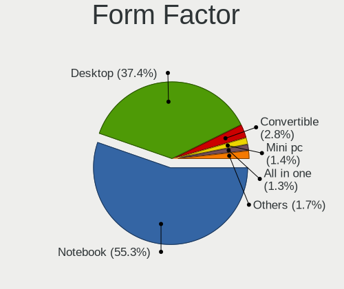
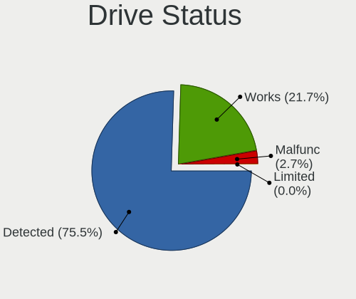
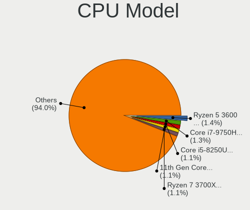
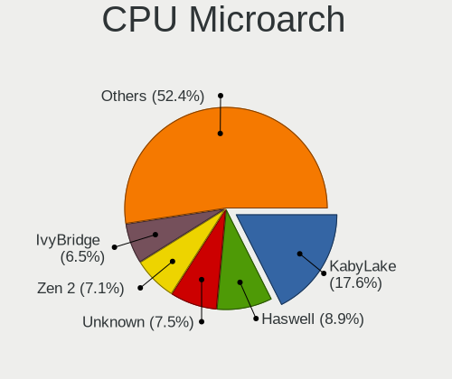
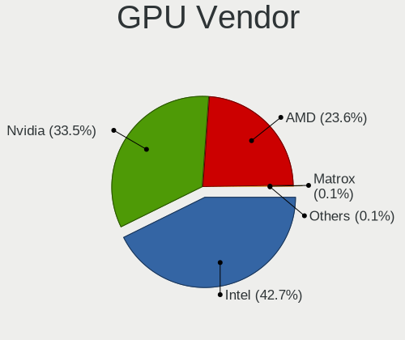
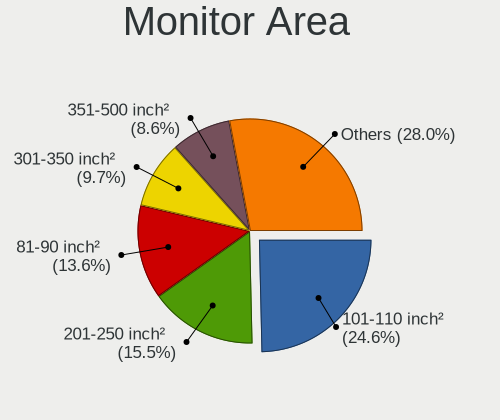

Pop!_OS - Tested Hardware & Statistics
--------------------------------------

A project to collect tested hardware configurations for Pop!_OS.

Anyone can contribute to this report by the [hw-probe](https://github.com/linuxhw/hw-probe) tool:

    sudo -E hw-probe -all -upload

Please contribute! Especially if your hardware is rare.

This is a report for all computer types. See also reports for [desktops](/Dist/Pop!_OS/Desktop/README.md) and [notebooks](/Dist/Pop!_OS/Notebook/README.md).

Contents
--------

* [ Test Cases ](#test-cases)

* [ System ](#system)
  - [ OS                       ](#os)
  - [ OS Family                ](#os-family)
  - [ Kernel                   ](#kernel)
  - [ Kernel Family            ](#kernel-family)
  - [ Kernel Major Ver.        ](#kernel-major-ver)
  - [ Arch                     ](#arch)
  - [ DE                       ](#de)
  - [ Display Server           ](#display-server)
  - [ Display Manager          ](#display-manager)
  - [ OS Lang                  ](#os-lang)
  - [ Boot Mode                ](#boot-mode)
  - [ Filesystem               ](#filesystem)
  - [ Part. scheme             ](#part-scheme)
  - [ Dual Boot with Linux/BSD ](#dual-boot-with-linuxbsd)
  - [ Dual Boot (Win)          ](#dual-boot-win)

* [ Board ](#board)
  - [ Vendor                   ](#vendor)
  - [ Model                    ](#model)
  - [ Model Family             ](#model-family)
  - [ MFG Year                 ](#mfg-year)
  - [ Form Factor              ](#form-factor)
  - [ Secure Boot              ](#secure-boot)
  - [ Coreboot                 ](#coreboot)
  - [ RAM Size                 ](#ram-size)
  - [ RAM Used                 ](#ram-used)
  - [ Total Drives             ](#total-drives)
  - [ Has CD-ROM               ](#has-cd-rom)
  - [ Has Ethernet             ](#has-ethernet)
  - [ Has WiFi                 ](#has-wifi)
  - [ Has Bluetooth            ](#has-bluetooth)

* [ Location ](#location)
  - [ Country                  ](#country)
  - [ City                     ](#city)

* [ Drives ](#drives)
  - [ Drive Vendor             ](#drive-vendor)
  - [ Drive Model              ](#drive-model)
  - [ HDD Vendor               ](#hdd-vendor)
  - [ SSD Vendor               ](#ssd-vendor)
  - [ Drive Kind               ](#drive-kind)
  - [ Drive Connector          ](#drive-connector)
  - [ Drive Size               ](#drive-size)
  - [ Space Total              ](#space-total)
  - [ Space Used               ](#space-used)
  - [ Malfunc. Drives          ](#malfunc-drives)
  - [ Malfunc. Drive Vendor    ](#malfunc-drive-vendor)
  - [ Malfunc. HDD Vendor      ](#malfunc-hdd-vendor)
  - [ Malfunc. Drive Kind      ](#malfunc-drive-kind)
  - [ Failed Drives            ](#failed-drives)
  - [ Failed Drive Vendor      ](#failed-drive-vendor)
  - [ Drive Status             ](#drive-status)

* [ Storage controller ](#storage-controller)
  - [ Storage Vendor           ](#storage-vendor)
  - [ Storage Model            ](#storage-model)
  - [ Storage Kind             ](#storage-kind)

* [ Processor ](#processor)
  - [ CPU Vendor               ](#cpu-vendor)
  - [ CPU Model                ](#cpu-model)
  - [ CPU Model Family         ](#cpu-model-family)
  - [ CPU Cores                ](#cpu-cores)
  - [ CPU Sockets              ](#cpu-sockets)
  - [ CPU Threads              ](#cpu-threads)
  - [ CPU Op-Modes             ](#cpu-op-modes)
  - [ CPU Microcode            ](#cpu-microcode)
  - [ CPU Microarch            ](#cpu-microarch)

* [ Graphics ](#graphics)
  - [ GPU Vendor               ](#gpu-vendor)
  - [ GPU Model                ](#gpu-model)
  - [ GPU Combo                ](#gpu-combo)
  - [ GPU Driver               ](#gpu-driver)
  - [ GPU Memory               ](#gpu-memory)

* [ Monitor ](#monitor)
  - [ Monitor Vendor           ](#monitor-vendor)
  - [ Monitor Model            ](#monitor-model)
  - [ Monitor Resolution       ](#monitor-resolution)
  - [ Monitor Diagonal         ](#monitor-diagonal)
  - [ Monitor Width            ](#monitor-width)
  - [ Aspect Ratio             ](#aspect-ratio)
  - [ Monitor Area             ](#monitor-area)
  - [ Pixel Density            ](#pixel-density)
  - [ Multiple Monitors        ](#multiple-monitors)

* [ Network ](#network)
  - [ Net Controller Vendor    ](#net-controller-vendor)
  - [ Net Controller Model     ](#net-controller-model)
  - [ Wireless Vendor          ](#wireless-vendor)
  - [ Wireless Model           ](#wireless-model)
  - [ Ethernet Vendor          ](#ethernet-vendor)
  - [ Ethernet Model           ](#ethernet-model)
  - [ Net Controller Kind      ](#net-controller-kind)
  - [ Used Controller          ](#used-controller)
  - [ NICs                     ](#nics)
  - [ IPv6                     ](#ipv6)

* [ Bluetooth ](#bluetooth)
  - [ Bluetooth Vendor         ](#bluetooth-vendor)
  - [ Bluetooth Model          ](#bluetooth-model)

* [ Sound ](#sound)
  - [ Sound Vendor             ](#sound-vendor)
  - [ Sound Model              ](#sound-model)

* [ Memory ](#memory)
  - [ Memory Vendor            ](#memory-vendor)
  - [ Memory Model             ](#memory-model)
  - [ Memory Kind              ](#memory-kind)
  - [ Memory Form Factor       ](#memory-form-factor)
  - [ Memory Size              ](#memory-size)
  - [ Memory Speed             ](#memory-speed)

* [ Printers & scanners ](#printers--scanners)
  - [ Printer Vendor           ](#printer-vendor)
  - [ Printer Model            ](#printer-model)
  - [ Scanner Vendor           ](#scanner-vendor)
  - [ Scanner Model            ](#scanner-model)

* [ Camera ](#camera)
  - [ Camera Vendor            ](#camera-vendor)
  - [ Camera Model             ](#camera-model)

* [ Security ](#security)
  - [ Fingerprint Vendor       ](#fingerprint-vendor)
  - [ Fingerprint Model        ](#fingerprint-model)
  - [ Chipcard Vendor          ](#chipcard-vendor)
  - [ Chipcard Model           ](#chipcard-model)

* [ Unsupported ](#unsupported)
  - [ Unsupported Devices      ](#unsupported-devices)
  - [ Unsupported Device Types ](#unsupported-device-types)

Test Cases
----------

Total: 13049

| Vendor        | Model                       | Form-Factor | Probe                                                      | Date         |
|---------------|-----------------------------|-------------|------------------------------------------------------------|--------------|
| HP            | ENVY x360 Convertible 15... | Convertible | [dc16d81ba0](https://linux-hardware.org/?probe=dc16d81ba0) | May 01, 2023 |
| Fujitsu       | D3223-A1 S26361-D3223-A1    | Desktop     | [9b6f7cea89](https://linux-hardware.org/?probe=9b6f7cea89) | May 01, 2023 |
| Lenovo        | Yoga 6 13ALC7 82UD          | Convertible | [80671ff25c](https://linux-hardware.org/?probe=80671ff25c) | May 01, 2023 |
| Lenovo        | ThinkPad P52s 20LCS1H100    | Notebook    | [34b877bcb5](https://linux-hardware.org/?probe=34b877bcb5) | May 01, 2023 |
| ASUSTek       | X455LJ                      | Notebook    | [4e252eab9f](https://linux-hardware.org/?probe=4e252eab9f) | May 01, 2023 |
| ASUSTek       | ROG STRIX X670E-E GAMING... | Desktop     | [0d5e9310d3](https://linux-hardware.org/?probe=0d5e9310d3) | Apr 30, 2023 |
| Lenovo        | Legion 5 15ARH05H 82B1      | Notebook    | [9df1b688c0](https://linux-hardware.org/?probe=9df1b688c0) | Apr 30, 2023 |
| Lenovo        | IdeaPad 330-15IKB 81DE      | Notebook    | [875ae124a1](https://linux-hardware.org/?probe=875ae124a1) | Apr 30, 2023 |
| Dell          | Latitude E6430              | Notebook    | [4c20239367](https://linux-hardware.org/?probe=4c20239367) | Apr 30, 2023 |
| ASRock        | X670E Steel Legend          | Desktop     | [04a7cea7cb](https://linux-hardware.org/?probe=04a7cea7cb) | Apr 29, 2023 |
| ASUSTek       | ROG CROSSHAIR X670E HERO    | Desktop     | [4ac7cbf111](https://linux-hardware.org/?probe=4ac7cbf111) | Apr 29, 2023 |
| Apple         | MacBookPro11,3              | Notebook    | [3feeeb3341](https://linux-hardware.org/?probe=3feeeb3341) | Apr 29, 2023 |
| Apple         | MacBookPro11,3              | Notebook    | [8e0692ebe3](https://linux-hardware.org/?probe=8e0692ebe3) | Apr 29, 2023 |
| Gigabyte      | B660 GAMING X DDR4          | Desktop     | [c203c197b7](https://linux-hardware.org/?probe=c203c197b7) | Apr 29, 2023 |
| Lenovo        | IdeaPad 320-15IKB 80YH      | Notebook    | [af0c1ea83c](https://linux-hardware.org/?probe=af0c1ea83c) | Apr 29, 2023 |
| Lenovo        | IdeaPad 320-15IKB 80YH      | Notebook    | [7c8c5a4668](https://linux-hardware.org/?probe=7c8c5a4668) | Apr 29, 2023 |
| Intel         | DB75EN AAG39650-303         | Desktop     | [713c422641](https://linux-hardware.org/?probe=713c422641) | Apr 29, 2023 |
| Raspberry ... | Raspberry Pi                | Soc         | [998427cdcf](https://linux-hardware.org/?probe=998427cdcf) | Apr 29, 2023 |
| HP            | 8054                        | Desktop     | [81a57b4a2f](https://linux-hardware.org/?probe=81a57b4a2f) | Apr 29, 2023 |
| Dell          | Inspiron 7706 2n1           | Convertible | [9a9fdf0dd3](https://linux-hardware.org/?probe=9a9fdf0dd3) | Apr 29, 2023 |
| HUAWEI        | BOHK-WAX9X                  | Notebook    | [9b560392f5](https://linux-hardware.org/?probe=9b560392f5) | Apr 29, 2023 |
| Gigabyte      | H410M H                     | Desktop     | [3ea3271f4a](https://linux-hardware.org/?probe=3ea3271f4a) | Apr 29, 2023 |
| Dell          | 0P4T42 A01                  | All in one  | [323e28fded](https://linux-hardware.org/?probe=323e28fded) | Apr 29, 2023 |
| Lenovo        | Yoga Slim 7 Pro 14ARH7 8... | Notebook    | [39644ab1d4](https://linux-hardware.org/?probe=39644ab1d4) | Apr 28, 2023 |
| Lenovo        | ThinkPad T450 20BUS0B000    | Notebook    | [a2cbf65767](https://linux-hardware.org/?probe=a2cbf65767) | Apr 28, 2023 |
| Apple         | Mac-F226BEC8 PVT            | All in one  | [261c116001](https://linux-hardware.org/?probe=261c116001) | Apr 28, 2023 |
| MSI           | PRO X670-P WIFI             | Desktop     | [266688994a](https://linux-hardware.org/?probe=266688994a) | Apr 28, 2023 |
| MSI           | PRO X670-P WIFI             | Desktop     | [af0663fd52](https://linux-hardware.org/?probe=af0663fd52) | Apr 28, 2023 |
| ASUSTek       | ROG CROSSHAIR VIII HERO     | Desktop     | [f1679a62d0](https://linux-hardware.org/?probe=f1679a62d0) | Apr 28, 2023 |
| MSI           | MAG B550M MORTAR WIFI       | Desktop     | [26c158df39](https://linux-hardware.org/?probe=26c158df39) | Apr 28, 2023 |
| HP            | ENVY 15                     | Notebook    | [d870c486c7](https://linux-hardware.org/?probe=d870c486c7) | Apr 27, 2023 |
| Toshiba       | IS 1413G                    | Notebook    | [f96c9382bd](https://linux-hardware.org/?probe=f96c9382bd) | Apr 27, 2023 |
| Dell          | Latitude D520               | Notebook    | [a643e2e424](https://linux-hardware.org/?probe=a643e2e424) | Apr 27, 2023 |
| Gigabyte      | Z170X-Gaming 7              | Desktop     | [4363ca582a](https://linux-hardware.org/?probe=4363ca582a) | Apr 26, 2023 |
| Gigabyte      | Z170X-Gaming 7              | Desktop     | [f5de49d5b3](https://linux-hardware.org/?probe=f5de49d5b3) | Apr 26, 2023 |
| ASUSTek       | ROG STRIX Z390-I GAMING     | Desktop     | [83453e6960](https://linux-hardware.org/?probe=83453e6960) | Apr 26, 2023 |
| Gigabyte      | B550M DS3H                  | Desktop     | [208a0fc365](https://linux-hardware.org/?probe=208a0fc365) | Apr 26, 2023 |
| Intel         | B75                         | Desktop     | [72a3677ac2](https://linux-hardware.org/?probe=72a3677ac2) | Apr 26, 2023 |
| Foxconn       | 2ABF                        | Desktop     | [d040f4ff16](https://linux-hardware.org/?probe=d040f4ff16) | Apr 26, 2023 |
| Toshiba       | IS 1413G                    | Notebook    | [a24f74af8e](https://linux-hardware.org/?probe=a24f74af8e) | Apr 26, 2023 |
| Lenovo        | ThinkPad L570 20J80021MD    | Notebook    | [26e9a466cd](https://linux-hardware.org/?probe=26e9a466cd) | Apr 26, 2023 |
| Intel         | X99H                        | Desktop     | [d0f8c22128](https://linux-hardware.org/?probe=d0f8c22128) | Apr 26, 2023 |
| System76      | Gazelle                     | Notebook    | [ca2e23db8d](https://linux-hardware.org/?probe=ca2e23db8d) | Apr 25, 2023 |
| HUAWEI        | BOHK-WAX9X                  | Notebook    | [f797b7112c](https://linux-hardware.org/?probe=f797b7112c) | Apr 25, 2023 |
| HP            | ENVY 15                     | Notebook    | [3539894e49](https://linux-hardware.org/?probe=3539894e49) | Apr 25, 2023 |
| Dell          | Latitude 7400 2-in-1        | Convertible | [da35752b66](https://linux-hardware.org/?probe=da35752b66) | Apr 25, 2023 |
| ASRock        | Z370 Extreme4               | Desktop     | [0e46ae0751](https://linux-hardware.org/?probe=0e46ae0751) | Apr 25, 2023 |
| Lenovo        | 103D SDK0J40697 WIN 3305... | Desktop     | [f82b3152d0](https://linux-hardware.org/?probe=f82b3152d0) | Apr 25, 2023 |
| ASUSTek       | ROG CROSSHAIR VIII HERO     | Desktop     | [517a694a82](https://linux-hardware.org/?probe=517a694a82) | Apr 25, 2023 |
| Acer          | E5-551G-871W                | Notebook    | [2730a30d89](https://linux-hardware.org/?probe=2730a30d89) | Apr 25, 2023 |
| Lenovo        | V14-IIL 82C4                | Notebook    | [42a0a6d5e4](https://linux-hardware.org/?probe=42a0a6d5e4) | Apr 25, 2023 |
| Lenovo        | V14-IIL 82C4                | Notebook    | [7ab59d4ba9](https://linux-hardware.org/?probe=7ab59d4ba9) | Apr 25, 2023 |
| HP            | Laptop 15-ef1xxx            | Notebook    | [05d2b26ee6](https://linux-hardware.org/?probe=05d2b26ee6) | Apr 25, 2023 |
| HP            | Laptop 15-ef1xxx            | Notebook    | [0ef0676073](https://linux-hardware.org/?probe=0ef0676073) | Apr 25, 2023 |
| HP            | ENVY 15                     | Notebook    | [39d32b035a](https://linux-hardware.org/?probe=39d32b035a) | Apr 25, 2023 |
| ASUSTek       | PRIME H310-PLUS             | Desktop     | [a06d7e1f82](https://linux-hardware.org/?probe=a06d7e1f82) | Apr 25, 2023 |
| Gigabyte      | B450M S2H                   | Desktop     | [db176db0db](https://linux-hardware.org/?probe=db176db0db) | Apr 25, 2023 |
| Apple         | MacBookPro8,1               | Notebook    | [2f1eb3e6ee](https://linux-hardware.org/?probe=2f1eb3e6ee) | Apr 24, 2023 |
| Gigabyte      | B550 AORUS ELITE AX V2      | Desktop     | [0d6740c2a8](https://linux-hardware.org/?probe=0d6740c2a8) | Apr 24, 2023 |
| Alienware     | 13 R2                       | Notebook    | [ee7a023f6d](https://linux-hardware.org/?probe=ee7a023f6d) | Apr 24, 2023 |
| G7-2011       | X79                         | Desktop     | [5070a0a7a7](https://linux-hardware.org/?probe=5070a0a7a7) | Apr 24, 2023 |
| ASRock        | A320M Pro4                  | Desktop     | [bfe26862f0](https://linux-hardware.org/?probe=bfe26862f0) | Apr 24, 2023 |
| Lenovo        | ThinkPad T480 20L50003GE    | Notebook    | [1259bb0006](https://linux-hardware.org/?probe=1259bb0006) | Apr 24, 2023 |
| ASUSTek       | TUF Gaming B550M-PLUS       | Desktop     | [074135d4f4](https://linux-hardware.org/?probe=074135d4f4) | Apr 24, 2023 |
| Gigabyte      | B450M S2H                   | Desktop     | [f3c853b789](https://linux-hardware.org/?probe=f3c853b789) | Apr 23, 2023 |
| ASUSTek       | AM1M-A/BR                   | Desktop     | [0b29ee62f9](https://linux-hardware.org/?probe=0b29ee62f9) | Apr 23, 2023 |
| Alienware     | 13 R3                       | Notebook    | [f04b34f41d](https://linux-hardware.org/?probe=f04b34f41d) | Apr 23, 2023 |
| Packard Be... | IPOWER G3610                | Desktop     | [05de2306b0](https://linux-hardware.org/?probe=05de2306b0) | Apr 23, 2023 |
| ASUSTek       | X551MA                      | Notebook    | [44ca7e29c0](https://linux-hardware.org/?probe=44ca7e29c0) | Apr 23, 2023 |
| Gigabyte      | Z170X-Gaming 7              | Desktop     | [cd11cc0e25](https://linux-hardware.org/?probe=cd11cc0e25) | Apr 23, 2023 |
| Dell          | Inspiron 7737               | Notebook    | [50b75a71d3](https://linux-hardware.org/?probe=50b75a71d3) | Apr 23, 2023 |
| ASUSTek       | TUF Gaming B550M-PLUS       | Desktop     | [1b475eaa99](https://linux-hardware.org/?probe=1b475eaa99) | Apr 23, 2023 |
| HP            | ZBook 15                    | Notebook    | [c7ae51efcd](https://linux-hardware.org/?probe=c7ae51efcd) | Apr 22, 2023 |
| Dell          | Inspiron 5567               | Notebook    | [f639b8e21a](https://linux-hardware.org/?probe=f639b8e21a) | Apr 22, 2023 |
| Dell          | 0FDY5C A00                  | Desktop     | [c35628b7c7](https://linux-hardware.org/?probe=c35628b7c7) | Apr 22, 2023 |
| Lenovo        | IdeaPad 5 Pro 14ACN6 82L... | Notebook    | [1c76d0f5a4](https://linux-hardware.org/?probe=1c76d0f5a4) | Apr 22, 2023 |
| Lenovo        | Legion S7 15IMH5 82BC       | Notebook    | [332fdb5298](https://linux-hardware.org/?probe=332fdb5298) | Apr 22, 2023 |
| Dell          | XPS 13 9350                 | Notebook    | [1ed1930799](https://linux-hardware.org/?probe=1ed1930799) | Apr 21, 2023 |
| GPU Compan... | GWTC116-2                   | Notebook    | [8f7df56d73](https://linux-hardware.org/?probe=8f7df56d73) | Apr 21, 2023 |
| ASUSTek       | 970 PRO GAMING/AURA         | Desktop     | [7215ce49dd](https://linux-hardware.org/?probe=7215ce49dd) | Apr 21, 2023 |
| HP            | ProBook 640 G1              | Notebook    | [b5022d8a2f](https://linux-hardware.org/?probe=b5022d8a2f) | Apr 21, 2023 |
| MSI           | MAG Z690 TOMAHAWK WIFI D... | Desktop     | [68d07ba405](https://linux-hardware.org/?probe=68d07ba405) | Apr 20, 2023 |
| Lenovo        | MIIX 310-10ICR 80SG         | Tablet      | [3f12350d47](https://linux-hardware.org/?probe=3f12350d47) | Apr 20, 2023 |
| Dell          | Precision M6600             | Notebook    | [e71bf9e7bb](https://linux-hardware.org/?probe=e71bf9e7bb) | Apr 20, 2023 |
| Lenovo        | ThinkPad X220 4291WF5       | Notebook    | [4c78af0e05](https://linux-hardware.org/?probe=4c78af0e05) | Apr 20, 2023 |
| Dell          | XPS 13 9343                 | Notebook    | [573d482e45](https://linux-hardware.org/?probe=573d482e45) | Apr 20, 2023 |
| HP            | Compaq 6510b (KE131ET#AK... | Notebook    | [f9415c65e9](https://linux-hardware.org/?probe=f9415c65e9) | Apr 20, 2023 |
| Dell          | Inspiron 17 7000 Series ... | Notebook    | [6222d9b2b0](https://linux-hardware.org/?probe=6222d9b2b0) | Apr 19, 2023 |
| MSI           | H110M PRO-D                 | Desktop     | [cc76c44731](https://linux-hardware.org/?probe=cc76c44731) | Apr 19, 2023 |
| HP            | Compaq 6510b (KE131ET#AK... | Notebook    | [fc27cf4b3e](https://linux-hardware.org/?probe=fc27cf4b3e) | Apr 19, 2023 |
| HP            | Pavilion Gaming Laptop 1... | Notebook    | [0187ac7a0c](https://linux-hardware.org/?probe=0187ac7a0c) | Apr 19, 2023 |
| Lenovo        | ThinkPad T480s 20L8S6S30... | Notebook    | [9241adf5fb](https://linux-hardware.org/?probe=9241adf5fb) | Apr 19, 2023 |
| ASUSTek       | M5A78L-M LX V2              | Desktop     | [1e8a2bbf1d](https://linux-hardware.org/?probe=1e8a2bbf1d) | Apr 19, 2023 |
| Microsoft     | Surface Pro 3               | Tablet      | [eedaf9f548](https://linux-hardware.org/?probe=eedaf9f548) | Apr 19, 2023 |
| American M... | XA133PR110                  | Notebook    | [5c634b7029](https://linux-hardware.org/?probe=5c634b7029) | Apr 19, 2023 |
| Lenovo        | IdeaPad 1 15ADA7 82R1       | Notebook    | [0f058078c9](https://linux-hardware.org/?probe=0f058078c9) | Apr 19, 2023 |
| HP            | EliteBook 8460p             | Notebook    | [33b92210c7](https://linux-hardware.org/?probe=33b92210c7) | Apr 19, 2023 |
| HP            | EliteBook 8460p             | Notebook    | [fe26aeffdd](https://linux-hardware.org/?probe=fe26aeffdd) | Apr 19, 2023 |
| ASUSTek       | X541UJ                      | Notebook    | [1aa63436a5](https://linux-hardware.org/?probe=1aa63436a5) | Apr 19, 2023 |
| Acer          | Aspire AV15-52              | Notebook    | [e1044f40e2](https://linux-hardware.org/?probe=e1044f40e2) | Apr 18, 2023 |
| ASUSTek       | ROG STRIX X470-F GAMING     | Desktop     | [4abccb30eb](https://linux-hardware.org/?probe=4abccb30eb) | Apr 18, 2023 |
| Samsung       | DT1234567890 SAMSUNG_SW_... | Desktop     | [e84a6f3538](https://linux-hardware.org/?probe=e84a6f3538) | Apr 18, 2023 |
| Acer          | Aspire E5-575               | Notebook    | [58b159ef8f](https://linux-hardware.org/?probe=58b159ef8f) | Apr 18, 2023 |
| Lenovo        | ThinkPad A275 20KDS01T00    | Notebook    | [c35c104c5e](https://linux-hardware.org/?probe=c35c104c5e) | Apr 18, 2023 |
| Lenovo        | ThinkPad A275 20KDS01T00    | Notebook    | [14df620b0a](https://linux-hardware.org/?probe=14df620b0a) | Apr 18, 2023 |
| Lenovo        | Y50-70 20378                | Notebook    | [af6c719754](https://linux-hardware.org/?probe=af6c719754) | Apr 18, 2023 |
| Dell          | Inspiron 7559               | Notebook    | [9c66c608f3](https://linux-hardware.org/?probe=9c66c608f3) | Apr 18, 2023 |
| Lenovo        | ThinkPad T480 20L50003GE    | Notebook    | [e779a9606f](https://linux-hardware.org/?probe=e779a9606f) | Apr 18, 2023 |
| Dell          | 08WKV3 A00                  | Desktop     | [091f305ccb](https://linux-hardware.org/?probe=091f305ccb) | Apr 18, 2023 |
| Apple         | MacBookPro12,1              | Notebook    | [f045e3f800](https://linux-hardware.org/?probe=f045e3f800) | Apr 18, 2023 |
| Gigabyte      | G5 GE                       | Notebook    | [f1baab4be4](https://linux-hardware.org/?probe=f1baab4be4) | Apr 17, 2023 |
| MSI           | PS42 Modern 8RC             | Notebook    | [459a84f65e](https://linux-hardware.org/?probe=459a84f65e) | Apr 17, 2023 |
| American M... | XA133PR110                  | Notebook    | [08b47e43a7](https://linux-hardware.org/?probe=08b47e43a7) | Apr 17, 2023 |
| Toshiba       | Satellite E45-B             | Notebook    | [ec0bb6bfc6](https://linux-hardware.org/?probe=ec0bb6bfc6) | Apr 17, 2023 |
| ASUSTek       | PRIME H670-PLUS D4          | Desktop     | [59f6a81039](https://linux-hardware.org/?probe=59f6a81039) | Apr 17, 2023 |
| Lenovo        | Legion 7 16IAX7 82TD        | Notebook    | [8f0188b2a1](https://linux-hardware.org/?probe=8f0188b2a1) | Apr 17, 2023 |
| Dell          | Inspiron 3541               | Notebook    | [dd409790ad](https://linux-hardware.org/?probe=dd409790ad) | Apr 17, 2023 |
| HP            | Pavilion Gaming Laptop 1... | Notebook    | [55325c372c](https://linux-hardware.org/?probe=55325c372c) | Apr 17, 2023 |
| HP            | ENVY 17                     | Notebook    | [ba2c1aae76](https://linux-hardware.org/?probe=ba2c1aae76) | Apr 17, 2023 |
| HP            | Dev One Notebook PC         | Notebook    | [5e3f0907fa](https://linux-hardware.org/?probe=5e3f0907fa) | Apr 16, 2023 |
| Lenovo        | IdeaPad 3 15ALC6 82MF       | Notebook    | [beac478abb](https://linux-hardware.org/?probe=beac478abb) | Apr 16, 2023 |
| Chuwi         | LarkBox Pro                 | Mini pc     | [9feb6e0d59](https://linux-hardware.org/?probe=9feb6e0d59) | Apr 16, 2023 |
| ASRock        | X670E Pro RS                | Desktop     | [cfc2be8311](https://linux-hardware.org/?probe=cfc2be8311) | Apr 16, 2023 |
| ASRock        | X670E Pro RS                | Desktop     | [be0c962cda](https://linux-hardware.org/?probe=be0c962cda) | Apr 16, 2023 |
| MSI           | MPG B560I GAMING EDGE WI... | Desktop     | [8888f53504](https://linux-hardware.org/?probe=8888f53504) | Apr 16, 2023 |
| Dell          | XPS 13 9310                 | Notebook    | [3a7d52ef90](https://linux-hardware.org/?probe=3a7d52ef90) | Apr 16, 2023 |
| Lenovo        | ThinkBook 15 G4 IAP 21DJ    | Notebook    | [6b126883e9](https://linux-hardware.org/?probe=6b126883e9) | Apr 16, 2023 |
| Lenovo        | ThinkPad X1 Carbon 7th 2... | Notebook    | [9ac7ca1a63](https://linux-hardware.org/?probe=9ac7ca1a63) | Apr 16, 2023 |
| Lenovo        | Legion 5 17ACH6H 82JY       | Notebook    | [762ad80f82](https://linux-hardware.org/?probe=762ad80f82) | Apr 16, 2023 |
| Dell          | Inspiron 1525               | Notebook    | [3b20856ccc](https://linux-hardware.org/?probe=3b20856ccc) | Apr 16, 2023 |
| Acer          | Swift SFX14-41G             | Notebook    | [a0f08c4442](https://linux-hardware.org/?probe=a0f08c4442) | Apr 16, 2023 |
| ASUSTek       | TUF B450-PRO GAMING         | Desktop     | [da31814636](https://linux-hardware.org/?probe=da31814636) | Apr 15, 2023 |
| Lenovo        | ThinkPad T14 Gen 1 20S1S... | Notebook    | [f7ce1b2ab5](https://linux-hardware.org/?probe=f7ce1b2ab5) | Apr 15, 2023 |
| Medion        | E15415                      | Notebook    | [fb905ef988](https://linux-hardware.org/?probe=fb905ef988) | Apr 15, 2023 |
| Lenovo        | ThinkPad T14 Gen 1 20S1S... | Notebook    | [1d253a4901](https://linux-hardware.org/?probe=1d253a4901) | Apr 15, 2023 |
| ASUSTek       | ROG CROSSHAIR VII HERO      | Desktop     | [e405d73576](https://linux-hardware.org/?probe=e405d73576) | Apr 15, 2023 |
| HP            | ZBook Firefly 15.6 inch ... | Notebook    | [f45051411c](https://linux-hardware.org/?probe=f45051411c) | Apr 15, 2023 |
| Lenovo        | IdeaPad 5 Pro 16ARH7 82S... | Notebook    | [aedbc43074](https://linux-hardware.org/?probe=aedbc43074) | Apr 15, 2023 |
| HP            | ENVY x360 2-in-1 Laptop ... | Convertible | [a9d18f5eaa](https://linux-hardware.org/?probe=a9d18f5eaa) | Apr 15, 2023 |
| HP            | Pavilion g6                 | Notebook    | [a918284993](https://linux-hardware.org/?probe=a918284993) | Apr 15, 2023 |
| Dell          | 0HY9JP A02                  | Desktop     | [25a1ee5a25](https://linux-hardware.org/?probe=25a1ee5a25) | Apr 15, 2023 |
| Biostar       | A960D+V2                    | Desktop     | [da262e3956](https://linux-hardware.org/?probe=da262e3956) | Apr 14, 2023 |
| Gigabyte      | B550 AORUS ELITE AX V2      | Desktop     | [c30c14f9b0](https://linux-hardware.org/?probe=c30c14f9b0) | Apr 14, 2023 |
| Dell          | XPS 15 9560                 | Notebook    | [5ab7cc057f](https://linux-hardware.org/?probe=5ab7cc057f) | Apr 14, 2023 |
| Dell          | Precision 5550              | Notebook    | [1546772c9f](https://linux-hardware.org/?probe=1546772c9f) | Apr 14, 2023 |
| Dell          | Latitude E5440              | Notebook    | [a827218c2e](https://linux-hardware.org/?probe=a827218c2e) | Apr 14, 2023 |
| ASUSTek       | X551MA                      | Notebook    | [871fd53afd](https://linux-hardware.org/?probe=871fd53afd) | Apr 14, 2023 |
| HP            | Laptop 15z-fc000            | Notebook    | [df47336192](https://linux-hardware.org/?probe=df47336192) | Apr 14, 2023 |
| HP            | Notebook                    | Notebook    | [79541411b2](https://linux-hardware.org/?probe=79541411b2) | Apr 14, 2023 |
| Gigabyte      | B650M AORUS ELITE AX        | Desktop     | [87b5989939](https://linux-hardware.org/?probe=87b5989939) | Apr 13, 2023 |
| Microsoft     | Surface Laptop 4            | Tablet      | [78ddf23352](https://linux-hardware.org/?probe=78ddf23352) | Apr 13, 2023 |
| Toshiba       | IS 1413G                    | Notebook    | [f57cf8ddf4](https://linux-hardware.org/?probe=f57cf8ddf4) | Apr 13, 2023 |
| HP            | Spectre x360 Convertible... | Convertible | [106963edf7](https://linux-hardware.org/?probe=106963edf7) | Apr 13, 2023 |
| Lenovo        | Legion 5 15ARH05H 82B1      | Notebook    | [5a86b52121](https://linux-hardware.org/?probe=5a86b52121) | Apr 13, 2023 |
| HP            | 8433 11                     | Desktop     | [911f2844c9](https://linux-hardware.org/?probe=911f2844c9) | Apr 13, 2023 |
| MSI           | MPG X570S EDGE MAX WIFI     | Desktop     | [df59296148](https://linux-hardware.org/?probe=df59296148) | Apr 13, 2023 |
| Microsoft     | Surface Pro 3               | Tablet      | [eb84ecafb4](https://linux-hardware.org/?probe=eb84ecafb4) | Apr 13, 2023 |
| Gigabyte      | X570 AORUS ELITE            | Desktop     | [df185fb277](https://linux-hardware.org/?probe=df185fb277) | Apr 12, 2023 |
| System76      | Pangolin                    | Notebook    | [1750f20c8d](https://linux-hardware.org/?probe=1750f20c8d) | Apr 12, 2023 |
| System76      | Thelio thelio-r3            | Desktop     | [3acd31b3be](https://linux-hardware.org/?probe=3acd31b3be) | Apr 12, 2023 |
| Lenovo        | Legion S7 15ACH6 82K8       | Notebook    | [1f12146974](https://linux-hardware.org/?probe=1f12146974) | Apr 12, 2023 |
| Lenovo        | 3098 SDK0E50510 WIN         | Desktop     | [0d8eb6aa86](https://linux-hardware.org/?probe=0d8eb6aa86) | Apr 12, 2023 |
| Lenovo        | Legion S7 15ACH6 82K8       | Notebook    | [9aadb88a2d](https://linux-hardware.org/?probe=9aadb88a2d) | Apr 12, 2023 |
| System76      | Thelio thelio-r3            | Desktop     | [7a1d69f216](https://linux-hardware.org/?probe=7a1d69f216) | Apr 12, 2023 |
| Gigabyte      | G1.Sniper M3-CF             | Desktop     | [d3ecd3c066](https://linux-hardware.org/?probe=d3ecd3c066) | Apr 12, 2023 |
| Apple         | MacBookPro8,1               | Notebook    | [94372e3520](https://linux-hardware.org/?probe=94372e3520) | Apr 12, 2023 |
| ASUSTek       | VivoBook_ASUSLaptop X515... | Notebook    | [0120f0db62](https://linux-hardware.org/?probe=0120f0db62) | Apr 12, 2023 |
| ASRock        | X370 Gaming-ITX/ac          | Desktop     | [29ed28536e](https://linux-hardware.org/?probe=29ed28536e) | Apr 12, 2023 |
| Dell          | G3 3579                     | Notebook    | [24d10a8497](https://linux-hardware.org/?probe=24d10a8497) | Apr 12, 2023 |
| Timi          | TM1707                      | Notebook    | [0e015e68ec](https://linux-hardware.org/?probe=0e015e68ec) | Apr 12, 2023 |
| Timi          | TM1707                      | Notebook    | [b611ba24ed](https://linux-hardware.org/?probe=b611ba24ed) | Apr 12, 2023 |
| ASUSTek       | 970 PRO GAMING/AURA         | Desktop     | [4c217a8a03](https://linux-hardware.org/?probe=4c217a8a03) | Apr 11, 2023 |
| BESSTAR Te... | GB1B                        | Mini pc     | [dc66113388](https://linux-hardware.org/?probe=dc66113388) | Apr 11, 2023 |
| ASUSTek       | ZenBook UX325UA_UM325UA     | Notebook    | [87059322b0](https://linux-hardware.org/?probe=87059322b0) | Apr 11, 2023 |
| Apple         | Mac-F226BEC8 PVT            | All in one  | [63574c5adf](https://linux-hardware.org/?probe=63574c5adf) | Apr 11, 2023 |
| Gigabyte      | G41MT-S2                    | Desktop     | [73233d1c4c](https://linux-hardware.org/?probe=73233d1c4c) | Apr 11, 2023 |
| MSI           | MEG X570 UNIFY              | Desktop     | [02d670e0db](https://linux-hardware.org/?probe=02d670e0db) | Apr 11, 2023 |
| MSI           | B350 GAMING PLUS            | Desktop     | [df2f924a6e](https://linux-hardware.org/?probe=df2f924a6e) | Apr 11, 2023 |
| Samsung       | 760XDA                      | Notebook    | [bdc1648c05](https://linux-hardware.org/?probe=bdc1648c05) | Apr 11, 2023 |
| Dell          | Latitude 5590               | Notebook    | [f8f0f0125f](https://linux-hardware.org/?probe=f8f0f0125f) | Apr 11, 2023 |
| MSI           | GF63 Thin 9RCX              | Notebook    | [c48286f8a2](https://linux-hardware.org/?probe=c48286f8a2) | Apr 10, 2023 |
| MSI           | H81M-P33                    | Desktop     | [129abe0b90](https://linux-hardware.org/?probe=129abe0b90) | Apr 10, 2023 |
| Apple         | MacBookPro11,4              | Notebook    | [85a39124f3](https://linux-hardware.org/?probe=85a39124f3) | Apr 09, 2023 |
| Apple         | Mac-F226BEC8 PVT            | All in one  | [beeb850c3b](https://linux-hardware.org/?probe=beeb850c3b) | Apr 09, 2023 |
| Apple         | MacBookPro12,1              | Notebook    | [0844c71fd0](https://linux-hardware.org/?probe=0844c71fd0) | Apr 07, 2023 |
| System76      | Oryx Pro                    | Notebook    | [a221f4f9d4](https://linux-hardware.org/?probe=a221f4f9d4) | Apr 06, 2023 |
| ASRock        | B650M PG Riptide WiFi       | Desktop     | [8302310eaf](https://linux-hardware.org/?probe=8302310eaf) | Apr 06, 2023 |
| MSI           | MPG B560I GAMING EDGE WI... | Desktop     | [645fe56eb3](https://linux-hardware.org/?probe=645fe56eb3) | Apr 06, 2023 |
| MSI           | MPG B560I GAMING EDGE WI... | Desktop     | [c963121074](https://linux-hardware.org/?probe=c963121074) | Apr 06, 2023 |
| Dell          | 09KPNV A01                  | Desktop     | [06d1f0e63f](https://linux-hardware.org/?probe=06d1f0e63f) | Apr 06, 2023 |
| HP            | ProBook 640 G1              | Notebook    | [769d886cc9](https://linux-hardware.org/?probe=769d886cc9) | Apr 05, 2023 |
| HP            | ProBook 640 G1              | Notebook    | [de7d3ba0c0](https://linux-hardware.org/?probe=de7d3ba0c0) | Apr 05, 2023 |
| Apple         | Mac-F221BEC8                | Desktop     | [d1f4197f52](https://linux-hardware.org/?probe=d1f4197f52) | Apr 05, 2023 |
| MSI           | B75MA-E33                   | Desktop     | [eb35e0beff](https://linux-hardware.org/?probe=eb35e0beff) | Apr 05, 2023 |
| MSI           | B75MA-E33                   | Desktop     | [d89431372f](https://linux-hardware.org/?probe=d89431372f) | Apr 05, 2023 |
| MSI           | 970 GAMING                  | Desktop     | [87b536f504](https://linux-hardware.org/?probe=87b536f504) | Apr 05, 2023 |
| ASRock        | B450 Steel Legend           | Desktop     | [add0dfc4ca](https://linux-hardware.org/?probe=add0dfc4ca) | Apr 05, 2023 |
| PS            | X570 Pro4                   | Desktop     | [f67323ef28](https://linux-hardware.org/?probe=f67323ef28) | Apr 05, 2023 |
| ASUSTek       | M4A87TD EVO                 | Desktop     | [6f3f9cf977](https://linux-hardware.org/?probe=6f3f9cf977) | Apr 05, 2023 |
| Razer         | Blade                       | Notebook    | [351fe907cb](https://linux-hardware.org/?probe=351fe907cb) | Apr 05, 2023 |
| ASRock        | B450M Steel Legend          | Desktop     | [fb0dc3cc20](https://linux-hardware.org/?probe=fb0dc3cc20) | Apr 05, 2023 |
| Apple         | MacBookPro12,1              | Notebook    | [c77ef60bcc](https://linux-hardware.org/?probe=c77ef60bcc) | Apr 05, 2023 |
| Unknown       | X99-GT                      | Desktop     | [d4b6b3ebe8](https://linux-hardware.org/?probe=d4b6b3ebe8) | Apr 05, 2023 |
| HP            | Laptop 14-dq0xxx            | Notebook    | [ba87782532](https://linux-hardware.org/?probe=ba87782532) | Apr 05, 2023 |
| Lenovo        | Edge 15 80K9                | Notebook    | [911d261c1b](https://linux-hardware.org/?probe=911d261c1b) | Apr 05, 2023 |
| ASUSTek       | N76VZ                       | Notebook    | [d87006e429](https://linux-hardware.org/?probe=d87006e429) | Apr 05, 2023 |
| Samsung       | RC530/RC730                 | Notebook    | [3f886e678f](https://linux-hardware.org/?probe=3f886e678f) | Apr 05, 2023 |
| Samsung       | RC530/RC730                 | Notebook    | [43e4869357](https://linux-hardware.org/?probe=43e4869357) | Apr 05, 2023 |
| Lenovo        | ThinkBook 15-IML 20RW       | Notebook    | [58f5904dec](https://linux-hardware.org/?probe=58f5904dec) | Apr 04, 2023 |
| Gigabyte      | X670 AORUS ELITE AX         | Desktop     | [29dc58335f](https://linux-hardware.org/?probe=29dc58335f) | Apr 04, 2023 |
| HP            | 8522 A01                    | Mini pc     | [28b79ea28b](https://linux-hardware.org/?probe=28b79ea28b) | Apr 04, 2023 |
| Gigabyte      | B550M DS3H                  | Desktop     | [7a5ee5da76](https://linux-hardware.org/?probe=7a5ee5da76) | Apr 04, 2023 |
| Dell          | 0DF42J A00                  | Desktop     | [056818267b](https://linux-hardware.org/?probe=056818267b) | Apr 04, 2023 |
| Dell          | Inspiron 7375               | Notebook    | [0d8465f75c](https://linux-hardware.org/?probe=0d8465f75c) | Apr 04, 2023 |
| Samsung       | 300E4Z/300E5Z/300E7Z        | Notebook    | [d56565f374](https://linux-hardware.org/?probe=d56565f374) | Apr 04, 2023 |
| Dell          | XPS 15 9500                 | Notebook    | [84f877fde3](https://linux-hardware.org/?probe=84f877fde3) | Apr 04, 2023 |
| ASUSTek       | E201NA                      | Notebook    | [098fb721f8](https://linux-hardware.org/?probe=098fb721f8) | Apr 04, 2023 |
| MSI           | H310M PRO-VH PLUS           | Desktop     | [606eb36d59](https://linux-hardware.org/?probe=606eb36d59) | Apr 04, 2023 |
| Acer          | Swift SF314-43              | Notebook    | [a964b0aa55](https://linux-hardware.org/?probe=a964b0aa55) | Apr 04, 2023 |
| Razer         | Blade Stealth               | Notebook    | [2cf4a53eb5](https://linux-hardware.org/?probe=2cf4a53eb5) | Apr 04, 2023 |
| HP            | Spectre x360 Convertible... | Convertible | [98a0bf82e1](https://linux-hardware.org/?probe=98a0bf82e1) | Apr 04, 2023 |
| HP            | Spectre x360 Convertible... | Convertible | [c621d48717](https://linux-hardware.org/?probe=c621d48717) | Apr 04, 2023 |
| Dell          | Latitude E7240              | Notebook    | [fce3da8380](https://linux-hardware.org/?probe=fce3da8380) | Apr 04, 2023 |
| Unknown       | Unknown                     | Notebook    | [190b5364e1](https://linux-hardware.org/?probe=190b5364e1) | Apr 03, 2023 |
| Unknown       | Unknown                     | Notebook    | [a6a766a40a](https://linux-hardware.org/?probe=a6a766a40a) | Apr 03, 2023 |
| MSI           | MAG Z690 TOMAHAWK WIFI D... | Desktop     | [b65273209b](https://linux-hardware.org/?probe=b65273209b) | Apr 03, 2023 |
| ASUSTek       | ASUS TUF Gaming A15 FA50... | Notebook    | [9880810adc](https://linux-hardware.org/?probe=9880810adc) | Apr 03, 2023 |
| MSI           | GV62 7RE                    | Notebook    | [5d441311f4](https://linux-hardware.org/?probe=5d441311f4) | Apr 03, 2023 |
| Lenovo        | IdeaPad 330-15IKB 81FE      | Notebook    | [777f7d0fc4](https://linux-hardware.org/?probe=777f7d0fc4) | Apr 03, 2023 |
| MSI           | GL63 8RC                    | Notebook    | [8c90ec7da1](https://linux-hardware.org/?probe=8c90ec7da1) | Apr 03, 2023 |
| ASUSTek       | Zenbook UX3402ZA_UX3402Z... | Notebook    | [f013c5ca48](https://linux-hardware.org/?probe=f013c5ca48) | Apr 03, 2023 |
| Dell          | 0KWVT8 A03                  | Desktop     | [1e66b2ab37](https://linux-hardware.org/?probe=1e66b2ab37) | Apr 03, 2023 |
| Apple         | MacBookPro12,1              | Notebook    | [edb2f4188e](https://linux-hardware.org/?probe=edb2f4188e) | Apr 03, 2023 |
| HP            | 650                         | Notebook    | [bcb4e8d60a](https://linux-hardware.org/?probe=bcb4e8d60a) | Apr 03, 2023 |
| Gigabyte      | Z97X-Gaming 3               | Desktop     | [daa2099403](https://linux-hardware.org/?probe=daa2099403) | Apr 03, 2023 |
| MSI           | G41M-P33 Combo              | Desktop     | [0385e01f4d](https://linux-hardware.org/?probe=0385e01f4d) | Apr 02, 2023 |
| MSI           | G41M-P33 Combo              | Desktop     | [20b1ee364f](https://linux-hardware.org/?probe=20b1ee364f) | Apr 02, 2023 |
| Lenovo        | ThinkPad T470 20HES0FA03    | Notebook    | [7274c8222b](https://linux-hardware.org/?probe=7274c8222b) | Apr 02, 2023 |
| Lenovo        | ThinkPad T460p 20FXS08N0... | Notebook    | [ffcf174547](https://linux-hardware.org/?probe=ffcf174547) | Apr 02, 2023 |
| Apple         | MacBook3,1                  | Notebook    | [44f31f3094](https://linux-hardware.org/?probe=44f31f3094) | Apr 02, 2023 |
| Dell          | 0KWVT8 A03                  | Desktop     | [a700fbd33d](https://linux-hardware.org/?probe=a700fbd33d) | Apr 02, 2023 |
| MSI           | B350 GAMING PRO CARBON      | Desktop     | [0ffb7303f2](https://linux-hardware.org/?probe=0ffb7303f2) | Apr 02, 2023 |
| HP            | 0AA4h                       | Desktop     | [9b84d8c935](https://linux-hardware.org/?probe=9b84d8c935) | Apr 02, 2023 |
| Lenovo        | IdeaPadFlex 5 15IIL05 81... | Convertible | [70fb19c0db](https://linux-hardware.org/?probe=70fb19c0db) | Apr 02, 2023 |
| System76      | Kudu                        | Notebook    | [2baafe374c](https://linux-hardware.org/?probe=2baafe374c) | Apr 02, 2023 |
| Gigabyte      | Z390 M GAMING-CF            | Desktop     | [cf9da855fc](https://linux-hardware.org/?probe=cf9da855fc) | Apr 02, 2023 |
| Toshiba       | IS 1413G                    | Notebook    | [76a94d8c87](https://linux-hardware.org/?probe=76a94d8c87) | Apr 02, 2023 |
| Sony          | VPCSC1AFM                   | Notebook    | [854b8bfa02](https://linux-hardware.org/?probe=854b8bfa02) | Apr 01, 2023 |
| Lenovo        | ThinkPad T570 W10DG 20JX... | Notebook    | [51c7ed9156](https://linux-hardware.org/?probe=51c7ed9156) | Apr 01, 2023 |
| Apple         | Mac-F226BEC8 PVT            | All in one  | [ab9916feea](https://linux-hardware.org/?probe=ab9916feea) | Apr 01, 2023 |
| BESSTAR Te... | HM80                        | Desktop     | [4242425ada](https://linux-hardware.org/?probe=4242425ada) | Apr 01, 2023 |
| BESSTAR Te... | HM80                        | Desktop     | [702890870e](https://linux-hardware.org/?probe=702890870e) | Apr 01, 2023 |
| Lenovo        | Slim 7 16ARH7 82UX          | Notebook    | [cca7093e15](https://linux-hardware.org/?probe=cca7093e15) | Apr 01, 2023 |
| Gigabyte      | B450 AORUS ELITE            | Desktop     | [5dddcdcb25](https://linux-hardware.org/?probe=5dddcdcb25) | Apr 01, 2023 |
| Gigabyte      | B450 AORUS ELITE            | Desktop     | [277d3c7f43](https://linux-hardware.org/?probe=277d3c7f43) | Apr 01, 2023 |
| Dell          | Latitude 7275               | Tablet      | [c118ca04bc](https://linux-hardware.org/?probe=c118ca04bc) | Apr 01, 2023 |
| Lenovo        | IdeaPad U310                | Notebook    | [6add75e18c](https://linux-hardware.org/?probe=6add75e18c) | Apr 01, 2023 |
| Lenovo        | 4030                        | Desktop     | [7a23fd4fb4](https://linux-hardware.org/?probe=7a23fd4fb4) | Apr 01, 2023 |
| Toshiba       | Satellite L45-B             | Notebook    | [6d4878cdbf](https://linux-hardware.org/?probe=6d4878cdbf) | Apr 01, 2023 |
| Gigabyte      | Z170X-Gaming 7              | Desktop     | [f7c90851ac](https://linux-hardware.org/?probe=f7c90851ac) | Apr 01, 2023 |
| HP            | 240 G6 Notebook PC          | Notebook    | [44e093df31](https://linux-hardware.org/?probe=44e093df31) | Apr 01, 2023 |
| System76      | Lemur Pro                   | Notebook    | [5d57a3397e](https://linux-hardware.org/?probe=5d57a3397e) | Mar 31, 2023 |
| Apple         | Mac-F42C88C8 Proto1         | Desktop     | [fc44ad8c07](https://linux-hardware.org/?probe=fc44ad8c07) | Mar 31, 2023 |
| BESSTAR Te... | GB7                         | Mini pc     | [6f4a645737](https://linux-hardware.org/?probe=6f4a645737) | Mar 31, 2023 |
| ASUSTek       | ROG STRIX B550-F GAMING     | Desktop     | [61e2653466](https://linux-hardware.org/?probe=61e2653466) | Mar 31, 2023 |
| ASUSTek       | P8H67-M LE                  | Desktop     | [11b3a7cdb1](https://linux-hardware.org/?probe=11b3a7cdb1) | Mar 31, 2023 |
| ASUSTek       | X751LD                      | Notebook    | [2ef82331de](https://linux-hardware.org/?probe=2ef82331de) | Mar 31, 2023 |
| Supermicro    | X10SLV                      | Server      | [b61612a8a8](https://linux-hardware.org/?probe=b61612a8a8) | Mar 31, 2023 |
| Gigabyte      | B360M AORUS Gaming 3-CF     | Desktop     | [c346cf16d3](https://linux-hardware.org/?probe=c346cf16d3) | Mar 30, 2023 |
| Acer          | Aspire A515-56              | Notebook    | [bf846cebb9](https://linux-hardware.org/?probe=bf846cebb9) | Mar 30, 2023 |
| Acer          | Nitro AN515-58              | Notebook    | [27befad01f](https://linux-hardware.org/?probe=27befad01f) | Mar 30, 2023 |
| Apple         | MacBookPro12,1              | Notebook    | [21515b7373](https://linux-hardware.org/?probe=21515b7373) | Mar 30, 2023 |
| Apple         | MacBookPro12,1              | Notebook    | [080e22fdb2](https://linux-hardware.org/?probe=080e22fdb2) | Mar 30, 2023 |
| HP            | 0AA4h                       | Desktop     | [97457bb10c](https://linux-hardware.org/?probe=97457bb10c) | Mar 30, 2023 |
| Gigabyte      | B450 AORUS PRO WIFI-CF      | Desktop     | [af4901f141](https://linux-hardware.org/?probe=af4901f141) | Mar 30, 2023 |
| Apple         | Mac-F2268CC8                | All in one  | [cec51b833f](https://linux-hardware.org/?probe=cec51b833f) | Mar 30, 2023 |
| Toshiba       | IS 1413G                    | Notebook    | [13f35137bd](https://linux-hardware.org/?probe=13f35137bd) | Mar 30, 2023 |
| Foxconn       | 2AB1 DVT                    | Desktop     | [a9e8e4d4b0](https://linux-hardware.org/?probe=a9e8e4d4b0) | Mar 30, 2023 |
| Gigabyte      | AB350-Gaming 3-CF           | Desktop     | [81dda92e58](https://linux-hardware.org/?probe=81dda92e58) | Mar 30, 2023 |
| Multilaser    | MLSH1H LINUX                | Notebook    | [7ee1845d96](https://linux-hardware.org/?probe=7ee1845d96) | Mar 30, 2023 |
| Multilaser    | MLSH1H LINUX                | Notebook    | [bb80f561a2](https://linux-hardware.org/?probe=bb80f561a2) | Mar 30, 2023 |
| HP            | 8433 11                     | Desktop     | [55f7473ba8](https://linux-hardware.org/?probe=55f7473ba8) | Mar 29, 2023 |
| Lenovo        | IdeaPad 3 15ALC6 82MF       | Notebook    | [854490056d](https://linux-hardware.org/?probe=854490056d) | Mar 29, 2023 |
| HP            | ZBook 15 G5                 | Notebook    | [059358e49b](https://linux-hardware.org/?probe=059358e49b) | Mar 29, 2023 |
| ASUSTek       | TUF Gaming X570-PLUS        | Desktop     | [78046d9b99](https://linux-hardware.org/?probe=78046d9b99) | Mar 29, 2023 |
| HP            | 0AA4h                       | Desktop     | [801f843749](https://linux-hardware.org/?probe=801f843749) | Mar 29, 2023 |
| Win elemen... | M600                        | Desktop     | [7cf2343b6f](https://linux-hardware.org/?probe=7cf2343b6f) | Mar 29, 2023 |
| ASUSTek       | H81M-A/BR                   | Desktop     | [c994f20b64](https://linux-hardware.org/?probe=c994f20b64) | Mar 29, 2023 |
| Lenovo        | ThinkPad P14s Gen 2a 21A... | Notebook    | [af48722867](https://linux-hardware.org/?probe=af48722867) | Mar 28, 2023 |
| Dell          | G3 3590                     | Notebook    | [f61ce9bb82](https://linux-hardware.org/?probe=f61ce9bb82) | Mar 28, 2023 |
| ASUSTek       | ASUS TUF Gaming A15 FA50... | Notebook    | [0667374075](https://linux-hardware.org/?probe=0667374075) | Mar 28, 2023 |
| Acer          | Nitro AN515-45              | Notebook    | [0aabfe954d](https://linux-hardware.org/?probe=0aabfe954d) | Mar 28, 2023 |
| Lenovo        | Legion 5 Pro 16ARH7H 82R... | Notebook    | [7939320fa4](https://linux-hardware.org/?probe=7939320fa4) | Mar 28, 2023 |
| Positivo      | Mobile                      | Notebook    | [60fd382fbf](https://linux-hardware.org/?probe=60fd382fbf) | Mar 28, 2023 |
| Positivo      | Mobile                      | Notebook    | [b08c430903](https://linux-hardware.org/?probe=b08c430903) | Mar 28, 2023 |
| HP            | 09F0h                       | Desktop     | [540ec71101](https://linux-hardware.org/?probe=540ec71101) | Mar 28, 2023 |
| Razer         | Blade                       | Notebook    | [ffa791eb4a](https://linux-hardware.org/?probe=ffa791eb4a) | Mar 28, 2023 |
| ASUSTek       | X751LD                      | Notebook    | [61382d0bd8](https://linux-hardware.org/?probe=61382d0bd8) | Mar 28, 2023 |
| ASRock        | H510M-HVS                   | Desktop     | [97744fad07](https://linux-hardware.org/?probe=97744fad07) | Mar 28, 2023 |
| Dell          | Inspiron 15-3567            | Notebook    | [d2b4780094](https://linux-hardware.org/?probe=d2b4780094) | Mar 28, 2023 |
| Toshiba       | IS 1413G                    | Notebook    | [635309aff4](https://linux-hardware.org/?probe=635309aff4) | Mar 28, 2023 |
| ASRock        | B650M PG Riptide WiFi       | Desktop     | [f17c95f91b](https://linux-hardware.org/?probe=f17c95f91b) | Mar 28, 2023 |
| ASRock        | B650M PG Riptide WiFi       | Desktop     | [1b67e2c4fd](https://linux-hardware.org/?probe=1b67e2c4fd) | Mar 28, 2023 |
| MSI           | MPG X670E CARBON WIFI       | Desktop     | [cde470cb39](https://linux-hardware.org/?probe=cde470cb39) | Mar 28, 2023 |
| ASUSTek       | TUF Gaming X570-PLUS        | Desktop     | [c4bba42d7b](https://linux-hardware.org/?probe=c4bba42d7b) | Mar 28, 2023 |
| Lenovo        | ThinkPad P50 20EQS0T400     | Notebook    | [5b4466c085](https://linux-hardware.org/?probe=5b4466c085) | Mar 28, 2023 |
| Lenovo        | ThinkPad T420 4180AP3       | Notebook    | [8ddee342c9](https://linux-hardware.org/?probe=8ddee342c9) | Mar 28, 2023 |
| Gigabyte      | X570 AORUS MASTER           | Desktop     | [adee3bbdde](https://linux-hardware.org/?probe=adee3bbdde) | Mar 28, 2023 |
| MSI           | B450M BAZOOKA V2            | Desktop     | [f6236c5962](https://linux-hardware.org/?probe=f6236c5962) | Mar 27, 2023 |
| Dell          | XPS 15 9570                 | Notebook    | [5be538736f](https://linux-hardware.org/?probe=5be538736f) | Mar 27, 2023 |
| Toshiba       | Satellite C55-C             | Notebook    | [d7ec0eb4b1](https://linux-hardware.org/?probe=d7ec0eb4b1) | Mar 27, 2023 |
| ASUSTek       | ROG CROSSHAIR VIII HERO     | Desktop     | [878fa94b87](https://linux-hardware.org/?probe=878fa94b87) | Mar 26, 2023 |
| Apple         | MacBook5,1                  | Notebook    | [a5c200217f](https://linux-hardware.org/?probe=a5c200217f) | Mar 26, 2023 |
| HP            | Spectre x360 Convertible... | Convertible | [8ffc3ea292](https://linux-hardware.org/?probe=8ffc3ea292) | Mar 26, 2023 |
| MSI           | Z490 PLUS                   | Desktop     | [06032b5e04](https://linux-hardware.org/?probe=06032b5e04) | Mar 26, 2023 |
| Lenovo        | CRESCENTBAY SDK0J40677 W... | Desktop     | [479aff4877](https://linux-hardware.org/?probe=479aff4877) | Mar 26, 2023 |
| MSI           | GL63 8RC                    | Notebook    | [935b78c3da](https://linux-hardware.org/?probe=935b78c3da) | Mar 26, 2023 |
| Lenovo        | CRESCENTBAY SDK0J40677 W... | Desktop     | [67ddc813cf](https://linux-hardware.org/?probe=67ddc813cf) | Mar 26, 2023 |
| ASUSTek       | ASUS TUF Gaming A15 FA50... | Notebook    | [537fc6af0e](https://linux-hardware.org/?probe=537fc6af0e) | Mar 26, 2023 |
| HP            | 250 15.6 inch G9 Noteboo... | Notebook    | [55c29cec29](https://linux-hardware.org/?probe=55c29cec29) | Mar 26, 2023 |
| ASUSTek       | ROG CROSSHAIR X670E HERO    | Desktop     | [fc01cd79a4](https://linux-hardware.org/?probe=fc01cd79a4) | Mar 26, 2023 |
| MSI           | MAG B550 TOMAHAWK           | Desktop     | [c08caf1dee](https://linux-hardware.org/?probe=c08caf1dee) | Mar 26, 2023 |
| Lenovo        | IdeaPad 3 15ITL6 82H8       | Notebook    | [905078c7b9](https://linux-hardware.org/?probe=905078c7b9) | Mar 26, 2023 |
| MSI           | MAG B550 TOMAHAWK           | Desktop     | [f6f4996c63](https://linux-hardware.org/?probe=f6f4996c63) | Mar 26, 2023 |
| Dell          | Latitude E7240              | Notebook    | [3d91b46fda](https://linux-hardware.org/?probe=3d91b46fda) | Mar 26, 2023 |
| Dell          | XPS 13 9370                 | Notebook    | [3f3967267f](https://linux-hardware.org/?probe=3f3967267f) | Mar 26, 2023 |
| Lenovo        | Y50-70 20378                | Notebook    | [61897b32de](https://linux-hardware.org/?probe=61897b32de) | Mar 25, 2023 |
| Gigabyte      | X570 AORUS ELITE            | Desktop     | [0f7d28bd43](https://linux-hardware.org/?probe=0f7d28bd43) | Mar 25, 2023 |
| HP            | Spectre Laptop 13-af0xx     | Notebook    | [6fdc683220](https://linux-hardware.org/?probe=6fdc683220) | Mar 25, 2023 |
| MSI           | Katana GF66 12UG            | Notebook    | [9e03ac14c0](https://linux-hardware.org/?probe=9e03ac14c0) | Mar 25, 2023 |
| ASUSTek       | SABERTOOTH X79              | Desktop     | [6c64b62e05](https://linux-hardware.org/?probe=6c64b62e05) | Mar 25, 2023 |
| Intel         | NUC10i3FNB K61362-305       | Mini pc     | [26c0bb67b6](https://linux-hardware.org/?probe=26c0bb67b6) | Mar 25, 2023 |
| HP            | ENVY x360 Convertible 13... | Convertible | [811be842de](https://linux-hardware.org/?probe=811be842de) | Mar 25, 2023 |
| Apple         | MacBookPro11,3              | Notebook    | [21c3ce9508](https://linux-hardware.org/?probe=21c3ce9508) | Mar 24, 2023 |
| Dell          | 0PC5F7 A01                  | Desktop     | [61550296b7](https://linux-hardware.org/?probe=61550296b7) | Mar 24, 2023 |
| ASUSTek       | VivoBook_ASUSLaptop X512... | Notebook    | [ac415822b8](https://linux-hardware.org/?probe=ac415822b8) | Mar 24, 2023 |
| HP            | Laptop 15-db0xxx            | Notebook    | [ad0e5c0483](https://linux-hardware.org/?probe=ad0e5c0483) | Mar 24, 2023 |
| Dell          | Latitude 5420               | Notebook    | [e6afbbee47](https://linux-hardware.org/?probe=e6afbbee47) | Mar 24, 2023 |
| HP            | EliteBook 8460p             | Notebook    | [f78f58795c](https://linux-hardware.org/?probe=f78f58795c) | Mar 24, 2023 |
| HP            | 212B                        | Desktop     | [266912cedd](https://linux-hardware.org/?probe=266912cedd) | Mar 24, 2023 |
| Apple         | Mac-F226BEC8 PVT            | All in one  | [f5cbf68e6d](https://linux-hardware.org/?probe=f5cbf68e6d) | Mar 24, 2023 |
| Alienware     | 17 R4                       | Notebook    | [3c456dc309](https://linux-hardware.org/?probe=3c456dc309) | Mar 24, 2023 |
| GPU Compan... | GWTN141-10                  | Notebook    | [9007c1d23f](https://linux-hardware.org/?probe=9007c1d23f) | Mar 24, 2023 |
| ASUSTek       | ROG STRIX B450-F GAMING ... | Notebook    | [f8f47e3220](https://linux-hardware.org/?probe=f8f47e3220) | Mar 23, 2023 |
| Dell          | Precision 7710              | Notebook    | [25a4797475](https://linux-hardware.org/?probe=25a4797475) | Mar 23, 2023 |
| ASUSTek       | ROG STRIX X570-I GAMING     | Desktop     | [09fec047e4](https://linux-hardware.org/?probe=09fec047e4) | Mar 23, 2023 |
| Toshiba       | IS 1413G                    | Notebook    | [3a75d7fb8d](https://linux-hardware.org/?probe=3a75d7fb8d) | Mar 23, 2023 |
| MSI           | MPG Z590 GAMING FORCE       | Desktop     | [7a3319972e](https://linux-hardware.org/?probe=7a3319972e) | Mar 23, 2023 |
| Gigabyte      | X570 AORUS ULTRA            | Desktop     | [c06eaca849](https://linux-hardware.org/?probe=c06eaca849) | Mar 23, 2023 |
| HP            | ProBook 440 G8 Notebook ... | Notebook    | [aba9609828](https://linux-hardware.org/?probe=aba9609828) | Mar 23, 2023 |
| Lenovo        | IdeaPad Gaming 3 15IMH05... | Notebook    | [f6580b20d3](https://linux-hardware.org/?probe=f6580b20d3) | Mar 22, 2023 |
| Lenovo        | Yoga 6 13ALC7 82UD          | Convertible | [dab7a6edbc](https://linux-hardware.org/?probe=dab7a6edbc) | Mar 22, 2023 |
| Apple         | MacBook5,1                  | Notebook    | [bc6e3fa274](https://linux-hardware.org/?probe=bc6e3fa274) | Mar 22, 2023 |
| HP            | Pavilion x360 Convertibl... | Convertible | [d458338d97](https://linux-hardware.org/?probe=d458338d97) | Mar 22, 2023 |
| Apple         | MacBookAir7,2               | Notebook    | [627590f38c](https://linux-hardware.org/?probe=627590f38c) | Mar 22, 2023 |
| Lenovo        | ThinkPad Twist 33472HU      | Notebook    | [a49ece0e6c](https://linux-hardware.org/?probe=a49ece0e6c) | Mar 22, 2023 |
| Lenovo        | ThinkPad Twist 33472HU      | Notebook    | [315f2256c6](https://linux-hardware.org/?probe=315f2256c6) | Mar 22, 2023 |
| Dell          | 0RK936                      | Desktop     | [af3e7f60cb](https://linux-hardware.org/?probe=af3e7f60cb) | Mar 22, 2023 |
| Apple         | MacBookPro8,1               | Notebook    | [b616377b13](https://linux-hardware.org/?probe=b616377b13) | Mar 22, 2023 |
| Apple         | MacBookPro12,1              | Notebook    | [aff8d829e0](https://linux-hardware.org/?probe=aff8d829e0) | Mar 22, 2023 |
| Samsung       | 350V5C/350V5X/350V4C/350... | Notebook    | [99fe9f96c6](https://linux-hardware.org/?probe=99fe9f96c6) | Mar 22, 2023 |
| Apple         | MacBookPro12,1              | Notebook    | [af60ed4cde](https://linux-hardware.org/?probe=af60ed4cde) | Mar 22, 2023 |
| Apple         | MacBookAir7,2               | Notebook    | [3b3376e72c](https://linux-hardware.org/?probe=3b3376e72c) | Mar 21, 2023 |
| ASUSTek       | ROG STRIX X570-I GAMING     | Desktop     | [b4c65fead7](https://linux-hardware.org/?probe=b4c65fead7) | Mar 21, 2023 |
| HUAWEI        | KPL-W0X                     | Notebook    | [afc1ff125b](https://linux-hardware.org/?probe=afc1ff125b) | Mar 21, 2023 |
| Lenovo        | ThinkPad T420 4180AP3       | Notebook    | [3c100c55be](https://linux-hardware.org/?probe=3c100c55be) | Mar 21, 2023 |
| Lenovo        | ThinkPad T420 4180AP3       | Notebook    | [039724e2c2](https://linux-hardware.org/?probe=039724e2c2) | Mar 21, 2023 |
| Dell          | G15 5511                    | Notebook    | [6d71997e08](https://linux-hardware.org/?probe=6d71997e08) | Mar 21, 2023 |
| Dell          | XPS L421X                   | Notebook    | [fd54af9534](https://linux-hardware.org/?probe=fd54af9534) | Mar 21, 2023 |
| Dell          | 0RK936                      | Desktop     | [6c2680e4e9](https://linux-hardware.org/?probe=6c2680e4e9) | Mar 21, 2023 |
| HP            | Pavilion Gaming Laptop 1... | Notebook    | [afe8ca841c](https://linux-hardware.org/?probe=afe8ca841c) | Mar 21, 2023 |
| Acer          | Aspire 5349                 | Notebook    | [c0f5810e5c](https://linux-hardware.org/?probe=c0f5810e5c) | Mar 21, 2023 |
| MSI           | Prestige 14Evo A11M         | Notebook    | [cac8d6b991](https://linux-hardware.org/?probe=cac8d6b991) | Mar 21, 2023 |
| HP            | Dev One Notebook PC         | Notebook    | [d6ff521952](https://linux-hardware.org/?probe=d6ff521952) | Mar 21, 2023 |
| ASRock        | B550M Pro4                  | Desktop     | [16253cadcf](https://linux-hardware.org/?probe=16253cadcf) | Mar 21, 2023 |
| Acer          | Nitro AN517-55              | Notebook    | [d6393f5710](https://linux-hardware.org/?probe=d6393f5710) | Mar 21, 2023 |
| HP            | Dev One Notebook PC         | Notebook    | [404c84b0ea](https://linux-hardware.org/?probe=404c84b0ea) | Mar 21, 2023 |
| ASUSTek       | PRIME X670E-PRO WIFI        | Desktop     | [d4e033725b](https://linux-hardware.org/?probe=d4e033725b) | Mar 21, 2023 |
| Supermicro    | X9SAE                       | Desktop     | [01195f072e](https://linux-hardware.org/?probe=01195f072e) | Mar 21, 2023 |
| Acer          | Nitro AN517-55              | Notebook    | [edf722e245](https://linux-hardware.org/?probe=edf722e245) | Mar 21, 2023 |
| ASUSTek       | PRIME B650-PLUS             | Desktop     | [5ea7504472](https://linux-hardware.org/?probe=5ea7504472) | Mar 21, 2023 |
| Gigabyte      | A320M-S2H-CF                | Notebook    | [2ff2eab844](https://linux-hardware.org/?probe=2ff2eab844) | Mar 21, 2023 |
| ASUSTek       | G74Sx                       | Notebook    | [d2b90b7d2f](https://linux-hardware.org/?probe=d2b90b7d2f) | Mar 21, 2023 |
| HP            | ZBook Power 15.6 inch G9... | Notebook    | [2ef051fd19](https://linux-hardware.org/?probe=2ef051fd19) | Mar 20, 2023 |
| Lenovo        | IdeaPad 330-15ARR 81D2      | Notebook    | [48de9eb9e3](https://linux-hardware.org/?probe=48de9eb9e3) | Mar 20, 2023 |
| ASUSTek       | PRIME X299-DELUXE II        | Desktop     | [b133c68356](https://linux-hardware.org/?probe=b133c68356) | Mar 20, 2023 |
| HP            | Pavilion Gaming Laptop 1... | Notebook    | [afcac034a9](https://linux-hardware.org/?probe=afcac034a9) | Mar 20, 2023 |
| HP            | Pavilion Laptop 15-cw1xx... | Notebook    | [d08f174747](https://linux-hardware.org/?probe=d08f174747) | Mar 20, 2023 |
| ASRock        | X570 Phantom Gaming 4       | Notebook    | [c9b4e3cf00](https://linux-hardware.org/?probe=c9b4e3cf00) | Mar 20, 2023 |
| MSI           | MAG B550M BAZOOKA           | Desktop     | [3fe3c818f7](https://linux-hardware.org/?probe=3fe3c818f7) | Mar 20, 2023 |
| Dell          | Latitude 5590               | Notebook    | [49922a3223](https://linux-hardware.org/?probe=49922a3223) | Mar 19, 2023 |
| Lenovo        | IdeaPad 5 Pro 16ARH7 82S... | Notebook    | [55dc5e3ef4](https://linux-hardware.org/?probe=55dc5e3ef4) | Mar 19, 2023 |
| Intel         | NUC11PHBi7 M26151-404       | Mini pc     | [22290c7abf](https://linux-hardware.org/?probe=22290c7abf) | Mar 19, 2023 |
| Gigabyte      | Z97X-Gaming 7               | Desktop     | [6681949ccc](https://linux-hardware.org/?probe=6681949ccc) | Mar 19, 2023 |
| MSI           | PS42 8M                     | Notebook    | [aad18852f4](https://linux-hardware.org/?probe=aad18852f4) | Mar 19, 2023 |
| Gigabyte      | X470 AORUS ULTRA GAMING-... | Desktop     | [d0079fa594](https://linux-hardware.org/?probe=d0079fa594) | Mar 19, 2023 |
| ASUSTek       | G74Sx                       | Notebook    | [f7f92408dc](https://linux-hardware.org/?probe=f7f92408dc) | Mar 19, 2023 |
| Lenovo        | IdeaPad Gaming 3 15IHU6 ... | Notebook    | [6b6ceb1a1a](https://linux-hardware.org/?probe=6b6ceb1a1a) | Mar 19, 2023 |
| Lenovo        | ThinkPad X1 Carbon 6th 2... | Notebook    | [e3410282c5](https://linux-hardware.org/?probe=e3410282c5) | Mar 19, 2023 |
| Apple         | Mac-F226BEC8 PVT            | All in one  | [c462ccc41a](https://linux-hardware.org/?probe=c462ccc41a) | Mar 19, 2023 |
| Gigabyte      | X79-UD3                     | Desktop     | [0139691951](https://linux-hardware.org/?probe=0139691951) | Mar 19, 2023 |
| AZW           | SER V1.0                    | Mini pc     | [22e0286a24](https://linux-hardware.org/?probe=22e0286a24) | Mar 19, 2023 |
| AZW           | SER V1.0                    | Mini pc     | [0018c1237d](https://linux-hardware.org/?probe=0018c1237d) | Mar 19, 2023 |
| Dell          | 0WMJ54 A00                  | Desktop     | [bcb1a34cf2](https://linux-hardware.org/?probe=bcb1a34cf2) | Mar 19, 2023 |
| ASUSTek       | S551LB                      | Notebook    | [7d4485326f](https://linux-hardware.org/?probe=7d4485326f) | Mar 18, 2023 |
| GPU Compan... | GWTN141-10                  | Notebook    | [ff8db61ccf](https://linux-hardware.org/?probe=ff8db61ccf) | Mar 18, 2023 |
| ASUSTek       | X540LJ                      | Notebook    | [4eab8887fa](https://linux-hardware.org/?probe=4eab8887fa) | Mar 18, 2023 |
| ASUSTek       | X540LJ                      | Notebook    | [b3bf824f3a](https://linux-hardware.org/?probe=b3bf824f3a) | Mar 18, 2023 |
| ASRock        | X570 Phantom Gaming 4       | Notebook    | [dd296a8801](https://linux-hardware.org/?probe=dd296a8801) | Mar 18, 2023 |
| Lenovo        | ThinkPad T480 20L6S11N00    | Notebook    | [60d80937ea](https://linux-hardware.org/?probe=60d80937ea) | Mar 18, 2023 |
| Apple         | Mac-031B6874CF7F642A iMa... | All in one  | [dc411c9ce3](https://linux-hardware.org/?probe=dc411c9ce3) | Mar 18, 2023 |
| ASUSTek       | ZenBook UX325UA_UM325UA     | Notebook    | [91ae5652cc](https://linux-hardware.org/?probe=91ae5652cc) | Mar 18, 2023 |
| Lenovo        | IdeaPad L340-17IRH Gamin... | Notebook    | [274f959cfc](https://linux-hardware.org/?probe=274f959cfc) | Mar 17, 2023 |
| ASUSTek       | ROG STRIX B550-I GAMING     | Desktop     | [c4bebd7028](https://linux-hardware.org/?probe=c4bebd7028) | Mar 17, 2023 |
| Unknown       | Unknown                     | Desktop     | [2389fcea33](https://linux-hardware.org/?probe=2389fcea33) | Mar 17, 2023 |
| Dell          | Latitude E7240              | Notebook    | [cbcae7df75](https://linux-hardware.org/?probe=cbcae7df75) | Mar 17, 2023 |
| Intel         | X99 V1.x                    | Desktop     | [9b471dcdcf](https://linux-hardware.org/?probe=9b471dcdcf) | Mar 17, 2023 |
| Positivo      | N1250                       | Notebook    | [e5ee22876a](https://linux-hardware.org/?probe=e5ee22876a) | Mar 17, 2023 |
| Gigabyte      | X399 DESIGNARE EX-CF        | Desktop     | [557a99333f](https://linux-hardware.org/?probe=557a99333f) | Mar 17, 2023 |
| ASUSTek       | ROG STRIX Z370-G GAMING     | Desktop     | [27356d58d5](https://linux-hardware.org/?probe=27356d58d5) | Mar 17, 2023 |
| HP            | 843F                        | Desktop     | [e444e0d76a](https://linux-hardware.org/?probe=e444e0d76a) | Mar 17, 2023 |
| HP            | ProBook 4530s               | Notebook    | [f0abd32fe4](https://linux-hardware.org/?probe=f0abd32fe4) | Mar 17, 2023 |
| Lenovo        | G40-80 80JE                 | Notebook    | [a7a6cc1ab5](https://linux-hardware.org/?probe=a7a6cc1ab5) | Mar 17, 2023 |
| Lenovo        | G40-80 80JE                 | Notebook    | [204994be7f](https://linux-hardware.org/?probe=204994be7f) | Mar 17, 2023 |
| TUXEDO        | Pulse 14 Gen1               | Notebook    | [525b267c31](https://linux-hardware.org/?probe=525b267c31) | Mar 17, 2023 |
| ASUSTek       | TUF Gaming B650-PLUS WIF... | Desktop     | [b20fcd6878](https://linux-hardware.org/?probe=b20fcd6878) | Mar 17, 2023 |
| Toshiba       | Satellite Pro C50-A-1E2     | Notebook    | [a1adc8641d](https://linux-hardware.org/?probe=a1adc8641d) | Mar 17, 2023 |
| Toshiba       | Satellite Pro C50-A-1E2     | Notebook    | [a0eea87e02](https://linux-hardware.org/?probe=a0eea87e02) | Mar 17, 2023 |
| Unknown       | Unknown                     | Notebook    | [3eb0bf05b4](https://linux-hardware.org/?probe=3eb0bf05b4) | Mar 17, 2023 |
| Lenovo        | ThinkPad T460s 20FAS0RP0... | Notebook    | [f901058202](https://linux-hardware.org/?probe=f901058202) | Mar 16, 2023 |
| ASUSTek       | ASUS TUF Gaming A15 FA50... | Notebook    | [d6f5cd9505](https://linux-hardware.org/?probe=d6f5cd9505) | Mar 16, 2023 |
| Dell          | 02GDWG A00                  | Desktop     | [c81ac4434e](https://linux-hardware.org/?probe=c81ac4434e) | Mar 16, 2023 |
| Lenovo        | IdeaPad 330-15IGM 81FN      | Notebook    | [5f48c46d68](https://linux-hardware.org/?probe=5f48c46d68) | Mar 16, 2023 |
| Microsoft     | Surface Book                | Tablet      | [d5cd9be69a](https://linux-hardware.org/?probe=d5cd9be69a) | Mar 16, 2023 |
| Lenovo        | Yoga C740-14IML 81TC        | Convertible | [67d6333f85](https://linux-hardware.org/?probe=67d6333f85) | Mar 15, 2023 |
| HP            | Laptop 15s-eq1xxx           | Notebook    | [59a304e790](https://linux-hardware.org/?probe=59a304e790) | Mar 15, 2023 |
| Acer          | Aspire A715-42G             | Notebook    | [8bdae79f7a](https://linux-hardware.org/?probe=8bdae79f7a) | Mar 15, 2023 |
| Lenovo        | ThinkPad T440p 20AWS19P0... | Notebook    | [6a2d338526](https://linux-hardware.org/?probe=6a2d338526) | Mar 15, 2023 |
| ASUSTek       | Z87-K                       | Desktop     | [fe2d844bfb](https://linux-hardware.org/?probe=fe2d844bfb) | Mar 15, 2023 |
| Razer         | Blade Stealth 13 (Early ... | Notebook    | [eb1d71edb4](https://linux-hardware.org/?probe=eb1d71edb4) | Mar 15, 2023 |
| HCL Infosy... | HCL ME LAPTOP               | Notebook    | [af254fca4d](https://linux-hardware.org/?probe=af254fca4d) | Mar 15, 2023 |
| SAGER         | X8100                       | Notebook    | [90aaefeb9e](https://linux-hardware.org/?probe=90aaefeb9e) | Mar 15, 2023 |
| ASUSTek       | ROG STRIX B650E-I GAMING... | Desktop     | [88c4c221af](https://linux-hardware.org/?probe=88c4c221af) | Mar 15, 2023 |
| Huanan        | X99-AD3 GAMING V2.0         | Desktop     | [0586633e29](https://linux-hardware.org/?probe=0586633e29) | Mar 15, 2023 |
| ASUSTek       | PRIME Z790-P WIFI D4        | Desktop     | [e8bbe7a962](https://linux-hardware.org/?probe=e8bbe7a962) | Mar 15, 2023 |
| ASUSTek       | ROG STRIX B650E-I GAMING... | Desktop     | [0c74f7b048](https://linux-hardware.org/?probe=0c74f7b048) | Mar 15, 2023 |
| System76      | Pangolin                    | Notebook    | [4f39796131](https://linux-hardware.org/?probe=4f39796131) | Mar 15, 2023 |
| Dell          | Latitude E7240              | Notebook    | [d4ed345a47](https://linux-hardware.org/?probe=d4ed345a47) | Mar 14, 2023 |
| ASRock        | B550 Extreme4               | Desktop     | [9a139b5bad](https://linux-hardware.org/?probe=9a139b5bad) | Mar 14, 2023 |
| Lenovo        | ThinkPad T450s 20BWS14G0... | Notebook    | [1161c07721](https://linux-hardware.org/?probe=1161c07721) | Mar 14, 2023 |
| Sony          | VPCZ12V9R                   | Notebook    | [28be5f7f2b](https://linux-hardware.org/?probe=28be5f7f2b) | Mar 14, 2023 |
| Dell          | Latitude E7240              | Notebook    | [4a7d442938](https://linux-hardware.org/?probe=4a7d442938) | Mar 14, 2023 |
| HP            | EliteBook 8560w             | Notebook    | [44d9ce8acb](https://linux-hardware.org/?probe=44d9ce8acb) | Mar 14, 2023 |
| HP            | EliteBook 8560w             | Notebook    | [986fe8c418](https://linux-hardware.org/?probe=986fe8c418) | Mar 14, 2023 |
| Gigabyte      | X58A-UD7                    | Desktop     | [95248fc9a0](https://linux-hardware.org/?probe=95248fc9a0) | Mar 14, 2023 |
| Dell          | 0RK936                      | Desktop     | [59cbc1f071](https://linux-hardware.org/?probe=59cbc1f071) | Mar 14, 2023 |
| Fujitsu       | LIFEBOOK E5512A             | Notebook    | [ae9f2da5a4](https://linux-hardware.org/?probe=ae9f2da5a4) | Mar 14, 2023 |
| HP            | EliteBook 840 G6            | Notebook    | [874706952d](https://linux-hardware.org/?probe=874706952d) | Mar 14, 2023 |
| Lenovo        | ThinkPad X220 Tablet 429... | Notebook    | [de22b8a7e6](https://linux-hardware.org/?probe=de22b8a7e6) | Mar 14, 2023 |
| Dell          | Inspiron 7348               | Notebook    | [7459d24035](https://linux-hardware.org/?probe=7459d24035) | Mar 13, 2023 |
| Apple         | MacBookPro9,1               | Notebook    | [f85095c103](https://linux-hardware.org/?probe=f85095c103) | Mar 13, 2023 |
| ASUSTek       | PRIME A320M-K               | Desktop     | [f5215489c7](https://linux-hardware.org/?probe=f5215489c7) | Mar 13, 2023 |
| ASUSTek       | H97-PRO                     | Desktop     | [b03c056ee1](https://linux-hardware.org/?probe=b03c056ee1) | Mar 13, 2023 |
| Toshiba       | IS 1413G                    | Notebook    | [b93a4bdcbb](https://linux-hardware.org/?probe=b93a4bdcbb) | Mar 13, 2023 |
| Acer          | Aspire 4530                 | Notebook    | [84f4733a96](https://linux-hardware.org/?probe=84f4733a96) | Mar 13, 2023 |
| Acer          | Nitro AN515-58              | Notebook    | [7f2ecd927d](https://linux-hardware.org/?probe=7f2ecd927d) | Mar 13, 2023 |
| Gateway       | WG43M                       | Desktop     | [c1ab165971](https://linux-hardware.org/?probe=c1ab165971) | Mar 13, 2023 |
| Apple         | MacBookPro15,1              | Notebook    | [663f73a08e](https://linux-hardware.org/?probe=663f73a08e) | Mar 13, 2023 |
| Apple         | MacBookPro15,1              | Notebook    | [5d1a30091e](https://linux-hardware.org/?probe=5d1a30091e) | Mar 13, 2023 |
| Lenovo        | ThinkPad X1 Extreme 2nd ... | Notebook    | [a826b1cd32](https://linux-hardware.org/?probe=a826b1cd32) | Mar 13, 2023 |
| MSI           | A68HM-E33 V2                | Desktop     | [0e2618e3ea](https://linux-hardware.org/?probe=0e2618e3ea) | Mar 12, 2023 |
| Dell          | 0DFRFW A01                  | Desktop     | [1b8b00dbc5](https://linux-hardware.org/?probe=1b8b00dbc5) | Mar 12, 2023 |
| Lenovo        | ThinkPad T480s 20L8S7AS0... | Notebook    | [87ef2f6efb](https://linux-hardware.org/?probe=87ef2f6efb) | Mar 12, 2023 |
| HP            | ProLiant DL380 G7           | Server      | [9911027e53](https://linux-hardware.org/?probe=9911027e53) | Mar 12, 2023 |
| HUAWEI        | NBM-WXX9                    | Notebook    | [27b710cd68](https://linux-hardware.org/?probe=27b710cd68) | Mar 12, 2023 |
| Google        | Kefka                       | Notebook    | [4a54e34e44](https://linux-hardware.org/?probe=4a54e34e44) | Mar 12, 2023 |
| ASUSTek       | ZenBook UX434IQ_Q407IQ      | Notebook    | [7090114437](https://linux-hardware.org/?probe=7090114437) | Mar 12, 2023 |
| Dell          | Inspiron 5452               | Notebook    | [2c8ca0e296](https://linux-hardware.org/?probe=2c8ca0e296) | Mar 12, 2023 |
| Gigabyte      | Z590I AORUS ULTRA           | Desktop     | [47ea9647d3](https://linux-hardware.org/?probe=47ea9647d3) | Mar 12, 2023 |
| ASUSTek       | ROG STRIX X570-I GAMING     | Desktop     | [75fc2c0a15](https://linux-hardware.org/?probe=75fc2c0a15) | Mar 12, 2023 |
| Positivo B... | VJFE41F11X-XXXXXX           | Notebook    | [99f410d801](https://linux-hardware.org/?probe=99f410d801) | Mar 11, 2023 |
| ASUSTek       | VivoBook S14 X411UF         | Notebook    | [e101a1c94c](https://linux-hardware.org/?probe=e101a1c94c) | Mar 11, 2023 |
| Acer          | Aspire X1935                | Desktop     | [6846ecd490](https://linux-hardware.org/?probe=6846ecd490) | Mar 11, 2023 |
| HONOR         | NMH-WCX9                    | Notebook    | [d8cf10f11d](https://linux-hardware.org/?probe=d8cf10f11d) | Mar 11, 2023 |
| HP            | ZBook 17                    | Notebook    | [a775bc33c5](https://linux-hardware.org/?probe=a775bc33c5) | Mar 11, 2023 |
| Maibenben     | P748                        | Notebook    | [a44d1bb8e4](https://linux-hardware.org/?probe=a44d1bb8e4) | Mar 11, 2023 |
| Toshiba       | IS 1413G                    | Notebook    | [39cc207ce7](https://linux-hardware.org/?probe=39cc207ce7) | Mar 11, 2023 |
| Lenovo        | ThinkPad L440 20ASS0ET00    | Notebook    | [2ac6dfff4f](https://linux-hardware.org/?probe=2ac6dfff4f) | Mar 11, 2023 |
| GPD           | G1619-04                    | Notebook    | [302ff30130](https://linux-hardware.org/?probe=302ff30130) | Mar 11, 2023 |
| GPD           | G1619-04                    | Notebook    | [d8f5b9eec9](https://linux-hardware.org/?probe=d8f5b9eec9) | Mar 11, 2023 |
| Gigabyte      | B550 AORUS ELITE V2         | Desktop     | [8736fd04a8](https://linux-hardware.org/?probe=8736fd04a8) | Mar 11, 2023 |
| Dell          | 0KC9NP A00                  | Desktop     | [873a2bf50c](https://linux-hardware.org/?probe=873a2bf50c) | Mar 11, 2023 |
| Microsoft     | Surface Pro 7               | Tablet      | [9535f3676b](https://linux-hardware.org/?probe=9535f3676b) | Mar 10, 2023 |
| Microsoft     | Surface Pro 7               | Tablet      | [fca941c098](https://linux-hardware.org/?probe=fca941c098) | Mar 10, 2023 |
| Gigabyte      | X570S AORUS ELITE AX        | Notebook    | [96f4bd0a52](https://linux-hardware.org/?probe=96f4bd0a52) | Mar 10, 2023 |
| ASRock        | FM2A68M-HD+                 | Desktop     | [ccba86bda3](https://linux-hardware.org/?probe=ccba86bda3) | Mar 10, 2023 |
| Gigabyte      | X570S AORUS ELITE AX        | Notebook    | [969ab4279f](https://linux-hardware.org/?probe=969ab4279f) | Mar 10, 2023 |
| Lenovo        | ThinkPad X1 Carbon 3rd 2... | Notebook    | [c44f0eab3e](https://linux-hardware.org/?probe=c44f0eab3e) | Mar 10, 2023 |
| Lenovo        | ThinkPad T440p 20AWS19P0... | Notebook    | [44867c946f](https://linux-hardware.org/?probe=44867c946f) | Mar 10, 2023 |
| ASUSTek       | PRIME B550-PLUS             | Desktop     | [dbdadff4f2](https://linux-hardware.org/?probe=dbdadff4f2) | Mar 10, 2023 |
| Lenovo        | IdeaPad Gaming 3 15IMH05... | Notebook    | [50dd87563b](https://linux-hardware.org/?probe=50dd87563b) | Mar 10, 2023 |
| ASRock        | B450 Steel Legend           | Desktop     | [e183f14e7e](https://linux-hardware.org/?probe=e183f14e7e) | Mar 10, 2023 |
| Samsung       | R430/R480/R440              | Notebook    | [cdb2525b51](https://linux-hardware.org/?probe=cdb2525b51) | Mar 10, 2023 |
| ASUSTek       | Zenbook UM3402YA_UM3402Y... | Notebook    | [410a5a70f3](https://linux-hardware.org/?probe=410a5a70f3) | Mar 10, 2023 |
| Lenovo        | ThinkPad L13 Yoga Gen 2a... | Notebook    | [eac4ae85a4](https://linux-hardware.org/?probe=eac4ae85a4) | Mar 10, 2023 |
| Positivo      | POS-PIQ77CL                 | Desktop     | [789838055a](https://linux-hardware.org/?probe=789838055a) | Mar 10, 2023 |
| Lenovo        | ThinkPad X220 Tablet 429... | Notebook    | [baffc24bef](https://linux-hardware.org/?probe=baffc24bef) | Mar 10, 2023 |
| Gigabyte      | X570S AORUS ELITE AX        | Desktop     | [214efb1e94](https://linux-hardware.org/?probe=214efb1e94) | Mar 09, 2023 |
| Lenovo        | IdeaPad 330-15IKB 81DE      | Notebook    | [187761b57d](https://linux-hardware.org/?probe=187761b57d) | Mar 09, 2023 |
| Lenovo        | IdeaPad 330-15IKB 81DE      | Notebook    | [4e1196658a](https://linux-hardware.org/?probe=4e1196658a) | Mar 09, 2023 |
| HP            | ENVY Notebook               | Notebook    | [8a063efa19](https://linux-hardware.org/?probe=8a063efa19) | Mar 09, 2023 |
| MSI           | A68HM-E33 V2                | Desktop     | [670e89da85](https://linux-hardware.org/?probe=670e89da85) | Mar 09, 2023 |
| Gigabyte      | H110M-DS2V DDR3-CF          | Desktop     | [d101f34459](https://linux-hardware.org/?probe=d101f34459) | Mar 09, 2023 |
| HP            | ProLiant DL360p Gen8        | Server      | [b483cfbad7](https://linux-hardware.org/?probe=b483cfbad7) | Mar 09, 2023 |
| Lenovo        | ThinkPad L13 Yoga Gen 2a... | Notebook    | [a8d1bd3e81](https://linux-hardware.org/?probe=a8d1bd3e81) | Mar 09, 2023 |
| MSI           | X58 PLATINUM SLI            | Desktop     | [c8875fb17f](https://linux-hardware.org/?probe=c8875fb17f) | Mar 08, 2023 |
| ASUSTek       | Zenbook Pro Duo UX582ZW_... | Notebook    | [7805fe229d](https://linux-hardware.org/?probe=7805fe229d) | Mar 08, 2023 |
| HP            | EliteBook 8570w             | Notebook    | [dfd9b7a9b9](https://linux-hardware.org/?probe=dfd9b7a9b9) | Mar 08, 2023 |
| Razer         | Blade 15 Advanced Model ... | Notebook    | [46fa9eab7d](https://linux-hardware.org/?probe=46fa9eab7d) | Mar 08, 2023 |
| ASUSTek       | SABERTOOTH 990FX R2.0       | Desktop     | [b99222314c](https://linux-hardware.org/?probe=b99222314c) | Mar 08, 2023 |
| Gigabyte      | X570 AORUS ELITE            | Desktop     | [4f64764c75](https://linux-hardware.org/?probe=4f64764c75) | Mar 08, 2023 |
| Dell          | 051FJ8 A02                  | Desktop     | [4c15877e95](https://linux-hardware.org/?probe=4c15877e95) | Mar 08, 2023 |
| Google        | Bobba                       | Notebook    | [01d8f57c7e](https://linux-hardware.org/?probe=01d8f57c7e) | Mar 08, 2023 |
| Dell          | 0KWVT8 A03                  | Desktop     | [6ddf3ecd86](https://linux-hardware.org/?probe=6ddf3ecd86) | Mar 08, 2023 |
| ASRock        | 890GX Extreme3              | Desktop     | [4d59bfb158](https://linux-hardware.org/?probe=4d59bfb158) | Mar 08, 2023 |
| Lenovo        | IdeaPad U310                | Notebook    | [f666446ecb](https://linux-hardware.org/?probe=f666446ecb) | Mar 07, 2023 |
| HP            | 83E9                        | Desktop     | [9a756f9158](https://linux-hardware.org/?probe=9a756f9158) | Mar 07, 2023 |
| ASUSTek       | VivoBook_ASUSLaptop X512... | Notebook    | [3ff5ff8f2d](https://linux-hardware.org/?probe=3ff5ff8f2d) | Mar 07, 2023 |
| ASRock        | G41M-GS3                    | Desktop     | [9e11e1f2af](https://linux-hardware.org/?probe=9e11e1f2af) | Mar 07, 2023 |
| Lenovo        | ThinkPad P1 Gen 2 20QT00... | Notebook    | [3b02985778](https://linux-hardware.org/?probe=3b02985778) | Mar 07, 2023 |
| Lenovo        | ThinkPad P1 Gen 2 20QT00... | Notebook    | [e6e0d7226d](https://linux-hardware.org/?probe=e6e0d7226d) | Mar 07, 2023 |
| Lenovo        | Yoga 7 14ARB7 82QF          | Convertible | [8c709c4723](https://linux-hardware.org/?probe=8c709c4723) | Mar 07, 2023 |
| HP            | Dev One Notebook PC         | Notebook    | [4a698cb3eb](https://linux-hardware.org/?probe=4a698cb3eb) | Mar 07, 2023 |
| Lenovo        | ThinkPad X1 Extreme Gen ... | Notebook    | [8a6c736217](https://linux-hardware.org/?probe=8a6c736217) | Mar 07, 2023 |
| Toshiba       | IS 1413G                    | Notebook    | [12954ccbdb](https://linux-hardware.org/?probe=12954ccbdb) | Mar 07, 2023 |
| Google        | Lillipup                    | Notebook    | [b924f92de8](https://linux-hardware.org/?probe=b924f92de8) | Mar 07, 2023 |
| HP            | Dev One Notebook PC         | Notebook    | [5a03b7e11e](https://linux-hardware.org/?probe=5a03b7e11e) | Mar 07, 2023 |
| Apple         | MacBookPro8,1               | Notebook    | [bef545e821](https://linux-hardware.org/?probe=bef545e821) | Mar 07, 2023 |
| Fujitsu       | D3222-A1 S26361-D3222-A1    | Desktop     | [bfc1bf412e](https://linux-hardware.org/?probe=bfc1bf412e) | Mar 06, 2023 |
| Dell          | Inspiron 16 7610            | Notebook    | [625691c490](https://linux-hardware.org/?probe=625691c490) | Mar 06, 2023 |
| Dell          | Inspiron 16 7610            | Notebook    | [66b4f88fb7](https://linux-hardware.org/?probe=66b4f88fb7) | Mar 06, 2023 |
| HP            | EliteBook x360 1040 G8 N... | Convertible | [5656c3015d](https://linux-hardware.org/?probe=5656c3015d) | Mar 06, 2023 |
| HP            | 3115m                       | Notebook    | [87abd0ac9d](https://linux-hardware.org/?probe=87abd0ac9d) | Mar 06, 2023 |
| Dell          | G7 7588                     | Notebook    | [a50e6bef64](https://linux-hardware.org/?probe=a50e6bef64) | Mar 06, 2023 |
| HUAWEI        | KPL-W0X                     | Notebook    | [76ebbe553f](https://linux-hardware.org/?probe=76ebbe553f) | Mar 06, 2023 |
| Apple         | MacBookAir7,2               | Notebook    | [ae4d8e9128](https://linux-hardware.org/?probe=ae4d8e9128) | Mar 06, 2023 |
| MSI           | Vector GP76 12UHSO          | Notebook    | [e82fbd8c0a](https://linux-hardware.org/?probe=e82fbd8c0a) | Mar 06, 2023 |
| ASUSTek       | SABERTOOTH 990FX R2.0       | Desktop     | [da3b20e7c1](https://linux-hardware.org/?probe=da3b20e7c1) | Mar 06, 2023 |
| Acer          | Swift SFX14-41G             | Notebook    | [baff849073](https://linux-hardware.org/?probe=baff849073) | Mar 05, 2023 |
| HP            | ProBook 450 G1              | Notebook    | [a6c8ba1040](https://linux-hardware.org/?probe=a6c8ba1040) | Mar 05, 2023 |
| ASUSTek       | SABERTOOTH 990FX R2.0       | Desktop     | [eb3f7a337f](https://linux-hardware.org/?probe=eb3f7a337f) | Mar 05, 2023 |
| Apple         | MacBookAir7,2               | Notebook    | [fef18d1795](https://linux-hardware.org/?probe=fef18d1795) | Mar 05, 2023 |
| Lenovo        | Legion 5 15ACH6H 82JU       | Notebook    | [779113ef3c](https://linux-hardware.org/?probe=779113ef3c) | Mar 05, 2023 |
| HP            | Pavilion 15                 | Notebook    | [0c4050d1ef](https://linux-hardware.org/?probe=0c4050d1ef) | Mar 05, 2023 |
| ASUSTek       | VivoBook S14 X411UF         | Notebook    | [ff4621a345](https://linux-hardware.org/?probe=ff4621a345) | Mar 05, 2023 |
| Gigabyte      | B450M GAMING                | Desktop     | [b75483941a](https://linux-hardware.org/?probe=b75483941a) | Mar 05, 2023 |
| Dell          | Latitude 5420               | Notebook    | [ea5ac72a44](https://linux-hardware.org/?probe=ea5ac72a44) | Mar 05, 2023 |
| Toshiba       | IS 1413G                    | Notebook    | [a655c49d8b](https://linux-hardware.org/?probe=a655c49d8b) | Mar 05, 2023 |
| HP            | 339A                        | Desktop     | [a2af229dad](https://linux-hardware.org/?probe=a2af229dad) | Mar 05, 2023 |
| Lenovo        | IdeaPad Gaming 3 15IAH7 ... | Notebook    | [b73251069c](https://linux-hardware.org/?probe=b73251069c) | Mar 05, 2023 |
| Gigabyte      | Z87X-UD4H-CF                | Desktop     | [efd2d0c074](https://linux-hardware.org/?probe=efd2d0c074) | Mar 05, 2023 |
| HP            | ProBook 450 G1              | Notebook    | [ca5a019457](https://linux-hardware.org/?probe=ca5a019457) | Mar 04, 2023 |
| Apple         | MacBookPro9,2               | Notebook    | [ba908d3339](https://linux-hardware.org/?probe=ba908d3339) | Mar 04, 2023 |
| MSI           | B350 GAMING PLUS            | Desktop     | [c3d6a142c0](https://linux-hardware.org/?probe=c3d6a142c0) | Mar 04, 2023 |
| Lenovo        | ThinkPad E490 20N8005JMH    | Notebook    | [26ca476e1a](https://linux-hardware.org/?probe=26ca476e1a) | Mar 04, 2023 |
| Dell          | System XPS L321X            | Notebook    | [24d0d12eca](https://linux-hardware.org/?probe=24d0d12eca) | Mar 04, 2023 |
| Lenovo        | ThinkPad X270 20HN001RUS    | Notebook    | [ccda7b2155](https://linux-hardware.org/?probe=ccda7b2155) | Mar 04, 2023 |
| ASUSTek       | PRIME Z390-A                | Desktop     | [87cdc5bd5a](https://linux-hardware.org/?probe=87cdc5bd5a) | Mar 04, 2023 |
| ASUSTek       | ROG CROSSHAIR VIII HERO     | Desktop     | [ca004eceae](https://linux-hardware.org/?probe=ca004eceae) | Mar 03, 2023 |
| Acer          | Aspire M3970                | Desktop     | [2708d5fa99](https://linux-hardware.org/?probe=2708d5fa99) | Mar 03, 2023 |
| Gigabyte      | AORUS 17 XE4                | Notebook    | [6f6750ee73](https://linux-hardware.org/?probe=6f6750ee73) | Mar 03, 2023 |
| Lenovo        | ThinkPad T14 Gen 3 21AHC... | Notebook    | [db92a5f137](https://linux-hardware.org/?probe=db92a5f137) | Mar 03, 2023 |
| ZOTAC         | ZBOX-ECM73070C/53060C       | Mini pc     | [1a24f06457](https://linux-hardware.org/?probe=1a24f06457) | Mar 03, 2023 |
| HP            | EliteBook 8440p             | Notebook    | [9ce5a599cd](https://linux-hardware.org/?probe=9ce5a599cd) | Mar 03, 2023 |
| Gigabyte      | B550M DS3H AC               | Desktop     | [141faab02f](https://linux-hardware.org/?probe=141faab02f) | Mar 03, 2023 |
| Gigabyte      | X570 AORUS ELITE            | Desktop     | [c2d6b5218e](https://linux-hardware.org/?probe=c2d6b5218e) | Mar 03, 2023 |
| ASUSTek       | SABERTOOTH 990FX R2.0       | Desktop     | [840dab3a7c](https://linux-hardware.org/?probe=840dab3a7c) | Mar 03, 2023 |
| Biostar       | H81MHV3 5.0                 | Desktop     | [6ea9159a52](https://linux-hardware.org/?probe=6ea9159a52) | Mar 03, 2023 |
| Gigabyte      | B550M DS3H AC               | Desktop     | [8ce5103cac](https://linux-hardware.org/?probe=8ce5103cac) | Mar 03, 2023 |
| Lenovo        | ThinkPad P1 Gen 3 20TJS0... | Notebook    | [e73235d592](https://linux-hardware.org/?probe=e73235d592) | Mar 03, 2023 |
| ASUSTek       | ROG STRIX B450-F GAMING     | Desktop     | [62c37af17b](https://linux-hardware.org/?probe=62c37af17b) | Mar 03, 2023 |
| TUXEDO        | InfinityBook S 14 Gen6      | Notebook    | [756ac6782b](https://linux-hardware.org/?probe=756ac6782b) | Mar 03, 2023 |
| Lenovo        | Yoga 6 13ALC7 82UD          | Convertible | [a23a00a71e](https://linux-hardware.org/?probe=a23a00a71e) | Mar 02, 2023 |
| Lenovo        | IdeaPad L340-15IRH Gamin... | Notebook    | [2c6ad91981](https://linux-hardware.org/?probe=2c6ad91981) | Mar 02, 2023 |
| Gigabyte      | X570 AORUS ELITE            | Desktop     | [f942bae731](https://linux-hardware.org/?probe=f942bae731) | Mar 02, 2023 |
| Raspberry ... | Raspberry Pi                | Soc         | [7deb9825c2](https://linux-hardware.org/?probe=7deb9825c2) | Mar 02, 2023 |
| ASRockRack    | X570D4U                     | Desktop     | [9c4b25d5dc](https://linux-hardware.org/?probe=9c4b25d5dc) | Mar 02, 2023 |
| Acer          | Swift SF314-54              | Notebook    | [62defb89e3](https://linux-hardware.org/?probe=62defb89e3) | Mar 02, 2023 |
| MSI           | B350 TOMAHAWK               | Desktop     | [4207bf1ee6](https://linux-hardware.org/?probe=4207bf1ee6) | Mar 02, 2023 |
| ASUSTek       | Crosshair IV Formula        | Desktop     | [ed4f0e394a](https://linux-hardware.org/?probe=ed4f0e394a) | Mar 02, 2023 |
| ASUSTek       | PRIME B650-PLUS             | Desktop     | [5b94fc8fa8](https://linux-hardware.org/?probe=5b94fc8fa8) | Mar 02, 2023 |
| Gigabyte      | B550M AORUS ELITE           | Desktop     | [85456379c1](https://linux-hardware.org/?probe=85456379c1) | Mar 02, 2023 |
| Lenovo        | IdeaPad C340-14IML 81TK     | Convertible | [a79b4ff73c](https://linux-hardware.org/?probe=a79b4ff73c) | Mar 02, 2023 |
| ASRock        | B450 Gaming-ITX/ac          | Desktop     | [6126e81a28](https://linux-hardware.org/?probe=6126e81a28) | Mar 01, 2023 |
| Gigabyte      | A320M-S2H-CF                | Desktop     | [b6930e4615](https://linux-hardware.org/?probe=b6930e4615) | Mar 01, 2023 |
| System76      | Lemur Pro                   | Notebook    | [e7ed83aaf7](https://linux-hardware.org/?probe=e7ed83aaf7) | Mar 01, 2023 |
| HP            | 15                          | Notebook    | [97985ac192](https://linux-hardware.org/?probe=97985ac192) | Mar 01, 2023 |
| Lenovo        | Yoga 6 13ALC7 82UD          | Convertible | [2b007293f7](https://linux-hardware.org/?probe=2b007293f7) | Mar 01, 2023 |
| HP            | EliteBook 830 G5            | Notebook    | [9abfe7631c](https://linux-hardware.org/?probe=9abfe7631c) | Mar 01, 2023 |
| ASUSTek       | X751LD                      | Notebook    | [46eecb2678](https://linux-hardware.org/?probe=46eecb2678) | Mar 01, 2023 |
| Apple         | Mac-F226BEC8 PVT            | All in one  | [bd415a086a](https://linux-hardware.org/?probe=bd415a086a) | Mar 01, 2023 |
| Dell          | Precision 3571              | Notebook    | [40348190de](https://linux-hardware.org/?probe=40348190de) | Mar 01, 2023 |
| Apple         | Mac-F226BEC8 PVT            | All in one  | [dcaa80ec62](https://linux-hardware.org/?probe=dcaa80ec62) | Mar 01, 2023 |
| Lenovo        | IdeaPad Slim 7 14ITL05 8... | Notebook    | [571d426262](https://linux-hardware.org/?probe=571d426262) | Mar 01, 2023 |
| Lenovo        | Slim 7 ProX 14ARH7 82V2     | Notebook    | [78ee2e145b](https://linux-hardware.org/?probe=78ee2e145b) | Mar 01, 2023 |
| ASUSTek       | VivoBook S14 X411UF         | Notebook    | [bd4fd4080d](https://linux-hardware.org/?probe=bd4fd4080d) | Mar 01, 2023 |
| ASUSTek       | VivoBook S14 X411UF         | Notebook    | [90d8927f0a](https://linux-hardware.org/?probe=90d8927f0a) | Mar 01, 2023 |
| Gigabyte      | Z77X-UP4 TH                 | Desktop     | [b80cb49656](https://linux-hardware.org/?probe=b80cb49656) | Mar 01, 2023 |
| Gigabyte      | B450 AORUS ELITE V2         | Desktop     | [0e0b3360ba](https://linux-hardware.org/?probe=0e0b3360ba) | Feb 28, 2023 |
| ASUSTek       | Zenbook UX5401ZA_UX5401Z... | Notebook    | [5aad25779a](https://linux-hardware.org/?probe=5aad25779a) | Feb 28, 2023 |
| Lenovo        | 30D9 SDK0J40705 WIN 3425... | Desktop     | [7f53a53eba](https://linux-hardware.org/?probe=7f53a53eba) | Feb 28, 2023 |
| Acer          | Aspire A515-57              | Notebook    | [6c511739eb](https://linux-hardware.org/?probe=6c511739eb) | Feb 28, 2023 |
| Lenovo        | ThinkPad X270 20HN001RUS    | Notebook    | [ff84200b75](https://linux-hardware.org/?probe=ff84200b75) | Feb 28, 2023 |
| ASUSTek       | VivoBook S14 X411UF         | Notebook    | [88745e1f03](https://linux-hardware.org/?probe=88745e1f03) | Feb 28, 2023 |
| Lenovo        | ThinkPad X1 Carbon 7th 2... | Notebook    | [357c1abb1d](https://linux-hardware.org/?probe=357c1abb1d) | Feb 27, 2023 |
| MSI           | MAG Z690 TOMAHAWK WIFI D... | Desktop     | [13edc00539](https://linux-hardware.org/?probe=13edc00539) | Feb 27, 2023 |
| AZW           | SER                         | Mini pc     | [f5b64e8716](https://linux-hardware.org/?probe=f5b64e8716) | Feb 27, 2023 |
| Razer         | Blade 15 Base Model (Ear... | Notebook    | [425567e8f3](https://linux-hardware.org/?probe=425567e8f3) | Feb 27, 2023 |
| Lenovo        | ThinkPad T480s 20L8S7AS0... | Notebook    | [bd62e34a09](https://linux-hardware.org/?probe=bd62e34a09) | Feb 27, 2023 |
| HCL Infosy... | HCL ME LAPTOP               | Notebook    | [82a40f1881](https://linux-hardware.org/?probe=82a40f1881) | Feb 27, 2023 |
| Acer          | Aspire A515-56              | Notebook    | [97e3001416](https://linux-hardware.org/?probe=97e3001416) | Feb 26, 2023 |
| Dell          | 03KWTV A02                  | Desktop     | [8b6eae9fd5](https://linux-hardware.org/?probe=8b6eae9fd5) | Feb 26, 2023 |
| MSI           | MPG Z390 GAMING EDGE AC     | Desktop     | [a3b8430bad](https://linux-hardware.org/?probe=a3b8430bad) | Feb 26, 2023 |
| MSI           | MAG Z690 TOMAHAWK WIFI D... | Desktop     | [fe1c90a3aa](https://linux-hardware.org/?probe=fe1c90a3aa) | Feb 26, 2023 |
| MSI           | B450-A PRO MAX              | Desktop     | [f081452f55](https://linux-hardware.org/?probe=f081452f55) | Feb 26, 2023 |
| Dell          | XPS 13 7390                 | Notebook    | [2a8830034a](https://linux-hardware.org/?probe=2a8830034a) | Feb 26, 2023 |
| Acer          | Nitro AN515-58              | Notebook    | [1c93095718](https://linux-hardware.org/?probe=1c93095718) | Feb 26, 2023 |
| Sony          | VPCZ12V9R                   | Notebook    | [3014067c24](https://linux-hardware.org/?probe=3014067c24) | Feb 26, 2023 |
| MACHINIST     | X99-RS9 V2.0                | Desktop     | [f991f0e9df](https://linux-hardware.org/?probe=f991f0e9df) | Feb 26, 2023 |
| Gigabyte      | 970A-DS3P                   | Desktop     | [87647b8c76](https://linux-hardware.org/?probe=87647b8c76) | Feb 26, 2023 |
| ASUSTek       | SABERTOOTH 990FX R2.0       | Desktop     | [42fe607d11](https://linux-hardware.org/?probe=42fe607d11) | Feb 25, 2023 |
| GPU Compan... | GWTN141-10                  | Notebook    | [1550bec17e](https://linux-hardware.org/?probe=1550bec17e) | Feb 25, 2023 |
| GPU Compan... | GWTN141-10                  | Notebook    | [aa535b0731](https://linux-hardware.org/?probe=aa535b0731) | Feb 25, 2023 |
| Dell          | G7 7588                     | Notebook    | [82f1398a69](https://linux-hardware.org/?probe=82f1398a69) | Feb 25, 2023 |
| Alienware     | 15 R3                       | Notebook    | [72543030d5](https://linux-hardware.org/?probe=72543030d5) | Feb 25, 2023 |
| Lenovo        | IdeaPad 305-15IBD 80NJ      | Notebook    | [42b9d60137](https://linux-hardware.org/?probe=42b9d60137) | Feb 25, 2023 |
| HP            | Pavilion Gaming Laptop 1... | Notebook    | [b5f840e593](https://linux-hardware.org/?probe=b5f840e593) | Feb 25, 2023 |
| System76      | Galago Pro                  | Notebook    | [3e4391562b](https://linux-hardware.org/?probe=3e4391562b) | Feb 25, 2023 |
| Packard Be... | EasyNote TS11HR             | Notebook    | [0a63352761](https://linux-hardware.org/?probe=0a63352761) | Feb 25, 2023 |
| MSI           | PRO Z790-P WIFI DDR4        | Desktop     | [59b7e1da6d](https://linux-hardware.org/?probe=59b7e1da6d) | Feb 25, 2023 |
| Dell          | XPS 15 9500                 | Notebook    | [96e6c2c201](https://linux-hardware.org/?probe=96e6c2c201) | Feb 25, 2023 |
| Dell          | Latitude 3310               | Notebook    | [d989647d9d](https://linux-hardware.org/?probe=d989647d9d) | Feb 25, 2023 |
| Acer          | Aspire A515-56              | Notebook    | [517a6211c9](https://linux-hardware.org/?probe=517a6211c9) | Feb 24, 2023 |
| ZOTAC         | MEK1                        | Desktop     | [a61a52d794](https://linux-hardware.org/?probe=a61a52d794) | Feb 24, 2023 |
| HP            | ProBook 450 G1              | Notebook    | [f7c4b009f1](https://linux-hardware.org/?probe=f7c4b009f1) | Feb 24, 2023 |
| ASUSTek       | VivoBook_ASUSLaptop X509... | Notebook    | [297c37ec04](https://linux-hardware.org/?probe=297c37ec04) | Feb 24, 2023 |
| Lenovo        | ThinkPad X220 Tablet 429... | Notebook    | [2f561a23c3](https://linux-hardware.org/?probe=2f561a23c3) | Feb 24, 2023 |
| HP            | 8433 11                     | Desktop     | [881b062090](https://linux-hardware.org/?probe=881b062090) | Feb 24, 2023 |
| ASUSTek       | SABERTOOTH 990FX R2.0       | Desktop     | [59d0e692ef](https://linux-hardware.org/?probe=59d0e692ef) | Feb 24, 2023 |
| ASUSTek       | ROG Strix G513RC_G513RC     | Notebook    | [041c57ebe6](https://linux-hardware.org/?probe=041c57ebe6) | Feb 24, 2023 |
| HP            | Pavilion x360 Convertibl... | Convertible | [f2a29f6d2e](https://linux-hardware.org/?probe=f2a29f6d2e) | Feb 24, 2023 |
| HP            | Pavilion x360 Convertibl... | Convertible | [2913081292](https://linux-hardware.org/?probe=2913081292) | Feb 24, 2023 |
| Apple         | MacBookPro9,2               | Notebook    | [c591acd5d6](https://linux-hardware.org/?probe=c591acd5d6) | Feb 24, 2023 |
| Lenovo        | Yoga 6 13ARE05 82FN         | Convertible | [10ffde0986](https://linux-hardware.org/?probe=10ffde0986) | Feb 24, 2023 |
| ASUSTek       | TUF Gaming X570-PLUS        | Desktop     | [27a3c3c4c1](https://linux-hardware.org/?probe=27a3c3c4c1) | Feb 24, 2023 |
| Lenovo        | Yoga 6 13ARE05 82FN         | Convertible | [7ad94e1be6](https://linux-hardware.org/?probe=7ad94e1be6) | Feb 24, 2023 |
| Dell          | Inspiron 5423               | Notebook    | [7cf47f3118](https://linux-hardware.org/?probe=7cf47f3118) | Feb 23, 2023 |
| Lenovo        | Legion 5 15ARH05H 82B1      | Notebook    | [00591dc764](https://linux-hardware.org/?probe=00591dc764) | Feb 23, 2023 |
| Lenovo        | ThinkPad T430s 2356CU8      | Notebook    | [bb0d8e868d](https://linux-hardware.org/?probe=bb0d8e868d) | Feb 23, 2023 |
| Toshiba       | Satellite C855-1T5          | Notebook    | [8a96579c89](https://linux-hardware.org/?probe=8a96579c89) | Feb 23, 2023 |
| System76      | Gazelle                     | Notebook    | [609f452af9](https://linux-hardware.org/?probe=609f452af9) | Feb 23, 2023 |
| ONE-NETBOO... | ONE XPLAYER 1002-C          | Notebook    | [33a4731a5e](https://linux-hardware.org/?probe=33a4731a5e) | Feb 23, 2023 |
| Dell          | 0M6C7G A00                  | Desktop     | [8d8af65e26](https://linux-hardware.org/?probe=8d8af65e26) | Feb 23, 2023 |
| Dell          | 0M6C7G A00                  | Desktop     | [f8f5ea8885](https://linux-hardware.org/?probe=f8f5ea8885) | Feb 23, 2023 |
| Huanan        | X99-QD4 V1.0                | Desktop     | [205f7c6f50](https://linux-hardware.org/?probe=205f7c6f50) | Feb 23, 2023 |
| Dell          | Latitude E7240              | Notebook    | [7f8278ff44](https://linux-hardware.org/?probe=7f8278ff44) | Feb 23, 2023 |
| ASUSTek       | Zenbook Pro Duo UX582ZW_... | Notebook    | [34016a67d9](https://linux-hardware.org/?probe=34016a67d9) | Feb 22, 2023 |
| Lenovo        | IdeaPad 5 14ITL05 82FE      | Notebook    | [312937f0d0](https://linux-hardware.org/?probe=312937f0d0) | Feb 22, 2023 |
| Apple         | Mac-F226BEC8 PVT            | All in one  | [d032f0a547](https://linux-hardware.org/?probe=d032f0a547) | Feb 22, 2023 |
| ASUSTek       | M5A78L-M/USB3               | Desktop     | [ec6ab709e5](https://linux-hardware.org/?probe=ec6ab709e5) | Feb 22, 2023 |
| Lenovo        | 102F SBB0J05441 WIN 3305... | Desktop     | [ea890b85f3](https://linux-hardware.org/?probe=ea890b85f3) | Feb 22, 2023 |
| Gigabyte      | H81M-HD3                    | Desktop     | [d19e079879](https://linux-hardware.org/?probe=d19e079879) | Feb 22, 2023 |
| Lenovo        | ThinkPad T450 20BUS0B000    | Notebook    | [6ab727e8c0](https://linux-hardware.org/?probe=6ab727e8c0) | Feb 22, 2023 |
| Apple         | MacBookPro11,4              | Notebook    | [c4eab564b3](https://linux-hardware.org/?probe=c4eab564b3) | Feb 22, 2023 |
| HP            | EliteBook 845 G8 Noteboo... | Notebook    | [af2d2bd596](https://linux-hardware.org/?probe=af2d2bd596) | Feb 21, 2023 |
| HP            | EliteBook 845 G8 Noteboo... | Notebook    | [41b4e0957f](https://linux-hardware.org/?probe=41b4e0957f) | Feb 21, 2023 |
| ASRock        | B550 Extreme4               | Desktop     | [db2686086b](https://linux-hardware.org/?probe=db2686086b) | Feb 21, 2023 |
| HP            | EliteBook Folio 1040 G2     | Notebook    | [265018acd3](https://linux-hardware.org/?probe=265018acd3) | Feb 21, 2023 |
| Apple         | MacBookPro16,1              | Notebook    | [a5cff07fd8](https://linux-hardware.org/?probe=a5cff07fd8) | Feb 21, 2023 |
| ASUSTek       | PRIME B450M-A               | Desktop     | [8c97a04c10](https://linux-hardware.org/?probe=8c97a04c10) | Feb 21, 2023 |
| ASUSTek       | VivoBook_ASUSLaptop X580... | Notebook    | [022527aa4c](https://linux-hardware.org/?probe=022527aa4c) | Feb 21, 2023 |
| ASUSTek       | VivoBook_ASUSLaptop X580... | Notebook    | [3b1afb00a2](https://linux-hardware.org/?probe=3b1afb00a2) | Feb 21, 2023 |
| Dell          | G15 5525                    | Notebook    | [63bd2ac7b9](https://linux-hardware.org/?probe=63bd2ac7b9) | Feb 21, 2023 |
| ASUSTek       | PRIME B550M-A               | Desktop     | [7dd9134373](https://linux-hardware.org/?probe=7dd9134373) | Feb 21, 2023 |
| ASUSTek       | PRIME B550M-A               | Desktop     | [fafea002be](https://linux-hardware.org/?probe=fafea002be) | Feb 21, 2023 |
| ASUSTek       | B75M-A                      | Desktop     | [c0c41ca089](https://linux-hardware.org/?probe=c0c41ca089) | Feb 21, 2023 |
| Alienware     | 0NWN7M A00                  | Desktop     | [eef5c2f68f](https://linux-hardware.org/?probe=eef5c2f68f) | Feb 21, 2023 |
| ASUSTek       | B75M-A                      | Desktop     | [2ea45a0d80](https://linux-hardware.org/?probe=2ea45a0d80) | Feb 21, 2023 |
| Acer          | Swift SF114-34              | Notebook    | [e9f5a9d293](https://linux-hardware.org/?probe=e9f5a9d293) | Feb 21, 2023 |
| Microsoft     | Surface Pro 7               | Tablet      | [5fd759f0ba](https://linux-hardware.org/?probe=5fd759f0ba) | Feb 21, 2023 |
| ASUSTek       | PRIME B550M-A               | Desktop     | [edbf6ce468](https://linux-hardware.org/?probe=edbf6ce468) | Feb 20, 2023 |
| Dell          | Precision M4800             | Notebook    | [b8e31b63ce](https://linux-hardware.org/?probe=b8e31b63ce) | Feb 20, 2023 |
| Microsoft     | Surface Pro 7               | Tablet      | [1862dee971](https://linux-hardware.org/?probe=1862dee971) | Feb 20, 2023 |
| ASRock        | A520M-HVS                   | Desktop     | [cc8628ae2c](https://linux-hardware.org/?probe=cc8628ae2c) | Feb 20, 2023 |
| HP            | Laptop 14s-fq0xxx           | Notebook    | [0bc03f3b39](https://linux-hardware.org/?probe=0bc03f3b39) | Feb 20, 2023 |
| Dell          | 09KPNV A01                  | Desktop     | [b335ec1cc3](https://linux-hardware.org/?probe=b335ec1cc3) | Feb 20, 2023 |
| HP            | ProBook 450 G1              | Notebook    | [b5e8826f8c](https://linux-hardware.org/?probe=b5e8826f8c) | Feb 20, 2023 |
| Lenovo        | Yoga 6 13ALC7 82UD          | Convertible | [1d62ae4e43](https://linux-hardware.org/?probe=1d62ae4e43) | Feb 20, 2023 |
| Intel         | NUC8i7HNB J68197-502        | Mini pc     | [2f702c3f2f](https://linux-hardware.org/?probe=2f702c3f2f) | Feb 19, 2023 |
| Dell          | XPS 15 7590                 | Notebook    | [297b06716d](https://linux-hardware.org/?probe=297b06716d) | Feb 19, 2023 |
| Lenovo        | Legion 5 Pro 16ARH7H 82R... | Notebook    | [d4fdbbf1ba](https://linux-hardware.org/?probe=d4fdbbf1ba) | Feb 19, 2023 |
| Lenovo        | Legion 5 Pro 16ARH7H 82R... | Notebook    | [a11d164d69](https://linux-hardware.org/?probe=a11d164d69) | Feb 19, 2023 |
| Apple         | MacBook4,1                  | Notebook    | [2011c2060b](https://linux-hardware.org/?probe=2011c2060b) | Feb 19, 2023 |
| ASRock        | H87 Performance             | Desktop     | [a28df01cad](https://linux-hardware.org/?probe=a28df01cad) | Feb 19, 2023 |
| Gigabyte      | Z590I AORUS ULTRA           | Desktop     | [9805ab5764](https://linux-hardware.org/?probe=9805ab5764) | Feb 19, 2023 |
| Gigabyte      | GA-78LMT-S2P                | Desktop     | [8df8fe9ae8](https://linux-hardware.org/?probe=8df8fe9ae8) | Feb 19, 2023 |
| Apple         | Mac-F226BEC8 PVT            | All in one  | [813066eda5](https://linux-hardware.org/?probe=813066eda5) | Feb 19, 2023 |
| Lenovo        | 1036 NO DPK                 | Desktop     | [b99541f6ad](https://linux-hardware.org/?probe=b99541f6ad) | Feb 19, 2023 |
| Dell          | 0NNNCT A01                  | Desktop     | [a301dac224](https://linux-hardware.org/?probe=a301dac224) | Feb 18, 2023 |
| ASUSTek       | ROG Flow X13 GV301RC_GV3... | Convertible | [e87ff10942](https://linux-hardware.org/?probe=e87ff10942) | Feb 18, 2023 |
| HP            | 8437                        | Desktop     | [f8f0f71bf5](https://linux-hardware.org/?probe=f8f0f71bf5) | Feb 18, 2023 |
| HP            | Pavilion Laptop 15-cw0xx... | Notebook    | [cc0e711862](https://linux-hardware.org/?probe=cc0e711862) | Feb 18, 2023 |
| HP            | 240 G6 Notebook PC          | Notebook    | [fc39dde214](https://linux-hardware.org/?probe=fc39dde214) | Feb 18, 2023 |
| Dell          | Latitude E7240              | Notebook    | [461873da2d](https://linux-hardware.org/?probe=461873da2d) | Feb 18, 2023 |
| Lenovo        | ThinkPad P14s Gen 2a 21A... | Notebook    | [5cc4ff8271](https://linux-hardware.org/?probe=5cc4ff8271) | Feb 18, 2023 |
| Lenovo        | ThinkPad P14s Gen 2a 21A... | Notebook    | [75f9e575b3](https://linux-hardware.org/?probe=75f9e575b3) | Feb 18, 2023 |
| Lenovo        | ThinkPad P14s Gen 2a 21A... | Notebook    | [f120e182a1](https://linux-hardware.org/?probe=f120e182a1) | Feb 17, 2023 |
| HUAWEI        | BOD-WXX9                    | Notebook    | [a56a788adf](https://linux-hardware.org/?probe=a56a788adf) | Feb 17, 2023 |
| HP            | EliteBook 830 G5            | Notebook    | [7ef47e7131](https://linux-hardware.org/?probe=7ef47e7131) | Feb 17, 2023 |
| HONOR         | NBR-WAX9                    | Notebook    | [b16ea0055d](https://linux-hardware.org/?probe=b16ea0055d) | Feb 17, 2023 |
| Dell          | Latitude E4200              | Notebook    | [18868db8a1](https://linux-hardware.org/?probe=18868db8a1) | Feb 17, 2023 |
| Gigabyte      | X570 AORUS ELITE            | Desktop     | [4101f152f5](https://linux-hardware.org/?probe=4101f152f5) | Feb 17, 2023 |
| ASRock        | B550M-HDV                   | Desktop     | [755006e226](https://linux-hardware.org/?probe=755006e226) | Feb 17, 2023 |
| Lenovo        | ThinkPad P14s Gen 2a 21A... | Notebook    | [91c566ccc9](https://linux-hardware.org/?probe=91c566ccc9) | Feb 16, 2023 |
| Apple         | MacBookPro9,2               | Notebook    | [e67f600749](https://linux-hardware.org/?probe=e67f600749) | Feb 16, 2023 |
| Lenovo        | ThinkPad L15 Gen 3 21C7C... | Notebook    | [2b0904349a](https://linux-hardware.org/?probe=2b0904349a) | Feb 16, 2023 |
| Lenovo        | G50-80 80E5                 | Notebook    | [64c385ee36](https://linux-hardware.org/?probe=64c385ee36) | Feb 16, 2023 |
| Apple         | Mac-F226BEC8 PVT            | All in one  | [3206e7be82](https://linux-hardware.org/?probe=3206e7be82) | Feb 16, 2023 |
| OriginPC      | Voyager a1600               | Notebook    | [9608c5afd5](https://linux-hardware.org/?probe=9608c5afd5) | Feb 16, 2023 |
| Google        | Blorb                       | Notebook    | [286353731c](https://linux-hardware.org/?probe=286353731c) | Feb 16, 2023 |
| Lenovo        | 3136 SDK0K17763 WIN 1801... | Mini pc     | [01d39bc0ca](https://linux-hardware.org/?probe=01d39bc0ca) | Feb 16, 2023 |
| Lenovo        | ThinkPad T530 2392AQU       | Notebook    | [1b89c43b58](https://linux-hardware.org/?probe=1b89c43b58) | Feb 16, 2023 |
| Gigabyte      | B450M DS3H-CF               | Desktop     | [684445aeab](https://linux-hardware.org/?probe=684445aeab) | Feb 16, 2023 |
| MSI           | G41M-P33 Combo              | Desktop     | [5a6d751e4b](https://linux-hardware.org/?probe=5a6d751e4b) | Feb 15, 2023 |
| Gigabyte      | X570 I AORUS PRO WIFI       | Desktop     | [c82882e708](https://linux-hardware.org/?probe=c82882e708) | Feb 15, 2023 |
| HP            | EliteBook 850 G2            | Notebook    | [ed0641ce38](https://linux-hardware.org/?probe=ed0641ce38) | Feb 15, 2023 |
| Lenovo        | ThinkBook 15 G3 ACL 21A4    | Notebook    | [74a61dff13](https://linux-hardware.org/?probe=74a61dff13) | Feb 15, 2023 |
| Intel         | X99 V1.x                    | Desktop     | [31da77bea8](https://linux-hardware.org/?probe=31da77bea8) | Feb 15, 2023 |
| ASUSTek       | B85M-G                      | Desktop     | [c803a7f9e8](https://linux-hardware.org/?probe=c803a7f9e8) | Feb 15, 2023 |
| ASUSTek       | B85M-G                      | Desktop     | [3a660768c0](https://linux-hardware.org/?probe=3a660768c0) | Feb 15, 2023 |
| Apple         | MacBookPro12,1              | Notebook    | [bdb6e585b0](https://linux-hardware.org/?probe=bdb6e585b0) | Feb 15, 2023 |
| Apple         | Mac-F226BEC8 PVT            | All in one  | [011e8929fa](https://linux-hardware.org/?probe=011e8929fa) | Feb 15, 2023 |
| Gigabyte      | G41MT-S2                    | Desktop     | [9dfc369401](https://linux-hardware.org/?probe=9dfc369401) | Feb 15, 2023 |
| MSI           | G41M-P33 Combo              | Desktop     | [1161e39e43](https://linux-hardware.org/?probe=1161e39e43) | Feb 15, 2023 |
| Lenovo        | ThinkPad T450s 20BWS14G0... | Notebook    | [5c4a26ada0](https://linux-hardware.org/?probe=5c4a26ada0) | Feb 14, 2023 |
| Dell          | 07JJ74 A01                  | Server      | [c008b1943f](https://linux-hardware.org/?probe=c008b1943f) | Feb 14, 2023 |
| Gigabyte      | GA-MA770T-UD3P              | Desktop     | [2ca590a85e](https://linux-hardware.org/?probe=2ca590a85e) | Feb 14, 2023 |
| Dell          | Precision M3800             | Notebook    | [98b54858cb](https://linux-hardware.org/?probe=98b54858cb) | Feb 14, 2023 |
| Dell          | Inspiron 15 3511            | Notebook    | [1028ef9686](https://linux-hardware.org/?probe=1028ef9686) | Feb 14, 2023 |
| Gigabyte      | X570 I AORUS PRO WIFI       | Desktop     | [27c2ee6ee0](https://linux-hardware.org/?probe=27c2ee6ee0) | Feb 14, 2023 |
| Apple         | Mac-F2268CC8                | All in one  | [826959e69e](https://linux-hardware.org/?probe=826959e69e) | Feb 13, 2023 |
| MSI           | Prestige 14Evo A11M         | Notebook    | [abeebd4312](https://linux-hardware.org/?probe=abeebd4312) | Feb 13, 2023 |
| Sony          | VPCEG27FM                   | Notebook    | [748a67669f](https://linux-hardware.org/?probe=748a67669f) | Feb 13, 2023 |
| Lenovo        | IdeaPad Slim 7 Pro 14IHU... | Notebook    | [a6af7624cd](https://linux-hardware.org/?probe=a6af7624cd) | Feb 13, 2023 |
| Samsung       | 730U3E/740U3E               | Notebook    | [91ac69dfa1](https://linux-hardware.org/?probe=91ac69dfa1) | Feb 13, 2023 |
| Lenovo        | ThinkPad T410 2522G76       | Notebook    | [b15d4051cd](https://linux-hardware.org/?probe=b15d4051cd) | Feb 13, 2023 |
| Lenovo        | ThinkPad X1 Extreme 20MF... | Notebook    | [d38212ee96](https://linux-hardware.org/?probe=d38212ee96) | Feb 13, 2023 |
| Apple         | MacBookPro11,2              | Notebook    | [2314b98760](https://linux-hardware.org/?probe=2314b98760) | Feb 12, 2023 |
| Apple         | MacBookPro12,1              | Notebook    | [139b92595a](https://linux-hardware.org/?probe=139b92595a) | Feb 12, 2023 |
| Dell          | 0Y7WYT A00                  | Desktop     | [d94084bbee](https://linux-hardware.org/?probe=d94084bbee) | Feb 12, 2023 |
| ASRock        | B550M Steel Legend          | Desktop     | [2a6f501cb1](https://linux-hardware.org/?probe=2a6f501cb1) | Feb 12, 2023 |
| Haier         | GG1500A                     | Notebook    | [4c4598157f](https://linux-hardware.org/?probe=4c4598157f) | Feb 12, 2023 |
| Dell          | 08WKV3 A00                  | Desktop     | [89ba42b53e](https://linux-hardware.org/?probe=89ba42b53e) | Feb 12, 2023 |
| ASUSTek       | CROSSHAIR VI HERO           | Desktop     | [687ecdce15](https://linux-hardware.org/?probe=687ecdce15) | Feb 12, 2023 |
| Dell          | Latitude XT2                | Notebook    | [9b98bf4722](https://linux-hardware.org/?probe=9b98bf4722) | Feb 12, 2023 |
| Dell          | Precision M4700             | Notebook    | [1a44cb5ef9](https://linux-hardware.org/?probe=1a44cb5ef9) | Feb 11, 2023 |
| Apple         | MacBookPro11,1              | Notebook    | [fb407bfc13](https://linux-hardware.org/?probe=fb407bfc13) | Feb 11, 2023 |
| ASUSTek       | CROSSHAIR VI HERO           | Desktop     | [2c1562b21f](https://linux-hardware.org/?probe=2c1562b21f) | Feb 11, 2023 |
| Lenovo        | ThinkPad T470s 20HFCT01W... | Notebook    | [322a9d340e](https://linux-hardware.org/?probe=322a9d340e) | Feb 11, 2023 |
| Acer          | Aspire 5742G                | Notebook    | [1315dbeb6c](https://linux-hardware.org/?probe=1315dbeb6c) | Feb 11, 2023 |
| Gigabyte      | X570 AORUS ELITE            | Desktop     | [2d776f8810](https://linux-hardware.org/?probe=2d776f8810) | Feb 11, 2023 |
| Gigabyte      | X399 AORUS Gaming 7         | Desktop     | [b82ab8816d](https://linux-hardware.org/?probe=b82ab8816d) | Feb 11, 2023 |
| HP            | 18E4                        | Desktop     | [55972b87dd](https://linux-hardware.org/?probe=55972b87dd) | Feb 11, 2023 |
| Lenovo        | G50-45 80E3                 | Notebook    | [ab07f075d8](https://linux-hardware.org/?probe=ab07f075d8) | Feb 11, 2023 |
| Apple         | MacBook8,1                  | Notebook    | [2f1c5b90a8](https://linux-hardware.org/?probe=2f1c5b90a8) | Feb 11, 2023 |
| Lenovo        | G50-45 80E3                 | Notebook    | [24cb179c5a](https://linux-hardware.org/?probe=24cb179c5a) | Feb 11, 2023 |
| ASUSTek       | CROSSHAIR VI HERO           | Desktop     | [0b14ee6551](https://linux-hardware.org/?probe=0b14ee6551) | Feb 11, 2023 |
| ASUSTek       | ASUS EXPERTBOOK B2502FBA... | Convertible | [dd34aed5d9](https://linux-hardware.org/?probe=dd34aed5d9) | Feb 11, 2023 |
| Lenovo        | Yoga 6 13ALC7 82UD          | Convertible | [c17ac89917](https://linux-hardware.org/?probe=c17ac89917) | Feb 11, 2023 |
| Gigabyte      | B85M-DS3H-A                 | Desktop     | [181c0e03e2](https://linux-hardware.org/?probe=181c0e03e2) | Feb 10, 2023 |
| MSI           | GF63 Thin 9RCX              | Notebook    | [9cbcfdd748](https://linux-hardware.org/?probe=9cbcfdd748) | Feb 10, 2023 |
| Dell          | Latitude 5290 2-in-1        | Notebook    | [cb03f9e72e](https://linux-hardware.org/?probe=cb03f9e72e) | Feb 10, 2023 |
| Dell          | 0Y7WYT A00                  | Desktop     | [e4369afe1e](https://linux-hardware.org/?probe=e4369afe1e) | Feb 10, 2023 |
| ASUSTek       | A55BM-PLUS                  | Desktop     | [7c9763c23f](https://linux-hardware.org/?probe=7c9763c23f) | Feb 10, 2023 |
| Dell          | G15 5520                    | Notebook    | [121b06f3cc](https://linux-hardware.org/?probe=121b06f3cc) | Feb 10, 2023 |
| Samsung       | DeskTop System              | Desktop     | [2437c4afda](https://linux-hardware.org/?probe=2437c4afda) | Feb 10, 2023 |
| Dell          | 0CR1TT A00                  | All in one  | [be588e52b7](https://linux-hardware.org/?probe=be588e52b7) | Feb 09, 2023 |
| Dell          | Venue 11 Pro 7130 MS        | Notebook    | [d0cc5f80fc](https://linux-hardware.org/?probe=d0cc5f80fc) | Feb 09, 2023 |
| HP            | EliteBook 840 G5            | Notebook    | [39dbdb0fa9](https://linux-hardware.org/?probe=39dbdb0fa9) | Feb 09, 2023 |
| Lenovo        | ThinkPad T450 20BUA0PNUK    | Notebook    | [8837c33007](https://linux-hardware.org/?probe=8837c33007) | Feb 09, 2023 |
| Biostar       | H81MHV3 5.0                 | Desktop     | [390c8dd03a](https://linux-hardware.org/?probe=390c8dd03a) | Feb 09, 2023 |
| Dell          | Venue 11 Pro 7130 MS        | Notebook    | [74dd2176ff](https://linux-hardware.org/?probe=74dd2176ff) | Feb 09, 2023 |
| ASUSTek       | ROG STRIX X570-E GAMING     | Desktop     | [17bf959fd0](https://linux-hardware.org/?probe=17bf959fd0) | Feb 09, 2023 |
| Acer          | Aspire M3970                | Desktop     | [718cc13462](https://linux-hardware.org/?probe=718cc13462) | Feb 09, 2023 |
| TUXEDO        | Polaris AMD Gen3 (CZN)      | Notebook    | [93afe9ddeb](https://linux-hardware.org/?probe=93afe9ddeb) | Feb 09, 2023 |
| Dell          | Inspiron 3576               | Notebook    | [a025641dfc](https://linux-hardware.org/?probe=a025641dfc) | Feb 09, 2023 |
| Acer          | Aspire A315-59              | Notebook    | [edc6b0a3af](https://linux-hardware.org/?probe=edc6b0a3af) | Feb 09, 2023 |
| Dell          | XPS 13 9360                 | Notebook    | [db7e89340f](https://linux-hardware.org/?probe=db7e89340f) | Feb 09, 2023 |
| ASUSTek       | ROG STRIX B550-F GAMING     | Desktop     | [16af8175a4](https://linux-hardware.org/?probe=16af8175a4) | Feb 08, 2023 |
| ASUSTek       | ZenBook UX463FA_UX463FA     | Convertible | [e43aebc69d](https://linux-hardware.org/?probe=e43aebc69d) | Feb 08, 2023 |
| System76      | Lemur Pro                   | Notebook    | [94cf78a9d9](https://linux-hardware.org/?probe=94cf78a9d9) | Feb 08, 2023 |
| Apple         | Mac-F226BEC8 PVT            | All in one  | [43b52ad56f](https://linux-hardware.org/?probe=43b52ad56f) | Feb 08, 2023 |
| Gigabyte      | B650I AORUS ULTRA           | Desktop     | [1c07b901bb](https://linux-hardware.org/?probe=1c07b901bb) | Feb 08, 2023 |
| HP            | 2129                        | Desktop     | [80920d0d75](https://linux-hardware.org/?probe=80920d0d75) | Feb 08, 2023 |
| Dell          | G15 5520                    | Notebook    | [7f4d36cea1](https://linux-hardware.org/?probe=7f4d36cea1) | Feb 08, 2023 |
| ASUSTek       | TUF Gaming B550-PLUS        | Desktop     | [d8dcaddb54](https://linux-hardware.org/?probe=d8dcaddb54) | Feb 08, 2023 |
| Apple         | Mac-F226BEC8 PVT            | All in one  | [275ce1a7fc](https://linux-hardware.org/?probe=275ce1a7fc) | Feb 08, 2023 |
| ASRock        | B660 Pro-C/ax               | Desktop     | [31e10f0e68](https://linux-hardware.org/?probe=31e10f0e68) | Feb 07, 2023 |
| HP            | EliteBook 830 G5            | Notebook    | [5554154df2](https://linux-hardware.org/?probe=5554154df2) | Feb 07, 2023 |
| Dell          | System XPS L702X            | Notebook    | [cdbc3578d0](https://linux-hardware.org/?probe=cdbc3578d0) | Feb 07, 2023 |
| Alienware     | m15 R7                      | Notebook    | [254ab40fcf](https://linux-hardware.org/?probe=254ab40fcf) | Feb 07, 2023 |
| ASRock        | FM2A68M-HD+                 | Desktop     | [8588a36683](https://linux-hardware.org/?probe=8588a36683) | Feb 07, 2023 |
| Lenovo        | 3743 SDK0T76463 WIN 3422... | Desktop     | [81ece9483e](https://linux-hardware.org/?probe=81ece9483e) | Feb 07, 2023 |
| Gigabyte      | F2A55M-HD2                  | Desktop     | [fe95bfe3d3](https://linux-hardware.org/?probe=fe95bfe3d3) | Feb 07, 2023 |
| Dell          | 0HHV7N A00                  | Desktop     | [e67a1c86b7](https://linux-hardware.org/?probe=e67a1c86b7) | Feb 07, 2023 |
| Gigabyte      | Z170X-UD5-CF                | Desktop     | [03a392d41f](https://linux-hardware.org/?probe=03a392d41f) | Feb 07, 2023 |
| Apple         | Mac-F226BEC8 PVT            | All in one  | [aef988ae85](https://linux-hardware.org/?probe=aef988ae85) | Feb 07, 2023 |
| Dell          | 02GDWG A00                  | Desktop     | [c0660c15fb](https://linux-hardware.org/?probe=c0660c15fb) | Feb 07, 2023 |
| Lenovo        | IdeaPad 330-15IKB 81FE      | Notebook    | [f6c24b1ea8](https://linux-hardware.org/?probe=f6c24b1ea8) | Feb 07, 2023 |
| HP            | Pavilion x360 Convertibl... | Convertible | [209a38d937](https://linux-hardware.org/?probe=209a38d937) | Feb 07, 2023 |
| MSI           | MAG Z690 TOMAHAWK WIFI      | Desktop     | [25fbfe1d66](https://linux-hardware.org/?probe=25fbfe1d66) | Feb 07, 2023 |
| System76      | Thelio thelio-r2            | Desktop     | [4cdf7d2895](https://linux-hardware.org/?probe=4cdf7d2895) | Feb 06, 2023 |
| Lenovo        | IdeaPad 5 Pro 16ARH7 82S... | Notebook    | [50af8c9fe6](https://linux-hardware.org/?probe=50af8c9fe6) | Feb 06, 2023 |
| ASUSTek       | UX430UNR                    | Notebook    | [96d7a1938a](https://linux-hardware.org/?probe=96d7a1938a) | Feb 06, 2023 |
| Gigabyte      | B550I AORUS PRO AX          | Desktop     | [42dba6bdb3](https://linux-hardware.org/?probe=42dba6bdb3) | Feb 06, 2023 |
| ASUSTek       | TUF B450M-PLUS GAMING       | Desktop     | [a9bfc9669d](https://linux-hardware.org/?probe=a9bfc9669d) | Feb 06, 2023 |
| Acer          | Swift SF114-34              | Notebook    | [28aad1fae5](https://linux-hardware.org/?probe=28aad1fae5) | Feb 06, 2023 |
| ASUSTek       | X751LD                      | Notebook    | [12d5592082](https://linux-hardware.org/?probe=12d5592082) | Feb 06, 2023 |
| Notebook      | NJ50_70CU                   | Notebook    | [c0c9951f8d](https://linux-hardware.org/?probe=c0c9951f8d) | Feb 05, 2023 |
| ASUSTek       | ROG Flow X13 GV301RC_GV3... | Convertible | [2e5b18f7c5](https://linux-hardware.org/?probe=2e5b18f7c5) | Feb 05, 2023 |
| Dell          | Latitude 7380               | Notebook    | [7b9d4ef8b4](https://linux-hardware.org/?probe=7b9d4ef8b4) | Feb 05, 2023 |
| Acer          | Swift SF114-34              | Notebook    | [ea8a0e0617](https://linux-hardware.org/?probe=ea8a0e0617) | Feb 05, 2023 |
| VANT          | MOOVE3-14                   | Notebook    | [5c2bd1284d](https://linux-hardware.org/?probe=5c2bd1284d) | Feb 05, 2023 |
| Alienware     | 17 R5                       | Notebook    | [7f5f8bdb1f](https://linux-hardware.org/?probe=7f5f8bdb1f) | Feb 05, 2023 |
| ASUSTek       | H81M-K                      | Desktop     | [6f09d6cd6c](https://linux-hardware.org/?probe=6f09d6cd6c) | Feb 05, 2023 |
| Fujitsu       | LIFEBOOK T902               | Notebook    | [9c92a1772d](https://linux-hardware.org/?probe=9c92a1772d) | Feb 05, 2023 |
| HP            | 8054                        | Desktop     | [c709653825](https://linux-hardware.org/?probe=c709653825) | Feb 05, 2023 |
| ASUSTek       | ASUS TUF Gaming F15 FX50... | Notebook    | [d95f28d447](https://linux-hardware.org/?probe=d95f28d447) | Feb 05, 2023 |
| Apple         | MacBookPro5,4               | Notebook    | [a705eb3101](https://linux-hardware.org/?probe=a705eb3101) | Feb 05, 2023 |
| Apple         | MacBookPro5,4               | Notebook    | [7a80b2d6d7](https://linux-hardware.org/?probe=7a80b2d6d7) | Feb 05, 2023 |
| Lenovo        | ThinkPad E580 20KSCTO1WW    | Notebook    | [e5e8537cef](https://linux-hardware.org/?probe=e5e8537cef) | Feb 05, 2023 |
| HP            | Laptop 15-bw0xx             | Notebook    | [0cb9ba3cf9](https://linux-hardware.org/?probe=0cb9ba3cf9) | Feb 05, 2023 |
| ASUSTek       | X751LD                      | Notebook    | [13948b75ae](https://linux-hardware.org/?probe=13948b75ae) | Feb 05, 2023 |
| VANT          | MOOVE3-14                   | Notebook    | [b5ac9ebd7c](https://linux-hardware.org/?probe=b5ac9ebd7c) | Feb 05, 2023 |
| MSI           | PRO Z690-A DDR4             | Desktop     | [403785d1ec](https://linux-hardware.org/?probe=403785d1ec) | Feb 05, 2023 |
| HP            | Notebook                    | Notebook    | [0ad701667d](https://linux-hardware.org/?probe=0ad701667d) | Feb 05, 2023 |
| HP            | Notebook                    | Notebook    | [37f601798c](https://linux-hardware.org/?probe=37f601798c) | Feb 05, 2023 |
| Dell          | G15 5515                    | Notebook    | [7418ca82c1](https://linux-hardware.org/?probe=7418ca82c1) | Feb 04, 2023 |
| HP            | EliteBook 850 G8 Noteboo... | Notebook    | [fd2b67e6ab](https://linux-hardware.org/?probe=fd2b67e6ab) | Feb 04, 2023 |
| Dell          | Latitude 3520               | Notebook    | [ce594f431c](https://linux-hardware.org/?probe=ce594f431c) | Feb 04, 2023 |
| Dell          | 07JJ74 A01                  | Server      | [db5c0dd7b2](https://linux-hardware.org/?probe=db5c0dd7b2) | Feb 04, 2023 |
| Dell          | 07JJ74 A01                  | Server      | [85ce5298e5](https://linux-hardware.org/?probe=85ce5298e5) | Feb 04, 2023 |
| Acer          | Aspire A515-51G             | Notebook    | [149465f225](https://linux-hardware.org/?probe=149465f225) | Feb 04, 2023 |
| ASUSTek       | PRIME X299-DELUXE II        | Desktop     | [c66fb39891](https://linux-hardware.org/?probe=c66fb39891) | Feb 04, 2023 |
| Gigabyte      | Z170X-UD5-CF                | Desktop     | [cd9d867630](https://linux-hardware.org/?probe=cd9d867630) | Feb 04, 2023 |
| ASUSTek       | VivoBook_ASUSLaptop X515... | Notebook    | [448d3800ac](https://linux-hardware.org/?probe=448d3800ac) | Feb 04, 2023 |
| Apple         | Mac-F226BEC8 PVT            | All in one  | [0f24e9c32c](https://linux-hardware.org/?probe=0f24e9c32c) | Feb 04, 2023 |
| Toshiba       | Satellite C855-233          | Notebook    | [8fc7835588](https://linux-hardware.org/?probe=8fc7835588) | Feb 04, 2023 |
| Lenovo        | ThinkPad P50 20EN0017US     | Notebook    | [43c5ab14ec](https://linux-hardware.org/?probe=43c5ab14ec) | Feb 03, 2023 |
| Dell          | Latitude E7240              | Notebook    | [da54499919](https://linux-hardware.org/?probe=da54499919) | Feb 03, 2023 |
| Haier         | GG1500A                     | Notebook    | [b54ce000d3](https://linux-hardware.org/?probe=b54ce000d3) | Feb 03, 2023 |
| Biostar       | H81MHV3 5.0                 | Desktop     | [084eee2317](https://linux-hardware.org/?probe=084eee2317) | Feb 03, 2023 |
| Star Labs     | StarBook                    | Notebook    | [98ad1bcab4](https://linux-hardware.org/?probe=98ad1bcab4) | Feb 03, 2023 |
| Star Labs     | StarBook                    | Notebook    | [5fe174bdd1](https://linux-hardware.org/?probe=5fe174bdd1) | Feb 03, 2023 |
| Acer          | Aspire A315-59              | Notebook    | [704c6e370c](https://linux-hardware.org/?probe=704c6e370c) | Feb 03, 2023 |
| AZW           | SER                         | Mini pc     | [198a217d13](https://linux-hardware.org/?probe=198a217d13) | Feb 03, 2023 |
| Timi          | RedmiBook Pro 15S           | Notebook    | [8a1c423c67](https://linux-hardware.org/?probe=8a1c423c67) | Feb 03, 2023 |
| Apple         | MacBookPro8,1               | Notebook    | [c441c159c1](https://linux-hardware.org/?probe=c441c159c1) | Feb 03, 2023 |
| HP            | 834F                        | Desktop     | [9a4a1839d3](https://linux-hardware.org/?probe=9a4a1839d3) | Feb 02, 2023 |
| HP            | Laptop 15-db1xxx            | Notebook    | [8944f22b68](https://linux-hardware.org/?probe=8944f22b68) | Feb 02, 2023 |
| Apple         | Mac-F226BEC8 PVT            | All in one  | [0b0eaa5c48](https://linux-hardware.org/?probe=0b0eaa5c48) | Feb 02, 2023 |
| Acer          | Swift SF114-32              | Notebook    | [96b48bebd2](https://linux-hardware.org/?probe=96b48bebd2) | Feb 02, 2023 |
| Dell          | Inspiron 3584               | Notebook    | [4bfcbe7c13](https://linux-hardware.org/?probe=4bfcbe7c13) | Feb 02, 2023 |
| HP            | 872E                        | Mini pc     | [c73d160043](https://linux-hardware.org/?probe=c73d160043) | Feb 02, 2023 |
| Dell          | Precision 3571              | Notebook    | [8ee8f6f768](https://linux-hardware.org/?probe=8ee8f6f768) | Feb 02, 2023 |
| Dell          | Precision 3571              | Notebook    | [9453f26568](https://linux-hardware.org/?probe=9453f26568) | Feb 02, 2023 |
| Apple         | Mac-F226BEC8 PVT            | All in one  | [2fe2d2d279](https://linux-hardware.org/?probe=2fe2d2d279) | Feb 02, 2023 |
| Dell          | Latitude 7320 Detachable    | Tablet      | [7560429d05](https://linux-hardware.org/?probe=7560429d05) | Feb 02, 2023 |
| MSI           | MPG B560I GAMING EDGE WI... | Desktop     | [6d4ee8a3c6](https://linux-hardware.org/?probe=6d4ee8a3c6) | Feb 02, 2023 |
| ASUSTek       | TUF Gaming X570-PLUS        | Desktop     | [ffabf45521](https://linux-hardware.org/?probe=ffabf45521) | Feb 02, 2023 |
| Apple         | Mac-F2268DC8                | All in one  | [0811d3d2f0](https://linux-hardware.org/?probe=0811d3d2f0) | Feb 02, 2023 |
| MSI           | B450 TOMAHAWK MAX           | Desktop     | [a899b18189](https://linux-hardware.org/?probe=a899b18189) | Feb 02, 2023 |
| Lenovo        | ThinkPad L13 Yoga Gen 2a... | Notebook    | [8db619716a](https://linux-hardware.org/?probe=8db619716a) | Feb 02, 2023 |
| Lenovo        | ThinkPad L13 Yoga Gen 2a... | Notebook    | [7019bd88e0](https://linux-hardware.org/?probe=7019bd88e0) | Feb 01, 2023 |
| HP            | Pavilion 15                 | Notebook    | [946fec8f7d](https://linux-hardware.org/?probe=946fec8f7d) | Feb 01, 2023 |
| Lenovo        | IdeaPad C340-14API 81N6     | Notebook    | [6294616fc6](https://linux-hardware.org/?probe=6294616fc6) | Feb 01, 2023 |
| Apple         | Mac-F2268DC8                | All in one  | [b13dd2d455](https://linux-hardware.org/?probe=b13dd2d455) | Feb 01, 2023 |
| Lenovo        | IdeaPad S530-13IWL 81J7     | Notebook    | [6ed194a014](https://linux-hardware.org/?probe=6ed194a014) | Feb 01, 2023 |
| Timi          | Mi NoteBook Ultra           | Notebook    | [d897ec0114](https://linux-hardware.org/?probe=d897ec0114) | Feb 01, 2023 |
| Lenovo        | ThinkPad X220 Tablet 429... | Notebook    | [c4869ecf2c](https://linux-hardware.org/?probe=c4869ecf2c) | Feb 01, 2023 |
| Acer          | Predator PH517-61           | Notebook    | [b16ddc31d8](https://linux-hardware.org/?probe=b16ddc31d8) | Feb 01, 2023 |
| Dell          | Latitude E7240              | Notebook    | [fe655eca77](https://linux-hardware.org/?probe=fe655eca77) | Jan 31, 2023 |
| Lenovo        | IdeaPad S145-15IIL 82DJ     | Notebook    | [3803fd2405](https://linux-hardware.org/?probe=3803fd2405) | Jan 31, 2023 |
| Lenovo        | ThinkPad T14 Gen 2a 20XK... | Notebook    | [db8bdbd72b](https://linux-hardware.org/?probe=db8bdbd72b) | Jan 31, 2023 |
| Dell          | Inspiron 7400               | Notebook    | [a6b124fd34](https://linux-hardware.org/?probe=a6b124fd34) | Jan 31, 2023 |
| Apple         | MacBookPro12,1              | Notebook    | [228ab40738](https://linux-hardware.org/?probe=228ab40738) | Jan 31, 2023 |
| HP            | Notebook                    | Notebook    | [82d58b21c4](https://linux-hardware.org/?probe=82d58b21c4) | Jan 31, 2023 |
| HP            | ZBook Studio G3             | Notebook    | [506988f4ba](https://linux-hardware.org/?probe=506988f4ba) | Jan 31, 2023 |
| HP            | ENVY Laptop 13-ah0xxx       | Notebook    | [7636aeaacc](https://linux-hardware.org/?probe=7636aeaacc) | Jan 31, 2023 |
| ASUSTek       | VivoBook_ASUSLaptop TP42... | Convertible | [84278c514e](https://linux-hardware.org/?probe=84278c514e) | Jan 31, 2023 |
| ASUSTek       | VivoBook_ASUSLaptop TP42... | Convertible | [e91278bf3b](https://linux-hardware.org/?probe=e91278bf3b) | Jan 31, 2023 |
| Lenovo        | ThinkPad X220 Tablet 429... | Notebook    | [230b38f8e6](https://linux-hardware.org/?probe=230b38f8e6) | Jan 31, 2023 |
| Acer          | Swift SF114-32              | Notebook    | [82d317899e](https://linux-hardware.org/?probe=82d317899e) | Jan 31, 2023 |
| Dell          | XPS 15 9500                 | Notebook    | [6a0af9dbcb](https://linux-hardware.org/?probe=6a0af9dbcb) | Jan 31, 2023 |
| ASUSTek       | ROG STRIX B550-I GAMING     | Desktop     | [33ae030343](https://linux-hardware.org/?probe=33ae030343) | Jan 31, 2023 |
| Intel         | NUC6i5SYB H81131-504        | Mini pc     | [d079e3930d](https://linux-hardware.org/?probe=d079e3930d) | Jan 31, 2023 |
| MSI           | PRO Z690-P DDR4             | Desktop     | [a434328de5](https://linux-hardware.org/?probe=a434328de5) | Jan 30, 2023 |
| Lenovo        | IdeaPad S145-15API 81V7     | Notebook    | [2474b4641c](https://linux-hardware.org/?probe=2474b4641c) | Jan 30, 2023 |
| GPU Compan... | GWTN141-10                  | Notebook    | [f012d6d71c](https://linux-hardware.org/?probe=f012d6d71c) | Jan 30, 2023 |
| ASUSTek       | UX310UQK                    | Notebook    | [d4aec33c44](https://linux-hardware.org/?probe=d4aec33c44) | Jan 30, 2023 |
| ASUSTek       | UX310UQK                    | Notebook    | [58e7588538](https://linux-hardware.org/?probe=58e7588538) | Jan 30, 2023 |
| Acer          | Swift SF114-32              | Notebook    | [1228d6d0f7](https://linux-hardware.org/?probe=1228d6d0f7) | Jan 30, 2023 |
| Dell          | G15 5511                    | Notebook    | [36214ba4de](https://linux-hardware.org/?probe=36214ba4de) | Jan 30, 2023 |
| MSI           | H310M PRO-M2 PLUS           | Desktop     | [a96d93846a](https://linux-hardware.org/?probe=a96d93846a) | Jan 30, 2023 |
| Dell          | Latitude E7240              | Notebook    | [a1f713f6e3](https://linux-hardware.org/?probe=a1f713f6e3) | Jan 30, 2023 |
| Avell High... | B11 MOB                     | Notebook    | [dd9d29ddc7](https://linux-hardware.org/?probe=dd9d29ddc7) | Jan 30, 2023 |
| ASUSTek       | ROG STRIX B550-I GAMING     | Desktop     | [3d555e69f7](https://linux-hardware.org/?probe=3d555e69f7) | Jan 30, 2023 |
| Acer          | Aspire A515-45              | Notebook    | [42405a6a0c](https://linux-hardware.org/?probe=42405a6a0c) | Jan 30, 2023 |
| HP            | Pavilion dv6                | Notebook    | [0966ae419c](https://linux-hardware.org/?probe=0966ae419c) | Jan 30, 2023 |
| Intel         | H61                         | Desktop     | [87a72c61f2](https://linux-hardware.org/?probe=87a72c61f2) | Jan 29, 2023 |
| ASUSTek       | X555LD                      | Notebook    | [b70d834fe5](https://linux-hardware.org/?probe=b70d834fe5) | Jan 29, 2023 |
| Gigabyte      | Z690 AORUS PRO              | Desktop     | [b07e189d3c](https://linux-hardware.org/?probe=b07e189d3c) | Jan 29, 2023 |
| Dell          | G15 5515                    | Notebook    | [1be125c3cd](https://linux-hardware.org/?probe=1be125c3cd) | Jan 29, 2023 |
| Gigabyte      | X570 AORUS MASTER           | Desktop     | [6b71ec1a01](https://linux-hardware.org/?probe=6b71ec1a01) | Jan 28, 2023 |
| Gigabyte      | H77M-D3H                    | Desktop     | [a9367f87d4](https://linux-hardware.org/?probe=a9367f87d4) | Jan 28, 2023 |
| ASUSTek       | GA35DX                      | Desktop     | [697b0d8654](https://linux-hardware.org/?probe=697b0d8654) | Jan 28, 2023 |
| Lenovo        | ThinkPad Edge E540 20C60... | Notebook    | [ff3381fe1a](https://linux-hardware.org/?probe=ff3381fe1a) | Jan 28, 2023 |
| ASUSTek       | PRIME B560M-K               | Desktop     | [c74b6b90f0](https://linux-hardware.org/?probe=c74b6b90f0) | Jan 28, 2023 |
| Lenovo        | IdeaPad C340-14API 81N6     | Notebook    | [c6770f3828](https://linux-hardware.org/?probe=c6770f3828) | Jan 28, 2023 |
| HP            | Pavilion dv6500             | Notebook    | [ec9bed5b5d](https://linux-hardware.org/?probe=ec9bed5b5d) | Jan 28, 2023 |
| ASUSTek       | ET2321I                     | Notebook    | [dbb162975e](https://linux-hardware.org/?probe=dbb162975e) | Jan 28, 2023 |
| MSI           | Vector GP76 12UHSO          | Notebook    | [549b690251](https://linux-hardware.org/?probe=549b690251) | Jan 28, 2023 |
| HP            | Pavilion dv6500             | Notebook    | [e225ce26a1](https://linux-hardware.org/?probe=e225ce26a1) | Jan 28, 2023 |
| MSI           | Vector GP76 12UHSO          | Notebook    | [cbbd1d3e3e](https://linux-hardware.org/?probe=cbbd1d3e3e) | Jan 28, 2023 |
| Dell          | XPS 13 9305                 | Notebook    | [684b829dbb](https://linux-hardware.org/?probe=684b829dbb) | Jan 28, 2023 |
| Apple         | Mac-F226BEC8 PVT            | All in one  | [995da6b474](https://linux-hardware.org/?probe=995da6b474) | Jan 27, 2023 |
| HP            | Pavilion Gaming Laptop 1... | Notebook    | [ce2955973a](https://linux-hardware.org/?probe=ce2955973a) | Jan 27, 2023 |
| Gigabyte      | GA-78LMT-USB3               | Desktop     | [55d50f6d18](https://linux-hardware.org/?probe=55d50f6d18) | Jan 27, 2023 |
| System76      | Lemur Pro                   | Notebook    | [40c5731c48](https://linux-hardware.org/?probe=40c5731c48) | Jan 27, 2023 |
| HP            | 1495                        | Desktop     | [8c1f7b5fbd](https://linux-hardware.org/?probe=8c1f7b5fbd) | Jan 27, 2023 |
| ASRock        | B450 Steel Legend           | Desktop     | [c2a36422b4](https://linux-hardware.org/?probe=c2a36422b4) | Jan 27, 2023 |
| ASUSTek       | ROG STRIX X570-E GAMING     | Desktop     | [df315d8050](https://linux-hardware.org/?probe=df315d8050) | Jan 27, 2023 |
| ASUSTek       | ROG STRIX X570-E GAMING     | Desktop     | [14a0252d88](https://linux-hardware.org/?probe=14a0252d88) | Jan 27, 2023 |
| Clevo         | W150HNM/W170HN              | Notebook    | [63709a14ca](https://linux-hardware.org/?probe=63709a14ca) | Jan 27, 2023 |
| ASUSTek       | G10DK                       | Desktop     | [0b70a364b7](https://linux-hardware.org/?probe=0b70a364b7) | Jan 27, 2023 |
| ASUSTek       | G10DK                       | Desktop     | [a42ba7ef9e](https://linux-hardware.org/?probe=a42ba7ef9e) | Jan 26, 2023 |
| ASUSTek       | P8B75-V                     | Desktop     | [1f8bd6b38e](https://linux-hardware.org/?probe=1f8bd6b38e) | Jan 26, 2023 |
| Dell          | Latitude E7240              | Notebook    | [d88cdedff3](https://linux-hardware.org/?probe=d88cdedff3) | Jan 26, 2023 |
| Lenovo        | ThinkPad L14 Gen 1 20U6S... | Notebook    | [df04ffbd50](https://linux-hardware.org/?probe=df04ffbd50) | Jan 26, 2023 |
| Lenovo        | ThinkPad L14 Gen 1 20U6S... | Notebook    | [b2ffc58bb1](https://linux-hardware.org/?probe=b2ffc58bb1) | Jan 26, 2023 |
| Dell          | G3 3590                     | Notebook    | [8a7e4e4db0](https://linux-hardware.org/?probe=8a7e4e4db0) | Jan 26, 2023 |
| System76      | Lemur Pro                   | Notebook    | [097cd4c9f8](https://linux-hardware.org/?probe=097cd4c9f8) | Jan 26, 2023 |
| Apple         | Mac-F226BEC8 PVT            | All in one  | [2fe7cc7865](https://linux-hardware.org/?probe=2fe7cc7865) | Jan 25, 2023 |
| Gigabyte      | A5 K1                       | Notebook    | [e0771eb5f6](https://linux-hardware.org/?probe=e0771eb5f6) | Jan 25, 2023 |
| MSI           | B460M PRO-VDH WIFI          | Desktop     | [e32b0f2c79](https://linux-hardware.org/?probe=e32b0f2c79) | Jan 25, 2023 |
| Apple         | Mac-F226BEC8 PVT            | All in one  | [c7c957ccb3](https://linux-hardware.org/?probe=c7c957ccb3) | Jan 25, 2023 |
| HP            | ProBook 6550b               | Notebook    | [c7983e417c](https://linux-hardware.org/?probe=c7983e417c) | Jan 25, 2023 |
| Timi          | RedmiBook Pro 15S           | Notebook    | [4629dc82aa](https://linux-hardware.org/?probe=4629dc82aa) | Jan 25, 2023 |
| ASUSTek       | VivoBook_ASUSLaptop X340... | Notebook    | [bc56140257](https://linux-hardware.org/?probe=bc56140257) | Jan 25, 2023 |
| Gigabyte      | A5 K1                       | Notebook    | [d5e00555ca](https://linux-hardware.org/?probe=d5e00555ca) | Jan 25, 2023 |
| Lenovo        | ThinkPad T460s 20FAS2M30... | Notebook    | [f201c986f0](https://linux-hardware.org/?probe=f201c986f0) | Jan 25, 2023 |
| Dell          | Inspiron 13-7353            | Notebook    | [5ebcba8c52](https://linux-hardware.org/?probe=5ebcba8c52) | Jan 25, 2023 |
| Dell          | Latitude E7240              | Notebook    | [2d488752b6](https://linux-hardware.org/?probe=2d488752b6) | Jan 25, 2023 |
| Dell          | System Inspiron N7110       | Notebook    | [935a295b28](https://linux-hardware.org/?probe=935a295b28) | Jan 25, 2023 |
| ASUSTek       | N551JW                      | Notebook    | [9694a30eff](https://linux-hardware.org/?probe=9694a30eff) | Jan 25, 2023 |
| ASUSTek       | TUF Gaming B550-PRO         | Desktop     | [10f149abb7](https://linux-hardware.org/?probe=10f149abb7) | Jan 24, 2023 |
| MeLE          | Rev GMLR1                   | Mini pc     | [1f294d6a67](https://linux-hardware.org/?probe=1f294d6a67) | Jan 24, 2023 |
| Dell          | 02P9X9 A00                  | Server      | [be7339e967](https://linux-hardware.org/?probe=be7339e967) | Jan 24, 2023 |
| Acer          | Aspire M3970                | Desktop     | [c822a510e5](https://linux-hardware.org/?probe=c822a510e5) | Jan 24, 2023 |
| Dell          | Latitude E7240              | Notebook    | [9d44efa2f9](https://linux-hardware.org/?probe=9d44efa2f9) | Jan 24, 2023 |
| ASUSTek       | TUF Gaming X570-PLUS        | Desktop     | [3221475cc8](https://linux-hardware.org/?probe=3221475cc8) | Jan 24, 2023 |
| Acer          | Swift SFA16-41              | Notebook    | [1c05334105](https://linux-hardware.org/?probe=1c05334105) | Jan 24, 2023 |
| LG Electro... | 17Z90Q-K.AAC7U1             | Notebook    | [73a0023203](https://linux-hardware.org/?probe=73a0023203) | Jan 24, 2023 |
| Google        | Link                        | Notebook    | [5c44e38153](https://linux-hardware.org/?probe=5c44e38153) | Jan 23, 2023 |
| MSI           | B450M MORTAR MAX            | Desktop     | [4f5be0720a](https://linux-hardware.org/?probe=4f5be0720a) | Jan 23, 2023 |
| ASRock        | B450M Steel Legend          | Desktop     | [c87ce45f84](https://linux-hardware.org/?probe=c87ce45f84) | Jan 23, 2023 |
| Lenovo        | ThinkPad L13 Yoga Gen 2a... | Notebook    | [f6e09cc9fb](https://linux-hardware.org/?probe=f6e09cc9fb) | Jan 23, 2023 |
| Lenovo        | ThinkPad L13 Yoga Gen 2a... | Notebook    | [306e6ae925](https://linux-hardware.org/?probe=306e6ae925) | Jan 23, 2023 |
| ASUSTek       | Rampage II GENE             | Desktop     | [112b5304d9](https://linux-hardware.org/?probe=112b5304d9) | Jan 23, 2023 |
| MACHINIST     | X79 Z9-D7 V2.0              | Desktop     | [9d5d06d342](https://linux-hardware.org/?probe=9d5d06d342) | Jan 23, 2023 |
| ASUSTek       | TUF Gaming X570-PLUS        | Desktop     | [75acbba6b1](https://linux-hardware.org/?probe=75acbba6b1) | Jan 23, 2023 |
| ASRock        | AM1H-ITX                    | Desktop     | [82b094a66b](https://linux-hardware.org/?probe=82b094a66b) | Jan 23, 2023 |
| ASUSTek       | PRIME A320M-K               | Desktop     | [bfb889f5d5](https://linux-hardware.org/?probe=bfb889f5d5) | Jan 23, 2023 |
| MSI           | MAG B550 TOMAHAWK           | Desktop     | [6597dd71bc](https://linux-hardware.org/?probe=6597dd71bc) | Jan 23, 2023 |
| Gigabyte      | G41MT-S2                    | Desktop     | [8f19cbfb31](https://linux-hardware.org/?probe=8f19cbfb31) | Jan 22, 2023 |
| HP            | Pavilion Laptop 14-dv0xx... | Notebook    | [821e7b4330](https://linux-hardware.org/?probe=821e7b4330) | Jan 22, 2023 |
| Purism        | Librem 15 v3                | Notebook    | [fcb1d44df6](https://linux-hardware.org/?probe=fcb1d44df6) | Jan 22, 2023 |
| MSI           | H81M-E34                    | Desktop     | [c11041ba13](https://linux-hardware.org/?probe=c11041ba13) | Jan 22, 2023 |
| ASUSTek       | H61M-E                      | Desktop     | [eec3fddef5](https://linux-hardware.org/?probe=eec3fddef5) | Jan 22, 2023 |
| ASRock        | B450 Pro4                   | Desktop     | [758ea69493](https://linux-hardware.org/?probe=758ea69493) | Jan 22, 2023 |
| Apple         | Mac-F226BEC8 PVT            | All in one  | [4f65820da4](https://linux-hardware.org/?probe=4f65820da4) | Jan 22, 2023 |
| Dell          | Latitude E5470              | Notebook    | [1a2810f035](https://linux-hardware.org/?probe=1a2810f035) | Jan 22, 2023 |
| ASUSTek       | ROG STRIX B550-A GAMING     | Desktop     | [d1b63bbd2d](https://linux-hardware.org/?probe=d1b63bbd2d) | Jan 22, 2023 |
| HP            | Notebook                    | Notebook    | [57bf6826ef](https://linux-hardware.org/?probe=57bf6826ef) | Jan 22, 2023 |
| Apple         | Mac-F226BEC8 PVT            | All in one  | [01e83b7640](https://linux-hardware.org/?probe=01e83b7640) | Jan 22, 2023 |
| Lenovo        | ThinkPad L380 20M50013UK    | Notebook    | [0729d0a10f](https://linux-hardware.org/?probe=0729d0a10f) | Jan 22, 2023 |
| ASUSTek       | TUF Gaming B550-PRO         | Desktop     | [ebab459512](https://linux-hardware.org/?probe=ebab459512) | Jan 22, 2023 |
| Dell          | XPS 13 9350                 | Notebook    | [223ab1f016](https://linux-hardware.org/?probe=223ab1f016) | Jan 22, 2023 |
| Apple         | Mac-F226BEC8 PVT            | All in one  | [70b4ca8de7](https://linux-hardware.org/?probe=70b4ca8de7) | Jan 22, 2023 |
| ASUSTek       | ASUS TUF Dash F15 FX516P... | Notebook    | [9b3b21f5b7](https://linux-hardware.org/?probe=9b3b21f5b7) | Jan 21, 2023 |
| HP            | Pavilion Laptop 14-dv0xx... | Notebook    | [22d9f43ef5](https://linux-hardware.org/?probe=22d9f43ef5) | Jan 21, 2023 |

...

See full list of test cases in the file [Test_Cases.md](</Dist/Pop!_OS/All/Test_Cases.md>).

System
------

OS
--

Installed operating systems

| Name          | Computers | Percent |
|---------------|-----------|---------|
| Pop!_OS 22.04 | 2563      | 27.49%  |
| Pop!_OS 20.04 | 2123      | 22.77%  |
| Pop!_OS 21.04 | 1801      | 19.31%  |
| Pop!_OS 20.10 | 1651      | 17.71%  |
| Pop!_OS 21.10 | 1112      | 11.92%  |
| Pop!_OS 19.10 | 47        | 0.5%    |
| Pop!_OS 19.04 | 12        | 0.13%   |
| Pop!_OS 18.04 | 11        | 0.12%   |
| Pop!_OS 18.10 | 5         | 0.05%   |

OS Family
---------

OS without a version

| Name    | Computers | Percent |
|---------|-----------|---------|
| Pop!_OS | 8814      | 100%    |

Kernel
------

Version of the Linux kernel

| Version                  | Computers | Percent |
|--------------------------|-----------|---------|
| 5.11.0-7620-generic      | 837       | 8.35%   |
| 5.8.0-7630-generic       | 741       | 7.4%    |
| 5.4.0-7634-generic       | 666       | 6.65%   |
| 5.13.0-7614-generic      | 496       | 4.95%   |
| 5.8.0-7642-generic       | 482       | 4.81%   |
| 6.0.12-76060006-generic  | 466       | 4.65%   |
| 5.4.0-7642-generic       | 465       | 4.64%   |
| 5.17.5-76051705-generic  | 456       | 4.55%   |
| 5.19.0-76051900-generic  | 444       | 4.43%   |
| 5.11.0-7614-generic      | 438       | 4.37%   |
| 5.13.0-7620-generic      | 413       | 4.12%   |
| 6.0.6-76060006-generic   | 299       | 2.98%   |
| 5.15.15-76051515-generic | 280       | 2.79%   |
| 5.16.11-76051611-generic | 262       | 2.61%   |
| 5.15.5-76051505-generic  | 237       | 2.37%   |
| 6.2.6-76060206-generic   | 235       | 2.35%   |
| 5.11.0-7612-generic      | 226       | 2.26%   |
| 5.18.10-76051810-generic | 212       | 2.12%   |
| 5.8.0-7625-generic       | 196       | 1.96%   |
| 5.17.15-76051715-generic | 189       | 1.89%   |
| 5.11.0-7633-generic      | 180       | 1.8%    |
| 5.16.19-76051619-generic | 178       | 1.78%   |
| 5.15.8-76051508-generic  | 171       | 1.71%   |
| 5.16.15-76051615-generic | 151       | 1.51%   |
| 5.4.0-7626-generic       | 144       | 1.44%   |
| 6.2.0-76060200-generic   | 116       | 1.16%   |
| 5.15.11-76051511-generic | 115       | 1.15%   |
| 5.15.23-76051523-generic | 91        | 0.91%   |
| 6.1.11-76060111-generic  | 89        | 0.89%   |
| 6.0.2-76060002-generic   | 87        | 0.87%   |
| 5.4.0-7625-generic       | 74        | 0.74%   |
| 5.4.0-7629-generic       | 62        | 0.62%   |
| 5.19.16-76051916-generic | 43        | 0.43%   |
| 6.0.3-76060003-generic   | 39        | 0.39%   |
| 5.3.0-7625-generic       | 16        | 0.16%   |
| 5.3.0-7629-generic       | 10        | 0.1%    |
| 5.3.0-7648-generic       | 9         | 0.09%   |
| 5.11.0-051100-generic    | 9         | 0.09%   |
| 5.4.0-7624-generic       | 6         | 0.06%   |
| 5.13.0-1011-raspi        | 6         | 0.06%   |

Kernel Family
-------------

Linux kernel without a distro release

| Version | Computers | Percent |
|---------|-----------|---------|
| 5.11.0  | 1625      | 16.56%  |
| 5.4.0   | 1370      | 13.96%  |
| 5.8.0   | 1359      | 13.85%  |
| 5.13.0  | 911       | 9.28%   |
| 6.0.12  | 468       | 4.77%   |
| 5.17.5  | 459       | 4.68%   |
| 5.19.0  | 447       | 4.56%   |
| 6.0.6   | 300       | 3.06%   |
| 5.15.15 | 281       | 2.86%   |
| 5.16.11 | 262       | 2.67%   |
| 5.15.5  | 237       | 2.42%   |
| 6.2.6   | 236       | 2.4%    |
| 5.18.10 | 212       | 2.16%   |
| 5.17.15 | 189       | 1.93%   |
| 5.16.19 | 178       | 1.81%   |
| 5.15.8  | 171       | 1.74%   |
| 5.16.15 | 151       | 1.54%   |
| 6.2.0   | 116       | 1.18%   |
| 5.15.11 | 115       | 1.17%   |
| 5.15.23 | 91        | 0.93%   |
| 6.1.11  | 90        | 0.92%   |
| 6.0.2   | 90        | 0.92%   |
| 5.3.0   | 51        | 0.52%   |
| 5.19.16 | 43        | 0.44%   |
| 6.0.3   | 39        | 0.4%    |
| 5.15.0  | 12        | 0.12%   |
| 5.0.0   | 12        | 0.12%   |
| 5.8.5   | 8         | 0.08%   |
| 5.7.0   | 8         | 0.08%   |
| 5.8.12  | 7         | 0.07%   |
| 4.18.0  | 7         | 0.07%   |
| 6.1.0   | 6         | 0.06%   |
| 5.13.12 | 6         | 0.06%   |
| 5.10.0  | 6         | 0.06%   |
| 5.8.6   | 5         | 0.05%   |
| 5.6.16  | 5         | 0.05%   |
| 5.7.8   | 4         | 0.04%   |
| 5.7.1   | 4         | 0.04%   |
| 5.14.0  | 4         | 0.04%   |
| 5.12.14 | 4         | 0.04%   |

Kernel Major Ver.
-----------------

Linux kernel major version

| Version | Computers | Percent |
|---------|-----------|---------|
| 5.11    | 1634      | 16.82%  |
| 5.8     | 1396      | 14.37%  |
| 5.4     | 1374      | 14.15%  |
| 5.13    | 930       | 9.57%   |
| 5.15    | 903       | 9.3%    |
| 6.0     | 877       | 9.03%   |
| 5.17    | 648       | 6.67%   |
| 5.16    | 580       | 5.97%   |
| 5.19    | 492       | 5.07%   |
| 6.2     | 358       | 3.69%   |
| 5.18    | 219       | 2.25%   |
| 6.1     | 107       | 1.1%    |
| 5.3     | 51        | 0.53%   |
| 5.10    | 28        | 0.29%   |
| 5.7     | 27        | 0.28%   |
| 5.12    | 18        | 0.19%   |
| 5.14    | 16        | 0.16%   |
| 5.9     | 15        | 0.15%   |
| 5.6     | 15        | 0.15%   |
| 5.0     | 12        | 0.12%   |
| 4.18    | 8         | 0.08%   |
| 4.15    | 3         | 0.03%   |
| 5.1     | 1         | 0.01%   |
| 4.9     | 1         | 0.01%   |

Arch
----

OS architecture (x86_64, i586, etc.)

| Name    | Computers | Percent |
|---------|-----------|---------|
| x86_64  | 8796      | 99.8%   |
| aarch64 | 18        | 0.2%    |

DE
--

Desktop Environment

| Name            | Computers | Percent |
|-----------------|-----------|---------|
| GNOME           | 8542      | 96.35%  |
| KDE5            | 78        | 0.88%   |
| KDE             | 59        | 0.67%   |
| Unknown         | 57        | 0.64%   |
| X-Cinnamon      | 37        | 0.42%   |
| MATE            | 19        | 0.21%   |
| XFCE            | 16        | 0.18%   |
| GNOME Flashback | 15        | 0.17%   |
| Cinnamon        | 13        | 0.15%   |
| LXQt            | 11        | 0.12%   |
| Unity           | 6         | 0.07%   |
| Budgie          | 6         | 0.07%   |
| i3              | 3         | 0.03%   |
| pop             | 1         | 0.01%   |
| Pantheon        | 1         | 0.01%   |
| Deepin          | 1         | 0.01%   |
| awesome         | 1         | 0.01%   |

Display Server
--------------

X11 or Wayland

| Name    | Computers | Percent |
|---------|-----------|---------|
| X11     | 8578      | 96.8%   |
| Wayland | 245       | 2.76%   |
| Unknown | 26        | 0.29%   |
| Tty     | 13        | 0.15%   |

Display Manager
---------------

SDDM, LightDM, etc.

| Name    | Computers | Percent |
|---------|-----------|---------|
| Unknown | 7055      | 79.24%  |
| GDM     | 1201      | 13.49%  |
| GDM3    | 620       | 6.96%   |
| SDDM    | 15        | 0.17%   |
| TDM     | 8         | 0.09%   |
| LightDM | 4         | 0.04%   |

OS Lang
-------

Language

| Lang    | Computers | Percent |
|---------|-----------|---------|
| en_US   | 5087      | 57.27%  |
| en_GB   | 661       | 7.44%   |
| pt_BR   | 625       | 7.04%   |
| de_DE   | 419       | 4.72%   |
| C       | 270       | 3.04%   |
| en_AU   | 222       | 2.5%    |
| en_CA   | 194       | 2.18%   |
| fr_FR   | 176       | 1.98%   |
| it_IT   | 157       | 1.77%   |
| es_ES   | 139       | 1.56%   |
| ru_RU   | 111       | 1.25%   |
| pl_PL   | 79        | 0.89%   |
| Unknown | 74        | 0.83%   |
| sv_SE   | 59        | 0.66%   |
| pt_PT   | 57        | 0.64%   |
| nl_NL   | 54        | 0.61%   |
| en_IN   | 35        | 0.39%   |
| fi_FI   | 33        | 0.37%   |
| nb_NO   | 29        | 0.33%   |
| en_ZA   | 25        | 0.28%   |
| es_MX   | 24        | 0.27%   |
| fr_CA   | 21        | 0.24%   |
| es_AR   | 21        | 0.24%   |
| en_NZ   | 20        | 0.23%   |
| en_DK   | 19        | 0.21%   |
| es_CL   | 18        | 0.2%    |
| tr_TR   | 17        | 0.19%   |
| da_DK   | 16        | 0.18%   |
| cs_CZ   | 14        | 0.16%   |
| hu_HU   | 13        | 0.15%   |
| en_IE   | 13        | 0.15%   |
| sk_SK   | 12        | 0.14%   |
| nl_BE   | 12        | 0.14%   |
| hr_HR   | 12        | 0.14%   |
| ja_JP   | 11        | 0.12%   |
| de_CH   | 11        | 0.12%   |
| zh_TW   | 10        | 0.11%   |
| de_AT   | 10        | 0.11%   |
| ro_RO   | 9         | 0.1%    |
| zh_CN   | 8         | 0.09%   |

Boot Mode
---------

EFI or BIOS

| Mode | Computers | Percent |
|------|-----------|---------|
| BIOS | 6591      | 73.76%  |
| EFI  | 2345      | 26.24%  |

Filesystem
----------

Type of filesystem

| Type    | Computers | Percent |
|---------|-----------|---------|
| Ext4    | 8449      | 95.53%  |
| Btrfs   | 202       | 2.28%   |
| Overlay | 145       | 1.64%   |
| Xfs     | 28        | 0.32%   |
| Unknown | 13        | 0.15%   |
| Zfs     | 6         | 0.07%   |
| Ext2    | 1         | 0.01%   |

Part. scheme
------------

Scheme of partitioning

| Type    | Computers | Percent |
|---------|-----------|---------|
| Unknown | 7010      | 78.89%  |
| GPT     | 1689      | 19.01%  |
| MBR     | 187       | 2.1%    |

Dual Boot with Linux/BSD
------------------------

Hosting more than one Linux/BSD

| Dual boot | Computers | Percent |
|-----------|-----------|---------|
| No        | 8608      | 97.28%  |
| Yes       | 241       | 2.72%   |

Dual Boot (Win)
---------------

Hosting Linux and Windows

| Dual boot | Computers | Percent |
|-----------|-----------|---------|
| No        | 8064      | 91.05%  |
| Yes       | 793       | 8.95%   |

Board
-----

Vendor
------

Motherboard manufacturer

| Name                    | Computers | Percent |
|-------------------------|-----------|---------|
| ASUSTek Computer        | 1527      | 17.32%  |
| Lenovo                  | 1177      | 13.35%  |
| Dell                    | 1175      | 13.33%  |
| Hewlett-Packard         | 938       | 10.64%  |
| Gigabyte Technology     | 678       | 7.69%   |
| MSI                     | 659       | 7.48%   |
| Acer                    | 420       | 4.77%   |
| Apple                   | 370       | 4.2%    |
| ASRock                  | 345       | 3.91%   |
| System76                | 206       | 2.34%   |
| Intel                   | 125       | 1.42%   |
| Toshiba                 | 96        | 1.09%   |
| Samsung Electronics     | 94        | 1.07%   |
| HUAWEI                  | 60        | 0.68%   |
| Alienware               | 56        | 0.64%   |
| Sony                    | 49        | 0.56%   |
| Microsoft               | 46        | 0.52%   |
| Fujitsu                 | 44        | 0.5%    |
| Notebook                | 43        | 0.49%   |
| Google                  | 40        | 0.45%   |
| Positivo                | 37        | 0.42%   |
| Unknown                 | 35        | 0.4%    |
| Pegatron                | 27        | 0.31%   |
| Razer                   | 25        | 0.28%   |
| Medion                  | 22        | 0.25%   |
| Supermicro              | 19        | 0.22%   |
| Timi                    | 18        | 0.2%    |
| Raspberry Pi Foundation | 18        | 0.2%    |
| Biostar                 | 18        | 0.2%    |
| Foxconn                 | 17        | 0.19%   |
| PC Specialist           | 16        | 0.18%   |
| LG Electronics          | 15        | 0.17%   |
| ECS                     | 15        | 0.17%   |
| TUXEDO                  | 14        | 0.16%   |
| Packard Bell            | 13        | 0.15%   |
| Gateway                 | 13        | 0.15%   |
| GPU Company             | 12        | 0.14%   |
| Framework               | 12        | 0.14%   |
| Huanan                  | 11        | 0.12%   |
| BESSTAR Tech            | 10        | 0.11%   |

Model
-----

Motherboard model

| Name                           | Computers | Percent |
|--------------------------------|-----------|---------|
| ASUS All Series                | 85        | 0.96%   |
| Unknown                        | 48        | 0.54%   |
| System76 Oryx Pro              | 42        | 0.48%   |
| ASUS TUF Gaming X570-PLUS      | 41        | 0.47%   |
| System76 Lemur Pro             | 38        | 0.43%   |
| Gigabyte B450M DS3H            | 34        | 0.39%   |
| MSI MS-7C02                    | 30        | 0.34%   |
| Dell XPS 15 7590               | 30        | 0.34%   |
| ASUS ROG STRIX B450-F GAMING   | 28        | 0.32%   |
| MSI MS-7C37                    | 26        | 0.29%   |
| MSI MS-7B86                    | 26        | 0.29%   |
| Apple MacBookPro9,2            | 25        | 0.28%   |
| System76 Gazelle               | 24        | 0.27%   |
| ASUS ROG STRIX B550-F GAMING   | 24        | 0.27%   |
| Dell OptiPlex 9020             | 23        | 0.26%   |
| Dell XPS 15 9500               | 22        | 0.25%   |
| ASUS PRIME B450M-A             | 22        | 0.25%   |
| Apple MacBookPro12,1           | 22        | 0.25%   |
| System76 Thelio                | 21        | 0.24%   |
| System76 Galago Pro            | 21        | 0.24%   |
| Gigabyte X570 AORUS ELITE      | 21        | 0.24%   |
| Apple MacBookPro8,1            | 20        | 0.23%   |
| HP Pavilion Notebook           | 19        | 0.22%   |
| HP Notebook                    | 19        | 0.22%   |
| HP Pavilion 15                 | 17        | 0.19%   |
| System76 Darter Pro            | 16        | 0.18%   |
| Gigabyte A320M-S2H             | 16        | 0.18%   |
| ASRock B450M Steel Legend      | 16        | 0.18%   |
| ASRock B450M Pro4              | 16        | 0.18%   |
| Apple MacBookAir7,2            | 16        | 0.18%   |
| MSI MS-7C91                    | 15        | 0.17%   |
| HP Pavilion dv6                | 15        | 0.17%   |
| Dell XPS 15 9560               | 15        | 0.17%   |
| Dell OptiPlex 7010             | 15        | 0.17%   |
| RPi Raspberry Pi               | 14        | 0.16%   |
| Apple MacBookAir6,2            | 14        | 0.16%   |
| Lenovo IdeaPad S145-15API 81V7 | 13        | 0.15%   |
| Gigabyte X570 AORUS MASTER     | 13        | 0.15%   |
| Gigabyte B450 I AORUS PRO WIFI | 13        | 0.15%   |
| Gigabyte B450 AORUS PRO WIFI   | 13        | 0.15%   |

Model Family
------------

Motherboard model prefix

| Name               | Computers | Percent |
|--------------------|-----------|---------|
| Lenovo ThinkPad    | 491       | 5.57%   |
| Dell Inspiron      | 332       | 3.77%   |
| ASUS ROG           | 299       | 3.39%   |
| Acer Aspire        | 281       | 3.19%   |
| Lenovo IdeaPad     | 273       | 3.1%    |
| Dell Latitude      | 218       | 2.47%   |
| Dell XPS           | 213       | 2.42%   |
| HP Pavilion        | 180       | 2.04%   |
| ASUS PRIME         | 179       | 2.03%   |
| ASUS TUF           | 150       | 1.7%    |
| Dell OptiPlex      | 144       | 1.63%   |
| HP EliteBook       | 108       | 1.23%   |
| Dell Precision     | 106       | 1.2%    |
| HP Laptop          | 94        | 1.07%   |
| ASUS VivoBook      | 91        | 1.03%   |
| ASUS All           | 85        | 0.96%   |
| Toshiba Satellite  | 84        | 0.95%   |
| HP ENVY            | 79        | 0.9%    |
| Lenovo Legion      | 78        | 0.88%   |
| HP ProBook         | 77        | 0.87%   |
| HP Compaq          | 72        | 0.82%   |
| Gigabyte X570      | 72        | 0.82%   |
| Lenovo Yoga        | 64        | 0.73%   |
| Dell Vostro        | 58        | 0.66%   |
| Lenovo ThinkCentre | 55        | 0.62%   |
| Gigabyte B450      | 51        | 0.58%   |
| Acer Nitro         | 50        | 0.57%   |
| Gigabyte B450M     | 48        | 0.54%   |
| Unknown            | 48        | 0.54%   |
| Microsoft Surface  | 46        | 0.52%   |
| ASUS ASUS          | 46        | 0.52%   |
| System76 Oryx      | 42        | 0.48%   |
| System76 Lemur     | 41        | 0.47%   |
| ASUS ZenBook       | 39        | 0.44%   |
| ASRock B450M       | 38        | 0.43%   |
| Acer Swift         | 37        | 0.42%   |
| HP OMEN            | 36        | 0.41%   |
| Apple MacBookPro11 | 35        | 0.4%    |
| ASRock X570        | 33        | 0.37%   |
| System76 Thelio    | 32        | 0.36%   |

MFG Year
--------

Motherboard manufacture year

| Year    | Computers | Percent |
|---------|-----------|---------|
| 2019    | 1124      | 12.75%  |
| 2020    | 1067      | 12.11%  |
| 2018    | 1052      | 11.94%  |
| 2021    | 729       | 8.27%   |
| 2012    | 641       | 7.27%   |
| 2017    | 609       | 6.91%   |
| 2013    | 553       | 6.27%   |
| 2011    | 510       | 5.79%   |
| 2015    | 476       | 5.4%    |
| 2014    | 441       | 5%      |
| 2016    | 440       | 4.99%   |
| 2010    | 332       | 3.77%   |
| 2022    | 263       | 2.98%   |
| 2009    | 246       | 2.79%   |
| 2008    | 184       | 2.09%   |
| 2007    | 94        | 1.07%   |
| 2006    | 22        | 0.25%   |
| Unknown | 20        | 0.23%   |
| 2023    | 8         | 0.09%   |
| 2005    | 2         | 0.02%   |
| 2004    | 1         | 0.01%   |

Form Factor
-----------

Physical design of the computer

| Name           | Computers | Percent |
|----------------|-----------|---------|
| Notebook       | 4837      | 54.88%  |
| Desktop        | 3363      | 38.16%  |
| Convertible    | 243       | 2.76%   |
| Mini pc        | 114       | 1.29%   |
| All in one     | 105       | 1.19%   |
| Tablet         | 104       | 1.18%   |
| Server         | 28        | 0.32%   |
| System on chip | 19        | 0.22%   |
| Stick pc       | 1         | 0.01%   |

Secure Boot
-----------

Enabled or disabled

| State    | Computers | Percent |
|----------|-----------|---------|
| Disabled | 8809      | 99.93%  |
| Enabled  | 6         | 0.07%   |

Coreboot
--------

Have coreboot on board

| Used | Computers | Percent |
|------|-----------|---------|
| No   | 8665      | 98.31%  |
| Yes  | 149       | 1.69%   |

RAM Size
--------

Total RAM memory

| Size in GB      | Computers | Percent |
|-----------------|-----------|---------|
| 16.01-24.0      | 2329      | 26.07%  |
| 4.01-8.0        | 1940      | 21.71%  |
| 8.01-16.0       | 1659      | 18.57%  |
| 32.01-64.0      | 1220      | 13.66%  |
| 3.01-4.0        | 1091      | 12.21%  |
| 64.01-256.0     | 338       | 3.78%   |
| 24.01-32.0      | 183       | 2.05%   |
| 1.01-2.0        | 115       | 1.29%   |
| 2.01-3.0        | 48        | 0.54%   |
| More than 256.0 | 10        | 0.11%   |
| 0.51-1.0        | 1         | 0.01%   |

RAM Used
--------

Used RAM memory

| Used GB     | Computers | Percent |
|-------------|-----------|---------|
| 2.01-3.0    | 2924      | 30.28%  |
| 1.01-2.0    | 2382      | 24.67%  |
| 4.01-8.0    | 1974      | 20.45%  |
| 3.01-4.0    | 1788      | 18.52%  |
| 8.01-16.0   | 464       | 4.81%   |
| 16.01-24.0  | 63        | 0.65%   |
| 24.01-32.0  | 21        | 0.22%   |
| 0.51-1.0    | 20        | 0.21%   |
| 32.01-64.0  | 14        | 0.15%   |
| 64.01-256.0 | 4         | 0.04%   |
| 0.01-0.5    | 1         | 0.01%   |

Total Drives
------------

Number of drives on board

| Drives | Computers | Percent |
|--------|-----------|---------|
| 1      | 5025      | 55.69%  |
| 2      | 2445      | 27.1%   |
| 3      | 794       | 8.8%    |
| 4      | 403       | 4.47%   |
| 5      | 171       | 1.9%    |
| 6      | 70        | 0.78%   |
| 0      | 51        | 0.57%   |
| 7      | 28        | 0.31%   |
| 8      | 11        | 0.12%   |
| 11     | 8         | 0.09%   |
| 9      | 7         | 0.08%   |
| 10     | 3         | 0.03%   |
| 26     | 1         | 0.01%   |
| 23     | 1         | 0.01%   |
| 20     | 1         | 0.01%   |
| 19     | 1         | 0.01%   |
| 14     | 1         | 0.01%   |
| 13     | 1         | 0.01%   |
| 12     | 1         | 0.01%   |

Has CD-ROM
----------

Has CD-ROM on board

| Presented | Computers | Percent |
|-----------|-----------|---------|
| No        | 6289      | 71.01%  |
| Yes       | 2567      | 28.99%  |

Has Ethernet
------------

Has Ethernet on board

| Presented | Computers | Percent |
|-----------|-----------|---------|
| Yes       | 7487      | 84.62%  |
| No        | 1361      | 15.38%  |

Has WiFi
--------

Has WiFi module

| Presented | Computers | Percent |
|-----------|-----------|---------|
| Yes       | 7130      | 80.5%   |
| No        | 1727      | 19.5%   |

Has Bluetooth
-------------

Has Bluetooth module

| Presented | Computers | Percent |
|-----------|-----------|---------|
| Yes       | 5953      | 66.87%  |
| No        | 2949      | 33.13%  |

Location
--------

Country
-------

Geographic location (country)

| Country      | Computers | Percent |
|--------------|-----------|---------|
| USA          | 2691      | 30.38%  |
| Brazil       | 835       | 9.43%   |
| Germany      | 592       | 6.68%   |
| UK           | 445       | 5.02%   |
| Canada       | 385       | 4.35%   |
| Australia    | 258       | 2.91%   |
| India        | 253       | 2.86%   |
| Italy        | 252       | 2.85%   |
| France       | 229       | 2.59%   |
| Netherlands  | 194       | 2.19%   |
| Sweden       | 149       | 1.68%   |
| Russia       | 142       | 1.6%    |
| Poland       | 136       | 1.54%   |
| Spain        | 117       | 1.32%   |
| Mexico       | 101       | 1.14%   |
| Portugal     | 100       | 1.13%   |
| Switzerland  | 89        | 1%      |
| South Africa | 88        | 0.99%   |
| Norway       | 85        | 0.96%   |
| Romania      | 84        | 0.95%   |
| Finland      | 83        | 0.94%   |
| Austria      | 67        | 0.76%   |
| Greece       | 65        | 0.73%   |
| Belgium      | 64        | 0.72%   |
| Philippines  | 62        | 0.7%    |
| New Zealand  | 61        | 0.69%   |
| Argentina    | 61        | 0.69%   |
| Denmark      | 58        | 0.65%   |
| Turkey       | 52        | 0.59%   |
| Indonesia    | 51        | 0.58%   |
| Chile        | 48        | 0.54%   |
| Czechia      | 42        | 0.47%   |
| Japan        | 40        | 0.45%   |
| Ireland      | 39        | 0.44%   |
| Hungary      | 39        | 0.44%   |
| Bulgaria     | 39        | 0.44%   |
| Malaysia     | 35        | 0.4%    |
| Croatia      | 33        | 0.37%   |
| Ukraine      | 32        | 0.36%   |
| Serbia       | 29        | 0.33%   |

City
----

Geographic location (city)

| City           | Computers | Percent |
|----------------|-----------|---------|
| Sao Paulo      | 96        | 1.04%   |
| Sydney         | 67        | 0.73%   |
| Melbourne      | 52        | 0.56%   |
| Berlin         | 52        | 0.56%   |
| Rio de Janeiro | 48        | 0.52%   |
| Brisbane       | 48        | 0.52%   |
| Milan          | 47        | 0.51%   |
| Helsinki       | 44        | 0.48%   |
| Vienna         | 43        | 0.47%   |
| London         | 41        | 0.44%   |
| Dallas         | 39        | 0.42%   |
| Moscow         | 38        | 0.41%   |
| Bengaluru      | 37        | 0.4%    |
| New York       | 35        | 0.38%   |
| Warsaw         | 34        | 0.37%   |
| Chicago        | 34        | 0.37%   |
| Paris          | 33        | 0.36%   |
| Amsterdam      | 33        | 0.36%   |
| Athens         | 32        | 0.35%   |
| Rome           | 31        | 0.34%   |
| Toronto        | 30        | 0.32%   |
| Seattle        | 30        | 0.32%   |
| Denver         | 30        | 0.32%   |
| Bucharest      | 30        | 0.32%   |
| Auckland       | 30        | 0.32%   |
| Zurich         | 29        | 0.31%   |
| Miami          | 28        | 0.3%    |
| Johannesburg   | 28        | 0.3%    |
| Los Angeles    | 27        | 0.29%   |
| Edmonton       | 27        | 0.29%   |
| Calgary        | 27        | 0.29%   |
| Sofia          | 26        | 0.28%   |
| Montreal       | 26        | 0.28%   |
| Madrid         | 26        | 0.28%   |
| Istanbul       | 26        | 0.28%   |
| Braslia      | 26        | 0.28%   |
| Lisbon         | 25        | 0.27%   |
| Atlanta        | 24        | 0.26%   |
| Phoenix        | 23        | 0.25%   |
| Dublin         | 23        | 0.25%   |

Drives
------

Drive Vendor
------------

Hard drive vendors

| Vendor                    | Computers | Drives | Percent |
|---------------------------|-----------|--------|---------|
| Samsung Electronics       | 2458      | 3732   | 18.12%  |
| WDC                       | 1816      | 2517   | 13.38%  |
| Seagate                   | 1806      | 2589   | 13.31%  |
| SanDisk                   | 905       | 1191   | 6.67%   |
| Kingston                  | 753       | 946    | 5.55%   |
| Toshiba                   | 711       | 869    | 5.24%   |
| Crucial                   | 541       | 711    | 3.99%   |
| Unknown                   | 439       | 563    | 3.24%   |
| SK hynix                  | 389       | 501    | 2.87%   |
| Intel                     | 377       | 509    | 2.78%   |
| Hitachi                   | 275       | 363    | 2.03%   |
| HGST                      | 233       | 278    | 1.72%   |
| Phison                    | 232       | 323    | 1.71%   |
| Micron Technology         | 212       | 253    | 1.56%   |
| A-DATA Technology         | 204       | 253    | 1.5%    |
| Apple                     | 174       | 203    | 1.28%   |
| PNY                       | 132       | 167    | 0.97%   |
| China                     | 123       | 164    | 0.91%   |
| Micron/Crucial Technology | 122       | 164    | 0.9%    |
| Silicon Motion            | 120       | 160    | 0.88%   |
| KIOXIA                    | 64        | 78     | 0.47%   |
| LITEON                    | 60        | 71     | 0.44%   |
| SPCC                      | 59        | 78     | 0.43%   |
| OCZ                       | 57        | 73     | 0.42%   |
| Phison Electronics        | 56        | 74     | 0.41%   |
| XPG                       | 50        | 65     | 0.37%   |
| Transcend                 | 47        | 54     | 0.35%   |
| Patriot                   | 45        | 60     | 0.33%   |
| Team                      | 44        | 54     | 0.32%   |
| Realtek Semiconductor     | 43        | 48     | 0.32%   |
| Corsair                   | 42        | 56     | 0.31%   |
| LITEONIT                  | 39        | 51     | 0.29%   |
| Maxtor                    | 35        | 36     | 0.26%   |
| JMicron Technology        | 34        | 50     | 0.25%   |
| Intenso                   | 33        | 39     | 0.24%   |
| ADATA Technology          | 32        | 41     | 0.24%   |
| KingSpec                  | 29        | 34     | 0.21%   |
| Hewlett-Packard           | 29        | 39     | 0.21%   |
| Lexar                     | 27        | 30     | 0.2%    |
| Netac                     | 26        | 27     | 0.19%   |

Drive Model
-----------

Hard drive models

| Model                                             | Computers | Percent |
|---------------------------------------------------|-----------|---------|
| Kingston SA400S37240G 240GB SSD                   | 198       | 1.32%   |
| Samsung NVMe SSD Drive 1TB                        | 197       | 1.31%   |
| Samsung NVMe SSD Drive 500GB                      | 178       | 1.19%   |
| Seagate ST1000LM035-1RK172 970GB                  | 125       | 0.83%   |
| Samsung SSD 850 EVO 250GB                         | 123       | 0.82%   |
| Samsung NVMe SSD Drive 512GB                      | 118       | 0.79%   |
| SanDisk NVMe SSD Drive 1TB                        | 112       | 0.75%   |
| Samsung SSD 860 EVO 500GB                         | 111       | 0.74%   |
| Samsung SSD 850 EVO 500GB                         | 108       | 0.72%   |
| Unknown MMC Card  64GB                            | 107       | 0.71%   |
| Samsung SSD 860 EVO 1TB                           | 103       | 0.69%   |
| Seagate ST2000DM008-2FR102 2TB                    | 99        | 0.66%   |
| SanDisk NVMe SSD Drive 500GB                      | 97        | 0.65%   |
| Seagate ST1000DM010-2EP102 1TB                    | 95        | 0.63%   |
| Samsung NVMe SSD Controller SM981/PM981/PM983 1TB | 92        | 0.61%   |
| Samsung NVMe SSD Drive 256GB                      | 91        | 0.61%   |
| Kingston SA400S37120G 120GB SSD                   | 91        | 0.61%   |
| Kingston SA400S37480G 480GB SSD                   | 85        | 0.57%   |
| HGST HTS721010A9E630 1TB                          | 84        | 0.56%   |
| Seagate ST500DM002-1BD142 500GB                   | 80        | 0.53%   |
| Seagate ST1000LM024 HN-M101MBB 1TB                | 80        | 0.53%   |
| Toshiba MQ01ABD100 1TB                            | 76        | 0.51%   |
| Crucial CT1000MX500SSD1 1TB                       | 75        | 0.5%    |
| Samsung SM963 2.5" NVMe PCIe SSD 250GB            | 74        | 0.49%   |
| SanDisk NVMe SSD Drive 512GB                      | 71        | 0.47%   |
| Crucial CT500MX500SSD1 500GB                      | 71        | 0.47%   |
| Intel NVMe SSD Drive 512GB                        | 69        | 0.46%   |
| Unknown MMC Card  32GB                            | 68        | 0.45%   |
| WDC WD10EZEX-08WN4A0 1TB                          | 67        | 0.45%   |
| Crucial CT240BX500SSD1 240GB                      | 65        | 0.43%   |
| SK hynix NVMe SSD Drive 512GB                     | 61        | 0.41%   |
| Samsung NVMe SSD Drive 2TB                        | 59        | 0.39%   |
| Samsung NVMe SSD Drive 1024GB                     | 58        | 0.39%   |
| Unknown MMC Card  128GB                           | 55        | 0.37%   |
| Samsung SSD 970 EVO Plus 1TB                      | 54        | 0.36%   |
| Seagate Expansion 4TB                             | 53        | 0.35%   |
| Samsung SSD 860 EVO 250GB                         | 53        | 0.35%   |
| Unknown SD/MMC/MS PRO 249GB                       | 52        | 0.35%   |
| Intel NVMe SSD Drive 1024GB                       | 52        | 0.35%   |
| Kingston SV300S37A120G 120GB SSD                  | 50        | 0.33%   |

HDD Vendor
----------

Hard disk drive vendors

| Vendor              | Computers | Drives | Percent |
|---------------------|-----------|--------|---------|
| Seagate             | 1745      | 2456   | 38.63%  |
| WDC                 | 1398      | 1925   | 30.95%  |
| Toshiba             | 501       | 604    | 11.09%  |
| Hitachi             | 275       | 363    | 6.09%   |
| HGST                | 233       | 278    | 5.16%   |
| Samsung Electronics | 141       | 167    | 3.12%   |
| Unknown             | 56        | 68     | 1.24%   |
| Apple               | 48        | 60     | 1.06%   |
| Maxtor              | 27        | 28     | 0.6%    |
| Fujitsu             | 24        | 27     | 0.53%   |
| JMicron Technology  | 22        | 34     | 0.49%   |
| ASMT                | 10        | 12     | 0.22%   |
| SABRENT             | 3         | 4      | 0.07%   |
| Intenso             | 3         | 5      | 0.07%   |
| Hewlett-Packard     | 3         | 5      | 0.07%   |
| ExcelStor           | 3         | 3      | 0.07%   |
| USB                 | 2         | 3      | 0.04%   |
| RSH-339             | 2         | 2      | 0.04%   |
| PHD 3.0             | 2         | 2      | 0.04%   |
| Magnetic Data       | 2         | 2      | 0.04%   |
| HGST HTS            | 2         | 2      | 0.04%   |
| ASMedia             | 2         | 2      | 0.04%   |
| USB3.0              | 1         | 1      | 0.02%   |
| Quantum             | 1         | 1      | 0.02%   |
| OEM                 | 1         | 1      | 0.02%   |
| MARVELL             | 1         | 2      | 0.02%   |
| LaCie               | 1         | 1      | 0.02%   |
| Inateck             | 1         | 1      | 0.02%   |
| HPE                 | 1         | 1      | 0.02%   |
| HGST HDN            | 1         | 1      | 0.02%   |
| H/W                 | 1         | 1      | 0.02%   |
| Glyph               | 1         | 2      | 0.02%   |
| DAS                 | 1         | 4      | 0.02%   |
| ASMT109x            | 1         | 1      | 0.02%   |
| Asm                 | 1         | 1      | 0.02%   |

SSD Vendor
----------

Solid state drive vendors

| Vendor              | Computers | Drives | Percent |
|---------------------|-----------|--------|---------|
| Samsung Electronics | 1156      | 1697   | 24.52%  |
| Kingston            | 608       | 750    | 12.9%   |
| Crucial             | 500       | 656    | 10.6%   |
| SanDisk             | 439       | 558    | 9.31%   |
| WDC                 | 311       | 389    | 6.6%    |
| A-DATA Technology   | 160       | 199    | 3.39%   |
| PNY                 | 129       | 164    | 2.74%   |
| China               | 122       | 163    | 2.59%   |
| Intel               | 107       | 132    | 2.27%   |
| Apple               | 107       | 114    | 2.27%   |
| SK hynix            | 90        | 115    | 1.91%   |
| Micron Technology   | 77        | 84     | 1.63%   |
| Toshiba             | 71        | 82     | 1.51%   |
| OCZ                 | 56        | 69     | 1.19%   |
| LITEON              | 55        | 66     | 1.17%   |
| SPCC                | 53        | 66     | 1.12%   |
| Transcend           | 46        | 53     | 0.98%   |
| Patriot             | 45        | 60     | 0.95%   |
| LITEONIT            | 39        | 51     | 0.83%   |
| Team                | 36        | 45     | 0.76%   |
| Seagate             | 32        | 48     | 0.68%   |
| Corsair             | 32        | 39     | 0.68%   |
| KingSpec            | 29        | 34     | 0.62%   |
| Lexar               | 24        | 26     | 0.51%   |
| Netac               | 23        | 24     | 0.49%   |
| Hewlett-Packard     | 22        | 30     | 0.47%   |
| Intenso             | 21        | 25     | 0.45%   |
| Apacer              | 17        | 25     | 0.36%   |
| GOODRAM             | 15        | 17     | 0.32%   |
| KingDian            | 13        | 19     | 0.28%   |
| TO Exter            | 12        | 15     | 0.25%   |
| Plextor             | 12        | 16     | 0.25%   |
| Mushkin             | 12        | 15     | 0.25%   |
| Gigabyte Technology | 12        | 14     | 0.25%   |
| Dogfish             | 10        | 14     | 0.21%   |
| OWC                 | 8         | 17     | 0.17%   |
| Maxtor              | 8         | 8      | 0.17%   |
| ASMT                | 8         | 13     | 0.17%   |
| PNY USB             | 6         | 13     | 0.13%   |
| KIOXIA-EXCERIA      | 6         | 6      | 0.13%   |

Drive Kind
----------

HDD or SSD

| Kind    | Computers | Drives | Percent |
|---------|-----------|--------|---------|
| SSD     | 4084      | 6145   | 33.67%  |
| HDD     | 3854      | 6070   | 31.77%  |
| NVMe    | 3638      | 5423   | 29.99%  |
| MMC     | 337       | 418    | 2.78%   |
| Unknown | 218       | 318    | 1.8%    |

Drive Connector
---------------

SATA, SAS, NVMe, etc.

| Type | Computers | Drives | Percent |
|------|-----------|--------|---------|
| SATA | 6298      | 11743  | 58.31%  |
| NVMe | 3629      | 5385   | 33.6%   |
| SAS  | 537       | 828    | 4.97%   |
| MMC  | 337       | 418    | 3.12%   |

Drive Size
----------

Size of hard drive

| Size in TB | Computers | Drives | Percent |
|------------|-----------|--------|---------|
| 0.01-0.5   | 4564      | 6832   | 54.94%  |
| 0.51-1.0   | 2523      | 3503   | 30.37%  |
| 1.01-2.0   | 673       | 966    | 8.1%    |
| 3.01-4.0   | 237       | 371    | 2.85%   |
| 4.01-10.0  | 144       | 271    | 1.73%   |
| 2.01-3.0   | 138       | 211    | 1.66%   |
| 10.01-20.0 | 28        | 61     | 0.34%   |

Space Total
-----------

Amount of disk space available on the file system

| Size in GB     | Computers | Percent |
|----------------|-----------|---------|
| 101-250        | 2707      | 29.53%  |
| 251-500        | 2285      | 24.93%  |
| 501-1000       | 1718      | 18.74%  |
| 1001-2000      | 850       | 9.27%   |
| More than 3000 | 430       | 4.69%   |
| 51-100         | 418       | 4.56%   |
| 2001-3000      | 285       | 3.11%   |
| 1-20           | 215       | 2.35%   |
| 21-50          | 200       | 2.18%   |
| Unknown        | 58        | 0.63%   |

Space Used
----------

Amount of used disk space

| Used GB        | Computers | Percent |
|----------------|-----------|---------|
| 1-20           | 3522      | 36.7%   |
| 21-50          | 1935      | 20.16%  |
| 101-250        | 1196      | 12.46%  |
| 51-100         | 1149      | 11.97%  |
| 251-500        | 728       | 7.58%   |
| 501-1000       | 485       | 5.05%   |
| 1001-2000      | 274       | 2.85%   |
| More than 3000 | 155       | 1.61%   |
| 2001-3000      | 96        | 1%      |
| Unknown        | 58        | 0.6%    |

Malfunc. Drives
---------------

Drive models with a malfunction

| Model                                 | Computers | Drives | Percent |
|---------------------------------------|-----------|--------|---------|
| Seagate ST1000LM024 HN-M101MBB 1TB    | 7         | 7      | 2.65%   |
| HGST HTS725050A7E630 500GB            | 6         | 9      | 2.27%   |
| HGST HTS721010A9E630 1TB              | 5         | 5      | 1.89%   |
| Seagate ST1000LM035-1RK172 970GB      | 4         | 4      | 1.52%   |
| HGST HTS541010A9E680 1TB              | 4         | 4      | 1.52%   |
| WDC WD10JPCX-24UE4T0 1TB              | 3         | 3      | 1.14%   |
| SK hynix PC711 HFS001TDE9X073N 1TB    | 3         | 3      | 1.14%   |
| Seagate ST500LT012-9WS142 500GB       | 3         | 4      | 1.14%   |
| Seagate ST500LT012-1DG142 500GB       | 3         | 3      | 1.14%   |
| Seagate ST500LM012 HN-M500MBB 500GB   | 3         | 3      | 1.14%   |
| Seagate ST500DM002-1BD142 500GB       | 3         | 3      | 1.14%   |
| Seagate ST1500DL003-9VT16L 1TB        | 3         | 4      | 1.14%   |
| Seagate ST1000LX015-1U7172 1TB        | 3         | 3      | 1.14%   |
| Seagate ST1000DM003-9YN162 1TB        | 3         | 3      | 1.14%   |
| Samsung Electronics HD502HI 500GB     | 3         | 4      | 1.14%   |
| Kingston SV300S37A120G 120GB SSD      | 3         | 5      | 1.14%   |
| Kingston SA400S37120G 120GB SSD       | 3         | 5      | 1.14%   |
| Hitachi HTS545050A7E380 500GB         | 3         | 5      | 1.14%   |
| Crucial CT525MX300SSD1 528GB          | 3         | 3      | 1.14%   |
| Crucial CT1000P1SSD8 1TB              | 3         | 3      | 1.14%   |
| WDC WD3200AAKS-75B3A0 320GB           | 2         | 2      | 0.76%   |
| WDC WD10JPVX-60JC3T0 1TB              | 2         | 2      | 0.76%   |
| WDC WD10EZEX-60WN4A0 1TB              | 2         | 2      | 0.76%   |
| WDC WD1002FAEX-00Z3A0 1TB             | 2         | 2      | 0.76%   |
| Toshiba MQ01ABD100 1TB                | 2         | 2      | 0.76%   |
| Toshiba HDWD110 1TB                   | 2         | 2      | 0.76%   |
| Seagate ST9750420AS 752GB             | 2         | 2      | 0.76%   |
| Seagate ST9500325AS 500GB             | 2         | 3      | 0.76%   |
| Seagate ST9320325AS 320GB             | 2         | 2      | 0.76%   |
| Seagate ST2000DM008-2FR102 2TB        | 2         | 2      | 0.76%   |
| SanDisk SD9SN8W-128G-1006 128GB SSD   | 2         | 2      | 0.76%   |
| Samsung Electronics SSD 850 EVO 500GB | 2         | 2      | 0.76%   |
| Samsung Electronics HD103SJ 1TB       | 2         | 2      | 0.76%   |
| Kingston SUV400S37120G 120GB SSD      | 2         | 2      | 0.76%   |
| Hitachi HDP725050GLA360 500GB         | 2         | 2      | 0.76%   |
| HGST HTS545050A7E680 500GB            | 2         | 2      | 0.76%   |
| A-DATA Technology SU800 512GB SSD     | 2         | 2      | 0.76%   |
| WDC WDS240G2G0A-00JH30 240GB SSD      | 1         | 1      | 0.38%   |
| WDC WD7500BPVT-60HXZT1 752GB          | 1         | 1      | 0.38%   |
| WDC WD7500BPKT-75PK4T0 752GB          | 1         | 1      | 0.38%   |

Malfunc. Drive Vendor
---------------------

Vendors of faulty drives

| Vendor              | Computers | Drives | Percent |
|---------------------|-----------|--------|---------|
| Seagate             | 64        | 73     | 24.62%  |
| WDC                 | 54        | 63     | 20.77%  |
| Samsung Electronics | 26        | 31     | 10%     |
| HGST                | 19        | 22     | 7.31%   |
| Toshiba             | 18        | 19     | 6.92%   |
| Kingston            | 12        | 16     | 4.62%   |
| Hitachi             | 12        | 15     | 4.62%   |
| SK hynix            | 9         | 11     | 3.46%   |
| Crucial             | 9         | 9      | 3.46%   |
| Intel               | 7         | 7      | 2.69%   |
| Micron Technology   | 6         | 8      | 2.31%   |
| A-DATA Technology   | 6         | 6      | 2.31%   |
| SanDisk             | 3         | 3      | 1.15%   |
| China               | 2         | 2      | 0.77%   |
| Team                | 1         | 1      | 0.38%   |
| SPCC                | 1         | 1      | 0.38%   |
| SABRENT             | 1         | 1      | 0.38%   |
| S3+                 | 1         | 1      | 0.38%   |
| Plextor             | 1         | 1      | 0.38%   |
| Maxtor              | 1         | 1      | 0.38%   |
| LITEON              | 1         | 1      | 0.38%   |
| Lexar               | 1         | 1      | 0.38%   |
| Leven               | 1         | 1      | 0.38%   |
| Intenso             | 1         | 1      | 0.38%   |
| BAITITON            | 1         | 1      | 0.38%   |
| ASMT                | 1         | 1      | 0.38%   |
| Apple               | 1         | 1      | 0.38%   |

Malfunc. HDD Vendor
-------------------

Vendors of faulty HDD drives

| Vendor              | Computers | Drives | Percent |
|---------------------|-----------|--------|---------|
| Seagate             | 64        | 73     | 36.57%  |
| WDC                 | 52        | 61     | 29.71%  |
| HGST                | 19        | 22     | 10.86%  |
| Toshiba             | 15        | 15     | 8.57%   |
| Hitachi             | 12        | 15     | 6.86%   |
| Samsung Electronics | 10        | 11     | 5.71%   |
| Maxtor              | 1         | 1      | 0.57%   |
| ASMT                | 1         | 1      | 0.57%   |
| Apple               | 1         | 1      | 0.57%   |

Malfunc. Drive Kind
-------------------

Kinds of faulty drives

| Kind | Computers | Drives | Percent |
|------|-----------|--------|---------|
| HDD  | 164       | 200    | 65.86%  |
| SSD  | 61        | 72     | 24.5%   |
| NVMe | 24        | 26     | 9.64%   |

Failed Drives
-------------

Failed drive models

| Model                             | Computers | Drives | Percent |
|-----------------------------------|-----------|--------|---------|
| Seagate ST500DM002-1BD142 500GB   | 1         | 1      | 20%     |
| Seagate ST3500418ASQ 500GB        | 1         | 1      | 20%     |
| Samsung Electronics HM321HI 320GB | 1         | 1      | 20%     |
| Patriot Pyro SSD 120GB            | 1         | 2      | 20%     |
| KingDian S400 120GB SSD           | 1         | 2      | 20%     |

Failed Drive Vendor
-------------------

Failed drive vendors

| Vendor              | Computers | Drives | Percent |
|---------------------|-----------|--------|---------|
| Seagate             | 2         | 2      | 40%     |
| Samsung Electronics | 1         | 1      | 20%     |
| Patriot             | 1         | 2      | 20%     |
| KingDian            | 1         | 2      | 20%     |

Drive Status
------------

Number of failed and malfunc. drives

| Status   | Computers | Drives | Percent |
|----------|-----------|--------|---------|
| Detected | 7139      | 14988  | 77.24%  |
| Works    | 1857      | 3080   | 20.09%  |
| Malfunc  | 241       | 298    | 2.61%   |
| Failed   | 5         | 7      | 0.05%   |
| Limited  | 1         | 1      | 0.01%   |

Storage controller
------------------

Storage Vendor
--------------

Storage controller vendors

| Vendor                           | Computers | Percent |
|----------------------------------|-----------|---------|
| Intel                            | 5391      | 44.71%  |
| AMD                              | 2188      | 18.14%  |
| Samsung Electronics              | 1457      | 12.08%  |
| SanDisk                          | 612       | 5.08%   |
| Phison Electronics               | 302       | 2.5%    |
| SK hynix                         | 298       | 2.47%   |
| ASMedia Technology               | 201       | 1.67%   |
| Kingston Technology Company      | 170       | 1.41%   |
| Micron/Crucial Technology        | 158       | 1.31%   |
| Toshiba America Info Systems     | 155       | 1.29%   |
| Nvidia                           | 152       | 1.26%   |
| Micron Technology                | 138       | 1.14%   |
| Silicon Motion                   | 134       | 1.11%   |
| ADATA Technology                 | 110       | 0.91%   |
| Marvell Technology Group         | 108       | 0.9%    |
| JMicron Technology               | 86        | 0.71%   |
| KIOXIA                           | 67        | 0.56%   |
| Realtek Semiconductor            | 59        | 0.49%   |
| Solid State Storage Technology   | 37        | 0.31%   |
| Union Memory (Shenzhen)          | 36        | 0.3%    |
| Broadcom / LSI                   | 27        | 0.22%   |
| Seagate Technology               | 26        | 0.22%   |
| Apple                            | 22        | 0.18%   |
| LSI Logic / Symbios Logic        | 20        | 0.17%   |
| Lite-On Technology               | 17        | 0.14%   |
| Shenzhen Longsys Electronics     | 13        | 0.11%   |
| VIA Technologies                 | 10        | 0.08%   |
| Silicon Integrated Systems [SiS] | 10        | 0.08%   |
| Silicon Image                    | 7         | 0.06%   |
| Lenovo                           | 7         | 0.06%   |
| Hewlett-Packard                  | 7         | 0.06%   |
| MAXIO Technology (Hangzhou)      | 6         | 0.05%   |
| INNOGRIT                         | 6         | 0.05%   |
| Adaptec                          | 6         | 0.05%   |
| HighPoint Technologies           | 3         | 0.02%   |
| Solidigm                         | 2         | 0.02%   |
| OCZ Technology Group             | 2         | 0.02%   |
| Yangtze Memory Technologies      | 1         | 0.01%   |
| Transcend                        | 1         | 0.01%   |
| O2 Micro                         | 1         | 0.01%   |

Storage Model
-------------

Storage controller models

| Model                                                                          | Computers | Percent |
|--------------------------------------------------------------------------------|-----------|---------|
| AMD FCH SATA Controller [AHCI mode]                                            | 1639      | 12.04%  |
| Samsung NVMe SSD Controller SM981/PM981/PM983                                  | 819       | 6.02%   |
| AMD 400 Series Chipset SATA Controller                                         | 443       | 3.25%   |
| Intel Sunrise Point-LP SATA Controller [AHCI mode]                             | 437       | 3.21%   |
| Intel 8 Series/C220 Series Chipset Family 6-port SATA Controller 1 [AHCI mode] | 359       | 2.64%   |
| Intel 7 Series Chipset Family 6-port SATA Controller [AHCI mode]               | 350       | 2.57%   |
| Intel 82801 Mobile SATA Controller [RAID mode]                                 | 328       | 2.41%   |
| Intel 6 Series/C200 Series Chipset Family 6 port Mobile SATA AHCI Controller   | 277       | 2.04%   |
| Intel Cannon Lake Mobile PCH SATA AHCI Controller                              | 243       | 1.79%   |
| AMD 500 Series Chipset SATA Controller                                         | 224       | 1.65%   |
| Intel 8 Series SATA Controller 1 [AHCI mode]                                   | 219       | 1.61%   |
| Samsung NVMe SSD Controller 980                                                | 199       | 1.46%   |
| Intel Q170/Q150/B150/H170/H110/Z170/CM236 Chipset SATA Controller [AHCI Mode]  | 192       | 1.41%   |
| ASMedia ASM1062 Serial ATA Controller                                          | 192       | 1.41%   |
| Intel Volume Management Device NVMe RAID Controller                            | 183       | 1.34%   |
| Samsung NVMe SSD Controller PM9A1/PM9A3/980PRO                                 | 176       | 1.29%   |
| Samsung NVMe SSD Controller SM961/PM961/SM963                                  | 173       | 1.27%   |
| SanDisk WD Blue SN550 NVMe SSD                                                 | 172       | 1.26%   |
| Intel 6 Series/C200 Series Chipset Family 6 port Desktop SATA AHCI Controller  | 172       | 1.26%   |
| Intel SATA Controller [RAID mode]                                              | 161       | 1.18%   |
| Intel 200 Series PCH SATA controller [AHCI mode]                               | 161       | 1.18%   |
| Intel HM170/QM170 Chipset SATA Controller [AHCI Mode]                          | 152       | 1.12%   |
| Phison E12 NVMe Controller                                                     | 151       | 1.11%   |
| Intel SSD 660P Series                                                          | 145       | 1.07%   |
| SanDisk WD Black SN750 / PC SN730 NVMe SSD                                     | 141       | 1.04%   |
| AMD SB7x0/SB8x0/SB9x0 SATA Controller [AHCI mode]                              | 136       | 1%      |
| Intel Wildcat Point-LP SATA Controller [AHCI Mode]                             | 135       | 0.99%   |
| Micron NVMe Storage Controller                                                 | 134       | 0.98%   |
| Intel 7 Series/C210 Series Chipset Family 6-port SATA Controller [AHCI mode]   | 134       | 0.98%   |
| Intel Comet Lake SATA AHCI Controller                                          | 133       | 0.98%   |
| Intel Cannon Lake PCH SATA AHCI Controller                                     | 116       | 0.85%   |
| AMD SB7x0/SB8x0/SB9x0 IDE Controller                                           | 114       | 0.84%   |
| SK hynix Gold P31/PC711 NVMe Solid State Drive                                 | 110       | 0.81%   |
| Intel 400 Series Chipset Family SATA AHCI Controller                           | 109       | 0.8%    |
| Silicon Motion SM2263EN/SM2263XT SSD Controller                                | 104       | 0.76%   |
| Intel 82801IBM/IEM (ICH9M/ICH9M-E) 4 port SATA Controller [AHCI mode]          | 97        | 0.71%   |
| Intel 5 Series/3400 Series Chipset 4 port SATA AHCI Controller                 | 95        | 0.7%    |
| Intel Cannon Point-LP SATA Controller [AHCI Mode]                              | 90        | 0.66%   |
| Intel 500 Series Chipset Family SATA AHCI Controller                           | 86        | 0.63%   |
| AMD SB7x0/SB8x0/SB9x0 SATA Controller [IDE mode]                               | 80        | 0.59%   |

Storage Kind
------------

Kind of storage controller (IDE, SATA, NVMe, SAS, ...)

| Kind | Computers | Percent |
|------|-----------|---------|
| SATA | 6625      | 56.03%  |
| NVMe | 3627      | 30.68%  |
| RAID | 780       | 6.6%    |
| IDE  | 736       | 6.23%   |
| SAS  | 40        | 0.34%   |
| SCSI | 15        | 0.13%   |

Processor
---------

CPU Vendor
----------

Processor vendors

| Vendor | Computers | Percent |
|--------|-----------|---------|
| Intel  | 6213      | 70.49%  |
| AMD    | 2583      | 29.31%  |
| ARM    | 18        | 0.2%    |

CPU Model
---------

Processor models

| Model                                         | Computers | Percent |
|-----------------------------------------------|-----------|---------|
| AMD Ryzen 5 3600 6-Core Processor             | 148       | 1.67%   |
| Intel Core i7-9750H CPU @ 2.60GHz             | 123       | 1.39%   |
| AMD Ryzen 7 3700X 8-Core Processor            | 116       | 1.31%   |
| Intel 11th Gen Core i7-1165G7 @ 2.80GHz       | 105       | 1.19%   |
| Intel Core i5-8250U CPU @ 1.60GHz             | 101       | 1.14%   |
| Intel Core i7-7700HQ CPU @ 2.80GHz            | 98        | 1.11%   |
| Intel Core i7-8750H CPU @ 2.20GHz             | 95        | 1.08%   |
| Intel 11th Gen Core i5-1135G7 @ 2.40GHz       | 87        | 0.98%   |
| Intel Core i5-7200U CPU @ 2.50GHz             | 80        | 0.91%   |
| Intel Core i7-8550U CPU @ 1.80GHz             | 77        | 0.87%   |
| Intel Core i7-10750H CPU @ 2.60GHz            | 75        | 0.85%   |
| Intel Core i7-10510U CPU @ 1.80GHz            | 72        | 0.81%   |
| AMD Ryzen 5 3500U with Radeon Vega Mobile Gfx | 72        | 0.81%   |
| Intel Core i7-8565U CPU @ 1.80GHz             | 71        | 0.8%    |
| AMD Ryzen 9 3900X 12-Core Processor           | 70        | 0.79%   |
| Intel Core i5-10210U CPU @ 1.60GHz            | 69        | 0.78%   |
| Intel Core i5-8265U CPU @ 1.60GHz             | 67        | 0.76%   |
| AMD Ryzen 5 5600X 6-Core Processor            | 66        | 0.75%   |
| Intel Core i5-6200U CPU @ 2.30GHz             | 60        | 0.68%   |
| AMD Ryzen 7 2700X Eight-Core Processor        | 56        | 0.63%   |
| AMD Ryzen 5 2600 Six-Core Processor           | 56        | 0.63%   |
| Intel 11th Gen Core i7-11800H @ 2.30GHz       | 53        | 0.6%    |
| AMD Ryzen 7 4800H with Radeon Graphics        | 53        | 0.6%    |
| AMD Ryzen 5 1600 Six-Core Processor           | 52        | 0.59%   |
| Intel Core i5-3210M CPU @ 2.50GHz             | 49        | 0.55%   |
| AMD Ryzen 5 5500U with Radeon Graphics        | 49        | 0.55%   |
| Intel Core i7-6700HQ CPU @ 2.60GHz            | 48        | 0.54%   |
| AMD Ryzen 7 5800X 8-Core Processor            | 48        | 0.54%   |
| Intel Core i7-3770 CPU @ 3.40GHz              | 47        | 0.53%   |
| Intel Core i7-6500U CPU @ 2.50GHz             | 45        | 0.51%   |
| Intel Core i5-2520M CPU @ 2.50GHz             | 45        | 0.51%   |
| AMD Ryzen 9 5900X 12-Core Processor           | 45        | 0.51%   |
| Intel Core i7-7500U CPU @ 2.70GHz             | 44        | 0.5%    |
| AMD Ryzen 5 3600X 6-Core Processor            | 44        | 0.5%    |
| Intel Core i5-6300U CPU @ 2.40GHz             | 43        | 0.49%   |
| Intel Core i5-2400 CPU @ 3.10GHz              | 43        | 0.49%   |
| Intel Atom x5-Z8350 CPU @ 1.44GHz             | 43        | 0.49%   |
| AMD Ryzen 7 5800H with Radeon Graphics        | 43        | 0.49%   |
| AMD Ryzen 7 5700U with Radeon Graphics        | 42        | 0.48%   |
| AMD Ryzen 5 2500U with Radeon Vega Mobile Gfx | 41        | 0.46%   |

CPU Model Family
----------------

Processor model prefix

| Model                   | Computers | Percent |
|-------------------------|-----------|---------|
| Intel Core i7           | 2095      | 23.73%  |
| Intel Core i5           | 1929      | 21.85%  |
| AMD Ryzen 5             | 832       | 9.42%   |
| AMD Ryzen 7             | 654       | 7.41%   |
| Other                   | 544       | 6.16%   |
| Intel Core i3           | 494       | 5.6%    |
| Intel Core 2 Duo        | 252       | 2.85%   |
| AMD Ryzen 9             | 251       | 2.84%   |
| Intel Celeron           | 228       | 2.58%   |
| Intel Xeon              | 198       | 2.24%   |
| AMD FX                  | 129       | 1.46%   |
| AMD Ryzen 3             | 124       | 1.4%    |
| Intel Pentium           | 108       | 1.22%   |
| Intel Core i9           | 106       | 1.2%    |
| AMD A6                  | 65        | 0.74%   |
| AMD A8                  | 62        | 0.7%    |
| Intel Pentium Dual-Core | 61        | 0.69%   |
| Intel Atom              | 61        | 0.69%   |
| AMD A10                 | 58        | 0.66%   |
| Intel Core 2 Quad       | 49        | 0.55%   |
| AMD Ryzen Threadripper  | 47        | 0.53%   |
| AMD Ryzen 7 PRO         | 37        | 0.42%   |
| AMD A4                  | 37        | 0.42%   |
| Intel Core 2            | 33        | 0.37%   |
| AMD Phenom II X4        | 33        | 0.37%   |
| AMD Athlon              | 30        | 0.34%   |
| Intel Pentium Dual      | 21        | 0.24%   |
| AMD Athlon II X2        | 21        | 0.24%   |
| AMD Ryzen 5 PRO         | 20        | 0.23%   |
| Intel Genuine           | 16        | 0.18%   |
| Intel Core m3           | 16        | 0.18%   |
| AMD Athlon II X4        | 14        | 0.16%   |
| Intel Pentium Silver    | 13        | 0.15%   |
| AMD Phenom II X6        | 13        | 0.15%   |
| AMD E1                  | 13        | 0.15%   |
| AMD E                   | 12        | 0.14%   |
| AMD Athlon 64 X2        | 12        | 0.14%   |
| Intel Pentium Gold      | 9         | 0.1%    |
| AMD Phenom              | 9         | 0.1%    |
| AMD E2                  | 9         | 0.1%    |

CPU Cores
---------

Number of processor cores

| Number  | Computers | Percent |
|---------|-----------|---------|
| 4       | 3265      | 36.98%  |
| 2       | 2751      | 31.16%  |
| 6       | 1263      | 14.31%  |
| 8       | 984       | 11.15%  |
| 12      | 193       | 2.19%   |
| 16      | 100       | 1.13%   |
| 10      | 62        | 0.7%    |
| 1       | 57        | 0.65%   |
| 3       | 52        | 0.59%   |
| 14      | 49        | 0.55%   |
| 24      | 19        | 0.22%   |
| 32      | 16        | 0.18%   |
| Unknown | 7         | 0.08%   |
| 64      | 4         | 0.05%   |
| 40      | 1         | 0.01%   |
| 36      | 1         | 0.01%   |
| 28      | 1         | 0.01%   |
| 20      | 1         | 0.01%   |
| 18      | 1         | 0.01%   |
| 7       | 1         | 0.01%   |
| 5       | 1         | 0.01%   |

CPU Sockets
-----------

Number of sockets

| Number  | Computers | Percent |
|---------|-----------|---------|
| 1       | 8757      | 99.34%  |
| 2       | 51        | 0.58%   |
| Unknown | 7         | 0.08%   |

CPU Threads
-----------

Threads per core (Hyper-Threading)

| Number  | Computers | Percent |
|---------|-----------|---------|
| 2       | 6769      | 76.69%  |
| 1       | 2051      | 23.24%  |
| Unknown | 7         | 0.08%   |

CPU Op-Modes
------------

CPU Operation Modes (32-bit, 64-bit)

| Op mode        | Computers | Percent |
|----------------|-----------|---------|
| 32-bit, 64-bit | 8788      | 99.71%  |
| 64-bit         | 15        | 0.17%   |
| Unknown        | 11        | 0.12%   |

CPU Microcode
-------------

Microcode number

| Number     | Computers | Percent |
|------------|-----------|---------|
| Unknown    | 6011      | 66.53%  |
| 0x906ea    | 192       | 2.13%   |
| 0x306a9    | 166       | 1.84%   |
| 0x206a7    | 146       | 1.62%   |
| 0x306c3    | 133       | 1.47%   |
| 0x806ea    | 126       | 1.39%   |
| 0x806ec    | 124       | 1.37%   |
| 0x806c1    | 117       | 1.29%   |
| 0x08701021 | 104       | 1.15%   |
| 0x406e3    | 95        | 1.05%   |
| 0x906e9    | 88        | 0.97%   |
| 0x40651    | 86        | 0.95%   |
| 0x806e9    | 79        | 0.87%   |
| 0x506e3    | 79        | 0.87%   |
| 0x08701013 | 76        | 0.84%   |
| 0xa0652    | 74        | 0.82%   |
| 0x0800820d | 73        | 0.81%   |
| 0x1067a    | 63        | 0.7%    |
| 0x0a50000c | 59        | 0.65%   |
| 0x08108109 | 53        | 0.59%   |
| 0x08108102 | 47        | 0.52%   |
| 0x08600106 | 45        | 0.5%    |
| 0x906ed    | 44        | 0.49%   |
| 0x306d4    | 44        | 0.49%   |
| 0x806d1    | 38        | 0.42%   |
| 0x806eb    | 37        | 0.41%   |
| 0x20655    | 30        | 0.33%   |
| 0x706e5    | 27        | 0.3%    |
| 0x08608103 | 27        | 0.3%    |
| 0x08001138 | 27        | 0.3%    |
| 0x406c4    | 26        | 0.29%   |
| 0x0a201016 | 26        | 0.29%   |
| 0x906a3    | 25        | 0.28%   |
| 0x08600104 | 25        | 0.28%   |
| 0x0810100b | 25        | 0.28%   |
| 0x06000852 | 24        | 0.27%   |
| 0x06006705 | 19        | 0.21%   |
| 0x06001119 | 19        | 0.21%   |
| 0x706a1    | 18        | 0.2%    |
| 0x08600103 | 18        | 0.2%    |

CPU Microarch
-------------

Microarchitecture

| Name             | Computers | Percent |
|------------------|-----------|---------|
| KabyLake         | 1615      | 18.29%  |
| Haswell          | 818       | 9.26%   |
| Zen 2            | 707       | 8.01%   |
| SandyBridge      | 592       | 6.7%    |
| IvyBridge        | 592       | 6.7%    |
| Skylake          | 488       | 5.53%   |
| Zen+             | 469       | 5.31%   |
| Zen 3            | 428       | 4.85%   |
| Unknown          | 343       | 3.88%   |
| Penryn           | 317       | 3.59%   |
| CometLake        | 290       | 3.28%   |
| TigerLake        | 264       | 2.99%   |
| Zen              | 235       | 2.66%   |
| Westmere         | 207       | 2.34%   |
| Broadwell        | 201       | 2.28%   |
| Piledriver       | 182       | 2.06%   |
| Silvermont       | 143       | 1.62%   |
| Core             | 139       | 1.57%   |
| IceLake          | 114       | 1.29%   |
| K10              | 113       | 1.28%   |
| Nehalem          | 97        | 1.1%    |
| Excavator        | 86        | 0.97%   |
| Goldmont plus    | 79        | 0.89%   |
| Alderlake Hybrid | 51        | 0.58%   |
| Puma             | 46        | 0.52%   |
| Steamroller      | 40        | 0.45%   |
| Goldmont         | 32        | 0.36%   |
| K8 Hammer        | 29        | 0.33%   |
| Bobcat           | 27        | 0.31%   |
| K10 Llano        | 25        | 0.28%   |
| Jaguar           | 20        | 0.23%   |
| Bulldozer        | 15        | 0.17%   |
| NetBurst         | 9         | 0.1%    |
| K8 & K10 hybrid  | 8         | 0.09%   |
| Bonnell          | 6         | 0.07%   |
| Tremont          | 3         | 0.03%   |

Graphics
--------

GPU Vendor
----------

Vendors of graphics cards

| Vendor                           | Computers | Percent |
|----------------------------------|-----------|---------|
| Intel                            | 4622      | 42.97%  |
| Nvidia                           | 3576      | 33.25%  |
| AMD                              | 2532      | 23.54%  |
| Matrox Electronics Systems       | 14        | 0.13%   |
| Silicon Integrated Systems [SiS] | 8         | 0.07%   |
| ASPEED Technology                | 3         | 0.03%   |
| S3 Graphics                      | 1         | 0.01%   |

GPU Model
---------

Graphics card models

| Model                                                                                    | Computers | Percent |
|------------------------------------------------------------------------------------------|-----------|---------|
| Intel 2nd Generation Core Processor Family Integrated Graphics Controller                | 414       | 3.75%   |
| Intel CoffeeLake-H GT2 [UHD Graphics 630]                                                | 323       | 2.93%   |
| Intel 3rd Gen Core processor Graphics Controller                                         | 323       | 2.93%   |
| AMD Picasso/Raven 2 [Radeon Vega Series / Radeon Vega Mobile Series]                     | 267       | 2.42%   |
| Intel Haswell-ULT Integrated Graphics Controller                                         | 258       | 2.34%   |
| AMD Ellesmere [Radeon RX 470/480/570/570X/580/580X/590]                                  | 254       | 2.3%    |
| Intel UHD Graphics 620                                                                   | 244       | 2.21%   |
| Intel TigerLake-LP GT2 [Iris Xe Graphics]                                                | 244       | 2.21%   |
| AMD Renoir                                                                               | 214       | 1.94%   |
| Intel Skylake GT2 [HD Graphics 520]                                                      | 191       | 1.73%   |
| AMD Cezanne [Radeon Vega Series / Radeon Vega Mobile Series]                             | 177       | 1.6%    |
| Intel HD Graphics 620                                                                    | 176       | 1.59%   |
| Intel WhiskeyLake-U GT2 [UHD Graphics 620]                                               | 164       | 1.49%   |
| Intel CometLake-H GT2 [UHD Graphics]                                                     | 159       | 1.44%   |
| Intel CometLake-U GT2 [UHD Graphics]                                                     | 156       | 1.41%   |
| Intel HD Graphics 630                                                                    | 150       | 1.36%   |
| Intel 4th Gen Core Processor Integrated Graphics Controller                              | 141       | 1.28%   |
| Intel HD Graphics 5500                                                                   | 130       | 1.18%   |
| Intel Xeon E3-1200 v3/4th Gen Core Processor Integrated Graphics Controller              | 126       | 1.14%   |
| AMD Navi 10 [Radeon RX 5600 OEM/5600 XT / 5700/5700 XT]                                  | 125       | 1.13%   |
| Intel Core Processor Integrated Graphics Controller                                      | 121       | 1.1%    |
| Intel HD Graphics 530                                                                    | 120       | 1.09%   |
| Nvidia TU117M [GeForce GTX 1650 Mobile / Max-Q]                                          | 117       | 1.06%   |
| Nvidia GP107 [GeForce GTX 1050 Ti]                                                       | 108       | 0.98%   |
| Intel Atom/Celeron/Pentium Processor x5-E8000/J3xxx/N3xxx Integrated Graphics Controller | 93        | 0.84%   |
| AMD Lucienne                                                                             | 93        | 0.84%   |
| AMD Raven Ridge [Radeon Vega Series / Radeon Vega Mobile Series]                         | 90        | 0.82%   |
| Nvidia GP107M [GeForce GTX 1050 Mobile]                                                  | 87        | 0.79%   |
| Nvidia GP104 [GeForce GTX 1070]                                                          | 83        | 0.75%   |
| Intel Mobile 4 Series Chipset Integrated Graphics Controller                             | 83        | 0.75%   |
| Nvidia GA106M [GeForce RTX 3060 Mobile / Max-Q]                                          | 79        | 0.72%   |
| Nvidia GP106 [GeForce GTX 1060 6GB]                                                      | 76        | 0.69%   |
| Intel TigerLake-H GT1 [UHD Graphics]                                                     | 71        | 0.64%   |
| Intel GeminiLake [UHD Graphics 600]                                                      | 70        | 0.63%   |
| Nvidia GK208B [GeForce GT 710]                                                           | 68        | 0.62%   |
| Intel Xeon E3-1200 v2/3rd Gen Core processor Graphics Controller                         | 68        | 0.62%   |
| Intel Alder Lake-P Integrated Graphics Controller                                        | 67        | 0.61%   |
| Nvidia GP107M [GeForce GTX 1050 Ti Mobile]                                               | 66        | 0.6%    |
| Intel CoffeeLake-S GT2 [UHD Graphics 630]                                                | 64        | 0.58%   |
| Nvidia GP104 [GeForce GTX 1080]                                                          | 62        | 0.56%   |

GPU Combo
---------

Combinations of graphics cards

| Name                    | Computers | Percent |
|-------------------------|-----------|---------|
| 1 x Intel               | 3025      | 33.97%  |
| 1 x Nvidia              | 1962      | 22.04%  |
| 1 x AMD                 | 1913      | 21.48%  |
| Intel + Nvidia          | 1282      | 14.4%   |
| AMD + Nvidia            | 262       | 2.94%   |
| Intel + AMD             | 213       | 2.39%   |
| 2 x AMD                 | 147       | 1.65%   |
| 2 x Nvidia              | 44        | 0.49%   |
| Other                   | 21        | 0.24%   |
| 1 x SiS                 | 8         | 0.09%   |
| 1 x Matrox              | 8         | 0.09%   |
| Intel + 2 x Nvidia      | 4         | 0.04%   |
| Nvidia + Matrox         | 3         | 0.03%   |
| Nvidia + ASPEED         | 3         | 0.03%   |
| AMD + Matrox            | 2         | 0.02%   |
| 5 x Nvidia              | 1         | 0.01%   |
| 4 x Nvidia              | 1         | 0.01%   |
| 3 x Nvidia              | 1         | 0.01%   |
| 2 x Nvidia + 1 x Matrox | 1         | 0.01%   |
| 2 x AMD + 1 x Nvidia    | 1         | 0.01%   |
| 1 x S3 Graphics         | 1         | 0.01%   |
| AMD + 2 x Nvidia        | 1         | 0.01%   |

GPU Driver
----------

Free vs proprietary

| Driver      | Computers | Percent |
|-------------|-----------|---------|
| Free        | 5685      | 63.75%  |
| Proprietary | 2866      | 32.14%  |
| Unknown     | 367       | 4.12%   |

GPU Memory
----------

Total video memory

| Size in GB | Computers | Percent |
|------------|-----------|---------|
| Unknown    | 6043      | 67.15%  |
| 1.01-2.0   | 649       | 7.21%   |
| 3.01-4.0   | 602       | 6.69%   |
| 7.01-8.0   | 561       | 6.23%   |
| 5.01-6.0   | 420       | 4.67%   |
| 0.01-0.5   | 278       | 3.09%   |
| 0.51-1.0   | 186       | 2.07%   |
| 8.01-16.0  | 155       | 1.72%   |
| 2.01-3.0   | 80        | 0.89%   |
| 16.01-24.0 | 20        | 0.22%   |
| 4.01-5.0   | 3         | 0.03%   |
| 32.01-64.0 | 1         | 0.01%   |
| 24.01-32.0 | 1         | 0.01%   |

Monitor
-------

Monitor Vendor
--------------

Monitor vendors

| Vendor                  | Computers | Percent |
|-------------------------|-----------|---------|
| Samsung Electronics     | 1197      | 12.05%  |
| AU Optronics            | 1063      | 10.7%   |
| Chimei Innolux          | 868       | 8.74%   |
| LG Display              | 839       | 8.45%   |
| BOE                     | 775       | 7.8%    |
| Goldstar                | 627       | 6.31%   |
| Dell                    | 616       | 6.2%    |
| Acer                    | 405       | 4.08%   |
| Hewlett-Packard         | 303       | 3.05%   |
| Apple                   | 288       | 2.9%    |
| AOC                     | 280       | 2.82%   |
| Sharp                   | 236       | 2.38%   |
| BenQ                    | 221       | 2.23%   |
| Ancor Communications    | 219       | 2.21%   |
| Philips                 | 162       | 1.63%   |
| ASUSTek Computer        | 161       | 1.62%   |
| Lenovo                  | 147       | 1.48%   |
| PANDA                   | 143       | 1.44%   |
| ViewSonic               | 89        | 0.9%    |
| Chi Mei Optoelectronics | 87        | 0.88%   |
| Iiyama                  | 72        | 0.73%   |
| Sony                    | 68        | 0.68%   |
| InfoVision              | 63        | 0.63%   |
| MSI                     | 56        | 0.56%   |
| Sceptre Tech            | 53        | 0.53%   |
| Vizio                   | 44        | 0.44%   |
| Panasonic               | 41        | 0.41%   |
| CSO                     | 34        | 0.34%   |
| Toshiba                 | 33        | 0.33%   |
| Gigabyte Technology     | 27        | 0.27%   |
| Unknown                 | 25        | 0.25%   |
| NEC Computers           | 23        | 0.23%   |
| Insignia                | 23        | 0.23%   |
| Eizo                    | 20        | 0.2%    |
| Fujitsu Siemens         | 19        | 0.19%   |
| Vestel Elektronik       | 18        | 0.18%   |
| Hitachi                 | 18        | 0.18%   |
| LG Electronics          | 17        | 0.17%   |
| MStar                   | 15        | 0.15%   |
| HannStar                | 15        | 0.15%   |

Monitor Model
-------------

Monitor models

| Model                                                                  | Computers | Percent |
|------------------------------------------------------------------------|-----------|---------|
| Goldstar ULTRAWIDE GSM59F1 2560x1080 673x284mm 28.8-inch               | 70        | 0.68%   |
| Chimei Innolux LCD Monitor CMN14D4 1920x1080 309x173mm 13.9-inch       | 63        | 0.62%   |
| AU Optronics LCD Monitor AUO38ED 1920x1080 344x193mm 15.5-inch         | 55        | 0.54%   |
| AU Optronics LCD Monitor AUO21ED 1920x1080 344x193mm 15.5-inch         | 50        | 0.49%   |
| Chimei Innolux LCD Monitor CMN14D5 1920x1080 309x173mm 13.9-inch       | 47        | 0.46%   |
| Goldstar FULL HD GSM5B55 1920x1080 480x270mm 21.7-inch                 | 45        | 0.44%   |
| Chimei Innolux LCD Monitor CMN15F5 1920x1080 344x193mm 15.5-inch       | 43        | 0.42%   |
| PANDA LCD Monitor NCP004D 1920x1080 344x194mm 15.5-inch                | 42        | 0.41%   |
| LG Display LCD Monitor LGD05E5 1920x1080 344x194mm 15.5-inch           | 35        | 0.34%   |
| AU Optronics LCD Monitor AUO22EC 1366x768 344x193mm 15.5-inch          | 34        | 0.33%   |
| Chimei Innolux LCD Monitor CMN1521 1920x1080 344x193mm 15.5-inch       | 31        | 0.3%    |
| Samsung Electronics LCD Monitor SDCA029 2560x1440 294x165mm 13.3-inch  | 29        | 0.28%   |
| Samsung Electronics C24F390 SAM0D2C 1920x1080 521x293mm 23.5-inch      | 28        | 0.27%   |
| Chimei Innolux LCD Monitor CMN15E6 1366x768 344x193mm 15.5-inch        | 27        | 0.26%   |
| LG Display LCD Monitor LGD046F 1920x1080 345x194mm 15.6-inch           | 26        | 0.25%   |
| Chimei Innolux LCD Monitor CMN15E7 1920x1080 344x193mm 15.5-inch       | 26        | 0.25%   |
| Chimei Innolux LCD Monitor CMN15DB 1366x768 344x193mm 15.5-inch        | 26        | 0.25%   |
| LG Display LCD Monitor LGD02DC 1366x768 344x194mm 15.5-inch            | 24        | 0.23%   |
| Chimei Innolux LCD Monitor CMN15DC 1366x768 344x193mm 15.5-inch        | 24        | 0.23%   |
| Samsung Electronics LCD Monitor SEC5441 1366x768 344x194mm 15.5-inch   | 23        | 0.22%   |
| Samsung Electronics C27F390 SAM0D32 1920x1080 598x336mm 27.0-inch      | 23        | 0.22%   |
| AU Optronics LCD Monitor AUO403D 1920x1080 309x174mm 14.0-inch         | 23        | 0.22%   |
| Goldstar HDR WFHD GSM7714 2560x1080 798x334mm 34.1-inch                | 22        | 0.22%   |
| Chimei Innolux LCD Monitor CMN15E8 1920x1080 344x193mm 15.5-inch       | 21        | 0.21%   |
| Chimei Innolux LCD Monitor CMN14C3 1366x768 309x173mm 13.9-inch        | 21        | 0.21%   |
| AOC 24P2W1DG5 AOC2402 1920x1080 527x296mm 23.8-inch                    | 21        | 0.21%   |
| Goldstar IPS FULLHD GSM5AB8 1920x1080 480x270mm 21.7-inch              | 20        | 0.2%    |
| Dell P2419H DELD0DA 1920x1080 527x296mm 23.8-inch                      | 20        | 0.2%    |
| BOE LCD Monitor BOE0812 1920x1080 344x194mm 15.5-inch                  | 20        | 0.2%    |
| AU Optronics LCD Monitor AUO71EC 1366x768 344x193mm 15.5-inch          | 20        | 0.2%    |
| Panasonic VVY13F001G10 MEI96A2 1920x1080 344x193mm 15.5-inch           | 19        | 0.19%   |
| Goldstar Ultra HD GSM5B09 3840x2160 600x340mm 27.2-inch                | 19        | 0.19%   |
| Goldstar HDR 4K GSM7706 3840x2160 600x340mm 27.2-inch                  | 19        | 0.19%   |
| Vestel Elektronik 55UHD_LCD_TV VES3700 3840x2160 1872x1053mm 84.6-inch | 18        | 0.18%   |
| PANDA LCD Monitor NCP0036 1920x1080 344x194mm 15.5-inch                | 18        | 0.18%   |
| Goldstar ULTRAWIDE GSM76F9 2560x1080 798x334mm 34.1-inch               | 18        | 0.18%   |
| Chimei Innolux LCD Monitor CMN15D2 1920x1080 344x193mm 15.5-inch       | 18        | 0.18%   |
| Sharp LCD Monitor SHP14D1 1920x1200 336x210mm 15.6-inch                | 17        | 0.17%   |
| AU Optronics LCD Monitor AUO26EC 1366x768 344x193mm 15.5-inch          | 17        | 0.17%   |
| Apple LCD Monitor APP9CC5 1280x800 286x179mm 13.3-inch                 | 17        | 0.17%   |

Monitor Resolution
------------------

Monitor screen resolution

| Resolution         | Computers | Percent |
|--------------------|-----------|---------|
| 1920x1080 (FHD)    | 4431      | 47.23%  |
| 1366x768 (WXGA)    | 1475      | 15.72%  |
| 3840x2160 (4K)     | 801       | 8.54%   |
| 2560x1440 (QHD)    | 565       | 6.02%   |
| 1600x900 (HD+)     | 298       | 3.18%   |
| 1920x1200 (WUXGA)  | 202       | 2.15%   |
| 1440x900 (WXGA+)   | 179       | 1.91%   |
| 1680x1050 (WSXGA+) | 177       | 1.89%   |
| 2560x1080          | 174       | 1.85%   |
| 3440x1440          | 173       | 1.84%   |
| 1280x1024 (SXGA)   | 159       | 1.69%   |
| 1280x800 (WXGA)    | 131       | 1.4%    |
| 2560x1600          | 91        | 0.97%   |
| 2880x1800          | 67        | 0.71%   |
| 1360x768           | 63        | 0.67%   |
| 1920x540           | 44        | 0.47%   |
| 3840x1080          | 42        | 0.45%   |
| Unknown            | 34        | 0.36%   |
| 3840x2400          | 33        | 0.35%   |
| 2160x1440          | 30        | 0.32%   |
| 3200x1800 (QHD+)   | 18        | 0.19%   |
| 2736x1824          | 18        | 0.19%   |
| 2256x1504          | 16        | 0.17%   |
| 3840x1600          | 14        | 0.15%   |
| 1600x1200          | 14        | 0.15%   |
| 1024x768 (XGA)     | 14        | 0.15%   |
| 3000x2000          | 13        | 0.14%   |
| 1280x720 (HD)      | 12        | 0.13%   |
| 3456x2160          | 6         | 0.06%   |
| 3200x2000          | 6         | 0.06%   |
| 3072x1920          | 6         | 0.06%   |
| 1920x1280          | 6         | 0.06%   |
| 2048x1152          | 5         | 0.05%   |
| 4480x1440          | 4         | 0.04%   |
| 3840x1200          | 4         | 0.04%   |
| 2288x1287          | 4         | 0.04%   |
| 3840x1100          | 3         | 0.03%   |
| 2560x1700          | 3         | 0.03%   |
| 2304x1440          | 3         | 0.03%   |
| 800x1280           | 2         | 0.02%   |

Monitor Diagonal
----------------

Diagonal size in inches

| Inches  | Computers | Percent |
|---------|-----------|---------|
| 15      | 2499      | 25.18%  |
| 13      | 975       | 9.82%   |
| 27      | 885       | 8.92%   |
| 24      | 759       | 7.65%   |
| 14      | 699       | 7.04%   |
| 23      | 622       | 6.27%   |
| 21      | 508       | 5.12%   |
| 17      | 496       | 5%      |
| 31      | 327       | 3.29%   |
| 34      | 296       | 2.98%   |
| 19      | 191       | 1.92%   |
| Unknown | 174       | 1.75%   |
| 18      | 154       | 1.55%   |
| 12      | 152       | 1.53%   |
| 22      | 121       | 1.22%   |
| 20      | 109       | 1.1%    |
| 84      | 103       | 1.04%   |
| 32      | 91        | 0.92%   |
| 11      | 80        | 0.81%   |
| 72      | 76        | 0.77%   |
| 16      | 76        | 0.77%   |
| 40      | 59        | 0.59%   |
| 54      | 43        | 0.43%   |
| 26      | 40        | 0.4%    |
| 48      | 37        | 0.37%   |
| 25      | 37        | 0.37%   |
| 35      | 26        | 0.26%   |
| 28      | 26        | 0.26%   |
| 49      | 24        | 0.24%   |
| 65      | 23        | 0.23%   |
| 52      | 23        | 0.23%   |
| 46      | 18        | 0.18%   |
| 29      | 18        | 0.18%   |
| 37      | 16        | 0.16%   |
| 33      | 16        | 0.16%   |
| 36      | 15        | 0.15%   |
| 47      | 13        | 0.13%   |
| 42      | 11        | 0.11%   |
| 74      | 9         | 0.09%   |
| 43      | 9         | 0.09%   |

Monitor Width
-------------

Physical width

| Width in mm    | Computers | Percent |
|----------------|-----------|---------|
| 301-350        | 3730      | 38.38%  |
| 501-600        | 2052      | 21.12%  |
| 401-500        | 975       | 10.03%  |
| 201-300        | 740       | 7.61%   |
| 351-400        | 604       | 6.22%   |
| 601-700        | 483       | 4.97%   |
| 701-800        | 409       | 4.21%   |
| 1001-1500      | 209       | 2.15%   |
| 1501-2000      | 195       | 2.01%   |
| Unknown        | 174       | 1.79%   |
| 801-900        | 117       | 1.2%    |
| 901-1000       | 25        | 0.26%   |
| More than 2000 | 2         | 0.02%   |
| 101-200        | 2         | 0.02%   |
| 1-100          | 1         | 0.01%   |

Aspect Ratio
------------

Proportional relationship between the width and the height

| Ratio   | Computers | Percent |
|---------|-----------|---------|
| 16/9    | 6951      | 79.63%  |
| 16/10   | 952       | 10.91%  |
| 21/9    | 352       | 4.03%   |
| 5/4     | 157       | 1.8%    |
| Unknown | 101       | 1.16%   |
| 3/2     | 93        | 1.07%   |
| 4/3     | 48        | 0.55%   |
| 32/9    | 47        | 0.54%   |
| 6/5     | 9         | 0.1%    |
| 1.96    | 5         | 0.06%   |
| 3.40    | 3         | 0.03%   |
| 3.20    | 3         | 0.03%   |
| 3.73    | 2         | 0.02%   |
| 0.62    | 2         | 0.02%   |
| 1.00    | 1         | 0.01%   |
| 0.67    | 1         | 0.01%   |
| 0.63    | 1         | 0.01%   |
| 0.56    | 1         | 0.01%   |

Monitor Area
------------

Area in inch

| Area in inch | Computers | Percent |
|----------------|-----------|---------|
| 101-110        | 2502      | 25.5%   |
| 201-250        | 1596      | 16.26%  |
| 81-90          | 1309      | 13.34%  |
| 301-350        | 911       | 9.28%   |
| 351-500        | 758       | 7.72%   |
| 151-200        | 448       | 4.57%   |
| 121-130        | 396       | 4.04%   |
| 71-80          | 377       | 3.84%   |
| More than 1000 | 329       | 3.35%   |
| 251-300        | 280       | 2.85%   |
| 501-1000       | 204       | 2.08%   |
| 141-150        | 198       | 2.02%   |
| Unknown        | 174       | 1.77%   |
| 61-70          | 128       | 1.3%    |
| 51-60          | 83        | 0.85%   |
| 111-120        | 61        | 0.62%   |
| 131-140        | 32        | 0.33%   |
| 91-100         | 16        | 0.16%   |
| 41-50          | 8         | 0.08%   |
| 1-40           | 3         | 0.03%   |

Pixel Density
-------------

Pixels per inch

| Density       | Computers | Percent |
|---------------|-----------|---------|
| 51-100        | 2989      | 31.63%  |
| 121-160       | 2758      | 29.19%  |
| 101-120       | 2364      | 25.02%  |
| 161-240       | 596       | 6.31%   |
| More than 240 | 299       | 3.16%   |
| 1-50          | 270       | 2.86%   |
| Unknown       | 174       | 1.84%   |

Multiple Monitors
-----------------

Total monitors connected

| Total | Computers | Percent |
|-------|-----------|---------|
| 1     | 6744      | 74.72%  |
| 2     | 1637      | 18.14%  |
| 0     | 432       | 4.79%   |
| 3     | 195       | 2.16%   |
| 4     | 16        | 0.18%   |
| 6     | 1         | 0.01%   |
| 5     | 1         | 0.01%   |

Network
-------

Net Controller Vendor
---------------------

Controller vendors

| Vendor                            | Computers | Percent |
|-----------------------------------|-----------|---------|
| Realtek Semiconductor             | 4793      | 35.36%  |
| Intel                             | 4544      | 33.52%  |
| Qualcomm Atheros                  | 1426      | 10.52%  |
| Broadcom                          | 781       | 5.76%   |
| Broadcom Limited                  | 183       | 1.35%   |
| MediaTek                          | 172       | 1.27%   |
| TP-Link                           | 156       | 1.15%   |
| Ralink Technology                 | 143       | 1.05%   |
| Marvell Technology Group          | 131       | 0.97%   |
| Nvidia                            | 116       | 0.86%   |
| Ralink                            | 102       | 0.75%   |
| Samsung Electronics               | 80        | 0.59%   |
| Microsoft                         | 74        | 0.55%   |
| ASIX Electronics                  | 68        | 0.5%    |
| NetGear                           | 52        | 0.38%   |
| Xiaomi                            | 44        | 0.32%   |
| DisplayLink                       | 39        | 0.29%   |
| Qualcomm Atheros Communications   | 38        | 0.28%   |
| Google                            | 37        | 0.27%   |
| InterBiometrics                   | 34        | 0.25%   |
| Aquantia                          | 34        | 0.25%   |
| Dell                              | 30        | 0.22%   |
| D-Link                            | 29        | 0.21%   |
| Lenovo                            | 28        | 0.21%   |
| Huawei Technologies               | 28        | 0.21%   |
| ASUSTek Computer                  | 28        | 0.21%   |
| Sierra Wireless                   | 25        | 0.18%   |
| Qualcomm                          | 24        | 0.18%   |
| Ericsson Business Mobile Networks | 22        | 0.16%   |
| Linksys                           | 21        | 0.15%   |
| OnePlus Technology (Shenzhen)     | 20        | 0.15%   |
| JMicron Technology                | 18        | 0.13%   |
| Motorola PCS                      | 15        | 0.11%   |
| Edimax Technology                 | 15        | 0.11%   |
| Hewlett-Packard                   | 14        | 0.1%    |
| D-Link System                     | 14        | 0.1%    |
| OPPO Electronics                  | 13        | 0.1%    |
| Belkin Components                 | 10        | 0.07%   |
| Silicon Integrated Systems [SiS]  | 9         | 0.07%   |
| Apple                             | 8         | 0.06%   |

Net Controller Model
--------------------

Controller models

| Model                                                             | Computers | Percent |
|-------------------------------------------------------------------|-----------|---------|
| Realtek RTL8111/8168/8411 PCI Express Gigabit Ethernet Controller | 3303      | 20.75%  |
| Intel Wi-Fi 6 AX200                                               | 695       | 4.37%   |
| Realtek RTL810xE PCI Express Fast Ethernet controller             | 466       | 2.93%   |
| Intel I211 Gigabit Network Connection                             | 403       | 2.53%   |
| Intel 82579LM Gigabit Network Connection (Lewisville)             | 302       | 1.9%    |
| Intel Wireless 8265 / 8275                                        | 273       | 1.72%   |
| Realtek RTL8153 Gigabit Ethernet Adapter                          | 272       | 1.71%   |
| Qualcomm Atheros QCA9377 802.11ac Wireless Network Adapter        | 270       | 1.7%    |
| Realtek RTL8125 2.5GbE Controller                                 | 263       | 1.65%   |
| Intel Cannon Lake PCH CNVi WiFi                                   | 211       | 1.33%   |
| Intel Wi-Fi 6 AX201                                               | 206       | 1.29%   |
| Intel Wireless 7265                                               | 195       | 1.23%   |
| Realtek RTL8821CE 802.11ac PCIe Wireless Network Adapter          | 183       | 1.15%   |
| Qualcomm Atheros QCA9565 / AR9565 Wireless Network Adapter        | 181       | 1.14%   |
| Qualcomm Atheros QCA6174 802.11ac Wireless Network Adapter        | 180       | 1.13%   |
| Intel Wireless 7260                                               | 180       | 1.13%   |
| Intel Comet Lake PCH CNVi WiFi                                    | 163       | 1.02%   |
| Intel Wireless 8260                                               | 161       | 1.01%   |
| Intel Wireless-AC 9260                                            | 155       | 0.97%   |
| Realtek RTL8822CE 802.11ac PCIe Wireless Network Adapter          | 150       | 0.94%   |
| Intel Ethernet Connection (2) I219-V                              | 150       | 0.94%   |
| Qualcomm Atheros AR9485 Wireless Network Adapter                  | 146       | 0.92%   |
| Intel Comet Lake PCH-LP CNVi WiFi                                 | 145       | 0.91%   |
| Intel Dual Band Wireless-AC 3168NGW [Stone Peak]                  | 141       | 0.89%   |
| Intel Ethernet Controller I225-V                                  | 140       | 0.88%   |
| Intel Ethernet Connection I217-LM                                 | 123       | 0.77%   |
| Intel Cannon Point-LP CNVi [Wireless-AC]                          | 112       | 0.7%    |
| Intel Ethernet Connection (7) I219-V                              | 110       | 0.69%   |
| Qualcomm Atheros AR9285 Wireless Network Adapter (PCI-Express)    | 109       | 0.68%   |
| Intel Centrino Advanced-N 6205 [Taylor Peak]                      | 105       | 0.66%   |
| Intel Wireless 3165                                               | 101       | 0.63%   |
| MediaTek MT7921 802.11ax PCI Express Wireless Network Adapter     | 93        | 0.58%   |
| Intel Wi-Fi 6 AX210/AX211/AX411 160MHz                            | 92        | 0.58%   |
| Realtek RTL88x2bu [AC1200 Techkey]                                | 83        | 0.52%   |
| Broadcom BCM43142 802.11b/g/n                                     | 83        | 0.52%   |
| Broadcom BCM4360 802.11ac Wireless Network Adapter                | 79        | 0.5%    |
| Realtek RTL8822BE 802.11a/b/g/n/ac WiFi adapter                   | 78        | 0.49%   |
| Broadcom NetXtreme BCM57765 Gigabit Ethernet PCIe                 | 77        | 0.48%   |
| Intel Alder Lake-P PCH CNVi WiFi                                  | 76        | 0.48%   |
| Broadcom BCM4331 802.11a/b/g/n                                    | 74        | 0.46%   |

Wireless Vendor
---------------

Wireless vendors

| Vendor                                | Computers | Percent |
|---------------------------------------|-----------|---------|
| Intel                                 | 3583      | 47.44%  |
| Realtek Semiconductor                 | 1145      | 15.16%  |
| Qualcomm Atheros                      | 1110      | 14.7%   |
| Broadcom                              | 598       | 7.92%   |
| MediaTek                              | 163       | 2.16%   |
| Ralink Technology                     | 143       | 1.89%   |
| TP-Link                               | 142       | 1.88%   |
| Broadcom Limited                      | 141       | 1.87%   |
| Ralink                                | 102       | 1.35%   |
| Microsoft                             | 69        | 0.91%   |
| NetGear                               | 50        | 0.66%   |
| Qualcomm Atheros Communications       | 38        | 0.5%    |
| Marvell Technology Group              | 35        | 0.46%   |
| D-Link                                | 28        | 0.37%   |
| Dell                                  | 26        | 0.34%   |
| ASUSTek Computer                      | 26        | 0.34%   |
| Sierra Wireless                       | 20        | 0.26%   |
| Qualcomm                              | 18        | 0.24%   |
| Linksys                               | 17        | 0.23%   |
| Edimax Technology                     | 15        | 0.2%    |
| D-Link System                         | 10        | 0.13%   |
| Belkin Components                     | 10        | 0.13%   |
| Fibocom                               | 7         | 0.09%   |
| AVM                                   | 7         | 0.09%   |
| Sitecom Europe                        | 6         | 0.08%   |
| Hewlett-Packard                       | 6         | 0.08%   |
| 802.11g Adapter [Linksys WUSB54GC v3] | 6         | 0.08%   |
| Gemtek                                | 5         | 0.07%   |
| Mercucys                              | 4         | 0.05%   |
| IMC Networks                          | 3         | 0.04%   |
| Accton Technology                     | 3         | 0.04%   |
| ZyDAS                                 | 2         | 0.03%   |
| Wilocity                              | 2         | 0.03%   |
| Samsung Electronics                   | 2         | 0.03%   |
| Ovislink                              | 2         | 0.03%   |
| Micro Star International              | 2         | 0.03%   |
| Wacom                                 | 1         | 0.01%   |
| TRENDnet                              | 1         | 0.01%   |
| Texas Instruments                     | 1         | 0.01%   |
| Philips (or NXP)                      | 1         | 0.01%   |

Wireless Model
--------------

Wireless models

| Model                                                          | Computers | Percent |
|----------------------------------------------------------------|-----------|---------|
| Intel Wi-Fi 6 AX200                                            | 695       | 9.13%   |
| Intel Wireless 8265 / 8275                                     | 273       | 3.59%   |
| Qualcomm Atheros QCA9377 802.11ac Wireless Network Adapter     | 270       | 3.55%   |
| Intel Cannon Lake PCH CNVi WiFi                                | 211       | 2.77%   |
| Intel Wi-Fi 6 AX201                                            | 206       | 2.71%   |
| Intel Wireless 7265                                            | 195       | 2.56%   |
| Realtek RTL8821CE 802.11ac PCIe Wireless Network Adapter       | 183       | 2.4%    |
| Qualcomm Atheros QCA9565 / AR9565 Wireless Network Adapter     | 181       | 2.38%   |
| Qualcomm Atheros QCA6174 802.11ac Wireless Network Adapter     | 180       | 2.36%   |
| Intel Wireless 7260                                            | 180       | 2.36%   |
| Intel Comet Lake PCH CNVi WiFi                                 | 163       | 2.14%   |
| Intel Wireless 8260                                            | 161       | 2.12%   |
| Intel Wireless-AC 9260                                         | 155       | 2.04%   |
| Realtek RTL8822CE 802.11ac PCIe Wireless Network Adapter       | 150       | 1.97%   |
| Qualcomm Atheros AR9485 Wireless Network Adapter               | 146       | 1.92%   |
| Intel Comet Lake PCH-LP CNVi WiFi                              | 145       | 1.9%    |
| Intel Dual Band Wireless-AC 3168NGW [Stone Peak]               | 141       | 1.85%   |
| Intel Cannon Point-LP CNVi [Wireless-AC]                       | 112       | 1.47%   |
| Qualcomm Atheros AR9285 Wireless Network Adapter (PCI-Express) | 109       | 1.43%   |
| Intel Centrino Advanced-N 6205 [Taylor Peak]                   | 105       | 1.38%   |
| Intel Wireless 3165                                            | 101       | 1.33%   |
| MediaTek MT7921 802.11ax PCI Express Wireless Network Adapter  | 93        | 1.22%   |
| Intel Wi-Fi 6 AX210/AX211/AX411 160MHz                         | 92        | 1.21%   |
| Realtek RTL88x2bu [AC1200 Techkey]                             | 83        | 1.09%   |
| Broadcom BCM43142 802.11b/g/n                                  | 83        | 1.09%   |
| Broadcom BCM4360 802.11ac Wireless Network Adapter             | 79        | 1.04%   |
| Realtek RTL8822BE 802.11a/b/g/n/ac WiFi adapter                | 78        | 1.02%   |
| Intel Alder Lake-P PCH CNVi WiFi                               | 76        | 1%      |
| Broadcom BCM4331 802.11a/b/g/n                                 | 74        | 0.97%   |
| Realtek 802.11ac NIC                                           | 70        | 0.92%   |
| Realtek RTL8188EUS 802.11n Wireless Network Adapter            | 69        | 0.91%   |
| Qualcomm Atheros AR9462 Wireless Network Adapter               | 67        | 0.88%   |
| Broadcom BCM4322 802.11a/b/g/n Wireless LAN Controller         | 66        | 0.87%   |
| Intel Tiger Lake PCH CNVi WiFi                                 | 64        | 0.84%   |
| Broadcom BCM4313 802.11bgn Wireless Network Adapter            | 62        | 0.81%   |
| Realtek RTL8852AE 802.11ax PCIe Wireless Network Adapter       | 61        | 0.8%    |
| Intel Wireless 3160                                            | 60        | 0.79%   |
| Ralink MT7601U Wireless Adapter                                | 54        | 0.71%   |
| Realtek RTL8723BE PCIe Wireless Network Adapter                | 52        | 0.68%   |
| Broadcom Limited BCM4360 802.11ac Wireless Network Adapter     | 52        | 0.68%   |

Ethernet Vendor
---------------

Ethernet vendors

| Vendor                           | Computers | Percent |
|----------------------------------|-----------|---------|
| Realtek Semiconductor            | 4334      | 54.26%  |
| Intel                            | 2150      | 26.92%  |
| Qualcomm Atheros                 | 435       | 5.45%   |
| Broadcom                         | 321       | 4.02%   |
| Nvidia                           | 116       | 1.45%   |
| Marvell Technology Group         | 96        | 1.2%    |
| ASIX Electronics                 | 68        | 0.85%   |
| Broadcom Limited                 | 46        | 0.58%   |
| Samsung Electronics              | 45        | 0.56%   |
| Xiaomi                           | 44        | 0.55%   |
| DisplayLink                      | 39        | 0.49%   |
| Google                           | 37        | 0.46%   |
| Aquantia                         | 34        | 0.43%   |
| Lenovo                           | 28        | 0.35%   |
| Huawei Technologies              | 25        | 0.31%   |
| JMicron Technology               | 18        | 0.23%   |
| OnePlus Technology (Shenzhen)    | 16        | 0.2%    |
| TP-Link                          | 14        | 0.18%   |
| OPPO Electronics                 | 13        | 0.16%   |
| Motorola PCS                     | 11        | 0.14%   |
| Silicon Integrated Systems [SiS] | 9         | 0.11%   |
| MediaTek                         | 8         | 0.1%    |
| Qualcomm                         | 6         | 0.08%   |
| Apple                            | 6         | 0.08%   |
| VIA Technologies                 | 5         | 0.06%   |
| Sierra Wireless                  | 5         | 0.06%   |
| Microsoft                        | 5         | 0.06%   |
| ICS Advent                       | 5         | 0.06%   |
| Mellanox Technologies            | 4         | 0.05%   |
| Linksys                          | 4         | 0.05%   |
| D-Link System                    | 4         | 0.05%   |
| T & A Mobile Phones              | 3         | 0.04%   |
| LG Electronics                   | 3         | 0.04%   |
| ZTE WCDMA Technologies MSM       | 2         | 0.03%   |
| NetGear                          | 2         | 0.03%   |
| LSI                              | 2         | 0.03%   |
| Hewlett-Packard                  | 2         | 0.03%   |
| ASUSTek Computer                 | 2         | 0.03%   |
| 3Com                             | 2         | 0.03%   |
| Tehuti Networks                  | 1         | 0.01%   |

Ethernet Model
--------------

Ethernet models

| Model                                                             | Computers | Percent |
|-------------------------------------------------------------------|-----------|---------|
| Realtek RTL8111/8168/8411 PCI Express Gigabit Ethernet Controller | 3303      | 40.55%  |
| Realtek RTL810xE PCI Express Fast Ethernet controller             | 466       | 5.72%   |
| Intel I211 Gigabit Network Connection                             | 403       | 4.95%   |
| Intel 82579LM Gigabit Network Connection (Lewisville)             | 302       | 3.71%   |
| Realtek RTL8153 Gigabit Ethernet Adapter                          | 272       | 3.34%   |
| Realtek RTL8125 2.5GbE Controller                                 | 263       | 3.23%   |
| Intel Ethernet Connection (2) I219-V                              | 150       | 1.84%   |
| Intel Ethernet Controller I225-V                                  | 140       | 1.72%   |
| Intel Ethernet Connection I217-LM                                 | 123       | 1.51%   |
| Intel Ethernet Connection (7) I219-V                              | 110       | 1.35%   |
| Broadcom NetXtreme BCM57765 Gigabit Ethernet PCIe                 | 77        | 0.95%   |
| Qualcomm Atheros Killer E220x Gigabit Ethernet Controller         | 69        | 0.85%   |
| Qualcomm Atheros AR8151 v2.0 Gigabit Ethernet                     | 69        | 0.85%   |
| Intel Ethernet Connection (4) I219-LM                             | 69        | 0.85%   |
| Qualcomm Atheros Killer E2500 Gigabit Ethernet Controller         | 58        | 0.71%   |
| Qualcomm Atheros Killer E2400 Gigabit Ethernet Controller         | 56        | 0.69%   |
| Nvidia MCP79 Ethernet                                             | 56        | 0.69%   |
| Intel 82579V Gigabit Network Connection                           | 56        | 0.69%   |
| Intel Ethernet Connection I219-LM                                 | 55        | 0.68%   |
| Intel Ethernet Connection (2) I219-LM                             | 55        | 0.68%   |
| Intel Ethernet Connection I218-LM                                 | 53        | 0.65%   |
| Intel Ethernet Connection I217-V                                  | 51        | 0.63%   |
| ASIX AX88179 Gigabit Ethernet                                     | 51        | 0.63%   |
| Samsung Galaxy series, misc. (tethering mode)                     | 45        | 0.55%   |
| Qualcomm Atheros AR8161 Gigabit Ethernet                          | 45        | 0.55%   |
| Intel Ethernet Connection (2) I218-V                              | 45        | 0.55%   |
| Intel Ethernet Connection (3) I218-LM                             | 39        | 0.48%   |
| Intel Ethernet Connection (4) I219-V                              | 38        | 0.47%   |
| Qualcomm Atheros QCA8171 Gigabit Ethernet                         | 37        | 0.45%   |
| Broadcom NetXtreme BCM57766 Gigabit Ethernet PCIe                 | 36        | 0.44%   |
| Broadcom NetXtreme BCM5764M Gigabit Ethernet PCIe                 | 36        | 0.44%   |
| Nvidia MCP61 Ethernet                                             | 35        | 0.43%   |
| Intel I210 Gigabit Network Connection                             | 34        | 0.42%   |
| Intel Ethernet Connection (7) I219-LM                             | 33        | 0.41%   |
| Intel 82577LM Gigabit Network Connection                          | 33        | 0.41%   |
| Xiaomi Mi/Redmi series (RNDIS)                                    | 32        | 0.39%   |
| Intel Ethernet Connection (6) I219-V                              | 32        | 0.39%   |
| Realtek Killer E2600 Gigabit Ethernet Controller                  | 29        | 0.36%   |
| Marvell Group 88E8058 PCI-E Gigabit Ethernet Controller           | 27        | 0.33%   |
| Intel 82574L Gigabit Network Connection                           | 27        | 0.33%   |

Net Controller Kind
-------------------

Ethernet, WiFi or modem

| Kind     | Computers | Percent |
|----------|-----------|---------|
| Ethernet | 7475      | 50.63%  |
| WiFi     | 7132      | 48.31%  |
| Modem    | 130       | 0.88%   |
| Unknown  | 27        | 0.18%   |

Used Controller
---------------

Currently used network controller

| Kind     | Computers | Percent |
|----------|-----------|---------|
| WiFi     | 5537      | 59.34%  |
| Ethernet | 3787      | 40.59%  |
| Modem    | 4         | 0.04%   |
| Unknown  | 3         | 0.03%   |

NICs
----

Total network controllers on board

| Total | Computers | Percent |
|-------|-----------|---------|
| 2     | 4907      | 55.5%   |
| 1     | 3569      | 40.37%  |
| 3     | 211       | 2.39%   |
| 0     | 114       | 1.29%   |
| 4     | 31        | 0.35%   |
| 5     | 5         | 0.06%   |
| 10    | 2         | 0.02%   |
| 6     | 2         | 0.02%   |

IPv6
----

IPv6 vs IPv4

| Used | Computers | Percent |
|------|-----------|---------|
| No   | 7038      | 78.62%  |
| Yes  | 1914      | 21.38%  |

Bluetooth
---------

Bluetooth Vendor
----------------

Controller vendors

| Vendor                          | Computers | Percent |
|---------------------------------|-----------|---------|
| Intel                           | 3111      | 51.7%   |
| Realtek Semiconductor           | 489       | 8.13%   |
| Qualcomm Atheros Communications | 472       | 7.84%   |
| Apple                           | 347       | 5.77%   |
| Cambridge Silicon Radio         | 329       | 5.47%   |
| Broadcom                        | 256       | 4.25%   |
| IMC Networks                    | 232       | 3.86%   |
| Lite-On Technology              | 198       | 3.29%   |
| Foxconn / Hon Hai               | 141       | 2.34%   |
| ASUSTek Computer                | 102       | 1.7%    |
| Dell                            | 66        | 1.1%    |
| Marvell Semiconductor           | 37        | 0.61%   |
| Realtek                         | 32        | 0.53%   |
| Ralink                          | 31        | 0.52%   |
| Toshiba                         | 30        | 0.5%    |
| Hewlett-Packard                 | 30        | 0.5%    |
| MediaTek                        | 22        | 0.37%   |
| TP-Link                         | 12        | 0.2%    |
| Foxconn International           | 11        | 0.18%   |
| Ralink Technology               | 8         | 0.13%   |
| Dynex                           | 7         | 0.12%   |
| Alps Electric                   | 7         | 0.12%   |
| Smart Modular Technologies      | 4         | 0.07%   |
| HTC (High Tech Computer)        | 4         | 0.07%   |
| Askey Computer                  | 4         | 0.07%   |
| USI                             | 3         | 0.05%   |
| Taiyo Yuden                     | 3         | 0.05%   |
| SINO WEALTH                     | 3         | 0.05%   |
| Qcom                            | 3         | 0.05%   |
| Opticis                         | 3         | 0.05%   |
| Micro Star International        | 3         | 0.05%   |
| Integrated System Solution      | 3         | 0.05%   |
| Creative Technology             | 3         | 0.05%   |
| Fujitsu                         | 2         | 0.03%   |
| Conwise Technology              | 2         | 0.03%   |
| Belkin Components               | 2         | 0.03%   |
| Actions                         | 2         | 0.03%   |
| Primax Electronics              | 1         | 0.02%   |
| Logitech                        | 1         | 0.02%   |
| Edimax Technology               | 1         | 0.02%   |

Bluetooth Model
---------------

Controller models

| Model                                               | Computers | Percent |
|-----------------------------------------------------|-----------|---------|
| Intel Bluetooth wireless interface                  | 937       | 15.56%  |
| Intel AX200 Bluetooth                               | 665       | 11.04%  |
| Intel AX201 Bluetooth                               | 537       | 8.92%   |
| Intel Bluetooth 9460/9560 Jefferson Peak (JfP)      | 431       | 7.16%   |
| Cambridge Silicon Radio Bluetooth Dongle (HCI mode) | 329       | 5.46%   |
| Qualcomm Atheros  Bluetooth Device                  | 318       | 5.28%   |
| Realtek Bluetooth Radio                             | 304       | 5.05%   |
| Apple Bluetooth Host Controller                     | 176       | 2.92%   |
| Intel Wireless-AC 9260 Bluetooth Adapter            | 145       | 2.41%   |
| Intel Wireless-AC 3168 Bluetooth                    | 139       | 2.31%   |
| Realtek  Bluetooth 4.2 Adapter                      | 126       | 2.09%   |
| Apple Bluetooth USB Host Controller                 | 97        | 1.61%   |
| Intel AX210 Bluetooth                               | 87        | 1.44%   |
| IMC Networks Bluetooth Radio                        | 76        | 1.26%   |
| Lite-On Qualcomm Atheros QCA9377 Bluetooth          | 72        | 1.2%    |
| Intel Centrino Bluetooth Wireless Transceiver       | 71        | 1.18%   |
| Intel Bluetooth Device                              | 63        | 1.05%   |
| Foxconn / Hon Hai Bluetooth Device                  | 59        | 0.98%   |
| IMC Networks Wireless_Device                        | 58        | 0.96%   |
| Broadcom BCM20702A0 Bluetooth 4.0                   | 53        | 0.88%   |
| IMC Networks Bluetooth Device                       | 52        | 0.86%   |
| Qualcomm Atheros AR9462 Bluetooth                   | 46        | 0.76%   |
| Qualcomm Atheros AR3011 Bluetooth                   | 45        | 0.75%   |
| Qualcomm Atheros AR3012 Bluetooth 4.0               | 44        | 0.73%   |
| Lite-On Bluetooth Device                            | 44        | 0.73%   |
| Intel Centrino Advanced-N 6230 Bluetooth adapter    | 41        | 0.68%   |
| Apple Built-in Bluetooth 2.0+EDR HCI                | 41        | 0.68%   |
| ASUS Broadcom BCM20702A0 Bluetooth                  | 33        | 0.55%   |
| Apple Bluetooth HCI                                 | 33        | 0.55%   |
| Ralink RT3290 Bluetooth                             | 31        | 0.51%   |
| Foxconn / Hon Hai Wireless_Device                   | 31        | 0.51%   |
| Broadcom BCM2045B (BDC-2.1)                         | 31        | 0.51%   |
| Broadcom BCM20702 Bluetooth 4.0 [ThinkPad]          | 25        | 0.42%   |
| Marvell Bluetooth and Wireless LAN Composite        | 24        | 0.4%    |
| Realtek RTL8822BE Bluetooth 4.2 Adapter             | 23        | 0.38%   |
| Dell DW375 Bluetooth Module                         | 23        | 0.38%   |
| Realtek 802.11ac WLAN Adapter                       | 22        | 0.37%   |
| MediaTek Wireless_Device                            | 22        | 0.37%   |
| Lite-On Atheros AR3012 Bluetooth                    | 22        | 0.37%   |
| ASUS Bluetooth Radio                                | 22        | 0.37%   |

Sound
-----

Sound Vendor
------------

Sound card vendors

| Vendor                                          | Computers | Percent |
|-------------------------------------------------|-----------|---------|
| Intel                                           | 5957      | 44.28%  |
| AMD                                             | 3007      | 22.35%  |
| Nvidia                                          | 2830      | 21.04%  |
| C-Media Electronics                             | 236       | 1.75%   |
| Logitech                                        | 134       | 1%      |
| JMTek                                           | 72        | 0.54%   |
| Creative Labs                                   | 66        | 0.49%   |
| Kingston Technology                             | 65        | 0.48%   |
| Razer USA                                       | 63        | 0.47%   |
| Corsair                                         | 62        | 0.46%   |
| Texas Instruments                               | 55        | 0.41%   |
| Realtek Semiconductor                           | 53        | 0.39%   |
| SteelSeries ApS                                 | 48        | 0.36%   |
| Focusrite-Novation                              | 46        | 0.34%   |
| ASUSTek Computer                                | 41        | 0.3%    |
| Generalplus Technology                          | 37        | 0.28%   |
| GN Netcom                                       | 34        | 0.25%   |
| Creative Technology                             | 33        | 0.25%   |
| Blue Microphones                                | 30        | 0.22%   |
| Sony                                            | 27        | 0.2%    |
| Lenovo                                          | 26        | 0.19%   |
| Plantronics                                     | 21        | 0.16%   |
| Micro Star International                        | 21        | 0.16%   |
| Apple                                           | 19        | 0.14%   |
| Astro Gaming                                    | 17        | 0.13%   |
| Giga-Byte Technology                            | 16        | 0.12%   |
| Samson Technologies                             | 15        | 0.11%   |
| Hewlett-Packard                                 | 15        | 0.11%   |
| DSEA A/S                                        | 15        | 0.11%   |
| Tenx Technology                                 | 14        | 0.1%    |
| Turtle Beach                                    | 13        | 0.1%    |
| FiiO Electronics Technology                     | 13        | 0.1%    |
| Yamaha                                          | 12        | 0.09%   |
| SAVITECH                                        | 11        | 0.08%   |
| M-Audio                                         | 11        | 0.08%   |
| Valve Software                                  | 10        | 0.07%   |
| Thesycon Systemsoftware & Consulting            | 10        | 0.07%   |
| Silicon Integrated Systems [SiS]                | 10        | 0.07%   |
| Sennheiser Communications                       | 10        | 0.07%   |
| Licensed by Sony Computer Entertainment America | 9         | 0.07%   |

Sound Model
-----------

Sound card models

| Model                                                                      | Computers | Percent |
|----------------------------------------------------------------------------|-----------|---------|
| AMD Family 17h/19h HD Audio Controller                                     | 957       | 5.97%   |
| AMD Starship/Matisse HD Audio Controller                                   | 685       | 4.28%   |
| Intel Sunrise Point-LP HD Audio                                            | 671       | 4.19%   |
| Intel 7 Series/C216 Chipset Family High Definition Audio Controller        | 566       | 3.53%   |
| Intel 6 Series/C200 Series Chipset Family High Definition Audio Controller | 543       | 3.39%   |
| Intel Cannon Lake PCH cAVS                                                 | 484       | 3.02%   |
| Intel 8 Series/C220 Series Chipset High Definition Audio Controller        | 436       | 2.72%   |
| AMD Renoir Radeon High Definition Audio Controller                         | 433       | 2.7%    |
| AMD Raven/Raven2/Fenghuang HDMI/DP Audio Controller                        | 330       | 2.06%   |
| AMD Family 17h (Models 00h-0fh) HD Audio Controller                        | 304       | 1.9%    |
| Intel Xeon E3-1200 v3/4th Gen Core Processor HD Audio Controller           | 271       | 1.69%   |
| Intel Tiger Lake-LP Smart Sound Technology Audio Controller                | 264       | 1.65%   |
| Intel 8 Series HD Audio Controller                                         | 261       | 1.63%   |
| Intel 100 Series/C230 Series Chipset Family HD Audio Controller            | 259       | 1.62%   |
| Intel Haswell-ULT HD Audio Controller                                      | 257       | 1.6%    |
| AMD Ellesmere HDMI Audio [Radeon RX 470/480 / 570/580/590]                 | 255       | 1.59%   |
| Nvidia GP107GL High Definition Audio Controller                            | 239       | 1.49%   |
| Nvidia TU106 High Definition Audio Controller                              | 235       | 1.47%   |
| AMD SBx00 Azalia (Intel HDA)                                               | 219       | 1.37%   |
| AMD FCH Azalia Controller                                                  | 216       | 1.35%   |
| Intel Comet Lake PCH cAVS                                                  | 213       | 1.33%   |
| Intel 5 Series/3400 Series Chipset High Definition Audio                   | 213       | 1.33%   |
| Nvidia GP104 High Definition Audio Controller                              | 209       | 1.3%    |
| Intel Broadwell-U Audio Controller                                         | 193       | 1.2%    |
| Nvidia TU116 High Definition Audio Controller                              | 188       | 1.17%   |
| Nvidia TU107 GeForce GTX 1650 High Definition Audio Controller             | 186       | 1.16%   |
| Intel Cannon Point-LP High Definition Audio Controller                     | 186       | 1.16%   |
| Nvidia GP106 High Definition Audio Controller                              | 185       | 1.16%   |
| Intel Wildcat Point-LP High Definition Audio Controller                    | 184       | 1.15%   |
| Intel Comet Lake PCH-LP cAVS                                               | 181       | 1.13%   |
| Intel 200 Series PCH HD Audio                                              | 180       | 1.12%   |
| AMD Navi 10 HDMI Audio                                                     | 160       | 1%      |
| Nvidia GA104 High Definition Audio Controller                              | 158       | 0.99%   |
| Intel 82801I (ICH9 Family) HD Audio Controller                             | 147       | 0.92%   |
| AMD Navi 21/23 HDMI/DP Audio Controller                                    | 141       | 0.88%   |
| Intel CM238 HD Audio Controller                                            | 138       | 0.86%   |
| Nvidia TU104 HD Audio Controller                                           | 132       | 0.82%   |
| Nvidia GA106 High Definition Audio Controller                              | 117       | 0.73%   |
| AMD Oland/Hainan/Cape Verde/Pitcairn HDMI Audio [Radeon HD 7000 Series]    | 116       | 0.72%   |
| Intel Tiger Lake-H HD Audio Controller                                     | 105       | 0.66%   |

Memory
------

Memory Vendor
-------------

Memory module vendors

| Vendor              | Computers | Percent |
|---------------------|-----------|---------|
| Samsung Electronics | 561       | 23.52%  |
| SK hynix            | 432       | 18.11%  |
| Micron Technology   | 257       | 10.78%  |
| Kingston            | 246       | 10.31%  |
| Corsair             | 166       | 6.96%   |
| Crucial             | 156       | 6.54%   |
| Unknown             | 114       | 4.78%   |
| G.Skill             | 114       | 4.78%   |
| A-DATA Technology   | 57        | 2.39%   |
| Team                | 32        | 1.34%   |
| Smart               | 31        | 1.3%    |
| Ramaxel Technology  | 28        | 1.17%   |
| Goldkey             | 21        | 0.88%   |
| Elpida              | 21        | 0.88%   |
| Neo Forza           | 20        | 0.84%   |
| Unknown (ABCD)      | 16        | 0.67%   |
| Patriot             | 11        | 0.46%   |
| Unknown             | 11        | 0.46%   |
| Smart Brazil        | 10        | 0.42%   |
| Teikon              | 7         | 0.29%   |
| Nanya Technology    | 7         | 0.29%   |
| Apacer              | 6         | 0.25%   |
| Avant               | 5         | 0.21%   |
| Transcend           | 4         | 0.17%   |
| PNY                 | 4         | 0.17%   |
| Silicon Power       | 3         | 0.13%   |
| High Bridge         | 3         | 0.13%   |
| GSkill              | 3         | 0.13%   |
| Goodram             | 3         | 0.13%   |
| CSX                 | 3         | 0.13%   |
| Timetec             | 2         | 0.08%   |
| Patriot Memory      | 2         | 0.08%   |
| OLOY                | 2         | 0.08%   |
| Gold Key            | 2         | 0.08%   |
| ChangXin Memory     | 2         | 0.08%   |
| AMD                 | 2         | 0.08%   |
| Unknown (8A02)      | 1         | 0.04%   |
| Unknown (898F)      | 1         | 0.04%   |
| Unknown (09B6)      | 1         | 0.04%   |
| Unknown (09A4)      | 1         | 0.04%   |

Memory Model
------------

Memory module models

| Model                                                            | Computers | Percent |
|------------------------------------------------------------------|-----------|---------|
| Samsung RAM M471A1G44AB0-CWE 8GB SODIMM DDR4 3200MT/s            | 42        | 1.68%   |
| SK hynix RAM HMA81GS6AFR8N-UH 8GB SODIMM DDR4 2667MT/s           | 30        | 1.2%    |
| Samsung RAM M471A5244CB0-CTD 4GB SODIMM DDR4 3266MT/s            | 29        | 1.16%   |
| Samsung RAM M471A1K43CB1-CTD 8GB SODIMM DDR4 2667MT/s            | 25        | 1%      |
| Samsung RAM M471A5244CB0-CRC 4GB SODIMM DDR4 2667MT/s            | 20        | 0.8%    |
| Samsung RAM M471A2K43CB1-CTD 16384MB SODIMM DDR4 8400MT/s        | 20        | 0.8%    |
| Corsair RAM CMK16GX4M2B3200C16 8GB DIMM DDR4 3600MT/s            | 20        | 0.8%    |
| Samsung RAM M471A1K43CB1-CRC 8GB SODIMM DDR4 2667MT/s            | 19        | 0.76%   |
| SK hynix RAM HMA81GS6JJR8N-VK 8GB SODIMM DDR4 2667MT/s           | 18        | 0.72%   |
| Samsung RAM M471A1K43EB1-CWE 8GB SODIMM DDR4 3200MT/s            | 18        | 0.72%   |
| SK hynix RAM HMT451S6BFR8A-PB 4GB SODIMM DDR3 1600MT/s           | 17        | 0.68%   |
| SK hynix RAM HMAA1GS6CJR6N-XN 8GB SODIMM DDR4 3200MT/s           | 17        | 0.68%   |
| Samsung RAM M471A1G44AB0-CWE 8GB Row Of Chips DDR4 3200MT/s      | 17        | 0.68%   |
| SK hynix RAM HMA81GS6DJR8N-XN 8GB SODIMM DDR4 3200MT/s           | 16        | 0.64%   |
| Samsung RAM M471A4G43MB1-CTD 32GB SODIMM DDR4 2667MT/s           | 15        | 0.6%    |
| Samsung RAM M471A1K43DB1-CWE 8GB SODIMM DDR4 3200MT/s            | 14        | 0.56%   |
| Micron RAM 8ATF1G64HZ-3G2J1 8GB SODIMM DDR4 3200MT/s             | 14        | 0.56%   |
| SK hynix RAM HMA851S6JJR6N-VK 4GB SODIMM DDR4 2667MT/s           | 13        | 0.52%   |
| SK hynix RAM HMA851S6CJR6N-VK 4GB SODIMM DDR4 2667MT/s           | 13        | 0.52%   |
| Samsung RAM M471A1K43DB1-CTD 8GB SODIMM DDR4 2667MT/s            | 13        | 0.52%   |
| Micron RAM 4ATF1G64HZ-3G2E1 8GB SODIMM DDR4 3200MT/s             | 13        | 0.52%   |
| Samsung RAM M471B5173QH0-YK0 4GB SODIMM DDR3 1600MT/s            | 12        | 0.48%   |
| Micron RAM 4ATF51264HZ-2G6E1 4GB SODIMM DDR4 2667MT/s            | 12        | 0.48%   |
| G.Skill RAM F4-3200C16-8GVKB 8GB DIMM DDR4 3866MT/s              | 12        | 0.48%   |
| Corsair RAM CMK16GX4M2B3000C15 8192MB DIMM DDR4 3200MT/s         | 12        | 0.48%   |
| Unknown (ABCD) RAM 123456789012345678 3GB SODIMM LPDDR4 2400MT/s | 11        | 0.44%   |
| Unknown                                                          | 11        | 0.44%   |
| SK hynix RAM HMT41GS6BFR8A-PB 8GB SODIMM DDR3 1600MT/s           | 10        | 0.4%    |
| SK hynix RAM HMT351S6CFR8C-PB 4GB SODIMM DDR3 1600MT/s           | 10        | 0.4%    |
| SK hynix RAM HMA81GS6CJR8N-VK 8GB SODIMM DDR4 2667MT/s           | 10        | 0.4%    |
| Samsung RAM M471B1G73QH0-YK0 8GB SODIMM DDR3 1867MT/s            | 10        | 0.4%    |
| Samsung RAM M471B1G73EB0-YK0 8GB SODIMM DDR3 1600MT/s            | 10        | 0.4%    |
| Samsung RAM M471A5244CB0-CWE 4GB Row Of Chips DDR4 3200MT/s      | 10        | 0.4%    |
| Samsung RAM M471A2G43AB2-CWE 16GB SODIMM DDR4 3200MT/s           | 10        | 0.4%    |
| Samsung RAM M471A1K43BB1-CRC 8GB SODIMM DDR4 2667MT/s            | 10        | 0.4%    |
| SK hynix RAM HMA82GS6JJR8N-VK 16GB SODIMM DDR4 2667MT/s          | 9         | 0.36%   |
| SK hynix RAM HMA41GS6AFR8N-TF 8GB SODIMM DDR4 2667MT/s           | 9         | 0.36%   |
| Samsung RAM M471B1G73DB0-YK0 8GB SODIMM DDR3 1600MT/s            | 9         | 0.36%   |
| Samsung RAM M471A2K43DB1-CTD 16GB SODIMM DDR4 2667MT/s           | 9         | 0.36%   |
| Samsung RAM K4E6E304EC-EGCG 4GB Row Of Chips LPDDR3 2133MT/s     | 9         | 0.36%   |

Memory Kind
-----------

Memory module kinds

| Kind    | Computers | Percent |
|---------|-----------|---------|
| DDR4    | 1387      | 67.3%   |
| DDR3    | 406       | 19.7%   |
| LPDDR4  | 89        | 4.32%   |
| LPDDR3  | 71        | 3.44%   |
| DDR5    | 30        | 1.46%   |
| DDR2    | 23        | 1.12%   |
| LPDDR5  | 22        | 1.07%   |
| Unknown | 20        | 0.97%   |
| SDRAM   | 11        | 0.53%   |
| DDR     | 2         | 0.1%    |

Memory Form Factor
------------------

Physical design of the memory module

| Name         | Computers | Percent |
|--------------|-----------|---------|
| SODIMM       | 1277      | 61.28%  |
| DIMM         | 572       | 27.45%  |
| Row Of Chips | 219       | 10.51%  |
| Chip         | 13        | 0.62%   |
| Unknown      | 2         | 0.1%    |
| RIMM         | 1         | 0.05%   |

Memory Size
-----------

Memory module size

| Size  | Computers | Percent |
|-------|-----------|---------|
| 8192  | 1016      | 45.54%  |
| 4096  | 509       | 22.81%  |
| 16384 | 448       | 20.08%  |
| 32768 | 122       | 5.47%   |
| 2048  | 114       | 5.11%   |
| 1024  | 20        | 0.9%    |
| 512   | 2         | 0.09%   |

Memory Speed
------------

Memory module speed

| Speed   | Computers | Percent |
|---------|-----------|---------|
| 2667    | 468       | 20.98%  |
| 3200    | 466       | 20.89%  |
| 1600    | 285       | 12.77%  |
| 2400    | 196       | 8.79%   |
| 2133    | 117       | 5.24%   |
| 3600    | 111       | 4.98%   |
| 1333    | 73        | 3.27%   |
| 4267    | 46        | 2.06%   |
| 1867    | 45        | 2.02%   |
| 3266    | 31        | 1.39%   |
| 1334    | 29        | 1.3%    |
| 3000    | 27        | 1.21%   |
| 4800    | 25        | 1.12%   |
| 6400    | 23        | 1.03%   |
| 8400    | 20        | 0.9%    |
| 3400    | 20        | 0.9%    |
| 3466    | 19        | 0.85%   |
| 800     | 19        | 0.85%   |
| 3800    | 18        | 0.81%   |
| 3733    | 18        | 0.81%   |
| 3866    | 16        | 0.72%   |
| 2933    | 16        | 0.72%   |
| 4266    | 14        | 0.63%   |
| 1866    | 12        | 0.54%   |
| 1067    | 12        | 0.54%   |
| 667     | 12        | 0.54%   |
| 2800    | 9         | 0.4%    |
| 2666    | 8         | 0.36%   |
| Unknown | 8         | 0.36%   |
| 3534    | 6         | 0.27%   |
| 3666    | 5         | 0.22%   |
| 3333    | 5         | 0.22%   |
| 1800    | 5         | 0.22%   |
| 4400    | 4         | 0.18%   |
| 1066    | 4         | 0.18%   |
| 4000    | 3         | 0.13%   |
| 3100    | 3         | 0.13%   |
| 6000    | 2         | 0.09%   |
| 5200    | 2         | 0.09%   |
| 4199    | 2         | 0.09%   |

Printers & scanners
-------------------

Printer Vendor
--------------

Printer device vendors

| Vendor                | Computers | Percent |
|-----------------------|-----------|---------|
| Hewlett-Packard       | 55        | 31.43%  |
| Brother Industries    | 34        | 19.43%  |
| Canon                 | 27        | 15.43%  |
| Seiko Epson           | 19        | 10.86%  |
| Samsung Electronics   | 19        | 10.86%  |
| Dymo-CoStar           | 4         | 2.29%   |
| Fuji Xerox            | 3         | 1.71%   |
| Xerox                 | 2         | 1.14%   |
| STMicroelectronics    | 2         | 1.14%   |
| QinHeng Electronics   | 2         | 1.14%   |
| Prolific Technology   | 1         | 0.57%   |
| Oki Data              | 1         | 0.57%   |
| MIIIW                 | 1         | 0.57%   |
| Lexmark International | 1         | 0.57%   |
| Kyocera               | 1         | 0.57%   |
| ICS Advent            | 1         | 0.57%   |
| Dell                  | 1         | 0.57%   |
| Apple                 | 1         | 0.57%   |

Printer Model
-------------

Printer device models

| Model                                                      | Computers | Percent |
|------------------------------------------------------------|-----------|---------|
| HP Deskjet 3050 J610 series                                | 5         | 2.84%   |
| Samsung M2020 Series                                       | 4         | 2.27%   |
| Seiko Epson ET-2700 Series                                 | 3         | 1.7%    |
| Samsung SCX-3400 Series                                    | 3         | 1.7%    |
| Samsung ML-1640 Series Laser Printer                       | 3         | 1.7%    |
| Canon PIXMA MX920 Series                                   | 3         | 1.7%    |
| Brother Printer                                            | 3         | 1.7%    |
| Brother HL-2270DW Laser Printer                            | 3         | 1.7%    |
| Brother HL-2130 series                                     | 3         | 1.7%    |
| STMicroelectronics LED badge -- mini LED display -- 11x44  | 2         | 1.14%   |
| Seiko Epson WF-3520 Series                                 | 2         | 1.14%   |
| Seiko Epson L396 Series                                    | 2         | 1.14%   |
| Seiko Epson L355 Series                                    | 2         | 1.14%   |
| Seiko Epson L3110 Series                                   | 2         | 1.14%   |
| Samsung M2070 Series                                       | 2         | 1.14%   |
| QinHeng CH340S                                             | 2         | 1.14%   |
| HP OfficeJet 3830 series                                   | 2         | 1.14%   |
| HP LaserJet Professional P 1102w                           | 2         | 1.14%   |
| HP ENVY Photo 6200 series                                  | 2         | 1.14%   |
| HP ENVY 4520 series                                        | 2         | 1.14%   |
| HP ENVY 4500 series                                        | 2         | 1.14%   |
| HP DeskJet F4100 Printer series                            | 2         | 1.14%   |
| HP DeskJet 2620 All-in-One Printer                         | 2         | 1.14%   |
| HP Deskjet 2540 series                                     | 2         | 1.14%   |
| HP Deskjet 1000 J110 series                                | 2         | 1.14%   |
| Fuji Xerox DocuPrint CM315/318 z                           | 2         | 1.14%   |
| Dymo-CoStar DYMO LabelWriter 450 Turbo                     | 2         | 1.14%   |
| Canon PIXMA MG2500 Series                                  | 2         | 1.14%   |
| Brother HL-L3230CDW series                                 | 2         | 1.14%   |
| Brother HL-1110 series                                     | 2         | 1.14%   |
| Xerox Phaser 6000B                                         | 1         | 0.57%   |
| Xerox B215                                                 | 1         | 0.57%   |
| Seiko Epson WF-4830 Series                                 | 1         | 0.57%   |
| Seiko Epson ME 320/330 Series [Stylus SX125]               | 1         | 0.57%   |
| Seiko Epson L6160 Series                                   | 1         | 0.57%   |
| Seiko Epson L365 Series                                    | 1         | 0.57%   |
| Seiko Epson L132 Series                                    | 1         | 0.57%   |
| Seiko Epson ET-4750 [WorkForce ET-4750 EcoTank All-in-One] | 1         | 0.57%   |
| Seiko Epson ET-3760 Series                                 | 1         | 0.57%   |
| Seiko Epson ET-2800 Series                                 | 1         | 0.57%   |

Scanner Vendor
--------------

Scanner device vendors

| Vendor          | Computers | Percent |
|-----------------|-----------|---------|
| Canon           | 11        | 64.71%  |
| Seiko Epson     | 3         | 17.65%  |
| Hewlett-Packard | 2         | 11.76%  |
| Mustek Systems  | 1         | 5.88%   |

Scanner Model
-------------

Scanner device models

| Model                                  | Computers | Percent |
|----------------------------------------|-----------|---------|
| Seiko Epson Scanner                    | 2         | 11.76%  |
| Canon CanoScan N1240U/LiDE 30          | 2         | 11.76%  |
| Canon CanoScan LiDE 210                | 2         | 11.76%  |
| Seiko Epson GT-X700 [Perfection 4870]  | 1         | 5.88%   |
| Mustek Systems ScanExpress 1200 UB     | 1         | 5.88%   |
| HP Scanjet 300                         | 1         | 5.88%   |
| HP ScanJet 2400c                       | 1         | 5.88%   |
| Canon CanoScan N650U/N656U             | 1         | 5.88%   |
| Canon CanoScan LiDE 60                 | 1         | 5.88%   |
| Canon CanoScan LiDE 50/LiDE 35/LiDE 40 | 1         | 5.88%   |
| Canon CanoScan LiDE 220                | 1         | 5.88%   |
| Canon CanoScan LiDE 200                | 1         | 5.88%   |
| Canon CanoScan LiDE 110                | 1         | 5.88%   |
| Canon CanoScan 9000F Mark II           | 1         | 5.88%   |

Camera
------

Camera Vendor
-------------

Camera device vendors

| Vendor                                 | Computers | Percent |
|----------------------------------------|-----------|---------|
| Chicony Electronics                    | 1107      | 20.71%  |
| IMC Networks                           | 505       | 9.45%   |
| Microdia                               | 499       | 9.33%   |
| Realtek Semiconductor                  | 399       | 7.46%   |
| Logitech                               | 359       | 6.72%   |
| Bison Electronics                      | 282       | 5.27%   |
| Sunplus Innovation Technology          | 276       | 5.16%   |
| Apple                                  | 270       | 5.05%   |
| Quanta                                 | 237       | 4.43%   |
| Acer                                   | 196       | 3.67%   |
| Cheng Uei Precision Industry (Foxlink) | 165       | 3.09%   |
| Suyin                                  | 128       | 2.39%   |
| Syntek                                 | 125       | 2.34%   |
| Lite-On Technology                     | 99        | 1.85%   |
| Luxvisions Innotech Limited            | 71        | 1.33%   |
| Microsoft                              | 66        | 1.23%   |
| Silicon Motion                         | 63        | 1.18%   |
| Samsung Electronics                    | 41        | 0.77%   |
| Ricoh                                  | 38        | 0.71%   |
| Alcor Micro                            | 32        | 0.6%    |
| Generalplus Technology                 | 26        | 0.49%   |
| Z-Star Microelectronics                | 20        | 0.37%   |
| Sonix Technology                       | 20        | 0.37%   |
| Razer USA                              | 16        | 0.3%    |
| SunplusIT                              | 15        | 0.28%   |
| ARC International                      | 15        | 0.28%   |
| MacroSilicon                           | 14        | 0.26%   |
| ALi                                    | 13        | 0.24%   |
| Primax Electronics                     | 11        | 0.21%   |
| Lenovo                                 | 11        | 0.21%   |
| KYE Systems (Mouse Systems)            | 10        | 0.19%   |
| Jieli Technology                       | 10        | 0.19%   |
| Intel                                  | 10        | 0.19%   |
| DigiTech                               | 10        | 0.19%   |
| Creative Technology                    | 10        | 0.19%   |
| Valve Software                         | 9         | 0.17%   |
| Importek                               | 9         | 0.17%   |
| AVerMedia Technologies                 | 9         | 0.17%   |
| OmniVision Technologies                | 7         | 0.13%   |
| LG Electronics                         | 7         | 0.13%   |

Camera Model
------------

Camera device models

| Model                                   | Computers | Percent |
|-----------------------------------------|-----------|---------|
| Microdia Integrated_Webcam_HD           | 242       | 4.49%   |
| Chicony Integrated Camera               | 216       | 4.01%   |
| IMC Networks USB2.0 HD UVC WebCam       | 161       | 2.99%   |
| Realtek Integrated_Webcam_HD            | 152       | 2.82%   |
| Chicony HD WebCam                       | 148       | 2.74%   |
| IMC Networks Integrated Camera          | 147       | 2.73%   |
| Chicony USB2.0 Camera                   | 98        | 1.82%   |
| Bison BisonCam,NB Pro                   | 91        | 1.69%   |
| Apple Built-in iSight                   | 86        | 1.59%   |
| Syntek Integrated Camera                | 80        | 1.48%   |
| Sunplus Integrated_Webcam_HD            | 77        | 1.43%   |
| Logitech HD Pro Webcam C920             | 77        | 1.43%   |
| Logitech Webcam C270                    | 69        | 1.28%   |
| Apple iPhone 5/5C/5S/6/SE/7/8/X         | 65        | 1.21%   |
| Apple FaceTime HD Camera                | 61        | 1.13%   |
| Quanta HD User Facing                   | 53        | 0.98%   |
| Acer Integrated Camera                  | 52        | 0.96%   |
| Bison Integrated Camera                 | 50        | 0.93%   |
| IMC Networks USB2.0 VGA UVC WebCam      | 49        | 0.91%   |
| Bison HD Webcam                         | 48        | 0.89%   |
| Apple FaceTime HD Camera (Built-in)     | 47        | 0.87%   |
| Samsung Galaxy series, misc. (MTP mode) | 38        | 0.7%    |
| Lite-On Integrated Camera               | 37        | 0.69%   |
| Chicony USB 2.0 Camera                  | 36        | 0.67%   |
| Chicony HP Wide Vision HD Camera        | 35        | 0.65%   |
| Microdia Integrated Webcam              | 34        | 0.63%   |
| Chicony HP HD Camera                    | 34        | 0.63%   |
| Chicony HD User Facing                  | 34        | 0.63%   |
| Logitech C922 Pro Stream Webcam         | 33        | 0.61%   |
| Chicony TOSHIBA Web Camera - HD         | 33        | 0.61%   |
| Chicony Integrated Camera (1280x720@30) | 33        | 0.61%   |
| Quanta HD Webcam                        | 32        | 0.59%   |
| Microdia Webcam Vitade AF               | 32        | 0.59%   |
| Bison SunplusIT Integrated Camera       | 32        | 0.59%   |
| Sunplus HD WebCam                       | 31        | 0.57%   |
| Acer BisonCam, NB Pro                   | 31        | 0.57%   |
| Sunplus Asus Webcam                     | 30        | 0.56%   |
| Microdia Laptop_Integrated_Webcam_HD    | 30        | 0.56%   |
| Chicony USB2.0 HD UVC WebCam            | 30        | 0.56%   |
| Chicony USB2.0 VGA UVC WebCam           | 28        | 0.52%   |

Security
--------

Fingerprint Vendor
------------------

Fingerprint sensor vendors

| Vendor                             | Computers | Percent |
|------------------------------------|-----------|---------|
| Synaptics                          | 319       | 32.82%  |
| Validity Sensors                   | 276       | 28.4%   |
| Shenzhen Goodix Technology         | 187       | 19.24%  |
| Elan Microelectronics              | 54        | 5.56%   |
| Upek                               | 47        | 4.84%   |
| LighTuning Technology              | 39        | 4.01%   |
| AuthenTec                          | 29        | 2.98%   |
| STMicroelectronics                 | 7         | 0.72%   |
| Focal-systems.Corp                 | 4         | 0.41%   |
| Realtek USB2.0 Finger Print Bridge | 3         | 0.31%   |
| HOLTEK                             | 3         | 0.31%   |
| Samsung Electronics                | 2         | 0.21%   |
| DigitalPersona                     | 2         | 0.21%   |

Fingerprint Model
-----------------

Fingerprint sensor models

| Model                                                                      | Computers | Percent |
|----------------------------------------------------------------------------|-----------|---------|
| Synaptics Prometheus MIS Touch Fingerprint Reader                          | 80        | 8.23%   |
| Shenzhen Goodix  Fingerprint Device                                        | 74        | 7.61%   |
| Shenzhen Goodix Fingerprint Reader                                         | 64        | 6.58%   |
| Validity Sensors VFS495 Fingerprint Reader                                 | 58        | 5.97%   |
| Synaptics Metallica MIS Touch Fingerprint Reader                           | 51        | 5.25%   |
| Shenzhen Goodix FingerPrint                                                | 49        | 5.04%   |
| Synaptics UWP WBDI                                                         | 47        | 4.84%   |
| Upek Biometric Touchchip/Touchstrip Fingerprint Sensor                     | 43        | 4.42%   |
| Elan ELAN:Fingerprint                                                      | 38        | 3.91%   |
| Validity Sensors VFS 5011 fingerprint sensor                               | 36        | 3.7%    |
| Synaptics  WBDI                                                            | 23        | 2.37%   |
| Validity Sensors Synaptics WBDI                                            | 22        | 2.26%   |
| Validity Sensors Fingerprint scanner                                       | 20        | 2.06%   |
| Synaptics WBDI                                                             | 20        | 2.06%   |
| LighTuning ES603 Swipe Fingerprint Sensor                                  | 20        | 2.06%   |
| Validity Sensors VFS5011 Fingerprint Reader                                | 19        | 1.95%   |
| Validity Sensors VFS471 Fingerprint Reader                                 | 19        | 1.95%   |
| Synaptics WBDI Fingerprint Reader USB 086                                  | 19        | 1.95%   |
| Validity Sensors VFS491                                                    | 18        | 1.85%   |
| Synaptics WBDI Device                                                      | 18        | 1.85%   |
| Validity Sensors Swipe Fingerprint Sensor                                  | 17        | 1.75%   |
| Validity Sensors VFS7500 Touch Fingerprint Sensor                          | 16        | 1.65%   |
| Unknown                                                                    | 16        | 1.65%   |
| LighTuning EgisTec Touch Fingerprint Sensor                                | 15        | 1.54%   |
| Elan ELAN:ARM-M4                                                           | 14        | 1.44%   |
| Validity Sensors VFS7552 Touch Fingerprint Sensor                          | 12        | 1.23%   |
| Validity Sensors VFS451 Fingerprint Reader                                 | 11        | 1.13%   |
| Validity Sensors Synaptics VFS7552 Touch Fingerprint Sensor with PurePrint | 11        | 1.13%   |
| Synaptics  VFS7552 Touch Fingerprint Sensor with PurePrint                 | 9         | 0.93%   |
| Synaptics  FS7604 Touch Fingerprint Sensor with PurePrint                  | 9         | 0.93%   |
| Synaptics Metallica MOH Touch Fingerprint Reader                           | 9         | 0.93%   |
| Validity Sensors Synaptics VFS7552 Touch Fingerprint Sensor                | 8         | 0.82%   |
| Synaptics FS7604 Touch Fingerprint Sensor with PurePrint                   | 7         | 0.72%   |
| STMicroelectronics Fingerprint Reader                                      | 7         | 0.72%   |
| AuthenTec Fingerprint Sensor                                               | 7         | 0.72%   |
| AuthenTec AES2810                                                          | 7         | 0.72%   |
| AuthenTec AES2501 Fingerprint Sensor                                       | 7         | 0.72%   |
| Synaptics UWP WBDI Device                                                  | 5         | 0.51%   |
| Validity Sensors VFS Fingerprint sensor                                    | 4         | 0.41%   |
| Upek TCS5B Fingerprint sensor                                              | 4         | 0.41%   |

Chipcard Vendor
---------------

Chipcard module vendors

| Vendor                    | Computers | Percent |
|---------------------------|-----------|---------|
| Broadcom                  | 155       | 45.06%  |
| Alcor Micro               | 94        | 27.33%  |
| Upek                      | 29        | 8.43%   |
| O2 Micro                  | 24        | 6.98%   |
| Lenovo                    | 19        | 5.52%   |
| SCM Microsystems          | 7         | 2.03%   |
| OmniKey                   | 5         | 1.45%   |
| Realtek Semiconductor     | 2         | 0.58%   |
| Gemalto (was Gemplus)     | 2         | 0.58%   |
| Aladdin Knowledge Systems | 2         | 0.58%   |
| Advanced Card Systems     | 2         | 0.58%   |
| Giesecke & Devrient       | 1         | 0.29%   |
| Clay Logic                | 1         | 0.29%   |
| Chicony Electronics       | 1         | 0.29%   |

Chipcard Model
--------------

Chipcard module models

| Model                                                                        | Computers | Percent |
|------------------------------------------------------------------------------|-----------|---------|
| Alcor Micro AU9540 Smartcard Reader                                          | 92        | 26.74%  |
| Broadcom BCM5880 Secure Applications Processor                               | 46        | 13.37%  |
| Broadcom 5880                                                                | 43        | 12.5%   |
| Broadcom BCM5880 Secure Applications Processor with fingerprint swipe sensor | 40        | 11.63%  |
| Upek TouchChip Fingerprint Coprocessor (WBF advanced mode)                   | 29        | 8.43%   |
| Broadcom 58200                                                               | 24        | 6.98%   |
| O2 Micro OZ776 CCID Smartcard Reader                                         | 20        | 5.81%   |
| Lenovo Integrated Smart Card Reader                                          | 19        | 5.52%   |
| SCM Microsystems SCR331-LC1 / SCR3310 SmartCard Reader                       | 5         | 1.45%   |
| O2 Micro Oz776 SmartCard Reader                                              | 4         | 1.16%   |
| Realtek Semiconductor Smart Card Reader Interface                            | 2         | 0.58%   |
| OmniKey CardMan 3021 / 3121                                                  | 2         | 0.58%   |
| Broadcom BCM5880 Secure Applications Processor with fingerprint touch sensor | 2         | 0.58%   |
| Alcor Micro Watchdata W 1981                                                 | 2         | 0.58%   |
| Aladdin Knowledge Systems Token JC                                           | 2         | 0.58%   |
| SCM Microsystems SCR3500 A Contact Reader                                    | 1         | 0.29%   |
| SCM Microsystems SCR331 SmartCard Reader                                     | 1         | 0.29%   |
| OmniKey CardMan 4321                                                         | 1         | 0.29%   |
| OmniKey CardMan 1021                                                         | 1         | 0.29%   |
| OmniKey 3x21 Smart Card Reader                                               | 1         | 0.29%   |
| Giesecke & Devrient StarSign CUT                                             | 1         | 0.29%   |
| Gemalto (was Gemplus) GemPC Twin SmartCard Reader                            | 1         | 0.29%   |
| Gemalto (was Gemplus) Compact Smart Card Reader Writer                       | 1         | 0.29%   |
| Clay Logic Nitrokey Pro                                                      | 1         | 0.29%   |
| Chicony Electronics HP Skylab USB Smartcard Keyboard                         | 1         | 0.29%   |
| Advanced Card Systems ACR38 SmartCard Reader                                 | 1         | 0.29%   |
| Advanced Card Systems ACR1252 Dual Reader                                    | 1         | 0.29%   |

Unsupported
-----------

Unsupported Devices
-------------------

Total unsupported devices on board

| Total | Computers | Percent |
|-------|-----------|---------|
| 0     | 6201      | 68.99%  |
| 1     | 2279      | 25.36%  |
| 2     | 434       | 4.83%   |
| 3     | 63        | 0.7%    |
| 4     | 8         | 0.09%   |
| 5     | 2         | 0.02%   |
| 7     | 1         | 0.01%   |

Unsupported Device Types
------------------------

Types of unsupported devices

| Type                     | Computers | Percent |
|--------------------------|-----------|---------|
| Fingerprint reader       | 952       | 29.2%   |
| Net/wireless             | 566       | 17.36%  |
| Graphics card            | 552       | 16.93%  |
| Multimedia controller    | 377       | 11.56%  |
| Chipcard                 | 333       | 10.21%  |
| Bluetooth                | 87        | 2.67%   |
| Camera                   | 60        | 1.84%   |
| Communication controller | 58        | 1.78%   |
| Unassigned class         | 50        | 1.53%   |
| Sound                    | 49        | 1.5%    |
| Net/ethernet             | 42        | 1.29%   |
| Storage                  | 38        | 1.17%   |
| Network                  | 23        | 0.71%   |
| Card reader              | 23        | 0.71%   |
| Storage/raid             | 13        | 0.4%    |
| Storage/ide              | 11        | 0.34%   |
| Modem                    | 10        | 0.31%   |
| Storage/nvme             | 6         | 0.18%   |
| Firewire controller      | 4         | 0.12%   |
| Flash memory             | 2         | 0.06%   |
| Dvb card                 | 2         | 0.06%   |
| Wireless                 | 1         | 0.03%   |
| Unclassified device      | 1         | 0.03%   |

