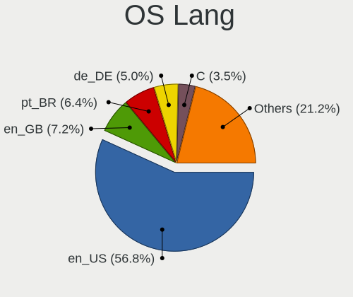
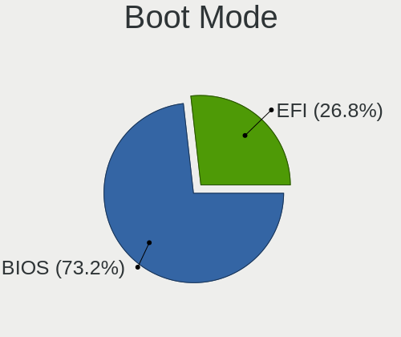
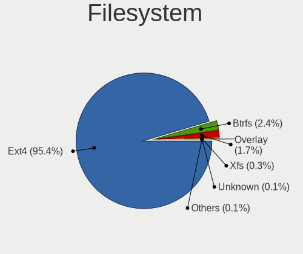
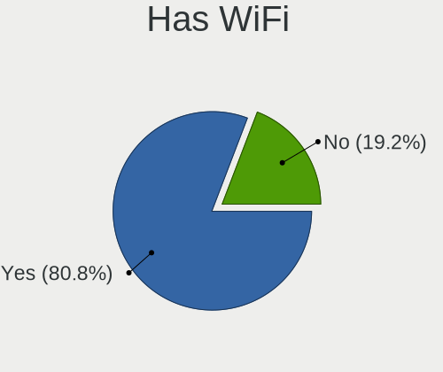
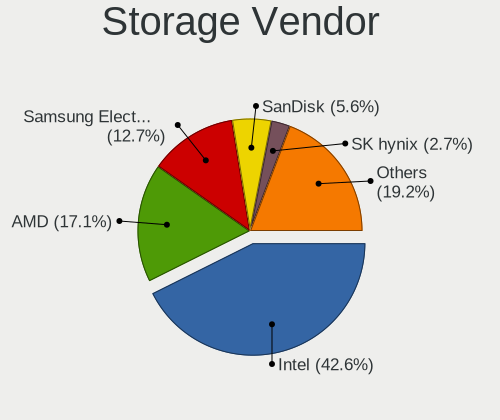
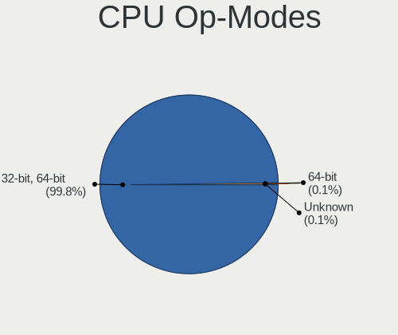
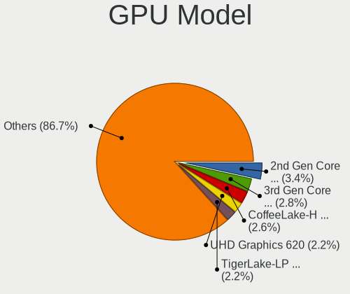
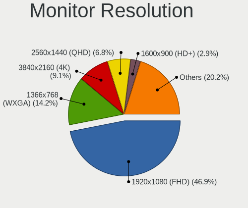
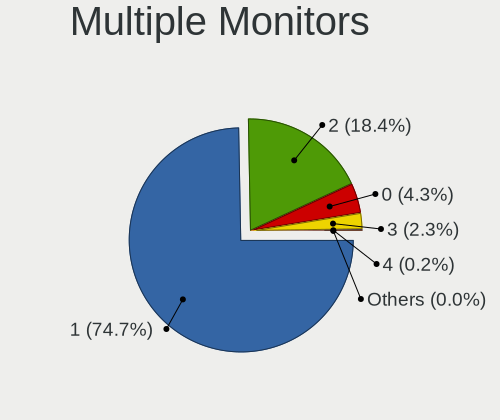

Pop!_OS - Tested Hardware & Statistics
--------------------------------------

A project to collect tested hardware configurations for Pop!_OS.

Anyone can contribute to this report by the [hw-probe](https://github.com/linuxhw/hw-probe) tool:

    sudo -E hw-probe -all -upload

Please contribute! Especially if your hardware is rare.

This is a report for all computer types. See also reports for [desktops](/Dist/Pop!_OS/Desktop/README.md) and [notebooks](/Dist/Pop!_OS/Notebook/README.md).

Contents
--------

* [ Test Cases ](#test-cases)

* [ System ](#system)
  - [ OS                       ](#os)
  - [ OS Family                ](#os-family)
  - [ Kernel                   ](#kernel)
  - [ Kernel Family            ](#kernel-family)
  - [ Kernel Major Ver.        ](#kernel-major-ver)
  - [ Arch                     ](#arch)
  - [ DE                       ](#de)
  - [ Display Server           ](#display-server)
  - [ Display Manager          ](#display-manager)
  - [ OS Lang                  ](#os-lang)
  - [ Boot Mode                ](#boot-mode)
  - [ Filesystem               ](#filesystem)
  - [ Part. scheme             ](#part-scheme)
  - [ Dual Boot with Linux/BSD ](#dual-boot-with-linuxbsd)
  - [ Dual Boot (Win)          ](#dual-boot-win)

* [ Board ](#board)
  - [ Vendor                   ](#vendor)
  - [ Model                    ](#model)
  - [ Model Family             ](#model-family)
  - [ MFG Year                 ](#mfg-year)
  - [ Form Factor              ](#form-factor)
  - [ Secure Boot              ](#secure-boot)
  - [ Coreboot                 ](#coreboot)
  - [ RAM Size                 ](#ram-size)
  - [ RAM Used                 ](#ram-used)
  - [ Total Drives             ](#total-drives)
  - [ Has CD-ROM               ](#has-cd-rom)
  - [ Has Ethernet             ](#has-ethernet)
  - [ Has WiFi                 ](#has-wifi)
  - [ Has Bluetooth            ](#has-bluetooth)

* [ Location ](#location)
  - [ Country                  ](#country)
  - [ City                     ](#city)

* [ Drives ](#drives)
  - [ Drive Vendor             ](#drive-vendor)
  - [ Drive Model              ](#drive-model)
  - [ HDD Vendor               ](#hdd-vendor)
  - [ SSD Vendor               ](#ssd-vendor)
  - [ Drive Kind               ](#drive-kind)
  - [ Drive Connector          ](#drive-connector)
  - [ Drive Size               ](#drive-size)
  - [ Space Total              ](#space-total)
  - [ Space Used               ](#space-used)
  - [ Malfunc. Drives          ](#malfunc-drives)
  - [ Malfunc. Drive Vendor    ](#malfunc-drive-vendor)
  - [ Malfunc. HDD Vendor      ](#malfunc-hdd-vendor)
  - [ Malfunc. Drive Kind      ](#malfunc-drive-kind)
  - [ Failed Drives            ](#failed-drives)
  - [ Failed Drive Vendor      ](#failed-drive-vendor)
  - [ Drive Status             ](#drive-status)

* [ Storage controller ](#storage-controller)
  - [ Storage Vendor           ](#storage-vendor)
  - [ Storage Model            ](#storage-model)
  - [ Storage Kind             ](#storage-kind)

* [ Processor ](#processor)
  - [ CPU Vendor               ](#cpu-vendor)
  - [ CPU Model                ](#cpu-model)
  - [ CPU Model Family         ](#cpu-model-family)
  - [ CPU Cores                ](#cpu-cores)
  - [ CPU Sockets              ](#cpu-sockets)
  - [ CPU Threads              ](#cpu-threads)
  - [ CPU Op-Modes             ](#cpu-op-modes)
  - [ CPU Microcode            ](#cpu-microcode)
  - [ CPU Microarch            ](#cpu-microarch)

* [ Graphics ](#graphics)
  - [ GPU Vendor               ](#gpu-vendor)
  - [ GPU Model                ](#gpu-model)
  - [ GPU Combo                ](#gpu-combo)
  - [ GPU Driver               ](#gpu-driver)
  - [ GPU Memory               ](#gpu-memory)

* [ Monitor ](#monitor)
  - [ Monitor Vendor           ](#monitor-vendor)
  - [ Monitor Model            ](#monitor-model)
  - [ Monitor Resolution       ](#monitor-resolution)
  - [ Monitor Diagonal         ](#monitor-diagonal)
  - [ Monitor Width            ](#monitor-width)
  - [ Aspect Ratio             ](#aspect-ratio)
  - [ Monitor Area             ](#monitor-area)
  - [ Pixel Density            ](#pixel-density)
  - [ Multiple Monitors        ](#multiple-monitors)

* [ Network ](#network)
  - [ Net Controller Vendor    ](#net-controller-vendor)
  - [ Net Controller Model     ](#net-controller-model)
  - [ Wireless Vendor          ](#wireless-vendor)
  - [ Wireless Model           ](#wireless-model)
  - [ Ethernet Vendor          ](#ethernet-vendor)
  - [ Ethernet Model           ](#ethernet-model)
  - [ Net Controller Kind      ](#net-controller-kind)
  - [ Used Controller          ](#used-controller)
  - [ NICs                     ](#nics)
  - [ IPv6                     ](#ipv6)

* [ Bluetooth ](#bluetooth)
  - [ Bluetooth Vendor         ](#bluetooth-vendor)
  - [ Bluetooth Model          ](#bluetooth-model)

* [ Sound ](#sound)
  - [ Sound Vendor             ](#sound-vendor)
  - [ Sound Model              ](#sound-model)

* [ Memory ](#memory)
  - [ Memory Vendor            ](#memory-vendor)
  - [ Memory Model             ](#memory-model)
  - [ Memory Kind              ](#memory-kind)
  - [ Memory Form Factor       ](#memory-form-factor)
  - [ Memory Size              ](#memory-size)
  - [ Memory Speed             ](#memory-speed)

* [ Printers & scanners ](#printers--scanners)
  - [ Printer Vendor           ](#printer-vendor)
  - [ Printer Model            ](#printer-model)
  - [ Scanner Vendor           ](#scanner-vendor)
  - [ Scanner Model            ](#scanner-model)

* [ Camera ](#camera)
  - [ Camera Vendor            ](#camera-vendor)
  - [ Camera Model             ](#camera-model)

* [ Security ](#security)
  - [ Fingerprint Vendor       ](#fingerprint-vendor)
  - [ Fingerprint Model        ](#fingerprint-model)
  - [ Chipcard Vendor          ](#chipcard-vendor)
  - [ Chipcard Model           ](#chipcard-model)

* [ Unsupported ](#unsupported)
  - [ Unsupported Devices      ](#unsupported-devices)
  - [ Unsupported Device Types ](#unsupported-device-types)

Test Cases
----------

Total: 14108

| Vendor        | Model                       | Form-Factor | Probe                                                      | Date         |
|---------------|-----------------------------|-------------|------------------------------------------------------------|--------------|
| MSI           | Alpha 15 A3DDK              | Notebook    | [9a87dfb80b](https://linux-hardware.org/?probe=9a87dfb80b) | Sep 07, 2023 |
| HP            | EliteBook 8760w             | Notebook    | [d061b57b29](https://linux-hardware.org/?probe=d061b57b29) | Sep 07, 2023 |
| MSI           | MAG B650 TOMAHAWK WIFI      | Desktop     | [3221a3e5dd](https://linux-hardware.org/?probe=3221a3e5dd) | Sep 07, 2023 |
| MSI           | MAG B650 TOMAHAWK WIFI      | Desktop     | [13bae1c4e9](https://linux-hardware.org/?probe=13bae1c4e9) | Sep 07, 2023 |
| Alienware     | m15 R7                      | Notebook    | [9e6b80bbf2](https://linux-hardware.org/?probe=9e6b80bbf2) | Sep 07, 2023 |
| Dell          | 0WN7Y6 A02                  | Desktop     | [aaf64e4624](https://linux-hardware.org/?probe=aaf64e4624) | Sep 07, 2023 |
| Biostar       | A58MD                       | Desktop     | [40f078fcfc](https://linux-hardware.org/?probe=40f078fcfc) | Sep 06, 2023 |
| Apple         | MacBookPro11,3              | Notebook    | [bfdd099826](https://linux-hardware.org/?probe=bfdd099826) | Sep 06, 2023 |
| HP            | Victus by Laptop 16-e0xx... | Notebook    | [0692b6f878](https://linux-hardware.org/?probe=0692b6f878) | Sep 06, 2023 |
| Acer          | Swift SFX14-41G             | Notebook    | [611bb4fe1a](https://linux-hardware.org/?probe=611bb4fe1a) | Sep 06, 2023 |
| Acer          | Swift SFX14-41G             | Notebook    | [38f9d1abd9](https://linux-hardware.org/?probe=38f9d1abd9) | Sep 05, 2023 |
| MSI           | H310M PRO-VH PLUS           | Desktop     | [56f00eec4a](https://linux-hardware.org/?probe=56f00eec4a) | Sep 05, 2023 |
| Lenovo        | Legion Slim 5 16APH8 82Y... | Notebook    | [27575898fe](https://linux-hardware.org/?probe=27575898fe) | Sep 05, 2023 |
| ZOTAC         | ZBOX-ECM73070C/53060C       | Mini pc     | [613e4acc75](https://linux-hardware.org/?probe=613e4acc75) | Sep 05, 2023 |
| HP            | Victus by Laptop 16-e0xx... | Notebook    | [dda5b7f9c9](https://linux-hardware.org/?probe=dda5b7f9c9) | Sep 05, 2023 |
| Dell          | Inspiron 14 5420            | Notebook    | [70d0d79f77](https://linux-hardware.org/?probe=70d0d79f77) | Sep 05, 2023 |
| Shenzhen M... | F6BFC                       | Desktop     | [a33ec74b50](https://linux-hardware.org/?probe=a33ec74b50) | Sep 05, 2023 |
| Shenzhen M... | F6BFC                       | Desktop     | [d5cd8916d0](https://linux-hardware.org/?probe=d5cd8916d0) | Sep 05, 2023 |
| Gigabyte      | Z590 AORUS MASTER           | Desktop     | [40785211e9](https://linux-hardware.org/?probe=40785211e9) | Sep 05, 2023 |
| Apple         | MacBookPro10,1              | Notebook    | [11c016fb1b](https://linux-hardware.org/?probe=11c016fb1b) | Sep 05, 2023 |
| ASUSTek       | ROG STRIX B460-H GAMING     | Desktop     | [865ce7b55b](https://linux-hardware.org/?probe=865ce7b55b) | Sep 04, 2023 |
| Dell          | Latitude E5430 non-vPro     | Notebook    | [ee1a881e82](https://linux-hardware.org/?probe=ee1a881e82) | Sep 04, 2023 |
| System76      | Lemur Pro                   | Notebook    | [9ea11da090](https://linux-hardware.org/?probe=9ea11da090) | Sep 04, 2023 |
| Lenovo        | ThinkPad L14 Gen 1 20U10... | Notebook    | [68e90ee0cb](https://linux-hardware.org/?probe=68e90ee0cb) | Sep 04, 2023 |
| ASUSTek       | K53E                        | Notebook    | [5604fe515d](https://linux-hardware.org/?probe=5604fe515d) | Sep 04, 2023 |
| Dell          | XPS 17 9700                 | Notebook    | [e758c8955e](https://linux-hardware.org/?probe=e758c8955e) | Sep 03, 2023 |
| ASUSTek       | Rampage V EDITION 10        | Desktop     | [a30ea8885d](https://linux-hardware.org/?probe=a30ea8885d) | Sep 03, 2023 |
| ASUSTek       | VivoBook_ASUSLaptop X412... | Notebook    | [2ddf0c5c61](https://linux-hardware.org/?probe=2ddf0c5c61) | Sep 03, 2023 |
| HP            | 240 G8 Notebook PC          | Notebook    | [092ae0b34d](https://linux-hardware.org/?probe=092ae0b34d) | Sep 03, 2023 |
| Gigabyte      | Z170X-Gaming 7              | Desktop     | [e9faf4759d](https://linux-hardware.org/?probe=e9faf4759d) | Sep 03, 2023 |
| Gigabyte      | Z97X-SLI-CF                 | Desktop     | [ffc201e884](https://linux-hardware.org/?probe=ffc201e884) | Sep 02, 2023 |
| ASUSTek       | VivoBook_ASUSLaptop N760... | Notebook    | [f2f5e496f1](https://linux-hardware.org/?probe=f2f5e496f1) | Sep 02, 2023 |
| HP            | Stream Laptop 14-cb1xxx     | Notebook    | [515e1f4bce](https://linux-hardware.org/?probe=515e1f4bce) | Sep 02, 2023 |
| Apple         | MacBookAir3,2               | Notebook    | [5ee8cbf433](https://linux-hardware.org/?probe=5ee8cbf433) | Sep 02, 2023 |
| Schenker      | VIA 15 Pro                  | Notebook    | [4a31ab4d2b](https://linux-hardware.org/?probe=4a31ab4d2b) | Sep 02, 2023 |
| Apple         | Mac-F2268CC8                | All in one  | [1c82c8d8b5](https://linux-hardware.org/?probe=1c82c8d8b5) | Sep 02, 2023 |
| ASUSTek       | M5A78L-M LX PLUS            | Desktop     | [b4907a6220](https://linux-hardware.org/?probe=b4907a6220) | Sep 02, 2023 |
| Apple         | MacBookAir6,2               | Notebook    | [da8d60051c](https://linux-hardware.org/?probe=da8d60051c) | Sep 02, 2023 |
| Dell          | Inspiron 15 7000 Gaming     | Notebook    | [87e1726495](https://linux-hardware.org/?probe=87e1726495) | Sep 01, 2023 |
| Dell          | Inspiron 15 7000 Gaming     | Notebook    | [e73e853358](https://linux-hardware.org/?probe=e73e853358) | Sep 01, 2023 |
| MSI           | A320M-A PRO M2              | Desktop     | [6745b7e37d](https://linux-hardware.org/?probe=6745b7e37d) | Sep 01, 2023 |
| Gigabyte      | Z370 AORUS Gaming 7         | Desktop     | [6ddc9b767d](https://linux-hardware.org/?probe=6ddc9b767d) | Sep 01, 2023 |
| MSI           | 760GM-P23                   | Desktop     | [76b83d4e93](https://linux-hardware.org/?probe=76b83d4e93) | Sep 01, 2023 |
| System76      | Thelio thelio-r3            | Desktop     | [d0cdea5d23](https://linux-hardware.org/?probe=d0cdea5d23) | Sep 01, 2023 |
| ASUSTek       | N550JV                      | Notebook    | [b2effdc956](https://linux-hardware.org/?probe=b2effdc956) | Sep 01, 2023 |
| Lenovo        | Legion 5 Pro 16IAH7H 82R... | Notebook    | [2433535726](https://linux-hardware.org/?probe=2433535726) | Sep 01, 2023 |
| Dell          | Inspiron 5558               | Notebook    | [77c6379594](https://linux-hardware.org/?probe=77c6379594) | Sep 01, 2023 |
| Acer          | Swift SFX14-41G             | Notebook    | [67f553625a](https://linux-hardware.org/?probe=67f553625a) | Sep 01, 2023 |
| Dell          | Latitude E7470              | Notebook    | [0580f1c293](https://linux-hardware.org/?probe=0580f1c293) | Sep 01, 2023 |
| Lenovo        | ThinkPad T450 20BUS0B000    | Notebook    | [1213d3bf46](https://linux-hardware.org/?probe=1213d3bf46) | Aug 31, 2023 |
| Acer          | Aspire E5-551G              | Notebook    | [628d865373](https://linux-hardware.org/?probe=628d865373) | Aug 31, 2023 |
| Gigabyte      | H97-HD3                     | Desktop     | [ba11958a48](https://linux-hardware.org/?probe=ba11958a48) | Aug 31, 2023 |
| Gigabyte      | H97-HD3                     | Desktop     | [158ed240bf](https://linux-hardware.org/?probe=158ed240bf) | Aug 31, 2023 |
| ASRock        | Q1900B-ITX                  | Desktop     | [875427cd72](https://linux-hardware.org/?probe=875427cd72) | Aug 31, 2023 |
| Framework     | Laptop (12th Gen Intel C... | Notebook    | [3b890e064f](https://linux-hardware.org/?probe=3b890e064f) | Aug 31, 2023 |
| Acer          | Nitro AN515-55              | Notebook    | [6c5da44516](https://linux-hardware.org/?probe=6c5da44516) | Aug 31, 2023 |
| MSI           | MAG B550 TOMAHAWK           | Desktop     | [085b3d4330](https://linux-hardware.org/?probe=085b3d4330) | Aug 31, 2023 |
| Google        | Kefka                       | Notebook    | [284517c2b3](https://linux-hardware.org/?probe=284517c2b3) | Aug 31, 2023 |
| MSI           | MAG B550 TOMAHAWK           | Desktop     | [98b18bb67a](https://linux-hardware.org/?probe=98b18bb67a) | Aug 31, 2023 |
| Apple         | Mac-F60DEB81FF30ACF6 Mac... | Desktop     | [45f86c066d](https://linux-hardware.org/?probe=45f86c066d) | Aug 30, 2023 |
| Lenovo        | ThinkPad W520 427637U       | Notebook    | [5f995c7c48](https://linux-hardware.org/?probe=5f995c7c48) | Aug 30, 2023 |
| Apple         | Mac-35C5E08120C7EEAF Mac... | Mini pc     | [84f61e2225](https://linux-hardware.org/?probe=84f61e2225) | Aug 30, 2023 |
| Apple         | MacBookPro5,5               | Notebook    | [641243c308](https://linux-hardware.org/?probe=641243c308) | Aug 30, 2023 |
| Lenovo        | G50-80 80E5                 | Notebook    | [5ba6fd6ca3](https://linux-hardware.org/?probe=5ba6fd6ca3) | Aug 30, 2023 |
| Google        | Kefka                       | Notebook    | [a018ae3fb5](https://linux-hardware.org/?probe=a018ae3fb5) | Aug 30, 2023 |
| Acer          | Aspire E5-571               | Notebook    | [500ef94276](https://linux-hardware.org/?probe=500ef94276) | Aug 29, 2023 |
| HP            | Pavilion Laptop 15-cw0xx... | Notebook    | [90a72df8ef](https://linux-hardware.org/?probe=90a72df8ef) | Aug 29, 2023 |
| Lenovo        | IdeaPad S540-15IWL GTX 8... | Notebook    | [4904c007c7](https://linux-hardware.org/?probe=4904c007c7) | Aug 29, 2023 |
| Lenovo        | IdeaPad Gaming 3 15IAH7 ... | Notebook    | [ba9dd7a62d](https://linux-hardware.org/?probe=ba9dd7a62d) | Aug 29, 2023 |
| Lenovo        | ThinkPad T470p 20J7S0CF0... | Notebook    | [f1b8efb723](https://linux-hardware.org/?probe=f1b8efb723) | Aug 29, 2023 |
| ASUSTek       | ROG Strix G634JZ_G634JZ     | Notebook    | [481b37b0fc](https://linux-hardware.org/?probe=481b37b0fc) | Aug 29, 2023 |
| Unknown       | Unknown                     | Desktop     | [ebebe5ddf7](https://linux-hardware.org/?probe=ebebe5ddf7) | Aug 29, 2023 |
| Dell          | Latitude 5330               | Notebook    | [7e63575d10](https://linux-hardware.org/?probe=7e63575d10) | Aug 29, 2023 |
| ASUSTek       | ROG STRIX B660-A GAMING ... | Desktop     | [0be67de1c9](https://linux-hardware.org/?probe=0be67de1c9) | Aug 29, 2023 |
| Lenovo        | ThinkPad T430s 2356CU8      | Notebook    | [2f669d797f](https://linux-hardware.org/?probe=2f669d797f) | Aug 29, 2023 |
| Lenovo        | ThinkPad T430s 2356CU8      | Notebook    | [39f2feeed5](https://linux-hardware.org/?probe=39f2feeed5) | Aug 29, 2023 |
| Apple         | Mac-F65AE981FFA204ED Mac... | Mini pc     | [4cdf174574](https://linux-hardware.org/?probe=4cdf174574) | Aug 29, 2023 |
| Apple         | Mac-942B59F58194171B iMa... | All in one  | [6d2186fdd9](https://linux-hardware.org/?probe=6d2186fdd9) | Aug 28, 2023 |
| Lenovo        | ThinkPad E15 Gen 3 20YHC... | Notebook    | [de65d63e10](https://linux-hardware.org/?probe=de65d63e10) | Aug 28, 2023 |
| Lenovo        | Legion 5 15IMH 82CF         | Notebook    | [4d8ac47399](https://linux-hardware.org/?probe=4d8ac47399) | Aug 28, 2023 |
| Lenovo        | ThinkPad E15 Gen 3 20YHC... | Notebook    | [dc9a79314c](https://linux-hardware.org/?probe=dc9a79314c) | Aug 28, 2023 |
| Dell          | XPS 15 7590                 | Notebook    | [ef97f75590](https://linux-hardware.org/?probe=ef97f75590) | Aug 28, 2023 |
| Dell          | Precision 5510              | Notebook    | [c6d08d9c28](https://linux-hardware.org/?probe=c6d08d9c28) | Aug 27, 2023 |
| HP            | EliteBook 865 16 inch G9... | Notebook    | [b07775a194](https://linux-hardware.org/?probe=b07775a194) | Aug 27, 2023 |
| HP            | 250 G7 Notebook PC          | Notebook    | [c4be1d7e95](https://linux-hardware.org/?probe=c4be1d7e95) | Aug 27, 2023 |
| Lenovo        | ThinkPad T460 20FMS05K05    | Notebook    | [747e8d4f6a](https://linux-hardware.org/?probe=747e8d4f6a) | Aug 27, 2023 |
| Dell          | Precision M4600             | Notebook    | [b7fca4d2f9](https://linux-hardware.org/?probe=b7fca4d2f9) | Aug 27, 2023 |
| Unknown       | V00                         | Mini pc     | [b63adaac28](https://linux-hardware.org/?probe=b63adaac28) | Aug 27, 2023 |
| Apple         | MacBookPro8,2               | Notebook    | [9e0b5b0b7e](https://linux-hardware.org/?probe=9e0b5b0b7e) | Aug 26, 2023 |
| Dell          | Precision M6800             | Notebook    | [6aa5f8e441](https://linux-hardware.org/?probe=6aa5f8e441) | Aug 26, 2023 |
| Dell          | 0VRWRC A00                  | Desktop     | [e3a47f55c9](https://linux-hardware.org/?probe=e3a47f55c9) | Aug 26, 2023 |
| MSI           | PRO Z790-A WIFI             | Desktop     | [f3874bf2fc](https://linux-hardware.org/?probe=f3874bf2fc) | Aug 26, 2023 |
| HP            | ProBook 4730s               | Notebook    | [32f610b810](https://linux-hardware.org/?probe=32f610b810) | Aug 26, 2023 |
| Google        | Kasumi                      | Notebook    | [9af5f77257](https://linux-hardware.org/?probe=9af5f77257) | Aug 25, 2023 |
| System76      | Gazelle                     | Notebook    | [b3fb438915](https://linux-hardware.org/?probe=b3fb438915) | Aug 25, 2023 |
| ASUSTek       | PRIME B365M-A               | Desktop     | [8d952e28e1](https://linux-hardware.org/?probe=8d952e28e1) | Aug 25, 2023 |
| MSI           | B550M PRO-VDH WIFI          | Desktop     | [51d4eefbc9](https://linux-hardware.org/?probe=51d4eefbc9) | Aug 25, 2023 |
| System76      | Thelio Major thelio-majo... | Desktop     | [e5caa63b77](https://linux-hardware.org/?probe=e5caa63b77) | Aug 25, 2023 |
| HP            | 0B4Ch D                     | Desktop     | [958521d2be](https://linux-hardware.org/?probe=958521d2be) | Aug 25, 2023 |
| MSI           | GE60 2OC\2OD\2OE            | Notebook    | [e2e304c9eb](https://linux-hardware.org/?probe=e2e304c9eb) | Aug 25, 2023 |
| MSI           | X470 GAMING PLUS MAX        | Desktop     | [254f8aee40](https://linux-hardware.org/?probe=254f8aee40) | Aug 25, 2023 |
| MSI           | X470 GAMING PLUS MAX        | Desktop     | [6f72852248](https://linux-hardware.org/?probe=6f72852248) | Aug 25, 2023 |
| Microsoft     | Surface Pro                 | Tablet      | [acc5fdd0f3](https://linux-hardware.org/?probe=acc5fdd0f3) | Aug 25, 2023 |
| HP            | EliteBook 865 16 inch G9... | Notebook    | [34fc2a5f83](https://linux-hardware.org/?probe=34fc2a5f83) | Aug 24, 2023 |
| Dell          | Latitude E7240              | Notebook    | [cb61859037](https://linux-hardware.org/?probe=cb61859037) | Aug 24, 2023 |
| ASUSTek       | ProArt X670E-CREATOR WIF... | Desktop     | [c0bf920a5b](https://linux-hardware.org/?probe=c0bf920a5b) | Aug 24, 2023 |
| HP            | Victus by Laptop 16-e0xx... | Notebook    | [6cf9db7da7](https://linux-hardware.org/?probe=6cf9db7da7) | Aug 24, 2023 |
| ASRock        | B450 Steel Legend           | Desktop     | [40660610aa](https://linux-hardware.org/?probe=40660610aa) | Aug 24, 2023 |
| Dell          | Latitude 7430               | Notebook    | [7daf0301c5](https://linux-hardware.org/?probe=7daf0301c5) | Aug 24, 2023 |
| Toshiba       | Satellite L655              | Notebook    | [18df557333](https://linux-hardware.org/?probe=18df557333) | Aug 24, 2023 |
| Lenovo        | 3111 SDK0J40697 WIN 3305... | Mini pc     | [82be53cac0](https://linux-hardware.org/?probe=82be53cac0) | Aug 23, 2023 |
| Lenovo        | 3111 SDK0J40697 WIN 3305... | Mini pc     | [2970428ad3](https://linux-hardware.org/?probe=2970428ad3) | Aug 23, 2023 |
| HP            | 0B4Ch D                     | Desktop     | [5abce3a991](https://linux-hardware.org/?probe=5abce3a991) | Aug 23, 2023 |
| HP            | Pavilion Notebook           | Notebook    | [b0ca2ee250](https://linux-hardware.org/?probe=b0ca2ee250) | Aug 23, 2023 |
| MSI           | GE60 2OC\2OD\2OE            | Notebook    | [50f079ae44](https://linux-hardware.org/?probe=50f079ae44) | Aug 23, 2023 |
| Dell          | XPS 13 9310                 | Notebook    | [6f0e38b5e8](https://linux-hardware.org/?probe=6f0e38b5e8) | Aug 23, 2023 |
| HP            | 18E7                        | Desktop     | [a78496c36e](https://linux-hardware.org/?probe=a78496c36e) | Aug 23, 2023 |
| Samsung       | 750TDA                      | Notebook    | [7b1ec96afa](https://linux-hardware.org/?probe=7b1ec96afa) | Aug 23, 2023 |
| ASUSTek       | Zenbook UX3402ZA_Q409ZA     | Notebook    | [4cd19df49e](https://linux-hardware.org/?probe=4cd19df49e) | Aug 23, 2023 |
| Gigabyte      | B550 VISION D-P             | Desktop     | [145d800029](https://linux-hardware.org/?probe=145d800029) | Aug 23, 2023 |
| Lenovo        | ThinkPad T460s 20FAS2RV0... | Notebook    | [e8d2c8e1d5](https://linux-hardware.org/?probe=e8d2c8e1d5) | Aug 22, 2023 |
| System76      | Darter Pro                  | Notebook    | [a244cb8283](https://linux-hardware.org/?probe=a244cb8283) | Aug 22, 2023 |
| Lenovo        | IdeaPad Gaming 3 15ARH7 ... | Notebook    | [fdd24243bf](https://linux-hardware.org/?probe=fdd24243bf) | Aug 22, 2023 |
| Acer          | Aspire A715-75G             | Notebook    | [54794fb9e8](https://linux-hardware.org/?probe=54794fb9e8) | Aug 22, 2023 |
| Supermicro    | X12SPA-TF                   | Server      | [b0d65c559f](https://linux-hardware.org/?probe=b0d65c559f) | Aug 22, 2023 |
| ASUSTek       | P7P55-M                     | Desktop     | [0f5028d5fc](https://linux-hardware.org/?probe=0f5028d5fc) | Aug 22, 2023 |
| Dell          | 07JJ74 A01                  | Server      | [d86049c586](https://linux-hardware.org/?probe=d86049c586) | Aug 21, 2023 |
| Apple         | Mac-942B59F58194171B iMa... | All in one  | [be53b5931f](https://linux-hardware.org/?probe=be53b5931f) | Aug 21, 2023 |
| HP            | ProBook 4730s               | Notebook    | [5b4d88bc67](https://linux-hardware.org/?probe=5b4d88bc67) | Aug 21, 2023 |
| AZW           | GTR V02                     | Desktop     | [d699113f95](https://linux-hardware.org/?probe=d699113f95) | Aug 21, 2023 |
| Samsung       | 270E5G/270E5U               | Notebook    | [930d312c36](https://linux-hardware.org/?probe=930d312c36) | Aug 21, 2023 |
| Samsung       | 270E5G/270E5U               | Notebook    | [2bc8c24081](https://linux-hardware.org/?probe=2bc8c24081) | Aug 21, 2023 |
| ASUSTek       | ASUS TUF Dash F15 FX516P... | Notebook    | [b66d308d42](https://linux-hardware.org/?probe=b66d308d42) | Aug 21, 2023 |
| MSI           | Modern 15 A5M               | Notebook    | [f9742049fc](https://linux-hardware.org/?probe=f9742049fc) | Aug 20, 2023 |
| ASUSTek       | ROG Flow Z13 GZ301ZE_GZ3... | Tablet      | [83b6cab3cd](https://linux-hardware.org/?probe=83b6cab3cd) | Aug 20, 2023 |
| System76      | Oryx Pro                    | Notebook    | [b7e0bd11e5](https://linux-hardware.org/?probe=b7e0bd11e5) | Aug 20, 2023 |
| Dell          | Precision 5520              | Notebook    | [42587aac96](https://linux-hardware.org/?probe=42587aac96) | Aug 20, 2023 |
| Dell          | Precision 5520              | Notebook    | [bec735d800](https://linux-hardware.org/?probe=bec735d800) | Aug 20, 2023 |
| NZXT          | N7 B550                     | Desktop     | [1f105eadd8](https://linux-hardware.org/?probe=1f105eadd8) | Aug 20, 2023 |
| System76      | Kudu Pro                    | Notebook    | [0fc481c5fc](https://linux-hardware.org/?probe=0fc481c5fc) | Aug 20, 2023 |
| Gigabyte      | X570 I AORUS PRO WIFI       | Desktop     | [31861c8357](https://linux-hardware.org/?probe=31861c8357) | Aug 20, 2023 |
| Gigabyte      | Z270X-UD5-CF                | Desktop     | [04df52e837](https://linux-hardware.org/?probe=04df52e837) | Aug 20, 2023 |
| ASUSTek       | ROG Zephyrus G15 GA503QR    | Notebook    | [5d063a6e59](https://linux-hardware.org/?probe=5d063a6e59) | Aug 19, 2023 |
| Lenovo        | B490 377224P                | Notebook    | [0e516ea22b](https://linux-hardware.org/?probe=0e516ea22b) | Aug 19, 2023 |
| ASUSTek       | ROG STRIX X470-F GAMING     | Desktop     | [63d06430e4](https://linux-hardware.org/?probe=63d06430e4) | Aug 18, 2023 |
| HP            | 0266                        | Desktop     | [636546711d](https://linux-hardware.org/?probe=636546711d) | Aug 18, 2023 |
| Apple         | Mac-27ADBB7B4CEE8E61 iMa... | All in one  | [70eda3a12d](https://linux-hardware.org/?probe=70eda3a12d) | Aug 18, 2023 |
| Apple         | Mac-27ADBB7B4CEE8E61 iMa... | All in one  | [a77f908bb5](https://linux-hardware.org/?probe=a77f908bb5) | Aug 18, 2023 |
| HP            | Pavilion Laptop 15-cw1xx... | Notebook    | [a1ab007f7f](https://linux-hardware.org/?probe=a1ab007f7f) | Aug 18, 2023 |
| ASUSTek       | P8Z77-I DELUXE              | Desktop     | [53c4af621d](https://linux-hardware.org/?probe=53c4af621d) | Aug 18, 2023 |
| ASUSTek       | U38N                        | Notebook    | [0e0f709353](https://linux-hardware.org/?probe=0e0f709353) | Aug 17, 2023 |
| HP            | EliteBook 850 G3            | Notebook    | [a6a7224d63](https://linux-hardware.org/?probe=a6a7224d63) | Aug 17, 2023 |
| Dell          | XPS 13 9310                 | Notebook    | [680fae2274](https://linux-hardware.org/?probe=680fae2274) | Aug 17, 2023 |
| HP            | 2AF7                        | Desktop     | [4e55d08586](https://linux-hardware.org/?probe=4e55d08586) | Aug 17, 2023 |
| ASUSTek       | Vivobook Go E1404FA_E140... | Notebook    | [43fd1aad67](https://linux-hardware.org/?probe=43fd1aad67) | Aug 17, 2023 |
| MSI           | Z87-GD65 GAMING             | Desktop     | [7c09135f98](https://linux-hardware.org/?probe=7c09135f98) | Aug 17, 2023 |
| System76      | Lemur Pro                   | Notebook    | [af3b387574](https://linux-hardware.org/?probe=af3b387574) | Aug 16, 2023 |
| HP            | Elite Dragonfly             | Convertible | [7419fe990e](https://linux-hardware.org/?probe=7419fe990e) | Aug 16, 2023 |
| Acer          | Aspire 5750                 | Notebook    | [ec4afb1917](https://linux-hardware.org/?probe=ec4afb1917) | Aug 16, 2023 |
| A-DATA Tec... | XENIA 14                    | Notebook    | [59faf4a458](https://linux-hardware.org/?probe=59faf4a458) | Aug 15, 2023 |
| A-DATA Tec... | XENIA 14                    | Notebook    | [537cce8a8e](https://linux-hardware.org/?probe=537cce8a8e) | Aug 15, 2023 |
| Positivo      | POS-RIQ470EN 11190998       | Desktop     | [1eec60309a](https://linux-hardware.org/?probe=1eec60309a) | Aug 15, 2023 |
| HP            | Laptop 15s-eq2xxx           | Notebook    | [c2cfa9bd7a](https://linux-hardware.org/?probe=c2cfa9bd7a) | Aug 15, 2023 |
| Gigabyte      | X570 AORUS MASTER           | Desktop     | [0927025cfc](https://linux-hardware.org/?probe=0927025cfc) | Aug 15, 2023 |
| Apple         | MacBookAir6,2               | Notebook    | [431ac1b880](https://linux-hardware.org/?probe=431ac1b880) | Aug 15, 2023 |
| Dell          | XPS 15 9570                 | Notebook    | [ce22773504](https://linux-hardware.org/?probe=ce22773504) | Aug 15, 2023 |
| Intel         | B75A                        | Desktop     | [c081fb2ca8](https://linux-hardware.org/?probe=c081fb2ca8) | Aug 15, 2023 |
| System76      | Galago Pro                  | Notebook    | [54348f9c55](https://linux-hardware.org/?probe=54348f9c55) | Aug 14, 2023 |
| Apple         | MacBookPro9,2               | Notebook    | [61ff7ac5f1](https://linux-hardware.org/?probe=61ff7ac5f1) | Aug 14, 2023 |
| Apple         | MacBookPro16,1              | Notebook    | [18b513f5f0](https://linux-hardware.org/?probe=18b513f5f0) | Aug 14, 2023 |
| Lenovo        | ThinkPad T480s 20L7CTO1W... | Notebook    | [1f27d0f994](https://linux-hardware.org/?probe=1f27d0f994) | Aug 14, 2023 |
| ASUSTek       | ROG STRIX B650E-E GAMING... | Desktop     | [0b194349eb](https://linux-hardware.org/?probe=0b194349eb) | Aug 14, 2023 |
| ASUSTek       | PRIME B550M-A WIFI II       | Desktop     | [9a8e4bc08d](https://linux-hardware.org/?probe=9a8e4bc08d) | Aug 14, 2023 |
| Gigabyte      | 970A-DS3P                   | Desktop     | [302fb03dce](https://linux-hardware.org/?probe=302fb03dce) | Aug 13, 2023 |
| HP            | ProBook 4540s               | Notebook    | [84dbf6b759](https://linux-hardware.org/?probe=84dbf6b759) | Aug 13, 2023 |
| ASUSTek       | PRIME B350M-A               | Desktop     | [2c2aca991d](https://linux-hardware.org/?probe=2c2aca991d) | Aug 13, 2023 |
| ASUSTek       | TUF Gaming B450-PLUS II     | Desktop     | [ee66d3a81c](https://linux-hardware.org/?probe=ee66d3a81c) | Aug 13, 2023 |
| MSI           | X99A GODLIKE GAMING         | Desktop     | [b87f112952](https://linux-hardware.org/?probe=b87f112952) | Aug 13, 2023 |
| Alienware     | 0K9TKY A00                  | Desktop     | [edf714498f](https://linux-hardware.org/?probe=edf714498f) | Aug 13, 2023 |
| Alienware     | 0K9TKY A00                  | Desktop     | [213d229837](https://linux-hardware.org/?probe=213d229837) | Aug 13, 2023 |
| Dell          | Inspiron 3542               | Notebook    | [ae586a02aa](https://linux-hardware.org/?probe=ae586a02aa) | Aug 13, 2023 |
| ASUSTek       | Vivobook Go E1504FA_E150... | Notebook    | [823e276406](https://linux-hardware.org/?probe=823e276406) | Aug 13, 2023 |
| GPU Compan... | GWNR71517                   | Notebook    | [a38cee5cc9](https://linux-hardware.org/?probe=a38cee5cc9) | Aug 12, 2023 |
| Lenovo        | IdeaPadFlex 5 14ABR8 82X... | Convertible | [eb83156c5f](https://linux-hardware.org/?probe=eb83156c5f) | Aug 12, 2023 |
| Intel         | B75A                        | Desktop     | [91f9e56ace](https://linux-hardware.org/?probe=91f9e56ace) | Aug 12, 2023 |
| Acer          | Aspire ES1-520              | Notebook    | [a47415983e](https://linux-hardware.org/?probe=a47415983e) | Aug 12, 2023 |
| Lenovo        | ThinkPad L13 20R3CTO1WW     | Notebook    | [6ac135c81c](https://linux-hardware.org/?probe=6ac135c81c) | Aug 12, 2023 |
| ASUSTek       | K53TK                       | Notebook    | [db9f130ade](https://linux-hardware.org/?probe=db9f130ade) | Aug 12, 2023 |
| Dell          | G7 7588                     | Notebook    | [48faf46c2c](https://linux-hardware.org/?probe=48faf46c2c) | Aug 12, 2023 |
| HP            | 8643 SMVB                   | Desktop     | [2832e701f2](https://linux-hardware.org/?probe=2832e701f2) | Aug 12, 2023 |
| Lenovo        | Yoga Pro 9 14IRP8 83BU      | Notebook    | [f46a14b981](https://linux-hardware.org/?probe=f46a14b981) | Aug 12, 2023 |
| MSI           | MPG X570 GAMING PLUS        | Desktop     | [2c92ed92eb](https://linux-hardware.org/?probe=2c92ed92eb) | Aug 12, 2023 |
| HP            | EliteBook 820 G3            | Notebook    | [544810db31](https://linux-hardware.org/?probe=544810db31) | Aug 12, 2023 |
| ASUSTek       | ROG STRIX B550-F GAMING ... | Desktop     | [580fda2e6b](https://linux-hardware.org/?probe=580fda2e6b) | Aug 12, 2023 |
| MSI           | A55M-E33                    | Desktop     | [7d538db764](https://linux-hardware.org/?probe=7d538db764) | Aug 12, 2023 |
| MSI           | A55M-E33                    | Desktop     | [9e64865fbc](https://linux-hardware.org/?probe=9e64865fbc) | Aug 12, 2023 |
| ASUSTek       | ZenBook UX425EA_UX425EA     | Notebook    | [0d45e9e048](https://linux-hardware.org/?probe=0d45e9e048) | Aug 12, 2023 |
| Dell          | Precision M4600             | Notebook    | [f97367efac](https://linux-hardware.org/?probe=f97367efac) | Aug 11, 2023 |
| Lenovo        | IdeaPad 310-15IAP 80TT      | Notebook    | [361e073b5c](https://linux-hardware.org/?probe=361e073b5c) | Aug 11, 2023 |
| Gigabyte      | Z790 GAMING X AX            | Desktop     | [a6d2358585](https://linux-hardware.org/?probe=a6d2358585) | Aug 11, 2023 |
| Acer          | Nitro AN715-51              | Notebook    | [ea972c8686](https://linux-hardware.org/?probe=ea972c8686) | Aug 11, 2023 |
| Unknown       | Unknown                     | Desktop     | [cf0d6729b4](https://linux-hardware.org/?probe=cf0d6729b4) | Aug 11, 2023 |
| ASRock        | B650M-HDV/M.2               | Desktop     | [ffd395aee0](https://linux-hardware.org/?probe=ffd395aee0) | Aug 11, 2023 |
| ASUSTek       | ROG Zephyrus G14 GA401QM... | Notebook    | [e22f71b79d](https://linux-hardware.org/?probe=e22f71b79d) | Aug 11, 2023 |
| ASUSTek       | X751LD                      | Notebook    | [e98d8d116d](https://linux-hardware.org/?probe=e98d8d116d) | Aug 10, 2023 |
| Gigabyte      | H410M S2 V2                 | Desktop     | [d4c5a12d06](https://linux-hardware.org/?probe=d4c5a12d06) | Aug 10, 2023 |
| HP            | 2AF9                        | Desktop     | [b31b796804](https://linux-hardware.org/?probe=b31b796804) | Aug 10, 2023 |
| Apple         | MacBookAir5,2               | Notebook    | [7f91d6f9d8](https://linux-hardware.org/?probe=7f91d6f9d8) | Aug 10, 2023 |
| Gigabyte      | B450 AORUS M                | Desktop     | [739bc450b8](https://linux-hardware.org/?probe=739bc450b8) | Aug 09, 2023 |
| Acer          | Nitro AN517-55              | Notebook    | [b77ff095f8](https://linux-hardware.org/?probe=b77ff095f8) | Aug 09, 2023 |
| Gigabyte      | 970A-UD3P                   | Desktop     | [b1a8fc0704](https://linux-hardware.org/?probe=b1a8fc0704) | Aug 09, 2023 |
| Gigabyte      | 970A-UD3P                   | Desktop     | [920797388b](https://linux-hardware.org/?probe=920797388b) | Aug 09, 2023 |
| Lenovo        | IdeaPad 5 14ABA7 82SE       | Notebook    | [6415840d5b](https://linux-hardware.org/?probe=6415840d5b) | Aug 09, 2023 |
| HP            | ProBook 4330s               | Notebook    | [5c854bed9f](https://linux-hardware.org/?probe=5c854bed9f) | Aug 09, 2023 |
| HP            | ProBook 4330s               | Notebook    | [d23ce497d2](https://linux-hardware.org/?probe=d23ce497d2) | Aug 09, 2023 |
| Gigabyte      | X570 AORUS ELITE            | Desktop     | [13b739e83a](https://linux-hardware.org/?probe=13b739e83a) | Aug 09, 2023 |
| System76      | Darter Pro                  | Notebook    | [5162d61c01](https://linux-hardware.org/?probe=5162d61c01) | Aug 09, 2023 |
| NZXT          | N7 Z590                     | Desktop     | [3831033bdc](https://linux-hardware.org/?probe=3831033bdc) | Aug 09, 2023 |
| MSI           | Cyborg 15 A12VF             | Notebook    | [b041192310](https://linux-hardware.org/?probe=b041192310) | Aug 09, 2023 |
| Gigabyte      | H410M H V3                  | Desktop     | [c4ac4952a4](https://linux-hardware.org/?probe=c4ac4952a4) | Aug 09, 2023 |
| Gigabyte      | H410M H V3                  | Desktop     | [62a5817462](https://linux-hardware.org/?probe=62a5817462) | Aug 09, 2023 |
| Alienware     | 14                          | Notebook    | [192b13997d](https://linux-hardware.org/?probe=192b13997d) | Aug 09, 2023 |
| HP            | Victus by 15.6 inch Gami... | Notebook    | [67f88ab571](https://linux-hardware.org/?probe=67f88ab571) | Aug 08, 2023 |
| ASUSTek       | ROG STRIX B550-F GAMING     | Desktop     | [6abad99081](https://linux-hardware.org/?probe=6abad99081) | Aug 08, 2023 |
| Dell          | Inspiron 5482               | Convertible | [7e2aa092cf](https://linux-hardware.org/?probe=7e2aa092cf) | Aug 08, 2023 |
| ASUSTek       | Zenbook Pro Duo UX582ZW_... | Notebook    | [afa081b440](https://linux-hardware.org/?probe=afa081b440) | Aug 08, 2023 |
| Acer          | Ferrari One 200             | Notebook    | [be688aa584](https://linux-hardware.org/?probe=be688aa584) | Aug 08, 2023 |
| ASUSTek       | P5Q                         | Desktop     | [f485bf4b6e](https://linux-hardware.org/?probe=f485bf4b6e) | Aug 08, 2023 |
| Apple         | MacBookPro10,1              | Notebook    | [00b169d241](https://linux-hardware.org/?probe=00b169d241) | Aug 08, 2023 |
| Lenovo        | IdeaPad Gaming 3 15IMH05... | Notebook    | [ec7a911951](https://linux-hardware.org/?probe=ec7a911951) | Aug 08, 2023 |
| Apple         | MacBookPro11,3              | Notebook    | [c415fd317b](https://linux-hardware.org/?probe=c415fd317b) | Aug 08, 2023 |
| Apple         | MacBookPro10,1              | Notebook    | [5e0c7f7bfc](https://linux-hardware.org/?probe=5e0c7f7bfc) | Aug 08, 2023 |
| Acer          | Aspire A715-75G             | Notebook    | [57f1225daf](https://linux-hardware.org/?probe=57f1225daf) | Aug 08, 2023 |
| ASUSTek       | TUF Gaming Z590-PLUS WIF... | Desktop     | [58208c1f16](https://linux-hardware.org/?probe=58208c1f16) | Aug 08, 2023 |
| Lenovo        | Legion 5 17ACH6H 82JY       | Notebook    | [088a8fad47](https://linux-hardware.org/?probe=088a8fad47) | Aug 08, 2023 |
| Unknown       | Unknown                     | Desktop     | [45fe14954d](https://linux-hardware.org/?probe=45fe14954d) | Aug 07, 2023 |
| Unknown       | Unknown                     | Desktop     | [d1bca9ae8b](https://linux-hardware.org/?probe=d1bca9ae8b) | Aug 07, 2023 |
| System76      | Oryx Pro                    | Notebook    | [c5b97761d3](https://linux-hardware.org/?probe=c5b97761d3) | Aug 07, 2023 |
| MSI           | Cyborg 15 A12VF             | Notebook    | [5fe9a17769](https://linux-hardware.org/?probe=5fe9a17769) | Aug 07, 2023 |
| MSI           | GP72 7RDX                   | Notebook    | [43eb53850c](https://linux-hardware.org/?probe=43eb53850c) | Aug 06, 2023 |
| Clevo         | W150HRM                     | Notebook    | [1ddcfcbecc](https://linux-hardware.org/?probe=1ddcfcbecc) | Aug 06, 2023 |
| Apple         | MacBookPro9,2               | Notebook    | [16936ef482](https://linux-hardware.org/?probe=16936ef482) | Aug 06, 2023 |
| Dell          | Inspiron 5482               | Convertible | [9c910c0949](https://linux-hardware.org/?probe=9c910c0949) | Aug 06, 2023 |
| MSI           | GP72 7RDX                   | Notebook    | [6d2bc8aa9e](https://linux-hardware.org/?probe=6d2bc8aa9e) | Aug 06, 2023 |
| Fujitsu       | D3128-A1 S26361-D3128-A1    | Desktop     | [ac2bdfc67b](https://linux-hardware.org/?probe=ac2bdfc67b) | Aug 06, 2023 |
| Timi          | RedmiBook Pro 15S           | Notebook    | [576241bbd4](https://linux-hardware.org/?probe=576241bbd4) | Aug 06, 2023 |
| ASUSTek       | PRIME B650-PLUS             | Desktop     | [93917e587f](https://linux-hardware.org/?probe=93917e587f) | Aug 06, 2023 |
| Notebook      | 1745                        | Notebook    | [3561a5dbbe](https://linux-hardware.org/?probe=3561a5dbbe) | Aug 06, 2023 |
| HP            | Pavilion dm4                | Notebook    | [521b8518ed](https://linux-hardware.org/?probe=521b8518ed) | Aug 06, 2023 |
| Microsoft     | Surface Pro 4               | Tablet      | [9a45c9f834](https://linux-hardware.org/?probe=9a45c9f834) | Aug 05, 2023 |
| Dell          | Latitude 5430               | Notebook    | [f63444b0be](https://linux-hardware.org/?probe=f63444b0be) | Aug 05, 2023 |
| Lenovo        | 3178 SDK0J40700 WIN 3258... | Desktop     | [4e0084cd74](https://linux-hardware.org/?probe=4e0084cd74) | Aug 05, 2023 |
| Apple         | MacBookPro11,2              | Notebook    | [32f8bbeff7](https://linux-hardware.org/?probe=32f8bbeff7) | Aug 05, 2023 |
| Lenovo        | Yoga 7 15ITL5 82BJ          | Convertible | [3cfd827251](https://linux-hardware.org/?probe=3cfd827251) | Aug 05, 2023 |
| MSI           | Modern 15 A5M               | Notebook    | [a4a6f81455](https://linux-hardware.org/?probe=a4a6f81455) | Aug 05, 2023 |
| MSI           | Modern 15 A5M               | Notebook    | [ef010c9d51](https://linux-hardware.org/?probe=ef010c9d51) | Aug 05, 2023 |
| Lenovo        | ThinkPad X13 Gen 2a 20XH... | Notebook    | [7d17fc9ff6](https://linux-hardware.org/?probe=7d17fc9ff6) | Aug 05, 2023 |
| MSI           | 760GM-P23                   | Desktop     | [5746742389](https://linux-hardware.org/?probe=5746742389) | Aug 04, 2023 |
| ASRock        | X370 Taichi                 | Desktop     | [af453d6ef1](https://linux-hardware.org/?probe=af453d6ef1) | Aug 04, 2023 |
| Lenovo        | V15 G3 ABA 82TV             | Notebook    | [0147060507](https://linux-hardware.org/?probe=0147060507) | Aug 04, 2023 |
| ASUSTek       | P8Z77-V LX                  | Desktop     | [92ef92268a](https://linux-hardware.org/?probe=92ef92268a) | Aug 04, 2023 |
| ASUSTek       | P8Z77-V LX                  | Desktop     | [ca1a97268c](https://linux-hardware.org/?probe=ca1a97268c) | Aug 04, 2023 |
| HP            | ProBook 650 G1              | Notebook    | [286cc8b0dd](https://linux-hardware.org/?probe=286cc8b0dd) | Aug 04, 2023 |
| Dell          | 0KWVT8 A03                  | Desktop     | [6ec952b536](https://linux-hardware.org/?probe=6ec952b536) | Aug 04, 2023 |
| MSI           | MAG B650 TOMAHAWK WIFI      | Desktop     | [983329d56b](https://linux-hardware.org/?probe=983329d56b) | Aug 03, 2023 |
| Lenovo        | ThinkPad W541 20EGS0GY0R    | Notebook    | [4d618e08b3](https://linux-hardware.org/?probe=4d618e08b3) | Aug 03, 2023 |
| System76      | Bonobo WS                   | Notebook    | [64ba21a272](https://linux-hardware.org/?probe=64ba21a272) | Aug 03, 2023 |
| JHZD          | X830                        | Desktop     | [7de7f6bb75](https://linux-hardware.org/?probe=7de7f6bb75) | Aug 03, 2023 |
| Lenovo        | ThinkPad P16 Gen 1 21D6C... | Notebook    | [a97312771e](https://linux-hardware.org/?probe=a97312771e) | Aug 03, 2023 |
| JHZD          | X830                        | Desktop     | [4fed3648c0](https://linux-hardware.org/?probe=4fed3648c0) | Aug 03, 2023 |
| Dell          | XPS 13 9370                 | Notebook    | [cf49ff3004](https://linux-hardware.org/?probe=cf49ff3004) | Aug 03, 2023 |
| ASUSTek       | P5QPL-AM                    | Desktop     | [2254be2ae2](https://linux-hardware.org/?probe=2254be2ae2) | Aug 03, 2023 |
| Gigabyte      | X570S AORUS ELITE AX        | Desktop     | [1a9566fa0a](https://linux-hardware.org/?probe=1a9566fa0a) | Aug 03, 2023 |
| Dell          | Latitude E7240              | Notebook    | [ec5ec88e59](https://linux-hardware.org/?probe=ec5ec88e59) | Aug 02, 2023 |
| Lenovo        | ThinkPad X270 W10DG 20K5... | Notebook    | [99ccd043cb](https://linux-hardware.org/?probe=99ccd043cb) | Aug 02, 2023 |
| Lenovo        | ThinkPad X270 W10DG 20K5... | Notebook    | [d4e267a214](https://linux-hardware.org/?probe=d4e267a214) | Aug 02, 2023 |
| HP            | ProBook 650 G4              | Notebook    | [d041df173b](https://linux-hardware.org/?probe=d041df173b) | Aug 02, 2023 |
| Dell          | 07PR60 A00                  | Desktop     | [590695e09f](https://linux-hardware.org/?probe=590695e09f) | Aug 02, 2023 |
| HP            | 8054                        | Desktop     | [f53df18325](https://linux-hardware.org/?probe=f53df18325) | Aug 02, 2023 |
| Dell          | Inspiron 7706 2n1           | Convertible | [542578b4cf](https://linux-hardware.org/?probe=542578b4cf) | Aug 02, 2023 |
| Apple         | MacBookPro11,3              | Notebook    | [1eb6fd9620](https://linux-hardware.org/?probe=1eb6fd9620) | Aug 02, 2023 |
| HP            | 8309                        | Desktop     | [6cb1cfc925](https://linux-hardware.org/?probe=6cb1cfc925) | Aug 02, 2023 |
| Apple         | MacBookPro7,1               | Notebook    | [0a3c5e5c4d](https://linux-hardware.org/?probe=0a3c5e5c4d) | Aug 02, 2023 |
| Apple         | MacBookPro7,1               | Notebook    | [9f852ea211](https://linux-hardware.org/?probe=9f852ea211) | Aug 02, 2023 |
| ASUSTek       | GL502VSK                    | Notebook    | [0ed7feaa05](https://linux-hardware.org/?probe=0ed7feaa05) | Aug 01, 2023 |
| Lenovo        | Legion 5 15ARH7 82RE        | Notebook    | [e1a79e094e](https://linux-hardware.org/?probe=e1a79e094e) | Aug 01, 2023 |
| Dell          | Inspiron 5567               | Notebook    | [d252fa93be](https://linux-hardware.org/?probe=d252fa93be) | Aug 01, 2023 |
| ASUSTek       | ASUS TUF Gaming F15 FX50... | Notebook    | [9fbfc590ad](https://linux-hardware.org/?probe=9fbfc590ad) | Aug 01, 2023 |
| Dell          | Latitude 3500               | Notebook    | [df5211a816](https://linux-hardware.org/?probe=df5211a816) | Aug 01, 2023 |
| MSI           | X399 GAMING PRO CARBON A... | Desktop     | [41d4bd6cfe](https://linux-hardware.org/?probe=41d4bd6cfe) | Aug 01, 2023 |
| MSI           | X399 GAMING PRO CARBON A... | Desktop     | [3a655f04e1](https://linux-hardware.org/?probe=3a655f04e1) | Aug 01, 2023 |
| Dell          | Latitude 5490               | Notebook    | [e24a9f877c](https://linux-hardware.org/?probe=e24a9f877c) | Aug 01, 2023 |
| Apple         | Mac-F2218FC8                | All in one  | [1e13eec6e4](https://linux-hardware.org/?probe=1e13eec6e4) | Aug 01, 2023 |
| System76      | Lemur Pro                   | Notebook    | [1ba844bc69](https://linux-hardware.org/?probe=1ba844bc69) | Aug 01, 2023 |
| System76      | Lemur Pro                   | Notebook    | [e019d33faf](https://linux-hardware.org/?probe=e019d33faf) | Aug 01, 2023 |
| ASRock        | B450M/ac                    | Desktop     | [82be4b3dfb](https://linux-hardware.org/?probe=82be4b3dfb) | Aug 01, 2023 |
| ASUSTek       | ROG STRIX B550-F GAMING     | Desktop     | [1c44863a1c](https://linux-hardware.org/?probe=1c44863a1c) | Jul 31, 2023 |
| MSI           | Katana GF66 12UC            | Notebook    | [d590bcd619](https://linux-hardware.org/?probe=d590bcd619) | Jul 31, 2023 |
| ASRock        | X570 Phantom Gaming 4       | Desktop     | [030f8afe2d](https://linux-hardware.org/?probe=030f8afe2d) | Jul 31, 2023 |
| ASUSTek       | Z87-K                       | Desktop     | [ed53779d9a](https://linux-hardware.org/?probe=ed53779d9a) | Jul 31, 2023 |
| Gigabyte      | B450M DS3H WIFI-CF          | Desktop     | [d1d59592c3](https://linux-hardware.org/?probe=d1d59592c3) | Jul 30, 2023 |
| ASUSTek       | K95VM                       | Notebook    | [1ec08c4cf9](https://linux-hardware.org/?probe=1ec08c4cf9) | Jul 30, 2023 |
| Lenovo        | IdeaPad 5 14ARE05 81YM      | Notebook    | [60cfcb00e9](https://linux-hardware.org/?probe=60cfcb00e9) | Jul 30, 2023 |
| ASUSTek       | Z170-PRO                    | Desktop     | [ac4682042f](https://linux-hardware.org/?probe=ac4682042f) | Jul 30, 2023 |
| Dell          | Latitude E7440              | Notebook    | [7509a5f756](https://linux-hardware.org/?probe=7509a5f756) | Jul 30, 2023 |
| MSI           | MAG B760M MORTAR WIFI       | Desktop     | [44937ea360](https://linux-hardware.org/?probe=44937ea360) | Jul 30, 2023 |
| System76      | Darter Pro                  | Notebook    | [0220d19f38](https://linux-hardware.org/?probe=0220d19f38) | Jul 30, 2023 |
| Dell          | Latitude E7240              | Notebook    | [b794bcdde6](https://linux-hardware.org/?probe=b794bcdde6) | Jul 29, 2023 |
| ASUSTek       | TUF Gaming B550M-PLUS WI... | Desktop     | [96b197dffc](https://linux-hardware.org/?probe=96b197dffc) | Jul 29, 2023 |
| HP            | Pavilion 11 x360 PC         | Notebook    | [d693783e7a](https://linux-hardware.org/?probe=d693783e7a) | Jul 29, 2023 |
| Unknown       | Unknown                     | Notebook    | [73836c0a75](https://linux-hardware.org/?probe=73836c0a75) | Jul 29, 2023 |
| HP            | 3646h                       | Desktop     | [e00952810b](https://linux-hardware.org/?probe=e00952810b) | Jul 29, 2023 |
| HP            | EliteBook 850 G8 Noteboo... | Notebook    | [59f0eb6b57](https://linux-hardware.org/?probe=59f0eb6b57) | Jul 28, 2023 |
| ASUSTek       | TUF Gaming X570-PLUS_BR     | Desktop     | [bc88e3dbae](https://linux-hardware.org/?probe=bc88e3dbae) | Jul 28, 2023 |
| ASUSTek       | ROG Strix G713PI_G713PI     | Notebook    | [cb2f78abf0](https://linux-hardware.org/?probe=cb2f78abf0) | Jul 28, 2023 |
| ASRock        | X670E PG Lightning          | Desktop     | [b5fec7d5ff](https://linux-hardware.org/?probe=b5fec7d5ff) | Jul 28, 2023 |
| Dell          | Precision 3550              | Notebook    | [0ecac77f90](https://linux-hardware.org/?probe=0ecac77f90) | Jul 28, 2023 |
| Dell          | Precision 3550              | Notebook    | [95ae018833](https://linux-hardware.org/?probe=95ae018833) | Jul 28, 2023 |
| System76      | Oryx Pro                    | Notebook    | [0ad8c1d8a7](https://linux-hardware.org/?probe=0ad8c1d8a7) | Jul 28, 2023 |
| Gigabyte      | X570 AORUS ELITE WIFI       | Desktop     | [f4941e530b](https://linux-hardware.org/?probe=f4941e530b) | Jul 28, 2023 |
| Acer          | Aspire A315-42G             | Notebook    | [0e3aa83494](https://linux-hardware.org/?probe=0e3aa83494) | Jul 28, 2023 |
| System76      | Thelio Mira thelio-mira-... | Desktop     | [785fb534be](https://linux-hardware.org/?probe=785fb534be) | Jul 27, 2023 |
| ASUSTek       | ROG CROSSHAIR VIII HERO     | Desktop     | [aac37c9ed6](https://linux-hardware.org/?probe=aac37c9ed6) | Jul 27, 2023 |
| Lenovo        | Yoga 7 15ITL5 82BJ          | Convertible | [fba35d8a25](https://linux-hardware.org/?probe=fba35d8a25) | Jul 27, 2023 |
| HP            | EliteBook 840 G3            | Notebook    | [5a1f6f3395](https://linux-hardware.org/?probe=5a1f6f3395) | Jul 27, 2023 |
| Dell          | G15 5520                    | Notebook    | [7a5b503737](https://linux-hardware.org/?probe=7a5b503737) | Jul 27, 2023 |
| Gigabyte      | H61M-S2PV                   | Desktop     | [0be5bf84c6](https://linux-hardware.org/?probe=0be5bf84c6) | Jul 27, 2023 |
| ASUSTek       | VivoBook_ASUSLaptop X509... | Notebook    | [4152e1f98e](https://linux-hardware.org/?probe=4152e1f98e) | Jul 27, 2023 |
| Dell          | Latitude E7440              | Notebook    | [619c6e4b99](https://linux-hardware.org/?probe=619c6e4b99) | Jul 27, 2023 |
| Gigabyte      | A320M-S2H-CF SE1            | Desktop     | [b9bba11373](https://linux-hardware.org/?probe=b9bba11373) | Jul 27, 2023 |
| Samsung       | 300E5M/300E5L               | Notebook    | [23b23d59aa](https://linux-hardware.org/?probe=23b23d59aa) | Jul 27, 2023 |
| Gigabyte      | B550 VISION D-P             | Desktop     | [2c300ff820](https://linux-hardware.org/?probe=2c300ff820) | Jul 27, 2023 |
| HP            | Dev One Notebook PC         | Notebook    | [b54bb52258](https://linux-hardware.org/?probe=b54bb52258) | Jul 27, 2023 |
| Dell          | 07PR60 A00                  | Desktop     | [67ef05bdd5](https://linux-hardware.org/?probe=67ef05bdd5) | Jul 27, 2023 |
| Intel         | H81                         | Desktop     | [6fa9f0cd2d](https://linux-hardware.org/?probe=6fa9f0cd2d) | Jul 27, 2023 |
| HP            | Pavilion x360 Convertibl... | Convertible | [65b9117b13](https://linux-hardware.org/?probe=65b9117b13) | Jul 27, 2023 |
| ASUSTek       | ROG Zephyrus G15 GA503RW... | Notebook    | [9920824f1f](https://linux-hardware.org/?probe=9920824f1f) | Jul 27, 2023 |
| Gigabyte      | B450 AORUS PRO WIFI-CF      | Desktop     | [247f6d8816](https://linux-hardware.org/?probe=247f6d8816) | Jul 27, 2023 |
| Acer          | Nitro AN515-55              | Notebook    | [00e9bb8973](https://linux-hardware.org/?probe=00e9bb8973) | Jul 26, 2023 |
| Dell          | Inspiron 5548               | Notebook    | [22b2519a90](https://linux-hardware.org/?probe=22b2519a90) | Jul 26, 2023 |
| Dell          | 0YXG0N A00                  | Desktop     | [fb365f50a0](https://linux-hardware.org/?probe=fb365f50a0) | Jul 26, 2023 |
| Acer          | Aspire A515-56              | Notebook    | [7e0e30c1cf](https://linux-hardware.org/?probe=7e0e30c1cf) | Jul 26, 2023 |
| Dell          | Inspiron 5548               | Notebook    | [b583a1fbee](https://linux-hardware.org/?probe=b583a1fbee) | Jul 26, 2023 |
| ASUSTek       | 970 PRO GAMING/AURA         | Desktop     | [c950e4d2f9](https://linux-hardware.org/?probe=c950e4d2f9) | Jul 25, 2023 |
| Dell          | Inspiron 5548               | Notebook    | [3d3696e8fa](https://linux-hardware.org/?probe=3d3696e8fa) | Jul 25, 2023 |
| HP            | Laptop 14-bs0xx             | Notebook    | [e074ee90be](https://linux-hardware.org/?probe=e074ee90be) | Jul 25, 2023 |
| MSI           | GF63 Thin 10SCXR            | Notebook    | [b34b7fa5fb](https://linux-hardware.org/?probe=b34b7fa5fb) | Jul 25, 2023 |
| Dell          | Inspiron 5490               | Notebook    | [25f155c61a](https://linux-hardware.org/?probe=25f155c61a) | Jul 24, 2023 |
| Dell          | Inspiron 5490               | Notebook    | [6b80b41fee](https://linux-hardware.org/?probe=6b80b41fee) | Jul 24, 2023 |
| Dell          | XPS 15 7590                 | Notebook    | [fa64a82283](https://linux-hardware.org/?probe=fa64a82283) | Jul 24, 2023 |
| ASUSTek       | ASUS TUF Gaming A16 FA61... | Notebook    | [88cfdb061d](https://linux-hardware.org/?probe=88cfdb061d) | Jul 24, 2023 |
| ASUSTek       | ROG Strix G713PV_G713PV     | Notebook    | [61c84247e6](https://linux-hardware.org/?probe=61c84247e6) | Jul 24, 2023 |
| Apple         | MacBookAir4,2               | Notebook    | [e220379405](https://linux-hardware.org/?probe=e220379405) | Jul 24, 2023 |
| ASUSTek       | ROG Strix G533ZW_G533ZW     | Notebook    | [53bab7ac5e](https://linux-hardware.org/?probe=53bab7ac5e) | Jul 24, 2023 |
| Apple         | MacBookPro5,5               | Notebook    | [b2b0895194](https://linux-hardware.org/?probe=b2b0895194) | Jul 24, 2023 |
| Lenovo        | Y520-15IKBN 80WK            | Notebook    | [3d8ec4447b](https://linux-hardware.org/?probe=3d8ec4447b) | Jul 24, 2023 |
| Lenovo        | Yoga Slim 7 ProX 14ARH7 ... | Notebook    | [fe2ff0c21f](https://linux-hardware.org/?probe=fe2ff0c21f) | Jul 23, 2023 |
| Apple         | MacBookPro8,1               | Notebook    | [2cd0946aba](https://linux-hardware.org/?probe=2cd0946aba) | Jul 23, 2023 |
| Sony          | SVF1521A6EW                 | Notebook    | [3c39100c6f](https://linux-hardware.org/?probe=3c39100c6f) | Jul 23, 2023 |
| PC Special... | Standard                    | Notebook    | [992aec5bb8](https://linux-hardware.org/?probe=992aec5bb8) | Jul 23, 2023 |
| Gigabyte      | H81M-H                      | Desktop     | [50cf88ae28](https://linux-hardware.org/?probe=50cf88ae28) | Jul 23, 2023 |
| ASUSTek       | ROG STRIX X570-F GAMING     | Desktop     | [bf4dff1328](https://linux-hardware.org/?probe=bf4dff1328) | Jul 23, 2023 |
| HP            | ZBook Studio G3             | Notebook    | [bcfc5b64f4](https://linux-hardware.org/?probe=bcfc5b64f4) | Jul 23, 2023 |
| Google        | Snappy                      | Notebook    | [a3e6774e43](https://linux-hardware.org/?probe=a3e6774e43) | Jul 23, 2023 |
| Lenovo        | IdeaPadFlex 5 14IAU7 82R... | Convertible | [c78a2441ee](https://linux-hardware.org/?probe=c78a2441ee) | Jul 23, 2023 |
| Dell          | Latitude 3500               | Notebook    | [0755576e96](https://linux-hardware.org/?probe=0755576e96) | Jul 22, 2023 |
| Dell          | Latitude E6430s             | Notebook    | [8e74e2a524](https://linux-hardware.org/?probe=8e74e2a524) | Jul 22, 2023 |
| MSI           | Boston                      | Desktop     | [d71010f2a7](https://linux-hardware.org/?probe=d71010f2a7) | Jul 22, 2023 |
| Dell          | Vostro 3560                 | Notebook    | [05acc63d53](https://linux-hardware.org/?probe=05acc63d53) | Jul 22, 2023 |
| ASRock        | B550M Pro4                  | Desktop     | [46283ad18b](https://linux-hardware.org/?probe=46283ad18b) | Jul 22, 2023 |
| MSI           | Z97 PC Mate                 | Desktop     | [f4cddb5e86](https://linux-hardware.org/?probe=f4cddb5e86) | Jul 22, 2023 |
| HP            | 829A                        | Mini pc     | [f768f29747](https://linux-hardware.org/?probe=f768f29747) | Jul 22, 2023 |
| Dell          | Latitude 5410               | Notebook    | [82217114b4](https://linux-hardware.org/?probe=82217114b4) | Jul 21, 2023 |
| Intel         | X99H                        | Desktop     | [474e78b162](https://linux-hardware.org/?probe=474e78b162) | Jul 21, 2023 |
| Dell          | Latitude 5520               | Notebook    | [070380568b](https://linux-hardware.org/?probe=070380568b) | Jul 21, 2023 |
| LG Electro... | S425-G.BC31P1               | Notebook    | [2f54821f3f](https://linux-hardware.org/?probe=2f54821f3f) | Jul 21, 2023 |
| ASUSTek       | TUF Gaming B650-PLUS        | Desktop     | [c3994db136](https://linux-hardware.org/?probe=c3994db136) | Jul 21, 2023 |
| MSI           | Z370-A PRO                  | Desktop     | [9a1d731109](https://linux-hardware.org/?probe=9a1d731109) | Jul 21, 2023 |
| Dell          | Precision 7530              | Notebook    | [0d2e753768](https://linux-hardware.org/?probe=0d2e753768) | Jul 20, 2023 |
| ASUSTek       | ROG STRIX B450-F GAMING     | Desktop     | [d23dfad700](https://linux-hardware.org/?probe=d23dfad700) | Jul 20, 2023 |
| Acer          | Aspire A515-52              | Notebook    | [243f0a8cab](https://linux-hardware.org/?probe=243f0a8cab) | Jul 20, 2023 |
| ASUSTek       | ROG STRIX B450-F GAMING     | Desktop     | [ebb1eed757](https://linux-hardware.org/?probe=ebb1eed757) | Jul 20, 2023 |
| Acer          | Aspire A515-52              | Notebook    | [f310abe0bb](https://linux-hardware.org/?probe=f310abe0bb) | Jul 20, 2023 |
| HP            | Pavilion Plus Laptop 14-... | Notebook    | [937715a75f](https://linux-hardware.org/?probe=937715a75f) | Jul 20, 2023 |
| Dell          | Latitude E5270              | Notebook    | [9ea13fdc27](https://linux-hardware.org/?probe=9ea13fdc27) | Jul 20, 2023 |
| HP            | Laptop 15-da0xxx            | Notebook    | [6e17b916ee](https://linux-hardware.org/?probe=6e17b916ee) | Jul 20, 2023 |
| Acer          | Extensa 5635ZG              | Notebook    | [337f0cec05](https://linux-hardware.org/?probe=337f0cec05) | Jul 20, 2023 |
| Toshiba       | Satellite L750              | Notebook    | [662f89dcc3](https://linux-hardware.org/?probe=662f89dcc3) | Jul 20, 2023 |
| Dell          | XPS 13 9360                 | Notebook    | [ac1a8eea0e](https://linux-hardware.org/?probe=ac1a8eea0e) | Jul 19, 2023 |
| Lenovo        | ThinkBook 16p Gen 2 20YM    | Notebook    | [35944db669](https://linux-hardware.org/?probe=35944db669) | Jul 19, 2023 |
| ASUSTek       | Z97-A                       | Desktop     | [fe36d4fde0](https://linux-hardware.org/?probe=fe36d4fde0) | Jul 19, 2023 |
| Schenker      | XMG NEO (CML/E20)           | Notebook    | [9f99e57705](https://linux-hardware.org/?probe=9f99e57705) | Jul 19, 2023 |
| ASUSTek       | K53E                        | Notebook    | [7fddec038e](https://linux-hardware.org/?probe=7fddec038e) | Jul 19, 2023 |
| Dell          | Latitude 7275               | Tablet      | [fdeba04a06](https://linux-hardware.org/?probe=fdeba04a06) | Jul 19, 2023 |
| ASUSTek       | ROG ZENITH EXTREME ALPHA    | Desktop     | [1dc0977942](https://linux-hardware.org/?probe=1dc0977942) | Jul 19, 2023 |
| ASUSTek       | VivoBook_ASUS Laptop X50... | Notebook    | [8cb16d19aa](https://linux-hardware.org/?probe=8cb16d19aa) | Jul 19, 2023 |
| ASUSTek       | ROG STRIX B550-F GAMING     | Desktop     | [1f57cb78e8](https://linux-hardware.org/?probe=1f57cb78e8) | Jul 18, 2023 |
| ASUSTek       | ROG STRIX B550-F GAMING     | Desktop     | [d3413475e2](https://linux-hardware.org/?probe=d3413475e2) | Jul 18, 2023 |
| Notebook      | NH5x_7xDPx                  | Notebook    | [098f2f58c7](https://linux-hardware.org/?probe=098f2f58c7) | Jul 18, 2023 |
| Apple         | MacBookPro16,1              | Notebook    | [dd5d384a71](https://linux-hardware.org/?probe=dd5d384a71) | Jul 18, 2023 |
| HP            | ENVY Laptop 17-cr0xxx       | Notebook    | [f5dc246f7c](https://linux-hardware.org/?probe=f5dc246f7c) | Jul 18, 2023 |
| HP            | ENVY Laptop 17-cr0xxx       | Notebook    | [abec03689c](https://linux-hardware.org/?probe=abec03689c) | Jul 18, 2023 |
| Microsoft     | Surface Pro 6               | Tablet      | [9a9670d446](https://linux-hardware.org/?probe=9a9670d446) | Jul 18, 2023 |
| ASUSTek       | PN51-E1                     | Mini pc     | [37a65534a3](https://linux-hardware.org/?probe=37a65534a3) | Jul 18, 2023 |
| ASRock        | Z77 Performance             | Notebook    | [585aaad9ad](https://linux-hardware.org/?probe=585aaad9ad) | Jul 18, 2023 |
| Lenovo        | IdeaPad 330-15IKB 81DE      | Notebook    | [1cffa4bad9](https://linux-hardware.org/?probe=1cffa4bad9) | Jul 18, 2023 |
| Lenovo        | ThinkBook 16p Gen 2 20YM    | Notebook    | [cdaad6fa25](https://linux-hardware.org/?probe=cdaad6fa25) | Jul 18, 2023 |
| HP            | 635                         | Notebook    | [500e11147e](https://linux-hardware.org/?probe=500e11147e) | Jul 18, 2023 |
| Gigabyte      | B760M DS3H AX DDR4          | Desktop     | [199e0d2e12](https://linux-hardware.org/?probe=199e0d2e12) | Jul 18, 2023 |
| Gigabyte      | A320M-S2H-CF SE1            | Desktop     | [69f0859638](https://linux-hardware.org/?probe=69f0859638) | Jul 18, 2023 |
| ASUSTek       | ASUS TUF Dash F15 FX516P... | Notebook    | [1426cda0a7](https://linux-hardware.org/?probe=1426cda0a7) | Jul 17, 2023 |
| Lenovo        | IdeaPad 3 15ITL6 82H8       | Notebook    | [c7a062709f](https://linux-hardware.org/?probe=c7a062709f) | Jul 17, 2023 |
| Lenovo        | IdeaPad Gaming 3 15IMH05... | Notebook    | [86f515ebce](https://linux-hardware.org/?probe=86f515ebce) | Jul 17, 2023 |
| HUAWEI        | KLVC-WXX9                   | Notebook    | [0427f16143](https://linux-hardware.org/?probe=0427f16143) | Jul 17, 2023 |
| Lenovo        | ThinkPad L13 Yoga Gen 2a... | Notebook    | [0bbd5c68bb](https://linux-hardware.org/?probe=0bbd5c68bb) | Jul 17, 2023 |
| Dell          | Precision M6800             | Notebook    | [8ddd80db6c](https://linux-hardware.org/?probe=8ddd80db6c) | Jul 17, 2023 |
| Lenovo        | IdeaPad Gaming 3 15IMH05... | Notebook    | [4abe81669a](https://linux-hardware.org/?probe=4abe81669a) | Jul 17, 2023 |
| ASUSTek       | ROG STRIX X470-F GAMING     | Desktop     | [25737bce66](https://linux-hardware.org/?probe=25737bce66) | Jul 17, 2023 |
| Lenovo        | ThinkPad X390 20Q1S67S00    | Notebook    | [be43004463](https://linux-hardware.org/?probe=be43004463) | Jul 17, 2023 |
| System76      | Serval WS                   | Notebook    | [a916a92726](https://linux-hardware.org/?probe=a916a92726) | Jul 17, 2023 |
| ASUSTek       | ROG Strix G713PV_G713PV     | Notebook    | [55a5100039](https://linux-hardware.org/?probe=55a5100039) | Jul 16, 2023 |
| ASUSTek       | ROG Strix G713PV_G713PV     | Notebook    | [ad8f031cb2](https://linux-hardware.org/?probe=ad8f031cb2) | Jul 16, 2023 |
| MSI           | MAG B550M MORTAR            | Desktop     | [83175318ff](https://linux-hardware.org/?probe=83175318ff) | Jul 16, 2023 |
| Apple         | Mac-FC02E91DDD3FA6A4 iMa... | All in one  | [71e33b92ad](https://linux-hardware.org/?probe=71e33b92ad) | Jul 16, 2023 |
| Alienware     | 0XJKKD A01                  | Desktop     | [b47699e30d](https://linux-hardware.org/?probe=b47699e30d) | Jul 16, 2023 |
| MSI           | B550M-A PRO                 | Desktop     | [0063ae1936](https://linux-hardware.org/?probe=0063ae1936) | Jul 16, 2023 |
| Lenovo        | IdeaPad 3 15ITL6 82H8       | Notebook    | [51128412d5](https://linux-hardware.org/?probe=51128412d5) | Jul 16, 2023 |
| Dell          | 02YYK5 A01                  | Desktop     | [e984f2562d](https://linux-hardware.org/?probe=e984f2562d) | Jul 16, 2023 |
| Lenovo        | Legion Slim 7 16IRH8 82Y... | Notebook    | [437209972c](https://linux-hardware.org/?probe=437209972c) | Jul 15, 2023 |
| Lenovo        | ThinkPad T480 20L5S1S000    | Notebook    | [91dbb2c969](https://linux-hardware.org/?probe=91dbb2c969) | Jul 15, 2023 |
| Gigabyte      | 970A-DS3P                   | Desktop     | [32b56b85c4](https://linux-hardware.org/?probe=32b56b85c4) | Jul 15, 2023 |
| Dell          | G15 5510                    | Notebook    | [28b7a732f2](https://linux-hardware.org/?probe=28b7a732f2) | Jul 15, 2023 |
| System76      | Pangolin                    | Notebook    | [486df7ead2](https://linux-hardware.org/?probe=486df7ead2) | Jul 14, 2023 |
| ASUSTek       | ASUS EXPERTBOOK B3402FEA... | Convertible | [4be00d26b2](https://linux-hardware.org/?probe=4be00d26b2) | Jul 14, 2023 |
| Samsung       | 350V5C/351V5C/3540VC/344... | Notebook    | [0498e27f41](https://linux-hardware.org/?probe=0498e27f41) | Jul 14, 2023 |
| HP            | ENVY 15                     | Notebook    | [5cfb9d33bd](https://linux-hardware.org/?probe=5cfb9d33bd) | Jul 14, 2023 |
| HP            | Pavilion Gaming Laptop 1... | Notebook    | [21fc63e4dd](https://linux-hardware.org/?probe=21fc63e4dd) | Jul 14, 2023 |
| MSI           | GF63 Thin 10SC              | Notebook    | [d017610254](https://linux-hardware.org/?probe=d017610254) | Jul 14, 2023 |
| Lenovo        | Legion 7 16ITHg6 82K6       | Notebook    | [e53c63af42](https://linux-hardware.org/?probe=e53c63af42) | Jul 14, 2023 |
| MSI           | PRO Z790-A WIFI             | Desktop     | [c1dba9e7b8](https://linux-hardware.org/?probe=c1dba9e7b8) | Jul 14, 2023 |
| Lenovo        | ThinkPad T530 23943J8       | Notebook    | [fb022ada73](https://linux-hardware.org/?probe=fb022ada73) | Jul 14, 2023 |
| HP            | 0B40h                       | Desktop     | [b452ab2c8d](https://linux-hardware.org/?probe=b452ab2c8d) | Jul 14, 2023 |
| ASUSTek       | B85M-G                      | Desktop     | [2afe11b7e4](https://linux-hardware.org/?probe=2afe11b7e4) | Jul 13, 2023 |
| HP            | Pavilion Gaming Laptop 1... | Notebook    | [e84bf83ac1](https://linux-hardware.org/?probe=e84bf83ac1) | Jul 13, 2023 |
| HP            | Compaq CQ58                 | Notebook    | [78977dd4de](https://linux-hardware.org/?probe=78977dd4de) | Jul 13, 2023 |
| Lenovo        | IdeaPadFlex 5 14IAU7 82R... | Convertible | [080a9244cf](https://linux-hardware.org/?probe=080a9244cf) | Jul 13, 2023 |
| Lenovo        | ThinkPad T470p 20J7S0CF0... | Notebook    | [7ef2028b06](https://linux-hardware.org/?probe=7ef2028b06) | Jul 13, 2023 |
| Acer          | Aspire E5-576G              | Notebook    | [0856b48ae7](https://linux-hardware.org/?probe=0856b48ae7) | Jul 13, 2023 |
| Acer          | Swift SF314-42              | Notebook    | [c82bb58705](https://linux-hardware.org/?probe=c82bb58705) | Jul 13, 2023 |
| Lenovo        | ThinkPad P53s 20N6001UUS    | Notebook    | [5a675551df](https://linux-hardware.org/?probe=5a675551df) | Jul 13, 2023 |
| Dell          | G3 3590                     | Notebook    | [089bfa3da7](https://linux-hardware.org/?probe=089bfa3da7) | Jul 13, 2023 |
| HP            | 0AA8h                       | Desktop     | [297e7364cb](https://linux-hardware.org/?probe=297e7364cb) | Jul 13, 2023 |
| ASUSTek       | P8B75-M                     | Desktop     | [df7a7f2c36](https://linux-hardware.org/?probe=df7a7f2c36) | Jul 13, 2023 |
| Apple         | MacBookPro8,1               | Notebook    | [d4910e3f43](https://linux-hardware.org/?probe=d4910e3f43) | Jul 13, 2023 |
| Acer          | Swift SF314-42              | Notebook    | [7a9624e7cc](https://linux-hardware.org/?probe=7a9624e7cc) | Jul 12, 2023 |
| Apple         | Mac-F60DEB81FF30ACF6 Mac... | Desktop     | [2f5bf1f247](https://linux-hardware.org/?probe=2f5bf1f247) | Jul 12, 2023 |
| Acer          | Swift SF314-58G             | Notebook    | [795625662c](https://linux-hardware.org/?probe=795625662c) | Jul 12, 2023 |
| Acer          | Swift SF314-58G             | Notebook    | [c01b74af46](https://linux-hardware.org/?probe=c01b74af46) | Jul 12, 2023 |
| HP            | 0AA8h                       | Desktop     | [db16057ca8](https://linux-hardware.org/?probe=db16057ca8) | Jul 12, 2023 |
| Timi          | Xiaomi NoteBook Pro         | Notebook    | [618c0c975b](https://linux-hardware.org/?probe=618c0c975b) | Jul 12, 2023 |
| HP            | Laptop 17-cp0xxx            | Notebook    | [801537f1d4](https://linux-hardware.org/?probe=801537f1d4) | Jul 12, 2023 |
| ASUSTek       | Z87-K                       | Desktop     | [a95cc808e9](https://linux-hardware.org/?probe=a95cc808e9) | Jul 12, 2023 |
| Apple         | MacBookPro6,2               | Notebook    | [20e2180dc1](https://linux-hardware.org/?probe=20e2180dc1) | Jul 12, 2023 |
| ASUSTek       | Z87-K                       | Desktop     | [d962460a5e](https://linux-hardware.org/?probe=d962460a5e) | Jul 12, 2023 |
| MSI           | Cyborg 15 A12VF             | Notebook    | [2c4a8d9d63](https://linux-hardware.org/?probe=2c4a8d9d63) | Jul 12, 2023 |
| ASUSTek       | PRIME B550M-A               | Desktop     | [d08295d5f4](https://linux-hardware.org/?probe=d08295d5f4) | Jul 12, 2023 |
| Lenovo        | ThinkPad T470s 20HGS01A0... | Notebook    | [54e51170a1](https://linux-hardware.org/?probe=54e51170a1) | Jul 11, 2023 |
| Apple         | MacBookAir3,2               | Notebook    | [cbfc272e87](https://linux-hardware.org/?probe=cbfc272e87) | Jul 11, 2023 |
| Apple         | Mac-942B5BF58194151B        | All in one  | [2239b2744d](https://linux-hardware.org/?probe=2239b2744d) | Jul 11, 2023 |
| HP            | EliteBook 850 G6            | Notebook    | [556ef4473f](https://linux-hardware.org/?probe=556ef4473f) | Jul 11, 2023 |
| HP            | EliteBook 840 G6            | Notebook    | [a61e80c022](https://linux-hardware.org/?probe=a61e80c022) | Jul 11, 2023 |
| Apple         | MacBookAir7,2               | Notebook    | [1453f984c9](https://linux-hardware.org/?probe=1453f984c9) | Jul 11, 2023 |
| MSI           | MAG B650M MORTAR WIFI       | Desktop     | [ee2dc6ac7b](https://linux-hardware.org/?probe=ee2dc6ac7b) | Jul 11, 2023 |
| Biostar       | A960D+V2                    | Desktop     | [e6bfab517b](https://linux-hardware.org/?probe=e6bfab517b) | Jul 10, 2023 |
| Positivo      | POS-MIH61CF POSITIVO        | Desktop     | [02113d0b75](https://linux-hardware.org/?probe=02113d0b75) | Jul 10, 2023 |
| ASUSTek       | ROG STRIX B450-I GAMING     | Desktop     | [b581326f50](https://linux-hardware.org/?probe=b581326f50) | Jul 10, 2023 |
| ASUSTek       | ASUS TUF Dash F15 FX516P... | Notebook    | [5a7dbc5d7c](https://linux-hardware.org/?probe=5a7dbc5d7c) | Jul 10, 2023 |
| Apple         | MacBookPro6,2               | Notebook    | [293ddc3253](https://linux-hardware.org/?probe=293ddc3253) | Jul 10, 2023 |
| Gigabyte      | Z170X-Gaming 3              | Desktop     | [a4650f89f7](https://linux-hardware.org/?probe=a4650f89f7) | Jul 10, 2023 |
| Gigabyte      | Z270-Gaming K3              | Desktop     | [3937b5d17a](https://linux-hardware.org/?probe=3937b5d17a) | Jul 09, 2023 |
| Notebook      | NP5x_NP6x_NP7xRNJ_RNH       | Notebook    | [7663e77bff](https://linux-hardware.org/?probe=7663e77bff) | Jul 09, 2023 |
| Gigabyte      | Z270-Gaming K3              | Desktop     | [0aea3d9721](https://linux-hardware.org/?probe=0aea3d9721) | Jul 09, 2023 |
| Notebook      | P7xxTM1                     | Notebook    | [81c163ed4a](https://linux-hardware.org/?probe=81c163ed4a) | Jul 09, 2023 |
| HP            | Laptop 14s-fq0xxx           | Notebook    | [92feea0533](https://linux-hardware.org/?probe=92feea0533) | Jul 08, 2023 |
| HP            | Laptop 14s-fq0xxx           | Notebook    | [2287c62944](https://linux-hardware.org/?probe=2287c62944) | Jul 08, 2023 |
| Toshiba       | IS 1413G                    | Notebook    | [cf96aafbc0](https://linux-hardware.org/?probe=cf96aafbc0) | Jul 08, 2023 |
| Apple         | MacBookPro11,1              | Notebook    | [1f88a40c05](https://linux-hardware.org/?probe=1f88a40c05) | Jul 08, 2023 |
| Apple         | MacBookPro11,1              | Notebook    | [e1f22afb69](https://linux-hardware.org/?probe=e1f22afb69) | Jul 08, 2023 |
| MSI           | Cyborg 15 A12VF             | Notebook    | [a34d0d8290](https://linux-hardware.org/?probe=a34d0d8290) | Jul 08, 2023 |
| Dell          | Inspiron 5565               | Notebook    | [d1df053096](https://linux-hardware.org/?probe=d1df053096) | Jul 08, 2023 |
| Acer          | Nitro AN515-57              | Notebook    | [12e3f9ecc7](https://linux-hardware.org/?probe=12e3f9ecc7) | Jul 07, 2023 |
| Apple         | Mac-7BA5B2DFE22DDD8C Mac... | Mini pc     | [4e0acb57f9](https://linux-hardware.org/?probe=4e0acb57f9) | Jul 07, 2023 |
| HP            | 8918                        | Desktop     | [af366ea249](https://linux-hardware.org/?probe=af366ea249) | Jul 07, 2023 |
| Apple         | Mac-7BA5B2DFE22DDD8C Mac... | Mini pc     | [cae21c5121](https://linux-hardware.org/?probe=cae21c5121) | Jul 07, 2023 |
| ASUSTek       | N55SL                       | Notebook    | [1223d8b536](https://linux-hardware.org/?probe=1223d8b536) | Jul 07, 2023 |
| MSI           | GS66 Stealth 10SE           | Notebook    | [e689bf355c](https://linux-hardware.org/?probe=e689bf355c) | Jul 07, 2023 |
| Panasonic     | FZ55-1                      | Notebook    | [4d12f02737](https://linux-hardware.org/?probe=4d12f02737) | Jul 07, 2023 |
| Gigabyte      | X570 AORUS ELITE WIFI       | Desktop     | [80164b7a44](https://linux-hardware.org/?probe=80164b7a44) | Jul 07, 2023 |
| ASUSTek       | PRIME X299-DELUXE II        | Desktop     | [d122a1cedc](https://linux-hardware.org/?probe=d122a1cedc) | Jul 07, 2023 |
| Dell          | Inspiron 3501               | Notebook    | [e657049abf](https://linux-hardware.org/?probe=e657049abf) | Jul 06, 2023 |
| ASUSTek       | ROG Flow X16 GV601RM_GV6... | Convertible | [b5157e26b1](https://linux-hardware.org/?probe=b5157e26b1) | Jul 06, 2023 |
| MACHINIST     | E5 MR9A PRO MAX V1.1        | Desktop     | [88649252eb](https://linux-hardware.org/?probe=88649252eb) | Jul 06, 2023 |
| Toshiba       | IS 1413G                    | Notebook    | [f2a99b72dc](https://linux-hardware.org/?probe=f2a99b72dc) | Jul 06, 2023 |
| MSI           | Z97 PC Mate                 | Desktop     | [495b6e6e4a](https://linux-hardware.org/?probe=495b6e6e4a) | Jul 06, 2023 |
| Apple         | Mac-27ADBB7B4CEE8E61 iMa... | All in one  | [5ddd2d6cf0](https://linux-hardware.org/?probe=5ddd2d6cf0) | Jul 05, 2023 |
| Acer          | Predator PT515-51           | Notebook    | [9971e8a3da](https://linux-hardware.org/?probe=9971e8a3da) | Jul 05, 2023 |
| HP            | Laptop 15-da0xxx            | Notebook    | [f634e3942a](https://linux-hardware.org/?probe=f634e3942a) | Jul 05, 2023 |
| MSI           | B350 GAMING PLUS            | Desktop     | [8115e08748](https://linux-hardware.org/?probe=8115e08748) | Jul 05, 2023 |
| MSI           | Z97 PC Mate                 | Desktop     | [0d9ce2b3d2](https://linux-hardware.org/?probe=0d9ce2b3d2) | Jul 05, 2023 |
| Lenovo        | ThinkPad T480s 20L70028U... | Notebook    | [46e6f4b081](https://linux-hardware.org/?probe=46e6f4b081) | Jul 05, 2023 |
| Lenovo        | ThinkPad T480s 20L70028U... | Notebook    | [6bf093ef61](https://linux-hardware.org/?probe=6bf093ef61) | Jul 05, 2023 |
| Unknown       | 1.31                        | Desktop     | [d34eb9e5d4](https://linux-hardware.org/?probe=d34eb9e5d4) | Jul 05, 2023 |
| Gigabyte      | A320M-H-CF                  | Desktop     | [e2706e4472](https://linux-hardware.org/?probe=e2706e4472) | Jul 05, 2023 |
| Gigabyte      | B550 GAMING X V2            | Desktop     | [6013dcdf1e](https://linux-hardware.org/?probe=6013dcdf1e) | Jul 04, 2023 |
| ASUSTek       | PRIME B365M-A               | Desktop     | [bc423a1cb9](https://linux-hardware.org/?probe=bc423a1cb9) | Jul 04, 2023 |
| Dell          | XPS 17 9720                 | Notebook    | [a99946b8f0](https://linux-hardware.org/?probe=a99946b8f0) | Jul 04, 2023 |
| HP            | OMEN by Laptop 17-cb1xxx    | Notebook    | [dbf87e0eec](https://linux-hardware.org/?probe=dbf87e0eec) | Jul 04, 2023 |
| ASUSTek       | VivoBook_ASUSLaptop X712... | Notebook    | [09dffdde54](https://linux-hardware.org/?probe=09dffdde54) | Jul 04, 2023 |
| MSI           | Cyborg 15 A12VF             | Notebook    | [156f923a72](https://linux-hardware.org/?probe=156f923a72) | Jul 04, 2023 |
| Acer          | Aspire E1-470G              | Notebook    | [db4125a1c5](https://linux-hardware.org/?probe=db4125a1c5) | Jul 04, 2023 |
| Intel         | NUC10i5FNB K61361-303       | Mini pc     | [1c527ab64f](https://linux-hardware.org/?probe=1c527ab64f) | Jul 04, 2023 |
| ASUSTek       | ROG Zephyrus G15 GA503QR... | Notebook    | [dda9b242fd](https://linux-hardware.org/?probe=dda9b242fd) | Jul 03, 2023 |
| Apple         | Mac-F4238CC8 PVT            | All in one  | [baec2d3618](https://linux-hardware.org/?probe=baec2d3618) | Jul 03, 2023 |
| ASUSTek       | PRIME B550M-A               | Desktop     | [a44e9e946f](https://linux-hardware.org/?probe=a44e9e946f) | Jul 03, 2023 |
| ASUSTek       | PRIME B550M-A               | Desktop     | [cc5348e995](https://linux-hardware.org/?probe=cc5348e995) | Jul 03, 2023 |
| Gigabyte      | B450M DS3H WIFI-CF          | Desktop     | [b8ff99b486](https://linux-hardware.org/?probe=b8ff99b486) | Jul 03, 2023 |
| ASRock        | B450M/ac                    | Desktop     | [1f5703db9b](https://linux-hardware.org/?probe=1f5703db9b) | Jul 03, 2023 |
| Lenovo        | ThinkPad X13 Gen 2a 20XH... | Notebook    | [e8ff92b585](https://linux-hardware.org/?probe=e8ff92b585) | Jul 03, 2023 |
| ASUSTek       | ROG STRIX B650E-F GAMING... | Desktop     | [73015ee7be](https://linux-hardware.org/?probe=73015ee7be) | Jul 02, 2023 |
| Gigabyte      | B550 GAMING X V2            | Desktop     | [6db9b5e42a](https://linux-hardware.org/?probe=6db9b5e42a) | Jul 02, 2023 |
| Gigabyte      | B550 GAMING X V2            | Desktop     | [73d4fb6c33](https://linux-hardware.org/?probe=73d4fb6c33) | Jul 02, 2023 |
| Dell          | 02GDWG A00                  | Desktop     | [228db73d17](https://linux-hardware.org/?probe=228db73d17) | Jul 02, 2023 |
| Acer          | Aspire A515-52              | Notebook    | [3861c91dd4](https://linux-hardware.org/?probe=3861c91dd4) | Jul 02, 2023 |
| Acer          | Aspire A515-52              | Notebook    | [ab8898b9f3](https://linux-hardware.org/?probe=ab8898b9f3) | Jul 02, 2023 |
| Apple         | MacBookPro12,1              | Notebook    | [f89bdd4374](https://linux-hardware.org/?probe=f89bdd4374) | Jul 02, 2023 |
| Dell          | Precision 7510              | Notebook    | [46b90e25b0](https://linux-hardware.org/?probe=46b90e25b0) | Jul 02, 2023 |
| Shenzhen M... | F6BFC                       | Desktop     | [38e6f08816](https://linux-hardware.org/?probe=38e6f08816) | Jul 02, 2023 |
| MSI           | GT72VR 6RD                  | Notebook    | [ea6887d031](https://linux-hardware.org/?probe=ea6887d031) | Jul 01, 2023 |
| Dell          | 05XGC8 A00                  | Desktop     | [7797ece08f](https://linux-hardware.org/?probe=7797ece08f) | Jul 01, 2023 |
| HP            | ZBook Fury 16 G9 Mobile ... | Notebook    | [6ee8b4e949](https://linux-hardware.org/?probe=6ee8b4e949) | Jul 01, 2023 |
| Gigabyte      | A320M-S2H V2-CF             | Desktop     | [18b6484d81](https://linux-hardware.org/?probe=18b6484d81) | Jul 01, 2023 |
| Dell          | Latitude 3500               | Notebook    | [8293ebc591](https://linux-hardware.org/?probe=8293ebc591) | Jul 01, 2023 |
| Gigabyte      | X570 AORUS ELITE WIFI       | Desktop     | [a70ec8bdf1](https://linux-hardware.org/?probe=a70ec8bdf1) | Jul 01, 2023 |
| Acer          | Spin SP314-54N              | Convertible | [446ce08df0](https://linux-hardware.org/?probe=446ce08df0) | Jun 30, 2023 |
| Gigabyte      | B550 UD AC                  | Desktop     | [7d7d37522c](https://linux-hardware.org/?probe=7d7d37522c) | Jun 30, 2023 |
| Toshiba       | IS 1413G                    | Notebook    | [b95a7c049a](https://linux-hardware.org/?probe=b95a7c049a) | Jun 30, 2023 |
| Teclast       | F7 Plus                     | Notebook    | [cebd3b027c](https://linux-hardware.org/?probe=cebd3b027c) | Jun 30, 2023 |
| Gigabyte      | H170-HD3-CF                 | Desktop     | [59d1be1c5d](https://linux-hardware.org/?probe=59d1be1c5d) | Jun 30, 2023 |
| Samsung       | DT1234567890 SAMSUNG_SW_... | Desktop     | [878e617ba4](https://linux-hardware.org/?probe=878e617ba4) | Jun 30, 2023 |
| Dell          | XPS 13 9370                 | Notebook    | [ec4bf131f5](https://linux-hardware.org/?probe=ec4bf131f5) | Jun 30, 2023 |
| Gigabyte      | X570 AORUS ELITE WIFI       | Desktop     | [cdb77bf9b6](https://linux-hardware.org/?probe=cdb77bf9b6) | Jun 30, 2023 |
| Dell          | 0M6C7G A00                  | Desktop     | [d7dfcc4a38](https://linux-hardware.org/?probe=d7dfcc4a38) | Jun 30, 2023 |
| Positivo      | Mobile                      | Notebook    | [fdaaf6915b](https://linux-hardware.org/?probe=fdaaf6915b) | Jun 30, 2023 |
| MSI           | GS65 Stealth 9SD            | Notebook    | [568380fd59](https://linux-hardware.org/?probe=568380fd59) | Jun 30, 2023 |
| MSI           | GS65 Stealth 9SD            | Notebook    | [54013b2dfd](https://linux-hardware.org/?probe=54013b2dfd) | Jun 30, 2023 |
| Positivo      | H14CU02                     | Notebook    | [d50e6fbbdc](https://linux-hardware.org/?probe=d50e6fbbdc) | Jun 29, 2023 |
| ASRock        | Z77 Performance             | Notebook    | [a678dc9605](https://linux-hardware.org/?probe=a678dc9605) | Jun 29, 2023 |
| MSI           | Vector GP76 12UH            | Notebook    | [b7035d78a6](https://linux-hardware.org/?probe=b7035d78a6) | Jun 29, 2023 |
| Lenovo        | 3111 SDK0J40697 WIN 3305... | Desktop     | [323464eebb](https://linux-hardware.org/?probe=323464eebb) | Jun 28, 2023 |
| Dell          | 08NPPY A00                  | Desktop     | [b1b4052442](https://linux-hardware.org/?probe=b1b4052442) | Jun 28, 2023 |
| ASUSTek       | GA35DX                      | Desktop     | [a91acc04b6](https://linux-hardware.org/?probe=a91acc04b6) | Jun 28, 2023 |
| Dell          | 02YYK5 A01                  | Desktop     | [4054ebeac8](https://linux-hardware.org/?probe=4054ebeac8) | Jun 28, 2023 |
| MSI           | GE70 2PL                    | Notebook    | [e5354b6cb4](https://linux-hardware.org/?probe=e5354b6cb4) | Jun 28, 2023 |
| Dell          | 0F6X5P A00                  | Desktop     | [cad43414b4](https://linux-hardware.org/?probe=cad43414b4) | Jun 27, 2023 |
| Acer          | Aspire A315-21              | Notebook    | [4bf524cd80](https://linux-hardware.org/?probe=4bf524cd80) | Jun 27, 2023 |
| Acer          | Aspire E1-571               | Notebook    | [894f8583ea](https://linux-hardware.org/?probe=894f8583ea) | Jun 27, 2023 |
| Dell          | Vostro 15 3510              | Notebook    | [adb3a3de68](https://linux-hardware.org/?probe=adb3a3de68) | Jun 27, 2023 |
| Dell          | 0427JK A00                  | Desktop     | [0dda4e26da](https://linux-hardware.org/?probe=0dda4e26da) | Jun 27, 2023 |
| Dell          | Precision M6800             | Notebook    | [b0fe737883](https://linux-hardware.org/?probe=b0fe737883) | Jun 27, 2023 |
| Toshiba       | IS 1413G                    | Notebook    | [882bd512a2](https://linux-hardware.org/?probe=882bd512a2) | Jun 27, 2023 |
| ASRock        | X370 Gaming-ITX/ac          | Desktop     | [975e5164c6](https://linux-hardware.org/?probe=975e5164c6) | Jun 27, 2023 |
| ASUSTek       | X550JX                      | Notebook    | [80770014b8](https://linux-hardware.org/?probe=80770014b8) | Jun 27, 2023 |
| Dell          | Inspiron 3583               | Notebook    | [e1e76b3d77](https://linux-hardware.org/?probe=e1e76b3d77) | Jun 27, 2023 |
| HUAWEI        | KLVL-WXXW                   | Notebook    | [5454a08ba6](https://linux-hardware.org/?probe=5454a08ba6) | Jun 26, 2023 |
| Lenovo        | ThinkPad P53 20QQS34C04     | Notebook    | [3019d7a733](https://linux-hardware.org/?probe=3019d7a733) | Jun 26, 2023 |
| Apple         | MacBookAir6,1               | Notebook    | [6b44c8513d](https://linux-hardware.org/?probe=6b44c8513d) | Jun 26, 2023 |
| Dell          | Precision M6800             | Notebook    | [4e6c5423b1](https://linux-hardware.org/?probe=4e6c5423b1) | Jun 25, 2023 |
| Dell          | Precision M6800             | Notebook    | [feb0adfd99](https://linux-hardware.org/?probe=feb0adfd99) | Jun 25, 2023 |
| MSI           | B450 TOMAHAWK MAX           | Desktop     | [1bd3b2b912](https://linux-hardware.org/?probe=1bd3b2b912) | Jun 25, 2023 |
| MSI           | B450 TOMAHAWK MAX           | Desktop     | [d436c6bcdf](https://linux-hardware.org/?probe=d436c6bcdf) | Jun 25, 2023 |
| HP            | Notebook                    | Notebook    | [ea00ce6c5b](https://linux-hardware.org/?probe=ea00ce6c5b) | Jun 25, 2023 |
| ASUSTek       | TUF Gaming X670E-PLUS       | Desktop     | [3907252056](https://linux-hardware.org/?probe=3907252056) | Jun 25, 2023 |
| MSI           | B450M MORTAR                | Desktop     | [9888e54285](https://linux-hardware.org/?probe=9888e54285) | Jun 25, 2023 |
| Biostar       | H81MHV3 5.0                 | Desktop     | [0f95f72b43](https://linux-hardware.org/?probe=0f95f72b43) | Jun 25, 2023 |
| Sony          | VPCEA23FB                   | Notebook    | [b9a835920f](https://linux-hardware.org/?probe=b9a835920f) | Jun 25, 2023 |
| Sony          | VPCEA23FB                   | Notebook    | [c462c4c75e](https://linux-hardware.org/?probe=c462c4c75e) | Jun 25, 2023 |
| ASUSTek       | Z170M-PLUS                  | Desktop     | [b4ab698b09](https://linux-hardware.org/?probe=b4ab698b09) | Jun 25, 2023 |
| HP            | ENVY NOTEBOOK PC            | Notebook    | [8bd62ffdf1](https://linux-hardware.org/?probe=8bd62ffdf1) | Jun 25, 2023 |
| ASUSTek       | ROG STRIX B550-F GAMING     | Desktop     | [210d09c5dd](https://linux-hardware.org/?probe=210d09c5dd) | Jun 24, 2023 |
| Acer          | Swift SF314-512             | Notebook    | [12f361cd8c](https://linux-hardware.org/?probe=12f361cd8c) | Jun 24, 2023 |
| System76      | Oryx Pro                    | Notebook    | [eaa4d8e105](https://linux-hardware.org/?probe=eaa4d8e105) | Jun 24, 2023 |
| Lenovo        | ThinkPad T14 Gen 1 20UDC... | Notebook    | [737204f453](https://linux-hardware.org/?probe=737204f453) | Jun 24, 2023 |
| Shenzhen M... | F6BFC                       | Desktop     | [7f13c620bf](https://linux-hardware.org/?probe=7f13c620bf) | Jun 23, 2023 |
| MSI           | Cyborg 15 A12VF             | Notebook    | [703e12843e](https://linux-hardware.org/?probe=703e12843e) | Jun 23, 2023 |
| MSI           | B450M PRO-VDH MAX           | Desktop     | [700914c136](https://linux-hardware.org/?probe=700914c136) | Jun 23, 2023 |
| Lenovo        | ThinkPad Yoga 370 20JJS0... | Convertible | [70954bb61e](https://linux-hardware.org/?probe=70954bb61e) | Jun 23, 2023 |
| HP            | Laptop 15-dw2xxx            | Notebook    | [7f41e23d3a](https://linux-hardware.org/?probe=7f41e23d3a) | Jun 23, 2023 |
| HP            | Laptop 15-dw2xxx            | Notebook    | [79ec1a7b3f](https://linux-hardware.org/?probe=79ec1a7b3f) | Jun 23, 2023 |
| MSI           | H77MA-G43                   | Desktop     | [510d2844bd](https://linux-hardware.org/?probe=510d2844bd) | Jun 23, 2023 |
| Dell          | XPS 15 9500                 | Notebook    | [36dc72c683](https://linux-hardware.org/?probe=36dc72c683) | Jun 23, 2023 |
| ASUSTek       | X751LD                      | Notebook    | [c7be73b6ca](https://linux-hardware.org/?probe=c7be73b6ca) | Jun 23, 2023 |
| ASUSTek       | X751LD                      | Notebook    | [346bbb0b47](https://linux-hardware.org/?probe=346bbb0b47) | Jun 23, 2023 |
| MSI           | Alpha 15 A3DDK              | Notebook    | [410b20161b](https://linux-hardware.org/?probe=410b20161b) | Jun 23, 2023 |
| Dell          | Inspiron 3501               | Notebook    | [e8db86e014](https://linux-hardware.org/?probe=e8db86e014) | Jun 22, 2023 |
| Apple         | Mac-27ADBB7B4CEE8E61 iMa... | All in one  | [6e68a59ffb](https://linux-hardware.org/?probe=6e68a59ffb) | Jun 22, 2023 |
| Apple         | Mac-27ADBB7B4CEE8E61 iMa... | All in one  | [41a5a93ebb](https://linux-hardware.org/?probe=41a5a93ebb) | Jun 22, 2023 |
| ASUSTek       | TUF Gaming X670E-PLUS WI... | Desktop     | [082d9a4988](https://linux-hardware.org/?probe=082d9a4988) | Jun 22, 2023 |
| ASUSTek       | X551MA                      | Notebook    | [5b2b7d4a7f](https://linux-hardware.org/?probe=5b2b7d4a7f) | Jun 22, 2023 |
| Dell          | Inspiron 3583               | Notebook    | [170d1f4f0b](https://linux-hardware.org/?probe=170d1f4f0b) | Jun 22, 2023 |
| HP            | Notebook                    | Notebook    | [35b8a2a187](https://linux-hardware.org/?probe=35b8a2a187) | Jun 22, 2023 |
| ASUSTek       | P8H61-M LE R2.0             | Desktop     | [3c27e4a91d](https://linux-hardware.org/?probe=3c27e4a91d) | Jun 22, 2023 |
| Acidanther... | Mac-77EB7D7DAF985301 iMa... | All in one  | [1b2f8eb529](https://linux-hardware.org/?probe=1b2f8eb529) | Jun 22, 2023 |
| Lenovo        | B5400 80B6QB0               | Notebook    | [6885fc56aa](https://linux-hardware.org/?probe=6885fc56aa) | Jun 22, 2023 |
| ASUSTek       | PRIME Z490-A                | Desktop     | [f7c2ec659b](https://linux-hardware.org/?probe=f7c2ec659b) | Jun 22, 2023 |
| Dell          | Inspiron 5567               | Notebook    | [8634954b1c](https://linux-hardware.org/?probe=8634954b1c) | Jun 22, 2023 |
| Acer          | Aspire A515-52              | Notebook    | [43ee82258d](https://linux-hardware.org/?probe=43ee82258d) | Jun 21, 2023 |
| Intel         | H55                         | Desktop     | [545c7e42b3](https://linux-hardware.org/?probe=545c7e42b3) | Jun 21, 2023 |
| HP            | 89B5 A                      | Desktop     | [01e8a85a35](https://linux-hardware.org/?probe=01e8a85a35) | Jun 21, 2023 |
| Dell          | System Inspiron N4110       | Notebook    | [ebaceedccf](https://linux-hardware.org/?probe=ebaceedccf) | Jun 21, 2023 |
| Lenovo        | ThinkPad T480 20L6S3H102    | Notebook    | [4a8bd602ff](https://linux-hardware.org/?probe=4a8bd602ff) | Jun 21, 2023 |
| Dell          | System Inspiron N4110       | Notebook    | [a168f45822](https://linux-hardware.org/?probe=a168f45822) | Jun 21, 2023 |
| Lenovo        | ThinkPad T14 Gen 2i 20W1... | Notebook    | [b255195205](https://linux-hardware.org/?probe=b255195205) | Jun 21, 2023 |
| Acer          | Aspire A515-52              | Notebook    | [b2d464d2bc](https://linux-hardware.org/?probe=b2d464d2bc) | Jun 21, 2023 |
| Toshiba       | IS 1413G                    | Notebook    | [14296e98e7](https://linux-hardware.org/?probe=14296e98e7) | Jun 21, 2023 |
| Dell          | Latitude E7240              | Notebook    | [f8b3fce80b](https://linux-hardware.org/?probe=f8b3fce80b) | Jun 21, 2023 |
| HP            | Pavilion Laptop 15t-eg00... | Notebook    | [383aed9129](https://linux-hardware.org/?probe=383aed9129) | Jun 20, 2023 |
| HP            | Pavilion Laptop 15t-eg00... | Notebook    | [3996492e80](https://linux-hardware.org/?probe=3996492e80) | Jun 20, 2023 |
| ASUSTek       | ROG Strix G733PZ_G733PZ     | Notebook    | [1c9456fd1d](https://linux-hardware.org/?probe=1c9456fd1d) | Jun 20, 2023 |
| ASUSTek       | Maximus VI HERO             | Desktop     | [ec5318fcd1](https://linux-hardware.org/?probe=ec5318fcd1) | Jun 20, 2023 |
| Lenovo        | ThinkCentre M90p 5498R97    | Desktop     | [4a18635ad7](https://linux-hardware.org/?probe=4a18635ad7) | Jun 20, 2023 |
| Dell          | 0X9M3X A01                  | Desktop     | [1d14950f1e](https://linux-hardware.org/?probe=1d14950f1e) | Jun 20, 2023 |
| Dell          | 0X9M3X A01                  | Desktop     | [46baecef13](https://linux-hardware.org/?probe=46baecef13) | Jun 20, 2023 |
| BESSTAR Te... | HM90                        | Desktop     | [796769b68a](https://linux-hardware.org/?probe=796769b68a) | Jun 20, 2023 |
| Lenovo        | ThinkCentre M90p 5498R97    | Desktop     | [d2550efee5](https://linux-hardware.org/?probe=d2550efee5) | Jun 19, 2023 |
| System76      | Lemur Pro                   | Notebook    | [5074769fee](https://linux-hardware.org/?probe=5074769fee) | Jun 19, 2023 |
| Dell          | Latitude 7430               | Notebook    | [84f66041f9](https://linux-hardware.org/?probe=84f66041f9) | Jun 19, 2023 |
| MSI           | Bravo 15 B5DD               | Notebook    | [5a89024be5](https://linux-hardware.org/?probe=5a89024be5) | Jun 19, 2023 |
| Dell          | XPS 15 9510                 | Notebook    | [347c5ce944](https://linux-hardware.org/?probe=347c5ce944) | Jun 19, 2023 |
| HP            | Laptop 15-dy2xxx            | Notebook    | [0699537327](https://linux-hardware.org/?probe=0699537327) | Jun 19, 2023 |
| ASRock        | B450 Steel Legend           | Desktop     | [26d77cd5be](https://linux-hardware.org/?probe=26d77cd5be) | Jun 19, 2023 |
| HP            | 829A                        | Mini pc     | [0ca8c646bb](https://linux-hardware.org/?probe=0ca8c646bb) | Jun 19, 2023 |
| MSI           | Raider GE66 12UGS           | Notebook    | [73b20b76a3](https://linux-hardware.org/?probe=73b20b76a3) | Jun 19, 2023 |
| Lenovo        | IdeaPad Gaming 3 15IAH7 ... | Notebook    | [f93c91b6d9](https://linux-hardware.org/?probe=f93c91b6d9) | Jun 18, 2023 |
| Acer          | Aspire 5750G                | Notebook    | [4f35e25c20](https://linux-hardware.org/?probe=4f35e25c20) | Jun 18, 2023 |
| ASUSTek       | Maximus VI HERO             | Desktop     | [fcbe9b509b](https://linux-hardware.org/?probe=fcbe9b509b) | Jun 18, 2023 |
| Lenovo        | Flex 2-15 20405             | Notebook    | [ae0a1a134a](https://linux-hardware.org/?probe=ae0a1a134a) | Jun 18, 2023 |
| HP            | 8949 11                     | Desktop     | [bd6b95fc23](https://linux-hardware.org/?probe=bd6b95fc23) | Jun 18, 2023 |
| Biostar       | A320MH                      | Desktop     | [0c38427f58](https://linux-hardware.org/?probe=0c38427f58) | Jun 18, 2023 |
| Gigabyte      | Z170-Gaming K3-CF           | Desktop     | [6e40a39112](https://linux-hardware.org/?probe=6e40a39112) | Jun 18, 2023 |
| Gigabyte      | Z690 AORUS PRO              | Desktop     | [e9dd574827](https://linux-hardware.org/?probe=e9dd574827) | Jun 18, 2023 |
| ASRock        | Z77 Extreme4                | Desktop     | [c45aea7474](https://linux-hardware.org/?probe=c45aea7474) | Jun 18, 2023 |
| BESSTAR Te... | B550                        | Desktop     | [6c2811bbf5](https://linux-hardware.org/?probe=6c2811bbf5) | Jun 18, 2023 |
| HONOR         | BRN-FXX                     | Notebook    | [d3671dca6a](https://linux-hardware.org/?probe=d3671dca6a) | Jun 18, 2023 |
| ASUSTek       | PRIME X470-PRO              | Desktop     | [c2f10ad55c](https://linux-hardware.org/?probe=c2f10ad55c) | Jun 17, 2023 |
| Avell High... | A70 HYB                     | Notebook    | [10eb079da8](https://linux-hardware.org/?probe=10eb079da8) | Jun 17, 2023 |
| ASUSTek       | ASUSPRO P5440UF             | Notebook    | [cf08c655b9](https://linux-hardware.org/?probe=cf08c655b9) | Jun 17, 2023 |
| ASUSTek       | P5QPL-AM                    | Desktop     | [2b3a058830](https://linux-hardware.org/?probe=2b3a058830) | Jun 17, 2023 |
| Acer          | Aspire 4752                 | Notebook    | [441eb3fe51](https://linux-hardware.org/?probe=441eb3fe51) | Jun 17, 2023 |
| MSI           | H67MA-E35                   | Desktop     | [8b37f91738](https://linux-hardware.org/?probe=8b37f91738) | Jun 16, 2023 |
| ASUSTek       | ASUSPRO P5440UF             | Notebook    | [272d8de237](https://linux-hardware.org/?probe=272d8de237) | Jun 16, 2023 |
| Dell          | Inspiron 5481               | Convertible | [4e24ca3b12](https://linux-hardware.org/?probe=4e24ca3b12) | Jun 16, 2023 |
| Dell          | 00V62H A00                  | Desktop     | [da12f0d8e3](https://linux-hardware.org/?probe=da12f0d8e3) | Jun 16, 2023 |
| ASUSTek       | ROG STRIX B450-I GAMING     | Desktop     | [989287c8b1](https://linux-hardware.org/?probe=989287c8b1) | Jun 16, 2023 |
| HP            | Laptop 14-bp0xx             | Notebook    | [fd6b492010](https://linux-hardware.org/?probe=fd6b492010) | Jun 16, 2023 |
| HP            | Pavilion dv6                | Notebook    | [55c83ec890](https://linux-hardware.org/?probe=55c83ec890) | Jun 15, 2023 |
| Dell          | Vostro 3420                 | Notebook    | [c1b8b07db0](https://linux-hardware.org/?probe=c1b8b07db0) | Jun 15, 2023 |
| System76      | Gazelle                     | Notebook    | [79c4236cdd](https://linux-hardware.org/?probe=79c4236cdd) | Jun 15, 2023 |
| Gigabyte      | B450M S2H                   | Desktop     | [1bcfd50d08](https://linux-hardware.org/?probe=1bcfd50d08) | Jun 15, 2023 |
| Gigabyte      | B450M S2H                   | Desktop     | [04b5148080](https://linux-hardware.org/?probe=04b5148080) | Jun 15, 2023 |
| HP            | Laptop 14-dk0xxx            | Notebook    | [1e6fdd560b](https://linux-hardware.org/?probe=1e6fdd560b) | Jun 14, 2023 |
| ZOTAC         | ZBOX-AD04                   | Mini pc     | [c7c537bd79](https://linux-hardware.org/?probe=c7c537bd79) | Jun 14, 2023 |
| ASUSTek       | P6T DELUXE V2               | Desktop     | [887bfc11d5](https://linux-hardware.org/?probe=887bfc11d5) | Jun 14, 2023 |
| ZOTAC         | ZBOX-AD04                   | Mini pc     | [42e6a44062](https://linux-hardware.org/?probe=42e6a44062) | Jun 14, 2023 |
| Lenovo        | ThinkPad P53s 20N6001UUS    | Notebook    | [667f0a20c1](https://linux-hardware.org/?probe=667f0a20c1) | Jun 14, 2023 |
| HP            | ZBook Fury 16 G9 Mobile ... | Notebook    | [17c4d68066](https://linux-hardware.org/?probe=17c4d68066) | Jun 14, 2023 |
| System76      | Gazelle                     | Notebook    | [117f199b15](https://linux-hardware.org/?probe=117f199b15) | Jun 14, 2023 |
| ATOPNUC       | MA90                        | Mini pc     | [384ee8b42e](https://linux-hardware.org/?probe=384ee8b42e) | Jun 13, 2023 |
| ASUSTek       | Zenbook UN5401RA UN5401R... | Convertible | [ad75eab286](https://linux-hardware.org/?probe=ad75eab286) | Jun 13, 2023 |
| Samsung       | 340XAA/350XAA/550XAA        | Notebook    | [d7c90a9c25](https://linux-hardware.org/?probe=d7c90a9c25) | Jun 13, 2023 |
| Acer          | Swift SFX14-51G             | Notebook    | [c17f7d87b3](https://linux-hardware.org/?probe=c17f7d87b3) | Jun 13, 2023 |
| Dell          | 0WMJ54 A01                  | Desktop     | [b3303b8ed6](https://linux-hardware.org/?probe=b3303b8ed6) | Jun 13, 2023 |
| Dell          | Vostro 5470                 | Notebook    | [b5294ee338](https://linux-hardware.org/?probe=b5294ee338) | Jun 13, 2023 |
| ASUSTek       | ProArt X570-CREATOR WIFI    | Desktop     | [5281ad2271](https://linux-hardware.org/?probe=5281ad2271) | Jun 13, 2023 |
| ASUSTek       | ROG Zephyrus Duo 15 SE G... | Notebook    | [fff5e11f1c](https://linux-hardware.org/?probe=fff5e11f1c) | Jun 13, 2023 |
| TUXEDO        | Unknown                     | Notebook    | [d730799661](https://linux-hardware.org/?probe=d730799661) | Jun 12, 2023 |
| ASRock        | Z690 Steel Legend WiFi 6... | Desktop     | [0190531869](https://linux-hardware.org/?probe=0190531869) | Jun 12, 2023 |
| ASRock        | Z690 Steel Legend WiFi 6... | Desktop     | [648161a6ff](https://linux-hardware.org/?probe=648161a6ff) | Jun 12, 2023 |
| ASUSTek       | Zenbook UP6502ZD_Q539ZD     | Convertible | [e2cd0602f8](https://linux-hardware.org/?probe=e2cd0602f8) | Jun 12, 2023 |
| Pegatron      | NARRA5                      | Desktop     | [3e7cbbb991](https://linux-hardware.org/?probe=3e7cbbb991) | Jun 12, 2023 |
| Lenovo        | Yoga 6 13ALC7 82UD          | Convertible | [fd51db661f](https://linux-hardware.org/?probe=fd51db661f) | Jun 12, 2023 |
| Dell          | Latitude E7470              | Notebook    | [1253de4554](https://linux-hardware.org/?probe=1253de4554) | Jun 12, 2023 |
| MSI           | MEG X570 UNIFY              | Desktop     | [1f4d0ebdc1](https://linux-hardware.org/?probe=1f4d0ebdc1) | Jun 12, 2023 |
| Lenovo        | IdeaPad 320-15IKB 81G3      | Notebook    | [c09c4a0f69](https://linux-hardware.org/?probe=c09c4a0f69) | Jun 12, 2023 |
| MSI           | MPG X570 GAMING PLUS        | Desktop     | [a9bb4cfb62](https://linux-hardware.org/?probe=a9bb4cfb62) | Jun 12, 2023 |
| MSI           | MPG X570 GAMING PLUS        | Desktop     | [9c0f9bf219](https://linux-hardware.org/?probe=9c0f9bf219) | Jun 12, 2023 |
| Toshiba       | Satellite P55t-B            | Notebook    | [efc0f87778](https://linux-hardware.org/?probe=efc0f87778) | Jun 11, 2023 |
| BESSTAR Te... | B550                        | Desktop     | [b74cc9dfff](https://linux-hardware.org/?probe=b74cc9dfff) | Jun 11, 2023 |
| Pegatron      | NARRA5                      | Desktop     | [609c2921d3](https://linux-hardware.org/?probe=609c2921d3) | Jun 11, 2023 |
| HP            | Stream Laptop 11-ah0XX      | Notebook    | [a3e566ad38](https://linux-hardware.org/?probe=a3e566ad38) | Jun 11, 2023 |
| BESSTAR Te... | HM90                        | Desktop     | [86c52dcc7a](https://linux-hardware.org/?probe=86c52dcc7a) | Jun 11, 2023 |
| HP            | 89B5 A                      | Desktop     | [7bf638dc35](https://linux-hardware.org/?probe=7bf638dc35) | Jun 10, 2023 |
| MSI           | X99A GODLIKE GAMING         | Desktop     | [19511501c7](https://linux-hardware.org/?probe=19511501c7) | Jun 10, 2023 |
| Lenovo        | ThinkPad 13 2nd Gen 20J2... | Notebook    | [fd388e00c3](https://linux-hardware.org/?probe=fd388e00c3) | Jun 10, 2023 |
| ASUSTek       | ROG STRIX B450-F GAMING     | Desktop     | [6c8e1de1cf](https://linux-hardware.org/?probe=6c8e1de1cf) | Jun 10, 2023 |
| Samsung       | 550XCJ/550XCR               | Notebook    | [d8dac01c79](https://linux-hardware.org/?probe=d8dac01c79) | Jun 10, 2023 |
| HP            | 8949 11                     | Desktop     | [f5e1f4b6c9](https://linux-hardware.org/?probe=f5e1f4b6c9) | Jun 10, 2023 |
| ASUSTek       | ROG STRIX B450-F GAMING     | Desktop     | [cac24c37e5](https://linux-hardware.org/?probe=cac24c37e5) | Jun 10, 2023 |
| Lenovo        | ThinkPad T540p 20BFS4P80... | Notebook    | [4160d59c4f](https://linux-hardware.org/?probe=4160d59c4f) | Jun 10, 2023 |
| Gigabyte      | B450 AORUS M                | Desktop     | [280baa2765](https://linux-hardware.org/?probe=280baa2765) | Jun 09, 2023 |
| ASUSTek       | ROG STRIX B550-F GAMING     | Desktop     | [0f42ca8c95](https://linux-hardware.org/?probe=0f42ca8c95) | Jun 09, 2023 |
| ASUSTek       | PRIME A520M-A II            | Desktop     | [176b4ca0bb](https://linux-hardware.org/?probe=176b4ca0bb) | Jun 09, 2023 |
| Gigabyte      | B450 AORUS M                | Desktop     | [50b022f065](https://linux-hardware.org/?probe=50b022f065) | Jun 09, 2023 |
| Acer          | Aspire 7750                 | Notebook    | [b0daafa057](https://linux-hardware.org/?probe=b0daafa057) | Jun 09, 2023 |
| Gigabyte      | GA-78LMT-USB3 SEx           | Desktop     | [1189f6696f](https://linux-hardware.org/?probe=1189f6696f) | Jun 09, 2023 |
| HP            | Spectre x360 Convertible... | Convertible | [1256480fca](https://linux-hardware.org/?probe=1256480fca) | Jun 09, 2023 |
| ASUSTek       | M4A785G-HTPC                | Desktop     | [76304dfb4a](https://linux-hardware.org/?probe=76304dfb4a) | Jun 09, 2023 |
| AZW           | SEi                         | Desktop     | [2b085e7ed2](https://linux-hardware.org/?probe=2b085e7ed2) | Jun 09, 2023 |
| ASUSTek       | UX32LN                      | Notebook    | [97ff235920](https://linux-hardware.org/?probe=97ff235920) | Jun 08, 2023 |
| Dell          | Latitude E7240              | Notebook    | [e21cc2151b](https://linux-hardware.org/?probe=e21cc2151b) | Jun 08, 2023 |
| Dell          | Latitude E6420              | Notebook    | [d408418ddd](https://linux-hardware.org/?probe=d408418ddd) | Jun 08, 2023 |
| Acer          | Aspire A515-45              | Notebook    | [975246674d](https://linux-hardware.org/?probe=975246674d) | Jun 08, 2023 |
| Acer          | Aspire A515-45              | Notebook    | [348173e172](https://linux-hardware.org/?probe=348173e172) | Jun 08, 2023 |
| ASUSTek       | VivoBook_ASUSLaptop M160... | Notebook    | [e355aa21b5](https://linux-hardware.org/?probe=e355aa21b5) | Jun 08, 2023 |
| ASUSTek       | VivoBook_ASUSLaptop M160... | Notebook    | [c5a1a47343](https://linux-hardware.org/?probe=c5a1a47343) | Jun 08, 2023 |
| MSI           | MAG B650 TOMAHAWK WIFI      | Desktop     | [35c7fcb130](https://linux-hardware.org/?probe=35c7fcb130) | Jun 08, 2023 |
| HP            | Pavilion dv7                | Notebook    | [896e71aaaf](https://linux-hardware.org/?probe=896e71aaaf) | Jun 08, 2023 |
| AZW           | SER V1.0                    | Mini pc     | [e127b4c2f4](https://linux-hardware.org/?probe=e127b4c2f4) | Jun 08, 2023 |
| Gigabyte      | M68M-S2P                    | Desktop     | [ee2b6b0279](https://linux-hardware.org/?probe=ee2b6b0279) | Jun 08, 2023 |
| MSI           | PRO B550M-VC WIFI           | Desktop     | [70c409a2b8](https://linux-hardware.org/?probe=70c409a2b8) | Jun 08, 2023 |
| Gigabyte      | 970A-DS3P                   | Desktop     | [540fc1c58d](https://linux-hardware.org/?probe=540fc1c58d) | Jun 07, 2023 |
| Machcreato... | 14                          | Notebook    | [d889b02b13](https://linux-hardware.org/?probe=d889b02b13) | Jun 07, 2023 |
| ASUSTek       | ROG STRIX B550-F GAMING     | Desktop     | [276844abe2](https://linux-hardware.org/?probe=276844abe2) | Jun 07, 2023 |
| Toshiba       | IS 1413G                    | Notebook    | [cc023db7a9](https://linux-hardware.org/?probe=cc023db7a9) | Jun 07, 2023 |
| ASUSTek       | ROG Zephyrus G14 GA401IU... | Notebook    | [ee9c6252ae](https://linux-hardware.org/?probe=ee9c6252ae) | Jun 07, 2023 |
| Fujitsu       | LIFEBOOK E5512A             | Notebook    | [7381bd00f3](https://linux-hardware.org/?probe=7381bd00f3) | Jun 07, 2023 |
| System76      | Thelio Mira thelio-mira-... | Desktop     | [d7d155d89d](https://linux-hardware.org/?probe=d7d155d89d) | Jun 07, 2023 |
| Dell          | Latitude E6420              | Notebook    | [620ca905d2](https://linux-hardware.org/?probe=620ca905d2) | Jun 07, 2023 |
| Dell          | Latitude 7200 2-in-1        | Tablet      | [4d60f57084](https://linux-hardware.org/?probe=4d60f57084) | Jun 07, 2023 |
| Machcreato... | 14                          | Notebook    | [f0a27a9f97](https://linux-hardware.org/?probe=f0a27a9f97) | Jun 06, 2023 |
| Lenovo        | ThinkPad T480s 20L8S3JE0... | Notebook    | [2834fee64f](https://linux-hardware.org/?probe=2834fee64f) | Jun 06, 2023 |
| HP            | Laptop 14-cf2xxx            | Notebook    | [e6bf4ead0a](https://linux-hardware.org/?probe=e6bf4ead0a) | Jun 06, 2023 |
| Lenovo        | ThinkPad W520 427637U       | Notebook    | [1bec07891b](https://linux-hardware.org/?probe=1bec07891b) | Jun 05, 2023 |
| ASUSTek       | ASUS TUF Gaming A15 FA50... | Notebook    | [841eeea3f9](https://linux-hardware.org/?probe=841eeea3f9) | Jun 05, 2023 |
| Apple         | MacBookAir4,2               | Notebook    | [afc9f50009](https://linux-hardware.org/?probe=afc9f50009) | Jun 05, 2023 |
| Apple         | MacBook5,1                  | Notebook    | [804abce033](https://linux-hardware.org/?probe=804abce033) | Jun 05, 2023 |
| Lenovo        | ThinkPad X1 Extreme 2nd ... | Notebook    | [f53388e7df](https://linux-hardware.org/?probe=f53388e7df) | Jun 05, 2023 |
| Lenovo        | ThinkPad X1 Extreme 2nd ... | Notebook    | [6c151a9750](https://linux-hardware.org/?probe=6c151a9750) | Jun 05, 2023 |
| HP            | 15 Notebook PC              | Notebook    | [7c76016c9d](https://linux-hardware.org/?probe=7c76016c9d) | Jun 05, 2023 |
| Lenovo        | ThinkPad T540p 20BFS4P80... | Notebook    | [5dd18339de](https://linux-hardware.org/?probe=5dd18339de) | Jun 05, 2023 |
| ASUSTek       | ROG Flow X16 GV601RM_GV6... | Convertible | [5a2d788a64](https://linux-hardware.org/?probe=5a2d788a64) | Jun 05, 2023 |
| HP            | 8949 11                     | Desktop     | [06bca18276](https://linux-hardware.org/?probe=06bca18276) | Jun 04, 2023 |
| ASUSTek       | M4N72-E                     | Desktop     | [51d39945ec](https://linux-hardware.org/?probe=51d39945ec) | Jun 04, 2023 |
| MSI           | A55M-E33                    | Desktop     | [336b7f877d](https://linux-hardware.org/?probe=336b7f877d) | Jun 04, 2023 |
| MSI           | MAG B550M MORTAR WIFI       | Desktop     | [aafda7cf63](https://linux-hardware.org/?probe=aafda7cf63) | Jun 04, 2023 |
| Dell          | Inspiron 5437               | Notebook    | [d805b4ec1f](https://linux-hardware.org/?probe=d805b4ec1f) | Jun 03, 2023 |
| Foxconn       | A74ML-K                     | Desktop     | [7a4f7e239b](https://linux-hardware.org/?probe=7a4f7e239b) | Jun 03, 2023 |
| HP            | 8949 11                     | Desktop     | [f06749002f](https://linux-hardware.org/?probe=f06749002f) | Jun 03, 2023 |
| ASUSTek       | PRIME B365M-A               | Desktop     | [5c280bbd6c](https://linux-hardware.org/?probe=5c280bbd6c) | Jun 03, 2023 |
| MSI           | B150M MORTAR                | Desktop     | [3fc6303165](https://linux-hardware.org/?probe=3fc6303165) | Jun 03, 2023 |
| MSI           | B450M BAZOOKA V2            | Desktop     | [e0008bd879](https://linux-hardware.org/?probe=e0008bd879) | Jun 03, 2023 |
| MSI           | B450M BAZOOKA V2            | Desktop     | [979df15914](https://linux-hardware.org/?probe=979df15914) | Jun 03, 2023 |
| Dell          | Inspiron 7472               | Notebook    | [53b9d0dfa6](https://linux-hardware.org/?probe=53b9d0dfa6) | Jun 03, 2023 |
| MSI           | X370 GAMING PRO CARBON      | Desktop     | [9966a3f6d1](https://linux-hardware.org/?probe=9966a3f6d1) | Jun 03, 2023 |
| Apple         | MacBookPro9,2               | Notebook    | [6964a1da79](https://linux-hardware.org/?probe=6964a1da79) | Jun 03, 2023 |
| Dell          | XPS 17 9720                 | Notebook    | [71c4a65aae](https://linux-hardware.org/?probe=71c4a65aae) | Jun 03, 2023 |
| System76      | Oryx Pro                    | Notebook    | [b3b398ba61](https://linux-hardware.org/?probe=b3b398ba61) | Jun 03, 2023 |
| Lenovo        | Yoga 7 15ITL5 82BJ          | Convertible | [2354c37832](https://linux-hardware.org/?probe=2354c37832) | Jun 02, 2023 |
| MSI           | Prestige 16 A12UD           | Notebook    | [b13e4f0242](https://linux-hardware.org/?probe=b13e4f0242) | Jun 02, 2023 |
| MSI           | MPG Z490 GAMING EDGE WIF... | Desktop     | [b86be4f1de](https://linux-hardware.org/?probe=b86be4f1de) | Jun 02, 2023 |
| Gigabyte      | B550M DS3H                  | Desktop     | [a8f8239e40](https://linux-hardware.org/?probe=a8f8239e40) | Jun 02, 2023 |
| Dell          | 0GY6Y8 A02                  | Desktop     | [7f2c514dff](https://linux-hardware.org/?probe=7f2c514dff) | Jun 02, 2023 |
| ASUSTek       | ROG STRIX X570-I GAMING     | Desktop     | [ded9a8f554](https://linux-hardware.org/?probe=ded9a8f554) | Jun 02, 2023 |
| Acer          | Predator PH517-51           | Notebook    | [1de529b11c](https://linux-hardware.org/?probe=1de529b11c) | Jun 01, 2023 |
| Gigabyte      | B550M DS3H                  | Desktop     | [df7287f2c8](https://linux-hardware.org/?probe=df7287f2c8) | Jun 01, 2023 |
| HP            | 212A                        | Desktop     | [a0e56b03e2](https://linux-hardware.org/?probe=a0e56b03e2) | Jun 01, 2023 |
| HUAWEI        | CREM-WXX9                   | Notebook    | [c33f531350](https://linux-hardware.org/?probe=c33f531350) | Jun 01, 2023 |
| System76      | Adder WS                    | Notebook    | [5cfa553a01](https://linux-hardware.org/?probe=5cfa553a01) | May 31, 2023 |
| MSI           | B350M BAZOOKA               | Desktop     | [a494d94087](https://linux-hardware.org/?probe=a494d94087) | May 31, 2023 |
| ASUSTek       | TUF Gaming X570-PLUS        | Desktop     | [16f1d67220](https://linux-hardware.org/?probe=16f1d67220) | May 31, 2023 |
| Toshiba       | IS 1413G                    | Notebook    | [d950f8b732](https://linux-hardware.org/?probe=d950f8b732) | May 31, 2023 |
| Acer          | Predator PH517-51           | Notebook    | [cc24e32ab1](https://linux-hardware.org/?probe=cc24e32ab1) | May 30, 2023 |
| MSI           | B350M PRO-VD PLUS           | Desktop     | [ca4e5a8f82](https://linux-hardware.org/?probe=ca4e5a8f82) | May 30, 2023 |
| BESSTAR Te... | HM90                        | Desktop     | [cb78f83d80](https://linux-hardware.org/?probe=cb78f83d80) | May 30, 2023 |
| ASUSTek       | PRIME TRX40-PRO             | Desktop     | [4cbc2f9044](https://linux-hardware.org/?probe=4cbc2f9044) | May 30, 2023 |
| Lenovo        | 3098 SDK0E50510 WIN         | Desktop     | [2334995ee9](https://linux-hardware.org/?probe=2334995ee9) | May 30, 2023 |
| Apple         | Mac-7BA5B2DFE22DDD8C Mac... | Mini pc     | [4f41d4f16f](https://linux-hardware.org/?probe=4f41d4f16f) | May 30, 2023 |
| HP            | Pavilion Aero Laptop 13-... | Notebook    | [907448944d](https://linux-hardware.org/?probe=907448944d) | May 30, 2023 |
| AZW           | GTR V01                     | Mini pc     | [9144d0218a](https://linux-hardware.org/?probe=9144d0218a) | May 30, 2023 |
| ASUSTek       | F2A85-M                     | Desktop     | [1793fc9d72](https://linux-hardware.org/?probe=1793fc9d72) | May 30, 2023 |
| Lenovo        | ThinkPad T440p 20ANCTO1W... | Notebook    | [83f869ee2a](https://linux-hardware.org/?probe=83f869ee2a) | May 30, 2023 |
| Lenovo        | ThinkPad T440p 20ANCTO1W... | Notebook    | [23af21bb34](https://linux-hardware.org/?probe=23af21bb34) | May 30, 2023 |
| ASUSTek       | F2A85-M                     | Desktop     | [94fda2dea0](https://linux-hardware.org/?probe=94fda2dea0) | May 30, 2023 |
| Toshiba       | Satellite P755              | Notebook    | [5dc8f46db5](https://linux-hardware.org/?probe=5dc8f46db5) | May 29, 2023 |
| ASUSTek       | M5A97                       | Desktop     | [650fb21fd0](https://linux-hardware.org/?probe=650fb21fd0) | May 29, 2023 |
| Avell High... | A70 MOB                     | Notebook    | [70e4c12911](https://linux-hardware.org/?probe=70e4c12911) | May 29, 2023 |
| Dell          | 0NM64V A01                  | Desktop     | [a109a924f0](https://linux-hardware.org/?probe=a109a924f0) | May 29, 2023 |
| ASUSTek       | TUF Gaming H770-PRO WIFI    | Desktop     | [6729d5ffa7](https://linux-hardware.org/?probe=6729d5ffa7) | May 29, 2023 |
| Dell          | XPS 15 9510                 | Notebook    | [bcad978a06](https://linux-hardware.org/?probe=bcad978a06) | May 29, 2023 |
| ASRock        | H110M-DVS R3.0              | Desktop     | [505b123692](https://linux-hardware.org/?probe=505b123692) | May 29, 2023 |
| Dell          | XPS 15 9510                 | Notebook    | [331bbabc0e](https://linux-hardware.org/?probe=331bbabc0e) | May 29, 2023 |
| MSI           | MAG X570 TOMAHAWK WIFI      | Desktop     | [8b1445b47c](https://linux-hardware.org/?probe=8b1445b47c) | May 29, 2023 |
| MSI           | MAG X570 TOMAHAWK WIFI      | Desktop     | [06318d2354](https://linux-hardware.org/?probe=06318d2354) | May 29, 2023 |
| Gigabyte      | X670 AORUS ELITE AX         | Desktop     | [c24eb2f7dd](https://linux-hardware.org/?probe=c24eb2f7dd) | May 29, 2023 |
| Apple         | MacBookAir5,1               | Notebook    | [4fc496bcc4](https://linux-hardware.org/?probe=4fc496bcc4) | May 29, 2023 |
| Lenovo        | ThinkPad T500 2056Y4R       | Notebook    | [dbd22d38bd](https://linux-hardware.org/?probe=dbd22d38bd) | May 28, 2023 |
| ASUSTek       | Crosshair IV Formula        | Desktop     | [2f1017a58e](https://linux-hardware.org/?probe=2f1017a58e) | May 28, 2023 |
| System76      | Adder WS                    | Notebook    | [d6de84e0c6](https://linux-hardware.org/?probe=d6de84e0c6) | May 28, 2023 |
| System76      | Adder WS                    | Notebook    | [5624c5b0e8](https://linux-hardware.org/?probe=5624c5b0e8) | May 28, 2023 |
| System76      | Adder WS                    | Notebook    | [2522fb534f](https://linux-hardware.org/?probe=2522fb534f) | May 28, 2023 |
| ASUSTek       | VivoBook_ASUSLaptop X513... | Notebook    | [1fde8a9c8c](https://linux-hardware.org/?probe=1fde8a9c8c) | May 28, 2023 |
| ASUSTek       | ROG CROSSHAIR VIII HERO     | Desktop     | [439a2f1c9e](https://linux-hardware.org/?probe=439a2f1c9e) | May 28, 2023 |
| Lenovo        | ThinkPad T440p 20AWS1420... | Notebook    | [7faaacfcaf](https://linux-hardware.org/?probe=7faaacfcaf) | May 28, 2023 |
| AZW           | EQ                          | Desktop     | [8e6c18ebbb](https://linux-hardware.org/?probe=8e6c18ebbb) | May 28, 2023 |
| ASUSTek       | VivoBook_ASUSLaptop M540... | Notebook    | [6b71e36a41](https://linux-hardware.org/?probe=6b71e36a41) | May 28, 2023 |
| AZW           | EQ                          | Desktop     | [98e5ea581c](https://linux-hardware.org/?probe=98e5ea581c) | May 28, 2023 |
| Gigabyte      | X570 AORUS ELITE WIFI       | Desktop     | [46460561e1](https://linux-hardware.org/?probe=46460561e1) | May 27, 2023 |
| ASRock        | X670E Steel Legend          | Desktop     | [b2672eb1db](https://linux-hardware.org/?probe=b2672eb1db) | May 27, 2023 |
| Lenovo        | Yoga 700-11ISK 80QE         | Notebook    | [149dfccfe7](https://linux-hardware.org/?probe=149dfccfe7) | May 27, 2023 |
| Google        | Kohaku                      | Notebook    | [2b46417afd](https://linux-hardware.org/?probe=2b46417afd) | May 27, 2023 |
| Dell          | Inspiron 7520               | Notebook    | [07b70ac9e5](https://linux-hardware.org/?probe=07b70ac9e5) | May 27, 2023 |
| System76      | Galago Pro                  | Notebook    | [51cc594a01](https://linux-hardware.org/?probe=51cc594a01) | May 27, 2023 |
| Apple         | MacBookPro15,1              | Notebook    | [8d5c73bd4d](https://linux-hardware.org/?probe=8d5c73bd4d) | May 27, 2023 |
| ASUSTek       | ROG STRIX X570-F GAMING     | Desktop     | [ea5ba11b48](https://linux-hardware.org/?probe=ea5ba11b48) | May 27, 2023 |
| Dell          | XPS 15 9570                 | Notebook    | [e74ee1390f](https://linux-hardware.org/?probe=e74ee1390f) | May 26, 2023 |
| Gigabyte      | H61M-S2PV                   | Desktop     | [ce5179659e](https://linux-hardware.org/?probe=ce5179659e) | May 26, 2023 |
| ASUSTek       | X555LN                      | Notebook    | [8f16767017](https://linux-hardware.org/?probe=8f16767017) | May 26, 2023 |
| Dell          | XPS 15 9570                 | Notebook    | [ac75726738](https://linux-hardware.org/?probe=ac75726738) | May 26, 2023 |
| HP            | ZBook 17 G6                 | Notebook    | [177d184559](https://linux-hardware.org/?probe=177d184559) | May 26, 2023 |
| HP            | ZBook 17 G6                 | Notebook    | [56a8a0e368](https://linux-hardware.org/?probe=56a8a0e368) | May 26, 2023 |
| ASRock        | X300M-STX                   | Desktop     | [c3af0f3242](https://linux-hardware.org/?probe=c3af0f3242) | May 26, 2023 |
| ASUSTek       | TUF X299 MARK 1             | Desktop     | [9b2b467879](https://linux-hardware.org/?probe=9b2b467879) | May 26, 2023 |
| HP            | 0AA4h                       | Desktop     | [41ec821e77](https://linux-hardware.org/?probe=41ec821e77) | May 26, 2023 |
| ASRock        | 990FX Extreme4              | Desktop     | [8c61dd5381](https://linux-hardware.org/?probe=8c61dd5381) | May 26, 2023 |
| ASUSTek       | G20AJ                       | Desktop     | [92223e639f](https://linux-hardware.org/?probe=92223e639f) | May 26, 2023 |
| ASUSTek       | G20AJ                       | Desktop     | [9a58438669](https://linux-hardware.org/?probe=9a58438669) | May 26, 2023 |
| ASUSTek       | ROG Zephyrus G14 GA402RJ... | Notebook    | [a12e26f683](https://linux-hardware.org/?probe=a12e26f683) | May 26, 2023 |
| Dell          | Inspiron 7520               | Notebook    | [6d237fdf95](https://linux-hardware.org/?probe=6d237fdf95) | May 26, 2023 |
| ASUSTek       | PRIME A320M-K/BR            | Desktop     | [248bd35ba0](https://linux-hardware.org/?probe=248bd35ba0) | May 26, 2023 |
| Lenovo        | ThinkPad X1 Carbon 6th 2... | Notebook    | [72f5c85f7f](https://linux-hardware.org/?probe=72f5c85f7f) | May 26, 2023 |
| ASUSTek       | ROG Zephyrus G14 GA402RK... | Notebook    | [925f0e5016](https://linux-hardware.org/?probe=925f0e5016) | May 26, 2023 |
| ASUSTek       | Z170 PRO GAMING             | Desktop     | [486d6ac497](https://linux-hardware.org/?probe=486d6ac497) | May 25, 2023 |
| ASUSTek       | X502CA                      | Notebook    | [7b19816353](https://linux-hardware.org/?probe=7b19816353) | May 25, 2023 |
| MSI           | Alpha 15 A3DDK              | Notebook    | [722e709153](https://linux-hardware.org/?probe=722e709153) | May 25, 2023 |
| Lenovo        | IdeaPad 330-15IKB 81FE      | Notebook    | [fcecd714d6](https://linux-hardware.org/?probe=fcecd714d6) | May 25, 2023 |
| Apple         | MacBookPro6,1               | Notebook    | [c8eb2c32b3](https://linux-hardware.org/?probe=c8eb2c32b3) | May 25, 2023 |
| Lenovo        | ThinkPad W540 20BHS0BD02    | Notebook    | [b6318da458](https://linux-hardware.org/?probe=b6318da458) | May 25, 2023 |
| Lenovo        | IdeaPad Y560                | Notebook    | [a8b595f03c](https://linux-hardware.org/?probe=a8b595f03c) | May 24, 2023 |
| HP            | Laptop PC 15-e3000          | Notebook    | [b3f6af4f8c](https://linux-hardware.org/?probe=b3f6af4f8c) | May 24, 2023 |
| Dell          | Precision 5470              | Notebook    | [e0a145106b](https://linux-hardware.org/?probe=e0a145106b) | May 24, 2023 |
| HP            | Laptop PC 15-e3000          | Notebook    | [29c9a90dc9](https://linux-hardware.org/?probe=29c9a90dc9) | May 24, 2023 |
| ASUSTek       | P8H67-M                     | Desktop     | [41755306e6](https://linux-hardware.org/?probe=41755306e6) | May 24, 2023 |
| Lenovo        | ThinkPad T14s Gen 1 20UH... | Notebook    | [a38171543f](https://linux-hardware.org/?probe=a38171543f) | May 24, 2023 |
| ASUSTek       | TUF Gaming FX505DT_FX505... | Notebook    | [8e5402cb16](https://linux-hardware.org/?probe=8e5402cb16) | May 24, 2023 |
| ASUSTek       | ROG STRIX X570-F GAMING     | Desktop     | [31ea0c4ab8](https://linux-hardware.org/?probe=31ea0c4ab8) | May 24, 2023 |
| Dell          | G15 5511                    | Notebook    | [3876065a3e](https://linux-hardware.org/?probe=3876065a3e) | May 24, 2023 |
| HP            | 250 G8 Notebook PC          | Notebook    | [b7d26b3293](https://linux-hardware.org/?probe=b7d26b3293) | May 24, 2023 |
| HP            | 250 G8 Notebook PC          | Notebook    | [e3a554c09d](https://linux-hardware.org/?probe=e3a554c09d) | May 24, 2023 |
| Apple         | MacBookPro6,1               | Notebook    | [a8da820b95](https://linux-hardware.org/?probe=a8da820b95) | May 24, 2023 |
| Lenovo        | Yoga 920-13IKB 80Y7         | Convertible | [f339d13a59](https://linux-hardware.org/?probe=f339d13a59) | May 24, 2023 |
| HP            | 212A                        | Desktop     | [87b3c9809f](https://linux-hardware.org/?probe=87b3c9809f) | May 23, 2023 |
| MSI           | MAG B550 TOMAHAWK MAX WI... | Desktop     | [8604115d8b](https://linux-hardware.org/?probe=8604115d8b) | May 23, 2023 |
| HP            | Spectre Pro x360 G1         | Notebook    | [90df3b7bfa](https://linux-hardware.org/?probe=90df3b7bfa) | May 23, 2023 |
| HP            | Spectre Pro x360 G1         | Notebook    | [0f0ad128aa](https://linux-hardware.org/?probe=0f0ad128aa) | May 23, 2023 |
| Lenovo        | ThinkPad E595 20NFS0TH00    | Notebook    | [c843de4a39](https://linux-hardware.org/?probe=c843de4a39) | May 23, 2023 |
| MSI           | B150M MORTAR                | Desktop     | [c2b6ba6654](https://linux-hardware.org/?probe=c2b6ba6654) | May 23, 2023 |
| HUAWEI        | BOHB-WAX9                   | Notebook    | [da701ce37f](https://linux-hardware.org/?probe=da701ce37f) | May 23, 2023 |
| Acidanther... | Mac-77EB7D7DAF985301 iMa... | All in one  | [b021476220](https://linux-hardware.org/?probe=b021476220) | May 23, 2023 |
| HP            | Laptop 14-dq0xxx            | Notebook    | [77ccb1431b](https://linux-hardware.org/?probe=77ccb1431b) | May 23, 2023 |
| MSI           | B450 GAMING PLUS MAX        | Desktop     | [e781194fb3](https://linux-hardware.org/?probe=e781194fb3) | May 23, 2023 |
| Lenovo        | Unknown                     | Notebook    | [144302ab2c](https://linux-hardware.org/?probe=144302ab2c) | May 23, 2023 |
| Lenovo        | ThinkPad T470s W10DG 20J... | Notebook    | [b0fac119c2](https://linux-hardware.org/?probe=b0fac119c2) | May 22, 2023 |
| ASUSTek       | X550CC                      | Notebook    | [8226c82b49](https://linux-hardware.org/?probe=8226c82b49) | May 21, 2023 |
| ASUSTek       | X550CC                      | Notebook    | [6a8e6201be](https://linux-hardware.org/?probe=6a8e6201be) | May 21, 2023 |
| Lenovo        | Unknown                     | Notebook    | [1288108e10](https://linux-hardware.org/?probe=1288108e10) | May 21, 2023 |
| Unknown       | V00                         | Mini pc     | [7b8747aad5](https://linux-hardware.org/?probe=7b8747aad5) | May 21, 2023 |
| Lenovo        | ThinkPad T440p              | Notebook    | [b6c59c331b](https://linux-hardware.org/?probe=b6c59c331b) | May 21, 2023 |
| Apple         | MacBookPro5,3               | Notebook    | [0df526f042](https://linux-hardware.org/?probe=0df526f042) | May 21, 2023 |
| Dell          | G15 5511                    | Notebook    | [ad4c2a0521](https://linux-hardware.org/?probe=ad4c2a0521) | May 21, 2023 |
| HP            | EliteBook 840 G5            | Notebook    | [399ea93745](https://linux-hardware.org/?probe=399ea93745) | May 21, 2023 |
| Toshiba       | Satellite L855D             | Notebook    | [5be0280c53](https://linux-hardware.org/?probe=5be0280c53) | May 21, 2023 |
| HP            | EliteBook 820 G2            | Notebook    | [23fb35880e](https://linux-hardware.org/?probe=23fb35880e) | May 21, 2023 |
| HP            | EliteBook 820 G2            | Notebook    | [d52da23326](https://linux-hardware.org/?probe=d52da23326) | May 21, 2023 |
| Acer          | Aspire E5-575               | Notebook    | [fb1832d859](https://linux-hardware.org/?probe=fb1832d859) | May 20, 2023 |
| Toshiba       | IS 1413G                    | Notebook    | [4c5dce3a01](https://linux-hardware.org/?probe=4c5dce3a01) | May 20, 2023 |
| ASUSTek       | VivoBook_ASUSLaptop M650... | Notebook    | [51f87ac309](https://linux-hardware.org/?probe=51f87ac309) | May 20, 2023 |
| Gigabyte      | B660M AORUS PRO DDR4        | Desktop     | [6a3afbb593](https://linux-hardware.org/?probe=6a3afbb593) | May 20, 2023 |
| HP            | Pavilion dv6                | Notebook    | [51e808c93a](https://linux-hardware.org/?probe=51e808c93a) | May 20, 2023 |
| Dell          | 0VTJVC A00                  | Desktop     | [1acd938f30](https://linux-hardware.org/?probe=1acd938f30) | May 20, 2023 |
| MSI           | B450 GAMING PLUS MAX        | Desktop     | [7384b29d21](https://linux-hardware.org/?probe=7384b29d21) | May 20, 2023 |
| Samsung       | DeskTop System              | Desktop     | [0f49fcc9e8](https://linux-hardware.org/?probe=0f49fcc9e8) | May 20, 2023 |
| ASUSTek       | ROG STRIX B650E-F GAMING... | Desktop     | [e16a632eca](https://linux-hardware.org/?probe=e16a632eca) | May 20, 2023 |
| Lenovo        | ThinkPad E14 Gen 3 20Y7C... | Notebook    | [42e009b3c5](https://linux-hardware.org/?probe=42e009b3c5) | May 19, 2023 |
| Gigabyte      | H61M-S2PV                   | Desktop     | [a5fdda0f63](https://linux-hardware.org/?probe=a5fdda0f63) | May 19, 2023 |
| Lenovo        | IdeaPad 320-15IKB 80YH      | Notebook    | [2cde0cc93d](https://linux-hardware.org/?probe=2cde0cc93d) | May 19, 2023 |
| ASUSTek       | ROG CROSSHAIR VIII HERO     | Desktop     | [a100e90e0b](https://linux-hardware.org/?probe=a100e90e0b) | May 19, 2023 |
| Lenovo        | IdeaPad 5 15ITL05 82FG      | Notebook    | [4a9869b7a6](https://linux-hardware.org/?probe=4a9869b7a6) | May 19, 2023 |
| Apple         | MacBookAir7,2               | Notebook    | [337509e694](https://linux-hardware.org/?probe=337509e694) | May 19, 2023 |
| Lenovo        | Legion 5 15ARH05H 82B1      | Notebook    | [d51c5680e8](https://linux-hardware.org/?probe=d51c5680e8) | May 19, 2023 |
| ASUSTek       | PRIME A320M-K/BR            | Desktop     | [986792e4f0](https://linux-hardware.org/?probe=986792e4f0) | May 19, 2023 |
| Gigabyte      | Z390 AORUS MASTER-CF        | Desktop     | [75d3691dae](https://linux-hardware.org/?probe=75d3691dae) | May 18, 2023 |
| Samsung       | 355V4C/356V4C/3445VC/354... | Notebook    | [08df098150](https://linux-hardware.org/?probe=08df098150) | May 18, 2023 |
| ASUSTek       | PRIME Z690-P WIFI           | Desktop     | [994adfd229](https://linux-hardware.org/?probe=994adfd229) | May 18, 2023 |
| HP            | ZBook Fury 16 G9 Mobile ... | Notebook    | [a74f787d52](https://linux-hardware.org/?probe=a74f787d52) | May 18, 2023 |
| Dell          | 0KWVT8 A03                  | Desktop     | [e28f96322d](https://linux-hardware.org/?probe=e28f96322d) | May 18, 2023 |
| Acer          | Swift SFX14-51G             | Notebook    | [644878287e](https://linux-hardware.org/?probe=644878287e) | May 18, 2023 |
| Gigabyte      | H410M S2 V2                 | Desktop     | [9d2439e8d7](https://linux-hardware.org/?probe=9d2439e8d7) | May 18, 2023 |
| Reliance C... | R141TL5                     | Notebook    | [a21525c003](https://linux-hardware.org/?probe=a21525c003) | May 18, 2023 |
| ASUSTek       | SABERTOOTH Z77              | Desktop     | [06003cbcc2](https://linux-hardware.org/?probe=06003cbcc2) | May 18, 2023 |
| PS            | X570 Pro4                   | Desktop     | [cde38918e6](https://linux-hardware.org/?probe=cde38918e6) | May 18, 2023 |
| Gigabyte      | B450M H                     | Desktop     | [a1cb84300e](https://linux-hardware.org/?probe=a1cb84300e) | May 18, 2023 |
| Dell          | Inspiron 5559               | Notebook    | [620177b4fa](https://linux-hardware.org/?probe=620177b4fa) | May 17, 2023 |
| Lenovo        | ThinkPad X260 20F6CTO1WW    | Notebook    | [a35e6c0b2d](https://linux-hardware.org/?probe=a35e6c0b2d) | May 17, 2023 |
| Dell          | Inspiron 14 5408            | Notebook    | [c1853f7df2](https://linux-hardware.org/?probe=c1853f7df2) | May 17, 2023 |
| HP            | Pavilion Laptop 15-eg0xx... | Notebook    | [dd1e6376c2](https://linux-hardware.org/?probe=dd1e6376c2) | May 17, 2023 |
| Apple         | Mac-F226BEC8 PVT            | All in one  | [63c991635f](https://linux-hardware.org/?probe=63c991635f) | May 17, 2023 |
| Google        | Blorb                       | Notebook    | [7537bc5890](https://linux-hardware.org/?probe=7537bc5890) | May 17, 2023 |
| Dell          | 048DY8 A01                  | Desktop     | [aaf390dad1](https://linux-hardware.org/?probe=aaf390dad1) | May 17, 2023 |
| Apple         | MacBookAir7,2               | Notebook    | [add6bcd4f7](https://linux-hardware.org/?probe=add6bcd4f7) | May 16, 2023 |
| EVGA          | 151-HE-E999                 | Desktop     | [aa87f447d5](https://linux-hardware.org/?probe=aa87f447d5) | May 16, 2023 |
| Apple         | MacBookAir7,2               | Notebook    | [2616bd6b98](https://linux-hardware.org/?probe=2616bd6b98) | May 16, 2023 |
| Fujitsu       | D2924-A1 S26361-D2924-A1    | Desktop     | [af5b595698](https://linux-hardware.org/?probe=af5b595698) | May 16, 2023 |
| Lenovo        | 3111 SDK0J40697 WIN 3305... | Desktop     | [9a08def3ae](https://linux-hardware.org/?probe=9a08def3ae) | May 15, 2023 |
| ASUSTek       | ROG STRIX B550-F GAMING ... | Desktop     | [d35caae2b6](https://linux-hardware.org/?probe=d35caae2b6) | May 15, 2023 |
| HP            | EliteBook x360 1040 G8 N... | Convertible | [9f4a8a37c0](https://linux-hardware.org/?probe=9f4a8a37c0) | May 15, 2023 |
| HP            | Pavilion dv6                | Notebook    | [fd5291d10e](https://linux-hardware.org/?probe=fd5291d10e) | May 15, 2023 |
| HP            | OMEN by Laptop 17-cb0xxx    | Notebook    | [2192ceeebd](https://linux-hardware.org/?probe=2192ceeebd) | May 15, 2023 |
| ASRock        | B550 Phantom Gaming-ITX/... | Desktop     | [829665d7bf](https://linux-hardware.org/?probe=829665d7bf) | May 15, 2023 |
| Lenovo        | IdeaPad 330-15IKB 81DE      | Notebook    | [a7c2953571](https://linux-hardware.org/?probe=a7c2953571) | May 15, 2023 |
| Lenovo        | ThinkPad X230 23301E0       | Notebook    | [681e1f8c61](https://linux-hardware.org/?probe=681e1f8c61) | May 15, 2023 |
| HP            | 3398                        | Desktop     | [7339f433ef](https://linux-hardware.org/?probe=7339f433ef) | May 15, 2023 |
| Apple         | Mac-F226BEC8 PVT            | All in one  | [e21cdf9e37](https://linux-hardware.org/?probe=e21cdf9e37) | May 15, 2023 |
| MSI           | H61M-P23                    | Desktop     | [e6b643867b](https://linux-hardware.org/?probe=e6b643867b) | May 15, 2023 |
| ASUSTek       | X541UJ                      | Notebook    | [9be042ca8a](https://linux-hardware.org/?probe=9be042ca8a) | May 14, 2023 |
| Dell          | 02GDWG A00                  | Desktop     | [38a459c2e0](https://linux-hardware.org/?probe=38a459c2e0) | May 14, 2023 |
| EVGA          | 151-HE-E999                 | Desktop     | [a431f34e2b](https://linux-hardware.org/?probe=a431f34e2b) | May 14, 2023 |
| Dell          | Inspiron 3583               | Notebook    | [3d3bfc28a6](https://linux-hardware.org/?probe=3d3bfc28a6) | May 14, 2023 |
| HP            | Victus by Gaming Laptop ... | Notebook    | [c74505560b](https://linux-hardware.org/?probe=c74505560b) | May 14, 2023 |
| Lenovo        | V15 G2 ALC 82KD             | Notebook    | [f67b1d428b](https://linux-hardware.org/?probe=f67b1d428b) | May 14, 2023 |
| Toshiba       | TECRA R850                  | Notebook    | [e48ff4432d](https://linux-hardware.org/?probe=e48ff4432d) | May 14, 2023 |
| MSI           | H110I PRO                   | Desktop     | [1224d45c07](https://linux-hardware.org/?probe=1224d45c07) | May 14, 2023 |
| ASUSTek       | Q87M-E                      | Desktop     | [88a88bec15](https://linux-hardware.org/?probe=88a88bec15) | May 14, 2023 |
| ASUSTek       | TUF Gaming FX504GD_FX80G... | Notebook    | [effc7c876e](https://linux-hardware.org/?probe=effc7c876e) | May 14, 2023 |
| HP            | OMEN by Laptop 16-b0xxx     | Notebook    | [d26275a2de](https://linux-hardware.org/?probe=d26275a2de) | May 14, 2023 |
| Gigabyte      | B550 AORUS ELITE AX V2      | Desktop     | [676c25e644](https://linux-hardware.org/?probe=676c25e644) | May 13, 2023 |
| System76      | Oryx Pro                    | Notebook    | [4b3677634e](https://linux-hardware.org/?probe=4b3677634e) | May 13, 2023 |
| HP            | Pavilion dv6                | Notebook    | [e20ba378ac](https://linux-hardware.org/?probe=e20ba378ac) | May 13, 2023 |
| Dell          | G7 7700                     | Notebook    | [6568ba5b4d](https://linux-hardware.org/?probe=6568ba5b4d) | May 13, 2023 |
| Gigabyte      | P34V7                       | Notebook    | [90e6e5d5d9](https://linux-hardware.org/?probe=90e6e5d5d9) | May 13, 2023 |
| ASUSTek       | ROG CROSSHAIR VIII HERO     | Desktop     | [1d4c35daa6](https://linux-hardware.org/?probe=1d4c35daa6) | May 13, 2023 |
| MSI           | MAG X570 TOMAHAWK WIFI      | Desktop     | [275f194797](https://linux-hardware.org/?probe=275f194797) | May 13, 2023 |
| System76      | Galago Pro                  | Notebook    | [a30efb5622](https://linux-hardware.org/?probe=a30efb5622) | May 13, 2023 |
| Lenovo        | ThinkPad X230 23301E0       | Notebook    | [9a5e07f865](https://linux-hardware.org/?probe=9a5e07f865) | May 13, 2023 |
| Apple         | Mac-F226BEC8 PVT            | All in one  | [ed810bd154](https://linux-hardware.org/?probe=ed810bd154) | May 13, 2023 |
| Dell          | Precision 3571              | Notebook    | [9a20dccb42](https://linux-hardware.org/?probe=9a20dccb42) | May 13, 2023 |
| HUAWEI        | BOHK-WAX9X                  | Notebook    | [69a20b9c03](https://linux-hardware.org/?probe=69a20b9c03) | May 13, 2023 |
| ASUSTek       | ROG STRIX B550-I GAMING     | Desktop     | [415306aabf](https://linux-hardware.org/?probe=415306aabf) | May 12, 2023 |
| System76      | Gazelle                     | Notebook    | [bd4e912b20](https://linux-hardware.org/?probe=bd4e912b20) | May 12, 2023 |
| Lenovo        | ThinkPad X13 Gen 2a 20XH... | Notebook    | [7dd8e30770](https://linux-hardware.org/?probe=7dd8e30770) | May 12, 2023 |
| Lenovo        | Yoga 6 13ALC7 82UD          | Convertible | [d6598957ff](https://linux-hardware.org/?probe=d6598957ff) | May 12, 2023 |
| Lenovo        | ThinkPad T590 20N4002WGE    | Notebook    | [6caedd8a7b](https://linux-hardware.org/?probe=6caedd8a7b) | May 12, 2023 |
| MSI           | MPG X570 GAMING PLUS        | Desktop     | [cf7c801d5c](https://linux-hardware.org/?probe=cf7c801d5c) | May 12, 2023 |
| ASUSTek       | ZenBook UX431FN             | Notebook    | [ee40bf2168](https://linux-hardware.org/?probe=ee40bf2168) | May 12, 2023 |
| System76      | Gazelle                     | Notebook    | [83ef9e6d2d](https://linux-hardware.org/?probe=83ef9e6d2d) | May 12, 2023 |
| HP            | Pavilion Gaming Laptop 1... | Notebook    | [729a4181de](https://linux-hardware.org/?probe=729a4181de) | May 12, 2023 |
| HP            | Pavilion Gaming Laptop 1... | Notebook    | [3010c8760e](https://linux-hardware.org/?probe=3010c8760e) | May 12, 2023 |
| Apple         | Mac-F221BEC8                | Desktop     | [ffffd119fb](https://linux-hardware.org/?probe=ffffd119fb) | May 12, 2023 |
| MSI           | 970A-G46                    | Desktop     | [6ad3215735](https://linux-hardware.org/?probe=6ad3215735) | May 12, 2023 |
| ASUSTek       | ROG STRIX X470-I GAMING     | Desktop     | [39f854e5de](https://linux-hardware.org/?probe=39f854e5de) | May 11, 2023 |
| ASUSTek       | ROG Zephyrus M16 GU603HM... | Notebook    | [f54531cd16](https://linux-hardware.org/?probe=f54531cd16) | May 11, 2023 |
| MSI           | Stealth 16Studio A13VG      | Notebook    | [7c232216fd](https://linux-hardware.org/?probe=7c232216fd) | May 11, 2023 |
| Apple         | Mac-F2238BAE iMac11,3       | All in one  | [eefa55009a](https://linux-hardware.org/?probe=eefa55009a) | May 11, 2023 |
| ASUSTek       | VivoBook_ASUSLaptop X513... | Notebook    | [a7155be531](https://linux-hardware.org/?probe=a7155be531) | May 11, 2023 |
| Lenovo        | IdeaPad 3 15IAU7 82RK       | Notebook    | [f46fe8b9ee](https://linux-hardware.org/?probe=f46fe8b9ee) | May 11, 2023 |
| HP            | 158A                        | Desktop     | [a085c7a516](https://linux-hardware.org/?probe=a085c7a516) | May 11, 2023 |
| Dell          | 0T2HR0 A01                  | Desktop     | [96c6b065e8](https://linux-hardware.org/?probe=96c6b065e8) | May 11, 2023 |
| Lenovo        | 3111 SDK0J40697 WIN 3305... | Desktop     | [5d50ca41ef](https://linux-hardware.org/?probe=5d50ca41ef) | May 11, 2023 |
| Lenovo        | 3111 SDK0J40697 WIN 3305... | Desktop     | [0e8fab037b](https://linux-hardware.org/?probe=0e8fab037b) | May 11, 2023 |
| Apple         | Mac-FA842E06C61E91C5 iMa... | All in one  | [96310a4cfe](https://linux-hardware.org/?probe=96310a4cfe) | May 11, 2023 |
| Apple         | Mac-FA842E06C61E91C5 iMa... | All in one  | [ed6a0c4e82](https://linux-hardware.org/?probe=ed6a0c4e82) | May 11, 2023 |
| Gigabyte      | GA-78LMT-USB3 SEx           | Desktop     | [4276c0fd28](https://linux-hardware.org/?probe=4276c0fd28) | May 11, 2023 |
| Apple         | Mac-031B6874CF7F642A iMa... | All in one  | [30036be67b](https://linux-hardware.org/?probe=30036be67b) | May 10, 2023 |
| Dell          | 07JJ74 A01                  | Server      | [8ba2d54929](https://linux-hardware.org/?probe=8ba2d54929) | May 10, 2023 |
| Gigabyte      | H97N-WIFI                   | Desktop     | [ceebdc263a](https://linux-hardware.org/?probe=ceebdc263a) | May 10, 2023 |
| ASRock        | X570 Phantom Gaming-ITX/... | Desktop     | [5f3555ab64](https://linux-hardware.org/?probe=5f3555ab64) | May 10, 2023 |
| Dell          | Inspiron 5566               | Notebook    | [e1e22ae448](https://linux-hardware.org/?probe=e1e22ae448) | May 10, 2023 |
| Dell          | 07JJ74 A01                  | Server      | [6d6dffc4fe](https://linux-hardware.org/?probe=6d6dffc4fe) | May 10, 2023 |
| Acer          | Aspire VN7-591G             | Notebook    | [1fe1a8fcd2](https://linux-hardware.org/?probe=1fe1a8fcd2) | May 09, 2023 |
| ASUSTek       | Z170-K                      | Desktop     | [695a40ecc7](https://linux-hardware.org/?probe=695a40ecc7) | May 09, 2023 |
| MSI           | GL65 Leopard 10SCSR         | Notebook    | [4d9a7df494](https://linux-hardware.org/?probe=4d9a7df494) | May 09, 2023 |
| Lenovo        | ThinkPad X13 Gen 2a 20XH... | Notebook    | [28e1a5c2e9](https://linux-hardware.org/?probe=28e1a5c2e9) | May 09, 2023 |
| Lenovo        | ThinkPad X13 Gen 2a 20XH... | Notebook    | [fed7278850](https://linux-hardware.org/?probe=fed7278850) | May 09, 2023 |
| Lenovo        | ThinkPad T410 2522AA6       | Notebook    | [82755e3688](https://linux-hardware.org/?probe=82755e3688) | May 08, 2023 |
| ASUSTek       | P8Z77-I DELUXE              | Desktop     | [c40e865226](https://linux-hardware.org/?probe=c40e865226) | May 08, 2023 |
| Lenovo        | Yoga 6 13ALC7 82UD          | Convertible | [95dbf74d72](https://linux-hardware.org/?probe=95dbf74d72) | May 08, 2023 |
| ASUSTek       | M3N WS                      | Desktop     | [fb7920c5f9](https://linux-hardware.org/?probe=fb7920c5f9) | May 08, 2023 |
| Apple         | Mac-F226BEC8 PVT            | All in one  | [51eba04846](https://linux-hardware.org/?probe=51eba04846) | May 08, 2023 |
| Acer          | Aspire A715-72G             | Notebook    | [da1c6920b6](https://linux-hardware.org/?probe=da1c6920b6) | May 08, 2023 |
| Alienware     | Area-51m R2 A00             | Notebook    | [3cc417c9d9](https://linux-hardware.org/?probe=3cc417c9d9) | May 08, 2023 |
| Lenovo        | ThinkPad X1 Carbon 3rd 2... | Notebook    | [6bc581f37c](https://linux-hardware.org/?probe=6bc581f37c) | May 08, 2023 |
| ASUSTek       | P8P67-M                     | Desktop     | [386d7c9de4](https://linux-hardware.org/?probe=386d7c9de4) | May 07, 2023 |
| HP            | Pavilion dv6                | Notebook    | [978d2165ac](https://linux-hardware.org/?probe=978d2165ac) | May 07, 2023 |

...

See full list of test cases in the file [Test_Cases.md](</Dist/Pop!_OS/All/Test_Cases.md>).

System
------

OS
--

Installed operating systems

| Name          | Computers | Percent |
|---------------|-----------|---------|
| Pop!_OS 22.04 | 3259      | 32.5%   |
| Pop!_OS 20.04 | 2128      | 21.22%  |
| Pop!_OS 21.04 | 1803      | 17.98%  |
| Pop!_OS 20.10 | 1651      | 16.46%  |
| Pop!_OS 21.10 | 1113      | 11.1%   |
| Pop!_OS 19.10 | 47        | 0.47%   |
| Pop!_OS 19.04 | 12        | 0.12%   |
| Pop!_OS 18.04 | 11        | 0.11%   |
| Pop!_OS 18.10 | 5         | 0.05%   |

OS Family
---------

OS without a version

| Name    | Computers | Percent |
|---------|-----------|---------|
| Pop!_OS | 9505      | 100%    |

Kernel
------

Version of the Linux kernel

| Version                  | Computers | Percent |
|--------------------------|-----------|---------|
| 5.11.0-7620-generic      | 839       | 7.75%   |
| 6.2.6-76060206-generic   | 816       | 7.54%   |
| 5.8.0-7630-generic       | 741       | 6.85%   |
| 5.4.0-7634-generic       | 666       | 6.15%   |
| 5.13.0-7614-generic      | 496       | 4.58%   |
| 5.8.0-7642-generic       | 482       | 4.45%   |
| 6.0.12-76060006-generic  | 475       | 4.39%   |
| 5.4.0-7642-generic       | 465       | 4.3%    |
| 5.17.5-76051705-generic  | 460       | 4.25%   |
| 5.19.0-76051900-generic  | 446       | 4.12%   |
| 5.11.0-7614-generic      | 438       | 4.05%   |
| 5.13.0-7620-generic      | 413       | 3.82%   |
| 6.0.6-76060006-generic   | 300       | 2.77%   |
| 5.15.15-76051515-generic | 280       | 2.59%   |
| 5.16.11-76051611-generic | 264       | 2.44%   |
| 5.15.5-76051505-generic  | 237       | 2.19%   |
| 5.11.0-7612-generic      | 227       | 2.1%    |
| 5.18.10-76051810-generic | 214       | 1.98%   |
| 5.8.0-7625-generic       | 196       | 1.81%   |
| 5.17.15-76051715-generic | 189       | 1.75%   |
| 5.16.19-76051619-generic | 180       | 1.66%   |
| 5.11.0-7633-generic      | 180       | 1.66%   |
| 5.15.8-76051508-generic  | 171       | 1.58%   |
| 6.4.6-76060406-generic   | 151       | 1.4%    |
| 5.16.15-76051615-generic | 151       | 1.4%    |
| 5.4.0-7626-generic       | 144       | 1.33%   |
| 6.2.0-76060200-generic   | 121       | 1.12%   |
| 5.15.11-76051511-generic | 115       | 1.06%   |
| 6.0.2-76060002-generic   | 92        | 0.85%   |
| 5.15.23-76051523-generic | 91        | 0.84%   |
| 6.1.11-76060111-generic  | 90        | 0.83%   |
| 5.4.0-7625-generic       | 74        | 0.68%   |
| 5.4.0-7629-generic       | 62        | 0.57%   |
| 5.19.16-76051916-generic | 43        | 0.4%    |
| 6.0.3-76060003-generic   | 39        | 0.36%   |
| 5.3.0-7625-generic       | 16        | 0.15%   |
| 5.3.0-7629-generic       | 10        | 0.09%   |
| 5.3.0-7648-generic       | 9         | 0.08%   |
| 5.11.0-051100-generic    | 9         | 0.08%   |
| 6.0.12-76060012-generic  | 6         | 0.06%   |

Kernel Family
-------------

Linux kernel without a distro release

| Version | Computers | Percent |
|---------|-----------|---------|
| 5.11.0  | 1628      | 15.34%  |
| 5.4.0   | 1370      | 12.91%  |
| 5.8.0   | 1359      | 12.8%   |
| 5.13.0  | 911       | 8.58%   |
| 6.2.6   | 817       | 7.7%    |
| 6.0.12  | 482       | 4.54%   |
| 5.17.5  | 463       | 4.36%   |
| 5.19.0  | 450       | 4.24%   |
| 6.0.6   | 301       | 2.84%   |
| 5.15.15 | 281       | 2.65%   |
| 5.16.11 | 264       | 2.49%   |
| 5.15.5  | 237       | 2.23%   |
| 5.18.10 | 214       | 2.02%   |
| 5.17.15 | 189       | 1.78%   |
| 5.16.19 | 180       | 1.7%    |
| 5.15.8  | 171       | 1.61%   |
| 6.4.6   | 151       | 1.42%   |
| 5.16.15 | 151       | 1.42%   |
| 6.2.0   | 121       | 1.14%   |
| 5.15.11 | 115       | 1.08%   |
| 6.0.2   | 95        | 0.89%   |
| 6.1.11  | 91        | 0.86%   |
| 5.15.23 | 91        | 0.86%   |
| 5.3.0   | 51        | 0.48%   |
| 5.19.16 | 43        | 0.41%   |
| 6.0.3   | 39        | 0.37%   |
| 5.15.0  | 12        | 0.11%   |
| 5.0.0   | 12        | 0.11%   |
| 5.8.5   | 8         | 0.08%   |
| 5.7.0   | 8         | 0.08%   |
| 5.8.12  | 7         | 0.07%   |
| 4.18.0  | 7         | 0.07%   |
| 6.1.0   | 6         | 0.06%   |
| 5.13.12 | 6         | 0.06%   |
| 5.10.0  | 6         | 0.06%   |
| 6.3.7   | 5         | 0.05%   |
| 5.8.6   | 5         | 0.05%   |
| 5.6.16  | 5         | 0.05%   |
| 6.3.4   | 4         | 0.04%   |
| 5.7.8   | 4         | 0.04%   |

Kernel Major Ver.
-----------------

Linux kernel major version

| Version | Computers | Percent |
|---------|-----------|---------|
| 5.11    | 1637      | 15.58%  |
| 5.8     | 1396      | 13.29%  |
| 5.4     | 1374      | 13.08%  |
| 6.2     | 937       | 8.92%   |
| 5.13    | 930       | 8.85%   |
| 5.15    | 903       | 8.6%    |
| 6.0     | 896       | 8.53%   |
| 5.17    | 652       | 6.21%   |
| 5.16    | 584       | 5.56%   |
| 5.19    | 495       | 4.71%   |
| 5.18    | 221       | 2.1%    |
| 6.4     | 158       | 1.5%    |
| 6.1     | 108       | 1.03%   |
| 5.3     | 51        | 0.49%   |
| 5.10    | 28        | 0.27%   |
| 5.7     | 27        | 0.26%   |
| 5.12    | 18        | 0.17%   |
| 6.3     | 17        | 0.16%   |
| 5.14    | 16        | 0.15%   |
| 5.9     | 15        | 0.14%   |
| 5.6     | 15        | 0.14%   |
| 5.0     | 12        | 0.11%   |
| 4.18    | 8         | 0.08%   |
| 4.15    | 3         | 0.03%   |
| 6.5     | 1         | 0.01%   |
| 5.1     | 1         | 0.01%   |
| 4.9     | 1         | 0.01%   |

Arch
----

OS architecture (x86_64, i586, etc.)

| Name    | Computers | Percent |
|---------|-----------|---------|
| x86_64  | 9487      | 99.81%  |
| aarch64 | 18        | 0.19%   |

DE
--

Desktop Environment

| Name            | Computers | Percent |
|-----------------|-----------|---------|
| GNOME           | 9206      | 96.29%  |
| KDE5            | 86        | 0.9%    |
| Unknown         | 64        | 0.67%   |
| KDE             | 59        | 0.62%   |
| X-Cinnamon      | 42        | 0.44%   |
| MATE            | 20        | 0.21%   |
| GNOME Flashback | 18        | 0.19%   |
| XFCE            | 17        | 0.18%   |
| Cinnamon        | 14        | 0.15%   |
| LXQt            | 12        | 0.13%   |
| Unity           | 8         | 0.08%   |
| Budgie          | 6         | 0.06%   |
| i3              | 5         | 0.05%   |
| pop             | 1         | 0.01%   |
| Pantheon        | 1         | 0.01%   |
| Deepin          | 1         | 0.01%   |
| awesome         | 1         | 0.01%   |

Display Server
--------------

X11 or Wayland

| Name    | Computers | Percent |
|---------|-----------|---------|
| X11     | 9229      | 96.58%  |
| Wayland | 283       | 2.96%   |
| Unknown | 29        | 0.3%    |
| Tty     | 15        | 0.16%   |

Display Manager
---------------

SDDM, LightDM, etc.

| Name    | Computers | Percent |
|---------|-----------|---------|
| Unknown | 7552      | 78.64%  |
| GDM     | 1204      | 12.54%  |
| GDM3    | 816       | 8.5%    |
| SDDM    | 19        | 0.2%    |
| TDM     | 8         | 0.08%   |
| LightDM | 4         | 0.04%   |

OS Lang
-------

Language

| Lang    | Computers | Percent |
|---------|-----------|---------|
| en_US   | 5485      | 57.23%  |
| en_GB   | 705       | 7.36%   |
| pt_BR   | 665       | 6.94%   |
| de_DE   | 456       | 4.76%   |
| C       | 298       | 3.11%   |
| en_AU   | 238       | 2.48%   |
| en_CA   | 209       | 2.18%   |
| fr_FR   | 189       | 1.97%   |
| it_IT   | 164       | 1.71%   |
| es_ES   | 154       | 1.61%   |
| ru_RU   | 124       | 1.29%   |
| pl_PL   | 87        | 0.91%   |
| Unknown | 81        | 0.85%   |
| sv_SE   | 62        | 0.65%   |
| pt_PT   | 62        | 0.65%   |
| nl_NL   | 57        | 0.59%   |
| en_IN   | 38        | 0.4%    |
| fi_FI   | 34        | 0.35%   |
| nb_NO   | 31        | 0.32%   |
| es_MX   | 28        | 0.29%   |
| en_ZA   | 27        | 0.28%   |
| fr_CA   | 23        | 0.24%   |
| es_AR   | 23        | 0.24%   |
| en_NZ   | 22        | 0.23%   |
| tr_TR   | 20        | 0.21%   |
| en_DK   | 20        | 0.21%   |
| da_DK   | 19        | 0.2%    |
| es_CL   | 18        | 0.19%   |
| cs_CZ   | 16        | 0.17%   |
| ja_JP   | 15        | 0.16%   |
| en_IE   | 14        | 0.15%   |
| sk_SK   | 13        | 0.14%   |
| hu_HU   | 13        | 0.14%   |
| de_CH   | 13        | 0.14%   |
| de_AT   | 13        | 0.14%   |
| nl_BE   | 12        | 0.13%   |
| hr_HR   | 12        | 0.13%   |
| zh_TW   | 10        | 0.1%    |
| zh_CN   | 9         | 0.09%   |
| ro_RO   | 9         | 0.09%   |

Boot Mode
---------

EFI or BIOS

| Mode | Computers | Percent |
|------|-----------|---------|
| BIOS | 7100      | 73.7%   |
| EFI  | 2533      | 26.3%   |

Filesystem
----------

Type of filesystem

| Type    | Computers | Percent |
|---------|-----------|---------|
| Ext4    | 9108      | 95.47%  |
| Btrfs   | 215       | 2.25%   |
| Overlay | 165       | 1.73%   |
| Xfs     | 30        | 0.31%   |
| Unknown | 13        | 0.14%   |
| Zfs     | 7         | 0.07%   |
| Tmpfs   | 1         | 0.01%   |
| Ext2    | 1         | 0.01%   |

Part. scheme
------------

Scheme of partitioning

| Type    | Computers | Percent |
|---------|-----------|---------|
| Unknown | 7501      | 78.27%  |
| GPT     | 1880      | 19.62%  |
| MBR     | 202       | 2.11%   |

Dual Boot with Linux/BSD
------------------------

Hosting more than one Linux/BSD

| Dual boot | Computers | Percent |
|-----------|-----------|---------|
| No        | 9271      | 97.16%  |
| Yes       | 271       | 2.84%   |

Dual Boot (Win)
---------------

Hosting Linux and Windows

| Dual boot | Computers | Percent |
|-----------|-----------|---------|
| No        | 8679      | 90.85%  |
| Yes       | 874       | 9.15%   |

Board
-----

Vendor
------

Motherboard manufacturer

| Name                    | Computers | Percent |
|-------------------------|-----------|---------|
| ASUSTek Computer        | 1656      | 17.42%  |
| Lenovo                  | 1269      | 13.35%  |
| Dell                    | 1255      | 13.2%   |
| Hewlett-Packard         | 1022      | 10.75%  |
| Gigabyte Technology     | 718       | 7.55%   |
| MSI                     | 716       | 7.53%   |
| Acer                    | 452       | 4.76%   |
| Apple                   | 422       | 4.44%   |
| ASRock                  | 357       | 3.76%   |
| System76                | 225       | 2.37%   |
| Intel                   | 130       | 1.37%   |
| Toshiba                 | 103       | 1.08%   |
| Samsung Electronics     | 101       | 1.06%   |
| HUAWEI                  | 65        | 0.68%   |
| Alienware               | 61        | 0.64%   |
| Sony                    | 51        | 0.54%   |
| Microsoft               | 50        | 0.53%   |
| Notebook                | 48        | 0.5%    |
| Fujitsu                 | 46        | 0.48%   |
| Google                  | 44        | 0.46%   |
| Positivo                | 42        | 0.44%   |
| Unknown                 | 41        | 0.43%   |
| Pegatron                | 28        | 0.29%   |
| Razer                   | 25        | 0.26%   |
| Medion                  | 22        | 0.23%   |
| Supermicro              | 20        | 0.21%   |
| Biostar                 | 20        | 0.21%   |
| Timi                    | 19        | 0.2%    |
| Raspberry Pi Foundation | 18        | 0.19%   |
| Foxconn                 | 18        | 0.19%   |
| PC Specialist           | 17        | 0.18%   |
| LG Electronics          | 15        | 0.16%   |
| ECS                     | 15        | 0.16%   |
| TUXEDO                  | 14        | 0.15%   |
| Packard Bell            | 14        | 0.15%   |
| GPU Company             | 13        | 0.14%   |
| Gateway                 | 13        | 0.14%   |
| Framework               | 13        | 0.14%   |
| BESSTAR Tech            | 13        | 0.14%   |
| AZW                     | 12        | 0.13%   |

Model
-----

Motherboard model

| Name                         | Computers | Percent |
|------------------------------|-----------|---------|
| ASUS All Series              | 89        | 0.94%   |
| Unknown                      | 57        | 0.6%    |
| System76 Oryx Pro            | 46        | 0.48%   |
| ASUS TUF Gaming X570-PLUS    | 42        | 0.44%   |
| System76 Lemur Pro           | 39        | 0.41%   |
| Gigabyte B450M DS3H          | 34        | 0.36%   |
| Dell XPS 15 7590             | 32        | 0.34%   |
| MSI MS-7C02                  | 31        | 0.33%   |
| ASUS ROG STRIX B450-F GAMING | 30        | 0.32%   |
| ASUS ROG STRIX B550-F GAMING | 29        | 0.31%   |
| MSI MS-7C37                  | 28        | 0.29%   |
| MSI MS-7B86                  | 28        | 0.29%   |
| System76 Gazelle             | 27        | 0.28%   |
| Apple MacBookPro9,2          | 26        | 0.27%   |
| Dell OptiPlex 9020           | 24        | 0.25%   |
| System76 Galago Pro          | 23        | 0.24%   |
| Apple MacBookPro12,1         | 23        | 0.24%   |
| Dell XPS 15 9500             | 22        | 0.23%   |
| ASUS PRIME B450M-A           | 22        | 0.23%   |
| Apple MacBookPro8,1          | 22        | 0.23%   |
| System76 Thelio              | 21        | 0.22%   |
| Gigabyte X570 AORUS ELITE    | 21        | 0.22%   |
| HP Pavilion Notebook         | 20        | 0.21%   |
| HP Notebook                  | 20        | 0.21%   |
| Apple MacBookAir7,2          | 19        | 0.2%    |
| System76 Darter Pro          | 18        | 0.19%   |
| Gigabyte A320M-S2H           | 18        | 0.19%   |
| MSI MS-7C91                  | 17        | 0.18%   |
| HP Pavilion 15               | 17        | 0.18%   |
| HP Pavilion dv6              | 16        | 0.17%   |
| Dell OptiPlex 7010           | 16        | 0.17%   |
| ASRock B450M Steel Legend    | 16        | 0.17%   |
| ASRock B450M Pro4            | 16        | 0.17%   |
| Apple MacBookAir6,2          | 16        | 0.17%   |
| Dell XPS 15 9570             | 15        | 0.16%   |
| Dell XPS 15 9560             | 15        | 0.16%   |
| RPi Raspberry Pi             | 14        | 0.15%   |
| Gigabyte B450 AORUS PRO WIFI | 14        | 0.15%   |
| Dell Latitude E6420          | 14        | 0.15%   |
| ASUS ROG STRIX B550-I GAMING | 14        | 0.15%   |

Model Family
------------

Motherboard model prefix

| Name               | Computers | Percent |
|--------------------|-----------|---------|
| Lenovo ThinkPad    | 534       | 5.62%   |
| Dell Inspiron      | 352       | 3.7%    |
| ASUS ROG           | 339       | 3.57%   |
| Acer Aspire        | 301       | 3.17%   |
| Lenovo IdeaPad     | 291       | 3.06%   |
| Dell Latitude      | 235       | 2.47%   |
| Dell XPS           | 225       | 2.37%   |
| HP Pavilion        | 195       | 2.05%   |
| ASUS PRIME         | 189       | 1.99%   |
| ASUS TUF           | 163       | 1.71%   |
| Dell OptiPlex      | 154       | 1.62%   |
| HP EliteBook       | 119       | 1.25%   |
| Dell Precision     | 116       | 1.22%   |
| HP Laptop          | 105       | 1.1%    |
| ASUS VivoBook      | 101       | 1.06%   |
| Toshiba Satellite  | 89        | 0.94%   |
| ASUS All           | 89        | 0.94%   |
| Lenovo Legion      | 84        | 0.88%   |
| HP ProBook         | 82        | 0.86%   |
| HP ENVY            | 80        | 0.84%   |
| HP Compaq          | 76        | 0.8%    |
| Gigabyte X570      | 75        | 0.79%   |
| Lenovo Yoga        | 72        | 0.76%   |
| Dell Vostro        | 62        | 0.65%   |
| Lenovo ThinkCentre | 59        | 0.62%   |
| Unknown            | 57        | 0.6%    |
| Acer Nitro         | 54        | 0.57%   |
| Gigabyte B450      | 53        | 0.56%   |
| ASUS ASUS          | 52        | 0.55%   |
| Microsoft Surface  | 50        | 0.53%   |
| Gigabyte B450M     | 49        | 0.52%   |
| System76 Oryx      | 46        | 0.48%   |
| ASUS ZenBook       | 44        | 0.46%   |
| System76 Lemur     | 42        | 0.44%   |
| HP OMEN            | 42        | 0.44%   |
| Acer Swift         | 40        | 0.42%   |
| Apple MacBookPro11 | 39        | 0.41%   |
| ASRock B450M       | 38        | 0.4%    |
| ASRock X570        | 36        | 0.38%   |
| System76 Thelio    | 35        | 0.37%   |

MFG Year
--------

Motherboard manufacture year

| Year    | Computers | Percent |
|---------|-----------|---------|
| 2019    | 1176      | 12.37%  |
| 2020    | 1132      | 11.91%  |
| 2018    | 1120      | 11.78%  |
| 2021    | 799       | 8.41%   |
| 2012    | 679       | 7.14%   |
| 2017    | 634       | 6.67%   |
| 2013    | 598       | 6.29%   |
| 2011    | 546       | 5.74%   |
| 2015    | 509       | 5.36%   |
| 2014    | 481       | 5.06%   |
| 2016    | 468       | 4.92%   |
| 2022    | 374       | 3.93%   |
| 2010    | 348       | 3.66%   |
| 2009    | 263       | 2.77%   |
| 2008    | 192       | 2.02%   |
| 2007    | 95        | 1%      |
| 2023    | 46        | 0.48%   |
| 2006    | 22        | 0.23%   |
| Unknown | 20        | 0.21%   |
| 2005    | 2         | 0.02%   |
| 2004    | 1         | 0.01%   |

Form Factor
-----------

Physical design of the computer

| Name           | Computers | Percent |
|----------------|-----------|---------|
| Notebook       | 5236      | 55.09%  |
| Desktop        | 3600      | 37.87%  |
| Convertible    | 260       | 2.74%   |
| Mini pc        | 130       | 1.37%   |
| All in one     | 119       | 1.25%   |
| Tablet         | 111       | 1.17%   |
| Server         | 29        | 0.31%   |
| System on chip | 19        | 0.2%    |
| Stick pc       | 1         | 0.01%   |

Secure Boot
-----------

Enabled or disabled

| State    | Computers | Percent |
|----------|-----------|---------|
| Disabled | 9500      | 99.94%  |
| Enabled  | 6         | 0.06%   |

Coreboot
--------

Have coreboot on board

| Used | Computers | Percent |
|------|-----------|---------|
| No   | 9341      | 98.27%  |
| Yes  | 164       | 1.73%   |

RAM Size
--------

Total RAM memory

| Size in GB      | Computers | Percent |
|-----------------|-----------|---------|
| 16.01-24.0      | 2507      | 26.02%  |
| 4.01-8.0        | 2078      | 21.57%  |
| 8.01-16.0       | 1782      | 18.5%   |
| 32.01-64.0      | 1358      | 14.09%  |
| 3.01-4.0        | 1149      | 11.93%  |
| 64.01-256.0     | 379       | 3.93%   |
| 24.01-32.0      | 206       | 2.14%   |
| 1.01-2.0        | 117       | 1.21%   |
| 2.01-3.0        | 48        | 0.5%    |
| More than 256.0 | 10        | 0.1%    |
| 0.51-1.0        | 1         | 0.01%   |

RAM Used
--------

Used RAM memory

| Used GB     | Computers | Percent |
|-------------|-----------|---------|
| 2.01-3.0    | 3037      | 29.09%  |
| 1.01-2.0    | 2413      | 23.11%  |
| 4.01-8.0    | 2307      | 22.1%   |
| 3.01-4.0    | 1935      | 18.53%  |
| 8.01-16.0   | 599       | 5.74%   |
| 16.01-24.0  | 79        | 0.76%   |
| 24.01-32.0  | 28        | 0.27%   |
| 0.51-1.0    | 21        | 0.2%    |
| 32.01-64.0  | 16        | 0.15%   |
| 64.01-256.0 | 4         | 0.04%   |
| 0.01-0.5    | 1         | 0.01%   |

Total Drives
------------

Number of drives on board

| Drives | Computers | Percent |
|--------|-----------|---------|
| 1      | 5444      | 55.89%  |
| 2      | 2614      | 26.84%  |
| 3      | 863       | 8.86%   |
| 4      | 435       | 4.47%   |
| 5      | 185       | 1.9%    |
| 6      | 77        | 0.79%   |
| 0      | 55        | 0.56%   |
| 7      | 31        | 0.32%   |
| 8      | 12        | 0.12%   |
| 11     | 8         | 0.08%   |
| 9      | 7         | 0.07%   |
| 10     | 3         | 0.03%   |
| 26     | 1         | 0.01%   |
| 23     | 1         | 0.01%   |
| 20     | 1         | 0.01%   |
| 19     | 1         | 0.01%   |
| 14     | 1         | 0.01%   |
| 13     | 1         | 0.01%   |
| 12     | 1         | 0.01%   |

Has CD-ROM
----------

Has CD-ROM on board

| Presented | Computers | Percent |
|-----------|-----------|---------|
| No        | 6831      | 71.52%  |
| Yes       | 2720      | 28.48%  |

Has Ethernet
------------

Has Ethernet on board

| Presented | Computers | Percent |
|-----------|-----------|---------|
| Yes       | 8080      | 84.63%  |
| No        | 1468      | 15.37%  |

Has WiFi
--------

Has WiFi module

| Presented | Computers | Percent |
|-----------|-----------|---------|
| Yes       | 7722      | 80.88%  |
| No        | 1826      | 19.12%  |

Has Bluetooth
-------------

Has Bluetooth module

| Presented | Computers | Percent |
|-----------|-----------|---------|
| Yes       | 6449      | 67.19%  |
| No        | 3149      | 32.81%  |

Location
--------

Country
-------

Geographic location (country)

| Country      | Computers | Percent |
|--------------|-----------|---------|
| USA          | 2907      | 30.43%  |
| Brazil       | 899       | 9.41%   |
| Germany      | 639       | 6.69%   |
| UK           | 477       | 4.99%   |
| Canada       | 415       | 4.34%   |
| Australia    | 283       | 2.96%   |
| India        | 270       | 2.83%   |
| Italy        | 265       | 2.77%   |
| France       | 243       | 2.54%   |
| Netherlands  | 210       | 2.2%    |
| Sweden       | 163       | 1.71%   |
| Russia       | 161       | 1.69%   |
| Poland       | 151       | 1.58%   |
| Spain        | 137       | 1.43%   |
| Mexico       | 112       | 1.17%   |
| Portugal     | 109       | 1.14%   |
| South Africa | 91        | 0.95%   |
| Switzerland  | 90        | 0.94%   |
| Romania      | 88        | 0.92%   |
| Norway       | 88        | 0.92%   |
| Finland      | 85        | 0.89%   |
| Austria      | 75        | 0.79%   |
| Philippines  | 67        | 0.7%    |
| New Zealand  | 66        | 0.69%   |
| Denmark      | 66        | 0.69%   |
| Greece       | 65        | 0.68%   |
| Belgium      | 65        | 0.68%   |
| Argentina    | 65        | 0.68%   |
| Turkey       | 59        | 0.62%   |
| Indonesia    | 54        | 0.57%   |
| Czechia      | 51        | 0.53%   |
| Chile        | 49        | 0.51%   |
| Japan        | 47        | 0.49%   |
| Ireland      | 41        | 0.43%   |
| Hungary      | 41        | 0.43%   |
| Bulgaria     | 41        | 0.43%   |
| Malaysia     | 39        | 0.41%   |
| Croatia      | 36        | 0.38%   |
| Ukraine      | 33        | 0.35%   |
| Serbia       | 33        | 0.35%   |

City
----

Geographic location (city)

| City           | Computers | Percent |
|----------------|-----------|---------|
| Sao Paulo      | 107       | 1.07%   |
| Sydney         | 75        | 0.75%   |
| Melbourne      | 59        | 0.59%   |
| Rio de Janeiro | 54        | 0.54%   |
| Brisbane       | 54        | 0.54%   |
| Berlin         | 53        | 0.53%   |
| Milan          | 50        | 0.5%    |
| Vienna         | 48        | 0.48%   |
| Helsinki       | 46        | 0.46%   |
| Moscow         | 43        | 0.43%   |
| Warsaw         | 42        | 0.42%   |
| Dallas         | 41        | 0.41%   |
| London         | 40        | 0.4%    |
| Bengaluru      | 39        | 0.39%   |
| New York       | 38        | 0.38%   |
| Chicago        | 37        | 0.37%   |
| Amsterdam      | 36        | 0.36%   |
| Paris          | 35        | 0.35%   |
| Toronto        | 33        | 0.33%   |
| Seattle        | 33        | 0.33%   |
| Madrid         | 33        | 0.33%   |
| Denver         | 33        | 0.33%   |
| Rome           | 32        | 0.32%   |
| Bucharest      | 32        | 0.32%   |
| Auckland       | 32        | 0.32%   |
| Athens         | 32        | 0.32%   |
| Montreal       | 30        | 0.3%    |
| Los Angeles    | 30        | 0.3%    |
| Zurich         | 29        | 0.29%   |
| Miami          | 29        | 0.29%   |
| Lisbon         | 29        | 0.29%   |
| Johannesburg   | 29        | 0.29%   |
| Istanbul       | 29        | 0.29%   |
| Sofia          | 28        | 0.28%   |
| Edmonton       | 28        | 0.28%   |
| Calgary        | 28        | 0.28%   |
| Oslo           | 27        | 0.27%   |
| Braslia      | 27        | 0.27%   |
| Stockholm      | 26        | 0.26%   |
| Atlanta        | 26        | 0.26%   |

Drives
------

Drive Vendor
------------

Hard drive vendors

| Vendor                      | Computers | Drives | Percent |
|-----------------------------|-----------|--------|---------|
| Samsung Electronics         | 2640      | 4026   | 18.02%  |
| WDC                         | 1914      | 2667   | 13.07%  |
| Seagate                     | 1912      | 2743   | 13.05%  |
| Sandisk                     | 991       | 1318   | 6.77%   |
| Kingston                    | 819       | 1028   | 5.59%   |
| Toshiba                     | 762       | 935    | 5.2%    |
| Crucial                     | 585       | 769    | 3.99%   |
| Unknown                     | 466       | 599    | 3.18%   |
| SK hynix                    | 429       | 548    | 2.93%   |
| Intel                       | 416       | 560    | 2.84%   |
| Hitachi                     | 290       | 378    | 1.98%   |
| HGST                        | 245       | 294    | 1.67%   |
| Micron Technology           | 240       | 289    | 1.64%   |
| Phison                      | 236       | 327    | 1.61%   |
| A-DATA Technology           | 219       | 271    | 1.5%    |
| Apple                       | 204       | 236    | 1.39%   |
| Micron/Crucial Technology   | 141       | 189    | 0.96%   |
| China                       | 138       | 188    | 0.94%   |
| PNY                         | 137       | 173    | 0.94%   |
| Silicon Motion              | 128       | 171    | 0.87%   |
| KIOXIA                      | 80        | 95     | 0.55%   |
| Phison Electronics          | 79        | 107    | 0.54%   |
| SPCC                        | 64        | 84     | 0.44%   |
| OCZ                         | 60        | 78     | 0.41%   |
| LITEON                      | 60        | 71     | 0.41%   |
| Transcend                   | 52        | 60     | 0.36%   |
| XPG                         | 51        | 66     | 0.35%   |
| Team                        | 50        | 61     | 0.34%   |
| Patriot                     | 47        | 62     | 0.32%   |
| Realtek Semiconductor       | 46        | 51     | 0.31%   |
| Corsair                     | 44        | 58     | 0.3%    |
| LITEONIT                    | 42        | 57     | 0.29%   |
| Kingston Technology Company | 41        | 46     | 0.28%   |
| JMicron Technology          | 40        | 57     | 0.27%   |
| ADATA Technology            | 38        | 49     | 0.26%   |
| Intenso                     | 36        | 47     | 0.25%   |
| Maxtor                      | 35        | 36     | 0.24%   |
| KingSpec                    | 32        | 37     | 0.22%   |
| Netac                       | 30        | 33     | 0.2%    |
| Lexar                       | 29        | 33     | 0.2%    |

Drive Model
-----------

Hard drive models

| Model                                                 | Computers | Percent |
|-------------------------------------------------------|-----------|---------|
| Kingston SA400S37240G 240GB SSD                       | 213       | 1.31%   |
| Samsung NVMe SSD Drive 1TB                            | 197       | 1.22%   |
| Samsung NVMe SSD Drive 500GB                          | 178       | 1.1%    |
| Seagate ST1000LM035-1RK172 1TB                        | 132       | 0.81%   |
| Samsung SSD 850 EVO 250GB                             | 130       | 0.8%    |
| Samsung NVMe SSD Controller SM981/PM981/PM983 500GB   | 123       | 0.76%   |
| Samsung NVMe SSD Drive 512GB                          | 118       | 0.73%   |
| SanDisk NVMe SSD Drive 1TB                            | 117       | 0.72%   |
| Samsung SSD 860 EVO 500GB                             | 117       | 0.72%   |
| Samsung SSD 850 EVO 500GB                             | 111       | 0.69%   |
| Unknown MMC Card  64GB                                | 110       | 0.68%   |
| Samsung SSD 860 EVO 1TB                               | 110       | 0.68%   |
| Seagate ST2000DM008-2FR102 2TB                        | 104       | 0.64%   |
| Seagate ST1000DM010-2EP102 1TB                        | 101       | 0.62%   |
| Kingston SA400S37120G 120GB SSD                       | 101       | 0.62%   |
| SanDisk NVMe SSD Drive 500GB                          | 97        | 0.6%    |
| Kingston SA400S37480G 480GB SSD                       | 92        | 0.57%   |
| Samsung PM963 2.5" NVMe PCIe SSD 256GB                | 91        | 0.56%   |
| HGST HTS721010A9E630 1TB                              | 86        | 0.53%   |
| Seagate ST500DM002-1BD142 500GB                       | 84        | 0.52%   |
| Toshiba MQ01ABD100 1TB                                | 81        | 0.5%    |
| Crucial CT1000MX500SSD1 1TB                           | 81        | 0.5%    |
| Seagate ST1000LM024 HN-M101MBB 1TB                    | 80        | 0.49%   |
| Crucial CT500MX500SSD1 500GB                          | 78        | 0.48%   |
| Unknown MMC Card  32GB                                | 74        | 0.46%   |
| Samsung SM963 2.5" NVMe PCIe SSD 250GB                | 74        | 0.46%   |
| Samsung NVMe SSD Controller PM9A1/PM9A3/980PRO 1024GB | 72        | 0.44%   |
| SanDisk NVMe SSD Drive 512GB                          | 71        | 0.44%   |
| WDC WD10EZEX-08WN4A0 1TB                              | 70        | 0.43%   |
| Intel NVMe SSD Drive 512GB                            | 69        | 0.43%   |
| Crucial CT240BX500SSD1 240GB                          | 69        | 0.43%   |
| SK hynix NVMe SSD Drive 512GB                         | 61        | 0.38%   |
| Samsung NVMe SSD Drive 2TB                            | 59        | 0.36%   |
| Unknown MMC Card  128GB                               | 58        | 0.36%   |
| Samsung NVMe SSD Drive 1024GB                         | 58        | 0.36%   |
| Samsung SSD 970 EVO Plus 1TB                          | 57        | 0.35%   |
| Seagate Expansion 2TB                                 | 56        | 0.35%   |
| Unknown SD/MMC/MS PRO 1GB                             | 55        | 0.34%   |
| Samsung SSD 860 EVO 250GB                             | 54        | 0.33%   |
| Toshiba MQ04ABF100 1TB                                | 53        | 0.33%   |

HDD Vendor
----------

Hard disk drive vendors

| Vendor              | Computers | Drives | Percent |
|---------------------|-----------|--------|---------|
| Seagate             | 1849      | 2602   | 38.71%  |
| WDC                 | 1457      | 2025   | 30.51%  |
| Toshiba             | 543       | 653    | 11.37%  |
| Hitachi             | 290       | 378    | 6.07%   |
| HGST                | 245       | 294    | 5.13%   |
| Samsung Electronics | 147       | 174    | 3.08%   |
| Unknown             | 59        | 71     | 1.24%   |
| Apple               | 51        | 63     | 1.07%   |
| Maxtor              | 27        | 28     | 0.57%   |
| Fujitsu             | 25        | 29     | 0.52%   |
| SABRENT             | 21        | 26     | 0.44%   |
| ASMT                | 10        | 12     | 0.21%   |
| External            | 7         | 7      | 0.15%   |
| JMicron Technology  | 5         | 16     | 0.1%    |
| USB                 | 3         | 4      | 0.06%   |
| PHD 3.0             | 3         | 3      | 0.06%   |
| Intenso             | 3         | 6      | 0.06%   |
| Hewlett-Packard     | 3         | 5      | 0.06%   |
| ExcelStor           | 3         | 3      | 0.06%   |
| RSH-339             | 2         | 2      | 0.04%   |
| Magnetic Data       | 2         | 2      | 0.04%   |
| LaCie               | 2         | 3      | 0.04%   |
| HGST HTS            | 2         | 2      | 0.04%   |
| Unknown             | 2         | 3      | 0.04%   |
| WD MediaMax         | 1         | 1      | 0.02%   |
| USB3.0              | 1         | 1      | 0.02%   |
| StoreJet            | 1         | 1      | 0.02%   |
| Quantum             | 1         | 1      | 0.02%   |
| OEM                 | 1         | 1      | 0.02%   |
| MARVELL             | 1         | 2      | 0.02%   |
| Inateck             | 1         | 1      | 0.02%   |
| HPE                 | 1         | 1      | 0.02%   |
| HGST HDN            | 1         | 1      | 0.02%   |
| H/W                 | 1         | 1      | 0.02%   |
| Glyph               | 1         | 2      | 0.02%   |
| DAS                 | 1         | 4      | 0.02%   |
| ASMT109x            | 1         | 1      | 0.02%   |
| ASMedia             | 1         | 1      | 0.02%   |
| Asm                 | 1         | 1      | 0.02%   |

SSD Vendor
----------

Solid state drive vendors

| Vendor              | Computers | Drives | Percent |
|---------------------|-----------|--------|---------|
| Samsung Electronics | 1228      | 1808   | 24.17%  |
| Kingston            | 659       | 813    | 12.97%  |
| Crucial             | 537       | 706    | 10.57%  |
| SanDisk             | 468       | 598    | 9.21%   |
| WDC                 | 330       | 415    | 6.49%   |
| A-DATA Technology   | 170       | 211    | 3.35%   |
| China               | 137       | 187    | 2.7%    |
| PNY                 | 133       | 169    | 2.62%   |
| Apple               | 129       | 138    | 2.54%   |
| Intel               | 113       | 142    | 2.22%   |
| SK hynix            | 96        | 121    | 1.89%   |
| Micron Technology   | 86        | 95     | 1.69%   |
| Toshiba             | 74        | 85     | 1.46%   |
| OCZ                 | 59        | 74     | 1.16%   |
| SPCC                | 57        | 71     | 1.12%   |
| LITEON              | 55        | 66     | 1.08%   |
| Transcend           | 50        | 58     | 0.98%   |
| Patriot             | 46        | 61     | 0.91%   |
| LITEONIT            | 42        | 57     | 0.83%   |
| Team                | 40        | 50     | 0.79%   |
| Corsair             | 34        | 41     | 0.67%   |
| Seagate             | 33        | 49     | 0.65%   |
| KingSpec            | 32        | 37     | 0.63%   |
| Netac               | 25        | 28     | 0.49%   |
| Lexar               | 25        | 28     | 0.49%   |
| Intenso             | 24        | 31     | 0.47%   |
| Hewlett-Packard     | 22        | 30     | 0.43%   |
| JMicron Technology  | 21        | 23     | 0.41%   |
| Apacer              | 21        | 30     | 0.41%   |
| Gigabyte Technology | 16        | 18     | 0.31%   |
| GOODRAM             | 15        | 17     | 0.3%    |
| KingDian            | 14        | 22     | 0.28%   |
| TO Exter            | 13        | 16     | 0.26%   |
| Plextor             | 12        | 16     | 0.24%   |
| Mushkin             | 12        | 15     | 0.24%   |
| Dogfish             | 11        | 15     | 0.22%   |
| OWC                 | 9         | 18     | 0.18%   |
| ASMT                | 9         | 14     | 0.18%   |
| Maxtor              | 8         | 8      | 0.16%   |
| Verbatim            | 6         | 10     | 0.12%   |

Drive Kind
----------

HDD or SSD

| Kind    | Computers | Drives | Percent |
|---------|-----------|--------|---------|
| SSD     | 4396      | 6633   | 33.64%  |
| HDD     | 4062      | 6431   | 31.09%  |
| NVMe    | 4019      | 6016   | 30.76%  |
| MMC     | 358       | 444    | 2.74%   |
| Unknown | 231       | 345    | 1.77%   |

Drive Connector
---------------

SATA, SAS, NVMe, etc.

| Type | Computers | Drives | Percent |
|------|-----------|--------|---------|
| SATA | 6709      | 12528  | 57.54%  |
| NVMe | 4012      | 5996   | 34.41%  |
| SAS  | 580       | 901    | 4.97%   |
| MMC  | 358       | 444    | 3.07%   |

Drive Size
----------

Size of hard drive

| Size in TB      | Computers | Drives | Percent |
|-----------------|-----------|--------|---------|
| 0.01-0.5        | 4854      | 7279   | 54.74%  |
| 0.51-1.0        | 2688      | 3726   | 30.31%  |
| 1.01-2.0        | 802       | 1166   | 9.04%   |
| 3.01-4.0        | 219       | 353    | 2.47%   |
| 2.01-3.0        | 143       | 217    | 1.61%   |
| 4.01-10.0       | 141       | 274    | 1.59%   |
| 10.01-20.0      | 19        | 48     | 0.21%   |
| More than 100.0 | 1         | 1      | 0.01%   |

Space Total
-----------

Amount of disk space available on the file system

| Size in GB     | Computers | Percent |
|----------------|-----------|---------|
| 101-250        | 2910      | 29.39%  |
| 251-500        | 2457      | 24.82%  |
| 501-1000       | 1870      | 18.89%  |
| 1001-2000      | 915       | 9.24%   |
| More than 3000 | 484       | 4.89%   |
| 51-100         | 440       | 4.44%   |
| 2001-3000      | 317       | 3.2%    |
| 1-20           | 235       | 2.37%   |
| 21-50          | 209       | 2.11%   |
| Unknown        | 64        | 0.65%   |

Space Used
----------

Amount of used disk space

| Used GB        | Computers | Percent |
|----------------|-----------|---------|
| 1-20           | 3740      | 36.06%  |
| 21-50          | 2106      | 20.3%   |
| 101-250        | 1307      | 12.6%   |
| 51-100         | 1238      | 11.93%  |
| 251-500        | 804       | 7.75%   |
| 501-1000       | 526       | 5.07%   |
| 1001-2000      | 305       | 2.94%   |
| More than 3000 | 177       | 1.71%   |
| 2001-3000      | 106       | 1.02%   |
| Unknown        | 64        | 0.62%   |

Malfunc. Drives
---------------

Drive models with a malfunction

| Model                                 | Computers | Drives | Percent |
|---------------------------------------|-----------|--------|---------|
| Seagate ST1000LM024 HN-M101MBB 1TB    | 7         | 7      | 2.42%   |
| HGST HTS725050A7E630 500GB            | 6         | 9      | 2.08%   |
| Seagate ST1000LM035-1RK172 1TB        | 5         | 5      | 1.73%   |
| HGST HTS721010A9E630 1TB              | 5         | 5      | 1.73%   |
| Seagate ST500LT012-9WS142 500GB       | 4         | 5      | 1.38%   |
| Seagate ST1000LX015-1U7172 1TB        | 4         | 4      | 1.38%   |
| HGST HTS541010A9E680 1TB              | 4         | 4      | 1.38%   |
| WDC WD10JPCX-24UE4T0 1TB              | 3         | 3      | 1.04%   |
| SK hynix PC711 HFS001TDE9X073N 1TB    | 3         | 3      | 1.04%   |
| Seagate ST500LT012-1DG142 500GB       | 3         | 3      | 1.04%   |
| Seagate ST500LM012 HN-M500MBB 500GB   | 3         | 3      | 1.04%   |
| Seagate ST500DM002-1BD142 500GB       | 3         | 3      | 1.04%   |
| Seagate ST1500DL003-9VT16L 1TB        | 3         | 4      | 1.04%   |
| Seagate ST1000DM003-9YN162 1TB        | 3         | 3      | 1.04%   |
| Samsung Electronics HD502HI 500GB     | 3         | 4      | 1.04%   |
| Kingston SV300S37A120G 120GB SSD      | 3         | 5      | 1.04%   |
| Kingston SA400S37120G 120GB SSD       | 3         | 5      | 1.04%   |
| Hitachi HTS545050A7E380 500GB         | 3         | 5      | 1.04%   |
| Crucial CT525MX300SSD1 528GB          | 3         | 3      | 1.04%   |
| Crucial CT1000P1SSD8 1TB              | 3         | 3      | 1.04%   |
| WDC WD3200AAKS-75B3A0 320GB           | 2         | 2      | 0.69%   |
| WDC WD10JPVX-60JC3T0 1TB              | 2         | 2      | 0.69%   |
| WDC WD10EZEX-60WN4A0 1TB              | 2         | 2      | 0.69%   |
| WDC WD1002FAEX-00Z3A0 1TB             | 2         | 2      | 0.69%   |
| Toshiba MQ01ABD100 1TB                | 2         | 2      | 0.69%   |
| Toshiba MK7559GSXP 752GB              | 2         | 2      | 0.69%   |
| Toshiba HDWD110 1TB                   | 2         | 2      | 0.69%   |
| SK hynix HFS128G39TND-N210A 128GB SSD | 2         | 2      | 0.69%   |
| Seagate ST9750420AS 752GB             | 2         | 2      | 0.69%   |
| Seagate ST9500325AS 500GB             | 2         | 3      | 0.69%   |
| Seagate ST9320325AS 320GB             | 2         | 2      | 0.69%   |
| Seagate ST3250310AS 250GB             | 2         | 3      | 0.69%   |
| Seagate ST2000DM008-2FR102 2TB        | 2         | 2      | 0.69%   |
| SanDisk SD9SN8W-128G-1006 128GB SSD   | 2         | 2      | 0.69%   |
| Samsung Electronics SSD 850 EVO 500GB | 2         | 2      | 0.69%   |
| Samsung Electronics SSD 850 EVO 250GB | 2         | 2      | 0.69%   |
| Samsung Electronics HD103SJ 1TB       | 2         | 2      | 0.69%   |
| Kingston SUV400S37120G 120GB SSD      | 2         | 2      | 0.69%   |
| Hitachi HDP725050GLA360 500GB         | 2         | 2      | 0.69%   |
| HGST HTS545050A7E680 500GB            | 2         | 2      | 0.69%   |

Malfunc. Drive Vendor
---------------------

Vendors of faulty drives

| Vendor                      | Computers | Drives | Percent |
|-----------------------------|-----------|--------|---------|
| Seagate                     | 71        | 81     | 25%     |
| WDC                         | 59        | 68     | 20.77%  |
| Samsung Electronics         | 27        | 33     | 9.51%   |
| Toshiba                     | 20        | 21     | 7.04%   |
| HGST                        | 20        | 23     | 7.04%   |
| Kingston                    | 13        | 17     | 4.58%   |
| Hitachi                     | 12        | 15     | 4.23%   |
| SK hynix                    | 11        | 13     | 3.87%   |
| Crucial                     | 9         | 9      | 3.17%   |
| Intel                       | 8         | 8      | 2.82%   |
| Micron Technology           | 6         | 8      | 2.11%   |
| A-DATA Technology           | 6         | 6      | 2.11%   |
| SanDisk                     | 4         | 4      | 1.41%   |
| China                       | 3         | 3      | 1.06%   |
| Team                        | 2         | 2      | 0.7%    |
| SPCC                        | 1         | 1      | 0.35%   |
| SABRENT                     | 1         | 1      | 0.35%   |
| S3+                         | 1         | 1      | 0.35%   |
| Plextor                     | 1         | 1      | 0.35%   |
| Maxtor                      | 1         | 1      | 0.35%   |
| LITEON                      | 1         | 1      | 0.35%   |
| Lexar                       | 1         | 1      | 0.35%   |
| Leven                       | 1         | 1      | 0.35%   |
| Kingston Technology Company | 1         | 1      | 0.35%   |
| Intenso                     | 1         | 1      | 0.35%   |
| BAITITON                    | 1         | 1      | 0.35%   |
| ASMT                        | 1         | 1      | 0.35%   |
| Apple                       | 1         | 1      | 0.35%   |

Malfunc. HDD Vendor
-------------------

Vendors of faulty HDD drives

| Vendor              | Computers | Drives | Percent |
|---------------------|-----------|--------|---------|
| Seagate             | 71        | 81     | 37.57%  |
| WDC                 | 55        | 64     | 29.1%   |
| HGST                | 20        | 23     | 10.58%  |
| Toshiba             | 17        | 17     | 8.99%   |
| Hitachi             | 12        | 15     | 6.35%   |
| Samsung Electronics | 10        | 11     | 5.29%   |
| SABRENT             | 1         | 1      | 0.53%   |
| Maxtor              | 1         | 1      | 0.53%   |
| ASMT                | 1         | 1      | 0.53%   |
| Apple               | 1         | 1      | 0.53%   |

Malfunc. Drive Kind
-------------------

Kinds of faulty drives

| Kind | Computers | Drives | Percent |
|------|-----------|--------|---------|
| HDD  | 177       | 215    | 65.07%  |
| SSD  | 69        | 81     | 25.37%  |
| NVMe | 26        | 28     | 9.56%   |

Failed Drives
-------------

Failed drive models

| Model                             | Computers | Drives | Percent |
|-----------------------------------|-----------|--------|---------|
| Seagate ST500DM002-1BD142 500GB   | 1         | 1      | 20%     |
| Seagate ST3500418ASQ 500GB        | 1         | 1      | 20%     |
| Samsung Electronics HM321HI 320GB | 1         | 1      | 20%     |
| Patriot Pyro SSD 120GB            | 1         | 2      | 20%     |
| KingDian S400 120GB               | 1         | 2      | 20%     |

Failed Drive Vendor
-------------------

Failed drive vendors

| Vendor              | Computers | Drives | Percent |
|---------------------|-----------|--------|---------|
| Seagate             | 2         | 2      | 40%     |
| Samsung Electronics | 1         | 1      | 20%     |
| Patriot             | 1         | 2      | 20%     |
| KingDian            | 1         | 2      | 20%     |

Drive Status
------------

Number of failed and malfunc. drives

| Status   | Computers | Drives | Percent |
|----------|-----------|--------|---------|
| Detected | 7645      | 16121  | 76.68%  |
| Works    | 2054      | 3416   | 20.6%   |
| Malfunc  | 265       | 324    | 2.66%   |
| Failed   | 5         | 7      | 0.05%   |
| Limited  | 1         | 1      | 0.01%   |

Storage controller
------------------

Storage Vendor
--------------

Storage controller vendors

| Vendor                           | Computers | Percent |
|----------------------------------|-----------|---------|
| Intel                            | 5782      | 44.24%  |
| AMD                              | 2340      | 17.9%   |
| Samsung Electronics              | 1588      | 12.15%  |
| SanDisk                          | 688       | 5.26%   |
| SK hynix                         | 333       | 2.55%   |
| Phison Electronics               | 327       | 2.5%    |
| ASMedia Technology               | 215       | 1.64%   |
| Kingston Technology Company      | 203       | 1.55%   |
| Micron/Crucial Technology        | 184       | 1.41%   |
| Toshiba America Info Systems     | 164       | 1.25%   |
| Nvidia                           | 164       | 1.25%   |
| Micron Technology                | 157       | 1.2%    |
| Silicon Motion                   | 144       | 1.1%    |
| ADATA Technology                 | 121       | 0.93%   |
| Marvell Technology Group         | 114       | 0.87%   |
| JMicron Technology               | 89        | 0.68%   |
| KIOXIA                           | 82        | 0.63%   |
| Realtek Semiconductor            | 64        | 0.49%   |
| Solid State Storage Technology   | 46        | 0.35%   |
| Union Memory (Shenzhen)          | 40        | 0.31%   |
| Seagate Technology               | 29        | 0.22%   |
| Broadcom / LSI                   | 28        | 0.21%   |
| Apple                            | 27        | 0.21%   |
| LSI Logic / Symbios Logic        | 21        | 0.16%   |
| Lite-On Technology               | 18        | 0.14%   |
| Shenzhen Longsys Electronics     | 15        | 0.11%   |
| VIA Technologies                 | 12        | 0.09%   |
| Silicon Integrated Systems [SiS] | 10        | 0.08%   |
| MAXIO Technology (Hangzhou)      | 9         | 0.07%   |
| Silicon Image                    | 7         | 0.05%   |
| Lenovo                           | 7         | 0.05%   |
| INNOGRIT                         | 7         | 0.05%   |
| Hewlett-Packard                  | 7         | 0.05%   |
| Adaptec                          | 6         | 0.05%   |
| Solidigm                         | 3         | 0.02%   |
| Netac Technology                 | 3         | 0.02%   |
| HighPoint Technologies           | 3         | 0.02%   |
| Transcend                        | 2         | 0.02%   |
| OCZ Technology Group             | 2         | 0.02%   |
| Biwin Storage Technology         | 2         | 0.02%   |

Storage Model
-------------

Storage controller models

| Model                                                                          | Computers | Percent |
|--------------------------------------------------------------------------------|-----------|---------|
| AMD FCH SATA Controller [AHCI mode]                                            | 1739      | 11.81%  |
| Samsung NVMe SSD Controller SM981/PM981/PM983                                  | 872       | 5.92%   |
| Intel Sunrise Point-LP SATA Controller [AHCI mode]                             | 464       | 3.15%   |
| AMD 400 Series Chipset SATA Controller                                         | 460       | 3.13%   |
| Intel 8 Series/C220 Series Chipset Family 6-port SATA Controller 1 [AHCI mode] | 394       | 2.68%   |
| Intel 7 Series Chipset Family 6-port SATA Controller [AHCI mode]               | 369       | 2.51%   |
| Intel 82801 Mobile SATA Controller [RAID mode]                                 | 347       | 2.36%   |
| Intel 6 Series/C200 Series Chipset Family 6 port Mobile SATA AHCI Controller   | 301       | 2.04%   |
| Intel Cannon Lake Mobile PCH SATA AHCI Controller                              | 257       | 1.75%   |
| AMD 500 Series Chipset SATA Controller                                         | 253       | 1.72%   |
| Intel 8 Series SATA Controller 1 [AHCI mode]                                   | 230       | 1.56%   |
| Samsung NVMe SSD Controller 980                                                | 218       | 1.48%   |
| Intel Volume Management Device NVMe RAID Controller                            | 216       | 1.47%   |
| Samsung NVMe SSD Controller PM9A1/PM9A3/980PRO                                 | 209       | 1.42%   |
| Intel Q170/Q150/B150/H170/H110/Z170/CM236 Chipset SATA Controller [AHCI Mode]  | 206       | 1.4%    |
| ASMedia ASM1062 Serial ATA Controller                                          | 204       | 1.39%   |
| SanDisk WD Blue SN550 NVMe SSD                                                 | 181       | 1.23%   |
| Samsung NVMe SSD Controller SM961/PM961/SM963                                  | 180       | 1.22%   |
| Intel 6 Series/C200 Series Chipset Family 6 port Desktop SATA AHCI Controller  | 179       | 1.22%   |
| Intel 200 Series PCH SATA controller [AHCI mode]                               | 175       | 1.19%   |
| Intel SATA Controller [RAID mode]                                              | 173       | 1.18%   |
| Phison E12 NVMe Controller                                                     | 164       | 1.11%   |
| Intel SSD 660P Series                                                          | 157       | 1.07%   |
| Intel HM170/QM170 Chipset SATA Controller [AHCI Mode]                          | 155       | 1.05%   |
| Intel Comet Lake SATA AHCI Controller                                          | 150       | 1.02%   |
| SanDisk WD Black SN750 / PC SN730 NVMe SSD                                     | 148       | 1.01%   |
| Intel 7 Series/C210 Series Chipset Family 6-port SATA Controller [AHCI mode]   | 145       | 0.99%   |
| AMD SB7x0/SB8x0/SB9x0 SATA Controller [AHCI mode]                              | 143       | 0.97%   |
| Intel Wildcat Point-LP SATA Controller [AHCI Mode]                             | 142       | 0.96%   |
| SK hynix Gold P31/BC711/PC711 NVMe Solid State Drive                           | 127       | 0.86%   |
| AMD SB7x0/SB8x0/SB9x0 IDE Controller                                           | 123       | 0.84%   |
| Intel Cannon Lake PCH SATA AHCI Controller                                     | 118       | 0.8%    |
| Intel 400 Series Chipset Family SATA AHCI Controller                           | 118       | 0.8%    |
| Silicon Motion SM2263EN/SM2263XT (DRAM-less) NVMe SSD Controllers              | 111       | 0.75%   |
| Intel 82801IBM/IEM (ICH9M/ICH9M-E) 4 port SATA Controller [AHCI mode]          | 101       | 0.69%   |
| Intel 5 Series/3400 Series Chipset 4 port SATA AHCI Controller                 | 101       | 0.69%   |
| Intel Cannon Point-LP SATA Controller [AHCI Mode]                              | 98        | 0.67%   |
| AMD SB7x0/SB8x0/SB9x0 SATA Controller [IDE mode]                               | 87        | 0.59%   |
| AMD 300 Series Chipset SATA Controller                                         | 84        | 0.57%   |
| Micron/Crucial P2 [Nick P2] / P3 / P3 Plus NVMe PCIe SSD (DRAM-less)           | 83        | 0.56%   |

Storage Kind
------------

Kind of storage controller (IDE, SATA, NVMe, SAS, ...)

| Kind | Computers | Percent |
|------|-----------|---------|
| SATA | 7093      | 55.49%  |
| NVMe | 4009      | 31.36%  |
| RAID | 851       | 6.66%   |
| IDE  | 771       | 6.03%   |
| SAS  | 43        | 0.34%   |
| SCSI | 15        | 0.12%   |

Processor
---------

CPU Vendor
----------

Processor vendors

| Vendor | Computers | Percent |
|--------|-----------|---------|
| Intel  | 6694      | 70.43%  |
| AMD    | 2793      | 29.38%  |
| ARM    | 18        | 0.19%   |

CPU Model
---------

Processor models

| Model                                         | Computers | Percent |
|-----------------------------------------------|-----------|---------|
| AMD Ryzen 5 3600 6-Core Processor             | 152       | 1.6%    |
| Intel Core i7-9750H CPU @ 2.60GHz             | 134       | 1.41%   |
| AMD Ryzen 7 3700X 8-Core Processor            | 120       | 1.26%   |
| Intel 11th Gen Core i7-1165G7 @ 2.80GHz       | 112       | 1.18%   |
| Intel Core i5-8250U CPU @ 1.60GHz             | 110       | 1.15%   |
| Intel Core i7-8750H CPU @ 2.20GHz             | 104       | 1.09%   |
| Intel Core i7-7700HQ CPU @ 2.80GHz            | 101       | 1.06%   |
| Intel 11th Gen Core i5-1135G7 @ 2.40GHz       | 93        | 0.98%   |
| Intel Core i7-8550U CPU @ 1.80GHz             | 84        | 0.88%   |
| Intel Core i5-7200U CPU @ 2.50GHz             | 84        | 0.88%   |
| Intel Core i7-10750H CPU @ 2.60GHz            | 80        | 0.84%   |
| Intel Core i7-10510U CPU @ 1.80GHz            | 78        | 0.82%   |
| Intel Core i7-8565U CPU @ 1.80GHz             | 77        | 0.81%   |
| AMD Ryzen 5 3500U with Radeon Vega Mobile Gfx | 76        | 0.8%    |
| Intel Core i5-10210U CPU @ 1.60GHz            | 73        | 0.77%   |
| AMD Ryzen 9 3900X 12-Core Processor           | 73        | 0.77%   |
| Intel Core i5-8265U CPU @ 1.60GHz             | 72        | 0.76%   |
| AMD Ryzen 5 5600X 6-Core Processor            | 72        | 0.76%   |
| Intel Core i5-6200U CPU @ 2.30GHz             | 61        | 0.64%   |
| AMD Ryzen 5 2600 Six-Core Processor           | 60        | 0.63%   |
| Intel 11th Gen Core i7-11800H @ 2.30GHz       | 59        | 0.62%   |
| AMD Ryzen 7 2700X Eight-Core Processor        | 59        | 0.62%   |
| AMD Ryzen 5 1600 Six-Core Processor           | 57        | 0.6%    |
| AMD Ryzen 7 4800H with Radeon Graphics        | 55        | 0.58%   |
| AMD Ryzen 5 5500U with Radeon Graphics        | 54        | 0.57%   |
| AMD Ryzen 7 5800X 8-Core Processor            | 53        | 0.56%   |
| AMD Ryzen 9 5900X 12-Core Processor           | 52        | 0.55%   |
| Intel Core i7-3770 CPU @ 3.40GHz              | 51        | 0.54%   |
| Intel Core i5-6300U CPU @ 2.40GHz             | 51        | 0.54%   |
| Intel Core i5-3210M CPU @ 2.50GHz             | 51        | 0.54%   |
| Intel Core i7-6700HQ CPU @ 2.60GHz            | 50        | 0.52%   |
| AMD Ryzen 7 5700U with Radeon Graphics        | 47        | 0.49%   |
| Intel Core i7-6500U CPU @ 2.50GHz             | 46        | 0.48%   |
| Intel Core i5-2520M CPU @ 2.50GHz             | 46        | 0.48%   |
| Intel Core i7-7500U CPU @ 2.70GHz             | 45        | 0.47%   |
| AMD Ryzen 5 3600X 6-Core Processor            | 45        | 0.47%   |
| Intel Core i5-2400 CPU @ 3.10GHz              | 44        | 0.46%   |
| Intel Atom x5-Z8350 CPU @ 1.44GHz             | 43        | 0.45%   |
| AMD Ryzen 7 5800H with Radeon Graphics        | 43        | 0.45%   |
| AMD Ryzen 5 3400G with Radeon Vega Graphics   | 43        | 0.45%   |

CPU Model Family
----------------

Processor model prefix

| Model                   | Computers | Percent |
|-------------------------|-----------|---------|
| Intel Core i7           | 2240      | 23.52%  |
| Intel Core i5           | 2069      | 21.73%  |
| AMD Ryzen 5             | 897       | 9.42%   |
| AMD Ryzen 7             | 717       | 7.53%   |
| Other                   | 642       | 6.74%   |
| Intel Core i3           | 528       | 5.55%   |
| AMD Ryzen 9             | 287       | 3.01%   |
| Intel Core 2 Duo        | 268       | 2.81%   |
| Intel Celeron           | 241       | 2.53%   |
| Intel Xeon              | 209       | 2.19%   |
| AMD FX                  | 137       | 1.44%   |
| AMD Ryzen 3             | 130       | 1.37%   |
| Intel Pentium           | 117       | 1.23%   |
| Intel Core i9           | 112       | 1.18%   |
| AMD A8                  | 67        | 0.7%    |
| AMD A6                  | 67        | 0.7%    |
| Intel Pentium Dual-Core | 64        | 0.67%   |
| Intel Atom              | 62        | 0.65%   |
| AMD A10                 | 59        | 0.62%   |
| Intel Core 2 Quad       | 50        | 0.53%   |
| AMD Ryzen Threadripper  | 50        | 0.53%   |
| AMD Ryzen 7 PRO         | 43        | 0.45%   |
| AMD A4                  | 39        | 0.41%   |
| AMD Phenom II X4        | 34        | 0.36%   |
| Intel Core 2            | 33        | 0.35%   |
| AMD Athlon              | 30        | 0.32%   |
| AMD Athlon II X2        | 24        | 0.25%   |
| Intel Pentium Dual      | 21        | 0.22%   |
| AMD Ryzen 5 PRO         | 21        | 0.22%   |
| Intel Genuine           | 16        | 0.17%   |
| Intel Core m3           | 16        | 0.17%   |
| AMD Athlon II X4        | 16        | 0.17%   |
| AMD E1                  | 15        | 0.16%   |
| Intel Pentium Silver    | 14        | 0.15%   |
| AMD Phenom II X6        | 14        | 0.15%   |
| AMD E                   | 14        | 0.15%   |
| AMD Athlon 64 X2        | 12        | 0.13%   |
| Intel Pentium Gold      | 10        | 0.11%   |
| Intel Core m5           | 10        | 0.11%   |
| AMD Phenom              | 9         | 0.09%   |

CPU Cores
---------

Number of processor cores

| Number  | Computers | Percent |
|---------|-----------|---------|
| 4       | 3489      | 36.64%  |
| 2       | 2915      | 30.61%  |
| 6       | 1363      | 14.31%  |
| 8       | 1091      | 11.46%  |
| 12      | 223       | 2.34%   |
| 16      | 120       | 1.26%   |
| 10      | 76        | 0.8%    |
| 14      | 72        | 0.76%   |
| 1       | 60        | 0.63%   |
| 3       | 55        | 0.58%   |
| 24      | 24        | 0.25%   |
| 32      | 16        | 0.17%   |
| Unknown | 7         | 0.07%   |
| 64      | 4         | 0.04%   |
| 40      | 1         | 0.01%   |
| 36      | 1         | 0.01%   |
| 28      | 1         | 0.01%   |
| 20      | 1         | 0.01%   |
| 18      | 1         | 0.01%   |
| 7       | 1         | 0.01%   |
| 5       | 1         | 0.01%   |

CPU Sockets
-----------

Number of sockets

| Number  | Computers | Percent |
|---------|-----------|---------|
| 1       | 9444      | 99.35%  |
| 2       | 55        | 0.58%   |
| Unknown | 7         | 0.07%   |

CPU Threads
-----------

Threads per core (Hyper-Threading)

| Number  | Computers | Percent |
|---------|-----------|---------|
| 2       | 7341      | 77.12%  |
| 1       | 2171      | 22.81%  |
| Unknown | 7         | 0.07%   |

CPU Op-Modes
------------

CPU Operation Modes (32-bit, 64-bit)

| Op mode        | Computers | Percent |
|----------------|-----------|---------|
| 32-bit, 64-bit | 9479      | 99.73%  |
| 64-bit         | 15        | 0.16%   |
| Unknown        | 11        | 0.12%   |

CPU Microcode
-------------

Microcode number

| Number     | Computers | Percent |
|------------|-----------|---------|
| Unknown    | 6636      | 68.15%  |
| 0x906ea    | 193       | 1.98%   |
| 0x306a9    | 168       | 1.73%   |
| 0x206a7    | 147       | 1.51%   |
| 0x306c3    | 135       | 1.39%   |
| 0x806ea    | 126       | 1.29%   |
| 0x806ec    | 124       | 1.27%   |
| 0x806c1    | 117       | 1.2%    |
| 0x08701021 | 108       | 1.11%   |
| 0x406e3    | 95        | 0.98%   |
| 0x906e9    | 88        | 0.9%    |
| 0x40651    | 86        | 0.88%   |
| 0x806e9    | 80        | 0.82%   |
| 0x506e3    | 79        | 0.81%   |
| 0x08701013 | 76        | 0.78%   |
| 0xa0652    | 75        | 0.77%   |
| 0x0800820d | 75        | 0.77%   |
| 0x0a50000c | 65        | 0.67%   |
| 0x1067a    | 63        | 0.65%   |
| 0x08108109 | 55        | 0.56%   |
| 0x08600106 | 50        | 0.51%   |
| 0x08108102 | 49        | 0.5%    |
| 0x906ed    | 44        | 0.45%   |
| 0x306d4    | 44        | 0.45%   |
| 0x806d1    | 38        | 0.39%   |
| 0x806eb    | 37        | 0.38%   |
| 0x20655    | 30        | 0.31%   |
| 0x08608103 | 30        | 0.31%   |
| 0x08001138 | 28        | 0.29%   |
| 0x706e5    | 27        | 0.28%   |
| 0x08600104 | 27        | 0.28%   |
| 0x906a3    | 26        | 0.27%   |
| 0x406c4    | 26        | 0.27%   |
| 0x0a201016 | 26        | 0.27%   |
| 0x0810100b | 25        | 0.26%   |
| 0x06000852 | 25        | 0.26%   |
| 0x08600103 | 20        | 0.21%   |
| 0x06001119 | 20        | 0.21%   |
| 0x06006705 | 19        | 0.2%    |
| 0x706a1    | 18        | 0.18%   |

CPU Microarch
-------------

Microarchitecture

| Name             | Computers | Percent |
|------------------|-----------|---------|
| KabyLake         | 1723      | 18.09%  |
| Haswell          | 888       | 9.32%   |
| Zen 2            | 738       | 7.75%   |
| SandyBridge      | 630       | 6.62%   |
| IvyBridge        | 627       | 6.58%   |
| Skylake          | 525       | 5.51%   |
| Zen+             | 493       | 5.18%   |
| Zen 3            | 493       | 5.18%   |
| Unknown          | 437       | 4.59%   |
| Penryn           | 335       | 3.52%   |
| CometLake        | 316       | 3.32%   |
| TigerLake        | 285       | 2.99%   |
| Zen              | 246       | 2.58%   |
| Westmere         | 219       | 2.3%    |
| Broadwell        | 215       | 2.26%   |
| Piledriver       | 193       | 2.03%   |
| Silvermont       | 147       | 1.54%   |
| Core             | 141       | 1.48%   |
| IceLake          | 125       | 1.31%   |
| K10              | 120       | 1.26%   |
| Nehalem          | 100       | 1.05%   |
| Excavator        | 90        | 0.95%   |
| Goldmont plus    | 86        | 0.9%    |
| Alderlake Hybrid | 78        | 0.82%   |
| Puma             | 46        | 0.48%   |
| Steamroller      | 42        | 0.44%   |
| Goldmont         | 35        | 0.37%   |
| K8 Hammer        | 30        | 0.32%   |
| Bobcat           | 30        | 0.32%   |
| K10 Llano        | 26        | 0.27%   |
| Jaguar           | 22        | 0.23%   |
| Bulldozer        | 16        | 0.17%   |
| NetBurst         | 9         | 0.09%   |
| K8 & K10 hybrid  | 8         | 0.08%   |
| Bonnell          | 6         | 0.06%   |
| Tremont          | 3         | 0.03%   |

Graphics
--------

GPU Vendor
----------

Vendors of graphics cards

| Vendor                           | Computers | Percent |
|----------------------------------|-----------|---------|
| Intel                            | 4989      | 42.9%   |
| Nvidia                           | 3870      | 33.28%  |
| AMD                              | 2744      | 23.59%  |
| Matrox Electronics Systems       | 14        | 0.12%   |
| Silicon Integrated Systems [SiS] | 8         | 0.07%   |
| ASPEED Technology                | 4         | 0.03%   |
| S3 Graphics                      | 1         | 0.01%   |

GPU Model
---------

Graphics card models

| Model                                                                                    | Computers | Percent |
|------------------------------------------------------------------------------------------|-----------|---------|
| Intel 2nd Generation Core Processor Family Integrated Graphics Controller                | 442       | 3.7%    |
| Intel CoffeeLake-H GT2 [UHD Graphics 630]                                                | 345       | 2.89%   |
| Intel 3rd Gen Core processor Graphics Controller                                         | 341       | 2.86%   |
| AMD Picasso/Raven 2 [Radeon Vega Series / Radeon Vega Mobile Series]                     | 280       | 2.35%   |
| Intel Haswell-ULT Integrated Graphics Controller                                         | 273       | 2.29%   |
| AMD Ellesmere [Radeon RX 470/480/570/570X/580/580X/590]                                  | 272       | 2.28%   |
| Intel UHD Graphics 620                                                                   | 268       | 2.24%   |
| Intel TigerLake-LP GT2 [Iris Xe Graphics]                                                | 264       | 2.21%   |
| AMD Renoir                                                                               | 227       | 1.9%    |
| Intel Skylake GT2 [HD Graphics 520]                                                      | 208       | 1.74%   |
| AMD Cezanne [Radeon Vega Series / Radeon Vega Mobile Series]                             | 199       | 1.67%   |
| Intel HD Graphics 620                                                                    | 184       | 1.54%   |
| Intel WhiskeyLake-U GT2 [UHD Graphics 620]                                               | 178       | 1.49%   |
| Intel CometLake-U GT2 [UHD Graphics]                                                     | 168       | 1.41%   |
| Intel CometLake-H GT2 [UHD Graphics]                                                     | 168       | 1.41%   |
| Intel 4th Gen Core Processor Integrated Graphics Controller                              | 160       | 1.34%   |
| Intel HD Graphics 630                                                                    | 155       | 1.3%    |
| Intel Xeon E3-1200 v3/4th Gen Core Processor Integrated Graphics Controller              | 138       | 1.16%   |
| Intel HD Graphics 5500                                                                   | 138       | 1.16%   |
| AMD Navi 10 [Radeon RX 5600 OEM/5600 XT / 5700/5700 XT]                                  | 131       | 1.1%    |
| Nvidia TU117M [GeForce GTX 1650 Mobile / Max-Q]                                          | 130       | 1.09%   |
| Intel Core Processor Integrated Graphics Controller                                      | 128       | 1.07%   |
| Intel HD Graphics 530                                                                    | 127       | 1.06%   |
| Nvidia GP107 [GeForce GTX 1050 Ti]                                                       | 113       | 0.95%   |
| AMD Lucienne                                                                             | 104       | 0.87%   |
| Intel Atom/Celeron/Pentium Processor x5-E8000/J3xxx/N3xxx Integrated Graphics Controller | 94        | 0.79%   |
| AMD Raven Ridge [Radeon Vega Series / Radeon Vega Mobile Series]                         | 93        | 0.78%   |
| Nvidia GA106M [GeForce RTX 3060 Mobile / Max-Q]                                          | 90        | 0.75%   |
| Nvidia GP107M [GeForce GTX 1050 Mobile]                                                  | 89        | 0.75%   |
| Intel Alder Lake-P Integrated Graphics Controller                                        | 88        | 0.74%   |
| Nvidia GP104 [GeForce GTX 1070]                                                          | 85        | 0.71%   |
| Nvidia GP106 [GeForce GTX 1060 6GB]                                                      | 84        | 0.7%    |
| Intel Mobile 4 Series Chipset Integrated Graphics Controller                             | 84        | 0.7%    |
| Intel TigerLake-H GT1 [UHD Graphics]                                                     | 82        | 0.69%   |
| Intel GeminiLake [UHD Graphics 600]                                                      | 76        | 0.64%   |
| Intel Xeon E3-1200 v2/3rd Gen Core processor Graphics Controller                         | 71        | 0.59%   |
| Nvidia GP107M [GeForce GTX 1050 Ti Mobile]                                               | 70        | 0.59%   |
| Intel CoffeeLake-S GT2 [UHD Graphics 630]                                                | 70        | 0.59%   |
| Nvidia GK208B [GeForce GT 710]                                                           | 68        | 0.57%   |
| Nvidia GP104 [GeForce GTX 1080]                                                          | 64        | 0.54%   |

GPU Combo
---------

Combinations of graphics cards

| Name                    | Computers | Percent |
|-------------------------|-----------|---------|
| 1 x Intel               | 3248      | 33.81%  |
| 1 x Nvidia              | 2113      | 22%     |
| 1 x AMD                 | 2052      | 21.36%  |
| Intel + Nvidia          | 1390      | 14.47%  |
| AMD + Nvidia            | 295       | 3.07%   |
| Intel + AMD             | 236       | 2.46%   |
| 2 x AMD                 | 167       | 1.74%   |
| 2 x Nvidia              | 46        | 0.48%   |
| Other                   | 22        | 0.23%   |
| 1 x SiS                 | 8         | 0.08%   |
| 1 x Matrox              | 8         | 0.08%   |
| Nvidia + ASPEED         | 4         | 0.04%   |
| Intel + 2 x Nvidia      | 4         | 0.04%   |
| Nvidia + Matrox         | 3         | 0.03%   |
| AMD + Matrox            | 2         | 0.02%   |
| 5 x Nvidia              | 1         | 0.01%   |
| 4 x Nvidia              | 1         | 0.01%   |
| 3 x Nvidia              | 1         | 0.01%   |
| 2 x Nvidia + 1 x Matrox | 1         | 0.01%   |
| 2 x Intel               | 1         | 0.01%   |
| 2 x AMD + 1 x Nvidia    | 1         | 0.01%   |
| 1 x S3 Graphics         | 1         | 0.01%   |
| AMD + 2 x Nvidia        | 1         | 0.01%   |

GPU Driver
----------

Free vs proprietary

| Driver      | Computers | Percent |
|-------------|-----------|---------|
| Free        | 6139      | 63.81%  |
| Proprietary | 3096      | 32.18%  |
| Unknown     | 385       | 4%      |

GPU Memory
----------

Total video memory

| Size in GB | Computers | Percent |
|------------|-----------|---------|
| Unknown    | 6616      | 68.19%  |
| 1.01-2.0   | 668       | 6.89%   |
| 3.01-4.0   | 625       | 6.44%   |
| 7.01-8.0   | 585       | 6.03%   |
| 5.01-6.0   | 432       | 4.45%   |
| 0.01-0.5   | 308       | 3.17%   |
| 0.51-1.0   | 190       | 1.96%   |
| 8.01-16.0  | 167       | 1.72%   |
| 2.01-3.0   | 81        | 0.83%   |
| 16.01-24.0 | 25        | 0.26%   |
| 4.01-5.0   | 3         | 0.03%   |
| 32.01-64.0 | 1         | 0.01%   |
| 24.01-32.0 | 1         | 0.01%   |

Monitor
-------

Monitor Vendor
--------------

Monitor vendors

| Vendor                  | Computers | Percent |
|-------------------------|-----------|---------|
| Samsung Electronics     | 1273      | 11.84%  |
| AU Optronics            | 1156      | 10.75%  |
| Chimei Innolux          | 944       | 8.78%   |
| LG Display              | 891       | 8.29%   |
| BOE                     | 862       | 8.02%   |
| Goldstar                | 679       | 6.32%   |
| Dell                    | 668       | 6.21%   |
| Acer                    | 439       | 4.08%   |
| Hewlett-Packard         | 330       | 3.07%   |
| Apple                   | 327       | 3.04%   |
| AOC                     | 305       | 2.84%   |
| Sharp                   | 256       | 2.38%   |
| BenQ                    | 232       | 2.16%   |
| Ancor Communications    | 232       | 2.16%   |
| ASUSTek Computer        | 179       | 1.67%   |
| Philips                 | 175       | 1.63%   |
| Lenovo                  | 157       | 1.46%   |
| PANDA                   | 150       | 1.4%    |
| Chi Mei Optoelectronics | 97        | 0.9%    |
| ViewSonic               | 96        | 0.89%   |
| Iiyama                  | 79        | 0.73%   |
| Sony                    | 70        | 0.65%   |
| InfoVision              | 68        | 0.63%   |
| MSI                     | 65        | 0.6%    |
| Sceptre Tech            | 55        | 0.51%   |
| Vizio                   | 47        | 0.44%   |
| Panasonic               | 45        | 0.42%   |
| CSO                     | 37        | 0.34%   |
| Toshiba                 | 36        | 0.33%   |
| Gigabyte Technology     | 34        | 0.32%   |
| Unknown                 | 26        | 0.24%   |
| NEC Computers           | 24        | 0.22%   |
| Insignia                | 23        | 0.21%   |
| Eizo                    | 22        | 0.2%    |
| Fujitsu Siemens         | 20        | 0.19%   |
| Hitachi                 | 19        | 0.18%   |
| Vestel Elektronik       | 18        | 0.17%   |
| LG Electronics          | 18        | 0.17%   |
| TMX                     | 16        | 0.15%   |
| MStar                   | 16        | 0.15%   |

Monitor Model
-------------

Monitor models

| Model                                                                | Computers | Percent |
|----------------------------------------------------------------------|-----------|---------|
| Goldstar ULTRAWIDE GSM59F1 2560x1080 673x284mm 28.8-inch             | 73        | 0.66%   |
| Chimei Innolux LCD Monitor CMN14D4 1920x1080 309x173mm 13.9-inch     | 68        | 0.61%   |
| AU Optronics LCD Monitor AUO38ED 1920x1080 344x193mm 15.5-inch       | 56        | 0.51%   |
| AU Optronics LCD Monitor AUO21ED 1920x1080 344x193mm 15.5-inch       | 52        | 0.47%   |
| Chimei Innolux LCD Monitor CMN15F5 1920x1080 344x193mm 15.5-inch     | 49        | 0.44%   |
| Chimei Innolux LCD Monitor CMN14D5 1920x1080 309x173mm 13.9-inch     | 49        | 0.44%   |
| Goldstar FULL HD GSM5B55 1920x1080 480x270mm 21.7-inch               | 48        | 0.43%   |
| PANDA LCD Monitor NCP004D 1920x1080 344x194mm 15.5-inch              | 44        | 0.4%    |
| Chimei Innolux LCD Monitor CMN1521 1920x1080 344x193mm 15.5-inch     | 38        | 0.34%   |
| LG Display LCD Monitor LGD05E5 1920x1080 344x194mm 15.5-inch         | 37        | 0.33%   |
| AU Optronics LCD Monitor AUO22EC 1366x768 344x193mm 15.5-inch        | 34        | 0.31%   |
| Samsung Electronics C24F390 SAM0D2C 1920x1080 521x293mm 23.5-inch    | 31        | 0.28%   |
| Samsung Electronics Color LCD SDCA029 2160x1440 252x168mm 11.9-inch  | 29        | 0.26%   |
| Chimei Innolux LCD Monitor CMN15E7 1920x1080 344x193mm 15.5-inch     | 29        | 0.26%   |
| Chimei Innolux LCD Monitor CMN15DB 1366x768 344x193mm 15.5-inch      | 29        | 0.26%   |
| LG Display LCD Monitor LGD046F 1920x1080 345x194mm 15.6-inch         | 28        | 0.25%   |
| Chimei Innolux LCD Monitor CMN15E6 1366x768 344x193mm 15.5-inch      | 28        | 0.25%   |
| LG Display LCD Monitor LGD02DC 1366x768 344x194mm 15.5-inch          | 26        | 0.23%   |
| Samsung Electronics C27F390 SAM0D32 1920x1080 598x336mm 27.0-inch    | 25        | 0.23%   |
| Chimei Innolux LCD Monitor CMN15DC 1366x768 344x193mm 15.5-inch      | 25        | 0.23%   |
| AU Optronics LCD Monitor AUO403D 1920x1080 309x173mm 13.9-inch       | 25        | 0.23%   |
| Samsung Electronics LCD Monitor SEC5441 1280x800 331x207mm 15.4-inch | 23        | 0.21%   |
| Goldstar Ultra HD GSM5B09 3840x2160 600x340mm 27.2-inch              | 23        | 0.21%   |
| Goldstar HDR WFHD GSM7714 2560x1080 798x334mm 34.1-inch              | 23        | 0.21%   |
| Chimei Innolux LCD Monitor CMN15E8 1920x1080 344x193mm 15.5-inch     | 23        | 0.21%   |
| AOC 24G2W1G4 AOC2402 1920x1080 527x296mm 23.8-inch                   | 23        | 0.21%   |
| Dell P2419H DELD0DA 1920x1080 527x296mm 23.8-inch                    | 21        | 0.19%   |
| Chimei Innolux LCD Monitor CMN14C3 1366x768 309x173mm 13.9-inch      | 21        | 0.19%   |
| BOE LCD Monitor BOE0812 1920x1080 344x194mm 15.5-inch                | 21        | 0.19%   |
| AU Optronics LCD Monitor AUO71EC 1366x768 344x193mm 15.5-inch        | 21        | 0.19%   |
| Panasonic TDM13O56 MEI96A2 3000x2000 285x190mm 13.5-inch             | 20        | 0.18%   |
| Goldstar IPS FULLHD GSM5AB8 1920x1080 480x270mm 21.7-inch            | 20        | 0.18%   |
| Goldstar HDR 4K GSM7706 3840x2160 600x340mm 27.2-inch                | 20        | 0.18%   |
| AU Optronics LCD Monitor AUO26EC 1366x768 344x193mm 15.5-inch        | 20        | 0.18%   |
| AOC 27G2WG3 AOC2702 1920x1080 598x336mm 27.0-inch                    | 20        | 0.18%   |
| Vestel Elektronik 40W_LCD_TV VES3700 1920x540                        | 18        | 0.16%   |
| PANDA LCD Monitor NCP0036 1920x1080 344x194mm 15.5-inch              | 18        | 0.16%   |
| Goldstar ULTRAWIDE GSM76F9 2560x1080 798x334mm 34.1-inch             | 18        | 0.16%   |
| Chimei Innolux LCD Monitor CMN15D2 1920x1080 344x193mm 15.5-inch     | 18        | 0.16%   |
| Apple Color LCD APP9CF0 1440x900 290x180mm 13.4-inch                 | 18        | 0.16%   |

Monitor Resolution
------------------

Monitor screen resolution

| Resolution         | Computers | Percent |
|--------------------|-----------|---------|
| 1920x1080 (FHD)    | 4754      | 46.79%  |
| 1366x768 (WXGA)    | 1578      | 15.53%  |
| 3840x2160 (4K)     | 892       | 8.78%   |
| 2560x1440 (QHD)    | 646       | 6.36%   |
| 1600x900 (HD+)     | 313       | 3.08%   |
| 1920x1200 (WUXGA)  | 227       | 2.23%   |
| 1680x1050 (WSXGA+) | 194       | 1.91%   |
| 1440x900 (WXGA+)   | 193       | 1.9%    |
| 3440x1440          | 192       | 1.89%   |
| 2560x1080          | 189       | 1.86%   |
| 1280x1024 (SXGA)   | 166       | 1.63%   |
| 1280x800 (WXGA)    | 139       | 1.37%   |
| 2560x1600          | 103       | 1.01%   |
| 2880x1800          | 77        | 0.76%   |
| 1360x768           | 66        | 0.65%   |
| 1920x540           | 46        | 0.45%   |
| 3840x1080          | 45        | 0.44%   |
| 3840x2400          | 39        | 0.38%   |
| Unknown            | 34        | 0.33%   |
| 2160x1440          | 31        | 0.31%   |
| 2736x1824          | 22        | 0.22%   |
| 3200x1800 (QHD+)   | 19        | 0.19%   |
| 3840x1600          | 17        | 0.17%   |
| 2256x1504          | 17        | 0.17%   |
| 1024x768 (XGA)     | 16        | 0.16%   |
| 1600x1200          | 14        | 0.14%   |
| 3000x2000          | 13        | 0.13%   |
| 1280x720 (HD)      | 13        | 0.13%   |
| 3072x1920          | 10        | 0.1%    |
| 1920x1280          | 8         | 0.08%   |
| 3456x2160          | 6         | 0.06%   |
| 3200x2000          | 6         | 0.06%   |
| 2048x1152          | 5         | 0.05%   |
| 4480x1440          | 4         | 0.04%   |
| 3840x1200          | 4         | 0.04%   |
| 3840x1100          | 4         | 0.04%   |
| 2288x1287          | 4         | 0.04%   |
| 5120x1440          | 3         | 0.03%   |
| 2560x1700          | 3         | 0.03%   |
| 2304x1440          | 3         | 0.03%   |

Monitor Diagonal
----------------

Diagonal size in inches

| Inches  | Computers | Percent |
|---------|-----------|---------|
| 15      | 2698      | 25.12%  |
| 13      | 1051      | 9.78%   |
| 27      | 970       | 9.03%   |
| 24      | 834       | 7.76%   |
| 14      | 759       | 7.07%   |
| 23      | 658       | 6.13%   |
| 21      | 541       | 5.04%   |
| 17      | 534       | 4.97%   |
| 31      | 362       | 3.37%   |
| 34      | 323       | 3.01%   |
| 19      | 200       | 1.86%   |
| Unknown | 182       | 1.69%   |
| 12      | 165       | 1.54%   |
| 18      | 163       | 1.52%   |
| 22      | 134       | 1.25%   |
| 20      | 117       | 1.09%   |
| 84      | 112       | 1.04%   |
| 16      | 99        | 0.92%   |
| 32      | 95        | 0.88%   |
| 11      | 90        | 0.84%   |
| 72      | 80        | 0.74%   |
| 40      | 62        | 0.58%   |
| 54      | 54        | 0.5%    |
| 26      | 45        | 0.42%   |
| 48      | 40        | 0.37%   |
| 25      | 38        | 0.35%   |
| 28      | 31        | 0.29%   |
| 52      | 27        | 0.25%   |
| 35      | 27        | 0.25%   |
| 65      | 25        | 0.23%   |
| 49      | 24        | 0.22%   |
| 37      | 20        | 0.19%   |
| 29      | 20        | 0.19%   |
| 46      | 19        | 0.18%   |
| 33      | 16        | 0.15%   |
| 36      | 15        | 0.14%   |
| 42      | 11        | 0.1%    |
| 74      | 9         | 0.08%   |
| 43      | 9         | 0.08%   |
| 10      | 8         | 0.07%   |

Monitor Width
-------------

Physical width

| Width in mm    | Computers | Percent |
|----------------|-----------|---------|
| 301-350        | 4043      | 38.48%  |
| 501-600        | 2225      | 21.18%  |
| 401-500        | 1040      | 9.9%    |
| 201-300        | 806       | 7.67%   |
| 351-400        | 647       | 6.16%   |
| 601-700        | 533       | 5.07%   |
| 701-800        | 440       | 4.19%   |
| 1001-1500      | 225       | 2.14%   |
| 1501-2000      | 209       | 1.99%   |
| Unknown        | 182       | 1.73%   |
| 801-900        | 126       | 1.2%    |
| 901-1000       | 25        | 0.24%   |
| More than 2000 | 2         | 0.02%   |
| 101-200        | 2         | 0.02%   |
| 1-100          | 2         | 0.02%   |

Aspect Ratio
------------

Proportional relationship between the width and the height

| Ratio   | Computers | Percent |
|---------|-----------|---------|
| 16/9    | 7500      | 79.37%  |
| 16/10   | 1059      | 11.21%  |
| 21/9    | 389       | 4.12%   |
| 5/4     | 165       | 1.75%   |
| Unknown | 105       | 1.11%   |
| 3/2     | 102       | 1.08%   |
| 4/3     | 51        | 0.54%   |
| 32/9    | 50        | 0.53%   |
| 6/5     | 10        | 0.11%   |
| 1.96    | 5         | 0.05%   |
| 3.40    | 4         | 0.04%   |
| 3.20    | 3         | 0.03%   |
| 3.73    | 2         | 0.02%   |
| 1.00    | 1         | 0.01%   |
| 0.67    | 1         | 0.01%   |
| 0.63    | 1         | 0.01%   |
| 0.62    | 1         | 0.01%   |
| 0.56    | 1         | 0.01%   |

Monitor Area
------------

Area in inch

| Area in inch | Computers | Percent |
|----------------|-----------|---------|
| 101-110        | 2678      | 25.23%  |
| 201-250        | 1710      | 16.11%  |
| 81-90          | 1416      | 13.34%  |
| 301-350        | 1002      | 9.44%   |
| 351-500        | 829       | 7.81%   |
| 151-200        | 471       | 4.44%   |
| 121-130        | 417       | 3.93%   |
| 71-80          | 405       | 3.82%   |
| More than 1000 | 361       | 3.4%    |
| 251-300        | 309       | 2.91%   |
| 141-150        | 212       | 2%      |
| 501-1000       | 208       | 1.96%   |
| Unknown        | 182       | 1.71%   |
| 61-70          | 138       | 1.3%    |
| 111-120        | 107       | 1.01%   |
| 51-60          | 94        | 0.89%   |
| 131-140        | 45        | 0.42%   |
| 91-100         | 19        | 0.18%   |
| 41-50          | 8         | 0.08%   |
| 1-40           | 4         | 0.04%   |

Pixel Density
-------------

Pixels per inch

| Density       | Computers | Percent |
|---------------|-----------|---------|
| 51-100        | 3213      | 31.42%  |
| 121-160       | 3004      | 29.37%  |
| 101-120       | 2540      | 24.84%  |
| 161-240       | 674       | 6.59%   |
| More than 240 | 327       | 3.2%    |
| 1-50          | 287       | 2.81%   |
| Unknown       | 182       | 1.78%   |

Multiple Monitors
-----------------

Total monitors connected

| Total | Computers | Percent |
|-------|-----------|---------|
| 1     | 7279      | 74.79%  |
| 2     | 1765      | 18.13%  |
| 0     | 452       | 4.64%   |
| 3     | 218       | 2.24%   |
| 4     | 17        | 0.17%   |
| 6     | 1         | 0.01%   |
| 5     | 1         | 0.01%   |

Network
-------

Net Controller Vendor
---------------------

Controller vendors

| Vendor                            | Computers | Percent |
|-----------------------------------|-----------|---------|
| Realtek Semiconductor             | 5177      | 35.33%  |
| Intel                             | 4896      | 33.41%  |
| Qualcomm Atheros                  | 1516      | 10.35%  |
| Broadcom                          | 856       | 5.84%   |
| MediaTek                          | 227       | 1.55%   |
| Broadcom Limited                  | 194       | 1.32%   |
| TP-Link                           | 165       | 1.13%   |
| Ralink Technology                 | 150       | 1.02%   |
| Marvell Technology Group          | 140       | 0.96%   |
| Nvidia                            | 124       | 0.85%   |
| Ralink                            | 110       | 0.75%   |
| Samsung Electronics               | 90        | 0.61%   |
| ASIX Electronics                  | 80        | 0.55%   |
| Microsoft                         | 76        | 0.52%   |
| NetGear                           | 55        | 0.38%   |
| Xiaomi                            | 49        | 0.33%   |
| DisplayLink                       | 41        | 0.28%   |
| Aquantia                          | 41        | 0.28%   |
| Qualcomm Atheros Communications   | 40        | 0.27%   |
| Google                            | 40        | 0.27%   |
| InterBiometrics                   | 37        | 0.25%   |
| Dell                              | 34        | 0.23%   |
| Lenovo                            | 31        | 0.21%   |
| D-Link                            | 30        | 0.2%    |
| ASUSTek Computer                  | 30        | 0.2%    |
| Huawei Technologies               | 29        | 0.2%    |
| Qualcomm                          | 28        | 0.19%   |
| Sierra Wireless                   | 27        | 0.18%   |
| Linksys                           | 25        | 0.17%   |
| Ericsson Business Mobile Networks | 22        | 0.15%   |
| OnePlus Technology (Shenzhen)     | 20        | 0.14%   |
| JMicron Technology                | 20        | 0.14%   |
| OPPO Electronics                  | 18        | 0.12%   |
| Edimax Technology                 | 18        | 0.12%   |
| Motorola PCS                      | 17        | 0.12%   |
| Hewlett-Packard                   | 15        | 0.1%    |
| D-Link System                     | 14        | 0.1%    |
| Belkin Components                 | 10        | 0.07%   |
| Silicon Integrated Systems [SiS]  | 9         | 0.06%   |
| Apple                             | 9         | 0.06%   |

Net Controller Model
--------------------

Controller models

| Model                                                             | Computers | Percent |
|-------------------------------------------------------------------|-----------|---------|
| Realtek RTL8111/8168/8411 PCI Express Gigabit Ethernet Controller | 3540      | 20.56%  |
| Intel Wi-Fi 6 AX200                                               | 733       | 4.26%   |
| Realtek RTL810xE PCI Express Fast Ethernet controller             | 490       | 2.85%   |
| Intel I211 Gigabit Network Connection                             | 425       | 2.47%   |
| Intel 82579LM Gigabit Network Connection (Lewisville)             | 314       | 1.82%   |
| Realtek RTL8153 Gigabit Ethernet Adapter                          | 309       | 1.8%    |
| Realtek RTL8125 2.5GbE Controller                                 | 304       | 1.77%   |
| Intel Wireless 8265 / 8275                                        | 298       | 1.73%   |
| Qualcomm Atheros QCA9377 802.11ac Wireless Network Adapter        | 283       | 1.64%   |
| Intel Wi-Fi 6 AX201                                               | 225       | 1.31%   |
| Intel Cannon Lake PCH CNVi WiFi                                   | 219       | 1.27%   |
| Intel Wireless 7265                                               | 202       | 1.17%   |
| Qualcomm Atheros QCA6174 802.11ac Wireless Network Adapter        | 196       | 1.14%   |
| Intel Wireless 7260                                               | 196       | 1.14%   |
| Realtek RTL8821CE 802.11ac PCIe Wireless Network Adapter          | 195       | 1.13%   |
| Qualcomm Atheros QCA9565 / AR9565 Wireless Network Adapter        | 190       | 1.1%    |
| Intel Comet Lake PCH CNVi WiFi                                    | 177       | 1.03%   |
| Intel Wireless 8260                                               | 173       | 1%      |
| Intel Ethernet Controller I225-V                                  | 168       | 0.98%   |
| Realtek RTL8822CE 802.11ac PCIe Wireless Network Adapter          | 164       | 0.95%   |
| Intel Wireless-AC 9260                                            | 159       | 0.92%   |
| Intel Ethernet Connection (2) I219-V                              | 159       | 0.92%   |
| Intel Comet Lake PCH-LP CNVi WiFi                                 | 157       | 0.91%   |
| Qualcomm Atheros AR9485 Wireless Network Adapter                  | 155       | 0.9%    |
| Intel Dual Band Wireless-AC 3168NGW [Stone Peak]                  | 148       | 0.86%   |
| Intel Ethernet Connection I217-LM                                 | 138       | 0.8%    |
| Intel Cannon Point-LP CNVi [Wireless-AC]                          | 122       | 0.71%   |
| Qualcomm Atheros AR9285 Wireless Network Adapter (PCI-Express)    | 116       | 0.67%   |
| Intel Ethernet Connection (7) I219-V                              | 113       | 0.66%   |
| MediaTek MT7921 802.11ax PCI Express Wireless Network Adapter     | 109       | 0.63%   |
| Intel Wi-Fi 6 AX210/AX211/AX411 160MHz                            | 108       | 0.63%   |
| Intel Centrino Advanced-N 6205 [Taylor Peak]                      | 108       | 0.63%   |
| Intel Wireless 3165                                               | 106       | 0.62%   |
| Intel Alder Lake-P PCH CNVi WiFi                                  | 105       | 0.61%   |
| Broadcom BCM4360 802.11ac Wireless Network Adapter                | 95        | 0.55%   |
| Realtek RTL88x2bu [AC1200 Techkey]                                | 88        | 0.51%   |
| Broadcom BCM43142 802.11b/g/n                                     | 87        | 0.51%   |
| Broadcom NetXtreme BCM57765 Gigabit Ethernet PCIe                 | 84        | 0.49%   |
| Realtek RTL8822BE 802.11a/b/g/n/ac WiFi adapter                   | 82        | 0.48%   |
| Realtek 802.11ac NIC                                              | 82        | 0.48%   |

Wireless Vendor
---------------

Wireless vendors

| Vendor                                | Computers | Percent |
|---------------------------------------|-----------|---------|
| Intel                                 | 3866      | 47.22%  |
| Realtek Semiconductor                 | 1239      | 15.13%  |
| Qualcomm Atheros                      | 1178      | 14.39%  |
| Broadcom                              | 659       | 8.05%   |
| MediaTek                              | 218       | 2.66%   |
| Broadcom Limited                      | 152       | 1.86%   |
| TP-Link                               | 151       | 1.84%   |
| Ralink Technology                     | 150       | 1.83%   |
| Ralink                                | 110       | 1.34%   |
| Microsoft                             | 71        | 0.87%   |
| NetGear                               | 53        | 0.65%   |
| Qualcomm Atheros Communications       | 40        | 0.49%   |
| Marvell Technology Group              | 39        | 0.48%   |
| Dell                                  | 29        | 0.35%   |
| D-Link                                | 29        | 0.35%   |
| ASUSTek Computer                      | 28        | 0.34%   |
| Sierra Wireless                       | 27        | 0.33%   |
| Qualcomm                              | 21        | 0.26%   |
| Linksys                               | 21        | 0.26%   |
| Edimax Technology                     | 18        | 0.22%   |
| D-Link System                         | 10        | 0.12%   |
| Belkin Components                     | 10        | 0.12%   |
| Fibocom                               | 8         | 0.1%    |
| AVM                                   | 7         | 0.09%   |
| Sitecom Europe                        | 6         | 0.07%   |
| Hewlett-Packard                       | 6         | 0.07%   |
| 802.11g Adapter [Linksys WUSB54GC v3] | 6         | 0.07%   |
| Gemtek                                | 5         | 0.06%   |
| Mercucys                              | 4         | 0.05%   |
| IMC Networks                          | 3         | 0.04%   |
| Ericsson Business Mobile Networks     | 3         | 0.04%   |
| Accton Technology                     | 3         | 0.04%   |
| ZyDAS                                 | 2         | 0.02%   |
| Wilocity                              | 2         | 0.02%   |
| Wacom                                 | 2         | 0.02%   |
| Samsung Electronics                   | 2         | 0.02%   |
| Ovislink                              | 2         | 0.02%   |
| Micro Star International              | 2         | 0.02%   |
| TRENDnet                              | 1         | 0.01%   |
| Texas Instruments                     | 1         | 0.01%   |

Wireless Model
--------------

Wireless models

| Model                                                          | Computers | Percent |
|----------------------------------------------------------------|-----------|---------|
| Intel Wi-Fi 6 AX200                                            | 733       | 8.89%   |
| Intel Wireless 8265 / 8275                                     | 298       | 3.61%   |
| Qualcomm Atheros QCA9377 802.11ac Wireless Network Adapter     | 283       | 3.43%   |
| Intel Wi-Fi 6 AX201                                            | 225       | 2.73%   |
| Intel Cannon Lake PCH CNVi WiFi                                | 219       | 2.65%   |
| Intel Wireless 7265                                            | 202       | 2.45%   |
| Qualcomm Atheros QCA6174 802.11ac Wireless Network Adapter     | 196       | 2.38%   |
| Intel Wireless 7260                                            | 196       | 2.38%   |
| Realtek RTL8821CE 802.11ac PCIe Wireless Network Adapter       | 195       | 2.36%   |
| Qualcomm Atheros QCA9565 / AR9565 Wireless Network Adapter     | 190       | 2.3%    |
| Intel Comet Lake PCH CNVi WiFi                                 | 177       | 2.15%   |
| Intel Wireless 8260                                            | 173       | 2.1%    |
| Realtek RTL8822CE 802.11ac PCIe Wireless Network Adapter       | 164       | 1.99%   |
| Intel Wireless-AC 9260                                         | 159       | 1.93%   |
| Intel Comet Lake PCH-LP CNVi WiFi                              | 157       | 1.9%    |
| Qualcomm Atheros AR9485 Wireless Network Adapter               | 155       | 1.88%   |
| Intel Dual Band Wireless-AC 3168NGW [Stone Peak]               | 148       | 1.79%   |
| Intel Cannon Point-LP CNVi [Wireless-AC]                       | 122       | 1.48%   |
| Qualcomm Atheros AR9285 Wireless Network Adapter (PCI-Express) | 116       | 1.41%   |
| MediaTek MT7921 802.11ax PCI Express Wireless Network Adapter  | 109       | 1.32%   |
| Intel Wi-Fi 6 AX210/AX211/AX411 160MHz                         | 108       | 1.31%   |
| Intel Centrino Advanced-N 6205 [Taylor Peak]                   | 108       | 1.31%   |
| Intel Wireless 3165                                            | 106       | 1.29%   |
| Intel Alder Lake-P PCH CNVi WiFi                               | 105       | 1.27%   |
| Broadcom BCM4360 802.11ac Wireless Network Adapter             | 95        | 1.15%   |
| Realtek RTL88x2bu [AC1200 Techkey]                             | 88        | 1.07%   |
| Broadcom BCM43142 802.11b/g/n                                  | 87        | 1.05%   |
| Realtek RTL8822BE 802.11a/b/g/n/ac WiFi adapter                | 82        | 0.99%   |
| Realtek 802.11ac NIC                                           | 82        | 0.99%   |
| Broadcom BCM4331 802.11a/b/g/n                                 | 79        | 0.96%   |
| Intel Tiger Lake PCH CNVi WiFi                                 | 73        | 0.88%   |
| Realtek RTL8188EUS 802.11n Wireless Network Adapter            | 72        | 0.87%   |
| Broadcom BCM4322 802.11a/b/g/n Wireless LAN Controller         | 72        | 0.87%   |
| Qualcomm Atheros AR9462 Wireless Network Adapter               | 70        | 0.85%   |
| Realtek RTL8852AE 802.11ax PCIe Wireless Network Adapter       | 67        | 0.81%   |
| Intel Wireless 3160                                            | 64        | 0.78%   |
| Broadcom BCM4313 802.11bgn Wireless Network Adapter            | 64        | 0.78%   |
| MediaTek MT7922 802.11ax PCI Express Wireless Network Adapter  | 59        | 0.72%   |
| Broadcom Limited BCM4360 802.11ac Wireless Network Adapter     | 59        | 0.72%   |
| Ralink MT7601U Wireless Adapter                                | 57        | 0.69%   |

Ethernet Vendor
---------------

Ethernet vendors

| Vendor                           | Computers | Percent |
|----------------------------------|-----------|---------|
| Realtek Semiconductor            | 4677      | 54.02%  |
| Intel                            | 2320      | 26.8%   |
| Qualcomm Atheros                 | 465       | 5.37%   |
| Broadcom                         | 353       | 4.08%   |
| Nvidia                           | 124       | 1.43%   |
| Marvell Technology Group         | 101       | 1.17%   |
| Samsung Electronics              | 88        | 1.02%   |
| ASIX Electronics                 | 80        | 0.92%   |
| Xiaomi                           | 49        | 0.57%   |
| Broadcom Limited                 | 46        | 0.53%   |
| DisplayLink                      | 41        | 0.47%   |
| Aquantia                         | 41        | 0.47%   |
| Google                           | 40        | 0.46%   |
| Lenovo                           | 31        | 0.36%   |
| Huawei Technologies              | 26        | 0.3%    |
| JMicron Technology               | 20        | 0.23%   |
| OPPO Electronics                 | 18        | 0.21%   |
| OnePlus Technology (Shenzhen)    | 16        | 0.18%   |
| TP-Link                          | 14        | 0.16%   |
| Motorola PCS                     | 12        | 0.14%   |
| Silicon Integrated Systems [SiS] | 9         | 0.1%    |
| MediaTek                         | 8         | 0.09%   |
| Qualcomm                         | 7         | 0.08%   |
| Apple                            | 6         | 0.07%   |
| VIA Technologies                 | 5         | 0.06%   |
| Microsoft                        | 5         | 0.06%   |
| ICS Advent                       | 5         | 0.06%   |
| Mellanox Technologies            | 4         | 0.05%   |
| Linksys                          | 4         | 0.05%   |
| D-Link System                    | 4         | 0.05%   |
| ZTE WCDMA Technologies MSM       | 3         | 0.03%   |
| T & A Mobile Phones              | 3         | 0.03%   |
| LG Electronics                   | 3         | 0.03%   |
| Hewlett-Packard                  | 3         | 0.03%   |
| NetGear                          | 2         | 0.02%   |
| LSI                              | 2         | 0.02%   |
| ASUSTek Computer                 | 2         | 0.02%   |
| 3Com                             | 2         | 0.02%   |
| Tehuti Networks                  | 1         | 0.01%   |
| Solarflare Communications        | 1         | 0.01%   |

Ethernet Model
--------------

Ethernet models

| Model                                                             | Computers | Percent |
|-------------------------------------------------------------------|-----------|---------|
| Realtek RTL8111/8168/8411 PCI Express Gigabit Ethernet Controller | 3540      | 40.07%  |
| Realtek RTL810xE PCI Express Fast Ethernet controller             | 490       | 5.55%   |
| Intel I211 Gigabit Network Connection                             | 425       | 4.81%   |
| Intel 82579LM Gigabit Network Connection (Lewisville)             | 314       | 3.55%   |
| Realtek RTL8153 Gigabit Ethernet Adapter                          | 309       | 3.5%    |
| Realtek RTL8125 2.5GbE Controller                                 | 304       | 3.44%   |
| Intel Ethernet Controller I225-V                                  | 168       | 1.9%    |
| Intel Ethernet Connection (2) I219-V                              | 159       | 1.8%    |
| Intel Ethernet Connection I217-LM                                 | 138       | 1.56%   |
| Intel Ethernet Connection (7) I219-V                              | 113       | 1.28%   |
| Broadcom NetXtreme BCM57765 Gigabit Ethernet PCIe                 | 84        | 0.95%   |
| Intel Ethernet Connection (4) I219-LM                             | 78        | 0.88%   |
| Qualcomm Atheros AR8151 v2.0 Gigabit Ethernet                     | 75        | 0.85%   |
| Qualcomm Atheros Killer E220x Gigabit Ethernet Controller         | 74        | 0.84%   |
| Intel Ethernet Connection I219-LM                                 | 64        | 0.72%   |
| Qualcomm Atheros Killer E2500 Gigabit Ethernet Controller         | 63        | 0.71%   |
| Nvidia MCP79 Ethernet                                             | 62        | 0.7%    |
| Qualcomm Atheros Killer E2400 Gigabit Ethernet Controller         | 61        | 0.69%   |
| ASIX AX88179 Gigabit Ethernet                                     | 61        | 0.69%   |
| Intel 82579V Gigabit Network Connection                           | 58        | 0.66%   |
| Intel Ethernet Connection I218-LM                                 | 56        | 0.63%   |
| Intel Ethernet Connection (2) I219-LM                             | 56        | 0.63%   |
| Intel Ethernet Connection I217-V                                  | 55        | 0.62%   |
| Samsung Galaxy series, misc. (tethering mode)                     | 52        | 0.59%   |
| Intel Ethernet Connection (2) I218-V                              | 48        | 0.54%   |
| Qualcomm Atheros AR8161 Gigabit Ethernet                          | 47        | 0.53%   |
| Broadcom NetXtreme BCM57766 Gigabit Ethernet PCIe                 | 46        | 0.52%   |
| Intel Ethernet Connection (4) I219-V                              | 43        | 0.49%   |
| Intel Ethernet Connection (3) I218-LM                             | 41        | 0.46%   |
| Broadcom NetXtreme BCM5764M Gigabit Ethernet PCIe                 | 41        | 0.46%   |
| Qualcomm Atheros QCA8171 Gigabit Ethernet                         | 38        | 0.43%   |
| Xiaomi Mi/Redmi series (RNDIS)                                    | 37        | 0.42%   |
| Nvidia MCP61 Ethernet                                             | 37        | 0.42%   |
| Intel I210 Gigabit Network Connection                             | 37        | 0.42%   |
| Samsung GT-I9070 (network tethering, USB debugging enabled)       | 36        | 0.41%   |
| Intel Ethernet Connection (6) I219-V                              | 36        | 0.41%   |
| Realtek Killer E2600 Gigabit Ethernet Controller                  | 35        | 0.4%    |
| Intel Ethernet Connection (7) I219-LM                             | 35        | 0.4%    |
| Intel 82577LM Gigabit Network Connection                          | 34        | 0.38%   |
| Intel 82574L Gigabit Network Connection                           | 31        | 0.35%   |

Net Controller Kind
-------------------

Ethernet, WiFi or modem

| Kind     | Computers | Percent |
|----------|-----------|---------|
| Ethernet | 8066      | 50.67%  |
| WiFi     | 7725      | 48.52%  |
| Modem    | 99        | 0.62%   |
| Unknown  | 30        | 0.19%   |

Used Controller
---------------

Currently used network controller

| Kind     | Computers | Percent |
|----------|-----------|---------|
| WiFi     | 5995      | 59.46%  |
| Ethernet | 4085      | 40.51%  |
| Unknown  | 3         | 0.03%   |

NICs
----

Total network controllers on board

| Total | Computers | Percent |
|-------|-----------|---------|
| 2     | 5320      | 55.8%   |
| 1     | 3820      | 40.07%  |
| 3     | 233       | 2.44%   |
| 0     | 118       | 1.24%   |
| 4     | 32        | 0.34%   |
| 5     | 7         | 0.07%   |
| 10    | 2         | 0.02%   |
| 6     | 2         | 0.02%   |

IPv6
----

IPv6 vs IPv4

| Used | Computers | Percent |
|------|-----------|---------|
| No   | 7533      | 77.97%  |
| Yes  | 2128      | 22.03%  |

Bluetooth
---------

Bluetooth Vendor
----------------

Controller vendors

| Vendor                          | Computers | Percent |
|---------------------------------|-----------|---------|
| Intel                           | 3360      | 51.56%  |
| Realtek Semiconductor           | 539       | 8.27%   |
| Qualcomm Atheros Communications | 500       | 7.67%   |
| Apple                           | 395       | 6.06%   |
| Cambridge Silicon Radio         | 342       | 5.25%   |
| Broadcom                        | 260       | 3.99%   |
| IMC Networks                    | 253       | 3.88%   |
| Lite-On Technology              | 212       | 3.25%   |
| Foxconn / Hon Hai               | 167       | 2.56%   |
| ASUSTek Computer                | 106       | 1.63%   |
| Dell                            | 69        | 1.06%   |
| MediaTek                        | 43        | 0.66%   |
| Marvell Semiconductor           | 41        | 0.63%   |
| Realtek                         | 35        | 0.54%   |
| Ralink                          | 32        | 0.49%   |
| Hewlett-Packard                 | 31        | 0.48%   |
| Toshiba                         | 30        | 0.46%   |
| TP-Link                         | 14        | 0.21%   |
| Foxconn International           | 11        | 0.17%   |
| Dynex                           | 9         | 0.14%   |
| Ralink Technology               | 8         | 0.12%   |
| Alps Electric                   | 7         | 0.11%   |
| Integrated System Solution      | 5         | 0.08%   |
| Smart Modular Technologies      | 4         | 0.06%   |
| HTC (High Tech Computer)        | 4         | 0.06%   |
| Askey Computer                  | 4         | 0.06%   |
| Actions                         | 4         | 0.06%   |
| USI                             | 3         | 0.05%   |
| Taiyo Yuden                     | 3         | 0.05%   |
| SINO WEALTH                     | 3         | 0.05%   |
| Qcom                            | 3         | 0.05%   |
| Opticis                         | 3         | 0.05%   |
| Micro Star International        | 3         | 0.05%   |
| Creative Technology             | 3         | 0.05%   |
| Logitech                        | 2         | 0.03%   |
| Fujitsu                         | 2         | 0.03%   |
| Edimax Technology               | 2         | 0.03%   |
| Conwise Technology              | 2         | 0.03%   |
| Belkin Components               | 2         | 0.03%   |
| Primax Electronics              | 1         | 0.02%   |

Bluetooth Model
---------------

Controller models

| Model                                               | Computers | Percent |
|-----------------------------------------------------|-----------|---------|
| Intel Bluetooth wireless interface                  | 1004      | 15.39%  |
| Intel AX200 Bluetooth                               | 700       | 10.73%  |
| Intel AX201 Bluetooth                               | 594       | 9.11%   |
| Intel Bluetooth 9460/9560 Jefferson Peak (JfP)      | 458       | 7.02%   |
| Realtek Bluetooth Radio                             | 353       | 5.41%   |
| Cambridge Silicon Radio Bluetooth Dongle (HCI mode) | 342       | 5.24%   |
| Qualcomm Atheros  Bluetooth Device                  | 275       | 4.22%   |
| Intel Bluetooth Device                              | 244       | 3.74%   |
| Apple Bluetooth Host Controller                     | 200       | 3.07%   |
| Intel Wireless-AC 9260 Bluetooth Adapter            | 147       | 2.25%   |
| Realtek  Bluetooth 4.2 Adapter                      | 136       | 2.08%   |
| Apple Bluetooth USB Host Controller                 | 109       | 1.67%   |
| Intel AX210 Bluetooth                               | 101       | 1.55%   |
| IMC Networks Bluetooth Radio                        | 82        | 1.26%   |
| Lite-On Qualcomm Atheros QCA9377 Bluetooth          | 74        | 1.13%   |
| Intel Centrino Bluetooth Wireless Transceiver       | 74        | 1.13%   |
| IMC Networks Wireless_Device                        | 68        | 1.04%   |
| Foxconn / Hon Hai Bluetooth Device                  | 64        | 0.98%   |
| Qualcomm Atheros QCA61x4 Bluetooth 4.0              | 63        | 0.97%   |
| IMC Networks Bluetooth Device                       | 53        | 0.81%   |
| Broadcom BCM20702A0 Bluetooth 4.0                   | 53        | 0.81%   |
| Apple Built-in Bluetooth 2.0+EDR HCI                | 52        | 0.8%    |
| Qualcomm Atheros AR9462 Bluetooth                   | 48        | 0.74%   |
| Qualcomm Atheros AR3011 Bluetooth                   | 48        | 0.74%   |
| Lite-On Bluetooth Device                            | 48        | 0.74%   |
| Qualcomm Atheros AR3012 Bluetooth 4.0               | 46        | 0.71%   |
| MediaTek Wireless_Device                            | 43        | 0.66%   |
| Intel Centrino Advanced-N 6230 Bluetooth adapter    | 43        | 0.66%   |
| ASUS Broadcom BCM20702A0 Bluetooth                  | 35        | 0.54%   |
| Apple Bluetooth HCI                                 | 34        | 0.52%   |
| Broadcom BCM2045B (BDC-2.1)                         | 33        | 0.51%   |
| Ralink RT3290 Bluetooth                             | 32        | 0.49%   |
| Foxconn / Hon Hai Wireless_Device                   | 29        | 0.44%   |
| Marvell Bluetooth and Wireless LAN Composite        | 28        | 0.43%   |
| Realtek 802.11ac WLAN Adapter                       | 25        | 0.38%   |
| Broadcom BCM20702 Bluetooth 4.0 [ThinkPad]          | 25        | 0.38%   |
| Realtek RTL8822BE Bluetooth 4.2 Adapter             | 24        | 0.37%   |
| Lite-On Atheros AR3012 Bluetooth                    | 24        | 0.37%   |
| Dell DW375 Bluetooth Module                         | 24        | 0.37%   |
| ASUS Bluetooth Radio                                | 23        | 0.35%   |

Sound
-----

Sound Vendor
------------

Sound card vendors

| Vendor                                          | Computers | Percent |
|-------------------------------------------------|-----------|---------|
| Intel                                           | 6426      | 44.08%  |
| AMD                                             | 3251      | 22.3%   |
| Nvidia                                          | 3080      | 21.13%  |
| C-Media Electronics                             | 260       | 1.78%   |
| Logitech                                        | 147       | 1.01%   |
| JMTek                                           | 77        | 0.53%   |
| Kingston Technology                             | 75        | 0.51%   |
| Creative Labs                                   | 72        | 0.49%   |
| Razer USA                                       | 68        | 0.47%   |
| Corsair                                         | 63        | 0.43%   |
| Texas Instruments                               | 59        | 0.4%    |
| SteelSeries ApS                                 | 57        | 0.39%   |
| Realtek Semiconductor                           | 57        | 0.39%   |
| Focusrite-Novation                              | 53        | 0.36%   |
| ASUSTek Computer                                | 46        | 0.32%   |
| Generalplus Technology                          | 42        | 0.29%   |
| GN Netcom                                       | 40        | 0.27%   |
| Creative Technology                             | 37        | 0.25%   |
| Lenovo                                          | 33        | 0.23%   |
| Blue Microphones                                | 31        | 0.21%   |
| Sony                                            | 27        | 0.19%   |
| Micro Star International                        | 25        | 0.17%   |
| Plantronics                                     | 24        | 0.16%   |
| Apple                                           | 24        | 0.16%   |
| DSEA A/S                                        | 18        | 0.12%   |
| Astro Gaming                                    | 18        | 0.12%   |
| Giga-Byte Technology                            | 17        | 0.12%   |
| Hewlett-Packard                                 | 16        | 0.11%   |
| Samson Technologies                             | 15        | 0.1%    |
| Tenx Technology                                 | 14        | 0.1%    |
| Yamaha                                          | 13        | 0.09%   |
| Turtle Beach                                    | 13        | 0.09%   |
| FiiO Electronics Technology                     | 13        | 0.09%   |
| SAVITECH                                        | 12        | 0.08%   |
| M-Audio                                         | 12        | 0.08%   |
| Thesycon Systemsoftware & Consulting            | 11        | 0.08%   |
| Valve Software                                  | 10        | 0.07%   |
| Silicon Integrated Systems [SiS]                | 10        | 0.07%   |
| Licensed by Sony Computer Entertainment America | 10        | 0.07%   |
| BEHRINGER International                         | 9         | 0.06%   |

Sound Model
-----------

Sound card models

| Model                                                                      | Computers | Percent |
|----------------------------------------------------------------------------|-----------|---------|
| AMD Family 17h/19h HD Audio Controller                                     | 1067      | 6.15%   |
| AMD Starship/Matisse HD Audio Controller                                   | 730       | 4.21%   |
| Intel Sunrise Point-LP HD Audio                                            | 724       | 4.17%   |
| Intel 7 Series/C216 Chipset Family High Definition Audio Controller        | 598       | 3.44%   |
| Intel 6 Series/C200 Series Chipset Family High Definition Audio Controller | 580       | 3.34%   |
| Intel Cannon Lake PCH cAVS                                                 | 513       | 2.96%   |
| AMD Renoir Radeon High Definition Audio Controller                         | 487       | 2.81%   |
| Intel 8 Series/C220 Series Chipset High Definition Audio Controller        | 482       | 2.78%   |
| AMD Raven/Raven2/Fenghuang HDMI/DP Audio Controller                        | 344       | 1.98%   |
| AMD Family 17h (Models 00h-0fh) HD Audio Controller                        | 318       | 1.83%   |
| Intel Xeon E3-1200 v3/4th Gen Core Processor HD Audio Controller           | 302       | 1.74%   |
| Intel Tiger Lake-LP Smart Sound Technology Audio Controller                | 285       | 1.64%   |
| Intel 8 Series HD Audio Controller                                         | 276       | 1.59%   |
| AMD Ellesmere HDMI Audio [Radeon RX 470/480 / 570/580/590]                 | 276       | 1.59%   |
| Intel Haswell-ULT HD Audio Controller                                      | 272       | 1.57%   |
| Intel 100 Series/C230 Series Chipset Family HD Audio Controller            | 272       | 1.57%   |
| Nvidia GP107GL High Definition Audio Controller                            | 247       | 1.42%   |
| Nvidia TU106 High Definition Audio Controller                              | 243       | 1.4%    |
| Intel Comet Lake PCH cAVS                                                  | 232       | 1.34%   |
| AMD SBx00 Azalia (Intel HDA)                                               | 232       | 1.34%   |
| AMD FCH Azalia Controller                                                  | 226       | 1.3%    |
| Intel 5 Series/3400 Series Chipset High Definition Audio                   | 225       | 1.3%    |
| Nvidia GP104 High Definition Audio Controller                              | 217       | 1.25%   |
| Intel Broadwell-U Audio Controller                                         | 205       | 1.18%   |
| Nvidia TU116 High Definition Audio Controller                              | 203       | 1.17%   |
| Nvidia TU107 GeForce GTX 1650 High Definition Audio Controller             | 203       | 1.17%   |
| Intel Cannon Point-LP High Definition Audio Controller                     | 201       | 1.16%   |
| Nvidia GP106 High Definition Audio Controller                              | 200       | 1.15%   |
| Intel Comet Lake PCH-LP cAVS                                               | 196       | 1.13%   |
| Intel Wildcat Point-LP High Definition Audio Controller                    | 195       | 1.12%   |
| Intel 200 Series PCH HD Audio                                              | 194       | 1.12%   |
| Nvidia GA104 High Definition Audio Controller                              | 187       | 1.08%   |
| AMD Navi 10 HDMI Audio                                                     | 169       | 0.97%   |
| AMD Navi 21/23 HDMI/DP Audio Controller                                    | 165       | 0.95%   |
| Intel 82801I (ICH9 Family) HD Audio Controller                             | 153       | 0.88%   |
| Nvidia TU104 HD Audio Controller                                           | 144       | 0.83%   |
| Intel CM238 HD Audio Controller                                            | 143       | 0.82%   |
| Nvidia GA106 High Definition Audio Controller                              | 136       | 0.78%   |
| Intel Alder Lake PCH-P High Definition Audio Controller                    | 123       | 0.71%   |
| AMD Oland/Hainan/Cape Verde/Pitcairn HDMI Audio [Radeon HD 7000 Series]    | 120       | 0.69%   |

Memory
------

Memory Vendor
-------------

Memory module vendors

| Vendor              | Computers | Percent |
|---------------------|-----------|---------|
| Samsung Electronics | 611       | 23.14%  |
| SK hynix            | 480       | 18.18%  |
| Micron Technology   | 294       | 11.14%  |
| Kingston            | 279       | 10.57%  |
| Corsair             | 188       | 7.12%   |
| Crucial             | 178       | 6.74%   |
| G.Skill             | 123       | 4.66%   |
| Unknown             | 117       | 4.43%   |
| A-DATA Technology   | 61        | 2.31%   |
| Team                | 37        | 1.4%    |
| Smart               | 36        | 1.36%   |
| Ramaxel Technology  | 32        | 1.21%   |
| Elpida              | 26        | 0.98%   |
| Goldkey             | 22        | 0.83%   |
| Neo Forza           | 21        | 0.8%    |
| Unknown (ABCD)      | 16        | 0.61%   |
| Unknown             | 13        | 0.49%   |
| Patriot             | 12        | 0.45%   |
| Smart Brazil        | 10        | 0.38%   |
| Nanya Technology    | 8         | 0.3%    |
| Teikon              | 7         | 0.27%   |
| Apacer              | 7         | 0.27%   |
| Avant               | 5         | 0.19%   |
| Transcend           | 4         | 0.15%   |
| PNY                 | 4         | 0.15%   |
| Silicon Power       | 3         | 0.11%   |
| High Bridge         | 3         | 0.11%   |
| GSkill              | 3         | 0.11%   |
| GOODRAM             | 3         | 0.11%   |
| CSX                 | 3         | 0.11%   |
| Timetec             | 2         | 0.08%   |
| Patriot Memory      | 2         | 0.08%   |
| OLOY                | 2         | 0.08%   |
| Gold Key            | 2         | 0.08%   |
| ChangXin Memory     | 2         | 0.08%   |
| AMD                 | 2         | 0.08%   |
| Unknown (8A02)      | 1         | 0.04%   |
| Unknown (898F)      | 1         | 0.04%   |
| Unknown (09B6)      | 1         | 0.04%   |
| Unknown (09A4)      | 1         | 0.04%   |

Memory Model
------------

Memory module models

| Model                                                            | Computers | Percent |
|------------------------------------------------------------------|-----------|---------|
| Samsung RAM M471A1G44AB0-CWE 8GB SODIMM DDR4 3200MT/s            | 51        | 1.84%   |
| SK hynix RAM HMA81GS6AFR8N-UH 8GB SODIMM DDR4 2667MT/s           | 33        | 1.19%   |
| Samsung RAM M471A5244CB0-CTD 4GB SODIMM DDR4 3266MT/s            | 30        | 1.08%   |
| Samsung RAM M471A1K43CB1-CTD 8GB SODIMM DDR4 2667MT/s            | 26        | 0.94%   |
| Corsair RAM CMK16GX4M2B3200C16 8GB DIMM DDR4 3600MT/s            | 23        | 0.83%   |
| Samsung RAM M471A1K43EB1-CWE 8GB SODIMM DDR4 3200MT/s            | 21        | 0.76%   |
| Samsung RAM M471A5244CB0-CRC 4GB SODIMM DDR4 2667MT/s            | 20        | 0.72%   |
| Samsung RAM M471A2K43CB1-CTD 16GB SODIMM DDR4 8400MT/s           | 20        | 0.72%   |
| Samsung RAM M471A1K43CB1-CRC 8GB SODIMM DDR4 2667MT/s            | 20        | 0.72%   |
| SK hynix RAM HMA81GS6DJR8N-XN 8GB SODIMM DDR4 3200MT/s           | 19        | 0.69%   |
| SK hynix RAM HMT451S6BFR8A-PB 4GB SODIMM DDR3 1600MT/s           | 18        | 0.65%   |
| SK hynix RAM HMAA1GS6CJR6N-XN 8GB SODIMM DDR4 3200MT/s           | 18        | 0.65%   |
| SK hynix RAM HMA81GS6JJR8N-VK 8GB SODIMM DDR4 2667MT/s           | 18        | 0.65%   |
| Samsung RAM M471A1G44AB0-CWE 8GB Row Of Chips DDR4 3200MT/s      | 18        | 0.65%   |
| Samsung RAM M471A1K43DB1-CWE 8GB SODIMM DDR4 3200MT/s            | 16        | 0.58%   |
| Samsung RAM M471B5173QH0-YK0 4GB SODIMM DDR3 1600MT/s            | 15        | 0.54%   |
| Samsung RAM M471A4G43MB1-CTD 32GB SODIMM DDR4 2667MT/s           | 15        | 0.54%   |
| Micron RAM 8ATF1G64HZ-3G2J1 8GB SODIMM DDR4 3200MT/s             | 15        | 0.54%   |
| SK hynix RAM HMA851S6CJR6N-VK 4GB SODIMM DDR4 2667MT/s           | 14        | 0.51%   |
| Samsung RAM M471A1K43DB1-CTD 8GB SODIMM DDR4 2667MT/s            | 14        | 0.51%   |
| Micron RAM 4ATF1G64HZ-3G2E1 8GB SODIMM DDR4 3200MT/s             | 14        | 0.51%   |
| SK hynix RAM HMA851S6JJR6N-VK 4GB SODIMM DDR4 2667MT/s           | 13        | 0.47%   |
| SK hynix RAM HMA81GS6CJR8N-VK 8GB SODIMM DDR4 2667MT/s           | 13        | 0.47%   |
| Micron RAM 4ATF51264HZ-2G6E1 4GB SODIMM DDR4 2667MT/s            | 13        | 0.47%   |
| Corsair RAM CMK16GX4M2B3000C15 8GB DIMM DDR4 3533MT/s            | 13        | 0.47%   |
| Unknown                                                          | 13        | 0.47%   |
| Samsung RAM M471B1G73DB0-YK0 8GB SODIMM DDR3 1600MT/s            | 12        | 0.43%   |
| Samsung RAM M471A2G43AB2-CWE 16GB SODIMM DDR4 3200MT/s           | 12        | 0.43%   |
| Micron RAM 8ATF1G64HZ-3G2R1 8GB SODIMM DDR4 3200MT/s             | 12        | 0.43%   |
| G.Skill RAM F4-3200C16-8GVKB 8192MB DIMM DDR4 3866MT/s           | 12        | 0.43%   |
| Unknown (ABCD) RAM 123456789012345678 4GB SODIMM LPDDR4 2400MT/s | 11        | 0.4%    |
| Samsung RAM M471B1G73QH0-YK0 8GB SODIMM DDR3 1867MT/s            | 11        | 0.4%    |
| Samsung RAM M471B1G73EB0-YK0 8GB SODIMM DDR3 1600MT/s            | 11        | 0.4%    |
| Samsung RAM M471A2K43DB1-CTD 16GB SODIMM DDR4 2667MT/s           | 11        | 0.4%    |
| Samsung RAM M471A1K43BB1-CRC 8GB SODIMM DDR4 2667MT/s            | 11        | 0.4%    |
| SK hynix RAM HMT351S6CFR8C-PB 4GB SODIMM DDR3 1600MT/s           | 10        | 0.36%   |
| SK hynix RAM HMA82GS6JJR8N-VK 16GB SODIMM DDR4 2667MT/s          | 10        | 0.36%   |
| Samsung RAM M471A5244CB0-CWE 4GB Row Of Chips DDR4 3200MT/s      | 10        | 0.36%   |
| Samsung RAM K4E6E304EC-EGCG 4GB Row Of Chips LPDDR3 2133MT/s     | 10        | 0.36%   |
| Kingston RAM KHX3200C16D4/16GX 16GB DIMM DDR4 3600MT/s           | 10        | 0.36%   |

Memory Kind
-----------

Memory module kinds

| Kind    | Computers | Percent |
|---------|-----------|---------|
| DDR4    | 1517      | 66.51%  |
| DDR3    | 440       | 19.29%  |
| LPDDR4  | 96        | 4.21%   |
| LPDDR3  | 75        | 3.29%   |
| DDR5    | 62        | 2.72%   |
| LPDDR5  | 31        | 1.36%   |
| DDR2    | 26        | 1.14%   |
| Unknown | 20        | 0.88%   |
| SDRAM   | 12        | 0.53%   |
| DDR     | 2         | 0.09%   |

Memory Form Factor
------------------

Physical design of the memory module

| Name         | Computers | Percent |
|--------------|-----------|---------|
| SODIMM       | 1422      | 61.72%  |
| DIMM         | 626       | 27.17%  |
| Row Of Chips | 239       | 10.37%  |
| Chip         | 13        | 0.56%   |
| Unknown      | 3         | 0.13%   |
| RIMM         | 1         | 0.04%   |

Memory Size
-----------

Memory module size

| Size  | Computers | Percent |
|-------|-----------|---------|
| 8192  | 1121      | 45.48%  |
| 4096  | 531       | 21.54%  |
| 16384 | 524       | 21.26%  |
| 32768 | 146       | 5.92%   |
| 2048  | 121       | 4.91%   |
| 1024  | 20        | 0.81%   |
| 512   | 2         | 0.08%   |

Memory Speed
------------

Memory module speed

| Speed   | Computers | Percent |
|---------|-----------|---------|
| 3200    | 527       | 21.33%  |
| 2667    | 518       | 20.96%  |
| 1600    | 315       | 12.75%  |
| 2400    | 197       | 7.97%   |
| 2133    | 126       | 5.1%    |
| 3600    | 120       | 4.86%   |
| 1333    | 73        | 2.95%   |
| 4267    | 51        | 2.06%   |
| 4800    | 47        | 1.9%    |
| 1867    | 47        | 1.9%    |
| 6400    | 33        | 1.34%   |
| 3266    | 33        | 1.34%   |
| 1334    | 32        | 1.3%    |
| 3000    | 28        | 1.13%   |
| 3733    | 23        | 0.93%   |
| 3800    | 21        | 0.85%   |
| 800     | 21        | 0.85%   |
| 8400    | 20        | 0.81%   |
| 3400    | 20        | 0.81%   |
| 3866    | 16        | 0.65%   |
| 2933    | 16        | 0.65%   |
| 4266    | 15        | 0.61%   |
| 3533    | 14        | 0.57%   |
| 1866    | 13        | 0.53%   |
| 1067    | 13        | 0.53%   |
| 667     | 12        | 0.49%   |
| 2800    | 10        | 0.4%    |
| 3534    | 8         | 0.32%   |
| 3466    | 8         | 0.32%   |
| 2666    | 8         | 0.32%   |
| 1800    | 8         | 0.32%   |
| Unknown | 8         | 0.32%   |
| 6000    | 6         | 0.24%   |
| 4000    | 5         | 0.2%    |
| 3666    | 5         | 0.2%    |
| 3333    | 5         | 0.2%    |
| 4400    | 4         | 0.16%   |
| 1066    | 4         | 0.16%   |
| 5200    | 3         | 0.12%   |
| 4199    | 3         | 0.12%   |

Printers & scanners
-------------------

Printer Vendor
--------------

Printer device vendors

| Vendor                | Computers | Percent |
|-----------------------|-----------|---------|
| Hewlett-Packard       | 58        | 31.69%  |
| Brother Industries    | 34        | 18.58%  |
| Canon                 | 28        | 15.3%   |
| Samsung Electronics   | 21        | 11.48%  |
| Seiko Epson           | 20        | 10.93%  |
| Dymo-CoStar           | 4         | 2.19%   |
| STMicroelectronics    | 3         | 1.64%   |
| Fuji Xerox            | 3         | 1.64%   |
| Xerox                 | 2         | 1.09%   |
| QinHeng Electronics   | 2         | 1.09%   |
| Prolific Technology   | 1         | 0.55%   |
| Oki Data              | 1         | 0.55%   |
| MIIIW                 | 1         | 0.55%   |
| Lexmark International | 1         | 0.55%   |
| Kyocera               | 1         | 0.55%   |
| ICS Advent            | 1         | 0.55%   |
| Dell                  | 1         | 0.55%   |
| Apple                 | 1         | 0.55%   |

Printer Model
-------------

Printer device models

| Model                                                      | Computers | Percent |
|------------------------------------------------------------|-----------|---------|
| HP Deskjet 3050 J610 series                                | 5         | 2.72%   |
| Samsung M2020 Series                                       | 4         | 2.17%   |
| Canon PIXMA MX920 Series                                   | 4         | 2.17%   |
| Seiko Epson ET-2700 Series                                 | 3         | 1.63%   |
| Samsung SCX-3400 Series                                    | 3         | 1.63%   |
| Samsung ML-1640 Series Laser Printer                       | 3         | 1.63%   |
| HP LaserJet Professional P 1102w                           | 3         | 1.63%   |
| Brother Printer                                            | 3         | 1.63%   |
| Brother HL-2270DW Laser Printer                            | 3         | 1.63%   |
| Brother HL-2130 series                                     | 3         | 1.63%   |
| STMicroelectronics LED badge -- mini LED display -- 11x44  | 2         | 1.09%   |
| Seiko Epson WF-4830 Series                                 | 2         | 1.09%   |
| Seiko Epson WF-3520 Series                                 | 2         | 1.09%   |
| Seiko Epson L396 Series                                    | 2         | 1.09%   |
| Seiko Epson L355 Series                                    | 2         | 1.09%   |
| Seiko Epson L3110 Series                                   | 2         | 1.09%   |
| Samsung M2070 Series                                       | 2         | 1.09%   |
| QinHeng CH340S                                             | 2         | 1.09%   |
| HP OfficeJet 3830 series                                   | 2         | 1.09%   |
| HP ENVY Pro 6400 series                                    | 2         | 1.09%   |
| HP ENVY Photo 6200 series                                  | 2         | 1.09%   |
| HP ENVY 4520 series                                        | 2         | 1.09%   |
| HP ENVY 4500 series                                        | 2         | 1.09%   |
| HP DeskJet F4100 Printer series                            | 2         | 1.09%   |
| HP DeskJet 2600 series                                     | 2         | 1.09%   |
| HP Deskjet 2540 series                                     | 2         | 1.09%   |
| HP Deskjet 1000 J110 series                                | 2         | 1.09%   |
| Fuji Xerox DocuPrint CM315/318 z                           | 2         | 1.09%   |
| Dymo-CoStar DYMO LabelWriter 450 Turbo                     | 2         | 1.09%   |
| Canon PIXMA MG2500 Series                                  | 2         | 1.09%   |
| Brother HL-L3230CDW series                                 | 2         | 1.09%   |
| Brother HL-1110 series                                     | 2         | 1.09%   |
| Xerox Phaser 6000B                                         | 1         | 0.54%   |
| Xerox B215                                                 | 1         | 0.54%   |
| STMicroelectronics USB Printer P                           | 1         | 0.54%   |
| Seiko Epson ME 320/330 Series [Stylus SX125]               | 1         | 0.54%   |
| Seiko Epson L6160 Series                                   | 1         | 0.54%   |
| Seiko Epson L365 Series                                    | 1         | 0.54%   |
| Seiko Epson L132 Series                                    | 1         | 0.54%   |
| Seiko Epson ET-4750 [WorkForce ET-4750 EcoTank All-in-One] | 1         | 0.54%   |

Scanner Vendor
--------------

Scanner device vendors

| Vendor          | Computers | Percent |
|-----------------|-----------|---------|
| Canon           | 11        | 52.38%  |
| Seiko Epson     | 6         | 28.57%  |
| Hewlett-Packard | 3         | 14.29%  |
| Mustek Systems  | 1         | 4.76%   |

Scanner Model
-------------

Scanner device models

| Model                                                   | Computers | Percent |
|---------------------------------------------------------|-----------|---------|
| Seiko Epson Scanner                                     | 2         | 9.52%   |
| Canon CanoScan N1240U/LiDE 30                           | 2         | 9.52%   |
| Canon CanoScan LiDE 210                                 | 2         | 9.52%   |
| Seiko Epson GT-X800 [Perfection 4990 PHOTO]             | 1         | 4.76%   |
| Seiko Epson GT-X700 [Perfection 4870]                   | 1         | 4.76%   |
| Seiko Epson GT-F720 [GT-S620/Perfection V30/V300 Photo] | 1         | 4.76%   |
| Seiko Epson GT-7200U [Perfection 1250/1250 PHOTO]       | 1         | 4.76%   |
| Mustek Systems ScanExpress 1200 UB                      | 1         | 4.76%   |
| HP ScanJet 82x0C                                        | 1         | 4.76%   |
| HP Scanjet 300                                          | 1         | 4.76%   |
| HP ScanJet 2400c                                        | 1         | 4.76%   |
| Canon CanoScan N650U/N656U                              | 1         | 4.76%   |
| Canon CanoScan LiDE 60                                  | 1         | 4.76%   |
| Canon CanoScan LiDE 50/LiDE 35/LiDE 40                  | 1         | 4.76%   |
| Canon CanoScan LiDE 220                                 | 1         | 4.76%   |
| Canon CanoScan LiDE 200                                 | 1         | 4.76%   |
| Canon CanoScan LiDE 110                                 | 1         | 4.76%   |
| Canon CanoScan 9000F Mark II                            | 1         | 4.76%   |

Camera
------

Camera Vendor
-------------

Camera device vendors

| Vendor                                 | Computers | Percent |
|----------------------------------------|-----------|---------|
| Chicony Electronics                    | 1186      | 20.44%  |
| IMC Networks                           | 552       | 9.51%   |
| Microdia                               | 544       | 9.37%   |
| Bison Electronics                      | 442       | 7.62%   |
| Realtek Semiconductor                  | 430       | 7.41%   |
| Logitech                               | 386       | 6.65%   |
| Apple                                  | 308       | 5.31%   |
| Sunplus Innovation Technology          | 297       | 5.12%   |
| Quanta                                 | 261       | 4.5%    |
| Cheng Uei Precision Industry (Foxlink) | 176       | 3.03%   |
| Syntek                                 | 133       | 2.29%   |
| Suyin                                  | 131       | 2.26%   |
| Lite-On Technology                     | 110       | 1.9%    |
| Luxvisions Innotech Limited            | 88        | 1.52%   |
| Acer                                   | 82        | 1.41%   |
| Silicon Motion                         | 68        | 1.17%   |
| Microsoft                              | 68        | 1.17%   |
| Samsung Electronics                    | 44        | 0.76%   |
| Ricoh                                  | 39        | 0.67%   |
| Alcor Micro                            | 36        | 0.62%   |
| Generalplus Technology                 | 26        | 0.45%   |
| Sonix Technology                       | 25        | 0.43%   |
| Z-Star Microelectronics                | 21        | 0.36%   |
| Razer USA                              | 18        | 0.31%   |
| SunplusIT                              | 17        | 0.29%   |
| ARC International                      | 15        | 0.26%   |
| MacroSilicon                           | 14        | 0.24%   |
| ALi                                    | 14        | 0.24%   |
| Primax Electronics                     | 13        | 0.22%   |
| Lenovo                                 | 12        | 0.21%   |
| Jieli Technology                       | 11        | 0.19%   |
| Intel                                  | 11        | 0.19%   |
| Importek                               | 11        | 0.19%   |
| Creative Technology                    | 11        | 0.19%   |
| KYE Systems (Mouse Systems)            | 10        | 0.17%   |
| DigiTech                               | 10        | 0.17%   |
| Valve Software                         | 9         | 0.16%   |
| AVerMedia Technologies                 | 9         | 0.16%   |
| OmniVision Technologies                | 8         | 0.14%   |
| LG Electronics                         | 7         | 0.12%   |

Camera Model
------------

Camera device models

| Model                                   | Computers | Percent |
|-----------------------------------------|-----------|---------|
| Microdia Integrated_Webcam_HD           | 259       | 4.42%   |
| Chicony Integrated Camera               | 230       | 3.93%   |
| IMC Networks USB2.0 HD UVC WebCam       | 184       | 3.14%   |
| Realtek Integrated_Webcam_HD            | 170       | 2.9%    |
| IMC Networks Integrated Camera          | 158       | 2.7%    |
| Chicony HD Webcam                       | 132       | 2.25%   |
| Chicony USB2.0 Camera                   | 104       | 1.78%   |
| Bison Integrated Camera                 | 102       | 1.74%   |
| Bison BisonCam,NB Pro                   | 99        | 1.69%   |
| Apple Built-in iSight                   | 96        | 1.64%   |
| Logitech HD Pro Webcam C920             | 94        | 1.61%   |
| Syntek Integrated Camera                | 86        | 1.47%   |
| Sunplus Integrated_Webcam_HD            | 82        | 1.4%    |
| Logitech Webcam C270                    | 73        | 1.25%   |
| Apple iPhone 5/5C/5S/6/SE/7/8/X         | 72        | 1.23%   |
| Apple FaceTime HD Camera                | 65        | 1.11%   |
| Bison HD Webcam                         | 60        | 1.02%   |
| Apple FaceTime HD Camera (Built-in)     | 60        | 1.02%   |
| Quanta HD User Facing                   | 58        | 0.99%   |
| IMC Networks USB2.0 VGA UVC WebCam      | 51        | 0.87%   |
| Samsung Galaxy series, misc. (MTP mode) | 41        | 0.7%    |
| Lite-On Integrated Camera               | 41        | 0.7%    |
| Bison BisonCam, NB Pro                  | 39        | 0.67%   |
| Chicony USB 2.0 Camera                  | 38        | 0.65%   |
| Chicony HP HD Camera                    | 38        | 0.65%   |
| Microdia Webcam Vitade AF               | 37        | 0.63%   |
| Chicony HP Wide Vision HD Camera        | 37        | 0.63%   |
| Chicony HD User Facing                  | 37        | 0.63%   |
| Microdia Integrated Webcam              | 36        | 0.61%   |
| Logitech C922 Pro Stream Webcam         | 35        | 0.6%    |
| Chicony Integrated Camera (1280x720@30) | 35        | 0.6%    |
| Bison SunplusIT Integrated Camera       | 35        | 0.6%    |
| Quanta HD Webcam                        | 34        | 0.58%   |
| Sunplus HD WebCam                       | 33        | 0.56%   |
| Chicony USB2.0 HD UVC WebCam            | 33        | 0.56%   |
| Chicony TOSHIBA Web Camera - HD         | 33        | 0.56%   |
| Sunplus Asus Webcam                     | 31        | 0.53%   |
| Quanta HP TrueVision HD Camera          | 30        | 0.51%   |
| Microdia Laptop_Integrated_Webcam_HD    | 30        | 0.51%   |
| Realtek Integrated Webcam               | 29        | 0.5%    |

Security
--------

Fingerprint Vendor
------------------

Fingerprint sensor vendors

| Vendor                             | Computers | Percent |
|------------------------------------|-----------|---------|
| Synaptics                          | 351       | 33.27%  |
| Validity Sensors                   | 298       | 28.25%  |
| Shenzhen Goodix Technology         | 200       | 18.96%  |
| Elan Microelectronics              | 61        | 5.78%   |
| Upek                               | 51        | 4.83%   |
| LighTuning Technology              | 41        | 3.89%   |
| AuthenTec                          | 30        | 2.84%   |
| STMicroelectronics                 | 7         | 0.66%   |
| Focal-systems.Corp                 | 5         | 0.47%   |
| Realtek USB2.0 Finger Print Bridge | 4         | 0.38%   |
| HOLTEK                             | 3         | 0.28%   |
| Samsung Electronics                | 2         | 0.19%   |
| DigitalPersona                     | 2         | 0.19%   |

Fingerprint Model
-----------------

Fingerprint sensor models

| Model                                                                      | Computers | Percent |
|----------------------------------------------------------------------------|-----------|---------|
| Synaptics Prometheus MIS Touch Fingerprint Reader                          | 87        | 8.25%   |
| Shenzhen Goodix  Fingerprint Device                                        | 79        | 7.49%   |
| Shenzhen Goodix Fingerprint Reader                                         | 71        | 6.73%   |
| Validity Sensors VFS495 Fingerprint Reader                                 | 63        | 5.97%   |
| Synaptics Metallica MIS Touch Fingerprint Reader                           | 57        | 5.4%    |
| Shenzhen Goodix FingerPrint                                                | 50        | 4.74%   |
| Synaptics UWP WBDI                                                         | 47        | 4.45%   |
| Upek Biometric Touchchip/Touchstrip Fingerprint Sensor                     | 46        | 4.36%   |
| Validity Sensors VFS 5011 fingerprint sensor                               | 41        | 3.89%   |
| Elan ELAN:Fingerprint                                                      | 34        | 3.22%   |
| Synaptics  WBDI                                                            | 26        | 2.46%   |
| Validity Sensors Synaptics WBDI                                            | 25        | 2.37%   |
| Synaptics WBDI                                                             | 22        | 2.09%   |
| Validity Sensors VFS5011 Fingerprint Reader                                | 21        | 1.99%   |
| Validity Sensors VFS471 Fingerprint Reader                                 | 21        | 1.99%   |
| Validity Sensors Fingerprint scanner                                       | 21        | 1.99%   |
| Synaptics WBDI Device                                                      | 21        | 1.99%   |
| LighTuning ES603 Swipe Fingerprint Sensor                                  | 20        | 1.9%    |
| Validity Sensors VFS491                                                    | 19        | 1.8%    |
| Synaptics WBDI Fingerprint Reader USB 086                                  | 19        | 1.8%    |
| Elan ELAN:ARM-M4                                                           | 18        | 1.71%   |
| Validity Sensors VFS7500 Touch Fingerprint Sensor                          | 17        | 1.61%   |
| Validity Sensors Swipe Fingerprint Sensor                                  | 17        | 1.61%   |
| Unknown                                                                    | 17        | 1.61%   |
| LighTuning EgisTec Touch Fingerprint Sensor                                | 16        | 1.52%   |
| Validity Sensors VFS7552 Touch Fingerprint Sensor                          | 12        | 1.14%   |
| Validity Sensors Synaptics VFS7552 Touch Fingerprint Sensor with PurePrint | 12        | 1.14%   |
| Synaptics Fingerprint reader [HP G6]                                       | 12        | 1.14%   |
| Validity Sensors VFS451 Fingerprint Reader                                 | 11        | 1.04%   |
| Synaptics FS7604 Touch Fingerprint Sensor with PurePrint                   | 11        | 1.04%   |
| Synaptics  FS7604 Touch Fingerprint Sensor with PurePrint                  | 9         | 0.85%   |
| Synaptics Metallica MOH Touch Fingerprint Reader                           | 9         | 0.85%   |
| Validity Sensors Synaptics VFS7552 Touch Fingerprint Sensor                | 8         | 0.76%   |
| AuthenTec Fingerprint Sensor                                               | 8         | 0.76%   |
| STMicroelectronics Fingerprint Reader                                      | 7         | 0.66%   |
| Elan WBF Fingerprint Sensor                                                | 7         | 0.66%   |
| AuthenTec AES2810                                                          | 7         | 0.66%   |
| AuthenTec AES2501 Fingerprint Sensor                                       | 7         | 0.66%   |
| Validity Sensors VFS Fingerprint sensor                                    | 5         | 0.47%   |
| Upek TCS5B Fingerprint sensor                                              | 5         | 0.47%   |

Chipcard Vendor
---------------

Chipcard module vendors

| Vendor                    | Computers | Percent |
|---------------------------|-----------|---------|
| Broadcom                  | 168       | 45.9%   |
| Alcor Micro               | 102       | 27.87%  |
| Upek                      | 29        | 7.92%   |
| O2 Micro                  | 24        | 6.56%   |
| Lenovo                    | 20        | 5.46%   |
| SCM Microsystems          | 7         | 1.91%   |
| OmniKey                   | 5         | 1.37%   |
| Realtek Semiconductor     | 2         | 0.55%   |
| Gemalto (was Gemplus)     | 2         | 0.55%   |
| Aladdin Knowledge Systems | 2         | 0.55%   |
| Advanced Card Systems     | 2         | 0.55%   |
| Giesecke & Devrient       | 1         | 0.27%   |
| Clay Logic                | 1         | 0.27%   |
| Chicony Electronics       | 1         | 0.27%   |

Chipcard Model
--------------

Chipcard module models

| Model                                                                        | Computers | Percent |
|------------------------------------------------------------------------------|-----------|---------|
| Alcor Micro AU9540 Smartcard Reader                                          | 100       | 27.32%  |
| Broadcom BCM5880 Secure Applications Processor                               | 49        | 13.39%  |
| Broadcom 5880                                                                | 46        | 12.57%  |
| Broadcom BCM5880 Secure Applications Processor with fingerprint swipe sensor | 40        | 10.93%  |
| Broadcom 58200                                                               | 31        | 8.47%   |
| Upek TouchChip Fingerprint Coprocessor (WBF advanced mode)                   | 29        | 7.92%   |
| O2 Micro OZ776 CCID Smartcard Reader                                         | 20        | 5.46%   |
| Lenovo Integrated Smart Card Reader                                          | 20        | 5.46%   |
| SCM Microsystems SCR331-LC1 / SCR3310 SmartCard Reader                       | 5         | 1.37%   |
| O2 Micro Oz776 SmartCard Reader                                              | 4         | 1.09%   |
| Realtek Semiconductor Smart Card Reader Interface                            | 2         | 0.55%   |
| OmniKey CardMan 3021 / 3121                                                  | 2         | 0.55%   |
| Broadcom BCM5880 Secure Applications Processor with fingerprint touch sensor | 2         | 0.55%   |
| Alcor Micro Watchdata W 1981                                                 | 2         | 0.55%   |
| Aladdin Knowledge Systems Token JC                                           | 2         | 0.55%   |
| SCM Microsystems SCR3500 A Contact Reader                                    | 1         | 0.27%   |
| SCM Microsystems SCR331 SmartCard Reader                                     | 1         | 0.27%   |
| OmniKey CardMan 4321                                                         | 1         | 0.27%   |
| OmniKey CardMan 1021                                                         | 1         | 0.27%   |
| OmniKey 3x21 Smart Card Reader                                               | 1         | 0.27%   |
| Giesecke & Devrient StarSign CUT                                             | 1         | 0.27%   |
| Gemalto (was Gemplus) GemPC Twin SmartCard Reader                            | 1         | 0.27%   |
| Gemalto (was Gemplus) Compact Smart Card Reader Writer                       | 1         | 0.27%   |
| Clay Logic Nitrokey Pro                                                      | 1         | 0.27%   |
| Chicony Electronics HP Skylab USB Smartcard Keyboard                         | 1         | 0.27%   |
| Advanced Card Systems ACR38 SmartCard Reader                                 | 1         | 0.27%   |
| Advanced Card Systems ACR1252 Dual Reader                                    | 1         | 0.27%   |

Unsupported
-----------

Unsupported Devices
-------------------

Total unsupported devices on board

| Total | Computers | Percent |
|-------|-----------|---------|
| 0     | 6662      | 68.72%  |
| 1     | 2473      | 25.51%  |
| 2     | 473       | 4.88%   |
| 3     | 72        | 0.74%   |
| 4     | 9         | 0.09%   |
| 5     | 3         | 0.03%   |
| 7     | 1         | 0.01%   |
| 6     | 1         | 0.01%   |

Unsupported Device Types
------------------------

Types of unsupported devices

| Type                     | Computers | Percent |
|--------------------------|-----------|---------|
| Fingerprint reader       | 1033      | 29%     |
| Net/wireless             | 610       | 17.13%  |
| Graphics card            | 605       | 16.98%  |
| Multimedia controller    | 413       | 11.59%  |
| Chipcard                 | 353       | 9.91%   |
| Bluetooth                | 110       | 3.09%   |
| Camera                   | 72        | 2.02%   |
| Communication controller | 63        | 1.77%   |
| Sound                    | 59        | 1.66%   |
| Unassigned class         | 56        | 1.57%   |
| Net/ethernet             | 45        | 1.26%   |
| Storage                  | 40        | 1.12%   |
| Network                  | 25        | 0.7%    |
| Card reader              | 24        | 0.67%   |
| Storage/raid             | 15        | 0.42%   |
| Modem                    | 12        | 0.34%   |
| Storage/ide              | 11        | 0.31%   |
| Storage/nvme             | 6         | 0.17%   |
| Firewire controller      | 4         | 0.11%   |
| Flash memory             | 2         | 0.06%   |
| Dvb card                 | 2         | 0.06%   |
| Wireless                 | 1         | 0.03%   |
| Unclassified device      | 1         | 0.03%   |

