Pop!_OS 20.04 - Tested Hardware & Statistics
--------------------------------------------

A project to collect tested hardware configurations for Pop!_OS 20.04.

Anyone can contribute to this report by the [hw-probe](https://github.com/linuxhw/hw-probe) tool:

    sudo -E hw-probe -all -upload

Please contribute! Especially if your hardware is rare.

This is a report for all computer types. See also reports for [desktops](/Dist/Pop!_OS_20.04/Desktop/README.md) and [notebooks](/Dist/Pop!_OS_20.04/Notebook/README.md).

Contents
--------

* [ Test Cases ](#test-cases)

* [ System ](#system)
  - [ Kernel                   ](#kernel)
  - [ Kernel Family            ](#kernel-family)
  - [ Kernel Major Ver.        ](#kernel-major-ver)
  - [ Arch                     ](#arch)
  - [ DE                       ](#de)
  - [ Display Server           ](#display-server)
  - [ Display Manager          ](#display-manager)
  - [ OS Lang                  ](#os-lang)
  - [ Boot Mode                ](#boot-mode)
  - [ Filesystem               ](#filesystem)
  - [ Part. scheme             ](#part-scheme)
  - [ Dual Boot with Linux/BSD ](#dual-boot-with-linuxbsd)
  - [ Dual Boot (Win)          ](#dual-boot-win)

* [ Board ](#board)
  - [ Vendor                   ](#vendor)
  - [ Model                    ](#model)
  - [ Model Family             ](#model-family)
  - [ MFG Year                 ](#mfg-year)
  - [ Form Factor              ](#form-factor)
  - [ Secure Boot              ](#secure-boot)
  - [ Coreboot                 ](#coreboot)
  - [ RAM Size                 ](#ram-size)
  - [ RAM Used                 ](#ram-used)
  - [ Total Drives             ](#total-drives)
  - [ Has CD-ROM               ](#has-cd-rom)
  - [ Has Ethernet             ](#has-ethernet)
  - [ Has WiFi                 ](#has-wifi)
  - [ Has Bluetooth            ](#has-bluetooth)

* [ Location ](#location)
  - [ Country                  ](#country)
  - [ City                     ](#city)

* [ Drives ](#drives)
  - [ Drive Vendor             ](#drive-vendor)
  - [ Drive Model              ](#drive-model)
  - [ HDD Vendor               ](#hdd-vendor)
  - [ SSD Vendor               ](#ssd-vendor)
  - [ Drive Kind               ](#drive-kind)
  - [ Drive Connector          ](#drive-connector)
  - [ Drive Size               ](#drive-size)
  - [ Space Total              ](#space-total)
  - [ Space Used               ](#space-used)
  - [ Malfunc. Drives          ](#malfunc-drives)
  - [ Malfunc. Drive Vendor    ](#malfunc-drive-vendor)
  - [ Malfunc. HDD Vendor      ](#malfunc-hdd-vendor)
  - [ Malfunc. Drive Kind      ](#malfunc-drive-kind)
  - [ Failed Drives            ](#failed-drives)
  - [ Failed Drive Vendor      ](#failed-drive-vendor)
  - [ Drive Status             ](#drive-status)

* [ Storage controller ](#storage-controller)
  - [ Storage Vendor           ](#storage-vendor)
  - [ Storage Model            ](#storage-model)
  - [ Storage Kind             ](#storage-kind)

* [ Processor ](#processor)
  - [ CPU Vendor               ](#cpu-vendor)
  - [ CPU Model                ](#cpu-model)
  - [ CPU Model Family         ](#cpu-model-family)
  - [ CPU Cores                ](#cpu-cores)
  - [ CPU Sockets              ](#cpu-sockets)
  - [ CPU Threads              ](#cpu-threads)
  - [ CPU Op-Modes             ](#cpu-op-modes)
  - [ CPU Microcode            ](#cpu-microcode)
  - [ CPU Microarch            ](#cpu-microarch)

* [ Graphics ](#graphics)
  - [ GPU Vendor               ](#gpu-vendor)
  - [ GPU Model                ](#gpu-model)
  - [ GPU Combo                ](#gpu-combo)
  - [ GPU Driver               ](#gpu-driver)
  - [ GPU Memory               ](#gpu-memory)

* [ Monitor ](#monitor)
  - [ Monitor Vendor           ](#monitor-vendor)
  - [ Monitor Model            ](#monitor-model)
  - [ Monitor Resolution       ](#monitor-resolution)
  - [ Monitor Diagonal         ](#monitor-diagonal)
  - [ Monitor Width            ](#monitor-width)
  - [ Aspect Ratio             ](#aspect-ratio)
  - [ Monitor Area             ](#monitor-area)
  - [ Pixel Density            ](#pixel-density)
  - [ Multiple Monitors        ](#multiple-monitors)

* [ Network ](#network)
  - [ Net Controller Vendor    ](#net-controller-vendor)
  - [ Net Controller Model     ](#net-controller-model)
  - [ Wireless Vendor          ](#wireless-vendor)
  - [ Wireless Model           ](#wireless-model)
  - [ Ethernet Vendor          ](#ethernet-vendor)
  - [ Ethernet Model           ](#ethernet-model)
  - [ Net Controller Kind      ](#net-controller-kind)
  - [ Used Controller          ](#used-controller)
  - [ NICs                     ](#nics)
  - [ IPv6                     ](#ipv6)

* [ Bluetooth ](#bluetooth)
  - [ Bluetooth Vendor         ](#bluetooth-vendor)
  - [ Bluetooth Model          ](#bluetooth-model)

* [ Sound ](#sound)
  - [ Sound Vendor             ](#sound-vendor)
  - [ Sound Model              ](#sound-model)

* [ Memory ](#memory)
  - [ Memory Vendor            ](#memory-vendor)
  - [ Memory Model             ](#memory-model)
  - [ Memory Kind              ](#memory-kind)
  - [ Memory Form Factor       ](#memory-form-factor)
  - [ Memory Size              ](#memory-size)
  - [ Memory Speed             ](#memory-speed)

* [ Printers & scanners ](#printers--scanners)
  - [ Printer Vendor           ](#printer-vendor)
  - [ Printer Model            ](#printer-model)
  - [ Scanner Vendor           ](#scanner-vendor)
  - [ Scanner Model            ](#scanner-model)

* [ Camera ](#camera)
  - [ Camera Vendor            ](#camera-vendor)
  - [ Camera Model             ](#camera-model)

* [ Security ](#security)
  - [ Fingerprint Vendor       ](#fingerprint-vendor)
  - [ Fingerprint Model        ](#fingerprint-model)
  - [ Chipcard Vendor          ](#chipcard-vendor)
  - [ Chipcard Model           ](#chipcard-model)

* [ Unsupported ](#unsupported)
  - [ Unsupported Devices      ](#unsupported-devices)
  - [ Unsupported Device Types ](#unsupported-device-types)

Test Cases
----------

Total: 3000

| Vendor        | Model                       | Form-Factor | Probe                                                      | Date         |
|---------------|-----------------------------|-------------|------------------------------------------------------------|--------------|
| Sony          | SVF15213CBB                 | Notebook    | [f8a95f249c](https://linux-hardware.org/?probe=f8a95f249c) | Dec 26, 2022 |
| Gigabyte      | B550I AORUS PRO AX          | Desktop     | [33fce09f33](https://linux-hardware.org/?probe=33fce09f33) | Dec 20, 2022 |
| Gigabyte      | B550I AORUS PRO AX          | Desktop     | [858931394a](https://linux-hardware.org/?probe=858931394a) | Dec 20, 2022 |
| Dell          | Vostro 15 3510              | Notebook    | [f2467d713d](https://linux-hardware.org/?probe=f2467d713d) | Dec 19, 2022 |
| Positivo      | POS-EIH61CR POSITIVO        | Desktop     | [81bd40e949](https://linux-hardware.org/?probe=81bd40e949) | Nov 10, 2022 |
| System76      | Galago Pro                  | Notebook    | [8728b448e9](https://linux-hardware.org/?probe=8728b448e9) | Nov 05, 2022 |
| Colorful T... | A320M-K PRO YV14            | Desktop     | [cf54f0dbf3](https://linux-hardware.org/?probe=cf54f0dbf3) | Nov 03, 2022 |
| Colorful T... | A320M-K PRO YV14            | Desktop     | [5059f2f52e](https://linux-hardware.org/?probe=5059f2f52e) | Nov 03, 2022 |
| Dell          | G7 7500                     | Notebook    | [e50429ccfa](https://linux-hardware.org/?probe=e50429ccfa) | Oct 08, 2022 |
| MSI           | GS73 Stealth 8RF            | Notebook    | [37d9172163](https://linux-hardware.org/?probe=37d9172163) | Sep 26, 2022 |
| System76      | Thelio thelio-r2            | Desktop     | [6eb968883d](https://linux-hardware.org/?probe=6eb968883d) | Aug 22, 2022 |
| Dell          | G7 7500                     | Notebook    | [981382d336](https://linux-hardware.org/?probe=981382d336) | Aug 03, 2022 |
| Alienware     | x17 R2                      | Notebook    | [48772fabd8](https://linux-hardware.org/?probe=48772fabd8) | Aug 02, 2022 |
| Lenovo        | IdeaPad S145-15API 81V7     | Notebook    | [adb71c8acc](https://linux-hardware.org/?probe=adb71c8acc) | Jul 28, 2022 |
| ASUSTek       | ROG STRIX B450-F GAMING     | Desktop     | [e3dc0a4c49](https://linux-hardware.org/?probe=e3dc0a4c49) | Jul 28, 2022 |
| ASUSTek       | ROG STRIX B450-F GAMING     | Desktop     | [36e0686495](https://linux-hardware.org/?probe=36e0686495) | Jul 28, 2022 |
| ASUSTek       | TUF Z370-PLUS GAMING        | Desktop     | [71f25aa9f5](https://linux-hardware.org/?probe=71f25aa9f5) | Jul 27, 2022 |
| MSI           | Z490-A PRO                  | Desktop     | [fe48f1e5cd](https://linux-hardware.org/?probe=fe48f1e5cd) | Jul 26, 2022 |
| Intel Clie... | LAPKC71F                    | Notebook    | [baf09f6525](https://linux-hardware.org/?probe=baf09f6525) | Jul 24, 2022 |
| HP            | 8433 11                     | Desktop     | [a66fb85e77](https://linux-hardware.org/?probe=a66fb85e77) | Jul 23, 2022 |
| Acer          | Nitro AN515-57              | Notebook    | [b9429f25d1](https://linux-hardware.org/?probe=b9429f25d1) | Jul 17, 2022 |
| HP            | Victus by Laptop 16-e0xx... | Notebook    | [842c5317f7](https://linux-hardware.org/?probe=842c5317f7) | Jul 07, 2022 |
| ASUSTek       | TUF Gaming X570-PLUS_BR     | Desktop     | [3bceb0a396](https://linux-hardware.org/?probe=3bceb0a396) | Jun 29, 2022 |
| HP            | ProBook 450 G1              | Notebook    | [7ef2bab71d](https://linux-hardware.org/?probe=7ef2bab71d) | Jun 19, 2022 |
| System76      | Galago Pro                  | Notebook    | [3baddb9faa](https://linux-hardware.org/?probe=3baddb9faa) | May 26, 2022 |
| Dell          | Inspiron 7501               | Notebook    | [81f3b14e0a](https://linux-hardware.org/?probe=81f3b14e0a) | May 25, 2022 |
| Intel Clie... | LAPKC71F                    | Notebook    | [1f67896c5c](https://linux-hardware.org/?probe=1f67896c5c) | May 22, 2022 |
| MSI           | Katana GF76 12UGS           | Notebook    | [06cb917381](https://linux-hardware.org/?probe=06cb917381) | May 22, 2022 |
| MSI           | Katana GF76 12UGS           | Notebook    | [556940f73e](https://linux-hardware.org/?probe=556940f73e) | May 21, 2022 |
| MSI           | Katana GF76 12UGS           | Notebook    | [fbea498a36](https://linux-hardware.org/?probe=fbea498a36) | May 21, 2022 |
| Intel Clie... | LAPKC71F                    | Notebook    | [a227af798c](https://linux-hardware.org/?probe=a227af798c) | May 20, 2022 |
| Samsung       | 550XCJ/550XCR               | Notebook    | [2dd9e88806](https://linux-hardware.org/?probe=2dd9e88806) | May 11, 2022 |
| Acer          | RS780HVF                    | Desktop     | [431353b969](https://linux-hardware.org/?probe=431353b969) | May 09, 2022 |
| Acer          | RS780HVF                    | Desktop     | [1f30630929](https://linux-hardware.org/?probe=1f30630929) | May 08, 2022 |
| Acer          | Aspire A315-41              | Notebook    | [a42b1cda2c](https://linux-hardware.org/?probe=a42b1cda2c) | Apr 26, 2022 |
| ECS           | Iris8                       | Desktop     | [1cff4313c1](https://linux-hardware.org/?probe=1cff4313c1) | Apr 23, 2022 |
| ASUSTek       | TUF Gaming FX705DT_FX705... | Notebook    | [329905cab9](https://linux-hardware.org/?probe=329905cab9) | Apr 21, 2022 |
| Gigabyte      | B560M AORUS PRO AX          | Desktop     | [61ca629904](https://linux-hardware.org/?probe=61ca629904) | Apr 20, 2022 |
| Gigabyte      | B560M AORUS PRO AX          | Desktop     | [c722e417a1](https://linux-hardware.org/?probe=c722e417a1) | Apr 20, 2022 |
| Acer          | Aspire A315-42G             | Notebook    | [3654d1f0fa](https://linux-hardware.org/?probe=3654d1f0fa) | Apr 19, 2022 |
| Lenovo        | IdeaPad S145-15API 81V7     | Notebook    | [746e2ea0d2](https://linux-hardware.org/?probe=746e2ea0d2) | Apr 18, 2022 |
| HP            | 15 Notebook PC              | Notebook    | [e1d2871cd8](https://linux-hardware.org/?probe=e1d2871cd8) | Apr 18, 2022 |
| Gigabyte      | GA-990FX-GAMING             | Desktop     | [dc1e145cf3](https://linux-hardware.org/?probe=dc1e145cf3) | Apr 16, 2022 |
| ASUSTek       | ROG STRIX B560-A GAMING ... | Desktop     | [9a5d59c375](https://linux-hardware.org/?probe=9a5d59c375) | Apr 16, 2022 |
| HP            | Laptop 14s-dk0xxx           | Notebook    | [ef76ce862d](https://linux-hardware.org/?probe=ef76ce862d) | Apr 14, 2022 |
| Lenovo        | IdeaPad S145-15IWL 81S9     | Notebook    | [3752ecab33](https://linux-hardware.org/?probe=3752ecab33) | Apr 14, 2022 |
| ASUSTek       | PRIME B450M-GAMING/BR       | Desktop     | [645c74ef90](https://linux-hardware.org/?probe=645c74ef90) | Apr 13, 2022 |
| MSI           | MPG B550 GAMING EDGE WIF... | Desktop     | [28114b7924](https://linux-hardware.org/?probe=28114b7924) | Apr 10, 2022 |
| Gigabyte      | B450 AORUS PRO WIFI-CF      | Desktop     | [e641889a70](https://linux-hardware.org/?probe=e641889a70) | Apr 09, 2022 |
| Lenovo        | IdeaPad S145-15IWL 81S9     | Notebook    | [297454c537](https://linux-hardware.org/?probe=297454c537) | Apr 07, 2022 |
| HP            | ZBook 15 G6                 | Notebook    | [d98ca9a688](https://linux-hardware.org/?probe=d98ca9a688) | Apr 07, 2022 |
| Acer          | Aspire E5-576               | Notebook    | [520cbf0afa](https://linux-hardware.org/?probe=520cbf0afa) | Apr 06, 2022 |
| Lenovo        | ThinkPad X230 2306CTO       | Notebook    | [188a7794dd](https://linux-hardware.org/?probe=188a7794dd) | Apr 04, 2022 |
| Lenovo        | G400s VILG1                 | Notebook    | [93c2d9ec80](https://linux-hardware.org/?probe=93c2d9ec80) | Apr 03, 2022 |
| Dell          | 0K240Y A03                  | Desktop     | [7e3ad9ce02](https://linux-hardware.org/?probe=7e3ad9ce02) | Apr 02, 2022 |
| Medion        | H81H3-EM2                   | Desktop     | [4c887e357d](https://linux-hardware.org/?probe=4c887e357d) | Mar 31, 2022 |
| ECS           | A55F-M4                     | Desktop     | [0d29bdddde](https://linux-hardware.org/?probe=0d29bdddde) | Mar 31, 2022 |
| MSI           | Modern 14 B11M              | Notebook    | [3cdc036c09](https://linux-hardware.org/?probe=3cdc036c09) | Mar 30, 2022 |
| System76      | Thelio thelio-r2            | Desktop     | [426cd0671d](https://linux-hardware.org/?probe=426cd0671d) | Mar 29, 2022 |
| Dell          | 0200DY A03                  | Desktop     | [acb42fe25a](https://linux-hardware.org/?probe=acb42fe25a) | Mar 28, 2022 |
| Dell          | 0200DY A03                  | Desktop     | [d39c4f7d2b](https://linux-hardware.org/?probe=d39c4f7d2b) | Mar 28, 2022 |
| Gigabyte      | B450M S2H                   | Desktop     | [aa02b40ff7](https://linux-hardware.org/?probe=aa02b40ff7) | Mar 27, 2022 |
| MSI           | B450M PRO-M2                | Desktop     | [e269e3b44e](https://linux-hardware.org/?probe=e269e3b44e) | Mar 27, 2022 |
| MSI           | B450 TOMAHAWK MAX           | Desktop     | [b02c880a8a](https://linux-hardware.org/?probe=b02c880a8a) | Mar 26, 2022 |
| ASUSTek       | VivoBook_ASUSLaptop X570... | Notebook    | [d4655e802a](https://linux-hardware.org/?probe=d4655e802a) | Mar 26, 2022 |
| ASUSTek       | X542UR                      | Notebook    | [4d4477bd16](https://linux-hardware.org/?probe=4d4477bd16) | Mar 26, 2022 |
| MSI           | Modern 14 B11M              | Notebook    | [a2921a6b4c](https://linux-hardware.org/?probe=a2921a6b4c) | Mar 25, 2022 |
| MSI           | Modern 14 B11M              | Notebook    | [ca5720c46b](https://linux-hardware.org/?probe=ca5720c46b) | Mar 25, 2022 |
| Gigabyte      | B450 AORUS M                | Desktop     | [81a6571a8b](https://linux-hardware.org/?probe=81a6571a8b) | Mar 25, 2022 |
| MSI           | Z97 GAMING 5                | Desktop     | [0bb5a2b0d1](https://linux-hardware.org/?probe=0bb5a2b0d1) | Mar 24, 2022 |
| MSI           | B450 TOMAHAWK               | Desktop     | [e7181d25ff](https://linux-hardware.org/?probe=e7181d25ff) | Mar 23, 2022 |
| Acer          | Aspire 5830TG               | Notebook    | [681005049f](https://linux-hardware.org/?probe=681005049f) | Mar 22, 2022 |
| ASRock        | FM2A75M-DGS R2.0            | Desktop     | [35f8ba571f](https://linux-hardware.org/?probe=35f8ba571f) | Mar 22, 2022 |
| Dell          | Latitude 5420               | Notebook    | [b1a1e20ab3](https://linux-hardware.org/?probe=b1a1e20ab3) | Mar 21, 2022 |
| ASRock        | FM2A75M-DGS R2.0            | Desktop     | [db394898e7](https://linux-hardware.org/?probe=db394898e7) | Mar 20, 2022 |
| Dell          | XPS 13 9350                 | Notebook    | [ffa4f295ea](https://linux-hardware.org/?probe=ffa4f295ea) | Mar 16, 2022 |
| Lenovo        | ThinkBook 15-IIL 20SM       | Notebook    | [147ab6c35e](https://linux-hardware.org/?probe=147ab6c35e) | Mar 16, 2022 |
| HP            | Pavilion Gaming Laptop 1... | Notebook    | [5b83093837](https://linux-hardware.org/?probe=5b83093837) | Mar 15, 2022 |
| HP            | 8056                        | Desktop     | [4e8b5eb8bd](https://linux-hardware.org/?probe=4e8b5eb8bd) | Mar 14, 2022 |
| ASUSTek       | PRIME Z690-P WIFI D4        | Desktop     | [96846ed571](https://linux-hardware.org/?probe=96846ed571) | Mar 14, 2022 |
| Apple         | MacBookAir7,2               | Notebook    | [911881e47f](https://linux-hardware.org/?probe=911881e47f) | Mar 14, 2022 |
| Fujitsu Si... | ESPRIMO Mobile V5535        | Notebook    | [3aded823d8](https://linux-hardware.org/?probe=3aded823d8) | Mar 13, 2022 |
| Toshiba       | Satellite C850-1GD          | Notebook    | [79b2741217](https://linux-hardware.org/?probe=79b2741217) | Mar 12, 2022 |
| System76      | Oryx Pro                    | Notebook    | [0c4ce09431](https://linux-hardware.org/?probe=0c4ce09431) | Mar 11, 2022 |
| Lenovo        | 36D9 SDK0J40700 WIN 3258... | Desktop     | [034b528c9b](https://linux-hardware.org/?probe=034b528c9b) | Mar 11, 2022 |
| Dell          | G7 7588                     | Notebook    | [bd49253351](https://linux-hardware.org/?probe=bd49253351) | Mar 11, 2022 |
| Dell          | Latitude 5179               | Tablet      | [6430380d5b](https://linux-hardware.org/?probe=6430380d5b) | Mar 11, 2022 |
| Intel         | H61                         | Desktop     | [8ce8958b88](https://linux-hardware.org/?probe=8ce8958b88) | Mar 10, 2022 |
| Intel         | H61                         | Desktop     | [cb91470ea7](https://linux-hardware.org/?probe=cb91470ea7) | Mar 10, 2022 |
| ASUSTek       | X541UV                      | Notebook    | [aef8901d13](https://linux-hardware.org/?probe=aef8901d13) | Mar 08, 2022 |
| Dell          | Latitude E6410              | Notebook    | [b17f80ef48](https://linux-hardware.org/?probe=b17f80ef48) | Mar 08, 2022 |
| Intel         | H61                         | Desktop     | [5198074ef6](https://linux-hardware.org/?probe=5198074ef6) | Mar 07, 2022 |
| Acer          | Aspire VN7-591G             | Notebook    | [57452c9459](https://linux-hardware.org/?probe=57452c9459) | Mar 03, 2022 |
| ASUSTek       | G74Sx                       | Notebook    | [5b318b52ed](https://linux-hardware.org/?probe=5b318b52ed) | Mar 03, 2022 |
| ASUSTek       | TUF Gaming X570-PLUS        | Desktop     | [f649eca74f](https://linux-hardware.org/?probe=f649eca74f) | Mar 03, 2022 |
| ASUSTek       | PRIME Z690-P WIFI D4        | Desktop     | [ff0bd61bd4](https://linux-hardware.org/?probe=ff0bd61bd4) | Mar 02, 2022 |
| Apple         | MacBookPro9,2               | Notebook    | [7fc2d5d090](https://linux-hardware.org/?probe=7fc2d5d090) | Mar 02, 2022 |
| ASUSTek       | TUF Gaming X570-PLUS        | Desktop     | [ce31110aaa](https://linux-hardware.org/?probe=ce31110aaa) | Mar 01, 2022 |
| Dell          | 0D441T A03                  | Desktop     | [bbedea92ea](https://linux-hardware.org/?probe=bbedea92ea) | Mar 01, 2022 |
| Dell          | 0D441T A03                  | Desktop     | [297c168632](https://linux-hardware.org/?probe=297c168632) | Mar 01, 2022 |
| ASUSTek       | PRIME Z690-P WIFI D4        | Desktop     | [96867d5b82](https://linux-hardware.org/?probe=96867d5b82) | Feb 28, 2022 |
| ASUSTek       | PRIME Z690-P WIFI D4        | Desktop     | [289e96e8c0](https://linux-hardware.org/?probe=289e96e8c0) | Feb 28, 2022 |
| ASUSTek       | B85M-E                      | Desktop     | [c607041591](https://linux-hardware.org/?probe=c607041591) | Feb 27, 2022 |
| MSI           | B450 TOMAHAWK               | Desktop     | [73992b02d0](https://linux-hardware.org/?probe=73992b02d0) | Feb 26, 2022 |
| ASUSTek       | P5KPL-AM-CKD-VISUM-SI       | Desktop     | [ac581c6a60](https://linux-hardware.org/?probe=ac581c6a60) | Feb 25, 2022 |
| Lenovo        | ThinkPad X220 429136G       | Notebook    | [324d66c0fc](https://linux-hardware.org/?probe=324d66c0fc) | Feb 23, 2022 |
| ASRock        | X370 Taichi                 | Desktop     | [d4d5aa3b0a](https://linux-hardware.org/?probe=d4d5aa3b0a) | Feb 21, 2022 |
| Gigabyte      | B450 AORUS M                | Desktop     | [8278526d5e](https://linux-hardware.org/?probe=8278526d5e) | Feb 20, 2022 |
| Acer          | Aspire A315-41G             | Notebook    | [565ef5309f](https://linux-hardware.org/?probe=565ef5309f) | Feb 19, 2022 |
| Acer          | Aspire A315-41G             | Notebook    | [21e91da000](https://linux-hardware.org/?probe=21e91da000) | Feb 19, 2022 |
| Apple         | MacBookPro10,1              | Notebook    | [bce5253028](https://linux-hardware.org/?probe=bce5253028) | Feb 19, 2022 |
| Acer          | Aspire 5741Z                | Notebook    | [93f3b53e77](https://linux-hardware.org/?probe=93f3b53e77) | Feb 18, 2022 |
| Dell          | Latitude E6540              | Notebook    | [dfc7dad0ee](https://linux-hardware.org/?probe=dfc7dad0ee) | Feb 17, 2022 |
| ASUSTek       | N76VZ                       | Notebook    | [924a8f6b7f](https://linux-hardware.org/?probe=924a8f6b7f) | Feb 16, 2022 |
| System76      | Galago Pro                  | Notebook    | [01db998e51](https://linux-hardware.org/?probe=01db998e51) | Feb 16, 2022 |
| MSI           | MS-7250                     | Desktop     | [90d2809bdf](https://linux-hardware.org/?probe=90d2809bdf) | Feb 16, 2022 |
| ASUSTek       | ROG Zephyrus G15 GA503QM... | Notebook    | [2dd964cf93](https://linux-hardware.org/?probe=2dd964cf93) | Feb 15, 2022 |
| MSI           | MPG Z390 GAMING PRO CARB... | Desktop     | [32d9ce9d27](https://linux-hardware.org/?probe=32d9ce9d27) | Feb 12, 2022 |
| Dell          | 0DT097 A00                  | Server      | [ca96304cac](https://linux-hardware.org/?probe=ca96304cac) | Feb 12, 2022 |
| System76      | Galago Pro                  | Notebook    | [3795018074](https://linux-hardware.org/?probe=3795018074) | Feb 12, 2022 |
| System76      | Galago Pro                  | Notebook    | [0277e9ff33](https://linux-hardware.org/?probe=0277e9ff33) | Feb 11, 2022 |
| Intel         | NUC6i7KYB H90766-406        | Mini pc     | [c0afb91a67](https://linux-hardware.org/?probe=c0afb91a67) | Feb 11, 2022 |
| Intel         | NUC6i7KYB H90766-406        | Mini pc     | [5afdb45b44](https://linux-hardware.org/?probe=5afdb45b44) | Feb 10, 2022 |
| Dell          | XPS 15 7590                 | Notebook    | [4756364ef6](https://linux-hardware.org/?probe=4756364ef6) | Feb 10, 2022 |
| ASUSTek       | Z450UAK                     | Notebook    | [d619483cc3](https://linux-hardware.org/?probe=d619483cc3) | Feb 10, 2022 |
| Dell          | Inspiron 7720               | Notebook    | [5b2eb74790](https://linux-hardware.org/?probe=5b2eb74790) | Feb 08, 2022 |
| Vulcan Ele... | Excursion XC                | Tablet      | [d833657e6c](https://linux-hardware.org/?probe=d833657e6c) | Feb 08, 2022 |
| Fujitsu       | LIFEBOOK A544               | Notebook    | [0892485b4b](https://linux-hardware.org/?probe=0892485b4b) | Feb 07, 2022 |
| HUAWEI        | HVY-WXX9                    | Notebook    | [9ed4001ca5](https://linux-hardware.org/?probe=9ed4001ca5) | Feb 06, 2022 |
| Lenovo        | Legion 5 15ARH05 82B5       | Notebook    | [87c57369ab](https://linux-hardware.org/?probe=87c57369ab) | Feb 06, 2022 |
| Dell          | XPS 15 9500                 | Notebook    | [b8f7e7d9d8](https://linux-hardware.org/?probe=b8f7e7d9d8) | Feb 05, 2022 |
| Lenovo        | SHARKBAY SDK0E50510 WIN     | Desktop     | [8f287ca9e1](https://linux-hardware.org/?probe=8f287ca9e1) | Feb 03, 2022 |
| ASUSTek       | VivoBook_ASUSLaptop X712... | Notebook    | [1d86468b90](https://linux-hardware.org/?probe=1d86468b90) | Feb 03, 2022 |
| HP            | Pavilion g7                 | Notebook    | [520f4ed91f](https://linux-hardware.org/?probe=520f4ed91f) | Feb 02, 2022 |
| HP            | Pavilion g7                 | Notebook    | [7ff4adf123](https://linux-hardware.org/?probe=7ff4adf123) | Feb 02, 2022 |
| Samsung       | 270E5J/2570EJ               | Notebook    | [ac0fd77d33](https://linux-hardware.org/?probe=ac0fd77d33) | Feb 01, 2022 |
| Dell          | 08K0X7 A00                  | Desktop     | [8a390406ca](https://linux-hardware.org/?probe=8a390406ca) | Feb 01, 2022 |
| Dell          | 0GDG8Y A00                  | Desktop     | [90a7a21524](https://linux-hardware.org/?probe=90a7a21524) | Jan 31, 2022 |
| Lenovo        | ThinkPad X1 Extreme 20MF... | Notebook    | [d3f7315d42](https://linux-hardware.org/?probe=d3f7315d42) | Jan 30, 2022 |
| Dell          | 0Y7WYT A00                  | Desktop     | [f4f305b201](https://linux-hardware.org/?probe=f4f305b201) | Jan 28, 2022 |
| ASUSTek       | SABERTOOTH X79              | Desktop     | [e7e1ef7da5](https://linux-hardware.org/?probe=e7e1ef7da5) | Jan 27, 2022 |
| ASRock        | H61M-HG4                    | Desktop     | [442847292d](https://linux-hardware.org/?probe=442847292d) | Jan 27, 2022 |
| Acer          | Aspire 4741                 | Notebook    | [bb695da9c9](https://linux-hardware.org/?probe=bb695da9c9) | Jan 26, 2022 |
| Dell          | 0Y7WYT A00                  | Desktop     | [f9d319995f](https://linux-hardware.org/?probe=f9d319995f) | Jan 25, 2022 |
| MSI           | MPG Z390 GAMING EDGE AC     | Desktop     | [1ffcad48a5](https://linux-hardware.org/?probe=1ffcad48a5) | Jan 24, 2022 |
| Apple         | MacBookPro12,1              | Notebook    | [c5c764ccd7](https://linux-hardware.org/?probe=c5c764ccd7) | Jan 24, 2022 |
| ASUSTek       | PRIME B460M-A R2.0          | Desktop     | [e0197b9fdc](https://linux-hardware.org/?probe=e0197b9fdc) | Jan 23, 2022 |
| MSI           | Z97 GAMING 5                | Desktop     | [e4f1a055f6](https://linux-hardware.org/?probe=e4f1a055f6) | Jan 23, 2022 |
| HUAWEI        | KPL-W0X                     | Notebook    | [2816cb0172](https://linux-hardware.org/?probe=2816cb0172) | Jan 23, 2022 |
| Lenovo        | IdeaPad 3 15ADA05 81W1      | Notebook    | [33079ee3bf](https://linux-hardware.org/?probe=33079ee3bf) | Jan 22, 2022 |
| Dell          | Latitude 3420               | Notebook    | [5cb8ff854b](https://linux-hardware.org/?probe=5cb8ff854b) | Jan 21, 2022 |
| Dell          | Latitude 3420               | Notebook    | [2882c1a5d4](https://linux-hardware.org/?probe=2882c1a5d4) | Jan 21, 2022 |
| Lenovo        | Yoga Slim 7 14ITL05 82A3    | Notebook    | [0f956f27ad](https://linux-hardware.org/?probe=0f956f27ad) | Jan 20, 2022 |
| Dell          | Inspiron 3583               | Notebook    | [1ab15ca104](https://linux-hardware.org/?probe=1ab15ca104) | Jan 20, 2022 |
| HP            | 8381 1000                   | All in one  | [acba4af69a](https://linux-hardware.org/?probe=acba4af69a) | Jan 20, 2022 |
| Dell          | Inspiron 7501               | Notebook    | [6d72c9d945](https://linux-hardware.org/?probe=6d72c9d945) | Jan 19, 2022 |
| Dell          | Inspiron 7405 2n1           | Convertible | [8b69cad07c](https://linux-hardware.org/?probe=8b69cad07c) | Jan 18, 2022 |
| MSI           | Z97 GAMING 5                | Desktop     | [ad25878d8b](https://linux-hardware.org/?probe=ad25878d8b) | Jan 17, 2022 |
| Gigabyte      | P65                         | Notebook    | [4664ba9c41](https://linux-hardware.org/?probe=4664ba9c41) | Jan 17, 2022 |
| Acer          | Predator G5900              | Desktop     | [ac6748b172](https://linux-hardware.org/?probe=ac6748b172) | Jan 17, 2022 |
| ASUSTek       | PRIME A320M-K/BR            | Desktop     | [e68efc018a](https://linux-hardware.org/?probe=e68efc018a) | Jan 16, 2022 |
| Intel         | NUC7i7BNB J31145-304        | Mini pc     | [2b7802edc0](https://linux-hardware.org/?probe=2b7802edc0) | Jan 15, 2022 |
| ASUSTek       | ROG Zephyrus G15 GA503QM... | Notebook    | [71480de13b](https://linux-hardware.org/?probe=71480de13b) | Jan 14, 2022 |
| ASUSTek       | ASUS EXPERTBOOK B1400CEP... | Notebook    | [7dbb72c69c](https://linux-hardware.org/?probe=7dbb72c69c) | Jan 14, 2022 |
| Gigabyte      | GA-870A-UD3                 | Desktop     | [cccdc35998](https://linux-hardware.org/?probe=cccdc35998) | Jan 10, 2022 |
| Lenovo        | Yoga Slim 7 14ARE05 82A2    | Notebook    | [f212038b15](https://linux-hardware.org/?probe=f212038b15) | Jan 09, 2022 |
| ASRock        | A320M-HDV R4.0              | Desktop     | [b1e07585c2](https://linux-hardware.org/?probe=b1e07585c2) | Jan 06, 2022 |
| Acer          | Aspire A315-41G             | Notebook    | [647b2f2da2](https://linux-hardware.org/?probe=647b2f2da2) | Jan 06, 2022 |
| ASUSTek       | B85-A R2.0                  | Desktop     | [de3800071c](https://linux-hardware.org/?probe=de3800071c) | Jan 05, 2022 |
| Gigabyte      | B550 VISION D-P             | Desktop     | [9b131aecfb](https://linux-hardware.org/?probe=9b131aecfb) | Jan 03, 2022 |
| MSI           | GS60 2PC Ghost              | Notebook    | [a39693267b](https://linux-hardware.org/?probe=a39693267b) | Jan 03, 2022 |
| Lenovo        | ThinkPad E15 Gen 2 20TDS... | Notebook    | [69b65282f8](https://linux-hardware.org/?probe=69b65282f8) | Jan 03, 2022 |
| Dell          | Inspiron 5458               | Notebook    | [47887a95e0](https://linux-hardware.org/?probe=47887a95e0) | Jan 02, 2022 |
| Lenovo        | ThinkPad E14 Gen 3 20Y7C... | Notebook    | [b93cc280ea](https://linux-hardware.org/?probe=b93cc280ea) | Jan 02, 2022 |
| Apple         | Mac-F226BEC8 PVT            | All in one  | [aea80bda1f](https://linux-hardware.org/?probe=aea80bda1f) | Jan 01, 2022 |
| HP            | Compaq 6730s                | Notebook    | [bd8962f904](https://linux-hardware.org/?probe=bd8962f904) | Dec 30, 2021 |
| ASUSTek       | G751JY                      | Notebook    | [e7a5fad002](https://linux-hardware.org/?probe=e7a5fad002) | Dec 29, 2021 |
| Dell          | XPS 15 9500                 | Notebook    | [59d2f4a4da](https://linux-hardware.org/?probe=59d2f4a4da) | Dec 28, 2021 |
| Acer          | Nitro AN515-44              | Notebook    | [8fba60c1a8](https://linux-hardware.org/?probe=8fba60c1a8) | Dec 28, 2021 |
| Positivo      | POS-PARS760GCD POSITIVO     | Desktop     | [4a81b51d58](https://linux-hardware.org/?probe=4a81b51d58) | Dec 28, 2021 |
| ASRock        | B85 Pro4                    | Desktop     | [33433ec5e1](https://linux-hardware.org/?probe=33433ec5e1) | Dec 27, 2021 |
| ASUSTek       | P8H61-M LE/BR               | Desktop     | [01c5633412](https://linux-hardware.org/?probe=01c5633412) | Dec 27, 2021 |
| OEM           | I38II                       | Notebook    | [52bc5190dd](https://linux-hardware.org/?probe=52bc5190dd) | Dec 27, 2021 |
| Lenovo        | ThinkPad L512 44444WG       | Notebook    | [0f7bd5b933](https://linux-hardware.org/?probe=0f7bd5b933) | Dec 26, 2021 |
| Lenovo        | ThinkPad T420 4236B28       | Notebook    | [1c9b796c43](https://linux-hardware.org/?probe=1c9b796c43) | Dec 25, 2021 |
| Gigabyte      | H110M-S2PH-CF               | Desktop     | [c1c7140811](https://linux-hardware.org/?probe=c1c7140811) | Dec 23, 2021 |
| Sony          | VGN-AW21M_H                 | Notebook    | [b4cf74ec7d](https://linux-hardware.org/?probe=b4cf74ec7d) | Dec 23, 2021 |
| Gigabyte      | H110M-S2PH-CF               | Desktop     | [fb84715d28](https://linux-hardware.org/?probe=fb84715d28) | Dec 22, 2021 |
| ASUSTek       | P8H61-M LE/BR               | Desktop     | [133dc63868](https://linux-hardware.org/?probe=133dc63868) | Dec 20, 2021 |
| Lenovo        | ThinkPad T490 20RYS07R00    | Notebook    | [0bdc5ce080](https://linux-hardware.org/?probe=0bdc5ce080) | Dec 16, 2021 |
| ASUSTek       | ZenBook UX433FN_UX433FN     | Notebook    | [7cb6974555](https://linux-hardware.org/?probe=7cb6974555) | Dec 16, 2021 |
| ASUSTek       | ZenBook UX433FN_UX433FN     | Notebook    | [c0e72732c6](https://linux-hardware.org/?probe=c0e72732c6) | Dec 14, 2021 |
| Apple         | Mac-AA95B1DDAB278B95 iMa... | All in one  | [6248556dd7](https://linux-hardware.org/?probe=6248556dd7) | Dec 14, 2021 |
| Gigabyte      | H510M H                     | Desktop     | [e66c15a464](https://linux-hardware.org/?probe=e66c15a464) | Dec 13, 2021 |
| Gigabyte      | H510M H                     | Desktop     | [53588115a6](https://linux-hardware.org/?probe=53588115a6) | Dec 13, 2021 |
| Dell          | Latitude E6430              | Notebook    | [aadf9bd175](https://linux-hardware.org/?probe=aadf9bd175) | Dec 13, 2021 |
| ASUSTek       | TUF Gaming X570-PLUS        | Desktop     | [f3ee89047b](https://linux-hardware.org/?probe=f3ee89047b) | Dec 12, 2021 |
| ASUSTek       | Zephyrus S GX701GWR_GX70... | Notebook    | [57c068b681](https://linux-hardware.org/?probe=57c068b681) | Dec 11, 2021 |
| Dell          | Inspiron 5547               | Notebook    | [6b6f86a9f7](https://linux-hardware.org/?probe=6b6f86a9f7) | Dec 10, 2021 |
| Acer          | Aspire A514-53              | Notebook    | [eb51cb66cb](https://linux-hardware.org/?probe=eb51cb66cb) | Dec 10, 2021 |
| Razer         | Blade 14 - RZ09-0370        | Notebook    | [01cddd0145](https://linux-hardware.org/?probe=01cddd0145) | Dec 10, 2021 |
| Acer          | Aspire A514-53              | Notebook    | [90975ac5a8](https://linux-hardware.org/?probe=90975ac5a8) | Dec 09, 2021 |
| ASUSTek       | ROG STRIX B560-E GAMING ... | Desktop     | [57a7604751](https://linux-hardware.org/?probe=57a7604751) | Dec 09, 2021 |
| Gigabyte      | AM1M-S2H                    | Desktop     | [66be8ec3da](https://linux-hardware.org/?probe=66be8ec3da) | Dec 08, 2021 |
| Gigabyte      | AM1M-S2H                    | Desktop     | [765268167e](https://linux-hardware.org/?probe=765268167e) | Dec 07, 2021 |
| Acer          | Aspire A315-42              | Notebook    | [c5d73b2d3a](https://linux-hardware.org/?probe=c5d73b2d3a) | Dec 07, 2021 |
| Chuwi         | Hi10 pro tablet             | Tablet      | [cbe9c1fb38](https://linux-hardware.org/?probe=cbe9c1fb38) | Dec 06, 2021 |
| ASUSTek       | P9X79-E WS                  | Desktop     | [b65be23e52](https://linux-hardware.org/?probe=b65be23e52) | Dec 06, 2021 |
| Lenovo        | IdeaPad Gaming 3 15ARH05... | Notebook    | [ee7ae7b860](https://linux-hardware.org/?probe=ee7ae7b860) | Dec 06, 2021 |
| HUAWEI        | KLVD-WXX9                   | Notebook    | [4e6e60b6b1](https://linux-hardware.org/?probe=4e6e60b6b1) | Dec 06, 2021 |
| Positivo      | NB50TH                      | Notebook    | [705bae2d39](https://linux-hardware.org/?probe=705bae2d39) | Dec 04, 2021 |
| Chuwi         | Hi10 pro tablet             | Tablet      | [e16326de62](https://linux-hardware.org/?probe=e16326de62) | Dec 04, 2021 |
| Lenovo        | IdeaPad 330-15IKB 81FE      | Notebook    | [2b7412b23b](https://linux-hardware.org/?probe=2b7412b23b) | Dec 04, 2021 |
| HP            | 8433 11                     | Desktop     | [cfff897aa6](https://linux-hardware.org/?probe=cfff897aa6) | Dec 04, 2021 |
| Toshiba       | Satellite L500              | Notebook    | [5cc2fbfef5](https://linux-hardware.org/?probe=5cc2fbfef5) | Dec 04, 2021 |
| HP            | 0B4Ch D                     | Desktop     | [4201144caa](https://linux-hardware.org/?probe=4201144caa) | Dec 02, 2021 |
| Apple         | MacBookPro4,1               | Notebook    | [6d4816f322](https://linux-hardware.org/?probe=6d4816f322) | Dec 02, 2021 |
| HP            | 0B4Ch D                     | Desktop     | [a22a6ea09a](https://linux-hardware.org/?probe=a22a6ea09a) | Dec 02, 2021 |
| Apple         | MacBookPro4,1               | Notebook    | [aa8c361e26](https://linux-hardware.org/?probe=aa8c361e26) | Dec 02, 2021 |
| GPU Compan... | GWTN156-1                   | Notebook    | [0f7052d7f4](https://linux-hardware.org/?probe=0f7052d7f4) | Dec 01, 2021 |
| Lenovo        | ThinkPad E15 Gen 3 20YHS... | Notebook    | [89b56db565](https://linux-hardware.org/?probe=89b56db565) | Dec 01, 2021 |
| ASUSTek       | SABERTOOTH 990FX            | Desktop     | [a327249b33](https://linux-hardware.org/?probe=a327249b33) | Dec 01, 2021 |
| GPU Compan... | GWTN156-1                   | Notebook    | [450b474fd7](https://linux-hardware.org/?probe=450b474fd7) | Nov 27, 2021 |
| Intel         | NUC8BEB J72688-305          | Mini pc     | [65d49ae483](https://linux-hardware.org/?probe=65d49ae483) | Nov 26, 2021 |
| MSI           | 760GM-P23                   | Desktop     | [cbe2fcd79d](https://linux-hardware.org/?probe=cbe2fcd79d) | Nov 26, 2021 |
| MSI           | 990FXA GAMING               | Desktop     | [f6d7e7c0a0](https://linux-hardware.org/?probe=f6d7e7c0a0) | Nov 25, 2021 |
| HP            | ProBook 6460b               | Notebook    | [a072a6246d](https://linux-hardware.org/?probe=a072a6246d) | Nov 25, 2021 |
| LG Electro... | S425-L.BC24P1               | Notebook    | [6d6d4fca9b](https://linux-hardware.org/?probe=6d6d4fca9b) | Nov 24, 2021 |
| ASRock        | A320M-HDV R4.0              | Desktop     | [1c1aa18fb7](https://linux-hardware.org/?probe=1c1aa18fb7) | Nov 22, 2021 |
| ASUSTek       | K45VD                       | Notebook    | [4a655e0c04](https://linux-hardware.org/?probe=4a655e0c04) | Nov 22, 2021 |
| Dell          | 0KP561                      | Desktop     | [c71d72e44f](https://linux-hardware.org/?probe=c71d72e44f) | Nov 22, 2021 |
| Dell          | 0KP561                      | Desktop     | [275ad0b0a6](https://linux-hardware.org/?probe=275ad0b0a6) | Nov 22, 2021 |
| Acer          | Aspire A315-42              | Notebook    | [aa83ee865b](https://linux-hardware.org/?probe=aa83ee865b) | Nov 21, 2021 |
| Clevo         | M7X0SU                      | Notebook    | [a9638079c6](https://linux-hardware.org/?probe=a9638079c6) | Nov 20, 2021 |
| Gigabyte      | X570 AORUS ULTRA            | Desktop     | [756684e469](https://linux-hardware.org/?probe=756684e469) | Nov 20, 2021 |
| ASUSTek       | ROG Strix G513IH_G513IH     | Notebook    | [8a1a3f0661](https://linux-hardware.org/?probe=8a1a3f0661) | Nov 20, 2021 |
| ASRock        | B450M Steel Legend          | Desktop     | [9a5752b5a6](https://linux-hardware.org/?probe=9a5752b5a6) | Nov 19, 2021 |
| ASUSTek       | ROG Strix G513IH_G513IH     | Notebook    | [eace5e1302](https://linux-hardware.org/?probe=eace5e1302) | Nov 19, 2021 |
| Acer          | Aspire E5-574G              | Notebook    | [c8e95916ef](https://linux-hardware.org/?probe=c8e95916ef) | Nov 18, 2021 |
| ASUSTek       | X441NA                      | Notebook    | [da21de67fb](https://linux-hardware.org/?probe=da21de67fb) | Nov 18, 2021 |
| MSI           | GS73 Stealth 8RF            | Notebook    | [6808d215ec](https://linux-hardware.org/?probe=6808d215ec) | Nov 17, 2021 |
| Intel         | DP55WB AAE64798-204         | Desktop     | [19a21ae965](https://linux-hardware.org/?probe=19a21ae965) | Nov 17, 2021 |
| Acer          | Aspire E5-574G              | Notebook    | [b9aa24e607](https://linux-hardware.org/?probe=b9aa24e607) | Nov 16, 2021 |
| Teclast       | F6 Plus                     | Notebook    | [7e5836dbaa](https://linux-hardware.org/?probe=7e5836dbaa) | Nov 16, 2021 |
| MSI           | GF63 Thin 10SCXR            | Notebook    | [890e8ec1d4](https://linux-hardware.org/?probe=890e8ec1d4) | Nov 16, 2021 |
| Lenovo        | IdeaPad 120S-14IAP 81A5     | Notebook    | [d8acfef1ef](https://linux-hardware.org/?probe=d8acfef1ef) | Nov 16, 2021 |
| Apple         | MacBookPro9,1               | Notebook    | [84569cfaa8](https://linux-hardware.org/?probe=84569cfaa8) | Nov 16, 2021 |
| Lenovo        | Legion S7 15ACH6 82K8       | Notebook    | [4f71123025](https://linux-hardware.org/?probe=4f71123025) | Nov 15, 2021 |
| ASUSTek       | PRIME X570-P                | Desktop     | [5eae60bada](https://linux-hardware.org/?probe=5eae60bada) | Nov 14, 2021 |
| OEM           | I38II                       | Notebook    | [0b2d349414](https://linux-hardware.org/?probe=0b2d349414) | Nov 14, 2021 |
| Samsung       | RF511/RF411/RF711           | Notebook    | [ffbf11ec7f](https://linux-hardware.org/?probe=ffbf11ec7f) | Nov 14, 2021 |
| Samsung       | RF511/RF411/RF711           | Notebook    | [8968b7142d](https://linux-hardware.org/?probe=8968b7142d) | Nov 14, 2021 |
| HP            | Pavilion g6                 | Notebook    | [084a162b81](https://linux-hardware.org/?probe=084a162b81) | Nov 13, 2021 |
| Acer          | Aspire E5-574G              | Notebook    | [980728749b](https://linux-hardware.org/?probe=980728749b) | Nov 12, 2021 |
| Intel         | H61                         | Desktop     | [dfd13362dc](https://linux-hardware.org/?probe=dfd13362dc) | Nov 12, 2021 |
| Apple         | MacBookPro7,1               | Notebook    | [62af0283db](https://linux-hardware.org/?probe=62af0283db) | Nov 12, 2021 |
| Apple         | MacBookPro7,1               | Notebook    | [a4179da526](https://linux-hardware.org/?probe=a4179da526) | Nov 12, 2021 |
| Dell          | XPS 17 9710                 | Notebook    | [6e776d4d23](https://linux-hardware.org/?probe=6e776d4d23) | Nov 11, 2021 |
| ASUSTek       | N53SN                       | Notebook    | [438a1236fb](https://linux-hardware.org/?probe=438a1236fb) | Nov 11, 2021 |
| Dell          | Inspiron 5584               | Notebook    | [ae7c7124b8](https://linux-hardware.org/?probe=ae7c7124b8) | Nov 11, 2021 |
| ASUSTek       | ASUS TUF Dash F15 FX516P... | Notebook    | [edc363bc59](https://linux-hardware.org/?probe=edc363bc59) | Nov 11, 2021 |
| Dell          | Vostro 3480                 | Notebook    | [25a0c10009](https://linux-hardware.org/?probe=25a0c10009) | Nov 11, 2021 |
| Dell          | Vostro 3480                 | Notebook    | [a4167ceb73](https://linux-hardware.org/?probe=a4167ceb73) | Nov 11, 2021 |
| Lenovo        | ThinkPad T470 20HES1RS00    | Notebook    | [549f20dcf3](https://linux-hardware.org/?probe=549f20dcf3) | Nov 10, 2021 |
| ASRock        | B450M Pro4                  | Desktop     | [4f2ba75be6](https://linux-hardware.org/?probe=4f2ba75be6) | Nov 10, 2021 |
| HP            | 1495                        | Desktop     | [d66a2a8cf5](https://linux-hardware.org/?probe=d66a2a8cf5) | Nov 10, 2021 |
| Acer          | Nitro AN515-55              | Notebook    | [d3b67380f0](https://linux-hardware.org/?probe=d3b67380f0) | Nov 10, 2021 |
| ASRock        | A320M-HDV R4.0              | Desktop     | [44cbd7d741](https://linux-hardware.org/?probe=44cbd7d741) | Nov 10, 2021 |
| HP            | 1495                        | Desktop     | [22bbd228cb](https://linux-hardware.org/?probe=22bbd228cb) | Nov 08, 2021 |
| Lenovo        | IdeaPad S145-15IIL 82DJ     | Notebook    | [4b98da95b0](https://linux-hardware.org/?probe=4b98da95b0) | Nov 06, 2021 |
| OEM           | G41 775 ICH7 8712           | Desktop     | [674dee5d9f](https://linux-hardware.org/?probe=674dee5d9f) | Nov 06, 2021 |
| Lenovo        | ThinkPad E14 Gen 3 20Y7C... | Notebook    | [28363f1eea](https://linux-hardware.org/?probe=28363f1eea) | Nov 05, 2021 |
| ASUSTek       | ROG ZENITH II EXTREME       | Desktop     | [86f84e606c](https://linux-hardware.org/?probe=86f84e606c) | Nov 05, 2021 |
| ASUSTek       | P8H67-M PRO                 | Desktop     | [007426b631](https://linux-hardware.org/?probe=007426b631) | Nov 05, 2021 |
| Dell          | Inspiron 5547               | Notebook    | [6ebd71080f](https://linux-hardware.org/?probe=6ebd71080f) | Nov 04, 2021 |
| Minix         | NEO Z83-4 V1.2              | Desktop     | [b33b96b7ed](https://linux-hardware.org/?probe=b33b96b7ed) | Nov 03, 2021 |
| ASUSTek       | VivoBook_ASUSLaptop X513... | Notebook    | [bd5646426b](https://linux-hardware.org/?probe=bd5646426b) | Nov 03, 2021 |
| Dell          | Vostro 3560                 | Notebook    | [cc1347a298](https://linux-hardware.org/?probe=cc1347a298) | Nov 03, 2021 |
| Acer          | Aspire V3-771               | Notebook    | [98a6324a75](https://linux-hardware.org/?probe=98a6324a75) | Nov 01, 2021 |
| Dell          | Inspiron 5437               | Notebook    | [0f2394b49d](https://linux-hardware.org/?probe=0f2394b49d) | Oct 31, 2021 |
| ASUSTek       | F2A85-M LE                  | Desktop     | [0ac8e061f1](https://linux-hardware.org/?probe=0ac8e061f1) | Oct 31, 2021 |
| ASUSTek       | F2A85-M LE                  | Desktop     | [655000678d](https://linux-hardware.org/?probe=655000678d) | Oct 30, 2021 |
| Wistron       | ProLiant ML110 G6           | Desktop     | [388caf40fe](https://linux-hardware.org/?probe=388caf40fe) | Oct 29, 2021 |
| Wistron       | ProLiant ML110 G6           | Desktop     | [798a613fa7](https://linux-hardware.org/?probe=798a613fa7) | Oct 29, 2021 |
| Dell          | Venue 11 Pro 7130 vPro      | Notebook    | [fd3aefd54a](https://linux-hardware.org/?probe=fd3aefd54a) | Oct 27, 2021 |
| HP            | Pavilion g7                 | Notebook    | [9ce9b3750d](https://linux-hardware.org/?probe=9ce9b3750d) | Oct 27, 2021 |
| Acer          | Predator G5900              | Desktop     | [f1aa7841ad](https://linux-hardware.org/?probe=f1aa7841ad) | Oct 27, 2021 |
| ASUSTek       | PRIME B450-PLUS             | Desktop     | [6677a7f899](https://linux-hardware.org/?probe=6677a7f899) | Oct 26, 2021 |
| Dell          | Studio 1555                 | Notebook    | [3fed161971](https://linux-hardware.org/?probe=3fed161971) | Oct 24, 2021 |
| Lenovo        | ThinkPad T430 2349H2G       | Notebook    | [b868085bfc](https://linux-hardware.org/?probe=b868085bfc) | Oct 24, 2021 |
| IT Channel... | PCX0DX                      | Notebook    | [fb1bf80085](https://linux-hardware.org/?probe=fb1bf80085) | Oct 22, 2021 |
| Samsung       | 340XAA/350XAA/550XAA        | Notebook    | [f06d6b9f20](https://linux-hardware.org/?probe=f06d6b9f20) | Oct 22, 2021 |
| Dell          | Inspiron 3543               | Notebook    | [f16233e3e4](https://linux-hardware.org/?probe=f16233e3e4) | Oct 20, 2021 |
| Dell          | Latitude E6440              | Notebook    | [3020581460](https://linux-hardware.org/?probe=3020581460) | Oct 19, 2021 |
| ASUSTek       | GL703VD                     | Notebook    | [50201617d4](https://linux-hardware.org/?probe=50201617d4) | Oct 17, 2021 |
| HP            | 18E7                        | Desktop     | [e7b47fe5ea](https://linux-hardware.org/?probe=e7b47fe5ea) | Oct 16, 2021 |
| Dell          | Latitude E7470              | Notebook    | [3bbcb85b9f](https://linux-hardware.org/?probe=3bbcb85b9f) | Oct 16, 2021 |
| Samsung       | 550XDA                      | Notebook    | [b4026018fe](https://linux-hardware.org/?probe=b4026018fe) | Oct 16, 2021 |
| HP            | Pavilion g6                 | Notebook    | [cd78947861](https://linux-hardware.org/?probe=cd78947861) | Oct 16, 2021 |
| HP            | Pavilion g6                 | Notebook    | [603173c8b3](https://linux-hardware.org/?probe=603173c8b3) | Oct 16, 2021 |
| ASUSTek       | Benicia                     | Desktop     | [d5d1b22b75](https://linux-hardware.org/?probe=d5d1b22b75) | Oct 15, 2021 |
| Dell          | Inspiron 7520               | Notebook    | [9a64d0961f](https://linux-hardware.org/?probe=9a64d0961f) | Oct 14, 2021 |
| Lenovo        | IdeaPad 310-15ISK 80UH      | Notebook    | [60b294879d](https://linux-hardware.org/?probe=60b294879d) | Oct 12, 2021 |
| HP            | Pavilion dv2000 (RP408UA... | Notebook    | [31a42ed2b6](https://linux-hardware.org/?probe=31a42ed2b6) | Oct 12, 2021 |
| Gigabyte      | Z390 AORUS XTREME-CF        | Desktop     | [fa2633454a](https://linux-hardware.org/?probe=fa2633454a) | Oct 12, 2021 |
| ASUSTek       | ROG Zephyrus GX550LWS_GX... | Notebook    | [1952252a77](https://linux-hardware.org/?probe=1952252a77) | Oct 12, 2021 |
| ASUSTek       | G752VY                      | Notebook    | [635126af58](https://linux-hardware.org/?probe=635126af58) | Oct 09, 2021 |
| ASUSTek       | M5A78L-M/USB3               | Desktop     | [f8a55a2c62](https://linux-hardware.org/?probe=f8a55a2c62) | Oct 08, 2021 |
| Dell          | 00V62H A01                  | Desktop     | [4f842e83f0](https://linux-hardware.org/?probe=4f842e83f0) | Oct 08, 2021 |
| ASUSTek       | PRIME H510M-K               | Desktop     | [2ee0e02dca](https://linux-hardware.org/?probe=2ee0e02dca) | Oct 08, 2021 |
| Gigabyte      | Z77X-UD5H                   | Desktop     | [d0debb0b4d](https://linux-hardware.org/?probe=d0debb0b4d) | Oct 07, 2021 |
| ASUSTek       | PRIME H510M-K               | Desktop     | [cc60b4cc30](https://linux-hardware.org/?probe=cc60b4cc30) | Oct 07, 2021 |
| ASUSTek       | TUF Gaming FX504GM_FX80G... | Notebook    | [d4b69cd83e](https://linux-hardware.org/?probe=d4b69cd83e) | Oct 05, 2021 |
| ASUSTek       | TUF Gaming FX504GM_FX80G... | Notebook    | [d8d3dbe4a2](https://linux-hardware.org/?probe=d8d3dbe4a2) | Oct 05, 2021 |
| Supermicro    | X9DRi-LN4+/X9DR3-LN4+       | Desktop     | [42a76fbc95](https://linux-hardware.org/?probe=42a76fbc95) | Oct 05, 2021 |
| HP            | Pavilion Gaming Laptop 1... | Notebook    | [97be3fb7f0](https://linux-hardware.org/?probe=97be3fb7f0) | Oct 05, 2021 |
| HP            | Pavilion Gaming Laptop 1... | Notebook    | [84ac45681c](https://linux-hardware.org/?probe=84ac45681c) | Oct 05, 2021 |
| ASUSTek       | ROG ZENITH II EXTREME       | Desktop     | [a31bd40281](https://linux-hardware.org/?probe=a31bd40281) | Oct 03, 2021 |
| Gigabyte      | B550 AORUS ELITE AX V2      | Desktop     | [6fcd78d4fa](https://linux-hardware.org/?probe=6fcd78d4fa) | Oct 02, 2021 |
| ASUSTek       | X450LD                      | Notebook    | [1fb155805b](https://linux-hardware.org/?probe=1fb155805b) | Oct 01, 2021 |
| Dell          | Inspiron 7520               | Notebook    | [2968458879](https://linux-hardware.org/?probe=2968458879) | Oct 01, 2021 |
| Unknown       | PCWARE APMCP68              | Desktop     | [53439ed943](https://linux-hardware.org/?probe=53439ed943) | Sep 30, 2021 |
| Unknown       | PCWARE APMCP68              | Desktop     | [d17d7c6e6f](https://linux-hardware.org/?probe=d17d7c6e6f) | Sep 30, 2021 |
| ASUSTek       | PRIME B450M-GAMING/BR       | Desktop     | [a9d145291f](https://linux-hardware.org/?probe=a9d145291f) | Sep 30, 2021 |
| Acer          | Aspire VX5-591G             | Notebook    | [949ac66eff](https://linux-hardware.org/?probe=949ac66eff) | Sep 29, 2021 |
| Lenovo        | G510 20238                  | Notebook    | [1df80706d4](https://linux-hardware.org/?probe=1df80706d4) | Sep 27, 2021 |
| Gigabyte      | B450M DS3H-CF               | Desktop     | [5258d9dd76](https://linux-hardware.org/?probe=5258d9dd76) | Sep 26, 2021 |
| Gigabyte      | H370 AORUS GAMING 3 WIFI... | Desktop     | [87209d9213](https://linux-hardware.org/?probe=87209d9213) | Sep 23, 2021 |
| ASUSTek       | CG8480                      | Desktop     | [46987eb4c8](https://linux-hardware.org/?probe=46987eb4c8) | Sep 23, 2021 |
| MSI           | B460M PRO-VDH WIFI          | Desktop     | [8b3163a143](https://linux-hardware.org/?probe=8b3163a143) | Sep 22, 2021 |
| Foxconn       | Irvine HP P/N               | Desktop     | [396e6a124f](https://linux-hardware.org/?probe=396e6a124f) | Sep 22, 2021 |
| MSI           | GS73 Stealth 8RF            | Notebook    | [c5e6cd2079](https://linux-hardware.org/?probe=c5e6cd2079) | Sep 22, 2021 |
| ASUSTek       | M4A79XTD EVO                | Desktop     | [d30e92fc18](https://linux-hardware.org/?probe=d30e92fc18) | Sep 22, 2021 |
| Sony          | SVE14A15FGW                 | Notebook    | [f1049f7db1](https://linux-hardware.org/?probe=f1049f7db1) | Sep 21, 2021 |
| Gigabyte      | Z97N-WIFI                   | Desktop     | [a13f6a8d8b](https://linux-hardware.org/?probe=a13f6a8d8b) | Sep 20, 2021 |
| Apple         | MacBookPro8,2               | Notebook    | [59aca516bd](https://linux-hardware.org/?probe=59aca516bd) | Sep 20, 2021 |
| Huanan        | X79-ZD3                     | Desktop     | [b1b17838a5](https://linux-hardware.org/?probe=b1b17838a5) | Sep 20, 2021 |
| Lenovo        | Legion 5 15IMH05H 81Y6      | Notebook    | [2d0d73c751](https://linux-hardware.org/?probe=2d0d73c751) | Sep 19, 2021 |
| HP            | Pavilion Laptop 15-cs3xx... | Notebook    | [e40396d278](https://linux-hardware.org/?probe=e40396d278) | Sep 19, 2021 |
| ASUSTek       | M4A785TD-V EVO              | Desktop     | [ca800107fc](https://linux-hardware.org/?probe=ca800107fc) | Sep 18, 2021 |
| Lenovo        | Legion 5 15IMH05H 81Y6      | Notebook    | [a2bbae72c0](https://linux-hardware.org/?probe=a2bbae72c0) | Sep 18, 2021 |
| Dell          | 0XCR8D A01                  | Desktop     | [6a95eedea6](https://linux-hardware.org/?probe=6a95eedea6) | Sep 17, 2021 |
| MSI           | GE66 Raider 10SF            | Notebook    | [9d11ef435a](https://linux-hardware.org/?probe=9d11ef435a) | Sep 16, 2021 |
| HP            | Laptop 14-dk1xxx            | Notebook    | [a3d5ce24d5](https://linux-hardware.org/?probe=a3d5ce24d5) | Sep 16, 2021 |
| HP            | Pavilion dv6                | Notebook    | [c625f120d7](https://linux-hardware.org/?probe=c625f120d7) | Sep 15, 2021 |
| HP            | 655                         | Notebook    | [3778f219e8](https://linux-hardware.org/?probe=3778f219e8) | Sep 14, 2021 |
| Gigabyte      | H370 AORUS GAMING 3 WIFI... | Desktop     | [1ce01ffeec](https://linux-hardware.org/?probe=1ce01ffeec) | Sep 14, 2021 |
| HP            | Pavilion x360 Convertibl... | Convertible | [325235430e](https://linux-hardware.org/?probe=325235430e) | Sep 13, 2021 |
| Acer          | Aspire 6935                 | Notebook    | [fc440eee50](https://linux-hardware.org/?probe=fc440eee50) | Sep 12, 2021 |
| Acer          | Aspire 6935                 | Notebook    | [24cfb86539](https://linux-hardware.org/?probe=24cfb86539) | Sep 12, 2021 |
| ASRock        | B450M Steel Legend          | Desktop     | [fea193c839](https://linux-hardware.org/?probe=fea193c839) | Sep 10, 2021 |
| Dell          | Inspiron 5575               | Notebook    | [92b24f370c](https://linux-hardware.org/?probe=92b24f370c) | Sep 09, 2021 |
| HP            | ENVY m6                     | Notebook    | [8ed274aa74](https://linux-hardware.org/?probe=8ed274aa74) | Sep 07, 2021 |
| LG Electro... | S425-L.BC24P1               | Notebook    | [f3a726fe5e](https://linux-hardware.org/?probe=f3a726fe5e) | Sep 06, 2021 |
| HP            | ProBook 450 G5              | Notebook    | [beefff4447](https://linux-hardware.org/?probe=beefff4447) | Sep 06, 2021 |
| Huanan        | X99-F8                      | Desktop     | [c1441fa5dc](https://linux-hardware.org/?probe=c1441fa5dc) | Sep 06, 2021 |
| Lenovo        | ThinkPad E15 Gen 2 20TDS... | Notebook    | [c74e02cb70](https://linux-hardware.org/?probe=c74e02cb70) | Sep 04, 2021 |
| Gigabyte      | X570 AORUS MASTER           | Desktop     | [5e961b4f40](https://linux-hardware.org/?probe=5e961b4f40) | Sep 04, 2021 |
| Metabox       | Alpha-S NP70HJ              | Notebook    | [7b477b4fae](https://linux-hardware.org/?probe=7b477b4fae) | Sep 04, 2021 |
| Metabox       | Alpha-S NP70HJ              | Notebook    | [a72cca0cf9](https://linux-hardware.org/?probe=a72cca0cf9) | Sep 04, 2021 |
| Acer          | Nitro AN515-44              | Notebook    | [01078048fe](https://linux-hardware.org/?probe=01078048fe) | Sep 04, 2021 |
| Acer          | Nitro AN515-44              | Notebook    | [328451404d](https://linux-hardware.org/?probe=328451404d) | Sep 04, 2021 |
| HP            | EliteBook 840 G5            | Notebook    | [af864a132a](https://linux-hardware.org/?probe=af864a132a) | Sep 04, 2021 |
| ASRock        | AM1H-ITX                    | Desktop     | [1c940a8387](https://linux-hardware.org/?probe=1c940a8387) | Sep 02, 2021 |
| ASRock        | AM1H-ITX                    | Desktop     | [2874dfeb1e](https://linux-hardware.org/?probe=2874dfeb1e) | Sep 02, 2021 |
| HP            | ProBook 450 G5              | Notebook    | [1579919ebb](https://linux-hardware.org/?probe=1579919ebb) | Sep 01, 2021 |
| ASRock        | AM1H-ITX                    | Desktop     | [42d295b07f](https://linux-hardware.org/?probe=42d295b07f) | Sep 01, 2021 |
| Apple         | MacBookAir7,2               | Notebook    | [ce314026c5](https://linux-hardware.org/?probe=ce314026c5) | Sep 01, 2021 |
| Apple         | MacBookAir7,2               | Notebook    | [c47a6f999e](https://linux-hardware.org/?probe=c47a6f999e) | Sep 01, 2021 |
| Lenovo        | IdeaPad S145-15IWL 81S9     | Notebook    | [372bae9a90](https://linux-hardware.org/?probe=372bae9a90) | Aug 31, 2021 |
| Lenovo        | ThinkPad T420 4180WDN       | Notebook    | [8512904445](https://linux-hardware.org/?probe=8512904445) | Aug 29, 2021 |
| ASUSTek       | P8Z77-M PRO                 | Desktop     | [c0d2217f9a](https://linux-hardware.org/?probe=c0d2217f9a) | Aug 29, 2021 |
| ASUSTek       | P8Z77-M PRO                 | Desktop     | [85e89b83a0](https://linux-hardware.org/?probe=85e89b83a0) | Aug 29, 2021 |
| Lenovo        | ThinkPad X1 Carbon 6th 2... | Notebook    | [31846a6b58](https://linux-hardware.org/?probe=31846a6b58) | Aug 29, 2021 |
| MSI           | B460M PRO-VDH WIFI          | Desktop     | [a6375e235a](https://linux-hardware.org/?probe=a6375e235a) | Aug 28, 2021 |
| MSI           | B460M PRO-VDH WIFI          | Desktop     | [2c38c83bb4](https://linux-hardware.org/?probe=2c38c83bb4) | Aug 28, 2021 |
| System76      | Lemur Pro                   | Notebook    | [23cf0036a1](https://linux-hardware.org/?probe=23cf0036a1) | Aug 28, 2021 |
| ASUSTek       | TUF B450M-PLUS GAMING       | Desktop     | [7a654e5473](https://linux-hardware.org/?probe=7a654e5473) | Aug 28, 2021 |
| ASRock        | 990FX Killer                | Desktop     | [6dd735449b](https://linux-hardware.org/?probe=6dd735449b) | Aug 27, 2021 |
| Acer          | Aspire one 1-431            | Notebook    | [e7d69fa110](https://linux-hardware.org/?probe=e7d69fa110) | Aug 27, 2021 |
| MSI           | Z370-A PRO                  | Desktop     | [1987e34178](https://linux-hardware.org/?probe=1987e34178) | Aug 26, 2021 |
| MSI           | Z370-A PRO                  | Desktop     | [e88c582d11](https://linux-hardware.org/?probe=e88c582d11) | Aug 26, 2021 |
| Dell          | Inspiron 1564               | Notebook    | [2447fab09a](https://linux-hardware.org/?probe=2447fab09a) | Aug 25, 2021 |
| Kogan         | KAL11C250SB                 | Notebook    | [1c38937a42](https://linux-hardware.org/?probe=1c38937a42) | Aug 24, 2021 |
| Google        | Cave                        | Notebook    | [5f5f127850](https://linux-hardware.org/?probe=5f5f127850) | Aug 22, 2021 |
| Acer          | Aspire one 1-431            | Notebook    | [8213322486](https://linux-hardware.org/?probe=8213322486) | Aug 22, 2021 |
| Lenovo        | ThinkPad X1 Carbon 4th 2... | Notebook    | [efeb81eaea](https://linux-hardware.org/?probe=efeb81eaea) | Aug 21, 2021 |
| ASRock        | A55M-HVS                    | Desktop     | [6a7ed9a027](https://linux-hardware.org/?probe=6a7ed9a027) | Aug 21, 2021 |
| HP            | Pavilion dv6                | Notebook    | [25bb094a96](https://linux-hardware.org/?probe=25bb094a96) | Aug 20, 2021 |
| HP            | Pavilion dv6                | Notebook    | [948ef9fd3e](https://linux-hardware.org/?probe=948ef9fd3e) | Aug 20, 2021 |
| Acer          | Nitro AN517-41              | Notebook    | [e389faae6b](https://linux-hardware.org/?probe=e389faae6b) | Aug 19, 2021 |
| Gigabyte      | GA-78LMT-S2P                | Desktop     | [8ebd81f2b9](https://linux-hardware.org/?probe=8ebd81f2b9) | Aug 18, 2021 |
| ASUSTek       | PRIME X470-PRO              | Desktop     | [d038180012](https://linux-hardware.org/?probe=d038180012) | Aug 18, 2021 |
| ASRock        | H81M-VG4 R3.0               | Desktop     | [1a85b03e77](https://linux-hardware.org/?probe=1a85b03e77) | Aug 18, 2021 |
| Dell          | Inspiron 3481               | Notebook    | [9ed5edd900](https://linux-hardware.org/?probe=9ed5edd900) | Aug 18, 2021 |
| Microsoft     | Surface Pro 6               | Tablet      | [e841aaa7c3](https://linux-hardware.org/?probe=e841aaa7c3) | Aug 17, 2021 |
| Alienware     | m17                         | Notebook    | [5fdd4a64a3](https://linux-hardware.org/?probe=5fdd4a64a3) | Aug 17, 2021 |
| MSI           | Z590-A PRO                  | Desktop     | [81f204fcba](https://linux-hardware.org/?probe=81f204fcba) | Aug 17, 2021 |
| System76      | Oryx Pro                    | Notebook    | [216c39f22a](https://linux-hardware.org/?probe=216c39f22a) | Aug 16, 2021 |
| ASUSTek       | CROSSHAIR V FORMULA-Z       | Desktop     | [094c758f60](https://linux-hardware.org/?probe=094c758f60) | Aug 15, 2021 |
| ASUSTek       | CROSSHAIR V FORMULA-Z       | Desktop     | [9e40cdaa83](https://linux-hardware.org/?probe=9e40cdaa83) | Aug 15, 2021 |
| Gigabyte      | GA-870A-UD3                 | Desktop     | [d436538e39](https://linux-hardware.org/?probe=d436538e39) | Aug 13, 2021 |
| Dell          | 048DY8 A01                  | Desktop     | [6842857584](https://linux-hardware.org/?probe=6842857584) | Aug 13, 2021 |
| ASUSTek       | ROG STRIX Z390-F GAMING     | Desktop     | [164bbac83c](https://linux-hardware.org/?probe=164bbac83c) | Aug 12, 2021 |
| Gigabyte      | A320M-S2H-CF SE1            | Desktop     | [b999c2c0d6](https://linux-hardware.org/?probe=b999c2c0d6) | Aug 10, 2021 |
| Gigabyte      | A320M-S2H-CF SE1            | Desktop     | [0975c59aa8](https://linux-hardware.org/?probe=0975c59aa8) | Aug 10, 2021 |
| Lenovo        | IdeaPad 3 15ADA05 81W1      | Notebook    | [ea69d45c4e](https://linux-hardware.org/?probe=ea69d45c4e) | Aug 10, 2021 |
| Samsung       | R430/R480/R440              | Notebook    | [bd73bb6812](https://linux-hardware.org/?probe=bd73bb6812) | Aug 10, 2021 |
| ASRock        | H81M-HG4                    | Desktop     | [8685d7144e](https://linux-hardware.org/?probe=8685d7144e) | Aug 09, 2021 |
| MSI           | Alpha 15 A4DEK              | Notebook    | [f8bd1ccc54](https://linux-hardware.org/?probe=f8bd1ccc54) | Aug 09, 2021 |
| Gigabyte      | A320M-S2H-CF                | Desktop     | [34b96197c3](https://linux-hardware.org/?probe=34b96197c3) | Aug 07, 2021 |
| Toshiba       | Satellite Pro L450          | Notebook    | [3eb3ad0e80](https://linux-hardware.org/?probe=3eb3ad0e80) | Aug 06, 2021 |
| Dell          | Inspiron 1545               | Notebook    | [d11f412a80](https://linux-hardware.org/?probe=d11f412a80) | Aug 05, 2021 |
| MSI           | Alpha 15 A4DEK              | Notebook    | [77c994366c](https://linux-hardware.org/?probe=77c994366c) | Aug 04, 2021 |
| ASUSTek       | TUF Gaming FX505DY_FX505... | Notebook    | [39a1e755d8](https://linux-hardware.org/?probe=39a1e755d8) | Aug 02, 2021 |
| Acer          | Aspire A315-41G             | Notebook    | [24a1d5180b](https://linux-hardware.org/?probe=24a1d5180b) | Aug 02, 2021 |
| Positivo      | POS-EIH61CR POSITIVO        | Desktop     | [368a682eb5](https://linux-hardware.org/?probe=368a682eb5) | Aug 02, 2021 |
| MSI           | Z87I                        | Desktop     | [0481d54095](https://linux-hardware.org/?probe=0481d54095) | Aug 01, 2021 |
| Fujitsu       | D3222-B1 S26361-D3222-B1    | Desktop     | [d7d832f0bb](https://linux-hardware.org/?probe=d7d832f0bb) | Jul 31, 2021 |
| Dell          | Inspiron 5458               | Notebook    | [bd589490df](https://linux-hardware.org/?probe=bd589490df) | Jul 31, 2021 |
| Acer          | Nitro AN515-55              | Notebook    | [43b20b25c7](https://linux-hardware.org/?probe=43b20b25c7) | Jul 29, 2021 |
| Acer          | Aspire E5-574               | Notebook    | [cfe7be64c7](https://linux-hardware.org/?probe=cfe7be64c7) | Jul 29, 2021 |
| Lenovo        | ThinkPad T410 2537CJ0       | Notebook    | [3722a27c42](https://linux-hardware.org/?probe=3722a27c42) | Jul 28, 2021 |
| ASRock        | A300M-STX                   | Desktop     | [161a673775](https://linux-hardware.org/?probe=161a673775) | Jul 28, 2021 |
| ASUSTek       | TUF Gaming FX505DT_FX505... | Notebook    | [ab4d5dfa6d](https://linux-hardware.org/?probe=ab4d5dfa6d) | Jul 28, 2021 |
| Acer          | Nitro AN515-55              | Notebook    | [d83b05ee2d](https://linux-hardware.org/?probe=d83b05ee2d) | Jul 28, 2021 |
| ASUSTek       | TUF Gaming FX505DT_FX505... | Notebook    | [e184c22f47](https://linux-hardware.org/?probe=e184c22f47) | Jul 27, 2021 |
| ASUSTek       | X556UQ                      | Notebook    | [9dee8d2c07](https://linux-hardware.org/?probe=9dee8d2c07) | Jul 27, 2021 |
| Dell          | Inspiron 3458               | Notebook    | [43d4236000](https://linux-hardware.org/?probe=43d4236000) | Jul 27, 2021 |
| System76      | Thelio thelio-r2            | Desktop     | [90802152dc](https://linux-hardware.org/?probe=90802152dc) | Jul 26, 2021 |
| ASUSTek       | X556UQ                      | Notebook    | [88b38f3c6b](https://linux-hardware.org/?probe=88b38f3c6b) | Jul 26, 2021 |
| MSI           | Z170A TOMAHAWK              | Desktop     | [a3022fab56](https://linux-hardware.org/?probe=a3022fab56) | Jul 25, 2021 |
| Gigabyte      | EX58-UD3R                   | Desktop     | [29932223ce](https://linux-hardware.org/?probe=29932223ce) | Jul 25, 2021 |
| ASUSTek       | M32CD_A_F_K20CD_K31CD       | Desktop     | [32cd66e07f](https://linux-hardware.org/?probe=32cd66e07f) | Jul 22, 2021 |
| Intel         | NUC10i7FNB K61360-304       | Mini pc     | [9f2efd7135](https://linux-hardware.org/?probe=9f2efd7135) | Jul 22, 2021 |
| Lenovo        | ThinkPad T430u 3351CTO      | Notebook    | [2c7ad3bb43](https://linux-hardware.org/?probe=2c7ad3bb43) | Jul 22, 2021 |
| ASUSTek       | M32CD_A_F_K20CD_K31CD       | Desktop     | [1049af19e3](https://linux-hardware.org/?probe=1049af19e3) | Jul 22, 2021 |
| Dell          | Latitude 5590               | Notebook    | [eed7897b2e](https://linux-hardware.org/?probe=eed7897b2e) | Jul 21, 2021 |
| Dell          | 048DY8 A01                  | Desktop     | [9fad81fde6](https://linux-hardware.org/?probe=9fad81fde6) | Jul 21, 2021 |
| Lenovo        | IdeaPad 320-14IKB 80YF      | Notebook    | [e8094ccb5e](https://linux-hardware.org/?probe=e8094ccb5e) | Jul 20, 2021 |
| Apple         | MacBook8,1                  | Notebook    | [1220a734d7](https://linux-hardware.org/?probe=1220a734d7) | Jul 20, 2021 |
| ASUSTek       | H81M-C                      | Desktop     | [df4440b455](https://linux-hardware.org/?probe=df4440b455) | Jul 18, 2021 |
| Acer          | Nitro AN515-42              | Notebook    | [366a946860](https://linux-hardware.org/?probe=366a946860) | Jul 17, 2021 |
| Notebook      | W35xSTQ_370ST               | Notebook    | [b6e8dea799](https://linux-hardware.org/?probe=b6e8dea799) | Jul 17, 2021 |
| Gigabyte      | B550 AORUS ELITE V2         | Desktop     | [1056457127](https://linux-hardware.org/?probe=1056457127) | Jul 17, 2021 |
| System76      | Serval                      | Notebook    | [2e4269e982](https://linux-hardware.org/?probe=2e4269e982) | Jul 16, 2021 |
| System76      | Serval                      | Notebook    | [fb256b3e71](https://linux-hardware.org/?probe=fb256b3e71) | Jul 16, 2021 |
| Lenovo        | IdeaPad S145-15IWL 81S9     | Notebook    | [d3a3591561](https://linux-hardware.org/?probe=d3a3591561) | Jul 14, 2021 |
| HP            | 0AE8h C                     | Desktop     | [b8b861a13d](https://linux-hardware.org/?probe=b8b861a13d) | Jul 13, 2021 |
| Dell          | Precision 7540              | Notebook    | [813d72e9ad](https://linux-hardware.org/?probe=813d72e9ad) | Jul 12, 2021 |
| ASUSTek       | ROG STRIX B550-I GAMING     | Desktop     | [d67f8f6efe](https://linux-hardware.org/?probe=d67f8f6efe) | Jul 11, 2021 |
| Kllisre       | X79 V2.72A                  | Desktop     | [8b2edda55e](https://linux-hardware.org/?probe=8b2edda55e) | Jul 11, 2021 |
| ASUSTek       | ROG STRIX B350-F GAMING     | Desktop     | [22edc6b8cf](https://linux-hardware.org/?probe=22edc6b8cf) | Jul 10, 2021 |
| ASUSTek       | ROG STRIX B350-F GAMING     | Desktop     | [7325e088ed](https://linux-hardware.org/?probe=7325e088ed) | Jul 10, 2021 |
| HP            | EliteBook 8570p             | Notebook    | [eb056b143b](https://linux-hardware.org/?probe=eb056b143b) | Jul 09, 2021 |
| HP            | Pavilion Laptop 14-ce0xx... | Notebook    | [3dab621700](https://linux-hardware.org/?probe=3dab621700) | Jul 09, 2021 |
| ASUSTek       | ROG STRIX B550-I GAMING     | Desktop     | [71e2fb6f8c](https://linux-hardware.org/?probe=71e2fb6f8c) | Jul 09, 2021 |
| Gigabyte      | GA-E7AUM-DS2H               | Desktop     | [c497cfb178](https://linux-hardware.org/?probe=c497cfb178) | Jul 07, 2021 |
| Dell          | Latitude D531               | Notebook    | [5a671e0dc0](https://linux-hardware.org/?probe=5a671e0dc0) | Jul 06, 2021 |
| Dell          | Latitude D531               | Notebook    | [bc3e80d306](https://linux-hardware.org/?probe=bc3e80d306) | Jul 06, 2021 |
| ASUSTek       | ROG Maximus XI HERO         | Desktop     | [38b1635243](https://linux-hardware.org/?probe=38b1635243) | Jul 06, 2021 |
| Lenovo        | IdeaPad S340-15IWL 81N8     | Notebook    | [8fad40cd01](https://linux-hardware.org/?probe=8fad40cd01) | Jul 06, 2021 |
| LG Electro... | White Tip Mountain FAB3     | All in one  | [cf0ed40752](https://linux-hardware.org/?probe=cf0ed40752) | Jul 06, 2021 |
| LG Electro... | White Tip Mountain FAB3     | All in one  | [c5f5c39688](https://linux-hardware.org/?probe=c5f5c39688) | Jul 06, 2021 |
| Dell          | 0VFV2M A00                  | All in one  | [5aaae47639](https://linux-hardware.org/?probe=5aaae47639) | Jul 05, 2021 |
| Dell          | 0VFV2M A00                  | All in one  | [66d0cdb512](https://linux-hardware.org/?probe=66d0cdb512) | Jul 05, 2021 |
| Apple         | Mac-F22C86C8                | Mini pc     | [f1c608dcbd](https://linux-hardware.org/?probe=f1c608dcbd) | Jul 04, 2021 |
| ASUSTek       | PRIME X570-P                | Desktop     | [e477f1c8c6](https://linux-hardware.org/?probe=e477f1c8c6) | Jul 04, 2021 |
| Lenovo        | IdeaPad L340-15IRH Gamin... | Notebook    | [88c9ccda6d](https://linux-hardware.org/?probe=88c9ccda6d) | Jul 02, 2021 |
| ASUSTek       | PRIME H310M-E R2.0/BR       | Desktop     | [3c90c2cee0](https://linux-hardware.org/?probe=3c90c2cee0) | Jul 02, 2021 |
| Lenovo        | ThinkBook 14-IML 20RV       | Notebook    | [93cf61716d](https://linux-hardware.org/?probe=93cf61716d) | Jul 02, 2021 |
| Dell          | Inspiron 5547               | Notebook    | [f866d3b521](https://linux-hardware.org/?probe=f866d3b521) | Jul 02, 2021 |
| Dell          | Precision 7540              | Notebook    | [973fc83d1d](https://linux-hardware.org/?probe=973fc83d1d) | Jul 02, 2021 |
| Dell          | Latitude 5580               | Notebook    | [2167c4a9ac](https://linux-hardware.org/?probe=2167c4a9ac) | Jul 02, 2021 |
| Dell          | Precision 7540              | Notebook    | [37d05c7b0a](https://linux-hardware.org/?probe=37d05c7b0a) | Jul 02, 2021 |
| ASRock        | B550 Phantom Gaming 4       | Desktop     | [2e13a4aff4](https://linux-hardware.org/?probe=2e13a4aff4) | Jul 02, 2021 |
| ASRock        | B550 Phantom Gaming 4       | Desktop     | [618b266cc7](https://linux-hardware.org/?probe=618b266cc7) | Jul 02, 2021 |
| ASRock        | X570 Taichi                 | Desktop     | [77d0d20939](https://linux-hardware.org/?probe=77d0d20939) | Jul 01, 2021 |
| ASUSTek       | ROG Flow X13 GV301QE_GV3... | Notebook    | [a310b24860](https://linux-hardware.org/?probe=a310b24860) | Jun 30, 2021 |
| ASUSTek       | ROG Flow X13 GV301QE_GV3... | Notebook    | [d972a437c1](https://linux-hardware.org/?probe=d972a437c1) | Jun 30, 2021 |
| HP            | Pavilion dv7                | Notebook    | [5c153559b6](https://linux-hardware.org/?probe=5c153559b6) | Jun 29, 2021 |
| HP            | 2B28                        | Desktop     | [9f9e5ad8f7](https://linux-hardware.org/?probe=9f9e5ad8f7) | Jun 27, 2021 |
| HP            | 2B28                        | Desktop     | [7eb7cb002a](https://linux-hardware.org/?probe=7eb7cb002a) | Jun 27, 2021 |
| ASUSTek       | PRIME Z370-A II             | Desktop     | [b52fd45dfd](https://linux-hardware.org/?probe=b52fd45dfd) | Jun 25, 2021 |
| Dell          | Inspiron 3785               | Notebook    | [4effcbded4](https://linux-hardware.org/?probe=4effcbded4) | Jun 24, 2021 |
| Gigabyte      | B450 AORUS PRO WIFI-CF      | Desktop     | [95a3ae9f9f](https://linux-hardware.org/?probe=95a3ae9f9f) | Jun 24, 2021 |
| Gigabyte      | F2A88XM-D3H                 | Desktop     | [3b735674bf](https://linux-hardware.org/?probe=3b735674bf) | Jun 23, 2021 |
| Lenovo        | IdeaPad S145-15IWL 81S9     | Notebook    | [598de53955](https://linux-hardware.org/?probe=598de53955) | Jun 23, 2021 |
| ASUSTek       | PRIME H270-PLUS             | Desktop     | [73b811dbcb](https://linux-hardware.org/?probe=73b811dbcb) | Jun 22, 2021 |
| MSI           | H81I                        | Desktop     | [099a9a90bd](https://linux-hardware.org/?probe=099a9a90bd) | Jun 21, 2021 |
| ASUSTek       | X510UR                      | Notebook    | [6e3f8bf6f9](https://linux-hardware.org/?probe=6e3f8bf6f9) | Jun 21, 2021 |
| ASUSTek       | VivoBook_ASUSLaptop X513... | Notebook    | [b9607a8d06](https://linux-hardware.org/?probe=b9607a8d06) | Jun 20, 2021 |
| ASUSTek       | X510UR                      | Notebook    | [54866c0b56](https://linux-hardware.org/?probe=54866c0b56) | Jun 20, 2021 |
| Samsung       | 300E4Z/300E5Z/300E7Z        | Notebook    | [8f8e3d7a3d](https://linux-hardware.org/?probe=8f8e3d7a3d) | Jun 19, 2021 |
| ASUSTek       | VivoBook_ASUSLaptop X409... | Notebook    | [7dabaa0925](https://linux-hardware.org/?probe=7dabaa0925) | Jun 19, 2021 |
| ASUSTek       | H61M-A/USB3                 | Desktop     | [094124cf96](https://linux-hardware.org/?probe=094124cf96) | Jun 19, 2021 |
| Samsung       | 300E4Z/300E5Z/300E7Z        | Notebook    | [37f59ab277](https://linux-hardware.org/?probe=37f59ab277) | Jun 19, 2021 |
| ASUSTek       | ROG STRIX B460-I GAMING     | Desktop     | [1ebbd0d2c8](https://linux-hardware.org/?probe=1ebbd0d2c8) | Jun 18, 2021 |
| HP            | EliteBook 8470p             | Notebook    | [14f9468258](https://linux-hardware.org/?probe=14f9468258) | Jun 18, 2021 |
| HP            | EliteBook 820 G1            | Notebook    | [09ff787c3f](https://linux-hardware.org/?probe=09ff787c3f) | Jun 17, 2021 |
| HP            | EliteBook 820 G1            | Notebook    | [b64bd1afcd](https://linux-hardware.org/?probe=b64bd1afcd) | Jun 17, 2021 |
| Chuwi         | GemiBook Pro                | Notebook    | [03f12de5a1](https://linux-hardware.org/?probe=03f12de5a1) | Jun 17, 2021 |
| Fujitsu       | LIFEBOOK E782               | Notebook    | [be2a32c3f5](https://linux-hardware.org/?probe=be2a32c3f5) | Jun 14, 2021 |
| Positivo B... | VJC141F11X-B0111L           | Notebook    | [116a3f8f3e](https://linux-hardware.org/?probe=116a3f8f3e) | Jun 13, 2021 |
| Chuwi         | GemiBook Pro                | Notebook    | [7a4b730903](https://linux-hardware.org/?probe=7a4b730903) | Jun 13, 2021 |
| Lenovo        | IdeaPad S145-15IIL 82DJ     | Notebook    | [51991fb796](https://linux-hardware.org/?probe=51991fb796) | Jun 13, 2021 |
| Lenovo        | IdeaPad S145-15IIL 82DJ     | Notebook    | [aa066e1c37](https://linux-hardware.org/?probe=aa066e1c37) | Jun 13, 2021 |
| Positivo B... | VJC141F11X-B0111L           | Notebook    | [94ffffd81e](https://linux-hardware.org/?probe=94ffffd81e) | Jun 13, 2021 |
| Lenovo        | ThinkPad E495 20NE001TTX    | Notebook    | [78a14d0e1c](https://linux-hardware.org/?probe=78a14d0e1c) | Jun 12, 2021 |
| HP            | Stream Notebook PC 11       | Notebook    | [624c575b07](https://linux-hardware.org/?probe=624c575b07) | Jun 12, 2021 |
| ASUSTek       | PRIME H270-PLUS             | Desktop     | [c0d33f42c8](https://linux-hardware.org/?probe=c0d33f42c8) | Jun 11, 2021 |
| Intel         | W7645                       | Notebook    | [8341b70970](https://linux-hardware.org/?probe=8341b70970) | Jun 11, 2021 |
| Avell         | 1711                        | Notebook    | [8fb30a5f8f](https://linux-hardware.org/?probe=8fb30a5f8f) | Jun 09, 2021 |
| ASUSTek       | PRIME Z370-A II             | Desktop     | [96a025c183](https://linux-hardware.org/?probe=96a025c183) | Jun 09, 2021 |
| Chuwi         | HeroBook Pro+               | Notebook    | [a443e59eb7](https://linux-hardware.org/?probe=a443e59eb7) | Jun 09, 2021 |
| Lenovo        | IdeaPad Gaming 3 15ARH05... | Notebook    | [9551aa9271](https://linux-hardware.org/?probe=9551aa9271) | Jun 06, 2021 |
| Gigabyte      | X570 AORUS MASTER           | Desktop     | [9e21d06596](https://linux-hardware.org/?probe=9e21d06596) | Jun 05, 2021 |
| Lenovo        | ThinkPad T440 20B7A04RGE    | Notebook    | [5b0de3fa72](https://linux-hardware.org/?probe=5b0de3fa72) | Jun 04, 2021 |
| Supermicro    | X11SAE-F                    | Server      | [5c898d272b](https://linux-hardware.org/?probe=5c898d272b) | Jun 03, 2021 |
| Gigabyte      | H97-D3H-CF                  | Desktop     | [2a4e245723](https://linux-hardware.org/?probe=2a4e245723) | Jun 03, 2021 |
| MSI           | X370 SLI PLUS               | Desktop     | [258c05fd5b](https://linux-hardware.org/?probe=258c05fd5b) | Jun 02, 2021 |
| Lenovo        | ThinkPad T510 4349BL3       | Notebook    | [1959d35d95](https://linux-hardware.org/?probe=1959d35d95) | Jun 02, 2021 |
| HP            | 1497                        | Desktop     | [c4afe7aabf](https://linux-hardware.org/?probe=c4afe7aabf) | Jun 02, 2021 |
| System76      | Lemur Pro                   | Notebook    | [f89762e438](https://linux-hardware.org/?probe=f89762e438) | Jun 02, 2021 |
| Dell          | XPS 15 7590                 | Notebook    | [9cde952049](https://linux-hardware.org/?probe=9cde952049) | May 31, 2021 |
| ASUSTek       | P8Z77-V DELUXE              | Desktop     | [ba117fef7e](https://linux-hardware.org/?probe=ba117fef7e) | May 31, 2021 |
| System76      | Darter Pro                  | Notebook    | [db75e4e24f](https://linux-hardware.org/?probe=db75e4e24f) | May 31, 2021 |
| Fujitsu       | LIFEBOOK E782               | Notebook    | [b2d4a08d24](https://linux-hardware.org/?probe=b2d4a08d24) | May 31, 2021 |
| ASRock        | B365 Pro4                   | Desktop     | [a8f84aea94](https://linux-hardware.org/?probe=a8f84aea94) | May 29, 2021 |
| HP            | 82A5                        | Mini pc     | [08b98b6a88](https://linux-hardware.org/?probe=08b98b6a88) | May 29, 2021 |
| Acer          | Spin SP313-51N              | Convertible | [3ccc205bb6](https://linux-hardware.org/?probe=3ccc205bb6) | May 29, 2021 |
| Dell          | 0K240Y A02                  | Desktop     | [c050f79e2b](https://linux-hardware.org/?probe=c050f79e2b) | May 29, 2021 |
| Lenovo        | ThinkPad Yoga 11e 20DAS0... | Notebook    | [b1500a1319](https://linux-hardware.org/?probe=b1500a1319) | May 28, 2021 |
| Lenovo        | ThinkPad Yoga 11e 20DAS0... | Notebook    | [abc55fc46d](https://linux-hardware.org/?probe=abc55fc46d) | May 28, 2021 |
| Acer          | F690GVM                     | Desktop     | [1de7d0104a](https://linux-hardware.org/?probe=1de7d0104a) | May 28, 2021 |
| Dell          | 0K240Y A02                  | Desktop     | [7f510d13fb](https://linux-hardware.org/?probe=7f510d13fb) | May 28, 2021 |
| ASUSTek       | M2NPV-MX                    | Desktop     | [37bc060302](https://linux-hardware.org/?probe=37bc060302) | May 27, 2021 |
| ASUSTek       | M2NPV-MX                    | Desktop     | [11cee33a59](https://linux-hardware.org/?probe=11cee33a59) | May 27, 2021 |
| ASRock        | B450M Pro4                  | Desktop     | [cfb66b647f](https://linux-hardware.org/?probe=cfb66b647f) | May 27, 2021 |
| HP            | ProBook 645 G1              | Notebook    | [a92458c2db](https://linux-hardware.org/?probe=a92458c2db) | May 26, 2021 |
| ASUSTek       | N73SV                       | Notebook    | [d704c014b5](https://linux-hardware.org/?probe=d704c014b5) | May 25, 2021 |
| Supermicro    | X9SCI/X9SCA                 | Desktop     | [a2693365c0](https://linux-hardware.org/?probe=a2693365c0) | May 24, 2021 |
| ASRock        | H97 Pro4                    | Desktop     | [b58191c0ab](https://linux-hardware.org/?probe=b58191c0ab) | May 22, 2021 |
| Gigabyte      | H110M-S2V-CF                | Desktop     | [67e95197b3](https://linux-hardware.org/?probe=67e95197b3) | May 22, 2021 |
| Dell          | Precision M4700             | Notebook    | [1d14e22fbd](https://linux-hardware.org/?probe=1d14e22fbd) | May 22, 2021 |
| Notebook      | NHxxRZQ                     | Notebook    | [f74dd50825](https://linux-hardware.org/?probe=f74dd50825) | May 21, 2021 |
| Lenovo        | ThinkPad E555 20DHA001RT    | Notebook    | [bc130f46ba](https://linux-hardware.org/?probe=bc130f46ba) | May 21, 2021 |
| Lenovo        | ThinkPad E555 20DHA001RT    | Notebook    | [1833b1c61e](https://linux-hardware.org/?probe=1833b1c61e) | May 21, 2021 |
| Gigabyte      | B450M DS3H-CF               | Desktop     | [4b6d918dfe](https://linux-hardware.org/?probe=4b6d918dfe) | May 21, 2021 |
| Gigabyte      | X170-Extreme ECC            | Desktop     | [c2640fc882](https://linux-hardware.org/?probe=c2640fc882) | May 21, 2021 |
| Gigabyte      | H110M-S2V-CF                | Desktop     | [3edbae8ca6](https://linux-hardware.org/?probe=3edbae8ca6) | May 20, 2021 |
| ZOTAC         | ZBOXNANO-AD10               | Mini pc     | [121f403e29](https://linux-hardware.org/?probe=121f403e29) | May 20, 2021 |
| ASUSTek       | N501JW                      | Notebook    | [e71097ea3f](https://linux-hardware.org/?probe=e71097ea3f) | May 20, 2021 |
| MSI           | GV62 7RD                    | Notebook    | [52f6278051](https://linux-hardware.org/?probe=52f6278051) | May 19, 2021 |
| HP            | 1497                        | Desktop     | [6485b0af2a](https://linux-hardware.org/?probe=6485b0af2a) | May 19, 2021 |
| HP            | Compaq 6710b (RM221UT#AB... | Notebook    | [faf6b7c949](https://linux-hardware.org/?probe=faf6b7c949) | May 19, 2021 |
| HP            | 1497                        | Desktop     | [d5fa51e4ea](https://linux-hardware.org/?probe=d5fa51e4ea) | May 18, 2021 |
| MAXSUN        | MS-B85-BTC                  | Desktop     | [7743d2742f](https://linux-hardware.org/?probe=7743d2742f) | May 18, 2021 |
| HP            | Stream Notebook PC 11       | Notebook    | [1519a572ee](https://linux-hardware.org/?probe=1519a572ee) | May 18, 2021 |
| Acer          | Swift SF314-42              | Notebook    | [b052762f2f](https://linux-hardware.org/?probe=b052762f2f) | May 17, 2021 |
| HP            | Stream Notebook PC 11       | Notebook    | [cc7f828773](https://linux-hardware.org/?probe=cc7f828773) | May 16, 2021 |
| Metabox       | Alpha-X NH58RHQ             | Notebook    | [bae61addd8](https://linux-hardware.org/?probe=bae61addd8) | May 16, 2021 |
| ASUSTek       | Maximus IV Extreme-Z        | Desktop     | [46bee558bc](https://linux-hardware.org/?probe=46bee558bc) | May 15, 2021 |
| Dell          | Inspiron 5448               | Notebook    | [6b49f5eb63](https://linux-hardware.org/?probe=6b49f5eb63) | May 15, 2021 |
| ASUSTek       | Z170-K                      | Desktop     | [8f3fc4eeda](https://linux-hardware.org/?probe=8f3fc4eeda) | May 15, 2021 |
| ASUSTek       | G750JX                      | Notebook    | [77c3bbc977](https://linux-hardware.org/?probe=77c3bbc977) | May 13, 2021 |
| Dell          | Inspiron 5448               | Notebook    | [a29c60aea5](https://linux-hardware.org/?probe=a29c60aea5) | May 12, 2021 |
| ASUSTek       | G750JX                      | Notebook    | [c0a4c5f12c](https://linux-hardware.org/?probe=c0a4c5f12c) | May 12, 2021 |
| Acer          | Aspire E5-573G              | Notebook    | [bf96a7d90d](https://linux-hardware.org/?probe=bf96a7d90d) | May 12, 2021 |
| Lenovo        | ThinkPad X1 Carbon 4th 2... | Notebook    | [4069c09cec](https://linux-hardware.org/?probe=4069c09cec) | May 11, 2021 |
| ASRock        | N68C-GS FX                  | Desktop     | [1b235e675f](https://linux-hardware.org/?probe=1b235e675f) | May 11, 2021 |
| Lenovo        | ThinkPad T420 4236RM8       | Notebook    | [11fdc99047](https://linux-hardware.org/?probe=11fdc99047) | May 11, 2021 |
| Acer          | Aspire A715-75G             | Notebook    | [dd8dec2a48](https://linux-hardware.org/?probe=dd8dec2a48) | May 10, 2021 |
| Lenovo        | IdeaPad 330S-15ARR 81FB     | Notebook    | [cbe08b6f59](https://linux-hardware.org/?probe=cbe08b6f59) | May 09, 2021 |
| Lenovo        | IdeaPad 330S-15ARR 81FB     | Notebook    | [b2e6deb92e](https://linux-hardware.org/?probe=b2e6deb92e) | May 09, 2021 |
| ASRock        | X370 Taichi                 | Desktop     | [a2ab03263a](https://linux-hardware.org/?probe=a2ab03263a) | May 08, 2021 |
| Acer          | Swift SF314-42              | Notebook    | [64a0369220](https://linux-hardware.org/?probe=64a0369220) | May 08, 2021 |
| ASUSTek       | VivoBook_ASUSLaptop X412... | Notebook    | [9a69a064a2](https://linux-hardware.org/?probe=9a69a064a2) | May 08, 2021 |
| Dell          | Inspiron 7520               | Notebook    | [518dc99f15](https://linux-hardware.org/?probe=518dc99f15) | May 07, 2021 |
| Google        | Teemo                       | Desktop     | [4f9aeaad47](https://linux-hardware.org/?probe=4f9aeaad47) | May 07, 2021 |
| ASRock        | 990FX Extreme3              | Desktop     | [f723e2d06d](https://linux-hardware.org/?probe=f723e2d06d) | May 05, 2021 |
| Intel         | NUC8BEB J72692-309          | Mini pc     | [b75e151ca2](https://linux-hardware.org/?probe=b75e151ca2) | May 05, 2021 |
| Dell          | 0XR1GT A00                  | Desktop     | [a225c9a4ec](https://linux-hardware.org/?probe=a225c9a4ec) | May 04, 2021 |
| HP            | Stream Notebook PC 11       | Notebook    | [849a411cd3](https://linux-hardware.org/?probe=849a411cd3) | May 04, 2021 |
| Acer          | Swift SF314-42              | Notebook    | [afc6a20999](https://linux-hardware.org/?probe=afc6a20999) | May 04, 2021 |
| ASUSTek       | ROG STRIX B450-F GAMING     | Desktop     | [7eb1c4bd79](https://linux-hardware.org/?probe=7eb1c4bd79) | May 02, 2021 |
| Apple         | MacBookPro8,1               | Notebook    | [ad00f41e81](https://linux-hardware.org/?probe=ad00f41e81) | May 02, 2021 |
| ASRock        | N68-VS3 UCC                 | Desktop     | [9656967d59](https://linux-hardware.org/?probe=9656967d59) | May 01, 2021 |
| HP            | OMEN by Laptop 15-ce0xx     | Notebook    | [471a5fed37](https://linux-hardware.org/?probe=471a5fed37) | May 01, 2021 |
| Gigabyte      | B360M GAMING HD             | Desktop     | [766b1edee2](https://linux-hardware.org/?probe=766b1edee2) | Apr 30, 2021 |
| Gigabyte      | GA-A75-UD4H                 | Desktop     | [7a9cf3fd0c](https://linux-hardware.org/?probe=7a9cf3fd0c) | Apr 28, 2021 |
| MSI           | B250 PC MATE                | Desktop     | [f6804010ec](https://linux-hardware.org/?probe=f6804010ec) | Apr 28, 2021 |
| HP            | ProBook 6460b               | Notebook    | [cb765f8ea9](https://linux-hardware.org/?probe=cb765f8ea9) | Apr 28, 2021 |
| Lenovo        | ThinkPad T470 20HES5800H    | Notebook    | [d4f37f1ff8](https://linux-hardware.org/?probe=d4f37f1ff8) | Apr 28, 2021 |
| ASUSTek       | ROG Zephyrus G14 GA401IV... | Notebook    | [9b03874730](https://linux-hardware.org/?probe=9b03874730) | Apr 27, 2021 |
| Apple         | MacBookPro12,1              | Notebook    | [f96442f3e2](https://linux-hardware.org/?probe=f96442f3e2) | Apr 27, 2021 |
| Apple         | MacBookPro12,1              | Notebook    | [36d9c14fcd](https://linux-hardware.org/?probe=36d9c14fcd) | Apr 27, 2021 |
| Sony          | VPCF121FX                   | Notebook    | [6de1770865](https://linux-hardware.org/?probe=6de1770865) | Apr 27, 2021 |
| Dell          | Inspiron 5577               | Notebook    | [9eb611a9dc](https://linux-hardware.org/?probe=9eb611a9dc) | Apr 26, 2021 |
| Dell          | 0CU395                      | Desktop     | [c564e5d84a](https://linux-hardware.org/?probe=c564e5d84a) | Apr 26, 2021 |
| ASUSTek       | M5A78L-M LX/BR              | Desktop     | [253639e858](https://linux-hardware.org/?probe=253639e858) | Apr 26, 2021 |
| OriginPC      | ND-17                       | Notebook    | [8ff850fe97](https://linux-hardware.org/?probe=8ff850fe97) | Apr 25, 2021 |
| Apple         | MacBook5,1                  | Notebook    | [572691bef5](https://linux-hardware.org/?probe=572691bef5) | Apr 25, 2021 |
| Lenovo        | Legion Y540-15IRH 81RJ      | Notebook    | [05bd929025](https://linux-hardware.org/?probe=05bd929025) | Apr 25, 2021 |
| MSI           | MAG X570 TOMAHAWK WIFI      | Desktop     | [80f9e74c17](https://linux-hardware.org/?probe=80f9e74c17) | Apr 25, 2021 |
| Lenovo        | ThinkPad X1 Carbon 4th 2... | Notebook    | [046aa45464](https://linux-hardware.org/?probe=046aa45464) | Apr 24, 2021 |
| Lenovo        | ThinkPad X1 Carbon 4th 2... | Notebook    | [abaa41e2ff](https://linux-hardware.org/?probe=abaa41e2ff) | Apr 24, 2021 |
| Dell          | 0XR1GT A00                  | Desktop     | [ff36f58cd7](https://linux-hardware.org/?probe=ff36f58cd7) | Apr 24, 2021 |
| ASRock        | FM2A68M-HD+ R2.0            | Desktop     | [507da4f931](https://linux-hardware.org/?probe=507da4f931) | Apr 24, 2021 |
| ASRock        | FM2A68M-HD+ R2.0            | Desktop     | [b5d6971825](https://linux-hardware.org/?probe=b5d6971825) | Apr 24, 2021 |
| Medion        | H110H4-CM2                  | Desktop     | [d02f65c757](https://linux-hardware.org/?probe=d02f65c757) | Apr 24, 2021 |
| Medion        | H110H4-CM2                  | Desktop     | [fef3d45e82](https://linux-hardware.org/?probe=fef3d45e82) | Apr 24, 2021 |
| Lenovo        | IdeaPad S145-15IWL 81S9     | Notebook    | [c2e0fc28f8](https://linux-hardware.org/?probe=c2e0fc28f8) | Apr 23, 2021 |
| Lenovo        | IdeaPad Gaming 3 15IMH05... | Notebook    | [b6bf66b28e](https://linux-hardware.org/?probe=b6bf66b28e) | Apr 23, 2021 |
| ASUSTek       | M5A78L-M LE/USB3            | Desktop     | [db174a432b](https://linux-hardware.org/?probe=db174a432b) | Apr 22, 2021 |
| MSI           | H81M-E33                    | Desktop     | [86d188eeb2](https://linux-hardware.org/?probe=86d188eeb2) | Apr 21, 2021 |
| HUAWEI        | HLYL-WXX9                   | Notebook    | [985aae83e6](https://linux-hardware.org/?probe=985aae83e6) | Apr 20, 2021 |
| Lenovo        | IdeaPad Gaming 3 15IMH05... | Notebook    | [d7a945866a](https://linux-hardware.org/?probe=d7a945866a) | Apr 20, 2021 |
| ASRock        | B450M Steel Legend          | Desktop     | [2866e22d60](https://linux-hardware.org/?probe=2866e22d60) | Apr 20, 2021 |
| Samsung       | 800G5M/800G5W               | Notebook    | [536f1dd4fe](https://linux-hardware.org/?probe=536f1dd4fe) | Apr 20, 2021 |
| Schenker      | XMG CORE 17(M20, RTX 206... | Notebook    | [578a5e5b7b](https://linux-hardware.org/?probe=578a5e5b7b) | Apr 18, 2021 |
| Unknown       | Unknown                     | Desktop     | [1c970606cf](https://linux-hardware.org/?probe=1c970606cf) | Apr 17, 2021 |
| Lenovo        | ThinkPad T470p 20J6S08M0... | Notebook    | [84619b1b45](https://linux-hardware.org/?probe=84619b1b45) | Apr 15, 2021 |
| Lenovo        | ThinkPad T470p 20J6S08M0... | Notebook    | [c07c58ac04](https://linux-hardware.org/?probe=c07c58ac04) | Apr 14, 2021 |
| ASUSTek       | P5K-VM                      | Desktop     | [36e72103c8](https://linux-hardware.org/?probe=36e72103c8) | Apr 13, 2021 |
| ASUSTek       | P5K-VM                      | Desktop     | [9b83c7e6f2](https://linux-hardware.org/?probe=9b83c7e6f2) | Apr 13, 2021 |
| Lenovo        | ThinkPad L14 Gen 1 20U1S... | Notebook    | [6f2efbb083](https://linux-hardware.org/?probe=6f2efbb083) | Apr 10, 2021 |
| TrekStor      | Notebook Slim S130          | Notebook    | [15a723bc0a](https://linux-hardware.org/?probe=15a723bc0a) | Apr 10, 2021 |
| Gigabyte      | 970A-DS3P                   | Desktop     | [c285dea56b](https://linux-hardware.org/?probe=c285dea56b) | Apr 09, 2021 |
| Gigabyte      | X570 AORUS XTREME           | Desktop     | [8c80b197c2](https://linux-hardware.org/?probe=8c80b197c2) | Apr 09, 2021 |
| HP            | Notebook                    | Notebook    | [023066c915](https://linux-hardware.org/?probe=023066c915) | Apr 08, 2021 |
| HP            | EliteBook 8760w             | Notebook    | [59247a25b1](https://linux-hardware.org/?probe=59247a25b1) | Apr 07, 2021 |
| Gigabyte      | X570 AORUS PRO WIFI         | Desktop     | [c2edf69881](https://linux-hardware.org/?probe=c2edf69881) | Apr 07, 2021 |
| Apple         | Mac-942B59F58194171B iMa... | All in one  | [266f607a67](https://linux-hardware.org/?probe=266f607a67) | Apr 06, 2021 |
| ASUSTek       | P8H77-V                     | Desktop     | [9b0d9c1623](https://linux-hardware.org/?probe=9b0d9c1623) | Apr 05, 2021 |
| HP            | Laptop 15-bw0xx             | Notebook    | [44efde8890](https://linux-hardware.org/?probe=44efde8890) | Apr 05, 2021 |
| ASUSTek       | VivoBook_ASUSLaptop X421... | Notebook    | [cfc34dded2](https://linux-hardware.org/?probe=cfc34dded2) | Apr 04, 2021 |
| MSI           | B450-A PRO MAX              | Desktop     | [1149b16749](https://linux-hardware.org/?probe=1149b16749) | Apr 04, 2021 |
| Gigabyte      | H310M H x.x                 | Desktop     | [607df79f4d](https://linux-hardware.org/?probe=607df79f4d) | Apr 03, 2021 |
| Gigabyte      | H310M H x.x                 | Desktop     | [a410ec8af0](https://linux-hardware.org/?probe=a410ec8af0) | Apr 03, 2021 |
| ASUSTek       | ROG Zephyrus G14 GA401IH... | Notebook    | [941b588cf9](https://linux-hardware.org/?probe=941b588cf9) | Apr 03, 2021 |
| Dell          | Latitude E5520              | Notebook    | [d447c74ae3](https://linux-hardware.org/?probe=d447c74ae3) | Apr 03, 2021 |
| MSI           | B450-A PRO MAX              | Desktop     | [fb72c70b2b](https://linux-hardware.org/?probe=fb72c70b2b) | Apr 03, 2021 |
| ASUSTek       | H81M-C/BR                   | Desktop     | [6234b170e6](https://linux-hardware.org/?probe=6234b170e6) | Apr 02, 2021 |
| ASUSTek       | M5A78L-M PLUS/USB3          | Desktop     | [13f5580e04](https://linux-hardware.org/?probe=13f5580e04) | Apr 01, 2021 |
| ASUSTek       | H81M-C/BR                   | Desktop     | [7b57d726d5](https://linux-hardware.org/?probe=7b57d726d5) | Apr 01, 2021 |
| Lenovo        | IdeaPad S145-15IWL 81S9     | Notebook    | [d2ce2b9010](https://linux-hardware.org/?probe=d2ce2b9010) | Apr 01, 2021 |
| Lenovo        | IdeaPad S145-15API 81V7     | Notebook    | [0c579f1339](https://linux-hardware.org/?probe=0c579f1339) | Mar 31, 2021 |
| Lenovo        | IdeaPad S145-15API 81V7     | Notebook    | [a11bb60119](https://linux-hardware.org/?probe=a11bb60119) | Mar 31, 2021 |
| Dell          | 0YJPT1 A00                  | Desktop     | [ec33c42906](https://linux-hardware.org/?probe=ec33c42906) | Mar 31, 2021 |
| Apple         | Mac-942B59F58194171B iMa... | All in one  | [662033dadd](https://linux-hardware.org/?probe=662033dadd) | Mar 31, 2021 |
| MSI           | B450M MORTAR MAX            | Desktop     | [c30090a960](https://linux-hardware.org/?probe=c30090a960) | Mar 31, 2021 |
| Intel         | DG41RQ AAE54511-203         | Desktop     | [3910bf71cf](https://linux-hardware.org/?probe=3910bf71cf) | Mar 31, 2021 |
| Lenovo        | IdeaPadFlex 5 14IIL05 81... | Convertible | [76f3eb7913](https://linux-hardware.org/?probe=76f3eb7913) | Mar 31, 2021 |
| MSI           | B450-A PRO MAX              | Desktop     | [0915682b93](https://linux-hardware.org/?probe=0915682b93) | Mar 30, 2021 |
| System76      | Lemur Pro                   | Notebook    | [9e91a9f2dc](https://linux-hardware.org/?probe=9e91a9f2dc) | Mar 30, 2021 |
| Gigabyte      | G31M-S2L                    | Desktop     | [6e5f70383f](https://linux-hardware.org/?probe=6e5f70383f) | Mar 29, 2021 |
| Dell          | Inspiron 5537               | Notebook    | [4bb16c4d81](https://linux-hardware.org/?probe=4bb16c4d81) | Mar 29, 2021 |
| Razer         | Blade                       | Notebook    | [c85a2d6cb6](https://linux-hardware.org/?probe=c85a2d6cb6) | Mar 28, 2021 |
| Dell          | Inspiron 15-3567            | Notebook    | [40b47343b7](https://linux-hardware.org/?probe=40b47343b7) | Mar 28, 2021 |
| Lenovo        | Yoga 510-14IKB 80VB         | Convertible | [5047f16729](https://linux-hardware.org/?probe=5047f16729) | Mar 27, 2021 |
| Lenovo        | Yoga 510-14IKB 80VB         | Convertible | [8f65c60fa5](https://linux-hardware.org/?probe=8f65c60fa5) | Mar 27, 2021 |
| HUAWEI        | MACH-WX9                    | Notebook    | [0686dd128f](https://linux-hardware.org/?probe=0686dd128f) | Mar 26, 2021 |
| HP            | 255 G7 Notebook PC          | Notebook    | [e5a505d84f](https://linux-hardware.org/?probe=e5a505d84f) | Mar 25, 2021 |
| Positivo      | POS-EIH61CR POSITIVO        | Desktop     | [9d2137a7a1](https://linux-hardware.org/?probe=9d2137a7a1) | Mar 25, 2021 |
| ASUSTek       | Z97M-PLUS/BR                | Desktop     | [972ca63b1e](https://linux-hardware.org/?probe=972ca63b1e) | Mar 25, 2021 |
| ASUSTek       | Z97M-PLUS/BR                | Desktop     | [126510d240](https://linux-hardware.org/?probe=126510d240) | Mar 25, 2021 |
| Dell          | G3 3579                     | Notebook    | [156b68440b](https://linux-hardware.org/?probe=156b68440b) | Mar 24, 2021 |
| Dell          | G3 3579                     | Notebook    | [ecfb43444a](https://linux-hardware.org/?probe=ecfb43444a) | Mar 24, 2021 |
| Dell          | 00V62H A01                  | Desktop     | [ec99a2a8aa](https://linux-hardware.org/?probe=ec99a2a8aa) | Mar 24, 2021 |
| MSI           | GL62M 7RDX                  | Notebook    | [b1b0838458](https://linux-hardware.org/?probe=b1b0838458) | Mar 24, 2021 |
| Dell          | 00V62H A01                  | Desktop     | [57a5e2cdf7](https://linux-hardware.org/?probe=57a5e2cdf7) | Mar 24, 2021 |
| Dell          | 00V62H A01                  | Desktop     | [ce2a48c95c](https://linux-hardware.org/?probe=ce2a48c95c) | Mar 23, 2021 |
| MSI           | MPG X570 GAMING EDGE WIF... | Desktop     | [1ef0fbf40d](https://linux-hardware.org/?probe=1ef0fbf40d) | Mar 23, 2021 |
| Lenovo        | ThinkPad W520 4284Y54       | Notebook    | [8d564e495b](https://linux-hardware.org/?probe=8d564e495b) | Mar 23, 2021 |
| Gigabyte      | AB350M-DS3H V2-CF           | Desktop     | [e17e10365d](https://linux-hardware.org/?probe=e17e10365d) | Mar 22, 2021 |
| Dell          | Vostro 2420                 | Notebook    | [d41f6754d8](https://linux-hardware.org/?probe=d41f6754d8) | Mar 22, 2021 |
| Dell          | 00V62H A01                  | Desktop     | [733c9cdcaa](https://linux-hardware.org/?probe=733c9cdcaa) | Mar 22, 2021 |
| Huanan        | X58 V110                    | Desktop     | [ba7a123679](https://linux-hardware.org/?probe=ba7a123679) | Mar 21, 2021 |
| HP            | Laptop 15-db1xxx            | Notebook    | [59fb434d97](https://linux-hardware.org/?probe=59fb434d97) | Mar 21, 2021 |
| HP            | Laptop 15-db1xxx            | Notebook    | [aab4f11f05](https://linux-hardware.org/?probe=aab4f11f05) | Mar 21, 2021 |
| Gigabyte      | B450M GAMING                | Desktop     | [4bc74bbe96](https://linux-hardware.org/?probe=4bc74bbe96) | Mar 20, 2021 |
| Dell          | 00V62H A01                  | Desktop     | [b4915ce4d9](https://linux-hardware.org/?probe=b4915ce4d9) | Mar 19, 2021 |
| Dell          | 00V62H A01                  | Desktop     | [b4cfb2c06d](https://linux-hardware.org/?probe=b4cfb2c06d) | Mar 19, 2021 |
| Dell          | 00V62H A01                  | Desktop     | [4790083f7b](https://linux-hardware.org/?probe=4790083f7b) | Mar 19, 2021 |
| Dell          | 0XCR8D A01                  | Desktop     | [220207ba11](https://linux-hardware.org/?probe=220207ba11) | Mar 19, 2021 |
| HP            | 0B54h D                     | Desktop     | [6eedb26906](https://linux-hardware.org/?probe=6eedb26906) | Mar 19, 2021 |
| Fujitsu       | LIFEBOOK E782               | Notebook    | [fb5fdbf9f6](https://linux-hardware.org/?probe=fb5fdbf9f6) | Mar 19, 2021 |
| Intel         | DH67BL AAG10189-207         | Desktop     | [74fdf95be5](https://linux-hardware.org/?probe=74fdf95be5) | Mar 18, 2021 |
| ASUSTek       | K42Jc                       | Notebook    | [a09d3e4590](https://linux-hardware.org/?probe=a09d3e4590) | Mar 18, 2021 |
| ASUSTek       | K42Jc                       | Notebook    | [a0072f783d](https://linux-hardware.org/?probe=a0072f783d) | Mar 18, 2021 |
| Dell          | Inspiron 5547               | Notebook    | [f12f66242d](https://linux-hardware.org/?probe=f12f66242d) | Mar 16, 2021 |
| HP            | ENVY 15                     | Notebook    | [e81a390821](https://linux-hardware.org/?probe=e81a390821) | Mar 15, 2021 |
| Gigabyte      | H61M-D2H-USB3               | Desktop     | [7e3e20bba4](https://linux-hardware.org/?probe=7e3e20bba4) | Mar 15, 2021 |
| ASUSTek       | VivoBook_ASUSLaptop X509... | Notebook    | [843d061b78](https://linux-hardware.org/?probe=843d061b78) | Mar 15, 2021 |
| Notebook      | N15_N17RD1                  | Notebook    | [b2c84b45f4](https://linux-hardware.org/?probe=b2c84b45f4) | Mar 14, 2021 |
| ASUSTek       | CROSSHAIR V FORMULA-Z       | Desktop     | [914a6cb1e7](https://linux-hardware.org/?probe=914a6cb1e7) | Mar 14, 2021 |
| ASUSTek       | X79-DELUXE                  | Desktop     | [3deaa2091d](https://linux-hardware.org/?probe=3deaa2091d) | Mar 13, 2021 |
| ASUSTek       | VivoBook_ASUSLaptop X509... | Notebook    | [44775f7ea2](https://linux-hardware.org/?probe=44775f7ea2) | Mar 12, 2021 |
| ASRock        | D1800B-ITX                  | Desktop     | [08b8f5b0df](https://linux-hardware.org/?probe=08b8f5b0df) | Mar 12, 2021 |
| MSI           | G41M-P23                    | Desktop     | [1150f18451](https://linux-hardware.org/?probe=1150f18451) | Mar 12, 2021 |
| MSI           | G41M-P23                    | Desktop     | [830a379c75](https://linux-hardware.org/?probe=830a379c75) | Mar 12, 2021 |
| Lenovo        | ThinkCentre M81 5049PA4     | Desktop     | [0fbdab8514](https://linux-hardware.org/?probe=0fbdab8514) | Mar 11, 2021 |
| Gigabyte      | H310M H x.x                 | Desktop     | [fe87bd91a3](https://linux-hardware.org/?probe=fe87bd91a3) | Mar 11, 2021 |
| Gigabyte      | B550I AORUS PRO AX          | Desktop     | [a4b5f6366a](https://linux-hardware.org/?probe=a4b5f6366a) | Mar 11, 2021 |
| Dell          | 07KY25 A01                  | Desktop     | [f8f1402e82](https://linux-hardware.org/?probe=f8f1402e82) | Mar 11, 2021 |
| Gigabyte      | B550I AORUS PRO AX          | Desktop     | [6b4b1898f8](https://linux-hardware.org/?probe=6b4b1898f8) | Mar 11, 2021 |
| Lenovo        | ThinkCentre M81 5049PA4     | Desktop     | [99082a91ac](https://linux-hardware.org/?probe=99082a91ac) | Mar 11, 2021 |
| ASUSTek       | M4A88T-M                    | Desktop     | [97659f08a9](https://linux-hardware.org/?probe=97659f08a9) | Mar 11, 2021 |
| Dell          | XPS 15 9500                 | Notebook    | [521e325e64](https://linux-hardware.org/?probe=521e325e64) | Mar 11, 2021 |
| Lenovo        | MAHOBAY NOK                 | Desktop     | [5ff3194762](https://linux-hardware.org/?probe=5ff3194762) | Mar 10, 2021 |
| Lenovo        | ThinkPad T495 20NKS01Y00    | Notebook    | [7a53a5be48](https://linux-hardware.org/?probe=7a53a5be48) | Mar 10, 2021 |
| HP            | 1589                        | Desktop     | [d66c109c0e](https://linux-hardware.org/?probe=d66c109c0e) | Mar 10, 2021 |
| MSI           | X570-A PRO                  | Desktop     | [96cddb72a6](https://linux-hardware.org/?probe=96cddb72a6) | Mar 10, 2021 |
| ASUSTek       | M4A88T-M                    | Desktop     | [d36ec6e509](https://linux-hardware.org/?probe=d36ec6e509) | Mar 10, 2021 |
| ASUSTek       | PRIME Z390-P                | Desktop     | [a9f06a598f](https://linux-hardware.org/?probe=a9f06a598f) | Mar 10, 2021 |
| Alienware     | 17 R3                       | Notebook    | [8582334b5a](https://linux-hardware.org/?probe=8582334b5a) | Mar 10, 2021 |
| OEM           | KabyLake                    | Notebook    | [86a8483829](https://linux-hardware.org/?probe=86a8483829) | Mar 09, 2021 |
| ASUSTek       | PRIME B450-PLUS             | Desktop     | [6ec50530d5](https://linux-hardware.org/?probe=6ec50530d5) | Mar 08, 2021 |
| ASRock        | 960GC-GS FX                 | Desktop     | [2acce8dc12](https://linux-hardware.org/?probe=2acce8dc12) | Mar 08, 2021 |
| ASRock        | 960GC-GS FX                 | Desktop     | [d1c997cd5f](https://linux-hardware.org/?probe=d1c997cd5f) | Mar 08, 2021 |
| HP            | Pavilion Gaming Laptop 1... | Notebook    | [9be60c8533](https://linux-hardware.org/?probe=9be60c8533) | Mar 08, 2021 |
| HP            | Pavilion Gaming Laptop 1... | Notebook    | [23bd18b9d8](https://linux-hardware.org/?probe=23bd18b9d8) | Mar 08, 2021 |
| Acer          | Aspire E5-571               | Notebook    | [71b993c36e](https://linux-hardware.org/?probe=71b993c36e) | Mar 07, 2021 |
| HP            | Pavilion Notebook           | Notebook    | [3c9d39abce](https://linux-hardware.org/?probe=3c9d39abce) | Mar 06, 2021 |
| Positivo      | H14BU08                     | Notebook    | [dc3beada24](https://linux-hardware.org/?probe=dc3beada24) | Mar 05, 2021 |
| Intel         | DH67GD AAG10206-205         | Desktop     | [2f7536f0a1](https://linux-hardware.org/?probe=2f7536f0a1) | Mar 05, 2021 |
| Intel         | DH67GD AAG10206-205         | Desktop     | [990269df5a](https://linux-hardware.org/?probe=990269df5a) | Mar 05, 2021 |
| HP            | Pavilion 15                 | Notebook    | [9cfd1d3ff6](https://linux-hardware.org/?probe=9cfd1d3ff6) | Mar 05, 2021 |
| HP            | Pavilion 15                 | Notebook    | [7e1e525192](https://linux-hardware.org/?probe=7e1e525192) | Mar 05, 2021 |
| ASRock        | FM2A78M-HD+                 | Desktop     | [3e371dd133](https://linux-hardware.org/?probe=3e371dd133) | Mar 05, 2021 |
| Toshiba       | Satellite Pro L450          | Notebook    | [55e86ceaf1](https://linux-hardware.org/?probe=55e86ceaf1) | Mar 05, 2021 |
| Lenovo        | ThinkPad E14 Gen 2 20T6S... | Notebook    | [6c0ed116b0](https://linux-hardware.org/?probe=6c0ed116b0) | Mar 05, 2021 |
| Dell          | XPS 15 9500                 | Notebook    | [3881b9e1d1](https://linux-hardware.org/?probe=3881b9e1d1) | Mar 05, 2021 |
| Gigabyte      | H310M H x.x                 | Desktop     | [fde77631cf](https://linux-hardware.org/?probe=fde77631cf) | Mar 04, 2021 |
| Lenovo        | IdeaPad 3 15IIL05 81WE      | Notebook    | [aec063421c](https://linux-hardware.org/?probe=aec063421c) | Mar 03, 2021 |
| ASUSTek       | PRIME Z370-P II             | Desktop     | [ff88c7bc9f](https://linux-hardware.org/?probe=ff88c7bc9f) | Mar 03, 2021 |
| Supermicro    | X9SRH-7F/7TF                | Server      | [f9d5463c17](https://linux-hardware.org/?probe=f9d5463c17) | Mar 02, 2021 |
| ASUSTek       | VivoBook_ASUSLaptop X509... | Notebook    | [ae525665fb](https://linux-hardware.org/?probe=ae525665fb) | Mar 02, 2021 |
| ASUSTek       | PRIME B450-PLUS             | Desktop     | [27d9b93bb9](https://linux-hardware.org/?probe=27d9b93bb9) | Mar 01, 2021 |
| Gigabyte      | A320M-H-CF                  | Desktop     | [22f6ada647](https://linux-hardware.org/?probe=22f6ada647) | Mar 01, 2021 |
| Gigabyte      | A320M-H-CF                  | Desktop     | [30be26c84e](https://linux-hardware.org/?probe=30be26c84e) | Mar 01, 2021 |
| MSI           | GF63 Thin 9SCX              | Notebook    | [f67ed7dadc](https://linux-hardware.org/?probe=f67ed7dadc) | Feb 28, 2021 |
| HP            | 805D                        | Desktop     | [ce2ec56417](https://linux-hardware.org/?probe=ce2ec56417) | Feb 28, 2021 |
| ASUSTek       | VivoBook_ASUSLaptop X509... | Notebook    | [ff596325d4](https://linux-hardware.org/?probe=ff596325d4) | Feb 28, 2021 |
| HP            | 2AF7                        | Desktop     | [19f5e546e8](https://linux-hardware.org/?probe=19f5e546e8) | Feb 28, 2021 |
| HP            | 82A5                        | Mini pc     | [fa16fba963](https://linux-hardware.org/?probe=fa16fba963) | Feb 28, 2021 |
| HP            | 805D                        | Desktop     | [8f178e513a](https://linux-hardware.org/?probe=8f178e513a) | Feb 28, 2021 |
| ASRock        | FM2A68M-HD+                 | Desktop     | [95c5fe898a](https://linux-hardware.org/?probe=95c5fe898a) | Feb 27, 2021 |
| Gigabyte      | A320M-S2H-CF                | Desktop     | [d8d6f8bfb8](https://linux-hardware.org/?probe=d8d6f8bfb8) | Feb 26, 2021 |
| Dell          | Inspiron 15-3567            | Notebook    | [5f9fccf469](https://linux-hardware.org/?probe=5f9fccf469) | Feb 26, 2021 |
| Lenovo        | ThinkPad E14 20RBS2D100     | Notebook    | [991da19b01](https://linux-hardware.org/?probe=991da19b01) | Feb 25, 2021 |
| ASUSTek       | VivoBook_ASUSLaptop X509... | Notebook    | [8b1be1c8fd](https://linux-hardware.org/?probe=8b1be1c8fd) | Feb 25, 2021 |
| HP            | Compaq Presario CQ60        | Notebook    | [43e7fdece6](https://linux-hardware.org/?probe=43e7fdece6) | Feb 24, 2021 |
| HP            | Compaq Presario CQ60        | Notebook    | [7d435745ab](https://linux-hardware.org/?probe=7d435745ab) | Feb 24, 2021 |
| Gigabyte      | Z77X-UD3H                   | Desktop     | [2b8986d140](https://linux-hardware.org/?probe=2b8986d140) | Feb 23, 2021 |
| Gigabyte      | Z77X-UD3H                   | Desktop     | [f0c59c70a1](https://linux-hardware.org/?probe=f0c59c70a1) | Feb 23, 2021 |
| MSI           | B450M MORTAR MAX            | Desktop     | [0f1fe74f85](https://linux-hardware.org/?probe=0f1fe74f85) | Feb 23, 2021 |
| Gigabyte      | P35-DS4                     | Desktop     | [ec6557f37b](https://linux-hardware.org/?probe=ec6557f37b) | Feb 23, 2021 |
| Lenovo        | ThinkPad E14 Gen 2 20T6S... | Notebook    | [61d694e3c1](https://linux-hardware.org/?probe=61d694e3c1) | Feb 22, 2021 |
| MSI           | MEG X570 ACE                | Desktop     | [f7d269799f](https://linux-hardware.org/?probe=f7d269799f) | Feb 21, 2021 |
| MSI           | MEG X570 ACE                | Desktop     | [1e88fe8cbb](https://linux-hardware.org/?probe=1e88fe8cbb) | Feb 21, 2021 |
| Gigabyte      | AX370-Gaming K3             | Desktop     | [74a84a2e73](https://linux-hardware.org/?probe=74a84a2e73) | Feb 21, 2021 |
| Gigabyte      | AX370-Gaming K3             | Desktop     | [d8a2ea6c53](https://linux-hardware.org/?probe=d8a2ea6c53) | Feb 21, 2021 |
| Gigabyte      | P35-DS4                     | Desktop     | [eed98dfa94](https://linux-hardware.org/?probe=eed98dfa94) | Feb 20, 2021 |
| Gigabyte      | 965P-DS3                    | Desktop     | [b7c2b29bec](https://linux-hardware.org/?probe=b7c2b29bec) | Feb 20, 2021 |
| Lenovo        | IdeaPad S145-15IWL 81S9     | Notebook    | [506fa81b36](https://linux-hardware.org/?probe=506fa81b36) | Feb 20, 2021 |
| ASRock        | 939A785GMH/128M             | Desktop     | [5d69dd98c1](https://linux-hardware.org/?probe=5d69dd98c1) | Feb 20, 2021 |
| ASUSTek       | P8Z77-V LK                  | Desktop     | [285766f1b4](https://linux-hardware.org/?probe=285766f1b4) | Feb 20, 2021 |
| Acer          | Aspire VN7-591G             | Notebook    | [bc2d4ed095](https://linux-hardware.org/?probe=bc2d4ed095) | Feb 18, 2021 |
| HP            | 250 G7 Notebook PC          | Notebook    | [988b629cb5](https://linux-hardware.org/?probe=988b629cb5) | Feb 17, 2021 |
| MSI           | B450I GAMING PLUS MAX WI... | Desktop     | [a6ba17e509](https://linux-hardware.org/?probe=a6ba17e509) | Feb 17, 2021 |
| MSI           | B450I GAMING PLUS MAX WI... | Desktop     | [8ccfef02bb](https://linux-hardware.org/?probe=8ccfef02bb) | Feb 17, 2021 |
| Compal        | PCW20                       | Notebook    | [59e7060e52](https://linux-hardware.org/?probe=59e7060e52) | Feb 17, 2021 |
| Lenovo        | G450 2949                   | Notebook    | [ce431b89e5](https://linux-hardware.org/?probe=ce431b89e5) | Feb 16, 2021 |
| Dell          | Vostro 5481                 | Notebook    | [5932b00917](https://linux-hardware.org/?probe=5932b00917) | Feb 16, 2021 |
| Gigabyte      | GA-MA770T-UD3               | Desktop     | [209ecb3837](https://linux-hardware.org/?probe=209ecb3837) | Feb 16, 2021 |
| Lenovo        | ThinkPad X200s 7470AW8      | Notebook    | [e15c3ecff1](https://linux-hardware.org/?probe=e15c3ecff1) | Feb 15, 2021 |
| Dell          | Inspiron 5748               | Notebook    | [f834c26005](https://linux-hardware.org/?probe=f834c26005) | Feb 15, 2021 |
| Lenovo        | ThinkPad X1 Yoga 4th 20Q... | Convertible | [3795f3df87](https://linux-hardware.org/?probe=3795f3df87) | Feb 15, 2021 |
| Dell          | Inspiron 5748               | Notebook    | [50848d3877](https://linux-hardware.org/?probe=50848d3877) | Feb 14, 2021 |
| Sony          | VPCF121FX                   | Notebook    | [e28abd6f23](https://linux-hardware.org/?probe=e28abd6f23) | Feb 14, 2021 |
| Lenovo        | ThinkPad X1 Carbon 3rd 2... | Notebook    | [1f56a1a0ac](https://linux-hardware.org/?probe=1f56a1a0ac) | Feb 13, 2021 |
| MSI           | GS65 Stealth Thin 8RE       | Notebook    | [63e4ddb6a6](https://linux-hardware.org/?probe=63e4ddb6a6) | Feb 13, 2021 |
| System76      | Gazelle Professional        | Notebook    | [12af6ff831](https://linux-hardware.org/?probe=12af6ff831) | Feb 12, 2021 |
| Lenovo        | ThinkPad Yoga 11e 5th Ge... | Convertible | [65846cbf2b](https://linux-hardware.org/?probe=65846cbf2b) | Feb 11, 2021 |
| Gigabyte      | A320M-S2H-CF                | Desktop     | [20b40838b4](https://linux-hardware.org/?probe=20b40838b4) | Feb 10, 2021 |
| TUXEDO        | InfinityBook S 14 v5        | Notebook    | [ff5b29cd06](https://linux-hardware.org/?probe=ff5b29cd06) | Feb 10, 2021 |
| Dell          | 0JP3NX A00                  | Desktop     | [3e5d4f837a](https://linux-hardware.org/?probe=3e5d4f837a) | Feb 10, 2021 |
| Dell          | 07KY25 A01                  | Desktop     | [ff978f4a0f](https://linux-hardware.org/?probe=ff978f4a0f) | Feb 10, 2021 |
| MSI           | GL62 7QF                    | Notebook    | [0e9af473ce](https://linux-hardware.org/?probe=0e9af473ce) | Feb 10, 2021 |
| ASUSTek       | Z8NA-D6                     | Desktop     | [e65f879fc6](https://linux-hardware.org/?probe=e65f879fc6) | Feb 09, 2021 |
| Acer          | Aspire A715-75G             | Notebook    | [01930ff74e](https://linux-hardware.org/?probe=01930ff74e) | Feb 09, 2021 |
| Gigabyte      | Z370 AORUS Gaming K3-CF     | Desktop     | [39720b4123](https://linux-hardware.org/?probe=39720b4123) | Feb 09, 2021 |
| Gigabyte      | GA-MA770T-UD3               | Desktop     | [2ed0ae9569](https://linux-hardware.org/?probe=2ed0ae9569) | Feb 09, 2021 |
| Lenovo        | ThinkPad T490s 20NXS01Y0... | Notebook    | [05528e2537](https://linux-hardware.org/?probe=05528e2537) | Feb 08, 2021 |
| Acer          | Aspire V5-572               | Notebook    | [845ac62ec7](https://linux-hardware.org/?probe=845ac62ec7) | Feb 07, 2021 |
| ASUSTek       | PRIME TRX40-PRO             | Desktop     | [36279facce](https://linux-hardware.org/?probe=36279facce) | Feb 07, 2021 |
| Dell          | 07KY25 A01                  | Desktop     | [2c02d4b721](https://linux-hardware.org/?probe=2c02d4b721) | Feb 06, 2021 |
| Dell          | 0YJPT1 A00                  | Desktop     | [c21af112b2](https://linux-hardware.org/?probe=c21af112b2) | Feb 04, 2021 |
| Gigabyte      | X570 AORUS PRO WIFI         | Desktop     | [c3c468a346](https://linux-hardware.org/?probe=c3c468a346) | Feb 04, 2021 |
| ASUSTek       | PRIME TRX40-PRO             | Desktop     | [f074275ca5](https://linux-hardware.org/?probe=f074275ca5) | Feb 03, 2021 |
| Lenovo        | IdeaPad 110-15AST 80TR      | Notebook    | [33311133f5](https://linux-hardware.org/?probe=33311133f5) | Feb 03, 2021 |
| Dell          | 0JP3NX A00                  | Desktop     | [1f5d53a4a2](https://linux-hardware.org/?probe=1f5d53a4a2) | Feb 03, 2021 |
| Dell          | XPS 15 9500                 | Notebook    | [e057ad4570](https://linux-hardware.org/?probe=e057ad4570) | Feb 02, 2021 |
| ASUSTek       | VivoBook_ASUSLaptop X509... | Notebook    | [e746534229](https://linux-hardware.org/?probe=e746534229) | Feb 01, 2021 |
| MSI           | Aspen                       | Desktop     | [77cfdc037f](https://linux-hardware.org/?probe=77cfdc037f) | Jan 31, 2021 |
| Dell          | Inspiron 5370               | Notebook    | [c4fc1198ca](https://linux-hardware.org/?probe=c4fc1198ca) | Jan 31, 2021 |
| ASUSTek       | TUF Gaming X570-PRO         | Desktop     | [0ce80f1f8e](https://linux-hardware.org/?probe=0ce80f1f8e) | Jan 30, 2021 |
| Dell          | Latitude E5410              | Notebook    | [e718065fa6](https://linux-hardware.org/?probe=e718065fa6) | Jan 30, 2021 |
| Acer          | Aspire 4755                 | Notebook    | [1ce988a158](https://linux-hardware.org/?probe=1ce988a158) | Jan 30, 2021 |
| Intel         | DH67GD AAG10206-205         | Desktop     | [6c715227d3](https://linux-hardware.org/?probe=6c715227d3) | Jan 30, 2021 |
| Acer          | NC-V3-112P-C79V             | Notebook    | [76bfb884cd](https://linux-hardware.org/?probe=76bfb884cd) | Jan 29, 2021 |
| Acer          | NC-V3-112P-C79V             | Notebook    | [99a6357d35](https://linux-hardware.org/?probe=99a6357d35) | Jan 29, 2021 |
| HP            | EliteBook 8560p             | Notebook    | [b902f56682](https://linux-hardware.org/?probe=b902f56682) | Jan 29, 2021 |
| Dell          | 0GU083 A00                  | Desktop     | [b56844119d](https://linux-hardware.org/?probe=b56844119d) | Jan 29, 2021 |
| HP            | Pavilion dv6500             | Notebook    | [4d4583e9d7](https://linux-hardware.org/?probe=4d4583e9d7) | Jan 29, 2021 |
| HP            | Pavilion dv6500             | Notebook    | [bddb1bc6f6](https://linux-hardware.org/?probe=bddb1bc6f6) | Jan 28, 2021 |
| Lenovo        | IdeaPad Gaming 3 15ARH05... | Notebook    | [8ef973edc7](https://linux-hardware.org/?probe=8ef973edc7) | Jan 28, 2021 |
| HUAWEI        | KPL-W0X                     | Notebook    | [7d8ef49865](https://linux-hardware.org/?probe=7d8ef49865) | Jan 28, 2021 |
| QTQD          | Unknown                     | Desktop     | [2912607416](https://linux-hardware.org/?probe=2912607416) | Jan 27, 2021 |
| Gigabyte      | 970A-DS3P                   | Desktop     | [8405804af1](https://linux-hardware.org/?probe=8405804af1) | Jan 26, 2021 |
| HUAWEI        | KPL-W0X                     | Notebook    | [2ad74acf54](https://linux-hardware.org/?probe=2ad74acf54) | Jan 26, 2021 |
| HP            | Pavilion Notebook           | Notebook    | [00dc2eff7f](https://linux-hardware.org/?probe=00dc2eff7f) | Jan 25, 2021 |
| HP            | Pavilion Notebook           | Notebook    | [66ab298ac8](https://linux-hardware.org/?probe=66ab298ac8) | Jan 25, 2021 |
| Dell          | XPS 13 9380                 | Notebook    | [a89d5ce873](https://linux-hardware.org/?probe=a89d5ce873) | Jan 25, 2021 |
| ASUSTek       | M5A97 R2.0                  | Desktop     | [c75cc8ceb3](https://linux-hardware.org/?probe=c75cc8ceb3) | Jan 24, 2021 |
| Lenovo        | ThinkPad T410s 2924W8Z      | Notebook    | [2a22e70d67](https://linux-hardware.org/?probe=2a22e70d67) | Jan 24, 2021 |
| Acer          | Aspire 5742G                | Notebook    | [b40787d632](https://linux-hardware.org/?probe=b40787d632) | Jan 24, 2021 |
| MSI           | GP73 Leopard 8RE            | Notebook    | [2441c26d25](https://linux-hardware.org/?probe=2441c26d25) | Jan 24, 2021 |
| MSI           | GP73 Leopard 8RE            | Notebook    | [5fccb937db](https://linux-hardware.org/?probe=5fccb937db) | Jan 24, 2021 |
| Acer          | Aspire 5742G                | Notebook    | [3cd78291fc](https://linux-hardware.org/?probe=3cd78291fc) | Jan 23, 2021 |
| Lenovo        | ThinkPad Yoga 11e 5th Ge... | Convertible | [8b77ba8825](https://linux-hardware.org/?probe=8b77ba8825) | Jan 23, 2021 |
| Dell          | XPS L421X                   | Notebook    | [2702894032](https://linux-hardware.org/?probe=2702894032) | Jan 23, 2021 |
| ASUSTek       | TUF Gaming FX505DY_FX505... | Notebook    | [971309a434](https://linux-hardware.org/?probe=971309a434) | Jan 23, 2021 |
| Lenovo        | ThinkPad Yoga 11e 5th Ge... | Convertible | [ddd0599bea](https://linux-hardware.org/?probe=ddd0599bea) | Jan 23, 2021 |
| Razer         | Blade Stealth               | Notebook    | [f502686b5a](https://linux-hardware.org/?probe=f502686b5a) | Jan 23, 2021 |
| Acer          | Aspire V5-552P              | Notebook    | [cbe808686a](https://linux-hardware.org/?probe=cbe808686a) | Jan 21, 2021 |
| Dell          | Latitude E6410              | Notebook    | [df26202549](https://linux-hardware.org/?probe=df26202549) | Jan 21, 2021 |
| Dell          | Latitude E6410              | Notebook    | [a728b70ddf](https://linux-hardware.org/?probe=a728b70ddf) | Jan 21, 2021 |
| Lenovo        | IdeaPadFlex 5 14IIL05 81... | Convertible | [0ad484c5e2](https://linux-hardware.org/?probe=0ad484c5e2) | Jan 21, 2021 |
| Lenovo        | IdeaPadFlex 5 14IIL05 81... | Convertible | [f888f944fb](https://linux-hardware.org/?probe=f888f944fb) | Jan 21, 2021 |
| MSI           | H110M PRO-VH PLUS           | Desktop     | [3464ee81c9](https://linux-hardware.org/?probe=3464ee81c9) | Jan 21, 2021 |
| Dell          | 07KY25 A01                  | Desktop     | [fb9a5bc8ad](https://linux-hardware.org/?probe=fb9a5bc8ad) | Jan 20, 2021 |
| Acer          | Aspire A315-53              | Notebook    | [0ad7c8f926](https://linux-hardware.org/?probe=0ad7c8f926) | Jan 20, 2021 |
| ASUSTek       | TUF Gaming FX505DT_FX505... | Notebook    | [dc16c8d7a4](https://linux-hardware.org/?probe=dc16c8d7a4) | Jan 19, 2021 |
| ASUSTek       | TUF Gaming FX505DT_FX505... | Notebook    | [f9b1a75983](https://linux-hardware.org/?probe=f9b1a75983) | Jan 19, 2021 |
| HP            | ProBook 6550b               | Notebook    | [487f8e42ce](https://linux-hardware.org/?probe=487f8e42ce) | Jan 19, 2021 |
| Toshiba       | Satellite P750              | Notebook    | [62484f1b1d](https://linux-hardware.org/?probe=62484f1b1d) | Jan 18, 2021 |
| Toshiba       | Satellite P750              | Notebook    | [399484d6be](https://linux-hardware.org/?probe=399484d6be) | Jan 18, 2021 |
| HP            | Laptop 15-bs0xx             | Notebook    | [41fe439fbd](https://linux-hardware.org/?probe=41fe439fbd) | Jan 17, 2021 |
| ASUSTek       | EX-A320M-GAMING             | Desktop     | [7996857a22](https://linux-hardware.org/?probe=7996857a22) | Jan 17, 2021 |
| HP            | 1589                        | Desktop     | [3361782896](https://linux-hardware.org/?probe=3361782896) | Jan 16, 2021 |
| ASUSTek       | Maximus IV Extreme          | Desktop     | [9ce5eab595](https://linux-hardware.org/?probe=9ce5eab595) | Jan 16, 2021 |
| Gigabyte      | Z490 AORUS ELITE AC         | Desktop     | [7666334fe8](https://linux-hardware.org/?probe=7666334fe8) | Jan 15, 2021 |
| Gigabyte      | Z370 AORUS Gaming K3-CF     | Desktop     | [de64a038f3](https://linux-hardware.org/?probe=de64a038f3) | Jan 15, 2021 |
| MSI           | X370 GAMING PRO CARBON      | Desktop     | [74ac39581b](https://linux-hardware.org/?probe=74ac39581b) | Jan 14, 2021 |
| Gigabyte      | 970A-DS3P                   | Desktop     | [beaa31df09](https://linux-hardware.org/?probe=beaa31df09) | Jan 14, 2021 |
| Toshiba       | Satellite A200              | Notebook    | [0fd338d89e](https://linux-hardware.org/?probe=0fd338d89e) | Jan 14, 2021 |
| Lenovo        | ThinkPad E15 Gen 2 20TD0... | Notebook    | [5c53bc63af](https://linux-hardware.org/?probe=5c53bc63af) | Jan 13, 2021 |
| Lenovo        | ThinkPad E15 Gen 2 20TD0... | Notebook    | [f9a3081326](https://linux-hardware.org/?probe=f9a3081326) | Jan 13, 2021 |
| ASUSTek       | UX430UQ                     | Notebook    | [1a9db6c76f](https://linux-hardware.org/?probe=1a9db6c76f) | Jan 13, 2021 |
| Gigabyte      | X570 AORUS ULTRA            | Desktop     | [725729e04e](https://linux-hardware.org/?probe=725729e04e) | Jan 13, 2021 |
| Gigabyte      | X570 AORUS ELITE            | Desktop     | [404b2c3391](https://linux-hardware.org/?probe=404b2c3391) | Jan 12, 2021 |
| Apple         | MacBook4,1                  | Notebook    | [85de5b93e7](https://linux-hardware.org/?probe=85de5b93e7) | Jan 12, 2021 |
| Dell          | 0Y958C A00                  | Desktop     | [6a52898067](https://linux-hardware.org/?probe=6a52898067) | Jan 12, 2021 |
| Lenovo        | 0x36A017AA SDK0J40700 WI... | Desktop     | [a11162b700](https://linux-hardware.org/?probe=a11162b700) | Jan 12, 2021 |
| HP            | ProBook 6565b               | Notebook    | [517e898344](https://linux-hardware.org/?probe=517e898344) | Jan 12, 2021 |
| MSI           | X299 TOMAHAWK AC            | Desktop     | [fcca7cb78a](https://linux-hardware.org/?probe=fcca7cb78a) | Jan 12, 2021 |
| Lenovo        | IdeaPad 310-14ISK 80SL      | Notebook    | [88b12593bc](https://linux-hardware.org/?probe=88b12593bc) | Jan 11, 2021 |
| ASUSTek       | UX430UQ                     | Notebook    | [2f305a3671](https://linux-hardware.org/?probe=2f305a3671) | Jan 10, 2021 |
| Acer          | Aspire V5-572               | Notebook    | [074b13aec5](https://linux-hardware.org/?probe=074b13aec5) | Jan 10, 2021 |
| ASUSTek       | UX430UQ                     | Notebook    | [dbdfe6213f](https://linux-hardware.org/?probe=dbdfe6213f) | Jan 10, 2021 |
| Acer          | Aspire V5-572               | Notebook    | [d58a15213d](https://linux-hardware.org/?probe=d58a15213d) | Jan 10, 2021 |
| Lenovo        | Legion Y540-15IRH 81SX      | Notebook    | [8f657c591d](https://linux-hardware.org/?probe=8f657c591d) | Jan 09, 2021 |
| Lenovo        | Legion Y540-15IRH 81SX      | Notebook    | [0fddb1fb39](https://linux-hardware.org/?probe=0fddb1fb39) | Jan 09, 2021 |
| System76      | Lemur Pro                   | Notebook    | [93cd367a05](https://linux-hardware.org/?probe=93cd367a05) | Jan 09, 2021 |
| ASUSTek       | P5GC-TVM-SI                 | Desktop     | [1bb2dca709](https://linux-hardware.org/?probe=1bb2dca709) | Jan 09, 2021 |
| MSI           | X370 GAMING PLUS            | Desktop     | [eaa00f4b65](https://linux-hardware.org/?probe=eaa00f4b65) | Jan 08, 2021 |
| Dell          | 0RW203                      | Desktop     | [51f2e8f857](https://linux-hardware.org/?probe=51f2e8f857) | Jan 08, 2021 |
| Gigabyte      | Z370M D3H-CF                | Desktop     | [e6533b7b24](https://linux-hardware.org/?probe=e6533b7b24) | Jan 07, 2021 |
| Dell          | XPS 15 7590                 | Notebook    | [f69e7f14ac](https://linux-hardware.org/?probe=f69e7f14ac) | Jan 07, 2021 |
| Unknown       | Unknown                     | Notebook    | [394c90d235](https://linux-hardware.org/?probe=394c90d235) | Jan 06, 2021 |
| ASUSTek       | P7H55-M LX                  | Desktop     | [d6aa70d2a0](https://linux-hardware.org/?probe=d6aa70d2a0) | Jan 06, 2021 |
| Apple         | MacBookAir6,2               | Notebook    | [a8edf60b45](https://linux-hardware.org/?probe=a8edf60b45) | Jan 06, 2021 |
| Lenovo        | IdeaPad L340-15IRH Gamin... | Notebook    | [4e9f49422a](https://linux-hardware.org/?probe=4e9f49422a) | Jan 04, 2021 |
| Gigabyte      | X570 AORUS PRO WIFI         | Desktop     | [b79b92c948](https://linux-hardware.org/?probe=b79b92c948) | Jan 02, 2021 |
| ASUSTek       | GL553VD                     | Notebook    | [5f06cd3dc3](https://linux-hardware.org/?probe=5f06cd3dc3) | Jan 02, 2021 |
| ASUSTek       | GL553VD                     | Notebook    | [20fa405313](https://linux-hardware.org/?probe=20fa405313) | Jan 02, 2021 |
| Gigabyte      | B450M DS3H-CF               | Desktop     | [9d2caa1409](https://linux-hardware.org/?probe=9d2caa1409) | Jan 01, 2021 |
| ASUSTek       | Rampage IV EXTREME          | Desktop     | [8cbafb8a9f](https://linux-hardware.org/?probe=8cbafb8a9f) | Jan 01, 2021 |
| Dell          | Inspiron 3421               | Notebook    | [4d1abcba42](https://linux-hardware.org/?probe=4d1abcba42) | Jan 01, 2021 |
| Lenovo        | Flex 2-14D 20376            | Notebook    | [c834f7e438](https://linux-hardware.org/?probe=c834f7e438) | Dec 31, 2020 |
| HP            | 350 G2                      | Notebook    | [a4223248cb](https://linux-hardware.org/?probe=a4223248cb) | Dec 31, 2020 |
| MSI           | H81M-P33                    | Desktop     | [e8d73a49e5](https://linux-hardware.org/?probe=e8d73a49e5) | Dec 30, 2020 |
| HP            | 350 G2                      | Notebook    | [473df04218](https://linux-hardware.org/?probe=473df04218) | Dec 30, 2020 |
| HP            | 15                          | Notebook    | [76ed0a1963](https://linux-hardware.org/?probe=76ed0a1963) | Dec 30, 2020 |
| HP            | 8309                        | Desktop     | [6c1a9046da](https://linux-hardware.org/?probe=6c1a9046da) | Dec 29, 2020 |
| Dell          | Inspiron 3584               | Notebook    | [ef7c78b541](https://linux-hardware.org/?probe=ef7c78b541) | Dec 29, 2020 |
| ASUSTek       | X541UAK                     | Notebook    | [87ed604a48](https://linux-hardware.org/?probe=87ed604a48) | Dec 29, 2020 |
| ASUSTek       | P8H61-M LE/BR               | Desktop     | [dd6d49e879](https://linux-hardware.org/?probe=dd6d49e879) | Dec 28, 2020 |
| MSI           | IONA                        | Desktop     | [bfb84589dd](https://linux-hardware.org/?probe=bfb84589dd) | Dec 28, 2020 |
| HP            | ProBook 6460b               | Notebook    | [c2b2cbf60e](https://linux-hardware.org/?probe=c2b2cbf60e) | Dec 27, 2020 |
| HP            | Compaq Presario CQ60        | Notebook    | [a8815147b4](https://linux-hardware.org/?probe=a8815147b4) | Dec 27, 2020 |
| HP            | Compaq Presario CQ60        | Notebook    | [15942fdeb7](https://linux-hardware.org/?probe=15942fdeb7) | Dec 27, 2020 |
| MSI           | IONA                        | Desktop     | [0ec5c79eb8](https://linux-hardware.org/?probe=0ec5c79eb8) | Dec 26, 2020 |
| Lenovo        | MIIX 320-10ICR 80XF         | Tablet      | [57b78e6228](https://linux-hardware.org/?probe=57b78e6228) | Dec 26, 2020 |
| Lenovo        | MIIX 320-10ICR 80XF         | Tablet      | [2290ef7ad7](https://linux-hardware.org/?probe=2290ef7ad7) | Dec 26, 2020 |
| ASRock        | X470 Gaming-ITX/ac          | Desktop     | [14d8088058](https://linux-hardware.org/?probe=14d8088058) | Dec 26, 2020 |
| ASRock        | X470 Gaming-ITX/ac          | Desktop     | [5f9cd7bf8d](https://linux-hardware.org/?probe=5f9cd7bf8d) | Dec 26, 2020 |
| MSI           | MAG B550M BAZOOKA           | Desktop     | [a5084b2336](https://linux-hardware.org/?probe=a5084b2336) | Dec 26, 2020 |
| Dell          | Studio 1735                 | Notebook    | [22f4bbc94c](https://linux-hardware.org/?probe=22f4bbc94c) | Dec 26, 2020 |
| ASUSTek       | N56DY                       | Notebook    | [4ff3c1bbac](https://linux-hardware.org/?probe=4ff3c1bbac) | Dec 25, 2020 |
| ASUSTek       | N56DY                       | Notebook    | [5f0b1bccdd](https://linux-hardware.org/?probe=5f0b1bccdd) | Dec 25, 2020 |
| HP            | EliteBook 845 G7 Noteboo... | Notebook    | [2fd914ada2](https://linux-hardware.org/?probe=2fd914ada2) | Dec 25, 2020 |
| Acer          | Aspire A515-54              | Notebook    | [187d13b8d4](https://linux-hardware.org/?probe=187d13b8d4) | Dec 25, 2020 |
| Dell          | Inspiron 3542               | Notebook    | [c79668f190](https://linux-hardware.org/?probe=c79668f190) | Dec 24, 2020 |
| ASRock        | X79 Extreme6/GB             | Desktop     | [2f789c5a38](https://linux-hardware.org/?probe=2f789c5a38) | Dec 24, 2020 |
| Toshiba       | Satellite L50-B             | Notebook    | [c8b12b807c](https://linux-hardware.org/?probe=c8b12b807c) | Dec 23, 2020 |
| ASUSTek       | G75VW                       | Notebook    | [d04692210c](https://linux-hardware.org/?probe=d04692210c) | Dec 23, 2020 |
| ASUSTek       | G75VW                       | Notebook    | [cc1a212c60](https://linux-hardware.org/?probe=cc1a212c60) | Dec 23, 2020 |
| Acer          | Aspire A515-51G             | Notebook    | [9acf9ef5bb](https://linux-hardware.org/?probe=9acf9ef5bb) | Dec 23, 2020 |
| Lenovo        | IdeaPad S145-15IWL 81S9     | Notebook    | [7cc383ff7c](https://linux-hardware.org/?probe=7cc383ff7c) | Dec 22, 2020 |
| MSI           | B450 GAMING PRO CARBON A... | Desktop     | [a4ca86deeb](https://linux-hardware.org/?probe=a4ca86deeb) | Dec 22, 2020 |
| Dell          | XPS M1330                   | Notebook    | [2a99154233](https://linux-hardware.org/?probe=2a99154233) | Dec 22, 2020 |
| Lenovo        | IdeaPad 320-15IKB 81BG      | Notebook    | [1cfdffe4cb](https://linux-hardware.org/?probe=1cfdffe4cb) | Dec 22, 2020 |
| ASUSTek       | LEONITE                     | Desktop     | [0e2f2441d6](https://linux-hardware.org/?probe=0e2f2441d6) | Dec 21, 2020 |
| ASUSTek       | T103HAF                     | Tablet      | [a8198c3153](https://linux-hardware.org/?probe=a8198c3153) | Dec 20, 2020 |
| Dell          | 07KY25 A01                  | Desktop     | [eb32e59edf](https://linux-hardware.org/?probe=eb32e59edf) | Dec 19, 2020 |
| Dell          | 0NK70N A04                  | Desktop     | [a7cf5b0efd](https://linux-hardware.org/?probe=a7cf5b0efd) | Dec 19, 2020 |
| HP            | Pavilion Laptop 15-cw1xx... | Notebook    | [f16d7154b8](https://linux-hardware.org/?probe=f16d7154b8) | Dec 18, 2020 |
| Quanta        | TW8/SW8/DW8                 | Notebook    | [705e766496](https://linux-hardware.org/?probe=705e766496) | Dec 18, 2020 |
| Quanta        | TW8/SW8/DW8                 | Notebook    | [5501a16739](https://linux-hardware.org/?probe=5501a16739) | Dec 18, 2020 |
| Dell          | Latitude E7270              | Notebook    | [bac2c2820f](https://linux-hardware.org/?probe=bac2c2820f) | Dec 17, 2020 |
| PC Special... | NP50DE_DB                   | Notebook    | [55b8c4330a](https://linux-hardware.org/?probe=55b8c4330a) | Dec 17, 2020 |
| Apple         | Mac-F2218FC8                | All in one  | [c50ed30a83](https://linux-hardware.org/?probe=c50ed30a83) | Dec 17, 2020 |
| HP            | 350 G2                      | Notebook    | [8d24fa05f2](https://linux-hardware.org/?probe=8d24fa05f2) | Dec 17, 2020 |
| HP            | 350 G2                      | Notebook    | [4c82502628](https://linux-hardware.org/?probe=4c82502628) | Dec 17, 2020 |
| Acer          | Nitro AN515-43              | Notebook    | [fcd7a9459f](https://linux-hardware.org/?probe=fcd7a9459f) | Dec 17, 2020 |
| Positivo      | Mobile                      | Notebook    | [1f718de1b4](https://linux-hardware.org/?probe=1f718de1b4) | Dec 16, 2020 |
| Dell          | 0HN7XN A01                  | Desktop     | [11d88b0256](https://linux-hardware.org/?probe=11d88b0256) | Dec 16, 2020 |
| PC Special... | NP50DE_DB                   | Notebook    | [43f12018e4](https://linux-hardware.org/?probe=43f12018e4) | Dec 16, 2020 |
| Lenovo        | IdeaPad 5 14IIL05 81YH      | Notebook    | [7b5c4155fb](https://linux-hardware.org/?probe=7b5c4155fb) | Dec 16, 2020 |
| ASUSTek       | M5A78L-M LX V2              | Desktop     | [b665e27cff](https://linux-hardware.org/?probe=b665e27cff) | Dec 15, 2020 |
| Notebook      | X170SM                      | Notebook    | [f69583d331](https://linux-hardware.org/?probe=f69583d331) | Dec 15, 2020 |
| ASUSTek       | TUF B450-PRO GAMING         | Desktop     | [fd5c7ed517](https://linux-hardware.org/?probe=fd5c7ed517) | Dec 15, 2020 |
| ASUSTek       | TUF Gaming X570-PLUS        | Desktop     | [915367db42](https://linux-hardware.org/?probe=915367db42) | Dec 14, 2020 |
| Dell          | XPS 15 9570                 | Notebook    | [7d337ec9b3](https://linux-hardware.org/?probe=7d337ec9b3) | Dec 13, 2020 |
| Lenovo        | ThinkPad T480 20L5CTO1WW    | Notebook    | [80bf284e55](https://linux-hardware.org/?probe=80bf284e55) | Dec 12, 2020 |
| MSI           | WF65 10TH                   | Notebook    | [84cf19a7ce](https://linux-hardware.org/?probe=84cf19a7ce) | Dec 12, 2020 |
| HP            | Compaq Presario CQ60        | Notebook    | [6fbdf70067](https://linux-hardware.org/?probe=6fbdf70067) | Dec 12, 2020 |
| Lenovo        | 3135                        | Mini pc     | [b16b2d9bd5](https://linux-hardware.org/?probe=b16b2d9bd5) | Dec 11, 2020 |
| Dell          | XPS 15 7590                 | Notebook    | [06f84fe044](https://linux-hardware.org/?probe=06f84fe044) | Dec 11, 2020 |
| Gigabyte      | GA-970A-D3                  | Desktop     | [3c6c9b7bd3](https://linux-hardware.org/?probe=3c6c9b7bd3) | Dec 11, 2020 |
| Lenovo        | ThinkPad T440p 20AN0069U... | Notebook    | [404c9c4405](https://linux-hardware.org/?probe=404c9c4405) | Dec 10, 2020 |
| Dell          | Inspiron 5490               | Notebook    | [19a4179257](https://linux-hardware.org/?probe=19a4179257) | Dec 10, 2020 |
| ASRock        | B450M Steel Legend          | Desktop     | [b587d7c156](https://linux-hardware.org/?probe=b587d7c156) | Dec 10, 2020 |
| Dell          | Vostro 3550                 | Notebook    | [013af54321](https://linux-hardware.org/?probe=013af54321) | Dec 10, 2020 |
| Dell          | Vostro 3550                 | Notebook    | [3da04ec19d](https://linux-hardware.org/?probe=3da04ec19d) | Dec 09, 2020 |
| MSI           | MS-B9181                    | Desktop     | [2f3b91214b](https://linux-hardware.org/?probe=2f3b91214b) | Dec 09, 2020 |
| MSI           | MS-B9181                    | Desktop     | [7f7fb7be7a](https://linux-hardware.org/?probe=7f7fb7be7a) | Dec 09, 2020 |
| Gigabyte      | B450M DS3H-CF               | Desktop     | [4e10d210be](https://linux-hardware.org/?probe=4e10d210be) | Dec 09, 2020 |
| Gigabyte      | B450M DS3H-CF               | Desktop     | [88d847660a](https://linux-hardware.org/?probe=88d847660a) | Dec 09, 2020 |
| Fujitsu       | LIFEBOOK E752               | Notebook    | [252afde67a](https://linux-hardware.org/?probe=252afde67a) | Dec 08, 2020 |
| System76      | Galago Pro                  | Notebook    | [612f7a985d](https://linux-hardware.org/?probe=612f7a985d) | Dec 08, 2020 |
| HP            | 158B                        | Desktop     | [c40bb90f77](https://linux-hardware.org/?probe=c40bb90f77) | Dec 08, 2020 |
| Dell          | Latitude E7450              | Notebook    | [027e3ac304](https://linux-hardware.org/?probe=027e3ac304) | Dec 08, 2020 |
| Gigabyte      | A320M-S2H-CF                | Desktop     | [e3e5635a6e](https://linux-hardware.org/?probe=e3e5635a6e) | Dec 07, 2020 |
| Dell          | XPS 15 7590                 | Notebook    | [4fcfbd8c51](https://linux-hardware.org/?probe=4fcfbd8c51) | Dec 07, 2020 |
| Dell          | XPS 15 7590                 | Notebook    | [248f58d6a3](https://linux-hardware.org/?probe=248f58d6a3) | Dec 07, 2020 |
| Lenovo        | Legion Y540-15IRH 81RJ      | Notebook    | [0983a29d84](https://linux-hardware.org/?probe=0983a29d84) | Dec 07, 2020 |
| Acer          | Predator PH315-52           | Notebook    | [1627e0acb7](https://linux-hardware.org/?probe=1627e0acb7) | Dec 06, 2020 |
| Gigabyte      | AB350M-DS3H-CF              | Desktop     | [4e2f0f47dd](https://linux-hardware.org/?probe=4e2f0f47dd) | Dec 05, 2020 |
| Notebook      | N9x0TD_TF                   | Notebook    | [be9594f20f](https://linux-hardware.org/?probe=be9594f20f) | Dec 04, 2020 |
| Unknown       | Unknown                     | Notebook    | [ab5ced8995](https://linux-hardware.org/?probe=ab5ced8995) | Dec 04, 2020 |
| ASRock        | Z390 Pro4                   | Desktop     | [ce020fe391](https://linux-hardware.org/?probe=ce020fe391) | Dec 04, 2020 |
| MSI           | X99A SLI PLUS               | Desktop     | [50bc3e7a72](https://linux-hardware.org/?probe=50bc3e7a72) | Dec 04, 2020 |
| Lenovo        | IdeaPad L340-17API 81LY     | Notebook    | [9cb2994e8d](https://linux-hardware.org/?probe=9cb2994e8d) | Dec 04, 2020 |
| ASRock        | Z390 Pro4                   | Desktop     | [ba3361f811](https://linux-hardware.org/?probe=ba3361f811) | Dec 03, 2020 |
| ASUSTek       | PRIME TRX40-PRO S           | Desktop     | [185961b5bb](https://linux-hardware.org/?probe=185961b5bb) | Dec 03, 2020 |
| ASUSTek       | H110M-C/BR                  | Desktop     | [53b39002d3](https://linux-hardware.org/?probe=53b39002d3) | Dec 03, 2020 |
| HP            | Compaq nc8430 (RB554UT#A... | Notebook    | [e44d774552](https://linux-hardware.org/?probe=e44d774552) | Dec 02, 2020 |
| ASUSTek       | ROG STRIX Z370-E GAMING     | Desktop     | [8779495559](https://linux-hardware.org/?probe=8779495559) | Dec 02, 2020 |
| MSI           | MPG X570 GAMING PRO CARB... | Desktop     | [aad060ab4f](https://linux-hardware.org/?probe=aad060ab4f) | Dec 02, 2020 |
| ASUSTek       | P8H61-M LX3 R2.0            | Desktop     | [013fdfc708](https://linux-hardware.org/?probe=013fdfc708) | Dec 01, 2020 |
| ASUSTek       | P8H61-M LX3 R2.0            | Desktop     | [d82e14a1f8](https://linux-hardware.org/?probe=d82e14a1f8) | Dec 01, 2020 |
| Gigabyte      | GA-78LMT-USB3 R2 sex        | Desktop     | [02effff947](https://linux-hardware.org/?probe=02effff947) | Dec 01, 2020 |
| Lenovo        | MIIX 510-12ISK 80U1         | Tablet      | [71f48f75d2](https://linux-hardware.org/?probe=71f48f75d2) | Dec 01, 2020 |
| Lenovo        | Legion Y540-15IRH 81RJ      | Notebook    | [56fc92e448](https://linux-hardware.org/?probe=56fc92e448) | Nov 30, 2020 |
| Gigabyte      | P55A-UD3P                   | Desktop     | [9f5052c50b](https://linux-hardware.org/?probe=9f5052c50b) | Nov 30, 2020 |
| Gigabyte      | P55A-UD3P                   | Desktop     | [03db05b217](https://linux-hardware.org/?probe=03db05b217) | Nov 30, 2020 |
| MSI           | GS63VR 6RF                  | Notebook    | [21a46c7833](https://linux-hardware.org/?probe=21a46c7833) | Nov 29, 2020 |
| MSI           | GS63VR 6RF                  | Notebook    | [415865430c](https://linux-hardware.org/?probe=415865430c) | Nov 29, 2020 |
| MSI           | A320M-A PRO MAX             | Desktop     | [4b40e4f17c](https://linux-hardware.org/?probe=4b40e4f17c) | Nov 28, 2020 |
| Toshiba       | Satellite L655              | Notebook    | [084b1edabe](https://linux-hardware.org/?probe=084b1edabe) | Nov 28, 2020 |
| Lenovo        | IdeaPad 320-15IAP 80XR      | Notebook    | [c54afbd1bd](https://linux-hardware.org/?probe=c54afbd1bd) | Nov 27, 2020 |
| System76      | Oryx Pro                    | Notebook    | [65eea3e5d3](https://linux-hardware.org/?probe=65eea3e5d3) | Nov 26, 2020 |
| Lenovo        | IdeaPad S145-15API 81V7     | Notebook    | [942db41449](https://linux-hardware.org/?probe=942db41449) | Nov 26, 2020 |
| Lenovo        | IdeaPad 320-15IAP 80XR      | Notebook    | [23f14925a3](https://linux-hardware.org/?probe=23f14925a3) | Nov 25, 2020 |
| Dell          | 0WMJ54 A00                  | Desktop     | [f1413cfdda](https://linux-hardware.org/?probe=f1413cfdda) | Nov 25, 2020 |
| IBM           | 69Y4356 RF3                 | Server      | [80ae06cd0d](https://linux-hardware.org/?probe=80ae06cd0d) | Nov 24, 2020 |

...

See full list of test cases in the file [Test_Cases.md](</Dist/Pop!_OS_20.04/All/Test_Cases.md>).

System
------

Kernel
------

Version of the Linux kernel

| Version                  | Computers | Percent |
|--------------------------|-----------|---------|
| 5.4.0-7634-generic       | 666       | 29.52%  |
| 5.4.0-7642-generic       | 462       | 20.48%  |
| 5.8.0-7630-generic       | 164       | 7.27%   |
| 5.4.0-7626-generic       | 143       | 6.34%   |
| 5.8.0-7642-generic       | 89        | 3.95%   |
| 5.11.0-7614-generic      | 83        | 3.68%   |
| 5.4.0-7625-generic       | 74        | 3.28%   |
| 5.11.0-7620-generic      | 70        | 3.1%    |
| 5.4.0-7629-generic       | 62        | 2.75%   |
| 5.13.0-7620-generic      | 53        | 2.35%   |
| 5.13.0-7614-generic      | 50        | 2.22%   |
| 5.15.15-76051515-generic | 42        | 1.86%   |
| 5.11.0-7612-generic      | 34        | 1.51%   |
| 5.8.0-7625-generic       | 32        | 1.42%   |
| 5.16.11-76051611-generic | 28        | 1.24%   |
| 5.15.5-76051505-generic  | 23        | 1.02%   |
| 5.11.0-7633-generic      | 21        | 0.93%   |
| 5.17.5-76051705-generic  | 17        | 0.75%   |
| 5.15.11-76051511-generic | 10        | 0.44%   |
| 5.16.15-76051615-generic | 9         | 0.4%    |
| 5.15.8-76051508-generic  | 9         | 0.4%    |
| 5.4.0-7624-generic       | 6         | 0.27%   |
| 5.8.5-xanmod1            | 4         | 0.18%   |
| 5.8.5-050805-generic     | 4         | 0.18%   |
| 5.8.12-xanmod1           | 4         | 0.18%   |
| 5.7.8-050708-generic     | 4         | 0.18%   |
| 5.7.1-050701-generic     | 4         | 0.18%   |
| 5.7.0-050700-generic     | 4         | 0.18%   |
| 5.6.16-xanmod1           | 4         | 0.18%   |
| 5.16.19-76051619-generic | 4         | 0.18%   |
| 5.8.9-050809-generic     | 3         | 0.13%   |
| 5.8.6-050806-generic     | 3         | 0.13%   |
| 5.8.6-xanmod1            | 2         | 0.09%   |
| 5.8.1-050801-generic     | 2         | 0.09%   |
| 5.8.0-050800-generic     | 2         | 0.09%   |
| 5.7.16-xanmod2           | 2         | 0.09%   |
| 5.7.15-050715-generic    | 2         | 0.09%   |
| 5.7.12-xanmod1           | 2         | 0.09%   |
| 5.6.7-050607-generic     | 2         | 0.09%   |
| 5.9.16-xanmod1           | 1         | 0.04%   |

Kernel Family
-------------

Linux kernel without a distro release

| Version | Computers | Percent |
|---------|-----------|---------|
| 5.4.0   | 1366      | 62.46%  |
| 5.8.0   | 277       | 12.67%  |
| 5.11.0  | 201       | 9.19%   |
| 5.13.0  | 102       | 4.66%   |
| 5.15.15 | 42        | 1.92%   |
| 5.16.11 | 28        | 1.28%   |
| 5.15.5  | 23        | 1.05%   |
| 5.17.5  | 17        | 0.78%   |
| 5.15.11 | 10        | 0.46%   |
| 5.16.15 | 9         | 0.41%   |
| 5.15.8  | 9         | 0.41%   |
| 5.8.5   | 8         | 0.37%   |
| 5.7.0   | 8         | 0.37%   |
| 5.8.12  | 6         | 0.27%   |
| 5.8.6   | 5         | 0.23%   |
| 5.6.16  | 5         | 0.23%   |
| 5.7.8   | 4         | 0.18%   |
| 5.7.1   | 4         | 0.18%   |
| 5.16.19 | 4         | 0.18%   |
| 5.8.9   | 3         | 0.14%   |
| 5.7.15  | 3         | 0.14%   |
| 5.7.12  | 3         | 0.14%   |
| 5.8.11  | 2         | 0.09%   |
| 5.8.10  | 2         | 0.09%   |
| 5.8.1   | 2         | 0.09%   |
| 5.7.16  | 2         | 0.09%   |
| 5.6.7   | 2         | 0.09%   |
| 5.6.0   | 2         | 0.09%   |
| 5.9.16  | 1         | 0.05%   |
| 5.9.13  | 1         | 0.05%   |
| 5.9.0   | 1         | 0.05%   |
| 5.8.8   | 1         | 0.05%   |
| 5.8.7   | 1         | 0.05%   |
| 5.8.3   | 1         | 0.05%   |
| 5.8.2   | 1         | 0.05%   |
| 5.8.18  | 1         | 0.05%   |
| 5.8.16  | 1         | 0.05%   |
| 5.8.14  | 1         | 0.05%   |
| 5.8.13  | 1         | 0.05%   |
| 5.7.9   | 1         | 0.05%   |

Kernel Major Ver.
-----------------

Linux kernel major version

| Version | Computers | Percent |
|---------|-----------|---------|
| 5.4     | 1368      | 62.69%  |
| 5.8     | 311       | 14.25%  |
| 5.11    | 201       | 9.21%   |
| 5.13    | 103       | 4.72%   |
| 5.15    | 84        | 3.85%   |
| 5.16    | 41        | 1.88%   |
| 5.7     | 27        | 1.24%   |
| 5.17    | 17        | 0.78%   |
| 5.6     | 15        | 0.69%   |
| 5.10    | 6         | 0.27%   |
| 5.12    | 4         | 0.18%   |
| 5.9     | 3         | 0.14%   |
| 5.18    | 1         | 0.05%   |
| 4.9     | 1         | 0.05%   |

Arch
----

OS architecture (x86_64, i586, etc.)

| Name   | Computers | Percent |
|--------|-----------|---------|
| x86_64 | 2119      | 100%    |

DE
--

Desktop Environment

| Name            | Computers | Percent |
|-----------------|-----------|---------|
| GNOME           | 2027      | 95.25%  |
| KDE             | 27        | 1.27%   |
| X-Cinnamon      | 13        | 0.61%   |
| MATE            | 12        | 0.56%   |
| KDE5            | 12        | 0.56%   |
| Unknown         | 7         | 0.33%   |
| GNOME Flashback | 6         | 0.28%   |
| Cinnamon        | 6         | 0.28%   |
| Budgie          | 5         | 0.23%   |
| XFCE            | 3         | 0.14%   |
| LXQt            | 3         | 0.14%   |
| i3              | 3         | 0.14%   |
| Unity           | 2         | 0.09%   |
| Pantheon        | 1         | 0.05%   |
| awesome         | 1         | 0.05%   |

Display Server
--------------

X11 or Wayland

| Name    | Computers | Percent |
|---------|-----------|---------|
| X11     | 2089      | 98.31%  |
| Wayland | 31        | 1.46%   |
| Tty     | 4         | 0.19%   |
| Unknown | 1         | 0.05%   |

Display Manager
---------------

SDDM, LightDM, etc.

| Name    | Computers | Percent |
|---------|-----------|---------|
| Unknown | 1701      | 79.86%  |
| GDM     | 420       | 19.72%  |
| SDDM    | 4         | 0.19%   |
| TDM     | 3         | 0.14%   |
| GDM3    | 2         | 0.09%   |

OS Lang
-------

Language

| Lang    | Computers | Percent |
|---------|-----------|---------|
| en_US   | 1191      | 55.97%  |
| pt_BR   | 236       | 11.09%  |
| en_GB   | 167       | 7.85%   |
| de_DE   | 82        | 3.85%   |
| C       | 58        | 2.73%   |
| es_ES   | 55        | 2.58%   |
| en_CA   | 51        | 2.4%    |
| en_AU   | 51        | 2.4%    |
| fr_FR   | 40        | 1.88%   |
| ru_RU   | 36        | 1.69%   |
| it_IT   | 27        | 1.27%   |
| pl_PL   | 20        | 0.94%   |
| nl_NL   | 14        | 0.66%   |
| pt_PT   | 10        | 0.47%   |
| fi_FI   | 8         | 0.38%   |
| sv_SE   | 7         | 0.33%   |
| es_MX   | 6         | 0.28%   |
| Unknown | 6         | 0.28%   |
| zh_TW   | 5         | 0.23%   |
| en_IN   | 5         | 0.23%   |
| tr_TR   | 4         | 0.19%   |
| nb_NO   | 4         | 0.19%   |
| hr_HR   | 4         | 0.19%   |
| fr_CA   | 4         | 0.19%   |
| es_AR   | 4         | 0.19%   |
| cs_CZ   | 4         | 0.19%   |
| ro_RO   | 3         | 0.14%   |
| nl_BE   | 3         | 0.14%   |
| da_DK   | 3         | 0.14%   |
| uk_UA   | 2         | 0.09%   |
| sk_SK   | 2         | 0.09%   |
| ko_KR   | 2         | 0.09%   |
| hu_HU   | 2         | 0.09%   |
| el_GR   | 2         | 0.09%   |
| zh_CN   | 1         | 0.05%   |
| sv_FI   | 1         | 0.05%   |
| fr_BE   | 1         | 0.05%   |
| et_EE   | 1         | 0.05%   |
| en_ZA   | 1         | 0.05%   |
| en_NZ   | 1         | 0.05%   |

Boot Mode
---------

EFI or BIOS

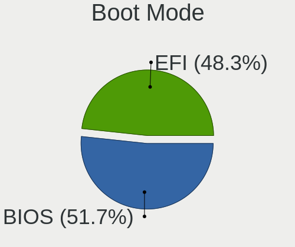

| Mode | Computers | Percent |
|------|-----------|---------|
| BIOS | 1108      | 51.61%  |
| EFI  | 1039      | 48.39%  |

Filesystem
----------

Type of filesystem

| Type    | Computers | Percent |
|---------|-----------|---------|
| Ext4    | 2046      | 96.51%  |
| Btrfs   | 31        | 1.46%   |
| Overlay | 29        | 1.37%   |
| Xfs     | 12        | 0.57%   |
| Zfs     | 2         | 0.09%   |

Part. scheme
------------

Scheme of partitioning

| Type    | Computers | Percent |
|---------|-----------|---------|
| Unknown | 1693      | 79.48%  |
| GPT     | 366       | 17.18%  |
| MBR     | 71        | 3.33%   |

Dual Boot with Linux/BSD
------------------------

Hosting more than one Linux/BSD

| Dual boot | Computers | Percent |
|-----------|-----------|---------|
| No        | 2056      | 96.98%  |
| Yes       | 64        | 3.02%   |

Dual Boot (Win)
---------------

Hosting Linux and Windows

| Dual boot | Computers | Percent |
|-----------|-----------|---------|
| No        | 1920      | 90.27%  |
| Yes       | 207       | 9.73%   |

Board
-----

Vendor
------

Motherboard manufacturer

| Name                | Computers | Percent |
|---------------------|-----------|---------|
| ASUSTek Computer    | 354       | 16.71%  |
| Dell                | 302       | 14.25%  |
| Lenovo              | 280       | 13.21%  |
| Hewlett-Packard     | 218       | 10.29%  |
| Gigabyte Technology | 183       | 8.64%   |
| MSI                 | 152       | 7.17%   |
| Acer                | 123       | 5.8%    |
| ASRock              | 89        | 4.2%    |
| Apple               | 69        | 3.26%   |
| System76            | 47        | 2.22%   |
| Intel               | 28        | 1.32%   |
| Toshiba             | 27        | 1.27%   |
| Samsung Electronics | 25        | 1.18%   |
| Sony                | 16        | 0.76%   |
| Positivo            | 15        | 0.71%   |
| Notebook            | 14        | 0.66%   |
| HUAWEI              | 14        | 0.66%   |
| Alienware           | 11        | 0.52%   |
| Unknown             | 9         | 0.42%   |
| Google              | 7         | 0.33%   |
| Fujitsu             | 7         | 0.33%   |
| Supermicro          | 6         | 0.28%   |
| Razer               | 6         | 0.28%   |
| Microsoft           | 6         | 0.28%   |
| Medion              | 6         | 0.28%   |
| Pegatron            | 5         | 0.24%   |
| ECS                 | 5         | 0.24%   |
| Timi                | 4         | 0.19%   |
| PCWare              | 4         | 0.19%   |
| LG Electronics      | 4         | 0.19%   |
| Huanan              | 4         | 0.19%   |
| Clevo               | 4         | 0.19%   |
| Chuwi               | 4         | 0.19%   |
| TUXEDO              | 3         | 0.14%   |
| OEM                 | 3         | 0.14%   |
| Foxconn             | 3         | 0.14%   |
| Biostar             | 3         | 0.14%   |
| Quanta              | 2         | 0.09%   |
| PC Specialist       | 2         | 0.09%   |
| Packard Bell        | 2         | 0.09%   |

Model
-----

Motherboard model

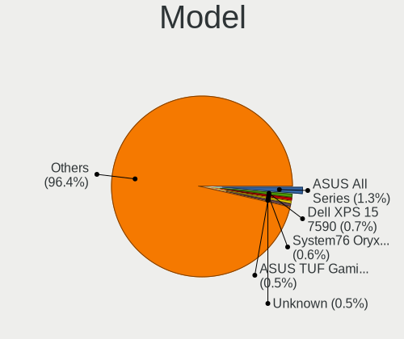

| Name                                      | Computers | Percent |
|-------------------------------------------|-----------|---------|
| ASUS All Series                           | 27        | 1.27%   |
| Dell XPS 15 7590                          | 15        | 0.71%   |
| System76 Oryx Pro                         | 12        | 0.57%   |
| Unknown                                   | 11        | 0.52%   |
| System76 Lemur Pro                        | 10        | 0.47%   |
| ASUS TUF Gaming X570-PLUS                 | 10        | 0.47%   |
| Gigabyte B450M DS3H                       | 9         | 0.42%   |
| MSI MS-7C37                               | 8         | 0.38%   |
| MSI MS-7C02                               | 8         | 0.38%   |
| Dell OptiPlex 9020                        | 8         | 0.38%   |
| System76 Galago Pro                       | 7         | 0.33%   |
| HP Pavilion Notebook                      | 7         | 0.33%   |
| ASRock B450M Steel Legend                 | 7         | 0.33%   |
| MSI MS-7B86                               | 6         | 0.28%   |
| HP Pavilion 15                            | 6         | 0.28%   |
| Dell XPS 15 9500                          | 6         | 0.28%   |
| Dell OptiPlex 7010                        | 6         | 0.28%   |
| ASUS ROG STRIX B350-F GAMING              | 6         | 0.28%   |
| ASUS PRIME X470-PRO                       | 6         | 0.28%   |
| ASUS PRIME B450M-A                        | 6         | 0.28%   |
| System76 Thelio                           | 5         | 0.24%   |
| Lenovo ThinkPad X1 Extreme 2nd 20QVCTO1WW | 5         | 0.24%   |
| Lenovo IdeaPad S145-15API 81V7            | 5         | 0.24%   |
| HP Notebook                               | 5         | 0.24%   |
| Gigabyte A320M-S2H                        | 5         | 0.24%   |
| ASUS ROG STRIX B450-F GAMING              | 5         | 0.24%   |
| ASRock B450M Pro4                         | 5         | 0.24%   |
| Acer Aspire A315-41G                      | 5         | 0.24%   |
| System76 Gazelle                          | 4         | 0.19%   |
| System76 Darter Pro                       | 4         | 0.19%   |
| Samsung 340XAA/350XAA/550XAA              | 4         | 0.19%   |
| MSI MS-7B85                               | 4         | 0.19%   |
| MSI MS-7B79                               | 4         | 0.19%   |
| Lenovo MIIX 320-10ICR 80XF                | 4         | 0.19%   |
| Lenovo MIIX 310-10ICR 80SG                | 4         | 0.19%   |
| Lenovo IdeaPad S145-15IWL 81S9            | 4         | 0.19%   |
| Lenovo IdeaPad 330-15IKB 81FE             | 4         | 0.19%   |
| Lenovo IdeaPad 330-15IKB 81DE             | 4         | 0.19%   |
| HUAWEI KPL-W0X                            | 4         | 0.19%   |
| HP Pavilion g6                            | 4         | 0.19%   |

Model Family
------------

Motherboard model prefix

| Name               | Computers | Percent |
|--------------------|-----------|---------|
| Lenovo ThinkPad    | 120       | 5.66%   |
| Dell Inspiron      | 101       | 4.77%   |
| Acer Aspire        | 92        | 4.34%   |
| Lenovo IdeaPad     | 81        | 3.82%   |
| ASUS ROG           | 53        | 2.5%    |
| ASUS PRIME         | 51        | 2.41%   |
| Dell XPS           | 49        | 2.31%   |
| Dell Latitude      | 48        | 2.27%   |
| HP Pavilion        | 45        | 2.12%   |
| Dell OptiPlex      | 40        | 1.89%   |
| ASUS TUF           | 29        | 1.37%   |
| ASUS All           | 27        | 1.27%   |
| Toshiba Satellite  | 24        | 1.13%   |
| HP ProBook         | 23        | 1.09%   |
| HP EliteBook       | 23        | 1.09%   |
| Dell Precision     | 22        | 1.04%   |
| Gigabyte X570      | 21        | 0.99%   |
| HP Compaq          | 20        | 0.94%   |
| ASUS VivoBook      | 19        | 0.9%    |
| HP Laptop          | 18        | 0.85%   |
| Dell Vostro        | 15        | 0.71%   |
| ASRock B450M       | 14        | 0.66%   |
| Lenovo Yoga        | 13        | 0.61%   |
| Lenovo Legion      | 13        | 0.61%   |
| Gigabyte B450M     | 13        | 0.61%   |
| Acer Nitro         | 13        | 0.61%   |
| System76 Oryx      | 12        | 0.57%   |
| HP ENVY            | 11        | 0.52%   |
| Unknown            | 11        | 0.52%   |
| System76 Lemur     | 10        | 0.47%   |
| Gigabyte B450      | 10        | 0.47%   |
| Lenovo ThinkCentre | 9         | 0.42%   |
| Lenovo MIIX        | 9         | 0.42%   |
| MSI MS-7C37        | 8         | 0.38%   |
| MSI MS-7C02        | 8         | 0.38%   |
| Gigabyte B550      | 8         | 0.38%   |
| Dell Studio        | 8         | 0.38%   |
| System76 Galago    | 7         | 0.33%   |
| HP OMEN            | 7         | 0.33%   |
| ASUS SABERTOOTH    | 7         | 0.33%   |

MFG Year
--------

Motherboard manufacture year

| Year | Computers | Percent |
|------|-----------|---------|
| 2019 | 339       | 16%     |
| 2018 | 304       | 14.35%  |
| 2020 | 180       | 8.49%   |
| 2017 | 178       | 8.4%    |
| 2012 | 170       | 8.02%   |
| 2013 | 144       | 6.8%    |
| 2011 | 140       | 6.61%   |
| 2014 | 129       | 6.09%   |
| 2015 | 127       | 5.99%   |
| 2016 | 121       | 5.71%   |
| 2010 | 82        | 3.87%   |
| 2009 | 64        | 3.02%   |
| 2008 | 60        | 2.83%   |
| 2021 | 40        | 1.89%   |
| 2007 | 31        | 1.46%   |
| 2006 | 8         | 0.38%   |
| 2022 | 1         | 0.05%   |
| 2005 | 1         | 0.05%   |

Form Factor
-----------

Physical design of the computer

| Name        | Computers | Percent |
|-------------|-----------|---------|
| Notebook    | 1148      | 54.18%  |
| Desktop     | 857       | 40.44%  |
| Convertible | 40        | 1.89%   |
| Tablet      | 26        | 1.23%   |
| All in one  | 22        | 1.04%   |
| Mini pc     | 19        | 0.9%    |
| Server      | 7         | 0.33%   |

Secure Boot
-----------

Enabled or disabled

| State    | Computers | Percent |
|----------|-----------|---------|
| Disabled | 2118      | 99.95%  |
| Enabled  | 1         | 0.05%   |

Coreboot
--------

Have coreboot on board

| Used | Computers | Percent |
|------|-----------|---------|
| No   | 2088      | 98.54%  |
| Yes  | 31        | 1.46%   |

RAM Size
--------

Total RAM memory

| Size in GB      | Computers | Percent |
|-----------------|-----------|---------|
| 16.01-24.0      | 536       | 25.05%  |
| 4.01-8.0        | 460       | 21.5%   |
| 8.01-16.0       | 435       | 20.33%  |
| 3.01-4.0        | 301       | 14.07%  |
| 32.01-64.0      | 245       | 11.45%  |
| 64.01-256.0     | 62        | 2.9%    |
| 1.01-2.0        | 44        | 2.06%   |
| 24.01-32.0      | 42        | 1.96%   |
| 2.01-3.0        | 12        | 0.56%   |
| More than 256.0 | 3         | 0.14%   |

RAM Used
--------

Used RAM memory

| Used GB     | Computers | Percent |
|-------------|-----------|---------|
| 2.01-3.0    | 733       | 32.56%  |
| 1.01-2.0    | 606       | 26.92%  |
| 4.01-8.0    | 413       | 18.35%  |
| 3.01-4.0    | 400       | 17.77%  |
| 8.01-16.0   | 79        | 3.51%   |
| 16.01-24.0  | 7         | 0.31%   |
| 32.01-64.0  | 4         | 0.18%   |
| 24.01-32.0  | 4         | 0.18%   |
| 0.51-1.0    | 3         | 0.13%   |
| 64.01-256.0 | 1         | 0.04%   |
| 0.01-0.5    | 1         | 0.04%   |

Total Drives
------------

Number of drives on board

| Drives | Computers | Percent |
|--------|-----------|---------|
| 1      | 1172      | 54.51%  |
| 2      | 610       | 28.37%  |
| 3      | 181       | 8.42%   |
| 4      | 109       | 5.07%   |
| 5      | 35        | 1.63%   |
| 6      | 15        | 0.7%    |
| 0      | 13        | 0.6%    |
| 7      | 7         | 0.33%   |
| 11     | 2         | 0.09%   |
| 9      | 2         | 0.09%   |
| 8      | 2         | 0.09%   |
| 23     | 1         | 0.05%   |
| 13     | 1         | 0.05%   |

Has CD-ROM
----------

Has CD-ROM on board

| Presented | Computers | Percent |
|-----------|-----------|---------|
| No        | 1442      | 67.8%   |
| Yes       | 685       | 32.2%   |

Has Ethernet
------------

Has Ethernet on board

| Presented | Computers | Percent |
|-----------|-----------|---------|
| Yes       | 1855      | 87.42%  |
| No        | 267       | 12.58%  |

Has WiFi
--------

Has WiFi module

| Presented | Computers | Percent |
|-----------|-----------|---------|
| Yes       | 1662      | 78.21%  |
| No        | 463       | 21.79%  |

Has Bluetooth
-------------

Has Bluetooth module

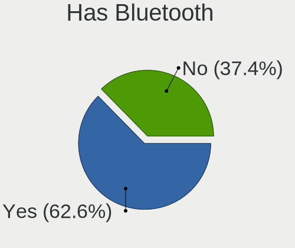

| Presented | Computers | Percent |
|-----------|-----------|---------|
| Yes       | 1334      | 62.57%  |
| No        | 798       | 37.43%  |

Location
--------

Country
-------

Geographic location (country)

| Country      | Computers | Percent |
|--------------|-----------|---------|
| USA          | 574       | 26.99%  |
| Brazil       | 318       | 14.95%  |
| Germany      | 115       | 5.41%   |
| UK           | 108       | 5.08%   |
| Canada       | 88        | 4.14%   |
| India        | 67        | 3.15%   |
| Australia    | 50        | 2.35%   |
| France       | 49        | 2.3%    |
| Netherlands  | 39        | 1.83%   |
| Spain        | 37        | 1.74%   |
| Russia       | 36        | 1.69%   |
| Poland       | 36        | 1.69%   |
| Italy        | 36        | 1.69%   |
| Mexico       | 33        | 1.55%   |
| Sweden       | 30        | 1.41%   |
| Portugal     | 28        | 1.32%   |
| Philippines  | 25        | 1.18%   |
| South Africa | 23        | 1.08%   |
| Switzerland  | 21        | 0.99%   |
| Romania      | 20        | 0.94%   |
| Belgium      | 20        | 0.94%   |
| Indonesia    | 18        | 0.85%   |
| New Zealand  | 17        | 0.8%    |
| Finland      | 16        | 0.75%   |
| Greece       | 15        | 0.71%   |
| Czechia      | 15        | 0.71%   |
| Austria      | 14        | 0.66%   |
| Chile        | 13        | 0.61%   |
| Argentina    | 13        | 0.61%   |
| Ukraine      | 12        | 0.56%   |
| Turkey       | 12        | 0.56%   |
| Norway       | 12        | 0.56%   |
| Taiwan       | 10        | 0.47%   |
| Denmark      | 10        | 0.47%   |
| Singapore    | 8         | 0.38%   |
| Malaysia     | 8         | 0.38%   |
| Vietnam      | 7         | 0.33%   |
| Serbia       | 7         | 0.33%   |
| Ireland      | 7         | 0.33%   |
| Croatia      | 7         | 0.33%   |

City
----

Geographic location (city)

| City           | Computers | Percent |
|----------------|-----------|---------|
| Sao Paulo      | 35        | 1.6%    |
| Sydney         | 15        | 0.69%   |
| Rio de Janeiro | 13        | 0.6%    |
| Braslia      | 13        | 0.6%    |
| Vienna         | 11        | 0.5%    |
| Toronto        | 11        | 0.5%    |
| New York       | 11        | 0.5%    |
| London         | 11        | 0.5%    |
| Dallas         | 11        | 0.5%    |
| Belo Horizonte | 11        | 0.5%    |
| Warsaw         | 9         | 0.41%   |
| Melbourne      | 9         | 0.41%   |
| Helsinki       | 9         | 0.41%   |
| Cape Town      | 9         | 0.41%   |
| Bucharest      | 9         | 0.41%   |
| Browning       | 9         | 0.41%   |
| Singapore      | 8         | 0.37%   |
| Recife         | 8         | 0.37%   |
| Moscow         | 8         | 0.37%   |
| Madrid         | 8         | 0.37%   |
| Berlin         | 8         | 0.37%   |
| Auckland       | 8         | 0.37%   |
| Zurich         | 7         | 0.32%   |
| Zagreb         | 7         | 0.32%   |
| Porto Alegre   | 7         | 0.32%   |
| Montreal       | 7         | 0.32%   |
| Monterrey      | 7         | 0.32%   |
| Mexico City    | 7         | 0.32%   |
| Los Angeles    | 7         | 0.32%   |
| Lisbon         | 7         | 0.32%   |
| Johannesburg   | 7         | 0.32%   |
| Hyderabad      | 7         | 0.32%   |
| Brooklyn       | 7         | 0.32%   |
| Athens         | 7         | 0.32%   |
| Stockholm      | 6         | 0.27%   |
| Santo Andr   | 6         | 0.27%   |
| Paris          | 6         | 0.27%   |
| Milan          | 6         | 0.27%   |
| Miami          | 6         | 0.27%   |
| Lancaster      | 6         | 0.27%   |

Drives
------

Drive Vendor
------------

Hard drive vendors

| Vendor                    | Computers | Drives | Percent |
|---------------------------|-----------|--------|---------|
| Samsung Electronics       | 533       | 756    | 16.35%  |
| WDC                       | 513       | 688    | 15.74%  |
| Seagate                   | 470       | 641    | 14.42%  |
| Kingston                  | 217       | 248    | 6.66%   |
| SanDisk                   | 192       | 240    | 5.89%   |
| Toshiba                   | 167       | 195    | 5.12%   |
| Crucial                   | 133       | 159    | 4.08%   |
| Unknown                   | 110       | 131    | 3.38%   |
| Intel                     | 99        | 117    | 3.04%   |
| Hitachi                   | 79        | 92     | 2.42%   |
| SK hynix                  | 75        | 94     | 2.3%    |
| HGST                      | 71        | 78     | 2.18%   |
| Phison                    | 60        | 92     | 1.84%   |
| A-DATA Technology         | 60        | 66     | 1.84%   |
| PNY                       | 34        | 38     | 1.04%   |
| Micron Technology         | 30        | 32     | 0.92%   |
| Silicon Motion            | 26        | 29     | 0.8%    |
| Apple                     | 25        | 27     | 0.77%   |
| China                     | 23        | 30     | 0.71%   |
| OCZ                       | 21        | 26     | 0.64%   |
| Micron/Crucial Technology | 18        | 21     | 0.55%   |
| Corsair                   | 17        | 20     | 0.52%   |
| Transcend                 | 16        | 16     | 0.49%   |
| LITEONIT                  | 14        | 16     | 0.43%   |
| LITEON                    | 13        | 15     | 0.4%    |
| XPG                       | 12        | 18     | 0.37%   |
| JMicron Technology        | 12        | 16     | 0.37%   |
| Team                      | 11        | 12     | 0.34%   |
| Maxtor                    | 9         | 9      | 0.28%   |
| Fujitsu                   | 9         | 9      | 0.28%   |
| Realtek Semiconductor     | 8         | 9      | 0.25%   |
| Patriot                   | 8         | 8      | 0.25%   |
| ASMT                      | 8         | 9      | 0.25%   |
| Lexar                     | 7         | 7      | 0.21%   |
| Hewlett-Packard           | 7         | 9      | 0.21%   |
| GOODRAM                   | 7         | 7      | 0.21%   |
| Intenso                   | 6         | 6      | 0.18%   |
| T-FORCE                   | 5         | 6      | 0.15%   |
| SPCC                      | 5         | 5      | 0.15%   |
| Plextor                   | 5         | 8      | 0.15%   |

Drive Model
-----------

Hard drive models

| Model                                  | Computers | Percent |
|----------------------------------------|-----------|---------|
| Kingston SA400S37240G 240GB SSD        | 55        | 1.53%   |
| Samsung NVMe SSD Drive 1TB             | 43        | 1.2%    |
| Samsung NVMe SSD Drive 500GB           | 41        | 1.14%   |
| Samsung NVMe SSD Drive 512GB           | 37        | 1.03%   |
| Samsung SSD 860 EVO 500GB              | 32        | 0.89%   |
| Samsung SSD 850 EVO 250GB              | 32        | 0.89%   |
| Samsung SSD 860 EVO 1TB                | 31        | 0.86%   |
| Kingston SA400S37120G 120GB SSD        | 31        | 0.86%   |
| Samsung SM963 2.5" NVMe PCIe SSD 256GB | 29        | 0.81%   |
| Unknown MMC Card  64GB                 | 28        | 0.78%   |
| Seagate ST1000DM010-2EP102 1TB         | 26        | 0.73%   |
| HGST HTS721010A9E630 1TB               | 26        | 0.73%   |
| Seagate ST1000LM024 HN-M101MBB 1TB     | 25        | 0.7%    |
| Seagate ST500DM002-1BD142 500GB        | 24        | 0.67%   |
| Seagate ST1000LM035-1RK172 1TB         | 24        | 0.67%   |
| Seagate ST2000DM008-2FR102 2TB         | 23        | 0.64%   |
| SanDisk NVMe SSD Drive 500GB           | 23        | 0.64%   |
| Kingston SV300S37A120G 120GB SSD       | 23        | 0.64%   |
| Intel NVMe SSD Drive 512GB             | 22        | 0.61%   |
| Toshiba MQ01ABD100 1TB                 | 21        | 0.59%   |
| Unknown MMC Card  32GB                 | 20        | 0.56%   |
| WDC WD10SPZX-24Z10 1TB                 | 18        | 0.5%    |
| Samsung SSD 860 EVO 250GB              | 18        | 0.5%    |
| Samsung NVMe SSD Drive 250GB           | 18        | 0.5%    |
| Intel NVMe SSD Drive 1024GB            | 18        | 0.5%    |
| Samsung SSD 860 QVO 1TB                | 17        | 0.47%   |
| Samsung SSD 850 EVO 500GB              | 17        | 0.47%   |
| Phison NVMe SSD Drive 1TB              | 17        | 0.47%   |
| Kingston SA400S37480G 480GB SSD        | 17        | 0.47%   |
| Crucial CT240BX500SSD1 240GB           | 17        | 0.47%   |
| WDC WD10SPZX-21Z10T0 1TB               | 16        | 0.45%   |
| Samsung SSD 840 EVO 250GB              | 16        | 0.45%   |
| Crucial CT500MX500SSD1 500GB           | 16        | 0.45%   |
| Seagate ST9500325AS 500GB              | 15        | 0.42%   |
| SanDisk NVMe SSD Drive 1TB             | 15        | 0.42%   |
| Crucial CT1000MX500SSD1 1TB            | 15        | 0.42%   |
| WDC WD10EZEX-08WN4A0 1TB               | 14        | 0.39%   |
| Toshiba MQ04ABF100 1TB                 | 14        | 0.39%   |
| SK hynix NVMe SSD Drive 256GB          | 14        | 0.39%   |
| SanDisk SSD PLUS 120GB                 | 14        | 0.39%   |

HDD Vendor
----------

Hard disk drive vendors

| Vendor              | Computers | Drives | Percent |
|---------------------|-----------|--------|---------|
| Seagate             | 461       | 614    | 36.97%  |
| WDC                 | 414       | 536    | 33.2%   |
| Toshiba             | 124       | 141    | 9.94%   |
| Hitachi             | 79        | 92     | 6.34%   |
| HGST                | 71        | 78     | 5.69%   |
| Samsung Electronics | 49        | 51     | 3.93%   |
| Unknown             | 13        | 14     | 1.04%   |
| Fujitsu             | 9         | 9      | 0.72%   |
| ASMT                | 8         | 9      | 0.64%   |
| Maxtor              | 7         | 7      | 0.56%   |
| Apple               | 5         | 6      | 0.4%    |
| PHD 3.0             | 1         | 1      | 0.08%   |
| OEM                 | 1         | 1      | 0.08%   |
| JMicron Technology  | 1         | 2      | 0.08%   |
| Inateck             | 1         | 1      | 0.08%   |
| Hewlett-Packard     | 1         | 3      | 0.08%   |
| H/W                 | 1         | 1      | 0.08%   |
| DAS                 | 1         | 4      | 0.08%   |

SSD Vendor
----------

Solid state drive vendors

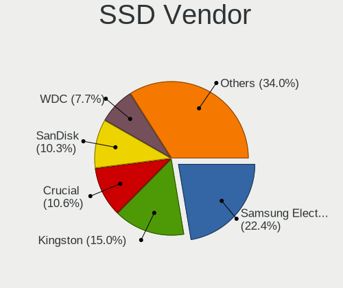

| Vendor              | Computers | Drives | Percent |
|---------------------|-----------|--------|---------|
| Samsung Electronics | 269       | 356    | 22.4%   |
| Kingston            | 181       | 202    | 15.07%  |
| Crucial             | 127       | 153    | 10.57%  |
| SanDisk             | 124       | 146    | 10.32%  |
| WDC                 | 93        | 117    | 7.74%   |
| A-DATA Technology   | 47        | 49     | 3.91%   |
| PNY                 | 33        | 37     | 2.75%   |
| Intel               | 28        | 29     | 2.33%   |
| SK hynix            | 27        | 37     | 2.25%   |
| China               | 23        | 30     | 1.92%   |
| Micron Technology   | 21        | 22     | 1.75%   |
| OCZ                 | 20        | 22     | 1.67%   |
| Transcend           | 16        | 16     | 1.33%   |
| Apple               | 16        | 17     | 1.33%   |
| Corsair             | 15        | 16     | 1.25%   |
| LITEONIT            | 14        | 16     | 1.17%   |
| Toshiba             | 13        | 17     | 1.08%   |
| LITEON              | 13        | 15     | 1.08%   |
| Team                | 10        | 11     | 0.83%   |
| Patriot             | 8         | 8      | 0.67%   |
| Lexar               | 7         | 7      | 0.58%   |
| Seagate             | 6         | 11     | 0.5%    |
| SPCC                | 5         | 5      | 0.42%   |
| Plextor             | 5         | 8      | 0.42%   |
| KingDian            | 5         | 5      | 0.42%   |
| Hewlett-Packard     | 5         | 5      | 0.42%   |
| GOODRAM             | 5         | 5      | 0.42%   |
| Apacer              | 5         | 6      | 0.42%   |
| JMicron Technology  | 4         | 5      | 0.33%   |
| Intenso             | 4         | 4      | 0.33%   |
| BHT                 | 4         | 4      | 0.33%   |
| TO Exter            | 3         | 5      | 0.25%   |
| Netac               | 3         | 3      | 0.25%   |
| KingSpec            | 3         | 3      | 0.25%   |
| Kingmax             | 3         | 4      | 0.25%   |
| OWC                 | 2         | 9      | 0.17%   |
| Maxtor              | 2         | 2      | 0.17%   |
| Gigabyte Technology | 2         | 2      | 0.17%   |
| Colorful            | 2         | 2      | 0.17%   |
| Zheino              | 1         | 1      | 0.08%   |

Drive Kind
----------

HDD or SSD

| Kind    | Computers | Drives | Percent |
|---------|-----------|--------|---------|
| HDD     | 1074      | 1570   | 36.77%  |
| SSD     | 1027      | 1450   | 35.16%  |
| NVMe    | 697       | 993    | 23.86%  |
| MMC     | 76        | 92     | 2.6%    |
| Unknown | 47        | 60     | 1.61%   |

Drive Connector
---------------

SATA, SAS, NVMe, etc.

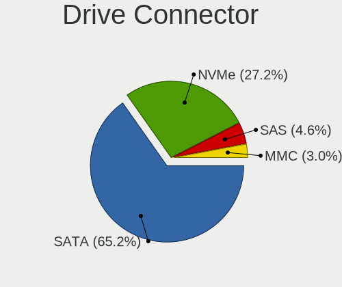

| Type | Computers | Drives | Percent |
|------|-----------|--------|---------|
| SATA | 1668      | 2921   | 65.31%  |
| NVMe | 694       | 984    | 27.17%  |
| SAS  | 116       | 168    | 4.54%   |
| MMC  | 76        | 92     | 2.98%   |

Drive Size
----------

Size of hard drive

| Size in TB | Computers | Drives | Percent |
|------------|-----------|--------|---------|
| 0.01-0.5   | 1242      | 1762   | 56.92%  |
| 0.51-1.0   | 651       | 842    | 29.84%  |
| 1.01-2.0   | 167       | 214    | 7.65%   |
| 3.01-4.0   | 51        | 69     | 2.34%   |
| 2.01-3.0   | 36        | 50     | 1.65%   |
| 4.01-10.0  | 30        | 63     | 1.37%   |
| 10.01-20.0 | 5         | 20     | 0.23%   |

Space Total
-----------

Amount of disk space available on the file system

| Size in GB     | Computers | Percent |
|----------------|-----------|---------|
| 101-250        | 680       | 31.21%  |
| 251-500        | 548       | 25.15%  |
| 501-1000       | 385       | 17.67%  |
| 1001-2000      | 205       | 9.41%   |
| 51-100         | 106       | 4.86%   |
| More than 3000 | 81        | 3.72%   |
| 2001-3000      | 62        | 2.85%   |
| 21-50          | 61        | 2.8%    |
| 1-20           | 43        | 1.97%   |
| Unknown        | 8         | 0.37%   |

Space Used
----------

Amount of used disk space

| Used GB        | Computers | Percent |
|----------------|-----------|---------|
| 1-20           | 902       | 40.48%  |
| 21-50          | 423       | 18.99%  |
| 51-100         | 263       | 11.8%   |
| 101-250        | 259       | 11.62%  |
| 251-500        | 162       | 7.27%   |
| 501-1000       | 109       | 4.89%   |
| 1001-2000      | 52        | 2.33%   |
| More than 3000 | 29        | 1.3%    |
| 2001-3000      | 21        | 0.94%   |
| Unknown        | 8         | 0.36%   |

Malfunc. Drives
---------------

Drive models with a malfunction

| Model                                   | Computers | Drives | Percent |
|-----------------------------------------|-----------|--------|---------|
| Seagate ST1000LM024 HN-M101MBB 1TB      | 4         | 4      | 4.71%   |
| Seagate ST500LM012 HN-M500MBB 500GB     | 3         | 3      | 3.53%   |
| Seagate ST1500DL003-9VT16L 1TB          | 3         | 3      | 3.53%   |
| Seagate ST1000DM003-9YN162 1TB          | 3         | 3      | 3.53%   |
| WDC WD3200AAKS-75B3A0 320GB             | 2         | 2      | 2.35%   |
| WDC WD10JPCX-24UE4T0 1TB                | 2         | 2      | 2.35%   |
| Seagate ST500LT012-9WS142 500GB         | 2         | 3      | 2.35%   |
| Samsung Electronics HD502HI 500GB       | 2         | 2      | 2.35%   |
| Samsung Electronics HD103SJ 1TB         | 2         | 2      | 2.35%   |
| Kingston SV300S37A120G 120GB SSD        | 2         | 2      | 2.35%   |
| Kingston SA400S37120G 120GB SSD         | 2         | 3      | 2.35%   |
| Hitachi HTS545050A7E380 500GB           | 2         | 2      | 2.35%   |
| HGST HTS725050A7E630 500GB              | 2         | 2      | 2.35%   |
| WDC WD7500BPVT-60HXZT1 752GB            | 1         | 1      | 1.18%   |
| WDC WD7500BPKT-75PK4T0 752GB            | 1         | 1      | 1.18%   |
| WDC WD5000LPCX-21VHAT0 500GB            | 1         | 1      | 1.18%   |
| WDC WD5000BPVT-22HXZT3 500GB            | 1         | 1      | 1.18%   |
| WDC WD5000BPVT-08HXZT3 500GB            | 1         | 1      | 1.18%   |
| WDC WD5000AVVS-63H0B1 500GB             | 1         | 1      | 1.18%   |
| WDC WD5000AAKS-41YGA1 500GB             | 1         | 1      | 1.18%   |
| WDC WD5000AADS-00M2B0 500GB             | 1         | 1      | 1.18%   |
| WDC WD3200AAJS-56M0A0 320GB             | 1         | 1      | 1.18%   |
| WDC WD30EZRX-00SPEB0 3TB                | 1         | 1      | 1.18%   |
| WDC WD10SPZX-75Z10T1 1TB                | 1         | 1      | 1.18%   |
| WDC WD10JPVX-75JC3T0 1TB                | 1         | 1      | 1.18%   |
| WDC WD10EZRX-00A8LB0 1TB                | 1         | 2      | 1.18%   |
| WDC WD10EZEX-08WN4A0 1TB                | 1         | 1      | 1.18%   |
| WDC WD1003FZEX-00MK2A0 1TB              | 1         | 1      | 1.18%   |
| WDC WD1002FAEX-00Z3A0 1TB               | 1         | 1      | 1.18%   |
| WDC WD10 JPVX-75JC3T0 1TB               | 1         | 1      | 1.18%   |
| Toshiba MK5061GSY 500GB                 | 1         | 1      | 1.18%   |
| Toshiba MK5059GSXP 500GB                | 1         | 1      | 1.18%   |
| Toshiba MK2035GSS 200GB                 | 1         | 1      | 1.18%   |
| Toshiba KSG60ZMV256G M.2 2280 256GB SSD | 1         | 1      | 1.18%   |
| Toshiba DT01ACA050 500GB                | 1         | 1      | 1.18%   |
| SK hynix SC210 mSATA 256GB SSD          | 1         | 1      | 1.18%   |
| Seagate ST9500325AS 500GB               | 1         | 2      | 1.18%   |
| Seagate ST9320325AS 320GB               | 1         | 1      | 1.18%   |
| Seagate ST500LT012-1DG142 500GB         | 1         | 1      | 1.18%   |
| Seagate ST3500418AS 500GB               | 1         | 1      | 1.18%   |

Malfunc. Drive Vendor
---------------------

Vendors of faulty drives

| Vendor              | Computers | Drives | Percent |
|---------------------|-----------|--------|---------|
| Seagate             | 26        | 29     | 30.95%  |
| WDC                 | 21        | 22     | 25%     |
| Samsung Electronics | 7         | 7      | 8.33%   |
| Toshiba             | 5         | 5      | 5.95%   |
| Kingston            | 5         | 6      | 5.95%   |
| HGST                | 5         | 5      | 5.95%   |
| Hitachi             | 4         | 5      | 4.76%   |
| Micron Technology   | 3         | 3      | 3.57%   |
| Crucial             | 2         | 2      | 2.38%   |
| A-DATA Technology   | 2         | 2      | 2.38%   |
| SK hynix            | 1         | 1      | 1.19%   |
| Maxtor              | 1         | 1      | 1.19%   |
| Intenso             | 1         | 1      | 1.19%   |
| ASMT                | 1         | 1      | 1.19%   |

Malfunc. HDD Vendor
-------------------

Vendors of faulty HDD drives

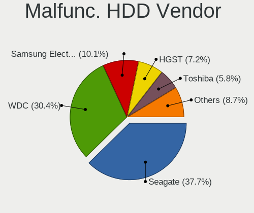

| Vendor              | Computers | Drives | Percent |
|---------------------|-----------|--------|---------|
| Seagate             | 26        | 29     | 37.68%  |
| WDC                 | 21        | 22     | 30.43%  |
| Samsung Electronics | 7         | 7      | 10.14%  |
| HGST                | 5         | 5      | 7.25%   |
| Toshiba             | 4         | 4      | 5.8%    |
| Hitachi             | 4         | 5      | 5.8%    |
| Maxtor              | 1         | 1      | 1.45%   |
| ASMT                | 1         | 1      | 1.45%   |

Malfunc. Drive Kind
-------------------

Kinds of faulty drives

| Kind | Computers | Drives | Percent |
|------|-----------|--------|---------|
| HDD  | 62        | 74     | 80.52%  |
| SSD  | 13        | 14     | 16.88%  |
| NVMe | 2         | 2      | 2.6%    |

Failed Drives
-------------

Failed drive models

Zero info for selected period =(

Failed Drive Vendor
-------------------

Failed drive vendors

Zero info for selected period =(

Drive Status
------------

Number of failed and malfunc. drives

| Status   | Computers | Drives | Percent |
|----------|-----------|--------|---------|
| Detected | 1708      | 3358   | 77.29%  |
| Works    | 426       | 716    | 19.28%  |
| Malfunc  | 75        | 90     | 3.39%   |
| Limited  | 1         | 1      | 0.05%   |

Storage controller
------------------

Storage Vendor
--------------

Storage controller vendors

| Vendor                           | Computers | Percent |
|----------------------------------|-----------|---------|
| Intel                            | 1362      | 49.31%  |
| AMD                              | 539       | 19.51%  |
| Samsung Electronics              | 276       | 9.99%   |
| SanDisk                          | 93        | 3.37%   |
| Phison Electronics               | 65        | 2.35%   |
| ASMedia Technology               | 49        | 1.77%   |
| SK hynix                         | 48        | 1.74%   |
| Nvidia                           | 42        | 1.52%   |
| Kingston Technology Company      | 38        | 1.38%   |
| Toshiba America Info Systems     | 33        | 1.19%   |
| Silicon Motion                   | 29        | 1.05%   |
| ADATA Technology                 | 25        | 0.91%   |
| Marvell Technology Group         | 24        | 0.87%   |
| JMicron Technology               | 23        | 0.83%   |
| Micron/Crucial Technology        | 22        | 0.8%    |
| Realtek Semiconductor            | 13        | 0.47%   |
| Broadcom / LSI                   | 11        | 0.4%    |
| Micron Technology                | 10        | 0.36%   |
| KIOXIA                           | 10        | 0.36%   |
| Union Memory (Shenzhen)          | 8         | 0.29%   |
| Solid State Storage Technology   | 7         | 0.25%   |
| Seagate Technology               | 6         | 0.22%   |
| Silicon Integrated Systems [SiS] | 5         | 0.18%   |
| LSI Logic / Symbios Logic        | 4         | 0.14%   |
| Apple                            | 4         | 0.14%   |
| Lite-On Technology               | 3         | 0.11%   |
| Shenzhen Longsys Electronics     | 2         | 0.07%   |
| Lenovo                           | 2         | 0.07%   |
| HighPoint Technologies           | 2         | 0.07%   |
| Adaptec                          | 2         | 0.07%   |
| VIA Technologies                 | 1         | 0.04%   |
| Silicon Image                    | 1         | 0.04%   |
| OCZ Technology Group             | 1         | 0.04%   |
| MAXIO Technology (Hangzhou)      | 1         | 0.04%   |
| Dell                             | 1         | 0.04%   |

Storage Model
-------------

Storage controller models

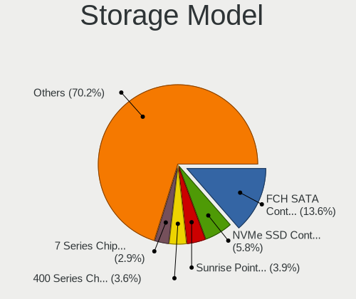

| Model                                                                          | Computers | Percent |
|--------------------------------------------------------------------------------|-----------|---------|
| AMD FCH SATA Controller [AHCI mode]                                            | 434       | 13.57%  |
| Samsung NVMe SSD Controller SM981/PM981/PM983                                  | 184       | 5.75%   |
| Intel Sunrise Point-LP SATA Controller [AHCI mode]                             | 124       | 3.88%   |
| AMD 400 Series Chipset SATA Controller                                         | 115       | 3.6%    |
| Intel 7 Series Chipset Family 6-port SATA Controller [AHCI mode]               | 93        | 2.91%   |
| Intel 8 Series/C220 Series Chipset Family 6-port SATA Controller 1 [AHCI mode] | 85        | 2.66%   |
| Intel 82801 Mobile SATA Controller [RAID mode]                                 | 84        | 2.63%   |
| Intel Cannon Lake Mobile PCH SATA AHCI Controller                              | 79        | 2.47%   |
| Intel 6 Series/C200 Series Chipset Family 6 port Mobile SATA AHCI Controller   | 71        | 2.22%   |
| Intel 6 Series/C200 Series Chipset Family 6 port Desktop SATA AHCI Controller  | 54        | 1.69%   |
| Intel 8 Series SATA Controller 1 [AHCI mode]                                   | 53        | 1.66%   |
| Intel Q170/Q150/B150/H170/H110/Z170/CM236 Chipset SATA Controller [AHCI Mode]  | 48        | 1.5%    |
| ASMedia ASM1062 Serial ATA Controller                                          | 47        | 1.47%   |
| Intel 200 Series PCH SATA controller [AHCI mode]                               | 46        | 1.44%   |
| Samsung NVMe SSD Controller SM961/PM961/SM963                                  | 45        | 1.41%   |
| Intel SATA Controller [RAID mode]                                              | 45        | 1.41%   |
| Intel HM170/QM170 Chipset SATA Controller [AHCI Mode]                          | 44        | 1.38%   |
| Intel SSD 660P Series                                                          | 42        | 1.31%   |
| Intel 7 Series/C210 Series Chipset Family 6-port SATA Controller [AHCI mode]   | 40        | 1.25%   |
| AMD SB7x0/SB8x0/SB9x0 SATA Controller [AHCI mode]                              | 38        | 1.19%   |
| Phison E12 NVMe Controller                                                     | 36        | 1.13%   |
| Intel Cannon Point-LP SATA Controller [AHCI Mode]                              | 36        | 1.13%   |
| Intel Cannon Lake PCH SATA AHCI Controller                                     | 36        | 1.13%   |
| AMD SB7x0/SB8x0/SB9x0 IDE Controller                                           | 36        | 1.13%   |
| Intel Wildcat Point-LP SATA Controller [AHCI Mode]                             | 34        | 1.06%   |
| Intel Comet Lake SATA AHCI Controller                                          | 28        | 0.88%   |
| AMD 300 Series Chipset SATA Controller                                         | 27        | 0.84%   |
| Intel 5 Series/3400 Series Chipset 4 port SATA AHCI Controller                 | 26        | 0.81%   |
| AMD SB7x0/SB8x0/SB9x0 SATA Controller [IDE mode]                               | 26        | 0.81%   |
| Silicon Motion SM2263EN/SM2263XT SSD Controller                                | 23        | 0.72%   |
| SanDisk WD Blue SN550 NVMe SSD                                                 | 23        | 0.72%   |
| Intel 82801IBM/IEM (ICH9M/ICH9M-E) 4 port SATA Controller [AHCI mode]          | 23        | 0.72%   |
| Intel 82801HM/HEM (ICH8M/ICH8M-E) IDE Controller                               | 23        | 0.72%   |
| Intel 5 Series/3400 Series Chipset 6 port SATA AHCI Controller                 | 22        | 0.69%   |
| AMD FCH SATA Controller D                                                      | 22        | 0.69%   |
| AMD 500 Series Chipset SATA Controller                                         | 22        | 0.69%   |
| SanDisk WD Black SN750 / PC SN730 NVMe SSD                                     | 21        | 0.66%   |
| Intel 82801HM/HEM (ICH8M/ICH8M-E) SATA Controller [AHCI mode]                  | 21        | 0.66%   |
| Phison E16 PCIe4 NVMe Controller                                               | 20        | 0.63%   |
| Intel 9 Series Chipset Family SATA Controller [AHCI Mode]                      | 20        | 0.63%   |

Storage Kind
------------

Kind of storage controller (IDE, SATA, NVMe, SAS, ...)

| Kind | Computers | Percent |
|------|-----------|---------|
| SATA | 1679      | 60.79%  |
| NVMe | 697       | 25.24%  |
| IDE  | 205       | 7.42%   |
| RAID | 164       | 5.94%   |
| SAS  | 13        | 0.47%   |
| SCSI | 4         | 0.14%   |

Processor
---------

CPU Vendor
----------

Processor vendors

| Vendor | Computers | Percent |
|--------|-----------|---------|
| Intel  | 1522      | 71.83%  |
| AMD    | 597       | 28.17%  |

CPU Model
---------

Processor models

| Model                                         | Computers | Percent |
|-----------------------------------------------|-----------|---------|
| Intel Core i7-9750H CPU @ 2.60GHz             | 42        | 1.98%   |
| AMD Ryzen 5 3600 6-Core Processor             | 34        | 1.6%    |
| Intel Core i7-8750H CPU @ 2.20GHz             | 30        | 1.41%   |
| AMD Ryzen 7 3700X 8-Core Processor            | 30        | 1.41%   |
| Intel Core i7-7700HQ CPU @ 2.80GHz            | 26        | 1.23%   |
| Intel Core i5-8250U CPU @ 1.60GHz             | 26        | 1.23%   |
| AMD Ryzen 9 3900X 12-Core Processor           | 26        | 1.23%   |
| Intel Core i7-8550U CPU @ 1.80GHz             | 24        | 1.13%   |
| Intel Core i5-8265U CPU @ 1.60GHz             | 24        | 1.13%   |
| AMD Ryzen 5 3500U with Radeon Vega Mobile Gfx | 23        | 1.08%   |
| AMD Ryzen 5 1600 Six-Core Processor           | 23        | 1.08%   |
| Intel Core i5-7200U CPU @ 2.50GHz             | 20        | 0.94%   |
| Intel Core i5-10210U CPU @ 1.60GHz            | 20        | 0.94%   |
| AMD Ryzen 5 2500U with Radeon Vega Mobile Gfx | 20        | 0.94%   |
| Intel Core i7-8565U CPU @ 1.80GHz             | 19        | 0.9%    |
| Intel Core i5-6200U CPU @ 2.30GHz             | 19        | 0.9%    |
| Intel Core i7-10510U CPU @ 1.80GHz            | 18        | 0.85%   |
| AMD Ryzen 5 2600 Six-Core Processor           | 18        | 0.85%   |
| Intel Atom x5-Z8350 CPU @ 1.44GHz             | 17        | 0.8%    |
| AMD Ryzen 5 3600X 6-Core Processor            | 17        | 0.8%    |
| AMD Ryzen 7 2700X Eight-Core Processor        | 15        | 0.71%   |
| Intel Core i7-6500U CPU @ 2.50GHz             | 14        | 0.66%   |
| Intel Core i7-7500U CPU @ 2.70GHz             | 13        | 0.61%   |
| Intel Core i7-6700HQ CPU @ 2.60GHz            | 13        | 0.61%   |
| Intel Core i7-2670QM CPU @ 2.20GHz            | 13        | 0.61%   |
| Intel Core i7-10750H CPU @ 2.60GHz            | 13        | 0.61%   |
| Intel Core i5-4590 CPU @ 3.30GHz              | 13        | 0.61%   |
| Intel Core i7-3770 CPU @ 3.40GHz              | 12        | 0.57%   |
| Intel Core i5-4210U CPU @ 1.70GHz             | 12        | 0.57%   |
| AMD Ryzen 5 3400G with Radeon Vega Graphics   | 12        | 0.57%   |
| Intel Core i5-8300H CPU @ 2.30GHz             | 11        | 0.52%   |
| Intel Core i5-3210M CPU @ 2.50GHz             | 11        | 0.52%   |
| Intel Core i5-2520M CPU @ 2.50GHz             | 11        | 0.52%   |
| Intel Core i3-2100 CPU @ 3.10GHz              | 11        | 0.52%   |
| Intel 11th Gen Core i5-1135G7 @ 2.40GHz       | 11        | 0.52%   |
| AMD Ryzen 7 3700U with Radeon Vega Mobile Gfx | 11        | 0.52%   |
| Intel Core i9-9900K CPU @ 3.60GHz             | 10        | 0.47%   |
| Intel Core i7-10875H CPU @ 2.30GHz            | 10        | 0.47%   |
| Intel Core i5-9300H CPU @ 2.40GHz             | 10        | 0.47%   |
| Intel Core i5-5200U CPU @ 2.20GHz             | 10        | 0.47%   |

CPU Model Family
----------------

Processor model prefix

| Model                   | Computers | Percent |
|-------------------------|-----------|---------|
| Intel Core i7           | 541       | 25.51%  |
| Intel Core i5           | 490       | 23.1%   |
| AMD Ryzen 5             | 190       | 8.96%   |
| Intel Core i3           | 142       | 6.69%   |
| AMD Ryzen 7             | 119       | 5.61%   |
| Intel Core 2 Duo        | 73        | 3.44%   |
| Intel Xeon              | 56        | 2.64%   |
| Intel Celeron           | 54        | 2.55%   |
| AMD Ryzen 9             | 42        | 1.98%   |
| AMD FX                  | 35        | 1.65%   |
| Other                   | 31        | 1.46%   |
| AMD Ryzen 3             | 31        | 1.46%   |
| Intel Core i9           | 29        | 1.37%   |
| Intel Pentium           | 26        | 1.23%   |
| Intel Atom              | 20        | 0.94%   |
| AMD A8                  | 20        | 0.94%   |
| AMD A6                  | 19        | 0.9%    |
| AMD A10                 | 18        | 0.85%   |
| Intel Pentium Dual-Core | 16        | 0.75%   |
| AMD Ryzen Threadripper  | 16        | 0.75%   |
| AMD A4                  | 14        | 0.66%   |
| Intel Pentium Dual      | 12        | 0.57%   |
| AMD Phenom II X4        | 11        | 0.52%   |
| Intel Core 2 Quad       | 10        | 0.47%   |
| Intel Core 2            | 10        | 0.47%   |
| AMD Athlon II X2        | 10        | 0.47%   |
| AMD Athlon              | 10        | 0.47%   |
| AMD Phenom II X6        | 7         | 0.33%   |
| AMD E2                  | 5         | 0.24%   |
| Intel Genuine           | 4         | 0.19%   |
| AMD Ryzen 7 PRO         | 4         | 0.19%   |
| AMD Phenom              | 4         | 0.19%   |
| AMD E1                  | 4         | 0.19%   |
| AMD Athlon II X4        | 4         | 0.19%   |
| AMD Athlon 64 X2        | 4         | 0.19%   |
| AMD A12                 | 4         | 0.19%   |
| Intel Core m3           | 3         | 0.14%   |
| AMD Ryzen 5 PRO         | 3         | 0.14%   |
| AMD Athlon X4           | 3         | 0.14%   |
| Intel Pentium Silver    | 2         | 0.09%   |

CPU Cores
---------

Number of processor cores

| Number | Computers | Percent |
|--------|-----------|---------|
| 4      | 804       | 37.94%  |
| 2      | 751       | 35.44%  |
| 6      | 289       | 13.64%  |
| 8      | 176       | 8.31%   |
| 12     | 38        | 1.79%   |
| 16     | 15        | 0.71%   |
| 1      | 14        | 0.66%   |
| 3      | 12        | 0.57%   |
| 24     | 9         | 0.42%   |
| 32     | 5         | 0.24%   |
| 14     | 3         | 0.14%   |
| 10     | 3         | 0.14%   |

CPU Sockets
-----------

Number of sockets

| Number | Computers | Percent |
|--------|-----------|---------|
| 1      | 2100      | 99.1%   |
| 2      | 19        | 0.9%    |

CPU Threads
-----------

Threads per core (Hyper-Threading)

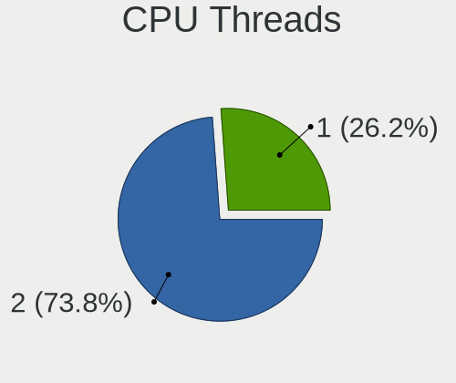

| Number | Computers | Percent |
|--------|-----------|---------|
| 2      | 1565      | 73.79%  |
| 1      | 556       | 26.21%  |

CPU Op-Modes
------------

CPU Operation Modes (32-bit, 64-bit)

| Op mode        | Computers | Percent |
|----------------|-----------|---------|
| 32-bit, 64-bit | 2119      | 100%    |

CPU Microcode
-------------

Microcode number

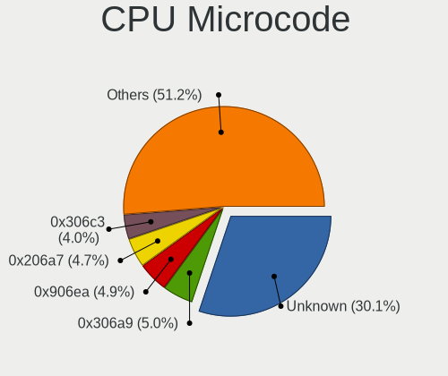

| Number     | Computers | Percent |
|------------|-----------|---------|
| Unknown    | 649       | 29.98%  |
| 0x306a9    | 108       | 4.99%   |
| 0x906ea    | 107       | 4.94%   |
| 0x206a7    | 103       | 4.76%   |
| 0x306c3    | 86        | 3.97%   |
| 0x806ea    | 57        | 2.63%   |
| 0x406e3    | 57        | 2.63%   |
| 0x08701013 | 56        | 2.59%   |
| 0x806ec    | 51        | 2.36%   |
| 0x506e3    | 48        | 2.22%   |
| 0x08701021 | 48        | 2.22%   |
| 0x40651    | 47        | 2.17%   |
| 0x906e9    | 45        | 2.08%   |
| 0x1067a    | 45        | 2.08%   |
| 0x0800820d | 44        | 2.03%   |
| 0x806e9    | 36        | 1.66%   |
| 0x08108109 | 30        | 1.39%   |
| 0x08108102 | 29        | 1.34%   |
| 0x306d4    | 28        | 1.29%   |
| 0x20655    | 24        | 1.11%   |
| 0xa0652    | 22        | 1.02%   |
| 0x906ed    | 20        | 0.92%   |
| 0x406c4    | 20        | 0.92%   |
| 0x06000852 | 18        | 0.83%   |
| 0x0810100b | 17        | 0.79%   |
| 0x08001138 | 16        | 0.74%   |
| 0x06001119 | 16        | 0.74%   |
| 0x806eb    | 15        | 0.69%   |
| 0x10676    | 14        | 0.65%   |
| 0x706a1    | 12        | 0.55%   |
| 0x06006705 | 12        | 0.55%   |
| 0x706e5    | 10        | 0.46%   |
| 0x6fd      | 10        | 0.46%   |
| 0x010000c8 | 10        | 0.46%   |
| 0x6fb      | 9         | 0.42%   |
| 0x206c2    | 9         | 0.42%   |
| 0x08600103 | 9         | 0.42%   |
| 0x08600102 | 9         | 0.42%   |
| 0x906ec    | 8         | 0.37%   |
| 0x30678    | 8         | 0.37%   |

CPU Microarch
-------------

Microarchitecture

| Name             | Computers | Percent |
|------------------|-----------|---------|
| KabyLake         | 449       | 21.18%  |
| Haswell          | 202       | 9.53%   |
| Zen 2            | 174       | 8.21%   |
| IvyBridge        | 159       | 7.5%    |
| SandyBridge      | 157       | 7.41%   |
| Zen+             | 140       | 6.6%    |
| Skylake          | 134       | 6.32%   |
| Penryn           | 83        | 3.92%   |
| Zen              | 78        | 3.68%   |
| Westmere         | 58        | 2.74%   |
| Piledriver       | 53        | 2.5%    |
| CometLake        | 50        | 2.36%   |
| Core             | 48        | 2.26%   |
| Silvermont       | 45        | 2.12%   |
| Broadwell        | 44        | 2.08%   |
| K10              | 38        | 1.79%   |
| Excavator        | 26        | 1.23%   |
| Nehalem          | 23        | 1.08%   |
| IceLake          | 23        | 1.08%   |
| Zen 3            | 18        | 0.85%   |
| TigerLake        | 17        | 0.8%    |
| Goldmont plus    | 15        | 0.71%   |
| Steamroller      | 13        | 0.61%   |
| Puma             | 12        | 0.57%   |
| K8 Hammer        | 9         | 0.42%   |
| K10 Llano        | 9         | 0.42%   |
| Bobcat           | 9         | 0.42%   |
| Jaguar           | 8         | 0.38%   |
| Unknown          | 7         | 0.33%   |
| Goldmont         | 6         | 0.28%   |
| Bulldozer        | 6         | 0.28%   |
| NetBurst         | 2         | 0.09%   |
| K8 & K10 hybrid  | 2         | 0.09%   |
| Bonnell          | 2         | 0.09%   |
| Alderlake Hybrid | 1         | 0.05%   |

Graphics
--------

GPU Vendor
----------

Vendors of graphics cards

| Vendor                           | Computers | Percent |
|----------------------------------|-----------|---------|
| Intel                            | 1120      | 43.24%  |
| Nvidia                           | 856       | 33.05%  |
| AMD                              | 602       | 23.24%  |
| Matrox Electronics Systems       | 7         | 0.27%   |
| Silicon Integrated Systems [SiS] | 4         | 0.15%   |
| ASPEED Technology                | 1         | 0.04%   |

GPU Model
---------

Graphics card models

| Model                                                                                    | Computers | Percent |
|------------------------------------------------------------------------------------------|-----------|---------|
| Intel CoffeeLake-H GT2 [UHD Graphics 630]                                                | 111       | 4.17%   |
| Intel 2nd Generation Core Processor Family Integrated Graphics Controller                | 107       | 4.02%   |
| AMD Ellesmere [Radeon RX 470/480/570/570X/580/580X/590]                                  | 82        | 3.08%   |
| Intel 3rd Gen Core processor Graphics Controller                                         | 81        | 3.04%   |
| AMD Picasso/Raven 2 [Radeon Vega Series / Radeon Vega Mobile Series]                     | 79        | 2.97%   |
| Intel UHD Graphics 620                                                                   | 65        | 2.44%   |
| Intel Haswell-ULT Integrated Graphics Controller                                         | 62        | 2.33%   |
| Intel Skylake GT2 [HD Graphics 520]                                                      | 55        | 2.06%   |
| Intel WhiskeyLake-U GT2 [UHD Graphics 620]                                               | 49        | 1.84%   |
| AMD Navi 10 [Radeon RX 5600 OEM/5600 XT / 5700/5700 XT]                                  | 45        | 1.69%   |
| Intel HD Graphics 630                                                                    | 43        | 1.61%   |
| Intel HD Graphics 620                                                                    | 41        | 1.54%   |
| Intel 4th Gen Core Processor Integrated Graphics Controller                              | 39        | 1.46%   |
| Intel CometLake-U GT2 [UHD Graphics]                                                     | 37        | 1.39%   |
| Nvidia TU117M [GeForce GTX 1650 Mobile / Max-Q]                                          | 35        | 1.31%   |
| Intel Xeon E3-1200 v3/4th Gen Core Processor Integrated Graphics Controller              | 35        | 1.31%   |
| AMD Renoir                                                                               | 35        | 1.31%   |
| AMD Raven Ridge [Radeon Vega Series / Radeon Vega Mobile Series]                         | 34        | 1.28%   |
| Nvidia GP107 [GeForce GTX 1050 Ti]                                                       | 33        | 1.24%   |
| Intel HD Graphics 5500                                                                   | 33        | 1.24%   |
| Intel HD Graphics 530                                                                    | 33        | 1.24%   |
| Intel Core Processor Integrated Graphics Controller                                      | 32        | 1.2%    |
| Intel CometLake-H GT2 [UHD Graphics]                                                     | 31        | 1.16%   |
| Intel Atom/Celeron/Pentium Processor x5-E8000/J3xxx/N3xxx Integrated Graphics Controller | 29        | 1.09%   |
| Nvidia GP107M [GeForce GTX 1050 Mobile]                                                  | 28        | 1.05%   |
| Nvidia GP106 [GeForce GTX 1060 6GB]                                                      | 23        | 0.86%   |
| Nvidia GP104 [GeForce GTX 1070]                                                          | 23        | 0.86%   |
| Intel Xeon E3-1200 v2/3rd Gen Core processor Graphics Controller                         | 23        | 0.86%   |
| Nvidia GP107M [GeForce GTX 1050 Ti Mobile]                                               | 22        | 0.83%   |
| Nvidia GP108M [GeForce MX150]                                                            | 21        | 0.79%   |
| AMD Topaz XT [Radeon R7 M260/M265 / M340/M360 / M440/M445 / 530/535 / 620/625 Mobile]    | 20        | 0.75%   |
| Intel TigerLake-LP GT2 [Iris Xe Graphics]                                                | 17        | 0.64%   |
| Intel Atom Processor Z36xxx/Z37xxx Series Graphics & Display                             | 16        | 0.6%    |
| AMD Stoney [Radeon R2/R3/R4/R5 Graphics]                                                 | 16        | 0.6%    |
| Intel CoffeeLake-S GT2 [UHD Graphics 630]                                                | 15        | 0.56%   |
| Nvidia GP104 [GeForce GTX 1080]                                                          | 14        | 0.53%   |
| Intel Mobile GM965/GL960 Integrated Graphics Controller (secondary)                      | 14        | 0.53%   |
| Intel Mobile GM965/GL960 Integrated Graphics Controller (primary)                        | 14        | 0.53%   |
| Intel Mobile 4 Series Chipset Integrated Graphics Controller                             | 14        | 0.53%   |
| AMD Sun XT [Radeon HD 8670A/8670M/8690M / R5 M330 / M430 / Radeon 520 Mobile]            | 14        | 0.53%   |

GPU Combo
---------

Combinations of graphics cards

| Name               | Computers | Percent |
|--------------------|-----------|---------|
| 1 x Intel          | 698       | 32.75%  |
| 1 x AMD            | 474       | 22.24%  |
| 1 x Nvidia         | 472       | 22.15%  |
| Intel + Nvidia     | 337       | 15.81%  |
| Intel + AMD        | 58        | 2.72%   |
| 2 x AMD            | 42        | 1.97%   |
| AMD + Nvidia       | 25        | 1.17%   |
| 2 x Nvidia         | 11        | 0.52%   |
| 1 x SiS            | 4         | 0.19%   |
| 1 x Matrox         | 3         | 0.14%   |
| Nvidia + Matrox    | 2         | 0.09%   |
| AMD + Matrox       | 2         | 0.09%   |
| 4 x Nvidia         | 1         | 0.05%   |
| Nvidia + ASPEED    | 1         | 0.05%   |
| Intel + 2 x Nvidia | 1         | 0.05%   |

GPU Driver
----------

Free vs proprietary

| Driver      | Computers | Percent |
|-------------|-----------|---------|
| Free        | 1360      | 63.64%  |
| Proprietary | 681       | 31.87%  |
| Unknown     | 96        | 4.49%   |

GPU Memory
----------

Total video memory

| Size in GB | Computers | Percent |
|------------|-----------|---------|
| Unknown    | 1118      | 52.05%  |
| 1.01-2.0   | 252       | 11.73%  |
| 3.01-4.0   | 200       | 9.31%   |
| 7.01-8.0   | 184       | 8.57%   |
| 0.01-0.5   | 120       | 5.59%   |
| 0.51-1.0   | 110       | 5.12%   |
| 5.01-6.0   | 109       | 5.07%   |
| 8.01-16.0  | 28        | 1.3%    |
| 2.01-3.0   | 25        | 1.16%   |
| 16.01-24.0 | 2         | 0.09%   |

Monitor
-------

Monitor Vendor
--------------

Monitor vendors

| Vendor                  | Computers | Percent |
|-------------------------|-----------|---------|
| Samsung Electronics     | 306       | 12.67%  |
| AU Optronics            | 266       | 11.01%  |
| Chimei Innolux          | 224       | 9.27%   |
| LG Display              | 193       | 7.99%   |
| BOE                     | 164       | 6.79%   |
| Goldstar                | 158       | 6.54%   |
| Dell                    | 153       | 6.33%   |
| Acer                    | 109       | 4.51%   |
| Hewlett-Packard         | 79        | 3.27%   |
| AOC                     | 75        | 3.1%    |
| Ancor Communications    | 63        | 2.61%   |
| BenQ                    | 55        | 2.28%   |
| Apple                   | 52        | 2.15%   |
| Sharp                   | 49        | 2.03%   |
| Lenovo                  | 41        | 1.7%    |
| Philips                 | 38        | 1.57%   |
| Chi Mei Optoelectronics | 28        | 1.16%   |
| ASUSTek Computer        | 28        | 1.16%   |
| ViewSonic               | 24        | 0.99%   |
| Sony                    | 22        | 0.91%   |
| Iiyama                  | 20        | 0.83%   |
| PANDA                   | 16        | 0.66%   |
| Vizio                   | 14        | 0.58%   |
| Toshiba                 | 14        | 0.58%   |
| Panasonic               | 11        | 0.46%   |
| InfoVision              | 11        | 0.46%   |
| Sceptre Tech            | 10        | 0.41%   |
| LG Electronics          | 8         | 0.33%   |
| Unknown                 | 7         | 0.29%   |
| MStar                   | 7         | 0.29%   |
| MSI                     | 6         | 0.25%   |
| Insignia                | 6         | 0.25%   |
| HannStar                | 6         | 0.25%   |
| Fujitsu Siemens         | 6         | 0.25%   |
| Eizo                    | 6         | 0.25%   |
| InnoLux Display         | 5         | 0.21%   |
| Vestel Elektronik       | 4         | 0.17%   |
| Pixio                   | 4         | 0.17%   |
| ONN                     | 4         | 0.17%   |
| LGD                     | 4         | 0.17%   |

Monitor Model
-------------

Monitor models

| Model                                                                     | Computers | Percent |
|---------------------------------------------------------------------------|-----------|---------|
| Goldstar ULTRAWIDE GSM59F1 2560x1080 798x334mm 34.1-inch                  | 27        | 1.09%   |
| Chimei Innolux LCD Monitor CMN14D4 1920x1080 309x173mm 13.9-inch          | 21        | 0.85%   |
| AU Optronics LCD Monitor AUO38ED 1920x1080 344x193mm 15.5-inch            | 20        | 0.81%   |
| AU Optronics LCD Monitor AUO21ED 1920x1080 344x193mm 15.5-inch            | 13        | 0.52%   |
| Goldstar FULL HD GSM5B55 1920x1080 480x270mm 21.7-inch                    | 12        | 0.48%   |
| Chimei Innolux LCD Monitor CMN14D5 1920x1080 309x173mm 13.9-inch          | 12        | 0.48%   |
| Samsung Electronics LCD Monitor SDCA029 3840x2160 344x194mm 15.5-inch     | 11        | 0.44%   |
| Samsung Electronics C24F390 SAM0D2C 1920x1080 521x293mm 23.5-inch         | 10        | 0.4%    |
| LG Display LCD Monitor LGD05E5 1920x1080 340x190mm 15.3-inch              | 10        | 0.4%    |
| Chimei Innolux LCD Monitor CMN15DB 1366x768 344x193mm 15.5-inch           | 10        | 0.4%    |
| AU Optronics LCD Monitor AUO61ED 1920x1080 344x194mm 15.5-inch            | 10        | 0.4%    |
| Chimei Innolux LCD Monitor CMN15DC 1366x768 344x193mm 15.5-inch           | 9         | 0.36%   |
| AU Optronics LCD Monitor AUO71EC 1366x768 344x193mm 15.5-inch             | 9         | 0.36%   |
| AU Optronics LCD Monitor AUO22EC 1366x768 344x193mm 15.5-inch             | 9         | 0.36%   |
| LG Display LCD Monitor LGD046F 1920x1080 344x194mm 15.5-inch              | 8         | 0.32%   |
| Chimei Innolux LCD Monitor CMN15F5 1920x1080 344x193mm 15.5-inch          | 8         | 0.32%   |
| Chimei Innolux LCD Monitor CMN15D2 1920x1080 344x193mm 15.5-inch          | 8         | 0.32%   |
| Acer V246HQL ACR0424 1920x1080 521x293mm 23.5-inch                        | 8         | 0.32%   |
| Samsung Electronics LCD Monitor SEC5441 1366x768 344x194mm 15.5-inch      | 7         | 0.28%   |
| Panasonic LCD Monitor MEI96A2 2880x1620 344x193mm 15.5-inch               | 7         | 0.28%   |
| Chimei Innolux LCD Monitor CMN15E8 1920x1080 344x193mm 15.5-inch          | 7         | 0.28%   |
| Chimei Innolux LCD Monitor CMN15E6 1366x768 344x193mm 15.5-inch           | 7         | 0.28%   |
| Chimei Innolux LCD Monitor CMN15D5 1920x1080 344x193mm 15.5-inch          | 7         | 0.28%   |
| Chimei Innolux LCD Monitor CMN14C3 1366x768 309x173mm 13.9-inch           | 7         | 0.28%   |
| Chi Mei Optoelectronics LCD Monitor CMO1720 1920x1080 382x215mm 17.3-inch | 7         | 0.28%   |
| Sharp LCD Monitor SHP14BA 1920x1080 344x194mm 15.5-inch                   | 6         | 0.24%   |
| Samsung Electronics LCD Monitor SEC314C 1920x1080 344x194mm 15.5-inch     | 6         | 0.24%   |
| Samsung Electronics C27F390 SAM0D32 1920x1080 598x336mm 27.0-inch         | 6         | 0.24%   |
| LG Display LCD Monitor LGD053F 1920x1080 344x194mm 15.5-inch              | 6         | 0.24%   |
| BOE LCD Monitor BOE0812 1920x1080 344x194mm 15.5-inch                     | 6         | 0.24%   |
| BOE LCD Monitor BOE0675 1366x768 344x194mm 15.5-inch                      | 6         | 0.24%   |
| AU Optronics LCD Monitor AUO403D 1920x1080 309x173mm 13.9-inch            | 6         | 0.24%   |
| AOC 27V2G5 AOC2702 1920x1080 598x336mm 27.0-inch                          | 6         | 0.24%   |
| AOC 24G2W1G5 AOC2402 1920x1080 527x296mm 23.8-inch                        | 6         | 0.24%   |
| Samsung Electronics S24F350 SAM0D20 1920x1080 520x290mm 23.4-inch         | 5         | 0.2%    |
| Samsung Electronics LCD Monitor SDC5441 1366x768 309x174mm 14.0-inch      | 5         | 0.2%    |
| PANDA LCD Monitor NCP002D 1920x1080 344x194mm 15.5-inch                   | 5         | 0.2%    |
| LG Display LCD Monitor LGD05FA 1920x1080 309x174mm 14.0-inch              | 5         | 0.2%    |
| Goldstar 2D HD TV GSM59CA 1366x768 509x286mm 23.0-inch                    | 5         | 0.2%    |
| Dell U2412M DELA07A 1920x1200 518x324mm 24.1-inch                         | 5         | 0.2%    |

Monitor Resolution
------------------

Monitor screen resolution

| Resolution         | Computers | Percent |
|--------------------|-----------|---------|
| 1920x1080 (FHD)    | 1050      | 46.34%  |
| 1366x768 (WXGA)    | 419       | 18.49%  |
| 3840x2160 (4K)     | 176       | 7.77%   |
| 2560x1440 (QHD)    | 114       | 5.03%   |
| 1600x900 (HD+)     | 84        | 3.71%   |
| 1440x900 (WXGA+)   | 57        | 2.52%   |
| 1680x1050 (WSXGA+) | 53        | 2.34%   |
| 1280x1024 (SXGA)   | 48        | 2.12%   |
| 2560x1080          | 42        | 1.85%   |
| 1920x1200 (WUXGA)  | 42        | 1.85%   |
| 3440x1440          | 27        | 1.19%   |
| 1280x800 (WXGA)    | 26        | 1.15%   |
| 1360x768           | 15        | 0.66%   |
| 1920x540           | 14        | 0.62%   |
| Unknown            | 14        | 0.62%   |
| 2560x1600          | 11        | 0.49%   |
| 3840x1080          | 10        | 0.44%   |
| 2880x1800          | 8         | 0.35%   |
| 3200x1800 (QHD+)   | 5         | 0.22%   |
| 2160x1440          | 5         | 0.22%   |
| 3840x2400          | 4         | 0.18%   |
| 1280x720 (HD)      | 4         | 0.18%   |
| 3840x1600          | 3         | 0.13%   |
| 3840x1200          | 3         | 0.13%   |
| 3000x2000          | 3         | 0.13%   |
| 2736x1824          | 2         | 0.09%   |
| 2048x1152          | 2         | 0.09%   |
| 1600x1200          | 2         | 0.09%   |
| 1024x768 (XGA)     | 2         | 0.09%   |
| 9840x3840          | 1         | 0.04%   |
| 8320x2160          | 1         | 0.04%   |
| 7680x2160          | 1         | 0.04%   |
| 6400x1440          | 1         | 0.04%   |
| 5280x1080          | 1         | 0.04%   |
| 5120x1440          | 1         | 0.04%   |
| 4480x1440          | 1         | 0.04%   |
| 4096x2160          | 1         | 0.04%   |
| 4080x2030          | 1         | 0.04%   |
| 4080x2026          | 1         | 0.04%   |
| 3840x1100          | 1         | 0.04%   |

Monitor Diagonal
----------------

Diagonal size in inches

| Inches  | Computers | Percent |
|---------|-----------|---------|
| 15      | 622       | 25.86%  |
| 27      | 213       | 8.86%   |
| 13      | 202       | 8.4%    |
| 24      | 187       | 7.78%   |
| 23      | 171       | 7.11%   |
| 14      | 145       | 6.03%   |
| 17      | 129       | 5.36%   |
| 21      | 121       | 5.03%   |
| Unknown | 66        | 2.74%   |
| 31      | 64        | 2.66%   |
| 19      | 60        | 2.49%   |
| 34      | 59        | 2.45%   |
| 18      | 58        | 2.41%   |
| 22      | 34        | 1.41%   |
| 20      | 34        | 1.41%   |
| 12      | 33        | 1.37%   |
| 32      | 23        | 0.96%   |
| 84      | 20        | 0.83%   |
| 72      | 20        | 0.83%   |
| 11      | 18        | 0.75%   |
| 54      | 14        | 0.58%   |
| 40      | 11        | 0.46%   |
| 16      | 11        | 0.46%   |
| 48      | 9         | 0.37%   |
| 49      | 8         | 0.33%   |
| 25      | 7         | 0.29%   |
| 65      | 6         | 0.25%   |
| 46      | 6         | 0.25%   |
| 29      | 6         | 0.25%   |
| 52      | 5         | 0.21%   |
| 35      | 5         | 0.21%   |
| 26      | 5         | 0.21%   |
| 33      | 4         | 0.17%   |
| 55      | 3         | 0.12%   |
| 50      | 3         | 0.12%   |
| 47      | 3         | 0.12%   |
| 43      | 3         | 0.12%   |
| 39      | 3         | 0.12%   |
| 36      | 3         | 0.12%   |
| 41      | 2         | 0.08%   |

Monitor Width
-------------

Physical width

| Width in mm    | Computers | Percent |
|----------------|-----------|---------|
| 301-350        | 895       | 38.02%  |
| 501-600        | 508       | 21.58%  |
| 401-500        | 278       | 11.81%  |
| 351-400        | 165       | 7.01%   |
| 201-300        | 130       | 5.52%   |
| 601-700        | 97        | 4.12%   |
| 701-800        | 87        | 3.7%    |
| Unknown        | 66        | 2.8%    |
| 1001-1500      | 60        | 2.55%   |
| 1501-2000      | 41        | 1.74%   |
| 801-900        | 22        | 0.93%   |
| 901-1000       | 4         | 0.17%   |
| More than 2000 | 1         | 0.04%   |

Aspect Ratio
------------

Proportional relationship between the width and the height

| Ratio   | Computers | Percent |
|---------|-----------|---------|
| 16/9    | 1684      | 80.11%  |
| 16/10   | 211       | 10.04%  |
| 21/9    | 67        | 3.19%   |
| 5/4     | 48        | 2.28%   |
| Unknown | 48        | 2.28%   |
| 3/2     | 13        | 0.62%   |
| 4/3     | 12        | 0.57%   |
| 32/9    | 10        | 0.48%   |
| 6/5     | 3         | 0.14%   |
| 1.96    | 3         | 0.14%   |
| 3.20    | 2         | 0.1%    |
| 3.40    | 1         | 0.05%   |

Monitor Area
------------

Area in inch

| Area in inch | Computers | Percent |
|----------------|-----------|---------|
| 101-110        | 628       | 26.38%  |
| 201-250        | 409       | 17.18%  |
| 81-90          | 289       | 12.14%  |
| 301-350        | 217       | 9.11%   |
| 351-500        | 155       | 6.51%   |
| 151-200        | 130       | 5.46%   |
| 121-130        | 102       | 4.28%   |
| More than 1000 | 82        | 3.44%   |
| 141-150        | 70        | 2.94%   |
| 251-300        | 68        | 2.86%   |
| Unknown        | 66        | 2.77%   |
| 71-80          | 55        | 2.31%   |
| 501-1000       | 45        | 1.89%   |
| 61-70          | 30        | 1.26%   |
| 51-60          | 19        | 0.8%    |
| 131-140        | 7         | 0.29%   |
| 91-100         | 4         | 0.17%   |
| 111-120        | 3         | 0.13%   |
| 41-50          | 2         | 0.08%   |

Pixel Density
-------------

Pixels per inch

| Density       | Computers | Percent |
|---------------|-----------|---------|
| 51-100        | 772       | 33.93%  |
| 121-160       | 624       | 27.43%  |
| 101-120       | 584       | 25.67%  |
| 161-240       | 91        | 4%      |
| 1-50          | 76        | 3.34%   |
| Unknown       | 66        | 2.9%    |
| More than 240 | 62        | 2.73%   |

Multiple Monitors
-----------------

Total monitors connected

| Total | Computers | Percent |
|-------|-----------|---------|
| 1     | 1588      | 73.55%  |
| 2     | 419       | 19.41%  |
| 0     | 102       | 4.72%   |
| 3     | 46        | 2.13%   |
| 4     | 4         | 0.19%   |

Network
-------

Net Controller Vendor
---------------------

Controller vendors

| Vendor                            | Computers | Percent |
|-----------------------------------|-----------|---------|
| Realtek Semiconductor             | 1194      | 36.18%  |
| Intel                             | 1054      | 31.94%  |
| Qualcomm Atheros                  | 393       | 11.91%  |
| Broadcom                          | 194       | 5.88%   |
| Ralink Technology                 | 49        | 1.48%   |
| Broadcom Limited                  | 44        | 1.33%   |
| Marvell Technology Group          | 38        | 1.15%   |
| Nvidia                            | 33        | 1%      |
| TP-Link                           | 32        | 0.97%   |
| Ralink                            | 24        | 0.73%   |
| Qualcomm Atheros Communications   | 16        | 0.48%   |
| Microsoft                         | 16        | 0.48%   |
| Samsung Electronics               | 15        | 0.45%   |
| NetGear                           | 12        | 0.36%   |
| Huawei Technologies               | 11        | 0.33%   |
| Aquantia                          | 11        | 0.33%   |
| DisplayLink                       | 10        | 0.3%    |
| ASUSTek Computer                  | 9         | 0.27%   |
| ASIX Electronics                  | 9         | 0.27%   |
| Ericsson Business Mobile Networks | 8         | 0.24%   |
| D-Link                            | 8         | 0.24%   |
| Xiaomi                            | 7         | 0.21%   |
| MediaTek                          | 6         | 0.18%   |
| InterBiometrics                   | 6         | 0.18%   |
| Google                            | 6         | 0.18%   |
| Silicon Integrated Systems [SiS]  | 5         | 0.15%   |
| Sierra Wireless                   | 5         | 0.15%   |
| Qualcomm                          | 5         | 0.15%   |
| OnePlus Technology (Shenzhen)     | 5         | 0.15%   |
| Lenovo                            | 5         | 0.15%   |
| Edimax Technology                 | 5         | 0.15%   |
| Dell                              | 5         | 0.15%   |
| JMicron Technology                | 4         | 0.12%   |
| Gemtek                            | 4         | 0.12%   |
| Mercucys                          | 3         | 0.09%   |
| Linksys                           | 3         | 0.09%   |
| D-Link System                     | 3         | 0.09%   |
| Belkin Components                 | 3         | 0.09%   |
| AVM                               | 3         | 0.09%   |
| OPPO Electronics                  | 2         | 0.06%   |

Net Controller Model
--------------------

Controller models

| Model                                                             | Computers | Percent |
|-------------------------------------------------------------------|-----------|---------|
| Realtek RTL8111/8168/8411 PCI Express Gigabit Ethernet Controller | 868       | 22.69%  |
| Realtek RTL810xE PCI Express Fast Ethernet controller             | 138       | 3.61%   |
| Intel Wi-Fi 6 AX200                                               | 135       | 3.53%   |
| Intel I211 Gigabit Network Connection                             | 107       | 2.8%    |
| Qualcomm Atheros QCA9377 802.11ac Wireless Network Adapter        | 85        | 2.22%   |
| Intel 82579LM Gigabit Network Connection (Lewisville)             | 78        | 2.04%   |
| Intel Cannon Lake PCH CNVi WiFi                                   | 67        | 1.75%   |
| Intel Wireless 8265 / 8275                                        | 62        | 1.62%   |
| Intel Wireless 7265                                               | 55        | 1.44%   |
| Qualcomm Atheros QCA9565 / AR9565 Wireless Network Adapter        | 51        | 1.33%   |
| Realtek RTL8153 Gigabit Ethernet Adapter                          | 47        | 1.23%   |
| Realtek RTL8821CE 802.11ac PCIe Wireless Network Adapter          | 44        | 1.15%   |
| Qualcomm Atheros QCA6174 802.11ac Wireless Network Adapter        | 44        | 1.15%   |
| Intel Wireless-AC 9260                                            | 42        | 1.1%    |
| Qualcomm Atheros AR9485 Wireless Network Adapter                  | 41        | 1.07%   |
| Intel Wireless 7260                                               | 41        | 1.07%   |
| Realtek RTL8125 2.5GbE Controller                                 | 39        | 1.02%   |
| Intel Comet Lake PCH-LP CNVi WiFi                                 | 36        | 0.94%   |
| Intel Cannon Point-LP CNVi [Wireless-AC]                          | 36        | 0.94%   |
| Intel Wireless 8260                                               | 35        | 0.92%   |
| Intel Ethernet Connection (2) I219-V                              | 35        | 0.92%   |
| Intel Wireless 3165                                               | 34        | 0.89%   |
| Intel Ethernet Connection (7) I219-V                              | 34        | 0.89%   |
| Intel Dual Band Wireless-AC 3168NGW [Stone Peak]                  | 34        | 0.89%   |
| Intel Ethernet Connection I217-LM                                 | 29        | 0.76%   |
| Intel Comet Lake PCH CNVi WiFi                                    | 28        | 0.73%   |
| Intel Centrino Advanced-N 6205 [Taylor Peak]                      | 28        | 0.73%   |
| Realtek RTL88x2bu [AC1200 Techkey]                                | 25        | 0.65%   |
| Qualcomm Atheros AR9285 Wireless Network Adapter (PCI-Express)    | 24        | 0.63%   |
| Broadcom BCM43142 802.11b/g/n                                     | 23        | 0.6%    |
| Realtek RTL8188EUS 802.11n Wireless Network Adapter               | 22        | 0.58%   |
| Realtek RTL8822CE 802.11ac PCIe Wireless Network Adapter          | 21        | 0.55%   |
| Qualcomm Atheros AR8151 v2.0 Gigabit Ethernet                     | 21        | 0.55%   |
| Realtek RTL8821AE 802.11ac PCIe Wireless Network Adapter          | 19        | 0.5%    |
| Qualcomm Atheros Killer E2400 Gigabit Ethernet Controller         | 19        | 0.5%    |
| Intel Wireless 3160                                               | 19        | 0.5%    |
| Broadcom BCM4313 802.11bgn Wireless Network Adapter               | 19        | 0.5%    |
| Qualcomm Atheros AR9462 Wireless Network Adapter                  | 18        | 0.47%   |
| Realtek RTL8822BE 802.11a/b/g/n/ac WiFi adapter                   | 17        | 0.44%   |
| Realtek RTL8723BE PCIe Wireless Network Adapter                   | 17        | 0.44%   |

Wireless Vendor
---------------

Wireless vendors

| Vendor                          | Computers | Percent |
|---------------------------------|-----------|---------|
| Intel                           | 798       | 45.21%  |
| Qualcomm Atheros                | 306       | 17.34%  |
| Realtek Semiconductor           | 270       | 15.3%   |
| Broadcom                        | 145       | 8.22%   |
| Ralink Technology               | 49        | 2.78%   |
| Broadcom Limited                | 31        | 1.76%   |
| TP-Link                         | 29        | 1.64%   |
| Ralink                          | 24        | 1.36%   |
| Qualcomm Atheros Communications | 16        | 0.91%   |
| Microsoft                       | 15        | 0.85%   |
| NetGear                         | 10        | 0.57%   |
| D-Link                          | 8         | 0.45%   |
| ASUSTek Computer                | 8         | 0.45%   |
| MediaTek                        | 6         | 0.34%   |
| Sierra Wireless                 | 5         | 0.28%   |
| Marvell Technology Group        | 5         | 0.28%   |
| Edimax Technology               | 5         | 0.28%   |
| Dell                            | 5         | 0.28%   |
| Gemtek                          | 4         | 0.23%   |
| Qualcomm                        | 3         | 0.17%   |
| Mercucys                        | 3         | 0.17%   |
| Belkin Components               | 3         | 0.17%   |
| AVM                             | 3         | 0.17%   |
| Linksys                         | 2         | 0.11%   |
| D-Link System                   | 2         | 0.11%   |
| Wilocity                        | 1         | 0.06%   |
| Wacom                           | 1         | 0.06%   |
| Texas Instruments               | 1         | 0.06%   |
| Sitecom Europe                  | 1         | 0.06%   |
| Samsung Electronics             | 1         | 0.06%   |
| Micro Star International        | 1         | 0.06%   |
| IMC Networks                    | 1         | 0.06%   |
| Hewlett-Packard                 | 1         | 0.06%   |
| Fibocom                         | 1         | 0.06%   |
| BUFFALO                         | 1         | 0.06%   |

Wireless Model
--------------

Wireless models

| Model                                                          | Computers | Percent |
|----------------------------------------------------------------|-----------|---------|
| Intel Wi-Fi 6 AX200                                            | 135       | 7.59%   |
| Qualcomm Atheros QCA9377 802.11ac Wireless Network Adapter     | 85        | 4.78%   |
| Intel Cannon Lake PCH CNVi WiFi                                | 67        | 3.77%   |
| Intel Wireless 8265 / 8275                                     | 62        | 3.49%   |
| Intel Wireless 7265                                            | 55        | 3.09%   |
| Qualcomm Atheros QCA9565 / AR9565 Wireless Network Adapter     | 51        | 2.87%   |
| Realtek RTL8821CE 802.11ac PCIe Wireless Network Adapter       | 44        | 2.47%   |
| Qualcomm Atheros QCA6174 802.11ac Wireless Network Adapter     | 44        | 2.47%   |
| Intel Wireless-AC 9260                                         | 42        | 2.36%   |
| Qualcomm Atheros AR9485 Wireless Network Adapter               | 41        | 2.31%   |
| Intel Wireless 7260                                            | 41        | 2.31%   |
| Intel Comet Lake PCH-LP CNVi WiFi                              | 36        | 2.02%   |
| Intel Cannon Point-LP CNVi [Wireless-AC]                       | 36        | 2.02%   |
| Intel Wireless 8260                                            | 35        | 1.97%   |
| Intel Wireless 3165                                            | 34        | 1.91%   |
| Intel Dual Band Wireless-AC 3168NGW [Stone Peak]               | 34        | 1.91%   |
| Intel Comet Lake PCH CNVi WiFi                                 | 28        | 1.57%   |
| Intel Centrino Advanced-N 6205 [Taylor Peak]                   | 28        | 1.57%   |
| Realtek RTL88x2bu [AC1200 Techkey]                             | 25        | 1.41%   |
| Qualcomm Atheros AR9285 Wireless Network Adapter (PCI-Express) | 24        | 1.35%   |
| Broadcom BCM43142 802.11b/g/n                                  | 23        | 1.29%   |
| Realtek RTL8188EUS 802.11n Wireless Network Adapter            | 22        | 1.24%   |
| Realtek RTL8822CE 802.11ac PCIe Wireless Network Adapter       | 21        | 1.18%   |
| Realtek RTL8821AE 802.11ac PCIe Wireless Network Adapter       | 19        | 1.07%   |
| Intel Wireless 3160                                            | 19        | 1.07%   |
| Broadcom BCM4313 802.11bgn Wireless Network Adapter            | 19        | 1.07%   |
| Qualcomm Atheros AR9462 Wireless Network Adapter               | 18        | 1.01%   |
| Realtek RTL8822BE 802.11a/b/g/n/ac WiFi adapter                | 17        | 0.96%   |
| Realtek RTL8723BE PCIe Wireless Network Adapter                | 17        | 0.96%   |
| Ralink MT7601U Wireless Adapter                                | 17        | 0.96%   |
| Intel Wi-Fi 6 AX201                                            | 17        | 0.96%   |
| Intel Dual Band Wireless-AC 3165 Plus Bluetooth                | 17        | 0.96%   |
| Realtek 802.11ac NIC                                           | 16        | 0.9%    |
| Broadcom BCM4322 802.11a/b/g/n Wireless LAN Controller         | 16        | 0.9%    |
| Realtek RTL8188EE Wireless Network Adapter                     | 15        | 0.84%   |
| Broadcom BCM4360 802.11ac Wireless Network Adapter             | 14        | 0.79%   |
| Broadcom BCM4331 802.11a/b/g/n                                 | 13        | 0.73%   |
| Intel Ice Lake-LP PCH CNVi WiFi                                | 12        | 0.67%   |
| Intel Centrino Wireless-N 2230                                 | 12        | 0.67%   |
| Qualcomm Atheros AR9271 802.11n                                | 11        | 0.62%   |

Ethernet Vendor
---------------

Ethernet vendors

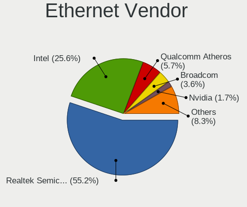

| Vendor                           | Computers | Percent |
|----------------------------------|-----------|---------|
| Realtek Semiconductor            | 1101      | 55.19%  |
| Intel                            | 510       | 25.56%  |
| Qualcomm Atheros                 | 114       | 5.71%   |
| Broadcom                         | 72        | 3.61%   |
| Nvidia                           | 33        | 1.65%   |
| Marvell Technology Group         | 33        | 1.65%   |
| Broadcom Limited                 | 15        | 0.75%   |
| Samsung Electronics              | 14        | 0.7%    |
| Huawei Technologies              | 11        | 0.55%   |
| Aquantia                         | 11        | 0.55%   |
| DisplayLink                      | 10        | 0.5%    |
| ASIX Electronics                 | 9         | 0.45%   |
| Xiaomi                           | 7         | 0.35%   |
| Google                           | 6         | 0.3%    |
| Silicon Integrated Systems [SiS] | 5         | 0.25%   |
| OnePlus Technology (Shenzhen)    | 5         | 0.25%   |
| Lenovo                           | 5         | 0.25%   |
| JMicron Technology               | 4         | 0.2%    |
| TP-Link                          | 3         | 0.15%   |
| Qualcomm                         | 2         | 0.1%    |
| OPPO Electronics                 | 2         | 0.1%    |
| NetGear                          | 2         | 0.1%    |
| LG Electronics                   | 2         | 0.1%    |
| ICS Advent                       | 2         | 0.1%    |
| Apple                            | 2         | 0.1%    |
| VIA Technologies                 | 1         | 0.05%   |
| T & A Mobile Phones              | 1         | 0.05%   |
| Motorola PCS                     | 1         | 0.05%   |
| Microsoft                        | 1         | 0.05%   |
| Mellanox Technologies            | 1         | 0.05%   |
| LSI                              | 1         | 0.05%   |
| Linksys                          | 1         | 0.05%   |
| IBM                              | 1         | 0.05%   |
| Hewlett-Packard                  | 1         | 0.05%   |
| Hangzhou Silan Microelectronics  | 1         | 0.05%   |
| Foxconn / Hon Hai                | 1         | 0.05%   |
| Emulex                           | 1         | 0.05%   |
| D-Link System                    | 1         | 0.05%   |
| ASUSTek Computer                 | 1         | 0.05%   |
| 3Com                             | 1         | 0.05%   |

Ethernet Model
--------------

Ethernet models

| Model                                                             | Computers | Percent |
|-------------------------------------------------------------------|-----------|---------|
| Realtek RTL8111/8168/8411 PCI Express Gigabit Ethernet Controller | 868       | 42.93%  |
| Realtek RTL810xE PCI Express Fast Ethernet controller             | 138       | 6.82%   |
| Intel I211 Gigabit Network Connection                             | 107       | 5.29%   |
| Intel 82579LM Gigabit Network Connection (Lewisville)             | 78        | 3.86%   |
| Realtek RTL8153 Gigabit Ethernet Adapter                          | 47        | 2.32%   |
| Realtek RTL8125 2.5GbE Controller                                 | 39        | 1.93%   |
| Intel Ethernet Connection (2) I219-V                              | 35        | 1.73%   |
| Intel Ethernet Connection (7) I219-V                              | 34        | 1.68%   |
| Intel Ethernet Connection I217-LM                                 | 29        | 1.43%   |
| Qualcomm Atheros AR8151 v2.0 Gigabit Ethernet                     | 21        | 1.04%   |
| Qualcomm Atheros Killer E2400 Gigabit Ethernet Controller         | 19        | 0.94%   |
| Qualcomm Atheros Killer E2500 Gigabit Ethernet Controller         | 16        | 0.79%   |
| Intel 82579V Gigabit Network Connection                           | 16        | 0.79%   |
| Qualcomm Atheros Killer E220x Gigabit Ethernet Controller         | 15        | 0.74%   |
| Qualcomm Atheros AR8161 Gigabit Ethernet                          | 14        | 0.69%   |
| Intel Ethernet Connection I219-LM                                 | 14        | 0.69%   |
| Intel Ethernet Connection (4) I219-LM                             | 14        | 0.69%   |
| Intel Ethernet Connection (2) I218-V                              | 14        | 0.69%   |
| Nvidia MCP79 Ethernet                                             | 13        | 0.64%   |
| Intel Ethernet Connection (7) I219-LM                             | 13        | 0.64%   |
| Intel Ethernet Connection I217-V                                  | 12        | 0.59%   |
| Intel Ethernet Connection (2) I219-LM                             | 12        | 0.59%   |
| Broadcom NetXtreme BCM57765 Gigabit Ethernet PCIe                 | 12        | 0.59%   |
| Intel Ethernet Connection I218-LM                                 | 11        | 0.54%   |
| Intel Ethernet Connection (3) I218-LM                             | 11        | 0.54%   |
| Intel 82574L Gigabit Network Connection                           | 11        | 0.54%   |
| Broadcom NetXtreme BCM5764M Gigabit Ethernet PCIe                 | 11        | 0.54%   |
| Nvidia MCP61 Ethernet                                             | 10        | 0.49%   |
| Intel I210 Gigabit Network Connection                             | 10        | 0.49%   |
| Intel Ethernet Controller I225-V                                  | 10        | 0.49%   |
| Intel Ethernet Connection (4) I219-V                              | 10        | 0.49%   |
| Aquantia AQC107 NBase-T/IEEE 802.3bz Ethernet Controller [AQtion] | 10        | 0.49%   |
| Intel Ethernet Connection (6) I219-V                              | 9         | 0.45%   |
| Intel 82577LM Gigabit Network Connection                          | 9         | 0.45%   |
| Huawei STK-L21                                                    | 9         | 0.45%   |
| Qualcomm Atheros QCA8171 Gigabit Ethernet                         | 8         | 0.4%    |
| Marvell Group 88E8058 PCI-E Gigabit Ethernet Controller           | 8         | 0.4%    |
| Intel 82567LM-3 Gigabit Network Connection                        | 8         | 0.4%    |
| Xiaomi Mi/Redmi series (RNDIS)                                    | 7         | 0.35%   |
| Samsung GT-I9070 (network tethering, USB debugging enabled)       | 7         | 0.35%   |

Net Controller Kind
-------------------

Ethernet, WiFi or modem

| Kind     | Computers | Percent |
|----------|-----------|---------|
| Ethernet | 1855      | 52.31%  |
| WiFi     | 1666      | 46.98%  |
| Modem    | 21        | 0.59%   |
| Unknown  | 4         | 0.11%   |

Used Controller
---------------

Currently used network controller

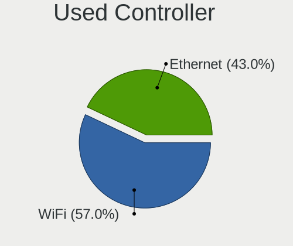

| Kind     | Computers | Percent |
|----------|-----------|---------|
| WiFi     | 1284      | 57.04%  |
| Ethernet | 967       | 42.96%  |

NICs
----

Total network controllers on board

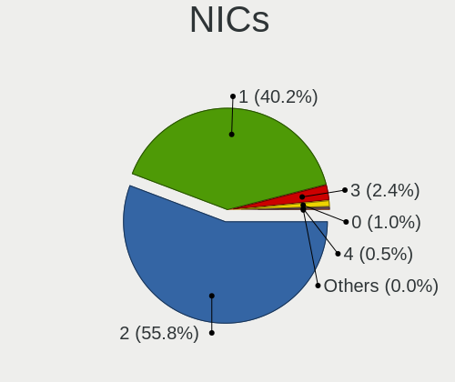

| Total | Computers | Percent |
|-------|-----------|---------|
| 2     | 1184      | 55.77%  |
| 1     | 854       | 40.23%  |
| 3     | 52        | 2.45%   |
| 0     | 22        | 1.04%   |
| 4     | 10        | 0.47%   |
| 10    | 1         | 0.05%   |

IPv6
----

IPv6 vs IPv4

| Used | Computers | Percent |
|------|-----------|---------|
| No   | 1972      | 92.63%  |
| Yes  | 157       | 7.37%   |

Bluetooth
---------

Bluetooth Vendor
----------------

Controller vendors

| Vendor                          | Computers | Percent |
|---------------------------------|-----------|---------|
| Intel                           | 677       | 50.48%  |
| Qualcomm Atheros Communications | 130       | 9.69%   |
| Realtek Semiconductor           | 100       | 7.46%   |
| Cambridge Silicon Radio         | 83        | 6.19%   |
| Broadcom                        | 69        | 5.15%   |
| Apple                           | 65        | 4.85%   |
| Lite-On Technology              | 57        | 4.25%   |
| IMC Networks                    | 44        | 3.28%   |
| Foxconn / Hon Hai               | 27        | 2.01%   |
| ASUSTek Computer                | 23        | 1.72%   |
| Dell                            | 15        | 1.12%   |
| Realtek                         | 10        | 0.75%   |
| Toshiba                         | 6         | 0.45%   |
| Ralink                          | 5         | 0.37%   |
| Marvell Semiconductor           | 5         | 0.37%   |
| Hewlett-Packard                 | 5         | 0.37%   |
| Alps Electric                   | 5         | 0.37%   |
| Unknown                         | 2         | 0.15%   |
| HTC (High Tech Computer)        | 2         | 0.15%   |
| Foxconn International           | 2         | 0.15%   |
| Conwise Technology              | 2         | 0.15%   |
| Askey Computer                  | 2         | 0.15%   |
| Ralink Technology               | 1         | 0.07%   |
| Qcom                            | 1         | 0.07%   |
| Primax Electronics              | 1         | 0.07%   |
| Logitech                        | 1         | 0.07%   |
| Dynex                           | 1         | 0.07%   |

Bluetooth Model
---------------

Controller models

| Model                                               | Computers | Percent |
|-----------------------------------------------------|-----------|---------|
| Intel Bluetooth wireless interface                  | 237       | 17.67%  |
| Intel AX200 Bluetooth                               | 133       | 9.92%   |
| Intel Bluetooth 9460/9560 Jefferson Peak (JfP)      | 127       | 9.47%   |
| Cambridge Silicon Radio Bluetooth Dongle (HCI mode) | 83        | 6.19%   |
| Qualcomm Atheros  Bluetooth Device                  | 73        | 5.44%   |
| Intel AX201 Bluetooth                               | 70        | 5.22%   |
| Realtek Bluetooth Radio                             | 53        | 3.95%   |
| Intel Wireless-AC 9260 Bluetooth Adapter            | 41        | 3.06%   |
| Intel Wireless-AC 3168 Bluetooth                    | 34        | 2.54%   |
| Realtek  Bluetooth 4.2 Adapter                      | 31        | 2.31%   |
| Apple Bluetooth Host Controller                     | 31        | 2.31%   |
| Lite-On Qualcomm Atheros QCA9377 Bluetooth          | 26        | 1.94%   |
| Intel Centrino Bluetooth Wireless Transceiver       | 20        | 1.49%   |
| Qualcomm Atheros AR9462 Bluetooth                   | 18        | 1.34%   |
| IMC Networks Bluetooth Radio                        | 16        | 1.19%   |
| Lite-On Bluetooth Device                            | 15        | 1.12%   |
| Apple Bluetooth USB Host Controller                 | 15        | 1.12%   |
| Qualcomm Atheros QCA61x4 Bluetooth 4.0              | 14        | 1.04%   |
| Broadcom BCM20702A0 Bluetooth 4.0                   | 14        | 1.04%   |
| Realtek RTL8821A Bluetooth                          | 12        | 0.89%   |
| Foxconn / Hon Hai Bluetooth Device                  | 12        | 0.89%   |
| Qualcomm Atheros AR3011 Bluetooth                   | 11        | 0.82%   |
| ASUS Broadcom BCM20702A0 Bluetooth                  | 11        | 0.82%   |
| Realtek Bluetooth Radio                             | 10        | 0.75%   |
| Intel Centrino Advanced-N 6230 Bluetooth adapter    | 10        | 0.75%   |
| Apple Built-in Bluetooth 2.0+EDR HCI                | 10        | 0.75%   |
| Lite-On Atheros AR3012 Bluetooth                    | 9         | 0.67%   |
| Apple Bluetooth HCI                                 | 9         | 0.67%   |
| Qualcomm Atheros AR3012 Bluetooth 4.0               | 8         | 0.6%    |
| IMC Networks Bluetooth Device                       | 8         | 0.6%    |
| Broadcom BCM20702 Bluetooth 4.0 [ThinkPad]          | 7         | 0.52%   |
| Broadcom BCM2045B (BDC-2.1)                         | 7         | 0.52%   |
| IMC Networks Atheros AR3012 Bluetooth 4.0 Adapter   | 6         | 0.45%   |
| Broadcom BCM43142A0 Bluetooth Device                | 6         | 0.45%   |
| Broadcom BCM43142A0 Bluetooth 4.0                   | 6         | 0.45%   |
| Ralink RT3290 Bluetooth                             | 5         | 0.37%   |
| Dell DW375 Bluetooth Module                         | 5         | 0.37%   |
| ASUS Bluetooth Radio                                | 5         | 0.37%   |
| Qualcomm Atheros Bluetooth USB Host Controller      | 4         | 0.3%    |
| Lite-On Qualcomm Atheros Bluetooth                  | 4         | 0.3%    |

Sound
-----

Sound Vendor
------------

Sound card vendors

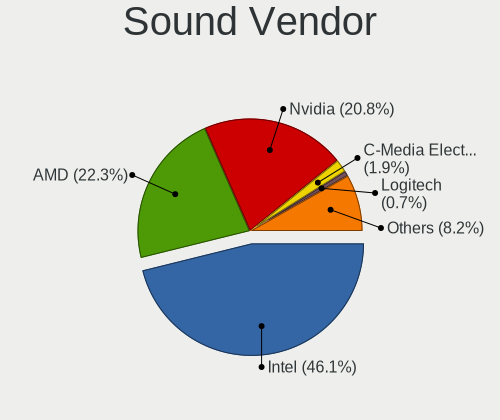

| Vendor                           | Computers | Percent |
|----------------------------------|-----------|---------|
| Intel                            | 1450      | 46.16%  |
| AMD                              | 700       | 22.29%  |
| Nvidia                           | 651       | 20.73%  |
| C-Media Electronics              | 59        | 1.88%   |
| Logitech                         | 23        | 0.73%   |
| Corsair                          | 19        | 0.6%    |
| JMTek                            | 16        | 0.51%   |
| Kingston Technology              | 15        | 0.48%   |
| Razer USA                        | 14        | 0.45%   |
| Creative Labs                    | 14        | 0.45%   |
| SteelSeries ApS                  | 12        | 0.38%   |
| Realtek Semiconductor            | 10        | 0.32%   |
| Generalplus Technology           | 10        | 0.32%   |
| Texas Instruments                | 7         | 0.22%   |
| Samson Technologies              | 7         | 0.22%   |
| Plantronics                      | 7         | 0.22%   |
| Focusrite-Novation               | 6         | 0.19%   |
| Creative Technology              | 6         | 0.19%   |
| ASUSTek Computer                 | 6         | 0.19%   |
| Tenx Technology                  | 5         | 0.16%   |
| Silicon Integrated Systems [SiS] | 5         | 0.16%   |
| Lenovo                           | 5         | 0.16%   |
| GN Netcom                        | 5         | 0.16%   |
| Astro Gaming                     | 5         | 0.16%   |
| Turtle Beach                     | 4         | 0.13%   |
| Sony                             | 4         | 0.13%   |
| Yamaha                           | 3         | 0.1%    |
| M-Audio                          | 3         | 0.1%    |
| Hewlett-Packard                  | 3         | 0.1%    |
| GYROCOM C&C                      | 3         | 0.1%    |
| Giga-Byte Technology             | 3         | 0.1%    |
| FiiO Electronics Technology      | 3         | 0.1%    |
| Dell                             | 3         | 0.1%    |
| Blue Microphones                 | 3         | 0.1%    |
| Apple                            | 3         | 0.1%    |
| XMOS                             | 2         | 0.06%   |
| Valve Software                   | 2         | 0.06%   |
| Unknown                          | 2         | 0.06%   |
| Trust                            | 2         | 0.06%   |
| Sennheiser Communications        | 2         | 0.06%   |

Sound Model
-----------

Sound card models

| Model                                                                      | Computers | Percent |
|----------------------------------------------------------------------------|-----------|---------|
| Intel Sunrise Point-LP HD Audio                                            | 179       | 4.78%   |
| AMD Family 17h/19h HD Audio Controller                                     | 163       | 4.35%   |
| Intel Cannon Lake PCH cAVS                                                 | 151       | 4.03%   |
| AMD Starship/Matisse HD Audio Controller                                   | 150       | 4%      |
| Intel 7 Series/C216 Chipset Family High Definition Audio Controller        | 145       | 3.87%   |
| Intel 6 Series/C200 Series Chipset Family High Definition Audio Controller | 144       | 3.84%   |
| Intel 8 Series/C220 Series Chipset High Definition Audio Controller        | 107       | 2.85%   |
| AMD Raven/Raven2/Fenghuang HDMI/DP Audio Controller                        | 107       | 2.85%   |
| AMD Family 17h (Models 00h-0fh) HD Audio Controller                        | 94        | 2.51%   |
| AMD Ellesmere HDMI Audio [Radeon RX 470/480 / 570/580/590]                 | 83        | 2.21%   |
| Nvidia GP107GL High Definition Audio Controller                            | 79        | 2.11%   |
| Intel Xeon E3-1200 v3/4th Gen Core Processor HD Audio Controller           | 73        | 1.95%   |
| AMD FCH Azalia Controller                                                  | 71        | 1.89%   |
| Intel 100 Series/C230 Series Chipset Family HD Audio Controller            | 69        | 1.84%   |
| AMD SBx00 Azalia (Intel HDA)                                               | 67        | 1.79%   |
| Intel 8 Series HD Audio Controller                                         | 63        | 1.68%   |
| Intel Haswell-ULT HD Audio Controller                                      | 62        | 1.65%   |
| Intel 5 Series/3400 Series Chipset High Definition Audio                   | 56        | 1.49%   |
| Nvidia TU106 High Definition Audio Controller                              | 55        | 1.47%   |
| Nvidia GP104 High Definition Audio Controller                              | 55        | 1.47%   |
| Intel Cannon Point-LP High Definition Audio Controller                     | 55        | 1.47%   |
| Intel 200 Series PCH HD Audio                                              | 51        | 1.36%   |
| AMD Navi 10 HDMI Audio                                                     | 51        | 1.36%   |
| Nvidia TU107 GeForce GTX 1650 High Definition Audio Controller             | 44        | 1.17%   |
| Intel Comet Lake PCH-LP cAVS                                               | 44        | 1.17%   |
| Intel Broadwell-U Audio Controller                                         | 44        | 1.17%   |
| Nvidia GP106 High Definition Audio Controller                              | 43        | 1.15%   |
| Intel Wildcat Point-LP High Definition Audio Controller                    | 42        | 1.12%   |
| Nvidia TU116 High Definition Audio Controller                              | 41        | 1.09%   |
| Intel Comet Lake PCH cAVS                                                  | 38        | 1.01%   |
| Nvidia TU104 HD Audio Controller                                           | 36        | 0.96%   |
| Nvidia GF108 High Definition Audio Controller                              | 36        | 0.96%   |
| Intel CM238 HD Audio Controller                                            | 35        | 0.93%   |
| Intel 82801I (ICH9 Family) HD Audio Controller                             | 33        | 0.88%   |
| Nvidia GM107 High Definition Audio Controller [GeForce 940MX]              | 32        | 0.85%   |
| AMD Renoir Radeon High Definition Audio Controller                         | 32        | 0.85%   |
| Intel NM10/ICH7 Family High Definition Audio Controller                    | 27        | 0.72%   |
| Intel 82801H (ICH8 Family) HD Audio Controller                             | 27        | 0.72%   |
| AMD Kabini HDMI/DP Audio                                                   | 26        | 0.69%   |
| AMD Family 15h (Models 60h-6fh) Audio Controller                           | 26        | 0.69%   |

Memory
------

Memory Vendor
-------------

Memory module vendors

| Vendor              | Computers | Percent |
|---------------------|-----------|---------|
| Samsung Electronics | 118       | 21.85%  |
| SK hynix            | 89        | 16.48%  |
| Kingston            | 72        | 13.33%  |
| Micron Technology   | 38        | 7.04%   |
| Crucial             | 36        | 6.67%   |
| Unknown             | 33        | 6.11%   |
| Corsair             | 32        | 5.93%   |
| G.Skill             | 27        | 5%      |
| A-DATA Technology   | 22        | 4.07%   |
| Smart               | 12        | 2.22%   |
| Ramaxel Technology  | 7         | 1.3%    |
| Elpida              | 7         | 1.3%    |
| Smart Brazil        | 6         | 1.11%   |
| Goldkey             | 6         | 1.11%   |
| Team                | 5         | 0.93%   |
| Patriot             | 4         | 0.74%   |
| Unknown (ABCD)      | 3         | 0.56%   |
| Teikon              | 3         | 0.56%   |
| Neo Forza           | 2         | 0.37%   |
| Unknown (898F)      | 1         | 0.19%   |
| Patriot Memory      | 1         | 0.19%   |
| OLOY                | 1         | 0.19%   |
| Nanya Technology    | 1         | 0.19%   |
| Multilaser          | 1         | 0.19%   |
| Mircon              | 1         | 0.19%   |
| Magnum Tech         | 1         | 0.19%   |
| Lenovo              | 1         | 0.19%   |
| HMD                 | 1         | 0.19%   |
| High Bridge         | 1         | 0.19%   |
| Hewlett-Packard     | 1         | 0.19%   |
| GOODRAM             | 1         | 0.19%   |
| GLOWAY              | 1         | 0.19%   |
| EVGA                | 1         | 0.19%   |
| CSX                 | 1         | 0.19%   |
| Avant               | 1         | 0.19%   |
| ASint Technology    | 1         | 0.19%   |
| Apacer              | 1         | 0.19%   |

Memory Model
------------

Memory module models

| Model                                                            | Computers | Percent |
|------------------------------------------------------------------|-----------|---------|
| Samsung RAM M471A5244CB0-CTD 4GB SODIMM DDR4 3266MT/s            | 14        | 2.45%   |
| SK hynix RAM HMA81GS6JJR8N-VK 8GB SODIMM DDR4 2667MT/s           | 8         | 1.4%    |
| SK hynix RAM HMA81GS6AFR8N-UH 8GB SODIMM DDR4 2667MT/s           | 8         | 1.4%    |
| Samsung RAM M471A5244CB0-CRC 4GB SODIMM DDR4 2667MT/s            | 8         | 1.4%    |
| SK hynix RAM HMT451S6BFR8A-PB 4GB SODIMM DDR3 1600MT/s           | 6         | 1.05%   |
| Samsung RAM M471A1K43DB1-CTD 8GB SODIMM DDR4 2667MT/s            | 6         | 1.05%   |
| Unknown RAM Module 4096MB DIMM 1333MT/s                          | 5         | 0.87%   |
| Smart Brazil RAM SMS4TDC3C0K0446SCG 4096MB SODIMM DDR4 2667MT/s  | 5         | 0.87%   |
| Samsung RAM M471A2K43CB1-CTD 16GB SODIMM DDR4 8400MT/s           | 5         | 0.87%   |
| Samsung RAM M471A1K43CB1-CRC 8GB SODIMM DDR4 2667MT/s            | 5         | 0.87%   |
| SK hynix RAM HMA82GS6JJR8N-VK 16GB SODIMM DDR4 2667MT/s          | 4         | 0.7%    |
| Samsung RAM M471A1K43CB1-CTD 8GB SODIMM DDR4 2667MT/s            | 4         | 0.7%    |
| Samsung RAM M471A1K43BB1-CRC 8192MB SODIMM DDR4 2667MT/s         | 4         | 0.7%    |
| Samsung RAM M471A1G44AB0-CWE 8GB SODIMM DDR4 3200MT/s            | 4         | 0.7%    |
| Micron RAM 16KTF1G64HZ-1G6E1 8GB SODIMM DDR3 1600MT/s            | 4         | 0.7%    |
| Kingston RAM KHX1600C10D3/8G 8192MB DIMM DDR3 1600MT/s           | 4         | 0.7%    |
| Unknown (ABCD) RAM 123456789012345678 2GB SODIMM LPDDR4 2400MT/s | 3         | 0.52%   |
| Team RAM TEAMGROUP-UD4-2666 32GB DIMM DDR4 3000MT/s              | 3         | 0.52%   |
| SK hynix RAM HMA851S6JJR6N-VK 4GB SODIMM DDR4 2667MT/s           | 3         | 0.52%   |
| SK hynix RAM HMA851S6CJR6N-VK 4GB SODIMM DDR4 2667MT/s           | 3         | 0.52%   |
| Samsung RAM M471B1G73EB0-YK0 8GB SODIMM DDR3 1600MT/s            | 3         | 0.52%   |
| Samsung RAM M471A4G43MB1-CTD 32GB SODIMM DDR4 2667MT/s           | 3         | 0.52%   |
| Samsung RAM M471A1G44AB0-CWE 8GB Row Of Chips DDR4 3200MT/s      | 3         | 0.52%   |
| Samsung RAM K4EBE304EB-EGCG 8GB Row Of Chips LPDDR3 2133MT/s     | 3         | 0.52%   |
| Samsung RAM K4AAG165WA-BCTD 8GB SODIMM DDR4 2667MT/s             | 3         | 0.52%   |
| Kingston RAM KHX3200C16D4/8GX 8GB DIMM DDR4 3600MT/s             | 3         | 0.52%   |
| Kingston RAM KHX2666C16/8G 8GB DIMM DDR4 3466MT/s                | 3         | 0.52%   |
| Kingston RAM KHX1600C10D3/8GX 8192MB DIMM DDR3 1600MT/s          | 3         | 0.52%   |
| Goldkey RAM GKE160SO102408-2666 16GB SODIMM DDR4 2667MT/s        | 3         | 0.52%   |
| G.Skill RAM F4-3200C16-8GVKB 8GB DIMM DDR4 3866MT/s              | 3         | 0.52%   |
| Corsair RAM CMK16GX4M2B3200C16 8GB DIMM DDR4 3600MT/s            | 3         | 0.52%   |
| Unknown RAM Module 8192MB DIMM DDR3 1333MT/s                     | 2         | 0.35%   |
| Unknown RAM Module 4096MB SODIMM DDR4 2400MT/s                   | 2         | 0.35%   |
| Unknown RAM Module 4096MB SODIMM DDR3 1600MT/s                   | 2         | 0.35%   |
| Unknown RAM Module 4096MB DIMM DDR3 1333MT/s                     | 2         | 0.35%   |
| Unknown RAM Module 2048MB DIMM DDR2 800MT/s                      | 2         | 0.35%   |
| Unknown RAM Module 1024MB DIMM DDR2 667MT/s                      | 2         | 0.35%   |
| Teikon RAM TMT451S6BFR8A-PBHC 4GB SODIMM DDR3 1600MT/s           | 2         | 0.35%   |
| Smart RAM SMS4TDC3C0K0446SCG 4GB SODIMM DDR4 2667MT/s            | 2         | 0.35%   |
| Smart RAM SH564128FJ8NWRNSQR 4GB SODIMM DDR3 1600MT/s            | 2         | 0.35%   |

Memory Kind
-----------

Memory module kinds

| Kind    | Computers | Percent |
|---------|-----------|---------|
| DDR4    | 306       | 66.38%  |
| DDR3    | 115       | 24.95%  |
| LPDDR3  | 11        | 2.39%   |
| DDR2    | 11        | 2.39%   |
| Unknown | 8         | 1.74%   |
| LPDDR4  | 6         | 1.3%    |
| SDRAM   | 2         | 0.43%   |
| DDR5    | 1         | 0.22%   |
| DDR     | 1         | 0.22%   |

Memory Form Factor
------------------

Physical design of the memory module

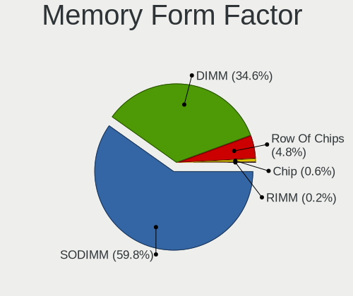

| Name         | Computers | Percent |
|--------------|-----------|---------|
| SODIMM       | 277       | 59.83%  |
| DIMM         | 160       | 34.56%  |
| Row Of Chips | 22        | 4.75%   |
| Chip         | 3         | 0.65%   |
| RIMM         | 1         | 0.22%   |

Memory Size
-----------

Memory module size

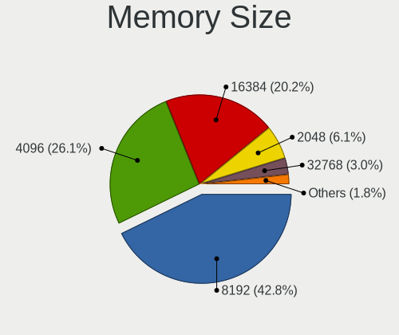

| Size  | Computers | Percent |
|-------|-----------|---------|
| 8192  | 216       | 42.77%  |
| 4096  | 132       | 26.14%  |
| 16384 | 102       | 20.2%   |
| 2048  | 31        | 6.14%   |
| 32768 | 15        | 2.97%   |
| 1024  | 7         | 1.39%   |
| 512   | 2         | 0.4%    |

Memory Speed
------------

Memory module speed

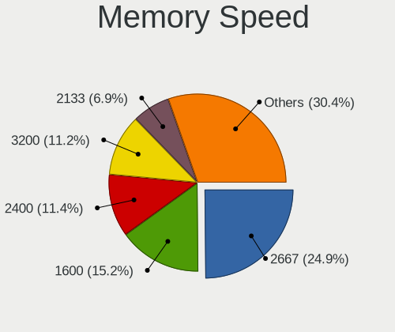

| Speed   | Computers | Percent |
|---------|-----------|---------|
| 2667    | 124       | 24.46%  |
| 1600    | 77        | 15.19%  |
| 2400    | 59        | 11.64%  |
| 3200    | 57        | 11.24%  |
| 2133    | 35        | 6.9%    |
| 1333    | 30        | 5.92%   |
| 3600    | 22        | 4.34%   |
| 3266    | 14        | 2.76%   |
| 1867    | 10        | 1.97%   |
| 3000    | 8         | 1.58%   |
| 800     | 7         | 1.38%   |
| 667     | 7         | 1.38%   |
| 3400    | 6         | 1.18%   |
| 8400    | 5         | 0.99%   |
| 3866    | 4         | 0.79%   |
| 3466    | 4         | 0.79%   |
| 2666    | 4         | 0.79%   |
| 1866    | 4         | 0.79%   |
| 1334    | 4         | 0.79%   |
| 3800    | 3         | 0.59%   |
| 4400    | 2         | 0.39%   |
| 3733    | 2         | 0.39%   |
| 3533    | 2         | 0.39%   |
| 2134    | 2         | 0.39%   |
| 1066    | 2         | 0.39%   |
| 49926   | 1         | 0.2%    |
| 4800    | 1         | 0.2%    |
| 4266    | 1         | 0.2%    |
| 3666    | 1         | 0.2%    |
| 3334    | 1         | 0.2%    |
| 3151    | 1         | 0.2%    |
| 2933    | 1         | 0.2%    |
| 2800    | 1         | 0.2%    |
| 2465    | 1         | 0.2%    |
| 1800    | 1         | 0.2%    |
| 1067    | 1         | 0.2%    |
| 333     | 1         | 0.2%    |
| Unknown | 1         | 0.2%    |

Printers & scanners
-------------------

Printer Vendor
--------------

Printer device vendors

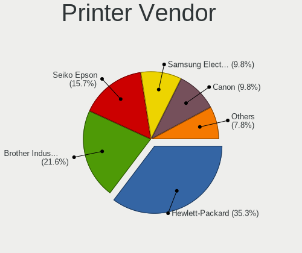

| Vendor              | Computers | Percent |
|---------------------|-----------|---------|
| Hewlett-Packard     | 17        | 34%     |
| Brother Industries  | 11        | 22%     |
| Seiko Epson         | 8         | 16%     |
| Samsung Electronics | 5         | 10%     |
| Canon               | 5         | 10%     |
| MIIIW               | 1         | 2%      |
| Kyocera             | 1         | 2%      |
| Fuji Xerox          | 1         | 2%      |
| Apple               | 1         | 2%      |

Printer Model
-------------

Printer device models

| Model                                                      | Computers | Percent |
|------------------------------------------------------------|-----------|---------|
| Seiko Epson L4150 Series                                   | 2         | 4%      |
| HP Deskjet 3050 J610 series                                | 2         | 4%      |
| Brother Printer                                            | 2         | 4%      |
| Seiko Epson WF-3520 Series                                 | 1         | 2%      |
| Seiko Epson L365 Series                                    | 1         | 2%      |
| Seiko Epson L132 Series                                    | 1         | 2%      |
| Seiko Epson ET-4750 [WorkForce ET-4750 EcoTank All-in-One] | 1         | 2%      |
| Seiko Epson ET-3760 Series                                 | 1         | 2%      |
| Seiko Epson ET-3750 Series                                 | 1         | 2%      |
| Samsung ML-2540 Series Laser Printer                       | 1         | 2%      |
| Samsung ML-1670 Series                                     | 1         | 2%      |
| Samsung ML-1660 Series                                     | 1         | 2%      |
| Samsung M2020 Series                                       | 1         | 2%      |
| Samsung Composite Device                                   | 1         | 2%      |
| MIIIW MW Keyboard Air Mini                                 | 1         | 2%      |
| Kyocera ECOSYS P2035d                                      | 1         | 2%      |
| HP PSC-1315/PSC-1317                                       | 1         | 2%      |
| HP Printing Support                                        | 1         | 2%      |
| HP OfficeJet Pro 69                                        | 1         | 2%      |
| HP OfficeJet 5200 series                                   | 1         | 2%      |
| HP OfficeJet 3830 series                                   | 1         | 2%      |
| HP LaserJet Professional P 1102w                           | 1         | 2%      |
| HP LaserJet P2015 series                                   | 1         | 2%      |
| HP LaserJet 1022                                           | 1         | 2%      |
| HP ENVY 4520 series                                        | 1         | 2%      |
| HP ENVY 4510 series                                        | 1         | 2%      |
| HP Deskjet F4400 series                                    | 1         | 2%      |
| HP DeskJet 5820 series                                     | 1         | 2%      |
| HP DeskJet 2620 All-in-One Printer                         | 1         | 2%      |
| HP Deskjet 2540 series                                     | 1         | 2%      |
| HP Deskjet 1000 J110 series                                | 1         | 2%      |
| Fuji Xerox DocuPrint CM315/318 z                           | 1         | 2%      |
| Canon MF4700 Series                                        | 1         | 2%      |
| Canon MF3010                                               | 1         | 2%      |
| Canon G4010 series                                         | 1         | 2%      |
| Canon G3010 series                                         | 1         | 2%      |
| Canon G2010 series                                         | 1         | 2%      |
| Brother QL-800 P-touch Label Printer                       | 1         | 2%      |
| Brother QL-570 Label Printer                               | 1         | 2%      |
| Brother MFC-L2730DW series                                 | 1         | 2%      |

Scanner Vendor
--------------

Scanner device vendors

| Vendor          | Computers | Percent |
|-----------------|-----------|---------|
| Canon           | 3         | 60%     |
| Seiko Epson     | 1         | 20%     |
| Hewlett-Packard | 1         | 20%     |

Scanner Model
-------------

Scanner device models

| Model                         | Computers | Percent |
|-------------------------------|-----------|---------|
| Seiko Epson Scanner           | 1         | 20%     |
| HP Scanjet 300                | 1         | 20%     |
| Canon CanoScan N1240U/LiDE 30 | 1         | 20%     |
| Canon CanoScan LiDE 210       | 1         | 20%     |
| Canon CanoScan LiDE 110       | 1         | 20%     |

Camera
------

Camera Vendor
-------------

Camera device vendors

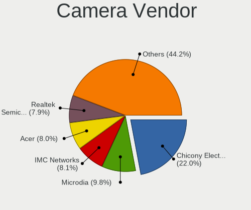

| Vendor                                 | Computers | Percent |
|----------------------------------------|-----------|---------|
| Chicony Electronics                    | 268       | 22%     |
| Microdia                               | 120       | 9.85%   |
| Acer                                   | 109       | 8.95%   |
| IMC Networks                           | 99        | 8.13%   |
| Realtek Semiconductor                  | 96        | 7.88%   |
| Logitech                               | 75        | 6.16%   |
| Sunplus Innovation Technology          | 68        | 5.58%   |
| Quanta                                 | 57        | 4.68%   |
| Apple                                  | 51        | 4.19%   |
| Cheng Uei Precision Industry (Foxlink) | 44        | 3.61%   |
| Suyin                                  | 35        | 2.87%   |
| Syntek                                 | 32        | 2.63%   |
| Lite-On Technology                     | 28        | 2.3%    |
| Silicon Motion                         | 22        | 1.81%   |
| Microsoft                              | 16        | 1.31%   |
| Ricoh                                  | 15        | 1.23%   |
| Samsung Electronics                    | 8         | 0.66%   |
| Alcor Micro                            | 7         | 0.57%   |
| Z-Star Microelectronics                | 6         | 0.49%   |
| Luxvisions Innotech Limited            | 5         | 0.41%   |
| Generalplus Technology                 | 4         | 0.33%   |
| ARC International                      | 4         | 0.33%   |
| ALi                                    | 4         | 0.33%   |
| Primax Electronics                     | 3         | 0.25%   |
| OmniVision Technologies                | 3         | 0.25%   |
| Lenovo                                 | 3         | 0.25%   |
| Intel                                  | 3         | 0.25%   |
| Valve Software                         | 2         | 0.16%   |
| MacroSilicon                           | 2         | 0.16%   |
| KYE Systems (Mouse Systems)            | 2         | 0.16%   |
| Huawei Technologies                    | 2         | 0.16%   |
| DigiTech                               | 2         | 0.16%   |
| Creative Technology                    | 2         | 0.16%   |
| YSD-2053--200409                       | 1         | 0.08%   |
| Yealink Network Technology             | 1         | 0.08%   |
| Unknown                                | 1         | 0.08%   |
| TANDBERG                               | 1         | 0.08%   |
| Sunplus Technology                     | 1         | 0.08%   |
| Razer USA                              | 1         | 0.08%   |
| Mustek Systems                         | 1         | 0.08%   |

Camera Model
------------

Camera device models

| Model                                         | Computers | Percent |
|-----------------------------------------------|-----------|---------|
| Microdia Integrated_Webcam_HD                 | 59        | 4.8%    |
| Chicony Integrated Camera                     | 51        | 4.15%   |
| Realtek Integrated_Webcam_HD                  | 43        | 3.5%    |
| Chicony HD Webcam                             | 34        | 2.77%   |
| IMC Networks Integrated Camera                | 28        | 2.28%   |
| Acer Integrated Camera                        | 27        | 2.2%    |
| IMC Networks USB2.0 HD UVC WebCam             | 25        | 2.04%   |
| Chicony USB2.0 Camera                         | 24        | 1.95%   |
| Apple Built-in iSight                         | 22        | 1.79%   |
| Acer BisonCam,NB Pro                          | 19        | 1.55%   |
| Syntek Integrated Camera                      | 17        | 1.38%   |
| Sunplus Integrated_Webcam_HD                  | 16        | 1.3%    |
| Logitech HD Pro Webcam C920                   | 16        | 1.3%    |
| Acer BisonCam, NB Pro                         | 16        | 1.3%    |
| Quanta HD WebCam                              | 14        | 1.14%   |
| Lite-On Integrated Camera                     | 14        | 1.14%   |
| IMC Networks USB2.0 VGA UVC WebCam            | 14        | 1.14%   |
| Chicony USB 2.0 Camera                        | 13        | 1.06%   |
| Syntek EasyCamera                             | 12        | 0.98%   |
| Quanta VGA WebCam                             | 12        | 0.98%   |
| Sunplus HD WebCam                             | 11        | 0.9%    |
| Sunplus ASUS Webcam                           | 11        | 0.9%    |
| Quanta HD User Facing                         | 11        | 0.9%    |
| Apple iPhone5/5C/5S/6                         | 11        | 0.9%    |
| Acer EasyCamera                               | 11        | 0.9%    |
| Logitech Webcam C270                          | 10        | 0.81%   |
| Chicony TOSHIBA Web Camera - HD               | 10        | 0.81%   |
| Silicon Motion Web Camera                     | 9         | 0.73%   |
| Realtek Integrated Webcam                     | 9         | 0.73%   |
| Microdia Webcam Vitade AF                     | 9         | 0.73%   |
| Microdia Laptop_Integrated_Webcam_HD          | 9         | 0.73%   |
| Microdia Integrated Webcam                    | 9         | 0.73%   |
| Chicony Integrated Camera (1280x720@30)       | 9         | 0.73%   |
| Cheng Uei Precision Industry (Foxlink) Webcam | 9         | 0.73%   |
| Apple FaceTime HD Camera                      | 9         | 0.73%   |
| Microdia Dell Laptop Integrated Webcam HD     | 8         | 0.65%   |
| Chicony HP Truevision HD                      | 8         | 0.65%   |
| Acer SunplusIT Integrated Camera              | 8         | 0.65%   |
| Samsung Galaxy A5 (MTP)                       | 7         | 0.57%   |
| Realtek EasyCamera                            | 7         | 0.57%   |

Security
--------

Fingerprint Vendor
------------------

Fingerprint sensor vendors

| Vendor                     | Computers | Percent |
|----------------------------|-----------|---------|
| Synaptics                  | 79        | 34.5%   |
| Validity Sensors           | 67        | 29.26%  |
| Shenzhen Goodix Technology | 33        | 14.41%  |
| Upek                       | 17        | 7.42%   |
| LighTuning Technology      | 12        | 5.24%   |
| Elan Microelectronics      | 12        | 5.24%   |
| AuthenTec                  | 5         | 2.18%   |
| STMicroelectronics         | 3         | 1.31%   |
| DigitalPersona             | 1         | 0.44%   |

Fingerprint Model
-----------------

Fingerprint sensor models

| Model                                                                      | Computers | Percent |
|----------------------------------------------------------------------------|-----------|---------|
| Unknown                                                                    | 24        | 10.48%  |
| Synaptics Prometheus MIS Touch Fingerprint Reader                          | 18        | 7.86%   |
| Synaptics Metallica MIS Touch Fingerprint Reader                           | 18        | 7.86%   |
| Upek Biometric Touchchip/Touchstrip Fingerprint Sensor                     | 16        | 6.99%   |
| Validity Sensors VFS495 Fingerprint Reader                                 | 15        | 6.55%   |
| Shenzhen Goodix Fingerprint Reader                                         | 13        | 5.68%   |
| Shenzhen Goodix  FingerPrint Device                                        | 12        | 5.24%   |
| Elan ELAN:Fingerprint                                                      | 11        | 4.8%    |
| Validity Sensors VFS471 Fingerprint Reader                                 | 8         | 3.49%   |
| Validity Sensors VFS 5011 fingerprint sensor                               | 8         | 3.49%   |
| Shenzhen Goodix FingerPrint                                                | 8         | 3.49%   |
| LighTuning ES603 Swipe Fingerprint Sensor                                  | 8         | 3.49%   |
| Validity Sensors VFS5011 Fingerprint Reader                                | 6         | 2.62%   |
| Synaptics WBDI Device                                                      | 6         | 2.62%   |
| Synaptics  WBDI                                                            | 6         | 2.62%   |
| Validity Sensors Fingerprint scanner                                       | 5         | 2.18%   |
| Validity Sensors VFS7552 Touch Fingerprint Sensor                          | 4         | 1.75%   |
| Validity Sensors VFS7500 Touch Fingerprint Sensor                          | 4         | 1.75%   |
| Validity Sensors VFS491                                                    | 4         | 1.75%   |
| Validity Sensors Swipe Fingerprint Sensor                                  | 4         | 1.75%   |
| Validity Sensors Synaptics WBDI                                            | 3         | 1.31%   |
| Validity Sensors Synaptics VFS7552 Touch Fingerprint Sensor                | 3         | 1.31%   |
| Synaptics  VFS7552 Touch Fingerprint Sensor with PurePrint                 | 3         | 1.31%   |
| Synaptics  FS7604 Touch Fingerprint Sensor with PurePrint                  | 3         | 1.31%   |
| STMicroelectronics Fingerprint Reader                                      | 3         | 1.31%   |
| LighTuning EgisTec Touch Fingerprint Sensor                                | 3         | 1.31%   |
| AuthenTec Fingerprint Sensor                                               | 3         | 1.31%   |
| AuthenTec AES2810                                                          | 2         | 0.87%   |
| Validity Sensors VFS451 Fingerprint Reader                                 | 1         | 0.44%   |
| Validity Sensors VFS101 Fingerprint Reader                                 | 1         | 0.44%   |
| Validity Sensors Synaptics VFS7552 Touch Fingerprint Sensor with PurePrint | 1         | 0.44%   |
| Upek TCS5B Fingerprint sensor                                              | 1         | 0.44%   |
| Synaptics  WBDI Fingerprint Reader - USB 052                               | 1         | 0.44%   |
| LighTuning Fingerprint Reader                                              | 1         | 0.44%   |
| Elan fingerprint sensor [FeinTech FPS00200]                                | 1         | 0.44%   |
| DigitalPersona Fingerprint Reader                                          | 1         | 0.44%   |

Chipcard Vendor
---------------

Chipcard module vendors

| Vendor                | Computers | Percent |
|-----------------------|-----------|---------|
| Broadcom              | 29        | 36.71%  |
| Alcor Micro           | 23        | 29.11%  |
| Upek                  | 9         | 11.39%  |
| O2 Micro              | 8         | 10.13%  |
| Lenovo                | 5         | 6.33%   |
| SCM Microsystems      | 2         | 2.53%   |
| Realtek Semiconductor | 1         | 1.27%   |
| Giesecke & Devrient   | 1         | 1.27%   |
| Chicony Electronics   | 1         | 1.27%   |

Chipcard Model
--------------

Chipcard module models

| Model                                                                        | Computers | Percent |
|------------------------------------------------------------------------------|-----------|---------|
| Alcor Micro AU9540 Smartcard Reader                                          | 23        | 29.11%  |
| Broadcom BCM5880 Secure Applications Processor                               | 11        | 13.92%  |
| Broadcom 5880                                                                | 11        | 13.92%  |
| Upek TouchChip Fingerprint Coprocessor (WBF advanced mode)                   | 9         | 11.39%  |
| O2 Micro OZ776 CCID Smartcard Reader                                         | 7         | 8.86%   |
| Lenovo Integrated Smart Card Reader                                          | 5         | 6.33%   |
| Broadcom BCM5880 Secure Applications Processor with fingerprint swipe sensor | 4         | 5.06%   |
| Broadcom 58200                                                               | 3         | 3.8%    |
| SCM Microsystems SCR331-LC1 / SCR3310 SmartCard Reader                       | 1         | 1.27%   |
| SCM Microsystems SCR331 SmartCard Reader                                     | 1         | 1.27%   |
| Realtek Semiconductor Smart Card Reader Interface                            | 1         | 1.27%   |
| O2 Micro Oz776 SmartCard Reader                                              | 1         | 1.27%   |
| Giesecke & Devrient StarSign CUT                                             | 1         | 1.27%   |
| Chicony Electronics HP Skylab USB Smartcard Keyboard                         | 1         | 1.27%   |

Unsupported
-----------

Unsupported Devices
-------------------

Total unsupported devices on board

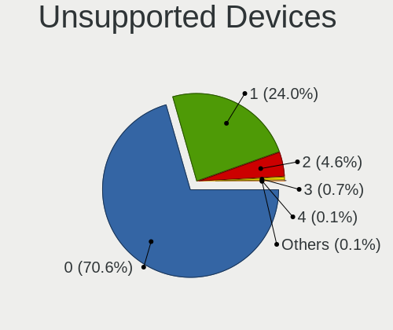

| Total | Computers | Percent |
|-------|-----------|---------|
| 0     | 1520      | 70.96%  |
| 1     | 504       | 23.53%  |
| 2     | 99        | 4.62%   |
| 3     | 14        | 0.65%   |
| 4     | 3         | 0.14%   |
| 5     | 2         | 0.09%   |

Unsupported Device Types
------------------------

Types of unsupported devices

| Type                     | Computers | Percent |
|--------------------------|-----------|---------|
| Fingerprint reader       | 229       | 30.86%  |
| Net/wireless             | 139       | 18.73%  |
| Graphics card            | 136       | 18.33%  |
| Chipcard                 | 77        | 10.38%  |
| Multimedia controller    | 55        | 7.41%   |
| Communication controller | 19        | 2.56%   |
| Sound                    | 15        | 2.02%   |
| Net/ethernet             | 14        | 1.89%   |
| Unassigned class         | 13        | 1.75%   |
| Network                  | 10        | 1.35%   |
| Camera                   | 8         | 1.08%   |
| Storage/raid             | 6         | 0.81%   |
| Storage                  | 6         | 0.81%   |
| Bluetooth                | 6         | 0.81%   |
| Card reader              | 3         | 0.4%    |
| Storage/ide              | 2         | 0.27%   |
| Storage/nvme             | 1         | 0.13%   |
| Modem                    | 1         | 0.13%   |
| Flash memory             | 1         | 0.13%   |
| Dvb card                 | 1         | 0.13%   |

