Pop!_OS 20.04 - Tested Hardware & Statistics (Desktops)
-------------------------------------------------------

A project to collect tested hardware configurations for Pop!_OS 20.04.

Anyone can contribute to this report by the [hw-probe](https://github.com/linuxhw/hw-probe) tool:

    sudo -E hw-probe -all -upload

Please contribute! Especially if your hardware is rare.

Contents
--------

* [ Test Cases ](#test-cases)

* [ System ](#system)
  - [ Kernel                   ](#kernel)
  - [ Kernel Family            ](#kernel-family)
  - [ Kernel Major Ver.        ](#kernel-major-ver)
  - [ Arch                     ](#arch)
  - [ DE                       ](#de)
  - [ Display Server           ](#display-server)
  - [ Display Manager          ](#display-manager)
  - [ OS Lang                  ](#os-lang)
  - [ Boot Mode                ](#boot-mode)
  - [ Filesystem               ](#filesystem)
  - [ Part. scheme             ](#part-scheme)
  - [ Dual Boot with Linux/BSD ](#dual-boot-with-linuxbsd)
  - [ Dual Boot (Win)          ](#dual-boot-win)

* [ Board ](#board)
  - [ Vendor                   ](#vendor)
  - [ Model                    ](#model)
  - [ Model Family             ](#model-family)
  - [ MFG Year                 ](#mfg-year)
  - [ Form Factor              ](#form-factor)
  - [ Secure Boot              ](#secure-boot)
  - [ Coreboot                 ](#coreboot)
  - [ RAM Size                 ](#ram-size)
  - [ RAM Used                 ](#ram-used)
  - [ Total Drives             ](#total-drives)
  - [ Has CD-ROM               ](#has-cd-rom)
  - [ Has Ethernet             ](#has-ethernet)
  - [ Has WiFi                 ](#has-wifi)
  - [ Has Bluetooth            ](#has-bluetooth)

* [ Location ](#location)
  - [ Country                  ](#country)
  - [ City                     ](#city)

* [ Drives ](#drives)
  - [ Drive Vendor             ](#drive-vendor)
  - [ Drive Model              ](#drive-model)
  - [ HDD Vendor               ](#hdd-vendor)
  - [ SSD Vendor               ](#ssd-vendor)
  - [ Drive Kind               ](#drive-kind)
  - [ Drive Connector          ](#drive-connector)
  - [ Drive Size               ](#drive-size)
  - [ Space Total              ](#space-total)
  - [ Space Used               ](#space-used)
  - [ Malfunc. Drives          ](#malfunc-drives)
  - [ Malfunc. Drive Vendor    ](#malfunc-drive-vendor)
  - [ Malfunc. HDD Vendor      ](#malfunc-hdd-vendor)
  - [ Malfunc. Drive Kind      ](#malfunc-drive-kind)
  - [ Failed Drives            ](#failed-drives)
  - [ Failed Drive Vendor      ](#failed-drive-vendor)
  - [ Drive Status             ](#drive-status)

* [ Storage controller ](#storage-controller)
  - [ Storage Vendor           ](#storage-vendor)
  - [ Storage Model            ](#storage-model)
  - [ Storage Kind             ](#storage-kind)

* [ Processor ](#processor)
  - [ CPU Vendor               ](#cpu-vendor)
  - [ CPU Model                ](#cpu-model)
  - [ CPU Model Family         ](#cpu-model-family)
  - [ CPU Cores                ](#cpu-cores)
  - [ CPU Sockets              ](#cpu-sockets)
  - [ CPU Threads              ](#cpu-threads)
  - [ CPU Op-Modes             ](#cpu-op-modes)
  - [ CPU Microcode            ](#cpu-microcode)
  - [ CPU Microarch            ](#cpu-microarch)

* [ Graphics ](#graphics)
  - [ GPU Vendor               ](#gpu-vendor)
  - [ GPU Model                ](#gpu-model)
  - [ GPU Combo                ](#gpu-combo)
  - [ GPU Driver               ](#gpu-driver)
  - [ GPU Memory               ](#gpu-memory)

* [ Monitor ](#monitor)
  - [ Monitor Vendor           ](#monitor-vendor)
  - [ Monitor Model            ](#monitor-model)
  - [ Monitor Resolution       ](#monitor-resolution)
  - [ Monitor Diagonal         ](#monitor-diagonal)
  - [ Monitor Width            ](#monitor-width)
  - [ Aspect Ratio             ](#aspect-ratio)
  - [ Monitor Area             ](#monitor-area)
  - [ Pixel Density            ](#pixel-density)
  - [ Multiple Monitors        ](#multiple-monitors)

* [ Network ](#network)
  - [ Net Controller Vendor    ](#net-controller-vendor)
  - [ Net Controller Model     ](#net-controller-model)
  - [ Wireless Vendor          ](#wireless-vendor)
  - [ Wireless Model           ](#wireless-model)
  - [ Ethernet Vendor          ](#ethernet-vendor)
  - [ Ethernet Model           ](#ethernet-model)
  - [ Net Controller Kind      ](#net-controller-kind)
  - [ Used Controller          ](#used-controller)
  - [ NICs                     ](#nics)
  - [ IPv6                     ](#ipv6)

* [ Bluetooth ](#bluetooth)
  - [ Bluetooth Vendor         ](#bluetooth-vendor)
  - [ Bluetooth Model          ](#bluetooth-model)

* [ Sound ](#sound)
  - [ Sound Vendor             ](#sound-vendor)
  - [ Sound Model              ](#sound-model)

* [ Memory ](#memory)
  - [ Memory Vendor            ](#memory-vendor)
  - [ Memory Model             ](#memory-model)
  - [ Memory Kind              ](#memory-kind)
  - [ Memory Form Factor       ](#memory-form-factor)
  - [ Memory Size              ](#memory-size)
  - [ Memory Speed             ](#memory-speed)

* [ Printers & scanners ](#printers--scanners)
  - [ Printer Vendor           ](#printer-vendor)
  - [ Printer Model            ](#printer-model)
  - [ Scanner Vendor           ](#scanner-vendor)
  - [ Scanner Model            ](#scanner-model)

* [ Camera ](#camera)
  - [ Camera Vendor            ](#camera-vendor)
  - [ Camera Model             ](#camera-model)

* [ Security ](#security)
  - [ Fingerprint Vendor       ](#fingerprint-vendor)
  - [ Fingerprint Model        ](#fingerprint-model)
  - [ Chipcard Vendor          ](#chipcard-vendor)
  - [ Chipcard Model           ](#chipcard-model)

* [ Unsupported ](#unsupported)
  - [ Unsupported Devices      ](#unsupported-devices)
  - [ Unsupported Device Types ](#unsupported-device-types)

Test Cases
----------

Total: 1214

| Vendor        | Model                       | Probe                                                      | Date         |
|---------------|-----------------------------|------------------------------------------------------------|--------------|
| Gigabyte      | B550I AORUS PRO AX          | [33fce09f33](https://linux-hardware.org/?probe=33fce09f33) | Dec 20, 2022 |
| Gigabyte      | B550I AORUS PRO AX          | [858931394a](https://linux-hardware.org/?probe=858931394a) | Dec 20, 2022 |
| Positivo      | POS-EIH61CR POSITIVO        | [81bd40e949](https://linux-hardware.org/?probe=81bd40e949) | Nov 10, 2022 |
| Colorful T... | A320M-K PRO YV14            | [cf54f0dbf3](https://linux-hardware.org/?probe=cf54f0dbf3) | Nov 03, 2022 |
| Colorful T... | A320M-K PRO YV14            | [5059f2f52e](https://linux-hardware.org/?probe=5059f2f52e) | Nov 03, 2022 |
| System76      | Thelio thelio-r2            | [6eb968883d](https://linux-hardware.org/?probe=6eb968883d) | Aug 22, 2022 |
| ASUSTek       | ROG STRIX B450-F GAMING     | [e3dc0a4c49](https://linux-hardware.org/?probe=e3dc0a4c49) | Jul 28, 2022 |
| ASUSTek       | ROG STRIX B450-F GAMING     | [36e0686495](https://linux-hardware.org/?probe=36e0686495) | Jul 28, 2022 |
| ASUSTek       | TUF Z370-PLUS GAMING        | [71f25aa9f5](https://linux-hardware.org/?probe=71f25aa9f5) | Jul 27, 2022 |
| MSI           | Z490-A PRO                  | [fe48f1e5cd](https://linux-hardware.org/?probe=fe48f1e5cd) | Jul 26, 2022 |
| HP            | 8433 11                     | [a66fb85e77](https://linux-hardware.org/?probe=a66fb85e77) | Jul 23, 2022 |
| ASUSTek       | TUF Gaming X570-PLUS_BR     | [3bceb0a396](https://linux-hardware.org/?probe=3bceb0a396) | Jun 29, 2022 |
| Acer          | RS780HVF                    | [431353b969](https://linux-hardware.org/?probe=431353b969) | May 09, 2022 |
| Acer          | RS780HVF                    | [1f30630929](https://linux-hardware.org/?probe=1f30630929) | May 08, 2022 |
| ECS           | Iris8                       | [1cff4313c1](https://linux-hardware.org/?probe=1cff4313c1) | Apr 23, 2022 |
| Gigabyte      | B560M AORUS PRO AX          | [61ca629904](https://linux-hardware.org/?probe=61ca629904) | Apr 20, 2022 |
| Gigabyte      | B560M AORUS PRO AX          | [c722e417a1](https://linux-hardware.org/?probe=c722e417a1) | Apr 20, 2022 |
| Gigabyte      | GA-990FX-GAMING             | [dc1e145cf3](https://linux-hardware.org/?probe=dc1e145cf3) | Apr 16, 2022 |
| ASUSTek       | ROG STRIX B560-A GAMING ... | [9a5d59c375](https://linux-hardware.org/?probe=9a5d59c375) | Apr 16, 2022 |
| ASUSTek       | PRIME B450M-GAMING/BR       | [645c74ef90](https://linux-hardware.org/?probe=645c74ef90) | Apr 13, 2022 |
| MSI           | MPG B550 GAMING EDGE WIF... | [28114b7924](https://linux-hardware.org/?probe=28114b7924) | Apr 10, 2022 |
| Gigabyte      | B450 AORUS PRO WIFI-CF      | [e641889a70](https://linux-hardware.org/?probe=e641889a70) | Apr 09, 2022 |
| Dell          | 0K240Y A03                  | [7e3ad9ce02](https://linux-hardware.org/?probe=7e3ad9ce02) | Apr 02, 2022 |
| Medion        | H81H3-EM2                   | [4c887e357d](https://linux-hardware.org/?probe=4c887e357d) | Mar 31, 2022 |
| ECS           | A55F-M4                     | [0d29bdddde](https://linux-hardware.org/?probe=0d29bdddde) | Mar 31, 2022 |
| System76      | Thelio thelio-r2            | [426cd0671d](https://linux-hardware.org/?probe=426cd0671d) | Mar 29, 2022 |
| Dell          | 0200DY A03                  | [acb42fe25a](https://linux-hardware.org/?probe=acb42fe25a) | Mar 28, 2022 |
| Dell          | 0200DY A03                  | [d39c4f7d2b](https://linux-hardware.org/?probe=d39c4f7d2b) | Mar 28, 2022 |
| Gigabyte      | B450M S2H                   | [aa02b40ff7](https://linux-hardware.org/?probe=aa02b40ff7) | Mar 27, 2022 |
| MSI           | B450M PRO-M2                | [e269e3b44e](https://linux-hardware.org/?probe=e269e3b44e) | Mar 27, 2022 |
| MSI           | B450 TOMAHAWK MAX           | [b02c880a8a](https://linux-hardware.org/?probe=b02c880a8a) | Mar 26, 2022 |
| Gigabyte      | B450 AORUS M                | [81a6571a8b](https://linux-hardware.org/?probe=81a6571a8b) | Mar 25, 2022 |
| MSI           | Z97 GAMING 5                | [0bb5a2b0d1](https://linux-hardware.org/?probe=0bb5a2b0d1) | Mar 24, 2022 |
| MSI           | B450 TOMAHAWK               | [e7181d25ff](https://linux-hardware.org/?probe=e7181d25ff) | Mar 23, 2022 |
| ASRock        | FM2A75M-DGS R2.0            | [35f8ba571f](https://linux-hardware.org/?probe=35f8ba571f) | Mar 22, 2022 |
| ASRock        | FM2A75M-DGS R2.0            | [db394898e7](https://linux-hardware.org/?probe=db394898e7) | Mar 20, 2022 |
| HP            | 8056                        | [4e8b5eb8bd](https://linux-hardware.org/?probe=4e8b5eb8bd) | Mar 14, 2022 |
| ASUSTek       | PRIME Z690-P WIFI D4        | [96846ed571](https://linux-hardware.org/?probe=96846ed571) | Mar 14, 2022 |
| Lenovo        | 36D9 SDK0J40700 WIN 3258... | [034b528c9b](https://linux-hardware.org/?probe=034b528c9b) | Mar 11, 2022 |
| Intel         | H61                         | [8ce8958b88](https://linux-hardware.org/?probe=8ce8958b88) | Mar 10, 2022 |
| Intel         | H61                         | [cb91470ea7](https://linux-hardware.org/?probe=cb91470ea7) | Mar 10, 2022 |
| Intel         | H61                         | [5198074ef6](https://linux-hardware.org/?probe=5198074ef6) | Mar 07, 2022 |
| ASUSTek       | TUF Gaming X570-PLUS        | [f649eca74f](https://linux-hardware.org/?probe=f649eca74f) | Mar 03, 2022 |
| ASUSTek       | PRIME Z690-P WIFI D4        | [ff0bd61bd4](https://linux-hardware.org/?probe=ff0bd61bd4) | Mar 02, 2022 |
| ASUSTek       | TUF Gaming X570-PLUS        | [ce31110aaa](https://linux-hardware.org/?probe=ce31110aaa) | Mar 01, 2022 |
| Dell          | 0D441T A03                  | [bbedea92ea](https://linux-hardware.org/?probe=bbedea92ea) | Mar 01, 2022 |
| Dell          | 0D441T A03                  | [297c168632](https://linux-hardware.org/?probe=297c168632) | Mar 01, 2022 |
| ASUSTek       | PRIME Z690-P WIFI D4        | [96867d5b82](https://linux-hardware.org/?probe=96867d5b82) | Feb 28, 2022 |
| ASUSTek       | PRIME Z690-P WIFI D4        | [289e96e8c0](https://linux-hardware.org/?probe=289e96e8c0) | Feb 28, 2022 |
| ASUSTek       | B85M-E                      | [c607041591](https://linux-hardware.org/?probe=c607041591) | Feb 27, 2022 |
| MSI           | B450 TOMAHAWK               | [73992b02d0](https://linux-hardware.org/?probe=73992b02d0) | Feb 26, 2022 |
| ASUSTek       | P5KPL-AM-CKD-VISUM-SI       | [ac581c6a60](https://linux-hardware.org/?probe=ac581c6a60) | Feb 25, 2022 |
| ASRock        | X370 Taichi                 | [d4d5aa3b0a](https://linux-hardware.org/?probe=d4d5aa3b0a) | Feb 21, 2022 |
| Gigabyte      | B450 AORUS M                | [8278526d5e](https://linux-hardware.org/?probe=8278526d5e) | Feb 20, 2022 |
| MSI           | MS-7250                     | [90d2809bdf](https://linux-hardware.org/?probe=90d2809bdf) | Feb 16, 2022 |
| MSI           | MPG Z390 GAMING PRO CARB... | [32d9ce9d27](https://linux-hardware.org/?probe=32d9ce9d27) | Feb 12, 2022 |
| Lenovo        | SHARKBAY SDK0E50510 WIN     | [8f287ca9e1](https://linux-hardware.org/?probe=8f287ca9e1) | Feb 03, 2022 |
| Dell          | 08K0X7 A00                  | [8a390406ca](https://linux-hardware.org/?probe=8a390406ca) | Feb 01, 2022 |
| Dell          | 0GDG8Y A00                  | [90a7a21524](https://linux-hardware.org/?probe=90a7a21524) | Jan 31, 2022 |
| Dell          | 0Y7WYT A00                  | [f4f305b201](https://linux-hardware.org/?probe=f4f305b201) | Jan 28, 2022 |
| ASUSTek       | SABERTOOTH X79              | [e7e1ef7da5](https://linux-hardware.org/?probe=e7e1ef7da5) | Jan 27, 2022 |
| ASRock        | H61M-HG4                    | [442847292d](https://linux-hardware.org/?probe=442847292d) | Jan 27, 2022 |
| Dell          | 0Y7WYT A00                  | [f9d319995f](https://linux-hardware.org/?probe=f9d319995f) | Jan 25, 2022 |
| MSI           | MPG Z390 GAMING EDGE AC     | [1ffcad48a5](https://linux-hardware.org/?probe=1ffcad48a5) | Jan 24, 2022 |
| ASUSTek       | PRIME B460M-A R2.0          | [e0197b9fdc](https://linux-hardware.org/?probe=e0197b9fdc) | Jan 23, 2022 |
| MSI           | Z97 GAMING 5                | [e4f1a055f6](https://linux-hardware.org/?probe=e4f1a055f6) | Jan 23, 2022 |
| MSI           | Z97 GAMING 5                | [ad25878d8b](https://linux-hardware.org/?probe=ad25878d8b) | Jan 17, 2022 |
| Acer          | Predator G5900              | [ac6748b172](https://linux-hardware.org/?probe=ac6748b172) | Jan 17, 2022 |
| ASUSTek       | PRIME A320M-K/BR            | [e68efc018a](https://linux-hardware.org/?probe=e68efc018a) | Jan 16, 2022 |
| Gigabyte      | GA-870A-UD3                 | [cccdc35998](https://linux-hardware.org/?probe=cccdc35998) | Jan 10, 2022 |
| ASRock        | A320M-HDV R4.0              | [b1e07585c2](https://linux-hardware.org/?probe=b1e07585c2) | Jan 06, 2022 |
| ASUSTek       | B85-A R2.0                  | [de3800071c](https://linux-hardware.org/?probe=de3800071c) | Jan 05, 2022 |
| Gigabyte      | B550 VISION D-P             | [9b131aecfb](https://linux-hardware.org/?probe=9b131aecfb) | Jan 03, 2022 |
| Positivo      | POS-PARS760GCD POSITIVO     | [4a81b51d58](https://linux-hardware.org/?probe=4a81b51d58) | Dec 28, 2021 |
| ASRock        | B85 Pro4                    | [33433ec5e1](https://linux-hardware.org/?probe=33433ec5e1) | Dec 27, 2021 |
| ASUSTek       | P8H61-M LE/BR               | [01c5633412](https://linux-hardware.org/?probe=01c5633412) | Dec 27, 2021 |
| Gigabyte      | H110M-S2PH-CF               | [c1c7140811](https://linux-hardware.org/?probe=c1c7140811) | Dec 23, 2021 |
| Gigabyte      | H110M-S2PH-CF               | [fb84715d28](https://linux-hardware.org/?probe=fb84715d28) | Dec 22, 2021 |
| ASUSTek       | P8H61-M LE/BR               | [133dc63868](https://linux-hardware.org/?probe=133dc63868) | Dec 20, 2021 |
| Gigabyte      | H510M H                     | [e66c15a464](https://linux-hardware.org/?probe=e66c15a464) | Dec 13, 2021 |
| Gigabyte      | H510M H                     | [53588115a6](https://linux-hardware.org/?probe=53588115a6) | Dec 13, 2021 |
| ASUSTek       | TUF Gaming X570-PLUS        | [f3ee89047b](https://linux-hardware.org/?probe=f3ee89047b) | Dec 12, 2021 |
| ASUSTek       | ROG STRIX B560-E GAMING ... | [57a7604751](https://linux-hardware.org/?probe=57a7604751) | Dec 09, 2021 |
| Gigabyte      | AM1M-S2H                    | [66be8ec3da](https://linux-hardware.org/?probe=66be8ec3da) | Dec 08, 2021 |
| Gigabyte      | AM1M-S2H                    | [765268167e](https://linux-hardware.org/?probe=765268167e) | Dec 07, 2021 |
| ASUSTek       | P9X79-E WS                  | [b65be23e52](https://linux-hardware.org/?probe=b65be23e52) | Dec 06, 2021 |
| HP            | 8433 11                     | [cfff897aa6](https://linux-hardware.org/?probe=cfff897aa6) | Dec 04, 2021 |
| HP            | 0B4Ch D                     | [4201144caa](https://linux-hardware.org/?probe=4201144caa) | Dec 02, 2021 |
| HP            | 0B4Ch D                     | [a22a6ea09a](https://linux-hardware.org/?probe=a22a6ea09a) | Dec 02, 2021 |
| ASUSTek       | SABERTOOTH 990FX            | [a327249b33](https://linux-hardware.org/?probe=a327249b33) | Dec 01, 2021 |
| MSI           | 760GM-P23                   | [cbe2fcd79d](https://linux-hardware.org/?probe=cbe2fcd79d) | Nov 26, 2021 |
| MSI           | 990FXA GAMING               | [f6d7e7c0a0](https://linux-hardware.org/?probe=f6d7e7c0a0) | Nov 25, 2021 |
| ASRock        | A320M-HDV R4.0              | [1c1aa18fb7](https://linux-hardware.org/?probe=1c1aa18fb7) | Nov 22, 2021 |
| Dell          | 0KP561                      | [c71d72e44f](https://linux-hardware.org/?probe=c71d72e44f) | Nov 22, 2021 |
| Dell          | 0KP561                      | [275ad0b0a6](https://linux-hardware.org/?probe=275ad0b0a6) | Nov 22, 2021 |
| Gigabyte      | X570 AORUS ULTRA            | [756684e469](https://linux-hardware.org/?probe=756684e469) | Nov 20, 2021 |
| ASRock        | B450M Steel Legend          | [9a5752b5a6](https://linux-hardware.org/?probe=9a5752b5a6) | Nov 19, 2021 |
| Intel         | DP55WB AAE64798-204         | [19a21ae965](https://linux-hardware.org/?probe=19a21ae965) | Nov 17, 2021 |
| ASUSTek       | PRIME X570-P                | [5eae60bada](https://linux-hardware.org/?probe=5eae60bada) | Nov 14, 2021 |
| Intel         | H61                         | [dfd13362dc](https://linux-hardware.org/?probe=dfd13362dc) | Nov 12, 2021 |
| ASRock        | B450M Pro4                  | [4f2ba75be6](https://linux-hardware.org/?probe=4f2ba75be6) | Nov 10, 2021 |
| HP            | 1495                        | [d66a2a8cf5](https://linux-hardware.org/?probe=d66a2a8cf5) | Nov 10, 2021 |
| ASRock        | A320M-HDV R4.0              | [44cbd7d741](https://linux-hardware.org/?probe=44cbd7d741) | Nov 10, 2021 |
| HP            | 1495                        | [22bbd228cb](https://linux-hardware.org/?probe=22bbd228cb) | Nov 08, 2021 |
| OEM           | G41 775 ICH7 8712           | [674dee5d9f](https://linux-hardware.org/?probe=674dee5d9f) | Nov 06, 2021 |
| ASUSTek       | ROG ZENITH II EXTREME       | [86f84e606c](https://linux-hardware.org/?probe=86f84e606c) | Nov 05, 2021 |
| ASUSTek       | P8H67-M PRO                 | [007426b631](https://linux-hardware.org/?probe=007426b631) | Nov 05, 2021 |
| Minix         | NEO Z83-4 V1.2              | [b33b96b7ed](https://linux-hardware.org/?probe=b33b96b7ed) | Nov 03, 2021 |
| ASUSTek       | F2A85-M LE                  | [0ac8e061f1](https://linux-hardware.org/?probe=0ac8e061f1) | Oct 31, 2021 |
| ASUSTek       | F2A85-M LE                  | [655000678d](https://linux-hardware.org/?probe=655000678d) | Oct 30, 2021 |
| Wistron       | ProLiant ML110 G6           | [388caf40fe](https://linux-hardware.org/?probe=388caf40fe) | Oct 29, 2021 |
| Wistron       | ProLiant ML110 G6           | [798a613fa7](https://linux-hardware.org/?probe=798a613fa7) | Oct 29, 2021 |
| Acer          | Predator G5900              | [f1aa7841ad](https://linux-hardware.org/?probe=f1aa7841ad) | Oct 27, 2021 |
| ASUSTek       | PRIME B450-PLUS             | [6677a7f899](https://linux-hardware.org/?probe=6677a7f899) | Oct 26, 2021 |
| HP            | 18E7                        | [e7b47fe5ea](https://linux-hardware.org/?probe=e7b47fe5ea) | Oct 16, 2021 |
| ASUSTek       | Benicia                     | [d5d1b22b75](https://linux-hardware.org/?probe=d5d1b22b75) | Oct 15, 2021 |
| Gigabyte      | Z390 AORUS XTREME-CF        | [fa2633454a](https://linux-hardware.org/?probe=fa2633454a) | Oct 12, 2021 |
| ASUSTek       | M5A78L-M/USB3               | [f8a55a2c62](https://linux-hardware.org/?probe=f8a55a2c62) | Oct 08, 2021 |
| Dell          | 00V62H A01                  | [4f842e83f0](https://linux-hardware.org/?probe=4f842e83f0) | Oct 08, 2021 |
| ASUSTek       | PRIME H510M-K               | [2ee0e02dca](https://linux-hardware.org/?probe=2ee0e02dca) | Oct 08, 2021 |
| Gigabyte      | Z77X-UD5H                   | [d0debb0b4d](https://linux-hardware.org/?probe=d0debb0b4d) | Oct 07, 2021 |
| ASUSTek       | PRIME H510M-K               | [cc60b4cc30](https://linux-hardware.org/?probe=cc60b4cc30) | Oct 07, 2021 |
| Supermicro    | X9DRi-LN4+/X9DR3-LN4+       | [42a76fbc95](https://linux-hardware.org/?probe=42a76fbc95) | Oct 05, 2021 |
| ASUSTek       | ROG ZENITH II EXTREME       | [a31bd40281](https://linux-hardware.org/?probe=a31bd40281) | Oct 03, 2021 |
| Gigabyte      | B550 AORUS ELITE AX V2      | [6fcd78d4fa](https://linux-hardware.org/?probe=6fcd78d4fa) | Oct 02, 2021 |
| Unknown       | PCWARE APMCP68              | [53439ed943](https://linux-hardware.org/?probe=53439ed943) | Sep 30, 2021 |
| Unknown       | PCWARE APMCP68              | [d17d7c6e6f](https://linux-hardware.org/?probe=d17d7c6e6f) | Sep 30, 2021 |
| ASUSTek       | PRIME B450M-GAMING/BR       | [a9d145291f](https://linux-hardware.org/?probe=a9d145291f) | Sep 30, 2021 |
| Gigabyte      | B450M DS3H-CF               | [5258d9dd76](https://linux-hardware.org/?probe=5258d9dd76) | Sep 26, 2021 |
| Gigabyte      | H370 AORUS GAMING 3 WIFI... | [87209d9213](https://linux-hardware.org/?probe=87209d9213) | Sep 23, 2021 |
| ASUSTek       | CG8480                      | [46987eb4c8](https://linux-hardware.org/?probe=46987eb4c8) | Sep 23, 2021 |
| MSI           | B460M PRO-VDH WIFI          | [8b3163a143](https://linux-hardware.org/?probe=8b3163a143) | Sep 22, 2021 |
| Foxconn       | Irvine HP P/N               | [396e6a124f](https://linux-hardware.org/?probe=396e6a124f) | Sep 22, 2021 |
| ASUSTek       | M4A79XTD EVO                | [d30e92fc18](https://linux-hardware.org/?probe=d30e92fc18) | Sep 22, 2021 |
| Gigabyte      | Z97N-WIFI                   | [a13f6a8d8b](https://linux-hardware.org/?probe=a13f6a8d8b) | Sep 20, 2021 |
| Huanan        | X79-ZD3                     | [b1b17838a5](https://linux-hardware.org/?probe=b1b17838a5) | Sep 20, 2021 |
| ASUSTek       | M4A785TD-V EVO              | [ca800107fc](https://linux-hardware.org/?probe=ca800107fc) | Sep 18, 2021 |
| Dell          | 0XCR8D A01                  | [6a95eedea6](https://linux-hardware.org/?probe=6a95eedea6) | Sep 17, 2021 |
| Gigabyte      | H370 AORUS GAMING 3 WIFI... | [1ce01ffeec](https://linux-hardware.org/?probe=1ce01ffeec) | Sep 14, 2021 |
| ASRock        | B450M Steel Legend          | [fea193c839](https://linux-hardware.org/?probe=fea193c839) | Sep 10, 2021 |
| Huanan        | X99-F8                      | [c1441fa5dc](https://linux-hardware.org/?probe=c1441fa5dc) | Sep 06, 2021 |
| Gigabyte      | X570 AORUS MASTER           | [5e961b4f40](https://linux-hardware.org/?probe=5e961b4f40) | Sep 04, 2021 |
| ASRock        | AM1H-ITX                    | [1c940a8387](https://linux-hardware.org/?probe=1c940a8387) | Sep 02, 2021 |
| ASRock        | AM1H-ITX                    | [2874dfeb1e](https://linux-hardware.org/?probe=2874dfeb1e) | Sep 02, 2021 |
| ASRock        | AM1H-ITX                    | [42d295b07f](https://linux-hardware.org/?probe=42d295b07f) | Sep 01, 2021 |
| ASUSTek       | P8Z77-M PRO                 | [c0d2217f9a](https://linux-hardware.org/?probe=c0d2217f9a) | Aug 29, 2021 |
| ASUSTek       | P8Z77-M PRO                 | [85e89b83a0](https://linux-hardware.org/?probe=85e89b83a0) | Aug 29, 2021 |
| MSI           | B460M PRO-VDH WIFI          | [a6375e235a](https://linux-hardware.org/?probe=a6375e235a) | Aug 28, 2021 |
| MSI           | B460M PRO-VDH WIFI          | [2c38c83bb4](https://linux-hardware.org/?probe=2c38c83bb4) | Aug 28, 2021 |
| ASUSTek       | TUF B450M-PLUS GAMING       | [7a654e5473](https://linux-hardware.org/?probe=7a654e5473) | Aug 28, 2021 |
| ASRock        | 990FX Killer                | [6dd735449b](https://linux-hardware.org/?probe=6dd735449b) | Aug 27, 2021 |
| MSI           | Z370-A PRO                  | [1987e34178](https://linux-hardware.org/?probe=1987e34178) | Aug 26, 2021 |
| MSI           | Z370-A PRO                  | [e88c582d11](https://linux-hardware.org/?probe=e88c582d11) | Aug 26, 2021 |
| ASRock        | A55M-HVS                    | [6a7ed9a027](https://linux-hardware.org/?probe=6a7ed9a027) | Aug 21, 2021 |
| Gigabyte      | GA-78LMT-S2P                | [8ebd81f2b9](https://linux-hardware.org/?probe=8ebd81f2b9) | Aug 18, 2021 |
| ASUSTek       | PRIME X470-PRO              | [d038180012](https://linux-hardware.org/?probe=d038180012) | Aug 18, 2021 |
| ASRock        | H81M-VG4 R3.0               | [1a85b03e77](https://linux-hardware.org/?probe=1a85b03e77) | Aug 18, 2021 |
| MSI           | Z590-A PRO                  | [81f204fcba](https://linux-hardware.org/?probe=81f204fcba) | Aug 17, 2021 |
| ASUSTek       | CROSSHAIR V FORMULA-Z       | [094c758f60](https://linux-hardware.org/?probe=094c758f60) | Aug 15, 2021 |
| ASUSTek       | CROSSHAIR V FORMULA-Z       | [9e40cdaa83](https://linux-hardware.org/?probe=9e40cdaa83) | Aug 15, 2021 |
| Gigabyte      | GA-870A-UD3                 | [d436538e39](https://linux-hardware.org/?probe=d436538e39) | Aug 13, 2021 |
| Dell          | 048DY8 A01                  | [6842857584](https://linux-hardware.org/?probe=6842857584) | Aug 13, 2021 |
| ASUSTek       | ROG STRIX Z390-F GAMING     | [164bbac83c](https://linux-hardware.org/?probe=164bbac83c) | Aug 12, 2021 |
| Gigabyte      | A320M-S2H-CF SE1            | [b999c2c0d6](https://linux-hardware.org/?probe=b999c2c0d6) | Aug 10, 2021 |
| Gigabyte      | A320M-S2H-CF SE1            | [0975c59aa8](https://linux-hardware.org/?probe=0975c59aa8) | Aug 10, 2021 |
| ASRock        | H81M-HG4                    | [8685d7144e](https://linux-hardware.org/?probe=8685d7144e) | Aug 09, 2021 |
| Gigabyte      | A320M-S2H-CF                | [34b96197c3](https://linux-hardware.org/?probe=34b96197c3) | Aug 07, 2021 |
| Positivo      | POS-EIH61CR POSITIVO        | [368a682eb5](https://linux-hardware.org/?probe=368a682eb5) | Aug 02, 2021 |
| MSI           | Z87I                        | [0481d54095](https://linux-hardware.org/?probe=0481d54095) | Aug 01, 2021 |
| Fujitsu       | D3222-B1 S26361-D3222-B1    | [d7d832f0bb](https://linux-hardware.org/?probe=d7d832f0bb) | Jul 31, 2021 |
| ASRock        | A300M-STX                   | [161a673775](https://linux-hardware.org/?probe=161a673775) | Jul 28, 2021 |
| System76      | Thelio thelio-r2            | [90802152dc](https://linux-hardware.org/?probe=90802152dc) | Jul 26, 2021 |
| MSI           | Z170A TOMAHAWK              | [a3022fab56](https://linux-hardware.org/?probe=a3022fab56) | Jul 25, 2021 |
| Gigabyte      | EX58-UD3R                   | [29932223ce](https://linux-hardware.org/?probe=29932223ce) | Jul 25, 2021 |
| ASUSTek       | M32CD_A_F_K20CD_K31CD       | [32cd66e07f](https://linux-hardware.org/?probe=32cd66e07f) | Jul 22, 2021 |
| ASUSTek       | M32CD_A_F_K20CD_K31CD       | [1049af19e3](https://linux-hardware.org/?probe=1049af19e3) | Jul 22, 2021 |
| Dell          | 048DY8 A01                  | [9fad81fde6](https://linux-hardware.org/?probe=9fad81fde6) | Jul 21, 2021 |
| ASUSTek       | H81M-C                      | [df4440b455](https://linux-hardware.org/?probe=df4440b455) | Jul 18, 2021 |
| Gigabyte      | B550 AORUS ELITE V2         | [1056457127](https://linux-hardware.org/?probe=1056457127) | Jul 17, 2021 |
| HP            | 0AE8h C                     | [b8b861a13d](https://linux-hardware.org/?probe=b8b861a13d) | Jul 13, 2021 |
| ASUSTek       | ROG STRIX B550-I GAMING     | [d67f8f6efe](https://linux-hardware.org/?probe=d67f8f6efe) | Jul 11, 2021 |
| Kllisre       | X79 V2.72A                  | [8b2edda55e](https://linux-hardware.org/?probe=8b2edda55e) | Jul 11, 2021 |
| ASUSTek       | ROG STRIX B350-F GAMING     | [22edc6b8cf](https://linux-hardware.org/?probe=22edc6b8cf) | Jul 10, 2021 |
| ASUSTek       | ROG STRIX B350-F GAMING     | [7325e088ed](https://linux-hardware.org/?probe=7325e088ed) | Jul 10, 2021 |
| ASUSTek       | ROG STRIX B550-I GAMING     | [71e2fb6f8c](https://linux-hardware.org/?probe=71e2fb6f8c) | Jul 09, 2021 |
| Gigabyte      | GA-E7AUM-DS2H               | [c497cfb178](https://linux-hardware.org/?probe=c497cfb178) | Jul 07, 2021 |
| ASUSTek       | ROG Maximus XI HERO         | [38b1635243](https://linux-hardware.org/?probe=38b1635243) | Jul 06, 2021 |
| ASUSTek       | PRIME X570-P                | [e477f1c8c6](https://linux-hardware.org/?probe=e477f1c8c6) | Jul 04, 2021 |
| ASUSTek       | PRIME H310M-E R2.0/BR       | [3c90c2cee0](https://linux-hardware.org/?probe=3c90c2cee0) | Jul 02, 2021 |
| ASRock        | B550 Phantom Gaming 4       | [2e13a4aff4](https://linux-hardware.org/?probe=2e13a4aff4) | Jul 02, 2021 |
| ASRock        | B550 Phantom Gaming 4       | [618b266cc7](https://linux-hardware.org/?probe=618b266cc7) | Jul 02, 2021 |
| ASRock        | X570 Taichi                 | [77d0d20939](https://linux-hardware.org/?probe=77d0d20939) | Jul 01, 2021 |
| HP            | 2B28                        | [9f9e5ad8f7](https://linux-hardware.org/?probe=9f9e5ad8f7) | Jun 27, 2021 |
| HP            | 2B28                        | [7eb7cb002a](https://linux-hardware.org/?probe=7eb7cb002a) | Jun 27, 2021 |
| ASUSTek       | PRIME Z370-A II             | [b52fd45dfd](https://linux-hardware.org/?probe=b52fd45dfd) | Jun 25, 2021 |
| Gigabyte      | B450 AORUS PRO WIFI-CF      | [95a3ae9f9f](https://linux-hardware.org/?probe=95a3ae9f9f) | Jun 24, 2021 |
| Gigabyte      | F2A88XM-D3H                 | [3b735674bf](https://linux-hardware.org/?probe=3b735674bf) | Jun 23, 2021 |
| ASUSTek       | PRIME H270-PLUS             | [73b811dbcb](https://linux-hardware.org/?probe=73b811dbcb) | Jun 22, 2021 |
| MSI           | H81I                        | [099a9a90bd](https://linux-hardware.org/?probe=099a9a90bd) | Jun 21, 2021 |
| ASUSTek       | H61M-A/USB3                 | [094124cf96](https://linux-hardware.org/?probe=094124cf96) | Jun 19, 2021 |
| ASUSTek       | ROG STRIX B460-I GAMING     | [1ebbd0d2c8](https://linux-hardware.org/?probe=1ebbd0d2c8) | Jun 18, 2021 |
| ASUSTek       | PRIME H270-PLUS             | [c0d33f42c8](https://linux-hardware.org/?probe=c0d33f42c8) | Jun 11, 2021 |
| ASUSTek       | PRIME Z370-A II             | [96a025c183](https://linux-hardware.org/?probe=96a025c183) | Jun 09, 2021 |
| Gigabyte      | X570 AORUS MASTER           | [9e21d06596](https://linux-hardware.org/?probe=9e21d06596) | Jun 05, 2021 |
| Gigabyte      | H97-D3H-CF                  | [2a4e245723](https://linux-hardware.org/?probe=2a4e245723) | Jun 03, 2021 |
| MSI           | X370 SLI PLUS               | [258c05fd5b](https://linux-hardware.org/?probe=258c05fd5b) | Jun 02, 2021 |
| HP            | 1497                        | [c4afe7aabf](https://linux-hardware.org/?probe=c4afe7aabf) | Jun 02, 2021 |
| ASUSTek       | P8Z77-V DELUXE              | [ba117fef7e](https://linux-hardware.org/?probe=ba117fef7e) | May 31, 2021 |
| ASRock        | B365 Pro4                   | [a8f84aea94](https://linux-hardware.org/?probe=a8f84aea94) | May 29, 2021 |
| Dell          | 0K240Y A02                  | [c050f79e2b](https://linux-hardware.org/?probe=c050f79e2b) | May 29, 2021 |
| Acer          | F690GVM                     | [1de7d0104a](https://linux-hardware.org/?probe=1de7d0104a) | May 28, 2021 |
| Dell          | 0K240Y A02                  | [7f510d13fb](https://linux-hardware.org/?probe=7f510d13fb) | May 28, 2021 |
| ASUSTek       | M2NPV-MX                    | [37bc060302](https://linux-hardware.org/?probe=37bc060302) | May 27, 2021 |
| ASUSTek       | M2NPV-MX                    | [11cee33a59](https://linux-hardware.org/?probe=11cee33a59) | May 27, 2021 |
| ASRock        | B450M Pro4                  | [cfb66b647f](https://linux-hardware.org/?probe=cfb66b647f) | May 27, 2021 |
| Supermicro    | X9SCI/X9SCA                 | [a2693365c0](https://linux-hardware.org/?probe=a2693365c0) | May 24, 2021 |
| ASRock        | H97 Pro4                    | [b58191c0ab](https://linux-hardware.org/?probe=b58191c0ab) | May 22, 2021 |
| Gigabyte      | H110M-S2V-CF                | [67e95197b3](https://linux-hardware.org/?probe=67e95197b3) | May 22, 2021 |
| Gigabyte      | B450M DS3H-CF               | [4b6d918dfe](https://linux-hardware.org/?probe=4b6d918dfe) | May 21, 2021 |
| Gigabyte      | X170-Extreme ECC            | [c2640fc882](https://linux-hardware.org/?probe=c2640fc882) | May 21, 2021 |
| Gigabyte      | H110M-S2V-CF                | [3edbae8ca6](https://linux-hardware.org/?probe=3edbae8ca6) | May 20, 2021 |
| HP            | 1497                        | [6485b0af2a](https://linux-hardware.org/?probe=6485b0af2a) | May 19, 2021 |
| HP            | 1497                        | [d5fa51e4ea](https://linux-hardware.org/?probe=d5fa51e4ea) | May 18, 2021 |
| MAXSUN        | MS-B85-BTC                  | [7743d2742f](https://linux-hardware.org/?probe=7743d2742f) | May 18, 2021 |
| ASUSTek       | Maximus IV Extreme-Z        | [46bee558bc](https://linux-hardware.org/?probe=46bee558bc) | May 15, 2021 |
| ASUSTek       | Z170-K                      | [8f3fc4eeda](https://linux-hardware.org/?probe=8f3fc4eeda) | May 15, 2021 |
| ASRock        | N68C-GS FX                  | [1b235e675f](https://linux-hardware.org/?probe=1b235e675f) | May 11, 2021 |
| ASRock        | X370 Taichi                 | [a2ab03263a](https://linux-hardware.org/?probe=a2ab03263a) | May 08, 2021 |
| Google        | Teemo                       | [4f9aeaad47](https://linux-hardware.org/?probe=4f9aeaad47) | May 07, 2021 |
| ASRock        | 990FX Extreme3              | [f723e2d06d](https://linux-hardware.org/?probe=f723e2d06d) | May 05, 2021 |
| Dell          | 0XR1GT A00                  | [a225c9a4ec](https://linux-hardware.org/?probe=a225c9a4ec) | May 04, 2021 |
| ASUSTek       | ROG STRIX B450-F GAMING     | [7eb1c4bd79](https://linux-hardware.org/?probe=7eb1c4bd79) | May 02, 2021 |
| ASRock        | N68-VS3 UCC                 | [9656967d59](https://linux-hardware.org/?probe=9656967d59) | May 01, 2021 |
| Gigabyte      | B360M GAMING HD             | [766b1edee2](https://linux-hardware.org/?probe=766b1edee2) | Apr 30, 2021 |
| Gigabyte      | GA-A75-UD4H                 | [7a9cf3fd0c](https://linux-hardware.org/?probe=7a9cf3fd0c) | Apr 28, 2021 |
| MSI           | B250 PC MATE                | [f6804010ec](https://linux-hardware.org/?probe=f6804010ec) | Apr 28, 2021 |
| Dell          | 0CU395                      | [c564e5d84a](https://linux-hardware.org/?probe=c564e5d84a) | Apr 26, 2021 |
| ASUSTek       | M5A78L-M LX/BR              | [253639e858](https://linux-hardware.org/?probe=253639e858) | Apr 26, 2021 |
| MSI           | MAG X570 TOMAHAWK WIFI      | [80f9e74c17](https://linux-hardware.org/?probe=80f9e74c17) | Apr 25, 2021 |
| Dell          | 0XR1GT A00                  | [ff36f58cd7](https://linux-hardware.org/?probe=ff36f58cd7) | Apr 24, 2021 |
| ASRock        | FM2A68M-HD+ R2.0            | [507da4f931](https://linux-hardware.org/?probe=507da4f931) | Apr 24, 2021 |
| ASRock        | FM2A68M-HD+ R2.0            | [b5d6971825](https://linux-hardware.org/?probe=b5d6971825) | Apr 24, 2021 |
| Medion        | H110H4-CM2                  | [d02f65c757](https://linux-hardware.org/?probe=d02f65c757) | Apr 24, 2021 |
| Medion        | H110H4-CM2                  | [fef3d45e82](https://linux-hardware.org/?probe=fef3d45e82) | Apr 24, 2021 |
| ASUSTek       | M5A78L-M LE/USB3            | [db174a432b](https://linux-hardware.org/?probe=db174a432b) | Apr 22, 2021 |
| MSI           | H81M-E33                    | [86d188eeb2](https://linux-hardware.org/?probe=86d188eeb2) | Apr 21, 2021 |
| ASRock        | B450M Steel Legend          | [2866e22d60](https://linux-hardware.org/?probe=2866e22d60) | Apr 20, 2021 |
| Unknown       | Unknown                     | [1c970606cf](https://linux-hardware.org/?probe=1c970606cf) | Apr 17, 2021 |
| ASUSTek       | P5K-VM                      | [36e72103c8](https://linux-hardware.org/?probe=36e72103c8) | Apr 13, 2021 |
| ASUSTek       | P5K-VM                      | [9b83c7e6f2](https://linux-hardware.org/?probe=9b83c7e6f2) | Apr 13, 2021 |
| Gigabyte      | 970A-DS3P                   | [c285dea56b](https://linux-hardware.org/?probe=c285dea56b) | Apr 09, 2021 |
| Gigabyte      | X570 AORUS XTREME           | [8c80b197c2](https://linux-hardware.org/?probe=8c80b197c2) | Apr 09, 2021 |
| Gigabyte      | X570 AORUS PRO WIFI         | [c2edf69881](https://linux-hardware.org/?probe=c2edf69881) | Apr 07, 2021 |
| ASUSTek       | P8H77-V                     | [9b0d9c1623](https://linux-hardware.org/?probe=9b0d9c1623) | Apr 05, 2021 |
| MSI           | B450-A PRO MAX              | [1149b16749](https://linux-hardware.org/?probe=1149b16749) | Apr 04, 2021 |
| Gigabyte      | H310M H x.x                 | [607df79f4d](https://linux-hardware.org/?probe=607df79f4d) | Apr 03, 2021 |
| Gigabyte      | H310M H x.x                 | [a410ec8af0](https://linux-hardware.org/?probe=a410ec8af0) | Apr 03, 2021 |
| MSI           | B450-A PRO MAX              | [fb72c70b2b](https://linux-hardware.org/?probe=fb72c70b2b) | Apr 03, 2021 |
| ASUSTek       | H81M-C/BR                   | [6234b170e6](https://linux-hardware.org/?probe=6234b170e6) | Apr 02, 2021 |
| ASUSTek       | M5A78L-M PLUS/USB3          | [13f5580e04](https://linux-hardware.org/?probe=13f5580e04) | Apr 01, 2021 |
| ASUSTek       | H81M-C/BR                   | [7b57d726d5](https://linux-hardware.org/?probe=7b57d726d5) | Apr 01, 2021 |
| Dell          | 0YJPT1 A00                  | [ec33c42906](https://linux-hardware.org/?probe=ec33c42906) | Mar 31, 2021 |
| MSI           | B450M MORTAR MAX            | [c30090a960](https://linux-hardware.org/?probe=c30090a960) | Mar 31, 2021 |
| Intel         | DG41RQ AAE54511-203         | [3910bf71cf](https://linux-hardware.org/?probe=3910bf71cf) | Mar 31, 2021 |
| MSI           | B450-A PRO MAX              | [0915682b93](https://linux-hardware.org/?probe=0915682b93) | Mar 30, 2021 |
| Gigabyte      | G31M-S2L                    | [6e5f70383f](https://linux-hardware.org/?probe=6e5f70383f) | Mar 29, 2021 |
| Positivo      | POS-EIH61CR POSITIVO        | [9d2137a7a1](https://linux-hardware.org/?probe=9d2137a7a1) | Mar 25, 2021 |
| ASUSTek       | Z97M-PLUS/BR                | [972ca63b1e](https://linux-hardware.org/?probe=972ca63b1e) | Mar 25, 2021 |
| ASUSTek       | Z97M-PLUS/BR                | [126510d240](https://linux-hardware.org/?probe=126510d240) | Mar 25, 2021 |
| Dell          | 00V62H A01                  | [ec99a2a8aa](https://linux-hardware.org/?probe=ec99a2a8aa) | Mar 24, 2021 |
| Dell          | 00V62H A01                  | [57a5e2cdf7](https://linux-hardware.org/?probe=57a5e2cdf7) | Mar 24, 2021 |
| Dell          | 00V62H A01                  | [ce2a48c95c](https://linux-hardware.org/?probe=ce2a48c95c) | Mar 23, 2021 |
| MSI           | MPG X570 GAMING EDGE WIF... | [1ef0fbf40d](https://linux-hardware.org/?probe=1ef0fbf40d) | Mar 23, 2021 |
| Gigabyte      | AB350M-DS3H V2-CF           | [e17e10365d](https://linux-hardware.org/?probe=e17e10365d) | Mar 22, 2021 |
| Dell          | 00V62H A01                  | [733c9cdcaa](https://linux-hardware.org/?probe=733c9cdcaa) | Mar 22, 2021 |
| Huanan        | X58 V110                    | [ba7a123679](https://linux-hardware.org/?probe=ba7a123679) | Mar 21, 2021 |
| Gigabyte      | B450M GAMING                | [4bc74bbe96](https://linux-hardware.org/?probe=4bc74bbe96) | Mar 20, 2021 |
| Dell          | 00V62H A01                  | [b4915ce4d9](https://linux-hardware.org/?probe=b4915ce4d9) | Mar 19, 2021 |
| Dell          | 00V62H A01                  | [b4cfb2c06d](https://linux-hardware.org/?probe=b4cfb2c06d) | Mar 19, 2021 |
| Dell          | 00V62H A01                  | [4790083f7b](https://linux-hardware.org/?probe=4790083f7b) | Mar 19, 2021 |
| Dell          | 0XCR8D A01                  | [220207ba11](https://linux-hardware.org/?probe=220207ba11) | Mar 19, 2021 |
| HP            | 0B54h D                     | [6eedb26906](https://linux-hardware.org/?probe=6eedb26906) | Mar 19, 2021 |
| Intel         | DH67BL AAG10189-207         | [74fdf95be5](https://linux-hardware.org/?probe=74fdf95be5) | Mar 18, 2021 |
| Gigabyte      | H61M-D2H-USB3               | [7e3e20bba4](https://linux-hardware.org/?probe=7e3e20bba4) | Mar 15, 2021 |
| ASUSTek       | CROSSHAIR V FORMULA-Z       | [914a6cb1e7](https://linux-hardware.org/?probe=914a6cb1e7) | Mar 14, 2021 |
| ASUSTek       | X79-DELUXE                  | [3deaa2091d](https://linux-hardware.org/?probe=3deaa2091d) | Mar 13, 2021 |
| ASRock        | D1800B-ITX                  | [08b8f5b0df](https://linux-hardware.org/?probe=08b8f5b0df) | Mar 12, 2021 |
| MSI           | G41M-P23                    | [1150f18451](https://linux-hardware.org/?probe=1150f18451) | Mar 12, 2021 |
| MSI           | G41M-P23                    | [830a379c75](https://linux-hardware.org/?probe=830a379c75) | Mar 12, 2021 |
| Lenovo        | ThinkCentre M81 5049PA4     | [0fbdab8514](https://linux-hardware.org/?probe=0fbdab8514) | Mar 11, 2021 |
| Gigabyte      | H310M H x.x                 | [fe87bd91a3](https://linux-hardware.org/?probe=fe87bd91a3) | Mar 11, 2021 |
| Gigabyte      | B550I AORUS PRO AX          | [a4b5f6366a](https://linux-hardware.org/?probe=a4b5f6366a) | Mar 11, 2021 |
| Dell          | 07KY25 A01                  | [f8f1402e82](https://linux-hardware.org/?probe=f8f1402e82) | Mar 11, 2021 |
| Gigabyte      | B550I AORUS PRO AX          | [6b4b1898f8](https://linux-hardware.org/?probe=6b4b1898f8) | Mar 11, 2021 |
| Lenovo        | ThinkCentre M81 5049PA4     | [99082a91ac](https://linux-hardware.org/?probe=99082a91ac) | Mar 11, 2021 |
| ASUSTek       | M4A88T-M                    | [97659f08a9](https://linux-hardware.org/?probe=97659f08a9) | Mar 11, 2021 |
| Lenovo        | MAHOBAY NOK                 | [5ff3194762](https://linux-hardware.org/?probe=5ff3194762) | Mar 10, 2021 |
| HP            | 1589                        | [d66c109c0e](https://linux-hardware.org/?probe=d66c109c0e) | Mar 10, 2021 |
| MSI           | X570-A PRO                  | [96cddb72a6](https://linux-hardware.org/?probe=96cddb72a6) | Mar 10, 2021 |
| ASUSTek       | M4A88T-M                    | [d36ec6e509](https://linux-hardware.org/?probe=d36ec6e509) | Mar 10, 2021 |
| ASUSTek       | PRIME Z390-P                | [a9f06a598f](https://linux-hardware.org/?probe=a9f06a598f) | Mar 10, 2021 |
| ASUSTek       | PRIME B450-PLUS             | [6ec50530d5](https://linux-hardware.org/?probe=6ec50530d5) | Mar 08, 2021 |
| ASRock        | 960GC-GS FX                 | [2acce8dc12](https://linux-hardware.org/?probe=2acce8dc12) | Mar 08, 2021 |
| ASRock        | 960GC-GS FX                 | [d1c997cd5f](https://linux-hardware.org/?probe=d1c997cd5f) | Mar 08, 2021 |
| Intel         | DH67GD AAG10206-205         | [2f7536f0a1](https://linux-hardware.org/?probe=2f7536f0a1) | Mar 05, 2021 |
| Intel         | DH67GD AAG10206-205         | [990269df5a](https://linux-hardware.org/?probe=990269df5a) | Mar 05, 2021 |
| ASRock        | FM2A78M-HD+                 | [3e371dd133](https://linux-hardware.org/?probe=3e371dd133) | Mar 05, 2021 |
| Gigabyte      | H310M H x.x                 | [fde77631cf](https://linux-hardware.org/?probe=fde77631cf) | Mar 04, 2021 |
| ASUSTek       | PRIME Z370-P II             | [ff88c7bc9f](https://linux-hardware.org/?probe=ff88c7bc9f) | Mar 03, 2021 |
| ASUSTek       | PRIME B450-PLUS             | [27d9b93bb9](https://linux-hardware.org/?probe=27d9b93bb9) | Mar 01, 2021 |
| Gigabyte      | A320M-H-CF                  | [22f6ada647](https://linux-hardware.org/?probe=22f6ada647) | Mar 01, 2021 |
| Gigabyte      | A320M-H-CF                  | [30be26c84e](https://linux-hardware.org/?probe=30be26c84e) | Mar 01, 2021 |
| HP            | 805D                        | [ce2ec56417](https://linux-hardware.org/?probe=ce2ec56417) | Feb 28, 2021 |
| HP            | 2AF7                        | [19f5e546e8](https://linux-hardware.org/?probe=19f5e546e8) | Feb 28, 2021 |
| HP            | 805D                        | [8f178e513a](https://linux-hardware.org/?probe=8f178e513a) | Feb 28, 2021 |
| ASRock        | FM2A68M-HD+                 | [95c5fe898a](https://linux-hardware.org/?probe=95c5fe898a) | Feb 27, 2021 |
| Gigabyte      | A320M-S2H-CF                | [d8d6f8bfb8](https://linux-hardware.org/?probe=d8d6f8bfb8) | Feb 26, 2021 |
| Gigabyte      | Z77X-UD3H                   | [2b8986d140](https://linux-hardware.org/?probe=2b8986d140) | Feb 23, 2021 |
| Gigabyte      | Z77X-UD3H                   | [f0c59c70a1](https://linux-hardware.org/?probe=f0c59c70a1) | Feb 23, 2021 |
| MSI           | B450M MORTAR MAX            | [0f1fe74f85](https://linux-hardware.org/?probe=0f1fe74f85) | Feb 23, 2021 |
| Gigabyte      | P35-DS4                     | [ec6557f37b](https://linux-hardware.org/?probe=ec6557f37b) | Feb 23, 2021 |
| MSI           | MEG X570 ACE                | [f7d269799f](https://linux-hardware.org/?probe=f7d269799f) | Feb 21, 2021 |
| MSI           | MEG X570 ACE                | [1e88fe8cbb](https://linux-hardware.org/?probe=1e88fe8cbb) | Feb 21, 2021 |
| Gigabyte      | AX370-Gaming K3             | [74a84a2e73](https://linux-hardware.org/?probe=74a84a2e73) | Feb 21, 2021 |
| Gigabyte      | AX370-Gaming K3             | [d8a2ea6c53](https://linux-hardware.org/?probe=d8a2ea6c53) | Feb 21, 2021 |
| Gigabyte      | P35-DS4                     | [eed98dfa94](https://linux-hardware.org/?probe=eed98dfa94) | Feb 20, 2021 |
| Gigabyte      | 965P-DS3                    | [b7c2b29bec](https://linux-hardware.org/?probe=b7c2b29bec) | Feb 20, 2021 |
| ASRock        | 939A785GMH/128M             | [5d69dd98c1](https://linux-hardware.org/?probe=5d69dd98c1) | Feb 20, 2021 |
| ASUSTek       | P8Z77-V LK                  | [285766f1b4](https://linux-hardware.org/?probe=285766f1b4) | Feb 20, 2021 |
| MSI           | B450I GAMING PLUS MAX WI... | [a6ba17e509](https://linux-hardware.org/?probe=a6ba17e509) | Feb 17, 2021 |
| MSI           | B450I GAMING PLUS MAX WI... | [8ccfef02bb](https://linux-hardware.org/?probe=8ccfef02bb) | Feb 17, 2021 |
| Gigabyte      | GA-MA770T-UD3               | [209ecb3837](https://linux-hardware.org/?probe=209ecb3837) | Feb 16, 2021 |
| Gigabyte      | A320M-S2H-CF                | [20b40838b4](https://linux-hardware.org/?probe=20b40838b4) | Feb 10, 2021 |
| Dell          | 0JP3NX A00                  | [3e5d4f837a](https://linux-hardware.org/?probe=3e5d4f837a) | Feb 10, 2021 |
| Dell          | 07KY25 A01                  | [ff978f4a0f](https://linux-hardware.org/?probe=ff978f4a0f) | Feb 10, 2021 |
| ASUSTek       | Z8NA-D6                     | [e65f879fc6](https://linux-hardware.org/?probe=e65f879fc6) | Feb 09, 2021 |
| Gigabyte      | Z370 AORUS Gaming K3-CF     | [39720b4123](https://linux-hardware.org/?probe=39720b4123) | Feb 09, 2021 |
| Gigabyte      | GA-MA770T-UD3               | [2ed0ae9569](https://linux-hardware.org/?probe=2ed0ae9569) | Feb 09, 2021 |
| ASUSTek       | PRIME TRX40-PRO             | [36279facce](https://linux-hardware.org/?probe=36279facce) | Feb 07, 2021 |
| Dell          | 07KY25 A01                  | [2c02d4b721](https://linux-hardware.org/?probe=2c02d4b721) | Feb 06, 2021 |
| Dell          | 0YJPT1 A00                  | [c21af112b2](https://linux-hardware.org/?probe=c21af112b2) | Feb 04, 2021 |
| Gigabyte      | X570 AORUS PRO WIFI         | [c3c468a346](https://linux-hardware.org/?probe=c3c468a346) | Feb 04, 2021 |
| ASUSTek       | PRIME TRX40-PRO             | [f074275ca5](https://linux-hardware.org/?probe=f074275ca5) | Feb 03, 2021 |
| Dell          | 0JP3NX A00                  | [1f5d53a4a2](https://linux-hardware.org/?probe=1f5d53a4a2) | Feb 03, 2021 |
| MSI           | Aspen                       | [77cfdc037f](https://linux-hardware.org/?probe=77cfdc037f) | Jan 31, 2021 |
| ASUSTek       | TUF Gaming X570-PRO         | [0ce80f1f8e](https://linux-hardware.org/?probe=0ce80f1f8e) | Jan 30, 2021 |
| Intel         | DH67GD AAG10206-205         | [6c715227d3](https://linux-hardware.org/?probe=6c715227d3) | Jan 30, 2021 |
| Dell          | 0GU083 A00                  | [b56844119d](https://linux-hardware.org/?probe=b56844119d) | Jan 29, 2021 |
| QTQD          | Unknown                     | [2912607416](https://linux-hardware.org/?probe=2912607416) | Jan 27, 2021 |
| Gigabyte      | 970A-DS3P                   | [8405804af1](https://linux-hardware.org/?probe=8405804af1) | Jan 26, 2021 |
| ASUSTek       | M5A97 R2.0                  | [c75cc8ceb3](https://linux-hardware.org/?probe=c75cc8ceb3) | Jan 24, 2021 |
| MSI           | H110M PRO-VH PLUS           | [3464ee81c9](https://linux-hardware.org/?probe=3464ee81c9) | Jan 21, 2021 |
| Dell          | 07KY25 A01                  | [fb9a5bc8ad](https://linux-hardware.org/?probe=fb9a5bc8ad) | Jan 20, 2021 |
| ASUSTek       | EX-A320M-GAMING             | [7996857a22](https://linux-hardware.org/?probe=7996857a22) | Jan 17, 2021 |
| HP            | 1589                        | [3361782896](https://linux-hardware.org/?probe=3361782896) | Jan 16, 2021 |
| ASUSTek       | Maximus IV Extreme          | [9ce5eab595](https://linux-hardware.org/?probe=9ce5eab595) | Jan 16, 2021 |
| Gigabyte      | Z490 AORUS ELITE AC         | [7666334fe8](https://linux-hardware.org/?probe=7666334fe8) | Jan 15, 2021 |
| Gigabyte      | Z370 AORUS Gaming K3-CF     | [de64a038f3](https://linux-hardware.org/?probe=de64a038f3) | Jan 15, 2021 |
| MSI           | X370 GAMING PRO CARBON      | [74ac39581b](https://linux-hardware.org/?probe=74ac39581b) | Jan 14, 2021 |
| Gigabyte      | 970A-DS3P                   | [beaa31df09](https://linux-hardware.org/?probe=beaa31df09) | Jan 14, 2021 |
| Gigabyte      | X570 AORUS ULTRA            | [725729e04e](https://linux-hardware.org/?probe=725729e04e) | Jan 13, 2021 |
| Gigabyte      | X570 AORUS ELITE            | [404b2c3391](https://linux-hardware.org/?probe=404b2c3391) | Jan 12, 2021 |
| Dell          | 0Y958C A00                  | [6a52898067](https://linux-hardware.org/?probe=6a52898067) | Jan 12, 2021 |
| Lenovo        | 0x36A017AA SDK0J40700 WI... | [a11162b700](https://linux-hardware.org/?probe=a11162b700) | Jan 12, 2021 |
| MSI           | X299 TOMAHAWK AC            | [fcca7cb78a](https://linux-hardware.org/?probe=fcca7cb78a) | Jan 12, 2021 |
| ASUSTek       | P5GC-TVM-SI                 | [1bb2dca709](https://linux-hardware.org/?probe=1bb2dca709) | Jan 09, 2021 |
| MSI           | X370 GAMING PLUS            | [eaa00f4b65](https://linux-hardware.org/?probe=eaa00f4b65) | Jan 08, 2021 |
| Dell          | 0RW203                      | [51f2e8f857](https://linux-hardware.org/?probe=51f2e8f857) | Jan 08, 2021 |
| Gigabyte      | Z370M D3H-CF                | [e6533b7b24](https://linux-hardware.org/?probe=e6533b7b24) | Jan 07, 2021 |
| ASUSTek       | P7H55-M LX                  | [d6aa70d2a0](https://linux-hardware.org/?probe=d6aa70d2a0) | Jan 06, 2021 |
| Gigabyte      | X570 AORUS PRO WIFI         | [b79b92c948](https://linux-hardware.org/?probe=b79b92c948) | Jan 02, 2021 |
| Gigabyte      | B450M DS3H-CF               | [9d2caa1409](https://linux-hardware.org/?probe=9d2caa1409) | Jan 01, 2021 |
| ASUSTek       | Rampage IV EXTREME          | [8cbafb8a9f](https://linux-hardware.org/?probe=8cbafb8a9f) | Jan 01, 2021 |
| MSI           | H81M-P33                    | [e8d73a49e5](https://linux-hardware.org/?probe=e8d73a49e5) | Dec 30, 2020 |
| HP            | 8309                        | [6c1a9046da](https://linux-hardware.org/?probe=6c1a9046da) | Dec 29, 2020 |
| ASUSTek       | P8H61-M LE/BR               | [dd6d49e879](https://linux-hardware.org/?probe=dd6d49e879) | Dec 28, 2020 |
| MSI           | IONA                        | [bfb84589dd](https://linux-hardware.org/?probe=bfb84589dd) | Dec 28, 2020 |
| MSI           | IONA                        | [0ec5c79eb8](https://linux-hardware.org/?probe=0ec5c79eb8) | Dec 26, 2020 |
| ASRock        | X470 Gaming-ITX/ac          | [14d8088058](https://linux-hardware.org/?probe=14d8088058) | Dec 26, 2020 |
| ASRock        | X470 Gaming-ITX/ac          | [5f9cd7bf8d](https://linux-hardware.org/?probe=5f9cd7bf8d) | Dec 26, 2020 |
| MSI           | MAG B550M BAZOOKA           | [a5084b2336](https://linux-hardware.org/?probe=a5084b2336) | Dec 26, 2020 |
| ASRock        | X79 Extreme6/GB             | [2f789c5a38](https://linux-hardware.org/?probe=2f789c5a38) | Dec 24, 2020 |
| MSI           | B450 GAMING PRO CARBON A... | [a4ca86deeb](https://linux-hardware.org/?probe=a4ca86deeb) | Dec 22, 2020 |
| ASUSTek       | LEONITE                     | [0e2f2441d6](https://linux-hardware.org/?probe=0e2f2441d6) | Dec 21, 2020 |
| Dell          | 07KY25 A01                  | [eb32e59edf](https://linux-hardware.org/?probe=eb32e59edf) | Dec 19, 2020 |
| Dell          | 0NK70N A04                  | [a7cf5b0efd](https://linux-hardware.org/?probe=a7cf5b0efd) | Dec 19, 2020 |
| Dell          | 0HN7XN A01                  | [11d88b0256](https://linux-hardware.org/?probe=11d88b0256) | Dec 16, 2020 |
| ASUSTek       | M5A78L-M LX V2              | [b665e27cff](https://linux-hardware.org/?probe=b665e27cff) | Dec 15, 2020 |
| ASUSTek       | TUF B450-PRO GAMING         | [fd5c7ed517](https://linux-hardware.org/?probe=fd5c7ed517) | Dec 15, 2020 |
| ASUSTek       | TUF Gaming X570-PLUS        | [915367db42](https://linux-hardware.org/?probe=915367db42) | Dec 14, 2020 |
| Gigabyte      | GA-970A-D3                  | [3c6c9b7bd3](https://linux-hardware.org/?probe=3c6c9b7bd3) | Dec 11, 2020 |
| ASRock        | B450M Steel Legend          | [b587d7c156](https://linux-hardware.org/?probe=b587d7c156) | Dec 10, 2020 |
| MSI           | MS-B9181                    | [2f3b91214b](https://linux-hardware.org/?probe=2f3b91214b) | Dec 09, 2020 |
| MSI           | MS-B9181                    | [7f7fb7be7a](https://linux-hardware.org/?probe=7f7fb7be7a) | Dec 09, 2020 |
| Gigabyte      | B450M DS3H-CF               | [4e10d210be](https://linux-hardware.org/?probe=4e10d210be) | Dec 09, 2020 |
| Gigabyte      | B450M DS3H-CF               | [88d847660a](https://linux-hardware.org/?probe=88d847660a) | Dec 09, 2020 |
| HP            | 158B                        | [c40bb90f77](https://linux-hardware.org/?probe=c40bb90f77) | Dec 08, 2020 |
| Gigabyte      | A320M-S2H-CF                | [e3e5635a6e](https://linux-hardware.org/?probe=e3e5635a6e) | Dec 07, 2020 |
| Gigabyte      | AB350M-DS3H-CF              | [4e2f0f47dd](https://linux-hardware.org/?probe=4e2f0f47dd) | Dec 05, 2020 |
| ASRock        | Z390 Pro4                   | [ce020fe391](https://linux-hardware.org/?probe=ce020fe391) | Dec 04, 2020 |
| MSI           | X99A SLI PLUS               | [50bc3e7a72](https://linux-hardware.org/?probe=50bc3e7a72) | Dec 04, 2020 |
| ASRock        | Z390 Pro4                   | [ba3361f811](https://linux-hardware.org/?probe=ba3361f811) | Dec 03, 2020 |
| ASUSTek       | PRIME TRX40-PRO S           | [185961b5bb](https://linux-hardware.org/?probe=185961b5bb) | Dec 03, 2020 |
| ASUSTek       | H110M-C/BR                  | [53b39002d3](https://linux-hardware.org/?probe=53b39002d3) | Dec 03, 2020 |
| ASUSTek       | ROG STRIX Z370-E GAMING     | [8779495559](https://linux-hardware.org/?probe=8779495559) | Dec 02, 2020 |
| MSI           | MPG X570 GAMING PRO CARB... | [aad060ab4f](https://linux-hardware.org/?probe=aad060ab4f) | Dec 02, 2020 |
| ASUSTek       | P8H61-M LX3 R2.0            | [013fdfc708](https://linux-hardware.org/?probe=013fdfc708) | Dec 01, 2020 |
| ASUSTek       | P8H61-M LX3 R2.0            | [d82e14a1f8](https://linux-hardware.org/?probe=d82e14a1f8) | Dec 01, 2020 |
| Gigabyte      | GA-78LMT-USB3 R2 sex        | [02effff947](https://linux-hardware.org/?probe=02effff947) | Dec 01, 2020 |
| Gigabyte      | P55A-UD3P                   | [9f5052c50b](https://linux-hardware.org/?probe=9f5052c50b) | Nov 30, 2020 |
| Gigabyte      | P55A-UD3P                   | [03db05b217](https://linux-hardware.org/?probe=03db05b217) | Nov 30, 2020 |
| MSI           | A320M-A PRO MAX             | [4b40e4f17c](https://linux-hardware.org/?probe=4b40e4f17c) | Nov 28, 2020 |
| Dell          | 0WMJ54 A00                  | [f1413cfdda](https://linux-hardware.org/?probe=f1413cfdda) | Nov 25, 2020 |
| Gigabyte      | B450M S2H                   | [cecefb1fc6](https://linux-hardware.org/?probe=cecefb1fc6) | Nov 24, 2020 |
| Gigabyte      | Z390 AORUS ULTRA-CF         | [bc0f93a7b3](https://linux-hardware.org/?probe=bc0f93a7b3) | Nov 22, 2020 |
| Gigabyte      | Z97-HD3                     | [5601a560de](https://linux-hardware.org/?probe=5601a560de) | Nov 20, 2020 |
| Dell          | 0PXWHK A00                  | [73319e509c](https://linux-hardware.org/?probe=73319e509c) | Nov 20, 2020 |
| HP            | 1589                        | [89f0bf0c86](https://linux-hardware.org/?probe=89f0bf0c86) | Nov 20, 2020 |
| ASUSTek       | PRIME X370-PRO              | [c893b56f4b](https://linux-hardware.org/?probe=c893b56f4b) | Nov 19, 2020 |
| ASUSTek       | Maximus VI HERO             | [5c82deb589](https://linux-hardware.org/?probe=5c82deb589) | Nov 19, 2020 |
| MSI           | MAG B550 TOMAHAWK           | [909d04f7ab](https://linux-hardware.org/?probe=909d04f7ab) | Nov 18, 2020 |
| Gigabyte      | TRX40 AORUS XTREME          | [a5b2d25395](https://linux-hardware.org/?probe=a5b2d25395) | Nov 18, 2020 |
| Positivo      | POS-EIH61CR POSITIVO        | [d69b3e06aa](https://linux-hardware.org/?probe=d69b3e06aa) | Nov 18, 2020 |
| Gigabyte      | TRX40 AORUS XTREME          | [0af08fc596](https://linux-hardware.org/?probe=0af08fc596) | Nov 17, 2020 |
| MSI           | B450 TOMAHAWK MAX           | [a7dc1a7b3a](https://linux-hardware.org/?probe=a7dc1a7b3a) | Nov 15, 2020 |
| ASUSTek       | ROG STRIX B360-G GAMING     | [dc19b696c9](https://linux-hardware.org/?probe=dc19b696c9) | Nov 15, 2020 |
| HP            | 212A                        | [90ce777d83](https://linux-hardware.org/?probe=90ce777d83) | Nov 14, 2020 |
| Gigabyte      | 990FXA-UD3                  | [cd596d12b0](https://linux-hardware.org/?probe=cd596d12b0) | Nov 14, 2020 |
| Lenovo        | 36E9 SDK0R32862 WIN 3258... | [5d1936a70e](https://linux-hardware.org/?probe=5d1936a70e) | Nov 13, 2020 |
| MSI           | Z370 GAMING M5              | [95423f1881](https://linux-hardware.org/?probe=95423f1881) | Nov 13, 2020 |
| MSI           | Z370 GAMING M5              | [31f687876a](https://linux-hardware.org/?probe=31f687876a) | Nov 13, 2020 |
| ASUSTek       | P5Q                         | [0e6813e1f7](https://linux-hardware.org/?probe=0e6813e1f7) | Nov 12, 2020 |
| ASUSTek       | SABERTOOTH X79              | [d8543c7406](https://linux-hardware.org/?probe=d8543c7406) | Nov 09, 2020 |
| HP            | 339A                        | [c289b202bf](https://linux-hardware.org/?probe=c289b202bf) | Nov 09, 2020 |
| ASUSTek       | Z97-K                       | [e8f7b6ef7e](https://linux-hardware.org/?probe=e8f7b6ef7e) | Nov 07, 2020 |
| ASUSTek       | Z97-K                       | [7e9d52855a](https://linux-hardware.org/?probe=7e9d52855a) | Nov 07, 2020 |
| MSI           | B450 TOMAHAWK               | [1e6ba50614](https://linux-hardware.org/?probe=1e6ba50614) | Nov 04, 2020 |
| Gigabyte      | H61M-D2H                    | [4bd428dfd2](https://linux-hardware.org/?probe=4bd428dfd2) | Nov 03, 2020 |
| ASUSTek       | PRIME Z390-P                | [a8b276cb86](https://linux-hardware.org/?probe=a8b276cb86) | Nov 03, 2020 |
| Dell          | 0HN7XN A01                  | [bc13097054](https://linux-hardware.org/?probe=bc13097054) | Nov 03, 2020 |
| Pegatron      | IPMH61P1                    | [c1f02780e4](https://linux-hardware.org/?probe=c1f02780e4) | Nov 02, 2020 |
| ASUSTek       | Z97-PRO GAMER               | [f59aa932ae](https://linux-hardware.org/?probe=f59aa932ae) | Nov 02, 2020 |
| Medion        | H81H3-EM2                   | [fb68163ab1](https://linux-hardware.org/?probe=fb68163ab1) | Nov 02, 2020 |
| HP            | 2129                        | [4e5081aa39](https://linux-hardware.org/?probe=4e5081aa39) | Nov 02, 2020 |
| Positivo      | POS-PQ45AU                  | [fb96c242cf](https://linux-hardware.org/?probe=fb96c242cf) | Nov 02, 2020 |
| Gigabyte      | B550I AORUS PRO AX          | [0f23806951](https://linux-hardware.org/?probe=0f23806951) | Nov 01, 2020 |
| ECS           | A785GM-M                    | [fa61acdd56](https://linux-hardware.org/?probe=fa61acdd56) | Oct 30, 2020 |
| Gigabyte      | H61M-D2H                    | [08ff3c6d26](https://linux-hardware.org/?probe=08ff3c6d26) | Oct 29, 2020 |
| Gigabyte      | H61M-D2H                    | [178f7a1504](https://linux-hardware.org/?probe=178f7a1504) | Oct 29, 2020 |
| MSI           | X570-A PRO                  | [fe23ac717c](https://linux-hardware.org/?probe=fe23ac717c) | Oct 29, 2020 |
| ASUSTek       | ROG STRIX B350-F GAMING     | [8f233a0d46](https://linux-hardware.org/?probe=8f233a0d46) | Oct 29, 2020 |
| ASUSTek       | ROG STRIX B350-F GAMING     | [87e9e05705](https://linux-hardware.org/?probe=87e9e05705) | Oct 29, 2020 |
| MSI           | B350 TOMAHAWK               | [331f28d3e7](https://linux-hardware.org/?probe=331f28d3e7) | Oct 28, 2020 |
| ASUSTek       | P9X79 DELUXE                | [00a751b7fe](https://linux-hardware.org/?probe=00a751b7fe) | Oct 28, 2020 |
| Positivo      | POS-EIH61CR POSITIVO        | [edd490fc23](https://linux-hardware.org/?probe=edd490fc23) | Oct 28, 2020 |
| ASRock        | B450M Steel Legend          | [879b35f4ef](https://linux-hardware.org/?probe=879b35f4ef) | Oct 28, 2020 |
| MSI           | B450-A PRO MAX              | [8474447eb0](https://linux-hardware.org/?probe=8474447eb0) | Oct 28, 2020 |
| HP            | 1791                        | [15c3345fe5](https://linux-hardware.org/?probe=15c3345fe5) | Oct 27, 2020 |
| ASUSTek       | P5GZ-MX                     | [dccac55eec](https://linux-hardware.org/?probe=dccac55eec) | Oct 27, 2020 |
| Gigabyte      | X570 AORUS PRO WIFI         | [7d68e30781](https://linux-hardware.org/?probe=7d68e30781) | Oct 27, 2020 |
| ASUSTek       | PRIME X470-PRO              | [5bd58e33be](https://linux-hardware.org/?probe=5bd58e33be) | Oct 27, 2020 |
| AMD           | Inagua CRB                  | [fb868cc2f7](https://linux-hardware.org/?probe=fb868cc2f7) | Oct 27, 2020 |
| ASUSTek       | P5GZ-MX                     | [fada827a9f](https://linux-hardware.org/?probe=fada827a9f) | Oct 27, 2020 |
| Dell          | 09KPNV A00                  | [9fe083f096](https://linux-hardware.org/?probe=9fe083f096) | Oct 27, 2020 |
| MSI           | MAG X570 TOMAHAWK WIFI      | [cf9233d5c5](https://linux-hardware.org/?probe=cf9233d5c5) | Oct 26, 2020 |
| Dell          | 0CT017                      | [c803923e0b](https://linux-hardware.org/?probe=c803923e0b) | Oct 26, 2020 |
| Gigabyte      | GA-78LMT-S2                 | [b0eaf0aeb5](https://linux-hardware.org/?probe=b0eaf0aeb5) | Oct 26, 2020 |
| Gigabyte      | H87M-D3H                    | [50cdb98356](https://linux-hardware.org/?probe=50cdb98356) | Oct 26, 2020 |
| ASRock        | X570 Phantom Gaming-ITX/... | [c5b00d9520](https://linux-hardware.org/?probe=c5b00d9520) | Oct 26, 2020 |
| ASUSTek       | M4A78LT-M-LE                | [c661a2cce7](https://linux-hardware.org/?probe=c661a2cce7) | Oct 26, 2020 |
| Gigabyte      | X570 I AORUS PRO WIFI       | [980dc0eea2](https://linux-hardware.org/?probe=980dc0eea2) | Oct 25, 2020 |
| Biostar       | N61PB-M2S                   | [43719f7617](https://linux-hardware.org/?probe=43719f7617) | Oct 25, 2020 |
| ASUSTek       | PRIME B550M-K               | [8f4502ecdd](https://linux-hardware.org/?probe=8f4502ecdd) | Oct 25, 2020 |
| ASUSTek       | SABERTOOTH X79              | [5b96832844](https://linux-hardware.org/?probe=5b96832844) | Oct 25, 2020 |
| Dell          | 0CT017                      | [8ffca4a424](https://linux-hardware.org/?probe=8ffca4a424) | Oct 24, 2020 |
| ASUSTek       | PRIME H410M-E               | [28dcd2a96a](https://linux-hardware.org/?probe=28dcd2a96a) | Oct 24, 2020 |
| ASRock        | B450 Gaming K4              | [2cc7db8a93](https://linux-hardware.org/?probe=2cc7db8a93) | Oct 24, 2020 |
| ASRock        | B450 Gaming K4              | [e78a17851e](https://linux-hardware.org/?probe=e78a17851e) | Oct 23, 2020 |
| Gigabyte      | G1.Sniper B6-CF             | [46f0dcd12d](https://linux-hardware.org/?probe=46f0dcd12d) | Oct 23, 2020 |
| MSI           | 990XA-GD55                  | [2f0471bbf2](https://linux-hardware.org/?probe=2f0471bbf2) | Oct 22, 2020 |
| ASUSTek       | ROG STRIX B450-F GAMING     | [8110947d16](https://linux-hardware.org/?probe=8110947d16) | Oct 21, 2020 |
| Gigabyte      | Z390 D                      | [1610651aa5](https://linux-hardware.org/?probe=1610651aa5) | Oct 21, 2020 |
| Dell          | 04GJJT A00                  | [d96d1a40dc](https://linux-hardware.org/?probe=d96d1a40dc) | Oct 21, 2020 |
| ASUSTek       | M5A78L-M/USB3               | [8222cd13e1](https://linux-hardware.org/?probe=8222cd13e1) | Oct 21, 2020 |
| ASUSTek       | M5A78L-M/USB3               | [df26640ce6](https://linux-hardware.org/?probe=df26640ce6) | Oct 21, 2020 |
| ASRock        | 970A-G                      | [fabde95128](https://linux-hardware.org/?probe=fabde95128) | Oct 20, 2020 |
| ASUSTek       | ROG STRIX X570-I GAMING     | [417f6b8c2b](https://linux-hardware.org/?probe=417f6b8c2b) | Oct 20, 2020 |
| Gigabyte      | GA-E7AUM-DS2H               | [1425d1ebde](https://linux-hardware.org/?probe=1425d1ebde) | Oct 20, 2020 |
| ASUSTek       | B85M-G                      | [913c654916](https://linux-hardware.org/?probe=913c654916) | Oct 20, 2020 |
| ASUSTek       | B85M-G                      | [de1d882453](https://linux-hardware.org/?probe=de1d882453) | Oct 20, 2020 |
| HP            | 3396                        | [df383be5cf](https://linux-hardware.org/?probe=df383be5cf) | Oct 20, 2020 |
| Medion        | H81H3-EM2                   | [036cb30b41](https://linux-hardware.org/?probe=036cb30b41) | Oct 19, 2020 |
| Gigabyte      | GA-E7AUM-DS2H               | [f1040f264c](https://linux-hardware.org/?probe=f1040f264c) | Oct 19, 2020 |
| Gigabyte      | GA-E7AUM-DS2H               | [6a54c56b7a](https://linux-hardware.org/?probe=6a54c56b7a) | Oct 19, 2020 |
| MSI           | B450M PRO-VDH MAX           | [5cd7440bc0](https://linux-hardware.org/?probe=5cd7440bc0) | Oct 19, 2020 |
| Gigabyte      | Z68A-D3H-B3                 | [b9023fc9c0](https://linux-hardware.org/?probe=b9023fc9c0) | Oct 19, 2020 |
| ASUSTek       | TUF Gaming X570-PLUS        | [c37609a667](https://linux-hardware.org/?probe=c37609a667) | Oct 18, 2020 |
| Gigabyte      | X470 AORUS ULTRA GAMING-... | [7185340126](https://linux-hardware.org/?probe=7185340126) | Oct 18, 2020 |
| Dell          | 0J3C2F A01                  | [fa99bfb6e2](https://linux-hardware.org/?probe=fa99bfb6e2) | Oct 18, 2020 |
| Lenovo        | Win8 Pro DPK TPG            | [5687ce9ead](https://linux-hardware.org/?probe=5687ce9ead) | Oct 18, 2020 |
| ASUSTek       | Z97-PRO GAMER               | [3bf16110a1](https://linux-hardware.org/?probe=3bf16110a1) | Oct 18, 2020 |
| Gigabyte      | P67X-UD3-B3                 | [cc36be5263](https://linux-hardware.org/?probe=cc36be5263) | Oct 18, 2020 |
| Positivo      | POS-EIH61CR POSITIVO        | [61c07dad3a](https://linux-hardware.org/?probe=61c07dad3a) | Oct 17, 2020 |
| Gigabyte      | Z68A-D3H-B3                 | [7f327606ac](https://linux-hardware.org/?probe=7f327606ac) | Oct 17, 2020 |
| MSI           | MPG Z390 GAMING PLUS        | [b160d5617f](https://linux-hardware.org/?probe=b160d5617f) | Oct 16, 2020 |
| ASRock        | A88M-G                      | [cf0b5a62b7](https://linux-hardware.org/?probe=cf0b5a62b7) | Oct 16, 2020 |
| Lenovo        | 0B98401 PRO                 | [ed9916e5ef](https://linux-hardware.org/?probe=ed9916e5ef) | Oct 16, 2020 |
| ASRock        | A88M-G                      | [b1697f6131](https://linux-hardware.org/?probe=b1697f6131) | Oct 16, 2020 |
| ASRock        | B450 Gaming-ITX/ac          | [980ee8da73](https://linux-hardware.org/?probe=980ee8da73) | Oct 16, 2020 |
| ASUSTek       | G20AJ                       | [54b95aeef5](https://linux-hardware.org/?probe=54b95aeef5) | Oct 16, 2020 |
| ASUSTek       | Maximus VIII GENE           | [5a2a0e34ec](https://linux-hardware.org/?probe=5a2a0e34ec) | Oct 15, 2020 |
| Gigabyte      | Z170N-Gaming 5              | [e762a102b7](https://linux-hardware.org/?probe=e762a102b7) | Oct 15, 2020 |
| HP            | 0B54h D                     | [90e3cdadf8](https://linux-hardware.org/?probe=90e3cdadf8) | Oct 15, 2020 |
| ASUSTek       | TUF Gaming B550-PLUS        | [a9acafce7f](https://linux-hardware.org/?probe=a9acafce7f) | Oct 15, 2020 |
| ASUSTek       | TUF Gaming B550-PLUS        | [d15fadde51](https://linux-hardware.org/?probe=d15fadde51) | Oct 15, 2020 |
| Gigabyte      | B550M DS3H                  | [f5fdcbbf41](https://linux-hardware.org/?probe=f5fdcbbf41) | Oct 15, 2020 |
| ASRock        | B450M Pro4                  | [2ff14fe718](https://linux-hardware.org/?probe=2ff14fe718) | Oct 15, 2020 |
| System76      | Thelio thelio-r1            | [1498a5a5a4](https://linux-hardware.org/?probe=1498a5a5a4) | Oct 14, 2020 |
| ASRock        | X399 Taichi                 | [54adbb2bd5](https://linux-hardware.org/?probe=54adbb2bd5) | Oct 14, 2020 |
| MSI           | X58 Pro-E                   | [5e6d6cb7bd](https://linux-hardware.org/?probe=5e6d6cb7bd) | Oct 13, 2020 |
| MSI           | B450 TOMAHAWK               | [05cf45cafb](https://linux-hardware.org/?probe=05cf45cafb) | Oct 13, 2020 |
| Gigabyte      | X399 DESIGNARE EX-CF        | [a5f35bd977](https://linux-hardware.org/?probe=a5f35bd977) | Oct 12, 2020 |
| Gigabyte      | 965P-DS3                    | [6b27c489a0](https://linux-hardware.org/?probe=6b27c489a0) | Oct 11, 2020 |
| ASUSTek       | PRIME B250M-A               | [afee01c14d](https://linux-hardware.org/?probe=afee01c14d) | Oct 11, 2020 |
| Hardkernel    | ODROID-H2                   | [d980904eb0](https://linux-hardware.org/?probe=d980904eb0) | Oct 11, 2020 |
| MSI           | MPG X570 GAMING PLUS        | [1517d95ef5](https://linux-hardware.org/?probe=1517d95ef5) | Oct 11, 2020 |
| Intel         | DG31PR AAE58249-302         | [358c71d02c](https://linux-hardware.org/?probe=358c71d02c) | Oct 11, 2020 |
| MSI           | B450 TOMAHAWK               | [da6e187de8](https://linux-hardware.org/?probe=da6e187de8) | Oct 10, 2020 |
| Gigabyte      | Z170X-UD5 TH-CF             | [95095a2271](https://linux-hardware.org/?probe=95095a2271) | Oct 10, 2020 |
| Dell          | 0773VG A02                  | [8307343ab3](https://linux-hardware.org/?probe=8307343ab3) | Oct 09, 2020 |
| Dell          | 0773VG A02                  | [2c6d570678](https://linux-hardware.org/?probe=2c6d570678) | Oct 09, 2020 |
| ASUSTek       | PRIME TRX40-PRO S           | [bce770cd28](https://linux-hardware.org/?probe=bce770cd28) | Oct 09, 2020 |
| Gigabyte      | Z370P D3-CF                 | [85fb039d78](https://linux-hardware.org/?probe=85fb039d78) | Oct 09, 2020 |
| ASUSTek       | PRIME X570-P                | [ea3f987020](https://linux-hardware.org/?probe=ea3f987020) | Oct 09, 2020 |
| ASUSTek       | PRIME X470-PRO              | [3b26ce5b30](https://linux-hardware.org/?probe=3b26ce5b30) | Oct 08, 2020 |
| ASUSTek       | ROG STRIX B350-F GAMING     | [95a78ff474](https://linux-hardware.org/?probe=95a78ff474) | Oct 08, 2020 |
| ASUSTek       | ROG STRIX B350-F GAMING     | [d01a07b619](https://linux-hardware.org/?probe=d01a07b619) | Oct 08, 2020 |
| ASRock        | 990FX Killer                | [4faf15fe7f](https://linux-hardware.org/?probe=4faf15fe7f) | Oct 08, 2020 |
| Gigabyte      | Z68XP-UD3                   | [87fa5760d1](https://linux-hardware.org/?probe=87fa5760d1) | Oct 08, 2020 |
| Gigabyte      | Z270X-Gaming 5              | [152291e032](https://linux-hardware.org/?probe=152291e032) | Oct 07, 2020 |
| Acer          | WMCP78M                     | [85191c5734](https://linux-hardware.org/?probe=85191c5734) | Oct 07, 2020 |
| ASUSTek       | A88XM-A                     | [cf0ab6600e](https://linux-hardware.org/?probe=cf0ab6600e) | Oct 06, 2020 |
| Dell          | 0WR7PY A02                  | [f76825647c](https://linux-hardware.org/?probe=f76825647c) | Oct 06, 2020 |
| Gigabyte      | B450 AORUS PRO-CF           | [68e81fade2](https://linux-hardware.org/?probe=68e81fade2) | Oct 06, 2020 |
| MSI           | Z87-GD65 GAMING             | [d986be730d](https://linux-hardware.org/?probe=d986be730d) | Oct 06, 2020 |
| ISYNC         | 19-ECH61                    | [9627cf5eef](https://linux-hardware.org/?probe=9627cf5eef) | Oct 06, 2020 |
| ASUSTek       | LEONITE                     | [ab0e072f1e](https://linux-hardware.org/?probe=ab0e072f1e) | Oct 06, 2020 |
| HP            | 1589                        | [21308638c4](https://linux-hardware.org/?probe=21308638c4) | Oct 06, 2020 |
| ASUSTek       | A88XM-A                     | [5a528c8011](https://linux-hardware.org/?probe=5a528c8011) | Oct 06, 2020 |
| ASUSTek       | PRIME B350-PLUS             | [11b8e32835](https://linux-hardware.org/?probe=11b8e32835) | Oct 06, 2020 |
| Gigabyte      | B550 AORUS MASTER           | [e0e3eab6cc](https://linux-hardware.org/?probe=e0e3eab6cc) | Oct 05, 2020 |
| ASUSTek       | PRIME B450M-A               | [fddef3c751](https://linux-hardware.org/?probe=fddef3c751) | Oct 05, 2020 |
| Gigabyte      | B450 AORUS PRO-CF           | [3ec7976654](https://linux-hardware.org/?probe=3ec7976654) | Oct 05, 2020 |
| Gigabyte      | B365M DS3H WIFI             | [023a411bc5](https://linux-hardware.org/?probe=023a411bc5) | Oct 05, 2020 |
| Gigabyte      | B365M DS3H WIFI             | [eaf654463b](https://linux-hardware.org/?probe=eaf654463b) | Oct 05, 2020 |
| Gigabyte      | B450 AORUS PRO-CF           | [2a6683bac9](https://linux-hardware.org/?probe=2a6683bac9) | Oct 05, 2020 |
| ASUSTek       | M4A78T-E                    | [c4e7a354b8](https://linux-hardware.org/?probe=c4e7a354b8) | Oct 05, 2020 |
| MSI           | B450M GAMING PLUS           | [3c4e730750](https://linux-hardware.org/?probe=3c4e730750) | Oct 05, 2020 |
| MSI           | B450M GAMING PLUS           | [e3a9f017cc](https://linux-hardware.org/?probe=e3a9f017cc) | Oct 05, 2020 |
| MSI           | B75MA-E33                   | [1616dff15a](https://linux-hardware.org/?probe=1616dff15a) | Oct 04, 2020 |
| Gigabyte      | B450 AORUS M                | [26cfa3ca97](https://linux-hardware.org/?probe=26cfa3ca97) | Oct 04, 2020 |
| ASUSTek       | P5Q3                        | [5c14426d29](https://linux-hardware.org/?probe=5c14426d29) | Oct 03, 2020 |
| ASUSTek       | P5Q3                        | [fd685fd8b1](https://linux-hardware.org/?probe=fd685fd8b1) | Oct 03, 2020 |
| Dell          | 0WR7PY A02                  | [311b9240ca](https://linux-hardware.org/?probe=311b9240ca) | Oct 03, 2020 |
| Dell          | 0WR7PY A02                  | [c4b8ca371c](https://linux-hardware.org/?probe=c4b8ca371c) | Oct 03, 2020 |
| Gigabyte      | B450 AORUS ELITE            | [8b3a9cebea](https://linux-hardware.org/?probe=8b3a9cebea) | Oct 03, 2020 |
| ASUSTek       | PRIME Z370-A                | [953ba0670d](https://linux-hardware.org/?probe=953ba0670d) | Oct 02, 2020 |
| MSI           | 2A9C                        | [171c273e3e](https://linux-hardware.org/?probe=171c273e3e) | Oct 02, 2020 |
| Gigabyte      | B550 AORUS MASTER           | [a8a7ce277d](https://linux-hardware.org/?probe=a8a7ce277d) | Oct 02, 2020 |
| ASRock        | Z77 Extreme4                | [b1832be82c](https://linux-hardware.org/?probe=b1832be82c) | Oct 02, 2020 |
| Gigabyte      | B550 AORUS MASTER           | [9815fc9492](https://linux-hardware.org/?probe=9815fc9492) | Oct 02, 2020 |
| MSI           | Z87-GD65 GAMING             | [689c105058](https://linux-hardware.org/?probe=689c105058) | Oct 02, 2020 |
| Gigabyte      | GA-78LMT-USB3               | [b316bd6ad2](https://linux-hardware.org/?probe=b316bd6ad2) | Oct 02, 2020 |
| Gigabyte      | B450M DS3H WIFI-CF          | [413b0a04b3](https://linux-hardware.org/?probe=413b0a04b3) | Oct 02, 2020 |
| Gigabyte      | B450M DS3H WIFI-CF          | [de7a6af31c](https://linux-hardware.org/?probe=de7a6af31c) | Oct 02, 2020 |
| ASRock        | B450M Pro4                  | [b89c8816a7](https://linux-hardware.org/?probe=b89c8816a7) | Oct 02, 2020 |
| Gigabyte      | AB350-Gaming-CF             | [49c8fa699f](https://linux-hardware.org/?probe=49c8fa699f) | Oct 01, 2020 |
| Gigabyte      | X570 UD                     | [ae5fcdea31](https://linux-hardware.org/?probe=ae5fcdea31) | Sep 30, 2020 |
| HP            | 81C3                        | [b61ab49008](https://linux-hardware.org/?probe=b61ab49008) | Sep 30, 2020 |
| MSI           | B450 GAMING PRO CARBON A... | [2f89638e0e](https://linux-hardware.org/?probe=2f89638e0e) | Sep 30, 2020 |
| ASUSTek       | P8H61-M LE                  | [93a29298d7](https://linux-hardware.org/?probe=93a29298d7) | Sep 29, 2020 |
| Gigabyte      | H97N-WIFI                   | [1c88f1efcd](https://linux-hardware.org/?probe=1c88f1efcd) | Sep 29, 2020 |
| ASUSTek       | PRIME Z270-A                | [cb12f31d09](https://linux-hardware.org/?probe=cb12f31d09) | Sep 29, 2020 |
| ECS           | H81H3-M4                    | [f681cbb66b](https://linux-hardware.org/?probe=f681cbb66b) | Sep 29, 2020 |
| ASUSTek       | ROG CROSSHAIR VIII FORMU... | [f28da103a5](https://linux-hardware.org/?probe=f28da103a5) | Sep 28, 2020 |
| ASUSTek       | ROG STRIX B360-F GAMING     | [7e8f9659ac](https://linux-hardware.org/?probe=7e8f9659ac) | Sep 28, 2020 |
| MSI           | Z97 GAMING 5                | [6785d09689](https://linux-hardware.org/?probe=6785d09689) | Sep 28, 2020 |
| ASRock        | B450M Steel Legend          | [db1a88bde7](https://linux-hardware.org/?probe=db1a88bde7) | Sep 28, 2020 |
| ASUSTek       | TUF Gaming X570-PLUS        | [2b03491e68](https://linux-hardware.org/?probe=2b03491e68) | Sep 28, 2020 |
| ASUSTek       | TUF Gaming B550-PLUS        | [4796665381](https://linux-hardware.org/?probe=4796665381) | Sep 28, 2020 |
| ASUSTek       | PRIME B450M-A               | [c8751c9e5f](https://linux-hardware.org/?probe=c8751c9e5f) | Sep 28, 2020 |
| ASUSTek       | PRIME B450M-A               | [5b5462b426](https://linux-hardware.org/?probe=5b5462b426) | Sep 28, 2020 |
| MSI           | X58 Pro-E                   | [7bdc2b1bb3](https://linux-hardware.org/?probe=7bdc2b1bb3) | Sep 28, 2020 |
| ASUSTek       | Z87-PRO                     | [2e2c4e8c44](https://linux-hardware.org/?probe=2e2c4e8c44) | Sep 28, 2020 |
| HP            | 212B                        | [b157fe7ca5](https://linux-hardware.org/?probe=b157fe7ca5) | Sep 28, 2020 |
| ASUSTek       | P8Z77-V                     | [79357b7965](https://linux-hardware.org/?probe=79357b7965) | Sep 28, 2020 |
| ASUSTek       | Pro WS X570-ACE             | [7329cf3be4](https://linux-hardware.org/?probe=7329cf3be4) | Sep 27, 2020 |
| ASRock        | N68C-GS FX                  | [0d97560037](https://linux-hardware.org/?probe=0d97560037) | Sep 27, 2020 |
| ASUSTek       | PRIME X370-PRO              | [3f1e84cf0f](https://linux-hardware.org/?probe=3f1e84cf0f) | Sep 26, 2020 |
| Biostar       | A320MH PRO                  | [870b669c6f](https://linux-hardware.org/?probe=870b669c6f) | Sep 26, 2020 |
| MSI           | B450 GAMING PLUS MAX        | [fe1d48f6cc](https://linux-hardware.org/?probe=fe1d48f6cc) | Sep 26, 2020 |
| ASUSTek       | ROG CROSSHAIR VIII IMPAC... | [6bd75ff152](https://linux-hardware.org/?probe=6bd75ff152) | Sep 25, 2020 |
| ASRock        | X570 Taichi                 | [60d17efc7c](https://linux-hardware.org/?probe=60d17efc7c) | Sep 25, 2020 |
| MSI           | X470 GAMING PLUS MAX        | [1b198c5b2f](https://linux-hardware.org/?probe=1b198c5b2f) | Sep 25, 2020 |
| Biostar       | A320MH PRO                  | [21938c893a](https://linux-hardware.org/?probe=21938c893a) | Sep 25, 2020 |
| MSI           | B450 GAMING PRO CARBON A... | [334e8b757b](https://linux-hardware.org/?probe=334e8b757b) | Sep 24, 2020 |
| MSI           | X470 GAMING PLUS MAX        | [b11ee7fb55](https://linux-hardware.org/?probe=b11ee7fb55) | Sep 23, 2020 |
| MSI           | 2A9C                        | [427dc7fc8c](https://linux-hardware.org/?probe=427dc7fc8c) | Sep 23, 2020 |
| ASUSTek       | SABERTOOTH Z170 S           | [2e7b36cb0a](https://linux-hardware.org/?probe=2e7b36cb0a) | Sep 23, 2020 |
| System76      | Thelio thelio-r2            | [cd9dbcd4b0](https://linux-hardware.org/?probe=cd9dbcd4b0) | Sep 23, 2020 |
| ASRock        | X399 Taichi                 | [e89339e7c9](https://linux-hardware.org/?probe=e89339e7c9) | Sep 21, 2020 |
| ASRock        | AB350 Pro4                  | [fb6452df50](https://linux-hardware.org/?probe=fb6452df50) | Sep 20, 2020 |
| ASUSTek       | PRIME B350-PLUS             | [05e817eba5](https://linux-hardware.org/?probe=05e817eba5) | Sep 20, 2020 |
| Foxconn       | ALOE                        | [e7ac2be9ca](https://linux-hardware.org/?probe=e7ac2be9ca) | Sep 20, 2020 |
| ASUSTek       | Z8NA-D6                     | [e270005074](https://linux-hardware.org/?probe=e270005074) | Sep 20, 2020 |
| ASUSTek       | ROG STRIX X570-E GAMING     | [467adb37ce](https://linux-hardware.org/?probe=467adb37ce) | Sep 19, 2020 |
| MSI           | B450 TOMAHAWK               | [21822dbd0d](https://linux-hardware.org/?probe=21822dbd0d) | Sep 19, 2020 |
| MSI           | B450 TOMAHAWK               | [692295c2b0](https://linux-hardware.org/?probe=692295c2b0) | Sep 19, 2020 |
| MSI           | A320M PRO-VH PLUS           | [11187f528a](https://linux-hardware.org/?probe=11187f528a) | Sep 18, 2020 |
| ASUSTek       | M5A97 R2.0                  | [1aa9e1060c](https://linux-hardware.org/?probe=1aa9e1060c) | Sep 17, 2020 |
| ASUSTek       | M5A97 R2.0                  | [273f4a6ae8](https://linux-hardware.org/?probe=273f4a6ae8) | Sep 17, 2020 |
| Gigabyte      | H81M-HD3                    | [f9ae5c7070](https://linux-hardware.org/?probe=f9ae5c7070) | Sep 17, 2020 |
| ASRock        | A320M-HD                    | [6aab72a185](https://linux-hardware.org/?probe=6aab72a185) | Sep 16, 2020 |
| Medion        | Z370H4-EM                   | [5f10c1b458](https://linux-hardware.org/?probe=5f10c1b458) | Sep 16, 2020 |
| Dell          | 0M5DCD A00                  | [0e4860593a](https://linux-hardware.org/?probe=0e4860593a) | Sep 16, 2020 |
| Gigabyte      | G1.Sniper A88X-CF           | [8be0a34480](https://linux-hardware.org/?probe=8be0a34480) | Sep 16, 2020 |
| ASRock        | X570M Pro4                  | [4e53e35223](https://linux-hardware.org/?probe=4e53e35223) | Sep 15, 2020 |
| HP            | 835B                        | [5114b3bc7a](https://linux-hardware.org/?probe=5114b3bc7a) | Sep 15, 2020 |
| MSI           | X470 GAMING PRO CARBON      | [77c18be158](https://linux-hardware.org/?probe=77c18be158) | Sep 14, 2020 |
| ASUSTek       | SABERTOOTH Z87              | [726f3b1370](https://linux-hardware.org/?probe=726f3b1370) | Sep 14, 2020 |
| ASUSTek       | SABERTOOTH Z87              | [d6885cac52](https://linux-hardware.org/?probe=d6885cac52) | Sep 14, 2020 |
| MSI           | B350 TOMAHAWK               | [8756483a13](https://linux-hardware.org/?probe=8756483a13) | Sep 14, 2020 |
| Dell          | 0GXM1W A02                  | [d4f329e596](https://linux-hardware.org/?probe=d4f329e596) | Sep 13, 2020 |
| ASUSTek       | ROG STRIX B550-F GAMING     | [7fe42c31d7](https://linux-hardware.org/?probe=7fe42c31d7) | Sep 13, 2020 |
| ASUSTek       | A88XM-PLUS                  | [8ce85fcf91](https://linux-hardware.org/?probe=8ce85fcf91) | Sep 13, 2020 |
| Gigabyte      | H61M-S2V-B3                 | [3a6da8abca](https://linux-hardware.org/?probe=3a6da8abca) | Sep 13, 2020 |
| Gigabyte      | H61M-S2V-B3                 | [e5854eb062](https://linux-hardware.org/?probe=e5854eb062) | Sep 12, 2020 |
| Gigabyte      | X570 AORUS PRO              | [086d35ff5c](https://linux-hardware.org/?probe=086d35ff5c) | Sep 12, 2020 |
| Gigabyte      | X570 AORUS MASTER           | [1c3a542631](https://linux-hardware.org/?probe=1c3a542631) | Sep 12, 2020 |
| Dell          | 042P49 A01                  | [846f436311](https://linux-hardware.org/?probe=846f436311) | Sep 11, 2020 |
| ASUSTek       | PRIME B450M-A               | [094f8c8c6d](https://linux-hardware.org/?probe=094f8c8c6d) | Sep 11, 2020 |
| ASUSTek       | Maximus VII HERO            | [e3f6d10799](https://linux-hardware.org/?probe=e3f6d10799) | Sep 10, 2020 |
| T-bao         | MINI PC V1.0                | [30f2575bde](https://linux-hardware.org/?probe=30f2575bde) | Sep 10, 2020 |
| Dell          | 0K837J A01                  | [85aafd27c3](https://linux-hardware.org/?probe=85aafd27c3) | Sep 10, 2020 |
| Gigabyte      | X570 UD                     | [a4c0edaf41](https://linux-hardware.org/?probe=a4c0edaf41) | Sep 09, 2020 |
| MSI           | B350 PC MATE                | [01a06c3598](https://linux-hardware.org/?probe=01a06c3598) | Sep 09, 2020 |
| Dell          | 042P49 A01                  | [344590aed9](https://linux-hardware.org/?probe=344590aed9) | Sep 09, 2020 |
| Dell          | 0PXWHK A00                  | [88a64a31d6](https://linux-hardware.org/?probe=88a64a31d6) | Sep 09, 2020 |
| Minix         | NEO J50C-4                  | [16d394e804](https://linux-hardware.org/?probe=16d394e804) | Sep 09, 2020 |
| Acer          | F672CR R01-A4               | [05829f1c84](https://linux-hardware.org/?probe=05829f1c84) | Sep 08, 2020 |
| MSI           | H310M PRO-D PLUS            | [c8e4105995](https://linux-hardware.org/?probe=c8e4105995) | Sep 08, 2020 |
| Gigabyte      | G1.Sniper A88X-CF           | [c363153de4](https://linux-hardware.org/?probe=c363153de4) | Sep 08, 2020 |
| Minix         | NEO J50C-4                  | [8bcc150ee4](https://linux-hardware.org/?probe=8bcc150ee4) | Sep 08, 2020 |
| ASRock        | B450 Steel Legend           | [9b6cbf0f70](https://linux-hardware.org/?probe=9b6cbf0f70) | Sep 07, 2020 |
| Medion        | MS-7728                     | [8ca2b85ccf](https://linux-hardware.org/?probe=8ca2b85ccf) | Sep 07, 2020 |
| Medion        | MS-7728                     | [8f0933300c](https://linux-hardware.org/?probe=8f0933300c) | Sep 07, 2020 |
| ASUSTek       | G20AJ                       | [8429554059](https://linux-hardware.org/?probe=8429554059) | Sep 07, 2020 |
| ASUSTek       | G20AJ                       | [bc362b94f3](https://linux-hardware.org/?probe=bc362b94f3) | Sep 07, 2020 |
| MSI           | B450I GAMING PLUS AC        | [71e4672554](https://linux-hardware.org/?probe=71e4672554) | Sep 07, 2020 |
| Gigabyte      | Z370P D3-CF                 | [a111826280](https://linux-hardware.org/?probe=a111826280) | Sep 06, 2020 |
| Gigabyte      | Z370P D3-CF                 | [14a1404a5b](https://linux-hardware.org/?probe=14a1404a5b) | Sep 06, 2020 |
| Gigabyte      | 990FXA-UD3                  | [62bbc5d483](https://linux-hardware.org/?probe=62bbc5d483) | Sep 06, 2020 |
| Acer          | EQ35M                       | [6f1d219377](https://linux-hardware.org/?probe=6f1d219377) | Sep 05, 2020 |
| Dell          | 0KWVT8 A02                  | [5e9ddd9254](https://linux-hardware.org/?probe=5e9ddd9254) | Sep 05, 2020 |
| Pegatron      | 2ACF                        | [4a2d47ea4a](https://linux-hardware.org/?probe=4a2d47ea4a) | Sep 05, 2020 |
| Pegatron      | 2ACF                        | [a2b71f8fc0](https://linux-hardware.org/?probe=a2b71f8fc0) | Sep 05, 2020 |
| ASRock        | Z390 Taichi Ultimate        | [93ada5ef56](https://linux-hardware.org/?probe=93ada5ef56) | Sep 05, 2020 |
| MSI           | MPG Z390 GAMING EDGE AC     | [8b70f4c277](https://linux-hardware.org/?probe=8b70f4c277) | Sep 04, 2020 |
| ASUSTek       | Z97M-PLUS                   | [db8a9ea1ef](https://linux-hardware.org/?probe=db8a9ea1ef) | Sep 04, 2020 |
| ASUSTek       | B85M-K                      | [8fe74ac1ad](https://linux-hardware.org/?probe=8fe74ac1ad) | Sep 04, 2020 |
| Foxconn       | H61MXE                      | [7a31014e98](https://linux-hardware.org/?probe=7a31014e98) | Sep 04, 2020 |
| ASUSTek       | PRIME B350-PLUS             | [9557e9d02c](https://linux-hardware.org/?probe=9557e9d02c) | Sep 04, 2020 |
| Gigabyte      | H310M H                     | [5955e7e80a](https://linux-hardware.org/?probe=5955e7e80a) | Sep 04, 2020 |
| Gigabyte      | B550 AORUS MASTER           | [3f66cf719f](https://linux-hardware.org/?probe=3f66cf719f) | Sep 03, 2020 |
| ASUSTek       | ROG Maximus XI HERO         | [42deb7cee5](https://linux-hardware.org/?probe=42deb7cee5) | Sep 03, 2020 |
| ASUSTek       | TUF B360M-PLUS GAMING/BR    | [af1f464237](https://linux-hardware.org/?probe=af1f464237) | Sep 03, 2020 |
| ASUSTek       | ROG STRIX B350-F GAMING     | [26c3ba8ef4](https://linux-hardware.org/?probe=26c3ba8ef4) | Sep 03, 2020 |
| ASUSTek       | ROG STRIX X470-F GAMING     | [c7d2705cbb](https://linux-hardware.org/?probe=c7d2705cbb) | Sep 03, 2020 |
| Gigabyte      | H110M-S2PV-CF               | [14344cc9d9](https://linux-hardware.org/?probe=14344cc9d9) | Sep 03, 2020 |
| MSI           | B450 GAMING PLUS MAX        | [8cdb04e64c](https://linux-hardware.org/?probe=8cdb04e64c) | Sep 03, 2020 |
| Gigabyte      | X570 UD                     | [2ad8aec7ee](https://linux-hardware.org/?probe=2ad8aec7ee) | Sep 03, 2020 |
| ASUSTek       | ROG STRIX B350-F GAMING     | [6f682e78bb](https://linux-hardware.org/?probe=6f682e78bb) | Sep 02, 2020 |
| ASRock        | B450M Pro4                  | [1975c693cb](https://linux-hardware.org/?probe=1975c693cb) | Sep 02, 2020 |
| ASUSTek       | Z87-C                       | [199c4b5d62](https://linux-hardware.org/?probe=199c4b5d62) | Sep 02, 2020 |
| MSI           | Z270-A PRO                  | [4672e97a12](https://linux-hardware.org/?probe=4672e97a12) | Sep 02, 2020 |
| MSI           | B360-A PRO                  | [842cf98d43](https://linux-hardware.org/?probe=842cf98d43) | Sep 01, 2020 |
| ASUSTek       | P8H77-M                     | [e43fcbb88b](https://linux-hardware.org/?probe=e43fcbb88b) | Aug 31, 2020 |
| ASUSTek       | P8H77-M                     | [7b92fefa37](https://linux-hardware.org/?probe=7b92fefa37) | Aug 31, 2020 |
| Toshiba       | STI 007567                  | [774053c041](https://linux-hardware.org/?probe=774053c041) | Aug 31, 2020 |
| Gigabyte      | X570 AORUS PRO WIFI         | [59e7827848](https://linux-hardware.org/?probe=59e7827848) | Aug 31, 2020 |
| Gigabyte      | Z170N-Gaming 5              | [7f9d33110b](https://linux-hardware.org/?probe=7f9d33110b) | Aug 31, 2020 |
| ASRock        | B450M Steel Legend          | [564bf8b3b5](https://linux-hardware.org/?probe=564bf8b3b5) | Aug 30, 2020 |
| MSI           | TRX40 PRO 10G               | [4748e04a66](https://linux-hardware.org/?probe=4748e04a66) | Aug 30, 2020 |
| MSI           | TRX40 PRO 10G               | [aafaf21ed5](https://linux-hardware.org/?probe=aafaf21ed5) | Aug 30, 2020 |
| Dell          | 088DT1 A01                  | [212c3c8ee2](https://linux-hardware.org/?probe=212c3c8ee2) | Aug 30, 2020 |
| ASUSTek       | ROG STRIX Z390-H GAMING     | [d6318c05cd](https://linux-hardware.org/?probe=d6318c05cd) | Aug 30, 2020 |
| MSI           | X470 GAMING PLUS MAX        | [811ee354d0](https://linux-hardware.org/?probe=811ee354d0) | Aug 29, 2020 |
| Gigabyte      | H97-Gaming 3                | [bc5ee009b9](https://linux-hardware.org/?probe=bc5ee009b9) | Aug 29, 2020 |
| Gigabyte      | B550 AORUS PRO AC           | [95132af36e](https://linux-hardware.org/?probe=95132af36e) | Aug 29, 2020 |
| Dell          | 0J3C2F A01                  | [44ade05f07](https://linux-hardware.org/?probe=44ade05f07) | Aug 29, 2020 |
| Gigabyte      | B550 AORUS MASTER           | [678bedc354](https://linux-hardware.org/?probe=678bedc354) | Aug 28, 2020 |
| Gigabyte      | B550 AORUS MASTER           | [3dbf2981c3](https://linux-hardware.org/?probe=3dbf2981c3) | Aug 28, 2020 |
| Gigabyte      | B550 AORUS MASTER           | [0fd15f53af](https://linux-hardware.org/?probe=0fd15f53af) | Aug 28, 2020 |
| Gigabyte      | B550 AORUS MASTER           | [2a061d684e](https://linux-hardware.org/?probe=2a061d684e) | Aug 28, 2020 |
| MSI           | B75MA-P33                   | [05483ed2c3](https://linux-hardware.org/?probe=05483ed2c3) | Aug 28, 2020 |
| ASRock        | X570 Phantom Gaming-ITX/... | [d6bfdc4cee](https://linux-hardware.org/?probe=d6bfdc4cee) | Aug 28, 2020 |
| ASRock        | X399 Taichi                 | [4bf1e0581b](https://linux-hardware.org/?probe=4bf1e0581b) | Aug 27, 2020 |
| ASRock        | X399 Taichi                 | [f57a89f662](https://linux-hardware.org/?probe=f57a89f662) | Aug 27, 2020 |
| ASUSTek       | TUF Gaming X570-PLUS        | [d7592eed04](https://linux-hardware.org/?probe=d7592eed04) | Aug 27, 2020 |
| ASUSTek       | ROG STRIX X470-F GAMING     | [8cf13cf2ae](https://linux-hardware.org/?probe=8cf13cf2ae) | Aug 27, 2020 |
| Gigabyte      | X570 I AORUS PRO WIFI       | [2d97c83f9c](https://linux-hardware.org/?probe=2d97c83f9c) | Aug 26, 2020 |
| HP            | 1497                        | [964aa12a7c](https://linux-hardware.org/?probe=964aa12a7c) | Aug 26, 2020 |
| ASUSTek       | PRIME TRX40-PRO             | [fadd7f2f29](https://linux-hardware.org/?probe=fadd7f2f29) | Aug 26, 2020 |
| Gigabyte      | X570 AORUS PRO WIFI         | [22aa54d886](https://linux-hardware.org/?probe=22aa54d886) | Aug 26, 2020 |
| Gigabyte      | X570 AORUS PRO WIFI         | [c3918ae3a4](https://linux-hardware.org/?probe=c3918ae3a4) | Aug 26, 2020 |
| Gigabyte      | H81M-HD3                    | [abad0be786](https://linux-hardware.org/?probe=abad0be786) | Aug 25, 2020 |
| MSI           | MPG X570 GAMING EDGE WIF... | [859f13d1bc](https://linux-hardware.org/?probe=859f13d1bc) | Aug 25, 2020 |
| Gigabyte      | AB350N-Gaming WIFI-CF       | [18b914fe56](https://linux-hardware.org/?probe=18b914fe56) | Aug 24, 2020 |
| MSI           | B350 PC MATE                | [eb8ec87c32](https://linux-hardware.org/?probe=eb8ec87c32) | Aug 23, 2020 |
| ASUSTek       | PRIME X470-PRO              | [0d285d0379](https://linux-hardware.org/?probe=0d285d0379) | Aug 22, 2020 |
| Dell          | 0HY9JP A02                  | [19795140c8](https://linux-hardware.org/?probe=19795140c8) | Aug 22, 2020 |
| Dell          | 0HY9JP A02                  | [b739a3410a](https://linux-hardware.org/?probe=b739a3410a) | Aug 22, 2020 |
| ASUSTek       | B85M-K                      | [9fd11c530f](https://linux-hardware.org/?probe=9fd11c530f) | Aug 21, 2020 |
| ASUSTek       | H61M-A/BR                   | [0ee101e310](https://linux-hardware.org/?probe=0ee101e310) | Aug 21, 2020 |
| MSI           | B450 GAMING PRO CARBON A... | [69b43ea732](https://linux-hardware.org/?probe=69b43ea732) | Aug 21, 2020 |
| Dell          | 0PP150 A00                  | [a990cf0ce7](https://linux-hardware.org/?probe=a990cf0ce7) | Aug 21, 2020 |
| Gigabyte      | X470 AORUS ULTRA GAMING-... | [9d546f48de](https://linux-hardware.org/?probe=9d546f48de) | Aug 21, 2020 |
| MSI           | FM2-A75MA-E35               | [7f40a96159](https://linux-hardware.org/?probe=7f40a96159) | Aug 20, 2020 |
| HP            | 3397                        | [460b7e1969](https://linux-hardware.org/?probe=460b7e1969) | Aug 20, 2020 |
| ASUSTek       | P8P67                       | [7cc210045f](https://linux-hardware.org/?probe=7cc210045f) | Aug 20, 2020 |
| Gigabyte      | H110M-H DDR3-CF             | [33968f0bcc](https://linux-hardware.org/?probe=33968f0bcc) | Aug 20, 2020 |
| ASUSTek       | ROG STRIX B450-F GAMING     | [8ed0abc5df](https://linux-hardware.org/?probe=8ed0abc5df) | Aug 20, 2020 |
| ASRock        | B450 Pro4                   | [3434bf2783](https://linux-hardware.org/?probe=3434bf2783) | Aug 19, 2020 |
| Gigabyte      | P55-UD6                     | [2695db8975](https://linux-hardware.org/?probe=2695db8975) | Aug 19, 2020 |
| ASUSTek       | PRIME Z390-P                | [3c2f714b89](https://linux-hardware.org/?probe=3c2f714b89) | Aug 18, 2020 |
| Gigabyte      | B550 AORUS PRO              | [e6f8139831](https://linux-hardware.org/?probe=e6f8139831) | Aug 18, 2020 |
| Gigabyte      | B75M-D3H                    | [282930caa3](https://linux-hardware.org/?probe=282930caa3) | Aug 18, 2020 |
| Gigabyte      | X570 AORUS MASTER           | [7e8fac2ce1](https://linux-hardware.org/?probe=7e8fac2ce1) | Aug 18, 2020 |
| HP            | 1495                        | [c801ac56c4](https://linux-hardware.org/?probe=c801ac56c4) | Aug 18, 2020 |
| Gigabyte      | X570 I AORUS PRO WIFI       | [e9bd32bb4f](https://linux-hardware.org/?probe=e9bd32bb4f) | Aug 17, 2020 |
| HP            | 3048h                       | [0bc2b9bafc](https://linux-hardware.org/?probe=0bc2b9bafc) | Aug 17, 2020 |
| ASUSTek       | PRIME B450M-A               | [2455aa7a9f](https://linux-hardware.org/?probe=2455aa7a9f) | Aug 17, 2020 |
| HP            | 2820h                       | [17091e3eda](https://linux-hardware.org/?probe=17091e3eda) | Aug 17, 2020 |
| Gigabyte      | F2A85X-UP4                  | [f706762428](https://linux-hardware.org/?probe=f706762428) | Aug 17, 2020 |
| ASUSTek       | PRIME B350-PLUS             | [cf3fad5cbf](https://linux-hardware.org/?probe=cf3fad5cbf) | Aug 16, 2020 |
| Gigabyte      | AB350M-DS3H V2-CF           | [24633ca48e](https://linux-hardware.org/?probe=24633ca48e) | Aug 16, 2020 |
| Dell          | 0VRWRC A00                  | [b5e17b6229](https://linux-hardware.org/?probe=b5e17b6229) | Aug 16, 2020 |
| ASUSTek       | P8H61-MX                    | [46cff277d4](https://linux-hardware.org/?probe=46cff277d4) | Aug 16, 2020 |
| ECS           | H81H3-M4                    | [6edc3d456f](https://linux-hardware.org/?probe=6edc3d456f) | Aug 16, 2020 |
| ASUSTek       | Benicia                     | [53d2a78245](https://linux-hardware.org/?probe=53d2a78245) | Aug 16, 2020 |
| Gigabyte      | GA-MA770T-UD3               | [624afc19f2](https://linux-hardware.org/?probe=624afc19f2) | Aug 15, 2020 |
| Dell          | 0GDG8Y A00                  | [3f110555ea](https://linux-hardware.org/?probe=3f110555ea) | Aug 15, 2020 |
| ASUSTek       | PRIME B450M-A               | [c2ea56de38](https://linux-hardware.org/?probe=c2ea56de38) | Aug 15, 2020 |
| ASRock        | AB350 Gaming K4             | [f9e0587082](https://linux-hardware.org/?probe=f9e0587082) | Aug 15, 2020 |
| Dell          | 0R849J A01                  | [cecf0c8f48](https://linux-hardware.org/?probe=cecf0c8f48) | Aug 15, 2020 |
| MSI           | B250M BAZOOKA               | [b96125fcd6](https://linux-hardware.org/?probe=b96125fcd6) | Aug 15, 2020 |
| Dell          | 0MGK50 A02                  | [f72ebfc05e](https://linux-hardware.org/?probe=f72ebfc05e) | Aug 15, 2020 |
| ASUSTek       | ROG STRIX B350-F GAMING     | [0a2496b9ff](https://linux-hardware.org/?probe=0a2496b9ff) | Aug 15, 2020 |
| Gigabyte      | X299 AORUS Ultra Gaming-... | [aa6bc9219b](https://linux-hardware.org/?probe=aa6bc9219b) | Aug 15, 2020 |
| Gigabyte      | X299 AORUS Ultra Gaming-... | [fb97b74d1d](https://linux-hardware.org/?probe=fb97b74d1d) | Aug 15, 2020 |
| Gigabyte      | B550 AORUS PRO              | [0ae9a6dd31](https://linux-hardware.org/?probe=0ae9a6dd31) | Aug 14, 2020 |
| HP            | 8464                        | [da001a8c8b](https://linux-hardware.org/?probe=da001a8c8b) | Aug 14, 2020 |
| Dell          | 0TP412                      | [66ccd4e437](https://linux-hardware.org/?probe=66ccd4e437) | Aug 14, 2020 |
| Dell          | 0M858N A01                  | [5b7ae4f768](https://linux-hardware.org/?probe=5b7ae4f768) | Aug 13, 2020 |
| ASUSTek       | TUF Gaming X570-PLUS        | [4017556f03](https://linux-hardware.org/?probe=4017556f03) | Aug 13, 2020 |
| ASRock        | Z97E-ITX/ac                 | [37bb757743](https://linux-hardware.org/?probe=37bb757743) | Aug 13, 2020 |
| Gigabyte      | GA-MA770T-UD3               | [f6e1f27631](https://linux-hardware.org/?probe=f6e1f27631) | Aug 13, 2020 |
| Dell          | 0PXWHK A00                  | [baaa719202](https://linux-hardware.org/?probe=baaa719202) | Aug 13, 2020 |
| Dell          | 0PXWHK A00                  | [d202086167](https://linux-hardware.org/?probe=d202086167) | Aug 13, 2020 |
| ASUSTek       | M5A99FX PRO R2.0            | [f34c588cfe](https://linux-hardware.org/?probe=f34c588cfe) | Aug 12, 2020 |
| MSI           | B450M PRO-M2 MAX            | [ae1d50f093](https://linux-hardware.org/?probe=ae1d50f093) | Aug 12, 2020 |
| ASUSTek       | P5KPL-CM                    | [a46fc0c0f1](https://linux-hardware.org/?probe=a46fc0c0f1) | Aug 12, 2020 |
| MSI           | MPG Z490M GAMING EDGE WI... | [6f93f2376d](https://linux-hardware.org/?probe=6f93f2376d) | Aug 11, 2020 |
| ASUSTek       | ROG STRIX X370-F GAMING     | [e32815911a](https://linux-hardware.org/?probe=e32815911a) | Aug 11, 2020 |
| MSI           | MPG Z490M GAMING EDGE WI... | [0973adc9c5](https://linux-hardware.org/?probe=0973adc9c5) | Aug 11, 2020 |
| ASUSTek       | Z170-PRO                    | [7a14a06010](https://linux-hardware.org/?probe=7a14a06010) | Aug 11, 2020 |
| MSI           | B360-A PRO                  | [d2025afb8a](https://linux-hardware.org/?probe=d2025afb8a) | Aug 11, 2020 |
| Dell          | 06D7TR A00                  | [71d3a723ab](https://linux-hardware.org/?probe=71d3a723ab) | Aug 11, 2020 |
| MSI           | B360-A PRO                  | [e277a1bc9a](https://linux-hardware.org/?probe=e277a1bc9a) | Aug 11, 2020 |
| ASUSTek       | ROG STRIX X370-F GAMING     | [36a4789e67](https://linux-hardware.org/?probe=36a4789e67) | Aug 10, 2020 |
| Gigabyte      | H97-Gaming 3                | [b636cd4fc2](https://linux-hardware.org/?probe=b636cd4fc2) | Aug 10, 2020 |
| MSI           | B450M PRO-M2 MAX            | [01285c3047](https://linux-hardware.org/?probe=01285c3047) | Aug 10, 2020 |
| MSI           | G41M-P43 Combo              | [312331a2e9](https://linux-hardware.org/?probe=312331a2e9) | Aug 10, 2020 |
| Gigabyte      | B450M DS3H-CF               | [7b979c4161](https://linux-hardware.org/?probe=7b979c4161) | Aug 10, 2020 |
| Dell          | 0FM586 A00                  | [2897aeb958](https://linux-hardware.org/?probe=2897aeb958) | Aug 10, 2020 |
| Dell          | 0FM586 A00                  | [361c36ff6f](https://linux-hardware.org/?probe=361c36ff6f) | Aug 10, 2020 |
| ASRock        | B85M DASH/OL R2.0           | [e65b4ae161](https://linux-hardware.org/?probe=e65b4ae161) | Aug 09, 2020 |
| ASUSTek       | ROG STRIX B350-F GAMING     | [1466e1b169](https://linux-hardware.org/?probe=1466e1b169) | Aug 08, 2020 |
| Gigabyte      | B75M-D3H                    | [0503eff9c6](https://linux-hardware.org/?probe=0503eff9c6) | Aug 07, 2020 |
| Gigabyte      | B450M DS3H-CF               | [dee809bc64](https://linux-hardware.org/?probe=dee809bc64) | Aug 06, 2020 |
| ASUSTek       | ROG STRIX B550-F GAMING     | [20308e41ff](https://linux-hardware.org/?probe=20308e41ff) | Aug 06, 2020 |
| Intel         | DG31PR AAE58249-302         | [c44157245c](https://linux-hardware.org/?probe=c44157245c) | Aug 06, 2020 |
| ASUSTek       | Z170-E                      | [33007abcd5](https://linux-hardware.org/?probe=33007abcd5) | Aug 06, 2020 |
| Gigabyte      | B450 I AORUS PRO WIFI-CF    | [22f8dff645](https://linux-hardware.org/?probe=22f8dff645) | Aug 06, 2020 |
| ASUSTek       | PRIME TRX40-PRO             | [5dc99ad217](https://linux-hardware.org/?probe=5dc99ad217) | Aug 06, 2020 |
| ASUSTek       | ROG STRIX B550-F GAMING     | [1bcfa883c9](https://linux-hardware.org/?probe=1bcfa883c9) | Aug 05, 2020 |
| ASRock        | Z370 Killer SLI             | [c1576f7b77](https://linux-hardware.org/?probe=c1576f7b77) | Aug 05, 2020 |
| ASUSTek       | P8H77-M PRO                 | [44e0c7f758](https://linux-hardware.org/?probe=44e0c7f758) | Aug 05, 2020 |
| ASRock        | Z370 Killer SLI             | [7a45db6e83](https://linux-hardware.org/?probe=7a45db6e83) | Aug 04, 2020 |
| ASUSTek       | Z97M-PLUS                   | [b895b895f3](https://linux-hardware.org/?probe=b895b895f3) | Aug 04, 2020 |
| Fujitsu       | D3062-A1 S26361-D3062-A1    | [99d988ab17](https://linux-hardware.org/?probe=99d988ab17) | Aug 03, 2020 |
| ASUSTek       | ROG STRIX B350-F GAMING     | [39ca9601a6](https://linux-hardware.org/?probe=39ca9601a6) | Aug 03, 2020 |
| ASUSTek       | H110M-D                     | [bc44361c47](https://linux-hardware.org/?probe=bc44361c47) | Aug 02, 2020 |
| ASUSTek       | H110M-D                     | [e8cc620228](https://linux-hardware.org/?probe=e8cc620228) | Aug 02, 2020 |
| ASUSTek       | PRIME B350-PLUS             | [fff6cf2563](https://linux-hardware.org/?probe=fff6cf2563) | Aug 02, 2020 |
| MSI           | Z370 PC PRO                 | [cbd50e8ee3](https://linux-hardware.org/?probe=cbd50e8ee3) | Aug 02, 2020 |
| MSI           | Z370 PC PRO                 | [07b577ab7c](https://linux-hardware.org/?probe=07b577ab7c) | Aug 02, 2020 |
| ASUSTek       | P5KPL-CM                    | [43ebafd1f9](https://linux-hardware.org/?probe=43ebafd1f9) | Aug 02, 2020 |
| Dell          | 0M9KCM A00                  | [2ef126ed17](https://linux-hardware.org/?probe=2ef126ed17) | Aug 01, 2020 |
| Biostar       | A320MH                      | [c1c73fb89f](https://linux-hardware.org/?probe=c1c73fb89f) | Aug 01, 2020 |
| Biostar       | A320MH                      | [a503a98a14](https://linux-hardware.org/?probe=a503a98a14) | Aug 01, 2020 |
| Positivo      | POS-EIQ87CY                 | [783932297b](https://linux-hardware.org/?probe=783932297b) | Jul 31, 2020 |
| HP            | 1998                        | [f9df3fb967](https://linux-hardware.org/?probe=f9df3fb967) | Jul 31, 2020 |
| ASUSTek       | STRIX H270F GAMING          | [00eeaa957d](https://linux-hardware.org/?probe=00eeaa957d) | Jul 31, 2020 |
| ASUSTek       | STRIX H270F GAMING          | [4722b210c6](https://linux-hardware.org/?probe=4722b210c6) | Jul 31, 2020 |
| ASRock        | TRX40 Creator               | [31a1803f72](https://linux-hardware.org/?probe=31a1803f72) | Jul 30, 2020 |
| ASRock        | TRX40 Creator               | [724cb22da0](https://linux-hardware.org/?probe=724cb22da0) | Jul 30, 2020 |
| Dell          | 09KPNV A01                  | [74c5eadf4f](https://linux-hardware.org/?probe=74c5eadf4f) | Jul 30, 2020 |
| ECS           | H61H2-M12                   | [4af0e060e6](https://linux-hardware.org/?probe=4af0e060e6) | Jul 30, 2020 |
| HP            | 829D                        | [fa1576f15e](https://linux-hardware.org/?probe=fa1576f15e) | Jul 30, 2020 |
| Gigabyte      | Z68X-UD3H-B3                | [16ca080369](https://linux-hardware.org/?probe=16ca080369) | Jul 29, 2020 |
| MSI           | 760GM-P23                   | [84fb3d1ba2](https://linux-hardware.org/?probe=84fb3d1ba2) | Jul 29, 2020 |
| ASUSTek       | CROSSHAIR V FORMULA-Z       | [cdd6c50e7e](https://linux-hardware.org/?probe=cdd6c50e7e) | Jul 28, 2020 |
| Gigabyte      | B450 AORUS PRO-CF           | [b70c7089e2](https://linux-hardware.org/?probe=b70c7089e2) | Jul 28, 2020 |
| HP            | 2AF7                        | [e999e28c5b](https://linux-hardware.org/?probe=e999e28c5b) | Jul 28, 2020 |
| Gigabyte      | B450M DS3H-CF               | [c355efc65f](https://linux-hardware.org/?probe=c355efc65f) | Jul 28, 2020 |
| Gigabyte      | B450M DS3H-CF               | [9ef6abc39e](https://linux-hardware.org/?probe=9ef6abc39e) | Jul 28, 2020 |
| Intel         | DCP847SKE G80890-104        | [33d9cddf98](https://linux-hardware.org/?probe=33d9cddf98) | Jul 28, 2020 |
| MSI           | PRESTIGE X570 CREATION      | [7e30aca3c8](https://linux-hardware.org/?probe=7e30aca3c8) | Jul 27, 2020 |
| ASUSTek       | P8H61-M LE/BR               | [af0e5a84fe](https://linux-hardware.org/?probe=af0e5a84fe) | Jul 27, 2020 |
| Gigabyte      | H61M-S2-B3                  | [a4f95b4d77](https://linux-hardware.org/?probe=a4f95b4d77) | Jul 27, 2020 |
| ASUSTek       | ROG STRIX X570-E GAMING     | [3f2fdfe5ed](https://linux-hardware.org/?probe=3f2fdfe5ed) | Jul 27, 2020 |
| Megaware      | MW-H61H2-M2                 | [f6987d27e8](https://linux-hardware.org/?probe=f6987d27e8) | Jul 27, 2020 |
| Lenovo        | ThinkCentre M90p 3257A5U    | [06656f30fd](https://linux-hardware.org/?probe=06656f30fd) | Jul 27, 2020 |
| Dell          | 0M9KCM A00                  | [39bab57417](https://linux-hardware.org/?probe=39bab57417) | Jul 27, 2020 |
| ASUSTek       | ROG STRIX B450-F GAMING     | [c8340c3727](https://linux-hardware.org/?probe=c8340c3727) | Jul 27, 2020 |
| ASRock        | TRX40 Creator               | [d5fdf160b5](https://linux-hardware.org/?probe=d5fdf160b5) | Jul 27, 2020 |
| Dell          | 0M9KCM A00                  | [4ec0dd3634](https://linux-hardware.org/?probe=4ec0dd3634) | Jul 26, 2020 |
| ASUSTek       | ROG STRIX X570-I GAMING     | [b740ca358d](https://linux-hardware.org/?probe=b740ca358d) | Jul 26, 2020 |
| ASRock        | X570 Phantom Gaming-ITX/... | [c34bc4cb01](https://linux-hardware.org/?probe=c34bc4cb01) | Jul 26, 2020 |
| ASUSTek       | STRIX Z270H GAMING          | [3f9cd4aed2](https://linux-hardware.org/?probe=3f9cd4aed2) | Jul 26, 2020 |
| ASUSTek       | M32CD                       | [b0400f368c](https://linux-hardware.org/?probe=b0400f368c) | Jul 26, 2020 |
| ASRock        | X399 Taichi                 | [7a37e551d5](https://linux-hardware.org/?probe=7a37e551d5) | Jul 26, 2020 |
| Gigabyte      | G31M-ES2L                   | [fe27bc79ee](https://linux-hardware.org/?probe=fe27bc79ee) | Jul 26, 2020 |
| Dell          | 0T10XW A00                  | [92594405e8](https://linux-hardware.org/?probe=92594405e8) | Jul 25, 2020 |
| Dell          | 0RW203                      | [343831a03a](https://linux-hardware.org/?probe=343831a03a) | Jul 25, 2020 |
| ASUSTek       | PRIME B450M-GAMING/BR       | [70eb68d58f](https://linux-hardware.org/?probe=70eb68d58f) | Jul 25, 2020 |
| Gigabyte      | Z370M AORUS Gaming-CF       | [b0922f65e9](https://linux-hardware.org/?probe=b0922f65e9) | Jul 25, 2020 |
| Gigabyte      | Z97N-WIFI                   | [e111e1ba72](https://linux-hardware.org/?probe=e111e1ba72) | Jul 25, 2020 |
| Unknown       | X79                         | [e24a6ab46b](https://linux-hardware.org/?probe=e24a6ab46b) | Jul 25, 2020 |
| Dell          | 0T10XW A00                  | [1d4031ab3c](https://linux-hardware.org/?probe=1d4031ab3c) | Jul 25, 2020 |
| Gigabyte      | B450M DS3H-CF               | [15a9864660](https://linux-hardware.org/?probe=15a9864660) | Jul 24, 2020 |
| ASUSTek       | M5A97 R2.0                  | [31ffc65f39](https://linux-hardware.org/?probe=31ffc65f39) | Jul 24, 2020 |
| ASUSTek       | STRIX Z270H GAMING          | [56565f6823](https://linux-hardware.org/?probe=56565f6823) | Jul 24, 2020 |
| PCWare        | IPX525-D3                   | [6a8f5030cd](https://linux-hardware.org/?probe=6a8f5030cd) | Jul 24, 2020 |
| ASUSTek       | P8H61-M LE/BR               | [cb8bed3abd](https://linux-hardware.org/?probe=cb8bed3abd) | Jul 24, 2020 |
| ASUSTek       | H110M-A/M.2                 | [c570792811](https://linux-hardware.org/?probe=c570792811) | Jul 24, 2020 |
| Gigabyte      | AX370-Gaming K5-CF          | [1e40531c03](https://linux-hardware.org/?probe=1e40531c03) | Jul 24, 2020 |
| ASRock        | A320M-HD                    | [dcae6bab26](https://linux-hardware.org/?probe=dcae6bab26) | Jul 24, 2020 |
| MSI           | X570-A PRO                  | [79190c510f](https://linux-hardware.org/?probe=79190c510f) | Jul 24, 2020 |
| MSI           | X470 GAMING PLUS MAX        | [bc166ba79d](https://linux-hardware.org/?probe=bc166ba79d) | Jul 24, 2020 |
| ASRock        | A320M-HDV                   | [a9998462ae](https://linux-hardware.org/?probe=a9998462ae) | Jul 24, 2020 |
| Positivo      | POS-RIB360EC 11149297       | [e1e14e4455](https://linux-hardware.org/?probe=e1e14e4455) | Jul 24, 2020 |
| Positivo      | POS-RIB360EC 11149297       | [dd9f048c36](https://linux-hardware.org/?probe=dd9f048c36) | Jul 24, 2020 |
| MSI           | MPG B550 GAMING EDGE WIF... | [2e0aaba660](https://linux-hardware.org/?probe=2e0aaba660) | Jul 24, 2020 |
| ASUSTek       | ROG STRIX Z370-E GAMING     | [6cfdb8e900](https://linux-hardware.org/?probe=6cfdb8e900) | Jul 24, 2020 |
| Dell          | 0RW203                      | [f69b1fdef6](https://linux-hardware.org/?probe=f69b1fdef6) | Jul 24, 2020 |
| HP            | 8434 11                     | [1907f7c948](https://linux-hardware.org/?probe=1907f7c948) | Jul 24, 2020 |
| ASUSTek       | PRIME A320M-K/BR            | [467db7f5ab](https://linux-hardware.org/?probe=467db7f5ab) | Jul 24, 2020 |
| ASUSTek       | B150M-C D3/BR               | [92847d2f63](https://linux-hardware.org/?probe=92847d2f63) | Jul 24, 2020 |
| ASUSTek       | M5A78L-M PLUS/USB3          | [925b58fd6b](https://linux-hardware.org/?probe=925b58fd6b) | Jul 24, 2020 |
| ASRock        | B450M Steel Legend          | [b432998b67](https://linux-hardware.org/?probe=b432998b67) | Jul 24, 2020 |
| Gigabyte      | X570 AORUS PRO              | [e25c083873](https://linux-hardware.org/?probe=e25c083873) | Jul 24, 2020 |
| Positivo      | POS-AG31AP                  | [02cbdd21b1](https://linux-hardware.org/?probe=02cbdd21b1) | Jul 24, 2020 |
| Positivo      | POS-AG31AP                  | [930513dfba](https://linux-hardware.org/?probe=930513dfba) | Jul 24, 2020 |
| ASUSTek       | M5A78L-M PLUS/USB3          | [4ab23c3979](https://linux-hardware.org/?probe=4ab23c3979) | Jul 24, 2020 |
| ASUSTek       | P5KPL-AM SE                 | [e22b2128ae](https://linux-hardware.org/?probe=e22b2128ae) | Jul 24, 2020 |
| PCWare        | IPMH110G                    | [29896025dc](https://linux-hardware.org/?probe=29896025dc) | Jul 23, 2020 |
| ASUSTek       | PRIME B450M-GAMING/BR       | [014fe23fc5](https://linux-hardware.org/?probe=014fe23fc5) | Jul 23, 2020 |
| HP            | 859C                        | [ec86f80fdb](https://linux-hardware.org/?probe=ec86f80fdb) | Jul 23, 2020 |
| HP            | 859C                        | [8ba690ee2d](https://linux-hardware.org/?probe=8ba690ee2d) | Jul 23, 2020 |
| HP            | 859C                        | [9f014af6be](https://linux-hardware.org/?probe=9f014af6be) | Jul 23, 2020 |
| ASUSTek       | PRIME X570-P                | [ebcb18e673](https://linux-hardware.org/?probe=ebcb18e673) | Jul 23, 2020 |
| ASUSTek       | PRIME X570-PRO              | [9605c76b9e](https://linux-hardware.org/?probe=9605c76b9e) | Jul 23, 2020 |
| HP            | 1998                        | [aa54cd9e2c](https://linux-hardware.org/?probe=aa54cd9e2c) | Jul 22, 2020 |
| Supermicro    | X9DRG-QF                    | [e4a055906a](https://linux-hardware.org/?probe=e4a055906a) | Jul 21, 2020 |
| Dell          | 0KRC95 A02                  | [9183f3c2c2](https://linux-hardware.org/?probe=9183f3c2c2) | Jul 21, 2020 |
| Gigabyte      | AB350M-DS3H V2-CF           | [b31121ff05](https://linux-hardware.org/?probe=b31121ff05) | Jul 20, 2020 |
| ASUSTek       | PRIME B450M-GAMING/BR       | [ed1ffc1cb5](https://linux-hardware.org/?probe=ed1ffc1cb5) | Jul 20, 2020 |
| ASUSTek       | STRIX B250F GAMING          | [f4815a4a66](https://linux-hardware.org/?probe=f4815a4a66) | Jul 20, 2020 |
| HP            | 18EB                        | [d64cef811c](https://linux-hardware.org/?probe=d64cef811c) | Jul 20, 2020 |
| Dell          | 0C27VV A00                  | [60cd9f8b7e](https://linux-hardware.org/?probe=60cd9f8b7e) | Jul 19, 2020 |
| Gigabyte      | B450M DS3H-CF               | [e4f030d3cd](https://linux-hardware.org/?probe=e4f030d3cd) | Jul 19, 2020 |
| MSI           | GF615M-P33 V2               | [64d092bac7](https://linux-hardware.org/?probe=64d092bac7) | Jul 18, 2020 |
| Intel         | ChiefRiver                  | [b639281846](https://linux-hardware.org/?probe=b639281846) | Jul 18, 2020 |
| Dell          | 06D7TR A00                  | [ba6562dccd](https://linux-hardware.org/?probe=ba6562dccd) | Jul 18, 2020 |
| MSI           | B450M GAMING PLUS           | [b6e7a83380](https://linux-hardware.org/?probe=b6e7a83380) | Jul 18, 2020 |
| Dell          | 04GJJT A00                  | [398ae87ef6](https://linux-hardware.org/?probe=398ae87ef6) | Jul 18, 2020 |
| MSI           | GF615M-P33 V2               | [ca930a9e05](https://linux-hardware.org/?probe=ca930a9e05) | Jul 17, 2020 |
| ASUSTek       | H81M-K                      | [e61b188d32](https://linux-hardware.org/?probe=e61b188d32) | Jul 17, 2020 |
| Gigabyte      | Z170-HD3 DDR3-CF            | [b48720d1bf](https://linux-hardware.org/?probe=b48720d1bf) | Jul 16, 2020 |
| Dell          | 088DT1 A01                  | [6df71202f6](https://linux-hardware.org/?probe=6df71202f6) | Jul 15, 2020 |
| ASUSTek       | H170 PRO GAMING             | [220af5d9fe](https://linux-hardware.org/?probe=220af5d9fe) | Jul 15, 2020 |
| Dell          | 088DT1 A01                  | [d3c691fb79](https://linux-hardware.org/?probe=d3c691fb79) | Jul 15, 2020 |
| ASRock        | FM2A68M-DG3+                | [f04321a451](https://linux-hardware.org/?probe=f04321a451) | Jul 15, 2020 |
| HP            | ProLiant ML110 G7           | [bb50bb3a46](https://linux-hardware.org/?probe=bb50bb3a46) | Jul 15, 2020 |
| Gigabyte      | AB350-Gaming-CF             | [db6c2584ca](https://linux-hardware.org/?probe=db6c2584ca) | Jul 15, 2020 |
| ASRock        | X570 Phantom Gaming-ITX/... | [fcace44a27](https://linux-hardware.org/?probe=fcace44a27) | Jul 15, 2020 |
| Gigabyte      | TRX40 DESIGNARE             | [608f42395c](https://linux-hardware.org/?probe=608f42395c) | Jul 15, 2020 |
| ASUSTek       | P8H77-M PRO                 | [b68ddb390a](https://linux-hardware.org/?probe=b68ddb390a) | Jul 14, 2020 |
| MSI           | 970 GAMING                  | [3589dd05a6](https://linux-hardware.org/?probe=3589dd05a6) | Jul 14, 2020 |
| MSI           | X470 GAMING PLUS            | [1b8863b0ea](https://linux-hardware.org/?probe=1b8863b0ea) | Jul 14, 2020 |
| ASUSTek       | PRIME Z270-A                | [dc205c9f7e](https://linux-hardware.org/?probe=dc205c9f7e) | Jul 13, 2020 |
| ASUSTek       | PRIME Z270-A                | [b02e3bb9e8](https://linux-hardware.org/?probe=b02e3bb9e8) | Jul 13, 2020 |
| ASUSTek       | P8H61-M LE/CSM R2.0         | [4d3e828cf3](https://linux-hardware.org/?probe=4d3e828cf3) | Jul 12, 2020 |
| Gigabyte      | X570 AORUS ELITE            | [89a4e31a34](https://linux-hardware.org/?probe=89a4e31a34) | Jul 12, 2020 |
| ASUSTek       | H81M-A/BR                   | [d96b2c4082](https://linux-hardware.org/?probe=d96b2c4082) | Jul 12, 2020 |
| ASUSTek       | P8Z77-V PRO                 | [7de840c278](https://linux-hardware.org/?probe=7de840c278) | Jul 12, 2020 |
| Pegatron      | 2A73h                       | [da5a273c8e](https://linux-hardware.org/?probe=da5a273c8e) | Jul 11, 2020 |
| Pegatron      | 2A73h                       | [e170c0def5](https://linux-hardware.org/?probe=e170c0def5) | Jul 11, 2020 |
| ASUSTek       | ROG STRIX X570-I GAMING     | [732c1ba5b3](https://linux-hardware.org/?probe=732c1ba5b3) | Jul 11, 2020 |
| Gigabyte      | X570 AORUS ELITE            | [c0d60fd156](https://linux-hardware.org/?probe=c0d60fd156) | Jul 11, 2020 |
| Lenovo        | MAHOBAY 0B98401 PRO         | [38c7492040](https://linux-hardware.org/?probe=38c7492040) | Jul 10, 2020 |
| MSI           | Z170A PC MATE               | [167f414445](https://linux-hardware.org/?probe=167f414445) | Jul 10, 2020 |
| ASUSTek       | P8Z77-V PRO                 | [499f372fef](https://linux-hardware.org/?probe=499f372fef) | Jul 10, 2020 |
| ASRock        | AB350 Gaming K4             | [9700a30901](https://linux-hardware.org/?probe=9700a30901) | Jul 10, 2020 |
| ASUSTek       | ROG CROSSHAIR VIII HERO     | [90cdc0f22a](https://linux-hardware.org/?probe=90cdc0f22a) | Jul 09, 2020 |
| Gigabyte      | EX58-UD3R                   | [cdeae8e065](https://linux-hardware.org/?probe=cdeae8e065) | Jul 09, 2020 |
| ASUSTek       | TUF Gaming X570-PLUS        | [32310916dd](https://linux-hardware.org/?probe=32310916dd) | Jul 08, 2020 |
| HP            | 3397                        | [d17cc16bd2](https://linux-hardware.org/?probe=d17cc16bd2) | Jul 08, 2020 |
| System76      | Thelio thelio-r1            | [c59f1fe859](https://linux-hardware.org/?probe=c59f1fe859) | Jul 08, 2020 |
| MSI           | X470 GAMING PRO CARBON      | [f73ccaa150](https://linux-hardware.org/?probe=f73ccaa150) | Jul 08, 2020 |
| ASUSTek       | ROG STRIX B450-I GAMING     | [699f21fa41](https://linux-hardware.org/?probe=699f21fa41) | Jul 07, 2020 |
| ASRock        | Z370 Professional Gaming... | [bd95d49c15](https://linux-hardware.org/?probe=bd95d49c15) | Jul 07, 2020 |
| System76      | Thelio thelio-r1            | [601a39f82c](https://linux-hardware.org/?probe=601a39f82c) | Jul 07, 2020 |
| MSI           | X470 GAMING PRO CARBON      | [f1e97adb1c](https://linux-hardware.org/?probe=f1e97adb1c) | Jul 07, 2020 |
| ASRock        | Z97 Extreme3                | [c355461508](https://linux-hardware.org/?probe=c355461508) | Jul 06, 2020 |
| Apple         | Mac-F221BEC8                | [b355a8573c](https://linux-hardware.org/?probe=b355a8573c) | Jul 05, 2020 |
| ASRock        | B360M Xtreme                | [20558bb5e9](https://linux-hardware.org/?probe=20558bb5e9) | Jul 05, 2020 |
| ASRock        | X399 Taichi                 | [06fe1bd532](https://linux-hardware.org/?probe=06fe1bd532) | Jul 05, 2020 |
| Dell          | 0X501H A02                  | [3d945872f6](https://linux-hardware.org/?probe=3d945872f6) | Jul 05, 2020 |
| Gigabyte      | B75M-D3H                    | [a84761be3d](https://linux-hardware.org/?probe=a84761be3d) | Jul 04, 2020 |
| MSI           | B450-A PRO MAX              | [b34564573b](https://linux-hardware.org/?probe=b34564573b) | Jul 04, 2020 |
| Lenovo        | MAHOBAY NOK                 | [46702d58d5](https://linux-hardware.org/?probe=46702d58d5) | Jul 04, 2020 |
| Intel         | DH61WW AAG23116-204         | [88a28f5dda](https://linux-hardware.org/?probe=88a28f5dda) | Jul 04, 2020 |
| MSI           | B450 GAMING PLUS            | [18776bf956](https://linux-hardware.org/?probe=18776bf956) | Jul 03, 2020 |
| MSI           | B450 GAMING PLUS            | [4543935219](https://linux-hardware.org/?probe=4543935219) | Jul 03, 2020 |
| Gigabyte      | H110M-S2H DDR3-CF           | [647c30ca0c](https://linux-hardware.org/?probe=647c30ca0c) | Jul 03, 2020 |
| Dell          | 0GY6Y8 A01                  | [354067e1ea](https://linux-hardware.org/?probe=354067e1ea) | Jul 03, 2020 |
| Lenovo        | 36E9 SDK0R32862 WIN 3258... | [45ec1cc57b](https://linux-hardware.org/?probe=45ec1cc57b) | Jul 03, 2020 |
| Gigabyte      | X570 AORUS MASTER           | [33cf0dc8f3](https://linux-hardware.org/?probe=33cf0dc8f3) | Jul 03, 2020 |
| MSI           | MPG X570 GAMING EDGE WIF... | [075600a54d](https://linux-hardware.org/?probe=075600a54d) | Jul 02, 2020 |
| MSI           | MPG X570 GAMING EDGE WIF... | [af909c4576](https://linux-hardware.org/?probe=af909c4576) | Jul 02, 2020 |
| Gigabyte      | H61M-DS2H                   | [1050a18a8a](https://linux-hardware.org/?probe=1050a18a8a) | Jul 01, 2020 |
| Pegatron      | 2A99                        | [a2db447eb2](https://linux-hardware.org/?probe=a2db447eb2) | Jul 01, 2020 |
| ASUSTek       | ROG ZENITH EXTREME          | [9c77388e7a](https://linux-hardware.org/?probe=9c77388e7a) | Jul 01, 2020 |
| ASUSTek       | Maximus VIII GENE           | [22df869ecb](https://linux-hardware.org/?probe=22df869ecb) | Jul 01, 2020 |
| ASUSTek       | SABERTOOTH X58              | [0bf9e7c16f](https://linux-hardware.org/?probe=0bf9e7c16f) | Jul 01, 2020 |
| MSI           | X399 GAMING PRO CARBON A... | [c84bb90f3a](https://linux-hardware.org/?probe=c84bb90f3a) | Jul 01, 2020 |
| ASRock        | B450M Pro4                  | [2d29627150](https://linux-hardware.org/?probe=2d29627150) | Jul 01, 2020 |
| MSI           | H81M-P33                    | [989937007b](https://linux-hardware.org/?probe=989937007b) | Jun 30, 2020 |
| HP            | 82F2                        | [d30f05256c](https://linux-hardware.org/?probe=d30f05256c) | Jun 30, 2020 |
| Gigabyte      | A320M-S2H-CF                | [7eca36c72b](https://linux-hardware.org/?probe=7eca36c72b) | Jun 29, 2020 |
| ASRock        | FM2A55M-HD+ R2.0            | [17bef44ac6](https://linux-hardware.org/?probe=17bef44ac6) | Jun 29, 2020 |
| HP            | 1497                        | [971f38f691](https://linux-hardware.org/?probe=971f38f691) | Jun 28, 2020 |
| MSI           | B450 TOMAHAWK MAX           | [11620242e0](https://linux-hardware.org/?probe=11620242e0) | Jun 28, 2020 |
| MSI           | B450 TOMAHAWK MAX           | [778d35d82d](https://linux-hardware.org/?probe=778d35d82d) | Jun 26, 2020 |
| HP            | 3396                        | [6659c3a839](https://linux-hardware.org/?probe=6659c3a839) | Jun 26, 2020 |
| ASUSTek       | Z87-A                       | [3112003141](https://linux-hardware.org/?probe=3112003141) | Jun 26, 2020 |
| ASUSTek       | Z87-A                       | [34c8b28983](https://linux-hardware.org/?probe=34c8b28983) | Jun 26, 2020 |
| Gigabyte      | B450 AORUS PRO WIFI-CF      | [2aabc34c7a](https://linux-hardware.org/?probe=2aabc34c7a) | Jun 26, 2020 |
| HP            | 2129                        | [9c44d27a31](https://linux-hardware.org/?probe=9c44d27a31) | Jun 26, 2020 |
| Gigabyte      | F2A75M-HD2                  | [8b8721a68e](https://linux-hardware.org/?probe=8b8721a68e) | Jun 25, 2020 |
| MSI           | H81M-P33                    | [69e46089d9](https://linux-hardware.org/?probe=69e46089d9) | Jun 25, 2020 |
| MSI           | B450M GAMING PLUS           | [0a00728d92](https://linux-hardware.org/?probe=0a00728d92) | Jun 24, 2020 |
| ASUSTek       | B75M-PLUS                   | [412bbb55c4](https://linux-hardware.org/?probe=412bbb55c4) | Jun 24, 2020 |
| Gigabyte      | B450 I AORUS PRO WIFI-CF    | [da4f49a0c2](https://linux-hardware.org/?probe=da4f49a0c2) | Jun 24, 2020 |
| ASUSTek       | ROG CROSSHAIR VIII HERO     | [d5decf6f87](https://linux-hardware.org/?probe=d5decf6f87) | Jun 24, 2020 |
| Gigabyte      | X99-UD3-CF                  | [f2edd659f0](https://linux-hardware.org/?probe=f2edd659f0) | Jun 24, 2020 |
| MSI           | H310M PRO-M2 PLUS           | [a08e7f3fed](https://linux-hardware.org/?probe=a08e7f3fed) | Jun 24, 2020 |
| Pegatron      | NARRA3                      | [5ba05ac282](https://linux-hardware.org/?probe=5ba05ac282) | Jun 23, 2020 |
| Pegatron      | NARRA3                      | [458687c748](https://linux-hardware.org/?probe=458687c748) | Jun 23, 2020 |
| ASUSTek       | TUF B450-PRO GAMING         | [d664405ef7](https://linux-hardware.org/?probe=d664405ef7) | Jun 23, 2020 |
| MSI           | H81M-P33                    | [246b87adf2](https://linux-hardware.org/?probe=246b87adf2) | Jun 23, 2020 |
| Gigabyte      | H61M-S1                     | [1337d6aa72](https://linux-hardware.org/?probe=1337d6aa72) | Jun 23, 2020 |
| ASUSTek       | P6T DELUXE V2               | [947267e711](https://linux-hardware.org/?probe=947267e711) | Jun 23, 2020 |
| ASRock        | Z390M Pro4                  | [4fb3800401](https://linux-hardware.org/?probe=4fb3800401) | Jun 22, 2020 |
| HP            | 1497                        | [f3166cd54c](https://linux-hardware.org/?probe=f3166cd54c) | Jun 22, 2020 |
| Apple         | Mac-F42C88C8 Proto1         | [74d704f7ed](https://linux-hardware.org/?probe=74d704f7ed) | Jun 22, 2020 |
| MSI           | B450-A PRO                  | [09a18b1831](https://linux-hardware.org/?probe=09a18b1831) | Jun 22, 2020 |
| Alienware     | 0XJKKD A01                  | [8d65c97241](https://linux-hardware.org/?probe=8d65c97241) | Jun 22, 2020 |
| Gigabyte      | X470 AORUS GAMING 7 WIFI... | [222efa63fe](https://linux-hardware.org/?probe=222efa63fe) | Jun 22, 2020 |
| MSI           | B360M BAZOOKA               | [391970b503](https://linux-hardware.org/?probe=391970b503) | Jun 22, 2020 |
| HP            | 3397                        | [2c04f66b74](https://linux-hardware.org/?probe=2c04f66b74) | Jun 21, 2020 |
| MSI           | Z77A-G43                    | [924550f298](https://linux-hardware.org/?probe=924550f298) | Jun 21, 2020 |
| MSI           | Z77A-G43                    | [9b99497ec4](https://linux-hardware.org/?probe=9b99497ec4) | Jun 21, 2020 |
| ASUSTek       | Z97-A                       | [61bb0cd278](https://linux-hardware.org/?probe=61bb0cd278) | Jun 21, 2020 |
| ASUSTek       | Maximus VIII GENE           | [bca4094a52](https://linux-hardware.org/?probe=bca4094a52) | Jun 21, 2020 |
| Dell          | 0PGKWF A01                  | [1b58a2ff8b](https://linux-hardware.org/?probe=1b58a2ff8b) | Jun 21, 2020 |
| ASUSTek       | PRIME B250M-A               | [6a81f6dbf0](https://linux-hardware.org/?probe=6a81f6dbf0) | Jun 21, 2020 |
| MSI           | Z170A GAMING M3             | [22963b821f](https://linux-hardware.org/?probe=22963b821f) | Jun 20, 2020 |

...

See full list of test cases in the file [Test_Cases.md](</Dist/Pop!_OS_20.04/Desktop/Test_Cases.md>).

System
------

Kernel
------

Version of the Linux kernel

| Version                  | Desktops | Percent |
|--------------------------|----------|---------|
| 5.4.0-7634-generic       | 281      | 30.48%  |
| 5.4.0-7642-generic       | 186      | 20.17%  |
| 5.8.0-7630-generic       | 67       | 7.27%   |
| 5.8.0-7642-generic       | 44       | 4.77%   |
| 5.4.0-7626-generic       | 43       | 4.66%   |
| 5.11.0-7620-generic      | 34       | 3.69%   |
| 5.11.0-7614-generic      | 32       | 3.47%   |
| 5.4.0-7625-generic       | 24       | 2.6%    |
| 5.4.0-7629-generic       | 21       | 2.28%   |
| 5.13.0-7614-generic      | 21       | 2.28%   |
| 5.13.0-7620-generic      | 18       | 1.95%   |
| 5.15.15-76051515-generic | 17       | 1.84%   |
| 5.8.0-7625-generic       | 15       | 1.63%   |
| 5.16.11-76051611-generic | 14       | 1.52%   |
| 5.11.0-7612-generic      | 12       | 1.3%    |
| 5.15.5-76051505-generic  | 9        | 0.98%   |
| 5.11.0-7633-generic      | 8        | 0.87%   |
| 5.17.5-76051705-generic  | 7        | 0.76%   |
| 5.8.5-xanmod1            | 4        | 0.43%   |
| 5.8.5-050805-generic     | 4        | 0.43%   |
| 5.8.12-xanmod1           | 4        | 0.43%   |
| 5.7.8-050708-generic     | 3        | 0.33%   |
| 5.4.0-7624-generic       | 3        | 0.33%   |
| 5.16.15-76051615-generic | 3        | 0.33%   |
| 5.15.8-76051508-generic  | 3        | 0.33%   |
| 5.15.11-76051511-generic | 3        | 0.33%   |
| 5.8.6-050806-generic     | 2        | 0.22%   |
| 5.7.16-xanmod2           | 2        | 0.22%   |
| 5.7.12-xanmod1           | 2        | 0.22%   |
| 5.6.16-xanmod1           | 2        | 0.22%   |
| 5.16.19-76051619-generic | 2        | 0.22%   |
| 5.9.13-xanmod2           | 1        | 0.11%   |
| 5.8.9-050809-generic     | 1        | 0.11%   |
| 5.8.8-xanmod1            | 1        | 0.11%   |
| 5.8.3-050803-generic     | 1        | 0.11%   |
| 5.8.18-050818-generic    | 1        | 0.11%   |
| 5.8.16-tkg-bmq           | 1        | 0.11%   |
| 5.8.14-050814-generic    | 1        | 0.11%   |
| 5.8.13-050813-generic    | 1        | 0.11%   |
| 5.8.12-arch1-1           | 1        | 0.11%   |

Kernel Family
-------------

Linux kernel without a distro release

| Version | Desktops | Percent |
|---------|----------|---------|
| 5.4.0   | 536      | 60.29%  |
| 5.8.0   | 119      | 13.39%  |
| 5.11.0  | 85       | 9.56%   |
| 5.13.0  | 38       | 4.27%   |
| 5.15.15 | 17       | 1.91%   |
| 5.16.11 | 14       | 1.57%   |
| 5.15.5  | 9        | 1.01%   |
| 5.8.5   | 8        | 0.9%    |
| 5.17.5  | 7        | 0.79%   |
| 5.8.12  | 5        | 0.56%   |
| 5.7.8   | 3        | 0.34%   |
| 5.7.0   | 3        | 0.34%   |
| 5.6.16  | 3        | 0.34%   |
| 5.16.15 | 3        | 0.34%   |
| 5.15.8  | 3        | 0.34%   |
| 5.15.11 | 3        | 0.34%   |
| 5.8.6   | 2        | 0.22%   |
| 5.7.16  | 2        | 0.22%   |
| 5.7.12  | 2        | 0.22%   |
| 5.16.19 | 2        | 0.22%   |
| 5.9.13  | 1        | 0.11%   |
| 5.8.9   | 1        | 0.11%   |
| 5.8.8   | 1        | 0.11%   |
| 5.8.3   | 1        | 0.11%   |
| 5.8.18  | 1        | 0.11%   |
| 5.8.16  | 1        | 0.11%   |
| 5.8.14  | 1        | 0.11%   |
| 5.8.13  | 1        | 0.11%   |
| 5.8.10  | 1        | 0.11%   |
| 5.7.6   | 1        | 0.11%   |
| 5.7.4   | 1        | 0.11%   |
| 5.7.15  | 1        | 0.11%   |
| 5.7.1   | 1        | 0.11%   |
| 5.6.6   | 1        | 0.11%   |
| 5.6.18  | 1        | 0.11%   |
| 5.6.12  | 1        | 0.11%   |
| 5.6.11  | 1        | 0.11%   |
| 5.6.10  | 1        | 0.11%   |
| 5.6.0   | 1        | 0.11%   |
| 5.18.11 | 1        | 0.11%   |

Kernel Major Ver.
-----------------

Linux kernel major version

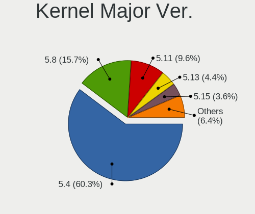

| Version | Desktops | Percent |
|---------|----------|---------|
| 5.4     | 536      | 60.5%   |
| 5.8     | 140      | 15.8%   |
| 5.11    | 85       | 9.59%   |
| 5.13    | 38       | 4.29%   |
| 5.15    | 32       | 3.61%   |
| 5.16    | 19       | 2.14%   |
| 5.7     | 14       | 1.58%   |
| 5.6     | 8        | 0.9%    |
| 5.17    | 7        | 0.79%   |
| 5.10    | 3        | 0.34%   |
| 5.12    | 2        | 0.23%   |
| 5.9     | 1        | 0.11%   |
| 5.18    | 1        | 0.11%   |

Arch
----

OS architecture (x86_64, i586, etc.)

| Name   | Desktops | Percent |
|--------|----------|---------|
| x86_64 | 857      | 100%    |

DE
--

Desktop Environment

| Name       | Desktops | Percent |
|------------|----------|---------|
| GNOME      | 818      | 95.12%  |
| KDE        | 16       | 1.86%   |
| MATE       | 7        | 0.81%   |
| X-Cinnamon | 5        | 0.58%   |
| KDE5       | 3        | 0.35%   |
| XFCE       | 2        | 0.23%   |
| i3         | 2        | 0.23%   |
| Cinnamon   | 2        | 0.23%   |
| Budgie     | 2        | 0.23%   |
| Unknown    | 2        | 0.23%   |
| Pantheon   | 1        | 0.12%   |

Display Server
--------------

X11 or Wayland

| Name    | Desktops | Percent |
|---------|----------|---------|
| X11     | 846      | 98.37%  |
| Wayland | 10       | 1.16%   |
| Tty     | 3        | 0.35%   |
| Unknown | 1        | 0.12%   |

Display Manager
---------------

SDDM, LightDM, etc.

| Name    | Desktops | Percent |
|---------|----------|---------|
| Unknown | 717      | 83.08%  |
| GDM     | 142      | 16.45%  |
| TDM     | 2        | 0.23%   |
| SDDM    | 1        | 0.12%   |
| GDM3    | 1        | 0.12%   |

OS Lang
-------

Language

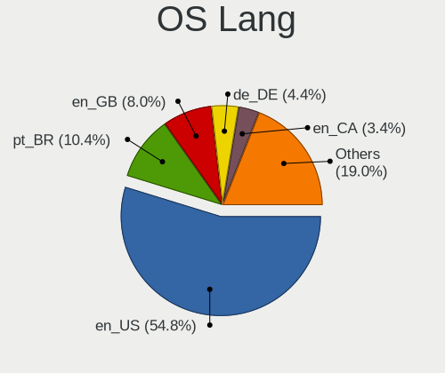

| Lang    | Desktops | Percent |
|---------|----------|---------|
| en_US   | 470      | 54.65%  |
| pt_BR   | 90       | 10.47%  |
| en_GB   | 69       | 8.02%   |
| de_DE   | 38       | 4.42%   |
| en_CA   | 29       | 3.37%   |
| C       | 27       | 3.14%   |
| en_AU   | 23       | 2.67%   |
| ru_RU   | 18       | 2.09%   |
| fr_FR   | 18       | 2.09%   |
| es_ES   | 15       | 1.74%   |
| nl_NL   | 10       | 1.16%   |
| pl_PL   | 9        | 1.05%   |
| it_IT   | 8        | 0.93%   |
| zh_TW   | 4        | 0.47%   |
| fi_FI   | 4        | 0.47%   |
| sv_SE   | 3        | 0.35%   |
| es_MX   | 3        | 0.35%   |
| uk_UA   | 2        | 0.23%   |
| pt_PT   | 2        | 0.23%   |
| nl_BE   | 2        | 0.23%   |
| hr_HR   | 2        | 0.23%   |
| fr_CA   | 2        | 0.23%   |
| es_AR   | 2        | 0.23%   |
| cs_CZ   | 2        | 0.23%   |
| zh_CN   | 1        | 0.12%   |
| tr_TR   | 1        | 0.12%   |
| sk_SK   | 1        | 0.12%   |
| nb_NO   | 1        | 0.12%   |
| ko_KR   | 1        | 0.12%   |
| el_GR   | 1        | 0.12%   |
| bs_BA   | 1        | 0.12%   |
| Unknown | 1        | 0.12%   |

Boot Mode
---------

EFI or BIOS

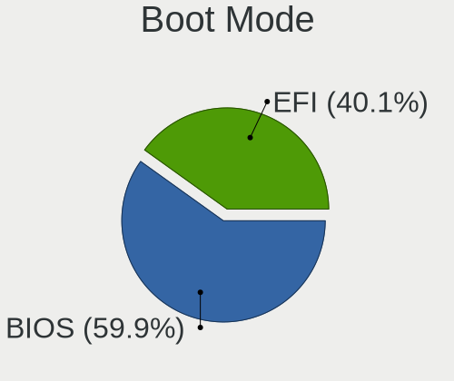

| Mode | Desktops | Percent |
|------|----------|---------|
| BIOS | 521      | 59.82%  |
| EFI  | 350      | 40.18%  |

Filesystem
----------

Type of filesystem

| Type    | Desktops | Percent |
|---------|----------|---------|
| Ext4    | 826      | 96.38%  |
| Overlay | 13       | 1.52%   |
| Btrfs   | 13       | 1.52%   |
| Xfs     | 3        | 0.35%   |
| Zfs     | 2        | 0.23%   |

Part. scheme
------------

Scheme of partitioning

| Type    | Desktops | Percent |
|---------|----------|---------|
| Unknown | 714      | 82.73%  |
| GPT     | 116      | 13.44%  |
| MBR     | 33       | 3.82%   |

Dual Boot with Linux/BSD
------------------------

Hosting more than one Linux/BSD

| Dual boot | Desktops | Percent |
|-----------|----------|---------|
| No        | 823      | 95.92%  |
| Yes       | 35       | 4.08%   |

Dual Boot (Win)
---------------

Hosting Linux and Windows

| Dual boot | Desktops | Percent |
|-----------|----------|---------|
| No        | 767      | 89.08%  |
| Yes       | 94       | 10.92%  |

Board
-----

Vendor
------

Motherboard manufacturer

| Name                | Desktops | Percent |
|---------------------|----------|---------|
| ASUSTek Computer    | 240      | 28%     |
| Gigabyte Technology | 179      | 20.89%  |
| MSI                 | 117      | 13.65%  |
| ASRock              | 89       | 10.39%  |
| Dell                | 72       | 8.4%    |
| Hewlett-Packard     | 48       | 5.6%    |
| Lenovo              | 18       | 2.1%    |
| Intel               | 12       | 1.4%    |
| Acer                | 8        | 0.93%   |
| System76            | 6        | 0.7%    |
| Positivo            | 6        | 0.7%    |
| Pegatron            | 5        | 0.58%   |
| Medion              | 5        | 0.58%   |
| ECS                 | 5        | 0.58%   |
| PCWare              | 4        | 0.47%   |
| Huanan              | 4        | 0.47%   |
| Apple               | 4        | 0.47%   |
| Unknown             | 4        | 0.47%   |
| Supermicro          | 3        | 0.35%   |
| Fujitsu             | 3        | 0.35%   |
| Foxconn             | 3        | 0.35%   |
| Biostar             | 3        | 0.35%   |
| Minix               | 2        | 0.23%   |
| Wistron             | 1        | 0.12%   |
| T-bao               | 1        | 0.12%   |
| Semp Toshiba        | 1        | 0.12%   |
| QTQD                | 1        | 0.12%   |
| OEM                 | 1        | 0.12%   |
| Megaware            | 1        | 0.12%   |
| MAXSUN              | 1        | 0.12%   |
| Login Informatica   | 1        | 0.12%   |
| Kllisre             | 1        | 0.12%   |
| ISYNC               | 1        | 0.12%   |
| Hardkernel          | 1        | 0.12%   |
| Google              | 1        | 0.12%   |
| Gateway             | 1        | 0.12%   |
| Colorful Technology | 1        | 0.12%   |
| AMI                 | 1        | 0.12%   |
| AMD                 | 1        | 0.12%   |
| Alienware           | 1        | 0.12%   |

Model
-----

Motherboard model

| Name                               | Desktops | Percent |
|------------------------------------|----------|---------|
| ASUS All Series                    | 27       | 3.15%   |
| ASUS TUF Gaming X570-PLUS          | 10       | 1.17%   |
| Gigabyte B450M DS3H                | 9        | 1.05%   |
| MSI MS-7C37                        | 8        | 0.93%   |
| MSI MS-7C02                        | 8        | 0.93%   |
| Dell OptiPlex 9020                 | 8        | 0.93%   |
| ASRock B450M Steel Legend          | 7        | 0.82%   |
| MSI MS-7B86                        | 6        | 0.7%    |
| Dell OptiPlex 7010                 | 6        | 0.7%    |
| ASUS ROG STRIX B350-F GAMING       | 6        | 0.7%    |
| ASUS PRIME X470-PRO                | 6        | 0.7%    |
| ASUS PRIME B450M-A                 | 6        | 0.7%    |
| System76 Thelio                    | 5        | 0.58%   |
| Gigabyte A320M-S2H                 | 5        | 0.58%   |
| ASUS ROG STRIX B450-F GAMING       | 5        | 0.58%   |
| ASRock B450M Pro4                  | 5        | 0.58%   |
| Unknown                            | 5        | 0.58%   |
| MSI MS-7B85                        | 4        | 0.47%   |
| MSI MS-7B79                        | 4        | 0.47%   |
| HP Compaq Elite 8300 SFF           | 4        | 0.47%   |
| Gigabyte X570 AORUS MASTER         | 4        | 0.47%   |
| Dell OptiPlex 3010                 | 4        | 0.47%   |
| ASUS ROG STRIX X570-E GAMING       | 4        | 0.47%   |
| ASUS PRIME B450M-GAMING/BR         | 4        | 0.47%   |
| ASUS PRIME B350-PLUS               | 4        | 0.47%   |
| ASRock X570 Phantom Gaming-ITX/TB3 | 4        | 0.47%   |
| MSI MS-7C91                        | 3        | 0.35%   |
| MSI MS-7B87                        | 3        | 0.35%   |
| MSI MS-7B17                        | 3        | 0.35%   |
| MSI MS-7817                        | 3        | 0.35%   |
| Intel H61                          | 3        | 0.35%   |
| HP Z600 Workstation                | 3        | 0.35%   |
| HP Z420 Workstation                | 3        | 0.35%   |
| Gigabyte X570 I AORUS PRO WIFI     | 3        | 0.35%   |
| Gigabyte X570 AORUS PRO WIFI       | 3        | 0.35%   |
| Gigabyte X570 AORUS ELITE          | 3        | 0.35%   |
| Gigabyte GA-MA770T-UD3             | 3        | 0.35%   |
| Gigabyte B75M-D3H                  | 3        | 0.35%   |
| Gigabyte B550I AORUS PRO AX        | 3        | 0.35%   |
| Gigabyte B450 AORUS M              | 3        | 0.35%   |

Model Family
------------

Motherboard model prefix

| Name               | Desktops | Percent |
|--------------------|----------|---------|
| ASUS PRIME         | 51       | 5.95%   |
| ASUS ROG           | 45       | 5.25%   |
| Dell OptiPlex      | 40       | 4.67%   |
| ASUS All           | 27       | 3.15%   |
| Gigabyte X570      | 21       | 2.45%   |
| ASUS TUF           | 21       | 2.45%   |
| HP Compaq          | 14       | 1.63%   |
| ASRock B450M       | 14       | 1.63%   |
| Gigabyte B450M     | 13       | 1.52%   |
| Dell Precision     | 11       | 1.28%   |
| Gigabyte B450      | 10       | 1.17%   |
| Dell Inspiron      | 10       | 1.17%   |
| Lenovo ThinkCentre | 9        | 1.05%   |
| MSI MS-7C37        | 8        | 0.93%   |
| MSI MS-7C02        | 8        | 0.93%   |
| Gigabyte B550      | 8        | 0.93%   |
| ASUS SABERTOOTH    | 7        | 0.82%   |
| ASRock X570        | 7        | 0.82%   |
| System76 Thelio    | 6        | 0.7%    |
| MSI MS-7B86        | 6        | 0.7%    |
| Gigabyte A320M-S2H | 6        | 0.7%    |
| ASUS P8H61-M       | 6        | 0.7%    |
| ASUS M5A78L-M      | 6        | 0.7%    |
| ASRock B450        | 6        | 0.7%    |
| Acer Aspire        | 6        | 0.7%    |
| HP ProDesk         | 5        | 0.58%   |
| Gigabyte Z390      | 5        | 0.58%   |
| Dell Studio        | 5        | 0.58%   |
| ASUS P8Z77-V       | 5        | 0.58%   |
| Unknown            | 5        | 0.58%   |
| MSI MS-7B85        | 4        | 0.47%   |
| MSI MS-7B79        | 4        | 0.47%   |
| HP EliteDesk       | 4        | 0.47%   |
| Dell XPS           | 4        | 0.47%   |
| MSI MS-7C91        | 3        | 0.35%   |
| MSI MS-7B87        | 3        | 0.35%   |
| MSI MS-7B17        | 3        | 0.35%   |
| MSI MS-7817        | 3        | 0.35%   |
| Medion Akoya       | 3        | 0.35%   |
| Lenovo Legion      | 3        | 0.35%   |

MFG Year
--------

Motherboard manufacture year

| Year | Desktops | Percent |
|------|----------|---------|
| 2018 | 149      | 17.39%  |
| 2019 | 119      | 13.89%  |
| 2017 | 84       | 9.8%    |
| 2012 | 75       | 8.75%   |
| 2013 | 64       | 7.47%   |
| 2011 | 63       | 7.35%   |
| 2014 | 52       | 6.07%   |
| 2020 | 51       | 5.95%   |
| 2015 | 41       | 4.78%   |
| 2016 | 37       | 4.32%   |
| 2009 | 34       | 3.97%   |
| 2010 | 30       | 3.5%    |
| 2008 | 26       | 3.03%   |
| 2007 | 14       | 1.63%   |
| 2021 | 13       | 1.52%   |
| 2006 | 5        | 0.58%   |

Form Factor
-----------

Physical design of the computer

| Name    | Desktops | Percent |
|---------|----------|---------|
| Desktop | 857      | 100%    |

Secure Boot
-----------

Enabled or disabled

| State    | Desktops | Percent |
|----------|----------|---------|
| Disabled | 857      | 100%    |

Coreboot
--------

Have coreboot on board

| Used | Desktops | Percent |
|------|----------|---------|
| No   | 856      | 99.88%  |
| Yes  | 1        | 0.12%   |

RAM Size
--------

Total RAM memory

| Size in GB      | Desktops | Percent |
|-----------------|----------|---------|
| 16.01-24.0      | 270      | 31%     |
| 8.01-16.0       | 177      | 20.32%  |
| 32.01-64.0      | 152      | 17.45%  |
| 4.01-8.0        | 100      | 11.48%  |
| 3.01-4.0        | 83       | 9.53%   |
| 64.01-256.0     | 44       | 5.05%   |
| 24.01-32.0      | 31       | 3.56%   |
| 1.01-2.0        | 8        | 0.92%   |
| 2.01-3.0        | 4        | 0.46%   |
| More than 256.0 | 2        | 0.23%   |

RAM Used
--------

Used RAM memory

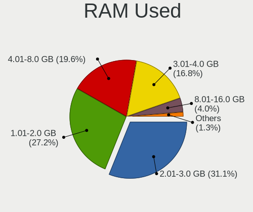

| Used GB     | Desktops | Percent |
|-------------|----------|---------|
| 2.01-3.0    | 286      | 31.15%  |
| 1.01-2.0    | 250      | 27.23%  |
| 4.01-8.0    | 180      | 19.61%  |
| 3.01-4.0    | 154      | 16.78%  |
| 8.01-16.0   | 36       | 3.92%   |
| 16.01-24.0  | 5        | 0.54%   |
| 32.01-64.0  | 4        | 0.44%   |
| 24.01-32.0  | 2        | 0.22%   |
| 64.01-256.0 | 1        | 0.11%   |

Total Drives
------------

Number of drives on board

| Drives | Desktops | Percent |
|--------|----------|---------|
| 1      | 303      | 34.63%  |
| 2      | 264      | 30.17%  |
| 3      | 143      | 16.34%  |
| 4      | 98       | 11.2%   |
| 5      | 33       | 3.77%   |
| 6      | 14       | 1.6%    |
| 7      | 7        | 0.8%    |
| 0      | 6        | 0.69%   |
| 9      | 2        | 0.23%   |
| 8      | 2        | 0.23%   |
| 23     | 1        | 0.11%   |
| 13     | 1        | 0.11%   |
| 11     | 1        | 0.11%   |

Has CD-ROM
----------

Has CD-ROM on board

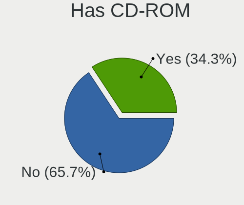

| Presented | Desktops | Percent |
|-----------|----------|---------|
| No        | 569      | 66.09%  |
| Yes       | 292      | 33.91%  |

Has Ethernet
------------

Has Ethernet on board

| Presented | Desktops | Percent |
|-----------|----------|---------|
| Yes       | 850      | 99.18%  |
| No        | 7        | 0.82%   |

Has WiFi
--------

Has WiFi module

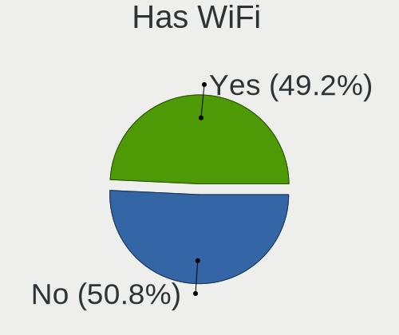

| Presented | Desktops | Percent |
|-----------|----------|---------|
| No        | 439      | 50.87%  |
| Yes       | 424      | 49.13%  |

Has Bluetooth
-------------

Has Bluetooth module

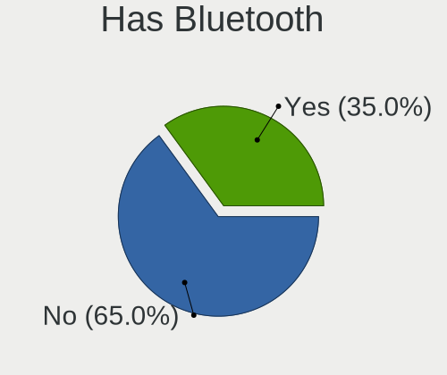

| Presented | Desktops | Percent |
|-----------|----------|---------|
| No        | 562      | 65.12%  |
| Yes       | 301      | 34.88%  |

Location
--------

Country
-------

Geographic location (country)

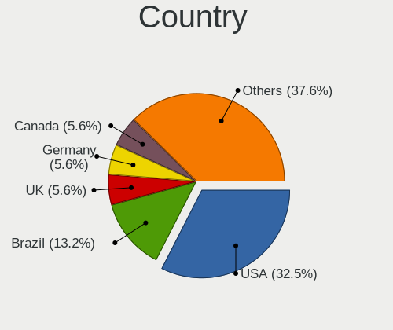

| Country      | Desktops | Percent |
|--------------|----------|---------|
| USA          | 280      | 32.48%  |
| Brazil       | 114      | 13.23%  |
| UK           | 48       | 5.57%   |
| Germany      | 48       | 5.57%   |
| Canada       | 48       | 5.57%   |
| Australia    | 23       | 2.67%   |
| Netherlands  | 18       | 2.09%   |
| Russia       | 16       | 1.86%   |
| Spain        | 15       | 1.74%   |
| Poland       | 15       | 1.74%   |
| France       | 13       | 1.51%   |
| Sweden       | 12       | 1.39%   |
| India        | 12       | 1.39%   |
| Italy        | 11       | 1.28%   |
| Switzerland  | 9        | 1.04%   |
| South Africa | 9        | 1.04%   |
| Philippines  | 9        | 1.04%   |
| Mexico       | 9        | 1.04%   |
| Romania      | 8        | 0.93%   |
| New Zealand  | 8        | 0.93%   |
| Belgium      | 8        | 0.93%   |
| Portugal     | 7        | 0.81%   |
| Finland      | 7        | 0.81%   |
| Czechia      | 7        | 0.81%   |
| Ukraine      | 6        | 0.7%    |
| Greece       | 6        | 0.7%    |
| Argentina    | 6        | 0.7%    |
| Serbia       | 5        | 0.58%   |
| Norway       | 5        | 0.58%   |
| Malaysia     | 5        | 0.58%   |
| Austria      | 5        | 0.58%   |
| Turkey       | 4        | 0.46%   |
| Taiwan       | 4        | 0.46%   |
| Israel       | 4        | 0.46%   |
| Indonesia    | 4        | 0.46%   |
| Bulgaria     | 4        | 0.46%   |
| Slovenia     | 3        | 0.35%   |
| Slovakia     | 3        | 0.35%   |
| Singapore    | 3        | 0.35%   |
| Iceland      | 3        | 0.35%   |

City
----

Geographic location (city)

| City           | Desktops | Percent |
|----------------|----------|---------|
| Sao Paulo      | 13       | 1.48%   |
| Sydney         | 9        | 1.03%   |
| Browning       | 8        | 0.91%   |
| Rio de Janeiro | 6        | 0.68%   |
| London         | 6        | 0.68%   |
| Miami          | 5        | 0.57%   |
| Denver         | 5        | 0.57%   |
| Dallas         | 5        | 0.57%   |
| Berlin         | 5        | 0.57%   |
| Warsaw         | 4        | 0.46%   |
| Vienna         | 4        | 0.46%   |
| Toronto        | 4        | 0.46%   |
| St Louis       | 4        | 0.46%   |
| San Antonio    | 4        | 0.46%   |
| Phoenix        | 4        | 0.46%   |
| New York       | 4        | 0.46%   |
| Monterrey      | 4        | 0.46%   |
| Milan          | 4        | 0.46%   |
| Melbourne      | 4        | 0.46%   |
| Cape Town      | 4        | 0.46%   |
| Braslia      | 4        | 0.46%   |
| Belo Horizonte | 4        | 0.46%   |
| Auckland       | 4        | 0.46%   |
| Wroclaw        | 3        | 0.34%   |
| Wasilla        | 3        | 0.34%   |
| Thessaloniki   | 3        | 0.34%   |
| Singapore      | 3        | 0.34%   |
| Sheffield      | 3        | 0.34%   |
| Santo Andr   | 3        | 0.34%   |
| Orlando        | 3        | 0.34%   |
| Moscow         | 3        | 0.34%   |
| Montreal       | 3        | 0.34%   |
| Manaus         | 3        | 0.34%   |
| Madrid         | 3        | 0.34%   |
| Lisbon         | 3        | 0.34%   |
| Istanbul       | 3        | 0.34%   |
| Hyderabad      | 3        | 0.34%   |
| Helsinki       | 3        | 0.34%   |
| Hamilton       | 3        | 0.34%   |
| Hamburg        | 3        | 0.34%   |

Drives
------

Drive Vendor
------------

Hard drive vendors

| Vendor                    | Desktops | Drives | Percent |
|---------------------------|----------|--------|---------|
| WDC                       | 307      | 448    | 18.74%  |
| Seagate                   | 298      | 441    | 18.19%  |
| Samsung Electronics       | 260      | 399    | 15.87%  |
| Kingston                  | 118      | 141    | 7.2%    |
| SanDisk                   | 86       | 111    | 5.25%   |
| Crucial                   | 75       | 92     | 4.58%   |
| Toshiba                   | 62       | 75     | 3.79%   |
| Hitachi                   | 47       | 59     | 2.87%   |
| Phison                    | 46       | 75     | 2.81%   |
| Intel                     | 40       | 46     | 2.44%   |
| A-DATA Technology         | 25       | 26     | 1.53%   |
| PNY                       | 24       | 27     | 1.47%   |
| Silicon Motion            | 20       | 22     | 1.22%   |
| OCZ                       | 18       | 23     | 1.1%    |
| Unknown                   | 15       | 16     | 0.92%   |
| China                     | 14       | 20     | 0.85%   |
| HGST                      | 13       | 15     | 0.79%   |
| Micron/Crucial Technology | 12       | 14     | 0.73%   |
| Corsair                   | 11       | 14     | 0.67%   |
| XPG                       | 10       | 16     | 0.61%   |
| SK hynix                  | 9        | 16     | 0.55%   |
| Realtek Semiconductor     | 8        | 9      | 0.49%   |
| Maxtor                    | 8        | 8      | 0.49%   |
| Transcend                 | 5        | 5      | 0.31%   |
| Team                      | 5        | 6      | 0.31%   |
| T-FORCE                   | 5        | 6      | 0.31%   |
| Patriot                   | 5        | 5      | 0.31%   |
| Micron Technology         | 5        | 6      | 0.31%   |
| Intenso                   | 5        | 5      | 0.31%   |
| GOODRAM                   | 5        | 5      | 0.31%   |
| JMicron Technology        | 4        | 5      | 0.24%   |
| Hewlett-Packard           | 4        | 6      | 0.24%   |
| ASMT                      | 4        | 4      | 0.24%   |
| XrayDisk                  | 3        | 3      | 0.18%   |
| Plextor                   | 3        | 5      | 0.18%   |
| Lexar                     | 3        | 3      | 0.18%   |
| KingDian                  | 3        | 3      | 0.18%   |
| Gigabyte Technology       | 3        | 3      | 0.18%   |
| SPCC                      | 2        | 2      | 0.12%   |
| SABRENT                   | 2        | 2      | 0.12%   |

Drive Model
-----------

Hard drive models

| Model                             | Desktops | Percent |
|-----------------------------------|----------|---------|
| Samsung NVMe SSD Drive 500GB      | 29       | 1.54%   |
| Seagate ST1000DM010-2EP102 1TB    | 26       | 1.38%   |
| Samsung NVMe SSD Drive 1TB        | 26       | 1.38%   |
| Kingston SA400S37120G 120GB SSD   | 25       | 1.33%   |
| Kingston SA400S37240G 240GB SSD   | 24       | 1.27%   |
| Seagate ST500DM002-1BD142 500GB   | 23       | 1.22%   |
| Seagate ST2000DM008-2FR102 2TB    | 23       | 1.22%   |
| Samsung SSD 860 EVO 500GB         | 22       | 1.17%   |
| Samsung SSD 850 EVO 250GB         | 21       | 1.12%   |
| Kingston SV300S37A120G 120GB SSD  | 19       | 1.01%   |
| Samsung SSD 860 EVO 1TB           | 18       | 0.96%   |
| Phison NVMe SSD Drive 1TB         | 16       | 0.85%   |
| WDC WD10EZEX-08WN4A0 1TB          | 14       | 0.74%   |
| Samsung SSD 860 EVO 250GB         | 14       | 0.74%   |
| Toshiba DT01ACA100 1TB            | 12       | 0.64%   |
| Seagate ST31000524AS 1TB          | 12       | 0.64%   |
| SanDisk NVMe SSD Drive 500GB      | 12       | 0.64%   |
| Samsung SSD 840 EVO 250GB         | 12       | 0.64%   |
| Seagate ST1000DM003-1CH162 1TB    | 11       | 0.58%   |
| Samsung SSD 860 QVO 1TB           | 11       | 0.58%   |
| Samsung NVMe SSD Drive 250GB      | 11       | 0.58%   |
| Crucial CT500MX500SSD1 500GB      | 11       | 0.58%   |
| SanDisk SSD PLUS 120GB            | 10       | 0.53%   |
| Samsung SSD 850 EVO 500GB         | 10       | 0.53%   |
| Seagate ST2000DM006-2DM164 2TB    | 9        | 0.48%   |
| SanDisk NVMe SSD Drive 1TB        | 9        | 0.48%   |
| Kingston SA400S37480G 480GB SSD   | 9        | 0.48%   |
| Intel NVMe SSD Drive 1024GB       | 9        | 0.48%   |
| Seagate ST4000DM004-2CV104 4TB    | 8        | 0.42%   |
| Seagate ST3500312CS 500GB         | 8        | 0.42%   |
| Seagate ST2000DM001-1ER164 2TB    | 8        | 0.42%   |
| Seagate ST1000DM003-1ER162 1TB    | 8        | 0.42%   |
| SanDisk SSD PLUS 240GB            | 8        | 0.42%   |
| Phison NVMe SSD Drive 256GB       | 8        | 0.42%   |
| Phison NVMe SSD Drive 1024GB      | 8        | 0.42%   |
| Micron/Crucial NVMe SSD Drive 1TB | 8        | 0.42%   |
| Kingston NVMe SSD Drive 1TB       | 8        | 0.42%   |
| Crucial CT1000MX500SSD1 1TB       | 8        | 0.42%   |
| WDC WD10EZEX-08M2NA0 1TB          | 7        | 0.37%   |
| WDC WD10EZEX-00BN5A0 1TB          | 7        | 0.37%   |

HDD Vendor
----------

Hard disk drive vendors

| Vendor              | Desktops | Drives | Percent |
|---------------------|----------|--------|---------|
| Seagate             | 295      | 427    | 39.97%  |
| WDC                 | 269      | 373    | 36.45%  |
| Toshiba             | 57       | 69     | 7.72%   |
| Hitachi             | 47       | 59     | 6.37%   |
| Samsung Electronics | 37       | 38     | 5.01%   |
| HGST                | 13       | 15     | 1.76%   |
| Maxtor              | 7        | 7      | 0.95%   |
| Unknown             | 4        | 4      | 0.54%   |
| ASMT                | 4        | 4      | 0.54%   |
| OEM                 | 1        | 1      | 0.14%   |
| Hewlett-Packard     | 1        | 3      | 0.14%   |
| H/W                 | 1        | 1      | 0.14%   |
| Fujitsu             | 1        | 1      | 0.14%   |
| Apple               | 1        | 1      | 0.14%   |

SSD Vendor
----------

Solid state drive vendors

| Vendor              | Desktops | Drives | Percent |
|---------------------|----------|--------|---------|
| Samsung Electronics | 149      | 210    | 24.19%  |
| Kingston            | 102      | 119    | 16.56%  |
| Crucial             | 71       | 88     | 11.53%  |
| SanDisk             | 65       | 77     | 10.55%  |
| WDC                 | 49       | 68     | 7.95%   |
| PNY                 | 23       | 26     | 3.73%   |
| A-DATA Technology   | 21       | 22     | 3.41%   |
| OCZ                 | 17       | 19     | 2.76%   |
| Intel               | 16       | 17     | 2.6%    |
| China               | 14       | 20     | 2.27%   |
| Corsair             | 9        | 10     | 1.46%   |
| SK hynix            | 6        | 13     | 0.97%   |
| Transcend           | 5        | 5      | 0.81%   |
| Team                | 5        | 6      | 0.81%   |
| Patriot             | 5        | 5      | 0.81%   |
| Micron Technology   | 4        | 5      | 0.65%   |
| Toshiba             | 3        | 4      | 0.49%   |
| Plextor             | 3        | 5      | 0.49%   |
| Lexar               | 3        | 3      | 0.49%   |
| KingDian            | 3        | 3      | 0.49%   |
| Intenso             | 3        | 3      | 0.49%   |
| Hewlett-Packard     | 3        | 3      | 0.49%   |
| GOODRAM             | 3        | 3      | 0.49%   |
| SPCC                | 2        | 2      | 0.32%   |
| Seagate             | 2        | 6      | 0.32%   |
| LITEONIT            | 2        | 2      | 0.32%   |
| Kingmax             | 2        | 3      | 0.32%   |
| JMicron Technology  | 2        | 2      | 0.32%   |
| Gigabyte Technology | 2        | 2      | 0.32%   |
| Apacer              | 2        | 3      | 0.32%   |
| XrayDisk            | 1        | 1      | 0.16%   |
| XPG                 | 1        | 1      | 0.16%   |
| Unknown             | 1        | 1      | 0.16%   |
| TO Exter            | 1        | 3      | 0.16%   |
| Teutons             | 1        | 1      | 0.16%   |
| T-FORCE             | 1        | 1      | 0.16%   |
| SATAFIRM            | 1        | 1      | 0.16%   |
| PNY USB             | 1        | 8      | 0.16%   |
| Pioneer             | 1        | 1      | 0.16%   |
| OWC                 | 1        | 8      | 0.16%   |

Drive Kind
----------

HDD or SSD

| Kind    | Desktops | Drives | Percent |
|---------|----------|--------|---------|
| HDD     | 582      | 1003   | 42.54%  |
| SSD     | 482      | 793    | 35.23%  |
| NVMe    | 270      | 426    | 19.74%  |
| Unknown | 29       | 36     | 2.12%   |
| MMC     | 5        | 5      | 0.37%   |

Drive Connector
---------------

SATA, SAS, NVMe, etc.

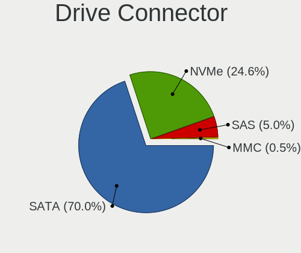

| Type | Desktops | Drives | Percent |
|------|----------|--------|---------|
| SATA | 771      | 1749   | 70.09%  |
| NVMe | 269      | 423    | 24.45%  |
| SAS  | 55       | 86     | 5%      |
| MMC  | 5        | 5      | 0.45%   |

Drive Size
----------

Size of hard drive

| Size in TB | Desktops | Drives | Percent |
|------------|----------|--------|---------|
| 0.01-0.5   | 596      | 973    | 51.65%  |
| 0.51-1.0   | 320      | 472    | 27.73%  |
| 1.01-2.0   | 130      | 173    | 11.27%  |
| 3.01-4.0   | 41       | 58     | 3.55%   |
| 2.01-3.0   | 35       | 49     | 3.03%   |
| 4.01-10.0  | 28       | 52     | 2.43%   |
| 10.01-20.0 | 4        | 19     | 0.35%   |

Space Total
-----------

Amount of disk space available on the file system

| Size in GB     | Desktops | Percent |
|----------------|----------|---------|
| 101-250        | 218      | 24.63%  |
| 251-500        | 192      | 21.69%  |
| 501-1000       | 163      | 18.42%  |
| 1001-2000      | 118      | 13.33%  |
| More than 3000 | 67       | 7.57%   |
| 2001-3000      | 50       | 5.65%   |
| 51-100         | 35       | 3.95%   |
| 21-50          | 22       | 2.49%   |
| 1-20           | 16       | 1.81%   |
| Unknown        | 4        | 0.45%   |

Space Used
----------

Amount of used disk space

| Used GB        | Desktops | Percent |
|----------------|----------|---------|
| 1-20           | 326      | 36.1%   |
| 21-50          | 167      | 18.49%  |
| 101-250        | 103      | 11.41%  |
| 251-500        | 82       | 9.08%   |
| 51-100         | 81       | 8.97%   |
| 501-1000       | 65       | 7.2%    |
| 1001-2000      | 33       | 3.65%   |
| More than 3000 | 24       | 2.66%   |
| 2001-3000      | 18       | 1.99%   |
| Unknown        | 4        | 0.44%   |

Malfunc. Drives
---------------

Drive models with a malfunction

| Model                                               | Desktops | Drives | Percent |
|-----------------------------------------------------|----------|--------|---------|
| Seagate ST1500DL003-9VT16L 1TB                      | 3        | 3      | 5.36%   |
| Seagate ST1000LM024 HN-M101MBB 1TB                  | 3        | 3      | 5.36%   |
| Seagate ST1000DM003-9YN162 1TB                      | 3        | 3      | 5.36%   |
| WDC WD3200AAKS-75B3A0 320GB                         | 2        | 2      | 3.57%   |
| Samsung Electronics HD502HI 500GB                   | 2        | 2      | 3.57%   |
| Samsung Electronics HD103SJ 1TB                     | 2        | 2      | 3.57%   |
| Kingston SV300S37A120G 120GB SSD                    | 2        | 2      | 3.57%   |
| Kingston SA400S37120G 120GB SSD                     | 2        | 3      | 3.57%   |
| WDC WD7500BPVT-60HXZT1 752GB                        | 1        | 1      | 1.79%   |
| WDC WD7500BPKT-75PK4T0 752GB                        | 1        | 1      | 1.79%   |
| WDC WD5000AVVS-63H0B1 500GB                         | 1        | 1      | 1.79%   |
| WDC WD5000AAKS-41YGA1 500GB                         | 1        | 1      | 1.79%   |
| WDC WD5000AADS-00M2B0 500GB                         | 1        | 1      | 1.79%   |
| WDC WD3200AAJS-56M0A0 320GB                         | 1        | 1      | 1.79%   |
| WDC WD30EZRX-00SPEB0 3TB                            | 1        | 1      | 1.79%   |
| WDC WD10JPCX-24UE4T0 1TB                            | 1        | 1      | 1.79%   |
| WDC WD10EZRX-00A8LB0 1TB                            | 1        | 2      | 1.79%   |
| WDC WD10EZEX-08WN4A0 1TB                            | 1        | 1      | 1.79%   |
| WDC WD1003FZEX-00MK2A0 1TB                          | 1        | 1      | 1.79%   |
| WDC WD1002FAEX-00Z3A0 1TB                           | 1        | 1      | 1.79%   |
| WDC WD10 JPVX-75JC3T0 1TB                           | 1        | 1      | 1.79%   |
| Toshiba MK5061GSY 500GB                             | 1        | 1      | 1.79%   |
| Toshiba DT01ACA050 500GB                            | 1        | 1      | 1.79%   |
| Seagate ST9320325AS 320GB                           | 1        | 1      | 1.79%   |
| Seagate ST500LT012-9WS142 500GB                     | 1        | 2      | 1.79%   |
| Seagate ST500LM012 HN-M500MBB 500GB                 | 1        | 1      | 1.79%   |
| Seagate ST3500418AS 500GB                           | 1        | 1      | 1.79%   |
| Seagate ST3500312CS 500GB                           | 1        | 1      | 1.79%   |
| Seagate ST31000528AS 1TB                            | 1        | 1      | 1.79%   |
| Seagate ST31000524AS 1TB                            | 1        | 1      | 1.79%   |
| Seagate ST2000DM001-1CH164 2TB                      | 1        | 1      | 1.79%   |
| Seagate ST1000DM003-1CH162 1TB                      | 1        | 1      | 1.79%   |
| Samsung Electronics HD403LJ 400GB                   | 1        | 1      | 1.79%   |
| Samsung Electronics HD322HJ 320GB                   | 1        | 1      | 1.79%   |
| Samsung Electronics HD161HJ 160GB                   | 1        | 1      | 1.79%   |
| Micron Technology MTFDDAK512MBF-1AN1ZABHA 512GB SSD | 1        | 1      | 1.79%   |
| Maxtor 6L080L0 82GB                                 | 1        | 1      | 1.79%   |
| Intenso SSD 128GB                                   | 1        | 1      | 1.79%   |
| Hitachi HTS547550A9E384 500GB                       | 1        | 2      | 1.79%   |
| Hitachi HDS721010CLA332 1TB                         | 1        | 1      | 1.79%   |

Malfunc. Drive Vendor
---------------------

Vendors of faulty drives

| Vendor              | Desktops | Drives | Percent |
|---------------------|----------|--------|---------|
| Seagate             | 17       | 19     | 30.91%  |
| WDC                 | 15       | 16     | 27.27%  |
| Samsung Electronics | 7        | 7      | 12.73%  |
| Kingston            | 4        | 5      | 7.27%   |
| Toshiba             | 2        | 2      | 3.64%   |
| Hitachi             | 2        | 3      | 3.64%   |
| HGST                | 2        | 2      | 3.64%   |
| Crucial             | 2        | 2      | 3.64%   |
| Micron Technology   | 1        | 1      | 1.82%   |
| Maxtor              | 1        | 1      | 1.82%   |
| Intenso             | 1        | 1      | 1.82%   |
| ASMT                | 1        | 1      | 1.82%   |

Malfunc. HDD Vendor
-------------------

Vendors of faulty HDD drives

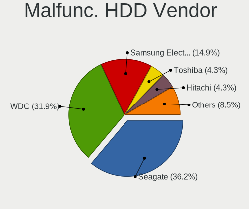

| Vendor              | Desktops | Drives | Percent |
|---------------------|----------|--------|---------|
| Seagate             | 17       | 19     | 36.17%  |
| WDC                 | 15       | 16     | 31.91%  |
| Samsung Electronics | 7        | 7      | 14.89%  |
| Toshiba             | 2        | 2      | 4.26%   |
| Hitachi             | 2        | 3      | 4.26%   |
| HGST                | 2        | 2      | 4.26%   |
| Maxtor              | 1        | 1      | 2.13%   |
| ASMT                | 1        | 1      | 2.13%   |

Malfunc. Drive Kind
-------------------

Kinds of faulty drives

| Kind | Desktops | Drives | Percent |
|------|----------|--------|---------|
| HDD  | 40       | 51     | 83.33%  |
| SSD  | 7        | 8      | 14.58%  |
| NVMe | 1        | 1      | 2.08%   |

Failed Drives
-------------

Failed drive models

Zero info for selected period =(

Failed Drive Vendor
-------------------

Failed drive vendors

Zero info for selected period =(

Drive Status
------------

Number of failed and malfunc. drives

| Status   | Desktops | Drives | Percent |
|----------|----------|--------|---------|
| Detected | 721      | 1875   | 78.97%  |
| Works    | 145      | 327    | 15.88%  |
| Malfunc  | 46       | 60     | 5.04%   |
| Limited  | 1        | 1      | 0.11%   |

Storage controller
------------------

Storage Vendor
--------------

Storage controller vendors

| Vendor                           | Desktops | Percent |
|----------------------------------|----------|---------|
| Intel                            | 469      | 37.31%  |
| AMD                              | 380      | 30.23%  |
| Samsung Electronics              | 111      | 8.83%   |
| Phison Electronics               | 49       | 3.9%    |
| ASMedia Technology               | 49       | 3.9%    |
| SanDisk                          | 28       | 2.23%   |
| Silicon Motion                   | 22       | 1.75%   |
| JMicron Technology               | 22       | 1.75%   |
| Marvell Technology Group         | 21       | 1.67%   |
| Nvidia                           | 20       | 1.59%   |
| Kingston Technology Company      | 18       | 1.43%   |
| Micron/Crucial Technology        | 15       | 1.19%   |
| ADATA Technology                 | 14       | 1.11%   |
| Realtek Semiconductor            | 10       | 0.8%    |
| Broadcom / LSI                   | 9        | 0.72%   |
| SK hynix                         | 3        | 0.24%   |
| Toshiba America Info Systems     | 2        | 0.16%   |
| Shenzhen Longsys Electronics     | 2        | 0.16%   |
| Seagate Technology               | 2        | 0.16%   |
| Lite-On Technology               | 2        | 0.16%   |
| HighPoint Technologies           | 2        | 0.16%   |
| VIA Technologies                 | 1        | 0.08%   |
| Union Memory (Shenzhen)          | 1        | 0.08%   |
| Silicon Integrated Systems [SiS] | 1        | 0.08%   |
| OCZ Technology Group             | 1        | 0.08%   |
| Micron Technology                | 1        | 0.08%   |
| LSI Logic / Symbios Logic        | 1        | 0.08%   |
| Adaptec                          | 1        | 0.08%   |

Storage Model
-------------

Storage controller models

| Model                                                                                   | Desktops | Percent |
|-----------------------------------------------------------------------------------------|----------|---------|
| AMD FCH SATA Controller [AHCI mode]                                                     | 283      | 17.61%  |
| AMD 400 Series Chipset SATA Controller                                                  | 114      | 7.09%   |
| Samsung NVMe SSD Controller SM981/PM981/PM983                                           | 82       | 5.1%    |
| Intel 6 Series/C200 Series Chipset Family 6 port Desktop SATA AHCI Controller           | 50       | 3.11%   |
| ASMedia ASM1062 Serial ATA Controller                                                   | 47       | 2.92%   |
| Intel 8 Series/C220 Series Chipset Family 6-port SATA Controller 1 [AHCI mode]          | 46       | 2.86%   |
| Intel 200 Series PCH SATA controller [AHCI mode]                                        | 43       | 2.68%   |
| Intel SATA Controller [RAID mode]                                                       | 42       | 2.61%   |
| Intel Q170/Q150/B150/H170/H110/Z170/CM236 Chipset SATA Controller [AHCI Mode]           | 42       | 2.61%   |
| Intel 7 Series/C210 Series Chipset Family 6-port SATA Controller [AHCI mode]            | 40       | 2.49%   |
| AMD SB7x0/SB8x0/SB9x0 IDE Controller                                                    | 34       | 2.12%   |
| AMD SB7x0/SB8x0/SB9x0 SATA Controller [AHCI mode]                                       | 33       | 2.05%   |
| Intel Cannon Lake PCH SATA AHCI Controller                                              | 31       | 1.93%   |
| AMD 300 Series Chipset SATA Controller                                                  | 27       | 1.68%   |
| AMD SB7x0/SB8x0/SB9x0 SATA Controller [IDE mode]                                        | 25       | 1.56%   |
| Phison E12 NVMe Controller                                                              | 24       | 1.49%   |
| AMD 500 Series Chipset SATA Controller                                                  | 22       | 1.37%   |
| Samsung NVMe SSD Controller SM961/PM961/SM963                                           | 21       | 1.31%   |
| AMD FCH SATA Controller D                                                               | 21       | 1.31%   |
| Intel 9 Series Chipset Family SATA Controller [AHCI Mode]                               | 20       | 1.24%   |
| Phison E16 PCIe4 NVMe Controller                                                        | 19       | 1.18%   |
| Intel NM10/ICH7 Family SATA Controller [IDE mode]                                       | 18       | 1.12%   |
| Silicon Motion SM2263EN/SM2263XT SSD Controller                                         | 16       | 1%      |
| Intel 6 Series/C200 Series Chipset Family Desktop SATA Controller (IDE mode, ports 4-5) | 16       | 1%      |
| Intel 6 Series/C200 Series Chipset Family Desktop SATA Controller (IDE mode, ports 0-3) | 16       | 1%      |
| Intel SSD 660P Series                                                                   | 15       | 0.93%   |
| Kingston Company A2000 NVMe SSD                                                         | 14       | 0.87%   |
| Intel 82801G (ICH7 Family) IDE Controller                                               | 14       | 0.87%   |
| ADATA XPG SX8200 Pro PCIe Gen3x4 M.2 2280 Solid State Drive                             | 14       | 0.87%   |
| AMD X370 Series Chipset SATA Controller                                                 | 13       | 0.81%   |
| Nvidia MCP61 SATA Controller                                                            | 12       | 0.75%   |
| JMicron JMB363 SATA/IDE Controller                                                      | 12       | 0.75%   |
| Intel C600/X79 series chipset 6-Port SATA AHCI Controller                               | 12       | 0.75%   |
| SanDisk WD Blue SN550 NVMe SSD                                                          | 11       | 0.68%   |
| Nvidia MCP61 IDE                                                                        | 11       | 0.68%   |
| SanDisk WD Black 2018/SN750 / PC SN720 NVMe SSD                                         | 9        | 0.56%   |
| Intel 82801JI (ICH10 Family) 4 port SATA IDE Controller #1                              | 9        | 0.56%   |
| Intel 82801JI (ICH10 Family) 2 port SATA IDE Controller #2                              | 9        | 0.56%   |
| Micron/Crucial P1 NVMe PCIe SSD                                                         | 8        | 0.5%    |
| Marvell Group 88SE9172 SATA 6Gb/s Controller                                            | 8        | 0.5%    |

Storage Kind
------------

Kind of storage controller (IDE, SATA, NVMe, SAS, ...)

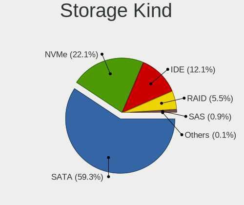

| Kind | Desktops | Percent |
|------|----------|---------|
| SATA | 728      | 59.38%  |
| NVMe | 270      | 22.02%  |
| IDE  | 149      | 12.15%  |
| RAID | 67       | 5.46%   |
| SAS  | 11       | 0.9%    |
| SCSI | 1        | 0.08%   |

Processor
---------

CPU Vendor
----------

Processor vendors

| Vendor | Desktops | Percent |
|--------|----------|---------|
| Intel  | 463      | 54.03%  |
| AMD    | 394      | 45.97%  |

CPU Model
---------

Processor models

| Model                                          | Desktops | Percent |
|------------------------------------------------|----------|---------|
| AMD Ryzen 5 3600 6-Core Processor              | 33       | 3.84%   |
| AMD Ryzen 7 3700X 8-Core Processor             | 30       | 3.49%   |
| AMD Ryzen 9 3900X 12-Core Processor            | 26       | 3.03%   |
| AMD Ryzen 5 1600 Six-Core Processor            | 23       | 2.68%   |
| AMD Ryzen 5 2600 Six-Core Processor            | 18       | 2.1%    |
| AMD Ryzen 5 3600X 6-Core Processor             | 17       | 1.98%   |
| AMD Ryzen 7 2700X Eight-Core Processor         | 15       | 1.75%   |
| Intel Core i5-4590 CPU @ 3.30GHz               | 13       | 1.51%   |
| Intel Core i7-3770 CPU @ 3.40GHz               | 12       | 1.4%    |
| AMD Ryzen 5 3400G with Radeon Vega Graphics    | 12       | 1.4%    |
| Intel Core i5-3470 CPU @ 3.20GHz               | 10       | 1.16%   |
| Intel Core i3-2100 CPU @ 3.10GHz               | 10       | 1.16%   |
| Intel Core i9-9900K CPU @ 3.60GHz              | 9        | 1.05%   |
| Intel Core i5-4460 CPU @ 3.20GHz               | 9        | 1.05%   |
| AMD Ryzen 5 2600X Six-Core Processor           | 9        | 1.05%   |
| Intel Core i7-2600 CPU @ 3.40GHz               | 8        | 0.93%   |
| Intel Core i5-9400F CPU @ 2.90GHz              | 8        | 0.93%   |
| Intel Core 2 Duo CPU E8400 @ 3.00GHz           | 8        | 0.93%   |
| AMD Ryzen 3 3200G with Radeon Vega Graphics    | 8        | 0.93%   |
| AMD FX-8350 Eight-Core Processor               | 8        | 0.93%   |
| AMD FX-6300 Six-Core Processor                 | 8        | 0.93%   |
| Intel Core i5-2400 CPU @ 3.10GHz               | 7        | 0.81%   |
| AMD Ryzen Threadripper 3960X 24-Core Processor | 7        | 0.81%   |
| AMD Ryzen 5 2400G with Radeon Vega Graphics    | 7        | 0.81%   |
| AMD FX-8320 Eight-Core Processor               | 7        | 0.81%   |
| Intel Core i7-9700K CPU @ 3.60GHz              | 6        | 0.7%    |
| Intel Core i7-8700K CPU @ 3.70GHz              | 6        | 0.7%    |
| Intel Core i7-8700 CPU @ 3.20GHz               | 6        | 0.7%    |
| Intel Core i7-7700 CPU @ 3.60GHz               | 6        | 0.7%    |
| Intel Core i7-6700K CPU @ 4.00GHz              | 6        | 0.7%    |
| Intel Core i7-4790K CPU @ 4.00GHz              | 6        | 0.7%    |
| Intel Core i7-4790 CPU @ 3.60GHz               | 6        | 0.7%    |
| Intel Core i7-3770K CPU @ 3.50GHz              | 6        | 0.7%    |
| Intel Core i5-8400 CPU @ 2.80GHz               | 6        | 0.7%    |
| Intel Core i5-3570K CPU @ 3.40GHz              | 6        | 0.7%    |
| AMD Ryzen 9 3950X 16-Core Processor            | 6        | 0.7%    |
| AMD Ryzen 7 3800X 8-Core Processor             | 6        | 0.7%    |
| AMD Ryzen 7 1700X Eight-Core Processor         | 6        | 0.7%    |
| AMD Ryzen 7 1700 Eight-Core Processor          | 6        | 0.7%    |
| Intel Core i5-6500 CPU @ 3.20GHz               | 5        | 0.58%   |

CPU Model Family
----------------

Processor model prefix

| Model                   | Desktops | Percent |
|-------------------------|----------|---------|
| Intel Core i5           | 145      | 16.88%  |
| AMD Ryzen 5             | 132      | 15.37%  |
| Intel Core i7           | 115      | 13.39%  |
| AMD Ryzen 7             | 78       | 9.08%   |
| Intel Core i3           | 58       | 6.75%   |
| Intel Xeon              | 48       | 5.59%   |
| AMD Ryzen 9             | 39       | 4.54%   |
| AMD FX                  | 34       | 3.96%   |
| Intel Core 2 Duo        | 19       | 2.21%   |
| AMD Ryzen Threadripper  | 16       | 1.86%   |
| Intel Celeron           | 15       | 1.75%   |
| AMD Ryzen 3             | 13       | 1.51%   |
| Intel Core i9           | 12       | 1.4%    |
| AMD Phenom II X4        | 11       | 1.28%   |
| Intel Pentium           | 10       | 1.16%   |
| Intel Core 2 Quad       | 10       | 1.16%   |
| AMD Athlon II X2        | 10       | 1.16%   |
| AMD A10                 | 10       | 1.16%   |
| Intel Pentium Dual-Core | 9        | 1.05%   |
| AMD Athlon              | 8        | 0.93%   |
| AMD A8                  | 8        | 0.93%   |
| AMD Phenom II X6        | 7        | 0.81%   |
| Intel Pentium Dual      | 6        | 0.7%    |
| Other                   | 5        | 0.58%   |
| Intel Core 2            | 4        | 0.47%   |
| AMD Phenom              | 4        | 0.47%   |
| AMD Athlon II X4        | 4        | 0.47%   |
| AMD A6                  | 4        | 0.47%   |
| Intel Atom              | 3        | 0.35%   |
| AMD Athlon X4           | 3        | 0.35%   |
| AMD Athlon 64 X2        | 3        | 0.35%   |
| Intel Pentium D         | 2        | 0.23%   |
| Intel Genuine           | 2        | 0.23%   |
| AMD Ryzen 5 PRO         | 2        | 0.23%   |
| AMD Athlon 64           | 2        | 0.23%   |
| AMD A4                  | 2        | 0.23%   |
| Intel Pentium Silver    | 1        | 0.12%   |
| Intel Pentium Gold      | 1        | 0.12%   |
| AMD Ryzen 3 PRO         | 1        | 0.12%   |
| AMD PRO A10             | 1        | 0.12%   |

CPU Cores
---------

Number of processor cores

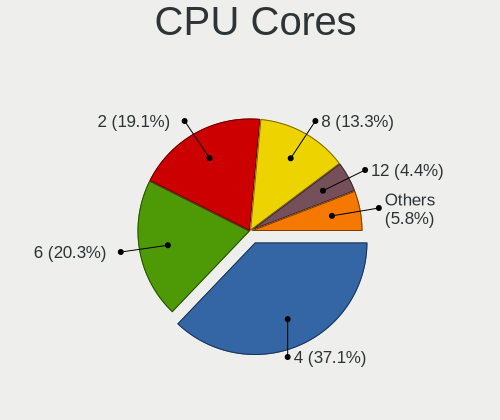

| Number | Desktops | Percent |
|--------|----------|---------|
| 4      | 319      | 37.22%  |
| 6      | 173      | 20.19%  |
| 2      | 164      | 19.14%  |
| 8      | 114      | 13.3%   |
| 12     | 37       | 4.32%   |
| 16     | 14       | 1.63%   |
| 3      | 12       | 1.4%    |
| 24     | 9        | 1.05%   |
| 1      | 7        | 0.82%   |
| 32     | 5        | 0.58%   |
| 10     | 2        | 0.23%   |
| 14     | 1        | 0.12%   |

CPU Sockets
-----------

Number of sockets

| Number | Desktops | Percent |
|--------|----------|---------|
| 1      | 841      | 98.13%  |
| 2      | 16       | 1.87%   |

CPU Threads
-----------

Threads per core (Hyper-Threading)

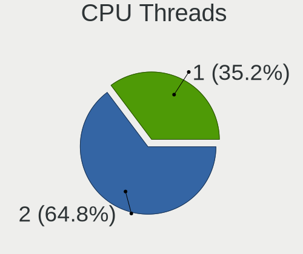

| Number | Desktops | Percent |
|--------|----------|---------|
| 2      | 555      | 64.69%  |
| 1      | 303      | 35.31%  |

CPU Op-Modes
------------

CPU Operation Modes (32-bit, 64-bit)

| Op mode        | Desktops | Percent |
|----------------|----------|---------|
| 32-bit, 64-bit | 857      | 100%    |

CPU Microcode
-------------

Microcode number

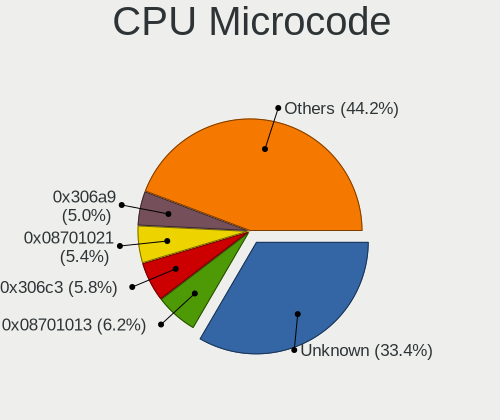

| Number     | Desktops | Percent |
|------------|----------|---------|
| Unknown    | 293      | 33.18%  |
| 0x08701013 | 55       | 6.23%   |
| 0x306c3    | 51       | 5.78%   |
| 0x08701021 | 48       | 5.44%   |
| 0x306a9    | 44       | 4.98%   |
| 0x0800820d | 44       | 4.98%   |
| 0x206a7    | 39       | 4.42%   |
| 0x906ea    | 26       | 2.94%   |
| 0x506e3    | 26       | 2.94%   |
| 0x1067a    | 22       | 2.49%   |
| 0x08108109 | 19       | 2.15%   |
| 0x906e9    | 18       | 2.04%   |
| 0x06000852 | 18       | 2.04%   |
| 0x08001138 | 16       | 1.81%   |
| 0x06001119 | 9        | 1.02%   |
| 0x206c2    | 8        | 0.91%   |
| 0x106a5    | 8        | 0.91%   |
| 0x010000c8 | 8        | 0.91%   |
| 0x906ec    | 7        | 0.79%   |
| 0x306f2    | 7        | 0.79%   |
| 0x906ed    | 6        | 0.68%   |
| 0x08301039 | 6        | 0.68%   |
| 0x206d7    | 5        | 0.57%   |
| 0x20655    | 5        | 0.57%   |
| 0x06003106 | 5        | 0.57%   |
| 0x906eb    | 4        | 0.45%   |
| 0x6fd      | 4        | 0.45%   |
| 0x08101016 | 4        | 0.45%   |
| 0x0810100b | 4        | 0.45%   |
| 0x08001137 | 4        | 0.45%   |
| 0x0600063e | 4        | 0.45%   |
| 0x010000dc | 4        | 0.45%   |
| 0xa0671    | 3        | 0.34%   |
| 0xa0655    | 3        | 0.34%   |
| 0x706a1    | 3        | 0.34%   |
| 0x6fb      | 3        | 0.34%   |
| 0x106e5    | 3        | 0.34%   |
| 0x10676    | 3        | 0.34%   |
| 0x08301025 | 3        | 0.34%   |
| 0x6f6      | 2        | 0.23%   |

CPU Microarch
-------------

Microarchitecture

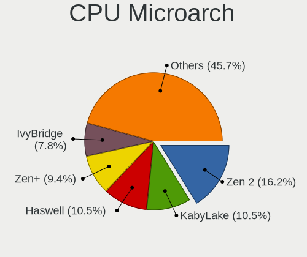

| Name          | Desktops | Percent |
|---------------|----------|---------|
| Zen 2         | 139      | 16.2%   |
| Haswell       | 90       | 10.49%  |
| KabyLake      | 89       | 10.37%  |
| Zen+          | 81       | 9.44%   |
| IvyBridge     | 67       | 7.81%   |
| SandyBridge   | 66       | 7.69%   |
| Zen           | 54       | 6.29%   |
| Piledriver    | 43       | 5.01%   |
| Skylake       | 38       | 4.43%   |
| K10           | 36       | 4.2%    |
| Penryn        | 34       | 3.96%   |
| Westmere      | 19       | 2.21%   |
| Core          | 18       | 2.1%    |
| Nehalem       | 16       | 1.86%   |
| Zen 3         | 13       | 1.52%   |
| CometLake     | 9        | 1.05%   |
| Steamroller   | 7        | 0.82%   |
| Silvermont    | 7        | 0.82%   |
| K8 Hammer     | 5        | 0.58%   |
| K10 Llano     | 5        | 0.58%   |
| Bulldozer     | 5        | 0.58%   |
| Icelake       | 3        | 0.35%   |
| Goldmont plus | 3        | 0.35%   |
| Excavator     | 3        | 0.35%   |
| NetBurst      | 2        | 0.23%   |
| Jaguar        | 2        | 0.23%   |
| Unknown       | 2        | 0.23%   |
| Bonnell       | 1        | 0.12%   |
| Bobcat        | 1        | 0.12%   |

Graphics
--------

GPU Vendor
----------

Vendors of graphics cards

| Vendor                           | Desktops | Percent |
|----------------------------------|----------|---------|
| Nvidia                           | 414      | 45.59%  |
| AMD                              | 316      | 34.8%   |
| Intel                            | 174      | 19.16%  |
| Matrox Electronics Systems       | 3        | 0.33%   |
| Silicon Integrated Systems [SiS] | 1        | 0.11%   |

GPU Model
---------

Graphics card models

| Model                                                                       | Desktops | Percent |
|-----------------------------------------------------------------------------|----------|---------|
| AMD Ellesmere [Radeon RX 470/480/570/570X/580/580X/590]                     | 80       | 8.57%   |
| AMD Navi 10 [Radeon RX 5600 OEM/5600 XT / 5700/5700 XT]                     | 44       | 4.72%   |
| Intel Xeon E3-1200 v3/4th Gen Core Processor Integrated Graphics Controller | 35       | 3.75%   |
| Nvidia GP107 [GeForce GTX 1050 Ti]                                          | 33       | 3.54%   |
| Intel 2nd Generation Core Processor Family Integrated Graphics Controller   | 24       | 2.57%   |
| Nvidia GP106 [GeForce GTX 1060 6GB]                                         | 23       | 2.47%   |
| Nvidia GP104 [GeForce GTX 1070]                                             | 23       | 2.47%   |
| Intel Xeon E3-1200 v2/3rd Gen Core processor Graphics Controller            | 23       | 2.47%   |
| AMD Picasso/Raven 2 [Radeon Vega Series / Radeon Vega Mobile Series]        | 20       | 2.14%   |
| Nvidia GP104 [GeForce GTX 1080]                                             | 14       | 1.5%    |
| Nvidia GK208B [GeForce GT 710]                                              | 13       | 1.39%   |
| Nvidia TU104 [GeForce RTX 2070 SUPER]                                       | 12       | 1.29%   |
| Nvidia GP102 [GeForce GTX 1080 Ti]                                          | 12       | 1.29%   |
| Nvidia GM206 [GeForce GTX 960]                                              | 12       | 1.29%   |
| Nvidia TU116 [GeForce GTX 1660]                                             | 11       | 1.18%   |
| Nvidia TU106 [GeForce RTX 2060 Rev. A]                                      | 11       | 1.18%   |
| Nvidia GM204 [GeForce GTX 970]                                              | 11       | 1.18%   |
| Intel HD Graphics 530                                                       | 11       | 1.18%   |
| Intel CoffeeLake-S GT2 [UHD Graphics 630]                                   | 11       | 1.18%   |
| AMD Raven Ridge [Radeon Vega Series / Radeon Vega Mobile Series]            | 11       | 1.18%   |
| Nvidia GM107 [GeForce GTX 750 Ti]                                           | 10       | 1.07%   |
| Intel IvyBridge GT2 [HD Graphics 4000]                                      | 10       | 1.07%   |
| Nvidia TU116 [GeForce GTX 1660 SUPER]                                       | 9        | 0.96%   |
| Intel HD Graphics 630                                                       | 9        | 0.96%   |
| AMD Juniper XT [Radeon HD 5770]                                             | 9        | 0.96%   |
| Nvidia GT218 [GeForce 210]                                                  | 8        | 0.86%   |
| Nvidia GP107 [GeForce GTX 1050]                                             | 8        | 0.86%   |
| Nvidia GP106 [GeForce GTX 1060 3GB]                                         | 8        | 0.86%   |
| Intel 82G33/G31 Express Integrated Graphics Controller                      | 8        | 0.86%   |
| Intel 4 Series Chipset Integrated Graphics Controller                       | 8        | 0.86%   |
| AMD Lexa PRO [Radeon 540/540X/550/550X / RX 540X/550/550X]                  | 8        | 0.86%   |
| Nvidia TU117 [GeForce GTX 1650]                                             | 7        | 0.75%   |
| Nvidia TU106 [GeForce RTX 2070]                                             | 7        | 0.75%   |
| Nvidia TU106 [GeForce RTX 2060 SUPER]                                       | 7        | 0.75%   |
| Nvidia TU104 [GeForce RTX 2080 SUPER]                                       | 7        | 0.75%   |
| Nvidia TU104 [GeForce RTX 2080 Rev. A]                                      | 7        | 0.75%   |
| Nvidia GP108 [GeForce GT 1030]                                              | 7        | 0.75%   |
| Nvidia GP104 [GeForce GTX 1070 Ti]                                          | 7        | 0.75%   |
| AMD Vega 10 XL/XT [Radeon RX Vega 56/64]                                    | 7        | 0.75%   |
| AMD Cedar [Radeon HD 5000/6000/7350/8350 Series]                            | 7        | 0.75%   |

GPU Combo
---------

Combinations of graphics cards

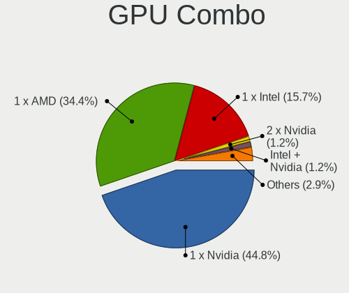

| Name               | Desktops | Percent |
|--------------------|----------|---------|
| 1 x Nvidia         | 386      | 44.68%  |
| 1 x AMD            | 298      | 34.49%  |
| 1 x Intel          | 136      | 15.74%  |
| 2 x Nvidia         | 10       | 1.16%   |
| Intel + Nvidia     | 10       | 1.16%   |
| 2 x AMD            | 9        | 1.04%   |
| Intel + AMD        | 5        | 0.58%   |
| AMD + Nvidia       | 4        | 0.46%   |
| 1 x Matrox         | 2        | 0.23%   |
| 4 x Nvidia         | 1        | 0.12%   |
| 1 x SiS            | 1        | 0.12%   |
| Intel + 2 x Nvidia | 1        | 0.12%   |
| AMD + Matrox       | 1        | 0.12%   |

GPU Driver
----------

Free vs proprietary

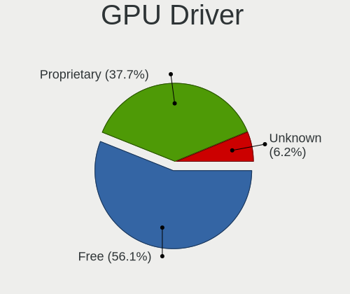

| Driver      | Desktops | Percent |
|-------------|----------|---------|
| Free        | 485      | 56.07%  |
| Proprietary | 326      | 37.69%  |
| Unknown     | 54       | 6.24%   |

GPU Memory
----------

Total video memory

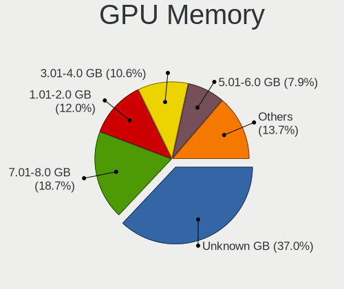

| Size in GB | Desktops | Percent |
|------------|----------|---------|
| Unknown    | 323      | 37.04%  |
| 7.01-8.0   | 164      | 18.81%  |
| 1.01-2.0   | 104      | 11.93%  |
| 3.01-4.0   | 93       | 10.67%  |
| 5.01-6.0   | 69       | 7.91%   |
| 0.51-1.0   | 48       | 5.5%    |
| 0.01-0.5   | 27       | 3.1%    |
| 8.01-16.0  | 26       | 2.98%   |
| 2.01-3.0   | 16       | 1.83%   |
| 16.01-24.0 | 2        | 0.23%   |

Monitor
-------

Monitor Vendor
--------------

Monitor vendors

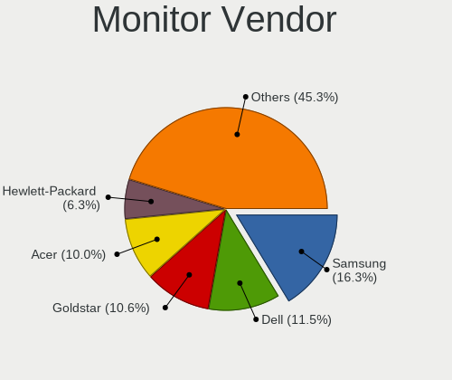

| Vendor               | Desktops | Percent |
|----------------------|----------|---------|
| Samsung Electronics  | 156      | 16.28%  |
| Dell                 | 110      | 11.48%  |
| Goldstar             | 106      | 11.06%  |
| Acer                 | 95       | 9.92%   |
| Hewlett-Packard      | 60       | 6.26%   |
| AOC                  | 60       | 6.26%   |
| Ancor Communications | 49       | 5.11%   |
| BenQ                 | 42       | 4.38%   |
| Philips              | 24       | 2.51%   |
| ASUSTek Computer     | 21       | 2.19%   |
| ViewSonic            | 20       | 2.09%   |
| Sony                 | 19       | 1.98%   |
| Lenovo               | 17       | 1.77%   |
| Iiyama               | 16       | 1.67%   |
| Toshiba              | 10       | 1.04%   |
| Vizio                | 9        | 0.94%   |
| Sceptre Tech         | 8        | 0.84%   |
| LG Electronics       | 7        | 0.73%   |
| Unknown              | 6        | 0.63%   |
| MStar                | 6        | 0.63%   |
| MSI                  | 5        | 0.52%   |
| Eizo                 | 5        | 0.52%   |
| Panasonic            | 4        | 0.42%   |
| ONN                  | 4        | 0.42%   |
| Insignia             | 4        | 0.42%   |
| HannStar             | 4        | 0.42%   |
| Vestel Elektronik    | 3        | 0.31%   |
| Pixio                | 3        | 0.31%   |
| Medion               | 3        | 0.31%   |
| Fujitsu Siemens      | 3        | 0.31%   |
| CVT                  | 3        | 0.31%   |
| Westinghouse         | 2        | 0.21%   |
| Videoseven           | 2        | 0.21%   |
| Sharp                | 2        | 0.21%   |
| Seiki                | 2        | 0.21%   |
| Pioneer              | 2        | 0.21%   |
| MiTAC                | 2        | 0.21%   |
| Mi                   | 2        | 0.21%   |
| Hitachi              | 2        | 0.21%   |
| Apple                | 2        | 0.21%   |

Monitor Model
-------------

Monitor models

| Model                                                                | Desktops | Percent |
|----------------------------------------------------------------------|----------|---------|
| Goldstar ULTRAWIDE GSM59F1 2560x1080 798x334mm 34.1-inch             | 15       | 1.49%   |
| Samsung Electronics C24F390 SAM0D2C 1920x1080 521x293mm 23.5-inch    | 9        | 0.89%   |
| Acer V246HQL ACR0424 1920x1080 521x293mm 23.5-inch                   | 8        | 0.79%   |
| Goldstar FULL HD GSM5B55 1920x1080 480x270mm 21.7-inch               | 7        | 0.69%   |
| Samsung Electronics S24F350 SAM0D20 1920x1080 520x290mm 23.4-inch    | 5        | 0.5%    |
| Samsung Electronics C27F390 SAM0D32 1920x1080 598x336mm 27.0-inch    | 5        | 0.5%    |
| AOC 24B1W AOC2401 1920x1080 521x293mm 23.5-inch                      | 5        | 0.5%    |
| AOC 2460G5 AOC2460 1920x1080 531x299mm 24.0-inch                     | 5        | 0.5%    |
| Philips PHL 243V7 PHLC155 1920x1080 527x296mm 23.8-inch              | 4        | 0.4%    |
| Panasonic TV MEIA296 1920x1080 698x392mm 31.5-inch                   | 4        | 0.4%    |
| ONN ONA18HO015 ONN0101 1920x1080 698x393mm 31.5-inch                 | 4        | 0.4%    |
| Goldstar ULTRAWIDE GSM76F9 2560x1080 531x298mm 24.0-inch             | 4        | 0.4%    |
| Goldstar Ultra HD GSM5B09 3840x2160 600x340mm 27.2-inch              | 4        | 0.4%    |
| Goldstar LG ULTRAGEAR GSM5B7F 2560x1440 600x340mm 27.2-inch          | 4        | 0.4%    |
| Goldstar 2D HD TV GSM59CA 1366x768 509x286mm 23.0-inch               | 4        | 0.4%    |
| Dell S2716DG DELA0D1 2560x1440 598x336mm 27.0-inch                   | 4        | 0.4%    |
| BenQ GL2460 BNQ78CE 1920x1080 531x299mm 24.0-inch                    | 4        | 0.4%    |
| AOC 27V2G5 AOC2702 1920x1080 598x336mm 27.0-inch                     | 4        | 0.4%    |
| AOC 24G2W1G5 AOC2402 1920x1080 527x296mm 23.8-inch                   | 4        | 0.4%    |
| Vizio D32f-G1 VIZ1027 1920x1080 698x392mm 31.5-inch                  | 3        | 0.3%    |
| Vestel Elektronik 40UHD_LCD_TV VES3700 3840x2160 890x500mm 40.2-inch | 3        | 0.3%    |
| Samsung Electronics U28E590 SAM0C4D 3840x2160 607x345mm 27.5-inch    | 3        | 0.3%    |
| Samsung Electronics S24E390 SAM0C1A 1920x1080 521x293mm 23.5-inch    | 3        | 0.3%    |
| MStar TV MST0030 1920x1080 708x398mm 32.0-inch                       | 3        | 0.3%    |
| Lenovo LEN L24q-30 LEN65FB 2560x1440 527x296mm 23.8-inch             | 3        | 0.3%    |
| Hewlett-Packard LE1901w HWP2842 1440x900 410x256mm 19.0-inch         | 3        | 0.3%    |
| Hewlett-Packard 27es HWP3325 1920x1080 598x336mm 27.0-inch           | 3        | 0.3%    |
| Goldstar IPS FULLHD GSM5AB8 1920x1080 480x270mm 21.7-inch            | 3        | 0.3%    |
| Goldstar HDR 4K GSM7707 3840x2160 600x340mm 27.2-inch                | 3        | 0.3%    |
| Dell U3219Q DELA124 3840x2160 697x392mm 31.5-inch                    | 3        | 0.3%    |
| Dell U2718Q DELA0EC 3840x2160 610x350mm 27.7-inch                    | 3        | 0.3%    |
| Dell U2412M DELA07A 1920x1200 518x324mm 24.1-inch                    | 3        | 0.3%    |
| Dell SE2417HG DELD08D 1920x1080 521x293mm 23.5-inch                  | 3        | 0.3%    |
| BenQ GW2470 BNQ78D9 1920x1080 527x296mm 23.8-inch                    | 3        | 0.3%    |
| ASUSTek Computer VP28U AUS28B1 3840x2160 621x341mm 27.9-inch         | 3        | 0.3%    |
| AOC 936W AOC1936 1366x768 410x230mm 18.5-inch                        | 3        | 0.3%    |
| AOC 2460G5 AOC246A 1920x1080 531x299mm 24.0-inch                     | 3        | 0.3%    |
| AOC 1970W AOC1970 1366x768 410x230mm 18.5-inch                       | 3        | 0.3%    |
| Ancor Communications VS248 ACI2498 1920x1080 531x299mm 24.0-inch     | 3        | 0.3%    |
| Ancor Communications VE248 ACI2494 1920x1080 531x299mm 24.0-inch     | 3        | 0.3%    |

Monitor Resolution
------------------

Monitor screen resolution

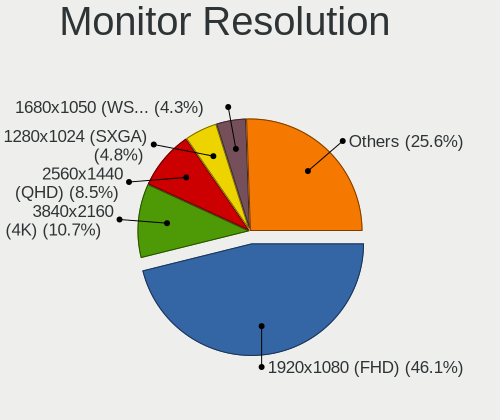

| Resolution         | Desktops | Percent |
|--------------------|----------|---------|
| 1920x1080 (FHD)    | 418      | 45.88%  |
| 3840x2160 (4K)     | 99       | 10.87%  |
| 2560x1440 (QHD)    | 80       | 8.78%   |
| 1280x1024 (SXGA)   | 43       | 4.72%   |
| 1680x1050 (WSXGA+) | 39       | 4.28%   |
| 1366x768 (WXGA)    | 38       | 4.17%   |
| 1440x900 (WXGA+)   | 36       | 3.95%   |
| 2560x1080          | 27       | 2.96%   |
| 1920x1200 (WUXGA)  | 25       | 2.74%   |
| 1600x900 (HD+)     | 21       | 2.31%   |
| 3440x1440          | 19       | 2.09%   |
| 1920x540           | 12       | 1.32%   |
| Unknown            | 11       | 1.21%   |
| 3840x1080          | 7        | 0.77%   |
| 1360x768           | 7        | 0.77%   |
| 1280x720 (HD)      | 4        | 0.44%   |
| 2560x1600          | 3        | 0.33%   |
| 3840x1600          | 2        | 0.22%   |
| 3840x1200          | 2        | 0.22%   |
| 2048x1152          | 2        | 0.22%   |
| 1600x1200          | 2        | 0.22%   |
| 9840x3840          | 1        | 0.11%   |
| 8320x2160          | 1        | 0.11%   |
| 7680x2160          | 1        | 0.11%   |
| 6400x1440          | 1        | 0.11%   |
| 5280x1080          | 1        | 0.11%   |
| 5120x1440          | 1        | 0.11%   |
| 4480x1440          | 1        | 0.11%   |
| 4096x2160          | 1        | 0.11%   |
| 4080x2030          | 1        | 0.11%   |
| 4080x2026          | 1        | 0.11%   |
| 2720x1024          | 1        | 0.11%   |
| 2160x1200          | 1        | 0.11%   |
| 1920x1440          | 1        | 0.11%   |
| 1792x1344          | 1        | 0.11%   |

Monitor Diagonal
----------------

Diagonal size in inches

| Inches  | Desktops | Percent |
|---------|----------|---------|
| 27      | 160      | 16.84%  |
| 24      | 140      | 14.74%  |
| 23      | 122      | 12.84%  |
| 21      | 87       | 9.16%   |
| 19      | 50       | 5.26%   |
| Unknown | 47       | 4.95%   |
| 31      | 45       | 4.74%   |
| 34      | 40       | 4.21%   |
| 18      | 38       | 4%      |
| 22      | 29       | 3.05%   |
| 17      | 24       | 2.53%   |
| 20      | 23       | 2.42%   |
| 72      | 18       | 1.89%   |
| 32      | 18       | 1.89%   |
| 84      | 16       | 1.68%   |
| 54      | 11       | 1.16%   |
| 15      | 8        | 0.84%   |
| 49      | 7        | 0.74%   |
| 65      | 6        | 0.63%   |
| 25      | 6        | 0.63%   |
| 48      | 5        | 0.53%   |
| 29      | 5        | 0.53%   |
| 52      | 4        | 0.42%   |
| 46      | 4        | 0.42%   |
| 40      | 4        | 0.42%   |
| 35      | 4        | 0.42%   |
| 26      | 4        | 0.42%   |
| 50      | 3        | 0.32%   |
| 36      | 3        | 0.32%   |
| 55      | 2        | 0.21%   |
| 47      | 2        | 0.21%   |
| 43      | 2        | 0.21%   |
| 41      | 2        | 0.21%   |
| 39      | 2        | 0.21%   |
| 33      | 2        | 0.21%   |
| 11      | 2        | 0.21%   |
| 58      | 1        | 0.11%   |
| 57      | 1        | 0.11%   |
| 37      | 1        | 0.11%   |
| 16      | 1        | 0.11%   |

Monitor Width
-------------

Physical width

| Width in mm | Desktops | Percent |
|-------------|----------|---------|
| 501-600     | 369      | 40.77%  |
| 401-500     | 201      | 22.21%  |
| 601-700     | 69       | 7.62%   |
| 701-800     | 61       | 6.74%   |
| 1001-1500   | 47       | 5.19%   |
| Unknown     | 47       | 5.19%   |
| 1501-2000   | 34       | 3.76%   |
| 351-400     | 31       | 3.43%   |
| 301-350     | 28       | 3.09%   |
| 801-900     | 12       | 1.33%   |
| 201-300     | 4        | 0.44%   |
| 901-1000    | 2        | 0.22%   |

Aspect Ratio
------------

Proportional relationship between the width and the height

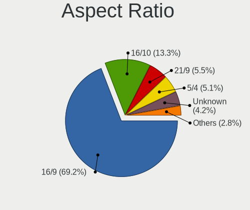

| Ratio   | Desktops | Percent |
|---------|----------|---------|
| 16/9    | 587      | 69.22%  |
| 16/10   | 113      | 13.33%  |
| 21/9    | 45       | 5.31%   |
| 5/4     | 43       | 5.07%   |
| Unknown | 35       | 4.13%   |
| 32/9    | 8        | 0.94%   |
| 4/3     | 7        | 0.83%   |
| 6/5     | 3        | 0.35%   |
| 1.96    | 3        | 0.35%   |
| 3/2     | 2        | 0.24%   |
| 3.20    | 2        | 0.24%   |

Monitor Area
------------

Area in inch

| Area in inch | Desktops | Percent |
|----------------|----------|---------|
| 201-250        | 293      | 31.51%  |
| 301-350        | 162      | 17.42%  |
| 351-500        | 110      | 11.83%  |
| 151-200        | 101      | 10.86%  |
| More than 1000 | 66       | 7.1%    |
| 251-300        | 57       | 6.13%   |
| 141-150        | 50       | 5.38%   |
| Unknown        | 47       | 5.05%   |
| 501-1000       | 29       | 3.12%   |
| 101-110        | 7        | 0.75%   |
| 131-140        | 4        | 0.43%   |
| 51-60          | 2        | 0.22%   |
| 121-130        | 1        | 0.11%   |
| 91-100         | 1        | 0.11%   |

Pixel Density
-------------

Pixels per inch

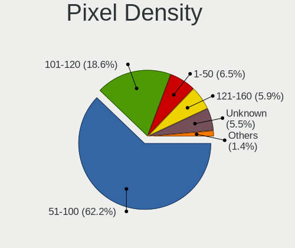

| Density | Desktops | Percent |
|---------|----------|---------|
| 51-100  | 529      | 61.8%   |
| 101-120 | 160      | 18.69%  |
| 1-50    | 55       | 6.43%   |
| 121-160 | 50       | 5.84%   |
| Unknown | 47       | 5.49%   |
| 161-240 | 15       | 1.75%   |

Multiple Monitors
-----------------

Total monitors connected

| Total | Desktops | Percent |
|-------|----------|---------|
| 1     | 610      | 69.63%  |
| 2     | 187      | 21.35%  |
| 0     | 55       | 6.28%   |
| 3     | 22       | 2.51%   |
| 4     | 2        | 0.23%   |

Network
-------

Net Controller Vendor
---------------------

Controller vendors

| Vendor                           | Desktops | Percent |
|----------------------------------|----------|---------|
| Realtek Semiconductor            | 517      | 40.97%  |
| Intel                            | 384      | 30.43%  |
| Qualcomm Atheros                 | 78       | 6.18%   |
| Broadcom                         | 44       | 3.49%   |
| Ralink Technology                | 37       | 2.93%   |
| TP-Link                          | 21       | 1.66%   |
| Nvidia                           | 17       | 1.35%   |
| Qualcomm Atheros Communications  | 15       | 1.19%   |
| Microsoft                        | 14       | 1.11%   |
| Samsung Electronics              | 11       | 0.87%   |
| Aquantia                         | 11       | 0.87%   |
| Ralink                           | 10       | 0.79%   |
| NetGear                          | 9        | 0.71%   |
| Huawei Technologies              | 7        | 0.55%   |
| Marvell Technology Group         | 6        | 0.48%   |
| InterBiometrics                  | 6        | 0.48%   |
| Xiaomi                           | 5        | 0.4%    |
| Broadcom Limited                 | 5        | 0.4%    |
| ASUSTek Computer                 | 5        | 0.4%    |
| Google                           | 4        | 0.32%   |
| Gemtek                           | 4        | 0.32%   |
| D-Link                           | 4        | 0.32%   |
| Mercucys                         | 3        | 0.24%   |
| Linksys                          | 3        | 0.24%   |
| Edimax Technology                | 3        | 0.24%   |
| DisplayLink                      | 3        | 0.24%   |
| Belkin Components                | 3        | 0.24%   |
| AVM                              | 3        | 0.24%   |
| ASIX Electronics                 | 3        | 0.24%   |
| OPPO Electronics                 | 2        | 0.16%   |
| OnePlus Technology (Shenzhen)    | 2        | 0.16%   |
| Microchip Technology             | 2        | 0.16%   |
| Wilocity                         | 1        | 0.08%   |
| VIA Technologies                 | 1        | 0.08%   |
| Texas Instruments                | 1        | 0.08%   |
| Sitecom Europe                   | 1        | 0.08%   |
| Silicon Integrated Systems [SiS] | 1        | 0.08%   |
| Pulse-Eight                      | 1        | 0.08%   |
| Mellanox Technologies            | 1        | 0.08%   |
| MediaTek                         | 1        | 0.08%   |

Net Controller Model
--------------------

Controller models

| Model                                                             | Desktops | Percent |
|-------------------------------------------------------------------|----------|---------|
| Realtek RTL8111/8168/8411 PCI Express Gigabit Ethernet Controller | 423      | 29.4%   |
| Intel I211 Gigabit Network Connection                             | 106      | 7.37%   |
| Intel Wi-Fi 6 AX200                                               | 67       | 4.66%   |
| Realtek RTL8125 2.5GbE Controller                                 | 39       | 2.71%   |
| Intel Ethernet Connection (2) I219-V                              | 35       | 2.43%   |
| Intel 82579LM Gigabit Network Connection (Lewisville)             | 35       | 2.43%   |
| Intel Wireless-AC 9260                                            | 25       | 1.74%   |
| Intel Ethernet Connection (7) I219-V                              | 25       | 1.74%   |
| Intel Dual Band Wireless-AC 3168NGW [Stone Peak]                  | 23       | 1.6%    |
| Realtek RTL88x2bu [AC1200 Techkey]                                | 18       | 1.25%   |
| Intel Ethernet Connection I217-LM                                 | 16       | 1.11%   |
| Ralink MT7601U Wireless Adapter                                   | 15       | 1.04%   |
| Intel Ethernet Connection (2) I218-V                              | 14       | 0.97%   |
| Realtek RTL8188EUS 802.11n Wireless Network Adapter               | 13       | 0.9%    |
| Intel 82579V Gigabit Network Connection                           | 13       | 0.9%    |
| Realtek 802.11ac NIC                                              | 12       | 0.83%   |
| Intel Cannon Lake PCH CNVi WiFi                                   | 12       | 0.83%   |
| Broadcom BCM4360 802.11ac Wireless Network Adapter                | 12       | 0.83%   |
| Qualcomm Atheros AR9485 Wireless Network Adapter                  | 11       | 0.76%   |
| Intel Ethernet Connection I217-V                                  | 11       | 0.76%   |
| Intel 82574L Gigabit Network Connection                           | 11       | 0.76%   |
| Qualcomm Atheros Killer E220x Gigabit Ethernet Controller         | 10       | 0.69%   |
| Qualcomm Atheros AR9271 802.11n                                   | 10       | 0.69%   |
| Nvidia MCP61 Ethernet                                             | 10       | 0.69%   |
| Microsoft Xbox 360 Wireless Adapter                               | 10       | 0.69%   |
| Aquantia AQC107 NBase-T/IEEE 802.3bz Ethernet Controller [AQtion] | 10       | 0.69%   |
| Realtek RTL810xE PCI Express Fast Ethernet controller             | 9        | 0.63%   |
| Intel Ethernet Controller I225-V                                  | 9        | 0.63%   |
| Realtek RTL8812AE 802.11ac PCIe Wireless Network Adapter          | 8        | 0.56%   |
| Qualcomm Atheros AR8151 v2.0 Gigabit Ethernet                     | 8        | 0.56%   |
| Intel 82567LM-3 Gigabit Network Connection                        | 8        | 0.56%   |
| Realtek RTL8821AE 802.11ac PCIe Wireless Network Adapter          | 7        | 0.49%   |
| Ralink RT2870/RT3070 Wireless Adapter                             | 7        | 0.49%   |
| Qualcomm Atheros AR8161 Gigabit Ethernet                          | 7        | 0.49%   |
| Intel Wireless 8265 / 8275                                        | 7        | 0.49%   |
| Huawei STK-L21                                                    | 7        | 0.49%   |
| TP-Link TL-WN823N v2/v3 [Realtek RTL8192EU]                       | 6        | 0.42%   |
| Realtek RTL8153 Gigabit Ethernet Adapter                          | 6        | 0.42%   |
| Ralink RT5370 Wireless Adapter                                    | 6        | 0.42%   |
| InterBiometrics Io                                                | 6        | 0.42%   |

Wireless Vendor
---------------

Wireless vendors

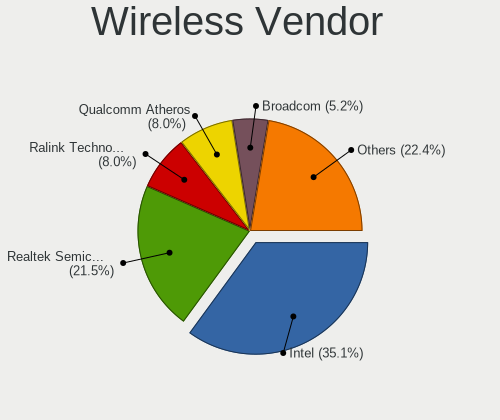

| Vendor                          | Desktops | Percent |
|---------------------------------|----------|---------|
| Intel                           | 162      | 34.91%  |
| Realtek Semiconductor           | 100      | 21.55%  |
| Ralink Technology               | 37       | 7.97%   |
| Qualcomm Atheros                | 37       | 7.97%   |
| Broadcom                        | 24       | 5.17%   |
| TP-Link                         | 20       | 4.31%   |
| Qualcomm Atheros Communications | 15       | 3.23%   |
| Microsoft                       | 14       | 3.02%   |
| Ralink                          | 10       | 2.16%   |
| NetGear                         | 9        | 1.94%   |
| ASUSTek Computer                | 5        | 1.08%   |
| Gemtek                          | 4        | 0.86%   |
| D-Link                          | 4        | 0.86%   |
| Mercucys                        | 3        | 0.65%   |
| Edimax Technology               | 3        | 0.65%   |
| Belkin Components               | 3        | 0.65%   |
| AVM                             | 3        | 0.65%   |
| Linksys                         | 2        | 0.43%   |
| Broadcom Limited                | 2        | 0.43%   |
| Wilocity                        | 1        | 0.22%   |
| Texas Instruments               | 1        | 0.22%   |
| Sitecom Europe                  | 1        | 0.22%   |
| Samsung Electronics             | 1        | 0.22%   |
| MediaTek                        | 1        | 0.22%   |
| IMC Networks                    | 1        | 0.22%   |
| BUFFALO                         | 1        | 0.22%   |

Wireless Model
--------------

Wireless models

| Model                                                                                | Desktops | Percent |
|--------------------------------------------------------------------------------------|----------|---------|
| Intel Wi-Fi 6 AX200                                                                  | 67       | 14.35%  |
| Intel Wireless-AC 9260                                                               | 25       | 5.35%   |
| Intel Dual Band Wireless-AC 3168NGW [Stone Peak]                                     | 23       | 4.93%   |
| Realtek RTL88x2bu [AC1200 Techkey]                                                   | 18       | 3.85%   |
| Ralink MT7601U Wireless Adapter                                                      | 15       | 3.21%   |
| Realtek RTL8188EUS 802.11n Wireless Network Adapter                                  | 13       | 2.78%   |
| Realtek 802.11ac NIC                                                                 | 12       | 2.57%   |
| Intel Cannon Lake PCH CNVi WiFi                                                      | 12       | 2.57%   |
| Broadcom BCM4360 802.11ac Wireless Network Adapter                                   | 12       | 2.57%   |
| Qualcomm Atheros AR9485 Wireless Network Adapter                                     | 11       | 2.36%   |
| Qualcomm Atheros AR9271 802.11n                                                      | 10       | 2.14%   |
| Microsoft Xbox 360 Wireless Adapter                                                  | 10       | 2.14%   |
| Realtek RTL8812AE 802.11ac PCIe Wireless Network Adapter                             | 8        | 1.71%   |
| Realtek RTL8821AE 802.11ac PCIe Wireless Network Adapter                             | 7        | 1.5%    |
| Ralink RT2870/RT3070 Wireless Adapter                                                | 7        | 1.5%    |
| Intel Wireless 8265 / 8275                                                           | 7        | 1.5%    |
| TP-Link TL-WN823N v2/v3 [Realtek RTL8192EU]                                          | 6        | 1.28%   |
| Ralink RT5370 Wireless Adapter                                                       | 6        | 1.28%   |
| Broadcom BCM4352 802.11ac Wireless Network Adapter                                   | 6        | 1.28%   |
| Realtek RTL8821CE 802.11ac PCIe Wireless Network Adapter                             | 5        | 1.07%   |
| Realtek RTL8812AU 802.11a/b/g/n/ac 2T2R DB WLAN Adapter                              | 5        | 1.07%   |
| Realtek RTL8192EE PCIe Wireless Network Adapter                                      | 5        | 1.07%   |
| Realtek RTL8192CU 802.11n WLAN Adapter                                               | 5        | 1.07%   |
| Qualcomm Atheros AR93xx Wireless Network Adapter                                     | 5        | 1.07%   |
| Intel Wireless 7265                                                                  | 5        | 1.07%   |
| Intel Wireless 7260                                                                  | 5        | 1.07%   |
| TP-Link AC600 wireless Realtek RTL8811AU [Archer T2U Nano]                           | 4        | 0.86%   |
| Realtek RTL8822BE 802.11a/b/g/n/ac WiFi adapter                                      | 4        | 0.86%   |
| Realtek RTL8188FTV 802.11b/g/n 1T1R 2.4G WLAN Adapter                                | 4        | 0.86%   |
| Ralink RT5572 Wireless Adapter                                                       | 4        | 0.86%   |
| Qualcomm Atheros QCA9565 / AR9565 Wireless Network Adapter                           | 4        | 0.86%   |
| Intel Wireless 8260                                                                  | 4        | 0.86%   |
| Gemtek WUBR-177G [Ralink RT2571W]                                                    | 4        | 0.86%   |
| TP-Link TL-WN722N v2/v3 [Realtek RTL8188EUS]                                         | 3        | 0.64%   |
| Realtek RTL8192EU 802.11b/g/n WLAN Adapter                                           | 3        | 0.64%   |
| Realtek RTL8188EE Wireless Network Adapter                                           | 3        | 0.64%   |
| Ralink RT3090 Wireless 802.11n 1T/1R PCIe                                            | 3        | 0.64%   |
| Qualcomm Atheros TP-Link TL-WN821N v3 / TL-WN822N v2 802.11n [Atheros AR7010+AR9287] | 3        | 0.64%   |
| Qualcomm Atheros AR928X Wireless Network Adapter (PCI-Express)                       | 3        | 0.64%   |
| Qualcomm Atheros AR9227 Wireless Network Adapter                                     | 3        | 0.64%   |

Ethernet Vendor
---------------

Ethernet vendors

| Vendor                           | Desktops | Percent |
|----------------------------------|----------|---------|
| Realtek Semiconductor            | 480      | 50.96%  |
| Intel                            | 317      | 33.65%  |
| Qualcomm Atheros                 | 41       | 4.35%   |
| Broadcom                         | 20       | 2.12%   |
| Nvidia                           | 17       | 1.8%    |
| Aquantia                         | 11       | 1.17%   |
| Samsung Electronics              | 10       | 1.06%   |
| Huawei Technologies              | 7        | 0.74%   |
| Marvell Technology Group         | 6        | 0.64%   |
| Xiaomi                           | 5        | 0.53%   |
| Google                           | 4        | 0.42%   |
| DisplayLink                      | 3        | 0.32%   |
| Broadcom Limited                 | 3        | 0.32%   |
| ASIX Electronics                 | 3        | 0.32%   |
| OPPO Electronics                 | 2        | 0.21%   |
| OnePlus Technology (Shenzhen)    | 2        | 0.21%   |
| VIA Technologies                 | 1        | 0.11%   |
| TP-Link                          | 1        | 0.11%   |
| Silicon Integrated Systems [SiS] | 1        | 0.11%   |
| Mellanox Technologies            | 1        | 0.11%   |
| Linksys                          | 1        | 0.11%   |
| Lenovo                           | 1        | 0.11%   |
| ICS Advent                       | 1        | 0.11%   |
| Hangzhou Silan Microelectronics  | 1        | 0.11%   |
| Emulex                           | 1        | 0.11%   |
| D-Link System                    | 1        | 0.11%   |
| 3Com                             | 1        | 0.11%   |

Ethernet Model
--------------

Ethernet models

| Model                                                             | Desktops | Percent |
|-------------------------------------------------------------------|----------|---------|
| Realtek RTL8111/8168/8411 PCI Express Gigabit Ethernet Controller | 423      | 44.15%  |
| Intel I211 Gigabit Network Connection                             | 106      | 11.06%  |
| Realtek RTL8125 2.5GbE Controller                                 | 39       | 4.07%   |
| Intel Ethernet Connection (2) I219-V                              | 35       | 3.65%   |
| Intel 82579LM Gigabit Network Connection (Lewisville)             | 35       | 3.65%   |
| Intel Ethernet Connection (7) I219-V                              | 25       | 2.61%   |
| Intel Ethernet Connection I217-LM                                 | 16       | 1.67%   |
| Intel Ethernet Connection (2) I218-V                              | 14       | 1.46%   |
| Intel 82579V Gigabit Network Connection                           | 13       | 1.36%   |
| Intel Ethernet Connection I217-V                                  | 11       | 1.15%   |
| Intel 82574L Gigabit Network Connection                           | 11       | 1.15%   |
| Qualcomm Atheros Killer E220x Gigabit Ethernet Controller         | 10       | 1.04%   |
| Nvidia MCP61 Ethernet                                             | 10       | 1.04%   |
| Aquantia AQC107 NBase-T/IEEE 802.3bz Ethernet Controller [AQtion] | 10       | 1.04%   |
| Realtek RTL810xE PCI Express Fast Ethernet controller             | 9        | 0.94%   |
| Intel Ethernet Controller I225-V                                  | 9        | 0.94%   |
| Qualcomm Atheros AR8151 v2.0 Gigabit Ethernet                     | 8        | 0.84%   |
| Intel 82567LM-3 Gigabit Network Connection                        | 8        | 0.84%   |
| Qualcomm Atheros AR8161 Gigabit Ethernet                          | 7        | 0.73%   |
| Huawei STK-L21                                                    | 7        | 0.73%   |
| Realtek RTL8153 Gigabit Ethernet Adapter                          | 6        | 0.63%   |
| Intel I210 Gigabit Network Connection                             | 6        | 0.63%   |
| Intel Ethernet Connection (2) I219-LM                             | 6        | 0.63%   |
| Xiaomi Mi/Redmi series (RNDIS)                                    | 5        | 0.52%   |
| Samsung GT-I9070 (network tethering, USB debugging enabled)       | 5        | 0.52%   |
| Samsung Galaxy series, misc. (tethering mode)                     | 5        | 0.52%   |
| Qualcomm Atheros Killer E2500 Gigabit Ethernet Controller         | 5        | 0.52%   |
| Realtek RTL-8100/8101L/8139 PCI Fast Ethernet Adapter             | 4        | 0.42%   |
| Qualcomm Atheros Killer E2400 Gigabit Ethernet Controller         | 4        | 0.42%   |
| Intel Ethernet Connection (2) I218-LM                             | 4        | 0.42%   |
| Intel 82583V Gigabit Network Connection                           | 4        | 0.42%   |
| Google Nexus/Pixel Device (tether)                                | 4        | 0.42%   |
| Broadcom NetXtreme BCM5764M Gigabit Ethernet PCIe                 | 4        | 0.42%   |
| Realtek RTL-8110SC/8169SC Gigabit Ethernet                        | 3        | 0.31%   |
| Qualcomm Atheros AR8121/AR8113/AR8114 Gigabit or Fast Ethernet    | 3        | 0.31%   |
| Marvell Group 88E8056 PCI-E Gigabit Ethernet Controller           | 3        | 0.31%   |
| Intel 82578DM Gigabit Network Connection                          | 3        | 0.31%   |
| Broadcom NetXtreme BCM5761 Gigabit Ethernet PCIe                  | 3        | 0.31%   |
| Broadcom NetLink BCM57781 Gigabit Ethernet PCIe                   | 3        | 0.31%   |
| Qualcomm Atheros AR8131 Gigabit Ethernet                          | 2        | 0.21%   |

Net Controller Kind
-------------------

Ethernet, WiFi or modem

| Kind     | Desktops | Percent |
|----------|----------|---------|
| Ethernet | 850      | 65.94%  |
| WiFi     | 425      | 32.97%  |
| Modem    | 13       | 1.01%   |
| Unknown  | 1        | 0.08%   |

Used Controller
---------------

Currently used network controller

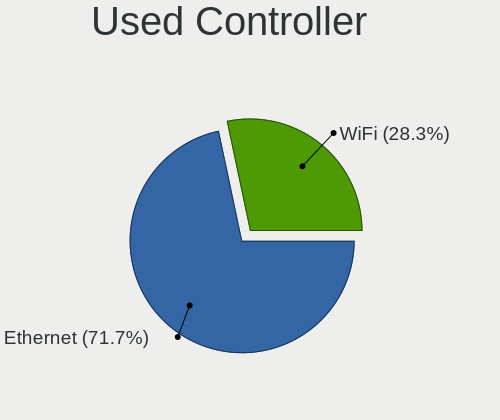

| Kind     | Desktops | Percent |
|----------|----------|---------|
| Ethernet | 647      | 71.73%  |
| WiFi     | 255      | 28.27%  |

NICs
----

Total network controllers on board

| Total | Desktops | Percent |
|-------|----------|---------|
| 1     | 547      | 63.53%  |
| 2     | 257      | 29.85%  |
| 3     | 41       | 4.76%   |
| 4     | 8        | 0.93%   |
| 0     | 7        | 0.81%   |
| 10    | 1        | 0.12%   |

IPv6
----

IPv6 vs IPv4

| Used | Desktops | Percent |
|------|----------|---------|
| No   | 807      | 93.73%  |
| Yes  | 54       | 6.27%   |

Bluetooth
---------

Bluetooth Vendor
----------------

Controller vendors

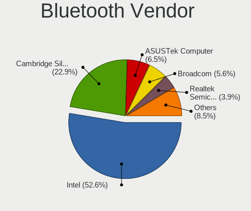

| Vendor                          | Desktops | Percent |
|---------------------------------|----------|---------|
| Intel                           | 160      | 52.63%  |
| Cambridge Silicon Radio         | 69       | 22.7%   |
| ASUSTek Computer                | 20       | 6.58%   |
| Broadcom                        | 17       | 5.59%   |
| Realtek Semiconductor           | 12       | 3.95%   |
| Qualcomm Atheros Communications | 8        | 2.63%   |
| Apple                           | 5        | 1.64%   |
| IMC Networks                    | 3        | 0.99%   |
| Realtek                         | 2        | 0.66%   |
| HTC (High Tech Computer)        | 2        | 0.66%   |
| Conwise Technology              | 2        | 0.66%   |
| Primax Electronics              | 1        | 0.33%   |
| Logitech                        | 1        | 0.33%   |
| Dynex                           | 1        | 0.33%   |
| Dell                            | 1        | 0.33%   |

Bluetooth Model
---------------

Controller models

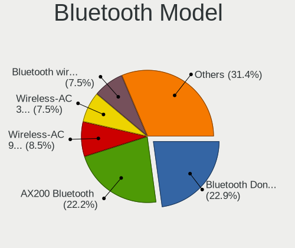

| Model                                                                | Desktops | Percent |
|----------------------------------------------------------------------|----------|---------|
| Cambridge Silicon Radio Bluetooth Dongle (HCI mode)                  | 69       | 22.7%   |
| Intel AX200 Bluetooth                                                | 68       | 22.37%  |
| Intel Wireless-AC 9260 Bluetooth Adapter                             | 25       | 8.22%   |
| Intel Wireless-AC 3168 Bluetooth                                     | 23       | 7.57%   |
| Intel Bluetooth wireless interface                                   | 23       | 7.57%   |
| Broadcom BCM20702A0 Bluetooth 4.0                                    | 14       | 4.61%   |
| Intel Bluetooth 9460/9560 Jefferson Peak (JfP)                       | 13       | 4.28%   |
| ASUS Broadcom BCM20702A0 Bluetooth                                   | 9        | 2.96%   |
| Realtek Bluetooth Radio                                              | 6        | 1.97%   |
| ASUS Bluetooth Radio                                                 | 5        | 1.64%   |
| Qualcomm Atheros  Bluetooth Device                                   | 4        | 1.32%   |
| Realtek RTL8821A Bluetooth                                           | 3        | 0.99%   |
| Realtek  Bluetooth 4.2 Adapter                                       | 3        | 0.99%   |
| Intel AX210 Bluetooth                                                | 3        | 0.99%   |
| Intel AX201 Bluetooth                                                | 3        | 0.99%   |
| ASUS BCM20702A0                                                      | 3        | 0.99%   |
| Apple Built-in Bluetooth 2.0+EDR HCI                                 | 3        | 0.99%   |
| Realtek Bluetooth Radio                                              | 2        | 0.66%   |
| Qualcomm Atheros Bluetooth USB Host Controller                       | 2        | 0.66%   |
| Qualcomm Atheros AR9462 Bluetooth                                    | 2        | 0.66%   |
| Intel Centrino Bluetooth Wireless Transceiver                        | 2        | 0.66%   |
| IMC Networks Bluetooth Radio                                         | 2        | 0.66%   |
| HTC (High Tech Computer) Vive Hub Bluetooth 4.1 (Broadcom BCM920703) | 2        | 0.66%   |
| Conwise CW6622                                                       | 2        | 0.66%   |
| Broadcom BCM2045 Bluetooth                                           | 2        | 0.66%   |
| ASUS Bluetooth Device                                                | 2        | 0.66%   |
| Primax Rocketfish RF-FLBTAD Bluetooth Adapter                        | 1        | 0.33%   |
| Logitech BT Mini-Receiver (HCI mode)                                 | 1        | 0.33%   |
| IMC Networks BCM20702A0                                              | 1        | 0.33%   |
| Dynex Bluetooth 4.0 Adapter [Broadcom, 1.12, BCM20702A0]             | 1        | 0.33%   |
| Dell BT Mini-Receiver                                                | 1        | 0.33%   |
| Broadcom BCM92046DG-CL1ROM Bluetooth 2.1 Adapter                     | 1        | 0.33%   |
| ASUS Bluetooth Adapter                                               | 1        | 0.33%   |
| Apple Bluetooth USB Host Controller                                  | 1        | 0.33%   |
| Apple Bluetooth HCI                                                  | 1        | 0.33%   |

Sound
-----

Sound Vendor
------------

Sound card vendors

| Vendor                               | Desktops | Percent |
|--------------------------------------|----------|---------|
| AMD                                  | 466      | 30.14%  |
| Intel                                | 433      | 28.01%  |
| Nvidia                               | 396      | 25.61%  |
| C-Media Electronics                  | 45       | 2.91%   |
| Logitech                             | 19       | 1.23%   |
| Corsair                              | 16       | 1.03%   |
| Creative Labs                        | 14       | 0.91%   |
| Kingston Technology                  | 12       | 0.78%   |
| SteelSeries ApS                      | 11       | 0.71%   |
| Razer USA                            | 11       | 0.71%   |
| JMTek                                | 11       | 0.71%   |
| Texas Instruments                    | 7        | 0.45%   |
| Generalplus Technology               | 7        | 0.45%   |
| Samson Technologies                  | 6        | 0.39%   |
| Plantronics                          | 6        | 0.39%   |
| ASUSTek Computer                     | 6        | 0.39%   |
| Focusrite-Novation                   | 5        | 0.32%   |
| Creative Technology                  | 5        | 0.32%   |
| Turtle Beach                         | 4        | 0.26%   |
| Sony                                 | 4        | 0.26%   |
| Astro Gaming                         | 4        | 0.26%   |
| Tenx Technology                      | 3        | 0.19%   |
| M-Audio                              | 3        | 0.19%   |
| Hewlett-Packard                      | 3        | 0.19%   |
| Giga-Byte Technology                 | 3        | 0.19%   |
| FiiO Electronics Technology          | 3        | 0.19%   |
| Blue Microphones                     | 3        | 0.19%   |
| Yamaha                               | 2        | 0.13%   |
| Valve Software                       | 2        | 0.13%   |
| Unknown                              | 2        | 0.13%   |
| Realtek Semiconductor                | 2        | 0.13%   |
| Dell                                 | 2        | 0.13%   |
| AKAI Professional M.I.               | 2        | 0.13%   |
| XMOS                                 | 1        | 0.06%   |
| VIA Technologies                     | 1        | 0.06%   |
| Trust                                | 1        | 0.06%   |
| Thesycon Systemsoftware & Consulting | 1        | 0.06%   |
| Textech International                | 1        | 0.06%   |
| Silicon Integrated Systems [SiS]     | 1        | 0.06%   |
| Sennheiser Communications            | 1        | 0.06%   |

Sound Model
-----------

Sound card models

| Model                                                                      | Desktops | Percent |
|----------------------------------------------------------------------------|----------|---------|
| AMD Starship/Matisse HD Audio Controller                                   | 149      | 8.15%   |
| AMD Family 17h (Models 00h-0fh) HD Audio Controller                        | 93       | 5.09%   |
| AMD Ellesmere HDMI Audio [Radeon RX 470/480 / 570/580/590]                 | 81       | 4.43%   |
| Intel 6 Series/C200 Series Chipset Family High Definition Audio Controller | 64       | 3.5%    |
| AMD SBx00 Azalia (Intel HDA)                                               | 61       | 3.34%   |
| Intel 8 Series/C220 Series Chipset High Definition Audio Controller        | 55       | 3.01%   |
| AMD Navi 10 HDMI Audio                                                     | 49       | 2.68%   |
| Intel 200 Series PCH HD Audio                                              | 48       | 2.63%   |
| Nvidia GP104 High Definition Audio Controller                              | 47       | 2.57%   |
| Intel 7 Series/C216 Chipset Family High Definition Audio Controller        | 43       | 2.35%   |
| Nvidia GP107GL High Definition Audio Controller                            | 42       | 2.3%    |
| Intel 100 Series/C230 Series Chipset Family HD Audio Controller            | 41       | 2.24%   |
| AMD Family 17h/19h HD Audio Controller                                     | 40       | 2.19%   |
| Intel Xeon E3-1200 v3/4th Gen Core Processor HD Audio Controller           | 35       | 1.91%   |
| Intel Cannon Lake PCH cAVS                                                 | 32       | 1.75%   |
| Nvidia GP106 High Definition Audio Controller                              | 31       | 1.7%    |
| AMD Raven/Raven2/Fenghuang HDMI/DP Audio Controller                        | 31       | 1.7%    |
| Nvidia TU104 HD Audio Controller                                           | 30       | 1.64%   |
| Nvidia TU106 High Definition Audio Controller                              | 28       | 1.53%   |
| AMD FCH Azalia Controller                                                  | 28       | 1.53%   |
| Nvidia TU116 High Definition Audio Controller                              | 27       | 1.48%   |
| Intel 82801JI (ICH10 Family) HD Audio Controller                           | 24       | 1.31%   |
| Intel 9 Series Chipset Family HD Audio Controller                          | 21       | 1.15%   |
| Intel NM10/ICH7 Family High Definition Audio Controller                    | 20       | 1.09%   |
| AMD Oland/Hainan/Cape Verde/Pitcairn HDMI Audio [Radeon HD 7000 Series]    | 20       | 1.09%   |
| AMD Baffin HDMI/DP Audio [Radeon RX 550 640SP / RX 560/560X]               | 20       | 1.09%   |
| Nvidia GM107 High Definition Audio Controller [GeForce 940MX]              | 19       | 1.04%   |
| Nvidia GM206 High Definition Audio Controller                              | 16       | 0.88%   |
| Nvidia GF108 High Definition Audio Controller                              | 16       | 0.88%   |
| Nvidia GK208 HDMI/DP Audio Controller                                      | 15       | 0.82%   |
| Intel C600/X79 series chipset High Definition Audio Controller             | 15       | 0.82%   |
| Nvidia GM204 High Definition Audio Controller                              | 14       | 0.77%   |
| Nvidia GP102 HDMI Audio Controller                                         | 13       | 0.71%   |
| Nvidia GK104 HDMI Audio Controller                                         | 13       | 0.71%   |
| AMD Juniper HDMI Audio [Radeon HD 5700 Series]                             | 13       | 0.71%   |
| Nvidia MCP61 High Definition Audio                                         | 12       | 0.66%   |
| Nvidia High Definition Audio Controller                                    | 12       | 0.66%   |
| Intel 5 Series/3400 Series Chipset High Definition Audio                   | 12       | 0.66%   |
| Intel C610/X99 series chipset HD Audio Controller                          | 11       | 0.6%    |
| AMD Tahiti HDMI Audio [Radeon HD 7870 XT / 7950/7970]                      | 10       | 0.55%   |

Memory
------

Memory Vendor
-------------

Memory module vendors

| Vendor              | Desktops | Percent |
|---------------------|----------|---------|
| Kingston            | 34       | 19.21%  |
| Corsair             | 28       | 15.82%  |
| G.Skill             | 25       | 14.12%  |
| Unknown             | 23       | 12.99%  |
| Crucial             | 16       | 9.04%   |
| SK hynix            | 10       | 5.65%   |
| Samsung Electronics | 10       | 5.65%   |
| A-DATA Technology   | 8        | 4.52%   |
| Team                | 5        | 2.82%   |
| Micron Technology   | 4        | 2.26%   |
| Ramaxel Technology  | 2        | 1.13%   |
| Patriot             | 2        | 1.13%   |
| Smart               | 1        | 0.56%   |
| Patriot Memory      | 1        | 0.56%   |
| OLOY                | 1        | 0.56%   |
| HMD                 | 1        | 0.56%   |
| Goldkey             | 1        | 0.56%   |
| GLOWAY              | 1        | 0.56%   |
| EVGA                | 1        | 0.56%   |
| Elpida              | 1        | 0.56%   |
| Avant               | 1        | 0.56%   |
| ASint Technology    | 1        | 0.56%   |

Memory Model
------------

Memory module models

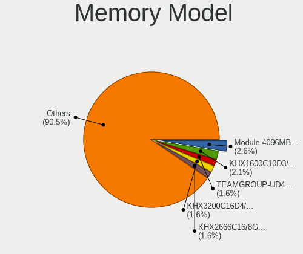

| Model                                                     | Desktops | Percent |
|-----------------------------------------------------------|----------|---------|
| Unknown RAM Module 4096MB DIMM 1333MT/s                   | 5        | 2.65%   |
| Kingston RAM KHX1600C10D3/8G 8192MB DIMM DDR3 1600MT/s    | 4        | 2.12%   |
| Team RAM TEAMGROUP-UD4-2666 32GB DIMM DDR4 3000MT/s       | 3        | 1.59%   |
| Kingston RAM KHX3200C16D4/8GX 8GB DIMM DDR4 3600MT/s      | 3        | 1.59%   |
| Kingston RAM KHX2666C16/8G 8GB DIMM DDR4 3466MT/s         | 3        | 1.59%   |
| Kingston RAM KHX1600C10D3/8GX 8192MB DIMM DDR3 1600MT/s   | 3        | 1.59%   |
| G.Skill RAM F4-3200C16-8GVKB 8GB DIMM DDR4 3866MT/s       | 3        | 1.59%   |
| Corsair RAM CMK16GX4M2B3200C16 8GB DIMM DDR4 3600MT/s     | 3        | 1.59%   |
| Unknown RAM Module 8192MB DIMM DDR3 1333MT/s              | 2        | 1.06%   |
| Unknown RAM Module 4096MB DIMM DDR3 1333MT/s              | 2        | 1.06%   |
| Unknown RAM Module 2048MB DIMM DDR2 800MT/s               | 2        | 1.06%   |
| Unknown RAM Module 1024MB DIMM DDR2 667MT/s               | 2        | 1.06%   |
| Kingston RAM KHX3000C15D4/8GX 8GB DIMM DDR4 3400MT/s      | 2        | 1.06%   |
| G.Skill RAM F4-3200C16-16GVK 16GB DIMM DDR4 3600MT/s      | 2        | 1.06%   |
| G.Skill RAM F4-3000C16-8GISB 8GB DIMM DDR4 3200MT/s       | 2        | 1.06%   |
| Crucial RAM BLS8G4D26BFSEK.8FD 8GB DIMM DDR4 3000MT/s     | 2        | 1.06%   |
| Corsair RAM CMK16GX4M2E3200C16 8GB DIMM DDR4 3200MT/s     | 2        | 1.06%   |
| A-DATA RAM DDR4 3200 16GB DIMM DDR4 3400MT/s              | 2        | 1.06%   |
| A-DATA RAM DDR4 3000 16384MB DIMM DDR4 3600MT/s           | 2        | 1.06%   |
| Unknown RAM Module 512MB DIMM DDR2 667MT/s                | 1        | 0.53%   |
| Unknown RAM Module 512MB DIMM DDR 333MT/s                 | 1        | 0.53%   |
| Unknown RAM Module 4096MB DIMM DDR4 2400MT/s              | 1        | 0.53%   |
| Unknown RAM Module 4096MB DIMM DDR3 1866MT/s              | 1        | 0.53%   |
| Unknown RAM Module 4096MB DIMM DDR2 800MT/s               | 1        | 0.53%   |
| Unknown RAM Module 32GB DIMM DDR4 3200MT/s                | 1        | 0.53%   |
| Unknown RAM Module 2048MB DIMM DDR3 1333MT/s              | 1        | 0.53%   |
| Unknown RAM Module 2048MB DIMM DDR2 667MT/s               | 1        | 0.53%   |
| Unknown RAM Module 2048MB DIMM 800MT/s                    | 1        | 0.53%   |
| Unknown RAM Module 2048MB DIMM 1333MT/s                   | 1        | 0.53%   |
| Unknown RAM Module 16384MB DIMM DDR4 2666MT/s             | 1        | 0.53%   |
| Unknown RAM Module 16384MB DIMM DDR4 2133MT/s             | 1        | 0.53%   |
| Unknown RAM Module 1024MB DIMM DDR 333MT/s                | 1        | 0.53%   |
| Unknown RAM 2400 C16 Series 8192MB DIMM DDR4 1200MT/s     | 1        | 0.53%   |
| Team RAM TEAMGROUP-UD4-3200 16GB DIMM DDR4 3800MT/s       | 1        | 0.53%   |
| Team RAM TEAMGROUP-UD4-3000 8GB DIMM DDR4 3200MT/s        | 1        | 0.53%   |
| Smart RAM SH564568FH8N0QHSCR 2GB DIMM DDR3 1333MT/s       | 1        | 0.53%   |
| SK hynix RAM MD4012NSE-HA3G3 00 8192MB DIMM DDR4 2400MT/s | 1        | 0.53%   |
| SK hynix RAM HYMP125U64CP8-S6 2GB DIMM DDR2 49926MT/s     | 1        | 0.53%   |
| SK hynix RAM HMT351U6CFR8C-PB 4096MB DIMM DDR3 1800MT/s   | 1        | 0.53%   |
| SK hynix RAM HMT325U6CFR8C-PB 2GB DIMM DDR3 1600MT/s      | 1        | 0.53%   |

Memory Kind
-----------

Memory module kinds

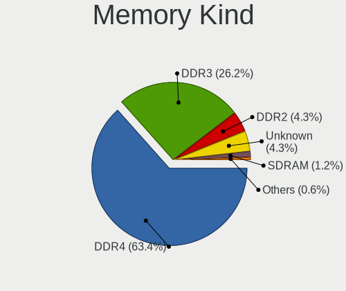

| Kind    | Desktops | Percent |
|---------|----------|---------|
| DDR4    | 104      | 63.41%  |
| DDR3    | 43       | 26.22%  |
| DDR2    | 7        | 4.27%   |
| Unknown | 7        | 4.27%   |
| SDRAM   | 2        | 1.22%   |
| DDR     | 1        | 0.61%   |

Memory Form Factor
------------------

Physical design of the memory module

| Name   | Desktops | Percent |
|--------|----------|---------|
| DIMM   | 157      | 97.52%  |
| SODIMM | 3        | 1.86%   |
| RIMM   | 1        | 0.62%   |

Memory Size
-----------

Memory module size

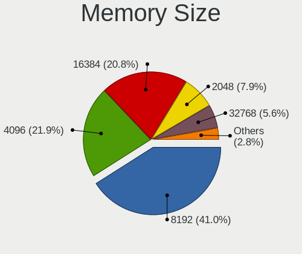

| Size  | Desktops | Percent |
|-------|----------|---------|
| 8192  | 73       | 41.01%  |
| 4096  | 39       | 21.91%  |
| 16384 | 37       | 20.79%  |
| 2048  | 14       | 7.87%   |
| 32768 | 10       | 5.62%   |
| 1024  | 3        | 1.69%   |
| 512   | 2        | 1.12%   |

Memory Speed
------------

Memory module speed

| Speed | Desktops | Percent |
|-------|----------|---------|
| 1333  | 23       | 13.22%  |
| 3600  | 22       | 12.64%  |
| 3200  | 21       | 12.07%  |
| 1600  | 16       | 9.2%    |
| 2400  | 12       | 6.9%    |
| 2133  | 9        | 5.17%   |
| 3000  | 8        | 4.6%    |
| 3400  | 6        | 3.45%   |
| 2667  | 6        | 3.45%   |
| 1867  | 6        | 3.45%   |
| 800   | 5        | 2.87%   |
| 3866  | 4        | 2.3%    |
| 3466  | 4        | 2.3%    |
| 2666  | 4        | 2.3%    |
| 1866  | 4        | 2.3%    |
| 667   | 4        | 2.3%    |
| 3800  | 3        | 1.72%   |
| 4400  | 2        | 1.15%   |
| 3533  | 2        | 1.15%   |
| 2134  | 2        | 1.15%   |
| 49926 | 1        | 0.57%   |
| 3733  | 1        | 0.57%   |
| 3666  | 1        | 0.57%   |
| 3334  | 1        | 0.57%   |
| 3151  | 1        | 0.57%   |
| 2933  | 1        | 0.57%   |
| 2800  | 1        | 0.57%   |
| 2465  | 1        | 0.57%   |
| 1800  | 1        | 0.57%   |
| 1066  | 1        | 0.57%   |
| 333   | 1        | 0.57%   |

Printers & scanners
-------------------

Printer Vendor
--------------

Printer device vendors

| Vendor              | Desktops | Percent |
|---------------------|----------|---------|
| Hewlett-Packard     | 15       | 35.71%  |
| Brother Industries  | 11       | 26.19%  |
| Seiko Epson         | 5        | 11.9%   |
| Samsung Electronics | 4        | 9.52%   |
| Canon               | 4        | 9.52%   |
| Kyocera             | 1        | 2.38%   |
| Fuji Xerox          | 1        | 2.38%   |
| Apple               | 1        | 2.38%   |

Printer Model
-------------

Printer device models

| Model                                                      | Desktops | Percent |
|------------------------------------------------------------|----------|---------|
| HP Deskjet 3050 J610 series                                | 2        | 4.76%   |
| Brother Printer                                            | 2        | 4.76%   |
| Seiko Epson WF-3520 Series                                 | 1        | 2.38%   |
| Seiko Epson L4150 Series                                   | 1        | 2.38%   |
| Seiko Epson L365 Series                                    | 1        | 2.38%   |
| Seiko Epson ET-4750 [WorkForce ET-4750 EcoTank All-in-One] | 1        | 2.38%   |
| Seiko Epson ET-3760 Series                                 | 1        | 2.38%   |
| Samsung ML-2540 Series Laser Printer                       | 1        | 2.38%   |
| Samsung ML-1670 Series                                     | 1        | 2.38%   |
| Samsung ML-1660 Series                                     | 1        | 2.38%   |
| Samsung Composite Device                                   | 1        | 2.38%   |
| Kyocera ECOSYS P2035d                                      | 1        | 2.38%   |
| HP PSC-1315/PSC-1317                                       | 1        | 2.38%   |
| HP Printing Support                                        | 1        | 2.38%   |
| HP OfficeJet Pro 69                                        | 1        | 2.38%   |
| HP OfficeJet 5200 series                                   | 1        | 2.38%   |
| HP OfficeJet 3830 series                                   | 1        | 2.38%   |
| HP LaserJet Professional P 1102w                           | 1        | 2.38%   |
| HP LaserJet P2015 series                                   | 1        | 2.38%   |
| HP LaserJet 1022                                           | 1        | 2.38%   |
| HP ENVY 4520 series                                        | 1        | 2.38%   |
| HP ENVY 4510 series                                        | 1        | 2.38%   |
| HP DeskJet 5820 series                                     | 1        | 2.38%   |
| HP DeskJet 2620 All-in-One Printer                         | 1        | 2.38%   |
| HP Deskjet 1000 J110 series                                | 1        | 2.38%   |
| Fuji Xerox DocuPrint CM315/318 z                           | 1        | 2.38%   |
| Canon MF4700 Series                                        | 1        | 2.38%   |
| Canon MF3010                                               | 1        | 2.38%   |
| Canon G3010 series                                         | 1        | 2.38%   |
| Canon G2010 series                                         | 1        | 2.38%   |
| Brother QL-800 P-touch Label Printer                       | 1        | 2.38%   |
| Brother QL-570 Label Printer                               | 1        | 2.38%   |
| Brother MFC-L2730DW series                                 | 1        | 2.38%   |
| Brother MFC-J475DW                                         | 1        | 2.38%   |
| Brother MFC-5440CN                                         | 1        | 2.38%   |
| Brother HL-L3230CDW series                                 | 1        | 2.38%   |
| Brother HL-L2300D series                                   | 1        | 2.38%   |
| Brother HL-2240 series                                     | 1        | 2.38%   |
| Brother DCP-L2560DW                                        | 1        | 2.38%   |
| Apple Gamesir-G3s 2.15                                     | 1        | 2.38%   |

Scanner Vendor
--------------

Scanner device vendors

| Vendor          | Desktops | Percent |
|-----------------|----------|---------|
| Canon           | 3        | 60%     |
| Seiko Epson     | 1        | 20%     |
| Hewlett-Packard | 1        | 20%     |

Scanner Model
-------------

Scanner device models

| Model                         | Desktops | Percent |
|-------------------------------|----------|---------|
| Seiko Epson Scanner           | 1        | 20%     |
| HP Scanjet 300                | 1        | 20%     |
| Canon CanoScan N1240U/LiDE 30 | 1        | 20%     |
| Canon CanoScan LiDE 210       | 1        | 20%     |
| Canon CanoScan LiDE 110       | 1        | 20%     |

Camera
------

Camera Vendor
-------------

Camera device vendors

| Vendor                        | Desktops | Percent |
|-------------------------------|----------|---------|
| Logitech                      | 66       | 48.53%  |
| Microsoft                     | 12       | 8.82%   |
| Microdia                      | 12       | 8.82%   |
| Realtek Semiconductor         | 5        | 3.68%   |
| Z-Star Microelectronics       | 4        | 2.94%   |
| ARC International             | 4        | 2.94%   |
| Apple                         | 4        | 2.94%   |
| Sunplus Innovation Technology | 3        | 2.21%   |
| Generalplus Technology        | 3        | 2.21%   |
| Valve Software                | 2        | 1.47%   |
| MacroSilicon                  | 2        | 1.47%   |
| Huawei Technologies           | 2        | 1.47%   |
| Creative Technology           | 2        | 1.47%   |
| Chicony Electronics           | 2        | 1.47%   |
| YSD-2053--200409              | 1        | 0.74%   |
| Yealink Network Technology    | 1        | 0.74%   |
| TANDBERG                      | 1        | 0.74%   |
| Sunplus Technology            | 1        | 0.74%   |
| Razer USA                     | 1        | 0.74%   |
| KYE Systems (Mouse Systems)   | 1        | 0.74%   |
| Intel                         | 1        | 0.74%   |
| HD 2MP WEBCAM                 | 1        | 0.74%   |
| Cubeternet                    | 1        | 0.74%   |
| AVerMedia Technologies        | 1        | 0.74%   |
| Aveo Technology               | 1        | 0.74%   |
| Arkmicro Technologies         | 1        | 0.74%   |
| A4Tech                        | 1        | 0.74%   |

Camera Model
------------

Camera device models

| Model                                | Desktops | Percent |
|--------------------------------------|----------|---------|
| Logitech HD Pro Webcam C920          | 15       | 11.03%  |
| Logitech Webcam C270                 | 10       | 7.35%   |
| Microdia Webcam Vitade AF            | 6        | 4.41%   |
| Microsoft LifeCam HD-3000            | 5        | 3.68%   |
| Logitech Webcam Pro 9000             | 4        | 2.94%   |
| Logitech Webcam C310                 | 4        | 2.94%   |
| Logitech HD Webcam C615              | 4        | 2.94%   |
| Logitech BRIO Ultra HD Webcam        | 4        | 2.94%   |
| ARC International Camera             | 4        | 2.94%   |
| Apple iPhone5/5C/5S/6                | 4        | 2.94%   |
| Realtek Full HD webcam               | 3        | 2.21%   |
| Microdia Integrated Camera           | 3        | 2.21%   |
| Logitech HD Webcam C525              | 3        | 2.21%   |
| Logitech C922 Pro Stream Webcam      | 3        | 2.21%   |
| Generalplus GENERAL WEBCAM           | 3        | 2.21%   |
| Z-Star Venus USB2.0 Camera           | 2        | 1.47%   |
| Valve Software 3D Camera             | 2        | 1.47%   |
| Sunplus USB 2.0 Camera               | 2        | 1.47%   |
| Microsoft LifeCam HD-5000            | 2        | 1.47%   |
| Microsoft LifeCam Cinema             | 2        | 1.47%   |
| Logitech Webcam C930e                | 2        | 1.47%   |
| Logitech Webcam C170                 | 2        | 1.47%   |
| Logitech Logitech Webcam C160        | 2        | 1.47%   |
| Logitech HD Webcam C510              | 2        | 1.47%   |
| Huawei UVC Camera                    | 2        | 1.47%   |
| Z-Star Sirius USB2.0 Camera          | 1        | 0.74%   |
| Z-Star A4 TECH HD PC Camera          | 1        | 0.74%   |
| YSD-2053--200409 YSD-586             | 1        | 0.74%   |
| Yealink Network UVC30                | 1        | 0.74%   |
| TANDBERG PrecisionHD Camera          | 1        | 0.74%   |
| Sunplus USB Web-CAM                  | 1        | 0.74%   |
| Sunplus NexiGo N930AF FHD Webcam     | 1        | 0.74%   |
| Realtek Front Camera                 | 1        | 0.74%   |
| Realtek BRI-S90AF                    | 1        | 0.74%   |
| Razer USA Gaming Webcam [Kiyo]       | 1        | 0.74%   |
| Microsoft Microsoft LifeCam Studio | 1        | 0.74%   |
| Microsoft LifeCam VX-800             | 1        | 0.74%   |
| Microsoft LifeCam Studio             | 1        | 0.74%   |
| Microdia USB 2.0 Camera              | 1        | 0.74%   |
| Microdia MSI Starcam Racer           | 1        | 0.74%   |

Security
--------

Fingerprint Vendor
------------------

Fingerprint sensor vendors

| Vendor                | Desktops | Percent |
|-----------------------|----------|---------|
| Validity Sensors      | 1        | 25%     |
| Synaptics             | 1        | 25%     |
| Elan Microelectronics | 1        | 25%     |
| AuthenTec             | 1        | 25%     |

Fingerprint Model
-----------------

Fingerprint sensor models

| Model                                                       | Desktops | Percent |
|-------------------------------------------------------------|----------|---------|
| Validity Sensors Synaptics VFS7552 Touch Fingerprint Sensor | 1        | 25%     |
| Synaptics  WBDI Fingerprint Reader - USB 052                | 1        | 25%     |
| Elan fingerprint sensor [FeinTech FPS00200]                 | 1        | 25%     |
| AuthenTec Fingerprint Sensor                                | 1        | 25%     |

Chipcard Vendor
---------------

Chipcard module vendors

| Vendor                | Desktops | Percent |
|-----------------------|----------|---------|
| SCM Microsystems      | 2        | 50%     |
| Realtek Semiconductor | 1        | 25%     |
| Chicony Electronics   | 1        | 25%     |

Chipcard Model
--------------

Chipcard module models

| Model                                                  | Desktops | Percent |
|--------------------------------------------------------|----------|---------|
| SCM Microsystems SCR331-LC1 / SCR3310 SmartCard Reader | 1        | 25%     |
| SCM Microsystems SCR331 SmartCard Reader               | 1        | 25%     |
| Realtek Semiconductor Smart Card Reader Interface      | 1        | 25%     |
| Chicony Electronics HP Skylab USB Smartcard Keyboard   | 1        | 25%     |

Unsupported
-----------

Unsupported Devices
-------------------

Total unsupported devices on board

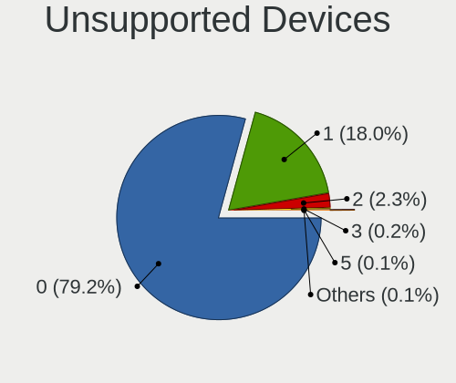

| Total | Desktops | Percent |
|-------|----------|---------|
| 0     | 688      | 79.17%  |
| 1     | 156      | 17.95%  |
| 2     | 21       | 2.42%   |
| 3     | 2        | 0.23%   |
| 5     | 1        | 0.12%   |
| 4     | 1        | 0.12%   |

Unsupported Device Types
------------------------

Types of unsupported devices

| Type                     | Desktops | Percent |
|--------------------------|----------|---------|
| Net/wireless             | 72       | 35.47%  |
| Graphics card            | 69       | 33.99%  |
| Unassigned class         | 13       | 6.4%    |
| Sound                    | 9        | 4.43%   |
| Communication controller | 9        | 4.43%   |
| Network                  | 7        | 3.45%   |
| Storage/raid             | 6        | 2.96%   |
| Net/ethernet             | 4        | 1.97%   |
| Fingerprint reader       | 4        | 1.97%   |
| Multimedia controller    | 3        | 1.48%   |
| Chipcard                 | 3        | 1.48%   |
| Storage/nvme             | 1        | 0.49%   |
| Storage/ide              | 1        | 0.49%   |
| Card reader              | 1        | 0.49%   |
| Bluetooth                | 1        | 0.49%   |

