Pop!_OS 20.04 - Tested Hardware & Statistics (Notebooks)
--------------------------------------------------------

A project to collect tested hardware configurations for Pop!_OS 20.04.

Anyone can contribute to this report by the [hw-probe](https://github.com/linuxhw/hw-probe) tool:

    sudo -E hw-probe -all -upload

Please contribute! Especially if your hardware is rare.

Contents
--------

* [ Test Cases ](#test-cases)

* [ System ](#system)
  - [ Kernel                   ](#kernel)
  - [ Kernel Family            ](#kernel-family)
  - [ Kernel Major Ver.        ](#kernel-major-ver)
  - [ Arch                     ](#arch)
  - [ DE                       ](#de)
  - [ Display Server           ](#display-server)
  - [ Display Manager          ](#display-manager)
  - [ OS Lang                  ](#os-lang)
  - [ Boot Mode                ](#boot-mode)
  - [ Filesystem               ](#filesystem)
  - [ Part. scheme             ](#part-scheme)
  - [ Dual Boot with Linux/BSD ](#dual-boot-with-linuxbsd)
  - [ Dual Boot (Win)          ](#dual-boot-win)

* [ Board ](#board)
  - [ Vendor                   ](#vendor)
  - [ Model                    ](#model)
  - [ Model Family             ](#model-family)
  - [ MFG Year                 ](#mfg-year)
  - [ Form Factor              ](#form-factor)
  - [ Secure Boot              ](#secure-boot)
  - [ Coreboot                 ](#coreboot)
  - [ RAM Size                 ](#ram-size)
  - [ RAM Used                 ](#ram-used)
  - [ Total Drives             ](#total-drives)
  - [ Has CD-ROM               ](#has-cd-rom)
  - [ Has Ethernet             ](#has-ethernet)
  - [ Has WiFi                 ](#has-wifi)
  - [ Has Bluetooth            ](#has-bluetooth)

* [ Location ](#location)
  - [ Country                  ](#country)
  - [ City                     ](#city)

* [ Drives ](#drives)
  - [ Drive Vendor             ](#drive-vendor)
  - [ Drive Model              ](#drive-model)
  - [ HDD Vendor               ](#hdd-vendor)
  - [ SSD Vendor               ](#ssd-vendor)
  - [ Drive Kind               ](#drive-kind)
  - [ Drive Connector          ](#drive-connector)
  - [ Drive Size               ](#drive-size)
  - [ Space Total              ](#space-total)
  - [ Space Used               ](#space-used)
  - [ Malfunc. Drives          ](#malfunc-drives)
  - [ Malfunc. Drive Vendor    ](#malfunc-drive-vendor)
  - [ Malfunc. HDD Vendor      ](#malfunc-hdd-vendor)
  - [ Malfunc. Drive Kind      ](#malfunc-drive-kind)
  - [ Failed Drives            ](#failed-drives)
  - [ Failed Drive Vendor      ](#failed-drive-vendor)
  - [ Drive Status             ](#drive-status)

* [ Storage controller ](#storage-controller)
  - [ Storage Vendor           ](#storage-vendor)
  - [ Storage Model            ](#storage-model)
  - [ Storage Kind             ](#storage-kind)

* [ Processor ](#processor)
  - [ CPU Vendor               ](#cpu-vendor)
  - [ CPU Model                ](#cpu-model)
  - [ CPU Model Family         ](#cpu-model-family)
  - [ CPU Cores                ](#cpu-cores)
  - [ CPU Sockets              ](#cpu-sockets)
  - [ CPU Threads              ](#cpu-threads)
  - [ CPU Op-Modes             ](#cpu-op-modes)
  - [ CPU Microcode            ](#cpu-microcode)
  - [ CPU Microarch            ](#cpu-microarch)

* [ Graphics ](#graphics)
  - [ GPU Vendor               ](#gpu-vendor)
  - [ GPU Model                ](#gpu-model)
  - [ GPU Combo                ](#gpu-combo)
  - [ GPU Driver               ](#gpu-driver)
  - [ GPU Memory               ](#gpu-memory)

* [ Monitor ](#monitor)
  - [ Monitor Vendor           ](#monitor-vendor)
  - [ Monitor Model            ](#monitor-model)
  - [ Monitor Resolution       ](#monitor-resolution)
  - [ Monitor Diagonal         ](#monitor-diagonal)
  - [ Monitor Width            ](#monitor-width)
  - [ Aspect Ratio             ](#aspect-ratio)
  - [ Monitor Area             ](#monitor-area)
  - [ Pixel Density            ](#pixel-density)
  - [ Multiple Monitors        ](#multiple-monitors)

* [ Network ](#network)
  - [ Net Controller Vendor    ](#net-controller-vendor)
  - [ Net Controller Model     ](#net-controller-model)
  - [ Wireless Vendor          ](#wireless-vendor)
  - [ Wireless Model           ](#wireless-model)
  - [ Ethernet Vendor          ](#ethernet-vendor)
  - [ Ethernet Model           ](#ethernet-model)
  - [ Net Controller Kind      ](#net-controller-kind)
  - [ Used Controller          ](#used-controller)
  - [ NICs                     ](#nics)
  - [ IPv6                     ](#ipv6)

* [ Bluetooth ](#bluetooth)
  - [ Bluetooth Vendor         ](#bluetooth-vendor)
  - [ Bluetooth Model          ](#bluetooth-model)

* [ Sound ](#sound)
  - [ Sound Vendor             ](#sound-vendor)
  - [ Sound Model              ](#sound-model)

* [ Memory ](#memory)
  - [ Memory Vendor            ](#memory-vendor)
  - [ Memory Model             ](#memory-model)
  - [ Memory Kind              ](#memory-kind)
  - [ Memory Form Factor       ](#memory-form-factor)
  - [ Memory Size              ](#memory-size)
  - [ Memory Speed             ](#memory-speed)

* [ Printers & scanners ](#printers--scanners)
  - [ Printer Vendor           ](#printer-vendor)
  - [ Printer Model            ](#printer-model)
  - [ Scanner Vendor           ](#scanner-vendor)
  - [ Scanner Model            ](#scanner-model)

* [ Camera ](#camera)
  - [ Camera Vendor            ](#camera-vendor)
  - [ Camera Model             ](#camera-model)

* [ Security ](#security)
  - [ Fingerprint Vendor       ](#fingerprint-vendor)
  - [ Fingerprint Model        ](#fingerprint-model)
  - [ Chipcard Vendor          ](#chipcard-vendor)
  - [ Chipcard Model           ](#chipcard-model)

* [ Unsupported ](#unsupported)
  - [ Unsupported Devices      ](#unsupported-devices)
  - [ Unsupported Device Types ](#unsupported-device-types)

Test Cases
----------

Total: 1607

| Vendor        | Model                       | Probe                                                      | Date         |
|---------------|-----------------------------|------------------------------------------------------------|--------------|
| System76      | Galago Pro                  | [3baddb9faa](https://linux-hardware.org/?probe=3baddb9faa) | May 26, 2022 |
| Dell          | Inspiron 7501               | [81f3b14e0a](https://linux-hardware.org/?probe=81f3b14e0a) | May 25, 2022 |
| Intel Clie... | LAPKC71F                    | [1f67896c5c](https://linux-hardware.org/?probe=1f67896c5c) | May 22, 2022 |
| MSI           | Katana GF76 12UGS           | [06cb917381](https://linux-hardware.org/?probe=06cb917381) | May 22, 2022 |
| MSI           | Katana GF76 12UGS           | [22776216d6](https://linux-hardware.org/?probe=22776216d6) | May 22, 2022 |
| MSI           | Katana GF76 12UGS           | [cd50fa44c3](https://linux-hardware.org/?probe=cd50fa44c3) | May 21, 2022 |
| MSI           | Katana GF76 12UGS           | [556940f73e](https://linux-hardware.org/?probe=556940f73e) | May 21, 2022 |
| MSI           | Katana GF76 12UGS           | [fbea498a36](https://linux-hardware.org/?probe=fbea498a36) | May 21, 2022 |
| Intel Clie... | LAPKC71F                    | [a227af798c](https://linux-hardware.org/?probe=a227af798c) | May 20, 2022 |
| Samsung       | 550XCJ/550XCR               | [2dd9e88806](https://linux-hardware.org/?probe=2dd9e88806) | May 11, 2022 |
| Acer          | Aspire A315-41              | [a42b1cda2c](https://linux-hardware.org/?probe=a42b1cda2c) | Apr 26, 2022 |
| ASUSTek       | TUF Gaming FX705DT_FX705... | [329905cab9](https://linux-hardware.org/?probe=329905cab9) | Apr 21, 2022 |
| Acer          | Aspire A315-42G             | [3654d1f0fa](https://linux-hardware.org/?probe=3654d1f0fa) | Apr 19, 2022 |
| Lenovo        | IdeaPad S145-15API 81V7     | [746e2ea0d2](https://linux-hardware.org/?probe=746e2ea0d2) | Apr 18, 2022 |
| HP            | 15 Notebook PC              | [e1d2871cd8](https://linux-hardware.org/?probe=e1d2871cd8) | Apr 18, 2022 |
| HP            | Laptop 14s-dk0xxx           | [ef76ce862d](https://linux-hardware.org/?probe=ef76ce862d) | Apr 14, 2022 |
| Lenovo        | IdeaPad S145-15IWL 81S9     | [3752ecab33](https://linux-hardware.org/?probe=3752ecab33) | Apr 14, 2022 |
| Lenovo        | IdeaPad S145-15IWL 81S9     | [297454c537](https://linux-hardware.org/?probe=297454c537) | Apr 07, 2022 |
| HP            | ZBook 15 G6                 | [d98ca9a688](https://linux-hardware.org/?probe=d98ca9a688) | Apr 07, 2022 |
| Acer          | Aspire E5-576               | [520cbf0afa](https://linux-hardware.org/?probe=520cbf0afa) | Apr 06, 2022 |
| Lenovo        | ThinkPad X230 2306CTO       | [188a7794dd](https://linux-hardware.org/?probe=188a7794dd) | Apr 04, 2022 |
| Lenovo        | G400s VILG1                 | [93c2d9ec80](https://linux-hardware.org/?probe=93c2d9ec80) | Apr 03, 2022 |
| MSI           | Modern 14 B11M              | [3cdc036c09](https://linux-hardware.org/?probe=3cdc036c09) | Mar 30, 2022 |
| ASUSTek       | VivoBook_ASUSLaptop X570... | [d4655e802a](https://linux-hardware.org/?probe=d4655e802a) | Mar 26, 2022 |
| ASUSTek       | X542UR                      | [4d4477bd16](https://linux-hardware.org/?probe=4d4477bd16) | Mar 26, 2022 |
| MSI           | Modern 14 B11M              | [a2921a6b4c](https://linux-hardware.org/?probe=a2921a6b4c) | Mar 25, 2022 |
| MSI           | Modern 14 B11M              | [ca5720c46b](https://linux-hardware.org/?probe=ca5720c46b) | Mar 25, 2022 |
| Acer          | Aspire 5830TG               | [681005049f](https://linux-hardware.org/?probe=681005049f) | Mar 22, 2022 |
| Dell          | Latitude 5420               | [b1a1e20ab3](https://linux-hardware.org/?probe=b1a1e20ab3) | Mar 21, 2022 |
| Dell          | XPS 13 9350                 | [ffa4f295ea](https://linux-hardware.org/?probe=ffa4f295ea) | Mar 16, 2022 |
| Lenovo        | ThinkBook 15-IIL 20SM       | [147ab6c35e](https://linux-hardware.org/?probe=147ab6c35e) | Mar 16, 2022 |
| HP            | Pavilion Gaming Laptop 1... | [5b83093837](https://linux-hardware.org/?probe=5b83093837) | Mar 15, 2022 |
| Apple         | MacBookAir7,2               | [911881e47f](https://linux-hardware.org/?probe=911881e47f) | Mar 14, 2022 |
| Fujitsu Si... | ESPRIMO Mobile V5535        | [3aded823d8](https://linux-hardware.org/?probe=3aded823d8) | Mar 13, 2022 |
| Toshiba       | Satellite C850-1GD          | [79b2741217](https://linux-hardware.org/?probe=79b2741217) | Mar 12, 2022 |
| System76      | Oryx Pro                    | [0c4ce09431](https://linux-hardware.org/?probe=0c4ce09431) | Mar 11, 2022 |
| Dell          | G7 7588                     | [bd49253351](https://linux-hardware.org/?probe=bd49253351) | Mar 11, 2022 |
| ASUSTek       | X541UV                      | [aef8901d13](https://linux-hardware.org/?probe=aef8901d13) | Mar 08, 2022 |
| Dell          | Latitude E6410              | [b17f80ef48](https://linux-hardware.org/?probe=b17f80ef48) | Mar 08, 2022 |
| Acer          | Aspire VN7-591G             | [57452c9459](https://linux-hardware.org/?probe=57452c9459) | Mar 03, 2022 |
| ASUSTek       | G74Sx                       | [5b318b52ed](https://linux-hardware.org/?probe=5b318b52ed) | Mar 03, 2022 |
| Apple         | MacBookPro9,2               | [7fc2d5d090](https://linux-hardware.org/?probe=7fc2d5d090) | Mar 02, 2022 |
| Lenovo        | ThinkPad X220 429136G       | [324d66c0fc](https://linux-hardware.org/?probe=324d66c0fc) | Feb 23, 2022 |
| Acer          | Aspire A315-41G             | [565ef5309f](https://linux-hardware.org/?probe=565ef5309f) | Feb 19, 2022 |
| Acer          | Aspire A315-41G             | [21e91da000](https://linux-hardware.org/?probe=21e91da000) | Feb 19, 2022 |
| Apple         | MacBookPro10,1              | [bce5253028](https://linux-hardware.org/?probe=bce5253028) | Feb 19, 2022 |
| Acer          | Aspire 5741Z                | [93f3b53e77](https://linux-hardware.org/?probe=93f3b53e77) | Feb 18, 2022 |
| Dell          | Latitude E6540              | [dfc7dad0ee](https://linux-hardware.org/?probe=dfc7dad0ee) | Feb 17, 2022 |
| ASUSTek       | N76VZ                       | [924a8f6b7f](https://linux-hardware.org/?probe=924a8f6b7f) | Feb 16, 2022 |
| System76      | Galago Pro                  | [01db998e51](https://linux-hardware.org/?probe=01db998e51) | Feb 16, 2022 |
| ASUSTek       | ROG Zephyrus G15 GA503QM... | [2dd964cf93](https://linux-hardware.org/?probe=2dd964cf93) | Feb 15, 2022 |
| System76      | Galago Pro                  | [3795018074](https://linux-hardware.org/?probe=3795018074) | Feb 12, 2022 |
| System76      | Galago Pro                  | [0277e9ff33](https://linux-hardware.org/?probe=0277e9ff33) | Feb 11, 2022 |
| Dell          | XPS 15 7590                 | [4756364ef6](https://linux-hardware.org/?probe=4756364ef6) | Feb 10, 2022 |
| ASUSTek       | Z450UAK                     | [d619483cc3](https://linux-hardware.org/?probe=d619483cc3) | Feb 10, 2022 |
| Dell          | Inspiron 7720               | [5b2eb74790](https://linux-hardware.org/?probe=5b2eb74790) | Feb 08, 2022 |
| Fujitsu       | LIFEBOOK A544               | [0892485b4b](https://linux-hardware.org/?probe=0892485b4b) | Feb 07, 2022 |
| HUAWEI        | HVY-WXX9                    | [9ed4001ca5](https://linux-hardware.org/?probe=9ed4001ca5) | Feb 06, 2022 |
| Lenovo        | Legion 5 15ARH05 82B5       | [87c57369ab](https://linux-hardware.org/?probe=87c57369ab) | Feb 06, 2022 |
| Dell          | XPS 15 9500                 | [b8f7e7d9d8](https://linux-hardware.org/?probe=b8f7e7d9d8) | Feb 05, 2022 |
| ASUSTek       | VivoBook_ASUSLaptop X712... | [1d86468b90](https://linux-hardware.org/?probe=1d86468b90) | Feb 03, 2022 |
| HP            | Pavilion g7                 | [520f4ed91f](https://linux-hardware.org/?probe=520f4ed91f) | Feb 02, 2022 |
| HP            | Pavilion g7                 | [7ff4adf123](https://linux-hardware.org/?probe=7ff4adf123) | Feb 02, 2022 |
| Samsung       | 270E5J/2570EJ               | [ac0fd77d33](https://linux-hardware.org/?probe=ac0fd77d33) | Feb 01, 2022 |
| Lenovo        | ThinkPad X1 Extreme 20MF... | [d3f7315d42](https://linux-hardware.org/?probe=d3f7315d42) | Jan 30, 2022 |
| Acer          | Aspire 4741                 | [bb695da9c9](https://linux-hardware.org/?probe=bb695da9c9) | Jan 26, 2022 |
| Apple         | MacBookPro12,1              | [c5c764ccd7](https://linux-hardware.org/?probe=c5c764ccd7) | Jan 24, 2022 |
| HUAWEI        | KPL-W0X                     | [2816cb0172](https://linux-hardware.org/?probe=2816cb0172) | Jan 23, 2022 |
| Lenovo        | IdeaPad 3 15ADA05 81W1      | [33079ee3bf](https://linux-hardware.org/?probe=33079ee3bf) | Jan 22, 2022 |
| Dell          | Latitude 3420               | [5cb8ff854b](https://linux-hardware.org/?probe=5cb8ff854b) | Jan 21, 2022 |
| Dell          | Latitude 3420               | [2882c1a5d4](https://linux-hardware.org/?probe=2882c1a5d4) | Jan 21, 2022 |
| Lenovo        | Yoga Slim 7 14ITL05 82A3    | [0f956f27ad](https://linux-hardware.org/?probe=0f956f27ad) | Jan 20, 2022 |
| Dell          | Inspiron 3583               | [1ab15ca104](https://linux-hardware.org/?probe=1ab15ca104) | Jan 20, 2022 |
| Dell          | Inspiron 7501               | [6d72c9d945](https://linux-hardware.org/?probe=6d72c9d945) | Jan 19, 2022 |
| Gigabyte      | P65                         | [4664ba9c41](https://linux-hardware.org/?probe=4664ba9c41) | Jan 17, 2022 |
| ASUSTek       | ROG Zephyrus G15 GA503QM... | [71480de13b](https://linux-hardware.org/?probe=71480de13b) | Jan 14, 2022 |
| ASUSTek       | ASUS EXPERTBOOK B1400CEP... | [7dbb72c69c](https://linux-hardware.org/?probe=7dbb72c69c) | Jan 14, 2022 |
| Lenovo        | Yoga Slim 7 14ARE05 82A2    | [f212038b15](https://linux-hardware.org/?probe=f212038b15) | Jan 09, 2022 |
| Acer          | Aspire A315-41G             | [647b2f2da2](https://linux-hardware.org/?probe=647b2f2da2) | Jan 06, 2022 |
| MSI           | GS60 2PC Ghost              | [a39693267b](https://linux-hardware.org/?probe=a39693267b) | Jan 03, 2022 |
| Lenovo        | ThinkPad E15 Gen 2 20TDS... | [69b65282f8](https://linux-hardware.org/?probe=69b65282f8) | Jan 03, 2022 |
| Dell          | Inspiron 5458               | [47887a95e0](https://linux-hardware.org/?probe=47887a95e0) | Jan 02, 2022 |
| Lenovo        | ThinkPad E14 Gen 3 20Y7C... | [b93cc280ea](https://linux-hardware.org/?probe=b93cc280ea) | Jan 02, 2022 |
| HP            | Compaq 6730s                | [bd8962f904](https://linux-hardware.org/?probe=bd8962f904) | Dec 30, 2021 |
| ASUSTek       | G751JY                      | [e7a5fad002](https://linux-hardware.org/?probe=e7a5fad002) | Dec 29, 2021 |
| Dell          | XPS 15 9500                 | [59d2f4a4da](https://linux-hardware.org/?probe=59d2f4a4da) | Dec 28, 2021 |
| Acer          | Nitro AN515-44              | [8fba60c1a8](https://linux-hardware.org/?probe=8fba60c1a8) | Dec 28, 2021 |
| OEM           | I38II                       | [52bc5190dd](https://linux-hardware.org/?probe=52bc5190dd) | Dec 27, 2021 |
| Lenovo        | ThinkPad L512 44444WG       | [0f7bd5b933](https://linux-hardware.org/?probe=0f7bd5b933) | Dec 26, 2021 |
| Lenovo        | ThinkPad T420 4236B28       | [1c9b796c43](https://linux-hardware.org/?probe=1c9b796c43) | Dec 25, 2021 |
| Sony          | VGN-AW21M_H                 | [b4cf74ec7d](https://linux-hardware.org/?probe=b4cf74ec7d) | Dec 23, 2021 |
| Lenovo        | ThinkPad T490 20RYS07R00    | [0bdc5ce080](https://linux-hardware.org/?probe=0bdc5ce080) | Dec 16, 2021 |
| ASUSTek       | ZenBook UX433FN_UX433FN     | [7cb6974555](https://linux-hardware.org/?probe=7cb6974555) | Dec 16, 2021 |
| ASUSTek       | ZenBook UX433FN_UX433FN     | [c0e72732c6](https://linux-hardware.org/?probe=c0e72732c6) | Dec 14, 2021 |
| Dell          | Latitude E6430              | [aadf9bd175](https://linux-hardware.org/?probe=aadf9bd175) | Dec 13, 2021 |
| ASUSTek       | Zephyrus S GX701GWR_GX70... | [57c068b681](https://linux-hardware.org/?probe=57c068b681) | Dec 11, 2021 |
| Dell          | Inspiron 5547               | [6b6f86a9f7](https://linux-hardware.org/?probe=6b6f86a9f7) | Dec 10, 2021 |
| Acer          | Aspire A514-53              | [eb51cb66cb](https://linux-hardware.org/?probe=eb51cb66cb) | Dec 10, 2021 |
| Razer         | Blade 14 - RZ09-0370        | [01cddd0145](https://linux-hardware.org/?probe=01cddd0145) | Dec 10, 2021 |
| Acer          | Aspire A514-53              | [90975ac5a8](https://linux-hardware.org/?probe=90975ac5a8) | Dec 09, 2021 |
| Acer          | Aspire A315-42              | [c5d73b2d3a](https://linux-hardware.org/?probe=c5d73b2d3a) | Dec 07, 2021 |
| Lenovo        | IdeaPad Gaming 3 15ARH05... | [ee7ae7b860](https://linux-hardware.org/?probe=ee7ae7b860) | Dec 06, 2021 |
| HUAWEI        | KLVD-WXX9                   | [4e6e60b6b1](https://linux-hardware.org/?probe=4e6e60b6b1) | Dec 06, 2021 |
| Positivo      | NB50TH                      | [705bae2d39](https://linux-hardware.org/?probe=705bae2d39) | Dec 04, 2021 |
| Lenovo        | IdeaPad 330-15IKB 81FE      | [2b7412b23b](https://linux-hardware.org/?probe=2b7412b23b) | Dec 04, 2021 |
| Toshiba       | Satellite L500              | [5cc2fbfef5](https://linux-hardware.org/?probe=5cc2fbfef5) | Dec 04, 2021 |
| Apple         | MacBookPro4,1               | [6d4816f322](https://linux-hardware.org/?probe=6d4816f322) | Dec 02, 2021 |
| Apple         | MacBookPro4,1               | [aa8c361e26](https://linux-hardware.org/?probe=aa8c361e26) | Dec 02, 2021 |
| GPU Compan... | GWTN156-1                   | [0f7052d7f4](https://linux-hardware.org/?probe=0f7052d7f4) | Dec 01, 2021 |
| Lenovo        | ThinkPad E15 Gen 3 20YHS... | [89b56db565](https://linux-hardware.org/?probe=89b56db565) | Dec 01, 2021 |
| GPU Compan... | GWTN156-1                   | [450b474fd7](https://linux-hardware.org/?probe=450b474fd7) | Nov 27, 2021 |
| HP            | ProBook 6460b               | [a072a6246d](https://linux-hardware.org/?probe=a072a6246d) | Nov 25, 2021 |
| LG Electro... | S425-L.BC24P1               | [6d6d4fca9b](https://linux-hardware.org/?probe=6d6d4fca9b) | Nov 24, 2021 |
| ASUSTek       | K45VD                       | [4a655e0c04](https://linux-hardware.org/?probe=4a655e0c04) | Nov 22, 2021 |
| Acer          | Aspire A315-42              | [aa83ee865b](https://linux-hardware.org/?probe=aa83ee865b) | Nov 21, 2021 |
| Clevo         | M7X0SU                      | [a9638079c6](https://linux-hardware.org/?probe=a9638079c6) | Nov 20, 2021 |
| ASUSTek       | ROG Strix G513IH_G513IH     | [8a1a3f0661](https://linux-hardware.org/?probe=8a1a3f0661) | Nov 20, 2021 |
| ASUSTek       | ROG Strix G513IH_G513IH     | [eace5e1302](https://linux-hardware.org/?probe=eace5e1302) | Nov 19, 2021 |
| Acer          | Aspire E5-574G              | [c8e95916ef](https://linux-hardware.org/?probe=c8e95916ef) | Nov 18, 2021 |
| ASUSTek       | X441NA                      | [da21de67fb](https://linux-hardware.org/?probe=da21de67fb) | Nov 18, 2021 |
| MSI           | GS73 Stealth 8RF            | [6808d215ec](https://linux-hardware.org/?probe=6808d215ec) | Nov 17, 2021 |
| Acer          | Aspire E5-574G              | [b9aa24e607](https://linux-hardware.org/?probe=b9aa24e607) | Nov 16, 2021 |
| Teclast       | F6 Plus                     | [7e5836dbaa](https://linux-hardware.org/?probe=7e5836dbaa) | Nov 16, 2021 |
| MSI           | GF63 Thin 10SCXR            | [890e8ec1d4](https://linux-hardware.org/?probe=890e8ec1d4) | Nov 16, 2021 |
| Lenovo        | IdeaPad 120S-14IAP 81A5     | [d8acfef1ef](https://linux-hardware.org/?probe=d8acfef1ef) | Nov 16, 2021 |
| Apple         | MacBookPro9,1               | [84569cfaa8](https://linux-hardware.org/?probe=84569cfaa8) | Nov 16, 2021 |
| Lenovo        | Legion S7 15ACH6 82K8       | [4f71123025](https://linux-hardware.org/?probe=4f71123025) | Nov 15, 2021 |
| OEM           | I38II                       | [0b2d349414](https://linux-hardware.org/?probe=0b2d349414) | Nov 14, 2021 |
| Samsung       | RF511/RF411/RF711           | [ffbf11ec7f](https://linux-hardware.org/?probe=ffbf11ec7f) | Nov 14, 2021 |
| Samsung       | RF511/RF411/RF711           | [8968b7142d](https://linux-hardware.org/?probe=8968b7142d) | Nov 14, 2021 |
| HP            | Pavilion g6                 | [084a162b81](https://linux-hardware.org/?probe=084a162b81) | Nov 13, 2021 |
| Acer          | Aspire E5-574G              | [980728749b](https://linux-hardware.org/?probe=980728749b) | Nov 12, 2021 |
| Apple         | MacBookPro7,1               | [62af0283db](https://linux-hardware.org/?probe=62af0283db) | Nov 12, 2021 |
| Apple         | MacBookPro7,1               | [a4179da526](https://linux-hardware.org/?probe=a4179da526) | Nov 12, 2021 |
| Dell          | XPS 17 9710                 | [6e776d4d23](https://linux-hardware.org/?probe=6e776d4d23) | Nov 11, 2021 |
| ASUSTek       | N53SN                       | [438a1236fb](https://linux-hardware.org/?probe=438a1236fb) | Nov 11, 2021 |
| Dell          | Inspiron 5584               | [ae7c7124b8](https://linux-hardware.org/?probe=ae7c7124b8) | Nov 11, 2021 |
| ASUSTek       | ASUS TUF Dash F15 FX516P... | [edc363bc59](https://linux-hardware.org/?probe=edc363bc59) | Nov 11, 2021 |
| Dell          | Vostro 3480                 | [25a0c10009](https://linux-hardware.org/?probe=25a0c10009) | Nov 11, 2021 |
| Dell          | Vostro 3480                 | [a4167ceb73](https://linux-hardware.org/?probe=a4167ceb73) | Nov 11, 2021 |
| Lenovo        | ThinkPad T470 20HES1RS00    | [549f20dcf3](https://linux-hardware.org/?probe=549f20dcf3) | Nov 10, 2021 |
| Acer          | Nitro AN515-55              | [d3b67380f0](https://linux-hardware.org/?probe=d3b67380f0) | Nov 10, 2021 |
| Lenovo        | IdeaPad S145-15IIL 82DJ     | [4b98da95b0](https://linux-hardware.org/?probe=4b98da95b0) | Nov 06, 2021 |
| Lenovo        | ThinkPad E14 Gen 3 20Y7C... | [28363f1eea](https://linux-hardware.org/?probe=28363f1eea) | Nov 05, 2021 |
| Dell          | Inspiron 5547               | [6ebd71080f](https://linux-hardware.org/?probe=6ebd71080f) | Nov 04, 2021 |
| ASUSTek       | VivoBook_ASUSLaptop X513... | [bd5646426b](https://linux-hardware.org/?probe=bd5646426b) | Nov 03, 2021 |
| Dell          | Vostro 3560                 | [cc1347a298](https://linux-hardware.org/?probe=cc1347a298) | Nov 03, 2021 |
| Acer          | Aspire V3-771               | [98a6324a75](https://linux-hardware.org/?probe=98a6324a75) | Nov 01, 2021 |
| Dell          | Inspiron 5437               | [0f2394b49d](https://linux-hardware.org/?probe=0f2394b49d) | Oct 31, 2021 |
| Dell          | Venue 11 Pro 7130 vPro      | [fd3aefd54a](https://linux-hardware.org/?probe=fd3aefd54a) | Oct 27, 2021 |
| HP            | Pavilion g7                 | [9ce9b3750d](https://linux-hardware.org/?probe=9ce9b3750d) | Oct 27, 2021 |
| Dell          | Studio 1555                 | [3fed161971](https://linux-hardware.org/?probe=3fed161971) | Oct 24, 2021 |
| Lenovo        | ThinkPad T430 2349H2G       | [b868085bfc](https://linux-hardware.org/?probe=b868085bfc) | Oct 24, 2021 |
| IT Channel... | PCX0DX                      | [fb1bf80085](https://linux-hardware.org/?probe=fb1bf80085) | Oct 22, 2021 |
| Samsung       | 340XAA/350XAA/550XAA        | [f06d6b9f20](https://linux-hardware.org/?probe=f06d6b9f20) | Oct 22, 2021 |
| Dell          | Inspiron 3543               | [f16233e3e4](https://linux-hardware.org/?probe=f16233e3e4) | Oct 20, 2021 |
| Dell          | Latitude E6440              | [3020581460](https://linux-hardware.org/?probe=3020581460) | Oct 19, 2021 |
| ASUSTek       | GL703VD                     | [50201617d4](https://linux-hardware.org/?probe=50201617d4) | Oct 17, 2021 |
| Dell          | Latitude E7470              | [3bbcb85b9f](https://linux-hardware.org/?probe=3bbcb85b9f) | Oct 16, 2021 |
| Samsung       | 550XDA                      | [b4026018fe](https://linux-hardware.org/?probe=b4026018fe) | Oct 16, 2021 |
| HP            | Pavilion g6                 | [cd78947861](https://linux-hardware.org/?probe=cd78947861) | Oct 16, 2021 |
| HP            | Pavilion g6                 | [603173c8b3](https://linux-hardware.org/?probe=603173c8b3) | Oct 16, 2021 |
| Dell          | Inspiron 7520               | [9a64d0961f](https://linux-hardware.org/?probe=9a64d0961f) | Oct 14, 2021 |
| Lenovo        | IdeaPad 310-15ISK 80UH      | [60b294879d](https://linux-hardware.org/?probe=60b294879d) | Oct 12, 2021 |
| HP            | Pavilion dv2000 (RP408UA... | [31a42ed2b6](https://linux-hardware.org/?probe=31a42ed2b6) | Oct 12, 2021 |
| ASUSTek       | ROG Zephyrus GX550LWS_GX... | [1952252a77](https://linux-hardware.org/?probe=1952252a77) | Oct 12, 2021 |
| ASUSTek       | G752VY                      | [635126af58](https://linux-hardware.org/?probe=635126af58) | Oct 09, 2021 |
| ASUSTek       | TUF Gaming FX504GM_FX80G... | [d4b69cd83e](https://linux-hardware.org/?probe=d4b69cd83e) | Oct 05, 2021 |
| ASUSTek       | TUF Gaming FX504GM_FX80G... | [d8d3dbe4a2](https://linux-hardware.org/?probe=d8d3dbe4a2) | Oct 05, 2021 |
| HP            | Pavilion Gaming Laptop 1... | [97be3fb7f0](https://linux-hardware.org/?probe=97be3fb7f0) | Oct 05, 2021 |
| HP            | Pavilion Gaming Laptop 1... | [84ac45681c](https://linux-hardware.org/?probe=84ac45681c) | Oct 05, 2021 |
| ASUSTek       | X450LD                      | [1fb155805b](https://linux-hardware.org/?probe=1fb155805b) | Oct 01, 2021 |
| Dell          | Inspiron 7520               | [2968458879](https://linux-hardware.org/?probe=2968458879) | Oct 01, 2021 |
| Acer          | Aspire VX5-591G             | [949ac66eff](https://linux-hardware.org/?probe=949ac66eff) | Sep 29, 2021 |
| Lenovo        | G510 20238                  | [1df80706d4](https://linux-hardware.org/?probe=1df80706d4) | Sep 27, 2021 |
| MSI           | GS73 Stealth 8RF            | [c5e6cd2079](https://linux-hardware.org/?probe=c5e6cd2079) | Sep 22, 2021 |
| Sony          | SVE14A15FGW                 | [f1049f7db1](https://linux-hardware.org/?probe=f1049f7db1) | Sep 21, 2021 |
| Apple         | MacBookPro8,2               | [59aca516bd](https://linux-hardware.org/?probe=59aca516bd) | Sep 20, 2021 |
| Lenovo        | Legion 5 15IMH05H 81Y6      | [2d0d73c751](https://linux-hardware.org/?probe=2d0d73c751) | Sep 19, 2021 |
| HP            | Pavilion Laptop 15-cs3xx... | [e40396d278](https://linux-hardware.org/?probe=e40396d278) | Sep 19, 2021 |
| Lenovo        | Legion 5 15IMH05H 81Y6      | [a2bbae72c0](https://linux-hardware.org/?probe=a2bbae72c0) | Sep 18, 2021 |
| MSI           | GE66 Raider 10SF            | [9d11ef435a](https://linux-hardware.org/?probe=9d11ef435a) | Sep 16, 2021 |
| HP            | Laptop 14-dk1xxx            | [a3d5ce24d5](https://linux-hardware.org/?probe=a3d5ce24d5) | Sep 16, 2021 |
| HP            | Pavilion dv6                | [c625f120d7](https://linux-hardware.org/?probe=c625f120d7) | Sep 15, 2021 |
| HP            | 655                         | [3778f219e8](https://linux-hardware.org/?probe=3778f219e8) | Sep 14, 2021 |
| Acer          | Aspire 6935                 | [fc440eee50](https://linux-hardware.org/?probe=fc440eee50) | Sep 12, 2021 |
| Acer          | Aspire 6935                 | [24cfb86539](https://linux-hardware.org/?probe=24cfb86539) | Sep 12, 2021 |
| Dell          | Inspiron 5575               | [92b24f370c](https://linux-hardware.org/?probe=92b24f370c) | Sep 09, 2021 |
| HP            | ENVY m6                     | [8ed274aa74](https://linux-hardware.org/?probe=8ed274aa74) | Sep 07, 2021 |
| LG Electro... | S425-L.BC24P1               | [f3a726fe5e](https://linux-hardware.org/?probe=f3a726fe5e) | Sep 06, 2021 |
| HP            | ProBook 450 G5              | [beefff4447](https://linux-hardware.org/?probe=beefff4447) | Sep 06, 2021 |
| Lenovo        | ThinkPad E15 Gen 2 20TDS... | [c74e02cb70](https://linux-hardware.org/?probe=c74e02cb70) | Sep 04, 2021 |
| Metabox       | Alpha-S NP70HJ              | [7b477b4fae](https://linux-hardware.org/?probe=7b477b4fae) | Sep 04, 2021 |
| Metabox       | Alpha-S NP70HJ              | [a72cca0cf9](https://linux-hardware.org/?probe=a72cca0cf9) | Sep 04, 2021 |
| Acer          | Nitro AN515-44              | [01078048fe](https://linux-hardware.org/?probe=01078048fe) | Sep 04, 2021 |
| Acer          | Nitro AN515-44              | [328451404d](https://linux-hardware.org/?probe=328451404d) | Sep 04, 2021 |
| HP            | EliteBook 840 G5            | [af864a132a](https://linux-hardware.org/?probe=af864a132a) | Sep 04, 2021 |
| HP            | ProBook 450 G5              | [1579919ebb](https://linux-hardware.org/?probe=1579919ebb) | Sep 01, 2021 |
| Apple         | MacBookAir7,2               | [ce314026c5](https://linux-hardware.org/?probe=ce314026c5) | Sep 01, 2021 |
| Apple         | MacBookAir7,2               | [c47a6f999e](https://linux-hardware.org/?probe=c47a6f999e) | Sep 01, 2021 |
| Lenovo        | IdeaPad S145-15IWL 81S9     | [372bae9a90](https://linux-hardware.org/?probe=372bae9a90) | Aug 31, 2021 |
| Lenovo        | ThinkPad T420 4180WDN       | [8512904445](https://linux-hardware.org/?probe=8512904445) | Aug 29, 2021 |
| Lenovo        | ThinkPad X1 Carbon 6th 2... | [31846a6b58](https://linux-hardware.org/?probe=31846a6b58) | Aug 29, 2021 |
| System76      | Lemur Pro                   | [23cf0036a1](https://linux-hardware.org/?probe=23cf0036a1) | Aug 28, 2021 |
| Acer          | Aspire one 1-431            | [e7d69fa110](https://linux-hardware.org/?probe=e7d69fa110) | Aug 27, 2021 |
| Dell          | Inspiron 1564               | [2447fab09a](https://linux-hardware.org/?probe=2447fab09a) | Aug 25, 2021 |
| KOGAN         | KAL11C250SB                 | [1c38937a42](https://linux-hardware.org/?probe=1c38937a42) | Aug 24, 2021 |
| Google        | Cave                        | [5f5f127850](https://linux-hardware.org/?probe=5f5f127850) | Aug 22, 2021 |
| Acer          | Aspire one 1-431            | [8213322486](https://linux-hardware.org/?probe=8213322486) | Aug 22, 2021 |
| Lenovo        | ThinkPad X1 Carbon 4th 2... | [efeb81eaea](https://linux-hardware.org/?probe=efeb81eaea) | Aug 21, 2021 |
| HP            | Pavilion dv6                | [25bb094a96](https://linux-hardware.org/?probe=25bb094a96) | Aug 20, 2021 |
| HP            | Pavilion dv6                | [948ef9fd3e](https://linux-hardware.org/?probe=948ef9fd3e) | Aug 20, 2021 |
| Acer          | Nitro AN517-41              | [e389faae6b](https://linux-hardware.org/?probe=e389faae6b) | Aug 19, 2021 |
| Dell          | Inspiron 3481               | [9ed5edd900](https://linux-hardware.org/?probe=9ed5edd900) | Aug 18, 2021 |
| Alienware     | m17                         | [5fdd4a64a3](https://linux-hardware.org/?probe=5fdd4a64a3) | Aug 17, 2021 |
| System76      | Oryx Pro                    | [216c39f22a](https://linux-hardware.org/?probe=216c39f22a) | Aug 16, 2021 |
| Lenovo        | IdeaPad 3 15ADA05 81W1      | [ea69d45c4e](https://linux-hardware.org/?probe=ea69d45c4e) | Aug 10, 2021 |
| Samsung       | R430/R480/R440              | [bd73bb6812](https://linux-hardware.org/?probe=bd73bb6812) | Aug 10, 2021 |
| MSI           | Alpha 15 A4DEK              | [f8bd1ccc54](https://linux-hardware.org/?probe=f8bd1ccc54) | Aug 09, 2021 |
| Toshiba       | Satellite Pro L450          | [3eb3ad0e80](https://linux-hardware.org/?probe=3eb3ad0e80) | Aug 06, 2021 |
| Dell          | Inspiron 1545               | [d11f412a80](https://linux-hardware.org/?probe=d11f412a80) | Aug 05, 2021 |
| MSI           | Alpha 15 A4DEK              | [77c994366c](https://linux-hardware.org/?probe=77c994366c) | Aug 04, 2021 |
| ASUSTek       | TUF Gaming FX505DY_FX505... | [39a1e755d8](https://linux-hardware.org/?probe=39a1e755d8) | Aug 02, 2021 |
| Acer          | Aspire A315-41G             | [24a1d5180b](https://linux-hardware.org/?probe=24a1d5180b) | Aug 02, 2021 |
| Dell          | Inspiron 5458               | [bd589490df](https://linux-hardware.org/?probe=bd589490df) | Jul 31, 2021 |
| Acer          | Nitro AN515-55              | [43b20b25c7](https://linux-hardware.org/?probe=43b20b25c7) | Jul 29, 2021 |
| Acer          | Aspire E5-574               | [cfe7be64c7](https://linux-hardware.org/?probe=cfe7be64c7) | Jul 29, 2021 |
| Lenovo        | ThinkPad T410 2537CJ0       | [3722a27c42](https://linux-hardware.org/?probe=3722a27c42) | Jul 28, 2021 |
| ASUSTek       | TUF Gaming FX505DT_FX505... | [ab4d5dfa6d](https://linux-hardware.org/?probe=ab4d5dfa6d) | Jul 28, 2021 |
| Acer          | Nitro AN515-55              | [d83b05ee2d](https://linux-hardware.org/?probe=d83b05ee2d) | Jul 28, 2021 |
| ASUSTek       | TUF Gaming FX505DT_FX505... | [e184c22f47](https://linux-hardware.org/?probe=e184c22f47) | Jul 27, 2021 |
| ASUSTek       | X556UQ                      | [9dee8d2c07](https://linux-hardware.org/?probe=9dee8d2c07) | Jul 27, 2021 |
| Dell          | Inspiron 3458               | [43d4236000](https://linux-hardware.org/?probe=43d4236000) | Jul 27, 2021 |
| ASUSTek       | X556UQ                      | [88b38f3c6b](https://linux-hardware.org/?probe=88b38f3c6b) | Jul 26, 2021 |
| Lenovo        | ThinkPad T430u 3351CTO      | [2c7ad3bb43](https://linux-hardware.org/?probe=2c7ad3bb43) | Jul 22, 2021 |
| Dell          | Latitude 5590               | [eed7897b2e](https://linux-hardware.org/?probe=eed7897b2e) | Jul 21, 2021 |
| Lenovo        | IdeaPad 320-14IKB 80YF      | [e8094ccb5e](https://linux-hardware.org/?probe=e8094ccb5e) | Jul 20, 2021 |
| Apple         | MacBook8,1                  | [1220a734d7](https://linux-hardware.org/?probe=1220a734d7) | Jul 20, 2021 |
| Acer          | Nitro AN515-42              | [366a946860](https://linux-hardware.org/?probe=366a946860) | Jul 17, 2021 |
| Notebook      | W35xSTQ_370ST               | [b6e8dea799](https://linux-hardware.org/?probe=b6e8dea799) | Jul 17, 2021 |
| System76      | Serval                      | [2e4269e982](https://linux-hardware.org/?probe=2e4269e982) | Jul 16, 2021 |
| System76      | Serval                      | [fb256b3e71](https://linux-hardware.org/?probe=fb256b3e71) | Jul 16, 2021 |
| Lenovo        | IdeaPad S145-15IWL 81S9     | [d3a3591561](https://linux-hardware.org/?probe=d3a3591561) | Jul 14, 2021 |
| Dell          | Precision 7540              | [813d72e9ad](https://linux-hardware.org/?probe=813d72e9ad) | Jul 12, 2021 |
| HP            | EliteBook 8570p             | [eb056b143b](https://linux-hardware.org/?probe=eb056b143b) | Jul 09, 2021 |
| HP            | Pavilion Laptop 14-ce0xx... | [3dab621700](https://linux-hardware.org/?probe=3dab621700) | Jul 09, 2021 |
| Dell          | Latitude D531               | [5a671e0dc0](https://linux-hardware.org/?probe=5a671e0dc0) | Jul 06, 2021 |
| Dell          | Latitude D531               | [bc3e80d306](https://linux-hardware.org/?probe=bc3e80d306) | Jul 06, 2021 |
| Lenovo        | IdeaPad S340-15IWL 81N8     | [8fad40cd01](https://linux-hardware.org/?probe=8fad40cd01) | Jul 06, 2021 |
| Lenovo        | IdeaPad L340-15IRH Gamin... | [88c9ccda6d](https://linux-hardware.org/?probe=88c9ccda6d) | Jul 02, 2021 |
| Lenovo        | ThinkBook 14-IML 20RV       | [93cf61716d](https://linux-hardware.org/?probe=93cf61716d) | Jul 02, 2021 |
| Dell          | Inspiron 5547               | [f866d3b521](https://linux-hardware.org/?probe=f866d3b521) | Jul 02, 2021 |
| Dell          | Precision 7540              | [973fc83d1d](https://linux-hardware.org/?probe=973fc83d1d) | Jul 02, 2021 |
| Dell          | Latitude 5580               | [2167c4a9ac](https://linux-hardware.org/?probe=2167c4a9ac) | Jul 02, 2021 |
| Dell          | Precision 7540              | [37d05c7b0a](https://linux-hardware.org/?probe=37d05c7b0a) | Jul 02, 2021 |
| ASUSTek       | ROG Flow X13 GV301QE_GV3... | [a310b24860](https://linux-hardware.org/?probe=a310b24860) | Jun 30, 2021 |
| ASUSTek       | ROG Flow X13 GV301QE_GV3... | [d972a437c1](https://linux-hardware.org/?probe=d972a437c1) | Jun 30, 2021 |
| HP            | Pavilion dv7                | [5c153559b6](https://linux-hardware.org/?probe=5c153559b6) | Jun 29, 2021 |
| Dell          | Inspiron 3785               | [4effcbded4](https://linux-hardware.org/?probe=4effcbded4) | Jun 24, 2021 |
| Lenovo        | IdeaPad S145-15IWL 81S9     | [598de53955](https://linux-hardware.org/?probe=598de53955) | Jun 23, 2021 |
| ASUSTek       | X510UR                      | [6e3f8bf6f9](https://linux-hardware.org/?probe=6e3f8bf6f9) | Jun 21, 2021 |
| ASUSTek       | VivoBook_ASUSLaptop X513... | [b9607a8d06](https://linux-hardware.org/?probe=b9607a8d06) | Jun 20, 2021 |
| ASUSTek       | X510UR                      | [54866c0b56](https://linux-hardware.org/?probe=54866c0b56) | Jun 20, 2021 |
| Samsung       | 300E4Z/300E5Z/300E7Z        | [8f8e3d7a3d](https://linux-hardware.org/?probe=8f8e3d7a3d) | Jun 19, 2021 |
| ASUSTek       | VivoBook_ASUSLaptop X409... | [7dabaa0925](https://linux-hardware.org/?probe=7dabaa0925) | Jun 19, 2021 |
| Samsung       | 300E4Z/300E5Z/300E7Z        | [37f59ab277](https://linux-hardware.org/?probe=37f59ab277) | Jun 19, 2021 |
| HP            | EliteBook 8470p             | [14f9468258](https://linux-hardware.org/?probe=14f9468258) | Jun 18, 2021 |
| HP            | EliteBook 820 G1            | [09ff787c3f](https://linux-hardware.org/?probe=09ff787c3f) | Jun 17, 2021 |
| HP            | EliteBook 820 G1            | [b64bd1afcd](https://linux-hardware.org/?probe=b64bd1afcd) | Jun 17, 2021 |
| Chuwi         | GemiBook Pro                | [03f12de5a1](https://linux-hardware.org/?probe=03f12de5a1) | Jun 17, 2021 |
| Fujitsu       | LIFEBOOK E782               | [be2a32c3f5](https://linux-hardware.org/?probe=be2a32c3f5) | Jun 14, 2021 |
| Positivo B... | VJC141F11X-B0111L           | [116a3f8f3e](https://linux-hardware.org/?probe=116a3f8f3e) | Jun 13, 2021 |
| Chuwi         | GemiBook Pro                | [7a4b730903](https://linux-hardware.org/?probe=7a4b730903) | Jun 13, 2021 |
| Lenovo        | IdeaPad S145-15IIL 82DJ     | [51991fb796](https://linux-hardware.org/?probe=51991fb796) | Jun 13, 2021 |
| Lenovo        | IdeaPad S145-15IIL 82DJ     | [aa066e1c37](https://linux-hardware.org/?probe=aa066e1c37) | Jun 13, 2021 |
| Positivo B... | VJC141F11X-B0111L           | [94ffffd81e](https://linux-hardware.org/?probe=94ffffd81e) | Jun 13, 2021 |
| Lenovo        | ThinkPad E495 20NE001TTX    | [78a14d0e1c](https://linux-hardware.org/?probe=78a14d0e1c) | Jun 12, 2021 |
| HP            | Stream Notebook PC 11       | [624c575b07](https://linux-hardware.org/?probe=624c575b07) | Jun 12, 2021 |
| Intel         | W7645                       | [8341b70970](https://linux-hardware.org/?probe=8341b70970) | Jun 11, 2021 |
| Avell         | 1711                        | [8fb30a5f8f](https://linux-hardware.org/?probe=8fb30a5f8f) | Jun 09, 2021 |
| Chuwi         | HeroBook Pro+               | [a443e59eb7](https://linux-hardware.org/?probe=a443e59eb7) | Jun 09, 2021 |
| Lenovo        | IdeaPad Gaming 3 15ARH05... | [9551aa9271](https://linux-hardware.org/?probe=9551aa9271) | Jun 06, 2021 |
| Lenovo        | ThinkPad T440 20B7A04RGE    | [5b0de3fa72](https://linux-hardware.org/?probe=5b0de3fa72) | Jun 04, 2021 |
| Lenovo        | ThinkPad T510 4349BL3       | [1959d35d95](https://linux-hardware.org/?probe=1959d35d95) | Jun 02, 2021 |
| System76      | Lemur Pro                   | [f89762e438](https://linux-hardware.org/?probe=f89762e438) | Jun 02, 2021 |
| Dell          | XPS 15 7590                 | [9cde952049](https://linux-hardware.org/?probe=9cde952049) | May 31, 2021 |
| System76      | Darter Pro                  | [db75e4e24f](https://linux-hardware.org/?probe=db75e4e24f) | May 31, 2021 |
| Fujitsu       | LIFEBOOK E782               | [b2d4a08d24](https://linux-hardware.org/?probe=b2d4a08d24) | May 31, 2021 |
| Lenovo        | ThinkPad Yoga 11e 20DAS0... | [b1500a1319](https://linux-hardware.org/?probe=b1500a1319) | May 28, 2021 |
| Lenovo        | ThinkPad Yoga 11e 20DAS0... | [abc55fc46d](https://linux-hardware.org/?probe=abc55fc46d) | May 28, 2021 |
| HP            | ProBook 645 G1              | [a92458c2db](https://linux-hardware.org/?probe=a92458c2db) | May 26, 2021 |
| ASUSTek       | N73SV                       | [d704c014b5](https://linux-hardware.org/?probe=d704c014b5) | May 25, 2021 |
| Dell          | Precision M4700             | [1d14e22fbd](https://linux-hardware.org/?probe=1d14e22fbd) | May 22, 2021 |
| Notebook      | NHxxRZQ                     | [f74dd50825](https://linux-hardware.org/?probe=f74dd50825) | May 21, 2021 |
| Lenovo        | ThinkPad E555 20DHA001RT    | [bc130f46ba](https://linux-hardware.org/?probe=bc130f46ba) | May 21, 2021 |
| Lenovo        | ThinkPad E555 20DHA001RT    | [1833b1c61e](https://linux-hardware.org/?probe=1833b1c61e) | May 21, 2021 |
| ASUSTek       | N501JW                      | [e71097ea3f](https://linux-hardware.org/?probe=e71097ea3f) | May 20, 2021 |
| MSI           | GV62 7RD                    | [52f6278051](https://linux-hardware.org/?probe=52f6278051) | May 19, 2021 |
| HP            | Compaq 6710b (RM221UT#AB... | [faf6b7c949](https://linux-hardware.org/?probe=faf6b7c949) | May 19, 2021 |
| HP            | Stream Notebook PC 11       | [1519a572ee](https://linux-hardware.org/?probe=1519a572ee) | May 18, 2021 |
| Acer          | Swift SF314-42              | [b052762f2f](https://linux-hardware.org/?probe=b052762f2f) | May 17, 2021 |
| HP            | Stream Notebook PC 11       | [cc7f828773](https://linux-hardware.org/?probe=cc7f828773) | May 16, 2021 |
| Metabox       | Alpha-X NH58RHQ             | [bae61addd8](https://linux-hardware.org/?probe=bae61addd8) | May 16, 2021 |
| Dell          | Inspiron 5448               | [6b49f5eb63](https://linux-hardware.org/?probe=6b49f5eb63) | May 15, 2021 |
| ASUSTek       | G750JX                      | [77c3bbc977](https://linux-hardware.org/?probe=77c3bbc977) | May 13, 2021 |
| Dell          | Inspiron 5448               | [a29c60aea5](https://linux-hardware.org/?probe=a29c60aea5) | May 12, 2021 |
| ASUSTek       | G750JX                      | [c0a4c5f12c](https://linux-hardware.org/?probe=c0a4c5f12c) | May 12, 2021 |
| Acer          | Aspire E5-573G              | [bf96a7d90d](https://linux-hardware.org/?probe=bf96a7d90d) | May 12, 2021 |
| Lenovo        | ThinkPad X1 Carbon 4th 2... | [4069c09cec](https://linux-hardware.org/?probe=4069c09cec) | May 11, 2021 |
| Lenovo        | ThinkPad T420 4236RM8       | [11fdc99047](https://linux-hardware.org/?probe=11fdc99047) | May 11, 2021 |
| Acer          | Aspire A715-75G             | [dd8dec2a48](https://linux-hardware.org/?probe=dd8dec2a48) | May 10, 2021 |
| Lenovo        | IdeaPad 330S-15ARR 81FB     | [cbe08b6f59](https://linux-hardware.org/?probe=cbe08b6f59) | May 09, 2021 |
| Lenovo        | IdeaPad 330S-15ARR 81FB     | [b2e6deb92e](https://linux-hardware.org/?probe=b2e6deb92e) | May 09, 2021 |
| Acer          | Swift SF314-42              | [64a0369220](https://linux-hardware.org/?probe=64a0369220) | May 08, 2021 |
| ASUSTek       | VivoBook_ASUSLaptop X412... | [9a69a064a2](https://linux-hardware.org/?probe=9a69a064a2) | May 08, 2021 |
| Dell          | Inspiron 7520               | [518dc99f15](https://linux-hardware.org/?probe=518dc99f15) | May 07, 2021 |
| HP            | Stream Notebook PC 11       | [849a411cd3](https://linux-hardware.org/?probe=849a411cd3) | May 04, 2021 |
| Acer          | Swift SF314-42              | [afc6a20999](https://linux-hardware.org/?probe=afc6a20999) | May 04, 2021 |
| Apple         | MacBookPro8,1               | [ad00f41e81](https://linux-hardware.org/?probe=ad00f41e81) | May 02, 2021 |
| HP            | OMEN by Laptop 15-ce0xx     | [471a5fed37](https://linux-hardware.org/?probe=471a5fed37) | May 01, 2021 |
| HP            | ProBook 6460b               | [cb765f8ea9](https://linux-hardware.org/?probe=cb765f8ea9) | Apr 28, 2021 |
| Lenovo        | ThinkPad T470 20HES5800H    | [d4f37f1ff8](https://linux-hardware.org/?probe=d4f37f1ff8) | Apr 28, 2021 |
| ASUSTek       | ROG Zephyrus G14 GA401IV... | [9b03874730](https://linux-hardware.org/?probe=9b03874730) | Apr 27, 2021 |
| Apple         | MacBookPro12,1              | [f96442f3e2](https://linux-hardware.org/?probe=f96442f3e2) | Apr 27, 2021 |
| Apple         | MacBookPro12,1              | [36d9c14fcd](https://linux-hardware.org/?probe=36d9c14fcd) | Apr 27, 2021 |
| Sony          | VPCF121FX                   | [6de1770865](https://linux-hardware.org/?probe=6de1770865) | Apr 27, 2021 |
| Dell          | Inspiron 5577               | [9eb611a9dc](https://linux-hardware.org/?probe=9eb611a9dc) | Apr 26, 2021 |
| OriginPC      | ND-17                       | [8ff850fe97](https://linux-hardware.org/?probe=8ff850fe97) | Apr 25, 2021 |
| Apple         | MacBook5,1                  | [572691bef5](https://linux-hardware.org/?probe=572691bef5) | Apr 25, 2021 |
| Lenovo        | Legion Y540-15IRH 81RJ      | [05bd929025](https://linux-hardware.org/?probe=05bd929025) | Apr 25, 2021 |
| Lenovo        | ThinkPad X1 Carbon 4th 2... | [046aa45464](https://linux-hardware.org/?probe=046aa45464) | Apr 24, 2021 |
| Lenovo        | ThinkPad X1 Carbon 4th 2... | [abaa41e2ff](https://linux-hardware.org/?probe=abaa41e2ff) | Apr 24, 2021 |
| Lenovo        | IdeaPad S145-15IWL 81S9     | [c2e0fc28f8](https://linux-hardware.org/?probe=c2e0fc28f8) | Apr 23, 2021 |
| Lenovo        | IdeaPad Gaming 3 15IMH05... | [b6bf66b28e](https://linux-hardware.org/?probe=b6bf66b28e) | Apr 23, 2021 |
| HUAWEI        | HLYL-WXX9                   | [985aae83e6](https://linux-hardware.org/?probe=985aae83e6) | Apr 20, 2021 |
| Lenovo        | IdeaPad Gaming 3 15IMH05... | [d7a945866a](https://linux-hardware.org/?probe=d7a945866a) | Apr 20, 2021 |
| Samsung       | 800G5M/800G5W               | [536f1dd4fe](https://linux-hardware.org/?probe=536f1dd4fe) | Apr 20, 2021 |
| Schenker      | XMG CORE 17(M20, RTX 206... | [578a5e5b7b](https://linux-hardware.org/?probe=578a5e5b7b) | Apr 18, 2021 |
| Lenovo        | ThinkPad T470p 20J6S08M0... | [84619b1b45](https://linux-hardware.org/?probe=84619b1b45) | Apr 15, 2021 |
| Lenovo        | ThinkPad T470p 20J6S08M0... | [c07c58ac04](https://linux-hardware.org/?probe=c07c58ac04) | Apr 14, 2021 |
| Lenovo        | ThinkPad L14 Gen 1 20U1S... | [6f2efbb083](https://linux-hardware.org/?probe=6f2efbb083) | Apr 10, 2021 |
| TrekStor      | Notebook Slim S130          | [15a723bc0a](https://linux-hardware.org/?probe=15a723bc0a) | Apr 10, 2021 |
| HP            | Notebook                    | [023066c915](https://linux-hardware.org/?probe=023066c915) | Apr 08, 2021 |
| HP            | EliteBook 8760w             | [59247a25b1](https://linux-hardware.org/?probe=59247a25b1) | Apr 07, 2021 |
| HP            | Laptop 15-bw0xx             | [44efde8890](https://linux-hardware.org/?probe=44efde8890) | Apr 05, 2021 |
| ASUSTek       | VivoBook_ASUSLaptop X421... | [cfc34dded2](https://linux-hardware.org/?probe=cfc34dded2) | Apr 04, 2021 |
| ASUSTek       | ROG Zephyrus G14 GA401IH... | [941b588cf9](https://linux-hardware.org/?probe=941b588cf9) | Apr 03, 2021 |
| Dell          | Latitude E5520              | [d447c74ae3](https://linux-hardware.org/?probe=d447c74ae3) | Apr 03, 2021 |
| Lenovo        | IdeaPad S145-15IWL 81S9     | [d2ce2b9010](https://linux-hardware.org/?probe=d2ce2b9010) | Apr 01, 2021 |
| Lenovo        | IdeaPad S145-15API 81V7     | [0c579f1339](https://linux-hardware.org/?probe=0c579f1339) | Mar 31, 2021 |
| Lenovo        | IdeaPad S145-15API 81V7     | [a11bb60119](https://linux-hardware.org/?probe=a11bb60119) | Mar 31, 2021 |
| System76      | Lemur Pro                   | [9e91a9f2dc](https://linux-hardware.org/?probe=9e91a9f2dc) | Mar 30, 2021 |
| Dell          | Inspiron 5537               | [4bb16c4d81](https://linux-hardware.org/?probe=4bb16c4d81) | Mar 29, 2021 |
| Razer         | Blade                       | [c85a2d6cb6](https://linux-hardware.org/?probe=c85a2d6cb6) | Mar 28, 2021 |
| Dell          | Inspiron 15-3567            | [40b47343b7](https://linux-hardware.org/?probe=40b47343b7) | Mar 28, 2021 |
| HUAWEI        | MACH-WX9                    | [0686dd128f](https://linux-hardware.org/?probe=0686dd128f) | Mar 26, 2021 |
| HP            | 255 G7 Notebook PC          | [e5a505d84f](https://linux-hardware.org/?probe=e5a505d84f) | Mar 25, 2021 |
| Dell          | G3 3579                     | [156b68440b](https://linux-hardware.org/?probe=156b68440b) | Mar 24, 2021 |
| Dell          | G3 3579                     | [ecfb43444a](https://linux-hardware.org/?probe=ecfb43444a) | Mar 24, 2021 |
| MSI           | GL62M 7RDX                  | [b1b0838458](https://linux-hardware.org/?probe=b1b0838458) | Mar 24, 2021 |
| Lenovo        | ThinkPad W520 4284Y54       | [8d564e495b](https://linux-hardware.org/?probe=8d564e495b) | Mar 23, 2021 |
| Dell          | Vostro 2420                 | [d41f6754d8](https://linux-hardware.org/?probe=d41f6754d8) | Mar 22, 2021 |
| HP            | Laptop 15-db1xxx            | [59fb434d97](https://linux-hardware.org/?probe=59fb434d97) | Mar 21, 2021 |
| HP            | Laptop 15-db1xxx            | [aab4f11f05](https://linux-hardware.org/?probe=aab4f11f05) | Mar 21, 2021 |
| Fujitsu       | LIFEBOOK E782               | [fb5fdbf9f6](https://linux-hardware.org/?probe=fb5fdbf9f6) | Mar 19, 2021 |
| ASUSTek       | K42Jc                       | [a09d3e4590](https://linux-hardware.org/?probe=a09d3e4590) | Mar 18, 2021 |
| ASUSTek       | K42Jc                       | [a0072f783d](https://linux-hardware.org/?probe=a0072f783d) | Mar 18, 2021 |
| Dell          | Inspiron 5547               | [f12f66242d](https://linux-hardware.org/?probe=f12f66242d) | Mar 16, 2021 |
| HP            | ENVY 15                     | [e81a390821](https://linux-hardware.org/?probe=e81a390821) | Mar 15, 2021 |
| ASUSTek       | VivoBook_ASUSLaptop X509... | [843d061b78](https://linux-hardware.org/?probe=843d061b78) | Mar 15, 2021 |
| Notebook      | N15_N17RD1                  | [b2c84b45f4](https://linux-hardware.org/?probe=b2c84b45f4) | Mar 14, 2021 |
| ASUSTek       | VivoBook_ASUSLaptop X509... | [44775f7ea2](https://linux-hardware.org/?probe=44775f7ea2) | Mar 12, 2021 |
| Dell          | XPS 15 9500                 | [521e325e64](https://linux-hardware.org/?probe=521e325e64) | Mar 11, 2021 |
| Lenovo        | ThinkPad T495 20NKS01Y00    | [7a53a5be48](https://linux-hardware.org/?probe=7a53a5be48) | Mar 10, 2021 |
| Alienware     | 17 R3                       | [8582334b5a](https://linux-hardware.org/?probe=8582334b5a) | Mar 10, 2021 |
| OEM           | KabyLake                    | [86a8483829](https://linux-hardware.org/?probe=86a8483829) | Mar 09, 2021 |
| HP            | Pavilion Gaming Laptop 1... | [9be60c8533](https://linux-hardware.org/?probe=9be60c8533) | Mar 08, 2021 |
| HP            | Pavilion Gaming Laptop 1... | [23bd18b9d8](https://linux-hardware.org/?probe=23bd18b9d8) | Mar 08, 2021 |
| Acer          | Aspire E5-571               | [71b993c36e](https://linux-hardware.org/?probe=71b993c36e) | Mar 07, 2021 |
| HP            | Pavilion Notebook           | [3c9d39abce](https://linux-hardware.org/?probe=3c9d39abce) | Mar 06, 2021 |
| Positivo      | H14BU08                     | [dc3beada24](https://linux-hardware.org/?probe=dc3beada24) | Mar 05, 2021 |
| HP            | Pavilion 15                 | [9cfd1d3ff6](https://linux-hardware.org/?probe=9cfd1d3ff6) | Mar 05, 2021 |
| HP            | Pavilion 15                 | [7e1e525192](https://linux-hardware.org/?probe=7e1e525192) | Mar 05, 2021 |
| Toshiba       | Satellite Pro L450          | [55e86ceaf1](https://linux-hardware.org/?probe=55e86ceaf1) | Mar 05, 2021 |
| Lenovo        | ThinkPad E14 Gen 2 20T6S... | [6c0ed116b0](https://linux-hardware.org/?probe=6c0ed116b0) | Mar 05, 2021 |
| Dell          | XPS 15 9500                 | [3881b9e1d1](https://linux-hardware.org/?probe=3881b9e1d1) | Mar 05, 2021 |
| Lenovo        | IdeaPad 3 15IIL05 81WE      | [aec063421c](https://linux-hardware.org/?probe=aec063421c) | Mar 03, 2021 |
| ASUSTek       | VivoBook_ASUSLaptop X509... | [ae525665fb](https://linux-hardware.org/?probe=ae525665fb) | Mar 02, 2021 |
| MSI           | GF63 Thin 9SCX              | [f67ed7dadc](https://linux-hardware.org/?probe=f67ed7dadc) | Feb 28, 2021 |
| ASUSTek       | VivoBook_ASUSLaptop X509... | [ff596325d4](https://linux-hardware.org/?probe=ff596325d4) | Feb 28, 2021 |
| Dell          | Inspiron 15-3567            | [5f9fccf469](https://linux-hardware.org/?probe=5f9fccf469) | Feb 26, 2021 |
| Lenovo        | ThinkPad E14 20RBS2D100     | [991da19b01](https://linux-hardware.org/?probe=991da19b01) | Feb 25, 2021 |
| ASUSTek       | VivoBook_ASUSLaptop X509... | [8b1be1c8fd](https://linux-hardware.org/?probe=8b1be1c8fd) | Feb 25, 2021 |
| HP            | Compaq Presario CQ60        | [43e7fdece6](https://linux-hardware.org/?probe=43e7fdece6) | Feb 24, 2021 |
| HP            | Compaq Presario CQ60        | [7d435745ab](https://linux-hardware.org/?probe=7d435745ab) | Feb 24, 2021 |
| Lenovo        | ThinkPad E14 Gen 2 20T6S... | [61d694e3c1](https://linux-hardware.org/?probe=61d694e3c1) | Feb 22, 2021 |
| Lenovo        | IdeaPad S145-15IWL 81S9     | [506fa81b36](https://linux-hardware.org/?probe=506fa81b36) | Feb 20, 2021 |
| Acer          | Aspire VN7-591G             | [bc2d4ed095](https://linux-hardware.org/?probe=bc2d4ed095) | Feb 18, 2021 |
| HP            | 250 G7 Notebook PC          | [988b629cb5](https://linux-hardware.org/?probe=988b629cb5) | Feb 17, 2021 |
| Compal        | PCW20                       | [59e7060e52](https://linux-hardware.org/?probe=59e7060e52) | Feb 17, 2021 |
| Lenovo        | G450 2949                   | [ce431b89e5](https://linux-hardware.org/?probe=ce431b89e5) | Feb 16, 2021 |
| Dell          | Vostro 5481                 | [5932b00917](https://linux-hardware.org/?probe=5932b00917) | Feb 16, 2021 |
| Lenovo        | ThinkPad X200s 7470AW8      | [e15c3ecff1](https://linux-hardware.org/?probe=e15c3ecff1) | Feb 15, 2021 |
| Dell          | Inspiron 5748               | [f834c26005](https://linux-hardware.org/?probe=f834c26005) | Feb 15, 2021 |
| Dell          | Inspiron 5748               | [50848d3877](https://linux-hardware.org/?probe=50848d3877) | Feb 14, 2021 |
| Sony          | VPCF121FX                   | [e28abd6f23](https://linux-hardware.org/?probe=e28abd6f23) | Feb 14, 2021 |
| Lenovo        | ThinkPad X1 Carbon 3rd 2... | [1f56a1a0ac](https://linux-hardware.org/?probe=1f56a1a0ac) | Feb 13, 2021 |
| MSI           | GS65 Stealth Thin 8RE       | [63e4ddb6a6](https://linux-hardware.org/?probe=63e4ddb6a6) | Feb 13, 2021 |
| System76      | Gazelle Professional        | [12af6ff831](https://linux-hardware.org/?probe=12af6ff831) | Feb 12, 2021 |
| TUXEDO        | InfinityBook S 14 v5        | [ff5b29cd06](https://linux-hardware.org/?probe=ff5b29cd06) | Feb 10, 2021 |
| MSI           | GL62 7QF                    | [0e9af473ce](https://linux-hardware.org/?probe=0e9af473ce) | Feb 10, 2021 |
| Acer          | Aspire A715-75G             | [01930ff74e](https://linux-hardware.org/?probe=01930ff74e) | Feb 09, 2021 |
| Lenovo        | ThinkPad T490s 20NXS01Y0... | [05528e2537](https://linux-hardware.org/?probe=05528e2537) | Feb 08, 2021 |
| Acer          | Aspire V5-572               | [845ac62ec7](https://linux-hardware.org/?probe=845ac62ec7) | Feb 07, 2021 |
| Lenovo        | IdeaPad 110-15AST 80TR      | [33311133f5](https://linux-hardware.org/?probe=33311133f5) | Feb 03, 2021 |
| Dell          | XPS 15 9500                 | [e057ad4570](https://linux-hardware.org/?probe=e057ad4570) | Feb 02, 2021 |
| ASUSTek       | VivoBook_ASUSLaptop X509... | [e746534229](https://linux-hardware.org/?probe=e746534229) | Feb 01, 2021 |
| Dell          | Inspiron 5370               | [c4fc1198ca](https://linux-hardware.org/?probe=c4fc1198ca) | Jan 31, 2021 |
| Dell          | Latitude E5410              | [e718065fa6](https://linux-hardware.org/?probe=e718065fa6) | Jan 30, 2021 |
| Acer          | Aspire 4755                 | [1ce988a158](https://linux-hardware.org/?probe=1ce988a158) | Jan 30, 2021 |
| Acer          | NC-V3-112P-C79V             | [76bfb884cd](https://linux-hardware.org/?probe=76bfb884cd) | Jan 29, 2021 |
| Acer          | NC-V3-112P-C79V             | [99a6357d35](https://linux-hardware.org/?probe=99a6357d35) | Jan 29, 2021 |
| HP            | EliteBook 8560p             | [b902f56682](https://linux-hardware.org/?probe=b902f56682) | Jan 29, 2021 |
| HP            | Pavilion dv6500             | [4d4583e9d7](https://linux-hardware.org/?probe=4d4583e9d7) | Jan 29, 2021 |
| HP            | Pavilion dv6500             | [bddb1bc6f6](https://linux-hardware.org/?probe=bddb1bc6f6) | Jan 28, 2021 |
| Lenovo        | IdeaPad Gaming 3 15ARH05... | [8ef973edc7](https://linux-hardware.org/?probe=8ef973edc7) | Jan 28, 2021 |
| HUAWEI        | KPL-W0X                     | [7d8ef49865](https://linux-hardware.org/?probe=7d8ef49865) | Jan 28, 2021 |
| HUAWEI        | KPL-W0X                     | [2ad74acf54](https://linux-hardware.org/?probe=2ad74acf54) | Jan 26, 2021 |
| HP            | Pavilion Notebook           | [00dc2eff7f](https://linux-hardware.org/?probe=00dc2eff7f) | Jan 25, 2021 |
| HP            | Pavilion Notebook           | [66ab298ac8](https://linux-hardware.org/?probe=66ab298ac8) | Jan 25, 2021 |
| Dell          | XPS 13 9380                 | [a89d5ce873](https://linux-hardware.org/?probe=a89d5ce873) | Jan 25, 2021 |
| Lenovo        | ThinkPad T410s 2924W8Z      | [2a22e70d67](https://linux-hardware.org/?probe=2a22e70d67) | Jan 24, 2021 |
| Acer          | Aspire 5742G                | [b40787d632](https://linux-hardware.org/?probe=b40787d632) | Jan 24, 2021 |
| MSI           | GP73 Leopard 8RE            | [2441c26d25](https://linux-hardware.org/?probe=2441c26d25) | Jan 24, 2021 |
| MSI           | GP73 Leopard 8RE            | [5fccb937db](https://linux-hardware.org/?probe=5fccb937db) | Jan 24, 2021 |
| Acer          | Aspire 5742G                | [3cd78291fc](https://linux-hardware.org/?probe=3cd78291fc) | Jan 23, 2021 |
| Dell          | XPS L421X                   | [2702894032](https://linux-hardware.org/?probe=2702894032) | Jan 23, 2021 |
| ASUSTek       | TUF Gaming FX505DY_FX505... | [971309a434](https://linux-hardware.org/?probe=971309a434) | Jan 23, 2021 |
| Razer         | Blade Stealth               | [f502686b5a](https://linux-hardware.org/?probe=f502686b5a) | Jan 23, 2021 |
| Acer          | Aspire V5-552P              | [cbe808686a](https://linux-hardware.org/?probe=cbe808686a) | Jan 21, 2021 |
| Dell          | Latitude E6410              | [df26202549](https://linux-hardware.org/?probe=df26202549) | Jan 21, 2021 |
| Dell          | Latitude E6410              | [a728b70ddf](https://linux-hardware.org/?probe=a728b70ddf) | Jan 21, 2021 |
| Acer          | Aspire A315-53              | [0ad7c8f926](https://linux-hardware.org/?probe=0ad7c8f926) | Jan 20, 2021 |
| ASUSTek       | TUF Gaming FX505DT_FX505... | [dc16c8d7a4](https://linux-hardware.org/?probe=dc16c8d7a4) | Jan 19, 2021 |
| ASUSTek       | TUF Gaming FX505DT_FX505... | [f9b1a75983](https://linux-hardware.org/?probe=f9b1a75983) | Jan 19, 2021 |
| HP            | ProBook 6550b               | [487f8e42ce](https://linux-hardware.org/?probe=487f8e42ce) | Jan 19, 2021 |
| Toshiba       | Satellite P750              | [62484f1b1d](https://linux-hardware.org/?probe=62484f1b1d) | Jan 18, 2021 |
| Toshiba       | Satellite P750              | [399484d6be](https://linux-hardware.org/?probe=399484d6be) | Jan 18, 2021 |
| HP            | Laptop 15-bs0xx             | [41fe439fbd](https://linux-hardware.org/?probe=41fe439fbd) | Jan 17, 2021 |
| Toshiba       | Satellite A200              | [0fd338d89e](https://linux-hardware.org/?probe=0fd338d89e) | Jan 14, 2021 |
| Lenovo        | ThinkPad E15 Gen 2 20TD0... | [5c53bc63af](https://linux-hardware.org/?probe=5c53bc63af) | Jan 13, 2021 |
| Lenovo        | ThinkPad E15 Gen 2 20TD0... | [f9a3081326](https://linux-hardware.org/?probe=f9a3081326) | Jan 13, 2021 |
| ASUSTek       | UX430UQ                     | [1a9db6c76f](https://linux-hardware.org/?probe=1a9db6c76f) | Jan 13, 2021 |
| Apple         | MacBook4,1                  | [85de5b93e7](https://linux-hardware.org/?probe=85de5b93e7) | Jan 12, 2021 |
| HP            | ProBook 6565b               | [517e898344](https://linux-hardware.org/?probe=517e898344) | Jan 12, 2021 |
| Lenovo        | IdeaPad 310-14ISK 80SL      | [88b12593bc](https://linux-hardware.org/?probe=88b12593bc) | Jan 11, 2021 |
| ASUSTek       | UX430UQ                     | [2f305a3671](https://linux-hardware.org/?probe=2f305a3671) | Jan 10, 2021 |
| Acer          | Aspire V5-572               | [074b13aec5](https://linux-hardware.org/?probe=074b13aec5) | Jan 10, 2021 |
| ASUSTek       | UX430UQ                     | [dbdfe6213f](https://linux-hardware.org/?probe=dbdfe6213f) | Jan 10, 2021 |
| Acer          | Aspire V5-572               | [d58a15213d](https://linux-hardware.org/?probe=d58a15213d) | Jan 10, 2021 |
| Lenovo        | Legion Y540-15IRH 81SX      | [8f657c591d](https://linux-hardware.org/?probe=8f657c591d) | Jan 09, 2021 |
| Lenovo        | Legion Y540-15IRH 81SX      | [0fddb1fb39](https://linux-hardware.org/?probe=0fddb1fb39) | Jan 09, 2021 |
| System76      | Lemur Pro                   | [93cd367a05](https://linux-hardware.org/?probe=93cd367a05) | Jan 09, 2021 |
| Dell          | XPS 15 7590                 | [f69e7f14ac](https://linux-hardware.org/?probe=f69e7f14ac) | Jan 07, 2021 |
| Unknown       | Unknown                     | [394c90d235](https://linux-hardware.org/?probe=394c90d235) | Jan 06, 2021 |
| Apple         | MacBookAir6,2               | [a8edf60b45](https://linux-hardware.org/?probe=a8edf60b45) | Jan 06, 2021 |
| Lenovo        | IdeaPad L340-15IRH Gamin... | [4e9f49422a](https://linux-hardware.org/?probe=4e9f49422a) | Jan 04, 2021 |
| ASUSTek       | GL553VD                     | [5f06cd3dc3](https://linux-hardware.org/?probe=5f06cd3dc3) | Jan 02, 2021 |
| ASUSTek       | GL553VD                     | [20fa405313](https://linux-hardware.org/?probe=20fa405313) | Jan 02, 2021 |
| Dell          | Inspiron 3421               | [4d1abcba42](https://linux-hardware.org/?probe=4d1abcba42) | Jan 01, 2021 |
| Lenovo        | Flex 2-14D 20376            | [c834f7e438](https://linux-hardware.org/?probe=c834f7e438) | Dec 31, 2020 |
| HP            | 350 G2                      | [a4223248cb](https://linux-hardware.org/?probe=a4223248cb) | Dec 31, 2020 |
| HP            | 350 G2                      | [473df04218](https://linux-hardware.org/?probe=473df04218) | Dec 30, 2020 |
| HP            | 15                          | [76ed0a1963](https://linux-hardware.org/?probe=76ed0a1963) | Dec 30, 2020 |
| Dell          | Inspiron 3584               | [ef7c78b541](https://linux-hardware.org/?probe=ef7c78b541) | Dec 29, 2020 |
| ASUSTek       | X541UAK                     | [87ed604a48](https://linux-hardware.org/?probe=87ed604a48) | Dec 29, 2020 |
| HP            | ProBook 6460b               | [c2b2cbf60e](https://linux-hardware.org/?probe=c2b2cbf60e) | Dec 27, 2020 |
| HP            | Compaq Presario CQ60        | [a8815147b4](https://linux-hardware.org/?probe=a8815147b4) | Dec 27, 2020 |
| HP            | Compaq Presario CQ60        | [15942fdeb7](https://linux-hardware.org/?probe=15942fdeb7) | Dec 27, 2020 |
| Dell          | Studio 1735                 | [22f4bbc94c](https://linux-hardware.org/?probe=22f4bbc94c) | Dec 26, 2020 |
| ASUSTek       | N56DY                       | [4ff3c1bbac](https://linux-hardware.org/?probe=4ff3c1bbac) | Dec 25, 2020 |
| ASUSTek       | N56DY                       | [5f0b1bccdd](https://linux-hardware.org/?probe=5f0b1bccdd) | Dec 25, 2020 |
| HP            | EliteBook 845 G7 Noteboo... | [2fd914ada2](https://linux-hardware.org/?probe=2fd914ada2) | Dec 25, 2020 |
| Acer          | Aspire A515-54              | [187d13b8d4](https://linux-hardware.org/?probe=187d13b8d4) | Dec 25, 2020 |
| Dell          | Inspiron 3542               | [c79668f190](https://linux-hardware.org/?probe=c79668f190) | Dec 24, 2020 |
| Toshiba       | Satellite L50-B             | [c8b12b807c](https://linux-hardware.org/?probe=c8b12b807c) | Dec 23, 2020 |
| ASUSTek       | G75VW                       | [d04692210c](https://linux-hardware.org/?probe=d04692210c) | Dec 23, 2020 |
| ASUSTek       | G75VW                       | [cc1a212c60](https://linux-hardware.org/?probe=cc1a212c60) | Dec 23, 2020 |
| Acer          | Aspire A515-51G             | [9acf9ef5bb](https://linux-hardware.org/?probe=9acf9ef5bb) | Dec 23, 2020 |
| Lenovo        | IdeaPad S145-15IWL 81S9     | [7cc383ff7c](https://linux-hardware.org/?probe=7cc383ff7c) | Dec 22, 2020 |
| Dell          | XPS M1330                   | [2a99154233](https://linux-hardware.org/?probe=2a99154233) | Dec 22, 2020 |
| Lenovo        | IdeaPad 320-15IKB 81BG      | [1cfdffe4cb](https://linux-hardware.org/?probe=1cfdffe4cb) | Dec 22, 2020 |
| HP            | Pavilion Laptop 15-cw1xx... | [f16d7154b8](https://linux-hardware.org/?probe=f16d7154b8) | Dec 18, 2020 |
| Quanta        | TW8/SW8/DW8                 | [705e766496](https://linux-hardware.org/?probe=705e766496) | Dec 18, 2020 |
| Quanta        | TW8/SW8/DW8                 | [5501a16739](https://linux-hardware.org/?probe=5501a16739) | Dec 18, 2020 |
| Dell          | Latitude E7270              | [bac2c2820f](https://linux-hardware.org/?probe=bac2c2820f) | Dec 17, 2020 |
| PC Special... | NP50DE_DB                   | [55b8c4330a](https://linux-hardware.org/?probe=55b8c4330a) | Dec 17, 2020 |
| HP            | 350 G2                      | [8d24fa05f2](https://linux-hardware.org/?probe=8d24fa05f2) | Dec 17, 2020 |
| HP            | 350 G2                      | [4c82502628](https://linux-hardware.org/?probe=4c82502628) | Dec 17, 2020 |
| Acer          | Nitro AN515-43              | [fcd7a9459f](https://linux-hardware.org/?probe=fcd7a9459f) | Dec 17, 2020 |
| Positivo      | Mobile                      | [1f718de1b4](https://linux-hardware.org/?probe=1f718de1b4) | Dec 16, 2020 |
| PC Special... | NP50DE_DB                   | [43f12018e4](https://linux-hardware.org/?probe=43f12018e4) | Dec 16, 2020 |
| Lenovo        | IdeaPad 5 14IIL05 81YH      | [7b5c4155fb](https://linux-hardware.org/?probe=7b5c4155fb) | Dec 16, 2020 |
| Notebook      | X170SM                      | [f69583d331](https://linux-hardware.org/?probe=f69583d331) | Dec 15, 2020 |
| Dell          | XPS 15 9570                 | [7d337ec9b3](https://linux-hardware.org/?probe=7d337ec9b3) | Dec 13, 2020 |
| Lenovo        | ThinkPad T480 20L5CTO1WW    | [80bf284e55](https://linux-hardware.org/?probe=80bf284e55) | Dec 12, 2020 |
| MSI           | WF65 10TH                   | [84cf19a7ce](https://linux-hardware.org/?probe=84cf19a7ce) | Dec 12, 2020 |
| HP            | Compaq Presario CQ60        | [6fbdf70067](https://linux-hardware.org/?probe=6fbdf70067) | Dec 12, 2020 |
| Dell          | XPS 15 7590                 | [06f84fe044](https://linux-hardware.org/?probe=06f84fe044) | Dec 11, 2020 |
| Lenovo        | ThinkPad T440p 20AN0069U... | [404c9c4405](https://linux-hardware.org/?probe=404c9c4405) | Dec 10, 2020 |
| Dell          | Inspiron 5490               | [19a4179257](https://linux-hardware.org/?probe=19a4179257) | Dec 10, 2020 |
| Dell          | Vostro 3550                 | [013af54321](https://linux-hardware.org/?probe=013af54321) | Dec 10, 2020 |
| Dell          | Vostro 3550                 | [3da04ec19d](https://linux-hardware.org/?probe=3da04ec19d) | Dec 09, 2020 |
| Fujitsu       | LIFEBOOK E752               | [252afde67a](https://linux-hardware.org/?probe=252afde67a) | Dec 08, 2020 |
| System76      | Galago Pro                  | [612f7a985d](https://linux-hardware.org/?probe=612f7a985d) | Dec 08, 2020 |
| Dell          | Latitude E7450              | [027e3ac304](https://linux-hardware.org/?probe=027e3ac304) | Dec 08, 2020 |
| Dell          | XPS 15 7590                 | [4fcfbd8c51](https://linux-hardware.org/?probe=4fcfbd8c51) | Dec 07, 2020 |
| Dell          | XPS 15 7590                 | [248f58d6a3](https://linux-hardware.org/?probe=248f58d6a3) | Dec 07, 2020 |
| Lenovo        | Legion Y540-15IRH 81RJ      | [0983a29d84](https://linux-hardware.org/?probe=0983a29d84) | Dec 07, 2020 |
| Acer          | Predator PH315-52           | [1627e0acb7](https://linux-hardware.org/?probe=1627e0acb7) | Dec 06, 2020 |
| Notebook      | N9x0TD_TF                   | [be9594f20f](https://linux-hardware.org/?probe=be9594f20f) | Dec 04, 2020 |
| Unknown       | Unknown                     | [ab5ced8995](https://linux-hardware.org/?probe=ab5ced8995) | Dec 04, 2020 |
| Lenovo        | IdeaPad L340-17API 81LY     | [9cb2994e8d](https://linux-hardware.org/?probe=9cb2994e8d) | Dec 04, 2020 |
| HP            | Compaq nc8430 (RB554UT#A... | [e44d774552](https://linux-hardware.org/?probe=e44d774552) | Dec 02, 2020 |
| Lenovo        | Legion Y540-15IRH 81RJ      | [56fc92e448](https://linux-hardware.org/?probe=56fc92e448) | Nov 30, 2020 |
| MSI           | GS63VR 6RF                  | [21a46c7833](https://linux-hardware.org/?probe=21a46c7833) | Nov 29, 2020 |
| MSI           | GS63VR 6RF                  | [415865430c](https://linux-hardware.org/?probe=415865430c) | Nov 29, 2020 |
| Toshiba       | Satellite L655              | [084b1edabe](https://linux-hardware.org/?probe=084b1edabe) | Nov 28, 2020 |
| Lenovo        | IdeaPad 320-15IAP 80XR      | [c54afbd1bd](https://linux-hardware.org/?probe=c54afbd1bd) | Nov 27, 2020 |
| System76      | Oryx Pro                    | [65eea3e5d3](https://linux-hardware.org/?probe=65eea3e5d3) | Nov 26, 2020 |
| Lenovo        | IdeaPad S145-15API 81V7     | [942db41449](https://linux-hardware.org/?probe=942db41449) | Nov 26, 2020 |
| Lenovo        | IdeaPad 320-15IAP 80XR      | [23f14925a3](https://linux-hardware.org/?probe=23f14925a3) | Nov 25, 2020 |
| Toshiba       | Satellite L40               | [162b3dae3c](https://linux-hardware.org/?probe=162b3dae3c) | Nov 24, 2020 |
| Toshiba       | Satellite L40               | [65c7d13202](https://linux-hardware.org/?probe=65c7d13202) | Nov 24, 2020 |
| Lenovo        | IdeaPad 320-15ABR 80XS      | [1afc066c7b](https://linux-hardware.org/?probe=1afc066c7b) | Nov 24, 2020 |
| Apple         | MacBookPro9,2               | [4f9287ded2](https://linux-hardware.org/?probe=4f9287ded2) | Nov 23, 2020 |
| Dell          | Inspiron 3584               | [4ac487b0fb](https://linux-hardware.org/?probe=4ac487b0fb) | Nov 23, 2020 |
| Acer          | Aspire E5-575G              | [f6118f99af](https://linux-hardware.org/?probe=f6118f99af) | Nov 22, 2020 |
| Dell          | Venue 11 Pro 7140           | [6da1b122fb](https://linux-hardware.org/?probe=6da1b122fb) | Nov 19, 2020 |
| Dell          | Inspiron 3542               | [6647cfca50](https://linux-hardware.org/?probe=6647cfca50) | Nov 18, 2020 |
| Lenovo        | ThinkPad X140e 20BLS0090... | [cc1a7d7c14](https://linux-hardware.org/?probe=cc1a7d7c14) | Nov 16, 2020 |
| Lenovo        | ThinkPad T495 20NKS01Y00    | [2c00041fd5](https://linux-hardware.org/?probe=2c00041fd5) | Nov 16, 2020 |
| HP            | ProBook 6570b               | [9d02d072b5](https://linux-hardware.org/?probe=9d02d072b5) | Nov 16, 2020 |
| MSI           | MEGA BOOK S430              | [154009c211](https://linux-hardware.org/?probe=154009c211) | Nov 15, 2020 |
| MSI           | MEGA BOOK S430              | [50794f5d4c](https://linux-hardware.org/?probe=50794f5d4c) | Nov 15, 2020 |
| Lenovo        | ThinkPad E14 20RA001HFR     | [546956f1df](https://linux-hardware.org/?probe=546956f1df) | Nov 14, 2020 |
| Dell          | Inspiron 7391               | [f848d16250](https://linux-hardware.org/?probe=f848d16250) | Nov 13, 2020 |
| Packard Be... | ENNS44HR                    | [c7fa220dbe](https://linux-hardware.org/?probe=c7fa220dbe) | Nov 13, 2020 |
| Lenovo        | IdeaPad S145-15IWL 81S9     | [58577195ed](https://linux-hardware.org/?probe=58577195ed) | Nov 12, 2020 |
| Sony          | VGN-SZ71VN_X                | [17598c8706](https://linux-hardware.org/?probe=17598c8706) | Nov 10, 2020 |
| ASUSTek       | X556UV                      | [0b3a9b5950](https://linux-hardware.org/?probe=0b3a9b5950) | Nov 09, 2020 |
| Dell          | Inspiron 3520               | [4193ceaa32](https://linux-hardware.org/?probe=4193ceaa32) | Nov 09, 2020 |
| System76      | Galago Pro                  | [c98a33bdcc](https://linux-hardware.org/?probe=c98a33bdcc) | Nov 09, 2020 |
| Lenovo        | IdeaPad 320-15IKB 80XL      | [5ff78d4f2a](https://linux-hardware.org/?probe=5ff78d4f2a) | Nov 08, 2020 |
| Apple         | MacBookPro8,2               | [7bb12dc9d1](https://linux-hardware.org/?probe=7bb12dc9d1) | Nov 08, 2020 |
| Sony          | VGN-SZ71VN_X                | [affa72164c](https://linux-hardware.org/?probe=affa72164c) | Nov 08, 2020 |
| Lenovo        | ThinkPad X1 Extreme 20MF... | [99735e3d2e](https://linux-hardware.org/?probe=99735e3d2e) | Nov 07, 2020 |
| HP            | ProBook 455 G7              | [0b899b8707](https://linux-hardware.org/?probe=0b899b8707) | Nov 06, 2020 |
| Lenovo        | ThinkPad T430s 2356L2G      | [201613938f](https://linux-hardware.org/?probe=201613938f) | Nov 05, 2020 |
| Gigabyte      | P64V7                       | [9559264cdd](https://linux-hardware.org/?probe=9559264cdd) | Nov 04, 2020 |
| Lenovo        | ThinkBook 13s-IML 20RR      | [3723b62724](https://linux-hardware.org/?probe=3723b62724) | Nov 03, 2020 |
| Lenovo        | IdeaPad 320-15IKB 80XL      | [65b1afb8b7](https://linux-hardware.org/?probe=65b1afb8b7) | Nov 03, 2020 |
| ASUSTek       | GL752VW                     | [15eb23300a](https://linux-hardware.org/?probe=15eb23300a) | Nov 01, 2020 |
| Gigabyte      | AERO 15 WB                  | [1a70aca57b](https://linux-hardware.org/?probe=1a70aca57b) | Oct 31, 2020 |
| Lenovo        | ThinkPad T480 20L5CTO1WW    | [979a25634e](https://linux-hardware.org/?probe=979a25634e) | Oct 31, 2020 |
| MSI           | GP60 2PE                    | [ea487475af](https://linux-hardware.org/?probe=ea487475af) | Oct 31, 2020 |
| Samsung       | 905S3G/906S3G/915S3G/930... | [ff79109f93](https://linux-hardware.org/?probe=ff79109f93) | Oct 31, 2020 |
| Apple         | MacBookPro8,2               | [cdc3870ef2](https://linux-hardware.org/?probe=cdc3870ef2) | Oct 30, 2020 |
| Apple         | MacBookPro8,2               | [f2a5a53b70](https://linux-hardware.org/?probe=f2a5a53b70) | Oct 30, 2020 |
| HP            | Pavilion Laptop 14-bf0xx    | [bd7f940533](https://linux-hardware.org/?probe=bd7f940533) | Oct 30, 2020 |
| Dell          | Latitude 7490               | [8f0ec25c05](https://linux-hardware.org/?probe=8f0ec25c05) | Oct 29, 2020 |
| HP            | Pavilion Laptop 14-bf0xx    | [57096c032f](https://linux-hardware.org/?probe=57096c032f) | Oct 29, 2020 |
| Alienware     | 14                          | [cc2f32e633](https://linux-hardware.org/?probe=cc2f32e633) | Oct 29, 2020 |
| ASUSTek       | VivoBook_ASUSLaptop X409... | [ab57c2a0cd](https://linux-hardware.org/?probe=ab57c2a0cd) | Oct 29, 2020 |
| Dell          | XPS 13 7390                 | [de1a692e6d](https://linux-hardware.org/?probe=de1a692e6d) | Oct 28, 2020 |
| Dell          | Latitude 7490               | [2d61d426d5](https://linux-hardware.org/?probe=2d61d426d5) | Oct 28, 2020 |
| Lenovo        | IdeaPad 310-14IKB 80TU      | [45b0065d49](https://linux-hardware.org/?probe=45b0065d49) | Oct 28, 2020 |
| Acer          | Aspire A315-41              | [6fabf3f50d](https://linux-hardware.org/?probe=6fabf3f50d) | Oct 27, 2020 |
| System76      | Darter Pro                  | [b34a7a4249](https://linux-hardware.org/?probe=b34a7a4249) | Oct 27, 2020 |
| HP            | EliteBook 830 G5            | [2ca9995218](https://linux-hardware.org/?probe=2ca9995218) | Oct 26, 2020 |
| Acer          | Swift SF314-55              | [018146573b](https://linux-hardware.org/?probe=018146573b) | Oct 26, 2020 |
| HP            | EliteBook 840 G3            | [cad395fc2e](https://linux-hardware.org/?probe=cad395fc2e) | Oct 26, 2020 |
| HP            | EliteBook 840 G3            | [31d1f58eb9](https://linux-hardware.org/?probe=31d1f58eb9) | Oct 26, 2020 |
| Dell          | Latitude 5591               | [b34d41f17e](https://linux-hardware.org/?probe=b34d41f17e) | Oct 25, 2020 |
| Acer          | Aspire E5-573G              | [bb972645a6](https://linux-hardware.org/?probe=bb972645a6) | Oct 24, 2020 |
| Lenovo        | ThinkPad T430 2349S5P       | [424b0a6c7f](https://linux-hardware.org/?probe=424b0a6c7f) | Oct 24, 2020 |
| Dell          | Inspiron 15-3567            | [b647bae107](https://linux-hardware.org/?probe=b647bae107) | Oct 24, 2020 |
| System76      | Bonobo Extreme              | [6cee29691b](https://linux-hardware.org/?probe=6cee29691b) | Oct 23, 2020 |
| System76      | Darter Pro                  | [3cfc8056d5](https://linux-hardware.org/?probe=3cfc8056d5) | Oct 23, 2020 |
| HP            | Pavilion Notebook           | [8e9900028e](https://linux-hardware.org/?probe=8e9900028e) | Oct 23, 2020 |
| Lenovo        | Legion 5 15ARH05H 82B1      | [b753b95909](https://linux-hardware.org/?probe=b753b95909) | Oct 23, 2020 |
| AMI           | T3 MRD                      | [977c407c39](https://linux-hardware.org/?probe=977c407c39) | Oct 22, 2020 |
| Apple         | MacBookPro5,5               | [b7c6f0c157](https://linux-hardware.org/?probe=b7c6f0c157) | Oct 22, 2020 |
| Lenovo        | ThinkPad T490 20N3S2WY00    | [85d201f728](https://linux-hardware.org/?probe=85d201f728) | Oct 22, 2020 |
| Lenovo        | Yoga 300-11IBR 80M1         | [386c54627b](https://linux-hardware.org/?probe=386c54627b) | Oct 22, 2020 |
| Apple         | MacBookPro5,5               | [2bd98c80cb](https://linux-hardware.org/?probe=2bd98c80cb) | Oct 22, 2020 |
| Acer          | Aspire E1-572               | [080b0689fe](https://linux-hardware.org/?probe=080b0689fe) | Oct 21, 2020 |
| Sony          | VPCF23L1E                   | [deb23ab94b](https://linux-hardware.org/?probe=deb23ab94b) | Oct 21, 2020 |
| Apple         | MacBookAir9,1               | [cb7aac8083](https://linux-hardware.org/?probe=cb7aac8083) | Oct 21, 2020 |
| ASUSTek       | VivoBook 12_ASUS Laptop ... | [ab5cbc6ddd](https://linux-hardware.org/?probe=ab5cbc6ddd) | Oct 21, 2020 |
| Lenovo        | IdeaPad 320-15ABR 80XS      | [346ae25b0e](https://linux-hardware.org/?probe=346ae25b0e) | Oct 21, 2020 |
| Lenovo        | Legion 5 15ARH05H 82B1      | [dfe846c6a5](https://linux-hardware.org/?probe=dfe846c6a5) | Oct 21, 2020 |
| Apple         | MacBookPro5,5               | [7d6ae94a9c](https://linux-hardware.org/?probe=7d6ae94a9c) | Oct 20, 2020 |
| HP            | EliteBook 850 G1            | [ed517d476f](https://linux-hardware.org/?probe=ed517d476f) | Oct 20, 2020 |
| Acer          | Aspire E1-572               | [1b9dc0ee50](https://linux-hardware.org/?probe=1b9dc0ee50) | Oct 20, 2020 |
| Fujitsu Si... | AMILO Pi 2530               | [d3c9e78a6d](https://linux-hardware.org/?probe=d3c9e78a6d) | Oct 19, 2020 |
| Positivo      | C14CU51                     | [1f4c948dc4](https://linux-hardware.org/?probe=1f4c948dc4) | Oct 19, 2020 |
| Sony          | VGN-SZ71VN_X                | [7e83c6e665](https://linux-hardware.org/?probe=7e83c6e665) | Oct 19, 2020 |
| Lenovo        | ThinkPad P73 20QRCTO1WW     | [af97f93f11](https://linux-hardware.org/?probe=af97f93f11) | Oct 19, 2020 |
| MSI           | Prestige 15 A10SC           | [c9405af009](https://linux-hardware.org/?probe=c9405af009) | Oct 18, 2020 |
| System76      | Lemur Pro                   | [cb1ecb4035](https://linux-hardware.org/?probe=cb1ecb4035) | Oct 18, 2020 |
| HP            | Laptop 15s-eq1xxx           | [b5121a49ac](https://linux-hardware.org/?probe=b5121a49ac) | Oct 18, 2020 |
| Lenovo        | ThinkPad T420 4236WUL       | [fa50e94e7f](https://linux-hardware.org/?probe=fa50e94e7f) | Oct 18, 2020 |
| Dell          | XPS 17 9700                 | [af5e192001](https://linux-hardware.org/?probe=af5e192001) | Oct 17, 2020 |
| HUAWEI        | NBLK-WAX9X                  | [9e02d94bf0](https://linux-hardware.org/?probe=9e02d94bf0) | Oct 17, 2020 |
| Dell          | System XPS L502X            | [dc6eea4b63](https://linux-hardware.org/?probe=dc6eea4b63) | Oct 17, 2020 |
| Dell          | Latitude E7440              | [ce626be790](https://linux-hardware.org/?probe=ce626be790) | Oct 16, 2020 |
| Acer          | Aspire S3-391               | [767c396a75](https://linux-hardware.org/?probe=767c396a75) | Oct 16, 2020 |
| HP            | Pavilion Laptop 15-cw1xx... | [f8dbd9482f](https://linux-hardware.org/?probe=f8dbd9482f) | Oct 15, 2020 |
| Dell          | XPS 17 9700                 | [84d3d733e4](https://linux-hardware.org/?probe=84d3d733e4) | Oct 15, 2020 |
| Dell          | XPS 13 9350                 | [6960fab332](https://linux-hardware.org/?probe=6960fab332) | Oct 15, 2020 |
| Lenovo        | ThinkPad T14 Gen 1 20UES... | [2bf29467e9](https://linux-hardware.org/?probe=2bf29467e9) | Oct 15, 2020 |
| ASUSTek       | VivoBook_ASUSLaptop X509... | [6bccbe114e](https://linux-hardware.org/?probe=6bccbe114e) | Oct 15, 2020 |
| ASUSTek       | X550EP                      | [f13a8d8d9b](https://linux-hardware.org/?probe=f13a8d8d9b) | Oct 15, 2020 |
| Acer          | Aspire A715-75G             | [8eaca6c79e](https://linux-hardware.org/?probe=8eaca6c79e) | Oct 15, 2020 |
| Acer          | Aspire E5-553G              | [ed0fa29dfd](https://linux-hardware.org/?probe=ed0fa29dfd) | Oct 15, 2020 |
| Acer          | Aspire E5-553G              | [92e951940c](https://linux-hardware.org/?probe=92e951940c) | Oct 15, 2020 |
| Quanta        | TWS                         | [74d65e3098](https://linux-hardware.org/?probe=74d65e3098) | Oct 13, 2020 |
| Samsung       | 940Z5L                      | [11b34667af](https://linux-hardware.org/?probe=11b34667af) | Oct 13, 2020 |
| PC Special... | NP50DE_DB                   | [ec15f2e63f](https://linux-hardware.org/?probe=ec15f2e63f) | Oct 13, 2020 |
| Dell          | Latitude E6410              | [19dec796e2](https://linux-hardware.org/?probe=19dec796e2) | Oct 13, 2020 |
| Apple         | MacBookPro11,1              | [0ade7e336f](https://linux-hardware.org/?probe=0ade7e336f) | Oct 12, 2020 |
| Toshiba       | Satellite P50-C             | [5a416fb424](https://linux-hardware.org/?probe=5a416fb424) | Oct 12, 2020 |
| Apple         | MacBookAir9,1               | [132912b6d5](https://linux-hardware.org/?probe=132912b6d5) | Oct 11, 2020 |
| Acer          | Aspire 5750                 | [a6057ed9a7](https://linux-hardware.org/?probe=a6057ed9a7) | Oct 11, 2020 |
| Lenovo        | ThinkPad T60 200748U        | [e02439022a](https://linux-hardware.org/?probe=e02439022a) | Oct 10, 2020 |
| Apple         | MacBook5,1                  | [b15c808b0b](https://linux-hardware.org/?probe=b15c808b0b) | Oct 10, 2020 |
| Lenovo        | IdeaPad L340-17IRH Gamin... | [ffe385ff2e](https://linux-hardware.org/?probe=ffe385ff2e) | Oct 10, 2020 |
| Dell          | XPS 15 9500                 | [1a53ead300](https://linux-hardware.org/?probe=1a53ead300) | Oct 10, 2020 |
| Acer          | Aspire V3-551G              | [30f77b0594](https://linux-hardware.org/?probe=30f77b0594) | Oct 10, 2020 |
| Lenovo        | ThinkPad Edge E530 3259A... | [ee0934ca90](https://linux-hardware.org/?probe=ee0934ca90) | Oct 10, 2020 |
| Lenovo        | IdeaPad 510-15ISK 80SR      | [58e5e122e0](https://linux-hardware.org/?probe=58e5e122e0) | Oct 09, 2020 |
| System76      | Lemur Pro                   | [ae071d38bc](https://linux-hardware.org/?probe=ae071d38bc) | Oct 09, 2020 |
| HP            | Notebook                    | [1e6bba57b7](https://linux-hardware.org/?probe=1e6bba57b7) | Oct 09, 2020 |
| Dell          | XPS 15 7590                 | [65c065a968](https://linux-hardware.org/?probe=65c065a968) | Oct 09, 2020 |
| Acer          | Aspire E1-570G              | [045c46db62](https://linux-hardware.org/?probe=045c46db62) | Oct 09, 2020 |
| HUAWEI        | NBLK-WAX9X                  | [06d59a49d8](https://linux-hardware.org/?probe=06d59a49d8) | Oct 08, 2020 |
| ASUSTek       | G74Sx                       | [7670092d6c](https://linux-hardware.org/?probe=7670092d6c) | Oct 08, 2020 |
| ASUSTek       | VivoBook 15_ASUS Laptop ... | [e0ce4bf693](https://linux-hardware.org/?probe=e0ce4bf693) | Oct 08, 2020 |
| HUAWEI        | NBLK-WAX9X                  | [eaa77a1c0b](https://linux-hardware.org/?probe=eaa77a1c0b) | Oct 08, 2020 |
| Dell          | Inspiron 3537               | [bea1fcdc4f](https://linux-hardware.org/?probe=bea1fcdc4f) | Oct 08, 2020 |
| ASUSTek       | X551CA                      | [b32c8bc4ba](https://linux-hardware.org/?probe=b32c8bc4ba) | Oct 08, 2020 |
| System76      | Oryx Pro                    | [3b1217e88c](https://linux-hardware.org/?probe=3b1217e88c) | Oct 08, 2020 |
| Lenovo        | Legion Y530-15ICH-1060 8... | [527cfcd392](https://linux-hardware.org/?probe=527cfcd392) | Oct 08, 2020 |
| HP            | Pavilion Notebook           | [2f24e39664](https://linux-hardware.org/?probe=2f24e39664) | Oct 07, 2020 |
| Apple         | MacBookPro7,1               | [3eab9b31e2](https://linux-hardware.org/?probe=3eab9b31e2) | Oct 07, 2020 |
| Dell          | Precision 3520              | [d4cf6d5d26](https://linux-hardware.org/?probe=d4cf6d5d26) | Oct 07, 2020 |
| Apple         | MacBookPro7,1               | [f65057589c](https://linux-hardware.org/?probe=f65057589c) | Oct 07, 2020 |
| System76      | Darter Pro                  | [208797dc88](https://linux-hardware.org/?probe=208797dc88) | Oct 07, 2020 |
| ASUSTek       | X442URR                     | [5e9f9ee314](https://linux-hardware.org/?probe=5e9f9ee314) | Oct 06, 2020 |
| Acer          | Nitro AN517-51              | [84ac75c33f](https://linux-hardware.org/?probe=84ac75c33f) | Oct 06, 2020 |
| ASUSTek       | N501JW                      | [f74674eb0e](https://linux-hardware.org/?probe=f74674eb0e) | Oct 06, 2020 |
| Acer          | Nitro AN517-51              | [f272f684a9](https://linux-hardware.org/?probe=f272f684a9) | Oct 06, 2020 |
| Acer          | Aspire V5-572               | [94442f9f9a](https://linux-hardware.org/?probe=94442f9f9a) | Oct 06, 2020 |
| System76      | Gazelle                     | [51f6ef283b](https://linux-hardware.org/?probe=51f6ef283b) | Oct 06, 2020 |
| Lenovo        | ThinkPad T430 2349H2G       | [6833b604fa](https://linux-hardware.org/?probe=6833b604fa) | Oct 05, 2020 |
| HP            | EliteBook Folio 9470m       | [a796ec60e3](https://linux-hardware.org/?probe=a796ec60e3) | Oct 05, 2020 |
| HP            | EliteBook Folio 9470m       | [23f0898179](https://linux-hardware.org/?probe=23f0898179) | Oct 05, 2020 |
| Sony          | VGN-SZ71MN_B                | [64bff4eed4](https://linux-hardware.org/?probe=64bff4eed4) | Oct 05, 2020 |
| Sony          | VGN-SZ71MN_B                | [c7f4d02494](https://linux-hardware.org/?probe=c7f4d02494) | Oct 05, 2020 |
| HP            | Pavilion 15                 | [dfe597ec96](https://linux-hardware.org/?probe=dfe597ec96) | Oct 05, 2020 |
| Gigabyte      | AERO 15 WB                  | [736fac7664](https://linux-hardware.org/?probe=736fac7664) | Oct 05, 2020 |
| Lenovo        | Legion Y540-15IRH-PG0 81... | [93d78cee1e](https://linux-hardware.org/?probe=93d78cee1e) | Oct 05, 2020 |
| Acer          | Aspire A715-71G             | [cd05576b34](https://linux-hardware.org/?probe=cd05576b34) | Oct 04, 2020 |
| Gigabyte      | AERO 15 WB                  | [39a35b4381](https://linux-hardware.org/?probe=39a35b4381) | Oct 04, 2020 |
| MSI           | GE62 6QF                    | [70ccf65d6b](https://linux-hardware.org/?probe=70ccf65d6b) | Oct 04, 2020 |
| Lenovo        | ThinkPad T420 4236WUL       | [88fb1e9546](https://linux-hardware.org/?probe=88fb1e9546) | Oct 03, 2020 |
| Positivo      | H14BT58                     | [eb3f67e5d8](https://linux-hardware.org/?probe=eb3f67e5d8) | Oct 02, 2020 |
| Lenovo        | Y520-15IKBN 80WK            | [1a9de92015](https://linux-hardware.org/?probe=1a9de92015) | Oct 02, 2020 |
| Lenovo        | Y520-15IKBN 80WK            | [5d6f7cfcf4](https://linux-hardware.org/?probe=5d6f7cfcf4) | Oct 02, 2020 |
| Positivo      | H14BT58                     | [cd0056653f](https://linux-hardware.org/?probe=cd0056653f) | Oct 02, 2020 |
| Apple         | MacBook5,1                  | [880e7d527c](https://linux-hardware.org/?probe=880e7d527c) | Oct 02, 2020 |
| Lenovo        | IdeaPad 320-15IKB 80XL      | [c37e90e5ba](https://linux-hardware.org/?probe=c37e90e5ba) | Oct 02, 2020 |
| Dell          | G3 3579                     | [07c2e25a8c](https://linux-hardware.org/?probe=07c2e25a8c) | Oct 02, 2020 |
| Lenovo        | IdeaPad 330-15IKB 81DE      | [7cacde6830](https://linux-hardware.org/?probe=7cacde6830) | Oct 01, 2020 |
| System76      | Oryx Pro                    | [bfd1193aa5](https://linux-hardware.org/?probe=bfd1193aa5) | Oct 01, 2020 |
| MSI           | GL62M 7RDX                  | [e81293d55c](https://linux-hardware.org/?probe=e81293d55c) | Oct 01, 2020 |
| Lenovo        | ThinkPad T450s 20BX001LU... | [b518033fd7](https://linux-hardware.org/?probe=b518033fd7) | Oct 01, 2020 |
| MSI           | MS-16F1                     | [94a744ecb7](https://linux-hardware.org/?probe=94a744ecb7) | Oct 01, 2020 |
| Dell          | Inspiron 5448               | [08ddecf98e](https://linux-hardware.org/?probe=08ddecf98e) | Oct 01, 2020 |
| Dell          | Inspiron 5448               | [0318ed9363](https://linux-hardware.org/?probe=0318ed9363) | Oct 01, 2020 |
| Dell          | G5 5587                     | [437e5e2a20](https://linux-hardware.org/?probe=437e5e2a20) | Oct 01, 2020 |
| Dell          | Precision M6800             | [02586f2894](https://linux-hardware.org/?probe=02586f2894) | Sep 30, 2020 |
| Samsung       | R530/R730/R540              | [5649a5bd84](https://linux-hardware.org/?probe=5649a5bd84) | Sep 30, 2020 |
| HP            | Pavilion 15                 | [b7c4b5f8e6](https://linux-hardware.org/?probe=b7c4b5f8e6) | Sep 30, 2020 |
| Clevo         | P65_P67SE                   | [93ed5c1409](https://linux-hardware.org/?probe=93ed5c1409) | Sep 30, 2020 |
| MSI           | GP75 Leopard 9SD            | [9c152a1117](https://linux-hardware.org/?probe=9c152a1117) | Sep 30, 2020 |
| Lenovo        | ThinkPad P1 20MDS0LX00      | [5cde334882](https://linux-hardware.org/?probe=5cde334882) | Sep 30, 2020 |
| HP            | ProBook 455 G2              | [a80cd79f78](https://linux-hardware.org/?probe=a80cd79f78) | Sep 30, 2020 |
| Lenovo        | ThinkPad L460 20FU002UMX    | [c87dcf0aa1](https://linux-hardware.org/?probe=c87dcf0aa1) | Sep 29, 2020 |
| Dell          | Latitude D620               | [3832d0c33e](https://linux-hardware.org/?probe=3832d0c33e) | Sep 29, 2020 |
| ASUSTek       | N56VZ                       | [d4d74a6e34](https://linux-hardware.org/?probe=d4d74a6e34) | Sep 29, 2020 |
| Dell          | Latitude E7440              | [2cf4dd0018](https://linux-hardware.org/?probe=2cf4dd0018) | Sep 29, 2020 |
| Lenovo        | ThinkPad P52 20M9001FRT     | [51c9d65b89](https://linux-hardware.org/?probe=51c9d65b89) | Sep 29, 2020 |
| Dell          | Inspiron N4010              | [79bbdd0b58](https://linux-hardware.org/?probe=79bbdd0b58) | Sep 29, 2020 |
| Dell          | Inspiron 15-7579            | [7ec4fff3d3](https://linux-hardware.org/?probe=7ec4fff3d3) | Sep 29, 2020 |
| Acer          | Aspire A715-71G             | [36df837973](https://linux-hardware.org/?probe=36df837973) | Sep 29, 2020 |
| Lenovo        | ThinkPad T460p 20FW003KM... | [1f6299df0a](https://linux-hardware.org/?probe=1f6299df0a) | Sep 29, 2020 |
| Lenovo        | ThinkPad 20HMS0930E         | [a6c2b06d4f](https://linux-hardware.org/?probe=a6c2b06d4f) | Sep 28, 2020 |
| System76      | Gazelle                     | [9b449dcb09](https://linux-hardware.org/?probe=9b449dcb09) | Sep 28, 2020 |
| Purism        | Librem 15 v4                | [7b44dcce8b](https://linux-hardware.org/?probe=7b44dcce8b) | Sep 28, 2020 |
| Dell          | XPS 15 7590                 | [67ec8799a3](https://linux-hardware.org/?probe=67ec8799a3) | Sep 28, 2020 |
| HP            | ProBook 450 G7              | [b4807eff1e](https://linux-hardware.org/?probe=b4807eff1e) | Sep 28, 2020 |
| HP            | ProBook 450 G7              | [9cc971b2e7](https://linux-hardware.org/?probe=9cc971b2e7) | Sep 28, 2020 |
| Acer          | Aspire A715-71G             | [110b8c7001](https://linux-hardware.org/?probe=110b8c7001) | Sep 28, 2020 |
| MSI           | GS65 Stealth 8SF            | [83f99bc9af](https://linux-hardware.org/?probe=83f99bc9af) | Sep 28, 2020 |
| Acer          | TMP645-M                    | [ccdc7eba80](https://linux-hardware.org/?probe=ccdc7eba80) | Sep 28, 2020 |
| Lenovo        | ThinkPad T460 20FMS05G4L    | [2934114047](https://linux-hardware.org/?probe=2934114047) | Sep 28, 2020 |
| Lenovo        | IdeaPad L340-17API 81LY     | [002b5ecea0](https://linux-hardware.org/?probe=002b5ecea0) | Sep 28, 2020 |
| HP            | Pavilion 15                 | [a413848f1a](https://linux-hardware.org/?probe=a413848f1a) | Sep 28, 2020 |
| HP            | Pavilion 15                 | [e4f5655890](https://linux-hardware.org/?probe=e4f5655890) | Sep 28, 2020 |
| Dell          | Latitude E7470              | [8f1381fe42](https://linux-hardware.org/?probe=8f1381fe42) | Sep 28, 2020 |
| Dell          | Latitude E7470              | [545f71cb6b](https://linux-hardware.org/?probe=545f71cb6b) | Sep 28, 2020 |
| Lenovo        | G480                        | [65ff2a0bbc](https://linux-hardware.org/?probe=65ff2a0bbc) | Sep 28, 2020 |
| Lenovo        | IdeaPad Y560                | [8c973037fc](https://linux-hardware.org/?probe=8c973037fc) | Sep 28, 2020 |
| Lenovo        | ThinkPad T480 20L6SD1600    | [7f36c86240](https://linux-hardware.org/?probe=7f36c86240) | Sep 27, 2020 |
| Lenovo        | IdeaPad 520-15IKB 81BF      | [7dfee4d705](https://linux-hardware.org/?probe=7dfee4d705) | Sep 27, 2020 |
| Dell          | XPS 13 9370                 | [bd97b5dd7e](https://linux-hardware.org/?probe=bd97b5dd7e) | Sep 27, 2020 |
| Acer          | Aspire V3-551G              | [8d1b0cab97](https://linux-hardware.org/?probe=8d1b0cab97) | Sep 27, 2020 |
| Lenovo        | ThinkPad T420 4236WUL       | [d734549ad6](https://linux-hardware.org/?probe=d734549ad6) | Sep 27, 2020 |
| HASEE Comp... | CW37                        | [66d7e9ca70](https://linux-hardware.org/?probe=66d7e9ca70) | Sep 27, 2020 |
| Apple         | MacBookPro5,3               | [abe081d7db](https://linux-hardware.org/?probe=abe081d7db) | Sep 27, 2020 |
| ASUSTek       | G751JT                      | [c5e466e43d](https://linux-hardware.org/?probe=c5e466e43d) | Sep 27, 2020 |
| Apple         | MacBookPro5,3               | [ef054dd726](https://linux-hardware.org/?probe=ef054dd726) | Sep 27, 2020 |
| Alienware     | 17                          | [a9b778c07c](https://linux-hardware.org/?probe=a9b778c07c) | Sep 27, 2020 |
| Lenovo        | ThinkPad X1 Carbon 6th 2... | [275f54bb04](https://linux-hardware.org/?probe=275f54bb04) | Sep 27, 2020 |
| Dell          | XPS 13 9370                 | [739c3da88b](https://linux-hardware.org/?probe=739c3da88b) | Sep 27, 2020 |
| Lenovo        | ThinkPad X390 20Q0002CUS    | [f09f23395d](https://linux-hardware.org/?probe=f09f23395d) | Sep 27, 2020 |
| Lenovo        | ThinkPad X1 Carbon 6th 2... | [238e8dadcc](https://linux-hardware.org/?probe=238e8dadcc) | Sep 27, 2020 |
| Acer          | Aspire E5-773G              | [49ead9b95d](https://linux-hardware.org/?probe=49ead9b95d) | Sep 26, 2020 |
| HP            | EliteBook 725 G2            | [6f184c4bc8](https://linux-hardware.org/?probe=6f184c4bc8) | Sep 26, 2020 |
| ASUSTek       | UX301LAA                    | [382cae10b1](https://linux-hardware.org/?probe=382cae10b1) | Sep 26, 2020 |
| System76      | Darter Pro                  | [7862e0c6e7](https://linux-hardware.org/?probe=7862e0c6e7) | Sep 26, 2020 |
| MSI           | GF63 Thin 9RCX              | [bfa89add58](https://linux-hardware.org/?probe=bfa89add58) | Sep 25, 2020 |
| Lenovo        | IdeaPad 330-15IKB 81DE      | [ab8e67ec67](https://linux-hardware.org/?probe=ab8e67ec67) | Sep 25, 2020 |
| Apple         | MacBookPro15,4              | [2352614158](https://linux-hardware.org/?probe=2352614158) | Sep 25, 2020 |
| Samsung       | 340XAA/350XAA/550XAA        | [0d248b51e8](https://linux-hardware.org/?probe=0d248b51e8) | Sep 25, 2020 |
| HP            | EliteBook 8770w             | [bea7a9c504](https://linux-hardware.org/?probe=bea7a9c504) | Sep 25, 2020 |
| ASUSTek       | UX301LAA                    | [22b97e3cdb](https://linux-hardware.org/?probe=22b97e3cdb) | Sep 25, 2020 |
| HP            | Pavilion Gaming Laptop 1... | [b23c97aed7](https://linux-hardware.org/?probe=b23c97aed7) | Sep 25, 2020 |
| Apple         | MacBook5,1                  | [fb2f9dd279](https://linux-hardware.org/?probe=fb2f9dd279) | Sep 24, 2020 |
| Lenovo        | IdeaPad 330-15AST 81D6      | [e22e757c8c](https://linux-hardware.org/?probe=e22e757c8c) | Sep 23, 2020 |
| Acer          | Swift SF314-55              | [222c0aa8f6](https://linux-hardware.org/?probe=222c0aa8f6) | Sep 23, 2020 |
| Lenovo        | IdeaPad S540-14IML Touch... | [ceff82d198](https://linux-hardware.org/?probe=ceff82d198) | Sep 23, 2020 |
| Toshiba       | Satellite S55t-B            | [60470a3a1c](https://linux-hardware.org/?probe=60470a3a1c) | Sep 23, 2020 |
| ASUSTek       | X411UA                      | [64e44a0459](https://linux-hardware.org/?probe=64e44a0459) | Sep 22, 2020 |
| Acer          | Nitro AN517-51              | [1e125c2ed5](https://linux-hardware.org/?probe=1e125c2ed5) | Sep 22, 2020 |
| HP            | EliteBook 8460p             | [019718dd5c](https://linux-hardware.org/?probe=019718dd5c) | Sep 22, 2020 |
| Lenovo        | ThinkPad T495 20NJCTO1WW    | [75299208f1](https://linux-hardware.org/?probe=75299208f1) | Sep 22, 2020 |
| Dell          | Precision 7510              | [888b4b904a](https://linux-hardware.org/?probe=888b4b904a) | Sep 22, 2020 |
| Apple         | MacBook5,1                  | [ad39052e7a](https://linux-hardware.org/?probe=ad39052e7a) | Sep 22, 2020 |
| Apple         | MacBookAir3,1               | [73e9128968](https://linux-hardware.org/?probe=73e9128968) | Sep 21, 2020 |
| HP            | Pavilion g6                 | [5dc8528948](https://linux-hardware.org/?probe=5dc8528948) | Sep 21, 2020 |
| ASUSTek       | K75DE                       | [f58f907928](https://linux-hardware.org/?probe=f58f907928) | Sep 20, 2020 |
| ASUSTek       | UX430UAR                    | [2a6591b64b](https://linux-hardware.org/?probe=2a6591b64b) | Sep 20, 2020 |
| Medion        | P15648                      | [c135c2beeb](https://linux-hardware.org/?probe=c135c2beeb) | Sep 20, 2020 |
| Lenovo        | IdeaPad 320-15IKB 80XL      | [158b2e89af](https://linux-hardware.org/?probe=158b2e89af) | Sep 20, 2020 |
| Lenovo        | IdeaPad 320-15IKB 80XL      | [38c0fd0b5e](https://linux-hardware.org/?probe=38c0fd0b5e) | Sep 20, 2020 |
| System76      | Serval WS                   | [ae13508bee](https://linux-hardware.org/?probe=ae13508bee) | Sep 20, 2020 |
| Lenovo        | IdeaPad S145-15AST 81N3     | [f4c9707bd4](https://linux-hardware.org/?probe=f4c9707bd4) | Sep 20, 2020 |
| Dell          | Precision M6700             | [1aaf7e8c19](https://linux-hardware.org/?probe=1aaf7e8c19) | Sep 19, 2020 |
| HP            | Laptop                      | [c473d72b27](https://linux-hardware.org/?probe=c473d72b27) | Sep 19, 2020 |
| Wortmann      | 1220634_1470156             | [562c4c6860](https://linux-hardware.org/?probe=562c4c6860) | Sep 19, 2020 |
| Acer          | Aspire E5-573               | [a3daba20d9](https://linux-hardware.org/?probe=a3daba20d9) | Sep 19, 2020 |
| Toshiba       | Satellite A205              | [ed8ed0e7c4](https://linux-hardware.org/?probe=ed8ed0e7c4) | Sep 19, 2020 |
| Daten Tecn... | ESTELAR                     | [734dfcbe37](https://linux-hardware.org/?probe=734dfcbe37) | Sep 19, 2020 |
| Lenovo        | ThinkPad T14s Gen 1 20UH... | [84e0d2c015](https://linux-hardware.org/?probe=84e0d2c015) | Sep 19, 2020 |
| Acer          | Aspire E5-571G              | [d52f9c5bc7](https://linux-hardware.org/?probe=d52f9c5bc7) | Sep 18, 2020 |
| HP            | ProBook 6565b               | [92c570e1f9](https://linux-hardware.org/?probe=92c570e1f9) | Sep 18, 2020 |
| MSI           | GP62 6QF                    | [91f9a73ba1](https://linux-hardware.org/?probe=91f9a73ba1) | Sep 18, 2020 |
| HP            | EliteBook 725 G2            | [9456172087](https://linux-hardware.org/?probe=9456172087) | Sep 18, 2020 |
| Acer          | Aspire A515-43              | [2410ae441b](https://linux-hardware.org/?probe=2410ae441b) | Sep 18, 2020 |
| Lenovo        | IdeaPad 510-15ISK 80SR      | [11391ad264](https://linux-hardware.org/?probe=11391ad264) | Sep 17, 2020 |
| Lenovo        | IdeaPad 510-15ISK 80SR      | [32878d2214](https://linux-hardware.org/?probe=32878d2214) | Sep 17, 2020 |
| Dell          | Inspiron 15-3552            | [45b65864cc](https://linux-hardware.org/?probe=45b65864cc) | Sep 17, 2020 |
| Lenovo        | IdeaPad S540-15IWL D 81N... | [35a87c06b7](https://linux-hardware.org/?probe=35a87c06b7) | Sep 17, 2020 |
| Apple         | MacBookPro11,1              | [c17c48486b](https://linux-hardware.org/?probe=c17c48486b) | Sep 17, 2020 |
| Lenovo        | ThinkPad E14 Gen 2 20T6C... | [b2f146a3d1](https://linux-hardware.org/?probe=b2f146a3d1) | Sep 16, 2020 |
| Dell          | Inspiron 5559               | [3a8b43fc2f](https://linux-hardware.org/?probe=3a8b43fc2f) | Sep 16, 2020 |
| MSI           | PS63 Modern 8RC             | [f57be3c391](https://linux-hardware.org/?probe=f57be3c391) | Sep 16, 2020 |
| Dell          | Inspiron 1525               | [abbb4cb9f0](https://linux-hardware.org/?probe=abbb4cb9f0) | Sep 15, 2020 |
| Dell          | Inspiron 1525               | [047b7809d9](https://linux-hardware.org/?probe=047b7809d9) | Sep 15, 2020 |
| ASUSTek       | G751JT                      | [a3ae63d29b](https://linux-hardware.org/?probe=a3ae63d29b) | Sep 15, 2020 |
| Dell          | Vostro 1450                 | [444ddb1aa9](https://linux-hardware.org/?probe=444ddb1aa9) | Sep 15, 2020 |
| Lenovo        | ThinkPad T14s Gen 1 20UH... | [75f8a31d1f](https://linux-hardware.org/?probe=75f8a31d1f) | Sep 14, 2020 |
| Dell          | Inspiron 7352               | [64e9531caa](https://linux-hardware.org/?probe=64e9531caa) | Sep 14, 2020 |
| Lenovo        | ThinkPad T14s Gen 1 20UH... | [a1983f62b1](https://linux-hardware.org/?probe=a1983f62b1) | Sep 14, 2020 |
| MSI           | GT63 Titan 8RG              | [9555951bf8](https://linux-hardware.org/?probe=9555951bf8) | Sep 14, 2020 |
| HP            | OMEN by Laptop              | [1aca06c6ec](https://linux-hardware.org/?probe=1aca06c6ec) | Sep 14, 2020 |
| HP            | ZBook 15 G2                 | [adb3d38645](https://linux-hardware.org/?probe=adb3d38645) | Sep 13, 2020 |
| ASUSTek       | VivoBook_ASUSLaptop X530... | [614f49754a](https://linux-hardware.org/?probe=614f49754a) | Sep 13, 2020 |
| Lenovo        | ThinkPad T460s 20FAS54D0... | [1906a25c9b](https://linux-hardware.org/?probe=1906a25c9b) | Sep 13, 2020 |
| Dell          | Latitude E5520              | [17a8e877d3](https://linux-hardware.org/?probe=17a8e877d3) | Sep 13, 2020 |
| Lenovo        | ThinkPad T530 2392AQU       | [2d24a0cf83](https://linux-hardware.org/?probe=2d24a0cf83) | Sep 12, 2020 |
| ASUSTek       | VivoBook_ASUSLaptop X545... | [1697990f38](https://linux-hardware.org/?probe=1697990f38) | Sep 12, 2020 |
| Dell          | Latitude D620               | [d14cb277b7](https://linux-hardware.org/?probe=d14cb277b7) | Sep 12, 2020 |
| ASUSTek       | X441URK                     | [f883ed5e4b](https://linux-hardware.org/?probe=f883ed5e4b) | Sep 12, 2020 |
| Samsung       | 550XCJ/550XCR               | [5ed97f8850](https://linux-hardware.org/?probe=5ed97f8850) | Sep 12, 2020 |
| Lenovo        | ThinkPad T61 7660A34        | [e672d3211c](https://linux-hardware.org/?probe=e672d3211c) | Sep 12, 2020 |
| Lenovo        | IdeaPad L340-15IRH Gamin... | [51176eb348](https://linux-hardware.org/?probe=51176eb348) | Sep 11, 2020 |
| Razer         | Blade                       | [8a242cff29](https://linux-hardware.org/?probe=8a242cff29) | Sep 11, 2020 |
| Lenovo        | ThinkPad P1 Gen 2 20QTCT... | [462b1c7b2f](https://linux-hardware.org/?probe=462b1c7b2f) | Sep 11, 2020 |
| ASUSTek       | VivoBook_ASUSLaptop X530... | [a606c2599e](https://linux-hardware.org/?probe=a606c2599e) | Sep 11, 2020 |
| ASUSTek       | VivoBook_ASUSLaptop X530... | [ff590d3a5e](https://linux-hardware.org/?probe=ff590d3a5e) | Sep 11, 2020 |
| Lenovo        | ThinkPad P1 Gen 2 20QTCT... | [065df82a87](https://linux-hardware.org/?probe=065df82a87) | Sep 11, 2020 |
| Acer          | Aspire E1-572               | [e1d4597d95](https://linux-hardware.org/?probe=e1d4597d95) | Sep 11, 2020 |
| Lenovo        | ThinkPad X1 Extreme 20MF... | [bc05c6b8f2](https://linux-hardware.org/?probe=bc05c6b8f2) | Sep 11, 2020 |
| MSI           | GF63 Thin 9RCX              | [f21ce20478](https://linux-hardware.org/?probe=f21ce20478) | Sep 10, 2020 |
| MSI           | GL65 Leopard 10SDK          | [3f79250c2e](https://linux-hardware.org/?probe=3f79250c2e) | Sep 10, 2020 |
| HP            | ProBook 455R G6             | [7c23aaacbf](https://linux-hardware.org/?probe=7c23aaacbf) | Sep 10, 2020 |
| Samsung       | 550XCJ/550XCR               | [7b2a9dd6e2](https://linux-hardware.org/?probe=7b2a9dd6e2) | Sep 10, 2020 |
| Lenovo        | IdeaPad U430 Touch 20270    | [de6831ca37](https://linux-hardware.org/?probe=de6831ca37) | Sep 10, 2020 |
| Acer          | Aspire ES1-420              | [730ae12528](https://linux-hardware.org/?probe=730ae12528) | Sep 10, 2020 |
| Acer          | Aspire F5-573G              | [055fecf12a](https://linux-hardware.org/?probe=055fecf12a) | Sep 09, 2020 |
| Acer          | Aspire F5-573G              | [d730feaa45](https://linux-hardware.org/?probe=d730feaa45) | Sep 09, 2020 |
| HP            | Pavilion 15                 | [df560484b4](https://linux-hardware.org/?probe=df560484b4) | Sep 09, 2020 |
| HP            | Laptop 15-bs1xx             | [a5c1890c17](https://linux-hardware.org/?probe=a5c1890c17) | Sep 09, 2020 |
| HP            | Laptop 15-bs1xx             | [3a3951ee3f](https://linux-hardware.org/?probe=3a3951ee3f) | Sep 09, 2020 |
| HP            | ZBook 15 G2                 | [6438af227d](https://linux-hardware.org/?probe=6438af227d) | Sep 09, 2020 |
| Acer          | Aspire E5-551G              | [df6578f3e9](https://linux-hardware.org/?probe=df6578f3e9) | Sep 09, 2020 |
| HP            | ZBook 17                    | [605dfd3279](https://linux-hardware.org/?probe=605dfd3279) | Sep 08, 2020 |
| HP            | ZBook 17                    | [09e5bd8eb6](https://linux-hardware.org/?probe=09e5bd8eb6) | Sep 08, 2020 |
| Samsung       | 340XAA/350XAA/550XAA        | [74a694a7bf](https://linux-hardware.org/?probe=74a694a7bf) | Sep 08, 2020 |
| Apple         | MacBookAir2,1               | [c4b26d8019](https://linux-hardware.org/?probe=c4b26d8019) | Sep 08, 2020 |
| ASUSTek       | X55U                        | [ae744147ca](https://linux-hardware.org/?probe=ae744147ca) | Sep 08, 2020 |
| Dell          | Inspiron 3558               | [c532a136d9](https://linux-hardware.org/?probe=c532a136d9) | Sep 08, 2020 |
| ASUSTek       | X555LDB                     | [fddef46e0a](https://linux-hardware.org/?probe=fddef46e0a) | Sep 07, 2020 |
| ASUSTek       | X555LDB                     | [6a5ea94d9e](https://linux-hardware.org/?probe=6a5ea94d9e) | Sep 07, 2020 |
| HP            | ProBook 430 G3              | [b80f12df10](https://linux-hardware.org/?probe=b80f12df10) | Sep 07, 2020 |
| Lenovo        | ThinkPad Edge E530 3259A... | [deca89911a](https://linux-hardware.org/?probe=deca89911a) | Sep 07, 2020 |
| Apple         | MacBookPro11,5              | [f72add0dd6](https://linux-hardware.org/?probe=f72add0dd6) | Sep 07, 2020 |
| Dell          | XPS M1530                   | [95bbc5463f](https://linux-hardware.org/?probe=95bbc5463f) | Sep 06, 2020 |
| Lenovo        | IdeaPad S540-14API 81NH     | [d043bf1b42](https://linux-hardware.org/?probe=d043bf1b42) | Sep 06, 2020 |
| Acer          | Extensa 215-51              | [7fc5ebdb6a](https://linux-hardware.org/?probe=7fc5ebdb6a) | Sep 06, 2020 |
| BANGHO        | MAX G0101                   | [636674d438](https://linux-hardware.org/?probe=636674d438) | Sep 06, 2020 |
| Timi          | RedmiBook 16                | [a52786c26a](https://linux-hardware.org/?probe=a52786c26a) | Sep 05, 2020 |
| Dell          | Inspiron 5480               | [98a76b0f6d](https://linux-hardware.org/?probe=98a76b0f6d) | Sep 05, 2020 |
| Alienware     | 15 R3                       | [99d1babb0c](https://linux-hardware.org/?probe=99d1babb0c) | Sep 04, 2020 |
| Lenovo        | ThinkPad T460p 20FW003KM... | [37b278b9f9](https://linux-hardware.org/?probe=37b278b9f9) | Sep 04, 2020 |
| Lenovo        | ThinkPad X1 Extreme 20MF... | [401d0d5eba](https://linux-hardware.org/?probe=401d0d5eba) | Sep 04, 2020 |
| Dell          | Inspiron 5577               | [fbc3a9f1a9](https://linux-hardware.org/?probe=fbc3a9f1a9) | Sep 04, 2020 |
| Acer          | Aspire 4752                 | [9c779dc588](https://linux-hardware.org/?probe=9c779dc588) | Sep 04, 2020 |
| Acer          | Aspire 4752                 | [efeb5dd920](https://linux-hardware.org/?probe=efeb5dd920) | Sep 04, 2020 |
| Lenovo        | ThinkPad T480 20L6SE6900    | [19c3443b3f](https://linux-hardware.org/?probe=19c3443b3f) | Sep 04, 2020 |
| Lenovo        | ThinkPad T480 20L6SE6900    | [9fa5308ff4](https://linux-hardware.org/?probe=9fa5308ff4) | Sep 04, 2020 |
| Dell          | Latitude E5420              | [0e7fa69b8f](https://linux-hardware.org/?probe=0e7fa69b8f) | Sep 04, 2020 |
| ASUSTek       | N55SF                       | [13b69f82d6](https://linux-hardware.org/?probe=13b69f82d6) | Sep 04, 2020 |
| Dell          | Inspiron 15 7000 Gaming     | [c541ff9f39](https://linux-hardware.org/?probe=c541ff9f39) | Sep 04, 2020 |
| System76      | Galago Pro                  | [2502861e62](https://linux-hardware.org/?probe=2502861e62) | Sep 03, 2020 |
| Intel         | H81U                        | [3d760bc6e7](https://linux-hardware.org/?probe=3d760bc6e7) | Sep 03, 2020 |
| Toshiba       | Satellite C55-C             | [c71aeacb1e](https://linux-hardware.org/?probe=c71aeacb1e) | Sep 03, 2020 |
| System76      | Lemur Pro                   | [47cb357117](https://linux-hardware.org/?probe=47cb357117) | Sep 03, 2020 |
| MSI           | GP62 2QE                    | [378c90c5a0](https://linux-hardware.org/?probe=378c90c5a0) | Sep 03, 2020 |
| HP            | ZBook 15 G2                 | [af5f0cfb18](https://linux-hardware.org/?probe=af5f0cfb18) | Sep 03, 2020 |
| Lenovo        | ThinkPad T430s 23539KU      | [2f700d4f41](https://linux-hardware.org/?probe=2f700d4f41) | Sep 03, 2020 |
| Acer          | Aspire A515-43              | [1e34280cf7](https://linux-hardware.org/?probe=1e34280cf7) | Sep 03, 2020 |
| HP            | Pavilion dv6                | [480ba2b48c](https://linux-hardware.org/?probe=480ba2b48c) | Sep 03, 2020 |
| Apple         | MacBookAir6,2               | [53f51fb08c](https://linux-hardware.org/?probe=53f51fb08c) | Sep 03, 2020 |
| Lenovo        | ThinkPad T480 20L5CTO1WW    | [4feefbe50c](https://linux-hardware.org/?probe=4feefbe50c) | Sep 03, 2020 |
| Lenovo        | ThinkPad P52 20M9000CUS     | [4dd7510603](https://linux-hardware.org/?probe=4dd7510603) | Sep 02, 2020 |
| Dell          | XPS 15 9560                 | [a89abaac41](https://linux-hardware.org/?probe=a89abaac41) | Sep 02, 2020 |
| System76      | Lemur Pro                   | [560bc78ec8](https://linux-hardware.org/?probe=560bc78ec8) | Sep 02, 2020 |
| Packard Be... | ENNS44HR                    | [5bf2f3e19a](https://linux-hardware.org/?probe=5bf2f3e19a) | Sep 02, 2020 |
| Dell          | Latitude E5420              | [e384c49b73](https://linux-hardware.org/?probe=e384c49b73) | Sep 02, 2020 |
| Dell          | Precision 5530              | [59be93b9f3](https://linux-hardware.org/?probe=59be93b9f3) | Sep 02, 2020 |
| ASUSTek       | X441URK                     | [35b06d497e](https://linux-hardware.org/?probe=35b06d497e) | Sep 02, 2020 |
| Lenovo        | ThinkPad P1 20MDS0LX00      | [aec5429d00](https://linux-hardware.org/?probe=aec5429d00) | Sep 02, 2020 |
| Lenovo        | ThinkPad P1 20MDS0LX00      | [30c8e7fd20](https://linux-hardware.org/?probe=30c8e7fd20) | Sep 02, 2020 |
| Apple         | MacBookPro11,5              | [a62c2ca24a](https://linux-hardware.org/?probe=a62c2ca24a) | Sep 02, 2020 |
| Clevo         | M7x0S                       | [100fc7862e](https://linux-hardware.org/?probe=100fc7862e) | Sep 02, 2020 |
| Clevo         | M7x0S                       | [6d9f5403eb](https://linux-hardware.org/?probe=6d9f5403eb) | Sep 02, 2020 |
| ASUSTek       | G56JK                       | [7446056e82](https://linux-hardware.org/?probe=7446056e82) | Sep 01, 2020 |
| HP            | Pavilion g6                 | [ad8002e60e](https://linux-hardware.org/?probe=ad8002e60e) | Sep 01, 2020 |
| Acer          | Aspire F5-573G              | [8c96e81360](https://linux-hardware.org/?probe=8c96e81360) | Sep 01, 2020 |
| Dell          | Vostro 3478                 | [6d6b35a7fc](https://linux-hardware.org/?probe=6d6b35a7fc) | Aug 31, 2020 |
| Samsung       | 550XCJ/550XCR               | [c46fe44dfd](https://linux-hardware.org/?probe=c46fe44dfd) | Aug 31, 2020 |
| Lenovo        | ThinkPad P73 20QRCTO1WW     | [aa63f5b34e](https://linux-hardware.org/?probe=aa63f5b34e) | Aug 30, 2020 |
| Apple         | MacBookPro7,1               | [6c3518c3f2](https://linux-hardware.org/?probe=6c3518c3f2) | Aug 29, 2020 |
| MSI           | PS42 Modern 8RA             | [ab71a04043](https://linux-hardware.org/?probe=ab71a04043) | Aug 29, 2020 |
| ASUSTek       | K55VD                       | [9bbd896739](https://linux-hardware.org/?probe=9bbd896739) | Aug 29, 2020 |
| Lenovo        | ThinkPad X250 20CLS2YH00    | [cee4231640](https://linux-hardware.org/?probe=cee4231640) | Aug 29, 2020 |
| HP            | OMEN Laptop 15-ek0xxx       | [964360b8dd](https://linux-hardware.org/?probe=964360b8dd) | Aug 29, 2020 |
| Apple         | MacBookPro7,1               | [03f1147cb9](https://linux-hardware.org/?probe=03f1147cb9) | Aug 29, 2020 |
| Toshiba       | Satellite L775              | [d7a7431896](https://linux-hardware.org/?probe=d7a7431896) | Aug 28, 2020 |
| Toshiba       | Satellite A350              | [0f1ec4ce4e](https://linux-hardware.org/?probe=0f1ec4ce4e) | Aug 28, 2020 |
| Lenovo        | ThinkPad E495 20NE001TTX    | [9275c50d63](https://linux-hardware.org/?probe=9275c50d63) | Aug 28, 2020 |
| Lenovo        | Legion 5 15ARH05 82B5       | [2c5aa3a840](https://linux-hardware.org/?probe=2c5aa3a840) | Aug 28, 2020 |
| Dell          | Inspiron 5480               | [ac483cbada](https://linux-hardware.org/?probe=ac483cbada) | Aug 27, 2020 |
| System76      | Lemur Pro                   | [9492c98398](https://linux-hardware.org/?probe=9492c98398) | Aug 27, 2020 |
| ASUSTek       | G74Sx                       | [ee1eff80f9](https://linux-hardware.org/?probe=ee1eff80f9) | Aug 26, 2020 |
| HP            | ProBook 455 G7              | [d1eed17447](https://linux-hardware.org/?probe=d1eed17447) | Aug 26, 2020 |
| HP            | Laptop 14-cm0xxx            | [9422c9ac09](https://linux-hardware.org/?probe=9422c9ac09) | Aug 26, 2020 |
| Acer          | Nitro AN515-53              | [48c33cf191](https://linux-hardware.org/?probe=48c33cf191) | Aug 26, 2020 |
| Dell          | Precision 7510              | [d2bff8a675](https://linux-hardware.org/?probe=d2bff8a675) | Aug 26, 2020 |
| MSI           | GF63 Thin 9RCX              | [1213e81c41](https://linux-hardware.org/?probe=1213e81c41) | Aug 26, 2020 |
| Acer          | Aspire ES1-511              | [aea2fc9108](https://linux-hardware.org/?probe=aea2fc9108) | Aug 25, 2020 |
| Acer          | Swift SF114-32              | [179b01c469](https://linux-hardware.org/?probe=179b01c469) | Aug 25, 2020 |
| Acer          | Aspire A315-21              | [f29e1433d5](https://linux-hardware.org/?probe=f29e1433d5) | Aug 25, 2020 |
| HP            | ProBook 450 G6              | [b2098bd9c5](https://linux-hardware.org/?probe=b2098bd9c5) | Aug 25, 2020 |
| Acer          | Nitro AN515-53              | [f4f5a361c5](https://linux-hardware.org/?probe=f4f5a361c5) | Aug 25, 2020 |
| Acer          | Aspire A515-51              | [eb737969ee](https://linux-hardware.org/?probe=eb737969ee) | Aug 25, 2020 |
| System76      | Oryx Pro                    | [1146b16216](https://linux-hardware.org/?probe=1146b16216) | Aug 24, 2020 |
| System76      | Oryx Pro                    | [05198e6f41](https://linux-hardware.org/?probe=05198e6f41) | Aug 24, 2020 |
| Unknown       | Unknown                     | [4117aedbf0](https://linux-hardware.org/?probe=4117aedbf0) | Aug 24, 2020 |
| Dell          | XPS 15 9570                 | [b2636a7543](https://linux-hardware.org/?probe=b2636a7543) | Aug 24, 2020 |
| Lenovo        | IdeaPad Slim 1-14AST-05 ... | [52667a817a](https://linux-hardware.org/?probe=52667a817a) | Aug 24, 2020 |
| Lenovo        | IdeaPad Slim 1-14AST-05 ... | [d6ecec7769](https://linux-hardware.org/?probe=d6ecec7769) | Aug 24, 2020 |
| Dell          | XPS 13 9380                 | [ab6b629076](https://linux-hardware.org/?probe=ab6b629076) | Aug 23, 2020 |
| Dell          | Vostro V131                 | [4a8ecaec28](https://linux-hardware.org/?probe=4a8ecaec28) | Aug 23, 2020 |
| Lenovo        | 81D2                        | [00c8f983ca](https://linux-hardware.org/?probe=00c8f983ca) | Aug 22, 2020 |
| Dell          | Inspiron 15 7000 Gaming     | [291fa69185](https://linux-hardware.org/?probe=291fa69185) | Aug 22, 2020 |
| Dell          | Vostro 3478                 | [e59474f0e1](https://linux-hardware.org/?probe=e59474f0e1) | Aug 22, 2020 |
| Acer          | Aspire A515-51G             | [94664198ed](https://linux-hardware.org/?probe=94664198ed) | Aug 22, 2020 |
| Acer          | Aspire 5741                 | [3361f58791](https://linux-hardware.org/?probe=3361f58791) | Aug 22, 2020 |
| Lenovo        | V145-15AST 81MT             | [1ae4c8249f](https://linux-hardware.org/?probe=1ae4c8249f) | Aug 22, 2020 |
| HUAWEI        | NBLK-WAX9X                  | [894f23c664](https://linux-hardware.org/?probe=894f23c664) | Aug 22, 2020 |
| Lenovo        | V145-15AST 81MT             | [f8b11e3b79](https://linux-hardware.org/?probe=f8b11e3b79) | Aug 22, 2020 |
| Acer          | Nitro AN515-42              | [57439eaf20](https://linux-hardware.org/?probe=57439eaf20) | Aug 21, 2020 |
| Dell          | Inspiron 7559               | [624a8e7538](https://linux-hardware.org/?probe=624a8e7538) | Aug 21, 2020 |
| Lenovo        | Legion Y530-15ICH 81FV      | [edfbfc069a](https://linux-hardware.org/?probe=edfbfc069a) | Aug 21, 2020 |
| HP            | Laptop 15-da0xxx            | [9752b0d83b](https://linux-hardware.org/?probe=9752b0d83b) | Aug 21, 2020 |
| HP            | Laptop 15-da2xxx            | [031606a1a9](https://linux-hardware.org/?probe=031606a1a9) | Aug 21, 2020 |
| HP            | Laptop 15-db1xxx            | [77eb6bfd9d](https://linux-hardware.org/?probe=77eb6bfd9d) | Aug 21, 2020 |
| HP            | 1000                        | [3c34a50de6](https://linux-hardware.org/?probe=3c34a50de6) | Aug 20, 2020 |
| HP            | 1000                        | [bc14a28b43](https://linux-hardware.org/?probe=bc14a28b43) | Aug 20, 2020 |
| Lenovo        | B560                        | [dff3ae9acb](https://linux-hardware.org/?probe=dff3ae9acb) | Aug 20, 2020 |
| HP            | Pavilion 15                 | [d9c1a66672](https://linux-hardware.org/?probe=d9c1a66672) | Aug 20, 2020 |
| HP            | ProBook 455 G7              | [290031325f](https://linux-hardware.org/?probe=290031325f) | Aug 20, 2020 |
| MSI           | PE60 6QD                    | [3b353ca451](https://linux-hardware.org/?probe=3b353ca451) | Aug 20, 2020 |
| Dell          | Inspiron 5558               | [ca88e858a5](https://linux-hardware.org/?probe=ca88e858a5) | Aug 20, 2020 |
| Lenovo        | IdeaPad S540-15IWL D 81N... | [2e262241ec](https://linux-hardware.org/?probe=2e262241ec) | Aug 20, 2020 |
| Notebook      | PB50_70RF,RD,RC             | [6191159f45](https://linux-hardware.org/?probe=6191159f45) | Aug 20, 2020 |
| ASUSTek       | X551MA                      | [bae2dab0ee](https://linux-hardware.org/?probe=bae2dab0ee) | Aug 20, 2020 |
| Dell          | G7 7588                     | [45f986f03d](https://linux-hardware.org/?probe=45f986f03d) | Aug 20, 2020 |
| HP            | Pavilion Power Laptop 15... | [145a76c946](https://linux-hardware.org/?probe=145a76c946) | Aug 19, 2020 |
| Lenovo        | ThinkPad E14 20RBCTO1WW     | [03ad67f26a](https://linux-hardware.org/?probe=03ad67f26a) | Aug 19, 2020 |
| ASUSTek       | X555UA                      | [82c082b726](https://linux-hardware.org/?probe=82c082b726) | Aug 19, 2020 |
| HP            | Pavilion Power Laptop 15... | [52b0c98507](https://linux-hardware.org/?probe=52b0c98507) | Aug 19, 2020 |
| Lenovo        | ThinkPad E14 20RBCTO1WW     | [b1d7d7e4a3](https://linux-hardware.org/?probe=b1d7d7e4a3) | Aug 18, 2020 |
| Acer          | Aspire 5742G                | [72484efdf8](https://linux-hardware.org/?probe=72484efdf8) | Aug 18, 2020 |
| Dell          | Latitude E5520              | [9530325afb](https://linux-hardware.org/?probe=9530325afb) | Aug 18, 2020 |
| Itronix       | GD8200                      | [5e8d44fa71](https://linux-hardware.org/?probe=5e8d44fa71) | Aug 18, 2020 |
| MSI           | Prestige 15 A10SC           | [ae7af9ed77](https://linux-hardware.org/?probe=ae7af9ed77) | Aug 18, 2020 |
| Toshiba       | Satellite Pro R50-B         | [f255009123](https://linux-hardware.org/?probe=f255009123) | Aug 18, 2020 |
| Samsung       | 300E5M/300E5L               | [277fdb433b](https://linux-hardware.org/?probe=277fdb433b) | Aug 17, 2020 |
| Toshiba       | Satellite P55W-C            | [eaaec7d1de](https://linux-hardware.org/?probe=eaaec7d1de) | Aug 17, 2020 |
| Notebook      | P95xER                      | [bacf614951](https://linux-hardware.org/?probe=bacf614951) | Aug 17, 2020 |
| System76      | Oryx Pro                    | [010f8139f9](https://linux-hardware.org/?probe=010f8139f9) | Aug 17, 2020 |
| System76      | Oryx Pro                    | [fb771d617a](https://linux-hardware.org/?probe=fb771d617a) | Aug 17, 2020 |
| Dell          | XPS 13 9360                 | [0e6b9bc422](https://linux-hardware.org/?probe=0e6b9bc422) | Aug 17, 2020 |
| HP            | ENVY TS m6 Sleekbook        | [234e35474c](https://linux-hardware.org/?probe=234e35474c) | Aug 17, 2020 |
| ASUSTek       | GL553VW                     | [b84ed4ed7f](https://linux-hardware.org/?probe=b84ed4ed7f) | Aug 16, 2020 |
| Toshiba       | Satellite P55W-C            | [e6c04670d9](https://linux-hardware.org/?probe=e6c04670d9) | Aug 16, 2020 |
| Lenovo        | ThinkPad T480 20L6S43212    | [e408e4045b](https://linux-hardware.org/?probe=e408e4045b) | Aug 16, 2020 |
| System76      | Lemur Pro                   | [42b5653929](https://linux-hardware.org/?probe=42b5653929) | Aug 16, 2020 |
| Sony          | VPCEG37FM                   | [7d9c615034](https://linux-hardware.org/?probe=7d9c615034) | Aug 16, 2020 |
| MSI           | GS63VR 6RF                  | [e5ee448240](https://linux-hardware.org/?probe=e5ee448240) | Aug 16, 2020 |
| MSI           | GS63VR 6RF                  | [dd432654da](https://linux-hardware.org/?probe=dd432654da) | Aug 16, 2020 |
| Intel         | Skylake Platform            | [0c4e945afd](https://linux-hardware.org/?probe=0c4e945afd) | Aug 15, 2020 |
| Sony          | VPCEG37FM                   | [e5790ff4ab](https://linux-hardware.org/?probe=e5790ff4ab) | Aug 15, 2020 |
| HP            | Laptop 14-dq1xxx            | [7aef944461](https://linux-hardware.org/?probe=7aef944461) | Aug 15, 2020 |
| HP            | Laptop 14-dq1xxx            | [875b32f336](https://linux-hardware.org/?probe=875b32f336) | Aug 15, 2020 |
| ASUSTek       | X502CA                      | [7876d4c48d](https://linux-hardware.org/?probe=7876d4c48d) | Aug 14, 2020 |
| Lenovo        | Legion 5 15ARH05 82B5       | [c42db748da](https://linux-hardware.org/?probe=c42db748da) | Aug 14, 2020 |
| System76      | Lemur Pro                   | [c2619f1014](https://linux-hardware.org/?probe=c2619f1014) | Aug 14, 2020 |
| HP            | ENVY 17                     | [34a8efb95b](https://linux-hardware.org/?probe=34a8efb95b) | Aug 14, 2020 |
| HP            | Pavilion Notebook           | [fa4cfa4178](https://linux-hardware.org/?probe=fa4cfa4178) | Aug 13, 2020 |
| System76      | Lemur Pro                   | [40503a46cc](https://linux-hardware.org/?probe=40503a46cc) | Aug 13, 2020 |
| System76      | Lemur Pro                   | [9789e8fcf1](https://linux-hardware.org/?probe=9789e8fcf1) | Aug 13, 2020 |
| Lenovo        | ThinkPad X240 20AL007NMS    | [6b21cd8c3e](https://linux-hardware.org/?probe=6b21cd8c3e) | Aug 13, 2020 |
| ASUSTek       | ZenBook UX434FLC_UX433FL... | [8bc9e504d7](https://linux-hardware.org/?probe=8bc9e504d7) | Aug 13, 2020 |
| Lenovo        | IdeaPad 330-15IKB 81FE      | [b7bab15e7c](https://linux-hardware.org/?probe=b7bab15e7c) | Aug 13, 2020 |
| HP            | EliteBook 8560w             | [c5c3ea52c7](https://linux-hardware.org/?probe=c5c3ea52c7) | Aug 12, 2020 |
| Durabook      | S15H                        | [80e9756079](https://linux-hardware.org/?probe=80e9756079) | Aug 12, 2020 |
| Durabook      | S15H                        | [f1ec85f917](https://linux-hardware.org/?probe=f1ec85f917) | Aug 12, 2020 |
| Dell          | Inspiron 15 7000 Gaming     | [a37a8a1d52](https://linux-hardware.org/?probe=a37a8a1d52) | Aug 12, 2020 |
| Google        | Link                        | [3602ac655a](https://linux-hardware.org/?probe=3602ac655a) | Aug 12, 2020 |
| Google        | Link                        | [6d8666765f](https://linux-hardware.org/?probe=6d8666765f) | Aug 12, 2020 |
| Dell          | Inspiron 15 7000 Gaming     | [a37fde4dd3](https://linux-hardware.org/?probe=a37fde4dd3) | Aug 12, 2020 |
| ASUSTek       | X540SA                      | [ae4f0e030f](https://linux-hardware.org/?probe=ae4f0e030f) | Aug 11, 2020 |
| Dell          | Inspiron 7572               | [46d3a87892](https://linux-hardware.org/?probe=46d3a87892) | Aug 11, 2020 |
| Notebook      | N15_17RD                    | [7f22033e89](https://linux-hardware.org/?probe=7f22033e89) | Aug 11, 2020 |
| Dell          | Inspiron 7559               | [014ee163b9](https://linux-hardware.org/?probe=014ee163b9) | Aug 11, 2020 |
| HP            | ProBook 430 G3              | [e28ccfa01e](https://linux-hardware.org/?probe=e28ccfa01e) | Aug 11, 2020 |
| Lenovo        | B50-45 20388                | [2cf9de5220](https://linux-hardware.org/?probe=2cf9de5220) | Aug 11, 2020 |
| HP            | EliteBook 725 G2            | [e0e76f1750](https://linux-hardware.org/?probe=e0e76f1750) | Aug 11, 2020 |
| Acer          | Aspire A715-75G             | [d0292fde92](https://linux-hardware.org/?probe=d0292fde92) | Aug 11, 2020 |
| Acer          | Aspire 5742                 | [1f2d33eeef](https://linux-hardware.org/?probe=1f2d33eeef) | Aug 11, 2020 |
| Lenovo        | ThinkPad T480 20L5000UUS    | [a05175c69a](https://linux-hardware.org/?probe=a05175c69a) | Aug 11, 2020 |
| Dell          | Vostro V130                 | [1e6ceec7fe](https://linux-hardware.org/?probe=1e6ceec7fe) | Aug 10, 2020 |
| Acer          | Nitro AN515-52              | [3e30232c3e](https://linux-hardware.org/?probe=3e30232c3e) | Aug 10, 2020 |
| Lenovo        | G570 20079                  | [1f89e75cde](https://linux-hardware.org/?probe=1f89e75cde) | Aug 10, 2020 |
| Acer          | Aspire A515-51G             | [045f3f0298](https://linux-hardware.org/?probe=045f3f0298) | Aug 10, 2020 |
| Lenovo        | ThinkPad E14 20RA002UHV     | [982607f4a0](https://linux-hardware.org/?probe=982607f4a0) | Aug 10, 2020 |
| MSI           | GL65 Leopard 9SCXR          | [b5229e17b7](https://linux-hardware.org/?probe=b5229e17b7) | Aug 10, 2020 |
| Lenovo        | ThinkPad E14 20RA002UHV     | [b84ee35937](https://linux-hardware.org/?probe=b84ee35937) | Aug 10, 2020 |
| HP            | ProBook 455 G7              | [9270052aaa](https://linux-hardware.org/?probe=9270052aaa) | Aug 10, 2020 |
| HP            | ENVY 17                     | [3391466edb](https://linux-hardware.org/?probe=3391466edb) | Aug 10, 2020 |
| Panasonic     | CF-C2AQAZX1M                | [925cfa70ef](https://linux-hardware.org/?probe=925cfa70ef) | Aug 09, 2020 |
| Panasonic     | CF-C2AQAZX1M                | [b10a93f342](https://linux-hardware.org/?probe=b10a93f342) | Aug 09, 2020 |
| Lenovo        | ThinkPad X250 20CLS02V00    | [95018a2926](https://linux-hardware.org/?probe=95018a2926) | Aug 09, 2020 |
| Lenovo        | ThinkPad X250 20CLS02V00    | [e007cf4129](https://linux-hardware.org/?probe=e007cf4129) | Aug 09, 2020 |
| Nuvision      | L1W6_I1101_G Hampoo Rese... | [8e21a8a894](https://linux-hardware.org/?probe=8e21a8a894) | Aug 08, 2020 |
| Apple         | MacBookPro11,2              | [0ff1d206f1](https://linux-hardware.org/?probe=0ff1d206f1) | Aug 08, 2020 |
| Packard Be... | EasyNote TE69KB             | [5a431ae254](https://linux-hardware.org/?probe=5a431ae254) | Aug 08, 2020 |
| PC Special... | X170SM                      | [0c9f2dc741](https://linux-hardware.org/?probe=0c9f2dc741) | Aug 07, 2020 |
| Gigabyte      | P25                         | [db36a38696](https://linux-hardware.org/?probe=db36a38696) | Aug 07, 2020 |
| Apple         | MacBookPro8,2               | [3459e03fb7](https://linux-hardware.org/?probe=3459e03fb7) | Aug 07, 2020 |
| Lenovo        | ThinkPad X1 Extreme 2nd ... | [06ac932309](https://linux-hardware.org/?probe=06ac932309) | Aug 07, 2020 |
| Dell          | Inspiron 3576               | [20535fa8fa](https://linux-hardware.org/?probe=20535fa8fa) | Aug 07, 2020 |
| Samsung       | 550P5C/550P7C               | [11458d3f0e](https://linux-hardware.org/?probe=11458d3f0e) | Aug 07, 2020 |
| System76      | Lemur Pro                   | [45662cfe55](https://linux-hardware.org/?probe=45662cfe55) | Aug 06, 2020 |
| Timi          | TM1701                      | [c729e56f97](https://linux-hardware.org/?probe=c729e56f97) | Aug 06, 2020 |
| System76      | Lemur Pro                   | [988e94f128](https://linux-hardware.org/?probe=988e94f128) | Aug 06, 2020 |
| Notebook      | W65_67SJ                    | [7918bd46d9](https://linux-hardware.org/?probe=7918bd46d9) | Aug 06, 2020 |
| Dell          | Precision M6700             | [2eb42d82d9](https://linux-hardware.org/?probe=2eb42d82d9) | Aug 06, 2020 |
| Lenovo        | ThinkPad W540 20BG001BMD    | [72a1412fb1](https://linux-hardware.org/?probe=72a1412fb1) | Aug 04, 2020 |
| Lenovo        | ThinkPad W540 20BG001BMD    | [133bc3dd52](https://linux-hardware.org/?probe=133bc3dd52) | Aug 04, 2020 |
| ASUSTek       | G750JW                      | [4199c37a8b](https://linux-hardware.org/?probe=4199c37a8b) | Aug 04, 2020 |
| ASUSTek       | G750JW                      | [458aee2b71](https://linux-hardware.org/?probe=458aee2b71) | Aug 04, 2020 |
| HP            | Pavilion g6                 | [00924be0fb](https://linux-hardware.org/?probe=00924be0fb) | Aug 04, 2020 |
| Samsung       | 670Z5E                      | [ce37de67d7](https://linux-hardware.org/?probe=ce37de67d7) | Aug 04, 2020 |
| Lenovo        | ThinkBook 14-IML 20RV       | [07ab67a4e7](https://linux-hardware.org/?probe=07ab67a4e7) | Aug 03, 2020 |
| ASUSTek       | Zephyrus M GM501GM          | [bdcca9dc2d](https://linux-hardware.org/?probe=bdcca9dc2d) | Aug 03, 2020 |
| Lenovo        | IdeaPad 530S-14ARR 81H1     | [62f9d9cc6b](https://linux-hardware.org/?probe=62f9d9cc6b) | Aug 03, 2020 |
| Toshiba       | Satellite L745              | [4770498bee](https://linux-hardware.org/?probe=4770498bee) | Aug 02, 2020 |
| Toshiba       | Satellite L745              | [8f86800c3c](https://linux-hardware.org/?probe=8f86800c3c) | Aug 02, 2020 |
| Toshiba       | Satellite C55Dt-B           | [5b6b6c015c](https://linux-hardware.org/?probe=5b6b6c015c) | Aug 02, 2020 |
| ASUSTek       | K53SV                       | [d41df71725](https://linux-hardware.org/?probe=d41df71725) | Aug 01, 2020 |
| Lenovo        | ThinkPad X1 Extreme 20MF... | [967672ac8b](https://linux-hardware.org/?probe=967672ac8b) | Aug 01, 2020 |
| Lenovo        | ThinkPad X1 Extreme 20MF... | [da60316525](https://linux-hardware.org/?probe=da60316525) | Aug 01, 2020 |
| Dell          | Precision M6700             | [9efb86bf94](https://linux-hardware.org/?probe=9efb86bf94) | Aug 01, 2020 |
| Dell          | XPS 15 7590                 | [27679a2995](https://linux-hardware.org/?probe=27679a2995) | Aug 01, 2020 |
| Dell          | XPS 15 7590                 | [3b83fe06f7](https://linux-hardware.org/?probe=3b83fe06f7) | Aug 01, 2020 |
| Dell          | System XPS 15Z              | [6846c9be82](https://linux-hardware.org/?probe=6846c9be82) | Aug 01, 2020 |
| HP            | ProBook 4540s               | [e92cb0caf6](https://linux-hardware.org/?probe=e92cb0caf6) | Aug 01, 2020 |
| Lenovo        | ThinkPad T420 42363Y8       | [7fc126e497](https://linux-hardware.org/?probe=7fc126e497) | Aug 01, 2020 |
| HP            | ProBook 4540s               | [c187f3a558](https://linux-hardware.org/?probe=c187f3a558) | Jul 31, 2020 |
| ASUSTek       | TUF Gaming FX505DT_FX505... | [fff84548aa](https://linux-hardware.org/?probe=fff84548aa) | Jul 30, 2020 |
| ASUSTek       | TUF Gaming FX505DT_FX505... | [c13b45a4ff](https://linux-hardware.org/?probe=c13b45a4ff) | Jul 30, 2020 |
| Samsung       | 550P5C/550P7C               | [daa4532fd9](https://linux-hardware.org/?probe=daa4532fd9) | Jul 30, 2020 |
| Dell          | Inspiron 15-3567            | [4af4cdfef7](https://linux-hardware.org/?probe=4af4cdfef7) | Jul 30, 2020 |
| Lenovo        | IdeaPad 320-15IKB 80YH      | [ea24e0c49c](https://linux-hardware.org/?probe=ea24e0c49c) | Jul 30, 2020 |
| Lenovo        | IdeaPad 330-15IKB 81FE      | [c28aefefcd](https://linux-hardware.org/?probe=c28aefefcd) | Jul 29, 2020 |
| Lenovo        | ThinkPad X1 Extreme 2nd ... | [1748142fdf](https://linux-hardware.org/?probe=1748142fdf) | Jul 29, 2020 |
| System76      | Darter Pro                  | [a425bca961](https://linux-hardware.org/?probe=a425bca961) | Jul 29, 2020 |
| HP            | 240 G4                      | [259b0c0b6c](https://linux-hardware.org/?probe=259b0c0b6c) | Jul 29, 2020 |
| Acer          | Aspire E1-571               | [831948a0ca](https://linux-hardware.org/?probe=831948a0ca) | Jul 29, 2020 |
| Dell          | G3 3579                     | [8c0e7ea041](https://linux-hardware.org/?probe=8c0e7ea041) | Jul 29, 2020 |
| Unknown       | T3 MRD                      | [2e4f2f1a6e](https://linux-hardware.org/?probe=2e4f2f1a6e) | Jul 29, 2020 |
| HP            | ProBook 440 G3              | [9a34cb7ec7](https://linux-hardware.org/?probe=9a34cb7ec7) | Jul 28, 2020 |
| Dell          | Inspiron 1545               | [2b1a9ac1f4](https://linux-hardware.org/?probe=2b1a9ac1f4) | Jul 28, 2020 |
| HP            | Mini 210-1000               | [3c253fa0a9](https://linux-hardware.org/?probe=3c253fa0a9) | Jul 28, 2020 |
| HP            | Mini 210-1000               | [4f161801db](https://linux-hardware.org/?probe=4f161801db) | Jul 28, 2020 |
| Lenovo        | IdeaPad 330-15IKB 81DE      | [d6cec70b53](https://linux-hardware.org/?probe=d6cec70b53) | Jul 28, 2020 |
| Acer          | Nitro AN515-52              | [dfa327d0ea](https://linux-hardware.org/?probe=dfa327d0ea) | Jul 28, 2020 |
| Lenovo        | Legion 5 15ARH05 82B5       | [92729f2abf](https://linux-hardware.org/?probe=92729f2abf) | Jul 27, 2020 |
| Lenovo        | Legion 5 15ARH05 82B5       | [a953137b72](https://linux-hardware.org/?probe=a953137b72) | Jul 27, 2020 |
| ASUSTek       | K501UQ                      | [196300b271](https://linux-hardware.org/?probe=196300b271) | Jul 27, 2020 |
| HP            | ProBook 455R G6             | [f69252a52b](https://linux-hardware.org/?probe=f69252a52b) | Jul 27, 2020 |
| Dell          | Latitude E5470              | [3c3f2711d2](https://linux-hardware.org/?probe=3c3f2711d2) | Jul 27, 2020 |
| Dell          | Precision M4400             | [bdceb99966](https://linux-hardware.org/?probe=bdceb99966) | Jul 27, 2020 |
| Lenovo        | ThinkPad X220 42872WU       | [478bb9bd45](https://linux-hardware.org/?probe=478bb9bd45) | Jul 27, 2020 |
| Positivo      | Mobile                      | [307fcf8f37](https://linux-hardware.org/?probe=307fcf8f37) | Jul 27, 2020 |
| Acer          | Aspire A315-42G             | [234f096c37](https://linux-hardware.org/?probe=234f096c37) | Jul 27, 2020 |
| Dell          | Inspiron 5437               | [edf891d9e3](https://linux-hardware.org/?probe=edf891d9e3) | Jul 27, 2020 |
| Dell          | Inspiron 3421               | [11e2ad52be](https://linux-hardware.org/?probe=11e2ad52be) | Jul 27, 2020 |
| Lenovo        | IdeaPad 330-15AST 81D6      | [80126ea21a](https://linux-hardware.org/?probe=80126ea21a) | Jul 26, 2020 |
| Samsung       | 300E5M/300E5L               | [f3ea8c68f1](https://linux-hardware.org/?probe=f3ea8c68f1) | Jul 26, 2020 |
| System76      | Oryx Pro                    | [0a073334c7](https://linux-hardware.org/?probe=0a073334c7) | Jul 26, 2020 |
| Lenovo        | IdeaPad 320-15ABR 80XS      | [9bcbc98b0f](https://linux-hardware.org/?probe=9bcbc98b0f) | Jul 26, 2020 |
| Notebook      | P7xxDM(-G)                  | [f5784a429a](https://linux-hardware.org/?probe=f5784a429a) | Jul 26, 2020 |
| ASUSTek       | G50VT                       | [919044caec](https://linux-hardware.org/?probe=919044caec) | Jul 25, 2020 |
| Lenovo        | IdeaPad S145-15API 81V7     | [9d19139fdf](https://linux-hardware.org/?probe=9d19139fdf) | Jul 25, 2020 |
| HP            | Notebook                    | [7dd7f12bb9](https://linux-hardware.org/?probe=7dd7f12bb9) | Jul 25, 2020 |
| HP            | Notebook                    | [55ab6c06c5](https://linux-hardware.org/?probe=55ab6c06c5) | Jul 25, 2020 |
| ASUSTek       | K46CM                       | [211a46525e](https://linux-hardware.org/?probe=211a46525e) | Jul 25, 2020 |
| Lenovo        | ThinkPad T420s 4174JC8      | [20fef80027](https://linux-hardware.org/?probe=20fef80027) | Jul 25, 2020 |
| Lenovo        | ThinkPad T431s 20ACA06PU... | [7e699b9138](https://linux-hardware.org/?probe=7e699b9138) | Jul 25, 2020 |
| Dell          | XPS 15 7590                 | [8a290ec270](https://linux-hardware.org/?probe=8a290ec270) | Jul 25, 2020 |
| Lenovo        | IdeaPad S340-15API 81NC     | [e8d593715c](https://linux-hardware.org/?probe=e8d593715c) | Jul 25, 2020 |
| Alienware     | 15 R4                       | [61d3fd5a59](https://linux-hardware.org/?probe=61d3fd5a59) | Jul 25, 2020 |
| Dell          | G7 7588                     | [17c5d5a2a2](https://linux-hardware.org/?probe=17c5d5a2a2) | Jul 25, 2020 |
| eMachines     | E725                        | [212596cb9d](https://linux-hardware.org/?probe=212596cb9d) | Jul 25, 2020 |
| HP            | EliteBook 850 G3            | [7294109d42](https://linux-hardware.org/?probe=7294109d42) | Jul 25, 2020 |
| Dell          | Inspiron 5480               | [d90871eca0](https://linux-hardware.org/?probe=d90871eca0) | Jul 25, 2020 |
| Dell          | Latitude E5470              | [ee0f37faf1](https://linux-hardware.org/?probe=ee0f37faf1) | Jul 25, 2020 |
| System76      | Galago Pro                  | [31b6d211b0](https://linux-hardware.org/?probe=31b6d211b0) | Jul 24, 2020 |
| Dell          | Inspiron 3583               | [44129b7f76](https://linux-hardware.org/?probe=44129b7f76) | Jul 24, 2020 |
| Samsung       | 550XBE/350XBE               | [0f67a040ba](https://linux-hardware.org/?probe=0f67a040ba) | Jul 24, 2020 |
| Dell          | Inspiron 7577               | [63be1a4b5f](https://linux-hardware.org/?probe=63be1a4b5f) | Jul 24, 2020 |
| Positivo      | NB50TH                      | [ed997d4980](https://linux-hardware.org/?probe=ed997d4980) | Jul 24, 2020 |
| Notebook      | W230SD                      | [17334fe86e](https://linux-hardware.org/?probe=17334fe86e) | Jul 24, 2020 |
| Acer          | Aspire A515-52G             | [fbfc59bb0f](https://linux-hardware.org/?probe=fbfc59bb0f) | Jul 24, 2020 |
| Dell          | G7 7588                     | [0b2b186052](https://linux-hardware.org/?probe=0b2b186052) | Jul 24, 2020 |
| Unknown       | TU-142                      | [d8437b157b](https://linux-hardware.org/?probe=d8437b157b) | Jul 24, 2020 |
| Unknown       | TU-142                      | [e8d4a4546a](https://linux-hardware.org/?probe=e8d4a4546a) | Jul 24, 2020 |
| MSI           | GS40 6QE Phantom            | [056a510b50](https://linux-hardware.org/?probe=056a510b50) | Jul 24, 2020 |
| Lenovo        | Y520-15IKBN 80WK            | [53a67f2e4c](https://linux-hardware.org/?probe=53a67f2e4c) | Jul 24, 2020 |
| Itautec       | Infoway a7420               | [dbf504bbbd](https://linux-hardware.org/?probe=dbf504bbbd) | Jul 24, 2020 |
| Acer          | Aspire F5-573               | [51045df189](https://linux-hardware.org/?probe=51045df189) | Jul 24, 2020 |
| HP            | Laptop 15-bw0xx             | [a3434f6fd7](https://linux-hardware.org/?probe=a3434f6fd7) | Jul 24, 2020 |
| Lenovo        | IdeaPad 330-15IKB 81FE      | [85ea5af2e7](https://linux-hardware.org/?probe=85ea5af2e7) | Jul 24, 2020 |
| Acer          | Aspire A315-41G             | [802892fafd](https://linux-hardware.org/?probe=802892fafd) | Jul 24, 2020 |
| Acer          | Aspire A315-42G             | [74b7242e00](https://linux-hardware.org/?probe=74b7242e00) | Jul 24, 2020 |
| Dell          | Inspiron 5437               | [3a5e71a4bc](https://linux-hardware.org/?probe=3a5e71a4bc) | Jul 24, 2020 |
| Dell          | Inspiron 5437               | [5c5e9597b0](https://linux-hardware.org/?probe=5c5e9597b0) | Jul 24, 2020 |
| Lenovo        | ThinkPad T440 20B7S14N0U    | [b9e28a3149](https://linux-hardware.org/?probe=b9e28a3149) | Jul 24, 2020 |
| Lenovo        | IdeaPad 310-15ISK 80UH      | [2e7b3cd223](https://linux-hardware.org/?probe=2e7b3cd223) | Jul 24, 2020 |
| ASUSTek       | VivoBook_ASUSLaptop X512... | [0f0bff1486](https://linux-hardware.org/?probe=0f0bff1486) | Jul 24, 2020 |
| Acer          | Aspire A315-51              | [284a3f5ab7](https://linux-hardware.org/?probe=284a3f5ab7) | Jul 24, 2020 |
| ASUSTek       | S400CA                      | [09d67d14f9](https://linux-hardware.org/?probe=09d67d14f9) | Jul 24, 2020 |
| Dell          | Inspiron 5566               | [f7003cf834](https://linux-hardware.org/?probe=f7003cf834) | Jul 24, 2020 |
| ASUSTek       | X45C                        | [7ada7c110a](https://linux-hardware.org/?probe=7ada7c110a) | Jul 24, 2020 |
| Dell          | Inspiron 3421               | [887ec4624c](https://linux-hardware.org/?probe=887ec4624c) | Jul 24, 2020 |
| Lenovo        | IdeaPad L340-15IRH Gamin... | [2e3eca8b23](https://linux-hardware.org/?probe=2e3eca8b23) | Jul 24, 2020 |
| Lenovo        | ThinkPad T440p 20AWS1VN0... | [a075d5f71f](https://linux-hardware.org/?probe=a075d5f71f) | Jul 24, 2020 |
| Samsung       | R520/R522/R620              | [d5280dffc2](https://linux-hardware.org/?probe=d5280dffc2) | Jul 23, 2020 |
| Lenovo        | IdeaPad Y550 20017          | [3122f02f2c](https://linux-hardware.org/?probe=3122f02f2c) | Jul 23, 2020 |
| LG Electro... | A410-K.BE47P1               | [f1cf1ce0c5](https://linux-hardware.org/?probe=f1cf1ce0c5) | Jul 23, 2020 |
| LG Electro... | A410-K.BE47P1               | [5d2a6b4937](https://linux-hardware.org/?probe=5d2a6b4937) | Jul 23, 2020 |
| Lenovo        | IdeaPad 330S-14IKB 81F4     | [d56b63c95e](https://linux-hardware.org/?probe=d56b63c95e) | Jul 22, 2020 |
| Dell          | Inspiron 3537               | [50a7e88fb1](https://linux-hardware.org/?probe=50a7e88fb1) | Jul 22, 2020 |
| Lenovo        | IdeaPad C340-14API 81N6     | [ddfadcc7f0](https://linux-hardware.org/?probe=ddfadcc7f0) | Jul 21, 2020 |
| HP            | OMEN by Laptop              | [a9202a9c5e](https://linux-hardware.org/?probe=a9202a9c5e) | Jul 20, 2020 |
| HP            | ProBook 455R G6             | [f4f6e75c97](https://linux-hardware.org/?probe=f4f6e75c97) | Jul 20, 2020 |
| Sony          | VPCF234FD                   | [d13d3443bf](https://linux-hardware.org/?probe=d13d3443bf) | Jul 19, 2020 |
| HP            | Pavilion Sleekbook 15 PC    | [e6678b23a8](https://linux-hardware.org/?probe=e6678b23a8) | Jul 19, 2020 |
| Toshiba       | Satellite Pro L450          | [27d691ccd3](https://linux-hardware.org/?probe=27d691ccd3) | Jul 19, 2020 |
| ASUSTek       | K75VM                       | [b8ce032021](https://linux-hardware.org/?probe=b8ce032021) | Jul 19, 2020 |
| ASUSTek       | K75VM                       | [ba2d8921cb](https://linux-hardware.org/?probe=ba2d8921cb) | Jul 19, 2020 |
| NEC Comput... | PC-LS150HS1TW               | [dc5608a2ef](https://linux-hardware.org/?probe=dc5608a2ef) | Jul 19, 2020 |
| Gateway       | NE71B                       | [01f3fc0d93](https://linux-hardware.org/?probe=01f3fc0d93) | Jul 19, 2020 |
| System76      | Serval WS                   | [10e1281202](https://linux-hardware.org/?probe=10e1281202) | Jul 19, 2020 |
| Dell          | Inspiron 5480               | [2f3ce32a7e](https://linux-hardware.org/?probe=2f3ce32a7e) | Jul 18, 2020 |
| Lenovo        | ThinkPad E550 20DF0030US    | [bd4cec3da3](https://linux-hardware.org/?probe=bd4cec3da3) | Jul 18, 2020 |
| HP            | Laptop 15-db1xxx            | [22c0484c7c](https://linux-hardware.org/?probe=22c0484c7c) | Jul 18, 2020 |
| Dell          | Latitude E5470              | [d406224843](https://linux-hardware.org/?probe=d406224843) | Jul 17, 2020 |
| Acer          | Nitro AN515-31              | [0046acaf2f](https://linux-hardware.org/?probe=0046acaf2f) | Jul 17, 2020 |
| Lenovo        | ThinkPad T440p 20AWA0850... | [d1f9bdb471](https://linux-hardware.org/?probe=d1f9bdb471) | Jul 17, 2020 |
| Lenovo        | IdeaPad S205 10383EG        | [431f089dd8](https://linux-hardware.org/?probe=431f089dd8) | Jul 16, 2020 |
| HP            | OMEN by Laptop              | [2b163aed02](https://linux-hardware.org/?probe=2b163aed02) | Jul 16, 2020 |
| Dell          | Latitude E6440              | [4b2f248143](https://linux-hardware.org/?probe=4b2f248143) | Jul 16, 2020 |
| Avell High... | 1513                        | [2587c75f44](https://linux-hardware.org/?probe=2587c75f44) | Jul 16, 2020 |
| Acer          | Aspire V5-573G              | [6909e1a1df](https://linux-hardware.org/?probe=6909e1a1df) | Jul 16, 2020 |
| HP            | 14                          | [6a66a0888e](https://linux-hardware.org/?probe=6a66a0888e) | Jul 16, 2020 |
| Dell          | Inspiron 13-7359            | [8745eba377](https://linux-hardware.org/?probe=8745eba377) | Jul 16, 2020 |
| System76      | Oryx Pro                    | [91f4d933b2](https://linux-hardware.org/?probe=91f4d933b2) | Jul 16, 2020 |
| Dell          | Latitude E6440              | [73b3a82e21](https://linux-hardware.org/?probe=73b3a82e21) | Jul 16, 2020 |
| Dell          | Inspiron 5557               | [3bdab8d6ab](https://linux-hardware.org/?probe=3bdab8d6ab) | Jul 16, 2020 |
| ASUSTek       | VivoBook_ASUSLaptop X509... | [22aa8b554a](https://linux-hardware.org/?probe=22aa8b554a) | Jul 16, 2020 |
| ASUSTek       | N55SF                       | [1b755477f7](https://linux-hardware.org/?probe=1b755477f7) | Jul 15, 2020 |
| Lenovo        | ThinkPad T440p 20AWA0850... | [b4672f67db](https://linux-hardware.org/?probe=b4672f67db) | Jul 15, 2020 |
| System76      | Oryx Pro                    | [ef35e4d22a](https://linux-hardware.org/?probe=ef35e4d22a) | Jul 15, 2020 |
| Samsung       | 940Z5L                      | [2a80db9eec](https://linux-hardware.org/?probe=2a80db9eec) | Jul 14, 2020 |
| ASUSTek       | X555UA                      | [65124eaf18](https://linux-hardware.org/?probe=65124eaf18) | Jul 14, 2020 |
| ASUSTek       | G75VW                       | [649ca578c3](https://linux-hardware.org/?probe=649ca578c3) | Jul 14, 2020 |
| HP            | Pavilion g6                 | [2f3bbd8f00](https://linux-hardware.org/?probe=2f3bbd8f00) | Jul 14, 2020 |
| HP            | Pavilion g6                 | [9b58a00a91](https://linux-hardware.org/?probe=9b58a00a91) | Jul 14, 2020 |
| Alienware     | 15 R4                       | [efc7b6fdda](https://linux-hardware.org/?probe=efc7b6fdda) | Jul 14, 2020 |
| Alienware     | 15 R4                       | [128f786b14](https://linux-hardware.org/?probe=128f786b14) | Jul 14, 2020 |
| Samsung       | R520/R522/R620              | [d20711535d](https://linux-hardware.org/?probe=d20711535d) | Jul 14, 2020 |
| HP            | ZBook 15 G2                 | [33fcb49009](https://linux-hardware.org/?probe=33fcb49009) | Jul 14, 2020 |
| Acer          | Aspire 5738                 | [8585dc49b8](https://linux-hardware.org/?probe=8585dc49b8) | Jul 13, 2020 |
| HP            | Stream Laptop 14-ax0XX      | [933ba73ef9](https://linux-hardware.org/?probe=933ba73ef9) | Jul 13, 2020 |
| HP            | OMEN by Laptop 15-dc0xxx    | [5ad6b89480](https://linux-hardware.org/?probe=5ad6b89480) | Jul 13, 2020 |
| Dell          | Latitude E7440              | [aec15e23f5](https://linux-hardware.org/?probe=aec15e23f5) | Jul 12, 2020 |
| Durabook      | S15H                        | [4b80b5939b](https://linux-hardware.org/?probe=4b80b5939b) | Jul 12, 2020 |
| Bluechip C... | BUSINESSline                | [bc0c1e3029](https://linux-hardware.org/?probe=bc0c1e3029) | Jul 11, 2020 |
| Lenovo        | G400s VILG1                 | [a806d37a5b](https://linux-hardware.org/?probe=a806d37a5b) | Jul 11, 2020 |
| ASUSTek       | G551JM                      | [49c799973a](https://linux-hardware.org/?probe=49c799973a) | Jul 11, 2020 |
| System76      | Oryx Pro                    | [ba8a7c3b9a](https://linux-hardware.org/?probe=ba8a7c3b9a) | Jul 11, 2020 |
| Dell          | Inspiron 3442               | [0e1044e7a8](https://linux-hardware.org/?probe=0e1044e7a8) | Jul 11, 2020 |
| Dell          | XPS 15 9560                 | [63d3bdd37e](https://linux-hardware.org/?probe=63d3bdd37e) | Jul 10, 2020 |
| Lenovo        | ThinkPad T490 20N2CTO1WW    | [aa2ab8b580](https://linux-hardware.org/?probe=aa2ab8b580) | Jul 10, 2020 |
| Lenovo        | ThinkPad X230 2325AS6       | [decbff6291](https://linux-hardware.org/?probe=decbff6291) | Jul 10, 2020 |
| Dell          | Latitude E6440              | [37d02ec39d](https://linux-hardware.org/?probe=37d02ec39d) | Jul 10, 2020 |
| System76      | Oryx Pro                    | [fd5d10471d](https://linux-hardware.org/?probe=fd5d10471d) | Jul 10, 2020 |
| Dell          | XPS 15 9560                 | [4924ca9182](https://linux-hardware.org/?probe=4924ca9182) | Jul 09, 2020 |
| HP            | EliteBook 725 G4            | [941e94f528](https://linux-hardware.org/?probe=941e94f528) | Jul 09, 2020 |
| ASUSTek       | TP501UQ                     | [c7de77de51](https://linux-hardware.org/?probe=c7de77de51) | Jul 09, 2020 |
| Acer          | NC-A315-41-R3FT             | [3a9ee9c277](https://linux-hardware.org/?probe=3a9ee9c277) | Jul 09, 2020 |
| HP            | EliteBook 820 G2            | [312aabd74a](https://linux-hardware.org/?probe=312aabd74a) | Jul 09, 2020 |
| Lenovo        | IdeaPad L340-15APITouch ... | [32c8d19a89](https://linux-hardware.org/?probe=32c8d19a89) | Jul 09, 2020 |
| HP            | EliteBook 820 G2            | [74b86d62c3](https://linux-hardware.org/?probe=74b86d62c3) | Jul 08, 2020 |
| HP            | EliteBook 820 G2            | [317f89a84a](https://linux-hardware.org/?probe=317f89a84a) | Jul 08, 2020 |
| HP            | Laptop 17-ca1xxx            | [469b079fca](https://linux-hardware.org/?probe=469b079fca) | Jul 08, 2020 |
| Timi          | RedmiBook 16                | [bdf82f213d](https://linux-hardware.org/?probe=bdf82f213d) | Jul 08, 2020 |
| ASUSTek       | VivoBook_ASUSLaptop X512... | [fbffe684a9](https://linux-hardware.org/?probe=fbffe684a9) | Jul 07, 2020 |
| Notebook      | W65_W67RN,RC1,RCY           | [57db8f98a9](https://linux-hardware.org/?probe=57db8f98a9) | Jul 07, 2020 |
| Dell          | XPS 15 7590                 | [1673cc1a69](https://linux-hardware.org/?probe=1673cc1a69) | Jul 07, 2020 |
| Dell          | Inspiron 15-7579            | [b8acc8d110](https://linux-hardware.org/?probe=b8acc8d110) | Jul 07, 2020 |
| Acer          | Aspire A315-42              | [7c061a0688](https://linux-hardware.org/?probe=7c061a0688) | Jul 06, 2020 |
| Lenovo        | ThinkPad X1 Extreme 2nd ... | [2454673d05](https://linux-hardware.org/?probe=2454673d05) | Jul 05, 2020 |
| Dell          | Inspiron N5110              | [bd30f237dd](https://linux-hardware.org/?probe=bd30f237dd) | Jul 05, 2020 |
| Acer          | Aspire E1-451G              | [4765a08df1](https://linux-hardware.org/?probe=4765a08df1) | Jul 04, 2020 |
| Lenovo        | IdeaPad Yoga 2 Pro 13 59... | [df50f92777](https://linux-hardware.org/?probe=df50f92777) | Jul 04, 2020 |
| Lenovo        | ThinkPad P52 20M9001FRT     | [6deb3ed800](https://linux-hardware.org/?probe=6deb3ed800) | Jul 04, 2020 |
| ASUSTek       | UX430UNR                    | [84daa7abc8](https://linux-hardware.org/?probe=84daa7abc8) | Jul 04, 2020 |
| Lenovo        | IdeaPad S145-15API 81UT     | [dc59d4480f](https://linux-hardware.org/?probe=dc59d4480f) | Jul 04, 2020 |
| HP            | EliteBook 725 G4            | [b3e1336d2f](https://linux-hardware.org/?probe=b3e1336d2f) | Jul 04, 2020 |
| ASUSTek       | Zephyrus M GM501GM          | [8a790e04a8](https://linux-hardware.org/?probe=8a790e04a8) | Jul 03, 2020 |
| HP            | 250 G4                      | [40780811f8](https://linux-hardware.org/?probe=40780811f8) | Jul 03, 2020 |
| Lenovo        | ThinkPad P52 20M9001FRT     | [7ad372e11f](https://linux-hardware.org/?probe=7ad372e11f) | Jul 03, 2020 |
| HP            | EliteBook 820 G3            | [b03513e2d6](https://linux-hardware.org/?probe=b03513e2d6) | Jul 03, 2020 |
| Clevo         | P170EM                      | [a54ed47901](https://linux-hardware.org/?probe=a54ed47901) | Jul 03, 2020 |
| HP            | ENVY Laptop 13-aq0xxx       | [434aa801b0](https://linux-hardware.org/?probe=434aa801b0) | Jul 03, 2020 |
| Apple         | MacBookAir4,1               | [20b063b667](https://linux-hardware.org/?probe=20b063b667) | Jul 02, 2020 |
| HP            | Pavilion Laptop 15-cw1xx... | [4105a3e9a0](https://linux-hardware.org/?probe=4105a3e9a0) | Jul 02, 2020 |
| Clevo         | P170EM                      | [25089fd875](https://linux-hardware.org/?probe=25089fd875) | Jul 02, 2020 |
| HP            | Pavilion dv7                | [cdb63f485d](https://linux-hardware.org/?probe=cdb63f485d) | Jul 02, 2020 |
| HP            | Pavilion dv7                | [c130b59bb4](https://linux-hardware.org/?probe=c130b59bb4) | Jul 02, 2020 |
| ASUSTek       | ROG Strix G531GV_G531GV     | [320fa53669](https://linux-hardware.org/?probe=320fa53669) | Jul 01, 2020 |
| Toshiba       | Satellite Pro C850-15N      | [d3da3849dd](https://linux-hardware.org/?probe=d3da3849dd) | Jul 01, 2020 |
| Toshiba       | Satellite Pro C850-15N      | [c78d4eaed3](https://linux-hardware.org/?probe=c78d4eaed3) | Jul 01, 2020 |
| Acer          | Aspire A315-42G             | [55fbbc0c69](https://linux-hardware.org/?probe=55fbbc0c69) | Jul 01, 2020 |
| Dell          | Inspiron 14-3452            | [cb378fd6aa](https://linux-hardware.org/?probe=cb378fd6aa) | Jul 01, 2020 |
| Apple         | MacBookPro14,3              | [65f106a492](https://linux-hardware.org/?probe=65f106a492) | Jul 01, 2020 |
| Dell          | Latitude E7450              | [aa0264fae3](https://linux-hardware.org/?probe=aa0264fae3) | Jul 01, 2020 |
| Timi          | RedmiBook 16                | [e38bdae28d](https://linux-hardware.org/?probe=e38bdae28d) | Jul 01, 2020 |
| Lenovo        | Yoga S740-14IIL 81RS        | [5d0963c01b](https://linux-hardware.org/?probe=5d0963c01b) | Jun 30, 2020 |
| Timi          | RedmiBook 16                | [a47f088685](https://linux-hardware.org/?probe=a47f088685) | Jun 30, 2020 |
| HP            | ProBook 6565b               | [19bad7a13f](https://linux-hardware.org/?probe=19bad7a13f) | Jun 30, 2020 |
| Dell          | XPS 15 7590                 | [a1dda22c7d](https://linux-hardware.org/?probe=a1dda22c7d) | Jun 30, 2020 |
| HP            | ProBook 6565b               | [3a81652253](https://linux-hardware.org/?probe=3a81652253) | Jun 30, 2020 |
| ASUSTek       | TUF Gaming FX705DT_FX705... | [f86d13d08b](https://linux-hardware.org/?probe=f86d13d08b) | Jun 30, 2020 |
| ASUSTek       | UX430UNR                    | [bcca587692](https://linux-hardware.org/?probe=bcca587692) | Jun 30, 2020 |
| Dell          | G7 7790                     | [ea77c657c0](https://linux-hardware.org/?probe=ea77c657c0) | Jun 29, 2020 |
| Toshiba       | PORTEGE R30-A               | [d33d8295b1](https://linux-hardware.org/?probe=d33d8295b1) | Jun 29, 2020 |
| Lenovo        | ThinkPad P52 20M9001FRT     | [6ec07a9cad](https://linux-hardware.org/?probe=6ec07a9cad) | Jun 29, 2020 |
| Lenovo        | ThinkPad W540 20BG001BMD    | [3f43b86780](https://linux-hardware.org/?probe=3f43b86780) | Jun 29, 2020 |
| Matsushita... | CF-30FQL55AM                | [a0acfb49ba](https://linux-hardware.org/?probe=a0acfb49ba) | Jun 29, 2020 |
| Dell          | Inspiron 3180               | [d194ac9406](https://linux-hardware.org/?probe=d194ac9406) | Jun 28, 2020 |
| Apple         | MacBookAir4,1               | [b69102bd6b](https://linux-hardware.org/?probe=b69102bd6b) | Jun 28, 2020 |
| Dell          | Inspiron 3180               | [ec307f7ac3](https://linux-hardware.org/?probe=ec307f7ac3) | Jun 28, 2020 |
| Fujitsu       | LIFEBOOK U938               | [445cfe436d](https://linux-hardware.org/?probe=445cfe436d) | Jun 28, 2020 |
| Lenovo        | ThinkPad Edge E430 3254T... | [8dc078ea24](https://linux-hardware.org/?probe=8dc078ea24) | Jun 28, 2020 |
| HP            | Notebook                    | [e4e0504d1d](https://linux-hardware.org/?probe=e4e0504d1d) | Jun 28, 2020 |
| LNV           | L40-30                      | [cf4dea493a](https://linux-hardware.org/?probe=cf4dea493a) | Jun 28, 2020 |
| Acer          | Aspire E5-575G              | [0a6f85883d](https://linux-hardware.org/?probe=0a6f85883d) | Jun 27, 2020 |
| ASUSTek       | UX331UN                     | [3bf2e1fb3c](https://linux-hardware.org/?probe=3bf2e1fb3c) | Jun 27, 2020 |
| Lenovo        | B560 43308JG                | [a24f318d52](https://linux-hardware.org/?probe=a24f318d52) | Jun 27, 2020 |
| Lenovo        | ThinkPad T530 2429HC3       | [fb0a45d925](https://linux-hardware.org/?probe=fb0a45d925) | Jun 27, 2020 |
| LG Electro... | A410-K.BE47P1               | [e6b1ca2ce8](https://linux-hardware.org/?probe=e6b1ca2ce8) | Jun 27, 2020 |
| Lenovo        | ThinkPad T530 2429HC3       | [99e750162d](https://linux-hardware.org/?probe=99e750162d) | Jun 27, 2020 |
| Dell          | Inspiron 3180               | [c5f7c0969b](https://linux-hardware.org/?probe=c5f7c0969b) | Jun 27, 2020 |
| Dell          | Inspiron 5559               | [9750d05755](https://linux-hardware.org/?probe=9750d05755) | Jun 27, 2020 |
| Dell          | Inspiron 5590               | [9a5f9ea82e](https://linux-hardware.org/?probe=9a5f9ea82e) | Jun 26, 2020 |
| Dell          | XPS 17 9700                 | [ec770651e8](https://linux-hardware.org/?probe=ec770651e8) | Jun 26, 2020 |
| HP            | EliteBook Folio 9470m       | [4f747e9c8a](https://linux-hardware.org/?probe=4f747e9c8a) | Jun 25, 2020 |
| HP            | G62                         | [79f08553a1](https://linux-hardware.org/?probe=79f08553a1) | Jun 25, 2020 |
| Apple         | MacBookPro5,5               | [7e4c8ea12c](https://linux-hardware.org/?probe=7e4c8ea12c) | Jun 25, 2020 |
| Apple         | MacBookPro5,5               | [5e921d68ff](https://linux-hardware.org/?probe=5e921d68ff) | Jun 25, 2020 |
| Dell          | Latitude D830               | [8bbb9ee1af](https://linux-hardware.org/?probe=8bbb9ee1af) | Jun 24, 2020 |
| Dell          | Precision M4600             | [2fb606da9c](https://linux-hardware.org/?probe=2fb606da9c) | Jun 24, 2020 |
| System76      | Gazelle                     | [7e7fc80488](https://linux-hardware.org/?probe=7e7fc80488) | Jun 24, 2020 |
| Apple         | MacBookPro11,5              | [4d62dbbf1a](https://linux-hardware.org/?probe=4d62dbbf1a) | Jun 23, 2020 |
| Lenovo        | ThinkPad X220 429144G       | [18d1f7f0ce](https://linux-hardware.org/?probe=18d1f7f0ce) | Jun 23, 2020 |
| Dell          | Latitude E6510              | [7672b40787](https://linux-hardware.org/?probe=7672b40787) | Jun 23, 2020 |
| Dell          | Inspiron MP061              | [d04b1d869e](https://linux-hardware.org/?probe=d04b1d869e) | Jun 22, 2020 |
| Acer          | Swift SF314-55              | [50c925adf2](https://linux-hardware.org/?probe=50c925adf2) | Jun 22, 2020 |
| Alienware     | M11x                        | [931486d93c](https://linux-hardware.org/?probe=931486d93c) | Jun 22, 2020 |
| Dell          | XPS 15 7590                 | [78351d2937](https://linux-hardware.org/?probe=78351d2937) | Jun 22, 2020 |
| Lenovo        | ThinkPad X1 Extreme 2nd ... | [20cd957fa9](https://linux-hardware.org/?probe=20cd957fa9) | Jun 22, 2020 |
| Lenovo        | IdeaPad 320-15ABR 80XS      | [b8b588701d](https://linux-hardware.org/?probe=b8b588701d) | Jun 22, 2020 |
| HP            | Pavilion Notebook           | [1107791eab](https://linux-hardware.org/?probe=1107791eab) | Jun 22, 2020 |
| Dell          | Inspiron MP061              | [63460607c2](https://linux-hardware.org/?probe=63460607c2) | Jun 22, 2020 |
| Acer          | Aspire 5738                 | [733756af2b](https://linux-hardware.org/?probe=733756af2b) | Jun 22, 2020 |
| Acer          | Aspire 5738                 | [db172c4143](https://linux-hardware.org/?probe=db172c4143) | Jun 22, 2020 |
| HP            | ProBook 455R G6             | [1d04edad74](https://linux-hardware.org/?probe=1d04edad74) | Jun 22, 2020 |
| Acer          | Aspire VX5-591G             | [1d05a78e72](https://linux-hardware.org/?probe=1d05a78e72) | Jun 22, 2020 |
| Acer          | Aspire VX5-591G             | [e66519169f](https://linux-hardware.org/?probe=e66519169f) | Jun 21, 2020 |
| HP            | Notebook                    | [3650b92871](https://linux-hardware.org/?probe=3650b92871) | Jun 21, 2020 |
| ASUSTek       | K56CB                       | [bbdd76a080](https://linux-hardware.org/?probe=bbdd76a080) | Jun 21, 2020 |
| HP            | Pavilion Gaming Laptop 1... | [683b19ba25](https://linux-hardware.org/?probe=683b19ba25) | Jun 21, 2020 |
| Acer          | Swift SF314-54G             | [e69e144ab8](https://linux-hardware.org/?probe=e69e144ab8) | Jun 21, 2020 |
| Apple         | MacBookAir3,2               | [57590b568e](https://linux-hardware.org/?probe=57590b568e) | Jun 20, 2020 |
| Fujitsu       | LIFEBOOK U938               | [6fab40c5c2](https://linux-hardware.org/?probe=6fab40c5c2) | Jun 20, 2020 |
| Apple         | MacBookPro4,1               | [8fa09c0988](https://linux-hardware.org/?probe=8fa09c0988) | Jun 20, 2020 |
| Alienware     | M11x                        | [ce8a052713](https://linux-hardware.org/?probe=ce8a052713) | Jun 19, 2020 |
| Dell          | Latitude E6410              | [2dc4747689](https://linux-hardware.org/?probe=2dc4747689) | Jun 19, 2020 |
| Dell          | Latitude E6410              | [58e49d44ad](https://linux-hardware.org/?probe=58e49d44ad) | Jun 19, 2020 |
| Lenovo        | G51-35 80M8                 | [972e5a8c09](https://linux-hardware.org/?probe=972e5a8c09) | Jun 19, 2020 |
| HP            | 255 G7 Notebook PC          | [72e32f327d](https://linux-hardware.org/?probe=72e32f327d) | Jun 18, 2020 |
| Lenovo        | ThinkPad L460 20FU0007MH    | [27a87ca264](https://linux-hardware.org/?probe=27a87ca264) | Jun 18, 2020 |
| HP            | 255 G7 Notebook PC          | [82b33eb923](https://linux-hardware.org/?probe=82b33eb923) | Jun 18, 2020 |
| Acer          | Aspire F5-573G              | [ea6286246d](https://linux-hardware.org/?probe=ea6286246d) | Jun 18, 2020 |
| Apple         | MacBookPro9,1               | [33f5e38c73](https://linux-hardware.org/?probe=33f5e38c73) | Jun 18, 2020 |
| Lenovo        | ThinkPad T430 23501M2       | [9eac089eb7](https://linux-hardware.org/?probe=9eac089eb7) | Jun 17, 2020 |
| Apple         | MacBookPro11,5              | [663c7f6726](https://linux-hardware.org/?probe=663c7f6726) | Jun 17, 2020 |
| Apple         | MacBookPro11,5              | [6374d83ea8](https://linux-hardware.org/?probe=6374d83ea8) | Jun 17, 2020 |
| Dell          | Vostro 5490                 | [28b7bc5321](https://linux-hardware.org/?probe=28b7bc5321) | Jun 17, 2020 |
| Acer          | Predator PH315-51           | [fd3a9fefcf](https://linux-hardware.org/?probe=fd3a9fefcf) | Jun 16, 2020 |
| Dell          | G7 7588                     | [f9e0d15f1d](https://linux-hardware.org/?probe=f9e0d15f1d) | Jun 16, 2020 |
| HP            | Pavilion 15                 | [6d0c4b8b4f](https://linux-hardware.org/?probe=6d0c4b8b4f) | Jun 16, 2020 |
| Acer          | Aspire F5-573G              | [8606d10d2b](https://linux-hardware.org/?probe=8606d10d2b) | Jun 16, 2020 |
| HP            | OMEN by Laptop 15-dc0xxx    | [588dee9fe6](https://linux-hardware.org/?probe=588dee9fe6) | Jun 16, 2020 |
| Lenovo        | ThinkPad X1 Extreme 2nd ... | [2a90d0749c](https://linux-hardware.org/?probe=2a90d0749c) | Jun 15, 2020 |
| Apple         | MacBook3,1                  | [15d0be4fd8](https://linux-hardware.org/?probe=15d0be4fd8) | Jun 15, 2020 |
| HP            | ProBook 650 G1              | [96551875ca](https://linux-hardware.org/?probe=96551875ca) | Jun 15, 2020 |
| HP            | Laptop 15-bs1xx             | [77c6f98500](https://linux-hardware.org/?probe=77c6f98500) | Jun 15, 2020 |
| Dell          | Inspiron N4050              | [6e724c45c1](https://linux-hardware.org/?probe=6e724c45c1) | Jun 15, 2020 |
| ASUSTek       | X580VD                      | [56a4806943](https://linux-hardware.org/?probe=56a4806943) | Jun 15, 2020 |
| HP            | Laptop 15-bs2xx             | [b0208f77e4](https://linux-hardware.org/?probe=b0208f77e4) | Jun 15, 2020 |
| Lenovo        | ThinkPad W540 20BG001BMD    | [c9de665933](https://linux-hardware.org/?probe=c9de665933) | Jun 14, 2020 |
| ASUSTek       | ZenBook UX434FLC_UX433FL... | [4add01698f](https://linux-hardware.org/?probe=4add01698f) | Jun 14, 2020 |
| Samsung       | RF511/RF411/RF711           | [074bed9d44](https://linux-hardware.org/?probe=074bed9d44) | Jun 14, 2020 |
| Toshiba       | Satellite P55W-C            | [f8f00f38d1](https://linux-hardware.org/?probe=f8f00f38d1) | Jun 14, 2020 |
| Lenovo        | IdeaPad Yoga 2 Pro 13 59... | [288b6109e2](https://linux-hardware.org/?probe=288b6109e2) | Jun 14, 2020 |
| HP            | Pavilion g7                 | [ee9eefa3e9](https://linux-hardware.org/?probe=ee9eefa3e9) | Jun 14, 2020 |
| Apple         | MacBookPro10,1              | [f0cc1d4ef7](https://linux-hardware.org/?probe=f0cc1d4ef7) | Jun 13, 2020 |
| Sony          | VGN-NW210AE                 | [8d49598914](https://linux-hardware.org/?probe=8d49598914) | Jun 12, 2020 |
| Lenovo        | Z50-70 20354                | [1cae748625](https://linux-hardware.org/?probe=1cae748625) | Jun 11, 2020 |
| Dell          | Vostro 5471                 | [3ddd98d23e](https://linux-hardware.org/?probe=3ddd98d23e) | Jun 11, 2020 |
| Lenovo        | ThinkPad X1 Carbon 6th 2... | [4470bc8690](https://linux-hardware.org/?probe=4470bc8690) | Jun 11, 2020 |
| Dell          | Inspiron 5558               | [4b36bfd9f1](https://linux-hardware.org/?probe=4b36bfd9f1) | Jun 11, 2020 |
| Lenovo        | ThinkPad X1 Extreme 2nd ... | [94a74cb8d6](https://linux-hardware.org/?probe=94a74cb8d6) | Jun 11, 2020 |
| HP            | ProBook 4530s               | [eb33d77f93](https://linux-hardware.org/?probe=eb33d77f93) | Jun 11, 2020 |
| Lenovo        | ThinkPad X250 20CLA1PD00    | [996fd0812c](https://linux-hardware.org/?probe=996fd0812c) | Jun 10, 2020 |
| ASUSTek       | ROG Strix G531GV_G531GV     | [ddaec65d0e](https://linux-hardware.org/?probe=ddaec65d0e) | Jun 10, 2020 |
| Lenovo        | IdeaPad 320-15IKB 81G3      | [ca73fd6702](https://linux-hardware.org/?probe=ca73fd6702) | Jun 10, 2020 |
| Lenovo        | ThinkPad X1 Extreme 2nd ... | [714f75ffe8](https://linux-hardware.org/?probe=714f75ffe8) | Jun 10, 2020 |
| Dell          | XPS 15 9560                 | [b32f678bbb](https://linux-hardware.org/?probe=b32f678bbb) | Jun 10, 2020 |
| Lenovo        | IdeaPad L340-15APITouch ... | [8dd98e00be](https://linux-hardware.org/?probe=8dd98e00be) | Jun 10, 2020 |
| Toshiba       | R84SAU2                     | [d59976ae7f](https://linux-hardware.org/?probe=d59976ae7f) | Jun 10, 2020 |
| ASUSTek       | G551JM                      | [3ab69ab51e](https://linux-hardware.org/?probe=3ab69ab51e) | Jun 10, 2020 |
| System76      | Gazelle                     | [7ad0312f3c](https://linux-hardware.org/?probe=7ad0312f3c) | Jun 10, 2020 |
| Acer          | Predator PH315-52           | [5279448166](https://linux-hardware.org/?probe=5279448166) | Jun 10, 2020 |
| ASUSTek       | G750JW                      | [cc02e1e15c](https://linux-hardware.org/?probe=cc02e1e15c) | Jun 10, 2020 |
| Lenovo        | ThinkPad X1 Extreme 2nd ... | [fb368ee6dc](https://linux-hardware.org/?probe=fb368ee6dc) | Jun 10, 2020 |
| Lenovo        | ThinkPad T460p 20FW003KM... | [696763aa0f](https://linux-hardware.org/?probe=696763aa0f) | Jun 10, 2020 |
| Apple         | MacBookPro6,2               | [5860003a40](https://linux-hardware.org/?probe=5860003a40) | Jun 09, 2020 |
| Apple         | MacBookPro12,1              | [aad950b747](https://linux-hardware.org/?probe=aad950b747) | Jun 09, 2020 |
| Lenovo        | ThinkPad T480s 20L7005FU... | [2bc99eeca5](https://linux-hardware.org/?probe=2bc99eeca5) | Jun 09, 2020 |
| Lenovo        | IdeaPad 5 15ARE05 81YQ      | [93204043af](https://linux-hardware.org/?probe=93204043af) | Jun 08, 2020 |
| Dell          | Inspiron 5437               | [d01def880d](https://linux-hardware.org/?probe=d01def880d) | Jun 08, 2020 |
| HP            | Laptop 14-cm0xxx            | [2849543aa8](https://linux-hardware.org/?probe=2849543aa8) | Jun 07, 2020 |
| HP            | Laptop 14-cm0xxx            | [cd6e7d4ee2](https://linux-hardware.org/?probe=cd6e7d4ee2) | Jun 07, 2020 |
| Samsung       | 340XAA/350XAA/550XAA        | [88e98b393e](https://linux-hardware.org/?probe=88e98b393e) | Jun 07, 2020 |
| Samsung       | 340XAA/350XAA/550XAA        | [96ec26e910](https://linux-hardware.org/?probe=96ec26e910) | Jun 07, 2020 |
| Lenovo        | IdeaPad L340-15API 81LW     | [3a5c79ed89](https://linux-hardware.org/?probe=3a5c79ed89) | Jun 07, 2020 |
| Acer          | Aspire A315-41G             | [7fef07b8f1](https://linux-hardware.org/?probe=7fef07b8f1) | Jun 06, 2020 |
| ASUSTek       | K501UQ                      | [9700a8312b](https://linux-hardware.org/?probe=9700a8312b) | Jun 05, 2020 |
| Lenovo        | IdeaPad 330-14IGM 81D0      | [835562a983](https://linux-hardware.org/?probe=835562a983) | Jun 05, 2020 |
| HUAWEI        | MRC-WX0                     | [12d6fd42e3](https://linux-hardware.org/?probe=12d6fd42e3) | Jun 05, 2020 |
| Lenovo        | ThinkPad T410 2516ADU       | [657558b8dc](https://linux-hardware.org/?probe=657558b8dc) | Jun 05, 2020 |
| Acer          | Aspire 5742                 | [e87cc568e0](https://linux-hardware.org/?probe=e87cc568e0) | Jun 05, 2020 |
| HP            | ZBook 15 G2                 | [9328b8effd](https://linux-hardware.org/?probe=9328b8effd) | Jun 04, 2020 |
| Lenovo        | IdeaPad 5 15ARE05 81YQ      | [da14135c8b](https://linux-hardware.org/?probe=da14135c8b) | Jun 04, 2020 |
| HP            | ZBook 15 G2                 | [9b005ed92f](https://linux-hardware.org/?probe=9b005ed92f) | Jun 04, 2020 |
| ASUSTek       | Zephyrus G GU502DU_GA502... | [36f5e879ad](https://linux-hardware.org/?probe=36f5e879ad) | Jun 04, 2020 |
| ASUSTek       | N56VB                       | [74005ed1a3](https://linux-hardware.org/?probe=74005ed1a3) | Jun 04, 2020 |
| Dell          | Precision M4400             | [0dab42b7f2](https://linux-hardware.org/?probe=0dab42b7f2) | Jun 03, 2020 |
| Dell          | Latitude E6540              | [147176e686](https://linux-hardware.org/?probe=147176e686) | Jun 03, 2020 |
| Dell          | Latitude E6540              | [cdd21e70b6](https://linux-hardware.org/?probe=cdd21e70b6) | Jun 03, 2020 |
| Dell          | Precision M4600             | [bf09d06b02](https://linux-hardware.org/?probe=bf09d06b02) | Jun 02, 2020 |
| Dell          | Precision M4600             | [c7991b7f27](https://linux-hardware.org/?probe=c7991b7f27) | Jun 02, 2020 |
| Toshiba       | Satellite L505              | [1655202d7c](https://linux-hardware.org/?probe=1655202d7c) | Jun 02, 2020 |
| Dell          | Vostro V130                 | [30ac47abaa](https://linux-hardware.org/?probe=30ac47abaa) | Jun 02, 2020 |
| Dell          | Inspiron N5110              | [c349a84934](https://linux-hardware.org/?probe=c349a84934) | Jun 02, 2020 |
| Dell          | Latitude E5440              | [d31fc5cae1](https://linux-hardware.org/?probe=d31fc5cae1) | Jun 01, 2020 |
| Lenovo        | IdeaPad 3 17ARE05 81W5      | [a269eeb76b](https://linux-hardware.org/?probe=a269eeb76b) | Jun 01, 2020 |
| Apple         | MacBook6,1                  | [cc45a41950](https://linux-hardware.org/?probe=cc45a41950) | Jun 01, 2020 |
| Lenovo        | ThinkPad X1 Carbon 34431... | [c5d45645b7](https://linux-hardware.org/?probe=c5d45645b7) | Jun 01, 2020 |
| Toshiba       | Satellite L505              | [b06971417a](https://linux-hardware.org/?probe=b06971417a) | Jun 01, 2020 |
| Lenovo        | IdeaPad 530S-14ARR 81H1     | [a84d2b6813](https://linux-hardware.org/?probe=a84d2b6813) | May 31, 2020 |
| Acer          | Aspire A315-51              | [61c053a60a](https://linux-hardware.org/?probe=61c053a60a) | May 31, 2020 |
| Acer          | Aspire 4750                 | [9d33619568](https://linux-hardware.org/?probe=9d33619568) | May 31, 2020 |
| HP            | ProBook 440 G3              | [4854af6654](https://linux-hardware.org/?probe=4854af6654) | May 31, 2020 |
| Acer          | Aspire A315-51              | [1509883885](https://linux-hardware.org/?probe=1509883885) | May 31, 2020 |
| Apple         | MacBookPro14,1              | [0ecb29970a](https://linux-hardware.org/?probe=0ecb29970a) | May 31, 2020 |
| Apple         | MacBookPro14,1              | [28fa9f025a](https://linux-hardware.org/?probe=28fa9f025a) | May 31, 2020 |
| Google        | Caroline                    | [4e305a0551](https://linux-hardware.org/?probe=4e305a0551) | May 31, 2020 |
| EVOO          | EG-LP6                      | [d3d3c87793](https://linux-hardware.org/?probe=d3d3c87793) | May 31, 2020 |
| Google        | Rammus                      | [937ea6678f](https://linux-hardware.org/?probe=937ea6678f) | May 31, 2020 |
| Dell          | Inspiron 7566               | [3696eff464](https://linux-hardware.org/?probe=3696eff464) | May 30, 2020 |
| Acer          | Aspire V5-571PG             | [0f259fd889](https://linux-hardware.org/?probe=0f259fd889) | May 30, 2020 |
| Acer          | Aspire V5-571PG             | [df3fe229f9](https://linux-hardware.org/?probe=df3fe229f9) | May 30, 2020 |
| Dell          | Latitude 7400               | [bfe5fbe5b3](https://linux-hardware.org/?probe=bfe5fbe5b3) | May 30, 2020 |
| Dell          | Latitude 7400               | [e2634c6fd6](https://linux-hardware.org/?probe=e2634c6fd6) | May 30, 2020 |
| HUAWEI        | HN-WX9X                     | [7c56c01092](https://linux-hardware.org/?probe=7c56c01092) | May 30, 2020 |
| Samsung       | 535U3C                      | [e7bc13b354](https://linux-hardware.org/?probe=e7bc13b354) | May 30, 2020 |
| Dell          | Inspiron N5110              | [d059aa2096](https://linux-hardware.org/?probe=d059aa2096) | May 29, 2020 |
| Dell          | Latitude E6510              | [e2270db2bf](https://linux-hardware.org/?probe=e2270db2bf) | May 29, 2020 |
| MSI           | GX700                       | [3f04da7d3f](https://linux-hardware.org/?probe=3f04da7d3f) | May 29, 2020 |
| Apple         | MacBook3,1                  | [29c91b3bed](https://linux-hardware.org/?probe=29c91b3bed) | May 29, 2020 |
| Dell          | Inspiron 5570               | [be05348be2](https://linux-hardware.org/?probe=be05348be2) | May 29, 2020 |
| Toshiba       | Satellite C870-1DD          | [54831b06da](https://linux-hardware.org/?probe=54831b06da) | May 29, 2020 |
| Dell          | Inspiron 5570               | [945550a204](https://linux-hardware.org/?probe=945550a204) | May 29, 2020 |
| Apple         | MacBook3,1                  | [62f161923f](https://linux-hardware.org/?probe=62f161923f) | May 29, 2020 |
| Samsung       | 350V5C/350V5X/350V4C/350... | [fbccea1bb2](https://linux-hardware.org/?probe=fbccea1bb2) | May 29, 2020 |
| Acer          | Aspire E1-572               | [8122067d6e](https://linux-hardware.org/?probe=8122067d6e) | May 29, 2020 |
| Lenovo        | ThinkPad X1 Extreme 2nd ... | [5ac8383396](https://linux-hardware.org/?probe=5ac8383396) | May 28, 2020 |
| Dell          | Latitude E6520              | [f7280c7e76](https://linux-hardware.org/?probe=f7280c7e76) | May 28, 2020 |
| Lenovo        | ThinkPad W550s 20E2001PG... | [d4abc5a8c0](https://linux-hardware.org/?probe=d4abc5a8c0) | May 27, 2020 |
| HUAWEI        | KPL-W0X                     | [ef5667e0c7](https://linux-hardware.org/?probe=ef5667e0c7) | May 27, 2020 |
| Samsung       | 500R5L/501R5L/500R5P        | [48440c2e57](https://linux-hardware.org/?probe=48440c2e57) | May 27, 2020 |
| Dell          | Latitude E7250              | [5afd3d59c5](https://linux-hardware.org/?probe=5afd3d59c5) | May 27, 2020 |
| HP            | EliteBook 820 G1            | [649c0d4d00](https://linux-hardware.org/?probe=649c0d4d00) | May 26, 2020 |
| Sony          | VGN-TZ250N                  | [ba9719801b](https://linux-hardware.org/?probe=ba9719801b) | May 26, 2020 |
| Apple         | MacBookPro8,3               | [f507d2015b](https://linux-hardware.org/?probe=f507d2015b) | May 26, 2020 |
| ASUSTek       | N550JV                      | [ffdc793b1a](https://linux-hardware.org/?probe=ffdc793b1a) | May 26, 2020 |
| Lenovo        | IdeaPad 330-14AST 81D5      | [add4c19bf6](https://linux-hardware.org/?probe=add4c19bf6) | May 26, 2020 |
| HUAWEI        | KPL-W0X                     | [8dd90e4e54](https://linux-hardware.org/?probe=8dd90e4e54) | May 26, 2020 |
| HUAWEI        | KPL-W0X                     | [2a3d514a83](https://linux-hardware.org/?probe=2a3d514a83) | May 26, 2020 |
| Dell          | Latitude E6330              | [342b266d71](https://linux-hardware.org/?probe=342b266d71) | May 26, 2020 |
| ASUSTek       | X556URK                     | [a4fc886f10](https://linux-hardware.org/?probe=a4fc886f10) | May 26, 2020 |
| Apple         | MacBookPro8,3               | [36c04627ad](https://linux-hardware.org/?probe=36c04627ad) | May 26, 2020 |
| Apple         | MacBookPro8,3               | [8bc5fa8edb](https://linux-hardware.org/?probe=8bc5fa8edb) | May 26, 2020 |
| Lenovo        | ThinkPad X230 2325OR5       | [22b3734453](https://linux-hardware.org/?probe=22b3734453) | May 26, 2020 |
| Toshiba       | Satellite C55-B             | [0bc2465c23](https://linux-hardware.org/?probe=0bc2465c23) | May 25, 2020 |
| Toshiba       | Satellite C870-1DD          | [b629ff644c](https://linux-hardware.org/?probe=b629ff644c) | May 25, 2020 |
| Alienware     | M17xR3                      | [898ae3ea34](https://linux-hardware.org/?probe=898ae3ea34) | May 25, 2020 |
| ASUSTek       | TUF Gaming FX504GD_FX80G... | [0d35855885](https://linux-hardware.org/?probe=0d35855885) | May 25, 2020 |
| Dell          | Inspiron 5767               | [bdab68c78a](https://linux-hardware.org/?probe=bdab68c78a) | May 25, 2020 |
| Dell          | Latitude 7414               | [e697c4220a](https://linux-hardware.org/?probe=e697c4220a) | May 24, 2020 |
| Dell          | Latitude 7414               | [e3792e37df](https://linux-hardware.org/?probe=e3792e37df) | May 24, 2020 |
| HP            | ProBook 4520s               | [a82abd4f97](https://linux-hardware.org/?probe=a82abd4f97) | May 24, 2020 |
| HP            | ProBook 4520s               | [ad874f6c98](https://linux-hardware.org/?probe=ad874f6c98) | May 24, 2020 |
| Dell          | Inspiron N5110              | [15b82fccab](https://linux-hardware.org/?probe=15b82fccab) | May 24, 2020 |
| Dell          | Inspiron N5110              | [0a9bfc620c](https://linux-hardware.org/?probe=0a9bfc620c) | May 24, 2020 |
| Chuwi         | LapBook SE                  | [c144d3a1bc](https://linux-hardware.org/?probe=c144d3a1bc) | May 24, 2020 |
| Apple         | MacBookPro11,3              | [08a13e8284](https://linux-hardware.org/?probe=08a13e8284) | May 24, 2020 |
| EVOO          | EG-LP6                      | [ea58ceb6d9](https://linux-hardware.org/?probe=ea58ceb6d9) | May 23, 2020 |
| HP            | Stream Notebook PC 14       | [377346847a](https://linux-hardware.org/?probe=377346847a) | May 23, 2020 |
| TUXEDO        | P65_P67RGRERA               | [7ed33c78ba](https://linux-hardware.org/?probe=7ed33c78ba) | May 23, 2020 |
| HP            | Pavilion dv6                | [98d44eec0c](https://linux-hardware.org/?probe=98d44eec0c) | May 23, 2020 |
| HP            | Pavilion dv6                | [4352a8b094](https://linux-hardware.org/?probe=4352a8b094) | May 23, 2020 |
| HUAWEI        | KPL-W0X                     | [7e910f24f8](https://linux-hardware.org/?probe=7e910f24f8) | May 23, 2020 |
| HUAWEI        | KPL-W0X                     | [4a16a4fe28](https://linux-hardware.org/?probe=4a16a4fe28) | May 23, 2020 |
| Dell          | Inspiron 5559               | [529e903962](https://linux-hardware.org/?probe=529e903962) | May 23, 2020 |
| Dell          | Vostro 3446                 | [28f8da963f](https://linux-hardware.org/?probe=28f8da963f) | May 22, 2020 |
| Dell          | XPS 15 9550                 | [240a996398](https://linux-hardware.org/?probe=240a996398) | May 22, 2020 |
| Dell          | XPS 15 9550                 | [fc97d96394](https://linux-hardware.org/?probe=fc97d96394) | May 22, 2020 |
| HP            | 2000                        | [4cf60fb84b](https://linux-hardware.org/?probe=4cf60fb84b) | May 22, 2020 |
| HP            | 2000                        | [cbc7c528ef](https://linux-hardware.org/?probe=cbc7c528ef) | May 22, 2020 |
| Dell          | XPS 15 9570                 | [aa6f07601a](https://linux-hardware.org/?probe=aa6f07601a) | May 22, 2020 |
| Dell          | XPS 15 7590                 | [3daeede428](https://linux-hardware.org/?probe=3daeede428) | May 21, 2020 |
| Lenovo        | ThinkPad T430 2347D93       | [92f849dabb](https://linux-hardware.org/?probe=92f849dabb) | May 21, 2020 |
| HP            | Pavilion Laptop 15-ck0xx    | [afb72edf13](https://linux-hardware.org/?probe=afb72edf13) | May 21, 2020 |
| HP            | Pavilion Laptop 15-ck0xx    | [3cc10360c0](https://linux-hardware.org/?probe=3cc10360c0) | May 21, 2020 |
| Lenovo        | ThinkPad X280 20KES69A00    | [c1fc46e405](https://linux-hardware.org/?probe=c1fc46e405) | May 21, 2020 |
| Sony          | SVF1532H1EW                 | [f9956a4f35](https://linux-hardware.org/?probe=f9956a4f35) | May 21, 2020 |
| Sony          | SVF1532H1EW                 | [6d5ae83283](https://linux-hardware.org/?probe=6d5ae83283) | May 21, 2020 |
| HP            | EliteBook 840 G2            | [9db9c52de8](https://linux-hardware.org/?probe=9db9c52de8) | May 21, 2020 |
| Dell          | Inspiron 5570               | [bce9eca554](https://linux-hardware.org/?probe=bce9eca554) | May 21, 2020 |
| Dell          | Inspiron 5570               | [ed4a85f1b9](https://linux-hardware.org/?probe=ed4a85f1b9) | May 21, 2020 |
| Dell          | Latitude E7440              | [26b5908778](https://linux-hardware.org/?probe=26b5908778) | May 20, 2020 |
| ASUSTek       | ZenBook UX433FN_UX433FN     | [910d27523a](https://linux-hardware.org/?probe=910d27523a) | May 20, 2020 |
| HP            | ProBook 455 G2              | [edc9f227a9](https://linux-hardware.org/?probe=edc9f227a9) | May 20, 2020 |
| Lenovo        | ThinkPad T430 2347D93       | [baa78e30e1](https://linux-hardware.org/?probe=baa78e30e1) | May 19, 2020 |
| HP            | 250 G7 Notebook PC          | [9db7fe5c54](https://linux-hardware.org/?probe=9db7fe5c54) | May 19, 2020 |
| System76      | Oryx Pro                    | [6a8c040fbb](https://linux-hardware.org/?probe=6a8c040fbb) | May 19, 2020 |
| ASUSTek       | ZenBook UX433FN_UX433FN     | [ffe1142072](https://linux-hardware.org/?probe=ffe1142072) | May 19, 2020 |
| Dell          | Inspiron 5548               | [23b95dd26f](https://linux-hardware.org/?probe=23b95dd26f) | May 19, 2020 |
| Lenovo        | IdeaPad 330-14AST 81D5      | [c2d5094a2d](https://linux-hardware.org/?probe=c2d5094a2d) | May 18, 2020 |
| System76      | Serval WS                   | [c5fa1b1772](https://linux-hardware.org/?probe=c5fa1b1772) | May 18, 2020 |
| System76      | Serval WS                   | [107a11048c](https://linux-hardware.org/?probe=107a11048c) | May 18, 2020 |
| Sony          | VPCF234FD                   | [3a966f4b67](https://linux-hardware.org/?probe=3a966f4b67) | May 18, 2020 |
| Sony          | VPCF234FD                   | [83a38717cd](https://linux-hardware.org/?probe=83a38717cd) | May 18, 2020 |
| Lenovo        | ThinkPad E420 1141BTU       | [4768ae804b](https://linux-hardware.org/?probe=4768ae804b) | May 18, 2020 |
| Lenovo        | ThinkPad E420 1141BTU       | [bb700492a1](https://linux-hardware.org/?probe=bb700492a1) | May 18, 2020 |
| Dell          | Latitude E6420              | [46a7b9904a](https://linux-hardware.org/?probe=46a7b9904a) | May 17, 2020 |
| Dell          | Latitude E6420              | [15d9716666](https://linux-hardware.org/?probe=15d9716666) | May 17, 2020 |
| System76      | Serval WS                   | [d143bef5b3](https://linux-hardware.org/?probe=d143bef5b3) | May 17, 2020 |
| Lenovo        | IdeaPad L340-15IRH Gamin... | [c2a1d252a2](https://linux-hardware.org/?probe=c2a1d252a2) | May 17, 2020 |
| Acer          | Aspire E5-575G              | [8663b3fcca](https://linux-hardware.org/?probe=8663b3fcca) | May 17, 2020 |
| Acer          | Aspire E5-575G              | [dc4a9c7e12](https://linux-hardware.org/?probe=dc4a9c7e12) | May 17, 2020 |
| Dell          | Inspiron 5547               | [f4da396fd2](https://linux-hardware.org/?probe=f4da396fd2) | May 17, 2020 |
| Dell          | Inspiron 5547               | [3b0b7a5871](https://linux-hardware.org/?probe=3b0b7a5871) | May 17, 2020 |
| System76      | Gazelle                     | [41344af2e5](https://linux-hardware.org/?probe=41344af2e5) | May 17, 2020 |
| HP            | EliteBook 840 G2            | [7e2e078ed7](https://linux-hardware.org/?probe=7e2e078ed7) | May 17, 2020 |
| HP            | 250 G7 Notebook PC          | [3f7cabee9f](https://linux-hardware.org/?probe=3f7cabee9f) | May 16, 2020 |
| Acer          | Aspire 5551G                | [013faec925](https://linux-hardware.org/?probe=013faec925) | May 16, 2020 |
| Samsung       | 300E5K/300E5Q               | [df8b5f1eb7](https://linux-hardware.org/?probe=df8b5f1eb7) | May 16, 2020 |
| ASUSTek       | X555UQ                      | [4f513db11e](https://linux-hardware.org/?probe=4f513db11e) | May 16, 2020 |
| ASUSTek       | X555UQ                      | [9f819254b4](https://linux-hardware.org/?probe=9f819254b4) | May 16, 2020 |
| Dell          | Inspiron 3437               | [0a85e44191](https://linux-hardware.org/?probe=0a85e44191) | May 16, 2020 |
| Dell          | Inspiron 3437               | [3f1f480fd1](https://linux-hardware.org/?probe=3f1f480fd1) | May 16, 2020 |
| Toshiba       | Satellite C55-B             | [800fe450a7](https://linux-hardware.org/?probe=800fe450a7) | May 16, 2020 |
| Dell          | XPS 15 7590                 | [565eb19edf](https://linux-hardware.org/?probe=565eb19edf) | May 16, 2020 |
| Samsung       | RC530/RC730                 | [0e0621770e](https://linux-hardware.org/?probe=0e0621770e) | May 16, 2020 |
| Samsung       | RC530/RC730                 | [17c8b6ef4e](https://linux-hardware.org/?probe=17c8b6ef4e) | May 15, 2020 |
| Alienware     | M17xR3                      | [d7bce39c2a](https://linux-hardware.org/?probe=d7bce39c2a) | May 15, 2020 |
| Alienware     | M17xR3                      | [03d4231eda](https://linux-hardware.org/?probe=03d4231eda) | May 15, 2020 |
| HP            | EliteBook 840 G3            | [8dd2608a38](https://linux-hardware.org/?probe=8dd2608a38) | May 15, 2020 |
| Lenovo        | G50-70 20351                | [b709d501e9](https://linux-hardware.org/?probe=b709d501e9) | May 14, 2020 |
| Lenovo        | G50-70 20351                | [40aa3be5d8](https://linux-hardware.org/?probe=40aa3be5d8) | May 14, 2020 |
| Lenovo        | ThinkBook 14-IML 20RV       | [06ac9c352a](https://linux-hardware.org/?probe=06ac9c352a) | May 14, 2020 |
| Acer          | Aspire ES1-521              | [1929cff0e9](https://linux-hardware.org/?probe=1929cff0e9) | May 14, 2020 |
| Acer          | Aspire ES1-521              | [bb483729c5](https://linux-hardware.org/?probe=bb483729c5) | May 14, 2020 |
| Toshiba       | TECRA R940                  | [6d83a1ddc7](https://linux-hardware.org/?probe=6d83a1ddc7) | May 14, 2020 |
| Sony          | VPCF136FM                   | [961089fab7](https://linux-hardware.org/?probe=961089fab7) | May 14, 2020 |
| Sony          | VPCF136FM                   | [3be5a59f29](https://linux-hardware.org/?probe=3be5a59f29) | May 14, 2020 |
| Dell          | Inspiron 5720               | [67b2afbc3a](https://linux-hardware.org/?probe=67b2afbc3a) | May 13, 2020 |
| Dell          | XPS 15 7590                 | [064028d6b7](https://linux-hardware.org/?probe=064028d6b7) | May 13, 2020 |
| Dell          | Inspiron 5720               | [02f6e422fb](https://linux-hardware.org/?probe=02f6e422fb) | May 13, 2020 |
| HP            | Pavilion dv6                | [e958b269ed](https://linux-hardware.org/?probe=e958b269ed) | May 13, 2020 |
| ASUSTek       | K75DE                       | [2b813fc3fa](https://linux-hardware.org/?probe=2b813fc3fa) | May 12, 2020 |
| ASUSTek       | K75DE                       | [b14cbab38d](https://linux-hardware.org/?probe=b14cbab38d) | May 12, 2020 |
| Dell          | Precision 3530              | [2768de93d1](https://linux-hardware.org/?probe=2768de93d1) | May 12, 2020 |
| HP            | ZBook 15 G2                 | [5299e08a50](https://linux-hardware.org/?probe=5299e08a50) | May 12, 2020 |
| HP            | ZBook 15 G2                 | [d856bd0613](https://linux-hardware.org/?probe=d856bd0613) | May 12, 2020 |
| Acer          | Predator PH315-52           | [0c68d26d04](https://linux-hardware.org/?probe=0c68d26d04) | May 12, 2020 |
| Lenovo        | IdeaPad 530S-14ARR 81H1     | [56fbe252d0](https://linux-hardware.org/?probe=56fbe252d0) | May 11, 2020 |
| Lenovo        | ThinkPad X260 20F5S06X00    | [c694371d79](https://linux-hardware.org/?probe=c694371d79) | May 11, 2020 |
| Lenovo        | ThinkPad X260 20F5S06X00    | [614f97c090](https://linux-hardware.org/?probe=614f97c090) | May 11, 2020 |
| Lenovo        | ThinkPad X260 20F5S06X00    | [2fd825bdec](https://linux-hardware.org/?probe=2fd825bdec) | May 11, 2020 |
| HP            | ENVY 15                     | [b599be6cfa](https://linux-hardware.org/?probe=b599be6cfa) | May 11, 2020 |
| ASUSTek       | K52N                        | [669f52f5e6](https://linux-hardware.org/?probe=669f52f5e6) | May 10, 2020 |
| Lenovo        | ThinkPad P73 20QRCTO1WW     | [291ef692f9](https://linux-hardware.org/?probe=291ef692f9) | May 10, 2020 |
| Dell          | XPS 15 9530                 | [edf673415a](https://linux-hardware.org/?probe=edf673415a) | May 10, 2020 |
| HP            | ENVY 15                     | [3bd21c60f8](https://linux-hardware.org/?probe=3bd21c60f8) | May 10, 2020 |
| ASUSTek       | VivoBook 15_ASUS Laptop ... | [9f06c67aa8](https://linux-hardware.org/?probe=9f06c67aa8) | May 10, 2020 |
| Lenovo        | ThinkPad X131e 3371A13      | [ed4126eb39](https://linux-hardware.org/?probe=ed4126eb39) | May 10, 2020 |
| Dell          | XPS 15 9570                 | [aa3b17d74c](https://linux-hardware.org/?probe=aa3b17d74c) | May 10, 2020 |
| Lenovo        | IdeaPad N585                | [f91c5edc81](https://linux-hardware.org/?probe=f91c5edc81) | May 09, 2020 |
| Google        | Swanky                      | [8a633a2586](https://linux-hardware.org/?probe=8a633a2586) | May 09, 2020 |
| Apple         | MacBookPro9,2               | [97eb9a54b9](https://linux-hardware.org/?probe=97eb9a54b9) | May 09, 2020 |
| Apple         | MacBookPro9,2               | [8dbc156f9f](https://linux-hardware.org/?probe=8dbc156f9f) | May 09, 2020 |
| Apple         | MacBookPro9,2               | [5c510b4355](https://linux-hardware.org/?probe=5c510b4355) | May 09, 2020 |
| Apple         | MacBookPro9,2               | [d3c51696c2](https://linux-hardware.org/?probe=d3c51696c2) | May 09, 2020 |
| HUAWEI        | MACH-WX9                    | [38d36446d0](https://linux-hardware.org/?probe=38d36446d0) | May 09, 2020 |
| HP            | ENVY 17                     | [dc50734505](https://linux-hardware.org/?probe=dc50734505) | May 09, 2020 |
| MSI           | MS-163A                     | [df24ae7647](https://linux-hardware.org/?probe=df24ae7647) | May 09, 2020 |
| MSI           | MS-163A                     | [51738b7f87](https://linux-hardware.org/?probe=51738b7f87) | May 09, 2020 |
| Lenovo        | Y520-15IKBA 80WY            | [8005059a8c](https://linux-hardware.org/?probe=8005059a8c) | May 09, 2020 |
| HP            | OMEN by Laptop 15-dc0xxx    | [59aaf14638](https://linux-hardware.org/?probe=59aaf14638) | May 09, 2020 |
| HP            | Laptop 15-db1xxx            | [5f5d074a36](https://linux-hardware.org/?probe=5f5d074a36) | May 09, 2020 |
| Acer          | Aspire M5-481PT             | [772cc038ae](https://linux-hardware.org/?probe=772cc038ae) | May 09, 2020 |
| Acer          | Aspire M5-481PT             | [332e871ec3](https://linux-hardware.org/?probe=332e871ec3) | May 09, 2020 |
| Dell          | Latitude E7450              | [4d47ad8074](https://linux-hardware.org/?probe=4d47ad8074) | May 09, 2020 |
| Lenovo        | ThinkPad T420 4180M8P       | [c5e3028fd9](https://linux-hardware.org/?probe=c5e3028fd9) | May 09, 2020 |
| Lenovo        | ThinkPad T420 4180M8P       | [8275ca05b8](https://linux-hardware.org/?probe=8275ca05b8) | May 09, 2020 |
| Acer          | Nitro AN515-53              | [d8bca081d2](https://linux-hardware.org/?probe=d8bca081d2) | May 09, 2020 |
| Acer          | Nitro AN515-53              | [fa9a302515](https://linux-hardware.org/?probe=fa9a302515) | May 08, 2020 |
| Lenovo        | ThinkPad T420 4180M8P       | [2eb93720b5](https://linux-hardware.org/?probe=2eb93720b5) | May 08, 2020 |
| Acer          | TravelMate 7730             | [f922502a91](https://linux-hardware.org/?probe=f922502a91) | May 08, 2020 |
| HP            | Notebook                    | [045809fb67](https://linux-hardware.org/?probe=045809fb67) | May 08, 2020 |
| Dell          | Studio 1558                 | [0dd360bb5b](https://linux-hardware.org/?probe=0dd360bb5b) | May 07, 2020 |
| ASUSTek       | N750JK                      | [56e173d548](https://linux-hardware.org/?probe=56e173d548) | May 07, 2020 |
| Google        | Swanky                      | [80cbfac849](https://linux-hardware.org/?probe=80cbfac849) | May 07, 2020 |
| Acer          | Nitro AN515-42              | [5c659d6268](https://linux-hardware.org/?probe=5c659d6268) | May 07, 2020 |
| Notebook      | PB50_70RF,RD,RC             | [f1f7780815](https://linux-hardware.org/?probe=f1f7780815) | May 07, 2020 |
| Dell          | Inspiron 3442               | [59a128354b](https://linux-hardware.org/?probe=59a128354b) | May 06, 2020 |
| Razer         | Blade Stealth 13 Late 20... | [da502d7c85](https://linux-hardware.org/?probe=da502d7c85) | May 06, 2020 |
| Dell          | Latitude E7240              | [6f9d4efc51](https://linux-hardware.org/?probe=6f9d4efc51) | May 06, 2020 |
| Dell          | Latitude E7240              | [9e5819a0bc](https://linux-hardware.org/?probe=9e5819a0bc) | May 06, 2020 |
| LG Electro... | 23V545-G.BK33P1             | [17bee1289f](https://linux-hardware.org/?probe=17bee1289f) | May 05, 2020 |
| HP            | Stream Notebook PC 14       | [36182f214b](https://linux-hardware.org/?probe=36182f214b) | May 05, 2020 |
| Dell          | Latitude 5490               | [22ad128a1f](https://linux-hardware.org/?probe=22ad128a1f) | May 05, 2020 |
| Lenovo        | IdeaPad 330-15IKB 81DE      | [162156c978](https://linux-hardware.org/?probe=162156c978) | May 05, 2020 |
| Lenovo        | IdeaPad 320-15IAP 80XR      | [3cd9d28e2f](https://linux-hardware.org/?probe=3cd9d28e2f) | May 05, 2020 |
| Sony          | VPCEB1S1E                   | [1c10ca780a](https://linux-hardware.org/?probe=1c10ca780a) | May 05, 2020 |
| Dell          | Inspiron 3521               | [bdb886a73d](https://linux-hardware.org/?probe=bdb886a73d) | May 05, 2020 |
| HP            | Laptop 15-bs0xx             | [a9832cd92e](https://linux-hardware.org/?probe=a9832cd92e) | May 05, 2020 |
| eMachines     | G725                        | [7edfa3ee85](https://linux-hardware.org/?probe=7edfa3ee85) | May 04, 2020 |
| Acer          | Aspire A315-54K             | [45fad98669](https://linux-hardware.org/?probe=45fad98669) | May 04, 2020 |
| Lenovo        | IdeaPad 330-15IKB 81DE      | [31f5dfadff](https://linux-hardware.org/?probe=31f5dfadff) | May 04, 2020 |
| TUXEDO        | Unknown                     | [3f23947dd8](https://linux-hardware.org/?probe=3f23947dd8) | May 04, 2020 |
| HP            | ENVY 17                     | [678613c5fd](https://linux-hardware.org/?probe=678613c5fd) | May 04, 2020 |
| Lenovo        | ThinkPad X1 Carbon 6th 2... | [f257ddac1a](https://linux-hardware.org/?probe=f257ddac1a) | May 04, 2020 |
| Acer          | Predator PH315-52           | [7adb1a873c](https://linux-hardware.org/?probe=7adb1a873c) | May 04, 2020 |
| Acer          | Aspire 5750                 | [1ed47b252b](https://linux-hardware.org/?probe=1ed47b252b) | May 04, 2020 |
| Acer          | Aspire 5750                 | [97f25e2970](https://linux-hardware.org/?probe=97f25e2970) | May 04, 2020 |
| HP            | Pavilion Notebook           | [35d925dbae](https://linux-hardware.org/?probe=35d925dbae) | May 04, 2020 |
| Sony          | SVP13215CDB                 | [c4679545d4](https://linux-hardware.org/?probe=c4679545d4) | May 04, 2020 |
| Dell          | System XPS L502X            | [b74750881b](https://linux-hardware.org/?probe=b74750881b) | May 03, 2020 |
| Positivo      | C14CR21TV                   | [458ec019da](https://linux-hardware.org/?probe=458ec019da) | May 03, 2020 |
| Lenovo        | Y520-15IKBA 80WY            | [6b2a381c5d](https://linux-hardware.org/?probe=6b2a381c5d) | May 03, 2020 |
| Notebook      | P7xxTM1                     | [8346e150ad](https://linux-hardware.org/?probe=8346e150ad) | May 03, 2020 |
| Dell          | Inspiron 3521               | [0dd732a269](https://linux-hardware.org/?probe=0dd732a269) | May 03, 2020 |
| Dell          | Inspiron 3521               | [ba3bd8cd45](https://linux-hardware.org/?probe=ba3bd8cd45) | May 03, 2020 |
| Lenovo        | IdeaPad N585                | [82f8977e88](https://linux-hardware.org/?probe=82f8977e88) | May 03, 2020 |
| Google        | Cyan                        | [25d3efe7bc](https://linux-hardware.org/?probe=25d3efe7bc) | May 03, 2020 |
| Lenovo        | B5400 20278                 | [7c01a074bd](https://linux-hardware.org/?probe=7c01a074bd) | May 03, 2020 |
| Lenovo        | B5400 20278                 | [a1563c06b2](https://linux-hardware.org/?probe=a1563c06b2) | May 03, 2020 |
| HP            | OMEN by Laptop 15-ce0xx     | [e32c5acfe5](https://linux-hardware.org/?probe=e32c5acfe5) | May 03, 2020 |
| Lenovo        | B5400 20278                 | [9efb03dc6b](https://linux-hardware.org/?probe=9efb03dc6b) | May 03, 2020 |
| Dell          | XPS 15 7590                 | [d97ed24fb5](https://linux-hardware.org/?probe=d97ed24fb5) | May 03, 2020 |
| HP            | Pavilion g4                 | [7fed6506a9](https://linux-hardware.org/?probe=7fed6506a9) | May 02, 2020 |
| Intel         | Skylake Platform            | [f5cc9c636d](https://linux-hardware.org/?probe=f5cc9c636d) | May 02, 2020 |
| Acer          | Aspire V5-591G              | [c59d87d4e8](https://linux-hardware.org/?probe=c59d87d4e8) | May 02, 2020 |
| Acer          | Aspire V5-591G              | [b61cc2c62c](https://linux-hardware.org/?probe=b61cc2c62c) | May 02, 2020 |
| Acer          | Aspire V5-591G              | [cbd3da2e2c](https://linux-hardware.org/?probe=cbd3da2e2c) | May 02, 2020 |
| Lenovo        | ThinkPad P73 20QRCTO1WW     | [8bae8a550d](https://linux-hardware.org/?probe=8bae8a550d) | May 02, 2020 |
| HP            | ProBook 4740s               | [9d5ffaef1d](https://linux-hardware.org/?probe=9d5ffaef1d) | May 02, 2020 |
| Dell          | Inspiron 5767               | [32e3129638](https://linux-hardware.org/?probe=32e3129638) | May 02, 2020 |
| Lenovo        | IdeaPad S540-14API 81NH     | [69942e79bd](https://linux-hardware.org/?probe=69942e79bd) | May 02, 2020 |
| HP            | Laptop 15-bs0xx             | [7fdc3c7af9](https://linux-hardware.org/?probe=7fdc3c7af9) | May 02, 2020 |
| Sony          | SVP13215PXB                 | [2c61378a7c](https://linux-hardware.org/?probe=2c61378a7c) | May 02, 2020 |
| Acer          | Aspire VN7-792G             | [b9128d5787](https://linux-hardware.org/?probe=b9128d5787) | May 01, 2020 |
| Acer          | Aspire VN7-792G             | [c2b23ed5d9](https://linux-hardware.org/?probe=c2b23ed5d9) | May 01, 2020 |
| Razer         | Blade                       | [295cd53ffd](https://linux-hardware.org/?probe=295cd53ffd) | May 01, 2020 |
| MSI           | GE62 6QF                    | [650ce68841](https://linux-hardware.org/?probe=650ce68841) | May 01, 2020 |
| Lenovo        | IdeaPad 530S-14ARR 81H1     | [87a660b2af](https://linux-hardware.org/?probe=87a660b2af) | Apr 30, 2020 |
| Acer          | Aspire 9810                 | [2d3698dec2](https://linux-hardware.org/?probe=2d3698dec2) | Apr 22, 2020 |

...

See full list of test cases in the file [Test_Cases.md](</Dist/Pop!_OS_20.04/Notebook/Test_Cases.md>).

System
------

Kernel
------

Version of the Linux kernel

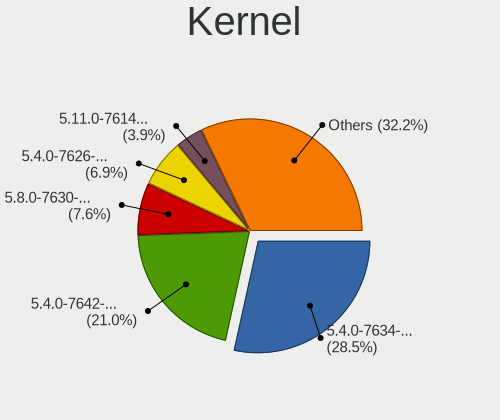

| Version                   | Notebooks | Percent |
|---------------------------|-----------|---------|
| 5.4.0-7634-generic        | 346       | 28.74%  |
| 5.4.0-7642-generic        | 255       | 21.18%  |
| 5.8.0-7630-generic        | 92        | 7.64%   |
| 5.4.0-7626-generic        | 84        | 6.98%   |
| 5.11.0-7614-generic       | 48        | 3.99%   |
| 5.4.0-7625-generic        | 44        | 3.65%   |
| 5.8.0-7642-generic        | 41        | 3.41%   |
| 5.4.0-7629-generic        | 35        | 2.91%   |
| 5.11.0-7620-generic       | 35        | 2.91%   |
| 5.13.0-7620-generic       | 32        | 2.66%   |
| 5.13.0-7614-generic       | 28        | 2.33%   |
| 5.15.15-76051515-generic  | 23        | 1.91%   |
| 5.11.0-7612-generic       | 20        | 1.66%   |
| 5.8.0-7625-generic        | 17        | 1.41%   |
| 5.16.11-76051611-generic  | 13        | 1.08%   |
| 5.15.5-76051505-generic   | 13        | 1.08%   |
| 5.11.0-7633-generic       | 12        | 1%      |
| 5.15.11-76051511-generic  | 7         | 0.58%   |
| 5.16.15-76051615-generic  | 6         | 0.5%    |
| 5.15.8-76051508-generic   | 5         | 0.42%   |
| 5.7.1-050701-generic      | 3         | 0.25%   |
| 5.8.9-050809-generic      | 2         | 0.17%   |
| 5.8.6-xanmod1             | 2         | 0.17%   |
| 5.8.1-050801-generic      | 2         | 0.17%   |
| 5.7.15-050715-generic     | 2         | 0.17%   |
| 5.7.0-050700-generic      | 2         | 0.17%   |
| 5.6.7-050607-generic      | 2         | 0.17%   |
| 5.6.16-xanmod1            | 2         | 0.17%   |
| 5.4.0-7624-generic        | 2         | 0.17%   |
| 5.16.19-76051619-generic  | 2         | 0.17%   |
| 5.9.16-xanmod1            | 1         | 0.08%   |
| 5.9.0-050900rc2-generic   | 1         | 0.08%   |
| 5.8.6-050806-generic      | 1         | 0.08%   |
| 5.8.2-050802-generic      | 1         | 0.08%   |
| 5.8.12-050812-generic     | 1         | 0.08%   |
| 5.8.11-xanmod1            | 1         | 0.08%   |
| 5.8.11-050811-generic     | 1         | 0.08%   |
| 5.8.10-050810-generic     | 1         | 0.08%   |
| 5.8.0-050800-generic      | 1         | 0.08%   |
| 5.7.9-xanmod1             | 1         | 0.08%   |
| 5.7.8-050708-generic      | 1         | 0.08%   |
| 5.7.10-xanmod1            | 1         | 0.08%   |
| 5.7.0-4.1-liquorix-amd64  | 1         | 0.08%   |
| 5.7.0-11.2-liquorix-amd64 | 1         | 0.08%   |
| 5.6.5-050605-generic      | 1         | 0.08%   |
| 5.6.14-xanmod1            | 1         | 0.08%   |
| 5.6.0-11.2-liquorix-amd64 | 1         | 0.08%   |
| 5.4.53-050453-generic     | 1         | 0.08%   |
| 5.17.5-76051705-generic   | 1         | 0.08%   |
| 5.15.3-051503-generic     | 1         | 0.08%   |
| 5.13.14-xanmod1           | 1         | 0.08%   |
| 5.13.0-xanmod1-cacule     | 1         | 0.08%   |
| 5.12.14-xanmod1           | 1         | 0.08%   |
| 5.12.12-custom            | 1         | 0.08%   |
| 5.10.20-xanmod1           | 1         | 0.08%   |
| 5.10.0                    | 1         | 0.08%   |
| 4.9.0-040900-generic      | 1         | 0.08%   |

Kernel Family
-------------

Linux kernel without a distro release

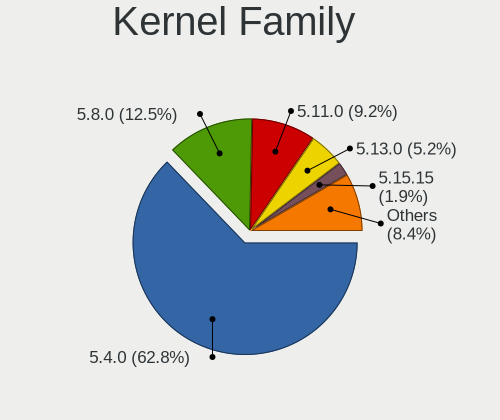

| Version | Notebooks | Percent |
|---------|-----------|---------|
| 5.4.0   | 743       | 63.45%  |
| 5.8.0   | 148       | 12.64%  |
| 5.11.0  | 109       | 9.31%   |
| 5.13.0  | 60        | 5.12%   |
| 5.15.15 | 23        | 1.96%   |
| 5.16.11 | 13        | 1.11%   |
| 5.15.5  | 13        | 1.11%   |
| 5.15.11 | 7         | 0.6%    |
| 5.16.15 | 6         | 0.51%   |
| 5.15.8  | 5         | 0.43%   |
| 5.7.0   | 4         | 0.34%   |
| 5.8.6   | 3         | 0.26%   |
| 5.7.1   | 3         | 0.26%   |
| 5.8.9   | 2         | 0.17%   |
| 5.8.11  | 2         | 0.17%   |
| 5.8.1   | 2         | 0.17%   |
| 5.7.15  | 2         | 0.17%   |
| 5.6.7   | 2         | 0.17%   |
| 5.6.16  | 2         | 0.17%   |
| 5.16.19 | 2         | 0.17%   |
| 5.9.16  | 1         | 0.09%   |
| 5.9.0   | 1         | 0.09%   |
| 5.8.2   | 1         | 0.09%   |
| 5.8.12  | 1         | 0.09%   |
| 5.8.10  | 1         | 0.09%   |
| 5.7.9   | 1         | 0.09%   |
| 5.7.8   | 1         | 0.09%   |
| 5.7.10  | 1         | 0.09%   |
| 5.6.5   | 1         | 0.09%   |
| 5.6.14  | 1         | 0.09%   |
| 5.6.0   | 1         | 0.09%   |
| 5.4.53  | 1         | 0.09%   |
| 5.17.5  | 1         | 0.09%   |
| 5.15.3  | 1         | 0.09%   |
| 5.13.14 | 1         | 0.09%   |
| 5.12.14 | 1         | 0.09%   |
| 5.12.12 | 1         | 0.09%   |
| 5.10.20 | 1         | 0.09%   |
| 5.10.0  | 1         | 0.09%   |
| 4.9.0   | 1         | 0.09%   |

Kernel Major Ver.
-----------------

Linux kernel major version

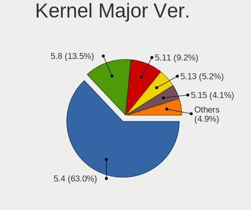

| Version | Notebooks | Percent |
|---------|-----------|---------|
| 5.4     | 744       | 63.64%  |
| 5.8     | 160       | 13.69%  |
| 5.11    | 109       | 9.32%   |
| 5.13    | 61        | 5.22%   |
| 5.15    | 48        | 4.11%   |
| 5.16    | 21        | 1.8%    |
| 5.7     | 11        | 0.94%   |
| 5.6     | 7         | 0.6%    |
| 5.9     | 2         | 0.17%   |
| 5.12    | 2         | 0.17%   |
| 5.10    | 2         | 0.17%   |
| 5.17    | 1         | 0.09%   |
| 4.9     | 1         | 0.09%   |

Arch
----

OS architecture (x86_64, i586, etc.)

| Name   | Notebooks | Percent |
|--------|-----------|---------|
| x86_64 | 1139      | 100%    |

DE
--

Desktop Environment

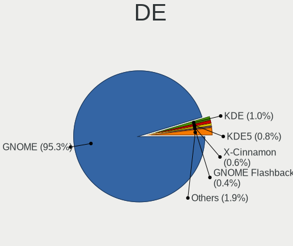

| Name            | Notebooks | Percent |
|-----------------|-----------|---------|
| GNOME           | 1093      | 95.46%  |
| KDE             | 11        | 0.96%   |
| KDE5            | 8         | 0.7%    |
| X-Cinnamon      | 7         | 0.61%   |
| GNOME Flashback | 5         | 0.44%   |
| Unknown         | 5         | 0.44%   |
| MATE            | 4         | 0.35%   |
| LXQt            | 3         | 0.26%   |
| Cinnamon        | 3         | 0.26%   |
| Unity           | 2         | 0.17%   |
| Budgie          | 2         | 0.17%   |
| XFCE            | 1         | 0.09%   |
| awesome         | 1         | 0.09%   |

Display Server
--------------

X11 or Wayland

| Name    | Notebooks | Percent |
|---------|-----------|---------|
| X11     | 1125      | 98.51%  |
| Wayland | 16        | 1.4%    |
| Tty     | 1         | 0.09%   |

Display Manager
---------------

SDDM, LightDM, etc.

| Name    | Notebooks | Percent |
|---------|-----------|---------|
| Unknown | 880       | 76.92%  |
| GDM     | 259       | 22.64%  |
| SDDM    | 3         | 0.26%   |
| TDM     | 1         | 0.09%   |
| GDM3    | 1         | 0.09%   |

OS Lang
-------

Language

| Lang    | Notebooks | Percent |
|---------|-----------|---------|
| en_US   | 646       | 56.47%  |
| pt_BR   | 137       | 11.98%  |
| en_GB   | 86        | 7.52%   |
| de_DE   | 38        | 3.32%   |
| es_ES   | 36        | 3.15%   |
| C       | 26        | 2.27%   |
| en_AU   | 25        | 2.19%   |
| fr_FR   | 22        | 1.92%   |
| en_CA   | 21        | 1.84%   |
| it_IT   | 18        | 1.57%   |
| ru_RU   | 16        | 1.4%    |
| pl_PL   | 10        | 0.87%   |
| pt_PT   | 8         | 0.7%    |
| en_IN   | 5         | 0.44%   |
| Unknown | 5         | 0.44%   |
| sv_SE   | 4         | 0.35%   |
| nl_NL   | 4         | 0.35%   |
| tr_TR   | 3         | 0.26%   |
| ro_RO   | 3         | 0.26%   |
| fi_FI   | 3         | 0.26%   |
| es_MX   | 3         | 0.26%   |
| da_DK   | 3         | 0.26%   |
| nb_NO   | 2         | 0.17%   |
| hr_HR   | 2         | 0.17%   |
| fr_CA   | 2         | 0.17%   |
| es_AR   | 2         | 0.17%   |
| cs_CZ   | 2         | 0.17%   |
| zh_TW   | 1         | 0.09%   |
| sv_FI   | 1         | 0.09%   |
| nl_BE   | 1         | 0.09%   |
| ko_KR   | 1         | 0.09%   |
| hu_HU   | 1         | 0.09%   |
| fr_BE   | 1         | 0.09%   |
| et_EE   | 1         | 0.09%   |
| en_ZA   | 1         | 0.09%   |
| en_NZ   | 1         | 0.09%   |
| el_GR   | 1         | 0.09%   |
| ca_ES   | 1         | 0.09%   |
| bg_BG   | 1         | 0.09%   |

Boot Mode
---------

EFI or BIOS

| Mode | Notebooks | Percent |
|------|-----------|---------|
| EFI  | 610       | 52.91%  |
| BIOS | 543       | 47.09%  |

Filesystem
----------

Type of filesystem

| Type    | Notebooks | Percent |
|---------|-----------|---------|
| Ext4    | 1103      | 96.75%  |
| Btrfs   | 15        | 1.32%   |
| Overlay | 13        | 1.14%   |
| Xfs     | 9         | 0.79%   |

Part. scheme
------------

Scheme of partitioning

| Type    | Notebooks | Percent |
|---------|-----------|---------|
| Unknown | 875       | 76.49%  |
| GPT     | 234       | 20.45%  |
| MBR     | 35        | 3.06%   |

Dual Boot with Linux/BSD
------------------------

Hosting more than one Linux/BSD

| Dual boot | Notebooks | Percent |
|-----------|-----------|---------|
| No        | 1111      | 97.54%  |
| Yes       | 28        | 2.46%   |

Dual Boot (Win)
---------------

Hosting Linux and Windows

| Dual boot | Notebooks | Percent |
|-----------|-----------|---------|
| No        | 1039      | 90.9%   |
| Yes       | 104       | 9.1%    |

Board
-----

Vendor
------

Motherboard manufacturer

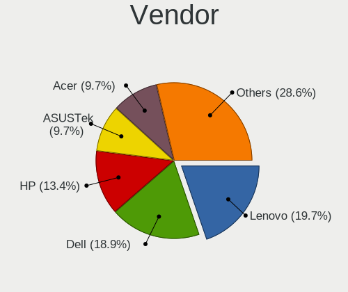

| Name                           | Notebooks | Percent |
|--------------------------------|-----------|---------|
| Lenovo                         | 226       | 19.84%  |
| Dell                           | 214       | 18.79%  |
| Hewlett-Packard                | 151       | 13.26%  |
| ASUSTek Computer               | 112       | 9.83%   |
| Acer                           | 110       | 9.66%   |
| Apple                          | 51        | 4.48%   |
| System76                       | 40        | 3.51%   |
| MSI                            | 35        | 3.07%   |
| Toshiba                        | 27        | 2.37%   |
| Samsung Electronics            | 25        | 2.19%   |
| Sony                           | 15        | 1.32%   |
| Notebook                       | 14        | 1.23%   |
| HUAWEI                         | 14        | 1.23%   |
| Alienware                      | 9         | 0.79%   |
| Positivo                       | 8         | 0.7%    |
| Razer                          | 6         | 0.53%   |
| Google                         | 6         | 0.53%   |
| Unknown                        | 5         | 0.44%   |
| Timi                           | 4         | 0.35%   |
| Intel                          | 4         | 0.35%   |
| Gigabyte Technology            | 4         | 0.35%   |
| Fujitsu                        | 4         | 0.35%   |
| Clevo                          | 4         | 0.35%   |
| TUXEDO                         | 3         | 0.26%   |
| LG Electronics                 | 3         | 0.26%   |
| Quanta                         | 2         | 0.18%   |
| PC Specialist                  | 2         | 0.18%   |
| Packard Bell                   | 2         | 0.18%   |
| OEM                            | 2         | 0.18%   |
| Metabox                        | 2         | 0.18%   |
| Fujitsu Siemens                | 2         | 0.18%   |
| eMachines                      | 2         | 0.18%   |
| Chuwi                          | 2         | 0.18%   |
| Wortmann AG                    | 1         | 0.09%   |
| TrekStor                       | 1         | 0.09%   |
| Teclast                        | 1         | 0.09%   |
| Schenker                       | 1         | 0.09%   |
| Purism                         | 1         | 0.09%   |
| Positivo Bahia - VAIO          | 1         | 0.09%   |
| Panasonic                      | 1         | 0.09%   |
| OriginPC                       | 1         | 0.09%   |
| Nuvision                       | 1         | 0.09%   |
| NEC Computers                  | 1         | 0.09%   |
| Medion                         | 1         | 0.09%   |
| Matsushita Electric Industrial | 1         | 0.09%   |
| LNV                            | 1         | 0.09%   |
| KOGAN                          | 1         | 0.09%   |
| Itronix                        | 1         | 0.09%   |
| Itautec                        | 1         | 0.09%   |
| IT Channel Pty                 | 1         | 0.09%   |
| Intel Client Systems           | 1         | 0.09%   |
| HASEE Computer                 | 1         | 0.09%   |
| GPU Company                    | 1         | 0.09%   |
| Gateway                        | 1         | 0.09%   |
| EVOO                           | 1         | 0.09%   |
| Durabook                       | 1         | 0.09%   |
| Daten Tecnologia               | 1         | 0.09%   |
| Bluechip Computer              | 1         | 0.09%   |
| BANGHO                         | 1         | 0.09%   |
| Avell High Performance         | 1         | 0.09%   |

Model
-----

Motherboard model

| Name                                      | Notebooks | Percent |
|-------------------------------------------|-----------|---------|
| Dell XPS 15 7590                          | 15        | 1.32%   |
| System76 Oryx Pro                         | 12        | 1.05%   |
| System76 Lemur Pro                        | 10        | 0.88%   |
| HP Pavilion Notebook                      | 7         | 0.61%   |
| System76 Galago Pro                       | 6         | 0.53%   |
| HP Pavilion 15                            | 6         | 0.53%   |
| Dell XPS 15 9500                          | 6         | 0.53%   |
| Unknown                                   | 6         | 0.53%   |
| Lenovo ThinkPad X1 Extreme 2nd 20QVCTO1WW | 5         | 0.44%   |
| HP Notebook                               | 5         | 0.44%   |
| Acer Aspire A315-41G                      | 5         | 0.44%   |
| System76 Gazelle                          | 4         | 0.35%   |
| System76 Darter Pro                       | 4         | 0.35%   |
| Samsung 340XAA/350XAA/550XAA              | 4         | 0.35%   |
| Lenovo IdeaPad S145-15IWL 81S9            | 4         | 0.35%   |
| Lenovo IdeaPad S145-15API 81V7            | 4         | 0.35%   |
| Lenovo IdeaPad 330-15IKB 81FE             | 4         | 0.35%   |
| Lenovo IdeaPad 330-15IKB 81DE             | 4         | 0.35%   |
| HUAWEI KPL-W0X                            | 4         | 0.35%   |
| HP Pavilion g6                            | 4         | 0.35%   |
| HP Pavilion dv6                           | 4         | 0.35%   |
| Dell Latitude E6410                       | 4         | 0.35%   |
| Dell Inspiron N5110                       | 4         | 0.35%   |
| Dell Inspiron 5437                        | 4         | 0.35%   |
| Dell G7 7588                              | 4         | 0.35%   |
| Apple MacBookPro8,2                       | 4         | 0.35%   |
| Apple MacBook5,1                          | 4         | 0.35%   |
| Acer Predator PH315-52                    | 4         | 0.35%   |
| Timi RedmiBook 16                         | 3         | 0.26%   |
| Razer Blade                               | 3         | 0.26%   |
| Lenovo IdeaPad L340-15IRH Gaming 81LK     | 3         | 0.26%   |
| Lenovo IdeaPad Gaming 3 15ARH05 82EY      | 3         | 0.26%   |
| HUAWEI NBLK-WAX9X                         | 3         | 0.26%   |
| HP ProBook 6460b                          | 3         | 0.26%   |
| HP Pavilion Laptop 15-cw1xxx              | 3         | 0.26%   |
| HP Pavilion g7                            | 3         | 0.26%   |
| HP Laptop 15-db1xxx                       | 3         | 0.26%   |
| HP Compaq Presario CQ60                   | 3         | 0.26%   |
| HP 255 G7 Notebook PC                     | 3         | 0.26%   |
| Dell XPS 15 9570                          | 3         | 0.26%   |
| Dell XPS 15 9560                          | 3         | 0.26%   |
| Dell Latitude E7450                       | 3         | 0.26%   |
| Dell Latitude E7440                       | 3         | 0.26%   |
| Dell Latitude E6440                       | 3         | 0.26%   |
| Dell Inspiron 5480                        | 3         | 0.26%   |
| Dell Inspiron 3421                        | 3         | 0.26%   |
| Dell Inspiron 15-3567                     | 3         | 0.26%   |
| Dell G3 3579                              | 3         | 0.26%   |
| ASUS VivoBook_ASUSLaptop X509DA_M509DA    | 3         | 0.26%   |
| ASUS TUF Gaming FX505DT_FX505DT           | 3         | 0.26%   |
| ASUS G74Sx                                | 3         | 0.26%   |
| Apple MacBookPro9,2                       | 3         | 0.26%   |
| Apple MacBookPro7,1                       | 3         | 0.26%   |
| Apple MacBookPro5,5                       | 3         | 0.26%   |
| Apple MacBookPro12,1                      | 3         | 0.26%   |
| Acer Nitro AN515-42                       | 3         | 0.26%   |
| Acer Aspire A715-75G                      | 3         | 0.26%   |
| Acer Aspire A515-51G                      | 3         | 0.26%   |
| Toshiba Satellite P55W-C                  | 2         | 0.18%   |
| Toshiba Satellite C55-B                   | 2         | 0.18%   |

Model Family
------------

Motherboard model prefix

| Name               | Notebooks | Percent |
|--------------------|-----------|---------|
| Lenovo ThinkPad    | 115       | 10.1%   |
| Dell Inspiron      | 87        | 7.64%   |
| Acer Aspire        | 84        | 7.37%   |
| Lenovo IdeaPad     | 76        | 6.67%   |
| Dell Latitude      | 45        | 3.95%   |
| HP Pavilion        | 42        | 3.69%   |
| Dell XPS           | 42        | 3.69%   |
| Toshiba Satellite  | 24        | 2.11%   |
| HP ProBook         | 22        | 1.93%   |
| HP EliteBook       | 22        | 1.93%   |
| ASUS VivoBook      | 19        | 1.67%   |
| HP Laptop          | 18        | 1.58%   |
| System76 Oryx      | 12        | 1.05%   |
| Dell Vostro        | 12        | 1.05%   |
| Acer Nitro         | 12        | 1.05%   |
| Dell Precision     | 11        | 0.97%   |
| System76 Lemur     | 10        | 0.88%   |
| Lenovo Legion      | 10        | 0.88%   |
| ASUS TUF           | 8         | 0.7%    |
| ASUS ROG           | 8         | 0.7%    |
| System76 Galago    | 6         | 0.53%   |
| Razer Blade        | 6         | 0.53%   |
| HP OMEN            | 6         | 0.53%   |
| HP ENVY            | 6         | 0.53%   |
| HP Compaq          | 6         | 0.53%   |
| Apple MacBookPro11 | 6         | 0.53%   |
| Unknown            | 6         | 0.53%   |
| System76 Gazelle   | 5         | 0.44%   |
| HP Stream          | 5         | 0.44%   |
| HP Notebook        | 5         | 0.44%   |
| Dell G7            | 5         | 0.44%   |
| Apple MacBookPro8  | 5         | 0.44%   |
| Acer Predator      | 5         | 0.44%   |
| System76 Darter    | 4         | 0.35%   |
| Samsung 340XAA     | 4         | 0.35%   |
| Lenovo Yoga        | 4         | 0.35%   |
| HUAWEI KPL-W0X     | 4         | 0.35%   |
| Fujitsu LIFEBOOK   | 4         | 0.35%   |
| Apple MacBookPro9  | 4         | 0.35%   |
| Apple MacBookPro5  | 4         | 0.35%   |
| Apple MacBook5     | 4         | 0.35%   |
| Acer Swift         | 4         | 0.35%   |
| Timi RedmiBook     | 3         | 0.26%   |
| MSI GF63           | 3         | 0.26%   |
| Lenovo ThinkBook   | 3         | 0.26%   |
| HUAWEI NBLK-WAX9X  | 3         | 0.26%   |
| HP ZBook           | 3         | 0.26%   |
| HP 255             | 3         | 0.26%   |
| HP 250             | 3         | 0.26%   |
| Dell System        | 3         | 0.26%   |
| Dell Studio        | 3         | 0.26%   |
| Dell G3            | 3         | 0.26%   |
| ASUS Zephyrus      | 3         | 0.26%   |
| ASUS G74Sx         | 3         | 0.26%   |
| Apple MacBookPro7  | 3         | 0.26%   |
| Apple MacBookPro12 | 3         | 0.26%   |
| System76 Serval    | 2         | 0.18%   |
| Samsung 550XCJ     | 2         | 0.18%   |
| Positivo NB50TH    | 2         | 0.18%   |
| Positivo Mobile    | 2         | 0.18%   |

MFG Year
--------

Motherboard manufacture year

| Year | Notebooks | Percent |
|------|-----------|---------|
| 2019 | 192       | 16.86%  |
| 2018 | 142       | 12.47%  |
| 2020 | 114       | 10.01%  |
| 2012 | 89        | 7.81%   |
| 2017 | 81        | 7.11%   |
| 2016 | 75        | 6.58%   |
| 2013 | 75        | 6.58%   |
| 2011 | 75        | 6.58%   |
| 2015 | 74        | 6.5%    |
| 2014 | 72        | 6.32%   |
| 2010 | 49        | 4.3%    |
| 2008 | 32        | 2.81%   |
| 2009 | 29        | 2.55%   |
| 2021 | 23        | 2.02%   |
| 2007 | 13        | 1.14%   |
| 2006 | 3         | 0.26%   |
| 2005 | 1         | 0.09%   |

Form Factor
-----------

Physical design of the computer

| Name     | Notebooks | Percent |
|----------|-----------|---------|
| Notebook | 1139      | 100%    |

Secure Boot
-----------

Enabled or disabled

| State    | Notebooks | Percent |
|----------|-----------|---------|
| Disabled | 1138      | 99.91%  |
| Enabled  | 1         | 0.09%   |

Coreboot
--------

Have coreboot on board

| Used | Notebooks | Percent |
|------|-----------|---------|
| No   | 1110      | 97.45%  |
| Yes  | 29        | 2.55%   |

RAM Size
--------

Total RAM memory

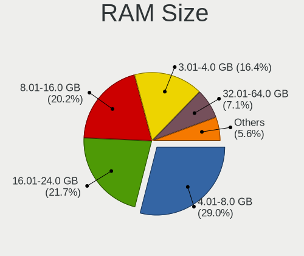

| Size in GB  | Notebooks | Percent |
|-------------|-----------|---------|
| 4.01-8.0    | 334       | 29.17%  |
| 16.01-24.0  | 246       | 21.48%  |
| 8.01-16.0   | 230       | 20.09%  |
| 3.01-4.0    | 190       | 16.59%  |
| 32.01-64.0  | 80        | 6.99%   |
| 1.01-2.0    | 31        | 2.71%   |
| 64.01-256.0 | 16        | 1.4%    |
| 24.01-32.0  | 10        | 0.87%   |
| 2.01-3.0    | 8         | 0.7%    |

RAM Used
--------

Used RAM memory

| Used GB    | Notebooks | Percent |
|------------|-----------|---------|
| 2.01-3.0   | 402       | 33.36%  |
| 1.01-2.0   | 323       | 26.8%   |
| 3.01-4.0   | 221       | 18.34%  |
| 4.01-8.0   | 212       | 17.59%  |
| 8.01-16.0  | 39        | 3.24%   |
| 0.51-1.0   | 3         | 0.25%   |
| 24.01-32.0 | 2         | 0.17%   |
| 16.01-24.0 | 2         | 0.17%   |
| 0.01-0.5   | 1         | 0.08%   |

Total Drives
------------

Number of drives on board

| Drives | Notebooks | Percent |
|--------|-----------|---------|
| 1      | 786       | 68.23%  |
| 2      | 313       | 27.17%  |
| 3      | 37        | 3.21%   |
| 4      | 9         | 0.78%   |
| 0      | 4         | 0.35%   |
| 5      | 2         | 0.17%   |
| 6      | 1         | 0.09%   |

Has CD-ROM
----------

Has CD-ROM on board

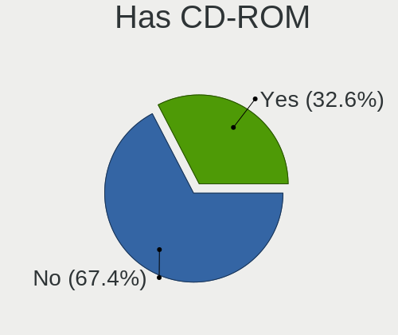

| Presented | Notebooks | Percent |
|-----------|-----------|---------|
| No        | 768       | 67.19%  |
| Yes       | 375       | 32.81%  |

Has Ethernet
------------

Has Ethernet on board

| Presented | Notebooks | Percent |
|-----------|-----------|---------|
| Yes       | 942       | 82.49%  |
| No        | 200       | 17.51%  |

Has WiFi
--------

Has WiFi module

| Presented | Notebooks | Percent |
|-----------|-----------|---------|
| Yes       | 1128      | 99.03%  |
| No        | 11        | 0.97%   |

Has Bluetooth
-------------

Has Bluetooth module

| Presented | Notebooks | Percent |
|-----------|-----------|---------|
| Yes       | 938       | 81.85%  |
| No        | 208       | 18.15%  |

Location
--------

Country
-------

Geographic location (country)

| Country         | Notebooks | Percent |
|-----------------|-----------|---------|
| USA             | 249       | 21.82%  |
| Brazil          | 191       | 16.74%  |
| Germany         | 58        | 5.08%   |
| UK              | 55        | 4.82%   |
| India           | 54        | 4.73%   |
| France          | 36        | 3.16%   |
| Canada          | 35        | 3.07%   |
| Australia       | 24        | 2.1%    |
| Mexico          | 23        | 2.02%   |
| Italy           | 22        | 1.93%   |
| Spain           | 21        | 1.84%   |
| Netherlands     | 20        | 1.75%   |
| Portugal        | 18        | 1.58%   |
| Poland          | 18        | 1.58%   |
| Russia          | 17        | 1.49%   |
| Sweden          | 16        | 1.4%    |
| Philippines     | 15        | 1.31%   |
| Indonesia       | 14        | 1.23%   |
| South Africa    | 13        | 1.14%   |
| Romania         | 12        | 1.05%   |
| Belgium         | 11        | 0.96%   |
| Switzerland     | 10        | 0.88%   |
| Greece          | 9         | 0.79%   |
| Chile           | 9         | 0.79%   |
| Turkey          | 8         | 0.7%    |
| Denmark         | 8         | 0.7%    |
| Czechia         | 8         | 0.7%    |
| Austria         | 8         | 0.7%    |
| New Zealand     | 7         | 0.61%   |
| Finland         | 7         | 0.61%   |
| Argentina       | 7         | 0.61%   |
| Vietnam         | 6         | 0.53%   |
| Ukraine         | 6         | 0.53%   |
| Norway          | 6         | 0.53%   |
| Croatia         | 6         | 0.53%   |
| Colombia        | 6         | 0.53%   |
| Taiwan          | 5         | 0.44%   |
| Singapore       | 5         | 0.44%   |
| Lithuania       | 4         | 0.35%   |
| Kenya           | 4         | 0.35%   |
| Ireland         | 4         | 0.35%   |
| Algeria         | 4         | 0.35%   |
| Saudi Arabia    | 3         | 0.26%   |
| Pakistan        | 3         | 0.26%   |
| Iceland         | 3         | 0.26%   |
| Hungary         | 3         | 0.26%   |
| Estonia         | 3         | 0.26%   |
| Egypt           | 3         | 0.26%   |
| Bulgaria        | 3         | 0.26%   |
| Zambia          | 2         | 0.18%   |
| Thailand        | 2         | 0.18%   |
| Tanzania        | 2         | 0.18%   |
| Serbia          | 2         | 0.18%   |
| Peru            | 2         | 0.18%   |
| North Macedonia | 2         | 0.18%   |
| Mauritius       | 2         | 0.18%   |
| Malta           | 2         | 0.18%   |
| Malaysia        | 2         | 0.18%   |
| Jordan          | 2         | 0.18%   |
| Japan           | 2         | 0.18%   |

City
----

Geographic location (city)

| City                 | Notebooks | Percent |
|----------------------|-----------|---------|
| Sao Paulo            | 22        | 1.87%   |
| Braslia            | 9         | 0.76%   |
| Zagreb               | 6         | 0.51%   |
| Vienna               | 6         | 0.51%   |
| Toronto              | 6         | 0.51%   |
| Recife               | 6         | 0.51%   |
| New York             | 6         | 0.51%   |
| Dallas               | 6         | 0.51%   |
| Charlotte            | 6         | 0.51%   |
| Bucharest            | 6         | 0.51%   |
| Brisbane             | 6         | 0.51%   |
| Belo Horizonte       | 6         | 0.51%   |
| Warsaw               | 5         | 0.42%   |
| Singapore            | 5         | 0.42%   |
| Mexico City          | 5         | 0.42%   |
| Melbourne            | 5         | 0.42%   |
| Madrid               | 5         | 0.42%   |
| Los Angeles          | 5         | 0.42%   |
| London               | 5         | 0.42%   |
| Johannesburg         | 5         | 0.42%   |
| Fortaleza            | 5         | 0.42%   |
| Cape Town            | 5         | 0.42%   |
| Brooklyn             | 5         | 0.42%   |
| Bengaluru            | 5         | 0.42%   |
| Athens               | 5         | 0.42%   |
| Sydney               | 4         | 0.34%   |
| Stockholm            | 4         | 0.34%   |
| Sao Goncalo          | 4         | 0.34%   |
| Rio de Janeiro       | 4         | 0.34%   |
| Pune                 | 4         | 0.34%   |
| Porto Alegre         | 4         | 0.34%   |
| Paris                | 4         | 0.34%   |
| Nairobi              | 4         | 0.34%   |
| Moscow               | 4         | 0.34%   |
| Lancaster            | 4         | 0.34%   |
| Hyderabad            | 4         | 0.34%   |
| Ho Chi Minh City     | 4         | 0.34%   |
| Helsinki             | 4         | 0.34%   |
| Goinia             | 4         | 0.34%   |
| Edmonton             | 4         | 0.34%   |
| Cebu City            | 4         | 0.34%   |
| Buenos Aires         | 4         | 0.34%   |
| Barcelona            | 4         | 0.34%   |
| Auckland             | 4         | 0.34%   |
| Amsterdam            | 4         | 0.34%   |
| Zurich               | 3         | 0.25%   |
| Vancouver            | 3         | 0.25%   |
| Uberlndia          | 3         | 0.25%   |
| Thane                | 3         | 0.25%   |
| Tallinn              | 3         | 0.25%   |
| Taipei               | 3         | 0.25%   |
| Sintra               | 3         | 0.25%   |
| Sao Lus            | 3         | 0.25%   |
| Sao Jos dos Campos | 3         | 0.25%   |
| Sao Caetano do Sul   | 3         | 0.25%   |
| Santo Andr         | 3         | 0.25%   |
| Rome                 | 3         | 0.25%   |
| Prague               | 3         | 0.25%   |
| Noida                | 3         | 0.25%   |
| New Delhi            | 3         | 0.25%   |

Drives
------

Drive Vendor
------------

Hard drive vendors

| Vendor                         | Notebooks | Drives | Percent |
|--------------------------------|-----------|--------|---------|
| Samsung Electronics            | 250       | 330    | 16.95%  |
| WDC                            | 191       | 215    | 12.95%  |
| Seagate                        | 160       | 184    | 10.85%  |
| Toshiba                        | 100       | 114    | 6.78%   |
| SanDisk                        | 98        | 120    | 6.64%   |
| Kingston                       | 94        | 102    | 6.37%   |
| Unknown                        | 70        | 84     | 4.75%   |
| HGST                           | 57        | 61     | 3.86%   |
| Crucial                        | 56        | 65     | 3.8%    |
| Intel                          | 51        | 59     | 3.46%   |
| SK Hynix                       | 50        | 60     | 3.39%   |
| A-DATA Technology              | 33        | 38     | 2.24%   |
| Hitachi                        | 29        | 30     | 1.97%   |
| Micron Technology              | 22        | 23     | 1.49%   |
| Apple                          | 20        | 21     | 1.36%   |
| Phison                         | 12        | 14     | 0.81%   |
| LITEONIT                       | 12        | 14     | 0.81%   |
| Transcend                      | 11        | 11     | 0.75%   |
| PNY                            | 10        | 11     | 0.68%   |
| LITEON                         | 10        | 10     | 0.68%   |
| China                          | 9         | 10     | 0.61%   |
| JMicron                        | 8         | 11     | 0.54%   |
| Fujitsu                        | 7         | 7      | 0.47%   |
| Team                           | 6         | 6      | 0.41%   |
| Silicon Motion                 | 6         | 7      | 0.41%   |
| Corsair                        | 6         | 6      | 0.41%   |
| Micron/Crucial Technology      | 5         | 6      | 0.34%   |
| KIOXIA                         | 5         | 5      | 0.34%   |
| BHT                            | 4         | 4      | 0.27%   |
| Patriot                        | 3         | 3      | 0.2%    |
| OCZ                            | 3         | 3      | 0.2%    |
| Netac                          | 3         | 3      | 0.2%    |
| Lexar                          | 3         | 3      | 0.2%    |
| KingSpec                       | 3         | 3      | 0.2%    |
| Hewlett-Packard                | 3         | 3      | 0.2%    |
| ASMT                           | 3         | 4      | 0.2%    |
| Apacer                         | 3         | 3      | 0.2%    |
| Zheino                         | 2         | 2      | 0.14%   |
| XPG                            | 2         | 2      | 0.14%   |
| TO Exter                       | 2         | 2      | 0.14%   |
| SPCC                           | 2         | 2      | 0.14%   |
| SABRENT                        | 2         | 2      | 0.14%   |
| PLEXTOR                        | 2         | 3      | 0.14%   |
| Lenovo                         | 2         | 2      | 0.14%   |
| LaCie                          | 2         | 2      | 0.14%   |
| KIOXIA-EXCERIA                 | 2         | 2      | 0.14%   |
| KingDian                       | 2         | 2      | 0.14%   |
| GOODRAM                        | 2         | 2      | 0.14%   |
| External                       | 2         | 2      | 0.14%   |
| ADATA Technology               | 2         | 2      | 0.14%   |
| WDC WDS2                       | 1         | 1      | 0.07%   |
| WDC WDB                        | 1         | 1      | 0.07%   |
| V-GeN                          | 1         | 1      | 0.07%   |
| Union Memory (Shenzhen)        | 1         | 1      | 0.07%   |
| Union Memory                   | 1         | 1      | 0.07%   |
| Teclast                        | 1         | 1      | 0.07%   |
| TAMMUZ                         | 1         | 1      | 0.07%   |
| SWORDBILL                      | 1         | 1      | 0.07%   |
| SSSTC                          | 1         | 1      | 0.07%   |
| Solid State Storage Technology | 1         | 1      | 0.07%   |

Drive Model
-----------

Hard drive models

| Model                               | Notebooks | Percent |
|-------------------------------------|-----------|---------|
| Kingston SA400S37240G 240GB SSD     | 29        | 1.87%   |
| HGST HTS721010A9E630 1TB            | 24        | 1.55%   |
| Samsung NVMe SSD Drive 512GB        | 23        | 1.49%   |
| Seagate ST1000LM035-1RK172 1TB      | 22        | 1.42%   |
| Samsung NVMe SSD Drive 256GB        | 19        | 1.23%   |
| Toshiba MQ01ABD100 1TB              | 18        | 1.16%   |
| Seagate ST1000LM024 HN-M101MBB 1TB  | 18        | 1.16%   |
| WDC WD10SPZX-24Z10 1TB              | 16        | 1.03%   |
| WDC WD10SPZX-21Z10T0 1TB            | 16        | 1.03%   |
| Samsung NVMe SSD Drive 1TB          | 16        | 1.03%   |
| Unknown MMC Card  64GB              | 15        | 0.97%   |
| Unknown MMC Card  32GB              | 15        | 0.97%   |
| Intel NVMe SSD Drive 512GB          | 15        | 0.97%   |
| Seagate ST9500325AS 500GB           | 14        | 0.9%    |
| Toshiba MQ04ABF100 1TB              | 13        | 0.84%   |
| Sandisk NVMe SSD Drive 512GB        | 12        | 0.78%   |
| Samsung SSD 860 EVO 1TB             | 12        | 0.78%   |
| SK Hynix NVMe SSD Drive 512GB       | 11        | 0.71%   |
| Samsung SSD 850 EVO 250GB           | 11        | 0.71%   |
| Crucial CT240BX500SSD1 240GB        | 11        | 0.71%   |
| Seagate ST500LT012-1DG142 500GB     | 10        | 0.65%   |
| Samsung SSD 860 EVO 500GB           | 10        | 0.65%   |
| Samsung NVMe SSD Drive 500GB        | 10        | 0.65%   |
| HGST HTS541010A9E680 1TB            | 10        | 0.65%   |
| WDC WDS240G2G0B-00EPW0 240GB SSD    | 9         | 0.58%   |
| Seagate Expansion 4TB               | 9         | 0.58%   |
| Sandisk NVMe SSD Drive 500GB        | 9         | 0.58%   |
| Samsung SSD 970 EVO Plus 500GB      | 9         | 0.58%   |
| Samsung NVMe SSD Drive 1024GB       | 9         | 0.58%   |
| Toshiba NVMe SSD Drive 512GB        | 8         | 0.52%   |
| Sandisk NVMe SSD Drive 256GB        | 8         | 0.52%   |
| Kingston SA400S37480G 480GB SSD     | 8         | 0.52%   |
| WDC WD10JPVX-75JC3T0 1TB            | 7         | 0.45%   |
| Unknown NVMe SSD Drive 256GB        | 7         | 0.45%   |
| Toshiba MQ01ABF050 500GB            | 7         | 0.45%   |
| Toshiba KBG30ZMS128G 128GB NVMe SSD | 7         | 0.45%   |
| SK Hynix NVMe SSD Drive 256GB       | 7         | 0.45%   |
| Seagate ST2000LX001-1RG174 2TB      | 7         | 0.45%   |
| Seagate ST1000LM014-1EJ164 1TB      | 7         | 0.45%   |
| Intel NVMe SSD Drive 1024GB         | 7         | 0.45%   |
| HGST HTS725050A7E630 500GB          | 7         | 0.45%   |
| Crucial CT1000MX500SSD1 1TB         | 7         | 0.45%   |
| WDC WD10JPVX-22JC3T0 1TB            | 6         | 0.39%   |
| Seagate ST1000LX015-1U7172 1TB      | 6         | 0.39%   |
| SanDisk SDSSDA240G 240GB            | 6         | 0.39%   |
| Samsung SSD 850 EVO 500GB           | 6         | 0.39%   |
| Samsung NVMe SSD Drive 128GB        | 6         | 0.39%   |
| Kingston SA400S37120G 120GB SSD     | 6         | 0.39%   |
| WDC WDS240G2G0A-00JH30 240GB SSD    | 5         | 0.32%   |
| WDC WD10JPCX-24UE4T0 1TB            | 5         | 0.32%   |
| Unknown SD/MMC/MS PRO 999GB         | 5         | 0.32%   |
| Seagate ST500LT012-9WS142 500GB     | 5         | 0.32%   |
| Seagate ST2000LM015-2E8174 2TB      | 5         | 0.32%   |
| Samsung SSD 860 QVO 1TB             | 5         | 0.32%   |
| Samsung NVMe SSD Drive 2TB          | 5         | 0.32%   |
| Samsung NVMe SSD Drive 250GB        | 5         | 0.32%   |
| PNY CS900 240GB SSD                 | 5         | 0.32%   |
| Kingston NVMe SSD Drive 512GB       | 5         | 0.32%   |
| JMicron Tech 250GB                  | 5         | 0.32%   |
| Intel SSDPEKNW512G8 512GB           | 5         | 0.32%   |

HDD Vendor
----------

Hard disk drive vendors

| Vendor              | Notebooks | Drives | Percent |
|---------------------|-----------|--------|---------|
| Seagate             | 154       | 171    | 32.49%  |
| WDC                 | 136       | 145    | 28.69%  |
| Toshiba             | 65        | 70     | 13.71%  |
| HGST                | 57        | 61     | 12.03%  |
| Hitachi             | 29        | 30     | 6.12%   |
| Samsung Electronics | 12        | 13     | 2.53%   |
| Fujitsu             | 7         | 7      | 1.48%   |
| Unknown             | 5         | 6      | 1.05%   |
| ASMT                | 3         | 4      | 0.63%   |
| SABRENT             | 2         | 2      | 0.42%   |
| PHD 3.0             | 1         | 1      | 0.21%   |
| Inateck             | 1         | 1      | 0.21%   |
| DAS                 | 1         | 4      | 0.21%   |
| Apple               | 1         | 1      | 0.21%   |

SSD Vendor
----------

Solid state drive vendors

| Vendor              | Notebooks | Drives | Percent |
|---------------------|-----------|--------|---------|
| Samsung Electronics | 115       | 140    | 20.5%   |
| Kingston            | 76        | 80     | 13.55%  |
| SanDisk             | 58        | 68     | 10.34%  |
| Crucial             | 54        | 63     | 9.63%   |
| WDC                 | 41        | 46     | 7.31%   |
| A-DATA Technology   | 24        | 25     | 4.28%   |
| SK Hynix            | 18        | 20     | 3.21%   |
| Micron Technology   | 16        | 16     | 2.85%   |
| Apple               | 16        | 17     | 2.85%   |
| LITEONIT            | 12        | 14     | 2.14%   |
| Intel               | 12        | 12     | 2.14%   |
| Transcend           | 11        | 11     | 1.96%   |
| Toshiba             | 10        | 13     | 1.78%   |
| PNY                 | 10        | 11     | 1.78%   |
| LITEON              | 10        | 10     | 1.78%   |
| China               | 9         | 10     | 1.6%    |
| Corsair             | 6         | 6      | 1.07%   |
| Team                | 5         | 5      | 0.89%   |
| Seagate             | 4         | 5      | 0.71%   |
| BHT                 | 4         | 4      | 0.71%   |
| Patriot             | 3         | 3      | 0.53%   |
| OCZ                 | 3         | 3      | 0.53%   |
| Netac               | 3         | 3      | 0.53%   |
| Lexar               | 3         | 3      | 0.53%   |
| KingSpec            | 3         | 3      | 0.53%   |
| JMicron             | 3         | 5      | 0.53%   |
| Apacer              | 3         | 3      | 0.53%   |
| TO Exter            | 2         | 2      | 0.36%   |
| SPCC                | 2         | 2      | 0.36%   |
| PLEXTOR             | 2         | 3      | 0.36%   |
| KingDian            | 2         | 2      | 0.36%   |
| Hewlett-Packard     | 2         | 2      | 0.36%   |
| GOODRAM             | 2         | 2      | 0.36%   |
| Zheino              | 1         | 1      | 0.18%   |
| WDC WDS2            | 1         | 1      | 0.18%   |
| WDC WDB             | 1         | 1      | 0.18%   |
| V-GeN               | 1         | 1      | 0.18%   |
| Teclast             | 1         | 1      | 0.18%   |
| TAMMUZ              | 1         | 1      | 0.18%   |
| Ramsta              | 1         | 1      | 0.18%   |
| OWC                 | 1         | 1      | 0.18%   |
| MR                  | 1         | 3      | 0.18%   |
| MAXTOR              | 1         | 1      | 0.18%   |
| KINGBANK            | 1         | 1      | 0.18%   |
| Intenso             | 1         | 1      | 0.18%   |
| INTEL SS            | 1         | 1      | 0.18%   |
| FORESEE             | 1         | 2      | 0.18%   |
| External            | 1         | 1      | 0.18%   |
| Dell                | 1         | 1      | 0.18%   |
| Colorful            | 1         | 1      | 0.18%   |

Drive Kind
----------

HDD or SSD

| Kind    | Notebooks | Drives | Percent |
|---------|-----------|--------|---------|
| SSD     | 521       | 632    | 36.82%  |
| HDD     | 459       | 516    | 32.44%  |
| NVMe    | 367       | 488    | 25.94%  |
| MMC     | 51        | 61     | 3.6%    |
| Unknown | 17        | 23     | 1.2%    |

Drive Connector
---------------

SATA, SAS, NVMe, etc.

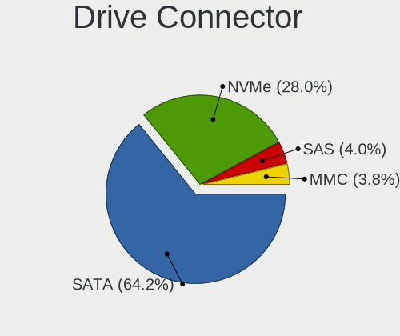

| Type | Notebooks | Drives | Percent |
|------|-----------|--------|---------|
| SATA | 849       | 1101   | 64.37%  |
| NVMe | 367       | 487    | 27.82%  |
| SAS  | 52        | 71     | 3.94%   |
| MMC  | 51        | 61     | 3.87%   |

Drive Size
----------

Size of hard drive

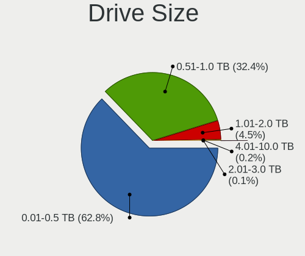

| Size in TB | Notebooks | Drives | Percent |
|------------|-----------|--------|---------|
| 0.01-0.5   | 606       | 737    | 62.28%  |
| 0.51-1.0   | 321       | 358    | 32.99%  |
| 1.01-2.0   | 32        | 35     | 3.29%   |
| 3.01-4.0   | 10        | 13     | 1.03%   |
| 2.01-3.0   | 2         | 3      | 0.21%   |
| 4.01-10.0  | 2         | 2      | 0.21%   |

Space Total
-----------

Amount of disk space available on the file system

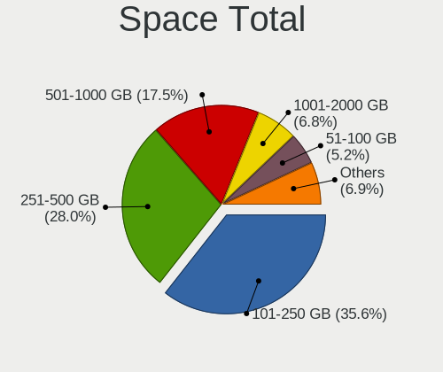

| Size in GB     | Notebooks | Percent |
|----------------|-----------|---------|
| 101-250        | 419       | 35.84%  |
| 251-500        | 327       | 27.97%  |
| 501-1000       | 204       | 17.45%  |
| 1001-2000      | 79        | 6.76%   |
| 51-100         | 60        | 5.13%   |
| 21-50          | 29        | 2.48%   |
| 1-20           | 24        | 2.05%   |
| 2001-3000      | 12        | 1.03%   |
| More than 3000 | 11        | 0.94%   |
| Unknown        | 4         | 0.34%   |

Space Used
----------

Amount of used disk space

| Used GB        | Notebooks | Percent |
|----------------|-----------|---------|
| 1-20           | 507       | 42.39%  |
| 21-50          | 238       | 19.9%   |
| 51-100         | 165       | 13.8%   |
| 101-250        | 144       | 12.04%  |
| 251-500        | 77        | 6.44%   |
| 501-1000       | 37        | 3.09%   |
| 1001-2000      | 19        | 1.59%   |
| Unknown        | 4         | 0.33%   |
| 2001-3000      | 3         | 0.25%   |
| More than 3000 | 2         | 0.17%   |

Malfunc. Drives
---------------

Drive models with a malfunction

| Model                                   | Notebooks | Drives | Percent |
|-----------------------------------------|-----------|--------|---------|
| Seagate ST500LM012 HN-M500MBB 500GB     | 2         | 2      | 7.14%   |
| Hitachi HTS545050A7E380 500GB           | 2         | 2      | 7.14%   |
| HGST HTS725050A7E630 500GB              | 2         | 2      | 7.14%   |
| WDC WD5000LPCX-21VHAT0 500GB            | 1         | 1      | 3.57%   |
| WDC WD5000BPVT-22HXZT3 500GB            | 1         | 1      | 3.57%   |
| WDC WD5000BPVT-08HXZT3 500GB            | 1         | 1      | 3.57%   |
| WDC WD10SPZX-75Z10T1 1TB                | 1         | 1      | 3.57%   |
| WDC WD10JPVX-75JC3T0 1TB                | 1         | 1      | 3.57%   |
| WDC WD10JPCX-24UE4T0 1TB                | 1         | 1      | 3.57%   |
| Toshiba MK5059GSXP 500GB                | 1         | 1      | 3.57%   |
| Toshiba MK2035GSS 200GB                 | 1         | 1      | 3.57%   |
| Toshiba KSG60ZMV256G M.2 2280 256GB SSD | 1         | 1      | 3.57%   |
| SK Hynix SC210 mSATA 256GB SSD          | 1         | 1      | 3.57%   |
| Seagate ST9500325AS 500GB               | 1         | 2      | 3.57%   |
| Seagate ST500LT012-9WS142 500GB         | 1         | 1      | 3.57%   |
| Seagate ST500LT012-1DG142 500GB         | 1         | 1      | 3.57%   |
| Seagate ST2000DM 001-1CH164 2TB         | 1         | 1      | 3.57%   |
| Seagate ST1000LX015-1U7172 1TB          | 1         | 1      | 3.57%   |
| Seagate ST1000LM035-1RK172 1TB          | 1         | 1      | 3.57%   |
| Seagate ST1000LM024 HN-M101MBB 1TB      | 1         | 1      | 3.57%   |
| Micron Technology 1100 SATA 512GB SSD   | 1         | 1      | 3.57%   |
| Kingston SUV400S37120G 120GB SSD        | 1         | 1      | 3.57%   |
| HGST HTS541010A9E680 1TB                | 1         | 1      | 3.57%   |
| A-DATA Technology SX8200PNP 256GB       | 1         | 1      | 3.57%   |
| A-DATA Technology SU800 512GB SSD       | 1         | 1      | 3.57%   |

Malfunc. Drive Vendor
---------------------

Vendors of faulty drives

| Vendor            | Notebooks | Drives | Percent |
|-------------------|-----------|--------|---------|
| Seagate           | 9         | 10     | 32.14%  |
| WDC               | 6         | 6      | 21.43%  |
| Toshiba           | 3         | 3      | 10.71%  |
| HGST              | 3         | 3      | 10.71%  |
| Hitachi           | 2         | 2      | 7.14%   |
| A-DATA Technology | 2         | 2      | 7.14%   |
| SK Hynix          | 1         | 1      | 3.57%   |
| Micron Technology | 1         | 1      | 3.57%   |
| Kingston          | 1         | 1      | 3.57%   |

Malfunc. HDD Vendor
-------------------

Vendors of faulty HDD drives

| Vendor  | Notebooks | Drives | Percent |
|---------|-----------|--------|---------|
| Seagate | 9         | 10     | 40.91%  |
| WDC     | 6         | 6      | 27.27%  |
| HGST    | 3         | 3      | 13.64%  |
| Toshiba | 2         | 2      | 9.09%   |
| Hitachi | 2         | 2      | 9.09%   |

Malfunc. Drive Kind
-------------------

Kinds of faulty drives

| Kind | Notebooks | Drives | Percent |
|------|-----------|--------|---------|
| HDD  | 22        | 23     | 78.57%  |
| SSD  | 5         | 5      | 17.86%  |
| NVMe | 1         | 1      | 3.57%   |

Failed Drives
-------------

Failed drive models

Zero info for selected period =(

Failed Drive Vendor
-------------------

Failed drive vendors

Zero info for selected period =(

Drive Status
------------

Number of failed and malfunc. drives

| Status   | Notebooks | Drives | Percent |
|----------|-----------|--------|---------|
| Detected | 884       | 1323   | 75.11%  |
| Works    | 265       | 368    | 22.51%  |
| Malfunc  | 28        | 29     | 2.38%   |

Storage controller
------------------

Storage Vendor
--------------

Storage controller vendors

| Vendor                           | Notebooks | Percent |
|----------------------------------|-----------|---------|
| Intel                            | 827       | 60.72%  |
| Samsung Electronics              | 147       | 10.79%  |
| AMD                              | 146       | 10.72%  |
| Sandisk                          | 56        | 4.11%   |
| SK Hynix                         | 32        | 2.35%   |
| Toshiba America Info Systems     | 27        | 1.98%   |
| Nvidia                           | 20        | 1.47%   |
| Kingston Technology Company      | 18        | 1.32%   |
| Phison Electronics               | 14        | 1.03%   |
| ADATA Technology                 | 11        | 0.81%   |
| KIOXIA                           | 8         | 0.59%   |
| Solid State Storage Technology   | 7         | 0.51%   |
| Silicon Motion                   | 7         | 0.51%   |
| Micron Technology                | 7         | 0.51%   |
| Union Memory (Shenzhen)          | 6         | 0.44%   |
| Micron/Crucial Technology        | 6         | 0.44%   |
| Silicon Integrated Systems [SiS] | 4         | 0.29%   |
| Seagate Technology               | 4         | 0.29%   |
| Realtek Semiconductor            | 3         | 0.22%   |
| Marvell Technology Group         | 3         | 0.22%   |
| Apple                            | 3         | 0.22%   |
| Lenovo                           | 2         | 0.15%   |
| Silicon Image                    | 1         | 0.07%   |
| MAXIO Technology (Hangzhou)      | 1         | 0.07%   |
| Lite-On Technology               | 1         | 0.07%   |
| JMicron Technology               | 1         | 0.07%   |

Storage Model
-------------

Storage controller models

| Model                                                                            | Notebooks | Percent |
|----------------------------------------------------------------------------------|-----------|---------|
| AMD FCH SATA Controller [AHCI mode]                                              | 140       | 9.79%   |
| Intel Sunrise Point-LP SATA Controller [AHCI mode]                               | 114       | 7.97%   |
| Samsung NVMe SSD Controller SM981/PM981/PM983                                    | 92        | 6.43%   |
| Intel 7 Series Chipset Family 6-port SATA Controller [AHCI mode]                 | 88        | 6.15%   |
| Intel Cannon Lake Mobile PCH SATA AHCI Controller                                | 79        | 5.52%   |
| Intel 82801 Mobile SATA Controller [RAID mode]                                   | 78        | 5.45%   |
| Intel 6 Series/C200 Series Chipset Family 6 port Mobile SATA AHCI Controller     | 69        | 4.83%   |
| Intel 8 Series SATA Controller 1 [AHCI mode]                                     | 48        | 3.36%   |
| Intel HM170/QM170 Chipset SATA Controller [AHCI Mode]                            | 44        | 3.08%   |
| Intel 8 Series/C220 Series Chipset Family 6-port SATA Controller 1 [AHCI mode]   | 38        | 2.66%   |
| Intel Wildcat Point-LP SATA Controller [AHCI Mode]                               | 31        | 2.17%   |
| Intel Cannon Point-LP SATA Controller [AHCI Mode]                                | 29        | 2.03%   |
| Intel 5 Series/3400 Series Chipset 4 port SATA AHCI Controller                   | 26        | 1.82%   |
| Intel SSD 660P Series                                                            | 24        | 1.68%   |
| Intel 82801IBM/IEM (ICH9M/ICH9M-E) 4 port SATA Controller [AHCI mode]            | 23        | 1.61%   |
| Samsung NVMe SSD Controller SM961/PM961/SM963                                    | 21        | 1.47%   |
| Intel Comet Lake SATA AHCI Controller                                            | 20        | 1.4%    |
| Intel 82801HM/HEM (ICH8M/ICH8M-E) IDE Controller                                 | 20        | 1.4%    |
| Intel 82801HM/HEM (ICH8M/ICH8M-E) SATA Controller [AHCI mode]                    | 18        | 1.26%   |
| Intel 400 Series Chipset Family SATA AHCI Controller                             | 17        | 1.19%   |
| Sandisk WD Black SN750 / PC SN730 NVMe SSD                                       | 14        | 0.98%   |
| Intel 5 Series/3400 Series Chipset 6 port SATA AHCI Controller                   | 14        | 0.98%   |
| Toshiba America Info Systems XG6 NVMe SSD Controller                             | 13        | 0.91%   |
| Samsung NVMe SSD Controller 980                                                  | 13        | 0.91%   |
| SK Hynix BC501 NVMe Solid State Drive                                            | 12        | 0.84%   |
| Sandisk WD Blue SN550 NVMe SSD                                                   | 11        | 0.77%   |
| Sandisk WD Blue SN500 / PC SN520 NVMe SSD                                        | 11        | 0.77%   |
| Kingston Company U-SNS8154P3 NVMe SSD                                            | 11        | 0.77%   |
| Intel SSD Pro 7600p/760p/E 6100p Series                                          | 11        | 0.77%   |
| Phison E12 NVMe Controller                                                       | 10        | 0.7%    |
| Nvidia MCP79 AHCI Controller                                                     | 10        | 0.7%    |
| Intel Celeron/Pentium Silver Processor SATA Controller                           | 9         | 0.63%   |
| SK Hynix BC511                                                                   | 8         | 0.56%   |
| Sandisk PC SN520 NVMe SSD                                                        | 8         | 0.56%   |
| Samsung NVMe SSD Controller SM951/PM951                                          | 8         | 0.56%   |
| Toshiba America Info Systems Toshiba America Info Non-Volatile memory controller | 7         | 0.49%   |
| Solid State Storage Non-Volatile memory controller                               | 7         | 0.49%   |
| Silicon Motion SM2263EN/SM2263XT SSD Controller                                  | 7         | 0.49%   |
| Sandisk WD Black 2018/SN750 / PC SN720 NVMe SSD                                  | 7         | 0.49%   |
| Samsung Electronics SATA controller                                              | 7         | 0.49%   |
| Micron Non-Volatile memory controller                                            | 7         | 0.49%   |
| KIOXIA Non-Volatile memory controller                                            | 7         | 0.49%   |
| Intel Atom Processor E3800 Series SATA AHCI Controller                           | 7         | 0.49%   |
| Union Memory (Shenzhen) Non-Volatile memory controller                           | 6         | 0.42%   |
| Sandisk Non-Volatile memory controller                                           | 6         | 0.42%   |
| Intel Ice Lake-LP SATA Controller [AHCI mode]                                    | 6         | 0.42%   |
| Intel Celeron N3350/Pentium N4200/Atom E3900 Series SATA AHCI Controller         | 6         | 0.42%   |
| ADATA XPG SX8200 Pro PCIe Gen3x4 M.2 2280 Solid State Drive                      | 6         | 0.42%   |
| SK Hynix Non-Volatile memory controller                                          | 5         | 0.35%   |
| Nvidia MCP89 SATA Controller (AHCI mode)                                         | 5         | 0.35%   |
| Intel Tiger Lake-LP SATA Controller [AHCI mode]                                  | 5         | 0.35%   |
| Intel Q170/Q150/B150/H170/H110/Z170/CM236 Chipset SATA Controller [AHCI Mode]    | 5         | 0.35%   |
| ADATA Non-Volatile memory controller                                             | 5         | 0.35%   |
| Toshiba America Info Systems BG3 NVMe SSD Controller                             | 4         | 0.28%   |
| SK Hynix Gold P31 SSD                                                            | 4         | 0.28%   |
| Silicon Integrated Systems [SiS] SATA Controller / IDE mode                      | 4         | 0.28%   |
| Silicon Integrated Systems [SiS] 5513 IDE Controller                             | 4         | 0.28%   |
| Samsung NVMe SSD Controller PM9A1/PM9A3/980PRO                                   | 4         | 0.28%   |
| Micron/Crucial P1 NVMe PCIe SSD                                                  | 4         | 0.28%   |
| Kingston Company A2000 NVMe SSD                                                  | 4         | 0.28%   |

Storage Kind
------------

Kind of storage controller (IDE, SATA, NVMe, SAS, ...)

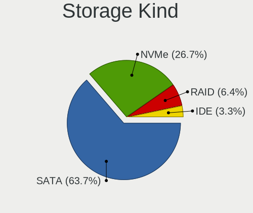

| Kind | Notebooks | Percent |
|------|-----------|---------|
| SATA | 883       | 63.75%  |
| NVMe | 368       | 26.57%  |
| RAID | 88        | 6.35%   |
| IDE  | 46        | 3.32%   |

Processor
---------

CPU Vendor
----------

Processor vendors

| Vendor | Notebooks | Percent |
|--------|-----------|---------|
| Intel  | 952       | 83.58%  |
| AMD    | 187       | 16.42%  |

CPU Model
---------

Processor models

| Model                                         | Notebooks | Percent |
|-----------------------------------------------|-----------|---------|
| Intel Core i7-9750H CPU @ 2.60GHz             | 42        | 3.69%   |
| Intel Core i7-8750H CPU @ 2.20GHz             | 30        | 2.63%   |
| Intel Core i7-7700HQ CPU @ 2.80GHz            | 25        | 2.19%   |
| Intel Core i5-8250U CPU @ 1.60GHz             | 24        | 2.11%   |
| Intel Core i7-8550U CPU @ 1.80GHz             | 23        | 2.02%   |
| Intel Core i5-8265U CPU @ 1.60GHz             | 23        | 2.02%   |
| AMD Ryzen 5 3500U with Radeon Vega Mobile Gfx | 22        | 1.93%   |
| Intel Core i5-7200U CPU @ 2.50GHz             | 18        | 1.58%   |
| Intel Core i5-6200U CPU @ 2.30GHz             | 18        | 1.58%   |
| Intel Core i7-8565U CPU @ 1.80GHz             | 17        | 1.49%   |
| Intel Core i5-10210U CPU @ 1.60GHz            | 17        | 1.49%   |
| AMD Ryzen 5 2500U with Radeon Vega Mobile Gfx | 16        | 1.4%    |
| Intel Core i7-10510U CPU @ 1.80GHz            | 14        | 1.23%   |
| Intel Core i7-7500U CPU @ 2.70GHz             | 13        | 1.14%   |
| Intel Core i7-6700HQ CPU @ 2.60GHz            | 13        | 1.14%   |
| Intel Core i7-2670QM CPU @ 2.20GHz            | 13        | 1.14%   |
| Intel Core i7-10750H CPU @ 2.60GHz            | 12        | 1.05%   |
| Intel Core i7-6500U CPU @ 2.50GHz             | 11        | 0.97%   |
| Intel Core i5-8300H CPU @ 2.30GHz             | 11        | 0.97%   |
| Intel Core i5-2520M CPU @ 2.50GHz             | 11        | 0.97%   |
| Intel Core i7-10875H CPU @ 2.30GHz            | 10        | 0.88%   |
| Intel Core i5-9300H CPU @ 2.40GHz             | 10        | 0.88%   |
| Intel Core i5-4210U CPU @ 1.70GHz             | 10        | 0.88%   |
| Intel Core i5-4200U CPU @ 1.60GHz             | 10        | 0.88%   |
| Intel Core i5-3210M CPU @ 2.50GHz             | 10        | 0.88%   |
| Intel Core i5-2430M CPU @ 2.40GHz             | 10        | 0.88%   |
| AMD Ryzen 7 3700U with Radeon Vega Mobile Gfx | 10        | 0.88%   |
| Intel Core i5-5200U CPU @ 2.20GHz             | 9         | 0.79%   |
| Intel Core i5-3320M CPU @ 2.60GHz             | 9         | 0.79%   |
| Intel 11th Gen Core i5-1135G7 @ 2.40GHz       | 9         | 0.79%   |
| Intel Core i7-5500U CPU @ 2.40GHz             | 8         | 0.7%    |
| Intel Core i7-4500U CPU @ 1.80GHz             | 8         | 0.7%    |
| Intel Core i5-6300U CPU @ 2.40GHz             | 8         | 0.7%    |
| Intel Core i5-2450M CPU @ 2.50GHz             | 8         | 0.7%    |
| Intel Core i3-3217U CPU @ 1.80GHz             | 8         | 0.7%    |
| AMD Ryzen 7 4800H with Radeon Graphics        | 8         | 0.7%    |
| AMD Ryzen 3 3200U with Radeon Vega Mobile Gfx | 8         | 0.7%    |
| Intel Core i7-4510U CPU @ 2.00GHz             | 7         | 0.61%   |
| Intel Core i7-3630QM CPU @ 2.40GHz            | 7         | 0.61%   |
| Intel Core i5-7300HQ CPU @ 2.50GHz            | 7         | 0.61%   |
| Intel Core 2 Duo CPU P8600 @ 2.40GHz          | 7         | 0.61%   |
| Intel Core i9-9980HK CPU @ 2.40GHz            | 6         | 0.53%   |
| Intel Core i7-6600U CPU @ 2.60GHz             | 6         | 0.53%   |
| Intel Core i7-4710HQ CPU @ 2.50GHz            | 6         | 0.53%   |
| Intel Core i7-3632QM CPU @ 2.20GHz            | 6         | 0.53%   |
| Intel Core i5-5300U CPU @ 2.30GHz             | 6         | 0.53%   |
| Intel Core i5 CPU M 460 @ 2.53GHz             | 6         | 0.53%   |
| Intel Core i3-8130U CPU @ 2.20GHz             | 6         | 0.53%   |
| Intel Core i3-6006U CPU @ 2.00GHz             | 6         | 0.53%   |
| Intel Core i3-4005U CPU @ 1.70GHz             | 6         | 0.53%   |
| Intel Core i3-3110M CPU @ 2.40GHz             | 6         | 0.53%   |
| Intel Celeron N4000 CPU @ 1.10GHz             | 6         | 0.53%   |
| AMD A4-9125 RADEON R3, 4 COMPUTE CORES 2C+2G  | 6         | 0.53%   |
| Intel Core i7-8850H CPU @ 2.60GHz             | 5         | 0.44%   |
| Intel Core i7-5600U CPU @ 2.60GHz             | 5         | 0.44%   |
| Intel Core i7-4700HQ CPU @ 2.40GHz            | 5         | 0.44%   |
| Intel Core i7-4600U CPU @ 2.10GHz             | 5         | 0.44%   |
| Intel Core i7-3610QM CPU @ 2.30GHz            | 5         | 0.44%   |
| Intel Core i7-3520M CPU @ 2.90GHz             | 5         | 0.44%   |
| Intel Core i7-2630QM CPU @ 2.00GHz            | 5         | 0.44%   |

CPU Model Family
----------------

Processor model prefix

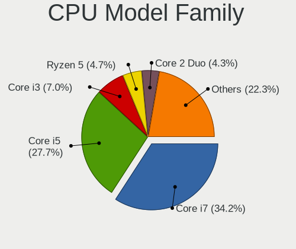

| Model                   | Notebooks | Percent |
|-------------------------|-----------|---------|
| Intel Core i7           | 390       | 34.24%  |
| Intel Core i5           | 315       | 27.66%  |
| Intel Core i3           | 80        | 7.02%   |
| AMD Ryzen 5             | 53        | 4.65%   |
| Intel Core 2 Duo        | 49        | 4.3%    |
| Intel Celeron           | 35        | 3.07%   |
| AMD Ryzen 7             | 35        | 3.07%   |
| Other                   | 22        | 1.93%   |
| AMD Ryzen 3             | 18        | 1.58%   |
| Intel Core i9           | 17        | 1.49%   |
| Intel Pentium           | 14        | 1.23%   |
| AMD A6                  | 14        | 1.23%   |
| AMD A8                  | 12        | 1.05%   |
| AMD A4                  | 11        | 0.97%   |
| AMD A10                 | 8         | 0.7%    |
| Intel Pentium Dual-Core | 7         | 0.61%   |
| Intel Pentium Dual      | 6         | 0.53%   |
| Intel Core 2            | 6         | 0.53%   |
| AMD Ryzen 7 PRO         | 4         | 0.35%   |
| AMD E1                  | 4         | 0.35%   |
| AMD A12                 | 4         | 0.35%   |
| Intel Xeon              | 3         | 0.26%   |
| Intel Core m3           | 3         | 0.26%   |
| Intel Atom              | 3         | 0.26%   |
| AMD Ryzen 9             | 3         | 0.26%   |
| AMD E2                  | 3         | 0.26%   |
| Intel Genuine           | 2         | 0.18%   |
| Intel Core M            | 2         | 0.18%   |
| AMD C-60                | 2         | 0.18%   |
| AMD Athlon              | 2         | 0.18%   |
| Intel Core 2 Extreme    | 1         | 0.09%   |
| AMD Turion II           | 1         | 0.09%   |
| AMD Turion 64 X2 Mobile | 1         | 0.09%   |
| AMD Turion 64 X2        | 1         | 0.09%   |
| AMD Ryzen 5 PRO         | 1         | 0.09%   |
| AMD Quad-Core           | 1         | 0.09%   |
| AMD PRO A10             | 1         | 0.09%   |
| AMD Mobile Sempron      | 1         | 0.09%   |
| AMD FX                  | 1         | 0.09%   |
| AMD E                   | 1         | 0.09%   |
| AMD Athlon II           | 1         | 0.09%   |
| AMD Athlon 64 X2        | 1         | 0.09%   |

CPU Cores
---------

Number of processor cores

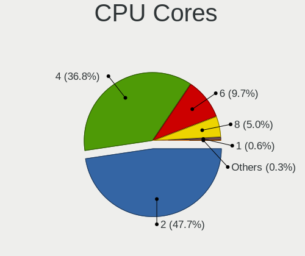

| Number | Notebooks | Percent |
|--------|-----------|---------|
| 2      | 546       | 47.94%  |
| 4      | 419       | 36.79%  |
| 6      | 109       | 9.57%   |
| 8      | 56        | 4.92%   |
| 1      | 7         | 0.61%   |
| 14     | 1         | 0.09%   |
| 10     | 1         | 0.09%   |

CPU Sockets
-----------

Number of sockets

| Number | Notebooks | Percent |
|--------|-----------|---------|
| 1      | 1139      | 100%    |

CPU Threads
-----------

Threads per core (Hyper-Threading)

| Number | Notebooks | Percent |
|--------|-----------|---------|
| 2      | 931       | 81.67%  |
| 1      | 209       | 18.33%  |

CPU Op-Modes
------------

CPU Operation Modes (32-bit, 64-bit)

| Op mode        | Notebooks | Percent |
|----------------|-----------|---------|
| 32-bit, 64-bit | 1139      | 100%    |

CPU Microcode
-------------

Microcode number

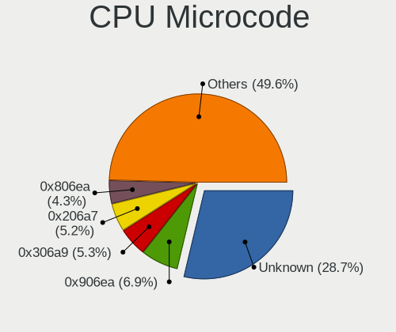

| Number     | Notebooks | Percent |
|------------|-----------|---------|
| Unknown    | 328       | 28.3%   |
| 0x906ea    | 81        | 6.99%   |
| 0x306a9    | 62        | 5.35%   |
| 0x206a7    | 61        | 5.26%   |
| 0x806ea    | 50        | 4.31%   |
| 0x406e3    | 50        | 4.31%   |
| 0x40651    | 44        | 3.8%    |
| 0x806ec    | 41        | 3.54%   |
| 0x306c3    | 34        | 2.93%   |
| 0x806e9    | 30        | 2.59%   |
| 0x08108102 | 27        | 2.33%   |
| 0x306d4    | 26        | 2.24%   |
| 0x906e9    | 25        | 2.16%   |
| 0x1067a    | 23        | 1.98%   |
| 0xa0652    | 22        | 1.9%    |
| 0x506e3    | 20        | 1.73%   |
| 0x20655    | 18        | 1.55%   |
| 0x906ed    | 14        | 1.21%   |
| 0x806eb    | 14        | 1.21%   |
| 0x10676    | 11        | 0.95%   |
| 0x08108109 | 11        | 0.95%   |
| 0x0810100b | 10        | 0.86%   |
| 0x06006705 | 10        | 0.86%   |
| 0x08600103 | 9         | 0.78%   |
| 0x706a1    | 7         | 0.6%    |
| 0x07030105 | 7         | 0.6%    |
| 0x06001119 | 7         | 0.6%    |
| 0x6fd      | 6         | 0.52%   |
| 0x406c4    | 6         | 0.52%   |
| 0x40661    | 6         | 0.52%   |
| 0x05000119 | 6         | 0.52%   |
| 0x706e5    | 5         | 0.43%   |
| 0x30678    | 5         | 0.43%   |
| 0x08600102 | 5         | 0.43%   |
| 0x0600611a | 5         | 0.43%   |
| 0x06003109 | 5         | 0.43%   |
| 0xa0660    | 4         | 0.35%   |
| 0x806c1    | 4         | 0.35%   |
| 0x406c3    | 4         | 0.35%   |
| 0x08600106 | 4         | 0.35%   |
| 0x08600104 | 4         | 0.35%   |
| 0x08101007 | 4         | 0.35%   |
| 0x0700010f | 4         | 0.35%   |
| 0x20652    | 3         | 0.26%   |
| 0x106e5    | 3         | 0.26%   |
| 0x06006704 | 3         | 0.26%   |
| 0x806d1    | 2         | 0.17%   |
| 0x6fb      | 2         | 0.17%   |
| 0x6fa      | 2         | 0.17%   |
| 0x6f6      | 2         | 0.17%   |
| 0x506c9    | 2         | 0.17%   |
| 0x0a50000c | 2         | 0.17%   |
| 0x08608103 | 2         | 0.17%   |
| 0x06006118 | 2         | 0.17%   |
| 0x03000027 | 2         | 0.17%   |
| 0x010000c8 | 2         | 0.17%   |
| 0xa0655    | 1         | 0.09%   |
| 0x906ec    | 1         | 0.09%   |
| 0x706a8    | 1         | 0.09%   |
| 0x6f2      | 1         | 0.09%   |

CPU Microarch
-------------

Microarchitecture

| Name            | Notebooks | Percent |
|-----------------|-----------|---------|
| KabyLake        | 326       | 28.62%  |
| Haswell         | 108       | 9.48%   |
| IvyBridge       | 88        | 7.73%   |
| SandyBridge     | 86        | 7.55%   |
| Skylake         | 85        | 7.46%   |
| Zen+            | 57        | 5%      |
| Penryn          | 47        | 4.13%   |
| Broadwell       | 41        | 3.6%    |
| CometLake       | 38        | 3.34%   |
| Westmere        | 37        | 3.25%   |
| Zen 2           | 30        | 2.63%   |
| Core            | 25        | 2.19%   |
| Zen             | 21        | 1.84%   |
| Excavator       | 21        | 1.84%   |
| Silvermont      | 20        | 1.76%   |
| TigerLake       | 15        | 1.32%   |
| IceLake         | 13        | 1.14%   |
| Puma            | 11        | 0.97%   |
| Piledriver      | 10        | 0.88%   |
| Goldmont plus   | 9         | 0.79%   |
| Bobcat          | 7         | 0.61%   |
| Steamroller     | 6         | 0.53%   |
| Jaguar          | 6         | 0.53%   |
| Goldmont        | 6         | 0.53%   |
| Nehalem         | 5         | 0.44%   |
| Zen 3           | 4         | 0.35%   |
| K8 Hammer       | 4         | 0.35%   |
| K10 Llano       | 4         | 0.35%   |
| Unknown         | 4         | 0.35%   |
| K8 & K10 hybrid | 2         | 0.18%   |
| K10             | 2         | 0.18%   |
| Bonnell         | 1         | 0.09%   |

Graphics
--------

GPU Vendor
----------

Vendors of graphics cards

| Vendor                           | Notebooks | Percent |
|----------------------------------|-----------|---------|
| Intel                            | 854       | 55.53%  |
| Nvidia                           | 425       | 27.63%  |
| AMD                              | 256       | 16.64%  |
| Silicon Integrated Systems [SiS] | 3         | 0.2%    |

GPU Model
---------

Graphics card models

| Model                                                                                    | Notebooks | Percent |
|------------------------------------------------------------------------------------------|-----------|---------|
| Intel CoffeeLake-H GT2 [UHD Graphics 630]                                                | 111       | 6.99%   |
| Intel 2nd Generation Core Processor Family Integrated Graphics Controller                | 78        | 4.91%   |
| Intel 3rd Gen Core processor Graphics Controller                                         | 77        | 4.85%   |
| Intel UHD Graphics 620                                                                   | 60        | 3.78%   |
| Intel Haswell-ULT Integrated Graphics Controller                                         | 57        | 3.59%   |
| AMD Picasso/Raven 2 [Radeon Vega Series / Radeon Vega Mobile Series]                     | 57        | 3.59%   |
| Intel Skylake GT2 [HD Graphics 520]                                                      | 50        | 3.15%   |
| Intel WhiskeyLake-U GT2 [UHD Graphics 620]                                               | 44        | 2.77%   |
| Intel 4th Gen Core Processor Integrated Graphics Controller                              | 38        | 2.39%   |
| Intel HD Graphics 620                                                                    | 35        | 2.21%   |
| Nvidia TU117M [GeForce GTX 1650 Mobile / Max-Q]                                          | 34        | 2.14%   |
| Intel HD Graphics 5500                                                                   | 32        | 2.02%   |
| Intel HD Graphics 630                                                                    | 31        | 1.95%   |
| Intel CometLake-U GT2 [UHD Graphics]                                                     | 30        | 1.89%   |
| Intel CometLake-H GT2 [UHD Graphics]                                                     | 30        | 1.89%   |
| AMD Renoir                                                                               | 29        | 1.83%   |
| Intel Core Processor Integrated Graphics Controller                                      | 28        | 1.76%   |
| Nvidia GP107M [GeForce GTX 1050 Mobile]                                                  | 26        | 1.64%   |
| Nvidia GP107M [GeForce GTX 1050 Ti Mobile]                                               | 22        | 1.39%   |
| Intel HD Graphics 530                                                                    | 22        | 1.39%   |
| Nvidia GP108M [GeForce MX150]                                                            | 21        | 1.32%   |
| AMD Topaz XT [Radeon R7 M260/M265 / M340/M360 / M440/M445 / 530/535 / 620/625 Mobile]    | 20        | 1.26%   |
| AMD Raven Ridge [Radeon Vega Series / Radeon Vega Mobile Series]                         | 20        | 1.26%   |
| Intel TigerLake-LP GT2 [Iris Xe Graphics]                                                | 15        | 0.95%   |
| Intel Mobile GM965/GL960 Integrated Graphics Controller (secondary)                      | 14        | 0.88%   |
| Intel Mobile GM965/GL960 Integrated Graphics Controller (primary)                        | 14        | 0.88%   |
| Intel Mobile 4 Series Chipset Integrated Graphics Controller                             | 14        | 0.88%   |
| AMD Stoney [Radeon R2/R3/R4/R5 Graphics]                                                 | 14        | 0.88%   |
| Nvidia TU116M [GeForce GTX 1660 Ti Mobile]                                               | 13        | 0.82%   |
| Nvidia GM108M [GeForce 940MX]                                                            | 13        | 0.82%   |
| AMD Sun XT [Radeon HD 8670A/8670M/8690M / R5 M330 / M430 / Radeon 520 Mobile]            | 13        | 0.82%   |
| Nvidia TU106M [GeForce RTX 2060 Mobile]                                                  | 12        | 0.76%   |
| Nvidia GP106M [GeForce GTX 1060 Mobile]                                                  | 12        | 0.76%   |
| Nvidia TU117M [GeForce GTX 1650 Ti Mobile]                                               | 11        | 0.69%   |
| Nvidia TU117M                                                                            | 11        | 0.69%   |
| Nvidia GM107M [GeForce GTX 960M]                                                         | 11        | 0.69%   |
| Nvidia C79 [GeForce 9400M]                                                               | 10        | 0.63%   |
| Intel Atom/Celeron/Pentium Processor x5-E8000/J3xxx/N3xxx Integrated Graphics Controller | 10        | 0.63%   |
| Intel Atom Processor Z36xxx/Z37xxx Series Graphics & Display                             | 10        | 0.63%   |
| Intel GeminiLake [UHD Graphics 600]                                                      | 9         | 0.57%   |
| AMD Thames [Radeon HD 7500M/7600M Series]                                                | 9         | 0.57%   |
| Nvidia GP108M [GeForce MX250]                                                            | 8         | 0.5%    |
| Nvidia GM108M [GeForce MX110]                                                            | 8         | 0.5%    |
| AMD Mullins [Radeon R4/R5 Graphics]                                                      | 8         | 0.5%    |
| Nvidia GM108M [GeForce 840M]                                                             | 7         | 0.44%   |
| Nvidia GM107M [GeForce GTX 950M]                                                         | 7         | 0.44%   |
| Nvidia GF117M [GeForce 610M/710M/810M/820M / GT 620M/625M/630M/720M]                     | 7         | 0.44%   |
| AMD Wani [Radeon R5/R6/R7 Graphics]                                                      | 7         | 0.44%   |
| AMD Baffin [Radeon RX 460/560D / Pro 450/455/460/555/555X/560/560X]                      | 7         | 0.44%   |
| Nvidia GM107 [GeForce 940MX]                                                             | 6         | 0.38%   |
| Intel Iris Plus Graphics G1 (Ice Lake)                                                   | 6         | 0.38%   |
| Intel Comet Lake UHD Graphics                                                            | 6         | 0.38%   |
| AMD Seymour [Radeon HD 6400M/7400M Series]                                               | 6         | 0.38%   |
| Nvidia MCP89 [GeForce 320M]                                                              | 5         | 0.32%   |
| Nvidia GP107M [GeForce GTX 1050 3 GB Max-Q]                                              | 5         | 0.32%   |
| Nvidia GM204M [GeForce GTX 970M]                                                         | 5         | 0.32%   |
| Nvidia GM108M [GeForce MX130]                                                            | 5         | 0.32%   |
| Nvidia GM108M [GeForce 930MX]                                                            | 5         | 0.32%   |
| Nvidia GK106M [GeForce GTX 765M]                                                         | 5         | 0.32%   |
| Nvidia GF108M [GeForce GT 525M]                                                          | 5         | 0.32%   |

GPU Combo
---------

Combinations of graphics cards

| Name           | Notebooks | Percent |
|----------------|-----------|---------|
| 1 x Intel      | 486       | 42.48%  |
| Intel + Nvidia | 318       | 27.8%   |
| 1 x AMD        | 150       | 13.11%  |
| 1 x Nvidia     | 82        | 7.17%   |
| Intel + AMD    | 51        | 4.46%   |
| 2 x AMD        | 33        | 2.88%   |
| AMD + Nvidia   | 20        | 1.75%   |
| 1 x SiS        | 3         | 0.26%   |
| 2 x Nvidia     | 1         | 0.09%   |

GPU Driver
----------

Free vs proprietary

| Driver      | Notebooks | Percent |
|-------------|-----------|---------|
| Free        | 768       | 66.9%   |
| Proprietary | 342       | 29.79%  |
| Unknown     | 38        | 3.31%   |

GPU Memory
----------

Total video memory

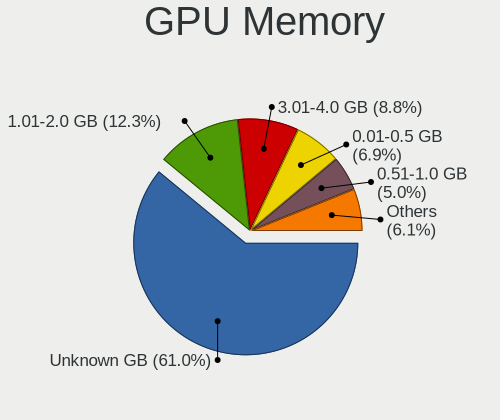

| Size in GB | Notebooks | Percent |
|------------|-----------|---------|
| Unknown    | 703       | 61.02%  |
| 1.01-2.0   | 141       | 12.24%  |
| 3.01-4.0   | 101       | 8.77%   |
| 0.01-0.5   | 80        | 6.94%   |
| 0.51-1.0   | 58        | 5.03%   |
| 5.01-6.0   | 39        | 3.39%   |
| 7.01-8.0   | 20        | 1.74%   |
| 2.01-3.0   | 9         | 0.78%   |
| 8.01-16.0  | 1         | 0.09%   |

Monitor
-------

Monitor Vendor
--------------

Monitor vendors

| Vendor                  | Notebooks | Percent |
|-------------------------|-----------|---------|
| AU Optronics            | 254       | 18.96%  |
| Chimei Innolux          | 207       | 15.45%  |
| LG Display              | 187       | 13.96%  |
| BOE                     | 153       | 11.42%  |
| Samsung Electronics     | 142       | 10.6%   |
| Goldstar                | 46        | 3.43%   |
| Sharp                   | 43        | 3.21%   |
| Apple                   | 42        | 3.13%   |
| Dell                    | 35        | 2.61%   |
| Chi Mei Optoelectronics | 28        | 2.09%   |
| Lenovo                  | 20        | 1.49%   |
| PANDA                   | 16        | 1.19%   |
| AOC                     | 14        | 1.04%   |
| BenQ                    | 13        | 0.97%   |
| Hewlett-Packard         | 12        | 0.9%    |
| Ancor Communications    | 12        | 0.9%    |
| Acer                    | 12        | 0.9%    |
| Philips                 | 11        | 0.82%   |
| InfoVision              | 8         | 0.6%    |
| ASUSTek Computer        | 7         | 0.52%   |
| Panasonic               | 5         | 0.37%   |
| ViewSonic               | 4         | 0.3%    |
| LGD                     | 4         | 0.3%    |
| LG Philips              | 4         | 0.3%    |
| InnoLux Display         | 4         | 0.3%    |
| CPT                     | 4         | 0.3%    |
| Vizio                   | 3         | 0.22%   |
| Toshiba                 | 3         | 0.22%   |
| Iiyama                  | 3         | 0.22%   |
| Fujitsu Siemens         | 3         | 0.22%   |
| Viotek                  | 2         | 0.15%   |
| Sony                    | 2         | 0.15%   |
| Sceptre Tech            | 2         | 0.15%   |
| HannStar                | 2         | 0.15%   |
| FOX                     | 2         | 0.15%   |
| WAN                     | 1         | 0.07%   |
| Vestel Elektronik       | 1         | 0.07%   |
| Unknown                 | 1         | 0.07%   |
| TMX                     | 1         | 0.07%   |
| TIANMA XM               | 1         | 0.07%   |
| TCL                     | 1         | 0.07%   |
| SKY                     | 1         | 0.07%   |
| Seiko/Epson             | 1         | 0.07%   |
| Seiki                   | 1         | 0.07%   |
| Proview                 | 1         | 0.07%   |
| Pixio                   | 1         | 0.07%   |
| OOO                     | 1         | 0.07%   |
| Nvidia                  | 1         | 0.07%   |
| MStar                   | 1         | 0.07%   |
| MSI                     | 1         | 0.07%   |
| MiTAC                   | 1         | 0.07%   |
| LG Electronics          | 1         | 0.07%   |
| Lenovo Group Limited    | 1         | 0.07%   |
| JDI                     | 1         | 0.07%   |
| IPS                     | 1         | 0.07%   |
| Insignia                | 1         | 0.07%   |
| Idek Iiyama             | 1         | 0.07%   |
| HUAWEI                  | 1         | 0.07%   |
| HIC                     | 1         | 0.07%   |
| GKK                     | 1         | 0.07%   |

Monitor Model
-------------

Monitor models

| Model                                                                     | Notebooks | Percent |
|---------------------------------------------------------------------------|-----------|---------|
| AU Optronics LCD Monitor AUO38ED 1920x1080 344x193mm 15.5-inch            | 20        | 1.48%   |
| Chimei Innolux LCD Monitor CMN14D4 1920x1080 309x173mm 13.9-inch          | 17        | 1.26%   |
| AU Optronics LCD Monitor AUO21ED 1920x1080 344x194mm 15.5-inch            | 13        | 0.96%   |
| Chimei Innolux LCD Monitor CMN14D5 1920x1080 309x173mm 13.9-inch          | 12        | 0.89%   |
| Samsung Electronics LCD Monitor SDCA029 3840x2160 344x194mm 15.5-inch     | 11        | 0.81%   |
| Goldstar ULTRAWIDE GSM59F1 2560x1080 673x284mm 28.8-inch                  | 11        | 0.81%   |
| LG Display LCD Monitor LGD05E5 1920x1080 344x194mm 15.5-inch              | 10        | 0.74%   |
| Chimei Innolux LCD Monitor CMN15DB 1366x768 344x193mm 15.5-inch           | 10        | 0.74%   |
| AU Optronics LCD Monitor AUO61ED 1920x1080 344x194mm 15.5-inch            | 10        | 0.74%   |
| Chimei Innolux LCD Monitor CMN15DC 1366x768 340x190mm 15.3-inch           | 9         | 0.67%   |
| AU Optronics LCD Monitor AUO71EC 1366x768 344x193mm 15.5-inch             | 9         | 0.67%   |
| AU Optronics LCD Monitor AUO22EC 1366x768 344x193mm 15.5-inch             | 9         | 0.67%   |
| LG Display LCD Monitor LGD046F 1920x1080 344x194mm 15.5-inch              | 8         | 0.59%   |
| Chimei Innolux LCD Monitor CMN15F5 1920x1080 344x193mm 15.5-inch          | 8         | 0.59%   |
| Chimei Innolux LCD Monitor CMN15D2 1920x1080 344x193mm 15.5-inch          | 8         | 0.59%   |
| Samsung Electronics LCD Monitor SEC5441 1366x768 309x174mm 14.0-inch      | 7         | 0.52%   |
| Chimei Innolux LCD Monitor CMN15E6 1366x768 344x193mm 15.5-inch           | 7         | 0.52%   |
| Chimei Innolux LCD Monitor CMN15D5 1920x1080 344x193mm 15.5-inch          | 7         | 0.52%   |
| Chi Mei Optoelectronics LCD Monitor CMO1720 1920x1080 382x215mm 17.3-inch | 7         | 0.52%   |
| Sharp LCD Monitor SHP14BA 1920x1080 344x194mm 15.5-inch                   | 6         | 0.44%   |
| Samsung Electronics LCD Monitor SEC314C 1920x1080 340x190mm 15.3-inch     | 6         | 0.44%   |
| LG Display LCD Monitor LGD053F 1920x1080 340x190mm 15.3-inch              | 6         | 0.44%   |
| Chimei Innolux LCD Monitor CMN15E8 1920x1080 344x193mm 15.5-inch          | 6         | 0.44%   |
| Chimei Innolux LCD Monitor CMN14C3 1366x768 309x173mm 13.9-inch           | 6         | 0.44%   |
| BOE LCD Monitor BOE0812 1920x1080 344x194mm 15.5-inch                     | 6         | 0.44%   |
| BOE LCD Monitor BOE0675 1366x768 344x194mm 15.5-inch                      | 6         | 0.44%   |
| Samsung Electronics LCD Monitor SDC5441 1366x768 344x193mm 15.5-inch      | 5         | 0.37%   |
| PANDA LCD Monitor NCP002D 1920x1080 344x194mm 15.5-inch                   | 5         | 0.37%   |
| Panasonic VVX16T029D00 MEI96A2 2880x1620 344x193mm 15.5-inch              | 5         | 0.37%   |
| LG Display LCD Monitor LGD05FA 1920x1080 309x174mm 14.0-inch              | 5         | 0.37%   |
| Goldstar FULL HD GSM5B55 1920x1080 480x270mm 21.7-inch                    | 5         | 0.37%   |
| BOE LCD Monitor BOE07B4 1366x768 344x194mm 15.5-inch                      | 5         | 0.37%   |
| BOE LCD Monitor BOE06A4 1366x768 344x194mm 15.5-inch                      | 5         | 0.37%   |
| AU Optronics LCD Monitor AUO403D 1920x1080 309x174mm 14.0-inch            | 5         | 0.37%   |
| AU Optronics LCD Monitor AUO26EC 1366x768 344x193mm 15.5-inch             | 5         | 0.37%   |
| AU Optronics LCD Monitor AUO183C 1366x768 309x173mm 13.9-inch             | 5         | 0.37%   |
| Sharp LCD Monitor SHP14D1 1920x1200 336x210mm 15.6-inch                   | 4         | 0.3%    |
| Samsung Electronics LCD Monitor SEC544B 1600x900 310x174mm 14.0-inch      | 4         | 0.3%    |
| Samsung Electronics LCD Monitor SDC4146 1366x768 344x194mm 15.5-inch      | 4         | 0.3%    |
| LG Display LCD Monitor LGD05D8 1920x1080 344x194mm 15.5-inch              | 4         | 0.3%    |
| LG Display LCD Monitor LGD0521 1920x1080 309x174mm 14.0-inch              | 4         | 0.3%    |
| LG Display LCD Monitor LGD0362 1600x900 309x174mm 14.0-inch               | 4         | 0.3%    |
| Lenovo LCD Monitor LEN40B1 1600x900 344x194mm 15.5-inch                   | 4         | 0.3%    |
| Chimei Innolux LCD Monitor CMN1738 1920x1080 381x214mm 17.2-inch          | 4         | 0.3%    |
| Chimei Innolux LCD Monitor CMN15F4 1920x1080 344x193mm 15.5-inch          | 4         | 0.3%    |
| Chimei Innolux LCD Monitor CMN15E7 1920x1080 344x193mm 15.5-inch          | 4         | 0.3%    |
| Chimei Innolux LCD Monitor CMN15BF 1366x768 340x190mm 15.3-inch           | 4         | 0.3%    |
| Chimei Innolux LCD Monitor CMN14A1 1366x768 309x174mm 14.0-inch           | 4         | 0.3%    |
| Chi Mei Optoelectronics LCD Monitor CMO15A7 1366x768 344x193mm 15.5-inch  | 4         | 0.3%    |
| BOE LCD Monitor BOE0672 1366x768 344x194mm 15.5-inch                      | 4         | 0.3%    |
| AU Optronics LCD Monitor AUO82ED 1920x1080 344x193mm 15.5-inch            | 4         | 0.3%    |
| AU Optronics LCD Monitor AUO70EC 1366x768 344x193mm 15.5-inch             | 4         | 0.3%    |
| AU Optronics LCD Monitor AUO45EC 1366x768 344x193mm 15.5-inch             | 4         | 0.3%    |
| AU Optronics LCD Monitor AUO40EC 1366x768 344x193mm 15.5-inch             | 4         | 0.3%    |
| AU Optronics LCD Monitor AUO226D 1920x1080 276x155mm 12.5-inch            | 4         | 0.3%    |
| AU Optronics LCD Monitor AUO133D 1920x1080 309x173mm 13.9-inch            | 4         | 0.3%    |
| AU Optronics LCD Monitor AUO10ED 1920x1080 344x193mm 15.5-inch            | 4         | 0.3%    |
| AU Optronics LCD Monitor AUO106C 1366x768 276x155mm 12.5-inch             | 4         | 0.3%    |
| Samsung Electronics LCD Monitor SEC325A 1366x768 344x194mm 15.5-inch      | 3         | 0.22%   |
| Samsung Electronics LCD Monitor SEC3047 1366x768 277x156mm 12.5-inch      | 3         | 0.22%   |

Monitor Resolution
------------------

Monitor screen resolution

| Resolution         | Notebooks | Percent |
|--------------------|-----------|---------|
| 1920x1080 (FHD)    | 573       | 46.14%  |
| 1366x768 (WXGA)    | 374       | 30.11%  |
| 1600x900 (HD+)     | 62        | 4.99%   |
| 3840x2160 (4K)     | 60        | 4.83%   |
| 2560x1440 (QHD)    | 28        | 2.25%   |
| 1280x800 (WXGA)    | 26        | 2.09%   |
| 1440x900 (WXGA+)   | 21        | 1.69%   |
| 2560x1080          | 14        | 1.13%   |
| 1920x1200 (WUXGA)  | 13        | 1.05%   |
| 1680x1050 (WSXGA+) | 10        | 0.81%   |
| 2880x1800          | 8         | 0.64%   |
| 2560x1600          | 7         | 0.56%   |
| 1360x768           | 7         | 0.56%   |
| 3440x1440          | 6         | 0.48%   |
| 3200x1800 (QHD+)   | 5         | 0.4%    |
| 3840x2400          | 4         | 0.32%   |
| 3840x1080          | 3         | 0.24%   |
| 2160x1440          | 3         | 0.24%   |
| Unknown            | 3         | 0.24%   |
| 3000x2000          | 2         | 0.16%   |
| 1920x540           | 2         | 0.16%   |
| 1280x1024 (SXGA)   | 2         | 0.16%   |
| 3840x1600          | 1         | 0.08%   |
| 3840x1200          | 1         | 0.08%   |
| 3840x1100          | 1         | 0.08%   |
| 3280x1080          | 1         | 0.08%   |
| 2560x1700          | 1         | 0.08%   |
| 2400x1600          | 1         | 0.08%   |
| 2304x1440          | 1         | 0.08%   |
| 1024x768 (XGA)     | 1         | 0.08%   |
| 1024x600           | 1         | 0.08%   |

Monitor Diagonal
----------------

Diagonal size in inches

| Inches  | Notebooks | Percent |
|---------|-----------|---------|
| 15      | 592       | 44.31%  |
| 13      | 185       | 13.85%  |
| 14      | 132       | 9.88%   |
| 17      | 101       | 7.56%   |
| 24      | 42        | 3.14%   |
| 23      | 41        | 3.07%   |
| 27      | 39        | 2.92%   |
| 12      | 30        | 2.25%   |
| 21      | 28        | 2.1%    |
| 18      | 20        | 1.5%    |
| Unknown | 20        | 1.5%    |
| 34      | 16        | 1.2%    |
| 31      | 16        | 1.2%    |
| 11      | 15        | 1.12%   |
| 16      | 9         | 0.67%   |
| 19      | 7         | 0.52%   |
| 20      | 6         | 0.45%   |
| 40      | 5         | 0.37%   |
| 48      | 4         | 0.3%    |
| 32      | 4         | 0.3%    |
| 22      | 4         | 0.3%    |
| 84      | 3         | 0.22%   |
| 54      | 3         | 0.22%   |
| 72      | 2         | 0.15%   |
| 33      | 2         | 0.15%   |
| 99      | 1         | 0.07%   |
| 52      | 1         | 0.07%   |
| 47      | 1         | 0.07%   |
| 46      | 1         | 0.07%   |
| 39      | 1         | 0.07%   |
| 37      | 1         | 0.07%   |
| 35      | 1         | 0.07%   |
| 29      | 1         | 0.07%   |
| 25      | 1         | 0.07%   |
| 10      | 1         | 0.07%   |

Monitor Width
-------------

Physical width

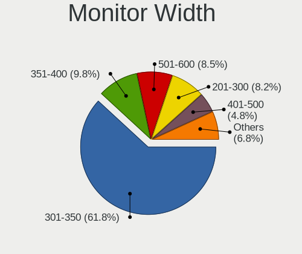

| Width in mm    | Notebooks | Percent |
|----------------|-----------|---------|
| 301-350        | 824       | 61.86%  |
| 351-400        | 129       | 9.68%   |
| 501-600        | 115       | 8.63%   |
| 201-300        | 112       | 8.41%   |
| 401-500        | 63        | 4.73%   |
| 601-700        | 23        | 1.73%   |
| 701-800        | 22        | 1.65%   |
| Unknown        | 20        | 1.5%    |
| 1001-1500      | 10        | 0.75%   |
| 801-900        | 8         | 0.6%    |
| 1501-2000      | 5         | 0.38%   |
| More than 2000 | 1         | 0.08%   |

Aspect Ratio
------------

Proportional relationship between the width and the height

| Ratio   | Notebooks | Percent |
|---------|-----------|---------|
| 16/9    | 1007      | 88.1%   |
| 16/10   | 88        | 7.7%    |
| 21/9    | 19        | 1.66%   |
| Unknown | 13        | 1.14%   |
| 3/2     | 7         | 0.61%   |
| 5/4     | 3         | 0.26%   |
| 4/3     | 3         | 0.26%   |
| 32/9    | 2         | 0.17%   |
| 3.40    | 1         | 0.09%   |

Monitor Area
------------

Area in inch

| Area in inch | Notebooks | Percent |
|----------------|-----------|---------|
| 101-110        | 597       | 44.82%  |
| 81-90          | 269       | 20.2%   |
| 201-250        | 99        | 7.43%   |
| 121-130        | 98        | 7.36%   |
| 71-80          | 46        | 3.45%   |
| 301-350        | 40        | 3%      |
| 351-500        | 38        | 2.85%   |
| 61-70          | 28        | 2.1%    |
| Unknown        | 20        | 1.5%    |
| 151-200        | 19        | 1.43%   |
| 141-150        | 19        | 1.43%   |
| 51-60          | 16        | 1.2%    |
| More than 1000 | 12        | 0.9%    |
| 501-1000       | 11        | 0.83%   |
| 251-300        | 10        | 0.75%   |
| 131-140        | 3         | 0.23%   |
| 111-120        | 3         | 0.23%   |
| 91-100         | 3         | 0.23%   |
| 41-50          | 1         | 0.08%   |

Pixel Density
-------------

Pixels per inch

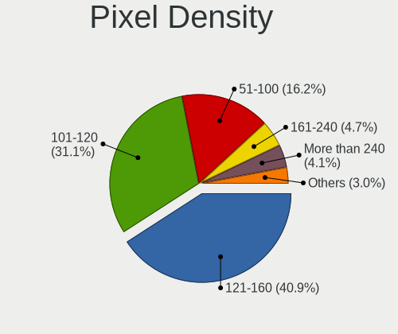

| Density       | Notebooks | Percent |
|---------------|-----------|---------|
| 121-160       | 537       | 41.12%  |
| 101-120       | 403       | 30.86%  |
| 51-100        | 212       | 16.23%  |
| 161-240       | 62        | 4.75%   |
| More than 240 | 54        | 4.13%   |
| Unknown       | 20        | 1.53%   |
| 1-50          | 18        | 1.38%   |

Multiple Monitors
-----------------

Total monitors connected

| Total | Notebooks | Percent |
|-------|-----------|---------|
| 1     | 873       | 75.39%  |
| 2     | 218       | 18.83%  |
| 0     | 42        | 3.63%   |
| 3     | 23        | 1.99%   |
| 4     | 2         | 0.17%   |

Network
-------

Net Controller Vendor
---------------------

Controller vendors

| Vendor                            | Notebooks | Percent |
|-----------------------------------|-----------|---------|
| Realtek Semiconductor             | 643       | 34.24%  |
| Intel                             | 604       | 32.16%  |
| Qualcomm Atheros                  | 301       | 16.03%  |
| Broadcom                          | 133       | 7.08%   |
| Broadcom Limited                  | 37        | 1.97%   |
| Marvell Technology Group          | 24        | 1.28%   |
| Nvidia                            | 14        | 0.75%   |
| Ralink                            | 13        | 0.69%   |
| TP-Link                           | 10        | 0.53%   |
| Ralink Technology                 | 10        | 0.53%   |
| Ericsson Business Mobile Networks | 8         | 0.43%   |
| DisplayLink                       | 6         | 0.32%   |
| ASIX Electronics                  | 6         | 0.32%   |
| Sierra Wireless                   | 5         | 0.27%   |
| Qualcomm                          | 5         | 0.27%   |
| MEDIATEK                          | 5         | 0.27%   |
| Silicon Integrated Systems [SiS]  | 4         | 0.21%   |
| Samsung Electronics               | 4         | 0.21%   |
| JMicron Technology                | 4         | 0.21%   |
| Dell                              | 4         | 0.21%   |
| ASUSTek Computer                  | 4         | 0.21%   |
| OnePlus Technology (Shenzhen)     | 3         | 0.16%   |
| Lenovo                            | 3         | 0.16%   |
| Huawei Technologies               | 3         | 0.16%   |
| D-Link                            | 3         | 0.16%   |
| Xiaomi                            | 2         | 0.11%   |
| NetGear                           | 2         | 0.11%   |
| LG Electronics                    | 2         | 0.11%   |
| Hewlett-Packard                   | 2         | 0.11%   |
| Google                            | 2         | 0.11%   |
| D-Link System                     | 2         | 0.11%   |
| T & A Mobile Phones               | 1         | 0.05%   |
| Shenzhen Goodix Technology        | 1         | 0.05%   |
| Motorola PCS                      | 1         | 0.05%   |
| Microsoft                         | 1         | 0.05%   |
| Micro Star International          | 1         | 0.05%   |
| LSI                               | 1         | 0.05%   |
| ICS Advent                        | 1         | 0.05%   |
| Foxconn / Hon Hai                 | 1         | 0.05%   |
| Edimax Technology                 | 1         | 0.05%   |
| Apple                             | 1         | 0.05%   |

Net Controller Model
--------------------

Controller models

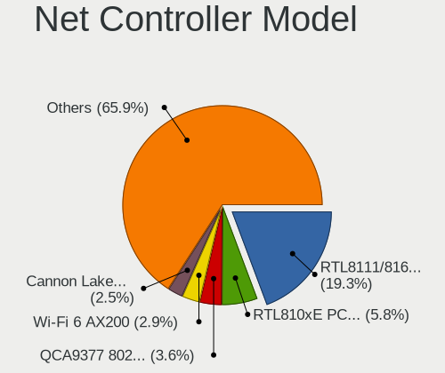

| Model                                                             | Notebooks | Percent |
|-------------------------------------------------------------------|-----------|---------|
| Realtek RTL8111/8168/8411 PCI Express Gigabit Ethernet Controller | 424       | 19.3%   |
| Realtek RTL810xE PCI Express Fast Ethernet controller             | 129       | 5.87%   |
| Qualcomm Atheros QCA9377 802.11ac Wireless Network Adapter        | 77        | 3.5%    |
| Intel Wi-Fi 6 AX200                                               | 65        | 2.96%   |
| Intel Cannon Lake PCH CNVi WiFi                                   | 55        | 2.5%    |
| Qualcomm Atheros QCA9565 / AR9565 Wireless Network Adapter        | 46        | 2.09%   |
| Intel Wireless 8265 / 8275                                        | 46        | 2.09%   |
| Intel 82579LM Gigabit Network Connection (Lewisville)             | 43        | 1.96%   |
| Qualcomm Atheros QCA6174 802.11ac Wireless Network Adapter        | 42        | 1.91%   |
| Intel Wireless 7265                                               | 42        | 1.91%   |
| Realtek RTL8153 Gigabit Ethernet Adapter                          | 37        | 1.68%   |
| Realtek RTL8821CE 802.11ac PCIe Wireless Network Adapter          | 36        | 1.64%   |
| Intel Wireless 7260                                               | 36        | 1.64%   |
| Qualcomm Atheros AR9485 Wireless Network Adapter                  | 30        | 1.37%   |
| Intel Comet Lake PCH-LP CNVi WiFi                                 | 30        | 1.37%   |
| Intel Cannon Point-LP CNVi [Wireless-AC]                          | 29        | 1.32%   |
| Intel Centrino Advanced-N 6205 [Taylor Peak]                      | 28        | 1.27%   |
| Intel Wireless 8260                                               | 27        | 1.23%   |
| Intel Wireless 3165                                               | 26        | 1.18%   |
| Intel Comet Lake PCH CNVi WiFi                                    | 25        | 1.14%   |
| Qualcomm Atheros AR9285 Wireless Network Adapter (PCI-Express)    | 22        | 1%      |
| Broadcom BCM43142 802.11b/g/n                                     | 22        | 1%      |
| Broadcom BCM4313 802.11bgn Wireless Network Adapter               | 19        | 0.86%   |
| Realtek RTL8822CE 802.11ac PCIe Wireless Network Adapter          | 18        | 0.82%   |
| Intel Wireless 3160                                               | 18        | 0.82%   |
| Qualcomm Atheros AR9462 Wireless Network Adapter                  | 17        | 0.77%   |
| Realtek RTL8723BE PCIe Wireless Network Adapter                   | 16        | 0.73%   |
| Intel Wireless-AC 9260                                            | 16        | 0.73%   |
| Qualcomm Atheros Killer E2400 Gigabit Ethernet Controller         | 15        | 0.68%   |
| Intel Wi-Fi 6 AX201                                               | 15        | 0.68%   |
| Intel Ethernet Connection I219-LM                                 | 14        | 0.64%   |
| Qualcomm Atheros AR8151 v2.0 Gigabit Ethernet                     | 13        | 0.59%   |
| Intel Ethernet Connection I217-LM                                 | 13        | 0.59%   |
| Intel Ethernet Connection (4) I219-LM                             | 13        | 0.59%   |
| Intel Dual Band Wireless-AC 3165 Plus Bluetooth                   | 13        | 0.59%   |
| Broadcom BCM4322 802.11a/b/g/n Wireless LAN Controller            | 13        | 0.59%   |
| Intel Ethernet Connection (7) I219-LM                             | 12        | 0.55%   |
| Realtek RTL8821AE 802.11ac PCIe Wireless Network Adapter          | 11        | 0.5%    |
| Qualcomm Atheros Killer E2500 Gigabit Ethernet Controller         | 11        | 0.5%    |
| Intel Ethernet Connection I218-LM                                 | 11        | 0.5%    |
| Intel Ethernet Connection (3) I218-LM                             | 11        | 0.5%    |
| Intel Dual Band Wireless-AC 3168NGW [Stone Peak]                  | 11        | 0.5%    |
| Intel Centrino Advanced-N 6235                                    | 11        | 0.5%    |
| Broadcom BCM4331 802.11a/b/g/n                                    | 11        | 0.5%    |
| Realtek RTL8822BE 802.11a/b/g/n/ac WiFi adapter                   | 10        | 0.46%   |
| Realtek RTL8188EE Wireless Network Adapter                        | 10        | 0.46%   |
| Intel Centrino Wireless-N 2230                                    | 10        | 0.46%   |
| Intel Centrino Ultimate-N 6300                                    | 10        | 0.46%   |
| Realtek RTL8188EUS 802.11n Wireless Network Adapter               | 9         | 0.41%   |
| Nvidia MCP79 Ethernet                                             | 9         | 0.41%   |
| Intel Ethernet Connection (7) I219-V                              | 9         | 0.41%   |
| Intel 82577LM Gigabit Network Connection                          | 9         | 0.41%   |
| Broadcom NetXtreme BCM57765 Gigabit Ethernet PCIe                 | 9         | 0.41%   |
| Broadcom BCM43224 802.11a/b/g/n                                   | 9         | 0.41%   |
| Realtek RTL8188CE 802.11b/g/n WiFi Adapter                        | 8         | 0.36%   |
| Qualcomm Atheros QCA8171 Gigabit Ethernet                         | 8         | 0.36%   |
| Qualcomm Atheros AR9287 Wireless Network Adapter (PCI-Express)    | 8         | 0.36%   |
| Intel PRO/Wireless 3945ABG [Golan] Network Connection             | 8         | 0.36%   |
| Intel Ethernet Connection (4) I219-V                              | 8         | 0.36%   |
| Broadcom Limited BCM4360 802.11ac Wireless Network Adapter        | 8         | 0.36%   |

Wireless Vendor
---------------

Wireless vendors

| Vendor                   | Notebooks | Percent |
|--------------------------|-----------|---------|
| Intel                    | 576       | 48.57%  |
| Qualcomm Atheros         | 255       | 21.5%   |
| Realtek Semiconductor    | 155       | 13.07%  |
| Broadcom                 | 112       | 9.44%   |
| Broadcom Limited         | 27        | 2.28%   |
| Ralink                   | 13        | 1.1%    |
| Ralink Technology        | 10        | 0.84%   |
| TP-Link                  | 8         | 0.67%   |
| Sierra Wireless          | 5         | 0.42%   |
| MEDIATEK                 | 5         | 0.42%   |
| Dell                     | 4         | 0.34%   |
| Qualcomm                 | 3         | 0.25%   |
| D-Link                   | 3         | 0.25%   |
| ASUSTek Computer         | 3         | 0.25%   |
| D-Link System            | 2         | 0.17%   |
| NetGear                  | 1         | 0.08%   |
| Microsoft                | 1         | 0.08%   |
| Micro Star International | 1         | 0.08%   |
| Hewlett-Packard          | 1         | 0.08%   |
| Edimax Technology        | 1         | 0.08%   |

Wireless Model
--------------

Wireless models

| Model                                                                   | Notebooks | Percent |
|-------------------------------------------------------------------------|-----------|---------|
| Qualcomm Atheros QCA9377 802.11ac Wireless Network Adapter              | 77        | 6.44%   |
| Intel Wi-Fi 6 AX200                                                     | 65        | 5.43%   |
| Intel Cannon Lake PCH CNVi WiFi                                         | 55        | 4.6%    |
| Qualcomm Atheros QCA9565 / AR9565 Wireless Network Adapter              | 46        | 3.85%   |
| Intel Wireless 8265 / 8275                                              | 46        | 3.85%   |
| Qualcomm Atheros QCA6174 802.11ac Wireless Network Adapter              | 42        | 3.51%   |
| Intel Wireless 7265                                                     | 42        | 3.51%   |
| Realtek RTL8821CE 802.11ac PCIe Wireless Network Adapter                | 36        | 3.01%   |
| Intel Wireless 7260                                                     | 36        | 3.01%   |
| Qualcomm Atheros AR9485 Wireless Network Adapter                        | 30        | 2.51%   |
| Intel Comet Lake PCH-LP CNVi WiFi                                       | 30        | 2.51%   |
| Intel Cannon Point-LP CNVi [Wireless-AC]                                | 29        | 2.42%   |
| Intel Centrino Advanced-N 6205 [Taylor Peak]                            | 28        | 2.34%   |
| Intel Wireless 8260                                                     | 27        | 2.26%   |
| Intel Wireless 3165                                                     | 26        | 2.17%   |
| Intel Comet Lake PCH CNVi WiFi                                          | 25        | 2.09%   |
| Qualcomm Atheros AR9285 Wireless Network Adapter (PCI-Express)          | 22        | 1.84%   |
| Broadcom BCM43142 802.11b/g/n                                           | 22        | 1.84%   |
| Broadcom BCM4313 802.11bgn Wireless Network Adapter                     | 19        | 1.59%   |
| Realtek RTL8822CE 802.11ac PCIe Wireless Network Adapter                | 18        | 1.51%   |
| Intel Wireless 3160                                                     | 18        | 1.51%   |
| Qualcomm Atheros AR9462 Wireless Network Adapter                        | 17        | 1.42%   |
| Realtek RTL8723BE PCIe Wireless Network Adapter                         | 16        | 1.34%   |
| Intel Wireless-AC 9260                                                  | 16        | 1.34%   |
| Intel Wi-Fi 6 AX201                                                     | 15        | 1.25%   |
| Intel Dual Band Wireless-AC 3165 Plus Bluetooth                         | 13        | 1.09%   |
| Broadcom BCM4322 802.11a/b/g/n Wireless LAN Controller                  | 13        | 1.09%   |
| Realtek RTL8821AE 802.11ac PCIe Wireless Network Adapter                | 11        | 0.92%   |
| Intel Dual Band Wireless-AC 3168NGW [Stone Peak]                        | 11        | 0.92%   |
| Intel Centrino Advanced-N 6235                                          | 11        | 0.92%   |
| Broadcom BCM4331 802.11a/b/g/n                                          | 11        | 0.92%   |
| Realtek RTL8822BE 802.11a/b/g/n/ac WiFi adapter                         | 10        | 0.84%   |
| Realtek RTL8188EE Wireless Network Adapter                              | 10        | 0.84%   |
| Intel Centrino Wireless-N 2230                                          | 10        | 0.84%   |
| Intel Centrino Ultimate-N 6300                                          | 10        | 0.84%   |
| Realtek RTL8188EUS 802.11n Wireless Network Adapter                     | 9         | 0.75%   |
| Broadcom BCM43224 802.11a/b/g/n                                         | 9         | 0.75%   |
| Realtek RTL8188CE 802.11b/g/n WiFi Adapter                              | 8         | 0.67%   |
| Qualcomm Atheros AR9287 Wireless Network Adapter (PCI-Express)          | 8         | 0.67%   |
| Intel PRO/Wireless 3945ABG [Golan] Network Connection                   | 8         | 0.67%   |
| Broadcom Limited BCM4360 802.11ac Wireless Network Adapter              | 8         | 0.67%   |
| Realtek RTL88x2bu [AC1200 Techkey]                                      | 7         | 0.59%   |
| Realtek RTL8723DE Wireless Network Adapter                              | 7         | 0.59%   |
| Intel WiFi Link 5100                                                    | 7         | 0.59%   |
| Intel PRO/Wireless 4965 AG or AGN [Kedron] Network Connection           | 7         | 0.59%   |
| Intel Ice Lake-LP PCH CNVi WiFi                                         | 6         | 0.5%    |
| Intel Centrino Wireless-N 1030 [Rainbow Peak]                           | 6         | 0.5%    |
| Intel Centrino Advanced-N 6200                                          | 6         | 0.5%    |
| Broadcom BCM43602 802.11ac Wireless LAN SoC                             | 6         | 0.5%    |
| Broadcom BCM4321 802.11a/b/g/n                                          | 6         | 0.5%    |
| Realtek RTL8191SEvB Wireless LAN Controller                             | 5         | 0.42%   |
| Realtek RTL8187B Wireless 802.11g 54Mbps Network Adapter                | 5         | 0.42%   |
| Qualcomm Atheros AR928X Wireless Network Adapter (PCI-Express)          | 5         | 0.42%   |
| Qualcomm Atheros AR242x / AR542x Wireless Network Adapter (PCI-Express) | 5         | 0.42%   |
| Intel Centrino Wireless-N 1000 [Condor Peak]                            | 5         | 0.42%   |
| Broadcom Limited BCM4312 802.11b/g LP-PHY                               | 5         | 0.42%   |
| Broadcom BCM4352 802.11ac Wireless Network Adapter                      | 5         | 0.42%   |
| Broadcom BCM43228 802.11a/b/g/n                                         | 5         | 0.42%   |
| Broadcom BCM4312 802.11b/g LP-PHY                                       | 5         | 0.42%   |
| Realtek RTL8723AE PCIe Wireless Network Adapter                         | 4         | 0.33%   |

Ethernet Vendor
---------------

Ethernet vendors

| Vendor                           | Notebooks | Percent |
|----------------------------------|-----------|---------|
| Realtek Semiconductor            | 593       | 60.51%  |
| Intel                            | 174       | 17.76%  |
| Qualcomm Atheros                 | 73        | 7.45%   |
| Broadcom                         | 40        | 4.08%   |
| Marvell Technology Group         | 24        | 2.45%   |
| Nvidia                           | 14        | 1.43%   |
| Broadcom Limited                 | 12        | 1.22%   |
| DisplayLink                      | 6         | 0.61%   |
| ASIX Electronics                 | 6         | 0.61%   |
| Silicon Integrated Systems [SiS] | 4         | 0.41%   |
| Samsung Electronics              | 4         | 0.41%   |
| JMicron Technology               | 4         | 0.41%   |
| OnePlus Technology (Shenzhen)    | 3         | 0.31%   |
| Lenovo                           | 3         | 0.31%   |
| Huawei Technologies              | 3         | 0.31%   |
| Xiaomi                           | 2         | 0.2%    |
| TP-Link                          | 2         | 0.2%    |
| Qualcomm                         | 2         | 0.2%    |
| LG Electronics                   | 2         | 0.2%    |
| T & A Mobile Phones              | 1         | 0.1%    |
| NetGear                          | 1         | 0.1%    |
| Motorola PCS                     | 1         | 0.1%    |
| LSI                              | 1         | 0.1%    |
| ICS Advent                       | 1         | 0.1%    |
| Hewlett-Packard                  | 1         | 0.1%    |
| Foxconn / Hon Hai                | 1         | 0.1%    |
| ASUSTek Computer                 | 1         | 0.1%    |
| Apple                            | 1         | 0.1%    |

Ethernet Model
--------------

Ethernet models

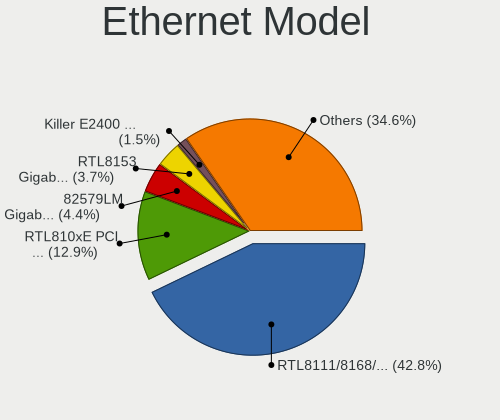

| Model                                                             | Notebooks | Percent |
|-------------------------------------------------------------------|-----------|---------|
| Realtek RTL8111/8168/8411 PCI Express Gigabit Ethernet Controller | 424       | 42.91%  |
| Realtek RTL810xE PCI Express Fast Ethernet controller             | 129       | 13.06%  |
| Intel 82579LM Gigabit Network Connection (Lewisville)             | 43        | 4.35%   |
| Realtek RTL8153 Gigabit Ethernet Adapter                          | 37        | 3.74%   |
| Qualcomm Atheros Killer E2400 Gigabit Ethernet Controller         | 15        | 1.52%   |
| Intel Ethernet Connection I219-LM                                 | 14        | 1.42%   |
| Qualcomm Atheros AR8151 v2.0 Gigabit Ethernet                     | 13        | 1.32%   |
| Intel Ethernet Connection I217-LM                                 | 13        | 1.32%   |
| Intel Ethernet Connection (4) I219-LM                             | 13        | 1.32%   |
| Intel Ethernet Connection (7) I219-LM                             | 12        | 1.21%   |
| Qualcomm Atheros Killer E2500 Gigabit Ethernet Controller         | 11        | 1.11%   |
| Intel Ethernet Connection I218-LM                                 | 11        | 1.11%   |
| Intel Ethernet Connection (3) I218-LM                             | 11        | 1.11%   |
| Nvidia MCP79 Ethernet                                             | 9         | 0.91%   |
| Intel Ethernet Connection (7) I219-V                              | 9         | 0.91%   |
| Intel 82577LM Gigabit Network Connection                          | 9         | 0.91%   |
| Broadcom NetXtreme BCM57765 Gigabit Ethernet PCIe                 | 9         | 0.91%   |
| Qualcomm Atheros QCA8171 Gigabit Ethernet                         | 8         | 0.81%   |
| Intel Ethernet Connection (4) I219-V                              | 8         | 0.81%   |
| Qualcomm Atheros AR8161 Gigabit Ethernet                          | 7         | 0.71%   |
| Marvell Group 88E8055 PCI-E Gigabit Ethernet Controller           | 7         | 0.71%   |
| Broadcom NetLink BCM57785 Gigabit Ethernet PCIe                   | 7         | 0.71%   |
| Marvell Group 88E8040 PCI-E Fast Ethernet Controller              | 6         | 0.61%   |
| Qualcomm Atheros Killer E220x Gigabit Ethernet Controller         | 5         | 0.51%   |
| Marvell Group 88E8058 PCI-E Gigabit Ethernet Controller           | 5         | 0.51%   |
| Broadcom NetXtreme BCM57786 Gigabit Ethernet PCIe                 | 5         | 0.51%   |
| Broadcom NetXtreme BCM5764M Gigabit Ethernet PCIe                 | 5         | 0.51%   |
| Broadcom NetLink BCM57780 Gigabit Ethernet PCIe                   | 5         | 0.51%   |
| Broadcom Limited NetLink BCM57780 Gigabit Ethernet PCIe           | 5         | 0.51%   |
| Silicon Integrated Systems [SiS] 191 Gigabit Ethernet Adapter     | 4         | 0.4%    |
| Qualcomm Atheros AR8132 Fast Ethernet                             | 4         | 0.4%    |
| Marvell Group 88E8057 PCI-E Gigabit Ethernet Controller           | 4         | 0.4%    |
| Intel Ethernet Connection (6) I219-V                              | 4         | 0.4%    |
| Realtek Killer E2600 Gigabit Ethernet Controller                  | 3         | 0.3%    |
| Qualcomm Atheros AR8162 Fast Ethernet                             | 3         | 0.3%    |
| OnePlus (Shenzhen) OnePlus                                        | 3         | 0.3%    |
| JMicron JMC250 PCI Express Gigabit Ethernet Controller            | 3         | 0.3%    |
| Intel Ethernet Connection (2) I219-LM                             | 3         | 0.3%    |
| Intel 82579V Gigabit Network Connection                           | 3         | 0.3%    |
| ASIX AX88179 Gigabit Ethernet                                     | 3         | 0.3%    |
| Xiaomi Mi/Redmi series (RNDIS)                                    | 2         | 0.2%    |
| Samsung GT-I9070 (network tethering, USB debugging enabled)       | 2         | 0.2%    |
| Samsung Galaxy series, misc. (tethering mode)                     | 2         | 0.2%    |
| Realtek RTL8152 Fast Ethernet Adapter                             | 2         | 0.2%    |
| Realtek Killer E3000 2.5GbE Controller                            | 2         | 0.2%    |
| Qualcomm Redmi Note 9S                                            | 2         | 0.2%    |
| Qualcomm Atheros AR8152 v1.1 Fast Ethernet                        | 2         | 0.2%    |
| Qualcomm Atheros AR8131 Gigabit Ethernet                          | 2         | 0.2%    |
| Nvidia MCP77 Ethernet                                             | 2         | 0.2%    |
| Nvidia MCP51 Ethernet Controller                                  | 2         | 0.2%    |
| Intel Ethernet Connection (5) I219-LM                             | 2         | 0.2%    |
| Intel Ethernet Connection (3) I218-V                              | 2         | 0.2%    |
| Intel 82567LM Gigabit Network Connection                          | 2         | 0.2%    |
| Huawei E353/E3131                                                 | 2         | 0.2%    |
| DisplayLink Sabrent Docking                                       | 2         | 0.2%    |
| Broadcom NetLink BCM5784M Gigabit Ethernet PCIe                   | 2         | 0.2%    |
| Broadcom Limited NetXtreme BCM5755M Gigabit Ethernet PCI Express  | 2         | 0.2%    |
| ASIX AX88772B                                                     | 2         | 0.2%    |
| TP-Link USB 10/100/1000 LAN                                       | 1         | 0.1%    |
| TP-Link USB 10/100 LAN                                            | 1         | 0.1%    |

Net Controller Kind
-------------------

Ethernet, WiFi or modem

| Kind     | Notebooks | Percent |
|----------|-----------|---------|
| WiFi     | 1131      | 54.24%  |
| Ethernet | 941       | 45.13%  |
| Modem    | 10        | 0.48%   |
| Unknown  | 3         | 0.14%   |

Used Controller
---------------

Currently used network controller

| Kind     | Notebooks | Percent |
|----------|-----------|---------|
| WiFi     | 949       | 77.28%  |
| Ethernet | 279       | 22.72%  |

NICs
----

Total network controllers on board

| Total | Notebooks | Percent |
|-------|-----------|---------|
| 2     | 875       | 76.82%  |
| 1     | 250       | 21.95%  |
| 3     | 9         | 0.79%   |
| 0     | 5         | 0.44%   |

IPv6
----

IPv6 vs IPv4

| Used | Notebooks | Percent |
|------|-----------|---------|
| No   | 1049      | 91.62%  |
| Yes  | 96        | 8.38%   |

Bluetooth
---------

Bluetooth Vendor
----------------

Controller vendors

| Vendor                          | Notebooks | Percent |
|---------------------------------|-----------|---------|
| Intel                           | 462       | 49.2%   |
| Qualcomm Atheros Communications | 113       | 12.03%  |
| Realtek Semiconductor           | 76        | 8.09%   |
| Lite-On Technology              | 57        | 6.07%   |
| Broadcom                        | 52        | 5.54%   |
| Apple                           | 48        | 5.11%   |
| IMC Networks                    | 40        | 4.26%   |
| Foxconn / Hon Hai               | 27        | 2.88%   |
| Dell                            | 14        | 1.49%   |
| Cambridge Silicon Radio         | 12        | 1.28%   |
| Realtek                         | 8         | 0.85%   |
| Toshiba                         | 6         | 0.64%   |
| Hewlett-Packard                 | 5         | 0.53%   |
| Alps Electric                   | 5         | 0.53%   |
| Ralink                          | 4         | 0.43%   |
| Unknown                         | 2         | 0.21%   |
| Foxconn International           | 2         | 0.21%   |
| ASUSTek Computer                | 2         | 0.21%   |
| Askey Computer                  | 2         | 0.21%   |
| Ralink Technology               | 1         | 0.11%   |
| Qcom                            | 1         | 0.11%   |

Bluetooth Model
---------------

Controller models

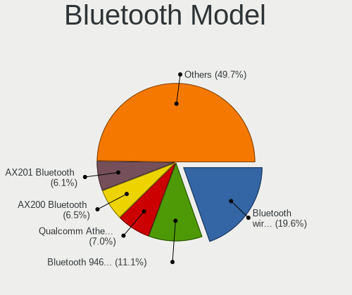

| Model                                               | Notebooks | Percent |
|-----------------------------------------------------|-----------|---------|
| Intel Bluetooth wireless interface                  | 186       | 19.81%  |
| Intel Bluetooth 9460/9560 Jefferson Peak (JfP)      | 104       | 11.08%  |
| Qualcomm Atheros  Bluetooth Device                  | 80        | 8.52%   |
| Intel AX200 Bluetooth                               | 62        | 6.6%    |
| Intel AX201 Bluetooth                               | 56        | 5.96%   |
| Realtek Bluetooth Radio                             | 42        | 4.47%   |
| Apple Bluetooth Host Controller                     | 30        | 3.19%   |
| Lite-On Qualcomm Atheros QCA9377 Bluetooth          | 26        | 2.77%   |
| Realtek  Bluetooth 4.2 Adapter                      | 23        | 2.45%   |
| Intel Centrino Bluetooth Wireless Transceiver       | 18        | 1.92%   |
| Lite-On Bluetooth Device                            | 15        | 1.6%    |
| Intel Wireless-AC 9260 Bluetooth Adapter            | 15        | 1.6%    |
| IMC Networks Bluetooth Radio                        | 14        | 1.49%   |
| Qualcomm Atheros QCA61x4 Bluetooth 4.0              | 12        | 1.28%   |
| Foxconn / Hon Hai Bluetooth Device                  | 12        | 1.28%   |
| Cambridge Silicon Radio Bluetooth Dongle (HCI mode) | 12        | 1.28%   |
| Intel Wireless-AC 3168 Bluetooth                    | 11        | 1.17%   |
| Apple Bluetooth USB Host Controller                 | 11        | 1.17%   |
| Qualcomm Atheros AR3011 Bluetooth                   | 10        | 1.06%   |
| Lite-On Atheros AR3012 Bluetooth                    | 9         | 0.96%   |
| Intel Centrino Advanced-N 6230 Bluetooth adapter    | 9         | 0.96%   |
| Realtek Bluetooth Radio                             | 8         | 0.85%   |
| Qualcomm Atheros AR3012 Bluetooth 4.0               | 8         | 0.85%   |
| IMC Networks Bluetooth Device                       | 7         | 0.75%   |
| Broadcom BCM20702 Bluetooth 4.0 [ThinkPad]          | 7         | 0.75%   |
| Broadcom BCM2045B (BDC-2.1)                         | 7         | 0.75%   |
| IMC Networks Atheros AR3012 Bluetooth 4.0 Adapter   | 6         | 0.64%   |
| Broadcom BCM43142A0 Bluetooth Device                | 6         | 0.64%   |
| Broadcom BCM43142A0 Bluetooth 4.0                   | 6         | 0.64%   |
| Dell DW375 Bluetooth Module                         | 5         | 0.53%   |
| Apple Bluetooth HCI                                 | 5         | 0.53%   |
| Ralink RT3290 Bluetooth                             | 4         | 0.43%   |
| Lite-On Qualcomm Atheros Bluetooth                  | 4         | 0.43%   |
| Foxconn / Hon Hai Broadcom Bluetooth 2.1 Device     | 4         | 0.43%   |
| Foxconn / Hon Hai BCM20702A0                        | 4         | 0.43%   |
| Dell Wireless 365 Bluetooth                         | 4         | 0.43%   |
| Broadcom HP Portable SoftSailing                    | 4         | 0.43%   |
| Broadcom BCM2070 Bluetooth 2.1 + EDR                | 4         | 0.43%   |
| Alps Electric BCM2046 Bluetooth Device              | 4         | 0.43%   |
| Realtek RTL8822BE Bluetooth 4.2 Adapter             | 3         | 0.32%   |
| Realtek 802.11ac WLAN Adapter                       | 3         | 0.32%   |
| IMC Networks Bluetooth USB Host Controller          | 3         | 0.32%   |
| IMC Networks BCM20702A0                             | 3         | 0.32%   |
| IMC Networks Atheros AR3012 Bluetooth               | 3         | 0.32%   |
| HP Broadcom 2070 Bluetooth Combo                    | 3         | 0.32%   |
| Broadcom HP Portable Bumble Bee                     | 3         | 0.32%   |
| Broadcom BCM43142 Bluetooth 4.0                     | 3         | 0.32%   |
| Unknown Bluetooth Device                            | 2         | 0.21%   |
| Realtek RTL8723B Bluetooth                          | 2         | 0.21%   |
| Qualcomm Atheros Bluetooth USB Host Controller      | 2         | 0.21%   |
| Lite-On Atheros Bluetooth                           | 2         | 0.21%   |
| IMC Networks Wireless_Device                        | 2         | 0.21%   |
| IMC Networks Bluetooth                              | 2         | 0.21%   |
| Foxconn International BCM43142A0 Bluetooth module   | 2         | 0.21%   |
| Foxconn / Hon Hai Wireless_Device                   | 2         | 0.21%   |
| Dell Wireless 370 Bluetooth Mini-card               | 2         | 0.21%   |
| Broadcom BCM20702A0                                 | 2         | 0.21%   |
| Broadcom BCM2070 Bluetooth Device                   | 2         | 0.21%   |
| Broadcom BCM2045 Bluetooth                          | 2         | 0.21%   |
| Askey Bluetooth Device                              | 2         | 0.21%   |

Sound
-----

Sound Vendor
------------

Sound card vendors

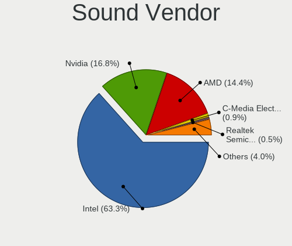

| Vendor                           | Notebooks | Percent |
|----------------------------------|-----------|---------|
| Intel                            | 931       | 63.46%  |
| Nvidia                           | 244       | 16.63%  |
| AMD                              | 211       | 14.38%  |
| C-Media Electronics              | 14        | 0.95%   |
| Realtek Semiconductor            | 8         | 0.55%   |
| Silicon Integrated Systems [SiS] | 4         | 0.27%   |
| JMTek                            | 4         | 0.27%   |
| Razer USA                        | 3         | 0.2%    |
| Logitech                         | 3         | 0.2%    |
| Lenovo                           | 3         | 0.2%    |
| Kingston Technology              | 3         | 0.2%    |
| GN Netcom                        | 3         | 0.2%    |
| Generalplus Technology           | 3         | 0.2%    |
| Tenx Technology                  | 2         | 0.14%   |
| Sennheiser Communications        | 2         | 0.14%   |
| GYROCOM C&C                      | 2         | 0.14%   |
| Corsair                          | 2         | 0.14%   |
| Apple                            | 2         | 0.14%   |
| Yamaha                           | 1         | 0.07%   |
| XMOS                             | 1         | 0.07%   |
| Vestax                           | 1         | 0.07%   |
| Trust                            | 1         | 0.07%   |
| Syntek                           | 1         | 0.07%   |
| SteelSeries ApS                  | 1         | 0.07%   |
| SCUF Gaming                      | 1         | 0.07%   |
| Samson Technologies              | 1         | 0.07%   |
| Pro-Ject                         | 1         | 0.07%   |
| Plantronics                      | 1         | 0.07%   |
| Other World Computing            | 1         | 0.07%   |
| OPPO Electronics                 | 1         | 0.07%   |
| No brand                         | 1         | 0.07%   |
| miniDSP                          | 1         | 0.07%   |
| Meizu                            | 1         | 0.07%   |
| Mark of the Unicorn              | 1         | 0.07%   |
| Focusrite-Novation               | 1         | 0.07%   |
| Dell                             | 1         | 0.07%   |
| Creative Technology              | 1         | 0.07%   |
| Cambridge Audio                  | 1         | 0.07%   |
| BEHRINGER International          | 1         | 0.07%   |
| Astro Gaming                     | 1         | 0.07%   |
| Antelope Audio                   | 1         | 0.07%   |

Sound Model
-----------

Sound card models

| Model                                                                                             | Notebooks | Percent |
|---------------------------------------------------------------------------------------------------|-----------|---------|
| Intel Sunrise Point-LP HD Audio                                                                   | 158       | 8.92%   |
| Intel Cannon Lake PCH cAVS                                                                        | 117       | 6.6%    |
| AMD Family 17h/19h HD Audio Controller                                                            | 112       | 6.32%   |
| Intel 7 Series/C216 Chipset Family High Definition Audio Controller                               | 99        | 5.59%   |
| Intel 6 Series/C200 Series Chipset Family High Definition Audio Controller                        | 75        | 4.23%   |
| AMD Raven/Raven2/Fenghuang HDMI/DP Audio Controller                                               | 71        | 4.01%   |
| Intel Haswell-ULT HD Audio Controller                                                             | 58        | 3.27%   |
| Intel 8 Series HD Audio Controller                                                                | 58        | 3.27%   |
| Intel 8 Series/C220 Series Chipset High Definition Audio Controller                               | 51        | 2.88%   |
| Intel Cannon Point-LP High Definition Audio Controller                                            | 45        | 2.54%   |
| Intel 5 Series/3400 Series Chipset High Definition Audio                                          | 42        | 2.37%   |
| AMD FCH Azalia Controller                                                                         | 42        | 2.37%   |
| Intel Broadwell-U Audio Controller                                                                | 41        | 2.31%   |
| Intel Wildcat Point-LP High Definition Audio Controller                                           | 39        | 2.2%    |
| Intel Xeon E3-1200 v3/4th Gen Core Processor HD Audio Controller                                  | 37        | 2.09%   |
| Nvidia TU107 GeForce GTX 1650 High Definition Audio Controller                                    | 36        | 2.03%   |
| Nvidia GP107GL High Definition Audio Controller                                                   | 36        | 2.03%   |
| Intel Comet Lake PCH-LP cAVS                                                                      | 36        | 2.03%   |
| Intel CM238 HD Audio Controller                                                                   | 33        | 1.86%   |
| Intel Comet Lake PCH cAVS                                                                         | 32        | 1.81%   |
| Nvidia TU106 High Definition Audio Controller                                                     | 26        | 1.47%   |
| Intel 100 Series/C230 Series Chipset Family HD Audio Controller                                   | 26        | 1.47%   |
| Intel 82801I (ICH9 Family) HD Audio Controller                                                    | 25        | 1.41%   |
| AMD Renoir Radeon High Definition Audio Controller                                                | 24        | 1.35%   |
| AMD Kabini HDMI/DP Audio                                                                          | 24        | 1.35%   |
| Intel 82801H (ICH8 Family) HD Audio Controller                                                    | 22        | 1.24%   |
| AMD Family 15h (Models 60h-6fh) Audio Controller                                                  | 21        | 1.19%   |
| Nvidia GF108 High Definition Audio Controller                                                     | 19        | 1.07%   |
| Intel Tiger Lake-LP Smart Sound Technology Audio Controller                                       | 15        | 0.85%   |
| Nvidia TU116 High Definition Audio Controller                                                     | 14        | 0.79%   |
| AMD High Definition Audio Controller                                                              | 14        | 0.79%   |
| Nvidia GP106 High Definition Audio Controller                                                     | 12        | 0.68%   |
| Nvidia GK107 HDMI Audio Controller                                                                | 12        | 0.68%   |
| Nvidia GM107 High Definition Audio Controller [GeForce 940MX]                                     | 11        | 0.62%   |
| Nvidia MCP79 High Definition Audio                                                                | 10        | 0.56%   |
| Intel Ice Lake-LP Smart Sound Technology Audio Controller                                         | 10        | 0.56%   |
| Intel Atom Processor Z36xxx/Z37xxx Series High Definition Audio Controller                        | 10        | 0.56%   |
| AMD Trinity HDMI Audio Controller                                                                 | 10        | 0.56%   |
| Nvidia High Definition Audio Controller                                                           | 9         | 0.51%   |
| Intel Celeron/Pentium Silver Processor High Definition Audio                                      | 9         | 0.51%   |
| Realtek Semiconductor USB Audio                                                                   | 8         | 0.45%   |
| Nvidia GP104 High Definition Audio Controller                                                     | 8         | 0.45%   |
| Intel Atom/Celeron/Pentium Processor x5-E8000/J3xxx/N3xxx Series High Definition Audio Controller | 8         | 0.45%   |
| Intel NM10/ICH7 Family High Definition Audio Controller                                           | 7         | 0.4%    |
| AMD Wrestler HDMI Audio                                                                           | 7         | 0.4%    |
| AMD Turks HDMI Audio [Radeon HD 6500/6600 / 6700M Series]                                         | 7         | 0.4%    |
| Nvidia TU104 HD Audio Controller                                                                  | 6         | 0.34%   |
| Nvidia GM204 High Definition Audio Controller                                                     | 6         | 0.34%   |
| Intel Celeron N3350/Pentium N4200/Atom E3900 Series Audio Cluster                                 | 6         | 0.34%   |
| AMD Kaveri HDMI/DP Audio Controller                                                               | 6         | 0.34%   |
| Nvidia MCP89 High Definition Audio                                                                | 5         | 0.28%   |
| Nvidia GK208 HDMI/DP Audio Controller                                                             | 5         | 0.28%   |
| Nvidia GK106 HDMI Audio Controller                                                                | 5         | 0.28%   |
| AMD SBx00 Azalia (Intel HDA)                                                                      | 5         | 0.28%   |
| AMD Oland/Hainan/Cape Verde/Pitcairn HDMI Audio [Radeon HD 7000 Series]                           | 5         | 0.28%   |
| Silicon Integrated Systems [SiS] Azalia Audio Controller                                          | 4         | 0.23%   |
| Nvidia GK104 HDMI Audio Controller                                                                | 4         | 0.23%   |
| Nvidia GA104 High Definition Audio Controller                                                     | 4         | 0.23%   |
| AMD Redwood HDMI Audio [Radeon HD 5000 Series]                                                    | 4         | 0.23%   |
| AMD Cedar HDMI Audio [Radeon HD 5400/6300/7300 Series]                                            | 4         | 0.23%   |

Memory
------

Memory Vendor
-------------

Memory module vendors

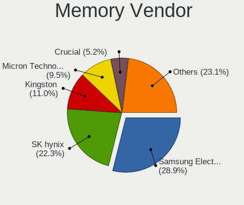

| Vendor              | Notebooks | Percent |
|---------------------|-----------|---------|
| Samsung Electronics | 100       | 29.24%  |
| SK Hynix            | 75        | 21.93%  |
| Kingston            | 38        | 11.11%  |
| Micron Technology   | 33        | 9.65%   |
| Crucial             | 18        | 5.26%   |
| A-DATA Technology   | 14        | 4.09%   |
| Smart               | 11        | 3.22%   |
| Unknown             | 9         | 2.63%   |
| SMART Brazil        | 6         | 1.75%   |
| Elpida              | 5         | 1.46%   |
| Ramaxel Technology  | 4         | 1.17%   |
| Goldkey             | 4         | 1.17%   |
| Unknown (ABCD)      | 3         | 0.88%   |
| Teikon              | 3         | 0.88%   |
| Corsair             | 3         | 0.88%   |
| Patriot             | 2         | 0.58%   |
| Neo Forza           | 2         | 0.58%   |
| G.Skill             | 2         | 0.58%   |
| Unknown (898F)      | 1         | 0.29%   |
| Nanya Technology    | 1         | 0.29%   |
| Multilaser          | 1         | 0.29%   |
| Magnum Tech         | 1         | 0.29%   |
| Lenovo              | 1         | 0.29%   |
| High Bridge         | 1         | 0.29%   |
| Hewlett-Packard     | 1         | 0.29%   |
| GOODRAM             | 1         | 0.29%   |
| CSX                 | 1         | 0.29%   |
| Apacer              | 1         | 0.29%   |

Memory Model
------------

Memory module models

| Model                                                          | Notebooks | Percent |
|----------------------------------------------------------------|-----------|---------|
| Samsung RAM M471A5244CB0-CTD 4GB SODIMM DDR4 3266MT/s          | 13        | 3.59%   |
| SK Hynix RAM HMA81GS6JJR8N-VK 8GB SODIMM DDR4 2667MT/s         | 8         | 2.21%   |
| SK Hynix RAM HMA81GS6AFR8N-UH 8GB SODIMM DDR4 2667MT/s         | 8         | 2.21%   |
| Samsung RAM M471A5244CB0-CRC 4GB SODIMM DDR4 2667MT/s          | 8         | 2.21%   |
| SK Hynix RAM HMT451S6BFR8A-PB 4GB SODIMM DDR3 1600MT/s         | 6         | 1.66%   |
| Samsung RAM M471A1K43DB1-CTD 8GB SODIMM DDR4 2667MT/s          | 6         | 1.66%   |
| SMART Brazil RAM SMS4TDC3C0K0446SCG 4GB SODIMM DDR4 2667MT/s   | 5         | 1.38%   |
| Samsung RAM M471A2K43CB1-CTD 16GB SODIMM DDR4 2667MT/s         | 5         | 1.38%   |
| Samsung RAM M471A1K43CB1-CRC 8GB SODIMM DDR4 2667MT/s          | 5         | 1.38%   |
| SK Hynix RAM HMA82GS6JJR8N-VK 16GB SODIMM DDR4 2667MT/s        | 4         | 1.1%    |
| Samsung RAM M471A1K43CB1-CTD 8GB SODIMM DDR4 2667MT/s          | 4         | 1.1%    |
| Samsung RAM M471A1K43BB1-CRC 8GB SODIMM DDR4 2667MT/s          | 4         | 1.1%    |
| Samsung RAM M471A1G44AB0-CWE 8GB SODIMM DDR4 3200MT/s          | 4         | 1.1%    |
| Micron RAM 16KTF1G64HZ-1G6E1 8192MB SODIMM DDR3 1600MT/s       | 4         | 1.1%    |
| Unknown (ABCD) RAM 123456789012345678 2GB SODIMM DDR4 2400MT/s | 3         | 0.83%   |
| SK Hynix RAM HMA851S6JJR6N-VK 4096MB SODIMM DDR4 2667MT/s      | 3         | 0.83%   |
| SK Hynix RAM HMA851S6CJR6N-VK 4GB SODIMM DDR4 2667MT/s         | 3         | 0.83%   |
| Samsung RAM M471B1G73EB0-YK0 8192MB SODIMM DDR3 1600MT/s       | 3         | 0.83%   |
| Samsung RAM M471A4G43MB1-CTD 32GB SODIMM DDR4 2667MT/s         | 3         | 0.83%   |
| Samsung RAM K4EBE304EB-EGCG 8GB Row Of Chips LPDDR3 2133MT/s   | 3         | 0.83%   |
| Samsung RAM K4AAG165WA-BCTD 8GB SODIMM DDR4 2667MT/s           | 3         | 0.83%   |
| Unknown RAM Module 4096MB SODIMM DDR4 2400MT/s                 | 2         | 0.55%   |
| Teikon RAM TMT451S6BFR8A-PBHC 4GB SODIMM DDR3 1600MT/s         | 2         | 0.55%   |
| Smart RAM SMS4TDC3C0K0446SCG 4GB SODIMM DDR4 2667MT/s          | 2         | 0.55%   |
| Smart RAM SH564128FJ8NWRNSQR 4GB SODIMM DDR3 1600MT/s          | 2         | 0.55%   |
| SK Hynix RAM Module 8192MB SODIMM DDR4 2133MT/s                | 2         | 0.55%   |
| SK Hynix RAM HMT41GS6BFR8A-PB 8GB SODIMM DDR3 1600MT/s         | 2         | 0.55%   |
| SK Hynix RAM HMAB2GS6AMR6N-XN 16GB SODIMM DDR4 3200MT/s        | 2         | 0.55%   |
| SK Hynix RAM HMA851S6CJR6N-VK 4GB Row Of Chips DDR4 2667MT/s   | 2         | 0.55%   |
| SK Hynix RAM HMA81GS6DJR8N-XN 8GB SODIMM DDR4 3200MT/s         | 2         | 0.55%   |
| SK Hynix RAM HMA81GS6AFR8N-UH 8GB SODIMM DDR4 2400MT/s         | 2         | 0.55%   |
| SK Hynix RAM HMA41GS6AFR8N-TF 8GB SODIMM DDR4 2667MT/s         | 2         | 0.55%   |
| Samsung RAM M471B5173DB0-YK0 4GB SODIMM DDR3 1600MT/s          | 2         | 0.55%   |
| Samsung RAM M471B1G73DB0-YK0 8192MB SODIMM DDR3 1600MT/s       | 2         | 0.55%   |
| Samsung RAM M471A2K43DB1-CTD 16GB SODIMM DDR4 2667MT/s         | 2         | 0.55%   |
| Samsung RAM M471A2K43BB1-CPB 16384MB SODIMM DDR4 2133MT/s      | 2         | 0.55%   |
| Samsung RAM M471A1G44AB0-CWE 8GB Row Of Chips DDR4 3200MT/s    | 2         | 0.55%   |
| Samsung RAM M471A1G44AB0-CTD 8GB SODIMM DDR4 2667MT/s          | 2         | 0.55%   |
| Samsung RAM K4EBE304EC-EGCG 8GB Row Of Chips LPDDR3 2133MT/s   | 2         | 0.55%   |
| Ramaxel RAM RMSA3270ME86H9F-2666 4GB SODIMM DDR4 2667MT/s      | 2         | 0.55%   |
| Micron RAM 4ATF51264HZ-2G6E! 4GB SODIMM DDR4 2400MT/s          | 2         | 0.55%   |
| Micron RAM 4ATF51264HZ-2G3E1 4GB SODIMM DDR4 2667MT/s          | 2         | 0.55%   |
| Micron RAM 4ATF51264HZ-2G3B1 4GB SODIMM DDR4 2400MT/s          | 2         | 0.55%   |
| Micron RAM 16ATF2G64HZ-2G6E1 16GB SODIMM DDR4 2667MT/s         | 2         | 0.55%   |
| Kingston RAM KHX2666C15S4/16G 16GB SODIMM DDR4 2667MT/s        | 2         | 0.55%   |
| Kingston RAM KHX1600C9S3L/8G 8192MB SODIMM DDR3 1600MT/s       | 2         | 0.55%   |
| Kingston RAM ACR26D4S9S8HJ-8 8192MB SODIMM DDR4 2667MT/s       | 2         | 0.55%   |
| Kingston RAM 9905712-034.A00G 16GB SODIMM DDR4 2400MT/s        | 2         | 0.55%   |
| Goldkey RAM GKE160SO102408-2666 16GB SODIMM DDR4 2667MT/s      | 2         | 0.55%   |
| Crucial RAM CT8G4SFS824A.M8FD 8GB SODIMM DDR4 2400MT/s         | 2         | 0.55%   |
| Crucial RAM CT16G4SFD8266.M16FE 16GB SODIMM DDR4 2667MT/s      | 2         | 0.55%   |
| Crucial RAM CT16G4SFD824A.C16FBD 16384MB SODIMM DDR4 2667MT/s  | 2         | 0.55%   |
| Crucial RAM CT102464BF160B.C16 8192MB SODIMM DDR3 1600MT/s     | 2         | 0.55%   |
| Unknown RAM Module 8192MB SODIMM DDR4 3200MT/s                 | 1         | 0.28%   |
| Unknown RAM Module 8192MB SODIMM DDR3 1600MT/s                 | 1         | 0.28%   |
| Unknown RAM Module 4096MB SODIMM DDR3 1600MT/s                 | 1         | 0.28%   |
| Unknown RAM Module 4096MB SODIMM DDR3                          | 1         | 0.28%   |
| Unknown RAM Module 2048MB SODIMM DDR3                          | 1         | 0.28%   |
| Unknown RAM Module 2048MB SODIMM 800MT/s                       | 1         | 0.28%   |
| Unknown RAM Module 16384MB SODIMM DDR4 2667MT/s                | 1         | 0.28%   |

Memory Kind
-----------

Memory module kinds

| Kind    | Notebooks | Percent |
|---------|-----------|---------|
| DDR4    | 191       | 68.71%  |
| DDR3    | 67        | 24.1%   |
| LPDDR3  | 10        | 3.6%    |
| LPDDR4  | 5         | 1.8%    |
| DDR2    | 4         | 1.44%   |
| Unknown | 1         | 0.36%   |

Memory Form Factor
------------------

Physical design of the memory module

| Name         | Notebooks | Percent |
|--------------|-----------|---------|
| SODIMM       | 261       | 92.23%  |
| Row Of Chips | 18        | 6.36%   |
| Chip         | 3         | 1.06%   |
| DIMM         | 1         | 0.35%   |

Memory Size
-----------

Memory module size

| Size  | Notebooks | Percent |
|-------|-----------|---------|
| 8192  | 133       | 43.46%  |
| 4096  | 92        | 30.07%  |
| 16384 | 57        | 18.63%  |
| 2048  | 16        | 5.23%   |
| 32768 | 5         | 1.63%   |
| 1024  | 3         | 0.98%   |

Memory Speed
------------

Memory module speed

| Speed   | Notebooks | Percent |
|---------|-----------|---------|
| 2667    | 121       | 38.54%  |
| 1600    | 59        | 18.79%  |
| 2400    | 46        | 14.65%  |
| 3200    | 31        | 9.87%   |
| 2133    | 22        | 7.01%   |
| 3266    | 13        | 4.14%   |
| 1867    | 4         | 1.27%   |
| 1334    | 4         | 1.27%   |
| 1333    | 4         | 1.27%   |
| 667     | 3         | 0.96%   |
| 800     | 2         | 0.64%   |
| 4266    | 1         | 0.32%   |
| 3733    | 1         | 0.32%   |
| 1067    | 1         | 0.32%   |
| 1066    | 1         | 0.32%   |
| Unknown | 1         | 0.32%   |

Printers & scanners
-------------------

Printer Vendor
--------------

Printer device vendors

| Vendor              | Notebooks | Percent |
|---------------------|-----------|---------|
| Seiko Epson         | 3         | 42.86%  |
| Samsung Electronics | 1         | 14.29%  |
| MIIIW               | 1         | 14.29%  |
| Hewlett-Packard     | 1         | 14.29%  |
| Canon               | 1         | 14.29%  |

Printer Model
-------------

Printer device models

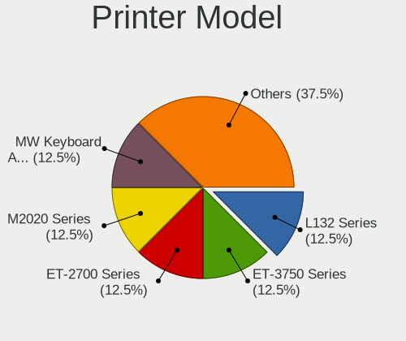

| Model                      | Notebooks | Percent |
|----------------------------|-----------|---------|
| Seiko Epson L4150 Series   | 1         | 14.29%  |
| Seiko Epson L132 Series    | 1         | 14.29%  |
| Seiko Epson ET-3750 Series | 1         | 14.29%  |
| Samsung M2020 Series       | 1         | 14.29%  |
| MIIIW MW Keyboard Air Mini | 1         | 14.29%  |
| HP Deskjet 2540 series     | 1         | 14.29%  |
| Canon G4010 series         | 1         | 14.29%  |

Scanner Vendor
--------------

Scanner device vendors

Zero info for selected period =(

Scanner Model
-------------

Scanner device models

Zero info for selected period =(

Camera
------

Camera Vendor
-------------

Camera device vendors

| Vendor                                 | Notebooks | Percent |
|----------------------------------------|-----------|---------|
| Chicony Electronics                    | 248       | 24.65%  |
| Microdia                               | 105       | 10.44%  |
| Acer                                   | 99        | 9.84%   |
| IMC Networks                           | 97        | 9.64%   |
| Realtek Semiconductor                  | 86        | 8.55%   |
| Sunplus Innovation Technology          | 63        | 6.26%   |
| Quanta                                 | 54        | 5.37%   |
| Cheng Uei Precision Industry (Foxlink) | 41        | 4.08%   |
| Apple                                  | 38        | 3.78%   |
| Suyin                                  | 34        | 3.38%   |
| Syntek                                 | 27        | 2.68%   |
| Lite-On Technology                     | 24        | 2.39%   |
| Silicon Motion                         | 20        | 1.99%   |
| Ricoh                                  | 15        | 1.49%   |
| Samsung Electronics                    | 7         | 0.7%    |
| Alcor Micro                            | 7         | 0.7%    |
| Logitech                               | 6         | 0.6%    |
| Luxvisions Innotech Limited            | 4         | 0.4%    |
| ALi                                    | 4         | 0.4%    |
| Primax Electronics                     | 3         | 0.3%    |
| Lenovo                                 | 3         | 0.3%    |
| Z-Star Microelectronics                | 2         | 0.2%    |
| OmniVision Technologies                | 2         | 0.2%    |
| Microsoft                              | 2         | 0.2%    |
| Intel                                  | 2         | 0.2%    |
| DigiTech                               | 2         | 0.2%    |
| Unknown                                | 1         | 0.1%    |
| Mustek Systems                         | 1         | 0.1%    |
| Magic Control Technology               | 1         | 0.1%    |
| LG Electronics                         | 1         | 0.1%    |
| KYE Systems (Mouse Systems)            | 1         | 0.1%    |
| Jieli Technology                       | 1         | 0.1%    |
| Importek                               | 1         | 0.1%    |
| Image Processor                        | 1         | 0.1%    |
| Generalplus Technology                 | 1         | 0.1%    |
| GEMBIRD                                | 1         | 0.1%    |
| Alpha Imaging Technology               | 1         | 0.1%    |

Camera Model
------------

Camera device models

| Model                                                          | Notebooks | Percent |
|----------------------------------------------------------------|-----------|---------|
| Microdia Integrated_Webcam_HD                                  | 53        | 5.24%   |
| Chicony Integrated Camera                                      | 45        | 4.45%   |
| Realtek Integrated_Webcam_HD                                   | 37        | 3.66%   |
| Chicony HD Webcam                                              | 32        | 3.17%   |
| IMC Networks Integrated Camera                                 | 28        | 2.77%   |
| IMC Networks USB2.0 HD UVC WebCam                              | 25        | 2.47%   |
| Chicony USB2.0 Camera                                          | 23        | 2.27%   |
| Acer Integrated Camera                                         | 21        | 2.08%   |
| Acer BisonCam,NB Pro                                           | 19        | 1.88%   |
| Sunplus Integrated_Webcam_HD                                   | 16        | 1.58%   |
| Apple Built-in iSight                                          | 16        | 1.58%   |
| Acer BisonCam, NB Pro                                          | 16        | 1.58%   |
| Quanta HD WebCam                                               | 14        | 1.38%   |
| IMC Networks USB2.0 VGA UVC WebCam                             | 14        | 1.38%   |
| Syntek Integrated Camera                                       | 13        | 1.29%   |
| Chicony USB 2.0 Camera                                         | 13        | 1.29%   |
| Quanta VGA WebCam                                              | 12        | 1.19%   |
| Microdia Laptop_Integrated_Webcam_HD                           | 12        | 1.19%   |
| Lite-On Integrated Camera                                      | 12        | 1.19%   |
| Syntek EasyCamera                                              | 11        | 1.09%   |
| Sunplus HD WebCam                                              | 11        | 1.09%   |
| Sunplus ASUS Webcam                                            | 11        | 1.09%   |
| Quanta HD User Facing                                          | 10        | 0.99%   |
| Chicony TOSHIBA Web Camera - HD                                | 10        | 0.99%   |
| Silicon Motion Web Camera                                      | 9         | 0.89%   |
| Realtek Integrated Webcam                                      | 9         | 0.89%   |
| Microdia Integrated Webcam                                     | 9         | 0.89%   |
| Chicony Integrated Camera (1280x720@30)                        | 9         | 0.89%   |
| Cheng Uei Precision Industry (Foxlink) Webcam                  | 9         | 0.89%   |
| Apple FaceTime HD Camera                                       | 9         | 0.89%   |
| Acer EasyCamera                                                | 9         | 0.89%   |
| Microdia Dell Laptop Integrated Webcam HD                      | 8         | 0.79%   |
| Chicony HP Truevision HD                                       | 8         | 0.79%   |
| Acer SunplusIT Integrated Camera                               | 8         | 0.79%   |
| Realtek EasyCamera                                             | 7         | 0.69%   |
| Quanta HP TrueVision HD Camera                                 | 7         | 0.69%   |
| IMC Networks USB2.0 UVC HD Webcam                              | 7         | 0.69%   |
| Chicony USB2.0 HD UVC WebCam                                   | 7         | 0.69%   |
| Apple iPhone 5/5C/5S/6/SE                                      | 7         | 0.69%   |
| Suyin Integrated_Webcam_HD                                     | 6         | 0.59%   |
| Samsung Galaxy A5 (MTP)                                        | 6         | 0.59%   |
| Realtek USB2.0 VGA UVC WebCam                                  | 6         | 0.59%   |
| Realtek Integrated Webcam HD                                   | 6         | 0.59%   |
| Cheng Uei Precision Industry (Foxlink) HP TrueVision HD Camera | 6         | 0.59%   |
| Acer HD Webcam                                                 | 6         | 0.59%   |
| Lite-On HP HD Camera                                           | 5         | 0.49%   |
| Chicony HP Wide Vision HD Camera                               | 5         | 0.49%   |
| Chicony HP HD Webcam                                           | 5         | 0.49%   |
| Chicony HD User Facing                                         | 5         | 0.49%   |
| Acer Lenovo EasyCamera                                         | 5         | 0.49%   |
| Suyin HP TrueVision HD                                         | 4         | 0.4%    |
| Ricoh HD Webcam                                                | 4         | 0.4%    |
| Realtek HD WebCam                                              | 4         | 0.4%    |
| IMC Networks EasyCamera                                        | 4         | 0.4%    |
| Chicony VGA WebCam                                             | 4         | 0.4%    |
| Chicony USB2.0 VGA UVC WebCam                                  | 4         | 0.4%    |
| Chicony thinkpad t430s camera                                  | 4         | 0.4%    |
| Chicony Lenovo Integrated Camera (0.3MP)                       | 4         | 0.4%    |
| Chicony Integrated HP HD Webcam                                | 4         | 0.4%    |
| Chicony HP Webcam                                              | 4         | 0.4%    |

Security
--------

Fingerprint Vendor
------------------

Fingerprint sensor vendors

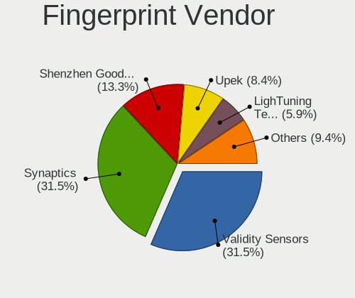

| Vendor                     | Notebooks | Percent |
|----------------------------|-----------|---------|
| Synaptics                  | 64        | 31.84%  |
| Validity Sensors           | 62        | 30.85%  |
| Shenzhen Goodix Technology | 27        | 13.43%  |
| Upek                       | 17        | 8.46%   |
| LighTuning Technology      | 12        | 5.97%   |
| Elan Microelectronics      | 11        | 5.47%   |
| AuthenTec                  | 4         | 1.99%   |
| STMicroelectronics         | 3         | 1.49%   |
| DigitalPersona             | 1         | 0.5%    |

Fingerprint Model
-----------------

Fingerprint sensor models

| Model                                                                      | Notebooks | Percent |
|----------------------------------------------------------------------------|-----------|---------|
| Synaptics Metallica MIS Touch Fingerprint Reader                           | 18        | 8.96%   |
| Synaptics Prometheus MIS Touch Fingerprint Reader                          | 17        | 8.46%   |
| Upek Biometric Touchchip/Touchstrip Fingerprint Sensor                     | 16        | 7.96%   |
| Unknown                                                                    | 15        | 7.46%   |
| Validity Sensors VFS495 Fingerprint Reader                                 | 14        | 6.97%   |
| Shenzhen Goodix  FingerPrint Device                                        | 12        | 5.97%   |
| Elan ELAN:Fingerprint                                                      | 11        | 5.47%   |
| Validity Sensors VFS471 Fingerprint Reader                                 | 8         | 3.98%   |
| Validity Sensors VFS 5011 fingerprint sensor                               | 8         | 3.98%   |
| Shenzhen Goodix FingerPrint                                                | 8         | 3.98%   |
| LighTuning ES603 Swipe Fingerprint Sensor                                  | 8         | 3.98%   |
| Shenzhen Goodix Fingerprint Reader                                         | 7         | 3.48%   |
| Validity Sensors VFS5011 Fingerprint Reader                                | 6         | 2.99%   |
| Synaptics WBDI Device                                                      | 6         | 2.99%   |
| Validity Sensors Fingerprint scanner                                       | 5         | 2.49%   |
| Validity Sensors VFS7500 Touch Fingerprint Sensor                          | 4         | 1.99%   |
| Validity Sensors VFS491                                                    | 4         | 1.99%   |
| Validity Sensors Swipe Fingerprint Sensor                                  | 4         | 1.99%   |
| Validity Sensors VFS7552 Touch Fingerprint Sensor                          | 3         | 1.49%   |
| Synaptics  VFS7552 Touch Fingerprint Sensor with PurePrint                 | 3         | 1.49%   |
| Synaptics  FS7604 Touch Fingerprint Sensor with PurePrint                  | 3         | 1.49%   |
| STMicroelectronics Fingerprint Reader                                      | 3         | 1.49%   |
| LighTuning EgisTec Touch Fingerprint Sensor                                | 3         | 1.49%   |
| Validity Sensors Synaptics WBDI                                            | 2         | 1%      |
| Synaptics  WBDI                                                            | 2         | 1%      |
| AuthenTec Fingerprint Sensor                                               | 2         | 1%      |
| AuthenTec AES2810                                                          | 2         | 1%      |
| Validity Sensors VFS451 Fingerprint Reader                                 | 1         | 0.5%    |
| Validity Sensors VFS101 Fingerprint Reader                                 | 1         | 0.5%    |
| Validity Sensors Synaptics VFS7552 Touch Fingerprint Sensor with PurePrint | 1         | 0.5%    |
| Validity Sensors Synaptics VFS7552 Touch Fingerprint Sensor                | 1         | 0.5%    |
| Upek TCS5B Fingerprint sensor                                              | 1         | 0.5%    |
| LighTuning Fingerprint Reader                                              | 1         | 0.5%    |
| DigitalPersona Fingerprint Reader                                          | 1         | 0.5%    |

Chipcard Vendor
---------------

Chipcard module vendors

| Vendor              | Notebooks | Percent |
|---------------------|-----------|---------|
| Broadcom            | 28        | 38.36%  |
| Alcor Micro         | 23        | 31.51%  |
| Upek                | 9         | 12.33%  |
| O2 Micro            | 8         | 10.96%  |
| Lenovo              | 4         | 5.48%   |
| Giesecke & Devrient | 1         | 1.37%   |

Chipcard Model
--------------

Chipcard module models

| Model                                                                        | Notebooks | Percent |
|------------------------------------------------------------------------------|-----------|---------|
| Alcor Micro AU9540 Smartcard Reader                                          | 23        | 31.51%  |
| Broadcom BCM5880 Secure Applications Processor                               | 11        | 15.07%  |
| Broadcom 5880                                                                | 10        | 13.7%   |
| Upek TouchChip Fingerprint Coprocessor (WBF advanced mode)                   | 9         | 12.33%  |
| O2 Micro OZ776 CCID Smartcard Reader                                         | 7         | 9.59%   |
| Lenovo Integrated Smart Card Reader                                          | 4         | 5.48%   |
| Broadcom BCM5880 Secure Applications Processor with fingerprint swipe sensor | 4         | 5.48%   |
| Broadcom 58200                                                               | 3         | 4.11%   |
| O2 Micro Oz776 SmartCard Reader                                              | 1         | 1.37%   |
| Giesecke & Devrient StarSign CUT                                             | 1         | 1.37%   |

Unsupported
-----------

Unsupported Devices
-------------------

Total unsupported devices on board

| Total | Notebooks | Percent |
|-------|-----------|---------|
| 0     | 754       | 65.68%  |
| 1     | 309       | 26.92%  |
| 2     | 71        | 6.18%   |
| 3     | 11        | 0.96%   |
| 4     | 2         | 0.17%   |
| 5     | 1         | 0.09%   |

Unsupported Device Types
------------------------

Types of unsupported devices

| Type                     | Notebooks | Percent |
|--------------------------|-----------|---------|
| Fingerprint reader       | 201       | 41.36%  |
| Chipcard                 | 72        | 14.81%  |
| Graphics card            | 62        | 12.76%  |
| Net/wireless             | 61        | 12.55%  |
| Multimedia controller    | 44        | 9.05%   |
| Net/ethernet             | 10        | 2.06%   |
| Camera                   | 8         | 1.65%   |
| Storage                  | 6         | 1.23%   |
| Communication controller | 5         | 1.03%   |
| Sound                    | 4         | 0.82%   |
| Bluetooth                | 4         | 0.82%   |
| Network                  | 3         | 0.62%   |
| Card reader              | 2         | 0.41%   |
| Storage/ide              | 1         | 0.21%   |
| Modem                    | 1         | 0.21%   |
| Flash memory             | 1         | 0.21%   |
| Dvb card                 | 1         | 0.21%   |

