Pop!_OS 22.04 - Tested Hardware & Statistics
--------------------------------------------

A project to collect tested hardware configurations for Pop!_OS 22.04.

Anyone can contribute to this report by the [hw-probe](https://github.com/linuxhw/hw-probe) tool:

    sudo -E hw-probe -all -upload

Please contribute! Especially if your hardware is rare.

This is a report for all computer types. See also reports for [desktops](/Dist/Pop!_OS_22.04/Desktop/README.md) and [notebooks](/Dist/Pop!_OS_22.04/Notebook/README.md).

Contents
--------

* [ Test Cases ](#test-cases)

* [ System ](#system)
  - [ Kernel                   ](#kernel)
  - [ Kernel Family            ](#kernel-family)
  - [ Kernel Major Ver.        ](#kernel-major-ver)
  - [ Arch                     ](#arch)
  - [ DE                       ](#de)
  - [ Display Server           ](#display-server)
  - [ Display Manager          ](#display-manager)
  - [ OS Lang                  ](#os-lang)
  - [ Boot Mode                ](#boot-mode)
  - [ Filesystem               ](#filesystem)
  - [ Part. scheme             ](#part-scheme)
  - [ Dual Boot with Linux/BSD ](#dual-boot-with-linuxbsd)
  - [ Dual Boot (Win)          ](#dual-boot-win)

* [ Board ](#board)
  - [ Vendor                   ](#vendor)
  - [ Model                    ](#model)
  - [ Model Family             ](#model-family)
  - [ MFG Year                 ](#mfg-year)
  - [ Form Factor              ](#form-factor)
  - [ Secure Boot              ](#secure-boot)
  - [ Coreboot                 ](#coreboot)
  - [ RAM Size                 ](#ram-size)
  - [ RAM Used                 ](#ram-used)
  - [ Total Drives             ](#total-drives)
  - [ Has CD-ROM               ](#has-cd-rom)
  - [ Has Ethernet             ](#has-ethernet)
  - [ Has WiFi                 ](#has-wifi)
  - [ Has Bluetooth            ](#has-bluetooth)

* [ Location ](#location)
  - [ Country                  ](#country)
  - [ City                     ](#city)

* [ Drives ](#drives)
  - [ Drive Vendor             ](#drive-vendor)
  - [ Drive Model              ](#drive-model)
  - [ HDD Vendor               ](#hdd-vendor)
  - [ SSD Vendor               ](#ssd-vendor)
  - [ Drive Kind               ](#drive-kind)
  - [ Drive Connector          ](#drive-connector)
  - [ Drive Size               ](#drive-size)
  - [ Space Total              ](#space-total)
  - [ Space Used               ](#space-used)
  - [ Malfunc. Drives          ](#malfunc-drives)
  - [ Malfunc. Drive Vendor    ](#malfunc-drive-vendor)
  - [ Malfunc. HDD Vendor      ](#malfunc-hdd-vendor)
  - [ Malfunc. Drive Kind      ](#malfunc-drive-kind)
  - [ Failed Drives            ](#failed-drives)
  - [ Failed Drive Vendor      ](#failed-drive-vendor)
  - [ Drive Status             ](#drive-status)

* [ Storage controller ](#storage-controller)
  - [ Storage Vendor           ](#storage-vendor)
  - [ Storage Model            ](#storage-model)
  - [ Storage Kind             ](#storage-kind)

* [ Processor ](#processor)
  - [ CPU Vendor               ](#cpu-vendor)
  - [ CPU Model                ](#cpu-model)
  - [ CPU Model Family         ](#cpu-model-family)
  - [ CPU Cores                ](#cpu-cores)
  - [ CPU Sockets              ](#cpu-sockets)
  - [ CPU Threads              ](#cpu-threads)
  - [ CPU Op-Modes             ](#cpu-op-modes)
  - [ CPU Microcode            ](#cpu-microcode)
  - [ CPU Microarch            ](#cpu-microarch)

* [ Graphics ](#graphics)
  - [ GPU Vendor               ](#gpu-vendor)
  - [ GPU Model                ](#gpu-model)
  - [ GPU Combo                ](#gpu-combo)
  - [ GPU Driver               ](#gpu-driver)
  - [ GPU Memory               ](#gpu-memory)

* [ Monitor ](#monitor)
  - [ Monitor Vendor           ](#monitor-vendor)
  - [ Monitor Model            ](#monitor-model)
  - [ Monitor Resolution       ](#monitor-resolution)
  - [ Monitor Diagonal         ](#monitor-diagonal)
  - [ Monitor Width            ](#monitor-width)
  - [ Aspect Ratio             ](#aspect-ratio)
  - [ Monitor Area             ](#monitor-area)
  - [ Pixel Density            ](#pixel-density)
  - [ Multiple Monitors        ](#multiple-monitors)

* [ Network ](#network)
  - [ Net Controller Vendor    ](#net-controller-vendor)
  - [ Net Controller Model     ](#net-controller-model)
  - [ Wireless Vendor          ](#wireless-vendor)
  - [ Wireless Model           ](#wireless-model)
  - [ Ethernet Vendor          ](#ethernet-vendor)
  - [ Ethernet Model           ](#ethernet-model)
  - [ Net Controller Kind      ](#net-controller-kind)
  - [ Used Controller          ](#used-controller)
  - [ NICs                     ](#nics)
  - [ IPv6                     ](#ipv6)

* [ Bluetooth ](#bluetooth)
  - [ Bluetooth Vendor         ](#bluetooth-vendor)
  - [ Bluetooth Model          ](#bluetooth-model)

* [ Sound ](#sound)
  - [ Sound Vendor             ](#sound-vendor)
  - [ Sound Model              ](#sound-model)

* [ Memory ](#memory)
  - [ Memory Vendor            ](#memory-vendor)
  - [ Memory Model             ](#memory-model)
  - [ Memory Kind              ](#memory-kind)
  - [ Memory Form Factor       ](#memory-form-factor)
  - [ Memory Size              ](#memory-size)
  - [ Memory Speed             ](#memory-speed)

* [ Printers & scanners ](#printers--scanners)
  - [ Printer Vendor           ](#printer-vendor)
  - [ Printer Model            ](#printer-model)
  - [ Scanner Vendor           ](#scanner-vendor)
  - [ Scanner Model            ](#scanner-model)

* [ Camera ](#camera)
  - [ Camera Vendor            ](#camera-vendor)
  - [ Camera Model             ](#camera-model)

* [ Security ](#security)
  - [ Fingerprint Vendor       ](#fingerprint-vendor)
  - [ Fingerprint Model        ](#fingerprint-model)
  - [ Chipcard Vendor          ](#chipcard-vendor)
  - [ Chipcard Model           ](#chipcard-model)

* [ Unsupported ](#unsupported)
  - [ Unsupported Devices      ](#unsupported-devices)
  - [ Unsupported Device Types ](#unsupported-device-types)

Test Cases
----------

Total: 10123

| Vendor        | Model                       | Form-Factor | Probe                                                      | Date         |
|---------------|-----------------------------|-------------|------------------------------------------------------------|--------------|
| Lenovo        | ThinkCentre M90 5485WHG     | Desktop     | [f8da681374](https://linux-hardware.org/?probe=f8da681374) | Jan 03, 2026 |
| Fujitsu       | D3230-A1 S26361-D3230-A1    | Desktop     | [8f17e68870](https://linux-hardware.org/?probe=8f17e68870) | Jan 02, 2026 |
| Gigabyte      | B650 GAMING X AX            | Desktop     | [a43d09ccc1](https://linux-hardware.org/?probe=a43d09ccc1) | Jan 02, 2026 |
| Dell          | Pro 14 Plus PB14250         | Notebook    | [436aef9d4e](https://linux-hardware.org/?probe=436aef9d4e) | Dec 30, 2025 |
| Gigabyte      | 990FXA-UD3                  | Desktop     | [60443ef738](https://linux-hardware.org/?probe=60443ef738) | Dec 30, 2025 |
| Fujitsu Si... | D2811-A1 S26361-D2811-A1    | Desktop     | [1b91792792](https://linux-hardware.org/?probe=1b91792792) | Dec 30, 2025 |
| Gigabyte      | 990FXA-UD3                  | Desktop     | [bd9db1c966](https://linux-hardware.org/?probe=bd9db1c966) | Dec 30, 2025 |
| Gigabyte      | A520M K V2                  | Desktop     | [9226dfb506](https://linux-hardware.org/?probe=9226dfb506) | Dec 29, 2025 |
| Acer          | Aspire A715-43G             | Notebook    | [c7197c1477](https://linux-hardware.org/?probe=c7197c1477) | Dec 29, 2025 |
| System76      | Pangolin                    | Notebook    | [69c6f92c89](https://linux-hardware.org/?probe=69c6f92c89) | Dec 28, 2025 |
| Dell          | 04Y8V0 A02                  | Desktop     | [7d844ec9de](https://linux-hardware.org/?probe=7d844ec9de) | Dec 28, 2025 |
| ASUSTek       | H81M-C                      | Desktop     | [b4cfb3f1d2](https://linux-hardware.org/?probe=b4cfb3f1d2) | Dec 28, 2025 |
| MSI           | PRO B550M-VC WIFI           | Desktop     | [5dc6665a42](https://linux-hardware.org/?probe=5dc6665a42) | Dec 27, 2025 |
| Dell          | 00V62H A00                  | Desktop     | [e7d7c0660b](https://linux-hardware.org/?probe=e7d7c0660b) | Dec 27, 2025 |
| Dell          | G7 7588                     | Notebook    | [db4f0c9c08](https://linux-hardware.org/?probe=db4f0c9c08) | Dec 27, 2025 |
| Framework     | Laptop                      | Notebook    | [f68799061a](https://linux-hardware.org/?probe=f68799061a) | Dec 27, 2025 |
| MSI           | MAG X570S TORPEDO MAX       | Desktop     | [7430ee5a08](https://linux-hardware.org/?probe=7430ee5a08) | Dec 26, 2025 |
| ASUSTek       | Strix GL704GW               | Notebook    | [297317bc4f](https://linux-hardware.org/?probe=297317bc4f) | Dec 26, 2025 |
| MSI           | B550-A PRO[CEC]             | Desktop     | [f479da3d55](https://linux-hardware.org/?probe=f479da3d55) | Dec 26, 2025 |
| Gigabyte      | B450M DS3H WIFI-CF          | Desktop     | [6bfbb555fd](https://linux-hardware.org/?probe=6bfbb555fd) | Dec 25, 2025 |
| Acer          | Nitro ANV15-41              | Notebook    | [7a17abcef8](https://linux-hardware.org/?probe=7a17abcef8) | Dec 24, 2025 |
| ASRock        | B150M Pro4                  | Desktop     | [5379543544](https://linux-hardware.org/?probe=5379543544) | Dec 23, 2025 |
| HP            | 15                          | Notebook    | [3e11bcc056](https://linux-hardware.org/?probe=3e11bcc056) | Dec 23, 2025 |
| ASRock        | ALiveNF6G-VSTA              | Desktop     | [78c2fee771](https://linux-hardware.org/?probe=78c2fee771) | Dec 23, 2025 |
| ASUSTek       | PRIME B550M-A               | Desktop     | [89f56a9dcc](https://linux-hardware.org/?probe=89f56a9dcc) | Dec 22, 2025 |
| ASRock        | X470 Taichi                 | Desktop     | [c8ff3b62f2](https://linux-hardware.org/?probe=c8ff3b62f2) | Dec 21, 2025 |
| MSI           | MEG Z490 UNIFY              | Desktop     | [231bcc1089](https://linux-hardware.org/?probe=231bcc1089) | Dec 21, 2025 |
| ASUSTek       | G750JX                      | Notebook    | [f9d6799459](https://linux-hardware.org/?probe=f9d6799459) | Dec 21, 2025 |
| MSI           | MEG Z490 UNIFY              | Desktop     | [eed2877cda](https://linux-hardware.org/?probe=eed2877cda) | Dec 21, 2025 |
| PC Special... | X6AR558Y                    | Notebook    | [61d457afc8](https://linux-hardware.org/?probe=61d457afc8) | Dec 20, 2025 |
| Microsoft     | Surface Book 3              | Tablet      | [b995d20de7](https://linux-hardware.org/?probe=b995d20de7) | Dec 20, 2025 |
| Framework     | Laptop 16 (AMD Ryzen 704... | Notebook    | [297ab467bd](https://linux-hardware.org/?probe=297ab467bd) | Dec 20, 2025 |
| Dell          | Latitude E6230              | Notebook    | [6aa39f5ba0](https://linux-hardware.org/?probe=6aa39f5ba0) | Dec 20, 2025 |
| Gigabyte      | H81M-DS2                    | Desktop     | [cc1f98d125](https://linux-hardware.org/?probe=cc1f98d125) | Dec 20, 2025 |
| Biostar       | A520MHP                     | Desktop     | [7d41d5e71c](https://linux-hardware.org/?probe=7d41d5e71c) | Dec 19, 2025 |
| Gigabyte      | B85M-D3H                    | Desktop     | [cccd9b0dea](https://linux-hardware.org/?probe=cccd9b0dea) | Dec 19, 2025 |
| Biostar       | A520MHP                     | Desktop     | [3ed2f518d3](https://linux-hardware.org/?probe=3ed2f518d3) | Dec 19, 2025 |
| Gigabyte      | Z370P D3-CF                 | Desktop     | [a352ae0ded](https://linux-hardware.org/?probe=a352ae0ded) | Dec 18, 2025 |
| CompuLab      | Intense-PC                  | Mini pc     | [ee540c6a97](https://linux-hardware.org/?probe=ee540c6a97) | Dec 18, 2025 |
| System76      | Darter Pro                  | Notebook    | [1136a615cd](https://linux-hardware.org/?probe=1136a615cd) | Dec 18, 2025 |
| HP            | Victus by Laptop 16-e0xx... | Notebook    | [9c4738faec](https://linux-hardware.org/?probe=9c4738faec) | Dec 17, 2025 |
| HP            | Victus by Laptop 16-e0xx... | Notebook    | [6fe0087b6f](https://linux-hardware.org/?probe=6fe0087b6f) | Dec 17, 2025 |
| CompuLab      | Intense-PC                  | Mini pc     | [e1100e43aa](https://linux-hardware.org/?probe=e1100e43aa) | Dec 17, 2025 |
| HP            | OMEN by Laptop 15-dh1xxx    | Notebook    | [4afb48efb2](https://linux-hardware.org/?probe=4afb48efb2) | Dec 17, 2025 |
| HP            | OMEN by Laptop 15-dh1xxx    | Notebook    | [7233aeadbb](https://linux-hardware.org/?probe=7233aeadbb) | Dec 17, 2025 |
| ASRock        | B450M-HDV R4.0              | Desktop     | [aaedaa2027](https://linux-hardware.org/?probe=aaedaa2027) | Dec 17, 2025 |
| MSI           | Summit E14Evo A12M          | Notebook    | [2d49308a04](https://linux-hardware.org/?probe=2d49308a04) | Dec 16, 2025 |
| Lenovo        | Legion 5 15IAX10 83F0       | Notebook    | [789489ae23](https://linux-hardware.org/?probe=789489ae23) | Dec 16, 2025 |
| Fujitsu       | D3224-A1 S26361-D3224-A1    | Desktop     | [13c0fb7796](https://linux-hardware.org/?probe=13c0fb7796) | Dec 16, 2025 |
| MSI           | MAG B550 TOMAHAWK           | Desktop     | [8383240fb6](https://linux-hardware.org/?probe=8383240fb6) | Dec 15, 2025 |
| ASUSTek       | VivoBook_ASUSLaptop X512... | Notebook    | [8ad2c3fd5c](https://linux-hardware.org/?probe=8ad2c3fd5c) | Dec 15, 2025 |
| Alienware     | M17xR4                      | Notebook    | [d53c636aca](https://linux-hardware.org/?probe=d53c636aca) | Dec 15, 2025 |
| ASUSTek       | TUF B450M-PRO GAMING        | Desktop     | [205f6767c8](https://linux-hardware.org/?probe=205f6767c8) | Dec 14, 2025 |
| ASUSTek       | ROG STRIX B550-F GAMING     | Desktop     | [640381dbb0](https://linux-hardware.org/?probe=640381dbb0) | Dec 14, 2025 |
| Lenovo        | ThinkPad W530 243857U       | Notebook    | [93e57d7342](https://linux-hardware.org/?probe=93e57d7342) | Dec 14, 2025 |
| HP            | Laptop 14-dk0xxx            | Notebook    | [c03e61af95](https://linux-hardware.org/?probe=c03e61af95) | Dec 14, 2025 |
| MSI           | Thin 15 B12VE               | Notebook    | [e92adcbcc8](https://linux-hardware.org/?probe=e92adcbcc8) | Dec 13, 2025 |
| Lenovo        | Y40-70 20347                | Notebook    | [15b80e1e91](https://linux-hardware.org/?probe=15b80e1e91) | Dec 13, 2025 |
| Lenovo        | Y40-70 20347                | Notebook    | [50d8db10cb](https://linux-hardware.org/?probe=50d8db10cb) | Dec 13, 2025 |
| Lenovo        | ThinkPad L14 Gen 2 20X20... | Notebook    | [b29aec059d](https://linux-hardware.org/?probe=b29aec059d) | Dec 13, 2025 |
| ASUSTek       | ProArt X670E-CREATOR WIF... | Desktop     | [c14c21a368](https://linux-hardware.org/?probe=c14c21a368) | Dec 13, 2025 |
| HP            | 3031h                       | Desktop     | [68b5d8293b](https://linux-hardware.org/?probe=68b5d8293b) | Dec 13, 2025 |
| MSI           | MAG B650 TOMAHAWK WIFI      | Desktop     | [150bec88af](https://linux-hardware.org/?probe=150bec88af) | Dec 13, 2025 |
| HP            | 3031h                       | Desktop     | [a8df00a12c](https://linux-hardware.org/?probe=a8df00a12c) | Dec 13, 2025 |
| System76      | Adder WS                    | Notebook    | [6c4c3d426e](https://linux-hardware.org/?probe=6c4c3d426e) | Dec 13, 2025 |
| ASUSTek       | PRIME B850-PLUS             | Desktop     | [3319d6f365](https://linux-hardware.org/?probe=3319d6f365) | Dec 13, 2025 |
| HP            | Pavilion Gaming Laptop 1... | Notebook    | [6374abd589](https://linux-hardware.org/?probe=6374abd589) | Dec 12, 2025 |
| Gigabyte      | X870I AORUS PRO ICE         | Desktop     | [f7403e8760](https://linux-hardware.org/?probe=f7403e8760) | Dec 11, 2025 |
| HP            | 89D8 SMVB                   | Desktop     | [314751990d](https://linux-hardware.org/?probe=314751990d) | Dec 11, 2025 |
| MARIUS        | 2016 Mainframe 4000MHz 1... | Desktop     | [276c9090ac](https://linux-hardware.org/?probe=276c9090ac) | Dec 10, 2025 |
| Gigabyte      | X670E AORUS PRO X           | Desktop     | [4094002427](https://linux-hardware.org/?probe=4094002427) | Dec 10, 2025 |
| Dell          | 0D28YY A00                  | Desktop     | [05523e53ef](https://linux-hardware.org/?probe=05523e53ef) | Dec 10, 2025 |
| Gigabyte      | H110M-Gaming3-CF            | Desktop     | [9c6c9201cb](https://linux-hardware.org/?probe=9c6c9201cb) | Dec 10, 2025 |
| Lenovo        | ThinkPad T460s 20FAS0KH0... | Notebook    | [4b6c2b8bd0](https://linux-hardware.org/?probe=4b6c2b8bd0) | Dec 10, 2025 |
| MSI           | MAG B550 TOMAHAWK           | Desktop     | [776d7ce967](https://linux-hardware.org/?probe=776d7ce967) | Dec 10, 2025 |
| Gigabyte      | X670E AORUS PRO X           | Desktop     | [606a67fef4](https://linux-hardware.org/?probe=606a67fef4) | Dec 10, 2025 |
| ASUSTek       | ROG CROSSHAIR X870E HERO... | Desktop     | [42d34857cd](https://linux-hardware.org/?probe=42d34857cd) | Dec 10, 2025 |
| ASUSTek       | TUF Gaming X570-PLUS        | Desktop     | [0aa72bbcee](https://linux-hardware.org/?probe=0aa72bbcee) | Dec 10, 2025 |
| ASUSTek       | TUF Gaming B560M-PLUS WI... | Desktop     | [4d06edb238](https://linux-hardware.org/?probe=4d06edb238) | Dec 10, 2025 |
| Microsoft     | Surface Pro 4               | Tablet      | [66078b0262](https://linux-hardware.org/?probe=66078b0262) | Dec 09, 2025 |
| HP            | 0B4Ch D                     | Desktop     | [e6d202c541](https://linux-hardware.org/?probe=e6d202c541) | Dec 09, 2025 |
| Unknown (1... | MAG B550M MORTAR            | Desktop     | [2678a6e567](https://linux-hardware.org/?probe=2678a6e567) | Dec 09, 2025 |
| Unknown (1... | MAG B550M MORTAR            | Desktop     | [a44bff56ff](https://linux-hardware.org/?probe=a44bff56ff) | Dec 09, 2025 |
| ASRock        | X370 Gaming-ITX/ac          | Desktop     | [e46e529197](https://linux-hardware.org/?probe=e46e529197) | Dec 09, 2025 |
| ASUSTek       | ROG CROSSHAIR X870E HERO    | Desktop     | [7619505c0d](https://linux-hardware.org/?probe=7619505c0d) | Dec 09, 2025 |
| Dell          | Latitude E6510              | Notebook    | [0e61ffb576](https://linux-hardware.org/?probe=0e61ffb576) | Dec 09, 2025 |
| MSI           | H510M-A PRO                 | Desktop     | [bb697ee959](https://linux-hardware.org/?probe=bb697ee959) | Dec 08, 2025 |
| Apple         | MacBookPro9,1               | Notebook    | [9e1d9798af](https://linux-hardware.org/?probe=9e1d9798af) | Dec 08, 2025 |
| Apple         | MacBookPro9,1               | Notebook    | [edbb6ad45a](https://linux-hardware.org/?probe=edbb6ad45a) | Dec 08, 2025 |
| ASUSTek       | NUC15JNBU9X9 60AS00I0-MB... | Mini pc     | [1580cc5e2d](https://linux-hardware.org/?probe=1580cc5e2d) | Dec 08, 2025 |
| MSI           | MAG X870E TOMAHAWK WIFI     | Desktop     | [ac2b0f9bf9](https://linux-hardware.org/?probe=ac2b0f9bf9) | Dec 08, 2025 |
| ASUSTek       | TUF Gaming B650M-PLUS WI... | Desktop     | [cfb8d44b95](https://linux-hardware.org/?probe=cfb8d44b95) | Dec 08, 2025 |
| ASUSTek       | ROG STRIX B550-F GAMING ... | Desktop     | [8f67fecdd0](https://linux-hardware.org/?probe=8f67fecdd0) | Dec 08, 2025 |
| Dell          | Latitude 9410               | Convertible | [6733335761](https://linux-hardware.org/?probe=6733335761) | Dec 08, 2025 |
| ASUSTek       | GL553VE                     | Notebook    | [792423abe6](https://linux-hardware.org/?probe=792423abe6) | Dec 07, 2025 |
| ASUSTek       | PRIME B550-PLUS             | Desktop     | [1c40ea2a35](https://linux-hardware.org/?probe=1c40ea2a35) | Dec 07, 2025 |
| Acer          | Nitro ANV15-41              | Notebook    | [0747d333f7](https://linux-hardware.org/?probe=0747d333f7) | Dec 07, 2025 |
| Microsoft     | Surface Pro 7               | Tablet      | [e9d6ee1c75](https://linux-hardware.org/?probe=e9d6ee1c75) | Dec 07, 2025 |
| Acer          | Aspire V7-481P              | Notebook    | [f4f893a793](https://linux-hardware.org/?probe=f4f893a793) | Dec 07, 2025 |
| HP            | ProLiant DL380p Gen8        | Server      | [3fcf246530](https://linux-hardware.org/?probe=3fcf246530) | Dec 07, 2025 |
| ASUSTek       | ROG STRIX Z790-E GAMING ... | Desktop     | [c6d9d447bb](https://linux-hardware.org/?probe=c6d9d447bb) | Dec 07, 2025 |
| Acer          | Nitro ANV15-41              | Notebook    | [cf099ccdea](https://linux-hardware.org/?probe=cf099ccdea) | Dec 06, 2025 |
| ASUSTek       | TUF Gaming B550-PLUS WIF... | Desktop     | [c315ba293c](https://linux-hardware.org/?probe=c315ba293c) | Dec 06, 2025 |
| ASUSTek       | VivoBook_ASUSLaptop X571... | Notebook    | [fb31831872](https://linux-hardware.org/?probe=fb31831872) | Dec 06, 2025 |
| Toshiba       | Satellite A300              | Notebook    | [50a0c8532c](https://linux-hardware.org/?probe=50a0c8532c) | Dec 06, 2025 |
| Intel         | NUC7i7BNB J31145-306        | Mini pc     | [5d32820e90](https://linux-hardware.org/?probe=5d32820e90) | Dec 05, 2025 |
| ASRock        | B550M Pro4                  | Desktop     | [233048ee4b](https://linux-hardware.org/?probe=233048ee4b) | Dec 05, 2025 |
| ASRock        | B550M Pro4                  | Desktop     | [b206dfea93](https://linux-hardware.org/?probe=b206dfea93) | Dec 05, 2025 |
| ASUSTek       | PRIME B550M-A WIFI II       | Desktop     | [657991261f](https://linux-hardware.org/?probe=657991261f) | Dec 05, 2025 |
| Dell          | Pro 16 Plus PB16255         | Notebook    | [2a31ed9ec3](https://linux-hardware.org/?probe=2a31ed9ec3) | Dec 04, 2025 |
| ASRock        | H110M-HDV R3.0              | Desktop     | [1c5b6b5d0b](https://linux-hardware.org/?probe=1c5b6b5d0b) | Dec 04, 2025 |
| Acer          | Nitro AN515-45              | Notebook    | [7d7962356d](https://linux-hardware.org/?probe=7d7962356d) | Dec 04, 2025 |
| ASUSTek       | ROG Zephyrus G15 GA503QR... | Notebook    | [d858bcbd94](https://linux-hardware.org/?probe=d858bcbd94) | Dec 04, 2025 |
| System76      | Darter Pro                  | Notebook    | [21b9b327c2](https://linux-hardware.org/?probe=21b9b327c2) | Dec 04, 2025 |
| MSI           | MPG Z390 GAMING PLUS        | Desktop     | [74cbecb5e0](https://linux-hardware.org/?probe=74cbecb5e0) | Dec 03, 2025 |
| HP            | 15                          | Notebook    | [0322173c14](https://linux-hardware.org/?probe=0322173c14) | Dec 02, 2025 |
| ASUSTek       | PRIME B850-PLUS             | Desktop     | [957ce1e8c2](https://linux-hardware.org/?probe=957ce1e8c2) | Dec 02, 2025 |
| HP            | 15                          | Notebook    | [da5232ce02](https://linux-hardware.org/?probe=da5232ce02) | Dec 02, 2025 |
| Tianbei       | GEM12                       | Desktop     | [1942420532](https://linux-hardware.org/?probe=1942420532) | Dec 02, 2025 |
| Intel         | X99-D4-V5 BSF Ver:1.00      | Desktop     | [e954ec2a59](https://linux-hardware.org/?probe=e954ec2a59) | Dec 02, 2025 |
| HP            | 3397                        | Desktop     | [0d46b84a31](https://linux-hardware.org/?probe=0d46b84a31) | Dec 02, 2025 |
| MSI           | B350 PC MATE                | Desktop     | [b9ac6748b3](https://linux-hardware.org/?probe=b9ac6748b3) | Dec 01, 2025 |
| System76      | Thelio thelio-r1            | Desktop     | [3be8f52f2b](https://linux-hardware.org/?probe=3be8f52f2b) | Dec 01, 2025 |
| Intel         | B75                         | Desktop     | [8098a7c057](https://linux-hardware.org/?probe=8098a7c057) | Dec 01, 2025 |
| Acer          | Aspire TC-1760              | Desktop     | [1e383a6e65](https://linux-hardware.org/?probe=1e383a6e65) | Nov 30, 2025 |
| MSI           | B350 PC MATE                | Desktop     | [d7d04c7e51](https://linux-hardware.org/?probe=d7d04c7e51) | Nov 30, 2025 |
| ASUSTek       | X555LJ                      | Notebook    | [3c12e5e01b](https://linux-hardware.org/?probe=3c12e5e01b) | Nov 30, 2025 |
| Dell          | 0T10XW A01                  | Desktop     | [5bc3a2f132](https://linux-hardware.org/?probe=5bc3a2f132) | Nov 30, 2025 |
| Gigabyte      | B450 AORUS ELITE            | Desktop     | [1d9976ca91](https://linux-hardware.org/?probe=1d9976ca91) | Nov 29, 2025 |
| Intel         | H81                         | Desktop     | [0e235d2382](https://linux-hardware.org/?probe=0e235d2382) | Nov 29, 2025 |
| ASUSTek       | P8H67-M LE                  | Desktop     | [de393a1e85](https://linux-hardware.org/?probe=de393a1e85) | Nov 29, 2025 |
| ASUSTek       | P8H67-M LE                  | Desktop     | [6e680a4a29](https://linux-hardware.org/?probe=6e680a4a29) | Nov 29, 2025 |
| ASUSTek       | P8H67-M LE                  | Desktop     | [6de0611554](https://linux-hardware.org/?probe=6de0611554) | Nov 29, 2025 |
| ASUSTek       | TUF Gaming B550-PLUS WIF... | Desktop     | [c5ee043d40](https://linux-hardware.org/?probe=c5ee043d40) | Nov 29, 2025 |
| Intel         | H81                         | Desktop     | [1ec4172ab3](https://linux-hardware.org/?probe=1ec4172ab3) | Nov 29, 2025 |
| Google        | Volet                       | Notebook    | [dba215a8ea](https://linux-hardware.org/?probe=dba215a8ea) | Nov 29, 2025 |
| Kllisre       | E5-X99 V1.0                 | Desktop     | [063285bc11](https://linux-hardware.org/?probe=063285bc11) | Nov 29, 2025 |
| Panasonic     | CF-31WB91TFM                | Notebook    | [577b0783d3](https://linux-hardware.org/?probe=577b0783d3) | Nov 28, 2025 |
| ASUSTek       | N501VW                      | Notebook    | [218eecb3bb](https://linux-hardware.org/?probe=218eecb3bb) | Nov 28, 2025 |
| Kllisre       | E5-X99 V1.0                 | Desktop     | [16c2db011b](https://linux-hardware.org/?probe=16c2db011b) | Nov 28, 2025 |
| Apple         | Mac-8ED6AF5B48C039E1 Mac... | Mini pc     | [dd87497fa9](https://linux-hardware.org/?probe=dd87497fa9) | Nov 28, 2025 |
| Lenovo        | ThinkPad T480 20L6S42300    | Notebook    | [90a2ec7f39](https://linux-hardware.org/?probe=90a2ec7f39) | Nov 28, 2025 |
| ASUSTek       | H81M-C/BR                   | Desktop     | [f10dcf6a5b](https://linux-hardware.org/?probe=f10dcf6a5b) | Nov 27, 2025 |
| System76      | Bonobo WS                   | Notebook    | [1ac83f26c0](https://linux-hardware.org/?probe=1ac83f26c0) | Nov 27, 2025 |
| ASRock        | B550 Phantom Gaming 4       | Desktop     | [87d31af2c0](https://linux-hardware.org/?probe=87d31af2c0) | Nov 27, 2025 |
| ASUSTek       | VivoBook_ASUSLaptop M740... | Notebook    | [f3dfdebe8e](https://linux-hardware.org/?probe=f3dfdebe8e) | Nov 26, 2025 |
| Apple         | Mac-42FD25EABCABB274 iMa... | All in one  | [9cf3af2e2d](https://linux-hardware.org/?probe=9cf3af2e2d) | Nov 26, 2025 |
| Apple         | Mac-42FD25EABCABB274 iMa... | All in one  | [f847b73a96](https://linux-hardware.org/?probe=f847b73a96) | Nov 26, 2025 |
| MSI           | Thin 15 B13UC               | Notebook    | [6776dfcf29](https://linux-hardware.org/?probe=6776dfcf29) | Nov 26, 2025 |
| ASUSTek       | ZenBook Q526FA_Q526FA       | Convertible | [9a6add7ba3](https://linux-hardware.org/?probe=9a6add7ba3) | Nov 26, 2025 |
| Gigabyte      | B450M DS3H-CF               | Desktop     | [4870f169f6](https://linux-hardware.org/?probe=4870f169f6) | Nov 25, 2025 |
| Gigabyte      | B550M DS3H AC               | Desktop     | [99fe3b60f2](https://linux-hardware.org/?probe=99fe3b60f2) | Nov 25, 2025 |
| MSI           | A88X-G45 GAMING             | Desktop     | [116c288959](https://linux-hardware.org/?probe=116c288959) | Nov 25, 2025 |
| HP            | 3397                        | Desktop     | [8576ee683a](https://linux-hardware.org/?probe=8576ee683a) | Nov 25, 2025 |
| ASRock        | 760GM-HD                    | Desktop     | [f8a558bc3b](https://linux-hardware.org/?probe=f8a558bc3b) | Nov 25, 2025 |
| ASRock        | 760GM-HD                    | Desktop     | [a9172032f6](https://linux-hardware.org/?probe=a9172032f6) | Nov 25, 2025 |
| ASUSTek       | TUF Gaming B650-PLUS WIF... | Desktop     | [469b0e2c48](https://linux-hardware.org/?probe=469b0e2c48) | Nov 25, 2025 |
| MSI           | GF63 Thin 10UD              | Notebook    | [76ae648a67](https://linux-hardware.org/?probe=76ae648a67) | Nov 25, 2025 |
| TongFang      | GX5MRXL                     | Notebook    | [ea88de111d](https://linux-hardware.org/?probe=ea88de111d) | Nov 24, 2025 |
| ASUSTek       | P6T                         | Desktop     | [549ea5c8f6](https://linux-hardware.org/?probe=549ea5c8f6) | Nov 24, 2025 |
| MSI           | H310M PRO-VDH PLUS          | Desktop     | [90e2b7fb98](https://linux-hardware.org/?probe=90e2b7fb98) | Nov 24, 2025 |
| ASUSTek       | PRIME B450M-GAMING/BR       | Desktop     | [b65d33482e](https://linux-hardware.org/?probe=b65d33482e) | Nov 24, 2025 |
| Intel         | X99E V1.0                   | Desktop     | [417424c46c](https://linux-hardware.org/?probe=417424c46c) | Nov 24, 2025 |
| Dell          | 0TP412                      | Desktop     | [89c9c1bf9d](https://linux-hardware.org/?probe=89c9c1bf9d) | Nov 23, 2025 |
| ASUSTek       | ROG STRIX B850-I GAMING ... | Desktop     | [1c30e18293](https://linux-hardware.org/?probe=1c30e18293) | Nov 23, 2025 |
| MSI           | MAG X670E TOMAHAWK WIFI     | Desktop     | [49a66cf66f](https://linux-hardware.org/?probe=49a66cf66f) | Nov 23, 2025 |
| ASUSTek       | GL752VW                     | Notebook    | [78933458ca](https://linux-hardware.org/?probe=78933458ca) | Nov 23, 2025 |
| HP            | Laptop 15-bs0xx             | Notebook    | [b441b41b34](https://linux-hardware.org/?probe=b441b41b34) | Nov 22, 2025 |
| Lenovo        | ThinkPad P15s Gen 1 20T4... | Notebook    | [d7b549283e](https://linux-hardware.org/?probe=d7b549283e) | Nov 22, 2025 |
| ASUSTek       | GL552VW                     | Notebook    | [26f205d4ad](https://linux-hardware.org/?probe=26f205d4ad) | Nov 22, 2025 |
| ASUSTek       | TUF H310M-PLUS GAMING/BR    | Desktop     | [58bb243b4c](https://linux-hardware.org/?probe=58bb243b4c) | Nov 21, 2025 |
| ASUSTek       | TUF Gaming B760-PLUS WIF... | Desktop     | [f853bbd9bf](https://linux-hardware.org/?probe=f853bbd9bf) | Nov 21, 2025 |
| Intel         | X99 V1.0                    | Desktop     | [7aabf3c2ad](https://linux-hardware.org/?probe=7aabf3c2ad) | Nov 21, 2025 |
| SIEMENS       | SIMATIC Field PG M2         | Notebook    | [eca5a420e8](https://linux-hardware.org/?probe=eca5a420e8) | Nov 21, 2025 |
| Apple         | MacBookAir7,2               | Notebook    | [17b46cb92c](https://linux-hardware.org/?probe=17b46cb92c) | Nov 21, 2025 |
| Lenovo        | ThinkPad P15 Gen 1 20SUS... | Notebook    | [7785d53587](https://linux-hardware.org/?probe=7785d53587) | Nov 20, 2025 |
| ASUSTek       | SABERTOOTH X79              | Desktop     | [77d79f02db](https://linux-hardware.org/?probe=77d79f02db) | Nov 20, 2025 |
| Intel         | H81                         | Desktop     | [fc4726b6b1](https://linux-hardware.org/?probe=fc4726b6b1) | Nov 19, 2025 |
| Lenovo        | ThinkPad L13 Gen 2 20VJ0... | Notebook    | [08a0993e67](https://linux-hardware.org/?probe=08a0993e67) | Nov 19, 2025 |
| Gigabyte      | AB350-Gaming 3-CF           | Desktop     | [6c0b265a6d](https://linux-hardware.org/?probe=6c0b265a6d) | Nov 19, 2025 |
| Novatech      | P65_67RSRP                  | Notebook    | [65b61d4558](https://linux-hardware.org/?probe=65b61d4558) | Nov 19, 2025 |
| HP            | 8433 11                     | Desktop     | [7a3344ccfb](https://linux-hardware.org/?probe=7a3344ccfb) | Nov 19, 2025 |
| HP            | Laptop 15-fc0xxx            | Notebook    | [32ef98c225](https://linux-hardware.org/?probe=32ef98c225) | Nov 18, 2025 |
| ASUSTek       | Z87-A                       | Desktop     | [2526aecc7d](https://linux-hardware.org/?probe=2526aecc7d) | Nov 18, 2025 |
| Gigabyte      | B650 GAMING X               | Desktop     | [93382f8594](https://linux-hardware.org/?probe=93382f8594) | Nov 18, 2025 |
| Lenovo        | ThinkPad E14 Gen 4 21E3C... | Notebook    | [7229df3f9d](https://linux-hardware.org/?probe=7229df3f9d) | Nov 17, 2025 |
| ASUSTek       | VivoBook_ASUSLaptop X160... | Notebook    | [7ad3e3af10](https://linux-hardware.org/?probe=7ad3e3af10) | Nov 17, 2025 |
| Lenovo        | ThinkPad T430 2342CTO       | Notebook    | [1b53d1b84c](https://linux-hardware.org/?probe=1b53d1b84c) | Nov 17, 2025 |
| MSI           | GP62 6QE                    | Notebook    | [7569598435](https://linux-hardware.org/?probe=7569598435) | Nov 17, 2025 |
| System76      | Thelio thelio-r1            | Desktop     | [39e4998b22](https://linux-hardware.org/?probe=39e4998b22) | Nov 17, 2025 |
| Dell          | Inspiron 7506 2n1           | Convertible | [12478829d8](https://linux-hardware.org/?probe=12478829d8) | Nov 16, 2025 |
| MSI           | MPG X570 GAMING EDGE WIF... | Desktop     | [fd68b94208](https://linux-hardware.org/?probe=fd68b94208) | Nov 16, 2025 |
| Foxconn       | A74MX-S/A74MX-K             | Desktop     | [d86e6f4e5e](https://linux-hardware.org/?probe=d86e6f4e5e) | Nov 16, 2025 |
| Lenovo        | ThinkPad T14 Gen 2i 20W1... | Notebook    | [450c917ed3](https://linux-hardware.org/?probe=450c917ed3) | Nov 15, 2025 |
| ASUSTek       | ROG STRIX B550-F GAMING     | Desktop     | [dc847e15c8](https://linux-hardware.org/?probe=dc847e15c8) | Nov 15, 2025 |
| MSI           | MPG X570 GAMING EDGE WIF... | Desktop     | [acf3543886](https://linux-hardware.org/?probe=acf3543886) | Nov 15, 2025 |
| Gigabyte      | A520M DS3H                  | Desktop     | [09744da28b](https://linux-hardware.org/?probe=09744da28b) | Nov 15, 2025 |
| HP            | 3397                        | Desktop     | [6ce8d91610](https://linux-hardware.org/?probe=6ce8d91610) | Nov 15, 2025 |
| GPU Compan... | GWTN141-10                  | Notebook    | [162bf83945](https://linux-hardware.org/?probe=162bf83945) | Nov 15, 2025 |
| Gigabyte      | B450 AORUS ELITE            | Desktop     | [fd5750ef89](https://linux-hardware.org/?probe=fd5750ef89) | Nov 15, 2025 |
| ASRock        | B250 Pro4                   | Desktop     | [cb22bd169a](https://linux-hardware.org/?probe=cb22bd169a) | Nov 14, 2025 |
| PC Special... | Standard                    | Notebook    | [dcffada0f7](https://linux-hardware.org/?probe=dcffada0f7) | Nov 14, 2025 |
| HP            | Spectre x360 Convertible... | Convertible | [1823f73085](https://linux-hardware.org/?probe=1823f73085) | Nov 14, 2025 |
| Alienware     | 0RV30W A00                  | Desktop     | [3c338acd89](https://linux-hardware.org/?probe=3c338acd89) | Nov 14, 2025 |
| ASRock        | B450 Steel Legend           | Desktop     | [b647cbf1a6](https://linux-hardware.org/?probe=b647cbf1a6) | Nov 14, 2025 |
| Acer          | Nitro ANV15-51              | Notebook    | [abf3c85360](https://linux-hardware.org/?probe=abf3c85360) | Nov 13, 2025 |
| MSI           | Z270 GAMING PRO CARBON      | Desktop     | [739c2b146d](https://linux-hardware.org/?probe=739c2b146d) | Nov 13, 2025 |
| ASUSTek       | ROG STRIX Z790-I GAMING ... | Desktop     | [002a0ee63b](https://linux-hardware.org/?probe=002a0ee63b) | Nov 13, 2025 |
| ASUSTek       | SABERTOOTH Z170 S           | Desktop     | [3cbf396e1b](https://linux-hardware.org/?probe=3cbf396e1b) | Nov 13, 2025 |
| Sapphire      | FS-FP5V I955T029            | Desktop     | [a9aa85c0db](https://linux-hardware.org/?probe=a9aa85c0db) | Nov 13, 2025 |
| ASUSTek       | VivoBook_ASUSLaptop X150... | Notebook    | [3ee9e47377](https://linux-hardware.org/?probe=3ee9e47377) | Nov 12, 2025 |
| HP            | Spectre Pro x360 G2         | Notebook    | [5d4c553ea0](https://linux-hardware.org/?probe=5d4c553ea0) | Nov 12, 2025 |
| ASUSTek       | VivoBook_ASUSLaptop X150... | Notebook    | [b0edef25ef](https://linux-hardware.org/?probe=b0edef25ef) | Nov 12, 2025 |
| ASRock        | Z87 Pro3                    | Desktop     | [12fc2bd17c](https://linux-hardware.org/?probe=12fc2bd17c) | Nov 12, 2025 |
| ASUSTek       | ASUS TUF Gaming A16 FA60... | Notebook    | [eb20e28600](https://linux-hardware.org/?probe=eb20e28600) | Nov 12, 2025 |
| HP            | Pavilion dv6                | Notebook    | [b40aa4d651](https://linux-hardware.org/?probe=b40aa4d651) | Nov 12, 2025 |
| HP            | Pavilion dv6                | Notebook    | [8149bfcaf0](https://linux-hardware.org/?probe=8149bfcaf0) | Nov 12, 2025 |
| Apple         | Mac-F65AE981FFA204ED Mac... | Mini pc     | [8574532430](https://linux-hardware.org/?probe=8574532430) | Nov 11, 2025 |
| Apple         | Mac-F65AE981FFA204ED Mac... | Mini pc     | [bd35f0b57b](https://linux-hardware.org/?probe=bd35f0b57b) | Nov 11, 2025 |
| Intel         | X99-P4 V9.01                | Desktop     | [e88b0e2914](https://linux-hardware.org/?probe=e88b0e2914) | Nov 11, 2025 |
| Dell          | G5 5587                     | Notebook    | [fa3534d695](https://linux-hardware.org/?probe=fa3534d695) | Nov 11, 2025 |
| Lenovo        | ThinkPad T14 Gen 2i 20W0... | Notebook    | [26f4e7fa03](https://linux-hardware.org/?probe=26f4e7fa03) | Nov 10, 2025 |
| Lenovo        | ThinkPad T14 Gen 2i 20W0... | Notebook    | [fbc7e7c93c](https://linux-hardware.org/?probe=fbc7e7c93c) | Nov 10, 2025 |
| HP            | Spectre x360 2-in-1 Lapt... | Convertible | [a48436372c](https://linux-hardware.org/?probe=a48436372c) | Nov 10, 2025 |
| Acer          | Nitro AN515-58              | Notebook    | [143b87d1fa](https://linux-hardware.org/?probe=143b87d1fa) | Nov 09, 2025 |
| ASRock        | Z87 Pro3                    | Desktop     | [4cb6c44f9f](https://linux-hardware.org/?probe=4cb6c44f9f) | Nov 09, 2025 |
| System76      | Thelio Major thelio-majo... | Desktop     | [316f1fdb00](https://linux-hardware.org/?probe=316f1fdb00) | Nov 09, 2025 |
| ASUSTek       | TUF Gaming X870-PLUS WIF... | Desktop     | [c4ce15fe85](https://linux-hardware.org/?probe=c4ce15fe85) | Nov 08, 2025 |
| ASUSTek       | TUF Gaming X870-PLUS WIF... | Desktop     | [6dfd08c7ed](https://linux-hardware.org/?probe=6dfd08c7ed) | Nov 08, 2025 |
| ASRock        | Z87 Extreme4                | Desktop     | [948480a24e](https://linux-hardware.org/?probe=948480a24e) | Nov 08, 2025 |
| Dell          | Inspiron 5420               | Notebook    | [df8c24bc92](https://linux-hardware.org/?probe=df8c24bc92) | Nov 08, 2025 |
| Gigabyte      | Z690 UD DDR4                | Desktop     | [848962f6ab](https://linux-hardware.org/?probe=848962f6ab) | Nov 07, 2025 |
| Dell          | 0YXT71 A02                  | Desktop     | [04d83d930d](https://linux-hardware.org/?probe=04d83d930d) | Nov 07, 2025 |
| Acer          | Aspire A517-51              | Notebook    | [ee9d4faa34](https://linux-hardware.org/?probe=ee9d4faa34) | Nov 07, 2025 |
| Lenovo        | Legion Go 8APU1 83E1        | Tablet      | [e7a4455cf2](https://linux-hardware.org/?probe=e7a4455cf2) | Nov 07, 2025 |
| ASUSTek       | ROG Maximus X HERO          | Desktop     | [1c83849e66](https://linux-hardware.org/?probe=1c83849e66) | Nov 06, 2025 |
| ASUSTek       | ROG Maximus X HERO          | Desktop     | [d55cef6f3f](https://linux-hardware.org/?probe=d55cef6f3f) | Nov 06, 2025 |
| MSI           | B450M MORTAR MAX            | Desktop     | [3cf344e190](https://linux-hardware.org/?probe=3cf344e190) | Nov 06, 2025 |
| Lenovo        | Yoga 2 13 20344             | Notebook    | [ff2c624155](https://linux-hardware.org/?probe=ff2c624155) | Nov 06, 2025 |
| Sapphire      | FS-FP5V I955T029            | Desktop     | [870f7ae608](https://linux-hardware.org/?probe=870f7ae608) | Nov 06, 2025 |
| Gigabyte      | X870E AORUS PRO ICE         | Desktop     | [1d2a5a0826](https://linux-hardware.org/?probe=1d2a5a0826) | Nov 06, 2025 |
| Dell          | 0YU822 A00                  | Desktop     | [f2cfcce379](https://linux-hardware.org/?probe=f2cfcce379) | Nov 05, 2025 |
| Acer          | Nitro AN517-54              | Notebook    | [adc57d859c](https://linux-hardware.org/?probe=adc57d859c) | Nov 05, 2025 |
| Acer          | TravelMate P259-M           | Notebook    | [fd2fb3a425](https://linux-hardware.org/?probe=fd2fb3a425) | Nov 05, 2025 |
| Acer          | TravelMate P259-M           | Notebook    | [e3c5b73ea5](https://linux-hardware.org/?probe=e3c5b73ea5) | Nov 05, 2025 |
| ASRock        | Z690 Pro RS                 | Desktop     | [0e5093495d](https://linux-hardware.org/?probe=0e5093495d) | Nov 05, 2025 |
| HUAWEI        | WRT-WX9                     | Notebook    | [ce057ca73d](https://linux-hardware.org/?probe=ce057ca73d) | Nov 05, 2025 |
| Gigabyte      | H110M-H DDR3-CF             | Desktop     | [e6f53e648c](https://linux-hardware.org/?probe=e6f53e648c) | Nov 04, 2025 |
| Dell          | 0RCPW3 A03                  | Desktop     | [729aabae9f](https://linux-hardware.org/?probe=729aabae9f) | Nov 04, 2025 |
| MSI           | MPG X870E CARBON WIFI       | Desktop     | [b8980caef2](https://linux-hardware.org/?probe=b8980caef2) | Nov 04, 2025 |
| Dell          | 06D7TR A00                  | Desktop     | [c7dd234359](https://linux-hardware.org/?probe=c7dd234359) | Nov 04, 2025 |
| Dell          | 0YXT71 A01                  | Desktop     | [db2d733040](https://linux-hardware.org/?probe=db2d733040) | Nov 04, 2025 |
| Apple         | MacBookPro11,3              | Notebook    | [7cd39452f2](https://linux-hardware.org/?probe=7cd39452f2) | Nov 03, 2025 |
| Acer          | Nitro AN515-43              | Notebook    | [f7d3b086b8](https://linux-hardware.org/?probe=f7d3b086b8) | Nov 02, 2025 |
| AZW           | EQ                          | Mini pc     | [d797d87a41](https://linux-hardware.org/?probe=d797d87a41) | Nov 02, 2025 |
| HP            | 255R 15.6 inch G10 Noteb... | Notebook    | [98e59fc506](https://linux-hardware.org/?probe=98e59fc506) | Nov 02, 2025 |
| HP            | 212B                        | Desktop     | [0e093bcc0a](https://linux-hardware.org/?probe=0e093bcc0a) | Nov 01, 2025 |
| HP            | 3048h                       | Desktop     | [abf6592ec3](https://linux-hardware.org/?probe=abf6592ec3) | Nov 01, 2025 |
| HP            | 3048h                       | Desktop     | [eead500873](https://linux-hardware.org/?probe=eead500873) | Nov 01, 2025 |
| ASUSTek       | Z170-E                      | Desktop     | [e4178ae6f7](https://linux-hardware.org/?probe=e4178ae6f7) | Nov 01, 2025 |
| Gigabyte      | Z790 AORUS ELITE AX         | Desktop     | [05c2f8012d](https://linux-hardware.org/?probe=05c2f8012d) | Nov 01, 2025 |
| ASUSTek       | P8Z68 DELUXE                | Desktop     | [b6963df9f9](https://linux-hardware.org/?probe=b6963df9f9) | Nov 01, 2025 |
| Gigabyte      | B850M FORCE WIFI6E          | Desktop     | [5aaa0d6f63](https://linux-hardware.org/?probe=5aaa0d6f63) | Nov 01, 2025 |
| Gigabyte      | 970A-DS3P                   | Desktop     | [5e8311413c](https://linux-hardware.org/?probe=5e8311413c) | Nov 01, 2025 |
| Gigabyte      | H370M D3H GSM-CF            | Desktop     | [c83f367116](https://linux-hardware.org/?probe=c83f367116) | Nov 01, 2025 |
| Lenovo        | 30FD SDK0J40705 WIN 3425... | Mini pc     | [ab851ea853](https://linux-hardware.org/?probe=ab851ea853) | Nov 01, 2025 |
| Dell          | 0Y7WYT A00                  | Desktop     | [5c60c9a614](https://linux-hardware.org/?probe=5c60c9a614) | Nov 01, 2025 |
| Apple         | MacBookPro11,3              | Notebook    | [37770f9c3b](https://linux-hardware.org/?probe=37770f9c3b) | Oct 31, 2025 |
| Gigabyte      | Z97X-SOC-CF                 | Desktop     | [5b683efd20](https://linux-hardware.org/?probe=5b683efd20) | Oct 31, 2025 |
| Dell          | Inspiron 7577               | Notebook    | [a60a901cde](https://linux-hardware.org/?probe=a60a901cde) | Oct 31, 2025 |
| HP            | ProBook 455 15.6 inch G1... | Notebook    | [3694ccaf63](https://linux-hardware.org/?probe=3694ccaf63) | Oct 31, 2025 |
| ASRock        | B150M Pro4                  | Desktop     | [47f9a45f65](https://linux-hardware.org/?probe=47f9a45f65) | Oct 31, 2025 |
| ASUSTek       | G750JM                      | Notebook    | [d85db49611](https://linux-hardware.org/?probe=d85db49611) | Oct 31, 2025 |
| Dell          | 088DT1 A01                  | Desktop     | [c103112bc1](https://linux-hardware.org/?probe=c103112bc1) | Oct 30, 2025 |
| ASUSTek       | G750JM                      | Notebook    | [af826bdb3b](https://linux-hardware.org/?probe=af826bdb3b) | Oct 30, 2025 |
| Dell          | 0WMJ54 A01                  | Desktop     | [f282d60359](https://linux-hardware.org/?probe=f282d60359) | Oct 29, 2025 |
| ASUSTek       | X750JB                      | Notebook    | [f9fcacc64a](https://linux-hardware.org/?probe=f9fcacc64a) | Oct 29, 2025 |
| DUEX          | A320 Ver:1.21               | Desktop     | [d38354d384](https://linux-hardware.org/?probe=d38354d384) | Oct 29, 2025 |
| MSI           | PRO B650M-P                 | Notebook    | [41c89f7d32](https://linux-hardware.org/?probe=41c89f7d32) | Oct 29, 2025 |
| Huanan        | X11D-16D V1.0               | Desktop     | [e678133d03](https://linux-hardware.org/?probe=e678133d03) | Oct 28, 2025 |
| ASRock        | B450M Pro4                  | Desktop     | [f628c84427](https://linux-hardware.org/?probe=f628c84427) | Oct 28, 2025 |
| ASRock        | X870E Taichi Lite           | Desktop     | [2d8aeaf2ab](https://linux-hardware.org/?probe=2d8aeaf2ab) | Oct 28, 2025 |
| Unknown       | Unknown                     | Notebook    | [6324a95442](https://linux-hardware.org/?probe=6324a95442) | Oct 28, 2025 |
| ASUSTek       | Zenbook UX3404VA_Q420VA     | Notebook    | [7cd36b25bd](https://linux-hardware.org/?probe=7cd36b25bd) | Oct 28, 2025 |
| Gigabyte      | Z790 AORUS ELITE AX         | Desktop     | [d2d30274b4](https://linux-hardware.org/?probe=d2d30274b4) | Oct 27, 2025 |
| PRIXTON       | Flex_Pro_F100               | Convertible | [d772c37b87](https://linux-hardware.org/?probe=d772c37b87) | Oct 27, 2025 |
| Lenovo        | ThinkPad X250 20CMA03VHH    | Notebook    | [da27460399](https://linux-hardware.org/?probe=da27460399) | Oct 27, 2025 |
| Lenovo        | IdeaPad 320-15IKB 81BG      | Notebook    | [70b0413204](https://linux-hardware.org/?probe=70b0413204) | Oct 27, 2025 |
| Dell          | 0YXT71 A01                  | Desktop     | [b76f26b0be](https://linux-hardware.org/?probe=b76f26b0be) | Oct 26, 2025 |
| Lenovo        | ThinkPad X250 20CMA03VHH    | Notebook    | [b2b1b4f09c](https://linux-hardware.org/?probe=b2b1b4f09c) | Oct 26, 2025 |
| MSI           | MPG X870E CARBON WIFI       | Desktop     | [5ab30e6ad1](https://linux-hardware.org/?probe=5ab30e6ad1) | Oct 26, 2025 |
| MSI           | MPG X870E CARBON WIFI       | Desktop     | [c9c946fc40](https://linux-hardware.org/?probe=c9c946fc40) | Oct 26, 2025 |
| Dell          | Inspiron 3551               | Notebook    | [8f9ba33ef1](https://linux-hardware.org/?probe=8f9ba33ef1) | Oct 26, 2025 |
| Apple         | MacBookPro11,1              | Notebook    | [6779d87d3c](https://linux-hardware.org/?probe=6779d87d3c) | Oct 26, 2025 |
| Apple         | MacBookPro11,1              | Notebook    | [88f73b217d](https://linux-hardware.org/?probe=88f73b217d) | Oct 25, 2025 |
| MSI           | MPG X570 GAMING EDGE WIF... | Desktop     | [d1a7e67528](https://linux-hardware.org/?probe=d1a7e67528) | Oct 25, 2025 |
| Gigabyte      | B450M S2H                   | Desktop     | [ce37916ab8](https://linux-hardware.org/?probe=ce37916ab8) | Oct 25, 2025 |
| HP            | Victus by Laptop 16-e0xx... | Notebook    | [33f82d394b](https://linux-hardware.org/?probe=33f82d394b) | Oct 25, 2025 |
| ASUSTek       | PRIME B650-PLUS WIFI        | Desktop     | [96252c54de](https://linux-hardware.org/?probe=96252c54de) | Oct 25, 2025 |
| ASUSTek       | CROSSHAIR V FORMULA-Z       | Desktop     | [540adbe6d4](https://linux-hardware.org/?probe=540adbe6d4) | Oct 24, 2025 |
| ASUSTek       | ROG Strix G16 G614PR_G61... | Notebook    | [37ca4c334d](https://linux-hardware.org/?probe=37ca4c334d) | Oct 24, 2025 |
| Gigabyte      | Q2432M                      | Notebook    | [d7ed236336](https://linux-hardware.org/?probe=d7ed236336) | Oct 24, 2025 |
| Lenovo        | SHARKBAY 0B98401 PRO        | Desktop     | [f55fc2692f](https://linux-hardware.org/?probe=f55fc2692f) | Oct 24, 2025 |
| Gigabyte      | Z170N-Gaming 5              | Notebook    | [b7211ed996](https://linux-hardware.org/?probe=b7211ed996) | Oct 23, 2025 |
| Timi          | Mi Laptop Pro 15            | Notebook    | [bd95569a02](https://linux-hardware.org/?probe=bd95569a02) | Oct 23, 2025 |
| System76      | Oryx Pro                    | Notebook    | [8cc15aaeaf](https://linux-hardware.org/?probe=8cc15aaeaf) | Oct 23, 2025 |
| Acer          | Aspire A515-45              | Notebook    | [3cb422437c](https://linux-hardware.org/?probe=3cb422437c) | Oct 22, 2025 |
| HP            | EliteBook 850 G5            | Notebook    | [187ad354a0](https://linux-hardware.org/?probe=187ad354a0) | Oct 22, 2025 |
| MSI           | MEG Z790 ACE MAX            | Desktop     | [8d6d331205](https://linux-hardware.org/?probe=8d6d331205) | Oct 22, 2025 |
| ASUSTek       | A68HM-PLUS                  | Desktop     | [ebb3f14b94](https://linux-hardware.org/?probe=ebb3f14b94) | Oct 21, 2025 |
| Lenovo        | IdeaPad 5 14ALC05 82LM      | Notebook    | [1162e01f43](https://linux-hardware.org/?probe=1162e01f43) | Oct 21, 2025 |
| ASUSTek       | ROG STRIX B450-F GAMING     | Desktop     | [0e9a3ecedc](https://linux-hardware.org/?probe=0e9a3ecedc) | Oct 20, 2025 |
| ASUSTek       | Maximus VII IMPACT          | Desktop     | [1a5768ec08](https://linux-hardware.org/?probe=1a5768ec08) | Oct 20, 2025 |
| Intel         | X99 V1.0                    | Desktop     | [19388c27b6](https://linux-hardware.org/?probe=19388c27b6) | Oct 20, 2025 |
| Apple         | Mac-F2268CC8                | All in one  | [c0c93e2eb4](https://linux-hardware.org/?probe=c0c93e2eb4) | Oct 20, 2025 |
| ASUSTek       | X99-PRO                     | Desktop     | [cb6b246534](https://linux-hardware.org/?probe=cb6b246534) | Oct 20, 2025 |
| ASUSTek       | PRIME B550-PLUS             | Desktop     | [d1c0ee0903](https://linux-hardware.org/?probe=d1c0ee0903) | Oct 20, 2025 |
| PRIXTON       | Flex_Pro_F100               | Convertible | [38ba929f2a](https://linux-hardware.org/?probe=38ba929f2a) | Oct 19, 2025 |
| ASRock        | B550 Phantom Gaming 4/ac    | Desktop     | [924e2695b4](https://linux-hardware.org/?probe=924e2695b4) | Oct 19, 2025 |
| Lenovo        | ThinkPad X280 20KESBL212    | Notebook    | [7e86893e24](https://linux-hardware.org/?probe=7e86893e24) | Oct 19, 2025 |
| ASUSTek       | P6T                         | Desktop     | [cd77346086](https://linux-hardware.org/?probe=cd77346086) | Oct 19, 2025 |
| MSI           | MAG B650 TOMAHAWK WIFI      | Desktop     | [9bc47cc33e](https://linux-hardware.org/?probe=9bc47cc33e) | Oct 19, 2025 |
| MSI           | MAG B550 TOMAHAWK           | Desktop     | [c3626f6d99](https://linux-hardware.org/?probe=c3626f6d99) | Oct 19, 2025 |
| ASUSTek       | ROG STRIX B550-F GAMING     | Notebook    | [d4ceda7b1f](https://linux-hardware.org/?probe=d4ceda7b1f) | Oct 19, 2025 |
| Lenovo        | IdeaPad Flex-14API 81SS     | Notebook    | [9986ff06ec](https://linux-hardware.org/?probe=9986ff06ec) | Oct 19, 2025 |
| Apple         | MacBookPro16,2              | Notebook    | [15dee65c7f](https://linux-hardware.org/?probe=15dee65c7f) | Oct 19, 2025 |
| Lenovo        | AntWerp SDK0J40688 WIN 3... | All in one  | [7cf390b213](https://linux-hardware.org/?probe=7cf390b213) | Oct 18, 2025 |
| Lenovo        | Legion 5 Pro 16IAH7 82S0    | Notebook    | [1167e372aa](https://linux-hardware.org/?probe=1167e372aa) | Oct 18, 2025 |
| MSI           | MAG Z590 TOMAHAWK WIFI      | Desktop     | [68108e4a14](https://linux-hardware.org/?probe=68108e4a14) | Oct 18, 2025 |
| MSI           | MPG Z690 EDGE WIFI DDR4     | Desktop     | [c96f5d356f](https://linux-hardware.org/?probe=c96f5d356f) | Oct 18, 2025 |
| ASUSTek       | X542UAR                     | Notebook    | [0f43076953](https://linux-hardware.org/?probe=0f43076953) | Oct 18, 2025 |
| ASUSTek       | X542UAR                     | Notebook    | [106a113cb9](https://linux-hardware.org/?probe=106a113cb9) | Oct 18, 2025 |
| Gigabyte      | B850 EAGLE WIFI6E           | Desktop     | [0e414ce35f](https://linux-hardware.org/?probe=0e414ce35f) | Oct 18, 2025 |
| Dell          | 06D7TR A00                  | Desktop     | [4dbdb5fb9d](https://linux-hardware.org/?probe=4dbdb5fb9d) | Oct 18, 2025 |
| Acer          | Aspire A315-24P             | Notebook    | [dff9bd1563](https://linux-hardware.org/?probe=dff9bd1563) | Oct 18, 2025 |
| Microsoft     | Surface Book 2              | Tablet      | [8aeefbfe45](https://linux-hardware.org/?probe=8aeefbfe45) | Oct 18, 2025 |
| ASUSTek       | P8Z77-V LX                  | Desktop     | [81ab1902f3](https://linux-hardware.org/?probe=81ab1902f3) | Oct 17, 2025 |
| MSI           | MPG Z690 EDGE WIFI DDR4     | Desktop     | [1daa4e7576](https://linux-hardware.org/?probe=1daa4e7576) | Oct 17, 2025 |
| MSI           | B550M-A PRO                 | Desktop     | [3d8c0ea992](https://linux-hardware.org/?probe=3d8c0ea992) | Oct 17, 2025 |
| MSI           | B550M-A PRO                 | Desktop     | [ab763eaf68](https://linux-hardware.org/?probe=ab763eaf68) | Oct 17, 2025 |
| Microsoft     | Surface Book 2              | Tablet      | [dc7c8633d8](https://linux-hardware.org/?probe=dc7c8633d8) | Oct 17, 2025 |
| MSI           | MPG X570 GAMING EDGE WIF... | Desktop     | [57f38a2149](https://linux-hardware.org/?probe=57f38a2149) | Oct 17, 2025 |
| Gigabyte      | X870I AORUS PRO ICE         | Desktop     | [58a03fe854](https://linux-hardware.org/?probe=58a03fe854) | Oct 17, 2025 |
| ASUSTek       | GL552VW                     | Notebook    | [bdbf41c651](https://linux-hardware.org/?probe=bdbf41c651) | Oct 17, 2025 |
| Acer          | Aspire A315-24P             | Notebook    | [621c2dccf9](https://linux-hardware.org/?probe=621c2dccf9) | Oct 17, 2025 |
| Gigabyte      | B650 GAMING X AX            | Desktop     | [a03f4edfab](https://linux-hardware.org/?probe=a03f4edfab) | Oct 16, 2025 |
| ASUSTek       | VivoBook_ASUSLaptop X512... | Notebook    | [0de54a78a5](https://linux-hardware.org/?probe=0de54a78a5) | Oct 16, 2025 |
| Lenovo        | Legion Pro 5 16ADR10 83L... | Notebook    | [d8fd0c5623](https://linux-hardware.org/?probe=d8fd0c5623) | Oct 16, 2025 |
| ASUSTek       | H110M-A/M.2                 | Desktop     | [ae5173dc55](https://linux-hardware.org/?probe=ae5173dc55) | Oct 16, 2025 |
| Gigabyte      | B550M AORUS ELITE           | Desktop     | [f969b3fe6b](https://linux-hardware.org/?probe=f969b3fe6b) | Oct 16, 2025 |
| Huanan        | X99-8M-F V1.1               | Desktop     | [99cdf43524](https://linux-hardware.org/?probe=99cdf43524) | Oct 15, 2025 |
| ASUSTek       | GL552VX                     | Notebook    | [f57fa6bf75](https://linux-hardware.org/?probe=f57fa6bf75) | Oct 15, 2025 |
| ASUSTek       | PRIME X670E-PRO WIFI        | Desktop     | [bba3a4b740](https://linux-hardware.org/?probe=bba3a4b740) | Oct 15, 2025 |
| Apple         | MacBookAir7,2               | Notebook    | [5b1c3dd71b](https://linux-hardware.org/?probe=5b1c3dd71b) | Oct 15, 2025 |
| Apple         | Mac-00BE6ED71E35EB86 iMa... | All in one  | [3657b8ad2a](https://linux-hardware.org/?probe=3657b8ad2a) | Oct 15, 2025 |
| ASUSTek       | P6T                         | Desktop     | [ae6f6106da](https://linux-hardware.org/?probe=ae6f6106da) | Oct 15, 2025 |
| Lenovo        | 14w Gen 2 82N9              | Notebook    | [7405452bf1](https://linux-hardware.org/?probe=7405452bf1) | Oct 14, 2025 |
| MSI           | Z490-A PRO                  | Desktop     | [796fcac7de](https://linux-hardware.org/?probe=796fcac7de) | Oct 14, 2025 |
| Lenovo        | IdeaPad S145-15IGM 81WT     | Notebook    | [9622cb9b0a](https://linux-hardware.org/?probe=9622cb9b0a) | Oct 14, 2025 |
| Toshiba       | Satellite Pro L450          | Notebook    | [b3f3e56595](https://linux-hardware.org/?probe=b3f3e56595) | Oct 13, 2025 |
| Lenovo        | SKYBAY SDK0J40709 WIN 32... | All in one  | [163269698a](https://linux-hardware.org/?probe=163269698a) | Oct 13, 2025 |
| MSI           | Z490-A PRO                  | Desktop     | [835dfbf88b](https://linux-hardware.org/?probe=835dfbf88b) | Oct 13, 2025 |
| HP            | Pavilion dv6                | Notebook    | [69bfabc62a](https://linux-hardware.org/?probe=69bfabc62a) | Oct 13, 2025 |
| Lenovo        | V130-14IGM 81HM             | Notebook    | [122738a4fb](https://linux-hardware.org/?probe=122738a4fb) | Oct 13, 2025 |
| ASUSTek       | Q302LA                      | Notebook    | [b26c7fe470](https://linux-hardware.org/?probe=b26c7fe470) | Oct 13, 2025 |
| ASUSTek       | N550JV                      | Notebook    | [f3cd853d66](https://linux-hardware.org/?probe=f3cd853d66) | Oct 12, 2025 |
| ASUSTek       | ROG STRIX TRX40-E GAMING    | Desktop     | [e06fc42d72](https://linux-hardware.org/?probe=e06fc42d72) | Oct 12, 2025 |
| ASUSTek       | G750JX                      | Notebook    | [baa25ae52f](https://linux-hardware.org/?probe=baa25ae52f) | Oct 12, 2025 |
| AXIOO         | Mybook Hype 5 AMD           | Notebook    | [7638cca9f5](https://linux-hardware.org/?probe=7638cca9f5) | Oct 12, 2025 |
| HP            | Pavilion dv6                | Notebook    | [d1231e1a26](https://linux-hardware.org/?probe=d1231e1a26) | Oct 12, 2025 |
| ASRock        | B650M Pro RS WiFi           | Desktop     | [71a0b3549d](https://linux-hardware.org/?probe=71a0b3549d) | Oct 12, 2025 |
| AXIOO         | Mybook Hype 5 AMD           | Notebook    | [bcabd89eee](https://linux-hardware.org/?probe=bcabd89eee) | Oct 12, 2025 |
| HP            | Victus by Laptop 16-e0xx... | Notebook    | [76b40af27d](https://linux-hardware.org/?probe=76b40af27d) | Oct 11, 2025 |
| ASUSTek       | ROG CROSSHAIR X670E HERO    | Desktop     | [d879e77b8b](https://linux-hardware.org/?probe=d879e77b8b) | Oct 11, 2025 |
| Microsoft     | Surface Pro                 | Tablet      | [c89995806f](https://linux-hardware.org/?probe=c89995806f) | Oct 11, 2025 |
| ASUSTek       | G750JX                      | Notebook    | [f94027975d](https://linux-hardware.org/?probe=f94027975d) | Oct 11, 2025 |
| MSI           | Z270 SLI PLUS               | Desktop     | [b44aded4b0](https://linux-hardware.org/?probe=b44aded4b0) | Oct 11, 2025 |
| ECS           | IC43T-A2                    | Desktop     | [24e54ee3bb](https://linux-hardware.org/?probe=24e54ee3bb) | Oct 10, 2025 |
| ECS           | IC43T-A2                    | Desktop     | [504fa45ef9](https://linux-hardware.org/?probe=504fa45ef9) | Oct 10, 2025 |
| Alienware     | 15 R3                       | Notebook    | [f98229db74](https://linux-hardware.org/?probe=f98229db74) | Oct 10, 2025 |
| System76      | Pangolin                    | Notebook    | [0853a09e2c](https://linux-hardware.org/?probe=0853a09e2c) | Oct 10, 2025 |
| MSI           | Raider 18 HX AI A2XWIG      | Notebook    | [ec60a4ddf0](https://linux-hardware.org/?probe=ec60a4ddf0) | Oct 09, 2025 |
| Lenovo        | IdeaPadFlex 5 14ARE05 81... | Convertible | [c8330d829d](https://linux-hardware.org/?probe=c8330d829d) | Oct 09, 2025 |
| Acer          | Veriton X2610               | Desktop     | [09c0b8ea84](https://linux-hardware.org/?probe=09c0b8ea84) | Oct 09, 2025 |
| HP            | Pavilion x360 Convertibl... | Convertible | [f7a4020276](https://linux-hardware.org/?probe=f7a4020276) | Oct 09, 2025 |
| ASUSTek       | ROG Strix G513QY_G513QY     | Notebook    | [9d12f5c210](https://linux-hardware.org/?probe=9d12f5c210) | Oct 09, 2025 |
| Dell          | 03KWTV A00                  | Desktop     | [8d21cd8ec8](https://linux-hardware.org/?probe=8d21cd8ec8) | Oct 09, 2025 |
| Alienware     | Aurora R6                   | Desktop     | [ad6c6c0210](https://linux-hardware.org/?probe=ad6c6c0210) | Oct 08, 2025 |
| MSI           | Z270 GAMING PRO CARBON      | Desktop     | [8809dd754d](https://linux-hardware.org/?probe=8809dd754d) | Oct 08, 2025 |
| ASUSTek       | TUF X470-PLUS GAMING        | Desktop     | [da8edc054d](https://linux-hardware.org/?probe=da8edc054d) | Oct 08, 2025 |
| ASUSTek       | STRIX Z270F GAMING          | Desktop     | [df9639d16a](https://linux-hardware.org/?probe=df9639d16a) | Oct 08, 2025 |
| ASUSTek       | PRIME B560M-A               | Desktop     | [b010295581](https://linux-hardware.org/?probe=b010295581) | Oct 08, 2025 |
| System76      | Pangolin                    | Notebook    | [db6eb68e15](https://linux-hardware.org/?probe=db6eb68e15) | Oct 07, 2025 |
| ASUSTek       | PRIME A320M-E               | Desktop     | [23f1424924](https://linux-hardware.org/?probe=23f1424924) | Oct 06, 2025 |
| HP            | ZBook Firefly 15 G7 Mobi... | Notebook    | [30bb9ebd08](https://linux-hardware.org/?probe=30bb9ebd08) | Oct 06, 2025 |
| HP            | EliteBook 850 G2            | Notebook    | [ab26bded85](https://linux-hardware.org/?probe=ab26bded85) | Oct 06, 2025 |
| ASUSTek       | VivoBook_ASUSLaptop K660... | Notebook    | [8fd82ecdaa](https://linux-hardware.org/?probe=8fd82ecdaa) | Oct 05, 2025 |
| Apple         | Mac-F2268CC8                | All in one  | [33b83136f9](https://linux-hardware.org/?probe=33b83136f9) | Oct 05, 2025 |
| HP            | EliteBook 850 G2            | Notebook    | [b253442711](https://linux-hardware.org/?probe=b253442711) | Oct 05, 2025 |
| Gigabyte      | B450M DS3H WIFI-CF          | Desktop     | [1ab04d3c7c](https://linux-hardware.org/?probe=1ab04d3c7c) | Oct 05, 2025 |
| ASUSTek       | TUF Gaming FX505DD_FX505... | Notebook    | [62d7416ff3](https://linux-hardware.org/?probe=62d7416ff3) | Oct 04, 2025 |
| ASUSTek       | TUF Gaming FX505DD_FX505... | Notebook    | [0f5eb683d5](https://linux-hardware.org/?probe=0f5eb683d5) | Oct 04, 2025 |
| ASRock        | B560M-C                     | Desktop     | [6c01d7afea](https://linux-hardware.org/?probe=6c01d7afea) | Oct 04, 2025 |
| ASRock        | B550 Phantom Gaming 4/ac    | Desktop     | [10800520d4](https://linux-hardware.org/?probe=10800520d4) | Oct 04, 2025 |
| ASUSTek       | TUF Gaming B650M-PLUS       | Desktop     | [1f808d3b27](https://linux-hardware.org/?probe=1f808d3b27) | Oct 04, 2025 |
| Lenovo        | V130-14IGM 81HM             | Notebook    | [bbbe41fd8d](https://linux-hardware.org/?probe=bbbe41fd8d) | Oct 04, 2025 |
| ASUSTek       | ProArt X870E-CREATOR WIF... | Desktop     | [8d2e865029](https://linux-hardware.org/?probe=8d2e865029) | Oct 04, 2025 |
| ASUSTek       | ROG Maximus X HERO          | Desktop     | [883c61a5b9](https://linux-hardware.org/?probe=883c61a5b9) | Oct 04, 2025 |
| System76      | Thelio Major thelio-majo... | Desktop     | [a649ef1ffe](https://linux-hardware.org/?probe=a649ef1ffe) | Oct 04, 2025 |
| System76      | Thelio Major thelio-majo... | Desktop     | [52aa590635](https://linux-hardware.org/?probe=52aa590635) | Oct 04, 2025 |
| Alienware     | 15 R3                       | Notebook    | [67b5a1ab45](https://linux-hardware.org/?probe=67b5a1ab45) | Oct 04, 2025 |
| ASRock        | WRX90 WS EVO                | Desktop     | [6b0d76d08b](https://linux-hardware.org/?probe=6b0d76d08b) | Oct 04, 2025 |
| Apple         | MacBookPro14,1              | Notebook    | [8e3129a05c](https://linux-hardware.org/?probe=8e3129a05c) | Oct 04, 2025 |
| ASUSTek       | ROG Strix G614JV_G614JV     | Notebook    | [fdb617a02c](https://linux-hardware.org/?probe=fdb617a02c) | Oct 03, 2025 |
| Acer          | Aspire A315-59              | Notebook    | [237fef86c6](https://linux-hardware.org/?probe=237fef86c6) | Oct 02, 2025 |
| Acer          | Aspire A315-59              | Notebook    | [e9967e6aca](https://linux-hardware.org/?probe=e9967e6aca) | Oct 02, 2025 |
| ASUSTek       | G751JY                      | Notebook    | [339328a6f3](https://linux-hardware.org/?probe=339328a6f3) | Oct 02, 2025 |
| Apple         | Mac-AA95B1DDAB278B95 iMa... | All in one  | [eb7c52473c](https://linux-hardware.org/?probe=eb7c52473c) | Oct 02, 2025 |
| ASRock        | Z690 Steel Legend           | Desktop     | [8cb3ab91e0](https://linux-hardware.org/?probe=8cb3ab91e0) | Oct 01, 2025 |
| Gigabyte      | H370M D3H GSM-CF            | Desktop     | [fd7e4d8e98](https://linux-hardware.org/?probe=fd7e4d8e98) | Oct 01, 2025 |
| TGT           | H310M-T V1.0                | Desktop     | [74fb190de6](https://linux-hardware.org/?probe=74fb190de6) | Oct 01, 2025 |
| ASUSTek       | TUF Gaming B650-PLUS WIF... | Desktop     | [5986ff65fd](https://linux-hardware.org/?probe=5986ff65fd) | Oct 01, 2025 |
| ASRock        | X99 Extreme4                | Desktop     | [417035527a](https://linux-hardware.org/?probe=417035527a) | Sep 30, 2025 |
| HP            | Pavilion Aero Laptop 13-... | Notebook    | [62ce33cf19](https://linux-hardware.org/?probe=62ce33cf19) | Sep 30, 2025 |
| ASUSTek       | ROG Strix G614JV_G614JV     | Notebook    | [35f3d1fa8e](https://linux-hardware.org/?probe=35f3d1fa8e) | Sep 30, 2025 |
| Lenovo        | ThinkPad T470s 20HFCT01W... | Notebook    | [77e99df618](https://linux-hardware.org/?probe=77e99df618) | Sep 30, 2025 |
| HP            | 15                          | Notebook    | [c770879416](https://linux-hardware.org/?probe=c770879416) | Sep 29, 2025 |
| ASUSTek       | Z170-A                      | Desktop     | [2fed9be81c](https://linux-hardware.org/?probe=2fed9be81c) | Sep 29, 2025 |
| Dell          | XPS 15 9510                 | Notebook    | [4ea379bba1](https://linux-hardware.org/?probe=4ea379bba1) | Sep 29, 2025 |
| Gigabyte      | B850 GAMING X WIFI6E        | Desktop     | [e0bd9d5ab0](https://linux-hardware.org/?probe=e0bd9d5ab0) | Sep 29, 2025 |
| ASUSTek       | ROG Zephyrus M15 GU502LV... | Notebook    | [e53f6b5af7](https://linux-hardware.org/?probe=e53f6b5af7) | Sep 29, 2025 |
| Acer          | Aspire A315-57G             | Notebook    | [ff753de962](https://linux-hardware.org/?probe=ff753de962) | Sep 28, 2025 |
| Fujitsu       | D3230-A1 S26361-D3230-A1    | Desktop     | [aa67870e05](https://linux-hardware.org/?probe=aa67870e05) | Sep 28, 2025 |
| Lenovo        | IdeaPad 3 14IIL05 81WD      | Notebook    | [5b23458051](https://linux-hardware.org/?probe=5b23458051) | Sep 28, 2025 |
| HP            | 84EE 1100                   | All in one  | [2a6722e49a](https://linux-hardware.org/?probe=2a6722e49a) | Sep 28, 2025 |
| ASUSTek       | M5A97 LE R2.0               | Desktop     | [9846e21f5b](https://linux-hardware.org/?probe=9846e21f5b) | Sep 28, 2025 |
| ASUSTek       | PRIME Z270-P                | Desktop     | [70c5196108](https://linux-hardware.org/?probe=70c5196108) | Sep 28, 2025 |
| ASUSTek       | K52Jr                       | Notebook    | [ebd100c700](https://linux-hardware.org/?probe=ebd100c700) | Sep 28, 2025 |
| ASUSTek       | K52Jr                       | Notebook    | [03eb120b31](https://linux-hardware.org/?probe=03eb120b31) | Sep 28, 2025 |
| Toshiba       | Satellite C75D-B            | Notebook    | [5d98b6e7fc](https://linux-hardware.org/?probe=5d98b6e7fc) | Sep 28, 2025 |
| System76      | Galago Pro                  | Notebook    | [25170bbf0b](https://linux-hardware.org/?probe=25170bbf0b) | Sep 28, 2025 |
| Dell          | 06D7TR A00                  | Desktop     | [914857445a](https://linux-hardware.org/?probe=914857445a) | Sep 28, 2025 |
| ASUSTek       | H110M-A/M.2                 | Desktop     | [3de2a87347](https://linux-hardware.org/?probe=3de2a87347) | Sep 27, 2025 |
| System76      | Adder WS                    | Notebook    | [9e5cb93bfd](https://linux-hardware.org/?probe=9e5cb93bfd) | Sep 27, 2025 |
| System76      | Adder WS                    | Notebook    | [95c8214086](https://linux-hardware.org/?probe=95c8214086) | Sep 27, 2025 |
| ASUSTek       | PRIME Z690-P D4             | Desktop     | [c42f538718](https://linux-hardware.org/?probe=c42f538718) | Sep 27, 2025 |
| Lenovo        | ThinkPad T14 Gen 2a 20XL... | Notebook    | [54003117c4](https://linux-hardware.org/?probe=54003117c4) | Sep 27, 2025 |
| ASUSTek       | H97-PLUS                    | Desktop     | [0953a679fc](https://linux-hardware.org/?probe=0953a679fc) | Sep 26, 2025 |
| HP            | Pavilion Laptop 15-cs1xx... | Notebook    | [d255281ce9](https://linux-hardware.org/?probe=d255281ce9) | Sep 26, 2025 |
| Unknown       | AX16                        | Notebook    | [f726e79267](https://linux-hardware.org/?probe=f726e79267) | Sep 25, 2025 |
| ASRock        | 990FX Extreme9              | Desktop     | [d72b29d699](https://linux-hardware.org/?probe=d72b29d699) | Sep 25, 2025 |
| ASRock        | FM2A68M-DG3+                | Desktop     | [a00b5767de](https://linux-hardware.org/?probe=a00b5767de) | Sep 25, 2025 |
| HP            | OMEN by Laptop 15-dc0xxx    | Notebook    | [3d69eba5d8](https://linux-hardware.org/?probe=3d69eba5d8) | Sep 25, 2025 |
| ASUSTek       | TUF Gaming B650M-E WIFI     | Desktop     | [1ab9d22415](https://linux-hardware.org/?probe=1ab9d22415) | Sep 25, 2025 |
| Lenovo        | ThinkPad X260 20F6006XUK    | Notebook    | [61f9c39c6b](https://linux-hardware.org/?probe=61f9c39c6b) | Sep 25, 2025 |
| HP            | EliteBook 840 G3            | Notebook    | [ca1ccdb44c](https://linux-hardware.org/?probe=ca1ccdb44c) | Sep 25, 2025 |
| MSI           | X99A GAMING 9 ACK           | Desktop     | [973b064889](https://linux-hardware.org/?probe=973b064889) | Sep 25, 2025 |
| Shenzhen M... | A5WSP                       | Desktop     | [82a824615e](https://linux-hardware.org/?probe=82a824615e) | Sep 24, 2025 |
| Shenzhen M... | A5WSP                       | Desktop     | [7ad92ee7ce](https://linux-hardware.org/?probe=7ad92ee7ce) | Sep 24, 2025 |
| Dell          | Latitude 5290 2-in-1        | Notebook    | [4d0b21ca58](https://linux-hardware.org/?probe=4d0b21ca58) | Sep 24, 2025 |
| Dell          | Latitude 5290 2-in-1        | Notebook    | [8f4940716a](https://linux-hardware.org/?probe=8f4940716a) | Sep 24, 2025 |
| MSI           | Z270 GAMING PRO             | Desktop     | [39a6e2fda4](https://linux-hardware.org/?probe=39a6e2fda4) | Sep 24, 2025 |
| Chuwi         | CoreBook X                  | Notebook    | [06cf58ce96](https://linux-hardware.org/?probe=06cf58ce96) | Sep 23, 2025 |
| ASUSTek       | VivoBook_ASUSLaptop X409... | Notebook    | [2d4415cdad](https://linux-hardware.org/?probe=2d4415cdad) | Sep 23, 2025 |
| HP            | EliteBook 840 G3 Y2Q29UP    | Notebook    | [3cd7fdcebd](https://linux-hardware.org/?probe=3cd7fdcebd) | Sep 23, 2025 |
| ASUSTek       | M5A78L-M LX PLUS            | Desktop     | [c4f00607c2](https://linux-hardware.org/?probe=c4f00607c2) | Sep 23, 2025 |
| HP            | EliteBook 840 G3 Y2Q29UP    | Notebook    | [1326cd8d09](https://linux-hardware.org/?probe=1326cd8d09) | Sep 23, 2025 |
| HP            | 894A 10                     | Notebook    | [8088421b09](https://linux-hardware.org/?probe=8088421b09) | Sep 22, 2025 |
| Dell          | 0PC5F7 A02                  | Desktop     | [801babd2d0](https://linux-hardware.org/?probe=801babd2d0) | Sep 22, 2025 |
| ASRock        | X470 Taichi                 | Desktop     | [ead3a22c80](https://linux-hardware.org/?probe=ead3a22c80) | Sep 22, 2025 |
| Gigabyte      | B550M DS3H                  | Desktop     | [fe775d015e](https://linux-hardware.org/?probe=fe775d015e) | Sep 21, 2025 |
| Apple         | Mac-942B59F58194171B iMa... | All in one  | [a029d968ca](https://linux-hardware.org/?probe=a029d968ca) | Sep 21, 2025 |
| ASUSTek       | TUF Z390-PRO GAMING         | Desktop     | [ffe3bb72ff](https://linux-hardware.org/?probe=ffe3bb72ff) | Sep 21, 2025 |
| ASUSTek       | P8H67-M LE                  | Desktop     | [0810153573](https://linux-hardware.org/?probe=0810153573) | Sep 21, 2025 |
| ASUSTek       | ASUS V16 V3607VH_V3607VH    | Notebook    | [9d18be4221](https://linux-hardware.org/?probe=9d18be4221) | Sep 21, 2025 |
| ASUSTek       | ROG Strix G614JV_G614JV     | Notebook    | [71740d836c](https://linux-hardware.org/?probe=71740d836c) | Sep 20, 2025 |
| ASUSTek       | ROG Strix G531GV_G531GV     | Notebook    | [eb6e349b90](https://linux-hardware.org/?probe=eb6e349b90) | Sep 20, 2025 |
| HP            | Pavilion Aero Laptop 13-... | Notebook    | [a33c158e83](https://linux-hardware.org/?probe=a33c158e83) | Sep 20, 2025 |
| HP            | 18E4                        | Desktop     | [aa4300a05c](https://linux-hardware.org/?probe=aa4300a05c) | Sep 20, 2025 |
| Lenovo        | Legion 5 15ACH6H 82JU       | Notebook    | [b2518bb0e5](https://linux-hardware.org/?probe=b2518bb0e5) | Sep 20, 2025 |
| Gigabyte      | B550 AORUS ELITE AX V2      | Desktop     | [6b397d668e](https://linux-hardware.org/?probe=6b397d668e) | Sep 20, 2025 |
| Dell          | Latitude 5300               | Notebook    | [fd3f70070b](https://linux-hardware.org/?probe=fd3f70070b) | Sep 19, 2025 |
| Gigabyte      | B550M AORUS PRO-P           | Desktop     | [48932f95c5](https://linux-hardware.org/?probe=48932f95c5) | Sep 19, 2025 |
| HP            | Pavilion Gaming Laptop 1... | Notebook    | [1e4b5219a8](https://linux-hardware.org/?probe=1e4b5219a8) | Sep 19, 2025 |
| HP            | 8AB6 SMVB                   | Desktop     | [422151447b](https://linux-hardware.org/?probe=422151447b) | Sep 19, 2025 |
| HP            | 81C5 MVB                    | Desktop     | [a3e4a3ff7b](https://linux-hardware.org/?probe=a3e4a3ff7b) | Sep 18, 2025 |
| Lenovo        | ThinkPad E490 20N80006AD    | Notebook    | [58873d4a7c](https://linux-hardware.org/?probe=58873d4a7c) | Sep 18, 2025 |
| MSI           | Z270 SLI PLUS               | Desktop     | [4a3a4e8f9b](https://linux-hardware.org/?probe=4a3a4e8f9b) | Sep 18, 2025 |
| Dell          | Latitude 5300               | Notebook    | [9c6489b4c4](https://linux-hardware.org/?probe=9c6489b4c4) | Sep 18, 2025 |
| Gigabyte      | A520 AORUS ELITE            | Desktop     | [dc5d457f4c](https://linux-hardware.org/?probe=dc5d457f4c) | Sep 18, 2025 |
| Dell          | Pro 14 Plus PB14250         | Notebook    | [0c9a5a7368](https://linux-hardware.org/?probe=0c9a5a7368) | Sep 17, 2025 |
| Lenovo        | 31900058 STD                | All in one  | [137f061915](https://linux-hardware.org/?probe=137f061915) | Sep 17, 2025 |
| ASUSTek       | ROG Strix G531GV_G531GV     | Notebook    | [d09ad6a8dd](https://linux-hardware.org/?probe=d09ad6a8dd) | Sep 16, 2025 |
| HP            | OMEN by Laptop 15-ce0xx     | Notebook    | [a08ee6c630](https://linux-hardware.org/?probe=a08ee6c630) | Sep 16, 2025 |
| Dell          | Inspiron N5110              | Notebook    | [cc981ff69a](https://linux-hardware.org/?probe=cc981ff69a) | Sep 16, 2025 |
| MSI           | Z270 SLI PLUS               | Desktop     | [3bceb41e80](https://linux-hardware.org/?probe=3bceb41e80) | Sep 15, 2025 |
| Gigabyte      | Z170X-Ultra Gaming-CF       | Desktop     | [3f2fca08b4](https://linux-hardware.org/?probe=3f2fca08b4) | Sep 14, 2025 |
| Dell          | Latitude E5540              | Notebook    | [546e2a45d8](https://linux-hardware.org/?probe=546e2a45d8) | Sep 14, 2025 |
| System76      | Thelio Mira thelio-mira-... | Desktop     | [45bbea22ad](https://linux-hardware.org/?probe=45bbea22ad) | Sep 14, 2025 |
| Framework     | Laptop 16 (AMD Ryzen 704... | Notebook    | [aad39cd43b](https://linux-hardware.org/?probe=aad39cd43b) | Sep 14, 2025 |
| ASRock        | X670E PG Lightning          | Desktop     | [b1f4572c4d](https://linux-hardware.org/?probe=b1f4572c4d) | Sep 13, 2025 |
| MSI           | B450 TOMAHAWK MAX           | Desktop     | [cd64055ce9](https://linux-hardware.org/?probe=cd64055ce9) | Sep 13, 2025 |
| Apple         | MacBookAir6,2               | Notebook    | [6102c1fe2c](https://linux-hardware.org/?probe=6102c1fe2c) | Sep 13, 2025 |
| System76      | Darter Pro                  | Notebook    | [ea73200ad1](https://linux-hardware.org/?probe=ea73200ad1) | Sep 13, 2025 |
| Lenovo        | 3769 SDK0T76461 WIN 3422... | Desktop     | [ef05cc291f](https://linux-hardware.org/?probe=ef05cc291f) | Sep 12, 2025 |
| Dell          | Precision 7670              | Notebook    | [97364bbe98](https://linux-hardware.org/?probe=97364bbe98) | Sep 12, 2025 |
| ASUSTek       | ROG STRIX Z370-F GAMING     | Desktop     | [b7dbfac0e0](https://linux-hardware.org/?probe=b7dbfac0e0) | Sep 12, 2025 |
| MSI           | PRO B550M-VC WIFI           | Desktop     | [fbf592bf5d](https://linux-hardware.org/?probe=fbf592bf5d) | Sep 12, 2025 |
| Dell          | Inspiron N5110              | Notebook    | [c22cb6375c](https://linux-hardware.org/?probe=c22cb6375c) | Sep 12, 2025 |
| Dell          | Inspiron N5110              | Notebook    | [423987696b](https://linux-hardware.org/?probe=423987696b) | Sep 12, 2025 |
| Dell          | Pro 14 Plus PB14250         | Notebook    | [601e9f576e](https://linux-hardware.org/?probe=601e9f576e) | Sep 11, 2025 |
| ASUSTek       | Z97M-PLUS                   | Desktop     | [bd95faf2aa](https://linux-hardware.org/?probe=bd95faf2aa) | Sep 11, 2025 |
| ASUSTek       | X541UVK                     | Notebook    | [bda837e806](https://linux-hardware.org/?probe=bda837e806) | Sep 11, 2025 |
| ASUSTek       | ROG STRIX X870-A GAMING ... | Desktop     | [645aabd88e](https://linux-hardware.org/?probe=645aabd88e) | Sep 11, 2025 |
| Dell          | Pro Max 16 Premium MA162... | Notebook    | [823574cc07](https://linux-hardware.org/?probe=823574cc07) | Sep 11, 2025 |
| Lenovo        | IdeaPad 130-15AST 81H5      | Notebook    | [8fe1178583](https://linux-hardware.org/?probe=8fe1178583) | Sep 11, 2025 |
| Lenovo        | ThinkPad X13 Gen 1 20T3S... | Notebook    | [d080073069](https://linux-hardware.org/?probe=d080073069) | Sep 11, 2025 |
| Dell          | Precision 3571              | Notebook    | [775d877896](https://linux-hardware.org/?probe=775d877896) | Sep 11, 2025 |
| ASRock        | B560M-HDV                   | Desktop     | [70da52fd1e](https://linux-hardware.org/?probe=70da52fd1e) | Sep 10, 2025 |
| ASUSTek       | ASUS TUF Gaming F15 FX50... | Notebook    | [ab02cb504d](https://linux-hardware.org/?probe=ab02cb504d) | Sep 10, 2025 |
| ASUSTek       | ROG Zephyrus G14 GA403UI... | Notebook    | [b262c6617f](https://linux-hardware.org/?probe=b262c6617f) | Sep 10, 2025 |
| Samsung       | 340XAA/350XAA/550XAA        | Notebook    | [6228fcbc78](https://linux-hardware.org/?probe=6228fcbc78) | Sep 10, 2025 |
| Gigabyte      | A520M K V2                  | Desktop     | [2411d964f4](https://linux-hardware.org/?probe=2411d964f4) | Sep 10, 2025 |
| Lenovo        | 330B SDK0T76538 WIN 3556... | Mini pc     | [5d1949aafa](https://linux-hardware.org/?probe=5d1949aafa) | Sep 09, 2025 |
| ASUSTek       | ASUS TUF Gaming A15 FA50... | Notebook    | [8f5ba85a93](https://linux-hardware.org/?probe=8f5ba85a93) | Sep 09, 2025 |
| Packard Be... | ENBFXS                      | Notebook    | [79eb425f5d](https://linux-hardware.org/?probe=79eb425f5d) | Sep 09, 2025 |
| Dell          | G5 5587                     | Notebook    | [58f00d3e45](https://linux-hardware.org/?probe=58f00d3e45) | Sep 08, 2025 |
| MSI           | Z97 GAMING 5                | Desktop     | [64bcd11a7d](https://linux-hardware.org/?probe=64bcd11a7d) | Sep 08, 2025 |
| Apple         | Mac-942B59F58194171B iMa... | All in one  | [11fb2338f7](https://linux-hardware.org/?probe=11fb2338f7) | Sep 08, 2025 |
| ASUSTek       | TUF Gaming B760-PLUS WIF... | Desktop     | [24cf7a8f3a](https://linux-hardware.org/?probe=24cf7a8f3a) | Sep 07, 2025 |
| ASUSTek       | PRIME B550-PLUS             | Desktop     | [b2dd61caee](https://linux-hardware.org/?probe=b2dd61caee) | Sep 07, 2025 |
| Intel         | MATX-CS612 plus V1.1        | Desktop     | [4861509c3d](https://linux-hardware.org/?probe=4861509c3d) | Sep 07, 2025 |
| MSI           | Z97 GAMING 5                | Desktop     | [235f45fbf4](https://linux-hardware.org/?probe=235f45fbf4) | Sep 07, 2025 |
| Apple         | MacBookAir7,2               | Notebook    | [ee893f6f70](https://linux-hardware.org/?probe=ee893f6f70) | Sep 07, 2025 |
| Dell          | 0X4H68 A00                  | Desktop     | [f512670388](https://linux-hardware.org/?probe=f512670388) | Sep 07, 2025 |
| ASUSTek       | PRIME B550-PLUS             | Desktop     | [eed308bbb4](https://linux-hardware.org/?probe=eed308bbb4) | Sep 06, 2025 |
| Dell          | Latitude E6420              | Notebook    | [af83dd94a5](https://linux-hardware.org/?probe=af83dd94a5) | Sep 06, 2025 |
| ASUSTek       | PRIME Z790-P                | Desktop     | [bd81b067f6](https://linux-hardware.org/?probe=bd81b067f6) | Sep 06, 2025 |
| ASUSTek       | PRIME B550-PLUS             | Desktop     | [e5ce50a4f2](https://linux-hardware.org/?probe=e5ce50a4f2) | Sep 06, 2025 |
| ASUSTek       | PRIME B550-PLUS             | Desktop     | [33d708eff3](https://linux-hardware.org/?probe=33d708eff3) | Sep 06, 2025 |
| ASUSTek       | PRIME Z790-P                | Desktop     | [1044fd09c6](https://linux-hardware.org/?probe=1044fd09c6) | Sep 06, 2025 |
| Dell          | 0KV62T A00                  | Desktop     | [e60392368d](https://linux-hardware.org/?probe=e60392368d) | Sep 05, 2025 |
| Intel         | X79 (INTEL Xeon E5/Corei... | Desktop     | [0802078b18](https://linux-hardware.org/?probe=0802078b18) | Sep 05, 2025 |
| Dell          | Latitude E6420              | Notebook    | [4c1bda74d5](https://linux-hardware.org/?probe=4c1bda74d5) | Sep 04, 2025 |
| Apple         | Mac-F60DEB81FF30ACF6 Mac... | Desktop     | [bc91f55178](https://linux-hardware.org/?probe=bc91f55178) | Sep 04, 2025 |
| Apple         | Mac-00BE6ED71E35EB86 iMa... | All in one  | [bcb30912cb](https://linux-hardware.org/?probe=bcb30912cb) | Sep 04, 2025 |
| Apple         | Mac-00BE6ED71E35EB86 iMa... | All in one  | [8bae77cf24](https://linux-hardware.org/?probe=8bae77cf24) | Sep 04, 2025 |
| ASUSTek       | ProArt B660-CREATOR D4      | Desktop     | [2406c4e30d](https://linux-hardware.org/?probe=2406c4e30d) | Sep 04, 2025 |
| Dell          | Inspiron 5584               | Notebook    | [2c3427112f](https://linux-hardware.org/?probe=2c3427112f) | Sep 04, 2025 |
| MSI           | Z370 SLI PLUS               | Desktop     | [2bb7b44d81](https://linux-hardware.org/?probe=2bb7b44d81) | Sep 04, 2025 |
| Gigabyte      | B650 EAGLE                  | Desktop     | [b56edf5a75](https://linux-hardware.org/?probe=b56edf5a75) | Sep 03, 2025 |
| HP            | Pavilion x360 Convertibl... | Convertible | [240a901c8c](https://linux-hardware.org/?probe=240a901c8c) | Sep 03, 2025 |
| System76      | Darter Pro                  | Notebook    | [ca35503054](https://linux-hardware.org/?probe=ca35503054) | Sep 03, 2025 |
| Gigabyte      | Z890 EAGLE WIFI7            | Desktop     | [a399dadbfc](https://linux-hardware.org/?probe=a399dadbfc) | Sep 03, 2025 |
| Lenovo        | ThinkBook 14-IIL 20SL       | Notebook    | [e07bf31ecf](https://linux-hardware.org/?probe=e07bf31ecf) | Sep 03, 2025 |
| HP            | 2B2B                        | Desktop     | [df9fcc43bb](https://linux-hardware.org/?probe=df9fcc43bb) | Sep 03, 2025 |
| ASUSTek       | ROG STRIX X399-E GAMING     | Desktop     | [1de72e2057](https://linux-hardware.org/?probe=1de72e2057) | Sep 03, 2025 |
| MSI           | Katana A15 AI B8VF          | Notebook    | [17ef7b7521](https://linux-hardware.org/?probe=17ef7b7521) | Sep 03, 2025 |
| HP            | 82A2                        | Desktop     | [60418cab31](https://linux-hardware.org/?probe=60418cab31) | Sep 03, 2025 |
| ASUSTek       | PRIME B550M-A               | Desktop     | [9d63ea1367](https://linux-hardware.org/?probe=9d63ea1367) | Sep 02, 2025 |
| HP            | ZBook 15                    | Notebook    | [8bd8e78e42](https://linux-hardware.org/?probe=8bd8e78e42) | Sep 02, 2025 |
| MSI           | GT72 6QD                    | Notebook    | [a47df5dd29](https://linux-hardware.org/?probe=a47df5dd29) | Sep 02, 2025 |
| Unknown       | Unknown                     | Tablet      | [bf3ae865b6](https://linux-hardware.org/?probe=bf3ae865b6) | Sep 02, 2025 |
| ASUSTek       | ProArt B660-CREATOR D4      | Desktop     | [ecc85ac387](https://linux-hardware.org/?probe=ecc85ac387) | Sep 02, 2025 |
| GEEKOM        | A5                          | Desktop     | [12e93a6e5f](https://linux-hardware.org/?probe=12e93a6e5f) | Sep 02, 2025 |
| Dell          | 00V62H A01                  | Desktop     | [d2f3c5f1a7](https://linux-hardware.org/?probe=d2f3c5f1a7) | Sep 02, 2025 |
| MSI           | MPG X570 GAMING PLUS        | Desktop     | [8156ebdf9f](https://linux-hardware.org/?probe=8156ebdf9f) | Sep 02, 2025 |
| MSI           | B650 GAMING PLUS WIFI       | Desktop     | [e1ad1ffd10](https://linux-hardware.org/?probe=e1ad1ffd10) | Sep 01, 2025 |
| Gigabyte      | H61M-D2P-B3                 | Desktop     | [7a3bdd9329](https://linux-hardware.org/?probe=7a3bdd9329) | Sep 01, 2025 |
| Acer          | Nitro AN17-41               | Notebook    | [c26091e9d8](https://linux-hardware.org/?probe=c26091e9d8) | Sep 01, 2025 |
| MSI           | PRO B550M-VC WIFI           | Desktop     | [8dacef5ca8](https://linux-hardware.org/?probe=8dacef5ca8) | Sep 01, 2025 |
| HP            | OmniBook X Flip Laptop 1... | Convertible | [02d12bf8a5](https://linux-hardware.org/?probe=02d12bf8a5) | Sep 01, 2025 |
| Google        | Blooglet                    | Notebook    | [370390ad2f](https://linux-hardware.org/?probe=370390ad2f) | Sep 01, 2025 |
| Lenovo        | IdeaPad 1 15AMN7 82X5       | Notebook    | [25d3ade113](https://linux-hardware.org/?probe=25d3ade113) | Sep 01, 2025 |
| HP            | Laptop 14-dk1xxx            | Notebook    | [c31e78ba72](https://linux-hardware.org/?probe=c31e78ba72) | Sep 01, 2025 |
| ASUSTek       | ROG STRIX B450-F GAMING ... | Desktop     | [d1f4a784ad](https://linux-hardware.org/?probe=d1f4a784ad) | Sep 01, 2025 |
| Apple         | MacBookAir5,2               | Notebook    | [a767dab6a6](https://linux-hardware.org/?probe=a767dab6a6) | Aug 31, 2025 |
| Lenovo        | ThinkPad L390 20NT0006US    | Convertible | [49ec214020](https://linux-hardware.org/?probe=49ec214020) | Aug 31, 2025 |
| ASUSTek       | ROG CROSSHAIR VII HERO      | Desktop     | [87e4b56ef9](https://linux-hardware.org/?probe=87e4b56ef9) | Aug 31, 2025 |
| MAXSUN        | MS-Challenger B650M         | Desktop     | [c8057dd7b6](https://linux-hardware.org/?probe=c8057dd7b6) | Aug 31, 2025 |
| HP            | 8595                        | Desktop     | [eb546aab25](https://linux-hardware.org/?probe=eb546aab25) | Aug 31, 2025 |
| HP            | Pavilion g7                 | Notebook    | [4ac250001b](https://linux-hardware.org/?probe=4ac250001b) | Aug 30, 2025 |
| Razer         | Blade                       | Notebook    | [cb98e123be](https://linux-hardware.org/?probe=cb98e123be) | Aug 30, 2025 |
| Dell          | Inspiron 5566               | Notebook    | [268a296123](https://linux-hardware.org/?probe=268a296123) | Aug 30, 2025 |
| MSI           | Z490-A PRO                  | Desktop     | [3ea4bb5b46](https://linux-hardware.org/?probe=3ea4bb5b46) | Aug 30, 2025 |
| System76      | Pangolin                    | Notebook    | [721dd30734](https://linux-hardware.org/?probe=721dd30734) | Aug 29, 2025 |
| Apple         | MacBookPro11,5              | Notebook    | [424d535907](https://linux-hardware.org/?probe=424d535907) | Aug 29, 2025 |
| System76      | Thelio Mira thelio-mira-... | Desktop     | [961c25d256](https://linux-hardware.org/?probe=961c25d256) | Aug 29, 2025 |
| Lenovo        | IdeaPad 710S-13ISK 80SW     | Notebook    | [80e83bee7f](https://linux-hardware.org/?probe=80e83bee7f) | Aug 29, 2025 |
| Acer          | TravelMate 5760             | Notebook    | [1b5e622c00](https://linux-hardware.org/?probe=1b5e622c00) | Aug 29, 2025 |
| Apple         | MacBookAir7,2               | Notebook    | [732677a76f](https://linux-hardware.org/?probe=732677a76f) | Aug 29, 2025 |
| Apple         | MacBookPro11,2              | Notebook    | [b7ce67e63b](https://linux-hardware.org/?probe=b7ce67e63b) | Aug 29, 2025 |
| ASUSTek       | PRIME B760-PLUS             | Desktop     | [d5cf97f3f0](https://linux-hardware.org/?probe=d5cf97f3f0) | Aug 29, 2025 |
| MACHINIST     | X99-D8 MAX V2.0             | Desktop     | [be53d67f7c](https://linux-hardware.org/?probe=be53d67f7c) | Aug 29, 2025 |
| ASUSTek       | ROG Ally RC71L              | Tablet      | [b9baffc55b](https://linux-hardware.org/?probe=b9baffc55b) | Aug 29, 2025 |
| ASUSTek       | ROG Ally RC71L              | Tablet      | [3f1d2128ba](https://linux-hardware.org/?probe=3f1d2128ba) | Aug 28, 2025 |
| MSI           | MPG B550 GAMING PLUS        | Desktop     | [3a07b8ef07](https://linux-hardware.org/?probe=3a07b8ef07) | Aug 28, 2025 |
| Chuwi         | UBook X                     | Tablet      | [2e5fef6b70](https://linux-hardware.org/?probe=2e5fef6b70) | Aug 28, 2025 |
| Apple         | Mac-A369DDC4E67F1C45 iMa... | All in one  | [3239f03aaa](https://linux-hardware.org/?probe=3239f03aaa) | Aug 28, 2025 |
| TongFang      | GX5MRXL                     | Notebook    | [e60a77d23d](https://linux-hardware.org/?probe=e60a77d23d) | Aug 27, 2025 |
| Dell          | Vostro 3520                 | Notebook    | [3348304703](https://linux-hardware.org/?probe=3348304703) | Aug 27, 2025 |
| Lenovo        | ThinkPad Yoga 14 20FY000... | Notebook    | [8e35e58b46](https://linux-hardware.org/?probe=8e35e58b46) | Aug 27, 2025 |
| ASUSTek       | VivoBook_ASUSLaptop X150... | Notebook    | [151894ed32](https://linux-hardware.org/?probe=151894ed32) | Aug 27, 2025 |
| ASRock        | B650E Steel Legend WiFi     | Desktop     | [5074400a85](https://linux-hardware.org/?probe=5074400a85) | Aug 26, 2025 |
| Lenovo        | Unknown                     | Notebook    | [6ddd3c5199](https://linux-hardware.org/?probe=6ddd3c5199) | Aug 26, 2025 |
| LG Electro... | 16Z90TP-K.ADL6U1            | Notebook    | [341b1299f0](https://linux-hardware.org/?probe=341b1299f0) | Aug 26, 2025 |
| OEM           | X99-Turbo                   | Desktop     | [d17354036a](https://linux-hardware.org/?probe=d17354036a) | Aug 26, 2025 |
| System76      | Oryx Pro                    | Notebook    | [4eaaf90b5b](https://linux-hardware.org/?probe=4eaaf90b5b) | Aug 26, 2025 |
| MSI           | Modern 14 C7M               | Notebook    | [798ffdf8f2](https://linux-hardware.org/?probe=798ffdf8f2) | Aug 25, 2025 |
| MSI           | MAG B550M BAZOOKA           | Desktop     | [133460a481](https://linux-hardware.org/?probe=133460a481) | Aug 25, 2025 |
| Lenovo        | ThinkPad P15v Gen 1 20TQ... | Notebook    | [30790b2256](https://linux-hardware.org/?probe=30790b2256) | Aug 25, 2025 |
| MSI           | Modern 14 B11MOU            | Notebook    | [400d26fa5d](https://linux-hardware.org/?probe=400d26fa5d) | Aug 25, 2025 |
| HP            | OMEN by Laptop 15-dh1xxx    | Notebook    | [3a4f0e662e](https://linux-hardware.org/?probe=3a4f0e662e) | Aug 25, 2025 |
| Acer          | Aspire V5-571G              | Notebook    | [d2155eeec3](https://linux-hardware.org/?probe=d2155eeec3) | Aug 25, 2025 |
| ASUSTek       | X555LPB                     | Notebook    | [ec0565afaf](https://linux-hardware.org/?probe=ec0565afaf) | Aug 25, 2025 |
| MSI           | B650M GAMING PLUS WIFI      | Desktop     | [f61820ef05](https://linux-hardware.org/?probe=f61820ef05) | Aug 25, 2025 |
| Lenovo        | V14 G3 IAP 82TS             | Notebook    | [b12d5ed99a](https://linux-hardware.org/?probe=b12d5ed99a) | Aug 24, 2025 |
| Gigabyte      | EX58-UD4P                   | Desktop     | [a1d6a85d21](https://linux-hardware.org/?probe=a1d6a85d21) | Aug 24, 2025 |
| Lenovo        | IdeaPad 1 15AMN7 82VG       | Notebook    | [0e8fa70a07](https://linux-hardware.org/?probe=0e8fa70a07) | Aug 24, 2025 |
| ASRock        | B650M-HDV/M.2 White         | Desktop     | [40d02f7288](https://linux-hardware.org/?probe=40d02f7288) | Aug 24, 2025 |
| MSI           | B650 GAMING PLUS WIFI       | Desktop     | [5277a6e202](https://linux-hardware.org/?probe=5277a6e202) | Aug 24, 2025 |
| ASRock        | Z97E-ITX/ac                 | Desktop     | [0479f60a65](https://linux-hardware.org/?probe=0479f60a65) | Aug 23, 2025 |
| Lenovo        | MAHOBAY NO DPK              | Desktop     | [a8bfb0e31d](https://linux-hardware.org/?probe=a8bfb0e31d) | Aug 23, 2025 |
| Dell          | Latitude E6230              | Notebook    | [e5eda492e5](https://linux-hardware.org/?probe=e5eda492e5) | Aug 23, 2025 |
| Gigabyte      | Z790I AORUS ULTRA           | Desktop     | [06a3039912](https://linux-hardware.org/?probe=06a3039912) | Aug 23, 2025 |
| Apple         | MacBookPro9,2               | Notebook    | [7e58a7f36f](https://linux-hardware.org/?probe=7e58a7f36f) | Aug 23, 2025 |
| MSI           | MAG B550M BAZOOKA           | Desktop     | [ffe5b2e13c](https://linux-hardware.org/?probe=ffe5b2e13c) | Aug 22, 2025 |
| HP            | ZBook 17 G3                 | Notebook    | [c7d807af40](https://linux-hardware.org/?probe=c7d807af40) | Aug 22, 2025 |
| HP            | ProBook 440 G2              | Notebook    | [6e73779cc7](https://linux-hardware.org/?probe=6e73779cc7) | Aug 22, 2025 |
| HP            | ProBook 440 G2              | Notebook    | [220639ed23](https://linux-hardware.org/?probe=220639ed23) | Aug 22, 2025 |
| ASRock        | Z77 Extreme4                | Desktop     | [264964c469](https://linux-hardware.org/?probe=264964c469) | Aug 22, 2025 |
| Dell          | XPS 15 9560                 | Notebook    | [03edd91283](https://linux-hardware.org/?probe=03edd91283) | Aug 22, 2025 |
| Dell          | XPS 15 9560                 | Notebook    | [b829688f84](https://linux-hardware.org/?probe=b829688f84) | Aug 22, 2025 |
| ASUSTek       | PRIME B450M-K               | Desktop     | [678102761a](https://linux-hardware.org/?probe=678102761a) | Aug 22, 2025 |
| HP            | Pavilion Sleekbook 14 PC    | Notebook    | [d9aa96ec2f](https://linux-hardware.org/?probe=d9aa96ec2f) | Aug 22, 2025 |
| HP            | Pavilion Sleekbook 14 PC    | Notebook    | [91b67e5ab5](https://linux-hardware.org/?probe=91b67e5ab5) | Aug 22, 2025 |
| ASUSTek       | ROG STRIX B360-G GAMING     | Desktop     | [7a7cb0a696](https://linux-hardware.org/?probe=7a7cb0a696) | Aug 21, 2025 |
| Razer         | Blade 15 Advanced Model ... | Notebook    | [718ec76478](https://linux-hardware.org/?probe=718ec76478) | Aug 21, 2025 |
| Dell          | 0WG864                      | Desktop     | [3bce84843b](https://linux-hardware.org/?probe=3bce84843b) | Aug 21, 2025 |
| HP            | Presario C700 (GR582EA#A... | Notebook    | [4edf58541e](https://linux-hardware.org/?probe=4edf58541e) | Aug 21, 2025 |
| HP            | Presario C700 (GR582EA#A... | Notebook    | [4dfccf9cce](https://linux-hardware.org/?probe=4dfccf9cce) | Aug 21, 2025 |
| HP            | EliteBook 845 G7 Noteboo... | Notebook    | [c2a56b5473](https://linux-hardware.org/?probe=c2a56b5473) | Aug 21, 2025 |
| MSI           | B450-A PRO                  | Desktop     | [d27e0dffc8](https://linux-hardware.org/?probe=d27e0dffc8) | Aug 21, 2025 |
| ASUSTek       | TUF Gaming B650E-PLUS WI... | Desktop     | [3853424c8e](https://linux-hardware.org/?probe=3853424c8e) | Aug 20, 2025 |
| ASUSTek       | TUF Gaming B650E-PLUS WI... | Desktop     | [2cd1d19e79](https://linux-hardware.org/?probe=2cd1d19e79) | Aug 20, 2025 |
| Lenovo        | Yoga C940-14IIL 81Q9        | Convertible | [f779077ccd](https://linux-hardware.org/?probe=f779077ccd) | Aug 20, 2025 |
| NZXT          | N7 B550                     | Desktop     | [330324cb54](https://linux-hardware.org/?probe=330324cb54) | Aug 20, 2025 |
| Gigabyte      | Z170XP-SLI-CF               | Desktop     | [8c8d8e34bd](https://linux-hardware.org/?probe=8c8d8e34bd) | Aug 20, 2025 |
| ASUSTek       | ASUS V16 V3607VH_V3607VH    | Notebook    | [e303b36082](https://linux-hardware.org/?probe=e303b36082) | Aug 19, 2025 |
| GEEKOM        | A5                          | Desktop     | [adaca09809](https://linux-hardware.org/?probe=adaca09809) | Aug 19, 2025 |
| Gigabyte      | X570 I AORUS PRO WIFI       | Desktop     | [622fd55a3c](https://linux-hardware.org/?probe=622fd55a3c) | Aug 19, 2025 |
| Acer          | Nitro AN515-58              | Notebook    | [2b78e0bc1b](https://linux-hardware.org/?probe=2b78e0bc1b) | Aug 19, 2025 |
| Dell          | XPS 15 9510                 | Notebook    | [e2a086b7d2](https://linux-hardware.org/?probe=e2a086b7d2) | Aug 18, 2025 |
| MSI           | GF63 Thin 10SC              | Notebook    | [2671e91beb](https://linux-hardware.org/?probe=2671e91beb) | Aug 17, 2025 |
| System76      | Darter Pro                  | Notebook    | [bc6a4cf761](https://linux-hardware.org/?probe=bc6a4cf761) | Aug 17, 2025 |
| HP            | Laptop 15s-eq1xxx           | Notebook    | [6d90f82ef6](https://linux-hardware.org/?probe=6d90f82ef6) | Aug 17, 2025 |
| MSI           | MPG Z790 EDGE TI MAX WIF... | Desktop     | [543177068c](https://linux-hardware.org/?probe=543177068c) | Aug 17, 2025 |
| MAXSUN        | MS-Challenger B650M         | Desktop     | [a7bcc9f3e3](https://linux-hardware.org/?probe=a7bcc9f3e3) | Aug 17, 2025 |
| HP            | 212A                        | Desktop     | [db8e885f63](https://linux-hardware.org/?probe=db8e885f63) | Aug 17, 2025 |
| HP            | Notebook                    | Notebook    | [d0697ecad0](https://linux-hardware.org/?probe=d0697ecad0) | Aug 17, 2025 |
| HP            | OMEN by Laptop 15-dh1xxx    | Notebook    | [e5c9e27d78](https://linux-hardware.org/?probe=e5c9e27d78) | Aug 16, 2025 |
| XIAOMI        | REDMI Book Pro 16 2025      | Notebook    | [dc1689517b](https://linux-hardware.org/?probe=dc1689517b) | Aug 16, 2025 |
| Alienware     | m17 R3                      | Notebook    | [91c06c76e7](https://linux-hardware.org/?probe=91c06c76e7) | Aug 16, 2025 |
| Intel         | H61 V1.6B                   | Desktop     | [a3dfc2106a](https://linux-hardware.org/?probe=a3dfc2106a) | Aug 16, 2025 |
| Dell          | Inspiron 15 7000 Gaming     | Notebook    | [200a08c26a](https://linux-hardware.org/?probe=200a08c26a) | Aug 15, 2025 |
| Gigabyte      | A520M K V2                  | Desktop     | [1178c17711](https://linux-hardware.org/?probe=1178c17711) | Aug 15, 2025 |
| HUAWEI        | BOHB-WAX9                   | Notebook    | [09868d5e3f](https://linux-hardware.org/?probe=09868d5e3f) | Aug 15, 2025 |
| Intel         | X79 (INTEL Xeon E5/Corei... | Desktop     | [4607649dc7](https://linux-hardware.org/?probe=4607649dc7) | Aug 15, 2025 |
| Alienware     | 17 R4                       | Notebook    | [c57541a7ff](https://linux-hardware.org/?probe=c57541a7ff) | Aug 15, 2025 |
| MSI           | H310M PRO-VDH PLUS          | Desktop     | [c6e874c32d](https://linux-hardware.org/?probe=c6e874c32d) | Aug 15, 2025 |
| ASUSTek       | ZenBook UX450FDX_UX480FD    | Notebook    | [9be5a7e4be](https://linux-hardware.org/?probe=9be5a7e4be) | Aug 14, 2025 |
| Biostar       | A320MH                      | Desktop     | [ca286503ce](https://linux-hardware.org/?probe=ca286503ce) | Aug 14, 2025 |
| System76      | Adder WS                    | Notebook    | [249b11879f](https://linux-hardware.org/?probe=249b11879f) | Aug 14, 2025 |
| ASRock        | B150M Pro4                  | Desktop     | [88233855cf](https://linux-hardware.org/?probe=88233855cf) | Aug 13, 2025 |
| HP            | 14                          | Notebook    | [034a9f9626](https://linux-hardware.org/?probe=034a9f9626) | Aug 13, 2025 |
| ASUSTek       | ASUS TUF Gaming F15 FX50... | Notebook    | [8d9c41f5ab](https://linux-hardware.org/?probe=8d9c41f5ab) | Aug 13, 2025 |
| ASUSTek       | TUF Gaming B850-PLUS WIF... | Desktop     | [59d857f529](https://linux-hardware.org/?probe=59d857f529) | Aug 13, 2025 |
| Alienware     | 17 R4                       | Notebook    | [b96554dfcb](https://linux-hardware.org/?probe=b96554dfcb) | Aug 13, 2025 |
| Alienware     | 17 R4                       | Notebook    | [b46d9ab3d2](https://linux-hardware.org/?probe=b46d9ab3d2) | Aug 13, 2025 |
| ASUSTek       | ROG STRIX B550-I GAMING     | Desktop     | [e54b72c85d](https://linux-hardware.org/?probe=e54b72c85d) | Aug 12, 2025 |
| ASUSTek       | VivoBook_ASUSLaptop X160... | Notebook    | [72ddde3f42](https://linux-hardware.org/?probe=72ddde3f42) | Aug 12, 2025 |
| MSI           | B550-A PRO                  | Desktop     | [dc83f0e1c2](https://linux-hardware.org/?probe=dc83f0e1c2) | Aug 12, 2025 |
| MSI           | PRO Z790-P WIFI             | Desktop     | [f6159ebbe2](https://linux-hardware.org/?probe=f6159ebbe2) | Aug 11, 2025 |
| ASUSTek       | VivoBook_ASUSLaptop X421... | Notebook    | [14c02ab82a](https://linux-hardware.org/?probe=14c02ab82a) | Aug 11, 2025 |
| Dell          | 05XGC8 A01                  | Desktop     | [18b7b065f7](https://linux-hardware.org/?probe=18b7b065f7) | Aug 11, 2025 |
| ASUSTek       | Pro A520M-C II              | Desktop     | [da9ddb0009](https://linux-hardware.org/?probe=da9ddb0009) | Aug 11, 2025 |
| ASUSTek       | Pro A520M-C II              | Desktop     | [2311654caf](https://linux-hardware.org/?probe=2311654caf) | Aug 11, 2025 |
| Dell          | Latitude 7390               | Notebook    | [202fd58a5e](https://linux-hardware.org/?probe=202fd58a5e) | Aug 10, 2025 |
| Apple         | MacBookPro11,2              | Notebook    | [5da31d9e6d](https://linux-hardware.org/?probe=5da31d9e6d) | Aug 10, 2025 |
| Lenovo        | ThinkPad X280 20KESBL212    | Notebook    | [0318071c67](https://linux-hardware.org/?probe=0318071c67) | Aug 10, 2025 |
| HP            | ProBook 6560b               | Notebook    | [77aa5bcb5e](https://linux-hardware.org/?probe=77aa5bcb5e) | Aug 10, 2025 |
| Notebook      | NH5x_7xEDx,RCx,RDx          | Notebook    | [1f5411a102](https://linux-hardware.org/?probe=1f5411a102) | Aug 09, 2025 |
| ASRock        | B150M Pro4V                 | Desktop     | [5bb955f64d](https://linux-hardware.org/?probe=5bb955f64d) | Aug 08, 2025 |
| ANGXUN        | X99-P4 V1.0                 | Desktop     | [9a60a99d71](https://linux-hardware.org/?probe=9a60a99d71) | Aug 08, 2025 |
| ASUSTek       | ZenBook UX450FDX_UX480FD    | Notebook    | [9d446f9ef6](https://linux-hardware.org/?probe=9d446f9ef6) | Aug 08, 2025 |
| System76      | Oryx Pro                    | Notebook    | [72f348aef6](https://linux-hardware.org/?probe=72f348aef6) | Aug 08, 2025 |
| Kllisre       | B450M-F V8.0                | Desktop     | [1af8a9240c](https://linux-hardware.org/?probe=1af8a9240c) | Aug 08, 2025 |
| Lenovo        | IdeaPadFlex 5 14ALC05 82... | Convertible | [03ad6658d4](https://linux-hardware.org/?probe=03ad6658d4) | Aug 08, 2025 |
| Dell          | 0KWVT8 A03                  | Desktop     | [ccbf5027bb](https://linux-hardware.org/?probe=ccbf5027bb) | Aug 08, 2025 |
| Lenovo        | ThinkPad T420 423665U       | Notebook    | [5b31d29c0e](https://linux-hardware.org/?probe=5b31d29c0e) | Aug 07, 2025 |
| Lenovo        | IdeaPad Slim 5 16AKP10 8... | Notebook    | [c06d9c641f](https://linux-hardware.org/?probe=c06d9c641f) | Aug 07, 2025 |
| ASUSTek       | ROG STRIX B450-F GAMING     | Desktop     | [b1679266c4](https://linux-hardware.org/?probe=b1679266c4) | Aug 07, 2025 |
| Acer          | Aspire V5-573G              | Notebook    | [512e07dc60](https://linux-hardware.org/?probe=512e07dc60) | Aug 07, 2025 |
| HP            | 870C                        | Desktop     | [46b90d7385](https://linux-hardware.org/?probe=46b90d7385) | Aug 05, 2025 |
| HP            | ProLiant DL380 Gen9         | Server      | [11c6ea00e4](https://linux-hardware.org/?probe=11c6ea00e4) | Aug 05, 2025 |
| Acer          | Aspire A715-42G             | Notebook    | [b9fb93fc30](https://linux-hardware.org/?probe=b9fb93fc30) | Aug 05, 2025 |
| ASUSTek       | TUF Gaming FX504GE_FX80G... | Notebook    | [0b023054b7](https://linux-hardware.org/?probe=0b023054b7) | Aug 04, 2025 |
| ASUSTek       | ROG STRIX X870-A GAMING ... | Desktop     | [bb975c896a](https://linux-hardware.org/?probe=bb975c896a) | Aug 03, 2025 |
| Gigabyte      | X870 AORUS ELITE WIFI7 I... | Desktop     | [090c4a356d](https://linux-hardware.org/?probe=090c4a356d) | Aug 03, 2025 |
| Gigabyte      | H61M-S2V-B3                 | Desktop     | [9485098722](https://linux-hardware.org/?probe=9485098722) | Aug 02, 2025 |
| MSI           | Z390-A PRO                  | Desktop     | [82fd212ed6](https://linux-hardware.org/?probe=82fd212ed6) | Aug 02, 2025 |
| System76      | Meerkat meer9               | Desktop     | [cb1ff8c576](https://linux-hardware.org/?probe=cb1ff8c576) | Aug 02, 2025 |
| INFINITY      | XQ6-8R7R6A (23)             | Notebook    | [0df5c7eedd](https://linux-hardware.org/?probe=0df5c7eedd) | Aug 01, 2025 |
| Dell          | Inspiron 7460               | Notebook    | [c3b9bf3647](https://linux-hardware.org/?probe=c3b9bf3647) | Aug 01, 2025 |
| Gigabyte      | Z790 D AC                   | Desktop     | [587da6c64c](https://linux-hardware.org/?probe=587da6c64c) | Aug 01, 2025 |
| Gigabyte      | GA-880GM-USB3               | Desktop     | [f456529bcb](https://linux-hardware.org/?probe=f456529bcb) | Jul 31, 2025 |
| ASRock        | B650E PG Riptide WiFi       | Desktop     | [a8a02f0909](https://linux-hardware.org/?probe=a8a02f0909) | Jul 30, 2025 |
| HP            | Notebook                    | Notebook    | [77c2a3f00b](https://linux-hardware.org/?probe=77c2a3f00b) | Jul 30, 2025 |
| MANCER        | MCR-A520M-DXV4 V1.0         | Desktop     | [0121e35009](https://linux-hardware.org/?probe=0121e35009) | Jul 30, 2025 |
| ASUSTek       | VivoBook_ASUSLaptop X409... | Notebook    | [bb1f15107f](https://linux-hardware.org/?probe=bb1f15107f) | Jul 30, 2025 |
| Lenovo        | Legion 7 16IRX9 83FD        | Notebook    | [62bbfe3580](https://linux-hardware.org/?probe=62bbfe3580) | Jul 30, 2025 |
| Apple         | Mac-7BA5B2D9E42DDD94 iMa... | Desktop     | [07ffc28338](https://linux-hardware.org/?probe=07ffc28338) | Jul 29, 2025 |
| Acer          | Nitro AN515-45              | Notebook    | [70ef8f6a66](https://linux-hardware.org/?probe=70ef8f6a66) | Jul 29, 2025 |
| Lenovo        | ThinkPad X1 Yoga 3rd 20L... | Convertible | [0879e1a0bd](https://linux-hardware.org/?probe=0879e1a0bd) | Jul 29, 2025 |
| HP            | ProLiant DL380 Gen9         | Server      | [2296ccd4b8](https://linux-hardware.org/?probe=2296ccd4b8) | Jul 29, 2025 |
| Gigabyte      | B450M H                     | Desktop     | [d1aecb35f9](https://linux-hardware.org/?probe=d1aecb35f9) | Jul 29, 2025 |
| Lenovo        | ThinkPad L13 Yoga Gen 1 ... | Convertible | [98544c1a19](https://linux-hardware.org/?probe=98544c1a19) | Jul 29, 2025 |
| MSI           | GS60 6QE                    | Notebook    | [f70e9b17a9](https://linux-hardware.org/?probe=f70e9b17a9) | Jul 28, 2025 |
| HP            | 8456                        | Desktop     | [8e5e40b0f3](https://linux-hardware.org/?probe=8e5e40b0f3) | Jul 28, 2025 |
| Gigabyte      | B550 GAMING X V2            | Desktop     | [77c10f5ef5](https://linux-hardware.org/?probe=77c10f5ef5) | Jul 28, 2025 |
| ASUSTek       | ROG CROSSHAIR VII HERO      | Desktop     | [3d29144a85](https://linux-hardware.org/?probe=3d29144a85) | Jul 28, 2025 |
| Lenovo        | ThinkPad E595 20NF001HMX    | Notebook    | [a62a6e5f84](https://linux-hardware.org/?probe=a62a6e5f84) | Jul 27, 2025 |
| ASUSTek       | ROG STRIX B550-F GAMING     | Desktop     | [5e7be0f69e](https://linux-hardware.org/?probe=5e7be0f69e) | Jul 27, 2025 |
| Lenovo        | ThinkPad T560 20FHCTO1WW    | Notebook    | [f4058f7b13](https://linux-hardware.org/?probe=f4058f7b13) | Jul 27, 2025 |
| Gigabyte      | A520M S2H                   | Desktop     | [02dfb0db93](https://linux-hardware.org/?probe=02dfb0db93) | Jul 27, 2025 |
| Acer          | Aspire A514-54              | Notebook    | [5d27d3738c](https://linux-hardware.org/?probe=5d27d3738c) | Jul 27, 2025 |
| Notebook      | X370SNx                     | Notebook    | [b54541d50a](https://linux-hardware.org/?probe=b54541d50a) | Jul 27, 2025 |
| Framework     | Laptop                      | Notebook    | [ebaf6ceeeb](https://linux-hardware.org/?probe=ebaf6ceeeb) | Jul 26, 2025 |
| Dell          | Vostro 3700                 | Notebook    | [b3133e04c0](https://linux-hardware.org/?probe=b3133e04c0) | Jul 26, 2025 |
| MSI           | PRO B650M-P                 | Desktop     | [44aba35a54](https://linux-hardware.org/?probe=44aba35a54) | Jul 26, 2025 |
| ASUSTek       | ASUS V16 V3607VH_V3607VH    | Notebook    | [260393025d](https://linux-hardware.org/?probe=260393025d) | Jul 25, 2025 |
| System76      | Darter Pro                  | Notebook    | [25f8f54f0e](https://linux-hardware.org/?probe=25f8f54f0e) | Jul 24, 2025 |
| Acer          | Predator PH315-52           | Notebook    | [56b22a8441](https://linux-hardware.org/?probe=56b22a8441) | Jul 24, 2025 |
| HP            | 8456                        | Desktop     | [0b26533d03](https://linux-hardware.org/?probe=0b26533d03) | Jul 23, 2025 |
| HP            | OMEN by Gaming Laptop 16... | Notebook    | [e24a340eba](https://linux-hardware.org/?probe=e24a340eba) | Jul 23, 2025 |
| ASUSTek       | N551JW                      | Notebook    | [a109c986a8](https://linux-hardware.org/?probe=a109c986a8) | Jul 23, 2025 |
| Dell          | Inspiron 7706 2n1           | Convertible | [0f6aa80635](https://linux-hardware.org/?probe=0f6aa80635) | Jul 23, 2025 |
| Gigabyte      | X870 AORUS ELITE WIFI7 I... | Desktop     | [438a0a7bf0](https://linux-hardware.org/?probe=438a0a7bf0) | Jul 23, 2025 |
| Apple         | Mac-F227BEC8 PVT            | All in one  | [f6a42000c8](https://linux-hardware.org/?probe=f6a42000c8) | Jul 23, 2025 |
| Gigabyte      | B850 AORUS ELITE WIFI7 I... | Desktop     | [a1181c4847](https://linux-hardware.org/?probe=a1181c4847) | Jul 23, 2025 |
| Apple         | Mac-77EB7D7DAF985301 iMa... | All in one  | [d554aa65f8](https://linux-hardware.org/?probe=d554aa65f8) | Jul 22, 2025 |
| Dell          | 0PC5F7 A02                  | Desktop     | [9cd89ddff2](https://linux-hardware.org/?probe=9cd89ddff2) | Jul 22, 2025 |
| Gigabyte      | B850 AORUS ELITE WIFI7 I... | Desktop     | [d3d1a8c707](https://linux-hardware.org/?probe=d3d1a8c707) | Jul 22, 2025 |
| HP            | Victus by Laptop 16-d0xx... | Notebook    | [fec0d03b43](https://linux-hardware.org/?probe=fec0d03b43) | Jul 22, 2025 |
| Apple         | MacBookPro15,1              | Notebook    | [1650970366](https://linux-hardware.org/?probe=1650970366) | Jul 22, 2025 |
| ASUSTek       | ROG STRIX Z490-E GAMING     | Desktop     | [fdad841a71](https://linux-hardware.org/?probe=fdad841a71) | Jul 22, 2025 |
| HP            | ProBook 430 G8 Notebook ... | Notebook    | [ffd1782bf3](https://linux-hardware.org/?probe=ffd1782bf3) | Jul 22, 2025 |
| MSI           | PS63 Modern 8RC             | Notebook    | [3877ff4481](https://linux-hardware.org/?probe=3877ff4481) | Jul 22, 2025 |
| Lenovo        | Yoga Slim 7 14AKP10 83JY    | Notebook    | [b45c559c30](https://linux-hardware.org/?probe=b45c559c30) | Jul 21, 2025 |
| Lenovo        | 31900058 STD                | All in one  | [e2e705c29d](https://linux-hardware.org/?probe=e2e705c29d) | Jul 21, 2025 |
| ASRock        | B550M Pro4                  | Desktop     | [04de4fa0e7](https://linux-hardware.org/?probe=04de4fa0e7) | Jul 21, 2025 |
| Casper        | NIRVANA NB F500             | Notebook    | [7d0398ec28](https://linux-hardware.org/?probe=7d0398ec28) | Jul 21, 2025 |
| ASRock        | H110M-DS/Hyper              | Desktop     | [ff180c2011](https://linux-hardware.org/?probe=ff180c2011) | Jul 21, 2025 |
| Lenovo        | Legion 5 Pro 16IAH7H 82R... | Notebook    | [2ab94639cc](https://linux-hardware.org/?probe=2ab94639cc) | Jul 21, 2025 |
| MSI           | Z390-A PRO                  | Desktop     | [8e4bd02c2d](https://linux-hardware.org/?probe=8e4bd02c2d) | Jul 21, 2025 |
| Alienware     | m17 R5 AMD                  | Notebook    | [2895503f07](https://linux-hardware.org/?probe=2895503f07) | Jul 21, 2025 |
| ASUSTek       | N73SV                       | Notebook    | [26d04a5e60](https://linux-hardware.org/?probe=26d04a5e60) | Jul 21, 2025 |
| MSI           | PS63 Modern 8RC             | Notebook    | [76cfa037ae](https://linux-hardware.org/?probe=76cfa037ae) | Jul 20, 2025 |
| Dell          | 0TVR1F A01                  | Desktop     | [7564dc18a5](https://linux-hardware.org/?probe=7564dc18a5) | Jul 20, 2025 |
| ASUSTek       | TUF Gaming H470-PRO         | Desktop     | [82ecfc4f2d](https://linux-hardware.org/?probe=82ecfc4f2d) | Jul 20, 2025 |
| Lenovo        | ThinkPad X250 20CLS69S00    | Notebook    | [601e123879](https://linux-hardware.org/?probe=601e123879) | Jul 20, 2025 |
| Gateway       | FX6860                      | Desktop     | [71a11e53bf](https://linux-hardware.org/?probe=71a11e53bf) | Jul 20, 2025 |
| Apple         | Mac-F65AE981FFA204ED Mac... | Mini pc     | [85aaf87706](https://linux-hardware.org/?probe=85aaf87706) | Jul 20, 2025 |
| ASRock        | Z97 Extreme4                | Desktop     | [3808be4f7e](https://linux-hardware.org/?probe=3808be4f7e) | Jul 20, 2025 |
| ASRock        | Z97 Extreme4                | Desktop     | [1adfa6cf9a](https://linux-hardware.org/?probe=1adfa6cf9a) | Jul 20, 2025 |
| Medion        | P6681 MD60677               | Notebook    | [8d7f19ce6f](https://linux-hardware.org/?probe=8d7f19ce6f) | Jul 19, 2025 |
| Medion        | D3F3-EM2                    | Desktop     | [3caeee00b3](https://linux-hardware.org/?probe=3caeee00b3) | Jul 19, 2025 |
| ASUSTek       | GL752VW                     | Notebook    | [9648d71d87](https://linux-hardware.org/?probe=9648d71d87) | Jul 19, 2025 |
| Apple         | Mac-F221BEC8                | Desktop     | [7b8c0e8d59](https://linux-hardware.org/?probe=7b8c0e8d59) | Jul 19, 2025 |
| System76      | Pangolin                    | Notebook    | [82f10c8289](https://linux-hardware.org/?probe=82f10c8289) | Jul 19, 2025 |
| System76      | Oryx Pro                    | Notebook    | [56cfecb33a](https://linux-hardware.org/?probe=56cfecb33a) | Jul 18, 2025 |
| Dell          | XPS 13 9300                 | Notebook    | [7076a0208c](https://linux-hardware.org/?probe=7076a0208c) | Jul 18, 2025 |
| ASUSTek       | ASUS TUF Gaming F16 FX60... | Notebook    | [ac22e2b602](https://linux-hardware.org/?probe=ac22e2b602) | Jul 18, 2025 |
| Gateway       | FX6860                      | Desktop     | [0dba95e814](https://linux-hardware.org/?probe=0dba95e814) | Jul 18, 2025 |
| ASUSTek       | ASUS Vivobook S 14 S5406... | Notebook    | [95b3156df3](https://linux-hardware.org/?probe=95b3156df3) | Jul 18, 2025 |
| MSI           | B850 GAMING PLUS WIFI       | Desktop     | [6d0011febe](https://linux-hardware.org/?probe=6d0011febe) | Jul 18, 2025 |
| JINGSHA       | H311M-K Coffelake           | Desktop     | [09df2b2a44](https://linux-hardware.org/?probe=09df2b2a44) | Jul 17, 2025 |
| ASUSTek       | G74Sx                       | Notebook    | [08c3f13e37](https://linux-hardware.org/?probe=08c3f13e37) | Jul 17, 2025 |
| ASUSTek       | G74Sx                       | Notebook    | [059091c1e5](https://linux-hardware.org/?probe=059091c1e5) | Jul 17, 2025 |
| ASUSTek       | VivoBook_ASUSLaptop M760... | Notebook    | [a085f23042](https://linux-hardware.org/?probe=a085f23042) | Jul 17, 2025 |
| Gigabyte      | B85-HD3-A                   | Desktop     | [6ccc6b9382](https://linux-hardware.org/?probe=6ccc6b9382) | Jul 17, 2025 |
| ASUSTek       | ASUS TUF Gaming F17 FX70... | Notebook    | [18e0374597](https://linux-hardware.org/?probe=18e0374597) | Jul 16, 2025 |
| HP            | Pro x360 435 13.3 inch G... | Convertible | [9f299ee3f0](https://linux-hardware.org/?probe=9f299ee3f0) | Jul 16, 2025 |
| ASUSTek       | ROG Strix G513QM_G513QM     | Notebook    | [0145ce930d](https://linux-hardware.org/?probe=0145ce930d) | Jul 16, 2025 |
| Lenovo        | ThinkBook 15 G2 ITL 20VE    | Notebook    | [efae1c3685](https://linux-hardware.org/?probe=efae1c3685) | Jul 15, 2025 |
| ASUSTek       | VivoBook_ASUSLaptop K360... | Notebook    | [f19364cf20](https://linux-hardware.org/?probe=f19364cf20) | Jul 15, 2025 |
| Alienware     | m17 R3                      | Notebook    | [58b1b6711b](https://linux-hardware.org/?probe=58b1b6711b) | Jul 15, 2025 |
| Lenovo        | ThinkPad E14 Gen 5 21JRS... | Notebook    | [2e740c60e5](https://linux-hardware.org/?probe=2e740c60e5) | Jul 15, 2025 |
| Dell          | 0KWVT8 A03                  | Desktop     | [ec33e74ac1](https://linux-hardware.org/?probe=ec33e74ac1) | Jul 15, 2025 |
| Lenovo        | IdeaPad MIIX 700-12ISK 8... | Notebook    | [08a7b13aed](https://linux-hardware.org/?probe=08a7b13aed) | Jul 15, 2025 |
| Lenovo        | Legion 5 15IMH05 82AU       | Notebook    | [f0ea99968a](https://linux-hardware.org/?probe=f0ea99968a) | Jul 14, 2025 |
| Gigabyte      | Z170X-Gaming 3              | Desktop     | [01696e5fae](https://linux-hardware.org/?probe=01696e5fae) | Jul 14, 2025 |
| Gigabyte      | Z170X-Gaming 3              | Desktop     | [99d0462d32](https://linux-hardware.org/?probe=99d0462d32) | Jul 14, 2025 |
| Dell          | 0WMJ54 A01                  | Desktop     | [155f5b909e](https://linux-hardware.org/?probe=155f5b909e) | Jul 13, 2025 |
| Acer          | Nitro AN517-52              | Notebook    | [c83be66cef](https://linux-hardware.org/?probe=c83be66cef) | Jul 13, 2025 |
| ASUSTek       | VivoBook_ASUSLaptop X512... | Notebook    | [c83e2d2bd7](https://linux-hardware.org/?probe=c83e2d2bd7) | Jul 13, 2025 |
| ASUSTek       | ROG Strix G513QM_G513QM     | Notebook    | [b53ccd6ffe](https://linux-hardware.org/?probe=b53ccd6ffe) | Jul 13, 2025 |
| Dell          | 0XHGV1 A02                  | Desktop     | [bf62e4423c](https://linux-hardware.org/?probe=bf62e4423c) | Jul 12, 2025 |
| ASUSTek       | PRIME B350-PLUS             | Desktop     | [d8795ca890](https://linux-hardware.org/?probe=d8795ca890) | Jul 12, 2025 |
| ASUSTek       | K46CB                       | Notebook    | [e9226d5b99](https://linux-hardware.org/?probe=e9226d5b99) | Jul 12, 2025 |
| Lenovo        | IdeaPadFlex 5 14ABR8 82X... | Convertible | [1a520b3e23](https://linux-hardware.org/?probe=1a520b3e23) | Jul 12, 2025 |
| MSI           | GT62VR 7RE                  | Notebook    | [61c719f58e](https://linux-hardware.org/?probe=61c719f58e) | Jul 11, 2025 |
| ASUSTek       | K46CB                       | Notebook    | [48d2659871](https://linux-hardware.org/?probe=48d2659871) | Jul 11, 2025 |
| Lenovo        | IdeaPad Gaming 3 15ARH7 ... | Notebook    | [96723c7b16](https://linux-hardware.org/?probe=96723c7b16) | Jul 11, 2025 |
| ASUSTek       | M5A97 R2.0                  | Desktop     | [8b9ea4ff9f](https://linux-hardware.org/?probe=8b9ea4ff9f) | Jul 11, 2025 |
| Acer          | Nitro AN515-54              | Notebook    | [dfa02e27a8](https://linux-hardware.org/?probe=dfa02e27a8) | Jul 11, 2025 |
| Acer          | Nitro AN515-54              | Notebook    | [f79d1fae4b](https://linux-hardware.org/?probe=f79d1fae4b) | Jul 11, 2025 |
| HP            | Victus by Gaming Laptop ... | Notebook    | [31e1efebc3](https://linux-hardware.org/?probe=31e1efebc3) | Jul 10, 2025 |
| Apple         | MacBook8,1                  | Notebook    | [e02361fb60](https://linux-hardware.org/?probe=e02361fb60) | Jul 10, 2025 |
| HP            | EliteBook 845 G8 Noteboo... | Notebook    | [d7c9a1a7e5](https://linux-hardware.org/?probe=d7c9a1a7e5) | Jul 10, 2025 |
| Lenovo        | IdeaPad 3 17ABA7 82RQ       | Notebook    | [f01c6cb572](https://linux-hardware.org/?probe=f01c6cb572) | Jul 10, 2025 |
| System76      | Darter Pro                  | Notebook    | [17726b23c3](https://linux-hardware.org/?probe=17726b23c3) | Jul 09, 2025 |
| System76      | Pangolin                    | Notebook    | [2afc0f81c8](https://linux-hardware.org/?probe=2afc0f81c8) | Jul 09, 2025 |
| Infinix       | ZERO BOOK 13                | Notebook    | [f6533aa1d8](https://linux-hardware.org/?probe=f6533aa1d8) | Jul 09, 2025 |
| HP            | Unknown                     | Notebook    | [1b41e6e58c](https://linux-hardware.org/?probe=1b41e6e58c) | Jul 09, 2025 |
| HP            | 81BB                        | All in one  | [c187efccfb](https://linux-hardware.org/?probe=c187efccfb) | Jul 09, 2025 |
| Medion        | Deputy P60i                 | Notebook    | [871329b6ca](https://linux-hardware.org/?probe=871329b6ca) | Jul 08, 2025 |
| Medion        | Deputy P60i                 | Notebook    | [fb2e0ca039](https://linux-hardware.org/?probe=fb2e0ca039) | Jul 08, 2025 |
| HP            | Unknown                     | Notebook    | [4325dc6f7a](https://linux-hardware.org/?probe=4325dc6f7a) | Jul 08, 2025 |
| MSI           | Thin A15 B7VF               | Notebook    | [8af882ca47](https://linux-hardware.org/?probe=8af882ca47) | Jul 08, 2025 |
| MSI           | Thin A15 B7VF               | Notebook    | [03b32ca9e7](https://linux-hardware.org/?probe=03b32ca9e7) | Jul 08, 2025 |
| Dell          | 0XFWHV A00                  | Desktop     | [22e6b82841](https://linux-hardware.org/?probe=22e6b82841) | Jul 08, 2025 |
| ASUSTek       | PRIME B350-PLUS             | Desktop     | [08d65c3533](https://linux-hardware.org/?probe=08d65c3533) | Jul 08, 2025 |
| Lenovo        | ThinkPad T470s 20HFCT01W... | Notebook    | [ce440d731d](https://linux-hardware.org/?probe=ce440d731d) | Jul 07, 2025 |
| Gigabyte      | B450 AORUS ELITE            | Desktop     | [664e83549f](https://linux-hardware.org/?probe=664e83549f) | Jul 07, 2025 |
| Lenovo        | 312D SDK0J40697 WIN 3305... | Mini pc     | [3c7cd3cb2c](https://linux-hardware.org/?probe=3c7cd3cb2c) | Jul 07, 2025 |
| Acer          | Aspire E5-575G              | Notebook    | [c284d077ae](https://linux-hardware.org/?probe=c284d077ae) | Jul 07, 2025 |
| Gigabyte      | 970A-D3                     | Desktop     | [1af43855ff](https://linux-hardware.org/?probe=1af43855ff) | Jul 07, 2025 |
| Dell          | 0XHGV1 A01                  | Desktop     | [7cefcc2113](https://linux-hardware.org/?probe=7cefcc2113) | Jul 07, 2025 |
| ASUSTek       | ROG STRIX B550-F GAMING     | Desktop     | [2257c1c75d](https://linux-hardware.org/?probe=2257c1c75d) | Jul 06, 2025 |
| Compaq(Int... | Unknown                     | Notebook    | [70258d60d8](https://linux-hardware.org/?probe=70258d60d8) | Jul 06, 2025 |
| Lenovo        | ThinkPad P53 20QQS3831M     | Notebook    | [27339875ca](https://linux-hardware.org/?probe=27339875ca) | Jul 06, 2025 |
| ASRock        | A320M-HDV R4.0              | Desktop     | [e21c19a442](https://linux-hardware.org/?probe=e21c19a442) | Jul 06, 2025 |
| Lenovo        | ThinkPad T14s Gen 2i 20W... | Notebook    | [2d1183d668](https://linux-hardware.org/?probe=2d1183d668) | Jul 05, 2025 |
| Acer          | Swift SF514-52T             | Notebook    | [48f0d10ad2](https://linux-hardware.org/?probe=48f0d10ad2) | Jul 05, 2025 |
| Biostar       | H61MHV3                     | Desktop     | [d01a56645d](https://linux-hardware.org/?probe=d01a56645d) | Jul 05, 2025 |
| Digma         | Pro Fortis M DN15P3-8DXW... | Notebook    | [e6a59f1384](https://linux-hardware.org/?probe=e6a59f1384) | Jul 05, 2025 |
| MSI           | MPG B550 GAMING PLUS        | Notebook    | [de632aeb8a](https://linux-hardware.org/?probe=de632aeb8a) | Jul 05, 2025 |
| Apple         | Mac-F227BEC8 PVT            | All in one  | [d3ae3837bf](https://linux-hardware.org/?probe=d3ae3837bf) | Jul 05, 2025 |
| Gigabyte      | Z170X-Gaming 7              | Desktop     | [bc2f7c8179](https://linux-hardware.org/?probe=bc2f7c8179) | Jul 05, 2025 |
| ASUSTek       | B850 MAX GAMING WIFI W      | Desktop     | [5095837f3d](https://linux-hardware.org/?probe=5095837f3d) | Jul 04, 2025 |
| System76      | Galago Pro                  | Notebook    | [e70c206a7d](https://linux-hardware.org/?probe=e70c206a7d) | Jul 04, 2025 |
| Lenovo        | ThinkPad X1 Carbon Gen 1... | Notebook    | [70129e8fc8](https://linux-hardware.org/?probe=70129e8fc8) | Jul 04, 2025 |
| ASUSTek       | GL552VX                     | Notebook    | [6c6bba2b66](https://linux-hardware.org/?probe=6c6bba2b66) | Jul 04, 2025 |
| MSI           | MAG X670E TOMAHAWK WIFI     | Desktop     | [603da84c4d](https://linux-hardware.org/?probe=603da84c4d) | Jul 04, 2025 |
| Apple         | MacBook8,1                  | Notebook    | [d22f167253](https://linux-hardware.org/?probe=d22f167253) | Jul 04, 2025 |
| Apple         | Mac-942B59F58194171B iMa... | All in one  | [a7fedab889](https://linux-hardware.org/?probe=a7fedab889) | Jul 04, 2025 |
| Biostar       | H61MHV3                     | Desktop     | [fa26376abf](https://linux-hardware.org/?probe=fa26376abf) | Jul 03, 2025 |
| Tianbei       | GEM12                       | Desktop     | [e8e8cce5cb](https://linux-hardware.org/?probe=e8e8cce5cb) | Jul 03, 2025 |
| ASRock        | Z87 Extreme4                | Desktop     | [7c182d5f86](https://linux-hardware.org/?probe=7c182d5f86) | Jul 03, 2025 |
| HP            | OMEN by Transcend Gaming... | Notebook    | [6113974d9f](https://linux-hardware.org/?probe=6113974d9f) | Jul 03, 2025 |
| Gigabyte      | Z68XP-UD3P                  | Desktop     | [2f6cd3acef](https://linux-hardware.org/?probe=2f6cd3acef) | Jul 03, 2025 |
| Gigabyte      | B650 EAGLE AX               | Desktop     | [d8fe688c12](https://linux-hardware.org/?probe=d8fe688c12) | Jul 03, 2025 |
| ASUSTek       | ROG STRIX X870-A GAMING ... | Desktop     | [5f8c47139e](https://linux-hardware.org/?probe=5f8c47139e) | Jul 03, 2025 |
| Dell          | Latitude E6530              | Notebook    | [53d5baa731](https://linux-hardware.org/?probe=53d5baa731) | Jul 03, 2025 |
| HP            | Spectre x360 16 inch 2-i... | Convertible | [29a0843922](https://linux-hardware.org/?probe=29a0843922) | Jul 03, 2025 |
| HP            | Pavilion Laptop 15-cd0xx    | Notebook    | [16bd0fbadd](https://linux-hardware.org/?probe=16bd0fbadd) | Jul 03, 2025 |
| Dell          | Latitude E6330              | Notebook    | [0ba2c3c247](https://linux-hardware.org/?probe=0ba2c3c247) | Jul 03, 2025 |
| Lenovo        | ThinkPad P1 Gen 6 21FV00... | Notebook    | [4431563903](https://linux-hardware.org/?probe=4431563903) | Jul 02, 2025 |
| ASUSTek       | ROG STRIX X870E-E GAMING... | Desktop     | [d01e2fa12b](https://linux-hardware.org/?probe=d01e2fa12b) | Jul 02, 2025 |
| MSI           | MAG B550 TOMAHAWK           | Desktop     | [8b78c2b85e](https://linux-hardware.org/?probe=8b78c2b85e) | Jul 02, 2025 |
| ASUSTek       | ROG Strix G513IE_G513IE     | Notebook    | [897908d2d5](https://linux-hardware.org/?probe=897908d2d5) | Jul 02, 2025 |
| Intel         | H61S                        | Desktop     | [60452452bf](https://linux-hardware.org/?probe=60452452bf) | Jul 02, 2025 |
| Microsoft     | Surface Pro 3               | Tablet      | [854677f5ad](https://linux-hardware.org/?probe=854677f5ad) | Jul 01, 2025 |
| ASUSTek       | N501VW                      | Notebook    | [49f3584d20](https://linux-hardware.org/?probe=49f3584d20) | Jul 01, 2025 |
| ASUSTek       | N501VW                      | Notebook    | [0bd13c5a26](https://linux-hardware.org/?probe=0bd13c5a26) | Jul 01, 2025 |
| HUAWEI        | MCLG-XX                     | Notebook    | [d8a9fae03f](https://linux-hardware.org/?probe=d8a9fae03f) | Jul 01, 2025 |
| Dell          | 0GDG8Y A00                  | Desktop     | [23b62d328b](https://linux-hardware.org/?probe=23b62d328b) | Jul 01, 2025 |
| Apple         | MacBook8,1                  | Notebook    | [8f3272c2e6](https://linux-hardware.org/?probe=8f3272c2e6) | Jul 01, 2025 |
| ASUSTek       | ROG STRIX X870E-E GAMING... | Desktop     | [025f6c6554](https://linux-hardware.org/?probe=025f6c6554) | Jun 30, 2025 |
| Gigabyte      | B450 AORUS PRO WIFI-CF      | Desktop     | [8be12059dd](https://linux-hardware.org/?probe=8be12059dd) | Jun 30, 2025 |
| Acer          | Nitro ANV15-51              | Notebook    | [5d53d398ce](https://linux-hardware.org/?probe=5d53d398ce) | Jun 30, 2025 |
| Acer          | Nitro ANV15-51              | Notebook    | [9f77deebdd](https://linux-hardware.org/?probe=9f77deebdd) | Jun 30, 2025 |
| ASUSTek       | K53SC                       | Notebook    | [ca635bc519](https://linux-hardware.org/?probe=ca635bc519) | Jun 30, 2025 |
| BOSGAME       | ACB20                       | Mini pc     | [9aa4414b7f](https://linux-hardware.org/?probe=9aa4414b7f) | Jun 30, 2025 |
| System76      | Pangolin                    | Notebook    | [7aadbc0b69](https://linux-hardware.org/?probe=7aadbc0b69) | Jun 30, 2025 |
| ASUSTek       | PRIME H510M-A               | Desktop     | [18356cc945](https://linux-hardware.org/?probe=18356cc945) | Jun 30, 2025 |
| ASUSTek       | PRIME H510M-A               | Desktop     | [a6acbbbc43](https://linux-hardware.org/?probe=a6acbbbc43) | Jun 30, 2025 |
| Gigabyte      | H87M-HD3                    | Desktop     | [7d51a9399e](https://linux-hardware.org/?probe=7d51a9399e) | Jun 29, 2025 |
| Fujitsu Si... | D2811-A1 S26361-D2811-A1    | Desktop     | [6c60a6895e](https://linux-hardware.org/?probe=6c60a6895e) | Jun 29, 2025 |
| BOSGAME       | ACB20                       | Mini pc     | [d9a4b05046](https://linux-hardware.org/?probe=d9a4b05046) | Jun 29, 2025 |
| MOTILE        | M142                        | Notebook    | [0747de105b](https://linux-hardware.org/?probe=0747de105b) | Jun 29, 2025 |
| OEM           | A320                        | Desktop     | [7711dab79f](https://linux-hardware.org/?probe=7711dab79f) | Jun 29, 2025 |
| ASUSTek       | VivoBook_ASUSLaptop X150... | Notebook    | [e403befcb5](https://linux-hardware.org/?probe=e403befcb5) | Jun 29, 2025 |
| HP            | ProBook 640 G4              | Notebook    | [edd64bc616](https://linux-hardware.org/?probe=edd64bc616) | Jun 28, 2025 |
| Acer          | Swift SF314-57              | Notebook    | [464bfc5796](https://linux-hardware.org/?probe=464bfc5796) | Jun 28, 2025 |
| Dell          | Latitude 5590               | Notebook    | [3e0ecf8c1b](https://linux-hardware.org/?probe=3e0ecf8c1b) | Jun 28, 2025 |
| Positivo      | CI38256GBW10                | Notebook    | [84afcc376a](https://linux-hardware.org/?probe=84afcc376a) | Jun 28, 2025 |
| MSI           | B250M PRO-VDH               | Desktop     | [4b3a3d9750](https://linux-hardware.org/?probe=4b3a3d9750) | Jun 27, 2025 |
| MSI           | MPG X570 GAMING EDGE WIF... | Desktop     | [8ab71a2e18](https://linux-hardware.org/?probe=8ab71a2e18) | Jun 27, 2025 |
| ASRock        | H510 Pro BTC+               | Desktop     | [20a493e44e](https://linux-hardware.org/?probe=20a493e44e) | Jun 27, 2025 |
| Lenovo        | Y520-15IKBN 80WK            | Notebook    | [d0d5274050](https://linux-hardware.org/?probe=d0d5274050) | Jun 27, 2025 |
| MSI           | Prestige 16Studio A13VF     | Notebook    | [c80c700709](https://linux-hardware.org/?probe=c80c700709) | Jun 26, 2025 |
| LG Electro... | R590-P.BE54P1               | Notebook    | [f52d3ffb66](https://linux-hardware.org/?probe=f52d3ffb66) | Jun 26, 2025 |
| LG Electro... | R590-P.BE54P1               | Notebook    | [d36cc7d165](https://linux-hardware.org/?probe=d36cc7d165) | Jun 26, 2025 |
| ASUSTek       | ROG CROSSHAIR VIII HERO     | Desktop     | [8dae128c9f](https://linux-hardware.org/?probe=8dae128c9f) | Jun 26, 2025 |
| Acer          | Aspire 5738                 | Notebook    | [7b0ee1cba4](https://linux-hardware.org/?probe=7b0ee1cba4) | Jun 26, 2025 |
| ASRock        | B550 Steel Legend           | Desktop     | [a255c46bad](https://linux-hardware.org/?probe=a255c46bad) | Jun 25, 2025 |
| Lenovo        | Y520-15IKBN 80WK            | Notebook    | [35c922cd18](https://linux-hardware.org/?probe=35c922cd18) | Jun 25, 2025 |
| ASRock        | AB350 Pro4                  | Desktop     | [4d77d25e6a](https://linux-hardware.org/?probe=4d77d25e6a) | Jun 25, 2025 |
| Standard      | Unknown                     | Notebook    | [b92f7876b4](https://linux-hardware.org/?probe=b92f7876b4) | Jun 25, 2025 |
| ASUSTek       | PRIME B450-PLUS             | Desktop     | [bf1f1ca99d](https://linux-hardware.org/?probe=bf1f1ca99d) | Jun 25, 2025 |
| ASUSTek       | PRIME B550M-A WIFI II       | Desktop     | [d97fa57fea](https://linux-hardware.org/?probe=d97fa57fea) | Jun 25, 2025 |
| ASUSTek       | G74Sx                       | Notebook    | [952afcce17](https://linux-hardware.org/?probe=952afcce17) | Jun 24, 2025 |
| ASUSTek       | PRIME H310M-A R2.0          | Desktop     | [82679550a3](https://linux-hardware.org/?probe=82679550a3) | Jun 24, 2025 |
| Acer          | Aspire VN7-592G             | Notebook    | [ae150597c7](https://linux-hardware.org/?probe=ae150597c7) | Jun 24, 2025 |
| HP            | Dragonfly Pro Laptop PC     | Notebook    | [1f7946197c](https://linux-hardware.org/?probe=1f7946197c) | Jun 24, 2025 |
| MSI           | B550 GAMING GEN3            | Desktop     | [5d436154ca](https://linux-hardware.org/?probe=5d436154ca) | Jun 24, 2025 |
| Lenovo        | ThinkPad T470s 20HFCT01W... | Notebook    | [8bb362b28e](https://linux-hardware.org/?probe=8bb362b28e) | Jun 24, 2025 |
| Acer          | Aspire A14-52M              | Notebook    | [ed8dfd78a5](https://linux-hardware.org/?probe=ed8dfd78a5) | Jun 23, 2025 |
| Dell          | 042P49 A00                  | Desktop     | [6b3de1100c](https://linux-hardware.org/?probe=6b3de1100c) | Jun 23, 2025 |
| Apple         | MacBookAir7,2               | Notebook    | [b9ca9ce9aa](https://linux-hardware.org/?probe=b9ca9ce9aa) | Jun 23, 2025 |
| HP            | Pavilion Gaming Laptop 1... | Notebook    | [291faf05bc](https://linux-hardware.org/?probe=291faf05bc) | Jun 23, 2025 |
| ASUSTek       | PRIME B550M-A WIFI II       | Desktop     | [5e73d92bfe](https://linux-hardware.org/?probe=5e73d92bfe) | Jun 22, 2025 |
| HP            | Spectre x360 2-in-1 Lapt... | Convertible | [0544de61b6](https://linux-hardware.org/?probe=0544de61b6) | Jun 22, 2025 |
| ASUSTek       | VivoBook_ASUSLaptop X515... | Notebook    | [856ec752ea](https://linux-hardware.org/?probe=856ec752ea) | Jun 22, 2025 |
| MSI           | MPG X570 GAMING PLUS        | Desktop     | [4ee47ad231](https://linux-hardware.org/?probe=4ee47ad231) | Jun 21, 2025 |
| ASUSTek       | TUF Gaming Z590-PLUS        | Desktop     | [ad10597018](https://linux-hardware.org/?probe=ad10597018) | Jun 21, 2025 |
| Dell          | XPS 13 9360                 | Notebook    | [b165b7cd23](https://linux-hardware.org/?probe=b165b7cd23) | Jun 21, 2025 |
| Lenovo        | IdeaPad S340-14API 81NB     | Notebook    | [56bf68ba81](https://linux-hardware.org/?probe=56bf68ba81) | Jun 21, 2025 |
| Lenovo        | ThinkBook 14s-IWL 20RM      | Notebook    | [f462643005](https://linux-hardware.org/?probe=f462643005) | Jun 21, 2025 |
| Lenovo        | IdeaPad S340-15API 81NC     | Notebook    | [fb5dae8293](https://linux-hardware.org/?probe=fb5dae8293) | Jun 21, 2025 |
| HP            | Pavilion Plus Laptop 14-... | Notebook    | [3e66b84454](https://linux-hardware.org/?probe=3e66b84454) | Jun 21, 2025 |
| Apple         | Mac-942B5BF58194151B        | All in one  | [3672fc4469](https://linux-hardware.org/?probe=3672fc4469) | Jun 21, 2025 |
| MSI           | Katana GF76 12UGS           | Notebook    | [1f0df83186](https://linux-hardware.org/?probe=1f0df83186) | Jun 21, 2025 |
| Dell          | 0WR7PY A01                  | Desktop     | [5a6a31c395](https://linux-hardware.org/?probe=5a6a31c395) | Jun 20, 2025 |
| HP            | Pavilion Gaming Laptop 1... | Notebook    | [754192704e](https://linux-hardware.org/?probe=754192704e) | Jun 20, 2025 |
| Dell          | Precision 3530              | Notebook    | [d618b22c67](https://linux-hardware.org/?probe=d618b22c67) | Jun 20, 2025 |
| HP            | ENVY 17                     | Notebook    | [360dda0e39](https://linux-hardware.org/?probe=360dda0e39) | Jun 20, 2025 |
| HP            | ENVY 17                     | Notebook    | [08dff225d2](https://linux-hardware.org/?probe=08dff225d2) | Jun 20, 2025 |
| MSI           | GS76 Stealth 11UH           | Notebook    | [3bae8ae406](https://linux-hardware.org/?probe=3bae8ae406) | Jun 20, 2025 |
| Dell          | Latitude D630               | Notebook    | [8804afbc73](https://linux-hardware.org/?probe=8804afbc73) | Jun 20, 2025 |
| Apple         | MacBook5,1                  | Notebook    | [ceb308df54](https://linux-hardware.org/?probe=ceb308df54) | Jun 19, 2025 |
| ASUSTek       | ZenBook UX434IQ_Q407IQ      | Notebook    | [ac61963cb0](https://linux-hardware.org/?probe=ac61963cb0) | Jun 18, 2025 |
| TB            | WTR R1                      | Desktop     | [9339bbea2a](https://linux-hardware.org/?probe=9339bbea2a) | Jun 18, 2025 |
| Dell          | 0MGK50 A02                  | Desktop     | [5f154ba5b2](https://linux-hardware.org/?probe=5f154ba5b2) | Jun 18, 2025 |
| Samsung       | 300E5E/300E4E/300E5V/300... | Notebook    | [05f5bd0171](https://linux-hardware.org/?probe=05f5bd0171) | Jun 18, 2025 |
| HP            | 81B9 1000                   | All in one  | [47bf6965f4](https://linux-hardware.org/?probe=47bf6965f4) | Jun 18, 2025 |
| OEM           | A320                        | Desktop     | [c2d0c37150](https://linux-hardware.org/?probe=c2d0c37150) | Jun 17, 2025 |
| HP            | 81B9 1000                   | All in one  | [7752f40207](https://linux-hardware.org/?probe=7752f40207) | Jun 17, 2025 |
| ASUSTek       | H110M-A                     | Desktop     | [fff07d4b83](https://linux-hardware.org/?probe=fff07d4b83) | Jun 17, 2025 |
| System76      | Darter Pro                  | Notebook    | [5ca8b470c6](https://linux-hardware.org/?probe=5ca8b470c6) | Jun 17, 2025 |
| Dell          | Precision 3591              | Notebook    | [5ee399a2f1](https://linux-hardware.org/?probe=5ee399a2f1) | Jun 17, 2025 |
| ASUSTek       | Z170-A                      | Desktop     | [2f95408e10](https://linux-hardware.org/?probe=2f95408e10) | Jun 17, 2025 |
| TongFang      | GX5MRXL                     | Notebook    | [5740fc59cd](https://linux-hardware.org/?probe=5740fc59cd) | Jun 16, 2025 |
| HP            | Pavilion Gaming Laptop 1... | Notebook    | [0ddb6daba2](https://linux-hardware.org/?probe=0ddb6daba2) | Jun 16, 2025 |
| HP            | Pavilion Gaming Laptop 1... | Notebook    | [e50f0d4fc3](https://linux-hardware.org/?probe=e50f0d4fc3) | Jun 16, 2025 |
| Lenovo        | ThinkPad P1 Gen 7 21KV00... | Notebook    | [5bb9dd8c62](https://linux-hardware.org/?probe=5bb9dd8c62) | Jun 16, 2025 |
| HP            | 15                          | Notebook    | [83f13ac2e0](https://linux-hardware.org/?probe=83f13ac2e0) | Jun 16, 2025 |
| MSI           | GS70 2PC Stealth            | Notebook    | [bcc741566b](https://linux-hardware.org/?probe=bcc741566b) | Jun 16, 2025 |
| HP            | 86F1 10100                  | All in one  | [7c0f3f0cc3](https://linux-hardware.org/?probe=7c0f3f0cc3) | Jun 15, 2025 |
| Dell          | XPS 15 9570                 | Notebook    | [1c26dab19b](https://linux-hardware.org/?probe=1c26dab19b) | Jun 15, 2025 |
| ASUSTek       | TUF Gaming B460M-PLUS       | Desktop     | [1c2a55b940](https://linux-hardware.org/?probe=1c2a55b940) | Jun 15, 2025 |
| Dell          | Inspiron 1525               | Notebook    | [bc8cf2a4de](https://linux-hardware.org/?probe=bc8cf2a4de) | Jun 15, 2025 |
| Dell          | Inspiron 1525               | Notebook    | [94a7724f6a](https://linux-hardware.org/?probe=94a7724f6a) | Jun 15, 2025 |
| HP            | Pavilion Gaming Laptop 1... | Notebook    | [7abf7c1d5b](https://linux-hardware.org/?probe=7abf7c1d5b) | Jun 15, 2025 |
| MSI           | MPG X870E EDGE TI WIFI      | Desktop     | [4aa756f34e](https://linux-hardware.org/?probe=4aa756f34e) | Jun 14, 2025 |
| ECS           | H110M4-C23                  | Desktop     | [77fbbfca0a](https://linux-hardware.org/?probe=77fbbfca0a) | Jun 14, 2025 |
| ECS           | H110M4-C23                  | Desktop     | [95ab95e669](https://linux-hardware.org/?probe=95ab95e669) | Jun 14, 2025 |
| MSI           | GF63 Thin 10SCXR            | Notebook    | [cbf652d529](https://linux-hardware.org/?probe=cbf652d529) | Jun 14, 2025 |
| Gigabyte      | B450 AORUS M                | Desktop     | [185b31c190](https://linux-hardware.org/?probe=185b31c190) | Jun 14, 2025 |
| Lenovo        | IdeaPad 3 15ALC6 82KU       | Notebook    | [c8eb984098](https://linux-hardware.org/?probe=c8eb984098) | Jun 13, 2025 |
| Lenovo        | Yoga 7 16IRL8 82YN          | Convertible | [16eb193b9d](https://linux-hardware.org/?probe=16eb193b9d) | Jun 13, 2025 |
| MSI           | MPG X870E EDGE TI WIFI      | Desktop     | [27b222f63b](https://linux-hardware.org/?probe=27b222f63b) | Jun 13, 2025 |
| ASUSTek       | P8H67-M LE                  | Desktop     | [19ded07410](https://linux-hardware.org/?probe=19ded07410) | Jun 13, 2025 |
| ASUSTek       | P552LA                      | Notebook    | [c3240548cd](https://linux-hardware.org/?probe=c3240548cd) | Jun 13, 2025 |
| ASUSTek       | P552LA                      | Notebook    | [4a461e497b](https://linux-hardware.org/?probe=4a461e497b) | Jun 13, 2025 |
| Dell          | XPS 15 9500                 | Notebook    | [2bc09a8e15](https://linux-hardware.org/?probe=2bc09a8e15) | Jun 13, 2025 |
| Dell          | Precision 5520              | Notebook    | [b191cdb6c9](https://linux-hardware.org/?probe=b191cdb6c9) | Jun 13, 2025 |
| Gigabyte      | Z790 GAMING X AX            | Desktop     | [8e4e937252](https://linux-hardware.org/?probe=8e4e937252) | Jun 13, 2025 |
| ASUSTek       | PRIME B450M-K II            | Desktop     | [21c647bc87](https://linux-hardware.org/?probe=21c647bc87) | Jun 12, 2025 |
| MSI           | GL65 Leopard 10SER          | Notebook    | [110eac6315](https://linux-hardware.org/?probe=110eac6315) | Jun 12, 2025 |
| ASUSTek       | TUF Gaming A520M-PLUS       | Desktop     | [b9f35c3fb1](https://linux-hardware.org/?probe=b9f35c3fb1) | Jun 12, 2025 |
| ASUSTek       | PRIME Z370-A II             | Desktop     | [c40de95cc6](https://linux-hardware.org/?probe=c40de95cc6) | Jun 12, 2025 |
| Gigabyte      | 970A-DS3P                   | Desktop     | [fc089ea8ab](https://linux-hardware.org/?probe=fc089ea8ab) | Jun 12, 2025 |
| ASUSTek       | ROG STRIX B550-F GAMING ... | Desktop     | [c1cb60a674](https://linux-hardware.org/?probe=c1cb60a674) | Jun 12, 2025 |
| ASUSTek       | ROG STRIX B550-F GAMING ... | Desktop     | [34c3d89f0d](https://linux-hardware.org/?probe=34c3d89f0d) | Jun 12, 2025 |
| ASRock        | B450M Pro4                  | Desktop     | [f39c0bcca8](https://linux-hardware.org/?probe=f39c0bcca8) | Jun 12, 2025 |
| Dell          | Latitude 3540               | Notebook    | [36bd5d2724](https://linux-hardware.org/?probe=36bd5d2724) | Jun 12, 2025 |
| ASUSTek       | ASUS TUF Gaming A15 FA50... | Notebook    | [020a315574](https://linux-hardware.org/?probe=020a315574) | Jun 11, 2025 |
| Dell          | Precision 3591              | Notebook    | [886855260a](https://linux-hardware.org/?probe=886855260a) | Jun 11, 2025 |
| ASUSTek       | PRIME A320M-R               | Desktop     | [1ff5f95d1a](https://linux-hardware.org/?probe=1ff5f95d1a) | Jun 11, 2025 |
| Microsoft     | Surface Pro                 | Tablet      | [4ac4c93ad0](https://linux-hardware.org/?probe=4ac4c93ad0) | Jun 11, 2025 |
| Lenovo        | ThinkPad T14 Gen 2a 20XK... | Notebook    | [3d461b1067](https://linux-hardware.org/?probe=3d461b1067) | Jun 11, 2025 |
| System76      | Gazelle                     | Notebook    | [a43a5e4d45](https://linux-hardware.org/?probe=a43a5e4d45) | Jun 11, 2025 |
| Dell          | Latitude E6330              | Notebook    | [1f904bdc3d](https://linux-hardware.org/?probe=1f904bdc3d) | Jun 11, 2025 |
| Acer          | Aspire X3400                | Desktop     | [2cb6c08951](https://linux-hardware.org/?probe=2cb6c08951) | Jun 10, 2025 |
| Toshiba       | Satellite C850-F31Q         | Notebook    | [c5b61196a3](https://linux-hardware.org/?probe=c5b61196a3) | Jun 10, 2025 |
| HP            | Laptop 15-db0xxx            | Notebook    | [b2a94c804c](https://linux-hardware.org/?probe=b2a94c804c) | Jun 10, 2025 |
| Gigabyte      | B550M DS3H AC               | Desktop     | [90a3c74499](https://linux-hardware.org/?probe=90a3c74499) | Jun 10, 2025 |
| Gigabyte      | B550M DS3H AC               | Desktop     | [2ffe243a85](https://linux-hardware.org/?probe=2ffe243a85) | Jun 10, 2025 |

...

See full list of test cases in the file [Test_Cases.md](</Dist/Pop!_OS_22.04/All/Test_Cases.md>).

System
------

Kernel
------

Version of the Linux kernel

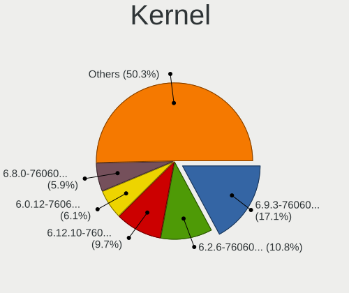

| Version                             | Computers | Percent |
|-------------------------------------|-----------|---------|
| 6.9.3-76060903-generic              | 1351      | 17.12%  |
| 6.2.6-76060206-generic              | 849       | 10.76%  |
| 6.12.10-76061203-generic            | 765       | 9.7%    |
| 6.0.12-76060006-generic             | 484       | 6.13%   |
| 6.8.0-76060800daily20240311-generic | 469       | 5.94%   |
| 5.19.0-76051900-generic             | 451       | 5.72%   |
| 5.17.5-76051705-generic             | 425       | 5.39%   |
| 6.6.10-76060610-generic             | 323       | 4.09%   |
| 6.5.6-76060506-generic              | 313       | 3.97%   |
| 6.0.6-76060006-generic              | 304       | 3.85%   |
| 6.4.6-76060406-generic              | 301       | 3.81%   |
| 6.16.3-76061603-generic             | 261       | 3.31%   |
| 6.6.6-76060606-generic              | 234       | 2.97%   |
| 5.18.10-76051810-generic            | 208       | 2.64%   |
| 5.17.15-76051715-generic            | 186       | 2.36%   |
| 6.5.4-76060504-generic              | 132       | 1.67%   |
| 6.17.4-76061704-generic             | 131       | 1.66%   |
| 6.2.0-76060200-generic              | 123       | 1.56%   |
| 5.16.19-76051619-generic            | 121       | 1.53%   |
| 6.0.2-76060002-generic              | 93        | 1.18%   |
| 6.1.11-76060111-generic             | 91        | 1.15%   |
| 5.19.16-76051916-generic            | 43        | 0.54%   |
| 6.0.3-76060003-generic              | 40        | 0.51%   |
| 6.3.7-060307-generic                | 5         | 0.06%   |
| 6.11.0-061100-generic               | 4         | 0.05%   |
| 6.5.7-060507-generic                | 3         | 0.04%   |
| 6.3.4-060304-generic                | 3         | 0.04%   |
| 6.1.0-1006-oem                      | 3         | 0.04%   |
| 5.16.15-76051615-generic            | 3         | 0.04%   |
| 6.9.8-x64v3-xanmod1                 | 2         | 0.03%   |
| 6.8.1-surface-1                     | 2         | 0.03%   |
| 6.7.10-x64v3-xanmod1                | 2         | 0.03%   |
| 6.5.5-x64v3-xanmod1                 | 2         | 0.03%   |
| 6.5.12-x64v3-xanmod1                | 2         | 0.03%   |
| 6.4.0-060400-generic                | 2         | 0.03%   |
| 6.3.1-060301-generic                | 2         | 0.03%   |
| 6.2.11-060211-generic               | 2         | 0.03%   |
| 6.14.2-surface-1                    | 2         | 0.03%   |
| 6.13.12-x64v3-xanmod1               | 2         | 0.03%   |
| 6.12.3-surface-2                    | 2         | 0.03%   |

Kernel Family
-------------

Linux kernel without a distro release

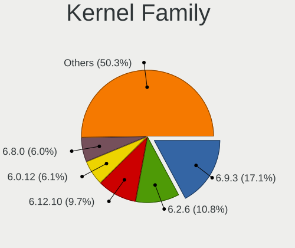

| Version | Computers | Percent |
|---------|-----------|---------|
| 6.9.3   | 1352      | 17.14%  |
| 6.2.6   | 850       | 10.78%  |
| 6.12.10 | 765       | 9.7%    |
| 6.0.12  | 485       | 6.15%   |
| 6.8.0   | 471       | 5.97%   |
| 5.19.0  | 455       | 5.77%   |
| 5.17.5  | 428       | 5.43%   |
| 6.6.10  | 323       | 4.1%    |
| 6.5.6   | 313       | 3.97%   |
| 6.0.6   | 305       | 3.87%   |
| 6.4.6   | 301       | 3.82%   |
| 6.16.3  | 261       | 3.31%   |
| 6.6.6   | 234       | 2.97%   |
| 5.18.10 | 208       | 2.64%   |
| 5.17.15 | 186       | 2.36%   |
| 6.5.4   | 132       | 1.67%   |
| 6.17.4  | 131       | 1.66%   |
| 6.2.0   | 124       | 1.57%   |
| 5.16.19 | 121       | 1.53%   |
| 6.0.2   | 96        | 1.22%   |
| 6.1.11  | 92        | 1.17%   |
| 5.19.16 | 43        | 0.55%   |
| 6.0.3   | 40        | 0.51%   |
| 5.15.0  | 10        | 0.13%   |
| 6.1.0   | 6         | 0.08%   |
| 6.3.7   | 5         | 0.06%   |
| 6.11.0  | 5         | 0.06%   |
| 6.5.7   | 4         | 0.05%   |
| 6.3.4   | 4         | 0.05%   |
| 6.5.0   | 3         | 0.04%   |
| 6.3.1   | 3         | 0.04%   |
| 6.14.2  | 3         | 0.04%   |
| 6.12.3  | 3         | 0.04%   |
| 6.1.8   | 3         | 0.04%   |
| 6.0.9   | 3         | 0.04%   |
| 5.16.15 | 3         | 0.04%   |
| 6.9.8   | 2         | 0.03%   |
| 6.8.9   | 2         | 0.03%   |
| 6.8.1   | 2         | 0.03%   |
| 6.7.10  | 2         | 0.03%   |

Kernel Major Ver.
-----------------

Linux kernel major version

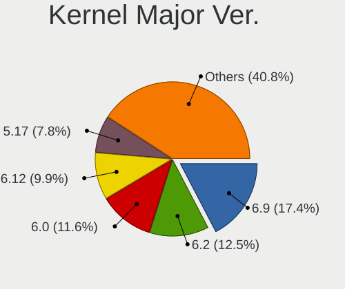

| Version | Computers | Percent |
|---------|-----------|---------|
| 6.9     | 1355      | 17.37%  |
| 6.2     | 972       | 12.46%  |
| 6.0     | 904       | 11.59%  |
| 6.12    | 774       | 9.92%   |
| 5.17    | 610       | 7.82%   |
| 6.6     | 545       | 6.99%   |
| 5.19    | 500       | 6.41%   |
| 6.8     | 476       | 6.1%    |
| 6.5     | 452       | 5.79%   |
| 6.4     | 309       | 3.96%   |
| 6.16    | 262       | 3.36%   |
| 5.18    | 214       | 2.74%   |
| 6.17    | 131       | 1.68%   |
| 5.16    | 125       | 1.6%    |
| 6.1     | 109       | 1.4%    |
| 6.3     | 18        | 0.23%   |
| 5.15    | 13        | 0.17%   |
| 6.10    | 8         | 0.1%    |
| 6.7     | 5         | 0.06%   |
| 6.15    | 5         | 0.06%   |
| 6.11    | 5         | 0.06%   |
| 6.14    | 4         | 0.05%   |
| 6.13    | 3         | 0.04%   |
| 6.18    | 1         | 0.01%   |
| 5.4     | 1         | 0.01%   |

Arch
----

OS architecture (x86_64, i586, etc.)

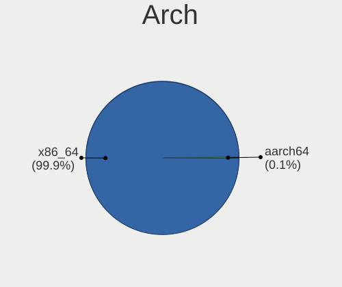

| Name    | Computers | Percent |
|---------|-----------|---------|
| x86_64  | 7028      | 99.9%   |
| aarch64 | 7         | 0.1%    |

DE
--

Desktop Environment

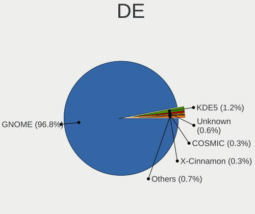

| Name            | Computers | Percent |
|-----------------|-----------|---------|
| GNOME           | 6844      | 96.84%  |
| KDE5            | 88        | 1.25%   |
| Unknown         | 39        | 0.55%   |
| COSMIC          | 23        | 0.33%   |
| X-Cinnamon      | 22        | 0.31%   |
| Unity           | 9         | 0.13%   |
| XFCE            | 8         | 0.11%   |
| GNOME Flashback | 8         | 0.11%   |
| Cinnamon        | 7         | 0.1%    |
| LXQt            | 6         | 0.08%   |
| MATE            | 5         | 0.07%   |
| i3              | 3         | 0.04%   |
| awesome         | 2         | 0.03%   |
| UKUI            | 1         | 0.01%   |
| KDE             | 1         | 0.01%   |
| GNOME Classic   | 1         | 0.01%   |

Display Server
--------------

X11 or Wayland

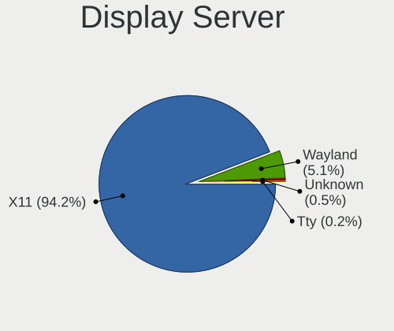

| Name    | Computers | Percent |
|---------|-----------|---------|
| X11     | 6678      | 94.16%  |
| Wayland | 365       | 5.15%   |
| Unknown | 33        | 0.47%   |
| Tty     | 16        | 0.23%   |

Display Manager
---------------

SDDM, LightDM, etc.

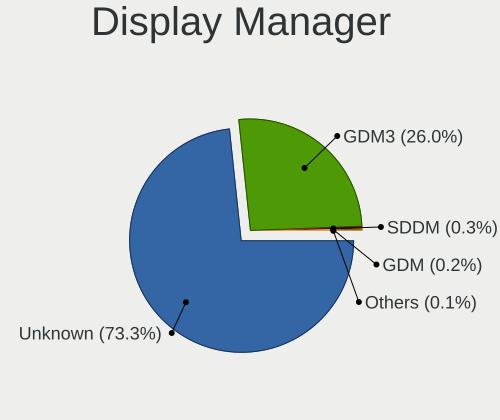

| Name           | Computers | Percent |
|----------------|-----------|---------|
| Unknown        | 5208      | 73.33%  |
| GDM3           | 1849      | 26.03%  |
| SDDM           | 21        | 0.3%    |
| GDM            | 13        | 0.18%   |
| LightDM        | 6         | 0.08%   |
| COSMIC-GREETER | 5         | 0.07%   |

OS Lang
-------

Language

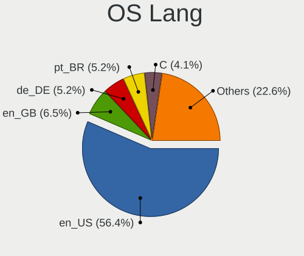

| Lang    | Computers | Percent |
|---------|-----------|---------|
| en_US   | 4011      | 56.45%  |
| en_GB   | 460       | 6.47%   |
| de_DE   | 367       | 5.16%   |
| pt_BR   | 366       | 5.15%   |
| C       | 294       | 4.14%   |
| en_AU   | 192       | 2.7%    |
| en_CA   | 158       | 2.22%   |
| fr_FR   | 157       | 2.21%   |
| it_IT   | 143       | 2.01%   |
| es_ES   | 91        | 1.28%   |
| pl_PL   | 79        | 1.11%   |
| ru_RU   | 77        | 1.08%   |
| pt_PT   | 40        | 0.56%   |
| sv_SE   | 36        | 0.51%   |
| en_IN   | 36        | 0.51%   |
| Unknown | 35        | 0.49%   |
| tr_TR   | 30        | 0.42%   |
| nl_NL   | 28        | 0.39%   |
| es_MX   | 28        | 0.39%   |
| es_CL   | 28        | 0.39%   |
| nb_NO   | 26        | 0.37%   |
| es_AR   | 25        | 0.35%   |
| fi_FI   | 24        | 0.34%   |
| en_ZA   | 23        | 0.32%   |
| en_DK   | 22        | 0.31%   |
| hu_HU   | 21        | 0.3%    |
| en_NZ   | 21        | 0.3%    |
| cs_CZ   | 21        | 0.3%    |
| de_CH   | 20        | 0.28%   |
| de_AT   | 20        | 0.28%   |
| en_IE   | 18        | 0.25%   |
| da_DK   | 18        | 0.25%   |
| ja_JP   | 17        | 0.24%   |
| fr_CA   | 15        | 0.21%   |
| zh_CN   | 11        | 0.15%   |
| sk_SK   | 11        | 0.15%   |
| es_CO   | 11        | 0.15%   |
| fr_CH   | 9         | 0.13%   |
| fr_BE   | 9         | 0.13%   |
| zh_TW   | 7         | 0.1%    |

Boot Mode
---------

EFI or BIOS

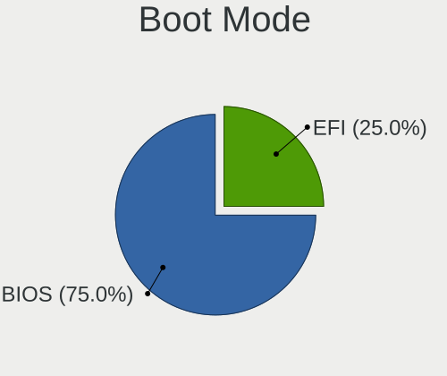

| Mode | Computers | Percent |
|------|-----------|---------|
| BIOS | 5322      | 75%     |
| EFI  | 1774      | 25%     |

Filesystem
----------

Type of filesystem

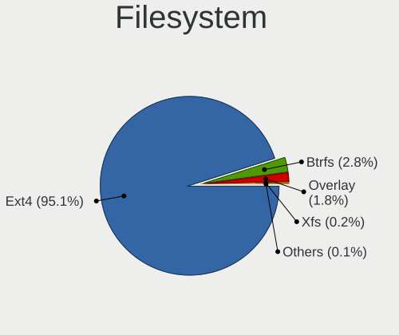

| Type    | Computers | Percent |
|---------|-----------|---------|
| Ext4    | 6713      | 95.08%  |
| Btrfs   | 195       | 2.76%   |
| Overlay | 126       | 1.78%   |
| Xfs     | 16        | 0.23%   |
| Zfs     | 6         | 0.08%   |
| Unknown | 2         | 0.03%   |
| XXX4    | 1         | 0.01%   |
| Tmpfs   | 1         | 0.01%   |

Part. scheme
------------

Scheme of partitioning

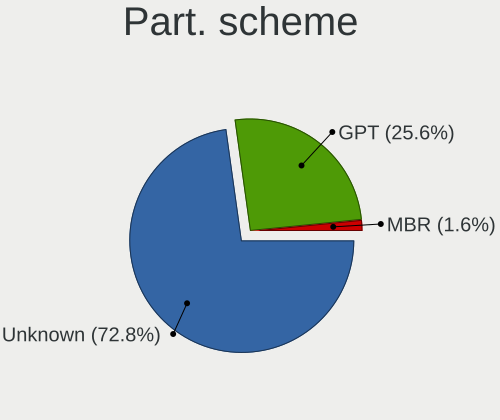

| Type    | Computers | Percent |
|---------|-----------|---------|
| Unknown | 5169      | 72.8%   |
| GPT     | 1818      | 25.61%  |
| MBR     | 113       | 1.59%   |

Dual Boot with Linux/BSD
------------------------

Hosting more than one Linux/BSD

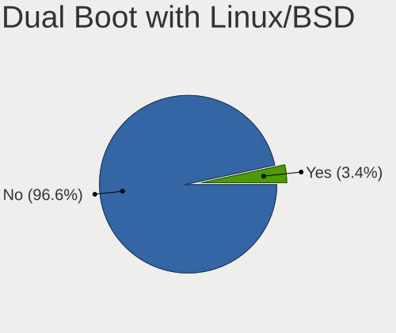

| Dual boot | Computers | Percent |
|-----------|-----------|---------|
| No        | 6817      | 96.61%  |
| Yes       | 239       | 3.39%   |

Dual Boot (Win)
---------------

Hosting Linux and Windows

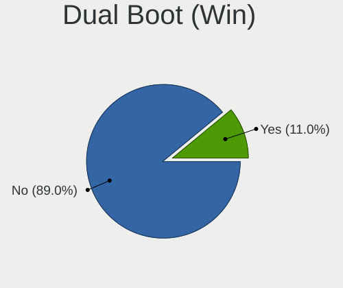

| Dual boot | Computers | Percent |
|-----------|-----------|---------|
| No        | 6301      | 89.03%  |
| Yes       | 776       | 10.97%  |

Board
-----

Vendor
------

Motherboard manufacturer

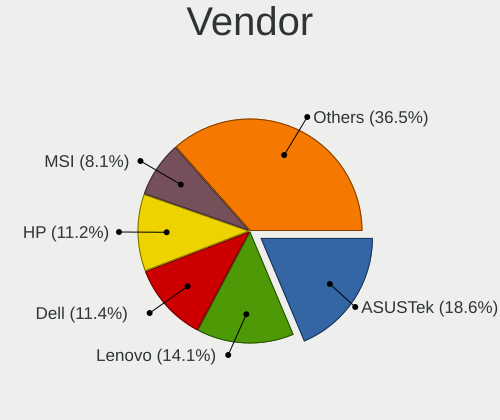

| Name                                 | Computers | Percent |
|--------------------------------------|-----------|---------|
| ASUSTek Computer                     | 1312      | 18.65%  |
| Lenovo                               | 993       | 14.12%  |
| Dell                                 | 802       | 11.4%   |
| Hewlett-Packard                      | 787       | 11.19%  |
| MSI                                  | 571       | 8.12%   |
| Gigabyte Technology                  | 479       | 6.81%   |
| Apple                                | 377       | 5.36%   |
| Acer                                 | 316       | 4.49%   |
| ASRock                               | 227       | 3.23%   |
| System76                             | 171       | 2.43%   |
| Intel                                | 94        | 1.34%   |
| HUAWEI                               | 61        | 0.87%   |
| Toshiba                              | 59        | 0.84%   |
| Samsung Electronics                  | 59        | 0.84%   |
| Alienware                            | 50        | 0.71%   |
| Microsoft                            | 49        | 0.7%    |
| Unknown                              | 49        | 0.7%    |
| Google                               | 32        | 0.45%   |
| Fujitsu                              | 31        | 0.44%   |
| Notebook                             | 29        | 0.41%   |
| AZW                                  | 20        | 0.28%   |
| Sony                                 | 18        | 0.26%   |
| Positivo                             | 17        | 0.24%   |
| Biostar                              | 17        | 0.24%   |
| Razer                                | 14        | 0.2%    |
| Framework                            | 14        | 0.2%    |
| Shenzhen Meigao Electronic Equipment | 13        | 0.18%   |
| PC Specialist                        | 12        | 0.17%   |
| GPU Company                          | 12        | 0.17%   |
| Timi                                 | 11        | 0.16%   |
| Medion                               | 11        | 0.16%   |
| LG Electronics                       | 11        | 0.16%   |
| BESSTAR Tech                         | 11        | 0.16%   |
| Supermicro                           | 9         | 0.13%   |
| Pegatron                             | 9         | 0.13%   |
| MACHINIST                            | 8         | 0.11%   |
| HONOR                                | 8         | 0.11%   |
| Foxconn                              | 8         | 0.11%   |
| Raspberry Pi Foundation              | 7         | 0.1%    |
| NZXT                                 | 7         | 0.1%    |

Model
-----

Motherboard model

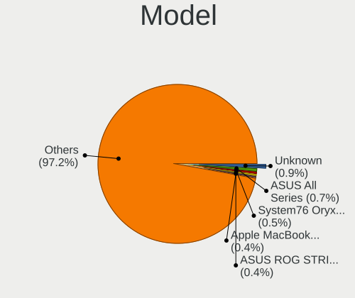

| Name                            | Computers | Percent |
|---------------------------------|-----------|---------|
| Unknown                         | 62        | 0.88%   |
| ASUS All Series                 | 49        | 0.7%    |
| System76 Oryx Pro               | 32        | 0.45%   |
| Apple MacBookAir7,2             | 30        | 0.43%   |
| ASUS ROG STRIX B550-F GAMING    | 27        | 0.38%   |
| Apple MacBookPro9,2             | 25        | 0.36%   |
| System76 Lemur Pro              | 23        | 0.33%   |
| System76 Gazelle                | 21        | 0.3%    |
| MSI MS-7C56                     | 19        | 0.27%   |
| ASUS TUF Gaming X570-PLUS       | 19        | 0.27%   |
| System76 Darter Pro             | 18        | 0.26%   |
| Apple MacBookPro8,1             | 18        | 0.26%   |
| Apple MacBookPro12,1            | 18        | 0.26%   |
| System76 Pangolin               | 16        | 0.23%   |
| MSI MS-7C91                     | 16        | 0.23%   |
| Apple MacBookPro11,3            | 16        | 0.23%   |
| Apple MacBookPro11,1            | 16        | 0.23%   |
| Apple MacBookAir6,2             | 16        | 0.23%   |
| MSI MS-7C37                     | 15        | 0.21%   |
| MSI MS-7C95                     | 14        | 0.2%    |
| MSI MS-7C02                     | 13        | 0.18%   |
| HP Dev One Notebook PC          | 13        | 0.18%   |
| ASUS ROG STRIX B450-F GAMING    | 13        | 0.18%   |
| System76 Galago Pro             | 12        | 0.17%   |
| MSI MS-7B86                     | 12        | 0.17%   |
| HP Notebook                     | 12        | 0.17%   |
| Dell OptiPlex 7010              | 12        | 0.17%   |
| ASUS ROG STRIX B550-I GAMING    | 12        | 0.17%   |
| System76 Thelio                 | 11        | 0.16%   |
| Lenovo Legion 5 15ACH6H 82JU    | 11        | 0.16%   |
| Gigabyte X570 AORUS MASTER      | 11        | 0.16%   |
| Gigabyte X570 AORUS ELITE       | 11        | 0.16%   |
| Gigabyte B450 AORUS M           | 11        | 0.16%   |
| Dell XPS 15 9570                | 11        | 0.16%   |
| Acer Nitro AN515-58             | 11        | 0.16%   |
| System76 Thelio Mira            | 10        | 0.14%   |
| Gigabyte B550 AORUS ELITE AX V2 | 10        | 0.14%   |
| Dell XPS 15 7590                | 10        | 0.14%   |
| Dell OptiPlex 9020              | 10        | 0.14%   |
| ASUS TUF Gaming B550-PLUS       | 10        | 0.14%   |

Model Family
------------

Motherboard model prefix

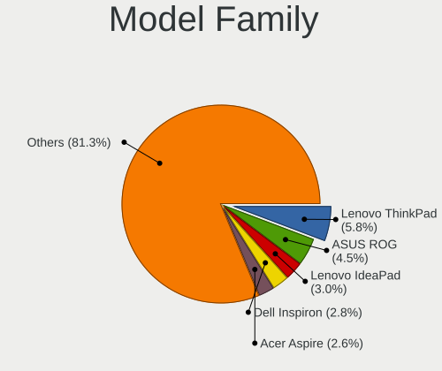

| Name               | Computers | Percent |
|--------------------|-----------|---------|
| Lenovo ThinkPad    | 405       | 5.76%   |
| ASUS ROG           | 319       | 4.53%   |
| Lenovo IdeaPad     | 213       | 3.03%   |
| Dell Inspiron      | 196       | 2.79%   |
| Acer Aspire        | 183       | 2.6%    |
| Dell Latitude      | 178       | 2.53%   |
| ASUS PRIME         | 162       | 2.3%    |
| ASUS TUF           | 132       | 1.88%   |
| HP Pavilion        | 130       | 1.85%   |
| Dell XPS           | 123       | 1.75%   |
| ASUS VivoBook      | 117       | 1.66%   |
| Lenovo Legion      | 98        | 1.39%   |
| HP EliteBook       | 97        | 1.38%   |
| Dell OptiPlex      | 97        | 1.38%   |
| Dell Precision     | 94        | 1.34%   |
| ASUS ASUS          | 84        | 1.19%   |
| HP Laptop          | 82        | 1.17%   |
| Unknown            | 62        | 0.88%   |
| Lenovo Yoga        | 61        | 0.87%   |
| HP ProBook         | 60        | 0.85%   |
| Acer Nitro         | 60        | 0.85%   |
| Toshiba Satellite  | 49        | 0.7%    |
| Microsoft Surface  | 49        | 0.7%    |
| ASUS All           | 49        | 0.7%    |
| Apple MacBookPro11 | 49        | 0.7%    |
| Lenovo ThinkCentre | 47        | 0.67%   |
| Dell Vostro        | 44        | 0.63%   |
| HP OMEN            | 43        | 0.61%   |
| HP ENVY            | 43        | 0.61%   |
| Gigabyte X570      | 43        | 0.61%   |
| ASUS ZenBook       | 42        | 0.6%    |
| HP ZBook           | 38        | 0.54%   |
| HP Compaq          | 37        | 0.53%   |
| System76 Oryx      | 32        | 0.45%   |
| HP EliteDesk       | 32        | 0.45%   |
| Acer Swift         | 31        | 0.44%   |
| Apple MacBookAir7  | 30        | 0.43%   |
| Gigabyte B550      | 29        | 0.41%   |
| HP Victus          | 28        | 0.4%    |
| Gigabyte B450      | 28        | 0.4%    |

MFG Year
--------

Motherboard manufacture year

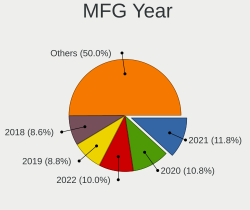

| Year    | Computers | Percent |
|---------|-----------|---------|
| 2021    | 830       | 11.8%   |
| 2020    | 760       | 10.8%   |
| 2022    | 702       | 9.98%   |
| 2019    | 616       | 8.76%   |
| 2018    | 607       | 8.63%   |
| 2023    | 430       | 6.11%   |
| 2012    | 384       | 5.46%   |
| 2017    | 373       | 5.3%    |
| 2013    | 362       | 5.15%   |
| 2015    | 326       | 4.63%   |
| 2014    | 325       | 4.62%   |
| 2016    | 304       | 4.32%   |
| 2011    | 284       | 4.04%   |
| 2024    | 229       | 3.26%   |
| 2009    | 150       | 2.13%   |
| 2010    | 148       | 2.1%    |
| 2008    | 90        | 1.28%   |
| 2025    | 40        | 0.57%   |
| 2006    | 34        | 0.48%   |
| 2007    | 32        | 0.45%   |
| Unknown | 8         | 0.11%   |
| 2005    | 1         | 0.01%   |

Form Factor
-----------

Physical design of the computer

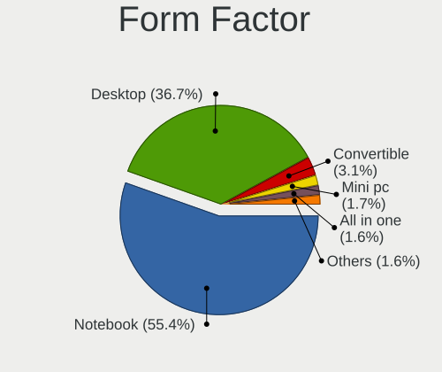

| Name           | Computers | Percent |
|----------------|-----------|---------|
| Notebook       | 3898      | 55.41%  |
| Desktop        | 2583      | 36.72%  |
| Convertible    | 215       | 3.06%   |
| Mini pc        | 119       | 1.69%   |
| All in one     | 110       | 1.56%   |
| Tablet         | 76        | 1.08%   |
| Server         | 25        | 0.36%   |
| System on chip | 8         | 0.11%   |
| Other          | 1         | 0.01%   |

Secure Boot
-----------

Enabled or disabled

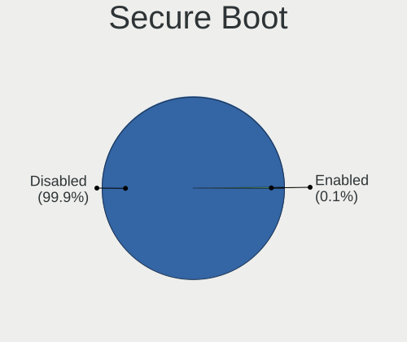

| State    | Computers | Percent |
|----------|-----------|---------|
| Disabled | 7030      | 99.9%   |
| Enabled  | 7         | 0.1%    |

Coreboot
--------

Have coreboot on board

| Used | Computers | Percent |
|------|-----------|---------|
| No   | 6895      | 98.01%  |
| Yes  | 140       | 1.99%   |

RAM Size
--------

Total RAM memory

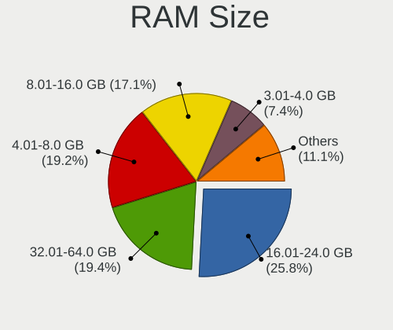

| Size in GB      | Computers | Percent |
|-----------------|-----------|---------|
| 16.01-24.0      | 1838      | 25.83%  |
| 32.01-64.0      | 1379      | 19.38%  |
| 4.01-8.0        | 1368      | 19.23%  |
| 8.01-16.0       | 1215      | 17.08%  |
| 3.01-4.0        | 527       | 7.41%   |
| 64.01-256.0     | 450       | 6.32%   |
| 24.01-32.0      | 285       | 4.01%   |
| 1.01-2.0        | 25        | 0.35%   |
| 2.01-3.0        | 20        | 0.28%   |
| More than 256.0 | 8         | 0.11%   |

RAM Used
--------

Used RAM memory

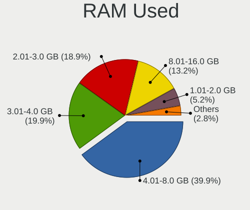

| Used GB     | Computers | Percent |
|-------------|-----------|---------|
| 4.01-8.0    | 3047      | 39.93%  |
| 3.01-4.0    | 1522      | 19.95%  |
| 2.01-3.0    | 1442      | 18.9%   |
| 8.01-16.0   | 1006      | 13.18%  |
| 1.01-2.0    | 399       | 5.23%   |
| 16.01-24.0  | 149       | 1.95%   |
| 24.01-32.0  | 38        | 0.5%    |
| 32.01-64.0  | 22        | 0.29%   |
| 0.51-1.0    | 3         | 0.04%   |
| 64.01-256.0 | 2         | 0.03%   |

Total Drives
------------

Number of drives on board

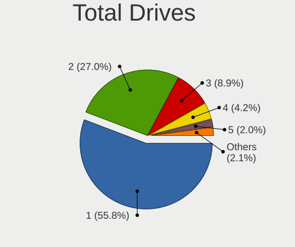

| Drives | Computers | Percent |
|--------|-----------|---------|
| 1      | 4011      | 55.82%  |
| 2      | 1938      | 26.97%  |
| 3      | 643       | 8.95%   |
| 4      | 299       | 4.16%   |
| 5      | 141       | 1.96%   |
| 6      | 72        | 1%      |
| 7      | 30        | 0.42%   |
| 0      | 23        | 0.32%   |
| 8      | 9         | 0.13%   |
| 9      | 8         | 0.11%   |
| 12     | 2         | 0.03%   |
| 11     | 2         | 0.03%   |
| 10     | 2         | 0.03%   |
| 26     | 1         | 0.01%   |
| 22     | 1         | 0.01%   |
| 20     | 1         | 0.01%   |
| 19     | 1         | 0.01%   |
| 18     | 1         | 0.01%   |
| 14     | 1         | 0.01%   |

Has CD-ROM
----------

Has CD-ROM on board

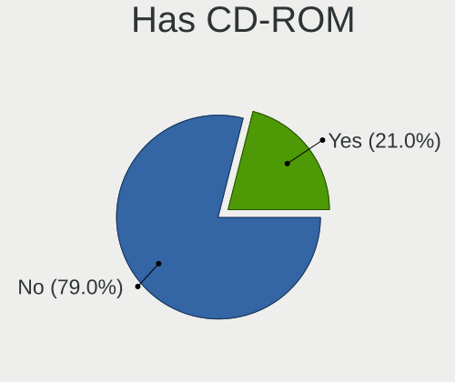

| Presented | Computers | Percent |
|-----------|-----------|---------|
| No        | 5574      | 78.95%  |
| Yes       | 1486      | 21.05%  |

Has Ethernet
------------

Has Ethernet on board

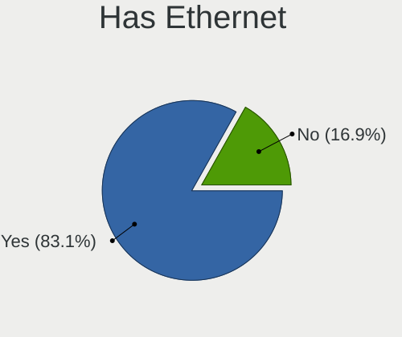

| Presented | Computers | Percent |
|-----------|-----------|---------|
| Yes       | 5877      | 83.15%  |
| No        | 1191      | 16.85%  |

Has WiFi
--------

Has WiFi module

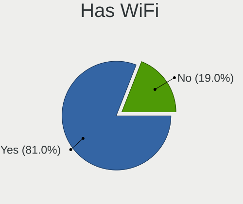

| Presented | Computers | Percent |
|-----------|-----------|---------|
| Yes       | 5712      | 80.95%  |
| No        | 1344      | 19.05%  |

Has Bluetooth
-------------

Has Bluetooth module

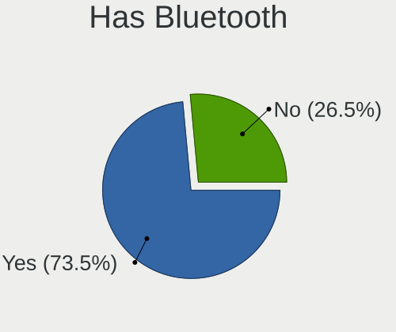

| Presented | Computers | Percent |
|-----------|-----------|---------|
| Yes       | 5206      | 73.53%  |
| No        | 1874      | 26.47%  |

Location
--------

Country
-------

Geographic location (country)

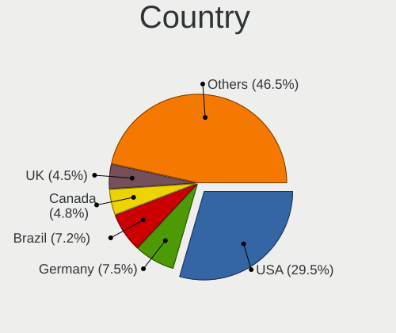

| Country      | Computers | Percent |
|--------------|-----------|---------|
| USA          | 2085      | 29.48%  |
| Germany      | 530       | 7.49%   |
| Brazil       | 509       | 7.2%    |
| Canada       | 337       | 4.76%   |
| UK           | 321       | 4.54%   |
| Italy        | 251       | 3.55%   |
| Australia    | 244       | 3.45%   |
| France       | 210       | 2.97%   |
| India        | 173       | 2.45%   |
| Poland       | 140       | 1.98%   |
| Netherlands  | 138       | 1.95%   |
| Russia       | 127       | 1.8%    |
| Spain        | 121       | 1.71%   |
| Sweden       | 108       | 1.53%   |
| Mexico       | 85        | 1.2%    |
| Norway       | 73        | 1.03%   |
| Portugal     | 72        | 1.02%   |
| Finland      | 71        | 1%      |
| Switzerland  | 70        | 0.99%   |
| Czechia      | 62        | 0.88%   |
| Indonesia    | 61        | 0.86%   |
| Austria      | 61        | 0.86%   |
| Turkey       | 57        | 0.81%   |
| Hungary      | 54        | 0.76%   |
| Denmark      | 54        | 0.76%   |
| Belgium      | 50        | 0.71%   |
| New Zealand  | 48        | 0.68%   |
| South Africa | 47        | 0.66%   |
| Argentina    | 47        | 0.66%   |
| Romania      | 46        | 0.65%   |
| Chile        | 43        | 0.61%   |
| Greece       | 39        | 0.55%   |
| Philippines  | 38        | 0.54%   |
| Japan        | 36        | 0.51%   |
| Bulgaria     | 32        | 0.45%   |
| Ireland      | 31        | 0.44%   |
| Slovakia     | 27        | 0.38%   |
| Serbia       | 27        | 0.38%   |
| Malaysia     | 26        | 0.37%   |
| Colombia     | 22        | 0.31%   |

City
----

Geographic location (city)

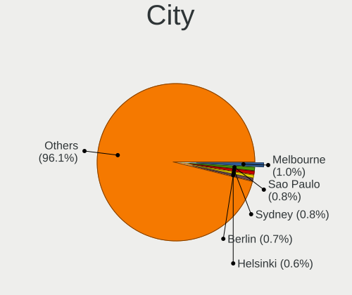

| City           | Computers | Percent |
|----------------|-----------|---------|
| Melbourne      | 71        | 0.96%   |
| Sao Paulo      | 60        | 0.81%   |
| Sydney         | 59        | 0.79%   |
| Berlin         | 52        | 0.7%    |
| Helsinki       | 46        | 0.62%   |
| Brisbane       | 46        | 0.62%   |
| Milan          | 44        | 0.59%   |
| Chicago        | 42        | 0.57%   |
| Warsaw         | 40        | 0.54%   |
| Seattle        | 40        | 0.54%   |
| Rio de Janeiro | 35        | 0.47%   |
| Denver         | 35        | 0.47%   |
| Vienna         | 33        | 0.44%   |
| Moscow         | 32        | 0.43%   |
| Toronto        | 31        | 0.42%   |
| New York       | 31        | 0.42%   |
| Rome           | 29        | 0.39%   |
| Madrid         | 29        | 0.39%   |
| Istanbul       | 29        | 0.39%   |
| Paris          | 26        | 0.35%   |
| Auckland       | 26        | 0.35%   |
| Prague         | 25        | 0.34%   |
| Montreal       | 25        | 0.34%   |
| Los Angeles    | 25        | 0.34%   |
| Hamburg        | 25        | 0.34%   |
| Bengaluru      | 25        | 0.34%   |
| Budapest       | 24        | 0.32%   |
| Dallas         | 23        | 0.31%   |
| Amsterdam      | 23        | 0.31%   |
| Oslo           | 22        | 0.3%    |
| Lisbon         | 22        | 0.3%    |
| Stockholm      | 21        | 0.28%   |
| Portland       | 21        | 0.28%   |
| Munich         | 21        | 0.28%   |
| Mexico City    | 21        | 0.28%   |
| London         | 20        | 0.27%   |
| Jakarta        | 20        | 0.27%   |
| Cologne        | 19        | 0.26%   |
| Calgary        | 19        | 0.26%   |
| Zurich         | 18        | 0.24%   |

Drives
------

Drive Vendor
------------

Hard drive vendors

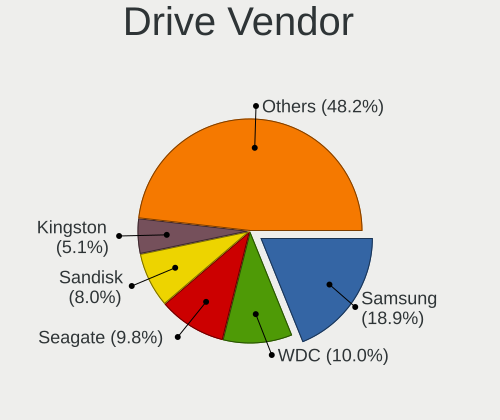

| Vendor                      | Computers | Drives | Percent |
|-----------------------------|-----------|--------|---------|
| Samsung Electronics         | 2072      | 3146   | 18.88%  |
| WDC                         | 1102      | 1578   | 10.04%  |
| Seagate                     | 1078      | 1585   | 9.82%   |
| Sandisk                     | 876       | 1161   | 7.98%   |
| Kingston                    | 559       | 703    | 5.09%   |
| Toshiba                     | 467       | 575    | 4.25%   |
| Crucial                     | 459       | 635    | 4.18%   |
| SK hynix                    | 401       | 481    | 3.65%   |
| Micron Technology           | 300       | 354    | 2.73%   |
| Intel                       | 286       | 382    | 2.61%   |
| Unknown                     | 252       | 355    | 2.3%    |
| Apple                       | 209       | 240    | 1.9%    |
| Micron/Crucial Technology   | 183       | 245    | 1.67%   |
| Phison Electronics          | 178       | 266    | 1.62%   |
| Hitachi                     | 154       | 216    | 1.4%    |
| HGST                        | 143       | 166    | 1.3%    |
| A-DATA Technology           | 140       | 164    | 1.28%   |
| Kingston Technology Company | 134       | 169    | 1.22%   |
| KIOXIA                      | 131       | 149    | 1.19%   |
| China                       | 110       | 148    | 1%      |
| Silicon Motion              | 102       | 129    | 0.93%   |
| PNY                         | 85        | 108    | 0.77%   |
| Phison                      | 79        | 105    | 0.72%   |
| SPCC                        | 67        | 95     | 0.61%   |
| ADATA Technology            | 56        | 63     | 0.51%   |
| Unknown                     | 56        | 62     | 0.51%   |
| MAXIO Technology (Hangzhou) | 50        | 58     | 0.46%   |
| Team                        | 47        | 58     | 0.43%   |
| Intenso                     | 47        | 68     | 0.43%   |
| Realtek Semiconductor       | 42        | 47     | 0.38%   |
| Patriot                     | 40        | 51     | 0.36%   |
| Netac                       | 39        | 42     | 0.36%   |
| LITEON                      | 38        | 48     | 0.35%   |
| Hewlett-Packard             | 34        | 53     | 0.31%   |
| ASMT                        | 34        | 38     | 0.31%   |
| Lexar                       | 31        | 44     | 0.28%   |
| JMicron Technology          | 31        | 46     | 0.28%   |
| OCZ                         | 30        | 39     | 0.27%   |
| KingSpec                    | 29        | 32     | 0.26%   |
| Transcend                   | 28        | 34     | 0.26%   |

Drive Model
-----------

Hard drive models

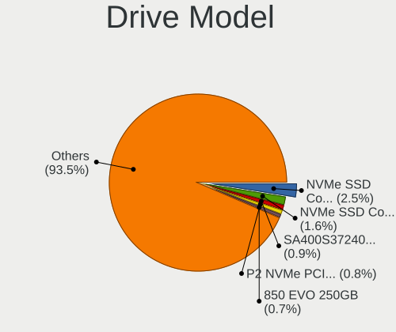

| Model                                                 | Computers | Percent |
|-------------------------------------------------------|-----------|---------|
| Samsung NVMe SSD Controller SM981/PM981/PM983 1TB     | 307       | 2.53%   |
| Samsung NVMe SSD Controller PM9A1/PM9A3/980PRO 1TB    | 189       | 1.56%   |
| Kingston SA400S37240G 240GB SSD                       | 112       | 0.92%   |
| Micron/Crucial P2 NVMe PCIe SSD 2TB                   | 97        | 0.8%    |
| Samsung SSD 850 EVO 250GB                             | 79        | 0.65%   |
| SanDisk NVMe SSD Drive 1TB                            | 78        | 0.64%   |
| Kingston SA400S37480G 480GB SSD                       | 77        | 0.63%   |
| Sandisk WD Blue SN550 NVMe SSD 1024GB                 | 75        | 0.62%   |
| Samsung NVMe SSD Controller SM961/PM961/SM963 1024GB  | 73        | 0.6%    |
| Seagate ST1000LM035-1RK172 1TB                        | 72        | 0.59%   |
| Samsung SSD 860 EVO 500GB                             | 72        | 0.59%   |
| Samsung SSD 850 EVO 500GB                             | 72        | 0.59%   |
| Crucial CT1000MX500SSD1 1TB                           | 71        | 0.58%   |
| Seagate ST2000DM008-2FR102 2TB                        | 70        | 0.58%   |
| Samsung SSD 980 1TB                                   | 70        | 0.58%   |
| Samsung SSD 860 EVO 1TB                               | 66        | 0.54%   |
| Seagate ST1000DM010-2EP102 1TB                        | 64        | 0.53%   |
| Silicon Motion SM2263EN/SM2263XT SSD Controller 512GB | 60        | 0.49%   |
| Phison E12 NVMe Controller 1TB                        | 60        | 0.49%   |
| Unknown                                               | 56        | 0.46%   |
| Sandisk WD Black SN750 / PC SN730 NVMe SSD 500GB      | 54        | 0.44%   |
| Kingston SA400S37120G 120GB SSD                       | 52        | 0.43%   |
| Crucial CT500MX500SSD1 500GB                          | 51        | 0.42%   |
| HGST HTS721010A9E630 1TB                              | 48        | 0.4%    |
| Intel SSD 660P Series 512GB                           | 46        | 0.38%   |
| Samsung SSD 870 EVO 500GB                             | 44        | 0.36%   |
| Seagate ST1000LM024 HN-M101MBB 1TB                    | 42        | 0.35%   |
| Crucial CT1000BX500SSD1 1TB                           | 41        | 0.34%   |
| Kingston Company SNV2S1000G 1TB                       | 40        | 0.33%   |
| Seagate ST4000DM004-2CV104 4TB                        | 39        | 0.32%   |
| Phison PS5013 E13 NVMe Controller 500GB               | 39        | 0.32%   |
| Crucial CT240BX500SSD1 240GB                          | 39        | 0.32%   |
| WDC WD10EZEX-08WN4A0 1TB                              | 38        | 0.31%   |
| Toshiba MQ01ABD100 1TB                                | 38        | 0.31%   |
| Samsung SSD 990 PRO 2TB                               | 38        | 0.31%   |
| Toshiba MQ04ABF100 1TB                                | 37        | 0.3%    |
| Seagate Expansion 2TB                                 | 37        | 0.3%    |
| Samsung SSD 870 QVO 1TB                               | 37        | 0.3%    |
| Samsung SSD 870 EVO 1TB                               | 37        | 0.3%    |
| Samsung NVMe SSD Drive 1TB                            | 37        | 0.3%    |

HDD Vendor
----------

Hard disk drive vendors

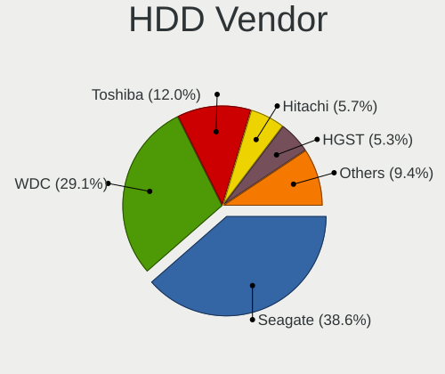

| Vendor              | Computers | Drives | Percent |
|---------------------|-----------|--------|---------|
| Seagate             | 1042      | 1508   | 38.56%  |
| WDC                 | 785       | 1154   | 29.05%  |
| Toshiba             | 325       | 403    | 12.03%  |
| Hitachi             | 154       | 216    | 5.7%    |
| HGST                | 143       | 166    | 5.29%   |
| Samsung Electronics | 75        | 100    | 2.78%   |
| Apple               | 49        | 53     | 1.81%   |
| Unknown             | 30        | 36     | 1.11%   |
| JMicron Technology  | 17        | 27     | 0.63%   |
| Hewlett-Packard     | 8         | 24     | 0.3%    |
| Fujitsu             | 8         | 12     | 0.3%    |
| ASMT                | 8         | 8      | 0.3%    |
| TO Exter            | 6         | 6      | 0.22%   |
| Maxtor              | 6         | 7      | 0.22%   |
| Intenso             | 5         | 12     | 0.19%   |
| T-FORCE             | 4         | 6      | 0.15%   |
| External            | 4         | 4      | 0.15%   |
| WD MediaMax         | 3         | 9      | 0.11%   |
| USB3.0              | 3         | 3      | 0.11%   |
| MaxDigital          | 3         | 3      | 0.11%   |
| ASMedia             | 3         | 3      | 0.11%   |
| SABRENT             | 2         | 3      | 0.07%   |
| LaCie               | 2         | 3      | 0.07%   |
| Inateck             | 2         | 2      | 0.07%   |
| Unknown             | 2         | 2      | 0.07%   |
| StoreJet            | 1         | 1      | 0.04%   |
| SATAFIRM            | 1         | 1      | 0.04%   |
| RSH-339             | 1         | 1      | 0.04%   |
| Min Yi U            | 1         | 1      | 0.04%   |
| Maxone              | 1         | 1      | 0.04%   |
| KESU                | 1         | 1      | 0.04%   |
| JetFlash            | 1         | 1      | 0.04%   |
| HPE                 | 1         | 3      | 0.04%   |
| HGST HDN            | 1         | 1      | 0.04%   |
| Esmart              | 1         | 4      | 0.04%   |
| DELLBOSS            | 1         | 1      | 0.04%   |
| ASMT109x            | 1         | 1      | 0.04%   |
| Asm                 | 1         | 1      | 0.04%   |

SSD Vendor
----------

Solid state drive vendors

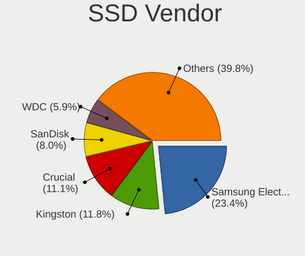

| Vendor              | Computers | Drives | Percent |
|---------------------|-----------|--------|---------|
| Samsung Electronics | 815       | 1146   | 23.43%  |
| Kingston            | 410       | 506    | 11.78%  |
| Crucial             | 385       | 513    | 11.07%  |
| SanDisk             | 279       | 352    | 8.02%   |
| WDC                 | 206       | 248    | 5.92%   |
| Apple               | 135       | 154    | 3.88%   |
| China               | 109       | 147    | 3.13%   |
| A-DATA Technology   | 102       | 121    | 2.93%   |
| PNY                 | 81        | 102    | 2.33%   |
| Intel               | 70        | 90     | 2.01%   |
| SK hynix            | 58        | 71     | 1.67%   |
| SPCC                | 52        | 62     | 1.49%   |
| Micron Technology   | 45        | 50     | 1.29%   |
| Toshiba             | 38        | 40     | 1.09%   |
| Patriot             | 38        | 48     | 1.09%   |
| Intenso             | 37        | 51     | 1.06%   |
| LITEON              | 34        | 44     | 0.98%   |
| Team                | 32        | 42     | 0.92%   |
| OCZ                 | 30        | 39     | 0.86%   |
| Netac               | 30        | 32     | 0.86%   |
| KingSpec            | 27        | 29     | 0.78%   |
| Transcend           | 26        | 32     | 0.75%   |
| LITEONIT            | 22        | 36     | 0.63%   |
| Lexar               | 20        | 29     | 0.57%   |
| Apacer              | 18        | 23     | 0.52%   |
| Hewlett-Packard     | 17        | 21     | 0.49%   |
| Verbatim            | 15        | 21     | 0.43%   |
| SABRENT             | 15        | 20     | 0.43%   |
| GOODRAM             | 15        | 15     | 0.43%   |
| Corsair             | 15        | 18     | 0.43%   |
| Unknown             | 15        | 16     | 0.43%   |
| Seagate             | 14        | 17     | 0.4%    |
| Fanxiang            | 14        | 20     | 0.4%    |
| KingDian            | 10        | 19     | 0.29%   |
| Gigabyte Technology | 8         | 9      | 0.23%   |
| FIKWOT              | 7         | 10     | 0.2%    |
| Dogfish             | 7         | 11     | 0.2%    |
| Plextor             | 6         | 7      | 0.17%   |
| OWC                 | 6         | 7      | 0.17%   |
| Mushkin             | 6         | 8      | 0.17%   |

Drive Kind
----------

HDD or SSD

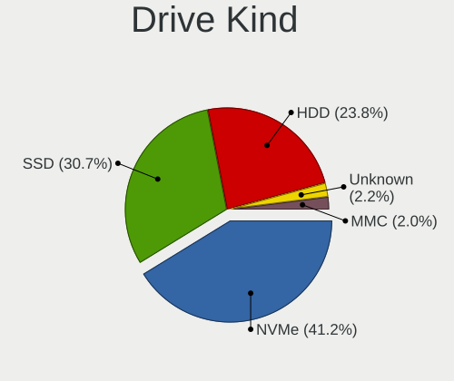

| Kind    | Computers | Drives | Percent |
|---------|-----------|--------|---------|
| NVMe    | 3976      | 6085   | 41.23%  |
| SSD     | 2965      | 4471   | 30.74%  |
| HDD     | 2296      | 3788   | 23.81%  |
| Unknown | 214       | 345    | 2.22%   |
| MMC     | 193       | 223    | 2%      |

Drive Connector
---------------

SATA, SAS, NVMe, etc.

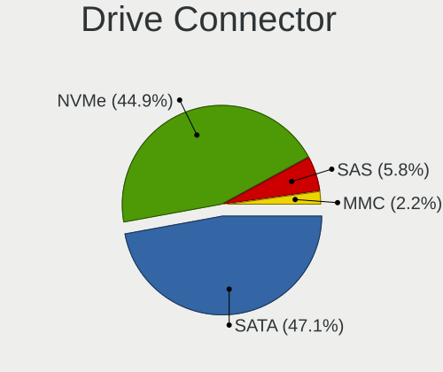

| Type | Computers | Drives | Percent |
|------|-----------|--------|---------|
| SATA | 4160      | 7844   | 47.12%  |
| NVMe | 3967      | 6040   | 44.94%  |
| SAS  | 508       | 805    | 5.75%   |
| MMC  | 193       | 223    | 2.19%   |

Drive Size
----------

Size of hard drive

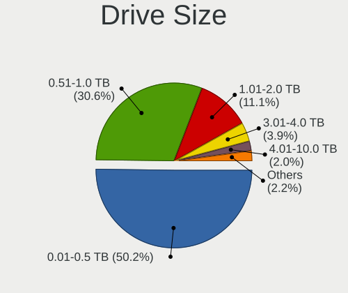

| Size in TB | Computers | Drives | Percent |
|------------|-----------|--------|---------|
| 0.01-0.5   | 2829      | 4164   | 50.21%  |
| 0.51-1.0   | 1726      | 2389   | 30.64%  |
| 1.01-2.0   | 624       | 941    | 11.08%  |
| 3.01-4.0   | 222       | 355    | 3.94%   |
| 4.01-10.0  | 111       | 193    | 1.97%   |
| 2.01-3.0   | 86        | 137    | 1.53%   |
| 10.01-20.0 | 33        | 76     | 0.59%   |
| 20.01-50.0 | 3         | 4      | 0.05%   |

Space Total
-----------

Amount of disk space available on the file system

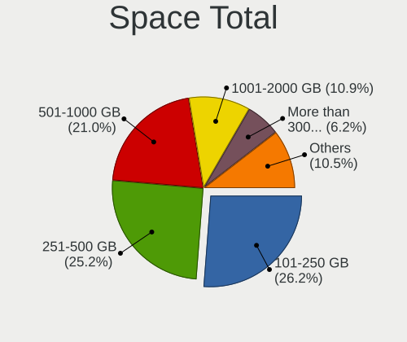

| Size in GB     | Computers | Percent |
|----------------|-----------|---------|
| 101-250        | 1910      | 26.22%  |
| 251-500        | 1833      | 25.16%  |
| 501-1000       | 1532      | 21.03%  |
| 1001-2000      | 797       | 10.94%  |
| More than 3000 | 451       | 6.19%   |
| 2001-3000      | 266       | 3.65%   |
| 51-100         | 218       | 2.99%   |
| 1-20           | 143       | 1.96%   |
| 21-50          | 91        | 1.25%   |
| Unknown        | 44        | 0.6%    |

Space Used
----------

Amount of used disk space

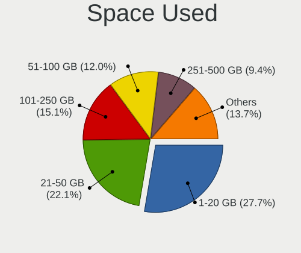

| Used GB        | Computers | Percent |
|----------------|-----------|---------|
| 1-20           | 2107      | 27.67%  |
| 21-50          | 1684      | 22.11%  |
| 101-250        | 1150      | 15.1%   |
| 51-100         | 915       | 12.02%  |
| 251-500        | 719       | 9.44%   |
| 501-1000       | 486       | 6.38%   |
| 1001-2000      | 272       | 3.57%   |
| More than 3000 | 144       | 1.89%   |
| 2001-3000      | 94        | 1.23%   |
| Unknown        | 44        | 0.58%   |

Malfunc. Drives
---------------

Drive models with a malfunction

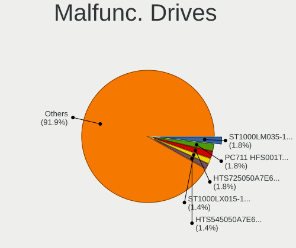

| Model                                    | Computers | Drives | Percent |
|------------------------------------------|-----------|--------|---------|
| SK hynix PC711 HFS001TDE9X073N 1TB       | 4         | 4      | 1.81%   |
| Seagate ST1000LM035-1RK172 1TB           | 4         | 4      | 1.81%   |
| HGST HTS725050A7E630 500GB               | 4         | 5      | 1.81%   |
| Seagate ST1000LX015-1U7172 1TB           | 3         | 3      | 1.36%   |
| HGST HTS545050A7E680 500GB               | 3         | 3      | 1.36%   |
| Apple HDD WDC WD10EALX-408EA0 1TB        | 3         | 3      | 1.36%   |
| WDC WD5000AADS-00S9B0 500GB              | 2         | 2      | 0.9%    |
| WDC WD40EZRZ-00GXCB0 4TB                 | 2         | 2      | 0.9%    |
| WDC WD20EZRZ-00Z5HB0 2TB                 | 2         | 2      | 0.9%    |
| WDC WD20EFRX-68EUZN0 2TB                 | 2         | 2      | 0.9%    |
| WDC WD10JPVX-60JC3T0 1TB                 | 2         | 2      | 0.9%    |
| WDC WD10EZEX-60WN4A0 1TB                 | 2         | 2      | 0.9%    |
| WDC WD10EZEX-08WN4A0 1TB                 | 2         | 2      | 0.9%    |
| SK hynix PC711 HFS512GDE9X073N 512GB     | 2         | 2      | 0.9%    |
| Seagate ST500LT012-9WS142 500GB          | 2         | 2      | 0.9%    |
| Seagate ST3500418AS 500GB                | 2         | 3      | 0.9%    |
| Seagate ST3250310AS 250GB                | 2         | 5      | 0.9%    |
| Seagate ST2000DM008-2FR102 2TB           | 2         | 4      | 0.9%    |
| Seagate ST1000LM049-2GH172 1TB           | 2         | 2      | 0.9%    |
| Seagate ST1000LM024 HN-M101MBB 1TB       | 2         | 2      | 0.9%    |
| Samsung Electronics SSD 970 EVO Plus 1TB | 2         | 2      | 0.9%    |
| Samsung Electronics SSD 850 EVO 250GB    | 2         | 2      | 0.9%    |
| Samsung Electronics HD154UI 1TB          | 2         | 2      | 0.9%    |
| Samsung Electronics HD103SI 1TB          | 2         | 2      | 0.9%    |
| Kingston SA400S37480G 480GB SSD          | 2         | 2      | 0.9%    |
| Hitachi HDS721010CLA332 1TB              | 2         | 2      | 0.9%    |
| HGST HTS721010A9E630 1TB                 | 2         | 2      | 0.9%    |
| HGST HTS541010A9E680 1TB                 | 2         | 2      | 0.9%    |
| Crucial CT525MX300SSD1 528GB             | 2         | 2      | 0.9%    |
| XPG GAMMIX S41 512GB                     | 1         | 1      | 0.45%   |
| WHALEKOM SSD 512GB                       | 1         | 1      | 0.45%   |
| WDC WDS480G2G0B-00EPW0 480GB SSD         | 1         | 2      | 0.45%   |
| WDC WDS240G2G0B-00EPW0 240GB SSD         | 1         | 1      | 0.45%   |
| WDC WDS240G2G0A-00JH30 240GB SSD         | 1         | 1      | 0.45%   |
| WDC WDS200T2B0B-00YS70 2TB SSD           | 1         | 1      | 0.45%   |
| WDC WDS100T2G0A-00JH30 1TB SSD           | 1         | 1      | 0.45%   |
| WDC WDS100T2B0B-00YS70 1TB SSD           | 1         | 1      | 0.45%   |
| WDC WD80EZZX-11CSGA0 8TB                 | 1         | 2      | 0.45%   |
| WDC WD60EFRX-68L0BN1 6TB                 | 1         | 1      | 0.45%   |
| WDC WD5001AALS-00J7B1 500GB              | 1         | 1      | 0.45%   |

Malfunc. Drive Vendor
---------------------

Vendors of faulty drives

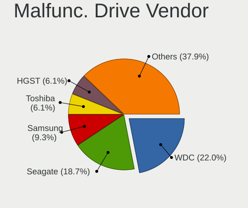

| Vendor              | Computers | Drives | Percent |
|---------------------|-----------|--------|---------|
| WDC                 | 47        | 66     | 21.96%  |
| Seagate             | 40        | 53     | 18.69%  |
| Samsung Electronics | 20        | 25     | 9.35%   |
| Toshiba             | 13        | 13     | 6.07%   |
| HGST                | 13        | 14     | 6.07%   |
| SK hynix            | 11        | 11     | 5.14%   |
| Crucial             | 9         | 10     | 4.21%   |
| A-DATA Technology   | 8         | 8      | 3.74%   |
| Kingston            | 7         | 8      | 3.27%   |
| SanDisk             | 6         | 6      | 2.8%    |
| Intel               | 6         | 6      | 2.8%    |
| Hitachi             | 6         | 8      | 2.8%    |
| Apple               | 5         | 5      | 2.34%   |
| Team                | 2         | 2      | 0.93%   |
| Micron Technology   | 2         | 4      | 0.93%   |
| Hewlett-Packard     | 2         | 2      | 0.93%   |
| XPG                 | 1         | 1      | 0.47%   |
| WHALEKOM            | 1         | 1      | 0.47%   |
| Unknown             | 1         | 1      | 0.47%   |
| SSSTC               | 1         | 1      | 0.47%   |
| SPCC                | 1         | 1      | 0.47%   |
| Silicon Motion      | 1         | 1      | 0.47%   |
| SABRENT             | 1         | 1      | 0.47%   |
| Plextor             | 1         | 1      | 0.47%   |
| OWC                 | 1         | 1      | 0.47%   |
| LITEON              | 1         | 1      | 0.47%   |
| Lexar               | 1         | 1      | 0.47%   |
| Leven               | 1         | 1      | 0.47%   |
| Flashwar            | 1         | 1      | 0.47%   |
| China               | 1         | 1      | 0.47%   |
| BAITITON            | 1         | 1      | 0.47%   |
| ASMT                | 1         | 1      | 0.47%   |
| Apacer              | 1         | 1      | 0.47%   |

Malfunc. HDD Vendor
-------------------

Vendors of faulty HDD drives

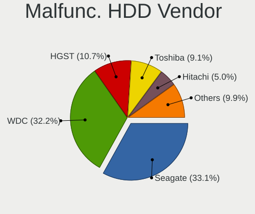

| Vendor              | Computers | Drives | Percent |
|---------------------|-----------|--------|---------|
| Seagate             | 40        | 53     | 33.06%  |
| WDC                 | 39        | 57     | 32.23%  |
| HGST                | 13        | 14     | 10.74%  |
| Toshiba             | 11        | 11     | 9.09%   |
| Hitachi             | 6         | 8      | 4.96%   |
| Apple               | 5         | 5      | 4.13%   |
| Samsung Electronics | 4         | 7      | 3.31%   |
| Unknown             | 1         | 1      | 0.83%   |
| Hewlett-Packard     | 1         | 1      | 0.83%   |
| ASMT                | 1         | 1      | 0.83%   |

Malfunc. Drive Kind
-------------------

Kinds of faulty drives

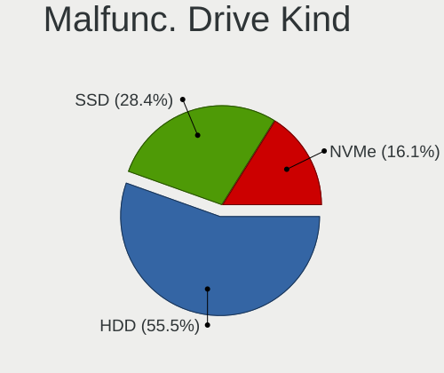

| Kind | Computers | Drives | Percent |
|------|-----------|--------|---------|
| HDD  | 117       | 158    | 55.45%  |
| SSD  | 60        | 64     | 28.44%  |
| NVMe | 34        | 36     | 16.11%  |

Failed Drives
-------------

Failed drive models

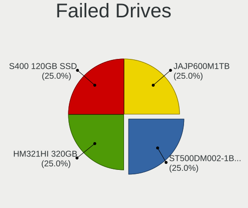

| Model                             | Computers | Drives | Percent |
|-----------------------------------|-----------|--------|---------|
| Seagate ST500DM002-1BD142 500GB   | 1         | 1      | 16.67%  |
| Samsung Electronics SSD 980 500GB | 1         | 1      | 16.67%  |
| Samsung Electronics SSD 980 1TB   | 1         | 1      | 16.67%  |
| Samsung Electronics HM321HI 320GB | 1         | 1      | 16.67%  |
| KingDian S400 120GB               | 1         | 2      | 16.67%  |
| Intenso JAJP600M1TB               | 1         | 1      | 16.67%  |

Failed Drive Vendor
-------------------

Failed drive vendors

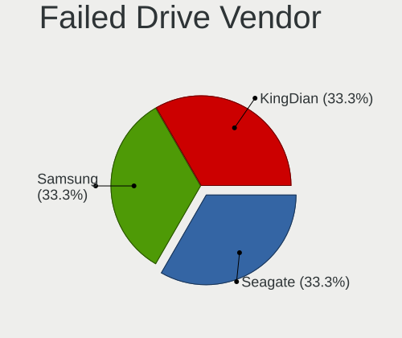

| Vendor              | Computers | Drives | Percent |
|---------------------|-----------|--------|---------|
| Samsung Electronics | 3         | 3      | 50%     |
| Seagate             | 1         | 1      | 16.67%  |
| KingDian            | 1         | 2      | 16.67%  |
| Intenso             | 1         | 1      | 16.67%  |

Drive Status
------------

Number of failed and malfunc. drives

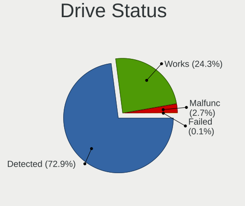

| Status   | Computers | Drives | Percent |
|----------|-----------|--------|---------|
| Detected | 5452      | 11596  | 72.94%  |
| Works    | 1815      | 3051   | 24.28%  |
| Malfunc  | 202       | 258    | 2.7%    |
| Failed   | 6         | 7      | 0.08%   |

Storage controller
------------------

Storage Vendor
--------------

Storage controller vendors

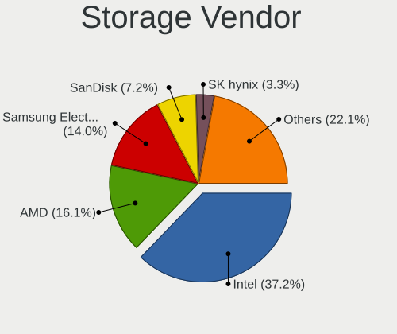

| Vendor                                  | Computers | Percent |
|-----------------------------------------|-----------|---------|
| Intel                                   | 3850      | 37.22%  |
| AMD                                     | 1665      | 16.1%   |
| Samsung Electronics                     | 1453      | 14.05%  |
| SanDisk                                 | 743       | 7.18%   |
| SK hynix                                | 343       | 3.32%   |
| Kingston Technology Company             | 282       | 2.73%   |
| Phison Electronics                      | 279       | 2.7%    |
| Micron Technology                       | 261       | 2.52%   |
| Micron/Crucial Technology               | 248       | 2.4%    |
| ASMedia Technology                      | 155       | 1.5%    |
| Silicon Motion                          | 125       | 1.21%   |
| KIOXIA                                  | 125       | 1.21%   |
| Toshiba America Info Systems            | 118       | 1.14%   |
| ADATA Technology                        | 95        | 0.92%   |
| Nvidia                                  | 82        | 0.79%   |
| Marvell Technology Group                | 79        | 0.76%   |
| MAXIO Technology (Hangzhou)             | 71        | 0.69%   |
| Realtek Semiconductor                   | 55        | 0.53%   |
| JMicron Technology                      | 41        | 0.4%    |
| Solid State Storage Technology          | 35        | 0.34%   |
| Shenzhen Longsys Electronics            | 34        | 0.33%   |
| Apple                                   | 27        | 0.26%   |
| Solidigm                                | 24        | 0.23%   |
| INNOGRIT                                | 24        | 0.23%   |
| Union Memory (Shenzhen)                 | 22        | 0.21%   |
| Seagate Technology                      | 21        | 0.2%    |
| Broadcom / LSI                          | 16        | 0.15%   |
| Netac Technology                        | 9         | 0.09%   |
| LSI Logic / Symbios Logic               | 9         | 0.09%   |
| Lite-On Technology                      | 7         | 0.07%   |
| Yangtze Memory Technologies             | 6         | 0.06%   |
| Hewlett-Packard                         | 6         | 0.06%   |
| Biwin Storage Technology                | 6         | 0.06%   |
| Silicon Image                           | 5         | 0.05%   |
| Lenovo                                  | 4         | 0.04%   |
| Hosin Global Electronics                | 4         | 0.04%   |
| VIA Technologies                        | 3         | 0.03%   |
| Shenzhen Unionmemory Information System | 3         | 0.03%   |
| Transcend                               | 2         | 0.02%   |
| O2 Micro                                | 2         | 0.02%   |

Storage Model
-------------

Storage controller models

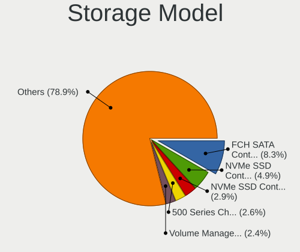

| Model                                                                          | Computers | Percent |
|--------------------------------------------------------------------------------|-----------|---------|
| AMD FCH SATA Controller [AHCI mode]                                            | 947       | 8.32%   |
| Samsung NVMe SSD Controller SM981/PM981/PM983                                  | 557       | 4.89%   |
| Samsung NVMe SSD Controller PM9A1/PM9A3/980PRO                                 | 334       | 2.93%   |
| AMD 500 Series Chipset SATA Controller                                         | 297       | 2.61%   |
| Intel Volume Management Device NVMe RAID Controller                            | 271       | 2.38%   |
| Intel Sunrise Point-LP SATA Controller [AHCI mode]                             | 269       | 2.36%   |
| Samsung NVMe SSD Controller 980 (DRAM-less)                                    | 260       | 2.28%   |
| Intel 8 Series/C220 Series Chipset Family 6-port SATA Controller 1 [AHCI mode] | 257       | 2.26%   |
| AMD 400 Series Chipset SATA Controller                                         | 232       | 2.04%   |
| AMD 600 Series Chipset SATA Controller                                         | 209       | 1.84%   |
| Intel 7 Series Chipset Family 6-port SATA Controller [AHCI mode]               | 206       | 1.81%   |
| Intel 82801 Mobile SATA Controller [RAID mode]                                 | 193       | 1.7%    |
| Intel 6 Series/C200 Series Chipset Family 6 port Mobile SATA AHCI Controller   | 174       | 1.53%   |
| Intel Q170/Q150/B150/H170/H110/Z170/CM236 Chipset SATA Controller [AHCI Mode]  | 165       | 1.45%   |
| ASMedia ASM1061/ASM1062 Serial ATA Controller                                  | 141       | 1.24%   |
| Micron/Crucial P2 [Nick P2] / P3 / P3 Plus NVMe PCIe SSD (DRAM-less)           | 138       | 1.21%   |
| SK hynix Gold P31/BC711/PC711 NVMe Solid State Drive                           | 132       | 1.16%   |
| Intel 200 Series PCH SATA controller [AHCI mode]                               | 132       | 1.16%   |
| SanDisk Ultra 3D / WD PC SN530, IX SN530, Blue SN550 NVMe SSD (DRAM-less)      | 130       | 1.14%   |
| Intel Cannon Lake Mobile PCH SATA AHCI Controller                              | 123       | 1.08%   |
| SanDisk WD SN560/SN740/SN770/SN5000 NVMe SSD                                   | 117       | 1.03%   |
| Intel SATA Controller [RAID mode]                                              | 117       | 1.03%   |
| Intel 8 Series SATA Controller 1 [AHCI mode]                                   | 115       | 1.01%   |
| Samsung NVMe SSD Controller SM961/PM961/SM963                                  | 111       | 0.98%   |
| Intel Comet Lake SATA AHCI Controller                                          | 108       | 0.95%   |
| Intel Wildcat Point-LP SATA Controller [AHCI Mode]                             | 107       | 0.94%   |
| SanDisk Extreme Pro / WD Black SN750 / PC SN730 / Red SN700 NVMe SSD           | 105       | 0.92%   |
| Silicon Motion SM2263EN/SM2263XT (DRAM-less) NVMe SSD Controllers              | 101       | 0.89%   |
| Intel Alder Lake-S PCH SATA Controller [AHCI Mode]                             | 98        | 0.86%   |
| Phison E12 NVMe Controller                                                     | 96        | 0.84%   |
| Intel Cannon Lake PCH SATA AHCI Controller                                     | 91        | 0.8%    |
| Intel 7 Series/C210 Series Chipset Family 6-port SATA Controller [AHCI mode]   | 91        | 0.8%    |
| Intel HM170/QM170 Chipset SATA Controller [AHCI Mode]                          | 89        | 0.78%   |
| Intel 6 Series/C200 Series Chipset Family 6 port Desktop SATA AHCI Controller  | 89        | 0.78%   |
| Intel SSD 660P Series                                                          | 85        | 0.75%   |
| Samsung NVMe SSD Controller S4LV008[Pascal]                                    | 82        | 0.72%   |
| Intel RST Volume Management Device Controller                                  | 82        | 0.72%   |
| Intel Raptor Lake SATA AHCI Controller                                         | 77        | 0.68%   |
| AMD SB7x0/SB8x0/SB9x0 SATA Controller [AHCI mode]                              | 75        | 0.66%   |
| Intel Alder Lake-P SATA AHCI Controller                                        | 73        | 0.64%   |

Storage Kind
------------

Kind of storage controller (IDE, SATA, NVMe, SAS, ...)

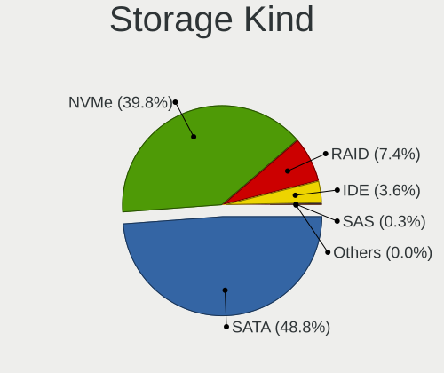

| Kind | Computers | Percent |
|------|-----------|---------|
| SATA | 4846      | 48.84%  |
| NVMe | 3952      | 39.83%  |
| RAID | 735       | 7.41%   |
| IDE  | 358       | 3.61%   |
| SAS  | 29        | 0.29%   |
| SCSI | 3         | 0.03%   |

Processor
---------

CPU Vendor
----------

Processor vendors

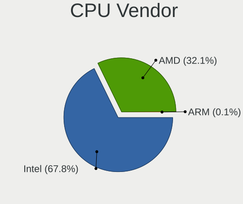

| Vendor | Computers | Percent |
|--------|-----------|---------|
| Intel  | 4768      | 67.78%  |
| AMD    | 2260      | 32.13%  |
| ARM    | 7         | 0.1%    |

CPU Model
---------

Processor models

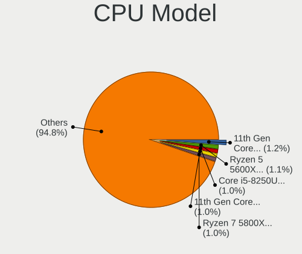

| Model                                         | Computers | Percent |
|-----------------------------------------------|-----------|---------|
| Intel 11th Gen Core i5-1135G7 @ 2.40GHz       | 84        | 1.19%   |
| AMD Ryzen 5 5600X 6-Core Processor            | 75        | 1.06%   |
| Intel Core i5-8250U CPU @ 1.60GHz             | 70        | 0.99%   |
| Intel 11th Gen Core i7-1165G7 @ 2.80GHz       | 70        | 0.99%   |
| AMD Ryzen 7 5800X 8-Core Processor            | 69        | 0.98%   |
| AMD Ryzen 5 3600 6-Core Processor             | 69        | 0.98%   |
| Intel 11th Gen Core i7-11800H @ 2.30GHz       | 63        | 0.89%   |
| Intel 12th Gen Core i7-12700H                 | 61        | 0.87%   |
| Intel Core i7-9750H CPU @ 2.60GHz             | 60        | 0.85%   |
| Intel Core i7-7700HQ CPU @ 2.80GHz            | 59        | 0.84%   |
| AMD Ryzen 7 5800H with Radeon Graphics        | 56        | 0.8%    |
| AMD Ryzen 5 5500U with Radeon Graphics        | 55        | 0.78%   |
| AMD Ryzen 9 5900X 12-Core Processor           | 54        | 0.77%   |
| AMD Ryzen 7 5700U with Radeon Graphics        | 53        | 0.75%   |
| Intel Core i7-10750H CPU @ 2.60GHz            | 52        | 0.74%   |
| Intel Core i7-8750H CPU @ 2.20GHz             | 51        | 0.72%   |
| Intel Core i7-8550U CPU @ 1.80GHz             | 50        | 0.71%   |
| Intel Core i7-10510U CPU @ 1.80GHz            | 49        | 0.7%    |
| Intel Core i5-7200U CPU @ 2.50GHz             | 47        | 0.67%   |
| AMD Ryzen 5 5600G with Radeon Graphics        | 46        | 0.65%   |
| Intel Core i5-6300U CPU @ 2.40GHz             | 45        | 0.64%   |
| AMD Ryzen 7 3700X 8-Core Processor            | 45        | 0.64%   |
| AMD Ryzen 5 3500U with Radeon Vega Mobile Gfx | 45        | 0.64%   |
| AMD Ryzen 7 5700G with Radeon Graphics        | 43        | 0.61%   |
| Intel Core i5-8265U CPU @ 1.60GHz             | 42        | 0.6%    |
| Intel Core i5-10210U CPU @ 1.60GHz            | 42        | 0.6%    |
| AMD Ryzen 9 5950X 16-Core Processor           | 41        | 0.58%   |
| Intel Core i7-8565U CPU @ 1.80GHz             | 40        | 0.57%   |
| Intel Core i7-8650U CPU @ 1.90GHz             | 39        | 0.55%   |
| Intel Core i7-6700K CPU @ 4.00GHz             | 39        | 0.55%   |
| Intel Core i5-3210M CPU @ 2.50GHz             | 37        | 0.53%   |
| AMD Ryzen 7 4800H with Radeon Graphics        | 37        | 0.53%   |
| Intel Core i7-6700HQ CPU @ 2.60GHz            | 35        | 0.5%    |
| Intel Core i5-6200U CPU @ 2.30GHz             | 35        | 0.5%    |
| Intel 12th Gen Core i5-1235U                  | 33        | 0.47%   |
| AMD Ryzen 5 5600H with Radeon Graphics        | 32        | 0.45%   |
| Intel Core i5-5200U CPU @ 2.20GHz             | 31        | 0.44%   |
| Intel Core i7-3770 CPU @ 3.40GHz              | 30        | 0.43%   |
| AMD Ryzen 7 2700X Eight-Core Processor        | 30        | 0.43%   |
| Intel 12th Gen Core i7-1255U                  | 28        | 0.4%    |

CPU Model Family
----------------

Processor model prefix

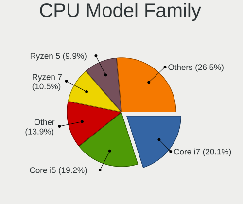

| Model                   | Computers | Percent |
|-------------------------|-----------|---------|
| Intel Core i7           | 1414      | 20.08%  |
| Intel Core i5           | 1352      | 19.2%   |
| Other                   | 980       | 13.92%  |
| AMD Ryzen 7             | 736       | 10.45%  |
| AMD Ryzen 5             | 697       | 9.9%    |
| Intel Core i3           | 310       | 4.4%    |
| AMD Ryzen 9             | 310       | 4.4%    |
| Intel Xeon              | 166       | 2.36%   |
| Intel Celeron           | 140       | 1.99%   |
| Intel Core 2 Duo        | 133       | 1.89%   |
| Intel Core i9           | 89        | 1.26%   |
| AMD Ryzen 3             | 71        | 1.01%   |
| AMD FX                  | 71        | 1.01%   |
| Intel Pentium           | 59        | 0.84%   |
| AMD Ryzen 7 PRO         | 51        | 0.72%   |
| Intel Core              | 48        | 0.68%   |
| AMD Ryzen 5 PRO         | 34        | 0.48%   |
| AMD A10                 | 32        | 0.45%   |
| AMD A8                  | 31        | 0.44%   |
| AMD A6                  | 27        | 0.38%   |
| Intel Pentium Dual-Core | 24        | 0.34%   |
| AMD Ryzen Threadripper  | 22        | 0.31%   |
| AMD A4                  | 20        | 0.28%   |
| AMD Athlon              | 19        | 0.27%   |
| Intel Core 2 Quad       | 16        | 0.23%   |
| Intel Pentium Silver    | 13        | 0.18%   |
| Intel Atom              | 12        | 0.17%   |
| AMD Phenom II X4        | 12        | 0.17%   |
| AMD Athlon II X2        | 12        | 0.17%   |
| Intel Pentium Gold      | 11        | 0.16%   |
| AMD Athlon II X4        | 10        | 0.14%   |
| Intel Genuine           | 7         | 0.1%    |
| Intel Core M            | 7         | 0.1%    |
| AMD E                   | 7         | 0.1%    |
| Intel Core m5           | 6         | 0.09%   |
| Intel Core m3           | 6         | 0.09%   |
| Intel Core 2            | 6         | 0.09%   |
| AMD Phenom II X6        | 6         | 0.09%   |
| AMD Ryzen 3 PRO         | 5         | 0.07%   |
| AMD E1                  | 5         | 0.07%   |

CPU Cores
---------

Number of processor cores

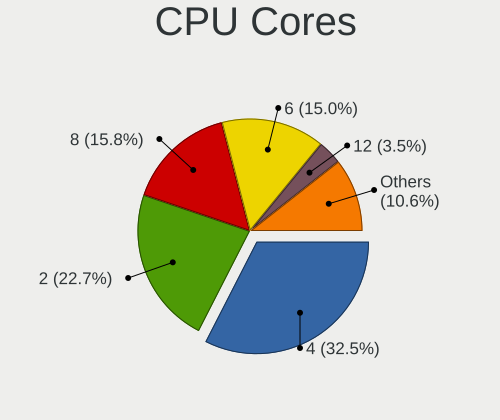

| Number  | Computers | Percent |
|---------|-----------|---------|
| 4       | 2292      | 32.52%  |
| 2       | 1598      | 22.68%  |
| 8       | 1110      | 15.75%  |
| 6       | 1054      | 14.96%  |
| 12      | 246       | 3.49%   |
| 16      | 217       | 3.08%   |
| 14      | 175       | 2.48%   |
| 10      | 168       | 2.38%   |
| 24      | 84        | 1.19%   |
| 1       | 30        | 0.43%   |
| 3       | 28        | 0.4%    |
| 20      | 15        | 0.21%   |
| Unknown | 7         | 0.1%    |
| 32      | 5         | 0.07%   |
| 40      | 3         | 0.04%   |
| 36      | 3         | 0.04%   |
| 18      | 3         | 0.04%   |
| 64      | 2         | 0.03%   |
| 28      | 2         | 0.03%   |
| 52      | 1         | 0.01%   |
| 48      | 1         | 0.01%   |
| 22      | 1         | 0.01%   |
| 9       | 1         | 0.01%   |
| 5       | 1         | 0.01%   |

CPU Sockets
-----------

Number of sockets

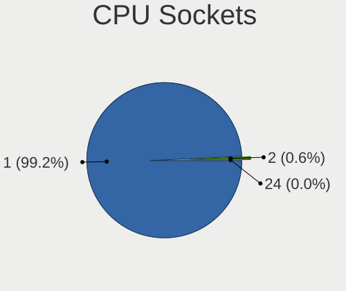

| Number  | Computers | Percent |
|---------|-----------|---------|
| 1       | 6982      | 99.25%  |
| 2       | 45        | 0.64%   |
| Unknown | 7         | 0.1%    |
| 24      | 1         | 0.01%   |

CPU Threads
-----------

Threads per core (Hyper-Threading)

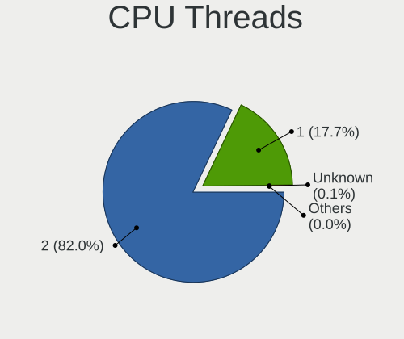

| Number  | Computers | Percent |
|---------|-----------|---------|
| 2       | 5778      | 82.04%  |
| 1       | 1250      | 17.75%  |
| Unknown | 7         | 0.1%    |
| 12      | 3         | 0.04%   |
| 8       | 3         | 0.04%   |
| 16      | 2         | 0.03%   |

CPU Op-Modes
------------

CPU Operation Modes (32-bit, 64-bit)

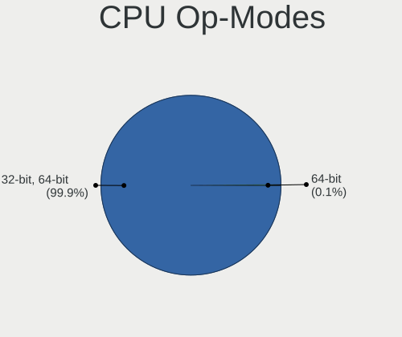

| Op mode        | Computers | Percent |
|----------------|-----------|---------|
| 32-bit, 64-bit | 7031      | 99.94%  |
| 64-bit         | 4         | 0.06%   |

CPU Microcode
-------------

Microcode number

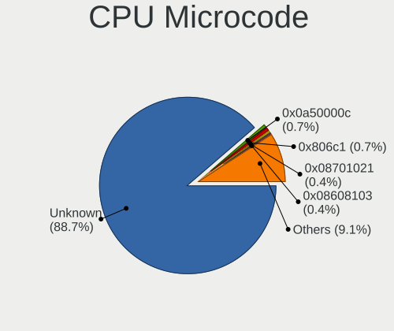

| Number     | Computers | Percent |
|------------|-----------|---------|
| Unknown    | 6305      | 88.69%  |
| 0x0a50000c | 51        | 0.72%   |
| 0x806c1    | 50        | 0.7%    |
| 0x08701021 | 28        | 0.39%   |
| 0x08608103 | 27        | 0.38%   |
| 0x806ec    | 26        | 0.37%   |
| 0x08600106 | 26        | 0.37%   |
| 0x0a404102 | 25        | 0.35%   |
| 0x906a3    | 24        | 0.34%   |
| 0x806ea    | 24        | 0.34%   |
| 0x806d1    | 24        | 0.34%   |
| 0x306a9    | 24        | 0.34%   |
| 0x0a50000d | 24        | 0.34%   |
| 0x0a601203 | 22        | 0.31%   |
| 0x906ea    | 21        | 0.3%    |
| 0xa0652    | 20        | 0.28%   |
| 0x08108109 | 19        | 0.27%   |
| 0x0800820d | 17        | 0.24%   |
| 0x0a404101 | 16        | 0.23%   |
| 0x0a201016 | 16        | 0.23%   |
| 0x406e3    | 15        | 0.21%   |
| 0x206a7    | 15        | 0.21%   |
| 0x806e9    | 14        | 0.2%    |
| 0x506e3    | 14        | 0.2%    |
| 0x306c3    | 14        | 0.2%    |
| 0x906a4    | 13        | 0.18%   |
| 0x0a20120a | 13        | 0.18%   |
| 0x40651    | 12        | 0.17%   |
| 0x08600104 | 12        | 0.17%   |
| 0x906e9    | 11        | 0.15%   |
| 0x306d4    | 9         | 0.13%   |
| 0x706e5    | 8         | 0.11%   |
| 0x1067a    | 8         | 0.11%   |
| 0x706a8    | 7         | 0.1%    |
| 0x0a704103 | 7         | 0.1%    |
| 0x08600103 | 7         | 0.1%    |
| 0x08108102 | 7         | 0.1%    |
| 0x90672    | 6         | 0.08%   |
| 0x08701013 | 6         | 0.08%   |
| 0x906ec    | 5         | 0.07%   |

CPU Microarch
-------------

Microarchitecture

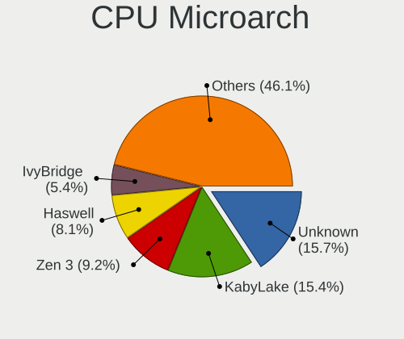

| Name               | Computers | Percent |
|--------------------|-----------|---------|
| Unknown            | 1111      | 15.75%  |
| KabyLake           | 1087      | 15.41%  |
| Zen 3              | 650       | 9.21%   |
| Haswell            | 571       | 8.09%   |
| IvyBridge          | 383       | 5.43%   |
| Skylake            | 380       | 5.39%   |
| Zen 2              | 361       | 5.12%   |
| SandyBridge        | 327       | 4.64%   |
| Zen+               | 261       | 3.7%    |
| TigerLake          | 242       | 3.43%   |
| Alderlake Hybrid   | 226       | 3.2%    |
| CometLake          | 220       | 3.12%   |
| Broadwell          | 196       | 2.78%   |
| Penryn             | 156       | 2.21%   |
| Icelake            | 115       | 1.63%   |
| Zen                | 114       | 1.62%   |
| Piledriver         | 91        | 1.29%   |
| Westmere           | 90        | 1.28%   |
| Goldmont plus      | 66        | 0.94%   |
| Nehalem            | 55        | 0.78%   |
| K10                | 54        | 0.77%   |
| Silvermont         | 51        | 0.72%   |
| Excavator          | 50        | 0.71%   |
| Core               | 38        | 0.54%   |
| Puma               | 25        | 0.35%   |
| Steamroller        | 23        | 0.33%   |
| Goldmont           | 17        | 0.24%   |
| Meteorlake Hybrid  | 15        | 0.21%   |
| K10 Llano          | 15        | 0.21%   |
| K8 Hammer          | 11        | 0.16%   |
| Jaguar             | 11        | 0.16%   |
| Bobcat             | 10        | 0.14%   |
| Gracemont          | 8         | 0.11%   |
| Bulldozer          | 6         | 0.09%   |
| Tremont            | 5         | 0.07%   |
| NetBurst           | 4         | 0.06%   |
| Lunarlake Hybrid   | 4         | 0.06%   |
| K8 & K10 hybrid    | 4         | 0.06%   |
| Bonnell            | 1         | 0.01%   |
| ArrowLake-H Hybrid | 1         | 0.01%   |

Graphics
--------

GPU Vendor
----------

Vendors of graphics cards

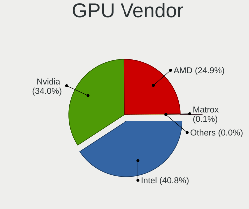

| Vendor                     | Computers | Percent |
|----------------------------|-----------|---------|
| Intel                      | 3604      | 40.8%   |
| Nvidia                     | 3006      | 34.03%  |
| AMD                        | 2204      | 24.95%  |
| Matrox Electronics Systems | 10        | 0.11%   |
| ASPEED Technology          | 9         | 0.1%    |
| 3Dfx Interactive           | 1         | 0.01%   |

GPU Model
---------

Graphics card models

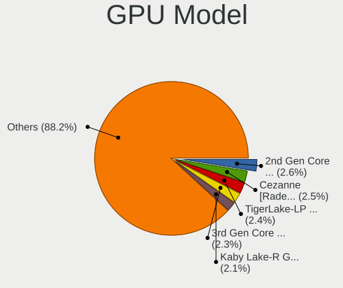

| Model                                                                       | Computers | Percent |
|-----------------------------------------------------------------------------|-----------|---------|
| Intel 2nd Generation Core Processor Family Integrated Graphics Controller   | 234       | 2.57%   |
| AMD Cezanne [Radeon Vega Series / Radeon Vega Mobile Series]                | 230       | 2.53%   |
| Intel TigerLake-LP GT2 [Iris Xe Graphics]                                   | 219       | 2.41%   |
| Intel 3rd Gen Core processor Graphics Controller                            | 205       | 2.25%   |
| Intel Kaby Lake-R GT2 [UHD Graphics 620]                                    | 187       | 2.06%   |
| Intel CoffeeLake-H GT2 [UHD Graphics 630]                                   | 161       | 1.77%   |
| Intel Haswell-ULT Integrated Graphics Controller                            | 158       | 1.74%   |
| AMD Picasso/Raven 2 [Radeon Vega Series / Radeon Vega Mobile Series]        | 158       | 1.74%   |
| AMD Raphael                                                                 | 148       | 1.63%   |
| AMD Renoir [Radeon Vega Series / Radeon Vega Mobile Series]                 | 145       | 1.59%   |
| AMD Ellesmere [Radeon RX 470/480/570/570X/580/580X/590]                     | 136       | 1.49%   |
| Intel Skylake-U GT2 [HD Graphics 520]                                       | 133       | 1.46%   |
| Intel Alder Lake-P GT2 [Iris Xe Graphics]                                   | 132       | 1.45%   |
| AMD Rembrandt [Radeon 680M]                                                 | 128       | 1.41%   |
| Intel CometLake-U GT2 [UHD Graphics]                                        | 120       | 1.32%   |
| AMD Lucienne                                                                | 114       | 1.25%   |
| Intel WhiskeyLake-U GT2 [UHD Graphics 620]                                  | 112       | 1.23%   |
| Nvidia TU117M [GeForce GTX 1650 Mobile / Max-Q]                             | 108       | 1.19%   |
| Intel Kaby Lake-U GT2 [HD Graphics 620]                                     | 108       | 1.19%   |
| Intel Broadwell-U GT2 [HD Graphics 5500]                                    | 106       | 1.16%   |
| Intel CometLake-H GT2 [UHD Graphics]                                        | 104       | 1.14%   |
| Intel 4th Gen Core Processor Integrated Graphics Controller                 | 102       | 1.12%   |
| Intel Xeon E3-1200 v3/4th Gen Core Processor Integrated Graphics Controller | 93        | 1.02%   |
| Nvidia GA106M [GeForce RTX 3060 Mobile / Max-Q]                             | 92        | 1.01%   |
| Intel TigerLake-H GT1 [UHD Graphics]                                        | 91        | 1%      |
| Intel Raptor Lake-P [Iris Xe Graphics]                                      | 82        | 0.9%    |
| Nvidia GA107M [GeForce RTX 3050 Mobile]                                     | 75        | 0.82%   |
| Intel Kaby Lake-H GT2 [HD Graphics 630]                                     | 75        | 0.82%   |
| Nvidia GA107M [GeForce RTX 3050 Ti Mobile]                                  | 70        | 0.77%   |
| Nvidia AD107M [GeForce RTX 4060 Max-Q / Mobile]                             | 69        | 0.76%   |
| AMD Navi 22 [Radeon RX 6700/6700 XT/6750 XT / 6800M/6850M XT]               | 65        | 0.71%   |
| Intel CoffeeLake-S GT2 [UHD Graphics 630]                                   | 61        | 0.67%   |
| Intel Alder Lake-UP3 GT2 [Iris Xe Graphics]                                 | 61        | 0.67%   |
| Nvidia GP107 [GeForce GTX 1050 Ti]                                          | 60        | 0.66%   |
| Intel GeminiLake [UHD Graphics 600]                                         | 60        | 0.66%   |
| Nvidia GA106 [GeForce RTX 3060 Lite Hash Rate]                              | 58        | 0.64%   |
| AMD Navi 23 [Radeon RX 6600/6600 XT/6600M]                                  | 58        | 0.64%   |
| Intel Skylake-S GT2 [HD Graphics 530]                                       | 55        | 0.6%    |
| Intel Core Processor Integrated Graphics Controller                         | 54        | 0.59%   |
| AMD Navi 21 [Radeon RX 6800/6800 XT / 6900 XT]                              | 54        | 0.59%   |

GPU Combo
---------

Combinations of graphics cards

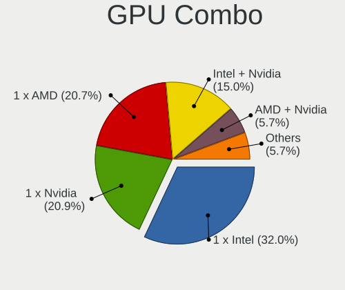

| Name                      | Computers | Percent |
|---------------------------|-----------|---------|
| 1 x Intel                 | 2274      | 32.01%  |
| 1 x Nvidia                | 1485      | 20.9%   |
| 1 x AMD                   | 1469      | 20.68%  |
| Intel + Nvidia            | 1067      | 15.02%  |
| AMD + Nvidia              | 403       | 5.67%   |
| 2 x AMD                   | 182       | 2.56%   |
| Intel + AMD               | 145       | 2.04%   |
| 2 x Nvidia                | 29        | 0.41%   |
| Other                     | 14        | 0.2%    |
| 1 x Matrox                | 6         | 0.08%   |
| 2 x Intel                 | 5         | 0.07%   |
| Nvidia + ASPEED           | 5         | 0.07%   |
| Nvidia + Matrox           | 4         | 0.06%   |
| Intel + 2 x Nvidia        | 4         | 0.06%   |
| AMD + ASPEED              | 3         | 0.04%   |
| AMD + 2 x Nvidia          | 2         | 0.03%   |
| 4 x Nvidia                | 1         | 0.01%   |
| 3 x Nvidia                | 1         | 0.01%   |
| 2 x AMD + 2 x Nvidia      | 1         | 0.01%   |
| 2 x AMD + 1 x Nvidia      | 1         | 0.01%   |
| Nvidia + 3Dfx Interactive | 1         | 0.01%   |
| Intel + AMD + 2 x Nvidia  | 1         | 0.01%   |
| 1 x ASPEED                | 1         | 0.01%   |

GPU Driver
----------

Free vs proprietary

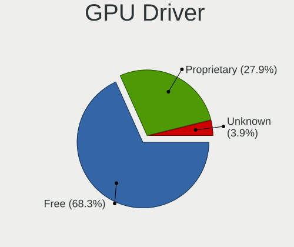

| Driver      | Computers | Percent |
|-------------|-----------|---------|
| Free        | 4861      | 68.27%  |
| Proprietary | 1984      | 27.87%  |
| Unknown     | 275       | 3.86%   |

GPU Memory
----------

Total video memory

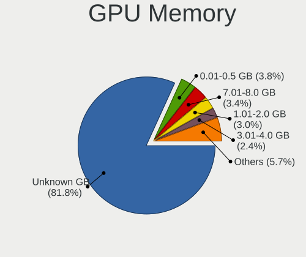

| Size in GB | Computers | Percent |
|------------|-----------|---------|
| Unknown    | 5845      | 81.81%  |
| 0.01-0.5   | 268       | 3.75%   |
| 7.01-8.0   | 242       | 3.39%   |
| 1.01-2.0   | 214       | 3%      |
| 3.01-4.0   | 171       | 2.39%   |
| 8.01-16.0  | 164       | 2.3%    |
| 5.01-6.0   | 134       | 1.88%   |
| 0.51-1.0   | 54        | 0.76%   |
| 16.01-24.0 | 27        | 0.38%   |
| 2.01-3.0   | 24        | 0.34%   |
| 32.01-64.0 | 1         | 0.01%   |
| 24.01-32.0 | 1         | 0.01%   |

Monitor
-------

Monitor Vendor
--------------

Monitor vendors

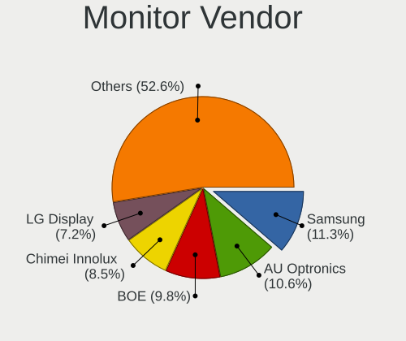

| Vendor                  | Computers | Percent |
|-------------------------|-----------|---------|
| Samsung Electronics     | 929       | 11.31%  |
| AU Optronics            | 874       | 10.64%  |
| BOE                     | 802       | 9.76%   |
| Chimei Innolux          | 699       | 8.51%   |
| LG Display              | 591       | 7.2%    |
| Goldstar                | 521       | 6.34%   |
| Dell                    | 475       | 5.78%   |
| Acer                    | 302       | 3.68%   |
| Apple                   | 300       | 3.65%   |
| Hewlett-Packard         | 250       | 3.04%   |
| AOC                     | 216       | 2.63%   |
| ASUSTek Computer        | 192       | 2.34%   |
| Sharp                   | 165       | 2.01%   |
| BenQ                    | 153       | 1.86%   |
| Ancor Communications    | 153       | 1.86%   |
| Lenovo                  | 131       | 1.59%   |
| Philips                 | 122       | 1.49%   |
| PANDA                   | 104       | 1.27%   |
| MSI                     | 80        | 0.97%   |
| Iiyama                  | 67        | 0.82%   |
| ViewSonic               | 63        | 0.77%   |
| InfoVision              | 62        | 0.75%   |
| Chi Mei Optoelectronics | 56        | 0.68%   |
| Gigabyte Technology     | 42        | 0.51%   |
| CSO                     | 41        | 0.5%    |
| Sony                    | 39        | 0.47%   |
| Sceptre Tech            | 37        | 0.45%   |
| HKC                     | 30        | 0.37%   |
| Panasonic               | 29        | 0.35%   |
| Vizio                   | 26        | 0.32%   |
| NEC Computers           | 24        | 0.29%   |
| Unknown                 | 22        | 0.27%   |
| TMX                     | 22        | 0.27%   |
| Vestel Elektronik       | 18        | 0.22%   |
| Toshiba                 | 18        | 0.22%   |
| RTK                     | 17        | 0.21%   |
| Insignia                | 17        | 0.21%   |
| Fujitsu Siemens         | 16        | 0.19%   |
| Eizo                    | 16        | 0.19%   |
| Hitachi                 | 15        | 0.18%   |

Monitor Model
-------------

Monitor models

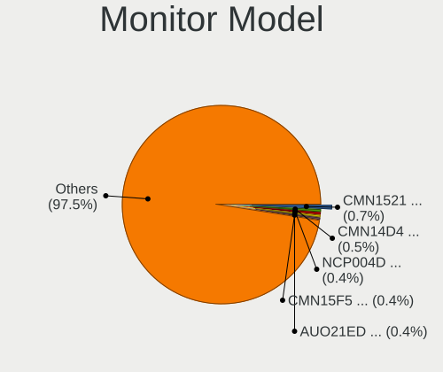

| Model                                                                | Computers | Percent |
|----------------------------------------------------------------------|-----------|---------|
| Chimei Innolux LCD Monitor CMN1521 1920x1080 344x193mm 15.5-inch     | 62        | 0.73%   |
| Chimei Innolux LCD Monitor CMN14D4 1920x1080 309x173mm 13.9-inch     | 42        | 0.49%   |
| PANDA LCD Monitor NCP004D 1920x1080 344x194mm 15.5-inch              | 37        | 0.44%   |
| Chimei Innolux LCD Monitor CMN15F5 1920x1080 344x193mm 15.5-inch     | 35        | 0.41%   |
| AU Optronics LCD Monitor AUO21ED 1920x1080 344x193mm 15.5-inch       | 34        | 0.4%    |
| Goldstar FULL HD GSM5B55 1920x1080 480x270mm 21.7-inch               | 29        | 0.34%   |
| Chimei Innolux LCD Monitor CMN14D5 1920x1080 309x173mm 13.9-inch     | 28        | 0.33%   |
| Chimei Innolux LCD Monitor CMN15E7 1920x1080 344x193mm 15.5-inch     | 26        | 0.31%   |
| AOC 27G2G4 AOC2702 1920x1080 598x336mm 27.0-inch                     | 26        | 0.31%   |
| LG Display LCD Monitor LGD046F 1920x1080 344x194mm 15.5-inch         | 24        | 0.28%   |
| Goldstar LG ULTRAWIDE GSM59F1 2560x1080 670x280mm 28.6-inch          | 24        | 0.28%   |
| LG Display LCD Monitor LGD05E5 1920x1080 344x194mm 15.5-inch         | 23        | 0.27%   |
| Samsung Electronics C27F390 SAM0D32 1920x1080 598x336mm 27.0-inch    | 20        | 0.24%   |
| Goldstar HDR WFHD GSM7714 2560x1080 798x334mm 34.1-inch              | 20        | 0.24%   |
| Apple Color LCD APP9CDF 1440x900 286x179mm 13.3-inch                 | 20        | 0.24%   |
| Samsung Electronics C24F390 SAM0D2C 1920x1080 521x293mm 23.5-inch    | 19        | 0.22%   |
| Chimei Innolux LCD Monitor CMN15E6 1366x768 344x193mm 15.5-inch      | 19        | 0.22%   |
| Vestel Elektronik 40UHD_LCD_TV VES3700 3840x2160 880x500mm 39.8-inch | 18        | 0.21%   |
| AU Optronics LCD Monitor AUO38ED 1920x1080 344x193mm 15.5-inch       | 18        | 0.21%   |
| Samsung Electronics LF24T35 SAM707D 1920x1080 528x297mm 23.9-inch    | 17        | 0.2%    |
| Apple Color LCD APPA01B 1440x900 286x179mm 13.3-inch                 | 17        | 0.2%    |
| Samsung Electronics U28E590 SAM0C4D 3840x2160 607x345mm 27.5-inch    | 16        | 0.19%   |
| Goldstar LG IPS FULLHD GSM5AB8 1920x1080 480x270mm 21.7-inch         | 16        | 0.19%   |
| Dell P2419H DELD0DA 1920x1080 527x296mm 23.8-inch                    | 16        | 0.19%   |
| Chimei Innolux LCD Monitor CMN15E8 1920x1080 344x193mm 15.5-inch     | 16        | 0.19%   |
| BOE LCD Monitor BOE0812 1920x1080 344x194mm 15.5-inch                | 16        | 0.19%   |
| AU Optronics LCD Monitor AUO403D 1920x1080 309x174mm 14.0-inch       | 16        | 0.19%   |
| Apple Color LCD APP9CF0 1440x900 290x180mm 13.4-inch                 | 16        | 0.19%   |
| LG Display LCD Monitor LGD0555 2736x1824 260x173mm 12.3-inch         | 15        | 0.18%   |
| Goldstar Ultra HD GSM5B09 3840x2160 600x340mm 27.2-inch              | 15        | 0.18%   |
| Chimei Innolux LCD Monitor CMN14D6 1366x768 309x173mm 13.9-inch      | 15        | 0.18%   |
| AU Optronics LCD Monitor AUOAF90 1920x1080 344x193mm 15.5-inch       | 15        | 0.18%   |
| AU Optronics LCD Monitor AUO243D 1920x1080 309x173mm 13.9-inch       | 15        | 0.18%   |
| AOC 24G2W1G3 AOC2402 1920x1080 527x296mm 23.8-inch                   | 15        | 0.18%   |
| Ancor Communications VE247 ACI2493 1920x1080 530x300mm 24.0-inch     | 15        | 0.18%   |
| InfoVision LCD Monitor IVO8C78 1920x1080 309x174mm 14.0-inch         | 14        | 0.16%   |
| Chimei Innolux LCD Monitor CMN15DB 1366x768 344x193mm 15.5-inch      | 14        | 0.16%   |
| Chimei Innolux LCD Monitor CMN1408 1920x1080 309x173mm 13.9-inch     | 14        | 0.16%   |
| AU Optronics LCD Monitor AUO22EC 1366x768 344x193mm 15.5-inch        | 14        | 0.16%   |
| Apple LCD Monitor APP9CCB 1280x800 286x179mm 13.3-inch               | 14        | 0.16%   |

Monitor Resolution
------------------

Monitor screen resolution

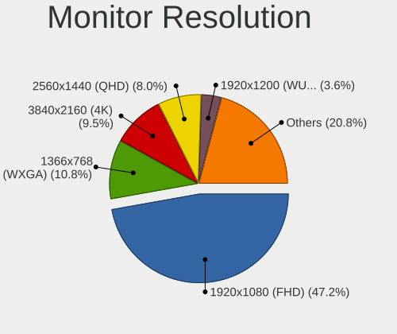

| Resolution         | Computers | Percent |
|--------------------|-----------|---------|
| 1920x1080 (FHD)    | 3668      | 47.2%   |
| 1366x768 (WXGA)    | 841       | 10.82%  |
| 3840x2160 (4K)     | 741       | 9.54%   |
| 2560x1440 (QHD)    | 618       | 7.95%   |
| 1920x1200 (WUXGA)  | 283       | 3.64%   |
| 1600x900 (HD+)     | 185       | 2.38%   |
| 3440x1440          | 181       | 2.33%   |
| 2560x1600          | 175       | 2.25%   |
| 1440x900 (WXGA+)   | 127       | 1.63%   |
| 2560x1080          | 111       | 1.43%   |
| 1680x1050 (WSXGA+) | 108       | 1.39%   |
| 2880x1800          | 106       | 1.36%   |
| 1280x800 (WXGA)    | 91        | 1.17%   |
| 1280x1024 (SXGA)   | 72        | 0.93%   |
| 3840x1080          | 51        | 0.66%   |
| 1360x768           | 47        | 0.6%    |
| 3840x2400          | 40        | 0.51%   |
| 2160x1440          | 34        | 0.44%   |
| 1920x540           | 31        | 0.4%    |
| Unknown            | 28        | 0.36%   |
| 3072x1920          | 18        | 0.23%   |
| 2880x1920          | 18        | 0.23%   |
| 1920x1280          | 16        | 0.21%   |
| 2288x1287          | 15        | 0.19%   |
| 3840x1600          | 14        | 0.18%   |
| 3200x2000          | 14        | 0.18%   |
| 2256x1504          | 14        | 0.18%   |
| 3200x1800 (QHD+)   | 10        | 0.13%   |
| 1024x768 (XGA)     | 9         | 0.12%   |
| 2304x1440          | 8         | 0.1%    |
| 3840x1100          | 7         | 0.09%   |
| 3456x2160          | 7         | 0.09%   |
| 3000x2000          | 7         | 0.09%   |
| 1280x720 (HD)      | 7         | 0.09%   |
| 2240x1400          | 6         | 0.08%   |
| 3840x1200          | 5         | 0.06%   |
| 2880x1620          | 5         | 0.06%   |
| 2520x1680          | 5         | 0.06%   |
| 1600x1200          | 5         | 0.06%   |
| 2736x1824          | 4         | 0.05%   |

Monitor Diagonal
----------------

Diagonal size in inches

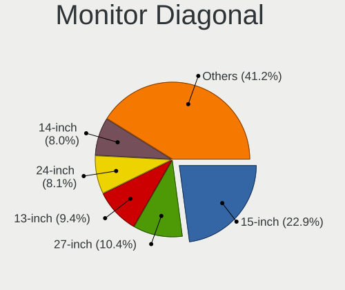

| Inches  | Computers | Percent |
|---------|-----------|---------|
| 15      | 1874      | 22.9%   |
| 27      | 853       | 10.42%  |
| 13      | 773       | 9.45%   |
| 24      | 661       | 8.08%   |
| 14      | 654       | 7.99%   |
| 23      | 468       | 5.72%   |
| 31      | 401       | 4.9%    |
| 21      | 348       | 4.25%   |
| 17      | 348       | 4.25%   |
| 16      | 251       | 3.07%   |
| 34      | 236       | 2.88%   |
| Unknown | 125       | 1.53%   |
| 19      | 109       | 1.33%   |
| 12      | 104       | 1.27%   |
| 84      | 92        | 1.12%   |
| 18      | 90        | 1.1%    |
| 22      | 77        | 0.94%   |
| 32      | 70        | 0.86%   |
| 20      | 70        | 0.86%   |
| 48      | 48        | 0.59%   |
| 40      | 45        | 0.55%   |
| 11      | 45        | 0.55%   |
| 72      | 42        | 0.51%   |
| 63      | 36        | 0.44%   |
| 54      | 36        | 0.44%   |
| 28      | 33        | 0.4%    |
| 26      | 25        | 0.31%   |
| 25      | 24        | 0.29%   |
| 65      | 19        | 0.23%   |
| 37      | 17        | 0.21%   |
| 35      | 17        | 0.21%   |
| 29      | 17        | 0.21%   |
| 49      | 16        | 0.2%    |
| 52      | 14        | 0.17%   |
| 142     | 13        | 0.16%   |
| 43      | 13        | 0.16%   |
| 42      | 12        | 0.15%   |
| 46      | 11        | 0.13%   |
| 36      | 11        | 0.13%   |
| 74      | 10        | 0.12%   |

Monitor Width
-------------

Physical width

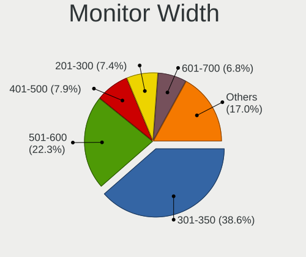

| Width in mm    | Computers | Percent |
|----------------|-----------|---------|
| 301-350        | 3077      | 38.56%  |
| 501-600        | 1776      | 22.26%  |
| 401-500        | 631       | 7.91%   |
| 201-300        | 594       | 7.44%   |
| 601-700        | 544       | 6.82%   |
| 351-400        | 411       | 5.15%   |
| 701-800        | 313       | 3.92%   |
| 1001-1500      | 208       | 2.61%   |
| 1501-2000      | 155       | 1.94%   |
| Unknown        | 125       | 1.57%   |
| 801-900        | 100       | 1.25%   |
| 901-1000       | 25        | 0.31%   |
| More than 2000 | 13        | 0.16%   |
| 101-200        | 5         | 0.06%   |
| 1-100          | 3         | 0.04%   |

Aspect Ratio
------------

Proportional relationship between the width and the height

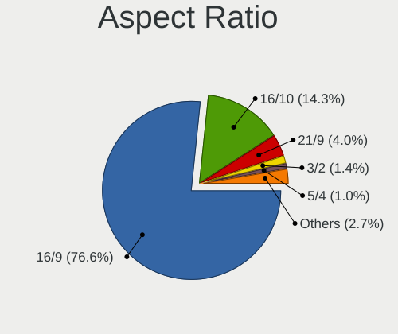

| Ratio   | Computers | Percent |
|---------|-----------|---------|
| 16/9    | 5522      | 76.62%  |
| 16/10   | 1028      | 14.26%  |
| 21/9    | 289       | 4.01%   |
| 3/2     | 102       | 1.42%   |
| 5/4     | 72        | 1%      |
| 32/9    | 59        | 0.82%   |
| Unknown | 58        | 0.8%    |
| 4/3     | 30        | 0.42%   |
| 1.00    | 14        | 0.19%   |
| 3.40    | 7         | 0.1%    |
| 3.20    | 5         | 0.07%   |
| 1.96    | 5         | 0.07%   |
| 6/5     | 3         | 0.04%   |
| 0.89    | 2         | 0.03%   |
| 0.67    | 2         | 0.03%   |
| 0.63    | 2         | 0.03%   |
| 0.62    | 2         | 0.03%   |
| 0.56    | 2         | 0.03%   |
| 6.00    | 1         | 0.01%   |
| 3.73    | 1         | 0.01%   |
| 2.00    | 1         | 0.01%   |

Monitor Area
------------

Area in inch²

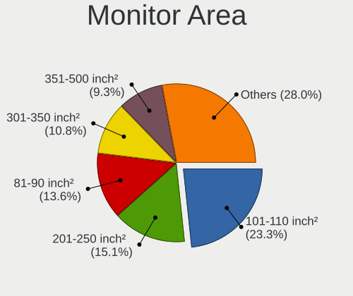

| Area in inch² | Computers | Percent |
|----------------|-----------|---------|
| 101-110        | 1884      | 23.33%  |
| 201-250        | 1216      | 15.06%  |
| 81-90          | 1095      | 13.56%  |
| 301-350        | 873       | 10.81%  |
| 351-500        | 748       | 9.26%   |
| 71-80          | 310       | 3.84%   |
| More than 1000 | 298       | 3.69%   |
| 121-130        | 291       | 3.6%    |
| 151-200        | 269       | 3.33%   |
| 111-120        | 234       | 2.9%    |
| 251-300        | 226       | 2.8%    |
| 501-1000       | 187       | 2.32%   |
| Unknown        | 125       | 1.55%   |
| 141-150        | 116       | 1.44%   |
| 61-70          | 94        | 1.16%   |
| 51-60          | 54        | 0.67%   |
| 131-140        | 26        | 0.32%   |
| 91-100         | 22        | 0.27%   |
| 1-40           | 8         | 0.1%    |

Pixel Density
-------------

Pixels per inch

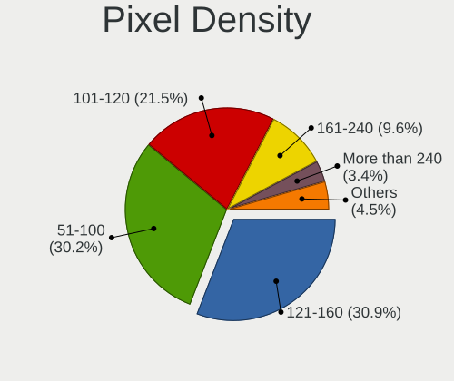

| Density       | Computers | Percent |
|---------------|-----------|---------|
| 121-160       | 2411      | 30.88%  |
| 51-100        | 2355      | 30.16%  |
| 101-120       | 1680      | 21.52%  |
| 161-240       | 750       | 9.61%   |
| More than 240 | 263       | 3.37%   |
| 1-50          | 224       | 2.87%   |
| Unknown       | 125       | 1.6%    |

Multiple Monitors
-----------------

Total monitors connected

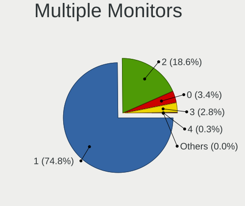

| Total | Computers | Percent |
|-------|-----------|---------|
| 1     | 5372      | 74.84%  |
| 2     | 1334      | 18.58%  |
| 0     | 247       | 3.44%   |
| 3     | 203       | 2.83%   |
| 4     | 19        | 0.26%   |
| 6     | 2         | 0.03%   |
| 5     | 1         | 0.01%   |

Network
-------

Net Controller Vendor
---------------------

Controller vendors

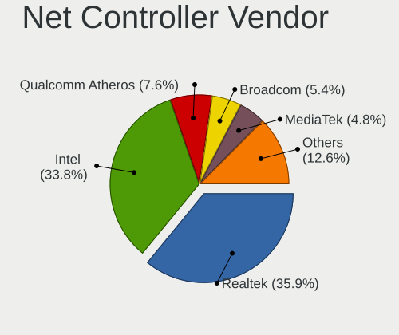

| Vendor                          | Computers | Percent |
|---------------------------------|-----------|---------|
| Realtek Semiconductor           | 3906      | 35.93%  |
| Intel                           | 3673      | 33.78%  |
| Qualcomm Atheros                | 821       | 7.55%   |
| Broadcom                        | 585       | 5.38%   |
| MediaTek                        | 519       | 4.77%   |
| Broadcom Limited                | 156       | 1.43%   |
| TP-Link                         | 116       | 1.07%   |
| ASIX Electronics                | 93        | 0.86%   |
| Marvell Technology Group        | 80        | 0.74%   |
| Samsung Electronics             | 71        | 0.65%   |
| Ralink Technology               | 64        | 0.59%   |
| Nvidia                          | 61        | 0.56%   |
| Ralink                          | 47        | 0.43%   |
| NetGear                         | 46        | 0.42%   |
| Microsoft                       | 43        | 0.4%    |
| Aquantia                        | 42        | 0.39%   |
| Shenzhen Goodix Technology      | 37        | 0.34%   |
| DisplayLink                     | 34        | 0.31%   |
| Xiaomi                          | 33        | 0.3%    |
| Qualcomm                        | 32        | 0.29%   |
| Dell                            | 29        | 0.27%   |
| Lenovo                          | 25        | 0.23%   |
| Sierra Wireless                 | 24        | 0.22%   |
| Google                          | 23        | 0.21%   |
| Qualcomm Atheros Communications | 21        | 0.19%   |
| OPPO Electronics                | 21        | 0.19%   |
| InterBiometrics                 | 20        | 0.18%   |
| D-Link                          | 20        | 0.18%   |
| ASUSTek Computer                | 19        | 0.17%   |
| Qualcomm Technologies           | 15        | 0.14%   |
| Huawei Technologies             | 15        | 0.14%   |
| Motorola PCS                    | 13        | 0.12%   |
| Linksys                         | 13        | 0.12%   |
| Hewlett-Packard                 | 11        | 0.1%    |
| JMicron Technology              | 10        | 0.09%   |
| Fibocom                         | 8         | 0.07%   |
| D-Link System                   | 8         | 0.07%   |
| Edimax Technology               | 7         | 0.06%   |
| QinHeng Electronics             | 6         | 0.06%   |
| OnePlus Technology (Shenzhen)   | 6         | 0.06%   |

Net Controller Model
--------------------

Controller models

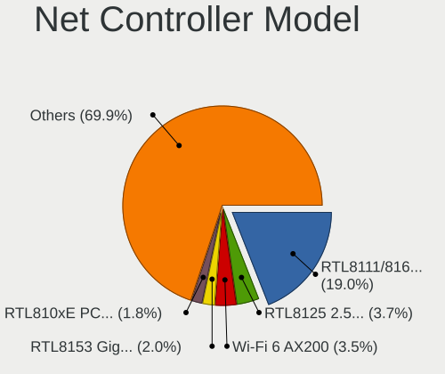

| Model                                                                  | Computers | Percent |
|------------------------------------------------------------------------|-----------|---------|
| Realtek RTL8111/8168/8211/8411 PCI Express Gigabit Ethernet Controller | 2442      | 19.02%  |
| Realtek RTL8125 2.5GbE Controller                                      | 476       | 3.71%   |
| Intel Wi-Fi 6 AX200                                                    | 448       | 3.49%   |
| Realtek RTL8153 Gigabit Ethernet Adapter                               | 262       | 2.04%   |
| Realtek RTL810xE PCI Express Fast Ethernet controller                  | 236       | 1.84%   |
| Intel I211 Gigabit Network Connection                                  | 219       | 1.71%   |
| Intel Ethernet Controller I225-V                                       | 218       | 1.7%    |
| Intel Wireless 8265 / 8275                                             | 211       | 1.64%   |
| Intel Alder Lake-P PCH CNVi WiFi                                       | 200       | 1.56%   |
| Intel Wi-Fi 6 AX201                                                    | 192       | 1.5%    |
| MediaTek MT7922 802.11ax PCI Express Wireless Network Adapter          | 189       | 1.47%   |
| MediaTek MT7921 802.11ax PCIe Wireless Network Adapter [Filogic 330]   | 180       | 1.4%    |
| Intel Wi-Fi 6E(802.11ax) AX210/AX1675* 2x2 [Typhoon Peak]              | 162       | 1.26%   |
| Intel 82579LM Gigabit Network Connection (Lewisville)                  | 162       | 1.26%   |
| Realtek RTL8822CE 802.11ac PCIe Wireless Network Adapter               | 151       | 1.18%   |
| Realtek RTL8821CE 802.11ac PCIe Wireless Network Adapter               | 147       | 1.15%   |
| Qualcomm Atheros QCA9377 802.11ac Wireless Network Adapter             | 136       | 1.06%   |
| Qualcomm Atheros QCA6174 802.11ac Wireless Network Adapter             | 124       | 0.97%   |
| Intel Wireless 8260                                                    | 121       | 0.94%   |
| Intel Wireless 7265                                                    | 121       | 0.94%   |
| Intel Wireless 7260                                                    | 116       | 0.9%    |
| Intel Comet Lake PCH CNVi WiFi                                         | 115       | 0.9%    |
| Realtek RTL8852BE PCIe 802.11ax Wireless Network Controller            | 114       | 0.89%   |
| Intel Cannon Lake PCH CNVi WiFi                                        | 112       | 0.87%   |
| Intel Ethernet Connection (2) I219-V                                   | 111       | 0.86%   |
| Intel Comet Lake PCH-LP CNVi WiFi                                      | 107       | 0.83%   |
| Qualcomm Atheros QCA9565 / AR9565 Wireless Network Adapter             | 102       | 0.79%   |
| Intel Dual Band Wireless-AC 3168NGW [Stone Peak]                       | 100       | 0.78%   |
| Qualcomm Atheros AR9485 Wireless Network Adapter                       | 95        | 0.74%   |
| Intel Ethernet Connection I217-LM                                      | 91        | 0.71%   |
| Intel 700 Series Chipset CNVi WiFi                                     | 87        | 0.68%   |
| Broadcom BCM4360 802.11ac Dual Band Wireless Network Adapter           | 86        | 0.67%   |
| Intel Raptor Lake PCH CNVi WiFi                                        | 85        | 0.66%   |
| Intel Tiger Lake PCH CNVi WiFi                                         | 81        | 0.63%   |
| Intel Cannon Point-LP CNVi [Wireless-AC]                               | 81        | 0.63%   |
| ASIX AX88179 Gigabit Ethernet                                          | 81        | 0.63%   |
| Realtek 802.11ac NIC                                                   | 78        | 0.61%   |
| Intel Wi-Fi 5(802.11ac) Wireless-AC 9x6x [Thunder Peak]                | 75        | 0.58%   |
| Broadcom Limited BCM4360 802.11ac Dual Band Wireless Network Adapter   | 75        | 0.58%   |
| MediaTek MT7921K (RZ608) Wi-Fi 6E 80MHz                                | 73        | 0.57%   |

Wireless Vendor
---------------

Wireless vendors

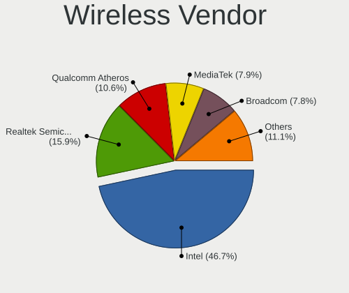

| Vendor                                | Computers | Percent |
|---------------------------------------|-----------|---------|
| Intel                                 | 2815      | 46.66%  |
| Realtek Semiconductor                 | 959       | 15.9%   |
| Qualcomm Atheros                      | 642       | 10.64%  |
| MediaTek                              | 477       | 7.91%   |
| Broadcom                              | 469       | 7.77%   |
| Broadcom Limited                      | 137       | 2.27%   |
| TP-Link                               | 104       | 1.72%   |
| Ralink Technology                     | 64        | 1.06%   |
| Ralink                                | 47        | 0.78%   |
| NetGear                               | 44        | 0.73%   |
| Microsoft                             | 41        | 0.68%   |
| Marvell Technology Group              | 32        | 0.53%   |
| Qualcomm                              | 25        | 0.41%   |
| Sierra Wireless                       | 24        | 0.4%    |
| Dell                                  | 24        | 0.4%    |
| Qualcomm Atheros Communications       | 21        | 0.35%   |
| D-Link                                | 17        | 0.28%   |
| ASUSTek Computer                      | 17        | 0.28%   |
| Linksys                               | 13        | 0.22%   |
| Fibocom                               | 8         | 0.13%   |
| Edimax Technology                     | 7         | 0.12%   |
| Qualcomm Technologies                 | 6         | 0.1%    |
| D-Link System                         | 6         | 0.1%    |
| Hewlett-Packard                       | 5         | 0.08%   |
| Belkin Components                     | 5         | 0.08%   |
| 802.11g Adapter [Linksys WUSB54GC v3] | 4         | 0.07%   |
| Realtek                               | 3         | 0.05%   |
| AVM                                   | 3         | 0.05%   |
| Accton Technology                     | 3         | 0.05%   |
| Micro Star International              | 2         | 0.03%   |
| ZyDAS                                 | 1         | 0.02%   |
| Wacom                                 | 1         | 0.02%   |
| Sitecom Europe                        | 1         | 0.02%   |
| Senao                                 | 1         | 0.02%   |
| Mercucys                              | 1         | 0.02%   |
| IMC Networks                          | 1         | 0.02%   |
| Gemtek                                | 1         | 0.02%   |
| BUFFALO                               | 1         | 0.02%   |
| Arduino SA                            | 1         | 0.02%   |

Wireless Model
--------------

Wireless models

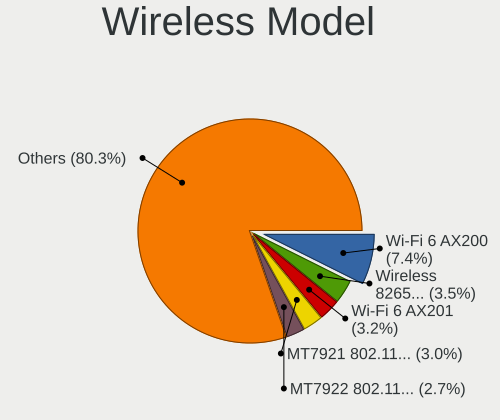

| Model                                                                | Computers | Percent |
|----------------------------------------------------------------------|-----------|---------|
| Intel Wi-Fi 6 AX200                                                  | 448       | 7.38%   |
| Intel Wireless 8265 / 8275                                           | 211       | 3.48%   |
| Intel Wi-Fi 6 AX201                                                  | 192       | 3.16%   |
| MediaTek MT7921 802.11ax PCIe Wireless Network Adapter [Filogic 330] | 180       | 2.97%   |
| MediaTek MT7922 802.11ax PCI Express Wireless Network Adapter        | 164       | 2.7%    |
| Intel Wi-Fi 6E(802.11ax) AX210/AX1675* 2x2 [Typhoon Peak]            | 162       | 2.67%   |
| Realtek RTL8822CE 802.11ac PCIe Wireless Network Adapter             | 151       | 2.49%   |
| Realtek RTL8821CE 802.11ac PCIe Wireless Network Adapter             | 147       | 2.42%   |
| Qualcomm Atheros QCA9377 802.11ac Wireless Network Adapter           | 136       | 2.24%   |
| Intel Alder Lake-P PCH CNVi WiFi                                     | 135       | 2.22%   |
| Qualcomm Atheros QCA6174 802.11ac Wireless Network Adapter           | 124       | 2.04%   |
| Intel Wireless 8260                                                  | 121       | 1.99%   |
| Intel Wireless 7265                                                  | 121       | 1.99%   |
| Intel Wireless 7260                                                  | 116       | 1.91%   |
| Intel Comet Lake PCH CNVi WiFi                                       | 115       | 1.89%   |
| Intel Cannon Lake PCH CNVi WiFi                                      | 112       | 1.85%   |
| Intel Comet Lake PCH-LP CNVi WiFi                                    | 107       | 1.76%   |
| Qualcomm Atheros QCA9565 / AR9565 Wireless Network Adapter           | 102       | 1.68%   |
| Realtek RTL8852BE PCIe 802.11ax Wireless Network Controller          | 100       | 1.65%   |
| Intel Dual Band Wireless-AC 3168NGW [Stone Peak]                     | 100       | 1.65%   |
| Qualcomm Atheros AR9485 Wireless Network Adapter                     | 95        | 1.57%   |
| Intel 700 Series Chipset CNVi WiFi                                   | 87        | 1.43%   |
| Broadcom BCM4360 802.11ac Dual Band Wireless Network Adapter         | 86        | 1.42%   |
| Intel Tiger Lake PCH CNVi WiFi                                       | 81        | 1.33%   |
| Intel Raptor Lake PCH CNVi WiFi                                      | 81        | 1.33%   |
| Intel Cannon Point-LP CNVi [Wireless-AC]                             | 81        | 1.33%   |
| Realtek 802.11ac NIC                                                 | 78        | 1.29%   |
| Intel Wi-Fi 5(802.11ac) Wireless-AC 9x6x [Thunder Peak]              | 75        | 1.24%   |
| Broadcom Limited BCM4360 802.11ac Dual Band Wireless Network Adapter | 75        | 1.24%   |
| MediaTek MT7921K (RZ608) Wi-Fi 6E 80MHz                              | 73        | 1.2%    |
| Broadcom BCM4331 802.11a/b/g/n                                       | 67        | 1.1%    |
| Qualcomm Atheros AR9285 Wireless Network Adapter (PCI-Express)       | 61        | 1.01%   |
| Realtek RTL8852AE 802.11ax PCIe Wireless Network Adapter             | 60        | 0.99%   |
| Intel Wireless 3165                                                  | 55        | 0.91%   |
| Realtek RTL8822BE 802.11a/b/g/n/ac WiFi adapter                      | 53        | 0.87%   |
| Intel Centrino Advanced-N 6205 [Taylor Peak]                         | 49        | 0.81%   |
| Broadcom BCM43142 802.11b/g/n                                        | 49        | 0.81%   |
| Intel Ice Lake-LP PCH CNVi WiFi                                      | 45        | 0.74%   |
| Broadcom BCM4322 802.11a/b/g/n Wireless LAN Controller               | 45        | 0.74%   |
| Realtek RTL88x2bu [AC1200 Techkey]                                   | 43        | 0.71%   |

Ethernet Vendor
---------------

Ethernet vendors

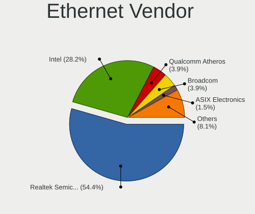

| Vendor                                 | Computers | Percent |
|----------------------------------------|-----------|---------|
| Realtek Semiconductor                  | 3485      | 54.42%  |
| Intel                                  | 1805      | 28.19%  |
| Qualcomm Atheros                       | 251       | 3.92%   |
| Broadcom                               | 249       | 3.89%   |
| ASIX Electronics                       | 93        | 1.45%   |
| Samsung Electronics                    | 71        | 1.11%   |
| Nvidia                                 | 61        | 0.95%   |
| Marvell Technology Group               | 48        | 0.75%   |
| Aquantia                               | 42        | 0.66%   |
| MediaTek                               | 35        | 0.55%   |
| DisplayLink                            | 34        | 0.53%   |
| Xiaomi                                 | 33        | 0.52%   |
| Lenovo                                 | 25        | 0.39%   |
| Google                                 | 23        | 0.36%   |
| OPPO Electronics                       | 21        | 0.33%   |
| Broadcom Limited                       | 20        | 0.31%   |
| Motorola PCS                           | 13        | 0.2%    |
| TP-Link                                | 12        | 0.19%   |
| Huawei Technologies                    | 11        | 0.17%   |
| JMicron Technology                     | 10        | 0.16%   |
| Qualcomm Technologies                  | 9         | 0.14%   |
| Qualcomm                               | 7         | 0.11%   |
| American Megatrends                    | 6         | 0.09%   |
| OnePlus Technology (Shenzhen)          | 5         | 0.08%   |
| Mellanox Technologies                  | 5         | 0.08%   |
| Hewlett-Packard                        | 4         | 0.06%   |
| Apple                                  | 4         | 0.06%   |
| T & A Mobile Phones                    | 3         | 0.05%   |
| D-Link                                 | 3         | 0.05%   |
| Suzhou Motorcomm Electronic Technology | 2         | 0.03%   |
| NetGear                                | 2         | 0.03%   |
| ICS Advent                             | 2         | 0.03%   |
| D-Link System                          | 2         | 0.03%   |
| ASUSTek Computer                       | 2         | 0.03%   |
| VIA Technologies                       | 1         | 0.02%   |
| Sony Ericsson Mobile Communications AB | 1         | 0.02%   |
| Motorola BCS                           | 1         | 0.02%   |
| Microsoft                              | 1         | 0.02%   |
| Insyde Software                        | 1         | 0.02%   |
| Belkin Components                      | 1         | 0.02%   |

Ethernet Model
--------------

Ethernet models

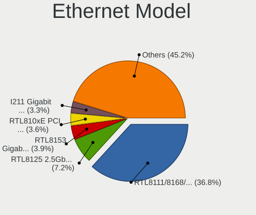

| Model                                                                  | Computers | Percent |
|------------------------------------------------------------------------|-----------|---------|
| Realtek RTL8111/8168/8211/8411 PCI Express Gigabit Ethernet Controller | 2442      | 36.79%  |
| Realtek RTL8125 2.5GbE Controller                                      | 476       | 7.17%   |
| Realtek RTL8153 Gigabit Ethernet Adapter                               | 262       | 3.95%   |
| Realtek RTL810xE PCI Express Fast Ethernet controller                  | 236       | 3.56%   |
| Intel I211 Gigabit Network Connection                                  | 219       | 3.3%    |
| Intel Ethernet Controller I225-V                                       | 218       | 3.28%   |
| Intel 82579LM Gigabit Network Connection (Lewisville)                  | 162       | 2.44%   |
| Intel Ethernet Connection (2) I219-V                                   | 111       | 1.67%   |
| Intel Ethernet Connection I217-LM                                      | 91        | 1.37%   |
| ASIX AX88179 Gigabit Ethernet                                          | 81        | 1.22%   |
| Broadcom NetXtreme BCM57765 Gigabit Ethernet PCIe                      | 72        | 1.08%   |
| Intel Ethernet Connection (4) I219-LM                                  | 65        | 0.98%   |
| Intel Alder Lake-P PCH CNVi WiFi                                       | 65        | 0.98%   |
| Intel Ethernet Connection (7) I219-V                                   | 59        | 0.89%   |
| Realtek Killer E2600 GbE Controller                                    | 57        | 0.86%   |
| Broadcom NetXtreme BCM57766 Gigabit Ethernet PCIe                      | 55        | 0.83%   |
| Intel Ethernet Connection (2) I219-LM                                  | 54        | 0.81%   |
| Intel Ethernet Connection I219-LM                                      | 51        | 0.77%   |
| Intel Ethernet Controller I226-V                                       | 48        | 0.72%   |
| Samsung Galaxy series, misc. (tethering mode)                          | 47        | 0.71%   |
| Qualcomm Atheros Killer E2400 Gigabit Ethernet Controller              | 44        | 0.66%   |
| Qualcomm Atheros Killer E220x Gigabit Ethernet Controller              | 44        | 0.66%   |
| Realtek Killer E3000 2.5GbE Controller                                 | 37        | 0.56%   |
| Nvidia MCP79 Ethernet                                                  | 37        | 0.56%   |
| Qualcomm Atheros Killer E2500 Gigabit Ethernet Controller              | 36        | 0.54%   |
| Intel Ethernet Connection (7) I219-LM                                  | 36        | 0.54%   |
| Intel 82579V Gigabit Network Connection                                | 35        | 0.53%   |
| Qualcomm Atheros AR8151 v2.0 Gigabit Ethernet                          | 33        | 0.5%    |
| Intel I210 Gigabit Network Connection                                  | 33        | 0.5%    |
| Intel Ethernet Connection I217-V                                       | 33        | 0.5%    |
| Intel Ethernet Connection (2) I218-V                                   | 33        | 0.5%    |
| Intel Ethernet Connection (4) I219-V                                   | 32        | 0.48%   |
| Intel Ethernet Connection I218-LM                                      | 31        | 0.47%   |
| Intel Ethernet Connection (3) I218-LM                                  | 30        | 0.45%   |
| MediaTek MT7922 802.11ax PCI Express Wireless Network Adapter          | 25        | 0.38%   |
| Intel Ethernet Connection (6) I219-V                                   | 25        | 0.38%   |
| Xiaomi Mi/Redmi series (RNDIS)                                         | 24        | 0.36%   |
| Samsung GT-I9070 (network tethering, USB debugging enabled)            | 24        | 0.36%   |
| Intel Alder Lake-S PCH CNVi WiFi                                       | 24        | 0.36%   |
| Intel 82574L Gigabit Network Connection                                | 24        | 0.36%   |

Net Controller Kind
-------------------

Ethernet, WiFi or modem

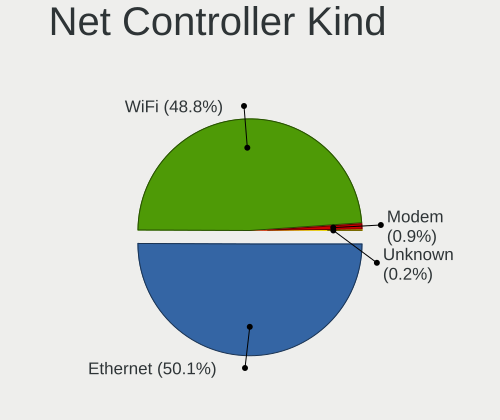

| Kind     | Computers | Percent |
|----------|-----------|---------|
| Ethernet | 5862      | 50.08%  |
| WiFi     | 5715      | 48.82%  |
| Modem    | 105       | 0.9%    |
| Unknown  | 24        | 0.21%   |

Used Controller
---------------

Currently used network controller

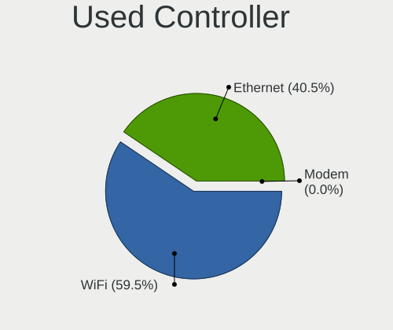

| Kind     | Computers | Percent |
|----------|-----------|---------|
| WiFi     | 4421      | 59.46%  |
| Ethernet | 3013      | 40.52%  |
| Modem    | 1         | 0.01%   |

NICs
----

Total network controllers on board

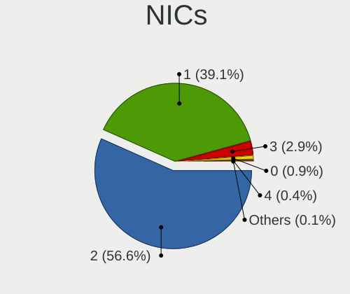

| Total | Computers | Percent |
|-------|-----------|---------|
| 2     | 3993      | 56.64%  |
| 1     | 2756      | 39.09%  |
| 3     | 207       | 2.94%   |
| 0     | 60        | 0.85%   |
| 4     | 27        | 0.38%   |
| 5     | 5         | 0.07%   |
| 6     | 2         | 0.03%   |

IPv6
----

IPv6 vs IPv4

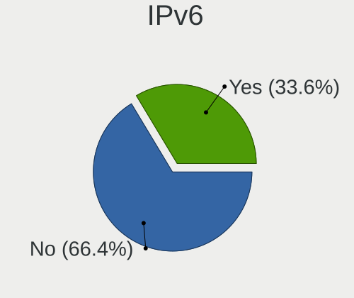

| Used | Computers | Percent |
|------|-----------|---------|
| No   | 4756      | 66.37%  |
| Yes  | 2410      | 33.63%  |

Bluetooth
---------

Bluetooth Vendor
----------------

Controller vendors

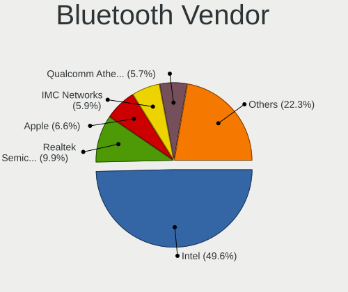

| Vendor                          | Computers | Percent |
|---------------------------------|-----------|---------|
| Intel                           | 2618      | 49.64%  |
| Realtek Semiconductor           | 522       | 9.9%    |
| Apple                           | 348       | 6.6%    |
| IMC Networks                    | 310       | 5.88%   |
| Qualcomm Atheros Communications | 301       | 5.71%   |
| Foxconn / Hon Hai               | 249       | 4.72%   |
| Cambridge Silicon Radio         | 194       | 3.68%   |
| MediaTek                        | 141       | 2.67%   |
| Lite-On Technology              | 122       | 2.31%   |
| Broadcom                        | 119       | 2.26%   |
| ASUSTek Computer                | 69        | 1.31%   |
| Dell                            | 45        | 0.85%   |
| TP-Link                         | 44        | 0.83%   |
| Marvell Semiconductor           | 33        | 0.63%   |
| Realtek                         | 32        | 0.61%   |
| Toshiba                         | 20        | 0.38%   |
| Hewlett-Packard                 | 20        | 0.38%   |
| Ralink                          | 14        | 0.27%   |
| USI                             | 10        | 0.19%   |
| Dynex                           | 10        | 0.19%   |
| Actions                         | 10        | 0.19%   |
| Unknown                         | 6         | 0.11%   |
| Foxconn International           | 5         | 0.09%   |
| Opticis                         | 4         | 0.08%   |
| Edimax Technology               | 4         | 0.08%   |
| Ralink Technology               | 3         | 0.06%   |
| Micro Star International        | 3         | 0.06%   |
| Integrated System Solution      | 3         | 0.06%   |
| Taiyo Yuden                     | 2         | 0.04%   |
| Smart Modular Technologies      | 2         | 0.04%   |
| SINO WEALTH                     | 2         | 0.04%   |
| Logitech                        | 2         | 0.04%   |
| Fujitsu                         | 2         | 0.04%   |
| Alps Electric                   | 2         | 0.04%   |
| Qcom                            | 1         | 0.02%   |
| HTC (High Tech Computer)        | 1         | 0.02%   |
| Belkin Components               | 1         | 0.02%   |

Bluetooth Model
---------------

Controller models

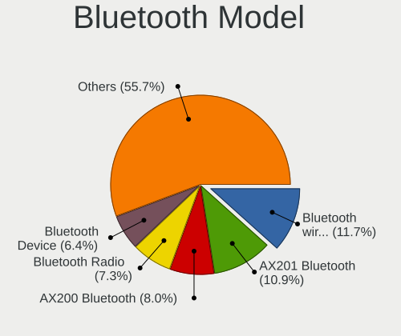

| Model                                               | Computers | Percent |
|-----------------------------------------------------|-----------|---------|
| Intel Bluetooth wireless interface                  | 616       | 11.67%  |
| Intel AX201 Bluetooth                               | 574       | 10.87%  |
| Intel AX200 Bluetooth                               | 422       | 7.99%   |
| Realtek Bluetooth Radio                             | 388       | 7.35%   |
| Intel Bluetooth Device                              | 337       | 6.38%   |
| Intel Bluetooth 9460/9560 Jefferson Peak (JfP)      | 296       | 5.61%   |
| Cambridge Silicon Radio Bluetooth Dongle (HCI mode) | 194       | 3.67%   |
| Apple Bluetooth Host Controller                     | 176       | 3.33%   |
| IMC Networks Wireless_Device                        | 164       | 3.11%   |
| Qualcomm Atheros  Bluetooth Device                  | 159       | 3.01%   |
| Intel AX210 Bluetooth                               | 149       | 2.82%   |
| MediaTek Wireless_Device                            | 141       | 2.67%   |
| Apple Bluetooth USB Host Controller                 | 115       | 2.18%   |
| Foxconn / Hon Hai Wireless_Device                   | 106       | 2.01%   |
| Intel Wireless-AC 3168 Bluetooth                    | 95        | 1.8%    |
| Realtek  Bluetooth 4.2 Adapter                      | 86        | 1.63%   |
| IMC Networks Bluetooth Radio                        | 82        | 1.55%   |
| Intel Wireless-AC 9260 Bluetooth Adapter            | 66        | 1.25%   |
| Foxconn / Hon Hai Bluetooth Device                  | 61        | 1.16%   |
| TP-Link TP-T@- UB500 Adapter                        | 44        | 0.83%   |
| Intel Centrino Bluetooth Wireless Transceiver       | 41        | 0.78%   |
| Qualcomm Atheros QCA61x4 Bluetooth 4.0              | 40        | 0.76%   |
| Apple Built-in Bluetooth 2.0+EDR HCI                | 39        | 0.74%   |
| Foxconn / Hon Hai MediaTek Bluetooth Adapter        | 33        | 0.63%   |
| Realtek Bluetooth Radio                             | 32        | 0.61%   |
| Qualcomm Atheros AR3012 Bluetooth 4.0               | 32        | 0.61%   |
| IMC Networks Bluetooth Device                       | 32        | 0.61%   |
| Lite-On Wireless_Device                             | 31        | 0.59%   |
| Qualcomm Atheros AR3011 Bluetooth                   | 30        | 0.57%   |
| ASUS ASUS USB-BT500                                 | 26        | 0.49%   |
| Marvell Bluetooth and Wireless LAN Composite        | 25        | 0.47%   |
| Lite-On Bluetooth Device                            | 25        | 0.47%   |
| Intel Centrino Advanced-N 6230 Bluetooth adapter    | 23        | 0.44%   |
| Broadcom BCM20702A0 Bluetooth 4.0                   | 23        | 0.44%   |
| Qualcomm Atheros AR9462 Bluetooth                   | 21        | 0.4%    |
| Lite-On Qualcomm Atheros QCA9377 Bluetooth          | 19        | 0.36%   |
| Broadcom BCM2045B (BDC-2.1)                         | 18        | 0.34%   |
| Apple Bluetooth HCI                                 | 18        | 0.34%   |
| Realtek RTL8822BE Bluetooth 4.2 Adapter             | 17        | 0.32%   |
| Dell BCM20702A0 Bluetooth Module                    | 16        | 0.3%    |

Sound
-----

Sound Vendor
------------

Sound card vendors

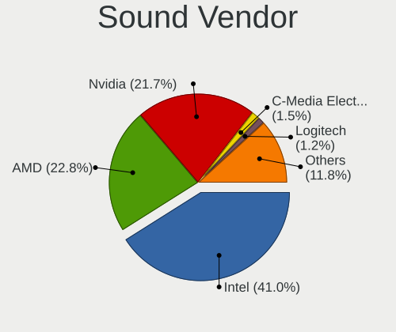

| Vendor                                       | Computers | Percent |
|----------------------------------------------|-----------|---------|
| Intel                                        | 4655      | 41.03%  |
| AMD                                          | 2581      | 22.75%  |
| Nvidia                                       | 2466      | 21.74%  |
| C-Media Electronics                          | 170       | 1.5%    |
| Logitech                                     | 136       | 1.2%    |
| ASUSTek Computer                             | 76        | 0.67%   |
| Kingston Technology                          | 75        | 0.66%   |
| Razer USA                                    | 66        | 0.58%   |
| SteelSeries ApS                              | 61        | 0.54%   |
| Micro Star International                     | 56        | 0.49%   |
| JMTek                                        | 56        | 0.49%   |
| Focusrite-Novation                           | 55        | 0.48%   |
| Creative Labs                                | 53        | 0.47%   |
| Generalplus Technology                       | 44        | 0.39%   |
| Texas Instruments                            | 40        | 0.35%   |
| Hewlett-Packard                              | 38        | 0.33%   |
| Lenovo                                       | 37        | 0.33%   |
| Corsair                                      | 36        | 0.32%   |
| GN Netcom                                    | 34        | 0.3%    |
| Creative Technology                          | 34        | 0.3%    |
| Sony                                         | 32        | 0.28%   |
| Realtek Semiconductor                        | 32        | 0.28%   |
| Blue Microphones                             | 28        | 0.25%   |
| Apple                                        | 23        | 0.2%    |
| Plantronics                                  | 20        | 0.18%   |
| DSEA A/S                                     | 19        | 0.17%   |
| KTMicro                                      | 15        | 0.13%   |
| Giga-Byte Technology                         | 13        | 0.11%   |
| FiiO Electronics Technology                  | 13        | 0.11%   |
| BEHRINGER International                      | 13        | 0.11%   |
| Valve Software                               | 12        | 0.11%   |
| Thesycon Systemsoftware & Consulting         | 12        | 0.11%   |
| RODE Microphones                             | 12        | 0.11%   |
| Jieli Technology                             | 12        | 0.11%   |
| Astro Gaming                                 | 11        | 0.1%    |
| Tenx Technology                              | 9         | 0.08%   |
| Nordic Semiconductor ASA                     | 9         | 0.08%   |
| Medeli Electronics                           | 9         | 0.08%   |
| Zoran Co. Personal Media Division (Nogatech) | 8         | 0.07%   |
| Trust                                        | 8         | 0.07%   |

Sound Model
-----------

Sound card models

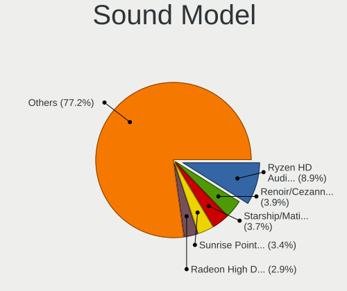

| Model                                                                      | Computers | Percent |
|----------------------------------------------------------------------------|-----------|---------|
| AMD Ryzen HD Audio Controller                                              | 1221      | 8.93%   |
| AMD Renoir/Cezanne HDMI/DP Audio Controller                                | 528       | 3.86%   |
| AMD Starship/Matisse HD Audio Controller                                   | 501       | 3.66%   |
| Intel Sunrise Point-LP HD Audio                                            | 471       | 3.44%   |
| AMD Radeon High Definition Audio Controller                                | 402       | 2.94%   |
| Intel 7 Series/C216 Chipset Family High Definition Audio Controller        | 353       | 2.58%   |
| Intel 8 Series/C220 Series Chipset High Definition Audio Controller        | 331       | 2.42%   |
| Intel 6 Series/C200 Series Chipset Family High Definition Audio Controller | 313       | 2.29%   |
| Intel Cannon Lake PCH cAVS                                                 | 281       | 2.05%   |
| Intel Alder Lake PCH-P High Definition Audio Controller                    | 249       | 1.82%   |
| Intel Tiger Lake-LP Smart Sound Technology Audio Controller                | 241       | 1.76%   |
| Nvidia GA104 High Definition Audio Controller                              | 217       | 1.59%   |
| AMD Navi 21/23 HDMI/DP Audio Controller                                    | 217       | 1.59%   |
| Intel 100 Series/C230 Series Chipset Family HD Audio Controller            | 205       | 1.5%    |
| Intel Xeon E3-1200 v3/4th Gen Core Processor HD Audio Controller           | 194       | 1.42%   |
| AMD Raven/Raven2/Fenghuang HDMI/DP Audio Controller                        | 191       | 1.4%    |
| Nvidia GA106 High Definition Audio Controller                              | 174       | 1.27%   |
| Intel Broadwell-U Audio Controller                                         | 172       | 1.26%   |
| Intel Wildcat Point-LP High Definition Audio Controller                    | 162       | 1.18%   |
| Intel Comet Lake PCH cAVS                                                  | 162       | 1.18%   |
| Intel Haswell-ULT HD Audio Controller                                      | 159       | 1.16%   |
| Intel 8 Series HD Audio Controller                                         | 158       | 1.15%   |
| AMD Ellesmere HDMI Audio [Radeon RX 470/480 / 570/580/590]                 | 157       | 1.15%   |
| Intel 200 Series PCH HD Audio                                              | 151       | 1.1%    |
| AMD Family 17h (Models 00h-0fh) HD Audio Controller                        | 150       | 1.1%    |
| Nvidia TU106 High Definition Audio Controller                              | 145       | 1.06%   |
| Nvidia TU116 High Definition Audio Controller                              | 141       | 1.03%   |
| Nvidia TU107 GeForce GTX 1650 High Definition Audio Controller             | 138       | 1.01%   |
| Intel Comet Lake PCH-LP cAVS                                               | 134       | 0.98%   |
| Nvidia GP104 High Definition Audio Controller                              | 133       | 0.97%   |
| Nvidia GP107GL High Definition Audio Controller                            | 132       | 0.96%   |
| Intel Tiger Lake-H HD Audio Controller                                     | 129       | 0.94%   |
| Intel Raptor Lake High Definition Audio Controller                         | 128       | 0.94%   |
| Intel Cannon Point-LP High Definition Audio Controller                     | 124       | 0.91%   |
| Nvidia GP106 High Definition Audio Controller                              | 119       | 0.87%   |
| Nvidia AD107 High Definition Audio Controller                              | 119       | 0.87%   |
| Nvidia GA107 High Definition Audio Controller                              | 117       | 0.86%   |
| AMD SBx00 Azalia (Intel HDA)                                               | 115       | 0.84%   |
| Intel Raptor Lake-P/U/H cAVS                                               | 106       | 0.77%   |
| AMD FCH Azalia Controller                                                  | 106       | 0.77%   |

Memory
------

Memory Vendor
-------------

Memory module vendors

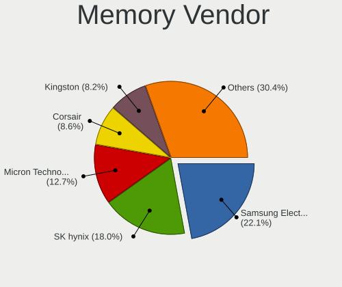

| Vendor                       | Computers | Percent |
|------------------------------|-----------|---------|
| Samsung Electronics          | 511       | 22.1%   |
| SK hynix                     | 417       | 18.04%  |
| Micron Technology            | 293       | 12.67%  |
| Corsair                      | 198       | 8.56%   |
| Kingston                     | 189       | 8.17%   |
| Crucial                      | 163       | 7.05%   |
| G.Skill                      | 120       | 5.19%   |
| Unknown                      | 57        | 2.47%   |
| Unknown                      | 53        | 2.29%   |
| A-DATA Technology            | 48        | 2.08%   |
| Team                         | 47        | 2.03%   |
| Ramaxel Technology           | 25        | 1.08%   |
| Elpida                       | 21        | 0.91%   |
| Neo Forza                    | 17        | 0.74%   |
| Smart                        | 16        | 0.69%   |
| Unknown (ABCD)               | 13        | 0.56%   |
| Goldkey                      | 13        | 0.56%   |
| Patriot                      | 10        | 0.43%   |
| Nanya Technology             | 7         | 0.3%    |
| PNY                          | 6         | 0.26%   |
| Timetec                      | 5         | 0.22%   |
| Smart Brazil                 | 4         | 0.17%   |
| GSkill                       | 4         | 0.17%   |
| Avant                        | 4         | 0.17%   |
| Apacer                       | 4         | 0.17%   |
| Wodposit                     | 3         | 0.13%   |
| Transcend                    | 3         | 0.13%   |
| Teikon                       | 3         | 0.13%   |
| Patriot Memory (PDP Systems) | 3         | 0.13%   |
| Patriot Memory               | 3         | 0.13%   |
| ASint Technology             | 3         | 0.13%   |
| Silicon Power                | 2         | 0.09%   |
| Lexar                        | 2         | 0.09%   |
| Juhor                        | 2         | 0.09%   |
| GOODRAM                      | 2         | 0.09%   |
| Gold Key                     | 2         | 0.09%   |
| ChangXin Memory              | 2         | 0.09%   |
| Wilk                         | 1         | 0.04%   |
| Unknown (8A02)               | 1         | 0.04%   |
| Unknown (0x0E9D)             | 1         | 0.04%   |

Memory Model
------------

Memory module models

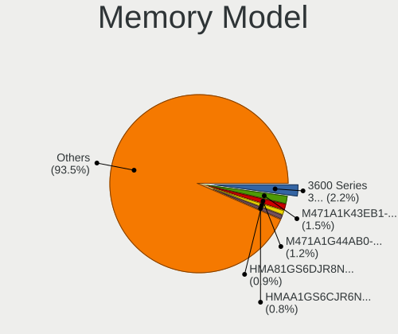

| Model                                                        | Computers | Percent |
|--------------------------------------------------------------|-----------|---------|
| Unknown                                                      | 53        | 2.17%   |
| Samsung RAM M471A1K43EB1-CWE 8GB SODIMM DDR4 3200MT/s        | 36        | 1.48%   |
| Samsung RAM M471A1G44AB0-CWE 8GiB SODIMM DDR4 3200MT/s       | 29        | 1.19%   |
| SK hynix RAM HMA81GS6DJR8N-XN 8GB SODIMM DDR4 3200MT/s       | 21        | 0.86%   |
| SK hynix RAM HMAA1GS6CJR6N-XN 8GB SODIMM DDR4 3200MT/s       | 20        | 0.82%   |
| SK hynix RAM HMA81GS6AFR8N-UH 8GB SODIMM DDR4 2667MT/s       | 19        | 0.78%   |
| Samsung RAM M471A1G44BB0-CWE 8GB SODIMM DDR4 3200MT/s        | 18        | 0.74%   |
| Micron RAM 8ATF1G64HZ-3G2R1 8GB SODIMM DDR4 3200MT/s         | 17        | 0.7%    |
| Samsung RAM M471A5244CB0-CWE 4GB SODIMM DDR4 3200MT/s        | 16        | 0.66%   |
| Samsung RAM M471A1K43CB1-CTD 8GB SODIMM DDR4 3200MT/s        | 16        | 0.66%   |
| Samsung RAM M471A1K43CB1-CRC 8GB SODIMM DDR4 8400MT/s        | 16        | 0.66%   |
| Corsair RAM CMK32GX4M2E3200C16 16GB DIMM DDR4 3600MT/s       | 16        | 0.66%   |
| Samsung RAM M471A5244CB0-CTD 4GB SODIMM DDR4 3266MT/s        | 15        | 0.62%   |
| Corsair RAM CMK16GX4M2B3000C15 8GB DIMM DDR4 3600MT/s        | 15        | 0.62%   |
| Samsung RAM M425R1GB4BB0-CQKOL 8GB SODIMM DDR5 4800MT/s      | 14        | 0.57%   |
| Samsung RAM M471A5244CB0-CWE 4GB Row Of Chips DDR4 3200MT/s  | 13        | 0.53%   |
| Samsung RAM M471A2G43AB2-CWE 16GB SODIMM DDR4 3200MT/s       | 13        | 0.53%   |
| Samsung RAM M471A1G44AB0-CWE 8GB Row Of Chips DDR4 3200MT/s  | 13        | 0.53%   |
| Samsung RAM M471A1K43DB1-CWE 8GB SODIMM DDR4 3200MT/s        | 12        | 0.49%   |
| Corsair RAM CMK16GX4M2B3200C16 8GB DIMM DDR4 3600MT/s        | 12        | 0.49%   |
| SK hynix RAM HMAA1GS6CJR6N-XN 8GB Row Of Chips DDR4 3200MT/s | 11        | 0.45%   |
| Samsung RAM M471B5173DB0-YK0 4GB SODIMM DDR3 1600MT/s        | 11        | 0.45%   |
| Samsung RAM M471B1G73QH0-YK0 8GB SODIMM DDR3 1600MT/s        | 11        | 0.45%   |
| Samsung RAM M471A2K43CB1-CTD 16GB SODIMM DDR4 8400MT/s       | 11        | 0.45%   |
| Team RAM TEAMGROUP-UD4-3200 8GB DIMM DDR4 3800MT/s           | 10        | 0.41%   |
| Team RAM TEAMGROUP-SD4-3200 16GB SODIMM DDR4 3200MT/s        | 10        | 0.41%   |
| SK hynix RAM HMA82GS6AFR8N-UH 16GB SODIMM DDR4 2667MT/s      | 10        | 0.41%   |
| Micron RAM 4ATF1G64HZ-3G2E1 8GB SODIMM DDR4 3200MT/s         | 10        | 0.41%   |
| SK hynix RAM Module 4GB SODIMM DDR3 1600MT/s                 | 9         | 0.37%   |
| SK hynix RAM HMT41GS6BFR8A-PB 8GB SODIMM DDR3 2667MT/s       | 9         | 0.37%   |
| SK hynix RAM HMA81GS6CJR8N-VK 8GB SODIMM DDR4 2667MT/s       | 9         | 0.37%   |
| Micron RAM 8ATF1G64HZ-3G2J1 8GB SODIMM DDR4 3200MT/s         | 9         | 0.37%   |
| Micron RAM 4ATF51264HZ-2G6E1 4GB SODIMM DDR4 2667MT/s        | 9         | 0.37%   |
| Micron RAM 4ATF1G64HZ-3G2F1 8GB SODIMM DDR4 3200MT/s         | 9         | 0.37%   |
| SK hynix RAM HMT451S6BFR8A-PB 4GB SODIMM DDR3 1600MT/s       | 8         | 0.33%   |
| SK hynix RAM HMT351S6CFR8C-PB 4GB SODIMM DDR3 1600MT/s       | 8         | 0.33%   |
| SK hynix RAM HMCG78AGBSA095N 16GB SODIMM DDR5 5600MT/s       | 8         | 0.33%   |
| Samsung RAM Module 16GB SODIMM DDR4 3200MT/s                 | 8         | 0.33%   |
| Samsung RAM M471B1G73EB0-YK0 8192MB SODIMM DDR3 1600MT/s     | 8         | 0.33%   |
| Samsung RAM M471A2K43DB1-CTD 16GB SODIMM DDR4 2667MT/s       | 8         | 0.33%   |

Memory Kind
-----------

Memory module kinds

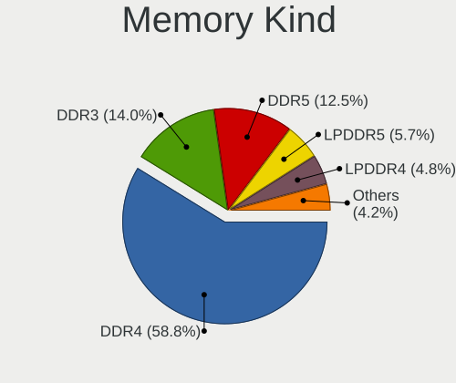

| Kind    | Computers | Percent |
|---------|-----------|---------|
| DDR4    | 1197      | 58.79%  |
| DDR3    | 285       | 14%     |
| DDR5    | 255       | 12.52%  |
| LPDDR5  | 116       | 5.7%    |
| LPDDR4  | 97        | 4.76%   |
| LPDDR3  | 55        | 2.7%    |
| DDR2    | 15        | 0.74%   |
| SDRAM   | 11        | 0.54%   |
| Unknown | 4         | 0.2%    |
| DRAM    | 1         | 0.05%   |

Memory Form Factor
------------------

Physical design of the memory module

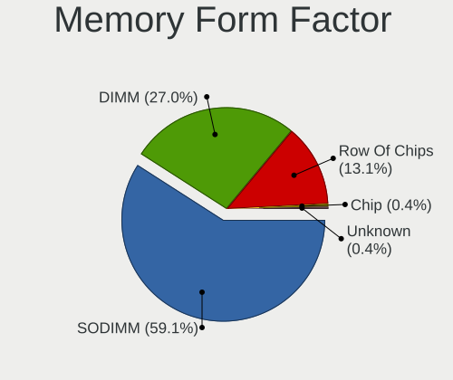

| Name         | Computers | Percent |
|--------------|-----------|---------|
| SODIMM       | 1216      | 59.09%  |
| DIMM         | 555       | 26.97%  |
| Row Of Chips | 270       | 13.12%  |
| Chip         | 9         | 0.44%   |
| Unknown      | 8         | 0.39%   |

Memory Size
-----------

Memory module size

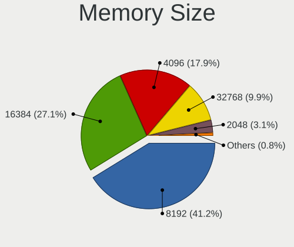

| Size  | Computers | Percent |
|-------|-----------|---------|
| 8192  | 898       | 41.23%  |
| 16384 | 590       | 27.09%  |
| 4096  | 390       | 17.91%  |
| 32768 | 215       | 9.87%   |
| 2048  | 68        | 3.12%   |
| 1024  | 8         | 0.37%   |
| 49152 | 3         | 0.14%   |
| 65536 | 2         | 0.09%   |
| 24576 | 2         | 0.09%   |
| 6144  | 1         | 0.05%   |
| 3072  | 1         | 0.05%   |

Memory Speed
------------

Memory module speed

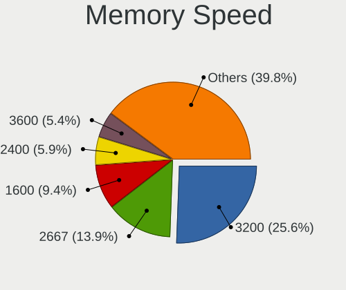

| Speed | Computers | Percent |
|-------|-----------|---------|
| 3200  | 560       | 25.57%  |
| 2667  | 305       | 13.93%  |
| 1600  | 205       | 9.36%   |
| 2400  | 129       | 5.89%   |
| 3600  | 119       | 5.43%   |
| 4800  | 106       | 4.84%   |
| 6400  | 92        | 4.2%    |
| 2133  | 83        | 3.79%   |
| 5600  | 74        | 3.38%   |
| 4267  | 51        | 2.33%   |
| 6000  | 39        | 1.78%   |
| 3800  | 38        | 1.74%   |
| 1333  | 34        | 1.55%   |
| 3733  | 28        | 1.28%   |
| 8400  | 27        | 1.23%   |
| 1867  | 27        | 1.23%   |
| 7500  | 21        | 0.96%   |
| 3266  | 19        | 0.87%   |
| 3000  | 19        | 0.87%   |
| 1067  | 14        | 0.64%   |
| 4266  | 13        | 0.59%   |
| 1334  | 12        | 0.55%   |
| 800   | 12        | 0.55%   |
| 4000  | 10        | 0.46%   |
| 3400  | 10        | 0.46%   |
| 2666  | 10        | 0.46%   |
| 5200  | 9         | 0.41%   |
| 3866  | 9         | 0.41%   |
| 2933  | 9         | 0.41%   |
| 1866  | 9         | 0.41%   |
| 8533  | 7         | 0.32%   |
| 12800 | 6         | 0.27%   |
| 6200  | 6         | 0.27%   |
| 2800  | 6         | 0.27%   |
| 8600  | 5         | 0.23%   |
| 3466  | 5         | 0.23%   |
| 2048  | 5         | 0.23%   |
| 1800  | 5         | 0.23%   |
| 4400  | 4         | 0.18%   |
| 667   | 4         | 0.18%   |

Printers & scanners
-------------------

Printer Vendor
--------------

Printer device vendors

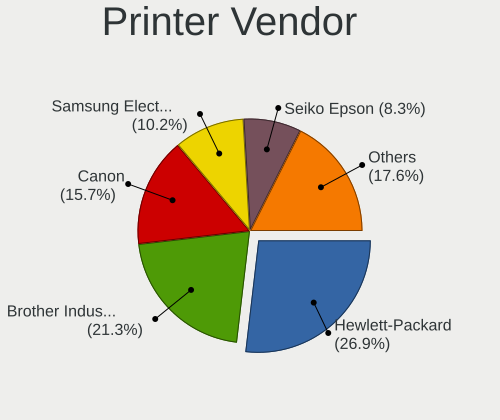

| Vendor              | Computers | Percent |
|---------------------|-----------|---------|
| Hewlett-Packard     | 29        | 26.85%  |
| Brother Industries  | 23        | 21.3%   |
| Canon               | 17        | 15.74%  |
| Samsung Electronics | 11        | 10.19%  |
| Seiko Epson         | 9         | 8.33%   |
| Dymo-CoStar         | 6         | 5.56%   |
| STMicroelectronics  | 2         | 1.85%   |
| Dell                | 2         | 1.85%   |
| Xerox               | 1         | 0.93%   |
| Sharp               | 1         | 0.93%   |
| Ricoh               | 1         | 0.93%   |
| QinHeng Electronics | 1         | 0.93%   |
| Prolific Technology | 1         | 0.93%   |
| PM                  | 1         | 0.93%   |
| Pantum              | 1         | 0.93%   |
| Kyocera             | 1         | 0.93%   |
| ICS Advent          | 1         | 0.93%   |

Printer Model
-------------

Printer device models

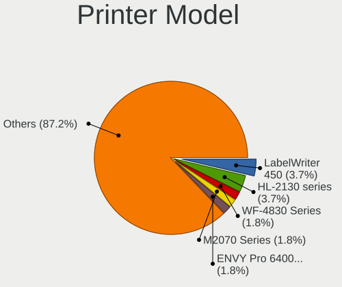

| Model                                                     | Computers | Percent |
|-----------------------------------------------------------|-----------|---------|
| Dymo-CoStar LabelWriter 450                               | 4         | 3.67%   |
| Brother HL-2130 series                                    | 4         | 3.67%   |
| Seiko Epson WF-4830 Series                                | 2         | 1.83%   |
| Samsung M2070 Series                                      | 2         | 1.83%   |
| HP ENVY Pro 6400 series                                   | 2         | 1.83%   |
| Dymo-CoStar DYMO LabelWriter 450 Turbo                    | 2         | 1.83%   |
| Canon TR4700 series                                       | 2         | 1.83%   |
| Canon PIXMA MX920 Series                                  | 2         | 1.83%   |
| Canon PIXMA MG2500 Series                                 | 2         | 1.83%   |
| Brother Printer                                           | 2         | 1.83%   |
| Xerox B215                                                | 1         | 0.92%   |
| STMicroelectronics YICHIP3121 Virtual ComPort in FS Mode  | 1         | 0.92%   |
| STMicroelectronics LED badge -- mini LED display -- 11x44 | 1         | 0.92%   |
| Sharp MX-C301W                                            | 1         | 0.92%   |
| Seiko Epson XP-3100 Series                                | 1         | 0.92%   |
| Seiko Epson XP-240 Series                                 | 1         | 0.92%   |
| Seiko Epson ME 320/330 Series [Stylus SX125]              | 1         | 0.92%   |
| Seiko Epson L380 Series                                   | 1         | 0.92%   |
| Seiko Epson L1110 Series                                  | 1         | 0.92%   |
| Seiko Epson ET-3710 Series                                | 1         | 0.92%   |
| Seiko Epson ET-2800 Series                                | 1         | 0.92%   |
| Samsung SCX-4600 Series                                   | 1         | 0.92%   |
| Samsung SCX-4500 Laser Printer                            | 1         | 0.92%   |
| Samsung SCX-3400 Series                                   | 1         | 0.92%   |
| Samsung ML-216x Series Laser Printer                      | 1         | 0.92%   |
| Samsung ML-191x/ML-252x Laser Printer                     | 1         | 0.92%   |
| Samsung M283x Series                                      | 1         | 0.92%   |
| Samsung M2020 Series                                      | 1         | 0.92%   |
| Samsung CLX-3300 Series                                   | 1         | 0.92%   |
| Samsung C460 Series                                       | 1         | 0.92%   |
| Ricoh RICOH SP 211SU                                      | 1         | 0.92%   |
| QinHeng CH340S                                            | 1         | 0.92%   |
| Prolific PL2305 Parallel Port                             | 1         | 0.92%   |
| PM PM241-BT                                               | 1         | 0.92%   |
| Pantum P2500W-series                                      | 1         | 0.92%   |
| Kyocera UTAX_TA LP 3035_LP 4035                           | 1         | 0.92%   |
| ICS Advent Parallel Adapter                               | 1         | 0.92%   |
| HP PSC-1315/PSC-1317                                      | 1         | 0.92%   |
| HP OfficeJet Pro 9010 series                              | 1         | 0.92%   |
| HP Officejet 4500 G510a-f                                 | 1         | 0.92%   |

Scanner Vendor
--------------

Scanner device vendors

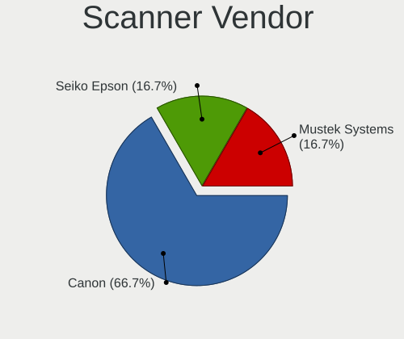

| Vendor          | Computers | Percent |
|-----------------|-----------|---------|
| Seiko Epson     | 5         | 41.67%  |
| Canon           | 4         | 33.33%  |
| Hewlett-Packard | 2         | 16.67%  |
| Mustek Systems  | 1         | 8.33%   |

Scanner Model
-------------

Scanner device models

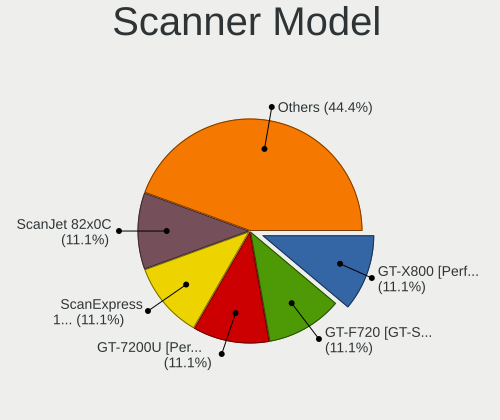

| Model                                                   | Computers | Percent |
|---------------------------------------------------------|-----------|---------|
| Seiko Epson Perfection V37/V370                         | 1         | 8.33%   |
| Seiko Epson GT-X800 [Perfection 4990 PHOTO]             | 1         | 8.33%   |
| Seiko Epson GT-X770 [Perfection V500]                   | 1         | 8.33%   |
| Seiko Epson GT-F720 [GT-S620/Perfection V30/V300 Photo] | 1         | 8.33%   |
| Seiko Epson GT-7200U [Perfection 1250/1250 PHOTO]       | 1         | 8.33%   |
| Mustek Systems ScanExpress 1200 UB                      | 1         | 8.33%   |
| HP Scanjet G2710                                        | 1         | 8.33%   |
| HP ScanJet 82x0C                                        | 1         | 8.33%   |
| Canon CanoScan N650U/N656U                              | 1         | 8.33%   |
| Canon CanoScan LiDE 60                                  | 1         | 8.33%   |
| Canon CanoScan LiDE 200                                 | 1         | 8.33%   |
| Canon CanoScan 9000F Mark II                            | 1         | 8.33%   |

Camera
------

Camera Vendor
-------------

Camera device vendors

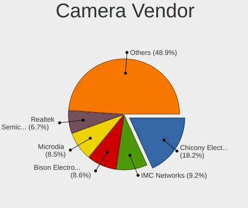

| Vendor                                 | Computers | Percent |
|----------------------------------------|-----------|---------|
| Chicony Electronics                    | 803       | 18.16%  |
| IMC Networks                           | 405       | 9.16%   |
| Bison Electronics                      | 382       | 8.64%   |
| Microdia                               | 375       | 8.48%   |
| Realtek Semiconductor                  | 296       | 6.69%   |
| Logitech                               | 280       | 6.33%   |
| Quanta                                 | 260       | 5.88%   |
| Apple                                  | 256       | 5.79%   |
| Sunplus Innovation Technology          | 218       | 4.93%   |
| Luxvisions Innotech Limited            | 144       | 3.26%   |
| Syntek                                 | 110       | 2.49%   |
| Cheng Uei Precision Industry (Foxlink) | 101       | 2.28%   |
| Lite-On Technology                     | 88        | 1.99%   |
| Sonix Technology                       | 71        | 1.61%   |
| Suyin                                  | 68        | 1.54%   |
| Microsoft                              | 51        | 1.15%   |
| Samsung Electronics                    | 38        | 0.86%   |
| Silicon Motion                         | 33        | 0.75%   |
| SunplusIT                              | 31        | 0.7%    |
| Shinetech                              | 25        | 0.57%   |
| Alcor Micro                            | 24        | 0.54%   |
| Razer USA                              | 21        | 0.47%   |
| Generalplus Technology                 | 18        | 0.41%   |
| Acer                                   | 18        | 0.41%   |
| Ricoh                                  | 13        | 0.29%   |
| Z-Star Microelectronics                | 12        | 0.27%   |
| Creative Technology                    | 11        | 0.25%   |
| Valve Software                         | 10        | 0.23%   |
| MacroSilicon                           | 10        | 0.23%   |
| Jieli Technology                       | 10        | 0.23%   |
| eMeet                                  | 9         | 0.2%    |
| Anker PowerConf C200                   | 9         | 0.2%    |
| Trust                                  | 8         | 0.18%   |
| Primax Electronics                     | 8         | 0.18%   |
| OmniVision Technologies                | 8         | 0.18%   |
| ARC International                      | 8         | 0.18%   |
| Lenovo                                 | 7         | 0.16%   |
| kingcome                               | 7         | 0.16%   |
| AVerMedia Technologies                 | 7         | 0.16%   |
| webcam                                 | 6         | 0.14%   |

Camera Model
------------

Camera device models

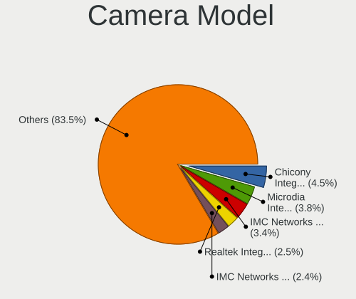

| Model                                               | Computers | Percent |
|-----------------------------------------------------|-----------|---------|
| Chicony Integrated Camera                           | 200       | 4.47%   |
| Microdia Integrated_Webcam_HD                       | 170       | 3.8%    |
| IMC Networks USB2.0 HD UVC WebCam                   | 150       | 3.35%   |
| Realtek Integrated_Webcam_HD                        | 110       | 2.46%   |
| IMC Networks Integrated Camera                      | 109       | 2.44%   |
| Bison Integrated Camera                             | 93        | 2.08%   |
| Bison BisonCam,NB Pro                               | 87        | 1.95%   |
| Syntek Integrated Camera                            | 85        | 1.9%    |
| Apple FaceTime HD Camera (Built-in)                 | 69        | 1.54%   |
| Chicony HD Webcam                                   | 68        | 1.52%   |
| Apple iPhone 5/5C/5S/6/SE/7/8/X                     | 65        | 1.45%   |
| Apple Built-in iSight                               | 60        | 1.34%   |
| Apple FaceTime HD Camera                            | 56        | 1.25%   |
| Logitech Webcam C270                                | 53        | 1.19%   |
| Quanta HD User Facing                               | 50        | 1.12%   |
| Logitech HD Pro Webcam C920                         | 50        | 1.12%   |
| Bison HD Webcam                                     | 50        | 1.12%   |
| Sonix USB2.0 HD UVC WebCam                          | 46        | 1.03%   |
| Sunplus Integrated_Webcam_HD                        | 45        | 1.01%   |
| Chicony Chicony USB2.0 Camera                       | 41        | 0.92%   |
| Chicony HP HD Camera                                | 40        | 0.89%   |
| Samsung Galaxy series, misc. (MTP mode)             | 38        | 0.85%   |
| Luxvisions Innotech Limited Integrated Camera       | 37        | 0.83%   |
| Lite-On Integrated Camera                           | 36        | 0.81%   |
| Chicony HD User Facing                              | 35        | 0.78%   |
| IMC Networks USB2.0 VGA UVC WebCam                  | 31        | 0.69%   |
| Bison SunplusIT Integrated Camera                   | 31        | 0.69%   |
| Microdia Webcam Vitade AF                           | 29        | 0.65%   |
| Luxvisions Innotech Limited HP TrueVision HD Camera | 29        | 0.65%   |
| Logitech C922 Pro Stream Webcam                     | 29        | 0.65%   |
| Chicony USB2.0 Camera                               | 29        | 0.65%   |
| Quanta HP HD Camera                                 | 28        | 0.63%   |
| Chicony HP Wide Vision HD Camera                    | 28        | 0.63%   |
| Chicony HP Truevision HD camera                     | 28        | 0.63%   |
| Quanta ACER HD User Facing                          | 27        | 0.6%    |
| Microdia USB 2.0 Camera                             | 27        | 0.6%    |
| Quanta HP TrueVision HD Camera                      | 26        | 0.58%   |
| Quanta HP Wide Vision HD Camera                     | 25        | 0.56%   |
| Quanta HD Webcam                                    | 25        | 0.56%   |
| Realtek USB Camera                                  | 24        | 0.54%   |

Security
--------

Fingerprint Vendor
------------------

Fingerprint sensor vendors

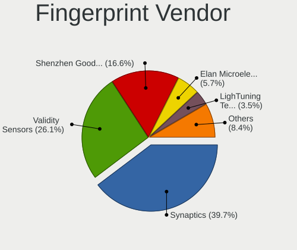

| Vendor                             | Computers | Percent |
|------------------------------------|-----------|---------|
| Synaptics                          | 294       | 39.73%  |
| Validity Sensors                   | 193       | 26.08%  |
| Shenzhen Goodix Technology         | 123       | 16.62%  |
| Elan Microelectronics              | 42        | 5.68%   |
| LighTuning Technology              | 26        | 3.51%   |
| Upek                               | 23        | 3.11%   |
| AuthenTec                          | 15        | 2.03%   |
| Realtek USB2.0 Finger Print Bridge | 9         | 1.22%   |
| Focal-systems.Corp                 | 6         | 0.81%   |
| HOLTEK                             | 4         | 0.54%   |
| Samsung Electronics                | 2         | 0.27%   |
| DigitalPersona                     | 2         | 0.27%   |
| STMicroelectronics                 | 1         | 0.14%   |

Fingerprint Model
-----------------

Fingerprint sensor models

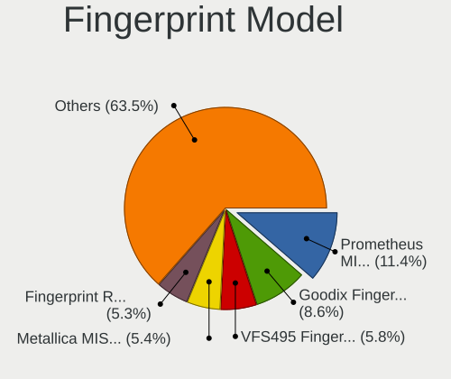

| Model                                                                      | Computers | Percent |
|----------------------------------------------------------------------------|-----------|---------|
| Synaptics Prometheus MIS Touch Fingerprint Reader                          | 84        | 11.35%  |
| Shenzhen Goodix  FingerPrint Device                                        | 64        | 8.65%   |
| Validity Sensors VFS495 Fingerprint Reader                                 | 43        | 5.81%   |
| Synaptics Metallica MIS Touch Fingerprint Reader                           | 40        | 5.41%   |
| Shenzhen Goodix Fingerprint Reader                                         | 39        | 5.27%   |
| Validity Sensors VFS 5011 fingerprint sensor                               | 24        | 3.24%   |
| Synaptics FS7604 Touch Fingerprint Sensor with PurePrint                   | 24        | 3.24%   |
| Elan ELAN:ARM-M4                                                           | 23        | 3.11%   |
| Shenzhen Goodix FingerPrint                                                | 20        | 2.7%    |
| Upek Biometric Touchchip/Touchstrip Fingerprint Sensor                     | 19        | 2.57%   |
| Elan ELAN:Fingerprint                                                      | 18        | 2.43%   |
| Validity Sensors VFS7500 Touch Fingerprint Sensor                          | 17        | 2.3%    |
| Validity Sensors VFS5011 Fingerprint Reader                                | 16        | 2.16%   |
| Validity Sensors Synaptics VFS7552 Touch Fingerprint Sensor with PurePrint | 16        | 2.16%   |
| Synaptics UWP WBDI                                                         | 16        | 2.16%   |
| Synaptics  WBDI                                                            | 16        | 2.16%   |
| Validity Sensors Synaptics WBDI                                            | 15        | 2.03%   |
| LighTuning ES603 Swipe Fingerprint Sensor                                  | 14        | 1.89%   |
| Synaptics WBDI Fingerprint Reader USB 086                                  | 13        | 1.76%   |
| Validity Sensors Fingerprint scanner                                       | 12        | 1.62%   |
| Synaptics UWP WBDI Device                                                  | 12        | 1.62%   |
| Synaptics Prometheus Fingerprint Reader                                    | 12        | 1.62%   |
| Synaptics Fingerprint reader [HP G6]                                       | 12        | 1.62%   |
| Synaptics WBDI Device                                                      | 11        | 1.49%   |
| Synaptics WBDI                                                             | 11        | 1.49%   |
| Synaptics TouchPad                                                         | 11        | 1.49%   |
| Synaptics Metallica MOH Touch Fingerprint Reader                           | 11        | 1.49%   |
| Validity Sensors VFS491                                                    | 10        | 1.35%   |
| Validity Sensors VFS471 Fingerprint Reader                                 | 10        | 1.35%   |
| Validity Sensors Swipe Fingerprint Sensor                                  | 9         | 1.22%   |
| Synaptics  FS7604 Touch Fingerprint Sensor with PurePrint                  | 9         | 1.22%   |
| Realtek USB2.0 Finger Print Bridge FocalTech Fingerprint Device            | 9         | 1.22%   |
| LighTuning EgisTec Touch Fingerprint Sensor                                | 9         | 1.22%   |
| Validity Sensors VFS451 Fingerprint Reader                                 | 8         | 1.08%   |
| Unknown                                                                    | 8         | 1.08%   |
| Focal-systems.Corp FT9201Fingerprint.                                      | 6         | 0.81%   |
| AuthenTec Fingerprint Sensor                                               | 5         | 0.68%   |
| Validity Sensors VFS Fingerprint sensor                                    | 4         | 0.54%   |
| Upek TCS5B Fingerprint sensor                                              | 4         | 0.54%   |
| HOLTEK FocalTech Fingerprint Device                                        | 4         | 0.54%   |

Chipcard Vendor
---------------

Chipcard module vendors

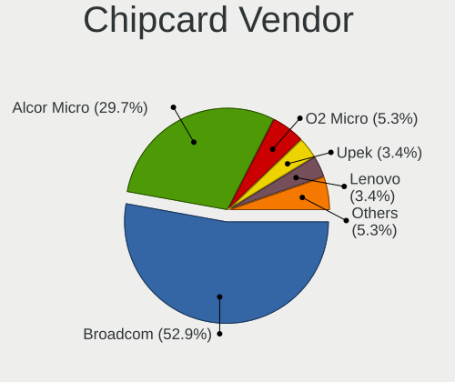

| Vendor                | Computers | Percent |
|-----------------------|-----------|---------|
| Broadcom              | 139       | 52.85%  |
| Alcor Micro           | 78        | 29.66%  |
| O2 Micro              | 14        | 5.32%   |
| Upek                  | 9         | 3.42%   |
| Lenovo                | 9         | 3.42%   |
| SCM Microsystems      | 5         | 1.9%    |
| Yubico.com            | 2         | 0.76%   |
| OmniKey               | 2         | 0.76%   |
| Realtek Semiconductor | 1         | 0.38%   |
| Jing-Mold Enterprise  | 1         | 0.38%   |
| Gemalto (was Gemplus) | 1         | 0.38%   |
| Clay Logic            | 1         | 0.38%   |
| Advanced Card Systems | 1         | 0.38%   |

Chipcard Model
--------------

Chipcard module models

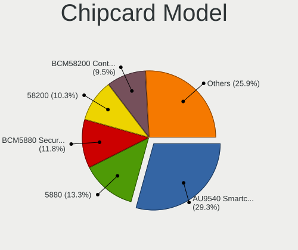

| Model                                                                        | Computers | Percent |
|------------------------------------------------------------------------------|-----------|---------|
| Alcor Micro AU9540 Smartcard Reader                                          | 77        | 29.28%  |
| Broadcom 5880                                                                | 35        | 13.31%  |
| Broadcom BCM5880 Secure Applications Processor                               | 31        | 11.79%  |
| Broadcom 58200                                                               | 27        | 10.27%  |
| Broadcom BCM58200 ControlVault 3 (FingerPrint sensor + Contacted SmartCard)  | 25        | 9.51%   |
| Broadcom BCM5880 Secure Applications Processor with fingerprint swipe sensor | 20        | 7.6%    |
| O2 Micro OZ776 CCID Smartcard Reader                                         | 13        | 4.94%   |
| Upek TouchChip Fingerprint Coprocessor (WBF advanced mode)                   | 9         | 3.42%   |
| Lenovo Integrated Smart Card Reader                                          | 9         | 3.42%   |
| SCM Microsystems SCR331-LC1 / SCR3310 SmartCard Reader                       | 3         | 1.14%   |
| Yubico.com Yubikey 4/5 U2F+CCID                                              | 2         | 0.76%   |
| SCM Microsystems SCR35xx Smart Card Reader                                   | 1         | 0.38%   |
| SCM Microsystems SCR3500 C Contact Reader                                    | 1         | 0.38%   |
| Realtek Semiconductor Smart Card Reader Interface                            | 1         | 0.38%   |
| OmniKey CardMan 4321                                                         | 1         | 0.38%   |
| OmniKey 3x21 Smart Card Reader                                               | 1         | 0.38%   |
| O2 Micro Oz776 SmartCard Reader                                              | 1         | 0.38%   |
| Jing-Mold Enterprise HP USB Business Slim Smartcard CCID Keyboard            | 1         | 0.38%   |
| Gemalto (was Gemplus) GemPC Twin SmartCard Reader                            | 1         | 0.38%   |
| Clay Logic Nitrokey Pro                                                      | 1         | 0.38%   |
| Broadcom BCM5880 Secure Applications Processor with fingerprint touch sensor | 1         | 0.38%   |
| Alcor Micro Watchdata W 1981                                                 | 1         | 0.38%   |
| Advanced Card Systems ACR1252 Dual Reader                                    | 1         | 0.38%   |

Unsupported
-----------

Unsupported Devices
-------------------

Total unsupported devices on board

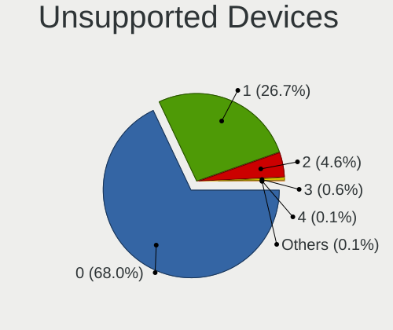

| Total | Computers | Percent |
|-------|-----------|---------|
| 0     | 4878      | 67.96%  |
| 1     | 1913      | 26.65%  |
| 2     | 332       | 4.63%   |
| 3     | 41        | 0.57%   |
| 4     | 7         | 0.1%    |
| 5     | 6         | 0.08%   |
| 6     | 1         | 0.01%   |

Unsupported Device Types
------------------------

Types of unsupported devices

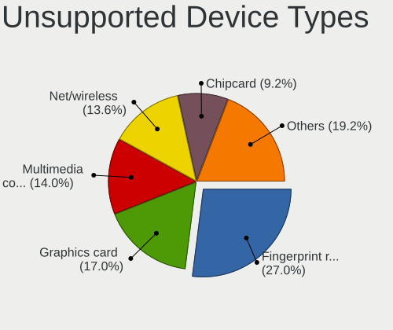

| Type                     | Computers | Percent |
|--------------------------|-----------|---------|
| Fingerprint reader       | 721       | 26.99%  |
| Graphics card            | 454       | 17%     |
| Multimedia controller    | 374       | 14%     |
| Net/wireless             | 363       | 13.59%  |
| Chipcard                 | 247       | 9.25%   |
| Camera                   | 121       | 4.53%   |
| Bluetooth                | 101       | 3.78%   |
| Unassigned class         | 57        | 2.13%   |
| Sound                    | 47        | 1.76%   |
| Communication controller | 41        | 1.54%   |
| Network                  | 35        | 1.31%   |
| Net/ethernet             | 33        | 1.24%   |
| Storage                  | 20        | 0.75%   |
| Storage/raid             | 17        | 0.64%   |
| Card reader              | 16        | 0.6%    |
| Modem                    | 10        | 0.37%   |
| Storage/nvme             | 5         | 0.19%   |
| Storage/ide              | 4         | 0.15%   |
| Dvb card                 | 2         | 0.07%   |
| Wireless                 | 1         | 0.04%   |
| Tv card                  | 1         | 0.04%   |
| Firewire controller      | 1         | 0.04%   |

