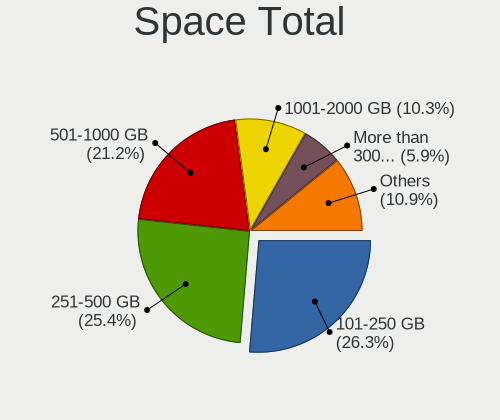
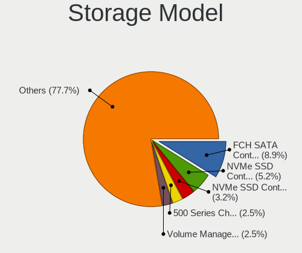
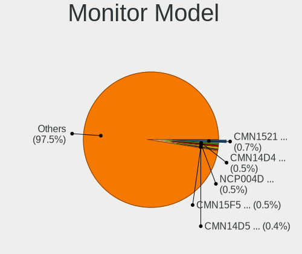
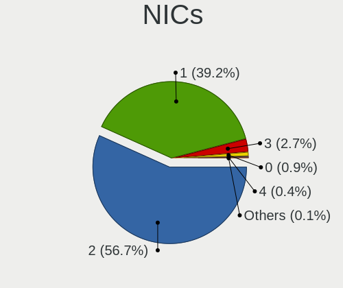
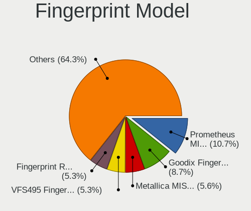

Pop!_OS 22.04 - Tested Hardware & Statistics
--------------------------------------------

A project to collect tested hardware configurations for Pop!_OS 22.04.

Anyone can contribute to this report by the [hw-probe](https://github.com/linuxhw/hw-probe) tool:

    sudo -E hw-probe -all -upload

Please contribute! Especially if your hardware is rare.

This is a report for all computer types. See also reports for [desktops](/Dist/Pop!_OS_22.04/Desktop/README.md) and [notebooks](/Dist/Pop!_OS_22.04/Notebook/README.md).

Contents
--------

* [ Test Cases ](#test-cases)

* [ System ](#system)
  - [ Kernel                   ](#kernel)
  - [ Kernel Family            ](#kernel-family)
  - [ Kernel Major Ver.        ](#kernel-major-ver)
  - [ Arch                     ](#arch)
  - [ DE                       ](#de)
  - [ Display Server           ](#display-server)
  - [ Display Manager          ](#display-manager)
  - [ OS Lang                  ](#os-lang)
  - [ Boot Mode                ](#boot-mode)
  - [ Filesystem               ](#filesystem)
  - [ Part. scheme             ](#part-scheme)
  - [ Dual Boot with Linux/BSD ](#dual-boot-with-linuxbsd)
  - [ Dual Boot (Win)          ](#dual-boot-win)

* [ Board ](#board)
  - [ Vendor                   ](#vendor)
  - [ Model                    ](#model)
  - [ Model Family             ](#model-family)
  - [ MFG Year                 ](#mfg-year)
  - [ Form Factor              ](#form-factor)
  - [ Secure Boot              ](#secure-boot)
  - [ Coreboot                 ](#coreboot)
  - [ RAM Size                 ](#ram-size)
  - [ RAM Used                 ](#ram-used)
  - [ Total Drives             ](#total-drives)
  - [ Has CD-ROM               ](#has-cd-rom)
  - [ Has Ethernet             ](#has-ethernet)
  - [ Has WiFi                 ](#has-wifi)
  - [ Has Bluetooth            ](#has-bluetooth)

* [ Location ](#location)
  - [ Country                  ](#country)
  - [ City                     ](#city)

* [ Drives ](#drives)
  - [ Drive Vendor             ](#drive-vendor)
  - [ Drive Model              ](#drive-model)
  - [ HDD Vendor               ](#hdd-vendor)
  - [ SSD Vendor               ](#ssd-vendor)
  - [ Drive Kind               ](#drive-kind)
  - [ Drive Connector          ](#drive-connector)
  - [ Drive Size               ](#drive-size)
  - [ Space Total              ](#space-total)
  - [ Space Used               ](#space-used)
  - [ Malfunc. Drives          ](#malfunc-drives)
  - [ Malfunc. Drive Vendor    ](#malfunc-drive-vendor)
  - [ Malfunc. HDD Vendor      ](#malfunc-hdd-vendor)
  - [ Malfunc. Drive Kind      ](#malfunc-drive-kind)
  - [ Failed Drives            ](#failed-drives)
  - [ Failed Drive Vendor      ](#failed-drive-vendor)
  - [ Drive Status             ](#drive-status)

* [ Storage controller ](#storage-controller)
  - [ Storage Vendor           ](#storage-vendor)
  - [ Storage Model            ](#storage-model)
  - [ Storage Kind             ](#storage-kind)

* [ Processor ](#processor)
  - [ CPU Vendor               ](#cpu-vendor)
  - [ CPU Model                ](#cpu-model)
  - [ CPU Model Family         ](#cpu-model-family)
  - [ CPU Cores                ](#cpu-cores)
  - [ CPU Sockets              ](#cpu-sockets)
  - [ CPU Threads              ](#cpu-threads)
  - [ CPU Op-Modes             ](#cpu-op-modes)
  - [ CPU Microcode            ](#cpu-microcode)
  - [ CPU Microarch            ](#cpu-microarch)

* [ Graphics ](#graphics)
  - [ GPU Vendor               ](#gpu-vendor)
  - [ GPU Model                ](#gpu-model)
  - [ GPU Combo                ](#gpu-combo)
  - [ GPU Driver               ](#gpu-driver)
  - [ GPU Memory               ](#gpu-memory)

* [ Monitor ](#monitor)
  - [ Monitor Vendor           ](#monitor-vendor)
  - [ Monitor Model            ](#monitor-model)
  - [ Monitor Resolution       ](#monitor-resolution)
  - [ Monitor Diagonal         ](#monitor-diagonal)
  - [ Monitor Width            ](#monitor-width)
  - [ Aspect Ratio             ](#aspect-ratio)
  - [ Monitor Area             ](#monitor-area)
  - [ Pixel Density            ](#pixel-density)
  - [ Multiple Monitors        ](#multiple-monitors)

* [ Network ](#network)
  - [ Net Controller Vendor    ](#net-controller-vendor)
  - [ Net Controller Model     ](#net-controller-model)
  - [ Wireless Vendor          ](#wireless-vendor)
  - [ Wireless Model           ](#wireless-model)
  - [ Ethernet Vendor          ](#ethernet-vendor)
  - [ Ethernet Model           ](#ethernet-model)
  - [ Net Controller Kind      ](#net-controller-kind)
  - [ Used Controller          ](#used-controller)
  - [ NICs                     ](#nics)
  - [ IPv6                     ](#ipv6)

* [ Bluetooth ](#bluetooth)
  - [ Bluetooth Vendor         ](#bluetooth-vendor)
  - [ Bluetooth Model          ](#bluetooth-model)

* [ Sound ](#sound)
  - [ Sound Vendor             ](#sound-vendor)
  - [ Sound Model              ](#sound-model)

* [ Memory ](#memory)
  - [ Memory Vendor            ](#memory-vendor)
  - [ Memory Model             ](#memory-model)
  - [ Memory Kind              ](#memory-kind)
  - [ Memory Form Factor       ](#memory-form-factor)
  - [ Memory Size              ](#memory-size)
  - [ Memory Speed             ](#memory-speed)

* [ Printers & scanners ](#printers--scanners)
  - [ Printer Vendor           ](#printer-vendor)
  - [ Printer Model            ](#printer-model)
  - [ Scanner Vendor           ](#scanner-vendor)
  - [ Scanner Model            ](#scanner-model)

* [ Camera ](#camera)
  - [ Camera Vendor            ](#camera-vendor)
  - [ Camera Model             ](#camera-model)

* [ Security ](#security)
  - [ Fingerprint Vendor       ](#fingerprint-vendor)
  - [ Fingerprint Model        ](#fingerprint-model)
  - [ Chipcard Vendor          ](#chipcard-vendor)
  - [ Chipcard Model           ](#chipcard-model)

* [ Unsupported ](#unsupported)
  - [ Unsupported Devices      ](#unsupported-devices)
  - [ Unsupported Device Types ](#unsupported-device-types)

Test Cases
----------

Total: 5142

| Vendor        | Model                       | Form-Factor | Probe                                                      | Date         |
|---------------|-----------------------------|-------------|------------------------------------------------------------|--------------|
| HP            | 89E9 0100                   | All in one  | [5e98ad51b6](https://linux-hardware.org/?probe=5e98ad51b6) | Nov 06, 2023 |
| ASRock        | Z97 Killer                  | Desktop     | [f575f3121e](https://linux-hardware.org/?probe=f575f3121e) | Nov 06, 2023 |
| Lenovo        | Y720-15IKB 80VR             | Notebook    | [7cc876dcfa](https://linux-hardware.org/?probe=7cc876dcfa) | Nov 06, 2023 |
| Lenovo        | IdeaPad 320-15ABR 80XS      | Notebook    | [290be8911e](https://linux-hardware.org/?probe=290be8911e) | Nov 06, 2023 |
| Acer          | Aspire 5750G                | Notebook    | [a782c6c087](https://linux-hardware.org/?probe=a782c6c087) | Nov 05, 2023 |
| Lenovo        | IdeaPad 330-17ICH 81FL      | Notebook    | [e25bb48957](https://linux-hardware.org/?probe=e25bb48957) | Nov 05, 2023 |
| ASRock        | Z68 Pro3                    | Desktop     | [e6c695d4a7](https://linux-hardware.org/?probe=e6c695d4a7) | Nov 05, 2023 |
| MSI           | Cyborg 15 A12VF             | Notebook    | [be39067306](https://linux-hardware.org/?probe=be39067306) | Nov 05, 2023 |
| ASUSTek       | G53SX                       | Notebook    | [7834b537a1](https://linux-hardware.org/?probe=7834b537a1) | Nov 05, 2023 |
| Lenovo        | ThinkPad T470s W10DG 20J... | Notebook    | [f1d00fbb93](https://linux-hardware.org/?probe=f1d00fbb93) | Nov 05, 2023 |
| Lenovo        | IdeaPad Gaming 3 15IAH7 ... | Notebook    | [1db5fee13c](https://linux-hardware.org/?probe=1db5fee13c) | Nov 05, 2023 |
| Lenovo        | ThinkPad T470s W10DG 20J... | Notebook    | [50306c96e2](https://linux-hardware.org/?probe=50306c96e2) | Nov 05, 2023 |
| Google        | Taeko                       | Notebook    | [d148b001d9](https://linux-hardware.org/?probe=d148b001d9) | Nov 05, 2023 |
| HP            | Pavilion Laptop 15-cw0xx... | Notebook    | [279f1b8b4f](https://linux-hardware.org/?probe=279f1b8b4f) | Nov 05, 2023 |
| ASUSTek       | ROG STRIX B650E-F GAMING... | Desktop     | [6f11758faa](https://linux-hardware.org/?probe=6f11758faa) | Nov 04, 2023 |
| Gigabyte      | H410M S2H V2                | Desktop     | [8bbce8a378](https://linux-hardware.org/?probe=8bbce8a378) | Nov 04, 2023 |
| System76      | Lemur Pro                   | Notebook    | [dacc229f22](https://linux-hardware.org/?probe=dacc229f22) | Nov 04, 2023 |
| Lenovo        | IdeaPad 5 15ITL05 82FG      | Notebook    | [cfdf343144](https://linux-hardware.org/?probe=cfdf343144) | Nov 04, 2023 |
| Lenovo        | IdeaPad 5 15ITL05 82FG      | Notebook    | [237bd5cfb2](https://linux-hardware.org/?probe=237bd5cfb2) | Nov 04, 2023 |
| System76      | Lemur Pro                   | Notebook    | [80b1ef75d6](https://linux-hardware.org/?probe=80b1ef75d6) | Nov 04, 2023 |
| System76      | Oryx Pro                    | Notebook    | [ea89273272](https://linux-hardware.org/?probe=ea89273272) | Nov 04, 2023 |
| HP            | 655                         | Notebook    | [8cf9aa61c7](https://linux-hardware.org/?probe=8cf9aa61c7) | Nov 04, 2023 |
| Apple         | MacBookAir6,2               | Notebook    | [f8507f333d](https://linux-hardware.org/?probe=f8507f333d) | Nov 04, 2023 |
| MSI           | Bravo 15 C7VE               | Notebook    | [5db0e7314a](https://linux-hardware.org/?probe=5db0e7314a) | Nov 04, 2023 |
| ASUSTek       | VivoBook_ASUSLaptop X415... | Notebook    | [972ef88623](https://linux-hardware.org/?probe=972ef88623) | Nov 04, 2023 |
| ASUSTek       | VivoBook_ASUSLaptop X415... | Notebook    | [927b50091e](https://linux-hardware.org/?probe=927b50091e) | Nov 04, 2023 |
| ASUSTek       | PRIME X670E-PRO WIFI        | Desktop     | [f27bded4c1](https://linux-hardware.org/?probe=f27bded4c1) | Nov 04, 2023 |
| ASRock        | B450 Steel Legend           | Desktop     | [26aff1917e](https://linux-hardware.org/?probe=26aff1917e) | Nov 04, 2023 |
| System76      | Oryx Pro                    | Notebook    | [1704acc89b](https://linux-hardware.org/?probe=1704acc89b) | Nov 03, 2023 |
| Intel         | X79 V1.0                    | Desktop     | [9483a097a1](https://linux-hardware.org/?probe=9483a097a1) | Nov 03, 2023 |
| ASUSTek       | TUF Gaming B650-PLUS WIF... | Desktop     | [d35fc5aa78](https://linux-hardware.org/?probe=d35fc5aa78) | Nov 03, 2023 |
| Lenovo        | ThinkPad T420s 417032U      | Notebook    | [76247c39f4](https://linux-hardware.org/?probe=76247c39f4) | Nov 03, 2023 |
| Lenovo        | IdeaPad C340-14API 81N6     | Notebook    | [3a8d337535](https://linux-hardware.org/?probe=3a8d337535) | Nov 03, 2023 |
| HP            | ProBook 6450b               | Notebook    | [75ad2cf5f8](https://linux-hardware.org/?probe=75ad2cf5f8) | Nov 02, 2023 |
| ASUSTek       | TUF Gaming B650-PLUS WIF... | Desktop     | [9a5c45e54b](https://linux-hardware.org/?probe=9a5c45e54b) | Nov 02, 2023 |
| MSI           | Prestige 14Evo A11M         | Notebook    | [12414485a5](https://linux-hardware.org/?probe=12414485a5) | Nov 02, 2023 |
| Apple         | MacBookPro14,1              | Notebook    | [7d93bb6f25](https://linux-hardware.org/?probe=7d93bb6f25) | Nov 02, 2023 |
| ASUSTek       | ROG CROSSHAIR VII HERO      | Desktop     | [fc0052213d](https://linux-hardware.org/?probe=fc0052213d) | Nov 02, 2023 |
| ASUSTek       | Z170-A                      | Desktop     | [7812f09d39](https://linux-hardware.org/?probe=7812f09d39) | Nov 02, 2023 |
| ASUSTek       | Z170-A                      | Desktop     | [b45e25ec01](https://linux-hardware.org/?probe=b45e25ec01) | Nov 02, 2023 |
| HP            | 2AF7                        | Desktop     | [65ac8348d7](https://linux-hardware.org/?probe=65ac8348d7) | Nov 02, 2023 |
| HP            | ENVY x360 2-in-1 Laptop ... | Convertible | [04f3946d05](https://linux-hardware.org/?probe=04f3946d05) | Nov 02, 2023 |
| Supermicro    | X9DRE-TF+/X9DR7-TF+         | Server      | [1274766930](https://linux-hardware.org/?probe=1274766930) | Nov 02, 2023 |
| ASUSTek       | N550JV                      | Notebook    | [200e3255d9](https://linux-hardware.org/?probe=200e3255d9) | Nov 02, 2023 |
| MSI           | B550M PRO-VDH WIFI          | Desktop     | [cd018c7ab7](https://linux-hardware.org/?probe=cd018c7ab7) | Nov 02, 2023 |
| ASUSTek       | N550JV                      | Notebook    | [43a84b57f0](https://linux-hardware.org/?probe=43a84b57f0) | Nov 01, 2023 |
| Gigabyte      | H61M-S2PV                   | Desktop     | [523fd59139](https://linux-hardware.org/?probe=523fd59139) | Nov 01, 2023 |
| ASRock        | X470 Taichi Ultimate        | Desktop     | [d85d5f59c2](https://linux-hardware.org/?probe=d85d5f59c2) | Nov 01, 2023 |
| Lenovo        | ThinkPad T480 20L6S68T00    | Notebook    | [dba91e5612](https://linux-hardware.org/?probe=dba91e5612) | Nov 01, 2023 |
| HP            | ENVY 15                     | Notebook    | [74dae44745](https://linux-hardware.org/?probe=74dae44745) | Nov 01, 2023 |
| Lenovo        | 370A SDK0J40700 WIN 3258... | Desktop     | [39f8a7c959](https://linux-hardware.org/?probe=39f8a7c959) | Nov 01, 2023 |
| Lenovo        | ThinkPad X260 20F5A28AUK    | Notebook    | [c1e44a55c8](https://linux-hardware.org/?probe=c1e44a55c8) | Nov 01, 2023 |
| Lenovo        | ThinkPad X260 20F5A28AUK    | Notebook    | [84ca0a285d](https://linux-hardware.org/?probe=84ca0a285d) | Nov 01, 2023 |
| MSI           | B550M PRO-VDH WIFI          | Desktop     | [38d664802f](https://linux-hardware.org/?probe=38d664802f) | Nov 01, 2023 |
| ASUSTek       | PRIME B550-PLUS             | Desktop     | [037e92aebd](https://linux-hardware.org/?probe=037e92aebd) | Nov 01, 2023 |
| Intel         | NUC11PHBi7 M26151-404       | Mini pc     | [0ec8ac4d00](https://linux-hardware.org/?probe=0ec8ac4d00) | Nov 01, 2023 |
| Dell          | XPS 15 9520                 | Notebook    | [6b6da0ca4a](https://linux-hardware.org/?probe=6b6da0ca4a) | Nov 01, 2023 |
| ASRock        | B85M Pro4                   | Desktop     | [0ea7f00b4e](https://linux-hardware.org/?probe=0ea7f00b4e) | Nov 01, 2023 |
| ASUSTek       | ROG STRIX Z690-F GAMING ... | Desktop     | [7d5fd28d41](https://linux-hardware.org/?probe=7d5fd28d41) | Nov 01, 2023 |
| System76      | Lemur Pro                   | Notebook    | [847ae1ea8d](https://linux-hardware.org/?probe=847ae1ea8d) | Nov 01, 2023 |
| HP            | 829A                        | Mini pc     | [d6ef1b58ed](https://linux-hardware.org/?probe=d6ef1b58ed) | Nov 01, 2023 |
| Lenovo        | IdeaPad 320-14IKB 80YF      | Notebook    | [643c7ccd9b](https://linux-hardware.org/?probe=643c7ccd9b) | Nov 01, 2023 |
| LG Electro... | 16T90R-K.ADB9U1             | Convertible | [e9f8c192f1](https://linux-hardware.org/?probe=e9f8c192f1) | Nov 01, 2023 |
| Lenovo        | IdeaPad 5 14ALC05 82LM      | Notebook    | [f08e4e21a0](https://linux-hardware.org/?probe=f08e4e21a0) | Nov 01, 2023 |
| Unknown       | Unknown                     | Desktop     | [d58a78a617](https://linux-hardware.org/?probe=d58a78a617) | Oct 31, 2023 |
| HUAWEI        | CREF-XX                     | Notebook    | [a10aa3c3e5](https://linux-hardware.org/?probe=a10aa3c3e5) | Oct 31, 2023 |
| ASRockRack    | X570D4U-2L2T/BCM            | Server      | [66607ff17c](https://linux-hardware.org/?probe=66607ff17c) | Oct 31, 2023 |
| eMachines     | EL1352G                     | Desktop     | [e133fecf3e](https://linux-hardware.org/?probe=e133fecf3e) | Oct 31, 2023 |
| ASRock        | A520M Phantom Gaming 4      | Desktop     | [a63d934992](https://linux-hardware.org/?probe=a63d934992) | Oct 31, 2023 |
| MSI           | GP66 Leopard 11UG           | Notebook    | [cb013304f5](https://linux-hardware.org/?probe=cb013304f5) | Oct 31, 2023 |
| MSI           | GP66 Leopard 11UG           | Notebook    | [d6ac483e43](https://linux-hardware.org/?probe=d6ac483e43) | Oct 31, 2023 |
| Lenovo        | G50-80 80E5                 | Notebook    | [ee528fce07](https://linux-hardware.org/?probe=ee528fce07) | Oct 31, 2023 |
| Lenovo        | G50-80 80E5                 | Notebook    | [4e0042e20c](https://linux-hardware.org/?probe=4e0042e20c) | Oct 31, 2023 |
| Acer          | Aspire E5-553G              | Notebook    | [7c76f143a4](https://linux-hardware.org/?probe=7c76f143a4) | Oct 31, 2023 |
| HP            | 8299                        | Desktop     | [e45f46df9d](https://linux-hardware.org/?probe=e45f46df9d) | Oct 30, 2023 |
| HP            | ZBook Fury 15.6 inch G8 ... | Notebook    | [56f24de5ff](https://linux-hardware.org/?probe=56f24de5ff) | Oct 30, 2023 |
| Lenovo        | V15 G2 ALC 82KD             | Notebook    | [81a7cabe4f](https://linux-hardware.org/?probe=81a7cabe4f) | Oct 30, 2023 |
| HP            | Dev One Notebook PC         | Notebook    | [d5ace42b13](https://linux-hardware.org/?probe=d5ace42b13) | Oct 30, 2023 |
| Lenovo        | ThinkBook 15 G2 ARE 20VG    | Notebook    | [d51c491524](https://linux-hardware.org/?probe=d51c491524) | Oct 30, 2023 |
| Apple         | MacBookAir6,2               | Notebook    | [65f24e332a](https://linux-hardware.org/?probe=65f24e332a) | Oct 30, 2023 |
| MSI           | MPG X570 GAMING PLUS        | Desktop     | [e231035f6e](https://linux-hardware.org/?probe=e231035f6e) | Oct 30, 2023 |
| System76      | Adder WS                    | Notebook    | [57478f4561](https://linux-hardware.org/?probe=57478f4561) | Oct 30, 2023 |
| System76      | Adder WS                    | Notebook    | [a10fcac3f4](https://linux-hardware.org/?probe=a10fcac3f4) | Oct 30, 2023 |
| MSI           | PRO Z790-P WIFI             | Desktop     | [b62cfa508b](https://linux-hardware.org/?probe=b62cfa508b) | Oct 30, 2023 |
| ASUSTek       | ZenBook UX425EA_UX425EA     | Notebook    | [5863bd6189](https://linux-hardware.org/?probe=5863bd6189) | Oct 30, 2023 |
| ASUSTek       | VivoBook_ASUSLaptop X421... | Notebook    | [7301c9b3df](https://linux-hardware.org/?probe=7301c9b3df) | Oct 29, 2023 |
| Intel         | NUC10i7FNB M38062-307       | Mini pc     | [48040bae06](https://linux-hardware.org/?probe=48040bae06) | Oct 29, 2023 |
| HP            | 2AF7                        | Desktop     | [1960b3a243](https://linux-hardware.org/?probe=1960b3a243) | Oct 29, 2023 |
| Apple         | MacBookPro5,5               | Notebook    | [2815a5477f](https://linux-hardware.org/?probe=2815a5477f) | Oct 29, 2023 |
| SLIMBOOK      | TITAN                       | Notebook    | [8697e4de09](https://linux-hardware.org/?probe=8697e4de09) | Oct 29, 2023 |
| Lenovo        | ThinkBook 15 G2 ARE 20VG    | Notebook    | [c90dd43290](https://linux-hardware.org/?probe=c90dd43290) | Oct 29, 2023 |
| Gigabyte      | B450 GAMING X               | Desktop     | [c1785bec94](https://linux-hardware.org/?probe=c1785bec94) | Oct 29, 2023 |
| ASUSTek       | VivoBook_ASUSLaptop M650... | Notebook    | [d621a72336](https://linux-hardware.org/?probe=d621a72336) | Oct 28, 2023 |
| Lenovo        | ThinkPad T480 20L6S68T00    | Notebook    | [57e3abc23d](https://linux-hardware.org/?probe=57e3abc23d) | Oct 28, 2023 |
| Lenovo        | IdeaPad Gaming 3 15ARH05... | Notebook    | [0f9adbc34d](https://linux-hardware.org/?probe=0f9adbc34d) | Oct 28, 2023 |
| Maibenben     | MaiBook X series            | Notebook    | [63e0cb487a](https://linux-hardware.org/?probe=63e0cb487a) | Oct 28, 2023 |
| Samsung       | DM700A4K-KN27 SGL8559A1A... | All in one  | [e6c0db51c1](https://linux-hardware.org/?probe=e6c0db51c1) | Oct 28, 2023 |
| Lenovo        | IdeaPad 5 14ABA7 82SE       | Notebook    | [e08a8fa43b](https://linux-hardware.org/?probe=e08a8fa43b) | Oct 28, 2023 |
| MSI           | MPG X570 GAMING PLUS        | Desktop     | [6b8560a943](https://linux-hardware.org/?probe=6b8560a943) | Oct 28, 2023 |
| HP            | ENVY x360 Convertible 15... | Convertible | [9a6fdf5543](https://linux-hardware.org/?probe=9a6fdf5543) | Oct 28, 2023 |
| HP            | ENVY x360 Convertible 15... | Convertible | [85b2c39c93](https://linux-hardware.org/?probe=85b2c39c93) | Oct 28, 2023 |
| Apple         | MacBookAir6,2               | Notebook    | [96b76fc377](https://linux-hardware.org/?probe=96b76fc377) | Oct 28, 2023 |
| ASUSTek       | ProArt B650-CREATOR         | Desktop     | [fdb96441a0](https://linux-hardware.org/?probe=fdb96441a0) | Oct 27, 2023 |
| ASUSTek       | ProArt B650-CREATOR         | Desktop     | [dde83d5de1](https://linux-hardware.org/?probe=dde83d5de1) | Oct 27, 2023 |
| Lenovo        | Z50-70 20354                | Notebook    | [2e5ee0032d](https://linux-hardware.org/?probe=2e5ee0032d) | Oct 27, 2023 |
| Lenovo        | SHARKBAY SDK0E50510 WIN     | Desktop     | [880bf38f49](https://linux-hardware.org/?probe=880bf38f49) | Oct 27, 2023 |
| System76      | Lemur Pro                   | Notebook    | [e5b2c76907](https://linux-hardware.org/?probe=e5b2c76907) | Oct 27, 2023 |
| Samsung       | 550XCJ/550XCR               | Notebook    | [9d34ff8710](https://linux-hardware.org/?probe=9d34ff8710) | Oct 27, 2023 |
| Apple         | Mac-031B6874CF7F642A iMa... | All in one  | [fc29a80949](https://linux-hardware.org/?probe=fc29a80949) | Oct 27, 2023 |
| System76      | Darter Pro                  | Notebook    | [9dcbc85a23](https://linux-hardware.org/?probe=9dcbc85a23) | Oct 27, 2023 |
| HP            | OMEN LAPTOP - 15-EK0013D... | Notebook    | [0c582fd597](https://linux-hardware.org/?probe=0c582fd597) | Oct 27, 2023 |
| Acer          | Aspire A315-42G             | Notebook    | [114e1e6d66](https://linux-hardware.org/?probe=114e1e6d66) | Oct 27, 2023 |
| Lenovo        | 1038 NO DPK                 | Server      | [4938c66cd8](https://linux-hardware.org/?probe=4938c66cd8) | Oct 27, 2023 |
| ASUSTek       | PRIME X570-PRO              | Desktop     | [815b0a4bc4](https://linux-hardware.org/?probe=815b0a4bc4) | Oct 27, 2023 |
| MSI           | X370 GAMING PRO CARBON      | Desktop     | [61bdfadaa0](https://linux-hardware.org/?probe=61bdfadaa0) | Oct 26, 2023 |
| Lenovo        | Legion 5 15IMH05H 81Y6      | Notebook    | [f0641b8822](https://linux-hardware.org/?probe=f0641b8822) | Oct 26, 2023 |
| Haier         | U1520SD                     | Notebook    | [3de6c48f15](https://linux-hardware.org/?probe=3de6c48f15) | Oct 26, 2023 |
| Dell          | Latitude E6530              | Notebook    | [ec57b86fe6](https://linux-hardware.org/?probe=ec57b86fe6) | Oct 26, 2023 |
| Acer          | Aspire VN7-793G             | Notebook    | [e4a7d4f368](https://linux-hardware.org/?probe=e4a7d4f368) | Oct 26, 2023 |
| Panasonic     | CF-31SBM08DM                | Notebook    | [820f042ba6](https://linux-hardware.org/?probe=820f042ba6) | Oct 26, 2023 |
| ASUSTek       | P8H61-M LE/USB3             | Desktop     | [13ad3bb316](https://linux-hardware.org/?probe=13ad3bb316) | Oct 26, 2023 |
| ASUSTek       | P8H61-M LE/USB3             | Desktop     | [a8d850eef8](https://linux-hardware.org/?probe=a8d850eef8) | Oct 26, 2023 |
| Haier         | U1520SD                     | Notebook    | [25229c3d32](https://linux-hardware.org/?probe=25229c3d32) | Oct 25, 2023 |
| Lenovo        | SHARKBAY NOK                | Desktop     | [023bd4d497](https://linux-hardware.org/?probe=023bd4d497) | Oct 25, 2023 |
| Dell          | Inspiron 3442               | Notebook    | [7fc2a154e5](https://linux-hardware.org/?probe=7fc2a154e5) | Oct 25, 2023 |
| MSI           | PRO Z690-A DDR4             | Desktop     | [638386d33c](https://linux-hardware.org/?probe=638386d33c) | Oct 25, 2023 |
| HP            | 3047h                       | Desktop     | [cdd7fbc37f](https://linux-hardware.org/?probe=cdd7fbc37f) | Oct 25, 2023 |
| HP            | 3047h                       | Desktop     | [4235f287b2](https://linux-hardware.org/?probe=4235f287b2) | Oct 25, 2023 |
| HP            | EliteBook x360 1040 G5      | Convertible | [dab53e45c9](https://linux-hardware.org/?probe=dab53e45c9) | Oct 25, 2023 |
| ASUSTek       | TUF Gaming B650-PLUS WIF... | Desktop     | [b7447f21b5](https://linux-hardware.org/?probe=b7447f21b5) | Oct 25, 2023 |
| Lenovo        | IdeaPad 3 15ALC6 82MF       | Notebook    | [9a4561dabf](https://linux-hardware.org/?probe=9a4561dabf) | Oct 25, 2023 |
| Gigabyte      | X570S AORUS ELITE AX        | Desktop     | [5ad24eb928](https://linux-hardware.org/?probe=5ad24eb928) | Oct 24, 2023 |
| Dell          | 02P9X9 A00                  | Server      | [85fac54d6a](https://linux-hardware.org/?probe=85fac54d6a) | Oct 24, 2023 |
| HP            | Victus by Laptop 16-e0xx... | Notebook    | [ecde45a506](https://linux-hardware.org/?probe=ecde45a506) | Oct 24, 2023 |
| Danuri        | B550M-PX                    | Desktop     | [e24df1ad61](https://linux-hardware.org/?probe=e24df1ad61) | Oct 24, 2023 |
| Apple         | MacBookAir6,2               | Notebook    | [f15ecd1759](https://linux-hardware.org/?probe=f15ecd1759) | Oct 24, 2023 |
| Intel         | H61 V124                    | Desktop     | [034689793f](https://linux-hardware.org/?probe=034689793f) | Oct 24, 2023 |
| Gigabyte      | Z390 M GAMING-CF            | Desktop     | [b1f52f8dc1](https://linux-hardware.org/?probe=b1f52f8dc1) | Oct 23, 2023 |
| Gigabyte      | 970A-DS3P                   | Desktop     | [a9af589ace](https://linux-hardware.org/?probe=a9af589ace) | Oct 23, 2023 |
| Dell          | Latitude E7240              | Notebook    | [6fead70e93](https://linux-hardware.org/?probe=6fead70e93) | Oct 23, 2023 |
| Lenovo        | ThinkBook 15 G2 ARE 20VG    | Notebook    | [47fdb21256](https://linux-hardware.org/?probe=47fdb21256) | Oct 23, 2023 |
| Dell          | XPS 13 9370                 | Notebook    | [7e9d761b35](https://linux-hardware.org/?probe=7e9d761b35) | Oct 23, 2023 |
| ASUSTek       | PRIME B450M-A               | Desktop     | [cf347b4567](https://linux-hardware.org/?probe=cf347b4567) | Oct 23, 2023 |
| MSI           | Sword 15 A11UD              | Notebook    | [d07a7c777c](https://linux-hardware.org/?probe=d07a7c777c) | Oct 23, 2023 |
| Dell          | 096JG8 A01                  | Desktop     | [ce5ff412d1](https://linux-hardware.org/?probe=ce5ff412d1) | Oct 23, 2023 |
| HP            | EliteBook 820 G3            | Notebook    | [73c1b49eab](https://linux-hardware.org/?probe=73c1b49eab) | Oct 23, 2023 |
| HP            | EliteBook 820 G3            | Notebook    | [b6169d3a96](https://linux-hardware.org/?probe=b6169d3a96) | Oct 23, 2023 |
| ASUSTek       | PRIME B450M-A               | Desktop     | [e0f48fec00](https://linux-hardware.org/?probe=e0f48fec00) | Oct 22, 2023 |
| ASUSTek       | G750JW                      | Notebook    | [9bafdb8250](https://linux-hardware.org/?probe=9bafdb8250) | Oct 22, 2023 |
| Dell          | Latitude 5520               | Notebook    | [f5664b02d2](https://linux-hardware.org/?probe=f5664b02d2) | Oct 22, 2023 |
| Toshiba       | Satellite C70D-B            | Notebook    | [7f1637fdb9](https://linux-hardware.org/?probe=7f1637fdb9) | Oct 22, 2023 |
| ASUSTek       | PRIME H310-PLUS R2.0        | Desktop     | [58a9a7a091](https://linux-hardware.org/?probe=58a9a7a091) | Oct 22, 2023 |
| ASUSTek       | G53SX                       | Notebook    | [d19756d24b](https://linux-hardware.org/?probe=d19756d24b) | Oct 22, 2023 |
| Acer          | Aspire A315-23              | Notebook    | [14ed4adf6c](https://linux-hardware.org/?probe=14ed4adf6c) | Oct 22, 2023 |
| ASUSTek       | PRIME H310-PLUS R2.0        | Desktop     | [9b380c5e6a](https://linux-hardware.org/?probe=9b380c5e6a) | Oct 22, 2023 |
| EUROCOM       | Tornado F5                  | Notebook    | [3056eeecf5](https://linux-hardware.org/?probe=3056eeecf5) | Oct 21, 2023 |
| ASUSTek       | N551JK                      | Notebook    | [010dd78352](https://linux-hardware.org/?probe=010dd78352) | Oct 21, 2023 |
| EUROCOM       | Tornado F5                  | Notebook    | [25b7095754](https://linux-hardware.org/?probe=25b7095754) | Oct 21, 2023 |
| MSI           | Cyborg 15 A12VF             | Notebook    | [b1a3bf1a75](https://linux-hardware.org/?probe=b1a3bf1a75) | Oct 21, 2023 |
| ASUSTek       | ASUS TUF Gaming F15 FX50... | Notebook    | [97d1264314](https://linux-hardware.org/?probe=97d1264314) | Oct 21, 2023 |
| ASRock        | N68C-S UCC                  | Desktop     | [6468bd6335](https://linux-hardware.org/?probe=6468bd6335) | Oct 21, 2023 |
| Dell          | 00V62H A01                  | Desktop     | [85894d27fe](https://linux-hardware.org/?probe=85894d27fe) | Oct 21, 2023 |
| ASUSTek       | ROG STRIX B550-F GAMING     | Desktop     | [3b8a5a44c7](https://linux-hardware.org/?probe=3b8a5a44c7) | Oct 21, 2023 |
| Dell          | 06FW8P A01                  | Desktop     | [356c2f38aa](https://linux-hardware.org/?probe=356c2f38aa) | Oct 21, 2023 |
| HONOR         | NBR-WAX9                    | Notebook    | [5966a36809](https://linux-hardware.org/?probe=5966a36809) | Oct 21, 2023 |
| ASUSTek       | ASUS TUF Gaming F15 FX50... | Notebook    | [a2756e1d2b](https://linux-hardware.org/?probe=a2756e1d2b) | Oct 21, 2023 |
| Gigabyte      | Z77-DS3H                    | Desktop     | [ca61a8649a](https://linux-hardware.org/?probe=ca61a8649a) | Oct 21, 2023 |
| Gigabyte      | Z77-DS3H                    | Desktop     | [6108985945](https://linux-hardware.org/?probe=6108985945) | Oct 21, 2023 |
| ASUSTek       | PRIME Z790-P WIFI           | Desktop     | [e7cd525d35](https://linux-hardware.org/?probe=e7cd525d35) | Oct 21, 2023 |
| ASUSTek       | VivoBook_ASUSLaptop X705... | Notebook    | [148be53a91](https://linux-hardware.org/?probe=148be53a91) | Oct 20, 2023 |
| Toshiba       | Satellite C70D-B            | Notebook    | [793d71f1d2](https://linux-hardware.org/?probe=793d71f1d2) | Oct 20, 2023 |
| Lenovo        | Y50-70 20378                | Notebook    | [e51b067a88](https://linux-hardware.org/?probe=e51b067a88) | Oct 20, 2023 |
| Acer          | Swift SFX14-51G             | Notebook    | [2adde1171a](https://linux-hardware.org/?probe=2adde1171a) | Oct 20, 2023 |
| ASUSTek       | X551MA                      | Notebook    | [6ee41b351a](https://linux-hardware.org/?probe=6ee41b351a) | Oct 20, 2023 |
| Acer          | Aspire 5253                 | Notebook    | [871f28b131](https://linux-hardware.org/?probe=871f28b131) | Oct 20, 2023 |
| Dell          | Latitude 5520               | Notebook    | [281fdb7e86](https://linux-hardware.org/?probe=281fdb7e86) | Oct 20, 2023 |
| HP            | Pavilion 17                 | Notebook    | [36613b2f1f](https://linux-hardware.org/?probe=36613b2f1f) | Oct 19, 2023 |
| MSI           | Cyborg 15 A12VF             | Notebook    | [7fab57f39a](https://linux-hardware.org/?probe=7fab57f39a) | Oct 19, 2023 |
| Intel         | DG965RY AAD41691-301        | Desktop     | [0bdf442d3d](https://linux-hardware.org/?probe=0bdf442d3d) | Oct 19, 2023 |
| Samsung       | 355V4C/356V4C/3445VC/354... | Notebook    | [4312e9a007](https://linux-hardware.org/?probe=4312e9a007) | Oct 19, 2023 |
| ASUSTek       | VivoBook_ASUSLaptop X150... | Notebook    | [2f2d05a226](https://linux-hardware.org/?probe=2f2d05a226) | Oct 19, 2023 |
| LG Electro... | 16T90R-K.ADB9U1             | Convertible | [81f32f2ac2](https://linux-hardware.org/?probe=81f32f2ac2) | Oct 19, 2023 |
| HP            | Pavilion Laptop 15t-eg30... | Notebook    | [b2cba37968](https://linux-hardware.org/?probe=b2cba37968) | Oct 19, 2023 |
| Lenovo        | Legion R7000P APH8 82Y9     | Notebook    | [cd80438b02](https://linux-hardware.org/?probe=cd80438b02) | Oct 19, 2023 |
| ASUSTek       | ROG CROSSHAIR VIII HERO     | Desktop     | [ed3ce7aaa6](https://linux-hardware.org/?probe=ed3ce7aaa6) | Oct 18, 2023 |
| Lenovo        | IdeaPad S145-15API 81V7     | Notebook    | [315376a82a](https://linux-hardware.org/?probe=315376a82a) | Oct 18, 2023 |
| Dell          | 0JYF1T A03                  | Server      | [93ada2329e](https://linux-hardware.org/?probe=93ada2329e) | Oct 18, 2023 |
| HP            | EliteBook x360 1040 G8 N... | Convertible | [b6b4b14ba1](https://linux-hardware.org/?probe=b6b4b14ba1) | Oct 18, 2023 |
| Lenovo        | ThinkPad E14 Gen 4 21E30... | Notebook    | [52e7bc3407](https://linux-hardware.org/?probe=52e7bc3407) | Oct 18, 2023 |
| HP            | 85A2                        | All in one  | [67234a41ca](https://linux-hardware.org/?probe=67234a41ca) | Oct 18, 2023 |
| MSI           | X470 GAMING PRO             | Desktop     | [e275cfc499](https://linux-hardware.org/?probe=e275cfc499) | Oct 18, 2023 |
| ASUSTek       | Z97-PRO GAMER               | Desktop     | [d652b15856](https://linux-hardware.org/?probe=d652b15856) | Oct 17, 2023 |
| System76      | Gazelle                     | Notebook    | [061012cdb0](https://linux-hardware.org/?probe=061012cdb0) | Oct 17, 2023 |
| ASUSTek       | ROG Rampage VI EXTREME E... | Desktop     | [3d5d8ee9e6](https://linux-hardware.org/?probe=3d5d8ee9e6) | Oct 17, 2023 |
| Apple         | MacBookPro11,1              | Notebook    | [ffeb95bd95](https://linux-hardware.org/?probe=ffeb95bd95) | Oct 17, 2023 |
| ASUSTek       | PN53-G                      | Mini pc     | [464e218144](https://linux-hardware.org/?probe=464e218144) | Oct 17, 2023 |
| Gigabyte      | Z590 VISION D               | Desktop     | [f9d3acd4e2](https://linux-hardware.org/?probe=f9d3acd4e2) | Oct 16, 2023 |
| Lenovo        | Yoga 7 15ITL5 82BJ          | Convertible | [0ebd0d4ce6](https://linux-hardware.org/?probe=0ebd0d4ce6) | Oct 16, 2023 |
| HP            | 250 G4                      | Notebook    | [a45d8a13df](https://linux-hardware.org/?probe=a45d8a13df) | Oct 16, 2023 |
| HP            | Laptop 15-dw4xxx            | Notebook    | [44ba7f4015](https://linux-hardware.org/?probe=44ba7f4015) | Oct 16, 2023 |
| HP            | Pavilion Gaming Laptop 1... | Notebook    | [471a6f3119](https://linux-hardware.org/?probe=471a6f3119) | Oct 16, 2023 |
| ASUSTek       | N551ZU                      | Notebook    | [e56a6c7957](https://linux-hardware.org/?probe=e56a6c7957) | Oct 16, 2023 |
| MSI           | MPG Z690 FORCE WIFI         | Desktop     | [5631fc0230](https://linux-hardware.org/?probe=5631fc0230) | Oct 16, 2023 |
| ASUSTek       | TUF Gaming B450-PLUS II     | Desktop     | [04afaee575](https://linux-hardware.org/?probe=04afaee575) | Oct 15, 2023 |
| HP            | ProBook 4730s               | Notebook    | [42a7295a49](https://linux-hardware.org/?probe=42a7295a49) | Oct 15, 2023 |
| ASUSTek       | PRIME B450M-A II            | Desktop     | [98224c65b6](https://linux-hardware.org/?probe=98224c65b6) | Oct 15, 2023 |
| Huanan        | X99-QD4 V1.0                | Desktop     | [47788537bf](https://linux-hardware.org/?probe=47788537bf) | Oct 15, 2023 |
| Huanan        | X99-QD4 V1.0                | Desktop     | [30723700f1](https://linux-hardware.org/?probe=30723700f1) | Oct 15, 2023 |
| Huanan        | X99-QD4 V1.0                | Desktop     | [e4dc0eeb72](https://linux-hardware.org/?probe=e4dc0eeb72) | Oct 15, 2023 |
| MSI           | MPG Z690 FORCE WIFI         | Desktop     | [abc6dc18ab](https://linux-hardware.org/?probe=abc6dc18ab) | Oct 15, 2023 |
| MECHREVO      | WUJIE14 PRO                 | Notebook    | [40cfeec2b2](https://linux-hardware.org/?probe=40cfeec2b2) | Oct 15, 2023 |
| Lenovo        | ThinkPad T480 20L50011US    | Notebook    | [7a732e8a25](https://linux-hardware.org/?probe=7a732e8a25) | Oct 15, 2023 |
| ASUSTek       | VivoBook_ASUSLaptop X513... | Notebook    | [22b5b65e16](https://linux-hardware.org/?probe=22b5b65e16) | Oct 15, 2023 |
| HP            | 212B                        | Desktop     | [c0b9765d6e](https://linux-hardware.org/?probe=c0b9765d6e) | Oct 15, 2023 |
| Gigabyte      | Z270P-D3-CF                 | Desktop     | [5bbd5682e8](https://linux-hardware.org/?probe=5bbd5682e8) | Oct 15, 2023 |
| System76      | Lemur Pro                   | Notebook    | [f969d7a459](https://linux-hardware.org/?probe=f969d7a459) | Oct 15, 2023 |
| ASUSTek       | Z97-PRO GAMER               | Desktop     | [5a1df4c4df](https://linux-hardware.org/?probe=5a1df4c4df) | Oct 14, 2023 |
| MSI           | MPG X570 GAMING PRO CARB... | Desktop     | [a8e7e9b968](https://linux-hardware.org/?probe=a8e7e9b968) | Oct 14, 2023 |
| Gigabyte      | Z590I VISION D              | Desktop     | [725929fa07](https://linux-hardware.org/?probe=725929fa07) | Oct 14, 2023 |
| ASRock        | H97M Anniversary            | Desktop     | [7df48c5c5d](https://linux-hardware.org/?probe=7df48c5c5d) | Oct 14, 2023 |
| Acer          | Aspire A314-23P             | Notebook    | [142bc36a3f](https://linux-hardware.org/?probe=142bc36a3f) | Oct 14, 2023 |
| Dell          | 0NW6H5 A00                  | Desktop     | [0594aaa28b](https://linux-hardware.org/?probe=0594aaa28b) | Oct 13, 2023 |
| Dell          | 0NW6H5 A00                  | Desktop     | [596e3973bc](https://linux-hardware.org/?probe=596e3973bc) | Oct 13, 2023 |
| Notebook      | P9XXEN_EF_ED                | Notebook    | [89eae06fc2](https://linux-hardware.org/?probe=89eae06fc2) | Oct 13, 2023 |
| ASUSTek       | PRIME A320M-K               | Desktop     | [4d6379353d](https://linux-hardware.org/?probe=4d6379353d) | Oct 13, 2023 |
| MSI           | MPG B550 GAMING PLUS        | Desktop     | [52fdfb249e](https://linux-hardware.org/?probe=52fdfb249e) | Oct 12, 2023 |
| Acer          | Aspire E1-571               | Notebook    | [94754c98ce](https://linux-hardware.org/?probe=94754c98ce) | Oct 12, 2023 |
| Gigabyte      | B550M AORUS PRO             | Desktop     | [d7d6c5206f](https://linux-hardware.org/?probe=d7d6c5206f) | Oct 12, 2023 |
| Apple         | MacBookPro11,4              | Notebook    | [107524e9ec](https://linux-hardware.org/?probe=107524e9ec) | Oct 12, 2023 |
| Biostar       | B550GTQ                     | Desktop     | [63f1b39dd4](https://linux-hardware.org/?probe=63f1b39dd4) | Oct 12, 2023 |
| Apple         | MacBookPro11,4              | Notebook    | [f9fee05f72](https://linux-hardware.org/?probe=f9fee05f72) | Oct 12, 2023 |
| HP            | Unknown                     | Convertible | [8fe4fae90f](https://linux-hardware.org/?probe=8fe4fae90f) | Oct 12, 2023 |
| Microsoft     | Surface Laptop              | Tablet      | [df15a4cce8](https://linux-hardware.org/?probe=df15a4cce8) | Oct 12, 2023 |
| Gigabyte      | B550M AORUS PRO             | Desktop     | [5e2f8bdc4d](https://linux-hardware.org/?probe=5e2f8bdc4d) | Oct 12, 2023 |
| Dell          | Inspiron 16 7610            | Notebook    | [ee849775df](https://linux-hardware.org/?probe=ee849775df) | Oct 12, 2023 |
| Shenzhen M... | F6BFC                       | Desktop     | [e71b9295ca](https://linux-hardware.org/?probe=e71b9295ca) | Oct 11, 2023 |
| System76      | Thelio Mega thelio-mega-... | Desktop     | [abb07364c1](https://linux-hardware.org/?probe=abb07364c1) | Oct 11, 2023 |
| Lenovo        | Yoga Slim 7 Pro 14ACH5 8... | Notebook    | [c815acfae8](https://linux-hardware.org/?probe=c815acfae8) | Oct 11, 2023 |
| Gateway       | NE570                       | Notebook    | [533fec5226](https://linux-hardware.org/?probe=533fec5226) | Oct 11, 2023 |
| Acer          | Predator PH315-54           | Notebook    | [552e952ebe](https://linux-hardware.org/?probe=552e952ebe) | Oct 11, 2023 |
| Acer          | Aspire A515-44G             | Notebook    | [58d145f207](https://linux-hardware.org/?probe=58d145f207) | Oct 11, 2023 |
| ASUSTek       | ROG CROSSHAIR VIII HERO     | Desktop     | [4ce0d26e3c](https://linux-hardware.org/?probe=4ce0d26e3c) | Oct 11, 2023 |
| HP            | Pavilion Sleekbook 15 PC    | Notebook    | [7d7f268cec](https://linux-hardware.org/?probe=7d7f268cec) | Oct 11, 2023 |
| ASUSTek       | ROG Maximus X HERO          | Desktop     | [835f369588](https://linux-hardware.org/?probe=835f369588) | Oct 11, 2023 |
| ASUSTek       | ROG Maximus X HERO          | Desktop     | [9acd34e892](https://linux-hardware.org/?probe=9acd34e892) | Oct 11, 2023 |
| HP            | ProLiant SE1220             | Server      | [da67ae4335](https://linux-hardware.org/?probe=da67ae4335) | Oct 11, 2023 |
| ASUSTek       | PRIME Z590-V                | Desktop     | [ee15914a37](https://linux-hardware.org/?probe=ee15914a37) | Oct 10, 2023 |
| Dell          | Inspiron 15 3525            | Notebook    | [66bd7ea744](https://linux-hardware.org/?probe=66bd7ea744) | Oct 10, 2023 |
| Lenovo        | ThinkPad P1 20MES05502      | Notebook    | [869264ad64](https://linux-hardware.org/?probe=869264ad64) | Oct 10, 2023 |
| ASRock        | B450 Gaming-ITX/ac          | Desktop     | [3d02079672](https://linux-hardware.org/?probe=3d02079672) | Oct 10, 2023 |
| Gigabyte      | X570 GAMING X               | Desktop     | [b09f4a3a8a](https://linux-hardware.org/?probe=b09f4a3a8a) | Oct 10, 2023 |
| Lenovo        | ThinkPad T480 20L50011US    | Notebook    | [5d606c8b1c](https://linux-hardware.org/?probe=5d606c8b1c) | Oct 10, 2023 |
| HP            | ZBook Fury 16 G9 Mobile ... | Notebook    | [6591296a12](https://linux-hardware.org/?probe=6591296a12) | Oct 10, 2023 |
| Gigabyte      | B550M AORUS PRO             | Desktop     | [c39ce018d6](https://linux-hardware.org/?probe=c39ce018d6) | Oct 10, 2023 |
| Gigabyte      | AORUS 17H BXF               | Notebook    | [4fcbae7a75](https://linux-hardware.org/?probe=4fcbae7a75) | Oct 10, 2023 |
| System76      | Darter Pro                  | Notebook    | [71e1a67b2a](https://linux-hardware.org/?probe=71e1a67b2a) | Oct 10, 2023 |
| Razer         | Blade                       | Notebook    | [22de5dfe50](https://linux-hardware.org/?probe=22de5dfe50) | Oct 09, 2023 |
| Gigabyte      | AERO 15 Classic-SA          | Notebook    | [420f5d5de9](https://linux-hardware.org/?probe=420f5d5de9) | Oct 09, 2023 |
| Gigabyte      | Z77MX-D3H                   | Desktop     | [2d033cba6c](https://linux-hardware.org/?probe=2d033cba6c) | Oct 08, 2023 |
| Lenovo        | ThinkPad P1 Gen 6 21FV00... | Notebook    | [c0a093d7d2](https://linux-hardware.org/?probe=c0a093d7d2) | Oct 08, 2023 |
| Lenovo        | ThinkPad T14s Gen 4 21F8... | Notebook    | [63cbb26f44](https://linux-hardware.org/?probe=63cbb26f44) | Oct 08, 2023 |
| MSI           | MPG X570 GAMING PLUS        | Desktop     | [3d510e53b4](https://linux-hardware.org/?probe=3d510e53b4) | Oct 08, 2023 |
| Dell          | Inspiron 7375               | Notebook    | [3b54f5530b](https://linux-hardware.org/?probe=3b54f5530b) | Oct 08, 2023 |
| MSI           | B450M-A PRO MAX             | Desktop     | [3ac34a911c](https://linux-hardware.org/?probe=3ac34a911c) | Oct 08, 2023 |
| ASRock        | B550 Phantom Gaming 4       | Desktop     | [a3190a6c6d](https://linux-hardware.org/?probe=a3190a6c6d) | Oct 07, 2023 |
| Dell          | Latitude 7210 2-in-1        | Tablet      | [e223a799bc](https://linux-hardware.org/?probe=e223a799bc) | Oct 07, 2023 |
| Lenovo        | Yoga 7 16ARP8 83BS          | Notebook    | [36d48fe6f7](https://linux-hardware.org/?probe=36d48fe6f7) | Oct 07, 2023 |
| HP            | 8058                        | All in one  | [1e3047c572](https://linux-hardware.org/?probe=1e3047c572) | Oct 07, 2023 |
| System76      | Serval WS                   | Notebook    | [509cc872ee](https://linux-hardware.org/?probe=509cc872ee) | Oct 07, 2023 |
| Alienware     | m15 R7                      | Notebook    | [7bd2b6300f](https://linux-hardware.org/?probe=7bd2b6300f) | Oct 07, 2023 |
| Gigabyte      | B75M-D3V                    | Desktop     | [17cdd65d6b](https://linux-hardware.org/?probe=17cdd65d6b) | Oct 07, 2023 |
| HP            | EliteBook 850 G3            | Notebook    | [f773c3004e](https://linux-hardware.org/?probe=f773c3004e) | Oct 07, 2023 |
| Huanan        | X99-BD4 V1.33               | Desktop     | [9477d90e51](https://linux-hardware.org/?probe=9477d90e51) | Oct 07, 2023 |
| HP            | ProBook 6450b               | Notebook    | [70e33902c1](https://linux-hardware.org/?probe=70e33902c1) | Oct 07, 2023 |
| HP            | ProBook 6450b               | Notebook    | [ddd8417a28](https://linux-hardware.org/?probe=ddd8417a28) | Oct 07, 2023 |
| MSI           | GE62 2QF                    | Notebook    | [cd73adb01d](https://linux-hardware.org/?probe=cd73adb01d) | Oct 07, 2023 |
| MSI           | PRO Z690-A WIFI             | Desktop     | [5ec4f81683](https://linux-hardware.org/?probe=5ec4f81683) | Oct 06, 2023 |
| HP            | Laptop 15-db1xxx            | Notebook    | [687a37a00f](https://linux-hardware.org/?probe=687a37a00f) | Oct 06, 2023 |
| Lenovo        | Yoga 7 15ITL5 82BJ          | Convertible | [95d81c3bb1](https://linux-hardware.org/?probe=95d81c3bb1) | Oct 06, 2023 |
| Dell          | 0WR7PY A02                  | Desktop     | [6507df947b](https://linux-hardware.org/?probe=6507df947b) | Oct 06, 2023 |
| Dell          | XPS 15 7590                 | Notebook    | [f4c0266602](https://linux-hardware.org/?probe=f4c0266602) | Oct 06, 2023 |
| Dell          | XPS 15 7590                 | Notebook    | [8978850a77](https://linux-hardware.org/?probe=8978850a77) | Oct 06, 2023 |
| System76      | Serval WS                   | Notebook    | [f8e3cd9fd0](https://linux-hardware.org/?probe=f8e3cd9fd0) | Oct 06, 2023 |
| ASUSTek       | ROG STRIX B450-F GAMING ... | Desktop     | [a308ec4180](https://linux-hardware.org/?probe=a308ec4180) | Oct 06, 2023 |
| HP            | Unknown                     | Convertible | [46bfa371c4](https://linux-hardware.org/?probe=46bfa371c4) | Oct 05, 2023 |
| ASUSTek       | VivoBook_ASUSLaptop K660... | Notebook    | [b6caf35101](https://linux-hardware.org/?probe=b6caf35101) | Oct 05, 2023 |
| Gigabyte      | X570 GAMING X               | Desktop     | [ebbd23f352](https://linux-hardware.org/?probe=ebbd23f352) | Oct 05, 2023 |
| ASUSTek       | ROG Zephyrus G14 GA401QM... | Notebook    | [3e6f44ce5c](https://linux-hardware.org/?probe=3e6f44ce5c) | Oct 05, 2023 |
| Google        | Morphius                    | Notebook    | [735ed70d9c](https://linux-hardware.org/?probe=735ed70d9c) | Oct 05, 2023 |
| Lenovo        | ThinkBook 14 G4 IAP 21DH    | Notebook    | [34ff66e3a9](https://linux-hardware.org/?probe=34ff66e3a9) | Oct 05, 2023 |
| Lenovo        | ThinkBook 14 G4 IAP 21DH    | Notebook    | [314a6f2edf](https://linux-hardware.org/?probe=314a6f2edf) | Oct 05, 2023 |
| Unknown       | Unknown                     | Desktop     | [3f779c87f6](https://linux-hardware.org/?probe=3f779c87f6) | Oct 05, 2023 |
| Dell          | Inspiron 5490               | Notebook    | [5ab40107ce](https://linux-hardware.org/?probe=5ab40107ce) | Oct 04, 2023 |
| Lenovo        | ThinkPad X1 Carbon 7th 2... | Notebook    | [234f939987](https://linux-hardware.org/?probe=234f939987) | Oct 04, 2023 |
| Lenovo        | ThinkPad L14 Gen 2a 20X5... | Notebook    | [8f0fc826ae](https://linux-hardware.org/?probe=8f0fc826ae) | Oct 04, 2023 |
| ASUSTek       | Zenbook UX3402ZA_Q409ZA     | Notebook    | [1dcdef2d17](https://linux-hardware.org/?probe=1dcdef2d17) | Oct 04, 2023 |
| Apple         | Mac-35C5E08120C7EEAF Mac... | Mini pc     | [eb2aacccb0](https://linux-hardware.org/?probe=eb2aacccb0) | Oct 03, 2023 |
| HP            | 0AA4h                       | Desktop     | [8e4a645689](https://linux-hardware.org/?probe=8e4a645689) | Oct 03, 2023 |
| ASUSTek       | ROG STRIX B550-F GAMING     | Desktop     | [5932daaa4e](https://linux-hardware.org/?probe=5932daaa4e) | Oct 03, 2023 |
| Dell          | Latitude 7400               | Notebook    | [bd6eee3b51](https://linux-hardware.org/?probe=bd6eee3b51) | Oct 03, 2023 |
| ASRock        | Z790 PG Riptide             | Desktop     | [82630a534f](https://linux-hardware.org/?probe=82630a534f) | Oct 03, 2023 |
| Kllisre       | X79 V1.2                    | Desktop     | [fb9b29c804](https://linux-hardware.org/?probe=fb9b29c804) | Oct 03, 2023 |
| Apple         | MacBookAir6,2               | Notebook    | [23c850d9d3](https://linux-hardware.org/?probe=23c850d9d3) | Oct 03, 2023 |
| Apple         | MacBookAir7,2               | Notebook    | [efcc70945c](https://linux-hardware.org/?probe=efcc70945c) | Oct 03, 2023 |
| Apple         | Mac-35C5E08120C7EEAF Mac... | Mini pc     | [b5965220de](https://linux-hardware.org/?probe=b5965220de) | Oct 03, 2023 |
| Lenovo        | ThinkPad W540 20BG001EUK    | Notebook    | [6d78bda800](https://linux-hardware.org/?probe=6d78bda800) | Oct 02, 2023 |
| ASUSTek       | P8H77-M PRO                 | Desktop     | [bc03d7f758](https://linux-hardware.org/?probe=bc03d7f758) | Oct 02, 2023 |
| MSI           | GF65 Thin 9SEXR             | Notebook    | [1d315fb87d](https://linux-hardware.org/?probe=1d315fb87d) | Oct 02, 2023 |
| ASUSTek       | B150M-C/BR                  | Desktop     | [2435f20a18](https://linux-hardware.org/?probe=2435f20a18) | Oct 02, 2023 |
| Dell          | Inspiron 5437               | Notebook    | [a348906862](https://linux-hardware.org/?probe=a348906862) | Oct 02, 2023 |
| Dell          | Inspiron 3543               | Notebook    | [1c681f7a14](https://linux-hardware.org/?probe=1c681f7a14) | Oct 02, 2023 |
| ASUSTek       | G74Sx                       | Notebook    | [2e57173dd9](https://linux-hardware.org/?probe=2e57173dd9) | Oct 02, 2023 |
| System76      | Lemur Pro                   | Notebook    | [8486fb3080](https://linux-hardware.org/?probe=8486fb3080) | Oct 02, 2023 |
| MSI           | B450M-A PRO MAX             | Desktop     | [57ddb0f758](https://linux-hardware.org/?probe=57ddb0f758) | Oct 01, 2023 |
| ASUSTek       | ROG Strix G713RW_G713RW     | Notebook    | [3bb0e0c792](https://linux-hardware.org/?probe=3bb0e0c792) | Oct 01, 2023 |
| Gigabyte      | Z390 AORUS ULTRA-CF         | Desktop     | [d16a64a7e1](https://linux-hardware.org/?probe=d16a64a7e1) | Oct 01, 2023 |
| Lenovo        | ThinkPad W540 20BG001EUK    | Notebook    | [55f747d352](https://linux-hardware.org/?probe=55f747d352) | Oct 01, 2023 |
| HP            | 250 G4                      | Notebook    | [30947c6039](https://linux-hardware.org/?probe=30947c6039) | Oct 01, 2023 |
| Gigabyte      | H61M-S2PV                   | Desktop     | [691c015f6f](https://linux-hardware.org/?probe=691c015f6f) | Oct 01, 2023 |
| MSI           | Cyborg 15 A12VF             | Notebook    | [5f76307503](https://linux-hardware.org/?probe=5f76307503) | Oct 01, 2023 |
| Dell          | Latitude E7440              | Notebook    | [8e74ff2f99](https://linux-hardware.org/?probe=8e74ff2f99) | Oct 01, 2023 |
| HP            | ProBook 440 G4              | Notebook    | [810959ffa7](https://linux-hardware.org/?probe=810959ffa7) | Oct 01, 2023 |
| ASUSTek       | TUF Gaming FX505DV_FX505... | Notebook    | [6c314cd812](https://linux-hardware.org/?probe=6c314cd812) | Oct 01, 2023 |
| Lenovo        | IdeaPad Y700-15ACZ 80NY     | Notebook    | [12d98aba86](https://linux-hardware.org/?probe=12d98aba86) | Oct 01, 2023 |
| HP            | Dragonfly 13.5 inch G4 N... | Notebook    | [8fabc36e1c](https://linux-hardware.org/?probe=8fabc36e1c) | Oct 01, 2023 |
| Apple         | MacBookPro7,1               | Notebook    | [c69ebf2472](https://linux-hardware.org/?probe=c69ebf2472) | Oct 01, 2023 |
| ASUSTek       | VivoBook_ASUSLaptop K340... | Notebook    | [59dcd18330](https://linux-hardware.org/?probe=59dcd18330) | Sep 30, 2023 |
| ASUSTek       | VivoBook_ASUSLaptop K340... | Notebook    | [a6d0762090](https://linux-hardware.org/?probe=a6d0762090) | Sep 30, 2023 |
| HP            | Pro Tablet 608 G1           | Notebook    | [14fcb9ce4b](https://linux-hardware.org/?probe=14fcb9ce4b) | Sep 30, 2023 |
| HP            | Pro Tablet 608 G1           | Notebook    | [ab84386c83](https://linux-hardware.org/?probe=ab84386c83) | Sep 30, 2023 |
| HP            | 8054                        | Desktop     | [20f337b1e7](https://linux-hardware.org/?probe=20f337b1e7) | Sep 29, 2023 |
| Positivo      | C14CR01                     | Notebook    | [11b171838d](https://linux-hardware.org/?probe=11b171838d) | Sep 29, 2023 |
| HP            | Pavilion Laptop 15-eh1xx... | Notebook    | [55b44bb456](https://linux-hardware.org/?probe=55b44bb456) | Sep 29, 2023 |
| System76      | Darter Pro                  | Notebook    | [d8b78103d5](https://linux-hardware.org/?probe=d8b78103d5) | Sep 29, 2023 |
| ASUSTek       | VivoBook S14 X411UF         | Notebook    | [fb1c2503cf](https://linux-hardware.org/?probe=fb1c2503cf) | Sep 29, 2023 |
| Acer          | Aspire E5-575G              | Notebook    | [109490039d](https://linux-hardware.org/?probe=109490039d) | Sep 29, 2023 |
| MSI           | Cyborg 15 A12VF             | Notebook    | [960cd34617](https://linux-hardware.org/?probe=960cd34617) | Sep 29, 2023 |
| Lenovo        | Legion 5 17ACH6H 82JY       | Notebook    | [e23bfd302c](https://linux-hardware.org/?probe=e23bfd302c) | Sep 28, 2023 |
| AZW           | SER V1                      | Desktop     | [10660522cb](https://linux-hardware.org/?probe=10660522cb) | Sep 28, 2023 |
| Toshiba       | Satellite P775              | Notebook    | [7269165fd9](https://linux-hardware.org/?probe=7269165fd9) | Sep 28, 2023 |
| Apple         | MacBookAir6,2               | Notebook    | [b0c2b630a6](https://linux-hardware.org/?probe=b0c2b630a6) | Sep 28, 2023 |
| ASRock        | A520M-HDV                   | Desktop     | [d19f334f02](https://linux-hardware.org/?probe=d19f334f02) | Sep 28, 2023 |
| MSI           | PRO Z690-A WIFI             | Desktop     | [2ede90f6eb](https://linux-hardware.org/?probe=2ede90f6eb) | Sep 28, 2023 |
| System76      | Oryx Pro                    | Notebook    | [f06316545d](https://linux-hardware.org/?probe=f06316545d) | Sep 28, 2023 |
| Acer          | Aspire VN7-791G             | Notebook    | [0cfe515d00](https://linux-hardware.org/?probe=0cfe515d00) | Sep 27, 2023 |
| ASUSTek       | VivoBook_ASUSLaptop K660... | Notebook    | [7c13a64c8a](https://linux-hardware.org/?probe=7c13a64c8a) | Sep 27, 2023 |
| Dell          | Latitude 5480               | Notebook    | [8dd1695b2c](https://linux-hardware.org/?probe=8dd1695b2c) | Sep 27, 2023 |
| System76      | Lemur Pro                   | Notebook    | [6013ab7f8a](https://linux-hardware.org/?probe=6013ab7f8a) | Sep 27, 2023 |
| Dell          | Latitude E7440              | Notebook    | [9e117fe599](https://linux-hardware.org/?probe=9e117fe599) | Sep 27, 2023 |
| HONOR         | NBR-WAX9                    | Notebook    | [68556b1e09](https://linux-hardware.org/?probe=68556b1e09) | Sep 27, 2023 |
| HONOR         | NBR-WAX9                    | Notebook    | [056de6b9b3](https://linux-hardware.org/?probe=056de6b9b3) | Sep 27, 2023 |
| Apple         | Mac-77F17D7DA9285301 iMa... | All in one  | [9d86e194aa](https://linux-hardware.org/?probe=9d86e194aa) | Sep 27, 2023 |
| ASUSTek       | M5A97 LE R2.0               | Desktop     | [240ff7b72a](https://linux-hardware.org/?probe=240ff7b72a) | Sep 27, 2023 |
| ASUSTek       | VivoBook_ASUSLaptop K660... | Notebook    | [d9665a6ffd](https://linux-hardware.org/?probe=d9665a6ffd) | Sep 27, 2023 |
| Apple         | MacBookAir7,2               | Notebook    | [f9f08875e1](https://linux-hardware.org/?probe=f9f08875e1) | Sep 26, 2023 |
| Fujitsu       | D3233-A1 S26361-D3233-A1    | Desktop     | [09a71cddc4](https://linux-hardware.org/?probe=09a71cddc4) | Sep 26, 2023 |
| Lenovo        | Yoga 710-14IKB 80V4         | Convertible | [f11867f0b7](https://linux-hardware.org/?probe=f11867f0b7) | Sep 26, 2023 |
| ASUSTek       | ROG STRIX B450-F GAMING     | Desktop     | [5a73611f4d](https://linux-hardware.org/?probe=5a73611f4d) | Sep 26, 2023 |
| ASUSTek       | Z97-PRO GAMER               | Desktop     | [0a5cc18946](https://linux-hardware.org/?probe=0a5cc18946) | Sep 26, 2023 |
| ASUSTek       | P5QPL-AM                    | Desktop     | [4259a21921](https://linux-hardware.org/?probe=4259a21921) | Sep 26, 2023 |
| MSI           | Summit E13FlipEvo A12MT     | Notebook    | [5fa9f0dde2](https://linux-hardware.org/?probe=5fa9f0dde2) | Sep 26, 2023 |
| Gigabyte      | B760I AORUS PRO DDR4        | Desktop     | [2fe436c443](https://linux-hardware.org/?probe=2fe436c443) | Sep 26, 2023 |
| Gigabyte      | B550I AORUS PRO AX          | Desktop     | [a58111d9ae](https://linux-hardware.org/?probe=a58111d9ae) | Sep 25, 2023 |
| HUAWEI        | NbDE-WXX9                   | Notebook    | [b3990570ee](https://linux-hardware.org/?probe=b3990570ee) | Sep 25, 2023 |
| HP            | 250 G4                      | Notebook    | [6e475cbb1f](https://linux-hardware.org/?probe=6e475cbb1f) | Sep 25, 2023 |
| HP            | 250 G4                      | Notebook    | [9543354fea](https://linux-hardware.org/?probe=9543354fea) | Sep 25, 2023 |
| Acer          | Swift SFX14-41G             | Notebook    | [ae755aa7e3](https://linux-hardware.org/?probe=ae755aa7e3) | Sep 25, 2023 |
| Apple         | Mac-942B5BF58194151B        | All in one  | [9de1c7395f](https://linux-hardware.org/?probe=9de1c7395f) | Sep 25, 2023 |
| ASUSTek       | M4A79T Deluxe               | Desktop     | [ac151127e1](https://linux-hardware.org/?probe=ac151127e1) | Sep 25, 2023 |
| HP            | OMEN by Gaming Laptop 16... | Notebook    | [cb2b1325cc](https://linux-hardware.org/?probe=cb2b1325cc) | Sep 25, 2023 |
| MSI           | Cyborg 15 A12VF             | Notebook    | [f934062b23](https://linux-hardware.org/?probe=f934062b23) | Sep 25, 2023 |
| Apple         | Mac-942B5BF58194151B        | All in one  | [a7eb798aed](https://linux-hardware.org/?probe=a7eb798aed) | Sep 25, 2023 |
| Apple         | Mac-942B5BF58194151B        | All in one  | [ac45698051](https://linux-hardware.org/?probe=ac45698051) | Sep 25, 2023 |
| Lenovo        | ThinkPad X1 Carbon 3rd 2... | Notebook    | [7d18eb441e](https://linux-hardware.org/?probe=7d18eb441e) | Sep 24, 2023 |
| Fujitsu       | LIFEBOOK A557               | Notebook    | [e66c8c9ca7](https://linux-hardware.org/?probe=e66c8c9ca7) | Sep 24, 2023 |
| ASUSTek       | ASUS TUF Gaming F17 FX70... | Notebook    | [dfe5d4faaa](https://linux-hardware.org/?probe=dfe5d4faaa) | Sep 24, 2023 |
| ASUSTek       | ASUS TUF Gaming A15 FA50... | Notebook    | [8318fdeb5b](https://linux-hardware.org/?probe=8318fdeb5b) | Sep 24, 2023 |
| Dell          | System XPS L502X            | Notebook    | [22d93fe76c](https://linux-hardware.org/?probe=22d93fe76c) | Sep 24, 2023 |
| MSI           | Cyborg 15 A12VF             | Notebook    | [7aa2ea2853](https://linux-hardware.org/?probe=7aa2ea2853) | Sep 24, 2023 |
| Dell          | System XPS L502X            | Notebook    | [a1d4f683c1](https://linux-hardware.org/?probe=a1d4f683c1) | Sep 24, 2023 |
| ASUSTek       | TUF Gaming X670E-PLUS       | Desktop     | [3346cccd71](https://linux-hardware.org/?probe=3346cccd71) | Sep 24, 2023 |
| Acer          | Swift SFX14-41G             | Notebook    | [7980181fcb](https://linux-hardware.org/?probe=7980181fcb) | Sep 24, 2023 |
| MSI           | B350 TOMAHAWK               | Desktop     | [7119229a1b](https://linux-hardware.org/?probe=7119229a1b) | Sep 24, 2023 |
| ASUSTek       | PRIME A320M-K               | Desktop     | [a3e2e5f3c0](https://linux-hardware.org/?probe=a3e2e5f3c0) | Sep 24, 2023 |
| Dell          | XPS 15 9520                 | Notebook    | [b358b656c6](https://linux-hardware.org/?probe=b358b656c6) | Sep 24, 2023 |
| ASUSTek       | PN53-G                      | Mini pc     | [f4a96c9156](https://linux-hardware.org/?probe=f4a96c9156) | Sep 24, 2023 |
| Toshiba       | TECRA X40-E                 | Notebook    | [280f949acc](https://linux-hardware.org/?probe=280f949acc) | Sep 24, 2023 |
| Unknown       | Unknown                     | Desktop     | [9be7572b83](https://linux-hardware.org/?probe=9be7572b83) | Sep 23, 2023 |
| Unknown       | Unknown                     | Desktop     | [b063963175](https://linux-hardware.org/?probe=b063963175) | Sep 23, 2023 |
| HP            | 250 G4                      | Notebook    | [5290896e7d](https://linux-hardware.org/?probe=5290896e7d) | Sep 23, 2023 |
| System76      | Gazelle                     | Notebook    | [2e31a65d58](https://linux-hardware.org/?probe=2e31a65d58) | Sep 23, 2023 |
| MSI           | X399 SLI PLUS               | Desktop     | [1c755bb49f](https://linux-hardware.org/?probe=1c755bb49f) | Sep 23, 2023 |
| ASUSTek       | ROG Maximus Z690 HERO EV... | Desktop     | [32b162a364](https://linux-hardware.org/?probe=32b162a364) | Sep 23, 2023 |
| ASUSTek       | TUF Gaming B550-PLUS WIF... | Desktop     | [6656c28ec7](https://linux-hardware.org/?probe=6656c28ec7) | Sep 23, 2023 |
| HP            | Laptop 15-db1xxx            | Notebook    | [8b16720f22](https://linux-hardware.org/?probe=8b16720f22) | Sep 23, 2023 |
| Lenovo        | 3111 SDK0J40697 WIN 3305... | Desktop     | [9867cb03bb](https://linux-hardware.org/?probe=9867cb03bb) | Sep 23, 2023 |
| Dell          | 0GWHMW A00                  | Desktop     | [d344d1e396](https://linux-hardware.org/?probe=d344d1e396) | Sep 23, 2023 |
| Dell          | Vostro 5481                 | Notebook    | [c416e12adb](https://linux-hardware.org/?probe=c416e12adb) | Sep 22, 2023 |
| Apple         | Mac-00BE6ED71E35EB86 iMa... | All in one  | [31fc587bda](https://linux-hardware.org/?probe=31fc587bda) | Sep 22, 2023 |
| ASUSTek       | Crosshair IV Formula        | Desktop     | [4679088d4e](https://linux-hardware.org/?probe=4679088d4e) | Sep 22, 2023 |
| ASUSTek       | ROG Strix G814JZ_G814JZ     | Notebook    | [2a6c2ef738](https://linux-hardware.org/?probe=2a6c2ef738) | Sep 22, 2023 |
| Lenovo        | Legion Slim 5 16APH8 82Y... | Notebook    | [726a5f4cf5](https://linux-hardware.org/?probe=726a5f4cf5) | Sep 22, 2023 |
| HUAWEI        | KPL-W0X                     | Notebook    | [3154e03d3f](https://linux-hardware.org/?probe=3154e03d3f) | Sep 22, 2023 |
| HP            | Laptop 15-db1xxx            | Notebook    | [504ed03ead](https://linux-hardware.org/?probe=504ed03ead) | Sep 22, 2023 |
| Lenovo        | IdeaPad 5 Pro 14ACN6 82L... | Notebook    | [1d9ae81bf1](https://linux-hardware.org/?probe=1d9ae81bf1) | Sep 22, 2023 |
| Notebook      | NH50_70RH                   | Notebook    | [57070abf3c](https://linux-hardware.org/?probe=57070abf3c) | Sep 21, 2023 |
| Hardkernel    | ODROID-H3                   | Desktop     | [19d1333b4f](https://linux-hardware.org/?probe=19d1333b4f) | Sep 21, 2023 |
| Dell          | 0F6X5P A00                  | Desktop     | [5e45e8b196](https://linux-hardware.org/?probe=5e45e8b196) | Sep 21, 2023 |
| System76      | Darter Pro                  | Notebook    | [3266f46a3b](https://linux-hardware.org/?probe=3266f46a3b) | Sep 20, 2023 |
| Dell          | Precision 5680              | Notebook    | [a75a75f080](https://linux-hardware.org/?probe=a75a75f080) | Sep 20, 2023 |
| Lenovo        | IdeaPad 320-15ISK 80XH      | Notebook    | [a97463154d](https://linux-hardware.org/?probe=a97463154d) | Sep 20, 2023 |
| Lenovo        | IdeaPad Gaming 3 15ACH6 ... | Notebook    | [cbc4ec2df0](https://linux-hardware.org/?probe=cbc4ec2df0) | Sep 20, 2023 |
| Apple         | MacBookPro8,1               | Notebook    | [43edd5f49f](https://linux-hardware.org/?probe=43edd5f49f) | Sep 20, 2023 |
| ASUSTek       | Vivobook Go E1504FA_E150... | Notebook    | [a8b35a2b8f](https://linux-hardware.org/?probe=a8b35a2b8f) | Sep 19, 2023 |
| Lenovo        | IdeaPad 320-15ISK 80XH      | Notebook    | [8adb5c3a12](https://linux-hardware.org/?probe=8adb5c3a12) | Sep 19, 2023 |
| Framework     | Laptop                      | Notebook    | [f379873c4b](https://linux-hardware.org/?probe=f379873c4b) | Sep 19, 2023 |
| HP            | Pavilion 15                 | Notebook    | [eb15fe383c](https://linux-hardware.org/?probe=eb15fe383c) | Sep 18, 2023 |
| HP            | Pavilion 15                 | Notebook    | [fb86634643](https://linux-hardware.org/?probe=fb86634643) | Sep 18, 2023 |
| ASUSTek       | M5A78L/USB3                 | Desktop     | [e1805d26c3](https://linux-hardware.org/?probe=e1805d26c3) | Sep 17, 2023 |
| HP            | Dev One Notebook PC         | Notebook    | [2606a8d1c1](https://linux-hardware.org/?probe=2606a8d1c1) | Sep 17, 2023 |
| HONOR         | BMH-WCX9                    | Notebook    | [96a8945a17](https://linux-hardware.org/?probe=96a8945a17) | Sep 17, 2023 |
| ASRockRack    | Z490D4U-2L2T                | Desktop     | [0d43dbb11d](https://linux-hardware.org/?probe=0d43dbb11d) | Sep 17, 2023 |
| ASUSTek       | M5A97 LE R2.0               | Desktop     | [e0371fc03e](https://linux-hardware.org/?probe=e0371fc03e) | Sep 17, 2023 |
| ASUSTek       | M5A97 LE R2.0               | Desktop     | [43bf92a01b](https://linux-hardware.org/?probe=43bf92a01b) | Sep 17, 2023 |
| Lenovo        | IdeaPad 100-15IBD 80QQ      | Notebook    | [797e19424f](https://linux-hardware.org/?probe=797e19424f) | Sep 16, 2023 |
| Gigabyte      | Z270X-UD5-CF                | Desktop     | [5c77a043ae](https://linux-hardware.org/?probe=5c77a043ae) | Sep 15, 2023 |
| Notebook      | NV4XMB,ME,MZ                | Notebook    | [35bc7480cb](https://linux-hardware.org/?probe=35bc7480cb) | Sep 15, 2023 |
| Unknown       | Unknown                     | Notebook    | [ae1fde8210](https://linux-hardware.org/?probe=ae1fde8210) | Sep 15, 2023 |
| Lenovo        | Yoga Pro 7 14ARP8 83AU      | Notebook    | [98dbf213e7](https://linux-hardware.org/?probe=98dbf213e7) | Sep 15, 2023 |
| Lenovo        | ThinkPad X13 Gen 2a 20XH... | Notebook    | [5150bae6bd](https://linux-hardware.org/?probe=5150bae6bd) | Sep 15, 2023 |
| ASUSTek       | ROG STRIX B660-A GAMING ... | Desktop     | [efda5ec51a](https://linux-hardware.org/?probe=efda5ec51a) | Sep 15, 2023 |
| HP            | OMEN by Gaming Laptop 16... | Notebook    | [175e57d54f](https://linux-hardware.org/?probe=175e57d54f) | Sep 15, 2023 |
| Digibras      | CL341                       | Notebook    | [a358f5d40c](https://linux-hardware.org/?probe=a358f5d40c) | Sep 15, 2023 |
| Lenovo        | Slim Pro 9 14IRP8 83BV      | Notebook    | [bc86928972](https://linux-hardware.org/?probe=bc86928972) | Sep 15, 2023 |
| Lenovo        | Yoga Pro 7 14ARP8 83AU      | Notebook    | [4f6e19f508](https://linux-hardware.org/?probe=4f6e19f508) | Sep 14, 2023 |
| ASUSTek       | ROG STRIX B550-XE GAMING... | Desktop     | [ebac37bdbd](https://linux-hardware.org/?probe=ebac37bdbd) | Sep 14, 2023 |
| ASUSTek       | X556URK                     | Notebook    | [0996de9eac](https://linux-hardware.org/?probe=0996de9eac) | Sep 14, 2023 |
| Dell          | Latitude 7440               | Notebook    | [cd8e3aa6ed](https://linux-hardware.org/?probe=cd8e3aa6ed) | Sep 14, 2023 |
| realme        | RMNBXXXX                    | Notebook    | [7f93463d6a](https://linux-hardware.org/?probe=7f93463d6a) | Sep 14, 2023 |
| realme        | RMNBXXXX                    | Notebook    | [a635ea5599](https://linux-hardware.org/?probe=a635ea5599) | Sep 14, 2023 |
| Toshiba       | Satellite L735              | Notebook    | [fee724f874](https://linux-hardware.org/?probe=fee724f874) | Sep 14, 2023 |
| System76      | Pangolin                    | Notebook    | [c3803d0977](https://linux-hardware.org/?probe=c3803d0977) | Sep 13, 2023 |
| ASRock        | X470 Taichi                 | Desktop     | [49aca37979](https://linux-hardware.org/?probe=49aca37979) | Sep 13, 2023 |
| Lenovo        | 3717 NO DPK                 | Desktop     | [13870a17b4](https://linux-hardware.org/?probe=13870a17b4) | Sep 13, 2023 |
| ASUSTek       | VivoBook E14 E402YA_E402... | Notebook    | [ef5a6433f3](https://linux-hardware.org/?probe=ef5a6433f3) | Sep 13, 2023 |
| Lenovo        | IdeaPad 310-15ISK 80UH      | Notebook    | [df7945af41](https://linux-hardware.org/?probe=df7945af41) | Sep 13, 2023 |
| Apple         | MacBookPro9,2               | Notebook    | [c159157024](https://linux-hardware.org/?probe=c159157024) | Sep 13, 2023 |
| ASUSTek       | VivoBook 15_ASUS Laptop ... | Notebook    | [03e666ab42](https://linux-hardware.org/?probe=03e666ab42) | Sep 12, 2023 |
| Dell          | 0YXT71 A01                  | Desktop     | [36991ac5a6](https://linux-hardware.org/?probe=36991ac5a6) | Sep 11, 2023 |
| MSI           | Stealth 15M B12UE           | Notebook    | [9a23215875](https://linux-hardware.org/?probe=9a23215875) | Sep 11, 2023 |
| Schenker      | XMG NEO (TGL/M21)           | Notebook    | [8f9ada75e9](https://linux-hardware.org/?probe=8f9ada75e9) | Sep 11, 2023 |
| Dell          | Latitude E7250              | Notebook    | [44983ff513](https://linux-hardware.org/?probe=44983ff513) | Sep 11, 2023 |
| ASUSTek       | ZenBook UX433FA_UX433FA     | Notebook    | [1b2d76894b](https://linux-hardware.org/?probe=1b2d76894b) | Sep 10, 2023 |
| Lenovo        | Yoga C740-14IML 81TC        | Convertible | [6fdfbcc425](https://linux-hardware.org/?probe=6fdfbcc425) | Sep 10, 2023 |
| Shenzhen M... | F6BFC                       | Desktop     | [ca89a07b9e](https://linux-hardware.org/?probe=ca89a07b9e) | Sep 10, 2023 |
| Gigabyte      | B450 AORUS ELITE            | Desktop     | [56bef39b59](https://linux-hardware.org/?probe=56bef39b59) | Sep 10, 2023 |
| Lenovo        | IdeaPad 5 14ABA7 82SE       | Notebook    | [a9caf49f0e](https://linux-hardware.org/?probe=a9caf49f0e) | Sep 09, 2023 |
| ASUSTek       | Z170-A                      | Desktop     | [a812c1659b](https://linux-hardware.org/?probe=a812c1659b) | Sep 09, 2023 |
| Lenovo        | Yoga 7 15ITL5 82BJ          | Convertible | [375f82dc0c](https://linux-hardware.org/?probe=375f82dc0c) | Sep 09, 2023 |
| Lenovo        | Yoga 7 15ITL5 82BJ          | Convertible | [de7d9282cd](https://linux-hardware.org/?probe=de7d9282cd) | Sep 09, 2023 |
| Lenovo        | V720-14 80Y1                | Notebook    | [ec869beffd](https://linux-hardware.org/?probe=ec869beffd) | Sep 09, 2023 |
| MSI           | MAG B560M BAZOOKA           | Desktop     | [c3ba2033e2](https://linux-hardware.org/?probe=c3ba2033e2) | Sep 09, 2023 |
| Gigabyte      | Q87M-MK                     | Desktop     | [1c45c834fe](https://linux-hardware.org/?probe=1c45c834fe) | Sep 09, 2023 |
| HP            | 1495                        | Desktop     | [b56f622d7a](https://linux-hardware.org/?probe=b56f622d7a) | Sep 09, 2023 |
| Apple         | Mac-65CE76090165799A iMa... | All in one  | [8442c861ed](https://linux-hardware.org/?probe=8442c861ed) | Sep 08, 2023 |
| ASUSTek       | VivoBook_ASUSLaptop X509... | Notebook    | [5fc227a0e8](https://linux-hardware.org/?probe=5fc227a0e8) | Sep 08, 2023 |
| Dell          | Vostro 5502                 | Notebook    | [a131efa36e](https://linux-hardware.org/?probe=a131efa36e) | Sep 08, 2023 |
| Gigabyte      | F2A68HM-H                   | Desktop     | [bad7c8bf82](https://linux-hardware.org/?probe=bad7c8bf82) | Sep 08, 2023 |
| HP            | Laptop 14-dk0xxx            | Notebook    | [57b82728d8](https://linux-hardware.org/?probe=57b82728d8) | Sep 08, 2023 |
| HP            | EliteBook 745 G5            | Notebook    | [05d61b5c23](https://linux-hardware.org/?probe=05d61b5c23) | Sep 08, 2023 |
| MSI           | P65 Creator 8RD             | Notebook    | [3eab920cfc](https://linux-hardware.org/?probe=3eab920cfc) | Sep 07, 2023 |
| HP            | Laptop 15-dy2xxx            | Notebook    | [eae373ebd4](https://linux-hardware.org/?probe=eae373ebd4) | Sep 07, 2023 |
| MSI           | Alpha 15 A3DDK              | Notebook    | [9a87dfb80b](https://linux-hardware.org/?probe=9a87dfb80b) | Sep 07, 2023 |
| HP            | EliteBook 8760w             | Notebook    | [d061b57b29](https://linux-hardware.org/?probe=d061b57b29) | Sep 07, 2023 |
| MSI           | MAG B650 TOMAHAWK WIFI      | Desktop     | [3221a3e5dd](https://linux-hardware.org/?probe=3221a3e5dd) | Sep 07, 2023 |
| MSI           | MAG B650 TOMAHAWK WIFI      | Desktop     | [13bae1c4e9](https://linux-hardware.org/?probe=13bae1c4e9) | Sep 07, 2023 |
| Alienware     | m15 R7                      | Notebook    | [9e6b80bbf2](https://linux-hardware.org/?probe=9e6b80bbf2) | Sep 07, 2023 |
| Dell          | 0WN7Y6 A02                  | Desktop     | [aaf64e4624](https://linux-hardware.org/?probe=aaf64e4624) | Sep 07, 2023 |
| Biostar       | A58MD                       | Desktop     | [40f078fcfc](https://linux-hardware.org/?probe=40f078fcfc) | Sep 06, 2023 |
| Apple         | MacBookPro11,3              | Notebook    | [bfdd099826](https://linux-hardware.org/?probe=bfdd099826) | Sep 06, 2023 |
| HP            | Victus by Laptop 16-e0xx... | Notebook    | [0692b6f878](https://linux-hardware.org/?probe=0692b6f878) | Sep 06, 2023 |
| Acer          | Swift SFX14-41G             | Notebook    | [611bb4fe1a](https://linux-hardware.org/?probe=611bb4fe1a) | Sep 06, 2023 |
| Acer          | Swift SFX14-41G             | Notebook    | [38f9d1abd9](https://linux-hardware.org/?probe=38f9d1abd9) | Sep 05, 2023 |
| MSI           | H310M PRO-VH PLUS           | Desktop     | [56f00eec4a](https://linux-hardware.org/?probe=56f00eec4a) | Sep 05, 2023 |
| Lenovo        | Legion Slim 5 16APH8 82Y... | Notebook    | [27575898fe](https://linux-hardware.org/?probe=27575898fe) | Sep 05, 2023 |
| ZOTAC         | ZBOX-ECM73070C/53060C       | Mini pc     | [613e4acc75](https://linux-hardware.org/?probe=613e4acc75) | Sep 05, 2023 |
| HP            | Victus by Laptop 16-e0xx... | Notebook    | [dda5b7f9c9](https://linux-hardware.org/?probe=dda5b7f9c9) | Sep 05, 2023 |
| Dell          | Inspiron 14 5420            | Notebook    | [70d0d79f77](https://linux-hardware.org/?probe=70d0d79f77) | Sep 05, 2023 |
| Shenzhen M... | F6BFC                       | Desktop     | [a33ec74b50](https://linux-hardware.org/?probe=a33ec74b50) | Sep 05, 2023 |
| Shenzhen M... | F6BFC                       | Desktop     | [d5cd8916d0](https://linux-hardware.org/?probe=d5cd8916d0) | Sep 05, 2023 |
| Gigabyte      | Z590 AORUS MASTER           | Desktop     | [40785211e9](https://linux-hardware.org/?probe=40785211e9) | Sep 05, 2023 |
| Apple         | MacBookPro10,1              | Notebook    | [11c016fb1b](https://linux-hardware.org/?probe=11c016fb1b) | Sep 05, 2023 |
| ASUSTek       | ROG STRIX B460-H GAMING     | Desktop     | [865ce7b55b](https://linux-hardware.org/?probe=865ce7b55b) | Sep 04, 2023 |
| Dell          | Latitude E5430 non-vPro     | Notebook    | [ee1a881e82](https://linux-hardware.org/?probe=ee1a881e82) | Sep 04, 2023 |
| System76      | Lemur Pro                   | Notebook    | [9ea11da090](https://linux-hardware.org/?probe=9ea11da090) | Sep 04, 2023 |
| Lenovo        | ThinkPad L14 Gen 1 20U10... | Notebook    | [68e90ee0cb](https://linux-hardware.org/?probe=68e90ee0cb) | Sep 04, 2023 |
| ASUSTek       | K53E                        | Notebook    | [5604fe515d](https://linux-hardware.org/?probe=5604fe515d) | Sep 04, 2023 |
| Dell          | XPS 17 9700                 | Notebook    | [e758c8955e](https://linux-hardware.org/?probe=e758c8955e) | Sep 03, 2023 |
| ASUSTek       | Rampage V EDITION 10        | Desktop     | [a30ea8885d](https://linux-hardware.org/?probe=a30ea8885d) | Sep 03, 2023 |
| ASUSTek       | VivoBook_ASUSLaptop X412... | Notebook    | [2ddf0c5c61](https://linux-hardware.org/?probe=2ddf0c5c61) | Sep 03, 2023 |
| HP            | 240 G8 Notebook PC          | Notebook    | [092ae0b34d](https://linux-hardware.org/?probe=092ae0b34d) | Sep 03, 2023 |
| Gigabyte      | Z170X-Gaming 7              | Desktop     | [e9faf4759d](https://linux-hardware.org/?probe=e9faf4759d) | Sep 03, 2023 |
| Gigabyte      | Z97X-SLI-CF                 | Desktop     | [ffc201e884](https://linux-hardware.org/?probe=ffc201e884) | Sep 02, 2023 |
| ASUSTek       | VivoBook_ASUSLaptop N760... | Notebook    | [f2f5e496f1](https://linux-hardware.org/?probe=f2f5e496f1) | Sep 02, 2023 |
| HP            | Stream Laptop 14-cb1xxx     | Notebook    | [515e1f4bce](https://linux-hardware.org/?probe=515e1f4bce) | Sep 02, 2023 |
| Apple         | MacBookAir3,2               | Notebook    | [5ee8cbf433](https://linux-hardware.org/?probe=5ee8cbf433) | Sep 02, 2023 |
| Schenker      | VIA 15 Pro                  | Notebook    | [4a31ab4d2b](https://linux-hardware.org/?probe=4a31ab4d2b) | Sep 02, 2023 |
| Apple         | Mac-F2268CC8                | All in one  | [1c82c8d8b5](https://linux-hardware.org/?probe=1c82c8d8b5) | Sep 02, 2023 |
| ASUSTek       | M5A78L-M LX PLUS            | Desktop     | [b4907a6220](https://linux-hardware.org/?probe=b4907a6220) | Sep 02, 2023 |
| Apple         | MacBookAir6,2               | Notebook    | [da8d60051c](https://linux-hardware.org/?probe=da8d60051c) | Sep 02, 2023 |
| Dell          | Inspiron 15 7000 Gaming     | Notebook    | [87e1726495](https://linux-hardware.org/?probe=87e1726495) | Sep 01, 2023 |
| Dell          | Inspiron 15 7000 Gaming     | Notebook    | [e73e853358](https://linux-hardware.org/?probe=e73e853358) | Sep 01, 2023 |
| MSI           | A320M-A PRO M2              | Desktop     | [6745b7e37d](https://linux-hardware.org/?probe=6745b7e37d) | Sep 01, 2023 |
| Gigabyte      | Z370 AORUS Gaming 7         | Desktop     | [6ddc9b767d](https://linux-hardware.org/?probe=6ddc9b767d) | Sep 01, 2023 |
| MSI           | 760GM-P23                   | Desktop     | [76b83d4e93](https://linux-hardware.org/?probe=76b83d4e93) | Sep 01, 2023 |
| System76      | Thelio thelio-r3            | Desktop     | [d0cdea5d23](https://linux-hardware.org/?probe=d0cdea5d23) | Sep 01, 2023 |
| ASUSTek       | N550JV                      | Notebook    | [b2effdc956](https://linux-hardware.org/?probe=b2effdc956) | Sep 01, 2023 |
| Lenovo        | Legion 5 Pro 16IAH7H 82R... | Notebook    | [2433535726](https://linux-hardware.org/?probe=2433535726) | Sep 01, 2023 |
| Dell          | Inspiron 5558               | Notebook    | [77c6379594](https://linux-hardware.org/?probe=77c6379594) | Sep 01, 2023 |
| Acer          | Swift SFX14-41G             | Notebook    | [67f553625a](https://linux-hardware.org/?probe=67f553625a) | Sep 01, 2023 |
| Dell          | Latitude E7470              | Notebook    | [0580f1c293](https://linux-hardware.org/?probe=0580f1c293) | Sep 01, 2023 |
| Lenovo        | ThinkPad T450 20BUS0B000    | Notebook    | [1213d3bf46](https://linux-hardware.org/?probe=1213d3bf46) | Aug 31, 2023 |
| Acer          | Aspire E5-551G              | Notebook    | [628d865373](https://linux-hardware.org/?probe=628d865373) | Aug 31, 2023 |
| Gigabyte      | H97-HD3                     | Desktop     | [ba11958a48](https://linux-hardware.org/?probe=ba11958a48) | Aug 31, 2023 |
| Gigabyte      | H97-HD3                     | Desktop     | [158ed240bf](https://linux-hardware.org/?probe=158ed240bf) | Aug 31, 2023 |
| ASRock        | Q1900B-ITX                  | Desktop     | [875427cd72](https://linux-hardware.org/?probe=875427cd72) | Aug 31, 2023 |
| Framework     | Laptop (12th Gen Intel C... | Notebook    | [3b890e064f](https://linux-hardware.org/?probe=3b890e064f) | Aug 31, 2023 |
| Acer          | Nitro AN515-55              | Notebook    | [6c5da44516](https://linux-hardware.org/?probe=6c5da44516) | Aug 31, 2023 |
| MSI           | MAG B550 TOMAHAWK           | Desktop     | [085b3d4330](https://linux-hardware.org/?probe=085b3d4330) | Aug 31, 2023 |
| Google        | Kefka                       | Notebook    | [284517c2b3](https://linux-hardware.org/?probe=284517c2b3) | Aug 31, 2023 |
| MSI           | MAG B550 TOMAHAWK           | Desktop     | [98b18bb67a](https://linux-hardware.org/?probe=98b18bb67a) | Aug 31, 2023 |
| Apple         | Mac-F60DEB81FF30ACF6 Mac... | Desktop     | [45f86c066d](https://linux-hardware.org/?probe=45f86c066d) | Aug 30, 2023 |
| Lenovo        | ThinkPad W520 427637U       | Notebook    | [5f995c7c48](https://linux-hardware.org/?probe=5f995c7c48) | Aug 30, 2023 |
| Apple         | Mac-35C5E08120C7EEAF Mac... | Mini pc     | [84f61e2225](https://linux-hardware.org/?probe=84f61e2225) | Aug 30, 2023 |
| Apple         | MacBookPro5,5               | Notebook    | [641243c308](https://linux-hardware.org/?probe=641243c308) | Aug 30, 2023 |
| Lenovo        | G50-80 80E5                 | Notebook    | [5ba6fd6ca3](https://linux-hardware.org/?probe=5ba6fd6ca3) | Aug 30, 2023 |
| Google        | Kefka                       | Notebook    | [a018ae3fb5](https://linux-hardware.org/?probe=a018ae3fb5) | Aug 30, 2023 |
| Acer          | Aspire E5-571               | Notebook    | [500ef94276](https://linux-hardware.org/?probe=500ef94276) | Aug 29, 2023 |
| HP            | Pavilion Laptop 15-cw0xx... | Notebook    | [90a72df8ef](https://linux-hardware.org/?probe=90a72df8ef) | Aug 29, 2023 |
| Lenovo        | IdeaPad S540-15IWL GTX 8... | Notebook    | [4904c007c7](https://linux-hardware.org/?probe=4904c007c7) | Aug 29, 2023 |
| Lenovo        | IdeaPad Gaming 3 15IAH7 ... | Notebook    | [ba9dd7a62d](https://linux-hardware.org/?probe=ba9dd7a62d) | Aug 29, 2023 |
| Lenovo        | ThinkPad T470p 20J7S0CF0... | Notebook    | [f1b8efb723](https://linux-hardware.org/?probe=f1b8efb723) | Aug 29, 2023 |
| ASUSTek       | ROG Strix G634JZ_G634JZ     | Notebook    | [481b37b0fc](https://linux-hardware.org/?probe=481b37b0fc) | Aug 29, 2023 |
| Unknown       | Unknown                     | Desktop     | [ebebe5ddf7](https://linux-hardware.org/?probe=ebebe5ddf7) | Aug 29, 2023 |
| Dell          | Latitude 5330               | Notebook    | [7e63575d10](https://linux-hardware.org/?probe=7e63575d10) | Aug 29, 2023 |
| ASUSTek       | ROG STRIX B660-A GAMING ... | Desktop     | [0be67de1c9](https://linux-hardware.org/?probe=0be67de1c9) | Aug 29, 2023 |
| Lenovo        | ThinkPad T430s 2356CU8      | Notebook    | [2f669d797f](https://linux-hardware.org/?probe=2f669d797f) | Aug 29, 2023 |
| Lenovo        | ThinkPad T430s 2356CU8      | Notebook    | [39f2feeed5](https://linux-hardware.org/?probe=39f2feeed5) | Aug 29, 2023 |
| Apple         | Mac-F65AE981FFA204ED Mac... | Mini pc     | [4cdf174574](https://linux-hardware.org/?probe=4cdf174574) | Aug 29, 2023 |
| Apple         | Mac-942B59F58194171B iMa... | All in one  | [6d2186fdd9](https://linux-hardware.org/?probe=6d2186fdd9) | Aug 28, 2023 |
| Lenovo        | ThinkPad E15 Gen 3 20YHC... | Notebook    | [de65d63e10](https://linux-hardware.org/?probe=de65d63e10) | Aug 28, 2023 |
| Lenovo        | Legion 5 15IMH 82CF         | Notebook    | [4d8ac47399](https://linux-hardware.org/?probe=4d8ac47399) | Aug 28, 2023 |
| Lenovo        | ThinkPad E15 Gen 3 20YHC... | Notebook    | [dc9a79314c](https://linux-hardware.org/?probe=dc9a79314c) | Aug 28, 2023 |
| Dell          | XPS 15 7590                 | Notebook    | [ef97f75590](https://linux-hardware.org/?probe=ef97f75590) | Aug 28, 2023 |
| Dell          | Precision 5510              | Notebook    | [c6d08d9c28](https://linux-hardware.org/?probe=c6d08d9c28) | Aug 27, 2023 |
| HP            | EliteBook 865 16 inch G9... | Notebook    | [b07775a194](https://linux-hardware.org/?probe=b07775a194) | Aug 27, 2023 |
| HP            | 250 G7 Notebook PC          | Notebook    | [c4be1d7e95](https://linux-hardware.org/?probe=c4be1d7e95) | Aug 27, 2023 |
| Lenovo        | ThinkPad T460 20FMS05K05    | Notebook    | [747e8d4f6a](https://linux-hardware.org/?probe=747e8d4f6a) | Aug 27, 2023 |
| Dell          | Precision M4600             | Notebook    | [b7fca4d2f9](https://linux-hardware.org/?probe=b7fca4d2f9) | Aug 27, 2023 |
| Unknown       | V00                         | Mini pc     | [b63adaac28](https://linux-hardware.org/?probe=b63adaac28) | Aug 27, 2023 |
| Apple         | MacBookPro8,2               | Notebook    | [9e0b5b0b7e](https://linux-hardware.org/?probe=9e0b5b0b7e) | Aug 26, 2023 |
| Dell          | Precision M6800             | Notebook    | [6aa5f8e441](https://linux-hardware.org/?probe=6aa5f8e441) | Aug 26, 2023 |
| Dell          | 0VRWRC A00                  | Desktop     | [e3a47f55c9](https://linux-hardware.org/?probe=e3a47f55c9) | Aug 26, 2023 |
| MSI           | PRO Z790-A WIFI             | Desktop     | [f3874bf2fc](https://linux-hardware.org/?probe=f3874bf2fc) | Aug 26, 2023 |
| HP            | ProBook 4730s               | Notebook    | [32f610b810](https://linux-hardware.org/?probe=32f610b810) | Aug 26, 2023 |
| Google        | Kasumi                      | Notebook    | [9af5f77257](https://linux-hardware.org/?probe=9af5f77257) | Aug 25, 2023 |
| System76      | Gazelle                     | Notebook    | [b3fb438915](https://linux-hardware.org/?probe=b3fb438915) | Aug 25, 2023 |
| ASUSTek       | PRIME B365M-A               | Desktop     | [8d952e28e1](https://linux-hardware.org/?probe=8d952e28e1) | Aug 25, 2023 |
| MSI           | B550M PRO-VDH WIFI          | Desktop     | [51d4eefbc9](https://linux-hardware.org/?probe=51d4eefbc9) | Aug 25, 2023 |
| System76      | Thelio Major thelio-majo... | Desktop     | [e5caa63b77](https://linux-hardware.org/?probe=e5caa63b77) | Aug 25, 2023 |
| HP            | 0B4Ch D                     | Desktop     | [958521d2be](https://linux-hardware.org/?probe=958521d2be) | Aug 25, 2023 |
| MSI           | GE60 2OC\2OD\2OE            | Notebook    | [e2e304c9eb](https://linux-hardware.org/?probe=e2e304c9eb) | Aug 25, 2023 |
| MSI           | X470 GAMING PLUS MAX        | Desktop     | [254f8aee40](https://linux-hardware.org/?probe=254f8aee40) | Aug 25, 2023 |
| MSI           | X470 GAMING PLUS MAX        | Desktop     | [6f72852248](https://linux-hardware.org/?probe=6f72852248) | Aug 25, 2023 |
| Microsoft     | Surface Pro                 | Tablet      | [acc5fdd0f3](https://linux-hardware.org/?probe=acc5fdd0f3) | Aug 25, 2023 |
| HP            | EliteBook 865 16 inch G9... | Notebook    | [34fc2a5f83](https://linux-hardware.org/?probe=34fc2a5f83) | Aug 24, 2023 |
| Dell          | Latitude E7240              | Notebook    | [cb61859037](https://linux-hardware.org/?probe=cb61859037) | Aug 24, 2023 |
| ASUSTek       | ProArt X670E-CREATOR WIF... | Desktop     | [c0bf920a5b](https://linux-hardware.org/?probe=c0bf920a5b) | Aug 24, 2023 |
| HP            | Victus by Laptop 16-e0xx... | Notebook    | [6cf9db7da7](https://linux-hardware.org/?probe=6cf9db7da7) | Aug 24, 2023 |
| ASRock        | B450 Steel Legend           | Desktop     | [40660610aa](https://linux-hardware.org/?probe=40660610aa) | Aug 24, 2023 |
| Dell          | Latitude 7430               | Notebook    | [7daf0301c5](https://linux-hardware.org/?probe=7daf0301c5) | Aug 24, 2023 |
| Toshiba       | Satellite L655              | Notebook    | [18df557333](https://linux-hardware.org/?probe=18df557333) | Aug 24, 2023 |
| Lenovo        | 3111 SDK0J40697 WIN 3305... | Mini pc     | [82be53cac0](https://linux-hardware.org/?probe=82be53cac0) | Aug 23, 2023 |
| Lenovo        | 3111 SDK0J40697 WIN 3305... | Mini pc     | [2970428ad3](https://linux-hardware.org/?probe=2970428ad3) | Aug 23, 2023 |
| HP            | 0B4Ch D                     | Desktop     | [5abce3a991](https://linux-hardware.org/?probe=5abce3a991) | Aug 23, 2023 |
| HP            | Pavilion Notebook           | Notebook    | [b0ca2ee250](https://linux-hardware.org/?probe=b0ca2ee250) | Aug 23, 2023 |
| MSI           | GE60 2OC\2OD\2OE            | Notebook    | [50f079ae44](https://linux-hardware.org/?probe=50f079ae44) | Aug 23, 2023 |
| Dell          | XPS 13 9310                 | Notebook    | [6f0e38b5e8](https://linux-hardware.org/?probe=6f0e38b5e8) | Aug 23, 2023 |
| HP            | 18E7                        | Desktop     | [a78496c36e](https://linux-hardware.org/?probe=a78496c36e) | Aug 23, 2023 |
| Samsung       | 750TDA                      | Notebook    | [7b1ec96afa](https://linux-hardware.org/?probe=7b1ec96afa) | Aug 23, 2023 |
| ASUSTek       | Zenbook UX3402ZA_Q409ZA     | Notebook    | [4cd19df49e](https://linux-hardware.org/?probe=4cd19df49e) | Aug 23, 2023 |
| Gigabyte      | B550 VISION D-P             | Desktop     | [145d800029](https://linux-hardware.org/?probe=145d800029) | Aug 23, 2023 |
| Lenovo        | ThinkPad T460s 20FAS2RV0... | Notebook    | [e8d2c8e1d5](https://linux-hardware.org/?probe=e8d2c8e1d5) | Aug 22, 2023 |
| Lenovo        | IdeaPad Gaming 3 15ARH7 ... | Notebook    | [fdd24243bf](https://linux-hardware.org/?probe=fdd24243bf) | Aug 22, 2023 |
| Acer          | Aspire A715-75G             | Notebook    | [54794fb9e8](https://linux-hardware.org/?probe=54794fb9e8) | Aug 22, 2023 |
| Supermicro    | X12SPA-TF                   | Server      | [b0d65c559f](https://linux-hardware.org/?probe=b0d65c559f) | Aug 22, 2023 |
| ASUSTek       | P7P55-M                     | Desktop     | [0f5028d5fc](https://linux-hardware.org/?probe=0f5028d5fc) | Aug 22, 2023 |
| Dell          | 07JJ74 A01                  | Server      | [d86049c586](https://linux-hardware.org/?probe=d86049c586) | Aug 21, 2023 |
| Apple         | Mac-942B59F58194171B iMa... | All in one  | [be53b5931f](https://linux-hardware.org/?probe=be53b5931f) | Aug 21, 2023 |
| HP            | ProBook 4730s               | Notebook    | [5b4d88bc67](https://linux-hardware.org/?probe=5b4d88bc67) | Aug 21, 2023 |
| AZW           | GTR V02                     | Desktop     | [d699113f95](https://linux-hardware.org/?probe=d699113f95) | Aug 21, 2023 |
| Samsung       | 270E5G/270E5U               | Notebook    | [930d312c36](https://linux-hardware.org/?probe=930d312c36) | Aug 21, 2023 |
| Samsung       | 270E5G/270E5U               | Notebook    | [2bc8c24081](https://linux-hardware.org/?probe=2bc8c24081) | Aug 21, 2023 |
| ASUSTek       | ASUS TUF Dash F15 FX516P... | Notebook    | [b66d308d42](https://linux-hardware.org/?probe=b66d308d42) | Aug 21, 2023 |
| MSI           | Modern 15 A5M               | Notebook    | [f9742049fc](https://linux-hardware.org/?probe=f9742049fc) | Aug 20, 2023 |
| ASUSTek       | ROG Flow Z13 GZ301ZE_GZ3... | Tablet      | [83b6cab3cd](https://linux-hardware.org/?probe=83b6cab3cd) | Aug 20, 2023 |
| System76      | Oryx Pro                    | Notebook    | [b7e0bd11e5](https://linux-hardware.org/?probe=b7e0bd11e5) | Aug 20, 2023 |
| Dell          | Precision 5520              | Notebook    | [42587aac96](https://linux-hardware.org/?probe=42587aac96) | Aug 20, 2023 |
| Dell          | Precision 5520              | Notebook    | [bec735d800](https://linux-hardware.org/?probe=bec735d800) | Aug 20, 2023 |
| NZXT          | N7 B550                     | Desktop     | [1f105eadd8](https://linux-hardware.org/?probe=1f105eadd8) | Aug 20, 2023 |
| Gigabyte      | X570 I AORUS PRO WIFI       | Desktop     | [31861c8357](https://linux-hardware.org/?probe=31861c8357) | Aug 20, 2023 |
| Gigabyte      | Z270X-UD5-CF                | Desktop     | [04df52e837](https://linux-hardware.org/?probe=04df52e837) | Aug 20, 2023 |
| ASUSTek       | ROG Zephyrus G15 GA503QR    | Notebook    | [5d063a6e59](https://linux-hardware.org/?probe=5d063a6e59) | Aug 19, 2023 |
| Lenovo        | B490 377224P                | Notebook    | [0e516ea22b](https://linux-hardware.org/?probe=0e516ea22b) | Aug 19, 2023 |
| ASUSTek       | ROG STRIX X470-F GAMING     | Desktop     | [63d06430e4](https://linux-hardware.org/?probe=63d06430e4) | Aug 18, 2023 |
| HP            | 0266                        | Desktop     | [636546711d](https://linux-hardware.org/?probe=636546711d) | Aug 18, 2023 |
| Apple         | Mac-27ADBB7B4CEE8E61 iMa... | All in one  | [70eda3a12d](https://linux-hardware.org/?probe=70eda3a12d) | Aug 18, 2023 |
| Apple         | Mac-27ADBB7B4CEE8E61 iMa... | All in one  | [a77f908bb5](https://linux-hardware.org/?probe=a77f908bb5) | Aug 18, 2023 |
| HP            | Pavilion Laptop 15-cw1xx... | Notebook    | [a1ab007f7f](https://linux-hardware.org/?probe=a1ab007f7f) | Aug 18, 2023 |
| ASUSTek       | P8Z77-I DELUXE              | Desktop     | [53c4af621d](https://linux-hardware.org/?probe=53c4af621d) | Aug 18, 2023 |
| ASUSTek       | U38N                        | Notebook    | [0e0f709353](https://linux-hardware.org/?probe=0e0f709353) | Aug 17, 2023 |
| HP            | EliteBook 850 G3            | Notebook    | [a6a7224d63](https://linux-hardware.org/?probe=a6a7224d63) | Aug 17, 2023 |
| Dell          | XPS 13 9310                 | Notebook    | [680fae2274](https://linux-hardware.org/?probe=680fae2274) | Aug 17, 2023 |
| HP            | 2AF7                        | Desktop     | [4e55d08586](https://linux-hardware.org/?probe=4e55d08586) | Aug 17, 2023 |
| ASUSTek       | Vivobook Go E1404FA_E140... | Notebook    | [43fd1aad67](https://linux-hardware.org/?probe=43fd1aad67) | Aug 17, 2023 |
| MSI           | Z87-GD65 GAMING             | Desktop     | [7c09135f98](https://linux-hardware.org/?probe=7c09135f98) | Aug 17, 2023 |
| System76      | Lemur Pro                   | Notebook    | [af3b387574](https://linux-hardware.org/?probe=af3b387574) | Aug 16, 2023 |
| HP            | Elite Dragonfly             | Convertible | [7419fe990e](https://linux-hardware.org/?probe=7419fe990e) | Aug 16, 2023 |
| Acer          | Aspire 5750                 | Notebook    | [ec4afb1917](https://linux-hardware.org/?probe=ec4afb1917) | Aug 16, 2023 |
| A-DATA Tec... | XENIA 14                    | Notebook    | [59faf4a458](https://linux-hardware.org/?probe=59faf4a458) | Aug 15, 2023 |
| A-DATA Tec... | XENIA 14                    | Notebook    | [537cce8a8e](https://linux-hardware.org/?probe=537cce8a8e) | Aug 15, 2023 |
| Positivo      | POS-RIQ470EN 11190998       | Desktop     | [1eec60309a](https://linux-hardware.org/?probe=1eec60309a) | Aug 15, 2023 |
| HP            | Laptop 15s-eq2xxx           | Notebook    | [c2cfa9bd7a](https://linux-hardware.org/?probe=c2cfa9bd7a) | Aug 15, 2023 |
| Gigabyte      | X570 AORUS MASTER           | Desktop     | [0927025cfc](https://linux-hardware.org/?probe=0927025cfc) | Aug 15, 2023 |
| Apple         | MacBookAir6,2               | Notebook    | [431ac1b880](https://linux-hardware.org/?probe=431ac1b880) | Aug 15, 2023 |
| Dell          | XPS 15 9570                 | Notebook    | [ce22773504](https://linux-hardware.org/?probe=ce22773504) | Aug 15, 2023 |
| Intel         | B75A                        | Desktop     | [c081fb2ca8](https://linux-hardware.org/?probe=c081fb2ca8) | Aug 15, 2023 |
| System76      | Galago Pro                  | Notebook    | [54348f9c55](https://linux-hardware.org/?probe=54348f9c55) | Aug 14, 2023 |
| Apple         | MacBookPro9,2               | Notebook    | [61ff7ac5f1](https://linux-hardware.org/?probe=61ff7ac5f1) | Aug 14, 2023 |
| Apple         | MacBookPro16,1              | Notebook    | [18b513f5f0](https://linux-hardware.org/?probe=18b513f5f0) | Aug 14, 2023 |
| Lenovo        | ThinkPad T480s 20L7CTO1W... | Notebook    | [1f27d0f994](https://linux-hardware.org/?probe=1f27d0f994) | Aug 14, 2023 |
| ASUSTek       | ROG STRIX B650E-E GAMING... | Desktop     | [0b194349eb](https://linux-hardware.org/?probe=0b194349eb) | Aug 14, 2023 |
| ASUSTek       | PRIME B550M-A WIFI II       | Desktop     | [9a8e4bc08d](https://linux-hardware.org/?probe=9a8e4bc08d) | Aug 14, 2023 |
| Gigabyte      | 970A-DS3P                   | Desktop     | [302fb03dce](https://linux-hardware.org/?probe=302fb03dce) | Aug 13, 2023 |
| HP            | ProBook 4540s               | Notebook    | [84dbf6b759](https://linux-hardware.org/?probe=84dbf6b759) | Aug 13, 2023 |
| ASUSTek       | PRIME B350M-A               | Desktop     | [2c2aca991d](https://linux-hardware.org/?probe=2c2aca991d) | Aug 13, 2023 |
| ASUSTek       | TUF Gaming B450-PLUS II     | Desktop     | [ee66d3a81c](https://linux-hardware.org/?probe=ee66d3a81c) | Aug 13, 2023 |
| MSI           | X99A GODLIKE GAMING         | Desktop     | [b87f112952](https://linux-hardware.org/?probe=b87f112952) | Aug 13, 2023 |
| Alienware     | 0K9TKY A00                  | Desktop     | [edf714498f](https://linux-hardware.org/?probe=edf714498f) | Aug 13, 2023 |
| Alienware     | 0K9TKY A00                  | Desktop     | [213d229837](https://linux-hardware.org/?probe=213d229837) | Aug 13, 2023 |
| Dell          | Inspiron 3542               | Notebook    | [ae586a02aa](https://linux-hardware.org/?probe=ae586a02aa) | Aug 13, 2023 |
| ASUSTek       | Vivobook Go E1504FA_E150... | Notebook    | [823e276406](https://linux-hardware.org/?probe=823e276406) | Aug 13, 2023 |
| GPU Compan... | GWNR71517                   | Notebook    | [a38cee5cc9](https://linux-hardware.org/?probe=a38cee5cc9) | Aug 12, 2023 |
| Lenovo        | IdeaPadFlex 5 14ABR8 82X... | Convertible | [eb83156c5f](https://linux-hardware.org/?probe=eb83156c5f) | Aug 12, 2023 |
| Intel         | B75A                        | Desktop     | [91f9e56ace](https://linux-hardware.org/?probe=91f9e56ace) | Aug 12, 2023 |
| Acer          | Aspire ES1-520              | Notebook    | [a47415983e](https://linux-hardware.org/?probe=a47415983e) | Aug 12, 2023 |
| Lenovo        | ThinkPad L13 20R3CTO1WW     | Notebook    | [6ac135c81c](https://linux-hardware.org/?probe=6ac135c81c) | Aug 12, 2023 |
| ASUSTek       | K53TK                       | Notebook    | [db9f130ade](https://linux-hardware.org/?probe=db9f130ade) | Aug 12, 2023 |
| Dell          | G7 7588                     | Notebook    | [48faf46c2c](https://linux-hardware.org/?probe=48faf46c2c) | Aug 12, 2023 |
| HP            | 8643 SMVB                   | Desktop     | [2832e701f2](https://linux-hardware.org/?probe=2832e701f2) | Aug 12, 2023 |
| Lenovo        | Yoga Pro 9 14IRP8 83BU      | Notebook    | [f46a14b981](https://linux-hardware.org/?probe=f46a14b981) | Aug 12, 2023 |
| MSI           | MPG X570 GAMING PLUS        | Desktop     | [2c92ed92eb](https://linux-hardware.org/?probe=2c92ed92eb) | Aug 12, 2023 |
| HP            | EliteBook 820 G3            | Notebook    | [544810db31](https://linux-hardware.org/?probe=544810db31) | Aug 12, 2023 |
| ASUSTek       | ROG STRIX B550-F GAMING ... | Desktop     | [580fda2e6b](https://linux-hardware.org/?probe=580fda2e6b) | Aug 12, 2023 |
| MSI           | A55M-E33                    | Desktop     | [7d538db764](https://linux-hardware.org/?probe=7d538db764) | Aug 12, 2023 |
| MSI           | A55M-E33                    | Desktop     | [9e64865fbc](https://linux-hardware.org/?probe=9e64865fbc) | Aug 12, 2023 |
| ASUSTek       | ZenBook UX425EA_UX425EA     | Notebook    | [0d45e9e048](https://linux-hardware.org/?probe=0d45e9e048) | Aug 12, 2023 |
| Dell          | Precision M4600             | Notebook    | [f97367efac](https://linux-hardware.org/?probe=f97367efac) | Aug 11, 2023 |
| Lenovo        | IdeaPad 310-15IAP 80TT      | Notebook    | [361e073b5c](https://linux-hardware.org/?probe=361e073b5c) | Aug 11, 2023 |
| Gigabyte      | Z790 GAMING X AX            | Desktop     | [a6d2358585](https://linux-hardware.org/?probe=a6d2358585) | Aug 11, 2023 |
| Acer          | Nitro AN715-51              | Notebook    | [ea972c8686](https://linux-hardware.org/?probe=ea972c8686) | Aug 11, 2023 |
| Unknown       | Unknown                     | Desktop     | [cf0d6729b4](https://linux-hardware.org/?probe=cf0d6729b4) | Aug 11, 2023 |
| ASRock        | B650M-HDV/M.2               | Desktop     | [ffd395aee0](https://linux-hardware.org/?probe=ffd395aee0) | Aug 11, 2023 |
| ASUSTek       | ROG Zephyrus G14 GA401QM... | Notebook    | [e22f71b79d](https://linux-hardware.org/?probe=e22f71b79d) | Aug 11, 2023 |
| ASUSTek       | X751LD                      | Notebook    | [e98d8d116d](https://linux-hardware.org/?probe=e98d8d116d) | Aug 10, 2023 |
| Gigabyte      | H410M S2 V2                 | Desktop     | [d4c5a12d06](https://linux-hardware.org/?probe=d4c5a12d06) | Aug 10, 2023 |
| HP            | 2AF9                        | Desktop     | [b31b796804](https://linux-hardware.org/?probe=b31b796804) | Aug 10, 2023 |
| Apple         | MacBookAir5,2               | Notebook    | [7f91d6f9d8](https://linux-hardware.org/?probe=7f91d6f9d8) | Aug 10, 2023 |
| Gigabyte      | B450 AORUS M                | Desktop     | [739bc450b8](https://linux-hardware.org/?probe=739bc450b8) | Aug 09, 2023 |
| Acer          | Nitro AN517-55              | Notebook    | [b77ff095f8](https://linux-hardware.org/?probe=b77ff095f8) | Aug 09, 2023 |
| Gigabyte      | 970A-UD3P                   | Desktop     | [b1a8fc0704](https://linux-hardware.org/?probe=b1a8fc0704) | Aug 09, 2023 |
| Gigabyte      | 970A-UD3P                   | Desktop     | [920797388b](https://linux-hardware.org/?probe=920797388b) | Aug 09, 2023 |
| Lenovo        | IdeaPad 5 14ABA7 82SE       | Notebook    | [6415840d5b](https://linux-hardware.org/?probe=6415840d5b) | Aug 09, 2023 |
| HP            | ProBook 4330s               | Notebook    | [5c854bed9f](https://linux-hardware.org/?probe=5c854bed9f) | Aug 09, 2023 |
| HP            | ProBook 4330s               | Notebook    | [d23ce497d2](https://linux-hardware.org/?probe=d23ce497d2) | Aug 09, 2023 |
| Gigabyte      | X570 AORUS ELITE            | Desktop     | [13b739e83a](https://linux-hardware.org/?probe=13b739e83a) | Aug 09, 2023 |
| System76      | Darter Pro                  | Notebook    | [5162d61c01](https://linux-hardware.org/?probe=5162d61c01) | Aug 09, 2023 |
| NZXT          | N7 Z590                     | Desktop     | [3831033bdc](https://linux-hardware.org/?probe=3831033bdc) | Aug 09, 2023 |
| MSI           | Cyborg 15 A12VF             | Notebook    | [b041192310](https://linux-hardware.org/?probe=b041192310) | Aug 09, 2023 |
| Gigabyte      | H410M H V3                  | Desktop     | [c4ac4952a4](https://linux-hardware.org/?probe=c4ac4952a4) | Aug 09, 2023 |
| Gigabyte      | H410M H V3                  | Desktop     | [62a5817462](https://linux-hardware.org/?probe=62a5817462) | Aug 09, 2023 |
| Alienware     | 14                          | Notebook    | [192b13997d](https://linux-hardware.org/?probe=192b13997d) | Aug 09, 2023 |
| HP            | Victus by 15.6 inch Gami... | Notebook    | [67f88ab571](https://linux-hardware.org/?probe=67f88ab571) | Aug 08, 2023 |
| ASUSTek       | ROG STRIX B550-F GAMING     | Desktop     | [6abad99081](https://linux-hardware.org/?probe=6abad99081) | Aug 08, 2023 |
| Dell          | Inspiron 5482               | Convertible | [7e2aa092cf](https://linux-hardware.org/?probe=7e2aa092cf) | Aug 08, 2023 |
| ASUSTek       | Zenbook Pro Duo UX582ZW_... | Notebook    | [afa081b440](https://linux-hardware.org/?probe=afa081b440) | Aug 08, 2023 |
| Acer          | Ferrari One 200             | Notebook    | [be688aa584](https://linux-hardware.org/?probe=be688aa584) | Aug 08, 2023 |
| ASUSTek       | P5Q                         | Desktop     | [f485bf4b6e](https://linux-hardware.org/?probe=f485bf4b6e) | Aug 08, 2023 |
| Apple         | MacBookPro10,1              | Notebook    | [00b169d241](https://linux-hardware.org/?probe=00b169d241) | Aug 08, 2023 |
| Apple         | MacBookPro11,3              | Notebook    | [c415fd317b](https://linux-hardware.org/?probe=c415fd317b) | Aug 08, 2023 |
| Apple         | MacBookPro10,1              | Notebook    | [5e0c7f7bfc](https://linux-hardware.org/?probe=5e0c7f7bfc) | Aug 08, 2023 |
| Acer          | Aspire A715-75G             | Notebook    | [57f1225daf](https://linux-hardware.org/?probe=57f1225daf) | Aug 08, 2023 |
| ASUSTek       | TUF Gaming Z590-PLUS WIF... | Desktop     | [58208c1f16](https://linux-hardware.org/?probe=58208c1f16) | Aug 08, 2023 |
| Lenovo        | Legion 5 17ACH6H 82JY       | Notebook    | [088a8fad47](https://linux-hardware.org/?probe=088a8fad47) | Aug 08, 2023 |
| Unknown       | Unknown                     | Desktop     | [45fe14954d](https://linux-hardware.org/?probe=45fe14954d) | Aug 07, 2023 |
| Unknown       | Unknown                     | Desktop     | [d1bca9ae8b](https://linux-hardware.org/?probe=d1bca9ae8b) | Aug 07, 2023 |
| System76      | Oryx Pro                    | Notebook    | [c5b97761d3](https://linux-hardware.org/?probe=c5b97761d3) | Aug 07, 2023 |
| MSI           | Cyborg 15 A12VF             | Notebook    | [5fe9a17769](https://linux-hardware.org/?probe=5fe9a17769) | Aug 07, 2023 |
| MSI           | GP72 7RDX                   | Notebook    | [43eb53850c](https://linux-hardware.org/?probe=43eb53850c) | Aug 06, 2023 |
| Clevo         | W150HRM                     | Notebook    | [1ddcfcbecc](https://linux-hardware.org/?probe=1ddcfcbecc) | Aug 06, 2023 |
| Apple         | MacBookPro9,2               | Notebook    | [16936ef482](https://linux-hardware.org/?probe=16936ef482) | Aug 06, 2023 |
| Dell          | Inspiron 5482               | Convertible | [9c910c0949](https://linux-hardware.org/?probe=9c910c0949) | Aug 06, 2023 |
| MSI           | GP72 7RDX                   | Notebook    | [6d2bc8aa9e](https://linux-hardware.org/?probe=6d2bc8aa9e) | Aug 06, 2023 |
| Fujitsu       | D3128-A1 S26361-D3128-A1    | Desktop     | [ac2bdfc67b](https://linux-hardware.org/?probe=ac2bdfc67b) | Aug 06, 2023 |
| Timi          | RedmiBook Pro 15S           | Notebook    | [576241bbd4](https://linux-hardware.org/?probe=576241bbd4) | Aug 06, 2023 |
| ASUSTek       | PRIME B650-PLUS             | Desktop     | [93917e587f](https://linux-hardware.org/?probe=93917e587f) | Aug 06, 2023 |
| Notebook      | 1745                        | Notebook    | [3561a5dbbe](https://linux-hardware.org/?probe=3561a5dbbe) | Aug 06, 2023 |
| HP            | Pavilion dm4                | Notebook    | [521b8518ed](https://linux-hardware.org/?probe=521b8518ed) | Aug 06, 2023 |
| Microsoft     | Surface Pro 4               | Tablet      | [9a45c9f834](https://linux-hardware.org/?probe=9a45c9f834) | Aug 05, 2023 |
| Dell          | Latitude 5430               | Notebook    | [f63444b0be](https://linux-hardware.org/?probe=f63444b0be) | Aug 05, 2023 |
| Lenovo        | 3178 SDK0J40700 WIN 3258... | Desktop     | [4e0084cd74](https://linux-hardware.org/?probe=4e0084cd74) | Aug 05, 2023 |
| Apple         | MacBookPro11,2              | Notebook    | [32f8bbeff7](https://linux-hardware.org/?probe=32f8bbeff7) | Aug 05, 2023 |
| Lenovo        | Yoga 7 15ITL5 82BJ          | Convertible | [3cfd827251](https://linux-hardware.org/?probe=3cfd827251) | Aug 05, 2023 |
| MSI           | Modern 15 A5M               | Notebook    | [a4a6f81455](https://linux-hardware.org/?probe=a4a6f81455) | Aug 05, 2023 |
| MSI           | Modern 15 A5M               | Notebook    | [ef010c9d51](https://linux-hardware.org/?probe=ef010c9d51) | Aug 05, 2023 |
| Lenovo        | ThinkPad X13 Gen 2a 20XH... | Notebook    | [7d17fc9ff6](https://linux-hardware.org/?probe=7d17fc9ff6) | Aug 05, 2023 |
| MSI           | 760GM-P23                   | Desktop     | [5746742389](https://linux-hardware.org/?probe=5746742389) | Aug 04, 2023 |
| ASRock        | X370 Taichi                 | Desktop     | [af453d6ef1](https://linux-hardware.org/?probe=af453d6ef1) | Aug 04, 2023 |
| Lenovo        | V15 G3 ABA 82TV             | Notebook    | [0147060507](https://linux-hardware.org/?probe=0147060507) | Aug 04, 2023 |
| ASUSTek       | P8Z77-V LX                  | Desktop     | [92ef92268a](https://linux-hardware.org/?probe=92ef92268a) | Aug 04, 2023 |
| ASUSTek       | P8Z77-V LX                  | Desktop     | [ca1a97268c](https://linux-hardware.org/?probe=ca1a97268c) | Aug 04, 2023 |
| HP            | ProBook 650 G1              | Notebook    | [286cc8b0dd](https://linux-hardware.org/?probe=286cc8b0dd) | Aug 04, 2023 |
| Dell          | 0KWVT8 A03                  | Desktop     | [6ec952b536](https://linux-hardware.org/?probe=6ec952b536) | Aug 04, 2023 |
| MSI           | MAG B650 TOMAHAWK WIFI      | Desktop     | [983329d56b](https://linux-hardware.org/?probe=983329d56b) | Aug 03, 2023 |
| Lenovo        | ThinkPad W541 20EGS0GY0R    | Notebook    | [4d618e08b3](https://linux-hardware.org/?probe=4d618e08b3) | Aug 03, 2023 |
| JHZD          | X830                        | Desktop     | [7de7f6bb75](https://linux-hardware.org/?probe=7de7f6bb75) | Aug 03, 2023 |
| Lenovo        | ThinkPad P16 Gen 1 21D6C... | Notebook    | [a97312771e](https://linux-hardware.org/?probe=a97312771e) | Aug 03, 2023 |
| JHZD          | X830                        | Desktop     | [4fed3648c0](https://linux-hardware.org/?probe=4fed3648c0) | Aug 03, 2023 |
| Dell          | XPS 13 9370                 | Notebook    | [cf49ff3004](https://linux-hardware.org/?probe=cf49ff3004) | Aug 03, 2023 |
| ASUSTek       | P5QPL-AM                    | Desktop     | [2254be2ae2](https://linux-hardware.org/?probe=2254be2ae2) | Aug 03, 2023 |
| Gigabyte      | X570S AORUS ELITE AX        | Desktop     | [1a9566fa0a](https://linux-hardware.org/?probe=1a9566fa0a) | Aug 03, 2023 |
| Dell          | Latitude E7240              | Notebook    | [ec5ec88e59](https://linux-hardware.org/?probe=ec5ec88e59) | Aug 02, 2023 |
| Lenovo        | ThinkPad X270 W10DG 20K5... | Notebook    | [99ccd043cb](https://linux-hardware.org/?probe=99ccd043cb) | Aug 02, 2023 |
| Lenovo        | ThinkPad X270 W10DG 20K5... | Notebook    | [d4e267a214](https://linux-hardware.org/?probe=d4e267a214) | Aug 02, 2023 |
| HP            | ProBook 650 G4              | Notebook    | [d041df173b](https://linux-hardware.org/?probe=d041df173b) | Aug 02, 2023 |
| Dell          | 07PR60 A00                  | Desktop     | [590695e09f](https://linux-hardware.org/?probe=590695e09f) | Aug 02, 2023 |
| HP            | 8054                        | Desktop     | [f53df18325](https://linux-hardware.org/?probe=f53df18325) | Aug 02, 2023 |
| Dell          | Inspiron 7706 2n1           | Convertible | [542578b4cf](https://linux-hardware.org/?probe=542578b4cf) | Aug 02, 2023 |
| Apple         | MacBookPro11,3              | Notebook    | [1eb6fd9620](https://linux-hardware.org/?probe=1eb6fd9620) | Aug 02, 2023 |
| HP            | 8309                        | Desktop     | [6cb1cfc925](https://linux-hardware.org/?probe=6cb1cfc925) | Aug 02, 2023 |
| Apple         | MacBookPro7,1               | Notebook    | [0a3c5e5c4d](https://linux-hardware.org/?probe=0a3c5e5c4d) | Aug 02, 2023 |
| Apple         | MacBookPro7,1               | Notebook    | [9f852ea211](https://linux-hardware.org/?probe=9f852ea211) | Aug 02, 2023 |
| ASUSTek       | GL502VSK                    | Notebook    | [0ed7feaa05](https://linux-hardware.org/?probe=0ed7feaa05) | Aug 01, 2023 |
| Lenovo        | Legion 5 15ARH7 82RE        | Notebook    | [e1a79e094e](https://linux-hardware.org/?probe=e1a79e094e) | Aug 01, 2023 |
| Dell          | Inspiron 5567               | Notebook    | [d252fa93be](https://linux-hardware.org/?probe=d252fa93be) | Aug 01, 2023 |
| ASUSTek       | ASUS TUF Gaming F15 FX50... | Notebook    | [9fbfc590ad](https://linux-hardware.org/?probe=9fbfc590ad) | Aug 01, 2023 |
| Dell          | Latitude 3500               | Notebook    | [df5211a816](https://linux-hardware.org/?probe=df5211a816) | Aug 01, 2023 |
| MSI           | X399 GAMING PRO CARBON A... | Desktop     | [41d4bd6cfe](https://linux-hardware.org/?probe=41d4bd6cfe) | Aug 01, 2023 |
| MSI           | X399 GAMING PRO CARBON A... | Desktop     | [3a655f04e1](https://linux-hardware.org/?probe=3a655f04e1) | Aug 01, 2023 |
| Dell          | Latitude 5490               | Notebook    | [e24a9f877c](https://linux-hardware.org/?probe=e24a9f877c) | Aug 01, 2023 |
| Apple         | Mac-F2218FC8                | All in one  | [1e13eec6e4](https://linux-hardware.org/?probe=1e13eec6e4) | Aug 01, 2023 |
| System76      | Lemur Pro                   | Notebook    | [1ba844bc69](https://linux-hardware.org/?probe=1ba844bc69) | Aug 01, 2023 |
| System76      | Lemur Pro                   | Notebook    | [e019d33faf](https://linux-hardware.org/?probe=e019d33faf) | Aug 01, 2023 |
| ASRock        | B450M/ac                    | Desktop     | [82be4b3dfb](https://linux-hardware.org/?probe=82be4b3dfb) | Aug 01, 2023 |
| ASUSTek       | ROG STRIX B550-F GAMING     | Desktop     | [1c44863a1c](https://linux-hardware.org/?probe=1c44863a1c) | Jul 31, 2023 |
| MSI           | Katana GF66 12UC            | Notebook    | [d590bcd619](https://linux-hardware.org/?probe=d590bcd619) | Jul 31, 2023 |
| ASRock        | X570 Phantom Gaming 4       | Desktop     | [030f8afe2d](https://linux-hardware.org/?probe=030f8afe2d) | Jul 31, 2023 |
| ASUSTek       | Z87-K                       | Desktop     | [ed53779d9a](https://linux-hardware.org/?probe=ed53779d9a) | Jul 31, 2023 |
| Gigabyte      | B450M DS3H WIFI-CF          | Desktop     | [d1d59592c3](https://linux-hardware.org/?probe=d1d59592c3) | Jul 30, 2023 |
| ASUSTek       | K95VM                       | Notebook    | [1ec08c4cf9](https://linux-hardware.org/?probe=1ec08c4cf9) | Jul 30, 2023 |
| Lenovo        | IdeaPad 5 14ARE05 81YM      | Notebook    | [60cfcb00e9](https://linux-hardware.org/?probe=60cfcb00e9) | Jul 30, 2023 |
| ASUSTek       | Z170-PRO                    | Desktop     | [ac4682042f](https://linux-hardware.org/?probe=ac4682042f) | Jul 30, 2023 |
| Dell          | Latitude E7440              | Notebook    | [7509a5f756](https://linux-hardware.org/?probe=7509a5f756) | Jul 30, 2023 |
| MSI           | MAG B760M MORTAR WIFI       | Desktop     | [44937ea360](https://linux-hardware.org/?probe=44937ea360) | Jul 30, 2023 |
| System76      | Darter Pro                  | Notebook    | [0220d19f38](https://linux-hardware.org/?probe=0220d19f38) | Jul 30, 2023 |
| Dell          | Latitude E7240              | Notebook    | [b794bcdde6](https://linux-hardware.org/?probe=b794bcdde6) | Jul 29, 2023 |
| ASUSTek       | TUF Gaming B550M-PLUS WI... | Desktop     | [96b197dffc](https://linux-hardware.org/?probe=96b197dffc) | Jul 29, 2023 |
| HP            | Pavilion 11 x360 PC         | Notebook    | [d693783e7a](https://linux-hardware.org/?probe=d693783e7a) | Jul 29, 2023 |
| Unknown       | Unknown                     | Notebook    | [73836c0a75](https://linux-hardware.org/?probe=73836c0a75) | Jul 29, 2023 |
| HP            | 3646h                       | Desktop     | [e00952810b](https://linux-hardware.org/?probe=e00952810b) | Jul 29, 2023 |
| HP            | EliteBook 850 G8 Noteboo... | Notebook    | [59f0eb6b57](https://linux-hardware.org/?probe=59f0eb6b57) | Jul 28, 2023 |
| ASUSTek       | TUF Gaming X570-PLUS_BR     | Desktop     | [bc88e3dbae](https://linux-hardware.org/?probe=bc88e3dbae) | Jul 28, 2023 |
| ASUSTek       | ROG Strix G713PI_G713PI     | Notebook    | [cb2f78abf0](https://linux-hardware.org/?probe=cb2f78abf0) | Jul 28, 2023 |
| ASRock        | X670E PG Lightning          | Desktop     | [b5fec7d5ff](https://linux-hardware.org/?probe=b5fec7d5ff) | Jul 28, 2023 |
| Dell          | Precision 3550              | Notebook    | [0ecac77f90](https://linux-hardware.org/?probe=0ecac77f90) | Jul 28, 2023 |
| Dell          | Precision 3550              | Notebook    | [95ae018833](https://linux-hardware.org/?probe=95ae018833) | Jul 28, 2023 |
| System76      | Oryx Pro                    | Notebook    | [0ad8c1d8a7](https://linux-hardware.org/?probe=0ad8c1d8a7) | Jul 28, 2023 |
| Gigabyte      | X570 AORUS ELITE WIFI       | Desktop     | [f4941e530b](https://linux-hardware.org/?probe=f4941e530b) | Jul 28, 2023 |
| Acer          | Aspire A315-42G             | Notebook    | [0e3aa83494](https://linux-hardware.org/?probe=0e3aa83494) | Jul 28, 2023 |
| System76      | Thelio Mira thelio-mira-... | Desktop     | [785fb534be](https://linux-hardware.org/?probe=785fb534be) | Jul 27, 2023 |
| ASUSTek       | ROG CROSSHAIR VIII HERO     | Desktop     | [aac37c9ed6](https://linux-hardware.org/?probe=aac37c9ed6) | Jul 27, 2023 |
| Lenovo        | Yoga 7 15ITL5 82BJ          | Convertible | [fba35d8a25](https://linux-hardware.org/?probe=fba35d8a25) | Jul 27, 2023 |
| HP            | EliteBook 840 G3            | Notebook    | [5a1f6f3395](https://linux-hardware.org/?probe=5a1f6f3395) | Jul 27, 2023 |
| Dell          | G15 5520                    | Notebook    | [7a5b503737](https://linux-hardware.org/?probe=7a5b503737) | Jul 27, 2023 |
| Gigabyte      | H61M-S2PV                   | Desktop     | [0be5bf84c6](https://linux-hardware.org/?probe=0be5bf84c6) | Jul 27, 2023 |
| ASUSTek       | VivoBook_ASUSLaptop X509... | Notebook    | [4152e1f98e](https://linux-hardware.org/?probe=4152e1f98e) | Jul 27, 2023 |
| Dell          | Latitude E7440              | Notebook    | [619c6e4b99](https://linux-hardware.org/?probe=619c6e4b99) | Jul 27, 2023 |
| Gigabyte      | A320M-S2H-CF SE1            | Desktop     | [b9bba11373](https://linux-hardware.org/?probe=b9bba11373) | Jul 27, 2023 |
| Samsung       | 300E5M/300E5L               | Notebook    | [23b23d59aa](https://linux-hardware.org/?probe=23b23d59aa) | Jul 27, 2023 |
| Gigabyte      | B550 VISION D-P             | Desktop     | [2c300ff820](https://linux-hardware.org/?probe=2c300ff820) | Jul 27, 2023 |
| HP            | Dev One Notebook PC         | Notebook    | [b54bb52258](https://linux-hardware.org/?probe=b54bb52258) | Jul 27, 2023 |
| Dell          | 07PR60 A00                  | Desktop     | [67ef05bdd5](https://linux-hardware.org/?probe=67ef05bdd5) | Jul 27, 2023 |
| Intel         | H81                         | Desktop     | [6fa9f0cd2d](https://linux-hardware.org/?probe=6fa9f0cd2d) | Jul 27, 2023 |
| HP            | Pavilion x360 Convertibl... | Convertible | [65b9117b13](https://linux-hardware.org/?probe=65b9117b13) | Jul 27, 2023 |
| ASUSTek       | ROG Zephyrus G15 GA503RW... | Notebook    | [9920824f1f](https://linux-hardware.org/?probe=9920824f1f) | Jul 27, 2023 |
| Gigabyte      | B450 AORUS PRO WIFI-CF      | Desktop     | [247f6d8816](https://linux-hardware.org/?probe=247f6d8816) | Jul 27, 2023 |
| Acer          | Nitro AN515-55              | Notebook    | [00e9bb8973](https://linux-hardware.org/?probe=00e9bb8973) | Jul 26, 2023 |
| Dell          | Inspiron 5548               | Notebook    | [22b2519a90](https://linux-hardware.org/?probe=22b2519a90) | Jul 26, 2023 |
| Dell          | 0YXG0N A00                  | Desktop     | [fb365f50a0](https://linux-hardware.org/?probe=fb365f50a0) | Jul 26, 2023 |
| Acer          | Aspire A515-56              | Notebook    | [7e0e30c1cf](https://linux-hardware.org/?probe=7e0e30c1cf) | Jul 26, 2023 |
| Dell          | Inspiron 5548               | Notebook    | [b583a1fbee](https://linux-hardware.org/?probe=b583a1fbee) | Jul 26, 2023 |
| ASUSTek       | 970 PRO GAMING/AURA         | Desktop     | [c950e4d2f9](https://linux-hardware.org/?probe=c950e4d2f9) | Jul 25, 2023 |
| Dell          | Inspiron 5548               | Notebook    | [3d3696e8fa](https://linux-hardware.org/?probe=3d3696e8fa) | Jul 25, 2023 |
| HP            | Laptop 14-bs0xx             | Notebook    | [e074ee90be](https://linux-hardware.org/?probe=e074ee90be) | Jul 25, 2023 |
| MSI           | GF63 Thin 10SCXR            | Notebook    | [b34b7fa5fb](https://linux-hardware.org/?probe=b34b7fa5fb) | Jul 25, 2023 |
| Dell          | Inspiron 5490               | Notebook    | [25f155c61a](https://linux-hardware.org/?probe=25f155c61a) | Jul 24, 2023 |
| Dell          | Inspiron 5490               | Notebook    | [6b80b41fee](https://linux-hardware.org/?probe=6b80b41fee) | Jul 24, 2023 |
| Dell          | XPS 15 7590                 | Notebook    | [fa64a82283](https://linux-hardware.org/?probe=fa64a82283) | Jul 24, 2023 |
| ASUSTek       | ASUS TUF Gaming A16 FA61... | Notebook    | [88cfdb061d](https://linux-hardware.org/?probe=88cfdb061d) | Jul 24, 2023 |
| ASUSTek       | ROG Strix G713PV_G713PV     | Notebook    | [61c84247e6](https://linux-hardware.org/?probe=61c84247e6) | Jul 24, 2023 |
| Apple         | MacBookAir4,2               | Notebook    | [e220379405](https://linux-hardware.org/?probe=e220379405) | Jul 24, 2023 |
| ASUSTek       | ROG Strix G533ZW_G533ZW     | Notebook    | [53bab7ac5e](https://linux-hardware.org/?probe=53bab7ac5e) | Jul 24, 2023 |
| Apple         | MacBookPro5,5               | Notebook    | [b2b0895194](https://linux-hardware.org/?probe=b2b0895194) | Jul 24, 2023 |
| Lenovo        | Y520-15IKBN 80WK            | Notebook    | [3d8ec4447b](https://linux-hardware.org/?probe=3d8ec4447b) | Jul 24, 2023 |
| Lenovo        | Yoga Slim 7 ProX 14ARH7 ... | Notebook    | [fe2ff0c21f](https://linux-hardware.org/?probe=fe2ff0c21f) | Jul 23, 2023 |
| Apple         | MacBookPro8,1               | Notebook    | [2cd0946aba](https://linux-hardware.org/?probe=2cd0946aba) | Jul 23, 2023 |
| Sony          | SVF1521A6EW                 | Notebook    | [3c39100c6f](https://linux-hardware.org/?probe=3c39100c6f) | Jul 23, 2023 |
| PC Special... | Standard                    | Notebook    | [992aec5bb8](https://linux-hardware.org/?probe=992aec5bb8) | Jul 23, 2023 |
| Gigabyte      | H81M-H                      | Desktop     | [50cf88ae28](https://linux-hardware.org/?probe=50cf88ae28) | Jul 23, 2023 |
| ASUSTek       | ROG STRIX X570-F GAMING     | Desktop     | [bf4dff1328](https://linux-hardware.org/?probe=bf4dff1328) | Jul 23, 2023 |
| HP            | ZBook Studio G3             | Notebook    | [bcfc5b64f4](https://linux-hardware.org/?probe=bcfc5b64f4) | Jul 23, 2023 |
| Google        | Snappy                      | Notebook    | [a3e6774e43](https://linux-hardware.org/?probe=a3e6774e43) | Jul 23, 2023 |
| Lenovo        | IdeaPadFlex 5 14IAU7 82R... | Convertible | [c78a2441ee](https://linux-hardware.org/?probe=c78a2441ee) | Jul 23, 2023 |
| Dell          | Latitude 3500               | Notebook    | [0755576e96](https://linux-hardware.org/?probe=0755576e96) | Jul 22, 2023 |
| Dell          | Latitude E6430s             | Notebook    | [8e74e2a524](https://linux-hardware.org/?probe=8e74e2a524) | Jul 22, 2023 |
| MSI           | Boston                      | Desktop     | [d71010f2a7](https://linux-hardware.org/?probe=d71010f2a7) | Jul 22, 2023 |
| Dell          | Vostro 3560                 | Notebook    | [05acc63d53](https://linux-hardware.org/?probe=05acc63d53) | Jul 22, 2023 |
| ASRock        | B550M Pro4                  | Desktop     | [46283ad18b](https://linux-hardware.org/?probe=46283ad18b) | Jul 22, 2023 |
| MSI           | Z97 PC Mate                 | Desktop     | [f4cddb5e86](https://linux-hardware.org/?probe=f4cddb5e86) | Jul 22, 2023 |
| HP            | 829A                        | Mini pc     | [f768f29747](https://linux-hardware.org/?probe=f768f29747) | Jul 22, 2023 |
| Dell          | Latitude 5410               | Notebook    | [82217114b4](https://linux-hardware.org/?probe=82217114b4) | Jul 21, 2023 |
| Intel         | X99H                        | Desktop     | [474e78b162](https://linux-hardware.org/?probe=474e78b162) | Jul 21, 2023 |
| Dell          | Latitude 5520               | Notebook    | [070380568b](https://linux-hardware.org/?probe=070380568b) | Jul 21, 2023 |
| ASUSTek       | TUF Gaming B650-PLUS        | Desktop     | [c3994db136](https://linux-hardware.org/?probe=c3994db136) | Jul 21, 2023 |
| MSI           | Z370-A PRO                  | Desktop     | [9a1d731109](https://linux-hardware.org/?probe=9a1d731109) | Jul 21, 2023 |
| Dell          | Precision 7530              | Notebook    | [0d2e753768](https://linux-hardware.org/?probe=0d2e753768) | Jul 20, 2023 |
| ASUSTek       | ROG STRIX B450-F GAMING     | Desktop     | [d23dfad700](https://linux-hardware.org/?probe=d23dfad700) | Jul 20, 2023 |
| Acer          | Aspire A515-52              | Notebook    | [243f0a8cab](https://linux-hardware.org/?probe=243f0a8cab) | Jul 20, 2023 |
| ASUSTek       | ROG STRIX B450-F GAMING     | Desktop     | [ebb1eed757](https://linux-hardware.org/?probe=ebb1eed757) | Jul 20, 2023 |
| Acer          | Aspire A515-52              | Notebook    | [f310abe0bb](https://linux-hardware.org/?probe=f310abe0bb) | Jul 20, 2023 |
| HP            | Pavilion Plus Laptop 14-... | Notebook    | [937715a75f](https://linux-hardware.org/?probe=937715a75f) | Jul 20, 2023 |
| Dell          | Latitude E5270              | Notebook    | [9ea13fdc27](https://linux-hardware.org/?probe=9ea13fdc27) | Jul 20, 2023 |
| HP            | Laptop 15-da0xxx            | Notebook    | [6e17b916ee](https://linux-hardware.org/?probe=6e17b916ee) | Jul 20, 2023 |
| Acer          | Extensa 5635ZG              | Notebook    | [337f0cec05](https://linux-hardware.org/?probe=337f0cec05) | Jul 20, 2023 |
| Toshiba       | Satellite L750              | Notebook    | [662f89dcc3](https://linux-hardware.org/?probe=662f89dcc3) | Jul 20, 2023 |
| Dell          | XPS 13 9360                 | Notebook    | [ac1a8eea0e](https://linux-hardware.org/?probe=ac1a8eea0e) | Jul 19, 2023 |
| Lenovo        | ThinkBook 16p Gen 2 20YM    | Notebook    | [35944db669](https://linux-hardware.org/?probe=35944db669) | Jul 19, 2023 |
| ASUSTek       | Z97-A                       | Desktop     | [fe36d4fde0](https://linux-hardware.org/?probe=fe36d4fde0) | Jul 19, 2023 |
| Schenker      | XMG NEO (CML/E20)           | Notebook    | [9f99e57705](https://linux-hardware.org/?probe=9f99e57705) | Jul 19, 2023 |
| ASUSTek       | K53E                        | Notebook    | [7fddec038e](https://linux-hardware.org/?probe=7fddec038e) | Jul 19, 2023 |
| Dell          | Latitude 7275               | Tablet      | [fdeba04a06](https://linux-hardware.org/?probe=fdeba04a06) | Jul 19, 2023 |
| ASUSTek       | ROG ZENITH EXTREME ALPHA    | Desktop     | [1dc0977942](https://linux-hardware.org/?probe=1dc0977942) | Jul 19, 2023 |
| ASUSTek       | VivoBook_ASUS Laptop X50... | Notebook    | [8cb16d19aa](https://linux-hardware.org/?probe=8cb16d19aa) | Jul 19, 2023 |
| ASUSTek       | ROG STRIX B550-F GAMING     | Desktop     | [1f57cb78e8](https://linux-hardware.org/?probe=1f57cb78e8) | Jul 18, 2023 |
| ASUSTek       | ROG STRIX B550-F GAMING     | Desktop     | [d3413475e2](https://linux-hardware.org/?probe=d3413475e2) | Jul 18, 2023 |
| Notebook      | NH5x_7xDPx                  | Notebook    | [098f2f58c7](https://linux-hardware.org/?probe=098f2f58c7) | Jul 18, 2023 |
| Apple         | MacBookPro16,1              | Notebook    | [dd5d384a71](https://linux-hardware.org/?probe=dd5d384a71) | Jul 18, 2023 |
| HP            | ENVY Laptop 17-cr0xxx       | Notebook    | [f5dc246f7c](https://linux-hardware.org/?probe=f5dc246f7c) | Jul 18, 2023 |
| HP            | ENVY Laptop 17-cr0xxx       | Notebook    | [abec03689c](https://linux-hardware.org/?probe=abec03689c) | Jul 18, 2023 |
| Microsoft     | Surface Pro 6               | Tablet      | [9a9670d446](https://linux-hardware.org/?probe=9a9670d446) | Jul 18, 2023 |
| ASUSTek       | PN51-E1                     | Mini pc     | [37a65534a3](https://linux-hardware.org/?probe=37a65534a3) | Jul 18, 2023 |
| ASRock        | Z77 Performance             | Notebook    | [585aaad9ad](https://linux-hardware.org/?probe=585aaad9ad) | Jul 18, 2023 |
| Lenovo        | IdeaPad 330-15IKB 81DE      | Notebook    | [1cffa4bad9](https://linux-hardware.org/?probe=1cffa4bad9) | Jul 18, 2023 |
| Lenovo        | ThinkBook 16p Gen 2 20YM    | Notebook    | [cdaad6fa25](https://linux-hardware.org/?probe=cdaad6fa25) | Jul 18, 2023 |
| HP            | 635                         | Notebook    | [500e11147e](https://linux-hardware.org/?probe=500e11147e) | Jul 18, 2023 |
| Gigabyte      | B760M DS3H AX DDR4          | Desktop     | [199e0d2e12](https://linux-hardware.org/?probe=199e0d2e12) | Jul 18, 2023 |
| Gigabyte      | A320M-S2H-CF SE1            | Desktop     | [69f0859638](https://linux-hardware.org/?probe=69f0859638) | Jul 18, 2023 |
| ASUSTek       | ASUS TUF Dash F15 FX516P... | Notebook    | [1426cda0a7](https://linux-hardware.org/?probe=1426cda0a7) | Jul 17, 2023 |
| Lenovo        | IdeaPad 3 15ITL6 82H8       | Notebook    | [c7a062709f](https://linux-hardware.org/?probe=c7a062709f) | Jul 17, 2023 |
| HUAWEI        | KLVC-WXX9                   | Notebook    | [0427f16143](https://linux-hardware.org/?probe=0427f16143) | Jul 17, 2023 |
| Lenovo        | ThinkPad L13 Yoga Gen 2a... | Notebook    | [0bbd5c68bb](https://linux-hardware.org/?probe=0bbd5c68bb) | Jul 17, 2023 |
| Dell          | Precision M6800             | Notebook    | [8ddd80db6c](https://linux-hardware.org/?probe=8ddd80db6c) | Jul 17, 2023 |
| ASUSTek       | ROG STRIX X470-F GAMING     | Desktop     | [25737bce66](https://linux-hardware.org/?probe=25737bce66) | Jul 17, 2023 |
| Lenovo        | ThinkPad X390 20Q1S67S00    | Notebook    | [be43004463](https://linux-hardware.org/?probe=be43004463) | Jul 17, 2023 |
| System76      | Serval WS                   | Notebook    | [a916a92726](https://linux-hardware.org/?probe=a916a92726) | Jul 17, 2023 |
| ASUSTek       | ROG Strix G713PV_G713PV     | Notebook    | [55a5100039](https://linux-hardware.org/?probe=55a5100039) | Jul 16, 2023 |
| ASUSTek       | ROG Strix G713PV_G713PV     | Notebook    | [ad8f031cb2](https://linux-hardware.org/?probe=ad8f031cb2) | Jul 16, 2023 |
| MSI           | MAG B550M MORTAR            | Desktop     | [83175318ff](https://linux-hardware.org/?probe=83175318ff) | Jul 16, 2023 |
| Apple         | Mac-FC02E91DDD3FA6A4 iMa... | All in one  | [71e33b92ad](https://linux-hardware.org/?probe=71e33b92ad) | Jul 16, 2023 |
| Alienware     | 0XJKKD A01                  | Desktop     | [b47699e30d](https://linux-hardware.org/?probe=b47699e30d) | Jul 16, 2023 |
| MSI           | B550M-A PRO                 | Desktop     | [0063ae1936](https://linux-hardware.org/?probe=0063ae1936) | Jul 16, 2023 |
| Lenovo        | IdeaPad 3 15ITL6 82H8       | Notebook    | [51128412d5](https://linux-hardware.org/?probe=51128412d5) | Jul 16, 2023 |
| Dell          | 02YYK5 A01                  | Desktop     | [e984f2562d](https://linux-hardware.org/?probe=e984f2562d) | Jul 16, 2023 |
| Lenovo        | Legion Slim 7 16IRH8 82Y... | Notebook    | [437209972c](https://linux-hardware.org/?probe=437209972c) | Jul 15, 2023 |
| Lenovo        | ThinkPad T480 20L5S1S000    | Notebook    | [91dbb2c969](https://linux-hardware.org/?probe=91dbb2c969) | Jul 15, 2023 |
| Gigabyte      | 970A-DS3P                   | Desktop     | [32b56b85c4](https://linux-hardware.org/?probe=32b56b85c4) | Jul 15, 2023 |
| Dell          | G15 5510                    | Notebook    | [28b7a732f2](https://linux-hardware.org/?probe=28b7a732f2) | Jul 15, 2023 |
| System76      | Pangolin                    | Notebook    | [486df7ead2](https://linux-hardware.org/?probe=486df7ead2) | Jul 14, 2023 |
| ASUSTek       | ASUS EXPERTBOOK B3402FEA... | Convertible | [4be00d26b2](https://linux-hardware.org/?probe=4be00d26b2) | Jul 14, 2023 |
| Samsung       | 350V5C/351V5C/3540VC/344... | Notebook    | [0498e27f41](https://linux-hardware.org/?probe=0498e27f41) | Jul 14, 2023 |
| HP            | ENVY 15                     | Notebook    | [5cfb9d33bd](https://linux-hardware.org/?probe=5cfb9d33bd) | Jul 14, 2023 |
| HP            | Pavilion Gaming Laptop 1... | Notebook    | [21fc63e4dd](https://linux-hardware.org/?probe=21fc63e4dd) | Jul 14, 2023 |
| MSI           | GF63 Thin 10SC              | Notebook    | [d017610254](https://linux-hardware.org/?probe=d017610254) | Jul 14, 2023 |
| Lenovo        | Legion 7 16ITHg6 82K6       | Notebook    | [e53c63af42](https://linux-hardware.org/?probe=e53c63af42) | Jul 14, 2023 |
| MSI           | PRO Z790-A WIFI             | Desktop     | [c1dba9e7b8](https://linux-hardware.org/?probe=c1dba9e7b8) | Jul 14, 2023 |
| Lenovo        | ThinkPad T530 23943J8       | Notebook    | [fb022ada73](https://linux-hardware.org/?probe=fb022ada73) | Jul 14, 2023 |
| HP            | 0B40h                       | Desktop     | [b452ab2c8d](https://linux-hardware.org/?probe=b452ab2c8d) | Jul 14, 2023 |
| ASUSTek       | B85M-G                      | Desktop     | [2afe11b7e4](https://linux-hardware.org/?probe=2afe11b7e4) | Jul 13, 2023 |
| HP            | Pavilion Gaming Laptop 1... | Notebook    | [e84bf83ac1](https://linux-hardware.org/?probe=e84bf83ac1) | Jul 13, 2023 |
| HP            | Compaq CQ58                 | Notebook    | [78977dd4de](https://linux-hardware.org/?probe=78977dd4de) | Jul 13, 2023 |
| Lenovo        | IdeaPadFlex 5 14IAU7 82R... | Convertible | [080a9244cf](https://linux-hardware.org/?probe=080a9244cf) | Jul 13, 2023 |
| Lenovo        | ThinkPad T470p 20J7S0CF0... | Notebook    | [7ef2028b06](https://linux-hardware.org/?probe=7ef2028b06) | Jul 13, 2023 |
| Acer          | Aspire E5-576G              | Notebook    | [0856b48ae7](https://linux-hardware.org/?probe=0856b48ae7) | Jul 13, 2023 |
| Acer          | Swift SF314-42              | Notebook    | [c82bb58705](https://linux-hardware.org/?probe=c82bb58705) | Jul 13, 2023 |
| Lenovo        | ThinkPad P53s 20N6001UUS    | Notebook    | [5a675551df](https://linux-hardware.org/?probe=5a675551df) | Jul 13, 2023 |
| Dell          | G3 3590                     | Notebook    | [089bfa3da7](https://linux-hardware.org/?probe=089bfa3da7) | Jul 13, 2023 |
| HP            | 0AA8h                       | Desktop     | [297e7364cb](https://linux-hardware.org/?probe=297e7364cb) | Jul 13, 2023 |
| Apple         | MacBookPro8,1               | Notebook    | [d4910e3f43](https://linux-hardware.org/?probe=d4910e3f43) | Jul 13, 2023 |
| Acer          | Swift SF314-42              | Notebook    | [7a9624e7cc](https://linux-hardware.org/?probe=7a9624e7cc) | Jul 12, 2023 |
| Apple         | Mac-F60DEB81FF30ACF6 Mac... | Desktop     | [2f5bf1f247](https://linux-hardware.org/?probe=2f5bf1f247) | Jul 12, 2023 |
| Acer          | Swift SF314-58G             | Notebook    | [795625662c](https://linux-hardware.org/?probe=795625662c) | Jul 12, 2023 |
| Acer          | Swift SF314-58G             | Notebook    | [c01b74af46](https://linux-hardware.org/?probe=c01b74af46) | Jul 12, 2023 |
| HP            | 0AA8h                       | Desktop     | [db16057ca8](https://linux-hardware.org/?probe=db16057ca8) | Jul 12, 2023 |
| Timi          | Xiaomi NoteBook Pro         | Notebook    | [618c0c975b](https://linux-hardware.org/?probe=618c0c975b) | Jul 12, 2023 |
| HP            | Laptop 17-cp0xxx            | Notebook    | [801537f1d4](https://linux-hardware.org/?probe=801537f1d4) | Jul 12, 2023 |
| ASUSTek       | Z87-K                       | Desktop     | [a95cc808e9](https://linux-hardware.org/?probe=a95cc808e9) | Jul 12, 2023 |
| Apple         | MacBookPro6,2               | Notebook    | [20e2180dc1](https://linux-hardware.org/?probe=20e2180dc1) | Jul 12, 2023 |
| ASUSTek       | Z87-K                       | Desktop     | [d962460a5e](https://linux-hardware.org/?probe=d962460a5e) | Jul 12, 2023 |
| MSI           | Cyborg 15 A12VF             | Notebook    | [2c4a8d9d63](https://linux-hardware.org/?probe=2c4a8d9d63) | Jul 12, 2023 |
| ASUSTek       | PRIME B550M-A               | Desktop     | [d08295d5f4](https://linux-hardware.org/?probe=d08295d5f4) | Jul 12, 2023 |
| Lenovo        | ThinkPad T470s 20HGS01A0... | Notebook    | [54e51170a1](https://linux-hardware.org/?probe=54e51170a1) | Jul 11, 2023 |
| Apple         | MacBookAir3,2               | Notebook    | [cbfc272e87](https://linux-hardware.org/?probe=cbfc272e87) | Jul 11, 2023 |
| Apple         | Mac-942B5BF58194151B        | All in one  | [2239b2744d](https://linux-hardware.org/?probe=2239b2744d) | Jul 11, 2023 |
| HP            | EliteBook 850 G6            | Notebook    | [556ef4473f](https://linux-hardware.org/?probe=556ef4473f) | Jul 11, 2023 |
| HP            | EliteBook 840 G6            | Notebook    | [a61e80c022](https://linux-hardware.org/?probe=a61e80c022) | Jul 11, 2023 |
| Apple         | MacBookAir7,2               | Notebook    | [1453f984c9](https://linux-hardware.org/?probe=1453f984c9) | Jul 11, 2023 |
| MSI           | MAG B650M MORTAR WIFI       | Desktop     | [ee2dc6ac7b](https://linux-hardware.org/?probe=ee2dc6ac7b) | Jul 11, 2023 |
| Biostar       | A960D+V2                    | Desktop     | [e6bfab517b](https://linux-hardware.org/?probe=e6bfab517b) | Jul 10, 2023 |
| Positivo      | POS-MIH61CF POSITIVO        | Desktop     | [02113d0b75](https://linux-hardware.org/?probe=02113d0b75) | Jul 10, 2023 |
| ASUSTek       | ROG STRIX B450-I GAMING     | Desktop     | [b581326f50](https://linux-hardware.org/?probe=b581326f50) | Jul 10, 2023 |
| ASUSTek       | ASUS TUF Dash F15 FX516P... | Notebook    | [5a7dbc5d7c](https://linux-hardware.org/?probe=5a7dbc5d7c) | Jul 10, 2023 |
| Apple         | MacBookPro6,2               | Notebook    | [293ddc3253](https://linux-hardware.org/?probe=293ddc3253) | Jul 10, 2023 |
| Gigabyte      | Z170X-Gaming 3              | Desktop     | [a4650f89f7](https://linux-hardware.org/?probe=a4650f89f7) | Jul 10, 2023 |
| Gigabyte      | Z270-Gaming K3              | Desktop     | [3937b5d17a](https://linux-hardware.org/?probe=3937b5d17a) | Jul 09, 2023 |
| Notebook      | NP5x_NP6x_NP7xRNJ_RNH       | Notebook    | [7663e77bff](https://linux-hardware.org/?probe=7663e77bff) | Jul 09, 2023 |
| Gigabyte      | Z270-Gaming K3              | Desktop     | [0aea3d9721](https://linux-hardware.org/?probe=0aea3d9721) | Jul 09, 2023 |
| Notebook      | P7xxTM1                     | Notebook    | [81c163ed4a](https://linux-hardware.org/?probe=81c163ed4a) | Jul 09, 2023 |
| HP            | Laptop 14s-fq0xxx           | Notebook    | [92feea0533](https://linux-hardware.org/?probe=92feea0533) | Jul 08, 2023 |
| HP            | Laptop 14s-fq0xxx           | Notebook    | [2287c62944](https://linux-hardware.org/?probe=2287c62944) | Jul 08, 2023 |
| Toshiba       | IS 1413G                    | Notebook    | [cf96aafbc0](https://linux-hardware.org/?probe=cf96aafbc0) | Jul 08, 2023 |
| Apple         | MacBookPro11,1              | Notebook    | [1f88a40c05](https://linux-hardware.org/?probe=1f88a40c05) | Jul 08, 2023 |
| Apple         | MacBookPro11,1              | Notebook    | [e1f22afb69](https://linux-hardware.org/?probe=e1f22afb69) | Jul 08, 2023 |
| MSI           | Cyborg 15 A12VF             | Notebook    | [a34d0d8290](https://linux-hardware.org/?probe=a34d0d8290) | Jul 08, 2023 |
| Dell          | Inspiron 5565               | Notebook    | [d1df053096](https://linux-hardware.org/?probe=d1df053096) | Jul 08, 2023 |
| Acer          | Nitro AN515-57              | Notebook    | [12e3f9ecc7](https://linux-hardware.org/?probe=12e3f9ecc7) | Jul 07, 2023 |
| Apple         | Mac-7BA5B2DFE22DDD8C Mac... | Mini pc     | [4e0acb57f9](https://linux-hardware.org/?probe=4e0acb57f9) | Jul 07, 2023 |
| HP            | 8918                        | Desktop     | [af366ea249](https://linux-hardware.org/?probe=af366ea249) | Jul 07, 2023 |
| Apple         | Mac-7BA5B2DFE22DDD8C Mac... | Mini pc     | [cae21c5121](https://linux-hardware.org/?probe=cae21c5121) | Jul 07, 2023 |
| ASUSTek       | N55SL                       | Notebook    | [1223d8b536](https://linux-hardware.org/?probe=1223d8b536) | Jul 07, 2023 |
| MSI           | GS66 Stealth 10SE           | Notebook    | [e689bf355c](https://linux-hardware.org/?probe=e689bf355c) | Jul 07, 2023 |
| Panasonic     | FZ55-1                      | Notebook    | [4d12f02737](https://linux-hardware.org/?probe=4d12f02737) | Jul 07, 2023 |
| Gigabyte      | X570 AORUS ELITE WIFI       | Desktop     | [80164b7a44](https://linux-hardware.org/?probe=80164b7a44) | Jul 07, 2023 |
| ASUSTek       | PRIME X299-DELUXE II        | Desktop     | [d122a1cedc](https://linux-hardware.org/?probe=d122a1cedc) | Jul 07, 2023 |
| Dell          | Inspiron 3501               | Notebook    | [e657049abf](https://linux-hardware.org/?probe=e657049abf) | Jul 06, 2023 |
| ASUSTek       | ROG Flow X16 GV601RM_GV6... | Convertible | [b5157e26b1](https://linux-hardware.org/?probe=b5157e26b1) | Jul 06, 2023 |
| MACHINIST     | E5 MR9A PRO MAX V1.1        | Desktop     | [88649252eb](https://linux-hardware.org/?probe=88649252eb) | Jul 06, 2023 |
| Toshiba       | IS 1413G                    | Notebook    | [f2a99b72dc](https://linux-hardware.org/?probe=f2a99b72dc) | Jul 06, 2023 |
| MSI           | Z97 PC Mate                 | Desktop     | [495b6e6e4a](https://linux-hardware.org/?probe=495b6e6e4a) | Jul 06, 2023 |
| Apple         | Mac-27ADBB7B4CEE8E61 iMa... | All in one  | [5ddd2d6cf0](https://linux-hardware.org/?probe=5ddd2d6cf0) | Jul 05, 2023 |
| Acer          | Predator PT515-51           | Notebook    | [9971e8a3da](https://linux-hardware.org/?probe=9971e8a3da) | Jul 05, 2023 |
| HP            | Laptop 15-da0xxx            | Notebook    | [f634e3942a](https://linux-hardware.org/?probe=f634e3942a) | Jul 05, 2023 |
| MSI           | B350 GAMING PLUS            | Desktop     | [8115e08748](https://linux-hardware.org/?probe=8115e08748) | Jul 05, 2023 |
| MSI           | Z97 PC Mate                 | Desktop     | [0d9ce2b3d2](https://linux-hardware.org/?probe=0d9ce2b3d2) | Jul 05, 2023 |
| Lenovo        | ThinkPad T480s 20L70028U... | Notebook    | [46e6f4b081](https://linux-hardware.org/?probe=46e6f4b081) | Jul 05, 2023 |
| Lenovo        | ThinkPad T480s 20L70028U... | Notebook    | [6bf093ef61](https://linux-hardware.org/?probe=6bf093ef61) | Jul 05, 2023 |
| Unknown       | 1.31                        | Desktop     | [d34eb9e5d4](https://linux-hardware.org/?probe=d34eb9e5d4) | Jul 05, 2023 |
| Gigabyte      | A320M-H-CF                  | Desktop     | [e2706e4472](https://linux-hardware.org/?probe=e2706e4472) | Jul 05, 2023 |
| Gigabyte      | B550 GAMING X V2            | Desktop     | [6013dcdf1e](https://linux-hardware.org/?probe=6013dcdf1e) | Jul 04, 2023 |
| ASUSTek       | PRIME B365M-A               | Desktop     | [bc423a1cb9](https://linux-hardware.org/?probe=bc423a1cb9) | Jul 04, 2023 |
| Dell          | XPS 17 9720                 | Notebook    | [a99946b8f0](https://linux-hardware.org/?probe=a99946b8f0) | Jul 04, 2023 |
| HP            | OMEN by Laptop 17-cb1xxx    | Notebook    | [dbf87e0eec](https://linux-hardware.org/?probe=dbf87e0eec) | Jul 04, 2023 |
| ASUSTek       | VivoBook_ASUSLaptop X712... | Notebook    | [09dffdde54](https://linux-hardware.org/?probe=09dffdde54) | Jul 04, 2023 |
| MSI           | Cyborg 15 A12VF             | Notebook    | [156f923a72](https://linux-hardware.org/?probe=156f923a72) | Jul 04, 2023 |
| Acer          | Aspire E1-470G              | Notebook    | [db4125a1c5](https://linux-hardware.org/?probe=db4125a1c5) | Jul 04, 2023 |
| Intel         | NUC10i5FNB K61361-303       | Mini pc     | [1c527ab64f](https://linux-hardware.org/?probe=1c527ab64f) | Jul 04, 2023 |
| ASUSTek       | ROG Zephyrus G15 GA503QR... | Notebook    | [dda9b242fd](https://linux-hardware.org/?probe=dda9b242fd) | Jul 03, 2023 |
| Apple         | Mac-F4238CC8 PVT            | All in one  | [baec2d3618](https://linux-hardware.org/?probe=baec2d3618) | Jul 03, 2023 |
| ASUSTek       | PRIME B550M-A               | Desktop     | [a44e9e946f](https://linux-hardware.org/?probe=a44e9e946f) | Jul 03, 2023 |
| ASUSTek       | PRIME B550M-A               | Desktop     | [cc5348e995](https://linux-hardware.org/?probe=cc5348e995) | Jul 03, 2023 |
| Gigabyte      | B450M DS3H WIFI-CF          | Desktop     | [b8ff99b486](https://linux-hardware.org/?probe=b8ff99b486) | Jul 03, 2023 |
| ASRock        | B450M/ac                    | Desktop     | [1f5703db9b](https://linux-hardware.org/?probe=1f5703db9b) | Jul 03, 2023 |
| Lenovo        | ThinkPad X13 Gen 2a 20XH... | Notebook    | [e8ff92b585](https://linux-hardware.org/?probe=e8ff92b585) | Jul 03, 2023 |
| ASUSTek       | ROG STRIX B650E-F GAMING... | Desktop     | [73015ee7be](https://linux-hardware.org/?probe=73015ee7be) | Jul 02, 2023 |
| Gigabyte      | B550 GAMING X V2            | Desktop     | [6db9b5e42a](https://linux-hardware.org/?probe=6db9b5e42a) | Jul 02, 2023 |
| Gigabyte      | B550 GAMING X V2            | Desktop     | [73d4fb6c33](https://linux-hardware.org/?probe=73d4fb6c33) | Jul 02, 2023 |
| Dell          | 02GDWG A00                  | Desktop     | [228db73d17](https://linux-hardware.org/?probe=228db73d17) | Jul 02, 2023 |
| Acer          | Aspire A515-52              | Notebook    | [3861c91dd4](https://linux-hardware.org/?probe=3861c91dd4) | Jul 02, 2023 |
| Acer          | Aspire A515-52              | Notebook    | [ab8898b9f3](https://linux-hardware.org/?probe=ab8898b9f3) | Jul 02, 2023 |
| Apple         | MacBookPro12,1              | Notebook    | [f89bdd4374](https://linux-hardware.org/?probe=f89bdd4374) | Jul 02, 2023 |
| Dell          | Precision 7510              | Notebook    | [46b90e25b0](https://linux-hardware.org/?probe=46b90e25b0) | Jul 02, 2023 |
| Shenzhen M... | F6BFC                       | Desktop     | [38e6f08816](https://linux-hardware.org/?probe=38e6f08816) | Jul 02, 2023 |

...

See full list of test cases in the file [Test_Cases.md](</Dist/Pop!_OS_22.04/All/Test_Cases.md>).

System
------

Kernel
------

Version of the Linux kernel

| Version                  | Computers | Percent |
|--------------------------|-----------|---------|
| 6.2.6-76060206-generic   | 830       | 20.79%  |
| 6.0.12-76060006-generic  | 475       | 11.9%   |
| 5.19.0-76051900-generic  | 449       | 11.24%  |
| 5.17.5-76051705-generic  | 418       | 10.47%  |
| 6.0.6-76060006-generic   | 300       | 7.51%   |
| 6.4.6-76060406-generic   | 291       | 7.29%   |
| 5.18.10-76051810-generic | 207       | 5.18%   |
| 5.17.15-76051715-generic | 186       | 4.66%   |
| 6.2.0-76060200-generic   | 122       | 3.06%   |
| 5.16.19-76051619-generic | 122       | 3.06%   |
| 6.5.4-76060504-generic   | 105       | 2.63%   |
| 6.5.6-76060506-generic   | 102       | 2.55%   |
| 6.0.2-76060002-generic   | 92        | 2.3%    |
| 6.1.11-76060111-generic  | 90        | 2.25%   |
| 5.19.16-76051916-generic | 43        | 1.08%   |
| 6.0.3-76060003-generic   | 40        | 1%      |
| 6.3.7-060307-generic     | 5         | 0.13%   |
| 6.3.4-060304-generic     | 3         | 0.08%   |
| 6.1.0-1006-oem           | 3         | 0.08%   |
| 5.16.15-76051615-generic | 3         | 0.08%   |
| 6.5.7-060507-generic     | 2         | 0.05%   |
| 6.5.5-x64v3-xanmod1      | 2         | 0.05%   |
| 6.4.0-060400-generic     | 2         | 0.05%   |
| 6.2.11-060211-generic    | 2         | 0.05%   |
| 6.1.8-060108-generic     | 2         | 0.05%   |
| 6.1.0-x64v1-xanmod1      | 2         | 0.05%   |
| 6.0.9-060009-generic     | 2         | 0.05%   |
| 6.0.2-x64v1-xanmod1      | 2         | 0.05%   |
| 5.19.12-xanmod1          | 2         | 0.05%   |
| 5.17.7-051707-generic    | 2         | 0.05%   |
| 5.17.5-051705-generic    | 2         | 0.05%   |
| 6.5.8-x64v1-xanmod1      | 1         | 0.03%   |
| 6.5.7-x64v3-xanmod1      | 1         | 0.03%   |
| 6.5.10-x64v3-xanmod1     | 1         | 0.03%   |
| 6.5.0-rc2                | 1         | 0.03%   |
| 6.4.8-x64v3-xanmod1      | 1         | 0.03%   |
| 6.4.7-surface            | 1         | 0.03%   |
| 6.4.5-x64v2-xanmod1      | 1         | 0.03%   |
| 6.4.3-060403-generic     | 1         | 0.03%   |
| 6.4.2-surface            | 1         | 0.03%   |

Kernel Family
-------------

Linux kernel without a distro release

| Version | Computers | Percent |
|---------|-----------|---------|
| 6.2.6   | 831       | 20.82%  |
| 6.0.12  | 476       | 11.92%  |
| 5.19.0  | 453       | 11.35%  |
| 5.17.5  | 421       | 10.55%  |
| 6.0.6   | 301       | 7.54%   |
| 6.4.6   | 291       | 7.29%   |
| 5.18.10 | 207       | 5.19%   |
| 5.17.15 | 186       | 4.66%   |
| 6.2.0   | 122       | 3.06%   |
| 5.16.19 | 122       | 3.06%   |
| 6.5.4   | 105       | 2.63%   |
| 6.5.6   | 102       | 2.56%   |
| 6.0.2   | 95        | 2.38%   |
| 6.1.11  | 91        | 2.28%   |
| 5.19.16 | 43        | 1.08%   |
| 6.0.3   | 40        | 1%      |
| 6.1.0   | 6         | 0.15%   |
| 5.15.0  | 6         | 0.15%   |
| 6.3.7   | 5         | 0.13%   |
| 6.3.4   | 4         | 0.1%    |
| 6.5.7   | 3         | 0.08%   |
| 6.1.8   | 3         | 0.08%   |
| 6.0.9   | 3         | 0.08%   |
| 5.16.15 | 3         | 0.08%   |
| 6.5.5   | 2         | 0.05%   |
| 6.4.0   | 2         | 0.05%   |
| 6.3.9   | 2         | 0.05%   |
| 6.3.8   | 2         | 0.05%   |
| 6.3.1   | 2         | 0.05%   |
| 6.2.9   | 2         | 0.05%   |
| 6.2.2   | 2         | 0.05%   |
| 6.2.11  | 2         | 0.05%   |
| 6.1.9   | 2         | 0.05%   |
| 6.1.12  | 2         | 0.05%   |
| 6.0.0   | 2         | 0.05%   |
| 5.19.12 | 2         | 0.05%   |
| 5.18.0  | 2         | 0.05%   |
| 5.17.7  | 2         | 0.05%   |
| 5.17.0  | 2         | 0.05%   |
| 6.5.8   | 1         | 0.03%   |

Kernel Major Ver.
-----------------

Linux kernel major version

| Version | Computers | Percent |
|---------|-----------|---------|
| 6.2     | 952       | 24.23%  |
| 6.0     | 891       | 22.68%  |
| 5.17    | 603       | 15.35%  |
| 5.19    | 498       | 12.67%  |
| 6.4     | 298       | 7.58%   |
| 6.5     | 213       | 5.42%   |
| 5.18    | 213       | 5.42%   |
| 5.16    | 126       | 3.21%   |
| 6.1     | 108       | 2.75%   |
| 6.3     | 17        | 0.43%   |
| 5.15    | 9         | 0.23%   |
| 5.4     | 1         | 0.03%   |

Arch
----

OS architecture (x86_64, i586, etc.)

| Name    | Computers | Percent |
|---------|-----------|---------|
| x86_64  | 3584      | 99.89%  |
| aarch64 | 4         | 0.11%   |

DE
--

Desktop Environment

| Name            | Computers | Percent |
|-----------------|-----------|---------|
| GNOME           | 3488      | 96.92%  |
| KDE5            | 47        | 1.31%   |
| Unknown         | 23        | 0.64%   |
| X-Cinnamon      | 14        | 0.39%   |
| GNOME Flashback | 7         | 0.19%   |
| Unity           | 4         | 0.11%   |
| LXQt            | 4         | 0.11%   |
| i3              | 3         | 0.08%   |
| Cinnamon        | 3         | 0.08%   |
| XFCE            | 2         | 0.06%   |
| MATE            | 2         | 0.06%   |
| UKUI            | 1         | 0.03%   |
| awesome         | 1         | 0.03%   |

Display Server
--------------

X11 or Wayland

| Name    | Computers | Percent |
|---------|-----------|---------|
| X11     | 3433      | 95.02%  |
| Wayland | 159       | 4.4%    |
| Unknown | 16        | 0.44%   |
| Tty     | 5         | 0.14%   |

Display Manager
---------------

SDDM, LightDM, etc.

| Name    | Computers | Percent |
|---------|-----------|---------|
| Unknown | 2693      | 74.54%  |
| GDM3    | 900       | 24.91%  |
| SDDM    | 10        | 0.28%   |
| GDM     | 8         | 0.22%   |
| LightDM | 2         | 0.06%   |

OS Lang
-------

Language

| Lang    | Computers | Percent |
|---------|-----------|---------|
| en_US   | 2156      | 59.59%  |
| en_GB   | 234       | 6.47%   |
| pt_BR   | 195       | 5.39%   |
| de_DE   | 167       | 4.62%   |
| C       | 117       | 3.23%   |
| en_AU   | 84        | 2.32%   |
| it_IT   | 70        | 1.93%   |
| en_CA   | 68        | 1.88%   |
| fr_FR   | 66        | 1.82%   |
| es_ES   | 47        | 1.3%    |
| ru_RU   | 40        | 1.11%   |
| pl_PL   | 36        | 1%      |
| Unknown | 22        | 0.61%   |
| nb_NO   | 21        | 0.58%   |
| sv_SE   | 19        | 0.53%   |
| en_IN   | 18        | 0.5%    |
| pt_PT   | 17        | 0.47%   |
| nl_NL   | 16        | 0.44%   |
| fi_FI   | 16        | 0.44%   |
| es_CL   | 13        | 0.36%   |
| en_NZ   | 13        | 0.36%   |
| es_MX   | 12        | 0.33%   |
| en_IE   | 12        | 0.33%   |
| fr_CA   | 11        | 0.3%    |
| en_DK   | 11        | 0.3%    |
| de_CH   | 11        | 0.3%    |
| da_DK   | 11        | 0.3%    |
| tr_TR   | 10        | 0.28%   |
| ja_JP   | 10        | 0.28%   |
| es_AR   | 10        | 0.28%   |
| de_AT   | 9         | 0.25%   |
| en_ZA   | 8         | 0.22%   |
| cs_CZ   | 7         | 0.19%   |
| fr_CH   | 4         | 0.11%   |
| fr_BE   | 4         | 0.11%   |
| es_CO   | 4         | 0.11%   |
| zh_TW   | 3         | 0.08%   |
| ro_RO   | 3         | 0.08%   |
| en_IL   | 3         | 0.08%   |
| zh_CN   | 2         | 0.06%   |

Boot Mode
---------

EFI or BIOS

| Mode | Computers | Percent |
|------|-----------|---------|
| BIOS | 2737      | 75.78%  |
| EFI  | 875       | 24.22%  |

Filesystem
----------

Type of filesystem

| Type    | Computers | Percent |
|---------|-----------|---------|
| Ext4    | 3410      | 94.64%  |
| Btrfs   | 105       | 2.91%   |
| Overlay | 72        | 2%      |
| Xfs     | 10        | 0.28%   |
| Zfs     | 4         | 0.11%   |
| Tmpfs   | 1         | 0.03%   |
| Unknown | 1         | 0.03%   |

Part. scheme
------------

Scheme of partitioning

| Type    | Computers | Percent |
|---------|-----------|---------|
| Unknown | 2673      | 73.98%  |
| GPT     | 885       | 24.49%  |
| MBR     | 55        | 1.52%   |

Dual Boot with Linux/BSD
------------------------

Hosting more than one Linux/BSD

| Dual boot | Computers | Percent |
|-----------|-----------|---------|
| No        | 3481      | 96.75%  |
| Yes       | 117       | 3.25%   |

Dual Boot (Win)
---------------

Hosting Linux and Windows

| Dual boot | Computers | Percent |
|-----------|-----------|---------|
| No        | 3232      | 89.78%  |
| Yes       | 368       | 10.22%  |

Board
-----

Vendor
------

Motherboard manufacturer

| Name                    | Computers | Percent |
|-------------------------|-----------|---------|
| ASUSTek Computer        | 643       | 17.92%  |
| Lenovo                  | 513       | 14.3%   |
| Dell                    | 440       | 12.26%  |
| Hewlett-Packard         | 414       | 11.54%  |
| MSI                     | 264       | 7.36%   |
| Gigabyte Technology     | 231       | 6.44%   |
| Apple                   | 196       | 5.46%   |
| Acer                    | 162       | 4.52%   |
| ASRock                  | 110       | 3.07%   |
| System76                | 86        | 2.4%    |
| Intel                   | 45        | 1.25%   |
| Toshiba                 | 39        | 1.09%   |
| Samsung Electronics     | 39        | 1.09%   |
| HUAWEI                  | 30        | 0.84%   |
| Alienware               | 25        | 0.7%    |
| Microsoft               | 21        | 0.59%   |
| Unknown                 | 20        | 0.56%   |
| Google                  | 19        | 0.53%   |
| Fujitsu                 | 19        | 0.53%   |
| Notebook                | 15        | 0.42%   |
| Positivo                | 12        | 0.33%   |
| AZW                     | 12        | 0.33%   |
| Sony                    | 11        | 0.31%   |
| Razer                   | 10        | 0.28%   |
| GPU Company             | 10        | 0.28%   |
| BESSTAR Tech            | 10        | 0.28%   |
| Timi                    | 8         | 0.22%   |
| Framework               | 8         | 0.22%   |
| Supermicro              | 7         | 0.2%    |
| HONOR                   | 7         | 0.2%    |
| MACHINIST               | 6         | 0.17%   |
| Biostar                 | 6         | 0.17%   |
| Avell High Performance  | 6         | 0.17%   |
| Pegatron                | 5         | 0.14%   |
| Foxconn                 | 5         | 0.14%   |
| ZOTAC                   | 4         | 0.11%   |
| TUXEDO                  | 4         | 0.11%   |
| Schenker                | 4         | 0.11%   |
| Raspberry Pi Foundation | 4         | 0.11%   |
| PC Specialist           | 4         | 0.11%   |

Model
-----

Motherboard model

| Name                           | Computers | Percent |
|--------------------------------|-----------|---------|
| Unknown                        | 28        | 0.78%   |
| ASUS All Series                | 23        | 0.64%   |
| System76 Oryx Pro              | 19        | 0.53%   |
| ASUS ROG STRIX B550-F GAMING   | 17        | 0.47%   |
| System76 Lemur Pro             | 15        | 0.42%   |
| Apple MacBookAir7,2            | 14        | 0.39%   |
| System76 Gazelle               | 13        | 0.36%   |
| Apple MacBookPro12,1           | 12        | 0.33%   |
| Apple MacBookAir6,2            | 12        | 0.33%   |
| HP Dev One Notebook PC         | 11        | 0.31%   |
| ASUS ROG STRIX B550-I GAMING   | 10        | 0.28%   |
| ASUS ROG STRIX B450-F GAMING   | 10        | 0.28%   |
| Apple MacBookPro9,2            | 10        | 0.28%   |
| Gigabyte X570 AORUS ELITE      | 9         | 0.25%   |
| Apple MacBookPro11,3           | 9         | 0.25%   |
| System76 Darter Pro            | 8         | 0.22%   |
| Dell XPS 15 9520               | 8         | 0.22%   |
| ASUS TUF Gaming X570-PLUS      | 8         | 0.22%   |
| ASUS TUF Gaming B550-PLUS      | 8         | 0.22%   |
| Apple MacBookPro8,1            | 8         | 0.22%   |
| System76 Galago Pro            | 7         | 0.2%    |
| MSI MS-7C91                    | 7         | 0.2%    |
| MSI MS-7C37                    | 7         | 0.2%    |
| MSI MS-7B86                    | 7         | 0.2%    |
| Lenovo IdeaPad S145-15API 81V7 | 7         | 0.2%    |
| Gigabyte B450 AORUS M          | 7         | 0.2%    |
| ASUS PRIME B450M-A             | 7         | 0.2%    |
| Apple MacBookPro7,1            | 7         | 0.2%    |
| System76 Thelio                | 6         | 0.17%   |
| MSI MS-7C95                    | 6         | 0.17%   |
| MSI MS-7A38                    | 6         | 0.17%   |
| MSI MS-7A34                    | 6         | 0.17%   |
| Lenovo IdeaPad 3 15ALC6 82MF   | 6         | 0.17%   |
| HP Pavilion 15                 | 6         | 0.17%   |
| HP Notebook                    | 6         | 0.17%   |
| Gigabyte B550M DS3H            | 6         | 0.17%   |
| Gigabyte A320M-S2H             | 6         | 0.17%   |
| Dell XPS 15 9570               | 6         | 0.17%   |
| Dell XPS 15 7590               | 6         | 0.17%   |
| Dell XPS 13 9310               | 6         | 0.17%   |

Model Family
------------

Motherboard model prefix

| Name               | Computers | Percent |
|--------------------|-----------|---------|
| Lenovo ThinkPad    | 195       | 5.43%   |
| ASUS ROG           | 172       | 4.79%   |
| Lenovo IdeaPad     | 118       | 3.29%   |
| Dell Inspiron      | 112       | 3.12%   |
| Acer Aspire        | 101       | 2.81%   |
| Dell Latitude      | 93        | 2.59%   |
| Dell XPS           | 77        | 2.15%   |
| HP Pavilion        | 69        | 1.92%   |
| ASUS PRIME         | 64        | 1.78%   |
| ASUS TUF           | 62        | 1.73%   |
| ASUS VivoBook      | 60        | 1.67%   |
| Dell Precision     | 55        | 1.53%   |
| HP EliteBook       | 52        | 1.45%   |
| Lenovo Legion      | 47        | 1.31%   |
| HP Laptop          | 46        | 1.28%   |
| Dell OptiPlex      | 41        | 1.14%   |
| Lenovo Yoga        | 35        | 0.98%   |
| Toshiba Satellite  | 33        | 0.92%   |
| HP ProBook         | 33        | 0.92%   |
| HP ENVY            | 32        | 0.89%   |
| ASUS ASUS          | 32        | 0.89%   |
| Unknown            | 28        | 0.78%   |
| Lenovo ThinkCentre | 26        | 0.72%   |
| ASUS ZenBook       | 26        | 0.72%   |
| HP Compaq          | 23        | 0.64%   |
| Gigabyte X570      | 23        | 0.64%   |
| ASUS All           | 23        | 0.64%   |
| HP ZBook           | 22        | 0.61%   |
| Acer Swift         | 22        | 0.61%   |
| Microsoft Surface  | 21        | 0.59%   |
| HP OMEN            | 21        | 0.59%   |
| Dell Vostro        | 21        | 0.59%   |
| Apple MacBookPro11 | 21        | 0.59%   |
| Acer Nitro         | 20        | 0.56%   |
| System76 Oryx      | 19        | 0.53%   |
| Gigabyte B450      | 19        | 0.53%   |
| Lenovo ThinkBook   | 16        | 0.45%   |
| HP EliteDesk       | 16        | 0.45%   |
| System76 Lemur     | 15        | 0.42%   |
| Apple MacBookAir7  | 14        | 0.39%   |

MFG Year
--------

Motherboard manufacture year

| Year    | Computers | Percent |
|---------|-----------|---------|
| 2021    | 491       | 13.68%  |
| 2020    | 450       | 12.54%  |
| 2022    | 403       | 11.23%  |
| 2018    | 335       | 9.34%   |
| 2019    | 334       | 9.31%   |
| 2013    | 211       | 5.88%   |
| 2012    | 189       | 5.27%   |
| 2017    | 186       | 5.18%   |
| 2015    | 177       | 4.93%   |
| 2014    | 164       | 4.57%   |
| 2011    | 161       | 4.49%   |
| 2016    | 159       | 4.43%   |
| 2010    | 96        | 2.68%   |
| 2023    | 89        | 2.48%   |
| 2009    | 84        | 2.34%   |
| 2008    | 35        | 0.98%   |
| 2007    | 15        | 0.42%   |
| Unknown | 6         | 0.17%   |
| 2006    | 2         | 0.06%   |
| 2005    | 1         | 0.03%   |

Form Factor
-----------

Physical design of the computer

| Name           | Computers | Percent |
|----------------|-----------|---------|
| Notebook       | 2068      | 57.64%  |
| Desktop        | 1233      | 34.36%  |
| Convertible    | 119       | 3.32%   |
| Mini pc        | 64        | 1.78%   |
| All in one     | 50        | 1.39%   |
| Tablet         | 34        | 0.95%   |
| Server         | 15        | 0.42%   |
| System on chip | 5         | 0.14%   |

Secure Boot
-----------

Enabled or disabled

| State    | Computers | Percent |
|----------|-----------|---------|
| Disabled | 3586      | 99.92%  |
| Enabled  | 3         | 0.08%   |

Coreboot
--------

Have coreboot on board

| Used | Computers | Percent |
|------|-----------|---------|
| No   | 3512      | 97.88%  |
| Yes  | 76        | 2.12%   |

RAM Size
--------

Total RAM memory

| Size in GB      | Computers | Percent |
|-----------------|-----------|---------|
| 16.01-24.0      | 954       | 26.33%  |
| 4.01-8.0        | 780       | 21.53%  |
| 8.01-16.0       | 651       | 17.97%  |
| 32.01-64.0      | 613       | 16.92%  |
| 3.01-4.0        | 308       | 8.5%    |
| 64.01-256.0     | 197       | 5.44%   |
| 24.01-32.0      | 96        | 2.65%   |
| 1.01-2.0        | 13        | 0.36%   |
| 2.01-3.0        | 8         | 0.22%   |
| More than 256.0 | 3         | 0.08%   |

RAM Used
--------

Used RAM memory

| Used GB     | Computers | Percent |
|-------------|-----------|---------|
| 4.01-8.0    | 1304      | 33.47%  |
| 2.01-3.0    | 964       | 24.74%  |
| 3.01-4.0    | 846       | 21.71%  |
| 8.01-16.0   | 398       | 10.22%  |
| 1.01-2.0    | 304       | 7.8%    |
| 16.01-24.0  | 49        | 1.26%   |
| 24.01-32.0  | 16        | 0.41%   |
| 32.01-64.0  | 9         | 0.23%   |
| 0.51-1.0    | 4         | 0.1%    |
| 64.01-256.0 | 2         | 0.05%   |

Total Drives
------------

Number of drives on board

| Drives | Computers | Percent |
|--------|-----------|---------|
| 1      | 2108      | 57.74%  |
| 2      | 943       | 25.83%  |
| 3      | 317       | 8.68%   |
| 4      | 136       | 3.73%   |
| 5      | 69        | 1.89%   |
| 6      | 31        | 0.85%   |
| 7      | 18        | 0.49%   |
| 0      | 15        | 0.41%   |
| 9      | 4         | 0.11%   |
| 8      | 4         | 0.11%   |
| 11     | 2         | 0.05%   |
| 10     | 2         | 0.05%   |
| 26     | 1         | 0.03%   |
| 19     | 1         | 0.03%   |

Has CD-ROM
----------

Has CD-ROM on board

| Presented | Computers | Percent |
|-----------|-----------|---------|
| No        | 2791      | 77.61%  |
| Yes       | 805       | 22.39%  |

Has Ethernet
------------

Has Ethernet on board

| Presented | Computers | Percent |
|-----------|-----------|---------|
| Yes       | 2940      | 81.53%  |
| No        | 666       | 18.47%  |

Has WiFi
--------

Has WiFi module

| Presented | Computers | Percent |
|-----------|-----------|---------|
| Yes       | 3014      | 83.84%  |
| No        | 581       | 16.16%  |

Has Bluetooth
-------------

Has Bluetooth module

| Presented | Computers | Percent |
|-----------|-----------|---------|
| Yes       | 2606      | 72.25%  |
| No        | 1001      | 27.75%  |

Location
--------

Country
-------

Geographic location (country)

| Country      | Computers | Percent |
|--------------|-----------|---------|
| USA          | 1128      | 31.26%  |
| Brazil       | 275       | 7.62%   |
| Germany      | 247       | 6.85%   |
| UK           | 162       | 4.49%   |
| Canada       | 159       | 4.41%   |
| Italy        | 127       | 3.52%   |
| Australia    | 114       | 3.16%   |
| India        | 97        | 2.69%   |
| France       | 95        | 2.63%   |
| Netherlands  | 70        | 1.94%   |
| Russia       | 68        | 1.88%   |
| Poland       | 61        | 1.69%   |
| Spain        | 56        | 1.55%   |
| Sweden       | 53        | 1.47%   |
| Norway       | 47        | 1.3%    |
| Mexico       | 45        | 1.25%   |
| Portugal     | 40        | 1.11%   |
| Finland      | 39        | 1.08%   |
| Switzerland  | 34        | 0.94%   |
| Austria      | 31        | 0.86%   |
| Turkey       | 30        | 0.83%   |
| Greece       | 29        | 0.8%    |
| Denmark      | 28        | 0.78%   |
| New Zealand  | 25        | 0.69%   |
| Czechia      | 25        | 0.69%   |
| Indonesia    | 24        | 0.67%   |
| Chile        | 24        | 0.67%   |
| Belgium      | 24        | 0.67%   |
| Argentina    | 24        | 0.67%   |
| Romania      | 23        | 0.64%   |
| Philippines  | 22        | 0.61%   |
| Japan        | 22        | 0.61%   |
| Serbia       | 20        | 0.55%   |
| Ireland      | 18        | 0.5%    |
| Hungary      | 18        | 0.5%    |
| South Africa | 17        | 0.47%   |
| Bulgaria     | 15        | 0.42%   |
| Thailand     | 14        | 0.39%   |
| Malaysia     | 14        | 0.39%   |
| Hong Kong    | 12        | 0.33%   |

City
----

Geographic location (city)

| City           | Computers | Percent |
|----------------|-----------|---------|
| Sao Paulo      | 29        | 0.77%   |
| Sydney         | 27        | 0.72%   |
| Melbourne      | 25        | 0.67%   |
| Helsinki       | 25        | 0.67%   |
| Milan          | 24        | 0.64%   |
| Berlin         | 24        | 0.64%   |
| Brisbane       | 23        | 0.61%   |
| Seattle        | 21        | 0.56%   |
| Rio de Janeiro | 21        | 0.56%   |
| Oslo           | 20        | 0.53%   |
| Vienna         | 19        | 0.51%   |
| Moscow         | 18        | 0.48%   |
| Warsaw         | 16        | 0.43%   |
| Istanbul       | 16        | 0.43%   |
| Bengaluru      | 16        | 0.43%   |
| Madrid         | 15        | 0.4%    |
| Denver         | 15        | 0.4%    |
| Chicago        | 15        | 0.4%    |
| Zurich         | 13        | 0.35%   |
| Rome           | 13        | 0.35%   |
| New York       | 13        | 0.35%   |
| Lisbon         | 13        | 0.35%   |
| Hamburg        | 13        | 0.35%   |
| Edmonton       | 13        | 0.35%   |
| Belgrade       | 13        | 0.35%   |
| Toronto        | 12        | 0.32%   |
| London         | 12        | 0.32%   |
| Dallas         | 12        | 0.32%   |
| Calgary        | 12        | 0.32%   |
| Auckland       | 12        | 0.32%   |
| San Antonio    | 11        | 0.29%   |
| Prague         | 11        | 0.29%   |
| Paris          | 11        | 0.29%   |
| Munich         | 11        | 0.29%   |
| Dublin         | 11        | 0.29%   |
| Athens         | 11        | 0.29%   |
| Amsterdam      | 11        | 0.29%   |
| Stockholm      | 10        | 0.27%   |
| Sofia          | 10        | 0.27%   |
| Singapore      | 10        | 0.27%   |

Drives
------

Drive Vendor
------------

Hard drive vendors

| Vendor                         | Computers | Drives | Percent |
|--------------------------------|-----------|--------|---------|
| Samsung Electronics            | 1053      | 1539   | 19.18%  |
| WDC                            | 580       | 797    | 10.56%  |
| Seagate                        | 578       | 809    | 10.53%  |
| SanDisk                        | 418       | 537    | 7.61%   |
| Kingston                       | 286       | 343    | 5.21%   |
| Toshiba                        | 246       | 294    | 4.48%   |
| Crucial                        | 237       | 318    | 4.32%   |
| SK hynix                       | 204       | 238    | 3.72%   |
| Intel                          | 149       | 194    | 2.71%   |
| Unknown                        | 139       | 181    | 2.53%   |
| Micron Technology              | 137       | 162    | 2.5%    |
| Apple                          | 113       | 130    | 2.06%   |
| Phison Electronics             | 83        | 116    | 1.51%   |
| Hitachi                        | 83        | 125    | 1.51%   |
| HGST                           | 77        | 92     | 1.4%    |
| A-DATA Technology              | 74        | 83     | 1.35%   |
| Micron/Crucial Technology      | 73        | 98     | 1.33%   |
| KIOXIA                         | 61        | 67     | 1.11%   |
| China                          | 58        | 76     | 1.06%   |
| Phison                         | 53        | 64     | 0.97%   |
| PNY                            | 52        | 66     | 0.95%   |
| Silicon Motion                 | 48        | 60     | 0.87%   |
| Kingston Technology Company    | 45        | 52     | 0.82%   |
| SPCC                           | 31        | 41     | 0.56%   |
| Netac                          | 25        | 27     | 0.46%   |
| Unknown                        | 25        | 29     | 0.46%   |
| ADATA Technology               | 24        | 27     | 0.44%   |
| Intenso                        | 23        | 32     | 0.42%   |
| Team                           | 21        | 26     | 0.38%   |
| Realtek Semiconductor          | 18        | 18     | 0.33%   |
| Patriot                        | 17        | 21     | 0.31%   |
| KingSpec                       | 17        | 18     | 0.31%   |
| OCZ                            | 16        | 21     | 0.29%   |
| LITEON                         | 16        | 19     | 0.29%   |
| JMicron Technology             | 16        | 26     | 0.29%   |
| Transcend                      | 15        | 18     | 0.27%   |
| LITEONIT                       | 14        | 24     | 0.26%   |
| XPG                            | 12        | 14     | 0.22%   |
| Lexar                          | 12        | 15     | 0.22%   |
| Solid State Storage Technology | 11        | 11     | 0.2%    |

Drive Model
-----------

Hard drive models

| Model                                                 | Computers | Percent |
|-------------------------------------------------------|-----------|---------|
| Samsung NVMe SSD Controller SM981/PM981/PM983 1TB     | 138       | 2.28%   |
| Samsung NVMe SSD Controller PM9A1/PM9A3/980PRO 1TB    | 86        | 1.42%   |
| Kingston SA400S37240G 240GB SSD                       | 68        | 1.12%   |
| Samsung SSD 850 EVO 250GB                             | 43        | 0.71%   |
| SanDisk NVMe SSD Drive 1TB                            | 41        | 0.68%   |
| Seagate ST2000DM008-2FR102 2TB                        | 40        | 0.66%   |
| Samsung SSD 860 EVO 1TB                               | 40        | 0.66%   |
| Samsung SSD 850 EVO 500GB                             | 40        | 0.66%   |
| Seagate ST1000LM035-1RK172 1TB                        | 39        | 0.64%   |
| Samsung NVMe SSD Controller SM961/PM961/SM963 121GB   | 37        | 0.61%   |
| Micron/Crucial P2 NVMe PCIe SSD 500GB                 | 37        | 0.61%   |
| Samsung NVMe SSD Drive 1TB                            | 36        | 0.59%   |
| Sandisk WD Blue SN550 NVMe SSD 1TB                    | 35        | 0.58%   |
| Samsung SSD 860 EVO 500GB                             | 35        | 0.58%   |
| Kingston SA400S37480G 480GB SSD                       | 35        | 0.58%   |
| Phison E12 NVMe Controller 1TB                        | 33        | 0.55%   |
| Crucial CT1000MX500SSD1 1TB                           | 33        | 0.55%   |
| Kingston SA400S37120G 120GB SSD                       | 32        | 0.53%   |
| Seagate ST1000DM010-2EP102 1TB                        | 30        | 0.5%    |
| Crucial CT240BX500SSD1 240GB                          | 30        | 0.5%    |
| Samsung NVMe SSD Drive 500GB                          | 29        | 0.48%   |
| Samsung SSD 980 1TB                                   | 27        | 0.45%   |
| Crucial CT500MX500SSD1 500GB                          | 27        | 0.45%   |
| Unknown                                               | 25        | 0.41%   |
| Toshiba MQ01ABD100 1TB                                | 23        | 0.38%   |
| Seagate ST1000LM024 HN-M101MBB 1TB                    | 23        | 0.38%   |
| Sandisk WD Black SN750 / PC SN730 NVMe SSD 1024GB     | 23        | 0.38%   |
| Samsung SSD 970 EVO Plus 1TB                          | 23        | 0.38%   |
| Intel SSD 660P Series 1024GB                          | 23        | 0.38%   |
| Unknown MMC Card  64GB                                | 22        | 0.36%   |
| Seagate ST4000DM004-2CV104 4TB                        | 22        | 0.36%   |
| Samsung SSD 870 QVO 1TB                               | 22        | 0.36%   |
| Samsung NVMe SSD Drive 512GB                          | 22        | 0.36%   |
| Toshiba MQ04ABF100 1TB                                | 21        | 0.35%   |
| Silicon Motion SM2263EN/SM2263XT SSD Controller 256GB | 21        | 0.35%   |
| HGST HTS721010A9E630 1TB                              | 21        | 0.35%   |
| Crucial CT1000BX500SSD1 1TB                           | 21        | 0.35%   |
| Seagate ST500DM002-1BD142 500GB                       | 20        | 0.33%   |
| Seagate Expansion 1TB                                 | 20        | 0.33%   |
| Samsung SSD 980 PRO 1TB                               | 20        | 0.33%   |

HDD Vendor
----------

Hard disk drive vendors

| Vendor              | Computers | Drives | Percent |
|---------------------|-----------|--------|---------|
| Seagate             | 558       | 770    | 39.55%  |
| WDC                 | 409       | 576    | 28.99%  |
| Toshiba             | 172       | 202    | 12.19%  |
| Hitachi             | 83        | 125    | 5.88%   |
| HGST                | 77        | 92     | 5.46%   |
| Samsung Electronics | 40        | 49     | 2.83%   |
| Apple               | 25        | 29     | 1.77%   |
| Unknown             | 19        | 23     | 1.35%   |
| Fujitsu             | 6         | 10     | 0.43%   |
| Maxtor              | 3         | 3      | 0.21%   |
| SABRENT             | 2         | 3      | 0.14%   |
| JMicron Technology  | 2         | 9      | 0.14%   |
| Intenso             | 2         | 5      | 0.14%   |
| External            | 2         | 2      | 0.14%   |
| WD MediaMax         | 1         | 1      | 0.07%   |
| USB3.0              | 1         | 1      | 0.07%   |
| StoreJet            | 1         | 1      | 0.07%   |
| RSH-339             | 1         | 1      | 0.07%   |
| LaCie               | 1         | 2      | 0.07%   |
| HGST HDN            | 1         | 1      | 0.07%   |
| DELLBOSS            | 1         | 1      | 0.07%   |
| ASMT                | 1         | 1      | 0.07%   |
| ASMedia             | 1         | 1      | 0.07%   |
| Asm                 | 1         | 1      | 0.07%   |
| Unknown             | 1         | 1      | 0.07%   |

SSD Vendor
----------

Solid state drive vendors

| Vendor              | Computers | Drives | Percent |
|---------------------|-----------|--------|---------|
| Samsung Electronics | 413       | 583    | 23.16%  |
| Kingston            | 217       | 254    | 12.17%  |
| Crucial             | 206       | 272    | 11.55%  |
| SanDisk             | 148       | 181    | 8.3%    |
| WDC                 | 103       | 122    | 5.78%   |
| Apple               | 75        | 83     | 4.21%   |
| China               | 57        | 75     | 3.2%    |
| A-DATA Technology   | 52        | 57     | 2.92%   |
| PNY                 | 50        | 64     | 2.8%    |
| SK hynix            | 33        | 38     | 1.85%   |
| Intel               | 33        | 44     | 1.85%   |
| Micron Technology   | 30        | 33     | 1.68%   |
| SPCC                | 25        | 29     | 1.4%    |
| Toshiba             | 21        | 21     | 1.18%   |
| Netac               | 20        | 22     | 1.12%   |
| KingSpec            | 17        | 18     | 0.95%   |
| Patriot             | 16        | 20     | 0.9%    |
| OCZ                 | 16        | 21     | 0.9%    |
| Intenso             | 15        | 20     | 0.84%   |
| Team                | 14        | 18     | 0.79%   |
| LITEONIT            | 14        | 24     | 0.79%   |
| Transcend           | 13        | 16     | 0.73%   |
| LITEON              | 13        | 16     | 0.73%   |
| Apacer              | 10        | 15     | 0.56%   |
| Hewlett-Packard     | 8         | 11     | 0.45%   |
| Lexar               | 7         | 9      | 0.39%   |
| Seagate             | 6         | 7      | 0.34%   |
| SABRENT             | 6         | 9      | 0.34%   |
| GOODRAM             | 6         | 6      | 0.34%   |
| Gigabyte Technology | 6         | 6      | 0.34%   |
| KingDian            | 5         | 10     | 0.28%   |
| Unknown             | 5         | 5      | 0.28%   |
| Verbatim            | 4         | 8      | 0.22%   |
| Mushkin             | 4         | 6      | 0.22%   |
| Fanxiang            | 4         | 4      | 0.22%   |
| Dogfish             | 4         | 4      | 0.22%   |
| Corsair             | 4         | 6      | 0.22%   |
| TO Exter            | 3         | 3      | 0.17%   |
| OWC                 | 3         | 3      | 0.17%   |
| MyDigitalSSD        | 3         | 3      | 0.17%   |

Drive Kind
----------

HDD or SSD

| Kind    | Computers | Drives | Percent |
|---------|-----------|--------|---------|
| NVMe    | 1900      | 2786   | 39.26%  |
| SSD     | 1535      | 2254   | 31.72%  |
| HDD     | 1192      | 1910   | 24.63%  |
| MMC     | 113       | 133    | 2.34%   |
| Unknown | 99        | 159    | 2.05%   |

Drive Connector
---------------

SATA, SAS, NVMe, etc.

| Type | Computers | Drives | Percent |
|------|-----------|--------|---------|
| SATA | 2199      | 3972   | 49.61%  |
| NVMe | 1893      | 2762   | 42.7%   |
| SAS  | 228       | 375    | 5.14%   |
| MMC  | 113       | 133    | 2.55%   |

Drive Size
----------

Size of hard drive

| Size in TB | Computers | Drives | Percent |
|------------|-----------|--------|---------|
| 0.01-0.5   | 1499      | 2162   | 51.58%  |
| 0.51-1.0   | 912       | 1233   | 31.38%  |
| 1.01-2.0   | 283       | 401    | 9.74%   |
| 3.01-4.0   | 93        | 161    | 3.2%    |
| 4.01-10.0  | 59        | 106    | 2.03%   |
| 2.01-3.0   | 52        | 83     | 1.79%   |
| 10.01-20.0 | 8         | 18     | 0.28%   |

Space Total
-----------

Amount of disk space available on the file system

| Size in GB     | Computers | Percent |
|----------------|-----------|---------|
| 101-250        | 1007      | 27.14%  |
| 251-500        | 934       | 25.18%  |
| 501-1000       | 796       | 21.46%  |
| 1001-2000      | 349       | 9.41%   |
| More than 3000 | 208       | 5.61%   |
| 2001-3000      | 138       | 3.72%   |
| 51-100         | 115       | 3.1%    |
| 1-20           | 88        | 2.37%   |
| 21-50          | 51        | 1.37%   |
| Unknown        | 24        | 0.65%   |

Space Used
----------

Amount of used disk space

| Used GB        | Computers | Percent |
|----------------|-----------|---------|
| 1-20           | 1099      | 28.48%  |
| 21-50          | 859       | 22.26%  |
| 101-250        | 580       | 15.03%  |
| 51-100         | 484       | 12.54%  |
| 251-500        | 363       | 9.41%   |
| 501-1000       | 210       | 5.44%   |
| 1001-2000      | 120       | 3.11%   |
| More than 3000 | 76        | 1.97%   |
| 2001-3000      | 44        | 1.14%   |
| Unknown        | 24        | 0.62%   |

Malfunc. Drives
---------------

Drive models with a malfunction

| Model                                    | Computers | Drives | Percent |
|------------------------------------------|-----------|--------|---------|
| SK hynix PC711 HFS001TDE9X073N 1024GB    | 3         | 3      | 2.83%   |
| HGST HTS725050A7E630 500GB               | 3         | 4      | 2.83%   |
| WDC WD10JPVX-60JC3T0 1TB                 | 2         | 2      | 1.89%   |
| Seagate ST3250310AS 250GB                | 2         | 4      | 1.89%   |
| Seagate ST1000LX015-1U7172 1TB           | 2         | 2      | 1.89%   |
| Seagate ST1000LM024 HN-M101MBB 1TB       | 2         | 2      | 1.89%   |
| Samsung Electronics SSD 850 EVO 250GB    | 2         | 2      | 1.89%   |
| WDC WDS480G2G0B-00EPW0 480GB SSD         | 1         | 1      | 0.94%   |
| WDC WDS240G2G0A-00JH30 240GB SSD         | 1         | 1      | 0.94%   |
| WDC WDS100T2B0B-00YS70 1TB SSD           | 1         | 1      | 0.94%   |
| WDC WD60EFRX-68L0BN1 6TB                 | 1         | 1      | 0.94%   |
| WDC WD5001AALS-00J7B1 500GB              | 1         | 1      | 0.94%   |
| WDC WD5000LPVX-22V0TT0 500GB             | 1         | 1      | 0.94%   |
| WDC WD5000AADS-00S9B0 500GB              | 1         | 1      | 0.94%   |
| WDC WD3200BEKX-75B7WT0 320GB             | 1         | 1      | 0.94%   |
| WDC WD3200BEKT-60PVMT0 320GB             | 1         | 1      | 0.94%   |
| WDC WD20PURZ-85AKKY0 2TB                 | 1         | 1      | 0.94%   |
| WDC WD20PURX-64P6ZY0 2TB                 | 1         | 1      | 0.94%   |
| WDC WD20EFRX-68AX9N0 2TB                 | 1         | 6      | 0.94%   |
| WDC WD15EADS-00P8B0 1TB                  | 1         | 1      | 0.94%   |
| WDC WD10SPZX-22Z10T0 1TB                 | 1         | 1      | 0.94%   |
| WDC WD10JPVX-60JC3T1 1TB                 | 1         | 1      | 0.94%   |
| WDC WD10EZEX-60ZF5A0 1TB                 | 1         | 1      | 0.94%   |
| WDC WD10EZEX-60WN4A0 1TB                 | 1         | 1      | 0.94%   |
| WDC WD10EARS-00MVWB0 1TB                 | 1         | 1      | 0.94%   |
| WDC WD1002FAEX-00Z3A0 1TB                | 1         | 1      | 0.94%   |
| WDC WD1001FALS-00E8B0 1TB                | 1         | 1      | 0.94%   |
| WDC PC SN520 SDAPMUW-128G-1001 128GB     | 1         | 1      | 0.94%   |
| Toshiba THNSNK256GVN8 M.2 2280 256GB SSD | 1         | 1      | 0.94%   |
| Toshiba THNSNK128GVN8 M.2 2280 128GB SSD | 1         | 1      | 0.94%   |
| Toshiba MQ04ABF100 1TB                   | 1         | 1      | 0.94%   |
| Toshiba MQ01ACF050 500GB                 | 1         | 1      | 0.94%   |
| Toshiba MK7559GSXP 752GB                 | 1         | 1      | 0.94%   |
| Toshiba MK3252GSX 320GB                  | 1         | 1      | 0.94%   |
| Toshiba MK1655GSX 160GB                  | 1         | 1      | 0.94%   |
| Team TM8FP4004T 4TB                      | 1         | 1      | 0.94%   |
| Team T253X1120G 120GB SSD                | 1         | 1      | 0.94%   |
| SK hynix PC711 HFS512GDE9X073N 512GB     | 1         | 1      | 0.94%   |
| SK hynix HFS512G39TND-N210A 512GB SSD    | 1         | 1      | 0.94%   |
| SK hynix HFS128G39TND-N210A 128GB SSD    | 1         | 1      | 0.94%   |

Malfunc. Drive Vendor
---------------------

Vendors of faulty drives

| Vendor              | Computers | Drives | Percent |
|---------------------|-----------|--------|---------|
| WDC                 | 23        | 28     | 22.33%  |
| Seagate             | 21        | 25     | 20.39%  |
| Samsung Electronics | 11        | 12     | 10.68%  |
| Toshiba             | 7         | 7      | 6.8%    |
| SK hynix            | 7         | 7      | 6.8%    |
| HGST                | 7         | 8      | 6.8%    |
| Hitachi             | 4         | 6      | 3.88%   |
| Kingston            | 3         | 4      | 2.91%   |
| Intel               | 3         | 3      | 2.91%   |
| Team                | 2         | 2      | 1.94%   |
| Micron Technology   | 2         | 4      | 1.94%   |
| Crucial             | 2         | 2      | 1.94%   |
| A-DATA Technology   | 2         | 2      | 1.94%   |
| SanDisk             | 1         | 1      | 0.97%   |
| SABRENT             | 1         | 1      | 0.97%   |
| Plextor             | 1         | 1      | 0.97%   |
| LITEON              | 1         | 1      | 0.97%   |
| Lexar               | 1         | 1      | 0.97%   |
| Leven               | 1         | 1      | 0.97%   |
| China               | 1         | 1      | 0.97%   |
| BAITITON            | 1         | 1      | 0.97%   |
| Apple               | 1         | 1      | 0.97%   |

Malfunc. HDD Vendor
-------------------

Vendors of faulty HDD drives

| Vendor              | Computers | Drives | Percent |
|---------------------|-----------|--------|---------|
| Seagate             | 21        | 25     | 35.59%  |
| WDC                 | 19        | 24     | 32.2%   |
| HGST                | 7         | 8      | 11.86%  |
| Toshiba             | 5         | 5      | 8.47%   |
| Hitachi             | 4         | 6      | 6.78%   |
| Samsung Electronics | 2         | 2      | 3.39%   |
| Apple               | 1         | 1      | 1.69%   |

Malfunc. Drive Kind
-------------------

Kinds of faulty drives

| Kind | Computers | Drives | Percent |
|------|-----------|--------|---------|
| HDD  | 57        | 71     | 56.44%  |
| SSD  | 28        | 30     | 27.72%  |
| NVMe | 16        | 18     | 15.84%  |

Failed Drives
-------------

Failed drive models

| Model                             | Computers | Drives | Percent |
|-----------------------------------|-----------|--------|---------|
| Seagate ST500DM002-1BD142 500GB   | 1         | 1      | 25%     |
| Samsung Electronics HM321HI 320GB | 1         | 1      | 25%     |
| KingDian S400 120GB               | 1         | 2      | 25%     |
| Intenso JAJP600M1TB               | 1         | 1      | 25%     |

Failed Drive Vendor
-------------------

Failed drive vendors

| Vendor              | Computers | Drives | Percent |
|---------------------|-----------|--------|---------|
| Seagate             | 1         | 1      | 25%     |
| Samsung Electronics | 1         | 1      | 25%     |
| KingDian            | 1         | 2      | 25%     |
| Intenso             | 1         | 1      | 25%     |

Drive Status
------------

Number of failed and malfunc. drives

| Status   | Computers | Drives | Percent |
|----------|-----------|--------|---------|
| Detected | 2770      | 5617   | 72.95%  |
| Works    | 926       | 1501   | 24.39%  |
| Malfunc  | 97        | 119    | 2.55%   |
| Failed   | 4         | 5      | 0.11%   |

Storage controller
------------------

Storage Vendor
--------------

Storage controller vendors

| Vendor                                  | Computers | Percent |
|-----------------------------------------|-----------|---------|
| Intel                                   | 1979      | 38.18%  |
| AMD                                     | 892       | 17.21%  |
| Samsung Electronics                     | 735       | 14.18%  |
| SanDisk                                 | 348       | 6.71%   |
| SK hynix                                | 172       | 3.32%   |
| Phison Electronics                      | 145       | 2.8%    |
| Kingston Technology Company             | 114       | 2.2%    |
| Micron Technology                       | 107       | 2.06%   |
| Micron/Crucial Technology               | 105       | 2.03%   |
| ASMedia Technology                      | 81        | 1.56%   |
| Toshiba America Info Systems            | 60        | 1.16%   |
| Silicon Motion                          | 59        | 1.14%   |
| KIOXIA                                  | 59        | 1.14%   |
| Nvidia                                  | 51        | 0.98%   |
| ADATA Technology                        | 48        | 0.93%   |
| Marvell Technology Group                | 41        | 0.79%   |
| Realtek Semiconductor                   | 27        | 0.52%   |
| Solid State Storage Technology          | 26        | 0.5%    |
| Union Memory (Shenzhen)                 | 17        | 0.33%   |
| JMicron Technology                      | 17        | 0.33%   |
| Apple                                   | 14        | 0.27%   |
| Seagate Technology                      | 13        | 0.25%   |
| Broadcom / LSI                          | 10        | 0.19%   |
| MAXIO Technology (Hangzhou)             | 9         | 0.17%   |
| Shenzhen Longsys Electronics            | 8         | 0.15%   |
| LSI Logic / Symbios Logic               | 7         | 0.14%   |
| Solidigm                                | 6         | 0.12%   |
| Lite-On Technology                      | 6         | 0.12%   |
| INNOGRIT                                | 5         | 0.1%    |
| Hewlett-Packard                         | 4         | 0.08%   |
| Yangtze Memory Technologies             | 3         | 0.06%   |
| VIA Technologies                        | 3         | 0.06%   |
| Netac Technology                        | 3         | 0.06%   |
| Transcend                               | 2         | 0.04%   |
| Silicon Image                           | 2         | 0.04%   |
| Western Digital                         | 1         | 0.02%   |
| Shenzhen Unionmemory Information System | 1         | 0.02%   |
| O2 Micro                                | 1         | 0.02%   |
| Biwin Storage Technology                | 1         | 0.02%   |
| Adaptec                                 | 1         | 0.02%   |

Storage Model
-------------

Storage controller models

| Model                                                                          | Computers | Percent |
|--------------------------------------------------------------------------------|-----------|---------|
| AMD FCH SATA Controller [AHCI mode]                                            | 635       | 11.1%   |
| Samsung NVMe SSD Controller SM981/PM981/PM983                                  | 312       | 5.46%   |
| Samsung NVMe SSD Controller PM9A1/PM9A3/980PRO                                 | 165       | 2.89%   |
| Intel Sunrise Point-LP SATA Controller [AHCI mode]                             | 151       | 2.64%   |
| AMD 500 Series Chipset SATA Controller                                         | 151       | 2.64%   |
| Intel Volume Management Device NVMe RAID Controller                            | 149       | 2.61%   |
| Intel 8 Series/C220 Series Chipset Family 6-port SATA Controller 1 [AHCI mode] | 144       | 2.52%   |
| Samsung NVMe SSD Controller 980 (DRAM-less)                                    | 140       | 2.45%   |
| AMD 400 Series Chipset SATA Controller                                         | 129       | 2.26%   |
| Intel 82801 Mobile SATA Controller [RAID mode]                                 | 110       | 1.92%   |
| Intel 7 Series Chipset Family 6-port SATA Controller [AHCI mode]               | 102       | 1.78%   |
| Intel 6 Series/C200 Series Chipset Family 6 port Mobile SATA AHCI Controller   | 98        | 1.71%   |
| SK hynix Gold P31/BC711/PC711 NVMe Solid State Drive                           | 85        | 1.49%   |
| SanDisk Ultra 3D / WD Blue SN550 NVMe SSD                                      | 77        | 1.35%   |
| ASMedia ASM1062 Serial ATA Controller                                          | 74        | 1.29%   |
| Intel Q170/Q150/B150/H170/H110/Z170/CM236 Chipset SATA Controller [AHCI Mode]  | 71        | 1.24%   |
| Intel Cannon Lake Mobile PCH SATA AHCI Controller                              | 70        | 1.22%   |
| Intel 8 Series SATA Controller 1 [AHCI mode]                                   | 68        | 1.19%   |
| Samsung NVMe SSD Controller SM961/PM961/SM963                                  | 65        | 1.14%   |
| Phison E12 NVMe Controller                                                     | 62        | 1.08%   |
| Intel Comet Lake SATA AHCI Controller                                          | 61        | 1.07%   |
| Micron/Crucial P2 [Nick P2] / P3 / P3 Plus NVMe PCIe SSD (DRAM-less)           | 60        | 1.05%   |
| Intel 200 Series PCH SATA controller [AHCI mode]                               | 59        | 1.03%   |
| Intel Wildcat Point-LP SATA Controller [AHCI Mode]                             | 57        | 1%      |
| SanDisk Extreme Pro / WD Black SN750 / PC SN730 / Red SN700 NVMe SSD           | 53        | 0.93%   |
| Intel SSD 660P Series                                                          | 51        | 0.89%   |
| AMD SB7x0/SB8x0/SB9x0 SATA Controller [AHCI mode]                              | 49        | 0.86%   |
| Intel SATA Controller [RAID mode]                                              | 48        | 0.84%   |
| Silicon Motion SM2263EN/SM2263XT (DRAM-less) NVMe SSD Controllers              | 47        | 0.82%   |
| Intel 7 Series/C210 Series Chipset Family 6-port SATA Controller [AHCI mode]   | 44        | 0.77%   |
| Intel 400 Series Chipset Family SATA AHCI Controller                           | 44        | 0.77%   |
| Intel 6 Series/C200 Series Chipset Family 6 port Desktop SATA AHCI Controller  | 41        | 0.72%   |
| Intel Alder Lake-S PCH SATA Controller [AHCI Mode]                             | 40        | 0.7%    |
| SanDisk WD PC SN810 / Black SN850 NVMe SSD                                     | 37        | 0.65%   |
| SanDisk WD Black SN770 / PC SN740 256GB / PC SN560 (DRAM-less) NVMe SSD        | 36        | 0.63%   |
| KIOXIA NVMe SSD Controller BG4 (DRAM-less)                                     | 36        | 0.63%   |
| SanDisk Ultra 3D / WD Blue SN570 NVMe SSD (DRAM-less)                          | 33        | 0.58%   |
| Samsung S4LN058A01[SSUBX] AHCI SSD Controller (Apple slot)                     | 33        | 0.58%   |
| Intel HM170/QM170 Chipset SATA Controller [AHCI Mode]                          | 33        | 0.58%   |
| Intel Celeron/Pentium Silver Processor SATA Controller                         | 33        | 0.58%   |

Storage Kind
------------

Kind of storage controller (IDE, SATA, NVMe, SAS, ...)

| Kind | Computers | Percent |
|------|-----------|---------|
| SATA | 2530      | 50.67%  |
| NVMe | 1885      | 37.75%  |
| RAID | 356       | 7.13%   |
| IDE  | 204       | 4.09%   |
| SAS  | 16        | 0.32%   |
| SCSI | 2         | 0.04%   |

Processor
---------

CPU Vendor
----------

Processor vendors

| Vendor | Computers | Percent |
|--------|-----------|---------|
| Intel  | 2420      | 67.45%  |
| AMD    | 1164      | 32.44%  |
| ARM    | 4         | 0.11%   |

CPU Model
---------

Processor models

| Model                                         | Computers | Percent |
|-----------------------------------------------|-----------|---------|
| Intel 11th Gen Core i5-1135G7 @ 2.40GHz       | 51        | 1.42%   |
| Intel 11th Gen Core i7-1165G7 @ 2.80GHz       | 48        | 1.34%   |
| Intel 11th Gen Core i7-11800H @ 2.30GHz       | 44        | 1.22%   |
| AMD Ryzen 5 3600 6-Core Processor             | 42        | 1.17%   |
| Intel Core i5-8250U CPU @ 1.60GHz             | 40        | 1.11%   |
| AMD Ryzen 5 5500U with Radeon Graphics        | 39        | 1.09%   |
| Intel Core i7-9750H CPU @ 2.60GHz             | 37        | 1.03%   |
| Intel 12th Gen Core i7-12700H                 | 37        | 1.03%   |
| AMD Ryzen 5 5600X 6-Core Processor            | 36        | 1%      |
| Intel Core i7-8750H CPU @ 2.20GHz             | 33        | 0.92%   |
| Intel Core i7-10750H CPU @ 2.60GHz            | 32        | 0.89%   |
| AMD Ryzen 7 5800X 8-Core Processor            | 32        | 0.89%   |
| AMD Ryzen 7 5700U with Radeon Graphics        | 32        | 0.89%   |
| Intel Core i7-8550U CPU @ 1.80GHz             | 30        | 0.83%   |
| Intel Core i5-7200U CPU @ 2.50GHz             | 30        | 0.83%   |
| AMD Ryzen 7 3700X 8-Core Processor            | 30        | 0.83%   |
| Intel Core i7-10510U CPU @ 1.80GHz            | 28        | 0.78%   |
| AMD Ryzen 5 5600G with Radeon Graphics        | 28        | 0.78%   |
| AMD Ryzen 5 3500U with Radeon Vega Mobile Gfx | 28        | 0.78%   |
| AMD Ryzen 9 5900X 12-Core Processor           | 27        | 0.75%   |
| AMD Ryzen 7 5700G with Radeon Graphics        | 27        | 0.75%   |
| Intel Core i7-7700HQ CPU @ 2.80GHz            | 26        | 0.72%   |
| Intel Core i5-10210U CPU @ 1.60GHz            | 26        | 0.72%   |
| AMD Ryzen 9 5950X 16-Core Processor           | 25        | 0.7%    |
| AMD Ryzen 7 5800H with Radeon Graphics        | 25        | 0.7%    |
| Intel Core i7-8565U CPU @ 1.80GHz             | 23        | 0.64%   |
| Intel Core i5-8265U CPU @ 1.60GHz             | 22        | 0.61%   |
| Intel Core i5-6300U CPU @ 2.40GHz             | 22        | 0.61%   |
| AMD Ryzen 5 5600H with Radeon Graphics        | 21        | 0.58%   |
| AMD Ryzen 7 4800H with Radeon Graphics        | 20        | 0.56%   |
| AMD Ryzen 7 PRO 5850U with Radeon Graphics    | 19        | 0.53%   |
| AMD Ryzen 7 2700X Eight-Core Processor        | 18        | 0.5%    |
| Intel Core i7-8650U CPU @ 1.90GHz             | 17        | 0.47%   |
| Intel Core i7-3770 CPU @ 3.40GHz              | 17        | 0.47%   |
| Intel Core 2 Duo CPU P8600 @ 2.40GHz          | 17        | 0.47%   |
| Intel Celeron N4020 CPU @ 1.10GHz             | 17        | 0.47%   |
| AMD Ryzen 9 3900X 12-Core Processor           | 17        | 0.47%   |
| AMD Ryzen 5 2600 Six-Core Processor           | 17        | 0.47%   |
| Intel Core i7-6700K CPU @ 4.00GHz             | 16        | 0.45%   |
| Intel Core i7-4790K CPU @ 4.00GHz             | 16        | 0.45%   |

CPU Model Family
----------------

Processor model prefix

| Model                   | Computers | Percent |
|-------------------------|-----------|---------|
| Intel Core i7           | 757       | 21.07%  |
| Intel Core i5           | 687       | 19.12%  |
| Other                   | 463       | 12.89%  |
| AMD Ryzen 5             | 374       | 10.41%  |
| AMD Ryzen 7             | 360       | 10.02%  |
| Intel Core i3           | 162       | 4.51%   |
| AMD Ryzen 9             | 146       | 4.06%   |
| Intel Celeron           | 85        | 2.37%   |
| Intel Core 2 Duo        | 79        | 2.2%    |
| Intel Xeon              | 76        | 2.12%   |
| AMD FX                  | 42        | 1.17%   |
| AMD Ryzen 3             | 37        | 1.03%   |
| Intel Pentium           | 32        | 0.89%   |
| Intel Core i9           | 30        | 0.83%   |
| AMD Ryzen 7 PRO         | 30        | 0.83%   |
| AMD A8                  | 22        | 0.61%   |
| AMD A10                 | 21        | 0.58%   |
| AMD A6                  | 14        | 0.39%   |
| AMD Ryzen Threadripper  | 13        | 0.36%   |
| AMD Ryzen 5 PRO         | 11        | 0.31%   |
| Intel Pentium Dual-Core | 10        | 0.28%   |
| Intel Core 2 Quad       | 10        | 0.28%   |
| AMD A4                  | 10        | 0.28%   |
| Intel Pentium Silver    | 9         | 0.25%   |
| AMD Athlon II X2        | 9         | 0.25%   |
| AMD Athlon              | 9         | 0.25%   |
| Intel Pentium Gold      | 8         | 0.22%   |
| AMD Athlon II X4        | 7         | 0.19%   |
| Intel Atom              | 6         | 0.17%   |
| AMD Phenom II X4        | 6         | 0.17%   |
| Intel Core m5           | 5         | 0.14%   |
| Intel Core 2            | 5         | 0.14%   |
| AMD E1                  | 5         | 0.14%   |
| AMD E                   | 5         | 0.14%   |
| AMD Ryzen 3 PRO         | 4         | 0.11%   |
| AMD Phenom II X6        | 4         | 0.11%   |
| AMD E2                  | 4         | 0.11%   |
| Intel Pentium D         | 3         | 0.08%   |
| AMD Phenom              | 3         | 0.08%   |
| AMD Athlon X4           | 3         | 0.08%   |

CPU Cores
---------

Number of processor cores

| Number  | Computers | Percent |
|---------|-----------|---------|
| 4       | 1203      | 33.48%  |
| 2       | 903       | 25.13%  |
| 8       | 553       | 15.39%  |
| 6       | 535       | 14.89%  |
| 12      | 115       | 3.2%    |
| 16      | 87        | 2.42%   |
| 14      | 80        | 2.23%   |
| 10      | 60        | 1.67%   |
| 3       | 17        | 0.47%   |
| 1       | 15        | 0.42%   |
| 24      | 12        | 0.33%   |
| Unknown | 4         | 0.11%   |
| 32      | 2         | 0.06%   |
| 18      | 2         | 0.06%   |
| 64      | 1         | 0.03%   |
| 48      | 1         | 0.03%   |
| 40      | 1         | 0.03%   |
| 36      | 1         | 0.03%   |
| 20      | 1         | 0.03%   |

CPU Sockets
-----------

Number of sockets

| Number  | Computers | Percent |
|---------|-----------|---------|
| 1       | 3563      | 99.3%   |
| 2       | 21        | 0.59%   |
| Unknown | 4         | 0.11%   |

CPU Threads
-----------

Threads per core (Hyper-Threading)

| Number  | Computers | Percent |
|---------|-----------|---------|
| 2       | 2959      | 82.4%   |
| 1       | 628       | 17.49%  |
| Unknown | 4         | 0.11%   |

CPU Op-Modes
------------

CPU Operation Modes (32-bit, 64-bit)

| Op mode        | Computers | Percent |
|----------------|-----------|---------|
| 32-bit, 64-bit | 3585      | 99.92%  |
| 64-bit         | 3         | 0.08%   |

CPU Microcode
-------------

Microcode number

| Number     | Computers | Percent |
|------------|-----------|---------|
| Unknown    | 2916      | 80.15%  |
| 0x806c1    | 50        | 1.37%   |
| 0x0a50000c | 44        | 1.21%   |
| 0x806ec    | 26        | 0.71%   |
| 0x08701021 | 25        | 0.69%   |
| 0x906a3    | 24        | 0.66%   |
| 0x806ea    | 24        | 0.66%   |
| 0x806d1    | 24        | 0.66%   |
| 0x08608103 | 24        | 0.66%   |
| 0x08600106 | 24        | 0.66%   |
| 0x306a9    | 22        | 0.6%    |
| 0x906ea    | 21        | 0.58%   |
| 0xa0652    | 20        | 0.55%   |
| 0x0a50000d | 19        | 0.52%   |
| 0x0a601203 | 18        | 0.49%   |
| 0x0a404102 | 18        | 0.49%   |
| 0x0a404101 | 16        | 0.44%   |
| 0x08108109 | 16        | 0.44%   |
| 0x506e3    | 14        | 0.38%   |
| 0x406e3    | 14        | 0.38%   |
| 0x206a7    | 14        | 0.38%   |
| 0x0a201016 | 14        | 0.38%   |
| 0x0800820d | 14        | 0.38%   |
| 0x806e9    | 13        | 0.36%   |
| 0x306c3    | 13        | 0.36%   |
| 0x906a4    | 12        | 0.33%   |
| 0x40651    | 12        | 0.33%   |
| 0x906e9    | 11        | 0.3%    |
| 0x08600104 | 10        | 0.27%   |
| 0x306d4    | 9         | 0.25%   |
| 0x0a20120a | 9         | 0.25%   |
| 0x706e5    | 8         | 0.22%   |
| 0x1067a    | 8         | 0.22%   |
| 0x706a8    | 7         | 0.19%   |
| 0x08600103 | 7         | 0.19%   |
| 0x906ec    | 5         | 0.14%   |
| 0x90672    | 5         | 0.14%   |
| 0x806eb    | 5         | 0.14%   |
| 0x0a201205 | 5         | 0.14%   |
| 0x08701013 | 5         | 0.14%   |

CPU Microarch
-------------

Microarchitecture

| Name             | Computers | Percent |
|------------------|-----------|---------|
| KabyLake         | 551       | 15.32%  |
| Unknown          | 390       | 10.84%  |
| Zen 3            | 339       | 9.42%   |
| Haswell          | 322       | 8.95%   |
| Zen 2            | 220       | 6.12%   |
| SandyBridge      | 189       | 5.25%   |
| Skylake          | 183       | 5.09%   |
| IvyBridge        | 177       | 4.92%   |
| Zen+             | 152       | 4.23%   |
| TigerLake        | 152       | 4.23%   |
| CometLake        | 121       | 3.36%   |
| Broadwell        | 100       | 2.78%   |
| Alderlake Hybrid | 94        | 2.61%   |
| Penryn           | 90        | 2.5%    |
| Zen              | 74        | 2.06%   |
| IceLake          | 65        | 1.81%   |
| Westmere         | 58        | 1.61%   |
| Piledriver       | 58        | 1.61%   |
| Goldmont plus    | 41        | 1.14%   |
| K10              | 34        | 0.95%   |
| Silvermont       | 33        | 0.92%   |
| Nehalem          | 30        | 0.83%   |
| Excavator        | 28        | 0.78%   |
| Core             | 20        | 0.56%   |
| Puma             | 17        | 0.47%   |
| Steamroller      | 15        | 0.42%   |
| Goldmont         | 9         | 0.25%   |
| Bobcat           | 8         | 0.22%   |
| K10 Llano        | 7         | 0.19%   |
| Jaguar           | 5         | 0.14%   |
| Tremont          | 4         | 0.11%   |
| K8 Hammer        | 4         | 0.11%   |
| NetBurst         | 3         | 0.08%   |
| Bulldozer        | 3         | 0.08%   |
| K8 & K10 hybrid  | 1         | 0.03%   |

Graphics
--------

GPU Vendor
----------

Vendors of graphics cards

| Vendor                     | Computers | Percent |
|----------------------------|-----------|---------|
| Intel                      | 1859      | 41.93%  |
| Nvidia                     | 1439      | 32.45%  |
| AMD                        | 1128      | 25.44%  |
| Matrox Electronics Systems | 6         | 0.14%   |
| ASPEED Technology          | 2         | 0.05%   |

GPU Model
---------

Graphics card models

| Model                                                                       | Computers | Percent |
|-----------------------------------------------------------------------------|-----------|---------|
| Intel TigerLake-LP GT2 [Iris Xe Graphics]                                   | 138       | 3.03%   |
| AMD Cezanne [Radeon Vega Series / Radeon Vega Mobile Series]                | 137       | 3.01%   |
| Intel 2nd Generation Core Processor Family Integrated Graphics Controller   | 132       | 2.9%    |
| Intel UHD Graphics 620                                                      | 102       | 2.24%   |
| Intel 3rd Gen Core processor Graphics Controller                            | 98        | 2.16%   |
| AMD Picasso/Raven 2 [Radeon Vega Series / Radeon Vega Mobile Series]        | 93        | 2.05%   |
| Intel Haswell-ULT Integrated Graphics Controller                            | 92        | 2.02%   |
| Intel CoffeeLake-H GT2 [UHD Graphics 630]                                   | 89        | 1.96%   |
| AMD Renoir [Radeon RX Vega 6 (Ryzen 4000/5000 Mobile Series)]               | 87        | 1.91%   |
| Intel Alder Lake-P GT2 [Iris Xe Graphics]                                   | 82        | 1.8%    |
| AMD Lucienne                                                                | 74        | 1.63%   |
| Intel Skylake GT2 [HD Graphics 520]                                         | 72        | 1.58%   |
| AMD Ellesmere [Radeon RX 470/480/570/570X/580/580X/590]                     | 70        | 1.54%   |
| Intel HD Graphics 620                                                       | 66        | 1.45%   |
| Intel 4th Gen Core Processor Integrated Graphics Controller                 | 63        | 1.39%   |
| Intel CometLake-U GT2 [UHD Graphics]                                        | 62        | 1.36%   |
| AMD Rembrandt [Radeon 680M]                                                 | 62        | 1.36%   |
| Intel WhiskeyLake-U GT2 [UHD Graphics 620]                                  | 59        | 1.3%    |
| Intel HD Graphics 5500                                                      | 59        | 1.3%    |
| Intel CometLake-H GT2 [UHD Graphics]                                        | 59        | 1.3%    |
| Nvidia TU117M [GeForce GTX 1650 Mobile / Max-Q]                             | 55        | 1.21%   |
| Intel TigerLake-H GT1 [UHD Graphics]                                        | 55        | 1.21%   |
| Nvidia GA106M [GeForce RTX 3060 Mobile / Max-Q]                             | 54        | 1.19%   |
| Intel Xeon E3-1200 v3/4th Gen Core Processor Integrated Graphics Controller | 51        | 1.12%   |
| Nvidia GA107M [GeForce RTX 3050 Ti Mobile]                                  | 49        | 1.08%   |
| Intel HD Graphics 530                                                       | 46        | 1.01%   |
| AMD Raphael                                                                 | 42        | 0.92%   |
| Intel HD Graphics 630                                                       | 40        | 0.88%   |
| Nvidia GA107M [GeForce RTX 3050 Mobile]                                     | 39        | 0.86%   |
| Intel GeminiLake [UHD Graphics 600]                                         | 37        | 0.81%   |
| Intel Core Processor Integrated Graphics Controller                         | 37        | 0.81%   |
| AMD Navi 23 [Radeon RX 6600/6600 XT/6600M]                                  | 34        | 0.75%   |
| AMD Navi 10 [Radeon RX 5600 OEM/5600 XT / 5700/5700 XT]                     | 34        | 0.75%   |
| Nvidia GP107 [GeForce GTX 1050 Ti]                                          | 32        | 0.7%    |
| AMD Navi 21 [Radeon RX 6800/6800 XT / 6900 XT]                              | 32        | 0.7%    |
| AMD Navi 22 [Radeon RX 6700/6700 XT/6750 XT / 6800M/6850M XT]               | 31        | 0.68%   |
| AMD Raven Ridge [Radeon Vega Series / Radeon Vega Mobile Series]            | 29        | 0.64%   |
| Intel Alder Lake-UP3 GT2 [Iris Xe Graphics]                                 | 28        | 0.62%   |
| Nvidia GP106 [GeForce GTX 1060 6GB]                                         | 25        | 0.55%   |
| Nvidia GA106 [GeForce RTX 3060 Lite Hash Rate]                              | 25        | 0.55%   |

GPU Combo
---------

Combinations of graphics cards

| Name                 | Computers | Percent |
|----------------------|-----------|---------|
| 1 x Intel            | 1207      | 33.37%  |
| 1 x AMD              | 807       | 22.31%  |
| 1 x Nvidia           | 722       | 19.96%  |
| Intel + Nvidia       | 523       | 14.46%  |
| AMD + Nvidia         | 172       | 4.76%   |
| Intel + AMD          | 76        | 2.1%    |
| 2 x AMD              | 75        | 2.07%   |
| 2 x Nvidia           | 13        | 0.36%   |
| Other                | 8         | 0.22%   |
| 1 x Matrox           | 4         | 0.11%   |
| Intel + 2 x Nvidia   | 3         | 0.08%   |
| Nvidia + Matrox      | 2         | 0.06%   |
| 2 x Intel            | 1         | 0.03%   |
| 2 x AMD + 1 x Nvidia | 1         | 0.03%   |
| Nvidia + ASPEED      | 1         | 0.03%   |
| 1 x ASPEED           | 1         | 0.03%   |
| AMD + 2 x Nvidia     | 1         | 0.03%   |

GPU Driver
----------

Free vs proprietary

| Driver      | Computers | Percent |
|-------------|-----------|---------|
| Free        | 2375      | 65.54%  |
| Proprietary | 1160      | 32.01%  |
| Unknown     | 89        | 2.46%   |

GPU Memory
----------

Total video memory

| Size in GB | Computers | Percent |
|------------|-----------|---------|
| Unknown    | 2944      | 80.88%  |
| 7.01-8.0   | 133       | 3.65%   |
| 0.01-0.5   | 127       | 3.49%   |
| 1.01-2.0   | 124       | 3.41%   |
| 3.01-4.0   | 100       | 2.75%   |
| 5.01-6.0   | 78        | 2.14%   |
| 8.01-16.0  | 78        | 2.14%   |
| 0.51-1.0   | 29        | 0.8%    |
| 2.01-3.0   | 16        | 0.44%   |
| 16.01-24.0 | 10        | 0.27%   |
| 32.01-64.0 | 1         | 0.03%   |

Monitor
-------

Monitor Vendor
--------------

Monitor vendors

| Vendor                  | Computers | Percent |
|-------------------------|-----------|---------|
| AU Optronics            | 482       | 11.61%  |
| Samsung Electronics     | 453       | 10.92%  |
| BOE                     | 409       | 9.86%   |
| Chimei Innolux          | 373       | 8.99%   |
| LG Display              | 315       | 7.59%   |
| Goldstar                | 270       | 6.51%   |
| Dell                    | 251       | 6.05%   |
| Apple                   | 150       | 3.61%   |
| Acer                    | 139       | 3.35%   |
| Hewlett-Packard         | 120       | 2.89%   |
| AOC                     | 110       | 2.65%   |
| Sharp                   | 102       | 2.46%   |
| ASUSTek Computer        | 87        | 2.1%    |
| Ancor Communications    | 77        | 1.86%   |
| BenQ                    | 76        | 1.83%   |
| Lenovo                  | 64        | 1.54%   |
| PANDA                   | 58        | 1.4%    |
| Philips                 | 57        | 1.37%   |
| InfoVision              | 38        | 0.92%   |
| Iiyama                  | 36        | 0.87%   |
| MSI                     | 32        | 0.77%   |
| ViewSonic               | 25        | 0.6%    |
| CSO                     | 25        | 0.6%    |
| Chi Mei Optoelectronics | 25        | 0.6%    |
| Gigabyte Technology     | 21        | 0.51%   |
| Sony                    | 20        | 0.48%   |
| Sceptre Tech            | 19        | 0.46%   |
| NEC Computers           | 17        | 0.41%   |
| Panasonic               | 16        | 0.39%   |
| Vizio                   | 12        | 0.29%   |
| HKC                     | 10        | 0.24%   |
| Toshiba                 | 9         | 0.22%   |
| TMX                     | 9         | 0.22%   |
| Vestel Elektronik       | 8         | 0.19%   |
| Unknown                 | 8         | 0.19%   |
| Hitachi                 | 7         | 0.17%   |
| Eizo                    | 7         | 0.17%   |
| RTK                     | 6         | 0.14%   |
| Pioneer                 | 6         | 0.14%   |
| Insignia                | 6         | 0.14%   |

Monitor Model
-------------

Monitor models

| Model                                                             | Computers | Percent |
|-------------------------------------------------------------------|-----------|---------|
| Chimei Innolux LCD Monitor CMN14D4 1920x1080 309x173mm 13.9-inch  | 26        | 0.61%   |
| Chimei Innolux LCD Monitor CMN1521 1920x1080 344x193mm 15.5-inch  | 24        | 0.56%   |
| Chimei Innolux LCD Monitor CMN14D5 1920x1080 309x173mm 13.9-inch  | 22        | 0.51%   |
| AU Optronics LCD Monitor AUO21ED 1920x1080 344x194mm 15.5-inch    | 21        | 0.49%   |
| PANDA LCD Monitor NCP004D 1920x1080 344x194mm 15.5-inch           | 20        | 0.47%   |
| Goldstar LG ULTRAWIDE GSM59F1 2560x1080 800x340mm 34.2-inch       | 18        | 0.42%   |
| Goldstar FULL HD GSM5B55 1920x1080 480x270mm 21.7-inch            | 18        | 0.42%   |
| Chimei Innolux LCD Monitor CMN15F5 1920x1080 344x193mm 15.5-inch  | 17        | 0.4%    |
| Chimei Innolux LCD Monitor CMN15E6 1366x768 344x193mm 15.5-inch   | 14        | 0.33%   |
| Apple Color LCD APP9CF0 1440x900 290x180mm 13.4-inch              | 13        | 0.3%    |
| LG Display LCD Monitor LGD05E5 1920x1080 344x194mm 15.5-inch      | 12        | 0.28%   |
| Chimei Innolux LCD Monitor CMN15E7 1920x1080 344x193mm 15.5-inch  | 12        | 0.28%   |
| AU Optronics LCD Monitor AUO38ED 1920x1080 344x193mm 15.5-inch    | 12        | 0.28%   |
| Samsung Electronics C24F390 SAM0D2C 1920x1080 521x293mm 23.5-inch | 11        | 0.26%   |
| LG Display LCD Monitor LGD046F 1920x1080 345x194mm 15.6-inch      | 11        | 0.26%   |
| InfoVision LCD Monitor IVO8C78 1920x1080 309x174mm 14.0-inch      | 11        | 0.26%   |
| AU Optronics LCD Monitor AUO22EC 1366x768 344x193mm 15.5-inch     | 11        | 0.26%   |
| Apple Color LCD APP9CDF 1440x900 286x179mm 13.3-inch              | 11        | 0.26%   |
| Goldstar Ultra HD GSM5B09 3840x2160 600x340mm 27.2-inch           | 10        | 0.23%   |
| Chimei Innolux LCD Monitor CMN1408 1920x1080 309x173mm 13.9-inch  | 10        | 0.23%   |
| AU Optronics LCD Monitor AUO243D 1920x1080 309x173mm 13.9-inch    | 10        | 0.23%   |
| AOC Q27P2W AOC2702 2560x1440 597x336mm 27.0-inch                  | 10        | 0.23%   |
| Goldstar HDR WFHD GSM7714 2560x1080 798x334mm 34.1-inch           | 9         | 0.21%   |
| Dell U2412M DELA07A 1920x1200 518x324mm 24.1-inch                 | 9         | 0.21%   |
| Chimei Innolux LCD Monitor CMN15DB 1366x768 344x193mm 15.5-inch   | 9         | 0.21%   |
| BOE LCD Monitor BOE0812 1920x1080 344x194mm 15.5-inch             | 9         | 0.21%   |
| Vestel Elektronik 42 FHD_LCD-TV VES3700 1920x540                  | 8         | 0.19%   |
| Samsung Electronics U28E590 SAM0C4D 3840x2160 610x350mm 27.7-inch | 8         | 0.19%   |
| LG Display LCD Monitor LGD02DC 1366x768 344x194mm 15.5-inch       | 8         | 0.19%   |
| Goldstar LG IPS FULLHD GSM5AB8 1920x1080 480x270mm 21.7-inch      | 8         | 0.19%   |
| Goldstar HDR 4K GSM7706 3840x2160 600x340mm 27.2-inch             | 8         | 0.19%   |
| Dell P2419H DELD0DA 1920x1080 527x296mm 23.8-inch                 | 8         | 0.19%   |
| Dell P2317H DEL40F4 1920x1080 509x286mm 23.0-inch                 | 8         | 0.19%   |
| Chimei Innolux LCD Monitor CMN15E8 1920x1080 344x193mm 15.5-inch  | 8         | 0.19%   |
| Chimei Innolux LCD Monitor CMN1512 1920x1080 344x193mm 15.5-inch  | 8         | 0.19%   |
| BOE LCD Monitor BOE0974 2560x1440 344x194mm 15.5-inch             | 8         | 0.19%   |
| AU Optronics LCD Monitor AUOD1ED 1920x1080 344x193mm 15.5-inch    | 8         | 0.19%   |
| AU Optronics LCD Monitor AUO46EC 1366x768 344x193mm 15.5-inch     | 8         | 0.19%   |
| AU Optronics LCD Monitor AUO133D 1920x1080 309x173mm 13.9-inch    | 8         | 0.19%   |
| Samsung Electronics LF24T35 SAM707D 1920x1080 528x297mm 23.9-inch | 7         | 0.16%   |

Monitor Resolution
------------------

Monitor screen resolution

| Resolution         | Computers | Percent |
|--------------------|-----------|---------|
| 1920x1080 (FHD)    | 1864      | 47.37%  |
| 1366x768 (WXGA)    | 516       | 13.11%  |
| 3840x2160 (4K)     | 363       | 9.22%   |
| 2560x1440 (QHD)    | 278       | 7.06%   |
| 1920x1200 (WUXGA)  | 115       | 2.92%   |
| 1600x900 (HD+)     | 103       | 2.62%   |
| 3440x1440          | 90        | 2.29%   |
| 2560x1080          | 70        | 1.78%   |
| 2560x1600          | 69        | 1.75%   |
| 1440x900 (WXGA+)   | 66        | 1.68%   |
| 1680x1050 (WSXGA+) | 55        | 1.4%    |
| 2880x1800          | 52        | 1.32%   |
| 1280x1024 (SXGA)   | 45        | 1.14%   |
| 1280x800 (WXGA)    | 43        | 1.09%   |
| 3840x1080          | 24        | 0.61%   |
| 1360x768           | 20        | 0.51%   |
| 3840x2400          | 18        | 0.46%   |
| 1920x540           | 14        | 0.36%   |
| 2160x1440          | 12        | 0.3%    |
| 3072x1920          | 11        | 0.28%   |
| 2736x1824          | 9         | 0.23%   |
| 2256x1504          | 9         | 0.23%   |
| 3840x1600          | 8         | 0.2%    |
| 1920x1280          | 8         | 0.2%    |
| Unknown            | 8         | 0.2%    |
| 3200x1800 (QHD+)   | 7         | 0.18%   |
| 1024x768 (XGA)     | 6         | 0.15%   |
| 3200x2000          | 5         | 0.13%   |
| 1600x1200          | 5         | 0.13%   |
| 1280x720 (HD)      | 5         | 0.13%   |
| 3456x2160          | 4         | 0.1%    |
| 2240x1400          | 4         | 0.1%    |
| 3840x1100          | 3         | 0.08%   |
| 3000x2000          | 3         | 0.08%   |
| 2880x1620          | 3         | 0.08%   |
| 800x1280           | 2         | 0.05%   |
| 4480x1440          | 2         | 0.05%   |
| 2520x1680          | 2         | 0.05%   |
| 2304x1440          | 2         | 0.05%   |
| 5120x1440          | 1         | 0.03%   |

Monitor Diagonal
----------------

Diagonal size in inches

| Inches  | Computers | Percent |
|---------|-----------|---------|
| 15      | 1032      | 24.84%  |
| 13      | 448       | 10.78%  |
| 27      | 400       | 9.63%   |
| 14      | 321       | 7.73%   |
| 24      | 315       | 7.58%   |
| 23      | 237       | 5.7%    |
| 17      | 186       | 4.48%   |
| 21      | 176       | 4.24%   |
| 31      | 169       | 4.07%   |
| 34      | 140       | 3.37%   |
| 16      | 83        | 2%      |
| 12      | 68        | 1.64%   |
| 19      | 61        | 1.47%   |
| Unknown | 58        | 1.4%    |
| 84      | 43        | 1.03%   |
| 32      | 42        | 1.01%   |
| 22      | 41        | 0.99%   |
| 18      | 40        | 0.96%   |
| 20      | 35        | 0.84%   |
| 72      | 28        | 0.67%   |
| 11      | 28        | 0.67%   |
| 48      | 25        | 0.6%    |
| 28      | 21        | 0.51%   |
| 40      | 19        | 0.46%   |
| 54      | 16        | 0.39%   |
| 26      | 12        | 0.29%   |
| 25      | 12        | 0.29%   |
| 37      | 11        | 0.26%   |
| 35      | 9         | 0.22%   |
| 29      | 9         | 0.22%   |
| 65      | 7         | 0.17%   |
| 49      | 7         | 0.17%   |
| 33      | 7         | 0.17%   |
| 52      | 6         | 0.14%   |
| 46      | 5         | 0.12%   |
| 36      | 4         | 0.1%    |
| 74      | 3         | 0.07%   |
| 57      | 3         | 0.07%   |
| 44      | 3         | 0.07%   |
| 42      | 3         | 0.07%   |

Monitor Width
-------------

Physical width

| Width in mm | Computers | Percent |
|-------------|-----------|---------|
| 301-350     | 1635      | 40.32%  |
| 501-600     | 852       | 21.01%  |
| 201-300     | 338       | 8.34%   |
| 401-500     | 318       | 7.84%   |
| 601-700     | 244       | 6.02%   |
| 351-400     | 213       | 5.25%   |
| 701-800     | 188       | 4.64%   |
| 1501-2000   | 79        | 1.95%   |
| 1001-1500   | 77        | 1.9%    |
| Unknown     | 58        | 1.43%   |
| 801-900     | 44        | 1.09%   |
| 901-1000    | 6         | 0.15%   |
| 1-100       | 2         | 0.05%   |
| 101-200     | 1         | 0.02%   |

Aspect Ratio
------------

Proportional relationship between the width and the height

| Ratio   | Computers | Percent |
|---------|-----------|---------|
| 16/9    | 2866      | 77.88%  |
| 16/10   | 471       | 12.8%   |
| 21/9    | 169       | 4.59%   |
| 5/4     | 47        | 1.28%   |
| 3/2     | 44        | 1.2%    |
| 32/9    | 28        | 0.76%   |
| Unknown | 25        | 0.68%   |
| 4/3     | 20        | 0.54%   |
| 3.40    | 3         | 0.08%   |
| 6/5     | 2         | 0.05%   |
| 3.73    | 1         | 0.03%   |
| 3.20    | 1         | 0.03%   |
| 0.67    | 1         | 0.03%   |
| 0.63    | 1         | 0.03%   |
| 0.56    | 1         | 0.03%   |

Monitor Area
------------

Area in inch

| Area in inch | Computers | Percent |
|----------------|-----------|---------|
| 101-110        | 1035      | 25.2%   |
| 201-250        | 601       | 14.63%  |
| 81-90          | 588       | 14.32%  |
| 301-350        | 414       | 10.08%  |
| 351-500        | 377       | 9.18%   |
| 71-80          | 183       | 4.46%   |
| 121-130        | 151       | 3.68%   |
| 151-200        | 137       | 3.34%   |
| More than 1000 | 122       | 2.97%   |
| 251-300        | 116       | 2.82%   |
| 111-120        | 75        | 1.83%   |
| 501-1000       | 74        | 1.8%    |
| 141-150        | 63        | 1.53%   |
| Unknown        | 58        | 1.41%   |
| 61-70          | 53        | 1.29%   |
| 51-60          | 31        | 0.75%   |
| 131-140        | 14        | 0.34%   |
| 91-100         | 12        | 0.29%   |
| 1-40           | 3         | 0.07%   |

Pixel Density
-------------

Pixels per inch

| Density       | Computers | Percent |
|---------------|-----------|---------|
| 121-160       | 1276      | 32.15%  |
| 51-100        | 1166      | 29.38%  |
| 101-120       | 892       | 22.47%  |
| 161-240       | 351       | 8.84%   |
| More than 240 | 136       | 3.43%   |
| 1-50          | 90        | 2.27%   |
| Unknown       | 58        | 1.46%   |

Multiple Monitors
-----------------

Total monitors connected

| Total | Computers | Percent |
|-------|-----------|---------|
| 1     | 2762      | 75.63%  |
| 2     | 663       | 18.15%  |
| 0     | 116       | 3.18%   |
| 3     | 100       | 2.74%   |
| 4     | 10        | 0.27%   |
| 6     | 1         | 0.03%   |

Network
-------

Net Controller Vendor
---------------------

Controller vendors

| Vendor                            | Computers | Percent |
|-----------------------------------|-----------|---------|
| Realtek Semiconductor             | 1943      | 35.44%  |
| Intel                             | 1878      | 34.25%  |
| Qualcomm Atheros                  | 491       | 8.95%   |
| Broadcom                          | 293       | 5.34%   |
| MediaTek                          | 191       | 3.48%   |
| Broadcom Limited                  | 89        | 1.62%   |
| TP-Link                           | 58        | 1.06%   |
| ASIX Electronics                  | 45        | 0.82%   |
| Marvell Technology Group          | 40        | 0.73%   |
| Nvidia                            | 36        | 0.66%   |
| Ralink Technology                 | 35        | 0.64%   |
| Samsung Electronics               | 33        | 0.6%    |
| Ralink                            | 30        | 0.55%   |
| NetGear                           | 23        | 0.42%   |
| Xiaomi                            | 21        | 0.38%   |
| Aquantia                          | 20        | 0.36%   |
| DisplayLink                       | 19        | 0.35%   |
| Microsoft                         | 16        | 0.29%   |
| Dell                              | 16        | 0.29%   |
| Qualcomm                          | 15        | 0.27%   |
| Google                            | 14        | 0.26%   |
| InterBiometrics                   | 13        | 0.24%   |
| ASUSTek Computer                  | 13        | 0.24%   |
| Sierra Wireless                   | 12        | 0.22%   |
| Lenovo                            | 11        | 0.2%    |
| Qualcomm Atheros Communications   | 10        | 0.18%   |
| Linksys                           | 9         | 0.16%   |
| D-Link                            | 9         | 0.16%   |
| OPPO Electronics                  | 8         | 0.15%   |
| JMicron Technology                | 8         | 0.15%   |
| Hewlett-Packard                   | 8         | 0.15%   |
| D-Link System                     | 7         | 0.13%   |
| OnePlus Technology (Shenzhen)     | 6         | 0.11%   |
| Huawei Technologies               | 6         | 0.11%   |
| Motorola PCS                      | 4         | 0.07%   |
| Mellanox Technologies             | 4         | 0.07%   |
| Ericsson Business Mobile Networks | 4         | 0.07%   |
| Edimax Technology                 | 4         | 0.07%   |
| Fibocom                           | 3         | 0.05%   |
| Apple                             | 3         | 0.05%   |

Net Controller Model
--------------------

Controller models

| Model                                                                | Computers | Percent |
|----------------------------------------------------------------------|-----------|---------|
| Realtek RTL8111/8168/8411 PCI Express Gigabit Ethernet Controller    | 1237      | 19.09%  |
| Intel Wi-Fi 6 AX200                                                  | 285       | 4.4%    |
| Realtek RTL8125 2.5GbE Controller                                    | 189       | 2.92%   |
| Realtek RTL8153 Gigabit Ethernet Adapter                             | 143       | 2.21%   |
| Intel I211 Gigabit Network Connection                                | 140       | 2.16%   |
| Realtek RTL810xE PCI Express Fast Ethernet controller                | 130       | 2.01%   |
| Intel Ethernet Controller I225-V                                     | 123       | 1.9%    |
| Intel Wireless 8265 / 8275                                           | 122       | 1.88%   |
| Intel Wi-Fi 6 AX201                                                  | 121       | 1.87%   |
| Intel Alder Lake-P PCH CNVi WiFi                                     | 109       | 1.68%   |
| Intel 82579LM Gigabit Network Connection (Lewisville)                | 87        | 1.34%   |
| Realtek RTL8822CE 802.11ac PCIe Wireless Network Adapter             | 86        | 1.33%   |
| Qualcomm Atheros QCA9377 802.11ac Wireless Network Adapter           | 85        | 1.31%   |
| Realtek RTL8821CE 802.11ac PCIe Wireless Network Adapter             | 79        | 1.22%   |
| MediaTek MT7921 802.11ax PCI Express Wireless Network Adapter        | 79        | 1.22%   |
| Intel Wi-Fi 6 AX210/AX211/AX411 160MHz                               | 73        | 1.13%   |
| Qualcomm Atheros QCA6174 802.11ac Wireless Network Adapter           | 70        | 1.08%   |
| Qualcomm Atheros QCA9565 / AR9565 Wireless Network Adapter           | 68        | 1.05%   |
| Intel Comet Lake PCH CNVi WiFi                                       | 67        | 1.03%   |
| MediaTek MT7922 802.11ax PCI Express Wireless Network Adapter        | 64        | 0.99%   |
| Intel Wireless 7265                                                  | 64        | 0.99%   |
| Intel Wireless 8260                                                  | 61        | 0.94%   |
| Intel Ethernet Connection I217-LM                                    | 61        | 0.94%   |
| Intel Dual Band Wireless-AC 3168NGW [Stone Peak]                     | 59        | 0.91%   |
| Intel Comet Lake PCH-LP CNVi WiFi                                    | 58        | 0.89%   |
| Intel Wireless 7260                                                  | 57        | 0.88%   |
| Qualcomm Atheros AR9485 Wireless Network Adapter                     | 55        | 0.85%   |
| Intel Cannon Lake PCH CNVi WiFi                                      | 55        | 0.85%   |
| Intel Tiger Lake PCH CNVi WiFi                                       | 52        | 0.8%    |
| Broadcom BCM4360 802.11ac Dual Band Wireless Network Adapter         | 47        | 0.73%   |
| Realtek RTL8852BE PCIe 802.11ax Wireless Network Controller          | 46        | 0.71%   |
| Intel Ethernet Connection (2) I219-V                                 | 44        | 0.68%   |
| Intel Cannon Point-LP CNVi [Wireless-AC]                             | 44        | 0.68%   |
| Realtek 802.11ac NIC                                                 | 41        | 0.63%   |
| Intel Wireless-AC 9260                                               | 41        | 0.63%   |
| MediaTek MT7921K (RZ608) Wi-Fi 6E 80MHz                              | 40        | 0.62%   |
| Broadcom Limited BCM4360 802.11ac Dual Band Wireless Network Adapter | 40        | 0.62%   |
| Realtek RTL8852AE 802.11ax PCIe Wireless Network Adapter             | 38        | 0.59%   |
| Qualcomm Atheros AR9285 Wireless Network Adapter (PCI-Express)       | 37        | 0.57%   |
| Intel Ethernet Connection (4) I219-LM                                | 36        | 0.56%   |

Wireless Vendor
---------------

Wireless vendors

| Vendor                                | Computers | Percent |
|---------------------------------------|-----------|---------|
| Intel                                 | 1525      | 47.85%  |
| Realtek Semiconductor                 | 497       | 15.59%  |
| Qualcomm Atheros                      | 392       | 12.3%   |
| Broadcom                              | 228       | 7.15%   |
| MediaTek                              | 190       | 5.96%   |
| Broadcom Limited                      | 77        | 2.42%   |
| TP-Link                               | 50        | 1.57%   |
| Ralink Technology                     | 35        | 1.1%    |
| Ralink                                | 30        | 0.94%   |
| NetGear                               | 23        | 0.72%   |
| Microsoft                             | 16        | 0.5%    |
| Marvell Technology Group              | 15        | 0.47%   |
| Dell                                  | 14        | 0.44%   |
| Qualcomm                              | 13        | 0.41%   |
| Sierra Wireless                       | 12        | 0.38%   |
| ASUSTek Computer                      | 11        | 0.35%   |
| Qualcomm Atheros Communications       | 10        | 0.31%   |
| Linksys                               | 9         | 0.28%   |
| D-Link                                | 8         | 0.25%   |
| D-Link System                         | 6         | 0.19%   |
| Hewlett-Packard                       | 4         | 0.13%   |
| Edimax Technology                     | 4         | 0.13%   |
| Fibocom                               | 3         | 0.09%   |
| Belkin Components                     | 2         | 0.06%   |
| AVM                                   | 2         | 0.06%   |
| Accton Technology                     | 2         | 0.06%   |
| ZyDAS                                 | 1         | 0.03%   |
| Wacom                                 | 1         | 0.03%   |
| Sitecom Europe                        | 1         | 0.03%   |
| Micro Star International              | 1         | 0.03%   |
| IMC Networks                          | 1         | 0.03%   |
| Gemtek                                | 1         | 0.03%   |
| Ericsson Business Mobile Networks     | 1         | 0.03%   |
| Arduino SA                            | 1         | 0.03%   |
| 802.11g Adapter [Linksys WUSB54GC v3] | 1         | 0.03%   |

Wireless Model
--------------

Wireless models

| Model                                                                | Computers | Percent |
|----------------------------------------------------------------------|-----------|---------|
| Intel Wi-Fi 6 AX200                                                  | 285       | 8.88%   |
| Intel Wireless 8265 / 8275                                           | 122       | 3.8%    |
| Intel Wi-Fi 6 AX201                                                  | 121       | 3.77%   |
| Intel Alder Lake-P PCH CNVi WiFi                                     | 107       | 3.34%   |
| Realtek RTL8822CE 802.11ac PCIe Wireless Network Adapter             | 86        | 2.68%   |
| Qualcomm Atheros QCA9377 802.11ac Wireless Network Adapter           | 85        | 2.65%   |
| Realtek RTL8821CE 802.11ac PCIe Wireless Network Adapter             | 79        | 2.46%   |
| MediaTek MT7921 802.11ax PCI Express Wireless Network Adapter        | 79        | 2.46%   |
| Intel Wi-Fi 6 AX210/AX211/AX411 160MHz                               | 73        | 2.28%   |
| Qualcomm Atheros QCA6174 802.11ac Wireless Network Adapter           | 70        | 2.18%   |
| Qualcomm Atheros QCA9565 / AR9565 Wireless Network Adapter           | 68        | 2.12%   |
| Intel Comet Lake PCH CNVi WiFi                                       | 67        | 2.09%   |
| MediaTek MT7922 802.11ax PCI Express Wireless Network Adapter        | 64        | 2%      |
| Intel Wireless 7265                                                  | 64        | 2%      |
| Intel Wireless 8260                                                  | 61        | 1.9%    |
| Intel Dual Band Wireless-AC 3168NGW [Stone Peak]                     | 59        | 1.84%   |
| Intel Comet Lake PCH-LP CNVi WiFi                                    | 58        | 1.81%   |
| Intel Wireless 7260                                                  | 57        | 1.78%   |
| Qualcomm Atheros AR9485 Wireless Network Adapter                     | 55        | 1.71%   |
| Intel Cannon Lake PCH CNVi WiFi                                      | 55        | 1.71%   |
| Intel Tiger Lake PCH CNVi WiFi                                       | 52        | 1.62%   |
| Broadcom BCM4360 802.11ac Dual Band Wireless Network Adapter         | 47        | 1.47%   |
| Realtek RTL8852BE PCIe 802.11ax Wireless Network Controller          | 46        | 1.43%   |
| Intel Cannon Point-LP CNVi [Wireless-AC]                             | 44        | 1.37%   |
| Realtek 802.11ac NIC                                                 | 41        | 1.28%   |
| Intel Wireless-AC 9260                                               | 41        | 1.28%   |
| MediaTek MT7921K (RZ608) Wi-Fi 6E 80MHz                              | 40        | 1.25%   |
| Broadcom Limited BCM4360 802.11ac Dual Band Wireless Network Adapter | 40        | 1.25%   |
| Realtek RTL8852AE 802.11ax PCIe Wireless Network Adapter             | 38        | 1.18%   |
| Qualcomm Atheros AR9285 Wireless Network Adapter (PCI-Express)       | 37        | 1.15%   |
| Broadcom BCM4322 802.11a/b/g/n Wireless LAN Controller               | 30        | 0.94%   |
| Broadcom BCM43142 802.11b/g/n                                        | 28        | 0.87%   |
| Intel Alder Lake-S PCH CNVi WiFi                                     | 27        | 0.84%   |
| Realtek RTL8822BE 802.11a/b/g/n/ac WiFi adapter                      | 25        | 0.78%   |
| Broadcom BCM4331 802.11a/b/g/n                                       | 25        | 0.78%   |
| Realtek RTL88x2bu [AC1200 Techkey]                                   | 23        | 0.72%   |
| Intel Wireless 3165                                                  | 23        | 0.72%   |
| Intel Centrino Advanced-N 6205 [Taylor Peak]                         | 23        | 0.72%   |
| Qualcomm Atheros AR9462 Wireless Network Adapter                     | 22        | 0.69%   |
| Qualcomm Atheros AR928X Wireless Network Adapter (PCI-Express)       | 18        | 0.56%   |

Ethernet Vendor
---------------

Ethernet vendors

| Vendor                        | Computers | Percent |
|-------------------------------|-----------|---------|
| Realtek Semiconductor         | 1715      | 54.34%  |
| Intel                         | 881       | 27.92%  |
| Qualcomm Atheros              | 140       | 4.44%   |
| Broadcom                      | 125       | 3.96%   |
| ASIX Electronics              | 45        | 1.43%   |
| Nvidia                        | 36        | 1.14%   |
| Samsung Electronics           | 33        | 1.05%   |
| Marvell Technology Group      | 25        | 0.79%   |
| Xiaomi                        | 21        | 0.67%   |
| Aquantia                      | 20        | 0.63%   |
| DisplayLink                   | 19        | 0.6%    |
| Google                        | 14        | 0.44%   |
| Broadcom Limited              | 12        | 0.38%   |
| Lenovo                        | 11        | 0.35%   |
| TP-Link                       | 8         | 0.25%   |
| OPPO Electronics              | 8         | 0.25%   |
| JMicron Technology            | 8         | 0.25%   |
| OnePlus Technology (Shenzhen) | 5         | 0.16%   |
| Huawei Technologies           | 5         | 0.16%   |
| Motorola PCS                  | 3         | 0.1%    |
| Mellanox Technologies         | 3         | 0.1%    |
| Hewlett-Packard               | 3         | 0.1%    |
| Qualcomm                      | 2         | 0.06%   |
| ICS Advent                    | 2         | 0.06%   |
| ASUSTek Computer              | 2         | 0.06%   |
| Apple                         | 2         | 0.06%   |
| American Megatrends           | 2         | 0.06%   |
| ZTE WCDMA Technologies MSM    | 1         | 0.03%   |
| VIA Technologies              | 1         | 0.03%   |
| T & A Mobile Phones           | 1         | 0.03%   |
| Insyde Software               | 1         | 0.03%   |
| D-Link System                 | 1         | 0.03%   |
| D-Link                        | 1         | 0.03%   |

Ethernet Model
--------------

Ethernet models

| Model                                                             | Computers | Percent |
|-------------------------------------------------------------------|-----------|---------|
| Realtek RTL8111/8168/8411 PCI Express Gigabit Ethernet Controller | 1237      | 38.27%  |
| Realtek RTL8125 2.5GbE Controller                                 | 189       | 5.85%   |
| Realtek RTL8153 Gigabit Ethernet Adapter                          | 143       | 4.42%   |
| Intel I211 Gigabit Network Connection                             | 140       | 4.33%   |
| Realtek RTL810xE PCI Express Fast Ethernet controller             | 130       | 4.02%   |
| Intel Ethernet Controller I225-V                                  | 123       | 3.81%   |
| Intel 82579LM Gigabit Network Connection (Lewisville)             | 87        | 2.69%   |
| Intel Ethernet Connection I217-LM                                 | 61        | 1.89%   |
| Intel Ethernet Connection (2) I219-V                              | 44        | 1.36%   |
| Intel Ethernet Connection (4) I219-LM                             | 36        | 1.11%   |
| ASIX AX88179 Gigabit Ethernet                                     | 36        | 1.11%   |
| Broadcom NetXtreme BCM57765 Gigabit Ethernet PCIe                 | 30        | 0.93%   |
| Intel Ethernet Connection I219-LM                                 | 28        | 0.87%   |
| Intel Ethernet Connection (7) I219-V                              | 27        | 0.84%   |
| Qualcomm Atheros Killer E2500 Gigabit Ethernet Controller         | 24        | 0.74%   |
| Qualcomm Atheros Killer E220x Gigabit Ethernet Controller         | 24        | 0.74%   |
| Nvidia MCP79 Ethernet                                             | 24        | 0.74%   |
| Broadcom NetXtreme BCM57766 Gigabit Ethernet PCIe                 | 24        | 0.74%   |
| Intel Ethernet Connection (2) I219-LM                             | 23        | 0.71%   |
| Realtek Killer E2600 Gigabit Ethernet Controller                  | 22        | 0.68%   |
| Qualcomm Atheros Killer E2400 Gigabit Ethernet Controller         | 21        | 0.65%   |
| Samsung Galaxy series, misc. (tethering mode)                     | 20        | 0.62%   |
| Qualcomm Atheros AR8151 v2.0 Gigabit Ethernet                     | 20        | 0.62%   |
| Intel Ethernet Connection I217-V                                  | 19        | 0.59%   |
| Intel Ethernet Connection (3) I218-LM                             | 18        | 0.56%   |
| Intel I210 Gigabit Network Connection                             | 17        | 0.53%   |
| Intel Ethernet Connection (2) I218-V                              | 17        | 0.53%   |
| Xiaomi Mi/Redmi series (RNDIS)                                    | 16        | 0.5%    |
| Intel Ethernet Connection I218-LM                                 | 16        | 0.5%    |
| Intel Ethernet Connection (4) I219-V                              | 16        | 0.5%    |
| Broadcom NetXtreme BCM5764M Gigabit Ethernet PCIe                 | 14        | 0.43%   |
| Samsung GT-I9070 (network tethering, USB debugging enabled)       | 13        | 0.4%    |
| Realtek Killer E3000 2.5GbE Controller                            | 13        | 0.4%    |
| Intel Ethernet Connection (7) I219-LM                             | 13        | 0.4%    |
| Qualcomm Atheros AR8161 Gigabit Ethernet                          | 12        | 0.37%   |
| Intel Ethernet Connection (6) I219-V                              | 12        | 0.37%   |
| Intel Ethernet Connection (5) I219-LM                             | 11        | 0.34%   |
| Intel Ethernet Connection (16) I219-V                             | 11        | 0.34%   |
| Intel Ethernet Connection (13) I219-V                             | 11        | 0.34%   |
| Qualcomm Atheros AR8152 v2.0 Fast Ethernet                        | 10        | 0.31%   |

Net Controller Kind
-------------------

Ethernet, WiFi or modem

| Kind     | Computers | Percent |
|----------|-----------|---------|
| WiFi     | 3017      | 50.37%  |
| Ethernet | 2932      | 48.95%  |
| Modem    | 29        | 0.48%   |
| Unknown  | 12        | 0.2%    |

Used Controller
---------------

Currently used network controller

| Kind     | Computers | Percent |
|----------|-----------|---------|
| WiFi     | 2353      | 61.79%  |
| Ethernet | 1455      | 38.21%  |

NICs
----

Total network controllers on board

| Total | Computers | Percent |
|-------|-----------|---------|
| 2     | 2012      | 56%     |
| 1     | 1431      | 39.83%  |
| 3     | 101       | 2.81%   |
| 0     | 38        | 1.06%   |
| 4     | 9         | 0.25%   |
| 5     | 2         | 0.06%   |

IPv6
----

IPv6 vs IPv4

| Used | Computers | Percent |
|------|-----------|---------|
| No   | 2515      | 69.15%  |
| Yes  | 1122      | 30.85%  |

Bluetooth
---------

Bluetooth Vendor
----------------

Controller vendors

| Vendor                          | Computers | Percent |
|---------------------------------|-----------|---------|
| Intel                           | 1364      | 51.71%  |
| Realtek Semiconductor           | 255       | 9.67%   |
| Apple                           | 181       | 6.86%   |
| Qualcomm Atheros Communications | 176       | 6.67%   |
| IMC Networks                    | 123       | 4.66%   |
| Cambridge Silicon Radio         | 106       | 4.02%   |
| Foxconn / Hon Hai               | 99        | 3.75%   |
| Lite-On Technology              | 69        | 2.62%   |
| Broadcom                        | 58        | 2.2%    |
| MediaTek                        | 48        | 1.82%   |
| ASUSTek Computer                | 34        | 1.29%   |
| Dell                            | 16        | 0.61%   |
| Realtek                         | 15        | 0.57%   |
| Marvell Semiconductor           | 15        | 0.57%   |
| TP-Link                         | 13        | 0.49%   |
| Toshiba                         | 12        | 0.45%   |
| Hewlett-Packard                 | 9         | 0.34%   |
| Ralink                          | 7         | 0.27%   |
| Dynex                           | 6         | 0.23%   |
| Actions                         | 4         | 0.15%   |
| Opticis                         | 3         | 0.11%   |
| Micro Star International        | 3         | 0.11%   |
| Integrated System Solution      | 3         | 0.11%   |
| Foxconn International           | 3         | 0.11%   |
| USI                             | 2         | 0.08%   |
| Taiyo Yuden                     | 2         | 0.08%   |
| Smart Modular Technologies      | 2         | 0.08%   |
| Ralink Technology               | 2         | 0.08%   |
| Fujitsu                         | 2         | 0.08%   |
| Edimax Technology               | 2         | 0.08%   |
| SINO WEALTH                     | 1         | 0.04%   |
| Logitech                        | 1         | 0.04%   |
| HTC (High Tech Computer)        | 1         | 0.04%   |
| Belkin Components               | 1         | 0.04%   |

Bluetooth Model
---------------

Controller models

| Model                                               | Computers | Percent |
|-----------------------------------------------------|-----------|---------|
| Intel Bluetooth wireless interface                  | 325       | 12.31%  |
| Intel AX201 Bluetooth                               | 305       | 11.55%  |
| Intel AX200 Bluetooth                               | 267       | 10.11%  |
| Realtek Bluetooth Radio                             | 187       | 7.08%   |
| Intel Bluetooth 9460/9560 Jefferson Peak (JfP)      | 154       | 5.83%   |
| Intel Bluetooth Device                              | 131       | 4.96%   |
| Cambridge Silicon Radio Bluetooth Dongle (HCI mode) | 106       | 4.02%   |
| Qualcomm Atheros  Bluetooth Device                  | 97        | 3.67%   |
| Apple Bluetooth Host Controller                     | 92        | 3.48%   |
| Intel AX210 Bluetooth                               | 66        | 2.5%    |
| Intel Wireless-AC 3168 Bluetooth                    | 56        | 2.12%   |
| Apple Bluetooth USB Host Controller                 | 55        | 2.08%   |
| IMC Networks Wireless_Device                        | 54        | 2.05%   |
| Realtek  Bluetooth 4.2 Adapter                      | 50        | 1.89%   |
| MediaTek Wireless_Device                            | 48        | 1.82%   |
| Foxconn / Hon Hai Wireless_Device                   | 48        | 1.82%   |
| Intel Wireless-AC 9260 Bluetooth Adapter            | 37        | 1.4%    |
| IMC Networks Bluetooth Radio                        | 29        | 1.1%    |
| Foxconn / Hon Hai Bluetooth Device                  | 27        | 1.02%   |
| Intel Centrino Bluetooth Wireless Transceiver       | 24        | 0.91%   |
| Qualcomm Atheros QCA61x4 Bluetooth 4.0              | 23        | 0.87%   |
| Apple Built-in Bluetooth 2.0+EDR HCI                | 23        | 0.87%   |
| IMC Networks Bluetooth Device                       | 21        | 0.8%    |
| Qualcomm Atheros AR3012 Bluetooth 4.0               | 19        | 0.72%   |
| Realtek Bluetooth Radio                             | 15        | 0.57%   |
| Qualcomm Atheros AR9462 Bluetooth                   | 15        | 0.57%   |
| Lite-On Wireless_Device                             | 15        | 0.57%   |
| Qualcomm Atheros AR3011 Bluetooth                   | 14        | 0.53%   |
| Lite-On Bluetooth Device                            | 14        | 0.53%   |
| TP-Link UB500 Adapter                               | 13        | 0.49%   |
| ASUS ASUS USB-BT500                                 | 13        | 0.49%   |
| Marvell Bluetooth and Wireless LAN Composite        | 12        | 0.45%   |
| Broadcom BCM20702A0 Bluetooth 4.0                   | 12        | 0.45%   |
| Apple Bluetooth HCI                                 | 11        | 0.42%   |
| Lite-On Qualcomm Atheros QCA9377 Bluetooth          | 10        | 0.38%   |
| Lite-On Bluetooth Radio                             | 10        | 0.38%   |
| Lite-On Atheros AR3012 Bluetooth                    | 10        | 0.38%   |
| Broadcom BCM2045B (BDC-2.1)                         | 9         | 0.34%   |
| ASUS Bluetooth Radio                                | 9         | 0.34%   |
| Realtek RTL8822BE Bluetooth 4.2 Adapter             | 8         | 0.3%    |

Sound
-----

Sound Vendor
------------

Sound card vendors

| Vendor                               | Computers | Percent |
|--------------------------------------|-----------|---------|
| Intel                                | 2344      | 41.85%  |
| AMD                                  | 1326      | 23.67%  |
| Nvidia                               | 1156      | 20.64%  |
| C-Media Electronics                  | 99        | 1.77%   |
| Logitech                             | 64        | 1.14%   |
| Kingston Technology                  | 43        | 0.77%   |
| Razer USA                            | 32        | 0.57%   |
| ASUSTek Computer                     | 32        | 0.57%   |
| JMTek                                | 29        | 0.52%   |
| Focusrite-Novation                   | 29        | 0.52%   |
| Generalplus Technology               | 27        | 0.48%   |
| Creative Labs                        | 25        | 0.45%   |
| SteelSeries ApS                      | 24        | 0.43%   |
| Micro Star International             | 23        | 0.41%   |
| GN Netcom                            | 22        | 0.39%   |
| Texas Instruments                    | 18        | 0.32%   |
| Lenovo                               | 18        | 0.32%   |
| Corsair                              | 17        | 0.3%    |
| Realtek Semiconductor                | 15        | 0.27%   |
| Creative Technology                  | 13        | 0.23%   |
| Sony                                 | 12        | 0.21%   |
| Apple                                | 12        | 0.21%   |
| Blue Microphones                     | 11        | 0.2%    |
| Plantronics                          | 10        | 0.18%   |
| Hewlett-Packard                      | 10        | 0.18%   |
| DSEA A/S                             | 8         | 0.14%   |
| Giga-Byte Technology                 | 6         | 0.11%   |
| Tenx Technology                      | 5         | 0.09%   |
| FiiO Electronics Technology          | 5         | 0.09%   |
| DCMT Technology                      | 5         | 0.09%   |
| BEHRINGER International              | 5         | 0.09%   |
| Astro Gaming                         | 5         | 0.09%   |
| Trust                                | 4         | 0.07%   |
| Thesycon Systemsoftware & Consulting | 4         | 0.07%   |
| Samson Technologies                  | 4         | 0.07%   |
| Medeli Electronics                   | 4         | 0.07%   |
| Mackie Designs                       | 4         | 0.07%   |
| M-Audio                              | 4         | 0.07%   |
| Jieli Technology                     | 4         | 0.07%   |
| Antlion Audio                        | 4         | 0.07%   |

Sound Model
-----------

Sound card models

| Model                                                                      | Computers | Percent |
|----------------------------------------------------------------------------|-----------|---------|
| AMD Family 17h/19h HD Audio Controller                                     | 584       | 8.6%    |
| AMD Renoir Radeon High Definition Audio Controller                         | 310       | 4.56%   |
| AMD Starship/Matisse HD Audio Controller                                   | 272       | 4%      |
| Intel Sunrise Point-LP HD Audio                                            | 259       | 3.81%   |
| Intel 8 Series/C220 Series Chipset High Definition Audio Controller        | 186       | 2.74%   |
| Intel 7 Series/C216 Chipset Family High Definition Audio Controller        | 175       | 2.58%   |
| Intel 6 Series/C200 Series Chipset Family High Definition Audio Controller | 168       | 2.47%   |
| Intel Tiger Lake-LP Smart Sound Technology Audio Controller                | 152       | 2.24%   |
| Intel Cannon Lake PCH cAVS                                                 | 142       | 2.09%   |
| Intel Alder Lake PCH-P High Definition Audio Controller                    | 131       | 1.93%   |
| AMD Navi 21/23 HDMI/DP Audio Controller                                    | 123       | 1.81%   |
| Nvidia GA104 High Definition Audio Controller                              | 121       | 1.78%   |
| Intel Xeon E3-1200 v3/4th Gen Core Processor HD Audio Controller           | 116       | 1.71%   |
| AMD Raven/Raven2/Fenghuang HDMI/DP Audio Controller                        | 112       | 1.65%   |
| AMD Rembrandt Radeon High Definition Audio Controller                      | 104       | 1.53%   |
| Nvidia Audio device                                                        | 96        | 1.41%   |
| AMD Family 17h (Models 00h-0fh) HD Audio Controller                        | 94        | 1.38%   |
| Intel Haswell-ULT HD Audio Controller                                      | 93        | 1.37%   |
| Nvidia GA106 High Definition Audio Controller                              | 92        | 1.35%   |
| Intel Broadwell-U Audio Controller                                         | 92        | 1.35%   |
| Intel 8 Series HD Audio Controller                                         | 92        | 1.35%   |
| Intel Wildcat Point-LP High Definition Audio Controller                    | 89        | 1.31%   |
| Intel Comet Lake PCH cAVS                                                  | 88        | 1.3%    |
| Intel 100 Series/C230 Series Chipset Family HD Audio Controller            | 85        | 1.25%   |
| Nvidia TU116 High Definition Audio Controller                              | 80        | 1.18%   |
| Intel Tiger Lake-H HD Audio Controller                                     | 77        | 1.13%   |
| AMD Ellesmere HDMI Audio [Radeon RX 470/480 / 570/580/590]                 | 75        | 1.1%    |
| Nvidia TU106 High Definition Audio Controller                              | 74        | 1.09%   |
| Intel Comet Lake PCH-LP cAVS                                               | 73        | 1.07%   |
| Nvidia TU107 GeForce GTX 1650 High Definition Audio Controller             | 71        | 1.05%   |
| Nvidia GP107GL High Definition Audio Controller                            | 68        | 1%      |
| AMD FCH Azalia Controller                                                  | 68        | 1%      |
| Nvidia GP104 High Definition Audio Controller                              | 67        | 0.99%   |
| Intel Cannon Point-LP High Definition Audio Controller                     | 67        | 0.99%   |
| AMD SBx00 Azalia (Intel HDA)                                               | 66        | 0.97%   |
| Nvidia GP106 High Definition Audio Controller                              | 65        | 0.96%   |
| Intel 200 Series PCH HD Audio                                              | 65        | 0.96%   |
| Intel 5 Series/3400 Series Chipset High Definition Audio                   | 60        | 0.88%   |
| Nvidia GA102 High Definition Audio Controller                              | 52        | 0.77%   |
| Nvidia TU104 HD Audio Controller                                           | 50        | 0.74%   |

Memory
------

Memory Vendor
-------------

Memory module vendors

| Vendor                                  | Computers | Percent |
|-----------------------------------------|-----------|---------|
| Samsung Electronics                     | 283       | 24.46%  |
| SK hynix                                | 225       | 19.45%  |
| Micron Technology                       | 152       | 13.14%  |
| Kingston                                | 97        | 8.38%   |
| Corsair                                 | 83        | 7.17%   |
| Crucial                                 | 71        | 6.14%   |
| G.Skill                                 | 53        | 4.58%   |
| Unknown                                 | 27        | 2.33%   |
| Team                                    | 25        | 2.16%   |
| A-DATA Technology                       | 21        | 1.82%   |
| Unknown                                 | 17        | 1.47%   |
| Smart                                   | 14        | 1.21%   |
| Ramaxel Technology                      | 10        | 0.86%   |
| Neo Forza                               | 10        | 0.86%   |
| Elpida                                  | 10        | 0.86%   |
| Unknown (ABCD)                          | 9         | 0.78%   |
| Goldkey                                 | 9         | 0.78%   |
| PNY                                     | 4         | 0.35%   |
| Nanya Technology                        | 4         | 0.35%   |
| Teikon                                  | 3         | 0.26%   |
| Patriot                                 | 3         | 0.26%   |
| GSkill                                  | 3         | 0.26%   |
| Avant                                   | 3         | 0.26%   |
| Transcend                               | 2         | 0.17%   |
| Smart Brazil                            | 2         | 0.17%   |
| Gold Key                                | 2         | 0.17%   |
| ChangXin Memory                         | 2         | 0.17%   |
| Apacer                                  | 2         | 0.17%   |
| Unknown (8A02)                          | 1         | 0.09%   |
| Unknown (09B6)                          | 1         | 0.09%   |
| Unknown (09A4)                          | 1         | 0.09%   |
| Timetec                                 | 1         | 0.09%   |
| Silicon Power Computer & Communications | 1         | 0.09%   |
| Patriot Memory (PDP Systems)            | 1         | 0.09%   |
| Patriot Memory                          | 1         | 0.09%   |
| Kllisre                                 | 1         | 0.09%   |
| GeIL                                    | 1         | 0.09%   |
| CSX                                     | 1         | 0.09%   |
| Asgard                                  | 1         | 0.09%   |

Memory Model
------------

Memory module models

| Model                                                            | Computers | Percent |
|------------------------------------------------------------------|-----------|---------|
| Samsung RAM M471A1G44AB0-CWE 8GB SODIMM DDR4 3200MT/s            | 23        | 1.9%    |
| Samsung RAM M471A1K43EB1-CWE 8GB SODIMM DDR4 3200MT/s            | 19        | 1.57%   |
| Unknown                                                          | 17        | 1.4%    |
| SK hynix RAM HMAA1GS6CJR6N-XN 8GB SODIMM DDR4 3200MT/s           | 15        | 1.24%   |
| SK hynix RAM HMA81GS6DJR8N-XN 8GB SODIMM DDR4 3200MT/s           | 15        | 1.24%   |
| Micron RAM 8ATF1G64HZ-3G2R1 8GB SODIMM DDR4 3200MT/s             | 14        | 1.16%   |
| SK hynix RAM HMA81GS6AFR8N-UH 8GB SODIMM DDR4 2667MT/s           | 11        | 0.91%   |
| Corsair RAM CMK16GX4M2B3200C16 8GB DIMM DDR4 3600MT/s            | 11        | 0.91%   |
| Samsung RAM M471A1K43CB1-CTD 8GB SODIMM DDR4 2667MT/s            | 10        | 0.83%   |
| Samsung RAM M471A1G44BB0-CWE 8GB SODIMM DDR4 3200MT/s            | 10        | 0.83%   |
| Samsung RAM M471A5244CB0-CWE 4GB SODIMM DDR4 3200MT/s            | 9         | 0.74%   |
| Samsung RAM M471A5244CB0-CTD 4GB SODIMM DDR4 3266MT/s            | 9         | 0.74%   |
| Corsair RAM CMK16GX4M2B3000C15 8GB DIMM DDR4 3533MT/s            | 9         | 0.74%   |
| SK hynix RAM HMT41GS6BFR8A-PB 8192MB SODIMM DDR3 1600MT/s        | 8         | 0.66%   |
| Samsung RAM M471A5244CB0-CWE 4GB Row Of Chips DDR4 3200MT/s      | 8         | 0.66%   |
| Samsung RAM M471A2K43CB1-CTD 16GB SODIMM DDR4 8400MT/s           | 8         | 0.66%   |
| Samsung RAM M471A2G43AB2-CWE 16GB SODIMM DDR4 3200MT/s           | 8         | 0.66%   |
| Samsung RAM M471A1K43CB1-CRC 8GB SODIMM DDR4 2667MT/s            | 8         | 0.66%   |
| Samsung RAM M425R1GB4BB0-CQKOL 8GB SODIMM DDR5 4800MT/s          | 8         | 0.66%   |
| Team RAM TEAMGROUP-UD4-3200 16GB DIMM DDR4 3800MT/s              | 7         | 0.58%   |
| SK hynix RAM HMAA1GS6CJR6N-XN 8GB Row Of Chips DDR4 3200MT/s     | 7         | 0.58%   |
| Samsung RAM M471B1G73QH0-YK0 8GB SODIMM DDR3 1867MT/s            | 7         | 0.58%   |
| Samsung RAM M471A1K43DB1-CWE 8GB SODIMM DDR4 3200MT/s            | 7         | 0.58%   |
| Team RAM TEAMGROUP-SD4-3200 8GB SODIMM DDR4 3200MT/s             | 6         | 0.5%    |
| SK hynix RAM Module 16GB SODIMM DDR4 3200MT/s                    | 6         | 0.5%    |
| SK hynix RAM HMT451S6BFR8A-PB 4GB SODIMM DDR3 1600MT/s           | 6         | 0.5%    |
| SK hynix RAM HMCG78MEBSA092N 16GB SODIMM DDR5 4800MT/s           | 6         | 0.5%    |
| Samsung RAM M471B1G73EB0-YK0 8GB SODIMM DDR3 1600MT/s            | 6         | 0.5%    |
| Samsung RAM M471A5244CB0-CRC 4GB SODIMM DDR4 2667MT/s            | 6         | 0.5%    |
| Micron RAM MT62F1G32D4DR-031 WT 4GB Row Of Chips LPDDR5 6400MT/s | 6         | 0.5%    |
| Micron RAM 8ATF1G64HZ-3G2J1 8GB SODIMM DDR4 3200MT/s             | 6         | 0.5%    |
| Micron RAM 4ATF51264HZ-2G6E1 4GB SODIMM DDR4 2667MT/s            | 6         | 0.5%    |
| Micron RAM 4ATF1G64HZ-3G2E1 8GB SODIMM DDR4 3200MT/s             | 6         | 0.5%    |
| Unknown (ABCD) RAM 123456789012345678 2GB SODIMM LPDDR4 2400MT/s | 5         | 0.41%   |
| SK hynix RAM HMT351S6CFR8C-PB 4GB SODIMM DDR3 1600MT/s           | 5         | 0.41%   |
| SK hynix RAM HMA851S6CJR6N-VK 4GB SODIMM DDR4 2667MT/s           | 5         | 0.41%   |
| SK hynix RAM HMA81GS6JJR8N-VK 8GB SODIMM DDR4 2667MT/s           | 5         | 0.41%   |
| SK hynix RAM HMA81GS6CJR8N-VK 8GB SODIMM DDR4 2667MT/s           | 5         | 0.41%   |
| Samsung RAM M471B5173DB0-YK0 4GB SODIMM DDR3 1600MT/s            | 5         | 0.41%   |
| Samsung RAM M471A1G44AB0-CWE 8GB Row Of Chips DDR4 3200MT/s      | 5         | 0.41%   |

Memory Kind
-----------

Memory module kinds

| Kind    | Computers | Percent |
|---------|-----------|---------|
| DDR4    | 650       | 64.23%  |
| DDR3    | 153       | 15.12%  |
| DDR5    | 73        | 7.21%   |
| LPDDR4  | 56        | 5.53%   |
| LPDDR5  | 40        | 3.95%   |
| LPDDR3  | 25        | 2.47%   |
| DDR2    | 8         | 0.79%   |
| SDRAM   | 4         | 0.4%    |
| Unknown | 3         | 0.3%    |

Memory Form Factor
------------------

Physical design of the memory module

| Name         | Computers | Percent |
|--------------|-----------|---------|
| SODIMM       | 642       | 62.39%  |
| DIMM         | 242       | 23.52%  |
| Row Of Chips | 137       | 13.31%  |
| Chip         | 5         | 0.49%   |
| Unknown      | 3         | 0.29%   |

Memory Size
-----------

Memory module size

| Size  | Computers | Percent |
|-------|-----------|---------|
| 8192  | 490       | 45.2%   |
| 16384 | 250       | 23.06%  |
| 4096  | 208       | 19.19%  |
| 32768 | 86        | 7.93%   |
| 2048  | 45        | 4.15%   |
| 1024  | 5         | 0.46%   |

Memory Speed
------------

Memory module speed

| Speed | Computers | Percent |
|-------|-----------|---------|
| 3200  | 305       | 28.19%  |
| 2667  | 177       | 16.36%  |
| 1600  | 115       | 10.63%  |
| 2400  | 59        | 5.45%   |
| 4800  | 53        | 4.9%    |
| 3600  | 51        | 4.71%   |
| 2133  | 42        | 3.88%   |
| 6400  | 41        | 3.79%   |
| 4267  | 33        | 3.05%   |
| 1333  | 16        | 1.48%   |
| 3800  | 15        | 1.39%   |
| 1867  | 15        | 1.39%   |
| 3733  | 14        | 1.29%   |
| 3266  | 13        | 1.2%    |
| 1334  | 10        | 0.92%   |
| 3533  | 9         | 0.83%   |
| 8400  | 8         | 0.74%   |
| 1067  | 8         | 0.74%   |
| 3000  | 7         | 0.65%   |
| 2933  | 7         | 0.65%   |
| 800   | 7         | 0.65%   |
| 6000  | 6         | 0.55%   |
| 5600  | 6         | 0.55%   |
| 4266  | 6         | 0.55%   |
| 3534  | 5         | 0.46%   |
| 3400  | 5         | 0.46%   |
| 2666  | 5         | 0.46%   |
| 5200  | 4         | 0.37%   |
| 2800  | 4         | 0.37%   |
| 3866  | 3         | 0.28%   |
| 1866  | 3         | 0.28%   |
| 4199  | 2         | 0.18%   |
| 4000  | 2         | 0.18%   |
| 3666  | 2         | 0.18%   |
| 3466  | 2         | 0.18%   |
| 3333  | 2         | 0.18%   |
| 3100  | 2         | 0.18%   |
| 2048  | 2         | 0.18%   |
| 667   | 2         | 0.18%   |
| 6800  | 1         | 0.09%   |

Printers & scanners
-------------------

Printer Vendor
--------------

Printer device vendors

| Vendor              | Computers | Percent |
|---------------------|-----------|---------|
| Hewlett-Packard     | 19        | 32.2%   |
| Canon               | 10        | 16.95%  |
| Brother Industries  | 10        | 16.95%  |
| Samsung Electronics | 7         | 11.86%  |
| Seiko Epson         | 4         | 6.78%   |
| STMicroelectronics  | 2         | 3.39%   |
| Dymo-CoStar         | 2         | 3.39%   |
| Xerox               | 1         | 1.69%   |
| QinHeng Electronics | 1         | 1.69%   |
| Prolific Technology | 1         | 1.69%   |
| ICS Advent          | 1         | 1.69%   |
| Dell                | 1         | 1.69%   |

Printer Model
-------------

Printer device models

| Model                                                     | Computers | Percent |
|-----------------------------------------------------------|-----------|---------|
| Brother HL-2130 series                                    | 3         | 5%      |
| Seiko Epson WF-4830 Series                                | 2         | 3.33%   |
| HP ENVY Pro 6400 series                                   | 2         | 3.33%   |
| Canon PIXMA MX920 Series                                  | 2         | 3.33%   |
| Xerox B215                                                | 1         | 1.67%   |
| STMicroelectronics USB Printer P                          | 1         | 1.67%   |
| STMicroelectronics LED badge -- mini LED display -- 11x44 | 1         | 1.67%   |
| Seiko Epson ME 320/330 Series [Stylus SX125]              | 1         | 1.67%   |
| Seiko Epson ET-2800 Series                                | 1         | 1.67%   |
| Samsung SCX-4500 Laser Printer                            | 1         | 1.67%   |
| Samsung SCX-3400 Series                                   | 1         | 1.67%   |
| Samsung ML-216x Series Laser Printer                      | 1         | 1.67%   |
| Samsung ML-191x/ML-252x Laser Printer                     | 1         | 1.67%   |
| Samsung M2070 Series                                      | 1         | 1.67%   |
| Samsung M2020 Series                                      | 1         | 1.67%   |
| Samsung C460 Series                                       | 1         | 1.67%   |
| QinHeng CH340S                                            | 1         | 1.67%   |
| Prolific PL2305 Parallel Port                             | 1         | 1.67%   |
| ICS Advent Parallel Adapter                               | 1         | 1.67%   |
| HP PSC-1315/PSC-1317                                      | 1         | 1.67%   |
| HP OfficeJet Pro 9010 series                              | 1         | 1.67%   |
| HP OfficeJet 3830 series                                  | 1         | 1.67%   |
| HP LaserJet Professional P1102w                           | 1         | 1.67%   |
| HP LaserJet Professional P 1102w                          | 1         | 1.67%   |
| HP LaserJet Pro M201dw                                    | 1         | 1.67%   |
| HP LaserJet P2035                                         | 1         | 1.67%   |
| HP LaserJet M203-M206                                     | 1         | 1.67%   |
| HP LaserJet 3050                                          | 1         | 1.67%   |
| HP LaserJet 1018                                          | 1         | 1.67%   |
| HP LaserJet 1010                                          | 1         | 1.67%   |
| HP Ink Tank Wireless 410 series                           | 1         | 1.67%   |
| HP Ink Tank 110 series                                    | 1         | 1.67%   |
| HP ENVY 5000 series                                       | 1         | 1.67%   |
| HP Deskjet F2280 series                                   | 1         | 1.67%   |
| HP DeskJet 2600 series                                    | 1         | 1.67%   |
| HP Color LaserJet CP2025dn                                | 1         | 1.67%   |
| Dymo-CoStar LabelWriter 450                               | 1         | 1.67%   |
| Dymo-CoStar DYMO LabelWriter 4XL                          | 1         | 1.67%   |
| Dymo-CoStar DYMO LabelWriter 450 Turbo                    | 1         | 1.67%   |
| Dell Laser Printer 1720                                   | 1         | 1.67%   |

Scanner Vendor
--------------

Scanner device vendors

| Vendor          | Computers | Percent |
|-----------------|-----------|---------|
| Seiko Epson     | 4         | 36.36%  |
| Canon           | 4         | 36.36%  |
| Hewlett-Packard | 2         | 18.18%  |
| Mustek Systems  | 1         | 9.09%   |

Scanner Model
-------------

Scanner device models

| Model                                                   | Computers | Percent |
|---------------------------------------------------------|-----------|---------|
| Seiko Epson GT-X800 [Perfection 4990 PHOTO]             | 1         | 9.09%   |
| Seiko Epson GT-X770 [Perfection V500]                   | 1         | 9.09%   |
| Seiko Epson GT-F720 [GT-S620/Perfection V30/V300 Photo] | 1         | 9.09%   |
| Seiko Epson GT-7200U [Perfection 1250/1250 PHOTO]       | 1         | 9.09%   |
| Mustek Systems ScanExpress 1200 UB                      | 1         | 9.09%   |
| HP Scanjet G2710                                        | 1         | 9.09%   |
| HP ScanJet 82x0C                                        | 1         | 9.09%   |
| Canon CanoScan N650U/N656U                              | 1         | 9.09%   |
| Canon CanoScan LiDE 60                                  | 1         | 9.09%   |
| Canon CanoScan LiDE 200                                 | 1         | 9.09%   |
| Canon CanoScan 9000F Mark II                            | 1         | 9.09%   |

Camera
------

Camera Vendor
-------------

Camera device vendors

| Vendor                                 | Computers | Percent |
|----------------------------------------|-----------|---------|
| Chicony Electronics                    | 446       | 18.96%  |
| IMC Networks                           | 230       | 9.78%   |
| Microdia                               | 217       | 9.23%   |
| Bison Electronics                      | 169       | 7.19%   |
| Realtek Semiconductor                  | 164       | 6.97%   |
| Logitech                               | 144       | 6.12%   |
| Apple                                  | 134       | 5.7%    |
| Quanta                                 | 133       | 5.65%   |
| Sunplus Innovation Technology          | 115       | 4.89%   |
| Luxvisions Innotech Limited            | 63        | 2.68%   |
| Cheng Uei Precision Industry (Foxlink) | 58        | 2.47%   |
| Syntek                                 | 56        | 2.38%   |
| Acer                                   | 51        | 2.17%   |
| Lite-On Technology                     | 40        | 1.7%    |
| Suyin                                  | 29        | 1.23%   |
| Sonix Technology                       | 28        | 1.19%   |
| Microsoft                              | 27        | 1.15%   |
| Samsung Electronics                    | 23        | 0.98%   |
| Silicon Motion                         | 21        | 0.89%   |
| SunplusIT                              | 16        | 0.68%   |
| Razer USA                              | 12        | 0.51%   |
| Alcor Micro                            | 11        | 0.47%   |
| Generalplus Technology                 | 10        | 0.43%   |
| Z-Star Microelectronics                | 9         | 0.38%   |
| Creative Technology                    | 7         | 0.3%    |
| Ricoh                                  | 6         | 0.26%   |
| Primax Electronics                     | 6         | 0.26%   |
| Jieli Technology                       | 6         | 0.26%   |
| ARC International                      | 6         | 0.26%   |
| MacroSilicon                           | 5         | 0.21%   |
| Lenovo                                 | 5         | 0.21%   |
| LG Electronics                         | 4         | 0.17%   |
| icSpring                               | 4         | 0.17%   |
| Hewlett-Packard                        | 4         | 0.17%   |
| DLTDC0A9II090N                         | 4         | 0.17%   |
| Cubeternet                             | 4         | 0.17%   |
| AVerMedia Technologies                 | 4         | 0.17%   |
| ALi                                    | 4         | 0.17%   |
| YGTek                                  | 3         | 0.13%   |
| Trust                                  | 3         | 0.13%   |

Camera Model
------------

Camera device models

| Model                                               | Computers | Percent |
|-----------------------------------------------------|-----------|---------|
| Chicony integrated camera                           | 103       | 4.33%   |
| Microdia Integrated_Webcam_HD                       | 100       | 4.21%   |
| IMC Networks USB2.0 HD UVC WebCam                   | 88        | 3.7%    |
| Realtek Integrated_Webcam_HD                        | 70        | 2.94%   |
| IMC Networks Integrated Camera                      | 55        | 2.31%   |
| Chicony HD WebCam                                   | 51        | 2.15%   |
| Syntek Integrated Camera                            | 44        | 1.85%   |
| Bison BisonCam,NB Pro                               | 38        | 1.6%    |
| Apple Built-in iSight                               | 38        | 1.6%    |
| Chicony USB2.0 Camera                               | 35        | 1.47%   |
| Apple iPhone 5/5C/5S/6/SE/7/8/X                     | 34        | 1.43%   |
| Apple FaceTime HD Camera (Built-in)                 | 34        | 1.43%   |
| Logitech Webcam C270                                | 32        | 1.35%   |
| Bison HD Webcam                                     | 31        | 1.3%    |
| Sunplus Integrated_Webcam_HD                        | 30        | 1.26%   |
| Bison Integrated Camera                             | 29        | 1.22%   |
| Quanta HD User Facing                               | 28        | 1.18%   |
| Logitech HD Pro Webcam C920                         | 25        | 1.05%   |
| Samsung Galaxy series, misc. (MTP mode)             | 23        | 0.97%   |
| Chicony HP HD Camera                                | 23        | 0.97%   |
| Apple FaceTime HD Camera                            | 23        | 0.97%   |
| Quanta HP HD Camera                                 | 21        | 0.88%   |
| Sonix USB2.0 HD UVC WebCam                          | 20        | 0.84%   |
| Chicony HD User Facing                              | 20        | 0.84%   |
| IMC Networks USB2.0 VGA UVC WebCam                  | 17        | 0.72%   |
| Acer Integrated Camera                              | 17        | 0.72%   |
| Quanta HP TrueVision HD Camera                      | 16        | 0.67%   |
| Microdia Webcam Vitade AF                           | 16        | 0.67%   |
| Microdia Integrated Webcam                          | 16        | 0.67%   |
| Bison SunplusIT Integrated Camera                   | 16        | 0.67%   |
| Lite-On Integrated Camera                           | 15        | 0.63%   |
| Luxvisions Innotech Limited HP HD Camera            | 14        | 0.59%   |
| Chicony USB2.0 VGA UVC WebCam                       | 14        | 0.59%   |
| Chicony HP Wide Vision HD Camera                    | 14        | 0.59%   |
| Realtek Integrated Webcam                           | 13        | 0.55%   |
| Quanta HP Wide Vision HD Camera                     | 13        | 0.55%   |
| Luxvisions Innotech Limited HP TrueVision HD Camera | 13        | 0.55%   |
| Chicony Integrated Camera (1280x720@30)             | 13        | 0.55%   |
| Chicony HP TrueVision HD Camera                     | 13        | 0.55%   |
| Bison Lenovo EasyCamera                             | 13        | 0.55%   |

Security
--------

Fingerprint Vendor
------------------

Fingerprint sensor vendors

| Vendor                             | Computers | Percent |
|------------------------------------|-----------|---------|
| Synaptics                          | 148       | 35.32%  |
| Validity Sensors                   | 109       | 26.01%  |
| Shenzhen Goodix Technology         | 82        | 19.57%  |
| Elan Microelectronics              | 27        | 6.44%   |
| Upek                               | 15        | 3.58%   |
| LighTuning Technology              | 15        | 3.58%   |
| AuthenTec                          | 8         | 1.91%   |
| Realtek USB2.0 Finger Print Bridge | 5         | 1.19%   |
| Focal-systems.Corp                 | 5         | 1.19%   |
| HOLTEK                             | 3         | 0.72%   |
| Samsung Electronics                | 1         | 0.24%   |
| DigitalPersona                     | 1         | 0.24%   |

Fingerprint Model
-----------------

Fingerprint sensor models

| Model                                                                      | Computers | Percent |
|----------------------------------------------------------------------------|-----------|---------|
| Shenzhen Goodix  FingerPrint Device                                        | 36        | 8.59%   |
| Synaptics Prometheus MIS Touch Fingerprint Reader                          | 35        | 8.35%   |
| Shenzhen Goodix Fingerprint Reader                                         | 30        | 7.16%   |
| Validity Sensors VFS495 Fingerprint Reader                                 | 26        | 6.21%   |
| Synaptics Metallica MIS Touch Fingerprint Reader                           | 24        | 5.73%   |
| Validity Sensors VFS 5011 fingerprint sensor                               | 19        | 4.53%   |
| Shenzhen Goodix FingerPrint                                                | 16        | 3.82%   |
| Elan ELAN:ARM-M4                                                           | 15        | 3.58%   |
| Upek Biometric Touchchip/Touchstrip Fingerprint Sensor                     | 12        | 2.86%   |
| Synaptics FS7604 Touch Fingerprint Sensor with PurePrint                   | 11        | 2.63%   |
| Elan ELAN:Fingerprint                                                      | 11        | 2.63%   |
| Synaptics UWP WBDI                                                         | 10        | 2.39%   |
| Validity Sensors Synaptics VFS7552 Touch Fingerprint Sensor with PurePrint | 9         | 2.15%   |
| Synaptics WBDI Fingerprint Reader USB 086                                  | 9         | 2.15%   |
| Synaptics WBDI Device                                                      | 9         | 2.15%   |
| Validity Sensors Synaptics WBDI                                            | 8         | 1.91%   |
| Synaptics  WBDI                                                            | 8         | 1.91%   |
| LighTuning ES603 Swipe Fingerprint Sensor                                  | 8         | 1.91%   |
| Validity Sensors VFS471 Fingerprint Reader                                 | 7         | 1.67%   |
| Validity Sensors Fingerprint scanner                                       | 7         | 1.67%   |
| Synaptics WBDI                                                             | 7         | 1.67%   |
| Validity Sensors VFS7500 Touch Fingerprint Sensor                          | 6         | 1.43%   |
| Validity Sensors VFS5011 Fingerprint Reader                                | 6         | 1.43%   |
| Validity Sensors VFS451 Fingerprint Reader                                 | 6         | 1.43%   |
| Validity Sensors Swipe Fingerprint Sensor                                  | 6         | 1.43%   |
| Synaptics UWP WBDI Device                                                  | 6         | 1.43%   |
| Synaptics Metallica MOH Touch Fingerprint Reader                           | 6         | 1.43%   |
| Synaptics Fingerprint reader [HP G6]                                       | 6         | 1.43%   |
| Synaptics TouchPad                                                         | 5         | 1.19%   |
| Synaptics  FS7604 Touch Fingerprint Sensor with PurePrint                  | 5         | 1.19%   |
| Realtek USB2.0 Finger Print Bridge FocalTech Fingerprint Device            | 5         | 1.19%   |
| Focal-systems.Corp FT9201Fingerprint.                                      | 5         | 1.19%   |
| Unknown                                                                    | 5         | 1.19%   |
| LighTuning EgisTec Touch Fingerprint Sensor                                | 4         | 0.95%   |
| Validity Sensors VFS491                                                    | 3         | 0.72%   |
| Validity Sensors VFS Fingerprint sensor                                    | 3         | 0.72%   |
| Upek TCS5B Fingerprint sensor                                              | 3         | 0.72%   |
| LighTuning Fingerprint Sensor                                              | 3         | 0.72%   |
| HOLTEK FocalTech Fingerprint Device                                        | 3         | 0.72%   |
| AuthenTec Fingerprint Sensor                                               | 3         | 0.72%   |

Chipcard Vendor
---------------

Chipcard module vendors

| Vendor                | Computers | Percent |
|-----------------------|-----------|---------|
| Broadcom              | 71        | 52.21%  |
| Alcor Micro           | 42        | 30.88%  |
| O2 Micro              | 7         | 5.15%   |
| Lenovo                | 5         | 3.68%   |
| Upek                  | 4         | 2.94%   |
| OmniKey               | 2         | 1.47%   |
| SCM Microsystems      | 1         | 0.74%   |
| Realtek Semiconductor | 1         | 0.74%   |
| Gemalto (was Gemplus) | 1         | 0.74%   |
| Clay Logic            | 1         | 0.74%   |
| Advanced Card Systems | 1         | 0.74%   |

Chipcard Model
--------------

Chipcard module models

| Model                                                                        | Computers | Percent |
|------------------------------------------------------------------------------|-----------|---------|
| Alcor Micro AU9540 Smartcard Reader                                          | 41        | 30.15%  |
| Broadcom 58200                                                               | 26        | 19.12%  |
| Broadcom 5880                                                                | 18        | 13.24%  |
| Broadcom BCM5880 Secure Applications Processor                               | 16        | 11.76%  |
| Broadcom BCM5880 Secure Applications Processor with fingerprint swipe sensor | 10        | 7.35%   |
| O2 Micro OZ776 CCID Smartcard Reader                                         | 6         | 4.41%   |
| Lenovo Integrated Smart Card Reader                                          | 5         | 3.68%   |
| Upek TouchChip Fingerprint Coprocessor (WBF advanced mode)                   | 4         | 2.94%   |
| SCM Microsystems SCR331-LC1 / SCR3310 SmartCard Reader                       | 1         | 0.74%   |
| Realtek Semiconductor Smart Card Reader Interface                            | 1         | 0.74%   |
| OmniKey CardMan 4321                                                         | 1         | 0.74%   |
| OmniKey 3x21 Smart Card Reader                                               | 1         | 0.74%   |
| O2 Micro Oz776 SmartCard Reader                                              | 1         | 0.74%   |
| Gemalto (was Gemplus) GemPC Twin SmartCard Reader                            | 1         | 0.74%   |
| Clay Logic Nitrokey Pro                                                      | 1         | 0.74%   |
| Broadcom BCM5880 Secure Applications Processor with fingerprint touch sensor | 1         | 0.74%   |
| Alcor Micro Watchdata W 1981                                                 | 1         | 0.74%   |
| Advanced Card Systems ACR1252 Dual Reader                                    | 1         | 0.74%   |

Unsupported
-----------

Unsupported Devices
-------------------

Total unsupported devices on board

| Total | Computers | Percent |
|-------|-----------|---------|
| 0     | 2448      | 67.01%  |
| 1     | 977       | 26.75%  |
| 2     | 195       | 5.34%   |
| 3     | 28        | 0.77%   |
| 5     | 2         | 0.05%   |
| 4     | 2         | 0.05%   |
| 6     | 1         | 0.03%   |

Unsupported Device Types
------------------------

Types of unsupported devices

| Type                     | Computers | Percent |
|--------------------------|-----------|---------|
| Fingerprint reader       | 407       | 28.68%  |
| Net/wireless             | 205       | 14.45%  |
| Multimedia controller    | 203       | 14.31%  |
| Graphics card            | 202       | 14.24%  |
| Chipcard                 | 128       | 9.02%   |
| Bluetooth                | 80        | 5.64%   |
| Camera                   | 48        | 3.38%   |
| Sound                    | 30        | 2.11%   |
| Unassigned class         | 25        | 1.76%   |
| Communication controller | 21        | 1.48%   |
| Net/ethernet             | 19        | 1.34%   |
| Network                  | 13        | 0.92%   |
| Storage                  | 9         | 0.63%   |
| Card reader              | 8         | 0.56%   |
| Modem                    | 7         | 0.49%   |
| Storage/raid             | 5         | 0.35%   |
| Storage/ide              | 4         | 0.28%   |
| Storage/nvme             | 3         | 0.21%   |
| Wireless                 | 1         | 0.07%   |
| Firewire controller      | 1         | 0.07%   |

