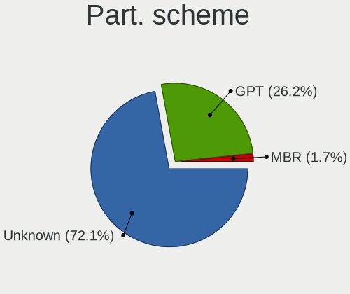
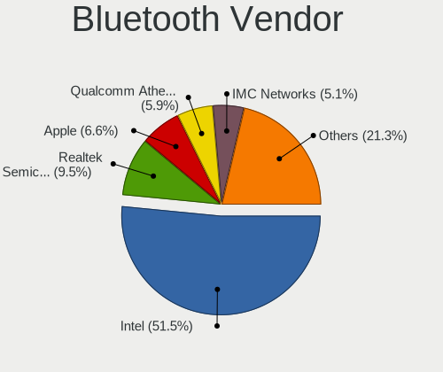
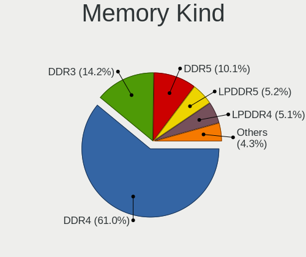

Pop!_OS 22.04 - Tested Hardware & Statistics
--------------------------------------------

A project to collect tested hardware configurations for Pop!_OS 22.04.

Anyone can contribute to this report by the [hw-probe](https://github.com/linuxhw/hw-probe) tool:

    sudo -E hw-probe -all -upload

Please contribute! Especially if your hardware is rare.

This is a report for all computer types. See also reports for [desktops](/Dist/Pop!_OS_22.04/Desktop/README.md) and [notebooks](/Dist/Pop!_OS_22.04/Notebook/README.md).

Contents
--------

* [ Test Cases ](#test-cases)

* [ System ](#system)
  - [ Kernel                   ](#kernel)
  - [ Kernel Family            ](#kernel-family)
  - [ Kernel Major Ver.        ](#kernel-major-ver)
  - [ Arch                     ](#arch)
  - [ DE                       ](#de)
  - [ Display Server           ](#display-server)
  - [ Display Manager          ](#display-manager)
  - [ OS Lang                  ](#os-lang)
  - [ Boot Mode                ](#boot-mode)
  - [ Filesystem               ](#filesystem)
  - [ Part. scheme             ](#part-scheme)
  - [ Dual Boot with Linux/BSD ](#dual-boot-with-linuxbsd)
  - [ Dual Boot (Win)          ](#dual-boot-win)

* [ Board ](#board)
  - [ Vendor                   ](#vendor)
  - [ Model                    ](#model)
  - [ Model Family             ](#model-family)
  - [ MFG Year                 ](#mfg-year)
  - [ Form Factor              ](#form-factor)
  - [ Secure Boot              ](#secure-boot)
  - [ Coreboot                 ](#coreboot)
  - [ RAM Size                 ](#ram-size)
  - [ RAM Used                 ](#ram-used)
  - [ Total Drives             ](#total-drives)
  - [ Has CD-ROM               ](#has-cd-rom)
  - [ Has Ethernet             ](#has-ethernet)
  - [ Has WiFi                 ](#has-wifi)
  - [ Has Bluetooth            ](#has-bluetooth)

* [ Location ](#location)
  - [ Country                  ](#country)
  - [ City                     ](#city)

* [ Drives ](#drives)
  - [ Drive Vendor             ](#drive-vendor)
  - [ Drive Model              ](#drive-model)
  - [ HDD Vendor               ](#hdd-vendor)
  - [ SSD Vendor               ](#ssd-vendor)
  - [ Drive Kind               ](#drive-kind)
  - [ Drive Connector          ](#drive-connector)
  - [ Drive Size               ](#drive-size)
  - [ Space Total              ](#space-total)
  - [ Space Used               ](#space-used)
  - [ Malfunc. Drives          ](#malfunc-drives)
  - [ Malfunc. Drive Vendor    ](#malfunc-drive-vendor)
  - [ Malfunc. HDD Vendor      ](#malfunc-hdd-vendor)
  - [ Malfunc. Drive Kind      ](#malfunc-drive-kind)
  - [ Failed Drives            ](#failed-drives)
  - [ Failed Drive Vendor      ](#failed-drive-vendor)
  - [ Drive Status             ](#drive-status)

* [ Storage controller ](#storage-controller)
  - [ Storage Vendor           ](#storage-vendor)
  - [ Storage Model            ](#storage-model)
  - [ Storage Kind             ](#storage-kind)

* [ Processor ](#processor)
  - [ CPU Vendor               ](#cpu-vendor)
  - [ CPU Model                ](#cpu-model)
  - [ CPU Model Family         ](#cpu-model-family)
  - [ CPU Cores                ](#cpu-cores)
  - [ CPU Sockets              ](#cpu-sockets)
  - [ CPU Threads              ](#cpu-threads)
  - [ CPU Op-Modes             ](#cpu-op-modes)
  - [ CPU Microcode            ](#cpu-microcode)
  - [ CPU Microarch            ](#cpu-microarch)

* [ Graphics ](#graphics)
  - [ GPU Vendor               ](#gpu-vendor)
  - [ GPU Model                ](#gpu-model)
  - [ GPU Combo                ](#gpu-combo)
  - [ GPU Driver               ](#gpu-driver)
  - [ GPU Memory               ](#gpu-memory)

* [ Monitor ](#monitor)
  - [ Monitor Vendor           ](#monitor-vendor)
  - [ Monitor Model            ](#monitor-model)
  - [ Monitor Resolution       ](#monitor-resolution)
  - [ Monitor Diagonal         ](#monitor-diagonal)
  - [ Monitor Width            ](#monitor-width)
  - [ Aspect Ratio             ](#aspect-ratio)
  - [ Monitor Area             ](#monitor-area)
  - [ Pixel Density            ](#pixel-density)
  - [ Multiple Monitors        ](#multiple-monitors)

* [ Network ](#network)
  - [ Net Controller Vendor    ](#net-controller-vendor)
  - [ Net Controller Model     ](#net-controller-model)
  - [ Wireless Vendor          ](#wireless-vendor)
  - [ Wireless Model           ](#wireless-model)
  - [ Ethernet Vendor          ](#ethernet-vendor)
  - [ Ethernet Model           ](#ethernet-model)
  - [ Net Controller Kind      ](#net-controller-kind)
  - [ Used Controller          ](#used-controller)
  - [ NICs                     ](#nics)
  - [ IPv6                     ](#ipv6)

* [ Bluetooth ](#bluetooth)
  - [ Bluetooth Vendor         ](#bluetooth-vendor)
  - [ Bluetooth Model          ](#bluetooth-model)

* [ Sound ](#sound)
  - [ Sound Vendor             ](#sound-vendor)
  - [ Sound Model              ](#sound-model)

* [ Memory ](#memory)
  - [ Memory Vendor            ](#memory-vendor)
  - [ Memory Model             ](#memory-model)
  - [ Memory Kind              ](#memory-kind)
  - [ Memory Form Factor       ](#memory-form-factor)
  - [ Memory Size              ](#memory-size)
  - [ Memory Speed             ](#memory-speed)

* [ Printers & scanners ](#printers--scanners)
  - [ Printer Vendor           ](#printer-vendor)
  - [ Printer Model            ](#printer-model)
  - [ Scanner Vendor           ](#scanner-vendor)
  - [ Scanner Model            ](#scanner-model)

* [ Camera ](#camera)
  - [ Camera Vendor            ](#camera-vendor)
  - [ Camera Model             ](#camera-model)

* [ Security ](#security)
  - [ Fingerprint Vendor       ](#fingerprint-vendor)
  - [ Fingerprint Model        ](#fingerprint-model)
  - [ Chipcard Vendor          ](#chipcard-vendor)
  - [ Chipcard Model           ](#chipcard-model)

* [ Unsupported ](#unsupported)
  - [ Unsupported Devices      ](#unsupported-devices)
  - [ Unsupported Device Types ](#unsupported-device-types)

Test Cases
----------

Total: 6423

| Vendor        | Model                       | Form-Factor | Probe                                                      | Date         |
|---------------|-----------------------------|-------------|------------------------------------------------------------|--------------|
| Dell          | Latitude 5290 2-in-1        | Notebook    | [56d2614671](https://linux-hardware.org/?probe=56d2614671) | May 09, 2024 |
| Lenovo        | Legion Y540-15IRH 81SX      | Notebook    | [03e53efb87](https://linux-hardware.org/?probe=03e53efb87) | May 08, 2024 |
| HP            | Laptop 15s-eq2xxx           | Notebook    | [2786d2f8f8](https://linux-hardware.org/?probe=2786d2f8f8) | May 08, 2024 |
| Gigabyte      | Z790 UD AX                  | Desktop     | [38ae310bd0](https://linux-hardware.org/?probe=38ae310bd0) | May 08, 2024 |
| HP            | 8AC1                        | Desktop     | [34fb750829](https://linux-hardware.org/?probe=34fb750829) | May 08, 2024 |
| ASUSTek       | VivoBook 14_ASUS Laptop ... | Notebook    | [73ee3d2b74](https://linux-hardware.org/?probe=73ee3d2b74) | May 08, 2024 |
| Lenovo        | ThinkPad T420s 417032U      | Notebook    | [e6839a3d70](https://linux-hardware.org/?probe=e6839a3d70) | May 07, 2024 |
| Lenovo        | IdeaPad 310-15ISK 80SM      | Notebook    | [9122522638](https://linux-hardware.org/?probe=9122522638) | May 07, 2024 |
| Lenovo        | IdeaPad 310-15ISK 80SM      | Notebook    | [3064d4fb1f](https://linux-hardware.org/?probe=3064d4fb1f) | May 07, 2024 |
| System76      | Gazelle                     | Notebook    | [fbe88df732](https://linux-hardware.org/?probe=fbe88df732) | May 07, 2024 |
| System76      | Darter Pro                  | Notebook    | [e6da92d97e](https://linux-hardware.org/?probe=e6da92d97e) | May 06, 2024 |
| Dell          | XPS 13 7390                 | Notebook    | [3132f4ff24](https://linux-hardware.org/?probe=3132f4ff24) | May 06, 2024 |
| ASUSTek       | P8Z77-V LX2                 | Desktop     | [1181eb41ee](https://linux-hardware.org/?probe=1181eb41ee) | May 06, 2024 |
| ASUSTek       | X550CC                      | Notebook    | [db900f1cd1](https://linux-hardware.org/?probe=db900f1cd1) | May 05, 2024 |
| Lenovo        | ThinkPad T420s 41732AU      | Notebook    | [be5eeed803](https://linux-hardware.org/?probe=be5eeed803) | May 05, 2024 |
| ASUSTek       | GL753VD                     | Notebook    | [05c21dbea4](https://linux-hardware.org/?probe=05c21dbea4) | May 05, 2024 |
| Apple         | MacBookAir6,2               | Notebook    | [672e653276](https://linux-hardware.org/?probe=672e653276) | May 05, 2024 |
| System76      | Oryx Pro                    | Notebook    | [6d05743481](https://linux-hardware.org/?probe=6d05743481) | May 05, 2024 |
| Dell          | 088DT1 A01                  | Desktop     | [9cdeec0464](https://linux-hardware.org/?probe=9cdeec0464) | May 05, 2024 |
| Getac         | S410                        | Notebook    | [a05cbbe577](https://linux-hardware.org/?probe=a05cbbe577) | May 04, 2024 |
| Dell          | Latitude 5290 2-in-1        | Notebook    | [2e9e3f6434](https://linux-hardware.org/?probe=2e9e3f6434) | May 04, 2024 |
| ASUSTek       | ROG STRIX B550-F GAMING     | Desktop     | [28d0d4304f](https://linux-hardware.org/?probe=28d0d4304f) | May 04, 2024 |
| Dell          | Inspiron 5520               | Notebook    | [bb83948d6a](https://linux-hardware.org/?probe=bb83948d6a) | May 04, 2024 |
| HP            | Victus by Gaming Laptop ... | Notebook    | [1f42d0fe27](https://linux-hardware.org/?probe=1f42d0fe27) | May 04, 2024 |
| Lenovo        | IdeaPad L340-15IRH Gamin... | Notebook    | [0839696375](https://linux-hardware.org/?probe=0839696375) | May 04, 2024 |
| Lenovo        | CRESCENTBAY SDK0E50515 S... | All in one  | [bbd9a3f7ae](https://linux-hardware.org/?probe=bbd9a3f7ae) | May 04, 2024 |
| Dell          | XPS 13 9310                 | Notebook    | [868dd4d0bd](https://linux-hardware.org/?probe=868dd4d0bd) | May 03, 2024 |
| Lenovo        | IdeaPadFlex 5 14ARE05 81... | Convertible | [ba1456ce87](https://linux-hardware.org/?probe=ba1456ce87) | May 03, 2024 |
| SZMZ          | X99-S3                      | Desktop     | [9dc9366e04](https://linux-hardware.org/?probe=9dc9366e04) | May 03, 2024 |
| Dell          | XPS 13 9340                 | Notebook    | [4446c73008](https://linux-hardware.org/?probe=4446c73008) | May 03, 2024 |
| Dell          | Latitude E6330              | Notebook    | [02c85088bc](https://linux-hardware.org/?probe=02c85088bc) | May 03, 2024 |
| MSI           | PRO Z790-A WIFI             | Desktop     | [b7cb9e7573](https://linux-hardware.org/?probe=b7cb9e7573) | May 03, 2024 |
| Alienware     | M14xR1                      | Notebook    | [501de2a1ec](https://linux-hardware.org/?probe=501de2a1ec) | May 02, 2024 |
| Intel         | B75                         | Desktop     | [4925a7fcb7](https://linux-hardware.org/?probe=4925a7fcb7) | May 02, 2024 |
| HP            | 3646h                       | Desktop     | [3c2faf0d32](https://linux-hardware.org/?probe=3c2faf0d32) | May 02, 2024 |
| Lenovo        | IdeaPad Gaming 3 15ACH6 ... | Notebook    | [c23a3238c0](https://linux-hardware.org/?probe=c23a3238c0) | May 02, 2024 |
| MSI           | MPG X570S EDGE MAX WIFI     | Desktop     | [0299f8321b](https://linux-hardware.org/?probe=0299f8321b) | May 01, 2024 |
| MSI           | MPG X570S EDGE MAX WIFI     | Desktop     | [569772c380](https://linux-hardware.org/?probe=569772c380) | May 01, 2024 |
| HP            | Pavilion dv7                | Notebook    | [d191e30bf7](https://linux-hardware.org/?probe=d191e30bf7) | May 01, 2024 |
| ASUSTek       | TUF Gaming X570-PRO         | Desktop     | [2ffc5da09f](https://linux-hardware.org/?probe=2ffc5da09f) | May 01, 2024 |
| ASUSTek       | P7P55D PRO                  | Desktop     | [9ae885f7fd](https://linux-hardware.org/?probe=9ae885f7fd) | Apr 30, 2024 |
| ASUSTek       | UX430UNR                    | Notebook    | [5712b06d98](https://linux-hardware.org/?probe=5712b06d98) | Apr 30, 2024 |
| ASUSTek       | UX430UNR                    | Notebook    | [a032f50d3f](https://linux-hardware.org/?probe=a032f50d3f) | Apr 30, 2024 |
| Apple         | Mac-031AEE4D24BFF0B1 Mac... | Mini pc     | [1780065067](https://linux-hardware.org/?probe=1780065067) | Apr 30, 2024 |
| ASUSTek       | VivoBook_ASUSLaptop M160... | Notebook    | [701927cf4d](https://linux-hardware.org/?probe=701927cf4d) | Apr 30, 2024 |
| ASUSTek       | M4N72-E                     | Desktop     | [c8920341bc](https://linux-hardware.org/?probe=c8920341bc) | Apr 29, 2024 |
| Alienware     | M14xR1                      | Notebook    | [dc1461c536](https://linux-hardware.org/?probe=dc1461c536) | Apr 29, 2024 |
| MSI           | Katana 15 B12VGK            | Notebook    | [c8e4cb337e](https://linux-hardware.org/?probe=c8e4cb337e) | Apr 29, 2024 |
| Supermicro    | X12SPA-TF                   | Server      | [965ec5db00](https://linux-hardware.org/?probe=965ec5db00) | Apr 29, 2024 |
| HP            | 2129                        | Desktop     | [40fa42996a](https://linux-hardware.org/?probe=40fa42996a) | Apr 29, 2024 |
| ASRock        | B650 PG Lightning           | Desktop     | [2afe25d1f8](https://linux-hardware.org/?probe=2afe25d1f8) | Apr 28, 2024 |
| ASUSTek       | X451CA                      | Notebook    | [30d9b5f4ee](https://linux-hardware.org/?probe=30d9b5f4ee) | Apr 28, 2024 |
| Dell          | Inspiron 16 7610            | Notebook    | [2427197c56](https://linux-hardware.org/?probe=2427197c56) | Apr 28, 2024 |
| ASUSTek       | VivoBook_ASUSLaptop M160... | Notebook    | [b024eb05d1](https://linux-hardware.org/?probe=b024eb05d1) | Apr 28, 2024 |
| Gigabyte      | B75M-D3H                    | Desktop     | [48a48b4523](https://linux-hardware.org/?probe=48a48b4523) | Apr 28, 2024 |
| HP            | 2129                        | Desktop     | [03800251ed](https://linux-hardware.org/?probe=03800251ed) | Apr 28, 2024 |
| System76      | Thelio Mira thelio-mira-... | Desktop     | [14dbfab450](https://linux-hardware.org/?probe=14dbfab450) | Apr 27, 2024 |
| Lenovo        | IdeaPad 1 15IJL7 82LX       | Notebook    | [3fbd54c33d](https://linux-hardware.org/?probe=3fbd54c33d) | Apr 27, 2024 |
| Dell          | Precision 5680              | Notebook    | [95bc853549](https://linux-hardware.org/?probe=95bc853549) | Apr 27, 2024 |
| Medion        | Akoya E6227                 | Notebook    | [76bfce53f4](https://linux-hardware.org/?probe=76bfce53f4) | Apr 26, 2024 |
| Gigabyte      | H410M S2 V2                 | Desktop     | [a1fbe8858b](https://linux-hardware.org/?probe=a1fbe8858b) | Apr 26, 2024 |
| ASUSTek       | VivoBook_ASUSLaptop M650... | Notebook    | [6d6b67129d](https://linux-hardware.org/?probe=6d6b67129d) | Apr 26, 2024 |
| Lenovo        | IdeaPad 5 14ARE05 81YM      | Notebook    | [ce253ebd01](https://linux-hardware.org/?probe=ce253ebd01) | Apr 26, 2024 |
| Dell          | 0K240Y A01                  | Desktop     | [6b932e4eb7](https://linux-hardware.org/?probe=6b932e4eb7) | Apr 26, 2024 |
| Acer          | FX58M                       | Desktop     | [d8aec92fe1](https://linux-hardware.org/?probe=d8aec92fe1) | Apr 25, 2024 |
| HP            | 8704                        | Desktop     | [deeb399937](https://linux-hardware.org/?probe=deeb399937) | Apr 25, 2024 |
| HP            | EliteBook 745 G6            | Notebook    | [5354993cb7](https://linux-hardware.org/?probe=5354993cb7) | Apr 25, 2024 |
| HP            | EliteBook 745 G6            | Notebook    | [3b5f41d264](https://linux-hardware.org/?probe=3b5f41d264) | Apr 25, 2024 |
| Dell          | 0K240Y A01                  | Desktop     | [554822996a](https://linux-hardware.org/?probe=554822996a) | Apr 24, 2024 |
| HP            | ENVY 15                     | Notebook    | [20cb7a828b](https://linux-hardware.org/?probe=20cb7a828b) | Apr 24, 2024 |
| ASUSTek       | PRIME B450M-K II            | Desktop     | [31838248fa](https://linux-hardware.org/?probe=31838248fa) | Apr 24, 2024 |
| ASUSTek       | Maximus IX CODE             | Desktop     | [db21083720](https://linux-hardware.org/?probe=db21083720) | Apr 24, 2024 |
| Dell          | Inspiron N4050              | Notebook    | [cbcc357ce6](https://linux-hardware.org/?probe=cbcc357ce6) | Apr 24, 2024 |
| ASRock        | B450M Pro4 R2.0             | Desktop     | [188e5e5bde](https://linux-hardware.org/?probe=188e5e5bde) | Apr 24, 2024 |
| Gigabyte      | B560M H                     | Desktop     | [db05a445f8](https://linux-hardware.org/?probe=db05a445f8) | Apr 24, 2024 |
| Dell          | 0C1R19 A02                  | Desktop     | [de862a6d95](https://linux-hardware.org/?probe=de862a6d95) | Apr 24, 2024 |
| Gigabyte      | 970A-DS3P                   | Desktop     | [0253ffc79c](https://linux-hardware.org/?probe=0253ffc79c) | Apr 24, 2024 |
| ASRock        | FM2A68M-HD+                 | Notebook    | [74967df09a](https://linux-hardware.org/?probe=74967df09a) | Apr 23, 2024 |
| Apple         | MacBookPro8,2               | Notebook    | [965595373d](https://linux-hardware.org/?probe=965595373d) | Apr 23, 2024 |
| Lenovo        | ThinkPad E16 Gen 1 21JN0... | Notebook    | [5453cfa265](https://linux-hardware.org/?probe=5453cfa265) | Apr 23, 2024 |
| Microsoft     | Surface Pro 4               | Tablet      | [a3842c8188](https://linux-hardware.org/?probe=a3842c8188) | Apr 23, 2024 |
| Acer          | Aspire A315-59              | Notebook    | [ecc36cef1b](https://linux-hardware.org/?probe=ecc36cef1b) | Apr 23, 2024 |
| MSI           | GE62VR 6RF                  | Notebook    | [68b99dae1a](https://linux-hardware.org/?probe=68b99dae1a) | Apr 23, 2024 |
| Gigabyte      | X570 AORUS MASTER           | Desktop     | [b6aa6b2262](https://linux-hardware.org/?probe=b6aa6b2262) | Apr 22, 2024 |
| Acer          | Aspire A315-59              | Notebook    | [5a88798ad6](https://linux-hardware.org/?probe=5a88798ad6) | Apr 22, 2024 |
| ASUSTek       | ROG Strix SCAR 18 G834JZ... | Notebook    | [28007aea7c](https://linux-hardware.org/?probe=28007aea7c) | Apr 22, 2024 |
| ASUSTek       | ROG CROSSHAIR VIII DARK ... | Desktop     | [d24a794778](https://linux-hardware.org/?probe=d24a794778) | Apr 22, 2024 |
| ASRock        | B450M Steel Legend          | Desktop     | [7fb64c7bef](https://linux-hardware.org/?probe=7fb64c7bef) | Apr 22, 2024 |
| Apple         | Mac-27ADBB7B4CEE8E61 iMa... | All in one  | [8436ef6ebc](https://linux-hardware.org/?probe=8436ef6ebc) | Apr 22, 2024 |
| Supermicro    | C7Q67 V1.01                 | Desktop     | [e63cba3bfa](https://linux-hardware.org/?probe=e63cba3bfa) | Apr 22, 2024 |
| Dell          | XPS 13 9340                 | Notebook    | [5b25704805](https://linux-hardware.org/?probe=5b25704805) | Apr 22, 2024 |
| Gigabyte      | B450M S2H                   | Desktop     | [d3e9e01950](https://linux-hardware.org/?probe=d3e9e01950) | Apr 21, 2024 |
| Unknown       | MAGNUS III                  | Tablet      | [9796ca9436](https://linux-hardware.org/?probe=9796ca9436) | Apr 21, 2024 |
| System76      | Lemur Pro                   | Notebook    | [3b7243efe7](https://linux-hardware.org/?probe=3b7243efe7) | Apr 21, 2024 |
| Gigabyte      | B450 AORUS ELITE            | Desktop     | [ff86440a74](https://linux-hardware.org/?probe=ff86440a74) | Apr 21, 2024 |
| MSI           | MPG B550 GAMING PLUS        | Desktop     | [42a4ba108a](https://linux-hardware.org/?probe=42a4ba108a) | Apr 21, 2024 |
| Lenovo        | Legion 5 15ACH6H 82JU       | Notebook    | [63baa07920](https://linux-hardware.org/?probe=63baa07920) | Apr 21, 2024 |
| ASUSTek       | ASUS TUF Gaming A15 FA50... | Notebook    | [ee83ed7c12](https://linux-hardware.org/?probe=ee83ed7c12) | Apr 20, 2024 |
| Intel         | B75                         | Desktop     | [27d3a826f4](https://linux-hardware.org/?probe=27d3a826f4) | Apr 20, 2024 |
| ASRock        | Z77 Extreme4                | Desktop     | [52009ffcd0](https://linux-hardware.org/?probe=52009ffcd0) | Apr 20, 2024 |
| ASUSTek       | TUF Gaming B650M-E WIFI     | Desktop     | [8fd0a624a7](https://linux-hardware.org/?probe=8fd0a624a7) | Apr 20, 2024 |
| ASUSTek       | TUF Gaming B650M-E WIFI     | Desktop     | [5e91dc2b03](https://linux-hardware.org/?probe=5e91dc2b03) | Apr 20, 2024 |
| Microsoft     | Surface Laptop Go 2         | Tablet      | [1091b6a34e](https://linux-hardware.org/?probe=1091b6a34e) | Apr 20, 2024 |
| Apple         | MacBookPro9,2               | Notebook    | [f8fa58a83b](https://linux-hardware.org/?probe=f8fa58a83b) | Apr 19, 2024 |
| Apple         | MacBookPro9,2               | Notebook    | [8dde47a60c](https://linux-hardware.org/?probe=8dde47a60c) | Apr 19, 2024 |
| ASRock        | X570 Taichi                 | Desktop     | [2de05483c5](https://linux-hardware.org/?probe=2de05483c5) | Apr 19, 2024 |
| ASUSTek       | P7P55D PRO                  | Desktop     | [712655c5bd](https://linux-hardware.org/?probe=712655c5bd) | Apr 19, 2024 |
| Gigabyte      | H170-HD3-CF                 | Desktop     | [4f5d1a37c3](https://linux-hardware.org/?probe=4f5d1a37c3) | Apr 19, 2024 |
| Google        | Morphius                    | Notebook    | [a8361bc931](https://linux-hardware.org/?probe=a8361bc931) | Apr 19, 2024 |
| ASUSTek       | TUF Gaming B650M-E WIFI     | Desktop     | [6190a14941](https://linux-hardware.org/?probe=6190a14941) | Apr 19, 2024 |
| Lenovo        | Legion 5 15ARH05H 82B1      | Notebook    | [5bcf08b4b0](https://linux-hardware.org/?probe=5bcf08b4b0) | Apr 19, 2024 |
| HP            | OMEN by Latpop 16-c0100n... | Notebook    | [0ee401b99c](https://linux-hardware.org/?probe=0ee401b99c) | Apr 19, 2024 |
| HP            | 8299                        | Desktop     | [aecdc0598b](https://linux-hardware.org/?probe=aecdc0598b) | Apr 19, 2024 |
| Toshiba       | Satellite L755D             | Notebook    | [47d623ed44](https://linux-hardware.org/?probe=47d623ed44) | Apr 19, 2024 |
| Lenovo        | IdeaPad L340-15IRH Gamin... | Notebook    | [8f4cd3f89d](https://linux-hardware.org/?probe=8f4cd3f89d) | Apr 19, 2024 |
| HP            | 8949 11                     | Desktop     | [ab13748833](https://linux-hardware.org/?probe=ab13748833) | Apr 18, 2024 |
| HP            | 8949 11                     | Desktop     | [3f180801bd](https://linux-hardware.org/?probe=3f180801bd) | Apr 18, 2024 |
| ASUSTek       | PRIME B450M-K II            | Desktop     | [e25b6a6321](https://linux-hardware.org/?probe=e25b6a6321) | Apr 18, 2024 |
| Dell          | Precision 5680              | Notebook    | [165f135e49](https://linux-hardware.org/?probe=165f135e49) | Apr 18, 2024 |
| Lenovo        | Slim Pro 9 14IRP8 83BV      | Notebook    | [7b5eee5473](https://linux-hardware.org/?probe=7b5eee5473) | Apr 18, 2024 |
| MSI           | B250M PRO-VD                | Desktop     | [ec68301ab8](https://linux-hardware.org/?probe=ec68301ab8) | Apr 17, 2024 |
| MSI           | Z87-G45 GAMING              | Desktop     | [f646b54913](https://linux-hardware.org/?probe=f646b54913) | Apr 17, 2024 |
| ASUSTek       | ASUS TUF Gaming A15 FA50... | Notebook    | [bcbc28897f](https://linux-hardware.org/?probe=bcbc28897f) | Apr 17, 2024 |
| Dell          | XPS 15 7590                 | Notebook    | [5b510f5ccd](https://linux-hardware.org/?probe=5b510f5ccd) | Apr 17, 2024 |
| ASUSTek       | ROG CROSSHAIR VIII HERO     | Desktop     | [e9fcf03a9f](https://linux-hardware.org/?probe=e9fcf03a9f) | Apr 17, 2024 |
| Acer          | Nitro AN515-45              | Notebook    | [224785342d](https://linux-hardware.org/?probe=224785342d) | Apr 17, 2024 |
| Gigabyte      | 970A-DS3P                   | Desktop     | [53055c8335](https://linux-hardware.org/?probe=53055c8335) | Apr 17, 2024 |
| ASUSTek       | UX305CA                     | Notebook    | [0793f271ed](https://linux-hardware.org/?probe=0793f271ed) | Apr 17, 2024 |
| Lenovo        | 500w Gen 3 82J3             | Convertible | [d3ad81315d](https://linux-hardware.org/?probe=d3ad81315d) | Apr 17, 2024 |
| Acer          | Spin SP314-54N              | Convertible | [4c9c9bdfa3](https://linux-hardware.org/?probe=4c9c9bdfa3) | Apr 17, 2024 |
| HP            | 255 G8 Notebook PC          | Notebook    | [9945f26789](https://linux-hardware.org/?probe=9945f26789) | Apr 17, 2024 |
| Samsung       | 940X3G/930X3G               | Notebook    | [7ae2ace4e3](https://linux-hardware.org/?probe=7ae2ace4e3) | Apr 17, 2024 |
| ASUSTek       | Z170 PRO GAMING             | Desktop     | [e45ac0e9cc](https://linux-hardware.org/?probe=e45ac0e9cc) | Apr 16, 2024 |
| Samsung       | 940X3G/930X3G               | Notebook    | [ebcb51ed9c](https://linux-hardware.org/?probe=ebcb51ed9c) | Apr 16, 2024 |
| ASRock        | Z790 Nova WiFi              | Desktop     | [e7087ec7e4](https://linux-hardware.org/?probe=e7087ec7e4) | Apr 16, 2024 |
| Apple         | MacBookAir4,1               | Notebook    | [fd0c46bab2](https://linux-hardware.org/?probe=fd0c46bab2) | Apr 16, 2024 |
| MSI           | B450 TOMAHAWK MAX II        | Desktop     | [d504f8b8a6](https://linux-hardware.org/?probe=d504f8b8a6) | Apr 16, 2024 |
| Dell          | Inspiron 5547               | Notebook    | [088cb90432](https://linux-hardware.org/?probe=088cb90432) | Apr 16, 2024 |
| Unknown       | Unknown                     | Desktop     | [bcaf7cac1a](https://linux-hardware.org/?probe=bcaf7cac1a) | Apr 15, 2024 |
| Acer          | Aspire E1-572G              | Notebook    | [96b786aa6f](https://linux-hardware.org/?probe=96b786aa6f) | Apr 15, 2024 |
| Dell          | Vostro 3400                 | Notebook    | [ddb98658ed](https://linux-hardware.org/?probe=ddb98658ed) | Apr 15, 2024 |
| Acer          | Aspire 5742G                | Notebook    | [91d047cef5](https://linux-hardware.org/?probe=91d047cef5) | Apr 15, 2024 |
| ASUSTek       | STRIX Z270H GAMING          | Desktop     | [47f139152e](https://linux-hardware.org/?probe=47f139152e) | Apr 15, 2024 |
| HUAWEI        | BOHB-WAX9                   | Notebook    | [e27137024f](https://linux-hardware.org/?probe=e27137024f) | Apr 15, 2024 |
| ASRock        | B450 Steel Legend           | Desktop     | [eae63cf682](https://linux-hardware.org/?probe=eae63cf682) | Apr 15, 2024 |
| ASUSTek       | P5Q-EM                      | Desktop     | [dc780bc9a5](https://linux-hardware.org/?probe=dc780bc9a5) | Apr 15, 2024 |
| Acer          | Spin SP314-54N              | Convertible | [745ac651f0](https://linux-hardware.org/?probe=745ac651f0) | Apr 14, 2024 |
| HP            | Pavilion x360 Convertibl... | Convertible | [6e6a1712a7](https://linux-hardware.org/?probe=6e6a1712a7) | Apr 14, 2024 |
| Lenovo        | ThinkPad L14 Gen 2a 20X6... | Notebook    | [0e240e7a70](https://linux-hardware.org/?probe=0e240e7a70) | Apr 14, 2024 |
| Acer          | Nitro AN515-51              | Notebook    | [46d9c6bc98](https://linux-hardware.org/?probe=46d9c6bc98) | Apr 14, 2024 |
| HP            | Pavilion x360 Convertibl... | Convertible | [9dc06b7a85](https://linux-hardware.org/?probe=9dc06b7a85) | Apr 13, 2024 |
| MSI           | B550M PRO-VDH WIFI          | Desktop     | [ad14cabff5](https://linux-hardware.org/?probe=ad14cabff5) | Apr 13, 2024 |
| Lenovo        | ThinkPad L14 Gen 2a 20X6... | Notebook    | [b120a1a8eb](https://linux-hardware.org/?probe=b120a1a8eb) | Apr 13, 2024 |
| System76      | Lemur Pro                   | Notebook    | [7c9425e33a](https://linux-hardware.org/?probe=7c9425e33a) | Apr 13, 2024 |
| Dell          | Latitude E5520              | Notebook    | [0f03f7a01f](https://linux-hardware.org/?probe=0f03f7a01f) | Apr 13, 2024 |
| Unknown       | Unknown                     | Desktop     | [31b430e45e](https://linux-hardware.org/?probe=31b430e45e) | Apr 13, 2024 |
| Lenovo        | IdeaPad 5 Pro 16ARH7 82S... | Notebook    | [858512aecf](https://linux-hardware.org/?probe=858512aecf) | Apr 12, 2024 |
| ASUSTek       | TUF Gaming Z690-PLUS WIF... | Desktop     | [b977bc3a0a](https://linux-hardware.org/?probe=b977bc3a0a) | Apr 12, 2024 |
| HP            | Victus by Gaming Laptop ... | Notebook    | [7ee4741505](https://linux-hardware.org/?probe=7ee4741505) | Apr 12, 2024 |
| Intel         | X99 V1.0                    | Desktop     | [57c2d76c65](https://linux-hardware.org/?probe=57c2d76c65) | Apr 12, 2024 |
| Lenovo        | ThinkPad S5-S540 20B3007... | Notebook    | [696b2e9290](https://linux-hardware.org/?probe=696b2e9290) | Apr 12, 2024 |
| Lenovo        | ThinkPad S5-S540 20B3007... | Notebook    | [7d473643db](https://linux-hardware.org/?probe=7d473643db) | Apr 12, 2024 |
| System76      | Oryx Pro                    | Notebook    | [0204db931b](https://linux-hardware.org/?probe=0204db931b) | Apr 12, 2024 |
| Lenovo        | ThinkPad T470s 20HFCT01W... | Notebook    | [e72d400eb3](https://linux-hardware.org/?probe=e72d400eb3) | Apr 11, 2024 |
| Acer          | Aspire A515-44              | Notebook    | [bcff49116b](https://linux-hardware.org/?probe=bcff49116b) | Apr 11, 2024 |
| ASUSTek       | PRIME H310T R2.0            | Desktop     | [66cbd66636](https://linux-hardware.org/?probe=66cbd66636) | Apr 11, 2024 |
| Lenovo        | ThinkPad E470 20H10056MZ    | Notebook    | [589fd95069](https://linux-hardware.org/?probe=589fd95069) | Apr 11, 2024 |
| MSI           | Modern 15 A5M               | Notebook    | [df536172a9](https://linux-hardware.org/?probe=df536172a9) | Apr 10, 2024 |
| System76      | Oryx Pro                    | Notebook    | [ea8426e115](https://linux-hardware.org/?probe=ea8426e115) | Apr 10, 2024 |
| Lenovo        | ThinkPad T14s Gen 2a 20X... | Notebook    | [2b7f101b88](https://linux-hardware.org/?probe=2b7f101b88) | Apr 10, 2024 |
| HP            | EliteBook 8560p             | Notebook    | [e9b9656231](https://linux-hardware.org/?probe=e9b9656231) | Apr 09, 2024 |
| Itautec       | ST 4271                     | Desktop     | [8fc18963b3](https://linux-hardware.org/?probe=8fc18963b3) | Apr 09, 2024 |
| HP            | 250 G4                      | Notebook    | [8f21075772](https://linux-hardware.org/?probe=8f21075772) | Apr 09, 2024 |
| Dell          | 0VTJVC A00                  | Desktop     | [edb54fbe32](https://linux-hardware.org/?probe=edb54fbe32) | Apr 09, 2024 |
| Lenovo        | ThinkPad T470 20HEA0TLUS    | Notebook    | [fac79c8b6b](https://linux-hardware.org/?probe=fac79c8b6b) | Apr 09, 2024 |
| Gigabyte      | X570 AORUS MASTER           | Desktop     | [43618657fd](https://linux-hardware.org/?probe=43618657fd) | Apr 09, 2024 |
| Dell          | 088DT1 A01                  | Desktop     | [a22e72117f](https://linux-hardware.org/?probe=a22e72117f) | Apr 09, 2024 |
| Huanan        | X99-QD4 V1.0                | Desktop     | [732523a553](https://linux-hardware.org/?probe=732523a553) | Apr 09, 2024 |
| Huanan        | X99-QD4 V1.0                | Desktop     | [d53567aeb3](https://linux-hardware.org/?probe=d53567aeb3) | Apr 09, 2024 |
| ASUSTek       | ROG Zephyrus G15 GA502IU... | Notebook    | [03de80c7da](https://linux-hardware.org/?probe=03de80c7da) | Apr 08, 2024 |
| ASUSTek       | ROG Zephyrus G15 GA502IU... | Notebook    | [7b9ff3d8a5](https://linux-hardware.org/?probe=7b9ff3d8a5) | Apr 08, 2024 |
| Dell          | Latitude E7240              | Notebook    | [a323cf8e2e](https://linux-hardware.org/?probe=a323cf8e2e) | Apr 08, 2024 |
| Alienware     | m15 R7                      | Notebook    | [5b8340f20c](https://linux-hardware.org/?probe=5b8340f20c) | Apr 08, 2024 |
| Alienware     | m15 R7                      | Notebook    | [2b7f9cd75d](https://linux-hardware.org/?probe=2b7f9cd75d) | Apr 08, 2024 |
| Lenovo        | ThinkPad T14s Gen 1 20UJ... | Notebook    | [471a22d2d2](https://linux-hardware.org/?probe=471a22d2d2) | Apr 08, 2024 |
| HP            | 15                          | Notebook    | [6cb916bc6b](https://linux-hardware.org/?probe=6cb916bc6b) | Apr 08, 2024 |
| MSI           | Titan GT77HX 13VI           | Notebook    | [81cf9688bd](https://linux-hardware.org/?probe=81cf9688bd) | Apr 08, 2024 |
| HP            | 15                          | Notebook    | [c3dd3707a8](https://linux-hardware.org/?probe=c3dd3707a8) | Apr 08, 2024 |
| Dell          | Latitude 5401               | Notebook    | [50c9a92ed4](https://linux-hardware.org/?probe=50c9a92ed4) | Apr 07, 2024 |
| Acer          | Swift SF314-71              | Notebook    | [071a57efd2](https://linux-hardware.org/?probe=071a57efd2) | Apr 07, 2024 |
| Lenovo        | Legion Pro 5 16ARX8 82WM    | Notebook    | [25ee9e6b9c](https://linux-hardware.org/?probe=25ee9e6b9c) | Apr 07, 2024 |
| Acer          | Aspire TC-105               | Desktop     | [7ecc002fc3](https://linux-hardware.org/?probe=7ecc002fc3) | Apr 07, 2024 |
| Acer          | Aspire TC-105               | Desktop     | [9c7c1f6869](https://linux-hardware.org/?probe=9c7c1f6869) | Apr 07, 2024 |
| HP            | 255 G8 Notebook PC          | Notebook    | [85dd650b73](https://linux-hardware.org/?probe=85dd650b73) | Apr 07, 2024 |
| Acer          | Nitro AN515-52              | Notebook    | [b36f589241](https://linux-hardware.org/?probe=b36f589241) | Apr 06, 2024 |
| Lenovo        | IdeaPad 710S-13ISK 80SW     | Notebook    | [75363d665b](https://linux-hardware.org/?probe=75363d665b) | Apr 06, 2024 |
| HP            | OMEN Laptop 15-en1xxx       | Notebook    | [3242172c38](https://linux-hardware.org/?probe=3242172c38) | Apr 06, 2024 |
| HP            | Stream 11 Pro G5            | Notebook    | [60dbf47721](https://linux-hardware.org/?probe=60dbf47721) | Apr 06, 2024 |
| Dell          | Inspiron 15 7000 Gaming     | Notebook    | [20ceba9415](https://linux-hardware.org/?probe=20ceba9415) | Apr 06, 2024 |
| ASUSTek       | TUF Gaming B650-PLUS WIF... | Desktop     | [e7b99f79ab](https://linux-hardware.org/?probe=e7b99f79ab) | Apr 06, 2024 |
| Dell          | 0DF42J A00                  | Desktop     | [575fd0d93d](https://linux-hardware.org/?probe=575fd0d93d) | Apr 06, 2024 |
| Dell          | Inspiron 7306 2n1           | Convertible | [37831e9cc3](https://linux-hardware.org/?probe=37831e9cc3) | Apr 06, 2024 |
| Lenovo        | LOQ 15IRH8 82XV             | Notebook    | [cf5333f4e5](https://linux-hardware.org/?probe=cf5333f4e5) | Apr 06, 2024 |
| Intel         | DH67CF AAG10215-203         | Desktop     | [c26c93bb88](https://linux-hardware.org/?probe=c26c93bb88) | Apr 06, 2024 |
| Gigabyte      | Z590I AORUS ULTRA           | Desktop     | [2a11ab4791](https://linux-hardware.org/?probe=2a11ab4791) | Apr 06, 2024 |
| Gigabyte      | Z590I AORUS ULTRA           | Desktop     | [e786bc1b13](https://linux-hardware.org/?probe=e786bc1b13) | Apr 06, 2024 |
| Lenovo        | ThinkBook 15 G2 ITL 20VE    | Notebook    | [9afed2e851](https://linux-hardware.org/?probe=9afed2e851) | Apr 06, 2024 |
| ASUSTek       | PRIME B550-PLUS             | Desktop     | [f519652f57](https://linux-hardware.org/?probe=f519652f57) | Apr 06, 2024 |
| Biostar       | TA970                       | Desktop     | [b95526c668](https://linux-hardware.org/?probe=b95526c668) | Apr 05, 2024 |
| ASUSTek       | PRIME X670E-PRO WIFI        | Desktop     | [b1f7625755](https://linux-hardware.org/?probe=b1f7625755) | Apr 05, 2024 |
| ASUSTek       | TUF Gaming B650M-PLUS       | Desktop     | [836a40664c](https://linux-hardware.org/?probe=836a40664c) | Apr 05, 2024 |
| ASUSTek       | J1800I-C/BR                 | Desktop     | [bdde2d1fe9](https://linux-hardware.org/?probe=bdde2d1fe9) | Apr 05, 2024 |
| Apple         | Mac-00BE6ED71E35EB86 iMa... | All in one  | [b06fe332d7](https://linux-hardware.org/?probe=b06fe332d7) | Apr 05, 2024 |
| ASUSTek       | TUF B450M-PLUS GAMING       | Desktop     | [a92eac3002](https://linux-hardware.org/?probe=a92eac3002) | Apr 05, 2024 |
| HP            | EliteBook 8730w             | Notebook    | [342f90f8c1](https://linux-hardware.org/?probe=342f90f8c1) | Apr 05, 2024 |
| BESSTAR Te... | HM90                        | Desktop     | [6dda4c2573](https://linux-hardware.org/?probe=6dda4c2573) | Apr 05, 2024 |
| HP            | EliteBook 8730w             | Notebook    | [b4c4b71cdb](https://linux-hardware.org/?probe=b4c4b71cdb) | Apr 05, 2024 |
| BESSTAR Te... | HM90                        | Desktop     | [e9b2e7f701](https://linux-hardware.org/?probe=e9b2e7f701) | Apr 05, 2024 |
| Lenovo        | ThinkPad P50 20ENCTO1WW     | Notebook    | [bf584291d2](https://linux-hardware.org/?probe=bf584291d2) | Apr 04, 2024 |
| Gigabyte      | Z790 GAMING X AX            | Desktop     | [5aa6e72318](https://linux-hardware.org/?probe=5aa6e72318) | Apr 04, 2024 |
| Lenovo        | Legion 5 17ACH6H 82JY       | Notebook    | [bbc6cfb633](https://linux-hardware.org/?probe=bbc6cfb633) | Apr 04, 2024 |
| HP            | EliteBook 840 G1            | Notebook    | [ed6e28b85c](https://linux-hardware.org/?probe=ed6e28b85c) | Apr 04, 2024 |
| Lenovo        | 500w Gen 3 82J3             | Convertible | [00ca2164cf](https://linux-hardware.org/?probe=00ca2164cf) | Apr 03, 2024 |
| ASUSTek       | P7P55D PRO                  | Desktop     | [0b96c3a901](https://linux-hardware.org/?probe=0b96c3a901) | Apr 02, 2024 |
| ASUSTek       | P5G41T-M                    | Desktop     | [731881f720](https://linux-hardware.org/?probe=731881f720) | Apr 02, 2024 |
| Lenovo        | ThinkPad X1 Yoga Gen 7 2... | Convertible | [58db4322b8](https://linux-hardware.org/?probe=58db4322b8) | Apr 02, 2024 |
| Lenovo        | ThinkPad X1 Yoga Gen 7 2... | Convertible | [4ba0812bcd](https://linux-hardware.org/?probe=4ba0812bcd) | Apr 02, 2024 |
| MSI           | Titan GT77HX 13VI           | Notebook    | [c6da8fe194](https://linux-hardware.org/?probe=c6da8fe194) | Apr 02, 2024 |
| Acer          | TravelMate P277-MG          | Notebook    | [49a90af61e](https://linux-hardware.org/?probe=49a90af61e) | Apr 02, 2024 |
| Lenovo        | ThinkPad X1 Extreme 20MF... | Notebook    | [0855016a44](https://linux-hardware.org/?probe=0855016a44) | Apr 01, 2024 |
| Lenovo        | ThinkPad X1 Extreme 20MF... | Notebook    | [43a3819af7](https://linux-hardware.org/?probe=43a3819af7) | Apr 01, 2024 |
| Dell          | Latitude E6430              | Notebook    | [bf9cac92e7](https://linux-hardware.org/?probe=bf9cac92e7) | Apr 01, 2024 |
| GPD           | G1619-04                    | Notebook    | [4d8878864a](https://linux-hardware.org/?probe=4d8878864a) | Apr 01, 2024 |
| HP            | Pavilion Gaming Laptop 1... | Notebook    | [2a00b77a69](https://linux-hardware.org/?probe=2a00b77a69) | Apr 01, 2024 |
| MSI           | MPG B550I GAMING EDGE WI... | Desktop     | [98c3893edd](https://linux-hardware.org/?probe=98c3893edd) | Apr 01, 2024 |
| Acer          | Aspire A315-35              | Notebook    | [554a38529a](https://linux-hardware.org/?probe=554a38529a) | Mar 31, 2024 |
| Dell          | Latitude E6430              | Notebook    | [c871f1007a](https://linux-hardware.org/?probe=c871f1007a) | Mar 31, 2024 |
| Apple         | MacBookPro7,1               | Notebook    | [a02628f1b4](https://linux-hardware.org/?probe=a02628f1b4) | Mar 31, 2024 |
| Lenovo        | ThinkPad E14 Gen 4 21ECC... | Notebook    | [c19f043267](https://linux-hardware.org/?probe=c19f043267) | Mar 31, 2024 |
| HP            | 250 G4                      | Notebook    | [fbf0b206e8](https://linux-hardware.org/?probe=fbf0b206e8) | Mar 31, 2024 |
| ASUSTek       | ZenBook UX325UA_UM325UA     | Notebook    | [449d0ad45b](https://linux-hardware.org/?probe=449d0ad45b) | Mar 31, 2024 |
| Lenovo        | ThinkPad T14 Gen 2i 20W1... | Notebook    | [77d2d8ef3e](https://linux-hardware.org/?probe=77d2d8ef3e) | Mar 31, 2024 |
| Apple         | MacBookAir7,2               | Notebook    | [fd278af3a5](https://linux-hardware.org/?probe=fd278af3a5) | Mar 31, 2024 |
| MSI           | MAG B460M MORTAR            | Desktop     | [0a8f92ffe1](https://linux-hardware.org/?probe=0a8f92ffe1) | Mar 30, 2024 |
| ASUSTek       | AT3N7A-I                    | Desktop     | [0af90b54ec](https://linux-hardware.org/?probe=0af90b54ec) | Mar 30, 2024 |
| Lenovo        | ThinkPad Yoga 11e 3rd Ge... | Convertible | [d558b17c2d](https://linux-hardware.org/?probe=d558b17c2d) | Mar 30, 2024 |
| Timi          | TM1604                      | Notebook    | [9ef2ec37c2](https://linux-hardware.org/?probe=9ef2ec37c2) | Mar 29, 2024 |
| Timi          | TM1604                      | Notebook    | [ec2ab8fb5f](https://linux-hardware.org/?probe=ec2ab8fb5f) | Mar 29, 2024 |
| MSI           | MAG X570 TOMAHAWK WIFI      | Desktop     | [943c4e0f41](https://linux-hardware.org/?probe=943c4e0f41) | Mar 29, 2024 |
| Acer          | Swift SFX14-51G             | Notebook    | [a0aaa7eb1d](https://linux-hardware.org/?probe=a0aaa7eb1d) | Mar 29, 2024 |
| Microsoft     | Surface Book 2              | Tablet      | [29ee5ea6b5](https://linux-hardware.org/?probe=29ee5ea6b5) | Mar 29, 2024 |
| ASUSTek       | PRIME H310M-K R2.0          | Desktop     | [6f6c4699f5](https://linux-hardware.org/?probe=6f6c4699f5) | Mar 29, 2024 |
| ASUSTek       | ProArt Studiobook H7604J... | Notebook    | [ce5acdd8b0](https://linux-hardware.org/?probe=ce5acdd8b0) | Mar 29, 2024 |
| ASUSTek       | VivoBook_ASUSLaptop X415... | Notebook    | [90614a5f0b](https://linux-hardware.org/?probe=90614a5f0b) | Mar 28, 2024 |
| Acer          | Aspire 4349                 | Notebook    | [8bf51e5557](https://linux-hardware.org/?probe=8bf51e5557) | Mar 28, 2024 |
| HP            | Victus by Gaming Laptop ... | Notebook    | [d93e2bd101](https://linux-hardware.org/?probe=d93e2bd101) | Mar 28, 2024 |
| ASUSTek       | VivoBook_ASUSLaptop M150... | Notebook    | [951f003b12](https://linux-hardware.org/?probe=951f003b12) | Mar 28, 2024 |
| Biostar       | A960D+V2                    | Desktop     | [1295e48af0](https://linux-hardware.org/?probe=1295e48af0) | Mar 28, 2024 |
| Gigabyte      | B550M AORUS ELITE           | Desktop     | [ba5d17c1d9](https://linux-hardware.org/?probe=ba5d17c1d9) | Mar 28, 2024 |
| ASUSTek       | P8P67                       | Desktop     | [6ab2d189e5](https://linux-hardware.org/?probe=6ab2d189e5) | Mar 28, 2024 |
| ASUSTek       | P8P67                       | Desktop     | [eae7373113](https://linux-hardware.org/?probe=eae7373113) | Mar 28, 2024 |
| ASUSTek       | ROG Zephyrus G16 GU603ZI... | Notebook    | [c1a3cee107](https://linux-hardware.org/?probe=c1a3cee107) | Mar 28, 2024 |
| Dell          | 0MN1TX A00                  | Desktop     | [8cef7b13b5](https://linux-hardware.org/?probe=8cef7b13b5) | Mar 27, 2024 |
| Dell          | 0MN1TX A00                  | Desktop     | [6a8ffef6f2](https://linux-hardware.org/?probe=6a8ffef6f2) | Mar 27, 2024 |
| HP            | EliteBook 855 G8 Noteboo... | Notebook    | [deae5b6cdf](https://linux-hardware.org/?probe=deae5b6cdf) | Mar 27, 2024 |
| HP            | EliteBook 855 G8 Noteboo... | Notebook    | [602d79d663](https://linux-hardware.org/?probe=602d79d663) | Mar 27, 2024 |
| Acer          | Aspire A515-57G             | Notebook    | [95c573af0a](https://linux-hardware.org/?probe=95c573af0a) | Mar 27, 2024 |
| Apple         | Mac-F221BEC8                | Desktop     | [35cbc2ccda](https://linux-hardware.org/?probe=35cbc2ccda) | Mar 27, 2024 |
| Dell          | 02GDWG A00                  | Desktop     | [a138fcbf39](https://linux-hardware.org/?probe=a138fcbf39) | Mar 26, 2024 |
| Dell          | Inspiron 5520               | Notebook    | [27255ef603](https://linux-hardware.org/?probe=27255ef603) | Mar 26, 2024 |
| Dell          | Inspiron 1440               | Notebook    | [e7bae8d9bc](https://linux-hardware.org/?probe=e7bae8d9bc) | Mar 26, 2024 |
| MSI           | MPG Z390 GAMING PLUS        | Desktop     | [e98dcc5095](https://linux-hardware.org/?probe=e98dcc5095) | Mar 26, 2024 |
| Lenovo        | ThinkPad X1 Yoga Gen 7 2... | Convertible | [8f754c740b](https://linux-hardware.org/?probe=8f754c740b) | Mar 26, 2024 |
| ASUSTek       | G750JZA                     | Notebook    | [12d8540af3](https://linux-hardware.org/?probe=12d8540af3) | Mar 26, 2024 |
| MSI           | PRO Z790-S WIFI             | Desktop     | [ecaa8a51cb](https://linux-hardware.org/?probe=ecaa8a51cb) | Mar 26, 2024 |
| HP            | ENVY 15                     | Notebook    | [11821b80b7](https://linux-hardware.org/?probe=11821b80b7) | Mar 26, 2024 |
| Apple         | MacBookAir4,2               | Notebook    | [d31e841f4d](https://linux-hardware.org/?probe=d31e841f4d) | Mar 25, 2024 |
| Alienware     | m15 R4                      | Notebook    | [3f0488b05c](https://linux-hardware.org/?probe=3f0488b05c) | Mar 25, 2024 |
| System76      | Bonobo WS                   | Notebook    | [856360e11c](https://linux-hardware.org/?probe=856360e11c) | Mar 25, 2024 |
| ASUSTek       | TUF Gaming X570-PLUS        | Desktop     | [efbd82bed8](https://linux-hardware.org/?probe=efbd82bed8) | Mar 25, 2024 |
| Intel         | NUC7i5BNB J31144-312        | Mini pc     | [f54e1033d4](https://linux-hardware.org/?probe=f54e1033d4) | Mar 25, 2024 |
| Acer          | Aspire 5755G                | Notebook    | [4aa12cd64e](https://linux-hardware.org/?probe=4aa12cd64e) | Mar 24, 2024 |
| Microsoft     | Surface Pro 2               | Tablet      | [c9a90af50f](https://linux-hardware.org/?probe=c9a90af50f) | Mar 24, 2024 |
| Google        | Markarth                    | Notebook    | [9987cda5ae](https://linux-hardware.org/?probe=9987cda5ae) | Mar 24, 2024 |
| Lenovo        | G510 20238                  | Notebook    | [b63a7b1490](https://linux-hardware.org/?probe=b63a7b1490) | Mar 24, 2024 |
| ASUSTek       | ROG Strix G713PI_G713PI     | Notebook    | [fad6108f0a](https://linux-hardware.org/?probe=fad6108f0a) | Mar 24, 2024 |
| System76      | Gazelle                     | Notebook    | [a2b4d889db](https://linux-hardware.org/?probe=a2b4d889db) | Mar 24, 2024 |
| HP            | Spectre x360 Convertible... | Convertible | [0cd4aa5f8a](https://linux-hardware.org/?probe=0cd4aa5f8a) | Mar 24, 2024 |
| Alienware     | m15 R7                      | Notebook    | [27cc6ca1d6](https://linux-hardware.org/?probe=27cc6ca1d6) | Mar 24, 2024 |
| Dell          | Vostro 1015                 | Notebook    | [5cea7dba17](https://linux-hardware.org/?probe=5cea7dba17) | Mar 23, 2024 |
| Lenovo        | IdeaPad 3 15IIL05 81WE      | Notebook    | [7fc01abc25](https://linux-hardware.org/?probe=7fc01abc25) | Mar 23, 2024 |
| HUAWEI        | BOHB-WAX9                   | Notebook    | [90d0e194f9](https://linux-hardware.org/?probe=90d0e194f9) | Mar 23, 2024 |
| ONE-NETBOO... | ONEXPLAYER Mini Pro         | Tablet      | [e294f4440c](https://linux-hardware.org/?probe=e294f4440c) | Mar 22, 2024 |
| Acer          | Aspire Z5600                | All in one  | [0a3febbfe2](https://linux-hardware.org/?probe=0a3febbfe2) | Mar 22, 2024 |
| MSI           | Cyborg 15 A12VE             | Notebook    | [012a9393ab](https://linux-hardware.org/?probe=012a9393ab) | Mar 22, 2024 |
| Lenovo        | ThinkPad P14s Gen 4 21HF... | Notebook    | [a0855ed46b](https://linux-hardware.org/?probe=a0855ed46b) | Mar 22, 2024 |
| HP            | Victus by Gaming Laptop ... | Notebook    | [899cb71147](https://linux-hardware.org/?probe=899cb71147) | Mar 22, 2024 |
| HP            | 83EF                        | Desktop     | [a2e4b98916](https://linux-hardware.org/?probe=a2e4b98916) | Mar 22, 2024 |
| HP            | 83EF                        | Desktop     | [79c2564db3](https://linux-hardware.org/?probe=79c2564db3) | Mar 22, 2024 |
| Lenovo        | IdeaPad 3 15ALC6 82MF       | Notebook    | [2c74228344](https://linux-hardware.org/?probe=2c74228344) | Mar 22, 2024 |
| Dell          | Latitude E7240              | Notebook    | [a295e64d94](https://linux-hardware.org/?probe=a295e64d94) | Mar 21, 2024 |
| Dell          | Inspiron 5558               | Notebook    | [2202cb6328](https://linux-hardware.org/?probe=2202cb6328) | Mar 21, 2024 |
| HUAWEI        | BOHB-WAX9                   | Notebook    | [eecdc4a970](https://linux-hardware.org/?probe=eecdc4a970) | Mar 21, 2024 |
| HUAWEI        | BOHB-WAX9                   | Notebook    | [0a1b9c732b](https://linux-hardware.org/?probe=0a1b9c732b) | Mar 21, 2024 |
| Lenovo        | ThinkPad X395 20NMS13801    | Notebook    | [bf71f2099b](https://linux-hardware.org/?probe=bf71f2099b) | Mar 21, 2024 |
| Gigabyte      | B550M AORUS ELITE           | Desktop     | [0565d53d0c](https://linux-hardware.org/?probe=0565d53d0c) | Mar 21, 2024 |
| Dell          | Precision M4700             | Notebook    | [212d29f26d](https://linux-hardware.org/?probe=212d29f26d) | Mar 21, 2024 |
| Dell          | 03X6X0 A03                  | Server      | [7ded435bf2](https://linux-hardware.org/?probe=7ded435bf2) | Mar 21, 2024 |
| Dell          | 03X6X0 A06                  | Server      | [bb6453dda7](https://linux-hardware.org/?probe=bb6453dda7) | Mar 21, 2024 |
| HP            | 255 G8 Notebook PC          | Notebook    | [0293382f9b](https://linux-hardware.org/?probe=0293382f9b) | Mar 21, 2024 |
| ASUSTek       | PRIME B550M-A WIFI II       | Desktop     | [caecf9a750](https://linux-hardware.org/?probe=caecf9a750) | Mar 21, 2024 |
| Dell          | Latitude E6540              | Notebook    | [c3883595b9](https://linux-hardware.org/?probe=c3883595b9) | Mar 21, 2024 |
| Lenovo        | Yoga 920-13IKB 80Y7         | Convertible | [e7ea34fd49](https://linux-hardware.org/?probe=e7ea34fd49) | Mar 20, 2024 |
| MSI           | Z170A GAMING M3             | Desktop     | [8e89b3ef32](https://linux-hardware.org/?probe=8e89b3ef32) | Mar 20, 2024 |
| Gigabyte      | B450 AORUS ELITE            | Desktop     | [302a31192b](https://linux-hardware.org/?probe=302a31192b) | Mar 20, 2024 |
| MSI           | Cyborg 15 A12VE             | Notebook    | [e0dce5359f](https://linux-hardware.org/?probe=e0dce5359f) | Mar 20, 2024 |
| ASUSTek       | PRIME X570-PRO              | Desktop     | [56b4e033b8](https://linux-hardware.org/?probe=56b4e033b8) | Mar 20, 2024 |
| Lenovo        | ThinkPad T480s 20L8002UM... | Notebook    | [b912e786a3](https://linux-hardware.org/?probe=b912e786a3) | Mar 20, 2024 |
| Samsung       | 530U3C/530U4C/532U3C        | Notebook    | [a06517f205](https://linux-hardware.org/?probe=a06517f205) | Mar 20, 2024 |
| Lenovo        | ThinkPad E470 20H10056MZ    | Notebook    | [0e0638700d](https://linux-hardware.org/?probe=0e0638700d) | Mar 20, 2024 |
| Lenovo        | ThinkPad E470 20H10056MZ    | Notebook    | [e8c3803d3c](https://linux-hardware.org/?probe=e8c3803d3c) | Mar 20, 2024 |
| Dell          | Latitude 5410               | Notebook    | [291ea4843c](https://linux-hardware.org/?probe=291ea4843c) | Mar 20, 2024 |
| MSI           | MAG B660M MORTAR WIFI DD... | Desktop     | [d1ba139b4e](https://linux-hardware.org/?probe=d1ba139b4e) | Mar 19, 2024 |
| Acer          | Aspire A315-59              | Notebook    | [6c38602470](https://linux-hardware.org/?probe=6c38602470) | Mar 19, 2024 |
| HONOR         | GLO-GXXX                    | Notebook    | [aa0a3c2273](https://linux-hardware.org/?probe=aa0a3c2273) | Mar 19, 2024 |
| HONOR         | GLO-GXXX                    | Notebook    | [e6fbe7ffad](https://linux-hardware.org/?probe=e6fbe7ffad) | Mar 19, 2024 |
| HUAWEI        | KLVL-WXXW                   | Notebook    | [7400d40886](https://linux-hardware.org/?probe=7400d40886) | Mar 19, 2024 |
| HUAWEI        | KLVD-WXX9                   | Notebook    | [f8a39666b9](https://linux-hardware.org/?probe=f8a39666b9) | Mar 19, 2024 |
| HUAWEI        | KLVD-WXX9                   | Notebook    | [74127be2ca](https://linux-hardware.org/?probe=74127be2ca) | Mar 19, 2024 |
| Lenovo        | ThinkPad P15s Gen 1 20T4... | Notebook    | [3bef14d11e](https://linux-hardware.org/?probe=3bef14d11e) | Mar 19, 2024 |
| Dell          | Latitude 7440               | Notebook    | [143c9f9828](https://linux-hardware.org/?probe=143c9f9828) | Mar 19, 2024 |
| HP            | EliteBook 840 14 inch G9... | Notebook    | [eaea13606f](https://linux-hardware.org/?probe=eaea13606f) | Mar 19, 2024 |
| MSI           | MPG B550 GAMING PLUS        | Desktop     | [37a57d5b70](https://linux-hardware.org/?probe=37a57d5b70) | Mar 19, 2024 |
| Lenovo        | Yoga 910-13IKB 80VF         | Convertible | [f391ae9078](https://linux-hardware.org/?probe=f391ae9078) | Mar 19, 2024 |
| Lenovo        | ThinkPad T480s 20L8SCLH0... | Notebook    | [a568c4313e](https://linux-hardware.org/?probe=a568c4313e) | Mar 18, 2024 |
| ASUSTek       | TUF Gaming Z690-PLUS WIF... | Desktop     | [0eaf5f5be0](https://linux-hardware.org/?probe=0eaf5f5be0) | Mar 18, 2024 |
| ASUSTek       | ROG Zephyrus G14 GA402NU... | Notebook    | [10d62d48f9](https://linux-hardware.org/?probe=10d62d48f9) | Mar 18, 2024 |
| Lenovo        | IdeaPad 3 15ALC6 82MF       | Notebook    | [2d61b43821](https://linux-hardware.org/?probe=2d61b43821) | Mar 18, 2024 |
| Notebook      | N15_N17RD1                  | Notebook    | [7bf6fa9d9f](https://linux-hardware.org/?probe=7bf6fa9d9f) | Mar 18, 2024 |
| Lenovo        | Legion 5 15ARH05H 82B1      | Notebook    | [2cc34ee9da](https://linux-hardware.org/?probe=2cc34ee9da) | Mar 18, 2024 |
| ASUSTek       | M4A785TD-V EVO              | Desktop     | [9a29b7badd](https://linux-hardware.org/?probe=9a29b7badd) | Mar 17, 2024 |
| Lenovo        | Legion 7 15IMH05 81YT       | Notebook    | [6e83554006](https://linux-hardware.org/?probe=6e83554006) | Mar 17, 2024 |
| Apple         | Mac-7BA5B2D9E42DDD94 iMa... | Desktop     | [16b029f8b8](https://linux-hardware.org/?probe=16b029f8b8) | Mar 17, 2024 |
| Lenovo        | Y520-15IKBM 80YY            | Notebook    | [aae3b4bf83](https://linux-hardware.org/?probe=aae3b4bf83) | Mar 17, 2024 |
| ASRock        | H110M-DVS R3.0              | Desktop     | [311809b062](https://linux-hardware.org/?probe=311809b062) | Mar 16, 2024 |
| Lenovo        | ThinkPad X260 20F6006XUK    | Notebook    | [72eb92fb02](https://linux-hardware.org/?probe=72eb92fb02) | Mar 16, 2024 |
| Gigabyte      | A520M DS3H                  | Desktop     | [e9eaacfaa2](https://linux-hardware.org/?probe=e9eaacfaa2) | Mar 15, 2024 |
| Lenovo        | ThinkPad T480s 20L8SCLH0... | Notebook    | [fd91f6e0b8](https://linux-hardware.org/?probe=fd91f6e0b8) | Mar 15, 2024 |
| ASUSTek       | ROG Zephyrus M16 GU604VI... | Notebook    | [0ba8678964](https://linux-hardware.org/?probe=0ba8678964) | Mar 15, 2024 |
| Dell          | 0KV62T A00                  | Desktop     | [7f865ffb79](https://linux-hardware.org/?probe=7f865ffb79) | Mar 15, 2024 |
| ASUSTek       | TUF Gaming Z490-PLUS        | Desktop     | [ed06ccc20a](https://linux-hardware.org/?probe=ed06ccc20a) | Mar 15, 2024 |
| Lenovo        | ThinkPad X260 20F6006XUK    | Notebook    | [d1bf96e346](https://linux-hardware.org/?probe=d1bf96e346) | Mar 14, 2024 |
| Lenovo        | Yoga 7 14IRL8 82YL          | Convertible | [386d1f0817](https://linux-hardware.org/?probe=386d1f0817) | Mar 14, 2024 |
| Lenovo        | ThinkPad T420 4236PFG       | Notebook    | [66167283a7](https://linux-hardware.org/?probe=66167283a7) | Mar 14, 2024 |
| Lenovo        | ThinkPad T14 Gen 4 21K4S... | Notebook    | [37260aa51d](https://linux-hardware.org/?probe=37260aa51d) | Mar 14, 2024 |
| Jumper        | EZbook                      | Notebook    | [65469deb97](https://linux-hardware.org/?probe=65469deb97) | Mar 14, 2024 |
| System76      | Thelio thelio-r2            | Desktop     | [609e72eef1](https://linux-hardware.org/?probe=609e72eef1) | Mar 14, 2024 |
| Lenovo        | IdeaPad 5 Pro 16ARH7 82S... | Notebook    | [d2921f8721](https://linux-hardware.org/?probe=d2921f8721) | Mar 13, 2024 |
| Gigabyte      | H310M S2P                   | Desktop     | [3d5cf9dd65](https://linux-hardware.org/?probe=3d5cf9dd65) | Mar 13, 2024 |
| Dell          | Inspiron 5575               | Notebook    | [982b876f87](https://linux-hardware.org/?probe=982b876f87) | Mar 13, 2024 |
| Lenovo        | Legion 5 Pro 16ARH7H 82R... | Notebook    | [6a41c6be0e](https://linux-hardware.org/?probe=6a41c6be0e) | Mar 13, 2024 |
| Lenovo        | Legion 5 Pro 16ARH7H 82R... | Notebook    | [3eb6a86b95](https://linux-hardware.org/?probe=3eb6a86b95) | Mar 13, 2024 |
| Dell          | XPS 15 9530                 | Notebook    | [4cfd0ba254](https://linux-hardware.org/?probe=4cfd0ba254) | Mar 13, 2024 |
| Google        | Gallop                      | Notebook    | [eeaa5535f7](https://linux-hardware.org/?probe=eeaa5535f7) | Mar 12, 2024 |
| HP            | ProBook 470 G3              | Notebook    | [7acbeb9e50](https://linux-hardware.org/?probe=7acbeb9e50) | Mar 12, 2024 |
| Lenovo        | IdeaPad 3 15IML05 81WR      | Notebook    | [006a9be33e](https://linux-hardware.org/?probe=006a9be33e) | Mar 12, 2024 |
| Acer          | Nitro AN515-45              | Notebook    | [d5d941f35c](https://linux-hardware.org/?probe=d5d941f35c) | Mar 12, 2024 |
| Dell          | Latitude 5420               | Notebook    | [e49cabfe78](https://linux-hardware.org/?probe=e49cabfe78) | Mar 12, 2024 |
| Apple         | Mac-F65AE981FFA204ED Mac... | Mini pc     | [4dd7fe8d84](https://linux-hardware.org/?probe=4dd7fe8d84) | Mar 11, 2024 |
| Apple         | Mac-F65AE981FFA204ED Mac... | Mini pc     | [c5a33c09f1](https://linux-hardware.org/?probe=c5a33c09f1) | Mar 11, 2024 |
| Dell          | G7 7588                     | Notebook    | [201e08795e](https://linux-hardware.org/?probe=201e08795e) | Mar 11, 2024 |
| Lenovo        | ThinkPad T14 Gen 2i 20W1... | Notebook    | [66ebc0d790](https://linux-hardware.org/?probe=66ebc0d790) | Mar 11, 2024 |
| Dell          | Vostro 15 5510              | Notebook    | [1635f8ee88](https://linux-hardware.org/?probe=1635f8ee88) | Mar 11, 2024 |
| Gigabyte      | AX370-Gaming 3-CF           | Desktop     | [c0420b6b81](https://linux-hardware.org/?probe=c0420b6b81) | Mar 11, 2024 |
| Apple         | MacBookAir7,2               | Notebook    | [03dbb01a57](https://linux-hardware.org/?probe=03dbb01a57) | Mar 11, 2024 |
| Apple         | Mac-F4238CC8 PVT            | All in one  | [bf63e4ac63](https://linux-hardware.org/?probe=bf63e4ac63) | Mar 10, 2024 |
| Apple         | Mac-F4238CC8 PVT            | All in one  | [f3fc324ad6](https://linux-hardware.org/?probe=f3fc324ad6) | Mar 10, 2024 |
| ASUSTek       | ROG Strix G513IE_G513IE     | Notebook    | [695773aa7b](https://linux-hardware.org/?probe=695773aa7b) | Mar 10, 2024 |
| ASUSTek       | VivoBook_ASUSLaptop X570... | Notebook    | [a56ff930d5](https://linux-hardware.org/?probe=a56ff930d5) | Mar 10, 2024 |
| Intel         | B75                         | Desktop     | [d0ba74ec7d](https://linux-hardware.org/?probe=d0ba74ec7d) | Mar 10, 2024 |
| Dell          | Latitude 7490               | Notebook    | [93e3272d83](https://linux-hardware.org/?probe=93e3272d83) | Mar 10, 2024 |
| Lenovo        | IdeaPad 3 15IML05 81WR      | Notebook    | [174fa8b213](https://linux-hardware.org/?probe=174fa8b213) | Mar 09, 2024 |
| Dell          | Latitude 7490               | Notebook    | [d8c5dd5832](https://linux-hardware.org/?probe=d8c5dd5832) | Mar 09, 2024 |
| eMachines     | E525                        | Notebook    | [4a4a1ac342](https://linux-hardware.org/?probe=4a4a1ac342) | Mar 09, 2024 |
| Dell          | Inspiron 15 7000 Gaming     | Notebook    | [35cdd04e44](https://linux-hardware.org/?probe=35cdd04e44) | Mar 08, 2024 |
| HP            | Laptop 15s-eq0xxx           | Notebook    | [e4a401d044](https://linux-hardware.org/?probe=e4a401d044) | Mar 08, 2024 |
| Dell          | Latitude 5530               | Notebook    | [474a88cccf](https://linux-hardware.org/?probe=474a88cccf) | Mar 08, 2024 |
| Dell          | Inspiron 5520               | Notebook    | [ded3e0cf33](https://linux-hardware.org/?probe=ded3e0cf33) | Mar 08, 2024 |
| System76      | Gazelle                     | Notebook    | [c054444856](https://linux-hardware.org/?probe=c054444856) | Mar 08, 2024 |
| HP            | Pavilion Gaming Laptop 1... | Notebook    | [439a24ca9f](https://linux-hardware.org/?probe=439a24ca9f) | Mar 07, 2024 |
| Dell          | Latitude 5530               | Notebook    | [252c53438e](https://linux-hardware.org/?probe=252c53438e) | Mar 07, 2024 |
| MSI           | MPG X570 GAMING PLUS        | Desktop     | [b07882e6fb](https://linux-hardware.org/?probe=b07882e6fb) | Mar 07, 2024 |
| Intel         | NUC5i3RYB H41000-502        | Mini pc     | [6f9c47ea33](https://linux-hardware.org/?probe=6f9c47ea33) | Mar 07, 2024 |
| MSI           | MAG Z790 TOMAHAWK MAX WI... | Desktop     | [f9fa747b4f](https://linux-hardware.org/?probe=f9fa747b4f) | Mar 07, 2024 |
| ASUSTek       | TUF Gaming FX505DT_FX505... | Notebook    | [635244de96](https://linux-hardware.org/?probe=635244de96) | Mar 07, 2024 |
| HP            | EliteBook 840 G2            | Notebook    | [431439414a](https://linux-hardware.org/?probe=431439414a) | Mar 07, 2024 |
| HP            | EliteBook 840 G2            | Notebook    | [571cf278dd](https://linux-hardware.org/?probe=571cf278dd) | Mar 07, 2024 |
| HP            | OMEN by Laptop 16-c0xxx     | Notebook    | [bb4c0ce2be](https://linux-hardware.org/?probe=bb4c0ce2be) | Mar 06, 2024 |
| Lenovo        | ThinkPad E15 20RD0014RT     | Notebook    | [b12b855825](https://linux-hardware.org/?probe=b12b855825) | Mar 06, 2024 |
| ASUSTek       | PRIME B650M-A WIFI II       | Desktop     | [d5ee5ee229](https://linux-hardware.org/?probe=d5ee5ee229) | Mar 06, 2024 |
| HP            | ProBook 650 G1              | Notebook    | [994590f6a8](https://linux-hardware.org/?probe=994590f6a8) | Mar 06, 2024 |
| HP            | EliteBook 840 14 inch G1... | Notebook    | [b62ec8f9a0](https://linux-hardware.org/?probe=b62ec8f9a0) | Mar 06, 2024 |
| HP            | Pavilion Gaming Laptop 1... | Notebook    | [1446f9eae8](https://linux-hardware.org/?probe=1446f9eae8) | Mar 05, 2024 |
| HP            | 81C5 MVB                    | Desktop     | [957fd824c5](https://linux-hardware.org/?probe=957fd824c5) | Mar 05, 2024 |
| ASUSTek       | ASUS TUF Gaming A15 FA50... | Notebook    | [bc08a4f316](https://linux-hardware.org/?probe=bc08a4f316) | Mar 05, 2024 |
| MSI           | X470 GAMING PLUS MAX        | Desktop     | [d746e0ee2c](https://linux-hardware.org/?probe=d746e0ee2c) | Mar 05, 2024 |
| Alienware     | M14xR1                      | Notebook    | [67cc7d7e63](https://linux-hardware.org/?probe=67cc7d7e63) | Mar 05, 2024 |
| Dell          | G7 7500                     | Notebook    | [89b81d9c37](https://linux-hardware.org/?probe=89b81d9c37) | Mar 05, 2024 |
| ASUSTek       | VivoBook_ASUSLaptop X409... | Notebook    | [b11673c68a](https://linux-hardware.org/?probe=b11673c68a) | Mar 05, 2024 |
| ASUSTek       | Z97M-PLUS/BR                | Desktop     | [3772b43c62](https://linux-hardware.org/?probe=3772b43c62) | Mar 05, 2024 |
| Dell          | 0HD5W2 A01                  | Desktop     | [f015ff4f75](https://linux-hardware.org/?probe=f015ff4f75) | Mar 05, 2024 |
| ASUSTek       | ZenBook Pro Duo UX582LR_... | Notebook    | [141c46ed9d](https://linux-hardware.org/?probe=141c46ed9d) | Mar 05, 2024 |
| Lenovo        | ThinkPad T14 Gen 4 21HES... | Notebook    | [3b0efc2689](https://linux-hardware.org/?probe=3b0efc2689) | Mar 05, 2024 |
| ASUSTek       | ROG STRIX B550-I GAMING     | Desktop     | [e415b0c776](https://linux-hardware.org/?probe=e415b0c776) | Mar 04, 2024 |
| Gigabyte      | Z390 AORUS ULTRA-CF         | Desktop     | [01c04e14c0](https://linux-hardware.org/?probe=01c04e14c0) | Mar 04, 2024 |
| Lenovo        | ThinkPad X1 Carbon 6th 2... | Notebook    | [c3d8b404f8](https://linux-hardware.org/?probe=c3d8b404f8) | Mar 04, 2024 |
| Lenovo        | ThinkPad X1 Carbon 6th 2... | Notebook    | [ce218789c2](https://linux-hardware.org/?probe=ce218789c2) | Mar 04, 2024 |
| Intel         | B75                         | Desktop     | [2b0d558a5e](https://linux-hardware.org/?probe=2b0d558a5e) | Mar 04, 2024 |
| ASUSTek       | ROG Strix G513QY_G513QY     | Notebook    | [2f64045bb9](https://linux-hardware.org/?probe=2f64045bb9) | Mar 04, 2024 |
| Gigabyte      | B450M DS3H-CF               | Desktop     | [95bfa43508](https://linux-hardware.org/?probe=95bfa43508) | Mar 04, 2024 |
| Gigabyte      | B450M DS3H-CF               | Desktop     | [1eb604d726](https://linux-hardware.org/?probe=1eb604d726) | Mar 04, 2024 |
| Lenovo        | ThinkPad X1 Yoga Gen 5 2... | Convertible | [c304c6e324](https://linux-hardware.org/?probe=c304c6e324) | Mar 04, 2024 |
| Acer          | Nitro AN515-57              | Notebook    | [d65faae98f](https://linux-hardware.org/?probe=d65faae98f) | Mar 03, 2024 |
| ASUSTek       | TUF B350M-PLUS GAMING       | Desktop     | [abbcee09db](https://linux-hardware.org/?probe=abbcee09db) | Mar 03, 2024 |
| ASUSTek       | TUF B350M-PLUS GAMING       | Desktop     | [040699f391](https://linux-hardware.org/?probe=040699f391) | Mar 03, 2024 |
| ASUSTek       | GL552VX                     | Notebook    | [01ea0912c3](https://linux-hardware.org/?probe=01ea0912c3) | Mar 03, 2024 |
| AZW           | MINI S                      | Desktop     | [dc07e234d0](https://linux-hardware.org/?probe=dc07e234d0) | Mar 03, 2024 |
| Lenovo        | IdeaPad D330-10IGL 82H0     | Tablet      | [94a7d20873](https://linux-hardware.org/?probe=94a7d20873) | Mar 03, 2024 |
| Lenovo        | ThinkPad T470p 20J7S0CF0... | Notebook    | [b957a4b5d8](https://linux-hardware.org/?probe=b957a4b5d8) | Mar 03, 2024 |
| Alienware     | M14xR1                      | Notebook    | [5b5b4ae985](https://linux-hardware.org/?probe=5b5b4ae985) | Mar 03, 2024 |
| ASUSTek       | TUF Gaming X570-PLUS        | Desktop     | [c2b4500a60](https://linux-hardware.org/?probe=c2b4500a60) | Mar 03, 2024 |
| Dell          | XPS 15 9570                 | Notebook    | [73bd3cf050](https://linux-hardware.org/?probe=73bd3cf050) | Mar 03, 2024 |
| Gigabyte      | X570 AORUS ELITE            | Desktop     | [a0a450644b](https://linux-hardware.org/?probe=a0a450644b) | Mar 02, 2024 |
| ASUSTek       | ROG STRIX B650E-F GAMING... | Desktop     | [e8dae907db](https://linux-hardware.org/?probe=e8dae907db) | Mar 02, 2024 |
| Dell          | Inspiron 1525               | Notebook    | [7749349961](https://linux-hardware.org/?probe=7749349961) | Mar 02, 2024 |
| ASUSTek       | ROG Zephyrus G14 GA401IV... | Notebook    | [67a9619322](https://linux-hardware.org/?probe=67a9619322) | Mar 02, 2024 |
| System76      | Pangolin                    | Notebook    | [a130fc52f6](https://linux-hardware.org/?probe=a130fc52f6) | Mar 02, 2024 |
| ASUSTek       | ROG Strix G513QM_G513QM     | Notebook    | [78090262bb](https://linux-hardware.org/?probe=78090262bb) | Mar 02, 2024 |
| Dell          | 02GDWG A00                  | Desktop     | [dd54511393](https://linux-hardware.org/?probe=dd54511393) | Mar 01, 2024 |
| ASUSTek       | ROG STRIX Z370-F GAMING     | Desktop     | [13c3d127e8](https://linux-hardware.org/?probe=13c3d127e8) | Mar 01, 2024 |
| System76      | Oryx Pro                    | Notebook    | [6f389be12b](https://linux-hardware.org/?probe=6f389be12b) | Mar 01, 2024 |
| Lenovo        | IdeaPad L3 15IML05 81Y3     | Notebook    | [cda628788e](https://linux-hardware.org/?probe=cda628788e) | Mar 01, 2024 |
| HP            | 843B                        | Desktop     | [4293861b42](https://linux-hardware.org/?probe=4293861b42) | Mar 01, 2024 |
| HP            | Laptop 15-dw0xxx            | Notebook    | [6e720badd3](https://linux-hardware.org/?probe=6e720badd3) | Mar 01, 2024 |
| HP            | 18E9                        | Desktop     | [9bdda08a35](https://linux-hardware.org/?probe=9bdda08a35) | Mar 01, 2024 |
| ASRock        | B550 Phantom Gaming 4       | Desktop     | [223fbfa988](https://linux-hardware.org/?probe=223fbfa988) | Feb 29, 2024 |
| Apple         | MacBookPro11,3              | Notebook    | [d418108f92](https://linux-hardware.org/?probe=d418108f92) | Feb 29, 2024 |
| Lenovo        | ThinkPad T420 4236BD5       | Notebook    | [470be089f8](https://linux-hardware.org/?probe=470be089f8) | Feb 29, 2024 |
| HP            | Laptop 14s-dq0xxx           | Notebook    | [07e47bd9aa](https://linux-hardware.org/?probe=07e47bd9aa) | Feb 29, 2024 |
| ASRock        | H97 Anniversary             | Desktop     | [f4f4c960d4](https://linux-hardware.org/?probe=f4f4c960d4) | Feb 28, 2024 |
| Acer          | Nitro AN515-57              | Notebook    | [ecfd2b2c9f](https://linux-hardware.org/?probe=ecfd2b2c9f) | Feb 28, 2024 |
| ASUSTek       | PRIME X670E-PRO WIFI        | Desktop     | [365e852379](https://linux-hardware.org/?probe=365e852379) | Feb 28, 2024 |
| ASUSTek       | PRIME Z790-P WIFI           | Desktop     | [5c749148f2](https://linux-hardware.org/?probe=5c749148f2) | Feb 28, 2024 |
| Lenovo        | IdeaPad Gaming 3 15ACH6 ... | Notebook    | [bccc7e9b25](https://linux-hardware.org/?probe=bccc7e9b25) | Feb 27, 2024 |
| Intel         | H410M                       | Desktop     | [b22fd32a7d](https://linux-hardware.org/?probe=b22fd32a7d) | Feb 27, 2024 |
| ASUSTek       | N53SN                       | Notebook    | [c628351d6c](https://linux-hardware.org/?probe=c628351d6c) | Feb 27, 2024 |
| Lenovo        | IdeaPad L340-15IRH Gamin... | Notebook    | [df29939277](https://linux-hardware.org/?probe=df29939277) | Feb 27, 2024 |
| ASUSTek       | VivoBook_ASUSLaptop K340... | Notebook    | [3ea80caf07](https://linux-hardware.org/?probe=3ea80caf07) | Feb 27, 2024 |
| Casper        | NIRVANA NOTEBOOK            | Notebook    | [19a2ccc504](https://linux-hardware.org/?probe=19a2ccc504) | Feb 27, 2024 |
| Lenovo        | ThinkBook 15 G2 ARE 20VG    | Notebook    | [ac48e41763](https://linux-hardware.org/?probe=ac48e41763) | Feb 27, 2024 |
| Dell          | Inspiron 5547               | Notebook    | [a7e7b853e8](https://linux-hardware.org/?probe=a7e7b853e8) | Feb 27, 2024 |
| ASUSTek       | TUF Gaming X570-PLUS        | Desktop     | [15510ee9c4](https://linux-hardware.org/?probe=15510ee9c4) | Feb 27, 2024 |
| JGINYUE       | B550i-GAMING                | Desktop     | [8d44c9ccdd](https://linux-hardware.org/?probe=8d44c9ccdd) | Feb 27, 2024 |
| ASUSTek       | ROG Strix G513IC_G513IC     | Notebook    | [1817f5af30](https://linux-hardware.org/?probe=1817f5af30) | Feb 27, 2024 |
| ASUSTek       | VivoBook_ASUSLaptop X509... | Notebook    | [0ef3ee0033](https://linux-hardware.org/?probe=0ef3ee0033) | Feb 27, 2024 |
| Acer          | Aspire V3-372               | Notebook    | [fcd3114d4b](https://linux-hardware.org/?probe=fcd3114d4b) | Feb 26, 2024 |
| Dell          | Latitude 5300               | Notebook    | [8ab46e0ae3](https://linux-hardware.org/?probe=8ab46e0ae3) | Feb 26, 2024 |
| TrekStor      | Notebook Slim S130          | Notebook    | [534a53e131](https://linux-hardware.org/?probe=534a53e131) | Feb 26, 2024 |
| ASUSTek       | F2A85-M                     | Desktop     | [a78b141db1](https://linux-hardware.org/?probe=a78b141db1) | Feb 26, 2024 |
| Apple         | MacBookPro8,2               | Notebook    | [2ddd148d6c](https://linux-hardware.org/?probe=2ddd148d6c) | Feb 26, 2024 |
| Microsoft     | Surface Laptop              | Tablet      | [5c52c359bc](https://linux-hardware.org/?probe=5c52c359bc) | Feb 26, 2024 |
| ASUSTek       | Strix GL704GW_GL704GW       | Notebook    | [4f5f9307d6](https://linux-hardware.org/?probe=4f5f9307d6) | Feb 25, 2024 |
| Sony          | VPCCA2S0E                   | Notebook    | [ded9134c14](https://linux-hardware.org/?probe=ded9134c14) | Feb 25, 2024 |
| Sony          | VPCCA2S0E                   | Notebook    | [360e87199c](https://linux-hardware.org/?probe=360e87199c) | Feb 25, 2024 |
| Gigabyte      | B450 AORUS ELITE            | Desktop     | [2b4ed9044c](https://linux-hardware.org/?probe=2b4ed9044c) | Feb 25, 2024 |
| TrekStor      | Notebook Slim S130          | Notebook    | [829f6953a7](https://linux-hardware.org/?probe=829f6953a7) | Feb 25, 2024 |
| ASUSTek       | PRIME Z790-P                | Desktop     | [e302c30d09](https://linux-hardware.org/?probe=e302c30d09) | Feb 25, 2024 |
| Dell          | Inspiron 7559               | Notebook    | [678e86bdeb](https://linux-hardware.org/?probe=678e86bdeb) | Feb 25, 2024 |
| Apple         | MacBookAir3,2               | Notebook    | [82df38cf02](https://linux-hardware.org/?probe=82df38cf02) | Feb 24, 2024 |
| Microsoft     | Surface Book 3              | Tablet      | [57bf97260f](https://linux-hardware.org/?probe=57bf97260f) | Feb 24, 2024 |
| Intel         | NUC7i3BNB J22859-315        | Mini pc     | [f043196e8c](https://linux-hardware.org/?probe=f043196e8c) | Feb 24, 2024 |
| HP            | ProBook 4730s               | Notebook    | [9441592753](https://linux-hardware.org/?probe=9441592753) | Feb 24, 2024 |
| HP            | ProBook 4730s               | Notebook    | [558fc0a500](https://linux-hardware.org/?probe=558fc0a500) | Feb 24, 2024 |
| ASUSTek       | P7P55D PRO                  | Desktop     | [f6c4f78658](https://linux-hardware.org/?probe=f6c4f78658) | Feb 24, 2024 |
| Dell          | Precision 3571              | Notebook    | [4392bfe153](https://linux-hardware.org/?probe=4392bfe153) | Feb 24, 2024 |
| Acer          | Swift SFX14-41G             | Notebook    | [edd37fc93e](https://linux-hardware.org/?probe=edd37fc93e) | Feb 24, 2024 |
| ASRock        | B450M Steel Legend          | Desktop     | [650af37e87](https://linux-hardware.org/?probe=650af37e87) | Feb 23, 2024 |
| ASRock        | Z68 Extreme4 Gen3           | Desktop     | [bc9dad6852](https://linux-hardware.org/?probe=bc9dad6852) | Feb 23, 2024 |
| Lenovo        | 330B SDK0T76538 WIN 3556... | Mini pc     | [c352bcabc4](https://linux-hardware.org/?probe=c352bcabc4) | Feb 23, 2024 |
| MSI           | MS-B9171                    | Desktop     | [8d8e1e76c8](https://linux-hardware.org/?probe=8d8e1e76c8) | Feb 23, 2024 |
| HP            | EliteBook 840 14 inch G9... | Notebook    | [be154598ff](https://linux-hardware.org/?probe=be154598ff) | Feb 23, 2024 |
| ASUSTek       | Z87-K                       | Desktop     | [82f0780a43](https://linux-hardware.org/?probe=82f0780a43) | Feb 23, 2024 |
| HP            | EliteBook 850 G6            | Notebook    | [7ed2cffcae](https://linux-hardware.org/?probe=7ed2cffcae) | Feb 23, 2024 |
| Dell          | Precision 5550              | Notebook    | [f362deda15](https://linux-hardware.org/?probe=f362deda15) | Feb 22, 2024 |
| ASUSTek       | PRIME Z690-P WIFI D4        | Desktop     | [bade017d6b](https://linux-hardware.org/?probe=bade017d6b) | Feb 22, 2024 |
| ASUSTek       | PRIME Z490-P                | Desktop     | [9c9f621388](https://linux-hardware.org/?probe=9c9f621388) | Feb 21, 2024 |
| Dell          | Latitude E5420              | Notebook    | [910bc98f57](https://linux-hardware.org/?probe=910bc98f57) | Feb 21, 2024 |
| ASUSTek       | Z87-K                       | Desktop     | [d091e6a911](https://linux-hardware.org/?probe=d091e6a911) | Feb 21, 2024 |
| Gigabyte      | Z590 VISION D               | Desktop     | [8070df1f8e](https://linux-hardware.org/?probe=8070df1f8e) | Feb 21, 2024 |
| ASUSTek       | PN53-G                      | Mini pc     | [9dae96099a](https://linux-hardware.org/?probe=9dae96099a) | Feb 21, 2024 |
| Gigabyte      | B450 AORUS PRO WIFI-CF      | Desktop     | [dd7412b565](https://linux-hardware.org/?probe=dd7412b565) | Feb 21, 2024 |
| Dell          | Precision M4800             | Notebook    | [60660b2530](https://linux-hardware.org/?probe=60660b2530) | Feb 21, 2024 |
| Dell          | Latitude 5580               | Notebook    | [b83380f87b](https://linux-hardware.org/?probe=b83380f87b) | Feb 21, 2024 |
| Dream Mach... | Gaming Laptop               | Notebook    | [fb169a7c4d](https://linux-hardware.org/?probe=fb169a7c4d) | Feb 20, 2024 |
| Razer         | Blade 14 - RZ09-0370        | Notebook    | [119689a507](https://linux-hardware.org/?probe=119689a507) | Feb 20, 2024 |
| Dell          | Latitude 7480               | Notebook    | [99c8492288](https://linux-hardware.org/?probe=99c8492288) | Feb 20, 2024 |
| Lenovo        | ThinkPad T420 4236Y54       | Notebook    | [801c073182](https://linux-hardware.org/?probe=801c073182) | Feb 20, 2024 |
| Acer          | Aspire A315-24P             | Notebook    | [a5ad93fa0a](https://linux-hardware.org/?probe=a5ad93fa0a) | Feb 20, 2024 |
| Acer          | Aspire A315-24P             | Notebook    | [08191524c7](https://linux-hardware.org/?probe=08191524c7) | Feb 20, 2024 |
| HP            | EliteBook 845 G7 Noteboo... | Notebook    | [caf3ea0d9a](https://linux-hardware.org/?probe=caf3ea0d9a) | Feb 20, 2024 |
| Acer          | SF314-71-50E8               | Notebook    | [109256318a](https://linux-hardware.org/?probe=109256318a) | Feb 20, 2024 |
| ASUSTek       | PRIME B660-PLUS D4          | Desktop     | [e65b561651](https://linux-hardware.org/?probe=e65b561651) | Feb 20, 2024 |
| Intel         | H55                         | Desktop     | [77825586e5](https://linux-hardware.org/?probe=77825586e5) | Feb 20, 2024 |
| Apple         | MacBookPro8,1               | Notebook    | [f8d09630be](https://linux-hardware.org/?probe=f8d09630be) | Feb 20, 2024 |
| Apple         | MacBookPro8,1               | Notebook    | [5eb44e20c3](https://linux-hardware.org/?probe=5eb44e20c3) | Feb 20, 2024 |
| HP            | 885F A                      | Desktop     | [0e14337b75](https://linux-hardware.org/?probe=0e14337b75) | Feb 20, 2024 |
| Lenovo        | LOQ 15IRH8 82XV             | Notebook    | [f0a5c0c659](https://linux-hardware.org/?probe=f0a5c0c659) | Feb 19, 2024 |
| Dell          | Latitude E7250              | Notebook    | [4dbb95d349](https://linux-hardware.org/?probe=4dbb95d349) | Feb 19, 2024 |
| BESSTAR Te... | B550                        | Desktop     | [864d3987bc](https://linux-hardware.org/?probe=864d3987bc) | Feb 19, 2024 |
| Lenovo        | ThinkBook 15 G2 ARE 20VG    | Notebook    | [748c41cfa2](https://linux-hardware.org/?probe=748c41cfa2) | Feb 19, 2024 |
| Acer          | SF314-71-50E8               | Notebook    | [b05150cb04](https://linux-hardware.org/?probe=b05150cb04) | Feb 19, 2024 |
| HP            | ZBook Firefly 15.6 inch ... | Notebook    | [d0562f4f40](https://linux-hardware.org/?probe=d0562f4f40) | Feb 19, 2024 |
| Dell          | 0J3C2F A02                  | Desktop     | [17a18809d8](https://linux-hardware.org/?probe=17a18809d8) | Feb 18, 2024 |
| Pegatron      | B34C                        | Notebook    | [a062b68bf6](https://linux-hardware.org/?probe=a062b68bf6) | Feb 18, 2024 |
| Gigabyte      | A320M-H-CF                  | Desktop     | [e115b602d3](https://linux-hardware.org/?probe=e115b602d3) | Feb 18, 2024 |
| Acer          | Aspire A515-56              | Notebook    | [11f162f567](https://linux-hardware.org/?probe=11f162f567) | Feb 18, 2024 |
| Gigabyte      | Q87M-MK                     | Desktop     | [31f52cfaa6](https://linux-hardware.org/?probe=31f52cfaa6) | Feb 18, 2024 |
| Lenovo        | LOQ 15IRH8 82XV             | Notebook    | [1a618047be](https://linux-hardware.org/?probe=1a618047be) | Feb 18, 2024 |
| Lenovo        | LOQ 15IRH8 82XV             | Notebook    | [a7cb58e0b9](https://linux-hardware.org/?probe=a7cb58e0b9) | Feb 18, 2024 |
| System76      | Gazelle                     | Notebook    | [6e2b31138f](https://linux-hardware.org/?probe=6e2b31138f) | Feb 18, 2024 |
| Dell          | XPS 12 9Q23                 | Notebook    | [7246414ea4](https://linux-hardware.org/?probe=7246414ea4) | Feb 18, 2024 |
| HP            | 82F2                        | Desktop     | [10051f1b07](https://linux-hardware.org/?probe=10051f1b07) | Feb 18, 2024 |
| ASRock        | B450M Steel Legend          | Desktop     | [2d7aaba177](https://linux-hardware.org/?probe=2d7aaba177) | Feb 18, 2024 |
| Unknown       | Unknown                     | Notebook    | [df466668e4](https://linux-hardware.org/?probe=df466668e4) | Feb 17, 2024 |
| MSI           | Z87-GD65 GAMING             | Desktop     | [c6883405b2](https://linux-hardware.org/?probe=c6883405b2) | Feb 17, 2024 |
| MSI           | GE72 6QC                    | Notebook    | [bf8edb1354](https://linux-hardware.org/?probe=bf8edb1354) | Feb 17, 2024 |
| Gigabyte      | B550 AORUS ELITE AX V2      | Desktop     | [ac497abd97](https://linux-hardware.org/?probe=ac497abd97) | Feb 17, 2024 |
| Acer          | SF314-71-50E8               | Notebook    | [8c9f92e873](https://linux-hardware.org/?probe=8c9f92e873) | Feb 17, 2024 |
| Gigabyte      | B550 AORUS ELITE AX V2      | Desktop     | [5e4e265aeb](https://linux-hardware.org/?probe=5e4e265aeb) | Feb 16, 2024 |
| Gigabyte      | B660 DS3H AX DDR4           | Desktop     | [993110fab0](https://linux-hardware.org/?probe=993110fab0) | Feb 16, 2024 |
| MSI           | B450M PRO-VDH MAX           | Desktop     | [16a3b93921](https://linux-hardware.org/?probe=16a3b93921) | Feb 16, 2024 |
| ASUSTek       | K95VJ                       | Notebook    | [c82a491d01](https://linux-hardware.org/?probe=c82a491d01) | Feb 16, 2024 |
| Microsoft     | Surface 3                   | Tablet      | [f1cb1cf700](https://linux-hardware.org/?probe=f1cb1cf700) | Feb 16, 2024 |
| Acer          | Aspire S3                   | Notebook    | [015a6bdb09](https://linux-hardware.org/?probe=015a6bdb09) | Feb 16, 2024 |
| HP            | Spectre x360 2-in-1 Lapt... | Convertible | [1c2c9a3671](https://linux-hardware.org/?probe=1c2c9a3671) | Feb 16, 2024 |
| HP            | Pavilion dv6                | Notebook    | [27bd273fa1](https://linux-hardware.org/?probe=27bd273fa1) | Feb 16, 2024 |
| MSI           | B450M-A PRO MAX             | Desktop     | [dbe01c0fc4](https://linux-hardware.org/?probe=dbe01c0fc4) | Feb 16, 2024 |
| Lenovo        | IdeaPad 5 14ABA7 82SE       | Notebook    | [176496db32](https://linux-hardware.org/?probe=176496db32) | Feb 16, 2024 |
| Apple         | MacBookAir7,2               | Notebook    | [17be6d540f](https://linux-hardware.org/?probe=17be6d540f) | Feb 16, 2024 |
| Microsoft     | Surface 3                   | Tablet      | [31c8d647b1](https://linux-hardware.org/?probe=31c8d647b1) | Feb 16, 2024 |
| Lenovo        | IdeaPad L340-15IWL 81LG     | Notebook    | [c98ffdb659](https://linux-hardware.org/?probe=c98ffdb659) | Feb 16, 2024 |
| Dell          | Precision 7510              | Notebook    | [c6c77a8fc8](https://linux-hardware.org/?probe=c6c77a8fc8) | Feb 16, 2024 |
| HP            | Pavilion dv6                | Notebook    | [fd84d867f4](https://linux-hardware.org/?probe=fd84d867f4) | Feb 15, 2024 |
| MSI           | B450M-A PRO MAX             | Desktop     | [06ec01ce9a](https://linux-hardware.org/?probe=06ec01ce9a) | Feb 15, 2024 |
| ASUSTek       | ROG Strix G713RS_G713RS     | Notebook    | [8e7c6becd2](https://linux-hardware.org/?probe=8e7c6becd2) | Feb 14, 2024 |
| ASUSTek       | TUF X470-PLUS GAMING        | Desktop     | [76f7aa1d25](https://linux-hardware.org/?probe=76f7aa1d25) | Feb 14, 2024 |
| HP            | Pavilion Gaming Laptop 1... | Notebook    | [cef87c0391](https://linux-hardware.org/?probe=cef87c0391) | Feb 14, 2024 |
| Fujitsu       | D3118-A2 S26361-D3118-A2    | Desktop     | [169a2bedd3](https://linux-hardware.org/?probe=169a2bedd3) | Feb 14, 2024 |
| Acer          | Aspire A515-56              | Notebook    | [8145ab17cc](https://linux-hardware.org/?probe=8145ab17cc) | Feb 14, 2024 |
| MSI           | A520M-A PRO                 | Desktop     | [66417e286c](https://linux-hardware.org/?probe=66417e286c) | Feb 14, 2024 |
| Acer          | Predator PO3-640            | Desktop     | [4e920c60c3](https://linux-hardware.org/?probe=4e920c60c3) | Feb 14, 2024 |
| Acer          | Predator PO3-640            | Desktop     | [b081b6359d](https://linux-hardware.org/?probe=b081b6359d) | Feb 13, 2024 |
| Gigabyte      | A520M K V2                  | Desktop     | [dca7100475](https://linux-hardware.org/?probe=dca7100475) | Feb 13, 2024 |
| ASRock        | A320M/ac                    | Desktop     | [adc9f93ca8](https://linux-hardware.org/?probe=adc9f93ca8) | Feb 13, 2024 |
| HP            | 2B2C                        | Desktop     | [a39c469e43](https://linux-hardware.org/?probe=a39c469e43) | Feb 13, 2024 |
| Dell          | XPS 15 9510                 | Notebook    | [25f5e2c229](https://linux-hardware.org/?probe=25f5e2c229) | Feb 12, 2024 |
| Dell          | XPS 15 9510                 | Notebook    | [1e8eb3e275](https://linux-hardware.org/?probe=1e8eb3e275) | Feb 12, 2024 |
| Casper        | NIRVANA NOTEBOOK            | Notebook    | [6fb885473c](https://linux-hardware.org/?probe=6fb885473c) | Feb 12, 2024 |
| Microsoft     | Surface Pro                 | Tablet      | [cd577ce860](https://linux-hardware.org/?probe=cd577ce860) | Feb 11, 2024 |
| ASUSTek       | ROG Zephyrus G14 GA401IV    | Notebook    | [07b16ebca5](https://linux-hardware.org/?probe=07b16ebca5) | Feb 11, 2024 |
| Apple         | Mac-F221BEC8                | Desktop     | [6e8ebecbf2](https://linux-hardware.org/?probe=6e8ebecbf2) | Feb 11, 2024 |
| ASUSTek       | P8H61                       | Desktop     | [6b53ddd469](https://linux-hardware.org/?probe=6b53ddd469) | Feb 11, 2024 |
| Microsoft     | Surface Pro                 | Tablet      | [49dbf62b09](https://linux-hardware.org/?probe=49dbf62b09) | Feb 11, 2024 |
| Dell          | Latitude E7270              | Notebook    | [cd13d3c338](https://linux-hardware.org/?probe=cd13d3c338) | Feb 11, 2024 |
| Supermicro    | X12SPA-TF                   | Server      | [90e037efc5](https://linux-hardware.org/?probe=90e037efc5) | Feb 10, 2024 |
| Acer          | Aspire A514-53              | Notebook    | [70b16c69f0](https://linux-hardware.org/?probe=70b16c69f0) | Feb 10, 2024 |
| Lenovo        | ThinkPad T14 Gen 3 21CGC... | Notebook    | [8567f0b4d1](https://linux-hardware.org/?probe=8567f0b4d1) | Feb 10, 2024 |
| HP            | EliteBook 845 14 inch G9... | Notebook    | [bc3902b1d1](https://linux-hardware.org/?probe=bc3902b1d1) | Feb 09, 2024 |
| HP            | 18E5                        | Desktop     | [3e90471e97](https://linux-hardware.org/?probe=3e90471e97) | Feb 09, 2024 |
| HP            | 18E5                        | Desktop     | [9ae685a4cb](https://linux-hardware.org/?probe=9ae685a4cb) | Feb 09, 2024 |
| MSI           | Summit E13FlipEvo A12MT     | Notebook    | [b87e3aded5](https://linux-hardware.org/?probe=b87e3aded5) | Feb 09, 2024 |
| MSI           | Summit E13FlipEvo A12MT     | Notebook    | [0d1cdf2ae8](https://linux-hardware.org/?probe=0d1cdf2ae8) | Feb 09, 2024 |
| Casper        | NIRVANA NOTEBOOK            | Notebook    | [5ecacd2214](https://linux-hardware.org/?probe=5ecacd2214) | Feb 09, 2024 |
| Dell          | Inspiron 3558               | Notebook    | [76eb2071c4](https://linux-hardware.org/?probe=76eb2071c4) | Feb 09, 2024 |
| Digibras      | NH4CU03                     | Notebook    | [7f77d98ba4](https://linux-hardware.org/?probe=7f77d98ba4) | Feb 09, 2024 |
| HP            | ProBook 6450b               | Notebook    | [423b15dea2](https://linux-hardware.org/?probe=423b15dea2) | Feb 09, 2024 |
| Acer          | Aspire 6530G                | Notebook    | [a52bd02af6](https://linux-hardware.org/?probe=a52bd02af6) | Feb 08, 2024 |
| ASUSTek       | VivoBook_ASUSLaptop K340... | Notebook    | [34d8638e1b](https://linux-hardware.org/?probe=34d8638e1b) | Feb 08, 2024 |
| ASUSTek       | VivoBook_ASUSLaptop K340... | Notebook    | [0d70b31ec1](https://linux-hardware.org/?probe=0d70b31ec1) | Feb 08, 2024 |
| Gigabyte      | AORUS 17H BXF               | Notebook    | [4146726cc9](https://linux-hardware.org/?probe=4146726cc9) | Feb 08, 2024 |
| Lenovo        | ThinkPad T14s Gen 2i 20W... | Notebook    | [661b2efa7b](https://linux-hardware.org/?probe=661b2efa7b) | Feb 08, 2024 |
| MSI           | A320M-A PRO                 | Desktop     | [33988a8ce4](https://linux-hardware.org/?probe=33988a8ce4) | Feb 08, 2024 |
| ASUSTek       | ROG STRIX B550-F GAMING ... | Desktop     | [e3a70ea869](https://linux-hardware.org/?probe=e3a70ea869) | Feb 07, 2024 |
| HP            | Laptop 14-dq2xxx            | Notebook    | [f7a3dcea60](https://linux-hardware.org/?probe=f7a3dcea60) | Feb 07, 2024 |
| HP            | Laptop 14-dq2xxx            | Notebook    | [b38c4f6d04](https://linux-hardware.org/?probe=b38c4f6d04) | Feb 07, 2024 |
| System76      | Pangolin                    | Notebook    | [c5d7319f7c](https://linux-hardware.org/?probe=c5d7319f7c) | Feb 07, 2024 |
| ASUSTek       | ROG STRIX B550-F GAMING ... | Desktop     | [18bb015935](https://linux-hardware.org/?probe=18bb015935) | Feb 07, 2024 |
| Apple         | MacBookAir6,2               | Notebook    | [692854bb38](https://linux-hardware.org/?probe=692854bb38) | Feb 07, 2024 |
| Acer          | Aspire A315-510P            | Notebook    | [4c44ba2081](https://linux-hardware.org/?probe=4c44ba2081) | Feb 07, 2024 |
| Acer          | Aspire XC-603G              | Desktop     | [f4bc1814e8](https://linux-hardware.org/?probe=f4bc1814e8) | Feb 06, 2024 |
| Lenovo        | ThinkPad P50 20EQS2GL00     | Notebook    | [ebd3065955](https://linux-hardware.org/?probe=ebd3065955) | Feb 06, 2024 |
| MSI           | GF63 Thin 10SC              | Notebook    | [0e9a586cf0](https://linux-hardware.org/?probe=0e9a586cf0) | Feb 06, 2024 |
| Lenovo        | ThinkPad T480 20L50011US    | Notebook    | [a820fbd52d](https://linux-hardware.org/?probe=a820fbd52d) | Feb 06, 2024 |
| Acer          | SF314-71-50E8               | Notebook    | [0d44d5cc60](https://linux-hardware.org/?probe=0d44d5cc60) | Feb 06, 2024 |
| ASUSTek       | X555LB                      | Notebook    | [5f19079461](https://linux-hardware.org/?probe=5f19079461) | Feb 06, 2024 |
| Lenovo        | G40-45 80E1                 | Notebook    | [0f58d5d24e](https://linux-hardware.org/?probe=0f58d5d24e) | Feb 06, 2024 |
| Acer          | Aspire A315-510P            | Notebook    | [e90f84656d](https://linux-hardware.org/?probe=e90f84656d) | Feb 06, 2024 |
| Apple         | MacBookPro5,1               | Notebook    | [965e14a38d](https://linux-hardware.org/?probe=965e14a38d) | Feb 06, 2024 |
| Apple         | MacBookPro5,1               | Notebook    | [0f0883d52e](https://linux-hardware.org/?probe=0f0883d52e) | Feb 06, 2024 |
| Lenovo        | ThinkPad P14s Gen 2i 20V... | Notebook    | [bfccd0df6e](https://linux-hardware.org/?probe=bfccd0df6e) | Feb 06, 2024 |
| Samsung       | 300E5EV/300E4EV/270E5EV/... | Notebook    | [50d7951466](https://linux-hardware.org/?probe=50d7951466) | Feb 05, 2024 |
| Lenovo        | ThinkPad E480 20KQ000EBR    | Notebook    | [8700336241](https://linux-hardware.org/?probe=8700336241) | Feb 05, 2024 |
| Samsung       | 300E5EV/300E4EV/270E5EV/... | Notebook    | [a688c4fc6e](https://linux-hardware.org/?probe=a688c4fc6e) | Feb 05, 2024 |
| Lenovo        | Yoga 520-14IKB 80X8         | Convertible | [6565663228](https://linux-hardware.org/?probe=6565663228) | Feb 05, 2024 |
| Apple         | MacBookAir6,2               | Notebook    | [ca4e5e8f49](https://linux-hardware.org/?probe=ca4e5e8f49) | Feb 05, 2024 |
| Lenovo        | ThinkPad T14s Gen 1 20UJ... | Notebook    | [708ee3c7ac](https://linux-hardware.org/?probe=708ee3c7ac) | Feb 05, 2024 |
| Dell          | Inspiron 3558               | Notebook    | [ddb4c7f91a](https://linux-hardware.org/?probe=ddb4c7f91a) | Feb 05, 2024 |
| HP            | Stream Laptop 14-ax0XX      | Notebook    | [d83dd7b361](https://linux-hardware.org/?probe=d83dd7b361) | Feb 05, 2024 |
| Dell          | Precision 7710              | Notebook    | [93bdd1915c](https://linux-hardware.org/?probe=93bdd1915c) | Feb 04, 2024 |
| ASUSTek       | ROG Zephyrus G14 GA401IV... | Notebook    | [34e9a5b730](https://linux-hardware.org/?probe=34e9a5b730) | Feb 04, 2024 |
| Lenovo        | 31900058 STD                | All in one  | [a459170172](https://linux-hardware.org/?probe=a459170172) | Feb 04, 2024 |
| System76      | Galago Pro                  | Notebook    | [a6e796d4a9](https://linux-hardware.org/?probe=a6e796d4a9) | Feb 04, 2024 |
| ASUSTek       | P8Z68-V PRO                 | Desktop     | [c2ee1a3fc6](https://linux-hardware.org/?probe=c2ee1a3fc6) | Feb 04, 2024 |
| Dell          | 0C522T A03                  | Desktop     | [8a0946f2b4](https://linux-hardware.org/?probe=8a0946f2b4) | Feb 04, 2024 |
| Dell          | XPS 9320                    | Notebook    | [74d4b364f8](https://linux-hardware.org/?probe=74d4b364f8) | Feb 03, 2024 |
| MSI           | H310M PRO-VDH PLUS          | Desktop     | [d28656e6f3](https://linux-hardware.org/?probe=d28656e6f3) | Feb 03, 2024 |
| MSI           | H310M PRO-VDH PLUS          | Desktop     | [eb7d7aa84f](https://linux-hardware.org/?probe=eb7d7aa84f) | Feb 03, 2024 |
| ASUSTek       | A_F_K20CE                   | Desktop     | [7f1b60be2a](https://linux-hardware.org/?probe=7f1b60be2a) | Feb 03, 2024 |
| Gigabyte      | H55M-S2H                    | Desktop     | [e5a8865f78](https://linux-hardware.org/?probe=e5a8865f78) | Feb 03, 2024 |
| Dell          | Precision 3550              | Notebook    | [780747a577](https://linux-hardware.org/?probe=780747a577) | Feb 03, 2024 |
| Lenovo        | Y50-70 20378                | Notebook    | [b3a0560548](https://linux-hardware.org/?probe=b3a0560548) | Feb 03, 2024 |
| Lenovo        | Y50-70 20378                | Notebook    | [67951a8bdd](https://linux-hardware.org/?probe=67951a8bdd) | Feb 03, 2024 |
| Lenovo        | ThinkPad X1 Yoga 2nd 20J... | Convertible | [15a025fa0c](https://linux-hardware.org/?probe=15a025fa0c) | Feb 03, 2024 |
| HP            | ZBook 15 G4                 | Notebook    | [72ea56fdbe](https://linux-hardware.org/?probe=72ea56fdbe) | Feb 03, 2024 |
| Gigabyte      | X570 AORUS MASTER           | Desktop     | [2b98b922fe](https://linux-hardware.org/?probe=2b98b922fe) | Feb 03, 2024 |
| HP            | Dragonfly Pro Laptop PC     | Notebook    | [671c2add93](https://linux-hardware.org/?probe=671c2add93) | Feb 03, 2024 |
| HP            | Dragonfly Pro Laptop PC     | Notebook    | [2994236383](https://linux-hardware.org/?probe=2994236383) | Feb 03, 2024 |
| ASUSTek       | M4N72-E                     | Desktop     | [815b251540](https://linux-hardware.org/?probe=815b251540) | Feb 02, 2024 |
| HP            | Pavilion g6                 | Notebook    | [795109303b](https://linux-hardware.org/?probe=795109303b) | Feb 02, 2024 |
| Dell          | G7 7588                     | Notebook    | [fdc746ce61](https://linux-hardware.org/?probe=fdc746ce61) | Feb 02, 2024 |
| Lenovo        | ThinkPad P14s Gen 2a 21A... | Notebook    | [6d6e6af46b](https://linux-hardware.org/?probe=6d6e6af46b) | Feb 02, 2024 |
| HP            | ENVY x360 Convertible 15... | Convertible | [77c29c5fe1](https://linux-hardware.org/?probe=77c29c5fe1) | Feb 01, 2024 |
| Lenovo        | ThinkPad T14s Gen 2a 20X... | Notebook    | [f659cc07fc](https://linux-hardware.org/?probe=f659cc07fc) | Feb 01, 2024 |
| Lenovo        | ThinkPad T480 20L50011US    | Notebook    | [bb6dd71048](https://linux-hardware.org/?probe=bb6dd71048) | Feb 01, 2024 |
| HP            | Elite x2 1013 G3            | Tablet      | [bdf4429b2f](https://linux-hardware.org/?probe=bdf4429b2f) | Feb 01, 2024 |
| Lenovo        | ThinkPad X1 Carbon Gen 9... | Notebook    | [7adc6ac4b3](https://linux-hardware.org/?probe=7adc6ac4b3) | Feb 01, 2024 |
| ASUSTek       | ASUS TUF Gaming F15 FX50... | Notebook    | [e94976b6d9](https://linux-hardware.org/?probe=e94976b6d9) | Feb 01, 2024 |
| Samsung       | 750XFH                      | Notebook    | [47d573ccf5](https://linux-hardware.org/?probe=47d573ccf5) | Feb 01, 2024 |
| Dell          | 0V8WGR A00                  | Desktop     | [9762a633ab](https://linux-hardware.org/?probe=9762a633ab) | Feb 01, 2024 |
| Lenovo        | ThinkPad P14s Gen 2i 20V... | Notebook    | [4e6e527f34](https://linux-hardware.org/?probe=4e6e527f34) | Feb 01, 2024 |
| Lenovo        | ThinkPad X1 Carbon 7th 2... | Notebook    | [16a348ccd1](https://linux-hardware.org/?probe=16a348ccd1) | Feb 01, 2024 |
| Lenovo        | ThinkPad X1 Carbon Gen 8... | Notebook    | [fc52040fc1](https://linux-hardware.org/?probe=fc52040fc1) | Feb 01, 2024 |
| Lenovo        | ThinkPad P14s Gen 2a 21A... | Notebook    | [f833c48d57](https://linux-hardware.org/?probe=f833c48d57) | Feb 01, 2024 |
| Lenovo        | ThinkPad P14s Gen 2i 20V... | Notebook    | [bc7890c0fe](https://linux-hardware.org/?probe=bc7890c0fe) | Feb 01, 2024 |
| Lenovo        | ThinkPad X1 Carbon Gen 8... | Notebook    | [ef62bb8257](https://linux-hardware.org/?probe=ef62bb8257) | Feb 01, 2024 |
| MSI           | B760 GAMING PLUS WIFI       | Desktop     | [a5425cfc63](https://linux-hardware.org/?probe=a5425cfc63) | Feb 01, 2024 |
| MSI           | B760 GAMING PLUS WIFI       | Desktop     | [67539ba367](https://linux-hardware.org/?probe=67539ba367) | Feb 01, 2024 |
| Lenovo        | ThinkPad X1 Carbon 7th 2... | Notebook    | [841cef0b98](https://linux-hardware.org/?probe=841cef0b98) | Feb 01, 2024 |
| HP            | Pavilion dv6                | Notebook    | [9d58677c2a](https://linux-hardware.org/?probe=9d58677c2a) | Feb 01, 2024 |
| ASUSTek       | X556UQK                     | Notebook    | [970dc5b87d](https://linux-hardware.org/?probe=970dc5b87d) | Jan 31, 2024 |
| ASUSTek       | ProArt Z490-CREATOR 10G     | Desktop     | [54beeb17dc](https://linux-hardware.org/?probe=54beeb17dc) | Jan 31, 2024 |
| ASUSTek       | ProArt Z490-CREATOR 10G     | Desktop     | [65272ffc77](https://linux-hardware.org/?probe=65272ffc77) | Jan 31, 2024 |
| Lenovo        | V330-14ARR 81B1             | Notebook    | [5dcee96cdb](https://linux-hardware.org/?probe=5dcee96cdb) | Jan 31, 2024 |
| MSI           | MAG B550 TOMAHAWK           | Desktop     | [5222452ba4](https://linux-hardware.org/?probe=5222452ba4) | Jan 30, 2024 |
| Hot Pepper... | HPPMC10                     | Notebook    | [1bfdadd09f](https://linux-hardware.org/?probe=1bfdadd09f) | Jan 30, 2024 |
| Gigabyte      | Z690 UD DDR4                | Desktop     | [454433be44](https://linux-hardware.org/?probe=454433be44) | Jan 30, 2024 |
| Apple         | MacBook9,1                  | Notebook    | [e81979cbdf](https://linux-hardware.org/?probe=e81979cbdf) | Jan 29, 2024 |
| Alienware     | 07HV66 A01                  | Desktop     | [732d349380](https://linux-hardware.org/?probe=732d349380) | Jan 29, 2024 |
| HP            | ProBook 4540s               | Notebook    | [ba6e31a8d3](https://linux-hardware.org/?probe=ba6e31a8d3) | Jan 29, 2024 |
| Acer          | Nitro AN515-58              | Notebook    | [dda1c0dfa9](https://linux-hardware.org/?probe=dda1c0dfa9) | Jan 29, 2024 |
| HP            | Laptop 15s-eq2xxx           | Notebook    | [0bba02c4c8](https://linux-hardware.org/?probe=0bba02c4c8) | Jan 29, 2024 |
| SZMZ          | X99-S3                      | Desktop     | [acf24ed760](https://linux-hardware.org/?probe=acf24ed760) | Jan 29, 2024 |
| Lenovo        | ThinkBook 15 G2 ARE 20VG    | Notebook    | [9fcbf2b096](https://linux-hardware.org/?probe=9fcbf2b096) | Jan 29, 2024 |
| MSI           | MS-B0961                    | All in one  | [5c66f68a0e](https://linux-hardware.org/?probe=5c66f68a0e) | Jan 29, 2024 |
| MSI           | MS-B0961                    | All in one  | [231209ac00](https://linux-hardware.org/?probe=231209ac00) | Jan 29, 2024 |
| Apple         | Mac-F227BEC8 PVT            | All in one  | [7eaf280c7a](https://linux-hardware.org/?probe=7eaf280c7a) | Jan 29, 2024 |
| ASUSTek       | ROG STRIX X470-F GAMING     | Desktop     | [4e6d22c388](https://linux-hardware.org/?probe=4e6d22c388) | Jan 28, 2024 |
| MSI           | MPG B550 GAMING PLUS        | Desktop     | [a7826ae1af](https://linux-hardware.org/?probe=a7826ae1af) | Jan 28, 2024 |
| Lenovo        | SHARKBAY SDK0E50510 WIN     | Desktop     | [f80e16d62d](https://linux-hardware.org/?probe=f80e16d62d) | Jan 28, 2024 |
| Dell          | Inspiron 3558               | Notebook    | [c347f95f5e](https://linux-hardware.org/?probe=c347f95f5e) | Jan 28, 2024 |
| ASUSTek       | X541UJ                      | Notebook    | [14f153b6c9](https://linux-hardware.org/?probe=14f153b6c9) | Jan 28, 2024 |
| Fujitsu       | D3233-A1 S26361-D3233-A1    | Desktop     | [d5f5ab4b3f](https://linux-hardware.org/?probe=d5f5ab4b3f) | Jan 27, 2024 |
| ASUSTek       | Z170-A                      | Desktop     | [0f1f062eda](https://linux-hardware.org/?probe=0f1f062eda) | Jan 27, 2024 |
| HP            | Laptop 15-db0xxx            | Notebook    | [077619fc48](https://linux-hardware.org/?probe=077619fc48) | Jan 27, 2024 |
| Dell          | 0DF42J A00                  | Desktop     | [f0ac1844ad](https://linux-hardware.org/?probe=f0ac1844ad) | Jan 27, 2024 |
| ASUSTek       | PRIME A320M-K               | Desktop     | [b1d979bcb3](https://linux-hardware.org/?probe=b1d979bcb3) | Jan 27, 2024 |
| Lenovo        | Yoga 520-14IKB 80X8         | Convertible | [94257ca4de](https://linux-hardware.org/?probe=94257ca4de) | Jan 27, 2024 |
| Acer          | Aspire 6530G                | Notebook    | [cd71356945](https://linux-hardware.org/?probe=cd71356945) | Jan 26, 2024 |
| Foxconn       | 2ABF                        | Desktop     | [91412d213a](https://linux-hardware.org/?probe=91412d213a) | Jan 26, 2024 |
| Gigabyte      | Z97X-SLI-CF                 | Desktop     | [1eb12a361c](https://linux-hardware.org/?probe=1eb12a361c) | Jan 26, 2024 |
| ASUSTek       | P5QPL-AM                    | Desktop     | [1f2bb560a8](https://linux-hardware.org/?probe=1f2bb560a8) | Jan 26, 2024 |
| ASRock        | B550M-HDV                   | Desktop     | [afbea953be](https://linux-hardware.org/?probe=afbea953be) | Jan 26, 2024 |
| Lenovo        | ThinkPad T420 4236Y54       | Notebook    | [43bf0c55e8](https://linux-hardware.org/?probe=43bf0c55e8) | Jan 26, 2024 |
| MSI           | MAG X670E TOMAHAWK WIFI     | Desktop     | [068df25275](https://linux-hardware.org/?probe=068df25275) | Jan 26, 2024 |
| MSI           | GF65 Thin 9SEXR             | Notebook    | [5be9da4fbd](https://linux-hardware.org/?probe=5be9da4fbd) | Jan 26, 2024 |
| Lenovo        | G460 0677                   | Notebook    | [d4624cb524](https://linux-hardware.org/?probe=d4624cb524) | Jan 26, 2024 |
| Huanan        | X99-8M-F V1.4               | Desktop     | [65388b76e1](https://linux-hardware.org/?probe=65388b76e1) | Jan 25, 2024 |
| Dell          | XPS 15 9570                 | Notebook    | [4b9ba374ee](https://linux-hardware.org/?probe=4b9ba374ee) | Jan 25, 2024 |
| ASUSTek       | ROG STRIX Z790-E GAMING ... | Desktop     | [4cedf6ee3a](https://linux-hardware.org/?probe=4cedf6ee3a) | Jan 25, 2024 |
| Acer          | Aspire VX5-591G             | Notebook    | [3e5671c66a](https://linux-hardware.org/?probe=3e5671c66a) | Jan 24, 2024 |
| MSI           | P65 Creator 9SE             | Notebook    | [863ad9098e](https://linux-hardware.org/?probe=863ad9098e) | Jan 24, 2024 |
| Gigabyte      | X99-Gaming 5P               | Desktop     | [e306ef8710](https://linux-hardware.org/?probe=e306ef8710) | Jan 24, 2024 |
| HP            | ProBook 4530s               | Notebook    | [db169567f6](https://linux-hardware.org/?probe=db169567f6) | Jan 24, 2024 |
| Toshiba       | Satellite C55-C             | Notebook    | [3f59e64e0e](https://linux-hardware.org/?probe=3f59e64e0e) | Jan 24, 2024 |
| System76      | Oryx Pro                    | Notebook    | [cb490beb63](https://linux-hardware.org/?probe=cb490beb63) | Jan 24, 2024 |
| MSI           | B460M PRO-VDH WIFI          | Desktop     | [8b3e1a6d31](https://linux-hardware.org/?probe=8b3e1a6d31) | Jan 24, 2024 |
| ASUSTek       | ROG Maximus Z690 HERO EV... | Desktop     | [340fdb1832](https://linux-hardware.org/?probe=340fdb1832) | Jan 24, 2024 |
| MSI           | H55M-E33                    | Desktop     | [2935476b48](https://linux-hardware.org/?probe=2935476b48) | Jan 23, 2024 |
| Acer          | Nitro AN515-58              | Notebook    | [d195c1f908](https://linux-hardware.org/?probe=d195c1f908) | Jan 23, 2024 |
| ASUSTek       | VivoBook_ASUSLaptop X571... | Notebook    | [3bc0546f62](https://linux-hardware.org/?probe=3bc0546f62) | Jan 23, 2024 |
| ASUSTek       | VivoBook_ASUSLaptop X571... | Notebook    | [95692e9f04](https://linux-hardware.org/?probe=95692e9f04) | Jan 23, 2024 |
| ASUSTek       | ROG Zephyrus G15 GA503QM... | Notebook    | [5d754d0510](https://linux-hardware.org/?probe=5d754d0510) | Jan 23, 2024 |
| Lenovo        | Legion 7 16ACHg6 82N6       | Notebook    | [2f77e5be01](https://linux-hardware.org/?probe=2f77e5be01) | Jan 22, 2024 |
| MSI           | B350M MORTAR                | Desktop     | [f728e7ad76](https://linux-hardware.org/?probe=f728e7ad76) | Jan 22, 2024 |
| Dell          | Inspiron 5490               | Notebook    | [e879f5dd00](https://linux-hardware.org/?probe=e879f5dd00) | Jan 22, 2024 |
| MOMENTPLUS    | MP90                        | Mini pc     | [44e57438d0](https://linux-hardware.org/?probe=44e57438d0) | Jan 22, 2024 |
| MOMENTPLUS    | MP90                        | Mini pc     | [fee086244e](https://linux-hardware.org/?probe=fee086244e) | Jan 22, 2024 |
| Raspberry ... | Raspberry Pi                | Soc         | [5ac29b012d](https://linux-hardware.org/?probe=5ac29b012d) | Jan 22, 2024 |
| MOMENTPLUS    | MP90                        | Mini pc     | [35ef2ea38e](https://linux-hardware.org/?probe=35ef2ea38e) | Jan 22, 2024 |
| ASUSTek       | M5A99FX PRO R2.0            | Desktop     | [ed9635f427](https://linux-hardware.org/?probe=ed9635f427) | Jan 22, 2024 |
| HP            | Laptop 14-fq1xxx            | Notebook    | [dcb0ce6ffa](https://linux-hardware.org/?probe=dcb0ce6ffa) | Jan 22, 2024 |
| HP            | Notebook                    | Notebook    | [efbf2736f3](https://linux-hardware.org/?probe=efbf2736f3) | Jan 21, 2024 |
| ASUSTek       | ROG STRIX B560-I GAMING ... | Desktop     | [d248b6e5a9](https://linux-hardware.org/?probe=d248b6e5a9) | Jan 21, 2024 |
| ASUSTek       | ROG STRIX Z790-E GAMING ... | Desktop     | [66cf4b0b5a](https://linux-hardware.org/?probe=66cf4b0b5a) | Jan 21, 2024 |
| MSI           | B450 TOMAHAWK MAX           | Desktop     | [41a62ec1d4](https://linux-hardware.org/?probe=41a62ec1d4) | Jan 21, 2024 |
| Gigabyte      | B660 AORUS MASTER DDR4      | Desktop     | [d36c2b07fd](https://linux-hardware.org/?probe=d36c2b07fd) | Jan 20, 2024 |
| MSI           | PRO X670-P WIFI             | Desktop     | [a0637d4400](https://linux-hardware.org/?probe=a0637d4400) | Jan 20, 2024 |
| Dell          | 0GDG8Y A00                  | Desktop     | [8f41b6b7f9](https://linux-hardware.org/?probe=8f41b6b7f9) | Jan 20, 2024 |
| Gigabyte      | B550I AORUS PRO AX          | Desktop     | [af503dbdd1](https://linux-hardware.org/?probe=af503dbdd1) | Jan 20, 2024 |
| ASUSTek       | VivoBook_ASUSLaptop K340... | Notebook    | [9fd92c9632](https://linux-hardware.org/?probe=9fd92c9632) | Jan 20, 2024 |
| ASUSTek       | H97M-E                      | Desktop     | [d6fe598f33](https://linux-hardware.org/?probe=d6fe598f33) | Jan 20, 2024 |
| Microsoft     | Surface with Windows 8 P... | Tablet      | [14acfc6be1](https://linux-hardware.org/?probe=14acfc6be1) | Jan 19, 2024 |
| Acer          | Nitro AN515-57              | Notebook    | [e9423fb2cd](https://linux-hardware.org/?probe=e9423fb2cd) | Jan 19, 2024 |
| HP            | ProBook 450 G1              | Notebook    | [09fe6e6426](https://linux-hardware.org/?probe=09fe6e6426) | Jan 19, 2024 |
| Microsoft     | Surface with Windows 8 P... | Tablet      | [7e5eb5a38c](https://linux-hardware.org/?probe=7e5eb5a38c) | Jan 19, 2024 |
| ASUSTek       | ROG Zephyrus G14 GA401QM... | Notebook    | [35c8f1855d](https://linux-hardware.org/?probe=35c8f1855d) | Jan 19, 2024 |
| Dell          | 0TTDMJ A00                  | Desktop     | [e5d9f41477](https://linux-hardware.org/?probe=e5d9f41477) | Jan 19, 2024 |
| ASUSTek       | ROG Zephyrus G14 GA401QM... | Notebook    | [e555a2c32c](https://linux-hardware.org/?probe=e555a2c32c) | Jan 19, 2024 |
| HP            | ENVY TS 15                  | Notebook    | [4d83b8cef9](https://linux-hardware.org/?probe=4d83b8cef9) | Jan 19, 2024 |
| ASUSTek       | N55SL                       | Notebook    | [a6c913a5e2](https://linux-hardware.org/?probe=a6c913a5e2) | Jan 19, 2024 |
| Dell          | Latitude 9420               | Convertible | [66e5db6523](https://linux-hardware.org/?probe=66e5db6523) | Jan 18, 2024 |
| Lenovo        | ThinkPad P52s 20LCS1H100    | Notebook    | [9efd333805](https://linux-hardware.org/?probe=9efd333805) | Jan 18, 2024 |
| Gigabyte      | B450 AORUS M                | Desktop     | [06cced7a39](https://linux-hardware.org/?probe=06cced7a39) | Jan 18, 2024 |
| Apple         | MacBookAir6,2               | Notebook    | [8f90ab1bfb](https://linux-hardware.org/?probe=8f90ab1bfb) | Jan 18, 2024 |
| Microsoft     | Surface Pro 9               | Tablet      | [97b9d61c1b](https://linux-hardware.org/?probe=97b9d61c1b) | Jan 18, 2024 |
| Microsoft     | Surface Pro 9               | Tablet      | [3da744b1f4](https://linux-hardware.org/?probe=3da744b1f4) | Jan 18, 2024 |
| Acer          | Swift SFX14-41G             | Notebook    | [612d6f9b0e](https://linux-hardware.org/?probe=612d6f9b0e) | Jan 17, 2024 |
| ASUSTek       | VivoBook_ASUSLaptop K340... | Notebook    | [048d450a50](https://linux-hardware.org/?probe=048d450a50) | Jan 17, 2024 |
| ASUSTek       | ROG STRIX B450-I GAMING     | Desktop     | [42e7298c19](https://linux-hardware.org/?probe=42e7298c19) | Jan 17, 2024 |
| MSI           | PRO X670-P WIFI             | Desktop     | [3b62b0b588](https://linux-hardware.org/?probe=3b62b0b588) | Jan 17, 2024 |
| Dell          | Latitude 9420               | Convertible | [cb8166fe94](https://linux-hardware.org/?probe=cb8166fe94) | Jan 17, 2024 |
| Lenovo        | ThinkPad T420 4236Y54       | Notebook    | [1364b82d7c](https://linux-hardware.org/?probe=1364b82d7c) | Jan 17, 2024 |
| HP            | EliteBook 840 G3            | Notebook    | [0b16d083fa](https://linux-hardware.org/?probe=0b16d083fa) | Jan 17, 2024 |
| ASRock        | FM2A68M-HD+                 | Notebook    | [8ba2ab423f](https://linux-hardware.org/?probe=8ba2ab423f) | Jan 17, 2024 |
| Lenovo        | ThinkPad X1 Carbon 4th 2... | Notebook    | [dd442d6fef](https://linux-hardware.org/?probe=dd442d6fef) | Jan 17, 2024 |
| Gigabyte      | B450 AORUS ELITE            | Desktop     | [a5bd71f259](https://linux-hardware.org/?probe=a5bd71f259) | Jan 17, 2024 |
| Lenovo        | IdeaPad Y700-15ACZ 80NY     | Notebook    | [3cdf937732](https://linux-hardware.org/?probe=3cdf937732) | Jan 17, 2024 |
| ASUSTek       | Z170 PRO GAMING             | Desktop     | [48399b3fc4](https://linux-hardware.org/?probe=48399b3fc4) | Jan 16, 2024 |
| Compaq        | 430                         | Notebook    | [a8dc50fedd](https://linux-hardware.org/?probe=a8dc50fedd) | Jan 16, 2024 |
| ASUSTek       | PRIME Z490M-PLUS            | Desktop     | [be6d425c5a](https://linux-hardware.org/?probe=be6d425c5a) | Jan 16, 2024 |
| MSI           | MAG B660M MORTAR WIFI DD... | Desktop     | [58d64e6a70](https://linux-hardware.org/?probe=58d64e6a70) | Jan 16, 2024 |
| Gigabyte      | GA-78LMT-USB3 R2 sex        | Desktop     | [adb9343764](https://linux-hardware.org/?probe=adb9343764) | Jan 16, 2024 |
| MSI           | PRO B650M-A WIFI            | Desktop     | [cb4fc4f2da](https://linux-hardware.org/?probe=cb4fc4f2da) | Jan 16, 2024 |
| MSI           | B550M PRO-VDH WIFI          | Desktop     | [8e26115f48](https://linux-hardware.org/?probe=8e26115f48) | Jan 16, 2024 |
| MSI           | Z68A-G43                    | Desktop     | [9ab9ae7952](https://linux-hardware.org/?probe=9ab9ae7952) | Jan 15, 2024 |
| ASUSTek       | VivoBook_ASUSLaptop K660... | Notebook    | [d124634554](https://linux-hardware.org/?probe=d124634554) | Jan 15, 2024 |
| Acer          | Swift SF315-52G             | Notebook    | [b1df864ab5](https://linux-hardware.org/?probe=b1df864ab5) | Jan 15, 2024 |
| ASUSTek       | X550JK                      | Notebook    | [1e70a82b32](https://linux-hardware.org/?probe=1e70a82b32) | Jan 15, 2024 |
| System76      | Pangolin                    | Notebook    | [bb8766a339](https://linux-hardware.org/?probe=bb8766a339) | Jan 15, 2024 |
| MSI           | PRO B650M-A WIFI            | Desktop     | [75e74c82af](https://linux-hardware.org/?probe=75e74c82af) | Jan 15, 2024 |
| Dell          | 0J8H4R A00                  | Desktop     | [ce34102531](https://linux-hardware.org/?probe=ce34102531) | Jan 15, 2024 |
| ASUSTek       | P8P67 LE                    | Desktop     | [8e77609cb6](https://linux-hardware.org/?probe=8e77609cb6) | Jan 14, 2024 |
| ASUSTek       | PRIME Z790-P WIFI           | Desktop     | [fe987e391e](https://linux-hardware.org/?probe=fe987e391e) | Jan 14, 2024 |
| Lenovo        | ThinkPad T470 W10DG 20JN... | Notebook    | [6ede7a7cc8](https://linux-hardware.org/?probe=6ede7a7cc8) | Jan 14, 2024 |
| ASUSTek       | VivoBook_ASUSLaptop K350... | Notebook    | [19467f2a4d](https://linux-hardware.org/?probe=19467f2a4d) | Jan 14, 2024 |
| Acer          | Aspire 5560                 | Notebook    | [fcc49083ec](https://linux-hardware.org/?probe=fcc49083ec) | Jan 14, 2024 |
| ASUSTek       | M5A78L-M/USB3               | Desktop     | [08074470dd](https://linux-hardware.org/?probe=08074470dd) | Jan 13, 2024 |
| Gigabyte      | 970A-DS3P                   | Desktop     | [1b6a4a4985](https://linux-hardware.org/?probe=1b6a4a4985) | Jan 13, 2024 |
| Lenovo        | Legion Y740-15IRHg 81UH     | Notebook    | [f1b5487574](https://linux-hardware.org/?probe=f1b5487574) | Jan 13, 2024 |
| Samsung       | 550XED                      | Notebook    | [a9cdc1201c](https://linux-hardware.org/?probe=a9cdc1201c) | Jan 13, 2024 |
| Gigabyte      | H610M H DDR4                | Desktop     | [7ad8786f92](https://linux-hardware.org/?probe=7ad8786f92) | Jan 13, 2024 |
| HP            | EliteBook 840 G5            | Notebook    | [60f88b1f3f](https://linux-hardware.org/?probe=60f88b1f3f) | Jan 13, 2024 |
| HP            | Victus by Laptop 16-d0xx... | Notebook    | [3d70c9ce2f](https://linux-hardware.org/?probe=3d70c9ce2f) | Jan 13, 2024 |
| ASUSTek       | PRIME X670E-PRO WIFI        | Desktop     | [dbcc44707c](https://linux-hardware.org/?probe=dbcc44707c) | Jan 13, 2024 |
| Dell          | Inspiron 5447               | Notebook    | [12ec54ffaf](https://linux-hardware.org/?probe=12ec54ffaf) | Jan 12, 2024 |
| Dell          | 04Y8V0 A02                  | Desktop     | [e5e36f25f0](https://linux-hardware.org/?probe=e5e36f25f0) | Jan 12, 2024 |
| Gigabyte      | B450M DS3H WIFI-CF          | Desktop     | [50ff1c2eb6](https://linux-hardware.org/?probe=50ff1c2eb6) | Jan 12, 2024 |
| Gigabyte      | B450M S2H                   | Desktop     | [5ff6a8a29a](https://linux-hardware.org/?probe=5ff6a8a29a) | Jan 12, 2024 |
| Gigabyte      | B450M S2H                   | Desktop     | [ea8bf22b21](https://linux-hardware.org/?probe=ea8bf22b21) | Jan 12, 2024 |
| MSI           | MPG Z590 GAMING PLUS        | Desktop     | [b9fe694efb](https://linux-hardware.org/?probe=b9fe694efb) | Jan 12, 2024 |
| Lenovo        | ThinkPad X260 20F5S4A901    | Notebook    | [75e671c163](https://linux-hardware.org/?probe=75e671c163) | Jan 12, 2024 |
| HP            | ENVY x360 2-in-1 Laptop ... | Convertible | [8b5a2519fa](https://linux-hardware.org/?probe=8b5a2519fa) | Jan 12, 2024 |
| HP            | ENVY x360 Convertible 15... | Convertible | [6ac65457ae](https://linux-hardware.org/?probe=6ac65457ae) | Jan 11, 2024 |
| System76      | Adder WS                    | Notebook    | [94120ee028](https://linux-hardware.org/?probe=94120ee028) | Jan 11, 2024 |
| Lenovo        | ThinkPad P16v Gen 1 21FC... | Notebook    | [9066b38bfc](https://linux-hardware.org/?probe=9066b38bfc) | Jan 11, 2024 |
| Acer          | Swift SF314-54              | Notebook    | [c947abcab4](https://linux-hardware.org/?probe=c947abcab4) | Jan 11, 2024 |
| ASUSTek       | G73Jh                       | Notebook    | [9f34698cbf](https://linux-hardware.org/?probe=9f34698cbf) | Jan 11, 2024 |
| Dell          | Latitude E7240              | Notebook    | [5661525290](https://linux-hardware.org/?probe=5661525290) | Jan 11, 2024 |
| Lenovo        | Yoga Pro 9 14IRP8 83BU      | Notebook    | [5e75e6b11a](https://linux-hardware.org/?probe=5e75e6b11a) | Jan 10, 2024 |
| ASUSTek       | ASUS TUF Gaming A17 FA70... | Notebook    | [6462a9e611](https://linux-hardware.org/?probe=6462a9e611) | Jan 10, 2024 |
| ASUSTek       | ASUS TUF Gaming A17 FA70... | Notebook    | [145f213442](https://linux-hardware.org/?probe=145f213442) | Jan 10, 2024 |
| ASUSTek       | N55SL                       | Notebook    | [b2c935edc3](https://linux-hardware.org/?probe=b2c935edc3) | Jan 10, 2024 |
| ASUSTek       | X550JK                      | Notebook    | [53f8040dbd](https://linux-hardware.org/?probe=53f8040dbd) | Jan 10, 2024 |
| Dell          | Precision 7510              | Notebook    | [8902e4fb7f](https://linux-hardware.org/?probe=8902e4fb7f) | Jan 10, 2024 |
| ASUSTek       | PRIME B550M-A AC            | Desktop     | [4ec27cc26b](https://linux-hardware.org/?probe=4ec27cc26b) | Jan 10, 2024 |
| Lenovo        | ThinkPad S5-S540 20B3002... | Notebook    | [374798f039](https://linux-hardware.org/?probe=374798f039) | Jan 09, 2024 |
| Unknown       | Unknown                     | Notebook    | [76fb94009e](https://linux-hardware.org/?probe=76fb94009e) | Jan 09, 2024 |
| Acer          | Aspire A715-51G             | Notebook    | [d4a9b3c259](https://linux-hardware.org/?probe=d4a9b3c259) | Jan 09, 2024 |
| Lenovo        | ThinkPad T470 W10DG 20JN... | Notebook    | [b85af627bb](https://linux-hardware.org/?probe=b85af627bb) | Jan 09, 2024 |
| Dell          | Precision 5480              | Notebook    | [17ef519eb9](https://linux-hardware.org/?probe=17ef519eb9) | Jan 09, 2024 |
| Lenovo        | ThinkPad T14 Gen 1 20S1S... | Notebook    | [8107ad3adc](https://linux-hardware.org/?probe=8107ad3adc) | Jan 09, 2024 |
| Gigabyte      | H610M S2H                   | Desktop     | [c2a2c8a049](https://linux-hardware.org/?probe=c2a2c8a049) | Jan 09, 2024 |
| Gigabyte      | H610M S2H                   | Desktop     | [8a7432cd09](https://linux-hardware.org/?probe=8a7432cd09) | Jan 09, 2024 |
| Dell          | Precision 5560              | Notebook    | [947f10a53a](https://linux-hardware.org/?probe=947f10a53a) | Jan 09, 2024 |
| Gigabyte      | X570 AORUS MASTER           | Desktop     | [50ff3c4620](https://linux-hardware.org/?probe=50ff3c4620) | Jan 08, 2024 |
| Dell          | Latitude 5290 2-in-1        | Tablet      | [22a09bce1a](https://linux-hardware.org/?probe=22a09bce1a) | Jan 08, 2024 |
| Apple         | MacBookPro11,4              | Notebook    | [a0e28b82f1](https://linux-hardware.org/?probe=a0e28b82f1) | Jan 08, 2024 |
| MSI           | P65 Creator 9SE             | Notebook    | [33a2ceb954](https://linux-hardware.org/?probe=33a2ceb954) | Jan 08, 2024 |
| HP            | 8434 11                     | Desktop     | [3c7307cadb](https://linux-hardware.org/?probe=3c7307cadb) | Jan 08, 2024 |
| Dell          | Vostro 5402                 | Notebook    | [4c1d546ae0](https://linux-hardware.org/?probe=4c1d546ae0) | Jan 08, 2024 |
| Lenovo        | ThinkPad X220 4291RD2       | Notebook    | [dc1b40ea6f](https://linux-hardware.org/?probe=dc1b40ea6f) | Jan 08, 2024 |
| Lenovo        | Y50-70 20378                | Notebook    | [1bd4e00b2a](https://linux-hardware.org/?probe=1bd4e00b2a) | Jan 08, 2024 |
| ASUSTek       | PRIME Z490M-PLUS            | Desktop     | [f63753ff07](https://linux-hardware.org/?probe=f63753ff07) | Jan 08, 2024 |
| Lenovo        | IdeaPad 330S-15IKB D 81F... | Notebook    | [2068373a62](https://linux-hardware.org/?probe=2068373a62) | Jan 08, 2024 |
| Dell          | Inspiron 15 7000 Gaming     | Notebook    | [e2b86aade4](https://linux-hardware.org/?probe=e2b86aade4) | Jan 07, 2024 |
| Dell          | Inspiron 15 7000 Gaming     | Notebook    | [e9337be795](https://linux-hardware.org/?probe=e9337be795) | Jan 07, 2024 |
| HUAWEI        | CREM-WXX9                   | Notebook    | [29104c358b](https://linux-hardware.org/?probe=29104c358b) | Jan 07, 2024 |
| Lenovo        | ThinkBook 15 G2 ARE 20VG    | Notebook    | [040fa6a049](https://linux-hardware.org/?probe=040fa6a049) | Jan 07, 2024 |
| HP            | EliteBook 850 G6            | Notebook    | [605ea399c5](https://linux-hardware.org/?probe=605ea399c5) | Jan 07, 2024 |
| Apple         | MacBookPro8,1               | Notebook    | [cdc7802fc3](https://linux-hardware.org/?probe=cdc7802fc3) | Jan 07, 2024 |
| MSI           | B250M PRO-VD                | Desktop     | [46148b3b7a](https://linux-hardware.org/?probe=46148b3b7a) | Jan 07, 2024 |
| HP            | OMEN by Laptop 17-cb1xxx    | Notebook    | [8363cb44ef](https://linux-hardware.org/?probe=8363cb44ef) | Jan 06, 2024 |
| Apple         | MacBookPro11,1              | Notebook    | [fcf858ac50](https://linux-hardware.org/?probe=fcf858ac50) | Jan 06, 2024 |
| Apple         | MacBookPro11,1              | Notebook    | [a10fc58132](https://linux-hardware.org/?probe=a10fc58132) | Jan 06, 2024 |
| Dell          | XPS 15 9570                 | Notebook    | [8ca8b318eb](https://linux-hardware.org/?probe=8ca8b318eb) | Jan 06, 2024 |
| Unknown       | Unknown                     | Desktop     | [8f7440e4aa](https://linux-hardware.org/?probe=8f7440e4aa) | Jan 06, 2024 |
| Lenovo        | ThinkPad X390 20Q1S7RB00    | Notebook    | [cfcb27d0b7](https://linux-hardware.org/?probe=cfcb27d0b7) | Jan 06, 2024 |
| Lenovo        | ThinkPad X1 Carbon Gen 8... | Notebook    | [ae18260ba9](https://linux-hardware.org/?probe=ae18260ba9) | Jan 06, 2024 |
| ASRock        | B550M-HDV                   | Desktop     | [b247cc09d2](https://linux-hardware.org/?probe=b247cc09d2) | Jan 06, 2024 |
| Lenovo        | IdeaPad S145-14AST 81ST     | Notebook    | [4572d32ab9](https://linux-hardware.org/?probe=4572d32ab9) | Jan 06, 2024 |
| ASUSTek       | ROG CROSSHAIR X670E EXTR... | Desktop     | [cae755fe43](https://linux-hardware.org/?probe=cae755fe43) | Jan 06, 2024 |
| Apple         | MacBookPro8,1               | Notebook    | [a620a3be8d](https://linux-hardware.org/?probe=a620a3be8d) | Jan 06, 2024 |
| Dell          | Latitude 3420               | Notebook    | [39d522ead5](https://linux-hardware.org/?probe=39d522ead5) | Jan 05, 2024 |
| Lenovo        | ThinkPad X1 Carbon Gen 9... | Notebook    | [4c5cb3c1d4](https://linux-hardware.org/?probe=4c5cb3c1d4) | Jan 05, 2024 |
| Unknown       | Unknown                     | Notebook    | [d135277737](https://linux-hardware.org/?probe=d135277737) | Jan 05, 2024 |
| HP            | 83E9                        | Notebook    | [5794eaa509](https://linux-hardware.org/?probe=5794eaa509) | Jan 05, 2024 |
| HP            | 83E9                        | Notebook    | [ca6565530d](https://linux-hardware.org/?probe=ca6565530d) | Jan 05, 2024 |
| MSI           | B560M PRO-E                 | Desktop     | [0fd8636acb](https://linux-hardware.org/?probe=0fd8636acb) | Jan 05, 2024 |
| Unknown       | Unknown                     | Notebook    | [5e7209bd1a](https://linux-hardware.org/?probe=5e7209bd1a) | Jan 05, 2024 |
| ASRock        | X470 Taichi Ultimate        | Desktop     | [204ff304cf](https://linux-hardware.org/?probe=204ff304cf) | Jan 05, 2024 |
| ASUSTek       | ROG STRIX X670E-E GAMING... | Desktop     | [18ebf2cf02](https://linux-hardware.org/?probe=18ebf2cf02) | Jan 04, 2024 |
| ASUSTek       | Z9PE-D8 WS                  | Server      | [ef860dc55b](https://linux-hardware.org/?probe=ef860dc55b) | Jan 04, 2024 |
| ASUSTek       | Z9PE-D8 WS                  | Server      | [2eb9de52ab](https://linux-hardware.org/?probe=2eb9de52ab) | Jan 04, 2024 |
| Gigabyte      | H81M-D2V                    | Desktop     | [1c7845bdee](https://linux-hardware.org/?probe=1c7845bdee) | Jan 04, 2024 |
| Lenovo        | Legion Slim 5 16IRH8 82Y... | Notebook    | [41a278e922](https://linux-hardware.org/?probe=41a278e922) | Jan 04, 2024 |
| MSI           | MPG B550 GAMING CARBON W... | Desktop     | [4c587bc867](https://linux-hardware.org/?probe=4c587bc867) | Jan 04, 2024 |
| ASUSTek       | Z87-K                       | Desktop     | [4bd9034918](https://linux-hardware.org/?probe=4bd9034918) | Jan 04, 2024 |
| Lenovo        | ThinkPad X1 Carbon Gen 1... | Notebook    | [1973735eec](https://linux-hardware.org/?probe=1973735eec) | Jan 04, 2024 |
| Lenovo        | ThinkPad X1 Carbon Gen 1... | Notebook    | [b1484cba42](https://linux-hardware.org/?probe=b1484cba42) | Jan 04, 2024 |
| Lenovo        | ThinkPad X1 Carbon Gen 1... | Notebook    | [cb3946a0b0](https://linux-hardware.org/?probe=cb3946a0b0) | Jan 04, 2024 |
| Apple         | MacBookPro8,1               | Notebook    | [1593858ec2](https://linux-hardware.org/?probe=1593858ec2) | Jan 04, 2024 |
| Dell          | Latitude E5270              | Notebook    | [c0a4dbd80f](https://linux-hardware.org/?probe=c0a4dbd80f) | Jan 03, 2024 |
| Dell          | Vostro 3500                 | Notebook    | [70cf9e639e](https://linux-hardware.org/?probe=70cf9e639e) | Jan 03, 2024 |
| Lenovo        | Z50-75 80EC                 | Notebook    | [0e5397d3f1](https://linux-hardware.org/?probe=0e5397d3f1) | Jan 03, 2024 |
| Microsoft     | Surface Go 3                | Tablet      | [1531aba226](https://linux-hardware.org/?probe=1531aba226) | Jan 03, 2024 |
| HP            | OMEN by Laptop 15-dh0xxx    | Notebook    | [cd96de915f](https://linux-hardware.org/?probe=cd96de915f) | Jan 03, 2024 |
| Acidanther... | Mac-F221DCC8                | All in one  | [3cd35cddda](https://linux-hardware.org/?probe=3cd35cddda) | Jan 03, 2024 |
| Lenovo        | IdeaPad Pro 5 16ARP8 83A... | Notebook    | [d29c58fd8a](https://linux-hardware.org/?probe=d29c58fd8a) | Jan 03, 2024 |
| Lenovo        | Yoga 3 Pro-1370 80HE        | Notebook    | [95995dd66f](https://linux-hardware.org/?probe=95995dd66f) | Jan 03, 2024 |
| Lenovo        | ThinkPad T490 20RYS06R00    | Notebook    | [8fe843e69b](https://linux-hardware.org/?probe=8fe843e69b) | Jan 02, 2024 |
| ASUSTek       | PRIME Z390-A                | Desktop     | [8bb04983f7](https://linux-hardware.org/?probe=8bb04983f7) | Jan 02, 2024 |
| HP            | Spectre x360 Convertible... | Convertible | [e80580f306](https://linux-hardware.org/?probe=e80580f306) | Jan 02, 2024 |
| ASUSTek       | Z87-K                       | Desktop     | [3f1ffd98e9](https://linux-hardware.org/?probe=3f1ffd98e9) | Jan 02, 2024 |
| Lenovo        | Legion Slim 7 16APH8 82Y... | Notebook    | [09d807a864](https://linux-hardware.org/?probe=09d807a864) | Jan 02, 2024 |
| Acer          | SF314-71-50E8               | Notebook    | [b74d7acff4](https://linux-hardware.org/?probe=b74d7acff4) | Jan 02, 2024 |
| ASUSTek       | G75VX                       | Notebook    | [7f8494ffcf](https://linux-hardware.org/?probe=7f8494ffcf) | Jan 02, 2024 |
| Dell          | Latitude 5540               | Notebook    | [96e1aad010](https://linux-hardware.org/?probe=96e1aad010) | Jan 02, 2024 |
| System76      | Oryx Pro                    | Notebook    | [07e4e6a0a8](https://linux-hardware.org/?probe=07e4e6a0a8) | Jan 02, 2024 |
| Lenovo        | IdeaPad 330-15IKB 81FE      | Notebook    | [14df5ebb53](https://linux-hardware.org/?probe=14df5ebb53) | Jan 02, 2024 |
| Unknown       | X99H                        | Desktop     | [61c57cb006](https://linux-hardware.org/?probe=61c57cb006) | Jan 01, 2024 |
| Lenovo        | IdeaPad 330-15IKB 81FE      | Notebook    | [00ee13cdb6](https://linux-hardware.org/?probe=00ee13cdb6) | Jan 01, 2024 |
| ASUSTek       | P6T                         | Desktop     | [7b5a14566d](https://linux-hardware.org/?probe=7b5a14566d) | Jan 01, 2024 |
| ASRock        | X570 Phantom Gaming-ITX/... | Desktop     | [58557ae7c7](https://linux-hardware.org/?probe=58557ae7c7) | Jan 01, 2024 |
| Apple         | MacBookPro7,1               | Notebook    | [9181cf5581](https://linux-hardware.org/?probe=9181cf5581) | Jan 01, 2024 |
| MSI           | P65 Creator 9SE             | Notebook    | [2e5c1a6b06](https://linux-hardware.org/?probe=2e5c1a6b06) | Jan 01, 2024 |
| Gigabyte      | H97N-WIFI                   | Desktop     | [eb47ce9900](https://linux-hardware.org/?probe=eb47ce9900) | Jan 01, 2024 |
| ASUSTek       | M4N72-E                     | Desktop     | [7d21517ee3](https://linux-hardware.org/?probe=7d21517ee3) | Dec 31, 2023 |
| ASUSTek       | SABERTOOTH P67              | Desktop     | [fa478c5226](https://linux-hardware.org/?probe=fa478c5226) | Dec 31, 2023 |
| Lenovo        | ThinkPad P50 20EQS3YS00     | Notebook    | [34294e5b8b](https://linux-hardware.org/?probe=34294e5b8b) | Dec 31, 2023 |
| Apple         | MacBookPro10,2              | Notebook    | [386449d6f7](https://linux-hardware.org/?probe=386449d6f7) | Dec 31, 2023 |
| Dell          | Latitude 7480               | Notebook    | [9872ef6241](https://linux-hardware.org/?probe=9872ef6241) | Dec 31, 2023 |
| Dell          | Latitude 7480               | Notebook    | [527544c2de](https://linux-hardware.org/?probe=527544c2de) | Dec 31, 2023 |
| Google        | Delbin                      | Notebook    | [51a51a978d](https://linux-hardware.org/?probe=51a51a978d) | Dec 31, 2023 |
| ASUSTek       | PN53-G                      | Mini pc     | [63fd2a4477](https://linux-hardware.org/?probe=63fd2a4477) | Dec 31, 2023 |
| Lenovo        | Y50-70 20378                | Notebook    | [ff5e2959f8](https://linux-hardware.org/?probe=ff5e2959f8) | Dec 31, 2023 |
| ASUSTek       | PRIME Z690-A                | Desktop     | [faf34bf75f](https://linux-hardware.org/?probe=faf34bf75f) | Dec 30, 2023 |
| Lenovo        | IdeaPad Gaming 3 15IMH05... | Notebook    | [b94c50cb10](https://linux-hardware.org/?probe=b94c50cb10) | Dec 30, 2023 |
| Acer          | Nitro AN515-58              | Notebook    | [a0039ef79d](https://linux-hardware.org/?probe=a0039ef79d) | Dec 30, 2023 |
| ASUSTek       | ROG Strix G533ZW_G533ZW     | Notebook    | [f48ada0e7b](https://linux-hardware.org/?probe=f48ada0e7b) | Dec 30, 2023 |
| Metabox       | Alpha-X NH58HP              | Notebook    | [983844e1c8](https://linux-hardware.org/?probe=983844e1c8) | Dec 30, 2023 |
| ASUSTek       | ROG STRIX X670E-I GAMING... | Desktop     | [b1b1057a4b](https://linux-hardware.org/?probe=b1b1057a4b) | Dec 30, 2023 |
| Acer          | SF314-71-50E8               | Notebook    | [a2704f17ea](https://linux-hardware.org/?probe=a2704f17ea) | Dec 29, 2023 |
| HP            | 802E                        | Desktop     | [a519d89c9e](https://linux-hardware.org/?probe=a519d89c9e) | Dec 29, 2023 |
| MSI           | MEG X570S ACE MAX           | Desktop     | [e0e92720cb](https://linux-hardware.org/?probe=e0e92720cb) | Dec 29, 2023 |
| Lenovo        | IdeaPad 330-17IKB 81DM      | Notebook    | [bbe4e7af60](https://linux-hardware.org/?probe=bbe4e7af60) | Dec 29, 2023 |
| Lenovo        | B490 37722KP                | Notebook    | [194971e987](https://linux-hardware.org/?probe=194971e987) | Dec 29, 2023 |
| Lenovo        | ThinkPad L590 20Q8S0QB00    | Notebook    | [21c14a621b](https://linux-hardware.org/?probe=21c14a621b) | Dec 29, 2023 |
| ASUSTek       | G73Jh                       | Notebook    | [05dc836501](https://linux-hardware.org/?probe=05dc836501) | Dec 28, 2023 |
| Notebook      | NL40_50CU                   | Notebook    | [a91c55ef9f](https://linux-hardware.org/?probe=a91c55ef9f) | Dec 28, 2023 |
| ASUSTek       | ROG STRIX B550-F GAMING ... | Desktop     | [94b90795bb](https://linux-hardware.org/?probe=94b90795bb) | Dec 28, 2023 |
| Lenovo        | ThinkPad L14 Gen 2a 20X5... | Notebook    | [2e6989112a](https://linux-hardware.org/?probe=2e6989112a) | Dec 28, 2023 |
| ASUSTek       | ROG Zephyrus G16 GU603ZU... | Notebook    | [0f8be1187e](https://linux-hardware.org/?probe=0f8be1187e) | Dec 28, 2023 |
| ASUSTek       | ASUS TUF Gaming F15 FX50... | Notebook    | [a5c652bcef](https://linux-hardware.org/?probe=a5c652bcef) | Dec 28, 2023 |
| ASUSTek       | ASUS TUF Gaming F15 FX50... | Notebook    | [02799d9fc9](https://linux-hardware.org/?probe=02799d9fc9) | Dec 28, 2023 |
| ASUSTek       | ROG STRIX B450-F GAMING     | Desktop     | [2d2449e5d7](https://linux-hardware.org/?probe=2d2449e5d7) | Dec 28, 2023 |
| ASUSTek       | PRIME Z790-P WIFI           | Desktop     | [f52a281bd2](https://linux-hardware.org/?probe=f52a281bd2) | Dec 28, 2023 |
| Lenovo        | ThinkPad E14 Gen 2 20T7S... | Notebook    | [341b25443b](https://linux-hardware.org/?probe=341b25443b) | Dec 28, 2023 |
| HP            | EliteBook x360 1020 G2      | Convertible | [42460d0cd3](https://linux-hardware.org/?probe=42460d0cd3) | Dec 28, 2023 |
| ASUSTek       | PRIME B450-PLUS             | Desktop     | [61116b6285](https://linux-hardware.org/?probe=61116b6285) | Dec 27, 2023 |
| Gigabyte      | B365 M AORUS ELITE-CF       | Desktop     | [0927068d89](https://linux-hardware.org/?probe=0927068d89) | Dec 27, 2023 |
| ASUSTek       | K75VM                       | Notebook    | [4f1fddffba](https://linux-hardware.org/?probe=4f1fddffba) | Dec 27, 2023 |
| Lenovo        | IdeaPad Gaming 3 15IAH7 ... | Notebook    | [f2e13b11bd](https://linux-hardware.org/?probe=f2e13b11bd) | Dec 27, 2023 |
| ASUSTek       | ROG Strix G513RC_G513RC     | Notebook    | [2eb4d57b39](https://linux-hardware.org/?probe=2eb4d57b39) | Dec 27, 2023 |
| Acer          | Swift SFX14-41G             | Notebook    | [72e733aa23](https://linux-hardware.org/?probe=72e733aa23) | Dec 27, 2023 |
| Acer          | Predator PHN16-71           | Notebook    | [f7d4fcd885](https://linux-hardware.org/?probe=f7d4fcd885) | Dec 27, 2023 |
| Acer          | Predator PHN16-71           | Notebook    | [865ecc4a8b](https://linux-hardware.org/?probe=865ecc4a8b) | Dec 27, 2023 |
| Framework     | Laptop 13 (AMD Ryzen 704... | Notebook    | [8017d1c054](https://linux-hardware.org/?probe=8017d1c054) | Dec 27, 2023 |
| SZMZ          | X99-S3                      | Desktop     | [85c9abf0f3](https://linux-hardware.org/?probe=85c9abf0f3) | Dec 26, 2023 |
| Lenovo        | Legion Pro 5 16ARX8 82WM    | Notebook    | [db50c73272](https://linux-hardware.org/?probe=db50c73272) | Dec 26, 2023 |
| Lenovo        | ThinkPad X1 Yoga Gen 8 2... | Convertible | [e63c96ff95](https://linux-hardware.org/?probe=e63c96ff95) | Dec 26, 2023 |
| Lenovo        | ThinkPad E14 Gen 2 20T7S... | Notebook    | [34060a7062](https://linux-hardware.org/?probe=34060a7062) | Dec 26, 2023 |
| ASRock        | B450M Pro4 R2.0             | Desktop     | [96aa7493e0](https://linux-hardware.org/?probe=96aa7493e0) | Dec 25, 2023 |
| Dell          | Latitude E6520              | Notebook    | [634e14ff4c](https://linux-hardware.org/?probe=634e14ff4c) | Dec 25, 2023 |
| MicroByte     | ezbook                      | Notebook    | [a03eec4fc7](https://linux-hardware.org/?probe=a03eec4fc7) | Dec 25, 2023 |
| HP            | EliteBook 840 G5            | Notebook    | [f385a26e94](https://linux-hardware.org/?probe=f385a26e94) | Dec 25, 2023 |
| HP            | EliteBook 840 G5            | Notebook    | [744adae48d](https://linux-hardware.org/?probe=744adae48d) | Dec 25, 2023 |
| HP            | 255 G8 Notebook PC          | Notebook    | [1f14807c5e](https://linux-hardware.org/?probe=1f14807c5e) | Dec 25, 2023 |
| Lenovo        | ThinkPad X1 Yoga 4th 20Q... | Convertible | [325376d316](https://linux-hardware.org/?probe=325376d316) | Dec 25, 2023 |
| Lenovo        | ThinkPad T540p 20BFS0620... | Notebook    | [5cceadde0c](https://linux-hardware.org/?probe=5cceadde0c) | Dec 25, 2023 |
| PC Special... | N150CU                      | Notebook    | [5697f18262](https://linux-hardware.org/?probe=5697f18262) | Dec 24, 2023 |
| Gigabyte      | H510M H                     | Desktop     | [f9cf1edcee](https://linux-hardware.org/?probe=f9cf1edcee) | Dec 24, 2023 |
| PC Special... | GK7NP5R                     | Notebook    | [1d97edcad7](https://linux-hardware.org/?probe=1d97edcad7) | Dec 23, 2023 |
| ASUSTek       | PRIME H310M-K R2.0          | Desktop     | [8decde512f](https://linux-hardware.org/?probe=8decde512f) | Dec 23, 2023 |
| System76      | Serval WS                   | Notebook    | [92d124a8aa](https://linux-hardware.org/?probe=92d124a8aa) | Dec 23, 2023 |
| System76      | Gazelle                     | Notebook    | [6671df79bd](https://linux-hardware.org/?probe=6671df79bd) | Dec 23, 2023 |
| Lenovo        | ThinkBook 15 G2 ARE 20VG    | Notebook    | [f5f4795192](https://linux-hardware.org/?probe=f5f4795192) | Dec 22, 2023 |
| Gigabyte      | H87M-HD3                    | Desktop     | [00781519db](https://linux-hardware.org/?probe=00781519db) | Dec 22, 2023 |
| Gigabyte      | B550 AORUS PRO AC           | Desktop     | [de502eec48](https://linux-hardware.org/?probe=de502eec48) | Dec 22, 2023 |
| Alienware     | 0K9TKY A00                  | Desktop     | [ec6847b7f2](https://linux-hardware.org/?probe=ec6847b7f2) | Dec 22, 2023 |
| Gigabyte      | H610M S2H                   | Desktop     | [6c554a9668](https://linux-hardware.org/?probe=6c554a9668) | Dec 22, 2023 |
| Lenovo        | Yoga 7 16ARP8 83BS          | Convertible | [bf0861748d](https://linux-hardware.org/?probe=bf0861748d) | Dec 22, 2023 |
| ASUSTek       | PRIME B450-PLUS             | Desktop     | [9515cb0c90](https://linux-hardware.org/?probe=9515cb0c90) | Dec 22, 2023 |
| Gigabyte      | AB350-Gaming 3-CF           | Desktop     | [b49d16daf5](https://linux-hardware.org/?probe=b49d16daf5) | Dec 21, 2023 |
| MSI           | B450M PRO-VDH MAX           | Desktop     | [1b8100314e](https://linux-hardware.org/?probe=1b8100314e) | Dec 21, 2023 |
| Dell          | Latitude E6430s             | Notebook    | [2b580a7725](https://linux-hardware.org/?probe=2b580a7725) | Dec 21, 2023 |
| Apple         | Mac-F4238CC8 PVT            | All in one  | [ecefa48588](https://linux-hardware.org/?probe=ecefa48588) | Dec 21, 2023 |
| Lenovo        | ThinkBook 15 G2 ARE 20VG    | Notebook    | [1e223a9ea1](https://linux-hardware.org/?probe=1e223a9ea1) | Dec 21, 2023 |
| DEXP          | Atlas M15-I3W302            | Notebook    | [176dd6f77a](https://linux-hardware.org/?probe=176dd6f77a) | Dec 20, 2023 |
| MSI           | MPG X570 GAMING PRO CARB... | Desktop     | [67098aebca](https://linux-hardware.org/?probe=67098aebca) | Dec 20, 2023 |
| HUAWEI        | KLVD-WXX9                   | Notebook    | [ff06842733](https://linux-hardware.org/?probe=ff06842733) | Dec 20, 2023 |
| Dell          | Precision 5680              | Notebook    | [b8b5bc0292](https://linux-hardware.org/?probe=b8b5bc0292) | Dec 20, 2023 |
| Lenovo        | ThinkPad E14 Gen 2 20T7S... | Notebook    | [00b16e835d](https://linux-hardware.org/?probe=00b16e835d) | Dec 20, 2023 |
| Lenovo        | ThinkPad E14 Gen 2 20T7S... | Notebook    | [0b6e9c4c26](https://linux-hardware.org/?probe=0b6e9c4c26) | Dec 20, 2023 |
| ASUSTek       | Maximus VIII EXTREME        | Desktop     | [d2ed93003e](https://linux-hardware.org/?probe=d2ed93003e) | Dec 20, 2023 |
| Apple         | MacBookPro8,1               | Notebook    | [24ff90d774](https://linux-hardware.org/?probe=24ff90d774) | Dec 20, 2023 |
| HP            | ZBook Fury 16 G9 Mobile ... | Notebook    | [a7044c8c2a](https://linux-hardware.org/?probe=a7044c8c2a) | Dec 19, 2023 |
| HUAWEI        | KLVD-WXX9                   | Notebook    | [5eca78aa43](https://linux-hardware.org/?probe=5eca78aa43) | Dec 19, 2023 |
| Dell          | Latitude E5270              | Notebook    | [c25a5b1bc7](https://linux-hardware.org/?probe=c25a5b1bc7) | Dec 19, 2023 |
| System76      | Pangolin                    | Notebook    | [a0cf57c6d1](https://linux-hardware.org/?probe=a0cf57c6d1) | Dec 19, 2023 |
| System76      | Thelio thelio-r3            | Desktop     | [86b686b3cf](https://linux-hardware.org/?probe=86b686b3cf) | Dec 19, 2023 |
| MSI           | Z77A-G45                    | Desktop     | [047feb8e76](https://linux-hardware.org/?probe=047feb8e76) | Dec 19, 2023 |
| Biostar       | A320MH                      | Desktop     | [9ec714a02b](https://linux-hardware.org/?probe=9ec714a02b) | Dec 19, 2023 |
| HP            | Dev One Notebook PC         | Notebook    | [b10cd89445](https://linux-hardware.org/?probe=b10cd89445) | Dec 19, 2023 |
| ASUSTek       | PRIME Z390-P                | Desktop     | [29169b6700](https://linux-hardware.org/?probe=29169b6700) | Dec 19, 2023 |
| ASRock        | B450M/ac                    | Desktop     | [1375b869d1](https://linux-hardware.org/?probe=1375b869d1) | Dec 19, 2023 |
| ASRock        | B550 Phantom Gaming 4/ac    | Desktop     | [0759f6c04f](https://linux-hardware.org/?probe=0759f6c04f) | Dec 19, 2023 |
| ASRock        | B550 Phantom Gaming 4/ac    | Desktop     | [939c3a4be6](https://linux-hardware.org/?probe=939c3a4be6) | Dec 19, 2023 |
| Gigabyte      | Z590I VISION D              | Desktop     | [92531d60e9](https://linux-hardware.org/?probe=92531d60e9) | Dec 19, 2023 |
| ASUSTek       | TUF Gaming A520M-PLUS WI... | Desktop     | [8efe53adcb](https://linux-hardware.org/?probe=8efe53adcb) | Dec 18, 2023 |
| Apple         | Mac-77F17D7DA9285301 iMa... | All in one  | [f051e1ba58](https://linux-hardware.org/?probe=f051e1ba58) | Dec 18, 2023 |
| Gigabyte      | Z270N-WIFI-CF               | Desktop     | [2e837d2a52](https://linux-hardware.org/?probe=2e837d2a52) | Dec 18, 2023 |
| MSI           | MAG X570 TOMAHAWK WIFI      | Desktop     | [85358f7505](https://linux-hardware.org/?probe=85358f7505) | Dec 18, 2023 |
| Lenovo        | Legion Pro 5 16ARX8 82WM    | Notebook    | [e7ed0c7c8a](https://linux-hardware.org/?probe=e7ed0c7c8a) | Dec 18, 2023 |
| Gigabyte      | B550I AORUS PRO AX          | Desktop     | [825b7230bc](https://linux-hardware.org/?probe=825b7230bc) | Dec 18, 2023 |
| HP            | Dev One Notebook PC         | Notebook    | [3c5fc22ea0](https://linux-hardware.org/?probe=3c5fc22ea0) | Dec 17, 2023 |
| ASUSTek       | Maximus VIII EXTREME        | Desktop     | [2d78f7257c](https://linux-hardware.org/?probe=2d78f7257c) | Dec 17, 2023 |
| Lenovo        | ThinkPad P15s Gen 2i 20W... | Notebook    | [f8cfc75a8a](https://linux-hardware.org/?probe=f8cfc75a8a) | Dec 17, 2023 |
| ASUSTek       | VivoBook_ASUSLaptop K360... | Notebook    | [6e359357d4](https://linux-hardware.org/?probe=6e359357d4) | Dec 17, 2023 |
| HP            | ProBook 4535s               | Notebook    | [80aa5bd12b](https://linux-hardware.org/?probe=80aa5bd12b) | Dec 17, 2023 |
| Dell          | Latitude E7450              | Notebook    | [f429af38c1](https://linux-hardware.org/?probe=f429af38c1) | Dec 17, 2023 |
| MSI           | MAG X570S TORPEDO MAX       | Desktop     | [3a10e23529](https://linux-hardware.org/?probe=3a10e23529) | Dec 17, 2023 |
| Lenovo        | ThinkPad Edge E540 20C60... | Notebook    | [801f62b573](https://linux-hardware.org/?probe=801f62b573) | Dec 17, 2023 |
| Lenovo        | ThinkPad Edge E540 20C60... | Notebook    | [d16bd87505](https://linux-hardware.org/?probe=d16bd87505) | Dec 17, 2023 |
| Lenovo        | ThinkPad Edge E540 20C60... | Notebook    | [7f32922e8f](https://linux-hardware.org/?probe=7f32922e8f) | Dec 17, 2023 |
| ASUSTek       | ROG STRIX B660-A GAMING ... | Desktop     | [b9029b0475](https://linux-hardware.org/?probe=b9029b0475) | Dec 17, 2023 |
| Raspberry ... | Raspberry Pi 4 Model B R... | Soc         | [0baa198f9f](https://linux-hardware.org/?probe=0baa198f9f) | Dec 17, 2023 |
| MSI           | MPG Z790 EDGE TI MAX WIF... | Desktop     | [47bc0a39bf](https://linux-hardware.org/?probe=47bc0a39bf) | Dec 17, 2023 |
| Dell          | Latitude 5290 2-in-1        | Notebook    | [b90524a691](https://linux-hardware.org/?probe=b90524a691) | Dec 16, 2023 |
| Dell          | Inspiron 14 5420            | Notebook    | [ef0c78ce49](https://linux-hardware.org/?probe=ef0c78ce49) | Dec 16, 2023 |
| Dell          | XPS 15 9530                 | Notebook    | [c35aa056cf](https://linux-hardware.org/?probe=c35aa056cf) | Dec 16, 2023 |
| Apple         | MacBookAir7,2               | Notebook    | [d227968843](https://linux-hardware.org/?probe=d227968843) | Dec 16, 2023 |

...

See full list of test cases in the file [Test_Cases.md](</Dist/Pop!_OS_22.04/All/Test_Cases.md>).

System
------

Kernel
------

Version of the Linux kernel

| Version                             | Computers | Percent |
|-------------------------------------|-----------|---------|
| 6.2.6-76060206-generic              | 835       | 16.65%  |
| 6.0.12-76060006-generic             | 479       | 9.55%   |
| 5.19.0-76051900-generic             | 449       | 8.95%   |
| 5.17.5-76051705-generic             | 421       | 8.39%   |
| 6.6.10-76060610-generic             | 317       | 6.32%   |
| 6.5.6-76060506-generic              | 309       | 6.16%   |
| 6.0.6-76060006-generic              | 302       | 6.02%   |
| 6.4.6-76060406-generic              | 299       | 5.96%   |
| 6.6.6-76060606-generic              | 233       | 4.65%   |
| 5.18.10-76051810-generic            | 206       | 4.11%   |
| 6.8.0-76060800daily20240311-generic | 196       | 3.91%   |
| 5.17.15-76051715-generic            | 186       | 3.71%   |
| 6.5.4-76060504-generic              | 132       | 2.63%   |
| 6.2.0-76060200-generic              | 123       | 2.45%   |
| 5.16.19-76051619-generic            | 121       | 2.41%   |
| 6.1.11-76060111-generic             | 91        | 1.81%   |
| 6.0.2-76060002-generic              | 91        | 1.81%   |
| 5.19.16-76051916-generic            | 43        | 0.86%   |
| 6.0.3-76060003-generic              | 40        | 0.8%    |
| 6.3.7-060307-generic                | 5         | 0.1%    |
| 6.5.7-060507-generic                | 3         | 0.06%   |
| 6.3.4-060304-generic                | 3         | 0.06%   |
| 6.1.0-1006-oem                      | 3         | 0.06%   |
| 5.16.15-76051615-generic            | 3         | 0.06%   |
| 6.7.10-x64v3-xanmod1                | 2         | 0.04%   |
| 6.5.5-x64v3-xanmod1                 | 2         | 0.04%   |
| 6.5.12-x64v3-xanmod1                | 2         | 0.04%   |
| 6.4.0-060400-generic                | 2         | 0.04%   |
| 6.3.1-060301-generic                | 2         | 0.04%   |
| 6.2.11-060211-generic               | 2         | 0.04%   |
| 6.1.8-060108-generic                | 2         | 0.04%   |
| 6.1.0-x64v1-xanmod1                 | 2         | 0.04%   |
| 6.0.9-060009-generic                | 2         | 0.04%   |
| 6.0.2-x64v1-xanmod1                 | 2         | 0.04%   |
| 5.19.12-xanmod1                     | 2         | 0.04%   |
| 5.17.7-051707-generic               | 2         | 0.04%   |
| 5.17.5-051705-generic               | 2         | 0.04%   |
| 5.15.0-1044-raspi                   | 2         | 0.04%   |
| 6.8.6-surface-1                     | 1         | 0.02%   |
| 6.8.1-surface-1                     | 1         | 0.02%   |

Kernel Family
-------------

Linux kernel without a distro release

| Version | Computers | Percent |
|---------|-----------|---------|
| 6.2.6   | 836       | 16.67%  |
| 6.0.12  | 480       | 9.57%   |
| 5.19.0  | 453       | 9.03%   |
| 5.17.5  | 424       | 8.46%   |
| 6.6.10  | 317       | 6.32%   |
| 6.5.6   | 309       | 6.16%   |
| 6.0.6   | 303       | 6.04%   |
| 6.4.6   | 299       | 5.96%   |
| 6.6.6   | 233       | 4.65%   |
| 5.18.10 | 206       | 4.11%   |
| 6.8.0   | 197       | 3.93%   |
| 5.17.15 | 186       | 3.71%   |
| 6.5.4   | 132       | 2.63%   |
| 6.2.0   | 123       | 2.45%   |
| 5.16.19 | 121       | 2.41%   |
| 6.0.2   | 94        | 1.87%   |
| 6.1.11  | 92        | 1.83%   |
| 5.19.16 | 43        | 0.86%   |
| 6.0.3   | 40        | 0.8%    |
| 5.15.0  | 10        | 0.2%    |
| 6.1.0   | 6         | 0.12%   |
| 6.3.7   | 5         | 0.1%    |
| 6.5.7   | 4         | 0.08%   |
| 6.3.4   | 4         | 0.08%   |
| 6.3.1   | 3         | 0.06%   |
| 6.1.8   | 3         | 0.06%   |
| 6.0.9   | 3         | 0.06%   |
| 5.16.15 | 3         | 0.06%   |
| 6.7.10  | 2         | 0.04%   |
| 6.7.1   | 2         | 0.04%   |
| 6.5.5   | 2         | 0.04%   |
| 6.5.12  | 2         | 0.04%   |
| 6.5.10  | 2         | 0.04%   |
| 6.4.8   | 2         | 0.04%   |
| 6.4.0   | 2         | 0.04%   |
| 6.3.9   | 2         | 0.04%   |
| 6.3.8   | 2         | 0.04%   |
| 6.2.9   | 2         | 0.04%   |
| 6.2.2   | 2         | 0.04%   |
| 6.2.11  | 2         | 0.04%   |

Kernel Major Ver.
-----------------

Linux kernel major version

| Version | Computers | Percent |
|---------|-----------|---------|
| 6.2     | 958       | 19.43%  |
| 6.0     | 895       | 18.15%  |
| 5.17    | 606       | 12.29%  |
| 6.6     | 539       | 10.93%  |
| 5.19    | 498       | 10.1%   |
| 6.5     | 446       | 9.04%   |
| 6.4     | 307       | 6.23%   |
| 5.18    | 212       | 4.3%    |
| 6.8     | 199       | 4.04%   |
| 5.16    | 125       | 2.53%   |
| 6.1     | 109       | 2.21%   |
| 6.3     | 18        | 0.37%   |
| 5.15    | 13        | 0.26%   |
| 6.7     | 5         | 0.1%    |
| 5.4     | 1         | 0.02%   |

Arch
----

OS architecture (x86_64, i586, etc.)

| Name    | Computers | Percent |
|---------|-----------|---------|
| x86_64  | 4441      | 99.84%  |
| aarch64 | 7         | 0.16%   |

DE
--

Desktop Environment

| Name            | Computers | Percent |
|-----------------|-----------|---------|
| GNOME           | 4317      | 96.77%  |
| KDE5            | 67        | 1.5%    |
| Unknown         | 28        | 0.63%   |
| X-Cinnamon      | 16        | 0.36%   |
| GNOME Flashback | 8         | 0.18%   |
| Cinnamon        | 6         | 0.13%   |
| Unity           | 5         | 0.11%   |
| LXQt            | 4         | 0.09%   |
| i3              | 3         | 0.07%   |
| XFCE            | 2         | 0.04%   |
| MATE            | 2         | 0.04%   |
| awesome         | 2         | 0.04%   |
| UKUI            | 1         | 0.02%   |

Display Server
--------------

X11 or Wayland

| Name    | Computers | Percent |
|---------|-----------|---------|
| X11     | 4244      | 94.75%  |
| Wayland | 204       | 4.55%   |
| Unknown | 22        | 0.49%   |
| Tty     | 9         | 0.2%    |

Display Manager
---------------

SDDM, LightDM, etc.

| Name    | Computers | Percent |
|---------|-----------|---------|
| Unknown | 3271      | 72.83%  |
| GDM3    | 1195      | 26.61%  |
| SDDM    | 14        | 0.31%   |
| GDM     | 9         | 0.2%    |
| LightDM | 2         | 0.04%   |

OS Lang
-------

Language

| Lang    | Computers | Percent |
|---------|-----------|---------|
| en_US   | 2608      | 58.14%  |
| en_GB   | 298       | 6.64%   |
| pt_BR   | 235       | 5.24%   |
| de_DE   | 222       | 4.95%   |
| C       | 155       | 3.46%   |
| en_AU   | 119       | 2.65%   |
| fr_FR   | 95        | 2.12%   |
| en_CA   | 90        | 2.01%   |
| it_IT   | 86        | 1.92%   |
| es_ES   | 55        | 1.23%   |
| ru_RU   | 54        | 1.2%    |
| pl_PL   | 41        | 0.91%   |
| pt_PT   | 27        | 0.6%    |
| Unknown | 27        | 0.6%    |
| sv_SE   | 26        | 0.58%   |
| en_IN   | 24        | 0.53%   |
| nb_NO   | 21        | 0.47%   |
| fi_FI   | 18        | 0.4%    |
| tr_TR   | 17        | 0.38%   |
| nl_NL   | 16        | 0.36%   |
| en_NZ   | 16        | 0.36%   |
| de_CH   | 15        | 0.33%   |
| es_MX   | 14        | 0.31%   |
| es_CL   | 14        | 0.31%   |
| da_DK   | 13        | 0.29%   |
| en_ZA   | 12        | 0.27%   |
| en_IE   | 12        | 0.27%   |
| en_DK   | 12        | 0.27%   |
| fr_CA   | 11        | 0.25%   |
| es_AR   | 11        | 0.25%   |
| de_AT   | 11        | 0.25%   |
| cs_CZ   | 11        | 0.25%   |
| ja_JP   | 10        | 0.22%   |
| zh_TW   | 6         | 0.13%   |
| fr_CH   | 6         | 0.13%   |
| zh_CN   | 5         | 0.11%   |
| hu_HU   | 5         | 0.11%   |
| fr_BE   | 5         | 0.11%   |
| es_CO   | 5         | 0.11%   |
| sk_SK   | 4         | 0.09%   |

Boot Mode
---------

EFI or BIOS

| Mode | Computers | Percent |
|------|-----------|---------|
| BIOS | 3339      | 74.38%  |
| EFI  | 1150      | 25.62%  |

Filesystem
----------

Type of filesystem

| Type    | Computers | Percent |
|---------|-----------|---------|
| Ext4    | 4235      | 94.83%  |
| Btrfs   | 126       | 2.82%   |
| Overlay | 86        | 1.93%   |
| Xfs     | 12        | 0.27%   |
| Zfs     | 5         | 0.11%   |
| Tmpfs   | 1         | 0.02%   |
| Unknown | 1         | 0.02%   |

Part. scheme
------------

Scheme of partitioning

| Type    | Computers | Percent |
|---------|-----------|---------|
| Unknown | 3244      | 72.25%  |
| GPT     | 1174      | 26.15%  |
| MBR     | 72        | 1.6%    |

Dual Boot with Linux/BSD
------------------------

Hosting more than one Linux/BSD

| Dual boot | Computers | Percent |
|-----------|-----------|---------|
| No        | 4306      | 96.5%   |
| Yes       | 156       | 3.5%    |

Dual Boot (Win)
---------------

Hosting Linux and Windows

| Dual boot | Computers | Percent |
|-----------|-----------|---------|
| No        | 3972      | 88.86%  |
| Yes       | 498       | 11.14%  |

Board
-----

Vendor
------

Motherboard manufacturer

| Name                    | Computers | Percent |
|-------------------------|-----------|---------|
| ASUSTek Computer        | 808       | 18.17%  |
| Lenovo                  | 660       | 14.84%  |
| Dell                    | 541       | 12.16%  |
| Hewlett-Packard         | 513       | 11.53%  |
| MSI                     | 335       | 7.53%   |
| Gigabyte Technology     | 280       | 6.29%   |
| Apple                   | 233       | 5.24%   |
| Acer                    | 211       | 4.74%   |
| ASRock                  | 129       | 2.9%    |
| System76                | 101       | 2.27%   |
| Intel                   | 56        | 1.26%   |
| Samsung Electronics     | 46        | 1.03%   |
| Toshiba                 | 42        | 0.94%   |
| HUAWEI                  | 37        | 0.83%   |
| Microsoft               | 32        | 0.72%   |
| Alienware               | 30        | 0.67%   |
| Unknown                 | 27        | 0.61%   |
| Google                  | 24        | 0.54%   |
| Fujitsu                 | 21        | 0.47%   |
| Notebook                | 20        | 0.45%   |
| AZW                     | 14        | 0.31%   |
| Sony                    | 12        | 0.27%   |
| Razer                   | 12        | 0.27%   |
| Positivo                | 12        | 0.27%   |
| BESSTAR Tech            | 11        | 0.25%   |
| GPU Company             | 10        | 0.22%   |
| Timi                    | 9         | 0.2%    |
| Framework               | 9         | 0.2%    |
| HONOR                   | 8         | 0.18%   |
| Biostar                 | 8         | 0.18%   |
| Supermicro              | 7         | 0.16%   |
| Raspberry Pi Foundation | 7         | 0.16%   |
| Pegatron                | 6         | 0.13%   |
| PC Specialist           | 6         | 0.13%   |
| MACHINIST               | 6         | 0.13%   |
| Foxconn                 | 6         | 0.13%   |
| Avell High Performance  | 6         | 0.13%   |
| Medion                  | 5         | 0.11%   |
| ZOTAC                   | 4         | 0.09%   |
| TUXEDO                  | 4         | 0.09%   |

Model
-----

Motherboard model

| Name                                | Computers | Percent |
|-------------------------------------|-----------|---------|
| Unknown                             | 35        | 0.79%   |
| ASUS All Series                     | 31        | 0.7%    |
| System76 Oryx Pro                   | 22        | 0.49%   |
| ASUS ROG STRIX B550-F GAMING        | 19        | 0.43%   |
| System76 Lemur Pro                  | 17        | 0.38%   |
| Apple MacBookAir7,2                 | 16        | 0.36%   |
| Apple MacBookAir6,2                 | 15        | 0.34%   |
| System76 Gazelle                    | 14        | 0.31%   |
| HP Dev One Notebook PC              | 13        | 0.29%   |
| ASUS TUF Gaming X570-PLUS           | 12        | 0.27%   |
| Apple MacBookPro8,1                 | 12        | 0.27%   |
| Apple MacBookPro12,1                | 12        | 0.27%   |
| ASUS ROG STRIX B450-F GAMING        | 11        | 0.25%   |
| Apple MacBookPro9,2                 | 11        | 0.25%   |
| ASUS ROG STRIX B550-I GAMING        | 10        | 0.22%   |
| System76 Pangolin                   | 9         | 0.2%    |
| System76 Darter Pro                 | 9         | 0.2%    |
| MSI MS-7C95                         | 9         | 0.2%    |
| Gigabyte X570 AORUS ELITE           | 9         | 0.2%    |
| Apple MacBookPro7,1                 | 9         | 0.2%    |
| Apple MacBookPro11,3                | 9         | 0.2%    |
| MSI MS-7C37                         | 8         | 0.18%   |
| MSI MS-7C02                         | 8         | 0.18%   |
| MSI MS-7B86                         | 8         | 0.18%   |
| Lenovo Legion 5 15ACH6H 82JU        | 8         | 0.18%   |
| Gigabyte B450 AORUS M               | 8         | 0.18%   |
| Dell XPS 15 9570                    | 8         | 0.18%   |
| Dell XPS 15 9520                    | 8         | 0.18%   |
| Dell XPS 15 7590                    | 8         | 0.18%   |
| ASUS TUF Gaming B550-PLUS           | 8         | 0.18%   |
| System76 Galago Pro                 | 7         | 0.16%   |
| MSI MS-7C91                         | 7         | 0.16%   |
| MSI MS-7C56                         | 7         | 0.16%   |
| MSI MS-7A38                         | 7         | 0.16%   |
| Lenovo IdeaPad S145-15API 81V7      | 7         | 0.16%   |
| Lenovo IdeaPad Gaming 3 15IAH7 82S9 | 7         | 0.16%   |
| Lenovo IdeaPad 3 15ALC6 82MF        | 7         | 0.16%   |
| HP Notebook                         | 7         | 0.16%   |
| Gigabyte A320M-S2H                  | 7         | 0.16%   |
| Dell XPS 13 9310                    | 7         | 0.16%   |

Model Family
------------

Motherboard model prefix

| Name               | Computers | Percent |
|--------------------|-----------|---------|
| Lenovo ThinkPad    | 271       | 6.09%   |
| ASUS ROG           | 209       | 4.7%    |
| Lenovo IdeaPad     | 145       | 3.26%   |
| Dell Inspiron      | 133       | 2.99%   |
| Acer Aspire        | 130       | 2.92%   |
| Dell Latitude      | 121       | 2.72%   |
| Dell XPS           | 96        | 2.16%   |
| ASUS PRIME         | 85        | 1.91%   |
| HP Pavilion        | 80        | 1.8%    |
| ASUS TUF           | 80        | 1.8%    |
| ASUS VivoBook      | 74        | 1.66%   |
| HP EliteBook       | 70        | 1.57%   |
| Dell Precision     | 68        | 1.53%   |
| Lenovo Legion      | 62        | 1.39%   |
| HP Laptop          | 56        | 1.26%   |
| Dell OptiPlex      | 50        | 1.12%   |
| Lenovo Yoga        | 44        | 0.99%   |
| HP ProBook         | 41        | 0.92%   |
| ASUS ASUS          | 40        | 0.9%    |
| HP ENVY            | 36        | 0.81%   |
| Toshiba Satellite  | 35        | 0.79%   |
| Unknown            | 35        | 0.79%   |
| Microsoft Surface  | 32        | 0.72%   |
| ASUS All           | 31        | 0.7%    |
| Lenovo ThinkCentre | 30        | 0.67%   |
| ASUS ZenBook       | 29        | 0.65%   |
| Acer Nitro         | 29        | 0.65%   |
| HP OMEN            | 28        | 0.63%   |
| Acer Swift         | 28        | 0.63%   |
| Gigabyte X570      | 27        | 0.61%   |
| Dell Vostro        | 27        | 0.61%   |
| HP ZBook           | 26        | 0.58%   |
| Apple MacBookPro11 | 25        | 0.56%   |
| HP Compaq          | 24        | 0.54%   |
| System76 Oryx      | 22        | 0.49%   |
| Gigabyte B450      | 21        | 0.47%   |
| HP EliteDesk       | 19        | 0.43%   |
| System76 Lemur     | 17        | 0.38%   |
| Apple MacBookPro8  | 17        | 0.38%   |
| Lenovo ThinkBook   | 16        | 0.36%   |

MFG Year
--------

Motherboard manufacture year

| Year    | Computers | Percent |
|---------|-----------|---------|
| 2021    | 596       | 13.4%   |
| 2020    | 548       | 12.32%  |
| 2022    | 485       | 10.9%   |
| 2019    | 401       | 9.02%   |
| 2018    | 398       | 8.95%   |
| 2012    | 247       | 5.55%   |
| 2017    | 244       | 5.49%   |
| 2013    | 244       | 5.49%   |
| 2014    | 208       | 4.68%   |
| 2011    | 205       | 4.61%   |
| 2015    | 198       | 4.45%   |
| 2023    | 185       | 4.16%   |
| 2016    | 183       | 4.11%   |
| 2010    | 114       | 2.56%   |
| 2009    | 95        | 2.14%   |
| 2008    | 47        | 1.06%   |
| 2007    | 35        | 0.79%   |
| Unknown | 8         | 0.18%   |
| 2024    | 4         | 0.09%   |
| 2006    | 2         | 0.04%   |
| 2005    | 1         | 0.02%   |

Form Factor
-----------

Physical design of the computer

| Name           | Computers | Percent |
|----------------|-----------|---------|
| Notebook       | 2564      | 57.64%  |
| Desktop        | 1516      | 34.08%  |
| Convertible    | 150       | 3.37%   |
| Mini pc        | 77        | 1.73%   |
| All in one     | 63        | 1.42%   |
| Tablet         | 50        | 1.12%   |
| Server         | 20        | 0.45%   |
| System on chip | 8         | 0.18%   |

Secure Boot
-----------

Enabled or disabled

| State    | Computers | Percent |
|----------|-----------|---------|
| Disabled | 4445      | 99.89%  |
| Enabled  | 5         | 0.11%   |

Coreboot
--------

Have coreboot on board

| Used | Computers | Percent |
|------|-----------|---------|
| No   | 4359      | 98%     |
| Yes  | 89        | 2%      |

RAM Size
--------

Total RAM memory

| Size in GB      | Computers | Percent |
|-----------------|-----------|---------|
| 16.01-24.0      | 1174      | 26.1%   |
| 4.01-8.0        | 948       | 21.08%  |
| 8.01-16.0       | 799       | 17.76%  |
| 32.01-64.0      | 793       | 17.63%  |
| 3.01-4.0        | 378       | 8.4%    |
| 64.01-256.0     | 252       | 5.6%    |
| 24.01-32.0      | 125       | 2.78%   |
| 1.01-2.0        | 17        | 0.38%   |
| 2.01-3.0        | 9         | 0.2%    |
| More than 256.0 | 3         | 0.07%   |

RAM Used
--------

Used RAM memory

| Used GB     | Computers | Percent |
|-------------|-----------|---------|
| 4.01-8.0    | 1725      | 35.67%  |
| 2.01-3.0    | 1107      | 22.89%  |
| 3.01-4.0    | 1025      | 21.2%   |
| 8.01-16.0   | 533       | 11.02%  |
| 1.01-2.0    | 336       | 6.95%   |
| 16.01-24.0  | 73        | 1.51%   |
| 24.01-32.0  | 20        | 0.41%   |
| 32.01-64.0  | 12        | 0.25%   |
| 0.51-1.0    | 3         | 0.06%   |
| 64.01-256.0 | 2         | 0.04%   |

Total Drives
------------

Number of drives on board

| Drives | Computers | Percent |
|--------|-----------|---------|
| 1      | 2598      | 57.29%  |
| 2      | 1204      | 26.55%  |
| 3      | 388       | 8.56%   |
| 4      | 167       | 3.68%   |
| 5      | 83        | 1.83%   |
| 6      | 42        | 0.93%   |
| 7      | 20        | 0.44%   |
| 0      | 18        | 0.4%    |
| 9      | 5         | 0.11%   |
| 8      | 4         | 0.09%   |
| 11     | 2         | 0.04%   |
| 10     | 2         | 0.04%   |
| 26     | 1         | 0.02%   |
| 19     | 1         | 0.02%   |

Has CD-ROM
----------

Has CD-ROM on board

| Presented | Computers | Percent |
|-----------|-----------|---------|
| No        | 3491      | 78.24%  |
| Yes       | 971       | 21.76%  |

Has Ethernet
------------

Has Ethernet on board

| Presented | Computers | Percent |
|-----------|-----------|---------|
| Yes       | 3639      | 81.43%  |
| No        | 830       | 18.57%  |

Has WiFi
--------

Has WiFi module

| Presented | Computers | Percent |
|-----------|-----------|---------|
| Yes       | 3749      | 84.08%  |
| No        | 710       | 15.92%  |

Has Bluetooth
-------------

Has Bluetooth module

| Presented | Computers | Percent |
|-----------|-----------|---------|
| Yes       | 3263      | 72.87%  |
| No        | 1215      | 27.13%  |

Location
--------

Country
-------

Geographic location (country)

| Country      | Computers | Percent |
|--------------|-----------|---------|
| USA          | 1354      | 30.29%  |
| Brazil       | 332       | 7.43%   |
| Germany      | 323       | 7.23%   |
| UK           | 210       | 4.7%    |
| Canada       | 199       | 4.45%   |
| Italy        | 159       | 3.56%   |
| Australia    | 154       | 3.45%   |
| France       | 126       | 2.82%   |
| India        | 118       | 2.64%   |
| Russia       | 91        | 2.04%   |
| Netherlands  | 86        | 1.92%   |
| Sweden       | 73        | 1.63%   |
| Poland       | 73        | 1.63%   |
| Spain        | 70        | 1.57%   |
| Norway       | 54        | 1.21%   |
| Mexico       | 50        | 1.12%   |
| Finland      | 49        | 1.1%    |
| Portugal     | 48        | 1.07%   |
| Switzerland  | 46        | 1.03%   |
| Austria      | 39        | 0.87%   |
| Turkey       | 36        | 0.81%   |
| Czechia      | 36        | 0.81%   |
| Indonesia    | 34        | 0.76%   |
| Denmark      | 33        | 0.74%   |
| New Zealand  | 31        | 0.69%   |
| Greece       | 31        | 0.69%   |
| Belgium      | 30        | 0.67%   |
| Philippines  | 29        | 0.65%   |
| Chile        | 28        | 0.63%   |
| Argentina    | 28        | 0.63%   |
| Romania      | 26        | 0.58%   |
| Hungary      | 26        | 0.58%   |
| Japan        | 24        | 0.54%   |
| South Africa | 22        | 0.49%   |
| Bulgaria     | 21        | 0.47%   |
| Serbia       | 20        | 0.45%   |
| Ireland      | 20        | 0.45%   |
| Thailand     | 17        | 0.38%   |
| Malaysia     | 15        | 0.34%   |
| Slovakia     | 14        | 0.31%   |

City
----

Geographic location (city)

| City           | Computers | Percent |
|----------------|-----------|---------|
| Melbourne      | 48        | 1.03%   |
| Sao Paulo      | 35        | 0.75%   |
| Sydney         | 33        | 0.71%   |
| Berlin         | 32        | 0.68%   |
| Helsinki       | 31        | 0.66%   |
| Rio de Janeiro | 28        | 0.6%    |
| Milan          | 28        | 0.6%    |
| Brisbane       | 26        | 0.56%   |
| Seattle        | 25        | 0.53%   |
| Denver         | 23        | 0.49%   |
| Vienna         | 22        | 0.47%   |
| Chicago        | 22        | 0.47%   |
| Moscow         | 21        | 0.45%   |
| Oslo           | 20        | 0.43%   |
| New York       | 20        | 0.43%   |
| Warsaw         | 19        | 0.41%   |
| Rome           | 19        | 0.41%   |
| Prague         | 18        | 0.38%   |
| Istanbul       | 18        | 0.38%   |
| Toronto        | 17        | 0.36%   |
| Madrid         | 17        | 0.36%   |
| Hamburg        | 17        | 0.36%   |
| Bengaluru      | 17        | 0.36%   |
| London         | 15        | 0.32%   |
| Amsterdam      | 15        | 0.32%   |
| Paris          | 14        | 0.3%    |
| Montreal       | 14        | 0.3%    |
| Lisbon         | 14        | 0.3%    |
| Dallas         | 14        | 0.3%    |
| Zurich         | 13        | 0.28%   |
| Stockholm      | 13        | 0.28%   |
| Sofia          | 13        | 0.28%   |
| Portland       | 13        | 0.28%   |
| Edmonton       | 13        | 0.28%   |
| Cologne        | 13        | 0.28%   |
| Calgary        | 13        | 0.28%   |
| Budapest       | 13        | 0.28%   |
| Belgrade       | 13        | 0.28%   |
| Auckland       | 13        | 0.28%   |
| San Antonio    | 12        | 0.26%   |

Drives
------

Drive Vendor
------------

Hard drive vendors

| Vendor                      | Computers | Drives | Percent |
|-----------------------------|-----------|--------|---------|
| Samsung Electronics         | 1316      | 1972   | 19.3%   |
| WDC                         | 711       | 970    | 10.43%  |
| Seagate                     | 682       | 986    | 10%     |
| Sandisk                     | 520       | 676    | 7.62%   |
| Kingston                    | 353       | 433    | 5.18%   |
| Crucial                     | 304       | 406    | 4.46%   |
| Toshiba                     | 300       | 369    | 4.4%    |
| SK hynix                    | 247       | 290    | 3.62%   |
| Micron Technology           | 189       | 220    | 2.77%   |
| Intel                       | 184       | 240    | 2.7%    |
| Unknown                     | 177       | 241    | 2.6%    |
| Apple                       | 132       | 154    | 1.94%   |
| Phison Electronics          | 104       | 147    | 1.52%   |
| Hitachi                     | 96        | 141    | 1.41%   |
| Micron/Crucial Technology   | 95        | 126    | 1.39%   |
| HGST                        | 92        | 107    | 1.35%   |
| A-DATA Technology           | 91        | 103    | 1.33%   |
| KIOXIA                      | 80        | 89     | 1.17%   |
| China                       | 73        | 94     | 1.07%   |
| Silicon Motion              | 68        | 83     | 1%      |
| Kingston Technology Company | 66        | 81     | 0.97%   |
| PNY                         | 61        | 75     | 0.89%   |
| Phison                      | 61        | 73     | 0.89%   |
| SPCC                        | 40        | 59     | 0.59%   |
| Unknown                     | 31        | 35     | 0.45%   |
| Netac                       | 28        | 31     | 0.41%   |
| Intenso                     | 28        | 39     | 0.41%   |
| Team                        | 27        | 32     | 0.4%    |
| ADATA Technology            | 27        | 30     | 0.4%    |
| ASMT                        | 25        | 27     | 0.37%   |
| Realtek Semiconductor       | 23        | 25     | 0.34%   |
| Transcend                   | 22        | 26     | 0.32%   |
| LITEON                      | 21        | 26     | 0.31%   |
| Patriot                     | 20        | 27     | 0.29%   |
| KingSpec                    | 20        | 21     | 0.29%   |
| JMicron Technology          | 20        | 32     | 0.29%   |
| OCZ                         | 19        | 25     | 0.28%   |
| Hewlett-Packard             | 18        | 29     | 0.26%   |
| Lexar                       | 17        | 24     | 0.25%   |
| LITEONIT                    | 16        | 30     | 0.23%   |

Drive Model
-----------

Hard drive models

| Model                                                 | Computers | Percent |
|-------------------------------------------------------|-----------|---------|
| Samsung NVMe SSD Controller SM981/PM981/PM983 1TB     | 179       | 2.38%   |
| Samsung NVMe SSD Controller PM9A1/PM9A3/980PRO 1TB    | 114       | 1.52%   |
| Kingston SA400S37240G 240GB SSD                       | 80        | 1.06%   |
| Samsung SSD 850 EVO 500GB                             | 55        | 0.73%   |
| Sandisk WD Blue SN550 NVMe SSD 2TB                    | 53        | 0.7%    |
| Micron/Crucial P2 NVMe PCIe SSD 4TB                   | 53        | 0.7%    |
| Samsung NVMe SSD Controller SM961/PM961/SM963 1TB     | 50        | 0.66%   |
| Seagate ST1000LM035-1RK172 1TB                        | 48        | 0.64%   |
| SanDisk NVMe SSD Drive 1TB                            | 47        | 0.63%   |
| Samsung SSD 860 EVO 1TB                               | 47        | 0.63%   |
| Samsung SSD 850 EVO 250GB                             | 47        | 0.63%   |
| Kingston SA400S37480G 480GB SSD                       | 47        | 0.63%   |
| Samsung SSD 860 EVO 500GB                             | 44        | 0.59%   |
| Crucial CT1000MX500SSD1 1TB                           | 44        | 0.59%   |
| Seagate ST2000DM008-2FR102 2TB                        | 43        | 0.57%   |
| Samsung SSD 980 1TB                                   | 38        | 0.51%   |
| Phison E12 NVMe Controller 2TB                        | 38        | 0.51%   |
| Silicon Motion SM2263EN/SM2263XT SSD Controller 256GB | 36        | 0.48%   |
| Samsung NVMe SSD Drive 1TB                            | 36        | 0.48%   |
| Seagate ST1000DM010-2EP102 1TB                        | 35        | 0.47%   |
| Kingston SA400S37120G 120GB SSD                       | 35        | 0.47%   |
| Sandisk WD Black SN750 / PC SN730 NVMe SSD 512GB      | 34        | 0.45%   |
| Crucial CT500MX500SSD1 500GB                          | 34        | 0.45%   |
| Crucial CT240BX500SSD1 240GB                          | 31        | 0.41%   |
| Unknown                                               | 31        | 0.41%   |
| Toshiba MQ01ABD100 1TB                                | 29        | 0.39%   |
| Samsung SSD 970 EVO Plus 1TB                          | 29        | 0.39%   |
| Samsung NVMe SSD Drive 500GB                          | 29        | 0.39%   |
| Intel SSD 660P Series 1024GB                          | 29        | 0.39%   |
| Unknown MMC Card  64GB                                | 28        | 0.37%   |
| Samsung SSD 870 QVO 1TB                               | 27        | 0.36%   |
| Seagate ST4000DM004-2CV104 4TB                        | 26        | 0.35%   |
| HGST HTS721010A9E630 1TB                              | 26        | 0.35%   |
| Seagate ST1000LM024 HN-M101MBB 1TB                    | 25        | 0.33%   |
| Sandisk WD Black SN850 512GB                          | 25        | 0.33%   |
| Samsung SSD 980 PRO 1TB                               | 25        | 0.33%   |
| Toshiba MQ04ABF100 1TB                                | 24        | 0.32%   |
| Seagate Expansion 2TB                                 | 24        | 0.32%   |
| Samsung SSD 870 EVO 500GB                             | 24        | 0.32%   |
| Crucial CT1000BX500SSD1 1TB                           | 24        | 0.32%   |

HDD Vendor
----------

Hard disk drive vendors

| Vendor              | Computers | Drives | Percent |
|---------------------|-----------|--------|---------|
| Seagate             | 658       | 936    | 38.52%  |
| WDC                 | 496       | 694    | 29.04%  |
| Toshiba             | 205       | 250    | 12%     |
| Hitachi             | 96        | 141    | 5.62%   |
| HGST                | 92        | 107    | 5.39%   |
| Samsung Electronics | 50        | 62     | 2.93%   |
| Apple               | 30        | 34     | 1.76%   |
| Unknown             | 24        | 29     | 1.41%   |
| JMicron Technology  | 15        | 24     | 0.88%   |
| SABRENT             | 9         | 13     | 0.53%   |
| Fujitsu             | 6         | 10     | 0.35%   |
| TO Exter            | 4         | 4      | 0.23%   |
| Hewlett-Packard     | 4         | 12     | 0.23%   |
| Maxtor              | 3         | 3      | 0.18%   |
| WD MediaMax         | 2         | 3      | 0.12%   |
| MaxDigital          | 2         | 2      | 0.12%   |
| Intenso             | 2         | 6      | 0.12%   |
| ASMT                | 2         | 2      | 0.12%   |
| StoreJet            | 1         | 1      | 0.06%   |
| RSH-339             | 1         | 1      | 0.06%   |
| LaCie               | 1         | 2      | 0.06%   |
| HGST HDN            | 1         | 1      | 0.06%   |
| DELLBOSS            | 1         | 1      | 0.06%   |
| ASMedia             | 1         | 1      | 0.06%   |
| Asm                 | 1         | 1      | 0.06%   |
| Unknown             | 1         | 1      | 0.06%   |

SSD Vendor
----------

Solid state drive vendors

| Vendor              | Computers | Drives | Percent |
|---------------------|-----------|--------|---------|
| Samsung Electronics | 513       | 736    | 23.4%   |
| Kingston            | 267       | 318    | 12.18%  |
| Crucial             | 263       | 343    | 12%     |
| SanDisk             | 176       | 219    | 8.03%   |
| WDC                 | 127       | 154    | 5.79%   |
| Apple               | 87        | 99     | 3.97%   |
| China               | 71        | 92     | 3.24%   |
| A-DATA Technology   | 64        | 71     | 2.92%   |
| PNY                 | 59        | 73     | 2.69%   |
| Intel               | 39        | 52     | 1.78%   |
| Micron Technology   | 37        | 40     | 1.69%   |
| SK hynix            | 35        | 40     | 1.6%    |
| SPCC                | 33        | 41     | 1.51%   |
| Toshiba             | 27        | 28     | 1.23%   |
| Netac               | 22        | 24     | 1%      |
| Transcend           | 20        | 24     | 0.91%   |
| KingSpec            | 20        | 21     | 0.91%   |
| Patriot             | 19        | 26     | 0.87%   |
| OCZ                 | 19        | 25     | 0.87%   |
| Intenso             | 19        | 25     | 0.87%   |
| LITEON              | 18        | 23     | 0.82%   |
| Team                | 17        | 21     | 0.78%   |
| LITEONIT            | 16        | 30     | 0.73%   |
| Apacer              | 12        | 17     | 0.55%   |
| Lexar               | 11        | 17     | 0.5%    |
| Hewlett-Packard     | 10        | 13     | 0.46%   |
| Corsair             | 8         | 10     | 0.36%   |
| Verbatim            | 7         | 11     | 0.32%   |
| Seagate             | 7         | 8      | 0.32%   |
| KingDian            | 7         | 15     | 0.32%   |
| Gigabyte Technology | 7         | 8      | 0.32%   |
| GOODRAM             | 6         | 6      | 0.27%   |
| FIKWOT              | 6         | 9      | 0.27%   |
| Fanxiang            | 6         | 6      | 0.27%   |
| Unknown             | 6         | 6      | 0.27%   |
| Mushkin             | 5         | 7      | 0.23%   |
| Dogfish             | 5         | 6      | 0.23%   |
| KIOXIA-EXCERIA      | 4         | 5      | 0.18%   |
| OWC                 | 3         | 3      | 0.14%   |
| MyDigitalSSD        | 3         | 3      | 0.14%   |

Drive Kind
----------

HDD or SSD

| Kind    | Computers | Drives | Percent |
|---------|-----------|--------|---------|
| NVMe    | 2417      | 3581   | 40.18%  |
| SSD     | 1876      | 2802   | 31.19%  |
| HDD     | 1442      | 2341   | 23.97%  |
| MMC     | 141       | 168    | 2.34%   |
| Unknown | 139       | 223    | 2.31%   |

Drive Connector
---------------

SATA, SAS, NVMe, etc.

| Type | Computers | Drives | Percent |
|------|-----------|--------|---------|
| SATA | 2658      | 4882   | 48.2%   |
| NVMe | 2414      | 3569   | 43.78%  |
| SAS  | 301       | 496    | 5.46%   |
| MMC  | 141       | 168    | 2.56%   |

Drive Size
----------

Size of hard drive

| Size in TB | Computers | Drives | Percent |
|------------|-----------|--------|---------|
| 0.01-0.5   | 1849      | 2708   | 52.41%  |
| 0.51-1.0   | 1064      | 1469   | 30.16%  |
| 1.01-2.0   | 360       | 533    | 10.2%   |
| 3.01-4.0   | 123       | 204    | 3.49%   |
| 4.01-10.0  | 68        | 126    | 1.93%   |
| 2.01-3.0   | 48        | 77     | 1.36%   |
| 10.01-20.0 | 16        | 26     | 0.45%   |

Space Total
-----------

Amount of disk space available on the file system

| Size in GB     | Computers | Percent |
|----------------|-----------|---------|
| 101-250        | 1248      | 27.08%  |
| 251-500        | 1181      | 25.63%  |
| 501-1000       | 960       | 20.83%  |
| 1001-2000      | 456       | 9.9%    |
| More than 3000 | 253       | 5.49%   |
| 2001-3000      | 167       | 3.62%   |
| 51-100         | 145       | 3.15%   |
| 1-20           | 103       | 2.24%   |
| 21-50          | 64        | 1.39%   |
| Unknown        | 31        | 0.67%   |

Space Used
----------

Amount of used disk space

| Used GB        | Computers | Percent |
|----------------|-----------|---------|
| 1-20           | 1360      | 28.31%  |
| 21-50          | 1058      | 22.02%  |
| 101-250        | 726       | 15.11%  |
| 51-100         | 601       | 12.51%  |
| 251-500        | 450       | 9.37%   |
| 501-1000       | 284       | 5.91%   |
| 1001-2000      | 153       | 3.18%   |
| More than 3000 | 89        | 1.85%   |
| 2001-3000      | 52        | 1.08%   |
| Unknown        | 31        | 0.65%   |

Malfunc. Drives
---------------

Drive models with a malfunction

| Model                                    | Computers | Drives | Percent |
|------------------------------------------|-----------|--------|---------|
| SK hynix PC711 HFS001TDE9X073N 1024GB    | 4         | 4      | 2.88%   |
| HGST HTS725050A7E630 500GB               | 3         | 4      | 2.16%   |
| WDC WD10JPVX-60JC3T0 1TB                 | 2         | 2      | 1.44%   |
| Seagate ST3250310AS 250GB                | 2         | 4      | 1.44%   |
| Seagate ST1000LX015-1U7172 1TB           | 2         | 2      | 1.44%   |
| Seagate ST1000LM035-1RK172 1TB           | 2         | 2      | 1.44%   |
| Seagate ST1000LM024 HN-M101MBB 1TB       | 2         | 2      | 1.44%   |
| Samsung Electronics SSD 970 EVO Plus 1TB | 2         | 2      | 1.44%   |
| Samsung Electronics SSD 850 EVO 250GB    | 2         | 2      | 1.44%   |
| HGST HTS545050A7E680 500GB               | 2         | 2      | 1.44%   |
| Crucial CT525MX300SSD1 528GB             | 2         | 2      | 1.44%   |
| WDC WDS480G2G0B-00EPW0 480GB SSD         | 1         | 1      | 0.72%   |
| WDC WDS240G2G0A-00JH30 240GB SSD         | 1         | 1      | 0.72%   |
| WDC WDS100T2B0B-00YS70 1TB SSD           | 1         | 1      | 0.72%   |
| WDC WD80EZZX-11CSGA0 8TB                 | 1         | 2      | 0.72%   |
| WDC WD60EFRX-68L0BN1 6TB                 | 1         | 1      | 0.72%   |
| WDC WD5001AALS-00J7B1 500GB              | 1         | 1      | 0.72%   |
| WDC WD5000LPVX-22V0TT0 500GB             | 1         | 1      | 0.72%   |
| WDC WD5000AADS-00S9B0 500GB              | 1         | 1      | 0.72%   |
| WDC WD3200BEKX-75B7WT0 320GB             | 1         | 1      | 0.72%   |
| WDC WD3200BEKT-60PVMT0 320GB             | 1         | 1      | 0.72%   |
| WDC WD30EZRX-00DC0B0 3TB                 | 1         | 1      | 0.72%   |
| WDC WD20PURZ-85AKKY0 2TB                 | 1         | 1      | 0.72%   |
| WDC WD20PURX-64P6ZY0 2TB                 | 1         | 1      | 0.72%   |
| WDC WD20EZRZ-00Z5HB0 2TB                 | 1         | 1      | 0.72%   |
| WDC WD20EFRX-68EUZN0 2TB                 | 1         | 1      | 0.72%   |
| WDC WD20EFRX-68AX9N0 2TB                 | 1         | 11     | 0.72%   |
| WDC WD15EADS-00P8B0 1TB                  | 1         | 1      | 0.72%   |
| WDC WD10SPZX-24Z10T0 1TB                 | 1         | 1      | 0.72%   |
| WDC WD10SPZX-22Z10T0 1TB                 | 1         | 1      | 0.72%   |
| WDC WD10SPZX-16Z10T0 1TB                 | 1         | 1      | 0.72%   |
| WDC WD10JPVX-60JC3T1 1TB                 | 1         | 1      | 0.72%   |
| WDC WD10EZEX-60ZF5A0 1TB                 | 1         | 1      | 0.72%   |
| WDC WD10EZEX-60WN4A0 1TB                 | 1         | 1      | 0.72%   |
| WDC WD10EZEX-00BN5A0 1TB                 | 1         | 1      | 0.72%   |
| WDC WD10EARS-00MVWB0 1TB                 | 1         | 1      | 0.72%   |
| WDC WD1002FAEX-00Z3A0 1TB                | 1         | 1      | 0.72%   |
| WDC WD1001FALS-00E8B0 1TB                | 1         | 1      | 0.72%   |
| WDC PC SN520 SDAPMUW-128G-1001 128GB     | 1         | 1      | 0.72%   |
| Toshiba THNSNK256GVN8 M.2 2280 256GB SSD | 1         | 1      | 0.72%   |

Malfunc. Drive Vendor
---------------------

Vendors of faulty drives

| Vendor              | Computers | Drives | Percent |
|---------------------|-----------|--------|---------|
| WDC                 | 29        | 41     | 21.64%  |
| Seagate             | 26        | 32     | 19.4%   |
| Samsung Electronics | 16        | 19     | 11.94%  |
| HGST                | 9         | 10     | 6.72%   |
| Toshiba             | 8         | 8      | 5.97%   |
| SK hynix            | 8         | 8      | 5.97%   |
| Crucial             | 5         | 5      | 3.73%   |
| SanDisk             | 4         | 4      | 2.99%   |
| Hitachi             | 4         | 6      | 2.99%   |
| A-DATA Technology   | 4         | 4      | 2.99%   |
| Kingston            | 3         | 4      | 2.24%   |
| Intel               | 3         | 3      | 2.24%   |
| Team                | 2         | 2      | 1.49%   |
| Micron Technology   | 2         | 4      | 1.49%   |
| Silicon Motion      | 1         | 1      | 0.75%   |
| SABRENT             | 1         | 1      | 0.75%   |
| Plextor             | 1         | 1      | 0.75%   |
| LITEON              | 1         | 1      | 0.75%   |
| Lexar               | 1         | 1      | 0.75%   |
| Leven               | 1         | 1      | 0.75%   |
| Flashwar            | 1         | 1      | 0.75%   |
| China               | 1         | 1      | 0.75%   |
| BAITITON            | 1         | 1      | 0.75%   |
| Apple               | 1         | 1      | 0.75%   |
| Apacer              | 1         | 1      | 0.75%   |

Malfunc. HDD Vendor
-------------------

Vendors of faulty HDD drives

| Vendor              | Computers | Drives | Percent |
|---------------------|-----------|--------|---------|
| Seagate             | 26        | 32     | 34.67%  |
| WDC                 | 25        | 37     | 33.33%  |
| HGST                | 9         | 10     | 12%     |
| Toshiba             | 6         | 6      | 8%      |
| Hitachi             | 4         | 6      | 5.33%   |
| Samsung Electronics | 3         | 4      | 4%      |
| SABRENT             | 1         | 1      | 1.33%   |
| Apple               | 1         | 1      | 1.33%   |

Malfunc. Drive Kind
-------------------

Kinds of faulty drives

| Kind | Computers | Drives | Percent |
|------|-----------|--------|---------|
| HDD  | 72        | 97     | 54.55%  |
| SSD  | 38        | 40     | 28.79%  |
| NVMe | 22        | 24     | 16.67%  |

Failed Drives
-------------

Failed drive models

| Model                             | Computers | Drives | Percent |
|-----------------------------------|-----------|--------|---------|
| Seagate ST500DM002-1BD142 500GB   | 1         | 1      | 25%     |
| Samsung Electronics HM321HI 320GB | 1         | 1      | 25%     |
| KingDian S400 120GB SSD           | 1         | 2      | 25%     |
| Intenso JAJP600M1TB               | 1         | 1      | 25%     |

Failed Drive Vendor
-------------------

Failed drive vendors

| Vendor              | Computers | Drives | Percent |
|---------------------|-----------|--------|---------|
| Seagate             | 1         | 1      | 25%     |
| Samsung Electronics | 1         | 1      | 25%     |
| KingDian            | 1         | 2      | 25%     |
| Intenso             | 1         | 1      | 25%     |

Drive Status
------------

Number of failed and malfunc. drives

| Status   | Computers | Drives | Percent |
|----------|-----------|--------|---------|
| Detected | 3410      | 7029   | 72.26%  |
| Works    | 1180      | 1920   | 25.01%  |
| Malfunc  | 125       | 161    | 2.65%   |
| Failed   | 4         | 5      | 0.08%   |

Storage controller
------------------

Storage Vendor
--------------

Storage controller vendors

| Vendor                                  | Computers | Percent |
|-----------------------------------------|-----------|---------|
| Intel                                   | 2456      | 38.18%  |
| AMD                                     | 1057      | 16.43%  |
| Samsung Electronics                     | 922       | 14.33%  |
| SanDisk                                 | 445       | 6.92%   |
| SK hynix                                | 213       | 3.31%   |
| Phison Electronics                      | 175       | 2.72%   |
| Kingston Technology Company             | 154       | 2.39%   |
| Micron Technology                       | 152       | 2.36%   |
| Micron/Crucial Technology               | 134       | 2.08%   |
| ASMedia Technology                      | 94        | 1.46%   |
| Silicon Motion                          | 80        | 1.24%   |
| KIOXIA                                  | 78        | 1.21%   |
| Toshiba America Info Systems            | 76        | 1.18%   |
| Nvidia                                  | 57        | 0.89%   |
| ADATA Technology                        | 56        | 0.87%   |
| Marvell Technology Group                | 52        | 0.81%   |
| Realtek Semiconductor                   | 33        | 0.51%   |
| Solid State Storage Technology          | 26        | 0.4%    |
| JMicron Technology                      | 24        | 0.37%   |
| Union Memory (Shenzhen)                 | 18        | 0.28%   |
| Apple                                   | 17        | 0.26%   |
| MAXIO Technology (Hangzhou)             | 16        | 0.25%   |
| Seagate Technology                      | 15        | 0.23%   |
| Solidigm                                | 12        | 0.19%   |
| Broadcom / LSI                          | 12        | 0.19%   |
| Shenzhen Longsys Electronics            | 11        | 0.17%   |
| INNOGRIT                                | 8         | 0.12%   |
| LSI Logic / Symbios Logic               | 7         | 0.11%   |
| Lite-On Technology                      | 6         | 0.09%   |
| Netac Technology                        | 4         | 0.06%   |
| Hewlett-Packard                         | 4         | 0.06%   |
| Yangtze Memory Technologies             | 3         | 0.05%   |
| VIA Technologies                        | 3         | 0.05%   |
| Silicon Image                           | 3         | 0.05%   |
| Biwin Storage Technology                | 3         | 0.05%   |
| Transcend                               | 2         | 0.03%   |
| Western Digital                         | 1         | 0.02%   |
| Shenzhen Unionmemory Information System | 1         | 0.02%   |
| O2 Micro                                | 1         | 0.02%   |
| Hosin Global Electronics                | 1         | 0.02%   |

Storage Model
-------------

Storage controller models

| Model                                                                          | Computers | Percent |
|--------------------------------------------------------------------------------|-----------|---------|
| AMD FCH SATA Controller [AHCI mode]                                            | 687       | 9.69%   |
| Samsung NVMe SSD Controller SM981/PM981/PM983                                  | 382       | 5.39%   |
| Samsung NVMe SSD Controller PM9A1/PM9A3/980PRO                                 | 221       | 3.12%   |
| Intel Sunrise Point-LP SATA Controller [AHCI mode]                             | 191       | 2.69%   |
| Intel Volume Management Device NVMe RAID Controller                            | 184       | 2.6%    |
| AMD 500 Series Chipset SATA Controller                                         | 181       | 2.55%   |
| Samsung NVMe SSD Controller 980 (DRAM-less)                                    | 179       | 2.53%   |
| Intel 8 Series/C220 Series Chipset Family 6-port SATA Controller 1 [AHCI mode] | 172       | 2.43%   |
| AMD 400 Series Chipset SATA Controller                                         | 155       | 2.19%   |
| Intel 82801 Mobile SATA Controller [RAID mode]                                 | 130       | 1.83%   |
| Intel 7 Series Chipset Family 6-port SATA Controller [AHCI mode]               | 128       | 1.81%   |
| Intel 6 Series/C200 Series Chipset Family 6 port Mobile SATA AHCI Controller   | 127       | 1.79%   |
| SK hynix Gold P31/BC711/PC711 NVMe Solid State Drive                           | 100       | 1.41%   |
| SanDisk Ultra 3D / WD Blue SN550 NVMe SSD                                      | 98        | 1.38%   |
| Intel Q170/Q150/B150/H170/H110/Z170/CM236 Chipset SATA Controller [AHCI Mode]  | 90        | 1.27%   |
| ASMedia ASM1061/ASM1062 Serial ATA Controller                                  | 87        | 1.23%   |
| Samsung NVMe SSD Controller SM961/PM961/SM963                                  | 82        | 1.16%   |
| Intel Cannon Lake Mobile PCH SATA AHCI Controller                              | 82        | 1.16%   |
| Micron/Crucial P2 [Nick P2] / P3 / P3 Plus NVMe PCIe SSD (DRAM-less)           | 80        | 1.13%   |
| Intel 8 Series SATA Controller 1 [AHCI mode]                                   | 79        | 1.11%   |
| Intel Comet Lake SATA AHCI Controller                                          | 75        | 1.06%   |
| Intel 200 Series PCH SATA controller [AHCI mode]                               | 75        | 1.06%   |
| SanDisk Extreme Pro / WD Black SN750 / PC SN730 / Red SN700 NVMe SSD           | 72        | 1.02%   |
| Intel SATA Controller [RAID mode]                                              | 70        | 0.99%   |
| Phison E12 NVMe Controller                                                     | 69        | 0.97%   |
| Intel Wildcat Point-LP SATA Controller [AHCI Mode]                             | 68        | 0.96%   |
| Silicon Motion SM2263EN/SM2263XT (DRAM-less) NVMe SSD Controllers              | 66        | 0.93%   |
| AMD 600 Series Chipset SATA Controller                                         | 61        | 0.86%   |
| Intel SSD 660P Series                                                          | 60        | 0.85%   |
| Intel Alder Lake-S PCH SATA Controller [AHCI Mode]                             | 56        | 0.79%   |
| Intel 7 Series/C210 Series Chipset Family 6-port SATA Controller [AHCI mode]   | 55        | 0.78%   |
| Intel 6 Series/C200 Series Chipset Family 6 port Desktop SATA AHCI Controller  | 54        | 0.76%   |
| AMD SB7x0/SB8x0/SB9x0 SATA Controller [AHCI mode]                              | 52        | 0.73%   |
| SanDisk WD Black SN770 / PC SN740 256GB / PC SN560 (DRAM-less) NVMe SSD        | 50        | 0.71%   |
| Intel HM170/QM170 Chipset SATA Controller [AHCI Mode]                          | 49        | 0.69%   |
| Intel 400 Series Chipset Family SATA AHCI Controller                           | 49        | 0.69%   |
| SanDisk WD PC SN810 / Black SN850 NVMe SSD                                     | 48        | 0.68%   |
| KIOXIA NVMe SSD Controller BG4 (DRAM-less)                                     | 45        | 0.63%   |
| Micron 2450 NVMe SSD [HendrixV] (DRAM-less)                                    | 43        | 0.61%   |
| Intel Alder Lake-P SATA AHCI Controller                                        | 42        | 0.59%   |

Storage Kind
------------

Kind of storage controller (IDE, SATA, NVMe, SAS, ...)

| Kind | Computers | Percent |
|------|-----------|---------|
| SATA | 3085      | 49.74%  |
| NVMe | 2407      | 38.81%  |
| RAID | 451       | 7.27%   |
| IDE  | 237       | 3.82%   |
| SAS  | 19        | 0.31%   |
| SCSI | 3         | 0.05%   |

Processor
---------

CPU Vendor
----------

Processor vendors

| Vendor | Computers | Percent |
|--------|-----------|---------|
| Intel  | 3030      | 68.12%  |
| AMD    | 1411      | 31.72%  |
| ARM    | 7         | 0.16%   |

CPU Model
---------

Processor models

| Model                                         | Computers | Percent |
|-----------------------------------------------|-----------|---------|
| Intel 11th Gen Core i5-1135G7 @ 2.40GHz       | 60        | 1.35%   |
| Intel 11th Gen Core i7-1165G7 @ 2.80GHz       | 56        | 1.26%   |
| Intel 11th Gen Core i7-11800H @ 2.30GHz       | 50        | 1.12%   |
| Intel Core i5-8250U CPU @ 1.60GHz             | 48        | 1.08%   |
| AMD Ryzen 5 3600 6-Core Processor             | 48        | 1.08%   |
| Intel Core i7-9750H CPU @ 2.60GHz             | 44        | 0.99%   |
| AMD Ryzen 7 5800X 8-Core Processor            | 44        | 0.99%   |
| Intel 12th Gen Core i7-12700H                 | 43        | 0.97%   |
| AMD Ryzen 5 5600X 6-Core Processor            | 42        | 0.94%   |
| AMD Ryzen 5 5500U with Radeon Graphics        | 41        | 0.92%   |
| Intel Core i7-8550U CPU @ 1.80GHz             | 38        | 0.85%   |
| Intel Core i7-8750H CPU @ 2.20GHz             | 37        | 0.83%   |
| Intel Core i7-10750H CPU @ 2.60GHz            | 36        | 0.81%   |
| Intel Core i5-7200U CPU @ 2.50GHz             | 36        | 0.81%   |
| AMD Ryzen 7 5800H with Radeon Graphics        | 36        | 0.81%   |
| AMD Ryzen 7 5700U with Radeon Graphics        | 36        | 0.81%   |
| Intel Core i7-7700HQ CPU @ 2.80GHz            | 35        | 0.79%   |
| AMD Ryzen 7 3700X 8-Core Processor            | 35        | 0.79%   |
| Intel Core i7-10510U CPU @ 1.80GHz            | 34        | 0.76%   |
| AMD Ryzen 9 5900X 12-Core Processor           | 34        | 0.76%   |
| AMD Ryzen 5 3500U with Radeon Vega Mobile Gfx | 34        | 0.76%   |
| AMD Ryzen 5 5600G with Radeon Graphics        | 33        | 0.74%   |
| AMD Ryzen 9 5950X 16-Core Processor           | 31        | 0.7%    |
| Intel Core i5-10210U CPU @ 1.60GHz            | 30        | 0.67%   |
| AMD Ryzen 7 5700G with Radeon Graphics        | 30        | 0.67%   |
| Intel Core i5-6300U CPU @ 2.40GHz             | 28        | 0.63%   |
| AMD Ryzen 7 4800H with Radeon Graphics        | 26        | 0.58%   |
| Intel Core i7-8650U CPU @ 1.90GHz             | 25        | 0.56%   |
| Intel Core i7-8565U CPU @ 1.80GHz             | 25        | 0.56%   |
| AMD Ryzen 5 5600H with Radeon Graphics        | 25        | 0.56%   |
| Intel Core i5-6200U CPU @ 2.30GHz             | 24        | 0.54%   |
| AMD Ryzen 7 PRO 5850U with Radeon Graphics    | 24        | 0.54%   |
| Intel Core i5-8265U CPU @ 1.60GHz             | 23        | 0.52%   |
| AMD Ryzen 7 2700X Eight-Core Processor        | 22        | 0.49%   |
| Intel Core i5-1035G1 CPU @ 1.00GHz            | 20        | 0.45%   |
| Intel Core 2 Duo CPU P8600 @ 2.40GHz          | 20        | 0.45%   |
| Intel Celeron N4020 CPU @ 1.10GHz             | 20        | 0.45%   |
| Intel 12th Gen Core i7-1255U                  | 20        | 0.45%   |
| AMD Ryzen 5 1600 Six-Core Processor           | 20        | 0.45%   |
| Intel Core i7-6700K CPU @ 4.00GHz             | 19        | 0.43%   |

CPU Model Family
----------------

Processor model prefix

| Model                   | Computers | Percent |
|-------------------------|-----------|---------|
| Intel Core i7           | 914       | 20.53%  |
| Intel Core i5           | 851       | 19.11%  |
| Other                   | 616       | 13.83%  |
| AMD Ryzen 5             | 449       | 10.08%  |
| AMD Ryzen 7             | 448       | 10.06%  |
| Intel Core i3           | 210       | 4.72%   |
| AMD Ryzen 9             | 176       | 3.95%   |
| Intel Celeron           | 110       | 2.47%   |
| Intel Xeon              | 96        | 2.16%   |
| Intel Core 2 Duo        | 91        | 2.04%   |
| AMD FX                  | 46        | 1.03%   |
| AMD Ryzen 3             | 43        | 0.97%   |
| Intel Core i9           | 40        | 0.9%    |
| Intel Pentium           | 39        | 0.88%   |
| AMD Ryzen 7 PRO         | 38        | 0.85%   |
| AMD A8                  | 26        | 0.58%   |
| AMD Ryzen 5 PRO         | 25        | 0.56%   |
| AMD A10                 | 22        | 0.49%   |
| AMD A6                  | 17        | 0.38%   |
| Intel Pentium Dual-Core | 13        | 0.29%   |
| Intel Core 2 Quad       | 13        | 0.29%   |
| AMD Ryzen Threadripper  | 13        | 0.29%   |
| Intel Pentium Silver    | 12        | 0.27%   |
| AMD Athlon              | 12        | 0.27%   |
| AMD A4                  | 12        | 0.27%   |
| Intel Pentium Gold      | 9         | 0.2%    |
| Intel Atom              | 9         | 0.2%    |
| AMD Athlon II X2        | 9         | 0.2%    |
| AMD Athlon II X4        | 8         | 0.18%   |
| AMD Phenom II X4        | 6         | 0.13%   |
| AMD E                   | 6         | 0.13%   |
| Intel Core m5           | 5         | 0.11%   |
| Intel Core 2            | 5         | 0.11%   |
| AMD E1                  | 5         | 0.11%   |
| Intel Genuine           | 4         | 0.09%   |
| AMD Ryzen 3 PRO         | 4         | 0.09%   |
| AMD Phenom II X6        | 4         | 0.09%   |
| AMD E2                  | 4         | 0.09%   |
| Intel Pentium Dual      | 3         | 0.07%   |
| Intel Pentium D         | 3         | 0.07%   |

CPU Cores
---------

Number of processor cores

| Number  | Computers | Percent |
|---------|-----------|---------|
| 4       | 1478      | 33.19%  |
| 2       | 1106      | 24.84%  |
| 8       | 683       | 15.34%  |
| 6       | 656       | 14.73%  |
| 12      | 145       | 3.26%   |
| 14      | 107       | 2.4%    |
| 16      | 106       | 2.38%   |
| 10      | 92        | 2.07%   |
| 24      | 24        | 0.54%   |
| 3       | 19        | 0.43%   |
| 1       | 17        | 0.38%   |
| Unknown | 7         | 0.16%   |
| 20      | 3         | 0.07%   |
| 40      | 2         | 0.04%   |
| 36      | 2         | 0.04%   |
| 32      | 2         | 0.04%   |
| 18      | 2         | 0.04%   |
| 64      | 1         | 0.02%   |
| 48      | 1         | 0.02%   |

CPU Sockets
-----------

Number of sockets

| Number  | Computers | Percent |
|---------|-----------|---------|
| 1       | 4417      | 99.3%   |
| 2       | 24        | 0.54%   |
| Unknown | 7         | 0.16%   |

CPU Threads
-----------

Threads per core (Hyper-Threading)

| Number  | Computers | Percent |
|---------|-----------|---------|
| 2       | 3673      | 82.52%  |
| 1       | 771       | 17.32%  |
| Unknown | 7         | 0.16%   |

CPU Op-Modes
------------

CPU Operation Modes (32-bit, 64-bit)

| Op mode        | Computers | Percent |
|----------------|-----------|---------|
| 32-bit, 64-bit | 4444      | 99.91%  |
| 64-bit         | 4         | 0.09%   |

CPU Microcode
-------------

Microcode number

| Number     | Computers | Percent |
|------------|-----------|---------|
| Unknown    | 3715      | 82.32%  |
| 0x0a50000c | 51        | 1.13%   |
| 0x806c1    | 50        | 1.11%   |
| 0x08701021 | 28        | 0.62%   |
| 0x08608103 | 27        | 0.6%    |
| 0x806ec    | 26        | 0.58%   |
| 0x08600106 | 26        | 0.58%   |
| 0x0a404102 | 25        | 0.55%   |
| 0x906a3    | 24        | 0.53%   |
| 0x806ea    | 24        | 0.53%   |
| 0x806d1    | 24        | 0.53%   |
| 0x0a50000d | 24        | 0.53%   |
| 0x306a9    | 22        | 0.49%   |
| 0x0a601203 | 22        | 0.49%   |
| 0x906ea    | 21        | 0.47%   |
| 0xa0652    | 20        | 0.44%   |
| 0x08108109 | 19        | 0.42%   |
| 0x0800820d | 17        | 0.38%   |
| 0x0a404101 | 16        | 0.35%   |
| 0x0a201016 | 16        | 0.35%   |
| 0x806e9    | 14        | 0.31%   |
| 0x506e3    | 14        | 0.31%   |
| 0x406e3    | 14        | 0.31%   |
| 0x306c3    | 14        | 0.31%   |
| 0x206a7    | 14        | 0.31%   |
| 0x906a4    | 13        | 0.29%   |
| 0x0a20120a | 13        | 0.29%   |
| 0x40651    | 12        | 0.27%   |
| 0x08600104 | 12        | 0.27%   |
| 0x906e9    | 11        | 0.24%   |
| 0x306d4    | 9         | 0.2%    |
| 0x706e5    | 8         | 0.18%   |
| 0x1067a    | 8         | 0.18%   |
| 0x706a8    | 7         | 0.16%   |
| 0x0a704103 | 7         | 0.16%   |
| 0x08600103 | 7         | 0.16%   |
| 0x08108102 | 7         | 0.16%   |
| 0x90672    | 6         | 0.13%   |
| 0x08701013 | 6         | 0.13%   |
| 0x906ec    | 5         | 0.11%   |

CPU Microarch
-------------

Microarchitecture

| Name             | Computers | Percent |
|------------------|-----------|---------|
| KabyLake         | 690       | 15.47%  |
| Unknown          | 526       | 11.8%   |
| Zen 3            | 418       | 9.37%   |
| Haswell          | 380       | 8.52%   |
| Zen 2            | 263       | 5.9%    |
| SandyBridge      | 233       | 5.23%   |
| Skylake          | 230       | 5.16%   |
| IvyBridge        | 228       | 5.11%   |
| TigerLake        | 183       | 4.1%    |
| Zen+             | 182       | 4.08%   |
| CometLake        | 146       | 3.27%   |
| Alderlake Hybrid | 140       | 3.14%   |
| Broadwell        | 115       | 2.58%   |
| Penryn           | 108       | 2.42%   |
| Zen              | 87        | 1.95%   |
| Icelake          | 82        | 1.84%   |
| Westmere         | 66        | 1.48%   |
| Piledriver       | 62        | 1.39%   |
| Goldmont plus    | 48        | 1.08%   |
| Silvermont       | 44        | 0.99%   |
| Nehalem          | 38        | 0.85%   |
| K10              | 36        | 0.81%   |
| Excavator        | 32        | 0.72%   |
| Core             | 23        | 0.52%   |
| Puma             | 18        | 0.4%    |
| Steamroller      | 17        | 0.38%   |
| K10 Llano        | 12        | 0.27%   |
| Goldmont         | 12        | 0.27%   |
| Bobcat           | 9         | 0.2%    |
| Jaguar           | 6         | 0.13%   |
| Tremont          | 5         | 0.11%   |
| K8 Hammer        | 5         | 0.11%   |
| Gracemont        | 5         | 0.11%   |
| Bulldozer        | 4         | 0.09%   |
| NetBurst         | 3         | 0.07%   |
| K8 & K10 hybrid  | 2         | 0.04%   |
| Bonnell          | 1         | 0.02%   |

Graphics
--------

GPU Vendor
----------

Vendors of graphics cards

| Vendor                     | Computers | Percent |
|----------------------------|-----------|---------|
| Intel                      | 2335      | 42.26%  |
| Nvidia                     | 1783      | 32.27%  |
| AMD                        | 1395      | 25.25%  |
| Matrox Electronics Systems | 7         | 0.13%   |
| ASPEED Technology          | 5         | 0.09%   |

GPU Model
---------

Graphics card models

| Model                                                                       | Computers | Percent |
|-----------------------------------------------------------------------------|-----------|---------|
| AMD Cezanne [Radeon Vega Series / Radeon Vega Mobile Series]                | 173       | 3.05%   |
| Intel 2nd Generation Core Processor Family Integrated Graphics Controller   | 167       | 2.95%   |
| Intel TigerLake-LP GT2 [Iris Xe Graphics]                                   | 164       | 2.89%   |
| Intel UHD Graphics 620                                                      | 128       | 2.26%   |
| Intel 3rd Gen Core processor Graphics Controller                            | 126       | 2.22%   |
| AMD Picasso/Raven 2 [Radeon Vega Series / Radeon Vega Mobile Series]        | 112       | 1.98%   |
| AMD Renoir [Radeon RX Vega 6 (Ryzen 4000/5000 Mobile Series)]               | 111       | 1.96%   |
| Intel Haswell-ULT Integrated Graphics Controller                            | 109       | 1.92%   |
| Intel CoffeeLake-H GT2 [UHD Graphics 630]                                   | 105       | 1.85%   |
| Intel Alder Lake-P GT2 [Iris Xe Graphics]                                   | 95        | 1.68%   |
| Intel Skylake GT2 [HD Graphics 520]                                         | 91        | 1.61%   |
| AMD Ellesmere [Radeon RX 470/480/570/570X/580/580X/590]                     | 89        | 1.57%   |
| Intel HD Graphics 620                                                       | 84        | 1.48%   |
| Intel CometLake-U GT2 [UHD Graphics]                                        | 81        | 1.43%   |
| AMD Rembrandt [Radeon 680M]                                                 | 81        | 1.43%   |
| AMD Lucienne                                                                | 80        | 1.41%   |
| Intel 4th Gen Core Processor Integrated Graphics Controller                 | 72        | 1.27%   |
| Nvidia TU117M [GeForce GTX 1650 Mobile / Max-Q]                             | 71        | 1.25%   |
| Intel HD Graphics 5500                                                      | 70        | 1.24%   |
| Intel WhiskeyLake-U GT2 [UHD Graphics 620]                                  | 67        | 1.18%   |
| Intel TigerLake-H GT1 [UHD Graphics]                                        | 67        | 1.18%   |
| Intel CometLake-H GT2 [UHD Graphics]                                        | 66        | 1.16%   |
| Nvidia GA106M [GeForce RTX 3060 Mobile / Max-Q]                             | 65        | 1.15%   |
| Intel Xeon E3-1200 v3/4th Gen Core Processor Integrated Graphics Controller | 63        | 1.11%   |
| AMD Raphael                                                                 | 59        | 1.04%   |
| Intel HD Graphics 530                                                       | 56        | 0.99%   |
| Nvidia GA107M [GeForce RTX 3050 Ti Mobile]                                  | 55        | 0.97%   |
| Intel HD Graphics 630                                                       | 54        | 0.95%   |
| Nvidia GA107M [GeForce RTX 3050 Mobile]                                     | 52        | 0.92%   |
| Intel GeminiLake [UHD Graphics 600]                                         | 43        | 0.76%   |
| AMD Navi 21 [Radeon RX 6800/6800 XT / 6900 XT]                              | 43        | 0.76%   |
| Intel Core Processor Integrated Graphics Controller                         | 42        | 0.74%   |
| Intel Raptor Lake-P [Iris Xe Graphics]                                      | 41        | 0.72%   |
| AMD Navi 22 [Radeon RX 6700/6700 XT/6750 XT / 6800M/6850M XT]               | 41        | 0.72%   |
| AMD Navi 23 [Radeon RX 6600/6600 XT/6600M]                                  | 40        | 0.71%   |
| Intel Alder Lake-UP3 GT2 [Iris Xe Graphics]                                 | 39        | 0.69%   |
| AMD Navi 10 [Radeon RX 5600 OEM/5600 XT / 5700/5700 XT]                     | 38        | 0.67%   |
| AMD Raven Ridge [Radeon Vega Series / Radeon Vega Mobile Series]            | 37        | 0.65%   |
| Nvidia GP107 [GeForce GTX 1050 Ti]                                          | 36        | 0.64%   |
| Nvidia GA104M [GeForce RTX 3070 Mobile / Max-Q]                             | 32        | 0.56%   |

GPU Combo
---------

Combinations of graphics cards

| Name                 | Computers | Percent |
|----------------------|-----------|---------|
| 1 x Intel            | 1517      | 33.76%  |
| 1 x AMD              | 979       | 21.79%  |
| 1 x Nvidia           | 876       | 19.5%   |
| Intel + Nvidia       | 660       | 14.69%  |
| AMD + Nvidia         | 221       | 4.92%   |
| 2 x AMD              | 97        | 2.16%   |
| Intel + AMD          | 96        | 2.14%   |
| 2 x Nvidia           | 17        | 0.38%   |
| Other                | 12        | 0.27%   |
| 1 x Matrox           | 6         | 0.13%   |
| Intel + 2 x Nvidia   | 3         | 0.07%   |
| AMD + ASPEED         | 3         | 0.07%   |
| 2 x Intel            | 1         | 0.02%   |
| 2 x AMD + 1 x Nvidia | 1         | 0.02%   |
| Nvidia + Matrox      | 1         | 0.02%   |
| Nvidia + ASPEED      | 1         | 0.02%   |
| 1 x ASPEED           | 1         | 0.02%   |
| AMD + 2 x Nvidia     | 1         | 0.02%   |

GPU Driver
----------

Free vs proprietary

| Driver      | Computers | Percent |
|-------------|-----------|---------|
| Free        | 2943      | 65.37%  |
| Proprietary | 1445      | 32.1%   |
| Unknown     | 114       | 2.53%   |

GPU Memory
----------

Total video memory

| Size in GB | Computers | Percent |
|------------|-----------|---------|
| Unknown    | 3648      | 80.73%  |
| 0.01-0.5   | 171       | 3.78%   |
| 7.01-8.0   | 164       | 3.63%   |
| 1.01-2.0   | 151       | 3.34%   |
| 3.01-4.0   | 123       | 2.72%   |
| 8.01-16.0  | 102       | 2.26%   |
| 5.01-6.0   | 91        | 2.01%   |
| 0.51-1.0   | 36        | 0.8%    |
| 2.01-3.0   | 18        | 0.4%    |
| 16.01-24.0 | 14        | 0.31%   |
| 32.01-64.0 | 1         | 0.02%   |

Monitor
-------

Monitor Vendor
--------------

Monitor vendors

| Vendor                  | Computers | Percent |
|-------------------------|-----------|---------|
| AU Optronics            | 608       | 11.74%  |
| Samsung Electronics     | 574       | 11.09%  |
| BOE                     | 502       | 9.69%   |
| Chimei Innolux          | 460       | 8.88%   |
| LG Display              | 391       | 7.55%   |
| Goldstar                | 335       | 6.47%   |
| Dell                    | 309       | 5.97%   |
| Apple                   | 177       | 3.42%   |
| Acer                    | 170       | 3.28%   |
| Hewlett-Packard         | 148       | 2.86%   |
| AOC                     | 134       | 2.59%   |
| Sharp                   | 126       | 2.43%   |
| ASUSTek Computer        | 104       | 2.01%   |
| BenQ                    | 98        | 1.89%   |
| Ancor Communications    | 95        | 1.83%   |
| Lenovo                  | 86        | 1.66%   |
| Philips                 | 78        | 1.51%   |
| PANDA                   | 70        | 1.35%   |
| InfoVision              | 48        | 0.93%   |
| Iiyama                  | 45        | 0.87%   |
| MSI                     | 42        | 0.81%   |
| ViewSonic               | 36        | 0.7%    |
| CSO                     | 34        | 0.66%   |
| Chi Mei Optoelectronics | 34        | 0.66%   |
| Gigabyte Technology     | 25        | 0.48%   |
| Sony                    | 23        | 0.44%   |
| Panasonic               | 21        | 0.41%   |
| Sceptre Tech            | 20        | 0.39%   |
| NEC Computers           | 19        | 0.37%   |
| Vizio                   | 16        | 0.31%   |
| TMX                     | 15        | 0.29%   |
| HKC                     | 12        | 0.23%   |
| Vestel Elektronik       | 11        | 0.21%   |
| Eizo                    | 11        | 0.21%   |
| Toshiba                 | 10        | 0.19%   |
| Unknown                 | 9         | 0.17%   |
| Mi                      | 9         | 0.17%   |
| Hitachi                 | 9         | 0.17%   |
| Valve                   | 8         | 0.15%   |
| Insignia                | 8         | 0.15%   |

Monitor Model
-------------

Monitor models

| Model                                                                 | Computers | Percent |
|-----------------------------------------------------------------------|-----------|---------|
| Chimei Innolux LCD Monitor CMN1521 1920x1080 344x193mm 15.5-inch      | 35        | 0.66%   |
| Chimei Innolux LCD Monitor CMN14D4 1920x1080 309x173mm 13.9-inch      | 31        | 0.58%   |
| PANDA LCD Monitor NCP004D 1920x1080 344x194mm 15.5-inch               | 25        | 0.47%   |
| AU Optronics LCD Monitor AUO21ED 1920x1080 344x193mm 15.5-inch        | 24        | 0.45%   |
| Chimei Innolux LCD Monitor CMN15F5 1920x1080 344x193mm 15.5-inch      | 23        | 0.43%   |
| Chimei Innolux LCD Monitor CMN14D5 1920x1080 309x173mm 13.9-inch      | 22        | 0.41%   |
| Goldstar ULTRAWIDE GSM59F1 2560x1080 673x284mm 28.8-inch              | 20        | 0.37%   |
| Goldstar FULL HD GSM5B55 1920x1080 480x270mm 21.7-inch                | 19        | 0.36%   |
| Chimei Innolux LCD Monitor CMN15E7 1920x1080 344x193mm 15.5-inch      | 16        | 0.3%    |
| Chimei Innolux LCD Monitor CMN15E6 1366x768 344x193mm 15.5-inch       | 16        | 0.3%    |
| Apple Color LCD APP9CDF 1440x900 286x179mm 13.3-inch                  | 15        | 0.28%   |
| LG Display LCD Monitor LGD05E5 1920x1080 344x194mm 15.5-inch          | 14        | 0.26%   |
| LG Display LCD Monitor LGD046F 1920x1080 340x190mm 15.3-inch          | 14        | 0.26%   |
| AU Optronics LCD Monitor AUO38ED 1920x1080 344x193mm 15.5-inch        | 14        | 0.26%   |
| Apple Color LCD APP9CF0 1440x900 290x180mm 13.4-inch                  | 14        | 0.26%   |
| Samsung Electronics C24F390 SAM0D2C 1920x1080 521x293mm 23.5-inch     | 13        | 0.24%   |
| InfoVision LCD Monitor IVO8C78 1920x1080 309x174mm 14.0-inch          | 13        | 0.24%   |
| AOC 27G2G3 AOC2702 1920x1080 598x336mm 27.0-inch                      | 13        | 0.24%   |
| AU Optronics LCD Monitor AUO243D 1920x1080 309x173mm 13.9-inch        | 12        | 0.22%   |
| Vestel Elektronik 22W_LCD_TV VES3700 1920x540                         | 11        | 0.21%   |
| Goldstar HDR WFHD GSM7714 2560x1080 798x334mm 34.1-inch               | 11        | 0.21%   |
| Chimei Innolux LCD Monitor CMN15E8 1920x1080 344x193mm 15.5-inch      | 11        | 0.21%   |
| Chimei Innolux LCD Monitor CMN15DB 1366x768 344x193mm 15.5-inch       | 11        | 0.21%   |
| Chimei Innolux LCD Monitor CMN14D6 1366x768 309x173mm 13.9-inch       | 11        | 0.21%   |
| Chimei Innolux LCD Monitor CMN1408 1920x1080 309x173mm 13.9-inch      | 11        | 0.21%   |
| BOE LCD Monitor BOE0812 1920x1080 344x194mm 15.5-inch                 | 11        | 0.21%   |
| AU Optronics LCD Monitor AUOAF90 1920x1080 344x193mm 15.5-inch        | 11        | 0.21%   |
| AU Optronics LCD Monitor AUO22EC 1366x768 344x193mm 15.5-inch         | 11        | 0.21%   |
| Samsung Electronics U28E590 SAM0C4D 3840x2160 607x345mm 27.5-inch     | 10        | 0.19%   |
| Panasonic VVX13F009G00 MEI96A2 1920x1080 344x193mm 15.5-inch          | 10        | 0.19%   |
| Goldstar Ultra HD GSM5B09 3840x2160 600x340mm 27.2-inch               | 10        | 0.19%   |
| Goldstar IPS FULLHD GSM5AB8 1920x1080 480x270mm 21.7-inch             | 10        | 0.19%   |
| Dell U2412M DELA07A 1920x1200 518x324mm 24.1-inch                     | 10        | 0.19%   |
| Dell P2419H DELD0DA 1920x1080 527x296mm 23.8-inch                     | 10        | 0.19%   |
| AU Optronics LCD Monitor AUOD1ED 1920x1080 344x193mm 15.5-inch        | 10        | 0.19%   |
| AU Optronics LCD Monitor AUO403D 1920x1080 309x174mm 14.0-inch        | 10        | 0.19%   |
| AU Optronics LCD Monitor AUO133D 1920x1080 309x173mm 13.9-inch        | 10        | 0.19%   |
| Samsung Electronics LF24T35 SAM707D 1920x1080 528x297mm 23.9-inch     | 9         | 0.17%   |
| Samsung Electronics LCD Monitor SDC4171 2880x1800 302x189mm 14.0-inch | 9         | 0.17%   |
| LG Display LCD Monitor LGD0555 2736x1824 260x170mm 12.2-inch          | 9         | 0.17%   |

Monitor Resolution
------------------

Monitor screen resolution

| Resolution         | Computers | Percent |
|--------------------|-----------|---------|
| 1920x1080 (FHD)    | 2328      | 47.48%  |
| 1366x768 (WXGA)    | 612       | 12.48%  |
| 3840x2160 (4K)     | 449       | 9.16%   |
| 2560x1440 (QHD)    | 354       | 7.22%   |
| 1920x1200 (WUXGA)  | 160       | 3.26%   |
| 1600x900 (HD+)     | 128       | 2.61%   |
| 3440x1440          | 114       | 2.33%   |
| 2560x1600          | 90        | 1.84%   |
| 1440x900 (WXGA+)   | 83        | 1.69%   |
| 2560x1080          | 80        | 1.63%   |
| 1680x1050 (WSXGA+) | 68        | 1.39%   |
| 2880x1800          | 58        | 1.18%   |
| 1280x1024 (SXGA)   | 54        | 1.1%    |
| 1280x800 (WXGA)    | 49        | 1%      |
| 3840x1080          | 30        | 0.61%   |
| 1360x768           | 27        | 0.55%   |
| 3840x2400          | 26        | 0.53%   |
| 1920x540           | 18        | 0.37%   |
| 2160x1440          | 16        | 0.33%   |
| 3072x1920          | 14        | 0.29%   |
| 1920x1280          | 12        | 0.24%   |
| Unknown            | 12        | 0.24%   |
| 2736x1824          | 11        | 0.22%   |
| 2256x1504          | 10        | 0.2%    |
| 3840x1600          | 9         | 0.18%   |
| 3200x1800 (QHD+)   | 9         | 0.18%   |
| 3456x2160          | 7         | 0.14%   |
| 3200x2000          | 7         | 0.14%   |
| 1280x720 (HD)      | 6         | 0.12%   |
| 1024x768 (XGA)     | 6         | 0.12%   |
| 3000x2000          | 5         | 0.1%    |
| 2240x1400          | 5         | 0.1%    |
| 1600x1200          | 5         | 0.1%    |
| 3840x1200          | 4         | 0.08%   |
| 3840x1100          | 4         | 0.08%   |
| 2880x1620          | 4         | 0.08%   |
| 2520x1680          | 4         | 0.08%   |
| 2304x1440          | 3         | 0.06%   |
| 800x1280           | 2         | 0.04%   |
| 4480x1440          | 2         | 0.04%   |

Monitor Diagonal
----------------

Diagonal size in inches

| Inches  | Computers | Percent |
|---------|-----------|---------|
| 15      | 1259      | 24.36%  |
| 13      | 542       | 10.49%  |
| 27      | 498       | 9.63%   |
| 14      | 427       | 8.26%   |
| 24      | 397       | 7.68%   |
| 23      | 291       | 5.63%   |
| 17      | 228       | 4.41%   |
| 31      | 219       | 4.24%   |
| 21      | 217       | 4.2%    |
| 34      | 167       | 3.23%   |
| 16      | 123       | 2.38%   |
| 12      | 81        | 1.57%   |
| 19      | 78        | 1.51%   |
| Unknown | 73        | 1.41%   |
| 18      | 54        | 1.04%   |
| 84      | 51        | 0.99%   |
| 32      | 49        | 0.95%   |
| 22      | 48        | 0.93%   |
| 20      | 45        | 0.87%   |
| 11      | 33        | 0.64%   |
| 72      | 31        | 0.6%    |
| 48      | 31        | 0.6%    |
| 54      | 25        | 0.48%   |
| 28      | 24        | 0.46%   |
| 40      | 23        | 0.44%   |
| 26      | 14        | 0.27%   |
| 25      | 14        | 0.27%   |
| 37      | 13        | 0.25%   |
| 35      | 12        | 0.23%   |
| 52      | 9         | 0.17%   |
| 29      | 9         | 0.17%   |
| 65      | 8         | 0.15%   |
| 49      | 7         | 0.14%   |
| 42      | 7         | 0.14%   |
| 33      | 7         | 0.14%   |
| 46      | 6         | 0.12%   |
| 36      | 6         | 0.12%   |
| 44      | 5         | 0.1%    |
| 74      | 4         | 0.08%   |
| 43      | 4         | 0.08%   |

Monitor Width
-------------

Physical width

| Width in mm    | Computers | Percent |
|----------------|-----------|---------|
| 301-350        | 2040      | 40.41%  |
| 501-600        | 1059      | 20.98%  |
| 201-300        | 408       | 8.08%   |
| 401-500        | 400       | 7.92%   |
| 601-700        | 312       | 6.18%   |
| 351-400        | 268       | 5.31%   |
| 701-800        | 221       | 4.38%   |
| 1001-1500      | 102       | 2.02%   |
| 1501-2000      | 91        | 1.8%    |
| Unknown        | 73        | 1.45%   |
| 801-900        | 57        | 1.13%   |
| 901-1000       | 11        | 0.22%   |
| 101-200        | 3         | 0.06%   |
| 1-100          | 2         | 0.04%   |
| More than 2000 | 1         | 0.02%   |

Aspect Ratio
------------

Proportional relationship between the width and the height

| Ratio   | Computers | Percent |
|---------|-----------|---------|
| 16/9    | 3553      | 77.66%  |
| 16/10   | 599       | 13.09%  |
| 21/9    | 202       | 4.42%   |
| 3/2     | 61        | 1.33%   |
| 5/4     | 55        | 1.2%    |
| 32/9    | 36        | 0.79%   |
| Unknown | 29        | 0.63%   |
| 4/3     | 21        | 0.46%   |
| 3.40    | 4         | 0.09%   |
| 3.20    | 4         | 0.09%   |
| 6/5     | 2         | 0.04%   |
| 0.62    | 2         | 0.04%   |
| 3.73    | 1         | 0.02%   |
| 1.96    | 1         | 0.02%   |
| 1.00    | 1         | 0.02%   |
| 0.89    | 1         | 0.02%   |
| 0.67    | 1         | 0.02%   |
| 0.63    | 1         | 0.02%   |
| 0.56    | 1         | 0.02%   |

Monitor Area
------------

Area in inch

| Area in inch | Computers | Percent |
|----------------|-----------|---------|
| 101-110        | 1267      | 24.8%   |
| 201-250        | 747       | 14.62%  |
| 81-90          | 742       | 14.53%  |
| 301-350        | 513       | 10.04%  |
| 351-500        | 462       | 9.04%   |
| 71-80          | 223       | 4.37%   |
| 121-130        | 189       | 3.7%    |
| 151-200        | 178       | 3.48%   |
| More than 1000 | 147       | 2.88%   |
| 251-300        | 140       | 2.74%   |
| 111-120        | 110       | 2.15%   |
| 501-1000       | 102       | 2%      |
| 141-150        | 77        | 1.51%   |
| Unknown        | 73        | 1.43%   |
| 61-70          | 64        | 1.25%   |
| 51-60          | 38        | 0.74%   |
| 91-100         | 16        | 0.31%   |
| 131-140        | 15        | 0.29%   |
| 1-40           | 5         | 0.1%    |

Pixel Density
-------------

Pixels per inch

| Density       | Computers | Percent |
|---------------|-----------|---------|
| 121-160       | 1592      | 32.24%  |
| 51-100        | 1443      | 29.22%  |
| 101-120       | 1089      | 22.05%  |
| 161-240       | 447       | 9.05%   |
| More than 240 | 181       | 3.67%   |
| 1-50          | 113       | 2.29%   |
| Unknown       | 73        | 1.48%   |

Multiple Monitors
-----------------

Total monitors connected

| Total | Computers | Percent |
|-------|-----------|---------|
| 1     | 3439      | 75.73%  |
| 2     | 831       | 18.3%   |
| 0     | 138       | 3.04%   |
| 3     | 118       | 2.6%    |
| 4     | 13        | 0.29%   |
| 6     | 1         | 0.02%   |
| 5     | 1         | 0.02%   |

Network
-------

Net Controller Vendor
---------------------

Controller vendors

| Vendor                            | Computers | Percent |
|-----------------------------------|-----------|---------|
| Realtek Semiconductor             | 2413      | 35.55%  |
| Intel                             | 2353      | 34.66%  |
| Qualcomm Atheros                  | 582       | 8.57%   |
| Broadcom                          | 357       | 5.26%   |
| MediaTek                          | 253       | 3.73%   |
| Broadcom Limited                  | 108       | 1.59%   |
| TP-Link                           | 69        | 1.02%   |
| ASIX Electronics                  | 58        | 0.85%   |
| Marvell Technology Group          | 49        | 0.72%   |
| Ralink Technology                 | 43        | 0.63%   |
| Samsung Electronics               | 42        | 0.62%   |
| Nvidia                            | 39        | 0.57%   |
| Ralink                            | 32        | 0.47%   |
| NetGear                           | 28        | 0.41%   |
| Aquantia                          | 26        | 0.38%   |
| Microsoft                         | 23        | 0.34%   |
| Xiaomi                            | 22        | 0.32%   |
| Qualcomm                          | 22        | 0.32%   |
| DisplayLink                       | 22        | 0.32%   |
| Dell                              | 20        | 0.29%   |
| Sierra Wireless                   | 17        | 0.25%   |
| Lenovo                            | 16        | 0.24%   |
| InterBiometrics                   | 14        | 0.21%   |
| Google                            | 14        | 0.21%   |
| ASUSTek Computer                  | 14        | 0.21%   |
| Linksys                           | 11        | 0.16%   |
| Qualcomm Atheros Communications   | 10        | 0.15%   |
| D-Link                            | 10        | 0.15%   |
| OPPO Electronics                  | 9         | 0.13%   |
| JMicron Technology                | 9         | 0.13%   |
| Hewlett-Packard                   | 9         | 0.13%   |
| Huawei Technologies               | 8         | 0.12%   |
| D-Link System                     | 7         | 0.1%    |
| OnePlus Technology (Shenzhen)     | 6         | 0.09%   |
| Ericsson Business Mobile Networks | 6         | 0.09%   |
| Motorola PCS                      | 5         | 0.07%   |
| Mellanox Technologies             | 4         | 0.06%   |
| FIBOCOM                           | 4         | 0.06%   |
| Edimax Technology                 | 4         | 0.06%   |
| Belkin Components                 | 3         | 0.04%   |

Net Controller Model
--------------------

Controller models

| Model                                                                  | Computers | Percent |
|------------------------------------------------------------------------|-----------|---------|
| Realtek RTL8111/8168/8211/8411 PCI Express Gigabit Ethernet Controller | 1544      | 19.22%  |
| Intel Wi-Fi 6 AX200                                                    | 341       | 4.25%   |
| Realtek RTL8125 2.5GbE Controller                                      | 238       | 2.96%   |
| Realtek RTL8153 Gigabit Ethernet Adapter                               | 174       | 2.17%   |
| Realtek RTL810xE PCI Express Fast Ethernet controller                  | 157       | 1.95%   |
| Intel I211 Gigabit Network Connection                                  | 156       | 1.94%   |
| Intel Wireless 8265 / 8275                                             | 153       | 1.9%    |
| Intel Ethernet Controller I225-V                                       | 150       | 1.87%   |
| Intel Wi-Fi 6 AX201                                                    | 143       | 1.78%   |
| Intel Alder Lake-P PCH CNVi WiFi                                       | 135       | 1.68%   |
| Intel 82579LM Gigabit Network Connection (Lewisville)                  | 109       | 1.36%   |
| MediaTek MT7921 802.11ax PCI Express Wireless Network Adapter          | 107       | 1.33%   |
| Realtek RTL8822CE 802.11ac PCIe Wireless Network Adapter               | 103       | 1.28%   |
| Qualcomm Atheros QCA9377 802.11ac Wireless Network Adapter             | 102       | 1.27%   |
| Intel Wi-Fi 6E(802.11ax) AX210/AX1675* 2x2 [Typhoon Peak]              | 96        | 1.2%    |
| Realtek RTL8821CE 802.11ac PCIe Wireless Network Adapter               | 92        | 1.15%   |
| Qualcomm Atheros QCA6174 802.11ac Wireless Network Adapter             | 84        | 1.05%   |
| MediaTek MT7922 802.11ax PCI Express Wireless Network Adapter          | 81        | 1.01%   |
| Intel Wireless 7265                                                    | 80        | 1%      |
| Qualcomm Atheros QCA9565 / AR9565 Wireless Network Adapter             | 77        | 0.96%   |
| Intel Wireless 8260                                                    | 77        | 0.96%   |
| Intel Comet Lake PCH CNVi WiFi                                         | 77        | 0.96%   |
| Intel Wireless 7260                                                    | 73        | 0.91%   |
| Intel Comet Lake PCH-LP CNVi WiFi                                      | 73        | 0.91%   |
| Intel Dual Band Wireless-AC 3168NGW [Stone Peak]                       | 72        | 0.9%    |
| Qualcomm Atheros AR9485 Wireless Network Adapter                       | 70        | 0.87%   |
| Intel Cannon Lake PCH CNVi WiFi                                        | 69        | 0.86%   |
| Intel Ethernet Connection I217-LM                                      | 67        | 0.83%   |
| Intel Tiger Lake PCH CNVi WiFi                                         | 62        | 0.77%   |
| Realtek RTL8852BE PCIe 802.11ax Wireless Network Controller            | 58        | 0.72%   |
| Intel Ethernet Connection (2) I219-V                                   | 56        | 0.7%    |
| Broadcom BCM4360 802.11ac Dual Band Wireless Network Adapter           | 53        | 0.66%   |
| Intel Cannon Point-LP CNVi [Wireless-AC]                               | 50        | 0.62%   |
| Intel Wi-Fi 5(802.11ac) Wireless-AC 9x6x [Thunder Peak]                | 49        | 0.61%   |
| Broadcom Limited BCM4360 802.11ac Dual Band Wireless Network Adapter   | 49        | 0.61%   |
| Realtek RTL8852AE 802.11ax PCIe Wireless Network Adapter               | 48        | 0.6%    |
| Realtek 802.11ac NIC                                                   | 47        | 0.59%   |
| ASIX AX88179 Gigabit Ethernet                                          | 47        | 0.59%   |
| MediaTek MT7921K (RZ608) Wi-Fi 6E 80MHz                                | 46        | 0.57%   |
| Intel Ethernet Connection (4) I219-LM                                  | 44        | 0.55%   |

Wireless Vendor
---------------

Wireless vendors

| Vendor                                | Computers | Percent |
|---------------------------------------|-----------|---------|
| Intel                                 | 1924      | 48.65%  |
| Realtek Semiconductor                 | 607       | 15.35%  |
| Qualcomm Atheros                      | 462       | 11.68%  |
| Broadcom                              | 282       | 7.13%   |
| MediaTek                              | 252       | 6.37%   |
| Broadcom Limited                      | 92        | 2.33%   |
| TP-Link                               | 60        | 1.52%   |
| Ralink Technology                     | 43        | 1.09%   |
| Ralink                                | 32        | 0.81%   |
| NetGear                               | 27        | 0.68%   |
| Microsoft                             | 23        | 0.58%   |
| Marvell Technology Group              | 20        | 0.51%   |
| Qualcomm                              | 19        | 0.48%   |
| Sierra Wireless                       | 17        | 0.43%   |
| Dell                                  | 17        | 0.43%   |
| ASUSTek Computer                      | 12        | 0.3%    |
| Linksys                               | 11        | 0.28%   |
| Qualcomm Atheros Communications       | 10        | 0.25%   |
| D-Link                                | 8         | 0.2%    |
| D-Link System                         | 6         | 0.15%   |
| Hewlett-Packard                       | 4         | 0.1%    |
| FIBOCOM                               | 4         | 0.1%    |
| Edimax Technology                     | 4         | 0.1%    |
| Belkin Components                     | 3         | 0.08%   |
| 802.11g Adapter [Linksys WUSB54GC v3] | 3         | 0.08%   |
| Qualcomm Technologies                 | 2         | 0.05%   |
| AVM                                   | 2         | 0.05%   |
| Accton Technology                     | 2         | 0.05%   |
| ZyDAS                                 | 1         | 0.03%   |
| Wacom                                 | 1         | 0.03%   |
| Sitecom Europe                        | 1         | 0.03%   |
| Micro Star International              | 1         | 0.03%   |
| IMC Networks                          | 1         | 0.03%   |
| Gemtek                                | 1         | 0.03%   |
| Arduino SA                            | 1         | 0.03%   |

Wireless Model
--------------

Wireless models

| Model                                                                | Computers | Percent |
|----------------------------------------------------------------------|-----------|---------|
| Intel Wi-Fi 6 AX200                                                  | 341       | 8.57%   |
| Intel Wireless 8265 / 8275                                           | 153       | 3.85%   |
| Intel Wi-Fi 6 AX201                                                  | 143       | 3.59%   |
| Intel Alder Lake-P PCH CNVi WiFi                                     | 135       | 3.39%   |
| MediaTek MT7921 802.11ax PCI Express Wireless Network Adapter        | 107       | 2.69%   |
| Realtek RTL8822CE 802.11ac PCIe Wireless Network Adapter             | 103       | 2.59%   |
| Qualcomm Atheros QCA9377 802.11ac Wireless Network Adapter           | 102       | 2.56%   |
| Intel Wi-Fi 6E(802.11ax) AX210/AX1675* 2x2 [Typhoon Peak]            | 96        | 2.41%   |
| Realtek RTL8821CE 802.11ac PCIe Wireless Network Adapter             | 92        | 2.31%   |
| Qualcomm Atheros QCA6174 802.11ac Wireless Network Adapter           | 84        | 2.11%   |
| MediaTek MT7922 802.11ax PCI Express Wireless Network Adapter        | 81        | 2.04%   |
| Intel Wireless 7265                                                  | 80        | 2.01%   |
| Qualcomm Atheros QCA9565 / AR9565 Wireless Network Adapter           | 77        | 1.94%   |
| Intel Wireless 8260                                                  | 77        | 1.94%   |
| Intel Comet Lake PCH CNVi WiFi                                       | 77        | 1.94%   |
| Intel Wireless 7260                                                  | 73        | 1.84%   |
| Intel Comet Lake PCH-LP CNVi WiFi                                    | 73        | 1.84%   |
| Intel Dual Band Wireless-AC 3168NGW [Stone Peak]                     | 72        | 1.81%   |
| Qualcomm Atheros AR9485 Wireless Network Adapter                     | 70        | 1.76%   |
| Intel Cannon Lake PCH CNVi WiFi                                      | 69        | 1.73%   |
| Intel Tiger Lake PCH CNVi WiFi                                       | 62        | 1.56%   |
| Realtek RTL8852BE PCIe 802.11ax Wireless Network Controller          | 58        | 1.46%   |
| Broadcom BCM4360 802.11ac Dual Band Wireless Network Adapter         | 53        | 1.33%   |
| Intel Cannon Point-LP CNVi [Wireless-AC]                             | 50        | 1.26%   |
| Intel Wi-Fi 5(802.11ac) Wireless-AC 9x6x [Thunder Peak]              | 49        | 1.23%   |
| Broadcom Limited BCM4360 802.11ac Dual Band Wireless Network Adapter | 49        | 1.23%   |
| Realtek RTL8852AE 802.11ax PCIe Wireless Network Adapter             | 48        | 1.21%   |
| Realtek 802.11ac NIC                                                 | 47        | 1.18%   |
| MediaTek MT7921K (RZ608) Wi-Fi 6E 80MHz                              | 46        | 1.16%   |
| Qualcomm Atheros AR9285 Wireless Network Adapter (PCI-Express)       | 43        | 1.08%   |
| Intel Raptor Lake PCH CNVi WiFi                                      | 41        | 1.03%   |
| Intel Alder Lake-S PCH CNVi WiFi                                     | 38        | 0.96%   |
| Broadcom BCM4331 802.11a/b/g/n                                       | 36        | 0.9%    |
| Broadcom BCM4322 802.11a/b/g/n Wireless LAN Controller               | 35        | 0.88%   |
| Intel Wireless 3165                                                  | 34        | 0.85%   |
| Intel Centrino Advanced-N 6205 [Taylor Peak]                         | 33        | 0.83%   |
| Broadcom BCM43142 802.11b/g/n                                        | 32        | 0.8%    |
| Intel Raptor Lake-S PCH CNVi WiFi                                    | 31        | 0.78%   |
| Realtek RTL8822BE 802.11a/b/g/n/ac WiFi adapter                      | 30        | 0.75%   |
| Realtek RTL88x2bu [AC1200 Techkey]                                   | 26        | 0.65%   |

Ethernet Vendor
---------------

Ethernet vendors

| Vendor                                 | Computers | Percent |
|----------------------------------------|-----------|---------|
| Realtek Semiconductor                  | 2142      | 54.84%  |
| Intel                                  | 1084      | 27.75%  |
| Qualcomm Atheros                       | 169       | 4.33%   |
| Broadcom                               | 156       | 3.99%   |
| ASIX Electronics                       | 58        | 1.48%   |
| Samsung Electronics                    | 42        | 1.08%   |
| Nvidia                                 | 39        | 1%      |
| Marvell Technology Group               | 29        | 0.74%   |
| Aquantia                               | 26        | 0.67%   |
| Xiaomi                                 | 22        | 0.56%   |
| DisplayLink                            | 22        | 0.56%   |
| Lenovo                                 | 16        | 0.41%   |
| Broadcom Limited                       | 16        | 0.41%   |
| Google                                 | 14        | 0.36%   |
| TP-Link                                | 9         | 0.23%   |
| OPPO Electronics                       | 9         | 0.23%   |
| JMicron Technology                     | 9         | 0.23%   |
| Huawei Technologies                    | 6         | 0.15%   |
| OnePlus Technology (Shenzhen)          | 5         | 0.13%   |
| Motorola PCS                           | 4         | 0.1%    |
| Hewlett-Packard                        | 4         | 0.1%    |
| Qualcomm                               | 3         | 0.08%   |
| Mellanox Technologies                  | 3         | 0.08%   |
| ZTE WCDMA Technologies MSM             | 2         | 0.05%   |
| ICS Advent                             | 2         | 0.05%   |
| D-Link                                 | 2         | 0.05%   |
| ASUSTek Computer                       | 2         | 0.05%   |
| Apple                                  | 2         | 0.05%   |
| American Megatrends                    | 2         | 0.05%   |
| VIA Technologies                       | 1         | 0.03%   |
| T & A Mobile Phones                    | 1         | 0.03%   |
| Sony Ericsson Mobile Communications AB | 1         | 0.03%   |
| NetGear                                | 1         | 0.03%   |
| Motorola BCS                           | 1         | 0.03%   |
| Insyde Software                        | 1         | 0.03%   |
| D-Link System                          | 1         | 0.03%   |

Ethernet Model
--------------

Ethernet models

| Model                                                                  | Computers | Percent |
|------------------------------------------------------------------------|-----------|---------|
| Realtek RTL8111/8168/8211/8411 PCI Express Gigabit Ethernet Controller | 1544      | 38.57%  |
| Realtek RTL8125 2.5GbE Controller                                      | 238       | 5.95%   |
| Realtek RTL8153 Gigabit Ethernet Adapter                               | 174       | 4.35%   |
| Realtek RTL810xE PCI Express Fast Ethernet controller                  | 157       | 3.92%   |
| Intel I211 Gigabit Network Connection                                  | 156       | 3.9%    |
| Intel Ethernet Controller I225-V                                       | 150       | 3.75%   |
| Intel 82579LM Gigabit Network Connection (Lewisville)                  | 109       | 2.72%   |
| Intel Ethernet Connection I217-LM                                      | 67        | 1.67%   |
| Intel Ethernet Connection (2) I219-V                                   | 56        | 1.4%    |
| ASIX AX88179 Gigabit Ethernet                                          | 47        | 1.17%   |
| Intel Ethernet Connection (4) I219-LM                                  | 44        | 1.1%    |
| Broadcom NetXtreme BCM57765 Gigabit Ethernet PCIe                      | 37        | 0.92%   |
| Intel Ethernet Connection I219-LM                                      | 36        | 0.9%    |
| Intel Ethernet Connection (7) I219-V                                   | 32        | 0.8%    |
| Broadcom NetXtreme BCM57766 Gigabit Ethernet PCIe                      | 32        | 0.8%    |
| Realtek Killer E2600 GbE Controller                                    | 31        | 0.77%   |
| Intel Ethernet Connection (2) I219-LM                                  | 30        | 0.75%   |
| Qualcomm Atheros Killer E220x Gigabit Ethernet Controller              | 28        | 0.7%    |
| Qualcomm Atheros Killer E2400 Gigabit Ethernet Controller              | 27        | 0.67%   |
| Qualcomm Atheros Killer E2500 Gigabit Ethernet Controller              | 26        | 0.65%   |
| Nvidia MCP79 Ethernet                                                  | 26        | 0.65%   |
| Samsung Galaxy series, misc. (tethering mode)                          | 25        | 0.62%   |
| Qualcomm Atheros AR8151 v2.0 Gigabit Ethernet                          | 24        | 0.6%    |
| Intel Ethernet Connection (4) I219-V                                   | 23        | 0.57%   |
| Intel I210 Gigabit Network Connection                                  | 22        | 0.55%   |
| Intel Ethernet Connection (3) I218-LM                                  | 21        | 0.52%   |
| Realtek Killer E3000 2.5GbE Controller                                 | 20        | 0.5%    |
| Intel Ethernet Connection I217-V                                       | 20        | 0.5%    |
| Intel Ethernet Connection (2) I218-V                                   | 20        | 0.5%    |
| Intel Ethernet Connection I218-LM                                      | 18        | 0.45%   |
| Xiaomi Mi/Redmi series (RNDIS)                                         | 17        | 0.42%   |
| Samsung GT-I9070 (network tethering, USB debugging enabled)            | 17        | 0.42%   |
| Intel Ethernet Connection (7) I219-LM                                  | 17        | 0.42%   |
| Intel Ethernet Connection (6) I219-V                                   | 16        | 0.4%    |
| Intel Ethernet Connection (13) I219-V                                  | 16        | 0.4%    |
| Broadcom NetXtreme BCM5764M Gigabit Ethernet PCIe                      | 16        | 0.4%    |
| Intel 82579V Gigabit Network Connection                                | 15        | 0.37%   |
| Intel 82574L Gigabit Network Connection                                | 15        | 0.37%   |
| Qualcomm Atheros AR8161 Gigabit Ethernet                               | 14        | 0.35%   |
| Intel Ethernet Connection (5) I219-LM                                  | 14        | 0.35%   |

Net Controller Kind
-------------------

Ethernet, WiFi or modem

| Kind     | Computers | Percent |
|----------|-----------|---------|
| WiFi     | 3752      | 50.48%  |
| Ethernet | 3630      | 48.84%  |
| Modem    | 39        | 0.52%   |
| Unknown  | 12        | 0.16%   |

Used Controller
---------------

Currently used network controller

| Kind     | Computers | Percent |
|----------|-----------|---------|
| WiFi     | 2930      | 61.95%  |
| Ethernet | 1800      | 38.05%  |

NICs
----

Total network controllers on board

| Total | Computers | Percent |
|-------|-----------|---------|
| 2     | 2509      | 56.32%  |
| 1     | 1763      | 39.57%  |
| 3     | 121       | 2.72%   |
| 0     | 45        | 1.01%   |
| 4     | 14        | 0.31%   |
| 5     | 3         | 0.07%   |

IPv6
----

IPv6 vs IPv4

| Used | Computers | Percent |
|------|-----------|---------|
| No   | 3092      | 68.3%   |
| Yes  | 1435      | 31.7%   |

Bluetooth
---------

Bluetooth Vendor
----------------

Controller vendors

| Vendor                          | Computers | Percent |
|---------------------------------|-----------|---------|
| Intel                           | 1723      | 52.12%  |
| Realtek Semiconductor           | 318       | 9.62%   |
| Apple                           | 218       | 6.59%   |
| Qualcomm Atheros Communications | 214       | 6.47%   |
| IMC Networks                    | 167       | 5.05%   |
| Cambridge Silicon Radio         | 132       | 3.99%   |
| Foxconn / Hon Hai               | 128       | 3.87%   |
| Lite-On Technology              | 80        | 2.42%   |
| Broadcom                        | 70        | 2.12%   |
| MediaTek                        | 61        | 1.85%   |
| ASUSTek Computer                | 40        | 1.21%   |
| Dell                            | 23        | 0.7%    |
| Marvell Semiconductor           | 21        | 0.64%   |
| TP-Link                         | 19        | 0.57%   |
| Realtek                         | 17        | 0.51%   |
| Toshiba                         | 12        | 0.36%   |
| Hewlett-Packard                 | 10        | 0.3%    |
| Ralink                          | 8         | 0.24%   |
| Dynex                           | 6         | 0.18%   |
| Actions                         | 6         | 0.18%   |
| USI                             | 5         | 0.15%   |
| Foxconn International           | 4         | 0.12%   |
| Opticis                         | 3         | 0.09%   |
| Micro Star International        | 3         | 0.09%   |
| Integrated System Solution      | 3         | 0.09%   |
| Taiyo Yuden                     | 2         | 0.06%   |
| Smart Modular Technologies      | 2         | 0.06%   |
| Ralink Technology               | 2         | 0.06%   |
| Logitech                        | 2         | 0.06%   |
| Fujitsu                         | 2         | 0.06%   |
| Edimax Technology               | 2         | 0.06%   |
| SINO WEALTH                     | 1         | 0.03%   |
| HTC (High Tech Computer)        | 1         | 0.03%   |
| Belkin Components               | 1         | 0.03%   |

Bluetooth Model
---------------

Controller models

| Model                                               | Computers | Percent |
|-----------------------------------------------------|-----------|---------|
| Intel AX201 Bluetooth                               | 378       | 11.43%  |
| Intel AX200 Bluetooth                               | 321       | 9.7%    |
| Intel Bluetooth wireless interface                  | 213       | 6.44%   |
| Realtek Bluetooth Radio                             | 205       | 6.2%    |
| Intel Bluetooth Device                              | 204       | 6.17%   |
| Intel Bluetooth 9460/9560 Jefferson Peak (JfP)      | 186       | 5.62%   |
| Intel AX211 Bluetooth                               | 175       | 5.29%   |
| Cambridge Silicon Radio Bluetooth Dongle (HCI mode) | 132       | 3.99%   |
| Qualcomm Atheros  Bluetooth Device                  | 113       | 3.42%   |
| Apple Bluetooth Host Controller                     | 110       | 3.33%   |
| Intel AX210 Bluetooth                               | 87        | 2.63%   |
| IMC Networks Wireless_Device                        | 80        | 2.42%   |
| Intel Wireless-AC 3168 Bluetooth                    | 68        | 2.06%   |
| Apple Bluetooth USB Host Controller                 | 67        | 2.03%   |
| MediaTek Wireless_Device                            | 61        | 1.84%   |
| Realtek  Bluetooth 4.2 Adapter                      | 46        | 1.39%   |
| Intel Wireless-AC 9260 Bluetooth Adapter            | 45        | 1.36%   |
| Foxconn / Hon Hai Wireless_Device                   | 45        | 1.36%   |
| Realtek 802.11ac WLAN Adapter                       | 43        | 1.3%    |
| IMC Networks Bluetooth Radio                        | 42        | 1.27%   |
| Foxconn / Hon Hai Bluetooth Device                  | 33        | 1%      |
| Intel Centrino Bluetooth Wireless Transceiver       | 31        | 0.94%   |
| Qualcomm Atheros QCA61x4 Bluetooth 4.0              | 28        | 0.85%   |
| Apple Built-in Bluetooth 2.0+EDR HCI                | 27        | 0.82%   |
| IMC Networks Bluetooth Device                       | 24        | 0.73%   |
| Qualcomm Atheros AR3012 Bluetooth 4.0               | 22        | 0.67%   |
| Qualcomm Atheros AR3011 Bluetooth                   | 21        | 0.63%   |
| Foxconn / Hon Hai MediaTek Bluetooth Adapter        | 21        | 0.63%   |
| TP-Link UB500 Adapter                               | 19        | 0.57%   |
| Lite-On Wireless_Device                             | 18        | 0.54%   |
| Realtek Bluetooth Radio                             | 17        | 0.51%   |
| Lite-On Bluetooth Device                            | 17        | 0.51%   |
| Qualcomm Atheros AR9462 Bluetooth                   | 16        | 0.48%   |
| Marvell Bluetooth and Wireless LAN Composite        | 16        | 0.48%   |
| Intel Centrino Advanced-N 6230 Bluetooth adapter    | 16        | 0.48%   |
| Broadcom BCM20702A0 Bluetooth 4.0                   | 15        | 0.45%   |
| ASUS ASUS USB-BT500                                 | 15        | 0.45%   |
| Broadcom BCM2045B (BDC-2.1)                         | 14        | 0.42%   |
| Apple Bluetooth HCI                                 | 14        | 0.42%   |
| Lite-On Qualcomm Atheros QCA9377 Bluetooth          | 12        | 0.36%   |

Sound
-----

Sound Vendor
------------

Sound card vendors

| Vendor                               | Computers | Percent |
|--------------------------------------|-----------|---------|
| Intel                                | 2942      | 42.14%  |
| AMD                                  | 1621      | 23.22%  |
| Nvidia                               | 1434      | 20.54%  |
| C-Media Electronics                  | 116       | 1.66%   |
| Logitech                             | 81        | 1.16%   |
| Kingston Technology                  | 51        | 0.73%   |
| Razer USA                            | 43        | 0.62%   |
| ASUSTek Computer                     | 41        | 0.59%   |
| JMTek                                | 36        | 0.52%   |
| Focusrite-Novation                   | 35        | 0.5%    |
| Generalplus Technology               | 33        | 0.47%   |
| SteelSeries ApS                      | 32        | 0.46%   |
| Micro Star International             | 31        | 0.44%   |
| Creative Labs                        | 31        | 0.44%   |
| GN Netcom                            | 25        | 0.36%   |
| Lenovo                               | 24        | 0.34%   |
| Realtek Semiconductor                | 22        | 0.32%   |
| Corsair                              | 22        | 0.32%   |
| Texas Instruments                    | 21        | 0.3%    |
| Creative Technology                  | 18        | 0.26%   |
| Sony                                 | 16        | 0.23%   |
| Plantronics                          | 14        | 0.2%    |
| Blue Microphones                     | 14        | 0.2%    |
| Apple                                | 14        | 0.2%    |
| DSEA A/S                             | 13        | 0.19%   |
| Hewlett-Packard                      | 12        | 0.17%   |
| Valve Software                       | 7         | 0.1%    |
| DCMT Technology                      | 7         | 0.1%    |
| Astro Gaming                         | 7         | 0.1%    |
| Thesycon Systemsoftware & Consulting | 6         | 0.09%   |
| Tenx Technology                      | 6         | 0.09%   |
| Giga-Byte Technology                 | 6         | 0.09%   |
| FiiO Electronics Technology          | 6         | 0.09%   |
| Dell                                 | 6         | 0.09%   |
| Yamaha                               | 5         | 0.07%   |
| Trust                                | 5         | 0.07%   |
| Medeli Electronics                   | 5         | 0.07%   |
| BEHRINGER International              | 5         | 0.07%   |
| Unknown                              | 5         | 0.07%   |
| TerraTec Electronic                  | 4         | 0.06%   |

Sound Model
-----------

Sound card models

| Model                                                                      | Computers | Percent |
|----------------------------------------------------------------------------|-----------|---------|
| AMD Family 17h/19h HD Audio Controller                                     | 731       | 8.67%   |
| AMD Renoir Radeon High Definition Audio Controller                         | 375       | 4.45%   |
| Intel Sunrise Point-LP HD Audio                                            | 329       | 3.9%    |
| AMD Starship/Matisse HD Audio Controller                                   | 323       | 3.83%   |
| Intel 7 Series/C216 Chipset Family High Definition Audio Controller        | 220       | 2.61%   |
| Intel 8 Series/C220 Series Chipset High Definition Audio Controller        | 217       | 2.57%   |
| Intel 6 Series/C200 Series Chipset Family High Definition Audio Controller | 213       | 2.53%   |
| Intel Tiger Lake-LP Smart Sound Technology Audio Controller                | 183       | 2.17%   |
| Intel Cannon Lake PCH cAVS                                                 | 170       | 2.02%   |
| Intel Alder Lake PCH-P High Definition Audio Controller                    | 165       | 1.96%   |
| Nvidia Audio device                                                        | 161       | 1.91%   |
| AMD Navi 21/23 HDMI/DP Audio Controller                                    | 153       | 1.82%   |
| Nvidia GA104 High Definition Audio Controller                              | 149       | 1.77%   |
| AMD Rembrandt Radeon High Definition Audio Controller                      | 148       | 1.76%   |
| AMD Raven/Raven2/Fenghuang HDMI/DP Audio Controller                        | 138       | 1.64%   |
| Intel Xeon E3-1200 v3/4th Gen Core Processor HD Audio Controller           | 136       | 1.61%   |
| Nvidia GA106 High Definition Audio Controller                              | 113       | 1.34%   |
| Intel Haswell-ULT HD Audio Controller                                      | 110       | 1.31%   |
| AMD Family 17h (Models 00h-0fh) HD Audio Controller                        | 110       | 1.31%   |
| Intel 8 Series HD Audio Controller                                         | 109       | 1.29%   |
| Intel 100 Series/C230 Series Chipset Family HD Audio Controller            | 108       | 1.28%   |
| Intel Broadwell-U Audio Controller                                         | 106       | 1.26%   |
| Intel Comet Lake PCH cAVS                                                  | 104       | 1.23%   |
| Intel Wildcat Point-LP High Definition Audio Controller                    | 103       | 1.22%   |
| Nvidia TU106 High Definition Audio Controller                              | 98        | 1.16%   |
| AMD Ellesmere HDMI Audio [Radeon RX 470/480 / 570/580/590]                 | 98        | 1.16%   |
| Nvidia TU116 High Definition Audio Controller                              | 93        | 1.1%    |
| Intel Comet Lake PCH-LP cAVS                                               | 93        | 1.1%    |
| Intel Tiger Lake-H HD Audio Controller                                     | 92        | 1.09%   |
| Nvidia TU107 GeForce GTX 1650 High Definition Audio Controller             | 83        | 0.98%   |
| Intel 200 Series PCH HD Audio                                              | 82        | 0.97%   |
| Nvidia GP107GL High Definition Audio Controller                            | 81        | 0.96%   |
| AMD FCH Azalia Controller                                                  | 79        | 0.94%   |
| Intel Cannon Point-LP High Definition Audio Controller                     | 77        | 0.91%   |
| Nvidia GP106 High Definition Audio Controller                              | 75        | 0.89%   |
| Nvidia GP104 High Definition Audio Controller                              | 74        | 0.88%   |
| Intel 5 Series/3400 Series Chipset High Definition Audio                   | 73        | 0.87%   |
| AMD SBx00 Azalia (Intel HDA)                                               | 73        | 0.87%   |
| Nvidia GA102 High Definition Audio Controller                              | 61        | 0.72%   |
| Intel Alder Lake-S HD Audio Controller                                     | 61        | 0.72%   |

Memory
------

Memory Vendor
-------------

Memory module vendors

| Vendor                                  | Computers | Percent |
|-----------------------------------------|-----------|---------|
| Samsung Electronics                     | 362       | 24.36%  |
| SK hynix                                | 280       | 18.84%  |
| Micron Technology                       | 200       | 13.46%  |
| Kingston                                | 120       | 8.08%   |
| Corsair                                 | 113       | 7.6%    |
| Crucial                                 | 89        | 5.99%   |
| G.Skill                                 | 66        | 4.44%   |
| Unknown                                 | 37        | 2.49%   |
| Team                                    | 34        | 2.29%   |
| Unknown                                 | 29        | 1.95%   |
| A-DATA Technology                       | 25        | 1.68%   |
| Smart                                   | 14        | 0.94%   |
| Ramaxel Technology                      | 13        | 0.87%   |
| Elpida                                  | 12        | 0.81%   |
| Unknown (ABCD)                          | 10        | 0.67%   |
| Neo Forza                               | 10        | 0.67%   |
| Goldkey                                 | 10        | 0.67%   |
| PNY                                     | 6         | 0.4%    |
| Nanya Technology                        | 6         | 0.4%    |
| Patriot                                 | 4         | 0.27%   |
| Avant                                   | 4         | 0.27%   |
| Transcend                               | 3         | 0.2%    |
| Timetec                                 | 3         | 0.2%    |
| Teikon                                  | 3         | 0.2%    |
| GSkill                                  | 3         | 0.2%    |
| Apacer                                  | 3         | 0.2%    |
| Wodposit                                | 2         | 0.13%   |
| Smart Brazil                            | 2         | 0.13%   |
| Patriot Memory (PDP Systems)            | 2         | 0.13%   |
| Gold Key                                | 2         | 0.13%   |
| ChangXin Memory                         | 2         | 0.13%   |
| Wilk                                    | 1         | 0.07%   |
| Unknown (8A02)                          | 1         | 0.07%   |
| Unknown (0x0CAB)                        | 1         | 0.07%   |
| Unknown (0x0C26)                        | 1         | 0.07%   |
| Unknown (09B6)                          | 1         | 0.07%   |
| Unknown (09A4)                          | 1         | 0.07%   |
| Silicon Power Computer & Communications | 1         | 0.07%   |
| Silicon Power                           | 1         | 0.07%   |
| Patriot Memory                          | 1         | 0.07%   |

Memory Model
------------

Memory module models

| Model                                                            | Computers | Percent |
|------------------------------------------------------------------|-----------|---------|
| Unknown                                                          | 29        | 1.86%   |
| Samsung RAM M471A1G44AB0-CWE 8192MB SODIMM DDR4 3200MT/s         | 26        | 1.67%   |
| Samsung RAM M471A1K43EB1-CWE 8GB SODIMM DDR4 3200MT/s            | 24        | 1.54%   |
| SK hynix RAM HMAA1GS6CJR6N-XN 8GB SODIMM DDR4 3200MT/s           | 16        | 1.02%   |
| Samsung RAM M471A5244CB0-CWE 4GB SODIMM DDR4 3200MT/s            | 15        | 0.96%   |
| Samsung RAM M471A1G44BB0-CWE 8GB SODIMM DDR4 3200MT/s            | 14        | 0.9%    |
| Micron RAM 8ATF1G64HZ-3G2R1 8GB SODIMM DDR4 3200MT/s             | 14        | 0.9%    |
| Samsung RAM M471A5244CB0-CTD 4GB SODIMM DDR4 3266MT/s            | 13        | 0.83%   |
| Samsung RAM M471A1K43CB1-CRC 8GB SODIMM DDR4 2667MT/s            | 13        | 0.83%   |
| SK hynix RAM HMA81GS6AFR8N-UH 8GB SODIMM DDR4 2667MT/s           | 12        | 0.77%   |
| Samsung RAM M471A1K43CB1-CTD 8GB SODIMM DDR4 2667MT/s            | 12        | 0.77%   |
| Samsung RAM M471A2G43AB2-CWE 16GB SODIMM DDR4 3200MT/s           | 11        | 0.7%    |
| Corsair RAM CMK16GX4M2B3200C16 8GB DIMM DDR4 3600MT/s            | 11        | 0.7%    |
| SK hynix RAM HMA81GS6DJR8N-XN 8GB SODIMM DDR4 3200MT/s           | 10        | 0.64%   |
| Corsair RAM CMK16GX4M2B3000C15 8GB DIMM DDR4 3600MT/s            | 10        | 0.64%   |
| SK hynix RAM HMT41GS6BFR8A-PB 8GB SODIMM DDR3 1600MT/s           | 9         | 0.58%   |
| Samsung RAM M471A5244CB0-CWE 4GB Row Of Chips DDR4 3200MT/s      | 9         | 0.58%   |
| Samsung RAM M471A2K43CB1-CTD 16GB SODIMM DDR4 8400MT/s           | 9         | 0.58%   |
| Samsung RAM M425R1GB4BB0-CQKOL 8GB SODIMM 4800MT/s               | 9         | 0.58%   |
| Samsung RAM M471B1G73QH0-YK0 8GB SODIMM DDR3 1600MT/s            | 8         | 0.51%   |
| Samsung RAM M471A1K43DB1-CWE 8GB SODIMM DDR4 3200MT/s            | 8         | 0.51%   |
| Samsung RAM M471A1G44AB0-CWE 8GB Row Of Chips DDR4 3200MT/s      | 8         | 0.51%   |
| Micron RAM 4ATF51264HZ-2G6E1 4GB SODIMM DDR4 2667MT/s            | 8         | 0.51%   |
| Corsair RAM CMK32GX4M2E3200C16 16GB DIMM DDR4 3534MT/s           | 8         | 0.51%   |
| Team RAM TEAMGROUP-UD4-3200 8GB DIMM DDR4 3800MT/s               | 7         | 0.45%   |
| SK hynix RAM HMAA1GS6CJR6N-XN 8GB Row Of Chips DDR4 3200MT/s     | 7         | 0.45%   |
| Samsung RAM M471B1G73EB0-YK0 8GB SODIMM DDR3 1600MT/s            | 7         | 0.45%   |
| Micron RAM MT62F1G32D4DR-031 WT 4GB Row Of Chips LPDDR5 6400MT/s | 7         | 0.45%   |
| Micron RAM 8ATF1G64HZ-3G2J1 8GB SODIMM DDR4 3200MT/s             | 7         | 0.45%   |
| Micron RAM 4ATF51264HZ-3G2J1 4GB SODIMM DDR4 3200MT/s            | 7         | 0.45%   |
| Team RAM TEAMGROUP-SD4-3200 16384MB SODIMM DDR4 3200MT/s         | 6         | 0.38%   |
| SK hynix RAM HMT451S6BFR8A-PB 4GB SODIMM DDR3 1600MT/s           | 6         | 0.38%   |
| SK hynix RAM HMCG78MEBSA092N 16GB SODIMM DDR5 4800MT/s           | 6         | 0.38%   |
| SK hynix RAM HMCG78AGBSA095N 16GB SODIMM DDR5 5600MT/s           | 6         | 0.38%   |
| SK hynix RAM HMA81GS6CJR8N-VK 8GB SODIMM DDR4 2667MT/s           | 6         | 0.38%   |
| Samsung RAM Module 16GB SODIMM DDR4 3200MT/s                     | 6         | 0.38%   |
| Samsung RAM M471A5244CB0-CRC 4GB SODIMM DDR4 2667MT/s            | 6         | 0.38%   |
| Micron RAM MTC8C1084S1SC48BA1 16GB SODIMM DDR5 4800MT/s          | 6         | 0.38%   |
| Micron RAM 4ATF1G64HZ-3G2E1 8GB SODIMM DDR4 3200MT/s             | 6         | 0.38%   |
| Micron RAM 4ATF1G64HZ-3G2E1 8GB Row Of Chips DDR4 3200MT/s       | 6         | 0.38%   |

Memory Kind
-----------

Memory module kinds

| Kind    | Computers | Percent |
|---------|-----------|---------|
| DDR4    | 813       | 62.44%  |
| DDR3    | 184       | 14.13%  |
| DDR5    | 117       | 8.99%   |
| LPDDR4  | 72        | 5.53%   |
| LPDDR5  | 61        | 4.69%   |
| LPDDR3  | 35        | 2.69%   |
| DDR2    | 10        | 0.77%   |
| SDRAM   | 7         | 0.54%   |
| Unknown | 3         | 0.23%   |

Memory Form Factor
------------------

Physical design of the memory module

| Name         | Computers | Percent |
|--------------|-----------|---------|
| SODIMM       | 806       | 61.01%  |
| DIMM         | 325       | 24.6%   |
| Row Of Chips | 181       | 13.7%   |
| Chip         | 5         | 0.38%   |
| Unknown      | 4         | 0.3%    |

Memory Size
-----------

Memory module size

| Size  | Computers | Percent |
|-------|-----------|---------|
| 8192  | 595       | 42.68%  |
| 16384 | 359       | 25.75%  |
| 4096  | 266       | 19.08%  |
| 32768 | 116       | 8.32%   |
| 2048  | 52        | 3.73%   |
| 1024  | 6         | 0.43%   |

Memory Speed
------------

Memory module speed

| Speed | Computers | Percent |
|-------|-----------|---------|
| 3200  | 376       | 27.03%  |
| 2667  | 218       | 15.67%  |
| 1600  | 138       | 9.92%   |
| 2400  | 77        | 5.54%   |
| 4800  | 71        | 5.1%    |
| 3600  | 71        | 5.1%    |
| 6400  | 63        | 4.53%   |
| 2133  | 59        | 4.24%   |
| 4267  | 42        | 3.02%   |
| 5600  | 22        | 1.58%   |
| 3800  | 22        | 1.58%   |
| 3733  | 22        | 1.58%   |
| 1333  | 21        | 1.51%   |
| 1867  | 18        | 1.29%   |
| 3266  | 16        | 1.15%   |
| 1334  | 12        | 0.86%   |
| 6000  | 11        | 0.79%   |
| 2933  | 10        | 0.72%   |
| 8400  | 9         | 0.65%   |
| 1067  | 9         | 0.65%   |
| 800   | 9         | 0.65%   |
| 3534  | 8         | 0.58%   |
| 5200  | 7         | 0.5%    |
| 4266  | 7         | 0.5%    |
| 3000  | 7         | 0.5%    |
| 2666  | 6         | 0.43%   |
| 3866  | 5         | 0.36%   |
| 3400  | 5         | 0.36%   |
| 4000  | 4         | 0.29%   |
| 2800  | 4         | 0.29%   |
| 2048  | 4         | 0.29%   |
| 1866  | 4         | 0.29%   |
| 3666  | 3         | 0.22%   |
| 667   | 3         | 0.22%   |
| 4400  | 2         | 0.14%   |
| 4199  | 2         | 0.14%   |
| 3466  | 2         | 0.14%   |
| 3333  | 2         | 0.14%   |
| 3100  | 2         | 0.14%   |
| 3066  | 2         | 0.14%   |

Printers & scanners
-------------------

Printer Vendor
--------------

Printer device vendors

| Vendor              | Computers | Percent |
|---------------------|-----------|---------|
| Hewlett-Packard     | 24        | 32.88%  |
| Brother Industries  | 12        | 16.44%  |
| Canon               | 11        | 15.07%  |
| Samsung Electronics | 7         | 9.59%   |
| Seiko Epson         | 5         | 6.85%   |
| Dymo-CoStar         | 4         | 5.48%   |
| STMicroelectronics  | 2         | 2.74%   |
| Xerox               | 1         | 1.37%   |
| Ricoh               | 1         | 1.37%   |
| QinHeng Electronics | 1         | 1.37%   |
| Prolific Technology | 1         | 1.37%   |
| Pantum              | 1         | 1.37%   |
| Kyocera             | 1         | 1.37%   |
| ICS Advent          | 1         | 1.37%   |
| Dell                | 1         | 1.37%   |

Printer Model
-------------

Printer device models

| Model                                                     | Computers | Percent |
|-----------------------------------------------------------|-----------|---------|
| Dymo-CoStar LabelWriter 450                               | 3         | 4.05%   |
| Brother HL-2130 series                                    | 3         | 4.05%   |
| Seiko Epson WF-4830 Series                                | 2         | 2.7%    |
| HP ENVY Pro 6400 series                                   | 2         | 2.7%    |
| Canon PIXMA MX920 Series                                  | 2         | 2.7%    |
| Canon PIXMA MG2500 Series                                 | 2         | 2.7%    |
| Xerox B215                                                | 1         | 1.35%   |
| STMicroelectronics USB Printer P                          | 1         | 1.35%   |
| STMicroelectronics LED badge -- mini LED display -- 11x44 | 1         | 1.35%   |
| Seiko Epson ME 320/330 Series [Stylus SX125]              | 1         | 1.35%   |
| Seiko Epson L382 Series                                   | 1         | 1.35%   |
| Seiko Epson ET-2800 Series                                | 1         | 1.35%   |
| Samsung SCX-4500 Laser Printer                            | 1         | 1.35%   |
| Samsung SCX-3400 Series                                   | 1         | 1.35%   |
| Samsung ML-216x Series Laser Printer                      | 1         | 1.35%   |
| Samsung ML-191x/ML-252x Laser Printer                     | 1         | 1.35%   |
| Samsung M2070 Series                                      | 1         | 1.35%   |
| Samsung M2020 Series                                      | 1         | 1.35%   |
| Samsung C460 Series                                       | 1         | 1.35%   |
| Ricoh SP 213SUw                                           | 1         | 1.35%   |
| QinHeng CH340S                                            | 1         | 1.35%   |
| Prolific PL2305 Parallel Port                             | 1         | 1.35%   |
| Pantum P2500W-series                                      | 1         | 1.35%   |
| Kyocera UTAX_TA LP 3035_LP 4035                           | 1         | 1.35%   |
| ICS Advent Parallel Adapter                               | 1         | 1.35%   |
| HP PSC-1315/PSC-1317                                      | 1         | 1.35%   |
| HP OfficeJet Pro 9010 series                              | 1         | 1.35%   |
| HP Officejet 4500 G510a-f                                 | 1         | 1.35%   |
| HP OfficeJet 3830 series                                  | 1         | 1.35%   |
| HP LaserJet Professional P1102w                           | 1         | 1.35%   |
| HP LaserJet Professional P 1102w                          | 1         | 1.35%   |
| HP LaserJet Pro M201dw                                    | 1         | 1.35%   |
| HP LaserJet Pro M118-M119                                 | 1         | 1.35%   |
| HP LaserJet M203-M206                                     | 1         | 1.35%   |
| HP LaserJet 3050                                          | 1         | 1.35%   |
| HP LaserJet 1018                                          | 1         | 1.35%   |
| HP LaserJet 1010                                          | 1         | 1.35%   |
| HP Ink Tank Wireless 410 series                           | 1         | 1.35%   |
| HP Ink Tank 110 series                                    | 1         | 1.35%   |
| HP HP LaserJet P2035                                      | 1         | 1.35%   |

Scanner Vendor
--------------

Scanner device vendors

| Vendor          | Computers | Percent |
|-----------------|-----------|---------|
| Seiko Epson     | 4         | 36.36%  |
| Canon           | 4         | 36.36%  |
| Hewlett-Packard | 2         | 18.18%  |
| Mustek Systems  | 1         | 9.09%   |

Scanner Model
-------------

Scanner device models

| Model                                                   | Computers | Percent |
|---------------------------------------------------------|-----------|---------|
| Seiko Epson GT-X800 [Perfection 4990 PHOTO]             | 1         | 9.09%   |
| Seiko Epson GT-X770 [Perfection V500]                   | 1         | 9.09%   |
| Seiko Epson GT-F720 [GT-S620/Perfection V30/V300 Photo] | 1         | 9.09%   |
| Seiko Epson GT-7200U [Perfection 1250/1250 PHOTO]       | 1         | 9.09%   |
| Mustek Systems ScanExpress 1200 UB                      | 1         | 9.09%   |
| HP Scanjet G2710                                        | 1         | 9.09%   |
| HP ScanJet 82x0C                                        | 1         | 9.09%   |
| Canon CanoScan N650U/N656U                              | 1         | 9.09%   |
| Canon CanoScan LiDE 60                                  | 1         | 9.09%   |
| Canon CanoScan LiDE 200                                 | 1         | 9.09%   |
| Canon CanoScan 9000F Mark II                            | 1         | 9.09%   |

Camera
------

Camera Vendor
-------------

Camera device vendors

| Vendor                                 | Computers | Percent |
|----------------------------------------|-----------|---------|
| Chicony Electronics                    | 543       | 18.65%  |
| IMC Networks                           | 277       | 9.51%   |
| Microdia                               | 264       | 9.07%   |
| Bison Electronics                      | 202       | 6.94%   |
| Realtek Semiconductor                  | 199       | 6.83%   |
| Logitech                               | 178       | 6.11%   |
| Quanta                                 | 166       | 5.7%    |
| Apple                                  | 162       | 5.56%   |
| Sunplus Innovation Technology          | 142       | 4.88%   |
| Luxvisions Innotech Limited            | 90        | 3.09%   |
| Syntek                                 | 75        | 2.58%   |
| Cheng Uei Precision Industry (Foxlink) | 70        | 2.4%    |
| Acer                                   | 68        | 2.34%   |
| Lite-On Technology                     | 55        | 1.89%   |
| Suyin                                  | 41        | 1.41%   |
| Sonix Technology                       | 37        | 1.27%   |
| Microsoft                              | 35        | 1.2%    |
| Samsung Electronics                    | 28        | 0.96%   |
| Silicon Motion                         | 26        | 0.89%   |
| SunplusIT                              | 17        | 0.58%   |
| Alcor Micro                            | 14        | 0.48%   |
| Razer USA                              | 13        | 0.45%   |
| Z-Star Microelectronics                | 11        | 0.38%   |
| Generalplus Technology                 | 11        | 0.38%   |
| Ricoh                                  | 8         | 0.27%   |
| Jieli Technology                       | 8         | 0.27%   |
| Creative Technology                    | 8         | 0.27%   |
| ARC International                      | 8         | 0.27%   |
| Shinetech                              | 7         | 0.24%   |
| Primax Electronics                     | 7         | 0.24%   |
| Valve Software                         | 6         | 0.21%   |
| Lenovo                                 | 6         | 0.21%   |
| MacroSilicon                           | 5         | 0.17%   |
| icSpring                               | 5         | 0.17%   |
| eMeet                                  | 5         | 0.17%   |
| AVerMedia Technologies                 | 5         | 0.17%   |
| Trust                                  | 4         | 0.14%   |
| Tobii Technology AB                    | 4         | 0.14%   |
| Sunplus IT                             | 4         | 0.14%   |
| OmniVision Technologies                | 4         | 0.14%   |

Camera Model
------------

Camera device models

| Model                                               | Computers | Percent |
|-----------------------------------------------------|-----------|---------|
| Chicony integrated camera                           | 140       | 4.75%   |
| Microdia Integrated_Webcam_HD                       | 119       | 4.04%   |
| IMC Networks USB2.0 HD UVC WebCam                   | 99        | 3.36%   |
| Realtek Integrated_Webcam_HD                        | 78        | 2.65%   |
| IMC Networks Integrated Camera                      | 74        | 2.51%   |
| Syntek Integrated Camera                            | 56        | 1.9%    |
| Bison BisonCam,NB Pro                               | 53        | 1.8%    |
| Chicony HD WebCam                                   | 50        | 1.7%    |
| Apple Built-in iSight                               | 45        | 1.53%   |
| Bison Integrated Camera                             | 41        | 1.39%   |
| Apple iPhone 5/5C/5S/6/SE/7/8/X                     | 40        | 1.36%   |
| Apple FaceTime HD Camera (Built-in)                 | 40        | 1.36%   |
| Chicony USB2.0 Camera                               | 38        | 1.29%   |
| Logitech Webcam C270                                | 36        | 1.22%   |
| Bison HD Webcam                                     | 36        | 1.22%   |
| Sunplus Integrated_Webcam_HD                        | 34        | 1.15%   |
| Quanta HD User Facing                               | 34        | 1.15%   |
| Acer Integrated Camera                              | 33        | 1.12%   |
| Logitech HD Pro Webcam C920                         | 30        | 1.02%   |
| Apple FaceTime HD Camera                            | 30        | 1.02%   |
| Samsung Galaxy series, misc. (MTP mode)             | 28        | 0.95%   |
| Chicony HP HD Camera                                | 28        | 0.95%   |
| Sonix USB2.0 HD UVC WebCam                          | 25        | 0.85%   |
| Realtek USB Camera                                  | 25        | 0.85%   |
| Quanta HP HD Camera                                 | 25        | 0.85%   |
| Microdia USB 2.0 Camera                             | 25        | 0.85%   |
| IMC Networks USB2.0 VGA UVC WebCam                  | 24        | 0.81%   |
| Lite-On Integrated Camera                           | 23        | 0.78%   |
| Chicony HD User Facing                              | 23        | 0.78%   |
| Microdia Webcam Vitade AF                           | 20        | 0.68%   |
| Luxvisions Innotech Limited Integrated Camera       | 20        | 0.68%   |
| Luxvisions Innotech Limited HP TrueVision HD Camera | 20        | 0.68%   |
| Microdia Integrated Webcam                          | 19        | 0.64%   |
| Logitech C922 Pro Stream Webcam                     | 19        | 0.64%   |
| Bison SunplusIT Integrated Camera                   | 19        | 0.64%   |
| Quanta HP TrueVision HD Camera                      | 18        | 0.61%   |
| Logitech C920 PRO HD Webcam                         | 18        | 0.61%   |
| Quanta ACER HD User Facing                          | 17        | 0.58%   |
| Chicony HP Truevision HD camera                     | 17        | 0.58%   |
| Quanta HP Wide Vision HD Camera                     | 16        | 0.54%   |

Security
--------

Fingerprint Vendor
------------------

Fingerprint sensor vendors

| Vendor                             | Computers | Percent |
|------------------------------------|-----------|---------|
| Synaptics                          | 197       | 37.45%  |
| Validity Sensors                   | 136       | 25.86%  |
| Shenzhen Goodix Technology         | 93        | 17.68%  |
| Elan Microelectronics              | 32        | 6.08%   |
| LighTuning Technology              | 21        | 3.99%   |
| Upek                               | 19        | 3.61%   |
| AuthenTec                          | 9         | 1.71%   |
| Realtek USB2.0 Finger Print Bridge | 8         | 1.52%   |
| Focal-systems.Corp                 | 5         | 0.95%   |
| HOLTEK                             | 4         | 0.76%   |
| Samsung Electronics                | 1         | 0.19%   |
| DigitalPersona                     | 1         | 0.19%   |

Fingerprint Model
-----------------

Fingerprint sensor models

| Model                                                                      | Computers | Percent |
|----------------------------------------------------------------------------|-----------|---------|
| Synaptics Prometheus MIS Touch Fingerprint Reader                          | 54        | 10.27%  |
| Shenzhen Goodix  Fingerprint Device                                        | 43        | 8.17%   |
| Shenzhen Goodix Fingerprint Reader                                         | 32        | 6.08%   |
| Validity Sensors VFS495 Fingerprint Reader                                 | 30        | 5.7%    |
| Synaptics Metallica MIS Touch Fingerprint Reader                           | 29        | 5.51%   |
| Validity Sensors VFS 5011 fingerprint sensor                               | 19        | 3.61%   |
| Shenzhen Goodix FingerPrint                                                | 18        | 3.42%   |
| Synaptics FS7604 Touch Fingerprint Sensor with PurePrint                   | 17        | 3.23%   |
| Elan ELAN:ARM-M4                                                           | 17        | 3.23%   |
| Upek Biometric Touchchip/Touchstrip Fingerprint Sensor                     | 16        | 3.04%   |
| Elan ELAN:Fingerprint                                                      | 14        | 2.66%   |
| Validity Sensors Synaptics WBDI                                            | 13        | 2.47%   |
| Synaptics WBDI Fingerprint Reader USB 086                                  | 11        | 2.09%   |
| Synaptics WBDI Device                                                      | 11        | 2.09%   |
| Synaptics UWP WBDI                                                         | 11        | 2.09%   |
| Synaptics  WBDI                                                            | 11        | 2.09%   |
| Validity Sensors VFS7500 Touch Fingerprint Sensor                          | 10        | 1.9%    |
| Validity Sensors VFS5011 Fingerprint Reader                                | 10        | 1.9%    |
| Validity Sensors Synaptics VFS7552 Touch Fingerprint Sensor with PurePrint | 10        | 1.9%    |
| LighTuning ES603 Swipe Fingerprint Sensor                                  | 10        | 1.9%    |
| Validity Sensors VFS471 Fingerprint Reader                                 | 9         | 1.71%   |
| Synaptics WBDI                                                             | 9         | 1.71%   |
| Validity Sensors Fingerprint scanner                                       | 8         | 1.52%   |
| Synaptics Fingerprint reader [HP G6]                                       | 8         | 1.52%   |
| Realtek USB2.0 Finger Print Bridge FocalTech Fingerprint Device            | 8         | 1.52%   |
| LighTuning EgisTec Touch Fingerprint Sensor                                | 8         | 1.52%   |
| Validity Sensors Swipe Fingerprint Sensor                                  | 7         | 1.33%   |
| Synaptics UWP WBDI Device                                                  | 7         | 1.33%   |
| Synaptics  FS7604 Touch Fingerprint Sensor with PurePrint                  | 7         | 1.33%   |
| Synaptics Metallica MOH Touch Fingerprint Reader                           | 7         | 1.33%   |
| Unknown                                                                    | 7         | 1.33%   |
| Validity Sensors VFS451 Fingerprint Reader                                 | 6         | 1.14%   |
| Synaptics TouchPad                                                         | 6         | 1.14%   |
| Validity Sensors VFS491                                                    | 5         | 0.95%   |
| Focal-systems.Corp FT9201Fingerprint.                                      | 5         | 0.95%   |
| Validity Sensors VFS Fingerprint sensor                                    | 4         | 0.76%   |
| HOLTEK FocalTech Fingerprint Device                                        | 4         | 0.76%   |
| Validity Sensors Synaptics VFS7552 Touch Fingerprint Sensor                | 3         | 0.57%   |
| Upek TCS5B Fingerprint sensor                                              | 3         | 0.57%   |
| LighTuning Fingerprint Sensor                                              | 3         | 0.57%   |

Chipcard Vendor
---------------

Chipcard module vendors

| Vendor                | Computers | Percent |
|-----------------------|-----------|---------|
| Broadcom              | 90        | 54.88%  |
| Alcor Micro           | 48        | 29.27%  |
| O2 Micro              | 10        | 6.1%    |
| Lenovo                | 5         | 3.05%   |
| Upek                  | 4         | 2.44%   |
| OmniKey               | 2         | 1.22%   |
| SCM Microsystems      | 1         | 0.61%   |
| Realtek Semiconductor | 1         | 0.61%   |
| Gemalto (was Gemplus) | 1         | 0.61%   |
| Clay Logic            | 1         | 0.61%   |
| Advanced Card Systems | 1         | 0.61%   |

Chipcard Model
--------------

Chipcard module models

| Model                                                                        | Computers | Percent |
|------------------------------------------------------------------------------|-----------|---------|
| Alcor Micro AU9540 Smartcard Reader                                          | 47        | 28.66%  |
| Broadcom 58200                                                               | 34        | 20.73%  |
| Broadcom 5880                                                                | 25        | 15.24%  |
| Broadcom BCM5880 Secure Applications Processor                               | 19        | 11.59%  |
| Broadcom BCM5880 Secure Applications Processor with fingerprint swipe sensor | 11        | 6.71%   |
| O2 Micro OZ776 CCID Smartcard Reader                                         | 9         | 5.49%   |
| Lenovo Integrated Smart Card Reader                                          | 5         | 3.05%   |
| Upek TouchChip Fingerprint Coprocessor (WBF advanced mode)                   | 4         | 2.44%   |
| SCM Microsystems SCR331-LC1 / SCR3310 SmartCard Reader                       | 1         | 0.61%   |
| Realtek Semiconductor Smart Card Reader Interface                            | 1         | 0.61%   |
| OmniKey CardMan 4321                                                         | 1         | 0.61%   |
| OmniKey 3x21 Smart Card Reader                                               | 1         | 0.61%   |
| O2 Micro Oz776 SmartCard Reader                                              | 1         | 0.61%   |
| Gemalto (was Gemplus) GemPC Twin SmartCard Reader                            | 1         | 0.61%   |
| Clay Logic Nitrokey Pro                                                      | 1         | 0.61%   |
| Broadcom BCM5880 Secure Applications Processor with fingerprint touch sensor | 1         | 0.61%   |
| Alcor Micro Watchdata W 1981                                                 | 1         | 0.61%   |
| Advanced Card Systems ACR1252 Dual Reader                                    | 1         | 0.61%   |

Unsupported
-----------

Unsupported Devices
-------------------

Total unsupported devices on board

| Total | Computers | Percent |
|-------|-----------|---------|
| 0     | 3031      | 66.73%  |
| 1     | 1245      | 27.41%  |
| 2     | 229       | 5.04%   |
| 3     | 27        | 0.59%   |
| 4     | 7         | 0.15%   |
| 5     | 2         | 0.04%   |
| 6     | 1         | 0.02%   |

Unsupported Device Types
------------------------

Types of unsupported devices

| Type                     | Computers | Percent |
|--------------------------|-----------|---------|
| Fingerprint reader       | 511       | 28.95%  |
| Multimedia controller    | 255       | 14.45%  |
| Graphics card            | 252       | 14.28%  |
| Net/wireless             | 245       | 13.88%  |
| Chipcard                 | 156       | 8.84%   |
| Bluetooth                | 85        | 4.82%   |
| Camera                   | 80        | 4.53%   |
| Sound                    | 33        | 1.87%   |
| Unassigned class         | 32        | 1.81%   |
| Communication controller | 27        | 1.53%   |
| Net/ethernet             | 23        | 1.3%    |
| Storage                  | 14        | 0.79%   |
| Network                  | 13        | 0.74%   |
| Card reader              | 11        | 0.62%   |
| Modem                    | 10        | 0.57%   |
| Storage/raid             | 8         | 0.45%   |
| Storage/ide              | 4         | 0.23%   |
| Storage/nvme             | 3         | 0.17%   |
| Wireless                 | 1         | 0.06%   |
| Tv card                  | 1         | 0.06%   |
| Firewire controller      | 1         | 0.06%   |

