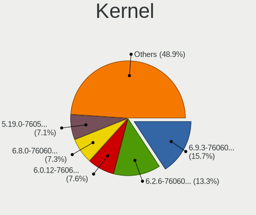
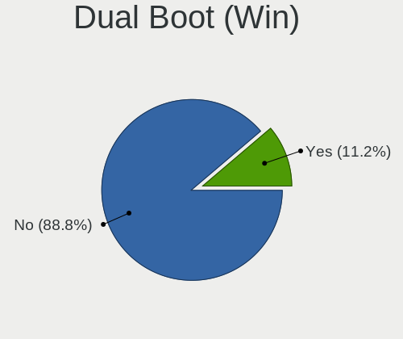
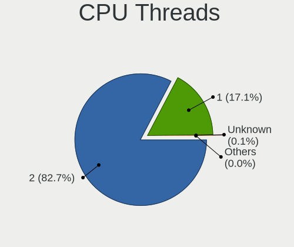
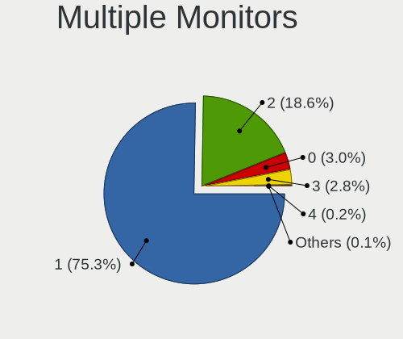
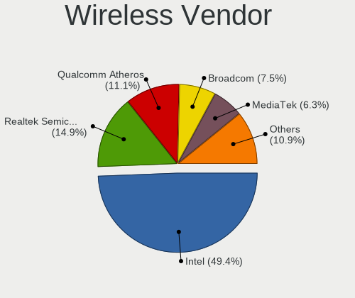

Pop!_OS 22.04 - Tested Hardware & Statistics
--------------------------------------------

A project to collect tested hardware configurations for Pop!_OS 22.04.

Anyone can contribute to this report by the [hw-probe](https://github.com/linuxhw/hw-probe) tool:

    sudo -E hw-probe -all -upload

Please contribute! Especially if your hardware is rare.

This is a report for all computer types. See also reports for [desktops](/Dist/Pop!_OS_22.04/Desktop/README.md) and [notebooks](/Dist/Pop!_OS_22.04/Notebook/README.md).

Contents
--------

* [ Test Cases ](#test-cases)

* [ System ](#system)
  - [ Kernel                   ](#kernel)
  - [ Kernel Family            ](#kernel-family)
  - [ Kernel Major Ver.        ](#kernel-major-ver)
  - [ Arch                     ](#arch)
  - [ DE                       ](#de)
  - [ Display Server           ](#display-server)
  - [ Display Manager          ](#display-manager)
  - [ OS Lang                  ](#os-lang)
  - [ Boot Mode                ](#boot-mode)
  - [ Filesystem               ](#filesystem)
  - [ Part. scheme             ](#part-scheme)
  - [ Dual Boot with Linux/BSD ](#dual-boot-with-linuxbsd)
  - [ Dual Boot (Win)          ](#dual-boot-win)

* [ Board ](#board)
  - [ Vendor                   ](#vendor)
  - [ Model                    ](#model)
  - [ Model Family             ](#model-family)
  - [ MFG Year                 ](#mfg-year)
  - [ Form Factor              ](#form-factor)
  - [ Secure Boot              ](#secure-boot)
  - [ Coreboot                 ](#coreboot)
  - [ RAM Size                 ](#ram-size)
  - [ RAM Used                 ](#ram-used)
  - [ Total Drives             ](#total-drives)
  - [ Has CD-ROM               ](#has-cd-rom)
  - [ Has Ethernet             ](#has-ethernet)
  - [ Has WiFi                 ](#has-wifi)
  - [ Has Bluetooth            ](#has-bluetooth)

* [ Location ](#location)
  - [ Country                  ](#country)
  - [ City                     ](#city)

* [ Drives ](#drives)
  - [ Drive Vendor             ](#drive-vendor)
  - [ Drive Model              ](#drive-model)
  - [ HDD Vendor               ](#hdd-vendor)
  - [ SSD Vendor               ](#ssd-vendor)
  - [ Drive Kind               ](#drive-kind)
  - [ Drive Connector          ](#drive-connector)
  - [ Drive Size               ](#drive-size)
  - [ Space Total              ](#space-total)
  - [ Space Used               ](#space-used)
  - [ Malfunc. Drives          ](#malfunc-drives)
  - [ Malfunc. Drive Vendor    ](#malfunc-drive-vendor)
  - [ Malfunc. HDD Vendor      ](#malfunc-hdd-vendor)
  - [ Malfunc. Drive Kind      ](#malfunc-drive-kind)
  - [ Failed Drives            ](#failed-drives)
  - [ Failed Drive Vendor      ](#failed-drive-vendor)
  - [ Drive Status             ](#drive-status)

* [ Storage controller ](#storage-controller)
  - [ Storage Vendor           ](#storage-vendor)
  - [ Storage Model            ](#storage-model)
  - [ Storage Kind             ](#storage-kind)

* [ Processor ](#processor)
  - [ CPU Vendor               ](#cpu-vendor)
  - [ CPU Model                ](#cpu-model)
  - [ CPU Model Family         ](#cpu-model-family)
  - [ CPU Cores                ](#cpu-cores)
  - [ CPU Sockets              ](#cpu-sockets)
  - [ CPU Threads              ](#cpu-threads)
  - [ CPU Op-Modes             ](#cpu-op-modes)
  - [ CPU Microcode            ](#cpu-microcode)
  - [ CPU Microarch            ](#cpu-microarch)

* [ Graphics ](#graphics)
  - [ GPU Vendor               ](#gpu-vendor)
  - [ GPU Model                ](#gpu-model)
  - [ GPU Combo                ](#gpu-combo)
  - [ GPU Driver               ](#gpu-driver)
  - [ GPU Memory               ](#gpu-memory)

* [ Monitor ](#monitor)
  - [ Monitor Vendor           ](#monitor-vendor)
  - [ Monitor Model            ](#monitor-model)
  - [ Monitor Resolution       ](#monitor-resolution)
  - [ Monitor Diagonal         ](#monitor-diagonal)
  - [ Monitor Width            ](#monitor-width)
  - [ Aspect Ratio             ](#aspect-ratio)
  - [ Monitor Area             ](#monitor-area)
  - [ Pixel Density            ](#pixel-density)
  - [ Multiple Monitors        ](#multiple-monitors)

* [ Network ](#network)
  - [ Net Controller Vendor    ](#net-controller-vendor)
  - [ Net Controller Model     ](#net-controller-model)
  - [ Wireless Vendor          ](#wireless-vendor)
  - [ Wireless Model           ](#wireless-model)
  - [ Ethernet Vendor          ](#ethernet-vendor)
  - [ Ethernet Model           ](#ethernet-model)
  - [ Net Controller Kind      ](#net-controller-kind)
  - [ Used Controller          ](#used-controller)
  - [ NICs                     ](#nics)
  - [ IPv6                     ](#ipv6)

* [ Bluetooth ](#bluetooth)
  - [ Bluetooth Vendor         ](#bluetooth-vendor)
  - [ Bluetooth Model          ](#bluetooth-model)

* [ Sound ](#sound)
  - [ Sound Vendor             ](#sound-vendor)
  - [ Sound Model              ](#sound-model)

* [ Memory ](#memory)
  - [ Memory Vendor            ](#memory-vendor)
  - [ Memory Model             ](#memory-model)
  - [ Memory Kind              ](#memory-kind)
  - [ Memory Form Factor       ](#memory-form-factor)
  - [ Memory Size              ](#memory-size)
  - [ Memory Speed             ](#memory-speed)

* [ Printers & scanners ](#printers--scanners)
  - [ Printer Vendor           ](#printer-vendor)
  - [ Printer Model            ](#printer-model)
  - [ Scanner Vendor           ](#scanner-vendor)
  - [ Scanner Model            ](#scanner-model)

* [ Camera ](#camera)
  - [ Camera Vendor            ](#camera-vendor)
  - [ Camera Model             ](#camera-model)

* [ Security ](#security)
  - [ Fingerprint Vendor       ](#fingerprint-vendor)
  - [ Fingerprint Model        ](#fingerprint-model)
  - [ Chipcard Vendor          ](#chipcard-vendor)
  - [ Chipcard Model           ](#chipcard-model)

* [ Unsupported ](#unsupported)
  - [ Unsupported Devices      ](#unsupported-devices)
  - [ Unsupported Device Types ](#unsupported-device-types)

Test Cases
----------

Total: 3371

| Vendor        | Model                       | Form-Factor | Probe                                                      | Date         |
|---------------|-----------------------------|-------------|------------------------------------------------------------|--------------|
| Dell          | Latitude 7275               | Tablet      | [c118ca04bc](https://linux-hardware.org/?probe=c118ca04bc) | Apr 01, 2023 |
| Lenovo        | IdeaPad U310                | Notebook    | [6add75e18c](https://linux-hardware.org/?probe=6add75e18c) | Apr 01, 2023 |
| Lenovo        | 4030                        | Desktop     | [7a23fd4fb4](https://linux-hardware.org/?probe=7a23fd4fb4) | Apr 01, 2023 |
| Toshiba       | Satellite L45-B             | Notebook    | [6d4878cdbf](https://linux-hardware.org/?probe=6d4878cdbf) | Apr 01, 2023 |
| Gigabyte      | Z170X-Gaming 7              | Desktop     | [f7c90851ac](https://linux-hardware.org/?probe=f7c90851ac) | Apr 01, 2023 |
| HP            | 240 G6 Notebook PC          | Notebook    | [44e093df31](https://linux-hardware.org/?probe=44e093df31) | Apr 01, 2023 |
| System76      | Lemur Pro                   | Notebook    | [5d57a3397e](https://linux-hardware.org/?probe=5d57a3397e) | Mar 31, 2023 |
| Apple         | Mac-F42C88C8 Proto1         | Desktop     | [fc44ad8c07](https://linux-hardware.org/?probe=fc44ad8c07) | Mar 31, 2023 |
| BESSTAR Te... | GB7                         | Mini pc     | [6f4a645737](https://linux-hardware.org/?probe=6f4a645737) | Mar 31, 2023 |
| ASUSTek       | ROG STRIX B550-F GAMING     | Desktop     | [61e2653466](https://linux-hardware.org/?probe=61e2653466) | Mar 31, 2023 |
| ASUSTek       | P8H67-M LE                  | Desktop     | [11b3a7cdb1](https://linux-hardware.org/?probe=11b3a7cdb1) | Mar 31, 2023 |
| ASUSTek       | X751LD                      | Notebook    | [2ef82331de](https://linux-hardware.org/?probe=2ef82331de) | Mar 31, 2023 |
| Supermicro    | X10SLV                      | Server      | [b61612a8a8](https://linux-hardware.org/?probe=b61612a8a8) | Mar 31, 2023 |
| Gigabyte      | B360M AORUS Gaming 3-CF     | Desktop     | [c346cf16d3](https://linux-hardware.org/?probe=c346cf16d3) | Mar 30, 2023 |
| Acer          | Aspire A515-56              | Notebook    | [bf846cebb9](https://linux-hardware.org/?probe=bf846cebb9) | Mar 30, 2023 |
| Acer          | Nitro AN515-58              | Notebook    | [27befad01f](https://linux-hardware.org/?probe=27befad01f) | Mar 30, 2023 |
| Apple         | MacBookPro12,1              | Notebook    | [21515b7373](https://linux-hardware.org/?probe=21515b7373) | Mar 30, 2023 |
| Apple         | MacBookPro12,1              | Notebook    | [080e22fdb2](https://linux-hardware.org/?probe=080e22fdb2) | Mar 30, 2023 |
| HP            | 0AA4h                       | Desktop     | [97457bb10c](https://linux-hardware.org/?probe=97457bb10c) | Mar 30, 2023 |
| Gigabyte      | B450 AORUS PRO WIFI-CF      | Desktop     | [af4901f141](https://linux-hardware.org/?probe=af4901f141) | Mar 30, 2023 |
| Apple         | Mac-F2268CC8                | All in one  | [cec51b833f](https://linux-hardware.org/?probe=cec51b833f) | Mar 30, 2023 |
| Toshiba       | IS 1413G                    | Notebook    | [13f35137bd](https://linux-hardware.org/?probe=13f35137bd) | Mar 30, 2023 |
| Foxconn       | 2AB1 DVT                    | Desktop     | [a9e8e4d4b0](https://linux-hardware.org/?probe=a9e8e4d4b0) | Mar 30, 2023 |
| Gigabyte      | AB350-Gaming 3-CF           | Desktop     | [81dda92e58](https://linux-hardware.org/?probe=81dda92e58) | Mar 30, 2023 |
| Multilaser    | MLSH1H LINUX                | Notebook    | [7ee1845d96](https://linux-hardware.org/?probe=7ee1845d96) | Mar 30, 2023 |
| Multilaser    | MLSH1H LINUX                | Notebook    | [bb80f561a2](https://linux-hardware.org/?probe=bb80f561a2) | Mar 30, 2023 |
| HP            | 8433 11                     | Desktop     | [55f7473ba8](https://linux-hardware.org/?probe=55f7473ba8) | Mar 29, 2023 |
| Lenovo        | IdeaPad 3 15ALC6 82MF       | Notebook    | [854490056d](https://linux-hardware.org/?probe=854490056d) | Mar 29, 2023 |
| HP            | ZBook 15 G5                 | Notebook    | [059358e49b](https://linux-hardware.org/?probe=059358e49b) | Mar 29, 2023 |
| ASUSTek       | TUF Gaming X570-PLUS        | Desktop     | [78046d9b99](https://linux-hardware.org/?probe=78046d9b99) | Mar 29, 2023 |
| HP            | 0AA4h                       | Desktop     | [801f843749](https://linux-hardware.org/?probe=801f843749) | Mar 29, 2023 |
| Win elemen... | M600                        | Desktop     | [7cf2343b6f](https://linux-hardware.org/?probe=7cf2343b6f) | Mar 29, 2023 |
| ASUSTek       | H81M-A/BR                   | Desktop     | [c994f20b64](https://linux-hardware.org/?probe=c994f20b64) | Mar 29, 2023 |
| Lenovo        | ThinkPad P14s Gen 2a 21A... | Notebook    | [af48722867](https://linux-hardware.org/?probe=af48722867) | Mar 28, 2023 |
| ASUSTek       | ASUS TUF Gaming A15 FA50... | Notebook    | [0667374075](https://linux-hardware.org/?probe=0667374075) | Mar 28, 2023 |
| Acer          | Nitro AN515-45              | Notebook    | [0aabfe954d](https://linux-hardware.org/?probe=0aabfe954d) | Mar 28, 2023 |
| Lenovo        | Legion 5 Pro 16ARH7H 82R... | Notebook    | [7939320fa4](https://linux-hardware.org/?probe=7939320fa4) | Mar 28, 2023 |
| Positivo      | Mobile                      | Notebook    | [60fd382fbf](https://linux-hardware.org/?probe=60fd382fbf) | Mar 28, 2023 |
| Positivo      | Mobile                      | Notebook    | [b08c430903](https://linux-hardware.org/?probe=b08c430903) | Mar 28, 2023 |
| HP            | 09F0h                       | Desktop     | [540ec71101](https://linux-hardware.org/?probe=540ec71101) | Mar 28, 2023 |
| Razer         | Blade                       | Notebook    | [ffa791eb4a](https://linux-hardware.org/?probe=ffa791eb4a) | Mar 28, 2023 |
| ASUSTek       | X751LD                      | Notebook    | [61382d0bd8](https://linux-hardware.org/?probe=61382d0bd8) | Mar 28, 2023 |
| ASRock        | H510M-HVS                   | Desktop     | [97744fad07](https://linux-hardware.org/?probe=97744fad07) | Mar 28, 2023 |
| Dell          | Inspiron 15-3567            | Notebook    | [d2b4780094](https://linux-hardware.org/?probe=d2b4780094) | Mar 28, 2023 |
| Toshiba       | IS 1413G                    | Notebook    | [635309aff4](https://linux-hardware.org/?probe=635309aff4) | Mar 28, 2023 |
| ASRock        | B650M PG Riptide WiFi       | Desktop     | [f17c95f91b](https://linux-hardware.org/?probe=f17c95f91b) | Mar 28, 2023 |
| ASRock        | B650M PG Riptide WiFi       | Desktop     | [1b67e2c4fd](https://linux-hardware.org/?probe=1b67e2c4fd) | Mar 28, 2023 |
| MSI           | MPG X670E CARBON WIFI       | Desktop     | [cde470cb39](https://linux-hardware.org/?probe=cde470cb39) | Mar 28, 2023 |
| ASUSTek       | TUF Gaming X570-PLUS        | Desktop     | [c4bba42d7b](https://linux-hardware.org/?probe=c4bba42d7b) | Mar 28, 2023 |
| Lenovo        | ThinkPad P50 20EQS0T400     | Notebook    | [5b4466c085](https://linux-hardware.org/?probe=5b4466c085) | Mar 28, 2023 |
| Lenovo        | ThinkPad T420 4180AP3       | Notebook    | [8ddee342c9](https://linux-hardware.org/?probe=8ddee342c9) | Mar 28, 2023 |
| Gigabyte      | X570 AORUS MASTER           | Desktop     | [adee3bbdde](https://linux-hardware.org/?probe=adee3bbdde) | Mar 28, 2023 |
| MSI           | B450M BAZOOKA V2            | Desktop     | [f6236c5962](https://linux-hardware.org/?probe=f6236c5962) | Mar 27, 2023 |
| Dell          | XPS 15 9570                 | Notebook    | [5be538736f](https://linux-hardware.org/?probe=5be538736f) | Mar 27, 2023 |
| Toshiba       | Satellite C55-C             | Notebook    | [d7ec0eb4b1](https://linux-hardware.org/?probe=d7ec0eb4b1) | Mar 27, 2023 |
| ASUSTek       | ROG CROSSHAIR VIII HERO     | Desktop     | [878fa94b87](https://linux-hardware.org/?probe=878fa94b87) | Mar 26, 2023 |
| Apple         | MacBook5,1                  | Notebook    | [a5c200217f](https://linux-hardware.org/?probe=a5c200217f) | Mar 26, 2023 |
| HP            | Spectre x360 Convertible... | Convertible | [8ffc3ea292](https://linux-hardware.org/?probe=8ffc3ea292) | Mar 26, 2023 |
| MSI           | Z490 PLUS                   | Desktop     | [06032b5e04](https://linux-hardware.org/?probe=06032b5e04) | Mar 26, 2023 |
| Lenovo        | CRESCENTBAY SDK0J40677 W... | Desktop     | [479aff4877](https://linux-hardware.org/?probe=479aff4877) | Mar 26, 2023 |
| MSI           | GL63 8RC                    | Notebook    | [935b78c3da](https://linux-hardware.org/?probe=935b78c3da) | Mar 26, 2023 |
| Lenovo        | CRESCENTBAY SDK0J40677 W... | Desktop     | [67ddc813cf](https://linux-hardware.org/?probe=67ddc813cf) | Mar 26, 2023 |
| ASUSTek       | ASUS TUF Gaming A15 FA50... | Notebook    | [537fc6af0e](https://linux-hardware.org/?probe=537fc6af0e) | Mar 26, 2023 |
| HP            | 250 15.6 inch G9 Noteboo... | Notebook    | [55c29cec29](https://linux-hardware.org/?probe=55c29cec29) | Mar 26, 2023 |
| ASUSTek       | ROG CROSSHAIR X670E HERO    | Desktop     | [fc01cd79a4](https://linux-hardware.org/?probe=fc01cd79a4) | Mar 26, 2023 |
| MSI           | MAG B550 TOMAHAWK           | Desktop     | [c08caf1dee](https://linux-hardware.org/?probe=c08caf1dee) | Mar 26, 2023 |
| Lenovo        | IdeaPad 3 15ITL6 82H8       | Notebook    | [905078c7b9](https://linux-hardware.org/?probe=905078c7b9) | Mar 26, 2023 |
| MSI           | MAG B550 TOMAHAWK           | Desktop     | [f6f4996c63](https://linux-hardware.org/?probe=f6f4996c63) | Mar 26, 2023 |
| Dell          | Latitude E7240              | Notebook    | [3d91b46fda](https://linux-hardware.org/?probe=3d91b46fda) | Mar 26, 2023 |
| Dell          | XPS 13 9370                 | Notebook    | [3f3967267f](https://linux-hardware.org/?probe=3f3967267f) | Mar 26, 2023 |
| Lenovo        | Y50-70 20378                | Notebook    | [61897b32de](https://linux-hardware.org/?probe=61897b32de) | Mar 25, 2023 |
| Gigabyte      | X570 AORUS ELITE            | Desktop     | [0f7d28bd43](https://linux-hardware.org/?probe=0f7d28bd43) | Mar 25, 2023 |
| HP            | Spectre Laptop 13-af0xx     | Notebook    | [6fdc683220](https://linux-hardware.org/?probe=6fdc683220) | Mar 25, 2023 |
| MSI           | Katana GF66 12UG            | Notebook    | [9e03ac14c0](https://linux-hardware.org/?probe=9e03ac14c0) | Mar 25, 2023 |
| Intel         | NUC10i3FNB K61362-305       | Mini pc     | [26c0bb67b6](https://linux-hardware.org/?probe=26c0bb67b6) | Mar 25, 2023 |
| HP            | ENVY x360 Convertible 13... | Convertible | [811be842de](https://linux-hardware.org/?probe=811be842de) | Mar 25, 2023 |
| Apple         | MacBookPro11,3              | Notebook    | [21c3ce9508](https://linux-hardware.org/?probe=21c3ce9508) | Mar 24, 2023 |
| Dell          | 0PC5F7 A01                  | Desktop     | [61550296b7](https://linux-hardware.org/?probe=61550296b7) | Mar 24, 2023 |
| ASUSTek       | VivoBook_ASUSLaptop X512... | Notebook    | [ac415822b8](https://linux-hardware.org/?probe=ac415822b8) | Mar 24, 2023 |
| HP            | Laptop 15-db0xxx            | Notebook    | [ad0e5c0483](https://linux-hardware.org/?probe=ad0e5c0483) | Mar 24, 2023 |
| Dell          | Latitude 5420               | Notebook    | [e6afbbee47](https://linux-hardware.org/?probe=e6afbbee47) | Mar 24, 2023 |
| HP            | EliteBook 8460p             | Notebook    | [f78f58795c](https://linux-hardware.org/?probe=f78f58795c) | Mar 24, 2023 |
| HP            | 212B                        | Desktop     | [266912cedd](https://linux-hardware.org/?probe=266912cedd) | Mar 24, 2023 |
| Apple         | Mac-F226BEC8 PVT            | All in one  | [f5cbf68e6d](https://linux-hardware.org/?probe=f5cbf68e6d) | Mar 24, 2023 |
| Alienware     | 17 R4                       | Notebook    | [3c456dc309](https://linux-hardware.org/?probe=3c456dc309) | Mar 24, 2023 |
| GPU Compan... | GWTN141-10                  | Notebook    | [9007c1d23f](https://linux-hardware.org/?probe=9007c1d23f) | Mar 24, 2023 |
| ASUSTek       | ROG STRIX B450-F GAMING ... | Notebook    | [f8f47e3220](https://linux-hardware.org/?probe=f8f47e3220) | Mar 23, 2023 |
| Dell          | Precision 7710              | Notebook    | [25a4797475](https://linux-hardware.org/?probe=25a4797475) | Mar 23, 2023 |
| ASUSTek       | ROG STRIX X570-I GAMING     | Desktop     | [09fec047e4](https://linux-hardware.org/?probe=09fec047e4) | Mar 23, 2023 |
| Toshiba       | IS 1413G                    | Notebook    | [3a75d7fb8d](https://linux-hardware.org/?probe=3a75d7fb8d) | Mar 23, 2023 |
| MSI           | MPG Z590 GAMING FORCE       | Desktop     | [7a3319972e](https://linux-hardware.org/?probe=7a3319972e) | Mar 23, 2023 |
| Gigabyte      | X570 AORUS ULTRA            | Desktop     | [c06eaca849](https://linux-hardware.org/?probe=c06eaca849) | Mar 23, 2023 |
| HP            | ProBook 440 G8 Notebook ... | Notebook    | [aba9609828](https://linux-hardware.org/?probe=aba9609828) | Mar 23, 2023 |
| Lenovo        | IdeaPad Gaming 3 15IMH05... | Notebook    | [f6580b20d3](https://linux-hardware.org/?probe=f6580b20d3) | Mar 22, 2023 |
| Lenovo        | Yoga 6 13ALC7 82UD          | Convertible | [dab7a6edbc](https://linux-hardware.org/?probe=dab7a6edbc) | Mar 22, 2023 |
| Apple         | MacBook5,1                  | Notebook    | [bc6e3fa274](https://linux-hardware.org/?probe=bc6e3fa274) | Mar 22, 2023 |
| HP            | Pavilion x360 Convertibl... | Convertible | [d458338d97](https://linux-hardware.org/?probe=d458338d97) | Mar 22, 2023 |
| Apple         | MacBookAir7,2               | Notebook    | [627590f38c](https://linux-hardware.org/?probe=627590f38c) | Mar 22, 2023 |
| Lenovo        | ThinkPad Twist 33472HU      | Notebook    | [a49ece0e6c](https://linux-hardware.org/?probe=a49ece0e6c) | Mar 22, 2023 |
| Lenovo        | ThinkPad Twist 33472HU      | Notebook    | [315f2256c6](https://linux-hardware.org/?probe=315f2256c6) | Mar 22, 2023 |
| Dell          | 0RK936                      | Desktop     | [af3e7f60cb](https://linux-hardware.org/?probe=af3e7f60cb) | Mar 22, 2023 |
| Apple         | MacBookPro8,1               | Notebook    | [b616377b13](https://linux-hardware.org/?probe=b616377b13) | Mar 22, 2023 |
| Apple         | MacBookPro12,1              | Notebook    | [aff8d829e0](https://linux-hardware.org/?probe=aff8d829e0) | Mar 22, 2023 |
| Samsung       | 350V5C/350V5X/350V4C/350... | Notebook    | [99fe9f96c6](https://linux-hardware.org/?probe=99fe9f96c6) | Mar 22, 2023 |
| Apple         | MacBookPro12,1              | Notebook    | [af60ed4cde](https://linux-hardware.org/?probe=af60ed4cde) | Mar 22, 2023 |
| Apple         | MacBookAir7,2               | Notebook    | [3b3376e72c](https://linux-hardware.org/?probe=3b3376e72c) | Mar 21, 2023 |
| ASUSTek       | ROG STRIX X570-I GAMING     | Desktop     | [b4c65fead7](https://linux-hardware.org/?probe=b4c65fead7) | Mar 21, 2023 |
| HUAWEI        | KPL-W0X                     | Notebook    | [afc1ff125b](https://linux-hardware.org/?probe=afc1ff125b) | Mar 21, 2023 |
| Lenovo        | ThinkPad T420 4180AP3       | Notebook    | [3c100c55be](https://linux-hardware.org/?probe=3c100c55be) | Mar 21, 2023 |
| Lenovo        | ThinkPad T420 4180AP3       | Notebook    | [039724e2c2](https://linux-hardware.org/?probe=039724e2c2) | Mar 21, 2023 |
| Dell          | G15 5511                    | Notebook    | [6d71997e08](https://linux-hardware.org/?probe=6d71997e08) | Mar 21, 2023 |
| Dell          | XPS L421X                   | Notebook    | [fd54af9534](https://linux-hardware.org/?probe=fd54af9534) | Mar 21, 2023 |
| Dell          | 0RK936                      | Desktop     | [6c2680e4e9](https://linux-hardware.org/?probe=6c2680e4e9) | Mar 21, 2023 |
| HP            | Pavilion Gaming Laptop 1... | Notebook    | [afe8ca841c](https://linux-hardware.org/?probe=afe8ca841c) | Mar 21, 2023 |
| Acer          | Aspire 5349                 | Notebook    | [c0f5810e5c](https://linux-hardware.org/?probe=c0f5810e5c) | Mar 21, 2023 |
| MSI           | Prestige 14Evo A11M         | Notebook    | [cac8d6b991](https://linux-hardware.org/?probe=cac8d6b991) | Mar 21, 2023 |
| HP            | Dev One Notebook PC         | Notebook    | [d6ff521952](https://linux-hardware.org/?probe=d6ff521952) | Mar 21, 2023 |
| ASRock        | B550M Pro4                  | Desktop     | [16253cadcf](https://linux-hardware.org/?probe=16253cadcf) | Mar 21, 2023 |
| Acer          | Nitro AN517-55              | Notebook    | [d6393f5710](https://linux-hardware.org/?probe=d6393f5710) | Mar 21, 2023 |
| HP            | Dev One Notebook PC         | Notebook    | [404c84b0ea](https://linux-hardware.org/?probe=404c84b0ea) | Mar 21, 2023 |
| ASUSTek       | PRIME X670E-PRO WIFI        | Desktop     | [d4e033725b](https://linux-hardware.org/?probe=d4e033725b) | Mar 21, 2023 |
| Acer          | Nitro AN517-55              | Notebook    | [edf722e245](https://linux-hardware.org/?probe=edf722e245) | Mar 21, 2023 |
| ASUSTek       | PRIME B650-PLUS             | Desktop     | [5ea7504472](https://linux-hardware.org/?probe=5ea7504472) | Mar 21, 2023 |
| Gigabyte      | A320M-S2H-CF                | Notebook    | [2ff2eab844](https://linux-hardware.org/?probe=2ff2eab844) | Mar 21, 2023 |
| ASUSTek       | G74Sx                       | Notebook    | [d2b90b7d2f](https://linux-hardware.org/?probe=d2b90b7d2f) | Mar 21, 2023 |
| HP            | ZBook Power 15.6 inch G9... | Notebook    | [2ef051fd19](https://linux-hardware.org/?probe=2ef051fd19) | Mar 20, 2023 |
| Lenovo        | IdeaPad 330-15ARR 81D2      | Notebook    | [48de9eb9e3](https://linux-hardware.org/?probe=48de9eb9e3) | Mar 20, 2023 |
| ASUSTek       | PRIME X299-DELUXE II        | Desktop     | [b133c68356](https://linux-hardware.org/?probe=b133c68356) | Mar 20, 2023 |
| HP            | Pavilion Gaming Laptop 1... | Notebook    | [afcac034a9](https://linux-hardware.org/?probe=afcac034a9) | Mar 20, 2023 |
| HP            | Pavilion Laptop 15-cw1xx... | Notebook    | [d08f174747](https://linux-hardware.org/?probe=d08f174747) | Mar 20, 2023 |
| ASRock        | X570 Phantom Gaming 4       | Notebook    | [c9b4e3cf00](https://linux-hardware.org/?probe=c9b4e3cf00) | Mar 20, 2023 |
| MSI           | MAG B550M BAZOOKA           | Desktop     | [3fe3c818f7](https://linux-hardware.org/?probe=3fe3c818f7) | Mar 20, 2023 |
| Dell          | Latitude 5590               | Notebook    | [49922a3223](https://linux-hardware.org/?probe=49922a3223) | Mar 19, 2023 |
| Lenovo        | IdeaPad 5 Pro 16ARH7 82S... | Notebook    | [55dc5e3ef4](https://linux-hardware.org/?probe=55dc5e3ef4) | Mar 19, 2023 |
| Intel         | NUC11PHBi7 M26151-404       | Mini pc     | [22290c7abf](https://linux-hardware.org/?probe=22290c7abf) | Mar 19, 2023 |
| Gigabyte      | Z97X-Gaming 7               | Desktop     | [6681949ccc](https://linux-hardware.org/?probe=6681949ccc) | Mar 19, 2023 |
| MSI           | PS42 8M                     | Notebook    | [aad18852f4](https://linux-hardware.org/?probe=aad18852f4) | Mar 19, 2023 |
| Gigabyte      | X470 AORUS ULTRA GAMING-... | Desktop     | [d0079fa594](https://linux-hardware.org/?probe=d0079fa594) | Mar 19, 2023 |
| ASUSTek       | G74Sx                       | Notebook    | [f7f92408dc](https://linux-hardware.org/?probe=f7f92408dc) | Mar 19, 2023 |
| Lenovo        | IdeaPad Gaming 3 15IHU6 ... | Notebook    | [6b6ceb1a1a](https://linux-hardware.org/?probe=6b6ceb1a1a) | Mar 19, 2023 |
| Lenovo        | ThinkPad X1 Carbon 6th 2... | Notebook    | [e3410282c5](https://linux-hardware.org/?probe=e3410282c5) | Mar 19, 2023 |
| Apple         | Mac-F226BEC8 PVT            | All in one  | [c462ccc41a](https://linux-hardware.org/?probe=c462ccc41a) | Mar 19, 2023 |
| Gigabyte      | X79-UD3                     | Desktop     | [0139691951](https://linux-hardware.org/?probe=0139691951) | Mar 19, 2023 |
| AZW           | SER V1.0                    | Mini pc     | [22e0286a24](https://linux-hardware.org/?probe=22e0286a24) | Mar 19, 2023 |
| AZW           | SER V1.0                    | Mini pc     | [0018c1237d](https://linux-hardware.org/?probe=0018c1237d) | Mar 19, 2023 |
| Dell          | 0WMJ54 A00                  | Desktop     | [bcb1a34cf2](https://linux-hardware.org/?probe=bcb1a34cf2) | Mar 19, 2023 |
| ASUSTek       | S551LB                      | Notebook    | [7d4485326f](https://linux-hardware.org/?probe=7d4485326f) | Mar 18, 2023 |
| GPU Compan... | GWTN141-10                  | Notebook    | [ff8db61ccf](https://linux-hardware.org/?probe=ff8db61ccf) | Mar 18, 2023 |
| ASUSTek       | X540LJ                      | Notebook    | [4eab8887fa](https://linux-hardware.org/?probe=4eab8887fa) | Mar 18, 2023 |
| ASUSTek       | X540LJ                      | Notebook    | [b3bf824f3a](https://linux-hardware.org/?probe=b3bf824f3a) | Mar 18, 2023 |
| ASRock        | X570 Phantom Gaming 4       | Notebook    | [dd296a8801](https://linux-hardware.org/?probe=dd296a8801) | Mar 18, 2023 |
| Lenovo        | ThinkPad T480 20L6S11N00    | Notebook    | [60d80937ea](https://linux-hardware.org/?probe=60d80937ea) | Mar 18, 2023 |
| Apple         | Mac-031B6874CF7F642A iMa... | All in one  | [dc411c9ce3](https://linux-hardware.org/?probe=dc411c9ce3) | Mar 18, 2023 |
| ASUSTek       | ZenBook UX325UA_UM325UA     | Notebook    | [91ae5652cc](https://linux-hardware.org/?probe=91ae5652cc) | Mar 18, 2023 |
| Lenovo        | IdeaPad L340-17IRH Gamin... | Notebook    | [274f959cfc](https://linux-hardware.org/?probe=274f959cfc) | Mar 17, 2023 |
| ASUSTek       | ROG STRIX B550-I GAMING     | Desktop     | [c4bebd7028](https://linux-hardware.org/?probe=c4bebd7028) | Mar 17, 2023 |
| Unknown       | Unknown                     | Desktop     | [2389fcea33](https://linux-hardware.org/?probe=2389fcea33) | Mar 17, 2023 |
| Dell          | Latitude E7240              | Notebook    | [cbcae7df75](https://linux-hardware.org/?probe=cbcae7df75) | Mar 17, 2023 |
| Intel         | X99 V1.x                    | Desktop     | [9b471dcdcf](https://linux-hardware.org/?probe=9b471dcdcf) | Mar 17, 2023 |
| Positivo      | N1250                       | Notebook    | [e5ee22876a](https://linux-hardware.org/?probe=e5ee22876a) | Mar 17, 2023 |
| Gigabyte      | X399 DESIGNARE EX-CF        | Desktop     | [557a99333f](https://linux-hardware.org/?probe=557a99333f) | Mar 17, 2023 |
| ASUSTek       | ROG STRIX Z370-G GAMING     | Desktop     | [27356d58d5](https://linux-hardware.org/?probe=27356d58d5) | Mar 17, 2023 |
| HP            | 843F                        | Desktop     | [e444e0d76a](https://linux-hardware.org/?probe=e444e0d76a) | Mar 17, 2023 |
| HP            | ProBook 4530s               | Notebook    | [f0abd32fe4](https://linux-hardware.org/?probe=f0abd32fe4) | Mar 17, 2023 |
| Lenovo        | G40-80 80JE                 | Notebook    | [a7a6cc1ab5](https://linux-hardware.org/?probe=a7a6cc1ab5) | Mar 17, 2023 |
| Lenovo        | G40-80 80JE                 | Notebook    | [204994be7f](https://linux-hardware.org/?probe=204994be7f) | Mar 17, 2023 |
| TUXEDO        | Pulse 14 Gen1               | Notebook    | [525b267c31](https://linux-hardware.org/?probe=525b267c31) | Mar 17, 2023 |
| ASUSTek       | TUF Gaming B650-PLUS WIF... | Desktop     | [b20fcd6878](https://linux-hardware.org/?probe=b20fcd6878) | Mar 17, 2023 |
| Toshiba       | Satellite Pro C50-A-1E2     | Notebook    | [a1adc8641d](https://linux-hardware.org/?probe=a1adc8641d) | Mar 17, 2023 |
| Toshiba       | Satellite Pro C50-A-1E2     | Notebook    | [a0eea87e02](https://linux-hardware.org/?probe=a0eea87e02) | Mar 17, 2023 |
| Unknown       | Unknown                     | Notebook    | [3eb0bf05b4](https://linux-hardware.org/?probe=3eb0bf05b4) | Mar 17, 2023 |
| Lenovo        | ThinkPad T460s 20FAS0RP0... | Notebook    | [f901058202](https://linux-hardware.org/?probe=f901058202) | Mar 16, 2023 |
| ASUSTek       | ASUS TUF Gaming A15 FA50... | Notebook    | [d6f5cd9505](https://linux-hardware.org/?probe=d6f5cd9505) | Mar 16, 2023 |
| Dell          | 02GDWG A00                  | Desktop     | [c81ac4434e](https://linux-hardware.org/?probe=c81ac4434e) | Mar 16, 2023 |
| Lenovo        | IdeaPad 330-15IGM 81FN      | Notebook    | [5f48c46d68](https://linux-hardware.org/?probe=5f48c46d68) | Mar 16, 2023 |
| Microsoft     | Surface Book                | Tablet      | [d5cd9be69a](https://linux-hardware.org/?probe=d5cd9be69a) | Mar 16, 2023 |
| Lenovo        | Yoga C740-14IML 81TC        | Convertible | [67d6333f85](https://linux-hardware.org/?probe=67d6333f85) | Mar 15, 2023 |
| HP            | Laptop 15s-eq1xxx           | Notebook    | [59a304e790](https://linux-hardware.org/?probe=59a304e790) | Mar 15, 2023 |
| Acer          | Aspire A715-42G             | Notebook    | [8bdae79f7a](https://linux-hardware.org/?probe=8bdae79f7a) | Mar 15, 2023 |
| Lenovo        | ThinkPad T440p 20AWS19P0... | Notebook    | [6a2d338526](https://linux-hardware.org/?probe=6a2d338526) | Mar 15, 2023 |
| ASUSTek       | Z87-K                       | Desktop     | [fe2d844bfb](https://linux-hardware.org/?probe=fe2d844bfb) | Mar 15, 2023 |
| Razer         | Blade Stealth 13 (Early ... | Notebook    | [eb1d71edb4](https://linux-hardware.org/?probe=eb1d71edb4) | Mar 15, 2023 |
| HCL Infosy... | HCL ME LAPTOP               | Notebook    | [af254fca4d](https://linux-hardware.org/?probe=af254fca4d) | Mar 15, 2023 |
| SAGER         | X8100                       | Notebook    | [90aaefeb9e](https://linux-hardware.org/?probe=90aaefeb9e) | Mar 15, 2023 |
| ASUSTek       | ROG STRIX B650E-I GAMING... | Desktop     | [88c4c221af](https://linux-hardware.org/?probe=88c4c221af) | Mar 15, 2023 |
| Huanan        | X99-AD3 GAMING V2.0         | Desktop     | [0586633e29](https://linux-hardware.org/?probe=0586633e29) | Mar 15, 2023 |
| ASUSTek       | PRIME Z790-P WIFI D4        | Desktop     | [e8bbe7a962](https://linux-hardware.org/?probe=e8bbe7a962) | Mar 15, 2023 |
| ASUSTek       | ROG STRIX B650E-I GAMING... | Desktop     | [0c74f7b048](https://linux-hardware.org/?probe=0c74f7b048) | Mar 15, 2023 |
| System76      | Pangolin                    | Notebook    | [4f39796131](https://linux-hardware.org/?probe=4f39796131) | Mar 15, 2023 |
| Dell          | Latitude E7240              | Notebook    | [d4ed345a47](https://linux-hardware.org/?probe=d4ed345a47) | Mar 14, 2023 |
| ASRock        | B550 Extreme4               | Desktop     | [9a139b5bad](https://linux-hardware.org/?probe=9a139b5bad) | Mar 14, 2023 |
| Lenovo        | ThinkPad T450s 20BWS14G0... | Notebook    | [1161c07721](https://linux-hardware.org/?probe=1161c07721) | Mar 14, 2023 |
| Sony          | VPCZ12V9R                   | Notebook    | [28be5f7f2b](https://linux-hardware.org/?probe=28be5f7f2b) | Mar 14, 2023 |
| Dell          | Latitude E7240              | Notebook    | [4a7d442938](https://linux-hardware.org/?probe=4a7d442938) | Mar 14, 2023 |
| HP            | EliteBook 8560w             | Notebook    | [44d9ce8acb](https://linux-hardware.org/?probe=44d9ce8acb) | Mar 14, 2023 |
| HP            | EliteBook 8560w             | Notebook    | [986fe8c418](https://linux-hardware.org/?probe=986fe8c418) | Mar 14, 2023 |
| Gigabyte      | X58A-UD7                    | Desktop     | [95248fc9a0](https://linux-hardware.org/?probe=95248fc9a0) | Mar 14, 2023 |
| Dell          | 0RK936                      | Desktop     | [59cbc1f071](https://linux-hardware.org/?probe=59cbc1f071) | Mar 14, 2023 |
| Fujitsu       | LIFEBOOK E5512A             | Notebook    | [ae9f2da5a4](https://linux-hardware.org/?probe=ae9f2da5a4) | Mar 14, 2023 |
| HP            | EliteBook 840 G6            | Notebook    | [874706952d](https://linux-hardware.org/?probe=874706952d) | Mar 14, 2023 |
| Lenovo        | ThinkPad X220 Tablet 429... | Notebook    | [de22b8a7e6](https://linux-hardware.org/?probe=de22b8a7e6) | Mar 14, 2023 |
| Dell          | Inspiron 7348               | Notebook    | [7459d24035](https://linux-hardware.org/?probe=7459d24035) | Mar 13, 2023 |
| ASUSTek       | PRIME A320M-K               | Desktop     | [f5215489c7](https://linux-hardware.org/?probe=f5215489c7) | Mar 13, 2023 |
| ASUSTek       | H97-PRO                     | Desktop     | [b03c056ee1](https://linux-hardware.org/?probe=b03c056ee1) | Mar 13, 2023 |
| Toshiba       | IS 1413G                    | Notebook    | [b93a4bdcbb](https://linux-hardware.org/?probe=b93a4bdcbb) | Mar 13, 2023 |
| Acer          | Aspire 4530                 | Notebook    | [84f4733a96](https://linux-hardware.org/?probe=84f4733a96) | Mar 13, 2023 |
| Acer          | Nitro AN515-58              | Notebook    | [7f2ecd927d](https://linux-hardware.org/?probe=7f2ecd927d) | Mar 13, 2023 |
| Gateway       | WG43M                       | Desktop     | [c1ab165971](https://linux-hardware.org/?probe=c1ab165971) | Mar 13, 2023 |
| Apple         | MacBookPro15,1              | Notebook    | [663f73a08e](https://linux-hardware.org/?probe=663f73a08e) | Mar 13, 2023 |
| Apple         | MacBookPro15,1              | Notebook    | [5d1a30091e](https://linux-hardware.org/?probe=5d1a30091e) | Mar 13, 2023 |
| Lenovo        | ThinkPad X1 Extreme 2nd ... | Notebook    | [a826b1cd32](https://linux-hardware.org/?probe=a826b1cd32) | Mar 13, 2023 |
| MSI           | A68HM-E33 V2                | Desktop     | [0e2618e3ea](https://linux-hardware.org/?probe=0e2618e3ea) | Mar 12, 2023 |
| Dell          | 0DFRFW A01                  | Desktop     | [1b8b00dbc5](https://linux-hardware.org/?probe=1b8b00dbc5) | Mar 12, 2023 |
| Lenovo        | ThinkPad T480s 20L8S7AS0... | Notebook    | [87ef2f6efb](https://linux-hardware.org/?probe=87ef2f6efb) | Mar 12, 2023 |
| HP            | ProLiant DL380 G7           | Server      | [9911027e53](https://linux-hardware.org/?probe=9911027e53) | Mar 12, 2023 |
| HUAWEI        | NBM-WXX9                    | Notebook    | [27b710cd68](https://linux-hardware.org/?probe=27b710cd68) | Mar 12, 2023 |
| Google        | Kefka                       | Notebook    | [4a54e34e44](https://linux-hardware.org/?probe=4a54e34e44) | Mar 12, 2023 |
| ASUSTek       | ZenBook UX434IQ_Q407IQ      | Notebook    | [7090114437](https://linux-hardware.org/?probe=7090114437) | Mar 12, 2023 |
| Dell          | Inspiron 5452               | Notebook    | [2c8ca0e296](https://linux-hardware.org/?probe=2c8ca0e296) | Mar 12, 2023 |
| Gigabyte      | Z590I AORUS ULTRA           | Desktop     | [47ea9647d3](https://linux-hardware.org/?probe=47ea9647d3) | Mar 12, 2023 |
| ASUSTek       | ROG STRIX X570-I GAMING     | Desktop     | [75fc2c0a15](https://linux-hardware.org/?probe=75fc2c0a15) | Mar 12, 2023 |
| Positivo B... | VJFE41F11X-XXXXXX           | Notebook    | [99f410d801](https://linux-hardware.org/?probe=99f410d801) | Mar 11, 2023 |
| ASUSTek       | VivoBook S14 X411UF         | Notebook    | [e101a1c94c](https://linux-hardware.org/?probe=e101a1c94c) | Mar 11, 2023 |
| Acer          | Aspire X1935                | Desktop     | [6846ecd490](https://linux-hardware.org/?probe=6846ecd490) | Mar 11, 2023 |
| HONOR         | NMH-WCX9                    | Notebook    | [d8cf10f11d](https://linux-hardware.org/?probe=d8cf10f11d) | Mar 11, 2023 |
| HP            | ZBook 17                    | Notebook    | [a775bc33c5](https://linux-hardware.org/?probe=a775bc33c5) | Mar 11, 2023 |
| Maibenben     | P748                        | Notebook    | [a44d1bb8e4](https://linux-hardware.org/?probe=a44d1bb8e4) | Mar 11, 2023 |
| Toshiba       | IS 1413G                    | Notebook    | [39cc207ce7](https://linux-hardware.org/?probe=39cc207ce7) | Mar 11, 2023 |
| Lenovo        | ThinkPad L440 20ASS0ET00    | Notebook    | [2ac6dfff4f](https://linux-hardware.org/?probe=2ac6dfff4f) | Mar 11, 2023 |
| GPD           | G1619-04                    | Notebook    | [302ff30130](https://linux-hardware.org/?probe=302ff30130) | Mar 11, 2023 |
| GPD           | G1619-04                    | Notebook    | [d8f5b9eec9](https://linux-hardware.org/?probe=d8f5b9eec9) | Mar 11, 2023 |
| Gigabyte      | B550 AORUS ELITE V2         | Desktop     | [8736fd04a8](https://linux-hardware.org/?probe=8736fd04a8) | Mar 11, 2023 |
| Dell          | 0KC9NP A00                  | Desktop     | [873a2bf50c](https://linux-hardware.org/?probe=873a2bf50c) | Mar 11, 2023 |
| Microsoft     | Surface Pro 7               | Tablet      | [9535f3676b](https://linux-hardware.org/?probe=9535f3676b) | Mar 10, 2023 |
| Microsoft     | Surface Pro 7               | Tablet      | [fca941c098](https://linux-hardware.org/?probe=fca941c098) | Mar 10, 2023 |
| Gigabyte      | X570S AORUS ELITE AX        | Notebook    | [96f4bd0a52](https://linux-hardware.org/?probe=96f4bd0a52) | Mar 10, 2023 |
| ASRock        | FM2A68M-HD+                 | Desktop     | [ccba86bda3](https://linux-hardware.org/?probe=ccba86bda3) | Mar 10, 2023 |
| Gigabyte      | X570S AORUS ELITE AX        | Notebook    | [969ab4279f](https://linux-hardware.org/?probe=969ab4279f) | Mar 10, 2023 |
| Lenovo        | ThinkPad X1 Carbon 3rd 2... | Notebook    | [c44f0eab3e](https://linux-hardware.org/?probe=c44f0eab3e) | Mar 10, 2023 |
| Lenovo        | ThinkPad T440p 20AWS19P0... | Notebook    | [44867c946f](https://linux-hardware.org/?probe=44867c946f) | Mar 10, 2023 |
| ASUSTek       | PRIME B550-PLUS             | Desktop     | [dbdadff4f2](https://linux-hardware.org/?probe=dbdadff4f2) | Mar 10, 2023 |
| Lenovo        | IdeaPad Gaming 3 15IMH05... | Notebook    | [50dd87563b](https://linux-hardware.org/?probe=50dd87563b) | Mar 10, 2023 |
| ASRock        | B450 Steel Legend           | Desktop     | [e183f14e7e](https://linux-hardware.org/?probe=e183f14e7e) | Mar 10, 2023 |
| Samsung       | R430/R480/R440              | Notebook    | [cdb2525b51](https://linux-hardware.org/?probe=cdb2525b51) | Mar 10, 2023 |
| ASUSTek       | Zenbook UM3402YA_UM3402Y... | Notebook    | [410a5a70f3](https://linux-hardware.org/?probe=410a5a70f3) | Mar 10, 2023 |
| Lenovo        | ThinkPad L13 Yoga Gen 2a... | Notebook    | [eac4ae85a4](https://linux-hardware.org/?probe=eac4ae85a4) | Mar 10, 2023 |
| Positivo      | POS-PIQ77CL                 | Desktop     | [789838055a](https://linux-hardware.org/?probe=789838055a) | Mar 10, 2023 |
| Lenovo        | ThinkPad X220 Tablet 429... | Notebook    | [baffc24bef](https://linux-hardware.org/?probe=baffc24bef) | Mar 10, 2023 |
| Gigabyte      | X570S AORUS ELITE AX        | Desktop     | [214efb1e94](https://linux-hardware.org/?probe=214efb1e94) | Mar 09, 2023 |
| Lenovo        | IdeaPad 330-15IKB 81DE      | Notebook    | [187761b57d](https://linux-hardware.org/?probe=187761b57d) | Mar 09, 2023 |
| Lenovo        | IdeaPad 330-15IKB 81DE      | Notebook    | [4e1196658a](https://linux-hardware.org/?probe=4e1196658a) | Mar 09, 2023 |
| HP            | ENVY Notebook               | Notebook    | [8a063efa19](https://linux-hardware.org/?probe=8a063efa19) | Mar 09, 2023 |
| MSI           | A68HM-E33 V2                | Desktop     | [670e89da85](https://linux-hardware.org/?probe=670e89da85) | Mar 09, 2023 |
| Gigabyte      | H110M-DS2V DDR3-CF          | Desktop     | [d101f34459](https://linux-hardware.org/?probe=d101f34459) | Mar 09, 2023 |
| HP            | ProLiant DL360p Gen8        | Server      | [b483cfbad7](https://linux-hardware.org/?probe=b483cfbad7) | Mar 09, 2023 |
| Lenovo        | ThinkPad L13 Yoga Gen 2a... | Notebook    | [a8d1bd3e81](https://linux-hardware.org/?probe=a8d1bd3e81) | Mar 09, 2023 |
| MSI           | X58 PLATINUM SLI            | Desktop     | [c8875fb17f](https://linux-hardware.org/?probe=c8875fb17f) | Mar 08, 2023 |
| ASUSTek       | Zenbook Pro Duo UX582ZW_... | Notebook    | [7805fe229d](https://linux-hardware.org/?probe=7805fe229d) | Mar 08, 2023 |
| Razer         | Blade 15 Advanced Model ... | Notebook    | [46fa9eab7d](https://linux-hardware.org/?probe=46fa9eab7d) | Mar 08, 2023 |
| ASUSTek       | SABERTOOTH 990FX R2.0       | Desktop     | [b99222314c](https://linux-hardware.org/?probe=b99222314c) | Mar 08, 2023 |
| Gigabyte      | X570 AORUS ELITE            | Desktop     | [4f64764c75](https://linux-hardware.org/?probe=4f64764c75) | Mar 08, 2023 |
| Dell          | 051FJ8 A02                  | Desktop     | [4c15877e95](https://linux-hardware.org/?probe=4c15877e95) | Mar 08, 2023 |
| Google        | Bobba                       | Notebook    | [01d8f57c7e](https://linux-hardware.org/?probe=01d8f57c7e) | Mar 08, 2023 |
| Dell          | 0KWVT8 A03                  | Desktop     | [6ddf3ecd86](https://linux-hardware.org/?probe=6ddf3ecd86) | Mar 08, 2023 |
| ASRock        | 890GX Extreme3              | Desktop     | [4d59bfb158](https://linux-hardware.org/?probe=4d59bfb158) | Mar 08, 2023 |
| Lenovo        | IdeaPad U310                | Notebook    | [f666446ecb](https://linux-hardware.org/?probe=f666446ecb) | Mar 07, 2023 |
| HP            | 83E9                        | Desktop     | [9a756f9158](https://linux-hardware.org/?probe=9a756f9158) | Mar 07, 2023 |
| ASUSTek       | VivoBook_ASUSLaptop X512... | Notebook    | [3ff5ff8f2d](https://linux-hardware.org/?probe=3ff5ff8f2d) | Mar 07, 2023 |
| ASRock        | G41M-GS3                    | Desktop     | [9e11e1f2af](https://linux-hardware.org/?probe=9e11e1f2af) | Mar 07, 2023 |
| Lenovo        | ThinkPad P1 Gen 2 20QT00... | Notebook    | [3b02985778](https://linux-hardware.org/?probe=3b02985778) | Mar 07, 2023 |
| Lenovo        | ThinkPad P1 Gen 2 20QT00... | Notebook    | [e6e0d7226d](https://linux-hardware.org/?probe=e6e0d7226d) | Mar 07, 2023 |
| Lenovo        | Yoga 7 14ARB7 82QF          | Convertible | [8c709c4723](https://linux-hardware.org/?probe=8c709c4723) | Mar 07, 2023 |
| HP            | Dev One Notebook PC         | Notebook    | [4a698cb3eb](https://linux-hardware.org/?probe=4a698cb3eb) | Mar 07, 2023 |
| Lenovo        | ThinkPad X1 Extreme Gen ... | Notebook    | [8a6c736217](https://linux-hardware.org/?probe=8a6c736217) | Mar 07, 2023 |
| Toshiba       | IS 1413G                    | Notebook    | [12954ccbdb](https://linux-hardware.org/?probe=12954ccbdb) | Mar 07, 2023 |
| Google        | Lillipup                    | Notebook    | [b924f92de8](https://linux-hardware.org/?probe=b924f92de8) | Mar 07, 2023 |
| HP            | Dev One Notebook PC         | Notebook    | [5a03b7e11e](https://linux-hardware.org/?probe=5a03b7e11e) | Mar 07, 2023 |
| Apple         | MacBookPro8,1               | Notebook    | [bef545e821](https://linux-hardware.org/?probe=bef545e821) | Mar 07, 2023 |
| Fujitsu       | D3222-A1 S26361-D3222-A1    | Desktop     | [bfc1bf412e](https://linux-hardware.org/?probe=bfc1bf412e) | Mar 06, 2023 |
| Dell          | Inspiron 16 7610            | Notebook    | [625691c490](https://linux-hardware.org/?probe=625691c490) | Mar 06, 2023 |
| Dell          | Inspiron 16 7610            | Notebook    | [66b4f88fb7](https://linux-hardware.org/?probe=66b4f88fb7) | Mar 06, 2023 |
| HP            | EliteBook x360 1040 G8 N... | Convertible | [5656c3015d](https://linux-hardware.org/?probe=5656c3015d) | Mar 06, 2023 |
| HP            | 3115m                       | Notebook    | [87abd0ac9d](https://linux-hardware.org/?probe=87abd0ac9d) | Mar 06, 2023 |
| Dell          | G7 7588                     | Notebook    | [a50e6bef64](https://linux-hardware.org/?probe=a50e6bef64) | Mar 06, 2023 |
| HUAWEI        | KPL-W0X                     | Notebook    | [76ebbe553f](https://linux-hardware.org/?probe=76ebbe553f) | Mar 06, 2023 |
| Apple         | MacBookAir7,2               | Notebook    | [ae4d8e9128](https://linux-hardware.org/?probe=ae4d8e9128) | Mar 06, 2023 |
| MSI           | Vector GP76 12UHSO          | Notebook    | [e82fbd8c0a](https://linux-hardware.org/?probe=e82fbd8c0a) | Mar 06, 2023 |
| ASUSTek       | SABERTOOTH 990FX R2.0       | Desktop     | [da3b20e7c1](https://linux-hardware.org/?probe=da3b20e7c1) | Mar 06, 2023 |
| Acer          | Swift SFX14-41G             | Notebook    | [baff849073](https://linux-hardware.org/?probe=baff849073) | Mar 05, 2023 |
| HP            | ProBook 450 G1              | Notebook    | [a6c8ba1040](https://linux-hardware.org/?probe=a6c8ba1040) | Mar 05, 2023 |
| ASUSTek       | SABERTOOTH 990FX R2.0       | Desktop     | [eb3f7a337f](https://linux-hardware.org/?probe=eb3f7a337f) | Mar 05, 2023 |
| Apple         | MacBookAir7,2               | Notebook    | [fef18d1795](https://linux-hardware.org/?probe=fef18d1795) | Mar 05, 2023 |
| Lenovo        | Legion 5 15ACH6H 82JU       | Notebook    | [779113ef3c](https://linux-hardware.org/?probe=779113ef3c) | Mar 05, 2023 |
| HP            | Pavilion 15                 | Notebook    | [0c4050d1ef](https://linux-hardware.org/?probe=0c4050d1ef) | Mar 05, 2023 |
| ASUSTek       | VivoBook S14 X411UF         | Notebook    | [ff4621a345](https://linux-hardware.org/?probe=ff4621a345) | Mar 05, 2023 |
| Gigabyte      | B450M GAMING                | Desktop     | [b75483941a](https://linux-hardware.org/?probe=b75483941a) | Mar 05, 2023 |
| Dell          | Latitude 5420               | Notebook    | [ea5ac72a44](https://linux-hardware.org/?probe=ea5ac72a44) | Mar 05, 2023 |
| Toshiba       | IS 1413G                    | Notebook    | [a655c49d8b](https://linux-hardware.org/?probe=a655c49d8b) | Mar 05, 2023 |
| HP            | 339A                        | Desktop     | [a2af229dad](https://linux-hardware.org/?probe=a2af229dad) | Mar 05, 2023 |
| Lenovo        | IdeaPad Gaming 3 15IAH7 ... | Notebook    | [b73251069c](https://linux-hardware.org/?probe=b73251069c) | Mar 05, 2023 |
| Gigabyte      | Z87X-UD4H-CF                | Desktop     | [efd2d0c074](https://linux-hardware.org/?probe=efd2d0c074) | Mar 05, 2023 |
| HP            | ProBook 450 G1              | Notebook    | [ca5a019457](https://linux-hardware.org/?probe=ca5a019457) | Mar 04, 2023 |
| Apple         | MacBookPro9,2               | Notebook    | [ba908d3339](https://linux-hardware.org/?probe=ba908d3339) | Mar 04, 2023 |
| MSI           | B350 GAMING PLUS            | Desktop     | [c3d6a142c0](https://linux-hardware.org/?probe=c3d6a142c0) | Mar 04, 2023 |
| Lenovo        | ThinkPad E490 20N8005JMH    | Notebook    | [26ca476e1a](https://linux-hardware.org/?probe=26ca476e1a) | Mar 04, 2023 |
| Dell          | System XPS L321X            | Notebook    | [24d0d12eca](https://linux-hardware.org/?probe=24d0d12eca) | Mar 04, 2023 |
| Lenovo        | ThinkPad X270 20HN001RUS    | Notebook    | [ccda7b2155](https://linux-hardware.org/?probe=ccda7b2155) | Mar 04, 2023 |
| ASUSTek       | PRIME Z390-A                | Desktop     | [87cdc5bd5a](https://linux-hardware.org/?probe=87cdc5bd5a) | Mar 04, 2023 |
| ASUSTek       | ROG CROSSHAIR VIII HERO     | Desktop     | [ca004eceae](https://linux-hardware.org/?probe=ca004eceae) | Mar 03, 2023 |
| Acer          | Aspire M3970                | Desktop     | [2708d5fa99](https://linux-hardware.org/?probe=2708d5fa99) | Mar 03, 2023 |
| Gigabyte      | AORUS 17 XE4                | Notebook    | [6f6750ee73](https://linux-hardware.org/?probe=6f6750ee73) | Mar 03, 2023 |
| Lenovo        | ThinkPad T14 Gen 3 21AHC... | Notebook    | [db92a5f137](https://linux-hardware.org/?probe=db92a5f137) | Mar 03, 2023 |
| ZOTAC         | ZBOX-ECM73070C/53060C       | Mini pc     | [1a24f06457](https://linux-hardware.org/?probe=1a24f06457) | Mar 03, 2023 |
| HP            | EliteBook 8440p             | Notebook    | [9ce5a599cd](https://linux-hardware.org/?probe=9ce5a599cd) | Mar 03, 2023 |
| Gigabyte      | B550M DS3H AC               | Desktop     | [141faab02f](https://linux-hardware.org/?probe=141faab02f) | Mar 03, 2023 |
| Gigabyte      | X570 AORUS ELITE            | Desktop     | [c2d6b5218e](https://linux-hardware.org/?probe=c2d6b5218e) | Mar 03, 2023 |
| ASUSTek       | SABERTOOTH 990FX R2.0       | Desktop     | [840dab3a7c](https://linux-hardware.org/?probe=840dab3a7c) | Mar 03, 2023 |
| Biostar       | H81MHV3 5.0                 | Desktop     | [6ea9159a52](https://linux-hardware.org/?probe=6ea9159a52) | Mar 03, 2023 |
| Gigabyte      | B550M DS3H AC               | Desktop     | [8ce5103cac](https://linux-hardware.org/?probe=8ce5103cac) | Mar 03, 2023 |
| Lenovo        | ThinkPad P1 Gen 3 20TJS0... | Notebook    | [e73235d592](https://linux-hardware.org/?probe=e73235d592) | Mar 03, 2023 |
| ASUSTek       | ROG STRIX B450-F GAMING     | Desktop     | [62c37af17b](https://linux-hardware.org/?probe=62c37af17b) | Mar 03, 2023 |
| Lenovo        | Yoga 6 13ALC7 82UD          | Convertible | [a23a00a71e](https://linux-hardware.org/?probe=a23a00a71e) | Mar 02, 2023 |
| Lenovo        | IdeaPad L340-15IRH Gamin... | Notebook    | [2c6ad91981](https://linux-hardware.org/?probe=2c6ad91981) | Mar 02, 2023 |
| Gigabyte      | X570 AORUS ELITE            | Desktop     | [f942bae731](https://linux-hardware.org/?probe=f942bae731) | Mar 02, 2023 |
| Raspberry ... | Raspberry Pi                | Soc         | [7deb9825c2](https://linux-hardware.org/?probe=7deb9825c2) | Mar 02, 2023 |
| ASRockRack    | X570D4U                     | Desktop     | [9c4b25d5dc](https://linux-hardware.org/?probe=9c4b25d5dc) | Mar 02, 2023 |
| Acer          | Swift SF314-54              | Notebook    | [62defb89e3](https://linux-hardware.org/?probe=62defb89e3) | Mar 02, 2023 |
| MSI           | B350 TOMAHAWK               | Desktop     | [4207bf1ee6](https://linux-hardware.org/?probe=4207bf1ee6) | Mar 02, 2023 |
| ASUSTek       | Crosshair IV Formula        | Desktop     | [ed4f0e394a](https://linux-hardware.org/?probe=ed4f0e394a) | Mar 02, 2023 |
| ASUSTek       | PRIME B650-PLUS             | Desktop     | [5b94fc8fa8](https://linux-hardware.org/?probe=5b94fc8fa8) | Mar 02, 2023 |
| Gigabyte      | B550M AORUS ELITE           | Desktop     | [85456379c1](https://linux-hardware.org/?probe=85456379c1) | Mar 02, 2023 |
| Lenovo        | IdeaPad C340-14IML 81TK     | Convertible | [a79b4ff73c](https://linux-hardware.org/?probe=a79b4ff73c) | Mar 02, 2023 |
| ASRock        | B450 Gaming-ITX/ac          | Desktop     | [6126e81a28](https://linux-hardware.org/?probe=6126e81a28) | Mar 01, 2023 |
| Gigabyte      | A320M-S2H-CF                | Desktop     | [b6930e4615](https://linux-hardware.org/?probe=b6930e4615) | Mar 01, 2023 |
| System76      | Lemur Pro                   | Notebook    | [e7ed83aaf7](https://linux-hardware.org/?probe=e7ed83aaf7) | Mar 01, 2023 |
| HP            | 15                          | Notebook    | [97985ac192](https://linux-hardware.org/?probe=97985ac192) | Mar 01, 2023 |
| Lenovo        | Yoga 6 13ALC7 82UD          | Convertible | [2b007293f7](https://linux-hardware.org/?probe=2b007293f7) | Mar 01, 2023 |
| HP            | EliteBook 830 G5            | Notebook    | [9abfe7631c](https://linux-hardware.org/?probe=9abfe7631c) | Mar 01, 2023 |
| ASUSTek       | X751LD                      | Notebook    | [46eecb2678](https://linux-hardware.org/?probe=46eecb2678) | Mar 01, 2023 |
| Apple         | Mac-F226BEC8 PVT            | All in one  | [bd415a086a](https://linux-hardware.org/?probe=bd415a086a) | Mar 01, 2023 |
| Dell          | Precision 3571              | Notebook    | [40348190de](https://linux-hardware.org/?probe=40348190de) | Mar 01, 2023 |
| Apple         | Mac-F226BEC8 PVT            | All in one  | [dcaa80ec62](https://linux-hardware.org/?probe=dcaa80ec62) | Mar 01, 2023 |
| Lenovo        | IdeaPad Slim 7 14ITL05 8... | Notebook    | [571d426262](https://linux-hardware.org/?probe=571d426262) | Mar 01, 2023 |
| Lenovo        | Slim 7 ProX 14ARH7 82V2     | Notebook    | [78ee2e145b](https://linux-hardware.org/?probe=78ee2e145b) | Mar 01, 2023 |
| ASUSTek       | VivoBook S14 X411UF         | Notebook    | [bd4fd4080d](https://linux-hardware.org/?probe=bd4fd4080d) | Mar 01, 2023 |
| ASUSTek       | VivoBook S14 X411UF         | Notebook    | [90d8927f0a](https://linux-hardware.org/?probe=90d8927f0a) | Mar 01, 2023 |
| Gigabyte      | Z77X-UP4 TH                 | Desktop     | [b80cb49656](https://linux-hardware.org/?probe=b80cb49656) | Mar 01, 2023 |
| Gigabyte      | B450 AORUS ELITE V2         | Desktop     | [0e0b3360ba](https://linux-hardware.org/?probe=0e0b3360ba) | Feb 28, 2023 |
| ASUSTek       | Zenbook UX5401ZA_UX5401Z... | Notebook    | [5aad25779a](https://linux-hardware.org/?probe=5aad25779a) | Feb 28, 2023 |
| Lenovo        | 30D9 SDK0J40705 WIN 3425... | Desktop     | [7f53a53eba](https://linux-hardware.org/?probe=7f53a53eba) | Feb 28, 2023 |
| Acer          | Aspire A515-57              | Notebook    | [6c511739eb](https://linux-hardware.org/?probe=6c511739eb) | Feb 28, 2023 |
| Lenovo        | ThinkPad X270 20HN001RUS    | Notebook    | [ff84200b75](https://linux-hardware.org/?probe=ff84200b75) | Feb 28, 2023 |
| ASUSTek       | VivoBook S14 X411UF         | Notebook    | [88745e1f03](https://linux-hardware.org/?probe=88745e1f03) | Feb 28, 2023 |
| Lenovo        | ThinkPad X1 Carbon 7th 2... | Notebook    | [357c1abb1d](https://linux-hardware.org/?probe=357c1abb1d) | Feb 27, 2023 |
| MSI           | MAG Z690 TOMAHAWK WIFI D... | Desktop     | [13edc00539](https://linux-hardware.org/?probe=13edc00539) | Feb 27, 2023 |
| AZW           | SER                         | Mini pc     | [f5b64e8716](https://linux-hardware.org/?probe=f5b64e8716) | Feb 27, 2023 |
| Razer         | Blade 15 Base Model (Ear... | Notebook    | [425567e8f3](https://linux-hardware.org/?probe=425567e8f3) | Feb 27, 2023 |
| Lenovo        | ThinkPad T480s 20L8S7AS0... | Notebook    | [bd62e34a09](https://linux-hardware.org/?probe=bd62e34a09) | Feb 27, 2023 |
| HCL Infosy... | HCL ME LAPTOP               | Notebook    | [82a40f1881](https://linux-hardware.org/?probe=82a40f1881) | Feb 27, 2023 |
| Acer          | Aspire A515-56              | Notebook    | [97e3001416](https://linux-hardware.org/?probe=97e3001416) | Feb 26, 2023 |
| Dell          | 03KWTV A02                  | Desktop     | [8b6eae9fd5](https://linux-hardware.org/?probe=8b6eae9fd5) | Feb 26, 2023 |
| MSI           | MPG Z390 GAMING EDGE AC     | Desktop     | [a3b8430bad](https://linux-hardware.org/?probe=a3b8430bad) | Feb 26, 2023 |
| MSI           | MAG Z690 TOMAHAWK WIFI D... | Desktop     | [fe1c90a3aa](https://linux-hardware.org/?probe=fe1c90a3aa) | Feb 26, 2023 |
| MSI           | B450-A PRO MAX              | Desktop     | [f081452f55](https://linux-hardware.org/?probe=f081452f55) | Feb 26, 2023 |
| Dell          | XPS 13 7390                 | Notebook    | [2a8830034a](https://linux-hardware.org/?probe=2a8830034a) | Feb 26, 2023 |
| Acer          | Nitro AN515-58              | Notebook    | [1c93095718](https://linux-hardware.org/?probe=1c93095718) | Feb 26, 2023 |
| Sony          | VPCZ12V9R                   | Notebook    | [3014067c24](https://linux-hardware.org/?probe=3014067c24) | Feb 26, 2023 |
| MACHINIST     | X99-RS9 V2.0                | Desktop     | [f991f0e9df](https://linux-hardware.org/?probe=f991f0e9df) | Feb 26, 2023 |
| Gigabyte      | 970A-DS3P                   | Desktop     | [87647b8c76](https://linux-hardware.org/?probe=87647b8c76) | Feb 26, 2023 |
| ASUSTek       | SABERTOOTH 990FX R2.0       | Desktop     | [42fe607d11](https://linux-hardware.org/?probe=42fe607d11) | Feb 25, 2023 |
| GPU Compan... | GWTN141-10                  | Notebook    | [1550bec17e](https://linux-hardware.org/?probe=1550bec17e) | Feb 25, 2023 |
| GPU Compan... | GWTN141-10                  | Notebook    | [aa535b0731](https://linux-hardware.org/?probe=aa535b0731) | Feb 25, 2023 |
| Dell          | G7 7588                     | Notebook    | [82f1398a69](https://linux-hardware.org/?probe=82f1398a69) | Feb 25, 2023 |
| Alienware     | 15 R3                       | Notebook    | [72543030d5](https://linux-hardware.org/?probe=72543030d5) | Feb 25, 2023 |
| Lenovo        | IdeaPad 305-15IBD 80NJ      | Notebook    | [42b9d60137](https://linux-hardware.org/?probe=42b9d60137) | Feb 25, 2023 |
| HP            | Pavilion Gaming Laptop 1... | Notebook    | [b5f840e593](https://linux-hardware.org/?probe=b5f840e593) | Feb 25, 2023 |
| System76      | Galago Pro                  | Notebook    | [3e4391562b](https://linux-hardware.org/?probe=3e4391562b) | Feb 25, 2023 |
| Packard Be... | EasyNote TS11HR             | Notebook    | [0a63352761](https://linux-hardware.org/?probe=0a63352761) | Feb 25, 2023 |
| MSI           | PRO Z790-P WIFI DDR4        | Desktop     | [59b7e1da6d](https://linux-hardware.org/?probe=59b7e1da6d) | Feb 25, 2023 |
| Dell          | XPS 15 9500                 | Notebook    | [96e6c2c201](https://linux-hardware.org/?probe=96e6c2c201) | Feb 25, 2023 |
| Dell          | Latitude 3310               | Notebook    | [d989647d9d](https://linux-hardware.org/?probe=d989647d9d) | Feb 25, 2023 |
| Acer          | Aspire A515-56              | Notebook    | [517a6211c9](https://linux-hardware.org/?probe=517a6211c9) | Feb 24, 2023 |
| ZOTAC         | MEK1                        | Desktop     | [a61a52d794](https://linux-hardware.org/?probe=a61a52d794) | Feb 24, 2023 |
| HP            | ProBook 450 G1              | Notebook    | [f7c4b009f1](https://linux-hardware.org/?probe=f7c4b009f1) | Feb 24, 2023 |
| ASUSTek       | VivoBook_ASUSLaptop X509... | Notebook    | [297c37ec04](https://linux-hardware.org/?probe=297c37ec04) | Feb 24, 2023 |
| Lenovo        | ThinkPad X220 Tablet 429... | Notebook    | [2f561a23c3](https://linux-hardware.org/?probe=2f561a23c3) | Feb 24, 2023 |
| HP            | 8433 11                     | Desktop     | [881b062090](https://linux-hardware.org/?probe=881b062090) | Feb 24, 2023 |
| ASUSTek       | SABERTOOTH 990FX R2.0       | Desktop     | [59d0e692ef](https://linux-hardware.org/?probe=59d0e692ef) | Feb 24, 2023 |
| ASUSTek       | ROG Strix G513RC_G513RC     | Notebook    | [041c57ebe6](https://linux-hardware.org/?probe=041c57ebe6) | Feb 24, 2023 |
| HP            | Pavilion x360 Convertibl... | Convertible | [f2a29f6d2e](https://linux-hardware.org/?probe=f2a29f6d2e) | Feb 24, 2023 |
| HP            | Pavilion x360 Convertibl... | Convertible | [2913081292](https://linux-hardware.org/?probe=2913081292) | Feb 24, 2023 |
| Apple         | MacBookPro9,2               | Notebook    | [c591acd5d6](https://linux-hardware.org/?probe=c591acd5d6) | Feb 24, 2023 |
| Lenovo        | Yoga 6 13ARE05 82FN         | Convertible | [10ffde0986](https://linux-hardware.org/?probe=10ffde0986) | Feb 24, 2023 |
| ASUSTek       | TUF Gaming X570-PLUS        | Desktop     | [27a3c3c4c1](https://linux-hardware.org/?probe=27a3c3c4c1) | Feb 24, 2023 |
| Lenovo        | Yoga 6 13ARE05 82FN         | Convertible | [7ad94e1be6](https://linux-hardware.org/?probe=7ad94e1be6) | Feb 24, 2023 |
| Dell          | Inspiron 5423               | Notebook    | [7cf47f3118](https://linux-hardware.org/?probe=7cf47f3118) | Feb 23, 2023 |
| Lenovo        | Legion 5 15ARH05H 82B1      | Notebook    | [00591dc764](https://linux-hardware.org/?probe=00591dc764) | Feb 23, 2023 |
| Lenovo        | ThinkPad T430s 2356CU8      | Notebook    | [bb0d8e868d](https://linux-hardware.org/?probe=bb0d8e868d) | Feb 23, 2023 |
| Toshiba       | Satellite C855-1T5          | Notebook    | [8a96579c89](https://linux-hardware.org/?probe=8a96579c89) | Feb 23, 2023 |
| System76      | Gazelle                     | Notebook    | [609f452af9](https://linux-hardware.org/?probe=609f452af9) | Feb 23, 2023 |
| ONE-NETBOO... | ONE XPLAYER 1002-C          | Notebook    | [33a4731a5e](https://linux-hardware.org/?probe=33a4731a5e) | Feb 23, 2023 |
| Dell          | 0M6C7G A00                  | Desktop     | [8d8af65e26](https://linux-hardware.org/?probe=8d8af65e26) | Feb 23, 2023 |
| Dell          | 0M6C7G A00                  | Desktop     | [f8f5ea8885](https://linux-hardware.org/?probe=f8f5ea8885) | Feb 23, 2023 |
| Huanan        | X99-QD4 V1.0                | Desktop     | [205f7c6f50](https://linux-hardware.org/?probe=205f7c6f50) | Feb 23, 2023 |
| Dell          | Latitude E7240              | Notebook    | [7f8278ff44](https://linux-hardware.org/?probe=7f8278ff44) | Feb 23, 2023 |
| ASUSTek       | Zenbook Pro Duo UX582ZW_... | Notebook    | [34016a67d9](https://linux-hardware.org/?probe=34016a67d9) | Feb 22, 2023 |
| Lenovo        | IdeaPad 5 14ITL05 82FE      | Notebook    | [312937f0d0](https://linux-hardware.org/?probe=312937f0d0) | Feb 22, 2023 |
| Apple         | Mac-F226BEC8 PVT            | All in one  | [d032f0a547](https://linux-hardware.org/?probe=d032f0a547) | Feb 22, 2023 |
| ASUSTek       | M5A78L-M/USB3               | Desktop     | [ec6ab709e5](https://linux-hardware.org/?probe=ec6ab709e5) | Feb 22, 2023 |
| Lenovo        | 102F SBB0J05441 WIN 3305... | Desktop     | [ea890b85f3](https://linux-hardware.org/?probe=ea890b85f3) | Feb 22, 2023 |
| Gigabyte      | H81M-HD3                    | Desktop     | [d19e079879](https://linux-hardware.org/?probe=d19e079879) | Feb 22, 2023 |
| Lenovo        | ThinkPad T450 20BUS0B000    | Notebook    | [6ab727e8c0](https://linux-hardware.org/?probe=6ab727e8c0) | Feb 22, 2023 |
| Apple         | MacBookPro11,4              | Notebook    | [c4eab564b3](https://linux-hardware.org/?probe=c4eab564b3) | Feb 22, 2023 |
| HP            | EliteBook 845 G8 Noteboo... | Notebook    | [af2d2bd596](https://linux-hardware.org/?probe=af2d2bd596) | Feb 21, 2023 |
| HP            | EliteBook 845 G8 Noteboo... | Notebook    | [41b4e0957f](https://linux-hardware.org/?probe=41b4e0957f) | Feb 21, 2023 |
| ASRock        | B550 Extreme4               | Desktop     | [db2686086b](https://linux-hardware.org/?probe=db2686086b) | Feb 21, 2023 |
| HP            | EliteBook Folio 1040 G2     | Notebook    | [265018acd3](https://linux-hardware.org/?probe=265018acd3) | Feb 21, 2023 |
| Apple         | MacBookPro16,1              | Notebook    | [a5cff07fd8](https://linux-hardware.org/?probe=a5cff07fd8) | Feb 21, 2023 |
| ASUSTek       | PRIME B450M-A               | Desktop     | [8c97a04c10](https://linux-hardware.org/?probe=8c97a04c10) | Feb 21, 2023 |
| ASUSTek       | VivoBook_ASUSLaptop X580... | Notebook    | [022527aa4c](https://linux-hardware.org/?probe=022527aa4c) | Feb 21, 2023 |
| ASUSTek       | VivoBook_ASUSLaptop X580... | Notebook    | [3b1afb00a2](https://linux-hardware.org/?probe=3b1afb00a2) | Feb 21, 2023 |
| Dell          | G15 5525                    | Notebook    | [63bd2ac7b9](https://linux-hardware.org/?probe=63bd2ac7b9) | Feb 21, 2023 |
| ASUSTek       | PRIME B550M-A               | Desktop     | [7dd9134373](https://linux-hardware.org/?probe=7dd9134373) | Feb 21, 2023 |
| ASUSTek       | PRIME B550M-A               | Desktop     | [fafea002be](https://linux-hardware.org/?probe=fafea002be) | Feb 21, 2023 |
| ASUSTek       | B75M-A                      | Desktop     | [c0c41ca089](https://linux-hardware.org/?probe=c0c41ca089) | Feb 21, 2023 |
| Alienware     | 0NWN7M A00                  | Desktop     | [eef5c2f68f](https://linux-hardware.org/?probe=eef5c2f68f) | Feb 21, 2023 |
| ASUSTek       | B75M-A                      | Desktop     | [2ea45a0d80](https://linux-hardware.org/?probe=2ea45a0d80) | Feb 21, 2023 |
| Acer          | Swift SF114-34              | Notebook    | [e9f5a9d293](https://linux-hardware.org/?probe=e9f5a9d293) | Feb 21, 2023 |
| Microsoft     | Surface Pro 7               | Tablet      | [5fd759f0ba](https://linux-hardware.org/?probe=5fd759f0ba) | Feb 21, 2023 |
| ASUSTek       | PRIME B550M-A               | Desktop     | [edbf6ce468](https://linux-hardware.org/?probe=edbf6ce468) | Feb 20, 2023 |
| Dell          | Precision M4800             | Notebook    | [b8e31b63ce](https://linux-hardware.org/?probe=b8e31b63ce) | Feb 20, 2023 |
| Microsoft     | Surface Pro 7               | Tablet      | [1862dee971](https://linux-hardware.org/?probe=1862dee971) | Feb 20, 2023 |
| ASRock        | A520M-HVS                   | Desktop     | [cc8628ae2c](https://linux-hardware.org/?probe=cc8628ae2c) | Feb 20, 2023 |
| HP            | Laptop 14s-fq0xxx           | Notebook    | [0bc03f3b39](https://linux-hardware.org/?probe=0bc03f3b39) | Feb 20, 2023 |
| Dell          | 09KPNV A01                  | Desktop     | [b335ec1cc3](https://linux-hardware.org/?probe=b335ec1cc3) | Feb 20, 2023 |
| HP            | ProBook 450 G1              | Notebook    | [b5e8826f8c](https://linux-hardware.org/?probe=b5e8826f8c) | Feb 20, 2023 |
| Lenovo        | Yoga 6 13ALC7 82UD          | Convertible | [1d62ae4e43](https://linux-hardware.org/?probe=1d62ae4e43) | Feb 20, 2023 |
| Intel         | NUC8i7HNB J68197-502        | Mini pc     | [2f702c3f2f](https://linux-hardware.org/?probe=2f702c3f2f) | Feb 19, 2023 |
| Dell          | XPS 15 7590                 | Notebook    | [297b06716d](https://linux-hardware.org/?probe=297b06716d) | Feb 19, 2023 |
| Lenovo        | Legion 5 Pro 16ARH7H 82R... | Notebook    | [d4fdbbf1ba](https://linux-hardware.org/?probe=d4fdbbf1ba) | Feb 19, 2023 |
| Lenovo        | Legion 5 Pro 16ARH7H 82R... | Notebook    | [a11d164d69](https://linux-hardware.org/?probe=a11d164d69) | Feb 19, 2023 |
| Apple         | MacBook4,1                  | Notebook    | [2011c2060b](https://linux-hardware.org/?probe=2011c2060b) | Feb 19, 2023 |
| ASRock        | H87 Performance             | Desktop     | [a28df01cad](https://linux-hardware.org/?probe=a28df01cad) | Feb 19, 2023 |
| Gigabyte      | Z590I AORUS ULTRA           | Desktop     | [9805ab5764](https://linux-hardware.org/?probe=9805ab5764) | Feb 19, 2023 |
| Gigabyte      | GA-78LMT-S2P                | Desktop     | [8df8fe9ae8](https://linux-hardware.org/?probe=8df8fe9ae8) | Feb 19, 2023 |
| Apple         | Mac-F226BEC8 PVT            | All in one  | [813066eda5](https://linux-hardware.org/?probe=813066eda5) | Feb 19, 2023 |
| Lenovo        | 1036 NO DPK                 | Desktop     | [b99541f6ad](https://linux-hardware.org/?probe=b99541f6ad) | Feb 19, 2023 |
| ASUSTek       | ROG Flow X13 GV301RC_GV3... | Convertible | [e87ff10942](https://linux-hardware.org/?probe=e87ff10942) | Feb 18, 2023 |
| HP            | 8437                        | Desktop     | [f8f0f71bf5](https://linux-hardware.org/?probe=f8f0f71bf5) | Feb 18, 2023 |
| HP            | Pavilion Laptop 15-cw0xx... | Notebook    | [cc0e711862](https://linux-hardware.org/?probe=cc0e711862) | Feb 18, 2023 |
| HP            | 240 G6 Notebook PC          | Notebook    | [fc39dde214](https://linux-hardware.org/?probe=fc39dde214) | Feb 18, 2023 |
| Dell          | Latitude E7240              | Notebook    | [461873da2d](https://linux-hardware.org/?probe=461873da2d) | Feb 18, 2023 |
| Lenovo        | ThinkPad P14s Gen 2a 21A... | Notebook    | [5cc4ff8271](https://linux-hardware.org/?probe=5cc4ff8271) | Feb 18, 2023 |
| Lenovo        | ThinkPad P14s Gen 2a 21A... | Notebook    | [75f9e575b3](https://linux-hardware.org/?probe=75f9e575b3) | Feb 18, 2023 |
| Lenovo        | ThinkPad P14s Gen 2a 21A... | Notebook    | [f120e182a1](https://linux-hardware.org/?probe=f120e182a1) | Feb 17, 2023 |
| HUAWEI        | BOD-WXX9                    | Notebook    | [a56a788adf](https://linux-hardware.org/?probe=a56a788adf) | Feb 17, 2023 |
| HP            | EliteBook 830 G5            | Notebook    | [7ef47e7131](https://linux-hardware.org/?probe=7ef47e7131) | Feb 17, 2023 |
| HONOR         | NBR-WAX9                    | Notebook    | [b16ea0055d](https://linux-hardware.org/?probe=b16ea0055d) | Feb 17, 2023 |
| Dell          | Latitude E4200              | Notebook    | [18868db8a1](https://linux-hardware.org/?probe=18868db8a1) | Feb 17, 2023 |
| Gigabyte      | X570 AORUS ELITE            | Desktop     | [4101f152f5](https://linux-hardware.org/?probe=4101f152f5) | Feb 17, 2023 |
| ASRock        | B550M-HDV                   | Desktop     | [755006e226](https://linux-hardware.org/?probe=755006e226) | Feb 17, 2023 |
| Lenovo        | ThinkPad P14s Gen 2a 21A... | Notebook    | [91c566ccc9](https://linux-hardware.org/?probe=91c566ccc9) | Feb 16, 2023 |
| Apple         | MacBookPro9,2               | Notebook    | [e67f600749](https://linux-hardware.org/?probe=e67f600749) | Feb 16, 2023 |
| Lenovo        | ThinkPad L15 Gen 3 21C7C... | Notebook    | [2b0904349a](https://linux-hardware.org/?probe=2b0904349a) | Feb 16, 2023 |
| Lenovo        | G50-80 80E5                 | Notebook    | [64c385ee36](https://linux-hardware.org/?probe=64c385ee36) | Feb 16, 2023 |
| Apple         | Mac-F226BEC8 PVT            | All in one  | [3206e7be82](https://linux-hardware.org/?probe=3206e7be82) | Feb 16, 2023 |
| OriginPC      | Voyager a1600               | Notebook    | [9608c5afd5](https://linux-hardware.org/?probe=9608c5afd5) | Feb 16, 2023 |
| Google        | Blorb                       | Notebook    | [286353731c](https://linux-hardware.org/?probe=286353731c) | Feb 16, 2023 |
| Lenovo        | 3136 SDK0K17763 WIN 1801... | Mini pc     | [01d39bc0ca](https://linux-hardware.org/?probe=01d39bc0ca) | Feb 16, 2023 |
| Lenovo        | ThinkPad T530 2392AQU       | Notebook    | [1b89c43b58](https://linux-hardware.org/?probe=1b89c43b58) | Feb 16, 2023 |
| Gigabyte      | B450M DS3H-CF               | Desktop     | [684445aeab](https://linux-hardware.org/?probe=684445aeab) | Feb 16, 2023 |
| MSI           | G41M-P33 Combo              | Desktop     | [5a6d751e4b](https://linux-hardware.org/?probe=5a6d751e4b) | Feb 15, 2023 |
| Gigabyte      | X570 I AORUS PRO WIFI       | Desktop     | [c82882e708](https://linux-hardware.org/?probe=c82882e708) | Feb 15, 2023 |
| HP            | EliteBook 850 G2            | Notebook    | [ed0641ce38](https://linux-hardware.org/?probe=ed0641ce38) | Feb 15, 2023 |
| Lenovo        | ThinkBook 15 G3 ACL 21A4    | Notebook    | [74a61dff13](https://linux-hardware.org/?probe=74a61dff13) | Feb 15, 2023 |
| Intel         | X99 V1.x                    | Desktop     | [31da77bea8](https://linux-hardware.org/?probe=31da77bea8) | Feb 15, 2023 |
| ASUSTek       | B85M-G                      | Desktop     | [c803a7f9e8](https://linux-hardware.org/?probe=c803a7f9e8) | Feb 15, 2023 |
| ASUSTek       | B85M-G                      | Desktop     | [3a660768c0](https://linux-hardware.org/?probe=3a660768c0) | Feb 15, 2023 |
| Apple         | MacBookPro12,1              | Notebook    | [bdb6e585b0](https://linux-hardware.org/?probe=bdb6e585b0) | Feb 15, 2023 |
| Apple         | Mac-F226BEC8 PVT            | All in one  | [011e8929fa](https://linux-hardware.org/?probe=011e8929fa) | Feb 15, 2023 |
| Gigabyte      | G41MT-S2                    | Desktop     | [9dfc369401](https://linux-hardware.org/?probe=9dfc369401) | Feb 15, 2023 |
| MSI           | G41M-P33 Combo              | Desktop     | [1161e39e43](https://linux-hardware.org/?probe=1161e39e43) | Feb 15, 2023 |
| Lenovo        | ThinkPad T450s 20BWS14G0... | Notebook    | [5c4a26ada0](https://linux-hardware.org/?probe=5c4a26ada0) | Feb 14, 2023 |
| Dell          | 07JJ74 A01                  | Server      | [c008b1943f](https://linux-hardware.org/?probe=c008b1943f) | Feb 14, 2023 |
| Gigabyte      | GA-MA770T-UD3P              | Desktop     | [2ca590a85e](https://linux-hardware.org/?probe=2ca590a85e) | Feb 14, 2023 |
| Dell          | Precision M3800             | Notebook    | [98b54858cb](https://linux-hardware.org/?probe=98b54858cb) | Feb 14, 2023 |
| Dell          | Inspiron 15 3511            | Notebook    | [1028ef9686](https://linux-hardware.org/?probe=1028ef9686) | Feb 14, 2023 |
| Gigabyte      | X570 I AORUS PRO WIFI       | Desktop     | [27c2ee6ee0](https://linux-hardware.org/?probe=27c2ee6ee0) | Feb 14, 2023 |
| Apple         | Mac-F2268CC8                | All in one  | [826959e69e](https://linux-hardware.org/?probe=826959e69e) | Feb 13, 2023 |
| MSI           | Prestige 14Evo A11M         | Notebook    | [abeebd4312](https://linux-hardware.org/?probe=abeebd4312) | Feb 13, 2023 |
| Sony          | VPCEG27FM                   | Notebook    | [748a67669f](https://linux-hardware.org/?probe=748a67669f) | Feb 13, 2023 |
| Lenovo        | IdeaPad Slim 7 Pro 14IHU... | Notebook    | [a6af7624cd](https://linux-hardware.org/?probe=a6af7624cd) | Feb 13, 2023 |
| Samsung       | 730U3E/740U3E               | Notebook    | [91ac69dfa1](https://linux-hardware.org/?probe=91ac69dfa1) | Feb 13, 2023 |
| Lenovo        | ThinkPad T410 2522G76       | Notebook    | [b15d4051cd](https://linux-hardware.org/?probe=b15d4051cd) | Feb 13, 2023 |
| Lenovo        | ThinkPad X1 Extreme 20MF... | Notebook    | [d38212ee96](https://linux-hardware.org/?probe=d38212ee96) | Feb 13, 2023 |
| Apple         | MacBookPro11,2              | Notebook    | [2314b98760](https://linux-hardware.org/?probe=2314b98760) | Feb 12, 2023 |
| Apple         | MacBookPro12,1              | Notebook    | [139b92595a](https://linux-hardware.org/?probe=139b92595a) | Feb 12, 2023 |
| Dell          | 0Y7WYT A00                  | Desktop     | [d94084bbee](https://linux-hardware.org/?probe=d94084bbee) | Feb 12, 2023 |
| ASRock        | B550M Steel Legend          | Desktop     | [2a6f501cb1](https://linux-hardware.org/?probe=2a6f501cb1) | Feb 12, 2023 |
| Haier         | GG1500A                     | Notebook    | [4c4598157f](https://linux-hardware.org/?probe=4c4598157f) | Feb 12, 2023 |
| Dell          | 08WKV3 A00                  | Desktop     | [89ba42b53e](https://linux-hardware.org/?probe=89ba42b53e) | Feb 12, 2023 |
| ASUSTek       | CROSSHAIR VI HERO           | Desktop     | [687ecdce15](https://linux-hardware.org/?probe=687ecdce15) | Feb 12, 2023 |
| Dell          | Latitude XT2                | Notebook    | [9b98bf4722](https://linux-hardware.org/?probe=9b98bf4722) | Feb 12, 2023 |
| Dell          | Precision M4700             | Notebook    | [1a44cb5ef9](https://linux-hardware.org/?probe=1a44cb5ef9) | Feb 11, 2023 |
| Apple         | MacBookPro11,1              | Notebook    | [fb407bfc13](https://linux-hardware.org/?probe=fb407bfc13) | Feb 11, 2023 |
| ASUSTek       | CROSSHAIR VI HERO           | Desktop     | [2c1562b21f](https://linux-hardware.org/?probe=2c1562b21f) | Feb 11, 2023 |
| Lenovo        | ThinkPad T470s 20HFCT01W... | Notebook    | [322a9d340e](https://linux-hardware.org/?probe=322a9d340e) | Feb 11, 2023 |
| Acer          | Aspire 5742G                | Notebook    | [1315dbeb6c](https://linux-hardware.org/?probe=1315dbeb6c) | Feb 11, 2023 |
| Gigabyte      | X570 AORUS ELITE            | Desktop     | [2d776f8810](https://linux-hardware.org/?probe=2d776f8810) | Feb 11, 2023 |
| Gigabyte      | X399 AORUS Gaming 7         | Desktop     | [b82ab8816d](https://linux-hardware.org/?probe=b82ab8816d) | Feb 11, 2023 |
| HP            | 18E4                        | Desktop     | [55972b87dd](https://linux-hardware.org/?probe=55972b87dd) | Feb 11, 2023 |
| Lenovo        | G50-45 80E3                 | Notebook    | [ab07f075d8](https://linux-hardware.org/?probe=ab07f075d8) | Feb 11, 2023 |
| Apple         | MacBook8,1                  | Notebook    | [2f1c5b90a8](https://linux-hardware.org/?probe=2f1c5b90a8) | Feb 11, 2023 |
| Lenovo        | G50-45 80E3                 | Notebook    | [24cb179c5a](https://linux-hardware.org/?probe=24cb179c5a) | Feb 11, 2023 |
| ASUSTek       | CROSSHAIR VI HERO           | Desktop     | [0b14ee6551](https://linux-hardware.org/?probe=0b14ee6551) | Feb 11, 2023 |
| ASUSTek       | ASUS EXPERTBOOK B2502FBA... | Convertible | [dd34aed5d9](https://linux-hardware.org/?probe=dd34aed5d9) | Feb 11, 2023 |
| Lenovo        | Yoga 6 13ALC7 82UD          | Convertible | [c17ac89917](https://linux-hardware.org/?probe=c17ac89917) | Feb 11, 2023 |
| Gigabyte      | B85M-DS3H-A                 | Desktop     | [181c0e03e2](https://linux-hardware.org/?probe=181c0e03e2) | Feb 10, 2023 |
| MSI           | GF63 Thin 9RCX              | Notebook    | [9cbcfdd748](https://linux-hardware.org/?probe=9cbcfdd748) | Feb 10, 2023 |
| Dell          | Latitude 5290 2-in-1        | Notebook    | [cb03f9e72e](https://linux-hardware.org/?probe=cb03f9e72e) | Feb 10, 2023 |
| Dell          | 0Y7WYT A00                  | Desktop     | [e4369afe1e](https://linux-hardware.org/?probe=e4369afe1e) | Feb 10, 2023 |
| ASUSTek       | A55BM-PLUS                  | Desktop     | [7c9763c23f](https://linux-hardware.org/?probe=7c9763c23f) | Feb 10, 2023 |
| Dell          | G15 5520                    | Notebook    | [121b06f3cc](https://linux-hardware.org/?probe=121b06f3cc) | Feb 10, 2023 |
| Samsung       | DeskTop System              | Desktop     | [2437c4afda](https://linux-hardware.org/?probe=2437c4afda) | Feb 10, 2023 |
| Dell          | 0CR1TT A00                  | All in one  | [be588e52b7](https://linux-hardware.org/?probe=be588e52b7) | Feb 09, 2023 |
| Dell          | Venue 11 Pro 7130 MS        | Notebook    | [d0cc5f80fc](https://linux-hardware.org/?probe=d0cc5f80fc) | Feb 09, 2023 |
| HP            | EliteBook 840 G5            | Notebook    | [39dbdb0fa9](https://linux-hardware.org/?probe=39dbdb0fa9) | Feb 09, 2023 |
| Lenovo        | ThinkPad T450 20BUA0PNUK    | Notebook    | [8837c33007](https://linux-hardware.org/?probe=8837c33007) | Feb 09, 2023 |
| Biostar       | H81MHV3 5.0                 | Desktop     | [390c8dd03a](https://linux-hardware.org/?probe=390c8dd03a) | Feb 09, 2023 |
| Dell          | Venue 11 Pro 7130 MS        | Notebook    | [74dd2176ff](https://linux-hardware.org/?probe=74dd2176ff) | Feb 09, 2023 |
| ASUSTek       | ROG STRIX X570-E GAMING     | Desktop     | [17bf959fd0](https://linux-hardware.org/?probe=17bf959fd0) | Feb 09, 2023 |
| Acer          | Aspire M3970                | Desktop     | [718cc13462](https://linux-hardware.org/?probe=718cc13462) | Feb 09, 2023 |
| TUXEDO        | Polaris AMD Gen3 (CZN)      | Notebook    | [93afe9ddeb](https://linux-hardware.org/?probe=93afe9ddeb) | Feb 09, 2023 |
| Dell          | Inspiron 3576               | Notebook    | [a025641dfc](https://linux-hardware.org/?probe=a025641dfc) | Feb 09, 2023 |
| Acer          | Aspire A315-59              | Notebook    | [edc6b0a3af](https://linux-hardware.org/?probe=edc6b0a3af) | Feb 09, 2023 |
| Dell          | XPS 13 9360                 | Notebook    | [db7e89340f](https://linux-hardware.org/?probe=db7e89340f) | Feb 09, 2023 |
| ASUSTek       | ROG STRIX B550-F GAMING     | Desktop     | [16af8175a4](https://linux-hardware.org/?probe=16af8175a4) | Feb 08, 2023 |
| ASUSTek       | ZenBook UX463FA_UX463FA     | Convertible | [e43aebc69d](https://linux-hardware.org/?probe=e43aebc69d) | Feb 08, 2023 |
| System76      | Lemur Pro                   | Notebook    | [94cf78a9d9](https://linux-hardware.org/?probe=94cf78a9d9) | Feb 08, 2023 |
| Apple         | Mac-F226BEC8 PVT            | All in one  | [43b52ad56f](https://linux-hardware.org/?probe=43b52ad56f) | Feb 08, 2023 |
| Gigabyte      | B650I AORUS ULTRA           | Desktop     | [1c07b901bb](https://linux-hardware.org/?probe=1c07b901bb) | Feb 08, 2023 |
| HP            | 2129                        | Desktop     | [80920d0d75](https://linux-hardware.org/?probe=80920d0d75) | Feb 08, 2023 |
| Dell          | G15 5520                    | Notebook    | [7f4d36cea1](https://linux-hardware.org/?probe=7f4d36cea1) | Feb 08, 2023 |
| ASUSTek       | TUF Gaming B550-PLUS        | Desktop     | [d8dcaddb54](https://linux-hardware.org/?probe=d8dcaddb54) | Feb 08, 2023 |
| Apple         | Mac-F226BEC8 PVT            | All in one  | [275ce1a7fc](https://linux-hardware.org/?probe=275ce1a7fc) | Feb 08, 2023 |
| ASRock        | B660 Pro-C/ax               | Desktop     | [31e10f0e68](https://linux-hardware.org/?probe=31e10f0e68) | Feb 07, 2023 |
| HP            | EliteBook 830 G5            | Notebook    | [5554154df2](https://linux-hardware.org/?probe=5554154df2) | Feb 07, 2023 |
| Dell          | System XPS L702X            | Notebook    | [cdbc3578d0](https://linux-hardware.org/?probe=cdbc3578d0) | Feb 07, 2023 |
| Alienware     | m15 R7                      | Notebook    | [254ab40fcf](https://linux-hardware.org/?probe=254ab40fcf) | Feb 07, 2023 |
| ASRock        | FM2A68M-HD+                 | Desktop     | [8588a36683](https://linux-hardware.org/?probe=8588a36683) | Feb 07, 2023 |
| Lenovo        | 3743 SDK0T76463 WIN 3422... | Desktop     | [81ece9483e](https://linux-hardware.org/?probe=81ece9483e) | Feb 07, 2023 |
| Gigabyte      | F2A55M-HD2                  | Desktop     | [fe95bfe3d3](https://linux-hardware.org/?probe=fe95bfe3d3) | Feb 07, 2023 |
| Dell          | 0HHV7N A00                  | Desktop     | [e67a1c86b7](https://linux-hardware.org/?probe=e67a1c86b7) | Feb 07, 2023 |
| Gigabyte      | Z170X-UD5-CF                | Desktop     | [03a392d41f](https://linux-hardware.org/?probe=03a392d41f) | Feb 07, 2023 |
| Apple         | Mac-F226BEC8 PVT            | All in one  | [aef988ae85](https://linux-hardware.org/?probe=aef988ae85) | Feb 07, 2023 |
| Dell          | 02GDWG A00                  | Desktop     | [c0660c15fb](https://linux-hardware.org/?probe=c0660c15fb) | Feb 07, 2023 |
| Lenovo        | IdeaPad 330-15IKB 81FE      | Notebook    | [f6c24b1ea8](https://linux-hardware.org/?probe=f6c24b1ea8) | Feb 07, 2023 |
| HP            | Pavilion x360 Convertibl... | Convertible | [209a38d937](https://linux-hardware.org/?probe=209a38d937) | Feb 07, 2023 |
| MSI           | MAG Z690 TOMAHAWK WIFI      | Desktop     | [25fbfe1d66](https://linux-hardware.org/?probe=25fbfe1d66) | Feb 07, 2023 |
| System76      | Thelio thelio-r2            | Desktop     | [4cdf7d2895](https://linux-hardware.org/?probe=4cdf7d2895) | Feb 06, 2023 |
| Lenovo        | IdeaPad 5 Pro 16ARH7 82S... | Notebook    | [50af8c9fe6](https://linux-hardware.org/?probe=50af8c9fe6) | Feb 06, 2023 |
| ASUSTek       | UX430UNR                    | Notebook    | [96d7a1938a](https://linux-hardware.org/?probe=96d7a1938a) | Feb 06, 2023 |
| Gigabyte      | B550I AORUS PRO AX          | Desktop     | [42dba6bdb3](https://linux-hardware.org/?probe=42dba6bdb3) | Feb 06, 2023 |
| ASUSTek       | TUF B450M-PLUS GAMING       | Desktop     | [a9bfc9669d](https://linux-hardware.org/?probe=a9bfc9669d) | Feb 06, 2023 |
| Acer          | Swift SF114-34              | Notebook    | [28aad1fae5](https://linux-hardware.org/?probe=28aad1fae5) | Feb 06, 2023 |
| ASUSTek       | X751LD                      | Notebook    | [12d5592082](https://linux-hardware.org/?probe=12d5592082) | Feb 06, 2023 |
| Notebook      | NJ50_70CU                   | Notebook    | [c0c9951f8d](https://linux-hardware.org/?probe=c0c9951f8d) | Feb 05, 2023 |
| ASUSTek       | ROG Flow X13 GV301RC_GV3... | Convertible | [2e5b18f7c5](https://linux-hardware.org/?probe=2e5b18f7c5) | Feb 05, 2023 |
| Dell          | Latitude 7380               | Notebook    | [7b9d4ef8b4](https://linux-hardware.org/?probe=7b9d4ef8b4) | Feb 05, 2023 |
| Acer          | Swift SF114-34              | Notebook    | [ea8a0e0617](https://linux-hardware.org/?probe=ea8a0e0617) | Feb 05, 2023 |
| VANT          | MOOVE3-14                   | Notebook    | [5c2bd1284d](https://linux-hardware.org/?probe=5c2bd1284d) | Feb 05, 2023 |
| Alienware     | 17 R5                       | Notebook    | [7f5f8bdb1f](https://linux-hardware.org/?probe=7f5f8bdb1f) | Feb 05, 2023 |
| ASUSTek       | H81M-K                      | Desktop     | [6f09d6cd6c](https://linux-hardware.org/?probe=6f09d6cd6c) | Feb 05, 2023 |
| Fujitsu       | LIFEBOOK T902               | Notebook    | [9c92a1772d](https://linux-hardware.org/?probe=9c92a1772d) | Feb 05, 2023 |
| HP            | 8054                        | Desktop     | [c709653825](https://linux-hardware.org/?probe=c709653825) | Feb 05, 2023 |
| ASUSTek       | ASUS TUF Gaming F15 FX50... | Notebook    | [d95f28d447](https://linux-hardware.org/?probe=d95f28d447) | Feb 05, 2023 |
| Apple         | MacBookPro5,4               | Notebook    | [a705eb3101](https://linux-hardware.org/?probe=a705eb3101) | Feb 05, 2023 |
| Apple         | MacBookPro5,4               | Notebook    | [7a80b2d6d7](https://linux-hardware.org/?probe=7a80b2d6d7) | Feb 05, 2023 |
| Lenovo        | ThinkPad E580 20KSCTO1WW    | Notebook    | [e5e8537cef](https://linux-hardware.org/?probe=e5e8537cef) | Feb 05, 2023 |
| HP            | Laptop 15-bw0xx             | Notebook    | [0cb9ba3cf9](https://linux-hardware.org/?probe=0cb9ba3cf9) | Feb 05, 2023 |
| ASUSTek       | X751LD                      | Notebook    | [13948b75ae](https://linux-hardware.org/?probe=13948b75ae) | Feb 05, 2023 |
| VANT          | MOOVE3-14                   | Notebook    | [b5ac9ebd7c](https://linux-hardware.org/?probe=b5ac9ebd7c) | Feb 05, 2023 |
| MSI           | PRO Z690-A DDR4             | Desktop     | [403785d1ec](https://linux-hardware.org/?probe=403785d1ec) | Feb 05, 2023 |
| HP            | Notebook                    | Notebook    | [0ad701667d](https://linux-hardware.org/?probe=0ad701667d) | Feb 05, 2023 |
| HP            | Notebook                    | Notebook    | [37f601798c](https://linux-hardware.org/?probe=37f601798c) | Feb 05, 2023 |
| Dell          | G15 5515                    | Notebook    | [7418ca82c1](https://linux-hardware.org/?probe=7418ca82c1) | Feb 04, 2023 |
| HP            | EliteBook 850 G8 Noteboo... | Notebook    | [fd2b67e6ab](https://linux-hardware.org/?probe=fd2b67e6ab) | Feb 04, 2023 |
| Dell          | Latitude 3520               | Notebook    | [ce594f431c](https://linux-hardware.org/?probe=ce594f431c) | Feb 04, 2023 |
| Dell          | 07JJ74 A01                  | Server      | [db5c0dd7b2](https://linux-hardware.org/?probe=db5c0dd7b2) | Feb 04, 2023 |
| Dell          | 07JJ74 A01                  | Server      | [85ce5298e5](https://linux-hardware.org/?probe=85ce5298e5) | Feb 04, 2023 |
| Acer          | Aspire A515-51G             | Notebook    | [149465f225](https://linux-hardware.org/?probe=149465f225) | Feb 04, 2023 |
| ASUSTek       | PRIME X299-DELUXE II        | Desktop     | [c66fb39891](https://linux-hardware.org/?probe=c66fb39891) | Feb 04, 2023 |
| Gigabyte      | Z170X-UD5-CF                | Desktop     | [cd9d867630](https://linux-hardware.org/?probe=cd9d867630) | Feb 04, 2023 |
| ASUSTek       | VivoBook_ASUSLaptop X515... | Notebook    | [448d3800ac](https://linux-hardware.org/?probe=448d3800ac) | Feb 04, 2023 |
| Apple         | Mac-F226BEC8 PVT            | All in one  | [0f24e9c32c](https://linux-hardware.org/?probe=0f24e9c32c) | Feb 04, 2023 |
| Toshiba       | Satellite C855-233          | Notebook    | [8fc7835588](https://linux-hardware.org/?probe=8fc7835588) | Feb 04, 2023 |
| Lenovo        | ThinkPad P50 20EN0017US     | Notebook    | [43c5ab14ec](https://linux-hardware.org/?probe=43c5ab14ec) | Feb 03, 2023 |
| Dell          | Latitude E7240              | Notebook    | [da54499919](https://linux-hardware.org/?probe=da54499919) | Feb 03, 2023 |
| Haier         | GG1500A                     | Notebook    | [b54ce000d3](https://linux-hardware.org/?probe=b54ce000d3) | Feb 03, 2023 |
| Biostar       | H81MHV3 5.0                 | Desktop     | [084eee2317](https://linux-hardware.org/?probe=084eee2317) | Feb 03, 2023 |
| Star Labs     | StarBook                    | Notebook    | [98ad1bcab4](https://linux-hardware.org/?probe=98ad1bcab4) | Feb 03, 2023 |
| Star Labs     | StarBook                    | Notebook    | [5fe174bdd1](https://linux-hardware.org/?probe=5fe174bdd1) | Feb 03, 2023 |
| Acer          | Aspire A315-59              | Notebook    | [704c6e370c](https://linux-hardware.org/?probe=704c6e370c) | Feb 03, 2023 |
| AZW           | SER                         | Mini pc     | [198a217d13](https://linux-hardware.org/?probe=198a217d13) | Feb 03, 2023 |
| Timi          | RedmiBook Pro 15S           | Notebook    | [8a1c423c67](https://linux-hardware.org/?probe=8a1c423c67) | Feb 03, 2023 |
| Apple         | MacBookPro8,1               | Notebook    | [c441c159c1](https://linux-hardware.org/?probe=c441c159c1) | Feb 03, 2023 |
| HP            | 834F                        | Desktop     | [9a4a1839d3](https://linux-hardware.org/?probe=9a4a1839d3) | Feb 02, 2023 |
| HP            | Laptop 15-db1xxx            | Notebook    | [8944f22b68](https://linux-hardware.org/?probe=8944f22b68) | Feb 02, 2023 |
| Apple         | Mac-F226BEC8 PVT            | All in one  | [0b0eaa5c48](https://linux-hardware.org/?probe=0b0eaa5c48) | Feb 02, 2023 |
| Acer          | Swift SF114-32              | Notebook    | [96b48bebd2](https://linux-hardware.org/?probe=96b48bebd2) | Feb 02, 2023 |
| Dell          | Inspiron 3584               | Notebook    | [4bfcbe7c13](https://linux-hardware.org/?probe=4bfcbe7c13) | Feb 02, 2023 |
| HP            | 872E                        | Mini pc     | [c73d160043](https://linux-hardware.org/?probe=c73d160043) | Feb 02, 2023 |
| Dell          | Precision 3571              | Notebook    | [8ee8f6f768](https://linux-hardware.org/?probe=8ee8f6f768) | Feb 02, 2023 |
| Dell          | Precision 3571              | Notebook    | [9453f26568](https://linux-hardware.org/?probe=9453f26568) | Feb 02, 2023 |
| Apple         | Mac-F226BEC8 PVT            | All in one  | [2fe2d2d279](https://linux-hardware.org/?probe=2fe2d2d279) | Feb 02, 2023 |
| Dell          | Latitude 7320 Detachable    | Tablet      | [7560429d05](https://linux-hardware.org/?probe=7560429d05) | Feb 02, 2023 |
| MSI           | MPG B560I GAMING EDGE WI... | Desktop     | [6d4ee8a3c6](https://linux-hardware.org/?probe=6d4ee8a3c6) | Feb 02, 2023 |
| ASUSTek       | TUF Gaming X570-PLUS        | Desktop     | [ffabf45521](https://linux-hardware.org/?probe=ffabf45521) | Feb 02, 2023 |
| Apple         | Mac-F2268DC8                | All in one  | [0811d3d2f0](https://linux-hardware.org/?probe=0811d3d2f0) | Feb 02, 2023 |
| MSI           | B450 TOMAHAWK MAX           | Desktop     | [a899b18189](https://linux-hardware.org/?probe=a899b18189) | Feb 02, 2023 |
| Lenovo        | ThinkPad L13 Yoga Gen 2a... | Notebook    | [8db619716a](https://linux-hardware.org/?probe=8db619716a) | Feb 02, 2023 |
| Lenovo        | ThinkPad L13 Yoga Gen 2a... | Notebook    | [7019bd88e0](https://linux-hardware.org/?probe=7019bd88e0) | Feb 01, 2023 |
| HP            | Pavilion 15                 | Notebook    | [946fec8f7d](https://linux-hardware.org/?probe=946fec8f7d) | Feb 01, 2023 |
| Lenovo        | IdeaPad C340-14API 81N6     | Notebook    | [6294616fc6](https://linux-hardware.org/?probe=6294616fc6) | Feb 01, 2023 |
| Apple         | Mac-F2268DC8                | All in one  | [b13dd2d455](https://linux-hardware.org/?probe=b13dd2d455) | Feb 01, 2023 |
| Lenovo        | IdeaPad S530-13IWL 81J7     | Notebook    | [6ed194a014](https://linux-hardware.org/?probe=6ed194a014) | Feb 01, 2023 |
| Timi          | Mi NoteBook Ultra           | Notebook    | [d897ec0114](https://linux-hardware.org/?probe=d897ec0114) | Feb 01, 2023 |
| Lenovo        | ThinkPad X220 Tablet 429... | Notebook    | [c4869ecf2c](https://linux-hardware.org/?probe=c4869ecf2c) | Feb 01, 2023 |
| Acer          | Predator PH517-61           | Notebook    | [b16ddc31d8](https://linux-hardware.org/?probe=b16ddc31d8) | Feb 01, 2023 |
| Dell          | Latitude E7240              | Notebook    | [fe655eca77](https://linux-hardware.org/?probe=fe655eca77) | Jan 31, 2023 |
| Lenovo        | IdeaPad S145-15IIL 82DJ     | Notebook    | [3803fd2405](https://linux-hardware.org/?probe=3803fd2405) | Jan 31, 2023 |
| Lenovo        | ThinkPad T14 Gen 2a 20XK... | Notebook    | [db8bdbd72b](https://linux-hardware.org/?probe=db8bdbd72b) | Jan 31, 2023 |
| Dell          | Inspiron 7400               | Notebook    | [a6b124fd34](https://linux-hardware.org/?probe=a6b124fd34) | Jan 31, 2023 |
| Apple         | MacBookPro12,1              | Notebook    | [228ab40738](https://linux-hardware.org/?probe=228ab40738) | Jan 31, 2023 |
| HP            | Notebook                    | Notebook    | [82d58b21c4](https://linux-hardware.org/?probe=82d58b21c4) | Jan 31, 2023 |
| HP            | ZBook Studio G3             | Notebook    | [506988f4ba](https://linux-hardware.org/?probe=506988f4ba) | Jan 31, 2023 |
| HP            | ENVY Laptop 13-ah0xxx       | Notebook    | [7636aeaacc](https://linux-hardware.org/?probe=7636aeaacc) | Jan 31, 2023 |
| ASUSTek       | VivoBook_ASUSLaptop TP42... | Convertible | [84278c514e](https://linux-hardware.org/?probe=84278c514e) | Jan 31, 2023 |
| ASUSTek       | VivoBook_ASUSLaptop TP42... | Convertible | [e91278bf3b](https://linux-hardware.org/?probe=e91278bf3b) | Jan 31, 2023 |
| Lenovo        | ThinkPad X220 Tablet 429... | Notebook    | [230b38f8e6](https://linux-hardware.org/?probe=230b38f8e6) | Jan 31, 2023 |
| Acer          | Swift SF114-32              | Notebook    | [82d317899e](https://linux-hardware.org/?probe=82d317899e) | Jan 31, 2023 |
| Dell          | XPS 15 9500                 | Notebook    | [6a0af9dbcb](https://linux-hardware.org/?probe=6a0af9dbcb) | Jan 31, 2023 |
| ASUSTek       | ROG STRIX B550-I GAMING     | Desktop     | [33ae030343](https://linux-hardware.org/?probe=33ae030343) | Jan 31, 2023 |
| Intel         | NUC6i5SYB H81131-504        | Mini pc     | [d079e3930d](https://linux-hardware.org/?probe=d079e3930d) | Jan 31, 2023 |
| MSI           | PRO Z690-P DDR4             | Desktop     | [a434328de5](https://linux-hardware.org/?probe=a434328de5) | Jan 30, 2023 |
| Lenovo        | IdeaPad S145-15API 81V7     | Notebook    | [2474b4641c](https://linux-hardware.org/?probe=2474b4641c) | Jan 30, 2023 |
| GPU Compan... | GWTN141-10                  | Notebook    | [f012d6d71c](https://linux-hardware.org/?probe=f012d6d71c) | Jan 30, 2023 |
| ASUSTek       | UX310UQK                    | Notebook    | [d4aec33c44](https://linux-hardware.org/?probe=d4aec33c44) | Jan 30, 2023 |
| ASUSTek       | UX310UQK                    | Notebook    | [58e7588538](https://linux-hardware.org/?probe=58e7588538) | Jan 30, 2023 |
| Acer          | Swift SF114-32              | Notebook    | [1228d6d0f7](https://linux-hardware.org/?probe=1228d6d0f7) | Jan 30, 2023 |
| Dell          | G15 5511                    | Notebook    | [36214ba4de](https://linux-hardware.org/?probe=36214ba4de) | Jan 30, 2023 |
| MSI           | H310M PRO-M2 PLUS           | Desktop     | [a96d93846a](https://linux-hardware.org/?probe=a96d93846a) | Jan 30, 2023 |
| Dell          | Latitude E7240              | Notebook    | [a1f713f6e3](https://linux-hardware.org/?probe=a1f713f6e3) | Jan 30, 2023 |
| Avell High... | B11 MOB                     | Notebook    | [dd9d29ddc7](https://linux-hardware.org/?probe=dd9d29ddc7) | Jan 30, 2023 |
| ASUSTek       | ROG STRIX B550-I GAMING     | Desktop     | [3d555e69f7](https://linux-hardware.org/?probe=3d555e69f7) | Jan 30, 2023 |
| Acer          | Aspire A515-45              | Notebook    | [42405a6a0c](https://linux-hardware.org/?probe=42405a6a0c) | Jan 30, 2023 |
| HP            | Pavilion dv6                | Notebook    | [0966ae419c](https://linux-hardware.org/?probe=0966ae419c) | Jan 30, 2023 |
| Intel         | H61                         | Desktop     | [87a72c61f2](https://linux-hardware.org/?probe=87a72c61f2) | Jan 29, 2023 |
| ASUSTek       | X555LD                      | Notebook    | [b70d834fe5](https://linux-hardware.org/?probe=b70d834fe5) | Jan 29, 2023 |
| Gigabyte      | Z690 AORUS PRO              | Desktop     | [b07e189d3c](https://linux-hardware.org/?probe=b07e189d3c) | Jan 29, 2023 |
| Dell          | G15 5515                    | Notebook    | [1be125c3cd](https://linux-hardware.org/?probe=1be125c3cd) | Jan 29, 2023 |
| Gigabyte      | X570 AORUS MASTER           | Desktop     | [6b71ec1a01](https://linux-hardware.org/?probe=6b71ec1a01) | Jan 28, 2023 |
| Gigabyte      | H77M-D3H                    | Desktop     | [a9367f87d4](https://linux-hardware.org/?probe=a9367f87d4) | Jan 28, 2023 |
| ASUSTek       | GA35DX                      | Desktop     | [697b0d8654](https://linux-hardware.org/?probe=697b0d8654) | Jan 28, 2023 |
| Lenovo        | ThinkPad Edge E540 20C60... | Notebook    | [ff3381fe1a](https://linux-hardware.org/?probe=ff3381fe1a) | Jan 28, 2023 |
| ASUSTek       | PRIME B560M-K               | Desktop     | [c74b6b90f0](https://linux-hardware.org/?probe=c74b6b90f0) | Jan 28, 2023 |
| Lenovo        | IdeaPad C340-14API 81N6     | Notebook    | [c6770f3828](https://linux-hardware.org/?probe=c6770f3828) | Jan 28, 2023 |
| HP            | Pavilion dv6500             | Notebook    | [ec9bed5b5d](https://linux-hardware.org/?probe=ec9bed5b5d) | Jan 28, 2023 |
| ASUSTek       | ET2321I                     | Notebook    | [dbb162975e](https://linux-hardware.org/?probe=dbb162975e) | Jan 28, 2023 |
| MSI           | Vector GP76 12UHSO          | Notebook    | [549b690251](https://linux-hardware.org/?probe=549b690251) | Jan 28, 2023 |
| HP            | Pavilion dv6500             | Notebook    | [e225ce26a1](https://linux-hardware.org/?probe=e225ce26a1) | Jan 28, 2023 |
| MSI           | Vector GP76 12UHSO          | Notebook    | [cbbd1d3e3e](https://linux-hardware.org/?probe=cbbd1d3e3e) | Jan 28, 2023 |
| Dell          | XPS 13 9305                 | Notebook    | [684b829dbb](https://linux-hardware.org/?probe=684b829dbb) | Jan 28, 2023 |
| Apple         | Mac-F226BEC8 PVT            | All in one  | [995da6b474](https://linux-hardware.org/?probe=995da6b474) | Jan 27, 2023 |
| HP            | Pavilion Gaming Laptop 1... | Notebook    | [ce2955973a](https://linux-hardware.org/?probe=ce2955973a) | Jan 27, 2023 |
| Gigabyte      | GA-78LMT-USB3               | Desktop     | [55d50f6d18](https://linux-hardware.org/?probe=55d50f6d18) | Jan 27, 2023 |
| System76      | Lemur Pro                   | Notebook    | [40c5731c48](https://linux-hardware.org/?probe=40c5731c48) | Jan 27, 2023 |
| HP            | 1495                        | Desktop     | [8c1f7b5fbd](https://linux-hardware.org/?probe=8c1f7b5fbd) | Jan 27, 2023 |
| ASRock        | B450 Steel Legend           | Desktop     | [c2a36422b4](https://linux-hardware.org/?probe=c2a36422b4) | Jan 27, 2023 |
| ASUSTek       | ROG STRIX X570-E GAMING     | Desktop     | [df315d8050](https://linux-hardware.org/?probe=df315d8050) | Jan 27, 2023 |
| ASUSTek       | ROG STRIX X570-E GAMING     | Desktop     | [14a0252d88](https://linux-hardware.org/?probe=14a0252d88) | Jan 27, 2023 |
| Clevo         | W150HNM/W170HN              | Notebook    | [63709a14ca](https://linux-hardware.org/?probe=63709a14ca) | Jan 27, 2023 |
| ASUSTek       | G10DK                       | Desktop     | [0b70a364b7](https://linux-hardware.org/?probe=0b70a364b7) | Jan 27, 2023 |
| ASUSTek       | G10DK                       | Desktop     | [a42ba7ef9e](https://linux-hardware.org/?probe=a42ba7ef9e) | Jan 26, 2023 |
| ASUSTek       | P8B75-V                     | Desktop     | [1f8bd6b38e](https://linux-hardware.org/?probe=1f8bd6b38e) | Jan 26, 2023 |
| Dell          | Latitude E7240              | Notebook    | [d88cdedff3](https://linux-hardware.org/?probe=d88cdedff3) | Jan 26, 2023 |
| Lenovo        | ThinkPad L14 Gen 1 20U6S... | Notebook    | [df04ffbd50](https://linux-hardware.org/?probe=df04ffbd50) | Jan 26, 2023 |
| Lenovo        | ThinkPad L14 Gen 1 20U6S... | Notebook    | [b2ffc58bb1](https://linux-hardware.org/?probe=b2ffc58bb1) | Jan 26, 2023 |
| Dell          | G3 3590                     | Notebook    | [8a7e4e4db0](https://linux-hardware.org/?probe=8a7e4e4db0) | Jan 26, 2023 |
| System76      | Lemur Pro                   | Notebook    | [097cd4c9f8](https://linux-hardware.org/?probe=097cd4c9f8) | Jan 26, 2023 |
| Apple         | Mac-F226BEC8 PVT            | All in one  | [2fe7cc7865](https://linux-hardware.org/?probe=2fe7cc7865) | Jan 25, 2023 |
| Gigabyte      | A5 K1                       | Notebook    | [e0771eb5f6](https://linux-hardware.org/?probe=e0771eb5f6) | Jan 25, 2023 |
| MSI           | B460M PRO-VDH WIFI          | Desktop     | [e32b0f2c79](https://linux-hardware.org/?probe=e32b0f2c79) | Jan 25, 2023 |
| Apple         | Mac-F226BEC8 PVT            | All in one  | [c7c957ccb3](https://linux-hardware.org/?probe=c7c957ccb3) | Jan 25, 2023 |
| HP            | ProBook 6550b               | Notebook    | [c7983e417c](https://linux-hardware.org/?probe=c7983e417c) | Jan 25, 2023 |
| Timi          | RedmiBook Pro 15S           | Notebook    | [4629dc82aa](https://linux-hardware.org/?probe=4629dc82aa) | Jan 25, 2023 |
| ASUSTek       | VivoBook_ASUSLaptop X340... | Notebook    | [bc56140257](https://linux-hardware.org/?probe=bc56140257) | Jan 25, 2023 |
| Gigabyte      | A5 K1                       | Notebook    | [d5e00555ca](https://linux-hardware.org/?probe=d5e00555ca) | Jan 25, 2023 |
| Dell          | Inspiron 13-7353            | Notebook    | [5ebcba8c52](https://linux-hardware.org/?probe=5ebcba8c52) | Jan 25, 2023 |
| Dell          | Latitude E7240              | Notebook    | [2d488752b6](https://linux-hardware.org/?probe=2d488752b6) | Jan 25, 2023 |
| Dell          | System Inspiron N7110       | Notebook    | [935a295b28](https://linux-hardware.org/?probe=935a295b28) | Jan 25, 2023 |
| ASUSTek       | N551JW                      | Notebook    | [9694a30eff](https://linux-hardware.org/?probe=9694a30eff) | Jan 25, 2023 |
| ASUSTek       | TUF Gaming B550-PRO         | Desktop     | [10f149abb7](https://linux-hardware.org/?probe=10f149abb7) | Jan 24, 2023 |
| MeLE          | Rev GMLR1                   | Mini pc     | [1f294d6a67](https://linux-hardware.org/?probe=1f294d6a67) | Jan 24, 2023 |
| Dell          | 02P9X9 A00                  | Server      | [be7339e967](https://linux-hardware.org/?probe=be7339e967) | Jan 24, 2023 |
| Acer          | Aspire M3970                | Desktop     | [c822a510e5](https://linux-hardware.org/?probe=c822a510e5) | Jan 24, 2023 |
| Dell          | Latitude E7240              | Notebook    | [9d44efa2f9](https://linux-hardware.org/?probe=9d44efa2f9) | Jan 24, 2023 |
| Acer          | Swift SFA16-41              | Notebook    | [1c05334105](https://linux-hardware.org/?probe=1c05334105) | Jan 24, 2023 |
| LG Electro... | 17Z90Q-K.AAC7U1             | Notebook    | [73a0023203](https://linux-hardware.org/?probe=73a0023203) | Jan 24, 2023 |
| Google        | Link                        | Notebook    | [5c44e38153](https://linux-hardware.org/?probe=5c44e38153) | Jan 23, 2023 |
| MSI           | B450M MORTAR MAX            | Desktop     | [4f5be0720a](https://linux-hardware.org/?probe=4f5be0720a) | Jan 23, 2023 |
| ASRock        | B450M Steel Legend          | Desktop     | [c87ce45f84](https://linux-hardware.org/?probe=c87ce45f84) | Jan 23, 2023 |
| Lenovo        | ThinkPad L13 Yoga Gen 2a... | Notebook    | [f6e09cc9fb](https://linux-hardware.org/?probe=f6e09cc9fb) | Jan 23, 2023 |
| Lenovo        | ThinkPad L13 Yoga Gen 2a... | Notebook    | [306e6ae925](https://linux-hardware.org/?probe=306e6ae925) | Jan 23, 2023 |
| ASUSTek       | Rampage II GENE             | Desktop     | [112b5304d9](https://linux-hardware.org/?probe=112b5304d9) | Jan 23, 2023 |
| MACHINIST     | X79 Z9-D7 V2.0              | Desktop     | [9d5d06d342](https://linux-hardware.org/?probe=9d5d06d342) | Jan 23, 2023 |
| ASUSTek       | PRIME A320M-K               | Desktop     | [bfb889f5d5](https://linux-hardware.org/?probe=bfb889f5d5) | Jan 23, 2023 |
| MSI           | MAG B550 TOMAHAWK           | Desktop     | [6597dd71bc](https://linux-hardware.org/?probe=6597dd71bc) | Jan 23, 2023 |
| Gigabyte      | G41MT-S2                    | Desktop     | [8f19cbfb31](https://linux-hardware.org/?probe=8f19cbfb31) | Jan 22, 2023 |
| HP            | Pavilion Laptop 14-dv0xx... | Notebook    | [821e7b4330](https://linux-hardware.org/?probe=821e7b4330) | Jan 22, 2023 |
| Purism        | Librem 15 v3                | Notebook    | [fcb1d44df6](https://linux-hardware.org/?probe=fcb1d44df6) | Jan 22, 2023 |
| MSI           | H81M-E34                    | Desktop     | [c11041ba13](https://linux-hardware.org/?probe=c11041ba13) | Jan 22, 2023 |
| ASUSTek       | H61M-E                      | Desktop     | [eec3fddef5](https://linux-hardware.org/?probe=eec3fddef5) | Jan 22, 2023 |
| ASRock        | B450 Pro4                   | Desktop     | [758ea69493](https://linux-hardware.org/?probe=758ea69493) | Jan 22, 2023 |
| Apple         | Mac-F226BEC8 PVT            | All in one  | [4f65820da4](https://linux-hardware.org/?probe=4f65820da4) | Jan 22, 2023 |
| Dell          | Latitude E5470              | Notebook    | [1a2810f035](https://linux-hardware.org/?probe=1a2810f035) | Jan 22, 2023 |
| ASUSTek       | ROG STRIX B550-A GAMING     | Desktop     | [d1b63bbd2d](https://linux-hardware.org/?probe=d1b63bbd2d) | Jan 22, 2023 |
| HP            | Notebook                    | Notebook    | [57bf6826ef](https://linux-hardware.org/?probe=57bf6826ef) | Jan 22, 2023 |
| Apple         | Mac-F226BEC8 PVT            | All in one  | [01e83b7640](https://linux-hardware.org/?probe=01e83b7640) | Jan 22, 2023 |
| Lenovo        | ThinkPad L380 20M50013UK    | Notebook    | [0729d0a10f](https://linux-hardware.org/?probe=0729d0a10f) | Jan 22, 2023 |
| ASUSTek       | TUF Gaming B550-PRO         | Desktop     | [ebab459512](https://linux-hardware.org/?probe=ebab459512) | Jan 22, 2023 |
| Dell          | XPS 13 9350                 | Notebook    | [223ab1f016](https://linux-hardware.org/?probe=223ab1f016) | Jan 22, 2023 |
| Apple         | Mac-F226BEC8 PVT            | All in one  | [70b4ca8de7](https://linux-hardware.org/?probe=70b4ca8de7) | Jan 22, 2023 |
| ASUSTek       | ASUS TUF Dash F15 FX516P... | Notebook    | [9b3b21f5b7](https://linux-hardware.org/?probe=9b3b21f5b7) | Jan 21, 2023 |
| HP            | Pavilion Laptop 14-dv0xx... | Notebook    | [22d9f43ef5](https://linux-hardware.org/?probe=22d9f43ef5) | Jan 21, 2023 |
| ASUSTek       | G10DK                       | Desktop     | [1a27b660c2](https://linux-hardware.org/?probe=1a27b660c2) | Jan 21, 2023 |
| ASUSTek       | P8H77-V LE                  | Desktop     | [6dd531590e](https://linux-hardware.org/?probe=6dd531590e) | Jan 21, 2023 |
| Razer x La... | TensorBook (late 2021)      | Notebook    | [9062d4274f](https://linux-hardware.org/?probe=9062d4274f) | Jan 21, 2023 |
| Dell          | Latitude 5300               | Notebook    | [e8c4218110](https://linux-hardware.org/?probe=e8c4218110) | Jan 21, 2023 |
| MSI           | B550M PRO-VDH WIFI          | Desktop     | [bd601f83d3](https://linux-hardware.org/?probe=bd601f83d3) | Jan 21, 2023 |
| ASRock        | X99 Professional Gaming ... | Desktop     | [d203633f83](https://linux-hardware.org/?probe=d203633f83) | Jan 21, 2023 |
| Dell          | 0KC9NP A01                  | Desktop     | [ce0ba337df](https://linux-hardware.org/?probe=ce0ba337df) | Jan 21, 2023 |
| ASRock        | X99 Professional Gaming ... | Desktop     | [e47d5b2419](https://linux-hardware.org/?probe=e47d5b2419) | Jan 21, 2023 |
| Lenovo        | ThinkPad T530 23943J8       | Notebook    | [1da6722b35](https://linux-hardware.org/?probe=1da6722b35) | Jan 21, 2023 |
| ASUSTek       | P6T SE                      | Desktop     | [011553878f](https://linux-hardware.org/?probe=011553878f) | Jan 21, 2023 |
| Intel         | DQ67SW AAG12527-310         | Desktop     | [b7b8f92df1](https://linux-hardware.org/?probe=b7b8f92df1) | Jan 21, 2023 |
| Dell          | Inspiron 5505               | Notebook    | [9a17165647](https://linux-hardware.org/?probe=9a17165647) | Jan 20, 2023 |
| Dell          | Inspiron 5505               | Notebook    | [e1003a85c9](https://linux-hardware.org/?probe=e1003a85c9) | Jan 20, 2023 |
| Apple         | Mac-F226BEC8 PVT            | All in one  | [2ad3ad8258](https://linux-hardware.org/?probe=2ad3ad8258) | Jan 20, 2023 |
| ASUSTek       | X442URR                     | Notebook    | [6104ee1f65](https://linux-hardware.org/?probe=6104ee1f65) | Jan 20, 2023 |
| ASUSTek       | P8Z77-V LK                  | Desktop     | [a10fc5f5a9](https://linux-hardware.org/?probe=a10fc5f5a9) | Jan 20, 2023 |
| Dell          | Latitude E7240              | Notebook    | [a4e01b187f](https://linux-hardware.org/?probe=a4e01b187f) | Jan 20, 2023 |
| ASRock        | X99 Professional Gaming ... | Desktop     | [266b8bc492](https://linux-hardware.org/?probe=266b8bc492) | Jan 20, 2023 |
| Alienware     | 0N43JM A00                  | Desktop     | [06a6ec74c0](https://linux-hardware.org/?probe=06a6ec74c0) | Jan 20, 2023 |
| HP            | Laptop 15-bw0xx             | Notebook    | [0bf7ea6726](https://linux-hardware.org/?probe=0bf7ea6726) | Jan 20, 2023 |
| Lenovo        | Legion 5 15ARH05H 82B1      | Notebook    | [c1169d55de](https://linux-hardware.org/?probe=c1169d55de) | Jan 19, 2023 |
| Lenovo        | 3767 WIN SDK0T76461 3422... | All in one  | [f9f38488a8](https://linux-hardware.org/?probe=f9f38488a8) | Jan 19, 2023 |
| Dell          | Latitude E7240              | Notebook    | [475187029d](https://linux-hardware.org/?probe=475187029d) | Jan 19, 2023 |
| ASUSTek       | ROG Strix G512LU_G512LU     | Notebook    | [edc36777f0](https://linux-hardware.org/?probe=edc36777f0) | Jan 19, 2023 |
| ASRock        | X99 Professional Gaming ... | Desktop     | [0fbcb3df67](https://linux-hardware.org/?probe=0fbcb3df67) | Jan 19, 2023 |
| ASUSTek       | PRIME B450M-K               | Desktop     | [cbad1c4df4](https://linux-hardware.org/?probe=cbad1c4df4) | Jan 19, 2023 |
| HP            | ZBook Power 15.6 inch G9... | Notebook    | [b318baed4f](https://linux-hardware.org/?probe=b318baed4f) | Jan 19, 2023 |
| ASUSTek       | VivoBook_ASUSLaptop X515... | Notebook    | [eddf4927eb](https://linux-hardware.org/?probe=eddf4927eb) | Jan 19, 2023 |
| ASUSTek       | PRIME B450M-K               | Desktop     | [3ff2eaf5ed](https://linux-hardware.org/?probe=3ff2eaf5ed) | Jan 19, 2023 |
| Dell          | Inspiron 5491 2n1           | Convertible | [061608feaa](https://linux-hardware.org/?probe=061608feaa) | Jan 19, 2023 |
| Razer         | Blade                       | Notebook    | [b3f154ac11](https://linux-hardware.org/?probe=b3f154ac11) | Jan 19, 2023 |
| Dell          | G5 5590                     | Notebook    | [01888c3049](https://linux-hardware.org/?probe=01888c3049) | Jan 19, 2023 |
| ASUSTek       | P6T SE                      | Desktop     | [d13ca33fcf](https://linux-hardware.org/?probe=d13ca33fcf) | Jan 18, 2023 |
| Dell          | Latitude E6540              | Notebook    | [440b0eec1c](https://linux-hardware.org/?probe=440b0eec1c) | Jan 18, 2023 |
| MSI           | Alpha 15 A3DDK              | Notebook    | [832ee11e43](https://linux-hardware.org/?probe=832ee11e43) | Jan 18, 2023 |
| HP            | OMEN Laptop 15-en1xxx       | Notebook    | [81d4385a14](https://linux-hardware.org/?probe=81d4385a14) | Jan 18, 2023 |
| Lenovo        | ThinkPad T560 20FH001QUS    | Notebook    | [933f67b6b5](https://linux-hardware.org/?probe=933f67b6b5) | Jan 18, 2023 |
| Dell          | Precision 7670              | Notebook    | [5c70243651](https://linux-hardware.org/?probe=5c70243651) | Jan 18, 2023 |
| Intel         | NUC12EDBi9 M27907-302       | Mini pc     | [b43c8a95b7](https://linux-hardware.org/?probe=b43c8a95b7) | Jan 18, 2023 |
| Lenovo        | ThinkPad T560 20FH001QUS    | Notebook    | [48a56bd8c2](https://linux-hardware.org/?probe=48a56bd8c2) | Jan 18, 2023 |
| HP            | ZBook Firefly 15.6 inch ... | Notebook    | [ac28c1fba4](https://linux-hardware.org/?probe=ac28c1fba4) | Jan 18, 2023 |
| HP            | ZBook Firefly 15.6 inch ... | Notebook    | [45e2d0fb2d](https://linux-hardware.org/?probe=45e2d0fb2d) | Jan 18, 2023 |
| Apple         | Mac-F226BEC8 PVT            | All in one  | [b5b4cde08e](https://linux-hardware.org/?probe=b5b4cde08e) | Jan 18, 2023 |
| ASRock        | H510M-HVS R2.0              | Desktop     | [3ee772766c](https://linux-hardware.org/?probe=3ee772766c) | Jan 18, 2023 |
| Dell          | Latitude E5440              | Notebook    | [eb945eac4e](https://linux-hardware.org/?probe=eb945eac4e) | Jan 18, 2023 |
| ASUSTek       | G10DK                       | Desktop     | [ebc45fdfd5](https://linux-hardware.org/?probe=ebc45fdfd5) | Jan 18, 2023 |
| ASUSTek       | G10DK                       | Desktop     | [0eae2f92fa](https://linux-hardware.org/?probe=0eae2f92fa) | Jan 17, 2023 |
| ASRock        | B450 Pro4                   | Desktop     | [f908807ed9](https://linux-hardware.org/?probe=f908807ed9) | Jan 17, 2023 |
| Lenovo        | IdeaPad 110-15ISK 80UD      | Notebook    | [8bf0f8c8fe](https://linux-hardware.org/?probe=8bf0f8c8fe) | Jan 17, 2023 |
| Lenovo        | IdeaPad 3 15IML05 82BS      | Notebook    | [18d3c84771](https://linux-hardware.org/?probe=18d3c84771) | Jan 17, 2023 |
| Lenovo        | IdeaPad 3 15IML05 82BS      | Notebook    | [bd0bc47120](https://linux-hardware.org/?probe=bd0bc47120) | Jan 17, 2023 |
| Apple         | Mac-F226BEC8 PVT            | All in one  | [24d62d6974](https://linux-hardware.org/?probe=24d62d6974) | Jan 17, 2023 |
| Gigabyte      | B550I AORUS PRO AX          | Desktop     | [564482477e](https://linux-hardware.org/?probe=564482477e) | Jan 17, 2023 |
| Framework     | Laptop                      | Notebook    | [e94774a411](https://linux-hardware.org/?probe=e94774a411) | Jan 17, 2023 |
| ASUSTek       | ROG STRIX B450-F GAMING     | Desktop     | [6e8f360d6e](https://linux-hardware.org/?probe=6e8f360d6e) | Jan 17, 2023 |
| ASRock        | H87 Performance             | Desktop     | [a71c911bcf](https://linux-hardware.org/?probe=a71c911bcf) | Jan 17, 2023 |
| Gigabyte      | B550M DS3H AC               | Desktop     | [22fca13d2b](https://linux-hardware.org/?probe=22fca13d2b) | Jan 17, 2023 |
| Gigabyte      | B450M S2H                   | Desktop     | [2ba8d32a71](https://linux-hardware.org/?probe=2ba8d32a71) | Jan 17, 2023 |
| Gateway       | WG43M                       | Desktop     | [af3a009366](https://linux-hardware.org/?probe=af3a009366) | Jan 17, 2023 |
| ASRock        | B450 Pro4                   | Desktop     | [48cc2e0e69](https://linux-hardware.org/?probe=48cc2e0e69) | Jan 17, 2023 |
| Gateway       | WG43M                       | Desktop     | [b0aa3af22f](https://linux-hardware.org/?probe=b0aa3af22f) | Jan 17, 2023 |
| ASRock        | H87 Performance             | Desktop     | [9e2cd66ef5](https://linux-hardware.org/?probe=9e2cd66ef5) | Jan 16, 2023 |
| ASRock        | B450 Pro4                   | Desktop     | [2e65fc8357](https://linux-hardware.org/?probe=2e65fc8357) | Jan 16, 2023 |
| Gigabyte      | B450 AORUS PRO WIFI-CF      | Desktop     | [ba736834cd](https://linux-hardware.org/?probe=ba736834cd) | Jan 16, 2023 |
| HC            | HCAR357-MI V1.0             | Desktop     | [ef934af180](https://linux-hardware.org/?probe=ef934af180) | Jan 16, 2023 |
| Acer          | Aspire 5625G                | Notebook    | [244d8473fc](https://linux-hardware.org/?probe=244d8473fc) | Jan 16, 2023 |
| Dell          | Latitude E7240              | Notebook    | [dc47f005d6](https://linux-hardware.org/?probe=dc47f005d6) | Jan 16, 2023 |
| Dell          | Inspiron 14 7420 2-in-1     | Convertible | [7eabefdc79](https://linux-hardware.org/?probe=7eabefdc79) | Jan 16, 2023 |
| Lenovo        | IdeaPad Y570 0862           | Notebook    | [8c43e56714](https://linux-hardware.org/?probe=8c43e56714) | Jan 16, 2023 |
| Chuwi         | GemiBook Pro                | Notebook    | [b51cc41cb3](https://linux-hardware.org/?probe=b51cc41cb3) | Jan 16, 2023 |
| System76      | Lemur Pro                   | Notebook    | [fde9d32359](https://linux-hardware.org/?probe=fde9d32359) | Jan 16, 2023 |
| ASRock        | B550 Extreme4               | Desktop     | [01f850d2fb](https://linux-hardware.org/?probe=01f850d2fb) | Jan 15, 2023 |
| Dell          | 0PXWHK A00                  | Desktop     | [82f04ecd77](https://linux-hardware.org/?probe=82f04ecd77) | Jan 15, 2023 |
| Apple         | MacBook8,1                  | Notebook    | [64b089dfb7](https://linux-hardware.org/?probe=64b089dfb7) | Jan 15, 2023 |
| ASUSTek       | VivoBook_ASUSLaptop X421... | Notebook    | [db57593b81](https://linux-hardware.org/?probe=db57593b81) | Jan 14, 2023 |
| Dell          | 0PXWHK A00                  | Desktop     | [25db796fd6](https://linux-hardware.org/?probe=25db796fd6) | Jan 14, 2023 |
| MAXSUN        | MS-TZZ B460M                | Desktop     | [14758fc3e7](https://linux-hardware.org/?probe=14758fc3e7) | Jan 14, 2023 |
| ASUSTek       | TUF Gaming Z590-PLUS        | Desktop     | [f5499bf32a](https://linux-hardware.org/?probe=f5499bf32a) | Jan 14, 2023 |
| ASUSTek       | ROG STRIX X570-I GAMING     | Desktop     | [d3896698c8](https://linux-hardware.org/?probe=d3896698c8) | Jan 14, 2023 |
| MSI           | Bravo 15 B5DD               | Notebook    | [ffb8653d34](https://linux-hardware.org/?probe=ffb8653d34) | Jan 14, 2023 |
| ASUSTek       | G10DK                       | Desktop     | [a92296f2e7](https://linux-hardware.org/?probe=a92296f2e7) | Jan 14, 2023 |
| Dell          | Latitude E7240              | Notebook    | [76f54ae84c](https://linux-hardware.org/?probe=76f54ae84c) | Jan 14, 2023 |
| Dell          | Precision 3571              | Notebook    | [c71e32c6ea](https://linux-hardware.org/?probe=c71e32c6ea) | Jan 14, 2023 |
| Acer          | Predator PT315-52           | Notebook    | [149941b52c](https://linux-hardware.org/?probe=149941b52c) | Jan 14, 2023 |
| Dell          | Latitude E7240              | Notebook    | [9eed89d744](https://linux-hardware.org/?probe=9eed89d744) | Jan 14, 2023 |
| Acer          | Aspire XC-603G              | Desktop     | [21e24944ad](https://linux-hardware.org/?probe=21e24944ad) | Jan 14, 2023 |
| HP            | Pavilion Laptop 15-eh1xx... | Notebook    | [d10834c7df](https://linux-hardware.org/?probe=d10834c7df) | Jan 14, 2023 |
| System76      | Oryx Pro                    | Notebook    | [da1374fa1c](https://linux-hardware.org/?probe=da1374fa1c) | Jan 14, 2023 |
| ASUSTek       | M4A78                       | Desktop     | [4ce5e1fd02](https://linux-hardware.org/?probe=4ce5e1fd02) | Jan 14, 2023 |
| Apple         | Mac-F226BEC8 PVT            | All in one  | [4c3d300ccc](https://linux-hardware.org/?probe=4c3d300ccc) | Jan 14, 2023 |
| ASUSTek       | M4A78                       | Desktop     | [09560460b9](https://linux-hardware.org/?probe=09560460b9) | Jan 14, 2023 |
| Dell          | Latitude E7240              | Notebook    | [ed7ff7569c](https://linux-hardware.org/?probe=ed7ff7569c) | Jan 14, 2023 |
| ASUSTek       | P9X79-E WS                  | Desktop     | [e868d6909e](https://linux-hardware.org/?probe=e868d6909e) | Jan 14, 2023 |
| Lenovo        | ThinkPad Edge E540 20C60... | Notebook    | [2860788f11](https://linux-hardware.org/?probe=2860788f11) | Jan 14, 2023 |
| MSI           | B450 GAMING PRO CARBON M... | Desktop     | [c01da2fcf9](https://linux-hardware.org/?probe=c01da2fcf9) | Jan 14, 2023 |
| MSI           | B450 GAMING PRO CARBON M... | Desktop     | [d4a8ff871f](https://linux-hardware.org/?probe=d4a8ff871f) | Jan 14, 2023 |
| HONOR         | NMH-WCX9                    | Notebook    | [10a9c33aed](https://linux-hardware.org/?probe=10a9c33aed) | Jan 13, 2023 |
| HP            | EliteBook 855 G8 Noteboo... | Notebook    | [362d8c4594](https://linux-hardware.org/?probe=362d8c4594) | Jan 13, 2023 |
| Dell          | Latitude 5300               | Notebook    | [148745c883](https://linux-hardware.org/?probe=148745c883) | Jan 13, 2023 |
| HP            | EliteBook 8570w             | Notebook    | [84035db95c](https://linux-hardware.org/?probe=84035db95c) | Jan 13, 2023 |
| Gigabyte      | B450 AORUS PRO WIFI-CF      | Desktop     | [1921b19009](https://linux-hardware.org/?probe=1921b19009) | Jan 13, 2023 |
| Apple         | Mac-F226BEC8 PVT            | All in one  | [1ad37ae4cc](https://linux-hardware.org/?probe=1ad37ae4cc) | Jan 13, 2023 |
| Lenovo        | ThinkPad T500 2081CTO       | Notebook    | [96a079dbf8](https://linux-hardware.org/?probe=96a079dbf8) | Jan 13, 2023 |
| Lenovo        | ThinkPad T500 2081CTO       | Notebook    | [53b39e47e9](https://linux-hardware.org/?probe=53b39e47e9) | Jan 13, 2023 |
| HP            | 8299                        | Desktop     | [e4e0920f71](https://linux-hardware.org/?probe=e4e0920f71) | Jan 12, 2023 |
| Lenovo        | ThinkPad T460 20FMS2BM00    | Notebook    | [afefa18c04](https://linux-hardware.org/?probe=afefa18c04) | Jan 12, 2023 |
| HP            | Dev One Notebook PC         | Notebook    | [f7304c0af2](https://linux-hardware.org/?probe=f7304c0af2) | Jan 12, 2023 |
| Samsung       | 270E5J/2570EJ               | Notebook    | [22f9a03d68](https://linux-hardware.org/?probe=22f9a03d68) | Jan 12, 2023 |
| HP            | EliteBook 840 G5            | Notebook    | [a62af2c5a8](https://linux-hardware.org/?probe=a62af2c5a8) | Jan 11, 2023 |
| Dell          | Latitude E7240              | Notebook    | [93d832d08f](https://linux-hardware.org/?probe=93d832d08f) | Jan 11, 2023 |
| ASUSTek       | H61M-E                      | Desktop     | [38691cf2cc](https://linux-hardware.org/?probe=38691cf2cc) | Jan 11, 2023 |
| Lenovo        | IdeaPad Y570 20091          | Notebook    | [3538dd1b8a](https://linux-hardware.org/?probe=3538dd1b8a) | Jan 11, 2023 |
| Acer          | TravelMate P245-M           | Notebook    | [1722e41c8d](https://linux-hardware.org/?probe=1722e41c8d) | Jan 11, 2023 |
| ASUSTek       | ASUS TUF Dash F15 FX517Z... | Notebook    | [0f1f6b2662](https://linux-hardware.org/?probe=0f1f6b2662) | Jan 11, 2023 |
| Lenovo        | ThinkCentre M71e 3157W8B    | Desktop     | [70078ceabd](https://linux-hardware.org/?probe=70078ceabd) | Jan 11, 2023 |
| Dell          | Inspiron 14 7420 2-in-1     | Convertible | [aa36c50a9f](https://linux-hardware.org/?probe=aa36c50a9f) | Jan 11, 2023 |
| ASUSTek       | ROG STRIX B560-I GAMING ... | Desktop     | [ae12526ceb](https://linux-hardware.org/?probe=ae12526ceb) | Jan 11, 2023 |
| Dell          | 07JJ74 A01                  | Server      | [6694d6e805](https://linux-hardware.org/?probe=6694d6e805) | Jan 11, 2023 |
| Dell          | 07JJ74 A01                  | Server      | [8d12a9a7ea](https://linux-hardware.org/?probe=8d12a9a7ea) | Jan 11, 2023 |
| Lenovo        | Legion 5 15ACH6H 82JU       | Notebook    | [a2363c6939](https://linux-hardware.org/?probe=a2363c6939) | Jan 11, 2023 |
| Acer          | Swift SF314-56              | Notebook    | [456445a93c](https://linux-hardware.org/?probe=456445a93c) | Jan 10, 2023 |
| Dell          | Latitude E7240              | Notebook    | [83a785903b](https://linux-hardware.org/?probe=83a785903b) | Jan 10, 2023 |
| ReachingTe... | DreamQuest Pro 2022         | Mini pc     | [06eee6367f](https://linux-hardware.org/?probe=06eee6367f) | Jan 10, 2023 |
| ASUSTek       | P9X79-E WS                  | Desktop     | [f3b4e5135f](https://linux-hardware.org/?probe=f3b4e5135f) | Jan 10, 2023 |
| HP            | ENVY x360 2-in-1 Laptop ... | Convertible | [547fc87531](https://linux-hardware.org/?probe=547fc87531) | Jan 10, 2023 |
| Intel         | NUC10i7FNB K61360-306       | Mini pc     | [f03ae5d905](https://linux-hardware.org/?probe=f03ae5d905) | Jan 10, 2023 |
| Intel         | NUC10i7FNB K61360-306       | Mini pc     | [9645ad91cc](https://linux-hardware.org/?probe=9645ad91cc) | Jan 10, 2023 |
| HP            | EliteBook 840 G5            | Notebook    | [0eb6418a53](https://linux-hardware.org/?probe=0eb6418a53) | Jan 10, 2023 |
| HP            | 8433 11                     | Desktop     | [5e26cba33b](https://linux-hardware.org/?probe=5e26cba33b) | Jan 10, 2023 |
| Lenovo        | ThinkPad 10 2nd 20E30013... | Tablet      | [4bcaff2f2b](https://linux-hardware.org/?probe=4bcaff2f2b) | Jan 09, 2023 |
| HP            | OMEN by Laptop              | Notebook    | [a365222a35](https://linux-hardware.org/?probe=a365222a35) | Jan 09, 2023 |
| Razer x La... | TensorBook (late 2021)      | Notebook    | [d798473e75](https://linux-hardware.org/?probe=d798473e75) | Jan 09, 2023 |
| Microsoft     | Surface Pro 6               | Tablet      | [a9ee630b0b](https://linux-hardware.org/?probe=a9ee630b0b) | Jan 09, 2023 |
| ASUSTek       | M5A97 EVO R2.0              | Desktop     | [b39213e4d0](https://linux-hardware.org/?probe=b39213e4d0) | Jan 09, 2023 |
| Apple         | Mac-F226BEC8 PVT            | All in one  | [aef797585c](https://linux-hardware.org/?probe=aef797585c) | Jan 09, 2023 |
| Lenovo        | Legion 5 15ACH6H 82JU       | Notebook    | [e384aea51e](https://linux-hardware.org/?probe=e384aea51e) | Jan 09, 2023 |
| ASUSTek       | ROG STRIX B450-F GAMING     | Desktop     | [3982bc570e](https://linux-hardware.org/?probe=3982bc570e) | Jan 09, 2023 |
| Lenovo        | ThinkPad X1 Extreme Gen ... | Notebook    | [1829eed17a](https://linux-hardware.org/?probe=1829eed17a) | Jan 09, 2023 |
| Gigabyte      | B550 GAMING X V2            | Desktop     | [e64cca399f](https://linux-hardware.org/?probe=e64cca399f) | Jan 09, 2023 |
| MSI           | B350M BAZOOKA               | Desktop     | [e7d2bcfcfb](https://linux-hardware.org/?probe=e7d2bcfcfb) | Jan 09, 2023 |
| Dell          | Latitude E7240              | Notebook    | [c191d76ac2](https://linux-hardware.org/?probe=c191d76ac2) | Jan 09, 2023 |
| ASRock        | X370 Gaming K4              | Desktop     | [0ed2f96ba8](https://linux-hardware.org/?probe=0ed2f96ba8) | Jan 09, 2023 |
| ASUSTek       | ROG CROSSHAIR VIII DARK ... | Desktop     | [36ed66f057](https://linux-hardware.org/?probe=36ed66f057) | Jan 08, 2023 |
| ASRock        | B550 Phantom Gaming 4       | Desktop     | [1b055dc79d](https://linux-hardware.org/?probe=1b055dc79d) | Jan 08, 2023 |
| Wortmann      | NA92                        | All in one  | [7e4e12aab4](https://linux-hardware.org/?probe=7e4e12aab4) | Jan 08, 2023 |
| Lenovo        | IdeaPadFlex 5 14ALC7 82R... | Convertible | [22b35f0197](https://linux-hardware.org/?probe=22b35f0197) | Jan 08, 2023 |
| HP            | Pavilion Gaming Laptop 1... | Notebook    | [07cc23f1cd](https://linux-hardware.org/?probe=07cc23f1cd) | Jan 08, 2023 |
| HP            | Pavilion Gaming Laptop 1... | Notebook    | [d784655474](https://linux-hardware.org/?probe=d784655474) | Jan 08, 2023 |
| ASRock        | B550 Phantom Gaming-ITX/... | Desktop     | [0b85968e35](https://linux-hardware.org/?probe=0b85968e35) | Jan 08, 2023 |
| Notebook      | PCX0DX                      | Notebook    | [7e17526b20](https://linux-hardware.org/?probe=7e17526b20) | Jan 08, 2023 |
| Notebook      | PCX0DX                      | Notebook    | [698649c9ae](https://linux-hardware.org/?probe=698649c9ae) | Jan 08, 2023 |
| MSI           | MPG X570S EDGE MAX WIFI     | Desktop     | [15f31fc9a5](https://linux-hardware.org/?probe=15f31fc9a5) | Jan 07, 2023 |
| Dell          | Latitude E7240              | Notebook    | [c7cf2afdd9](https://linux-hardware.org/?probe=c7cf2afdd9) | Jan 07, 2023 |
| HP            | ENVY dv6                    | Notebook    | [2a01900cb1](https://linux-hardware.org/?probe=2a01900cb1) | Jan 07, 2023 |
| ASUSTek       | VivoBook_ASUSLaptop X430... | Notebook    | [f191d63ace](https://linux-hardware.org/?probe=f191d63ace) | Jan 07, 2023 |
| Lenovo        | 314D SDK0J40697 WIN 3305... | Mini pc     | [4673ec60ea](https://linux-hardware.org/?probe=4673ec60ea) | Jan 07, 2023 |
| HP            | 2B4B                        | Desktop     | [57273c7b72](https://linux-hardware.org/?probe=57273c7b72) | Jan 07, 2023 |
| Dell          | Latitude E7240              | Notebook    | [7018e90a09](https://linux-hardware.org/?probe=7018e90a09) | Jan 07, 2023 |
| Dell          | 04GJJT A00                  | Desktop     | [85142569a6](https://linux-hardware.org/?probe=85142569a6) | Jan 07, 2023 |
| HUAWEI        | DRC-WXX                     | Tablet      | [b598f4182c](https://linux-hardware.org/?probe=b598f4182c) | Jan 07, 2023 |
| System76      | Bonobo WS                   | Notebook    | [afb9abd3c6](https://linux-hardware.org/?probe=afb9abd3c6) | Jan 07, 2023 |
| Dell          | Latitude E7240              | Notebook    | [d4dc080444](https://linux-hardware.org/?probe=d4dc080444) | Jan 07, 2023 |
| Lenovo        | Y720-15IKB 80VR             | Notebook    | [ab9f1d1812](https://linux-hardware.org/?probe=ab9f1d1812) | Jan 07, 2023 |
| Lenovo        | Y720-15IKB 80VR             | Notebook    | [bf425a41f8](https://linux-hardware.org/?probe=bf425a41f8) | Jan 07, 2023 |
| Lenovo        | G580 20157                  | Notebook    | [63bc1e725c](https://linux-hardware.org/?probe=63bc1e725c) | Jan 07, 2023 |
| Lenovo        | 314D SDK0J40697 WIN 3305... | Mini pc     | [89eccb038f](https://linux-hardware.org/?probe=89eccb038f) | Jan 06, 2023 |
| Lenovo        | IdeaPad 330S-14IKB 81F4     | Notebook    | [43f6676d9d](https://linux-hardware.org/?probe=43f6676d9d) | Jan 06, 2023 |
| Dell          | Latitude 7520               | Notebook    | [f4f253a52b](https://linux-hardware.org/?probe=f4f253a52b) | Jan 06, 2023 |
| Apple         | MacBookPro12,1              | Notebook    | [67f40c78ec](https://linux-hardware.org/?probe=67f40c78ec) | Jan 06, 2023 |
| Apple         | MacBookPro12,1              | Notebook    | [58f2e834d8](https://linux-hardware.org/?probe=58f2e834d8) | Jan 06, 2023 |
| Dell          | Precision M4700             | Notebook    | [414d8c4701](https://linux-hardware.org/?probe=414d8c4701) | Jan 06, 2023 |
| Dell          | Latitude E7240              | Notebook    | [b00208bba7](https://linux-hardware.org/?probe=b00208bba7) | Jan 06, 2023 |
| ASUSTek       | ROG CROSSHAIR VIII HERO     | Desktop     | [f2024a8808](https://linux-hardware.org/?probe=f2024a8808) | Jan 06, 2023 |
| Acer          | Aspire M3970                | Desktop     | [2ef35b6d4b](https://linux-hardware.org/?probe=2ef35b6d4b) | Jan 05, 2023 |
| MSI           | B250M PRO-VD                | Desktop     | [0abf746107](https://linux-hardware.org/?probe=0abf746107) | Jan 05, 2023 |
| Dell          | Latitude E7240              | Notebook    | [6eae9dc932](https://linux-hardware.org/?probe=6eae9dc932) | Jan 05, 2023 |
| Lenovo        | ThinkPad X13 Yoga Gen 1 ... | Convertible | [1396e4d561](https://linux-hardware.org/?probe=1396e4d561) | Jan 05, 2023 |
| ASUSTek       | Zephyrus G GU502DU_GA502... | Notebook    | [7acb37a2f5](https://linux-hardware.org/?probe=7acb37a2f5) | Jan 05, 2023 |
| Intel         | HM570                       | Desktop     | [8728d2372a](https://linux-hardware.org/?probe=8728d2372a) | Jan 05, 2023 |
| AZW           | GTR V02                     | Desktop     | [2cf7a814cb](https://linux-hardware.org/?probe=2cf7a814cb) | Jan 05, 2023 |
| HP            | ZBook Power 15.6 inch G8... | Notebook    | [28eb8d09fa](https://linux-hardware.org/?probe=28eb8d09fa) | Jan 05, 2023 |
| Acer          | Aspire 7745G                | Notebook    | [4f54cd1f61](https://linux-hardware.org/?probe=4f54cd1f61) | Jan 05, 2023 |
| Acer          | Aspire 7745G                | Notebook    | [0393900e99](https://linux-hardware.org/?probe=0393900e99) | Jan 05, 2023 |
| Gigabyte      | X570S AERO G                | Desktop     | [04ca884448](https://linux-hardware.org/?probe=04ca884448) | Jan 05, 2023 |
| ASRock        | B550 Phantom Gaming 4       | Desktop     | [98fafd877d](https://linux-hardware.org/?probe=98fafd877d) | Jan 04, 2023 |
| HP            | 3047h                       | Desktop     | [2c75b0b4ee](https://linux-hardware.org/?probe=2c75b0b4ee) | Jan 04, 2023 |
| System76      | Gazelle                     | Notebook    | [b603d1ecc7](https://linux-hardware.org/?probe=b603d1ecc7) | Jan 04, 2023 |
| Apple         | Mac-F226BEC8 PVT            | All in one  | [81269f2363](https://linux-hardware.org/?probe=81269f2363) | Jan 04, 2023 |
| HP            | EliteBook 840 G3            | Notebook    | [8f42c7bc8c](https://linux-hardware.org/?probe=8f42c7bc8c) | Jan 04, 2023 |
| Datto         | Unknown                     | Notebook    | [e8c9c2e91f](https://linux-hardware.org/?probe=e8c9c2e91f) | Jan 04, 2023 |
| Lenovo        | IdeaPadFlex 4-1470 80SA     | Convertible | [afb6056f1d](https://linux-hardware.org/?probe=afb6056f1d) | Jan 04, 2023 |
| ASRock        | 760GM-HDV                   | Desktop     | [f994e91031](https://linux-hardware.org/?probe=f994e91031) | Jan 04, 2023 |
| HP            | ENVY x360 Convertible 13... | Convertible | [d50cf83414](https://linux-hardware.org/?probe=d50cf83414) | Jan 04, 2023 |
| ASUSTek       | M5A97 R2.0                  | Desktop     | [6da268e22f](https://linux-hardware.org/?probe=6da268e22f) | Jan 03, 2023 |
| System76      | Thelio Mira thelio-mira-... | Desktop     | [78367dd37f](https://linux-hardware.org/?probe=78367dd37f) | Jan 03, 2023 |
| HP            | Pavilion x360 Convertibl... | Convertible | [bd01380cb3](https://linux-hardware.org/?probe=bd01380cb3) | Jan 03, 2023 |
| Dell          | XPS 13 9300                 | Notebook    | [7b1ce41c16](https://linux-hardware.org/?probe=7b1ce41c16) | Jan 03, 2023 |
| ASRock        | FM2A55M-VG3+                | Desktop     | [741f0d79a1](https://linux-hardware.org/?probe=741f0d79a1) | Jan 03, 2023 |
| Lenovo        | Y720-15IKB 80VR             | Notebook    | [f6d1d35842](https://linux-hardware.org/?probe=f6d1d35842) | Jan 02, 2023 |
| Dell          | Inspiron 7706 2n1           | Convertible | [71ebcdc5ff](https://linux-hardware.org/?probe=71ebcdc5ff) | Jan 02, 2023 |
| ASRock        | B550M Steel Legend          | Desktop     | [e8ad216a59](https://linux-hardware.org/?probe=e8ad216a59) | Jan 02, 2023 |
| HP            | Pro x360 435 13.3 inch G... | Convertible | [097761efca](https://linux-hardware.org/?probe=097761efca) | Jan 02, 2023 |
| Panasonic     | FZ55-1                      | Notebook    | [b09d64c936](https://linux-hardware.org/?probe=b09d64c936) | Jan 02, 2023 |
| ASUSTek       | P6T                         | Desktop     | [e648b2523e](https://linux-hardware.org/?probe=e648b2523e) | Jan 02, 2023 |
| Acer          | Aspire XC-603G              | Desktop     | [b2e25a20de](https://linux-hardware.org/?probe=b2e25a20de) | Jan 02, 2023 |
| Fujitsu       | FMVNS6C3                    | Notebook    | [49d8591166](https://linux-hardware.org/?probe=49d8591166) | Jan 02, 2023 |
| ASUSTek       | ROG STRIX B550-I GAMING     | Desktop     | [0e4b6aa6c2](https://linux-hardware.org/?probe=0e4b6aa6c2) | Jan 02, 2023 |
| ASUSTek       | Zephyrus G GU502DU_GA502... | Notebook    | [1490ccc480](https://linux-hardware.org/?probe=1490ccc480) | Jan 02, 2023 |
| Gigabyte      | A320M-S2H-CF                | Desktop     | [e26cc7285f](https://linux-hardware.org/?probe=e26cc7285f) | Jan 02, 2023 |
| Win elemen... | M600                        | Desktop     | [5d4320db68](https://linux-hardware.org/?probe=5d4320db68) | Jan 02, 2023 |
| Dell          | Latitude E7240              | Notebook    | [ccf48432e0](https://linux-hardware.org/?probe=ccf48432e0) | Jan 02, 2023 |
| Lenovo        | Yoga 7 14ITL5 82BH          | Convertible | [9be0f7265e](https://linux-hardware.org/?probe=9be0f7265e) | Jan 02, 2023 |
| Lenovo        | Legion Y540-15IRH 81SX      | Notebook    | [5e52308407](https://linux-hardware.org/?probe=5e52308407) | Jan 02, 2023 |
| Lenovo        | ThinkPad X1 Carbon 6th 2... | Notebook    | [d841c27fe1](https://linux-hardware.org/?probe=d841c27fe1) | Jan 02, 2023 |
| ASUSTek       | UX310UQK                    | Notebook    | [79baf6f82a](https://linux-hardware.org/?probe=79baf6f82a) | Jan 01, 2023 |
| MSI           | PRO B550-VC                 | Desktop     | [f5574e6e00](https://linux-hardware.org/?probe=f5574e6e00) | Jan 01, 2023 |
| Dell          | Latitude E7270              | Notebook    | [09f72d101d](https://linux-hardware.org/?probe=09f72d101d) | Jan 01, 2023 |
| Dell          | XPS 9320                    | Notebook    | [28342f1b5c](https://linux-hardware.org/?probe=28342f1b5c) | Jan 01, 2023 |
| HP            | ZBook 15 G3                 | Notebook    | [a53517f382](https://linux-hardware.org/?probe=a53517f382) | Jan 01, 2023 |
| Dell          | XPS 9320                    | Notebook    | [4ef3eb6975](https://linux-hardware.org/?probe=4ef3eb6975) | Jan 01, 2023 |
| ASUSTek       | TUF Gaming B550M-PLUS       | Desktop     | [28f9b91b32](https://linux-hardware.org/?probe=28f9b91b32) | Jan 01, 2023 |
| ASUSTek       | TUF Gaming B550M-PLUS       | Desktop     | [6b98637c82](https://linux-hardware.org/?probe=6b98637c82) | Jan 01, 2023 |
| Acer          | Aspire XC-603G              | Desktop     | [660548d31c](https://linux-hardware.org/?probe=660548d31c) | Jan 01, 2023 |
| ASUSTek       | TUF Gaming B550-PLUS        | Desktop     | [34528f04fe](https://linux-hardware.org/?probe=34528f04fe) | Jan 01, 2023 |
| Apple         | Mac-F226BEC8 PVT            | All in one  | [a51048ad0a](https://linux-hardware.org/?probe=a51048ad0a) | Jan 01, 2023 |
| Acer          | Predator PO3-600 V:1.1      | Desktop     | [e5f5073bcd](https://linux-hardware.org/?probe=e5f5073bcd) | Dec 31, 2022 |
| Acidanther... | Mac-7BA5B2D9E42DDD94 iMa... | All in one  | [a470da90e8](https://linux-hardware.org/?probe=a470da90e8) | Dec 31, 2022 |
| Lenovo        | Y520-15IKBN 80WK            | Notebook    | [9f2441851f](https://linux-hardware.org/?probe=9f2441851f) | Dec 31, 2022 |
| MSI           | B250M BAZOOKA               | Desktop     | [5b204eade4](https://linux-hardware.org/?probe=5b204eade4) | Dec 31, 2022 |
| Dell          | 0KWVT8 A03                  | Desktop     | [ad32666c8c](https://linux-hardware.org/?probe=ad32666c8c) | Dec 31, 2022 |
| ASUSTek       | Z97-A                       | Desktop     | [6f61aac097](https://linux-hardware.org/?probe=6f61aac097) | Dec 31, 2022 |
| HP            | EliteBook 8740w (WH274UT... | Notebook    | [e42d4e66a0](https://linux-hardware.org/?probe=e42d4e66a0) | Dec 31, 2022 |
| MSI           | GE60 2OC\2OE                | Notebook    | [c307379c36](https://linux-hardware.org/?probe=c307379c36) | Dec 30, 2022 |
| Dell          | G3 3500                     | Notebook    | [6be65a4ee5](https://linux-hardware.org/?probe=6be65a4ee5) | Dec 30, 2022 |
| Lenovo        | Z50-70 20354                | Notebook    | [29984f68c6](https://linux-hardware.org/?probe=29984f68c6) | Dec 30, 2022 |
| Dell          | 0KWVT8 A03                  | Desktop     | [17fc3a4abc](https://linux-hardware.org/?probe=17fc3a4abc) | Dec 30, 2022 |
| ASUSTek       | TUF Gaming B550-PLUS        | Desktop     | [76e9829e66](https://linux-hardware.org/?probe=76e9829e66) | Dec 30, 2022 |
| Apple         | MacBookPro7,1               | Notebook    | [db4379ed1e](https://linux-hardware.org/?probe=db4379ed1e) | Dec 30, 2022 |
| ASUSTek       | ASUS TUF Gaming A15 FA50... | Notebook    | [3f1ca6740d](https://linux-hardware.org/?probe=3f1ca6740d) | Dec 30, 2022 |
| Dell          | Latitude E7240              | Notebook    | [5f83c8f4ad](https://linux-hardware.org/?probe=5f83c8f4ad) | Dec 30, 2022 |
| ASUSTek       | Z87-PLUS                    | Desktop     | [85bfa942e6](https://linux-hardware.org/?probe=85bfa942e6) | Dec 30, 2022 |
| Lenovo        | IdeaPad 330-15IKB 81FE      | Notebook    | [d048930c78](https://linux-hardware.org/?probe=d048930c78) | Dec 30, 2022 |
| Gigabyte      | B450 AORUS ELITE V2         | Desktop     | [4b3cfd1d9c](https://linux-hardware.org/?probe=4b3cfd1d9c) | Dec 30, 2022 |
| Dell          | G5 5590                     | Notebook    | [dada63bf04](https://linux-hardware.org/?probe=dada63bf04) | Dec 30, 2022 |
| MSI           | B550M PRO-VDH WIFI          | Desktop     | [17f72460f6](https://linux-hardware.org/?probe=17f72460f6) | Dec 29, 2022 |
| HP            | Pavilion 15                 | Notebook    | [956866bbdd](https://linux-hardware.org/?probe=956866bbdd) | Dec 29, 2022 |
| ASUSTek       | Zephyrus G GU502DU_GA502... | Notebook    | [aa2aad674b](https://linux-hardware.org/?probe=aa2aad674b) | Dec 29, 2022 |
| Lenovo        | ThinkPad W510 4389W14       | Notebook    | [c83a9ac8a9](https://linux-hardware.org/?probe=c83a9ac8a9) | Dec 29, 2022 |
| Lenovo        | Legion 5 Pro 16ITH6H 82J... | Notebook    | [467a749806](https://linux-hardware.org/?probe=467a749806) | Dec 29, 2022 |
| Acer          | Aspire XC-603G              | Desktop     | [08dc8ac6b7](https://linux-hardware.org/?probe=08dc8ac6b7) | Dec 29, 2022 |
| System76      | Lemur Pro                   | Notebook    | [0a61e4fe8d](https://linux-hardware.org/?probe=0a61e4fe8d) | Dec 29, 2022 |
| HP            | ENVY dv7                    | Notebook    | [97e029af78](https://linux-hardware.org/?probe=97e029af78) | Dec 29, 2022 |
| Apple         | MacBookPro14,1              | Notebook    | [2bd4899c8a](https://linux-hardware.org/?probe=2bd4899c8a) | Dec 29, 2022 |
| ASRock        | Z790 PG Riptide             | Desktop     | [19c8814aba](https://linux-hardware.org/?probe=19c8814aba) | Dec 29, 2022 |
| Apple         | MacBookPro14,1              | Notebook    | [919cfc2c9c](https://linux-hardware.org/?probe=919cfc2c9c) | Dec 29, 2022 |
| Dell          | 0NNGP2 A00                  | Desktop     | [12638171d9](https://linux-hardware.org/?probe=12638171d9) | Dec 28, 2022 |
| HP            | Pavilion Notebook 15-bc5... | Notebook    | [f2ea0a18c8](https://linux-hardware.org/?probe=f2ea0a18c8) | Dec 28, 2022 |
| HP            | Pavilion Notebook 15-bc5... | Notebook    | [2e62e57e1c](https://linux-hardware.org/?probe=2e62e57e1c) | Dec 28, 2022 |
| ASUSTek       | P453UA                      | Notebook    | [0bf89f0f8f](https://linux-hardware.org/?probe=0bf89f0f8f) | Dec 28, 2022 |
| Lenovo        | No DPK                      | Desktop     | [944f84567a](https://linux-hardware.org/?probe=944f84567a) | Dec 28, 2022 |
| Lenovo        | Y50-70 20378                | Notebook    | [fe7926d39a](https://linux-hardware.org/?probe=fe7926d39a) | Dec 28, 2022 |
| Lenovo        | ThinkPad P14s Gen 2a 21A... | Notebook    | [c844147ffd](https://linux-hardware.org/?probe=c844147ffd) | Dec 28, 2022 |
| Alienware     | M11x R2                     | Notebook    | [a0da72bec0](https://linux-hardware.org/?probe=a0da72bec0) | Dec 28, 2022 |
| Dell          | Inspiron 5505               | Notebook    | [ba2d75cfa7](https://linux-hardware.org/?probe=ba2d75cfa7) | Dec 28, 2022 |
| ASRock        | Z790M-ITX WiFi              | Desktop     | [c1c0ab5824](https://linux-hardware.org/?probe=c1c0ab5824) | Dec 28, 2022 |
| HP            | Pavilion Notebook 15-bc5... | Notebook    | [9cc79e51c0](https://linux-hardware.org/?probe=9cc79e51c0) | Dec 28, 2022 |

...

See full list of test cases in the file [Test_Cases.md](</Dist/Pop!_OS_22.04/All/Test_Cases.md>).

System
------

Kernel
------

Version of the Linux kernel

| Version                  | Computers | Percent |
|--------------------------|-----------|---------|
| 6.0.12-76060006-generic  | 460       | 17.53%  |
| 5.19.0-76051900-generic  | 443       | 16.88%  |
| 5.17.5-76051705-generic  | 411       | 15.66%  |
| 6.0.6-76060006-generic   | 297       | 11.32%  |
| 5.18.10-76051810-generic | 206       | 7.85%   |
| 5.17.15-76051715-generic | 185       | 7.05%   |
| 5.16.19-76051619-generic | 119       | 4.54%   |
| 6.2.0-76060200-generic   | 110       | 4.19%   |
| 6.1.11-76060111-generic  | 89        | 3.39%   |
| 6.0.2-76060002-generic   | 87        | 3.32%   |
| 6.2.6-76060206-generic   | 58        | 2.21%   |
| 5.19.16-76051916-generic | 43        | 1.64%   |
| 6.0.3-76060003-generic   | 39        | 1.49%   |
| 6.1.0-1006-oem           | 3         | 0.11%   |
| 5.16.15-76051615-generic | 3         | 0.11%   |
| 6.1.8-060108-generic     | 2         | 0.08%   |
| 6.1.0-x64v1-xanmod1      | 2         | 0.08%   |
| 6.0.9-060009-generic     | 2         | 0.08%   |
| 6.0.2-x64v1-xanmod1      | 2         | 0.08%   |
| 5.19.12-xanmod1          | 2         | 0.08%   |
| 5.17.7-051707-generic    | 2         | 0.08%   |
| 5.17.5-051705-generic    | 2         | 0.08%   |
| 6.2.6-060206-generic     | 1         | 0.04%   |
| 6.2.2-x64v3-xanmod1      | 1         | 0.04%   |
| 6.2.2-surface            | 1         | 0.04%   |
| 6.2.1-060201-generic     | 1         | 0.04%   |
| 6.1.9-x64v1-xanmod1      | 1         | 0.04%   |
| 6.1.9-060109-generic     | 1         | 0.04%   |
| 6.1.8-surface            | 1         | 0.04%   |
| 6.1.7-060107-generic     | 1         | 0.04%   |
| 6.1.2-surface            | 1         | 0.04%   |
| 6.1.18-x64v2-xanmod1     | 1         | 0.04%   |
| 6.1.14-x64v2-xanmod1     | 1         | 0.04%   |
| 6.1.13-x64v3-xanmod1     | 1         | 0.04%   |
| 6.1.12-x64v3-xanmod1     | 1         | 0.04%   |
| 6.1.12-surface           | 1         | 0.04%   |
| 6.1.11-060111-generic    | 1         | 0.04%   |
| 6.1.0-2.1-liquorix-amd64 | 1         | 0.04%   |
| 6.1.0-060100rc5-generic  | 1         | 0.04%   |
| 6.0.9-x64v1-xanmod1      | 1         | 0.04%   |

Kernel Family
-------------

Linux kernel without a distro release

| Version | Computers | Percent |
|---------|-----------|---------|
| 6.0.12  | 461       | 17.58%  |
| 5.19.0  | 446       | 17%     |
| 5.17.5  | 414       | 15.78%  |
| 6.0.6   | 298       | 11.36%  |
| 5.18.10 | 206       | 7.85%   |
| 5.17.15 | 185       | 7.05%   |
| 5.16.19 | 119       | 4.54%   |
| 6.2.0   | 110       | 4.19%   |
| 6.1.11  | 90        | 3.43%   |
| 6.0.2   | 90        | 3.43%   |
| 6.2.6   | 59        | 2.25%   |
| 5.19.16 | 43        | 1.64%   |
| 6.0.3   | 39        | 1.49%   |
| 6.1.0   | 6         | 0.23%   |
| 5.15.0  | 5         | 0.19%   |
| 6.1.8   | 3         | 0.11%   |
| 6.0.9   | 3         | 0.11%   |
| 5.16.15 | 3         | 0.11%   |
| 6.2.2   | 2         | 0.08%   |
| 6.1.9   | 2         | 0.08%   |
| 6.1.12  | 2         | 0.08%   |
| 6.0.0   | 2         | 0.08%   |
| 5.19.12 | 2         | 0.08%   |
| 5.18.0  | 2         | 0.08%   |
| 5.17.7  | 2         | 0.08%   |
| 5.17.0  | 2         | 0.08%   |
| 6.2.1   | 1         | 0.04%   |
| 6.1.7   | 1         | 0.04%   |
| 6.1.2   | 1         | 0.04%   |
| 6.1.18  | 1         | 0.04%   |
| 6.1.14  | 1         | 0.04%   |
| 6.1.13  | 1         | 0.04%   |
| 6.0.8   | 1         | 0.04%   |
| 6.0.7   | 1         | 0.04%   |
| 6.0.10  | 1         | 0.04%   |
| 5.4.210 | 1         | 0.04%   |
| 5.19.6  | 1         | 0.04%   |
| 5.19.4  | 1         | 0.04%   |
| 5.19.3  | 1         | 0.04%   |
| 5.19.14 | 1         | 0.04%   |

Kernel Major Ver.
-----------------

Linux kernel major version

| Version | Computers | Percent |
|---------|-----------|---------|
| 6.0     | 868       | 33.68%  |
| 5.17    | 595       | 23.09%  |
| 5.19    | 491       | 19.05%  |
| 5.18    | 212       | 8.23%   |
| 6.2     | 172       | 6.67%   |
| 5.16    | 123       | 4.77%   |
| 6.1     | 107       | 4.15%   |
| 5.15    | 8         | 0.31%   |
| 5.4     | 1         | 0.04%   |

Arch
----

OS architecture (x86_64, i586, etc.)

| Name    | Computers | Percent |
|---------|-----------|---------|
| x86_64  | 2389      | 99.87%  |
| aarch64 | 3         | 0.13%   |

DE
--

Desktop Environment

| Name            | Computers | Percent |
|-----------------|-----------|---------|
| GNOME           | 2334      | 97.33%  |
| KDE5            | 32        | 1.33%   |
| Unknown         | 12        | 0.5%    |
| X-Cinnamon      | 9         | 0.38%   |
| LXQt            | 3         | 0.13%   |
| GNOME Flashback | 3         | 0.13%   |
| Unity           | 2         | 0.08%   |
| Cinnamon        | 2         | 0.08%   |
| XFCE            | 1         | 0.04%   |

Display Server
--------------

X11 or Wayland

| Name    | Computers | Percent |
|---------|-----------|---------|
| X11     | 2298      | 95.35%  |
| Wayland | 98        | 4.07%   |
| Unknown | 11        | 0.46%   |
| Tty     | 3         | 0.12%   |

Display Manager
---------------

SDDM, LightDM, etc.

| Name    | Computers | Percent |
|---------|-----------|---------|
| Unknown | 1829      | 75.96%  |
| GDM3    | 566       | 23.5%   |
| SDDM    | 6         | 0.25%   |
| GDM     | 6         | 0.25%   |
| LightDM | 1         | 0.04%   |

OS Lang
-------

Language

| Lang    | Computers | Percent |
|---------|-----------|---------|
| en_US   | 1464      | 60.85%  |
| en_GB   | 160       | 6.65%   |
| pt_BR   | 130       | 5.4%    |
| de_DE   | 99        | 4.11%   |
| C       | 71        | 2.95%   |
| it_IT   | 54        | 2.24%   |
| en_AU   | 54        | 2.24%   |
| en_CA   | 46        | 1.91%   |
| fr_FR   | 40        | 1.66%   |
| es_ES   | 27        | 1.12%   |
| pl_PL   | 23        | 0.96%   |
| ru_RU   | 22        | 0.91%   |
| sv_SE   | 15        | 0.62%   |
| nb_NO   | 15        | 0.62%   |
| fi_FI   | 13        | 0.54%   |
| nl_NL   | 12        | 0.5%    |
| Unknown | 12        | 0.5%    |
| en_IE   | 11        | 0.46%   |
| pt_PT   | 9         | 0.37%   |
| es_CL   | 9         | 0.37%   |
| en_IN   | 9         | 0.37%   |
| en_NZ   | 8         | 0.33%   |
| fr_CA   | 7         | 0.29%   |
| es_AR   | 7         | 0.29%   |
| de_CH   | 7         | 0.29%   |
| ja_JP   | 6         | 0.25%   |
| es_MX   | 6         | 0.25%   |
| en_DK   | 6         | 0.25%   |
| de_AT   | 6         | 0.25%   |
| en_ZA   | 5         | 0.21%   |
| da_DK   | 5         | 0.21%   |
| cs_CZ   | 5         | 0.21%   |
| tr_TR   | 4         | 0.17%   |
| es_CO   | 4         | 0.17%   |
| ro_RO   | 3         | 0.12%   |
| fr_CH   | 3         | 0.12%   |
| fr_BE   | 3         | 0.12%   |
| zh_TW   | 2         | 0.08%   |
| nl_BE   | 2         | 0.08%   |
| hu_HU   | 2         | 0.08%   |

Boot Mode
---------

EFI or BIOS

| Mode | Computers | Percent |
|------|-----------|---------|
| BIOS | 1858      | 77.22%  |
| EFI  | 548       | 22.78%  |

Filesystem
----------

Type of filesystem

| Type    | Computers | Percent |
|---------|-----------|---------|
| Ext4    | 2265      | 94.45%  |
| Btrfs   | 78        | 3.25%   |
| Overlay | 44        | 1.83%   |
| Xfs     | 8         | 0.33%   |
| Zfs     | 2         | 0.08%   |
| Unknown | 1         | 0.04%   |

Part. scheme
------------

Scheme of partitioning

| Type    | Computers | Percent |
|---------|-----------|---------|
| Unknown | 1816      | 75.42%  |
| GPT     | 556       | 23.09%  |
| MBR     | 36        | 1.5%    |

Dual Boot with Linux/BSD
------------------------

Hosting more than one Linux/BSD

| Dual boot | Computers | Percent |
|-----------|-----------|---------|
| No        | 2326      | 96.92%  |
| Yes       | 74        | 3.08%   |

Dual Boot (Win)
---------------

Hosting Linux and Windows

| Dual boot | Computers | Percent |
|-----------|-----------|---------|
| No        | 2170      | 90.49%  |
| Yes       | 228       | 9.51%   |

Board
-----

Vendor
------

Motherboard manufacturer

| Name                    | Computers | Percent |
|-------------------------|-----------|---------|
| ASUSTek Computer        | 433       | 18.1%   |
| Lenovo                  | 344       | 14.38%  |
| Dell                    | 303       | 12.67%  |
| Hewlett-Packard         | 268       | 11.2%   |
| MSI                     | 169       | 7.07%   |
| Gigabyte Technology     | 158       | 6.61%   |
| Apple                   | 120       | 5.02%   |
| Acer                    | 113       | 4.72%   |
| ASRock                  | 81        | 3.39%   |
| System76                | 51        | 2.13%   |
| Intel                   | 33        | 1.38%   |
| Toshiba                 | 27        | 1.13%   |
| Samsung Electronics     | 25        | 1.05%   |
| HUAWEI                  | 20        | 0.84%   |
| Alienware               | 17        | 0.71%   |
| Fujitsu                 | 14        | 0.59%   |
| Microsoft               | 13        | 0.54%   |
| Google                  | 13        | 0.54%   |
| Unknown                 | 10        | 0.42%   |
| Sony                    | 8         | 0.33%   |
| Razer                   | 8         | 0.33%   |
| GPU Company             | 8         | 0.33%   |
| Notebook                | 7         | 0.29%   |
| AZW                     | 7         | 0.29%   |
| Timi                    | 6         | 0.25%   |
| Positivo                | 6         | 0.25%   |
| Framework               | 6         | 0.25%   |
| Supermicro              | 5         | 0.21%   |
| MACHINIST               | 5         | 0.21%   |
| HONOR                   | 5         | 0.21%   |
| BESSTAR Tech            | 5         | 0.21%   |
| Avell High Performance  | 5         | 0.21%   |
| TUXEDO                  | 4         | 0.17%   |
| Pegatron                | 4         | 0.17%   |
| Foxconn                 | 4         | 0.17%   |
| Raspberry Pi Foundation | 3         | 0.13%   |
| PC Specialist           | 3         | 0.13%   |
| Medion                  | 3         | 0.13%   |
| LG Electronics          | 3         | 0.13%   |
| GPD                     | 3         | 0.13%   |

Model
-----

Motherboard model

| Name                              | Computers | Percent |
|-----------------------------------|-----------|---------|
| ASUS All Series                   | 16        | 0.67%   |
| Unknown                           | 14        | 0.59%   |
| System76 Oryx Pro                 | 13        | 0.54%   |
| System76 Lemur Pro                | 12        | 0.5%    |
| ASUS ROG STRIX B550-F GAMING      | 10        | 0.42%   |
| ASUS ROG STRIX B550-I GAMING      | 9         | 0.38%   |
| Apple MacBookPro12,1              | 9         | 0.38%   |
| Apple MacBookAir7,2               | 9         | 0.38%   |
| Gigabyte X570 AORUS ELITE         | 8         | 0.33%   |
| ASUS TUF Gaming B550-PLUS         | 8         | 0.33%   |
| ASUS ROG STRIX B450-F GAMING      | 8         | 0.33%   |
| Apple MacBookPro9,2               | 8         | 0.33%   |
| System76 Gazelle                  | 7         | 0.29%   |
| HP Dev One Notebook PC            | 7         | 0.29%   |
| ASUS TUF Gaming X570-PLUS         | 7         | 0.29%   |
| Apple MacBookAir6,2               | 7         | 0.29%   |
| Lenovo IdeaPad S145-15API 81V7    | 6         | 0.25%   |
| Gigabyte B450 AORUS M             | 6         | 0.25%   |
| Dell XPS 15 9520                  | 6         | 0.25%   |
| ASUS PRIME B550M-A                | 6         | 0.25%   |
| System76 Thelio                   | 5         | 0.21%   |
| MSI MS-7D54                       | 5         | 0.21%   |
| MSI MS-7C91                       | 5         | 0.21%   |
| MSI MS-7B86                       | 5         | 0.21%   |
| MSI MS-7A34                       | 5         | 0.21%   |
| Lenovo Legion 5 15ACH6H 82JU      | 5         | 0.21%   |
| HP Pavilion 15                    | 5         | 0.21%   |
| Gigabyte B450M DS3H               | 5         | 0.21%   |
| Dell XPS 13 9360                  | 5         | 0.21%   |
| Dell Latitude E7240               | 5         | 0.21%   |
| ASUS ROG CROSSHAIR VIII DARK HERO | 5         | 0.21%   |
| ASUS PRIME B450M-A                | 5         | 0.21%   |
| Apple MacBookPro7,1               | 5         | 0.21%   |
| Apple MacBookPro11,3              | 5         | 0.21%   |
| Acer Aspire A515-45               | 5         | 0.21%   |
| System76 Galago Pro               | 4         | 0.17%   |
| MSI MS-7D32                       | 4         | 0.17%   |
| MSI MS-7C56                       | 4         | 0.17%   |
| MSI MS-7C02                       | 4         | 0.17%   |
| MSI MS-7A38                       | 4         | 0.17%   |

Model Family
------------

Motherboard model prefix

| Name               | Computers | Percent |
|--------------------|-----------|---------|
| Lenovo ThinkPad    | 132       | 5.52%   |
| ASUS ROG           | 115       | 4.81%   |
| Dell Inspiron      | 79        | 3.3%    |
| Lenovo IdeaPad     | 78        | 3.26%   |
| Acer Aspire        | 69        | 2.88%   |
| Dell Latitude      | 61        | 2.55%   |
| Dell XPS           | 54        | 2.26%   |
| HP Pavilion        | 45        | 1.88%   |
| ASUS PRIME         | 45        | 1.88%   |
| ASUS TUF           | 40        | 1.67%   |
| Dell Precision     | 39        | 1.63%   |
| HP EliteBook       | 36        | 1.51%   |
| ASUS VivoBook      | 36        | 1.51%   |
| Lenovo Legion      | 33        | 1.38%   |
| HP Laptop          | 28        | 1.17%   |
| HP ENVY            | 26        | 1.09%   |
| Toshiba Satellite  | 24        | 1%      |
| HP ProBook         | 24        | 1%      |
| Dell OptiPlex      | 24        | 1%      |
| ASUS ASUS          | 22        | 0.92%   |
| Lenovo Yoga        | 20        | 0.84%   |
| Lenovo ThinkCentre | 19        | 0.79%   |
| ASUS Zenbook       | 19        | 0.79%   |
| Gigabyte X570      | 18        | 0.75%   |
| HP Compaq          | 16        | 0.67%   |
| Gigabyte B450      | 16        | 0.67%   |
| ASUS All           | 16        | 0.67%   |
| Acer Swift         | 16        | 0.67%   |
| Acer Nitro         | 16        | 0.67%   |
| HP ZBook           | 15        | 0.63%   |
| Dell Vostro        | 15        | 0.63%   |
| Unknown            | 14        | 0.59%   |
| System76 Oryx      | 13        | 0.54%   |
| Microsoft Surface  | 13        | 0.54%   |
| Apple MacBookPro11 | 13        | 0.54%   |
| System76 Lemur     | 12        | 0.5%    |
| HP OMEN            | 12        | 0.5%    |
| Lenovo ThinkBook   | 10        | 0.42%   |
| HP EliteDesk       | 10        | 0.42%   |
| Gigabyte B450M     | 9         | 0.38%   |

MFG Year
--------

Motherboard manufacture year

| Year    | Computers | Percent |
|---------|-----------|---------|
| 2021    | 360       | 15.05%  |
| 2020    | 323       | 13.5%   |
| 2019    | 238       | 9.95%   |
| 2022    | 231       | 9.66%   |
| 2018    | 230       | 9.62%   |
| 2013    | 137       | 5.73%   |
| 2012    | 135       | 5.64%   |
| 2017    | 123       | 5.14%   |
| 2015    | 115       | 4.81%   |
| 2016    | 114       | 4.77%   |
| 2014    | 102       | 4.26%   |
| 2011    | 102       | 4.26%   |
| 2010    | 72        | 3.01%   |
| 2009    | 60        | 2.51%   |
| 2008    | 26        | 1.09%   |
| 2007    | 13        | 0.54%   |
| 2023    | 5         | 0.21%   |
| Unknown | 4         | 0.17%   |
| 2006    | 1         | 0.04%   |
| 2005    | 1         | 0.04%   |

Form Factor
-----------

Physical design of the computer

| Name           | Computers | Percent |
|----------------|-----------|---------|
| Notebook       | 1376      | 57.53%  |
| Desktop        | 822       | 34.36%  |
| Convertible    | 90        | 3.76%   |
| Mini pc        | 41        | 1.71%   |
| All in one     | 28        | 1.17%   |
| Tablet         | 22        | 0.92%   |
| Server         | 9         | 0.38%   |
| System on chip | 4         | 0.17%   |

Secure Boot
-----------

Enabled or disabled

| State    | Computers | Percent |
|----------|-----------|---------|
| Disabled | 2391      | 99.92%  |
| Enabled  | 2         | 0.08%   |

Coreboot
--------

Have coreboot on board

| Used | Computers | Percent |
|------|-----------|---------|
| No   | 2346      | 98.08%  |
| Yes  | 46        | 1.92%   |

RAM Size
--------

Total RAM memory

| Size in GB      | Computers | Percent |
|-----------------|-----------|---------|
| 16.01-24.0      | 655       | 27.14%  |
| 4.01-8.0        | 533       | 22.09%  |
| 8.01-16.0       | 432       | 17.9%   |
| 32.01-64.0      | 397       | 16.45%  |
| 3.01-4.0        | 207       | 8.58%   |
| 64.01-256.0     | 118       | 4.89%   |
| 24.01-32.0      | 54        | 2.24%   |
| 2.01-3.0        | 8         | 0.33%   |
| 1.01-2.0        | 6         | 0.25%   |
| More than 256.0 | 3         | 0.12%   |

RAM Used
--------

Used RAM memory

| Used GB     | Computers | Percent |
|-------------|-----------|---------|
| 2.01-3.0    | 760       | 29.5%   |
| 4.01-8.0    | 747       | 29%     |
| 3.01-4.0    | 590       | 22.9%   |
| 1.01-2.0    | 251       | 9.74%   |
| 8.01-16.0   | 185       | 7.18%   |
| 16.01-24.0  | 28        | 1.09%   |
| 24.01-32.0  | 7         | 0.27%   |
| 32.01-64.0  | 5         | 0.19%   |
| 64.01-256.0 | 2         | 0.08%   |
| 0.51-1.0    | 1         | 0.04%   |

Total Drives
------------

Number of drives on board

| Drives | Computers | Percent |
|--------|-----------|---------|
| 1      | 1391      | 57.62%  |
| 2      | 644       | 26.68%  |
| 3      | 198       | 8.2%    |
| 4      | 88        | 3.65%   |
| 5      | 46        | 1.91%   |
| 6      | 20        | 0.83%   |
| 7      | 10        | 0.41%   |
| 0      | 9         | 0.37%   |
| 9      | 3         | 0.12%   |
| 10     | 2         | 0.08%   |
| 19     | 1         | 0.04%   |
| 11     | 1         | 0.04%   |
| 8      | 1         | 0.04%   |

Has CD-ROM
----------

Has CD-ROM on board

| Presented | Computers | Percent |
|-----------|-----------|---------|
| No        | 1843      | 76.89%  |
| Yes       | 554       | 23.11%  |

Has Ethernet
------------

Has Ethernet on board

| Presented | Computers | Percent |
|-----------|-----------|---------|
| Yes       | 1951      | 81.22%  |
| No        | 451       | 18.78%  |

Has WiFi
--------

Has WiFi module

| Presented | Computers | Percent |
|-----------|-----------|---------|
| Yes       | 2009      | 83.74%  |
| No        | 390       | 16.26%  |

Has Bluetooth
-------------

Has Bluetooth module

| Presented | Computers | Percent |
|-----------|-----------|---------|
| Yes       | 1727      | 71.81%  |
| No        | 678       | 28.19%  |

Location
--------

Country
-------

Geographic location (country)

| Country      | Computers | Percent |
|--------------|-----------|---------|
| USA          | 757       | 31.49%  |
| Brazil       | 177       | 7.36%   |
| Germany      | 155       | 6.45%   |
| UK           | 110       | 4.58%   |
| Canada       | 109       | 4.53%   |
| Italy        | 98        | 4.08%   |
| Australia    | 75        | 3.12%   |
| India        | 68        | 2.83%   |
| France       | 61        | 2.54%   |
| Netherlands  | 45        | 1.87%   |
| Russia       | 41        | 1.71%   |
| Norway       | 39        | 1.62%   |
| Poland       | 36        | 1.5%    |
| Sweden       | 33        | 1.37%   |
| Spain        | 31        | 1.29%   |
| Finland      | 31        | 1.29%   |
| Switzerland  | 25        | 1.04%   |
| Portugal     | 25        | 1.04%   |
| Mexico       | 25        | 1.04%   |
| Greece       | 24        | 1%      |
| Austria      | 21        | 0.87%   |
| Belgium      | 19        | 0.79%   |
| Romania      | 18        | 0.75%   |
| Chile        | 18        | 0.75%   |
| Turkey       | 17        | 0.71%   |
| New Zealand  | 17        | 0.71%   |
| Indonesia    | 17        | 0.71%   |
| Argentina    | 17        | 0.71%   |
| Philippines  | 16        | 0.67%   |
| Ireland      | 15        | 0.62%   |
| Hungary      | 15        | 0.62%   |
| Thailand     | 14        | 0.58%   |
| Japan        | 14        | 0.58%   |
| Denmark      | 14        | 0.58%   |
| South Africa | 12        | 0.5%    |
| Czechia      | 12        | 0.5%    |
| Serbia       | 10        | 0.42%   |
| Colombia     | 9         | 0.37%   |
| Bulgaria     | 9         | 0.37%   |
| Slovakia     | 8         | 0.33%   |

City
----

Geographic location (city)

| City           | Computers | Percent |
|----------------|-----------|---------|
| Milan          | 19        | 0.77%   |
| Berlin         | 19        | 0.77%   |
| Melbourne      | 18        | 0.73%   |
| Helsinki       | 17        | 0.69%   |
| Brisbane       | 17        | 0.69%   |
| Sao Paulo      | 15        | 0.61%   |
| Seattle        | 14        | 0.57%   |
| Rio de Janeiro | 14        | 0.57%   |
| Istanbul       | 13        | 0.53%   |
| Vienna         | 12        | 0.48%   |
| Sydney         | 12        | 0.48%   |
| Rome           | 12        | 0.48%   |
| Oslo           | 12        | 0.48%   |
| Moscow         | 12        | 0.48%   |
| London         | 12        | 0.48%   |
| Chicago        | 12        | 0.48%   |
| Bengaluru      | 11        | 0.44%   |
| Zurich         | 10        | 0.4%    |
| Munich         | 9         | 0.36%   |
| Minneapolis    | 9         | 0.36%   |
| Lisbon         | 9         | 0.36%   |
| Edmonton       | 9         | 0.36%   |
| Denver         | 9         | 0.36%   |
| Dallas         | 9         | 0.36%   |
| St Petersburg  | 8         | 0.32%   |
| Santiago       | 8         | 0.32%   |
| San Jose       | 8         | 0.32%   |
| Paris          | 8         | 0.32%   |
| Mannheim       | 8         | 0.32%   |
| Cleveland      | 8         | 0.32%   |
| Belgrade       | 8         | 0.32%   |
| Auckland       | 8         | 0.32%   |
| Athens         | 8         | 0.32%   |
| Toronto        | 7         | 0.28%   |
| San Antonio    | 7         | 0.28%   |
| Portland       | 7         | 0.28%   |
| New York       | 7         | 0.28%   |
| Madrid         | 7         | 0.28%   |
| Hamburg        | 7         | 0.28%   |
| Dublin         | 7         | 0.28%   |

Drives
------

Drive Vendor
------------

Hard drive vendors

| Vendor                      | Computers | Drives | Percent |
|-----------------------------|-----------|--------|---------|
| Samsung Electronics         | 710       | 1003   | 19.53%  |
| WDC                         | 414       | 547    | 11.39%  |
| Seagate                     | 385       | 529    | 10.59%  |
| Sandisk                     | 278       | 348    | 7.65%   |
| Kingston                    | 174       | 207    | 4.79%   |
| Toshiba                     | 172       | 198    | 4.73%   |
| Crucial                     | 165       | 222    | 4.54%   |
| SK hynix                    | 137       | 161    | 3.77%   |
| Intel                       | 98        | 127    | 2.7%    |
| Unknown                     | 92        | 122    | 2.53%   |
| Micron Technology           | 87        | 102    | 2.39%   |
| Apple                       | 66        | 75     | 1.82%   |
| Hitachi                     | 52        | 69     | 1.43%   |
| HGST                        | 52        | 58     | 1.43%   |
| A-DATA Technology           | 49        | 54     | 1.35%   |
| Phison                      | 45        | 56     | 1.24%   |
| Phison Electronics          | 44        | 59     | 1.21%   |
| Micron/Crucial Technology   | 44        | 55     | 1.21%   |
| PNY                         | 38        | 51     | 1.05%   |
| Silicon Motion              | 33        | 41     | 0.91%   |
| KIOXIA                      | 33        | 37     | 0.91%   |
| China                       | 31        | 37     | 0.85%   |
| SPCC                        | 21        | 27     | 0.58%   |
| Netac                       | 19        | 19     | 0.52%   |
| Kingston Technology Company | 19        | 20     | 0.52%   |
| Intenso                     | 16        | 18     | 0.44%   |
| Unknown                     | 16        | 17     | 0.44%   |
| LITEON                      | 15        | 18     | 0.41%   |
| Patriot                     | 13        | 16     | 0.36%   |
| ADATA Technology            | 13        | 13     | 0.36%   |
| Realtek Semiconductor       | 12        | 12     | 0.33%   |
| Team                        | 11        | 14     | 0.3%    |
| LITEONIT                    | 11        | 15     | 0.3%    |
| KingSpec                    | 11        | 12     | 0.3%    |
| XPG                         | 10        | 12     | 0.28%   |
| OCZ                         | 10        | 13     | 0.28%   |
| JMicron Technology          | 10        | 19     | 0.28%   |
| Union Memory (Shenzhen)     | 9         | 11     | 0.25%   |
| Lexar                       | 9         | 10     | 0.25%   |
| Hewlett-Packard             | 9         | 12     | 0.25%   |

Drive Model
-----------

Hard drive models

| Model                                               | Computers | Percent |
|-----------------------------------------------------|-----------|---------|
| Samsung NVMe SSD Controller SM981/PM981/PM983 250GB | 76        | 1.89%   |
| Samsung NVMe SSD Controller PM9A1/PM9A3/980PRO 1TB  | 45        | 1.12%   |
| Kingston SA400S37240G 240GB SSD                     | 45        | 1.12%   |
| Samsung NVMe SSD Drive 1TB                          | 36        | 0.89%   |
| SanDisk NVMe SSD Drive 1TB                          | 33        | 0.82%   |
| Seagate ST2000DM008-2FR102 2TB                      | 29        | 0.72%   |
| Samsung SSD 850 EVO 500GB                           | 29        | 0.72%   |
| Samsung NVMe SSD Drive 500GB                        | 29        | 0.72%   |
| Seagate ST1000LM035-1RK172 1TB                      | 28        | 0.69%   |
| Samsung SSD 860 EVO 1TB                             | 28        | 0.69%   |
| Samsung SSD 850 EVO 250GB                           | 26        | 0.65%   |
| Samsung NVMe SSD Controller SM961/PM961/SM963 256GB | 25        | 0.62%   |
| Crucial CT1000MX500SSD1 1TB                         | 25        | 0.62%   |
| Kingston SA400S37480G 480GB SSD                     | 24        | 0.6%    |
| Samsung SSD 860 EVO 500GB                           | 23        | 0.57%   |
| Crucial CT240BX500SSD1 240GB                        | 23        | 0.57%   |
| Sandisk WD Blue SN550 NVMe SSD 256GB                | 22        | 0.55%   |
| Samsung NVMe SSD Drive 512GB                        | 22        | 0.55%   |
| Seagate ST1000DM010-2EP102 1TB                      | 21        | 0.52%   |
| Samsung NVMe SSD Drive 2TB                          | 20        | 0.5%    |
| Phison E12 NVMe Controller 256GB                    | 19        | 0.47%   |
| Micron/Crucial P2 NVMe PCIe SSD 1TB                 | 19        | 0.47%   |
| Sandisk WD Black SN750 / PC SN730 NVMe SSD 1TB      | 18        | 0.45%   |
| Samsung SSD 980 1TB                                 | 18        | 0.45%   |
| Kingston SA400S37120G 120GB SSD                     | 18        | 0.45%   |
| Crucial CT500MX500SSD1 500GB                        | 18        | 0.45%   |
| Seagate ST1000LM024 HN-M101MBB 1TB                  | 17        | 0.42%   |
| SanDisk NVMe SSD Drive 512GB                        | 17        | 0.42%   |
| HGST HTS721010A9E630 1TB                            | 17        | 0.42%   |
| Unknown MMC Card  64GB                              | 16        | 0.4%    |
| Toshiba MQ01ABD100 1TB                              | 16        | 0.4%    |
| Unknown                                             | 16        | 0.4%    |
| Unknown SD/MMC/MS PRO 64GB                          | 15        | 0.37%   |
| SK hynix NVMe SSD Drive 512GB                       | 15        | 0.37%   |
| Seagate Expansion+ 2TB                              | 15        | 0.37%   |
| SanDisk NVMe SSD Drive 500GB                        | 15        | 0.37%   |
| Crucial CT1000BX500SSD1 1TB                         | 15        | 0.37%   |
| Seagate ST4000DM004-2CV104 4TB                      | 14        | 0.35%   |
| Seagate ST1000DM003-1ER162 1TB                      | 14        | 0.35%   |
| Samsung SSD 980 PRO 1TB                             | 14        | 0.35%   |

HDD Vendor
----------

Hard disk drive vendors

| Vendor              | Computers | Drives | Percent |
|---------------------|-----------|--------|---------|
| Seagate             | 370       | 504    | 37.99%  |
| WDC                 | 300       | 395    | 30.8%   |
| Toshiba             | 115       | 134    | 11.81%  |
| Hitachi             | 52        | 69     | 5.34%   |
| HGST                | 52        | 58     | 5.34%   |
| Samsung Electronics | 27        | 34     | 2.77%   |
| Apple               | 17        | 20     | 1.75%   |
| Unknown             | 16        | 20     | 1.64%   |
| Fujitsu             | 5         | 6      | 0.51%   |
| SABRENT             | 4         | 7      | 0.41%   |
| Maxtor              | 3         | 3      | 0.31%   |
| ASMT                | 3         | 4      | 0.31%   |
| JMicron Technology  | 2         | 7      | 0.21%   |
| Intenso             | 2         | 3      | 0.21%   |
| USB3.0              | 1         | 1      | 0.1%    |
| RSH-339             | 1         | 1      | 0.1%    |
| PHD 3.0             | 1         | 1      | 0.1%    |
| HGST HDN            | 1         | 1      | 0.1%    |
| ASMedia             | 1         | 1      | 0.1%    |
| Asm                 | 1         | 1      | 0.1%    |

SSD Vendor
----------

Solid state drive vendors

| Vendor              | Computers | Drives | Percent |
|---------------------|-----------|--------|---------|
| Samsung Electronics | 278       | 384    | 23.44%  |
| Crucial             | 148       | 197    | 12.48%  |
| Kingston            | 135       | 156    | 11.38%  |
| SanDisk             | 103       | 125    | 8.68%   |
| WDC                 | 73        | 87     | 6.16%   |
| Apple               | 42        | 44     | 3.54%   |
| PNY                 | 37        | 50     | 3.12%   |
| A-DATA Technology   | 33        | 36     | 2.78%   |
| China               | 30        | 36     | 2.53%   |
| Intel               | 24        | 30     | 2.02%   |
| SK hynix            | 20        | 25     | 1.69%   |
| Netac               | 17        | 17     | 1.43%   |
| Toshiba             | 16        | 16     | 1.35%   |
| SPCC                | 16        | 18     | 1.35%   |
| Micron Technology   | 16        | 16     | 1.35%   |
| Patriot             | 13        | 16     | 1.1%    |
| LITEON              | 13        | 16     | 1.1%    |
| LITEONIT            | 11        | 15     | 0.93%   |
| KingSpec            | 11        | 12     | 0.93%   |
| OCZ                 | 10        | 13     | 0.84%   |
| Intenso             | 10        | 11     | 0.84%   |
| Transcend           | 7         | 9      | 0.59%   |
| Team                | 7         | 10     | 0.59%   |
| Hewlett-Packard     | 7         | 10     | 0.59%   |
| Lexar               | 6         | 6      | 0.51%   |
| JMicron Technology  | 6         | 6      | 0.51%   |
| GOODRAM             | 5         | 5      | 0.42%   |
| Seagate             | 4         | 5      | 0.34%   |
| Mushkin             | 4         | 6      | 0.34%   |
| KingDian            | 4         | 7      | 0.34%   |
| Unknown             | 4         | 4      | 0.34%   |
| MyDigitalSSD        | 3         | 3      | 0.25%   |
| Dogfish             | 3         | 3      | 0.25%   |
| Apacer              | 3         | 7      | 0.25%   |
| TrekStor            | 2         | 2      | 0.17%   |
| TO Exter            | 2         | 2      | 0.17%   |
| PNY USB             | 2         | 2      | 0.17%   |
| OWC                 | 2         | 2      | 0.17%   |
| Leven               | 2         | 2      | 0.17%   |
| INTEL SS            | 2         | 4      | 0.17%   |

Drive Kind
----------

HDD or SSD

| Kind    | Computers | Drives | Percent |
|---------|-----------|--------|---------|
| NVMe    | 1233      | 1744   | 38.1%   |
| SSD     | 1028      | 1477   | 31.77%  |
| HDD     | 829       | 1270   | 25.62%  |
| MMC     | 75        | 88     | 2.32%   |
| Unknown | 71        | 108    | 2.19%   |

Drive Connector
---------------

SATA, SAS, NVMe, etc.

| Type | Computers | Drives | Percent |
|------|-----------|--------|---------|
| SATA | 1492      | 2624   | 50.42%  |
| NVMe | 1231      | 1738   | 41.6%   |
| SAS  | 161       | 237    | 5.44%   |
| MMC  | 75        | 88     | 2.53%   |

Drive Size
----------

Size of hard drive

| Size in TB      | Computers | Drives | Percent |
|-----------------|-----------|--------|---------|
| 0.01-0.5        | 1022      | 1453   | 52.01%  |
| 0.51-1.0        | 611       | 818    | 31.09%  |
| 1.01-2.0        | 203       | 270    | 10.33%  |
| 3.01-4.0        | 52        | 78     | 2.65%   |
| 4.01-10.0       | 43        | 67     | 2.19%   |
| 2.01-3.0        | 30        | 50     | 1.53%   |
| More than 100.0 | 2         | 3      | 0.1%    |
| 10.01-20.0      | 2         | 8      | 0.1%    |

Space Total
-----------

Amount of disk space available on the file system

| Size in GB     | Computers | Percent |
|----------------|-----------|---------|
| 101-250        | 667       | 27.22%  |
| 251-500        | 632       | 25.8%   |
| 501-1000       | 526       | 21.47%  |
| 1001-2000      | 237       | 9.67%   |
| More than 3000 | 118       | 4.82%   |
| 2001-3000      | 89        | 3.63%   |
| 51-100         | 70        | 2.86%   |
| 1-20           | 58        | 2.37%   |
| 21-50          | 38        | 1.55%   |
| Unknown        | 15        | 0.61%   |

Space Used
----------

Amount of used disk space

| Used GB        | Computers | Percent |
|----------------|-----------|---------|
| 1-20           | 725       | 28.55%  |
| 21-50          | 566       | 22.29%  |
| 101-250        | 379       | 14.93%  |
| 51-100         | 332       | 13.08%  |
| 251-500        | 244       | 9.61%   |
| 501-1000       | 138       | 5.44%   |
| 1001-2000      | 74        | 2.91%   |
| More than 3000 | 40        | 1.58%   |
| 2001-3000      | 26        | 1.02%   |
| Unknown        | 15        | 0.59%   |

Malfunc. Drives
---------------

Drive models with a malfunction

| Model                                        | Computers | Drives | Percent |
|----------------------------------------------|-----------|--------|---------|
| HGST HTS725050A7E630 500GB                   | 3         | 4      | 4.29%   |
| WDC WD10JPVX-60JC3T0 1TB                     | 2         | 2      | 2.86%   |
| SK hynix PC711 HFS001TDE9X073N 1TB           | 2         | 2      | 2.86%   |
| Seagate ST1000LM024 HN-M101MBB 1TB           | 2         | 2      | 2.86%   |
| WDC WDS240G2G0A-00JH30 240GB SSD             | 1         | 1      | 1.43%   |
| WDC WD60EFRX-68L0BN1 6TB                     | 1         | 1      | 1.43%   |
| WDC WD5001AALS-00J7B1 500GB                  | 1         | 1      | 1.43%   |
| WDC WD5000AADS-00S9B0 500GB                  | 1         | 1      | 1.43%   |
| WDC WD3200BEKT-60PVMT0 320GB                 | 1         | 1      | 1.43%   |
| WDC WD20EFRX-68AX9N0 2TB                     | 1         | 4      | 1.43%   |
| WDC WD15EADS-00P8B0 1TB                      | 1         | 1      | 1.43%   |
| WDC WD10SPZX-22Z10T0 1TB                     | 1         | 1      | 1.43%   |
| WDC WD10JPVX-60JC3T1 1TB                     | 1         | 1      | 1.43%   |
| WDC WD10EZEX-60WN4A0 1TB                     | 1         | 1      | 1.43%   |
| WDC WD1002FAEX-00Z3A0 1TB                    | 1         | 1      | 1.43%   |
| WDC WD1001FALS-00E8B0 1TB                    | 1         | 1      | 1.43%   |
| WDC PC SN520 SDAPMUW-128G-1001 128GB         | 1         | 1      | 1.43%   |
| Toshiba THNSNK256GVN8 M.2 2280 256GB SSD     | 1         | 1      | 1.43%   |
| Toshiba THNSNK128GVN8 M.2 2280 128GB SSD     | 1         | 1      | 1.43%   |
| Toshiba MQ04ABF100 1TB                       | 1         | 1      | 1.43%   |
| Toshiba MQ01ACF050 500GB                     | 1         | 1      | 1.43%   |
| Toshiba MK1655GSX 160GB                      | 1         | 1      | 1.43%   |
| Team TM8FP4004T 4TB                          | 1         | 1      | 1.43%   |
| SK hynix HFS512G39TND-N210A 512GB SSD        | 1         | 1      | 1.43%   |
| SK hynix BC501 NVMe Solid State Drive 512GB  | 1         | 1      | 1.43%   |
| Seagate ST9320325AS 320GB                    | 1         | 1      | 1.43%   |
| Seagate ST500LM030-2E717D 500GB              | 1         | 1      | 1.43%   |
| Seagate ST5000LM000-2AN170 5TB               | 1         | 1      | 1.43%   |
| Seagate ST320LM001 HN-M320MBB 320GB          | 1         | 1      | 1.43%   |
| Seagate ST2000DM008-2FR102 2TB               | 1         | 1      | 1.43%   |
| Seagate ST2000DM006-2DM164 2TB               | 1         | 1      | 1.43%   |
| Seagate ST2000DM001-1CH164 2TB               | 1         | 1      | 1.43%   |
| Seagate ST1500DL003-9VT16L 1TB               | 1         | 1      | 1.43%   |
| Seagate ST1000LX015-1U7172 1TB               | 1         | 1      | 1.43%   |
| Seagate Expansion Desk 8TB                   | 1         | 1      | 1.43%   |
| Samsung Electronics SSD 870 EVO 500GB        | 1         | 1      | 1.43%   |
| Samsung Electronics SSD 850 PRO 256GB        | 1         | 1      | 1.43%   |
| Samsung Electronics SSD 850 EVO 500GB        | 1         | 1      | 1.43%   |
| Samsung Electronics SSD 850 EVO 250GB        | 1         | 1      | 1.43%   |
| Samsung Electronics SSD 840 PRO Series 512GB | 1         | 1      | 1.43%   |

Malfunc. Drive Vendor
---------------------

Vendors of faulty drives

| Vendor              | Computers | Drives | Percent |
|---------------------|-----------|--------|---------|
| WDC                 | 15        | 18     | 22.06%  |
| Seagate             | 10        | 12     | 14.71%  |
| Samsung Electronics | 9         | 9      | 13.24%  |
| HGST                | 6         | 7      | 8.82%   |
| Toshiba             | 5         | 5      | 7.35%   |
| SK hynix            | 4         | 4      | 5.88%   |
| Hitachi             | 3         | 5      | 4.41%   |
| Micron Technology   | 2         | 4      | 2.94%   |
| Kingston            | 2         | 3      | 2.94%   |
| Intel               | 2         | 2      | 2.94%   |
| Crucial             | 2         | 2      | 2.94%   |
| A-DATA Technology   | 2         | 2      | 2.94%   |
| Team                | 1         | 1      | 1.47%   |
| SABRENT             | 1         | 1      | 1.47%   |
| Plextor             | 1         | 1      | 1.47%   |
| Lexar               | 1         | 1      | 1.47%   |
| Leven               | 1         | 1      | 1.47%   |
| BAITITON            | 1         | 1      | 1.47%   |

Malfunc. HDD Vendor
-------------------

Vendors of faulty HDD drives

| Vendor              | Computers | Drives | Percent |
|---------------------|-----------|--------|---------|
| WDC                 | 13        | 16     | 34.21%  |
| Seagate             | 10        | 12     | 26.32%  |
| HGST                | 6         | 7      | 15.79%  |
| Toshiba             | 3         | 3      | 7.89%   |
| Hitachi             | 3         | 5      | 7.89%   |
| Samsung Electronics | 2         | 2      | 5.26%   |
| SABRENT             | 1         | 1      | 2.63%   |

Malfunc. Drive Kind
-------------------

Kinds of faulty drives

| Kind | Computers | Drives | Percent |
|------|-----------|--------|---------|
| HDD  | 36        | 46     | 54.55%  |
| SSD  | 19        | 20     | 28.79%  |
| NVMe | 11        | 13     | 16.67%  |

Failed Drives
-------------

Failed drive models

| Model                             | Computers | Drives | Percent |
|-----------------------------------|-----------|--------|---------|
| Samsung Electronics HM321HI 320GB | 1         | 1      | 50%     |
| KingDian S400 120GB SSD           | 1         | 2      | 50%     |

Failed Drive Vendor
-------------------

Failed drive vendors

| Vendor              | Computers | Drives | Percent |
|---------------------|-----------|--------|---------|
| Samsung Electronics | 1         | 1      | 50%     |
| KingDian            | 1         | 2      | 50%     |

Drive Status
------------

Number of failed and malfunc. drives

| Status   | Computers | Drives | Percent |
|----------|-----------|--------|---------|
| Detected | 1883      | 3679   | 74.25%  |
| Works    | 587       | 926    | 23.15%  |
| Malfunc  | 64        | 79     | 2.52%   |
| Failed   | 2         | 3      | 0.08%   |

Storage controller
------------------

Storage Vendor
--------------

Storage controller vendors

| Vendor                         | Computers | Percent |
|--------------------------------|-----------|---------|
| Intel                          | 1331      | 38.86%  |
| AMD                            | 608       | 17.75%  |
| Samsung Electronics            | 491       | 14.34%  |
| SanDisk                        | 225       | 6.57%   |
| SK hynix                       | 117       | 3.42%   |
| Phison Electronics             | 96        | 2.8%    |
| Micron Technology              | 71        | 2.07%   |
| Micron/Crucial Technology      | 61        | 1.78%   |
| Kingston Technology Company    | 57        | 1.66%   |
| ASMedia Technology             | 48        | 1.4%    |
| Toshiba America Info Systems   | 44        | 1.28%   |
| Silicon Motion                 | 39        | 1.14%   |
| Nvidia                         | 35        | 1.02%   |
| KIOXIA                         | 33        | 0.96%   |
| ADATA Technology               | 32        | 0.93%   |
| Marvell Technology Group       | 29        | 0.85%   |
| Realtek Semiconductor          | 17        | 0.5%    |
| Solid State Storage Technology | 14        | 0.41%   |
| JMicron Technology             | 12        | 0.35%   |
| Union Memory (Shenzhen)        | 11        | 0.32%   |
| Apple                          | 9         | 0.26%   |
| Seagate Technology             | 8         | 0.23%   |
| Broadcom / LSI                 | 7         | 0.2%    |
| Shenzhen Longsys Electronics   | 6         | 0.18%   |
| LSI Logic / Symbios Logic      | 4         | 0.12%   |
| INNOGRIT                       | 4         | 0.12%   |
| MAXIO Technology (Hangzhou)    | 3         | 0.09%   |
| Lite-On Technology             | 3         | 0.09%   |
| Hewlett-Packard                | 3         | 0.09%   |
| Silicon Image                  | 2         | 0.06%   |
| Yangtze Memory Technologies    | 1         | 0.03%   |
| VIA Technologies               | 1         | 0.03%   |
| O2 Micro                       | 1         | 0.03%   |
| Netac Technology               | 1         | 0.03%   |
| Adaptec                        | 1         | 0.03%   |

Storage Model
-------------

Storage controller models

| Model                                                                          | Computers | Percent |
|--------------------------------------------------------------------------------|-----------|---------|
| AMD FCH SATA Controller [AHCI mode]                                            | 441       | 11.61%  |
| Samsung NVMe SSD Controller SM981/PM981/PM983                                  | 215       | 5.66%   |
| Intel Sunrise Point-LP SATA Controller [AHCI mode]                             | 106       | 2.79%   |
| Samsung NVMe SSD Controller PM9A1/PM9A3/980PRO                                 | 104       | 2.74%   |
| Intel Volume Management Device NVMe RAID Controller                            | 103       | 2.71%   |
| AMD 500 Series Chipset SATA Controller                                         | 101       | 2.66%   |
| Samsung NVMe SSD Controller 980                                                | 100       | 2.63%   |
| AMD 400 Series Chipset SATA Controller                                         | 96        | 2.53%   |
| Intel 8 Series/C220 Series Chipset Family 6-port SATA Controller 1 [AHCI mode] | 87        | 2.29%   |
| Intel 82801 Mobile SATA Controller [RAID mode]                                 | 78        | 2.05%   |
| Intel 7 Series Chipset Family 6-port SATA Controller [AHCI mode]               | 74        | 1.95%   |
| Micron NVMe Storage Controller                                                 | 68        | 1.79%   |
| SK hynix Gold P31/PC711 NVMe Solid State Drive                                 | 62        | 1.63%   |
| Intel 6 Series/C200 Series Chipset Family 6 port Mobile SATA AHCI Controller   | 58        | 1.53%   |
| SanDisk WD Blue SN550 NVMe SSD                                                 | 57        | 1.5%    |
| Intel Cannon Lake Mobile PCH SATA AHCI Controller                              | 49        | 1.29%   |
| Intel 8 Series SATA Controller 1 [AHCI mode]                                   | 49        | 1.29%   |
| Samsung NVMe SSD Controller SM961/PM961/SM963                                  | 47        | 1.24%   |
| Intel Q170/Q150/B150/H170/H110/Z170/CM236 Chipset SATA Controller [AHCI Mode]  | 45        | 1.18%   |
| ASMedia ASM1062 Serial ATA Controller                                          | 45        | 1.18%   |
| Phison E12 NVMe Controller                                                     | 44        | 1.16%   |
| SanDisk WD Black SN750 / PC SN730 NVMe SSD                                     | 41        | 1.08%   |
| Intel Wildcat Point-LP SATA Controller [AHCI Mode]                             | 41        | 1.08%   |
| Intel 500 Series Chipset Family SATA AHCI Controller                           | 41        | 1.08%   |
| Intel SSD 660P Series                                                          | 37        | 0.97%   |
| SanDisk Non-Volatile memory controller                                         | 34        | 0.89%   |
| Intel Comet Lake SATA AHCI Controller                                          | 34        | 0.89%   |
| Intel 200 Series PCH SATA controller [AHCI mode]                               | 34        | 0.89%   |
| AMD SB7x0/SB8x0/SB9x0 SATA Controller [AHCI mode]                              | 34        | 0.89%   |
| Intel 6 Series/C200 Series Chipset Family 6 port Desktop SATA AHCI Controller  | 32        | 0.84%   |
| Silicon Motion SM2263EN/SM2263XT SSD Controller                                | 31        | 0.82%   |
| Micron/Crucial P2 NVMe PCIe SSD                                                | 30        | 0.79%   |
| Intel SATA Controller [RAID mode]                                              | 30        | 0.79%   |
| Intel 400 Series Chipset Family SATA AHCI Controller                           | 29        | 0.76%   |
| Intel HM170/QM170 Chipset SATA Controller [AHCI Mode]                          | 26        | 0.68%   |
| Intel Cannon Lake PCH SATA AHCI Controller                                     | 26        | 0.68%   |
| Intel 7 Series/C210 Series Chipset Family 6-port SATA Controller [AHCI mode]   | 26        | 0.68%   |
| KIOXIA NVMe SSD Controller BG4                                                 | 25        | 0.66%   |
| Intel Tiger Lake-LP SATA Controller                                            | 25        | 0.66%   |
| SanDisk NVMe Controller                                                        | 24        | 0.63%   |

Storage Kind
------------

Kind of storage controller (IDE, SATA, NVMe, SAS, ...)

| Kind | Computers | Percent |
|------|-----------|---------|
| SATA | 1705      | 51.28%  |
| NVMe | 1227      | 36.9%   |
| RAID | 238       | 7.16%   |
| IDE  | 143       | 4.3%    |
| SAS  | 11        | 0.33%   |
| SCSI | 1         | 0.03%   |

Processor
---------

CPU Vendor
----------

Processor vendors

| Vendor | Computers | Percent |
|--------|-----------|---------|
| Intel  | 1611      | 67.35%  |
| AMD    | 778       | 32.53%  |
| ARM    | 3         | 0.13%   |

CPU Model
---------

Processor models

| Model                                         | Computers | Percent |
|-----------------------------------------------|-----------|---------|
| Intel 11th Gen Core i5-1135G7 @ 2.40GHz       | 41        | 1.71%   |
| Intel 11th Gen Core i7-1165G7 @ 2.80GHz       | 38        | 1.59%   |
| AMD Ryzen 5 3600 6-Core Processor             | 34        | 1.42%   |
| Intel 11th Gen Core i7-11800H @ 2.30GHz       | 31        | 1.29%   |
| AMD Ryzen 5 5600X 6-Core Processor            | 29        | 1.21%   |
| Intel Core i5-8250U CPU @ 1.60GHz             | 28        | 1.17%   |
| AMD Ryzen 5 5500U with Radeon Graphics        | 27        | 1.13%   |
| Intel Core i7-9750H CPU @ 2.60GHz             | 24        | 1%      |
| Intel Core i7-10750H CPU @ 2.60GHz            | 24        | 1%      |
| Intel 12th Gen Core i7-12700H                 | 24        | 1%      |
| AMD Ryzen 7 5700U with Radeon Graphics        | 24        | 1%      |
| AMD Ryzen 7 5800X 8-Core Processor            | 22        | 0.92%   |
| AMD Ryzen 7 5800H with Radeon Graphics        | 22        | 0.92%   |
| AMD Ryzen 5 5600G with Radeon Graphics        | 22        | 0.92%   |
| AMD Ryzen 7 3700X 8-Core Processor            | 21        | 0.88%   |
| Intel Core i7-7700HQ CPU @ 2.80GHz            | 20        | 0.84%   |
| AMD Ryzen 9 5950X 16-Core Processor           | 20        | 0.84%   |
| AMD Ryzen 5 3500U with Radeon Vega Mobile Gfx | 20        | 0.84%   |
| Intel Core i7-8750H CPU @ 2.20GHz             | 19        | 0.79%   |
| Intel Core i7-8550U CPU @ 1.80GHz             | 19        | 0.79%   |
| Intel Core i7-10510U CPU @ 1.80GHz            | 19        | 0.79%   |
| Intel Core i5-7200U CPU @ 2.50GHz             | 19        | 0.79%   |
| AMD Ryzen 9 5900X 12-Core Processor           | 18        | 0.75%   |
| Intel Core i5-8265U CPU @ 1.60GHz             | 17        | 0.71%   |
| AMD Ryzen 7 5700G with Radeon Graphics        | 17        | 0.71%   |
| AMD Ryzen 7 4800H with Radeon Graphics        | 17        | 0.71%   |
| Intel Core i7-8565U CPU @ 1.80GHz             | 15        | 0.63%   |
| Intel Core i5-10210U CPU @ 1.60GHz            | 15        | 0.63%   |
| Intel Core i5-6200U CPU @ 2.30GHz             | 14        | 0.58%   |
| Intel Core i5-6300U CPU @ 2.40GHz             | 13        | 0.54%   |
| Intel Core 2 Duo CPU P8600 @ 2.40GHz          | 13        | 0.54%   |
| AMD Ryzen 9 3900X 12-Core Processor           | 13        | 0.54%   |
| AMD Ryzen 7 2700X Eight-Core Processor        | 13        | 0.54%   |
| Intel Core i7-8650U CPU @ 1.90GHz             | 12        | 0.5%    |
| Intel Core i7-6700K CPU @ 4.00GHz             | 12        | 0.5%    |
| Intel Core i7-4790 CPU @ 3.60GHz              | 12        | 0.5%    |
| Intel Celeron N4020 CPU @ 1.10GHz             | 12        | 0.5%    |
| AMD Ryzen 7 PRO 5850U with Radeon Graphics    | 12        | 0.5%    |
| AMD Ryzen 5 5600H with Radeon Graphics        | 12        | 0.5%    |
| Intel Core i5-1035G1 CPU @ 1.00GHz            | 11        | 0.46%   |

CPU Model Family
----------------

Processor model prefix

| Model                   | Computers | Percent |
|-------------------------|-----------|---------|
| Intel Core i7           | 513       | 21.43%  |
| Intel Core i5           | 447       | 18.67%  |
| Other                   | 295       | 12.32%  |
| AMD Ryzen 5             | 252       | 10.53%  |
| AMD Ryzen 7             | 240       | 10.03%  |
| Intel Core i3           | 113       | 4.72%   |
| AMD Ryzen 9             | 92        | 3.84%   |
| Intel Core 2 Duo        | 59        | 2.46%   |
| Intel Celeron           | 58        | 2.42%   |
| Intel Xeon              | 50        | 2.09%   |
| AMD Ryzen 3             | 27        | 1.13%   |
| AMD FX                  | 27        | 1.13%   |
| Intel Pentium           | 21        | 0.88%   |
| Intel Core i9           | 20        | 0.84%   |
| AMD Ryzen 7 PRO         | 18        | 0.75%   |
| AMD A8                  | 16        | 0.67%   |
| AMD A10                 | 15        | 0.63%   |
| AMD A6                  | 10        | 0.42%   |
| Intel Core 2 Quad       | 9         | 0.38%   |
| AMD Ryzen Threadripper  | 9         | 0.38%   |
| AMD Ryzen 5 PRO         | 9         | 0.38%   |
| Intel Pentium Dual-Core | 7         | 0.29%   |
| AMD A4                  | 7         | 0.29%   |
| Intel Pentium Silver    | 6         | 0.25%   |
| Intel Pentium Gold      | 6         | 0.25%   |
| AMD Athlon              | 5         | 0.21%   |
| Intel Atom              | 4         | 0.17%   |
| AMD Ryzen 3 PRO         | 4         | 0.17%   |
| AMD Athlon II X4        | 4         | 0.17%   |
| AMD Athlon II X2        | 4         | 0.17%   |
| Intel Pentium D         | 3         | 0.13%   |
| Intel Core 2            | 3         | 0.13%   |
| AMD Phenom II X6        | 3         | 0.13%   |
| AMD Phenom II X4        | 3         | 0.13%   |
| AMD Phenom              | 3         | 0.13%   |
| AMD Athlon X4           | 3         | 0.13%   |
| Intel Pentium Dual      | 2         | 0.08%   |
| Intel Genuine           | 2         | 0.08%   |
| Intel Core m5           | 2         | 0.08%   |
| Intel Core M            | 2         | 0.08%   |

CPU Cores
---------

Number of processor cores

| Number  | Computers | Percent |
|---------|-----------|---------|
| 4       | 828       | 34.59%  |
| 2       | 615       | 25.69%  |
| 6       | 360       | 15.04%  |
| 8       | 359       | 15%     |
| 12      | 71        | 2.97%   |
| 16      | 47        | 1.96%   |
| 14      | 43        | 1.8%    |
| 10      | 35        | 1.46%   |
| 3       | 12        | 0.5%    |
| 1       | 10        | 0.42%   |
| 24      | 5         | 0.21%   |
| Unknown | 3         | 0.13%   |
| 32      | 2         | 0.08%   |
| 64      | 1         | 0.04%   |
| 40      | 1         | 0.04%   |
| 36      | 1         | 0.04%   |
| 18      | 1         | 0.04%   |

CPU Sockets
-----------

Number of sockets

| Number  | Computers | Percent |
|---------|-----------|---------|
| 1       | 2377      | 99.37%  |
| 2       | 12        | 0.5%    |
| Unknown | 3         | 0.13%   |

CPU Threads
-----------

Threads per core (Hyper-Threading)

| Number  | Computers | Percent |
|---------|-----------|---------|
| 2       | 1966      | 82.16%  |
| 1       | 424       | 17.72%  |
| Unknown | 3         | 0.13%   |

CPU Op-Modes
------------

CPU Operation Modes (32-bit, 64-bit)

| Op mode        | Computers | Percent |
|----------------|-----------|---------|
| 32-bit, 64-bit | 2390      | 99.92%  |
| 64-bit         | 2         | 0.08%   |

CPU Microcode
-------------

Microcode number

| Number     | Computers | Percent |
|------------|-----------|---------|
| Unknown    | 1827      | 75.34%  |
| 0x806c1    | 49        | 2.02%   |
| 0x0a50000c | 35        | 1.44%   |
| 0x806ec    | 26        | 1.07%   |
| 0x806d1    | 24        | 0.99%   |
| 0x906a3    | 23        | 0.95%   |
| 0x806ea    | 23        | 0.95%   |
| 0x306a9    | 21        | 0.87%   |
| 0x906ea    | 20        | 0.82%   |
| 0x08701021 | 20        | 0.82%   |
| 0xa0652    | 19        | 0.78%   |
| 0x08608103 | 17        | 0.7%    |
| 0x08600106 | 17        | 0.7%    |
| 0x0a404101 | 15        | 0.62%   |
| 0x506e3    | 14        | 0.58%   |
| 0x0a201016 | 14        | 0.58%   |
| 0x406e3    | 13        | 0.54%   |
| 0x206a7    | 13        | 0.54%   |
| 0x906a4    | 12        | 0.49%   |
| 0x806e9    | 12        | 0.49%   |
| 0x40651    | 12        | 0.49%   |
| 0x306c3    | 12        | 0.49%   |
| 0x08108109 | 12        | 0.49%   |
| 0x906e9    | 11        | 0.45%   |
| 0x0800820d | 11        | 0.45%   |
| 0x306d4    | 9         | 0.37%   |
| 0x706e5    | 8         | 0.33%   |
| 0x1067a    | 8         | 0.33%   |
| 0x08600104 | 8         | 0.33%   |
| 0x706a8    | 7         | 0.29%   |
| 0x0a404102 | 6         | 0.25%   |
| 0x906ec    | 5         | 0.21%   |
| 0x90672    | 5         | 0.21%   |
| 0x806eb    | 5         | 0.21%   |
| 0x0a50000d | 5         | 0.21%   |
| 0x08701013 | 5         | 0.21%   |
| 0x906ed    | 4         | 0.16%   |
| 0x906c0    | 4         | 0.16%   |
| 0x0a601203 | 4         | 0.16%   |
| 0x08600103 | 4         | 0.16%   |

CPU Microarch
-------------

Microarchitecture

| Name             | Computers | Percent |
|------------------|-----------|---------|
| KabyLake         | 371       | 15.48%  |
| Zen 3            | 233       | 9.72%   |
| Unknown          | 222       | 9.26%   |
| Haswell          | 204       | 8.51%   |
| Zen 2            | 161       | 6.72%   |
| IvyBridge        | 123       | 5.13%   |
| SandyBridge      | 122       | 5.09%   |
| TigerLake        | 118       | 4.92%   |
| Skylake          | 117       | 4.88%   |
| Zen+             | 106       | 4.42%   |
| CometLake        | 76        | 3.17%   |
| Broadwell        | 71        | 2.96%   |
| Penryn           | 69        | 2.88%   |
| Zen              | 53        | 2.21%   |
| IceLake          | 48        | 2%      |
| Westmere         | 44        | 1.84%   |
| Alderlake Hybrid | 42        | 1.75%   |
| Piledriver       | 41        | 1.71%   |
| Goldmont plus    | 26        | 1.08%   |
| Silvermont       | 24        | 1%      |
| Nehalem          | 24        | 1%      |
| K10              | 22        | 0.92%   |
| Excavator        | 18        | 0.75%   |
| Core             | 14        | 0.58%   |
| Puma             | 13        | 0.54%   |
| Steamroller      | 11        | 0.46%   |
| K10 Llano        | 6         | 0.25%   |
| Goldmont         | 4         | 0.17%   |
| Tremont          | 3         | 0.13%   |
| NetBurst         | 3         | 0.13%   |
| K8 Hammer        | 3         | 0.13%   |
| Jaguar           | 2         | 0.08%   |
| Bobcat           | 2         | 0.08%   |
| K8 & K10 hybrid  | 1         | 0.04%   |

Graphics
--------

GPU Vendor
----------

Vendors of graphics cards

| Vendor                     | Computers | Percent |
|----------------------------|-----------|---------|
| Intel                      | 1237      | 42.19%  |
| Nvidia                     | 942       | 32.13%  |
| AMD                        | 749       | 25.55%  |
| Matrox Electronics Systems | 4         | 0.14%   |

GPU Model
---------

Graphics card models

| Model                                                                       | Computers | Percent |
|-----------------------------------------------------------------------------|-----------|---------|
| Intel TigerLake-LP GT2 [Iris Xe Graphics]                                   | 105       | 3.5%    |
| AMD Cezanne [Radeon Vega Series / Radeon Vega Mobile Series]                | 98        | 3.26%   |
| Intel 2nd Generation Core Processor Family Integrated Graphics Controller   | 85        | 2.83%   |
| Intel 3rd Gen Core processor Graphics Controller                            | 73        | 2.43%   |
| Intel UHD Graphics 620                                                      | 66        | 2.2%    |
| AMD Picasso/Raven 2 [Radeon Vega Series / Radeon Vega Mobile Series]        | 66        | 2.2%    |
| AMD Renoir                                                                  | 63        | 2.1%    |
| Intel Haswell-ULT Integrated Graphics Controller                            | 62        | 2.07%   |
| Intel Alder Lake-P Integrated Graphics Controller                           | 62        | 2.07%   |
| Intel CoffeeLake-H GT2 [UHD Graphics 630]                                   | 58        | 1.93%   |
| AMD Lucienne                                                                | 52        | 1.73%   |
| Intel Skylake GT2 [HD Graphics 520]                                         | 47        | 1.57%   |
| Intel HD Graphics 620                                                       | 45        | 1.5%    |
| Intel CometLake-H GT2 [UHD Graphics]                                        | 43        | 1.43%   |
| Intel WhiskeyLake-U GT2 [UHD Graphics 620]                                  | 41        | 1.37%   |
| Intel HD Graphics 5500                                                      | 41        | 1.37%   |
| Nvidia GA106M [GeForce RTX 3060 Mobile / Max-Q]                             | 40        | 1.33%   |
| AMD Ellesmere [Radeon RX 470/480/570/570X/580/580X/590]                     | 40        | 1.33%   |
| Intel CometLake-U GT2 [UHD Graphics]                                        | 39        | 1.3%    |
| Intel 4th Gen Core Processor Integrated Graphics Controller                 | 38        | 1.27%   |
| AMD Rembrandt [Radeon 680M]                                                 | 36        | 1.2%    |
| Intel TigerLake-H GT1 [UHD Graphics]                                        | 35        | 1.17%   |
| Nvidia GA107M [GeForce RTX 3050 Ti Mobile]                                  | 32        | 1.07%   |
| Intel HD Graphics 530                                                       | 31        | 1.03%   |
| Intel Xeon E3-1200 v3/4th Gen Core Processor Integrated Graphics Controller | 30        | 1%      |
| Intel Core Processor Integrated Graphics Controller                         | 29        | 0.97%   |
| AMD Navi 23 [Radeon RX 6600/6600 XT/6600M]                                  | 29        | 0.97%   |
| Intel HD Graphics 630                                                       | 28        | 0.93%   |
| Nvidia GP107 [GeForce GTX 1050 Ti]                                          | 26        | 0.87%   |
| Nvidia GA107M [GeForce RTX 3050 Mobile]                                     | 25        | 0.83%   |
| Intel GeminiLake [UHD Graphics 600]                                         | 24        | 0.8%    |
| AMD Navi 10 [Radeon RX 5600 OEM/5600 XT / 5700/5700 XT]                     | 23        | 0.77%   |
| Nvidia TU117M [GeForce GTX 1650 Mobile / Max-Q]                             | 22        | 0.73%   |
| AMD Navi 21 [Radeon RX 6800/6800 XT / 6900 XT]                              | 22        | 0.73%   |
| AMD Raven Ridge [Radeon Vega Series / Radeon Vega Mobile Series]            | 20        | 0.67%   |
| AMD Navi 22 [Radeon RX 6700/6700 XT/6750 XT / 6800M/6850M XT]               | 19        | 0.63%   |
| Nvidia TU116M [GeForce GTX 1660 Ti Mobile]                                  | 18        | 0.6%    |
| Nvidia GP107M [GeForce GTX 1050 Mobile]                                     | 18        | 0.6%    |
| Nvidia GP104 [GeForce GTX 1070]                                             | 17        | 0.57%   |
| Nvidia GA104M [GeForce RTX 3070 Mobile / Max-Q]                             | 17        | 0.57%   |

GPU Combo
---------

Combinations of graphics cards

| Name                 | Computers | Percent |
|----------------------|-----------|---------|
| 1 x Intel            | 816       | 33.92%  |
| 1 x AMD              | 548       | 22.78%  |
| 1 x Nvidia           | 473       | 19.66%  |
| Intel + Nvidia       | 344       | 14.3%   |
| AMD + Nvidia         | 107       | 4.45%   |
| Intel + AMD          | 47        | 1.95%   |
| 2 x AMD              | 45        | 1.87%   |
| 2 x Nvidia           | 11        | 0.46%   |
| Other                | 6         | 0.25%   |
| 1 x Matrox           | 4         | 0.17%   |
| Intel + 2 x Nvidia   | 3         | 0.12%   |
| 2 x AMD + 1 x Nvidia | 1         | 0.04%   |
| AMD + 2 x Nvidia     | 1         | 0.04%   |

GPU Driver
----------

Free vs proprietary

| Driver      | Computers | Percent |
|-------------|-----------|---------|
| Free        | 1585      | 65.74%  |
| Proprietary | 766       | 31.77%  |
| Unknown     | 60        | 2.49%   |

GPU Memory
----------

Total video memory

| Size in GB | Computers | Percent |
|------------|-----------|---------|
| Unknown    | 1943      | 79.93%  |
| 7.01-8.0   | 97        | 3.99%   |
| 1.01-2.0   | 83        | 3.41%   |
| 0.01-0.5   | 79        | 3.25%   |
| 3.01-4.0   | 74        | 3.04%   |
| 5.01-6.0   | 62        | 2.55%   |
| 8.01-16.0  | 52        | 2.14%   |
| 0.51-1.0   | 22        | 0.9%    |
| 2.01-3.0   | 13        | 0.53%   |
| 16.01-24.0 | 5         | 0.21%   |
| 32.01-64.0 | 1         | 0.04%   |

Monitor
-------

Monitor Vendor
--------------

Monitor vendors

| Vendor                  | Computers | Percent |
|-------------------------|-----------|---------|
| AU Optronics            | 326       | 11.85%  |
| Samsung Electronics     | 307       | 11.16%  |
| BOE                     | 258       | 9.38%   |
| Chimei Innolux          | 249       | 9.05%   |
| LG Display              | 225       | 8.18%   |
| Goldstar                | 184       | 6.69%   |
| Dell                    | 172       | 6.25%   |
| Apple                   | 94        | 3.42%   |
| Acer                    | 85        | 3.09%   |
| Hewlett-Packard         | 77        | 2.8%    |
| AOC                     | 66        | 2.4%    |
| Sharp                   | 62        | 2.25%   |
| ASUSTek Computer        | 61        | 2.22%   |
| Ancor Communications    | 54        | 1.96%   |
| BenQ                    | 50        | 1.82%   |
| PANDA                   | 45        | 1.64%   |
| Lenovo                  | 45        | 1.64%   |
| Philips                 | 35        | 1.27%   |
| InfoVision              | 22        | 0.8%    |
| Iiyama                  | 19        | 0.69%   |
| MSI                     | 18        | 0.65%   |
| CSO                     | 18        | 0.65%   |
| ViewSonic               | 16        | 0.58%   |
| Sceptre Tech            | 15        | 0.55%   |
| Chi Mei Optoelectronics | 14        | 0.51%   |
| Sony                    | 13        | 0.47%   |
| NEC Computers           | 12        | 0.44%   |
| Gigabyte Technology     | 10        | 0.36%   |
| Vizio                   | 9         | 0.33%   |
| Panasonic               | 9         | 0.33%   |
| Unknown                 | 7         | 0.25%   |
| TMX                     | 7         | 0.25%   |
| Vestel Elektronik       | 6         | 0.22%   |
| Toshiba                 | 6         | 0.22%   |
| Insignia                | 5         | 0.18%   |
| Hitachi                 | 5         | 0.18%   |
| Eizo                    | 5         | 0.18%   |
| Viotek                  | 4         | 0.15%   |
| Valve                   | 4         | 0.15%   |
| Pioneer                 | 4         | 0.15%   |

Monitor Model
-------------

Monitor models

| Model                                                                  | Computers | Percent |
|------------------------------------------------------------------------|-----------|---------|
| Chimei Innolux LCD Monitor CMN14D5 1920x1080 309x173mm 13.9-inch       | 17        | 0.6%    |
| Chimei Innolux LCD Monitor CMN14D4 1920x1080 309x173mm 13.9-inch       | 17        | 0.6%    |
| AU Optronics LCD Monitor AUO21ED 1920x1080 344x194mm 15.5-inch         | 16        | 0.57%   |
| PANDA LCD Monitor NCP004D 1920x1080 344x194mm 15.5-inch                | 14        | 0.5%    |
| Goldstar ULTRAWIDE GSM59F1 2560x1080 673x284mm 28.8-inch               | 14        | 0.5%    |
| Chimei Innolux LCD Monitor CMN1521 1920x1080 344x193mm 15.5-inch       | 14        | 0.5%    |
| Goldstar FULL HD GSM5B55 1920x1080 480x270mm 21.7-inch                 | 11        | 0.39%   |
| Chimei Innolux LCD Monitor CMN15F5 1920x1080 344x193mm 15.5-inch       | 10        | 0.35%   |
| Chimei Innolux LCD Monitor CMN15E6 1366x768 344x193mm 15.5-inch        | 10        | 0.35%   |
| AU Optronics LCD Monitor AUO38ED 1920x1080 344x193mm 15.5-inch         | 10        | 0.35%   |
| AU Optronics LCD Monitor AUO22EC 1366x768 344x193mm 15.5-inch          | 10        | 0.35%   |
| LG Display LCD Monitor LGD05E5 1920x1080 344x194mm 15.5-inch           | 9         | 0.32%   |
| LG Display LCD Monitor LGD046F 1920x1080 344x194mm 15.5-inch           | 8         | 0.28%   |
| Dell U2412M DELA07A 1920x1200 518x324mm 24.1-inch                      | 8         | 0.28%   |
| Chimei Innolux LCD Monitor CMN1408 1920x1080 309x173mm 13.9-inch       | 8         | 0.28%   |
| Apple Color LCD APP9CF0 1440x900 290x180mm 13.4-inch                   | 8         | 0.28%   |
| InfoVision LCD Monitor IVO8C78 1920x1080 309x174mm 14.0-inch           | 7         | 0.25%   |
| Chimei Innolux LCD Monitor CMN15E7 1920x1080 344x193mm 15.5-inch       | 7         | 0.25%   |
| BOE LCD Monitor BOE0812 1920x1080 344x194mm 15.5-inch                  | 7         | 0.25%   |
| Ancor Communications VE247 ACI2493 1920x1080 531x299mm 24.0-inch       | 7         | 0.25%   |
| Vestel Elektronik 55UHD_LCD_TV VES3700 3840x2160 1872x1053mm 84.6-inch | 6         | 0.21%   |
| Samsung Electronics LC49G95T SAM7053 3840x1080 1193x336mm 48.8-inch    | 6         | 0.21%   |
| Samsung Electronics C24F390 SAM0D2C 1920x1080 521x293mm 23.5-inch      | 6         | 0.21%   |
| LG Display LCD Monitor LGD02DC 1366x768 344x194mm 15.5-inch            | 6         | 0.21%   |
| LG Display LCD Monitor LGD02D8 1366x768 277x156mm 12.5-inch            | 6         | 0.21%   |
| Goldstar IPS FULLHD GSM5AB8 1920x1080 480x270mm 21.7-inch              | 6         | 0.21%   |
| Dell P2419H DELD0DA 1920x1080 527x296mm 23.8-inch                      | 6         | 0.21%   |
| Dell P2317H DEL40F4 1920x1080 509x286mm 23.0-inch                      | 6         | 0.21%   |
| Chimei Innolux LCD Monitor CMN14D6 1366x768 309x173mm 13.9-inch        | 6         | 0.21%   |
| BOE LCD Monitor BOE095F 2256x1504 285x190mm 13.5-inch                  | 6         | 0.21%   |
| BOE LCD Monitor BOE08D7 1920x1080 309x174mm 14.0-inch                  | 6         | 0.21%   |
| BOE LCD Monitor BOE08A8 1920x1080 344x194mm 15.5-inch                  | 6         | 0.21%   |
| AU Optronics LCD Monitor AUOD1ED 1920x1080 344x193mm 15.5-inch         | 6         | 0.21%   |
| AU Optronics LCD Monitor AUO80ED 1920x1080 344x193mm 15.5-inch         | 6         | 0.21%   |
| AU Optronics LCD Monitor AUO5B2D 1920x1080 293x162mm 13.2-inch         | 6         | 0.21%   |
| AU Optronics LCD Monitor AUO46EC 1366x768 344x193mm 15.5-inch          | 6         | 0.21%   |
| AU Optronics LCD Monitor AUO133D 1920x1080 309x173mm 13.9-inch         | 6         | 0.21%   |
| Apple Color LCD APPA01B 1440x900 286x179mm 13.3-inch                   | 6         | 0.21%   |
| Samsung Electronics U28E590 SAM0C4D 3840x2160 607x345mm 27.5-inch      | 5         | 0.18%   |
| Samsung Electronics C27F390 SAM0D32 1920x1080 598x336mm 27.0-inch      | 5         | 0.18%   |

Monitor Resolution
------------------

Monitor screen resolution

| Resolution         | Computers | Percent |
|--------------------|-----------|---------|
| 1920x1080 (FHD)    | 1241      | 47.66%  |
| 1366x768 (WXGA)    | 350       | 13.44%  |
| 3840x2160 (4K)     | 223       | 8.56%   |
| 2560x1440 (QHD)    | 183       | 7.03%   |
| 1920x1200 (WUXGA)  | 75        | 2.88%   |
| 1600x900 (HD+)     | 71        | 2.73%   |
| 3440x1440          | 60        | 2.3%    |
| 2560x1600          | 48        | 1.84%   |
| 2560x1080          | 45        | 1.73%   |
| 1440x900 (WXGA+)   | 44        | 1.69%   |
| 1280x1024 (SXGA)   | 34        | 1.31%   |
| 2880x1800          | 32        | 1.23%   |
| 1680x1050 (WSXGA+) | 30        | 1.15%   |
| 1280x800 (WXGA)    | 30        | 1.15%   |
| 3840x1080          | 18        | 0.69%   |
| 1360x768           | 12        | 0.46%   |
| 1920x540           | 11        | 0.42%   |
| 3840x2400          | 10        | 0.38%   |
| 2160x1440          | 8         | 0.31%   |
| 2256x1504          | 7         | 0.27%   |
| Unknown            | 7         | 0.27%   |
| 3840x1600          | 5         | 0.19%   |
| 3200x1800 (QHD+)   | 5         | 0.19%   |
| 2736x1824          | 5         | 0.19%   |
| 1600x1200          | 5         | 0.19%   |
| 3456x2160          | 4         | 0.15%   |
| 3200x2000          | 4         | 0.15%   |
| 3072x1920          | 4         | 0.15%   |
| 1920x1280          | 4         | 0.15%   |
| 1024x768 (XGA)     | 4         | 0.15%   |
| 3000x2000          | 3         | 0.12%   |
| 1280x720 (HD)      | 3         | 0.12%   |
| 800x1280           | 2         | 0.08%   |
| 4480x1440          | 2         | 0.08%   |
| 3840x1100          | 2         | 0.08%   |
| 2304x1440          | 2         | 0.08%   |
| 3840x1200          | 1         | 0.04%   |
| 3280x1080          | 1         | 0.04%   |
| 3120x2080          | 1         | 0.04%   |
| 3040x900           | 1         | 0.04%   |

Monitor Diagonal
----------------

Diagonal size in inches

| Inches  | Computers | Percent |
|---------|-----------|---------|
| 15      | 683       | 24.81%  |
| 13      | 322       | 11.7%   |
| 27      | 251       | 9.12%   |
| 14      | 210       | 7.63%   |
| 24      | 200       | 7.26%   |
| 23      | 163       | 5.92%   |
| 17      | 127       | 4.61%   |
| 21      | 115       | 4.18%   |
| 31      | 106       | 3.85%   |
| 34      | 96        | 3.49%   |
| 19      | 46        | 1.67%   |
| 12      | 46        | 1.67%   |
| Unknown | 44        | 1.6%    |
| 16      | 40        | 1.45%   |
| 32      | 33        | 1.2%    |
| 84      | 27        | 0.98%   |
| 18      | 26        | 0.94%   |
| 22      | 23        | 0.84%   |
| 72      | 20        | 0.73%   |
| 20      | 20        | 0.73%   |
| 48      | 18        | 0.65%   |
| 11      | 16        | 0.58%   |
| 40      | 13        | 0.47%   |
| 28      | 11        | 0.4%    |
| 25      | 10        | 0.36%   |
| 54      | 9         | 0.33%   |
| 35      | 8         | 0.29%   |
| 37      | 7         | 0.25%   |
| 26      | 7         | 0.25%   |
| 49      | 6         | 0.22%   |
| 65      | 5         | 0.18%   |
| 29      | 5         | 0.18%   |
| 47      | 4         | 0.15%   |
| 46      | 4         | 0.15%   |
| 33      | 4         | 0.15%   |
| 74      | 3         | 0.11%   |
| 42      | 3         | 0.11%   |
| 36      | 3         | 0.11%   |
| 75      | 2         | 0.07%   |
| 60      | 2         | 0.07%   |

Monitor Width
-------------

Physical width

| Width in mm | Computers | Percent |
|-------------|-----------|---------|
| 301-350     | 1084      | 40.3%   |
| 501-600     | 551       | 20.48%  |
| 201-300     | 234       | 8.7%    |
| 401-500     | 205       | 7.62%   |
| 601-700     | 153       | 5.69%   |
| 351-400     | 142       | 5.28%   |
| 701-800     | 132       | 4.91%   |
| 1501-2000   | 54        | 2.01%   |
| 1001-1500   | 53        | 1.97%   |
| Unknown     | 44        | 1.64%   |
| 801-900     | 31        | 1.15%   |
| 901-1000    | 5         | 0.19%   |
| 101-200     | 1         | 0.04%   |
| 1-100       | 1         | 0.04%   |

Aspect Ratio
------------

Proportional relationship between the width and the height

| Ratio   | Computers | Percent |
|---------|-----------|---------|
| 16/9    | 1901      | 77.88%  |
| 16/10   | 297       | 12.17%  |
| 21/9    | 112       | 4.59%   |
| 5/4     | 37        | 1.52%   |
| 3/2     | 29        | 1.19%   |
| 32/9    | 22        | 0.9%    |
| Unknown | 20        | 0.82%   |
| 4/3     | 14        | 0.57%   |
| 3.40    | 2         | 0.08%   |
| 6/5     | 1         | 0.04%   |
| 3.73    | 1         | 0.04%   |
| 3.20    | 1         | 0.04%   |
| 0.67    | 1         | 0.04%   |
| 0.63    | 1         | 0.04%   |
| 0.62    | 1         | 0.04%   |
| 0.56    | 1         | 0.04%   |

Monitor Area
------------

Area in inch

| Area in inch | Computers | Percent |
|----------------|-----------|---------|
| 101-110        | 684       | 25.15%  |
| 81-90          | 404       | 14.85%  |
| 201-250        | 393       | 14.45%  |
| 301-350        | 258       | 9.49%   |
| 351-500        | 249       | 9.15%   |
| 71-80          | 131       | 4.82%   |
| 121-130        | 101       | 3.71%   |
| 151-200        | 95        | 3.49%   |
| More than 1000 | 79        | 2.9%    |
| 251-300        | 75        | 2.76%   |
| 501-1000       | 57        | 2.1%    |
| Unknown        | 44        | 1.62%   |
| 141-150        | 43        | 1.58%   |
| 61-70          | 36        | 1.32%   |
| 111-120        | 36        | 1.32%   |
| 51-60          | 18        | 0.66%   |
| 131-140        | 8         | 0.29%   |
| 91-100         | 7         | 0.26%   |
| 1-40           | 2         | 0.07%   |

Pixel Density
-------------

Pixels per inch

| Density       | Computers | Percent |
|---------------|-----------|---------|
| 121-160       | 836       | 31.8%   |
| 51-100        | 768       | 29.21%  |
| 101-120       | 602       | 22.9%   |
| 161-240       | 226       | 8.6%    |
| More than 240 | 89        | 3.39%   |
| 1-50          | 64        | 2.43%   |
| Unknown       | 44        | 1.67%   |

Multiple Monitors
-----------------

Total monitors connected

| Total | Computers | Percent |
|-------|-----------|---------|
| 1     | 1837      | 75.63%  |
| 2     | 442       | 18.2%   |
| 0     | 79        | 3.25%   |
| 3     | 65        | 2.68%   |
| 4     | 5         | 0.21%   |
| 6     | 1         | 0.04%   |

Network
-------

Net Controller Vendor
---------------------

Controller vendors

| Vendor                            | Computers | Percent |
|-----------------------------------|-----------|---------|
| Realtek Semiconductor             | 1278      | 35.34%  |
| Intel                             | 1275      | 35.26%  |
| Qualcomm Atheros                  | 339       | 9.38%   |
| Broadcom                          | 184       | 5.09%   |
| MediaTek                          | 101       | 2.79%   |
| Broadcom Limited                  | 62        | 1.71%   |
| TP-Link                           | 40        | 1.11%   |
| ASIX Electronics                  | 28        | 0.77%   |
| Marvell Technology Group          | 27        | 0.75%   |
| Nvidia                            | 25        | 0.69%   |
| Ralink Technology                 | 21        | 0.58%   |
| Samsung Electronics               | 20        | 0.55%   |
| NetGear                           | 17        | 0.47%   |
| Ralink                            | 16        | 0.44%   |
| DisplayLink                       | 16        | 0.44%   |
| Xiaomi                            | 14        | 0.39%   |
| Aquantia                          | 11        | 0.3%    |
| Qualcomm                          | 10        | 0.28%   |
| Dell                              | 10        | 0.28%   |
| Microsoft                         | 8         | 0.22%   |
| Lenovo                            | 8         | 0.22%   |
| InterBiometrics                   | 8         | 0.22%   |
| D-Link                            | 8         | 0.22%   |
| Google                            | 7         | 0.19%   |
| D-Link System                     | 7         | 0.19%   |
| Sierra Wireless                   | 6         | 0.17%   |
| OnePlus Technology (Shenzhen)     | 5         | 0.14%   |
| JMicron Technology                | 5         | 0.14%   |
| Huawei Technologies               | 5         | 0.14%   |
| ASUSTek Computer                  | 5         | 0.14%   |
| Qualcomm Atheros Communications   | 4         | 0.11%   |
| Hewlett-Packard                   | 4         | 0.11%   |
| OPPO Electronics                  | 3         | 0.08%   |
| Linksys                           | 3         | 0.08%   |
| Ericsson Business Mobile Networks | 3         | 0.08%   |
| U-Blox                            | 2         | 0.06%   |
| Motorola PCS                      | 2         | 0.06%   |
| Mellanox Technologies             | 2         | 0.06%   |
| Belkin Components                 | 2         | 0.06%   |
| Apple                             | 2         | 0.06%   |

Net Controller Model
--------------------

Controller models

| Model                                                             | Computers | Percent |
|-------------------------------------------------------------------|-----------|---------|
| Realtek RTL8111/8168/8411 PCI Express Gigabit Ethernet Controller | 827       | 19.31%  |
| Intel Wi-Fi 6 AX200                                               | 213       | 4.97%   |
| Realtek RTL8125 2.5GbE Controller                                 | 114       | 2.66%   |
| Intel I211 Gigabit Network Connection                             | 104       | 2.43%   |
| Realtek RTL8153 Gigabit Ethernet Adapter                          | 93        | 2.17%   |
| Intel Wi-Fi 6 AX201                                               | 92        | 2.15%   |
| Realtek RTL810xE PCI Express Fast Ethernet controller             | 90        | 2.1%    |
| Intel Ethernet Controller I225-V                                  | 77        | 1.8%    |
| Intel Wireless 8265 / 8275                                        | 76        | 1.77%   |
| Intel Alder Lake-P PCH CNVi WiFi                                  | 70        | 1.63%   |
| Intel 82579LM Gigabit Network Connection (Lewisville)             | 65        | 1.52%   |
| Realtek RTL8822CE 802.11ac PCIe Wireless Network Adapter          | 57        | 1.33%   |
| Qualcomm Atheros QCA9377 802.11ac Wireless Network Adapter        | 57        | 1.33%   |
| Realtek RTL8821CE 802.11ac PCIe Wireless Network Adapter          | 53        | 1.24%   |
| Qualcomm Atheros QCA9565 / AR9565 Wireless Network Adapter        | 52        | 1.21%   |
| MediaTek MT7921 802.11ax PCI Express Wireless Network Adapter     | 50        | 1.17%   |
| Intel Wireless 7265                                               | 50        | 1.17%   |
| Intel Comet Lake PCH CNVi WiFi                                    | 47        | 1.1%    |
| Intel Wi-Fi 6 AX210/AX211/AX411 160MHz                            | 45        | 1.05%   |
| Intel Dual Band Wireless-AC 3168NGW [Stone Peak]                  | 44        | 1.03%   |
| Intel Wireless 8260                                               | 42        | 0.98%   |
| Intel Cannon Lake PCH CNVi WiFi                                   | 42        | 0.98%   |
| Qualcomm Atheros QCA6174 802.11ac Wireless Network Adapter        | 41        | 0.96%   |
| Qualcomm Atheros AR9485 Wireless Network Adapter                  | 37        | 0.86%   |
| Intel Ethernet Connection I217-LM                                 | 37        | 0.86%   |
| Intel Wireless 7260                                               | 36        | 0.84%   |
| Intel Tiger Lake PCH CNVi WiFi                                    | 35        | 0.82%   |
| Intel Comet Lake PCH-LP CNVi WiFi                                 | 34        | 0.79%   |
| Intel Wireless-AC 9260                                            | 33        | 0.77%   |
| Intel Cannon Point-LP CNVi [Wireless-AC]                          | 30        | 0.7%    |
| Intel Ethernet Connection (2) I219-V                              | 29        | 0.68%   |
| Broadcom BCM4360 802.11ac Wireless Network Adapter                | 29        | 0.68%   |
| Realtek RTL8852AE 802.11ax PCIe Wireless Network Adapter          | 27        | 0.63%   |
| Qualcomm Atheros AR9285 Wireless Network Adapter (PCI-Express)    | 26        | 0.61%   |
| Broadcom Limited BCM4360 802.11ac Wireless Network Adapter        | 25        | 0.58%   |
| Realtek 802.11ac NIC                                              | 22        | 0.51%   |
| ASIX AX88179 Gigabit Ethernet                                     | 22        | 0.51%   |
| MediaTek MT7922 802.11ax PCI Express Wireless Network Adapter     | 21        | 0.49%   |
| Intel Ethernet Connection (4) I219-LM                             | 21        | 0.49%   |
| Broadcom BCM4322 802.11a/b/g/n Wireless LAN Controller            | 21        | 0.49%   |

Wireless Vendor
---------------

Wireless vendors

| Vendor                                | Computers | Percent |
|---------------------------------------|-----------|---------|
| Intel                                 | 1045      | 49.62%  |
| Realtek Semiconductor                 | 323       | 15.34%  |
| Qualcomm Atheros                      | 273       | 12.96%  |
| Broadcom                              | 145       | 6.89%   |
| MediaTek                              | 100       | 4.75%   |
| Broadcom Limited                      | 51        | 2.42%   |
| TP-Link                               | 34        | 1.61%   |
| Ralink Technology                     | 21        | 1%      |
| NetGear                               | 17        | 0.81%   |
| Ralink                                | 16        | 0.76%   |
| Dell                                  | 10        | 0.47%   |
| Qualcomm                              | 9         | 0.43%   |
| Microsoft                             | 8         | 0.38%   |
| Marvell Technology Group              | 8         | 0.38%   |
| D-Link                                | 7         | 0.33%   |
| Sierra Wireless                       | 6         | 0.28%   |
| D-Link System                         | 6         | 0.28%   |
| Qualcomm Atheros Communications       | 4         | 0.19%   |
| ASUSTek Computer                      | 4         | 0.19%   |
| Linksys                               | 3         | 0.14%   |
| Hewlett-Packard                       | 2         | 0.09%   |
| Belkin Components                     | 2         | 0.09%   |
| Accton Technology                     | 2         | 0.09%   |
| ZyDAS                                 | 1         | 0.05%   |
| Sitecom Europe                        | 1         | 0.05%   |
| Micro Star International              | 1         | 0.05%   |
| IMC Networks                          | 1         | 0.05%   |
| Gemtek                                | 1         | 0.05%   |
| Fibocom                               | 1         | 0.05%   |
| Edimax Technology                     | 1         | 0.05%   |
| AVM                                   | 1         | 0.05%   |
| Arduino SA                            | 1         | 0.05%   |
| 802.11g Adapter [Linksys WUSB54GC v3] | 1         | 0.05%   |

Wireless Model
--------------

Wireless models

| Model                                                          | Computers | Percent |
|----------------------------------------------------------------|-----------|---------|
| Intel Wi-Fi 6 AX200                                            | 213       | 10.04%  |
| Intel Wi-Fi 6 AX201                                            | 92        | 4.34%   |
| Intel Wireless 8265 / 8275                                     | 76        | 3.58%   |
| Intel Alder Lake-P PCH CNVi WiFi                               | 70        | 3.3%    |
| Realtek RTL8822CE 802.11ac PCIe Wireless Network Adapter       | 57        | 2.69%   |
| Qualcomm Atheros QCA9377 802.11ac Wireless Network Adapter     | 57        | 2.69%   |
| Realtek RTL8821CE 802.11ac PCIe Wireless Network Adapter       | 53        | 2.5%    |
| Qualcomm Atheros QCA9565 / AR9565 Wireless Network Adapter     | 52        | 2.45%   |
| MediaTek MT7921 802.11ax PCI Express Wireless Network Adapter  | 50        | 2.36%   |
| Intel Wireless 7265                                            | 50        | 2.36%   |
| Intel Comet Lake PCH CNVi WiFi                                 | 47        | 2.21%   |
| Intel Wi-Fi 6 AX210/AX211/AX411 160MHz                         | 45        | 2.12%   |
| Intel Dual Band Wireless-AC 3168NGW [Stone Peak]               | 44        | 2.07%   |
| Intel Wireless 8260                                            | 42        | 1.98%   |
| Intel Cannon Lake PCH CNVi WiFi                                | 42        | 1.98%   |
| Qualcomm Atheros QCA6174 802.11ac Wireless Network Adapter     | 41        | 1.93%   |
| Qualcomm Atheros AR9485 Wireless Network Adapter               | 37        | 1.74%   |
| Intel Wireless 7260                                            | 36        | 1.7%    |
| Intel Tiger Lake PCH CNVi WiFi                                 | 35        | 1.65%   |
| Intel Comet Lake PCH-LP CNVi WiFi                              | 34        | 1.6%    |
| Intel Wireless-AC 9260                                         | 33        | 1.56%   |
| Intel Cannon Point-LP CNVi [Wireless-AC]                       | 30        | 1.41%   |
| Broadcom BCM4360 802.11ac Wireless Network Adapter             | 29        | 1.37%   |
| Realtek RTL8852AE 802.11ax PCIe Wireless Network Adapter       | 27        | 1.27%   |
| Qualcomm Atheros AR9285 Wireless Network Adapter (PCI-Express) | 26        | 1.23%   |
| Broadcom Limited BCM4360 802.11ac Wireless Network Adapter     | 25        | 1.18%   |
| Realtek 802.11ac NIC                                           | 22        | 1.04%   |
| MediaTek MT7922 802.11ax PCI Express Wireless Network Adapter  | 21        | 0.99%   |
| Broadcom BCM4322 802.11a/b/g/n Wireless LAN Controller         | 21        | 0.99%   |
| Broadcom BCM43142 802.11b/g/n                                  | 20        | 0.94%   |
| Realtek RTL8822BE 802.11a/b/g/n/ac WiFi adapter                | 19        | 0.9%    |
| Qualcomm Atheros AR9462 Wireless Network Adapter               | 19        | 0.9%    |
| Intel Centrino Advanced-N 6205 [Taylor Peak]                   | 18        | 0.85%   |
| Broadcom BCM4331 802.11a/b/g/n                                 | 18        | 0.85%   |
| Realtek RTL8852BE PCIe 802.11ax Wireless Network Controller    | 17        | 0.8%    |
| Realtek RTL88x2bu [AC1200 Techkey]                             | 16        | 0.75%   |
| Qualcomm Atheros AR928X Wireless Network Adapter (PCI-Express) | 14        | 0.66%   |
| MediaTek MT7921K (RZ608) Wi-Fi 6E 80MHz                        | 14        | 0.66%   |
| Intel Wireless 3165                                            | 14        | 0.66%   |
| Intel Ice Lake-LP PCH CNVi WiFi                                | 14        | 0.66%   |

Ethernet Vendor
---------------

Ethernet vendors

| Vendor                        | Computers | Percent |
|-------------------------------|-----------|---------|
| Realtek Semiconductor         | 1134      | 54.39%  |
| Intel                         | 588       | 28.2%   |
| Qualcomm Atheros              | 93        | 4.46%   |
| Broadcom                      | 75        | 3.6%    |
| ASIX Electronics              | 28        | 1.34%   |
| Nvidia                        | 25        | 1.2%    |
| Samsung Electronics           | 20        | 0.96%   |
| Marvell Technology Group      | 19        | 0.91%   |
| DisplayLink                   | 16        | 0.77%   |
| Xiaomi                        | 14        | 0.67%   |
| Broadcom Limited              | 11        | 0.53%   |
| Aquantia                      | 11        | 0.53%   |
| Lenovo                        | 8         | 0.38%   |
| Google                        | 7         | 0.34%   |
| TP-Link                       | 6         | 0.29%   |
| JMicron Technology            | 5         | 0.24%   |
| OnePlus Technology (Shenzhen) | 4         | 0.19%   |
| Huawei Technologies           | 4         | 0.19%   |
| OPPO Electronics              | 3         | 0.14%   |
| Motorola PCS                  | 2         | 0.1%    |
| Mellanox Technologies         | 2         | 0.1%    |
| Apple                         | 2         | 0.1%    |
| VIA Technologies              | 1         | 0.05%   |
| T & A Mobile Phones           | 1         | 0.05%   |
| Qualcomm                      | 1         | 0.05%   |
| Hewlett-Packard               | 1         | 0.05%   |
| D-Link System                 | 1         | 0.05%   |
| D-Link                        | 1         | 0.05%   |
| ASUSTek Computer              | 1         | 0.05%   |
| American Megatrends           | 1         | 0.05%   |

Ethernet Model
--------------

Ethernet models

| Model                                                             | Computers | Percent |
|-------------------------------------------------------------------|-----------|---------|
| Realtek RTL8111/8168/8411 PCI Express Gigabit Ethernet Controller | 827       | 38.77%  |
| Realtek RTL8125 2.5GbE Controller                                 | 114       | 5.34%   |
| Intel I211 Gigabit Network Connection                             | 104       | 4.88%   |
| Realtek RTL8153 Gigabit Ethernet Adapter                          | 93        | 4.36%   |
| Realtek RTL810xE PCI Express Fast Ethernet controller             | 90        | 4.22%   |
| Intel Ethernet Controller I225-V                                  | 77        | 3.61%   |
| Intel 82579LM Gigabit Network Connection (Lewisville)             | 65        | 3.05%   |
| Intel Ethernet Connection I217-LM                                 | 37        | 1.73%   |
| Intel Ethernet Connection (2) I219-V                              | 29        | 1.36%   |
| ASIX AX88179 Gigabit Ethernet                                     | 22        | 1.03%   |
| Intel Ethernet Connection (4) I219-LM                             | 21        | 0.98%   |
| Intel Ethernet Connection (7) I219-V                              | 20        | 0.94%   |
| Broadcom NetXtreme BCM57765 Gigabit Ethernet PCIe                 | 19        | 0.89%   |
| Qualcomm Atheros Killer E2500 Gigabit Ethernet Controller         | 17        | 0.8%    |
| Nvidia MCP79 Ethernet                                             | 17        | 0.8%    |
| Intel Ethernet Connection (2) I219-LM                             | 16        | 0.75%   |
| Realtek Killer E2600 Gigabit Ethernet Controller                  | 15        | 0.7%    |
| Intel Ethernet Connection (3) I218-LM                             | 15        | 0.7%    |
| Qualcomm Atheros Killer E220x Gigabit Ethernet Controller         | 14        | 0.66%   |
| Intel Ethernet Connection I219-LM                                 | 14        | 0.66%   |
| Qualcomm Atheros Killer E2400 Gigabit Ethernet Controller         | 13        | 0.61%   |
| Qualcomm Atheros AR8151 v2.0 Gigabit Ethernet                     | 12        | 0.56%   |
| Intel Ethernet Connection I217-V                                  | 12        | 0.56%   |
| Intel Ethernet Connection (2) I218-V                              | 12        | 0.56%   |
| Samsung Galaxy series, misc. (tethering mode)                     | 11        | 0.52%   |
| Xiaomi Mi/Redmi series (RNDIS)                                    | 10        | 0.47%   |
| Intel I210 Gigabit Network Connection                             | 10        | 0.47%   |
| Intel Ethernet Connection I218-LM                                 | 10        | 0.47%   |
| Intel Ethernet Connection (7) I219-LM                             | 10        | 0.47%   |
| Broadcom NetXtreme BCM57766 Gigabit Ethernet PCIe                 | 10        | 0.47%   |
| Samsung GT-I9070 (network tethering, USB debugging enabled)       | 9         | 0.42%   |
| Qualcomm Atheros AR8152 v2.0 Fast Ethernet                        | 9         | 0.42%   |
| Intel Ethernet Connection (4) I219-V                              | 9         | 0.42%   |
| Intel Ethernet Connection (13) I219-V                             | 9         | 0.42%   |
| Qualcomm Atheros AR8161 Gigabit Ethernet                          | 8         | 0.38%   |
| Intel Ethernet Connection (6) I219-V                              | 8         | 0.38%   |
| Broadcom NetXtreme BCM5764M Gigabit Ethernet PCIe                 | 8         | 0.38%   |
| Marvell Group 88E8058 PCI-E Gigabit Ethernet Controller           | 7         | 0.33%   |
| Intel Ethernet Connection I219-V                                  | 7         | 0.33%   |
| Intel Ethernet Connection (16) I219-V                             | 7         | 0.33%   |

Net Controller Kind
-------------------

Ethernet, WiFi or modem

| Kind     | Computers | Percent |
|----------|-----------|---------|
| WiFi     | 2010      | 50.46%  |
| Ethernet | 1945      | 48.83%  |
| Modem    | 20        | 0.5%    |
| Unknown  | 8         | 0.2%    |

Used Controller
---------------

Currently used network controller

| Kind     | Computers | Percent |
|----------|-----------|---------|
| WiFi     | 1563      | 61.83%  |
| Ethernet | 965       | 38.17%  |

NICs
----

Total network controllers on board

| Total | Computers | Percent |
|-------|-----------|---------|
| 2     | 1326      | 55.37%  |
| 1     | 968       | 40.42%  |
| 3     | 68        | 2.84%   |
| 0     | 27        | 1.13%   |
| 4     | 6         | 0.25%   |

IPv6
----

IPv6 vs IPv4

| Used | Computers | Percent |
|------|-----------|---------|
| No   | 1672      | 69.29%  |
| Yes  | 741       | 30.71%  |

Bluetooth
---------

Bluetooth Vendor
----------------

Controller vendors

| Vendor                          | Computers | Percent |
|---------------------------------|-----------|---------|
| Intel                           | 937       | 53.79%  |
| Realtek Semiconductor           | 156       | 8.96%   |
| Qualcomm Atheros Communications | 122       | 7%      |
| Apple                           | 111       | 6.37%   |
| IMC Networks                    | 78        | 4.48%   |
| Cambridge Silicon Radio         | 74        | 4.25%   |
| Foxconn / Hon Hai               | 61        | 3.5%    |
| Lite-On Technology              | 46        | 2.64%   |
| Broadcom                        | 42        | 2.41%   |
| ASUSTek Computer                | 20        | 1.15%   |
| MediaTek                        | 14        | 0.8%    |
| Toshiba                         | 10        | 0.57%   |
| Dell                            | 10        | 0.57%   |
| Realtek                         | 9         | 0.52%   |
| Marvell Semiconductor           | 8         | 0.46%   |
| TP-Link                         | 7         | 0.4%    |
| Hewlett-Packard                 | 7         | 0.4%    |
| Dynex                           | 4         | 0.23%   |
| Opticis                         | 3         | 0.17%   |
| Micro Star International        | 3         | 0.17%   |
| Foxconn International           | 3         | 0.17%   |
| Taiyo Yuden                     | 2         | 0.11%   |
| Smart Modular Technologies      | 2         | 0.11%   |
| Ralink Technology               | 2         | 0.11%   |
| Ralink                          | 2         | 0.11%   |
| Fujitsu                         | 2         | 0.11%   |
| USI                             | 1         | 0.06%   |
| SINO WEALTH                     | 1         | 0.06%   |
| Integrated System Solution      | 1         | 0.06%   |
| HTC (High Tech Computer)        | 1         | 0.06%   |
| Edimax Technology               | 1         | 0.06%   |
| Belkin Components               | 1         | 0.06%   |
| Actions                         | 1         | 0.06%   |

Bluetooth Model
---------------

Controller models

| Model                                               | Computers | Percent |
|-----------------------------------------------------|-----------|---------|
| Intel AX201 Bluetooth                               | 215       | 12.34%  |
| Intel Bluetooth wireless interface                  | 214       | 12.28%  |
| Intel AX200 Bluetooth                               | 202       | 11.59%  |
| Intel Bluetooth 9460/9560 Jefferson Peak (JfP)      | 111       | 6.37%   |
| Realtek Bluetooth Radio                             | 108       | 6.2%    |
| Cambridge Silicon Radio Bluetooth Dongle (HCI mode) | 74        | 4.25%   |
| Qualcomm Atheros  Bluetooth Device                  | 68        | 3.9%    |
| Apple Bluetooth Host Controller                     | 59        | 3.38%   |
| Intel Bluetooth Device                              | 55        | 3.16%   |
| Intel Wireless-AC 3168 Bluetooth                    | 42        | 2.41%   |
| Intel AX210 Bluetooth                               | 40        | 2.29%   |
| Realtek  Bluetooth 4.2 Adapter                      | 36        | 2.07%   |
| Apple Bluetooth USB Host Controller                 | 33        | 1.89%   |
| Intel Wireless-AC 9260 Bluetooth Adapter            | 32        | 1.84%   |
| IMC Networks Wireless_Device                        | 32        | 1.84%   |
| Foxconn / Hon Hai Wireless_Device                   | 29        | 1.66%   |
| Foxconn / Hon Hai Bluetooth Device                  | 20        | 1.15%   |
| Intel Centrino Bluetooth Wireless Transceiver       | 18        | 1.03%   |
| IMC Networks Bluetooth Device                       | 17        | 0.98%   |
| IMC Networks Bluetooth Radio                        | 16        | 0.92%   |
| Qualcomm Atheros QCA61x4 Bluetooth 4.0              | 15        | 0.86%   |
| Qualcomm Atheros AR3012 Bluetooth 4.0               | 15        | 0.86%   |
| MediaTek Wireless_Device                            | 14        | 0.8%    |
| Lite-On Wireless_Device                             | 12        | 0.69%   |
| Qualcomm Atheros AR9462 Bluetooth                   | 10        | 0.57%   |
| Apple Built-in Bluetooth 2.0+EDR HCI                | 10        | 0.57%   |
| Realtek Bluetooth Radio                             | 9         | 0.52%   |
| Intel Centrino Advanced-N 6230 Bluetooth adapter    | 9         | 0.52%   |
| Broadcom BCM20702A0 Bluetooth 4.0                   | 9         | 0.52%   |
| Apple Bluetooth HCI                                 | 9         | 0.52%   |
| Qualcomm Atheros AR3011 Bluetooth                   | 8         | 0.46%   |
| Lite-On Bluetooth Radio                             | 8         | 0.46%   |
| Lite-On Bluetooth Device                            | 8         | 0.46%   |
| TP-Link UB500 Adapter                               | 7         | 0.4%    |
| Marvell Bluetooth and Wireless LAN Composite        | 7         | 0.4%    |
| ASUS ASUS USB-BT500                                 | 7         | 0.4%    |
| Realtek RTL8822BE Bluetooth 4.2 Adapter             | 6         | 0.34%   |
| Lite-On Atheros AR3012 Bluetooth                    | 6         | 0.34%   |
| Lite-On Qualcomm Atheros QCA9377 Bluetooth          | 5         | 0.29%   |
| IMC Networks Bluetooth USB Host Controller          | 5         | 0.29%   |

Sound
-----

Sound Vendor
------------

Sound card vendors

| Vendor                               | Computers | Percent |
|--------------------------------------|-----------|---------|
| Intel                                | 1554      | 42.07%  |
| AMD                                  | 889       | 24.07%  |
| Nvidia                               | 742       | 20.09%  |
| C-Media Electronics                  | 59        | 1.6%    |
| Logitech                             | 41        | 1.11%   |
| Kingston Technology                  | 25        | 0.68%   |
| Razer USA                            | 22        | 0.6%    |
| JMTek                                | 22        | 0.6%    |
| ASUSTek Computer                     | 21        | 0.57%   |
| Focusrite-Novation                   | 19        | 0.51%   |
| Generalplus Technology               | 17        | 0.46%   |
| Creative Labs                        | 16        | 0.43%   |
| Micro Star International             | 15        | 0.41%   |
| Corsair                              | 13        | 0.35%   |
| Texas Instruments                    | 12        | 0.32%   |
| Sony                                 | 12        | 0.32%   |
| GN Netcom                            | 12        | 0.32%   |
| SteelSeries ApS                      | 11        | 0.3%    |
| Realtek Semiconductor                | 11        | 0.3%    |
| Lenovo                               | 10        | 0.27%   |
| Hewlett-Packard                      | 9         | 0.24%   |
| Blue Microphones                     | 9         | 0.24%   |
| Creative Technology                  | 7         | 0.19%   |
| Apple                                | 7         | 0.19%   |
| DSEA A/S                             | 6         | 0.16%   |
| Plantronics                          | 5         | 0.14%   |
| FiiO Electronics Technology          | 5         | 0.14%   |
| Tenx Technology                      | 4         | 0.11%   |
| BEHRINGER International              | 4         | 0.11%   |
| Astro Gaming                         | 4         | 0.11%   |
| Antlion Audio                        | 4         | 0.11%   |
| Valve Software                       | 3         | 0.08%   |
| Turtle Beach                         | 3         | 0.08%   |
| Thesycon Systemsoftware & Consulting | 3         | 0.08%   |
| Samson Technologies                  | 3         | 0.08%   |
| Medeli Electronics                   | 3         | 0.08%   |
| Mackie Designs                       | 3         | 0.08%   |
| M-Audio                              | 3         | 0.08%   |
| Giga-Byte Technology                 | 3         | 0.08%   |
| BR36                                 | 3         | 0.08%   |

Sound Model
-----------

Sound card models

| Model                                                                      | Computers | Percent |
|----------------------------------------------------------------------------|-----------|---------|
| AMD Family 17h/19h HD Audio Controller                                     | 371       | 8.29%   |
| AMD Renoir Radeon High Definition Audio Controller                         | 210       | 4.69%   |
| AMD Starship/Matisse HD Audio Controller                                   | 197       | 4.4%    |
| Intel Sunrise Point-LP HD Audio                                            | 168       | 3.76%   |
| Intel 7 Series/C216 Chipset Family High Definition Audio Controller        | 123       | 2.75%   |
| Intel Tiger Lake-LP Smart Sound Technology Audio Controller                | 118       | 2.64%   |
| Intel 8 Series/C220 Series Chipset High Definition Audio Controller        | 113       | 2.53%   |
| Intel 6 Series/C200 Series Chipset Family High Definition Audio Controller | 106       | 2.37%   |
| Intel Cannon Lake PCH cAVS                                                 | 98        | 2.19%   |
| AMD Navi 21/23 HDMI/DP Audio Controller                                    | 88        | 1.97%   |
| Intel Alder Lake PCH-P High Definition Audio Controller                    | 81        | 1.81%   |
| AMD Raven/Raven2/Fenghuang HDMI/DP Audio Controller                        | 80        | 1.79%   |
| Nvidia GA104 High Definition Audio Controller                              | 75        | 1.68%   |
| Intel Xeon E3-1200 v3/4th Gen Core Processor HD Audio Controller           | 72        | 1.61%   |
| AMD Family 17h (Models 00h-0fh) HD Audio Controller                        | 69        | 1.54%   |
| Intel Broadwell-U Audio Controller                                         | 65        | 1.45%   |
| Intel Wildcat Point-LP High Definition Audio Controller                    | 64        | 1.43%   |
| Intel Haswell-ULT HD Audio Controller                                      | 63        | 1.41%   |
| Nvidia GA106 High Definition Audio Controller                              | 62        | 1.39%   |
| Intel 8 Series HD Audio Controller                                         | 62        | 1.39%   |
| Intel Comet Lake PCH cAVS                                                  | 59        | 1.32%   |
| Intel 100 Series/C230 Series Chipset Family HD Audio Controller            | 58        | 1.3%    |
| Nvidia TU116 High Definition Audio Controller                              | 56        | 1.25%   |
| Intel Tiger Lake-H HD Audio Controller                                     | 55        | 1.23%   |
| Nvidia GP107GL High Definition Audio Controller                            | 54        | 1.21%   |
| Nvidia TU106 High Definition Audio Controller                              | 51        | 1.14%   |
| Nvidia GP104 High Definition Audio Controller                              | 50        | 1.12%   |
| Intel Cannon Point-LP High Definition Audio Controller                     | 48        | 1.07%   |
| Nvidia TU107 GeForce GTX 1650 High Definition Audio Controller             | 47        | 1.05%   |
| AMD FCH Azalia Controller                                                  | 47        | 1.05%   |
| Intel 5 Series/3400 Series Chipset High Definition Audio                   | 46        | 1.03%   |
| Intel Comet Lake PCH-LP cAVS                                               | 45        | 1.01%   |
| Nvidia GP106 High Definition Audio Controller                              | 43        | 0.96%   |
| AMD SBx00 Azalia (Intel HDA)                                               | 43        | 0.96%   |
| AMD Rembrandt Radeon High Definition Audio Controller                      | 42        | 0.94%   |
| AMD Ellesmere HDMI Audio [Radeon RX 470/480 / 570/580/590]                 | 41        | 0.92%   |
| Intel 200 Series PCH HD Audio                                              | 38        | 0.85%   |
| Nvidia Audio device                                                        | 36        | 0.8%    |
| Nvidia TU104 HD Audio Controller                                           | 32        | 0.72%   |
| Intel CM238 HD Audio Controller                                            | 32        | 0.72%   |

Memory
------

Memory Vendor
-------------

Memory module vendors

| Vendor                       | Computers | Percent |
|------------------------------|-----------|---------|
| Samsung Electronics          | 194       | 26.58%  |
| SK hynix                     | 140       | 19.18%  |
| Micron Technology            | 92        | 12.6%   |
| Kingston                     | 55        | 7.53%   |
| Corsair                      | 49        | 6.71%   |
| Crucial                      | 39        | 5.34%   |
| G.Skill                      | 33        | 4.52%   |
| Unknown                      | 22        | 3.01%   |
| Team                         | 16        | 2.19%   |
| A-DATA Technology            | 12        | 1.64%   |
| Unknown                      | 10        | 1.37%   |
| Smart                        | 8         | 1.1%    |
| Neo Forza                    | 7         | 0.96%   |
| Unknown (ABCD)               | 6         | 0.82%   |
| Goldkey                      | 6         | 0.82%   |
| Ramaxel Technology           | 4         | 0.55%   |
| PNY                          | 4         | 0.55%   |
| Elpida                       | 4         | 0.55%   |
| Nanya Technology             | 3         | 0.41%   |
| GSkill                       | 3         | 0.41%   |
| Avant                        | 3         | 0.41%   |
| Transcend                    | 2         | 0.27%   |
| Teikon                       | 2         | 0.27%   |
| Smart Brazil                 | 2         | 0.27%   |
| Gold Key                     | 2         | 0.27%   |
| Unknown (8A02)               | 1         | 0.14%   |
| Unknown (09B6)               | 1         | 0.14%   |
| Unknown (09A4)               | 1         | 0.14%   |
| Timetec                      | 1         | 0.14%   |
| Patriot Memory (PDP Systems) | 1         | 0.14%   |
| Patriot Memory               | 1         | 0.14%   |
| Patriot                      | 1         | 0.14%   |
| Kllisre                      | 1         | 0.14%   |
| GeIL                         | 1         | 0.14%   |
| CSX                          | 1         | 0.14%   |
| ChangXin Memory              | 1         | 0.14%   |
| Apacer                       | 1         | 0.14%   |

Memory Model
------------

Memory module models

| Model                                                            | Computers | Percent |
|------------------------------------------------------------------|-----------|---------|
| SK hynix RAM HMAA1GS6CJR6N-XN 8GB SODIMM DDR4 3200MT/s           | 14        | 1.84%   |
| Samsung RAM M471A1K43EB1-CWE 8GB SODIMM DDR4 3200MT/s            | 12        | 1.58%   |
| Samsung RAM M471A1G44AB0-CWE 8GB SODIMM DDR4 3200MT/s            | 12        | 1.58%   |
| Unknown                                                          | 10        | 1.31%   |
| SK hynix RAM HMA81GS6DJR8N-XN 8GB SODIMM DDR4 3200MT/s           | 9         | 1.18%   |
| Samsung RAM M471A1K43CB1-CTD 8GB SODIMM DDR4 2667MT/s            | 9         | 1.18%   |
| Corsair RAM CMK16GX4M2B3200C16 8GB DIMM DDR4 3600MT/s            | 8         | 1.05%   |
| Samsung RAM M471A5244CB0-CWE 4GB Row Of Chips DDR4 3200MT/s      | 7         | 0.92%   |
| Samsung RAM M471A2K43CB1-CTD 16GB SODIMM DDR4 8400MT/s           | 7         | 0.92%   |
| Corsair RAM CMK16GX4M2B3000C15 8GB DIMM DDR4 3200MT/s            | 7         | 0.92%   |
| SK hynix RAM HMA81GS6AFR8N-UH 8GB SODIMM DDR4 2667MT/s           | 6         | 0.79%   |
| Samsung RAM M471B1G73QH0-YK0 8GB SODIMM DDR3 1867MT/s            | 6         | 0.79%   |
| Samsung RAM M471A5244CB0-CWE 4GB SODIMM DDR4 3200MT/s            | 6         | 0.79%   |
| Samsung RAM M471A5244CB0-CTD 4GB SODIMM DDR4 3266MT/s            | 6         | 0.79%   |
| Samsung RAM M471A1G44BB0-CWE 8GB SODIMM DDR4 3200MT/s            | 6         | 0.79%   |
| Samsung RAM M425R1GB4BB0-CQKOL 8GB SODIMM DDR5 4800MT/s          | 6         | 0.79%   |
| Micron RAM 8ATF1G64HZ-3G2R1 8GB SODIMM DDR4 3200MT/s             | 6         | 0.79%   |
| Team RAM TEAMGROUP-UD4-3200 8GB DIMM DDR4 3800MT/s               | 5         | 0.66%   |
| SK hynix RAM HMT451S6BFR8A-PB 4GB SODIMM DDR3 1600MT/s           | 5         | 0.66%   |
| SK hynix RAM HMT351S6CFR8C-PB 4GB SODIMM DDR3 1600MT/s           | 5         | 0.66%   |
| Samsung RAM M471B1G73EB0-YK0 8GB SODIMM DDR3 1600MT/s            | 5         | 0.66%   |
| Samsung RAM M471A5244CB0-CRC 4GB SODIMM DDR4 2667MT/s            | 5         | 0.66%   |
| Samsung RAM M471A1K43DB1-CWE 8GB SODIMM DDR4 3200MT/s            | 5         | 0.66%   |
| Micron RAM 8ATF1G64HZ-3G2J1 8GB SODIMM DDR4 3200MT/s             | 5         | 0.66%   |
| Micron RAM 4ATF51264HZ-2G6E1 4GB SODIMM DDR4 2667MT/s            | 5         | 0.66%   |
| Micron RAM 4ATF1G64HZ-3G2E1 8GB SODIMM DDR4 3200MT/s             | 5         | 0.66%   |
| Team RAM TEAMGROUP-SD4-3200 8GB SODIMM DDR4 3200MT/s             | 4         | 0.53%   |
| SK hynix RAM Module 16GB SODIMM DDR4 3200MT/s                    | 4         | 0.53%   |
| SK hynix RAM HMAA1GS6CJR6N-XN 8GB Row Of Chips DDR4 3200MT/s     | 4         | 0.53%   |
| SK hynix RAM HMA81GS6CJR8N-XN 8GB SODIMM DDR4 3200MT/s           | 4         | 0.53%   |
| SK hynix RAM HMA41GS6AFR8N-TF 8GB SODIMM DDR4 2667MT/s           | 4         | 0.53%   |
| Samsung RAM M471B5173DB0-YK0 4GB SODIMM DDR3 1600MT/s            | 4         | 0.53%   |
| Samsung RAM M471A4G43MB1-CTD 32GB SODIMM DDR4 2667MT/s           | 4         | 0.53%   |
| Samsung RAM M471A2G43AB2-CWE 16384MB SODIMM DDR4 3200MT/s        | 4         | 0.53%   |
| Samsung RAM M471A1K43CB1-CRC 8GB SODIMM DDR4 2667MT/s            | 4         | 0.53%   |
| Samsung RAM M471A1G44AB0-CWE 8GB Row Of Chips DDR4 3200MT/s      | 4         | 0.53%   |
| Micron RAM 4ATF51264HZ-3G2J1 4GB SODIMM DDR4 3200MT/s            | 4         | 0.53%   |
| Micron RAM 4ATF1G64HZ-3G2E2 8GB SODIMM DDR4 3200MT/s             | 4         | 0.53%   |
| Unknown RAM Module 2GB Row Of Chips LPDDR4 4267MT/s              | 3         | 0.39%   |
| Unknown (ABCD) RAM 123456789012345678 2GB SODIMM LPDDR4 2400MT/s | 3         | 0.39%   |

Memory Kind
-----------

Memory module kinds

| Kind    | Computers | Percent |
|---------|-----------|---------|
| DDR4    | 428       | 66.88%  |
| DDR3    | 97        | 15.16%  |
| LPDDR4  | 42        | 6.56%   |
| DDR5    | 25        | 3.91%   |
| LPDDR3  | 19        | 2.97%   |
| LPDDR5  | 18        | 2.81%   |
| DDR2    | 5         | 0.78%   |
| SDRAM   | 3         | 0.47%   |
| Unknown | 3         | 0.47%   |

Memory Form Factor
------------------

Physical design of the memory module

| Name         | Computers | Percent |
|--------------|-----------|---------|
| SODIMM       | 405       | 62.12%  |
| DIMM         | 145       | 22.24%  |
| Row Of Chips | 97        | 14.88%  |
| Chip         | 4         | 0.61%   |
| Unknown      | 1         | 0.15%   |

Memory Size
-----------

Memory module size

| Size  | Computers | Percent |
|-------|-----------|---------|
| 8192  | 310       | 45.19%  |
| 4096  | 148       | 21.57%  |
| 16384 | 142       | 20.7%   |
| 32768 | 48        | 7%      |
| 2048  | 34        | 4.96%   |
| 1024  | 4         | 0.58%   |

Memory Speed
------------

Memory module speed

| Speed | Computers | Percent |
|-------|-----------|---------|
| 3200  | 207       | 30.4%   |
| 2667  | 107       | 15.71%  |
| 1600  | 69        | 10.13%  |
| 2400  | 43        | 6.31%   |
| 3600  | 31        | 4.55%   |
| 2133  | 28        | 4.11%   |
| 4267  | 26        | 3.82%   |
| 4800  | 22        | 3.23%   |
| 6400  | 19        | 2.79%   |
| 1333  | 14        | 2.06%   |
| 1867  | 11        | 1.62%   |
| 3800  | 9         | 1.32%   |
| 3466  | 8         | 1.17%   |
| 8400  | 7         | 1.03%   |
| 3733  | 7         | 1.03%   |
| 3266  | 7         | 1.03%   |
| 1334  | 7         | 1.03%   |
| 1067  | 6         | 0.88%   |
| 3400  | 5         | 0.73%   |
| 3000  | 5         | 0.73%   |
| 2933  | 5         | 0.73%   |
| 800   | 5         | 0.73%   |
| 4266  | 4         | 0.59%   |
| 3866  | 3         | 0.44%   |
| 5200  | 2         | 0.29%   |
| 3666  | 2         | 0.29%   |
| 3534  | 2         | 0.29%   |
| 3333  | 2         | 0.29%   |
| 3100  | 2         | 0.29%   |
| 2800  | 2         | 0.29%   |
| 2666  | 2         | 0.29%   |
| 2048  | 2         | 0.29%   |
| 1866  | 2         | 0.29%   |
| 4400  | 1         | 0.15%   |
| 4199  | 1         | 0.15%   |
| 4000  | 1         | 0.15%   |
| 3066  | 1         | 0.15%   |
| 2733  | 1         | 0.15%   |
| 1200  | 1         | 0.15%   |
| 1066  | 1         | 0.15%   |

Printers & scanners
-------------------

Printer Vendor
--------------

Printer device vendors

| Vendor              | Computers | Percent |
|---------------------|-----------|---------|
| Hewlett-Packard     | 13        | 31.71%  |
| Brother Industries  | 8         | 19.51%  |
| Canon               | 7         | 17.07%  |
| Samsung Electronics | 4         | 9.76%   |
| Seiko Epson         | 2         | 4.88%   |
| Xerox               | 1         | 2.44%   |
| STMicroelectronics  | 1         | 2.44%   |
| QinHeng Electronics | 1         | 2.44%   |
| Prolific Technology | 1         | 2.44%   |
| ICS Advent          | 1         | 2.44%   |
| Dymo-CoStar         | 1         | 2.44%   |
| Dell                | 1         | 2.44%   |

Printer Model
-------------

Printer device models

| Model                                                     | Computers | Percent |
|-----------------------------------------------------------|-----------|---------|
| Brother HL-2130 series                                    | 3         | 7.14%   |
| Xerox B215                                                | 1         | 2.38%   |
| STMicroelectronics LED badge -- mini LED display -- 11x44 | 1         | 2.38%   |
| Seiko Epson WF-4830 Series                                | 1         | 2.38%   |
| Seiko Epson ET-2800 Series                                | 1         | 2.38%   |
| Samsung SCX-3400 Series                                   | 1         | 2.38%   |
| Samsung ML-191x/ML-252x Laser Printer                     | 1         | 2.38%   |
| Samsung M2070 Series                                      | 1         | 2.38%   |
| Samsung M2020 Series                                      | 1         | 2.38%   |
| QinHeng CH340S                                            | 1         | 2.38%   |
| Prolific PL2305 Parallel Port                             | 1         | 2.38%   |
| ICS Advent Parallel Adapter                               | 1         | 2.38%   |
| HP PSC-1315/PSC-1317                                      | 1         | 2.38%   |
| HP OfficeJet Pro 9010 series                              | 1         | 2.38%   |
| HP OfficeJet 3830 series                                  | 1         | 2.38%   |
| HP LaserJet Professional P1102w                           | 1         | 2.38%   |
| HP LaserJet P2035                                         | 1         | 2.38%   |
| HP LaserJet 3050                                          | 1         | 2.38%   |
| HP LaserJet 1010                                          | 1         | 2.38%   |
| HP Ink Tank Wireless 410 series                           | 1         | 2.38%   |
| HP Ink Tank 110 series                                    | 1         | 2.38%   |
| HP ENVY Pro 6400 series                                   | 1         | 2.38%   |
| HP ENVY 5000 series                                       | 1         | 2.38%   |
| HP DeskJet 2600 series                                    | 1         | 2.38%   |
| HP Color LaserJet CP2025dn                                | 1         | 2.38%   |
| Dymo-CoStar DYMO LabelWriter 4XL                          | 1         | 2.38%   |
| Dymo-CoStar DYMO LabelWriter 450 Turbo                    | 1         | 2.38%   |
| Dell Laser Printer 1720                                   | 1         | 2.38%   |
| Canon TS9100 series                                       | 1         | 2.38%   |
| Canon TR8500 series                                       | 1         | 2.38%   |
| Canon Pro9000II series                                    | 1         | 2.38%   |
| Canon PIXMA MX920 Series                                  | 1         | 2.38%   |
| Canon PIXMA MP240                                         | 1         | 2.38%   |
| Canon PIXMA MG2500 Series                                 | 1         | 2.38%   |
| Canon E400 series                                         | 1         | 2.38%   |
| Brother MFC-L2700DW                                       | 1         | 2.38%   |
| Brother MFC-5440CN                                        | 1         | 2.38%   |
| Brother HL-L2370DW series                                 | 1         | 2.38%   |
| Brother HL-3140CW series                                  | 1         | 2.38%   |
| Brother HL-2270DW Laser Printer                           | 1         | 2.38%   |

Scanner Vendor
--------------

Scanner device vendors

| Vendor         | Computers | Percent |
|----------------|-----------|---------|
| Canon          | 4         | 80%     |
| Mustek Systems | 1         | 20%     |

Scanner Model
-------------

Scanner device models

| Model                              | Computers | Percent |
|------------------------------------|-----------|---------|
| Mustek Systems ScanExpress 1200 UB | 1         | 20%     |
| Canon CanoScan N650U/N656U         | 1         | 20%     |
| Canon CanoScan LiDE 60             | 1         | 20%     |
| Canon CanoScan LiDE 200            | 1         | 20%     |
| Canon CanoScan 9000F Mark II       | 1         | 20%     |

Camera
------

Camera Vendor
-------------

Camera device vendors

| Vendor                                 | Computers | Percent |
|----------------------------------------|-----------|---------|
| Chicony Electronics                    | 304       | 19.33%  |
| IMC Networks                           | 148       | 9.41%   |
| Microdia                               | 145       | 9.22%   |
| Acer                                   | 134       | 8.52%   |
| Realtek Semiconductor                  | 113       | 7.18%   |
| Logitech                               | 101       | 6.42%   |
| Quanta                                 | 89        | 5.66%   |
| Apple                                  | 87        | 5.53%   |
| Sunplus Innovation Technology          | 77        | 4.9%    |
| Cheng Uei Precision Industry (Foxlink) | 40        | 2.54%   |
| Syntek                                 | 36        | 2.29%   |
| Luxvisions Innotech Limited            | 36        | 2.29%   |
| Lite-On Technology                     | 29        | 1.84%   |
| Suyin                                  | 24        | 1.53%   |
| Microsoft                              | 20        | 1.27%   |
| Sonix Technology                       | 15        | 0.95%   |
| Samsung Electronics                    | 15        | 0.95%   |
| SunplusIT                              | 13        | 0.83%   |
| Bison Electronics                      | 13        | 0.83%   |
| Silicon Motion                         | 12        | 0.76%   |
| Razer USA                              | 9         | 0.57%   |
| Z-Star Microelectronics                | 8         | 0.51%   |
| Generalplus Technology                 | 8         | 0.51%   |
| MacroSilicon                           | 5         | 0.32%   |
| Jieli Technology                       | 5         | 0.32%   |
| Creative Technology                    | 5         | 0.32%   |
| ARC International                      | 5         | 0.32%   |
| Alcor Micro                            | 5         | 0.32%   |
| Ricoh                                  | 4         | 0.25%   |
| Primax Electronics                     | 4         | 0.25%   |
| LG Electronics                         | 4         | 0.25%   |
| Lenovo                                 | 3         | 0.19%   |
| Cubeternet                             | 3         | 0.19%   |
| AVerMedia Technologies                 | 3         | 0.19%   |
| YGTek                                  | 2         | 0.13%   |
| Valve Software                         | 2         | 0.13%   |
| USB Camera                             | 2         | 0.13%   |
| Trust                                  | 2         | 0.13%   |
| Tobii Technology AB                    | 2         | 0.13%   |
| Sunplus IT                             | 2         | 0.13%   |

Camera Model
------------

Camera device models

| Model                                    | Computers | Percent |
|------------------------------------------|-----------|---------|
| Chicony Integrated Camera                | 73        | 4.59%   |
| Microdia Integrated_Webcam_HD            | 67        | 4.21%   |
| IMC Networks USB2.0 HD UVC WebCam        | 59        | 3.71%   |
| Realtek Integrated_Webcam_HD             | 48        | 3.02%   |
| IMC Networks Integrated Camera           | 37        | 2.33%   |
| Syntek Integrated Camera                 | 28        | 1.76%   |
| Chicony HD Webcam                        | 27        | 1.7%    |
| Apple iPhone 5/5C/5S/6/SE/7/8/X          | 27        | 1.7%    |
| Acer BisonCam,NB Pro                     | 27        | 1.7%    |
| Logitech Webcam C270                     | 26        | 1.64%   |
| Apple Built-in iSight                    | 26        | 1.64%   |
| Acer Integrated Camera                   | 26        | 1.64%   |
| Chicony USB2.0 Camera                    | 23        | 1.45%   |
| Acer HD Webcam                           | 22        | 1.38%   |
| Quanta HD User Facing                    | 21        | 1.32%   |
| Sunplus Integrated_Webcam_HD             | 20        | 1.26%   |
| Logitech HD Pro Webcam C920              | 17        | 1.07%   |
| Apple FaceTime HD Camera (Built-in)      | 17        | 1.07%   |
| Quanta HP HD Camera                      | 16        | 1.01%   |
| Chicony HP HD Camera                     | 16        | 1.01%   |
| Apple FaceTime HD Camera                 | 16        | 1.01%   |
| Samsung Galaxy A5 (MTP)                  | 15        | 0.94%   |
| Microdia USB 2.0 Camera                  | 14        | 0.88%   |
| Chicony HD User Facing                   | 14        | 0.88%   |
| Microdia Integrated Webcam               | 13        | 0.82%   |
| Sonix USB2.0 HD UVC WebCam               | 12        | 0.75%   |
| Luxvisions Innotech Limited HP HD Camera | 11        | 0.69%   |
| Logitech C922 Pro Stream Webcam          | 11        | 0.69%   |
| Lite-On Integrated Camera                | 11        | 0.69%   |
| Chicony USB2.0 VGA UVC WebCam            | 11        | 0.69%   |
| Chicony Integrated Camera (1280x720@30)  | 11        | 0.69%   |
| Realtek Integrated Webcam                | 10        | 0.63%   |
| Microdia Webcam Vitade AF                | 10        | 0.63%   |
| Chicony HP Wide Vision HD Camera         | 10        | 0.63%   |
| Chicony HP TrueVision HD Camera          | 10        | 0.63%   |
| Acer SunplusIT Integrated Camera         | 10        | 0.63%   |
| Chicony TOSHIBA Web Camera - HD          | 9         | 0.57%   |
| Acer Lenovo EasyCamera                   | 9         | 0.57%   |
| Quanta HP TrueVision HD Camera           | 8         | 0.5%    |
| Quanta ACER HD User Facing               | 8         | 0.5%    |

Security
--------

Fingerprint Vendor
------------------

Fingerprint sensor vendors

| Vendor                             | Computers | Percent |
|------------------------------------|-----------|---------|
| Synaptics                          | 103       | 36.4%   |
| Validity Sensors                   | 71        | 25.09%  |
| Shenzhen Goodix Technology         | 55        | 19.43%  |
| Elan Microelectronics              | 16        | 5.65%   |
| LighTuning Technology              | 13        | 4.59%   |
| Upek                               | 9         | 3.18%   |
| AuthenTec                          | 6         | 2.12%   |
| Realtek USB2.0 Finger Print Bridge | 3         | 1.06%   |
| Focal-systems.Corp                 | 3         | 1.06%   |
| HOLTEK                             | 2         | 0.71%   |
| Samsung Electronics                | 1         | 0.35%   |
| DigitalPersona                     | 1         | 0.35%   |

Fingerprint Model
-----------------

Fingerprint sensor models

| Model                                                                      | Computers | Percent |
|----------------------------------------------------------------------------|-----------|---------|
| Synaptics Prometheus MIS Touch Fingerprint Reader                          | 26        | 9.19%   |
| Shenzhen Goodix  Fingerprint Device                                        | 26        | 9.19%   |
| Shenzhen Goodix Fingerprint Reader                                         | 18        | 6.36%   |
| Validity Sensors VFS495 Fingerprint Reader                                 | 15        | 5.3%    |
| Synaptics Metallica MIS Touch Fingerprint Reader                           | 13        | 4.59%   |
| Synaptics UWP WBDI                                                         | 12        | 4.24%   |
| Validity Sensors VFS 5011 fingerprint sensor                               | 11        | 3.89%   |
| Shenzhen Goodix FingerPrint                                                | 11        | 3.89%   |
| Elan ELAN:ARM-M4                                                           | 10        | 3.53%   |
| Synaptics WBDI Fingerprint Reader USB 086                                  | 8         | 2.83%   |
| LighTuning ES603 Swipe Fingerprint Sensor                                  | 8         | 2.83%   |
| Validity Sensors Synaptics VFS7552 Touch Fingerprint Sensor with PurePrint | 7         | 2.47%   |
| Upek Biometric Touchchip/Touchstrip Fingerprint Sensor                     | 7         | 2.47%   |
| Validity Sensors Fingerprint scanner                                       | 6         | 2.12%   |
| Synaptics Metallica MOH Touch Fingerprint Reader                           | 6         | 2.12%   |
| Synaptics FS7604 Touch Fingerprint Sensor with PurePrint                   | 6         | 2.12%   |
| Validity Sensors VFS451 Fingerprint Reader                                 | 5         | 1.77%   |
| Synaptics WBDI Device                                                      | 5         | 1.77%   |
| Synaptics WBDI                                                             | 5         | 1.77%   |
| Synaptics UWP WBDI Device                                                  | 5         | 1.77%   |
| Synaptics  FS7604 Touch Fingerprint Sensor with PurePrint                  | 5         | 1.77%   |
| Elan ELAN:Fingerprint                                                      | 5         | 1.77%   |
| Validity Sensors VFS7500 Touch Fingerprint Sensor                          | 4         | 1.41%   |
| Validity Sensors VFS5011 Fingerprint Reader                                | 4         | 1.41%   |
| Validity Sensors VFS471 Fingerprint Reader                                 | 4         | 1.41%   |
| Validity Sensors Synaptics WBDI                                            | 4         | 1.41%   |
| Validity Sensors Swipe Fingerprint Sensor                                  | 4         | 1.41%   |
| Synaptics  WBDI                                                            | 4         | 1.41%   |
| Unknown                                                                    | 4         | 1.41%   |
| Synaptics  VFS7552 Touch Fingerprint Sensor with PurePrint                 | 3         | 1.06%   |
| Realtek USB2.0 Finger Print Bridge FocalTech Fingerprint Device            | 3         | 1.06%   |
| LighTuning EgisTec Touch Fingerprint Sensor                                | 3         | 1.06%   |
| Focal-systems.Corp FT9201Fingerprint.                                      | 3         | 1.06%   |
| Validity Sensors VFS491                                                    | 2         | 0.71%   |
| Validity Sensors VFS Fingerprint sensor                                    | 2         | 0.71%   |
| Validity Sensors Synaptics VFS7552 Touch Fingerprint Sensor                | 2         | 0.71%   |
| Upek TCS5B Fingerprint sensor                                              | 2         | 0.71%   |
| LighTuning Fingerprint Sensor                                              | 2         | 0.71%   |
| HOLTEK FocalTech Fingerprint Device                                        | 2         | 0.71%   |
| AuthenTec Fingerprint Sensor                                               | 2         | 0.71%   |

Chipcard Vendor
---------------

Chipcard module vendors

| Vendor                | Computers | Percent |
|-----------------------|-----------|---------|
| Broadcom              | 48        | 51.06%  |
| Alcor Micro           | 26        | 27.66%  |
| O2 Micro              | 6         | 6.38%   |
| Upek                  | 4         | 4.26%   |
| Lenovo                | 4         | 4.26%   |
| OmniKey               | 2         | 2.13%   |
| SCM Microsystems      | 1         | 1.06%   |
| Gemalto (was Gemplus) | 1         | 1.06%   |
| Clay Logic            | 1         | 1.06%   |
| Advanced Card Systems | 1         | 1.06%   |

Chipcard Model
--------------

Chipcard module models

| Model                                                                        | Computers | Percent |
|------------------------------------------------------------------------------|-----------|---------|
| Alcor Micro AU9540 Smartcard Reader                                          | 26        | 27.66%  |
| Broadcom 58200                                                               | 15        | 15.96%  |
| Broadcom 5880                                                                | 13        | 13.83%  |
| Broadcom BCM5880 Secure Applications Processor                               | 11        | 11.7%   |
| Broadcom BCM5880 Secure Applications Processor with fingerprint swipe sensor | 9         | 9.57%   |
| O2 Micro OZ776 CCID Smartcard Reader                                         | 5         | 5.32%   |
| Upek TouchChip Fingerprint Coprocessor (WBF advanced mode)                   | 4         | 4.26%   |
| Lenovo Integrated Smart Card Reader                                          | 4         | 4.26%   |
| SCM Microsystems SCR331-LC1 / SCR3310 SmartCard Reader                       | 1         | 1.06%   |
| OmniKey CardMan 4321                                                         | 1         | 1.06%   |
| OmniKey 3x21 Smart Card Reader                                               | 1         | 1.06%   |
| O2 Micro Oz776 SmartCard Reader                                              | 1         | 1.06%   |
| Gemalto (was Gemplus) GemPC Twin SmartCard Reader                            | 1         | 1.06%   |
| Clay Logic Nitrokey Pro                                                      | 1         | 1.06%   |
| Advanced Card Systems ACR1252 Dual Reader                                    | 1         | 1.06%   |

Unsupported
-----------

Unsupported Devices
-------------------

Total unsupported devices on board

| Total | Computers | Percent |
|-------|-----------|---------|
| 0     | 1638      | 67.55%  |
| 1     | 641       | 26.43%  |
| 2     | 124       | 5.11%   |
| 3     | 20        | 0.82%   |
| 4     | 2         | 0.08%   |

Unsupported Device Types
------------------------

Types of unsupported devices

| Type                     | Computers | Percent |
|--------------------------|-----------|---------|
| Fingerprint reader       | 273       | 29.61%  |
| Multimedia controller    | 138       | 14.97%  |
| Net/wireless             | 130       | 14.1%   |
| Graphics card            | 124       | 13.45%  |
| Chipcard                 | 89        | 9.65%   |
| Bluetooth                | 42        | 4.56%   |
| Camera                   | 30        | 3.25%   |
| Sound                    | 17        | 1.84%   |
| Unassigned class         | 15        | 1.63%   |
| Net/ethernet             | 13        | 1.41%   |
| Communication controller | 13        | 1.41%   |
| Network                  | 9         | 0.98%   |
| Card reader              | 7         | 0.76%   |
| Storage                  | 6         | 0.65%   |
| Modem                    | 5         | 0.54%   |
| Storage/ide              | 4         | 0.43%   |
| Storage/nvme             | 3         | 0.33%   |
| Storage/raid             | 2         | 0.22%   |
| Wireless                 | 1         | 0.11%   |
| Firewire controller      | 1         | 0.11%   |

