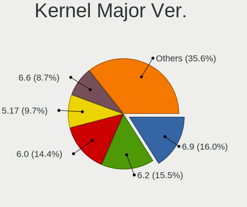
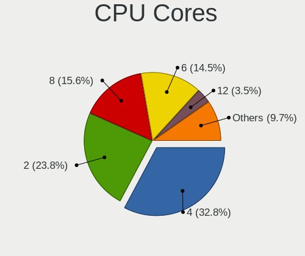

Pop!_OS 22.04 - Tested Hardware & Statistics
--------------------------------------------

A project to collect tested hardware configurations for Pop!_OS 22.04.

Anyone can contribute to this report by the [hw-probe](https://github.com/linuxhw/hw-probe) tool:

    sudo -E hw-probe -all -upload

Please contribute! Especially if your hardware is rare.

This is a report for all computer types. See also reports for [desktops](/Dist/Pop!_OS_22.04/Desktop/README.md) and [notebooks](/Dist/Pop!_OS_22.04/Notebook/README.md).

Contents
--------

* [ Test Cases ](#test-cases)

* [ System ](#system)
  - [ Kernel                   ](#kernel)
  - [ Kernel Family            ](#kernel-family)
  - [ Kernel Major Ver.        ](#kernel-major-ver)
  - [ Arch                     ](#arch)
  - [ DE                       ](#de)
  - [ Display Server           ](#display-server)
  - [ Display Manager          ](#display-manager)
  - [ OS Lang                  ](#os-lang)
  - [ Boot Mode                ](#boot-mode)
  - [ Filesystem               ](#filesystem)
  - [ Part. scheme             ](#part-scheme)
  - [ Dual Boot with Linux/BSD ](#dual-boot-with-linuxbsd)
  - [ Dual Boot (Win)          ](#dual-boot-win)

* [ Board ](#board)
  - [ Vendor                   ](#vendor)
  - [ Model                    ](#model)
  - [ Model Family             ](#model-family)
  - [ MFG Year                 ](#mfg-year)
  - [ Form Factor              ](#form-factor)
  - [ Secure Boot              ](#secure-boot)
  - [ Coreboot                 ](#coreboot)
  - [ RAM Size                 ](#ram-size)
  - [ RAM Used                 ](#ram-used)
  - [ Total Drives             ](#total-drives)
  - [ Has CD-ROM               ](#has-cd-rom)
  - [ Has Ethernet             ](#has-ethernet)
  - [ Has WiFi                 ](#has-wifi)
  - [ Has Bluetooth            ](#has-bluetooth)

* [ Location ](#location)
  - [ Country                  ](#country)
  - [ City                     ](#city)

* [ Drives ](#drives)
  - [ Drive Vendor             ](#drive-vendor)
  - [ Drive Model              ](#drive-model)
  - [ HDD Vendor               ](#hdd-vendor)
  - [ SSD Vendor               ](#ssd-vendor)
  - [ Drive Kind               ](#drive-kind)
  - [ Drive Connector          ](#drive-connector)
  - [ Drive Size               ](#drive-size)
  - [ Space Total              ](#space-total)
  - [ Space Used               ](#space-used)
  - [ Malfunc. Drives          ](#malfunc-drives)
  - [ Malfunc. Drive Vendor    ](#malfunc-drive-vendor)
  - [ Malfunc. HDD Vendor      ](#malfunc-hdd-vendor)
  - [ Malfunc. Drive Kind      ](#malfunc-drive-kind)
  - [ Failed Drives            ](#failed-drives)
  - [ Failed Drive Vendor      ](#failed-drive-vendor)
  - [ Drive Status             ](#drive-status)

* [ Storage controller ](#storage-controller)
  - [ Storage Vendor           ](#storage-vendor)
  - [ Storage Model            ](#storage-model)
  - [ Storage Kind             ](#storage-kind)

* [ Processor ](#processor)
  - [ CPU Vendor               ](#cpu-vendor)
  - [ CPU Model                ](#cpu-model)
  - [ CPU Model Family         ](#cpu-model-family)
  - [ CPU Cores                ](#cpu-cores)
  - [ CPU Sockets              ](#cpu-sockets)
  - [ CPU Threads              ](#cpu-threads)
  - [ CPU Op-Modes             ](#cpu-op-modes)
  - [ CPU Microcode            ](#cpu-microcode)
  - [ CPU Microarch            ](#cpu-microarch)

* [ Graphics ](#graphics)
  - [ GPU Vendor               ](#gpu-vendor)
  - [ GPU Model                ](#gpu-model)
  - [ GPU Combo                ](#gpu-combo)
  - [ GPU Driver               ](#gpu-driver)
  - [ GPU Memory               ](#gpu-memory)

* [ Monitor ](#monitor)
  - [ Monitor Vendor           ](#monitor-vendor)
  - [ Monitor Model            ](#monitor-model)
  - [ Monitor Resolution       ](#monitor-resolution)
  - [ Monitor Diagonal         ](#monitor-diagonal)
  - [ Monitor Width            ](#monitor-width)
  - [ Aspect Ratio             ](#aspect-ratio)
  - [ Monitor Area             ](#monitor-area)
  - [ Pixel Density            ](#pixel-density)
  - [ Multiple Monitors        ](#multiple-monitors)

* [ Network ](#network)
  - [ Net Controller Vendor    ](#net-controller-vendor)
  - [ Net Controller Model     ](#net-controller-model)
  - [ Wireless Vendor          ](#wireless-vendor)
  - [ Wireless Model           ](#wireless-model)
  - [ Ethernet Vendor          ](#ethernet-vendor)
  - [ Ethernet Model           ](#ethernet-model)
  - [ Net Controller Kind      ](#net-controller-kind)
  - [ Used Controller          ](#used-controller)
  - [ NICs                     ](#nics)
  - [ IPv6                     ](#ipv6)

* [ Bluetooth ](#bluetooth)
  - [ Bluetooth Vendor         ](#bluetooth-vendor)
  - [ Bluetooth Model          ](#bluetooth-model)

* [ Sound ](#sound)
  - [ Sound Vendor             ](#sound-vendor)
  - [ Sound Model              ](#sound-model)

* [ Memory ](#memory)
  - [ Memory Vendor            ](#memory-vendor)
  - [ Memory Model             ](#memory-model)
  - [ Memory Kind              ](#memory-kind)
  - [ Memory Form Factor       ](#memory-form-factor)
  - [ Memory Size              ](#memory-size)
  - [ Memory Speed             ](#memory-speed)

* [ Printers & scanners ](#printers--scanners)
  - [ Printer Vendor           ](#printer-vendor)
  - [ Printer Model            ](#printer-model)
  - [ Scanner Vendor           ](#scanner-vendor)
  - [ Scanner Model            ](#scanner-model)

* [ Camera ](#camera)
  - [ Camera Vendor            ](#camera-vendor)
  - [ Camera Model             ](#camera-model)

* [ Security ](#security)
  - [ Fingerprint Vendor       ](#fingerprint-vendor)
  - [ Fingerprint Model        ](#fingerprint-model)
  - [ Chipcard Vendor          ](#chipcard-vendor)
  - [ Chipcard Model           ](#chipcard-model)

* [ Unsupported ](#unsupported)
  - [ Unsupported Devices      ](#unsupported-devices)
  - [ Unsupported Device Types ](#unsupported-device-types)

Test Cases
----------

Total: 87

| Vendor   | Model                       | Form-Factor | Probe                                                      | Date         |
|----------|-----------------------------|-------------|------------------------------------------------------------|--------------|
| HP       | ProBook 455 G7              | Notebook    | [88fcea9210](https://linux-hardware.org/?probe=88fcea9210) | Apr 30, 2022 |
| MSI      | B450M GAMING PLUS           | Desktop     | [0929d58de7](https://linux-hardware.org/?probe=0929d58de7) | Apr 30, 2022 |
| Apple    | Mac-F42C88C8 Proto1         | Desktop     | [3edd5f05f7](https://linux-hardware.org/?probe=3edd5f05f7) | Apr 30, 2022 |
| ASRock   | X99 Extreme4                | Desktop     | [d45e1e88db](https://linux-hardware.org/?probe=d45e1e88db) | Apr 30, 2022 |
| ASRock   | X99 Extreme4                | Desktop     | [41cec63ac6](https://linux-hardware.org/?probe=41cec63ac6) | Apr 30, 2022 |
| Lenovo   | ThinkPad L15 Gen 2 20X4S... | Notebook    | [48d3759522](https://linux-hardware.org/?probe=48d3759522) | Apr 30, 2022 |
| Toshiba  | Satellite L10W-B-101        | Notebook    | [8383d306f3](https://linux-hardware.org/?probe=8383d306f3) | Apr 30, 2022 |
| Dell     | XPS 13 9343                 | Notebook    | [b48ccc106e](https://linux-hardware.org/?probe=b48ccc106e) | Apr 30, 2022 |
| Toshiba  | IS 1413G                    | Notebook    | [8074a86bc7](https://linux-hardware.org/?probe=8074a86bc7) | Apr 30, 2022 |
| Dell     | XPS 15 9510                 | Notebook    | [b92517268e](https://linux-hardware.org/?probe=b92517268e) | Apr 30, 2022 |
| EVGA     | X58 SLI Classified Tyler... | Desktop     | [07254f2dbb](https://linux-hardware.org/?probe=07254f2dbb) | Apr 30, 2022 |
| Intel    | NUC8BEB J72693-305          | Mini pc     | [082e245a6c](https://linux-hardware.org/?probe=082e245a6c) | Apr 29, 2022 |
| ASUSTek  | PRIME H510M-E               | Desktop     | [5c9e5fc14c](https://linux-hardware.org/?probe=5c9e5fc14c) | Apr 29, 2022 |
| ASUSTek  | G55VW                       | Notebook    | [6bd8a1b04a](https://linux-hardware.org/?probe=6bd8a1b04a) | Apr 29, 2022 |
| Dell     | Inspiron 3542               | Notebook    | [19f5e16bce](https://linux-hardware.org/?probe=19f5e16bce) | Apr 29, 2022 |
| ASUSTek  | ROG STRIX X299-E GAMING ... | Desktop     | [bce425f138](https://linux-hardware.org/?probe=bce425f138) | Apr 29, 2022 |
| Lenovo   | ThinkPad E14 Gen 4 21ECS... | Notebook    | [61bb949815](https://linux-hardware.org/?probe=61bb949815) | Apr 29, 2022 |
| Gigabyte | AB350-Gaming 3-CF           | Desktop     | [7b292b972d](https://linux-hardware.org/?probe=7b292b972d) | Apr 29, 2022 |
| Intel    | NUC8BEB J72693-305          | Mini pc     | [ea3b16fcfd](https://linux-hardware.org/?probe=ea3b16fcfd) | Apr 29, 2022 |
| Dell     | G5 5500                     | Notebook    | [c6064853ad](https://linux-hardware.org/?probe=c6064853ad) | Apr 29, 2022 |
| MSI      | MAG Z690 TOMAHAWK WIFI D... | Desktop     | [e37bc471b1](https://linux-hardware.org/?probe=e37bc471b1) | Apr 29, 2022 |
| HP       | Pavilion 15                 | Notebook    | [2484213956](https://linux-hardware.org/?probe=2484213956) | Apr 29, 2022 |
| ASUSTek  | PRIME H310M-E R2.0          | Desktop     | [2b7167b16e](https://linux-hardware.org/?probe=2b7167b16e) | Apr 29, 2022 |
| Lenovo   | ThinkPad T480 20L50004UK    | Notebook    | [34015c4874](https://linux-hardware.org/?probe=34015c4874) | Apr 29, 2022 |
| ASUSTek  | X540SAA                     | Notebook    | [6c8e397ca3](https://linux-hardware.org/?probe=6c8e397ca3) | Apr 29, 2022 |
| System76 | Oryx Pro                    | Notebook    | [cf999d4581](https://linux-hardware.org/?probe=cf999d4581) | Apr 29, 2022 |
| Dell     | Inspiron 5547               | Notebook    | [a5d8e73a23](https://linux-hardware.org/?probe=a5d8e73a23) | Apr 28, 2022 |
| ASUSTek  | ROG STRIX B450-F GAMING     | Desktop     | [aed5ee3ded](https://linux-hardware.org/?probe=aed5ee3ded) | Apr 28, 2022 |
| Dell     | Inspiron 5547               | Notebook    | [be4ab0fd27](https://linux-hardware.org/?probe=be4ab0fd27) | Apr 28, 2022 |
| Toshiba  | IS 1413G                    | Notebook    | [995f77010e](https://linux-hardware.org/?probe=995f77010e) | Apr 28, 2022 |
| Toshiba  | IS 1413G                    | Notebook    | [e2293170b3](https://linux-hardware.org/?probe=e2293170b3) | Apr 28, 2022 |
| Gigabyte | B550 AORUS ELITE AX V2      | Desktop     | [ab83eedd1f](https://linux-hardware.org/?probe=ab83eedd1f) | Apr 28, 2022 |
| HP       | Pavilion 13 x360 PC         | Notebook    | [f898a6a476](https://linux-hardware.org/?probe=f898a6a476) | Apr 28, 2022 |
| Lenovo   | ThinkPad T431s 20ACS03P0... | Notebook    | [3c0878aee3](https://linux-hardware.org/?probe=3c0878aee3) | Apr 28, 2022 |
| System76 | Oryx Pro                    | Notebook    | [ae46ece731](https://linux-hardware.org/?probe=ae46ece731) | Apr 28, 2022 |
| MSI      | H55M-E23                    | Desktop     | [4ab5f58470](https://linux-hardware.org/?probe=4ab5f58470) | Apr 28, 2022 |
| HP       | Pavilion 15                 | Notebook    | [fee7e96d70](https://linux-hardware.org/?probe=fee7e96d70) | Apr 28, 2022 |
| Toshiba  | IS 1413G                    | Notebook    | [a63dc69025](https://linux-hardware.org/?probe=a63dc69025) | Apr 28, 2022 |
| Apple    | Mac-81E3E92DD6088272 iMa... | All in one  | [1f26415f58](https://linux-hardware.org/?probe=1f26415f58) | Apr 28, 2022 |
| MSI      | MAG Z690 TOMAHAWK WIFI D... | Desktop     | [46430e1117](https://linux-hardware.org/?probe=46430e1117) | Apr 28, 2022 |
| Dell     | 09KPNV A00                  | Desktop     | [5046e0575b](https://linux-hardware.org/?probe=5046e0575b) | Apr 28, 2022 |
| Dell     | 0NW73C A00                  | Desktop     | [344e2b816e](https://linux-hardware.org/?probe=344e2b816e) | Apr 28, 2022 |
| Apple    | MacBookPro10,2              | Notebook    | [2d79aab0aa](https://linux-hardware.org/?probe=2d79aab0aa) | Apr 28, 2022 |
| ASUSTek  | K40IN                       | Notebook    | [ab6a95da52](https://linux-hardware.org/?probe=ab6a95da52) | Apr 28, 2022 |
| Dell     | Latitude 7275               | Tablet      | [b7443972f3](https://linux-hardware.org/?probe=b7443972f3) | Apr 28, 2022 |
| Dell     | 088DT1 A01                  | Desktop     | [b664b8720e](https://linux-hardware.org/?probe=b664b8720e) | Apr 28, 2022 |
| HP       | Pavilion 13 x360 PC         | Notebook    | [d48ed77abc](https://linux-hardware.org/?probe=d48ed77abc) | Apr 28, 2022 |
| Fujitsu  | D3162-A1 S26361-D3162-A1    | Desktop     | [19e0445e6f](https://linux-hardware.org/?probe=19e0445e6f) | Apr 27, 2022 |
| Dell     | Inspiron 5566               | Notebook    | [695d362d8f](https://linux-hardware.org/?probe=695d362d8f) | Apr 27, 2022 |
| ASUSTek  | FX503VM                     | Notebook    | [c227966510](https://linux-hardware.org/?probe=c227966510) | Apr 27, 2022 |
| ASUSTek  | FX503VM                     | Notebook    | [1275aa643d](https://linux-hardware.org/?probe=1275aa643d) | Apr 27, 2022 |
| HP       | ENVY Laptop 14-eb0xxx       | Notebook    | [495a74c914](https://linux-hardware.org/?probe=495a74c914) | Apr 27, 2022 |
| Dell     | XPS 13 9310                 | Notebook    | [d394f4e0d9](https://linux-hardware.org/?probe=d394f4e0d9) | Apr 27, 2022 |
| HUAWEI   | HVY-WXX9                    | Notebook    | [824ccc1317](https://linux-hardware.org/?probe=824ccc1317) | Apr 27, 2022 |
| HP       | Pavilion 13 x360 PC         | Notebook    | [3e5933fe0d](https://linux-hardware.org/?probe=3e5933fe0d) | Apr 27, 2022 |
| Lenovo   | IdeaPad 110-15ISK 80UD      | Notebook    | [e51ff27a5a](https://linux-hardware.org/?probe=e51ff27a5a) | Apr 27, 2022 |
| Dell     | 0R1PCR A00                  | Desktop     | [feec38a0f5](https://linux-hardware.org/?probe=feec38a0f5) | Apr 27, 2022 |
| HP       | Spectre x360 Convertible... | Convertible | [c9fb277b57](https://linux-hardware.org/?probe=c9fb277b57) | Apr 27, 2022 |
| Dell     | Vostro 15 3515              | Notebook    | [7c99d7d4c5](https://linux-hardware.org/?probe=7c99d7d4c5) | Apr 27, 2022 |
| Unknown  | Unknown                     | Desktop     | [82ad7e86b5](https://linux-hardware.org/?probe=82ad7e86b5) | Apr 27, 2022 |
| Lenovo   | Yoga C740-14IML 81TC        | Convertible | [25041b35de](https://linux-hardware.org/?probe=25041b35de) | Apr 27, 2022 |
| ASUSTek  | ROG Zephyrus G14 GA401IH... | Notebook    | [863612cc05](https://linux-hardware.org/?probe=863612cc05) | Apr 27, 2022 |
| Purism   | Librem 15 v3                | Notebook    | [d2a13c9d0a](https://linux-hardware.org/?probe=d2a13c9d0a) | Apr 27, 2022 |
| HP       | Spectre x360 Convertible... | Convertible | [bbb524450f](https://linux-hardware.org/?probe=bbb524450f) | Apr 27, 2022 |
| Toshiba  | Satellite C55t-C            | Notebook    | [1fe2032839](https://linux-hardware.org/?probe=1fe2032839) | Apr 27, 2022 |
| Toshiba  | Satellite C55t-C            | Notebook    | [cabf0c7464](https://linux-hardware.org/?probe=cabf0c7464) | Apr 27, 2022 |
| Lenovo   | IdeaPad S145-15API 81V7     | Notebook    | [b7ac79ff8f](https://linux-hardware.org/?probe=b7ac79ff8f) | Apr 27, 2022 |
| MSI      | GS66 Stealth 10UG           | Notebook    | [77b699045a](https://linux-hardware.org/?probe=77b699045a) | Apr 27, 2022 |
| ASUSTek  | GA15DH                      | Desktop     | [30a22d7be3](https://linux-hardware.org/?probe=30a22d7be3) | Apr 27, 2022 |
| Acer     | Aspire E1-570               | Notebook    | [1621e22812](https://linux-hardware.org/?probe=1621e22812) | Apr 26, 2022 |
| Acer     | Swift SF316-51              | Notebook    | [fe42983639](https://linux-hardware.org/?probe=fe42983639) | Apr 26, 2022 |
| Acer     | TravelMate P249-G2-MG       | Notebook    | [2e0bd790c6](https://linux-hardware.org/?probe=2e0bd790c6) | Apr 26, 2022 |
| ASUSTek  | ROG STRIX B450-I GAMING     | Desktop     | [4b9faf4848](https://linux-hardware.org/?probe=4b9faf4848) | Apr 26, 2022 |
| Dell     | Inspiron 3442               | Notebook    | [d4b7580074](https://linux-hardware.org/?probe=d4b7580074) | Apr 26, 2022 |
| Dell     | Inspiron 3442               | Notebook    | [d994ff2a13](https://linux-hardware.org/?probe=d994ff2a13) | Apr 26, 2022 |
| Unknown  | Unknown                     | Notebook    | [885f468161](https://linux-hardware.org/?probe=885f468161) | Apr 26, 2022 |
| System76 | Thelio thelio-r2            | Desktop     | [aae937be8b](https://linux-hardware.org/?probe=aae937be8b) | Apr 25, 2022 |
| ASUSTek  | X555LF                      | Notebook    | [0aa3a88c0c](https://linux-hardware.org/?probe=0aa3a88c0c) | Apr 25, 2022 |
| Gigabyte | B360 AORUS GAMING 3 WIFI... | Desktop     | [fabaa5b3ab](https://linux-hardware.org/?probe=fabaa5b3ab) | Apr 24, 2022 |
| Toshiba  | IS 1413G                    | Notebook    | [d5918f0d93](https://linux-hardware.org/?probe=d5918f0d93) | Apr 23, 2022 |
| Dell     | XPS 13 9360                 | Notebook    | [ffb9cf10be](https://linux-hardware.org/?probe=ffb9cf10be) | Apr 20, 2022 |
| Dell     | XPS 13 9360                 | Notebook    | [f174d4ced7](https://linux-hardware.org/?probe=f174d4ced7) | Apr 20, 2022 |
| Toshiba  | IS 1413G                    | Notebook    | [1b3267b605](https://linux-hardware.org/?probe=1b3267b605) | Apr 18, 2022 |
| Dell     | Latitude 5590               | Notebook    | [ade3f33fb9](https://linux-hardware.org/?probe=ade3f33fb9) | Apr 16, 2022 |
| Dell     | Latitude 5590               | Notebook    | [1638db9ad7](https://linux-hardware.org/?probe=1638db9ad7) | Apr 13, 2022 |
| MSI      | B250M BAZOOKA               | Desktop     | [91392a601e](https://linux-hardware.org/?probe=91392a601e) | Apr 08, 2022 |
| Dell     | Latitude E7270              | Notebook    | [79cc908dcc](https://linux-hardware.org/?probe=79cc908dcc) | Apr 08, 2022 |

System
------

Kernel
------

Version of the Linux kernel

| Version                  | Computers | Percent |
|--------------------------|-----------|---------|
| 5.16.19-76051619-generic | 63        | 94.03%  |
| 5.16.15-76051615-generic | 3         | 4.48%   |
| 5.17.2-xanmod1           | 1         | 1.49%   |

Kernel Family
-------------

Linux kernel without a distro release

| Version | Computers | Percent |
|---------|-----------|---------|
| 5.16.19 | 63        | 94.03%  |
| 5.16.15 | 3         | 4.48%   |
| 5.17.2  | 1         | 1.49%   |

Kernel Major Ver.
-----------------

Linux kernel major version

| Version | Computers | Percent |
|---------|-----------|---------|
| 5.16    | 66        | 98.51%  |
| 5.17    | 1         | 1.49%   |

Arch
----

OS architecture (x86_64, i586, etc.)

| Name   | Computers | Percent |
|--------|-----------|---------|
| x86_64 | 67        | 100%    |

DE
--

Desktop Environment

| Name  | Computers | Percent |
|-------|-----------|---------|
| GNOME | 66        | 98.51%  |
| KDE5  | 1         | 1.49%   |

Display Server
--------------

X11 or Wayland

| Name    | Computers | Percent |
|---------|-----------|---------|
| X11     | 64        | 95.52%  |
| Wayland | 3         | 4.48%   |

Display Manager
---------------

SDDM, LightDM, etc.

| Name    | Computers | Percent |
|---------|-----------|---------|
| Unknown | 58        | 86.57%  |
| GDM3    | 9         | 13.43%  |

OS Lang
-------

Language

| Lang  | Computers | Percent |
|-------|-----------|---------|
| en_US | 44        | 65.67%  |
| pt_BR | 6         | 8.96%   |
| en_GB | 4         | 5.97%   |
| en_CA | 3         | 4.48%   |
| de_DE | 3         | 4.48%   |
| en_AU | 2         | 2.99%   |
| sv_SE | 1         | 1.49%   |
| pt_PT | 1         | 1.49%   |
| fr_FR | 1         | 1.49%   |
| es_AR | 1         | 1.49%   |
| en_PH | 1         | 1.49%   |

Boot Mode
---------

EFI or BIOS

| Mode | Computers | Percent |
|------|-----------|---------|
| BIOS | 58        | 86.57%  |
| EFI  | 9         | 13.43%  |

Filesystem
----------

Type of filesystem

| Type  | Computers | Percent |
|-------|-----------|---------|
| Ext4  | 65        | 97.01%  |
| Btrfs | 2         | 2.99%   |

Part. scheme
------------

Scheme of partitioning

| Type    | Computers | Percent |
|---------|-----------|---------|
| Unknown | 58        | 86.57%  |
| GPT     | 9         | 13.43%  |

Dual Boot with Linux/BSD
------------------------

Hosting more than one Linux/BSD

| Dual boot | Computers | Percent |
|-----------|-----------|---------|
| No        | 67        | 100%    |

Dual Boot (Win)
---------------

Hosting Linux and Windows

| Dual boot | Computers | Percent |
|-----------|-----------|---------|
| No        | 64        | 95.52%  |
| Yes       | 3         | 4.48%   |

Board
-----

Vendor
------

Motherboard manufacturer

| Name                | Computers | Percent |
|---------------------|-----------|---------|
| Dell                | 17        | 25.37%  |
| ASUSTek Computer    | 12        | 17.91%  |
| Lenovo              | 7         | 10.45%  |
| MSI                 | 5         | 7.46%   |
| Hewlett-Packard     | 5         | 7.46%   |
| Gigabyte Technology | 3         | 4.48%   |
| Apple               | 3         | 4.48%   |
| Toshiba             | 2         | 2.99%   |
| System76            | 2         | 2.99%   |
| Acer                | 2         | 2.99%   |
| Unknown             | 2         | 2.99%   |
| Semp Toshiba        | 1         | 1.49%   |
| Purism              | 1         | 1.49%   |
| Intel               | 1         | 1.49%   |
| HUAWEI              | 1         | 1.49%   |
| Fujitsu             | 1         | 1.49%   |
| EVGA                | 1         | 1.49%   |
| ASRock              | 1         | 1.49%   |

Model
-----

Motherboard model

| Name                                  | Computers | Percent |
|---------------------------------------|-----------|---------|
| Unknown                               | 2         | 2.99%   |
| Toshiba Satellite L10W-B-101          | 1         | 1.49%   |
| Toshiba Satellite C55t-C              | 1         | 1.49%   |
| System76 Thelio                       | 1         | 1.49%   |
| System76 Oryx Pro                     | 1         | 1.49%   |
| Semp Toshiba IS 1413G                 | 1         | 1.49%   |
| Purism Librem 15 v3                   | 1         | 1.49%   |
| MSI MS-7D32                           | 1         | 1.49%   |
| MSI MS-7B87                           | 1         | 1.49%   |
| MSI MS-7A70                           | 1         | 1.49%   |
| MSI MS-7636                           | 1         | 1.49%   |
| MSI GS66 Stealth 10UG                 | 1         | 1.49%   |
| Lenovo Yoga C740-14IML 81TC           | 1         | 1.49%   |
| Lenovo ThinkPad T480 20L50004UK       | 1         | 1.49%   |
| Lenovo ThinkPad T431s 20ACS03P00      | 1         | 1.49%   |
| Lenovo ThinkPad L15 Gen 2 20X4S68100  | 1         | 1.49%   |
| Lenovo ThinkPad E14 Gen 4 21ECS00000  | 1         | 1.49%   |
| Lenovo IdeaPad S145-15API 81V7        | 1         | 1.49%   |
| Lenovo IdeaPad 110-15ISK 80UD         | 1         | 1.49%   |
| Intel NUC8i3BEH                       | 1         | 1.49%   |
| HUAWEI HVY-WXX9                       | 1         | 1.49%   |
| HP Spectre x360 Convertible 13-aw0xxx | 1         | 1.49%   |
| HP ProBook 455 G7                     | 1         | 1.49%   |
| HP Pavilion 15                        | 1         | 1.49%   |
| HP Pavilion 13 x360 PC                | 1         | 1.49%   |
| HP ENVY Laptop 14-eb0xxx              | 1         | 1.49%   |
| Gigabyte B550 AORUS ELITE AX V2       | 1         | 1.49%   |
| Gigabyte B360 AORUS GAMING 3 WIFI     | 1         | 1.49%   |
| Gigabyte AB350-Gaming 3-CF            | 1         | 1.49%   |
| Fujitsu ESPRIMO E910                  | 1         | 1.49%   |
| EVGA X58 SLI Classified Tylersburg    | 1         | 1.49%   |
| Dell XPS 8500                         | 1         | 1.49%   |
| Dell XPS 15 9510                      | 1         | 1.49%   |
| Dell XPS 13 9360                      | 1         | 1.49%   |
| Dell XPS 13 9343                      | 1         | 1.49%   |
| Dell XPS 13 9310                      | 1         | 1.49%   |
| Dell Vostro 15 3515                   | 1         | 1.49%   |
| Dell Precision WorkStation T3500      | 1         | 1.49%   |
| Dell Latitude E7270                   | 1         | 1.49%   |
| Dell Latitude 7275                    | 1         | 1.49%   |
| Dell Latitude 5590                    | 1         | 1.49%   |
| Dell Inspiron 5566                    | 1         | 1.49%   |
| Dell Inspiron 5547                    | 1         | 1.49%   |
| Dell Inspiron 3847                    | 1         | 1.49%   |
| Dell Inspiron 3656                    | 1         | 1.49%   |
| Dell Inspiron 3542                    | 1         | 1.49%   |
| Dell Inspiron 3442                    | 1         | 1.49%   |
| Dell G5 5500                          | 1         | 1.49%   |
| ASUS X555LF                           | 1         | 1.49%   |
| ASUS X540SAA                          | 1         | 1.49%   |
| ASUS ROG Zephyrus G14 GA401IH_GA401IH | 1         | 1.49%   |
| ASUS ROG STRIX X299-E GAMING II       | 1         | 1.49%   |
| ASUS ROG Strix GA15DH                 | 1         | 1.49%   |
| ASUS ROG STRIX B450-I GAMING          | 1         | 1.49%   |
| ASUS ROG STRIX B450-F GAMING          | 1         | 1.49%   |
| ASUS PRIME H510M-E                    | 1         | 1.49%   |
| ASUS PRIME H310M-E R2.0               | 1         | 1.49%   |
| ASUS K40IN                            | 1         | 1.49%   |
| ASUS G55VW                            | 1         | 1.49%   |
| ASUS FX503VM                          | 1         | 1.49%   |

Model Family
------------

Motherboard model prefix

| Name                  | Computers | Percent |
|-----------------------|-----------|---------|
| Dell Inspiron         | 6         | 8.96%   |
| Dell XPS              | 5         | 7.46%   |
| ASUS ROG              | 5         | 7.46%   |
| Lenovo ThinkPad       | 4         | 5.97%   |
| Dell Latitude         | 3         | 4.48%   |
| Toshiba Satellite     | 2         | 2.99%   |
| Lenovo IdeaPad        | 2         | 2.99%   |
| HP Pavilion           | 2         | 2.99%   |
| ASUS PRIME            | 2         | 2.99%   |
| Unknown               | 2         | 2.99%   |
| System76 Thelio       | 1         | 1.49%   |
| System76 Oryx         | 1         | 1.49%   |
| Semp Toshiba IS       | 1         | 1.49%   |
| Purism Librem         | 1         | 1.49%   |
| MSI MS-7D32           | 1         | 1.49%   |
| MSI MS-7B87           | 1         | 1.49%   |
| MSI MS-7A70           | 1         | 1.49%   |
| MSI MS-7636           | 1         | 1.49%   |
| MSI GS66              | 1         | 1.49%   |
| Lenovo Yoga           | 1         | 1.49%   |
| Intel NUC8i3BEH       | 1         | 1.49%   |
| HUAWEI HVY-WXX9       | 1         | 1.49%   |
| HP Spectre            | 1         | 1.49%   |
| HP ProBook            | 1         | 1.49%   |
| HP ENVY               | 1         | 1.49%   |
| Gigabyte B550         | 1         | 1.49%   |
| Gigabyte B360         | 1         | 1.49%   |
| Gigabyte AB350-Gaming | 1         | 1.49%   |
| Fujitsu ESPRIMO       | 1         | 1.49%   |
| EVGA X58              | 1         | 1.49%   |
| Dell Vostro           | 1         | 1.49%   |
| Dell Precision        | 1         | 1.49%   |
| Dell G5               | 1         | 1.49%   |
| ASUS X555LF           | 1         | 1.49%   |
| ASUS X540SAA          | 1         | 1.49%   |
| ASUS K40IN            | 1         | 1.49%   |
| ASUS G55VW            | 1         | 1.49%   |
| ASUS FX503VM          | 1         | 1.49%   |
| ASRock X99            | 1         | 1.49%   |
| Apple MacPro3         | 1         | 1.49%   |
| Apple MacBookPro10    | 1         | 1.49%   |
| Apple iMac14          | 1         | 1.49%   |
| Acer TravelMate       | 1         | 1.49%   |
| Acer Swift            | 1         | 1.49%   |

MFG Year
--------

Motherboard manufacture year

| Year | Computers | Percent |
|------|-----------|---------|
| 2020 | 10        | 14.93%  |
| 2021 | 9         | 13.43%  |
| 2019 | 8         | 11.94%  |
| 2018 | 7         | 10.45%  |
| 2016 | 7         | 10.45%  |
| 2014 | 6         | 8.96%   |
| 2017 | 4         | 5.97%   |
| 2015 | 3         | 4.48%   |
| 2013 | 3         | 4.48%   |
| 2012 | 3         | 4.48%   |
| 2010 | 2         | 2.99%   |
| 2009 | 2         | 2.99%   |
| 2022 | 1         | 1.49%   |
| 2011 | 1         | 1.49%   |
| 2008 | 1         | 1.49%   |

Form Factor
-----------

Physical design of the computer

| Name        | Computers | Percent |
|-------------|-----------|---------|
| Notebook    | 39        | 58.21%  |
| Desktop     | 23        | 34.33%  |
| Convertible | 2         | 2.99%   |
| Tablet      | 1         | 1.49%   |
| Mini pc     | 1         | 1.49%   |
| All in one  | 1         | 1.49%   |

Secure Boot
-----------

Enabled or disabled

| State    | Computers | Percent |
|----------|-----------|---------|
| Disabled | 67        | 100%    |

Coreboot
--------

Have coreboot on board

| Used | Computers | Percent |
|------|-----------|---------|
| No   | 65        | 97.01%  |
| Yes  | 2         | 2.99%   |

RAM Size
--------

Total RAM memory

| Size in GB  | Computers | Percent |
|-------------|-----------|---------|
| 16.01-24.0  | 22        | 32.84%  |
| 4.01-8.0    | 17        | 25.37%  |
| 8.01-16.0   | 10        | 14.93%  |
| 32.01-64.0  | 9         | 13.43%  |
| 3.01-4.0    | 7         | 10.45%  |
| 64.01-256.0 | 2         | 2.99%   |

RAM Used
--------

Used RAM memory

| Used GB   | Computers | Percent |
|-----------|-----------|---------|
| 2.01-3.0  | 27        | 40.3%   |
| 4.01-8.0  | 15        | 22.39%  |
| 3.01-4.0  | 14        | 20.9%   |
| 1.01-2.0  | 10        | 14.93%  |
| 8.01-16.0 | 1         | 1.49%   |

Total Drives
------------

Number of drives on board

| Drives | Computers | Percent |
|--------|-----------|---------|
| 1      | 39        | 58.21%  |
| 2      | 18        | 26.87%  |
| 3      | 6         | 8.96%   |
| 4      | 2         | 2.99%   |
| 11     | 1         | 1.49%   |
| 5      | 1         | 1.49%   |

Has CD-ROM
----------

Has CD-ROM on board

| Presented | Computers | Percent |
|-----------|-----------|---------|
| No        | 50        | 74.63%  |
| Yes       | 17        | 25.37%  |

Has Ethernet
------------

Has Ethernet on board

| Presented | Computers | Percent |
|-----------|-----------|---------|
| Yes       | 54        | 80.6%   |
| No        | 13        | 19.4%   |

Has WiFi
--------

Has WiFi module

| Presented | Computers | Percent |
|-----------|-----------|---------|
| Yes       | 58        | 86.57%  |
| No        | 9         | 13.43%  |

Has Bluetooth
-------------

Has Bluetooth module

| Presented | Computers | Percent |
|-----------|-----------|---------|
| Yes       | 51        | 76.12%  |
| No        | 16        | 23.88%  |

Location
--------

Country
-------

Geographic location (country)

| Country      | Computers | Percent |
|--------------|-----------|---------|
| USA          | 23        | 34.33%  |
| Brazil       | 7         | 10.45%  |
| Germany      | 5         | 7.46%   |
| Japan        | 3         | 4.48%   |
| India        | 3         | 4.48%   |
| Canada       | 3         | 4.48%   |
| UK           | 2         | 2.99%   |
| Netherlands  | 2         | 2.99%   |
| Australia    | 2         | 2.99%   |
| Argentina    | 2         | 2.99%   |
| Venezuela    | 1         | 1.49%   |
| Thailand     | 1         | 1.49%   |
| Switzerland  | 1         | 1.49%   |
| Sweden       | 1         | 1.49%   |
| Spain        | 1         | 1.49%   |
| Slovakia     | 1         | 1.49%   |
| Saudi Arabia | 1         | 1.49%   |
| Romania      | 1         | 1.49%   |
| Portugal     | 1         | 1.49%   |
| Philippines  | 1         | 1.49%   |
| Mexico       | 1         | 1.49%   |
| Israel       | 1         | 1.49%   |
| Ireland      | 1         | 1.49%   |
| France       | 1         | 1.49%   |
| Egypt        | 1         | 1.49%   |

City
----

Geographic location (city)

| City                     | Computers | Percent |
|--------------------------|-----------|---------|
| Mendoza                  | 2         | 2.99%   |
| Zurich                   | 1         | 1.49%   |
| Wausau                   | 1         | 1.49%   |
| Vaihingen an der Enz     | 1         | 1.49%   |
| Truckee                  | 1         | 1.49%   |
| Tahlequah                | 1         | 1.49%   |
| Somerset                 | 1         | 1.49%   |
| Solleftea                | 1         | 1.49%   |
| Sittingbourne            | 1         | 1.49%   |
| Seattle                  | 1         | 1.49%   |
| Sapporo                  | 1         | 1.49%   |
| Sao Sebastiao do Paraiso | 1         | 1.49%   |
| Sao Paulo                | 1         | 1.49%   |
| San Miguel               | 1         | 1.49%   |
| San Jose                 | 1         | 1.49%   |
| San Diego                | 1         | 1.49%   |
| Saint Paul               | 1         | 1.49%   |
| Saint John               | 1         | 1.49%   |
| Riverview                | 1         | 1.49%   |
| Rio de Janeiro           | 1         | 1.49%   |
| Remscheid                | 1         | 1.49%   |
| Recife                   | 1         | 1.49%   |
| Porto                    | 1         | 1.49%   |
| Ottawa                   | 1         | 1.49%   |
| Osaka                    | 1         | 1.49%   |
| Nome                     | 1         | 1.49%   |
| Nahariya                 | 1         | 1.49%   |
| Nackawic                 | 1         | 1.49%   |
| Munich                   | 1         | 1.49%   |
| Mumbai                   | 1         | 1.49%   |
| Monufia                  | 1         | 1.49%   |
| Melbourne                | 1         | 1.49%   |
| Maringá                 | 1         | 1.49%   |
| Mannheim                 | 1         | 1.49%   |
| Madrid                   | 1         | 1.49%   |
| Lincoln                  | 1         | 1.49%   |
| Lake Mary                | 1         | 1.49%   |
| La Crau                  | 1         | 1.49%   |
| Kottayam                 | 1         | 1.49%   |
| Khlong Luang             | 1         | 1.49%   |
| Katsushika               | 1         | 1.49%   |
| Jeddah                   | 1         | 1.49%   |
| Itatiba                  | 1         | 1.49%   |
| Iasi                     | 1         | 1.49%   |
| Hot Springs              | 1         | 1.49%   |
| Guadalajara              | 1         | 1.49%   |
| Gonzales                 | 1         | 1.49%   |
| Fayetteville             | 1         | 1.49%   |
| Dalfsen                  | 1         | 1.49%   |
| Cork                     | 1         | 1.49%   |
| Colebrook                | 1         | 1.49%   |
| Ciudad Guayana           | 1         | 1.49%   |
| Chicago                  | 1         | 1.49%   |
| Cassopolis               | 1         | 1.49%   |
| Cairo                    | 1         | 1.49%   |
| Brunswick West           | 1         | 1.49%   |
| Brighton                 | 1         | 1.49%   |
| Bratislava               | 1         | 1.49%   |
| Blacksburg               | 1         | 1.49%   |
| Berlin                   | 1         | 1.49%   |

Drives
------

Drive Vendor
------------

Hard drive vendors

| Vendor                      | Computers | Drives | Percent |
|-----------------------------|-----------|--------|---------|
| WDC                         | 14        | 22     | 14.58%  |
| Samsung Electronics         | 14        | 16     | 14.58%  |
| Seagate                     | 12        | 15     | 12.5%   |
| Toshiba                     | 6         | 6      | 6.25%   |
| SanDisk                     | 6         | 8      | 6.25%   |
| Intel                       | 6         | 7      | 6.25%   |
| Crucial                     | 5         | 5      | 5.21%   |
| Unknown                     | 3         | 4      | 3.13%   |
| SK Hynix                    | 3         | 3      | 3.13%   |
| Phison                      | 3         | 3      | 3.13%   |
| PNY                         | 2         | 2      | 2.08%   |
| Kingston                    | 2         | 2      | 2.08%   |
| Hitachi                     | 2         | 3      | 2.08%   |
| Apple                       | 2         | 2      | 2.08%   |
| A-DATA Technology           | 2         | 2      | 2.08%   |
| YMTC                        | 1         | 1      | 1.04%   |
| Union Memory (Shenzhen)     | 1         | 1      | 1.04%   |
| Transcend                   | 1         | 2      | 1.04%   |
| Ramaxel Technology          | 1         | 1      | 1.04%   |
| Micron/Crucial Technology   | 1         | 1      | 1.04%   |
| Micron Technology           | 1         | 1      | 1.04%   |
| MAXTOR                      | 1         | 1      | 1.04%   |
| MAXIO Technology (Hangzhou) | 1         | 1      | 1.04%   |
| KIOXIA                      | 1         | 1      | 1.04%   |
| KINGBANK                    | 1         | 1      | 1.04%   |
| Intenso                     | 1         | 1      | 1.04%   |
| HGST                        | 1         | 1      | 1.04%   |
| China                       | 1         | 1      | 1.04%   |
| ADATA Technology            | 1         | 1      | 1.04%   |

Drive Model
-----------

Hard drive models

| Model                                        | Computers | Percent |
|----------------------------------------------|-----------|---------|
| Seagate ST2000DM008-2FR102 2TB               | 2         | 1.77%   |
| Seagate ST2000DM001-1ER164 2TB               | 2         | 1.77%   |
| Seagate ST1000LM024 HN-M101MBB 1TB           | 2         | 1.77%   |
| Sandisk NVMe SSD Drive 1TB                   | 2         | 1.77%   |
| Samsung SSD 850 EVO 500GB                    | 2         | 1.77%   |
| Intel NVMe SSD Drive 512GB                   | 2         | 1.77%   |
| Intel NVMe SSD Drive 1024GB                  | 2         | 1.77%   |
| YMTC PC005 512GB                             | 1         | 0.88%   |
| WDC WDS500G2B0A-00SM50 500GB SSD             | 1         | 0.88%   |
| WDC WDS240G2G0B-00EPW0 240GB SSD             | 1         | 0.88%   |
| WDC WDS100T2B0C-00PXH0 1TB                   | 1         | 0.88%   |
| WDC WD800BEVS-07RST0 80GB                    | 1         | 0.88%   |
| WDC WD800BD-22MRA1 80GB                      | 1         | 0.88%   |
| WDC WD60EFRX-68MYMN1 6TB                     | 1         | 0.88%   |
| WDC WD40EFRX-68WT0N0 4TB                     | 1         | 0.88%   |
| WDC WD30EZRZ-00GXCB0 3TB                     | 1         | 0.88%   |
| WDC WD30EZRX-00DC0B0 3TB                     | 1         | 0.88%   |
| WDC WD30EZRX-00D8PB0 3TB                     | 1         | 0.88%   |
| WDC WD30EFRX-68EUZN0 3TB                     | 1         | 0.88%   |
| WDC WD20EZAZ-00GGJB0 2TB                     | 1         | 0.88%   |
| WDC WD20EARS-60MVWB0 2TB                     | 1         | 0.88%   |
| WDC WD20EADS-00R6B0 2TB                      | 1         | 0.88%   |
| WDC WD2003FZEX-00Z4SA0 2TB                   | 1         | 0.88%   |
| WDC WD10SPZX-24Z10 1TB                       | 1         | 0.88%   |
| WDC WD10JPVX-75JC3T0 1TB                     | 1         | 0.88%   |
| WDC WD10EZEX-08WN4A0 1TB                     | 1         | 0.88%   |
| WDC WD10EZEX-00RKKA0 1TB                     | 1         | 0.88%   |
| WDC WD10EAVS-22D7B0 1TB                      | 1         | 0.88%   |
| WDC WD10EADS-65M2B1 1TB                      | 1         | 0.88%   |
| WDC WD easystore 240GB                       | 1         | 0.88%   |
| Unknown MMC Card  64GB                       | 1         | 0.88%   |
| Unknown MMC Card  419GB                      | 1         | 0.88%   |
| Unknown MMC Card  256GB                      | 1         | 0.88%   |
| Unknown MMC Card  128GB                      | 1         | 0.88%   |
| Union Memory (Shenzhen) NVMe SSD Drive 512GB | 1         | 0.88%   |
| Transcend TS256GSSD370S 256GB                | 1         | 0.88%   |
| Transcend TS1TSSD230S 1024GB                 | 1         | 0.88%   |
| Toshiba NVMe SSD Drive 1024GB                | 1         | 0.88%   |
| Toshiba MQ01ACF050 500GB                     | 1         | 0.88%   |
| Toshiba MQ01ABF050 500GB                     | 1         | 0.88%   |
| Toshiba MQ01ABD075 752GB                     | 1         | 0.88%   |
| Toshiba MK3265GSX 320GB                      | 1         | 0.88%   |
| Toshiba KXG50ZNV512G NVMe 512GB              | 1         | 0.88%   |
| SK Hynix NVMe SSD Drive 512GB                | 1         | 0.88%   |
| SK Hynix NVMe SSD Drive 256GB                | 1         | 0.88%   |
| SK Hynix NVMe SSD Drive 1024GB               | 1         | 0.88%   |
| Seagate ST9320325AS 320GB                    | 1         | 0.88%   |
| Seagate ST500LM030-2E717D 500GB              | 1         | 0.88%   |
| Seagate ST31000528AS 1TB                     | 1         | 0.88%   |
| Seagate ST2000DX002-2DV164 2TB               | 1         | 0.88%   |
| Seagate ST2000DM006-2DM164 2TB               | 1         | 0.88%   |
| Seagate ST1000VM002-1CT162 1TB               | 1         | 0.88%   |
| Seagate ST1000LM048-2E7172 1TB               | 1         | 0.88%   |
| Seagate ST1000DX002-2DV162 1TB               | 1         | 0.88%   |
| Seagate ST1000DM003-1ER162 1TB               | 1         | 0.88%   |
| SanDisk X400 M.2 2280 256GB SSD              | 1         | 0.88%   |
| SanDisk Ultra II 480GB SSD                   | 1         | 0.88%   |
| SanDisk SSD PLUS 240GB                       | 1         | 0.88%   |
| SanDisk SSD PLUS 240 GB                      | 1         | 0.88%   |
| SanDisk SDSSDH3 1T00 1TB                     | 1         | 0.88%   |

HDD Vendor
----------

Hard disk drive vendors

| Vendor  | Computers | Drives | Percent |
|---------|-----------|--------|---------|
| Seagate | 12        | 15     | 37.5%   |
| WDC     | 11        | 18     | 34.38%  |
| Toshiba | 4         | 4      | 12.5%   |
| Hitachi | 2         | 3      | 6.25%   |
| MAXTOR  | 1         | 1      | 3.13%   |
| HGST    | 1         | 1      | 3.13%   |
| Apple   | 1         | 1      | 3.13%   |

SSD Vendor
----------

Solid state drive vendors

| Vendor              | Computers | Drives | Percent |
|---------------------|-----------|--------|---------|
| Samsung Electronics | 9         | 10     | 28.13%  |
| SanDisk             | 5         | 5      | 15.63%  |
| Crucial             | 5         | 5      | 15.63%  |
| WDC                 | 2         | 3      | 6.25%   |
| PNY                 | 2         | 2      | 6.25%   |
| Kingston            | 2         | 2      | 6.25%   |
| Transcend           | 1         | 2      | 3.13%   |
| Ramaxel Technology  | 1         | 1      | 3.13%   |
| KINGBANK            | 1         | 1      | 3.13%   |
| Intel               | 1         | 1      | 3.13%   |
| China               | 1         | 1      | 3.13%   |
| Apple               | 1         | 1      | 3.13%   |
| A-DATA Technology   | 1         | 1      | 3.13%   |

Drive Kind
----------

HDD or SSD

| Kind    | Computers | Drives | Percent |
|---------|-----------|--------|---------|
| SSD     | 30        | 35     | 34.09%  |
| NVMe    | 27        | 32     | 30.68%  |
| HDD     | 27        | 43     | 30.68%  |
| MMC     | 3         | 4      | 3.41%   |
| Unknown | 1         | 1      | 1.14%   |

Drive Connector
---------------

SATA, SAS, NVMe, etc.

| Type | Computers | Drives | Percent |
|------|-----------|--------|---------|
| SATA | 48        | 79     | 61.54%  |
| NVMe | 27        | 32     | 34.62%  |
| MMC  | 3         | 4      | 3.85%   |

Drive Size
----------

Size of hard drive

| Size in TB | Computers | Drives | Percent |
|------------|-----------|--------|---------|
| 0.01-0.5   | 33        | 37     | 50.77%  |
| 0.51-1.0   | 17        | 22     | 26.15%  |
| 1.01-2.0   | 11        | 13     | 16.92%  |
| 2.01-3.0   | 2         | 4      | 3.08%   |
| 3.01-4.0   | 1         | 1      | 1.54%   |
| 4.01-10.0  | 1         | 1      | 1.54%   |

Space Total
-----------

Amount of disk space available on the file system

| Size in GB     | Computers | Percent |
|----------------|-----------|---------|
| 251-500        | 19        | 28.36%  |
| 501-1000       | 16        | 23.88%  |
| 101-250        | 14        | 20.9%   |
| 1001-2000      | 7         | 10.45%  |
| 51-100         | 6         | 8.96%   |
| 2001-3000      | 4         | 5.97%   |
| More than 3000 | 1         | 1.49%   |

Space Used
----------

Amount of used disk space

| Used GB   | Computers | Percent |
|-----------|-----------|---------|
| 1-20      | 18        | 26.87%  |
| 21-50     | 16        | 23.88%  |
| 101-250   | 11        | 16.42%  |
| 51-100    | 10        | 14.93%  |
| 251-500   | 8         | 11.94%  |
| 1001-2000 | 2         | 2.99%   |
| 2001-3000 | 1         | 1.49%   |
| 501-1000  | 1         | 1.49%   |

Malfunc. Drives
---------------

Drive models with a malfunction

| Model                              | Computers | Drives | Percent |
|------------------------------------|-----------|--------|---------|
| Toshiba MQ01ACF050 500GB           | 1         | 1      | 50%     |
| Seagate ST1000LM024 HN-M101MBB 1TB | 1         | 1      | 50%     |

Malfunc. Drive Vendor
---------------------

Vendors of faulty drives

| Vendor  | Computers | Drives | Percent |
|---------|-----------|--------|---------|
| Toshiba | 1         | 1      | 50%     |
| Seagate | 1         | 1      | 50%     |

Malfunc. HDD Vendor
-------------------

Vendors of faulty HDD drives

| Vendor  | Computers | Drives | Percent |
|---------|-----------|--------|---------|
| Toshiba | 1         | 1      | 50%     |
| Seagate | 1         | 1      | 50%     |

Malfunc. Drive Kind
-------------------

Kinds of faulty drives

| Kind | Computers | Drives | Percent |
|------|-----------|--------|---------|
| HDD  | 2         | 2      | 100%    |

Failed Drives
-------------

Failed drive models

Zero info for selected period =(

Failed Drive Vendor
-------------------

Failed drive vendors

Zero info for selected period =(

Drive Status
------------

Number of failed and malfunc. drives

| Status   | Computers | Drives | Percent |
|----------|-----------|--------|---------|
| Detected | 58        | 105    | 85.29%  |
| Works    | 8         | 8      | 11.76%  |
| Malfunc  | 2         | 2      | 2.94%   |

Storage controller
------------------

Storage Vendor
--------------

Storage controller vendors

| Vendor                       | Computers | Percent |
|------------------------------|-----------|---------|
| Intel                        | 49        | 56.32%  |
| AMD                          | 11        | 12.64%  |
| Samsung Electronics          | 6         | 6.9%    |
| SK Hynix                     | 3         | 3.45%   |
| Phison Electronics           | 3         | 3.45%   |
| Toshiba America Info Systems | 2         | 2.3%    |
| Sandisk                      | 2         | 2.3%    |
| Yangtze Memory Technologies  | 1         | 1.15%   |
| Union Memory (Shenzhen)      | 1         | 1.15%   |
| Realtek Semiconductor        | 1         | 1.15%   |
| Nvidia                       | 1         | 1.15%   |
| Micron/Crucial Technology    | 1         | 1.15%   |
| Micron Technology            | 1         | 1.15%   |
| MAXIO Technology (Hangzhou)  | 1         | 1.15%   |
| KIOXIA                       | 1         | 1.15%   |
| JMicron Technology           | 1         | 1.15%   |
| ASMedia Technology           | 1         | 1.15%   |
| ADATA Technology             | 1         | 1.15%   |

Storage Model
-------------

Storage controller models

| Model                                                                            | Computers | Percent |
|----------------------------------------------------------------------------------|-----------|---------|
| AMD FCH SATA Controller [AHCI mode]                                              | 9         | 9.09%   |
| Intel 8 Series SATA Controller 1 [AHCI mode]                                     | 6         | 6.06%   |
| Intel Sunrise Point-LP SATA Controller [AHCI mode]                               | 5         | 5.05%   |
| Samsung NVMe SSD Controller SM981/PM981/PM983                                    | 4         | 4.04%   |
| Intel 82801 Mobile SATA Controller [RAID mode]                                   | 4         | 4.04%   |
| AMD 400 Series Chipset SATA Controller                                           | 4         | 4.04%   |
| Intel Wildcat Point-LP SATA Controller [AHCI Mode]                               | 3         | 3.03%   |
| Intel Volume Management Device NVMe RAID Controller                              | 3         | 3.03%   |
| Intel SSD 660P Series                                                            | 3         | 3.03%   |
| Intel 7 Series Chipset Family 6-port SATA Controller [AHCI mode]                 | 3         | 3.03%   |
| Intel 200 Series PCH SATA controller [AHCI mode]                                 | 3         | 3.03%   |
| SK Hynix Gold P31 SSD                                                            | 2         | 2.02%   |
| Samsung NVMe SSD Controller PM9A1/PM9A3/980PRO                                   | 2         | 2.02%   |
| Phison PS5013 E13 NVMe Controller                                                | 2         | 2.02%   |
| Intel Atom/Celeron/Pentium Processor x5-E8000/J3xxx/N3xxx Series SATA Controller | 2         | 2.02%   |
| Intel 82801JI (ICH10 Family) SATA AHCI Controller                                | 2         | 2.02%   |
| Intel 7 Series/C210 Series Chipset Family 6-port SATA Controller [AHCI mode]     | 2         | 2.02%   |
| Yangtze Memory Non-Volatile memory controller                                    | 1         | 1.01%   |
| Union Memory (Shenzhen) AM630 PCIe 4.0 x4 NVMe SSD Controller                    | 1         | 1.01%   |
| Toshiba America Info Systems XG6 NVMe SSD Controller                             | 1         | 1.01%   |
| Toshiba America Info Systems Toshiba America Info Non-Volatile memory controller | 1         | 1.01%   |
| SK Hynix BC511                                                                   | 1         | 1.01%   |
| Sandisk WD Blue SN550 NVMe SSD                                                   | 1         | 1.01%   |
| Sandisk WD Black 2018/SN750 / PC SN720 NVMe SSD                                  | 1         | 1.01%   |
| Sandisk Non-Volatile memory controller                                           | 1         | 1.01%   |
| Realtek Realtek Non-Volatile memory controller                                   | 1         | 1.01%   |
| Phison E12 NVMe Controller                                                       | 1         | 1.01%   |
| Nvidia MCP79 AHCI Controller                                                     | 1         | 1.01%   |
| Micron/Crucial P1 NVMe PCIe SSD                                                  | 1         | 1.01%   |
| Micron Non-Volatile memory controller                                            | 1         | 1.01%   |
| MAXIO (Hangzhou) NVMe SSD Controller MAP1001                                     | 1         | 1.01%   |
| KIOXIA Non-Volatile memory controller                                            | 1         | 1.01%   |
| JMicron JMB363 SATA/IDE Controller                                               | 1         | 1.01%   |
| Intel SSD Pro 7600p/760p/E 6100p Series                                          | 1         | 1.01%   |
| Intel SATA Controller [RAID mode]                                                | 1         | 1.01%   |
| Intel Non-Volatile memory controller                                             | 1         | 1.01%   |
| Intel Comet Lake SATA AHCI Controller                                            | 1         | 1.01%   |
| Intel Celeron N3350/Pentium N4200/Atom E3900 Series SATA AHCI Controller         | 1         | 1.01%   |
| Intel Cannon Point-LP SATA Controller [AHCI Mode]                                | 1         | 1.01%   |
| Intel C610/X99 series chipset sSATA Controller [AHCI mode]                       | 1         | 1.01%   |
| Intel C610/X99 series chipset 6-Port SATA Controller [AHCI mode]                 | 1         | 1.01%   |
| Intel Atom Processor E3800 Series SATA AHCI Controller                           | 1         | 1.01%   |
| Intel Alder Lake-S PCH SATA Controller [AHCI Mode]                               | 1         | 1.01%   |
| Intel 82801IBM/IEM (ICH9M/ICH9M-E) 4 port SATA Controller [AHCI mode]            | 1         | 1.01%   |
| Intel 82801IBM/IEM (ICH9M/ICH9M-E) 2 port SATA Controller [IDE mode]             | 1         | 1.01%   |
| Intel 8 Series/C220 Series Chipset Family 4-port SATA Controller 1 [IDE mode]    | 1         | 1.01%   |
| Intel 8 Series/C220 Series Chipset Family 2-port SATA Controller 2 [IDE mode]    | 1         | 1.01%   |
| Intel 631xESB/632xESB SATA AHCI Controller                                       | 1         | 1.01%   |
| Intel 631xESB/632xESB IDE Controller                                             | 1         | 1.01%   |
| Intel 500 Series Chipset Family SATA AHCI Controller                             | 1         | 1.01%   |
| Intel 5 Series/3400 Series Chipset 4 port SATA IDE Controller                    | 1         | 1.01%   |
| Intel 5 Series/3400 Series Chipset 2 port SATA IDE Controller                    | 1         | 1.01%   |
| Intel 400 Series Chipset Family SATA AHCI Controller                             | 1         | 1.01%   |
| ASMedia ASM1062 Serial ATA Controller                                            | 1         | 1.01%   |
| AMD 500 Series Chipset SATA Controller                                           | 1         | 1.01%   |
| AMD 300 Series Chipset SATA Controller                                           | 1         | 1.01%   |
| ADATA Non-Volatile memory controller                                             | 1         | 1.01%   |

Storage Kind
------------

Kind of storage controller (IDE, SATA, NVMe, SAS, ...)

| Kind | Computers | Percent |
|------|-----------|---------|
| SATA | 48        | 54.55%  |
| NVMe | 27        | 30.68%  |
| RAID | 8         | 9.09%   |
| IDE  | 5         | 5.68%   |

Processor
---------

CPU Vendor
----------

Processor vendors

| Vendor | Computers | Percent |
|--------|-----------|---------|
| Intel  | 53        | 79.1%   |
| AMD    | 14        | 20.9%   |

CPU Model
---------

Processor models

| Model                                         | Computers | Percent |
|-----------------------------------------------|-----------|---------|
| Intel Core i7-8550U CPU @ 1.80GHz             | 2         | 2.99%   |
| Intel Core i3-6006U CPU @ 2.00GHz             | 2         | 2.99%   |
| Intel Celeron CPU N3160 @ 1.60GHz             | 2         | 2.99%   |
| Intel 11th Gen Core i7-11800H @ 2.30GHz       | 2         | 2.99%   |
| AMD Ryzen 5 3600 6-Core Processor             | 2         | 2.99%   |
| Intel Xeon CPU W3530 @ 2.80GHz                | 1         | 1.49%   |
| Intel Xeon CPU E5462 @ 2.80GHz                | 1         | 1.49%   |
| Intel Core m5-6Y57 CPU @ 1.10GHz              | 1         | 1.49%   |
| Intel Core i9-10900X CPU @ 3.70GHz            | 1         | 1.49%   |
| Intel Core i7-7700 CPU @ 3.60GHz              | 1         | 1.49%   |
| Intel Core i7-7500U CPU @ 2.70GHz             | 1         | 1.49%   |
| Intel Core i7-6600U CPU @ 2.60GHz             | 1         | 1.49%   |
| Intel Core i7-6500U CPU @ 2.50GHz             | 1         | 1.49%   |
| Intel Core i7-5820K CPU @ 3.30GHz             | 1         | 1.49%   |
| Intel Core i7-4790 CPU @ 3.60GHz              | 1         | 1.49%   |
| Intel Core i7-4510U CPU @ 2.00GHz             | 1         | 1.49%   |
| Intel Core i7-3770 CPU @ 3.40GHz              | 1         | 1.49%   |
| Intel Core i7-3687U CPU @ 2.10GHz             | 1         | 1.49%   |
| Intel Core i7-3630QM CPU @ 2.40GHz            | 1         | 1.49%   |
| Intel Core i7-10870H CPU @ 2.20GHz            | 1         | 1.49%   |
| Intel Core i7-1065G7 CPU @ 1.30GHz            | 1         | 1.49%   |
| Intel Core i7-10510U CPU @ 1.80GHz            | 1         | 1.49%   |
| Intel Core i7 CPU 965 @ 3.20GHz               | 1         | 1.49%   |
| Intel Core i5-9600K CPU @ 3.70GHz             | 1         | 1.49%   |
| Intel Core i5-9400 CPU @ 2.90GHz              | 1         | 1.49%   |
| Intel Core i5-7300U CPU @ 2.60GHz             | 1         | 1.49%   |
| Intel Core i5-7300HQ CPU @ 2.50GHz            | 1         | 1.49%   |
| Intel Core i5-5200U CPU @ 2.20GHz             | 1         | 1.49%   |
| Intel Core i5-4260U CPU @ 1.40GHz             | 1         | 1.49%   |
| Intel Core i5-4210U CPU @ 1.70GHz             | 1         | 1.49%   |
| Intel Core i5-4200U CPU @ 1.60GHz             | 1         | 1.49%   |
| Intel Core i5-3470 CPU @ 3.20GHz              | 1         | 1.49%   |
| Intel Core i5-3210M CPU @ 2.50GHz             | 1         | 1.49%   |
| Intel Core i5-10300H CPU @ 2.50GHz            | 1         | 1.49%   |
| Intel Core i5 CPU 760 @ 2.80GHz               | 1         | 1.49%   |
| Intel Core i3-8109U CPU @ 3.00GHz             | 1         | 1.49%   |
| Intel Core i3-5020U CPU @ 2.20GHz             | 1         | 1.49%   |
| Intel Core i3-5010U CPU @ 2.10GHz             | 1         | 1.49%   |
| Intel Core i3-4030U CPU @ 1.90GHz             | 1         | 1.49%   |
| Intel Core i3-4005U CPU @ 1.70GHz             | 1         | 1.49%   |
| Intel Core i3-10105 CPU @ 3.70GHz             | 1         | 1.49%   |
| Intel Core 2 Duo CPU T6600 @ 2.20GHz          | 1         | 1.49%   |
| Intel Core 2 Duo CPU T6500 @ 2.10GHz          | 1         | 1.49%   |
| Intel Celeron CPU N3450 @ 1.10GHz             | 1         | 1.49%   |
| Intel Celeron CPU N2840 @ 2.16GHz             | 1         | 1.49%   |
| Intel 12th Gen Core i5-12600K                 | 1         | 1.49%   |
| Intel 11th Gen Core i7-1185G7 @ 3.00GHz       | 1         | 1.49%   |
| Intel 11th Gen Core i7-1165G7 @ 2.80GHz       | 1         | 1.49%   |
| Intel 11th Gen Core i7-11370H @ 3.30GHz       | 1         | 1.49%   |
| Intel 11th Gen Core i5-11300H @ 3.10GHz       | 1         | 1.49%   |
| AMD Ryzen 7 5800X 8-Core Processor            | 1         | 1.49%   |
| AMD Ryzen 7 4800HS with Radeon Graphics       | 1         | 1.49%   |
| AMD Ryzen 7 3700X 8-Core Processor            | 1         | 1.49%   |
| AMD Ryzen 7 1800X Eight-Core Processor        | 1         | 1.49%   |
| AMD Ryzen 5 5625U with Radeon Graphics        | 1         | 1.49%   |
| AMD Ryzen 5 4600H with Radeon Graphics        | 1         | 1.49%   |
| AMD Ryzen 5 4500U with Radeon Graphics        | 1         | 1.49%   |
| AMD Ryzen 5 3600X 6-Core Processor            | 1         | 1.49%   |
| AMD Ryzen 5 3500U with Radeon Vega Mobile Gfx | 1         | 1.49%   |
| AMD Ryzen 5 3450U with Radeon Vega Mobile Gfx | 1         | 1.49%   |

CPU Model Family
----------------

Processor model prefix

| Model            | Computers | Percent |
|------------------|-----------|---------|
| Intel Core i7    | 16        | 23.88%  |
| Intel Core i5    | 12        | 17.91%  |
| Intel Core i3    | 8         | 11.94%  |
| AMD Ryzen 5      | 8         | 11.94%  |
| Other            | 7         | 10.45%  |
| Intel Celeron    | 4         | 5.97%   |
| AMD Ryzen 7      | 4         | 5.97%   |
| Intel Xeon       | 2         | 2.99%   |
| Intel Core 2 Duo | 2         | 2.99%   |
| Intel Core m5    | 1         | 1.49%   |
| Intel Core i9    | 1         | 1.49%   |
| AMD Ryzen 3      | 1         | 1.49%   |
| AMD A10          | 1         | 1.49%   |

CPU Cores
---------

Number of processor cores

| Number | Computers | Percent |
|--------|-----------|---------|
| 4      | 25        | 37.31%  |
| 2      | 23        | 34.33%  |
| 6      | 9         | 13.43%  |
| 8      | 8         | 11.94%  |
| 10     | 2         | 2.99%   |

CPU Sockets
-----------

Number of sockets

| Number | Computers | Percent |
|--------|-----------|---------|
| 1      | 66        | 98.51%  |
| 2      | 1         | 1.49%   |

CPU Threads
-----------

Threads per core (Hyper-Threading)

| Number | Computers | Percent |
|--------|-----------|---------|
| 2      | 52        | 77.61%  |
| 1      | 15        | 22.39%  |

CPU Op-Modes
------------

CPU Operation Modes (32-bit, 64-bit)

| Op mode        | Computers | Percent |
|----------------|-----------|---------|
| 32-bit, 64-bit | 67        | 100%    |

CPU Microcode
-------------

Microcode number

| Number     | Computers | Percent |
|------------|-----------|---------|
| Unknown    | 55        | 82.09%  |
| 0xa0652    | 1         | 1.49%   |
| 0x906e9    | 1         | 1.49%   |
| 0x806ec    | 1         | 1.49%   |
| 0x806ea    | 1         | 1.49%   |
| 0x806e9    | 1         | 1.49%   |
| 0x806d1    | 1         | 1.49%   |
| 0x806c1    | 1         | 1.49%   |
| 0x406e3    | 1         | 1.49%   |
| 0x40651    | 1         | 1.49%   |
| 0x306a9    | 1         | 1.49%   |
| 0x1067a    | 1         | 1.49%   |
| 0x08600106 | 1         | 1.49%   |

CPU Microarch
-------------

Microarchitecture

| Name       | Computers | Percent |
|------------|-----------|---------|
| KabyLake   | 10        | 14.93%  |
| Haswell    | 8         | 11.94%  |
| Zen 2      | 7         | 10.45%  |
| Skylake    | 6         | 8.96%   |
| IvyBridge  | 5         | 7.46%   |
| TigerLake  | 4         | 5.97%   |
| Zen+       | 3         | 4.48%   |
| Silvermont | 3         | 4.48%   |
| Penryn     | 3         | 4.48%   |
| Nehalem    | 3         | 4.48%   |
| CometLake  | 3         | 4.48%   |
| Broadwell  | 3         | 4.48%   |
| Zen 3      | 2         | 2.99%   |
| Icelake    | 2         | 2.99%   |
| Unknown    | 2         | 2.99%   |
| Zen        | 1         | 1.49%   |
| Goldmont   | 1         | 1.49%   |
| Excavator  | 1         | 1.49%   |

Graphics
--------

GPU Vendor
----------

Vendors of graphics cards

| Vendor | Computers | Percent |
|--------|-----------|---------|
| Intel  | 37        | 47.44%  |
| Nvidia | 25        | 32.05%  |
| AMD    | 16        | 20.51%  |

GPU Model
---------

Graphics card models

| Model                                                                                    | Computers | Percent |
|------------------------------------------------------------------------------------------|-----------|---------|
| Intel Haswell-ULT Integrated Graphics Controller                                         | 6         | 7.69%   |
| Intel TigerLake-LP GT2 [Iris Xe Graphics]                                                | 4         | 5.13%   |
| Intel Skylake GT2 [HD Graphics 520]                                                      | 4         | 5.13%   |
| Intel HD Graphics 5500                                                                   | 3         | 3.85%   |
| AMD Renoir                                                                               | 3         | 3.85%   |
| AMD Picasso/Raven 2 [Radeon Vega Series / Radeon Vega Mobile Series]                     | 3         | 3.85%   |
| Nvidia GP106 [GeForce GTX 1060 6GB]                                                      | 2         | 2.56%   |
| Nvidia GP104 [GeForce GTX 1080]                                                          | 2         | 2.56%   |
| Nvidia GA104M [GeForce RTX 3070 Mobile / Max-Q]                                          | 2         | 2.56%   |
| Intel UHD Graphics 620                                                                   | 2         | 2.56%   |
| Intel TigerLake-H GT1 [UHD Graphics]                                                     | 2         | 2.56%   |
| Intel HD Graphics 620                                                                    | 2         | 2.56%   |
| Intel CometLake-H GT2 [UHD Graphics]                                                     | 2         | 2.56%   |
| Intel Atom/Celeron/Pentium Processor x5-E8000/J3xxx/N3xxx Integrated Graphics Controller | 2         | 2.56%   |
| Intel 3rd Gen Core processor Graphics Controller                                         | 2         | 2.56%   |
| AMD Navi 10 [Radeon RX 5600 OEM/5600 XT / 5700/5700 XT]                                  | 2         | 2.56%   |
| Nvidia TU117M [GeForce GTX 1650 Ti Mobile]                                               | 1         | 1.28%   |
| Nvidia TU117M                                                                            | 1         | 1.28%   |
| Nvidia TU116 [GeForce GTX 1660]                                                          | 1         | 1.28%   |
| Nvidia TU106 [GeForce RTX 2060 Rev. A]                                                   | 1         | 1.28%   |
| Nvidia GP107 [GeForce GTX 1050]                                                          | 1         | 1.28%   |
| Nvidia GP106M [GeForce GTX 1060 Mobile]                                                  | 1         | 1.28%   |
| Nvidia GP106 [GeForce GTX 1060 3GB]                                                      | 1         | 1.28%   |
| Nvidia GP102 [GeForce GTX 1080 Ti]                                                       | 1         | 1.28%   |
| Nvidia GM204 [GeForce GTX 970]                                                           | 1         | 1.28%   |
| Nvidia GM108M [GeForce 940MX]                                                            | 1         | 1.28%   |
| Nvidia GM108M [GeForce 930M]                                                             | 1         | 1.28%   |
| Nvidia GK208M [GeForce GT 740M]                                                          | 1         | 1.28%   |
| Nvidia GK208B [GeForce GT 730]                                                           | 1         | 1.28%   |
| Nvidia GK107M [GeForce GTX 660M]                                                         | 1         | 1.28%   |
| Nvidia GK104 [GeForce GTX 760]                                                           | 1         | 1.28%   |
| Nvidia GF117M [GeForce 610M/710M/810M/820M / GT 620M/625M/630M/720M]                     | 1         | 1.28%   |
| Nvidia GF108 [GeForce GT 730]                                                            | 1         | 1.28%   |
| Nvidia GA107M [GeForce RTX 3050 Ti Mobile]                                               | 1         | 1.28%   |
| Nvidia C79 [GeForce G102M]                                                               | 1         | 1.28%   |
| Intel Mobile 4 Series Chipset Integrated Graphics Controller                             | 1         | 1.28%   |
| Intel Iris Plus Graphics G7                                                              | 1         | 1.28%   |
| Intel HD Graphics 515                                                                    | 1         | 1.28%   |
| Intel HD Graphics 500                                                                    | 1         | 1.28%   |
| Intel CometLake-U GT2 [UHD Graphics]                                                     | 1         | 1.28%   |
| Intel CoffeeLake-U GT3e [Iris Plus Graphics 655]                                         | 1         | 1.28%   |
| Intel Atom Processor Z36xxx/Z37xxx Series Graphics & Display                             | 1         | 1.28%   |
| Intel AlderLake-S GT1                                                                    | 1         | 1.28%   |
| AMD Wani [Radeon R5/R6/R7 Graphics]                                                      | 1         | 1.28%   |
| AMD Topaz XT [Radeon R7 M260/M265 / M340/M360 / M440/M445 / 530/535 / 620/625 Mobile]    | 1         | 1.28%   |
| AMD RV730 PRO [Radeon HD 4650]                                                           | 1         | 1.28%   |
| AMD RV630 XT [Radeon HD 2600 XT]                                                         | 1         | 1.28%   |
| AMD RV620 LE [Radeon HD 3450]                                                            | 1         | 1.28%   |
| AMD Ellesmere [Radeon RX 470/480/570/570X/580/580X/590]                                  | 1         | 1.28%   |
| AMD Barcelo                                                                              | 1         | 1.28%   |
| AMD Baffin [Radeon RX 550 640SP / RX 560/560X]                                           | 1         | 1.28%   |

GPU Combo
---------

Combinations of graphics cards

| Name           | Computers | Percent |
|----------------|-----------|---------|
| 1 x Intel      | 27        | 40.3%   |
| 1 x Nvidia     | 16        | 23.88%  |
| 1 x AMD        | 14        | 20.9%   |
| Intel + Nvidia | 8         | 11.94%  |
| Intel + AMD    | 1         | 1.49%   |
| AMD + Nvidia   | 1         | 1.49%   |

GPU Driver
----------

Free vs proprietary

| Driver      | Computers | Percent |
|-------------|-----------|---------|
| Free        | 45        | 67.16%  |
| Proprietary | 20        | 29.85%  |
| Unknown     | 2         | 2.99%   |

GPU Memory
----------

Total video memory

| Size in GB | Computers | Percent |
|------------|-----------|---------|
| Unknown    | 50        | 74.63%  |
| 5.01-6.0   | 5         | 7.46%   |
| 7.01-8.0   | 4         | 5.97%   |
| 1.01-2.0   | 3         | 4.48%   |
| 3.01-4.0   | 2         | 2.99%   |
| 2.01-3.0   | 1         | 1.49%   |
| 8.01-16.0  | 1         | 1.49%   |
| 0.01-0.5   | 1         | 1.49%   |

Monitor
-------

Monitor Vendor
--------------

Monitor vendors

| Vendor               | Computers | Percent |
|----------------------|-----------|---------|
| BOE                  | 12        | 15.38%  |
| Chimei Innolux       | 10        | 12.82%  |
| Dell                 | 7         | 8.97%   |
| AU Optronics         | 7         | 8.97%   |
| Samsung Electronics  | 6         | 7.69%   |
| Goldstar             | 6         | 7.69%   |
| LG Display           | 5         | 6.41%   |
| Sharp                | 4         | 5.13%   |
| ViewSonic            | 2         | 2.56%   |
| Iiyama               | 2         | 2.56%   |
| BenQ                 | 2         | 2.56%   |
| Apple                | 2         | 2.56%   |
| AOC                  | 2         | 2.56%   |
| Acer                 | 2         | 2.56%   |
| Vestel Elektronik    | 1         | 1.28%   |
| TCL                  | 1         | 1.28%   |
| Philips              | 1         | 1.28%   |
| Lenovo               | 1         | 1.28%   |
| KDC                  | 1         | 1.28%   |
| IOD                  | 1         | 1.28%   |
| Hewlett-Packard      | 1         | 1.28%   |
| CVT                  | 1         | 1.28%   |
| Ancor Communications | 1         | 1.28%   |

Monitor Model
-------------

Monitor models

| Model                                                                 | Computers | Percent |
|-----------------------------------------------------------------------|-----------|---------|
| LG Display LCD Monitor LGD045C 1366x768 345x194mm 15.6-inch           | 2         | 2.47%   |
| Goldstar FULL HD GSM5B55 1920x1080 480x270mm 21.7-inch                | 2         | 2.47%   |
| ViewSonic VX3276-FHD VSCE735 1920x1080 698x393mm 31.5-inch            | 1         | 1.23%   |
| ViewSonic VX2450 SERIES VSCE226 1920x1080 525x297mm 23.7-inch         | 1         | 1.23%   |
| Vestel Elektronik 40UHD_LCD_TV VES3700 3840x2160 890x500mm 40.2-inch  | 1         | 1.23%   |
| TCL LCD TV TCL0030 1920x1080 708x398mm 32.0-inch                      | 1         | 1.23%   |
| Sharp LCD Monitor SHP14FA 3840x2400 288x180mm 13.4-inch               | 1         | 1.23%   |
| Sharp LCD Monitor SHP144F 1920x1080 276x156mm 12.5-inch               | 1         | 1.23%   |
| Sharp LCD Monitor SHP144A 3200x1800 294x165mm 13.3-inch               | 1         | 1.23%   |
| Sharp LCD Monitor SHP1420 1920x1080 294x165mm 13.3-inch               | 1         | 1.23%   |
| Samsung Electronics T24B350 SAM093E 1920x1080 531x299mm 24.0-inch     | 1         | 1.23%   |
| Samsung Electronics SyncMaster SAM0613 1920x1080                      | 1         | 1.23%   |
| Samsung Electronics S24B240 SAM08E9 1920x1080 521x293mm 23.5-inch     | 1         | 1.23%   |
| Samsung Electronics LCD Monitor SEC314C 1920x1080 340x190mm 15.3-inch | 1         | 1.23%   |
| Samsung Electronics LCD Monitor SDC414D 3456x2160 336x210mm 15.6-inch | 1         | 1.23%   |
| Samsung Electronics LCD Monitor SAM08FC 1366x768                      | 1         | 1.23%   |
| Samsung Electronics C27F390 SAM0D32 1920x1080 598x336mm 27.0-inch     | 1         | 1.23%   |
| Philips 298P4 PHLC0BE 2560x1080 673x284mm 28.8-inch                   | 1         | 1.23%   |
| LG Display LCD Monitor LGD0627 1920x1080 294x165mm 13.3-inch          | 1         | 1.23%   |
| LG Display LCD Monitor LGD0521 1920x1080 309x174mm 14.0-inch          | 1         | 1.23%   |
| LG Display LCD Monitor LGD018B 1366x768 309x174mm 14.0-inch           | 1         | 1.23%   |
| Lenovo M14 LEN61DD 1920x1080 309x174mm 14.0-inch                      | 1         | 1.23%   |
| KDC LCD Monitor KDC05F1 1366x768 256x144mm 11.6-inch                  | 1         | 1.23%   |
| IOD EX-LDC161DM IOD4344 1920x1080 340x190mm 15.3-inch                 | 1         | 1.23%   |
| Iiyama PLX2472HD IVM6106 1920x1080 531x299mm 24.0-inch                | 1         | 1.23%   |
| Iiyama PL2530H IVM6132 1920x1080 544x303mm 24.5-inch                  | 1         | 1.23%   |
| Hewlett-Packard 32f HPN3659 1920x1080 699x393mm 31.6-inch             | 1         | 1.23%   |
| Goldstar ULTRAWIDE GSM76FE 2560x1080 798x334mm 34.1-inch              | 1         | 1.23%   |
| Goldstar ULTRAWIDE GSM76FA 2560x1080 798x334mm 34.1-inch              | 1         | 1.23%   |
| Goldstar ULTRAWIDE GSM59F2 2560x1080 798x334mm 34.1-inch              | 1         | 1.23%   |
| Goldstar HDR DQHD GSM9E7B 3840x1080 1198x337mm 49.0-inch              | 1         | 1.23%   |
| Goldstar 32ML600 GSM772D 1920x1080 480x270mm 21.7-inch                | 1         | 1.23%   |
| Dell S2721DGF DEL41D9 2560x1440 597x336mm 27.0-inch                   | 1         | 1.23%   |
| Dell S2340M DELD05A 1920x1080 509x286mm 23.0-inch                     | 1         | 1.23%   |
| Dell P2419H DELD0DA 1920x1080 527x296mm 23.8-inch                     | 1         | 1.23%   |
| Dell P2317H DEL40F4 1920x1080 509x286mm 23.0-inch                     | 1         | 1.23%   |
| Dell E2418HN DELA105 1920x1080 527x296mm 23.8-inch                    | 1         | 1.23%   |
| Dell DEL 1908FPBLK DEL4047 1280x1024 376x301mm 19.0-inch              | 1         | 1.23%   |
| Dell 1703FP DEL3010 1280x1024 338x270mm 17.0-inch                     | 1         | 1.23%   |
| Dell 1503FP DEL3003 1024x768 304x228mm 15.0-inch                      | 1         | 1.23%   |
| CVT CVTE TV CVT1080 1920x1080 735x420mm 33.3-inch                     | 1         | 1.23%   |
| Chimei Innolux LCD Monitor CMN160B 1920x1080 355x199mm 16.0-inch      | 1         | 1.23%   |
| Chimei Innolux LCD Monitor CMN15E6 1366x768 344x193mm 15.5-inch       | 1         | 1.23%   |
| Chimei Innolux LCD Monitor CMN15E5 1920x1080 344x193mm 15.5-inch      | 1         | 1.23%   |
| Chimei Innolux LCD Monitor CMN15BF 1366x768 344x193mm 15.5-inch       | 1         | 1.23%   |
| Chimei Innolux LCD Monitor CMN15AB 1366x768 344x194mm 15.5-inch       | 1         | 1.23%   |
| Chimei Innolux LCD Monitor CMN1522 1920x1080 344x193mm 15.5-inch      | 1         | 1.23%   |
| Chimei Innolux LCD Monitor CMN14D5 1920x1080 309x173mm 13.9-inch      | 1         | 1.23%   |
| Chimei Innolux LCD Monitor CMN1482 1600x900 309x174mm 14.0-inch       | 1         | 1.23%   |
| Chimei Innolux LCD Monitor CMN1402 1920x1080 309x173mm 13.9-inch      | 1         | 1.23%   |
| Chimei Innolux LCD Monitor CMN1128 1366x768 256x144mm 11.6-inch       | 1         | 1.23%   |
| BOE LCD Monitor BOE0929 1920x1200 302x188mm 14.0-inch                 | 1         | 1.23%   |
| BOE LCD Monitor BOE08DF 1920x1080 344x194mm 15.5-inch                 | 1         | 1.23%   |
| BOE LCD Monitor BOE08D7 1920x1080 309x174mm 14.0-inch                 | 1         | 1.23%   |
| BOE LCD Monitor BOE0878 1920x1080 355x200mm 16.0-inch                 | 1         | 1.23%   |
| BOE LCD Monitor BOE0757 1366x768 344x194mm 15.5-inch                  | 1         | 1.23%   |
| BOE LCD Monitor BOE06CB 1920x1080 344x194mm 15.5-inch                 | 1         | 1.23%   |
| BOE LCD Monitor BOE0686 1920x1080 344x193mm 15.5-inch                 | 1         | 1.23%   |
| BOE LCD Monitor BOE066E 1366x768 344x194mm 15.5-inch                  | 1         | 1.23%   |
| BOE LCD Monitor BOE065E 1920x1080 344x194mm 15.5-inch                 | 1         | 1.23%   |

Monitor Resolution
------------------

Monitor screen resolution

| Resolution        | Computers | Percent |
|-------------------|-----------|---------|
| 1920x1080 (FHD)   | 38        | 52.05%  |
| 1366x768 (WXGA)   | 15        | 20.55%  |
| 2560x1080         | 4         | 5.48%   |
| 3840x2160 (4K)    | 3         | 4.11%   |
| 2560x1440 (QHD)   | 2         | 2.74%   |
| 1600x900 (HD+)    | 2         | 2.74%   |
| 3840x2400         | 1         | 1.37%   |
| 3840x1080         | 1         | 1.37%   |
| 3456x2160         | 1         | 1.37%   |
| 3200x1800 (QHD+)  | 1         | 1.37%   |
| 2560x1600         | 1         | 1.37%   |
| 1920x1200 (WUXGA) | 1         | 1.37%   |
| 1280x800 (WXGA)   | 1         | 1.37%   |
| 1280x1024 (SXGA)  | 1         | 1.37%   |
| 1024x768 (XGA)    | 1         | 1.37%   |

Monitor Diagonal
----------------

Diagonal size in inches

| Inches  | Computers | Percent |
|---------|-----------|---------|
| 15      | 23        | 28.75%  |
| 13      | 9         | 11.25%  |
| 24      | 8         | 10%     |
| 14      | 7         | 8.75%   |
| 27      | 4         | 5%      |
| 23      | 4         | 5%      |
| 21      | 4         | 5%      |
| 34      | 2         | 2.5%    |
| 31      | 2         | 2.5%    |
| 16      | 2         | 2.5%    |
| 12      | 2         | 2.5%    |
| Unknown | 2         | 2.5%    |
| 84      | 1         | 1.25%   |
| 49      | 1         | 1.25%   |
| 35      | 1         | 1.25%   |
| 33      | 1         | 1.25%   |
| 32      | 1         | 1.25%   |
| 28      | 1         | 1.25%   |
| 26      | 1         | 1.25%   |
| 20      | 1         | 1.25%   |
| 19      | 1         | 1.25%   |
| 17      | 1         | 1.25%   |
| 11      | 1         | 1.25%   |

Monitor Width
-------------

Physical width

| Width in mm | Computers | Percent |
|-------------|-----------|---------|
| 301-350     | 33        | 42.86%  |
| 501-600     | 14        | 18.18%  |
| 201-300     | 9         | 11.69%  |
| 401-500     | 5         | 6.49%   |
| 701-800     | 4         | 5.19%   |
| 351-400     | 4         | 5.19%   |
| 601-700     | 3         | 3.9%    |
| Unknown     | 2         | 2.6%    |
| 801-900     | 1         | 1.3%    |
| 1501-2000   | 1         | 1.3%    |
| 1001-1500   | 1         | 1.3%    |

Aspect Ratio
------------

Proportional relationship between the width and the height

| Ratio | Computers | Percent |
|-------|-----------|---------|
| 16/9  | 57        | 81.43%  |
| 16/10 | 5         | 7.14%   |
| 21/9  | 4         | 5.71%   |
| 4/3   | 2         | 2.86%   |
| 5/4   | 1         | 1.43%   |
| 32/9  | 1         | 1.43%   |

Monitor Area
------------

Area in inch²

| Area in inch² | Computers | Percent |
|----------------|-----------|---------|
| 101-110        | 24        | 30.77%  |
| 201-250        | 14        | 17.95%  |
| 81-90          | 10        | 12.82%  |
| 351-500        | 7         | 8.97%   |
| 71-80          | 6         | 7.69%   |
| 301-350        | 4         | 5.13%   |
| 61-70          | 2         | 2.56%   |
| 251-300        | 2         | 2.56%   |
| 151-200        | 2         | 2.56%   |
| Unknown        | 2         | 2.56%   |
| More than 1000 | 1         | 1.28%   |
| 51-60          | 1         | 1.28%   |
| 141-150        | 1         | 1.28%   |
| 501-1000       | 1         | 1.28%   |
| 91-100         | 1         | 1.28%   |

Pixel Density
-------------

Pixels per inch

| Density       | Computers | Percent |
|---------------|-----------|---------|
| 51-100        | 27        | 36.49%  |
| 121-160       | 21        | 28.38%  |
| 101-120       | 16        | 21.62%  |
| 161-240       | 5         | 6.76%   |
| More than 240 | 3         | 4.05%   |
| Unknown       | 2         | 2.7%    |

Multiple Monitors
-----------------

Total monitors connected

| Total | Computers | Percent |
|-------|-----------|---------|
| 1     | 47        | 70.15%  |
| 2     | 17        | 25.37%  |
| 0     | 2         | 2.99%   |
| 3     | 1         | 1.49%   |

Network
-------

Net Controller Vendor
---------------------

Controller vendors

| Vendor                | Computers | Percent |
|-----------------------|-----------|---------|
| Realtek Semiconductor | 38        | 37.25%  |
| Intel                 | 32        | 31.37%  |
| Qualcomm Atheros      | 16        | 15.69%  |
| Broadcom              | 5         | 4.9%    |
| TP-Link               | 4         | 3.92%   |
| MEDIATEK              | 2         | 1.96%   |
| Broadcom Limited      | 2         | 1.96%   |
| Ralink                | 1         | 0.98%   |
| InterBiometrics       | 1         | 0.98%   |
| DisplayLink           | 1         | 0.98%   |

Net Controller Model
--------------------

Controller models

| Model                                                                                 | Computers | Percent |
|---------------------------------------------------------------------------------------|-----------|---------|
| Realtek RTL8111/8168/8411 PCI Express Gigabit Ethernet Controller                     | 20        | 16.39%  |
| Realtek RTL810xE PCI Express Fast Ethernet controller                                 | 9         | 7.38%   |
| Qualcomm Atheros QCA9565 / AR9565 Wireless Network Adapter                            | 8         | 6.56%   |
| Intel Wi-Fi 6 AX200                                                                   | 5         | 4.1%    |
| Intel Wireless 8265 / 8275                                                            | 4         | 3.28%   |
| Realtek RTL8153 Gigabit Ethernet Adapter                                              | 3         | 2.46%   |
| Intel Wi-Fi 6 AX201                                                                   | 3         | 2.46%   |
| Intel I211 Gigabit Network Connection                                                 | 3         | 2.46%   |
| TP-Link AC600 wireless Realtek RTL8811AU [Archer T2U Nano]                            | 2         | 1.64%   |
| Realtek RTL8822CE 802.11ac PCIe Wireless Network Adapter                              | 2         | 1.64%   |
| Realtek RTL8125 2.5GbE Controller                                                     | 2         | 1.64%   |
| Qualcomm Atheros QCA9377 802.11ac Wireless Network Adapter                            | 2         | 1.64%   |
| Qualcomm Atheros AR9485 Wireless Network Adapter                                      | 2         | 1.64%   |
| Intel Wireless 8260                                                                   | 2         | 1.64%   |
| Intel Tiger Lake PCH CNVi WiFi                                                        | 2         | 1.64%   |
| Intel 82579LM Gigabit Network Connection (Lewisville)                                 | 2         | 1.64%   |
| Broadcom BCM4360 802.11ac Wireless Network Adapter                                    | 2         | 1.64%   |
| TP-Link USB 10/100 LAN                                                                | 1         | 0.82%   |
| TP-Link Archer T2U PLUS [RTL8821AU]                                                   | 1         | 0.82%   |
| Realtek RTL88x2bu [AC1200 Techkey]                                                    | 1         | 0.82%   |
| Realtek RTL8822BE 802.11a/b/g/n/ac WiFi adapter                                       | 1         | 0.82%   |
| Realtek RTL8821CE 802.11ac PCIe Wireless Network Adapter                              | 1         | 0.82%   |
| Realtek RTL8723BE PCIe Wireless Network Adapter                                       | 1         | 0.82%   |
| Realtek RTL8191SEvA Wireless LAN Controller                                           | 1         | 0.82%   |
| Realtek RTL8188EUS 802.11n Wireless Network Adapter                                   | 1         | 0.82%   |
| Realtek Realtek Network controller                                                    | 1         | 0.82%   |
| Realtek 802.11n WLAN Adapter                                                          | 1         | 0.82%   |
| Realtek 802.11ac NIC                                                                  | 1         | 0.82%   |
| Ralink RT3290 Wireless 802.11n 1T/1R PCIe                                             | 1         | 0.82%   |
| Qualcomm Atheros QCA6174 802.11ac Wireless Network Adapter                            | 1         | 0.82%   |
| Qualcomm Atheros AR9462 Wireless Network Adapter                                      | 1         | 0.82%   |
| Qualcomm Atheros AR928X Wireless Network Adapter (PCI-Express)                        | 1         | 0.82%   |
| Qualcomm Atheros AR8151 v2.0 Gigabit Ethernet                                         | 1         | 0.82%   |
| Qualcomm Atheros AR5418 Wireless Network Adapter [AR5008E 802.11(a)bgn] (PCI-Express) | 1         | 0.82%   |
| MEDIATEK RZ608 Wi-Fi 6E 80MHz                                                         | 1         | 0.82%   |
| MEDIATEK MT7921 802.11ax PCI Express Wireless Network Adapter                         | 1         | 0.82%   |
| InterBiometrics Io                                                                    | 1         | 0.82%   |
| Intel Wireless 7265                                                                   | 1         | 0.82%   |
| Intel Wireless 3165                                                                   | 1         | 0.82%   |
| Intel Wi-Fi 6 AX210/AX211/AX411 160MHz                                                | 1         | 0.82%   |
| Intel Ice Lake-LP PCH CNVi WiFi                                                       | 1         | 0.82%   |
| Intel Ethernet Controller I225-V                                                      | 1         | 0.82%   |
| Intel Ethernet controller                                                             | 1         | 0.82%   |
| Intel Ethernet Connection I219-LM                                                     | 1         | 0.82%   |
| Intel Ethernet Connection (7) I219-V                                                  | 1         | 0.82%   |
| Intel Ethernet Connection (6) I219-V                                                  | 1         | 0.82%   |
| Intel Ethernet Connection (4) I219-V                                                  | 1         | 0.82%   |
| Intel Ethernet Connection (4) I219-LM                                                 | 1         | 0.82%   |
| Intel Ethernet Connection (2) I219-V                                                  | 1         | 0.82%   |
| Intel Ethernet Connection (2) I218-V                                                  | 1         | 0.82%   |
| Intel Ethernet Connection (14) I219-V                                                 | 1         | 0.82%   |
| Intel Ethernet Connection (13) I219-V                                                 | 1         | 0.82%   |
| Intel Comet Lake PCH-LP CNVi WiFi                                                     | 1         | 0.82%   |
| Intel Centrino Advanced-N 6235                                                        | 1         | 0.82%   |
| Intel Cannon Point-LP CNVi [Wireless-AC]                                              | 1         | 0.82%   |
| Intel Cannon Lake PCH CNVi WiFi                                                       | 1         | 0.82%   |
| Intel Alder Lake-S PCH CNVi WiFi                                                      | 1         | 0.82%   |
| Intel 80003ES2LAN Gigabit Ethernet Controller (Copper)                                | 1         | 0.82%   |
| DisplayLink USB3.0 5K Graphic Docking                                                 | 1         | 0.82%   |
| Broadcom NetXtreme BCM57786 Gigabit Ethernet PCIe                                     | 1         | 0.82%   |

Wireless Vendor
---------------

Wireless vendors

| Vendor                | Computers | Percent |
|-----------------------|-----------|---------|
| Intel                 | 25        | 40.98%  |
| Qualcomm Atheros      | 16        | 26.23%  |
| Realtek Semiconductor | 8         | 13.11%  |
| Broadcom              | 4         | 6.56%   |
| TP-Link               | 3         | 4.92%   |
| MEDIATEK              | 2         | 3.28%   |
| Broadcom Limited      | 2         | 3.28%   |
| Ralink                | 1         | 1.64%   |

Wireless Model
--------------

Wireless models

| Model                                                                                 | Computers | Percent |
|---------------------------------------------------------------------------------------|-----------|---------|
| Qualcomm Atheros QCA9565 / AR9565 Wireless Network Adapter                            | 8         | 12.7%   |
| Intel Wi-Fi 6 AX200                                                                   | 5         | 7.94%   |
| Intel Wireless 8265 / 8275                                                            | 4         | 6.35%   |
| Intel Wi-Fi 6 AX201                                                                   | 3         | 4.76%   |
| TP-Link AC600 wireless Realtek RTL8811AU [Archer T2U Nano]                            | 2         | 3.17%   |
| Realtek RTL8822CE 802.11ac PCIe Wireless Network Adapter                              | 2         | 3.17%   |
| Qualcomm Atheros QCA9377 802.11ac Wireless Network Adapter                            | 2         | 3.17%   |
| Qualcomm Atheros AR9485 Wireless Network Adapter                                      | 2         | 3.17%   |
| Intel Wireless 8260                                                                   | 2         | 3.17%   |
| Intel Tiger Lake PCH CNVi WiFi                                                        | 2         | 3.17%   |
| Broadcom BCM4360 802.11ac Wireless Network Adapter                                    | 2         | 3.17%   |
| TP-Link Archer T2U PLUS [RTL8821AU]                                                   | 1         | 1.59%   |
| Realtek RTL88x2bu [AC1200 Techkey]                                                    | 1         | 1.59%   |
| Realtek RTL8822BE 802.11a/b/g/n/ac WiFi adapter                                       | 1         | 1.59%   |
| Realtek RTL8821CE 802.11ac PCIe Wireless Network Adapter                              | 1         | 1.59%   |
| Realtek RTL8723BE PCIe Wireless Network Adapter                                       | 1         | 1.59%   |
| Realtek RTL8191SEvA Wireless LAN Controller                                           | 1         | 1.59%   |
| Realtek RTL8188EUS 802.11n Wireless Network Adapter                                   | 1         | 1.59%   |
| Realtek 802.11n WLAN Adapter                                                          | 1         | 1.59%   |
| Realtek 802.11ac NIC                                                                  | 1         | 1.59%   |
| Ralink RT3290 Wireless 802.11n 1T/1R PCIe                                             | 1         | 1.59%   |
| Qualcomm Atheros QCA6174 802.11ac Wireless Network Adapter                            | 1         | 1.59%   |
| Qualcomm Atheros AR9462 Wireless Network Adapter                                      | 1         | 1.59%   |
| Qualcomm Atheros AR928X Wireless Network Adapter (PCI-Express)                        | 1         | 1.59%   |
| Qualcomm Atheros AR5418 Wireless Network Adapter [AR5008E 802.11(a)bgn] (PCI-Express) | 1         | 1.59%   |
| MEDIATEK RZ608 Wi-Fi 6E 80MHz                                                         | 1         | 1.59%   |
| MEDIATEK MT7921 802.11ax PCI Express Wireless Network Adapter                         | 1         | 1.59%   |
| Intel Wireless 7265                                                                   | 1         | 1.59%   |
| Intel Wireless 3165                                                                   | 1         | 1.59%   |
| Intel Wi-Fi 6 AX210/AX211/AX411 160MHz                                                | 1         | 1.59%   |
| Intel Ice Lake-LP PCH CNVi WiFi                                                       | 1         | 1.59%   |
| Intel Comet Lake PCH-LP CNVi WiFi                                                     | 1         | 1.59%   |
| Intel Centrino Advanced-N 6235                                                        | 1         | 1.59%   |
| Intel Cannon Point-LP CNVi [Wireless-AC]                                              | 1         | 1.59%   |
| Intel Cannon Lake PCH CNVi WiFi                                                       | 1         | 1.59%   |
| Intel Alder Lake-S PCH CNVi WiFi                                                      | 1         | 1.59%   |
| Broadcom Limited BCM4360 802.11ac Wireless Network Adapter                            | 1         | 1.59%   |
| Broadcom Limited BCM4352 802.11ac Wireless Network Adapter                            | 1         | 1.59%   |
| Broadcom BCM4331 802.11a/b/g/n                                                        | 1         | 1.59%   |
| Broadcom BCM43142 802.11b/g/n                                                         | 1         | 1.59%   |

Ethernet Vendor
---------------

Ethernet vendors

| Vendor                | Computers | Percent |
|-----------------------|-----------|---------|
| Realtek Semiconductor | 34        | 59.65%  |
| Intel                 | 17        | 29.82%  |
| Broadcom              | 3         | 5.26%   |
| TP-Link               | 1         | 1.75%   |
| Qualcomm Atheros      | 1         | 1.75%   |
| DisplayLink           | 1         | 1.75%   |

Ethernet Model
--------------

Ethernet models

| Model                                                             | Computers | Percent |
|-------------------------------------------------------------------|-----------|---------|
| Realtek RTL8111/8168/8411 PCI Express Gigabit Ethernet Controller | 20        | 35.09%  |
| Realtek RTL810xE PCI Express Fast Ethernet controller             | 9         | 15.79%  |
| Realtek RTL8153 Gigabit Ethernet Adapter                          | 3         | 5.26%   |
| Intel I211 Gigabit Network Connection                             | 3         | 5.26%   |
| Realtek RTL8125 2.5GbE Controller                                 | 2         | 3.51%   |
| Intel 82579LM Gigabit Network Connection (Lewisville)             | 2         | 3.51%   |
| TP-Link USB 10/100 LAN                                            | 1         | 1.75%   |
| Qualcomm Atheros AR8151 v2.0 Gigabit Ethernet                     | 1         | 1.75%   |
| Intel Ethernet Controller I225-V                                  | 1         | 1.75%   |
| Intel Ethernet controller                                         | 1         | 1.75%   |
| Intel Ethernet Connection I219-LM                                 | 1         | 1.75%   |
| Intel Ethernet Connection (7) I219-V                              | 1         | 1.75%   |
| Intel Ethernet Connection (6) I219-V                              | 1         | 1.75%   |
| Intel Ethernet Connection (4) I219-V                              | 1         | 1.75%   |
| Intel Ethernet Connection (4) I219-LM                             | 1         | 1.75%   |
| Intel Ethernet Connection (2) I219-V                              | 1         | 1.75%   |
| Intel Ethernet Connection (2) I218-V                              | 1         | 1.75%   |
| Intel Ethernet Connection (14) I219-V                             | 1         | 1.75%   |
| Intel Ethernet Connection (13) I219-V                             | 1         | 1.75%   |
| Intel 80003ES2LAN Gigabit Ethernet Controller (Copper)            | 1         | 1.75%   |
| DisplayLink USB3.0 5K Graphic Docking                             | 1         | 1.75%   |
| Broadcom NetXtreme BCM57786 Gigabit Ethernet PCIe                 | 1         | 1.75%   |
| Broadcom NetXtreme BCM57766 Gigabit Ethernet PCIe                 | 1         | 1.75%   |
| Broadcom NetXtreme BCM5761 Gigabit Ethernet PCIe                  | 1         | 1.75%   |

Net Controller Kind
-------------------

Ethernet, WiFi or modem

| Kind     | Computers | Percent |
|----------|-----------|---------|
| WiFi     | 58        | 50.88%  |
| Ethernet | 54        | 47.37%  |
| Modem    | 1         | 0.88%   |
| Unknown  | 1         | 0.88%   |

Used Controller
---------------

Currently used network controller

| Kind     | Computers | Percent |
|----------|-----------|---------|
| WiFi     | 40        | 57.97%  |
| Ethernet | 29        | 42.03%  |

NICs
----

Total network controllers on board

| Total | Computers | Percent |
|-------|-----------|---------|
| 2     | 41        | 61.19%  |
| 1     | 23        | 34.33%  |
| 3     | 2         | 2.99%   |
| 0     | 1         | 1.49%   |

IPv6
----

IPv6 vs IPv4

| Used | Computers | Percent |
|------|-----------|---------|
| No   | 47        | 70.15%  |
| Yes  | 20        | 29.85%  |

Bluetooth
---------

Bluetooth Vendor
----------------

Controller vendors

| Vendor                          | Computers | Percent |
|---------------------------------|-----------|---------|
| Intel                           | 23        | 46%     |
| Qualcomm Atheros Communications | 10        | 20%     |
| IMC Networks                    | 4         | 8%      |
| Apple                           | 4         | 8%      |
| Realtek Semiconductor           | 2         | 4%      |
| Toshiba                         | 1         | 2%      |
| Ralink                          | 1         | 2%      |
| Lite-On Technology              | 1         | 2%      |
| Foxconn / Hon Hai               | 1         | 2%      |
| Cambridge Silicon Radio         | 1         | 2%      |
| Broadcom                        | 1         | 2%      |
| ASUSTek Computer                | 1         | 2%      |

Bluetooth Model
---------------

Controller models

| Model                                               | Computers | Percent |
|-----------------------------------------------------|-----------|---------|
| Intel Bluetooth Device                              | 8         | 16%     |
| Qualcomm Atheros  Bluetooth Device                  | 6         | 12%     |
| Intel Bluetooth wireless interface                  | 6         | 12%     |
| Intel AX200 Bluetooth                               | 5         | 10%     |
| Qualcomm Atheros AR9462 Bluetooth                   | 3         | 6%      |
| Realtek Bluetooth Radio                             | 2         | 4%      |
| Intel Bluetooth 9460/9560 Jefferson Peak (JfP)      | 2         | 4%      |
| IMC Networks Bluetooth Device                       | 2         | 4%      |
| Apple Bluetooth USB Host Controller                 | 2         | 4%      |
| Toshiba BCM43142A0                                  | 1         | 2%      |
| Ralink RT3290 Bluetooth                             | 1         | 2%      |
| Qualcomm Atheros Bluetooth USB Host Controller      | 1         | 2%      |
| Lite-On Atheros AR3012 Bluetooth                    | 1         | 2%      |
| Intel Centrino Bluetooth Wireless Transceiver       | 1         | 2%      |
| Intel AX210 Bluetooth                               | 1         | 2%      |
| IMC Networks Bluetooth Radio                        | 1         | 2%      |
| IMC Networks Atheros AR3012 Bluetooth 4.0 Adapter   | 1         | 2%      |
| Foxconn / Hon Hai Wireless_Device                   | 1         | 2%      |
| Cambridge Silicon Radio Bluetooth Dongle (HCI mode) | 1         | 2%      |
| Broadcom BCM20702A0 Bluetooth                       | 1         | 2%      |
| ASUS Bluetooth Radio                                | 1         | 2%      |
| Apple Bluetooth Host Controller                     | 1         | 2%      |
| Apple Bluetooth HCI                                 | 1         | 2%      |

Sound
-----

Sound Vendor
------------

Sound card vendors

| Vendor                   | Computers | Percent |
|--------------------------|-----------|---------|
| Intel                    | 51        | 50.5%   |
| Nvidia                   | 20        | 19.8%   |
| AMD                      | 17        | 16.83%  |
| Kingston Technology      | 2         | 1.98%   |
| Yamaha                   | 1         | 0.99%   |
| USB MIDI                 | 1         | 0.99%   |
| Texas Instruments        | 1         | 0.99%   |
| Sony                     | 1         | 0.99%   |
| SAVITECH                 | 1         | 0.99%   |
| Micro Star International | 1         | 0.99%   |
| Medeli Electronics       | 1         | 0.99%   |
| Logitech                 | 1         | 0.99%   |
| Focusrite-Novation       | 1         | 0.99%   |
| Creative Technology      | 1         | 0.99%   |
| C-Media Electronics      | 1         | 0.99%   |

Sound Model
-----------

Sound card models

| Model                                                                                             | Computers | Percent |
|---------------------------------------------------------------------------------------------------|-----------|---------|
| Intel Sunrise Point-LP HD Audio                                                                   | 9         | 7.56%   |
| Intel Haswell-ULT HD Audio Controller                                                             | 6         | 5.04%   |
| Intel 8 Series HD Audio Controller                                                                | 6         | 5.04%   |
| AMD Family 17h/19h HD Audio Controller                                                            | 6         | 5.04%   |
| Intel 7 Series/C216 Chipset Family High Definition Audio Controller                               | 5         | 4.2%    |
| AMD Starship/Matisse HD Audio Controller                                                          | 5         | 4.2%    |
| Nvidia GP106 High Definition Audio Controller                                                     | 4         | 3.36%   |
| Intel Tiger Lake-LP Smart Sound Technology Audio Controller                                       | 4         | 3.36%   |
| AMD Renoir Radeon High Definition Audio Controller                                                | 4         | 3.36%   |
| Intel Wildcat Point-LP High Definition Audio Controller                                           | 3         | 2.52%   |
| Intel Broadwell-U Audio Controller                                                                | 3         | 2.52%   |
| Intel 200 Series PCH HD Audio                                                                     | 3         | 2.52%   |
| AMD Raven/Raven2/Fenghuang HDMI/DP Audio Controller                                               | 3         | 2.52%   |
| Nvidia TU107 GeForce GTX 1650 High Definition Audio Controller                                    | 2         | 1.68%   |
| Nvidia GP104 High Definition Audio Controller                                                     | 2         | 1.68%   |
| Nvidia GA104 High Definition Audio Controller                                                     | 2         | 1.68%   |
| Intel Tiger Lake-H HD Audio Controller                                                            | 2         | 1.68%   |
| Intel Comet Lake PCH cAVS                                                                         | 2         | 1.68%   |
| Intel Atom/Celeron/Pentium Processor x5-E8000/J3xxx/N3xxx Series High Definition Audio Controller | 2         | 1.68%   |
| Intel 82801JI (ICH10 Family) HD Audio Controller                                                  | 2         | 1.68%   |
| AMD Navi 10 HDMI Audio                                                                            | 2         | 1.68%   |
| Yamaha Steinberg UR242                                                                            | 1         | 0.84%   |
| USB MIDI Simmons EDrum                                                                            | 1         | 0.84%   |
| Texas Instruments PCM2902 Audio Codec                                                             | 1         | 0.84%   |
| Sony DualShock 4 [CUH-ZCT2x]                                                                      | 1         | 0.84%   |
| SAVITECH SA9023 audio controller                                                                  | 1         | 0.84%   |
| Nvidia TU116 High Definition Audio Controller                                                     | 1         | 0.84%   |
| Nvidia TU106 High Definition Audio Controller                                                     | 1         | 0.84%   |
| Nvidia MCP79 High Definition Audio                                                                | 1         | 0.84%   |
| Nvidia GP107GL High Definition Audio Controller                                                   | 1         | 0.84%   |
| Nvidia GP102 HDMI Audio Controller                                                                | 1         | 0.84%   |
| Nvidia GM204 High Definition Audio Controller                                                     | 1         | 0.84%   |
| Nvidia GK208 HDMI/DP Audio Controller                                                             | 1         | 0.84%   |
| Nvidia GK107 HDMI Audio Controller                                                                | 1         | 0.84%   |
| Nvidia GK104 HDMI Audio Controller                                                                | 1         | 0.84%   |
| Nvidia GF119 HDMI Audio Controller                                                                | 1         | 0.84%   |
| Micro Star International USB Audio                                                                | 1         | 0.84%   |
| Medeli Electronics e-Organ                                                                        | 1         | 0.84%   |
| Logitech G933 Wireless Headset Dongle                                                             | 1         | 0.84%   |
| Kingston Technology HyperX Cloud Revolver S                                                       | 1         | 0.84%   |
| Kingston Technology HyperX 7.1 Audio                                                              | 1         | 0.84%   |
| Intel Ice Lake-LP Smart Sound Technology Audio Controller                                         | 1         | 0.84%   |
| Intel Comet Lake PCH-LP cAVS                                                                      | 1         | 0.84%   |
| Intel CM238 HD Audio Controller                                                                   | 1         | 0.84%   |
| Intel Celeron N3350/Pentium N4200/Atom E3900 Series Audio Cluster                                 | 1         | 0.84%   |
| Intel Cannon Point-LP High Definition Audio Controller                                            | 1         | 0.84%   |
| Intel Cannon Lake PCH cAVS                                                                        | 1         | 0.84%   |
| Intel C610/X99 series chipset HD Audio Controller                                                 | 1         | 0.84%   |
| Intel Audio device                                                                                | 1         | 0.84%   |
| Intel Atom Processor Z36xxx/Z37xxx Series High Definition Audio Controller                        | 1         | 0.84%   |
| Intel Alder Lake-S HD Audio Controller                                                            | 1         | 0.84%   |
| Intel 82801I (ICH9 Family) HD Audio Controller                                                    | 1         | 0.84%   |
| Intel 631xESB/632xESB High Definition Audio Controller                                            | 1         | 0.84%   |
| Intel 5 Series/3400 Series Chipset High Definition Audio                                          | 1         | 0.84%   |
| Focusrite-Novation Scarlett 2i2 Camera                                                            | 1         | 0.84%   |
| Creative Technology SB Omni Surround 5.1                                                          | 1         | 0.84%   |
| C-Media Electronics Blue Snowball                                                                 | 1         | 0.84%   |
| AMD RV710/730 HDMI Audio [Radeon HD 4000 series]                                                  | 1         | 0.84%   |
| AMD Kabini HDMI/DP Audio                                                                          | 1         | 0.84%   |
| AMD Family 17h (Models 00h-0fh) HD Audio Controller                                               | 1         | 0.84%   |

Memory
------

Memory Vendor
-------------

Memory module vendors

| Vendor              | Computers | Percent |
|---------------------|-----------|---------|
| SK Hynix            | 4         | 28.57%  |
| Samsung Electronics | 3         | 21.43%  |
| Micron Technology   | 3         | 21.43%  |
| Smart               | 1         | 7.14%   |
| Neo Forza           | 1         | 7.14%   |
| Avant               | 1         | 7.14%   |
| Unknown             | 1         | 7.14%   |

Memory Model
------------

Memory module models

| Model                                                            | Computers | Percent |
|------------------------------------------------------------------|-----------|---------|
| Smart RAM SG564568FG8NWKFSQR 2GB SODIMM DDR2 800MT/s             | 1         | 6.67%   |
| SK Hynix RAM HMT351S6CFR8C-PB 4GB SODIMM DDR3 1600MT/s           | 1         | 6.67%   |
| SK Hynix RAM HMT351S6CFR8C-H9 4GB SODIMM DDR3 1333MT/s           | 1         | 6.67%   |
| SK Hynix RAM HMA81GS6AFR8N-UH 8GB SODIMM DDR4 2667MT/s           | 1         | 6.67%   |
| SK Hynix RAM HCNNNCPMBLHR-NEE 2GB Row Of Chips LPDDR4 4267MT/s   | 1         | 6.67%   |
| SK Hynix RAM H9CCNNNCLGALAR-NVD 8GB Row Of Chips LPDDR3 2133MT/s | 1         | 6.67%   |
| Samsung RAM M471A1K43CB1-CRC 8GB SODIMM DDR4 2667MT/s            | 1         | 6.67%   |
| Samsung RAM M471A1K43BB1-CTD 8GB Row Of Chips DDR4 2667MT/s      | 1         | 6.67%   |
| Samsung RAM M4 70T5663QZ3-CF7 2GB SODIMM DDR2 2048MT/s           | 1         | 6.67%   |
| Neo Forza RAM NMSO416E82-3200E 16GB SODIMM DDR4 3200MT/s         | 1         | 6.67%   |
| Micron RAM 4ATF51264HZ-2G3E1 4096MB SODIMM DDR4 2667MT/s         | 1         | 6.67%   |
| Micron RAM 4ATF51264HZ-2G2AZ 4GB SODIMM DDR4 2133MT/s            | 1         | 6.67%   |
| Micron RAM 4ATF1G64HZ-3G2E1 8GB Row Of Chips DDR4 3200MT/s       | 1         | 6.67%   |
| Avant RAM J644GU44J2320NF 32GB SODIMM DDR4 3200MT/s              | 1         | 6.67%   |
| Unknown                                                          | 1         | 6.67%   |

Memory Kind
-----------

Memory module kinds

| Kind   | Computers | Percent |
|--------|-----------|---------|
| DDR4   | 7         | 53.85%  |
| DDR3   | 2         | 15.38%  |
| SDRAM  | 1         | 7.69%   |
| LPDDR4 | 1         | 7.69%   |
| LPDDR3 | 1         | 7.69%   |
| DDR2   | 1         | 7.69%   |

Memory Form Factor
------------------

Physical design of the memory module

| Name         | Computers | Percent |
|--------------|-----------|---------|
| SODIMM       | 8         | 66.67%  |
| Row Of Chips | 4         | 33.33%  |

Memory Size
-----------

Memory module size

| Size  | Computers | Percent |
|-------|-----------|---------|
| 8192  | 6         | 50%     |
| 4096  | 3         | 25%     |
| 32768 | 1         | 8.33%   |
| 16384 | 1         | 8.33%   |
| 2048  | 1         | 8.33%   |

Memory Speed
------------

Memory module speed

| Speed | Computers | Percent |
|-------|-----------|---------|
| 3200  | 3         | 21.43%  |
| 2667  | 3         | 21.43%  |
| 2133  | 2         | 14.29%  |
| 1333  | 2         | 14.29%  |
| 4267  | 1         | 7.14%   |
| 2048  | 1         | 7.14%   |
| 1600  | 1         | 7.14%   |
| 800   | 1         | 7.14%   |

Printers & scanners
-------------------

Printer Vendor
--------------

Printer device vendors

| Vendor             | Computers | Percent |
|--------------------|-----------|---------|
| Hewlett-Packard    | 1         | 50%     |
| Brother Industries | 1         | 50%     |

Printer Model
-------------

Printer device models

| Model                | Computers | Percent |
|----------------------|-----------|---------|
| HP PSC-1315/PSC-1317 | 1         | 50%     |
| Brother MFC-5440CN   | 1         | 50%     |

Scanner Vendor
--------------

Scanner device vendors

Zero info for selected period =(

Scanner Model
-------------

Scanner device models

Zero info for selected period =(

Camera
------

Camera Vendor
-------------

Camera device vendors

| Vendor                                 | Computers | Percent |
|----------------------------------------|-----------|---------|
| Chicony Electronics                    | 12        | 26.09%  |
| Microdia                               | 8         | 17.39%  |
| Realtek Semiconductor                  | 5         | 10.87%  |
| Acer                                   | 4         | 8.7%    |
| Logitech                               | 2         | 4.35%   |
| IMC Networks                           | 2         | 4.35%   |
| Apple                                  | 2         | 4.35%   |
| YGTek                                  | 1         | 2.17%   |
| Sunplus Innovation Technology          | 1         | 2.17%   |
| Silicon Motion                         | 1         | 2.17%   |
| Quanta                                 | 1         | 2.17%   |
| Microsoft                              | 1         | 2.17%   |
| MacroSilicon                           | 1         | 2.17%   |
| Luxvisions Innotech Limited            | 1         | 2.17%   |
| Generalplus Technology                 | 1         | 2.17%   |
| Cheng Uei Precision Industry (Foxlink) | 1         | 2.17%   |
| ARC International                      | 1         | 2.17%   |
| Alcor Micro                            | 1         | 2.17%   |

Camera Model
------------

Camera device models

| Model                                            | Computers | Percent |
|--------------------------------------------------|-----------|---------|
| Microdia Integrated_Webcam_HD                    | 4         | 8.7%    |
| Chicony Integrated Camera                        | 4         | 8.7%    |
| Realtek Integrated_Webcam_HD                     | 3         | 6.52%   |
| Microdia Integrated Webcam HD                    | 3         | 6.52%   |
| Apple FaceTime HD Camera (Built-in)              | 2         | 4.35%   |
| YGTek Webcam                                     | 1         | 2.17%   |
| Sunplus ASUS Webcam                              | 1         | 2.17%   |
| Silicon Motion 300k Pixel Camera                 | 1         | 2.17%   |
| Realtek Integrated Webcam HD                     | 1         | 2.17%   |
| Realtek HP "Truevision HD" laptop camera         | 1         | 2.17%   |
| Quanta HP True Vision HD Camera                  | 1         | 2.17%   |
| Microsoft LifeCam VX-2000                        | 1         | 2.17%   |
| Microdia Laptop_Integrated_Webcam_FHD            | 1         | 2.17%   |
| MacroSilicon USB Video                           | 1         | 2.17%   |
| Luxvisions Innotech Limited HP HD Camera         | 1         | 2.17%   |
| Logitech Webcam Pro 9000                         | 1         | 2.17%   |
| Logitech Webcam C270                             | 1         | 2.17%   |
| IMC Networks USB2.0 HD UVC WebCam                | 1         | 2.17%   |
| IMC Networks TOSHIBA Web Camera - HD             | 1         | 2.17%   |
| Generalplus USB WEBCAM                           | 1         | 2.17%   |
| Chicony USB2.0 VGA UVC WebCam                    | 1         | 2.17%   |
| Chicony TOSHIBA Web Camera - HD                  | 1         | 2.17%   |
| Chicony Integrated Camera (1280x720@30)          | 1         | 2.17%   |
| Chicony HP Wide Vision HD Camera                 | 1         | 2.17%   |
| Chicony HP Truevision HD camera                  | 1         | 2.17%   |
| Chicony HD WebCam                                | 1         | 2.17%   |
| Chicony HD User Facing                           | 1         | 2.17%   |
| Chicony 2.0M UVC Webcam / CNF7129                | 1         | 2.17%   |
| Cheng Uei Precision Industry (Foxlink) HD Camera | 1         | 2.17%   |
| ARC International Camera                         | 1         | 2.17%   |
| Alcor Micro USB 2.0 PC Camera                    | 1         | 2.17%   |
| Acer Integrated RGB Camera                       | 1         | 2.17%   |
| Acer HD Camera                                   | 1         | 2.17%   |
| Acer EasyCamera                                  | 1         | 2.17%   |
| Acer BisonCam,NB Pro                             | 1         | 2.17%   |

Security
--------

Fingerprint Vendor
------------------

Fingerprint sensor vendors

| Vendor                     | Computers | Percent |
|----------------------------|-----------|---------|
| Synaptics                  | 5         | 50%     |
| Shenzhen Goodix Technology | 4         | 40%     |
| Validity Sensors           | 1         | 10%     |

Fingerprint Model
-----------------

Fingerprint sensor models

| Model                                                     | Computers | Percent |
|-----------------------------------------------------------|-----------|---------|
| Shenzhen Goodix Fingerprint Reader                        | 2         | 20%     |
| Unknown                                                   | 2         | 20%     |
| Validity Sensors VFS7552 Touch Fingerprint Sensor         | 1         | 10%     |
| Synaptics  FS7604 Touch Fingerprint Sensor with PurePrint | 1         | 10%     |
| Synaptics Prometheus MIS Touch Fingerprint Reader         | 1         | 10%     |
| Synaptics Metallica MIS Touch Fingerprint Reader          | 1         | 10%     |
| Shenzhen Goodix  Fingerprint Device                       | 1         | 10%     |
| Shenzhen Goodix FingerPrint                               | 1         | 10%     |

Chipcard Vendor
---------------

Chipcard module vendors

| Vendor      | Computers | Percent |
|-------------|-----------|---------|
| Upek        | 1         | 25%     |
| Lenovo      | 1         | 25%     |
| Broadcom    | 1         | 25%     |
| Alcor Micro | 1         | 25%     |

Chipcard Model
--------------

Chipcard module models

| Model                                                      | Computers | Percent |
|------------------------------------------------------------|-----------|---------|
| Upek TouchChip Fingerprint Coprocessor (WBF advanced mode) | 1         | 25%     |
| Lenovo Integrated Smart Card Reader                        | 1         | 25%     |
| Broadcom 5880                                              | 1         | 25%     |
| Alcor Micro AU9540 Smartcard Reader                        | 1         | 25%     |

Unsupported
-----------

Unsupported Devices
-------------------

Total unsupported devices on board

| Total | Computers | Percent |
|-------|-----------|---------|
| 0     | 34        | 50.75%  |
| 1     | 26        | 38.81%  |
| 2     | 7         | 10.45%  |

Unsupported Device Types
------------------------

Types of unsupported devices

| Type                  | Computers | Percent |
|-----------------------|-----------|---------|
| Bluetooth             | 12        | 31.58%  |
| Fingerprint reader    | 10        | 26.32%  |
| Graphics card         | 4         | 10.53%  |
| Net/wireless          | 3         | 7.89%   |
| Multimedia controller | 3         | 7.89%   |
| Chipcard              | 3         | 7.89%   |
| Unassigned class      | 1         | 2.63%   |
| Network               | 1         | 2.63%   |
| Net/ethernet          | 1         | 2.63%   |

